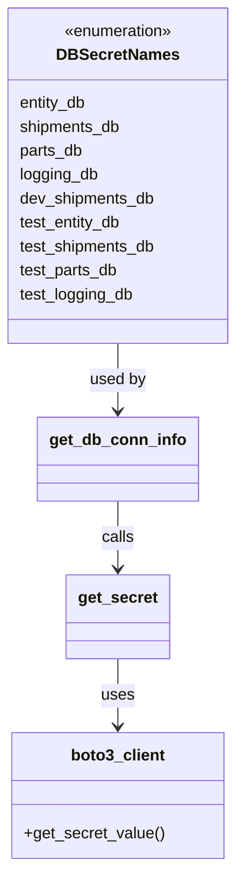
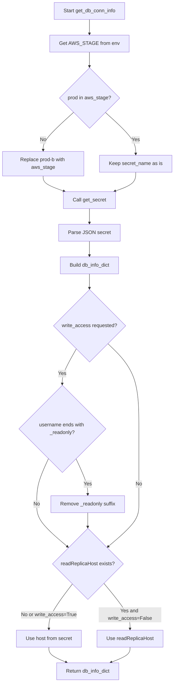
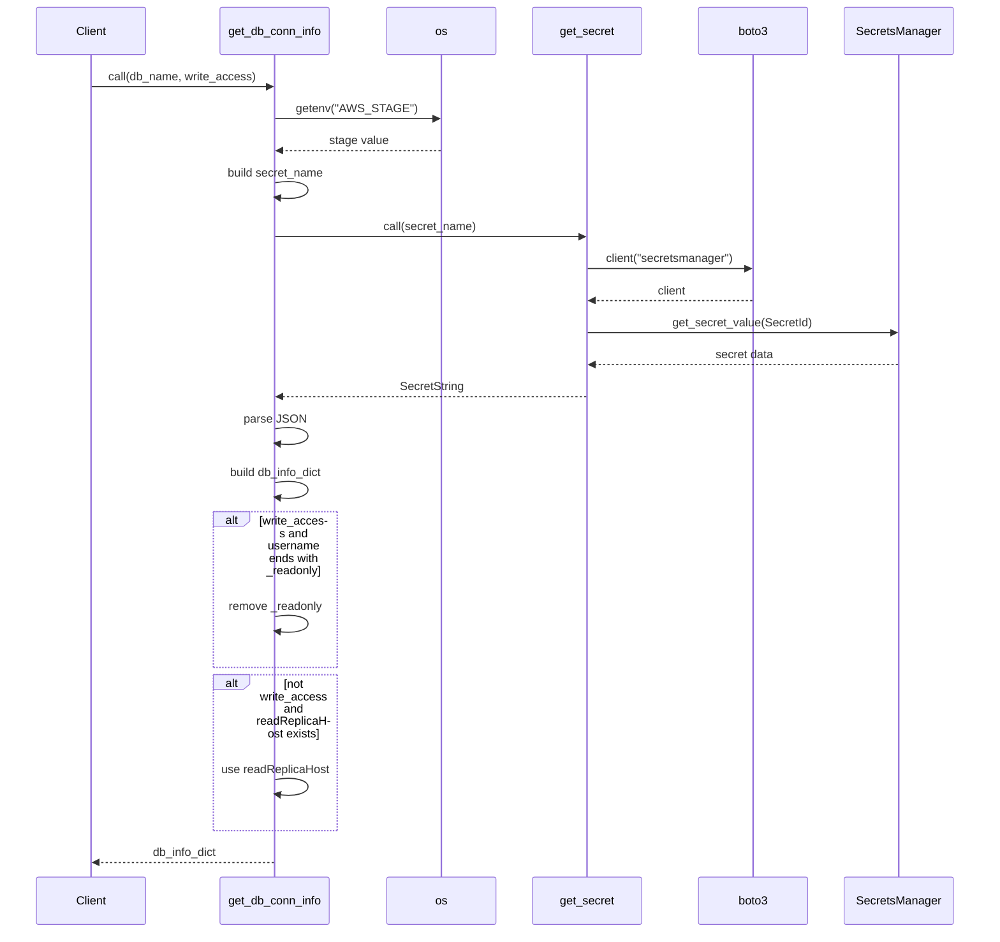

# Diagram: research/common/common_secrets.py

> Auto-generated by Obscura crawlers

## Diagram 1

### SVG

<svg id="container" width="236.515625" xmlns="http://www.w3.org/2000/svg" class="classDiagram" height="868" viewBox="0 0 236.515625 868" role="graphics-document document" aria-roledescription="class"><g><defs><marker id="container_class-aggregationStart" class="marker aggregation class" refX="18" refY="7" markerWidth="190" markerHeight="240" orient="auto"><path d="M 18,7 L9,13 L1,7 L9,1 Z"></path></marker></defs><defs><marker id="container_class-aggregationEnd" class="marker aggregation class" refX="1" refY="7" markerWidth="20" markerHeight="28" orient="auto"><path d="M 18,7 L9,13 L1,7 L9,1 Z"></path></marker></defs><defs><marker id="container_class-extensionStart" class="marker extension class" refX="18" refY="7" markerWidth="190" markerHeight="240" orient="auto"><path d="M 1,7 L18,13 V 1 Z"></path></marker></defs><defs><marker id="container_class-extensionEnd" class="marker extension class" refX="1" refY="7" markerWidth="20" markerHeight="28" orient="auto"><path d="M 1,1 V 13 L18,7 Z"></path></marker></defs><defs><marker id="container_class-compositionStart" class="marker composition class" refX="18" refY="7" markerWidth="190" markerHeight="240" orient="auto"><path d="M 18,7 L9,13 L1,7 L9,1 Z"></path></marker></defs><defs><marker id="container_class-compositionEnd" class="marker composition class" refX="1" refY="7" markerWidth="20" markerHeight="28" orient="auto"><path d="M 18,7 L9,13 L1,7 L9,1 Z"></path></marker></defs><defs><marker id="container_class-dependencyStart" class="marker dependency class" refX="6" refY="7" markerWidth="190" markerHeight="240" orient="auto"><path d="M 5,7 L9,13 L1,7 L9,1 Z"></path></marker></defs><defs><marker id="container_class-dependencyEnd" class="marker dependency class" refX="13" refY="7" markerWidth="20" markerHeight="28" orient="auto"><path d="M 18,7 L9,13 L14,7 L9,1 Z"></path></marker></defs><defs><marker id="container_class-lollipopStart" class="marker lollipop class" refX="13" refY="7" markerWidth="190" markerHeight="240" orient="auto"><circle stroke="black" fill="transparent" cx="7" cy="7" r="6"></circle></marker></defs><defs><marker id="container_class-lollipopEnd" class="marker lollipop class" refX="1" refY="7" markerWidth="190" markerHeight="240" orient="auto"><circle stroke="black" fill="transparent" cx="7" cy="7" r="6"></circle></marker></defs><g class="root"><g class="clusters"></g><g class="edgePaths"><path d="M118.258,344L118.258,350.167C118.258,356.333,118.258,368.667,118.258,380C118.258,391.333,118.258,401.667,118.258,406.833L118.258,412" id="id_DBSecretNames_get_db_conn_info_1" class="edge-thickness-normal edge-pattern-solid relation" style=";;;" data-edge="true" data-et="edge" data-id="id_DBSecretNames_get_db_conn_info_1" data-points="W3sieCI6MTE4LjI1NzgxMjUsInkiOjM0NH0seyJ4IjoxMTguMjU3ODEyNSwieSI6MzgxfSx7IngiOjExOC4yNTc4MTI1LCJ5Ijo0MTh9XQ==" marker-end="url(#container_class-dependencyEnd)"></path><path d="M118.258,660L118.258,666.167C118.258,672.333,118.258,684.667,118.258,696C118.258,707.333,118.258,717.667,118.258,722.833L118.258,728" id="id_get_secret_boto3_client_2" class="edge-thickness-normal edge-pattern-solid relation" style=";;;" data-edge="true" data-et="edge" data-id="id_get_secret_boto3_client_2" data-points="W3sieCI6MTE4LjI1NzgxMjUsInkiOjY2MH0seyJ4IjoxMTguMjU3ODEyNSwieSI6Njk3fSx7IngiOjExOC4yNTc4MTI1LCJ5Ijo3MzR9XQ==" marker-end="url(#container_class-dependencyEnd)"></path><path d="M118.258,502L118.258,508.167C118.258,514.333,118.258,526.667,118.258,538C118.258,549.333,118.258,559.667,118.258,564.833L118.258,570" id="id_get_db_conn_info_get_secret_3" class="edge-thickness-normal edge-pattern-solid relation" style=";;;" data-edge="true" data-et="edge" data-id="id_get_db_conn_info_get_secret_3" data-points="W3sieCI6MTE4LjI1NzgxMjUsInkiOjUwMn0seyJ4IjoxMTguMjU3ODEyNSwieSI6NTM5fSx7IngiOjExOC4yNTc4MTI1LCJ5Ijo1NzZ9XQ==" marker-end="url(#container_class-dependencyEnd)"></path></g><g class="edgeLabels"><g class="edgeLabel" transform="translate(118.2578125, 381)"><g class="label" data-id="id_DBSecretNames_get_db_conn_info_1" transform="translate(-28.3125, -12)"><foreignObject width="56.625" height="24">

used by

</foreignObject></g></g><g class="edgeLabel" transform="translate(118.2578125, 697)"><g class="label" data-id="id_get_secret_boto3_client_2" transform="translate(-16.4921875, -12)"><foreignObject width="32.984375" height="24">

uses

</foreignObject></g></g><g class="edgeLabel" transform="translate(118.2578125, 539)"><g class="label" data-id="id_get_db_conn_info_get_secret_3" transform="translate(-16.4453125, -12)"><foreignObject width="32.890625" height="24">

calls

</foreignObject></g></g></g><g class="nodes"><g class="node default" id="classId-DBSecretNames-0" transform="translate(118.2578125, 176)"><g class="basic label-container"><path d="M-110.2578125 -168 L110.2578125 -168 L110.2578125 168 L-110.2578125 168" stroke="none" stroke-width="0" fill="#ECECFF" style=""></path><path d="M-110.2578125 -168 C-63.71861135893657 -168, -17.17941021787314 -168, 110.2578125 -168 M-110.2578125 -168 C-34.91497551356261 -168, 40.42786147287478 -168, 110.2578125 -168 M110.2578125 -168 C110.2578125 -92.40100809695224, 110.2578125 -16.80201619390448, 110.2578125 168 M110.2578125 -168 C110.2578125 -77.5440815236677, 110.2578125 12.9118369526646, 110.2578125 168 M110.2578125 168 C33.94493881294423 168, -42.36793487411154 168, -110.2578125 168 M110.2578125 168 C52.17389602678538 168, -5.910020446429243 168, -110.2578125 168 M-110.2578125 168 C-110.2578125 48.66679698437068, -110.2578125 -70.66640603125865, -110.2578125 -168 M-110.2578125 168 C-110.2578125 92.14541988345239, -110.2578125 16.29083976690478, -110.2578125 -168" stroke="#9370DB" stroke-width="1.3" fill="none" stroke-dasharray="0 0" style=""></path></g><g class="annotation-group text" transform="translate(-55.5546875, -144)"><g class="label" style="" transform="translate(0,-12)"><foreignObject width="111.109375" height="24">

«enumeration»

</foreignObject></g></g><g class="label-group text" transform="translate(-58.015625, -120)"><g class="label" style="font-weight: bolder" transform="translate(0,-12)"><foreignObject width="116.03125" height="24">

DBSecretNames

</foreignObject></g></g><g class="members-group text" transform="translate(-98.2578125, -72)"><g class="label" style="" transform="translate(0,-12)"><foreignObject width="68.546875" height="24">

entity_db

</foreignObject></g><g class="label" style="" transform="translate(0,12)"><foreignObject width="102.6875" height="24">

shipments_db

</foreignObject></g><g class="label" style="" transform="translate(0,36)"><foreignObject width="64.234375" height="24">

parts_db

</foreignObject></g><g class="label" style="" transform="translate(0,60)"><foreignObject width="79.9375" height="24">

logging_db

</foreignObject></g><g class="label" style="" transform="translate(0,84)"><foreignObject width="136.609375" height="24">

dev_shipments_db

</foreignObject></g><g class="label" style="" transform="translate(0,108)"><foreignObject width="104.0625" height="24">

test_entity_db

</foreignObject></g><g class="label" style="" transform="translate(0,132)"><foreignObject width="138.5" height="24">

test_shipments_db

</foreignObject></g><g class="label" style="" transform="translate(0,156)"><foreignObject width="100.0625" height="24">

test_parts_db

</foreignObject></g><g class="label" style="" transform="translate(0,180)"><foreignObject width="115.609375" height="24">

test_logging_db

</foreignObject></g></g><g class="methods-group text" transform="translate(-98.2578125, 168)"></g><g class="divider" style=""><path d="M-110.2578125 -96 C-36.92103062987414 -96, 36.41575124025172 -96, 110.2578125 -96 M-110.2578125 -96 C-26.36566341334192 -96, 57.52648567331616 -96, 110.2578125 -96" stroke="#9370DB" stroke-width="1.3" fill="none" stroke-dasharray="0 0" style=""></path></g><g class="divider" style=""><path d="M-110.2578125 144 C-25.344291651863742 144, 59.569229196272516 144, 110.2578125 144 M-110.2578125 144 C-36.77835175094842 144, 36.701108998103166 144, 110.2578125 144" stroke="#9370DB" stroke-width="1.3" fill="none" stroke-dasharray="0 0" style=""></path></g></g><g class="node default" id="classId-boto3_client-1" transform="translate(118.2578125, 797)"><g class="basic label-container"><path d="M-104.73828125 -63 L104.73828125 -63 L104.73828125 63 L-104.73828125 63" stroke="none" stroke-width="0" fill="#ECECFF" style=""></path><path d="M-104.73828125 -63 C-49.76155610283699 -63, 5.215169044326018 -63, 104.73828125 -63 M-104.73828125 -63 C-38.40882451687324 -63, 27.920632216253523 -63, 104.73828125 -63 M104.73828125 -63 C104.73828125 -16.09037491744315, 104.73828125 30.8192501651137, 104.73828125 63 M104.73828125 -63 C104.73828125 -21.775666997689804, 104.73828125 19.448666004620392, 104.73828125 63 M104.73828125 63 C46.4815399739031 63, -11.775201302193807 63, -104.73828125 63 M104.73828125 63 C23.044458706766434 63, -58.64936383646713 63, -104.73828125 63 M-104.73828125 63 C-104.73828125 14.894896653120433, -104.73828125 -33.21020669375913, -104.73828125 -63 M-104.73828125 63 C-104.73828125 16.190036990011535, -104.73828125 -30.61992601997693, -104.73828125 -63" stroke="#9370DB" stroke-width="1.3" fill="none" stroke-dasharray="0 0" style=""></path></g><g class="annotation-group text" transform="translate(0, -39)"></g><g class="label-group text" transform="translate(-45.4921875, -39)"><g class="label" style="font-weight: bolder" transform="translate(0,-12)"><foreignObject width="90.984375" height="24">

boto3_client

</foreignObject></g></g><g class="members-group text" transform="translate(-92.73828125, 9)"></g><g class="methods-group text" transform="translate(-92.73828125, 39)"><g class="label" style="" transform="translate(0,-12)"><foreignObject width="139.984375" height="24">

+get_secret_value()

</foreignObject></g></g><g class="divider" style=""><path d="M-104.73828125 -15 C-49.99699784628439 -15, 4.744285557431226 -15, 104.73828125 -15 M-104.73828125 -15 C-33.88758808528587 -15, 36.96310507942826 -15, 104.73828125 -15" stroke="#9370DB" stroke-width="1.3" fill="none" stroke-dasharray="0 0" style=""></path></g><g class="divider" style=""><path d="M-104.73828125 9 C-46.36007921367177 9, 12.018122822656466 9, 104.73828125 9 M-104.73828125 9 C-44.61001623360549 9, 15.518248782789016 9, 104.73828125 9" stroke="#9370DB" stroke-width="1.3" fill="none" stroke-dasharray="0 0" style=""></path></g></g><g class="node default" id="classId-get_db_conn_info-2" transform="translate(118.2578125, 460)"><g class="basic label-container"><path d="M-77.203125 -42 L77.203125 -42 L77.203125 42 L-77.203125 42" stroke="none" stroke-width="0" fill="#ECECFF" style=""></path><path d="M-77.203125 -42 C-42.71755374175911 -42, -8.231982483518223 -42, 77.203125 -42 M-77.203125 -42 C-21.21876659280143 -42, 34.76559181439714 -42, 77.203125 -42 M77.203125 -42 C77.203125 -21.56841278882918, 77.203125 -1.1368255776583567, 77.203125 42 M77.203125 -42 C77.203125 -15.74115358223889, 77.203125 10.517692835522219, 77.203125 42 M77.203125 42 C23.891411526032925 42, -29.42030194793415 42, -77.203125 42 M77.203125 42 C29.74299716105751 42, -17.71713067788498 42, -77.203125 42 M-77.203125 42 C-77.203125 14.345756103941188, -77.203125 -13.308487792117624, -77.203125 -42 M-77.203125 42 C-77.203125 19.84706135762003, -77.203125 -2.305877284759937, -77.203125 -42" stroke="#9370DB" stroke-width="1.3" fill="none" stroke-dasharray="0 0" style=""></path></g><g class="annotation-group text" transform="translate(0, -18)"></g><g class="label-group text" transform="translate(-65.203125, -18)"><g class="label" style="font-weight: bolder" transform="translate(0,-12)"><foreignObject width="130.40625" height="24">

get_db_conn_info

</foreignObject></g></g><g class="members-group text" transform="translate(-65.203125, 30)"></g><g class="methods-group text" transform="translate(-65.203125, 60)"></g><g class="divider" style=""><path d="M-77.203125 6 C-30.8149448717747 6, 15.573235256450602 6, 77.203125 6 M-77.203125 6 C-19.804031861151728 6, 37.595061277696544 6, 77.203125 6" stroke="#9370DB" stroke-width="1.3" fill="none" stroke-dasharray="0 0" style=""></path></g><g class="divider" style=""><path d="M-77.203125 24 C-30.20186283885092 24, 16.799399322298157 24, 77.203125 24 M-77.203125 24 C-43.21470161496229 24, -9.226278229924574 24, 77.203125 24" stroke="#9370DB" stroke-width="1.3" fill="none" stroke-dasharray="0 0" style=""></path></g></g><g class="node default" id="classId-get_secret-3" transform="translate(118.2578125, 618)"><g class="basic label-container"><path d="M-50.484375 -42 L50.484375 -42 L50.484375 42 L-50.484375 42" stroke="none" stroke-width="0" fill="#ECECFF" style=""></path><path d="M-50.484375 -42 C-18.938474177217767 -42, 12.607426645564466 -42, 50.484375 -42 M-50.484375 -42 C-24.47749484072895 -42, 1.5293853185420971 -42, 50.484375 -42 M50.484375 -42 C50.484375 -8.403677884344098, 50.484375 25.192644231311803, 50.484375 42 M50.484375 -42 C50.484375 -9.796291588481225, 50.484375 22.40741682303755, 50.484375 42 M50.484375 42 C29.039207767442434 42, 7.5940405348848685 42, -50.484375 42 M50.484375 42 C16.575289947348196 42, -17.333795105303608 42, -50.484375 42 M-50.484375 42 C-50.484375 9.937501624614981, -50.484375 -22.124996750770038, -50.484375 -42 M-50.484375 42 C-50.484375 17.285793856534532, -50.484375 -7.428412286930936, -50.484375 -42" stroke="#9370DB" stroke-width="1.3" fill="none" stroke-dasharray="0 0" style=""></path></g><g class="annotation-group text" transform="translate(0, -18)"></g><g class="label-group text" transform="translate(-38.484375, -18)"><g class="label" style="font-weight: bolder" transform="translate(0,-12)"><foreignObject width="76.96875" height="24">

get_secret

</foreignObject></g></g><g class="members-group text" transform="translate(-38.484375, 30)"></g><g class="methods-group text" transform="translate(-38.484375, 60)"></g><g class="divider" style=""><path d="M-50.484375 6 C-27.46155973208905 6, -4.4387444641781 6, 50.484375 6 M-50.484375 6 C-18.55771788222305 6, 13.368939235553903 6, 50.484375 6" stroke="#9370DB" stroke-width="1.3" fill="none" stroke-dasharray="0 0" style=""></path></g><g class="divider" style=""><path d="M-50.484375 24 C-13.93612530714772 24, 22.61212438570456 24, 50.484375 24 M-50.484375 24 C-16.53174993243264 24, 17.42087513513472 24, 50.484375 24" stroke="#9370DB" stroke-width="1.3" fill="none" stroke-dasharray="0 0" style=""></path></g></g></g></g></g></svg>

## Diagram 2

### SVG

<svg id="container" width="555.734375" xmlns="http://www.w3.org/2000/svg" class="flowchart" height="2146.8125" viewBox="0 0 555.734375 2146.8125" role="graphics-document document" aria-roledescription="flowchart-v2"><g><marker id="container_flowchart-v2-pointEnd" class="marker flowchart-v2" viewBox="0 0 10 10" refX="5" refY="5" markerUnits="userSpaceOnUse" markerWidth="8" markerHeight="8" orient="auto"><path d="M 0 0 L 10 5 L 0 10 z" class="arrowMarkerPath" style="stroke-width: 1; stroke-dasharray: 1, 0;"></path></marker><marker id="container_flowchart-v2-pointStart" class="marker flowchart-v2" viewBox="0 0 10 10" refX="4.5" refY="5" markerUnits="userSpaceOnUse" markerWidth="8" markerHeight="8" orient="auto"><path d="M 0 5 L 10 10 L 10 0 z" class="arrowMarkerPath" style="stroke-width: 1; stroke-dasharray: 1, 0;"></path></marker><marker id="container_flowchart-v2-circleEnd" class="marker flowchart-v2" viewBox="0 0 10 10" refX="11" refY="5" markerUnits="userSpaceOnUse" markerWidth="11" markerHeight="11" orient="auto"><circle cx="5" cy="5" r="5" class="arrowMarkerPath" style="stroke-width: 1; stroke-dasharray: 1, 0;"></circle></marker><marker id="container_flowchart-v2-circleStart" class="marker flowchart-v2" viewBox="0 0 10 10" refX="-1" refY="5" markerUnits="userSpaceOnUse" markerWidth="11" markerHeight="11" orient="auto"><circle cx="5" cy="5" r="5" class="arrowMarkerPath" style="stroke-width: 1; stroke-dasharray: 1, 0;"></circle></marker><marker id="container_flowchart-v2-crossEnd" class="marker cross flowchart-v2" viewBox="0 0 11 11" refX="12" refY="5.2" markerUnits="userSpaceOnUse" markerWidth="11" markerHeight="11" orient="auto"><path d="M 1,1 l 9,9 M 10,1 l -9,9" class="arrowMarkerPath" style="stroke-width: 2; stroke-dasharray: 1, 0;"></path></marker><marker id="container_flowchart-v2-crossStart" class="marker cross flowchart-v2" viewBox="0 0 11 11" refX="-1" refY="5.2" markerUnits="userSpaceOnUse" markerWidth="11" markerHeight="11" orient="auto"><path d="M 1,1 l 9,9 M 10,1 l -9,9" class="arrowMarkerPath" style="stroke-width: 2; stroke-dasharray: 1, 0;"></path></marker><g class="root"><g class="clusters"></g><g class="edgePaths"><path d="M285.434,62L285.434,66.167C285.434,70.333,285.434,78.667,285.434,86.333C285.434,94,285.434,101,285.434,104.5L285.434,108" id="L_A_B_0" class="edge-thickness-normal edge-pattern-solid edge-thickness-normal edge-pattern-solid flowchart-link" style=";" data-edge="true" data-et="edge" data-id="L_A_B_0" data-points="W3sieCI6Mjg1LjQzMzU5Mzc1LCJ5Ijo2Mn0seyJ4IjoyODUuNDMzNTkzNzUsInkiOjg3fSx7IngiOjI4NS40MzM1OTM3NSwieSI6MTEyfV0=" marker-end="url(#container_flowchart-v2-pointEnd)"></path><path d="M285.434,166L285.434,170.167C285.434,174.333,285.434,182.667,285.434,190.333C285.434,198,285.434,205,285.434,208.5L285.434,212" id="L_B_C_0" class="edge-thickness-normal edge-pattern-solid edge-thickness-normal edge-pattern-solid flowchart-link" style=";" data-edge="true" data-et="edge" data-id="L_B_C_0" data-points="W3sieCI6Mjg1LjQzMzU5Mzc1LCJ5IjoxNjZ9LHsieCI6Mjg1LjQzMzU5Mzc1LCJ5IjoxOTF9LHsieCI6Mjg1LjQzMzU5Mzc1LCJ5IjoyMTZ9XQ==" marker-end="url(#container_flowchart-v2-pointEnd)"></path><path d="M235.098,356.883L218.915,371.439C202.732,385.995,170.366,415.107,154.183,435.163C138,455.219,138,466.219,138,471.719L138,477.219" id="L_C_D_0" class="edge-thickness-normal edge-pattern-solid edge-thickness-normal edge-pattern-solid flowchart-link" style=";" data-edge="true" data-et="edge" data-id="L_C_D_0" data-points="W3sieCI6MjM1LjA5ODM0MDUwMTY4NDMsInkiOjM1Ni44ODM0OTY3NTE2ODQzM30seyJ4IjoxMzgsInkiOjQ0NC4yMTg3NX0seyJ4IjoxMzgsInkiOjQ4MS4yMTg3NX1d" marker-end="url(#container_flowchart-v2-pointEnd)"></path><path d="M335.769,356.883L351.952,371.439C368.135,385.995,400.501,415.107,416.684,437.163C432.867,459.219,432.867,474.219,432.867,481.719L432.867,489.219" id="L_C_E_0" class="edge-thickness-normal edge-pattern-solid edge-thickness-normal edge-pattern-solid flowchart-link" style=";" data-edge="true" data-et="edge" data-id="L_C_E_0" data-points="W3sieCI6MzM1Ljc2ODg0Njk5ODMxNTY3LCJ5IjozNTYuODgzNDk2NzUxNjg0MzN9LHsieCI6NDMyLjg2NzE4NzUsInkiOjQ0NC4yMTg3NX0seyJ4Ijo0MzIuODY3MTg3NSwieSI6NDkzLjIxODc1fV0=" marker-end="url(#container_flowchart-v2-pointEnd)"></path><path d="M138,559.219L138,563.385C138,567.552,138,575.885,149.185,583.997C160.37,592.109,182.74,599.998,193.924,603.943L205.109,607.888" id="L_D_F_0" class="edge-thickness-normal edge-pattern-solid edge-thickness-normal edge-pattern-solid flowchart-link" style=";" data-edge="true" data-et="edge" data-id="L_D_F_0" data-points="W3sieCI6MTM4LCJ5Ijo1NTkuMjE4NzV9LHsieCI6MTM4LCJ5Ijo1ODQuMjE4NzV9LHsieCI6MjA4Ljg4MTUzNTQ1NjczMDc3LCJ5Ijo2MDkuMjE4NzV9XQ==" marker-end="url(#container_flowchart-v2-pointEnd)"></path><path d="M432.867,547.219L432.867,553.385C432.867,559.552,432.867,571.885,421.682,581.997C410.497,592.109,388.128,599.998,376.943,603.943L365.758,607.888" id="L_E_F_0" class="edge-thickness-normal edge-pattern-solid edge-thickness-normal edge-pattern-solid flowchart-link" style=";" data-edge="true" data-et="edge" data-id="L_E_F_0" data-points="W3sieCI6NDMyLjg2NzE4NzUsInkiOjU0Ny4yMTg3NX0seyJ4Ijo0MzIuODY3MTg3NSwieSI6NTg0LjIxODc1fSx7IngiOjM2MS45ODU2NTIwNDMyNjkyLCJ5Ijo2MDkuMjE4NzV9XQ==" marker-end="url(#container_flowchart-v2-pointEnd)"></path><path d="M285.434,663.219L285.434,667.385C285.434,671.552,285.434,679.885,285.434,687.552C285.434,695.219,285.434,702.219,285.434,705.719L285.434,709.219" id="L_F_G_0" class="edge-thickness-normal edge-pattern-solid edge-thickness-normal edge-pattern-solid flowchart-link" style=";" data-edge="true" data-et="edge" data-id="L_F_G_0" data-points="W3sieCI6Mjg1LjQzMzU5Mzc1LCJ5Ijo2NjMuMjE4NzV9LHsieCI6Mjg1LjQzMzU5Mzc1LCJ5Ijo2ODguMjE4NzV9LHsieCI6Mjg1LjQzMzU5Mzc1LCJ5Ijo3MTMuMjE4NzV9XQ==" marker-end="url(#container_flowchart-v2-pointEnd)"></path><path d="M285.434,767.219L285.434,771.385C285.434,775.552,285.434,783.885,285.434,791.552C285.434,799.219,285.434,806.219,285.434,809.719L285.434,813.219" id="L_G_H_0" class="edge-thickness-normal edge-pattern-solid edge-thickness-normal edge-pattern-solid flowchart-link" style=";" data-edge="true" data-et="edge" data-id="L_G_H_0" data-points="W3sieCI6Mjg1LjQzMzU5Mzc1LCJ5Ijo3NjcuMjE4NzV9LHsieCI6Mjg1LjQzMzU5Mzc1LCJ5Ijo3OTIuMjE4NzV9LHsieCI6Mjg1LjQzMzU5Mzc1LCJ5Ijo4MTcuMjE4NzV9XQ==" marker-end="url(#container_flowchart-v2-pointEnd)"></path><path d="M285.434,871.219L285.434,875.385C285.434,879.552,285.434,887.885,285.434,895.552C285.434,903.219,285.434,910.219,285.434,913.719L285.434,917.219" id="L_H_I_0" class="edge-thickness-normal edge-pattern-solid edge-thickness-normal edge-pattern-solid flowchart-link" style=";" data-edge="true" data-et="edge" data-id="L_H_I_0" data-points="W3sieCI6Mjg1LjQzMzU5Mzc1LCJ5Ijo4NzEuMjE4NzV9LHsieCI6Mjg1LjQzMzU5Mzc1LCJ5Ijo4OTYuMjE4NzV9LHsieCI6Mjg1LjQzMzU5Mzc1LCJ5Ijo5MjEuMjE4NzV9XQ==" marker-end="url(#container_flowchart-v2-pointEnd)"></path><path d="M243.585,1109.229L236.06,1122.371C228.534,1135.512,213.484,1161.795,205.959,1180.437C198.434,1199.078,198.434,1210.078,198.434,1215.578L198.434,1221.078" id="L_I_J_0" class="edge-thickness-normal edge-pattern-solid edge-thickness-normal edge-pattern-solid flowchart-link" style=";" data-edge="true" data-et="edge" data-id="L_I_J_0" data-points="W3sieCI6MjQzLjU4NDk1MjM0NzkxMzg4LCJ5IjoxMTA5LjIyOTQ4MzU5NzkxNH0seyJ4IjoxOTguNDMzNTkzNzUsInkiOjExODguMDc4MTI1fSx7IngiOjE5OC40MzM1OTM3NSwieSI6MTIyNS4wNzgxMjV9XQ==" marker-end="url(#container_flowchart-v2-pointEnd)"></path><path d="M242.567,1458.944L248.858,1472.467C255.149,1485.989,267.731,1513.034,274.022,1532.056C280.313,1551.078,280.313,1562.078,280.313,1567.578L280.313,1573.078" id="L_J_K_0" class="edge-thickness-normal edge-pattern-solid edge-thickness-normal edge-pattern-solid flowchart-link" style=";" data-edge="true" data-et="edge" data-id="L_J_K_0" data-points="W3sieCI6MjQyLjU2NzM2MjMyNDc2MTA0LCJ5IjoxNDU4Ljk0NDM1NjQyNTIzOX0seyJ4IjoyODAuMzEyNSwieSI6MTU0MC4wNzgxMjV9LHsieCI6MjgwLjMxMjUsInkiOjE1NzcuMDc4MTI1fV0=" marker-end="url(#container_flowchart-v2-pointEnd)"></path><path d="M154.3,1458.944L148.009,1472.467C141.718,1485.989,129.136,1513.034,122.846,1537.222C116.555,1561.411,116.555,1582.745,116.555,1602.078C116.555,1621.411,116.555,1638.745,133.125,1661.362C149.695,1683.979,182.835,1711.879,199.405,1725.829L215.975,1739.78" id="L_J_L_0" class="edge-thickness-normal edge-pattern-solid edge-thickness-normal edge-pattern-solid flowchart-link" style=";" data-edge="true" data-et="edge" data-id="L_J_L_0" data-points="W3sieCI6MTU0LjI5OTgyNTE3NTIzODk2LCJ5IjoxNDU4Ljk0NDM1NjQyNTIzOX0seyJ4IjoxMTYuNTU0Njg3NSwieSI6MTU0MC4wNzgxMjV9LHsieCI6MTE2LjU1NDY4NzUsInkiOjE2MDQuMDc4MTI1fSx7IngiOjExNi41NTQ2ODc1LCJ5IjoxNjU2LjA3ODEyNX0seyJ4IjoyMTkuMDM0ODA4NDAyNzI3NCwieSI6MTc0Mi4zNTU4MTY1OTcyNzI3fV0=" marker-end="url(#container_flowchart-v2-pointEnd)"></path><path d="M280.313,1631.078L280.313,1635.245C280.313,1639.411,280.313,1647.745,280.313,1655.411C280.313,1663.078,280.313,1670.078,280.313,1673.578L280.313,1677.078" id="L_K_L_0" class="edge-thickness-normal edge-pattern-solid edge-thickness-normal edge-pattern-solid flowchart-link" style=";" data-edge="true" data-et="edge" data-id="L_K_L_0" data-points="W3sieCI6MjgwLjMxMjUsInkiOjE2MzEuMDc4MTI1fSx7IngiOjI4MC4zMTI1LCJ5IjoxNjU2LjA3ODEyNX0seyJ4IjoyODAuMzEyNSwieSI6MTY4MS4wNzgxMjV9XQ==" marker-end="url(#container_flowchart-v2-pointEnd)"></path><path d="M344.149,1092.363L360.811,1108.316C377.473,1124.268,410.797,1156.173,427.459,1201.459C444.121,1246.745,444.121,1305.411,444.121,1364.078C444.121,1422.745,444.121,1481.411,444.121,1521.411C444.121,1561.411,444.121,1582.745,444.121,1602.078C444.121,1621.411,444.121,1638.745,427.544,1661.363C410.967,1683.982,377.813,1711.885,361.236,1725.837L344.659,1739.789" id="L_I_L_0" class="edge-thickness-normal edge-pattern-solid edge-thickness-normal edge-pattern-solid flowchart-link" style=";" data-edge="true" data-et="edge" data-id="L_I_L_0" data-points="W3sieCI6MzQ0LjE0ODY0NzI1OTg5NzEzLCJ5IjoxMDkyLjM2MzA3MTQ5MDEwMjh9LHsieCI6NDQ0LjEyMTA5Mzc1LCJ5IjoxMTg4LjA3ODEyNX0seyJ4Ijo0NDQuMTIxMDkzNzUsInkiOjEzNjQuMDc4MTI1fSx7IngiOjQ0NC4xMjEwOTM3NSwieSI6MTU0MC4wNzgxMjV9LHsieCI6NDQ0LjEyMTA5Mzc1LCJ5IjoxNjA0LjA3ODEyNX0seyJ4Ijo0NDQuMTIxMDkzNzUsInkiOjE2NTYuMDc4MTI1fSx7IngiOjM0MS41OTg4NzU2ODU0NjE0LCJ5IjoxNzQyLjM2NDUwMDY4NTQ2MTV9XQ==" marker-end="url(#container_flowchart-v2-pointEnd)"></path><path d="M229.036,1855.536L216.787,1870.249C204.538,1884.962,180.041,1914.387,167.792,1934.6C155.543,1954.813,155.543,1965.813,155.543,1971.313L155.543,1976.813" id="L_L_M_0" class="edge-thickness-normal edge-pattern-solid edge-thickness-normal edge-pattern-solid flowchart-link" style=";" data-edge="true" data-et="edge" data-id="L_L_M_0" data-points="W3sieCI6MjI5LjAzNjA4NjA0NDk1Mjg0LCJ5IjoxODU1LjUzNjA4NjA0NDk1Mjh9LHsieCI6MTU1LjU0Mjk2ODc1LCJ5IjoxOTQzLjgxMjV9LHsieCI6MTU1LjU0Mjk2ODc1LCJ5IjoxOTgwLjgxMjV9XQ==" marker-end="url(#container_flowchart-v2-pointEnd)"></path><path d="M333.803,1853.322L347.39,1868.404C360.977,1883.485,388.151,1913.649,401.737,1934.231C415.324,1954.813,415.324,1965.813,415.324,1971.313L415.324,1976.813" id="L_L_N_0" class="edge-thickness-normal edge-pattern-solid edge-thickness-normal edge-pattern-solid flowchart-link" style=";" data-edge="true" data-et="edge" data-id="L_L_N_0" data-points="W3sieCI6MzMzLjgwMzI3MzIzOTIxMjEsInkiOjE4NTMuMzIxNzI2NzYwNzg4fSx7IngiOjQxNS4zMjQyMTg3NSwieSI6MTk0My44MTI1fSx7IngiOjQxNS4zMjQyMTg3NSwieSI6MTk4MC44MTI1fV0=" marker-end="url(#container_flowchart-v2-pointEnd)"></path><path d="M155.543,2034.813L155.543,2038.979C155.543,2043.146,155.543,2051.479,164.925,2059.556C174.307,2067.633,193.072,2075.453,202.454,2079.364L211.836,2083.274" id="L_M_O_0" class="edge-thickness-normal edge-pattern-solid edge-thickness-normal edge-pattern-solid flowchart-link" style=";" data-edge="true" data-et="edge" data-id="L_M_O_0" data-points="W3sieCI6MTU1LjU0Mjk2ODc1LCJ5IjoyMDM0LjgxMjV9LHsieCI6MTU1LjU0Mjk2ODc1LCJ5IjoyMDU5LjgxMjV9LHsieCI6MjE1LjUyODMyMDMxMjUsInkiOjIwODQuODEyNX1d" marker-end="url(#container_flowchart-v2-pointEnd)"></path><path d="M415.324,2034.813L415.324,2038.979C415.324,2043.146,415.324,2051.479,405.128,2059.573C394.932,2067.667,374.54,2075.521,364.344,2079.448L354.147,2083.375" id="L_N_O_0" class="edge-thickness-normal edge-pattern-solid edge-thickness-normal edge-pattern-solid flowchart-link" style=";" data-edge="true" data-et="edge" data-id="L_N_O_0" data-points="W3sieCI6NDE1LjMyNDIxODc1LCJ5IjoyMDM0LjgxMjV9LHsieCI6NDE1LjMyNDIxODc1LCJ5IjoyMDU5LjgxMjV9LHsieCI6MzUwLjQxNDczODU4MTczMDgsInkiOjIwODQuODEyNX1d" marker-end="url(#container_flowchart-v2-pointEnd)"></path></g><g class="edgeLabels"><g class="edgeLabel"><g class="label" data-id="L_A_B_0" transform="translate(0, 0)"><foreignObject width="0" height="0">

</foreignObject></g></g><g class="edgeLabel"><g class="label" data-id="L_B_C_0" transform="translate(0, 0)"><foreignObject width="0" height="0">

</foreignObject></g></g><g class="edgeLabel" transform="translate(138, 444.21875)"><g class="label" data-id="L_C_D_0" transform="translate(-10.140625, -12)"><foreignObject width="20.28125" height="24">

No

</foreignObject></g></g><g class="edgeLabel" transform="translate(432.8671875, 444.21875)"><g class="label" data-id="L_C_E_0" transform="translate(-12.03125, -12)"><foreignObject width="24.0625" height="24">

Yes

</foreignObject></g></g><g class="edgeLabel"><g class="label" data-id="L_D_F_0" transform="translate(0, 0)"><foreignObject width="0" height="0">

</foreignObject></g></g><g class="edgeLabel"><g class="label" data-id="L_E_F_0" transform="translate(0, 0)"><foreignObject width="0" height="0">

</foreignObject></g></g><g class="edgeLabel"><g class="label" data-id="L_F_G_0" transform="translate(0, 0)"><foreignObject width="0" height="0">

</foreignObject></g></g><g class="edgeLabel"><g class="label" data-id="L_G_H_0" transform="translate(0, 0)"><foreignObject width="0" height="0">

</foreignObject></g></g><g class="edgeLabel"><g class="label" data-id="L_H_I_0" transform="translate(0, 0)"><foreignObject width="0" height="0">

</foreignObject></g></g><g class="edgeLabel" transform="translate(198.43359375, 1188.078125)"><g class="label" data-id="L_I_J_0" transform="translate(-12.03125, -12)"><foreignObject width="24.0625" height="24">

Yes

</foreignObject></g></g><g class="edgeLabel" transform="translate(280.3125, 1540.078125)"><g class="label" data-id="L_J_K_0" transform="translate(-12.03125, -12)"><foreignObject width="24.0625" height="24">

Yes

</foreignObject></g></g><g class="edgeLabel" transform="translate(116.5546875, 1604.078125)"><g class="label" data-id="L_J_L_0" transform="translate(-10.140625, -12)"><foreignObject width="20.28125" height="24">

No

</foreignObject></g></g><g class="edgeLabel"><g class="label" data-id="L_K_L_0" transform="translate(0, 0)"><foreignObject width="0" height="0">

</foreignObject></g></g><g class="edgeLabel" transform="translate(444.12109375, 1540.078125)"><g class="label" data-id="L_I_L_0" transform="translate(-10.140625, -12)"><foreignObject width="20.28125" height="24">

No

</foreignObject></g></g><g class="edgeLabel" transform="translate(155.54296875, 1943.8125)"><g class="label" data-id="L_L_M_0" transform="translate(-87.6171875, -12)"><foreignObject width="175.234375" height="24">

No or write_access=True

</foreignObject></g></g><g class="edgeLabel" transform="translate(415.32421875, 1943.8125)"><g class="label" data-id="L_L_N_0" transform="translate(-97.734375, -12)"><foreignObject width="195.46875" height="24">

Yes and write_access=False

</foreignObject></g></g><g class="edgeLabel"><g class="label" data-id="L_M_O_0" transform="translate(0, 0)"><foreignObject width="0" height="0">

</foreignObject></g></g><g class="edgeLabel"><g class="label" data-id="L_N_O_0" transform="translate(0, 0)"><foreignObject width="0" height="0">

</foreignObject></g></g></g><g class="nodes"><g class="node default" id="flowchart-A-0" transform="translate(285.43359375, 35)"><rect class="basic label-container" style="" x="-114.390625" y="-27" width="228.78125" height="54"></rect><g class="label" style="" transform="translate(-84.390625, -12)"><rect></rect><foreignObject width="168.78125" height="24">

Start get_db_conn_info

</foreignObject></g></g><g class="node default" id="flowchart-B-1" transform="translate(285.43359375, 139)"><rect class="basic label-container" style="" x="-119.625" y="-27" width="239.25" height="54"></rect><g class="label" style="" transform="translate(-89.625, -12)"><rect></rect><foreignObject width="179.25" height="24">

Get AWS_STAGE from env

</foreignObject></g></g><g class="node default" id="flowchart-C-3" transform="translate(285.43359375, 311.609375)"><polygon points="95.609375,0 191.21875,-95.609375 95.609375,-191.21875 0,-95.609375" class="label-container" transform="translate(-95.109375, 95.609375)"></polygon><g class="label" style="" transform="translate(-68.609375, -12)"><rect></rect><foreignObject width="137.21875" height="24">

prod in aws_stage?

</foreignObject></g></g><g class="node default" id="flowchart-D-5" transform="translate(138, 520.21875)"><rect class="basic label-container" style="" x="-130" y="-39" width="260" height="78"></rect><g class="label" style="" transform="translate(-100, -24)"><rect></rect><foreignObject width="200" height="48">

Replace prod-b with aws_stage

</foreignObject></g></g><g class="node default" id="flowchart-E-7" transform="translate(432.8671875, 520.21875)"><rect class="basic label-container" style="" x="-114.8671875" y="-27" width="229.734375" height="54"></rect><g class="label" style="" transform="translate(-84.8671875, -12)"><rect></rect><foreignObject width="169.734375" height="24">

Keep secret_name as is

</foreignObject></g></g><g class="node default" id="flowchart-F-9" transform="translate(285.43359375, 636.21875)"><rect class="basic label-container" style="" x="-82.9375" y="-27" width="165.875" height="54"></rect><g class="label" style="" transform="translate(-52.9375, -12)"><rect></rect><foreignObject width="105.875" height="24">

Call get_secret

</foreignObject></g></g><g class="node default" id="flowchart-G-13" transform="translate(285.43359375, 740.21875)"><rect class="basic label-container" style="" x="-93.6875" y="-27" width="187.375" height="54"></rect><g class="label" style="" transform="translate(-63.6875, -12)"><rect></rect><foreignObject width="127.375" height="24">

Parse JSON secret

</foreignObject></g></g><g class="node default" id="flowchart-H-15" transform="translate(285.43359375, 844.21875)"><rect class="basic label-container" style="" x="-96.3359375" y="-27" width="192.671875" height="54"></rect><g class="label" style="" transform="translate(-66.3359375, -12)"><rect></rect><foreignObject width="132.671875" height="24">

Build db_info_dict

</foreignObject></g></g><g class="node default" id="flowchart-I-17" transform="translate(285.43359375, 1036.1484375)"><polygon points="114.9296875,0 229.859375,-114.9296875 114.9296875,-229.859375 0,-114.9296875" class="label-container" transform="translate(-114.4296875, 114.9296875)"></polygon><g class="label" style="" transform="translate(-87.9296875, -12)"><rect></rect><foreignObject width="175.859375" height="24">

write_access requested?

</foreignObject></g></g><g class="node default" id="flowchart-J-19" transform="translate(198.43359375, 1364.078125)"><polygon points="139,0 278,-139 139,-278 0,-139" class="label-container" transform="translate(-138.5, 139)"></polygon><g class="label" style="" transform="translate(-100, -24)"><rect></rect><foreignObject width="200" height="48">

username ends with _readonly?

</foreignObject></g></g><g class="node default" id="flowchart-K-21" transform="translate(280.3125, 1604.078125)"><rect class="basic label-container" style="" x="-118.6171875" y="-27" width="237.234375" height="54"></rect><g class="label" style="" transform="translate(-88.6171875, -12)"><rect></rect><foreignObject width="177.234375" height="24">

Remove _readonly suffix

</foreignObject></g></g><g class="node default" id="flowchart-L-23" transform="translate(280.3125, 1793.9453125)"><polygon points="112.8671875,0 225.734375,-112.8671875 112.8671875,-225.734375 0,-112.8671875" class="label-container" transform="translate(-112.3671875, 112.8671875)"></polygon><g class="label" style="" transform="translate(-85.8671875, -12)"><rect></rect><foreignObject width="171.734375" height="24">

readReplicaHost exists?

</foreignObject></g></g><g class="node default" id="flowchart-M-29" transform="translate(155.54296875, 2007.8125)"><rect class="basic label-container" style="" x="-104.7734375" y="-27" width="209.546875" height="54"></rect><g class="label" style="" transform="translate(-74.7734375, -12)"><rect></rect><foreignObject width="149.546875" height="24">

Use host from secret

</foreignObject></g></g><g class="node default" id="flowchart-N-31" transform="translate(415.32421875, 2007.8125)"><rect class="basic label-container" style="" x="-105.0078125" y="-27" width="210.015625" height="54"></rect><g class="label" style="" transform="translate(-75.0078125, -12)"><rect></rect><foreignObject width="150.015625" height="24">

Use readReplicaHost

</foreignObject></g></g><g class="node default" id="flowchart-O-33" transform="translate(280.3125, 2111.8125)"><rect class="basic label-container" style="" x="-101.8671875" y="-27" width="203.734375" height="54"></rect><g class="label" style="" transform="translate(-71.8671875, -12)"><rect></rect><foreignObject width="143.734375" height="24">

Return db_info_dict

</foreignObject></g></g></g></g></g></svg>

## Diagram 3

### SVG

<svg id="container" width="1394" xmlns="http://www.w3.org/2000/svg" height="1361" viewBox="-50 -10 1394 1361" role="graphics-document document" aria-roledescription="sequence"><g><rect x="1144" y="1275" fill="#eaeaea" stroke="#666" width="150" height="65" name="SecretsManager" rx="3" ry="3" class="actor actor-bottom"></rect><text x="1219" y="1307.5" dominant-baseline="central" alignment-baseline="central" class="actor actor-box" style="text-anchor: middle; font-size: 16px; font-weight: 400;"><tspan x="1219" dy="0">SecretsManager</tspan></text></g><g><rect x="944" y="1275" fill="#eaeaea" stroke="#666" width="150" height="65" name="boto3" rx="3" ry="3" class="actor actor-bottom"></rect><text x="1019" y="1307.5" dominant-baseline="central" alignment-baseline="central" class="actor actor-box" style="text-anchor: middle; font-size: 16px; font-weight: 400;"><tspan x="1019" dy="0">boto3</tspan></text></g><g><rect x="695" y="1275" fill="#eaeaea" stroke="#666" width="150" height="65" name="get_secret" rx="3" ry="3" class="actor actor-bottom"></rect><text x="770" y="1307.5" dominant-baseline="central" alignment-baseline="central" class="actor actor-box" style="text-anchor: middle; font-size: 16px; font-weight: 400;"><tspan x="770" dy="0">get_secret</tspan></text></g><g><rect x="495" y="1275" fill="#eaeaea" stroke="#666" width="150" height="65" name="os" rx="3" ry="3" class="actor actor-bottom"></rect><text x="570" y="1307.5" dominant-baseline="central" alignment-baseline="central" class="actor actor-box" style="text-anchor: middle; font-size: 16px; font-weight: 400;"><tspan x="570" dy="0">os</tspan></text></g><g><rect x="272" y="1275" fill="#eaeaea" stroke="#666" width="150" height="65" name="get_db_conn_info" rx="3" ry="3" class="actor actor-bottom"></rect><text x="347" y="1307.5" dominant-baseline="central" alignment-baseline="central" class="actor actor-box" style="text-anchor: middle; font-size: 16px; font-weight: 400;"><tspan x="347" dy="0">get_db_conn_info</tspan></text></g><g><rect x="0" y="1275" fill="#eaeaea" stroke="#666" width="150" height="65" name="Client" rx="3" ry="3" class="actor actor-bottom"></rect><text x="75" y="1307.5" dominant-baseline="central" alignment-baseline="central" class="actor actor-box" style="text-anchor: middle; font-size: 16px; font-weight: 400;"><tspan x="75" dy="0">Client</tspan></text></g><g><line id="actor5" x1="1219" y1="65" x2="1219" y2="1275" class="actor-line 200" stroke-width="0.5px" stroke="#999" name="SecretsManager"></line><g id="root-5"><rect x="1144" y="0" fill="#eaeaea" stroke="#666" width="150" height="65" name="SecretsManager" rx="3" ry="3" class="actor actor-top"></rect><text x="1219" y="32.5" dominant-baseline="central" alignment-baseline="central" class="actor actor-box" style="text-anchor: middle; font-size: 16px; font-weight: 400;"><tspan x="1219" dy="0">SecretsManager</tspan></text></g></g><g><line id="actor4" x1="1019" y1="65" x2="1019" y2="1275" class="actor-line 200" stroke-width="0.5px" stroke="#999" name="boto3"></line><g id="root-4"><rect x="944" y="0" fill="#eaeaea" stroke="#666" width="150" height="65" name="boto3" rx="3" ry="3" class="actor actor-top"></rect><text x="1019" y="32.5" dominant-baseline="central" alignment-baseline="central" class="actor actor-box" style="text-anchor: middle; font-size: 16px; font-weight: 400;"><tspan x="1019" dy="0">boto3</tspan></text></g></g><g><line id="actor3" x1="770" y1="65" x2="770" y2="1275" class="actor-line 200" stroke-width="0.5px" stroke="#999" name="get_secret"></line><g id="root-3"><rect x="695" y="0" fill="#eaeaea" stroke="#666" width="150" height="65" name="get_secret" rx="3" ry="3" class="actor actor-top"></rect><text x="770" y="32.5" dominant-baseline="central" alignment-baseline="central" class="actor actor-box" style="text-anchor: middle; font-size: 16px; font-weight: 400;"><tspan x="770" dy="0">get_secret</tspan></text></g></g><g><line id="actor2" x1="570" y1="65" x2="570" y2="1275" class="actor-line 200" stroke-width="0.5px" stroke="#999" name="os"></line><g id="root-2"><rect x="495" y="0" fill="#eaeaea" stroke="#666" width="150" height="65" name="os" rx="3" ry="3" class="actor actor-top"></rect><text x="570" y="32.5" dominant-baseline="central" alignment-baseline="central" class="actor actor-box" style="text-anchor: middle; font-size: 16px; font-weight: 400;"><tspan x="570" dy="0">os</tspan></text></g></g><g><line id="actor1" x1="347" y1="65" x2="347" y2="1275" class="actor-line 200" stroke-width="0.5px" stroke="#999" name="get_db_conn_info"></line><g id="root-1"><rect x="272" y="0" fill="#eaeaea" stroke="#666" width="150" height="65" name="get_db_conn_info" rx="3" ry="3" class="actor actor-top"></rect><text x="347" y="32.5" dominant-baseline="central" alignment-baseline="central" class="actor actor-box" style="text-anchor: middle; font-size: 16px; font-weight: 400;"><tspan x="347" dy="0">get_db_conn_info</tspan></text></g></g><g><line id="actor0" x1="75" y1="65" x2="75" y2="1275" class="actor-line 200" stroke-width="0.5px" stroke="#999" name="Client"></line><g id="root-0"><rect x="0" y="0" fill="#eaeaea" stroke="#666" width="150" height="65" name="Client" rx="3" ry="3" class="actor actor-top"></rect><text x="75" y="32.5" dominant-baseline="central" alignment-baseline="central" class="actor actor-box" style="text-anchor: middle; font-size: 16px; font-weight: 400;"><tspan x="75" dy="0">Client</tspan></text></g></g><g></g><defs><symbol id="computer" width="24" height="24"><path transform="scale(.5)" d="M2 2v13h20v-13h-20zm18 11h-16v-9h16v9zm-10.228 6l.466-1h3.524l.467 1h-4.457zm14.228 3h-24l2-6h2.104l-1.33 4h18.45l-1.297-4h2.073l2 6zm-5-10h-14v-7h14v7z"></path></symbol></defs><defs><symbol id="database" fill-rule="evenodd" clip-rule="evenodd"><path transform="scale(.5)" d="M12.258.001l.256.004.255.005.253.008.251.01.249.012.247.015.246.016.242.019.241.02.239.023.236.024.233.027.231.028.229.031.225.032.223.034.22.036.217.038.214.04.211.041.208.043.205.045.201.046.198.048.194.05.191.051.187.053.183.054.18.056.175.057.172.059.168.06.163.061.16.063.155.064.15.066.074.033.073.033.071.034.07.034.069.035.068.035.067.035.066.035.064.036.064.036.062.036.06.036.06.037.058.037.058.037.055.038.055.038.053.038.052.038.051.039.05.039.048.039.047.039.045.04.044.04.043.04.041.04.04.041.039.041.037.041.036.041.034.041.033.042.032.042.03.042.029.042.027.042.026.043.024.043.023.043.021.043.02.043.018.044.017.043.015.044.013.044.012.044.011.045.009.044.007.045.006.045.004.045.002.045.001.045v17l-.001.045-.002.045-.004.045-.006.045-.007.045-.009.044-.011.045-.012.044-.013.044-.015.044-.017.043-.018.044-.02.043-.021.043-.023.043-.024.043-.026.043-.027.042-.029.042-.03.042-.032.042-.033.042-.034.041-.036.041-.037.041-.039.041-.04.041-.041.04-.043.04-.044.04-.045.04-.047.039-.048.039-.05.039-.051.039-.052.038-.053.038-.055.038-.055.038-.058.037-.058.037-.06.037-.06.036-.062.036-.064.036-.064.036-.066.035-.067.035-.068.035-.069.035-.07.034-.071.034-.073.033-.074.033-.15.066-.155.064-.16.063-.163.061-.168.06-.172.059-.175.057-.18.056-.183.054-.187.053-.191.051-.194.05-.198.048-.201.046-.205.045-.208.043-.211.041-.214.04-.217.038-.22.036-.223.034-.225.032-.229.031-.231.028-.233.027-.236.024-.239.023-.241.02-.242.019-.246.016-.247.015-.249.012-.251.01-.253.008-.255.005-.256.004-.258.001-.258-.001-.256-.004-.255-.005-.253-.008-.251-.01-.249-.012-.247-.015-.245-.016-.243-.019-.241-.02-.238-.023-.236-.024-.234-.027-.231-.028-.228-.031-.226-.032-.223-.034-.22-.036-.217-.038-.214-.04-.211-.041-.208-.043-.204-.045-.201-.046-.198-.048-.195-.05-.19-.051-.187-.053-.184-.054-.179-.056-.176-.057-.172-.059-.167-.06-.164-.061-.159-.063-.155-.064-.151-.066-.074-.033-.072-.033-.072-.034-.07-.034-.069-.035-.068-.035-.067-.035-.066-.035-.064-.036-.063-.036-.062-.036-.061-.036-.06-.037-.058-.037-.057-.037-.056-.038-.055-.038-.053-.038-.052-.038-.051-.039-.049-.039-.049-.039-.046-.039-.046-.04-.044-.04-.043-.04-.041-.04-.04-.041-.039-.041-.037-.041-.036-.041-.034-.041-.033-.042-.032-.042-.03-.042-.029-.042-.027-.042-.026-.043-.024-.043-.023-.043-.021-.043-.02-.043-.018-.044-.017-.043-.015-.044-.013-.044-.012-.044-.011-.045-.009-.044-.007-.045-.006-.045-.004-.045-.002-.045-.001-.045v-17l.001-.045.002-.045.004-.045.006-.045.007-.045.009-.044.011-.045.012-.044.013-.044.015-.044.017-.043.018-.044.02-.043.021-.043.023-.043.024-.043.026-.043.027-.042.029-.042.03-.042.032-.042.033-.042.034-.041.036-.041.037-.041.039-.041.04-.041.041-.04.043-.04.044-.04.046-.04.046-.039.049-.039.049-.039.051-.039.052-.038.053-.038.055-.038.056-.038.057-.037.058-.037.06-.037.061-.036.062-.036.063-.036.064-.036.066-.035.067-.035.068-.035.069-.035.07-.034.072-.034.072-.033.074-.033.151-.066.155-.064.159-.063.164-.061.167-.06.172-.059.176-.057.179-.056.184-.054.187-.053.19-.051.195-.05.198-.048.201-.046.204-.045.208-.043.211-.041.214-.04.217-.038.22-.036.223-.034.226-.032.228-.031.231-.028.234-.027.236-.024.238-.023.241-.02.243-.019.245-.016.247-.015.249-.012.251-.01.253-.008.255-.005.256-.004.258-.001.258.001zm-9.258 20.499v.01l.001.021.003.021.004.022.005.021.006.022.007.022.009.023.01.022.011.023.012.023.013.023.015.023.016.024.017.023.018.024.019.024.021.024.022.025.023.024.024.025.052.049.056.05.061.051.066.051.07.051.075.051.079.052.084.052.088.052.092.052.097.052.102.051.105.052.11.052.114.051.119.051.123.051.127.05.131.05.135.05.139.048.144.049.147.047.152.047.155.047.16.045.163.045.167.043.171.043.176.041.178.041.183.039.187.039.19.037.194.035.197.035.202.033.204.031.209.03.212.029.216.027.219.025.222.024.226.021.23.02.233.018.236.016.24.015.243.012.246.01.249.008.253.005.256.004.259.001.26-.001.257-.004.254-.005.25-.008.247-.011.244-.012.241-.014.237-.016.233-.018.231-.021.226-.021.224-.024.22-.026.216-.027.212-.028.21-.031.205-.031.202-.034.198-.034.194-.036.191-.037.187-.039.183-.04.179-.04.175-.042.172-.043.168-.044.163-.045.16-.046.155-.046.152-.047.148-.048.143-.049.139-.049.136-.05.131-.05.126-.05.123-.051.118-.052.114-.051.11-.052.106-.052.101-.052.096-.052.092-.052.088-.053.083-.051.079-.052.074-.052.07-.051.065-.051.06-.051.056-.05.051-.05.023-.024.023-.025.021-.024.02-.024.019-.024.018-.024.017-.024.015-.023.014-.024.013-.023.012-.023.01-.023.01-.022.008-.022.006-.022.006-.022.004-.022.004-.021.001-.021.001-.021v-4.127l-.077.055-.08.053-.083.054-.085.053-.087.052-.09.052-.093.051-.095.05-.097.05-.1.049-.102.049-.105.048-.106.047-.109.047-.111.046-.114.045-.115.045-.118.044-.12.043-.122.042-.124.042-.126.041-.128.04-.13.04-.132.038-.134.038-.135.037-.138.037-.139.035-.142.035-.143.034-.144.033-.147.032-.148.031-.15.03-.151.03-.153.029-.154.027-.156.027-.158.026-.159.025-.161.024-.162.023-.163.022-.165.021-.166.02-.167.019-.169.018-.169.017-.171.016-.173.015-.173.014-.175.013-.175.012-.177.011-.178.01-.179.008-.179.008-.181.006-.182.005-.182.004-.184.003-.184.002h-.37l-.184-.002-.184-.003-.182-.004-.182-.005-.181-.006-.179-.008-.179-.008-.178-.01-.176-.011-.176-.012-.175-.013-.173-.014-.172-.015-.171-.016-.17-.017-.169-.018-.167-.019-.166-.02-.165-.021-.163-.022-.162-.023-.161-.024-.159-.025-.157-.026-.156-.027-.155-.027-.153-.029-.151-.03-.15-.03-.148-.031-.146-.032-.145-.033-.143-.034-.141-.035-.14-.035-.137-.037-.136-.037-.134-.038-.132-.038-.13-.04-.128-.04-.126-.041-.124-.042-.122-.042-.12-.044-.117-.043-.116-.045-.113-.045-.112-.046-.109-.047-.106-.047-.105-.048-.102-.049-.1-.049-.097-.05-.095-.05-.093-.052-.09-.051-.087-.052-.085-.053-.083-.054-.08-.054-.077-.054v4.127zm0-5.654v.011l.001.021.003.021.004.021.005.022.006.022.007.022.009.022.01.022.011.023.012.023.013.023.015.024.016.023.017.024.018.024.019.024.021.024.022.024.023.025.024.024.052.05.056.05.061.05.066.051.07.051.075.052.079.051.084.052.088.052.092.052.097.052.102.052.105.052.11.051.114.051.119.052.123.05.127.051.131.05.135.049.139.049.144.048.147.048.152.047.155.046.16.045.163.045.167.044.171.042.176.042.178.04.183.04.187.038.19.037.194.036.197.034.202.033.204.032.209.03.212.028.216.027.219.025.222.024.226.022.23.02.233.018.236.016.24.014.243.012.246.01.249.008.253.006.256.003.259.001.26-.001.257-.003.254-.006.25-.008.247-.01.244-.012.241-.015.237-.016.233-.018.231-.02.226-.022.224-.024.22-.025.216-.027.212-.029.21-.03.205-.032.202-.033.198-.035.194-.036.191-.037.187-.039.183-.039.179-.041.175-.042.172-.043.168-.044.163-.045.16-.045.155-.047.152-.047.148-.048.143-.048.139-.05.136-.049.131-.05.126-.051.123-.051.118-.051.114-.052.11-.052.106-.052.101-.052.096-.052.092-.052.088-.052.083-.052.079-.052.074-.051.07-.052.065-.051.06-.05.056-.051.051-.049.023-.025.023-.024.021-.025.02-.024.019-.024.018-.024.017-.024.015-.023.014-.023.013-.024.012-.022.01-.023.01-.023.008-.022.006-.022.006-.022.004-.021.004-.022.001-.021.001-.021v-4.139l-.077.054-.08.054-.083.054-.085.052-.087.053-.09.051-.093.051-.095.051-.097.05-.1.049-.102.049-.105.048-.106.047-.109.047-.111.046-.114.045-.115.044-.118.044-.12.044-.122.042-.124.042-.126.041-.128.04-.13.039-.132.039-.134.038-.135.037-.138.036-.139.036-.142.035-.143.033-.144.033-.147.033-.148.031-.15.03-.151.03-.153.028-.154.028-.156.027-.158.026-.159.025-.161.024-.162.023-.163.022-.165.021-.166.02-.167.019-.169.018-.169.017-.171.016-.173.015-.173.014-.175.013-.175.012-.177.011-.178.009-.179.009-.179.007-.181.007-.182.005-.182.004-.184.003-.184.002h-.37l-.184-.002-.184-.003-.182-.004-.182-.005-.181-.007-.179-.007-.179-.009-.178-.009-.176-.011-.176-.012-.175-.013-.173-.014-.172-.015-.171-.016-.17-.017-.169-.018-.167-.019-.166-.02-.165-.021-.163-.022-.162-.023-.161-.024-.159-.025-.157-.026-.156-.027-.155-.028-.153-.028-.151-.03-.15-.03-.148-.031-.146-.033-.145-.033-.143-.033-.141-.035-.14-.036-.137-.036-.136-.037-.134-.038-.132-.039-.13-.039-.128-.04-.126-.041-.124-.042-.122-.043-.12-.043-.117-.044-.116-.044-.113-.046-.112-.046-.109-.046-.106-.047-.105-.048-.102-.049-.1-.049-.097-.05-.095-.051-.093-.051-.09-.051-.087-.053-.085-.052-.083-.054-.08-.054-.077-.054v4.139zm0-5.666v.011l.001.02.003.022.004.021.005.022.006.021.007.022.009.023.01.022.011.023.012.023.013.023.015.023.016.024.017.024.018.023.019.024.021.025.022.024.023.024.024.025.052.05.056.05.061.05.066.051.07.051.075.052.079.051.084.052.088.052.092.052.097.052.102.052.105.051.11.052.114.051.119.051.123.051.127.05.131.05.135.05.139.049.144.048.147.048.152.047.155.046.16.045.163.045.167.043.171.043.176.042.178.04.183.04.187.038.19.037.194.036.197.034.202.033.204.032.209.03.212.028.216.027.219.025.222.024.226.021.23.02.233.018.236.017.24.014.243.012.246.01.249.008.253.006.256.003.259.001.26-.001.257-.003.254-.006.25-.008.247-.01.244-.013.241-.014.237-.016.233-.018.231-.02.226-.022.224-.024.22-.025.216-.027.212-.029.21-.03.205-.032.202-.033.198-.035.194-.036.191-.037.187-.039.183-.039.179-.041.175-.042.172-.043.168-.044.163-.045.16-.045.155-.047.152-.047.148-.048.143-.049.139-.049.136-.049.131-.051.126-.05.123-.051.118-.052.114-.051.11-.052.106-.052.101-.052.096-.052.092-.052.088-.052.083-.052.079-.052.074-.052.07-.051.065-.051.06-.051.056-.05.051-.049.023-.025.023-.025.021-.024.02-.024.019-.024.018-.024.017-.024.015-.023.014-.024.013-.023.012-.023.01-.022.01-.023.008-.022.006-.022.006-.022.004-.022.004-.021.001-.021.001-.021v-4.153l-.077.054-.08.054-.083.053-.085.053-.087.053-.09.051-.093.051-.095.051-.097.05-.1.049-.102.048-.105.048-.106.048-.109.046-.111.046-.114.046-.115.044-.118.044-.12.043-.122.043-.124.042-.126.041-.128.04-.13.039-.132.039-.134.038-.135.037-.138.036-.139.036-.142.034-.143.034-.144.033-.147.032-.148.032-.15.03-.151.03-.153.028-.154.028-.156.027-.158.026-.159.024-.161.024-.162.023-.163.023-.165.021-.166.02-.167.019-.169.018-.169.017-.171.016-.173.015-.173.014-.175.013-.175.012-.177.01-.178.01-.179.009-.179.007-.181.006-.182.006-.182.004-.184.003-.184.001-.185.001-.185-.001-.184-.001-.184-.003-.182-.004-.182-.006-.181-.006-.179-.007-.179-.009-.178-.01-.176-.01-.176-.012-.175-.013-.173-.014-.172-.015-.171-.016-.17-.017-.169-.018-.167-.019-.166-.02-.165-.021-.163-.023-.162-.023-.161-.024-.159-.024-.157-.026-.156-.027-.155-.028-.153-.028-.151-.03-.15-.03-.148-.032-.146-.032-.145-.033-.143-.034-.141-.034-.14-.036-.137-.036-.136-.037-.134-.038-.132-.039-.13-.039-.128-.041-.126-.041-.124-.041-.122-.043-.12-.043-.117-.044-.116-.044-.113-.046-.112-.046-.109-.046-.106-.048-.105-.048-.102-.048-.1-.05-.097-.049-.095-.051-.093-.051-.09-.052-.087-.052-.085-.053-.083-.053-.08-.054-.077-.054v4.153zm8.74-8.179l-.257.004-.254.005-.25.008-.247.011-.244.012-.241.014-.237.016-.233.018-.231.021-.226.022-.224.023-.22.026-.216.027-.212.028-.21.031-.205.032-.202.033-.198.034-.194.036-.191.038-.187.038-.183.04-.179.041-.175.042-.172.043-.168.043-.163.045-.16.046-.155.046-.152.048-.148.048-.143.048-.139.049-.136.05-.131.05-.126.051-.123.051-.118.051-.114.052-.11.052-.106.052-.101.052-.096.052-.092.052-.088.052-.083.052-.079.052-.074.051-.07.052-.065.051-.06.05-.056.05-.051.05-.023.025-.023.024-.021.024-.02.025-.019.024-.018.024-.017.023-.015.024-.014.023-.013.023-.012.023-.01.023-.01.022-.008.022-.006.023-.006.021-.004.022-.004.021-.001.021-.001.021.001.021.001.021.004.021.004.022.006.021.006.023.008.022.01.022.01.023.012.023.013.023.014.023.015.024.017.023.018.024.019.024.02.025.021.024.023.024.023.025.051.05.056.05.06.05.065.051.07.052.074.051.079.052.083.052.088.052.092.052.096.052.101.052.106.052.11.052.114.052.118.051.123.051.126.051.131.05.136.05.139.049.143.048.148.048.152.048.155.046.16.046.163.045.168.043.172.043.175.042.179.041.183.04.187.038.191.038.194.036.198.034.202.033.205.032.21.031.212.028.216.027.22.026.224.023.226.022.231.021.233.018.237.016.241.014.244.012.247.011.25.008.254.005.257.004.26.001.26-.001.257-.004.254-.005.25-.008.247-.011.244-.012.241-.014.237-.016.233-.018.231-.021.226-.022.224-.023.22-.026.216-.027.212-.028.21-.031.205-.032.202-.033.198-.034.194-.036.191-.038.187-.038.183-.04.179-.041.175-.042.172-.043.168-.043.163-.045.16-.046.155-.046.152-.048.148-.048.143-.048.139-.049.136-.05.131-.05.126-.051.123-.051.118-.051.114-.052.11-.052.106-.052.101-.052.096-.052.092-.052.088-.052.083-.052.079-.052.074-.051.07-.052.065-.051.06-.05.056-.05.051-.05.023-.025.023-.024.021-.024.02-.025.019-.024.018-.024.017-.023.015-.024.014-.023.013-.023.012-.023.01-.023.01-.022.008-.022.006-.023.006-.021.004-.022.004-.021.001-.021.001-.021-.001-.021-.001-.021-.004-.021-.004-.022-.006-.021-.006-.023-.008-.022-.01-.022-.01-.023-.012-.023-.013-.023-.014-.023-.015-.024-.017-.023-.018-.024-.019-.024-.02-.025-.021-.024-.023-.024-.023-.025-.051-.05-.056-.05-.06-.05-.065-.051-.07-.052-.074-.051-.079-.052-.083-.052-.088-.052-.092-.052-.096-.052-.101-.052-.106-.052-.11-.052-.114-.052-.118-.051-.123-.051-.126-.051-.131-.05-.136-.05-.139-.049-.143-.048-.148-.048-.152-.048-.155-.046-.16-.046-.163-.045-.168-.043-.172-.043-.175-.042-.179-.041-.183-.04-.187-.038-.191-.038-.194-.036-.198-.034-.202-.033-.205-.032-.21-.031-.212-.028-.216-.027-.22-.026-.224-.023-.226-.022-.231-.021-.233-.018-.237-.016-.241-.014-.244-.012-.247-.011-.25-.008-.254-.005-.257-.004-.26-.001-.26.001z"></path></symbol></defs><defs><symbol id="clock" width="24" height="24"><path transform="scale(.5)" d="M12 2c5.514 0 10 4.486 10 10s-4.486 10-10 10-10-4.486-10-10 4.486-10 10-10zm0-2c-6.627 0-12 5.373-12 12s5.373 12 12 12 12-5.373 12-12-5.373-12-12-12zm5.848 12.459c.202.038.202.333.001.372-1.907.361-6.045 1.111-6.547 1.111-.719 0-1.301-.582-1.301-1.301 0-.512.77-5.447 1.125-7.445.034-.192.312-.181.343.014l.985 6.238 5.394 1.011z"></path></symbol></defs><defs><marker id="arrowhead" refX="7.9" refY="5" markerUnits="userSpaceOnUse" markerWidth="12" markerHeight="12" orient="auto-start-reverse"><path d="M -1 0 L 10 5 L 0 10 z"></path></marker></defs><defs><marker id="crosshead" markerWidth="15" markerHeight="8" orient="auto" refX="4" refY="4.5"><path fill="none" stroke="#000000" stroke-width="1pt" d="M 1,2 L 6,7 M 6,2 L 1,7" style="stroke-dasharray: 0, 0;"></path></marker></defs><defs><marker id="filled-head" refX="15.5" refY="7" markerWidth="20" markerHeight="28" orient="auto"><path d="M 18,7 L9,13 L14,7 L9,1 Z"></path></marker></defs><defs><marker id="sequencenumber" refX="15" refY="15" markerWidth="60" markerHeight="40" orient="auto"><circle cx="15" cy="15" r="6"></circle></marker></defs><g><line x1="263" y1="741" x2="433" y2="741" class="loopLine"></line><line x1="433" y1="741" x2="433" y2="969" class="loopLine"></line><line x1="263" y1="969" x2="433" y2="969" class="loopLine"></line><line x1="263" y1="741" x2="263" y2="969" class="loopLine"></line><polygon points="263,741 313,741 313,754 304.6,761 263,761" class="labelBox"></polygon><text x="288" y="754" text-anchor="middle" dominant-baseline="middle" alignment-baseline="middle" class="labelText" style="font-size: 16px; font-weight: 400;">alt</text><text x="373" y="759" text-anchor="middle" class="loopText" style="font-size: 16px; font-weight: 400;"><tspan x="373">[write_acce-</tspan></text><text x="373" y="778" text-anchor="middle" class="loopText" style="font-size: 16px; font-weight: 400;"><tspan x="373">ss and</tspan></text><text x="373" y="797" text-anchor="middle" class="loopText" style="font-size: 16px; font-weight: 400;"><tspan x="373">username</tspan></text><text x="373" y="816" text-anchor="middle" class="loopText" style="font-size: 16px; font-weight: 400;"><tspan x="373">ends with</tspan></text><text x="373" y="835" text-anchor="middle" class="loopText" style="font-size: 16px; font-weight: 400;"><tspan x="373">_readonly]</tspan></text></g><g><line x1="263" y1="979" x2="433" y2="979" class="loopLine"></line><line x1="433" y1="979" x2="433" y2="1207" class="loopLine"></line><line x1="263" y1="1207" x2="433" y2="1207" class="loopLine"></line><line x1="263" y1="979" x2="263" y2="1207" class="loopLine"></line><polygon points="263,979 313,979 313,992 304.6,999 263,999" class="labelBox"></polygon><text x="288" y="992" text-anchor="middle" dominant-baseline="middle" alignment-baseline="middle" class="labelText" style="font-size: 16px; font-weight: 400;">alt</text><text x="373" y="997" text-anchor="middle" class="loopText" style="font-size: 16px; font-weight: 400;"><tspan x="373">[not</tspan></text><text x="373" y="1016" text-anchor="middle" class="loopText" style="font-size: 16px; font-weight: 400;"><tspan x="373">write_access</tspan></text><text x="373" y="1035" text-anchor="middle" class="loopText" style="font-size: 16px; font-weight: 400;"><tspan x="373">and</tspan></text><text x="373" y="1054" text-anchor="middle" class="loopText" style="font-size: 16px; font-weight: 400;"><tspan x="373">readReplicaHo-</tspan></text><text x="373" y="1073" text-anchor="middle" class="loopText" style="font-size: 16px; font-weight: 400;"><tspan x="373">st exists]</tspan></text></g><text x="210" y="80" text-anchor="middle" dominant-baseline="middle" alignment-baseline="middle" class="messageText" dy="1em" style="font-size: 16px; font-weight: 400;">call(db_name, write_access)</text><line x1="76" y1="113" x2="343" y2="113" class="messageLine0" stroke-width="2" stroke="none" marker-end="url(#arrowhead)" style="fill: none;"></line><text x="457" y="128" text-anchor="middle" dominant-baseline="middle" alignment-baseline="middle" class="messageText" dy="1em" style="font-size: 16px; font-weight: 400;">getenv("AWS_STAGE")</text><line x1="348" y1="161" x2="566" y2="161" class="messageLine0" stroke-width="2" stroke="none" marker-end="url(#arrowhead)" style="fill: none;"></line><text x="460" y="176" text-anchor="middle" dominant-baseline="middle" alignment-baseline="middle" class="messageText" dy="1em" style="font-size: 16px; font-weight: 400;">stage value</text><line x1="569" y1="209" x2="351" y2="209" class="messageLine1" stroke-width="2" stroke="none" marker-end="url(#arrowhead)" style="stroke-dasharray: 3, 3; fill: none;"></line><text x="348" y="224" text-anchor="middle" dominant-baseline="middle" alignment-baseline="middle" class="messageText" dy="1em" style="font-size: 16px; font-weight: 400;">build secret_name</text><path d="M 348,257 C 408,247 408,287 348,277" class="messageLine0" stroke-width="2" stroke="none" marker-end="url(#arrowhead)" style="fill: none;"></path><text x="557" y="302" text-anchor="middle" dominant-baseline="middle" alignment-baseline="middle" class="messageText" dy="1em" style="font-size: 16px; font-weight: 400;">call(secret_name)</text><line x1="348" y1="335" x2="766" y2="335" class="messageLine0" stroke-width="2" stroke="none" marker-end="url(#arrowhead)" style="fill: none;"></line><text x="893" y="350" text-anchor="middle" dominant-baseline="middle" alignment-baseline="middle" class="messageText" dy="1em" style="font-size: 16px; font-weight: 400;">client("secretsmanager")</text><line x1="771" y1="383" x2="1015" y2="383" class="messageLine0" stroke-width="2" stroke="none" marker-end="url(#arrowhead)" style="fill: none;"></line><text x="896" y="398" text-anchor="middle" dominant-baseline="middle" alignment-baseline="middle" class="messageText" dy="1em" style="font-size: 16px; font-weight: 400;">client</text><line x1="1018" y1="431" x2="774" y2="431" class="messageLine1" stroke-width="2" stroke="none" marker-end="url(#arrowhead)" style="stroke-dasharray: 3, 3; fill: none;"></line><text x="993" y="446" text-anchor="middle" dominant-baseline="middle" alignment-baseline="middle" class="messageText" dy="1em" style="font-size: 16px; font-weight: 400;">get_secret_value(SecretId)</text><line x1="771" y1="479" x2="1215" y2="479" class="messageLine0" stroke-width="2" stroke="none" marker-end="url(#arrowhead)" style="fill: none;"></line><text x="996" y="494" text-anchor="middle" dominant-baseline="middle" alignment-baseline="middle" class="messageText" dy="1em" style="font-size: 16px; font-weight: 400;">secret data</text><line x1="1218" y1="527" x2="774" y2="527" class="messageLine1" stroke-width="2" stroke="none" marker-end="url(#arrowhead)" style="stroke-dasharray: 3, 3; fill: none;"></line><text x="560" y="542" text-anchor="middle" dominant-baseline="middle" alignment-baseline="middle" class="messageText" dy="1em" style="font-size: 16px; font-weight: 400;">SecretString</text><line x1="769" y1="575" x2="351" y2="575" class="messageLine1" stroke-width="2" stroke="none" marker-end="url(#arrowhead)" style="stroke-dasharray: 3, 3; fill: none;"></line><text x="348" y="590" text-anchor="middle" dominant-baseline="middle" alignment-baseline="middle" class="messageText" dy="1em" style="font-size: 16px; font-weight: 400;">parse JSON</text><path d="M 348,623 C 408,613 408,653 348,643" class="messageLine0" stroke-width="2" stroke="none" marker-end="url(#arrowhead)" style="fill: none;"></path><text x="348" y="668" text-anchor="middle" dominant-baseline="middle" alignment-baseline="middle" class="messageText" dy="1em" style="font-size: 16px; font-weight: 400;">build db_info_dict</text><path d="M 348,701 C 408,691 408,731 348,721" class="messageLine0" stroke-width="2" stroke="none" marker-end="url(#arrowhead)" style="fill: none;"></path><text x="348" y="866" text-anchor="middle" dominant-baseline="middle" alignment-baseline="middle" class="messageText" dy="1em" style="font-size: 16px; font-weight: 400;">remove _readonly</text><path d="M 348,899 C 408,889 408,929 348,919" class="messageLine0" stroke-width="2" stroke="none" marker-end="url(#arrowhead)" style="fill: none;"></path><text x="348" y="1104" text-anchor="middle" dominant-baseline="middle" alignment-baseline="middle" class="messageText" dy="1em" style="font-size: 16px; font-weight: 400;">use readReplicaHost</text><path d="M 348,1137 C 408,1127 408,1167 348,1157" class="messageLine0" stroke-width="2" stroke="none" marker-end="url(#arrowhead)" style="fill: none;"></path><text x="213" y="1222" text-anchor="middle" dominant-baseline="middle" alignment-baseline="middle" class="messageText" dy="1em" style="font-size: 16px; font-weight: 400;">db_info_dict</text><line x1="346" y1="1255" x2="79" y2="1255" class="messageLine1" stroke-width="2" stroke="none" marker-end="url(#arrowhead)" style="stroke-dasharray: 3, 3; fill: none;"></line></svg>
