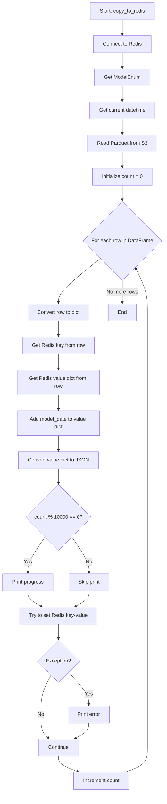
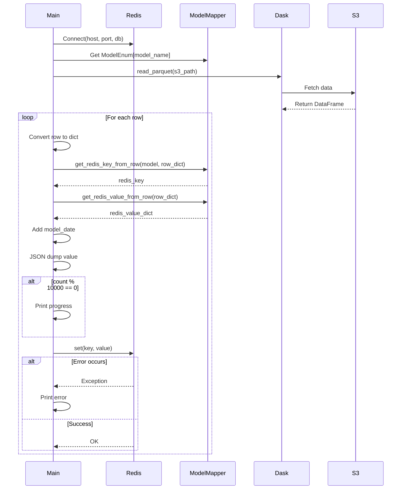

# Diagram: research/common/copy_databricks_to_redis.py

> Auto-generated by Obscura crawlers

## Diagram 1

### SVG

<svg id="container" width="522.71875" xmlns="http://www.w3.org/2000/svg" class="flowchart" height="2477.25" viewBox="0 0 522.71875 2477.25" role="graphics-document document" aria-roledescription="flowchart-v2"><g><marker id="container_flowchart-v2-pointEnd" class="marker flowchart-v2" viewBox="0 0 10 10" refX="5" refY="5" markerUnits="userSpaceOnUse" markerWidth="8" markerHeight="8" orient="auto"><path d="M 0 0 L 10 5 L 0 10 z" class="arrowMarkerPath" style="stroke-width: 1; stroke-dasharray: 1, 0;"></path></marker><marker id="container_flowchart-v2-pointStart" class="marker flowchart-v2" viewBox="0 0 10 10" refX="4.5" refY="5" markerUnits="userSpaceOnUse" markerWidth="8" markerHeight="8" orient="auto"><path d="M 0 5 L 10 10 L 10 0 z" class="arrowMarkerPath" style="stroke-width: 1; stroke-dasharray: 1, 0;"></path></marker><marker id="container_flowchart-v2-circleEnd" class="marker flowchart-v2" viewBox="0 0 10 10" refX="11" refY="5" markerUnits="userSpaceOnUse" markerWidth="11" markerHeight="11" orient="auto"><circle cx="5" cy="5" r="5" class="arrowMarkerPath" style="stroke-width: 1; stroke-dasharray: 1, 0;"></circle></marker><marker id="container_flowchart-v2-circleStart" class="marker flowchart-v2" viewBox="0 0 10 10" refX="-1" refY="5" markerUnits="userSpaceOnUse" markerWidth="11" markerHeight="11" orient="auto"><circle cx="5" cy="5" r="5" class="arrowMarkerPath" style="stroke-width: 1; stroke-dasharray: 1, 0;"></circle></marker><marker id="container_flowchart-v2-crossEnd" class="marker cross flowchart-v2" viewBox="0 0 11 11" refX="12" refY="5.2" markerUnits="userSpaceOnUse" markerWidth="11" markerHeight="11" orient="auto"><path d="M 1,1 l 9,9 M 10,1 l -9,9" class="arrowMarkerPath" style="stroke-width: 2; stroke-dasharray: 1, 0;"></path></marker><marker id="container_flowchart-v2-crossStart" class="marker cross flowchart-v2" viewBox="0 0 11 11" refX="-1" refY="5.2" markerUnits="userSpaceOnUse" markerWidth="11" markerHeight="11" orient="auto"><path d="M 1,1 l 9,9 M 10,1 l -9,9" class="arrowMarkerPath" style="stroke-width: 2; stroke-dasharray: 1, 0;"></path></marker><g class="root"><g class="clusters"></g><g class="edgePaths"><path d="M391.352,62L391.352,66.167C391.352,70.333,391.352,78.667,391.352,86.333C391.352,94,391.352,101,391.352,104.5L391.352,108" id="L_A_B_0" class="edge-thickness-normal edge-pattern-solid edge-thickness-normal edge-pattern-solid flowchart-link" style=";" data-edge="true" data-et="edge" data-id="L_A_B_0" data-points="W3sieCI6MzkxLjM1MTU2MjUsInkiOjYyfSx7IngiOjM5MS4zNTE1NjI1LCJ5Ijo4N30seyJ4IjozOTEuMzUxNTYyNSwieSI6MTEyfV0=" marker-end="url(#container_flowchart-v2-pointEnd)"></path><path d="M391.352,166L391.352,170.167C391.352,174.333,391.352,182.667,391.352,190.333C391.352,198,391.352,205,391.352,208.5L391.352,212" id="L_B_C_0" class="edge-thickness-normal edge-pattern-solid edge-thickness-normal edge-pattern-solid flowchart-link" style=";" data-edge="true" data-et="edge" data-id="L_B_C_0" data-points="W3sieCI6MzkxLjM1MTU2MjUsInkiOjE2Nn0seyJ4IjozOTEuMzUxNTYyNSwieSI6MTkxfSx7IngiOjM5MS4zNTE1NjI1LCJ5IjoyMTZ9XQ==" marker-end="url(#container_flowchart-v2-pointEnd)"></path><path d="M391.352,270L391.352,274.167C391.352,278.333,391.352,286.667,391.352,294.333C391.352,302,391.352,309,391.352,312.5L391.352,316" id="L_C_D_0" class="edge-thickness-normal edge-pattern-solid edge-thickness-normal edge-pattern-solid flowchart-link" style=";" data-edge="true" data-et="edge" data-id="L_C_D_0" data-points="W3sieCI6MzkxLjM1MTU2MjUsInkiOjI3MH0seyJ4IjozOTEuMzUxNTYyNSwieSI6Mjk1fSx7IngiOjM5MS4zNTE1NjI1LCJ5IjozMjB9XQ==" marker-end="url(#container_flowchart-v2-pointEnd)"></path><path d="M391.352,374L391.352,378.167C391.352,382.333,391.352,390.667,391.352,398.333C391.352,406,391.352,413,391.352,416.5L391.352,420" id="L_D_E_0" class="edge-thickness-normal edge-pattern-solid edge-thickness-normal edge-pattern-solid flowchart-link" style=";" data-edge="true" data-et="edge" data-id="L_D_E_0" data-points="W3sieCI6MzkxLjM1MTU2MjUsInkiOjM3NH0seyJ4IjozOTEuMzUxNTYyNSwieSI6Mzk5fSx7IngiOjM5MS4zNTE1NjI1LCJ5Ijo0MjR9XQ==" marker-end="url(#container_flowchart-v2-pointEnd)"></path><path d="M391.352,478L391.352,482.167C391.352,486.333,391.352,494.667,391.352,502.333C391.352,510,391.352,517,391.352,520.5L391.352,524" id="L_E_F_0" class="edge-thickness-normal edge-pattern-solid edge-thickness-normal edge-pattern-solid flowchart-link" style=";" data-edge="true" data-et="edge" data-id="L_E_F_0" data-points="W3sieCI6MzkxLjM1MTU2MjUsInkiOjQ3OH0seyJ4IjozOTEuMzUxNTYyNSwieSI6NTAzfSx7IngiOjM5MS4zNTE1NjI1LCJ5Ijo1Mjh9XQ==" marker-end="url(#container_flowchart-v2-pointEnd)"></path><path d="M391.352,582L391.352,586.167C391.352,590.333,391.352,598.667,391.352,606.333C391.352,614,391.352,621,391.352,624.5L391.352,628" id="L_F_G_0" class="edge-thickness-normal edge-pattern-solid edge-thickness-normal edge-pattern-solid flowchart-link" style=";" data-edge="true" data-et="edge" data-id="L_F_G_0" data-points="W3sieCI6MzkxLjM1MTU2MjUsInkiOjU4Mn0seyJ4IjozOTEuMzUxNTYyNSwieSI6NjA3fSx7IngiOjM5MS4zNTE1NjI1LCJ5Ijo2MzJ9XQ==" marker-end="url(#container_flowchart-v2-pointEnd)"></path><path d="M322.337,808.72L299.693,826.389C277.049,844.058,231.761,879.396,209.117,902.565C186.473,925.734,186.473,936.734,186.473,942.234L186.473,947.734" id="L_G_H_0" class="edge-thickness-normal edge-pattern-solid edge-thickness-normal edge-pattern-solid flowchart-link" style=";" data-edge="true" data-et="edge" data-id="L_G_H_0" data-points="W3sieCI6MzIyLjMzNjcxNzg3MTQ4NTksInkiOjgwOC43MTk1MzAzNzE0ODU5fSx7IngiOjE4Ni40NzI2NTYyNSwieSI6OTE0LjczNDM3NX0seyJ4IjoxODYuNDcyNjU2MjUsInkiOjk1MS43MzQzNzV9XQ==" marker-end="url(#container_flowchart-v2-pointEnd)"></path><path d="M186.473,1005.734L186.473,1009.901C186.473,1014.068,186.473,1022.401,186.473,1030.068C186.473,1037.734,186.473,1044.734,186.473,1048.234L186.473,1051.734" id="L_H_I_0" class="edge-thickness-normal edge-pattern-solid edge-thickness-normal edge-pattern-solid flowchart-link" style=";" data-edge="true" data-et="edge" data-id="L_H_I_0" data-points="W3sieCI6MTg2LjQ3MjY1NjI1LCJ5IjoxMDA1LjczNDM3NX0seyJ4IjoxODYuNDcyNjU2MjUsInkiOjEwMzAuNzM0Mzc1fSx7IngiOjE4Ni40NzI2NTYyNSwieSI6MTA1NS43MzQzNzV9XQ==" marker-end="url(#container_flowchart-v2-pointEnd)"></path><path d="M186.473,1109.734L186.473,1113.901C186.473,1118.068,186.473,1126.401,186.473,1134.068C186.473,1141.734,186.473,1148.734,186.473,1152.234L186.473,1155.734" id="L_I_J_0" class="edge-thickness-normal edge-pattern-solid edge-thickness-normal edge-pattern-solid flowchart-link" style=";" data-edge="true" data-et="edge" data-id="L_I_J_0" data-points="W3sieCI6MTg2LjQ3MjY1NjI1LCJ5IjoxMTA5LjczNDM3NX0seyJ4IjoxODYuNDcyNjU2MjUsInkiOjExMzQuNzM0Mzc1fSx7IngiOjE4Ni40NzI2NTYyNSwieSI6MTE1OS43MzQzNzV9XQ==" marker-end="url(#container_flowchart-v2-pointEnd)"></path><path d="M186.473,1237.734L186.473,1241.901C186.473,1246.068,186.473,1254.401,186.473,1262.068C186.473,1269.734,186.473,1276.734,186.473,1280.234L186.473,1283.734" id="L_J_K_0" class="edge-thickness-normal edge-pattern-solid edge-thickness-normal edge-pattern-solid flowchart-link" style=";" data-edge="true" data-et="edge" data-id="L_J_K_0" data-points="W3sieCI6MTg2LjQ3MjY1NjI1LCJ5IjoxMjM3LjczNDM3NX0seyJ4IjoxODYuNDcyNjU2MjUsInkiOjEyNjIuNzM0Mzc1fSx7IngiOjE4Ni40NzI2NTYyNSwieSI6MTI4Ny43MzQzNzV9XQ==" marker-end="url(#container_flowchart-v2-pointEnd)"></path><path d="M186.473,1365.734L186.473,1369.901C186.473,1374.068,186.473,1382.401,186.473,1390.068C186.473,1397.734,186.473,1404.734,186.473,1408.234L186.473,1411.734" id="L_K_L_0" class="edge-thickness-normal edge-pattern-solid edge-thickness-normal edge-pattern-solid flowchart-link" style=";" data-edge="true" data-et="edge" data-id="L_K_L_0" data-points="W3sieCI6MTg2LjQ3MjY1NjI1LCJ5IjoxMzY1LjczNDM3NX0seyJ4IjoxODYuNDcyNjU2MjUsInkiOjEzOTAuNzM0Mzc1fSx7IngiOjE4Ni40NzI2NTYyNSwieSI6MTQxNS43MzQzNzV9XQ==" marker-end="url(#container_flowchart-v2-pointEnd)"></path><path d="M186.473,1469.734L186.473,1473.901C186.473,1478.068,186.473,1486.401,186.473,1494.068C186.473,1501.734,186.473,1508.734,186.473,1512.234L186.473,1515.734" id="L_L_M_0" class="edge-thickness-normal edge-pattern-solid edge-thickness-normal edge-pattern-solid flowchart-link" style=";" data-edge="true" data-et="edge" data-id="L_L_M_0" data-points="W3sieCI6MTg2LjQ3MjY1NjI1LCJ5IjoxNDY5LjczNDM3NX0seyJ4IjoxODYuNDcyNjU2MjUsInkiOjE0OTQuNzM0Mzc1fSx7IngiOjE4Ni40NzI2NTYyNSwieSI6MTUxOS43MzQzNzV9XQ==" marker-end="url(#container_flowchart-v2-pointEnd)"></path><path d="M144.804,1677.972L135.43,1691.083C126.057,1704.195,107.31,1730.418,97.936,1749.029C88.563,1767.641,88.563,1778.641,88.563,1784.141L88.563,1789.641" id="L_M_N_0" class="edge-thickness-normal edge-pattern-solid edge-thickness-normal edge-pattern-solid flowchart-link" style=";" data-edge="true" data-et="edge" data-id="L_M_N_0" data-points="W3sieCI6MTQ0LjgwNDA0Nzg4MjAxNjYyLCJ5IjoxNjc3Ljk3MjAxNjYzMjAxNjd9LHsieCI6ODguNTYyNSwieSI6MTc1Ni42NDA2MjV9LHsieCI6ODguNTYyNSwieSI6MTc5My42NDA2MjV9XQ==" marker-end="url(#container_flowchart-v2-pointEnd)"></path><path d="M228.141,1677.972L237.515,1691.083C246.888,1704.195,265.636,1730.418,275.009,1749.029C284.383,1767.641,284.383,1778.641,284.383,1784.141L284.383,1789.641" id="L_M_O_0" class="edge-thickness-normal edge-pattern-solid edge-thickness-normal edge-pattern-solid flowchart-link" style=";" data-edge="true" data-et="edge" data-id="L_M_O_0" data-points="W3sieCI6MjI4LjE0MTI2NDYxNzk4MzM4LCJ5IjoxNjc3Ljk3MjAxNjYzMjAxNjd9LHsieCI6Mjg0LjM4MjgxMjUsInkiOjE3NTYuNjQwNjI1fSx7IngiOjI4NC4zODI4MTI1LCJ5IjoxNzkzLjY0MDYyNX1d" marker-end="url(#container_flowchart-v2-pointEnd)"></path><path d="M88.563,1847.641L88.563,1851.807C88.563,1855.974,88.563,1864.307,95.819,1872.328C103.076,1880.349,117.589,1888.056,124.845,1891.91L132.102,1895.764" id="L_N_P_0" class="edge-thickness-normal edge-pattern-solid edge-thickness-normal edge-pattern-solid flowchart-link" style=";" data-edge="true" data-et="edge" data-id="L_N_P_0" data-points="W3sieCI6ODguNTYyNSwieSI6MTg0Ny42NDA2MjV9LHsieCI6ODguNTYyNSwieSI6MTg3Mi42NDA2MjV9LHsieCI6MTM1LjYzNDY5MDUwNDgwNzY4LCJ5IjoxODk3LjY0MDYyNX1d" marker-end="url(#container_flowchart-v2-pointEnd)"></path><path d="M284.383,1847.641L284.383,1851.807C284.383,1855.974,284.383,1864.307,277.126,1872.328C269.87,1880.349,255.356,1888.056,248.1,1891.91L240.843,1895.764" id="L_O_P_0" class="edge-thickness-normal edge-pattern-solid edge-thickness-normal edge-pattern-solid flowchart-link" style=";" data-edge="true" data-et="edge" data-id="L_O_P_0" data-points="W3sieCI6Mjg0LjM4MjgxMjUsInkiOjE4NDcuNjQwNjI1fSx7IngiOjI4NC4zODI4MTI1LCJ5IjoxODcyLjY0MDYyNX0seyJ4IjoyMzcuMzEwNjIxOTk1MTkyMzIsInkiOjE4OTcuNjQwNjI1fV0=" marker-end="url(#container_flowchart-v2-pointEnd)"></path><path d="M186.473,1951.641L186.473,1955.807C186.473,1959.974,186.473,1968.307,186.473,1975.974C186.473,1983.641,186.473,1990.641,186.473,1994.141L186.473,1997.641" id="L_P_Q_0" class="edge-thickness-normal edge-pattern-solid edge-thickness-normal edge-pattern-solid flowchart-link" style=";" data-edge="true" data-et="edge" data-id="L_P_Q_0" data-points="W3sieCI6MTg2LjQ3MjY1NjI1LCJ5IjoxOTUxLjY0MDYyNX0seyJ4IjoxODYuNDcyNjU2MjUsInkiOjE5NzYuNjQwNjI1fSx7IngiOjE4Ni40NzI2NTYyNSwieSI6MjAwMS42NDA2MjV9XQ==" marker-end="url(#container_flowchart-v2-pointEnd)"></path><path d="M218.376,2101.347L229.183,2112.831C239.99,2124.314,261.605,2147.282,272.412,2164.266C283.219,2181.25,283.219,2192.25,283.219,2197.75L283.219,2203.25" id="L_Q_R_0" class="edge-thickness-normal edge-pattern-solid edge-thickness-normal edge-pattern-solid flowchart-link" style=";" data-edge="true" data-et="edge" data-id="L_Q_R_0" data-points="W3sieCI6MjE4LjM3NjA0NjU4NTk1OTY3LCJ5IjoyMTAxLjM0NjYwOTY2NDA0MDR9LHsieCI6MjgzLjIxODc1LCJ5IjoyMTcwLjI1fSx7IngiOjI4My4yMTg3NSwieSI6MjIwNy4yNX1d" marker-end="url(#container_flowchart-v2-pointEnd)"></path><path d="M163.17,2109.948L157.66,2119.998C152.15,2130.049,141.13,2150.149,135.62,2170.866C130.109,2191.583,130.109,2212.917,130.109,2232.25C130.109,2251.583,130.109,2268.917,134.136,2281.298C138.162,2293.679,146.215,2301.108,150.241,2304.823L154.267,2308.538" id="L_Q_S_0" class="edge-thickness-normal edge-pattern-solid edge-thickness-normal edge-pattern-solid flowchart-link" style=";" data-edge="true" data-et="edge" data-id="L_Q_S_0" data-points="W3sieCI6MTYzLjE3MDQyOTQzNzI4OTg3LCJ5IjoyMTA5Ljk0Nzc3MzE4NzI5fSx7IngiOjEzMC4xMDkzNzUsInkiOjIxNzAuMjV9LHsieCI6MTMwLjEwOTM3NSwieSI6MjIzNC4yNX0seyJ4IjoxMzAuMTA5Mzc1LCJ5IjoyMjg2LjI1fSx7IngiOjE1Ny4yMDcxMDYzNzAxOTIzMiwieSI6MjMxMS4yNX1d" marker-end="url(#container_flowchart-v2-pointEnd)"></path><path d="M283.219,2261.25L283.219,2265.417C283.219,2269.583,283.219,2277.917,276.054,2285.934C268.889,2293.952,254.559,2301.654,247.394,2305.505L240.23,2309.356" id="L_R_S_0" class="edge-thickness-normal edge-pattern-solid edge-thickness-normal edge-pattern-solid flowchart-link" style=";" data-edge="true" data-et="edge" data-id="L_R_S_0" data-points="W3sieCI6MjgzLjIxODc1LCJ5IjoyMjYxLjI1fSx7IngiOjI4My4yMTg3NSwieSI6MjI4Ni4yNX0seyJ4IjoyMzYuNzA2MjA0OTI3ODg0NiwieSI6MjMxMS4yNX1d" marker-end="url(#container_flowchart-v2-pointEnd)"></path><path d="M186.473,2365.25L186.473,2369.417C186.473,2373.583,186.473,2381.917,196.709,2390.011C206.946,2398.106,227.419,2405.961,237.655,2409.889L247.892,2413.817" id="L_S_T_0" class="edge-thickness-normal edge-pattern-solid edge-thickness-normal edge-pattern-solid flowchart-link" style=";" data-edge="true" data-et="edge" data-id="L_S_T_0" data-points="W3sieCI6MTg2LjQ3MjY1NjI1LCJ5IjoyMzY1LjI1fSx7IngiOjE4Ni40NzI2NTYyNSwieSI6MjM5MC4yNX0seyJ4IjoyNTEuNjI2Mjc3MDQzMjY5MjMsInkiOjI0MTUuMjV9XQ==" marker-end="url(#container_flowchart-v2-pointEnd)"></path><path d="M398.859,2415.25L410.721,2411.083C422.583,2406.917,446.307,2398.583,458.169,2385.75C470.031,2372.917,470.031,2355.583,470.031,2338.25C470.031,2320.917,470.031,2303.583,470.031,2286.25C470.031,2268.917,470.031,2251.583,470.031,2232.25C470.031,2212.917,470.031,2191.583,470.031,2163.783C470.031,2135.982,470.031,2101.714,470.031,2069.445C470.031,2037.177,470.031,2006.909,470.031,1983.108C470.031,1959.307,470.031,1941.974,470.031,1924.641C470.031,1907.307,470.031,1889.974,470.031,1872.641C470.031,1855.307,470.031,1837.974,470.031,1818.641C470.031,1799.307,470.031,1777.974,470.031,1744.482C470.031,1710.99,470.031,1665.339,470.031,1621.688C470.031,1578.036,470.031,1536.385,470.031,1506.893C470.031,1477.401,470.031,1460.068,470.031,1442.734C470.031,1425.401,470.031,1408.068,470.031,1388.734C470.031,1369.401,470.031,1348.068,470.031,1326.734C470.031,1305.401,470.031,1284.068,470.031,1262.734C470.031,1241.401,470.031,1220.068,470.031,1198.734C470.031,1177.401,470.031,1156.068,470.031,1136.734C470.031,1117.401,470.031,1100.068,470.031,1082.734C470.031,1065.401,470.031,1048.068,470.031,1030.734C470.031,1013.401,470.031,996.068,470.031,976.734C470.031,957.401,470.031,936.068,463.967,913.078C457.902,890.089,445.772,865.444,439.708,853.121L433.643,840.798" id="L_T_G_0" class="edge-thickness-normal edge-pattern-solid edge-thickness-normal edge-pattern-solid flowchart-link" style=";" data-edge="true" data-et="edge" data-id="L_T_G_0" data-points="W3sieCI6Mzk4Ljg1ODYyMzc5ODA3NjksInkiOjI0MTUuMjV9LHsieCI6NDcwLjAzMTI1LCJ5IjoyMzkwLjI1fSx7IngiOjQ3MC4wMzEyNSwieSI6MjMzOC4yNX0seyJ4Ijo0NzAuMDMxMjUsInkiOjIyODYuMjV9LHsieCI6NDcwLjAzMTI1LCJ5IjoyMjM0LjI1fSx7IngiOjQ3MC4wMzEyNSwieSI6MjE3MC4yNX0seyJ4Ijo0NzAuMDMxMjUsInkiOjIwNjcuNDQ1MzEyNX0seyJ4Ijo0NzAuMDMxMjUsInkiOjE5NzYuNjQwNjI1fSx7IngiOjQ3MC4wMzEyNSwieSI6MTkyNC42NDA2MjV9LHsieCI6NDcwLjAzMTI1LCJ5IjoxODcyLjY0MDYyNX0seyJ4Ijo0NzAuMDMxMjUsInkiOjE4MjAuNjQwNjI1fSx7IngiOjQ3MC4wMzEyNSwieSI6MTc1Ni42NDA2MjV9LHsieCI6NDcwLjAzMTI1LCJ5IjoxNjE5LjY4NzV9LHsieCI6NDcwLjAzMTI1LCJ5IjoxNDk0LjczNDM3NX0seyJ4Ijo0NzAuMDMxMjUsInkiOjE0NDIuNzM0Mzc1fSx7IngiOjQ3MC4wMzEyNSwieSI6MTM5MC43MzQzNzV9LHsieCI6NDcwLjAzMTI1LCJ5IjoxMzI2LjczNDM3NX0seyJ4Ijo0NzAuMDMxMjUsInkiOjEyNjIuNzM0Mzc1fSx7IngiOjQ3MC4wMzEyNSwieSI6MTE5OC43MzQzNzV9LHsieCI6NDcwLjAzMTI1LCJ5IjoxMTM0LjczNDM3NX0seyJ4Ijo0NzAuMDMxMjUsInkiOjEwODIuNzM0Mzc1fSx7IngiOjQ3MC4wMzEyNSwieSI6MTAzMC43MzQzNzV9LHsieCI6NDcwLjAzMTI1LCJ5Ijo5NzguNzM0Mzc1fSx7IngiOjQ3MC4wMzEyNSwieSI6OTE0LjczNDM3NX0seyJ4Ijo0MzEuODc2NzI5MzczNDAzNCwieSI6ODM3LjIwOTIwODEyNjU5NjV9XQ==" marker-end="url(#container_flowchart-v2-pointEnd)"></path><path d="M391.352,877.734L391.352,883.901C391.352,890.068,391.352,902.401,391.352,914.068C391.352,925.734,391.352,936.734,391.352,942.234L391.352,947.734" id="L_G_U_0" class="edge-thickness-normal edge-pattern-solid edge-thickness-normal edge-pattern-solid flowchart-link" style=";" data-edge="true" data-et="edge" data-id="L_G_U_0" data-points="W3sieCI6MzkxLjM1MTU2MjUsInkiOjg3Ny43MzQzNzV9LHsieCI6MzkxLjM1MTU2MjUsInkiOjkxNC43MzQzNzV9LHsieCI6MzkxLjM1MTU2MjUsInkiOjk1MS43MzQzNzV9XQ==" marker-end="url(#container_flowchart-v2-pointEnd)"></path></g><g class="edgeLabels"><g class="edgeLabel"><g class="label" data-id="L_A_B_0" transform="translate(0, 0)"><foreignObject width="0" height="0">

</foreignObject></g></g><g class="edgeLabel"><g class="label" data-id="L_B_C_0" transform="translate(0, 0)"><foreignObject width="0" height="0">

</foreignObject></g></g><g class="edgeLabel"><g class="label" data-id="L_C_D_0" transform="translate(0, 0)"><foreignObject width="0" height="0">

</foreignObject></g></g><g class="edgeLabel"><g class="label" data-id="L_D_E_0" transform="translate(0, 0)"><foreignObject width="0" height="0">

</foreignObject></g></g><g class="edgeLabel"><g class="label" data-id="L_E_F_0" transform="translate(0, 0)"><foreignObject width="0" height="0">

</foreignObject></g></g><g class="edgeLabel"><g class="label" data-id="L_F_G_0" transform="translate(0, 0)"><foreignObject width="0" height="0">

</foreignObject></g></g><g class="edgeLabel"><g class="label" data-id="L_G_H_0" transform="translate(0, 0)"><foreignObject width="0" height="0">

</foreignObject></g></g><g class="edgeLabel"><g class="label" data-id="L_H_I_0" transform="translate(0, 0)"><foreignObject width="0" height="0">

</foreignObject></g></g><g class="edgeLabel"><g class="label" data-id="L_I_J_0" transform="translate(0, 0)"><foreignObject width="0" height="0">

</foreignObject></g></g><g class="edgeLabel"><g class="label" data-id="L_J_K_0" transform="translate(0, 0)"><foreignObject width="0" height="0">

</foreignObject></g></g><g class="edgeLabel"><g class="label" data-id="L_K_L_0" transform="translate(0, 0)"><foreignObject width="0" height="0">

</foreignObject></g></g><g class="edgeLabel"><g class="label" data-id="L_L_M_0" transform="translate(0, 0)"><foreignObject width="0" height="0">

</foreignObject></g></g><g class="edgeLabel" transform="translate(88.5625, 1756.640625)"><g class="label" data-id="L_M_N_0" transform="translate(-12.03125, -12)"><foreignObject width="24.0625" height="24">

Yes

</foreignObject></g></g><g class="edgeLabel" transform="translate(284.3828125, 1756.640625)"><g class="label" data-id="L_M_O_0" transform="translate(-10.140625, -12)"><foreignObject width="20.28125" height="24">

No

</foreignObject></g></g><g class="edgeLabel"><g class="label" data-id="L_N_P_0" transform="translate(0, 0)"><foreignObject width="0" height="0">

</foreignObject></g></g><g class="edgeLabel"><g class="label" data-id="L_O_P_0" transform="translate(0, 0)"><foreignObject width="0" height="0">

</foreignObject></g></g><g class="edgeLabel"><g class="label" data-id="L_P_Q_0" transform="translate(0, 0)"><foreignObject width="0" height="0">

</foreignObject></g></g><g class="edgeLabel" transform="translate(283.21875, 2170.25)"><g class="label" data-id="L_Q_R_0" transform="translate(-12.03125, -12)"><foreignObject width="24.0625" height="24">

Yes

</foreignObject></g></g><g class="edgeLabel" transform="translate(130.109375, 2234.25)"><g class="label" data-id="L_Q_S_0" transform="translate(-10.140625, -12)"><foreignObject width="20.28125" height="24">

No

</foreignObject></g></g><g class="edgeLabel"><g class="label" data-id="L_R_S_0" transform="translate(0, 0)"><foreignObject width="0" height="0">

</foreignObject></g></g><g class="edgeLabel"><g class="label" data-id="L_S_T_0" transform="translate(0, 0)"><foreignObject width="0" height="0">

</foreignObject></g></g><g class="edgeLabel"><g class="label" data-id="L_T_G_0" transform="translate(0, 0)"><foreignObject width="0" height="0">

</foreignObject></g></g><g class="edgeLabel" transform="translate(391.3515625, 914.734375)"><g class="label" data-id="L_G_U_0" transform="translate(-50.109375, -12)"><foreignObject width="100.21875" height="24">

No more rows

</foreignObject></g></g></g><g class="nodes"><g class="node default" id="flowchart-A-0" transform="translate(391.3515625, 35)"><rect class="basic label-container" style="" x="-101.7734375" y="-27" width="203.546875" height="54"></rect><g class="label" style="" transform="translate(-71.7734375, -12)"><rect></rect><foreignObject width="143.546875" height="24">

Start: copy_to_redis

</foreignObject></g></g><g class="node default" id="flowchart-B-1" transform="translate(391.3515625, 139)"><rect class="basic label-container" style="" x="-90.9765625" y="-27" width="181.953125" height="54"></rect><g class="label" style="" transform="translate(-60.9765625, -12)"><rect></rect><foreignObject width="121.953125" height="24">

Connect to Redis

</foreignObject></g></g><g class="node default" id="flowchart-C-3" transform="translate(391.3515625, 243)"><rect class="basic label-container" style="" x="-87.203125" y="-27" width="174.40625" height="54"></rect><g class="label" style="" transform="translate(-57.203125, -12)"><rect></rect><foreignObject width="114.40625" height="24">

Get ModelEnum

</foreignObject></g></g><g class="node default" id="flowchart-D-5" transform="translate(391.3515625, 347)"><rect class="basic label-container" style="" x="-105.4375" y="-27" width="210.875" height="54"></rect><g class="label" style="" transform="translate(-75.4375, -12)"><rect></rect><foreignObject width="150.875" height="24">

Get current datetime

</foreignObject></g></g><g class="node default" id="flowchart-E-7" transform="translate(391.3515625, 451)"><rect class="basic label-container" style="" x="-108.0078125" y="-27" width="216.015625" height="54"></rect><g class="label" style="" transform="translate(-78.0078125, -12)"><rect></rect><foreignObject width="156.015625" height="24">

Read Parquet from S3

</foreignObject></g></g><g class="node default" id="flowchart-F-9" transform="translate(391.3515625, 555)"><rect class="basic label-container" style="" x="-96.515625" y="-27" width="193.03125" height="54"></rect><g class="label" style="" transform="translate(-66.515625, -12)"><rect></rect><foreignObject width="133.03125" height="24">

Initialize count = 0

</foreignObject></g></g><g class="node default" id="flowchart-G-11" transform="translate(391.3515625, 754.8671875)"><polygon points="122.8671875,0 245.734375,-122.8671875 122.8671875,-245.734375 0,-122.8671875" class="label-container" transform="translate(-122.3671875, 122.8671875)"></polygon><g class="label" style="" transform="translate(-95.8671875, -12)"><rect></rect><foreignObject width="191.734375" height="24">

For each row in DataFrame

</foreignObject></g></g><g class="node default" id="flowchart-H-13" transform="translate(186.47265625, 978.734375)"><rect class="basic label-container" style="" x="-98.6796875" y="-27" width="197.359375" height="54"></rect><g class="label" style="" transform="translate(-68.6796875, -12)"><rect></rect><foreignObject width="137.359375" height="24">

Convert row to dict

</foreignObject></g></g><g class="node default" id="flowchart-I-15" transform="translate(186.47265625, 1082.734375)"><rect class="basic label-container" style="" x="-113.234375" y="-27" width="226.46875" height="54"></rect><g class="label" style="" transform="translate(-83.234375, -12)"><rect></rect><foreignObject width="166.46875" height="24">

Get Redis key from row

</foreignObject></g></g><g class="node default" id="flowchart-J-17" transform="translate(186.47265625, 1198.734375)"><rect class="basic label-container" style="" x="-130" y="-39" width="260" height="78"></rect><g class="label" style="" transform="translate(-100, -24)"><rect></rect><foreignObject width="200" height="48">

Get Redis value dict from row

</foreignObject></g></g><g class="node default" id="flowchart-K-19" transform="translate(186.47265625, 1326.734375)"><rect class="basic label-container" style="" x="-130" y="-39" width="260" height="78"></rect><g class="label" style="" transform="translate(-100, -24)"><rect></rect><foreignObject width="200" height="48">

Add model_date to value dict

</foreignObject></g></g><g class="node default" id="flowchart-L-21" transform="translate(186.47265625, 1442.734375)"><rect class="basic label-container" style="" x="-124.78125" y="-27" width="249.5625" height="54"></rect><g class="label" style="" transform="translate(-94.78125, -12)"><rect></rect><foreignObject width="189.5625" height="24">

Convert value dict to JSON

</foreignObject></g></g><g class="node default" id="flowchart-M-23" transform="translate(186.47265625, 1619.6875)"><polygon points="99.953125,0 199.90625,-99.953125 99.953125,-199.90625 0,-99.953125" class="label-container" transform="translate(-99.453125, 99.953125)"></polygon><g class="label" style="" transform="translate(-72.953125, -12)"><rect></rect><foreignObject width="145.90625" height="24">

count % 10000 == 0?

</foreignObject></g></g><g class="node default" id="flowchart-N-25" transform="translate(88.5625, 1820.640625)"><rect class="basic label-container" style="" x="-80.5625" y="-27" width="161.125" height="54"></rect><g class="label" style="" transform="translate(-50.5625, -12)"><rect></rect><foreignObject width="101.125" height="24">

Print progress

</foreignObject></g></g><g class="node default" id="flowchart-O-27" transform="translate(284.3828125, 1820.640625)"><rect class="basic label-container" style="" x="-65.2578125" y="-27" width="130.515625" height="54"></rect><g class="label" style="" transform="translate(-35.2578125, -12)"><rect></rect><foreignObject width="70.515625" height="24">

Skip print

</foreignObject></g></g><g class="node default" id="flowchart-P-29" transform="translate(186.47265625, 1924.640625)"><rect class="basic label-container" style="" x="-122.4765625" y="-27" width="244.953125" height="54"></rect><g class="label" style="" transform="translate(-92.4765625, -12)"><rect></rect><foreignObject width="184.953125" height="24">

Try to set Redis key-value

</foreignObject></g></g><g class="node default" id="flowchart-Q-33" transform="translate(186.47265625, 2067.4453125)"><polygon points="65.8046875,0 131.609375,-65.8046875 65.8046875,-131.609375 0,-65.8046875" class="label-container" transform="translate(-65.3046875, 65.8046875)"></polygon><g class="label" style="" transform="translate(-38.8046875, -12)"><rect></rect><foreignObject width="77.609375" height="24">

Exception?

</foreignObject></g></g><g class="node default" id="flowchart-R-35" transform="translate(283.21875, 2234.25)"><rect class="basic label-container" style="" x="-67.5859375" y="-27" width="135.171875" height="54"></rect><g class="label" style="" transform="translate(-37.5859375, -12)"><rect></rect><foreignObject width="75.171875" height="24">

Print error

</foreignObject></g></g><g class="node default" id="flowchart-S-37" transform="translate(186.47265625, 2338.25)"><rect class="basic label-container" style="" x="-62.53125" y="-27" width="125.0625" height="54"></rect><g class="label" style="" transform="translate(-32.53125, -12)"><rect></rect><foreignObject width="65.0625" height="24">

Continue

</foreignObject></g></g><g class="node default" id="flowchart-T-41" transform="translate(321.9921875, 2442.25)"><rect class="basic label-container" style="" x="-89.5625" y="-27" width="179.125" height="54"></rect><g class="label" style="" transform="translate(-59.5625, -12)"><rect></rect><foreignObject width="119.125" height="24">

Increment count

</foreignObject></g></g><g class="node default" id="flowchart-U-45" transform="translate(391.3515625, 978.734375)"><rect class="basic label-container" style="" x="-43.6796875" y="-27" width="87.359375" height="54"></rect><g class="label" style="" transform="translate(-13.6796875, -12)"><rect></rect><foreignObject width="27.359375" height="24">

End

</foreignObject></g></g></g></g></g></svg>

## Diagram 2

### SVG

<svg id="container" width="1106" xmlns="http://www.w3.org/2000/svg" height="1395" viewBox="-69 -10 1106 1395" role="graphics-document document" aria-roledescription="sequence"><g><rect x="837" y="1309" fill="#eaeaea" stroke="#666" width="150" height="65" name="S3" rx="3" ry="3" class="actor actor-bottom"></rect><text x="912" y="1341.5" dominant-baseline="central" alignment-baseline="central" class="actor actor-box" style="text-anchor: middle; font-size: 16px; font-weight: 400;"><tspan x="912" dy="0">S3</tspan></text></g><g><rect x="637" y="1309" fill="#eaeaea" stroke="#666" width="150" height="65" name="Dask" rx="3" ry="3" class="actor actor-bottom"></rect><text x="712" y="1341.5" dominant-baseline="central" alignment-baseline="central" class="actor actor-box" style="text-anchor: middle; font-size: 16px; font-weight: 400;"><tspan x="712" dy="0">Dask</tspan></text></g><g><rect x="437" y="1309" fill="#eaeaea" stroke="#666" width="150" height="65" name="ModelMapper" rx="3" ry="3" class="actor actor-bottom"></rect><text x="512" y="1341.5" dominant-baseline="central" alignment-baseline="central" class="actor actor-box" style="text-anchor: middle; font-size: 16px; font-weight: 400;"><tspan x="512" dy="0">ModelMapper</tspan></text></g><g><rect x="237" y="1309" fill="#eaeaea" stroke="#666" width="150" height="65" name="Redis" rx="3" ry="3" class="actor actor-bottom"></rect><text x="312" y="1341.5" dominant-baseline="central" alignment-baseline="central" class="actor actor-box" style="text-anchor: middle; font-size: 16px; font-weight: 400;"><tspan x="312" dy="0">Redis</tspan></text></g><g><rect x="0" y="1309" fill="#eaeaea" stroke="#666" width="150" height="65" name="Main" rx="3" ry="3" class="actor actor-bottom"></rect><text x="75" y="1341.5" dominant-baseline="central" alignment-baseline="central" class="actor actor-box" style="text-anchor: middle; font-size: 16px; font-weight: 400;"><tspan x="75" dy="0">Main</tspan></text></g><g><line id="actor4" x1="912" y1="65" x2="912" y2="1309" class="actor-line 200" stroke-width="0.5px" stroke="#999" name="S3"></line><g id="root-4"><rect x="837" y="0" fill="#eaeaea" stroke="#666" width="150" height="65" name="S3" rx="3" ry="3" class="actor actor-top"></rect><text x="912" y="32.5" dominant-baseline="central" alignment-baseline="central" class="actor actor-box" style="text-anchor: middle; font-size: 16px; font-weight: 400;"><tspan x="912" dy="0">S3</tspan></text></g></g><g><line id="actor3" x1="712" y1="65" x2="712" y2="1309" class="actor-line 200" stroke-width="0.5px" stroke="#999" name="Dask"></line><g id="root-3"><rect x="637" y="0" fill="#eaeaea" stroke="#666" width="150" height="65" name="Dask" rx="3" ry="3" class="actor actor-top"></rect><text x="712" y="32.5" dominant-baseline="central" alignment-baseline="central" class="actor actor-box" style="text-anchor: middle; font-size: 16px; font-weight: 400;"><tspan x="712" dy="0">Dask</tspan></text></g></g><g><line id="actor2" x1="512" y1="65" x2="512" y2="1309" class="actor-line 200" stroke-width="0.5px" stroke="#999" name="ModelMapper"></line><g id="root-2"><rect x="437" y="0" fill="#eaeaea" stroke="#666" width="150" height="65" name="ModelMapper" rx="3" ry="3" class="actor actor-top"></rect><text x="512" y="32.5" dominant-baseline="central" alignment-baseline="central" class="actor actor-box" style="text-anchor: middle; font-size: 16px; font-weight: 400;"><tspan x="512" dy="0">ModelMapper</tspan></text></g></g><g><line id="actor1" x1="312" y1="65" x2="312" y2="1309" class="actor-line 200" stroke-width="0.5px" stroke="#999" name="Redis"></line><g id="root-1"><rect x="237" y="0" fill="#eaeaea" stroke="#666" width="150" height="65" name="Redis" rx="3" ry="3" class="actor actor-top"></rect><text x="312" y="32.5" dominant-baseline="central" alignment-baseline="central" class="actor actor-box" style="text-anchor: middle; font-size: 16px; font-weight: 400;"><tspan x="312" dy="0">Redis</tspan></text></g></g><g><line id="actor0" x1="75" y1="65" x2="75" y2="1309" class="actor-line 200" stroke-width="0.5px" stroke="#999" name="Main"></line><g id="root-0"><rect x="0" y="0" fill="#eaeaea" stroke="#666" width="150" height="65" name="Main" rx="3" ry="3" class="actor actor-top"></rect><text x="75" y="32.5" dominant-baseline="central" alignment-baseline="central" class="actor actor-box" style="text-anchor: middle; font-size: 16px; font-weight: 400;"><tspan x="75" dy="0">Main</tspan></text></g></g><g></g><defs><symbol id="computer" width="24" height="24"><path transform="scale(.5)" d="M2 2v13h20v-13h-20zm18 11h-16v-9h16v9zm-10.228 6l.466-1h3.524l.467 1h-4.457zm14.228 3h-24l2-6h2.104l-1.33 4h18.45l-1.297-4h2.073l2 6zm-5-10h-14v-7h14v7z"></path></symbol></defs><defs><symbol id="database" fill-rule="evenodd" clip-rule="evenodd"><path transform="scale(.5)" d="M12.258.001l.256.004.255.005.253.008.251.01.249.012.247.015.246.016.242.019.241.02.239.023.236.024.233.027.231.028.229.031.225.032.223.034.22.036.217.038.214.04.211.041.208.043.205.045.201.046.198.048.194.05.191.051.187.053.183.054.18.056.175.057.172.059.168.06.163.061.16.063.155.064.15.066.074.033.073.033.071.034.07.034.069.035.068.035.067.035.066.035.064.036.064.036.062.036.06.036.06.037.058.037.058.037.055.038.055.038.053.038.052.038.051.039.05.039.048.039.047.039.045.04.044.04.043.04.041.04.04.041.039.041.037.041.036.041.034.041.033.042.032.042.03.042.029.042.027.042.026.043.024.043.023.043.021.043.02.043.018.044.017.043.015.044.013.044.012.044.011.045.009.044.007.045.006.045.004.045.002.045.001.045v17l-.001.045-.002.045-.004.045-.006.045-.007.045-.009.044-.011.045-.012.044-.013.044-.015.044-.017.043-.018.044-.02.043-.021.043-.023.043-.024.043-.026.043-.027.042-.029.042-.03.042-.032.042-.033.042-.034.041-.036.041-.037.041-.039.041-.04.041-.041.04-.043.04-.044.04-.045.04-.047.039-.048.039-.05.039-.051.039-.052.038-.053.038-.055.038-.055.038-.058.037-.058.037-.06.037-.06.036-.062.036-.064.036-.064.036-.066.035-.067.035-.068.035-.069.035-.07.034-.071.034-.073.033-.074.033-.15.066-.155.064-.16.063-.163.061-.168.06-.172.059-.175.057-.18.056-.183.054-.187.053-.191.051-.194.05-.198.048-.201.046-.205.045-.208.043-.211.041-.214.04-.217.038-.22.036-.223.034-.225.032-.229.031-.231.028-.233.027-.236.024-.239.023-.241.02-.242.019-.246.016-.247.015-.249.012-.251.01-.253.008-.255.005-.256.004-.258.001-.258-.001-.256-.004-.255-.005-.253-.008-.251-.01-.249-.012-.247-.015-.245-.016-.243-.019-.241-.02-.238-.023-.236-.024-.234-.027-.231-.028-.228-.031-.226-.032-.223-.034-.22-.036-.217-.038-.214-.04-.211-.041-.208-.043-.204-.045-.201-.046-.198-.048-.195-.05-.19-.051-.187-.053-.184-.054-.179-.056-.176-.057-.172-.059-.167-.06-.164-.061-.159-.063-.155-.064-.151-.066-.074-.033-.072-.033-.072-.034-.07-.034-.069-.035-.068-.035-.067-.035-.066-.035-.064-.036-.063-.036-.062-.036-.061-.036-.06-.037-.058-.037-.057-.037-.056-.038-.055-.038-.053-.038-.052-.038-.051-.039-.049-.039-.049-.039-.046-.039-.046-.04-.044-.04-.043-.04-.041-.04-.04-.041-.039-.041-.037-.041-.036-.041-.034-.041-.033-.042-.032-.042-.03-.042-.029-.042-.027-.042-.026-.043-.024-.043-.023-.043-.021-.043-.02-.043-.018-.044-.017-.043-.015-.044-.013-.044-.012-.044-.011-.045-.009-.044-.007-.045-.006-.045-.004-.045-.002-.045-.001-.045v-17l.001-.045.002-.045.004-.045.006-.045.007-.045.009-.044.011-.045.012-.044.013-.044.015-.044.017-.043.018-.044.02-.043.021-.043.023-.043.024-.043.026-.043.027-.042.029-.042.03-.042.032-.042.033-.042.034-.041.036-.041.037-.041.039-.041.04-.041.041-.04.043-.04.044-.04.046-.04.046-.039.049-.039.049-.039.051-.039.052-.038.053-.038.055-.038.056-.038.057-.037.058-.037.06-.037.061-.036.062-.036.063-.036.064-.036.066-.035.067-.035.068-.035.069-.035.07-.034.072-.034.072-.033.074-.033.151-.066.155-.064.159-.063.164-.061.167-.06.172-.059.176-.057.179-.056.184-.054.187-.053.19-.051.195-.05.198-.048.201-.046.204-.045.208-.043.211-.041.214-.04.217-.038.22-.036.223-.034.226-.032.228-.031.231-.028.234-.027.236-.024.238-.023.241-.02.243-.019.245-.016.247-.015.249-.012.251-.01.253-.008.255-.005.256-.004.258-.001.258.001zm-9.258 20.499v.01l.001.021.003.021.004.022.005.021.006.022.007.022.009.023.01.022.011.023.012.023.013.023.015.023.016.024.017.023.018.024.019.024.021.024.022.025.023.024.024.025.052.049.056.05.061.051.066.051.07.051.075.051.079.052.084.052.088.052.092.052.097.052.102.051.105.052.11.052.114.051.119.051.123.051.127.05.131.05.135.05.139.048.144.049.147.047.152.047.155.047.16.045.163.045.167.043.171.043.176.041.178.041.183.039.187.039.19.037.194.035.197.035.202.033.204.031.209.03.212.029.216.027.219.025.222.024.226.021.23.02.233.018.236.016.24.015.243.012.246.01.249.008.253.005.256.004.259.001.26-.001.257-.004.254-.005.25-.008.247-.011.244-.012.241-.014.237-.016.233-.018.231-.021.226-.021.224-.024.22-.026.216-.027.212-.028.21-.031.205-.031.202-.034.198-.034.194-.036.191-.037.187-.039.183-.04.179-.04.175-.042.172-.043.168-.044.163-.045.16-.046.155-.046.152-.047.148-.048.143-.049.139-.049.136-.05.131-.05.126-.05.123-.051.118-.052.114-.051.11-.052.106-.052.101-.052.096-.052.092-.052.088-.053.083-.051.079-.052.074-.052.07-.051.065-.051.06-.051.056-.05.051-.05.023-.024.023-.025.021-.024.02-.024.019-.024.018-.024.017-.024.015-.023.014-.024.013-.023.012-.023.01-.023.01-.022.008-.022.006-.022.006-.022.004-.022.004-.021.001-.021.001-.021v-4.127l-.077.055-.08.053-.083.054-.085.053-.087.052-.09.052-.093.051-.095.05-.097.05-.1.049-.102.049-.105.048-.106.047-.109.047-.111.046-.114.045-.115.045-.118.044-.12.043-.122.042-.124.042-.126.041-.128.04-.13.04-.132.038-.134.038-.135.037-.138.037-.139.035-.142.035-.143.034-.144.033-.147.032-.148.031-.15.03-.151.03-.153.029-.154.027-.156.027-.158.026-.159.025-.161.024-.162.023-.163.022-.165.021-.166.02-.167.019-.169.018-.169.017-.171.016-.173.015-.173.014-.175.013-.175.012-.177.011-.178.01-.179.008-.179.008-.181.006-.182.005-.182.004-.184.003-.184.002h-.37l-.184-.002-.184-.003-.182-.004-.182-.005-.181-.006-.179-.008-.179-.008-.178-.01-.176-.011-.176-.012-.175-.013-.173-.014-.172-.015-.171-.016-.17-.017-.169-.018-.167-.019-.166-.02-.165-.021-.163-.022-.162-.023-.161-.024-.159-.025-.157-.026-.156-.027-.155-.027-.153-.029-.151-.03-.15-.03-.148-.031-.146-.032-.145-.033-.143-.034-.141-.035-.14-.035-.137-.037-.136-.037-.134-.038-.132-.038-.13-.04-.128-.04-.126-.041-.124-.042-.122-.042-.12-.044-.117-.043-.116-.045-.113-.045-.112-.046-.109-.047-.106-.047-.105-.048-.102-.049-.1-.049-.097-.05-.095-.05-.093-.052-.09-.051-.087-.052-.085-.053-.083-.054-.08-.054-.077-.054v4.127zm0-5.654v.011l.001.021.003.021.004.021.005.022.006.022.007.022.009.022.01.022.011.023.012.023.013.023.015.024.016.023.017.024.018.024.019.024.021.024.022.024.023.025.024.024.052.05.056.05.061.05.066.051.07.051.075.052.079.051.084.052.088.052.092.052.097.052.102.052.105.052.11.051.114.051.119.052.123.05.127.051.131.05.135.049.139.049.144.048.147.048.152.047.155.046.16.045.163.045.167.044.171.042.176.042.178.04.183.04.187.038.19.037.194.036.197.034.202.033.204.032.209.03.212.028.216.027.219.025.222.024.226.022.23.02.233.018.236.016.24.014.243.012.246.01.249.008.253.006.256.003.259.001.26-.001.257-.003.254-.006.25-.008.247-.01.244-.012.241-.015.237-.016.233-.018.231-.02.226-.022.224-.024.22-.025.216-.027.212-.029.21-.03.205-.032.202-.033.198-.035.194-.036.191-.037.187-.039.183-.039.179-.041.175-.042.172-.043.168-.044.163-.045.16-.045.155-.047.152-.047.148-.048.143-.048.139-.05.136-.049.131-.05.126-.051.123-.051.118-.051.114-.052.11-.052.106-.052.101-.052.096-.052.092-.052.088-.052.083-.052.079-.052.074-.051.07-.052.065-.051.06-.05.056-.051.051-.049.023-.025.023-.024.021-.025.02-.024.019-.024.018-.024.017-.024.015-.023.014-.023.013-.024.012-.022.01-.023.01-.023.008-.022.006-.022.006-.022.004-.021.004-.022.001-.021.001-.021v-4.139l-.077.054-.08.054-.083.054-.085.052-.087.053-.09.051-.093.051-.095.051-.097.05-.1.049-.102.049-.105.048-.106.047-.109.047-.111.046-.114.045-.115.044-.118.044-.12.044-.122.042-.124.042-.126.041-.128.04-.13.039-.132.039-.134.038-.135.037-.138.036-.139.036-.142.035-.143.033-.144.033-.147.033-.148.031-.15.03-.151.03-.153.028-.154.028-.156.027-.158.026-.159.025-.161.024-.162.023-.163.022-.165.021-.166.02-.167.019-.169.018-.169.017-.171.016-.173.015-.173.014-.175.013-.175.012-.177.011-.178.009-.179.009-.179.007-.181.007-.182.005-.182.004-.184.003-.184.002h-.37l-.184-.002-.184-.003-.182-.004-.182-.005-.181-.007-.179-.007-.179-.009-.178-.009-.176-.011-.176-.012-.175-.013-.173-.014-.172-.015-.171-.016-.17-.017-.169-.018-.167-.019-.166-.02-.165-.021-.163-.022-.162-.023-.161-.024-.159-.025-.157-.026-.156-.027-.155-.028-.153-.028-.151-.03-.15-.03-.148-.031-.146-.033-.145-.033-.143-.033-.141-.035-.14-.036-.137-.036-.136-.037-.134-.038-.132-.039-.13-.039-.128-.04-.126-.041-.124-.042-.122-.043-.12-.043-.117-.044-.116-.044-.113-.046-.112-.046-.109-.046-.106-.047-.105-.048-.102-.049-.1-.049-.097-.05-.095-.051-.093-.051-.09-.051-.087-.053-.085-.052-.083-.054-.08-.054-.077-.054v4.139zm0-5.666v.011l.001.02.003.022.004.021.005.022.006.021.007.022.009.023.01.022.011.023.012.023.013.023.015.023.016.024.017.024.018.023.019.024.021.025.022.024.023.024.024.025.052.05.056.05.061.05.066.051.07.051.075.052.079.051.084.052.088.052.092.052.097.052.102.052.105.051.11.052.114.051.119.051.123.051.127.05.131.05.135.05.139.049.144.048.147.048.152.047.155.046.16.045.163.045.167.043.171.043.176.042.178.04.183.04.187.038.19.037.194.036.197.034.202.033.204.032.209.03.212.028.216.027.219.025.222.024.226.021.23.02.233.018.236.017.24.014.243.012.246.01.249.008.253.006.256.003.259.001.26-.001.257-.003.254-.006.25-.008.247-.01.244-.013.241-.014.237-.016.233-.018.231-.02.226-.022.224-.024.22-.025.216-.027.212-.029.21-.03.205-.032.202-.033.198-.035.194-.036.191-.037.187-.039.183-.039.179-.041.175-.042.172-.043.168-.044.163-.045.16-.045.155-.047.152-.047.148-.048.143-.049.139-.049.136-.049.131-.051.126-.05.123-.051.118-.052.114-.051.11-.052.106-.052.101-.052.096-.052.092-.052.088-.052.083-.052.079-.052.074-.052.07-.051.065-.051.06-.051.056-.05.051-.049.023-.025.023-.025.021-.024.02-.024.019-.024.018-.024.017-.024.015-.023.014-.024.013-.023.012-.023.01-.022.01-.023.008-.022.006-.022.006-.022.004-.022.004-.021.001-.021.001-.021v-4.153l-.077.054-.08.054-.083.053-.085.053-.087.053-.09.051-.093.051-.095.051-.097.05-.1.049-.102.048-.105.048-.106.048-.109.046-.111.046-.114.046-.115.044-.118.044-.12.043-.122.043-.124.042-.126.041-.128.04-.13.039-.132.039-.134.038-.135.037-.138.036-.139.036-.142.034-.143.034-.144.033-.147.032-.148.032-.15.03-.151.03-.153.028-.154.028-.156.027-.158.026-.159.024-.161.024-.162.023-.163.023-.165.021-.166.02-.167.019-.169.018-.169.017-.171.016-.173.015-.173.014-.175.013-.175.012-.177.01-.178.01-.179.009-.179.007-.181.006-.182.006-.182.004-.184.003-.184.001-.185.001-.185-.001-.184-.001-.184-.003-.182-.004-.182-.006-.181-.006-.179-.007-.179-.009-.178-.01-.176-.01-.176-.012-.175-.013-.173-.014-.172-.015-.171-.016-.17-.017-.169-.018-.167-.019-.166-.02-.165-.021-.163-.023-.162-.023-.161-.024-.159-.024-.157-.026-.156-.027-.155-.028-.153-.028-.151-.03-.15-.03-.148-.032-.146-.032-.145-.033-.143-.034-.141-.034-.14-.036-.137-.036-.136-.037-.134-.038-.132-.039-.13-.039-.128-.041-.126-.041-.124-.041-.122-.043-.12-.043-.117-.044-.116-.044-.113-.046-.112-.046-.109-.046-.106-.048-.105-.048-.102-.048-.1-.05-.097-.049-.095-.051-.093-.051-.09-.052-.087-.052-.085-.053-.083-.053-.08-.054-.077-.054v4.153zm8.74-8.179l-.257.004-.254.005-.25.008-.247.011-.244.012-.241.014-.237.016-.233.018-.231.021-.226.022-.224.023-.22.026-.216.027-.212.028-.21.031-.205.032-.202.033-.198.034-.194.036-.191.038-.187.038-.183.04-.179.041-.175.042-.172.043-.168.043-.163.045-.16.046-.155.046-.152.048-.148.048-.143.048-.139.049-.136.05-.131.05-.126.051-.123.051-.118.051-.114.052-.11.052-.106.052-.101.052-.096.052-.092.052-.088.052-.083.052-.079.052-.074.051-.07.052-.065.051-.06.05-.056.05-.051.05-.023.025-.023.024-.021.024-.02.025-.019.024-.018.024-.017.023-.015.024-.014.023-.013.023-.012.023-.01.023-.01.022-.008.022-.006.023-.006.021-.004.022-.004.021-.001.021-.001.021.001.021.001.021.004.021.004.022.006.021.006.023.008.022.01.022.01.023.012.023.013.023.014.023.015.024.017.023.018.024.019.024.02.025.021.024.023.024.023.025.051.05.056.05.06.05.065.051.07.052.074.051.079.052.083.052.088.052.092.052.096.052.101.052.106.052.11.052.114.052.118.051.123.051.126.051.131.05.136.05.139.049.143.048.148.048.152.048.155.046.16.046.163.045.168.043.172.043.175.042.179.041.183.04.187.038.191.038.194.036.198.034.202.033.205.032.21.031.212.028.216.027.22.026.224.023.226.022.231.021.233.018.237.016.241.014.244.012.247.011.25.008.254.005.257.004.26.001.26-.001.257-.004.254-.005.25-.008.247-.011.244-.012.241-.014.237-.016.233-.018.231-.021.226-.022.224-.023.22-.026.216-.027.212-.028.21-.031.205-.032.202-.033.198-.034.194-.036.191-.038.187-.038.183-.04.179-.041.175-.042.172-.043.168-.043.163-.045.16-.046.155-.046.152-.048.148-.048.143-.048.139-.049.136-.05.131-.05.126-.051.123-.051.118-.051.114-.052.11-.052.106-.052.101-.052.096-.052.092-.052.088-.052.083-.052.079-.052.074-.051.07-.052.065-.051.06-.05.056-.05.051-.05.023-.025.023-.024.021-.024.02-.025.019-.024.018-.024.017-.023.015-.024.014-.023.013-.023.012-.023.01-.023.01-.022.008-.022.006-.023.006-.021.004-.022.004-.021.001-.021.001-.021-.001-.021-.001-.021-.004-.021-.004-.022-.006-.021-.006-.023-.008-.022-.01-.022-.01-.023-.012-.023-.013-.023-.014-.023-.015-.024-.017-.023-.018-.024-.019-.024-.02-.025-.021-.024-.023-.024-.023-.025-.051-.05-.056-.05-.06-.05-.065-.051-.07-.052-.074-.051-.079-.052-.083-.052-.088-.052-.092-.052-.096-.052-.101-.052-.106-.052-.11-.052-.114-.052-.118-.051-.123-.051-.126-.051-.131-.05-.136-.05-.139-.049-.143-.048-.148-.048-.152-.048-.155-.046-.16-.046-.163-.045-.168-.043-.172-.043-.175-.042-.179-.041-.183-.04-.187-.038-.191-.038-.194-.036-.198-.034-.202-.033-.205-.032-.21-.031-.212-.028-.216-.027-.22-.026-.224-.023-.226-.022-.231-.021-.233-.018-.237-.016-.241-.014-.244-.012-.247-.011-.25-.008-.254-.005-.257-.004-.26-.001-.26.001z"></path></symbol></defs><defs><symbol id="clock" width="24" height="24"><path transform="scale(.5)" d="M12 2c5.514 0 10 4.486 10 10s-4.486 10-10 10-10-4.486-10-10 4.486-10 10-10zm0-2c-6.627 0-12 5.373-12 12s5.373 12 12 12 12-5.373 12-12-5.373-12-12-12zm5.848 12.459c.202.038.202.333.001.372-1.907.361-6.045 1.111-6.547 1.111-.719 0-1.301-.582-1.301-1.301 0-.512.77-5.447 1.125-7.445.034-.192.312-.181.343.014l.985 6.238 5.394 1.011z"></path></symbol></defs><defs><marker id="arrowhead" refX="7.9" refY="5" markerUnits="userSpaceOnUse" markerWidth="12" markerHeight="12" orient="auto-start-reverse"><path d="M -1 0 L 10 5 L 0 10 z"></path></marker></defs><defs><marker id="crosshead" markerWidth="15" markerHeight="8" orient="auto" refX="4" refY="4.5"><path fill="none" stroke="#000000" stroke-width="1pt" d="M 1,2 L 6,7 M 6,2 L 1,7" style="stroke-dasharray: 0, 0;"></path></marker></defs><defs><marker id="filled-head" refX="15.5" refY="7" markerWidth="20" markerHeight="28" orient="auto"><path d="M 18,7 L9,13 L14,7 L9,1 Z"></path></marker></defs><defs><marker id="sequencenumber" refX="15" refY="15" markerWidth="60" markerHeight="40" orient="auto"><circle cx="15" cy="15" r="6"></circle></marker></defs><g><line x1="-9" y1="786" x2="161" y2="786" class="loopLine"></line><line x1="161" y1="786" x2="161" y2="957" class="loopLine"></line><line x1="-9" y1="957" x2="161" y2="957" class="loopLine"></line><line x1="-9" y1="786" x2="-9" y2="957" class="loopLine"></line><polygon points="-9,786 41,786 41,799 32.6,806 -9,806" class="labelBox"></polygon><text x="16" y="799" text-anchor="middle" dominant-baseline="middle" alignment-baseline="middle" class="labelText" style="font-size: 16px; font-weight: 400;">alt</text><text x="101" y="804" text-anchor="middle" class="loopText" style="font-size: 16px; font-weight: 400;"><tspan x="101">[count %</tspan></text><text x="101" y="823" text-anchor="middle" class="loopText" style="font-size: 16px; font-weight: 400;"><tspan x="101">10000 == 0]</tspan></text></g><g><line x1="-9" y1="1015" x2="323" y2="1015" class="loopLine"></line><line x1="323" y1="1015" x2="323" y2="1279" class="loopLine"></line><line x1="-9" y1="1279" x2="323" y2="1279" class="loopLine"></line><line x1="-9" y1="1015" x2="-9" y2="1279" class="loopLine"></line><line x1="-9" y1="1191" x2="323" y2="1191" class="loopLine" style="stroke-dasharray: 3, 3;"></line><polygon points="-9,1015 41,1015 41,1028 32.6,1035 -9,1035" class="labelBox"></polygon><text x="16" y="1028" text-anchor="middle" dominant-baseline="middle" alignment-baseline="middle" class="labelText" style="font-size: 16px; font-weight: 400;">alt</text><text x="182" y="1033" text-anchor="middle" class="loopText" style="font-size: 16px; font-weight: 400;"><tspan x="182">[Error occurs]</tspan></text><text x="157" y="1209" text-anchor="middle" class="loopText" style="font-size: 16px; font-weight: 400;">[Success]</text></g><g><line x1="-19" y1="315" x2="523" y2="315" class="loopLine"></line><line x1="523" y1="315" x2="523" y2="1289" class="loopLine"></line><line x1="-19" y1="1289" x2="523" y2="1289" class="loopLine"></line><line x1="-19" y1="315" x2="-19" y2="1289" class="loopLine"></line><polygon points="-19,315 31,315 31,328 22.6,335 -19,335" class="labelBox"></polygon><text x="6" y="328" text-anchor="middle" dominant-baseline="middle" alignment-baseline="middle" class="labelText" style="font-size: 16px; font-weight: 400;">loop</text><text x="277" y="333" text-anchor="middle" class="loopText" style="font-size: 16px; font-weight: 400;"><tspan x="277">[For each row]</tspan></text></g><text x="192" y="80" text-anchor="middle" dominant-baseline="middle" alignment-baseline="middle" class="messageText" dy="1em" style="font-size: 16px; font-weight: 400;">Connect(host, port, db)</text><line x1="76" y1="113" x2="308" y2="113" class="messageLine0" stroke-width="2" stroke="none" marker-end="url(#arrowhead)" style="fill: none;"></line><text x="292" y="128" text-anchor="middle" dominant-baseline="middle" alignment-baseline="middle" class="messageText" dy="1em" style="font-size: 16px; font-weight: 400;">Get ModelEnum[model_name]</text><line x1="76" y1="161" x2="508" y2="161" class="messageLine0" stroke-width="2" stroke="none" marker-end="url(#arrowhead)" style="fill: none;"></line><text x="392" y="176" text-anchor="middle" dominant-baseline="middle" alignment-baseline="middle" class="messageText" dy="1em" style="font-size: 16px; font-weight: 400;">read_parquet(s3_path)</text><line x1="76" y1="209" x2="708" y2="209" class="messageLine0" stroke-width="2" stroke="none" marker-end="url(#arrowhead)" style="fill: none;"></line><text x="811" y="224" text-anchor="middle" dominant-baseline="middle" alignment-baseline="middle" class="messageText" dy="1em" style="font-size: 16px; font-weight: 400;">Fetch data</text><line x1="713" y1="257" x2="908" y2="257" class="messageLine0" stroke-width="2" stroke="none" marker-end="url(#arrowhead)" style="fill: none;"></line><text x="814" y="272" text-anchor="middle" dominant-baseline="middle" alignment-baseline="middle" class="messageText" dy="1em" style="font-size: 16px; font-weight: 400;">Return DataFrame</text><line x1="911" y1="305" x2="716" y2="305" class="messageLine1" stroke-width="2" stroke="none" marker-end="url(#arrowhead)" style="stroke-dasharray: 3, 3; fill: none;"></line><text x="76" y="365" text-anchor="middle" dominant-baseline="middle" alignment-baseline="middle" class="messageText" dy="1em" style="font-size: 16px; font-weight: 400;">Convert row to dict</text><path d="M 76,398 C 136,388 136,428 76,418" class="messageLine0" stroke-width="2" stroke="none" marker-end="url(#arrowhead)" style="fill: none;"></path><text x="292" y="443" text-anchor="middle" dominant-baseline="middle" alignment-baseline="middle" class="messageText" dy="1em" style="font-size: 16px; font-weight: 400;">get_redis_key_from_row(model, row_dict)</text><line x1="76" y1="476" x2="508" y2="476" class="messageLine0" stroke-width="2" stroke="none" marker-end="url(#arrowhead)" style="fill: none;"></line><text x="295" y="491" text-anchor="middle" dominant-baseline="middle" alignment-baseline="middle" class="messageText" dy="1em" style="font-size: 16px; font-weight: 400;">redis_key</text><line x1="511" y1="524" x2="79" y2="524" class="messageLine1" stroke-width="2" stroke="none" marker-end="url(#arrowhead)" style="stroke-dasharray: 3, 3; fill: none;"></line><text x="292" y="539" text-anchor="middle" dominant-baseline="middle" alignment-baseline="middle" class="messageText" dy="1em" style="font-size: 16px; font-weight: 400;">get_redis_value_from_row(row_dict)</text><line x1="76" y1="572" x2="508" y2="572" class="messageLine0" stroke-width="2" stroke="none" marker-end="url(#arrowhead)" style="fill: none;"></line><text x="295" y="587" text-anchor="middle" dominant-baseline="middle" alignment-baseline="middle" class="messageText" dy="1em" style="font-size: 16px; font-weight: 400;">redis_value_dict</text><line x1="511" y1="620" x2="79" y2="620" class="messageLine1" stroke-width="2" stroke="none" marker-end="url(#arrowhead)" style="stroke-dasharray: 3, 3; fill: none;"></line><text x="76" y="635" text-anchor="middle" dominant-baseline="middle" alignment-baseline="middle" class="messageText" dy="1em" style="font-size: 16px; font-weight: 400;">Add model_date</text><path d="M 76,668 C 136,658 136,698 76,688" class="messageLine0" stroke-width="2" stroke="none" marker-end="url(#arrowhead)" style="fill: none;"></path><text x="76" y="713" text-anchor="middle" dominant-baseline="middle" alignment-baseline="middle" class="messageText" dy="1em" style="font-size: 16px; font-weight: 400;">JSON dump value</text><path d="M 76,746 C 136,736 136,776 76,766" class="messageLine0" stroke-width="2" stroke="none" marker-end="url(#arrowhead)" style="fill: none;"></path><text x="76" y="854" text-anchor="middle" dominant-baseline="middle" alignment-baseline="middle" class="messageText" dy="1em" style="font-size: 16px; font-weight: 400;">Print progress</text><path d="M 76,887 C 136,877 136,917 76,907" class="messageLine0" stroke-width="2" stroke="none" marker-end="url(#arrowhead)" style="fill: none;"></path><text x="192" y="972" text-anchor="middle" dominant-baseline="middle" alignment-baseline="middle" class="messageText" dy="1em" style="font-size: 16px; font-weight: 400;">set(key, value)</text><line x1="76" y1="1005" x2="308" y2="1005" class="messageLine0" stroke-width="2" stroke="none" marker-end="url(#arrowhead)" style="fill: none;"></line><text x="195" y="1065" text-anchor="middle" dominant-baseline="middle" alignment-baseline="middle" class="messageText" dy="1em" style="font-size: 16px; font-weight: 400;">Exception</text><line x1="311" y1="1098" x2="79" y2="1098" class="messageLine1" stroke-width="2" stroke="none" marker-end="url(#arrowhead)" style="stroke-dasharray: 3, 3; fill: none;"></line><text x="76" y="1113" text-anchor="middle" dominant-baseline="middle" alignment-baseline="middle" class="messageText" dy="1em" style="font-size: 16px; font-weight: 400;">Print error</text><path d="M 76,1146 C 136,1136 136,1176 76,1166" class="messageLine0" stroke-width="2" stroke="none" marker-end="url(#arrowhead)" style="fill: none;"></path><text x="195" y="1236" text-anchor="middle" dominant-baseline="middle" alignment-baseline="middle" class="messageText" dy="1em" style="font-size: 16px; font-weight: 400;">OK</text><line x1="311" y1="1269" x2="79" y2="1269" class="messageLine1" stroke-width="2" stroke="none" marker-end="url(#arrowhead)" style="stroke-dasharray: 3, 3; fill: none;"></line></svg>
