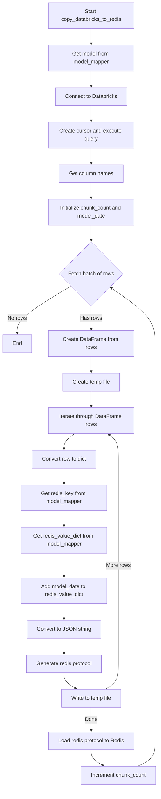
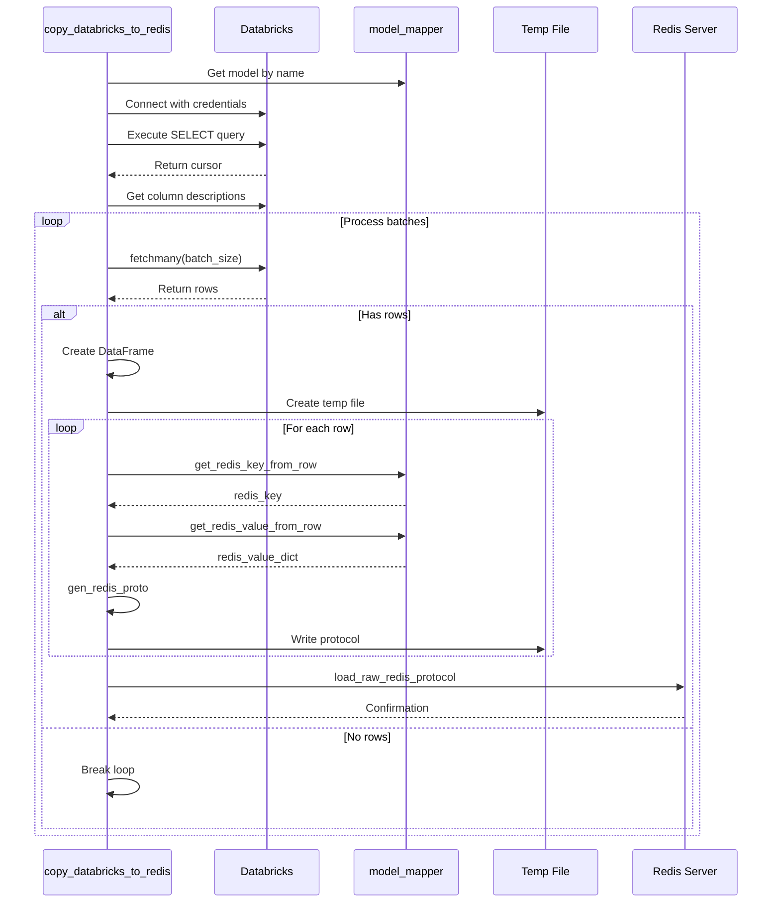
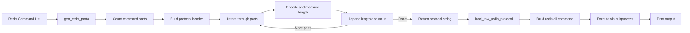
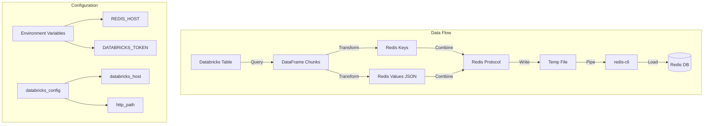

# Diagram: research/common/databricks_to_redis.py

> Auto-generated by Obscura crawlers

## Diagram 1

### SVG

<svg id="container" width="481.375" xmlns="http://www.w3.org/2000/svg" class="flowchart" height="2394.59375" viewBox="0 0 481.375 2394.59375" role="graphics-document document" aria-roledescription="flowchart-v2"><g><marker id="container_flowchart-v2-pointEnd" class="marker flowchart-v2" viewBox="0 0 10 10" refX="5" refY="5" markerUnits="userSpaceOnUse" markerWidth="8" markerHeight="8" orient="auto"><path d="M 0 0 L 10 5 L 0 10 z" class="arrowMarkerPath" style="stroke-width: 1; stroke-dasharray: 1, 0;"></path></marker><marker id="container_flowchart-v2-pointStart" class="marker flowchart-v2" viewBox="0 0 10 10" refX="4.5" refY="5" markerUnits="userSpaceOnUse" markerWidth="8" markerHeight="8" orient="auto"><path d="M 0 5 L 10 10 L 10 0 z" class="arrowMarkerPath" style="stroke-width: 1; stroke-dasharray: 1, 0;"></path></marker><marker id="container_flowchart-v2-circleEnd" class="marker flowchart-v2" viewBox="0 0 10 10" refX="11" refY="5" markerUnits="userSpaceOnUse" markerWidth="11" markerHeight="11" orient="auto"><circle cx="5" cy="5" r="5" class="arrowMarkerPath" style="stroke-width: 1; stroke-dasharray: 1, 0;"></circle></marker><marker id="container_flowchart-v2-circleStart" class="marker flowchart-v2" viewBox="0 0 10 10" refX="-1" refY="5" markerUnits="userSpaceOnUse" markerWidth="11" markerHeight="11" orient="auto"><circle cx="5" cy="5" r="5" class="arrowMarkerPath" style="stroke-width: 1; stroke-dasharray: 1, 0;"></circle></marker><marker id="container_flowchart-v2-crossEnd" class="marker cross flowchart-v2" viewBox="0 0 11 11" refX="12" refY="5.2" markerUnits="userSpaceOnUse" markerWidth="11" markerHeight="11" orient="auto"><path d="M 1,1 l 9,9 M 10,1 l -9,9" class="arrowMarkerPath" style="stroke-width: 2; stroke-dasharray: 1, 0;"></path></marker><marker id="container_flowchart-v2-crossStart" class="marker cross flowchart-v2" viewBox="0 0 11 11" refX="-1" refY="5.2" markerUnits="userSpaceOnUse" markerWidth="11" markerHeight="11" orient="auto"><path d="M 1,1 l 9,9 M 10,1 l -9,9" class="arrowMarkerPath" style="stroke-width: 2; stroke-dasharray: 1, 0;"></path></marker><g class="root"><g class="clusters"></g><g class="edgePaths"><path d="M275.359,86L275.359,90.167C275.359,94.333,275.359,102.667,275.359,110.333C275.359,118,275.359,125,275.359,128.5L275.359,132" id="L_A_B_0" class="edge-thickness-normal edge-pattern-solid edge-thickness-normal edge-pattern-solid flowchart-link" style=";" data-edge="true" data-et="edge" data-id="L_A_B_0" data-points="W3sieCI6Mjc1LjM1OTM3NSwieSI6ODZ9LHsieCI6Mjc1LjM1OTM3NSwieSI6MTExfSx7IngiOjI3NS4zNTkzNzUsInkiOjEzNn1d" marker-end="url(#container_flowchart-v2-pointEnd)"></path><path d="M275.359,214L275.359,218.167C275.359,222.333,275.359,230.667,275.359,238.333C275.359,246,275.359,253,275.359,256.5L275.359,260" id="L_B_C_0" class="edge-thickness-normal edge-pattern-solid edge-thickness-normal edge-pattern-solid flowchart-link" style=";" data-edge="true" data-et="edge" data-id="L_B_C_0" data-points="W3sieCI6Mjc1LjM1OTM3NSwieSI6MjE0fSx7IngiOjI3NS4zNTkzNzUsInkiOjIzOX0seyJ4IjoyNzUuMzU5Mzc1LCJ5IjoyNjR9XQ==" marker-end="url(#container_flowchart-v2-pointEnd)"></path><path d="M275.359,318L275.359,322.167C275.359,326.333,275.359,334.667,275.359,342.333C275.359,350,275.359,357,275.359,360.5L275.359,364" id="L_C_D_0" class="edge-thickness-normal edge-pattern-solid edge-thickness-normal edge-pattern-solid flowchart-link" style=";" data-edge="true" data-et="edge" data-id="L_C_D_0" data-points="W3sieCI6Mjc1LjM1OTM3NSwieSI6MzE4fSx7IngiOjI3NS4zNTkzNzUsInkiOjM0M30seyJ4IjoyNzUuMzU5Mzc1LCJ5IjozNjh9XQ==" marker-end="url(#container_flowchart-v2-pointEnd)"></path><path d="M275.359,446L275.359,450.167C275.359,454.333,275.359,462.667,275.359,470.333C275.359,478,275.359,485,275.359,488.5L275.359,492" id="L_D_E_0" class="edge-thickness-normal edge-pattern-solid edge-thickness-normal edge-pattern-solid flowchart-link" style=";" data-edge="true" data-et="edge" data-id="L_D_E_0" data-points="W3sieCI6Mjc1LjM1OTM3NSwieSI6NDQ2fSx7IngiOjI3NS4zNTkzNzUsInkiOjQ3MX0seyJ4IjoyNzUuMzU5Mzc1LCJ5Ijo0OTZ9XQ==" marker-end="url(#container_flowchart-v2-pointEnd)"></path><path d="M275.359,550L275.359,554.167C275.359,558.333,275.359,566.667,275.359,574.333C275.359,582,275.359,589,275.359,592.5L275.359,596" id="L_E_F_0" class="edge-thickness-normal edge-pattern-solid edge-thickness-normal edge-pattern-solid flowchart-link" style=";" data-edge="true" data-et="edge" data-id="L_E_F_0" data-points="W3sieCI6Mjc1LjM1OTM3NSwieSI6NTUwfSx7IngiOjI3NS4zNTkzNzUsInkiOjU3NX0seyJ4IjoyNzUuMzU5Mzc1LCJ5Ijo2MDB9XQ==" marker-end="url(#container_flowchart-v2-pointEnd)"></path><path d="M275.359,678L275.359,682.167C275.359,686.333,275.359,694.667,275.359,702.333C275.359,710,275.359,717,275.359,720.5L275.359,724" id="L_F_G_0" class="edge-thickness-normal edge-pattern-solid edge-thickness-normal edge-pattern-solid flowchart-link" style=";" data-edge="true" data-et="edge" data-id="L_F_G_0" data-points="W3sieCI6Mjc1LjM1OTM3NSwieSI6Njc4fSx7IngiOjI3NS4zNTkzNzUsInkiOjcwM30seyJ4IjoyNzUuMzU5Mzc1LCJ5Ijo3Mjh9XQ==" marker-end="url(#container_flowchart-v2-pointEnd)"></path><path d="M214.564,861.798L187.417,878.098C160.269,894.397,105.974,926.995,78.827,950.795C51.68,974.594,51.68,989.594,51.68,997.094L51.68,1004.594" id="L_G_Z_0" class="edge-thickness-normal edge-pattern-solid edge-thickness-normal edge-pattern-solid flowchart-link" style=";" data-edge="true" data-et="edge" data-id="L_G_Z_0" data-points="W3sieCI6MjE0LjU2Mzk1NzQzNzYzNzc1LCJ5Ijo4NjEuNzk4MzMyNDM3NjM3OH0seyJ4Ijo1MS42Nzk2ODc1LCJ5Ijo5NTkuNTkzNzV9LHsieCI6NTEuNjc5Njg3NSwieSI6MTAwOC41OTM3NX1d" marker-end="url(#container_flowchart-v2-pointEnd)"></path><path d="M275.359,922.594L275.359,928.76C275.359,934.927,275.359,947.26,275.359,958.927C275.359,970.594,275.359,981.594,275.359,987.094L275.359,992.594" id="L_G_H_0" class="edge-thickness-normal edge-pattern-solid edge-thickness-normal edge-pattern-solid flowchart-link" style=";" data-edge="true" data-et="edge" data-id="L_G_H_0" data-points="W3sieCI6Mjc1LjM1OTM3NSwieSI6OTIyLjU5Mzc1fSx7IngiOjI3NS4zNTkzNzUsInkiOjk1OS41OTM3NX0seyJ4IjoyNzUuMzU5Mzc1LCJ5Ijo5OTYuNTkzNzV9XQ==" marker-end="url(#container_flowchart-v2-pointEnd)"></path><path d="M275.359,1074.594L275.359,1078.76C275.359,1082.927,275.359,1091.26,275.359,1098.927C275.359,1106.594,275.359,1113.594,275.359,1117.094L275.359,1120.594" id="L_H_I_0" class="edge-thickness-normal edge-pattern-solid edge-thickness-normal edge-pattern-solid flowchart-link" style=";" data-edge="true" data-et="edge" data-id="L_H_I_0" data-points="W3sieCI6Mjc1LjM1OTM3NSwieSI6MTA3NC41OTM3NX0seyJ4IjoyNzUuMzU5Mzc1LCJ5IjoxMDk5LjU5Mzc1fSx7IngiOjI3NS4zNTkzNzUsInkiOjExMjQuNTkzNzV9XQ==" marker-end="url(#container_flowchart-v2-pointEnd)"></path><path d="M275.359,1178.594L275.359,1182.76C275.359,1186.927,275.359,1195.26,275.359,1202.927C275.359,1210.594,275.359,1217.594,275.359,1221.094L275.359,1224.594" id="L_I_J_0" class="edge-thickness-normal edge-pattern-solid edge-thickness-normal edge-pattern-solid flowchart-link" style=";" data-edge="true" data-et="edge" data-id="L_I_J_0" data-points="W3sieCI6Mjc1LjM1OTM3NSwieSI6MTE3OC41OTM3NX0seyJ4IjoyNzUuMzU5Mzc1LCJ5IjoxMjAzLjU5Mzc1fSx7IngiOjI3NS4zNTkzNzUsInkiOjEyMjguNTkzNzV9XQ==" marker-end="url(#container_flowchart-v2-pointEnd)"></path><path d="M225.086,1306.594L219.715,1310.76C214.344,1314.927,203.602,1323.26,198.23,1330.927C192.859,1338.594,192.859,1345.594,192.859,1349.094L192.859,1352.594" id="L_J_K_0" class="edge-thickness-normal edge-pattern-solid edge-thickness-normal edge-pattern-solid flowchart-link" style=";" data-edge="true" data-et="edge" data-id="L_J_K_0" data-points="W3sieCI6MjI1LjA4NTkzNzUsInkiOjEzMDYuNTkzNzV9LHsieCI6MTkyLjg1OTM3NSwieSI6MTMzMS41OTM3NX0seyJ4IjoxOTIuODU5Mzc1LCJ5IjoxMzU2LjU5Mzc1fV0=" marker-end="url(#container_flowchart-v2-pointEnd)"></path><path d="M192.859,1410.594L192.859,1414.76C192.859,1418.927,192.859,1427.26,192.859,1434.927C192.859,1442.594,192.859,1449.594,192.859,1453.094L192.859,1456.594" id="L_K_L_0" class="edge-thickness-normal edge-pattern-solid edge-thickness-normal edge-pattern-solid flowchart-link" style=";" data-edge="true" data-et="edge" data-id="L_K_L_0" data-points="W3sieCI6MTkyLjg1OTM3NSwieSI6MTQxMC41OTM3NX0seyJ4IjoxOTIuODU5Mzc1LCJ5IjoxNDM1LjU5Mzc1fSx7IngiOjE5Mi44NTkzNzUsInkiOjE0NjAuNTkzNzV9XQ==" marker-end="url(#container_flowchart-v2-pointEnd)"></path><path d="M192.859,1538.594L192.859,1542.76C192.859,1546.927,192.859,1555.26,192.859,1562.927C192.859,1570.594,192.859,1577.594,192.859,1581.094L192.859,1584.594" id="L_L_M_0" class="edge-thickness-normal edge-pattern-solid edge-thickness-normal edge-pattern-solid flowchart-link" style=";" data-edge="true" data-et="edge" data-id="L_L_M_0" data-points="W3sieCI6MTkyLjg1OTM3NSwieSI6MTUzOC41OTM3NX0seyJ4IjoxOTIuODU5Mzc1LCJ5IjoxNTYzLjU5Mzc1fSx7IngiOjE5Mi44NTkzNzUsInkiOjE1ODguNTkzNzV9XQ==" marker-end="url(#container_flowchart-v2-pointEnd)"></path><path d="M192.859,1666.594L192.859,1672.76C192.859,1678.927,192.859,1691.26,192.859,1702.927C192.859,1714.594,192.859,1725.594,192.859,1731.094L192.859,1736.594" id="L_M_N_0" class="edge-thickness-normal edge-pattern-solid edge-thickness-normal edge-pattern-solid flowchart-link" style=";" data-edge="true" data-et="edge" data-id="L_M_N_0" data-points="W3sieCI6MTkyLjg1OTM3NSwieSI6MTY2Ni41OTM3NX0seyJ4IjoxOTIuODU5Mzc1LCJ5IjoxNzAzLjU5Mzc1fSx7IngiOjE5Mi44NTkzNzUsInkiOjE3NDAuNTkzNzV9XQ==" marker-end="url(#container_flowchart-v2-pointEnd)"></path><path d="M192.859,1818.594L192.859,1822.76C192.859,1826.927,192.859,1835.26,192.859,1842.927C192.859,1850.594,192.859,1857.594,192.859,1861.094L192.859,1864.594" id="L_N_O_0" class="edge-thickness-normal edge-pattern-solid edge-thickness-normal edge-pattern-solid flowchart-link" style=";" data-edge="true" data-et="edge" data-id="L_N_O_0" data-points="W3sieCI6MTkyLjg1OTM3NSwieSI6MTgxOC41OTM3NX0seyJ4IjoxOTIuODU5Mzc1LCJ5IjoxODQzLjU5Mzc1fSx7IngiOjE5Mi44NTkzNzUsInkiOjE4NjguNTkzNzV9XQ==" marker-end="url(#container_flowchart-v2-pointEnd)"></path><path d="M192.859,1922.594L192.859,1926.76C192.859,1930.927,192.859,1939.26,192.859,1946.927C192.859,1954.594,192.859,1961.594,192.859,1965.094L192.859,1968.594" id="L_O_P_0" class="edge-thickness-normal edge-pattern-solid edge-thickness-normal edge-pattern-solid flowchart-link" style=";" data-edge="true" data-et="edge" data-id="L_O_P_0" data-points="W3sieCI6MTkyLjg1OTM3NSwieSI6MTkyMi41OTM3NX0seyJ4IjoxOTIuODU5Mzc1LCJ5IjoxOTQ3LjU5Mzc1fSx7IngiOjE5Mi44NTkzNzUsInkiOjE5NzIuNTkzNzV9XQ==" marker-end="url(#container_flowchart-v2-pointEnd)"></path><path d="M192.859,2026.594L192.859,2030.76C192.859,2034.927,192.859,2043.26,198.906,2051.238C204.953,2059.216,217.046,2066.838,223.092,2070.65L229.139,2074.461" id="L_P_Q_0" class="edge-thickness-normal edge-pattern-solid edge-thickness-normal edge-pattern-solid flowchart-link" style=";" data-edge="true" data-et="edge" data-id="L_P_Q_0" data-points="W3sieCI6MTkyLjg1OTM3NSwieSI6MjAyNi41OTM3NX0seyJ4IjoxOTIuODU5Mzc1LCJ5IjoyMDUxLjU5Mzc1fSx7IngiOjIzMi41MjI4MzY1Mzg0NjE1NSwieSI6MjA3Ni41OTM3NX1d" marker-end="url(#container_flowchart-v2-pointEnd)"></path><path d="M318.196,2076.594L324.806,2072.427C331.417,2068.26,344.638,2059.927,351.249,2047.094C357.859,2034.26,357.859,2016.927,357.859,1999.594C357.859,1982.26,357.859,1964.927,357.859,1947.594C357.859,1930.26,357.859,1912.927,357.859,1895.594C357.859,1878.26,357.859,1860.927,357.859,1841.594C357.859,1822.26,357.859,1800.927,357.859,1777.594C357.859,1754.26,357.859,1728.927,357.859,1703.594C357.859,1678.26,357.859,1652.927,357.859,1629.594C357.859,1606.26,357.859,1584.927,357.859,1563.594C357.859,1542.26,357.859,1520.927,357.859,1499.594C357.859,1478.26,357.859,1456.927,357.859,1437.594C357.859,1418.26,357.859,1400.927,357.859,1383.594C357.859,1366.26,357.859,1348.927,353.015,1336.502C348.171,1324.078,338.482,1316.562,333.638,1312.804L328.793,1309.046" id="L_Q_J_0" class="edge-thickness-normal edge-pattern-solid edge-thickness-normal edge-pattern-solid flowchart-link" style=";" data-edge="true" data-et="edge" data-id="L_Q_J_0" data-points="W3sieCI6MzE4LjE5NTkxMzQ2MTUzODQ1LCJ5IjoyMDc2LjU5Mzc1fSx7IngiOjM1Ny44NTkzNzUsInkiOjIwNTEuNTkzNzV9LHsieCI6MzU3Ljg1OTM3NSwieSI6MTk5OS41OTM3NX0seyJ4IjozNTcuODU5Mzc1LCJ5IjoxOTQ3LjU5Mzc1fSx7IngiOjM1Ny44NTkzNzUsInkiOjE4OTUuNTkzNzV9LHsieCI6MzU3Ljg1OTM3NSwieSI6MTg0My41OTM3NX0seyJ4IjozNTcuODU5Mzc1LCJ5IjoxNzc5LjU5Mzc1fSx7IngiOjM1Ny44NTkzNzUsInkiOjE3MDMuNTkzNzV9LHsieCI6MzU3Ljg1OTM3NSwieSI6MTYyNy41OTM3NX0seyJ4IjozNTcuODU5Mzc1LCJ5IjoxNTYzLjU5Mzc1fSx7IngiOjM1Ny44NTkzNzUsInkiOjE0OTkuNTkzNzV9LHsieCI6MzU3Ljg1OTM3NSwieSI6MTQzNS41OTM3NX0seyJ4IjozNTcuODU5Mzc1LCJ5IjoxMzgzLjU5Mzc1fSx7IngiOjM1Ny44NTkzNzUsInkiOjEzMzEuNTkzNzV9LHsieCI6MzI1LjYzMjgxMjUsInkiOjEzMDYuNTkzNzV9XQ==" marker-end="url(#container_flowchart-v2-pointEnd)"></path><path d="M275.359,2130.594L275.359,2136.76C275.359,2142.927,275.359,2155.26,275.359,2166.927C275.359,2178.594,275.359,2189.594,275.359,2195.094L275.359,2200.594" id="L_Q_R_0" class="edge-thickness-normal edge-pattern-solid edge-thickness-normal edge-pattern-solid flowchart-link" style=";" data-edge="true" data-et="edge" data-id="L_Q_R_0" data-points="W3sieCI6Mjc1LjM1OTM3NSwieSI6MjEzMC41OTM3NX0seyJ4IjoyNzUuMzU5Mzc1LCJ5IjoyMTY3LjU5Mzc1fSx7IngiOjI3NS4zNTkzNzUsInkiOjIyMDQuNTkzNzV9XQ==" marker-end="url(#container_flowchart-v2-pointEnd)"></path><path d="M275.359,2282.594L275.359,2286.76C275.359,2290.927,275.359,2299.26,281.406,2307.238C287.453,2315.216,299.546,2322.838,305.592,2326.65L311.639,2330.461" id="L_R_S_0" class="edge-thickness-normal edge-pattern-solid edge-thickness-normal edge-pattern-solid flowchart-link" style=";" data-edge="true" data-et="edge" data-id="L_R_S_0" data-points="W3sieCI6Mjc1LjM1OTM3NSwieSI6MjI4Mi41OTM3NX0seyJ4IjoyNzUuMzU5Mzc1LCJ5IjoyMzA3LjU5Mzc1fSx7IngiOjMxNS4wMjI4MzY1Mzg0NjE1NSwieSI6MjMzMi41OTM3NX1d" marker-end="url(#container_flowchart-v2-pointEnd)"></path><path d="M415.551,2332.594L424.454,2328.427C433.357,2324.26,451.163,2315.927,460.066,2301.094C468.969,2286.26,468.969,2264.927,468.969,2241.594C468.969,2218.26,468.969,2192.927,468.969,2169.594C468.969,2146.26,468.969,2124.927,468.969,2105.594C468.969,2086.26,468.969,2068.927,468.969,2051.594C468.969,2034.26,468.969,2016.927,468.969,1999.594C468.969,1982.26,468.969,1964.927,468.969,1947.594C468.969,1930.26,468.969,1912.927,468.969,1895.594C468.969,1878.26,468.969,1860.927,468.969,1841.594C468.969,1822.26,468.969,1800.927,468.969,1777.594C468.969,1754.26,468.969,1728.927,468.969,1703.594C468.969,1678.26,468.969,1652.927,468.969,1629.594C468.969,1606.26,468.969,1584.927,468.969,1563.594C468.969,1542.26,468.969,1520.927,468.969,1499.594C468.969,1478.26,468.969,1456.927,468.969,1437.594C468.969,1418.26,468.969,1400.927,468.969,1383.594C468.969,1366.26,468.969,1348.927,468.969,1329.594C468.969,1310.26,468.969,1288.927,468.969,1267.594C468.969,1246.26,468.969,1224.927,468.969,1205.594C468.969,1186.26,468.969,1168.927,468.969,1151.594C468.969,1134.26,468.969,1116.927,468.969,1097.594C468.969,1078.26,468.969,1056.927,468.969,1033.594C468.969,1010.26,468.969,984.927,446.823,956.899C424.677,928.871,380.386,898.148,358.24,882.787L336.094,867.425" id="L_S_G_0" class="edge-thickness-normal edge-pattern-solid edge-thickness-normal edge-pattern-solid flowchart-link" style=";" data-edge="true" data-et="edge" data-id="L_S_G_0" data-points="W3sieCI6NDE1LjU1MDc4MTI1LCJ5IjoyMzMyLjU5Mzc1fSx7IngiOjQ2OC45Njg3NSwieSI6MjMwNy41OTM3NX0seyJ4Ijo0NjguOTY4NzUsInkiOjIyNDMuNTkzNzV9LHsieCI6NDY4Ljk2ODc1LCJ5IjoyMTY3LjU5Mzc1fSx7IngiOjQ2OC45Njg3NSwieSI6MjEwMy41OTM3NX0seyJ4Ijo0NjguOTY4NzUsInkiOjIwNTEuNTkzNzV9LHsieCI6NDY4Ljk2ODc1LCJ5IjoxOTk5LjU5Mzc1fSx7IngiOjQ2OC45Njg3NSwieSI6MTk0Ny41OTM3NX0seyJ4Ijo0NjguOTY4NzUsInkiOjE4OTUuNTkzNzV9LHsieCI6NDY4Ljk2ODc1LCJ5IjoxODQzLjU5Mzc1fSx7IngiOjQ2OC45Njg3NSwieSI6MTc3OS41OTM3NX0seyJ4Ijo0NjguOTY4NzUsInkiOjE3MDMuNTkzNzV9LHsieCI6NDY4Ljk2ODc1LCJ5IjoxNjI3LjU5Mzc1fSx7IngiOjQ2OC45Njg3NSwieSI6MTU2My41OTM3NX0seyJ4Ijo0NjguOTY4NzUsInkiOjE0OTkuNTkzNzV9LHsieCI6NDY4Ljk2ODc1LCJ5IjoxNDM1LjU5Mzc1fSx7IngiOjQ2OC45Njg3NSwieSI6MTM4My41OTM3NX0seyJ4Ijo0NjguOTY4NzUsInkiOjEzMzEuNTkzNzV9LHsieCI6NDY4Ljk2ODc1LCJ5IjoxMjY3LjU5Mzc1fSx7IngiOjQ2OC45Njg3NSwieSI6MTIwMy41OTM3NX0seyJ4Ijo0NjguOTY4NzUsInkiOjExNTEuNTkzNzV9LHsieCI6NDY4Ljk2ODc1LCJ5IjoxMDk5LjU5Mzc1fSx7IngiOjQ2OC45Njg3NSwieSI6MTAzNS41OTM3NX0seyJ4Ijo0NjguOTY4NzUsInkiOjk1OS41OTM3NX0seyJ4IjozMzIuODA3NDYzMTU5OTYzOCwieSI6ODY1LjE0NTY2MTg0MDAzNjN9XQ==" marker-end="url(#container_flowchart-v2-pointEnd)"></path></g><g class="edgeLabels"><g class="edgeLabel"><g class="label" data-id="L_A_B_0" transform="translate(0, 0)"><foreignObject width="0" height="0">

</foreignObject></g></g><g class="edgeLabel"><g class="label" data-id="L_B_C_0" transform="translate(0, 0)"><foreignObject width="0" height="0">

</foreignObject></g></g><g class="edgeLabel"><g class="label" data-id="L_C_D_0" transform="translate(0, 0)"><foreignObject width="0" height="0">

</foreignObject></g></g><g class="edgeLabel"><g class="label" data-id="L_D_E_0" transform="translate(0, 0)"><foreignObject width="0" height="0">

</foreignObject></g></g><g class="edgeLabel"><g class="label" data-id="L_E_F_0" transform="translate(0, 0)"><foreignObject width="0" height="0">

</foreignObject></g></g><g class="edgeLabel"><g class="label" data-id="L_F_G_0" transform="translate(0, 0)"><foreignObject width="0" height="0">

</foreignObject></g></g><g class="edgeLabel" transform="translate(51.6796875, 959.59375)"><g class="label" data-id="L_G_Z_0" transform="translate(-29.25, -12)"><foreignObject width="58.5" height="24">

No rows

</foreignObject></g></g><g class="edgeLabel" transform="translate(275.359375, 959.59375)"><g class="label" data-id="L_G_H_0" transform="translate(-32.5625, -12)"><foreignObject width="65.125" height="24">

Has rows

</foreignObject></g></g><g class="edgeLabel"><g class="label" data-id="L_H_I_0" transform="translate(0, 0)"><foreignObject width="0" height="0">

</foreignObject></g></g><g class="edgeLabel"><g class="label" data-id="L_I_J_0" transform="translate(0, 0)"><foreignObject width="0" height="0">

</foreignObject></g></g><g class="edgeLabel"><g class="label" data-id="L_J_K_0" transform="translate(0, 0)"><foreignObject width="0" height="0">

</foreignObject></g></g><g class="edgeLabel"><g class="label" data-id="L_K_L_0" transform="translate(0, 0)"><foreignObject width="0" height="0">

</foreignObject></g></g><g class="edgeLabel"><g class="label" data-id="L_L_M_0" transform="translate(0, 0)"><foreignObject width="0" height="0">

</foreignObject></g></g><g class="edgeLabel"><g class="label" data-id="L_M_N_0" transform="translate(0, 0)"><foreignObject width="0" height="0">

</foreignObject></g></g><g class="edgeLabel"><g class="label" data-id="L_N_O_0" transform="translate(0, 0)"><foreignObject width="0" height="0">

</foreignObject></g></g><g class="edgeLabel"><g class="label" data-id="L_O_P_0" transform="translate(0, 0)"><foreignObject width="0" height="0">

</foreignObject></g></g><g class="edgeLabel"><g class="label" data-id="L_P_Q_0" transform="translate(0, 0)"><foreignObject width="0" height="0">

</foreignObject></g></g><g class="edgeLabel" transform="translate(357.859375, 1703.59375)"><g class="label" data-id="L_Q_J_0" transform="translate(-37.21875, -12)"><foreignObject width="74.4375" height="24">

More rows

</foreignObject></g></g><g class="edgeLabel" transform="translate(275.359375, 2167.59375)"><g class="label" data-id="L_Q_R_0" transform="translate(-18.875, -12)"><foreignObject width="37.75" height="24">

Done

</foreignObject></g></g><g class="edgeLabel"><g class="label" data-id="L_R_S_0" transform="translate(0, 0)"><foreignObject width="0" height="0">

</foreignObject></g></g><g class="edgeLabel"><g class="label" data-id="L_S_G_0" transform="translate(0, 0)"><foreignObject width="0" height="0">

</foreignObject></g></g></g><g class="nodes"><g class="node default" id="flowchart-A-0" transform="translate(275.359375, 47)"><rect class="basic label-container" style="" x="-130" y="-39" width="260" height="78"></rect><g class="label" style="" transform="translate(-100, -24)"><rect></rect><foreignObject width="200" height="48">

Start copy_databricks_to_redis

</foreignObject></g></g><g class="node default" id="flowchart-B-1" transform="translate(275.359375, 175)"><rect class="basic label-container" style="" x="-130" y="-39" width="260" height="78"></rect><g class="label" style="" transform="translate(-100, -24)"><rect></rect><foreignObject width="200" height="48">

Get model from model_mapper

</foreignObject></g></g><g class="node default" id="flowchart-C-3" transform="translate(275.359375, 291)"><rect class="basic label-container" style="" x="-109.4453125" y="-27" width="218.890625" height="54"></rect><g class="label" style="" transform="translate(-79.4453125, -12)"><rect></rect><foreignObject width="158.890625" height="24">

Connect to Databricks

</foreignObject></g></g><g class="node default" id="flowchart-D-5" transform="translate(275.359375, 407)"><rect class="basic label-container" style="" x="-130" y="-39" width="260" height="78"></rect><g class="label" style="" transform="translate(-100, -24)"><rect></rect><foreignObject width="200" height="48">

Create cursor and execute query

</foreignObject></g></g><g class="node default" id="flowchart-E-7" transform="translate(275.359375, 523)"><rect class="basic label-container" style="" x="-97.4140625" y="-27" width="194.828125" height="54"></rect><g class="label" style="" transform="translate(-67.4140625, -12)"><rect></rect><foreignObject width="134.828125" height="24">

Get column names

</foreignObject></g></g><g class="node default" id="flowchart-F-9" transform="translate(275.359375, 639)"><rect class="basic label-container" style="" x="-130" y="-39" width="260" height="78"></rect><g class="label" style="" transform="translate(-100, -24)"><rect></rect><foreignObject width="200" height="48">

Initialize chunk_count and model_date

</foreignObject></g></g><g class="node default" id="flowchart-G-11" transform="translate(275.359375, 825.296875)"><polygon points="97.296875,0 194.59375,-97.296875 97.296875,-194.59375 0,-97.296875" class="label-container" transform="translate(-96.796875, 97.296875)"></polygon><g class="label" style="" transform="translate(-70.296875, -12)"><rect></rect><foreignObject width="140.59375" height="24">

Fetch batch of rows

</foreignObject></g></g><g class="node default" id="flowchart-Z-13" transform="translate(51.6796875, 1035.59375)"><rect class="basic label-container" style="" x="-43.6796875" y="-27" width="87.359375" height="54"></rect><g class="label" style="" transform="translate(-13.6796875, -12)"><rect></rect><foreignObject width="27.359375" height="24">

End

</foreignObject></g></g><g class="node default" id="flowchart-H-15" transform="translate(275.359375, 1035.59375)"><rect class="basic label-container" style="" x="-130" y="-39" width="260" height="78"></rect><g class="label" style="" transform="translate(-100, -24)"><rect></rect><foreignObject width="200" height="48">

Create DataFrame from rows

</foreignObject></g></g><g class="node default" id="flowchart-I-17" transform="translate(275.359375, 1151.59375)"><rect class="basic label-container" style="" x="-87.2109375" y="-27" width="174.421875" height="54"></rect><g class="label" style="" transform="translate(-57.2109375, -12)"><rect></rect><foreignObject width="114.421875" height="24">

Create temp file

</foreignObject></g></g><g class="node default" id="flowchart-J-19" transform="translate(275.359375, 1267.59375)"><rect class="basic label-container" style="" x="-130" y="-39" width="260" height="78"></rect><g class="label" style="" transform="translate(-100, -24)"><rect></rect><foreignObject width="200" height="48">

Iterate through DataFrame rows

</foreignObject></g></g><g class="node default" id="flowchart-K-21" transform="translate(192.859375, 1383.59375)"><rect class="basic label-container" style="" x="-98.6796875" y="-27" width="197.359375" height="54"></rect><g class="label" style="" transform="translate(-68.6796875, -12)"><rect></rect><foreignObject width="137.359375" height="24">

Convert row to dict

</foreignObject></g></g><g class="node default" id="flowchart-L-23" transform="translate(192.859375, 1499.59375)"><rect class="basic label-container" style="" x="-130" y="-39" width="260" height="78"></rect><g class="label" style="" transform="translate(-100, -24)"><rect></rect><foreignObject width="200" height="48">

Get redis_key from model_mapper

</foreignObject></g></g><g class="node default" id="flowchart-M-25" transform="translate(192.859375, 1627.59375)"><rect class="basic label-container" style="" x="-130" y="-39" width="260" height="78"></rect><g class="label" style="" transform="translate(-100, -24)"><rect></rect><foreignObject width="200" height="48">

Get redis_value_dict from model_mapper

</foreignObject></g></g><g class="node default" id="flowchart-N-27" transform="translate(192.859375, 1779.59375)"><rect class="basic label-container" style="" x="-130" y="-39" width="260" height="78"></rect><g class="label" style="" transform="translate(-100, -24)"><rect></rect><foreignObject width="200" height="48">

Add model_date to redis_value_dict

</foreignObject></g></g><g class="node default" id="flowchart-O-29" transform="translate(192.859375, 1895.59375)"><rect class="basic label-container" style="" x="-110.28125" y="-27" width="220.5625" height="54"></rect><g class="label" style="" transform="translate(-80.28125, -12)"><rect></rect><foreignObject width="160.5625" height="24">

Convert to JSON string

</foreignObject></g></g><g class="node default" id="flowchart-P-31" transform="translate(192.859375, 1999.59375)"><rect class="basic label-container" style="" x="-115.3671875" y="-27" width="230.734375" height="54"></rect><g class="label" style="" transform="translate(-85.3671875, -12)"><rect></rect><foreignObject width="170.734375" height="24">

Generate redis protocol

</foreignObject></g></g><g class="node default" id="flowchart-Q-33" transform="translate(275.359375, 2103.59375)"><rect class="basic label-container" style="" x="-92.84375" y="-27" width="185.6875" height="54"></rect><g class="label" style="" transform="translate(-62.84375, -12)"><rect></rect><foreignObject width="125.6875" height="24">

Write to temp file

</foreignObject></g></g><g class="node default" id="flowchart-R-37" transform="translate(275.359375, 2243.59375)"><rect class="basic label-container" style="" x="-130" y="-39" width="260" height="78"></rect><g class="label" style="" transform="translate(-100, -24)"><rect></rect><foreignObject width="200" height="48">

Load redis protocol to Redis

</foreignObject></g></g><g class="node default" id="flowchart-S-39" transform="translate(357.859375, 2359.59375)"><rect class="basic label-container" style="" x="-115.515625" y="-27" width="231.03125" height="54"></rect><g class="label" style="" transform="translate(-85.515625, -12)"><rect></rect><foreignObject width="171.03125" height="24">

Increment chunk_count

</foreignObject></g></g></g></g></g></svg>

## Diagram 2

### SVG

<svg id="container" width="1128" xmlns="http://www.w3.org/2000/svg" height="1365" viewBox="-52 -10 1128 1365" role="graphics-document document" aria-roledescription="sequence"><g><rect x="876" y="1279" fill="#eaeaea" stroke="#666" width="150" height="65" name="Redis" rx="3" ry="3" class="actor actor-bottom"></rect><text x="951" y="1311.5" dominant-baseline="central" alignment-baseline="central" class="actor actor-box" style="text-anchor: middle; font-size: 16px; font-weight: 400;"><tspan x="951" dy="0">Redis Server</tspan></text></g><g><rect x="676" y="1279" fill="#eaeaea" stroke="#666" width="150" height="65" name="TF" rx="3" ry="3" class="actor actor-bottom"></rect><text x="751" y="1311.5" dominant-baseline="central" alignment-baseline="central" class="actor actor-box" style="text-anchor: middle; font-size: 16px; font-weight: 400;"><tspan x="751" dy="0">Temp File</tspan></text></g><g><rect x="476" y="1279" fill="#eaeaea" stroke="#666" width="150" height="65" name="MM" rx="3" ry="3" class="actor actor-bottom"></rect><text x="551" y="1311.5" dominant-baseline="central" alignment-baseline="central" class="actor actor-box" style="text-anchor: middle; font-size: 16px; font-weight: 400;"><tspan x="551" dy="0">model_mapper</tspan></text></g><g><rect x="276" y="1279" fill="#eaeaea" stroke="#666" width="150" height="65" name="DB" rx="3" ry="3" class="actor actor-bottom"></rect><text x="351" y="1311.5" dominant-baseline="central" alignment-baseline="central" class="actor actor-box" style="text-anchor: middle; font-size: 16px; font-weight: 400;"><tspan x="351" dy="0">Databricks</tspan></text></g><g><rect x="0" y="1279" fill="#eaeaea" stroke="#666" width="204" height="65" name="Main" rx="3" ry="3" class="actor actor-bottom"></rect><text x="102" y="1311.5" dominant-baseline="central" alignment-baseline="central" class="actor actor-box" style="text-anchor: middle; font-size: 16px; font-weight: 400;"><tspan x="102" dy="0">copy_databricks_to_redis</tspan></text></g><g><line id="actor4" x1="951" y1="65" x2="951" y2="1279" class="actor-line 200" stroke-width="0.5px" stroke="#999" name="Redis"></line><g id="root-4"><rect x="876" y="0" fill="#eaeaea" stroke="#666" width="150" height="65" name="Redis" rx="3" ry="3" class="actor actor-top"></rect><text x="951" y="32.5" dominant-baseline="central" alignment-baseline="central" class="actor actor-box" style="text-anchor: middle; font-size: 16px; font-weight: 400;"><tspan x="951" dy="0">Redis Server</tspan></text></g></g><g><line id="actor3" x1="751" y1="65" x2="751" y2="1279" class="actor-line 200" stroke-width="0.5px" stroke="#999" name="TF"></line><g id="root-3"><rect x="676" y="0" fill="#eaeaea" stroke="#666" width="150" height="65" name="TF" rx="3" ry="3" class="actor actor-top"></rect><text x="751" y="32.5" dominant-baseline="central" alignment-baseline="central" class="actor actor-box" style="text-anchor: middle; font-size: 16px; font-weight: 400;"><tspan x="751" dy="0">Temp File</tspan></text></g></g><g><line id="actor2" x1="551" y1="65" x2="551" y2="1279" class="actor-line 200" stroke-width="0.5px" stroke="#999" name="MM"></line><g id="root-2"><rect x="476" y="0" fill="#eaeaea" stroke="#666" width="150" height="65" name="MM" rx="3" ry="3" class="actor actor-top"></rect><text x="551" y="32.5" dominant-baseline="central" alignment-baseline="central" class="actor actor-box" style="text-anchor: middle; font-size: 16px; font-weight: 400;"><tspan x="551" dy="0">model_mapper</tspan></text></g></g><g><line id="actor1" x1="351" y1="65" x2="351" y2="1279" class="actor-line 200" stroke-width="0.5px" stroke="#999" name="DB"></line><g id="root-1"><rect x="276" y="0" fill="#eaeaea" stroke="#666" width="150" height="65" name="DB" rx="3" ry="3" class="actor actor-top"></rect><text x="351" y="32.5" dominant-baseline="central" alignment-baseline="central" class="actor actor-box" style="text-anchor: middle; font-size: 16px; font-weight: 400;"><tspan x="351" dy="0">Databricks</tspan></text></g></g><g><line id="actor0" x1="102" y1="65" x2="102" y2="1279" class="actor-line 200" stroke-width="0.5px" stroke="#999" name="Main"></line><g id="root-0"><rect x="0" y="0" fill="#eaeaea" stroke="#666" width="204" height="65" name="Main" rx="3" ry="3" class="actor actor-top"></rect><text x="102" y="32.5" dominant-baseline="central" alignment-baseline="central" class="actor actor-box" style="text-anchor: middle; font-size: 16px; font-weight: 400;"><tspan x="102" dy="0">copy_databricks_to_redis</tspan></text></g></g><g></g><defs><symbol id="computer" width="24" height="24"><path transform="scale(.5)" d="M2 2v13h20v-13h-20zm18 11h-16v-9h16v9zm-10.228 6l.466-1h3.524l.467 1h-4.457zm14.228 3h-24l2-6h2.104l-1.33 4h18.45l-1.297-4h2.073l2 6zm-5-10h-14v-7h14v7z"></path></symbol></defs><defs><symbol id="database" fill-rule="evenodd" clip-rule="evenodd"><path transform="scale(.5)" d="M12.258.001l.256.004.255.005.253.008.251.01.249.012.247.015.246.016.242.019.241.02.239.023.236.024.233.027.231.028.229.031.225.032.223.034.22.036.217.038.214.04.211.041.208.043.205.045.201.046.198.048.194.05.191.051.187.053.183.054.18.056.175.057.172.059.168.06.163.061.16.063.155.064.15.066.074.033.073.033.071.034.07.034.069.035.068.035.067.035.066.035.064.036.064.036.062.036.06.036.06.037.058.037.058.037.055.038.055.038.053.038.052.038.051.039.05.039.048.039.047.039.045.04.044.04.043.04.041.04.04.041.039.041.037.041.036.041.034.041.033.042.032.042.03.042.029.042.027.042.026.043.024.043.023.043.021.043.02.043.018.044.017.043.015.044.013.044.012.044.011.045.009.044.007.045.006.045.004.045.002.045.001.045v17l-.001.045-.002.045-.004.045-.006.045-.007.045-.009.044-.011.045-.012.044-.013.044-.015.044-.017.043-.018.044-.02.043-.021.043-.023.043-.024.043-.026.043-.027.042-.029.042-.03.042-.032.042-.033.042-.034.041-.036.041-.037.041-.039.041-.04.041-.041.04-.043.04-.044.04-.045.04-.047.039-.048.039-.05.039-.051.039-.052.038-.053.038-.055.038-.055.038-.058.037-.058.037-.06.037-.06.036-.062.036-.064.036-.064.036-.066.035-.067.035-.068.035-.069.035-.07.034-.071.034-.073.033-.074.033-.15.066-.155.064-.16.063-.163.061-.168.06-.172.059-.175.057-.18.056-.183.054-.187.053-.191.051-.194.05-.198.048-.201.046-.205.045-.208.043-.211.041-.214.04-.217.038-.22.036-.223.034-.225.032-.229.031-.231.028-.233.027-.236.024-.239.023-.241.02-.242.019-.246.016-.247.015-.249.012-.251.01-.253.008-.255.005-.256.004-.258.001-.258-.001-.256-.004-.255-.005-.253-.008-.251-.01-.249-.012-.247-.015-.245-.016-.243-.019-.241-.02-.238-.023-.236-.024-.234-.027-.231-.028-.228-.031-.226-.032-.223-.034-.22-.036-.217-.038-.214-.04-.211-.041-.208-.043-.204-.045-.201-.046-.198-.048-.195-.05-.19-.051-.187-.053-.184-.054-.179-.056-.176-.057-.172-.059-.167-.06-.164-.061-.159-.063-.155-.064-.151-.066-.074-.033-.072-.033-.072-.034-.07-.034-.069-.035-.068-.035-.067-.035-.066-.035-.064-.036-.063-.036-.062-.036-.061-.036-.06-.037-.058-.037-.057-.037-.056-.038-.055-.038-.053-.038-.052-.038-.051-.039-.049-.039-.049-.039-.046-.039-.046-.04-.044-.04-.043-.04-.041-.04-.04-.041-.039-.041-.037-.041-.036-.041-.034-.041-.033-.042-.032-.042-.03-.042-.029-.042-.027-.042-.026-.043-.024-.043-.023-.043-.021-.043-.02-.043-.018-.044-.017-.043-.015-.044-.013-.044-.012-.044-.011-.045-.009-.044-.007-.045-.006-.045-.004-.045-.002-.045-.001-.045v-17l.001-.045.002-.045.004-.045.006-.045.007-.045.009-.044.011-.045.012-.044.013-.044.015-.044.017-.043.018-.044.02-.043.021-.043.023-.043.024-.043.026-.043.027-.042.029-.042.03-.042.032-.042.033-.042.034-.041.036-.041.037-.041.039-.041.04-.041.041-.04.043-.04.044-.04.046-.04.046-.039.049-.039.049-.039.051-.039.052-.038.053-.038.055-.038.056-.038.057-.037.058-.037.06-.037.061-.036.062-.036.063-.036.064-.036.066-.035.067-.035.068-.035.069-.035.07-.034.072-.034.072-.033.074-.033.151-.066.155-.064.159-.063.164-.061.167-.06.172-.059.176-.057.179-.056.184-.054.187-.053.19-.051.195-.05.198-.048.201-.046.204-.045.208-.043.211-.041.214-.04.217-.038.22-.036.223-.034.226-.032.228-.031.231-.028.234-.027.236-.024.238-.023.241-.02.243-.019.245-.016.247-.015.249-.012.251-.01.253-.008.255-.005.256-.004.258-.001.258.001zm-9.258 20.499v.01l.001.021.003.021.004.022.005.021.006.022.007.022.009.023.01.022.011.023.012.023.013.023.015.023.016.024.017.023.018.024.019.024.021.024.022.025.023.024.024.025.052.049.056.05.061.051.066.051.07.051.075.051.079.052.084.052.088.052.092.052.097.052.102.051.105.052.11.052.114.051.119.051.123.051.127.05.131.05.135.05.139.048.144.049.147.047.152.047.155.047.16.045.163.045.167.043.171.043.176.041.178.041.183.039.187.039.19.037.194.035.197.035.202.033.204.031.209.03.212.029.216.027.219.025.222.024.226.021.23.02.233.018.236.016.24.015.243.012.246.01.249.008.253.005.256.004.259.001.26-.001.257-.004.254-.005.25-.008.247-.011.244-.012.241-.014.237-.016.233-.018.231-.021.226-.021.224-.024.22-.026.216-.027.212-.028.21-.031.205-.031.202-.034.198-.034.194-.036.191-.037.187-.039.183-.04.179-.04.175-.042.172-.043.168-.044.163-.045.16-.046.155-.046.152-.047.148-.048.143-.049.139-.049.136-.05.131-.05.126-.05.123-.051.118-.052.114-.051.11-.052.106-.052.101-.052.096-.052.092-.052.088-.053.083-.051.079-.052.074-.052.07-.051.065-.051.06-.051.056-.05.051-.05.023-.024.023-.025.021-.024.02-.024.019-.024.018-.024.017-.024.015-.023.014-.024.013-.023.012-.023.01-.023.01-.022.008-.022.006-.022.006-.022.004-.022.004-.021.001-.021.001-.021v-4.127l-.077.055-.08.053-.083.054-.085.053-.087.052-.09.052-.093.051-.095.05-.097.05-.1.049-.102.049-.105.048-.106.047-.109.047-.111.046-.114.045-.115.045-.118.044-.12.043-.122.042-.124.042-.126.041-.128.04-.13.04-.132.038-.134.038-.135.037-.138.037-.139.035-.142.035-.143.034-.144.033-.147.032-.148.031-.15.03-.151.03-.153.029-.154.027-.156.027-.158.026-.159.025-.161.024-.162.023-.163.022-.165.021-.166.02-.167.019-.169.018-.169.017-.171.016-.173.015-.173.014-.175.013-.175.012-.177.011-.178.01-.179.008-.179.008-.181.006-.182.005-.182.004-.184.003-.184.002h-.37l-.184-.002-.184-.003-.182-.004-.182-.005-.181-.006-.179-.008-.179-.008-.178-.01-.176-.011-.176-.012-.175-.013-.173-.014-.172-.015-.171-.016-.17-.017-.169-.018-.167-.019-.166-.02-.165-.021-.163-.022-.162-.023-.161-.024-.159-.025-.157-.026-.156-.027-.155-.027-.153-.029-.151-.03-.15-.03-.148-.031-.146-.032-.145-.033-.143-.034-.141-.035-.14-.035-.137-.037-.136-.037-.134-.038-.132-.038-.13-.04-.128-.04-.126-.041-.124-.042-.122-.042-.12-.044-.117-.043-.116-.045-.113-.045-.112-.046-.109-.047-.106-.047-.105-.048-.102-.049-.1-.049-.097-.05-.095-.05-.093-.052-.09-.051-.087-.052-.085-.053-.083-.054-.08-.054-.077-.054v4.127zm0-5.654v.011l.001.021.003.021.004.021.005.022.006.022.007.022.009.022.01.022.011.023.012.023.013.023.015.024.016.023.017.024.018.024.019.024.021.024.022.024.023.025.024.024.052.05.056.05.061.05.066.051.07.051.075.052.079.051.084.052.088.052.092.052.097.052.102.052.105.052.11.051.114.051.119.052.123.05.127.051.131.05.135.049.139.049.144.048.147.048.152.047.155.046.16.045.163.045.167.044.171.042.176.042.178.04.183.04.187.038.19.037.194.036.197.034.202.033.204.032.209.03.212.028.216.027.219.025.222.024.226.022.23.02.233.018.236.016.24.014.243.012.246.01.249.008.253.006.256.003.259.001.26-.001.257-.003.254-.006.25-.008.247-.01.244-.012.241-.015.237-.016.233-.018.231-.02.226-.022.224-.024.22-.025.216-.027.212-.029.21-.03.205-.032.202-.033.198-.035.194-.036.191-.037.187-.039.183-.039.179-.041.175-.042.172-.043.168-.044.163-.045.16-.045.155-.047.152-.047.148-.048.143-.048.139-.05.136-.049.131-.05.126-.051.123-.051.118-.051.114-.052.11-.052.106-.052.101-.052.096-.052.092-.052.088-.052.083-.052.079-.052.074-.051.07-.052.065-.051.06-.05.056-.051.051-.049.023-.025.023-.024.021-.025.02-.024.019-.024.018-.024.017-.024.015-.023.014-.023.013-.024.012-.022.01-.023.01-.023.008-.022.006-.022.006-.022.004-.021.004-.022.001-.021.001-.021v-4.139l-.077.054-.08.054-.083.054-.085.052-.087.053-.09.051-.093.051-.095.051-.097.05-.1.049-.102.049-.105.048-.106.047-.109.047-.111.046-.114.045-.115.044-.118.044-.12.044-.122.042-.124.042-.126.041-.128.04-.13.039-.132.039-.134.038-.135.037-.138.036-.139.036-.142.035-.143.033-.144.033-.147.033-.148.031-.15.03-.151.03-.153.028-.154.028-.156.027-.158.026-.159.025-.161.024-.162.023-.163.022-.165.021-.166.02-.167.019-.169.018-.169.017-.171.016-.173.015-.173.014-.175.013-.175.012-.177.011-.178.009-.179.009-.179.007-.181.007-.182.005-.182.004-.184.003-.184.002h-.37l-.184-.002-.184-.003-.182-.004-.182-.005-.181-.007-.179-.007-.179-.009-.178-.009-.176-.011-.176-.012-.175-.013-.173-.014-.172-.015-.171-.016-.17-.017-.169-.018-.167-.019-.166-.02-.165-.021-.163-.022-.162-.023-.161-.024-.159-.025-.157-.026-.156-.027-.155-.028-.153-.028-.151-.03-.15-.03-.148-.031-.146-.033-.145-.033-.143-.033-.141-.035-.14-.036-.137-.036-.136-.037-.134-.038-.132-.039-.13-.039-.128-.04-.126-.041-.124-.042-.122-.043-.12-.043-.117-.044-.116-.044-.113-.046-.112-.046-.109-.046-.106-.047-.105-.048-.102-.049-.1-.049-.097-.05-.095-.051-.093-.051-.09-.051-.087-.053-.085-.052-.083-.054-.08-.054-.077-.054v4.139zm0-5.666v.011l.001.02.003.022.004.021.005.022.006.021.007.022.009.023.01.022.011.023.012.023.013.023.015.023.016.024.017.024.018.023.019.024.021.025.022.024.023.024.024.025.052.05.056.05.061.05.066.051.07.051.075.052.079.051.084.052.088.052.092.052.097.052.102.052.105.051.11.052.114.051.119.051.123.051.127.05.131.05.135.05.139.049.144.048.147.048.152.047.155.046.16.045.163.045.167.043.171.043.176.042.178.04.183.04.187.038.19.037.194.036.197.034.202.033.204.032.209.03.212.028.216.027.219.025.222.024.226.021.23.02.233.018.236.017.24.014.243.012.246.01.249.008.253.006.256.003.259.001.26-.001.257-.003.254-.006.25-.008.247-.01.244-.013.241-.014.237-.016.233-.018.231-.02.226-.022.224-.024.22-.025.216-.027.212-.029.21-.03.205-.032.202-.033.198-.035.194-.036.191-.037.187-.039.183-.039.179-.041.175-.042.172-.043.168-.044.163-.045.16-.045.155-.047.152-.047.148-.048.143-.049.139-.049.136-.049.131-.051.126-.05.123-.051.118-.052.114-.051.11-.052.106-.052.101-.052.096-.052.092-.052.088-.052.083-.052.079-.052.074-.052.07-.051.065-.051.06-.051.056-.05.051-.049.023-.025.023-.025.021-.024.02-.024.019-.024.018-.024.017-.024.015-.023.014-.024.013-.023.012-.023.01-.022.01-.023.008-.022.006-.022.006-.022.004-.022.004-.021.001-.021.001-.021v-4.153l-.077.054-.08.054-.083.053-.085.053-.087.053-.09.051-.093.051-.095.051-.097.05-.1.049-.102.048-.105.048-.106.048-.109.046-.111.046-.114.046-.115.044-.118.044-.12.043-.122.043-.124.042-.126.041-.128.04-.13.039-.132.039-.134.038-.135.037-.138.036-.139.036-.142.034-.143.034-.144.033-.147.032-.148.032-.15.03-.151.03-.153.028-.154.028-.156.027-.158.026-.159.024-.161.024-.162.023-.163.023-.165.021-.166.02-.167.019-.169.018-.169.017-.171.016-.173.015-.173.014-.175.013-.175.012-.177.01-.178.01-.179.009-.179.007-.181.006-.182.006-.182.004-.184.003-.184.001-.185.001-.185-.001-.184-.001-.184-.003-.182-.004-.182-.006-.181-.006-.179-.007-.179-.009-.178-.01-.176-.01-.176-.012-.175-.013-.173-.014-.172-.015-.171-.016-.17-.017-.169-.018-.167-.019-.166-.02-.165-.021-.163-.023-.162-.023-.161-.024-.159-.024-.157-.026-.156-.027-.155-.028-.153-.028-.151-.03-.15-.03-.148-.032-.146-.032-.145-.033-.143-.034-.141-.034-.14-.036-.137-.036-.136-.037-.134-.038-.132-.039-.13-.039-.128-.041-.126-.041-.124-.041-.122-.043-.12-.043-.117-.044-.116-.044-.113-.046-.112-.046-.109-.046-.106-.048-.105-.048-.102-.048-.1-.05-.097-.049-.095-.051-.093-.051-.09-.052-.087-.052-.085-.053-.083-.053-.08-.054-.077-.054v4.153zm8.74-8.179l-.257.004-.254.005-.25.008-.247.011-.244.012-.241.014-.237.016-.233.018-.231.021-.226.022-.224.023-.22.026-.216.027-.212.028-.21.031-.205.032-.202.033-.198.034-.194.036-.191.038-.187.038-.183.04-.179.041-.175.042-.172.043-.168.043-.163.045-.16.046-.155.046-.152.048-.148.048-.143.048-.139.049-.136.05-.131.05-.126.051-.123.051-.118.051-.114.052-.11.052-.106.052-.101.052-.096.052-.092.052-.088.052-.083.052-.079.052-.074.051-.07.052-.065.051-.06.05-.056.05-.051.05-.023.025-.023.024-.021.024-.02.025-.019.024-.018.024-.017.023-.015.024-.014.023-.013.023-.012.023-.01.023-.01.022-.008.022-.006.023-.006.021-.004.022-.004.021-.001.021-.001.021.001.021.001.021.004.021.004.022.006.021.006.023.008.022.01.022.01.023.012.023.013.023.014.023.015.024.017.023.018.024.019.024.02.025.021.024.023.024.023.025.051.05.056.05.06.05.065.051.07.052.074.051.079.052.083.052.088.052.092.052.096.052.101.052.106.052.11.052.114.052.118.051.123.051.126.051.131.05.136.05.139.049.143.048.148.048.152.048.155.046.16.046.163.045.168.043.172.043.175.042.179.041.183.04.187.038.191.038.194.036.198.034.202.033.205.032.21.031.212.028.216.027.22.026.224.023.226.022.231.021.233.018.237.016.241.014.244.012.247.011.25.008.254.005.257.004.26.001.26-.001.257-.004.254-.005.25-.008.247-.011.244-.012.241-.014.237-.016.233-.018.231-.021.226-.022.224-.023.22-.026.216-.027.212-.028.21-.031.205-.032.202-.033.198-.034.194-.036.191-.038.187-.038.183-.04.179-.041.175-.042.172-.043.168-.043.163-.045.16-.046.155-.046.152-.048.148-.048.143-.048.139-.049.136-.05.131-.05.126-.051.123-.051.118-.051.114-.052.11-.052.106-.052.101-.052.096-.052.092-.052.088-.052.083-.052.079-.052.074-.051.07-.052.065-.051.06-.05.056-.05.051-.05.023-.025.023-.024.021-.024.02-.025.019-.024.018-.024.017-.023.015-.024.014-.023.013-.023.012-.023.01-.023.01-.022.008-.022.006-.023.006-.021.004-.022.004-.021.001-.021.001-.021-.001-.021-.001-.021-.004-.021-.004-.022-.006-.021-.006-.023-.008-.022-.01-.022-.01-.023-.012-.023-.013-.023-.014-.023-.015-.024-.017-.023-.018-.024-.019-.024-.02-.025-.021-.024-.023-.024-.023-.025-.051-.05-.056-.05-.06-.05-.065-.051-.07-.052-.074-.051-.079-.052-.083-.052-.088-.052-.092-.052-.096-.052-.101-.052-.106-.052-.11-.052-.114-.052-.118-.051-.123-.051-.126-.051-.131-.05-.136-.05-.139-.049-.143-.048-.148-.048-.152-.048-.155-.046-.16-.046-.163-.045-.168-.043-.172-.043-.175-.042-.179-.041-.183-.04-.187-.038-.191-.038-.194-.036-.198-.034-.202-.033-.205-.032-.21-.031-.212-.028-.216-.027-.22-.026-.224-.023-.226-.022-.231-.021-.233-.018-.237-.016-.241-.014-.244-.012-.247-.011-.25-.008-.254-.005-.257-.004-.26-.001-.26.001z"></path></symbol></defs><defs><symbol id="clock" width="24" height="24"><path transform="scale(.5)" d="M12 2c5.514 0 10 4.486 10 10s-4.486 10-10 10-10-4.486-10-10 4.486-10 10-10zm0-2c-6.627 0-12 5.373-12 12s5.373 12 12 12 12-5.373 12-12-5.373-12-12-12zm5.848 12.459c.202.038.202.333.001.372-1.907.361-6.045 1.111-6.547 1.111-.719 0-1.301-.582-1.301-1.301 0-.512.77-5.447 1.125-7.445.034-.192.312-.181.343.014l.985 6.238 5.394 1.011z"></path></symbol></defs><defs><marker id="arrowhead" refX="7.9" refY="5" markerUnits="userSpaceOnUse" markerWidth="12" markerHeight="12" orient="auto-start-reverse"><path d="M -1 0 L 10 5 L 0 10 z"></path></marker></defs><defs><marker id="crosshead" markerWidth="15" markerHeight="8" orient="auto" refX="4" refY="4.5"><path fill="none" stroke="#000000" stroke-width="1pt" d="M 1,2 L 6,7 M 6,2 L 1,7" style="stroke-dasharray: 0, 0;"></path></marker></defs><defs><marker id="filled-head" refX="15.5" refY="7" markerWidth="20" markerHeight="28" orient="auto"><path d="M 18,7 L9,13 L14,7 L9,1 Z"></path></marker></defs><defs><marker id="sequencenumber" refX="15" refY="15" markerWidth="60" markerHeight="40" orient="auto"><circle cx="15" cy="15" r="6"></circle></marker></defs><g><line x1="18" y1="627" x2="762" y2="627" class="loopLine"></line><line x1="762" y1="627" x2="762" y2="990" class="loopLine"></line><line x1="18" y1="990" x2="762" y2="990" class="loopLine"></line><line x1="18" y1="627" x2="18" y2="990" class="loopLine"></line><polygon points="18,627 68,627 68,640 59.6,647 18,647" class="labelBox"></polygon><text x="43" y="640" text-anchor="middle" dominant-baseline="middle" alignment-baseline="middle" class="labelText" style="font-size: 16px; font-weight: 400;">loop</text><text x="415" y="645" text-anchor="middle" class="loopText" style="font-size: 16px; font-weight: 400;"><tspan x="415">[For each row]</tspan></text></g><g><line x1="8" y1="456" x2="962" y2="456" class="loopLine"></line><line x1="962" y1="456" x2="962" y2="1249" class="loopLine"></line><line x1="8" y1="1249" x2="962" y2="1249" class="loopLine"></line><line x1="8" y1="456" x2="8" y2="1249" class="loopLine"></line><line x1="8" y1="1101" x2="962" y2="1101" class="loopLine" style="stroke-dasharray: 3, 3;"></line><polygon points="8,456 58,456 58,469 49.6,476 8,476" class="labelBox"></polygon><text x="33" y="469" text-anchor="middle" dominant-baseline="middle" alignment-baseline="middle" class="labelText" style="font-size: 16px; font-weight: 400;">alt</text><text x="510" y="474" text-anchor="middle" class="loopText" style="font-size: 16px; font-weight: 400;"><tspan x="510">[Has rows]</tspan></text><text x="485" y="1119" text-anchor="middle" class="loopText" style="font-size: 16px; font-weight: 400;">[No rows]</text></g><g><line x1="-2" y1="315" x2="972" y2="315" class="loopLine"></line><line x1="972" y1="315" x2="972" y2="1259" class="loopLine"></line><line x1="-2" y1="1259" x2="972" y2="1259" class="loopLine"></line><line x1="-2" y1="315" x2="-2" y2="1259" class="loopLine"></line><polygon points="-2,315 48,315 48,328 39.6,335 -2,335" class="labelBox"></polygon><text x="23" y="328" text-anchor="middle" dominant-baseline="middle" alignment-baseline="middle" class="labelText" style="font-size: 16px; font-weight: 400;">loop</text><text x="510" y="333" text-anchor="middle" class="loopText" style="font-size: 16px; font-weight: 400;"><tspan x="510">[Process batches]</tspan></text></g><text x="325" y="80" text-anchor="middle" dominant-baseline="middle" alignment-baseline="middle" class="messageText" dy="1em" style="font-size: 16px; font-weight: 400;">Get model by name</text><line x1="103" y1="113" x2="547" y2="113" class="messageLine0" stroke-width="2" stroke="none" marker-end="url(#arrowhead)" style="fill: none;"></line><text x="225" y="128" text-anchor="middle" dominant-baseline="middle" alignment-baseline="middle" class="messageText" dy="1em" style="font-size: 16px; font-weight: 400;">Connect with credentials</text><line x1="103" y1="161" x2="347" y2="161" class="messageLine0" stroke-width="2" stroke="none" marker-end="url(#arrowhead)" style="fill: none;"></line><text x="225" y="176" text-anchor="middle" dominant-baseline="middle" alignment-baseline="middle" class="messageText" dy="1em" style="font-size: 16px; font-weight: 400;">Execute SELECT query</text><line x1="103" y1="209" x2="347" y2="209" class="messageLine0" stroke-width="2" stroke="none" marker-end="url(#arrowhead)" style="fill: none;"></line><text x="228" y="224" text-anchor="middle" dominant-baseline="middle" alignment-baseline="middle" class="messageText" dy="1em" style="font-size: 16px; font-weight: 400;">Return cursor</text><line x1="350" y1="257" x2="106" y2="257" class="messageLine1" stroke-width="2" stroke="none" marker-end="url(#arrowhead)" style="stroke-dasharray: 3, 3; fill: none;"></line><text x="225" y="272" text-anchor="middle" dominant-baseline="middle" alignment-baseline="middle" class="messageText" dy="1em" style="font-size: 16px; font-weight: 400;">Get column descriptions</text><line x1="103" y1="305" x2="347" y2="305" class="messageLine0" stroke-width="2" stroke="none" marker-end="url(#arrowhead)" style="fill: none;"></line><text x="225" y="365" text-anchor="middle" dominant-baseline="middle" alignment-baseline="middle" class="messageText" dy="1em" style="font-size: 16px; font-weight: 400;">fetchmany(batch_size)</text><line x1="103" y1="398" x2="347" y2="398" class="messageLine0" stroke-width="2" stroke="none" marker-end="url(#arrowhead)" style="fill: none;"></line><text x="228" y="413" text-anchor="middle" dominant-baseline="middle" alignment-baseline="middle" class="messageText" dy="1em" style="font-size: 16px; font-weight: 400;">Return rows</text><line x1="350" y1="446" x2="106" y2="446" class="messageLine1" stroke-width="2" stroke="none" marker-end="url(#arrowhead)" style="stroke-dasharray: 3, 3; fill: none;"></line><text x="103" y="506" text-anchor="middle" dominant-baseline="middle" alignment-baseline="middle" class="messageText" dy="1em" style="font-size: 16px; font-weight: 400;">Create DataFrame</text><path d="M 103,539 C 163,529 163,569 103,559" class="messageLine0" stroke-width="2" stroke="none" marker-end="url(#arrowhead)" style="fill: none;"></path><text x="425" y="584" text-anchor="middle" dominant-baseline="middle" alignment-baseline="middle" class="messageText" dy="1em" style="font-size: 16px; font-weight: 400;">Create temp file</text><line x1="103" y1="617" x2="747" y2="617" class="messageLine0" stroke-width="2" stroke="none" marker-end="url(#arrowhead)" style="fill: none;"></line><text x="325" y="677" text-anchor="middle" dominant-baseline="middle" alignment-baseline="middle" class="messageText" dy="1em" style="font-size: 16px; font-weight: 400;">get_redis_key_from_row</text><line x1="103" y1="710" x2="547" y2="710" class="messageLine0" stroke-width="2" stroke="none" marker-end="url(#arrowhead)" style="fill: none;"></line><text x="328" y="725" text-anchor="middle" dominant-baseline="middle" alignment-baseline="middle" class="messageText" dy="1em" style="font-size: 16px; font-weight: 400;">redis_key</text><line x1="550" y1="758" x2="106" y2="758" class="messageLine1" stroke-width="2" stroke="none" marker-end="url(#arrowhead)" style="stroke-dasharray: 3, 3; fill: none;"></line><text x="325" y="773" text-anchor="middle" dominant-baseline="middle" alignment-baseline="middle" class="messageText" dy="1em" style="font-size: 16px; font-weight: 400;">get_redis_value_from_row</text><line x1="103" y1="806" x2="547" y2="806" class="messageLine0" stroke-width="2" stroke="none" marker-end="url(#arrowhead)" style="fill: none;"></line><text x="328" y="821" text-anchor="middle" dominant-baseline="middle" alignment-baseline="middle" class="messageText" dy="1em" style="font-size: 16px; font-weight: 400;">redis_value_dict</text><line x1="550" y1="854" x2="106" y2="854" class="messageLine1" stroke-width="2" stroke="none" marker-end="url(#arrowhead)" style="stroke-dasharray: 3, 3; fill: none;"></line><text x="103" y="869" text-anchor="middle" dominant-baseline="middle" alignment-baseline="middle" class="messageText" dy="1em" style="font-size: 16px; font-weight: 400;">gen_redis_proto</text><path d="M 103,902 C 163,892 163,932 103,922" class="messageLine0" stroke-width="2" stroke="none" marker-end="url(#arrowhead)" style="fill: none;"></path><text x="425" y="947" text-anchor="middle" dominant-baseline="middle" alignment-baseline="middle" class="messageText" dy="1em" style="font-size: 16px; font-weight: 400;">Write protocol</text><line x1="103" y1="980" x2="747" y2="980" class="messageLine0" stroke-width="2" stroke="none" marker-end="url(#arrowhead)" style="fill: none;"></line><text x="525" y="1005" text-anchor="middle" dominant-baseline="middle" alignment-baseline="middle" class="messageText" dy="1em" style="font-size: 16px; font-weight: 400;">load_raw_redis_protocol</text><line x1="103" y1="1038" x2="947" y2="1038" class="messageLine0" stroke-width="2" stroke="none" marker-end="url(#arrowhead)" style="fill: none;"></line><text x="528" y="1053" text-anchor="middle" dominant-baseline="middle" alignment-baseline="middle" class="messageText" dy="1em" style="font-size: 16px; font-weight: 400;">Confirmation</text><line x1="950" y1="1086" x2="106" y2="1086" class="messageLine1" stroke-width="2" stroke="none" marker-end="url(#arrowhead)" style="stroke-dasharray: 3, 3; fill: none;"></line><text x="103" y="1146" text-anchor="middle" dominant-baseline="middle" alignment-baseline="middle" class="messageText" dy="1em" style="font-size: 16px; font-weight: 400;">Break loop</text><path d="M 103,1179 C 163,1169 163,1209 103,1199" class="messageLine0" stroke-width="2" stroke="none" marker-end="url(#arrowhead)" style="fill: none;"></path></svg>

## Diagram 3

### SVG

<svg id="container" width="3209.765625" xmlns="http://www.w3.org/2000/svg" class="flowchart" height="153" viewBox="0 0 3209.765625 153" role="graphics-document document" aria-roledescription="flowchart-v2"><g><marker id="container_flowchart-v2-pointEnd" class="marker flowchart-v2" viewBox="0 0 10 10" refX="5" refY="5" markerUnits="userSpaceOnUse" markerWidth="8" markerHeight="8" orient="auto"><path d="M 0 0 L 10 5 L 0 10 z" class="arrowMarkerPath" style="stroke-width: 1; stroke-dasharray: 1, 0;"></path></marker><marker id="container_flowchart-v2-pointStart" class="marker flowchart-v2" viewBox="0 0 10 10" refX="4.5" refY="5" markerUnits="userSpaceOnUse" markerWidth="8" markerHeight="8" orient="auto"><path d="M 0 5 L 10 10 L 10 0 z" class="arrowMarkerPath" style="stroke-width: 1; stroke-dasharray: 1, 0;"></path></marker><marker id="container_flowchart-v2-circleEnd" class="marker flowchart-v2" viewBox="0 0 10 10" refX="11" refY="5" markerUnits="userSpaceOnUse" markerWidth="11" markerHeight="11" orient="auto"><circle cx="5" cy="5" r="5" class="arrowMarkerPath" style="stroke-width: 1; stroke-dasharray: 1, 0;"></circle></marker><marker id="container_flowchart-v2-circleStart" class="marker flowchart-v2" viewBox="0 0 10 10" refX="-1" refY="5" markerUnits="userSpaceOnUse" markerWidth="11" markerHeight="11" orient="auto"><circle cx="5" cy="5" r="5" class="arrowMarkerPath" style="stroke-width: 1; stroke-dasharray: 1, 0;"></circle></marker><marker id="container_flowchart-v2-crossEnd" class="marker cross flowchart-v2" viewBox="0 0 11 11" refX="12" refY="5.2" markerUnits="userSpaceOnUse" markerWidth="11" markerHeight="11" orient="auto"><path d="M 1,1 l 9,9 M 10,1 l -9,9" class="arrowMarkerPath" style="stroke-width: 2; stroke-dasharray: 1, 0;"></path></marker><marker id="container_flowchart-v2-crossStart" class="marker cross flowchart-v2" viewBox="0 0 11 11" refX="-1" refY="5.2" markerUnits="userSpaceOnUse" markerWidth="11" markerHeight="11" orient="auto"><path d="M 1,1 l 9,9 M 10,1 l -9,9" class="arrowMarkerPath" style="stroke-width: 2; stroke-dasharray: 1, 0;"></path></marker><g class="root"><g class="clusters"></g><g class="edgePaths"><path d="M214.984,90L219.151,90C223.318,90,231.651,90,239.318,90C246.984,90,253.984,90,257.484,90L260.984,90" id="L_A_B_0" class="edge-thickness-normal edge-pattern-solid edge-thickness-normal edge-pattern-solid flowchart-link" style=";" data-edge="true" data-et="edge" data-id="L_A_B_0" data-points="W3sieCI6MjE0Ljk4NDM3NSwieSI6OTB9LHsieCI6MjM5Ljk4NDM3NSwieSI6OTB9LHsieCI6MjY0Ljk4NDM3NSwieSI6OTB9XQ==" marker-end="url(#container_flowchart-v2-pointEnd)"></path><path d="M442.859,90L447.026,90C451.193,90,459.526,90,467.193,90C474.859,90,481.859,90,485.359,90L488.859,90" id="L_B_C_0" class="edge-thickness-normal edge-pattern-solid edge-thickness-normal edge-pattern-solid flowchart-link" style=";" data-edge="true" data-et="edge" data-id="L_B_C_0" data-points="W3sieCI6NDQyLjg1OTM3NSwieSI6OTB9LHsieCI6NDY3Ljg1OTM3NSwieSI6OTB9LHsieCI6NDkyLjg1OTM3NSwieSI6OTB9XQ==" marker-end="url(#container_flowchart-v2-pointEnd)"></path><path d="M713.016,90L717.182,90C721.349,90,729.682,90,737.349,90C745.016,90,752.016,90,755.516,90L759.016,90" id="L_C_D_0" class="edge-thickness-normal edge-pattern-solid edge-thickness-normal edge-pattern-solid flowchart-link" style=";" data-edge="true" data-et="edge" data-id="L_C_D_0" data-points="W3sieCI6NzEzLjAxNTYyNSwieSI6OTB9LHsieCI6NzM4LjAxNTYyNSwieSI6OTB9LHsieCI6NzYzLjAxNTYyNSwieSI6OTB9XQ==" marker-end="url(#container_flowchart-v2-pointEnd)"></path><path d="M981.125,90L985.292,90C989.458,90,997.792,90,1005.458,90C1013.125,90,1020.125,90,1023.625,90L1027.125,90" id="L_D_E_0" class="edge-thickness-normal edge-pattern-solid edge-thickness-normal edge-pattern-solid flowchart-link" style=";" data-edge="true" data-et="edge" data-id="L_D_E_0" data-points="W3sieCI6OTgxLjEyNSwieSI6OTB9LHsieCI6MTAwNi4xMjUsInkiOjkwfSx7IngiOjEwMzEuMTI1LCJ5Ijo5MH1d" marker-end="url(#container_flowchart-v2-pointEnd)"></path><path d="M1218.338,63L1226.422,60.333C1234.507,57.667,1250.675,52.333,1262.259,49.667C1273.844,47,1280.844,47,1284.344,47L1287.844,47" id="L_E_F_0" class="edge-thickness-normal edge-pattern-solid edge-thickness-normal edge-pattern-solid flowchart-link" style=";" data-edge="true" data-et="edge" data-id="L_E_F_0" data-points="W3sieCI6MTIxOC4zMzc5MzYwNDY1MTE3LCJ5Ijo2M30seyJ4IjoxMjY2Ljg0Mzc1LCJ5Ijo0N30seyJ4IjoxMjkxLjg0Mzc1LCJ5Ijo0N31d" marker-end="url(#container_flowchart-v2-pointEnd)"></path><path d="M1551.844,47L1556.01,47C1560.177,47,1568.51,47,1581.069,49.478C1593.628,51.956,1610.412,56.912,1618.804,59.389L1627.196,61.867" id="L_F_G_0" class="edge-thickness-normal edge-pattern-solid edge-thickness-normal edge-pattern-solid flowchart-link" style=";" data-edge="true" data-et="edge" data-id="L_F_G_0" data-points="W3sieCI6MTU1MS44NDM3NSwieSI6NDd9LHsieCI6MTU3Ni44NDM3NSwieSI6NDd9LHsieCI6MTYzMS4wMzI3MDM0ODgzNzIxLCJ5Ijo2M31d" marker-end="url(#container_flowchart-v2-pointEnd)"></path><path d="M1631.033,117L1622.001,119.667C1612.97,122.333,1594.907,127.667,1560.042,130.333C1525.177,133,1473.51,133,1421.844,133C1370.177,133,1318.51,133,1285.226,130.542C1251.941,128.084,1237.039,123.169,1229.588,120.711L1222.137,118.253" id="L_G_E_0" class="edge-thickness-normal edge-pattern-solid edge-thickness-normal edge-pattern-solid flowchart-link" style=";" data-edge="true" data-et="edge" data-id="L_G_E_0" data-points="W3sieCI6MTYzMS4wMzI3MDM0ODgzNzIxLCJ5IjoxMTd9LHsieCI6MTU3Ni44NDM3NSwieSI6MTMzfSx7IngiOjE0MjEuODQzNzUsInkiOjEzM30seyJ4IjoxMjY2Ljg0Mzc1LCJ5IjoxMzN9LHsieCI6MTIxOC4zMzc5MzYwNDY1MTE3LCJ5IjoxMTd9XQ==" marker-end="url(#container_flowchart-v2-pointEnd)"></path><path d="M1843.109,90L1850.422,90C1857.734,90,1872.359,90,1886.318,90C1900.276,90,1913.568,90,1920.214,90L1926.859,90" id="L_G_H_0" class="edge-thickness-normal edge-pattern-solid edge-thickness-normal edge-pattern-solid flowchart-link" style=";" data-edge="true" data-et="edge" data-id="L_G_H_0" data-points="W3sieCI6MTg0My4xMDkzNzUsInkiOjkwfSx7IngiOjE4ODYuOTg0Mzc1LCJ5Ijo5MH0seyJ4IjoxOTMwLjg1OTM3NSwieSI6OTB9XQ==" marker-end="url(#container_flowchart-v2-pointEnd)"></path><path d="M2150.563,90L2154.729,90C2158.896,90,2167.229,90,2174.896,90C2182.563,90,2189.563,90,2193.063,90L2196.563,90" id="L_H_I_0" class="edge-thickness-normal edge-pattern-solid edge-thickness-normal edge-pattern-solid flowchart-link" style=";" data-edge="true" data-et="edge" data-id="L_H_I_0" data-points="W3sieCI6MjE1MC41NjI1LCJ5Ijo5MH0seyJ4IjoyMTc1LjU2MjUsInkiOjkwfSx7IngiOjIyMDAuNTYyNSwieSI6OTB9XQ==" marker-end="url(#container_flowchart-v2-pointEnd)"></path><path d="M2439.422,90L2443.589,90C2447.755,90,2456.089,90,2463.755,90C2471.422,90,2478.422,90,2481.922,90L2485.422,90" id="L_I_J_0" class="edge-thickness-normal edge-pattern-solid edge-thickness-normal edge-pattern-solid flowchart-link" style=";" data-edge="true" data-et="edge" data-id="L_I_J_0" data-points="W3sieCI6MjQzOS40MjE4NzUsInkiOjkwfSx7IngiOjI0NjQuNDIxODc1LCJ5Ijo5MH0seyJ4IjoyNDg5LjQyMTg3NSwieSI6OTB9XQ==" marker-end="url(#container_flowchart-v2-pointEnd)"></path><path d="M2726.484,90L2730.651,90C2734.818,90,2743.151,90,2750.818,90C2758.484,90,2765.484,90,2768.984,90L2772.484,90" id="L_J_K_0" class="edge-thickness-normal edge-pattern-solid edge-thickness-normal edge-pattern-solid flowchart-link" style=";" data-edge="true" data-et="edge" data-id="L_J_K_0" data-points="W3sieCI6MjcyNi40ODQzNzUsInkiOjkwfSx7IngiOjI3NTEuNDg0Mzc1LCJ5Ijo5MH0seyJ4IjoyNzc2LjQ4NDM3NSwieSI6OTB9XQ==" marker-end="url(#container_flowchart-v2-pointEnd)"></path><path d="M3003.672,90L3007.839,90C3012.005,90,3020.339,90,3028.005,90C3035.672,90,3042.672,90,3046.172,90L3049.672,90" id="L_K_L_0" class="edge-thickness-normal edge-pattern-solid edge-thickness-normal edge-pattern-solid flowchart-link" style=";" data-edge="true" data-et="edge" data-id="L_K_L_0" data-points="W3sieCI6MzAwMy42NzE4NzUsInkiOjkwfSx7IngiOjMwMjguNjcxODc1LCJ5Ijo5MH0seyJ4IjozMDUzLjY3MTg3NSwieSI6OTB9XQ==" marker-end="url(#container_flowchart-v2-pointEnd)"></path></g><g class="edgeLabels"><g class="edgeLabel"><g class="label" data-id="L_A_B_0" transform="translate(0, 0)"><foreignObject width="0" height="0">

</foreignObject></g></g><g class="edgeLabel"><g class="label" data-id="L_B_C_0" transform="translate(0, 0)"><foreignObject width="0" height="0">

</foreignObject></g></g><g class="edgeLabel"><g class="label" data-id="L_C_D_0" transform="translate(0, 0)"><foreignObject width="0" height="0">

</foreignObject></g></g><g class="edgeLabel"><g class="label" data-id="L_D_E_0" transform="translate(0, 0)"><foreignObject width="0" height="0">

</foreignObject></g></g><g class="edgeLabel"><g class="label" data-id="L_E_F_0" transform="translate(0, 0)"><foreignObject width="0" height="0">

</foreignObject></g></g><g class="edgeLabel"><g class="label" data-id="L_F_G_0" transform="translate(0, 0)"><foreignObject width="0" height="0">

</foreignObject></g></g><g class="edgeLabel" transform="translate(1421.84375, 133)"><g class="label" data-id="L_G_E_0" transform="translate(-38.9609375, -12)"><foreignObject width="77.921875" height="24">

More parts

</foreignObject></g></g><g class="edgeLabel" transform="translate(1886.984375, 90)"><g class="label" data-id="L_G_H_0" transform="translate(-18.875, -12)"><foreignObject width="37.75" height="24">

Done

</foreignObject></g></g><g class="edgeLabel"><g class="label" data-id="L_H_I_0" transform="translate(0, 0)"><foreignObject width="0" height="0">

</foreignObject></g></g><g class="edgeLabel"><g class="label" data-id="L_I_J_0" transform="translate(0, 0)"><foreignObject width="0" height="0">

</foreignObject></g></g><g class="edgeLabel"><g class="label" data-id="L_J_K_0" transform="translate(0, 0)"><foreignObject width="0" height="0">

</foreignObject></g></g><g class="edgeLabel"><g class="label" data-id="L_K_L_0" transform="translate(0, 0)"><foreignObject width="0" height="0">

</foreignObject></g></g></g><g class="nodes"><g class="node default" id="flowchart-A-0" transform="translate(111.4921875, 90)"><rect class="basic label-container" style="" x="-103.4921875" y="-27" width="206.984375" height="54"></rect><g class="label" style="" transform="translate(-73.4921875, -12)"><rect></rect><foreignObject width="146.984375" height="24">

Redis Command List

</foreignObject></g></g><g class="node default" id="flowchart-B-1" transform="translate(353.921875, 90)"><rect class="basic label-container" style="" x="-88.9375" y="-27" width="177.875" height="54"></rect><g class="label" style="" transform="translate(-58.9375, -12)"><rect></rect><foreignObject width="117.875" height="24">

gen_redis_proto

</foreignObject></g></g><g class="node default" id="flowchart-C-3" transform="translate(602.9375, 90)"><rect class="basic label-container" style="" x="-110.078125" y="-27" width="220.15625" height="54"></rect><g class="label" style="" transform="translate(-80.078125, -12)"><rect></rect><foreignObject width="160.15625" height="24">

Count command parts

</foreignObject></g></g><g class="node default" id="flowchart-D-5" transform="translate(872.0703125, 90)"><rect class="basic label-container" style="" x="-109.0546875" y="-27" width="218.109375" height="54"></rect><g class="label" style="" transform="translate(-79.0546875, -12)"><rect></rect><foreignObject width="158.109375" height="24">

Build protocol header

</foreignObject></g></g><g class="node default" id="flowchart-E-7" transform="translate(1136.484375, 90)"><rect class="basic label-container" style="" x="-105.359375" y="-27" width="210.71875" height="54"></rect><g class="label" style="" transform="translate(-75.359375, -12)"><rect></rect><foreignObject width="150.71875" height="24">

Iterate through parts

</foreignObject></g></g><g class="node default" id="flowchart-F-9" transform="translate(1421.84375, 47)"><rect class="basic label-container" style="" x="-130" y="-39" width="260" height="78"></rect><g class="label" style="" transform="translate(-100, -24)"><rect></rect><foreignObject width="200" height="48">

Encode and measure length

</foreignObject></g></g><g class="node default" id="flowchart-G-11" transform="translate(1722.4765625, 90)"><rect class="basic label-container" style="" x="-120.6328125" y="-27" width="241.265625" height="54"></rect><g class="label" style="" transform="translate(-90.6328125, -12)"><rect></rect><foreignObject width="181.265625" height="24">

Append length and value

</foreignObject></g></g><g class="node default" id="flowchart-H-15" transform="translate(2040.7109375, 90)"><rect class="basic label-container" style="" x="-109.8515625" y="-27" width="219.703125" height="54"></rect><g class="label" style="" transform="translate(-79.8515625, -12)"><rect></rect><foreignObject width="159.703125" height="24">

Return protocol string

</foreignObject></g></g><g class="node default" id="flowchart-I-17" transform="translate(2319.9921875, 90)"><rect class="basic label-container" style="" x="-119.4296875" y="-27" width="238.859375" height="54"></rect><g class="label" style="" transform="translate(-89.4296875, -12)"><rect></rect><foreignObject width="178.859375" height="24">

load_raw_redis_protocol

</foreignObject></g></g><g class="node default" id="flowchart-J-19" transform="translate(2607.953125, 90)"><rect class="basic label-container" style="" x="-118.53125" y="-27" width="237.0625" height="54"></rect><g class="label" style="" transform="translate(-88.53125, -12)"><rect></rect><foreignObject width="177.0625" height="24">

Build redis-cli command

</foreignObject></g></g><g class="node default" id="flowchart-K-21" transform="translate(2890.078125, 90)"><rect class="basic label-container" style="" x="-113.59375" y="-27" width="227.1875" height="54"></rect><g class="label" style="" transform="translate(-83.59375, -12)"><rect></rect><foreignObject width="167.1875" height="24">

Execute via subprocess

</foreignObject></g></g><g class="node default" id="flowchart-L-23" transform="translate(3127.71875, 90)"><rect class="basic label-container" style="" x="-74.046875" y="-27" width="148.09375" height="54"></rect><g class="label" style="" transform="translate(-44.046875, -12)"><rect></rect><foreignObject width="88.09375" height="24">

Print output

</foreignObject></g></g></g></g></g></svg>

## Diagram 4

### SVG

<svg id="container" width="2506.125" xmlns="http://www.w3.org/2000/svg" class="flowchart" height="452" viewBox="0 0 2506.125 452" role="graphics-document document" aria-roledescription="flowchart-v2"><g><marker id="container_flowchart-v2-pointEnd" class="marker flowchart-v2" viewBox="0 0 10 10" refX="5" refY="5" markerUnits="userSpaceOnUse" markerWidth="8" markerHeight="8" orient="auto"><path d="M 0 0 L 10 5 L 0 10 z" class="arrowMarkerPath" style="stroke-width: 1; stroke-dasharray: 1, 0;"></path></marker><marker id="container_flowchart-v2-pointStart" class="marker flowchart-v2" viewBox="0 0 10 10" refX="4.5" refY="5" markerUnits="userSpaceOnUse" markerWidth="8" markerHeight="8" orient="auto"><path d="M 0 5 L 10 10 L 10 0 z" class="arrowMarkerPath" style="stroke-width: 1; stroke-dasharray: 1, 0;"></path></marker><marker id="container_flowchart-v2-circleEnd" class="marker flowchart-v2" viewBox="0 0 10 10" refX="11" refY="5" markerUnits="userSpaceOnUse" markerWidth="11" markerHeight="11" orient="auto"><circle cx="5" cy="5" r="5" class="arrowMarkerPath" style="stroke-width: 1; stroke-dasharray: 1, 0;"></circle></marker><marker id="container_flowchart-v2-circleStart" class="marker flowchart-v2" viewBox="0 0 10 10" refX="-1" refY="5" markerUnits="userSpaceOnUse" markerWidth="11" markerHeight="11" orient="auto"><circle cx="5" cy="5" r="5" class="arrowMarkerPath" style="stroke-width: 1; stroke-dasharray: 1, 0;"></circle></marker><marker id="container_flowchart-v2-crossEnd" class="marker cross flowchart-v2" viewBox="0 0 11 11" refX="12" refY="5.2" markerUnits="userSpaceOnUse" markerWidth="11" markerHeight="11" orient="auto"><path d="M 1,1 l 9,9 M 10,1 l -9,9" class="arrowMarkerPath" style="stroke-width: 2; stroke-dasharray: 1, 0;"></path></marker><marker id="container_flowchart-v2-crossStart" class="marker cross flowchart-v2" viewBox="0 0 11 11" refX="-1" refY="5.2" markerUnits="userSpaceOnUse" markerWidth="11" markerHeight="11" orient="auto"><path d="M 1,1 l 9,9 M 10,1 l -9,9" class="arrowMarkerPath" style="stroke-width: 2; stroke-dasharray: 1, 0;"></path></marker><g class="root"><g class="clusters"></g><g class="edgePaths"></g><g class="edgeLabels"></g><g class="nodes"><g class="root" transform="translate(0, 0)"><g class="clusters"><g class="cluster" id="Configuration" data-look="classic"><rect style="" x="8" y="8" width="573.921875" height="436"></rect><g class="cluster-label" transform="translate(246.2734375, 8)"><foreignObject width="97.375" height="24">

Configuration

</foreignObject></g></g></g><g class="edgePaths"><path d="M234.33,95L246.267,90.833C258.204,86.667,282.079,78.333,303.978,74.167C325.878,70,345.802,70,355.764,70L365.727,70" id="L_ENV_RH_0" class="edge-thickness-normal edge-pattern-solid edge-thickness-normal edge-pattern-solid flowchart-link" style=";" data-edge="true" data-et="edge" data-id="L_ENV_RH_0" data-points="W3sieCI6MjM0LjMyOTc3NzY0NDIzMDc3LCJ5Ijo5NX0seyJ4IjozMDUuOTUzMTI1LCJ5Ijo3MH0seyJ4IjozNjkuNzI2NTYyNSwieSI6NzB9XQ==" marker-end="url(#container_flowchart-v2-pointEnd)"></path><path d="M234.33,149L246.267,153.167C258.204,157.333,282.079,165.667,299.599,169.833C317.12,174,328.286,174,333.87,174L339.453,174" id="L_ENV_DT_TOKEN_0" class="edge-thickness-normal edge-pattern-solid edge-thickness-normal edge-pattern-solid flowchart-link" style=";" data-edge="true" data-et="edge" data-id="L_ENV_DT_TOKEN_0" data-points="W3sieCI6MjM0LjMyOTc3NzY0NDIzMDc3LCJ5IjoxNDl9LHsieCI6MzA1Ljk1MzEyNSwieSI6MTc0fSx7IngiOjM0My40NTMxMjUsInkiOjE3NH1d" marker-end="url(#container_flowchart-v2-pointEnd)"></path><path d="M234.33,303L246.267,298.833C258.204,294.667,282.079,286.333,301.676,282.167C321.273,278,336.594,278,344.254,278L351.914,278" id="L_DC_DH_0" class="edge-thickness-normal edge-pattern-solid edge-thickness-normal edge-pattern-solid flowchart-link" style=";" data-edge="true" data-et="edge" data-id="L_DC_DH_0" data-points="W3sieCI6MjM0LjMyOTc3NzY0NDIzMDc3LCJ5IjozMDN9LHsieCI6MzA1Ljk1MzEyNSwieSI6Mjc4fSx7IngiOjM1NS45MTQwNjI1LCJ5IjoyNzh9XQ==" marker-end="url(#container_flowchart-v2-pointEnd)"></path><path d="M234.33,357L246.267,361.167C258.204,365.333,282.079,373.667,305.377,377.833C328.674,382,351.396,382,362.757,382L374.117,382" id="L_DC_HP_0" class="edge-thickness-normal edge-pattern-solid edge-thickness-normal edge-pattern-solid flowchart-link" style=";" data-edge="true" data-et="edge" data-id="L_DC_HP_0" data-points="W3sieCI6MjM0LjMyOTc3NzY0NDIzMDc3LCJ5IjozNTd9LHsieCI6MzA1Ljk1MzEyNSwieSI6MzgyfSx7IngiOjM3OC4xMTcxODc1LCJ5IjozODJ9XQ==" marker-end="url(#container_flowchart-v2-pointEnd)"></path></g><g class="edgeLabels"><g class="edgeLabel"><g class="label" data-id="L_ENV_RH_0" transform="translate(0, 0)"><foreignObject width="0" height="0">

</foreignObject></g></g><g class="edgeLabel"><g class="label" data-id="L_ENV_DT_TOKEN_0" transform="translate(0, 0)"><foreignObject width="0" height="0">

</foreignObject></g></g><g class="edgeLabel"><g class="label" data-id="L_DC_DH_0" transform="translate(0, 0)"><foreignObject width="0" height="0">

</foreignObject></g></g><g class="edgeLabel"><g class="label" data-id="L_DC_HP_0" transform="translate(0, 0)"><foreignObject width="0" height="0">

</foreignObject></g></g></g><g class="nodes"><g class="node default" id="flowchart-ENV-16" transform="translate(156.9765625, 122)"><rect class="basic label-container" style="" x="-111.4765625" y="-27" width="222.953125" height="54"></rect><g class="label" style="" transform="translate(-81.4765625, -12)"><rect></rect><foreignObject width="162.953125" height="24">

Environment Variables

</foreignObject></g></g><g class="node default" id="flowchart-RH-17" transform="translate(443.9375, 70)"><rect class="basic label-container" style="" x="-74.2109375" y="-27" width="148.421875" height="54"></rect><g class="label" style="" transform="translate(-44.2109375, -12)"><rect></rect><foreignObject width="88.421875" height="24">

REDIS_HOST

</foreignObject></g></g><g class="node default" id="flowchart-DT_TOKEN-19" transform="translate(443.9375, 174)"><rect class="basic label-container" style="" x="-100.484375" y="-27" width="200.96875" height="54"></rect><g class="label" style="" transform="translate(-70.484375, -12)"><rect></rect><foreignObject width="140.96875" height="24">

DATABRICKS_TOKEN

</foreignObject></g></g><g class="node default" id="flowchart-DC-20" transform="translate(156.9765625, 330)"><rect class="basic label-container" style="" x="-93.65625" y="-27" width="187.3125" height="54"></rect><g class="label" style="" transform="translate(-63.65625, -12)"><rect></rect><foreignObject width="127.3125" height="24">

databricks_config

</foreignObject></g></g><g class="node default" id="flowchart-DH-21" transform="translate(443.9375, 278)"><rect class="basic label-container" style="" x="-88.0234375" y="-27" width="176.046875" height="54"></rect><g class="label" style="" transform="translate(-58.0234375, -12)"><rect></rect><foreignObject width="116.046875" height="24">

databricks_host

</foreignObject></g></g><g class="node default" id="flowchart-HP-23" transform="translate(443.9375, 382)"><rect class="basic label-container" style="" x="-65.8203125" y="-27" width="131.640625" height="54"></rect><g class="label" style="" transform="translate(-35.8203125, -12)"><rect></rect><foreignObject width="71.640625" height="24">

http_path

</foreignObject></g></g></g></g><g class="root" transform="translate(623.921875, 100.49152374267578)"><g class="clusters"><g class="cluster" id="subGraph0" data-look="classic"><rect style="" x="8" y="8" width="1866.203125" height="235.0169563293457"></rect><g class="cluster-label" transform="translate(905.8125, 8)"><foreignObject width="70.578125" height="24">

Data Flow

</foreignObject></g></g></g><g class="edgePaths"><path d="M225.391,125.508L235.236,125.508C245.081,125.508,264.771,125.508,283.794,125.508C302.818,125.508,321.174,125.508,330.353,125.508L339.531,125.508" id="L_DT_DF_0" class="edge-thickness-normal edge-pattern-solid edge-thickness-normal edge-pattern-solid flowchart-link" style=";" data-edge="true" data-et="edge" data-id="L_DT_DF_0" data-points="W3sieCI6MjI1LjM5MDYyNSwieSI6MTI1LjUwODQ3ODE2NDY3Mjg1fSx7IngiOjI4NC40NjA5Mzc1LCJ5IjoxMjUuNTA4NDc4MTY0NjcyODV9LHsieCI6MzQzLjUzMTI1LCJ5IjoxMjUuNTA4NDc4MTY0NjcyODV9XQ==" marker-end="url(#container_flowchart-v2-pointEnd)"></path><path d="M529.39,98.508L543.106,94.342C556.822,90.175,584.255,81.842,614.151,77.675C644.047,73.508,676.406,73.508,692.586,73.508L708.766,73.508" id="L_DF_RK_0" class="edge-thickness-normal edge-pattern-solid edge-thickness-normal edge-pattern-solid flowchart-link" style=";" data-edge="true" data-et="edge" data-id="L_DF_RK_0" data-points="W3sieCI6NTI5LjM4OTU3MzMxNzMwNzcsInkiOjk4LjUwODQ3ODE2NDY3Mjg1fSx7IngiOjYxMS42ODc1LCJ5Ijo3My41MDg0NzgxNjQ2NzI4NX0seyJ4Ijo3MTIuNzY1NjI1LCJ5Ijo3My41MDg0NzgxNjQ2NzI4NX1d" marker-end="url(#container_flowchart-v2-pointEnd)"></path><path d="M529.39,152.508L543.106,156.675C556.822,160.842,584.255,169.175,609.672,173.342C635.089,177.508,658.49,177.508,670.19,177.508L681.891,177.508" id="L_DF_RV_0" class="edge-thickness-normal edge-pattern-solid edge-thickness-normal edge-pattern-solid flowchart-link" style=";" data-edge="true" data-et="edge" data-id="L_DF_RV_0" data-points="W3sieCI6NTI5LjM4OTU3MzMxNzMwNzcsInkiOjE1Mi41MDg0NzgxNjQ2NzI4NX0seyJ4Ijo2MTEuNjg3NSwieSI6MTc3LjUwODQ3ODE2NDY3Mjg1fSx7IngiOjY4NS44OTA2MjUsInkiOjE3Ny41MDg0NzgxNjQ2NzI4NX1d" marker-end="url(#container_flowchart-v2-pointEnd)"></path><path d="M849.813,73.508L865.859,73.508C881.906,73.508,914,73.508,941.557,77.459C969.114,81.409,992.134,89.31,1003.644,93.26L1015.154,97.21" id="L_RK_RP_0" class="edge-thickness-normal edge-pattern-solid edge-thickness-normal edge-pattern-solid flowchart-link" style=";" data-edge="true" data-et="edge" data-id="L_RK_RP_0" data-points="W3sieCI6ODQ5LjgxMjUsInkiOjczLjUwODQ3ODE2NDY3Mjg1fSx7IngiOjk0Ni4wOTM3NSwieSI6NzMuNTA4NDc4MTY0NjcyODV9LHsieCI6MTAxOC45Mzc4MDA0ODA3NjkzLCJ5Ijo5OC41MDg0NzgxNjQ2NzI4NX1d" marker-end="url(#container_flowchart-v2-pointEnd)"></path><path d="M876.688,177.508L888.255,177.508C899.823,177.508,922.958,177.508,946.036,173.558C969.114,169.608,992.134,161.707,1003.644,157.757L1015.154,153.807" id="L_RV_RP_0" class="edge-thickness-normal edge-pattern-solid edge-thickness-normal edge-pattern-solid flowchart-link" style=";" data-edge="true" data-et="edge" data-id="L_RV_RP_0" data-points="W3sieCI6ODc2LjY4NzUsInkiOjE3Ny41MDg0NzgxNjQ2NzI4NX0seyJ4Ijo5NDYuMDkzNzUsInkiOjE3Ny41MDg0NzgxNjQ2NzI4NX0seyJ4IjoxMDE4LjkzNzgwMDQ4MDc2OTMsInkiOjE1Mi41MDg0NzgxNjQ2NzI4NX1d" marker-end="url(#container_flowchart-v2-pointEnd)"></path><path d="M1179.719,125.508L1189.143,125.508C1198.568,125.508,1217.417,125.508,1235.599,125.508C1253.781,125.508,1271.297,125.508,1280.055,125.508L1288.813,125.508" id="L_RP_TF_0" class="edge-thickness-normal edge-pattern-solid edge-thickness-normal edge-pattern-solid flowchart-link" style=";" data-edge="true" data-et="edge" data-id="L_RP_TF_0" data-points="W3sieCI6MTE3OS43MTg3NSwieSI6MTI1LjUwODQ3ODE2NDY3Mjg1fSx7IngiOjEyMzYuMjY1NjI1LCJ5IjoxMjUuNTA4NDc4MTY0NjcyODV9LHsieCI6MTI5Mi44MTI1LCJ5IjoxMjUuNTA4NDc4MTY0NjcyODV9XQ==" marker-end="url(#container_flowchart-v2-pointEnd)"></path><path d="M1421.531,125.508L1430.452,125.508C1439.372,125.508,1457.214,125.508,1474.388,125.508C1491.563,125.508,1508.07,125.508,1516.324,125.508L1524.578,125.508" id="L_TF_RC_0" class="edge-thickness-normal edge-pattern-solid edge-thickness-normal edge-pattern-solid flowchart-link" style=";" data-edge="true" data-et="edge" data-id="L_TF_RC_0" data-points="W3sieCI6MTQyMS41MzEyNSwieSI6MTI1LjUwODQ3ODE2NDY3Mjg1fSx7IngiOjE0NzUuMDU0Njg3NSwieSI6MTI1LjUwODQ3ODE2NDY3Mjg1fSx7IngiOjE1MjguNTc4MTI1LCJ5IjoxMjUuNTA4NDc4MTY0NjcyODV9XQ==" marker-end="url(#container_flowchart-v2-pointEnd)"></path><path d="M1647.688,125.508L1656.857,125.508C1666.026,125.508,1684.365,125.508,1702.036,125.508C1719.708,125.508,1736.714,125.508,1745.216,125.508L1753.719,125.508" id="L_RC_RD_0" class="edge-thickness-normal edge-pattern-solid edge-thickness-normal edge-pattern-solid flowchart-link" style=";" data-edge="true" data-et="edge" data-id="L_RC_RD_0" data-points="W3sieCI6MTY0Ny42ODc1LCJ5IjoxMjUuNTA4NDc4MTY0NjcyODV9LHsieCI6MTcwMi43MDMxMjUsInkiOjEyNS41MDg0NzgxNjQ2NzI4NX0seyJ4IjoxNzU3LjcxODc1LCJ5IjoxMjUuNTA4NDc4MTY0NjcyODV9XQ==" marker-end="url(#container_flowchart-v2-pointEnd)"></path></g><g class="edgeLabels"><g class="edgeLabel" transform="translate(284.4609375, 125.50847816467285)"><g class="label" data-id="L_DT_DF_0" transform="translate(-21.5703125, -12)"><foreignObject width="43.140625" height="24">

Query

</foreignObject></g></g><g class="edgeLabel" transform="translate(611.6875, 73.50847816467285)"><g class="label" data-id="L_DF_RK_0" transform="translate(-36.703125, -12)"><foreignObject width="73.40625" height="24">

Transform

</foreignObject></g></g><g class="edgeLabel" transform="translate(611.6875, 177.50847816467285)"><g class="label" data-id="L_DF_RV_0" transform="translate(-36.703125, -12)"><foreignObject width="73.40625" height="24">

Transform

</foreignObject></g></g><g class="edgeLabel" transform="translate(946.09375, 73.50847816467285)"><g class="label" data-id="L_RK_RP_0" transform="translate(-31.90625, -12)"><foreignObject width="63.8125" height="24">

Combine

</foreignObject></g></g><g class="edgeLabel" transform="translate(946.09375, 177.50847816467285)"><g class="label" data-id="L_RV_RP_0" transform="translate(-31.90625, -12)"><foreignObject width="63.8125" height="24">

Combine

</foreignObject></g></g><g class="edgeLabel" transform="translate(1236.265625, 125.50847816467285)"><g class="label" data-id="L_RP_TF_0" transform="translate(-19.046875, -12)"><foreignObject width="38.09375" height="24">

Write

</foreignObject></g></g><g class="edgeLabel" transform="translate(1475.0546875, 125.50847816467285)"><g class="label" data-id="L_TF_RC_0" transform="translate(-16.0234375, -12)"><foreignObject width="32.046875" height="24">

Pipe

</foreignObject></g></g><g class="edgeLabel" transform="translate(1702.703125, 125.50847816467285)"><g class="label" data-id="L_RC_RD_0" transform="translate(-17.515625, -12)"><foreignObject width="35.03125" height="24">

Load

</foreignObject></g></g></g><g class="nodes"><g class="node default" id="flowchart-DT-0" transform="translate(135.4453125, 125.50847816467285)"><rect class="basic label-container" style="" x="-89.9453125" y="-27" width="179.890625" height="54"></rect><g class="label" style="" transform="translate(-59.9453125, -12)"><rect></rect><foreignObject width="119.890625" height="24">

Databricks Table

</foreignObject></g></g><g class="node default" id="flowchart-DF-1" transform="translate(440.5078125, 125.50847816467285)"><rect class="basic label-container" style="" x="-96.9765625" y="-27" width="193.953125" height="54"></rect><g class="label" style="" transform="translate(-66.9765625, -12)"><rect></rect><foreignObject width="133.953125" height="24">

DataFrame Chunks

</foreignObject></g></g><g class="node default" id="flowchart-RK-3" transform="translate(781.2890625, 73.50847816467285)"><rect class="basic label-container" style="" x="-68.5234375" y="-27" width="137.046875" height="54"></rect><g class="label" style="" transform="translate(-38.5234375, -12)"><rect></rect><foreignObject width="77.046875" height="24">

Redis Keys

</foreignObject></g></g><g class="node default" id="flowchart-RV-5" transform="translate(781.2890625, 177.50847816467285)"><rect class="basic label-container" style="" x="-95.3984375" y="-27" width="190.796875" height="54"></rect><g class="label" style="" transform="translate(-65.3984375, -12)"><rect></rect><foreignObject width="130.796875" height="24">

Redis Values JSON

</foreignObject></g></g><g class="node default" id="flowchart-RP-7" transform="translate(1097.609375, 125.50847816467285)"><rect class="basic label-container" style="" x="-82.109375" y="-27" width="164.21875" height="54"></rect><g class="label" style="" transform="translate(-52.109375, -12)"><rect></rect><foreignObject width="104.21875" height="24">

Redis Protocol

</foreignObject></g></g><g class="node default" id="flowchart-TF-11" transform="translate(1357.171875, 125.50847816467285)"><rect class="basic label-container" style="" x="-64.359375" y="-27" width="128.71875" height="54"></rect><g class="label" style="" transform="translate(-34.359375, -12)"><rect></rect><foreignObject width="68.71875" height="24">

Temp File

</foreignObject></g></g><g class="node default" id="flowchart-RC-13" transform="translate(1588.1328125, 125.50847816467285)"><rect class="basic label-container" style="" x="-59.5546875" y="-27" width="119.109375" height="54"></rect><g class="label" style="" transform="translate(-29.5546875, -12)"><rect></rect><foreignObject width="59.109375" height="24">

redis-cli

</foreignObject></g></g><g class="node default" id="flowchart-RD-15" transform="translate(1797.2109375, 125.50847816467285)"><path d="M0,9.680199157410954 a39.4921875,9.680199157410954 0,0,0 78.984375,0 a39.4921875,9.680199157410954 0,0,0 -78.984375,0 l0,48.680199157410954 a39.4921875,9.680199157410954 0,0,0 78.984375,0 l0,-48.680199157410954" class="basic label-container" style="" transform="translate(-39.4921875, -34.02029873611643)"></path><g class="label" style="" transform="translate(-31.9921875, -2)"><rect></rect><foreignObject width="63.984375" height="24">

Redis DB

</foreignObject></g></g></g></g></g></g></g></svg>
