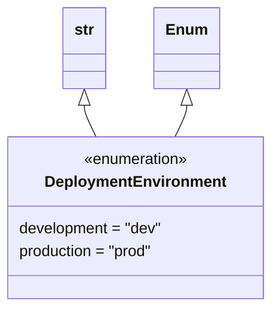

# Diagram: research/common/deployment_environment.py

> Auto-generated by Obscura crawlers

## Mermaid

### SVG

<svg id="container" width="281.546875" xmlns="http://www.w3.org/2000/svg" class="classDiagram" height="318" viewBox="0 0 281.546875 318" role="graphics-document document" aria-roledescription="class"><g><defs><marker id="container_class-aggregationStart" class="marker aggregation class" refX="18" refY="7" markerWidth="190" markerHeight="240" orient="auto"><path d="M 18,7 L9,13 L1,7 L9,1 Z"></path></marker></defs><defs><marker id="container_class-aggregationEnd" class="marker aggregation class" refX="1" refY="7" markerWidth="20" markerHeight="28" orient="auto"><path d="M 18,7 L9,13 L1,7 L9,1 Z"></path></marker></defs><defs><marker id="container_class-extensionStart" class="marker extension class" refX="18" refY="7" markerWidth="190" markerHeight="240" orient="auto"><path d="M 1,7 L18,13 V 1 Z"></path></marker></defs><defs><marker id="container_class-extensionEnd" class="marker extension class" refX="1" refY="7" markerWidth="20" markerHeight="28" orient="auto"><path d="M 1,1 V 13 L18,7 Z"></path></marker></defs><defs><marker id="container_class-compositionStart" class="marker composition class" refX="18" refY="7" markerWidth="190" markerHeight="240" orient="auto"><path d="M 18,7 L9,13 L1,7 L9,1 Z"></path></marker></defs><defs><marker id="container_class-compositionEnd" class="marker composition class" refX="1" refY="7" markerWidth="20" markerHeight="28" orient="auto"><path d="M 18,7 L9,13 L1,7 L9,1 Z"></path></marker></defs><defs><marker id="container_class-dependencyStart" class="marker dependency class" refX="6" refY="7" markerWidth="190" markerHeight="240" orient="auto"><path d="M 5,7 L9,13 L1,7 L9,1 Z"></path></marker></defs><defs><marker id="container_class-dependencyEnd" class="marker dependency class" refX="13" refY="7" markerWidth="20" markerHeight="28" orient="auto"><path d="M 18,7 L9,13 L14,7 L9,1 Z"></path></marker></defs><defs><marker id="container_class-lollipopStart" class="marker lollipop class" refX="13" refY="7" markerWidth="190" markerHeight="240" orient="auto"><circle stroke="black" fill="transparent" cx="7" cy="7" r="6"></circle></marker></defs><defs><marker id="container_class-lollipopEnd" class="marker lollipop class" refX="1" refY="7" markerWidth="190" markerHeight="240" orient="auto"><circle stroke="black" fill="transparent" cx="7" cy="7" r="6"></circle></marker></defs><g class="root"><g class="clusters"></g><g class="edgePaths"><path d="M88.648,109.25L88.648,110.542C88.648,111.833,88.648,114.417,90.641,119.875C92.634,125.333,96.619,133.667,98.611,137.833L100.604,142" id="id_str_DeploymentEnvironment_1" class="edge-thickness-normal edge-pattern-solid relation" style=";;;" data-edge="true" data-et="edge" data-id="id_str_DeploymentEnvironment_1" data-points="W3sieCI6ODguNjQ4NDM3NSwieSI6OTJ9LHsieCI6ODguNjQ4NDM3NSwieSI6MTE3fSx7IngiOjEwMC42MDM3MTI3MjkzNTc4LCJ5IjoxNDJ9XQ==" marker-start="url(#container_class-extensionStart)"></path><path d="M192.898,109.25L192.898,110.542C192.898,111.833,192.898,114.417,190.906,119.875C188.913,125.333,184.928,133.667,182.936,137.833L180.943,142" id="id_Enum_DeploymentEnvironment_2" class="edge-thickness-normal edge-pattern-solid relation" style=";;;" data-edge="true" data-et="edge" data-id="id_Enum_DeploymentEnvironment_2" data-points="W3sieCI6MTkyLjg5ODQzNzUsInkiOjkyfSx7IngiOjE5Mi44OTg0Mzc1LCJ5IjoxMTd9LHsieCI6MTgwLjk0MzE2MjI3MDY0MjIsInkiOjE0Mn1d" marker-start="url(#container_class-extensionStart)"></path></g><g class="edgeLabels"><g class="edgeLabel"><g class="label" data-id="id_str_DeploymentEnvironment_1" transform="translate(0, 0)"><foreignObject width="0" height="0">

</foreignObject></g></g><g class="edgeLabel"><g class="label" data-id="id_Enum_DeploymentEnvironment_2" transform="translate(0, 0)"><foreignObject width="0" height="0">

</foreignObject></g></g></g><g class="nodes"><g class="node default" id="classId-str-0" transform="translate(88.6484375, 50)"><g class="basic label-container"><path d="M-22.1640625 -42 L22.1640625 -42 L22.1640625 42 L-22.1640625 42" stroke="none" stroke-width="0" fill="#ECECFF" style=""></path><path d="M-22.1640625 -42 C-4.748963950707989 -42, 12.666134598584023 -42, 22.1640625 -42 M-22.1640625 -42 C-6.850583395555329 -42, 8.462895708889342 -42, 22.1640625 -42 M22.1640625 -42 C22.1640625 -13.614510342556628, 22.1640625 14.770979314886745, 22.1640625 42 M22.1640625 -42 C22.1640625 -25.111734617824723, 22.1640625 -8.223469235649446, 22.1640625 42 M22.1640625 42 C12.348081585479012 42, 2.532100670958023 42, -22.1640625 42 M22.1640625 42 C12.947070198496705 42, 3.7300778969934107 42, -22.1640625 42 M-22.1640625 42 C-22.1640625 14.042423943719033, -22.1640625 -13.915152112561934, -22.1640625 -42 M-22.1640625 42 C-22.1640625 17.55459519426528, -22.1640625 -6.890809611469443, -22.1640625 -42" stroke="#9370DB" stroke-width="1.3" fill="none" stroke-dasharray="0 0" style=""></path></g><g class="annotation-group text" transform="translate(0, -18)"></g><g class="label-group text" transform="translate(-10.1640625, -18)"><g class="label" style="font-weight: bolder" transform="translate(0,-12)"><foreignObject width="20.328125" height="24">

str

</foreignObject></g></g><g class="members-group text" transform="translate(-10.1640625, 30)"></g><g class="methods-group text" transform="translate(-10.1640625, 60)"></g><g class="divider" style=""><path d="M-22.1640625 6 C-10.048864989720187 6, 2.0663325205596266 6, 22.1640625 6 M-22.1640625 6 C-5.268662859190666 6, 11.626736781618668 6, 22.1640625 6" stroke="#9370DB" stroke-width="1.3" fill="none" stroke-dasharray="0 0" style=""></path></g><g class="divider" style=""><path d="M-22.1640625 24 C-6.3374356922337345 24, 9.489191115532531 24, 22.1640625 24 M-22.1640625 24 C-9.881716051593036 24, 2.400630396813927 24, 22.1640625 24" stroke="#9370DB" stroke-width="1.3" fill="none" stroke-dasharray="0 0" style=""></path></g></g><g class="node default" id="classId-Enum-1" transform="translate(192.8984375, 50)"><g class="basic label-container"><path d="M-32.0859375 -42 L32.0859375 -42 L32.0859375 42 L-32.0859375 42" stroke="none" stroke-width="0" fill="#ECECFF" style=""></path><path d="M-32.0859375 -42 C-8.654357731014073 -42, 14.777222037971853 -42, 32.0859375 -42 M-32.0859375 -42 C-13.056248429004892 -42, 5.973440641990216 -42, 32.0859375 -42 M32.0859375 -42 C32.0859375 -8.49442331977157, 32.0859375 25.01115336045686, 32.0859375 42 M32.0859375 -42 C32.0859375 -23.66099756886604, 32.0859375 -5.321995137732081, 32.0859375 42 M32.0859375 42 C15.041891829975143 42, -2.002153840049715 42, -32.0859375 42 M32.0859375 42 C18.24632862480532 42, 4.406719749610637 42, -32.0859375 42 M-32.0859375 42 C-32.0859375 19.57771621121722, -32.0859375 -2.844567577565563, -32.0859375 -42 M-32.0859375 42 C-32.0859375 14.353493942623444, -32.0859375 -13.293012114753111, -32.0859375 -42" stroke="#9370DB" stroke-width="1.3" fill="none" stroke-dasharray="0 0" style=""></path></g><g class="annotation-group text" transform="translate(0, -18)"></g><g class="label-group text" transform="translate(-20.0859375, -18)"><g class="label" style="font-weight: bolder" transform="translate(0,-12)"><foreignObject width="40.171875" height="24">

Enum

</foreignObject></g></g><g class="members-group text" transform="translate(-20.0859375, 30)"></g><g class="methods-group text" transform="translate(-20.0859375, 60)"></g><g class="divider" style=""><path d="M-32.0859375 6 C-13.146181633662295 6, 5.793574232675411 6, 32.0859375 6 M-32.0859375 6 C-7.395811801582774 6, 17.294313896834453 6, 32.0859375 6" stroke="#9370DB" stroke-width="1.3" fill="none" stroke-dasharray="0 0" style=""></path></g><g class="divider" style=""><path d="M-32.0859375 24 C-14.037731868215662 24, 4.010473763568676 24, 32.0859375 24 M-32.0859375 24 C-9.877051874520578 24, 12.331833750958843 24, 32.0859375 24" stroke="#9370DB" stroke-width="1.3" fill="none" stroke-dasharray="0 0" style=""></path></g></g><g class="node default" id="classId-DeploymentEnvironment-2" transform="translate(140.7734375, 226)"><g class="basic label-container"><path d="M-132.7734375 -84 L132.7734375 -84 L132.7734375 84 L-132.7734375 84" stroke="none" stroke-width="0" fill="#ECECFF" style=""></path><path d="M-132.7734375 -84 C-46.25797410967442 -84, 40.25748928065116 -84, 132.7734375 -84 M-132.7734375 -84 C-46.15153452649547 -84, 40.470368447009065 -84, 132.7734375 -84 M132.7734375 -84 C132.7734375 -32.417217430736954, 132.7734375 19.16556513852609, 132.7734375 84 M132.7734375 -84 C132.7734375 -23.79924493902066, 132.7734375 36.40151012195868, 132.7734375 84 M132.7734375 84 C78.7088074359157 84, 24.64417737183139 84, -132.7734375 84 M132.7734375 84 C43.97531161897683 84, -44.822814262046336 84, -132.7734375 84 M-132.7734375 84 C-132.7734375 35.28698715279451, -132.7734375 -13.426025694410981, -132.7734375 -84 M-132.7734375 84 C-132.7734375 29.36997293071739, -132.7734375 -25.260054138565224, -132.7734375 -84" stroke="#9370DB" stroke-width="1.3" fill="none" stroke-dasharray="0 0" style=""></path></g><g class="annotation-group text" transform="translate(-55.5546875, -60)"><g class="label" style="" transform="translate(0,-12)"><foreignObject width="111.109375" height="24">

«enumeration»

</foreignObject></g></g><g class="label-group text" transform="translate(-90.5625, -36)"><g class="label" style="font-weight: bolder" transform="translate(0,-12)"><foreignObject width="181.125" height="24">

DeploymentEnvironment

</foreignObject></g></g><g class="members-group text" transform="translate(-120.7734375, 12)"><g class="label" style="" transform="translate(0,-12)"><foreignObject width="150.984375" height="24">

development = "dev"

</foreignObject></g><g class="label" style="" transform="translate(0,12)"><foreignObject width="143.453125" height="24">

production = "prod"

</foreignObject></g></g><g class="methods-group text" transform="translate(-120.7734375, 84)"></g><g class="divider" style=""><path d="M-132.7734375 -12 C-47.384894329152374 -12, 38.00364884169525 -12, 132.7734375 -12 M-132.7734375 -12 C-55.20098559455644 -12, 22.371466310887115 -12, 132.7734375 -12" stroke="#9370DB" stroke-width="1.3" fill="none" stroke-dasharray="0 0" style=""></path></g><g class="divider" style=""><path d="M-132.7734375 60 C-45.284698966659846 60, 42.20403956668031 60, 132.7734375 60 M-132.7734375 60 C-78.77261081455345 60, -24.771784129106905 60, 132.7734375 60" stroke="#9370DB" stroke-width="1.3" fill="none" stroke-dasharray="0 0" style=""></path></g></g></g></g></g></svg>
