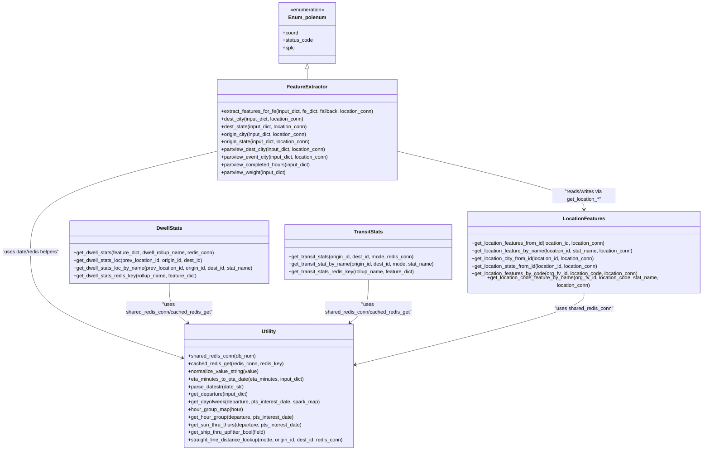

# Diagram: research/common/eta_fe.py


> Auto-generated by Obscura crawlers

## Diagram 1



### SVG

<svg id="container" width="2251.7421875" xmlns="http://www.w3.org/2000/svg" class="classDiagram" height="1408" viewBox="0 0 2251.7421875 1408" role="graphics-document document" aria-roledescription="class"><style>#container{font-family:"trebuchet ms",verdana,arial,sans-serif;font-size:16px;fill:#333;}@keyframes edge-animation-frame{from{stroke-dashoffset:0;}}@keyframes dash{to{stroke-dashoffset:0;}}#container .edge-animation-slow{stroke-dasharray:9,5!important;stroke-dashoffset:900;animation:dash 50s linear infinite;stroke-linecap:round;}#container .edge-animation-fast{stroke-dasharray:9,5!important;stroke-dashoffset:900;animation:dash 20s linear infinite;stroke-linecap:round;}#container .error-icon{fill:#552222;}#container .error-text{fill:#552222;stroke:#552222;}#container .edge-thickness-normal{stroke-width:1px;}#container .edge-thickness-thick{stroke-width:3.5px;}#container .edge-pattern-solid{stroke-dasharray:0;}#container .edge-thickness-invisible{stroke-width:0;fill:none;}#container .edge-pattern-dashed{stroke-dasharray:3;}#container .edge-pattern-dotted{stroke-dasharray:2;}#container .marker{fill:#333333;stroke:#333333;}#container .marker.cross{stroke:#333333;}#container svg{font-family:"trebuchet ms",verdana,arial,sans-serif;font-size:16px;}#container p{margin:0;}#container g.classGroup text{fill:#9370DB;stroke:none;font-family:"trebuchet ms",verdana,arial,sans-serif;font-size:10px;}#container g.classGroup text .title{font-weight:bolder;}#container .nodeLabel,#container .edgeLabel{color:#131300;}#container .edgeLabel .label rect{fill:#ECECFF;}#container .label text{fill:#131300;}#container .labelBkg{background:#ECECFF;}#container .edgeLabel .label span{background:#ECECFF;}#container .classTitle{font-weight:bolder;}#container .node rect,#container .node circle,#container .node ellipse,#container .node polygon,#container .node path{fill:#ECECFF;stroke:#9370DB;stroke-width:1px;}#container .divider{stroke:#9370DB;stroke-width:1;}#container g.clickable{cursor:pointer;}#container g.classGroup rect{fill:#ECECFF;stroke:#9370DB;}#container g.classGroup line{stroke:#9370DB;stroke-width:1;}#container .classLabel .box{stroke:none;stroke-width:0;fill:#ECECFF;opacity:0.5;}#container .classLabel .label{fill:#9370DB;font-size:10px;}#container .relation{stroke:#333333;stroke-width:1;fill:none;}#container .dashed-line{stroke-dasharray:3;}#container .dotted-line{stroke-dasharray:1 2;}#container #compositionStart,#container .composition{fill:#333333!important;stroke:#333333!important;stroke-width:1;}#container #compositionEnd,#container .composition{fill:#333333!important;stroke:#333333!important;stroke-width:1;}#container #dependencyStart,#container .dependency{fill:#333333!important;stroke:#333333!important;stroke-width:1;}#container #dependencyStart,#container .dependency{fill:#333333!important;stroke:#333333!important;stroke-width:1;}#container #extensionStart,#container .extension{fill:transparent!important;stroke:#333333!important;stroke-width:1;}#container #extensionEnd,#container .extension{fill:transparent!important;stroke:#333333!important;stroke-width:1;}#container #aggregationStart,#container .aggregation{fill:transparent!important;stroke:#333333!important;stroke-width:1;}#container #aggregationEnd,#container .aggregation{fill:transparent!important;stroke:#333333!important;stroke-width:1;}#container #lollipopStart,#container .lollipop{fill:#ECECFF!important;stroke:#333333!important;stroke-width:1;}#container #lollipopEnd,#container .lollipop{fill:#ECECFF!important;stroke:#333333!important;stroke-width:1;}#container .edgeTerminals{font-size:11px;line-height:initial;}#container .classTitleText{text-anchor:middle;font-size:18px;fill:#333;}#container .label-icon{display:inline-block;height:1em;overflow:visible;vertical-align:-0.125em;}#container .node .label-icon path{fill:currentColor;stroke:revert;stroke-width:revert;}#container :root{--mermaid-font-family:"trebuchet ms",verdana,arial,sans-serif;}</style><g><defs><marker id="container_class-aggregationStart" class="marker aggregation class" refX="18" refY="7" markerWidth="190" markerHeight="240" orient="auto"><path d="M 18,7 L9,13 L1,7 L9,1 Z"></path></marker></defs><defs><marker id="container_class-aggregationEnd" class="marker aggregation class" refX="1" refY="7" markerWidth="20" markerHeight="28" orient="auto"><path d="M 18,7 L9,13 L1,7 L9,1 Z"></path></marker></defs><defs><marker id="container_class-extensionStart" class="marker extension class" refX="18" refY="7" markerWidth="190" markerHeight="240" orient="auto"><path d="M 1,7 L18,13 V 1 Z"></path></marker></defs><defs><marker id="container_class-extensionEnd" class="marker extension class" refX="1" refY="7" markerWidth="20" markerHeight="28" orient="auto"><path d="M 1,1 V 13 L18,7 Z"></path></marker></defs><defs><marker id="container_class-compositionStart" class="marker composition class" refX="18" refY="7" markerWidth="190" markerHeight="240" orient="auto"><path d="M 18,7 L9,13 L1,7 L9,1 Z"></path></marker></defs><defs><marker id="container_class-compositionEnd" class="marker composition class" refX="1" refY="7" markerWidth="20" markerHeight="28" orient="auto"><path d="M 18,7 L9,13 L1,7 L9,1 Z"></path></marker></defs><defs><marker id="container_class-dependencyStart" class="marker dependency class" refX="6" refY="7" markerWidth="190" markerHeight="240" orient="auto"><path d="M 5,7 L9,13 L1,7 L9,1 Z"></path></marker></defs><defs><marker id="container_class-dependencyEnd" class="marker dependency class" refX="13" refY="7" markerWidth="20" markerHeight="28" orient="auto"><path d="M 18,7 L9,13 L14,7 L9,1 Z"></path></marker></defs><defs><marker id="container_class-lollipopStart" class="marker lollipop class" refX="13" refY="7" markerWidth="190" markerHeight="240" orient="auto"><circle stroke="black" fill="transparent" cx="7" cy="7" r="6"></circle></marker></defs><defs><marker id="container_class-lollipopEnd" class="marker lollipop class" refX="1" refY="7" markerWidth="190" markerHeight="240" orient="auto"><circle stroke="black" fill="transparent" cx="7" cy="7" r="6"></circle></marker></defs><g class="root"><g class="clusters"></g><g class="edgePaths"><path d="M1274.496,476.658L1374.123,500.049C1473.75,523.439,1673.004,570.219,1772.631,600.776C1872.258,631.333,1872.258,645.667,1872.258,652.833L1872.258,660" id="id_FeatureExtractor_LocationFeatures_1" class="edge-thickness-normal edge-pattern-solid relation" style=";;;" data-edge="true" data-et="edge" data-id="id_FeatureExtractor_LocationFeatures_1" data-points="W3sieCI6MTI3NC40OTYwOTM3NSwieSI6NDc2LjY1ODM5NjU2NzkxNjR9LHsieCI6MTg3Mi4yNTc4MTI1LCJ5Ijo2MTd9LHsieCI6MTg3Mi4yNTc4MTI1LCJ5Ijo2NjZ9XQ==" marker-end="url(#container_class-dependencyEnd)"></path><path d="M698.137,476.658L598.51,500.049C498.883,523.439,299.629,570.219,200.002,622.276C100.375,674.333,100.375,731.667,100.375,789C100.375,846.333,100.375,903.667,181.402,958.183C262.43,1012.7,424.485,1064.4,505.512,1090.25L586.54,1116.1" id="id_FeatureExtractor_Utility_2" class="edge-thickness-normal edge-pattern-solid relation" style=";;;" data-edge="true" data-et="edge" data-id="id_FeatureExtractor_Utility_2" data-points="W3sieCI6Njk4LjEzNjcxODc1LCJ5Ijo0NzYuNjU4Mzk2NTY3OTE2NH0seyJ4IjoxMDAuMzc1LCJ5Ijo2MTd9LHsieCI6MTAwLjM3NSwieSI6Nzg5fSx7IngiOjEwMC4zNzUsInkiOjk2MX0seyJ4Ijo1OTIuMjU1ODU5Mzc1LCJ5IjoxMTE3LjkyMzk0ODMyMzM2OTZ9XQ==" marker-end="url(#container_class-dependencyEnd)"></path><path d="M546.941,888L546.941,900.167C546.941,912.333,546.941,936.667,556.8,956.392C566.658,976.116,586.375,991.233,596.233,998.791L606.092,1006.349" id="id_DwellStats_Utility_3" class="edge-thickness-normal edge-pattern-solid relation" style=";;;" data-edge="true" data-et="edge" data-id="id_DwellStats_Utility_3" data-points="W3sieCI6NTQ2Ljk0MTQwNjI1LCJ5Ijo4ODh9LHsieCI6NTQ2Ljk0MTQwNjI1LCJ5Ijo5NjF9LHsieCI6NjEwLjg1MzQ0MzU4MzUwNCwieSI6MTAxMH1d" marker-end="url(#container_class-dependencyEnd)"></path><path d="M1183.453,876L1183.453,890.167C1183.453,904.333,1183.453,932.667,1173.595,954.392C1163.736,976.116,1144.02,991.233,1134.161,998.791L1124.303,1006.349" id="id_TransitStats_Utility_4" class="edge-thickness-normal edge-pattern-solid relation" style=";;;" data-edge="true" data-et="edge" data-id="id_TransitStats_Utility_4" data-points="W3sieCI6MTE4My40NTMxMjUsInkiOjg3Nn0seyJ4IjoxMTgzLjQ1MzEyNSwieSI6OTYxfSx7IngiOjExMTkuNTQxMDg3NjY2NDk2LCJ5IjoxMDEwfV0=" marker-end="url(#container_class-dependencyEnd)"></path><path d="M1872.258,912L1872.258,920.167C1872.258,928.333,1872.258,944.667,1750.877,982.243C1629.495,1019.819,1386.733,1078.638,1265.351,1108.047L1143.97,1137.456" id="id_LocationFeatures_Utility_5" class="edge-thickness-normal edge-pattern-solid relation" style=";;;" data-edge="true" data-et="edge" data-id="id_LocationFeatures_Utility_5" data-points="W3sieCI6MTg3Mi4yNTc4MTI1LCJ5Ijo5MTJ9LHsieCI6MTg3Mi4yNTc4MTI1LCJ5Ijo5NjF9LHsieCI6MTEzOC4xMzg2NzE4NzUsInkiOjExMzguODY5MjE2MzcyNjgxMn1d" marker-end="url(#container_class-dependencyEnd)"></path><path d="M986.316,217.25L986.316,218.542C986.316,219.833,986.316,222.417,986.316,227.875C986.316,233.333,986.316,241.667,986.316,245.833L986.316,250" id="id_Enum_poienum_FeatureExtractor_6" class="edge-thickness-normal edge-pattern-solid relation" style=";;;" data-edge="true" data-et="edge" data-id="id_Enum_poienum_FeatureExtractor_6" data-points="W3sieCI6OTg2LjMxNjQwNjI1LCJ5IjoyMDB9LHsieCI6OTg2LjMxNjQwNjI1LCJ5IjoyMjV9LHsieCI6OTg2LjMxNjQwNjI1LCJ5IjoyNTB9XQ==" marker-start="url(#container_class-extensionStart)"></path></g><g class="edgeLabels"><g class="edgeLabel" transform="translate(1872.2578125, 617)"><g class="label" data-id="id_FeatureExtractor_LocationFeatures_1" transform="translate(-100, -24)"><foreignObject width="200" height="48"><div xmlns="http://www.w3.org/1999/xhtml" class="labelBkg" style="display: table; white-space: break-spaces; line-height: 1.5; max-width: 200px; text-align: center; width: 200px;"><span class="edgeLabel"><p>"reads/writes via get_location_*"</p></span></div></foreignObject></g></g><g class="edgeLabel" transform="translate(100.375, 789)"><g class="label" data-id="id_FeatureExtractor_Utility_2" transform="translate(-92.375, -12)"><foreignObject width="184.75" height="24"><div xmlns="http://www.w3.org/1999/xhtml" class="labelBkg" style="display: table-cell; white-space: nowrap; line-height: 1.5; max-width: 200px; text-align: center;"><span class="edgeLabel"><p>"uses date/redis helpers"</p></span></div></foreignObject></g></g><g class="edgeLabel" transform="translate(546.94140625, 961)"><g class="label" data-id="id_DwellStats_Utility_3" transform="translate(-138.546875, -24)"><foreignObject width="277.09375" height="48"><div xmlns="http://www.w3.org/1999/xhtml" class="labelBkg" style="display: table; white-space: break-spaces; line-height: 1.5; max-width: 200px; text-align: center; width: 200px;"><span class="edgeLabel"><p>"uses shared_redis_conn/cached_redis_get"</p></span></div></foreignObject></g></g><g class="edgeLabel" transform="translate(1183.453125, 961)"><g class="label" data-id="id_TransitStats_Utility_4" transform="translate(-138.546875, -24)"><foreignObject width="277.09375" height="48"><div xmlns="http://www.w3.org/1999/xhtml" class="labelBkg" style="display: table; white-space: break-spaces; line-height: 1.5; max-width: 200px; text-align: center; width: 200px;"><span class="edgeLabel"><p>"uses shared_redis_conn/cached_redis_get"</p></span></div></foreignObject></g></g><g class="edgeLabel" transform="translate(1872.2578125, 961)"><g class="label" data-id="id_LocationFeatures_Utility_5" transform="translate(-93.3828125, -12)"><foreignObject width="186.765625" height="24"><div xmlns="http://www.w3.org/1999/xhtml" class="labelBkg" style="display: table-cell; white-space: nowrap; line-height: 1.5; max-width: 200px; text-align: center;"><span class="edgeLabel"><p>"uses shared_redis_conn"</p></span></div></foreignObject></g></g><g class="edgeLabel"><g class="label" data-id="id_Enum_poienum_FeatureExtractor_6" transform="translate(0, 0)"><foreignObject width="0" height="0"><div xmlns="http://www.w3.org/1999/xhtml" class="labelBkg" style="display: table-cell; white-space: nowrap; line-height: 1.5; max-width: 200px; text-align: center;"><span class="edgeLabel"></span></div></foreignObject></g></g></g><g class="nodes"><g class="node default" id="classId-Utility-0" transform="translate(865.197265625, 1205)"><g class="basic label-container"><path d="M-272.94140625 -195 L272.94140625 -195 L272.94140625 195 L-272.94140625 195" stroke="none" stroke-width="0" fill="#ECECFF" style=""></path><path d="M-272.94140625 -195 C-118.53438980447697 -195, 35.872626641046054 -195, 272.94140625 -195 M-272.94140625 -195 C-77.94592375916085 -195, 117.0495587316783 -195, 272.94140625 -195 M272.94140625 -195 C272.94140625 -49.605281842107075, 272.94140625 95.78943631578585, 272.94140625 195 M272.94140625 -195 C272.94140625 -69.99203842316382, 272.94140625 55.01592315367236, 272.94140625 195 M272.94140625 195 C85.86763562948968 195, -101.20613499102063 195, -272.94140625 195 M272.94140625 195 C61.63013649951205 195, -149.6811332509759 195, -272.94140625 195 M-272.94140625 195 C-272.94140625 68.2980876319105, -272.94140625 -58.40382473617899, -272.94140625 -195 M-272.94140625 195 C-272.94140625 42.52741229755134, -272.94140625 -109.94517540489733, -272.94140625 -195" stroke="#9370DB" stroke-width="1.3" fill="none" stroke-dasharray="0 0" style=""></path></g><g class="annotation-group text" transform="translate(0, -171)"></g><g class="label-group text" transform="translate(-22.3828125, -171)"><g class="label" style="font-weight: bolder" transform="translate(0,-12)"><foreignObject width="44.765625" height="24"><div xmlns="http://www.w3.org/1999/xhtml" style="display: table-cell; white-space: nowrap; line-height: 1.5; max-width: 94px; text-align: center;"><span class="nodeLabel markdown-node-label" style=""><p>Utility</p></span></div></foreignObject></g></g><g class="members-group text" transform="translate(-260.94140625, -123)"></g><g class="methods-group text" transform="translate(-260.94140625, -93)"><g class="label" style="" transform="translate(0,-12)"><foreignObject width="214.765625" height="24"><div xmlns="http://www.w3.org/1999/xhtml" style="display: table-cell; white-space: nowrap; line-height: 1.5; max-width: 272px; text-align: center;"><span class="nodeLabel markdown-node-label" style=""><p>+shared_redis_conn(db_num)</p></span></div></foreignObject></g><g class="label" style="" transform="translate(0,12)"><foreignObject width="300.546875" height="24"><div xmlns="http://www.w3.org/1999/xhtml" style="display: table-cell; white-space: nowrap; line-height: 1.5; max-width: 358px; text-align: center;"><span class="nodeLabel markdown-node-label" style=""><p>+cached_redis_get(redis_conn, redis_key)</p></span></div></foreignObject></g><g class="label" style="" transform="translate(0,36)"><foreignObject width="225.21875" height="24"><div xmlns="http://www.w3.org/1999/xhtml" style="display: table-cell; white-space: nowrap; line-height: 1.5; max-width: 283px; text-align: center;"><span class="nodeLabel markdown-node-label" style=""><p>+normalize_value_string(value)</p></span></div></foreignObject></g><g class="label" style="" transform="translate(0,60)"><foreignObject width="374.375" height="24"><div xmlns="http://www.w3.org/1999/xhtml" style="display: table-cell; white-space: nowrap; line-height: 1.5; max-width: 432px; text-align: center;"><span class="nodeLabel markdown-node-label" style=""><p>+eta_minutes_to_eta_date(eta_minutes, input_dict)</p></span></div></foreignObject></g><g class="label" style="" transform="translate(0,84)"><foreignObject width="178.125" height="24"><div xmlns="http://www.w3.org/1999/xhtml" style="display: table-cell; white-space: nowrap; line-height: 1.5; max-width: 235px; text-align: center;"><span class="nodeLabel markdown-node-label" style=""><p>+parse_datestr(date_str)</p></span></div></foreignObject></g><g class="label" style="" transform="translate(0,108)"><foreignObject width="194.921875" height="24"><div xmlns="http://www.w3.org/1999/xhtml" style="display: table-cell; white-space: nowrap; line-height: 1.5; max-width: 252px; text-align: center;"><span class="nodeLabel markdown-node-label" style=""><p>+get_departure(input_dict)</p></span></div></foreignObject></g><g class="label" style="" transform="translate(0,132)"><foreignObject width="421.640625" height="24"><div xmlns="http://www.w3.org/1999/xhtml" style="display: table-cell; white-space: nowrap; line-height: 1.5; max-width: 479px; text-align: center;"><span class="nodeLabel markdown-node-label" style=""><p>+get_dayofweek(departure, pts_interest_date, spark_map)</p></span></div></foreignObject></g><g class="label" style="" transform="translate(0,156)"><foreignObject width="176.0625" height="24"><div xmlns="http://www.w3.org/1999/xhtml" style="display: table-cell; white-space: nowrap; line-height: 1.5; max-width: 233px; text-align: center;"><span class="nodeLabel markdown-node-label" style=""><p>+hour_group_map(hour)</p></span></div></foreignObject></g><g class="label" style="" transform="translate(0,180)"><foreignObject width="339.828125" height="24"><div xmlns="http://www.w3.org/1999/xhtml" style="display: table-cell; white-space: nowrap; line-height: 1.5; max-width: 397px; text-align: center;"><span class="nodeLabel markdown-node-label" style=""><p>+get_hour_group(departure, pts_interest_date)</p></span></div></foreignObject></g><g class="label" style="" transform="translate(0,204)"><foreignObject width="366.9375" height="24"><div xmlns="http://www.w3.org/1999/xhtml" style="display: table-cell; white-space: nowrap; line-height: 1.5; max-width: 424px; text-align: center;"><span class="nodeLabel markdown-node-label" style=""><p>+get_sun_thru_thurs(departure, pts_interest_date)</p></span></div></foreignObject></g><g class="label" style="" transform="translate(0,228)"><foreignObject width="252.671875" height="24"><div xmlns="http://www.w3.org/1999/xhtml" style="display: table-cell; white-space: nowrap; line-height: 1.5; max-width: 310px; text-align: center;"><span class="nodeLabel markdown-node-label" style=""><p>+get_ship_thru_upfitter_bool(field)</p></span></div></foreignObject></g><g class="label" style="" transform="translate(0,252)"><foreignObject width="499.5" height="24"><div xmlns="http://www.w3.org/1999/xhtml" style="display: table-cell; white-space: nowrap; line-height: 1.5; max-width: 557px; text-align: center;"><span class="nodeLabel markdown-node-label" style=""><p>+straight_line_distance_lookup(mode, origin_id, dest_id, redis_conn)</p></span></div></foreignObject></g></g><g class="divider" style=""><path d="M-272.94140625 -147 C-97.6086686081664 -147, 77.7240690336672 -147, 272.94140625 -147 M-272.94140625 -147 C-115.26264991649893 -147, 42.41610641700214 -147, 272.94140625 -147" stroke="#9370DB" stroke-width="1.3" fill="none" stroke-dasharray="0 0" style=""></path></g><g class="divider" style=""><path d="M-272.94140625 -123 C-122.98374141903665 -123, 26.973923411926705 -123, 272.94140625 -123 M-272.94140625 -123 C-69.68534144705598 -123, 133.57072335588805 -123, 272.94140625 -123" stroke="#9370DB" stroke-width="1.3" fill="none" stroke-dasharray="0 0" style=""></path></g></g><g class="node default" id="classId-DwellStats-1" transform="translate(546.94140625, 789)"><g class="basic label-container"><path d="M-319.19140625 -99 L319.19140625 -99 L319.19140625 99 L-319.19140625 99" stroke="none" stroke-width="0" fill="#ECECFF" style=""></path><path d="M-319.19140625 -99 C-93.54887231472131 -99, 132.09366162055738 -99, 319.19140625 -99 M-319.19140625 -99 C-64.02219969912406 -99, 191.14700685175188 -99, 319.19140625 -99 M319.19140625 -99 C319.19140625 -47.88331029450218, 319.19140625 3.2333794109956386, 319.19140625 99 M319.19140625 -99 C319.19140625 -45.45593076308265, 319.19140625 8.088138473834704, 319.19140625 99 M319.19140625 99 C116.71887397120082 99, -85.75365830759836 99, -319.19140625 99 M319.19140625 99 C188.3134186081367 99, 57.43543096627337 99, -319.19140625 99 M-319.19140625 99 C-319.19140625 59.013546231351924, -319.19140625 19.02709246270385, -319.19140625 -99 M-319.19140625 99 C-319.19140625 29.443983203246262, -319.19140625 -40.112033593507476, -319.19140625 -99" stroke="#9370DB" stroke-width="1.3" fill="none" stroke-dasharray="0 0" style=""></path></g><g class="annotation-group text" transform="translate(0, -75)"></g><g class="label-group text" transform="translate(-39.2734375, -75)"><g class="label" style="font-weight: bolder" transform="translate(0,-12)"><foreignObject width="78.546875" height="24"><div xmlns="http://www.w3.org/1999/xhtml" style="display: table-cell; white-space: nowrap; line-height: 1.5; max-width: 126px; text-align: center;"><span class="nodeLabel markdown-node-label" style=""><p>DwellStats</p></span></div></foreignObject></g></g><g class="members-group text" transform="translate(-307.19140625, -27)"></g><g class="methods-group text" transform="translate(-307.19140625, 3)"><g class="label" style="" transform="translate(0,-12)"><foreignObject width="452.953125" height="24"><div xmlns="http://www.w3.org/1999/xhtml" style="display: table-cell; white-space: nowrap; line-height: 1.5; max-width: 510px; text-align: center;"><span class="nodeLabel markdown-node-label" style=""><p>+get_dwell_stats(feature_dict, dwell_rollup_name, redis_conn)</p></span></div></foreignObject></g><g class="label" style="" transform="translate(0,12)"><foreignObject width="416.59375" height="24"><div xmlns="http://www.w3.org/1999/xhtml" style="display: table-cell; white-space: nowrap; line-height: 1.5; max-width: 474px; text-align: center;"><span class="nodeLabel markdown-node-label" style=""><p>+get_dwell_stats_loc(prev_location_id, origin_id, dest_id)</p></span></div></foreignObject></g><g class="label" style="" transform="translate(0,36)"><foreignObject width="575.109375" height="24"><div xmlns="http://www.w3.org/1999/xhtml" style="display: table-cell; white-space: nowrap; line-height: 1.5; max-width: 632px; text-align: center;"><span class="nodeLabel markdown-node-label" style=""><p>+get_dwell_stats_loc_by_name(prev_location_id, origin_id, dest_id, stat_name)</p></span></div></foreignObject></g><g class="label" style="" transform="translate(0,60)"><foreignObject width="394.828125" height="24"><div xmlns="http://www.w3.org/1999/xhtml" style="display: table-cell; white-space: nowrap; line-height: 1.5; max-width: 452px; text-align: center;"><span class="nodeLabel markdown-node-label" style=""><p>+get_dwell_stats_redis_key(rollup_name, feature_dict)</p></span></div></foreignObject></g></g><g class="divider" style=""><path d="M-319.19140625 -51 C-75.17753997824164 -51, 168.83632629351672 -51, 319.19140625 -51 M-319.19140625 -51 C-93.61751610811459 -51, 131.95637403377083 -51, 319.19140625 -51" stroke="#9370DB" stroke-width="1.3" fill="none" stroke-dasharray="0 0" style=""></path></g><g class="divider" style=""><path d="M-319.19140625 -27 C-73.6011512409545 -27, 171.989103768091 -27, 319.19140625 -27 M-319.19140625 -27 C-106.92839609860849 -27, 105.33461405278302 -27, 319.19140625 -27" stroke="#9370DB" stroke-width="1.3" fill="none" stroke-dasharray="0 0" style=""></path></g></g><g class="node default" id="classId-TransitStats-2" transform="translate(1183.453125, 789)"><g class="basic label-container"><path d="M-267.3203125 -87 L267.3203125 -87 L267.3203125 87 L-267.3203125 87" stroke="none" stroke-width="0" fill="#ECECFF" style=""></path><path d="M-267.3203125 -87 C-117.48200032418228 -87, 32.35631185163544 -87, 267.3203125 -87 M-267.3203125 -87 C-107.03512780653904 -87, 53.250056886921925 -87, 267.3203125 -87 M267.3203125 -87 C267.3203125 -36.93589500907557, 267.3203125 13.128209981848855, 267.3203125 87 M267.3203125 -87 C267.3203125 -30.076184894954395, 267.3203125 26.84763021009121, 267.3203125 87 M267.3203125 87 C117.66774252698693 87, -31.984827446026145 87, -267.3203125 87 M267.3203125 87 C67.02454652702394 87, -133.2712194459521 87, -267.3203125 87 M-267.3203125 87 C-267.3203125 17.61625554839236, -267.3203125 -51.76748890321528, -267.3203125 -87 M-267.3203125 87 C-267.3203125 27.01109314931759, -267.3203125 -32.97781370136482, -267.3203125 -87" stroke="#9370DB" stroke-width="1.3" fill="none" stroke-dasharray="0 0" style=""></path></g><g class="annotation-group text" transform="translate(0, -63)"></g><g class="label-group text" transform="translate(-44.125, -63)"><g class="label" style="font-weight: bolder" transform="translate(0,-12)"><foreignObject width="88.25" height="24"><div xmlns="http://www.w3.org/1999/xhtml" style="display: table-cell; white-space: nowrap; line-height: 1.5; max-width: 136px; text-align: center;"><span class="nodeLabel markdown-node-label" style=""><p>TransitStats</p></span></div></foreignObject></g></g><g class="members-group text" transform="translate(-255.3203125, -15)"></g><g class="methods-group text" transform="translate(-255.3203125, 15)"><g class="label" style="" transform="translate(0,-12)"><foreignObject width="402.625" height="24"><div xmlns="http://www.w3.org/1999/xhtml" style="display: table-cell; white-space: nowrap; line-height: 1.5; max-width: 460px; text-align: center;"><span class="nodeLabel markdown-node-label" style=""><p>+get_transit_stats(origin_id, dest_id, mode, redis_conn)</p></span></div></foreignObject></g><g class="label" style="" transform="translate(0,12)"><foreignObject width="466.515625" height="24"><div xmlns="http://www.w3.org/1999/xhtml" style="display: table-cell; white-space: nowrap; line-height: 1.5; max-width: 524px; text-align: center;"><span class="nodeLabel markdown-node-label" style=""><p>+get_transit_stat_by_name(origin_id, dest_id, mode, stat_name)</p></span></div></foreignObject></g><g class="label" style="" transform="translate(0,36)"><foreignObject width="402.921875" height="24"><div xmlns="http://www.w3.org/1999/xhtml" style="display: table-cell; white-space: nowrap; line-height: 1.5; max-width: 460px; text-align: center;"><span class="nodeLabel markdown-node-label" style=""><p>+get_transit_stats_redis_key(rollup_name, feature_dict)</p></span></div></foreignObject></g></g><g class="divider" style=""><path d="M-267.3203125 -39 C-158.41650248614795 -39, -49.512692472295896 -39, 267.3203125 -39 M-267.3203125 -39 C-115.92687635446839 -39, 35.46655979106322 -39, 267.3203125 -39" stroke="#9370DB" stroke-width="1.3" fill="none" stroke-dasharray="0 0" style=""></path></g><g class="divider" style=""><path d="M-267.3203125 -15 C-112.09884325013792 -15, 43.122625999724164 -15, 267.3203125 -15 M-267.3203125 -15 C-139.4635389732156 -15, -11.606765446431211 -15, 267.3203125 -15" stroke="#9370DB" stroke-width="1.3" fill="none" stroke-dasharray="0 0" style=""></path></g></g><g class="node default" id="classId-LocationFeatures-3" transform="translate(1872.2578125, 789)"><g class="basic label-container"><path d="M-371.484375 -123 L371.484375 -123 L371.484375 123 L-371.484375 123" stroke="none" stroke-width="0" fill="#ECECFF" style=""></path><path d="M-371.484375 -123 C-107.76167730376017 -123, 155.96102039247967 -123, 371.484375 -123 M-371.484375 -123 C-82.26272672295062 -123, 206.95892155409877 -123, 371.484375 -123 M371.484375 -123 C371.484375 -68.72899470051362, 371.484375 -14.457989401027234, 371.484375 123 M371.484375 -123 C371.484375 -43.017273680434826, 371.484375 36.96545263913035, 371.484375 123 M371.484375 123 C124.82317190499393 123, -121.83803119001215 123, -371.484375 123 M371.484375 123 C140.92125558054053 123, -89.64186383891894 123, -371.484375 123 M-371.484375 123 C-371.484375 46.348839556042265, -371.484375 -30.30232088791547, -371.484375 -123 M-371.484375 123 C-371.484375 43.56096935813082, -371.484375 -35.87806128373836, -371.484375 -123" stroke="#9370DB" stroke-width="1.3" fill="none" stroke-dasharray="0 0" style=""></path></g><g class="annotation-group text" transform="translate(0, -99)"></g><g class="label-group text" transform="translate(-62.59375, -99)"><g class="label" style="font-weight: bolder" transform="translate(0,-12)"><foreignObject width="125.1875" height="24"><div xmlns="http://www.w3.org/1999/xhtml" style="display: table-cell; white-space: nowrap; line-height: 1.5; max-width: 174px; text-align: center;"><span class="nodeLabel markdown-node-label" style=""><p>LocationFeatures</p></span></div></foreignObject></g></g><g class="members-group text" transform="translate(-359.484375, -51)"></g><g class="methods-group text" transform="translate(-359.484375, -21)"><g class="label" style="" transform="translate(0,-12)"><foreignObject width="432.078125" height="24"><div xmlns="http://www.w3.org/1999/xhtml" style="display: table-cell; white-space: nowrap; line-height: 1.5; max-width: 489px; text-align: center;"><span class="nodeLabel markdown-node-label" style=""><p>+get_location_features_from_id(location_id, location_conn)</p></span></div></foreignObject></g><g class="label" style="" transform="translate(0,12)"><foreignObject width="518.4375" height="24"><div xmlns="http://www.w3.org/1999/xhtml" style="display: table-cell; white-space: nowrap; line-height: 1.5; max-width: 576px; text-align: center;"><span class="nodeLabel markdown-node-label" style=""><p>+get_location_feature_by_name(location_id, stat_name, location_conn)</p></span></div></foreignObject></g><g class="label" style="" transform="translate(0,36)"><foreignObject width="398.203125" height="24"><div xmlns="http://www.w3.org/1999/xhtml" style="display: table-cell; white-space: nowrap; line-height: 1.5; max-width: 456px; text-align: center;"><span class="nodeLabel markdown-node-label" style=""><p>+get_location_city_from_id(location_id, location_conn)</p></span></div></foreignObject></g><g class="label" style="" transform="translate(0,60)"><foreignObject width="409.046875" height="24"><div xmlns="http://www.w3.org/1999/xhtml" style="display: table-cell; white-space: nowrap; line-height: 1.5; max-width: 466px; text-align: center;"><span class="nodeLabel markdown-node-label" style=""><p>+get_location_state_from_id(location_id, location_conn)</p></span></div></foreignObject></g><g class="label" style="" transform="translate(0,84)"><foreignObject width="530.96875" height="24"><div xmlns="http://www.w3.org/1999/xhtml" style="display: table-cell; white-space: nowrap; line-height: 1.5; max-width: 588px; text-align: center;"><span class="nodeLabel markdown-node-label" style=""><p>+get_location_features_by_code(org_fv_id, location_code, location_conn)</p></span></div></foreignObject></g><g class="label" style="" transform="translate(0,108)"><foreignObject width="656.375" height="24"><div xmlns="http://www.w3.org/1999/xhtml" style="display: table-cell; white-space: nowrap; line-height: 1.5; max-width: 714px; text-align: center;"><span class="nodeLabel markdown-node-label" style=""><p>+get_location_code_feature_by_name(org_fv_id, location_code, stat_name, location_conn)</p></span></div></foreignObject></g></g><g class="divider" style=""><path d="M-371.484375 -75 C-160.2266109227897 -75, 51.03115315442062 -75, 371.484375 -75 M-371.484375 -75 C-207.04890605169444 -75, -42.61343710338889 -75, 371.484375 -75" stroke="#9370DB" stroke-width="1.3" fill="none" stroke-dasharray="0 0" style=""></path></g><g class="divider" style=""><path d="M-371.484375 -51 C-131.04455759166652 -51, 109.39525981666696 -51, 371.484375 -51 M-371.484375 -51 C-131.19906870552353 -51, 109.08623758895294 -51, 371.484375 -51" stroke="#9370DB" stroke-width="1.3" fill="none" stroke-dasharray="0 0" style=""></path></g></g><g class="node default" id="classId-FeatureExtractor-4" transform="translate(986.31640625, 409)"><g class="basic label-container"><path d="M-288.1796875 -159 L288.1796875 -159 L288.1796875 159 L-288.1796875 159" stroke="none" stroke-width="0" fill="#ECECFF" style=""></path><path d="M-288.1796875 -159 C-72.68031246454942 -159, 142.81906257090117 -159, 288.1796875 -159 M-288.1796875 -159 C-109.94284212730562 -159, 68.29400324538875 -159, 288.1796875 -159 M288.1796875 -159 C288.1796875 -59.405890098944596, 288.1796875 40.18821980211081, 288.1796875 159 M288.1796875 -159 C288.1796875 -89.84621061720466, 288.1796875 -20.692421234409323, 288.1796875 159 M288.1796875 159 C87.6835329567526 159, -112.8126215864948 159, -288.1796875 159 M288.1796875 159 C105.77542809748454 159, -76.62883130503093 159, -288.1796875 159 M-288.1796875 159 C-288.1796875 66.03432331960116, -288.1796875 -26.931353360797686, -288.1796875 -159 M-288.1796875 159 C-288.1796875 79.94048842351614, -288.1796875 0.8809768470322865, -288.1796875 -159" stroke="#9370DB" stroke-width="1.3" fill="none" stroke-dasharray="0 0" style=""></path></g><g class="annotation-group text" transform="translate(0, -135)"></g><g class="label-group text" transform="translate(-60.75, -135)"><g class="label" style="font-weight: bolder" transform="translate(0,-12)"><foreignObject width="121.5" height="24"><div xmlns="http://www.w3.org/1999/xhtml" style="display: table-cell; white-space: nowrap; line-height: 1.5; max-width: 170px; text-align: center;"><span class="nodeLabel markdown-node-label" style=""><p>FeatureExtractor</p></span></div></foreignObject></g></g><g class="members-group text" transform="translate(-276.1796875, -87)"></g><g class="methods-group text" transform="translate(-276.1796875, -57)"><g class="label" style="" transform="translate(0,-12)"><foreignObject width="491.609375" height="24"><div xmlns="http://www.w3.org/1999/xhtml" style="display: table-cell; white-space: nowrap; line-height: 1.5; max-width: 549px; text-align: center;"><span class="nodeLabel markdown-node-label" style=""><p>+extract_features_for_fe(input_dict, fe_dict, fallback, location_conn)</p></span></div></foreignObject></g><g class="label" style="" transform="translate(0,12)"><foreignObject width="268.328125" height="24"><div xmlns="http://www.w3.org/1999/xhtml" style="display: table-cell; white-space: nowrap; line-height: 1.5; max-width: 326px; text-align: center;"><span class="nodeLabel markdown-node-label" style=""><p>+dest_city(input_dict, location_conn)</p></span></div></foreignObject></g><g class="label" style="" transform="translate(0,36)"><foreignObject width="279.015625" height="24"><div xmlns="http://www.w3.org/1999/xhtml" style="display: table-cell; white-space: nowrap; line-height: 1.5; max-width: 336px; text-align: center;"><span class="nodeLabel markdown-node-label" style=""><p>+dest_state(input_dict, location_conn)</p></span></div></foreignObject></g><g class="label" style="" transform="translate(0,60)"><foreignObject width="279.03125" height="24"><div xmlns="http://www.w3.org/1999/xhtml" style="display: table-cell; white-space: nowrap; line-height: 1.5; max-width: 336px; text-align: center;"><span class="nodeLabel markdown-node-label" style=""><p>+origin_city(input_dict, location_conn)</p></span></div></foreignObject></g><g class="label" style="" transform="translate(0,84)"><foreignObject width="289.71875" height="24"><div xmlns="http://www.w3.org/1999/xhtml" style="display: table-cell; white-space: nowrap; line-height: 1.5; max-width: 347px; text-align: center;"><span class="nodeLabel markdown-node-label" style=""><p>+origin_state(input_dict, location_conn)</p></span></div></foreignObject></g><g class="label" style="" transform="translate(0,108)"><foreignObject width="338.5" height="24"><div xmlns="http://www.w3.org/1999/xhtml" style="display: table-cell; white-space: nowrap; line-height: 1.5; max-width: 396px; text-align: center;"><span class="nodeLabel markdown-node-label" style=""><p>+partview_dest_city(input_dict, location_conn)</p></span></div></foreignObject></g><g class="label" style="" transform="translate(0,132)"><foreignObject width="347.296875" height="24"><div xmlns="http://www.w3.org/1999/xhtml" style="display: table-cell; white-space: nowrap; line-height: 1.5; max-width: 405px; text-align: center;"><span class="nodeLabel markdown-node-label" style=""><p>+partview_event_city(input_dict, location_conn)</p></span></div></foreignObject></g><g class="label" style="" transform="translate(0,156)"><foreignObject width="289.328125" height="24"><div xmlns="http://www.w3.org/1999/xhtml" style="display: table-cell; white-space: nowrap; line-height: 1.5; max-width: 347px; text-align: center;"><span class="nodeLabel markdown-node-label" style=""><p>+partview_completed_hours(input_dict)</p></span></div></foreignObject></g><g class="label" style="" transform="translate(0,180)"><foreignObject width="210.703125" height="24"><div xmlns="http://www.w3.org/1999/xhtml" style="display: table-cell; white-space: nowrap; line-height: 1.5; max-width: 268px; text-align: center;"><span class="nodeLabel markdown-node-label" style=""><p>+partview_weight(input_dict)</p></span></div></foreignObject></g></g><g class="divider" style=""><path d="M-288.1796875 -111 C-136.88477507230508 -111, 14.41013735538985 -111, 288.1796875 -111 M-288.1796875 -111 C-69.26415559132144 -111, 149.65137631735712 -111, 288.1796875 -111" stroke="#9370DB" stroke-width="1.3" fill="none" stroke-dasharray="0 0" style=""></path></g><g class="divider" style=""><path d="M-288.1796875 -87 C-122.73549379151561 -87, 42.70869991696878 -87, 288.1796875 -87 M-288.1796875 -87 C-149.6906725284001 -87, -11.201657556800228 -87, 288.1796875 -87" stroke="#9370DB" stroke-width="1.3" fill="none" stroke-dasharray="0 0" style=""></path></g></g><g class="node default" id="classId-Enum_poienum-5" transform="translate(986.31640625, 104)"><g class="basic label-container"><path d="M-87.671875 -96 L87.671875 -96 L87.671875 96 L-87.671875 96" stroke="none" stroke-width="0" fill="#ECECFF" style=""></path><path d="M-87.671875 -96 C-32.9614179563517 -96, 21.749039087296595 -96, 87.671875 -96 M-87.671875 -96 C-25.670541447597692 -96, 36.330792104804615 -96, 87.671875 -96 M87.671875 -96 C87.671875 -41.56182453489838, 87.671875 12.876350930203245, 87.671875 96 M87.671875 -96 C87.671875 -39.38025420317232, 87.671875 17.23949159365536, 87.671875 96 M87.671875 96 C49.31391921440663 96, 10.955963428813263 96, -87.671875 96 M87.671875 96 C41.657429212690744 96, -4.3570165746185125 96, -87.671875 96 M-87.671875 96 C-87.671875 50.887106992975326, -87.671875 5.774213985950652, -87.671875 -96 M-87.671875 96 C-87.671875 40.840138566907726, -87.671875 -14.319722866184549, -87.671875 -96" stroke="#9370DB" stroke-width="1.3" fill="none" stroke-dasharray="0 0" style=""></path></g><g class="annotation-group text" transform="translate(-55.5546875, -72)"><g class="label" style="" transform="translate(0,-12)"><foreignObject width="111.109375" height="24"><div xmlns="http://www.w3.org/1999/xhtml" style="display: table-cell; white-space: nowrap; line-height: 1.5; max-width: 161px; text-align: center;"><span class="nodeLabel markdown-node-label" style=""><p>«enumeration»</p></span></div></foreignObject></g></g><g class="label-group text" transform="translate(-56.3125, -48)"><g class="label" style="font-weight: bolder" transform="translate(0,-12)"><foreignObject width="112.625" height="24"><div xmlns="http://www.w3.org/1999/xhtml" style="display: table-cell; white-space: nowrap; line-height: 1.5; max-width: 164px; text-align: center;"><span class="nodeLabel markdown-node-label" style=""><p>Enum_poienum</p></span></div></foreignObject></g></g><g class="members-group text" transform="translate(-75.671875, 0)"><g class="label" style="" transform="translate(0,-12)"><foreignObject width="49.265625" height="24"><div xmlns="http://www.w3.org/1999/xhtml" style="display: table-cell; white-space: nowrap; line-height: 1.5; max-width: 107px; text-align: center;"><span class="nodeLabel markdown-node-label" style=""><p>+coord</p></span></div></foreignObject></g><g class="label" style="" transform="translate(0,12)"><foreignObject width="95.03125" height="24"><div xmlns="http://www.w3.org/1999/xhtml" style="display: table-cell; white-space: nowrap; line-height: 1.5; max-width: 152px; text-align: center;"><span class="nodeLabel markdown-node-label" style=""><p>+status_code</p></span></div></foreignObject></g><g class="label" style="" transform="translate(0,36)"><foreignObject width="37.21875" height="24"><div xmlns="http://www.w3.org/1999/xhtml" style="display: table-cell; white-space: nowrap; line-height: 1.5; max-width: 95px; text-align: center;"><span class="nodeLabel markdown-node-label" style=""><p>+splc</p></span></div></foreignObject></g></g><g class="methods-group text" transform="translate(-75.671875, 96)"></g><g class="divider" style=""><path d="M-87.671875 -24 C-51.724403210136224 -24, -15.776931420272447 -24, 87.671875 -24 M-87.671875 -24 C-46.26084477546237 -24, -4.849814550924734 -24, 87.671875 -24" stroke="#9370DB" stroke-width="1.3" fill="none" stroke-dasharray="0 0" style=""></path></g><g class="divider" style=""><path d="M-87.671875 72 C-45.3322041503115 72, -2.992533300622995 72, 87.671875 72 M-87.671875 72 C-39.973119491773524 72, 7.7256360164529525 72, 87.671875 72" stroke="#9370DB" stroke-width="1.3" fill="none" stroke-dasharray="0 0" style=""></path></g></g></g></g></g></svg>

## Diagram 2

```mermaid
flowchart TD
Start[Start: extract_features_for_fe] --> Loop[For each field_name, field_def in fe_dict]
Loop --> IsCallable{Is field_def callable?}
IsCallable -- Yes --> CallCallable[Call field_def(input_dict)]
CallCallable --> AssignCheck{field_value truthy?}
IsCallable -- No --> HasQueryField{field_def has query_field?}
HasQueryField -- Yes --> ResolveQuery[Resolve query_field (str or tuple) from input_dict]
HasQueryField -- No --> ValueFromDef[Use field_def default or fallback]
ResolveQuery --> HasFunction{Does field_def include "function"?}
ValueFromDef --> HasFunction
HasFunction -- Yes --> CallFunc{Prepare args (query_field_list?)}
CallFunc --> CallWithLoc[Call func(..., location_conn if needed)]
CallWithLoc --> AssignCheck
HasFunction -- No --> AssignCheck
AssignCheck -- No --> SetFallback[Set field_value = fallback]
AssignCheck -- Yes --> AddFeature[feature_dict[field_name] = field_value]
SetFallback --> AddFeature
AddFeature --> MoreFields{More fields?}
MoreFields -- Yes --> Loop
MoreFields -- No --> ReturnResult[Return feature_dict]
ReturnResult --> End[End]
```

> SVG rendering failed for this diagram.
