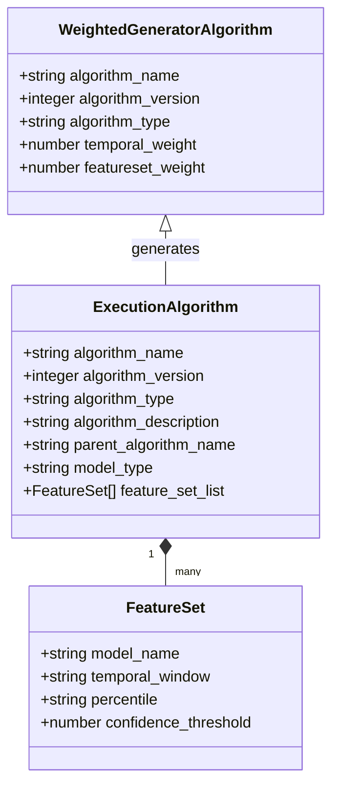
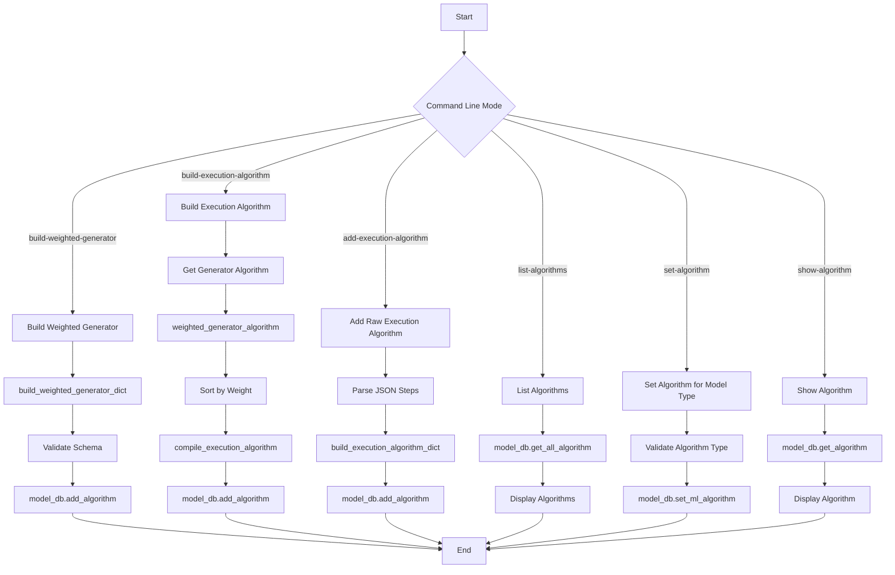
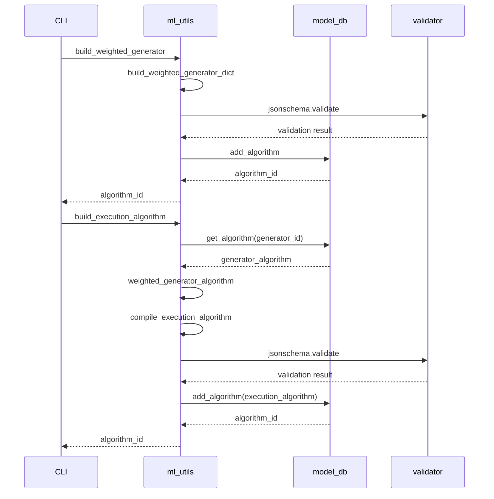
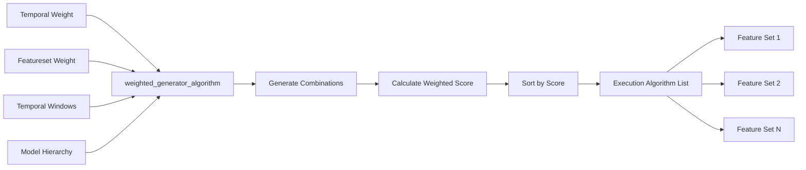
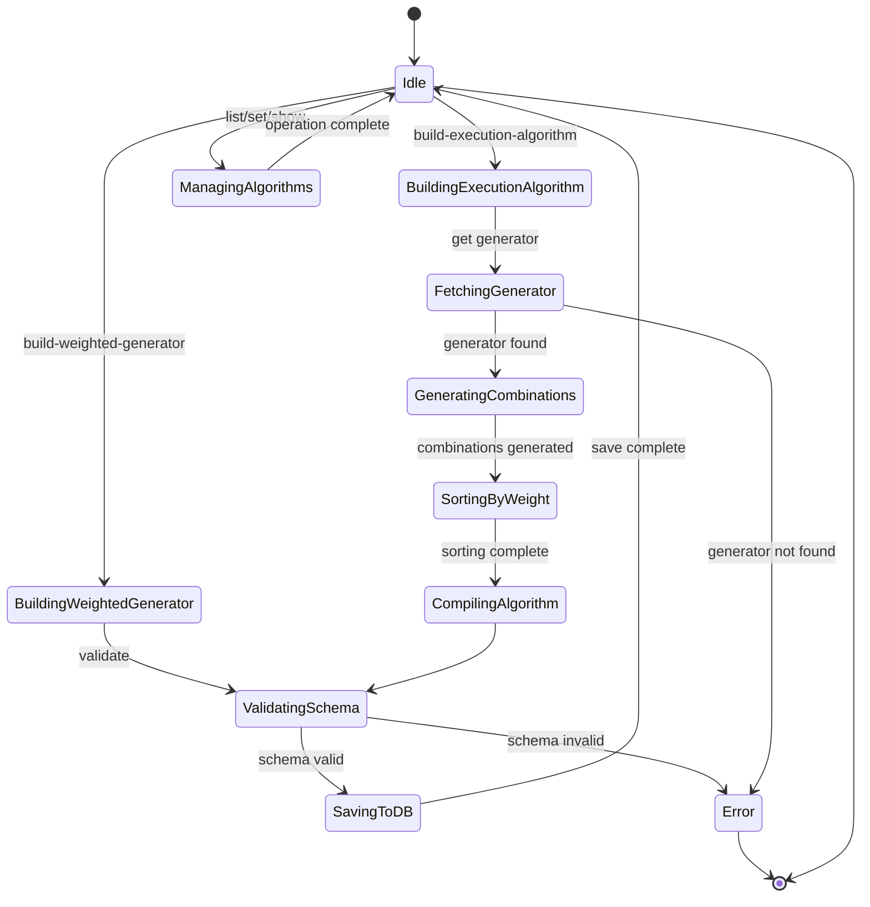

# Diagram: research/common/ml_utils.py


> Auto-generated by Obscura crawlers

## Diagram 1

```mermaid
classDiagram
      class WeightedGeneratorAlgorithm {
          +string algorithm_name
          +integer algorithm_version...
  └ 257 lines...
```

> SVG rendering failed for this diagram.

## Diagram 2



### SVG

<svg id="container" width="346.3671875" xmlns="http://www.w3.org/2000/svg" class="classDiagram" height="812" viewBox="0 0 346.3671875 812" role="graphics-document document" aria-roledescription="class"><style>#container{font-family:"trebuchet ms",verdana,arial,sans-serif;font-size:16px;fill:#333;}@keyframes edge-animation-frame{from{stroke-dashoffset:0;}}@keyframes dash{to{stroke-dashoffset:0;}}#container .edge-animation-slow{stroke-dasharray:9,5!important;stroke-dashoffset:900;animation:dash 50s linear infinite;stroke-linecap:round;}#container .edge-animation-fast{stroke-dasharray:9,5!important;stroke-dashoffset:900;animation:dash 20s linear infinite;stroke-linecap:round;}#container .error-icon{fill:#552222;}#container .error-text{fill:#552222;stroke:#552222;}#container .edge-thickness-normal{stroke-width:1px;}#container .edge-thickness-thick{stroke-width:3.5px;}#container .edge-pattern-solid{stroke-dasharray:0;}#container .edge-thickness-invisible{stroke-width:0;fill:none;}#container .edge-pattern-dashed{stroke-dasharray:3;}#container .edge-pattern-dotted{stroke-dasharray:2;}#container .marker{fill:#333333;stroke:#333333;}#container .marker.cross{stroke:#333333;}#container svg{font-family:"trebuchet ms",verdana,arial,sans-serif;font-size:16px;}#container p{margin:0;}#container g.classGroup text{fill:#9370DB;stroke:none;font-family:"trebuchet ms",verdana,arial,sans-serif;font-size:10px;}#container g.classGroup text .title{font-weight:bolder;}#container .nodeLabel,#container .edgeLabel{color:#131300;}#container .edgeLabel .label rect{fill:#ECECFF;}#container .label text{fill:#131300;}#container .labelBkg{background:#ECECFF;}#container .edgeLabel .label span{background:#ECECFF;}#container .classTitle{font-weight:bolder;}#container .node rect,#container .node circle,#container .node ellipse,#container .node polygon,#container .node path{fill:#ECECFF;stroke:#9370DB;stroke-width:1px;}#container .divider{stroke:#9370DB;stroke-width:1;}#container g.clickable{cursor:pointer;}#container g.classGroup rect{fill:#ECECFF;stroke:#9370DB;}#container g.classGroup line{stroke:#9370DB;stroke-width:1;}#container .classLabel .box{stroke:none;stroke-width:0;fill:#ECECFF;opacity:0.5;}#container .classLabel .label{fill:#9370DB;font-size:10px;}#container .relation{stroke:#333333;stroke-width:1;fill:none;}#container .dashed-line{stroke-dasharray:3;}#container .dotted-line{stroke-dasharray:1 2;}#container #compositionStart,#container .composition{fill:#333333!important;stroke:#333333!important;stroke-width:1;}#container #compositionEnd,#container .composition{fill:#333333!important;stroke:#333333!important;stroke-width:1;}#container #dependencyStart,#container .dependency{fill:#333333!important;stroke:#333333!important;stroke-width:1;}#container #dependencyStart,#container .dependency{fill:#333333!important;stroke:#333333!important;stroke-width:1;}#container #extensionStart,#container .extension{fill:transparent!important;stroke:#333333!important;stroke-width:1;}#container #extensionEnd,#container .extension{fill:transparent!important;stroke:#333333!important;stroke-width:1;}#container #aggregationStart,#container .aggregation{fill:transparent!important;stroke:#333333!important;stroke-width:1;}#container #aggregationEnd,#container .aggregation{fill:transparent!important;stroke:#333333!important;stroke-width:1;}#container #lollipopStart,#container .lollipop{fill:#ECECFF!important;stroke:#333333!important;stroke-width:1;}#container #lollipopEnd,#container .lollipop{fill:#ECECFF!important;stroke:#333333!important;stroke-width:1;}#container .edgeTerminals{font-size:11px;line-height:initial;}#container .classTitleText{text-anchor:middle;font-size:18px;fill:#333;}#container .label-icon{display:inline-block;height:1em;overflow:visible;vertical-align:-0.125em;}#container .node .label-icon path{fill:currentColor;stroke:revert;stroke-width:revert;}#container :root{--mermaid-font-family:"trebuchet ms",verdana,arial,sans-serif;}</style><g><defs><marker id="container_class-aggregationStart" class="marker aggregation class" refX="18" refY="7" markerWidth="190" markerHeight="240" orient="auto"><path d="M 18,7 L9,13 L1,7 L9,1 Z"></path></marker></defs><defs><marker id="container_class-aggregationEnd" class="marker aggregation class" refX="1" refY="7" markerWidth="20" markerHeight="28" orient="auto"><path d="M 18,7 L9,13 L1,7 L9,1 Z"></path></marker></defs><defs><marker id="container_class-extensionStart" class="marker extension class" refX="18" refY="7" markerWidth="190" markerHeight="240" orient="auto"><path d="M 1,7 L18,13 V 1 Z"></path></marker></defs><defs><marker id="container_class-extensionEnd" class="marker extension class" refX="1" refY="7" markerWidth="20" markerHeight="28" orient="auto"><path d="M 1,1 V 13 L18,7 Z"></path></marker></defs><defs><marker id="container_class-compositionStart" class="marker composition class" refX="18" refY="7" markerWidth="190" markerHeight="240" orient="auto"><path d="M 18,7 L9,13 L1,7 L9,1 Z"></path></marker></defs><defs><marker id="container_class-compositionEnd" class="marker composition class" refX="1" refY="7" markerWidth="20" markerHeight="28" orient="auto"><path d="M 18,7 L9,13 L1,7 L9,1 Z"></path></marker></defs><defs><marker id="container_class-dependencyStart" class="marker dependency class" refX="6" refY="7" markerWidth="190" markerHeight="240" orient="auto"><path d="M 5,7 L9,13 L1,7 L9,1 Z"></path></marker></defs><defs><marker id="container_class-dependencyEnd" class="marker dependency class" refX="13" refY="7" markerWidth="20" markerHeight="28" orient="auto"><path d="M 18,7 L9,13 L14,7 L9,1 Z"></path></marker></defs><defs><marker id="container_class-lollipopStart" class="marker lollipop class" refX="13" refY="7" markerWidth="190" markerHeight="240" orient="auto"><circle stroke="black" fill="transparent" cx="7" cy="7" r="6"></circle></marker></defs><defs><marker id="container_class-lollipopEnd" class="marker lollipop class" refX="1" refY="7" markerWidth="190" markerHeight="240" orient="auto"><circle stroke="black" fill="transparent" cx="7" cy="7" r="6"></circle></marker></defs><g class="root"><g class="clusters"></g><g class="edgePaths"><path d="M173.184,579.25L173.184,580.542C173.184,581.833,173.184,584.417,173.184,589.875C173.184,595.333,173.184,603.667,173.184,607.833L173.184,612" id="id_ExecutionAlgorithm_FeatureSet_1" class="edge-thickness-normal edge-pattern-solid relation" style=";;;" data-edge="true" data-et="edge" data-id="id_ExecutionAlgorithm_FeatureSet_1" data-points="W3sieCI6MTczLjE4MzU5Mzc1LCJ5Ijo1NjJ9LHsieCI6MTczLjE4MzU5Mzc1LCJ5Ijo1ODd9LHsieCI6MTczLjE4MzU5Mzc1LCJ5Ijo2MTJ9XQ==" marker-start="url(#container_class-compositionStart)"></path><path d="M173.184,241.25L173.184,244.542C173.184,247.833,173.184,254.417,173.184,263.875C173.184,273.333,173.184,285.667,173.184,291.833L173.184,298" id="id_WeightedGeneratorAlgorithm_ExecutionAlgorithm_2" class="edge-thickness-normal edge-pattern-solid relation" style=";;;" data-edge="true" data-et="edge" data-id="id_WeightedGeneratorAlgorithm_ExecutionAlgorithm_2" data-points="W3sieCI6MTczLjE4MzU5Mzc1LCJ5IjoyMjR9LHsieCI6MTczLjE4MzU5Mzc1LCJ5IjoyNjF9LHsieCI6MTczLjE4MzU5Mzc1LCJ5IjoyOTh9XQ==" marker-start="url(#container_class-extensionStart)"></path></g><g class="edgeLabels"><g class="edgeLabel"><g class="label" data-id="id_ExecutionAlgorithm_FeatureSet_1" transform="translate(0, 0)"><foreignObject width="0" height="0"><div xmlns="http://www.w3.org/1999/xhtml" class="labelBkg" style="display: table-cell; white-space: nowrap; line-height: 1.5; max-width: 200px; text-align: center;"><span class="edgeLabel"></span></div></foreignObject></g></g><g class="edgeLabel" transform="translate(173.18359375, 261)"><g class="label" data-id="id_WeightedGeneratorAlgorithm_ExecutionAlgorithm_2" transform="translate(-35.46875, -12)"><foreignObject width="70.9375" height="24"><div xmlns="http://www.w3.org/1999/xhtml" class="labelBkg" style="display: table-cell; white-space: nowrap; line-height: 1.5; max-width: 200px; text-align: center;"><span class="edgeLabel"><p>generates</p></span></div></foreignObject></g></g><g class="edgeTerminals" transform="translate(158.18359187500008, 579.4999983928572)"><g class="inner" transform="translate(0, 0)"><foreignObject style="width: 9px; height: 12px;"><div xmlns="http://www.w3.org/1999/xhtml" style="display: inline-block; padding-right: 1px; white-space: nowrap;"><span class="edgeLabel">1</span></div></foreignObject></g></g><g class="edgeTerminals" transform="translate(183.1835918749999, 589.4999983928572)"><g class="inner" transform="translate(0, 0)"></g><foreignObject style="width: 36px; height: 12px;"><div xmlns="http://www.w3.org/1999/xhtml" style="display: inline-block; padding-right: 1px; white-space: nowrap;"><span class="edgeLabel">many</span></div></foreignObject></g></g><g class="nodes"><g class="node default" id="classId-WeightedGeneratorAlgorithm-0" transform="translate(173.18359375, 116)"><g class="basic label-container"><path d="M-165.18359375 -108 L165.18359375 -108 L165.18359375 108 L-165.18359375 108" stroke="none" stroke-width="0" fill="#ECECFF" style=""></path><path d="M-165.18359375 -108 C-63.879901439226174 -108, 37.42379087154765 -108, 165.18359375 -108 M-165.18359375 -108 C-61.453125199044266 -108, 42.27734335191147 -108, 165.18359375 -108 M165.18359375 -108 C165.18359375 -53.798799858432815, 165.18359375 0.4024002831343694, 165.18359375 108 M165.18359375 -108 C165.18359375 -57.32493619724993, 165.18359375 -6.649872394499866, 165.18359375 108 M165.18359375 108 C95.58890230531284 108, 25.994210860625685 108, -165.18359375 108 M165.18359375 108 C91.82127612959684 108, 18.45895850919368 108, -165.18359375 108 M-165.18359375 108 C-165.18359375 60.893271592862, -165.18359375 13.786543185724, -165.18359375 -108 M-165.18359375 108 C-165.18359375 31.61795472104069, -165.18359375 -44.76409055791862, -165.18359375 -108" stroke="#9370DB" stroke-width="1.3" fill="none" stroke-dasharray="0 0" style=""></path></g><g class="annotation-group text" transform="translate(0, -84)"></g><g class="label-group text" transform="translate(-107.2265625, -84)"><g class="label" style="font-weight: bolder" transform="translate(0,-12)"><foreignObject width="214.453125" height="24"><div xmlns="http://www.w3.org/1999/xhtml" style="display: table-cell; white-space: nowrap; line-height: 1.5; max-width: 261px; text-align: center;"><span class="nodeLabel markdown-node-label" style=""><p>WeightedGeneratorAlgorithm</p></span></div></foreignObject></g></g><g class="members-group text" transform="translate(-153.18359375, -36)"><g class="label" style="" transform="translate(0,-12)"><foreignObject width="172.890625" height="24"><div xmlns="http://www.w3.org/1999/xhtml" style="display: table-cell; white-space: nowrap; line-height: 1.5; max-width: 230px; text-align: center;"><span class="nodeLabel markdown-node-label" style=""><p>+string algorithm_name</p></span></div></foreignObject></g><g class="label" style="" transform="translate(0,12)"><foreignObject width="194.53125" height="24"><div xmlns="http://www.w3.org/1999/xhtml" style="display: table-cell; white-space: nowrap; line-height: 1.5; max-width: 252px; text-align: center;"><span class="nodeLabel markdown-node-label" style=""><p>+integer algorithm_version</p></span></div></foreignObject></g><g class="label" style="" transform="translate(0,36)"><foreignObject width="163.84375" height="24"><div xmlns="http://www.w3.org/1999/xhtml" style="display: table-cell; white-space: nowrap; line-height: 1.5; max-width: 221px; text-align: center;"><span class="nodeLabel markdown-node-label" style=""><p>+string algorithm_type</p></span></div></foreignObject></g><g class="label" style="" transform="translate(0,60)"><foreignObject width="190.875" height="24"><div xmlns="http://www.w3.org/1999/xhtml" style="display: table-cell; white-space: nowrap; line-height: 1.5; max-width: 248px; text-align: center;"><span class="nodeLabel markdown-node-label" style=""><p>+number temporal_weight</p></span></div></foreignObject></g><g class="label" style="" transform="translate(0,84)"><foreignObject width="199.140625" height="24"><div xmlns="http://www.w3.org/1999/xhtml" style="display: table-cell; white-space: nowrap; line-height: 1.5; max-width: 257px; text-align: center;"><span class="nodeLabel markdown-node-label" style=""><p>+number featureset_weight</p></span></div></foreignObject></g></g><g class="methods-group text" transform="translate(-153.18359375, 108)"></g><g class="divider" style=""><path d="M-165.18359375 -60 C-34.473274987022876 -60, 96.23704377595425 -60, 165.18359375 -60 M-165.18359375 -60 C-44.75612050169032 -60, 75.67135274661936 -60, 165.18359375 -60" stroke="#9370DB" stroke-width="1.3" fill="none" stroke-dasharray="0 0" style=""></path></g><g class="divider" style=""><path d="M-165.18359375 84 C-53.475807615600104 84, 58.23197851879979 84, 165.18359375 84 M-165.18359375 84 C-74.93453594532127 84, 15.314521859357455 84, 165.18359375 84" stroke="#9370DB" stroke-width="1.3" fill="none" stroke-dasharray="0 0" style=""></path></g></g><g class="node default" id="classId-ExecutionAlgorithm-1" transform="translate(173.18359375, 430)"><g class="basic label-container"><path d="M-162.00390625 -132 L162.00390625 -132 L162.00390625 132 L-162.00390625 132" stroke="none" stroke-width="0" fill="#ECECFF" style=""></path><path d="M-162.00390625 -132 C-67.61994690034717 -132, 26.764012449305653 -132, 162.00390625 -132 M-162.00390625 -132 C-85.11814664583127 -132, -8.232387041662548 -132, 162.00390625 -132 M162.00390625 -132 C162.00390625 -37.1420579318241, 162.00390625 57.715884136351804, 162.00390625 132 M162.00390625 -132 C162.00390625 -47.200325252741465, 162.00390625 37.59934949451707, 162.00390625 132 M162.00390625 132 C39.446396596906354 132, -83.11111305618729 132, -162.00390625 132 M162.00390625 132 C53.031639235405606 132, -55.94062777918879 132, -162.00390625 132 M-162.00390625 132 C-162.00390625 26.748553695385297, -162.00390625 -78.5028926092294, -162.00390625 -132 M-162.00390625 132 C-162.00390625 60.411000786196055, -162.00390625 -11.17799842760789, -162.00390625 -132" stroke="#9370DB" stroke-width="1.3" fill="none" stroke-dasharray="0 0" style=""></path></g><g class="annotation-group text" transform="translate(0, -108)"></g><g class="label-group text" transform="translate(-71.5078125, -108)"><g class="label" style="font-weight: bolder" transform="translate(0,-12)"><foreignObject width="143.015625" height="24"><div xmlns="http://www.w3.org/1999/xhtml" style="display: table-cell; white-space: nowrap; line-height: 1.5; max-width: 192px; text-align: center;"><span class="nodeLabel markdown-node-label" style=""><p>ExecutionAlgorithm</p></span></div></foreignObject></g></g><g class="members-group text" transform="translate(-150.00390625, -60)"><g class="label" style="" transform="translate(0,-12)"><foreignObject width="172.890625" height="24"><div xmlns="http://www.w3.org/1999/xhtml" style="display: table-cell; white-space: nowrap; line-height: 1.5; max-width: 230px; text-align: center;"><span class="nodeLabel markdown-node-label" style=""><p>+string algorithm_name</p></span></div></foreignObject></g><g class="label" style="" transform="translate(0,12)"><foreignObject width="194.53125" height="24"><div xmlns="http://www.w3.org/1999/xhtml" style="display: table-cell; white-space: nowrap; line-height: 1.5; max-width: 252px; text-align: center;"><span class="nodeLabel markdown-node-label" style=""><p>+integer algorithm_version</p></span></div></foreignObject></g><g class="label" style="" transform="translate(0,36)"><foreignObject width="163.84375" height="24"><div xmlns="http://www.w3.org/1999/xhtml" style="display: table-cell; white-space: nowrap; line-height: 1.5; max-width: 221px; text-align: center;"><span class="nodeLabel markdown-node-label" style=""><p>+string algorithm_type</p></span></div></foreignObject></g><g class="label" style="" transform="translate(0,60)"><foreignObject width="214.671875" height="24"><div xmlns="http://www.w3.org/1999/xhtml" style="display: table-cell; white-space: nowrap; line-height: 1.5; max-width: 272px; text-align: center;"><span class="nodeLabel markdown-node-label" style=""><p>+string algorithm_description</p></span></div></foreignObject></g><g class="label" style="" transform="translate(0,84)"><foreignObject width="228.5" height="24"><div xmlns="http://www.w3.org/1999/xhtml" style="display: table-cell; white-space: nowrap; line-height: 1.5; max-width: 286px; text-align: center;"><span class="nodeLabel markdown-node-label" style=""><p>+string parent_algorithm_name</p></span></div></foreignObject></g><g class="label" style="" transform="translate(0,108)"><foreignObject width="139.6875" height="24"><div xmlns="http://www.w3.org/1999/xhtml" style="display: table-cell; white-space: nowrap; line-height: 1.5; max-width: 197px; text-align: center;"><span class="nodeLabel markdown-node-label" style=""><p>+string model_type</p></span></div></foreignObject></g><g class="label" style="" transform="translate(0,132)"><foreignObject width="212.359375" height="24"><div xmlns="http://www.w3.org/1999/xhtml" style="display: table-cell; white-space: nowrap; line-height: 1.5; max-width: 270px; text-align: center;"><span class="nodeLabel markdown-node-label" style=""><p>+FeatureSet[] feature_set_list</p></span></div></foreignObject></g></g><g class="methods-group text" transform="translate(-150.00390625, 132)"></g><g class="divider" style=""><path d="M-162.00390625 -84 C-73.16508053112835 -84, 15.673745187743293 -84, 162.00390625 -84 M-162.00390625 -84 C-60.20667145134988 -84, 41.59056334730025 -84, 162.00390625 -84" stroke="#9370DB" stroke-width="1.3" fill="none" stroke-dasharray="0 0" style=""></path></g><g class="divider" style=""><path d="M-162.00390625 108 C-43.657486401583725 108, 74.68893344683255 108, 162.00390625 108 M-162.00390625 108 C-35.33506551649684 108, 91.33377521700632 108, 162.00390625 108" stroke="#9370DB" stroke-width="1.3" fill="none" stroke-dasharray="0 0" style=""></path></g></g><g class="node default" id="classId-FeatureSet-2" transform="translate(173.18359375, 708)"><g class="basic label-container"><path d="M-144.5390625 -96 L144.5390625 -96 L144.5390625 96 L-144.5390625 96" stroke="none" stroke-width="0" fill="#ECECFF" style=""></path><path d="M-144.5390625 -96 C-61.68649902578346 -96, 21.166064448433076 -96, 144.5390625 -96 M-144.5390625 -96 C-32.21739518738593 -96, 80.10427212522814 -96, 144.5390625 -96 M144.5390625 -96 C144.5390625 -32.94903679552502, 144.5390625 30.101926408949964, 144.5390625 96 M144.5390625 -96 C144.5390625 -41.76542850302023, 144.5390625 12.469142993959537, 144.5390625 96 M144.5390625 96 C47.65547407849179 96, -49.228114343016415 96, -144.5390625 96 M144.5390625 96 C49.43421958277628 96, -45.67062333444744 96, -144.5390625 96 M-144.5390625 96 C-144.5390625 29.920983448169125, -144.5390625 -36.15803310366175, -144.5390625 -96 M-144.5390625 96 C-144.5390625 43.73742363637997, -144.5390625 -8.525152727240055, -144.5390625 -96" stroke="#9370DB" stroke-width="1.3" fill="none" stroke-dasharray="0 0" style=""></path></g><g class="annotation-group text" transform="translate(0, -72)"></g><g class="label-group text" transform="translate(-39.46875, -72)"><g class="label" style="font-weight: bolder" transform="translate(0,-12)"><foreignObject width="78.9375" height="24"><div xmlns="http://www.w3.org/1999/xhtml" style="display: table-cell; white-space: nowrap; line-height: 1.5; max-width: 128px; text-align: center;"><span class="nodeLabel markdown-node-label" style=""><p>FeatureSet</p></span></div></foreignObject></g></g><g class="members-group text" transform="translate(-132.5390625, -24)"><g class="label" style="" transform="translate(0,-12)"><foreignObject width="148.734375" height="24"><div xmlns="http://www.w3.org/1999/xhtml" style="display: table-cell; white-space: nowrap; line-height: 1.5; max-width: 206px; text-align: center;"><span class="nodeLabel markdown-node-label" style=""><p>+string model_name</p></span></div></foreignObject></g><g class="label" style="" transform="translate(0,12)"><foreignObject width="183.265625" height="24"><div xmlns="http://www.w3.org/1999/xhtml" style="display: table-cell; white-space: nowrap; line-height: 1.5; max-width: 241px; text-align: center;"><span class="nodeLabel markdown-node-label" style=""><p>+string temporal_window</p></span></div></foreignObject></g><g class="label" style="" transform="translate(0,36)"><foreignObject width="126.828125" height="24"><div xmlns="http://www.w3.org/1999/xhtml" style="display: table-cell; white-space: nowrap; line-height: 1.5; max-width: 184px; text-align: center;"><span class="nodeLabel markdown-node-label" style=""><p>+string percentile</p></span></div></foreignObject></g><g class="label" style="" transform="translate(0,60)"><foreignObject width="225.609375" height="24"><div xmlns="http://www.w3.org/1999/xhtml" style="display: table-cell; white-space: nowrap; line-height: 1.5; max-width: 283px; text-align: center;"><span class="nodeLabel markdown-node-label" style=""><p>+number confidence_threshold</p></span></div></foreignObject></g></g><g class="methods-group text" transform="translate(-132.5390625, 96)"></g><g class="divider" style=""><path d="M-144.5390625 -48 C-30.306886515258384 -48, 83.92528946948323 -48, 144.5390625 -48 M-144.5390625 -48 C-72.05943966650476 -48, 0.4201831669904834 -48, 144.5390625 -48" stroke="#9370DB" stroke-width="1.3" fill="none" stroke-dasharray="0 0" style=""></path></g><g class="divider" style=""><path d="M-144.5390625 72 C-75.1443608836317 72, -5.749659267263411 72, 144.5390625 72 M-144.5390625 72 C-48.342290343153934 72, 47.85448181369213 72, 144.5390625 72" stroke="#9370DB" stroke-width="1.3" fill="none" stroke-dasharray="0 0" style=""></path></g></g></g></g></g></svg>

## Diagram 3



### SVG

<svg id="container" width="1831.765625" xmlns="http://www.w3.org/2000/svg" class="flowchart" height="1150.203125" viewBox="0 0 1831.765625 1150.203125" role="graphics-document document" aria-roledescription="flowchart-v2"><style>#container{font-family:"trebuchet ms",verdana,arial,sans-serif;font-size:16px;fill:#333;}@keyframes edge-animation-frame{from{stroke-dashoffset:0;}}@keyframes dash{to{stroke-dashoffset:0;}}#container .edge-animation-slow{stroke-dasharray:9,5!important;stroke-dashoffset:900;animation:dash 50s linear infinite;stroke-linecap:round;}#container .edge-animation-fast{stroke-dasharray:9,5!important;stroke-dashoffset:900;animation:dash 20s linear infinite;stroke-linecap:round;}#container .error-icon{fill:#552222;}#container .error-text{fill:#552222;stroke:#552222;}#container .edge-thickness-normal{stroke-width:1px;}#container .edge-thickness-thick{stroke-width:3.5px;}#container .edge-pattern-solid{stroke-dasharray:0;}#container .edge-thickness-invisible{stroke-width:0;fill:none;}#container .edge-pattern-dashed{stroke-dasharray:3;}#container .edge-pattern-dotted{stroke-dasharray:2;}#container .marker{fill:#333333;stroke:#333333;}#container .marker.cross{stroke:#333333;}#container svg{font-family:"trebuchet ms",verdana,arial,sans-serif;font-size:16px;}#container p{margin:0;}#container .label{font-family:"trebuchet ms",verdana,arial,sans-serif;color:#333;}#container .cluster-label text{fill:#333;}#container .cluster-label span{color:#333;}#container .cluster-label span p{background-color:transparent;}#container .label text,#container span{fill:#333;color:#333;}#container .node rect,#container .node circle,#container .node ellipse,#container .node polygon,#container .node path{fill:#ECECFF;stroke:#9370DB;stroke-width:1px;}#container .rough-node .label text,#container .node .label text,#container .image-shape .label,#container .icon-shape .label{text-anchor:middle;}#container .node .katex path{fill:#000;stroke:#000;stroke-width:1px;}#container .rough-node .label,#container .node .label,#container .image-shape .label,#container .icon-shape .label{text-align:center;}#container .node.clickable{cursor:pointer;}#container .root .anchor path{fill:#333333!important;stroke-width:0;stroke:#333333;}#container .arrowheadPath{fill:#333333;}#container .edgePath .path{stroke:#333333;stroke-width:2.0px;}#container .flowchart-link{stroke:#333333;fill:none;}#container .edgeLabel{background-color:rgba(232,232,232, 0.8);text-align:center;}#container .edgeLabel p{background-color:rgba(232,232,232, 0.8);}#container .edgeLabel rect{opacity:0.5;background-color:rgba(232,232,232, 0.8);fill:rgba(232,232,232, 0.8);}#container .labelBkg{background-color:rgba(232, 232, 232, 0.5);}#container .cluster rect{fill:#ffffde;stroke:#aaaa33;stroke-width:1px;}#container .cluster text{fill:#333;}#container .cluster span{color:#333;}#container div.mermaidTooltip{position:absolute;text-align:center;max-width:200px;padding:2px;font-family:"trebuchet ms",verdana,arial,sans-serif;font-size:12px;background:hsl(80, 100%, 96.2745098039%);border:1px solid #aaaa33;border-radius:2px;pointer-events:none;z-index:100;}#container .flowchartTitleText{text-anchor:middle;font-size:18px;fill:#333;}#container rect.text{fill:none;stroke-width:0;}#container .icon-shape,#container .image-shape{background-color:rgba(232,232,232, 0.8);text-align:center;}#container .icon-shape p,#container .image-shape p{background-color:rgba(232,232,232, 0.8);padding:2px;}#container .icon-shape rect,#container .image-shape rect{opacity:0.5;background-color:rgba(232,232,232, 0.8);fill:rgba(232,232,232, 0.8);}#container .label-icon{display:inline-block;height:1em;overflow:visible;vertical-align:-0.125em;}#container .node .label-icon path{fill:currentColor;stroke:revert;stroke-width:revert;}#container :root{--mermaid-font-family:"trebuchet ms",verdana,arial,sans-serif;}</style><g><marker id="container_flowchart-v2-pointEnd" class="marker flowchart-v2" viewBox="0 0 10 10" refX="5" refY="5" markerUnits="userSpaceOnUse" markerWidth="8" markerHeight="8" orient="auto"><path d="M 0 0 L 10 5 L 0 10 z" class="arrowMarkerPath" style="stroke-width: 1; stroke-dasharray: 1, 0;"></path></marker><marker id="container_flowchart-v2-pointStart" class="marker flowchart-v2" viewBox="0 0 10 10" refX="4.5" refY="5" markerUnits="userSpaceOnUse" markerWidth="8" markerHeight="8" orient="auto"><path d="M 0 5 L 10 10 L 10 0 z" class="arrowMarkerPath" style="stroke-width: 1; stroke-dasharray: 1, 0;"></path></marker><marker id="container_flowchart-v2-circleEnd" class="marker flowchart-v2" viewBox="0 0 10 10" refX="11" refY="5" markerUnits="userSpaceOnUse" markerWidth="11" markerHeight="11" orient="auto"><circle cx="5" cy="5" r="5" class="arrowMarkerPath" style="stroke-width: 1; stroke-dasharray: 1, 0;"></circle></marker><marker id="container_flowchart-v2-circleStart" class="marker flowchart-v2" viewBox="0 0 10 10" refX="-1" refY="5" markerUnits="userSpaceOnUse" markerWidth="11" markerHeight="11" orient="auto"><circle cx="5" cy="5" r="5" class="arrowMarkerPath" style="stroke-width: 1; stroke-dasharray: 1, 0;"></circle></marker><marker id="container_flowchart-v2-crossEnd" class="marker cross flowchart-v2" viewBox="0 0 11 11" refX="12" refY="5.2" markerUnits="userSpaceOnUse" markerWidth="11" markerHeight="11" orient="auto"><path d="M 1,1 l 9,9 M 10,1 l -9,9" class="arrowMarkerPath" style="stroke-width: 2; stroke-dasharray: 1, 0;"></path></marker><marker id="container_flowchart-v2-crossStart" class="marker cross flowchart-v2" viewBox="0 0 11 11" refX="-1" refY="5.2" markerUnits="userSpaceOnUse" markerWidth="11" markerHeight="11" orient="auto"><path d="M 1,1 l 9,9 M 10,1 l -9,9" class="arrowMarkerPath" style="stroke-width: 2; stroke-dasharray: 1, 0;"></path></marker><g class="root"><g class="clusters"></g><g class="edgePaths"><path d="M959.859,62L959.859,66.167C959.859,70.333,959.859,78.667,959.859,86.333C959.859,94,959.859,101,959.859,104.5L959.859,108" id="L_A_B_0" class="edge-thickness-normal edge-pattern-solid edge-thickness-normal edge-pattern-solid flowchart-link" style=";" data-edge="true" data-et="edge" data-id="L_A_B_0" data-points="W3sieCI6OTU5Ljg1OTM3NSwieSI6NjJ9LHsieCI6OTU5Ljg1OTM3NSwieSI6ODd9LHsieCI6OTU5Ljg1OTM3NSwieSI6MTEyfV0=" marker-end="url(#container_flowchart-v2-pointEnd)"></path><path d="M871.969,230.313L751.698,251.128C631.427,271.943,390.885,313.573,270.615,345.055C150.344,376.536,150.344,397.87,150.344,419.203C150.344,440.536,150.344,461.87,150.344,483.203C150.344,504.536,150.344,525.87,150.344,545.203C150.344,564.536,150.344,581.87,150.344,596.036C150.344,610.203,150.344,621.203,150.344,626.703L150.344,632.203" id="L_B_C_0" class="edge-thickness-normal edge-pattern-solid edge-thickness-normal edge-pattern-solid flowchart-link" style=";" data-edge="true" data-et="edge" data-id="L_B_C_0" data-points="W3sieCI6ODcxLjk2ODg3ODgwMzk1ODksInkiOjIzMC4zMTI2Mjg4MDM5NTg4M30seyJ4IjoxNTAuMzQzNzUsInkiOjM1NS4yMDMxMjV9LHsieCI6MTUwLjM0Mzc1LCJ5Ijo0MTkuMjAzMTI1fSx7IngiOjE1MC4zNDM3NSwieSI6NDgzLjIwMzEyNX0seyJ4IjoxNTAuMzQzNzUsInkiOjU0Ny4yMDMxMjV9LHsieCI6MTUwLjM0Mzc1LCJ5Ijo1OTkuMjAzMTI1fSx7IngiOjE1MC4zNDM3NSwieSI6NjM2LjIwMzEyNX1d" marker-end="url(#container_flowchart-v2-pointEnd)"></path><path d="M879.486,237.83L810.31,257.392C741.134,276.954,602.782,316.079,533.606,341.141C464.43,366.203,464.43,377.203,464.43,382.703L464.43,388.203" id="L_B_D_0" class="edge-thickness-normal edge-pattern-solid edge-thickness-normal edge-pattern-solid flowchart-link" style=";" data-edge="true" data-et="edge" data-id="L_B_D_0" data-points="W3sieCI6ODc5LjQ4NjM0MDgwMjAxNzMsInkiOjIzNy44MzAwOTA4MDIwMTcyNX0seyJ4Ijo0NjQuNDI5Njg3NSwieSI6MzU1LjIwMzEyNX0seyJ4Ijo0NjQuNDI5Njg3NSwieSI6MzkyLjIwMzEyNX1d" marker-end="url(#container_flowchart-v2-pointEnd)"></path><path d="M904.366,262.71L886.398,278.126C868.429,293.541,832.492,324.372,814.523,350.454C796.555,376.536,796.555,397.87,796.555,419.203C796.555,440.536,796.555,461.87,796.555,483.203C796.555,504.536,796.555,525.87,796.555,545.203C796.555,564.536,796.555,581.87,796.555,594.036C796.555,606.203,796.555,613.203,796.555,616.703L796.555,620.203" id="L_B_E_0" class="edge-thickness-normal edge-pattern-solid edge-thickness-normal edge-pattern-solid flowchart-link" style=";" data-edge="true" data-et="edge" data-id="L_B_E_0" data-points="W3sieCI6OTA0LjM2NjIyNTMyMDkwMDgsInkiOjI2Mi43MDk5NzUzMjA5MDA3fSx7IngiOjc5Ni41NTQ2ODc1LCJ5IjozNTUuMjAzMTI1fSx7IngiOjc5Ni41NTQ2ODc1LCJ5Ijo0MTkuMjAzMTI1fSx7IngiOjc5Ni41NTQ2ODc1LCJ5Ijo0ODMuMjAzMTI1fSx7IngiOjc5Ni41NTQ2ODc1LCJ5Ijo1NDcuMjAzMTI1fSx7IngiOjc5Ni41NTQ2ODc1LCJ5Ijo1OTkuMjAzMTI1fSx7IngiOjc5Ni41NTQ2ODc1LCJ5Ijo2MjQuMjAzMTI1fV0=" marker-end="url(#container_flowchart-v2-pointEnd)"></path><path d="M1015.353,262.71L1033.321,278.126C1051.29,293.541,1087.227,324.372,1105.195,350.454C1123.164,376.536,1123.164,397.87,1123.164,419.203C1123.164,440.536,1123.164,461.87,1123.164,483.203C1123.164,504.536,1123.164,525.87,1123.164,545.203C1123.164,564.536,1123.164,581.87,1123.164,601.203C1123.164,620.536,1123.164,641.87,1123.164,663.203C1123.164,684.536,1123.164,705.87,1123.164,722.036C1123.164,738.203,1123.164,749.203,1123.164,754.703L1123.164,760.203" id="L_B_F_0" class="edge-thickness-normal edge-pattern-solid edge-thickness-normal edge-pattern-solid flowchart-link" style=";" data-edge="true" data-et="edge" data-id="L_B_F_0" data-points="W3sieCI6MTAxNS4zNTI1MjQ2NzkwOTkyLCJ5IjoyNjIuNzA5OTc1MzIwOTAwN30seyJ4IjoxMTIzLjE2NDA2MjUsInkiOjM1NS4yMDMxMjV9LHsieCI6MTEyMy4xNjQwNjI1LCJ5Ijo0MTkuMjAzMTI1fSx7IngiOjExMjMuMTY0MDYyNSwieSI6NDgzLjIwMzEyNX0seyJ4IjoxMTIzLjE2NDA2MjUsInkiOjU0Ny4yMDMxMjV9LHsieCI6MTEyMy4xNjQwNjI1LCJ5Ijo1OTkuMjAzMTI1fSx7IngiOjExMjMuMTY0MDYyNSwieSI6NjYzLjIwMzEyNX0seyJ4IjoxMTIzLjE2NDA2MjUsInkiOjcyNy4yMDMxMjV9LHsieCI6MTEyMy4xNjQwNjI1LCJ5Ijo3NjQuMjAzMTI1fV0=" marker-end="url(#container_flowchart-v2-pointEnd)"></path><path d="M1038.92,239.143L1102.532,258.486C1166.145,277.829,1293.369,316.516,1356.981,346.526C1420.594,376.536,1420.594,397.87,1420.594,419.203C1420.594,440.536,1420.594,461.87,1420.594,483.203C1420.594,504.536,1420.594,525.87,1420.594,545.203C1420.594,564.536,1420.594,581.87,1420.594,601.203C1420.594,620.536,1420.594,641.87,1420.594,663.203C1420.594,684.536,1420.594,705.87,1420.594,720.036C1420.594,734.203,1420.594,741.203,1420.594,744.703L1420.594,748.203" id="L_B_G_0" class="edge-thickness-normal edge-pattern-solid edge-thickness-normal edge-pattern-solid flowchart-link" style=";" data-edge="true" data-et="edge" data-id="L_B_G_0" data-points="W3sieCI6MTAzOC45MTk5NDg3NjkyOTMsInkiOjIzOS4xNDI1NTEyMzA3MDcyM30seyJ4IjoxNDIwLjU5Mzc1LCJ5IjozNTUuMjAzMTI1fSx7IngiOjE0MjAuNTkzNzUsInkiOjQxOS4yMDMxMjV9LHsieCI6MTQyMC41OTM3NSwieSI6NDgzLjIwMzEyNX0seyJ4IjoxNDIwLjU5Mzc1LCJ5Ijo1NDcuMjAzMTI1fSx7IngiOjE0MjAuNTkzNzUsInkiOjU5OS4yMDMxMjV9LHsieCI6MTQyMC41OTM3NSwieSI6NjYzLjIwMzEyNX0seyJ4IjoxNDIwLjU5Mzc1LCJ5Ijo3MjcuMjAzMTI1fSx7IngiOjE0MjAuNTkzNzUsInkiOjc1Mi4yMDMxMjV9XQ==" marker-end="url(#container_flowchart-v2-pointEnd)"></path><path d="M1046.645,231.417L1156.383,252.048C1266.12,272.679,1485.595,313.941,1595.333,345.239C1705.07,376.536,1705.07,397.87,1705.07,419.203C1705.07,440.536,1705.07,461.87,1705.07,483.203C1705.07,504.536,1705.07,525.87,1705.07,545.203C1705.07,564.536,1705.07,581.87,1705.07,601.203C1705.07,620.536,1705.07,641.87,1705.07,663.203C1705.07,684.536,1705.07,705.87,1705.07,722.036C1705.07,738.203,1705.07,749.203,1705.07,754.703L1705.07,760.203" id="L_B_H_0" class="edge-thickness-normal edge-pattern-solid edge-thickness-normal edge-pattern-solid flowchart-link" style=";" data-edge="true" data-et="edge" data-id="L_B_H_0" data-points="W3sieCI6MTA0Ni42NDUwMTUxNTM0MzczLCJ5IjoyMzEuNDE3NDg0ODQ2NTYyODR9LHsieCI6MTcwNS4wNzAzMTI1LCJ5IjozNTUuMjAzMTI1fSx7IngiOjE3MDUuMDcwMzEyNSwieSI6NDE5LjIwMzEyNX0seyJ4IjoxNzA1LjA3MDMxMjUsInkiOjQ4My4yMDMxMjV9LHsieCI6MTcwNS4wNzAzMTI1LCJ5Ijo1NDcuMjAzMTI1fSx7IngiOjE3MDUuMDcwMzEyNSwieSI6NTk5LjIwMzEyNX0seyJ4IjoxNzA1LjA3MDMxMjUsInkiOjY2My4yMDMxMjV9LHsieCI6MTcwNS4wNzAzMTI1LCJ5Ijo3MjcuMjAzMTI1fSx7IngiOjE3MDUuMDcwMzEyNSwieSI6NzY0LjIwMzEyNX1d" marker-end="url(#container_flowchart-v2-pointEnd)"></path><path d="M150.344,690.203L150.344,696.37C150.344,702.536,150.344,714.87,150.344,726.536C150.344,738.203,150.344,749.203,150.344,754.703L150.344,760.203" id="L_C_C1_0" class="edge-thickness-normal edge-pattern-solid edge-thickness-normal edge-pattern-solid flowchart-link" style=";" data-edge="true" data-et="edge" data-id="L_C_C1_0" data-points="W3sieCI6MTUwLjM0Mzc1LCJ5Ijo2OTAuMjAzMTI1fSx7IngiOjE1MC4zNDM3NSwieSI6NzI3LjIwMzEyNX0seyJ4IjoxNTAuMzQzNzUsInkiOjc2NC4yMDMxMjV9XQ==" marker-end="url(#container_flowchart-v2-pointEnd)"></path><path d="M150.344,818.203L150.344,824.37C150.344,830.536,150.344,842.87,150.344,852.536C150.344,862.203,150.344,869.203,150.344,872.703L150.344,876.203" id="L_C1_C2_0" class="edge-thickness-normal edge-pattern-solid edge-thickness-normal edge-pattern-solid flowchart-link" style=";" data-edge="true" data-et="edge" data-id="L_C1_C2_0" data-points="W3sieCI6MTUwLjM0Mzc1LCJ5Ijo4MTguMjAzMTI1fSx7IngiOjE1MC4zNDM3NSwieSI6ODU1LjIwMzEyNX0seyJ4IjoxNTAuMzQzNzUsInkiOjg4MC4yMDMxMjV9XQ==" marker-end="url(#container_flowchart-v2-pointEnd)"></path><path d="M150.344,934.203L150.344,938.37C150.344,942.536,150.344,950.87,150.344,958.536C150.344,966.203,150.344,973.203,150.344,976.703L150.344,980.203" id="L_C2_C3_0" class="edge-thickness-normal edge-pattern-solid edge-thickness-normal edge-pattern-solid flowchart-link" style=";" data-edge="true" data-et="edge" data-id="L_C2_C3_0" data-points="W3sieCI6MTUwLjM0Mzc1LCJ5Ijo5MzQuMjAzMTI1fSx7IngiOjE1MC4zNDM3NSwieSI6OTU5LjIwMzEyNX0seyJ4IjoxNTAuMzQzNzUsInkiOjk4NC4yMDMxMjV9XQ==" marker-end="url(#container_flowchart-v2-pointEnd)"></path><path d="M150.344,1038.203L150.344,1042.37C150.344,1046.536,150.344,1054.87,277.318,1067.193C404.292,1079.516,658.24,1095.828,785.214,1103.985L912.188,1112.141" id="L_C3_Z_0" class="edge-thickness-normal edge-pattern-solid edge-thickness-normal edge-pattern-solid flowchart-link" style=";" data-edge="true" data-et="edge" data-id="L_C3_Z_0" data-points="W3sieCI6MTUwLjM0Mzc1LCJ5IjoxMDM4LjIwMzEyNX0seyJ4IjoxNTAuMzQzNzUsInkiOjEwNjMuMjAzMTI1fSx7IngiOjkxNi4xNzk2ODc1LCJ5IjoxMTEyLjM5NzMxOTA1ODk0NzJ9XQ==" marker-end="url(#container_flowchart-v2-pointEnd)"></path><path d="M464.43,446.203L464.43,452.37C464.43,458.536,464.43,470.87,464.43,482.536C464.43,494.203,464.43,505.203,464.43,510.703L464.43,516.203" id="L_D_D1_0" class="edge-thickness-normal edge-pattern-solid edge-thickness-normal edge-pattern-solid flowchart-link" style=";" data-edge="true" data-et="edge" data-id="L_D_D1_0" data-points="W3sieCI6NDY0LjQyOTY4NzUsInkiOjQ0Ni4yMDMxMjV9LHsieCI6NDY0LjQyOTY4NzUsInkiOjQ4My4yMDMxMjV9LHsieCI6NDY0LjQyOTY4NzUsInkiOjUyMC4yMDMxMjV9XQ==" marker-end="url(#container_flowchart-v2-pointEnd)"></path><path d="M464.43,574.203L464.43,578.37C464.43,582.536,464.43,590.87,464.43,600.536C464.43,610.203,464.43,621.203,464.43,626.703L464.43,632.203" id="L_D1_D2_0" class="edge-thickness-normal edge-pattern-solid edge-thickness-normal edge-pattern-solid flowchart-link" style=";" data-edge="true" data-et="edge" data-id="L_D1_D2_0" data-points="W3sieCI6NDY0LjQyOTY4NzUsInkiOjU3NC4yMDMxMjV9LHsieCI6NDY0LjQyOTY4NzUsInkiOjU5OS4yMDMxMjV9LHsieCI6NDY0LjQyOTY4NzUsInkiOjYzNi4yMDMxMjV9XQ==" marker-end="url(#container_flowchart-v2-pointEnd)"></path><path d="M464.43,690.203L464.43,696.37C464.43,702.536,464.43,714.87,464.43,726.536C464.43,738.203,464.43,749.203,464.43,754.703L464.43,760.203" id="L_D2_D3_0" class="edge-thickness-normal edge-pattern-solid edge-thickness-normal edge-pattern-solid flowchart-link" style=";" data-edge="true" data-et="edge" data-id="L_D2_D3_0" data-points="W3sieCI6NDY0LjQyOTY4NzUsInkiOjY5MC4yMDMxMjV9LHsieCI6NDY0LjQyOTY4NzUsInkiOjcyNy4yMDMxMjV9LHsieCI6NDY0LjQyOTY4NzUsInkiOjc2NC4yMDMxMjV9XQ==" marker-end="url(#container_flowchart-v2-pointEnd)"></path><path d="M464.43,818.203L464.43,824.37C464.43,830.536,464.43,842.87,464.43,852.536C464.43,862.203,464.43,869.203,464.43,872.703L464.43,876.203" id="L_D3_D4_0" class="edge-thickness-normal edge-pattern-solid edge-thickness-normal edge-pattern-solid flowchart-link" style=";" data-edge="true" data-et="edge" data-id="L_D3_D4_0" data-points="W3sieCI6NDY0LjQyOTY4NzUsInkiOjgxOC4yMDMxMjV9LHsieCI6NDY0LjQyOTY4NzUsInkiOjg1NS4yMDMxMjV9LHsieCI6NDY0LjQyOTY4NzUsInkiOjg4MC4yMDMxMjV9XQ==" marker-end="url(#container_flowchart-v2-pointEnd)"></path><path d="M464.43,934.203L464.43,938.37C464.43,942.536,464.43,950.87,464.43,958.536C464.43,966.203,464.43,973.203,464.43,976.703L464.43,980.203" id="L_D4_D5_0" class="edge-thickness-normal edge-pattern-solid edge-thickness-normal edge-pattern-solid flowchart-link" style=";" data-edge="true" data-et="edge" data-id="L_D4_D5_0" data-points="W3sieCI6NDY0LjQyOTY4NzUsInkiOjkzNC4yMDMxMjV9LHsieCI6NDY0LjQyOTY4NzUsInkiOjk1OS4yMDMxMjV9LHsieCI6NDY0LjQyOTY4NzUsInkiOjk4NC4yMDMxMjV9XQ==" marker-end="url(#container_flowchart-v2-pointEnd)"></path><path d="M464.43,1038.203L464.43,1042.37C464.43,1046.536,464.43,1054.87,539.058,1066.869C613.687,1078.869,762.944,1094.535,837.573,1102.368L912.202,1110.201" id="L_D5_Z_0" class="edge-thickness-normal edge-pattern-solid edge-thickness-normal edge-pattern-solid flowchart-link" style=";" data-edge="true" data-et="edge" data-id="L_D5_Z_0" data-points="W3sieCI6NDY0LjQyOTY4NzUsInkiOjEwMzguMjAzMTI1fSx7IngiOjQ2NC40Mjk2ODc1LCJ5IjoxMDYzLjIwMzEyNX0seyJ4Ijo5MTYuMTc5Njg3NSwieSI6MTExMC42MTg1MzE0NDk1Nzh9XQ==" marker-end="url(#container_flowchart-v2-pointEnd)"></path><path d="M796.555,702.203L796.555,706.37C796.555,710.536,796.555,718.87,796.555,728.536C796.555,738.203,796.555,749.203,796.555,754.703L796.555,760.203" id="L_E_E1_0" class="edge-thickness-normal edge-pattern-solid edge-thickness-normal edge-pattern-solid flowchart-link" style=";" data-edge="true" data-et="edge" data-id="L_E_E1_0" data-points="W3sieCI6Nzk2LjU1NDY4NzUsInkiOjcwMi4yMDMxMjV9LHsieCI6Nzk2LjU1NDY4NzUsInkiOjcyNy4yMDMxMjV9LHsieCI6Nzk2LjU1NDY4NzUsInkiOjc2NC4yMDMxMjV9XQ==" marker-end="url(#container_flowchart-v2-pointEnd)"></path><path d="M796.555,818.203L796.555,824.37C796.555,830.536,796.555,842.87,796.555,852.536C796.555,862.203,796.555,869.203,796.555,872.703L796.555,876.203" id="L_E1_E2_0" class="edge-thickness-normal edge-pattern-solid edge-thickness-normal edge-pattern-solid flowchart-link" style=";" data-edge="true" data-et="edge" data-id="L_E1_E2_0" data-points="W3sieCI6Nzk2LjU1NDY4NzUsInkiOjgxOC4yMDMxMjV9LHsieCI6Nzk2LjU1NDY4NzUsInkiOjg1NS4yMDMxMjV9LHsieCI6Nzk2LjU1NDY4NzUsInkiOjg4MC4yMDMxMjV9XQ==" marker-end="url(#container_flowchart-v2-pointEnd)"></path><path d="M796.555,934.203L796.555,938.37C796.555,942.536,796.555,950.87,796.555,958.536C796.555,966.203,796.555,973.203,796.555,976.703L796.555,980.203" id="L_E2_E3_0" class="edge-thickness-normal edge-pattern-solid edge-thickness-normal edge-pattern-solid flowchart-link" style=";" data-edge="true" data-et="edge" data-id="L_E2_E3_0" data-points="W3sieCI6Nzk2LjU1NDY4NzUsInkiOjkzNC4yMDMxMjV9LHsieCI6Nzk2LjU1NDY4NzUsInkiOjk1OS4yMDMxMjV9LHsieCI6Nzk2LjU1NDY4NzUsInkiOjk4NC4yMDMxMjV9XQ==" marker-end="url(#container_flowchart-v2-pointEnd)"></path><path d="M796.555,1038.203L796.555,1042.37C796.555,1046.536,796.555,1054.87,815.857,1065.183C835.159,1075.496,873.764,1087.788,893.066,1093.935L912.368,1100.081" id="L_E3_Z_0" class="edge-thickness-normal edge-pattern-solid edge-thickness-normal edge-pattern-solid flowchart-link" style=";" data-edge="true" data-et="edge" data-id="L_E3_Z_0" data-points="W3sieCI6Nzk2LjU1NDY4NzUsInkiOjEwMzguMjAzMTI1fSx7IngiOjc5Ni41NTQ2ODc1LCJ5IjoxMDYzLjIwMzEyNX0seyJ4Ijo5MTYuMTc5Njg3NSwieSI6MTEwMS4yOTQ0OTk0NDM4NTk2fV0=" marker-end="url(#container_flowchart-v2-pointEnd)"></path><path d="M1123.164,818.203L1123.164,824.37C1123.164,830.536,1123.164,842.87,1123.164,852.536C1123.164,862.203,1123.164,869.203,1123.164,872.703L1123.164,876.203" id="L_F_F1_0" class="edge-thickness-normal edge-pattern-solid edge-thickness-normal edge-pattern-solid flowchart-link" style=";" data-edge="true" data-et="edge" data-id="L_F_F1_0" data-points="W3sieCI6MTEyMy4xNjQwNjI1LCJ5Ijo4MTguMjAzMTI1fSx7IngiOjExMjMuMTY0MDYyNSwieSI6ODU1LjIwMzEyNX0seyJ4IjoxMTIzLjE2NDA2MjUsInkiOjg4MC4yMDMxMjV9XQ==" marker-end="url(#container_flowchart-v2-pointEnd)"></path><path d="M1123.164,934.203L1123.164,938.37C1123.164,942.536,1123.164,950.87,1123.164,958.536C1123.164,966.203,1123.164,973.203,1123.164,976.703L1123.164,980.203" id="L_F1_F2_0" class="edge-thickness-normal edge-pattern-solid edge-thickness-normal edge-pattern-solid flowchart-link" style=";" data-edge="true" data-et="edge" data-id="L_F1_F2_0" data-points="W3sieCI6MTEyMy4xNjQwNjI1LCJ5Ijo5MzQuMjAzMTI1fSx7IngiOjExMjMuMTY0MDYyNSwieSI6OTU5LjIwMzEyNX0seyJ4IjoxMTIzLjE2NDA2MjUsInkiOjk4NC4yMDMxMjV9XQ==" marker-end="url(#container_flowchart-v2-pointEnd)"></path><path d="M1123.164,1038.203L1123.164,1042.37C1123.164,1046.536,1123.164,1054.87,1103.862,1065.183C1084.56,1075.496,1045.955,1087.788,1026.653,1093.935L1007.35,1100.081" id="L_F2_Z_0" class="edge-thickness-normal edge-pattern-solid edge-thickness-normal edge-pattern-solid flowchart-link" style=";" data-edge="true" data-et="edge" data-id="L_F2_Z_0" data-points="W3sieCI6MTEyMy4xNjQwNjI1LCJ5IjoxMDM4LjIwMzEyNX0seyJ4IjoxMTIzLjE2NDA2MjUsInkiOjEwNjMuMjAzMTI1fSx7IngiOjEwMDMuNTM5MDYyNSwieSI6MTEwMS4yOTQ0OTk0NDM4NTk2fV0=" marker-end="url(#container_flowchart-v2-pointEnd)"></path><path d="M1420.594,830.203L1420.594,834.37C1420.594,838.536,1420.594,846.87,1420.594,854.536C1420.594,862.203,1420.594,869.203,1420.594,872.703L1420.594,876.203" id="L_G_G1_0" class="edge-thickness-normal edge-pattern-solid edge-thickness-normal edge-pattern-solid flowchart-link" style=";" data-edge="true" data-et="edge" data-id="L_G_G1_0" data-points="W3sieCI6MTQyMC41OTM3NSwieSI6ODMwLjIwMzEyNX0seyJ4IjoxNDIwLjU5Mzc1LCJ5Ijo4NTUuMjAzMTI1fSx7IngiOjE0MjAuNTkzNzUsInkiOjg4MC4yMDMxMjV9XQ==" marker-end="url(#container_flowchart-v2-pointEnd)"></path><path d="M1420.594,934.203L1420.594,938.37C1420.594,942.536,1420.594,950.87,1420.594,958.536C1420.594,966.203,1420.594,973.203,1420.594,976.703L1420.594,980.203" id="L_G1_G2_0" class="edge-thickness-normal edge-pattern-solid edge-thickness-normal edge-pattern-solid flowchart-link" style=";" data-edge="true" data-et="edge" data-id="L_G1_G2_0" data-points="W3sieCI6MTQyMC41OTM3NSwieSI6OTM0LjIwMzEyNX0seyJ4IjoxNDIwLjU5Mzc1LCJ5Ijo5NTkuMjAzMTI1fSx7IngiOjE0MjAuNTkzNzUsInkiOjk4NC4yMDMxMjV9XQ==" marker-end="url(#container_flowchart-v2-pointEnd)"></path><path d="M1420.594,1038.203L1420.594,1042.37C1420.594,1046.536,1420.594,1054.87,1351.747,1066.807C1282.9,1078.744,1145.207,1094.284,1076.36,1102.054L1007.514,1109.825" id="L_G2_Z_0" class="edge-thickness-normal edge-pattern-solid edge-thickness-normal edge-pattern-solid flowchart-link" style=";" data-edge="true" data-et="edge" data-id="L_G2_Z_0" data-points="W3sieCI6MTQyMC41OTM3NSwieSI6MTAzOC4yMDMxMjV9LHsieCI6MTQyMC41OTM3NSwieSI6MTA2My4yMDMxMjV9LHsieCI6MTAwMy41MzkwNjI1LCJ5IjoxMTEwLjI3MzI5MTUxNDA1N31d" marker-end="url(#container_flowchart-v2-pointEnd)"></path><path d="M1705.07,818.203L1705.07,824.37C1705.07,830.536,1705.07,842.87,1705.07,852.536C1705.07,862.203,1705.07,869.203,1705.07,872.703L1705.07,876.203" id="L_H_H1_0" class="edge-thickness-normal edge-pattern-solid edge-thickness-normal edge-pattern-solid flowchart-link" style=";" data-edge="true" data-et="edge" data-id="L_H_H1_0" data-points="W3sieCI6MTcwNS4wNzAzMTI1LCJ5Ijo4MTguMjAzMTI1fSx7IngiOjE3MDUuMDcwMzEyNSwieSI6ODU1LjIwMzEyNX0seyJ4IjoxNzA1LjA3MDMxMjUsInkiOjg4MC4yMDMxMjV9XQ==" marker-end="url(#container_flowchart-v2-pointEnd)"></path><path d="M1705.07,934.203L1705.07,938.37C1705.07,942.536,1705.07,950.87,1705.07,958.536C1705.07,966.203,1705.07,973.203,1705.07,976.703L1705.07,980.203" id="L_H1_H2_0" class="edge-thickness-normal edge-pattern-solid edge-thickness-normal edge-pattern-solid flowchart-link" style=";" data-edge="true" data-et="edge" data-id="L_H1_H2_0" data-points="W3sieCI6MTcwNS4wNzAzMTI1LCJ5Ijo5MzQuMjAzMTI1fSx7IngiOjE3MDUuMDcwMzEyNSwieSI6OTU5LjIwMzEyNX0seyJ4IjoxNzA1LjA3MDMxMjUsInkiOjk4NC4yMDMxMjV9XQ==" marker-end="url(#container_flowchart-v2-pointEnd)"></path><path d="M1705.07,1038.203L1705.07,1042.37C1705.07,1046.536,1705.07,1054.87,1588.813,1067.149C1472.557,1079.428,1240.043,1095.652,1123.786,1103.764L1007.529,1111.877" id="L_H2_Z_0" class="edge-thickness-normal edge-pattern-solid edge-thickness-normal edge-pattern-solid flowchart-link" style=";" data-edge="true" data-et="edge" data-id="L_H2_Z_0" data-points="W3sieCI6MTcwNS4wNzAzMTI1LCJ5IjoxMDM4LjIwMzEyNX0seyJ4IjoxNzA1LjA3MDMxMjUsInkiOjEwNjMuMjAzMTI1fSx7IngiOjEwMDMuNTM5MDYyNSwieSI6MTExMi4xNTUyMDQ0MjM4MjA4fV0=" marker-end="url(#container_flowchart-v2-pointEnd)"></path></g><g class="edgeLabels"><g class="edgeLabel"><g class="label" data-id="L_A_B_0" transform="translate(0, 0)"><foreignObject width="0" height="0"><div xmlns="http://www.w3.org/1999/xhtml" class="labelBkg" style="display: table-cell; white-space: nowrap; line-height: 1.5; max-width: 200px; text-align: center;"><span class="edgeLabel"></span></div></foreignObject></g></g><g class="edgeLabel" transform="translate(150.34375, 483.203125)"><g class="label" data-id="L_B_C_0" transform="translate(-93.4453125, -12)"><foreignObject width="186.890625" height="24"><div xmlns="http://www.w3.org/1999/xhtml" class="labelBkg" style="display: table-cell; white-space: nowrap; line-height: 1.5; max-width: 200px; text-align: center;"><span class="edgeLabel"><p>build-weighted-generator</p></span></div></foreignObject></g></g><g class="edgeLabel" transform="translate(464.4296875, 355.203125)"><g class="label" data-id="L_B_D_0" transform="translate(-95.5390625, -12)"><foreignObject width="191.078125" height="24"><div xmlns="http://www.w3.org/1999/xhtml" class="labelBkg" style="display: table-cell; white-space: nowrap; line-height: 1.5; max-width: 200px; text-align: center;"><span class="edgeLabel"><p>build-execution-algorithm</p></span></div></foreignObject></g></g><g class="edgeLabel" transform="translate(796.5546875, 483.203125)"><g class="label" data-id="L_B_E_0" transform="translate(-90.7109375, -12)"><foreignObject width="181.421875" height="24"><div xmlns="http://www.w3.org/1999/xhtml" class="labelBkg" style="display: table-cell; white-space: nowrap; line-height: 1.5; max-width: 200px; text-align: center;"><span class="edgeLabel"><p>add-execution-algorithm</p></span></div></foreignObject></g></g><g class="edgeLabel" transform="translate(1123.1640625, 547.203125)"><g class="label" data-id="L_B_F_0" transform="translate(-52.84375, -12)"><foreignObject width="105.6875" height="24"><div xmlns="http://www.w3.org/1999/xhtml" class="labelBkg" style="display: table-cell; white-space: nowrap; line-height: 1.5; max-width: 200px; text-align: center;"><span class="edgeLabel"><p>list-algorithms</p></span></div></foreignObject></g></g><g class="edgeLabel" transform="translate(1420.59375, 547.203125)"><g class="label" data-id="L_B_G_0" transform="translate(-48.8671875, -12)"><foreignObject width="97.734375" height="24"><div xmlns="http://www.w3.org/1999/xhtml" class="labelBkg" style="display: table-cell; white-space: nowrap; line-height: 1.5; max-width: 200px; text-align: center;"><span class="edgeLabel"><p>set-algorithm</p></span></div></foreignObject></g></g><g class="edgeLabel" transform="translate(1705.0703125, 547.203125)"><g class="label" data-id="L_B_H_0" transform="translate(-57.0390625, -12)"><foreignObject width="114.078125" height="24"><div xmlns="http://www.w3.org/1999/xhtml" class="labelBkg" style="display: table-cell; white-space: nowrap; line-height: 1.5; max-width: 200px; text-align: center;"><span class="edgeLabel"><p>show-algorithm</p></span></div></foreignObject></g></g><g class="edgeLabel"><g class="label" data-id="L_C_C1_0" transform="translate(0, 0)"><foreignObject width="0" height="0"><div xmlns="http://www.w3.org/1999/xhtml" class="labelBkg" style="display: table-cell; white-space: nowrap; line-height: 1.5; max-width: 200px; text-align: center;"><span class="edgeLabel"></span></div></foreignObject></g></g><g class="edgeLabel"><g class="label" data-id="L_C1_C2_0" transform="translate(0, 0)"><foreignObject width="0" height="0"><div xmlns="http://www.w3.org/1999/xhtml" class="labelBkg" style="display: table-cell; white-space: nowrap; line-height: 1.5; max-width: 200px; text-align: center;"><span class="edgeLabel"></span></div></foreignObject></g></g><g class="edgeLabel"><g class="label" data-id="L_C2_C3_0" transform="translate(0, 0)"><foreignObject width="0" height="0"><div xmlns="http://www.w3.org/1999/xhtml" class="labelBkg" style="display: table-cell; white-space: nowrap; line-height: 1.5; max-width: 200px; text-align: center;"><span class="edgeLabel"></span></div></foreignObject></g></g><g class="edgeLabel"><g class="label" data-id="L_C3_Z_0" transform="translate(0, 0)"><foreignObject width="0" height="0"><div xmlns="http://www.w3.org/1999/xhtml" class="labelBkg" style="display: table-cell; white-space: nowrap; line-height: 1.5; max-width: 200px; text-align: center;"><span class="edgeLabel"></span></div></foreignObject></g></g><g class="edgeLabel"><g class="label" data-id="L_D_D1_0" transform="translate(0, 0)"><foreignObject width="0" height="0"><div xmlns="http://www.w3.org/1999/xhtml" class="labelBkg" style="display: table-cell; white-space: nowrap; line-height: 1.5; max-width: 200px; text-align: center;"><span class="edgeLabel"></span></div></foreignObject></g></g><g class="edgeLabel"><g class="label" data-id="L_D1_D2_0" transform="translate(0, 0)"><foreignObject width="0" height="0"><div xmlns="http://www.w3.org/1999/xhtml" class="labelBkg" style="display: table-cell; white-space: nowrap; line-height: 1.5; max-width: 200px; text-align: center;"><span class="edgeLabel"></span></div></foreignObject></g></g><g class="edgeLabel"><g class="label" data-id="L_D2_D3_0" transform="translate(0, 0)"><foreignObject width="0" height="0"><div xmlns="http://www.w3.org/1999/xhtml" class="labelBkg" style="display: table-cell; white-space: nowrap; line-height: 1.5; max-width: 200px; text-align: center;"><span class="edgeLabel"></span></div></foreignObject></g></g><g class="edgeLabel"><g class="label" data-id="L_D3_D4_0" transform="translate(0, 0)"><foreignObject width="0" height="0"><div xmlns="http://www.w3.org/1999/xhtml" class="labelBkg" style="display: table-cell; white-space: nowrap; line-height: 1.5; max-width: 200px; text-align: center;"><span class="edgeLabel"></span></div></foreignObject></g></g><g class="edgeLabel"><g class="label" data-id="L_D4_D5_0" transform="translate(0, 0)"><foreignObject width="0" height="0"><div xmlns="http://www.w3.org/1999/xhtml" class="labelBkg" style="display: table-cell; white-space: nowrap; line-height: 1.5; max-width: 200px; text-align: center;"><span class="edgeLabel"></span></div></foreignObject></g></g><g class="edgeLabel"><g class="label" data-id="L_D5_Z_0" transform="translate(0, 0)"><foreignObject width="0" height="0"><div xmlns="http://www.w3.org/1999/xhtml" class="labelBkg" style="display: table-cell; white-space: nowrap; line-height: 1.5; max-width: 200px; text-align: center;"><span class="edgeLabel"></span></div></foreignObject></g></g><g class="edgeLabel"><g class="label" data-id="L_E_E1_0" transform="translate(0, 0)"><foreignObject width="0" height="0"><div xmlns="http://www.w3.org/1999/xhtml" class="labelBkg" style="display: table-cell; white-space: nowrap; line-height: 1.5; max-width: 200px; text-align: center;"><span class="edgeLabel"></span></div></foreignObject></g></g><g class="edgeLabel"><g class="label" data-id="L_E1_E2_0" transform="translate(0, 0)"><foreignObject width="0" height="0"><div xmlns="http://www.w3.org/1999/xhtml" class="labelBkg" style="display: table-cell; white-space: nowrap; line-height: 1.5; max-width: 200px; text-align: center;"><span class="edgeLabel"></span></div></foreignObject></g></g><g class="edgeLabel"><g class="label" data-id="L_E2_E3_0" transform="translate(0, 0)"><foreignObject width="0" height="0"><div xmlns="http://www.w3.org/1999/xhtml" class="labelBkg" style="display: table-cell; white-space: nowrap; line-height: 1.5; max-width: 200px; text-align: center;"><span class="edgeLabel"></span></div></foreignObject></g></g><g class="edgeLabel"><g class="label" data-id="L_E3_Z_0" transform="translate(0, 0)"><foreignObject width="0" height="0"><div xmlns="http://www.w3.org/1999/xhtml" class="labelBkg" style="display: table-cell; white-space: nowrap; line-height: 1.5; max-width: 200px; text-align: center;"><span class="edgeLabel"></span></div></foreignObject></g></g><g class="edgeLabel"><g class="label" data-id="L_F_F1_0" transform="translate(0, 0)"><foreignObject width="0" height="0"><div xmlns="http://www.w3.org/1999/xhtml" class="labelBkg" style="display: table-cell; white-space: nowrap; line-height: 1.5; max-width: 200px; text-align: center;"><span class="edgeLabel"></span></div></foreignObject></g></g><g class="edgeLabel"><g class="label" data-id="L_F1_F2_0" transform="translate(0, 0)"><foreignObject width="0" height="0"><div xmlns="http://www.w3.org/1999/xhtml" class="labelBkg" style="display: table-cell; white-space: nowrap; line-height: 1.5; max-width: 200px; text-align: center;"><span class="edgeLabel"></span></div></foreignObject></g></g><g class="edgeLabel"><g class="label" data-id="L_F2_Z_0" transform="translate(0, 0)"><foreignObject width="0" height="0"><div xmlns="http://www.w3.org/1999/xhtml" class="labelBkg" style="display: table-cell; white-space: nowrap; line-height: 1.5; max-width: 200px; text-align: center;"><span class="edgeLabel"></span></div></foreignObject></g></g><g class="edgeLabel"><g class="label" data-id="L_G_G1_0" transform="translate(0, 0)"><foreignObject width="0" height="0"><div xmlns="http://www.w3.org/1999/xhtml" class="labelBkg" style="display: table-cell; white-space: nowrap; line-height: 1.5; max-width: 200px; text-align: center;"><span class="edgeLabel"></span></div></foreignObject></g></g><g class="edgeLabel"><g class="label" data-id="L_G1_G2_0" transform="translate(0, 0)"><foreignObject width="0" height="0"><div xmlns="http://www.w3.org/1999/xhtml" class="labelBkg" style="display: table-cell; white-space: nowrap; line-height: 1.5; max-width: 200px; text-align: center;"><span class="edgeLabel"></span></div></foreignObject></g></g><g class="edgeLabel"><g class="label" data-id="L_G2_Z_0" transform="translate(0, 0)"><foreignObject width="0" height="0"><div xmlns="http://www.w3.org/1999/xhtml" class="labelBkg" style="display: table-cell; white-space: nowrap; line-height: 1.5; max-width: 200px; text-align: center;"><span class="edgeLabel"></span></div></foreignObject></g></g><g class="edgeLabel"><g class="label" data-id="L_H_H1_0" transform="translate(0, 0)"><foreignObject width="0" height="0"><div xmlns="http://www.w3.org/1999/xhtml" class="labelBkg" style="display: table-cell; white-space: nowrap; line-height: 1.5; max-width: 200px; text-align: center;"><span class="edgeLabel"></span></div></foreignObject></g></g><g class="edgeLabel"><g class="label" data-id="L_H1_H2_0" transform="translate(0, 0)"><foreignObject width="0" height="0"><div xmlns="http://www.w3.org/1999/xhtml" class="labelBkg" style="display: table-cell; white-space: nowrap; line-height: 1.5; max-width: 200px; text-align: center;"><span class="edgeLabel"></span></div></foreignObject></g></g><g class="edgeLabel"><g class="label" data-id="L_H2_Z_0" transform="translate(0, 0)"><foreignObject width="0" height="0"><div xmlns="http://www.w3.org/1999/xhtml" class="labelBkg" style="display: table-cell; white-space: nowrap; line-height: 1.5; max-width: 200px; text-align: center;"><span class="edgeLabel"></span></div></foreignObject></g></g></g><g class="nodes"><g class="node default" id="flowchart-A-0" transform="translate(959.859375, 35)"><rect class="basic label-container" style="" x="-47.5234375" y="-27" width="95.046875" height="54"></rect><g class="label" style="" transform="translate(-17.5234375, -12)"><rect></rect><foreignObject width="35.046875" height="24"><div xmlns="http://www.w3.org/1999/xhtml" style="display: table-cell; white-space: nowrap; line-height: 1.5; max-width: 200px; text-align: center;"><span class="nodeLabel"><p>Start</p></span></div></foreignObject></g></g><g class="node default" id="flowchart-B-1" transform="translate(959.859375, 215.1015625)"><polygon points="103.1015625,0 206.203125,-103.1015625 103.1015625,-206.203125 0,-103.1015625" class="label-container" transform="translate(-102.6015625, 103.1015625)"></polygon><g class="label" style="" transform="translate(-76.1015625, -12)"><rect></rect><foreignObject width="152.203125" height="24"><div xmlns="http://www.w3.org/1999/xhtml" style="display: table-cell; white-space: nowrap; line-height: 1.5; max-width: 200px; text-align: center;"><span class="nodeLabel"><p>Command Line Mode</p></span></div></foreignObject></g></g><g class="node default" id="flowchart-C-3" transform="translate(150.34375, 663.203125)"><rect class="basic label-container" style="" x="-123.15625" y="-27" width="246.3125" height="54"></rect><g class="label" style="" transform="translate(-93.15625, -12)"><rect></rect><foreignObject width="186.3125" height="24"><div xmlns="http://www.w3.org/1999/xhtml" style="display: table-cell; white-space: nowrap; line-height: 1.5; max-width: 200px; text-align: center;"><span class="nodeLabel"><p>Build Weighted Generator</p></span></div></foreignObject></g></g><g class="node default" id="flowchart-D-5" transform="translate(464.4296875, 419.203125)"><rect class="basic label-container" style="" x="-123.8671875" y="-27" width="247.734375" height="54"></rect><g class="label" style="" transform="translate(-93.8671875, -12)"><rect></rect><foreignObject width="187.734375" height="24"><div xmlns="http://www.w3.org/1999/xhtml" style="display: table-cell; white-space: nowrap; line-height: 1.5; max-width: 200px; text-align: center;"><span class="nodeLabel"><p>Build Execution Algorithm</p></span></div></foreignObject></g></g><g class="node default" id="flowchart-E-7" transform="translate(796.5546875, 663.203125)"><rect class="basic label-container" style="" x="-130" y="-39" width="260" height="78"></rect><g class="label" style="" transform="translate(-100, -24)"><rect></rect><foreignObject width="200" height="48"><div xmlns="http://www.w3.org/1999/xhtml" style="display: table; white-space: break-spaces; line-height: 1.5; max-width: 200px; text-align: center; width: 200px;"><span class="nodeLabel"><p>Add Raw Execution Algorithm</p></span></div></foreignObject></g></g><g class="node default" id="flowchart-F-9" transform="translate(1123.1640625, 791.203125)"><rect class="basic label-container" style="" x="-84.1328125" y="-27" width="168.265625" height="54"></rect><g class="label" style="" transform="translate(-54.1328125, -12)"><rect></rect><foreignObject width="108.265625" height="24"><div xmlns="http://www.w3.org/1999/xhtml" style="display: table-cell; white-space: nowrap; line-height: 1.5; max-width: 200px; text-align: center;"><span class="nodeLabel"><p>List Algorithms</p></span></div></foreignObject></g></g><g class="node default" id="flowchart-G-11" transform="translate(1420.59375, 791.203125)"><rect class="basic label-container" style="" x="-130" y="-39" width="260" height="78"></rect><g class="label" style="" transform="translate(-100, -24)"><rect></rect><foreignObject width="200" height="48"><div xmlns="http://www.w3.org/1999/xhtml" style="display: table; white-space: break-spaces; line-height: 1.5; max-width: 200px; text-align: center; width: 200px;"><span class="nodeLabel"><p>Set Algorithm for Model Type</p></span></div></foreignObject></g></g><g class="node default" id="flowchart-H-13" transform="translate(1705.0703125, 791.203125)"><rect class="basic label-container" style="" x="-86.984375" y="-27" width="173.96875" height="54"></rect><g class="label" style="" transform="translate(-56.984375, -12)"><rect></rect><foreignObject width="113.96875" height="24"><div xmlns="http://www.w3.org/1999/xhtml" style="display: table-cell; white-space: nowrap; line-height: 1.5; max-width: 200px; text-align: center;"><span class="nodeLabel"><p>Show Algorithm</p></span></div></foreignObject></g></g><g class="node default" id="flowchart-C1-15" transform="translate(150.34375, 791.203125)"><rect class="basic label-container" style="" x="-142.34375" y="-27" width="284.6875" height="54"></rect><g class="label" style="" transform="translate(-112.34375, -12)"><rect></rect><foreignObject width="224.6875" height="24"><div xmlns="http://www.w3.org/1999/xhtml" style="display: table; white-space: break-spaces; line-height: 1.5; max-width: 200px; text-align: center; width: 200px;"><span class="nodeLabel"><p>build_weighted_generator_dict</p></span></div></foreignObject></g></g><g class="node default" id="flowchart-C2-17" transform="translate(150.34375, 907.203125)"><rect class="basic label-container" style="" x="-89.828125" y="-27" width="179.65625" height="54"></rect><g class="label" style="" transform="translate(-59.828125, -12)"><rect></rect><foreignObject width="119.65625" height="24"><div xmlns="http://www.w3.org/1999/xhtml" style="display: table-cell; white-space: nowrap; line-height: 1.5; max-width: 200px; text-align: center;"><span class="nodeLabel"><p>Validate Schema</p></span></div></foreignObject></g></g><g class="node default" id="flowchart-C3-19" transform="translate(150.34375, 1011.203125)"><rect class="basic label-container" style="" x="-121.4140625" y="-27" width="242.828125" height="54"></rect><g class="label" style="" transform="translate(-91.4140625, -12)"><rect></rect><foreignObject width="182.828125" height="24"><div xmlns="http://www.w3.org/1999/xhtml" style="display: table-cell; white-space: nowrap; line-height: 1.5; max-width: 200px; text-align: center;"><span class="nodeLabel"><p>model_db.add_algorithm</p></span></div></foreignObject></g></g><g class="node default" id="flowchart-Z-21" transform="translate(959.859375, 1115.203125)"><rect class="basic label-container" style="" x="-43.6796875" y="-27" width="87.359375" height="54"></rect><g class="label" style="" transform="translate(-13.6796875, -12)"><rect></rect><foreignObject width="27.359375" height="24"><div xmlns="http://www.w3.org/1999/xhtml" style="display: table-cell; white-space: nowrap; line-height: 1.5; max-width: 200px; text-align: center;"><span class="nodeLabel"><p>End</p></span></div></foreignObject></g></g><g class="node default" id="flowchart-D1-23" transform="translate(464.4296875, 547.203125)"><rect class="basic label-container" style="" x="-118.09375" y="-27" width="236.1875" height="54"></rect><g class="label" style="" transform="translate(-88.09375, -12)"><rect></rect><foreignObject width="176.1875" height="24"><div xmlns="http://www.w3.org/1999/xhtml" style="display: table-cell; white-space: nowrap; line-height: 1.5; max-width: 200px; text-align: center;"><span class="nodeLabel"><p>Get Generator Algorithm</p></span></div></foreignObject></g></g><g class="node default" id="flowchart-D2-25" transform="translate(464.4296875, 663.203125)"><rect class="basic label-container" style="" x="-140.9296875" y="-27" width="281.859375" height="54"></rect><g class="label" style="" transform="translate(-110.9296875, -12)"><rect></rect><foreignObject width="221.859375" height="24"><div xmlns="http://www.w3.org/1999/xhtml" style="display: table; white-space: break-spaces; line-height: 1.5; max-width: 200px; text-align: center; width: 200px;"><span class="nodeLabel"><p>weighted_generator_algorithm</p></span></div></foreignObject></g></g><g class="node default" id="flowchart-D3-27" transform="translate(464.4296875, 791.203125)"><rect class="basic label-container" style="" x="-82.7890625" y="-27" width="165.578125" height="54"></rect><g class="label" style="" transform="translate(-52.7890625, -12)"><rect></rect><foreignObject width="105.578125" height="24"><div xmlns="http://www.w3.org/1999/xhtml" style="display: table-cell; white-space: nowrap; line-height: 1.5; max-width: 200px; text-align: center;"><span class="nodeLabel"><p>Sort by Weight</p></span></div></foreignObject></g></g><g class="node default" id="flowchart-D4-29" transform="translate(464.4296875, 907.203125)"><rect class="basic label-container" style="" x="-137.1640625" y="-27" width="274.328125" height="54"></rect><g class="label" style="" transform="translate(-107.1640625, -12)"><rect></rect><foreignObject width="214.328125" height="24"><div xmlns="http://www.w3.org/1999/xhtml" style="display: table; white-space: break-spaces; line-height: 1.5; max-width: 200px; text-align: center; width: 200px;"><span class="nodeLabel"><p>compile_execution_algorithm</p></span></div></foreignObject></g></g><g class="node default" id="flowchart-D5-31" transform="translate(464.4296875, 1011.203125)"><rect class="basic label-container" style="" x="-121.4140625" y="-27" width="242.828125" height="54"></rect><g class="label" style="" transform="translate(-91.4140625, -12)"><rect></rect><foreignObject width="182.828125" height="24"><div xmlns="http://www.w3.org/1999/xhtml" style="display: table-cell; white-space: nowrap; line-height: 1.5; max-width: 200px; text-align: center;"><span class="nodeLabel"><p>model_db.add_algorithm</p></span></div></foreignObject></g></g><g class="node default" id="flowchart-E1-35" transform="translate(796.5546875, 791.203125)"><rect class="basic label-container" style="" x="-91.640625" y="-27" width="183.28125" height="54"></rect><g class="label" style="" transform="translate(-61.640625, -12)"><rect></rect><foreignObject width="123.28125" height="24"><div xmlns="http://www.w3.org/1999/xhtml" style="display: table-cell; white-space: nowrap; line-height: 1.5; max-width: 200px; text-align: center;"><span class="nodeLabel"><p>Parse JSON Steps</p></span></div></foreignObject></g></g><g class="node default" id="flowchart-E2-37" transform="translate(796.5546875, 907.203125)"><rect class="basic label-container" style="" x="-144.9609375" y="-27" width="289.921875" height="54"></rect><g class="label" style="" transform="translate(-114.9609375, -12)"><rect></rect><foreignObject width="229.921875" height="24"><div xmlns="http://www.w3.org/1999/xhtml" style="display: table; white-space: break-spaces; line-height: 1.5; max-width: 200px; text-align: center; width: 200px;"><span class="nodeLabel"><p>build_execution_algorithm_dict</p></span></div></foreignObject></g></g><g class="node default" id="flowchart-E3-39" transform="translate(796.5546875, 1011.203125)"><rect class="basic label-container" style="" x="-121.4140625" y="-27" width="242.828125" height="54"></rect><g class="label" style="" transform="translate(-91.4140625, -12)"><rect></rect><foreignObject width="182.828125" height="24"><div xmlns="http://www.w3.org/1999/xhtml" style="display: table-cell; white-space: nowrap; line-height: 1.5; max-width: 200px; text-align: center;"><span class="nodeLabel"><p>model_db.add_algorithm</p></span></div></foreignObject></g></g><g class="node default" id="flowchart-F1-43" transform="translate(1123.1640625, 907.203125)"><rect class="basic label-container" style="" x="-131.6484375" y="-27" width="263.296875" height="54"></rect><g class="label" style="" transform="translate(-101.6484375, -12)"><rect></rect><foreignObject width="203.296875" height="24"><div xmlns="http://www.w3.org/1999/xhtml" style="display: table; white-space: break-spaces; line-height: 1.5; max-width: 200px; text-align: center; width: 200px;"><span class="nodeLabel"><p>model_db.get_all_algorithm</p></span></div></foreignObject></g></g><g class="node default" id="flowchart-F2-45" transform="translate(1123.1640625, 1011.203125)"><rect class="basic label-container" style="" x="-97.6328125" y="-27" width="195.265625" height="54"></rect><g class="label" style="" transform="translate(-67.6328125, -12)"><rect></rect><foreignObject width="135.265625" height="24"><div xmlns="http://www.w3.org/1999/xhtml" style="display: table-cell; white-space: nowrap; line-height: 1.5; max-width: 200px; text-align: center;"><span class="nodeLabel"><p>Display Algorithms</p></span></div></foreignObject></g></g><g class="node default" id="flowchart-G1-49" transform="translate(1420.59375, 907.203125)"><rect class="basic label-container" style="" x="-115.78125" y="-27" width="231.5625" height="54"></rect><g class="label" style="" transform="translate(-85.78125, -12)"><rect></rect><foreignObject width="171.5625" height="24"><div xmlns="http://www.w3.org/1999/xhtml" style="display: table-cell; white-space: nowrap; line-height: 1.5; max-width: 200px; text-align: center;"><span class="nodeLabel"><p>Validate Algorithm Type</p></span></div></foreignObject></g></g><g class="node default" id="flowchart-G2-51" transform="translate(1420.59375, 1011.203125)"><rect class="basic label-container" style="" x="-131.8671875" y="-27" width="263.734375" height="54"></rect><g class="label" style="" transform="translate(-101.8671875, -12)"><rect></rect><foreignObject width="203.734375" height="24"><div xmlns="http://www.w3.org/1999/xhtml" style="display: table; white-space: break-spaces; line-height: 1.5; max-width: 200px; text-align: center; width: 200px;"><span class="nodeLabel"><p>model_db.set_ml_algorithm</p></span></div></foreignObject></g></g><g class="node default" id="flowchart-H1-55" transform="translate(1705.0703125, 907.203125)"><rect class="basic label-container" style="" x="-118.6953125" y="-27" width="237.390625" height="54"></rect><g class="label" style="" transform="translate(-88.6953125, -12)"><rect></rect><foreignObject width="177.390625" height="24"><div xmlns="http://www.w3.org/1999/xhtml" style="display: table-cell; white-space: nowrap; line-height: 1.5; max-width: 200px; text-align: center;"><span class="nodeLabel"><p>model_db.get_algorithm</p></span></div></foreignObject></g></g><g class="node default" id="flowchart-H2-57" transform="translate(1705.0703125, 1011.203125)"><rect class="basic label-container" style="" x="-93.8984375" y="-27" width="187.796875" height="54"></rect><g class="label" style="" transform="translate(-63.8984375, -12)"><rect></rect><foreignObject width="127.796875" height="24"><div xmlns="http://www.w3.org/1999/xhtml" style="display: table-cell; white-space: nowrap; line-height: 1.5; max-width: 200px; text-align: center;"><span class="nodeLabel"><p>Display Algorithm</p></span></div></foreignObject></g></g></g></g></g></svg>

## Diagram 4



### SVG

<svg id="container" width="1049" xmlns="http://www.w3.org/2000/svg" height="1077" viewBox="-50 -10 1049 1077" role="graphics-document document" aria-roledescription="sequence"><g><rect x="799" y="991" fill="#eaeaea" stroke="#666" width="150" height="65" name="validator" rx="3" ry="3" class="actor actor-bottom"></rect><text x="874" y="1023.5" dominant-baseline="central" alignment-baseline="central" class="actor actor-box" style="text-anchor: middle; font-size: 16px; font-weight: 400;"><tspan x="874" dy="0">validator</tspan></text></g><g><rect x="599" y="991" fill="#eaeaea" stroke="#666" width="150" height="65" name="model_db" rx="3" ry="3" class="actor actor-bottom"></rect><text x="674" y="1023.5" dominant-baseline="central" alignment-baseline="central" class="actor actor-box" style="text-anchor: middle; font-size: 16px; font-weight: 400;"><tspan x="674" dy="0">model_db</tspan></text></g><g><rect x="264" y="991" fill="#eaeaea" stroke="#666" width="150" height="65" name="ml_utils" rx="3" ry="3" class="actor actor-bottom"></rect><text x="339" y="1023.5" dominant-baseline="central" alignment-baseline="central" class="actor actor-box" style="text-anchor: middle; font-size: 16px; font-weight: 400;"><tspan x="339" dy="0">ml_utils</tspan></text></g><g><rect x="0" y="991" fill="#eaeaea" stroke="#666" width="150" height="65" name="CLI" rx="3" ry="3" class="actor actor-bottom"></rect><text x="75" y="1023.5" dominant-baseline="central" alignment-baseline="central" class="actor actor-box" style="text-anchor: middle; font-size: 16px; font-weight: 400;"><tspan x="75" dy="0">CLI</tspan></text></g><g><line id="actor3" x1="874" y1="65" x2="874" y2="991" class="actor-line 200" stroke-width="0.5px" stroke="#999" name="validator"></line><g id="root-3"><rect x="799" y="0" fill="#eaeaea" stroke="#666" width="150" height="65" name="validator" rx="3" ry="3" class="actor actor-top"></rect><text x="874" y="32.5" dominant-baseline="central" alignment-baseline="central" class="actor actor-box" style="text-anchor: middle; font-size: 16px; font-weight: 400;"><tspan x="874" dy="0">validator</tspan></text></g></g><g><line id="actor2" x1="674" y1="65" x2="674" y2="991" class="actor-line 200" stroke-width="0.5px" stroke="#999" name="model_db"></line><g id="root-2"><rect x="599" y="0" fill="#eaeaea" stroke="#666" width="150" height="65" name="model_db" rx="3" ry="3" class="actor actor-top"></rect><text x="674" y="32.5" dominant-baseline="central" alignment-baseline="central" class="actor actor-box" style="text-anchor: middle; font-size: 16px; font-weight: 400;"><tspan x="674" dy="0">model_db</tspan></text></g></g><g><line id="actor1" x1="339" y1="65" x2="339" y2="991" class="actor-line 200" stroke-width="0.5px" stroke="#999" name="ml_utils"></line><g id="root-1"><rect x="264" y="0" fill="#eaeaea" stroke="#666" width="150" height="65" name="ml_utils" rx="3" ry="3" class="actor actor-top"></rect><text x="339" y="32.5" dominant-baseline="central" alignment-baseline="central" class="actor actor-box" style="text-anchor: middle; font-size: 16px; font-weight: 400;"><tspan x="339" dy="0">ml_utils</tspan></text></g></g><g><line id="actor0" x1="75" y1="65" x2="75" y2="991" class="actor-line 200" stroke-width="0.5px" stroke="#999" name="CLI"></line><g id="root-0"><rect x="0" y="0" fill="#eaeaea" stroke="#666" width="150" height="65" name="CLI" rx="3" ry="3" class="actor actor-top"></rect><text x="75" y="32.5" dominant-baseline="central" alignment-baseline="central" class="actor actor-box" style="text-anchor: middle; font-size: 16px; font-weight: 400;"><tspan x="75" dy="0">CLI</tspan></text></g></g><style>#container{font-family:"trebuchet ms",verdana,arial,sans-serif;font-size:16px;fill:#333;}@keyframes edge-animation-frame{from{stroke-dashoffset:0;}}@keyframes dash{to{stroke-dashoffset:0;}}#container .edge-animation-slow{stroke-dasharray:9,5!important;stroke-dashoffset:900;animation:dash 50s linear infinite;stroke-linecap:round;}#container .edge-animation-fast{stroke-dasharray:9,5!important;stroke-dashoffset:900;animation:dash 20s linear infinite;stroke-linecap:round;}#container .error-icon{fill:#552222;}#container .error-text{fill:#552222;stroke:#552222;}#container .edge-thickness-normal{stroke-width:1px;}#container .edge-thickness-thick{stroke-width:3.5px;}#container .edge-pattern-solid{stroke-dasharray:0;}#container .edge-thickness-invisible{stroke-width:0;fill:none;}#container .edge-pattern-dashed{stroke-dasharray:3;}#container .edge-pattern-dotted{stroke-dasharray:2;}#container .marker{fill:#333333;stroke:#333333;}#container .marker.cross{stroke:#333333;}#container svg{font-family:"trebuchet ms",verdana,arial,sans-serif;font-size:16px;}#container p{margin:0;}#container .actor{stroke:hsl(259.6261682243, 59.7765363128%, 87.9019607843%);fill:#ECECFF;}#container text.actor&gt;tspan{fill:black;stroke:none;}#container .actor-line{stroke:hsl(259.6261682243, 59.7765363128%, 87.9019607843%);}#container .innerArc{stroke-width:1.5;stroke-dasharray:none;}#container .messageLine0{stroke-width:1.5;stroke-dasharray:none;stroke:#333;}#container .messageLine1{stroke-width:1.5;stroke-dasharray:2,2;stroke:#333;}#container #arrowhead path{fill:#333;stroke:#333;}#container .sequenceNumber{fill:white;}#container #sequencenumber{fill:#333;}#container #crosshead path{fill:#333;stroke:#333;}#container .messageText{fill:#333;stroke:none;}#container .labelBox{stroke:hsl(259.6261682243, 59.7765363128%, 87.9019607843%);fill:#ECECFF;}#container .labelText,#container .labelText&gt;tspan{fill:black;stroke:none;}#container .loopText,#container .loopText&gt;tspan{fill:black;stroke:none;}#container .loopLine{stroke-width:2px;stroke-dasharray:2,2;stroke:hsl(259.6261682243, 59.7765363128%, 87.9019607843%);fill:hsl(259.6261682243, 59.7765363128%, 87.9019607843%);}#container .note{stroke:#aaaa33;fill:#fff5ad;}#container .noteText,#container .noteText&gt;tspan{fill:black;stroke:none;}#container .activation0{fill:#f4f4f4;stroke:#666;}#container .activation1{fill:#f4f4f4;stroke:#666;}#container .activation2{fill:#f4f4f4;stroke:#666;}#container .actorPopupMenu{position:absolute;}#container .actorPopupMenuPanel{position:absolute;fill:#ECECFF;box-shadow:0px 8px 16px 0px rgba(0,0,0,0.2);filter:drop-shadow(3px 5px 2px rgb(0 0 0 / 0.4));}#container .actor-man line{stroke:hsl(259.6261682243, 59.7765363128%, 87.9019607843%);fill:#ECECFF;}#container .actor-man circle,#container line{stroke:hsl(259.6261682243, 59.7765363128%, 87.9019607843%);fill:#ECECFF;stroke-width:2px;}#container :root{--mermaid-font-family:"trebuchet ms",verdana,arial,sans-serif;}</style><g></g><defs><symbol id="computer" width="24" height="24"><path transform="scale(.5)" d="M2 2v13h20v-13h-20zm18 11h-16v-9h16v9zm-10.228 6l.466-1h3.524l.467 1h-4.457zm14.228 3h-24l2-6h2.104l-1.33 4h18.45l-1.297-4h2.073l2 6zm-5-10h-14v-7h14v7z"></path></symbol></defs><defs><symbol id="database" fill-rule="evenodd" clip-rule="evenodd"><path transform="scale(.5)" d="M12.258.001l.256.004.255.005.253.008.251.01.249.012.247.015.246.016.242.019.241.02.239.023.236.024.233.027.231.028.229.031.225.032.223.034.22.036.217.038.214.04.211.041.208.043.205.045.201.046.198.048.194.05.191.051.187.053.183.054.18.056.175.057.172.059.168.06.163.061.16.063.155.064.15.066.074.033.073.033.071.034.07.034.069.035.068.035.067.035.066.035.064.036.064.036.062.036.06.036.06.037.058.037.058.037.055.038.055.038.053.038.052.038.051.039.05.039.048.039.047.039.045.04.044.04.043.04.041.04.04.041.039.041.037.041.036.041.034.041.033.042.032.042.03.042.029.042.027.042.026.043.024.043.023.043.021.043.02.043.018.044.017.043.015.044.013.044.012.044.011.045.009.044.007.045.006.045.004.045.002.045.001.045v17l-.001.045-.002.045-.004.045-.006.045-.007.045-.009.044-.011.045-.012.044-.013.044-.015.044-.017.043-.018.044-.02.043-.021.043-.023.043-.024.043-.026.043-.027.042-.029.042-.03.042-.032.042-.033.042-.034.041-.036.041-.037.041-.039.041-.04.041-.041.04-.043.04-.044.04-.045.04-.047.039-.048.039-.05.039-.051.039-.052.038-.053.038-.055.038-.055.038-.058.037-.058.037-.06.037-.06.036-.062.036-.064.036-.064.036-.066.035-.067.035-.068.035-.069.035-.07.034-.071.034-.073.033-.074.033-.15.066-.155.064-.16.063-.163.061-.168.06-.172.059-.175.057-.18.056-.183.054-.187.053-.191.051-.194.05-.198.048-.201.046-.205.045-.208.043-.211.041-.214.04-.217.038-.22.036-.223.034-.225.032-.229.031-.231.028-.233.027-.236.024-.239.023-.241.02-.242.019-.246.016-.247.015-.249.012-.251.01-.253.008-.255.005-.256.004-.258.001-.258-.001-.256-.004-.255-.005-.253-.008-.251-.01-.249-.012-.247-.015-.245-.016-.243-.019-.241-.02-.238-.023-.236-.024-.234-.027-.231-.028-.228-.031-.226-.032-.223-.034-.22-.036-.217-.038-.214-.04-.211-.041-.208-.043-.204-.045-.201-.046-.198-.048-.195-.05-.19-.051-.187-.053-.184-.054-.179-.056-.176-.057-.172-.059-.167-.06-.164-.061-.159-.063-.155-.064-.151-.066-.074-.033-.072-.033-.072-.034-.07-.034-.069-.035-.068-.035-.067-.035-.066-.035-.064-.036-.063-.036-.062-.036-.061-.036-.06-.037-.058-.037-.057-.037-.056-.038-.055-.038-.053-.038-.052-.038-.051-.039-.049-.039-.049-.039-.046-.039-.046-.04-.044-.04-.043-.04-.041-.04-.04-.041-.039-.041-.037-.041-.036-.041-.034-.041-.033-.042-.032-.042-.03-.042-.029-.042-.027-.042-.026-.043-.024-.043-.023-.043-.021-.043-.02-.043-.018-.044-.017-.043-.015-.044-.013-.044-.012-.044-.011-.045-.009-.044-.007-.045-.006-.045-.004-.045-.002-.045-.001-.045v-17l.001-.045.002-.045.004-.045.006-.045.007-.045.009-.044.011-.045.012-.044.013-.044.015-.044.017-.043.018-.044.02-.043.021-.043.023-.043.024-.043.026-.043.027-.042.029-.042.03-.042.032-.042.033-.042.034-.041.036-.041.037-.041.039-.041.04-.041.041-.04.043-.04.044-.04.046-.04.046-.039.049-.039.049-.039.051-.039.052-.038.053-.038.055-.038.056-.038.057-.037.058-.037.06-.037.061-.036.062-.036.063-.036.064-.036.066-.035.067-.035.068-.035.069-.035.07-.034.072-.034.072-.033.074-.033.151-.066.155-.064.159-.063.164-.061.167-.06.172-.059.176-.057.179-.056.184-.054.187-.053.19-.051.195-.05.198-.048.201-.046.204-.045.208-.043.211-.041.214-.04.217-.038.22-.036.223-.034.226-.032.228-.031.231-.028.234-.027.236-.024.238-.023.241-.02.243-.019.245-.016.247-.015.249-.012.251-.01.253-.008.255-.005.256-.004.258-.001.258.001zm-9.258 20.499v.01l.001.021.003.021.004.022.005.021.006.022.007.022.009.023.01.022.011.023.012.023.013.023.015.023.016.024.017.023.018.024.019.024.021.024.022.025.023.024.024.025.052.049.056.05.061.051.066.051.07.051.075.051.079.052.084.052.088.052.092.052.097.052.102.051.105.052.11.052.114.051.119.051.123.051.127.05.131.05.135.05.139.048.144.049.147.047.152.047.155.047.16.045.163.045.167.043.171.043.176.041.178.041.183.039.187.039.19.037.194.035.197.035.202.033.204.031.209.03.212.029.216.027.219.025.222.024.226.021.23.02.233.018.236.016.24.015.243.012.246.01.249.008.253.005.256.004.259.001.26-.001.257-.004.254-.005.25-.008.247-.011.244-.012.241-.014.237-.016.233-.018.231-.021.226-.021.224-.024.22-.026.216-.027.212-.028.21-.031.205-.031.202-.034.198-.034.194-.036.191-.037.187-.039.183-.04.179-.04.175-.042.172-.043.168-.044.163-.045.16-.046.155-.046.152-.047.148-.048.143-.049.139-.049.136-.05.131-.05.126-.05.123-.051.118-.052.114-.051.11-.052.106-.052.101-.052.096-.052.092-.052.088-.053.083-.051.079-.052.074-.052.07-.051.065-.051.06-.051.056-.05.051-.05.023-.024.023-.025.021-.024.02-.024.019-.024.018-.024.017-.024.015-.023.014-.024.013-.023.012-.023.01-.023.01-.022.008-.022.006-.022.006-.022.004-.022.004-.021.001-.021.001-.021v-4.127l-.077.055-.08.053-.083.054-.085.053-.087.052-.09.052-.093.051-.095.05-.097.05-.1.049-.102.049-.105.048-.106.047-.109.047-.111.046-.114.045-.115.045-.118.044-.12.043-.122.042-.124.042-.126.041-.128.04-.13.04-.132.038-.134.038-.135.037-.138.037-.139.035-.142.035-.143.034-.144.033-.147.032-.148.031-.15.03-.151.03-.153.029-.154.027-.156.027-.158.026-.159.025-.161.024-.162.023-.163.022-.165.021-.166.02-.167.019-.169.018-.169.017-.171.016-.173.015-.173.014-.175.013-.175.012-.177.011-.178.01-.179.008-.179.008-.181.006-.182.005-.182.004-.184.003-.184.002h-.37l-.184-.002-.184-.003-.182-.004-.182-.005-.181-.006-.179-.008-.179-.008-.178-.01-.176-.011-.176-.012-.175-.013-.173-.014-.172-.015-.171-.016-.17-.017-.169-.018-.167-.019-.166-.02-.165-.021-.163-.022-.162-.023-.161-.024-.159-.025-.157-.026-.156-.027-.155-.027-.153-.029-.151-.03-.15-.03-.148-.031-.146-.032-.145-.033-.143-.034-.141-.035-.14-.035-.137-.037-.136-.037-.134-.038-.132-.038-.13-.04-.128-.04-.126-.041-.124-.042-.122-.042-.12-.044-.117-.043-.116-.045-.113-.045-.112-.046-.109-.047-.106-.047-.105-.048-.102-.049-.1-.049-.097-.05-.095-.05-.093-.052-.09-.051-.087-.052-.085-.053-.083-.054-.08-.054-.077-.054v4.127zm0-5.654v.011l.001.021.003.021.004.021.005.022.006.022.007.022.009.022.01.022.011.023.012.023.013.023.015.024.016.023.017.024.018.024.019.024.021.024.022.024.023.025.024.024.052.05.056.05.061.05.066.051.07.051.075.052.079.051.084.052.088.052.092.052.097.052.102.052.105.052.11.051.114.051.119.052.123.05.127.051.131.05.135.049.139.049.144.048.147.048.152.047.155.046.16.045.163.045.167.044.171.042.176.042.178.04.183.04.187.038.19.037.194.036.197.034.202.033.204.032.209.03.212.028.216.027.219.025.222.024.226.022.23.02.233.018.236.016.24.014.243.012.246.01.249.008.253.006.256.003.259.001.26-.001.257-.003.254-.006.25-.008.247-.01.244-.012.241-.015.237-.016.233-.018.231-.02.226-.022.224-.024.22-.025.216-.027.212-.029.21-.03.205-.032.202-.033.198-.035.194-.036.191-.037.187-.039.183-.039.179-.041.175-.042.172-.043.168-.044.163-.045.16-.045.155-.047.152-.047.148-.048.143-.048.139-.05.136-.049.131-.05.126-.051.123-.051.118-.051.114-.052.11-.052.106-.052.101-.052.096-.052.092-.052.088-.052.083-.052.079-.052.074-.051.07-.052.065-.051.06-.05.056-.051.051-.049.023-.025.023-.024.021-.025.02-.024.019-.024.018-.024.017-.024.015-.023.014-.023.013-.024.012-.022.01-.023.01-.023.008-.022.006-.022.006-.022.004-.021.004-.022.001-.021.001-.021v-4.139l-.077.054-.08.054-.083.054-.085.052-.087.053-.09.051-.093.051-.095.051-.097.05-.1.049-.102.049-.105.048-.106.047-.109.047-.111.046-.114.045-.115.044-.118.044-.12.044-.122.042-.124.042-.126.041-.128.04-.13.039-.132.039-.134.038-.135.037-.138.036-.139.036-.142.035-.143.033-.144.033-.147.033-.148.031-.15.03-.151.03-.153.028-.154.028-.156.027-.158.026-.159.025-.161.024-.162.023-.163.022-.165.021-.166.02-.167.019-.169.018-.169.017-.171.016-.173.015-.173.014-.175.013-.175.012-.177.011-.178.009-.179.009-.179.007-.181.007-.182.005-.182.004-.184.003-.184.002h-.37l-.184-.002-.184-.003-.182-.004-.182-.005-.181-.007-.179-.007-.179-.009-.178-.009-.176-.011-.176-.012-.175-.013-.173-.014-.172-.015-.171-.016-.17-.017-.169-.018-.167-.019-.166-.02-.165-.021-.163-.022-.162-.023-.161-.024-.159-.025-.157-.026-.156-.027-.155-.028-.153-.028-.151-.03-.15-.03-.148-.031-.146-.033-.145-.033-.143-.033-.141-.035-.14-.036-.137-.036-.136-.037-.134-.038-.132-.039-.13-.039-.128-.04-.126-.041-.124-.042-.122-.043-.12-.043-.117-.044-.116-.044-.113-.046-.112-.046-.109-.046-.106-.047-.105-.048-.102-.049-.1-.049-.097-.05-.095-.051-.093-.051-.09-.051-.087-.053-.085-.052-.083-.054-.08-.054-.077-.054v4.139zm0-5.666v.011l.001.02.003.022.004.021.005.022.006.021.007.022.009.023.01.022.011.023.012.023.013.023.015.023.016.024.017.024.018.023.019.024.021.025.022.024.023.024.024.025.052.05.056.05.061.05.066.051.07.051.075.052.079.051.084.052.088.052.092.052.097.052.102.052.105.051.11.052.114.051.119.051.123.051.127.05.131.05.135.05.139.049.144.048.147.048.152.047.155.046.16.045.163.045.167.043.171.043.176.042.178.04.183.04.187.038.19.037.194.036.197.034.202.033.204.032.209.03.212.028.216.027.219.025.222.024.226.021.23.02.233.018.236.017.24.014.243.012.246.01.249.008.253.006.256.003.259.001.26-.001.257-.003.254-.006.25-.008.247-.01.244-.013.241-.014.237-.016.233-.018.231-.02.226-.022.224-.024.22-.025.216-.027.212-.029.21-.03.205-.032.202-.033.198-.035.194-.036.191-.037.187-.039.183-.039.179-.041.175-.042.172-.043.168-.044.163-.045.16-.045.155-.047.152-.047.148-.048.143-.049.139-.049.136-.049.131-.051.126-.05.123-.051.118-.052.114-.051.11-.052.106-.052.101-.052.096-.052.092-.052.088-.052.083-.052.079-.052.074-.052.07-.051.065-.051.06-.051.056-.05.051-.049.023-.025.023-.025.021-.024.02-.024.019-.024.018-.024.017-.024.015-.023.014-.024.013-.023.012-.023.01-.022.01-.023.008-.022.006-.022.006-.022.004-.022.004-.021.001-.021.001-.021v-4.153l-.077.054-.08.054-.083.053-.085.053-.087.053-.09.051-.093.051-.095.051-.097.05-.1.049-.102.048-.105.048-.106.048-.109.046-.111.046-.114.046-.115.044-.118.044-.12.043-.122.043-.124.042-.126.041-.128.04-.13.039-.132.039-.134.038-.135.037-.138.036-.139.036-.142.034-.143.034-.144.033-.147.032-.148.032-.15.03-.151.03-.153.028-.154.028-.156.027-.158.026-.159.024-.161.024-.162.023-.163.023-.165.021-.166.02-.167.019-.169.018-.169.017-.171.016-.173.015-.173.014-.175.013-.175.012-.177.01-.178.01-.179.009-.179.007-.181.006-.182.006-.182.004-.184.003-.184.001-.185.001-.185-.001-.184-.001-.184-.003-.182-.004-.182-.006-.181-.006-.179-.007-.179-.009-.178-.01-.176-.01-.176-.012-.175-.013-.173-.014-.172-.015-.171-.016-.17-.017-.169-.018-.167-.019-.166-.02-.165-.021-.163-.023-.162-.023-.161-.024-.159-.024-.157-.026-.156-.027-.155-.028-.153-.028-.151-.03-.15-.03-.148-.032-.146-.032-.145-.033-.143-.034-.141-.034-.14-.036-.137-.036-.136-.037-.134-.038-.132-.039-.13-.039-.128-.041-.126-.041-.124-.041-.122-.043-.12-.043-.117-.044-.116-.044-.113-.046-.112-.046-.109-.046-.106-.048-.105-.048-.102-.048-.1-.05-.097-.049-.095-.051-.093-.051-.09-.052-.087-.052-.085-.053-.083-.053-.08-.054-.077-.054v4.153zm8.74-8.179l-.257.004-.254.005-.25.008-.247.011-.244.012-.241.014-.237.016-.233.018-.231.021-.226.022-.224.023-.22.026-.216.027-.212.028-.21.031-.205.032-.202.033-.198.034-.194.036-.191.038-.187.038-.183.04-.179.041-.175.042-.172.043-.168.043-.163.045-.16.046-.155.046-.152.048-.148.048-.143.048-.139.049-.136.05-.131.05-.126.051-.123.051-.118.051-.114.052-.11.052-.106.052-.101.052-.096.052-.092.052-.088.052-.083.052-.079.052-.074.051-.07.052-.065.051-.06.05-.056.05-.051.05-.023.025-.023.024-.021.024-.02.025-.019.024-.018.024-.017.023-.015.024-.014.023-.013.023-.012.023-.01.023-.01.022-.008.022-.006.023-.006.021-.004.022-.004.021-.001.021-.001.021.001.021.001.021.004.021.004.022.006.021.006.023.008.022.01.022.01.023.012.023.013.023.014.023.015.024.017.023.018.024.019.024.02.025.021.024.023.024.023.025.051.05.056.05.06.05.065.051.07.052.074.051.079.052.083.052.088.052.092.052.096.052.101.052.106.052.11.052.114.052.118.051.123.051.126.051.131.05.136.05.139.049.143.048.148.048.152.048.155.046.16.046.163.045.168.043.172.043.175.042.179.041.183.04.187.038.191.038.194.036.198.034.202.033.205.032.21.031.212.028.216.027.22.026.224.023.226.022.231.021.233.018.237.016.241.014.244.012.247.011.25.008.254.005.257.004.26.001.26-.001.257-.004.254-.005.25-.008.247-.011.244-.012.241-.014.237-.016.233-.018.231-.021.226-.022.224-.023.22-.026.216-.027.212-.028.21-.031.205-.032.202-.033.198-.034.194-.036.191-.038.187-.038.183-.04.179-.041.175-.042.172-.043.168-.043.163-.045.16-.046.155-.046.152-.048.148-.048.143-.048.139-.049.136-.05.131-.05.126-.051.123-.051.118-.051.114-.052.11-.052.106-.052.101-.052.096-.052.092-.052.088-.052.083-.052.079-.052.074-.051.07-.052.065-.051.06-.05.056-.05.051-.05.023-.025.023-.024.021-.024.02-.025.019-.024.018-.024.017-.023.015-.024.014-.023.013-.023.012-.023.01-.023.01-.022.008-.022.006-.023.006-.021.004-.022.004-.021.001-.021.001-.021-.001-.021-.001-.021-.004-.021-.004-.022-.006-.021-.006-.023-.008-.022-.01-.022-.01-.023-.012-.023-.013-.023-.014-.023-.015-.024-.017-.023-.018-.024-.019-.024-.02-.025-.021-.024-.023-.024-.023-.025-.051-.05-.056-.05-.06-.05-.065-.051-.07-.052-.074-.051-.079-.052-.083-.052-.088-.052-.092-.052-.096-.052-.101-.052-.106-.052-.11-.052-.114-.052-.118-.051-.123-.051-.126-.051-.131-.05-.136-.05-.139-.049-.143-.048-.148-.048-.152-.048-.155-.046-.16-.046-.163-.045-.168-.043-.172-.043-.175-.042-.179-.041-.183-.04-.187-.038-.191-.038-.194-.036-.198-.034-.202-.033-.205-.032-.21-.031-.212-.028-.216-.027-.22-.026-.224-.023-.226-.022-.231-.021-.233-.018-.237-.016-.241-.014-.244-.012-.247-.011-.25-.008-.254-.005-.257-.004-.26-.001-.26.001z"></path></symbol></defs><defs><symbol id="clock" width="24" height="24"><path transform="scale(.5)" d="M12 2c5.514 0 10 4.486 10 10s-4.486 10-10 10-10-4.486-10-10 4.486-10 10-10zm0-2c-6.627 0-12 5.373-12 12s5.373 12 12 12 12-5.373 12-12-5.373-12-12-12zm5.848 12.459c.202.038.202.333.001.372-1.907.361-6.045 1.111-6.547 1.111-.719 0-1.301-.582-1.301-1.301 0-.512.77-5.447 1.125-7.445.034-.192.312-.181.343.014l.985 6.238 5.394 1.011z"></path></symbol></defs><defs><marker id="arrowhead" refX="7.9" refY="5" markerUnits="userSpaceOnUse" markerWidth="12" markerHeight="12" orient="auto-start-reverse"><path d="M -1 0 L 10 5 L 0 10 z"></path></marker></defs><defs><marker id="crosshead" markerWidth="15" markerHeight="8" orient="auto" refX="4" refY="4.5"><path fill="none" stroke="#000000" stroke-width="1pt" d="M 1,2 L 6,7 M 6,2 L 1,7" style="stroke-dasharray: 0, 0;"></path></marker></defs><defs><marker id="filled-head" refX="15.5" refY="7" markerWidth="20" markerHeight="28" orient="auto"><path d="M 18,7 L9,13 L14,7 L9,1 Z"></path></marker></defs><defs><marker id="sequencenumber" refX="15" refY="15" markerWidth="60" markerHeight="40" orient="auto"><circle cx="15" cy="15" r="6"></circle></marker></defs><text x="206" y="80" text-anchor="middle" dominant-baseline="middle" alignment-baseline="middle" class="messageText" dy="1em" style="font-size: 16px; font-weight: 400;">build_weighted_generator</text><line x1="76" y1="113" x2="335" y2="113" class="messageLine0" stroke-width="2" stroke="none" marker-end="url(#arrowhead)" style="fill: none;"></line><text x="340" y="128" text-anchor="middle" dominant-baseline="middle" alignment-baseline="middle" class="messageText" dy="1em" style="font-size: 16px; font-weight: 400;">build_weighted_generator_dict</text><path d="M 340,161 C 400,151 400,191 340,181" class="messageLine0" stroke-width="2" stroke="none" marker-end="url(#arrowhead)" style="fill: none;"></path><text x="605" y="206" text-anchor="middle" dominant-baseline="middle" alignment-baseline="middle" class="messageText" dy="1em" style="font-size: 16px; font-weight: 400;">jsonschema.validate</text><line x1="340" y1="239" x2="870" y2="239" class="messageLine0" stroke-width="2" stroke="none" marker-end="url(#arrowhead)" style="fill: none;"></line><text x="608" y="254" text-anchor="middle" dominant-baseline="middle" alignment-baseline="middle" class="messageText" dy="1em" style="font-size: 16px; font-weight: 400;">validation result</text><line x1="873" y1="287" x2="343" y2="287" class="messageLine1" stroke-width="2" stroke="none" marker-end="url(#arrowhead)" style="stroke-dasharray: 3, 3; fill: none;"></line><text x="505" y="302" text-anchor="middle" dominant-baseline="middle" alignment-baseline="middle" class="messageText" dy="1em" style="font-size: 16px; font-weight: 400;">add_algorithm</text><line x1="340" y1="335" x2="670" y2="335" class="messageLine0" stroke-width="2" stroke="none" marker-end="url(#arrowhead)" style="fill: none;"></line><text x="508" y="350" text-anchor="middle" dominant-baseline="middle" alignment-baseline="middle" class="messageText" dy="1em" style="font-size: 16px; font-weight: 400;">algorithm_id</text><line x1="673" y1="383" x2="343" y2="383" class="messageLine1" stroke-width="2" stroke="none" marker-end="url(#arrowhead)" style="stroke-dasharray: 3, 3; fill: none;"></line><text x="209" y="398" text-anchor="middle" dominant-baseline="middle" alignment-baseline="middle" class="messageText" dy="1em" style="font-size: 16px; font-weight: 400;">algorithm_id</text><line x1="338" y1="431" x2="79" y2="431" class="messageLine1" stroke-width="2" stroke="none" marker-end="url(#arrowhead)" style="stroke-dasharray: 3, 3; fill: none;"></line><text x="206" y="446" text-anchor="middle" dominant-baseline="middle" alignment-baseline="middle" class="messageText" dy="1em" style="font-size: 16px; font-weight: 400;">build_execution_algorithm</text><line x1="76" y1="479" x2="335" y2="479" class="messageLine0" stroke-width="2" stroke="none" marker-end="url(#arrowhead)" style="fill: none;"></line><text x="505" y="494" text-anchor="middle" dominant-baseline="middle" alignment-baseline="middle" class="messageText" dy="1em" style="font-size: 16px; font-weight: 400;">get_algorithm(generator_id)</text><line x1="340" y1="527" x2="670" y2="527" class="messageLine0" stroke-width="2" stroke="none" marker-end="url(#arrowhead)" style="fill: none;"></line><text x="508" y="542" text-anchor="middle" dominant-baseline="middle" alignment-baseline="middle" class="messageText" dy="1em" style="font-size: 16px; font-weight: 400;">generator_algorithm</text><line x1="673" y1="575" x2="343" y2="575" class="messageLine1" stroke-width="2" stroke="none" marker-end="url(#arrowhead)" style="stroke-dasharray: 3, 3; fill: none;"></line><text x="340" y="590" text-anchor="middle" dominant-baseline="middle" alignment-baseline="middle" class="messageText" dy="1em" style="font-size: 16px; font-weight: 400;">weighted_generator_algorithm</text><path d="M 340,623 C 400,613 400,653 340,643" class="messageLine0" stroke-width="2" stroke="none" marker-end="url(#arrowhead)" style="fill: none;"></path><text x="340" y="668" text-anchor="middle" dominant-baseline="middle" alignment-baseline="middle" class="messageText" dy="1em" style="font-size: 16px; font-weight: 400;">compile_execution_algorithm</text><path d="M 340,701 C 400,691 400,731 340,721" class="messageLine0" stroke-width="2" stroke="none" marker-end="url(#arrowhead)" style="fill: none;"></path><text x="605" y="746" text-anchor="middle" dominant-baseline="middle" alignment-baseline="middle" class="messageText" dy="1em" style="font-size: 16px; font-weight: 400;">jsonschema.validate</text><line x1="340" y1="779" x2="870" y2="779" class="messageLine0" stroke-width="2" stroke="none" marker-end="url(#arrowhead)" style="fill: none;"></line><text x="608" y="794" text-anchor="middle" dominant-baseline="middle" alignment-baseline="middle" class="messageText" dy="1em" style="font-size: 16px; font-weight: 400;">validation result</text><line x1="873" y1="827" x2="343" y2="827" class="messageLine1" stroke-width="2" stroke="none" marker-end="url(#arrowhead)" style="stroke-dasharray: 3, 3; fill: none;"></line><text x="505" y="842" text-anchor="middle" dominant-baseline="middle" alignment-baseline="middle" class="messageText" dy="1em" style="font-size: 16px; font-weight: 400;">add_algorithm(execution_algorithm)</text><line x1="340" y1="875" x2="670" y2="875" class="messageLine0" stroke-width="2" stroke="none" marker-end="url(#arrowhead)" style="fill: none;"></line><text x="508" y="890" text-anchor="middle" dominant-baseline="middle" alignment-baseline="middle" class="messageText" dy="1em" style="font-size: 16px; font-weight: 400;">algorithm_id</text><line x1="673" y1="923" x2="343" y2="923" class="messageLine1" stroke-width="2" stroke="none" marker-end="url(#arrowhead)" style="stroke-dasharray: 3, 3; fill: none;"></line><text x="209" y="938" text-anchor="middle" dominant-baseline="middle" alignment-baseline="middle" class="messageText" dy="1em" style="font-size: 16px; font-weight: 400;">algorithm_id</text><line x1="338" y1="971" x2="79" y2="971" class="messageLine1" stroke-width="2" stroke="none" marker-end="url(#arrowhead)" style="stroke-dasharray: 3, 3; fill: none;"></line></svg>

## Diagram 5



### SVG

<svg id="container" width="1815.09375" xmlns="http://www.w3.org/2000/svg" class="flowchart" height="382" viewBox="0 0 1815.09375 382" role="graphics-document document" aria-roledescription="flowchart-v2"><style>#container{font-family:"trebuchet ms",verdana,arial,sans-serif;font-size:16px;fill:#333;}@keyframes edge-animation-frame{from{stroke-dashoffset:0;}}@keyframes dash{to{stroke-dashoffset:0;}}#container .edge-animation-slow{stroke-dasharray:9,5!important;stroke-dashoffset:900;animation:dash 50s linear infinite;stroke-linecap:round;}#container .edge-animation-fast{stroke-dasharray:9,5!important;stroke-dashoffset:900;animation:dash 20s linear infinite;stroke-linecap:round;}#container .error-icon{fill:#552222;}#container .error-text{fill:#552222;stroke:#552222;}#container .edge-thickness-normal{stroke-width:1px;}#container .edge-thickness-thick{stroke-width:3.5px;}#container .edge-pattern-solid{stroke-dasharray:0;}#container .edge-thickness-invisible{stroke-width:0;fill:none;}#container .edge-pattern-dashed{stroke-dasharray:3;}#container .edge-pattern-dotted{stroke-dasharray:2;}#container .marker{fill:#333333;stroke:#333333;}#container .marker.cross{stroke:#333333;}#container svg{font-family:"trebuchet ms",verdana,arial,sans-serif;font-size:16px;}#container p{margin:0;}#container .label{font-family:"trebuchet ms",verdana,arial,sans-serif;color:#333;}#container .cluster-label text{fill:#333;}#container .cluster-label span{color:#333;}#container .cluster-label span p{background-color:transparent;}#container .label text,#container span{fill:#333;color:#333;}#container .node rect,#container .node circle,#container .node ellipse,#container .node polygon,#container .node path{fill:#ECECFF;stroke:#9370DB;stroke-width:1px;}#container .rough-node .label text,#container .node .label text,#container .image-shape .label,#container .icon-shape .label{text-anchor:middle;}#container .node .katex path{fill:#000;stroke:#000;stroke-width:1px;}#container .rough-node .label,#container .node .label,#container .image-shape .label,#container .icon-shape .label{text-align:center;}#container .node.clickable{cursor:pointer;}#container .root .anchor path{fill:#333333!important;stroke-width:0;stroke:#333333;}#container .arrowheadPath{fill:#333333;}#container .edgePath .path{stroke:#333333;stroke-width:2.0px;}#container .flowchart-link{stroke:#333333;fill:none;}#container .edgeLabel{background-color:rgba(232,232,232, 0.8);text-align:center;}#container .edgeLabel p{background-color:rgba(232,232,232, 0.8);}#container .edgeLabel rect{opacity:0.5;background-color:rgba(232,232,232, 0.8);fill:rgba(232,232,232, 0.8);}#container .labelBkg{background-color:rgba(232, 232, 232, 0.5);}#container .cluster rect{fill:#ffffde;stroke:#aaaa33;stroke-width:1px;}#container .cluster text{fill:#333;}#container .cluster span{color:#333;}#container div.mermaidTooltip{position:absolute;text-align:center;max-width:200px;padding:2px;font-family:"trebuchet ms",verdana,arial,sans-serif;font-size:12px;background:hsl(80, 100%, 96.2745098039%);border:1px solid #aaaa33;border-radius:2px;pointer-events:none;z-index:100;}#container .flowchartTitleText{text-anchor:middle;font-size:18px;fill:#333;}#container rect.text{fill:none;stroke-width:0;}#container .icon-shape,#container .image-shape{background-color:rgba(232,232,232, 0.8);text-align:center;}#container .icon-shape p,#container .image-shape p{background-color:rgba(232,232,232, 0.8);padding:2px;}#container .icon-shape rect,#container .image-shape rect{opacity:0.5;background-color:rgba(232,232,232, 0.8);fill:rgba(232,232,232, 0.8);}#container .label-icon{display:inline-block;height:1em;overflow:visible;vertical-align:-0.125em;}#container .node .label-icon path{fill:currentColor;stroke:revert;stroke-width:revert;}#container :root{--mermaid-font-family:"trebuchet ms",verdana,arial,sans-serif;}</style><g><marker id="container_flowchart-v2-pointEnd" class="marker flowchart-v2" viewBox="0 0 10 10" refX="5" refY="5" markerUnits="userSpaceOnUse" markerWidth="8" markerHeight="8" orient="auto"><path d="M 0 0 L 10 5 L 0 10 z" class="arrowMarkerPath" style="stroke-width: 1; stroke-dasharray: 1, 0;"></path></marker><marker id="container_flowchart-v2-pointStart" class="marker flowchart-v2" viewBox="0 0 10 10" refX="4.5" refY="5" markerUnits="userSpaceOnUse" markerWidth="8" markerHeight="8" orient="auto"><path d="M 0 5 L 10 10 L 10 0 z" class="arrowMarkerPath" style="stroke-width: 1; stroke-dasharray: 1, 0;"></path></marker><marker id="container_flowchart-v2-circleEnd" class="marker flowchart-v2" viewBox="0 0 10 10" refX="11" refY="5" markerUnits="userSpaceOnUse" markerWidth="11" markerHeight="11" orient="auto"><circle cx="5" cy="5" r="5" class="arrowMarkerPath" style="stroke-width: 1; stroke-dasharray: 1, 0;"></circle></marker><marker id="container_flowchart-v2-circleStart" class="marker flowchart-v2" viewBox="0 0 10 10" refX="-1" refY="5" markerUnits="userSpaceOnUse" markerWidth="11" markerHeight="11" orient="auto"><circle cx="5" cy="5" r="5" class="arrowMarkerPath" style="stroke-width: 1; stroke-dasharray: 1, 0;"></circle></marker><marker id="container_flowchart-v2-crossEnd" class="marker cross flowchart-v2" viewBox="0 0 11 11" refX="12" refY="5.2" markerUnits="userSpaceOnUse" markerWidth="11" markerHeight="11" orient="auto"><path d="M 1,1 l 9,9 M 10,1 l -9,9" class="arrowMarkerPath" style="stroke-width: 2; stroke-dasharray: 1, 0;"></path></marker><marker id="container_flowchart-v2-crossStart" class="marker cross flowchart-v2" viewBox="0 0 11 11" refX="-1" refY="5.2" markerUnits="userSpaceOnUse" markerWidth="11" markerHeight="11" orient="auto"><path d="M 1,1 l 9,9 M 10,1 l -9,9" class="arrowMarkerPath" style="stroke-width: 2; stroke-dasharray: 1, 0;"></path></marker><g class="root"><g class="clusters"></g><g class="edgePaths"><path d="M197.133,35L202.566,35C208,35,218.867,35,246.684,56.043C274.5,77.087,319.266,119.173,341.648,140.217L364.031,161.26" id="L_A_C_0" class="edge-thickness-normal edge-pattern-solid edge-thickness-normal edge-pattern-solid flowchart-link" style=";" data-edge="true" data-et="edge" data-id="L_A_C_0" data-points="W3sieCI6MTk3LjEzMjgxMjUsInkiOjM1fSx7IngiOjIyOS43MzQzNzUsInkiOjM1fSx7IngiOjM2Ni45NDU0NjI3NDAzODQ2NCwieSI6MTY0fV0=" marker-end="url(#container_flowchart-v2-pointEnd)"></path><path d="M201.391,139L206.115,139C210.839,139,220.286,139,237.67,142.967C255.053,146.935,280.372,154.869,293.032,158.837L305.691,162.804" id="L_B_C_0" class="edge-thickness-normal edge-pattern-solid edge-thickness-normal edge-pattern-solid flowchart-link" style=";" data-edge="true" data-et="edge" data-id="L_B_C_0" data-points="W3sieCI6MjAxLjM5MDYyNSwieSI6MTM5fSx7IngiOjIyOS43MzQzNzUsInkiOjEzOX0seyJ4IjozMDkuNTA4MjYzMjIxMTUzOCwieSI6MTY0fV0=" marker-end="url(#container_flowchart-v2-pointEnd)"></path><path d="M204.734,243L208.901,243C213.068,243,221.401,243,238.227,239.033C255.053,235.065,280.372,227.131,293.032,223.163L305.691,219.196" id="L_D_C_0" class="edge-thickness-normal edge-pattern-solid edge-thickness-normal edge-pattern-solid flowchart-link" style=";" data-edge="true" data-et="edge" data-id="L_D_C_0" data-points="W3sieCI6MjA0LjczNDM3NSwieSI6MjQzfSx7IngiOjIyOS43MzQzNzUsInkiOjI0M30seyJ4IjozMDkuNTA4MjYzMjIxMTUzOCwieSI6MjE4fV0=" marker-end="url(#container_flowchart-v2-pointEnd)"></path><path d="M195.328,347L201.063,347C206.797,347,218.266,347,246.383,325.957C274.5,304.913,319.266,262.827,341.648,241.783L364.031,220.74" id="L_E_C_0" class="edge-thickness-normal edge-pattern-solid edge-thickness-normal edge-pattern-solid flowchart-link" style=";" data-edge="true" data-et="edge" data-id="L_E_C_0" data-points="W3sieCI6MTk1LjMyODEyNSwieSI6MzQ3fSx7IngiOjIyOS43MzQzNzUsInkiOjM0N30seyJ4IjozNjYuOTQ1NDYyNzQwMzg0NjQsInkiOjIxOH1d" marker-end="url(#container_flowchart-v2-pointEnd)"></path><path d="M536.594,191L540.76,191C544.927,191,553.26,191,560.927,191C568.594,191,575.594,191,579.094,191L582.594,191" id="L_C_F_0" class="edge-thickness-normal edge-pattern-solid edge-thickness-normal edge-pattern-solid flowchart-link" style=";" data-edge="true" data-et="edge" data-id="L_C_F_0" data-points="W3sieCI6NTM2LjU5Mzc1LCJ5IjoxOTF9LHsieCI6NTYxLjU5Mzc1LCJ5IjoxOTF9LHsieCI6NTg2LjU5Mzc1LCJ5IjoxOTF9XQ==" marker-end="url(#container_flowchart-v2-pointEnd)"></path><path d="M816.609,191L820.776,191C824.943,191,833.276,191,840.943,191C848.609,191,855.609,191,859.109,191L862.609,191" id="L_F_G_0" class="edge-thickness-normal edge-pattern-solid edge-thickness-normal edge-pattern-solid flowchart-link" style=";" data-edge="true" data-et="edge" data-id="L_F_G_0" data-points="W3sieCI6ODE2LjYwOTM3NSwieSI6MTkxfSx7IngiOjg0MS42MDkzNzUsInkiOjE5MX0seyJ4Ijo4NjYuNjA5Mzc1LCJ5IjoxOTF9XQ==" marker-end="url(#container_flowchart-v2-pointEnd)"></path><path d="M1109.031,191L1113.198,191C1117.365,191,1125.698,191,1133.365,191C1141.031,191,1148.031,191,1151.531,191L1155.031,191" id="L_G_H_0" class="edge-thickness-normal edge-pattern-solid edge-thickness-normal edge-pattern-solid flowchart-link" style=";" data-edge="true" data-et="edge" data-id="L_G_H_0" data-points="W3sieCI6MTEwOS4wMzEyNSwieSI6MTkxfSx7IngiOjExMzQuMDMxMjUsInkiOjE5MX0seyJ4IjoxMTU5LjAzMTI1LCJ5IjoxOTF9XQ==" marker-end="url(#container_flowchart-v2-pointEnd)"></path><path d="M1314.656,191L1318.823,191C1322.99,191,1331.323,191,1338.99,191C1346.656,191,1353.656,191,1357.156,191L1360.656,191" id="L_H_I_0" class="edge-thickness-normal edge-pattern-solid edge-thickness-normal edge-pattern-solid flowchart-link" style=";" data-edge="true" data-et="edge" data-id="L_H_I_0" data-points="W3sieCI6MTMxNC42NTYyNSwieSI6MTkxfSx7IngiOjEzMzkuNjU2MjUsInkiOjE5MX0seyJ4IjoxMzY0LjY1NjI1LCJ5IjoxOTF9XQ==" marker-end="url(#container_flowchart-v2-pointEnd)"></path><path d="M1519.614,164L1537.243,151.167C1554.873,138.333,1590.132,112.667,1611.595,99.833C1633.057,87,1640.724,87,1644.557,87L1648.391,87" id="L_I_J_0" class="edge-thickness-normal edge-pattern-solid edge-thickness-normal edge-pattern-solid flowchart-link" style=";" data-edge="true" data-et="edge" data-id="L_I_J_0" data-points="W3sieCI6MTUxOS42MTM5NTczMzE3MzA3LCJ5IjoxNjR9LHsieCI6MTYyNS4zOTA2MjUsInkiOjg3fSx7IngiOjE2NTIuMzkwNjI1LCJ5Ijo4N31d" marker-end="url(#container_flowchart-v2-pointEnd)"></path><path d="M1600.391,191L1604.557,191C1608.724,191,1617.057,191,1624.975,191C1632.893,191,1640.396,191,1644.147,191L1647.898,191" id="L_I_K_0" class="edge-thickness-normal edge-pattern-solid edge-thickness-normal edge-pattern-solid flowchart-link" style=";" data-edge="true" data-et="edge" data-id="L_I_K_0" data-points="W3sieCI6MTYwMC4zOTA2MjUsInkiOjE5MX0seyJ4IjoxNjI1LjM5MDYyNSwieSI6MTkxfSx7IngiOjE2NTEuODk4NDM3NSwieSI6MTkxfV0=" marker-end="url(#container_flowchart-v2-pointEnd)"></path><path d="M1519.614,218L1537.243,230.833C1554.873,243.667,1590.132,269.333,1611.261,282.167C1632.391,295,1639.391,295,1642.891,295L1646.391,295" id="L_I_L_0" class="edge-thickness-normal edge-pattern-solid edge-thickness-normal edge-pattern-solid flowchart-link" style=";" data-edge="true" data-et="edge" data-id="L_I_L_0" data-points="W3sieCI6MTUxOS42MTM5NTczMzE3MzA3LCJ5IjoyMTh9LHsieCI6MTYyNS4zOTA2MjUsInkiOjI5NX0seyJ4IjoxNjUwLjM5MDYyNSwieSI6Mjk1fV0=" marker-end="url(#container_flowchart-v2-pointEnd)"></path></g><g class="edgeLabels"><g class="edgeLabel"><g class="label" data-id="L_A_C_0" transform="translate(0, 0)"><foreignObject width="0" height="0"><div xmlns="http://www.w3.org/1999/xhtml" class="labelBkg" style="display: table-cell; white-space: nowrap; line-height: 1.5; max-width: 200px; text-align: center;"><span class="edgeLabel"></span></div></foreignObject></g></g><g class="edgeLabel"><g class="label" data-id="L_B_C_0" transform="translate(0, 0)"><foreignObject width="0" height="0"><div xmlns="http://www.w3.org/1999/xhtml" class="labelBkg" style="display: table-cell; white-space: nowrap; line-height: 1.5; max-width: 200px; text-align: center;"><span class="edgeLabel"></span></div></foreignObject></g></g><g class="edgeLabel"><g class="label" data-id="L_D_C_0" transform="translate(0, 0)"><foreignObject width="0" height="0"><div xmlns="http://www.w3.org/1999/xhtml" class="labelBkg" style="display: table-cell; white-space: nowrap; line-height: 1.5; max-width: 200px; text-align: center;"><span class="edgeLabel"></span></div></foreignObject></g></g><g class="edgeLabel"><g class="label" data-id="L_E_C_0" transform="translate(0, 0)"><foreignObject width="0" height="0"><div xmlns="http://www.w3.org/1999/xhtml" class="labelBkg" style="display: table-cell; white-space: nowrap; line-height: 1.5; max-width: 200px; text-align: center;"><span class="edgeLabel"></span></div></foreignObject></g></g><g class="edgeLabel"><g class="label" data-id="L_C_F_0" transform="translate(0, 0)"><foreignObject width="0" height="0"><div xmlns="http://www.w3.org/1999/xhtml" class="labelBkg" style="display: table-cell; white-space: nowrap; line-height: 1.5; max-width: 200px; text-align: center;"><span class="edgeLabel"></span></div></foreignObject></g></g><g class="edgeLabel"><g class="label" data-id="L_F_G_0" transform="translate(0, 0)"><foreignObject width="0" height="0"><div xmlns="http://www.w3.org/1999/xhtml" class="labelBkg" style="display: table-cell; white-space: nowrap; line-height: 1.5; max-width: 200px; text-align: center;"><span class="edgeLabel"></span></div></foreignObject></g></g><g class="edgeLabel"><g class="label" data-id="L_G_H_0" transform="translate(0, 0)"><foreignObject width="0" height="0"><div xmlns="http://www.w3.org/1999/xhtml" class="labelBkg" style="display: table-cell; white-space: nowrap; line-height: 1.5; max-width: 200px; text-align: center;"><span class="edgeLabel"></span></div></foreignObject></g></g><g class="edgeLabel"><g class="label" data-id="L_H_I_0" transform="translate(0, 0)"><foreignObject width="0" height="0"><div xmlns="http://www.w3.org/1999/xhtml" class="labelBkg" style="display: table-cell; white-space: nowrap; line-height: 1.5; max-width: 200px; text-align: center;"><span class="edgeLabel"></span></div></foreignObject></g></g><g class="edgeLabel"><g class="label" data-id="L_I_J_0" transform="translate(0, 0)"><foreignObject width="0" height="0"><div xmlns="http://www.w3.org/1999/xhtml" class="labelBkg" style="display: table-cell; white-space: nowrap; line-height: 1.5; max-width: 200px; text-align: center;"><span class="edgeLabel"></span></div></foreignObject></g></g><g class="edgeLabel"><g class="label" data-id="L_I_K_0" transform="translate(0, 0)"><foreignObject width="0" height="0"><div xmlns="http://www.w3.org/1999/xhtml" class="labelBkg" style="display: table-cell; white-space: nowrap; line-height: 1.5; max-width: 200px; text-align: center;"><span class="edgeLabel"></span></div></foreignObject></g></g><g class="edgeLabel"><g class="label" data-id="L_I_L_0" transform="translate(0, 0)"><foreignObject width="0" height="0"><div xmlns="http://www.w3.org/1999/xhtml" class="labelBkg" style="display: table-cell; white-space: nowrap; line-height: 1.5; max-width: 200px; text-align: center;"><span class="edgeLabel"></span></div></foreignObject></g></g></g><g class="nodes"><g class="node default" id="flowchart-A-0" transform="translate(106.3671875, 35)"><rect class="basic label-container" style="" x="-90.765625" y="-27" width="181.53125" height="54"></rect><g class="label" style="" transform="translate(-60.765625, -12)"><rect></rect><foreignObject width="121.53125" height="24"><div xmlns="http://www.w3.org/1999/xhtml" style="display: table-cell; white-space: nowrap; line-height: 1.5; max-width: 200px; text-align: center;"><span class="nodeLabel"><p>Temporal Weight</p></span></div></foreignObject></g></g><g class="node default" id="flowchart-C-1" transform="translate(395.6640625, 191)"><rect class="basic label-container" style="" x="-140.9296875" y="-27" width="281.859375" height="54"></rect><g class="label" style="" transform="translate(-110.9296875, -12)"><rect></rect><foreignObject width="221.859375" height="24"><div xmlns="http://www.w3.org/1999/xhtml" style="display: table; white-space: break-spaces; line-height: 1.5; max-width: 200px; text-align: center; width: 200px;"><span class="nodeLabel"><p>weighted_generator_algorithm</p></span></div></foreignObject></g></g><g class="node default" id="flowchart-B-2" transform="translate(106.3671875, 139)"><rect class="basic label-container" style="" x="-95.0234375" y="-27" width="190.046875" height="54"></rect><g class="label" style="" transform="translate(-65.0234375, -12)"><rect></rect><foreignObject width="130.046875" height="24"><div xmlns="http://www.w3.org/1999/xhtml" style="display: table-cell; white-space: nowrap; line-height: 1.5; max-width: 200px; text-align: center;"><span class="nodeLabel"><p>Featureset Weight</p></span></div></foreignObject></g></g><g class="node default" id="flowchart-D-4" transform="translate(106.3671875, 243)"><rect class="basic label-container" style="" x="-98.3671875" y="-27" width="196.734375" height="54"></rect><g class="label" style="" transform="translate(-68.3671875, -12)"><rect></rect><foreignObject width="136.734375" height="24"><div xmlns="http://www.w3.org/1999/xhtml" style="display: table-cell; white-space: nowrap; line-height: 1.5; max-width: 200px; text-align: center;"><span class="nodeLabel"><p>Temporal Windows</p></span></div></foreignObject></g></g><g class="node default" id="flowchart-E-6" transform="translate(106.3671875, 347)"><rect class="basic label-container" style="" x="-88.9609375" y="-27" width="177.921875" height="54"></rect><g class="label" style="" transform="translate(-58.9609375, -12)"><rect></rect><foreignObject width="117.921875" height="24"><div xmlns="http://www.w3.org/1999/xhtml" style="display: table-cell; white-space: nowrap; line-height: 1.5; max-width: 200px; text-align: center;"><span class="nodeLabel"><p>Model Hierarchy</p></span></div></foreignObject></g></g><g class="node default" id="flowchart-F-9" transform="translate(701.6015625, 191)"><rect class="basic label-container" style="" x="-115.0078125" y="-27" width="230.015625" height="54"></rect><g class="label" style="" transform="translate(-85.0078125, -12)"><rect></rect><foreignObject width="170.015625" height="24"><div xmlns="http://www.w3.org/1999/xhtml" style="display: table-cell; white-space: nowrap; line-height: 1.5; max-width: 200px; text-align: center;"><span class="nodeLabel"><p>Generate Combinations</p></span></div></foreignObject></g></g><g class="node default" id="flowchart-G-11" transform="translate(987.8203125, 191)"><rect class="basic label-container" style="" x="-121.2109375" y="-27" width="242.421875" height="54"></rect><g class="label" style="" transform="translate(-91.2109375, -12)"><rect></rect><foreignObject width="182.421875" height="24"><div xmlns="http://www.w3.org/1999/xhtml" style="display: table-cell; white-space: nowrap; line-height: 1.5; max-width: 200px; text-align: center;"><span class="nodeLabel"><p>Calculate Weighted Score</p></span></div></foreignObject></g></g><g class="node default" id="flowchart-H-13" transform="translate(1236.84375, 191)"><rect class="basic label-container" style="" x="-77.8125" y="-27" width="155.625" height="54"></rect><g class="label" style="" transform="translate(-47.8125, -12)"><rect></rect><foreignObject width="95.625" height="24"><div xmlns="http://www.w3.org/1999/xhtml" style="display: table-cell; white-space: nowrap; line-height: 1.5; max-width: 200px; text-align: center;"><span class="nodeLabel"><p>Sort by Score</p></span></div></foreignObject></g></g><g class="node default" id="flowchart-I-15" transform="translate(1482.5234375, 191)"><rect class="basic label-container" style="" x="-117.8671875" y="-27" width="235.734375" height="54"></rect><g class="label" style="" transform="translate(-87.8671875, -12)"><rect></rect><foreignObject width="175.734375" height="24"><div xmlns="http://www.w3.org/1999/xhtml" style="display: table-cell; white-space: nowrap; line-height: 1.5; max-width: 200px; text-align: center;"><span class="nodeLabel"><p>Execution Algorithm List</p></span></div></foreignObject></g></g><g class="node default" id="flowchart-J-17" transform="translate(1728.7421875, 87)"><rect class="basic label-container" style="" x="-76.3515625" y="-27" width="152.703125" height="54"></rect><g class="label" style="" transform="translate(-46.3515625, -12)"><rect></rect><foreignObject width="92.703125" height="24"><div xmlns="http://www.w3.org/1999/xhtml" style="display: table-cell; white-space: nowrap; line-height: 1.5; max-width: 200px; text-align: center;"><span class="nodeLabel"><p>Feature Set 1</p></span></div></foreignObject></g></g><g class="node default" id="flowchart-K-19" transform="translate(1728.7421875, 191)"><rect class="basic label-container" style="" x="-76.84375" y="-27" width="153.6875" height="54"></rect><g class="label" style="" transform="translate(-46.84375, -12)"><rect></rect><foreignObject width="93.6875" height="24"><div xmlns="http://www.w3.org/1999/xhtml" style="display: table-cell; white-space: nowrap; line-height: 1.5; max-width: 200px; text-align: center;"><span class="nodeLabel"><p>Feature Set 2</p></span></div></foreignObject></g></g><g class="node default" id="flowchart-L-21" transform="translate(1728.7421875, 295)"><rect class="basic label-container" style="" x="-78.3515625" y="-27" width="156.703125" height="54"></rect><g class="label" style="" transform="translate(-48.3515625, -12)"><rect></rect><foreignObject width="96.703125" height="24"><div xmlns="http://www.w3.org/1999/xhtml" style="display: table-cell; white-space: nowrap; line-height: 1.5; max-width: 200px; text-align: center;"><span class="nodeLabel"><p>Feature Set N</p></span></div></foreignObject></g></g></g></g></g></svg>

## Diagram 6



### SVG

<svg id="container" width="972.6209716796875" xmlns="http://www.w3.org/2000/svg" class="statediagram" height="982" viewBox="0 0 972.6209716796875 982" role="graphics-document document" aria-roledescription="stateDiagram"><style>#container{font-family:"trebuchet ms",verdana,arial,sans-serif;font-size:16px;fill:#333;}@keyframes edge-animation-frame{from{stroke-dashoffset:0;}}@keyframes dash{to{stroke-dashoffset:0;}}#container .edge-animation-slow{stroke-dasharray:9,5!important;stroke-dashoffset:900;animation:dash 50s linear infinite;stroke-linecap:round;}#container .edge-animation-fast{stroke-dasharray:9,5!important;stroke-dashoffset:900;animation:dash 20s linear infinite;stroke-linecap:round;}#container .error-icon{fill:#552222;}#container .error-text{fill:#552222;stroke:#552222;}#container .edge-thickness-normal{stroke-width:1px;}#container .edge-thickness-thick{stroke-width:3.5px;}#container .edge-pattern-solid{stroke-dasharray:0;}#container .edge-thickness-invisible{stroke-width:0;fill:none;}#container .edge-pattern-dashed{stroke-dasharray:3;}#container .edge-pattern-dotted{stroke-dasharray:2;}#container .marker{fill:#333333;stroke:#333333;}#container .marker.cross{stroke:#333333;}#container svg{font-family:"trebuchet ms",verdana,arial,sans-serif;font-size:16px;}#container p{margin:0;}#container defs #statediagram-barbEnd{fill:#333333;stroke:#333333;}#container g.stateGroup text{fill:#9370DB;stroke:none;font-size:10px;}#container g.stateGroup text{fill:#333;stroke:none;font-size:10px;}#container g.stateGroup .state-title{font-weight:bolder;fill:#131300;}#container g.stateGroup rect{fill:#ECECFF;stroke:#9370DB;}#container g.stateGroup line{stroke:#333333;stroke-width:1;}#container .transition{stroke:#333333;stroke-width:1;fill:none;}#container .stateGroup .composit{fill:white;border-bottom:1px;}#container .stateGroup .alt-composit{fill:#e0e0e0;border-bottom:1px;}#container .state-note{stroke:#aaaa33;fill:#fff5ad;}#container .state-note text{fill:black;stroke:none;font-size:10px;}#container .stateLabel .box{stroke:none;stroke-width:0;fill:#ECECFF;opacity:0.5;}#container .edgeLabel .label rect{fill:#ECECFF;opacity:0.5;}#container .edgeLabel{background-color:rgba(232,232,232, 0.8);text-align:center;}#container .edgeLabel p{background-color:rgba(232,232,232, 0.8);}#container .edgeLabel rect{opacity:0.5;background-color:rgba(232,232,232, 0.8);fill:rgba(232,232,232, 0.8);}#container .edgeLabel .label text{fill:#333;}#container .label div .edgeLabel{color:#333;}#container .stateLabel text{fill:#131300;font-size:10px;font-weight:bold;}#container .node circle.state-start{fill:#333333;stroke:#333333;}#container .node .fork-join{fill:#333333;stroke:#333333;}#container .node circle.state-end{fill:#9370DB;stroke:white;stroke-width:1.5;}#container .end-state-inner{fill:white;stroke-width:1.5;}#container .node rect{fill:#ECECFF;stroke:#9370DB;stroke-width:1px;}#container .node polygon{fill:#ECECFF;stroke:#9370DB;stroke-width:1px;}#container #statediagram-barbEnd{fill:#333333;}#container .statediagram-cluster rect{fill:#ECECFF;stroke:#9370DB;stroke-width:1px;}#container .cluster-label,#container .nodeLabel{color:#131300;}#container .statediagram-cluster rect.outer{rx:5px;ry:5px;}#container .statediagram-state .divider{stroke:#9370DB;}#container .statediagram-state .title-state{rx:5px;ry:5px;}#container .statediagram-cluster.statediagram-cluster .inner{fill:white;}#container .statediagram-cluster.statediagram-cluster-alt .inner{fill:#f0f0f0;}#container .statediagram-cluster .inner{rx:0;ry:0;}#container .statediagram-state rect.basic{rx:5px;ry:5px;}#container .statediagram-state rect.divider{stroke-dasharray:10,10;fill:#f0f0f0;}#container .note-edge{stroke-dasharray:5;}#container .statediagram-note rect{fill:#fff5ad;stroke:#aaaa33;stroke-width:1px;rx:0;ry:0;}#container .statediagram-note rect{fill:#fff5ad;stroke:#aaaa33;stroke-width:1px;rx:0;ry:0;}#container .statediagram-note text{fill:black;}#container .statediagram-note .nodeLabel{color:black;}#container .statediagram .edgeLabel{color:red;}#container #dependencyStart,#container #dependencyEnd{fill:#333333;stroke:#333333;stroke-width:1;}#container .statediagramTitleText{text-anchor:middle;font-size:18px;fill:#333;}#container :root{--mermaid-font-family:"trebuchet ms",verdana,arial,sans-serif;}</style><g><defs><marker id="container_stateDiagram-barbEnd" refX="19" refY="7" markerWidth="20" markerHeight="14" markerUnits="userSpaceOnUse" orient="auto"><path d="M 19,7 L9,13 L14,7 L9,1 Z"></path></marker></defs><g class="root"><g class="clusters"></g><g class="edgePaths"><path d="M469.465,22L469.465,26.167C469.465,30.333,469.465,38.667,469.548,47.083C469.632,55.5,469.798,64,469.882,68.25L469.965,72.5" id="edge0" class="edge-thickness-normal edge-pattern-solid transition" style="fill:none;;;fill:none" data-edge="true" data-et="edge" data-id="edge0" data-points="W3sieCI6NDY5LjQ2NDg0Mzc1LCJ5IjoyMn0seyJ4Ijo0NjkuNDY0ODQzNzUsInkiOjQ3fSx7IngiOjQ2OS45NjQ4NDM3NSwieSI6NzIuNX1d" marker-end="url(#container_stateDiagram-barbEnd)"></path><path d="M448.152,96.018L392.798,104.848C337.443,113.678,226.733,131.339,171.378,149.67C116.023,168,116.023,187,116.023,206C116.023,225,116.023,244,116.023,263C116.023,282,116.023,301,116.023,320C116.023,339,116.023,358,116.023,377C116.023,396,116.023,415,116.023,434C116.023,453,116.023,472,116.023,491C116.023,510,116.023,529,116.023,548C116.023,567,116.023,586,116.107,601.75C116.19,617.5,116.357,630,116.44,636.25L116.523,642.5" id="edge1" class="edge-thickness-normal edge-pattern-solid transition" style="fill:none;;;fill:none" data-edge="true" data-et="edge" data-id="edge1" data-points="W3sieCI6NDQ4LjE1MjM0Mzc1LCJ5Ijo5Ni4wMTc3MzMwMDQ3MTkyMn0seyJ4IjoxMTYuMDIzNDM3NSwieSI6MTQ5fSx7IngiOjExNi4wMjM0Mzc1LCJ5IjoyMDZ9LHsieCI6MTE2LjAyMzQzNzUsInkiOjI2M30seyJ4IjoxMTYuMDIzNDM3NSwieSI6MzIwfSx7IngiOjExNi4wMjM0Mzc1LCJ5IjozNzd9LHsieCI6MTE2LjAyMzQzNzUsInkiOjQzNH0seyJ4IjoxMTYuMDIzNDM3NSwieSI6NDkxfSx7IngiOjExNi4wMjM0Mzc1LCJ5Ijo1NDh9LHsieCI6MTE2LjAyMzQzNzUsInkiOjYwNX0seyJ4IjoxMTYuNTIzNDM3NSwieSI6NjQyLjV9XQ==" marker-end="url(#container_stateDiagram-barbEnd)"></path><path d="M116.523,682.5L116.44,688.583C116.357,694.667,116.19,706.833,141.756,719.48C167.323,732.128,218.622,745.255,244.272,751.819L269.922,758.383" id="edge2" class="edge-thickness-normal edge-pattern-solid transition" style="fill:none;;;fill:none" data-edge="true" data-et="edge" data-id="edge2" data-points="W3sieCI6MTE2LjUyMzQzNzUsInkiOjY4Mi41fSx7IngiOjExNi4wMjM0Mzc1LCJ5Ijo3MTl9LHsieCI6MjY5LjkyMTc0NjY5NzI0NDI2LCJ5Ijo3NTguMzgyNTA2Mzg5MDczNn1d" marker-end="url(#container_stateDiagram-barbEnd)"></path><path d="M341.398,796.5L341.315,802.583C341.232,808.667,341.065,820.833,349.727,833.167C358.389,845.5,375.88,858,384.626,864.25L393.371,870.5" id="edge3" class="edge-thickness-normal edge-pattern-solid transition" style="fill:none;;;fill:none" data-edge="true" data-et="edge" data-id="edge3" data-points="W3sieCI6MzQxLjM5ODQzNzUsInkiOjc5Ni41fSx7IngiOjM0MC44OTg0Mzc1LCJ5Ijo4MzN9LHsieCI6MzkzLjM3MTM2Nzg3MjgwNywieSI6ODcwLjV9XQ==" marker-end="url(#container_stateDiagram-barbEnd)"></path><path d="M413.969,785.563L477.859,793.469C541.749,801.375,669.529,817.188,737.521,831.344C805.512,845.5,813.716,858,817.818,864.25L821.92,870.5" id="edge4" class="edge-thickness-normal edge-pattern-solid transition" style="fill:none;;;fill:none" data-edge="true" data-et="edge" data-id="edge4" data-points="W3sieCI6NDEzLjk2ODc1LCJ5Ijo3ODUuNTYzMTM3MDgzNzI5Mn0seyJ4Ijo3OTcuMzA4NTkzNzUsInkiOjgzM30seyJ4Ijo4MjEuOTE5OTU2MTQwMzUwOSwieSI6ODcwLjV9XQ==" marker-end="url(#container_stateDiagram-barbEnd)"></path><path d="M471.488,881.06L513.41,873.05C555.332,865.04,639.176,849.02,681.098,831.51C723.02,814,723.02,795,723.02,776C723.02,757,723.02,738,723.02,719C723.02,700,723.02,681,723.02,662C723.02,643,723.02,624,723.02,605C723.02,586,723.02,567,723.02,548C723.02,529,723.02,510,723.02,491C723.02,472,723.02,453,723.02,434C723.02,415,723.02,396,723.02,377C723.02,358,723.02,339,723.02,320C723.02,301,723.02,282,723.02,263C723.02,244,723.02,225,723.02,206C723.02,187,723.02,168,684.479,149.901C645.939,131.801,568.858,114.602,530.318,106.003L491.777,97.404" id="edge5" class="edge-thickness-normal edge-pattern-solid transition" style="fill:none;;;fill:none" data-edge="true" data-et="edge" data-id="edge5" data-points="W3sieCI6NDcxLjQ4ODI4MTI1LCJ5Ijo4ODEuMDYwMTk5Njc0MTA3fSx7IngiOjcyMy4wMTk1MzEyNSwieSI6ODMzfSx7IngiOjcyMy4wMTk1MzEyNSwieSI6Nzc2fSx7IngiOjcyMy4wMTk1MzEyNSwieSI6NzE5fSx7IngiOjcyMy4wMTk1MzEyNSwieSI6NjYyfSx7IngiOjcyMy4wMTk1MzEyNSwieSI6NjA1fSx7IngiOjcyMy4wMTk1MzEyNSwieSI6NTQ4fSx7IngiOjcyMy4wMTk1MzEyNSwieSI6NDkxfSx7IngiOjcyMy4wMTk1MzEyNSwieSI6NDM0fSx7IngiOjcyMy4wMTk1MzEyNSwieSI6Mzc3fSx7IngiOjcyMy4wMTk1MzEyNSwieSI6MzIwfSx7IngiOjcyMy4wMTk1MzEyNSwieSI6MjYzfSx7IngiOjcyMy4wMTk1MzEyNSwieSI6MjA2fSx7IngiOjcyMy4wMTk1MzEyNSwieSI6MTQ5fSx7IngiOjQ5MS43NzczNDM3NSwieSI6OTcuNDAzNTI3OTYxNzkzMjZ9XQ==" marker-end="url(#container_stateDiagram-barbEnd)"></path><path d="M491.777,105.809L503.629,113.007C515.48,120.206,539.184,134.603,551.118,148.051C563.053,161.5,563.22,174,563.303,180.25L563.387,186.5" id="edge6" class="edge-thickness-normal edge-pattern-solid transition" style="fill:none;;;fill:none" data-edge="true" data-et="edge" data-id="edge6" data-points="W3sieCI6NDkxLjc3NzM0Mzc1LCJ5IjoxMDUuODA4NTgwMDMwMTA1Mzh9LHsieCI6NTYyLjg4NjcxODc1LCJ5IjoxNDl9LHsieCI6NTYzLjM4NjcxODc1LCJ5IjoxODYuNX1d" marker-end="url(#container_stateDiagram-barbEnd)"></path><path d="M563.387,226.5L563.303,232.583C563.22,238.667,563.053,250.833,563.053,263.167C563.053,275.5,563.22,288,563.303,294.25L563.387,300.5" id="edge7" class="edge-thickness-normal edge-pattern-solid transition" style="fill:none;;;fill:none" data-edge="true" data-et="edge" data-id="edge7" data-points="W3sieCI6NTYzLjM4NjcxODc1LCJ5IjoyMjYuNX0seyJ4Ijo1NjIuODg2NzE4NzUsInkiOjI2M30seyJ4Ijo1NjMuMzg2NzE4NzUsInkiOjMwMC41fV0=" marker-end="url(#container_stateDiagram-barbEnd)"></path><path d="M563.387,340.5L563.303,346.583C563.22,352.667,563.053,364.833,563.053,377.167C563.053,389.5,563.22,402,563.303,408.25L563.387,414.5" id="edge8" class="edge-thickness-normal edge-pattern-solid transition" style="fill:none;;;fill:none" data-edge="true" data-et="edge" data-id="edge8" data-points="W3sieCI6NTYzLjM4NjcxODc1LCJ5IjozNDAuNX0seyJ4Ijo1NjIuODg2NzE4NzUsInkiOjM3N30seyJ4Ijo1NjMuMzg2NzE4NzUsInkiOjQxNC41fV0=" marker-end="url(#container_stateDiagram-barbEnd)"></path><path d="M637.926,334.263L676.871,341.386C715.816,348.509,793.707,362.754,832.652,379.377C871.598,396,871.598,415,871.598,434C871.598,453,871.598,472,871.598,491C871.598,510,871.598,529,871.598,548C871.598,567,871.598,586,871.598,605C871.598,624,871.598,643,871.598,662C871.598,681,871.598,700,871.598,719C871.598,738,871.598,757,871.598,776C871.598,795,871.598,814,867.662,829.75C863.727,845.5,855.857,858,851.922,864.25L847.986,870.5" id="edge9" class="edge-thickness-normal edge-pattern-solid transition" style="fill:none;;;fill:none" data-edge="true" data-et="edge" data-id="edge9" data-points="W3sieCI6NjM3LjkyNTc4MTI1LCJ5IjozMzQuMjYyNzk4OTM3MTEyNX0seyJ4Ijo4NzEuNTk3NjU2MjUsInkiOjM3N30seyJ4Ijo4NzEuNTk3NjU2MjUsInkiOjQzNH0seyJ4Ijo4NzEuNTk3NjU2MjUsInkiOjQ5MX0seyJ4Ijo4NzEuNTk3NjU2MjUsInkiOjU0OH0seyJ4Ijo4NzEuNTk3NjU2MjUsInkiOjYwNX0seyJ4Ijo4NzEuNTk3NjU2MjUsInkiOjY2Mn0seyJ4Ijo4NzEuNTk3NjU2MjUsInkiOjcxOX0seyJ4Ijo4NzEuNTk3NjU2MjUsInkiOjc3Nn0seyJ4Ijo4NzEuNTk3NjU2MjUsInkiOjgzM30seyJ4Ijo4NDcuOTg2MjkzODU5NjQ5MSwieSI6ODcwLjV9XQ==" marker-end="url(#container_stateDiagram-barbEnd)"></path><path d="M563.387,454.5L563.303,460.583C563.22,466.667,563.053,478.833,563.053,491.167C563.053,503.5,563.22,516,563.303,522.25L563.387,528.5" id="edge10" class="edge-thickness-normal edge-pattern-solid transition" style="fill:none;;;fill:none" data-edge="true" data-et="edge" data-id="edge10" data-points="W3sieCI6NTYzLjM4NjcxODc1LCJ5Ijo0NTQuNX0seyJ4Ijo1NjIuODg2NzE4NzUsInkiOjQ5MX0seyJ4Ijo1NjMuMzg2NzE4NzUsInkiOjUyOC41fV0=" marker-end="url(#container_stateDiagram-barbEnd)"></path><path d="M563.387,568.5L563.303,574.583C563.22,580.667,563.053,592.833,563.053,605.167C563.053,617.5,563.22,630,563.303,636.25L563.387,642.5" id="edge11" class="edge-thickness-normal edge-pattern-solid transition" style="fill:none;;;fill:none" data-edge="true" data-et="edge" data-id="edge11" data-points="W3sieCI6NTYzLjM4NjcxODc1LCJ5Ijo1NjguNX0seyJ4Ijo1NjIuODg2NzE4NzUsInkiOjYwNX0seyJ4Ijo1NjMuMzg2NzE4NzUsInkiOjY0Mi41fV0=" marker-end="url(#container_stateDiagram-barbEnd)"></path><path d="M563.387,682.5L563.303,688.583C563.22,694.667,563.053,706.833,537.941,719.448C512.828,732.063,462.77,745.126,437.74,751.657L412.711,758.189" id="edge12" class="edge-thickness-normal edge-pattern-solid transition" style="fill:none;;;fill:none" data-edge="true" data-et="edge" data-id="edge12" data-points="W3sieCI6NTYzLjM4NjcxODc1LCJ5Ijo2ODIuNX0seyJ4Ijo1NjIuODg2NzE4NzUsInkiOjcxOX0seyJ4Ijo0MTIuNzExMjMwMDQ3MDM4NjcsInkiOjc1OC4xODg5OTIwODQyMTA3fV0=" marker-end="url(#container_stateDiagram-barbEnd)"></path><path d="M448.152,97.272L408.283,105.894C368.414,114.515,288.676,131.757,256.473,146.629C224.271,161.5,239.604,174,247.27,180.25L254.937,186.5" id="edge13" class="edge-thickness-normal edge-pattern-solid transition" style="fill:none;;;fill:none" data-edge="true" data-et="edge" data-id="edge13" data-points="W3sieCI6NDQ4LjE1MjM0Mzc1LCJ5Ijo5Ny4yNzIyOTE3NzU5OTUyfSx7IngiOjIwOC45Mzc1LCJ5IjoxNDl9LHsieCI6MjU0LjkzNjk1MTc1NDM4NTk3LCJ5IjoxODYuNX1d" marker-end="url(#container_stateDiagram-barbEnd)"></path><path d="M304.126,186.5L311.625,180.25C319.125,174,334.125,161.5,358.13,147.555C382.134,133.611,415.143,118.221,431.648,110.526L448.152,102.832" id="edge14" class="edge-thickness-normal edge-pattern-solid transition" style="fill:none;;;fill:none" data-edge="true" data-et="edge" data-id="edge14" data-points="W3sieCI6MzA0LjEyNTU0ODI0NTYxNCwieSI6MTg2LjV9LHsieCI6MzQ5LjEyNSwieSI6MTQ5fSx7IngiOjQ0OC4xNTIzNDM3NSwieSI6MTAyLjgzMTY3Nzg2NTQyMDE5fV0=" marker-end="url(#container_stateDiagram-barbEnd)"></path><path d="M834.953,910.5L834.87,914.583C834.786,918.667,834.62,926.833,841.327,935.589C848.035,944.344,861.616,953.688,868.407,958.36L875.198,963.032" id="edge15" class="edge-thickness-normal edge-pattern-solid transition" style="fill:none;;;fill:none" data-edge="true" data-et="edge" data-id="edge15" data-points="W3sieCI6ODM0Ljk1MzEyNSwieSI6OTEwLjV9LHsieCI6ODM0LjQ1MzEyNSwieSI6OTM1fSx7IngiOjg3NS4xOTc4OTMxMjUxMjY0LCJ5Ijo5NjMuMDMyMzQ1NzE5NDExOH1d" marker-end="url(#container_stateDiagram-barbEnd)"></path><path d="M491.777,95.011L570.585,104.009C649.392,113.007,807.007,131.004,885.814,149.502C964.621,168,964.621,187,964.621,206C964.621,225,964.621,244,964.621,263C964.621,282,964.621,301,964.621,320C964.621,339,964.621,358,964.621,377C964.621,396,964.621,415,964.621,434C964.621,453,964.621,472,964.621,491C964.621,510,964.621,529,964.621,548C964.621,567,964.621,586,964.621,605C964.621,624,964.621,643,964.621,662C964.621,681,964.621,700,964.621,719C964.621,738,964.621,757,964.621,776C964.621,795,964.621,814,964.621,833C964.621,852,964.621,871,964.621,888C964.621,905,964.621,920,951.768,932.417C938.915,944.833,913.209,954.666,900.356,959.583L887.503,964.499" id="edge16" class="edge-thickness-normal edge-pattern-solid transition" style="fill:none;;;fill:none" data-edge="true" data-et="edge" data-id="edge16" data-points="W3sieCI6NDkxLjc3NzM0Mzc1LCJ5Ijo5NS4wMTA5NDk4MjY0NDM2OH0seyJ4Ijo5NjQuNjIxMDkzNzUsInkiOjE0OX0seyJ4Ijo5NjQuNjIxMDkzNzUsInkiOjIwNn0seyJ4Ijo5NjQuNjIxMDkzNzUsInkiOjI2M30seyJ4Ijo5NjQuNjIxMDkzNzUsInkiOjMyMH0seyJ4Ijo5NjQuNjIxMDkzNzUsInkiOjM3N30seyJ4Ijo5NjQuNjIxMDkzNzUsInkiOjQzNH0seyJ4Ijo5NjQuNjIxMDkzNzUsInkiOjQ5MX0seyJ4Ijo5NjQuNjIxMDkzNzUsInkiOjU0OH0seyJ4Ijo5NjQuNjIxMDkzNzUsInkiOjYwNX0seyJ4Ijo5NjQuNjIxMDkzNzUsInkiOjY2Mn0seyJ4Ijo5NjQuNjIxMDkzNzUsInkiOjcxOX0seyJ4Ijo5NjQuNjIxMDkzNzUsInkiOjc3Nn0seyJ4Ijo5NjQuNjIxMDkzNzUsInkiOjgzM30seyJ4Ijo5NjQuNjIxMDkzNzUsInkiOjg5MH0seyJ4Ijo5NjQuNjIxMDkzNzUsInkiOjkzNX0seyJ4Ijo4ODcuNTAyODQ3MDk1NDA1NCwieSI6OTY0LjQ5OTA5NzcxMTczMTN9XQ==" marker-end="url(#container_stateDiagram-barbEnd)"></path></g><g class="edgeLabels"><g class="edgeLabel"><g class="label" data-id="edge0" transform="translate(0, 0)"><foreignObject width="0" height="0"><div xmlns="http://www.w3.org/1999/xhtml" class="labelBkg" style="display: table-cell; white-space: nowrap; line-height: 1.5; max-width: 200px; text-align: center;"><span class="edgeLabel"></span></div></foreignObject></g></g><g class="edgeLabel" transform="translate(116.0234375, 377)"><g class="label" data-id="edge1" transform="translate(-93.4453125, -12)"><foreignObject width="186.890625" height="24"><div xmlns="http://www.w3.org/1999/xhtml" class="labelBkg" style="display: table-cell; white-space: nowrap; line-height: 1.5; max-width: 200px; text-align: center;"><span class="edgeLabel"><p>build-weighted-generator</p></span></div></foreignObject></g></g><g class="edgeLabel" transform="translate(116.0234375, 719)"><g class="label" data-id="edge2" transform="translate(-28.9453125, -12)"><foreignObject width="57.890625" height="24"><div xmlns="http://www.w3.org/1999/xhtml" class="labelBkg" style="display: table-cell; white-space: nowrap; line-height: 1.5; max-width: 200px; text-align: center;"><span class="edgeLabel"><p>validate</p></span></div></foreignObject></g></g><g class="edgeLabel" transform="translate(340.8984375, 833)"><g class="label" data-id="edge3" transform="translate(-47.40625, -12)"><foreignObject width="94.8125" height="24"><div xmlns="http://www.w3.org/1999/xhtml" class="labelBkg" style="display: table-cell; white-space: nowrap; line-height: 1.5; max-width: 200px; text-align: center;"><span class="edgeLabel"><p>schema valid</p></span></div></foreignObject></g></g><g class="edgeLabel" transform="translate(627.89639, 812.03588)"><g class="label" data-id="edge4" transform="translate(-54.2890625, -12)"><foreignObject width="108.578125" height="24"><div xmlns="http://www.w3.org/1999/xhtml" class="labelBkg" style="display: table-cell; white-space: nowrap; line-height: 1.5; max-width: 200px; text-align: center;"><span class="edgeLabel"><p>schema invalid</p></span></div></foreignObject></g></g><g class="edgeLabel" transform="translate(723.01953125, 491)"><g class="label" data-id="edge5" transform="translate(-52.015625, -12)"><foreignObject width="104.03125" height="24"><div xmlns="http://www.w3.org/1999/xhtml" class="labelBkg" style="display: table-cell; white-space: nowrap; line-height: 1.5; max-width: 200px; text-align: center;"><span class="edgeLabel"><p>save complete</p></span></div></foreignObject></g></g><g class="edgeLabel" transform="translate(562.88671875, 149)"><g class="label" data-id="edge6" transform="translate(-95.5390625, -12)"><foreignObject width="191.078125" height="24"><div xmlns="http://www.w3.org/1999/xhtml" class="labelBkg" style="display: table-cell; white-space: nowrap; line-height: 1.5; max-width: 200px; text-align: center;"><span class="edgeLabel"><p>build-execution-algorithm</p></span></div></foreignObject></g></g><g class="edgeLabel" transform="translate(562.88671875, 263)"><g class="label" data-id="edge7" transform="translate(-48.53125, -12)"><foreignObject width="97.0625" height="24"><div xmlns="http://www.w3.org/1999/xhtml" class="labelBkg" style="display: table-cell; white-space: nowrap; line-height: 1.5; max-width: 200px; text-align: center;"><span class="edgeLabel"><p>get generator</p></span></div></foreignObject></g></g><g class="edgeLabel" transform="translate(562.88671875, 377)"><g class="label" data-id="edge8" transform="translate(-58.6484375, -12)"><foreignObject width="117.296875" height="24"><div xmlns="http://www.w3.org/1999/xhtml" class="labelBkg" style="display: table-cell; white-space: nowrap; line-height: 1.5; max-width: 200px; text-align: center;"><span class="edgeLabel"><p>generator found</p></span></div></foreignObject></g></g><g class="edgeLabel" transform="translate(871.59765625, 605)"><g class="label" data-id="edge9" transform="translate(-73.0234375, -12)"><foreignObject width="146.046875" height="24"><div xmlns="http://www.w3.org/1999/xhtml" class="labelBkg" style="display: table-cell; white-space: nowrap; line-height: 1.5; max-width: 200px; text-align: center;"><span class="edgeLabel"><p>generator not found</p></span></div></foreignObject></g></g><g class="edgeLabel" transform="translate(562.88671875, 491)"><g class="label" data-id="edge10" transform="translate(-88.1171875, -12)"><foreignObject width="176.234375" height="24"><div xmlns="http://www.w3.org/1999/xhtml" class="labelBkg" style="display: table-cell; white-space: nowrap; line-height: 1.5; max-width: 200px; text-align: center;"><span class="edgeLabel"><p>combinations generated</p></span></div></foreignObject></g></g><g class="edgeLabel" transform="translate(562.88671875, 605)"><g class="label" data-id="edge11" transform="translate(-61.3515625, -12)"><foreignObject width="122.703125" height="24"><div xmlns="http://www.w3.org/1999/xhtml" class="labelBkg" style="display: table-cell; white-space: nowrap; line-height: 1.5; max-width: 200px; text-align: center;"><span class="edgeLabel"><p>sorting complete</p></span></div></foreignObject></g></g><g class="edgeLabel"><g class="label" data-id="edge12" transform="translate(0, 0)"><foreignObject width="0" height="0"><div xmlns="http://www.w3.org/1999/xhtml" class="labelBkg" style="display: table-cell; white-space: nowrap; line-height: 1.5; max-width: 200px; text-align: center;"><span class="edgeLabel"></span></div></foreignObject></g></g><g class="edgeLabel" transform="translate(299.54121, 129.40789)"><g class="label" data-id="edge13" transform="translate(-48.8828125, -12)"><foreignObject width="97.765625" height="24"><div xmlns="http://www.w3.org/1999/xhtml" class="labelBkg" style="display: table-cell; white-space: nowrap; line-height: 1.5; max-width: 200px; text-align: center;"><span class="edgeLabel"><p>list/set/show</p></span></div></foreignObject></g></g><g class="edgeLabel" transform="translate(372.09361, 138.29162)"><g class="label" data-id="edge14" transform="translate(-71.3046875, -12)"><foreignObject width="142.609375" height="24"><div xmlns="http://www.w3.org/1999/xhtml" class="labelBkg" style="display: table-cell; white-space: nowrap; line-height: 1.5; max-width: 200px; text-align: center;"><span class="edgeLabel"><p>operation complete</p></span></div></foreignObject></g></g><g class="edgeLabel"><g class="label" data-id="edge15" transform="translate(0, 0)"><foreignObject width="0" height="0"><div xmlns="http://www.w3.org/1999/xhtml" class="labelBkg" style="display: table-cell; white-space: nowrap; line-height: 1.5; max-width: 200px; text-align: center;"><span class="edgeLabel"></span></div></foreignObject></g></g><g class="edgeLabel"><g class="label" data-id="edge16" transform="translate(0, 0)"><foreignObject width="0" height="0"><div xmlns="http://www.w3.org/1999/xhtml" class="labelBkg" style="display: table-cell; white-space: nowrap; line-height: 1.5; max-width: 200px; text-align: center;"><span class="edgeLabel"></span></div></foreignObject></g></g></g><g class="nodes"><g class="node default" id="state-root_start-0" transform="translate(469.46484375, 15)"><circle class="state-start" r="7" width="14" height="14"></circle></g><g class="node  statediagram-state" id="state-Idle-16" transform="translate(469.46484375, 92)"><g class="basic label-container outer-path"><path d="M-16.8125 -20 C-6.243495188465383 -20, 4.325509623069234 -20, 16.8125 -20 C16.8125 -20, 16.8125 -20, 16.8125 -20 C16.917483325771244 -19.99565785752716, 17.022466651542484 -19.99131571505432, 17.225396727361662 -19.982922465033347 C17.381209327897867 -19.96350044463108, 17.537021928434072 -19.944078424228813, 17.63547295140367 -19.931806517013612 C17.787156396127557 -19.900001843207253, 17.938839840851443 -19.868197169400894, 18.039927435703998 -19.847001329696653 C18.16567599643753 -19.80956436114016, 18.29142455717106 -19.772127392583673, 18.435997346023417 -19.729086208503173 C18.58862665056428 -19.66953006906191, 18.741255955105142 -19.60997392962065, 18.820977123264846 -19.578866633275286 C18.944560362621388 -19.51845046897921, 19.068143601977926 -19.45803430468313, 19.19223696518537 -19.397368756032446 C19.312506428139503 -19.32570371143881, 19.43277589109364 -19.254038666845172, 19.547240790612136 -19.185832391312644 C19.618096925639602 -19.135242083286418, 19.688953060667068 -19.08465177526019, 19.88356356344834 -18.94570254698197 C19.99142465429765 -18.854348863009488, 20.09928574514696 -18.76299517903701, 20.198907858128706 -18.678619553365657 C20.258570549406915 -18.618956862087447, 20.318233240685124 -18.55929417080924, 20.491119553365657 -18.386407858128706 C20.5646488692979 -18.299591958856986, 20.638178185230142 -18.21277605958527, 20.75820254698197 -18.07106356344834 C20.819588762443185 -17.985086819260697, 20.880974977904405 -17.899110075073054, 20.998332391312644 -17.734740790612136 C21.08234111496392 -17.593755961337386, 21.166349838615194 -17.452771132062633, 21.209868756032446 -17.37973696518537 C21.251378278294816 -17.294827880255934, 21.29288780055719 -17.2099187953265, 21.391366633275286 -17.008477123264846 C21.42342857938924 -16.926309397426508, 21.455490525503194 -16.844141671588172, 21.541586208503173 -16.623497346023417 C21.570532083014236 -16.526269867429704, 21.5994779575253 -16.42904238883599, 21.659501329696653 -16.227427435703994 C21.687223733029146 -16.095213231618775, 21.714946136361643 -15.962999027533554, 21.744306517013612 -15.82297295140367 C21.764589675076245 -15.660251898734165, 21.784872833138873 -15.49753084606466, 21.795422465033347 -15.412896727361662 C21.799228700272035 -15.3208704439026, 21.803034935510723 -15.228844160443538, 21.8125 -15 C21.8125 -15, 21.8125 -15, 21.8125 -15 C21.8125 -6.392216889443766, 21.8125 2.215566221112468, 21.8125 15 C21.8125 15, 21.8125 15, 21.8125 15 C21.807772780541715 15.114293628890648, 21.803045561083433 15.228587257781294, 21.795422465033347 15.412896727361662 C21.782560475235318 15.516081670894465, 21.769698485437292 15.619266614427268, 21.744306517013612 15.822972951403669 C21.719554640827674 15.94102006190451, 21.694802764641732 16.05906717240535, 21.659501329696653 16.227427435703994 C21.62575103125638 16.34079268980536, 21.592000732816107 16.454157943906733, 21.541586208503173 16.623497346023417 C21.507822308989585 16.710026804609782, 21.474058409475997 16.79655626319615, 21.391366633275286 17.008477123264846 C21.347701264777776 17.09779606215302, 21.30403589628027 17.187115001041192, 21.209868756032446 17.379736965185366 C21.13385064038338 17.507311823970994, 21.05783252473431 17.63488668275662, 20.998332391312644 17.734740790612133 C20.938555361759356 17.818463729704987, 20.878778332206068 17.902186668797842, 20.75820254698197 18.07106356344834 C20.654961901044963 18.192959563768454, 20.551721255107957 18.314855564088564, 20.491119553365657 18.386407858128706 C20.38428961600945 18.493237795484912, 20.27745967865324 18.600067732841122, 20.198907858128706 18.678619553365657 C20.134715479829072 18.732987724449885, 20.070523101529435 18.787355895534112, 19.88356356344834 18.94570254698197 C19.78364776806161 19.01704105370889, 19.683731972674874 19.088379560435808, 19.547240790612136 19.185832391312644 C19.467161215160658 19.23354946100604, 19.387081639709184 19.28126653069943, 19.19223696518537 19.397368756032446 C19.05492970891142 19.464494183374235, 18.917622452637467 19.531619610716028, 18.820977123264846 19.578866633275286 C18.739253184049474 19.610755413311605, 18.6575292448341 19.642644193347923, 18.435997346023417 19.729086208503173 C18.305451612951526 19.767951357143346, 18.17490587987963 19.806816505783516, 18.039927435703998 19.847001329696653 C17.879432253235752 19.88065363061312, 17.718937070767506 19.914305931529587, 17.63547295140367 19.931806517013612 C17.52350634254808 19.94576314025257, 17.41153973369249 19.959719763491528, 17.225396727361662 19.982922465033347 C17.1048959528252 19.987906413934578, 16.984395178288736 19.992890362835805, 16.8125 20 C16.8125 20, 16.8125 20, 16.8125 20 C7.09001762920988 20, -2.6324647415802396 20, -16.8125 20 C-16.8125 20, -16.8125 20, -16.8125 20 C-16.93657798698943 19.994868096497292, -17.06065597397886 19.989736192994584, -17.225396727361662 19.982922465033347 C-17.384960653062453 19.963032842436963, -17.544524578763244 19.943143219840575, -17.63547295140367 19.931806517013612 C-17.7331982799356 19.911315670420333, -17.83092360846753 19.890824823827053, -18.039927435703994 19.847001329696653 C-18.1526520202564 19.81344176684508, -18.265376604808807 19.779882203993505, -18.435997346023417 19.729086208503173 C-18.565813684976103 19.678431715857233, -18.69563002392879 19.62777722321129, -18.820977123264846 19.578866633275286 C-18.966996541132307 19.50748208965731, -19.11301595899977 19.436097546039328, -19.19223696518537 19.397368756032446 C-19.310156135627683 19.327104181795377, -19.428075306069996 19.256839607558312, -19.547240790612133 19.185832391312644 C-19.675849368528354 19.094007631620705, -19.804457946444575 19.002182871928763, -19.88356356344834 18.94570254698197 C-20.008872921546285 18.83957093447615, -20.134182279644232 18.733439321970334, -20.198907858128706 18.67861955336566 C-20.28919943841291 18.588327973081455, -20.379491018697113 18.49803639279725, -20.491119553365657 18.386407858128706 C-20.570542712419595 18.292633111432814, -20.64996587147353 18.19885836473692, -20.758202546981966 18.07106356344834 C-20.833557983960258 17.96552170719359, -20.908913420938553 17.859979850938842, -20.998332391312644 17.734740790612133 C-21.043835651550186 17.658376466798995, -21.089338911787728 17.582012142985857, -21.209868756032446 17.37973696518537 C-21.27527375549387 17.245948900389596, -21.340678754955295 17.112160835593826, -21.391366633275286 17.00847712326485 C-21.431260008254075 16.906239165332636, -21.471153383232867 16.804001207400425, -21.541586208503173 16.623497346023417 C-21.584065154453878 16.48081308175884, -21.626544100404587 16.338128817494262, -21.659501329696653 16.227427435703994 C-21.677229066996087 16.1428799796568, -21.694956804295522 16.058332523609604, -21.744306517013612 15.82297295140367 C-21.757627219844284 15.71610799574876, -21.770947922674956 15.60924304009385, -21.795422465033347 15.412896727361664 C-21.7993033814825 15.31906481870815, -21.803184297931647 15.225232910054636, -21.8125 15 C-21.8125 15, -21.8125 15, -21.8125 15 C-21.8125 8.926484155225172, -21.8125 2.8529683104503416, -21.8125 -15 C-21.8125 -15, -21.8125 -15, -21.8125 -15 C-21.808952069536925 -15.085781049780948, -21.80540413907385 -15.171562099561896, -21.795422465033347 -15.41289672736166 C-21.7822368759838 -15.518677736590352, -21.76905128693425 -15.624458745819043, -21.744306517013612 -15.822972951403669 C-21.71263345434576 -15.97402871382607, -21.680960391677907 -16.125084476248475, -21.659501329696653 -16.227427435703994 C-21.63413111807618 -16.31264447436367, -21.60876090645571 -16.397861513023344, -21.541586208503173 -16.623497346023417 C-21.484413079192507 -16.770019519001377, -21.42723994988184 -16.916541691979337, -21.39136663327529 -17.008477123264846 C-21.332210566304504 -17.129482792343982, -21.27305449933372 -17.250488461423117, -21.209868756032446 -17.379736965185366 C-21.167051774102422 -17.451593132320134, -21.124234792172395 -17.523449299454903, -20.998332391312644 -17.734740790612133 C-20.928676080870396 -17.83230052350904, -20.859019770428148 -17.92986025640595, -20.75820254698197 -18.07106356344834 C-20.651844437018703 -18.19664034658896, -20.54548632705544 -18.32221712972958, -20.49111955336566 -18.386407858128706 C-20.387204555871755 -18.490322855622612, -20.283289558377845 -18.594237853116518, -20.198907858128706 -18.678619553365657 C-20.109613925482535 -18.75424765650634, -20.020319992836363 -18.829875759647024, -19.88356356344834 -18.945702546981966 C-19.811977365063914 -18.996814110226154, -19.740391166679483 -19.04792567347034, -19.547240790612136 -19.185832391312644 C-19.461633501142643 -19.236843263621196, -19.376026211673146 -19.28785413592975, -19.192236965185366 -19.397368756032446 C-19.070068536469968 -19.45709326155191, -18.947900107754574 -19.516817767071377, -18.82097712326485 -19.578866633275286 C-18.71795279478105 -19.619066850995473, -18.61492846629725 -19.65926706871566, -18.43599734602342 -19.729086208503173 C-18.347001283023104 -19.75558148441535, -18.258005220022785 -19.78207676032753, -18.039927435703994 -19.847001329696653 C-17.914236000869835 -19.87335605214135, -17.788544566035675 -19.899710774586048, -17.635472951403674 -19.931806517013612 C-17.531207141611198 -19.944803236650404, -17.42694133181872 -19.957799956287193, -17.225396727361662 -19.982922465033347 C-17.101244832660537 -19.988057425381623, -16.977092937959412 -19.9931923857299, -16.8125 -20 C-16.8125 -20, -16.8125 -20, -16.8125 -20" stroke="none" stroke-width="0" fill="#ECECFF" style=""></path><path d="M-16.8125 -20 C-8.33234544113699 -20, 0.14780911772601968 -20, 16.8125 -20 M-16.8125 -20 C-8.569653339791662 -20, -0.3268066795833242 -20, 16.8125 -20 M16.8125 -20 C16.8125 -20, 16.8125 -20, 16.8125 -20 M16.8125 -20 C16.8125 -20, 16.8125 -20, 16.8125 -20 M16.8125 -20 C16.898570503986527 -19.996440097622425, 16.984641007973053 -19.99288019524485, 17.225396727361662 -19.982922465033347 M16.8125 -20 C16.973347517868962 -19.993347297450725, 17.134195035737925 -19.986694594901447, 17.225396727361662 -19.982922465033347 M17.225396727361662 -19.982922465033347 C17.313326026257794 -19.97196208935615, 17.401255325153922 -19.961001713678957, 17.63547295140367 -19.931806517013612 M17.225396727361662 -19.982922465033347 C17.369433333583807 -19.96496832079153, 17.51346993980595 -19.94701417654971, 17.63547295140367 -19.931806517013612 M17.63547295140367 -19.931806517013612 C17.750445862342392 -19.907699232691122, 17.865418773281114 -19.88359194836863, 18.039927435703998 -19.847001329696653 M17.63547295140367 -19.931806517013612 C17.717412844017367 -19.914625528270573, 17.799352736631064 -19.89744453952753, 18.039927435703998 -19.847001329696653 M18.039927435703998 -19.847001329696653 C18.163147587656116 -19.81031710104824, 18.286367739608234 -19.773632872399833, 18.435997346023417 -19.729086208503173 M18.039927435703998 -19.847001329696653 C18.14006340612391 -19.817189559652398, 18.24019937654382 -19.787377789608147, 18.435997346023417 -19.729086208503173 M18.435997346023417 -19.729086208503173 C18.55001429458275 -19.684596657119226, 18.664031243142077 -19.640107105735282, 18.820977123264846 -19.578866633275286 M18.435997346023417 -19.729086208503173 C18.538393660750224 -19.689131042511388, 18.64078997547703 -19.6491758765196, 18.820977123264846 -19.578866633275286 M18.820977123264846 -19.578866633275286 C18.919069922510836 -19.530911985813667, 19.017162721756822 -19.482957338352048, 19.19223696518537 -19.397368756032446 M18.820977123264846 -19.578866633275286 C18.907221296908133 -19.536704425911715, 18.993465470551417 -19.494542218548148, 19.19223696518537 -19.397368756032446 M19.19223696518537 -19.397368756032446 C19.329348225860414 -19.31566817826971, 19.46645948653546 -19.233967600506976, 19.547240790612136 -19.185832391312644 M19.19223696518537 -19.397368756032446 C19.273325725384822 -19.349050342754484, 19.35441448558428 -19.30073192947652, 19.547240790612136 -19.185832391312644 M19.547240790612136 -19.185832391312644 C19.663286221885226 -19.10297754591547, 19.77933165315832 -19.020122700518293, 19.88356356344834 -18.94570254698197 M19.547240790612136 -19.185832391312644 C19.63574104764761 -19.12264442230912, 19.724241304683087 -19.059456453305597, 19.88356356344834 -18.94570254698197 M19.88356356344834 -18.94570254698197 C19.9691631248059 -18.87320341671296, 20.054762686163457 -18.800704286443956, 20.198907858128706 -18.678619553365657 M19.88356356344834 -18.94570254698197 C19.982943659390543 -18.861531899287126, 20.082323755332744 -18.777361251592282, 20.198907858128706 -18.678619553365657 M20.198907858128706 -18.678619553365657 C20.313665986842267 -18.563861424652096, 20.428424115555828 -18.449103295938535, 20.491119553365657 -18.386407858128706 M20.198907858128706 -18.678619553365657 C20.297940793998787 -18.579586617495575, 20.39697372986887 -18.480553681625494, 20.491119553365657 -18.386407858128706 M20.491119553365657 -18.386407858128706 C20.5902271250482 -18.269391769359636, 20.689334696730747 -18.152375680590563, 20.75820254698197 -18.07106356344834 M20.491119553365657 -18.386407858128706 C20.556406277085976 -18.309323969091757, 20.621693000806296 -18.232240080054808, 20.75820254698197 -18.07106356344834 M20.75820254698197 -18.07106356344834 C20.806635815451074 -18.003228550293464, 20.85506908392018 -17.935393537138587, 20.998332391312644 -17.734740790612136 M20.75820254698197 -18.07106356344834 C20.85378672988077 -17.937189585720116, 20.949370912779568 -17.803315607991888, 20.998332391312644 -17.734740790612136 M20.998332391312644 -17.734740790612136 C21.062019975518776 -17.62785923360271, 21.12570755972491 -17.520977676593287, 21.209868756032446 -17.37973696518537 M20.998332391312644 -17.734740790612136 C21.05342502691032 -17.642283418491157, 21.108517662507992 -17.549826046370182, 21.209868756032446 -17.37973696518537 M21.209868756032446 -17.37973696518537 C21.26607052270738 -17.26477441395138, 21.32227228938232 -17.149811862717385, 21.391366633275286 -17.008477123264846 M21.209868756032446 -17.37973696518537 C21.262025492433892 -17.27304865562689, 21.314182228835335 -17.166360346068412, 21.391366633275286 -17.008477123264846 M21.391366633275286 -17.008477123264846 C21.425122683167725 -16.921967781533404, 21.458878733060164 -16.835458439801958, 21.541586208503173 -16.623497346023417 M21.391366633275286 -17.008477123264846 C21.450383100827683 -16.857230879242184, 21.50939956838008 -16.705984635219522, 21.541586208503173 -16.623497346023417 M21.541586208503173 -16.623497346023417 C21.58832915816766 -16.466490545756454, 21.63507210783215 -16.30948374548949, 21.659501329696653 -16.227427435703994 M21.541586208503173 -16.623497346023417 C21.582282329946043 -16.4868014837194, 21.62297845138891 -16.350105621415384, 21.659501329696653 -16.227427435703994 M21.659501329696653 -16.227427435703994 C21.676692212405012 -16.14544035660599, 21.69388309511337 -16.06345327750799, 21.744306517013612 -15.82297295140367 M21.659501329696653 -16.227427435703994 C21.68455022693735 -16.107963766837685, 21.70959912417805 -15.988500097971375, 21.744306517013612 -15.82297295140367 M21.744306517013612 -15.82297295140367 C21.757363449758056 -15.718224083685433, 21.770420382502497 -15.613475215967197, 21.795422465033347 -15.412896727361662 M21.744306517013612 -15.82297295140367 C21.75916007192673 -15.703810733967732, 21.774013626839846 -15.584648516531795, 21.795422465033347 -15.412896727361662 M21.795422465033347 -15.412896727361662 C21.802046824780646 -15.252734475264571, 21.808671184527945 -15.09257222316748, 21.8125 -15 M21.795422465033347 -15.412896727361662 C21.802075880620418 -15.252031969828304, 21.808729296207485 -15.091167212294947, 21.8125 -15 M21.8125 -15 C21.8125 -15, 21.8125 -15, 21.8125 -15 M21.8125 -15 C21.8125 -15, 21.8125 -15, 21.8125 -15 M21.8125 -15 C21.8125 -4.06051369479826, 21.8125 6.87897261040348, 21.8125 15 M21.8125 -15 C21.8125 -4.978805655024399, 21.8125 5.042388689951203, 21.8125 15 M21.8125 15 C21.8125 15, 21.8125 15, 21.8125 15 M21.8125 15 C21.8125 15, 21.8125 15, 21.8125 15 M21.8125 15 C21.80743936080517 15.12235497488277, 21.802378721610335 15.244709949765538, 21.795422465033347 15.412896727361662 M21.8125 15 C21.80847765785459 15.097251266732153, 21.804455315709177 15.194502533464307, 21.795422465033347 15.412896727361662 M21.795422465033347 15.412896727361662 C21.783010303304316 15.512472938137897, 21.770598141575285 15.612049148914132, 21.744306517013612 15.822972951403669 M21.795422465033347 15.412896727361662 C21.776342286509802 15.565966911249518, 21.757262107986257 15.719037095137372, 21.744306517013612 15.822972951403669 M21.744306517013612 15.822972951403669 C21.719915170717073 15.939300616017931, 21.695523824420537 16.05562828063219, 21.659501329696653 16.227427435703994 M21.744306517013612 15.822972951403669 C21.715478174388362 15.960461621833106, 21.686649831763116 16.097950292262542, 21.659501329696653 16.227427435703994 M21.659501329696653 16.227427435703994 C21.63285938056154 16.31691616537561, 21.606217431426426 16.40640489504722, 21.541586208503173 16.623497346023417 M21.659501329696653 16.227427435703994 C21.61809928002891 16.366494469117256, 21.57669723036117 16.505561502530515, 21.541586208503173 16.623497346023417 M21.541586208503173 16.623497346023417 C21.505250382066347 16.716618088418752, 21.468914555629517 16.80973883081409, 21.391366633275286 17.008477123264846 M21.541586208503173 16.623497346023417 C21.491058788113733 16.752988026692705, 21.440531367724294 16.882478707361997, 21.391366633275286 17.008477123264846 M21.391366633275286 17.008477123264846 C21.34848020103435 17.096202722573107, 21.30559376879341 17.18392832188137, 21.209868756032446 17.379736965185366 M21.391366633275286 17.008477123264846 C21.31976506965043 17.15494046265178, 21.248163506025573 17.301403802038717, 21.209868756032446 17.379736965185366 M21.209868756032446 17.379736965185366 C21.15721869354854 17.468095170714246, 21.104568631064634 17.556453376243127, 20.998332391312644 17.734740790612133 M21.209868756032446 17.379736965185366 C21.14784940299267 17.483818869064056, 21.085830049952893 17.587900772942742, 20.998332391312644 17.734740790612133 M20.998332391312644 17.734740790612133 C20.948098289112703 17.80509802833872, 20.897864186912766 17.875455266065302, 20.75820254698197 18.07106356344834 M20.998332391312644 17.734740790612133 C20.947672971390833 17.805693722872043, 20.897013551469023 17.876646655131953, 20.75820254698197 18.07106356344834 M20.75820254698197 18.07106356344834 C20.6722417443095 18.172557291378656, 20.58628094163703 18.274051019308974, 20.491119553365657 18.386407858128706 M20.75820254698197 18.07106356344834 C20.68566267719285 18.156711225866403, 20.61312280740373 18.242358888284468, 20.491119553365657 18.386407858128706 M20.491119553365657 18.386407858128706 C20.41784957509908 18.459677836395283, 20.344579596832506 18.532947814661856, 20.198907858128706 18.678619553365657 M20.491119553365657 18.386407858128706 C20.38440896682829 18.493118444666074, 20.27769838029092 18.59982903120344, 20.198907858128706 18.678619553365657 M20.198907858128706 18.678619553365657 C20.092738938709697 18.768540041244403, 19.98657001929069 18.858460529123153, 19.88356356344834 18.94570254698197 M20.198907858128706 18.678619553365657 C20.12995604508992 18.737018760049697, 20.061004232051133 18.795417966733737, 19.88356356344834 18.94570254698197 M19.88356356344834 18.94570254698197 C19.768746383303142 19.027680437929547, 19.653929203157947 19.109658328877124, 19.547240790612136 19.185832391312644 M19.88356356344834 18.94570254698197 C19.78798030224412 19.01394768375945, 19.692397041039897 19.08219282053693, 19.547240790612136 19.185832391312644 M19.547240790612136 19.185832391312644 C19.47509172276564 19.228823904183873, 19.402942654919148 19.271815417055098, 19.19223696518537 19.397368756032446 M19.547240790612136 19.185832391312644 C19.448494631139894 19.244672330796927, 19.349748471667652 19.30351227028121, 19.19223696518537 19.397368756032446 M19.19223696518537 19.397368756032446 C19.094142408511903 19.445324262648008, 18.996047851838437 19.493279769263566, 18.820977123264846 19.578866633275286 M19.19223696518537 19.397368756032446 C19.0908733956019 19.44692238567897, 18.989509826018434 19.49647601532549, 18.820977123264846 19.578866633275286 M18.820977123264846 19.578866633275286 C18.695943584503148 19.627654871495505, 18.57091004574145 19.676443109715724, 18.435997346023417 19.729086208503173 M18.820977123264846 19.578866633275286 C18.695913484301023 19.62766661663082, 18.570849845337204 19.676466599986355, 18.435997346023417 19.729086208503173 M18.435997346023417 19.729086208503173 C18.3474595598545 19.75544504949135, 18.25892177368558 19.781803890479523, 18.039927435703998 19.847001329696653 M18.435997346023417 19.729086208503173 C18.313355721632554 19.76559820203419, 18.190714097241695 19.80211019556521, 18.039927435703998 19.847001329696653 M18.039927435703998 19.847001329696653 C17.901881544987937 19.875946509129548, 17.763835654271876 19.904891688562444, 17.63547295140367 19.931806517013612 M18.039927435703998 19.847001329696653 C17.91940459126967 19.872272312699614, 17.79888174683534 19.89754329570258, 17.63547295140367 19.931806517013612 M17.63547295140367 19.931806517013612 C17.51299122483992 19.947073848307998, 17.39050949827617 19.962341179602383, 17.225396727361662 19.982922465033347 M17.63547295140367 19.931806517013612 C17.486444483569816 19.950382896156423, 17.337416015735958 19.96895927529923, 17.225396727361662 19.982922465033347 M17.225396727361662 19.982922465033347 C17.13740286541881 19.986561918084433, 17.049409003475958 19.99020137113552, 16.8125 20 M17.225396727361662 19.982922465033347 C17.10393680258118 19.987946084682115, 16.982476877800703 19.992969704330882, 16.8125 20 M16.8125 20 C16.8125 20, 16.8125 20, 16.8125 20 M16.8125 20 C16.8125 20, 16.8125 20, 16.8125 20 M16.8125 20 C5.011987538734935 20, -6.788524922530129 20, -16.8125 20 M16.8125 20 C6.5368126701636005 20, -3.738874659672799 20, -16.8125 20 M-16.8125 20 C-16.8125 20, -16.8125 20, -16.8125 20 M-16.8125 20 C-16.8125 20, -16.8125 20, -16.8125 20 M-16.8125 20 C-16.906980003288943 19.996092278158446, -17.00146000657789 19.992184556316897, -17.225396727361662 19.982922465033347 M-16.8125 20 C-16.94361065423302 19.9945772232285, -17.07472130846604 19.989154446457, -17.225396727361662 19.982922465033347 M-17.225396727361662 19.982922465033347 C-17.324616105341445 19.970554782466007, -17.423835483321223 19.958187099898666, -17.63547295140367 19.931806517013612 M-17.225396727361662 19.982922465033347 C-17.379687604253906 19.963690127285485, -17.533978481146153 19.944457789537626, -17.63547295140367 19.931806517013612 M-17.63547295140367 19.931806517013612 C-17.71766503336347 19.914572649725358, -17.799857115323274 19.8973387824371, -18.039927435703994 19.847001329696653 M-17.63547295140367 19.931806517013612 C-17.747000267737437 19.908421697905958, -17.858527584071208 19.885036878798303, -18.039927435703994 19.847001329696653 M-18.039927435703994 19.847001329696653 C-18.182722652017485 19.804489351889817, -18.325517868330973 19.76197737408298, -18.435997346023417 19.729086208503173 M-18.039927435703994 19.847001329696653 C-18.139613402797732 19.817323531447176, -18.239299369891473 19.787645733197703, -18.435997346023417 19.729086208503173 M-18.435997346023417 19.729086208503173 C-18.57628211246072 19.67434692277716, -18.71656687889803 19.619607637051146, -18.820977123264846 19.578866633275286 M-18.435997346023417 19.729086208503173 C-18.533266912899023 19.69113150573059, -18.630536479774626 19.653176802958004, -18.820977123264846 19.578866633275286 M-18.820977123264846 19.578866633275286 C-18.96563039735656 19.508149956653167, -19.110283671448272 19.437433280031048, -19.19223696518537 19.397368756032446 M-18.820977123264846 19.578866633275286 C-18.917709963677684 19.531576829175336, -19.014442804090518 19.484287025075385, -19.19223696518537 19.397368756032446 M-19.19223696518537 19.397368756032446 C-19.301657918365944 19.33216802014694, -19.41107887154652 19.266967284261437, -19.547240790612133 19.185832391312644 M-19.19223696518537 19.397368756032446 C-19.298187415268583 19.334235991127485, -19.404137865351792 19.271103226222525, -19.547240790612133 19.185832391312644 M-19.547240790612133 19.185832391312644 C-19.63428509188781 19.12368395474103, -19.72132939316349 19.061535518169414, -19.88356356344834 18.94570254698197 M-19.547240790612133 19.185832391312644 C-19.66065148241668 19.104858713738565, -19.77406217422122 19.023885036164486, -19.88356356344834 18.94570254698197 M-19.88356356344834 18.94570254698197 C-19.971406355818132 18.87130349696104, -20.05924914818792 18.79690444694011, -20.198907858128706 18.67861955336566 M-19.88356356344834 18.94570254698197 C-19.971875666038898 18.870906011479896, -20.060187768629454 18.796109475977822, -20.198907858128706 18.67861955336566 M-20.198907858128706 18.67861955336566 C-20.279575503373454 18.597951908120912, -20.3602431486182 18.517284262876164, -20.491119553365657 18.386407858128706 M-20.198907858128706 18.67861955336566 C-20.26867432762615 18.608853083868215, -20.338440797123596 18.53908661437077, -20.491119553365657 18.386407858128706 M-20.491119553365657 18.386407858128706 C-20.591041006094976 18.26843082182354, -20.69096245882429 18.15045378551837, -20.758202546981966 18.07106356344834 M-20.491119553365657 18.386407858128706 C-20.59066589134861 18.268873718967658, -20.690212229331568 18.151339579806614, -20.758202546981966 18.07106356344834 M-20.758202546981966 18.07106356344834 C-20.83019652958242 17.97022971698, -20.902190512182873 17.869395870511656, -20.998332391312644 17.734740790612133 M-20.758202546981966 18.07106356344834 C-20.82690756189158 17.974836202844493, -20.895612576801195 17.87860884224064, -20.998332391312644 17.734740790612133 M-20.998332391312644 17.734740790612133 C-21.080418161147318 17.596983094232083, -21.16250393098199 17.45922539785203, -21.209868756032446 17.37973696518537 M-20.998332391312644 17.734740790612133 C-21.072521677830636 17.61023510311743, -21.146710964348625 17.48572941562273, -21.209868756032446 17.37973696518537 M-21.209868756032446 17.37973696518537 C-21.271320278592896 17.25403586664832, -21.332771801153342 17.128334768111273, -21.391366633275286 17.00847712326485 M-21.209868756032446 17.37973696518537 C-21.26112483482936 17.274890980203697, -21.312380913626278 17.17004499522202, -21.391366633275286 17.00847712326485 M-21.391366633275286 17.00847712326485 C-21.438225755303506 16.888387485594215, -21.48508487733173 16.768297847923577, -21.541586208503173 16.623497346023417 M-21.391366633275286 17.00847712326485 C-21.43676974636725 16.89211891670159, -21.48217285945921 16.775760710138332, -21.541586208503173 16.623497346023417 M-21.541586208503173 16.623497346023417 C-21.574884611782903 16.51164998100954, -21.608183015062632 16.399802615995664, -21.659501329696653 16.227427435703994 M-21.541586208503173 16.623497346023417 C-21.569221961604317 16.530670487673163, -21.59685771470546 16.43784362932291, -21.659501329696653 16.227427435703994 M-21.659501329696653 16.227427435703994 C-21.683018986832078 16.11526658576554, -21.706536643967503 16.003105735827084, -21.744306517013612 15.82297295140367 M-21.659501329696653 16.227427435703994 C-21.692786311224715 16.06868407972786, -21.72607129275278 15.909940723751726, -21.744306517013612 15.82297295140367 M-21.744306517013612 15.82297295140367 C-21.755085474367817 15.736499075790212, -21.765864431722026 15.650025200176753, -21.795422465033347 15.412896727361664 M-21.744306517013612 15.82297295140367 C-21.762320597222228 15.678455510610297, -21.780334677430844 15.533938069816923, -21.795422465033347 15.412896727361664 M-21.795422465033347 15.412896727361664 C-21.800369193553617 15.293295858667566, -21.805315922073884 15.17369498997347, -21.8125 15 M-21.795422465033347 15.412896727361664 C-21.799582930231924 15.312305953098948, -21.803743395430498 15.21171517883623, -21.8125 15 M-21.8125 15 C-21.8125 15, -21.8125 15, -21.8125 15 M-21.8125 15 C-21.8125 15, -21.8125 15, -21.8125 15 M-21.8125 15 C-21.8125 6.975485670676726, -21.8125 -1.0490286586465487, -21.8125 -15 M-21.8125 15 C-21.8125 5.916259003686541, -21.8125 -3.167481992626918, -21.8125 -15 M-21.8125 -15 C-21.8125 -15, -21.8125 -15, -21.8125 -15 M-21.8125 -15 C-21.8125 -15, -21.8125 -15, -21.8125 -15 M-21.8125 -15 C-21.806202633103812 -15.152256293868454, -21.799905266207624 -15.304512587736909, -21.795422465033347 -15.41289672736166 M-21.8125 -15 C-21.807976975140736 -15.109356658663705, -21.803453950281472 -15.21871331732741, -21.795422465033347 -15.41289672736166 M-21.795422465033347 -15.41289672736166 C-21.78336567373502 -15.509621989070048, -21.77130888243669 -15.606347250778434, -21.744306517013612 -15.822972951403669 M-21.795422465033347 -15.41289672736166 C-21.777871030556973 -15.553702606063432, -21.760319596080596 -15.694508484765203, -21.744306517013612 -15.822972951403669 M-21.744306517013612 -15.822972951403669 C-21.71919188362172 -15.942750130350829, -21.69407725022982 -16.062527309297987, -21.659501329696653 -16.227427435703994 M-21.744306517013612 -15.822972951403669 C-21.71851684269636 -15.945969548148073, -21.692727168379108 -16.068966144892475, -21.659501329696653 -16.227427435703994 M-21.659501329696653 -16.227427435703994 C-21.619281808302173 -16.362522426665016, -21.579062286907696 -16.497617417626042, -21.541586208503173 -16.623497346023417 M-21.659501329696653 -16.227427435703994 C-21.619930901990955 -16.360342159397323, -21.580360474285257 -16.493256883090655, -21.541586208503173 -16.623497346023417 M-21.541586208503173 -16.623497346023417 C-21.492080013062836 -16.75037085144892, -21.4425738176225 -16.877244356874424, -21.39136663327529 -17.008477123264846 M-21.541586208503173 -16.623497346023417 C-21.48613571688418 -16.76560477695593, -21.430685225265186 -16.907712207888437, -21.39136663327529 -17.008477123264846 M-21.39136663327529 -17.008477123264846 C-21.327674593690595 -17.138761272628035, -21.263982554105905 -17.269045421991226, -21.209868756032446 -17.379736965185366 M-21.39136663327529 -17.008477123264846 C-21.330708383490126 -17.13255555640422, -21.270050133704967 -17.256633989543595, -21.209868756032446 -17.379736965185366 M-21.209868756032446 -17.379736965185366 C-21.161881921112876 -17.460269265100486, -21.11389508619331 -17.54080156501561, -20.998332391312644 -17.734740790612133 M-21.209868756032446 -17.379736965185366 C-21.155800256910396 -17.470475614536912, -21.10173175778835 -17.56121426388846, -20.998332391312644 -17.734740790612133 M-20.998332391312644 -17.734740790612133 C-20.93990071709352 -17.81657944231998, -20.881469042874393 -17.898418094027832, -20.75820254698197 -18.07106356344834 M-20.998332391312644 -17.734740790612133 C-20.943655512794482 -17.811320523733244, -20.88897863427632 -17.887900256854355, -20.75820254698197 -18.07106356344834 M-20.75820254698197 -18.07106356344834 C-20.70199775219374 -18.137424439257643, -20.64579295740551 -18.203785315066945, -20.49111955336566 -18.386407858128706 M-20.75820254698197 -18.07106356344834 C-20.672683849243455 -18.172035299069506, -20.58716515150494 -18.273007034690668, -20.49111955336566 -18.386407858128706 M-20.49111955336566 -18.386407858128706 C-20.41685034058142 -18.460677070912947, -20.342581127797178 -18.534946283697188, -20.198907858128706 -18.678619553365657 M-20.49111955336566 -18.386407858128706 C-20.43001936801316 -18.447508043481207, -20.368919182660658 -18.508608228833708, -20.198907858128706 -18.678619553365657 M-20.198907858128706 -18.678619553365657 C-20.108852582801674 -18.75489248086436, -20.018797307474642 -18.83116540836306, -19.88356356344834 -18.945702546981966 M-20.198907858128706 -18.678619553365657 C-20.100314564965178 -18.7621238130996, -20.001721271801646 -18.84562807283354, -19.88356356344834 -18.945702546981966 M-19.88356356344834 -18.945702546981966 C-19.765355941337866 -19.03010116696454, -19.64714831922739 -19.11449978694711, -19.547240790612136 -19.185832391312644 M-19.88356356344834 -18.945702546981966 C-19.78629820225716 -19.01514868006609, -19.689032841065984 -19.084594813150215, -19.547240790612136 -19.185832391312644 M-19.547240790612136 -19.185832391312644 C-19.471844336978755 -19.23075892610476, -19.396447883345378 -19.275685460896877, -19.192236965185366 -19.397368756032446 M-19.547240790612136 -19.185832391312644 C-19.433044199573 -19.253878789693765, -19.318847608533865 -19.32192518807489, -19.192236965185366 -19.397368756032446 M-19.192236965185366 -19.397368756032446 C-19.055431115695917 -19.464249060533717, -18.918625266206472 -19.53112936503499, -18.82097712326485 -19.578866633275286 M-19.192236965185366 -19.397368756032446 C-19.04730841837305 -19.468220005287563, -18.90237987156073 -19.539071254542677, -18.82097712326485 -19.578866633275286 M-18.82097712326485 -19.578866633275286 C-18.72949606806081 -19.61456265178467, -18.638015012856776 -19.650258670294058, -18.43599734602342 -19.729086208503173 M-18.82097712326485 -19.578866633275286 C-18.69142374044095 -19.629418520121376, -18.561870357617046 -19.67997040696747, -18.43599734602342 -19.729086208503173 M-18.43599734602342 -19.729086208503173 C-18.319592184972482 -19.76374152645398, -18.203187023921547 -19.798396844404788, -18.039927435703994 -19.847001329696653 M-18.43599734602342 -19.729086208503173 C-18.310965309129454 -19.76630985867021, -18.185933272235488 -19.803533508837244, -18.039927435703994 -19.847001329696653 M-18.039927435703994 -19.847001329696653 C-17.929148560336692 -19.870229217236428, -17.81836968496939 -19.893457104776207, -17.635472951403674 -19.931806517013612 M-18.039927435703994 -19.847001329696653 C-17.94437194582959 -19.86703720896742, -17.848816455955188 -19.887073088238193, -17.635472951403674 -19.931806517013612 M-17.635472951403674 -19.931806517013612 C-17.511823552523843 -19.94721939851041, -17.388174153644012 -19.962632280007202, -17.225396727361662 -19.982922465033347 M-17.635472951403674 -19.931806517013612 C-17.4894470935755 -19.950008621209534, -17.34342123574732 -19.968210725405452, -17.225396727361662 -19.982922465033347 M-17.225396727361662 -19.982922465033347 C-17.11666726860989 -19.987419548712367, -17.007937809858124 -19.991916632391387, -16.8125 -20 M-17.225396727361662 -19.982922465033347 C-17.070062879679593 -19.989347120496824, -16.914729031997528 -19.995771775960296, -16.8125 -20 M-16.8125 -20 C-16.8125 -20, -16.8125 -20, -16.8125 -20 M-16.8125 -20 C-16.8125 -20, -16.8125 -20, -16.8125 -20" stroke="#9370DB" stroke-width="1.3" fill="none" stroke-dasharray="0 0" style=""></path></g><g class="label" style="" transform="translate(-13.8125, -12)"><rect></rect><foreignObject width="27.625" height="24"><div xmlns="http://www.w3.org/1999/xhtml" style="display: table-cell; white-space: nowrap; line-height: 1.5; max-width: 200px; text-align: center;"><span class="nodeLabel"><p>Idle</p></span></div></foreignObject></g></g><g class="node  statediagram-state" id="state-BuildingWeightedGenerator-2" transform="translate(116.0234375, 662)"><g class="basic label-container outer-path"><path d="M-103.0234375 -20 C-32.1550064606642 -20, 38.71342457867161 -20, 103.0234375 -20 C103.0234375 -20, 103.0234375 -20, 103.0234375 -20 C103.15144669787178 -19.994705500412472, 103.27945589574355 -19.98941100082494, 103.43633422736166 -19.982922465033347 C103.59243290853593 -19.963464784716734, 103.74853158971021 -19.94400710440012, 103.84641045140367 -19.931806517013612 C103.9561248499468 -19.908801826792626, 104.06583924848992 -19.885797136571643, 104.250864935704 -19.847001329696653 C104.40206758755643 -19.801986349882668, 104.55327023940887 -19.756971370068683, 104.64693484602341 -19.729086208503173 C104.77865599903014 -19.677688455106928, 104.91037715203684 -19.626290701710683, 105.03191462326485 -19.578866633275286 C105.12273714533384 -19.534466207750967, 105.21355966740282 -19.49006578222665, 105.40317446518537 -19.397368756032446 C105.49106823457542 -19.344995437418373, 105.57896200396547 -19.292622118804296, 105.75817829061214 -19.185832391312644 C105.86510041732157 -19.109491460171633, 105.97202254403102 -19.03315052903062, 106.09450106344833 -18.94570254698197 C106.164327783074 -18.886562332217878, 106.23415450269965 -18.827422117453786, 106.4098453581287 -18.678619553365657 C106.50115204034763 -18.587312871146736, 106.59245872256655 -18.496006188927815, 106.70205705336566 -18.386407858128706 C106.78549961826097 -18.2878874079235, 106.86894218315628 -18.189366957718292, 106.96914004698196 -18.07106356344834 C107.06490145857718 -17.93694136148639, 107.16066287017239 -17.80281915952444, 107.20926989131264 -17.734740790612136 C107.27733874705739 -17.620506511254007, 107.34540760280213 -17.506272231895874, 107.42080625603245 -17.37973696518537 C107.47303991328812 -17.272891311504655, 107.5252735705438 -17.166045657823943, 107.60230413327528 -17.008477123264846 C107.66214224763907 -16.855125178930233, 107.72198036200285 -16.701773234595617, 107.75252370850318 -16.623497346023417 C107.79218377279774 -16.49028153833547, 107.83184383709231 -16.357065730647523, 107.87043882969665 -16.227427435703994 C107.89042763183643 -16.132096466962555, 107.91041643397621 -16.03676549822111, 107.95524401701361 -15.82297295140367 C107.97450994727802 -15.668412579512792, 107.99377587754243 -15.51385220762191, 108.00635996503335 -15.412896727361662 C108.01198903663797 -15.276798323922934, 108.01761810824259 -15.140699920484208, 108.0234375 -15 C108.0234375 -15, 108.0234375 -15, 108.0234375 -15 C108.0234375 -5.732383752293703, 108.0234375 3.5352324954125933, 108.0234375 15 C108.0234375 15, 108.0234375 15, 108.0234375 15 C108.01930090765404 15.100013581902102, 108.0151643153081 15.200027163804206, 108.00635996503335 15.412896727361662 C107.98786109158502 15.56130340798887, 107.9693622181367 15.709710088616076, 107.95524401701361 15.822972951403669 C107.92839752123108 15.951009760831553, 107.90155102544854 16.07904657025944, 107.87043882969665 16.227427435703994 C107.83107962265628 16.359632681688904, 107.79172041561591 16.491837927673814, 107.75252370850318 16.623497346023417 C107.70539315250342 16.744282609345625, 107.65826259650366 16.865067872667833, 107.60230413327528 17.008477123264846 C107.54521657278244 17.125251594714136, 107.4881290122896 17.242026066163426, 107.42080625603245 17.379736965185366 C107.36396861541822 17.4751228335821, 107.30713097480397 17.57050870197883, 107.20926989131264 17.734740790612133 C107.15295540519591 17.813614135882553, 107.09664091907918 17.892487481152973, 106.96914004698196 18.07106356344834 C106.88188314148597 18.174087597090686, 106.79462623598998 18.277111630733035, 106.70205705336566 18.386407858128706 C106.61689852323241 18.471566388261955, 106.53173999309917 18.556724918395204, 106.4098453581287 18.678619553365657 C106.31400367279741 18.759793320144794, 106.2181619874661 18.84096708692393, 106.09450106344833 18.94570254698197 C106.01905488309708 18.99957008437859, 105.94360870274583 19.053437621775213, 105.75817829061214 19.185832391312644 C105.62624548073234 19.264447282168234, 105.49431267085254 19.34306217302382, 105.40317446518537 19.397368756032446 C105.26483331721818 19.46499962222443, 105.12649216925098 19.532630488416412, 105.03191462326485 19.578866633275286 C104.8982716624735 19.63101427839609, 104.76462870168216 19.683161923516895, 104.64693484602341 19.729086208503173 C104.50591130849509 19.771070734682844, 104.36488777096676 19.81305526086252, 104.250864935704 19.847001329696653 C104.121826494755 19.87405784552364, 103.99278805380601 19.90111436135063, 103.84641045140367 19.931806517013612 C103.72995717674644 19.94632240256151, 103.61350390208919 19.960838288109404, 103.43633422736166 19.982922465033347 C103.33509120090719 19.987109907582127, 103.23384817445273 19.991297350130907, 103.0234375 20 C103.0234375 20, 103.0234375 20, 103.0234375 20 C32.07390838920213 20, -38.87562072159574 20, -103.0234375 20 C-103.0234375 20, -103.0234375 20, -103.0234375 20 C-103.1827615707137 19.993410307691153, -103.34208564142739 19.98682061538231, -103.43633422736166 19.982922465033347 C-103.58885865400897 19.96391031507889, -103.74138308065629 19.94489816512443, -103.84641045140367 19.931806517013612 C-103.92805593486973 19.914687259377242, -104.00970141833578 19.897568001740872, -104.250864935704 19.847001329696653 C-104.33186114237539 19.82288771420345, -104.41285734904679 19.79877409871025, -104.64693484602341 19.729086208503173 C-104.73433701035717 19.694981778150247, -104.82173917469093 19.660877347797324, -105.03191462326485 19.578866633275286 C-105.17741385214497 19.507736394557295, -105.32291308102508 19.436606155839304, -105.40317446518537 19.397368756032446 C-105.5131760853825 19.331822017706976, -105.62317770557964 19.266275279381507, -105.75817829061214 19.185832391312644 C-105.88503181776325 19.095260713781812, -106.01188534491438 19.004689036250983, -106.09450106344833 18.94570254698197 C-106.2183548541101 18.840803737208976, -106.34220864477189 18.735904927435985, -106.4098453581287 18.67861955336566 C-106.47360774124135 18.614857170253014, -106.537370124354 18.551094787140368, -106.70205705336566 18.386407858128706 C-106.77867761498197 18.295942131974613, -106.85529817659828 18.20547640582052, -106.96914004698196 18.07106356344834 C-107.05989409187468 17.943954614914702, -107.15064813676739 17.816845666381067, -107.20926989131264 17.734740790612133 C-107.28563596782273 17.606581978155365, -107.36200204433281 17.478423165698597, -107.42080625603245 17.37973696518537 C-107.45854795604302 17.302535083859844, -107.49628965605359 17.22533320253432, -107.60230413327528 17.00847712326485 C-107.64663766473143 16.894860019512436, -107.69097119618756 16.78124291576002, -107.75252370850318 16.623497346023417 C-107.78733488367783 16.506568669785906, -107.82214605885248 16.389639993548396, -107.87043882969665 16.227427435703994 C-107.90089066859466 16.082195956508528, -107.93134250749267 15.936964477313062, -107.95524401701361 15.82297295140367 C-107.97197229997094 15.688770782108058, -107.98870058292829 15.554568612812446, -108.00635996503335 15.412896727361664 C-108.0107854499744 15.305898366490503, -108.01521093491547 15.19890000561934, -108.0234375 15 C-108.0234375 15, -108.0234375 15, -108.0234375 15 C-108.0234375 3.5022078195591106, -108.0234375 -7.995584360881779, -108.0234375 -15 C-108.0234375 -15, -108.0234375 -15, -108.0234375 -15 C-108.01928124608013 -15.100488954931079, -108.01512499216027 -15.200977909862157, -108.00635996503335 -15.41289672736166 C-107.98845608281042 -15.556530107981786, -107.97055220058746 -15.70016348860191, -107.95524401701361 -15.822972951403669 C-107.92664555149665 -15.95936528763207, -107.89804708597967 -16.095757623860468, -107.87043882969665 -16.227427435703994 C-107.8293959061929 -16.365288185596338, -107.78835298268915 -16.503148935488685, -107.75252370850318 -16.623497346023417 C-107.69770927719128 -16.763974694092422, -107.6428948458794 -16.90445204216143, -107.60230413327528 -17.008477123264846 C-107.53753960061566 -17.14095509227766, -107.47277506795604 -17.273433061290472, -107.42080625603245 -17.379736965185366 C-107.33992109473513 -17.515479780463682, -107.25903593343783 -17.651222595742002, -107.20926989131264 -17.734740790612133 C-107.13410299698691 -17.840018576451627, -107.05893610266118 -17.94529636229112, -106.96914004698196 -18.07106356344834 C-106.90736513412608 -18.144001065232768, -106.8455902212702 -18.21693856701719, -106.70205705336566 -18.386407858128706 C-106.60379343111043 -18.48467148038393, -106.50552980885521 -18.58293510263915, -106.4098453581287 -18.678619553365657 C-106.33320093115388 -18.74353407170565, -106.25655650417907 -18.808448590045643, -106.09450106344833 -18.945702546981966 C-106.0143279967699 -19.002945016347496, -105.93415493009145 -19.06018748571303, -105.75817829061214 -19.185832391312644 C-105.6292906015818 -19.26263278398965, -105.50040291255146 -19.33943317666665, -105.40317446518537 -19.397368756032446 C-105.30927354529541 -19.44327411854894, -105.21537262540545 -19.489179481065435, -105.03191462326485 -19.578866633275286 C-104.8910019306147 -19.633850936569864, -104.75008923796456 -19.688835239864446, -104.64693484602341 -19.729086208503173 C-104.51300884021049 -19.768957707940366, -104.37908283439756 -19.80882920737756, -104.250864935704 -19.847001329696653 C-104.12865209743953 -19.87262666714219, -104.00643925917505 -19.89825200458772, -103.84641045140367 -19.931806517013612 C-103.70475443709995 -19.94946392078226, -103.56309842279623 -19.967121324550906, -103.43633422736167 -19.982922465033347 C-103.29617890475622 -19.988719332055886, -103.15602358215077 -19.994516199078426, -103.0234375 -20 C-103.0234375 -20, -103.0234375 -20, -103.0234375 -20" stroke="none" stroke-width="0" fill="#ECECFF" style=""></path><path d="M-103.0234375 -20 C-41.62821197152059 -20, 19.767013556958815 -20, 103.0234375 -20 M-103.0234375 -20 C-30.952131213563675 -20, 41.11917507287265 -20, 103.0234375 -20 M103.0234375 -20 C103.0234375 -20, 103.0234375 -20, 103.0234375 -20 M103.0234375 -20 C103.0234375 -20, 103.0234375 -20, 103.0234375 -20 M103.0234375 -20 C103.14559878992623 -19.994947371674225, 103.26776007985244 -19.989894743348454, 103.43633422736166 -19.982922465033347 M103.0234375 -20 C103.14761833583253 -19.994863842637674, 103.27179917166508 -19.98972768527535, 103.43633422736166 -19.982922465033347 M103.43633422736166 -19.982922465033347 C103.58665328623715 -19.964185213884967, 103.73697234511265 -19.945447962736583, 103.84641045140367 -19.931806517013612 M103.43633422736166 -19.982922465033347 C103.54451266989965 -19.96943803623344, 103.65269111243765 -19.95595360743354, 103.84641045140367 -19.931806517013612 M103.84641045140367 -19.931806517013612 C103.9935761069077 -19.900949123991424, 104.14074176241172 -19.870091730969232, 104.250864935704 -19.847001329696653 M103.84641045140367 -19.931806517013612 C103.96195807284468 -19.907578728570904, 104.07750569428569 -19.883350940128192, 104.250864935704 -19.847001329696653 M104.250864935704 -19.847001329696653 C104.39450328152932 -19.804238341358644, 104.53814162735466 -19.76147535302064, 104.64693484602341 -19.729086208503173 M104.250864935704 -19.847001329696653 C104.38096088558433 -19.808270087314348, 104.51105683546464 -19.76953884493204, 104.64693484602341 -19.729086208503173 M104.64693484602341 -19.729086208503173 C104.72809335542755 -19.697418059863846, 104.80925186483168 -19.66574991122452, 105.03191462326485 -19.578866633275286 M104.64693484602341 -19.729086208503173 C104.78732471011662 -19.674305913544572, 104.92771457420982 -19.619525618585975, 105.03191462326485 -19.578866633275286 M105.03191462326485 -19.578866633275286 C105.17484407108662 -19.508992683965424, 105.31777351890838 -19.439118734655562, 105.40317446518537 -19.397368756032446 M105.03191462326485 -19.578866633275286 C105.12853848277622 -19.531630106691622, 105.2251623422876 -19.484393580107962, 105.40317446518537 -19.397368756032446 M105.40317446518537 -19.397368756032446 C105.54062208875594 -19.315467749488242, 105.67806971232652 -19.23356674294404, 105.75817829061214 -19.185832391312644 M105.40317446518537 -19.397368756032446 C105.49497507989594 -19.34266746290815, 105.5867756946065 -19.287966169783854, 105.75817829061214 -19.185832391312644 M105.75817829061214 -19.185832391312644 C105.87662965937169 -19.10125973956765, 105.99508102813124 -19.016687087822657, 106.09450106344833 -18.94570254698197 M105.75817829061214 -19.185832391312644 C105.87694591598128 -19.101033936688502, 105.99571354135041 -19.01623548206436, 106.09450106344833 -18.94570254698197 M106.09450106344833 -18.94570254698197 C106.16947935928278 -18.88219916973517, 106.24445765511723 -18.81869579248837, 106.4098453581287 -18.678619553365657 M106.09450106344833 -18.94570254698197 C106.18191327719167 -18.87166817845514, 106.26932549093502 -18.797633809928307, 106.4098453581287 -18.678619553365657 M106.4098453581287 -18.678619553365657 C106.51832465866846 -18.570140252825908, 106.6268039592082 -18.461660952286163, 106.70205705336566 -18.386407858128706 M106.4098453581287 -18.678619553365657 C106.49484536793202 -18.593619543562355, 106.57984537773531 -18.508619533759052, 106.70205705336566 -18.386407858128706 M106.70205705336566 -18.386407858128706 C106.76812619337197 -18.308400171928515, 106.83419533337829 -18.230392485728323, 106.96914004698196 -18.07106356344834 M106.70205705336566 -18.386407858128706 C106.75563792801573 -18.32314503897237, 106.80921880266578 -18.259882219816035, 106.96914004698196 -18.07106356344834 M106.96914004698196 -18.07106356344834 C107.0614259968893 -17.941809048445542, 107.15371194679665 -17.81255453344274, 107.20926989131264 -17.734740790612136 M106.96914004698196 -18.07106356344834 C107.02648640843918 -17.99074498684192, 107.08383276989642 -17.910426410235498, 107.20926989131264 -17.734740790612136 M107.20926989131264 -17.734740790612136 C107.28810041204828 -17.602446107101805, 107.3669309327839 -17.470151423591474, 107.42080625603245 -17.37973696518537 M107.20926989131264 -17.734740790612136 C107.2671350965766 -17.637630446227533, 107.32500030184055 -17.54052010184293, 107.42080625603245 -17.37973696518537 M107.42080625603245 -17.37973696518537 C107.46690307478691 -17.285444415301026, 107.51299989354138 -17.191151865416685, 107.60230413327528 -17.008477123264846 M107.42080625603245 -17.37973696518537 C107.47757576381923 -17.26361308094496, 107.53434527160601 -17.14748919670455, 107.60230413327528 -17.008477123264846 M107.60230413327528 -17.008477123264846 C107.65949779823576 -16.86190232192687, 107.71669146319623 -16.715327520588893, 107.75252370850318 -16.623497346023417 M107.60230413327528 -17.008477123264846 C107.65391588618964 -16.876207536495844, 107.70552763910399 -16.743937949726842, 107.75252370850318 -16.623497346023417 M107.75252370850318 -16.623497346023417 C107.7807114963643 -16.528816235600416, 107.80889928422543 -16.434135125177416, 107.87043882969665 -16.227427435703994 M107.75252370850318 -16.623497346023417 C107.79867550047597 -16.46847620944036, 107.84482729244874 -16.31345507285731, 107.87043882969665 -16.227427435703994 M107.87043882969665 -16.227427435703994 C107.89539395371594 -16.108410991837783, 107.92034907773524 -15.989394547971573, 107.95524401701361 -15.82297295140367 M107.87043882969665 -16.227427435703994 C107.89343340378807 -16.117761283195083, 107.91642797787948 -16.008095130686172, 107.95524401701361 -15.82297295140367 M107.95524401701361 -15.82297295140367 C107.9738957654315 -15.673339835726479, 107.99254751384937 -15.523706720049288, 108.00635996503335 -15.412896727361662 M107.95524401701361 -15.82297295140367 C107.97566726760654 -15.659128010435774, 107.99609051819948 -15.49528306946788, 108.00635996503335 -15.412896727361662 M108.00635996503335 -15.412896727361662 C108.01213723667408 -15.273215177407625, 108.0179145083148 -15.133533627453586, 108.0234375 -15 M108.00635996503335 -15.412896727361662 C108.01065366249219 -15.30908469403843, 108.01494735995104 -15.205272660715199, 108.0234375 -15 M108.0234375 -15 C108.0234375 -15, 108.0234375 -15, 108.0234375 -15 M108.0234375 -15 C108.0234375 -15, 108.0234375 -15, 108.0234375 -15 M108.0234375 -15 C108.0234375 -6.73881727176269, 108.0234375 1.5223654564746205, 108.0234375 15 M108.0234375 -15 C108.0234375 -3.4460526305967765, 108.0234375 8.107894738806447, 108.0234375 15 M108.0234375 15 C108.0234375 15, 108.0234375 15, 108.0234375 15 M108.0234375 15 C108.0234375 15, 108.0234375 15, 108.0234375 15 M108.0234375 15 C108.01940322549096 15.097539764685942, 108.01536895098191 15.195079529371885, 108.00635996503335 15.412896727361662 M108.0234375 15 C108.01916869865195 15.103210100860935, 108.01489989730392 15.206420201721869, 108.00635996503335 15.412896727361662 M108.00635996503335 15.412896727361662 C107.99421004669071 15.510369098106757, 107.98206012834808 15.607841468851854, 107.95524401701361 15.822972951403669 M108.00635996503335 15.412896727361662 C107.98780306940607 15.561768889252084, 107.96924617377879 15.710641051142506, 107.95524401701361 15.822972951403669 M107.95524401701361 15.822972951403669 C107.93200513653555 15.93380425449766, 107.9087662560575 16.044635557591654, 107.87043882969665 16.227427435703994 M107.95524401701361 15.822972951403669 C107.92943998990783 15.94603799973532, 107.90363596280207 16.06910304806697, 107.87043882969665 16.227427435703994 M107.87043882969665 16.227427435703994 C107.83108154249514 16.35962623306383, 107.79172425529364 16.491825030423666, 107.75252370850318 16.623497346023417 M107.87043882969665 16.227427435703994 C107.8282925908036 16.368994156661536, 107.78614635191055 16.510560877619078, 107.75252370850318 16.623497346023417 M107.75252370850318 16.623497346023417 C107.70169486187315 16.75376051594239, 107.65086601524312 16.88402368586136, 107.60230413327528 17.008477123264846 M107.75252370850318 16.623497346023417 C107.71300153538122 16.72478399512693, 107.67347936225927 16.826070644230445, 107.60230413327528 17.008477123264846 M107.60230413327528 17.008477123264846 C107.5549643035577 17.105312292714146, 107.5076244738401 17.202147462163445, 107.42080625603245 17.379736965185366 M107.60230413327528 17.008477123264846 C107.54379646341415 17.12815647485703, 107.48528879355302 17.24783582644921, 107.42080625603245 17.379736965185366 M107.42080625603245 17.379736965185366 C107.34274246841181 17.51074490450274, 107.26467868079116 17.641752843820118, 107.20926989131264 17.734740790612133 M107.42080625603245 17.379736965185366 C107.34791974836891 17.502056307662603, 107.27503324070538 17.624375650139843, 107.20926989131264 17.734740790612133 M107.20926989131264 17.734740790612133 C107.14933203143397 17.818688986591063, 107.0893941715553 17.902637182569997, 106.96914004698196 18.07106356344834 M107.20926989131264 17.734740790612133 C107.14836870311663 17.820038211847685, 107.08746751492063 17.905335633083233, 106.96914004698196 18.07106356344834 M106.96914004698196 18.07106356344834 C106.8920776927472 18.162050913161384, 106.81501533851242 18.253038262874426, 106.70205705336566 18.386407858128706 M106.96914004698196 18.07106356344834 C106.91460760434643 18.135449896802108, 106.8600751617109 18.19983623015587, 106.70205705336566 18.386407858128706 M106.70205705336566 18.386407858128706 C106.61638417255763 18.47208073893674, 106.5307112917496 18.55775361974477, 106.4098453581287 18.678619553365657 M106.70205705336566 18.386407858128706 C106.62874054423729 18.459724367257074, 106.55542403510893 18.53304087638544, 106.4098453581287 18.678619553365657 M106.4098453581287 18.678619553365657 C106.29699400515238 18.774199773762913, 106.18414265217606 18.869779994160172, 106.09450106344833 18.94570254698197 M106.4098453581287 18.678619553365657 C106.34594321856981 18.732741904775807, 106.28204107901092 18.786864256185954, 106.09450106344833 18.94570254698197 M106.09450106344833 18.94570254698197 C106.01375230682258 19.00335605106949, 105.93300355019683 19.061009555157003, 105.75817829061214 19.185832391312644 M106.09450106344833 18.94570254698197 C105.99589759654965 19.016104069177956, 105.89729412965099 19.086505591373946, 105.75817829061214 19.185832391312644 M105.75817829061214 19.185832391312644 C105.68359978270266 19.230271536244203, 105.60902127479318 19.274710681175765, 105.40317446518537 19.397368756032446 M105.75817829061214 19.185832391312644 C105.63409967380362 19.259767198937837, 105.5100210569951 19.33370200656303, 105.40317446518537 19.397368756032446 M105.40317446518537 19.397368756032446 C105.31862484931459 19.438702544580277, 105.23407523344382 19.48003633312811, 105.03191462326485 19.578866633275286 M105.40317446518537 19.397368756032446 C105.2859440175779 19.454679229685933, 105.16871356997044 19.51198970333942, 105.03191462326485 19.578866633275286 M105.03191462326485 19.578866633275286 C104.8781470655913 19.63886692046716, 104.72437950791776 19.69886720765903, 104.64693484602341 19.729086208503173 M105.03191462326485 19.578866633275286 C104.89075957762446 19.633945503000106, 104.74960453198408 19.68902437272493, 104.64693484602341 19.729086208503173 M104.64693484602341 19.729086208503173 C104.53511683371393 19.762375873104187, 104.42329882140443 19.795665537705204, 104.250864935704 19.847001329696653 M104.64693484602341 19.729086208503173 C104.50554451316488 19.771179934383927, 104.36415418030636 19.81327366026468, 104.250864935704 19.847001329696653 M104.250864935704 19.847001329696653 C104.11264247477351 19.87598353201022, 103.97442001384302 19.904965734323785, 103.84641045140367 19.931806517013612 M104.250864935704 19.847001329696653 C104.14857430608963 19.868449419264067, 104.04628367647526 19.889897508831485, 103.84641045140367 19.931806517013612 M103.84641045140367 19.931806517013612 C103.74691768739417 19.94420827711402, 103.64742492338468 19.95661003721442, 103.43633422736166 19.982922465033347 M103.84641045140367 19.931806517013612 C103.68598383668117 19.95180367368441, 103.52555722195866 19.971800830355207, 103.43633422736166 19.982922465033347 M103.43633422736166 19.982922465033347 C103.27310922598247 19.98967350102798, 103.10988422460328 19.996424537022616, 103.0234375 20 M103.43633422736166 19.982922465033347 C103.28299996599091 19.989264416995226, 103.12966570462017 19.995606368957105, 103.0234375 20 M103.0234375 20 C103.0234375 20, 103.0234375 20, 103.0234375 20 M103.0234375 20 C103.0234375 20, 103.0234375 20, 103.0234375 20 M103.0234375 20 C50.47933434862917 20, -2.0647688027416535 20, -103.0234375 20 M103.0234375 20 C29.613063580209484 20, -43.79731033958103 20, -103.0234375 20 M-103.0234375 20 C-103.0234375 20, -103.0234375 20, -103.0234375 20 M-103.0234375 20 C-103.0234375 20, -103.0234375 20, -103.0234375 20 M-103.0234375 20 C-103.18217402966843 19.993434608568542, -103.34091055933685 19.98686921713708, -103.43633422736166 19.982922465033347 M-103.0234375 20 C-103.1082937919087 19.996490317805446, -103.1931500838174 19.99298063561089, -103.43633422736166 19.982922465033347 M-103.43633422736166 19.982922465033347 C-103.56622569077803 19.9667315110035, -103.69611715419441 19.950540556973646, -103.84641045140367 19.931806517013612 M-103.43633422736166 19.982922465033347 C-103.5981082071588 19.96275735948114, -103.75988218695595 19.94259225392894, -103.84641045140367 19.931806517013612 M-103.84641045140367 19.931806517013612 C-103.95371987088997 19.90930609787213, -104.06102929037625 19.88680567873065, -104.250864935704 19.847001329696653 M-103.84641045140367 19.931806517013612 C-103.99086433168397 19.90151772346241, -104.13531821196426 19.8712289299112, -104.250864935704 19.847001329696653 M-104.250864935704 19.847001329696653 C-104.34248689161986 19.81972429159222, -104.43410884753571 19.79244725348779, -104.64693484602341 19.729086208503173 M-104.250864935704 19.847001329696653 C-104.38038846564834 19.808440504112916, -104.50991199559266 19.76987967852918, -104.64693484602341 19.729086208503173 M-104.64693484602341 19.729086208503173 C-104.77245674353868 19.680107412105986, -104.89797864105397 19.6311286157088, -105.03191462326485 19.578866633275286 M-104.64693484602341 19.729086208503173 C-104.76510121879154 19.682977546768672, -104.88326759155969 19.636868885034172, -105.03191462326485 19.578866633275286 M-105.03191462326485 19.578866633275286 C-105.15214917019973 19.520087544949845, -105.27238371713462 19.461308456624405, -105.40317446518537 19.397368756032446 M-105.03191462326485 19.578866633275286 C-105.14845518736496 19.521893423117586, -105.26499575146507 19.464920212959882, -105.40317446518537 19.397368756032446 M-105.40317446518537 19.397368756032446 C-105.49869353952903 19.340451741902335, -105.5942126138727 19.283534727772224, -105.75817829061214 19.185832391312644 M-105.40317446518537 19.397368756032446 C-105.50911538670263 19.334241668920395, -105.61505630821989 19.271114581808344, -105.75817829061214 19.185832391312644 M-105.75817829061214 19.185832391312644 C-105.8730204933796 19.103836634556163, -105.98786269614706 19.021840877799683, -106.09450106344833 18.94570254698197 M-105.75817829061214 19.185832391312644 C-105.8623299317981 19.11146954881506, -105.96648157298407 19.03710670631747, -106.09450106344833 18.94570254698197 M-106.09450106344833 18.94570254698197 C-106.2001315750641 18.85623806725146, -106.30576208667988 18.766773587520955, -106.4098453581287 18.67861955336566 M-106.09450106344833 18.94570254698197 C-106.19754601210593 18.858427927371668, -106.30059096076351 18.771153307761363, -106.4098453581287 18.67861955336566 M-106.4098453581287 18.67861955336566 C-106.4874160117507 18.601048899743674, -106.56498666537269 18.523478246121687, -106.70205705336566 18.386407858128706 M-106.4098453581287 18.67861955336566 C-106.50435470812809 18.584110203366283, -106.59886405812746 18.489600853366905, -106.70205705336566 18.386407858128706 M-106.70205705336566 18.386407858128706 C-106.76957399585031 18.306690754772497, -106.83709093833495 18.22697365141629, -106.96914004698196 18.07106356344834 M-106.70205705336566 18.386407858128706 C-106.8040025220174 18.26604107073966, -106.90594799066915 18.14567428335062, -106.96914004698196 18.07106356344834 M-106.96914004698196 18.07106356344834 C-107.02196267365268 17.997080871626306, -107.07478530032341 17.923098179804274, -107.20926989131264 17.734740790612133 M-106.96914004698196 18.07106356344834 C-107.0279838762139 17.98864765272827, -107.08682770544581 17.9062317420082, -107.20926989131264 17.734740790612133 M-107.20926989131264 17.734740790612133 C-107.25241906222227 17.66232713843841, -107.29556823313192 17.589913486264688, -107.42080625603245 17.37973696518537 M-107.20926989131264 17.734740790612133 C-107.28267456287541 17.611551856910385, -107.35607923443817 17.48836292320864, -107.42080625603245 17.37973696518537 M-107.42080625603245 17.37973696518537 C-107.48599712355572 17.246386914270058, -107.551187991079 17.113036863354747, -107.60230413327528 17.00847712326485 M-107.42080625603245 17.37973696518537 C-107.45943042808901 17.300729958437625, -107.49805460014555 17.221722951689877, -107.60230413327528 17.00847712326485 M-107.60230413327528 17.00847712326485 C-107.6541344020073 16.875647528449772, -107.7059646707393 16.742817933634694, -107.75252370850318 16.623497346023417 M-107.60230413327528 17.00847712326485 C-107.64100660970023 16.909291176758455, -107.67970908612517 16.810105230252056, -107.75252370850318 16.623497346023417 M-107.75252370850318 16.623497346023417 C-107.79645086799799 16.475948618213096, -107.8403780274928 16.32839989040278, -107.87043882969665 16.227427435703994 M-107.75252370850318 16.623497346023417 C-107.79136429949128 16.49303410065078, -107.83020489047937 16.362570855278147, -107.87043882969665 16.227427435703994 M-107.87043882969665 16.227427435703994 C-107.88773643196718 16.14493138767555, -107.90503403423772 16.062435339647102, -107.95524401701361 15.82297295140367 M-107.87043882969665 16.227427435703994 C-107.90197432863837 16.077027744775208, -107.9335098275801 15.926628053846423, -107.95524401701361 15.82297295140367 M-107.95524401701361 15.82297295140367 C-107.97248589745013 15.684650461090904, -107.98972777788664 15.546327970778135, -108.00635996503335 15.412896727361664 M-107.95524401701361 15.82297295140367 C-107.9695940552166 15.707850182304922, -107.9839440934196 15.592727413206172, -108.00635996503335 15.412896727361664 M-108.00635996503335 15.412896727361664 C-108.01212673643218 15.273469049850231, -108.01789350783102 15.1340413723388, -108.0234375 15 M-108.00635996503335 15.412896727361664 C-108.01316412440292 15.248387321195684, -108.01996828377249 15.083877915029705, -108.0234375 15 M-108.0234375 15 C-108.0234375 15, -108.0234375 15, -108.0234375 15 M-108.0234375 15 C-108.0234375 15, -108.0234375 15, -108.0234375 15 M-108.0234375 15 C-108.0234375 8.252051034608035, -108.0234375 1.5041020692160707, -108.0234375 -15 M-108.0234375 15 C-108.0234375 5.693589242297623, -108.0234375 -3.612821515404754, -108.0234375 -15 M-108.0234375 -15 C-108.0234375 -15, -108.0234375 -15, -108.0234375 -15 M-108.0234375 -15 C-108.0234375 -15, -108.0234375 -15, -108.0234375 -15 M-108.0234375 -15 C-108.01737113755254 -15.146671121238402, -108.01130477510507 -15.293342242476802, -108.00635996503335 -15.41289672736166 M-108.0234375 -15 C-108.01840304430979 -15.12172191610763, -108.01336858861958 -15.24344383221526, -108.00635996503335 -15.41289672736166 M-108.00635996503335 -15.41289672736166 C-107.98744811892642 -15.564616469274654, -107.96853627281949 -15.716336211187647, -107.95524401701361 -15.822972951403669 M-108.00635996503335 -15.41289672736166 C-107.98929235602563 -15.549821130145066, -107.97222474701792 -15.686745532928471, -107.95524401701361 -15.822972951403669 M-107.95524401701361 -15.822972951403669 C-107.93694626736838 -15.910238920983515, -107.91864851772317 -15.997504890563361, -107.87043882969665 -16.227427435703994 M-107.95524401701361 -15.822972951403669 C-107.92202688458858 -15.981392720169577, -107.88880975216355 -16.139812488935483, -107.87043882969665 -16.227427435703994 M-107.87043882969665 -16.227427435703994 C-107.82889552515266 -16.36696893588287, -107.78735222060867 -16.506510436061745, -107.75252370850318 -16.623497346023417 M-107.87043882969665 -16.227427435703994 C-107.84162401647474 -16.324214687187588, -107.81280920325284 -16.421001938671186, -107.75252370850318 -16.623497346023417 M-107.75252370850318 -16.623497346023417 C-107.69840869326534 -16.76218224431363, -107.6442936780275 -16.900867142603847, -107.60230413327528 -17.008477123264846 M-107.75252370850318 -16.623497346023417 C-107.6971755499794 -16.765342519709183, -107.64182739145565 -16.907187693394953, -107.60230413327528 -17.008477123264846 M-107.60230413327528 -17.008477123264846 C-107.55770330786974 -17.099709569842876, -107.51310248246422 -17.190942016420905, -107.42080625603245 -17.379736965185366 M-107.60230413327528 -17.008477123264846 C-107.54162475272096 -17.132598780083402, -107.48094537216664 -17.25672043690196, -107.42080625603245 -17.379736965185366 M-107.42080625603245 -17.379736965185366 C-107.35819658025355 -17.484809558446955, -107.29558690447465 -17.58988215170854, -107.20926989131264 -17.734740790612133 M-107.42080625603245 -17.379736965185366 C-107.37111624781718 -17.46312755869051, -107.32142623960193 -17.546518152195652, -107.20926989131264 -17.734740790612133 M-107.20926989131264 -17.734740790612133 C-107.14968039705788 -17.818201070176844, -107.09009090280311 -17.901661349741556, -106.96914004698196 -18.07106356344834 M-107.20926989131264 -17.734740790612133 C-107.14038315040479 -17.831222674312826, -107.07149640949694 -17.927704558013517, -106.96914004698196 -18.07106356344834 M-106.96914004698196 -18.07106356344834 C-106.88941171212323 -18.165198630536086, -106.8096833772645 -18.259333697623834, -106.70205705336566 -18.386407858128706 M-106.96914004698196 -18.07106356344834 C-106.90564367964468 -18.146033582698266, -106.84214731230739 -18.22100360194819, -106.70205705336566 -18.386407858128706 M-106.70205705336566 -18.386407858128706 C-106.64040035693982 -18.448064554554556, -106.57874366051396 -18.5097212509804, -106.4098453581287 -18.678619553365657 M-106.70205705336566 -18.386407858128706 C-106.62200558442453 -18.466459327069835, -106.5419541154834 -18.546510796010963, -106.4098453581287 -18.678619553365657 M-106.4098453581287 -18.678619553365657 C-106.34034027911645 -18.737487352426196, -106.27083520010419 -18.796355151486733, -106.09450106344833 -18.945702546981966 M-106.4098453581287 -18.678619553365657 C-106.32346007773315 -18.751784153714034, -106.23707479733758 -18.82494875406241, -106.09450106344833 -18.945702546981966 M-106.09450106344833 -18.945702546981966 C-106.00618132927504 -19.008761625139275, -105.91786159510174 -19.071820703296588, -105.75817829061214 -19.185832391312644 M-106.09450106344833 -18.945702546981966 C-105.97516957470432 -19.030903592317667, -105.85583808596033 -19.11610463765337, -105.75817829061214 -19.185832391312644 M-105.75817829061214 -19.185832391312644 C-105.66553197587497 -19.241037612272244, -105.5728856611378 -19.29624283323184, -105.40317446518537 -19.397368756032446 M-105.75817829061214 -19.185832391312644 C-105.62476416032254 -19.265329957542498, -105.49135003003293 -19.344827523772356, -105.40317446518537 -19.397368756032446 M-105.40317446518537 -19.397368756032446 C-105.27855495087245 -19.458291524285073, -105.15393543655952 -19.519214292537697, -105.03191462326485 -19.578866633275286 M-105.40317446518537 -19.397368756032446 C-105.32165706676416 -19.437220183796015, -105.24013966834295 -19.47707161155958, -105.03191462326485 -19.578866633275286 M-105.03191462326485 -19.578866633275286 C-104.92134370522746 -19.622011539376985, -104.81077278719006 -19.665156445478686, -104.64693484602341 -19.729086208503173 M-105.03191462326485 -19.578866633275286 C-104.88071124012635 -19.63786637645879, -104.72950785698784 -19.696866119642287, -104.64693484602341 -19.729086208503173 M-104.64693484602341 -19.729086208503173 C-104.51171618280223 -19.769342548724744, -104.37649751958106 -19.809598888946315, -104.250864935704 -19.847001329696653 M-104.64693484602341 -19.729086208503173 C-104.53421018255644 -19.762645794848634, -104.42148551908946 -19.796205381194092, -104.250864935704 -19.847001329696653 M-104.250864935704 -19.847001329696653 C-104.0943193601021 -19.879825485140316, -103.93777378450021 -19.912649640583975, -103.84641045140367 -19.931806517013612 M-104.250864935704 -19.847001329696653 C-104.12002658680544 -19.874435246533498, -103.98918823790687 -19.901869163370346, -103.84641045140367 -19.931806517013612 M-103.84641045140367 -19.931806517013612 C-103.71255569793883 -19.948491494632805, -103.57870094447398 -19.965176472251997, -103.43633422736167 -19.982922465033347 M-103.84641045140367 -19.931806517013612 C-103.69467615080065 -19.95072017785936, -103.54294185019762 -19.969633838705107, -103.43633422736167 -19.982922465033347 M-103.43633422736167 -19.982922465033347 C-103.2971213015481 -19.988680354236255, -103.15790837573455 -19.99443824343916, -103.0234375 -20 M-103.43633422736167 -19.982922465033347 C-103.30722083990662 -19.98826263423986, -103.17810745245158 -19.99360280344637, -103.0234375 -20 M-103.0234375 -20 C-103.0234375 -20, -103.0234375 -20, -103.0234375 -20 M-103.0234375 -20 C-103.0234375 -20, -103.0234375 -20, -103.0234375 -20" stroke="#9370DB" stroke-width="1.3" fill="none" stroke-dasharray="0 0" style=""></path></g><g class="label" style="" transform="translate(-100.0234375, -12)"><rect></rect><foreignObject width="200.046875" height="24"><div xmlns="http://www.w3.org/1999/xhtml" style="display: table; white-space: break-spaces; line-height: 1.5; max-width: 200px; text-align: center; width: 200px;"><span class="nodeLabel"><p>BuildingWeightedGenerator</p></span></div></foreignObject></g></g><g class="node  statediagram-state" id="state-ValidatingSchema-12" transform="translate(340.8984375, 776)"><g class="basic label-container outer-path"><path d="M-67.5703125 -20 C-36.37003843298125 -20, -5.1697643659625 -20, 67.5703125 -20 C67.5703125 -20, 67.5703125 -20, 67.5703125 -20 C67.6737784962895 -19.99572061473874, 67.777244492579 -19.99144122947748, 67.98320922736166 -19.982922465033347 C68.09935870171586 -19.968444448153733, 68.21550817607005 -19.953966431274118, 68.39328545140367 -19.931806517013612 C68.54325674103333 -19.90036084437826, 68.693228030663 -19.868915171742902, 68.797739935704 -19.847001329696653 C68.93784072761673 -19.805291516789207, 69.07794151952945 -19.763581703881762, 69.19380984602341 -19.729086208503173 C69.30748968438952 -19.68472819792481, 69.42116952275565 -19.64037018734644, 69.57878962326485 -19.578866633275286 C69.70472282148438 -19.5173016440941, 69.8306560197039 -19.45573665491292, 69.95004946518537 -19.397368756032446 C70.02865851914511 -19.350527926954857, 70.10726757310485 -19.30368709787727, 70.30505329061214 -19.185832391312644 C70.42160392097757 -19.10261684069655, 70.53815455134303 -19.019401290080456, 70.64137606344833 -18.94570254698197 C70.73250562440491 -18.868519745967955, 70.82363518536147 -18.79133694495394, 70.9567203581287 -18.678619553365657 C71.03265792687455 -18.60268198461981, 71.1085954956204 -18.526744415873964, 71.24893205336566 -18.386407858128706 C71.31593682268557 -18.307295476485407, 71.38294159200548 -18.228183094842105, 71.51601504698196 -18.07106356344834 C71.60674774268006 -17.943984516322228, 71.69748043837814 -17.816905469196115, 71.75614489131264 -17.734740790612136 C71.81815277673971 -17.63067813187075, 71.88016066216676 -17.52661547312936, 71.96768125603245 -17.37973696518537 C72.02391979054343 -17.264699204140616, 72.08015832505443 -17.149661443095866, 72.14917913327528 -17.008477123264846 C72.20781387624959 -16.85820915549424, 72.26644861922391 -16.707941187723634, 72.29939870850318 -16.623497346023417 C72.32413324795189 -16.54041549255044, 72.34886778740061 -16.457333639077465, 72.41731382969665 -16.227427435703994 C72.45119643583786 -16.065833877253667, 72.48507904197908 -15.904240318803337, 72.50211901701361 -15.82297295140367 C72.51765278788538 -15.698353720987152, 72.53318655875717 -15.573734490570635, 72.55323496503335 -15.412896727361662 C72.55945945651108 -15.262402398662488, 72.5656839479888 -15.111908069963313, 72.5703125 -15 C72.5703125 -15, 72.5703125 -15, 72.5703125 -15 C72.5703125 -6.177441049772881, 72.5703125 2.6451179004542382, 72.5703125 15 C72.5703125 15, 72.5703125 15, 72.5703125 15 C72.56530386314262 15.121097674283622, 72.56029522628522 15.242195348567245, 72.55323496503335 15.412896727361662 C72.53299783938577 15.575248486304265, 72.51276071373819 15.737600245246865, 72.50211901701361 15.822972951403669 C72.47172323522226 15.96793708199841, 72.4413274534309 16.11290121259315, 72.41731382969665 16.227427435703994 C72.39186187208878 16.312919054295172, 72.3664099144809 16.398410672886346, 72.29939870850318 16.623497346023417 C72.24441571568593 16.764406680207973, 72.18943272286869 16.905316014392533, 72.14917913327528 17.008477123264846 C72.08264918214195 17.144566313485477, 72.01611923100862 17.280655503706107, 71.96768125603245 17.379736965185366 C71.90490484635396 17.485089374034505, 71.84212843667547 17.590441782883644, 71.75614489131264 17.734740790612133 C71.68987684890044 17.827554958866067, 71.62360880648825 17.92036912712, 71.51601504698196 18.07106356344834 C71.41304337206533 18.192641990284795, 71.3100716971487 18.314220417121245, 71.24893205336566 18.386407858128706 C71.16605039422127 18.46928951727309, 71.0831687350769 18.552171176417474, 70.9567203581287 18.678619553365657 C70.89274626106987 18.732802849669444, 70.82877216401103 18.786986145973227, 70.64137606344833 18.94570254698197 C70.56434641316292 19.000700660181074, 70.48731676287751 19.055698773380183, 70.30505329061214 19.185832391312644 C70.174350575336 19.263714304881553, 70.04364786005989 19.34159621845046, 69.95004946518537 19.397368756032446 C69.80588745224618 19.46784526971129, 69.661725439307 19.538321783390135, 69.57878962326485 19.578866633275286 C69.43069860909871 19.636651926317192, 69.28260759493257 19.694437219359102, 69.19380984602341 19.729086208503173 C69.04793694410073 19.77251445301482, 68.90206404217804 19.81594269752647, 68.797739935704 19.847001329696653 C68.71513527489255 19.86432170567292, 68.63253061408108 19.88164208164919, 68.39328545140367 19.931806517013612 C68.28548239861229 19.9452441535304, 68.1776793458209 19.958681790047187, 67.98320922736166 19.982922465033347 C67.8905774046573 19.98675374556048, 67.79794558195293 19.99058502608762, 67.5703125 20 C67.5703125 20, 67.5703125 20, 67.5703125 20 C37.48872229899946 20, 7.407132097998932 20, -67.5703125 20 C-67.5703125 20, -67.5703125 20, -67.5703125 20 C-67.70416461888027 19.994463835411956, -67.83801673776054 19.988927670823912, -67.98320922736166 19.982922465033347 C-68.0748321366249 19.971501681304034, -68.16645504588816 19.96008089757472, -68.39328545140367 19.931806517013612 C-68.51715733590169 19.905833314154133, -68.6410292203997 19.87986011129465, -68.797739935704 19.847001329696653 C-68.95259046092066 19.800900330928354, -69.1074409861373 19.75479933216005, -69.19380984602341 19.729086208503173 C-69.31040835005473 19.683589331048214, -69.42700685408604 19.638092453593256, -69.57878962326485 19.578866633275286 C-69.66993201601285 19.534309832504636, -69.76107440876085 19.48975303173399, -69.95004946518537 19.397368756032446 C-70.05348390881441 19.3357352055607, -70.15691835244347 19.274101655088952, -70.30505329061214 19.185832391312644 C-70.37827216075206 19.13355512284075, -70.451491030892 19.081277854368857, -70.64137606344833 18.94570254698197 C-70.7608059669731 18.844550578486608, -70.88023587049787 18.743398609991242, -70.9567203581287 18.67861955336566 C-71.02563165136439 18.60970826012998, -71.09454294460006 18.5407969668943, -71.24893205336566 18.386407858128706 C-71.3206732975692 18.301703131157733, -71.39241454177275 18.216998404186764, -71.51601504698196 18.07106356344834 C-71.56840436534686 17.99768775766879, -71.62079368371177 17.92431195188924, -71.75614489131264 17.734740790612133 C-71.80784801039967 17.647971761151403, -71.85955112948669 17.561202731690678, -71.96768125603245 17.37973696518537 C-72.01509313099052 17.28275442484117, -72.0625050059486 17.18577188449697, -72.14917913327528 17.00847712326485 C-72.20433294723388 16.867130012013973, -72.25948676119248 16.7257829007631, -72.29939870850318 16.623497346023417 C-72.3388872475238 16.49085768157462, -72.37837578654441 16.35821801712583, -72.41731382969665 16.227427435703994 C-72.44626148262323 16.089369748355658, -72.4752091355498 15.95131206100732, -72.50211901701361 15.82297295140367 C-72.52033757881735 15.676815062889736, -72.5385561406211 15.530657174375802, -72.55323496503335 15.412896727361664 C-72.55817923832397 15.293355220647546, -72.56312351161458 15.173813713933429, -72.5703125 15 C-72.5703125 15, -72.5703125 15, -72.5703125 15 C-72.5703125 4.14003817819936, -72.5703125 -6.71992364360128, -72.5703125 -15 C-72.5703125 -15, -72.5703125 -15, -72.5703125 -15 C-72.5637011251614 -15.15984830594992, -72.5570897503228 -15.319696611899838, -72.55323496503335 -15.41289672736166 C-72.53584386144858 -15.552416356093037, -72.51845275786381 -15.691935984824411, -72.50211901701361 -15.822972951403669 C-72.48372343238341 -15.910705517422336, -72.46532784775322 -15.998438083441004, -72.41731382969665 -16.227427435703994 C-72.39149669712326 -16.314145655382276, -72.36567956454988 -16.40086387506056, -72.29939870850318 -16.623497346023417 C-72.25979410298805 -16.724995251245282, -72.22018949747292 -16.826493156467148, -72.14917913327528 -17.008477123264846 C-72.10767791294325 -17.09336922632436, -72.06617669261121 -17.178261329383872, -71.96768125603245 -17.379736965185366 C-71.89825652128484 -17.49624670310814, -71.82883178653722 -17.612756441030914, -71.75614489131264 -17.734740790612133 C-71.66664628873805 -17.86009138277511, -71.57714768616346 -17.985441974938084, -71.51601504698196 -18.07106356344834 C-71.43415926918777 -18.167710497663503, -71.35230349139357 -18.26435743187867, -71.24893205336566 -18.386407858128706 C-71.13999171809103 -18.49534819340334, -71.03105138281639 -18.60428852867798, -70.9567203581287 -18.678619553365657 C-70.87570948690296 -18.7472322613405, -70.79469861567722 -18.815844969315343, -70.64137606344833 -18.945702546981966 C-70.55091196029865 -19.01029267516049, -70.46044785714898 -19.074882803339015, -70.30505329061214 -19.185832391312644 C-70.21010624011431 -19.242408553214656, -70.11515918961648 -19.298984715116664, -69.95004946518537 -19.397368756032446 C-69.86470451471644 -19.439091359973062, -69.77935956424751 -19.48081396391368, -69.57878962326485 -19.578866633275286 C-69.4351582649447 -19.634911763206166, -69.29152690662455 -19.690956893137045, -69.19380984602341 -19.729086208503173 C-69.10314832770753 -19.756077311945447, -69.01248680939163 -19.783068415387717, -68.797739935704 -19.847001329696653 C-68.68276406454581 -19.871109234711895, -68.56778819338761 -19.895217139727137, -68.39328545140367 -19.931806517013612 C-68.28727833028114 -19.945020290881338, -68.1812712091586 -19.95823406474906, -67.98320922736167 -19.982922465033347 C-67.87518967580323 -19.98739018673366, -67.76717012424477 -19.99185790843397, -67.5703125 -20 C-67.5703125 -20, -67.5703125 -20, -67.5703125 -20" stroke="none" stroke-width="0" fill="#ECECFF" style=""></path><path d="M-67.5703125 -20 C-29.086888051701045 -20, 9.39653639659791 -20, 67.5703125 -20 M-67.5703125 -20 C-34.209511997503306 -20, -0.8487114950066115 -20, 67.5703125 -20 M67.5703125 -20 C67.5703125 -20, 67.5703125 -20, 67.5703125 -20 M67.5703125 -20 C67.5703125 -20, 67.5703125 -20, 67.5703125 -20 M67.5703125 -20 C67.66778324966225 -19.99596857997345, 67.76525399932449 -19.9919371599469, 67.98320922736166 -19.982922465033347 M67.5703125 -20 C67.69581071125957 -19.99480935558697, 67.82130892251915 -19.989618711173943, 67.98320922736166 -19.982922465033347 M67.98320922736166 -19.982922465033347 C68.07060966169007 -19.97202801225577, 68.15801009601847 -19.961133559478192, 68.39328545140367 -19.931806517013612 M67.98320922736166 -19.982922465033347 C68.14420026975948 -19.962854952526193, 68.30519131215729 -19.94278744001904, 68.39328545140367 -19.931806517013612 M68.39328545140367 -19.931806517013612 C68.51488885920446 -19.906308963698642, 68.63649226700527 -19.880811410383668, 68.797739935704 -19.847001329696653 M68.39328545140367 -19.931806517013612 C68.54549618868329 -19.899891281584882, 68.6977069259629 -19.867976046156155, 68.797739935704 -19.847001329696653 M68.797739935704 -19.847001329696653 C68.92534468127143 -19.80901175097225, 69.05294942683885 -19.771022172247847, 69.19380984602341 -19.729086208503173 M68.797739935704 -19.847001329696653 C68.89880709492647 -19.816912332734507, 68.99987425414893 -19.78682333577236, 69.19380984602341 -19.729086208503173 M69.19380984602341 -19.729086208503173 C69.2744618065335 -19.697615715855655, 69.35511376704356 -19.666145223208137, 69.57878962326485 -19.578866633275286 M69.19380984602341 -19.729086208503173 C69.32889331083359 -19.67637647697, 69.46397677564379 -19.623666745436825, 69.57878962326485 -19.578866633275286 M69.57878962326485 -19.578866633275286 C69.6848246953074 -19.52702924523607, 69.79085976734993 -19.47519185719685, 69.95004946518537 -19.397368756032446 M69.57878962326485 -19.578866633275286 C69.67931840338765 -19.52972110732851, 69.77984718351047 -19.48057558138173, 69.95004946518537 -19.397368756032446 M69.95004946518537 -19.397368756032446 C70.04209654933852 -19.34252059899806, 70.13414363349168 -19.28767244196367, 70.30505329061214 -19.185832391312644 M69.95004946518537 -19.397368756032446 C70.06164010248794 -19.330875169031305, 70.17323073979053 -19.264381582030165, 70.30505329061214 -19.185832391312644 M70.30505329061214 -19.185832391312644 C70.43111430582074 -19.095826556432854, 70.55717532102933 -19.005820721553064, 70.64137606344833 -18.94570254698197 M70.30505329061214 -19.185832391312644 C70.37720428730685 -19.134317569825836, 70.44935528400157 -19.082802748339027, 70.64137606344833 -18.94570254698197 M70.64137606344833 -18.94570254698197 C70.75524214831567 -18.849262892512996, 70.869108233183 -18.752823238044023, 70.9567203581287 -18.678619553365657 M70.64137606344833 -18.94570254698197 C70.721288665929 -18.878020025185155, 70.80120126840966 -18.810337503388343, 70.9567203581287 -18.678619553365657 M70.9567203581287 -18.678619553365657 C71.05613903274426 -18.57920087875011, 71.1555577073598 -18.479782204134562, 71.24893205336566 -18.386407858128706 M70.9567203581287 -18.678619553365657 C71.01812253628628 -18.617217375208075, 71.07952471444388 -18.555815197050492, 71.24893205336566 -18.386407858128706 M71.24893205336566 -18.386407858128706 C71.32729543475935 -18.293884388551827, 71.40565881615304 -18.20136091897495, 71.51601504698196 -18.07106356344834 M71.24893205336566 -18.386407858128706 C71.31213379184399 -18.311785706515217, 71.37533553032232 -18.237163554901723, 71.51601504698196 -18.07106356344834 M71.51601504698196 -18.07106356344834 C71.58173818331998 -17.979012583636532, 71.647461319658 -17.886961603824723, 71.75614489131264 -17.734740790612136 M71.51601504698196 -18.07106356344834 C71.57714395405658 -17.985447202078984, 71.6382728611312 -17.89983084070963, 71.75614489131264 -17.734740790612136 M71.75614489131264 -17.734740790612136 C71.83342491013163 -17.605048185058813, 71.9107049289506 -17.47535557950549, 71.96768125603245 -17.37973696518537 M71.75614489131264 -17.734740790612136 C71.83000809140407 -17.61078234675096, 71.90387129149549 -17.486823902889785, 71.96768125603245 -17.37973696518537 M71.96768125603245 -17.37973696518537 C72.00578209023126 -17.30180046313599, 72.0438829244301 -17.223863961086614, 72.14917913327528 -17.008477123264846 M71.96768125603245 -17.37973696518537 C72.01999488310061 -17.272727730638614, 72.07230851016878 -17.165718496091863, 72.14917913327528 -17.008477123264846 M72.14917913327528 -17.008477123264846 C72.18348086333305 -16.920569323122294, 72.21778259339081 -16.832661522979738, 72.29939870850318 -16.623497346023417 M72.14917913327528 -17.008477123264846 C72.20742766382729 -16.859198933105326, 72.2656761943793 -16.709920742945805, 72.29939870850318 -16.623497346023417 M72.29939870850318 -16.623497346023417 C72.33780304218851 -16.494499463099896, 72.37620737587385 -16.365501580176375, 72.41731382969665 -16.227427435703994 M72.29939870850318 -16.623497346023417 C72.3400782960466 -16.48685702010864, 72.38075788359004 -16.350216694193865, 72.41731382969665 -16.227427435703994 M72.41731382969665 -16.227427435703994 C72.44244273839813 -16.107582174683564, 72.46757164709962 -15.987736913663133, 72.50211901701361 -15.82297295140367 M72.41731382969665 -16.227427435703994 C72.44313359874704 -16.104287310595907, 72.46895336779741 -15.98114718548782, 72.50211901701361 -15.82297295140367 M72.50211901701361 -15.82297295140367 C72.51260507116783 -15.738848883294807, 72.52309112532205 -15.654724815185943, 72.55323496503335 -15.412896727361662 M72.50211901701361 -15.82297295140367 C72.52088442622059 -15.672427995312294, 72.53964983542757 -15.521883039220917, 72.55323496503335 -15.412896727361662 M72.55323496503335 -15.412896727361662 C72.55916715158733 -15.26946968013143, 72.56509933814131 -15.126042632901195, 72.5703125 -15 M72.55323496503335 -15.412896727361662 C72.5598575974276 -15.252776238810961, 72.56648022982183 -15.092655750260262, 72.5703125 -15 M72.5703125 -15 C72.5703125 -15, 72.5703125 -15, 72.5703125 -15 M72.5703125 -15 C72.5703125 -15, 72.5703125 -15, 72.5703125 -15 M72.5703125 -15 C72.5703125 -6.612433199556257, 72.5703125 1.7751336008874858, 72.5703125 15 M72.5703125 -15 C72.5703125 -5.513405400247411, 72.5703125 3.9731891995051782, 72.5703125 15 M72.5703125 15 C72.5703125 15, 72.5703125 15, 72.5703125 15 M72.5703125 15 C72.5703125 15, 72.5703125 15, 72.5703125 15 M72.5703125 15 C72.5659948814367 15.104390392306014, 72.56167726287337 15.208780784612028, 72.55323496503335 15.412896727361662 M72.5703125 15 C72.56403012372259 15.1518938541228, 72.55774774744516 15.303787708245602, 72.55323496503335 15.412896727361662 M72.55323496503335 15.412896727361662 C72.54270974210228 15.497335025857295, 72.5321845191712 15.581773324352927, 72.50211901701361 15.822972951403669 M72.55323496503335 15.412896727361662 C72.5406922331881 15.513520433143057, 72.52814950134284 15.614144138924452, 72.50211901701361 15.822972951403669 M72.50211901701361 15.822972951403669 C72.46948077957076 15.978631843401406, 72.43684254212792 16.134290735399144, 72.41731382969665 16.227427435703994 M72.50211901701361 15.822972951403669 C72.4782633662812 15.936745766721714, 72.4544077155488 16.05051858203976, 72.41731382969665 16.227427435703994 M72.41731382969665 16.227427435703994 C72.3778973733683 16.359824978657507, 72.33848091703993 16.492222521611023, 72.29939870850318 16.623497346023417 M72.41731382969665 16.227427435703994 C72.3805541284951 16.350901095493356, 72.34379442729356 16.474374755282714, 72.29939870850318 16.623497346023417 M72.29939870850318 16.623497346023417 C72.25300075125669 16.742405119648204, 72.2066027940102 16.86131289327299, 72.14917913327528 17.008477123264846 M72.29939870850318 16.623497346023417 C72.24095069204712 16.773286774740136, 72.18250267559107 16.92307620345685, 72.14917913327528 17.008477123264846 M72.14917913327528 17.008477123264846 C72.08382611160239 17.142158865794777, 72.0184730899295 17.275840608324707, 71.96768125603245 17.379736965185366 M72.14917913327528 17.008477123264846 C72.09234762238286 17.124727836885004, 72.03551611149045 17.240978550505165, 71.96768125603245 17.379736965185366 M71.96768125603245 17.379736965185366 C71.89638719909283 17.499383830523556, 71.8250931421532 17.61903069586175, 71.75614489131264 17.734740790612133 M71.96768125603245 17.379736965185366 C71.88882360979277 17.512077171165174, 71.80996596355308 17.644417377144983, 71.75614489131264 17.734740790612133 M71.75614489131264 17.734740790612133 C71.68770388222451 17.8305983880565, 71.61926287313638 17.92645598550087, 71.51601504698196 18.07106356344834 M71.75614489131264 17.734740790612133 C71.68215040050791 17.838376523152657, 71.60815590970317 17.942012255693182, 71.51601504698196 18.07106356344834 M71.51601504698196 18.07106356344834 C71.44699724338365 18.152552730172918, 71.37797943978534 18.234041896897494, 71.24893205336566 18.386407858128706 M71.51601504698196 18.07106356344834 C71.43981728521779 18.16103009076033, 71.3636195234536 18.250996618072318, 71.24893205336566 18.386407858128706 M71.24893205336566 18.386407858128706 C71.14459715999044 18.49074275150393, 71.04026226661522 18.595077644879154, 70.9567203581287 18.678619553365657 M71.24893205336566 18.386407858128706 C71.14353242704412 18.49180748445024, 71.0381328007226 18.597207110771777, 70.9567203581287 18.678619553365657 M70.9567203581287 18.678619553365657 C70.83835795200696 18.77886739768029, 70.71999554588521 18.879115241994924, 70.64137606344833 18.94570254698197 M70.9567203581287 18.678619553365657 C70.88914360548517 18.73585414330234, 70.82156685284164 18.793088733239028, 70.64137606344833 18.94570254698197 M70.64137606344833 18.94570254698197 C70.5105695322463 19.039096615156705, 70.37976300104427 19.132490683331444, 70.30505329061214 19.185832391312644 M70.64137606344833 18.94570254698197 C70.53061952393931 19.024781196240905, 70.41986298443028 19.103859845499837, 70.30505329061214 19.185832391312644 M70.30505329061214 19.185832391312644 C70.17639770204038 19.26249448213558, 70.04774211346863 19.33915657295851, 69.95004946518537 19.397368756032446 M70.30505329061214 19.185832391312644 C70.2287148988712 19.23132019938914, 70.15237650713026 19.276808007465632, 69.95004946518537 19.397368756032446 M69.95004946518537 19.397368756032446 C69.83648367284599 19.45288768889191, 69.7229178805066 19.508406621751373, 69.57878962326485 19.578866633275286 M69.95004946518537 19.397368756032446 C69.8667745480521 19.438079382339552, 69.78349963091883 19.478790008646662, 69.57878962326485 19.578866633275286 M69.57878962326485 19.578866633275286 C69.46737338073153 19.622341386018846, 69.35595713819822 19.665816138762406, 69.19380984602341 19.729086208503173 M69.57878962326485 19.578866633275286 C69.46857122416024 19.62187398606257, 69.35835282505562 19.664881338849856, 69.19380984602341 19.729086208503173 M69.19380984602341 19.729086208503173 C69.03582022960728 19.77612175521258, 68.87783061319115 19.823157301921988, 68.797739935704 19.847001329696653 M69.19380984602341 19.729086208503173 C69.08966106775482 19.76009264320504, 68.98551228948622 19.79109907790691, 68.797739935704 19.847001329696653 M68.797739935704 19.847001329696653 C68.69362979717256 19.86883093016462, 68.58951965864111 19.890660530632587, 68.39328545140367 19.931806517013612 M68.797739935704 19.847001329696653 C68.65447764291085 19.877040273625777, 68.5112153501177 19.9070792175549, 68.39328545140367 19.931806517013612 M68.39328545140367 19.931806517013612 C68.27184016107974 19.946944656665433, 68.15039487075582 19.962082796317254, 67.98320922736166 19.982922465033347 M68.39328545140367 19.931806517013612 C68.24663680511684 19.950086251709948, 68.09998815883 19.96836598640628, 67.98320922736166 19.982922465033347 M67.98320922736166 19.982922465033347 C67.88317828026139 19.987059775609207, 67.78314733316114 19.99119708618507, 67.5703125 20 M67.98320922736166 19.982922465033347 C67.8799057170631 19.98719512982431, 67.77660220676454 19.99146779461527, 67.5703125 20 M67.5703125 20 C67.5703125 20, 67.5703125 20, 67.5703125 20 M67.5703125 20 C67.5703125 20, 67.5703125 20, 67.5703125 20 M67.5703125 20 C25.620583604669186 20, -16.32914529066163 20, -67.5703125 20 M67.5703125 20 C32.148862751116255 20, -3.2725869977674904 20, -67.5703125 20 M-67.5703125 20 C-67.5703125 20, -67.5703125 20, -67.5703125 20 M-67.5703125 20 C-67.5703125 20, -67.5703125 20, -67.5703125 20 M-67.5703125 20 C-67.65361189534207 19.996554711523764, -67.73691129068415 19.993109423047525, -67.98320922736166 19.982922465033347 M-67.5703125 20 C-67.70638218930091 19.99437211602091, -67.84245187860184 19.988744232041817, -67.98320922736166 19.982922465033347 M-67.98320922736166 19.982922465033347 C-68.14396324943158 19.962884497079255, -68.30471727150152 19.94284652912516, -68.39328545140367 19.931806517013612 M-67.98320922736166 19.982922465033347 C-68.0756228760959 19.971403115731764, -68.16803652483017 19.95988376643018, -68.39328545140367 19.931806517013612 M-68.39328545140367 19.931806517013612 C-68.47716200358778 19.914219453461133, -68.5610385557719 19.896632389908657, -68.797739935704 19.847001329696653 M-68.39328545140367 19.931806517013612 C-68.53991696305022 19.901061122180703, -68.68654847469676 19.870315727347794, -68.797739935704 19.847001329696653 M-68.797739935704 19.847001329696653 C-68.93243350573827 19.80690131648998, -69.06712707577255 19.766801303283312, -69.19380984602341 19.729086208503173 M-68.797739935704 19.847001329696653 C-68.94198637587613 19.80405730382782, -69.08623281604825 19.76111327795898, -69.19380984602341 19.729086208503173 M-69.19380984602341 19.729086208503173 C-69.3475551631118 19.669094599614553, -69.50130048020021 19.609102990725933, -69.57878962326485 19.578866633275286 M-69.19380984602341 19.729086208503173 C-69.28373808523939 19.693996100672535, -69.37366632445539 19.6589059928419, -69.57878962326485 19.578866633275286 M-69.57878962326485 19.578866633275286 C-69.71508110546844 19.51223778761757, -69.85137258767202 19.44560894195985, -69.95004946518537 19.397368756032446 M-69.57878962326485 19.578866633275286 C-69.70075121097145 19.519243246163434, -69.82271279867803 19.459619859051582, -69.95004946518537 19.397368756032446 M-69.95004946518537 19.397368756032446 C-70.06722563966125 19.327546911294284, -70.18440181413713 19.257725066556127, -70.30505329061214 19.185832391312644 M-69.95004946518537 19.397368756032446 C-70.06008434672549 19.33180219824849, -70.1701192282656 19.266235640464533, -70.30505329061214 19.185832391312644 M-70.30505329061214 19.185832391312644 C-70.38798081180542 19.126623279223853, -70.4709083329987 19.067414167135063, -70.64137606344833 18.94570254698197 M-70.30505329061214 19.185832391312644 C-70.41290918685736 19.108824761537523, -70.5207650831026 19.0318171317624, -70.64137606344833 18.94570254698197 M-70.64137606344833 18.94570254698197 C-70.72808960469024 18.872259923878758, -70.81480314593213 18.79881730077555, -70.9567203581287 18.67861955336566 M-70.64137606344833 18.94570254698197 C-70.72877057252039 18.87168317354681, -70.81616508159246 18.79766380011165, -70.9567203581287 18.67861955336566 M-70.9567203581287 18.67861955336566 C-71.06954268984938 18.565797221644985, -71.18236502157006 18.45297488992431, -71.24893205336566 18.386407858128706 M-70.9567203581287 18.67861955336566 C-71.03876720719009 18.596572704304283, -71.12081405625146 18.514525855242905, -71.24893205336566 18.386407858128706 M-71.24893205336566 18.386407858128706 C-71.30488603616644 18.320343115473406, -71.36084001896721 18.254278372818106, -71.51601504698196 18.07106356344834 M-71.24893205336566 18.386407858128706 C-71.31376116361223 18.30986427229924, -71.3785902738588 18.233320686469774, -71.51601504698196 18.07106356344834 M-71.51601504698196 18.07106356344834 C-71.57877528042467 17.983162387340343, -71.64153551386737 17.895261211232345, -71.75614489131264 17.734740790612133 M-71.51601504698196 18.07106356344834 C-71.60704673955688 17.94356574514048, -71.6980784321318 17.816067926832613, -71.75614489131264 17.734740790612133 M-71.75614489131264 17.734740790612133 C-71.83518808954787 17.60208918820495, -71.9142312877831 17.469437585797767, -71.96768125603245 17.37973696518537 M-71.75614489131264 17.734740790612133 C-71.83014948321838 17.61054506066999, -71.90415407512413 17.486349330727844, -71.96768125603245 17.37973696518537 M-71.96768125603245 17.37973696518537 C-72.01460258108456 17.283757860712207, -72.06152390613667 17.187778756239044, -72.14917913327528 17.00847712326485 M-71.96768125603245 17.37973696518537 C-72.00784645623325 17.297577734985076, -72.04801165643407 17.21541850478478, -72.14917913327528 17.00847712326485 M-72.14917913327528 17.00847712326485 C-72.19807801909086 16.88316001901877, -72.24697690490643 16.75784291477269, -72.29939870850318 16.623497346023417 M-72.14917913327528 17.00847712326485 C-72.18836921455598 16.908041552610186, -72.22755929583667 16.80760598195552, -72.29939870850318 16.623497346023417 M-72.29939870850318 16.623497346023417 C-72.33445795030532 16.5057354286722, -72.36951719210748 16.387973511320983, -72.41731382969665 16.227427435703994 M-72.29939870850318 16.623497346023417 C-72.330769747795 16.51812388252542, -72.36214078708684 16.41275041902742, -72.41731382969665 16.227427435703994 M-72.41731382969665 16.227427435703994 C-72.45040430565491 16.069611719326556, -72.48349478161316 15.911796002949115, -72.50211901701361 15.82297295140367 M-72.41731382969665 16.227427435703994 C-72.44473168269933 16.09666569874356, -72.47214953570202 15.965903961783127, -72.50211901701361 15.82297295140367 M-72.50211901701361 15.82297295140367 C-72.52108679932016 15.670804462936697, -72.5400545816267 15.518635974469726, -72.55323496503335 15.412896727361664 M-72.50211901701361 15.82297295140367 C-72.51446816572053 15.723902260786573, -72.52681731442743 15.624831570169478, -72.55323496503335 15.412896727361664 M-72.55323496503335 15.412896727361664 C-72.55978257122065 15.254590205251155, -72.56633017740796 15.096283683140646, -72.5703125 15 M-72.55323496503335 15.412896727361664 C-72.55843930367169 15.287067420260486, -72.56364364231001 15.161238113159307, -72.5703125 15 M-72.5703125 15 C-72.5703125 15, -72.5703125 15, -72.5703125 15 M-72.5703125 15 C-72.5703125 15, -72.5703125 15, -72.5703125 15 M-72.5703125 15 C-72.5703125 4.326898962604599, -72.5703125 -6.346202074790803, -72.5703125 -15 M-72.5703125 15 C-72.5703125 6.253866666351506, -72.5703125 -2.492266667296988, -72.5703125 -15 M-72.5703125 -15 C-72.5703125 -15, -72.5703125 -15, -72.5703125 -15 M-72.5703125 -15 C-72.5703125 -15, -72.5703125 -15, -72.5703125 -15 M-72.5703125 -15 C-72.56663388233407 -15.08894077502653, -72.56295526466815 -15.177881550053057, -72.55323496503335 -15.41289672736166 M-72.5703125 -15 C-72.56534731766673 -15.120047040756276, -72.56038213533348 -15.24009408151255, -72.55323496503335 -15.41289672736166 M-72.55323496503335 -15.41289672736166 C-72.54138645268904 -15.507951077146895, -72.52953794034472 -15.60300542693213, -72.50211901701361 -15.822972951403669 M-72.55323496503335 -15.41289672736166 C-72.53485896981353 -15.56031762093195, -72.51648297459369 -15.70773851450224, -72.50211901701361 -15.822972951403669 M-72.50211901701361 -15.822972951403669 C-72.48398467573696 -15.90945959073815, -72.4658503344603 -15.995946230072633, -72.41731382969665 -16.227427435703994 M-72.50211901701361 -15.822972951403669 C-72.47464981831045 -15.953979567238449, -72.4471806196073 -16.084986183073227, -72.41731382969665 -16.227427435703994 M-72.41731382969665 -16.227427435703994 C-72.37778480787033 -16.360203079500174, -72.338255786044 -16.492978723296353, -72.29939870850318 -16.623497346023417 M-72.41731382969665 -16.227427435703994 C-72.39034157391158 -16.318025645855315, -72.36336931812652 -16.408623856006635, -72.29939870850318 -16.623497346023417 M-72.29939870850318 -16.623497346023417 C-72.26765396356254 -16.704852154924275, -72.2359092186219 -16.786206963825133, -72.14917913327528 -17.008477123264846 M-72.29939870850318 -16.623497346023417 C-72.24442862218295 -16.764373603690892, -72.18945853586273 -16.905249861358364, -72.14917913327528 -17.008477123264846 M-72.14917913327528 -17.008477123264846 C-72.10905237045618 -17.090557728544148, -72.06892560763708 -17.172638333823453, -71.96768125603245 -17.379736965185366 M-72.14917913327528 -17.008477123264846 C-72.09416770332928 -17.12100480180211, -72.03915627338327 -17.23353248033937, -71.96768125603245 -17.379736965185366 M-71.96768125603245 -17.379736965185366 C-71.89376722039015 -17.503780722108687, -71.81985318474786 -17.627824479032004, -71.75614489131264 -17.734740790612133 M-71.96768125603245 -17.379736965185366 C-71.90843737912571 -17.47916101911984, -71.84919350221897 -17.578585073054313, -71.75614489131264 -17.734740790612133 M-71.75614489131264 -17.734740790612133 C-71.70443594711402 -17.80716367308135, -71.6527270029154 -17.87958655555057, -71.51601504698196 -18.07106356344834 M-71.75614489131264 -17.734740790612133 C-71.69213566915347 -17.824391284259296, -71.6281264469943 -17.91404177790646, -71.51601504698196 -18.07106356344834 M-71.51601504698196 -18.07106356344834 C-71.41946279950005 -18.18506258663485, -71.32291055201814 -18.29906160982136, -71.24893205336566 -18.386407858128706 M-71.51601504698196 -18.07106356344834 C-71.44947158427104 -18.149631281407615, -71.38292812156013 -18.22819899936689, -71.24893205336566 -18.386407858128706 M-71.24893205336566 -18.386407858128706 C-71.18050611093628 -18.45483380055809, -71.11208016850689 -18.52325974298748, -70.9567203581287 -18.678619553365657 M-71.24893205336566 -18.386407858128706 C-71.1852132572358 -18.45012665425856, -71.12149446110595 -18.513845450388416, -70.9567203581287 -18.678619553365657 M-70.9567203581287 -18.678619553365657 C-70.8814851233632 -18.742340546786398, -70.8062498885977 -18.80606154020714, -70.64137606344833 -18.945702546981966 M-70.9567203581287 -18.678619553365657 C-70.88029761279175 -18.7433463169358, -70.8038748674548 -18.80807308050594, -70.64137606344833 -18.945702546981966 M-70.64137606344833 -18.945702546981966 C-70.51282795756447 -19.03748413047268, -70.38427985168062 -19.1292657139634, -70.30505329061214 -19.185832391312644 M-70.64137606344833 -18.945702546981966 C-70.5420640642198 -19.01660995153804, -70.44275206499125 -19.087517356094114, -70.30505329061214 -19.185832391312644 M-70.30505329061214 -19.185832391312644 C-70.17773557120707 -19.261697285148614, -70.050417851802 -19.337562178984584, -69.95004946518537 -19.397368756032446 M-70.30505329061214 -19.185832391312644 C-70.18221935992032 -19.259025526996613, -70.05938542922853 -19.332218662680578, -69.95004946518537 -19.397368756032446 M-69.95004946518537 -19.397368756032446 C-69.80428354384766 -19.46862937274845, -69.65851762250995 -19.53988998946445, -69.57878962326485 -19.578866633275286 M-69.95004946518537 -19.397368756032446 C-69.82488798117033 -19.458556477127676, -69.6997264971553 -19.51974419822291, -69.57878962326485 -19.578866633275286 M-69.57878962326485 -19.578866633275286 C-69.47545309811012 -19.61918867051449, -69.37211657295539 -19.659510707753693, -69.19380984602341 -19.729086208503173 M-69.57878962326485 -19.578866633275286 C-69.5010648288504 -19.609194942167967, -69.42334003443595 -19.63952325106065, -69.19380984602341 -19.729086208503173 M-69.19380984602341 -19.729086208503173 C-69.10911180781504 -19.754301906994723, -69.02441376960667 -19.779517605486276, -68.797739935704 -19.847001329696653 M-69.19380984602341 -19.729086208503173 C-69.06012740076768 -19.76888519682081, -68.92644495551195 -19.80868418513845, -68.797739935704 -19.847001329696653 M-68.797739935704 -19.847001329696653 C-68.68067639831052 -19.871546972289327, -68.56361286091705 -19.896092614881997, -68.39328545140367 -19.931806517013612 M-68.797739935704 -19.847001329696653 C-68.66630250198308 -19.874560861411194, -68.53486506826218 -19.90212039312573, -68.39328545140367 -19.931806517013612 M-68.39328545140367 -19.931806517013612 C-68.29651577888194 -19.943868844114053, -68.1997461063602 -19.95593117121449, -67.98320922736167 -19.982922465033347 M-68.39328545140367 -19.931806517013612 C-68.26937967575931 -19.94725135584078, -68.14547390011495 -19.962696194667945, -67.98320922736167 -19.982922465033347 M-67.98320922736167 -19.982922465033347 C-67.86513401429521 -19.987806091970093, -67.74705880122873 -19.99268971890684, -67.5703125 -20 M-67.98320922736167 -19.982922465033347 C-67.85572156541427 -19.988195393735484, -67.72823390346687 -19.993468322437618, -67.5703125 -20 M-67.5703125 -20 C-67.5703125 -20, -67.5703125 -20, -67.5703125 -20 M-67.5703125 -20 C-67.5703125 -20, -67.5703125 -20, -67.5703125 -20" stroke="#9370DB" stroke-width="1.3" fill="none" stroke-dasharray="0 0" style=""></path></g><g class="label" style="" transform="translate(-64.5703125, -12)"><rect></rect><foreignObject width="129.140625" height="24"><div xmlns="http://www.w3.org/1999/xhtml" style="display: table-cell; white-space: nowrap; line-height: 1.5; max-width: 200px; text-align: center;"><span class="nodeLabel"><p>ValidatingSchema</p></span></div></foreignObject></g></g><g class="node  statediagram-state" id="state-SavingToDB-5" transform="translate(420.96484375, 890)"><g class="basic label-container outer-path"><path d="M-45.0234375 -20 C-22.111306540757795 -20, 0.8008244184844102 -20, 45.0234375 -20 C45.0234375 -20, 45.0234375 -20, 45.0234375 -20 C45.14843707020723 -19.994829979533453, 45.27343664041446 -19.989659959066902, 45.43633422736166 -19.982922465033347 C45.53969260407833 -19.970038856811495, 45.643050980795 -19.957155248589643, 45.84641045140367 -19.931806517013612 C45.92954424058517 -19.91437519448519, 46.01267802976668 -19.896943871956765, 46.250864935703994 -19.847001329696653 C46.33943025150934 -19.82063429278061, 46.42799556731469 -19.794267255864565, 46.64693484602342 -19.729086208503173 C46.77526872022016 -19.679010175400027, 46.903602594416895 -19.62893414229688, 47.031914623264846 -19.578866633275286 C47.12460338748002 -19.533553857559248, 47.21729215169519 -19.488241081843213, 47.403174465185366 -19.397368756032446 C47.47915139573688 -19.35209633207444, 47.55512832628839 -19.30682390811643, 47.758178290612136 -19.185832391312644 C47.88082327451643 -19.098265555904746, 48.00346825842072 -19.010698720496848, 48.09450106344834 -18.94570254698197 C48.219155621948005 -18.840125521446257, 48.34381018044767 -18.734548495910545, 48.409845358128706 -18.678619553365657 C48.49554930735179 -18.592915604142576, 48.58125325657487 -18.507211654919498, 48.70205705336566 -18.386407858128706 C48.78649086542909 -18.286717044603655, 48.87092467749252 -18.1870262310786, 48.96914004698197 -18.07106356344834 C49.038244502372415 -17.974276751642286, 49.10734895776286 -17.877489939836227, 49.209269891312644 -17.734740790612136 C49.28626688100176 -17.605523169224966, 49.36326387069088 -17.476305547837796, 49.42080625603245 -17.37973696518537 C49.45962147294053 -17.30033916994766, 49.49843668984862 -17.220941374709945, 49.60230413327529 -17.008477123264846 C49.653616525475 -16.87697473225621, 49.70492891767471 -16.74547234124757, 49.752523708503176 -16.623497346023417 C49.79633811029288 -16.47632736466817, 49.840152512082575 -16.32915738331292, 49.87043882969665 -16.227427435703994 C49.894652846282916 -16.111945495258126, 49.91886686286919 -15.996463554812257, 49.95524401701361 -15.82297295140367 C49.97243183470906 -15.685084177877417, 49.989619652404514 -15.547195404351164, 50.00635996503335 -15.412896727361662 C50.011732857623514 -15.28299216143476, 50.01710575021367 -15.15308759550786, 50.0234375 -15 C50.0234375 -15, 50.0234375 -15, 50.0234375 -15 C50.0234375 -4.595891501364717, 50.0234375 5.808216997270566, 50.0234375 15 C50.0234375 15, 50.0234375 15, 50.0234375 15 C50.01749586302069 15.143655537448335, 50.01155422604138 15.287311074896673, 50.00635996503335 15.412896727361662 C49.993396062134195 15.516899265819506, 49.98043215923504 15.620901804277347, 49.95524401701361 15.822972951403669 C49.93441458310204 15.922313076901975, 49.91358514919046 16.02165320240028, 49.87043882969665 16.227427435703994 C49.83864305222039 16.334227569614693, 49.80684727474413 16.441027703525393, 49.752523708503176 16.623497346023417 C49.70318989542964 16.74992907330468, 49.65385608235611 16.87636080058595, 49.60230413327529 17.008477123264846 C49.550758927110685 17.11391452773006, 49.49921372094608 17.219351932195273, 49.42080625603245 17.379736965185366 C49.348579102931886 17.500949767931353, 49.27635194983132 17.62216257067734, 49.209269891312644 17.734740790612133 C49.113315945492936 17.869132653533676, 49.01736199967323 18.003524516455222, 48.96914004698197 18.07106356344834 C48.91097142309343 18.139743127894928, 48.852802799204895 18.208422692341514, 48.70205705336566 18.386407858128706 C48.60951535456999 18.478949556924366, 48.516973655774336 18.57149125572003, 48.409845358128706 18.678619553365657 C48.29357242241341 18.777097706518465, 48.17729948669812 18.875575859671276, 48.09450106344834 18.94570254698197 C48.0251834144199 18.995194397118073, 47.95586576539146 19.044686247254173, 47.758178290612136 19.185832391312644 C47.68414427736888 19.2299470878466, 47.61011026412562 19.27406178438056, 47.403174465185366 19.397368756032446 C47.31196581979425 19.44195794574671, 47.22075717440314 19.486547135460974, 47.031914623264846 19.578866633275286 C46.88464251561909 19.636332388001378, 46.73737040797334 19.693798142727466, 46.64693484602342 19.729086208503173 C46.5070197403845 19.770740740211743, 46.36710463474559 19.812395271920316, 46.250864935703994 19.847001329696653 C46.16223515924429 19.865585039573247, 46.07360538278459 19.884168749449845, 45.84641045140367 19.931806517013612 C45.76006807482486 19.942569083030243, 45.67372569824604 19.953331649046874, 45.43633422736166 19.982922465033347 C45.31281580280395 19.988031224862684, 45.18929737824623 19.99313998469202, 45.0234375 20 C45.0234375 20, 45.0234375 20, 45.0234375 20 C13.236277496261572 20, -18.550882507476857 20, -45.0234375 20 C-45.0234375 20, -45.0234375 20, -45.0234375 20 C-45.1857485821002 19.99328676398635, -45.348059664200406 19.986573527972705, -45.43633422736166 19.982922465033347 C-45.52183599690435 19.972264680574497, -45.60733776644704 19.961606896115644, -45.84641045140367 19.931806517013612 C-45.99969772758626 19.89966555511413, -46.15298500376885 19.86752459321465, -46.250864935703994 19.847001329696653 C-46.404620258598904 19.801226386786514, -46.55837558149382 19.75545144387637, -46.64693484602342 19.729086208503173 C-46.783559608832945 19.675775060624392, -46.92018437164247 19.622463912745612, -47.031914623264846 19.578866633275286 C-47.145399692027645 19.52338716376774, -47.25888476079044 19.467907694260198, -47.403174465185366 19.397368756032446 C-47.51644561569728 19.329873800511574, -47.62971676620919 19.262378844990703, -47.758178290612136 19.185832391312644 C-47.844348262279944 19.124308214082316, -47.93051823394776 19.06278403685199, -48.09450106344834 18.94570254698197 C-48.207973681978224 18.849596141501696, -48.3214463005081 18.75348973602142, -48.409845358128706 18.67861955336566 C-48.50309488032994 18.585370031164423, -48.59634440253118 18.492120508963186, -48.70205705336566 18.386407858128706 C-48.78234567784587 18.291611258334935, -48.86263430232607 18.19681465854116, -48.96914004698197 18.07106356344834 C-49.0185772308022 18.001822479359117, -49.068014414622425 17.93258139526989, -49.209269891312644 17.734740790612133 C-49.25863150576378 17.651901312952557, -49.30799312021491 17.56906183529298, -49.42080625603244 17.37973696518537 C-49.48668534708451 17.244979130540656, -49.55256443813657 17.110221295895943, -49.60230413327528 17.00847712326485 C-49.660608947028145 16.859054691623523, -49.718913760781 16.709632259982197, -49.752523708503176 16.623497346023417 C-49.779129608803196 16.53412970225442, -49.80573550910322 16.444762058485416, -49.87043882969665 16.227427435703994 C-49.890429918561914 16.132085561068635, -49.910421007427175 16.036743686433276, -49.95524401701361 15.82297295140367 C-49.9702726762696 15.702405964409136, -49.985301335525584 15.581838977414602, -50.00635996503335 15.412896727361664 C-50.0128985643281 15.254807971835593, -50.01943716362285 15.096719216309522, -50.0234375 15 C-50.0234375 15, -50.0234375 15, -50.0234375 15 C-50.0234375 8.889596941131435, -50.0234375 2.77919388226287, -50.0234375 -15 C-50.0234375 -15, -50.0234375 -15, -50.0234375 -15 C-50.019834569867285 -15.087110819191178, -50.01623163973457 -15.174221638382356, -50.00635996503335 -15.41289672736166 C-49.98692548048857 -15.568809321122965, -49.96749099594379 -15.72472191488427, -49.95524401701361 -15.822972951403669 C-49.93659172232747 -15.911929823818843, -49.917939427641336 -16.000886696234016, -49.87043882969665 -16.227427435703994 C-49.82605170763325 -16.37652115054778, -49.78166458556984 -16.525614865391567, -49.752523708503176 -16.623497346023417 C-49.70368387769669 -16.74866310525198, -49.654844046890204 -16.87382886448054, -49.60230413327529 -17.008477123264846 C-49.5351967977365 -17.14574737216424, -49.468089462197725 -17.28301762106363, -49.42080625603245 -17.379736965185366 C-49.35694477613757 -17.48691035681535, -49.29308329624268 -17.594083748445332, -49.209269891312644 -17.734740790612133 C-49.15725892970409 -17.80758667478294, -49.10524796809554 -17.880432558953746, -48.96914004698197 -18.07106356344834 C-48.908153599127495 -18.14307012636473, -48.84716715127302 -18.21507668928112, -48.70205705336566 -18.386407858128706 C-48.602405771443685 -18.486059140050678, -48.50275448952171 -18.585710421972653, -48.409845358128706 -18.678619553365657 C-48.31923093139746 -18.755366057946425, -48.22861650466622 -18.832112562527193, -48.09450106344834 -18.945702546981966 C-48.006504835730965 -19.008530645969337, -47.918508608013596 -19.071358744956704, -47.758178290612136 -19.185832391312644 C-47.62673034498501 -19.264158365784667, -47.49528239935789 -19.34248434025669, -47.403174465185366 -19.397368756032446 C-47.30470981781431 -19.445505188965413, -47.20624517044326 -19.49364162189838, -47.031914623264846 -19.578866633275286 C-46.907549139072465 -19.627394195793652, -46.78318365488009 -19.675921758312015, -46.64693484602342 -19.729086208503173 C-46.56443928012877 -19.753646202577322, -46.481943714234106 -19.778206196651468, -46.250864935703994 -19.847001329696653 C-46.113095904524435 -19.875888457789372, -45.975326873344876 -19.904775585882092, -45.84641045140367 -19.931806517013612 C-45.68241364167444 -19.952248698027898, -45.518416831945196 -19.972690879042187, -45.43633422736166 -19.982922465033347 C-45.30582704889299 -19.988320281862606, -45.17531987042432 -19.99371809869186, -45.0234375 -20 C-45.0234375 -20, -45.0234375 -20, -45.0234375 -20" stroke="none" stroke-width="0" fill="#ECECFF" style=""></path><path d="M-45.0234375 -20 C-24.379171774221955 -20, -3.7349060484439107 -20, 45.0234375 -20 M-45.0234375 -20 C-15.909876196701791 -20, 13.203685106596417 -20, 45.0234375 -20 M45.0234375 -20 C45.0234375 -20, 45.0234375 -20, 45.0234375 -20 M45.0234375 -20 C45.0234375 -20, 45.0234375 -20, 45.0234375 -20 M45.0234375 -20 C45.11422306282256 -19.996245081346427, 45.20500862564512 -19.992490162692853, 45.43633422736166 -19.982922465033347 M45.0234375 -20 C45.14043256935964 -19.995161048137433, 45.25742763871927 -19.990322096274863, 45.43633422736166 -19.982922465033347 M45.43633422736166 -19.982922465033347 C45.57743976498295 -19.96533367811161, 45.71854530260423 -19.94774489118987, 45.84641045140367 -19.931806517013612 M45.43633422736166 -19.982922465033347 C45.57095989770726 -19.966141392725184, 45.70558556805287 -19.949360320417018, 45.84641045140367 -19.931806517013612 M45.84641045140367 -19.931806517013612 C45.946301368198306 -19.9108615943119, 46.046192284992934 -19.889916671610187, 46.250864935703994 -19.847001329696653 M45.84641045140367 -19.931806517013612 C45.973333026087545 -19.905193651688514, 46.10025560077142 -19.878580786363415, 46.250864935703994 -19.847001329696653 M46.250864935703994 -19.847001329696653 C46.39709794077595 -19.80346587783251, 46.543330945847906 -19.759930425968367, 46.64693484602342 -19.729086208503173 M46.250864935703994 -19.847001329696653 C46.36876374627468 -19.811901333017286, 46.48666255684537 -19.776801336337915, 46.64693484602342 -19.729086208503173 M46.64693484602342 -19.729086208503173 C46.782157933331995 -19.676321996102065, 46.91738102064057 -19.62355778370096, 47.031914623264846 -19.578866633275286 M46.64693484602342 -19.729086208503173 C46.76410243268545 -19.68336727431664, 46.88127001934747 -19.63764834013011, 47.031914623264846 -19.578866633275286 M47.031914623264846 -19.578866633275286 C47.111757656643164 -19.539833752703473, 47.191600690021474 -19.500800872131663, 47.403174465185366 -19.397368756032446 M47.031914623264846 -19.578866633275286 C47.1696028980374 -19.511554937339703, 47.307291172809954 -19.444243241404116, 47.403174465185366 -19.397368756032446 M47.403174465185366 -19.397368756032446 C47.536714647237986 -19.31779607925503, 47.670254829290606 -19.238223402477608, 47.758178290612136 -19.185832391312644 M47.403174465185366 -19.397368756032446 C47.50265213959506 -19.33809292825761, 47.60212981400474 -19.278817100482772, 47.758178290612136 -19.185832391312644 M47.758178290612136 -19.185832391312644 C47.880541855138716 -19.09846648547842, 48.0029054196653 -19.01110057964419, 48.09450106344834 -18.94570254698197 M47.758178290612136 -19.185832391312644 C47.82991026194903 -19.13461674818089, 47.901642233285926 -19.083401105049138, 48.09450106344834 -18.94570254698197 M48.09450106344834 -18.94570254698197 C48.166387740776734 -18.884817637041046, 48.23827441810513 -18.823932727100125, 48.409845358128706 -18.678619553365657 M48.09450106344834 -18.94570254698197 C48.16187499341657 -18.888639739088617, 48.2292489233848 -18.831576931195265, 48.409845358128706 -18.678619553365657 M48.409845358128706 -18.678619553365657 C48.51934828615043 -18.56911662534393, 48.62885121417216 -18.4596136973222, 48.70205705336566 -18.386407858128706 M48.409845358128706 -18.678619553365657 C48.509104884385074 -18.579360027109285, 48.60836441064145 -18.480100500852917, 48.70205705336566 -18.386407858128706 M48.70205705336566 -18.386407858128706 C48.777981018697 -18.296764601654118, 48.85390498402834 -18.20712134517953, 48.96914004698197 -18.07106356344834 M48.70205705336566 -18.386407858128706 C48.79701225728301 -18.27429446071575, 48.89196746120036 -18.162181063302793, 48.96914004698197 -18.07106356344834 M48.96914004698197 -18.07106356344834 C49.04656502291674 -17.962623137537356, 49.123989998851506 -17.85418271162637, 49.209269891312644 -17.734740790612136 M48.96914004698197 -18.07106356344834 C49.03794144214617 -17.97470121389899, 49.10674283731038 -17.878338864349637, 49.209269891312644 -17.734740790612136 M49.209269891312644 -17.734740790612136 C49.28569684176969 -17.606479818490904, 49.36212379222674 -17.478218846369668, 49.42080625603245 -17.37973696518537 M49.209269891312644 -17.734740790612136 C49.2536172774284 -17.660316273864755, 49.29796466354414 -17.585891757117377, 49.42080625603245 -17.37973696518537 M49.42080625603245 -17.37973696518537 C49.48407459538 -17.25031950851001, 49.547342934727546 -17.12090205183465, 49.60230413327529 -17.008477123264846 M49.42080625603245 -17.37973696518537 C49.458616328129885 -17.30239522652076, 49.49642640022732 -17.225053487856147, 49.60230413327529 -17.008477123264846 M49.60230413327529 -17.008477123264846 C49.64722922982013 -16.89334396812083, 49.69215432636496 -16.778210812976816, 49.752523708503176 -16.623497346023417 M49.60230413327529 -17.008477123264846 C49.64884931097159 -16.889192055962525, 49.69539448866789 -16.769906988660207, 49.752523708503176 -16.623497346023417 M49.752523708503176 -16.623497346023417 C49.795408534933216 -16.479449753260987, 49.838293361363256 -16.335402160498553, 49.87043882969665 -16.227427435703994 M49.752523708503176 -16.623497346023417 C49.79211271012051 -16.490520233660657, 49.83170171173785 -16.357543121297894, 49.87043882969665 -16.227427435703994 M49.87043882969665 -16.227427435703994 C49.88780708288253 -16.144594438009687, 49.9051753360684 -16.06176144031538, 49.95524401701361 -15.82297295140367 M49.87043882969665 -16.227427435703994 C49.893094604024235 -16.11937709336066, 49.915750378351824 -16.01132675101733, 49.95524401701361 -15.82297295140367 M49.95524401701361 -15.82297295140367 C49.966262123984656 -15.734580504861675, 49.97728023095571 -15.646188058319682, 50.00635996503335 -15.412896727361662 M49.95524401701361 -15.82297295140367 C49.97118789592405 -15.69506364103248, 49.98713177483448 -15.567154330661289, 50.00635996503335 -15.412896727361662 M50.00635996503335 -15.412896727361662 C50.0113955061119 -15.291148568983376, 50.01643104719046 -15.16940041060509, 50.0234375 -15 M50.00635996503335 -15.412896727361662 C50.00995624210466 -15.325946764364701, 50.01355251917597 -15.23899680136774, 50.0234375 -15 M50.0234375 -15 C50.0234375 -15, 50.0234375 -15, 50.0234375 -15 M50.0234375 -15 C50.0234375 -15, 50.0234375 -15, 50.0234375 -15 M50.0234375 -15 C50.0234375 -7.308288347694695, 50.0234375 0.38342330461060925, 50.0234375 15 M50.0234375 -15 C50.0234375 -6.43813005923319, 50.0234375 2.12373988153362, 50.0234375 15 M50.0234375 15 C50.0234375 15, 50.0234375 15, 50.0234375 15 M50.0234375 15 C50.0234375 15, 50.0234375 15, 50.0234375 15 M50.0234375 15 C50.0187170399537 15.114130201376597, 50.01399657990739 15.228260402753195, 50.00635996503335 15.412896727361662 M50.0234375 15 C50.0188351438493 15.111274712450367, 50.01423278769861 15.222549424900736, 50.00635996503335 15.412896727361662 M50.00635996503335 15.412896727361662 C49.98925614143021 15.550111660696096, 49.972152317827074 15.68732659403053, 49.95524401701361 15.822972951403669 M50.00635996503335 15.412896727361662 C49.989136278805844 15.551073255155545, 49.971912592578335 15.68924978294943, 49.95524401701361 15.822972951403669 M49.95524401701361 15.822972951403669 C49.92887194195426 15.948747144651945, 49.90249986689491 16.07452133790022, 49.87043882969665 16.227427435703994 M49.95524401701361 15.822972951403669 C49.93481495000061 15.920403639606736, 49.9143858829876 16.017834327809805, 49.87043882969665 16.227427435703994 M49.87043882969665 16.227427435703994 C49.83678072829833 16.340483005400447, 49.80312262690001 16.453538575096903, 49.752523708503176 16.623497346023417 M49.87043882969665 16.227427435703994 C49.84343201850107 16.31814171543321, 49.81642520730548 16.40885599516243, 49.752523708503176 16.623497346023417 M49.752523708503176 16.623497346023417 C49.715460706066835 16.71848168078935, 49.678397703630495 16.81346601555528, 49.60230413327529 17.008477123264846 M49.752523708503176 16.623497346023417 C49.69754732135758 16.7643897513224, 49.64257093421199 16.905282156621386, 49.60230413327529 17.008477123264846 M49.60230413327529 17.008477123264846 C49.56588599638314 17.082971612958136, 49.52946785949098 17.157466102651426, 49.42080625603245 17.379736965185366 M49.60230413327529 17.008477123264846 C49.534237706050554 17.147709225565084, 49.46617127882581 17.286941327865318, 49.42080625603245 17.379736965185366 M49.42080625603245 17.379736965185366 C49.3753309486474 17.456054378059196, 49.329855641262355 17.532371790933023, 49.209269891312644 17.734740790612133 M49.42080625603245 17.379736965185366 C49.337815426675874 17.51901354742194, 49.2548245973193 17.658290129658518, 49.209269891312644 17.734740790612133 M49.209269891312644 17.734740790612133 C49.159650767179066 17.804236697965194, 49.11003164304548 17.87373260531826, 48.96914004698197 18.07106356344834 M49.209269891312644 17.734740790612133 C49.128090361433486 17.848439796508718, 49.04691083155432 17.962138802405303, 48.96914004698197 18.07106356344834 M48.96914004698197 18.07106356344834 C48.87833781572588 18.178273555305744, 48.787535584469786 18.285483547163143, 48.70205705336566 18.386407858128706 M48.96914004698197 18.07106356344834 C48.90462648385265 18.147234583500474, 48.840112920723335 18.223405603552607, 48.70205705336566 18.386407858128706 M48.70205705336566 18.386407858128706 C48.631108579832194 18.457356331662165, 48.56016010629874 18.528304805195624, 48.409845358128706 18.678619553365657 M48.70205705336566 18.386407858128706 C48.60224344519857 18.486221466295795, 48.50242983703148 18.586035074462885, 48.409845358128706 18.678619553365657 M48.409845358128706 18.678619553365657 C48.29260410843942 18.777917826619884, 48.175362858750134 18.87721609987411, 48.09450106344834 18.94570254698197 M48.409845358128706 18.678619553365657 C48.291433191717054 18.778909542496024, 48.1730210253054 18.879199531626387, 48.09450106344834 18.94570254698197 M48.09450106344834 18.94570254698197 C48.02052789852611 18.998518371576974, 47.94655473360388 19.05133419617198, 47.758178290612136 19.185832391312644 M48.09450106344834 18.94570254698197 C47.986155716934576 19.02305963753193, 47.87781037042081 19.100416728081886, 47.758178290612136 19.185832391312644 M47.758178290612136 19.185832391312644 C47.68314528940064 19.230542355469268, 47.60811228818915 19.275252319625896, 47.403174465185366 19.397368756032446 M47.758178290612136 19.185832391312644 C47.619563988608355 19.268428587308005, 47.480949686604575 19.351024783303366, 47.403174465185366 19.397368756032446 M47.403174465185366 19.397368756032446 C47.262038151017364 19.4663660957147, 47.12090183684936 19.53536343539696, 47.031914623264846 19.578866633275286 M47.403174465185366 19.397368756032446 C47.26002800905467 19.467348794240074, 47.11688155292398 19.537328832447702, 47.031914623264846 19.578866633275286 M47.031914623264846 19.578866633275286 C46.940694115242586 19.614460985958864, 46.849473607220325 19.65005533864244, 46.64693484602342 19.729086208503173 M47.031914623264846 19.578866633275286 C46.954413572138584 19.609107637266, 46.87691252101233 19.63934864125671, 46.64693484602342 19.729086208503173 M46.64693484602342 19.729086208503173 C46.544317626485125 19.75963667841551, 46.44170040694682 19.790187148327853, 46.250864935703994 19.847001329696653 M46.64693484602342 19.729086208503173 C46.49037777465842 19.77569526807251, 46.33382070329342 19.82230432764185, 46.250864935703994 19.847001329696653 M46.250864935703994 19.847001329696653 C46.110741356752676 19.876382154540384, 45.97061777780136 19.905762979384114, 45.84641045140367 19.931806517013612 M46.250864935703994 19.847001329696653 C46.114706715805724 19.875550706181357, 45.97854849590745 19.904100082666062, 45.84641045140367 19.931806517013612 M45.84641045140367 19.931806517013612 C45.685807875322794 19.951825607244857, 45.52520529924192 19.971844697476104, 45.43633422736166 19.982922465033347 M45.84641045140367 19.931806517013612 C45.68505423298421 19.951919548664396, 45.523698014564744 19.972032580315176, 45.43633422736166 19.982922465033347 M45.43633422736166 19.982922465033347 C45.332186241355664 19.98723005759793, 45.22803825534967 19.991537650162513, 45.0234375 20 M45.43633422736166 19.982922465033347 C45.30071961849513 19.988531526746442, 45.1651050096286 19.99414058845954, 45.0234375 20 M45.0234375 20 C45.0234375 20, 45.0234375 20, 45.0234375 20 M45.0234375 20 C45.0234375 20, 45.0234375 20, 45.0234375 20 M45.0234375 20 C22.041559964770734 20, -0.9403175704585323 20, -45.0234375 20 M45.0234375 20 C11.125150405196806 20, -22.77313668960639 20, -45.0234375 20 M-45.0234375 20 C-45.0234375 20, -45.0234375 20, -45.0234375 20 M-45.0234375 20 C-45.0234375 20, -45.0234375 20, -45.0234375 20 M-45.0234375 20 C-45.108476255624886 19.99648277105032, -45.19351501124977 19.992965542100638, -45.43633422736166 19.982922465033347 M-45.0234375 20 C-45.107341691284965 19.99652969697853, -45.19124588256993 19.99305939395706, -45.43633422736166 19.982922465033347 M-45.43633422736166 19.982922465033347 C-45.53842567387447 19.970196779496714, -45.64051712038728 19.95747109396008, -45.84641045140367 19.931806517013612 M-45.43633422736166 19.982922465033347 C-45.5769858049286 19.965390264173372, -45.71763738249553 19.947858063313394, -45.84641045140367 19.931806517013612 M-45.84641045140367 19.931806517013612 C-45.95265621287186 19.909529123505344, -46.058901974340046 19.88725172999707, -46.250864935703994 19.847001329696653 M-45.84641045140367 19.931806517013612 C-45.9916420590935 19.90135465117317, -46.13687366678333 19.870902785332724, -46.250864935703994 19.847001329696653 M-46.250864935703994 19.847001329696653 C-46.34373914524837 19.819351479534237, -46.43661335479274 19.791701629371822, -46.64693484602342 19.729086208503173 M-46.250864935703994 19.847001329696653 C-46.37281960362986 19.810693851966292, -46.49477427155572 19.77438637423593, -46.64693484602342 19.729086208503173 M-46.64693484602342 19.729086208503173 C-46.79121252903334 19.672788881895748, -46.93549021204326 19.616491555288324, -47.031914623264846 19.578866633275286 M-46.64693484602342 19.729086208503173 C-46.72499021741737 19.698628908072816, -46.803045588811315 19.66817160764246, -47.031914623264846 19.578866633275286 M-47.031914623264846 19.578866633275286 C-47.16729600401373 19.51268270910773, -47.30267738476261 19.44649878494017, -47.403174465185366 19.397368756032446 M-47.031914623264846 19.578866633275286 C-47.17906984152238 19.506926830680996, -47.32622505977991 19.43498702808671, -47.403174465185366 19.397368756032446 M-47.403174465185366 19.397368756032446 C-47.52586722722013 19.3242597386097, -47.648559989254906 19.251150721186956, -47.758178290612136 19.185832391312644 M-47.403174465185366 19.397368756032446 C-47.48886786473259 19.34630657325481, -47.574561264279815 19.295244390477176, -47.758178290612136 19.185832391312644 M-47.758178290612136 19.185832391312644 C-47.83481244482676 19.131116656880554, -47.91144659904138 19.07640092244846, -48.09450106344834 18.94570254698197 M-47.758178290612136 19.185832391312644 C-47.8385122367487 19.12847505622182, -47.91884618288526 19.071117721130996, -48.09450106344834 18.94570254698197 M-48.09450106344834 18.94570254698197 C-48.18689428622535 18.867449479000655, -48.279287509002366 18.78919641101934, -48.409845358128706 18.67861955336566 M-48.09450106344834 18.94570254698197 C-48.202829664781405 18.853952901827842, -48.31115826611447 18.762203256673715, -48.409845358128706 18.67861955336566 M-48.409845358128706 18.67861955336566 C-48.500667164195455 18.587797747298914, -48.5914889702622 18.496975941232165, -48.70205705336566 18.386407858128706 M-48.409845358128706 18.67861955336566 C-48.497464163671474 18.591000747822893, -48.58508296921424 18.50338194228012, -48.70205705336566 18.386407858128706 M-48.70205705336566 18.386407858128706 C-48.75979744216861 18.31823390989224, -48.817537830971574 18.250059961655772, -48.96914004698197 18.07106356344834 M-48.70205705336566 18.386407858128706 C-48.78660005982503 18.28658811902399, -48.87114306628439 18.186768379919275, -48.96914004698197 18.07106356344834 M-48.96914004698197 18.07106356344834 C-49.06483685381666 17.937031846083414, -49.160533660651346 17.803000128718487, -49.209269891312644 17.734740790612133 M-48.96914004698197 18.07106356344834 C-49.05554808498584 17.950041576290513, -49.14195612298971 17.829019589132685, -49.209269891312644 17.734740790612133 M-49.209269891312644 17.734740790612133 C-49.292109827798136 17.5957174392871, -49.374949764283635 17.45669408796207, -49.42080625603244 17.37973696518537 M-49.209269891312644 17.734740790612133 C-49.287233231400386 17.603901424005553, -49.365196571488134 17.47306205739897, -49.42080625603244 17.37973696518537 M-49.42080625603244 17.37973696518537 C-49.46489827327223 17.289545302345697, -49.508990290512024 17.19935363950603, -49.60230413327528 17.00847712326485 M-49.42080625603244 17.37973696518537 C-49.479161268638265 17.260369879000006, -49.53751628124408 17.141002792814643, -49.60230413327528 17.00847712326485 M-49.60230413327528 17.00847712326485 C-49.65328174134209 16.877832710457206, -49.70425934940891 16.74718829764956, -49.752523708503176 16.623497346023417 M-49.60230413327528 17.00847712326485 C-49.64172462782608 16.907451054006632, -49.68114512237688 16.80642498474841, -49.752523708503176 16.623497346023417 M-49.752523708503176 16.623497346023417 C-49.77747547988291 16.53968582335649, -49.802427251262635 16.455874300689562, -49.87043882969665 16.227427435703994 M-49.752523708503176 16.623497346023417 C-49.786776926569026 16.508442814677657, -49.82103014463488 16.3933882833319, -49.87043882969665 16.227427435703994 M-49.87043882969665 16.227427435703994 C-49.89005956510218 16.13385185771047, -49.909680300507695 16.040276279716945, -49.95524401701361 15.82297295140367 M-49.87043882969665 16.227427435703994 C-49.90213834002019 16.07624553862784, -49.933837850343714 15.925063641551688, -49.95524401701361 15.82297295140367 M-49.95524401701361 15.82297295140367 C-49.96985652583162 15.705744519338701, -49.98446903464962 15.58851608727373, -50.00635996503335 15.412896727361664 M-49.95524401701361 15.82297295140367 C-49.96976314879644 15.706493633920013, -49.98428228057926 15.590014316436356, -50.00635996503335 15.412896727361664 M-50.00635996503335 15.412896727361664 C-50.011086157746504 15.298627922879405, -50.01581235045966 15.184359118397145, -50.0234375 15 M-50.00635996503335 15.412896727361664 C-50.012510577636036 15.264188625174812, -50.01866119023873 15.115480522987959, -50.0234375 15 M-50.0234375 15 C-50.0234375 15, -50.0234375 15, -50.0234375 15 M-50.0234375 15 C-50.0234375 15, -50.0234375 15, -50.0234375 15 M-50.0234375 15 C-50.0234375 3.3613891529932793, -50.0234375 -8.277221694013441, -50.0234375 -15 M-50.0234375 15 C-50.0234375 7.22286915483845, -50.0234375 -0.5542616903231004, -50.0234375 -15 M-50.0234375 -15 C-50.0234375 -15, -50.0234375 -15, -50.0234375 -15 M-50.0234375 -15 C-50.0234375 -15, -50.0234375 -15, -50.0234375 -15 M-50.0234375 -15 C-50.0181994951969 -15.126643279918794, -50.0129614903938 -15.253286559837589, -50.00635996503335 -15.41289672736166 M-50.0234375 -15 C-50.01899345291957 -15.107447152023727, -50.014549405839134 -15.214894304047455, -50.00635996503335 -15.41289672736166 M-50.00635996503335 -15.41289672736166 C-49.98792158800718 -15.560818077180558, -49.969483210981025 -15.708739426999456, -49.95524401701361 -15.822972951403669 M-50.00635996503335 -15.41289672736166 C-49.98981511774152 -15.545627289302223, -49.973270270449696 -15.678357851242785, -49.95524401701361 -15.822972951403669 M-49.95524401701361 -15.822972951403669 C-49.928265274767426 -15.951640473137582, -49.90128653252123 -16.080307994871493, -49.87043882969665 -16.227427435703994 M-49.95524401701361 -15.822972951403669 C-49.926937847001604 -15.957971266447018, -49.89863167698959 -16.09296958149037, -49.87043882969665 -16.227427435703994 M-49.87043882969665 -16.227427435703994 C-49.83276488519746 -16.35397198459769, -49.795090940698266 -16.480516533491382, -49.752523708503176 -16.623497346023417 M-49.87043882969665 -16.227427435703994 C-49.8354600609575 -16.344919048801405, -49.80048129221836 -16.462410661898815, -49.752523708503176 -16.623497346023417 M-49.752523708503176 -16.623497346023417 C-49.716044568805884 -16.71698536882816, -49.679565429108585 -16.810473391632897, -49.60230413327529 -17.008477123264846 M-49.752523708503176 -16.623497346023417 C-49.71890839356206 -16.709646014985502, -49.68529307862094 -16.795794683947587, -49.60230413327529 -17.008477123264846 M-49.60230413327529 -17.008477123264846 C-49.538836860487216 -17.138301504796868, -49.47536958769914 -17.268125886328885, -49.42080625603245 -17.379736965185366 M-49.60230413327529 -17.008477123264846 C-49.56055108178618 -17.093884355189687, -49.51879803029707 -17.17929158711453, -49.42080625603245 -17.379736965185366 M-49.42080625603245 -17.379736965185366 C-49.34699837524756 -17.503602571271518, -49.27319049446266 -17.62746817735767, -49.209269891312644 -17.734740790612133 M-49.42080625603245 -17.379736965185366 C-49.33771371235297 -17.519184246080673, -49.254621168673495 -17.65863152697598, -49.209269891312644 -17.734740790612133 M-49.209269891312644 -17.734740790612133 C-49.144033440474196 -17.826110124970114, -49.07879698963575 -17.9174794593281, -48.96914004698197 -18.07106356344834 M-49.209269891312644 -17.734740790612133 C-49.1151086333687 -17.866621837941857, -49.020947375424754 -17.998502885271584, -48.96914004698197 -18.07106356344834 M-48.96914004698197 -18.07106356344834 C-48.882897242292145 -18.172890250531374, -48.79665443760233 -18.27471693761441, -48.70205705336566 -18.386407858128706 M-48.96914004698197 -18.07106356344834 C-48.90216622923472 -18.150139400638853, -48.83519241148747 -18.22921523782936, -48.70205705336566 -18.386407858128706 M-48.70205705336566 -18.386407858128706 C-48.6171201974737 -18.47134471402066, -48.53218334158175 -18.556281569912617, -48.409845358128706 -18.678619553365657 M-48.70205705336566 -18.386407858128706 C-48.623413726913085 -18.465051184581277, -48.544770400460514 -18.54369451103385, -48.409845358128706 -18.678619553365657 M-48.409845358128706 -18.678619553365657 C-48.29225156415262 -18.778216416399648, -48.174657770176545 -18.877813279433642, -48.09450106344834 -18.945702546981966 M-48.409845358128706 -18.678619553365657 C-48.30572127888644 -18.766808149958962, -48.20159719964417 -18.854996746552267, -48.09450106344834 -18.945702546981966 M-48.09450106344834 -18.945702546981966 C-47.97647215923312 -19.02997356483994, -47.858443255017896 -19.114244582697907, -47.758178290612136 -19.185832391312644 M-48.09450106344834 -18.945702546981966 C-47.97094234536058 -19.033921776057372, -47.84738362727282 -19.122141005132775, -47.758178290612136 -19.185832391312644 M-47.758178290612136 -19.185832391312644 C-47.64052506955093 -19.255938494115743, -47.522871848489736 -19.326044596918837, -47.403174465185366 -19.397368756032446 M-47.758178290612136 -19.185832391312644 C-47.621957441606845 -19.267002398883644, -47.485736592601555 -19.34817240645464, -47.403174465185366 -19.397368756032446 M-47.403174465185366 -19.397368756032446 C-47.29762869872633 -19.44896693714783, -47.19208293226729 -19.500565118263214, -47.031914623264846 -19.578866633275286 M-47.403174465185366 -19.397368756032446 C-47.27570922405421 -19.459682715355047, -47.148243982923056 -19.521996674677652, -47.031914623264846 -19.578866633275286 M-47.031914623264846 -19.578866633275286 C-46.94643377636444 -19.612221363239314, -46.86095292946402 -19.645576093203346, -46.64693484602342 -19.729086208503173 M-47.031914623264846 -19.578866633275286 C-46.90418678833718 -19.628706189121825, -46.77645895340951 -19.67854574496836, -46.64693484602342 -19.729086208503173 M-46.64693484602342 -19.729086208503173 C-46.52712630396727 -19.76475475687932, -46.40731776191112 -19.800423305255467, -46.250864935703994 -19.847001329696653 M-46.64693484602342 -19.729086208503173 C-46.53528130200802 -19.762326908771566, -46.42362775799263 -19.795567609039956, -46.250864935703994 -19.847001329696653 M-46.250864935703994 -19.847001329696653 C-46.149668931223225 -19.868219900509548, -46.04847292674246 -19.889438471322443, -45.84641045140367 -19.931806517013612 M-46.250864935703994 -19.847001329696653 C-46.0922792151356 -19.880253258555506, -45.9336934945672 -19.913505187414355, -45.84641045140367 -19.931806517013612 M-45.84641045140367 -19.931806517013612 C-45.7457454285592 -19.94435439902541, -45.64508040571472 -19.956902281037213, -45.43633422736166 -19.982922465033347 M-45.84641045140367 -19.931806517013612 C-45.76092070548915 -19.942462802728777, -45.675430959574626 -19.95311908844394, -45.43633422736166 -19.982922465033347 M-45.43633422736166 -19.982922465033347 C-45.319227679898404 -19.98776602766439, -45.202121132435146 -19.992609590295427, -45.0234375 -20 M-45.43633422736166 -19.982922465033347 C-45.325245062450236 -19.987517146881068, -45.2141558975388 -19.992111828728785, -45.0234375 -20 M-45.0234375 -20 C-45.0234375 -20, -45.0234375 -20, -45.0234375 -20 M-45.0234375 -20 C-45.0234375 -20, -45.0234375 -20, -45.0234375 -20" stroke="#9370DB" stroke-width="1.3" fill="none" stroke-dasharray="0 0" style=""></path></g><g class="label" style="" transform="translate(-42.0234375, -12)"><rect></rect><foreignObject width="84.046875" height="24"><div xmlns="http://www.w3.org/1999/xhtml" style="display: table-cell; white-space: nowrap; line-height: 1.5; max-width: 200px; text-align: center;"><span class="nodeLabel"><p>SavingToDB</p></span></div></foreignObject></g></g><g class="node  statediagram-state" id="state-Error-15" transform="translate(834.453125, 890)"><g class="basic label-container outer-path"><path d="M-20.8984375 -20 C-11.17681180979067 -20, -1.4551861195813416 -20, 20.8984375 -20 C20.8984375 -20, 20.8984375 -20, 20.8984375 -20 C20.982674508017535 -19.99651593157665, 21.066911516035074 -19.9930318631533, 21.311334227361662 -19.982922465033347 C21.419182629478666 -19.969479175729017, 21.52703103159567 -19.956035886424687, 21.72141045140367 -19.931806517013612 C21.848773819872253 -19.905101226951167, 21.976137188340836 -19.878395936888722, 22.125864935703998 -19.847001329696653 C22.22911064053455 -19.816263751606, 22.332356345365103 -19.785526173515347, 22.521934846023417 -19.729086208503173 C22.647562254030266 -19.680066241784417, 22.773189662037115 -19.63104627506566, 22.906914623264846 -19.578866633275286 C23.029104941958018 -19.519131426397767, 23.151295260651192 -19.45939621952025, 23.27817446518537 -19.397368756032446 C23.411314561991006 -19.318034478316285, 23.54445465879664 -19.238700200600125, 23.633178290612136 -19.185832391312644 C23.726948690306944 -19.118881612774356, 23.820719090001752 -19.051930834236067, 23.96950106344834 -18.94570254698197 C24.042135787120227 -18.884184074106333, 24.114770510792113 -18.822665601230696, 24.284845358128706 -18.678619553365657 C24.364935909448295 -18.598529002046067, 24.445026460767885 -18.518438450726478, 24.577057053365657 -18.386407858128706 C24.630513148555977 -18.3232923658021, 24.683969243746294 -18.26017687347549, 24.84414004698197 -18.07106356344834 C24.936965467122107 -17.941053473372968, 25.029790887262244 -17.81104338329759, 25.084269891312644 -17.734740790612136 C25.15359182031386 -17.61840358299305, 25.222913749315076 -17.502066375373964, 25.295806256032446 -17.37973696518537 C25.349617121133587 -17.269665081290405, 25.40342798623473 -17.15959319739544, 25.477304133275286 -17.008477123264846 C25.51035486622435 -16.923775353944208, 25.543405599173415 -16.83907358462357, 25.627523708503173 -16.623497346023417 C25.671064608348516 -16.477246041505182, 25.71460550819386 -16.330994736986952, 25.745438829696653 -16.227427435703994 C25.766576773774617 -16.126615957754318, 25.78771471785258 -16.025804479804638, 25.830244017013612 -15.82297295140367 C25.844497056840943 -15.708628348986135, 25.858750096668274 -15.5942837465686, 25.881359965033347 -15.412896727361662 C25.888064469965194 -15.250796743356611, 25.894768974897044 -15.088696759351558, 25.8984375 -15 C25.8984375 -15, 25.8984375 -15, 25.8984375 -15 C25.8984375 -5.328451066267014, 25.8984375 4.343097867465971, 25.8984375 15 C25.8984375 15, 25.8984375 15, 25.8984375 15 C25.89271664011789 15.138317639380103, 25.886995780235775 15.276635278760207, 25.881359965033347 15.412896727361662 C25.866129799063415 15.535080296178027, 25.850899633093483 15.657263864994393, 25.830244017013612 15.822972951403669 C25.8004491578938 15.965071150362478, 25.770654298773987 16.10716934932129, 25.745438829696653 16.227427435703994 C25.72090530987985 16.309834076135775, 25.696371790063047 16.392240716567553, 25.627523708503173 16.623497346023417 C25.571218419925653 16.76779543381393, 25.514913131348138 16.912093521604444, 25.477304133275286 17.008477123264846 C25.434983940070282 17.095044462112085, 25.392663746865278 17.181611800959324, 25.295806256032446 17.379736965185366 C25.23128862988503 17.488011512306972, 25.16677100373761 17.59628605942858, 25.084269891312644 17.734740790612133 C25.023643661778237 17.819653108281145, 24.963017432243827 17.904565425950153, 24.84414004698197 18.07106356344834 C24.776436518069787 18.15100096898325, 24.7087329891576 18.230938374518157, 24.577057053365657 18.386407858128706 C24.4644428106611 18.499022100833262, 24.35182856795655 18.611636343537814, 24.284845358128706 18.678619553365657 C24.16099928306155 18.783511828363352, 24.037153207994393 18.888404103361044, 23.96950106344834 18.94570254698197 C23.880394970499115 19.009323074513816, 23.79128887754989 19.07294360204566, 23.633178290612136 19.185832391312644 C23.559230669296987 19.22989560943115, 23.485283047981838 19.273958827549656, 23.27817446518537 19.397368756032446 C23.17621758346497 19.44721243830852, 23.074260701744574 19.497056120584592, 22.906914623264846 19.578866633275286 C22.77697562043231 19.62956898951567, 22.647036617599777 19.680271345756054, 22.521934846023417 19.729086208503173 C22.439267158628663 19.753697445368086, 22.356599471233913 19.778308682233003, 22.125864935703998 19.847001329696653 C22.01326725140081 19.87061058136636, 21.900669567097616 19.894219833036068, 21.72141045140367 19.931806517013612 C21.618304191521474 19.94465869890482, 21.51519793163928 19.95751088079603, 21.311334227361662 19.982922465033347 C21.17052814222334 19.98874624779334, 21.02972205708502 19.994570030553337, 20.8984375 20 C20.8984375 20, 20.8984375 20, 20.8984375 20 C4.189406107915602 20, -12.519625284168796 20, -20.8984375 20 C-20.8984375 20, -20.8984375 20, -20.8984375 20 C-20.99776251172921 19.995891887127062, -21.097087523458423 19.991783774254124, -21.311334227361662 19.982922465033347 C-21.4713704195258 19.962973974483695, -21.631406611689936 19.943025483934047, -21.72141045140367 19.931806517013612 C-21.83460101617485 19.90807295138252, -21.947791580946028 19.884339385751424, -22.125864935703994 19.847001329696653 C-22.208788986510992 19.82231377013709, -22.29171303731799 19.797626210577526, -22.521934846023417 19.729086208503173 C-22.64268406226328 19.681969718118594, -22.763433278503147 19.634853227734016, -22.906914623264846 19.578866633275286 C-23.045051688448776 19.511335537076615, -23.183188753632702 19.44380444087794, -23.27817446518537 19.397368756032446 C-23.40843663224562 19.319749352220885, -23.53869879930587 19.242129948409325, -23.633178290612133 19.185832391312644 C-23.740017900773417 19.109550375854614, -23.846857510934704 19.033268360396583, -23.96950106344834 18.94570254698197 C-24.041532528565064 18.884695008039674, -24.113563993681787 18.82368746909738, -24.284845358128706 18.67861955336566 C-24.400338558693395 18.563126352800968, -24.515831759258088 18.447633152236275, -24.577057053365657 18.386407858128706 C-24.65062076574332 18.299551347050624, -24.72418447812098 18.21269483597254, -24.844140046981966 18.07106356344834 C-24.93317747018641 17.946358893182232, -25.022214893390853 17.82165422291612, -25.084269891312644 17.734740790612133 C-25.146745815982488 17.62989266067359, -25.209221740652332 17.525044530735048, -25.295806256032446 17.37973696518537 C-25.33299009542038 17.30367620600253, -25.37017393480832 17.227615446819698, -25.477304133275286 17.00847712326485 C-25.53726750860085 16.85480416259738, -25.59723088392641 16.701131201929908, -25.627523708503173 16.623497346023417 C-25.654909886851236 16.53150879449141, -25.6822960651993 16.4395202429594, -25.745438829696653 16.227427435703994 C-25.777618996326968 16.073953183586397, -25.809799162957287 15.9204789314688, -25.830244017013612 15.82297295140367 C-25.849327620951918 15.669875287224333, -25.868411224890224 15.516777623044993, -25.881359965033347 15.412896727361664 C-25.887381291557915 15.267314474347678, -25.893402618082487 15.121732221333692, -25.8984375 15 C-25.8984375 15, -25.8984375 15, -25.8984375 15 C-25.8984375 3.030640397939461, -25.8984375 -8.938719204121078, -25.8984375 -15 C-25.8984375 -15, -25.8984375 -15, -25.8984375 -15 C-25.891871332563994 -15.158755291728594, -25.885305165127985 -15.317510583457187, -25.881359965033347 -15.41289672736166 C-25.86651357529888 -15.532001462357762, -25.85166718556442 -15.651106197353865, -25.830244017013612 -15.822972951403669 C-25.798496527233144 -15.974383673002553, -25.766749037452676 -16.125794394601435, -25.745438829696653 -16.227427435703994 C-25.7088949797058 -16.35017606405721, -25.67235112971495 -16.472924692410427, -25.627523708503173 -16.623497346023417 C-25.582035938388582 -16.74007250994169, -25.536548168273992 -16.856647673859968, -25.47730413327529 -17.008477123264846 C-25.439315465644405 -17.086184184932254, -25.40132679801352 -17.163891246599658, -25.295806256032446 -17.379736965185366 C-25.2454980011618 -17.464165110451457, -25.195189746291152 -17.548593255717545, -25.084269891312644 -17.734740790612133 C-24.994488771369575 -17.860487072969324, -24.904707651426506 -17.98623335532651, -24.84414004698197 -18.07106356344834 C-24.767965169816645 -18.161003070965513, -24.69179029265132 -18.250942578482682, -24.57705705336566 -18.386407858128706 C-24.4612414514324 -18.502223460061963, -24.34542584949914 -18.618039061995223, -24.284845358128706 -18.678619553365657 C-24.22045982632294 -18.733151317124666, -24.15607429451718 -18.787683080883678, -23.96950106344834 -18.945702546981966 C-23.875326404524593 -19.012941961061927, -23.781151745600845 -19.080181375141887, -23.633178290612136 -19.185832391312644 C-23.497444353188794 -19.266712262556627, -23.36171041576545 -19.347592133800614, -23.278174465185366 -19.397368756032446 C-23.159775230464554 -19.45525061488861, -23.041375995743742 -19.51313247374477, -22.90691462326485 -19.578866633275286 C-22.787874659247862 -19.62531617137287, -22.66883469523087 -19.671765709470453, -22.52193484602342 -19.729086208503173 C-22.387294169194398 -19.769170474720372, -22.25265349236538 -19.809254740937572, -22.125864935703994 -19.847001329696653 C-21.970899160913575 -19.87949423574405, -21.81593338612316 -19.91198714179145, -21.721410451403674 -19.931806517013612 C-21.585912979754767 -19.948696259240904, -21.45041550810586 -19.965586001468196, -21.311334227361662 -19.982922465033347 C-21.20795913257234 -19.987198090580748, -21.104584037783024 -19.991473716128148, -20.8984375 -20 C-20.8984375 -20, -20.8984375 -20, -20.8984375 -20" stroke="none" stroke-width="0" fill="#ECECFF" style=""></path><path d="M-20.8984375 -20 C-9.474960005084515 -20, 1.9485174898309694 -20, 20.8984375 -20 M-20.8984375 -20 C-5.21307563366841 -20, 10.47228623266318 -20, 20.8984375 -20 M20.8984375 -20 C20.8984375 -20, 20.8984375 -20, 20.8984375 -20 M20.8984375 -20 C20.8984375 -20, 20.8984375 -20, 20.8984375 -20 M20.8984375 -20 C20.98939183990495 -19.996238100674663, 21.080346179809904 -19.992476201349326, 21.311334227361662 -19.982922465033347 M20.8984375 -20 C21.0443180021353 -19.993966337800526, 21.1901985042706 -19.98793267560105, 21.311334227361662 -19.982922465033347 M21.311334227361662 -19.982922465033347 C21.418181145305127 -19.969604010601063, 21.52502806324859 -19.956285556168776, 21.72141045140367 -19.931806517013612 M21.311334227361662 -19.982922465033347 C21.39553687586245 -19.972426615843492, 21.479739524363243 -19.961930766653637, 21.72141045140367 -19.931806517013612 M21.72141045140367 -19.931806517013612 C21.876517985218744 -19.899283887224467, 22.031625519033817 -19.866761257435325, 22.125864935703998 -19.847001329696653 M21.72141045140367 -19.931806517013612 C21.812556791385088 -19.912695139255614, 21.903703131366505 -19.89358376149762, 22.125864935703998 -19.847001329696653 M22.125864935703998 -19.847001329696653 C22.218697570187786 -19.81936385696605, 22.311530204671577 -19.791726384235442, 22.521934846023417 -19.729086208503173 M22.125864935703998 -19.847001329696653 C22.22757678702248 -19.816720399581666, 22.32928863834096 -19.78643946946668, 22.521934846023417 -19.729086208503173 M22.521934846023417 -19.729086208503173 C22.61213192735356 -19.693891198154066, 22.7023290086837 -19.65869618780496, 22.906914623264846 -19.578866633275286 M22.521934846023417 -19.729086208503173 C22.628804755979107 -19.687385440236277, 22.735674665934795 -19.64568467196938, 22.906914623264846 -19.578866633275286 M22.906914623264846 -19.578866633275286 C23.012137700726083 -19.527426205198335, 23.11736077818732 -19.47598577712138, 23.27817446518537 -19.397368756032446 M22.906914623264846 -19.578866633275286 C23.038222331580723 -19.51467420620946, 23.169530039896596 -19.450481779143633, 23.27817446518537 -19.397368756032446 M23.27817446518537 -19.397368756032446 C23.37381157925416 -19.340381405493098, 23.46944869332295 -19.28339405495375, 23.633178290612136 -19.185832391312644 M23.27817446518537 -19.397368756032446 C23.418652515490212 -19.313662007101815, 23.55913056579506 -19.229955258171184, 23.633178290612136 -19.185832391312644 M23.633178290612136 -19.185832391312644 C23.718350608225748 -19.12502052538586, 23.803522925839356 -19.06420865945908, 23.96950106344834 -18.94570254698197 M23.633178290612136 -19.185832391312644 C23.73005748457993 -19.116661976326508, 23.826936678547728 -19.047491561340372, 23.96950106344834 -18.94570254698197 M23.96950106344834 -18.94570254698197 C24.036497080360665 -18.8889598151198, 24.103493097272988 -18.832217083257632, 24.284845358128706 -18.678619553365657 M23.96950106344834 -18.94570254698197 C24.04691854439961 -18.880133285322557, 24.124336025350882 -18.81456402366315, 24.284845358128706 -18.678619553365657 M24.284845358128706 -18.678619553365657 C24.37753654035172 -18.585928371142643, 24.47022772257473 -18.493237188919633, 24.577057053365657 -18.386407858128706 M24.284845358128706 -18.678619553365657 C24.39099289119003 -18.572472020304332, 24.49714042425136 -18.466324487243003, 24.577057053365657 -18.386407858128706 M24.577057053365657 -18.386407858128706 C24.652597214880483 -18.29721775796398, 24.72813737639531 -18.208027657799253, 24.84414004698197 -18.07106356344834 M24.577057053365657 -18.386407858128706 C24.638766623641917 -18.313547506182257, 24.70047619391818 -18.240687154235804, 24.84414004698197 -18.07106356344834 M24.84414004698197 -18.07106356344834 C24.917503382027796 -17.96831181954954, 24.990866717073626 -17.86556007565074, 25.084269891312644 -17.734740790612136 M24.84414004698197 -18.07106356344834 C24.91937665139393 -17.965688142558275, 24.99461325580589 -17.860312721668205, 25.084269891312644 -17.734740790612136 M25.084269891312644 -17.734740790612136 C25.16529181586634 -17.598768456975318, 25.24631374042003 -17.4627961233385, 25.295806256032446 -17.37973696518537 M25.084269891312644 -17.734740790612136 C25.144069680615566 -17.63438379530132, 25.20386946991849 -17.534026799990503, 25.295806256032446 -17.37973696518537 M25.295806256032446 -17.37973696518537 C25.34509815995351 -17.278908764130374, 25.394390063874575 -17.17808056307538, 25.477304133275286 -17.008477123264846 M25.295806256032446 -17.37973696518537 C25.33246951338128 -17.30474107358379, 25.36913277073012 -17.229745181982217, 25.477304133275286 -17.008477123264846 M25.477304133275286 -17.008477123264846 C25.515176463542563 -16.91141865902813, 25.553048793809843 -16.814360194791412, 25.627523708503173 -16.623497346023417 M25.477304133275286 -17.008477123264846 C25.517384060826924 -16.905761072062635, 25.55746398837856 -16.803045020860424, 25.627523708503173 -16.623497346023417 M25.627523708503173 -16.623497346023417 C25.663140383212447 -16.50386304454285, 25.69875705792172 -16.384228743062287, 25.745438829696653 -16.227427435703994 M25.627523708503173 -16.623497346023417 C25.658856794567765 -16.518251365168503, 25.690189880632357 -16.413005384313593, 25.745438829696653 -16.227427435703994 M25.745438829696653 -16.227427435703994 C25.77494084042789 -16.086725894753098, 25.80444285115913 -15.946024353802205, 25.830244017013612 -15.82297295140367 M25.745438829696653 -16.227427435703994 C25.764734408189923 -16.135402602133333, 25.784029986683194 -16.043377768562667, 25.830244017013612 -15.82297295140367 M25.830244017013612 -15.82297295140367 C25.842669062789657 -15.723293378730524, 25.855094108565705 -15.623613806057378, 25.881359965033347 -15.412896727361662 M25.830244017013612 -15.82297295140367 C25.84394172467206 -15.713083485352124, 25.857639432330508 -15.603194019300576, 25.881359965033347 -15.412896727361662 M25.881359965033347 -15.412896727361662 C25.887899764155478 -15.254778962684076, 25.894439563277608 -15.09666119800649, 25.8984375 -15 M25.881359965033347 -15.412896727361662 C25.887896764508238 -15.254851487467688, 25.89443356398313 -15.096806247573712, 25.8984375 -15 M25.8984375 -15 C25.8984375 -15, 25.8984375 -15, 25.8984375 -15 M25.8984375 -15 C25.8984375 -15, 25.8984375 -15, 25.8984375 -15 M25.8984375 -15 C25.8984375 -8.249150246392166, 25.8984375 -1.4983004927843329, 25.8984375 15 M25.8984375 -15 C25.8984375 -7.813039953594876, 25.8984375 -0.6260799071897516, 25.8984375 15 M25.8984375 15 C25.8984375 15, 25.8984375 15, 25.8984375 15 M25.8984375 15 C25.8984375 15, 25.8984375 15, 25.8984375 15 M25.8984375 15 C25.892908065831794 15.133689392331657, 25.887378631663587 15.267378784663315, 25.881359965033347 15.412896727361662 M25.8984375 15 C25.893363608679344 15.122675381744438, 25.888289717358685 15.245350763488874, 25.881359965033347 15.412896727361662 M25.881359965033347 15.412896727361662 C25.866963198920573 15.528394369773837, 25.852566432807798 15.643892012186011, 25.830244017013612 15.822972951403669 M25.881359965033347 15.412896727361662 C25.866931533194016 15.528648407155146, 25.852503101354685 15.644400086948629, 25.830244017013612 15.822972951403669 M25.830244017013612 15.822972951403669 C25.798551300352646 15.97412244801736, 25.766858583691675 16.125271944631052, 25.745438829696653 16.227427435703994 M25.830244017013612 15.822972951403669 C25.810462566130607 15.917315016656072, 25.790681115247597 16.011657081908478, 25.745438829696653 16.227427435703994 M25.745438829696653 16.227427435703994 C25.718725039563388 16.31715747503468, 25.692011249430127 16.406887514365366, 25.627523708503173 16.623497346023417 M25.745438829696653 16.227427435703994 C25.71033297931754 16.345345908505532, 25.67522712893842 16.463264381307066, 25.627523708503173 16.623497346023417 M25.627523708503173 16.623497346023417 C25.567730055915643 16.776735344591028, 25.507936403328117 16.92997334315864, 25.477304133275286 17.008477123264846 M25.627523708503173 16.623497346023417 C25.575263828346543 16.757427940560397, 25.52300394818991 16.89135853509738, 25.477304133275286 17.008477123264846 M25.477304133275286 17.008477123264846 C25.41000020844171 17.146149501994167, 25.34269628360813 17.28382188072349, 25.295806256032446 17.379736965185366 M25.477304133275286 17.008477123264846 C25.427690320636398 17.109963799126863, 25.37807650799751 17.211450474988876, 25.295806256032446 17.379736965185366 M25.295806256032446 17.379736965185366 C25.244679679898553 17.46553843072793, 25.193553103764657 17.551339896270495, 25.084269891312644 17.734740790612133 M25.295806256032446 17.379736965185366 C25.213852433805343 17.51727322490839, 25.131898611578237 17.654809484631414, 25.084269891312644 17.734740790612133 M25.084269891312644 17.734740790612133 C25.035078765834538 17.803637248550732, 24.98588764035643 17.87253370648933, 24.84414004698197 18.07106356344834 M25.084269891312644 17.734740790612133 C25.02166956465534 17.82241800333228, 24.95906923799804 17.910095216052426, 24.84414004698197 18.07106356344834 M24.84414004698197 18.07106356344834 C24.739597409410745 18.19449682238613, 24.63505477183952 18.317930081323926, 24.577057053365657 18.386407858128706 M24.84414004698197 18.07106356344834 C24.747784552747397 18.184830280514685, 24.651429058512825 18.29859699758103, 24.577057053365657 18.386407858128706 M24.577057053365657 18.386407858128706 C24.509493482066443 18.45397142942792, 24.441929910767225 18.521535000727138, 24.284845358128706 18.678619553365657 M24.577057053365657 18.386407858128706 C24.486287847699156 18.477177063795207, 24.395518642032652 18.56794626946171, 24.284845358128706 18.678619553365657 M24.284845358128706 18.678619553365657 C24.193531144523117 18.755958747195756, 24.10221693091753 18.83329794102585, 23.96950106344834 18.94570254698197 M24.284845358128706 18.678619553365657 C24.18044616670666 18.767041158089427, 24.07604697528461 18.855462762813197, 23.96950106344834 18.94570254698197 M23.96950106344834 18.94570254698197 C23.851614767382934 19.02987174457803, 23.733728471317523 19.114040942174096, 23.633178290612136 19.185832391312644 M23.96950106344834 18.94570254698197 C23.880192836624623 19.009467395326247, 23.790884609800905 19.073232243670525, 23.633178290612136 19.185832391312644 M23.633178290612136 19.185832391312644 C23.55403103249726 19.232993920456828, 23.474883774382384 19.280155449601008, 23.27817446518537 19.397368756032446 M23.633178290612136 19.185832391312644 C23.53696471781359 19.243163236697313, 23.440751145015046 19.300494082081983, 23.27817446518537 19.397368756032446 M23.27817446518537 19.397368756032446 C23.178904144698105 19.445899058551703, 23.07963382421084 19.49442936107096, 22.906914623264846 19.578866633275286 M23.27817446518537 19.397368756032446 C23.13546322313979 19.467136031038468, 22.992751981094216 19.53690330604449, 22.906914623264846 19.578866633275286 M22.906914623264846 19.578866633275286 C22.782276030108704 19.627500763242, 22.65763743695256 19.67613489320872, 22.521934846023417 19.729086208503173 M22.906914623264846 19.578866633275286 C22.769569838361498 19.632458734646907, 22.632225053458153 19.686050836018524, 22.521934846023417 19.729086208503173 M22.521934846023417 19.729086208503173 C22.438410632367937 19.75395244428421, 22.354886418712454 19.778818680065243, 22.125864935703998 19.847001329696653 M22.521934846023417 19.729086208503173 C22.423179337868124 19.758486997124717, 22.32442382971283 19.78788778574626, 22.125864935703998 19.847001329696653 M22.125864935703998 19.847001329696653 C21.99948666600954 19.87350006626715, 21.873108396315075 19.899998802837654, 21.72141045140367 19.931806517013612 M22.125864935703998 19.847001329696653 C22.033558098958 19.866356038037747, 21.941251262212003 19.88571074637884, 21.72141045140367 19.931806517013612 M21.72141045140367 19.931806517013612 C21.596051463923345 19.947432498507226, 21.470692476443016 19.96305848000084, 21.311334227361662 19.982922465033347 M21.72141045140367 19.931806517013612 C21.591478502099413 19.948002517604124, 21.461546552795152 19.964198518194635, 21.311334227361662 19.982922465033347 M21.311334227361662 19.982922465033347 C21.18834388903294 19.98800938305469, 21.065353550704216 19.993096301076033, 20.8984375 20 M21.311334227361662 19.982922465033347 C21.22310850040442 19.986571508092364, 21.134882773447185 19.990220551151385, 20.8984375 20 M20.8984375 20 C20.8984375 20, 20.8984375 20, 20.8984375 20 M20.8984375 20 C20.8984375 20, 20.8984375 20, 20.8984375 20 M20.8984375 20 C5.436886078618313 20, -10.024665342763374 20, -20.8984375 20 M20.8984375 20 C9.926804070963568 20, -1.0448293580728638 20, -20.8984375 20 M-20.8984375 20 C-20.8984375 20, -20.8984375 20, -20.8984375 20 M-20.8984375 20 C-20.8984375 20, -20.8984375 20, -20.8984375 20 M-20.8984375 20 C-20.99200894530486 19.99612985639464, -21.08558039060972 19.992259712789274, -21.311334227361662 19.982922465033347 M-20.8984375 20 C-20.98171508799156 19.996555613482453, -21.06499267598312 19.993111226964903, -21.311334227361662 19.982922465033347 M-21.311334227361662 19.982922465033347 C-21.407479602647435 19.970937956502215, -21.503624977933207 19.958953447971084, -21.72141045140367 19.931806517013612 M-21.311334227361662 19.982922465033347 C-21.43165977111788 19.96792390164563, -21.5519853148741 19.952925338257916, -21.72141045140367 19.931806517013612 M-21.72141045140367 19.931806517013612 C-21.875783512452557 19.89943788996874, -22.030156573501444 19.86706926292387, -22.125864935703994 19.847001329696653 M-21.72141045140367 19.931806517013612 C-21.81527159289692 19.912125905238746, -21.90913273439017 19.89244529346388, -22.125864935703994 19.847001329696653 M-22.125864935703994 19.847001329696653 C-22.2111889627604 19.821599266250434, -22.296512989816804 19.796197202804215, -22.521934846023417 19.729086208503173 M-22.125864935703994 19.847001329696653 C-22.20961322977069 19.822068382286794, -22.293361523837383 19.797135434876935, -22.521934846023417 19.729086208503173 M-22.521934846023417 19.729086208503173 C-22.607508102880157 19.69569542006229, -22.693081359736897 19.66230463162141, -22.906914623264846 19.578866633275286 M-22.521934846023417 19.729086208503173 C-22.631661584721584 19.686270702201803, -22.741388323419752 19.643455195900437, -22.906914623264846 19.578866633275286 M-22.906914623264846 19.578866633275286 C-23.014365831902772 19.526336938239925, -23.121817040540698 19.473807243204565, -23.27817446518537 19.397368756032446 M-22.906914623264846 19.578866633275286 C-23.013165913748587 19.526923542481104, -23.119417204232327 19.47498045168692, -23.27817446518537 19.397368756032446 M-23.27817446518537 19.397368756032446 C-23.352506493472053 19.353076481077064, -23.426838521758736 19.308784206121683, -23.633178290612133 19.185832391312644 M-23.27817446518537 19.397368756032446 C-23.362651285963608 19.347031496852118, -23.447128106741843 19.29669423767179, -23.633178290612133 19.185832391312644 M-23.633178290612133 19.185832391312644 C-23.716206067390782 19.126551698111744, -23.799233844169436 19.067271004910843, -23.96950106344834 18.94570254698197 M-23.633178290612133 19.185832391312644 C-23.759884801483782 19.0953656813878, -23.886591312355435 19.004898971462957, -23.96950106344834 18.94570254698197 M-23.96950106344834 18.94570254698197 C-24.08870238331793 18.844744178966923, -24.20790370318752 18.74378581095188, -24.284845358128706 18.67861955336566 M-23.96950106344834 18.94570254698197 C-24.06924437410065 18.861224272119816, -24.16898768475296 18.77674599725766, -24.284845358128706 18.67861955336566 M-24.284845358128706 18.67861955336566 C-24.357596615327807 18.60586829616656, -24.43034787252691 18.533117038967458, -24.577057053365657 18.386407858128706 M-24.284845358128706 18.67861955336566 C-24.374694926072543 18.588769985421823, -24.46454449401638 18.498920417477983, -24.577057053365657 18.386407858128706 M-24.577057053365657 18.386407858128706 C-24.656789425914212 18.292268023749596, -24.736521798462768 18.198128189370486, -24.844140046981966 18.07106356344834 M-24.577057053365657 18.386407858128706 C-24.640794101907357 18.311153667117708, -24.704531150449057 18.235899476106713, -24.844140046981966 18.07106356344834 M-24.844140046981966 18.07106356344834 C-24.89501161979138 17.999813492581513, -24.945883192600792 17.92856342171469, -25.084269891312644 17.734740790612133 M-24.844140046981966 18.07106356344834 C-24.901283032459204 17.991029832624864, -24.958426017936446 17.91099610180139, -25.084269891312644 17.734740790612133 M-25.084269891312644 17.734740790612133 C-25.167789634049537 17.594576577194122, -25.25130937678643 17.45441236377611, -25.295806256032446 17.37973696518537 M-25.084269891312644 17.734740790612133 C-25.130735566480443 17.656761326147688, -25.17720124164824 17.578781861683243, -25.295806256032446 17.37973696518537 M-25.295806256032446 17.37973696518537 C-25.33729438402494 17.294871642934453, -25.37878251201743 17.210006320683537, -25.477304133275286 17.00847712326485 M-25.295806256032446 17.37973696518537 C-25.35185174731795 17.26509408036984, -25.407897238603457 17.150451195554304, -25.477304133275286 17.00847712326485 M-25.477304133275286 17.00847712326485 C-25.52579824875735 16.884197356480236, -25.574292364239415 16.759917589695625, -25.627523708503173 16.623497346023417 M-25.477304133275286 17.00847712326485 C-25.51874454674233 16.90227444547713, -25.560184960209373 16.79607176768941, -25.627523708503173 16.623497346023417 M-25.627523708503173 16.623497346023417 C-25.67109981909239 16.47712777070134, -25.714675929681608 16.330758195379268, -25.745438829696653 16.227427435703994 M-25.627523708503173 16.623497346023417 C-25.674290979274296 16.466408852599326, -25.721058250045417 16.30932035917524, -25.745438829696653 16.227427435703994 M-25.745438829696653 16.227427435703994 C-25.76615622264409 16.128621658065835, -25.786873615591524 16.029815880427677, -25.830244017013612 15.82297295140367 M-25.745438829696653 16.227427435703994 C-25.769144473135505 16.1143700379739, -25.79285011657436 16.001312640243803, -25.830244017013612 15.82297295140367 M-25.830244017013612 15.82297295140367 C-25.8427564653827 15.722592193939585, -25.855268913751786 15.6222114364755, -25.881359965033347 15.412896727361664 M-25.830244017013612 15.82297295140367 C-25.84510415011884 15.703757960610565, -25.85996428322407 15.584542969817461, -25.881359965033347 15.412896727361664 M-25.881359965033347 15.412896727361664 C-25.887946921996015 15.253638791221084, -25.894533878958683 15.094380855080503, -25.8984375 15 M-25.881359965033347 15.412896727361664 C-25.885767411249663 15.306334502644043, -25.89017485746598 15.199772277926424, -25.8984375 15 M-25.8984375 15 C-25.8984375 15, -25.8984375 15, -25.8984375 15 M-25.8984375 15 C-25.8984375 15, -25.8984375 15, -25.8984375 15 M-25.8984375 15 C-25.8984375 7.125269395846958, -25.8984375 -0.7494612083060836, -25.8984375 -15 M-25.8984375 15 C-25.8984375 5.774907653552244, -25.8984375 -3.4501846928955118, -25.8984375 -15 M-25.8984375 -15 C-25.8984375 -15, -25.8984375 -15, -25.8984375 -15 M-25.8984375 -15 C-25.8984375 -15, -25.8984375 -15, -25.8984375 -15 M-25.8984375 -15 C-25.892686106682824 -15.139055869776778, -25.88693471336565 -15.278111739553555, -25.881359965033347 -15.41289672736166 M-25.8984375 -15 C-25.89306150868747 -15.129979486126217, -25.88768551737494 -15.259958972252434, -25.881359965033347 -15.41289672736166 M-25.881359965033347 -15.41289672736166 C-25.866821641111944 -15.52953001322554, -25.85228331719054 -15.646163299089418, -25.830244017013612 -15.822972951403669 M-25.881359965033347 -15.41289672736166 C-25.869303039830797 -15.509623063312812, -25.857246114628246 -15.606349399263966, -25.830244017013612 -15.822972951403669 M-25.830244017013612 -15.822972951403669 C-25.801096077899523 -15.961985847380708, -25.771948138785437 -16.10099874335775, -25.745438829696653 -16.227427435703994 M-25.830244017013612 -15.822972951403669 C-25.797687063925974 -15.978244180535395, -25.765130110838335 -16.13351540966712, -25.745438829696653 -16.227427435703994 M-25.745438829696653 -16.227427435703994 C-25.718951970776885 -16.316395226525167, -25.69246511185712 -16.40536301734634, -25.627523708503173 -16.623497346023417 M-25.745438829696653 -16.227427435703994 C-25.70220578082964 -16.372644687013906, -25.65897273196263 -16.51786193832382, -25.627523708503173 -16.623497346023417 M-25.627523708503173 -16.623497346023417 C-25.57591885668323 -16.755749246803198, -25.524314004863285 -16.88800114758298, -25.47730413327529 -17.008477123264846 M-25.627523708503173 -16.623497346023417 C-25.589992137726828 -16.719682518528927, -25.552460566950483 -16.815867691034434, -25.47730413327529 -17.008477123264846 M-25.47730413327529 -17.008477123264846 C-25.42618408084981 -17.1130448618564, -25.37506402842433 -17.217612600447957, -25.295806256032446 -17.379736965185366 M-25.47730413327529 -17.008477123264846 C-25.419594522939242 -17.126524018006148, -25.361884912603195 -17.24457091274745, -25.295806256032446 -17.379736965185366 M-25.295806256032446 -17.379736965185366 C-25.220064737983407 -17.50684763330456, -25.144323219934364 -17.633958301423757, -25.084269891312644 -17.734740790612133 M-25.295806256032446 -17.379736965185366 C-25.212561891675723 -17.519439034051874, -25.129317527318996 -17.659141102918383, -25.084269891312644 -17.734740790612133 M-25.084269891312644 -17.734740790612133 C-25.02810041558777 -17.813411036191987, -24.97193093986289 -17.89208128177184, -24.84414004698197 -18.07106356344834 M-25.084269891312644 -17.734740790612133 C-24.997602372550478 -17.85612620318412, -24.91093485378831 -17.97751161575611, -24.84414004698197 -18.07106356344834 M-24.84414004698197 -18.07106356344834 C-24.75056777912765 -18.181544131337112, -24.65699551127333 -18.29202469922588, -24.57705705336566 -18.386407858128706 M-24.84414004698197 -18.07106356344834 C-24.786310981924057 -18.13934221154119, -24.72848191686614 -18.20762085963404, -24.57705705336566 -18.386407858128706 M-24.57705705336566 -18.386407858128706 C-24.477581447708552 -18.48588346378581, -24.378105842051447 -18.585359069442916, -24.284845358128706 -18.678619553365657 M-24.57705705336566 -18.386407858128706 C-24.513816040890564 -18.449648870603802, -24.450575028415464 -18.5128898830789, -24.284845358128706 -18.678619553365657 M-24.284845358128706 -18.678619553365657 C-24.187542666591273 -18.761030729280805, -24.090239975053844 -18.843441905195952, -23.96950106344834 -18.945702546981966 M-24.284845358128706 -18.678619553365657 C-24.20290889572692 -18.748016197077828, -24.120972433325136 -18.81741284079, -23.96950106344834 -18.945702546981966 M-23.96950106344834 -18.945702546981966 C-23.855661721253146 -19.026982275052454, -23.74182237905795 -19.10826200312294, -23.633178290612136 -19.185832391312644 M-23.96950106344834 -18.945702546981966 C-23.837524814801196 -19.03993177736007, -23.705548566154054 -19.134161007738175, -23.633178290612136 -19.185832391312644 M-23.633178290612136 -19.185832391312644 C-23.55184213187335 -19.234298222122188, -23.470505973134568 -19.282764052931736, -23.278174465185366 -19.397368756032446 M-23.633178290612136 -19.185832391312644 C-23.550893273499316 -19.23486361899034, -23.4686082563865 -19.283894846668034, -23.278174465185366 -19.397368756032446 M-23.278174465185366 -19.397368756032446 C-23.161287110393985 -19.454511501828552, -23.0443997556026 -19.51165424762466, -22.90691462326485 -19.578866633275286 M-23.278174465185366 -19.397368756032446 C-23.201434182093685 -19.43488479441706, -23.124693899002004 -19.472400832801668, -22.90691462326485 -19.578866633275286 M-22.90691462326485 -19.578866633275286 C-22.767746691408306 -19.63317012879558, -22.62857875955176 -19.687473624315874, -22.52193484602342 -19.729086208503173 M-22.90691462326485 -19.578866633275286 C-22.807939762434085 -19.61748674381401, -22.708964901603316 -19.656106854352732, -22.52193484602342 -19.729086208503173 M-22.52193484602342 -19.729086208503173 C-22.392256882722346 -19.76769301088924, -22.262578919421273 -19.80629981327531, -22.125864935703994 -19.847001329696653 M-22.52193484602342 -19.729086208503173 C-22.38609819035034 -19.769526533049138, -22.250261534677257 -19.8099668575951, -22.125864935703994 -19.847001329696653 M-22.125864935703994 -19.847001329696653 C-22.030861750723286 -19.86692140280929, -21.93585856574258 -19.88684147592193, -21.721410451403674 -19.931806517013612 M-22.125864935703994 -19.847001329696653 C-21.98658078531683 -19.876206144879507, -21.847296634929666 -19.90541096006236, -21.721410451403674 -19.931806517013612 M-21.721410451403674 -19.931806517013612 C-21.638043340272194 -19.942198216578998, -21.554676229140718 -19.952589916144383, -21.311334227361662 -19.982922465033347 M-21.721410451403674 -19.931806517013612 C-21.59823079271868 -19.947160845456185, -21.475051134033688 -19.962515173898755, -21.311334227361662 -19.982922465033347 M-21.311334227361662 -19.982922465033347 C-21.2226607191189 -19.98659002846333, -21.13398721087614 -19.990257591893315, -20.8984375 -20 M-21.311334227361662 -19.982922465033347 C-21.201280091200587 -19.987474337775293, -21.091225955039512 -19.992026210517235, -20.8984375 -20 M-20.8984375 -20 C-20.8984375 -20, -20.8984375 -20, -20.8984375 -20 M-20.8984375 -20 C-20.8984375 -20, -20.8984375 -20, -20.8984375 -20" stroke="#9370DB" stroke-width="1.3" fill="none" stroke-dasharray="0 0" style=""></path></g><g class="label" style="" transform="translate(-17.8984375, -12)"><rect></rect><foreignObject width="35.796875" height="24"><div xmlns="http://www.w3.org/1999/xhtml" style="display: table-cell; white-space: nowrap; line-height: 1.5; max-width: 200px; text-align: center;"><span class="nodeLabel"><p>Error</p></span></div></foreignObject></g></g><g class="node  statediagram-state" id="state-BuildingExecutionAlgorithm-7" transform="translate(562.88671875, 206)"><g class="basic label-container outer-path"><path d="M-103.734375 -20 C-38.512651829635516 -20, 26.70907134072897 -20, 103.734375 -20 C103.734375 -20, 103.734375 -20, 103.734375 -20 C103.84282098903354 -19.995514640715253, 103.9512669780671 -19.991029281430503, 104.14727172736166 -19.982922465033347 C104.24024908675473 -19.97133284927142, 104.33322644614782 -19.959743233509492, 104.55734795140367 -19.931806517013612 C104.68169844867877 -19.905732959607974, 104.80604894595389 -19.879659402202336, 104.961802435704 -19.847001329696653 C105.11552553345761 -19.801235980626746, 105.26924863121123 -19.755470631556843, 105.35787234602341 -19.729086208503173 C105.4381874202406 -19.69774716929506, 105.51850249445776 -19.666408130086943, 105.74285212326485 -19.578866633275286 C105.8629631275928 -19.52014794125016, 105.98307413192074 -19.461429249225034, 106.11411196518537 -19.397368756032446 C106.22794658875709 -19.329538043446007, 106.34178121232881 -19.26170733085957, 106.46911579061214 -19.185832391312644 C106.59774577159706 -19.093992350123365, 106.726375752582 -19.002152308934086, 106.80543856344833 -18.94570254698197 C106.88952991697873 -18.874480803582706, 106.97362127050914 -18.803259060183443, 107.1207828581287 -18.678619553365657 C107.20238962779517 -18.59701278369919, 107.28399639746165 -18.515406014032717, 107.41299455336566 -18.386407858128706 C107.49762081155137 -18.28648982389644, 107.58224706973708 -18.18657178966417, 107.68007754698196 -18.07106356344834 C107.75267617133687 -17.969382863512035, 107.8252747956918 -17.867702163575732, 107.92020739131264 -17.734740790612136 C107.99475174710605 -17.609639219987685, 108.06929610289947 -17.48453764936323, 108.13174375603245 -17.37973696518537 C108.17625638779451 -17.28868492158852, 108.22076901955657 -17.19763287799167, 108.31324163327528 -17.008477123264846 C108.36987655481977 -16.86333425858024, 108.42651147636425 -16.71819139389564, 108.46346120850318 -16.623497346023417 C108.49345797606549 -16.522739979894098, 108.52345474362778 -16.421982613764776, 108.58137632969665 -16.227427435703994 C108.61258509571302 -16.078586005549266, 108.64379386172936 -15.929744575394539, 108.66618151701361 -15.82297295140367 C108.67674163546845 -15.738254704571498, 108.6873017539233 -15.653536457739326, 108.71729746503335 -15.412896727361662 C108.72103049065231 -15.322640489313473, 108.72476351627128 -15.232384251265286, 108.734375 -15 C108.734375 -15, 108.734375 -15, 108.734375 -15 C108.734375 -7.285738546698696, 108.734375 0.4285229066026073, 108.734375 15 C108.734375 15, 108.734375 15, 108.734375 15 C108.72810626159453 15.151564120779668, 108.72183752318907 15.303128241559335, 108.71729746503335 15.412896727361662 C108.7058030279444 15.505110518586044, 108.69430859085544 15.597324309810425, 108.66618151701361 15.822972951403669 C108.63465934125138 15.973309101175849, 108.60313716548913 16.123645250948027, 108.58137632969665 16.227427435703994 C108.53709115785672 16.376178705783605, 108.49280598601679 16.524929975863216, 108.46346120850318 16.623497346023417 C108.4244403349223 16.723499274508047, 108.38541946134143 16.82350120299268, 108.31324163327528 17.008477123264846 C108.2468862909016 17.144209145558836, 108.18053094852792 17.279941167852826, 108.13174375603245 17.379736965185366 C108.05023450026864 17.516527146117934, 107.96872524450484 17.6533173270505, 107.92020739131264 17.734740790612133 C107.84342250549429 17.84228471453514, 107.76663761967592 17.949828638458147, 107.68007754698196 18.07106356344834 C107.59125296409327 18.17593855029065, 107.50242838120457 18.280813537132957, 107.41299455336566 18.386407858128706 C107.34066917812972 18.458733233364658, 107.26834380289375 18.53105860860061, 107.1207828581287 18.678619553365657 C107.02095173488169 18.76317220170171, 106.92112061163469 18.84772485003776, 106.80543856344833 18.94570254698197 C106.69869739537249 19.021914276141956, 106.59195622729663 19.098126005301943, 106.46911579061214 19.185832391312644 C106.3908744967572 19.232454082932865, 106.31263320290228 19.279075774553085, 106.11411196518537 19.397368756032446 C105.96656590078506 19.46949963166301, 105.81901983638475 19.541630507293572, 105.74285212326485 19.578866633275286 C105.59886651117179 19.6350499934573, 105.45488089907873 19.691233353639312, 105.35787234602341 19.729086208503173 C105.21398644867064 19.77192289612406, 105.07010055131785 19.814759583744948, 104.961802435704 19.847001329696653 C104.85942903369077 19.868466774811015, 104.75705563167753 19.889932219925377, 104.55734795140367 19.931806517013612 C104.43658740512592 19.946859303409088, 104.31582685884818 19.961912089804564, 104.14727172736166 19.982922465033347 C104.03215531514932 19.98768371506154, 103.917038902937 19.992444965089735, 103.734375 20 C103.734375 20, 103.734375 20, 103.734375 20 C36.1425653372942 20, -31.4492443254116 20, -103.734375 20 C-103.734375 20, -103.734375 20, -103.734375 20 C-103.86729238559865 19.99450249626646, -104.00020977119729 19.989004992532923, -104.14727172736166 19.982922465033347 C-104.23457608409085 19.972039988316023, -104.32188044082002 19.9611575115987, -104.55734795140367 19.931806517013612 C-104.69160008043767 19.903656805754697, -104.82585220947166 19.875507094495777, -104.961802435704 19.847001329696653 C-105.1058292331099 19.804122694312486, -105.2498560305158 19.76124405892832, -105.35787234602341 19.729086208503173 C-105.46535708816083 19.687145531974505, -105.57284183029824 19.645204855445837, -105.74285212326485 19.578866633275286 C-105.87664408124087 19.513459730554015, -106.01043603921688 19.448052827832743, -106.11411196518537 19.397368756032446 C-106.22266935636398 19.33268259140934, -106.33122674754259 19.267996426786237, -106.46911579061214 19.185832391312644 C-106.53856624249597 19.136245721760286, -106.60801669437981 19.08665905220793, -106.80543856344833 18.94570254698197 C-106.89561088938002 18.86933048267812, -106.98578321531171 18.792958418374266, -107.1207828581287 18.67861955336566 C-107.18828785332741 18.611114558166953, -107.25579284852613 18.543609562968246, -107.41299455336566 18.386407858128706 C-107.46839163406084 18.321000648547006, -107.52378871475601 18.255593438965303, -107.68007754698196 18.07106356344834 C-107.77192786036692 17.942419195358216, -107.86377817375187 17.813774827268087, -107.92020739131264 17.734740790612133 C-107.98805990392127 17.62086958188267, -108.0559124165299 17.506998373153206, -108.13174375603245 17.37973696518537 C-108.19263144604767 17.255189204553908, -108.2535191360629 17.130641443922446, -108.31324163327528 17.00847712326485 C-108.35465222939438 16.902350860790868, -108.39606282551348 16.796224598316883, -108.46346120850318 16.623497346023417 C-108.50283904918831 16.491229510729077, -108.54221688987343 16.358961675434735, -108.58137632969665 16.227427435703994 C-108.59944740231994 16.141242538413582, -108.61751847494324 16.05505764112317, -108.66618151701361 15.82297295140367 C-108.68132378957397 15.701494504939866, -108.6964660621343 15.58001605847606, -108.71729746503335 15.412896727361664 C-108.72328154500663 15.26821501293018, -108.72926562497992 15.123533298498693, -108.734375 15 C-108.734375 15, -108.734375 15, -108.734375 15 C-108.734375 6.7880961447360235, -108.734375 -1.423807710527953, -108.734375 -15 C-108.734375 -15, -108.734375 -15, -108.734375 -15 C-108.728694921686 -15.13733163197093, -108.723014843372 -15.274663263941859, -108.71729746503335 -15.41289672736166 C-108.70648206378544 -15.49966297306508, -108.69566666253752 -15.5864292187685, -108.66618151701361 -15.822972951403669 C-108.63917120465604 -15.951791037902808, -108.61216089229848 -16.08060912440195, -108.58137632969665 -16.227427435703994 C-108.54339419614764 -16.3550071733681, -108.50541206259864 -16.482586911032207, -108.46346120850318 -16.623497346023417 C-108.41309766070661 -16.75256805722996, -108.36273411291005 -16.881638768436506, -108.31324163327528 -17.008477123264846 C-108.2479832280509 -17.141965324755898, -108.18272482282651 -17.275453526246952, -108.13174375603245 -17.379736965185366 C-108.05484246587001 -17.50879398204428, -107.97794117570758 -17.637850998903197, -107.92020739131264 -17.734740790612133 C-107.86216623009119 -17.816032494835913, -107.80412506886974 -17.89732419905969, -107.68007754698196 -18.07106356344834 C-107.60991296459194 -18.153906729333734, -107.53974838220192 -18.236749895219127, -107.41299455336566 -18.386407858128706 C-107.33383769032223 -18.465564721172136, -107.2546808272788 -18.544721584215562, -107.1207828581287 -18.678619553365657 C-107.03230726333622 -18.753554559699324, -106.94383166854375 -18.82848956603299, -106.80543856344833 -18.945702546981966 C-106.69688766709909 -19.023206397293624, -106.58833677074985 -19.100710247605285, -106.46911579061214 -19.185832391312644 C-106.36899778722838 -19.24548977233761, -106.26887978384461 -19.30514715336258, -106.11411196518537 -19.397368756032446 C-105.96972117222057 -19.46795711345068, -105.82533037925576 -19.53854547086891, -105.74285212326485 -19.578866633275286 C-105.66214858513958 -19.610357251570708, -105.5814450470143 -19.64184786986613, -105.35787234602341 -19.729086208503173 C-105.25674453001874 -19.75919326377179, -105.15561671401406 -19.789300319040407, -104.961802435704 -19.847001329696653 C-104.85875286115562 -19.868608553282332, -104.75570328660726 -19.89021577686801, -104.55734795140367 -19.931806517013612 C-104.43839567465484 -19.946633902847374, -104.319443397906 -19.961461288681132, -104.14727172736167 -19.982922465033347 C-104.02895655078858 -19.987816016934143, -103.9106413742155 -19.992709568834936, -103.734375 -20 C-103.734375 -20, -103.734375 -20, -103.734375 -20" stroke="none" stroke-width="0" fill="#ECECFF" style=""></path><path d="M-103.734375 -20 C-51.824248164593584 -20, 0.08587867081283207 -20, 103.734375 -20 M-103.734375 -20 C-46.14904652432098 -20, 11.43628195135804 -20, 103.734375 -20 M103.734375 -20 C103.734375 -20, 103.734375 -20, 103.734375 -20 M103.734375 -20 C103.734375 -20, 103.734375 -20, 103.734375 -20 M103.734375 -20 C103.82529391167118 -19.99623956599725, 103.91621282334236 -19.9924791319945, 104.14727172736166 -19.982922465033347 M103.734375 -20 C103.82617335980117 -19.996203191753533, 103.91797171960235 -19.992406383507067, 104.14727172736166 -19.982922465033347 M104.14727172736166 -19.982922465033347 C104.26497994901426 -19.968250150505614, 104.38268817066687 -19.953577835977878, 104.55734795140367 -19.931806517013612 M104.14727172736166 -19.982922465033347 C104.28949002188872 -19.965194973107952, 104.4317083164158 -19.94746748118256, 104.55734795140367 -19.931806517013612 M104.55734795140367 -19.931806517013612 C104.67570835364161 -19.906988950458345, 104.79406875587955 -19.882171383903078, 104.961802435704 -19.847001329696653 M104.55734795140367 -19.931806517013612 C104.65454512463567 -19.91142641294114, 104.75174229786766 -19.89104630886867, 104.961802435704 -19.847001329696653 M104.961802435704 -19.847001329696653 C105.05095160628882 -19.82046047168164, 105.14010077687364 -19.793919613666624, 105.35787234602341 -19.729086208503173 M104.961802435704 -19.847001329696653 C105.06752166750698 -19.815527350720373, 105.17324089930996 -19.784053371744093, 105.35787234602341 -19.729086208503173 M105.35787234602341 -19.729086208503173 C105.49922658263951 -19.673929614218444, 105.6405808192556 -19.618773019933712, 105.74285212326485 -19.578866633275286 M105.35787234602341 -19.729086208503173 C105.46317535269452 -19.687996847795187, 105.56847835936563 -19.646907487087205, 105.74285212326485 -19.578866633275286 M105.74285212326485 -19.578866633275286 C105.83975958361454 -19.531491462689967, 105.93666704396422 -19.484116292104652, 106.11411196518537 -19.397368756032446 M105.74285212326485 -19.578866633275286 C105.86057027637196 -19.521317734931305, 105.97828842947906 -19.46376883658732, 106.11411196518537 -19.397368756032446 M106.11411196518537 -19.397368756032446 C106.20662862488845 -19.34224079270393, 106.29914528459155 -19.287112829375413, 106.46911579061214 -19.185832391312644 M106.11411196518537 -19.397368756032446 C106.24962588476957 -19.316619986964074, 106.38513980435378 -19.235871217895703, 106.46911579061214 -19.185832391312644 M106.46911579061214 -19.185832391312644 C106.57531574305365 -19.11000708268828, 106.68151569549516 -19.03418177406392, 106.80543856344833 -18.94570254698197 M106.46911579061214 -19.185832391312644 C106.58903426639345 -19.100212245287725, 106.70895274217479 -19.014592099262806, 106.80543856344833 -18.94570254698197 M106.80543856344833 -18.94570254698197 C106.89240759490009 -18.872043534709086, 106.97937662635184 -18.7983845224362, 107.1207828581287 -18.678619553365657 M106.80543856344833 -18.94570254698197 C106.88865779224996 -18.875219455549143, 106.97187702105157 -18.804736364116312, 107.1207828581287 -18.678619553365657 M107.1207828581287 -18.678619553365657 C107.20735818199991 -18.592044229494455, 107.29393350587112 -18.50546890562325, 107.41299455336566 -18.386407858128706 M107.1207828581287 -18.678619553365657 C107.19120151371845 -18.60820089777591, 107.2616201693082 -18.53778224218616, 107.41299455336566 -18.386407858128706 M107.41299455336566 -18.386407858128706 C107.50414886165258 -18.278782169706517, 107.5953031699395 -18.171156481284324, 107.68007754698196 -18.07106356344834 M107.41299455336566 -18.386407858128706 C107.49047163125846 -18.29493084511792, 107.56794870915124 -18.20345383210714, 107.68007754698196 -18.07106356344834 M107.68007754698196 -18.07106356344834 C107.73367037760642 -17.996002133870537, 107.78726320823087 -17.920940704292736, 107.92020739131264 -17.734740790612136 M107.68007754698196 -18.07106356344834 C107.72947469097085 -18.001878558632136, 107.77887183495974 -17.93269355381593, 107.92020739131264 -17.734740790612136 M107.92020739131264 -17.734740790612136 C107.99036919864943 -17.616994085281327, 108.0605310059862 -17.499247379950514, 108.13174375603245 -17.37973696518537 M107.92020739131264 -17.734740790612136 C107.9725657446299 -17.646872136230677, 108.02492409794718 -17.559003481849217, 108.13174375603245 -17.37973696518537 M108.13174375603245 -17.37973696518537 C108.19994540515563 -17.240228262070826, 108.2681470542788 -17.100719558956282, 108.31324163327528 -17.008477123264846 M108.13174375603245 -17.37973696518537 C108.17270147786596 -17.295956606074125, 108.21365919969946 -17.212176246962876, 108.31324163327528 -17.008477123264846 M108.31324163327528 -17.008477123264846 C108.35198843677061 -16.90917757621301, 108.39073524026594 -16.809878029161176, 108.46346120850318 -16.623497346023417 M108.31324163327528 -17.008477123264846 C108.34618540306691 -16.92404947702343, 108.37912917285855 -16.839621830782015, 108.46346120850318 -16.623497346023417 M108.46346120850318 -16.623497346023417 C108.4893814308359 -16.536432853947474, 108.51530165316863 -16.449368361871528, 108.58137632969665 -16.227427435703994 M108.46346120850318 -16.623497346023417 C108.48717837385645 -16.543832791898183, 108.51089553920971 -16.464168237772952, 108.58137632969665 -16.227427435703994 M108.58137632969665 -16.227427435703994 C108.60004303054909 -16.13840185713129, 108.61870973140152 -16.049376278558587, 108.66618151701361 -15.82297295140367 M108.58137632969665 -16.227427435703994 C108.61288130471881 -16.077173320022855, 108.64438627974097 -15.926919204341713, 108.66618151701361 -15.82297295140367 M108.66618151701361 -15.82297295140367 C108.68148491662095 -15.700201867835847, 108.69678831622828 -15.577430784268024, 108.71729746503335 -15.412896727361662 M108.66618151701361 -15.82297295140367 C108.67942106641775 -15.716759046781016, 108.69266061582188 -15.610545142158362, 108.71729746503335 -15.412896727361662 M108.71729746503335 -15.412896727361662 C108.72104761356549 -15.322226495442187, 108.72479776209762 -15.231556263522712, 108.734375 -15 M108.71729746503335 -15.412896727361662 C108.72085780304498 -15.326815690714772, 108.7244181410566 -15.240734654067882, 108.734375 -15 M108.734375 -15 C108.734375 -15, 108.734375 -15, 108.734375 -15 M108.734375 -15 C108.734375 -15, 108.734375 -15, 108.734375 -15 M108.734375 -15 C108.734375 -7.43195179776469, 108.734375 0.13609640447062077, 108.734375 15 M108.734375 -15 C108.734375 -4.223344299710606, 108.734375 6.553311400578789, 108.734375 15 M108.734375 15 C108.734375 15, 108.734375 15, 108.734375 15 M108.734375 15 C108.734375 15, 108.734375 15, 108.734375 15 M108.734375 15 C108.72829178394562 15.147078603884795, 108.72220856789124 15.29415720776959, 108.71729746503335 15.412896727361662 M108.734375 15 C108.7287578215221 15.135810854146209, 108.7231406430442 15.271621708292418, 108.71729746503335 15.412896727361662 M108.71729746503335 15.412896727361662 C108.70510526352845 15.510708313560922, 108.69291306202355 15.608519899760184, 108.66618151701361 15.822972951403669 M108.71729746503335 15.412896727361662 C108.70252407429902 15.53141582997698, 108.6877506835647 15.649934932592299, 108.66618151701361 15.822972951403669 M108.66618151701361 15.822972951403669 C108.63771735119019 15.95872478302365, 108.60925318536675 16.09447661464363, 108.58137632969665 16.227427435703994 M108.66618151701361 15.822972951403669 C108.64335093778188 15.931856976562853, 108.62052035855014 16.04074100172204, 108.58137632969665 16.227427435703994 M108.58137632969665 16.227427435703994 C108.53680329160721 16.37714563147113, 108.49223025351776 16.526863827238266, 108.46346120850318 16.623497346023417 M108.58137632969665 16.227427435703994 C108.55594928909137 16.312835359558775, 108.53052224848611 16.398243283413557, 108.46346120850318 16.623497346023417 M108.46346120850318 16.623497346023417 C108.41330407720106 16.752039057091803, 108.36314694589893 16.88058076816019, 108.31324163327528 17.008477123264846 M108.46346120850318 16.623497346023417 C108.43182848803205 16.70456506081383, 108.40019576756094 16.785632775604242, 108.31324163327528 17.008477123264846 M108.31324163327528 17.008477123264846 C108.24334119945284 17.151460746023005, 108.17344076563039 17.294444368781168, 108.13174375603245 17.379736965185366 M108.31324163327528 17.008477123264846 C108.27270510033475 17.09139592672488, 108.2321685673942 17.174314730184914, 108.13174375603245 17.379736965185366 M108.13174375603245 17.379736965185366 C108.05905867965468 17.501718262347776, 107.98637360327692 17.623699559510186, 107.92020739131264 17.734740790612133 M108.13174375603245 17.379736965185366 C108.05925818452344 17.501383449977848, 107.98677261301442 17.62302993477033, 107.92020739131264 17.734740790612133 M107.92020739131264 17.734740790612133 C107.84989444066713 17.833220205335902, 107.77958149002161 17.93169962005967, 107.68007754698196 18.07106356344834 M107.92020739131264 17.734740790612133 C107.85001387046233 17.83305293350014, 107.77982034961202 17.93136507638815, 107.68007754698196 18.07106356344834 M107.68007754698196 18.07106356344834 C107.61442166137918 18.148583321096282, 107.54876577577642 18.22610307874422, 107.41299455336566 18.386407858128706 M107.68007754698196 18.07106356344834 C107.58686858405605 18.181115178018715, 107.49365962113012 18.291166792589088, 107.41299455336566 18.386407858128706 M107.41299455336566 18.386407858128706 C107.31689533452568 18.482507076968684, 107.2207961156857 18.57860629580866, 107.1207828581287 18.678619553365657 M107.41299455336566 18.386407858128706 C107.31326227043687 18.486140141057497, 107.21352998750808 18.585872423986284, 107.1207828581287 18.678619553365657 M107.1207828581287 18.678619553365657 C107.03757813155161 18.749090362040857, 106.95437340497452 18.81956117071606, 106.80543856344833 18.94570254698197 M107.1207828581287 18.678619553365657 C107.0082868398348 18.773898820638614, 106.89579082154088 18.86917808791157, 106.80543856344833 18.94570254698197 M106.80543856344833 18.94570254698197 C106.73280514241053 18.997561812829268, 106.66017172137272 19.049421078676563, 106.46911579061214 19.185832391312644 M106.80543856344833 18.94570254698197 C106.67811469483914 19.03661004185921, 106.55079082622994 19.127517536736445, 106.46911579061214 19.185832391312644 M106.46911579061214 19.185832391312644 C106.39423379202283 19.230452377436716, 106.31935179343353 19.275072363560785, 106.11411196518537 19.397368756032446 M106.46911579061214 19.185832391312644 C106.33940764290348 19.263121671246022, 106.20969949519481 19.3404109511794, 106.11411196518537 19.397368756032446 M106.11411196518537 19.397368756032446 C105.97361178800531 19.4660551072912, 105.83311161082527 19.534741458549956, 105.74285212326485 19.578866633275286 M106.11411196518537 19.397368756032446 C106.00580390104788 19.450317342196644, 105.89749583691041 19.50326592836084, 105.74285212326485 19.578866633275286 M105.74285212326485 19.578866633275286 C105.63552946604482 19.62074406407293, 105.52820680882479 19.662621494870578, 105.35787234602341 19.729086208503173 M105.74285212326485 19.578866633275286 C105.64584521130438 19.616718847781954, 105.54883829934388 19.654571062288625, 105.35787234602341 19.729086208503173 M105.35787234602341 19.729086208503173 C105.23858998554469 19.764598105836523, 105.11930762506597 19.800110003169877, 104.961802435704 19.847001329696653 M105.35787234602341 19.729086208503173 C105.25168880387179 19.76069841865937, 105.14550526172015 19.792310628815564, 104.961802435704 19.847001329696653 M104.961802435704 19.847001329696653 C104.80814275085416 19.879220377482213, 104.6544830660043 19.911439425267773, 104.55734795140367 19.931806517013612 M104.961802435704 19.847001329696653 C104.86094891528172 19.868148089154104, 104.76009539485945 19.889294848611552, 104.55734795140367 19.931806517013612 M104.55734795140367 19.931806517013612 C104.45025083379372 19.9451561588018, 104.34315371618375 19.95850580058999, 104.14727172736166 19.982922465033347 M104.55734795140367 19.931806517013612 C104.40595689668373 19.95067739230465, 104.2545658419638 19.96954826759569, 104.14727172736166 19.982922465033347 M104.14727172736166 19.982922465033347 C103.999872526221 19.989018941088318, 103.85247332508033 19.99511541714329, 103.734375 20 M104.14727172736166 19.982922465033347 C104.01773604622663 19.988280100435663, 103.88820036509159 19.993637735837975, 103.734375 20 M103.734375 20 C103.734375 20, 103.734375 20, 103.734375 20 M103.734375 20 C103.734375 20, 103.734375 20, 103.734375 20 M103.734375 20 C28.22258740262542 20, -47.28920019474916 20, -103.734375 20 M103.734375 20 C30.417793395302795 20, -42.89878820939441 20, -103.734375 20 M-103.734375 20 C-103.734375 20, -103.734375 20, -103.734375 20 M-103.734375 20 C-103.734375 20, -103.734375 20, -103.734375 20 M-103.734375 20 C-103.8920586966551 19.99347815406408, -104.0497423933102 19.98695630812816, -104.14727172736166 19.982922465033347 M-103.734375 20 C-103.84648234071553 19.995363206089518, -103.95858968143105 19.99072641217904, -104.14727172736166 19.982922465033347 M-104.14727172736166 19.982922465033347 C-104.27707804637687 19.96674212424203, -104.40688436539209 19.95056178345072, -104.55734795140367 19.931806517013612 M-104.14727172736166 19.982922465033347 C-104.30409921497397 19.96337393908897, -104.46092670258628 19.943825413144598, -104.55734795140367 19.931806517013612 M-104.55734795140367 19.931806517013612 C-104.68654401646857 19.90471695088506, -104.81574008153348 19.877627384756508, -104.961802435704 19.847001329696653 M-104.55734795140367 19.931806517013612 C-104.69765794499638 19.902386605129944, -104.83796793858907 19.872966693246273, -104.961802435704 19.847001329696653 M-104.961802435704 19.847001329696653 C-105.11345421414782 19.801852639103146, -105.26510599259163 19.75670394850964, -105.35787234602341 19.729086208503173 M-104.961802435704 19.847001329696653 C-105.10440216008044 19.80454755236112, -105.24700188445688 19.76209377502559, -105.35787234602341 19.729086208503173 M-105.35787234602341 19.729086208503173 C-105.50477463169926 19.671764758757533, -105.65167691737511 19.614443309011897, -105.74285212326485 19.578866633275286 M-105.35787234602341 19.729086208503173 C-105.50647516892924 19.67110120707132, -105.65507799183509 19.613116205639468, -105.74285212326485 19.578866633275286 M-105.74285212326485 19.578866633275286 C-105.82543334067414 19.53849513609859, -105.90801455808342 19.498123638921893, -106.11411196518537 19.397368756032446 M-105.74285212326485 19.578866633275286 C-105.88191216661019 19.510884320548126, -106.02097220995553 19.442902007820965, -106.11411196518537 19.397368756032446 M-106.11411196518537 19.397368756032446 C-106.19272105495003 19.35052790561976, -106.27133014471467 19.303687055207075, -106.46911579061214 19.185832391312644 M-106.11411196518537 19.397368756032446 C-106.25064015928072 19.316015610538958, -106.38716835337605 19.23466246504547, -106.46911579061214 19.185832391312644 M-106.46911579061214 19.185832391312644 C-106.54743445843108 19.12991393728423, -106.62575312625003 19.073995483255814, -106.80543856344833 18.94570254698197 M-106.46911579061214 19.185832391312644 C-106.59296827708569 19.097403415641274, -106.71682076355923 19.008974439969904, -106.80543856344833 18.94570254698197 M-106.80543856344833 18.94570254698197 C-106.87388177734198 18.887734101800607, -106.94232499123562 18.82976565661924, -107.1207828581287 18.67861955336566 M-106.80543856344833 18.94570254698197 C-106.88656079873469 18.876995518459104, -106.96768303402105 18.808288489936242, -107.1207828581287 18.67861955336566 M-107.1207828581287 18.67861955336566 C-107.21595923609458 18.583443175399793, -107.31113561406045 18.488266797433926, -107.41299455336566 18.386407858128706 M-107.1207828581287 18.67861955336566 C-107.20944467988149 18.589957731612884, -107.29810650163425 18.50129590986011, -107.41299455336566 18.386407858128706 M-107.41299455336566 18.386407858128706 C-107.48801563260551 18.297830637247934, -107.56303671184536 18.209253416367158, -107.68007754698196 18.07106356344834 M-107.41299455336566 18.386407858128706 C-107.50600920952628 18.276585661122603, -107.59902386568692 18.166763464116503, -107.68007754698196 18.07106356344834 M-107.68007754698196 18.07106356344834 C-107.74569713076372 17.979157618015552, -107.81131671454548 17.887251672582767, -107.92020739131264 17.734740790612133 M-107.68007754698196 18.07106356344834 C-107.76529351627994 17.95171117239463, -107.85050948557793 17.832358781340922, -107.92020739131264 17.734740790612133 M-107.92020739131264 17.734740790612133 C-107.96635182073379 17.65730044607213, -108.01249625015492 17.57986010153213, -108.13174375603245 17.37973696518537 M-107.92020739131264 17.734740790612133 C-108.00375701238313 17.59452643488059, -108.08730663345362 17.454312079149044, -108.13174375603245 17.37973696518537 M-108.13174375603245 17.37973696518537 C-108.1731797789034 17.294978225664117, -108.21461580177436 17.210219486142865, -108.31324163327528 17.00847712326485 M-108.13174375603245 17.37973696518537 C-108.17060514889684 17.300244715519323, -108.20946654176123 17.220752465853277, -108.31324163327528 17.00847712326485 M-108.31324163327528 17.00847712326485 C-108.34702997295736 16.92188502989468, -108.38081831263942 16.83529293652451, -108.46346120850318 16.623497346023417 M-108.31324163327528 17.00847712326485 C-108.372254231419 16.857240795686735, -108.43126682956274 16.70600446810862, -108.46346120850318 16.623497346023417 M-108.46346120850318 16.623497346023417 C-108.49986084135426 16.501233134503533, -108.53626047420536 16.37896892298365, -108.58137632969665 16.227427435703994 M-108.46346120850318 16.623497346023417 C-108.50281623242513 16.491306150885574, -108.54217125634709 16.35911495574773, -108.58137632969665 16.227427435703994 M-108.58137632969665 16.227427435703994 C-108.60599400175896 16.11002037401777, -108.63061167382126 15.992613312331544, -108.66618151701361 15.82297295140367 M-108.58137632969665 16.227427435703994 C-108.60170542586663 16.1304735303139, -108.6220345220366 16.033519624923805, -108.66618151701361 15.82297295140367 M-108.66618151701361 15.82297295140367 C-108.68611194020095 15.663081704134537, -108.70604236338828 15.503190456865404, -108.71729746503335 15.412896727361664 M-108.66618151701361 15.82297295140367 C-108.6790525691313 15.719715305671858, -108.69192362124899 15.616457659940044, -108.71729746503335 15.412896727361664 M-108.71729746503335 15.412896727361664 C-108.72080861020068 15.328005064032423, -108.72431975536801 15.243113400703182, -108.734375 15 M-108.71729746503335 15.412896727361664 C-108.72125243354903 15.31727440481175, -108.7252074020647 15.221652082261834, -108.734375 15 M-108.734375 15 C-108.734375 15, -108.734375 15, -108.734375 15 M-108.734375 15 C-108.734375 15, -108.734375 15, -108.734375 15 M-108.734375 15 C-108.734375 4.6703872954887995, -108.734375 -5.659225409022401, -108.734375 -15 M-108.734375 15 C-108.734375 5.990743452260519, -108.734375 -3.018513095478962, -108.734375 -15 M-108.734375 -15 C-108.734375 -15, -108.734375 -15, -108.734375 -15 M-108.734375 -15 C-108.734375 -15, -108.734375 -15, -108.734375 -15 M-108.734375 -15 C-108.72754523829316 -15.165128413610043, -108.72071547658634 -15.330256827220085, -108.71729746503335 -15.41289672736166 M-108.734375 -15 C-108.73048098203509 -15.094148674099653, -108.72658696407018 -15.188297348199308, -108.71729746503335 -15.41289672736166 M-108.71729746503335 -15.41289672736166 C-108.70361058159837 -15.522699356391527, -108.68992369816338 -15.632501985421396, -108.66618151701361 -15.822972951403669 M-108.71729746503335 -15.41289672736166 C-108.69817091786481 -15.566338902371415, -108.67904437069627 -15.719781077381171, -108.66618151701361 -15.822972951403669 M-108.66618151701361 -15.822972951403669 C-108.63416038177563 -15.975688748032784, -108.60213924653765 -16.128404544661898, -108.58137632969665 -16.227427435703994 M-108.66618151701361 -15.822972951403669 C-108.6427455541646 -15.934744183424522, -108.6193095913156 -16.046515415445374, -108.58137632969665 -16.227427435703994 M-108.58137632969665 -16.227427435703994 C-108.55712866508469 -16.308873905428236, -108.53288100047273 -16.390320375152477, -108.46346120850318 -16.623497346023417 M-108.58137632969665 -16.227427435703994 C-108.55211595108094 -16.3257113149634, -108.52285557246523 -16.423995194222805, -108.46346120850318 -16.623497346023417 M-108.46346120850318 -16.623497346023417 C-108.40672315853269 -16.76890450621285, -108.34998510856221 -16.914311666402277, -108.31324163327528 -17.008477123264846 M-108.46346120850318 -16.623497346023417 C-108.42826955823614 -16.71368581620122, -108.3930779079691 -16.803874286379024, -108.31324163327528 -17.008477123264846 M-108.31324163327528 -17.008477123264846 C-108.2636357156638 -17.109947649590183, -108.21402979805231 -17.211418175915522, -108.13174375603245 -17.379736965185366 M-108.31324163327528 -17.008477123264846 C-108.25848072271535 -17.120492356207244, -108.2037198121554 -17.23250758914964, -108.13174375603245 -17.379736965185366 M-108.13174375603245 -17.379736965185366 C-108.08308600416638 -17.461395209014995, -108.0344282523003 -17.543053452844628, -107.92020739131264 -17.734740790612133 M-108.13174375603245 -17.379736965185366 C-108.06475180853327 -17.492163959317065, -107.99775986103411 -17.604590953448763, -107.92020739131264 -17.734740790612133 M-107.92020739131264 -17.734740790612133 C-107.83473987210499 -17.854445499235386, -107.74927235289732 -17.974150207858642, -107.68007754698196 -18.07106356344834 M-107.92020739131264 -17.734740790612133 C-107.86886665932757 -17.806647959788844, -107.81752592734249 -17.87855512896555, -107.68007754698196 -18.07106356344834 M-107.68007754698196 -18.07106356344834 C-107.62130026852549 -18.140461764985332, -107.56252299006903 -18.209859966522327, -107.41299455336566 -18.386407858128706 M-107.68007754698196 -18.07106356344834 C-107.5976345157413 -18.168403866497535, -107.51519148450065 -18.26574416954673, -107.41299455336566 -18.386407858128706 M-107.41299455336566 -18.386407858128706 C-107.31319584621869 -18.486206565275676, -107.21339713907172 -18.586005272422646, -107.1207828581287 -18.678619553365657 M-107.41299455336566 -18.386407858128706 C-107.35299319355872 -18.446409217935656, -107.29299183375176 -18.506410577742606, -107.1207828581287 -18.678619553365657 M-107.1207828581287 -18.678619553365657 C-107.02447283151476 -18.760189984977213, -106.92816280490081 -18.841760416588766, -106.80543856344833 -18.945702546981966 M-107.1207828581287 -18.678619553365657 C-107.05224570685316 -18.73666755945107, -106.98370855557762 -18.79471556553648, -106.80543856344833 -18.945702546981966 M-106.80543856344833 -18.945702546981966 C-106.67475409983444 -19.039009460573943, -106.54406963622056 -19.13231637416592, -106.46911579061214 -19.185832391312644 M-106.80543856344833 -18.945702546981966 C-106.7356404378969 -18.995537450761734, -106.66584231234549 -19.045372354541502, -106.46911579061214 -19.185832391312644 M-106.46911579061214 -19.185832391312644 C-106.36744371085878 -19.246415800853857, -106.26577163110542 -19.30699921039507, -106.11411196518537 -19.397368756032446 M-106.46911579061214 -19.185832391312644 C-106.36708959939749 -19.24662680548497, -106.26506340818284 -19.307421219657293, -106.11411196518537 -19.397368756032446 M-106.11411196518537 -19.397368756032446 C-105.99797034699077 -19.45414693342116, -105.88182872879617 -19.510925110809872, -105.74285212326485 -19.578866633275286 M-106.11411196518537 -19.397368756032446 C-105.99901311908296 -19.453637153208458, -105.88391427298056 -19.50990555038447, -105.74285212326485 -19.578866633275286 M-105.74285212326485 -19.578866633275286 C-105.63038775834633 -19.622750364642656, -105.51792339342782 -19.66663409601003, -105.35787234602341 -19.729086208503173 M-105.74285212326485 -19.578866633275286 C-105.61859850790115 -19.627350544441246, -105.49434489253746 -19.675834455607202, -105.35787234602341 -19.729086208503173 M-105.35787234602341 -19.729086208503173 C-105.27119945688588 -19.754889845589865, -105.18452656774836 -19.780693482676554, -104.961802435704 -19.847001329696653 M-105.35787234602341 -19.729086208503173 C-105.22050076619772 -19.769983499768305, -105.083129186372 -19.810880791033433, -104.961802435704 -19.847001329696653 M-104.961802435704 -19.847001329696653 C-104.87965972233322 -19.864224845480347, -104.79751700896244 -19.881448361264038, -104.55734795140367 -19.931806517013612 M-104.961802435704 -19.847001329696653 C-104.83384064916496 -19.873832094833624, -104.70587886262591 -19.900662859970595, -104.55734795140367 -19.931806517013612 M-104.55734795140367 -19.931806517013612 C-104.46933147307513 -19.942777759595725, -104.3813149947466 -19.953749002177837, -104.14727172736167 -19.982922465033347 M-104.55734795140367 -19.931806517013612 C-104.42834453865187 -19.947886775643564, -104.29934112590007 -19.963967034273516, -104.14727172736167 -19.982922465033347 M-104.14727172736167 -19.982922465033347 C-103.99445840329203 -19.989242870869074, -103.8416450792224 -19.995563276704804, -103.734375 -20 M-104.14727172736167 -19.982922465033347 C-103.98971554679292 -19.989439036864923, -103.83215936622416 -19.9959556086965, -103.734375 -20 M-103.734375 -20 C-103.734375 -20, -103.734375 -20, -103.734375 -20 M-103.734375 -20 C-103.734375 -20, -103.734375 -20, -103.734375 -20" stroke="#9370DB" stroke-width="1.3" fill="none" stroke-dasharray="0 0" style=""></path></g><g class="label" style="" transform="translate(-100.734375, -12)"><rect></rect><foreignObject width="201.46875" height="24"><div xmlns="http://www.w3.org/1999/xhtml" style="display: table; white-space: break-spaces; line-height: 1.5; max-width: 200px; text-align: center; width: 200px;"><span class="nodeLabel"><p>BuildingExecutionAlgorithm</p></span></div></foreignObject></g></g><g class="node  statediagram-state" id="state-FetchingGenerator-9" transform="translate(562.88671875, 320)"><g class="basic label-container outer-path"><path d="M-69.5390625 -20 C-39.22726112891251 -20, -8.915459757825019 -20, 69.5390625 -20 C69.5390625 -20, 69.5390625 -20, 69.5390625 -20 C69.66619117263325 -19.994741919205726, 69.79331984526651 -19.989483838411452, 69.95195922736166 -19.982922465033347 C70.10675779391758 -19.963626843834906, 70.26155636047352 -19.94433122263646, 70.36203545140367 -19.931806517013612 C70.46295169518623 -19.910646605850534, 70.56386793896878 -19.889486694687456, 70.766489935704 -19.847001329696653 C70.87331741406547 -19.815197411424677, 70.98014489242695 -19.7833934931527, 71.16255984602341 -19.729086208503173 C71.27534317438659 -19.68507801721348, 71.38812650274977 -19.64106982592379, 71.54753962326485 -19.578866633275286 C71.69030840157906 -19.509071230501483, 71.83307717989325 -19.43927582772768, 71.91879946518537 -19.397368756032446 C72.04153037565021 -19.324237007079397, 72.16426128611504 -19.251105258126348, 72.27380329061214 -19.185832391312644 C72.36910262233017 -19.117789976291835, 72.46440195404821 -19.04974756127103, 72.61012606344833 -18.94570254698197 C72.70248463377456 -18.867478828129364, 72.79484320410077 -18.789255109276763, 72.9254703581287 -18.678619553365657 C72.99167666218055 -18.612413249313818, 73.05788296623238 -18.546206945261982, 73.21768205336566 -18.386407858128706 C73.29457243646253 -18.295623554354503, 73.3714628195594 -18.204839250580303, 73.48476504698196 -18.07106356344834 C73.55659359913304 -17.97046141674062, 73.6284221512841 -17.869859270032894, 73.72489489131264 -17.734740790612136 C73.78628230775698 -17.63171941317818, 73.84766972420132 -17.528698035744217, 73.93643125603245 -17.37973696518537 C73.98515923673494 -17.280062287511253, 74.03388721743744 -17.180387609837137, 74.11792913327528 -17.008477123264846 C74.15648721049354 -16.9096612402095, 74.1950452877118 -16.81084535715415, 74.26814870850318 -16.623497346023417 C74.31392700016866 -16.469730774857602, 74.35970529183413 -16.315964203691788, 74.38606382969665 -16.227427435703994 C74.4058252405404 -16.13318094578139, 74.42558665138414 -16.038934455858783, 74.47086901701361 -15.82297295140367 C74.48788645616612 -15.686451034841971, 74.50490389531862 -15.549929118280271, 74.52198496503335 -15.412896727361662 C74.5256487810128 -15.324313824119171, 74.52931259699226 -15.23573092087668, 74.5390625 -15 C74.5390625 -15, 74.5390625 -15, 74.5390625 -15 C74.5390625 -7.834563999512773, 74.5390625 -0.6691279990255463, 74.5390625 15 C74.5390625 15, 74.5390625 15, 74.5390625 15 C74.53339118786835 15.137119685222634, 74.5277198757367 15.27423937044527, 74.52198496503335 15.412896727361662 C74.50328788106272 15.562893546208029, 74.48459079709207 15.712890365054395, 74.47086901701361 15.822972951403669 C74.45277009518892 15.909290667625843, 74.43467117336425 15.995608383848015, 74.38606382969665 16.227427435703994 C74.34767814399673 16.356362681148667, 74.3092924582968 16.48529792659334, 74.26814870850318 16.623497346023417 C74.21665516812587 16.75546398002403, 74.16516162774857 16.88743061402464, 74.11792913327528 17.008477123264846 C74.06100037334923 17.124926762962822, 74.00407161342319 17.241376402660798, 73.93643125603245 17.379736965185366 C73.86675927312467 17.496661639059237, 73.79708729021691 17.61358631293311, 73.72489489131264 17.734740790612133 C73.64228167048675 17.850447805617023, 73.55966844966088 17.966154820621913, 73.48476504698196 18.07106356344834 C73.42545926043971 18.14108577330307, 73.36615347389747 18.2111079831578, 73.21768205336566 18.386407858128706 C73.14040354925699 18.46368636223738, 73.06312504514831 18.540964866346048, 72.9254703581287 18.678619553365657 C72.8282165851563 18.760989297369676, 72.7309628121839 18.843359041373695, 72.61012606344833 18.94570254698197 C72.48590907606732 19.034391771299102, 72.3616920886863 19.123080995616238, 72.27380329061214 19.185832391312644 C72.15356995380101 19.257475909397503, 72.0333366169899 19.32911942748236, 71.91879946518537 19.397368756032446 C71.77995697605441 19.465244712984926, 71.64111448692344 19.533120669937407, 71.54753962326485 19.578866633275286 C71.42461576629212 19.626831671106967, 71.30169190931939 19.674796708938647, 71.16255984602341 19.729086208503173 C71.02528941517798 19.76995338641216, 70.88801898433256 19.810820564321148, 70.766489935704 19.847001329696653 C70.62485481332843 19.876699091867593, 70.48321969095284 19.906396854038533, 70.36203545140367 19.931806517013612 C70.27245916976783 19.942972188875217, 70.182882888132 19.95413786073682, 69.95195922736166 19.982922465033347 C69.84292499941608 19.987432154059466, 69.7338907714705 19.99194184308558, 69.5390625 20 C69.5390625 20, 69.5390625 20, 69.5390625 20 C18.08178505147724 20, -33.37549239704552 20, -69.5390625 20 C-69.5390625 20, -69.5390625 20, -69.5390625 20 C-69.68004954110162 19.994168732846, -69.82103658220323 19.988337465692002, -69.95195922736166 19.982922465033347 C-70.05765038330236 19.969748076184466, -70.16334153924305 19.956573687335585, -70.36203545140367 19.931806517013612 C-70.45822185515773 19.911638349013646, -70.5544082589118 19.891470181013684, -70.766489935704 19.847001329696653 C-70.92093873781252 19.801019929079455, -71.07538753992104 19.755038528462258, -71.16255984602341 19.729086208503173 C-71.25916330074833 19.691391423498345, -71.35576675547324 19.653696638493518, -71.54753962326485 19.578866633275286 C-71.66246415975613 19.522683450875643, -71.7773886962474 19.466500268475997, -71.91879946518537 19.397368756032446 C-72.03334776958769 19.329112781976516, -72.14789607399001 19.26085680792059, -72.27380329061214 19.185832391312644 C-72.35411142669805 19.128493484243783, -72.43441956278396 19.07115457717492, -72.61012606344833 18.94570254698197 C-72.68376890665003 18.883330240418875, -72.75741174985174 18.820957933855784, -72.9254703581287 18.67861955336566 C-73.00259858235005 18.60149132914432, -73.07972680657139 18.52436310492298, -73.21768205336566 18.386407858128706 C-73.28265226826205 18.309697670354016, -73.34762248315843 18.23298748257933, -73.48476504698196 18.07106356344834 C-73.57485702748448 17.944881893788043, -73.664949007987 17.818700224127745, -73.72489489131264 17.734740790612133 C-73.78643182169158 17.631468496420638, -73.84796875207051 17.528196202229147, -73.93643125603245 17.37973696518537 C-73.97796185388148 17.294784769454363, -74.01949245173051 17.209832573723357, -74.11792913327528 17.00847712326485 C-74.14989542662425 16.926554534454073, -74.18186171997324 16.844631945643293, -74.26814870850318 16.623497346023417 C-74.29614636315375 16.52945488179686, -74.32414401780433 16.435412417570298, -74.38606382969665 16.227427435703994 C-74.4089630520252 16.118216036604572, -74.43186227435376 16.009004637505146, -74.47086901701361 15.82297295140367 C-74.4851347636493 15.708526408981323, -74.49940051028497 15.594079866558976, -74.52198496503335 15.412896727361664 C-74.52769705112817 15.274791218600381, -74.53340913722299 15.136685709839096, -74.5390625 15 C-74.5390625 15, -74.5390625 15, -74.5390625 15 C-74.5390625 5.586748295597593, -74.5390625 -3.8265034088048147, -74.5390625 -15 C-74.5390625 -15, -74.5390625 -15, -74.5390625 -15 C-74.5331804644156 -15.142214508579379, -74.52729842883117 -15.284429017158757, -74.52198496503335 -15.41289672736166 C-74.501833325466 -15.574562676682314, -74.48168168589864 -15.736228626002967, -74.47086901701361 -15.822972951403669 C-74.44692826082871 -15.93715165323631, -74.42298750464381 -16.05133035506895, -74.38606382969665 -16.227427435703994 C-74.34765451058509 -16.356442064379006, -74.30924519147354 -16.48545669305402, -74.26814870850318 -16.623497346023417 C-74.22487807099641 -16.734390486036492, -74.18160743348963 -16.845283626049568, -74.11792913327528 -17.008477123264846 C-74.05573209075683 -17.135703207250533, -73.9935350482384 -17.26292929123622, -73.93643125603245 -17.379736965185366 C-73.88106474353387 -17.472653962050504, -73.8256982310353 -17.56557095891564, -73.72489489131264 -17.734740790612133 C-73.65687369872072 -17.830010398469117, -73.58885250612879 -17.9252800063261, -73.48476504698196 -18.07106356344834 C-73.41477066530699 -18.153705773729218, -73.344776283632 -18.236347984010095, -73.21768205336566 -18.386407858128706 C-73.13506037444864 -18.469029537045724, -73.05243869553162 -18.551651215962742, -72.9254703581287 -18.678619553365657 C-72.84325415564443 -18.74825312484194, -72.76103795316017 -18.817886696318222, -72.61012606344833 -18.945702546981966 C-72.53115990947619 -19.002083297238087, -72.45219375550404 -19.05846404749421, -72.27380329061214 -19.185832391312644 C-72.1886947362919 -19.236546081977295, -72.10358618197166 -19.287259772641946, -71.91879946518537 -19.397368756032446 C-71.83638198313864 -19.437660207867907, -71.7539645010919 -19.477951659703372, -71.54753962326485 -19.578866633275286 C-71.41324103302212 -19.63127010580188, -71.2789424427794 -19.683673578328477, -71.16255984602341 -19.729086208503173 C-71.00441581869624 -19.776167725332535, -70.84627179136908 -19.8232492421619, -70.766489935704 -19.847001329696653 C-70.67159942232638 -19.86689777805848, -70.57670890894876 -19.88679422642031, -70.36203545140367 -19.931806517013612 C-70.23968727537351 -19.947057201251347, -70.11733909934337 -19.96230788548908, -69.95195922736167 -19.982922465033347 C-69.84206617885914 -19.98746767514045, -69.73217313035661 -19.992012885247554, -69.5390625 -20 C-69.5390625 -20, -69.5390625 -20, -69.5390625 -20" stroke="none" stroke-width="0" fill="#ECECFF" style=""></path><path d="M-69.5390625 -20 C-25.925156381622173 -20, 17.688749736755653 -20, 69.5390625 -20 M-69.5390625 -20 C-37.18081684550274 -20, -4.82257119100548 -20, 69.5390625 -20 M69.5390625 -20 C69.5390625 -20, 69.5390625 -20, 69.5390625 -20 M69.5390625 -20 C69.5390625 -20, 69.5390625 -20, 69.5390625 -20 M69.5390625 -20 C69.70405740338636 -19.99317576031686, 69.86905230677272 -19.98635152063372, 69.95195922736166 -19.982922465033347 M69.5390625 -20 C69.69963303106285 -19.993358753709767, 69.8602035621257 -19.986717507419534, 69.95195922736166 -19.982922465033347 M69.95195922736166 -19.982922465033347 C70.03557192841912 -19.97250015271561, 70.11918462947659 -19.96207784039788, 70.36203545140367 -19.931806517013612 M69.95195922736166 -19.982922465033347 C70.04150814540503 -19.971760204039988, 70.1310570634484 -19.96059794304663, 70.36203545140367 -19.931806517013612 M70.36203545140367 -19.931806517013612 C70.46433303409458 -19.91035696953936, 70.56663061678547 -19.888907422065106, 70.766489935704 -19.847001329696653 M70.36203545140367 -19.931806517013612 C70.51995535849233 -19.898694194560573, 70.67787526558098 -19.865581872107537, 70.766489935704 -19.847001329696653 M70.766489935704 -19.847001329696653 C70.85725962996563 -19.819978020879976, 70.94802932422725 -19.792954712063302, 71.16255984602341 -19.729086208503173 M70.766489935704 -19.847001329696653 C70.85356743843921 -19.821077233922836, 70.94064494117441 -19.79515313814902, 71.16255984602341 -19.729086208503173 M71.16255984602341 -19.729086208503173 C71.28499640863541 -19.681311313521086, 71.40743297124742 -19.633536418539, 71.54753962326485 -19.578866633275286 M71.16255984602341 -19.729086208503173 C71.27180344097324 -19.686459225477414, 71.38104703592309 -19.64383224245165, 71.54753962326485 -19.578866633275286 M71.54753962326485 -19.578866633275286 C71.62704104604408 -19.54000075594912, 71.7065424688233 -19.501134878622953, 71.91879946518537 -19.397368756032446 M71.54753962326485 -19.578866633275286 C71.63593676760391 -19.535651902673468, 71.72433391194298 -19.49243717207165, 71.91879946518537 -19.397368756032446 M71.91879946518537 -19.397368756032446 C72.04528410298872 -19.322000271082583, 72.17176874079206 -19.246631786132724, 72.27380329061214 -19.185832391312644 M71.91879946518537 -19.397368756032446 C72.03335405875835 -19.329109034444237, 72.14790865233131 -19.260849312856024, 72.27380329061214 -19.185832391312644 M72.27380329061214 -19.185832391312644 C72.36841760907906 -19.11827906635245, 72.463031927546 -19.05072574139226, 72.61012606344833 -18.94570254698197 M72.27380329061214 -19.185832391312644 C72.40347540562855 -19.093248280726453, 72.53314752064497 -19.00066417014026, 72.61012606344833 -18.94570254698197 M72.61012606344833 -18.94570254698197 C72.71572764231527 -18.856262572039725, 72.82132922118221 -18.766822597097484, 72.9254703581287 -18.678619553365657 M72.61012606344833 -18.94570254698197 C72.68746000457294 -18.88020403994653, 72.76479394569755 -18.81470553291109, 72.9254703581287 -18.678619553365657 M72.9254703581287 -18.678619553365657 C73.00229954226651 -18.601790369227846, 73.07912872640433 -18.52496118509004, 73.21768205336566 -18.386407858128706 M72.9254703581287 -18.678619553365657 C73.01305849134287 -18.59103142015149, 73.10064662455704 -18.50344328693733, 73.21768205336566 -18.386407858128706 M73.21768205336566 -18.386407858128706 C73.28216431489125 -18.310273795810257, 73.34664657641684 -18.234139733491805, 73.48476504698196 -18.07106356344834 M73.21768205336566 -18.386407858128706 C73.29155409292103 -18.299187305839798, 73.3654261324764 -18.21196675355089, 73.48476504698196 -18.07106356344834 M73.48476504698196 -18.07106356344834 C73.55444159587684 -17.97347548483487, 73.62411814477171 -17.875887406221402, 73.72489489131264 -17.734740790612136 M73.48476504698196 -18.07106356344834 C73.53946686786999 -17.99444889636466, 73.59416868875802 -17.917834229280977, 73.72489489131264 -17.734740790612136 M73.72489489131264 -17.734740790612136 C73.80776929920572 -17.59565958880086, 73.89064370709879 -17.456578386989584, 73.93643125603245 -17.37973696518537 M73.72489489131264 -17.734740790612136 C73.78309372730135 -17.637070541628034, 73.84129256329005 -17.539400292643936, 73.93643125603245 -17.37973696518537 M73.93643125603245 -17.37973696518537 C74.00386352439199 -17.241802055577537, 74.07129579275153 -17.103867145969705, 74.11792913327528 -17.008477123264846 M73.93643125603245 -17.37973696518537 C73.973253747908 -17.304415354153257, 74.01007623978356 -17.22909374312114, 74.11792913327528 -17.008477123264846 M74.11792913327528 -17.008477123264846 C74.17601910578999 -16.8596052825294, 74.2341090783047 -16.71073344179396, 74.26814870850318 -16.623497346023417 M74.11792913327528 -17.008477123264846 C74.17166944876224 -16.870752498137467, 74.2254097642492 -16.73302787301009, 74.26814870850318 -16.623497346023417 M74.26814870850318 -16.623497346023417 C74.29840776378825 -16.52185897096339, 74.32866681907333 -16.420220595903363, 74.38606382969665 -16.227427435703994 M74.26814870850318 -16.623497346023417 C74.29385650825736 -16.537146368811207, 74.31956430801156 -16.450795391598998, 74.38606382969665 -16.227427435703994 M74.38606382969665 -16.227427435703994 C74.40372787699059 -16.143183731221377, 74.4213919242845 -16.05894002673876, 74.47086901701361 -15.82297295140367 M74.38606382969665 -16.227427435703994 C74.41700687102768 -16.079853304684733, 74.44794991235871 -15.932279173665473, 74.47086901701361 -15.82297295140367 M74.47086901701361 -15.82297295140367 C74.48529683005555 -15.707226235894584, 74.49972464309747 -15.591479520385496, 74.52198496503335 -15.412896727361662 M74.47086901701361 -15.82297295140367 C74.49097996817032 -15.661633423688148, 74.51109091932703 -15.500293895972623, 74.52198496503335 -15.412896727361662 M74.52198496503335 -15.412896727361662 C74.52558312837238 -15.32590115861614, 74.5291812917114 -15.238905589870619, 74.5390625 -15 M74.52198496503335 -15.412896727361662 C74.52645678616766 -15.304778060627317, 74.53092860730197 -15.196659393892972, 74.5390625 -15 M74.5390625 -15 C74.5390625 -15, 74.5390625 -15, 74.5390625 -15 M74.5390625 -15 C74.5390625 -15, 74.5390625 -15, 74.5390625 -15 M74.5390625 -15 C74.5390625 -3.4069025002060016, 74.5390625 8.186194999587997, 74.5390625 15 M74.5390625 -15 C74.5390625 -3.131585773092393, 74.5390625 8.736828453815214, 74.5390625 15 M74.5390625 15 C74.5390625 15, 74.5390625 15, 74.5390625 15 M74.5390625 15 C74.5390625 15, 74.5390625 15, 74.5390625 15 M74.5390625 15 C74.53434588687509 15.114037191392606, 74.52962927375019 15.228074382785215, 74.52198496503335 15.412896727361662 M74.5390625 15 C74.53537950761427 15.089046545999754, 74.53169651522852 15.178093091999507, 74.52198496503335 15.412896727361662 M74.52198496503335 15.412896727361662 C74.5030348545162 15.564923444406016, 74.48408474399906 15.716950161450368, 74.47086901701361 15.822972951403669 M74.52198496503335 15.412896727361662 C74.51070441559139 15.503394611084584, 74.49942386614944 15.593892494807507, 74.47086901701361 15.822972951403669 M74.47086901701361 15.822972951403669 C74.43975357645766 15.971369292028404, 74.40863813590173 16.119765632653138, 74.38606382969665 16.227427435703994 M74.47086901701361 15.822972951403669 C74.44077563958406 15.966494849464393, 74.41068226215451 16.11001674752512, 74.38606382969665 16.227427435703994 M74.38606382969665 16.227427435703994 C74.34284105013137 16.372610193037474, 74.29961827056607 16.517792950370954, 74.26814870850318 16.623497346023417 M74.38606382969665 16.227427435703994 C74.35052847199329 16.346788598176524, 74.31499311428992 16.46614976064905, 74.26814870850318 16.623497346023417 M74.26814870850318 16.623497346023417 C74.20926285343029 16.774408858948664, 74.15037699835742 16.92532037187391, 74.11792913327528 17.008477123264846 M74.26814870850318 16.623497346023417 C74.22074204351482 16.74499021603914, 74.17333537852645 16.866483086054867, 74.11792913327528 17.008477123264846 M74.11792913327528 17.008477123264846 C74.05717063896492 17.132760609858007, 73.99641214465454 17.257044096451168, 73.93643125603245 17.379736965185366 M74.11792913327528 17.008477123264846 C74.05446528457456 17.138294500714252, 73.99100143587383 17.26811187816366, 73.93643125603245 17.379736965185366 M73.93643125603245 17.379736965185366 C73.89300761735618 17.45261123370391, 73.8495839786799 17.52548550222245, 73.72489489131264 17.734740790612133 M73.93643125603245 17.379736965185366 C73.88308089471806 17.469270423792324, 73.82973053340368 17.55880388239928, 73.72489489131264 17.734740790612133 M73.72489489131264 17.734740790612133 C73.63540943872826 17.860072965067868, 73.54592398614389 17.985405139523603, 73.48476504698196 18.07106356344834 M73.72489489131264 17.734740790612133 C73.67033063846849 17.81116278166216, 73.61576638562433 17.887584772712184, 73.48476504698196 18.07106356344834 M73.48476504698196 18.07106356344834 C73.39005328413057 18.18288953053786, 73.29534152127918 18.294715497627376, 73.21768205336566 18.386407858128706 M73.48476504698196 18.07106356344834 C73.43051139781223 18.13512072597905, 73.37625774864249 18.199177888509762, 73.21768205336566 18.386407858128706 M73.21768205336566 18.386407858128706 C73.10906186510253 18.495028046391834, 73.0004416768394 18.60364823465496, 72.9254703581287 18.678619553365657 M73.21768205336566 18.386407858128706 C73.1450871151081 18.459002796386272, 73.07249217685053 18.53159773464384, 72.9254703581287 18.678619553365657 M72.9254703581287 18.678619553365657 C72.80907747427649 18.77719929740825, 72.69268459042429 18.875779041450844, 72.61012606344833 18.94570254698197 M72.9254703581287 18.678619553365657 C72.85032419919806 18.742265103402666, 72.7751780402674 18.805910653439675, 72.61012606344833 18.94570254698197 M72.61012606344833 18.94570254698197 C72.50327070634691 19.02199580553916, 72.39641534924549 19.09828906409635, 72.27380329061214 19.185832391312644 M72.61012606344833 18.94570254698197 C72.53584736114557 18.99873652107368, 72.46156865884281 19.051770495165393, 72.27380329061214 19.185832391312644 M72.27380329061214 19.185832391312644 C72.16835103582882 19.248668296254095, 72.06289878104552 19.311504201195547, 71.91879946518537 19.397368756032446 M72.27380329061214 19.185832391312644 C72.15125049031616 19.258858009641344, 72.02869769002018 19.331883627970043, 71.91879946518537 19.397368756032446 M71.91879946518537 19.397368756032446 C71.78360252047884 19.46346251491307, 71.6484055757723 19.529556273793695, 71.54753962326485 19.578866633275286 M71.91879946518537 19.397368756032446 C71.84337986001219 19.434239154324423, 71.767960254839 19.4711095526164, 71.54753962326485 19.578866633275286 M71.54753962326485 19.578866633275286 C71.46530440432286 19.610954915280004, 71.38306918538088 19.643043197284726, 71.16255984602341 19.729086208503173 M71.54753962326485 19.578866633275286 C71.42383176066939 19.62713759105026, 71.30012389807392 19.675408548825235, 71.16255984602341 19.729086208503173 M71.16255984602341 19.729086208503173 C71.048120967181 19.7631561388775, 70.93368208833861 19.797226069251824, 70.766489935704 19.847001329696653 M71.16255984602341 19.729086208503173 C71.07568450003804 19.75495011960495, 70.98880915405267 19.78081403070673, 70.766489935704 19.847001329696653 M70.766489935704 19.847001329696653 C70.66032311291298 19.869262171504882, 70.55415629012195 19.891523013313115, 70.36203545140367 19.931806517013612 M70.766489935704 19.847001329696653 C70.64305261580806 19.872883413941036, 70.5196152959121 19.898765498185416, 70.36203545140367 19.931806517013612 M70.36203545140367 19.931806517013612 C70.22312677766553 19.949121465137896, 70.08421810392738 19.966436413262176, 69.95195922736166 19.982922465033347 M70.36203545140367 19.931806517013612 C70.22455178272175 19.94894383844288, 70.08706811403981 19.966081159872147, 69.95195922736166 19.982922465033347 M69.95195922736166 19.982922465033347 C69.84240266623426 19.98745375791967, 69.73284610510687 19.99198505080599, 69.5390625 20 M69.95195922736166 19.982922465033347 C69.81746028386823 19.988485382485283, 69.68296134037482 19.994048299937216, 69.5390625 20 M69.5390625 20 C69.5390625 20, 69.5390625 20, 69.5390625 20 M69.5390625 20 C69.5390625 20, 69.5390625 20, 69.5390625 20 M69.5390625 20 C25.036503607614755 20, -19.46605528477049 20, -69.5390625 20 M69.5390625 20 C29.507961986639117 20, -10.523138526721766 20, -69.5390625 20 M-69.5390625 20 C-69.5390625 20, -69.5390625 20, -69.5390625 20 M-69.5390625 20 C-69.5390625 20, -69.5390625 20, -69.5390625 20 M-69.5390625 20 C-69.6279075905613 19.996325339872826, -69.7167526811226 19.992650679745655, -69.95195922736166 19.982922465033347 M-69.5390625 20 C-69.69301326930807 19.993632549081216, -69.84696403861615 19.987265098162432, -69.95195922736166 19.982922465033347 M-69.95195922736166 19.982922465033347 C-70.09875743169717 19.964624087945687, -70.24555563603269 19.946325710858027, -70.36203545140367 19.931806517013612 M-69.95195922736166 19.982922465033347 C-70.11066457980802 19.96313986348152, -70.26936993225438 19.943357261929687, -70.36203545140367 19.931806517013612 M-70.36203545140367 19.931806517013612 C-70.48189164122303 19.90667531678397, -70.6017478310424 19.881544116554327, -70.766489935704 19.847001329696653 M-70.36203545140367 19.931806517013612 C-70.51223758052274 19.90031244242724, -70.6624397096418 19.868818367840863, -70.766489935704 19.847001329696653 M-70.766489935704 19.847001329696653 C-70.85791555053189 19.819782744866707, -70.94934116535977 19.792564160036758, -71.16255984602341 19.729086208503173 M-70.766489935704 19.847001329696653 C-70.90964872345357 19.804381111983602, -71.05280751120314 19.761760894270548, -71.16255984602341 19.729086208503173 M-71.16255984602341 19.729086208503173 C-71.2666592791892 19.688466483634297, -71.37075871235498 19.64784675876542, -71.54753962326485 19.578866633275286 M-71.16255984602341 19.729086208503173 C-71.24270803732706 19.697812287209988, -71.3228562286307 19.6665383659168, -71.54753962326485 19.578866633275286 M-71.54753962326485 19.578866633275286 C-71.66016838825084 19.52380578517576, -71.77279715323682 19.468744937076234, -71.91879946518537 19.397368756032446 M-71.54753962326485 19.578866633275286 C-71.64368632907443 19.531863372922484, -71.73983303488401 19.48486011256968, -71.91879946518537 19.397368756032446 M-71.91879946518537 19.397368756032446 C-72.04082586851676 19.324656802211884, -72.16285227184814 19.25194484839132, -72.27380329061214 19.185832391312644 M-71.91879946518537 19.397368756032446 C-72.0599838637927 19.313241114870717, -72.2011682624 19.229113473708992, -72.27380329061214 19.185832391312644 M-72.27380329061214 19.185832391312644 C-72.35061558774262 19.130989465283346, -72.42742788487311 19.076146539254044, -72.61012606344833 18.94570254698197 M-72.27380329061214 19.185832391312644 C-72.3649942009173 19.12072333279933, -72.45618511122247 19.055614274286018, -72.61012606344833 18.94570254698197 M-72.61012606344833 18.94570254698197 C-72.68018486225338 18.886365771179566, -72.75024366105843 18.827028995377166, -72.9254703581287 18.67861955336566 M-72.61012606344833 18.94570254698197 C-72.70229777661183 18.86763708807332, -72.79446948977531 18.789571629164666, -72.9254703581287 18.67861955336566 M-72.9254703581287 18.67861955336566 C-72.99381261482648 18.61027729666789, -73.06215487152426 18.541935039970117, -73.21768205336566 18.386407858128706 M-72.9254703581287 18.67861955336566 C-73.04180635041237 18.562283561082, -73.15814234269602 18.44594756879834, -73.21768205336566 18.386407858128706 M-73.21768205336566 18.386407858128706 C-73.28645632941715 18.305206223835334, -73.35523060546863 18.224004589541966, -73.48476504698196 18.07106356344834 M-73.21768205336566 18.386407858128706 C-73.29478630707462 18.295371037799978, -73.37189056078357 18.20433421747125, -73.48476504698196 18.07106356344834 M-73.48476504698196 18.07106356344834 C-73.5477598616739 17.982833835858468, -73.61075467636583 17.894604108268595, -73.72489489131264 17.734740790612133 M-73.48476504698196 18.07106356344834 C-73.53355538571546 18.002728442271685, -73.58234572444896 17.93439332109503, -73.72489489131264 17.734740790612133 M-73.72489489131264 17.734740790612133 C-73.77575263530734 17.649390483611214, -73.82661037930204 17.564040176610295, -73.93643125603245 17.37973696518537 M-73.72489489131264 17.734740790612133 C-73.80639404461593 17.597967563795876, -73.88789319791921 17.461194336979617, -73.93643125603245 17.37973696518537 M-73.93643125603245 17.37973696518537 C-73.98566454901129 17.279028654728965, -74.03489784199012 17.178320344272564, -74.11792913327528 17.00847712326485 M-73.93643125603245 17.37973696518537 C-73.97447137754709 17.301924652916473, -74.01251149906172 17.22411234064758, -74.11792913327528 17.00847712326485 M-74.11792913327528 17.00847712326485 C-74.14937808931431 16.927880356352063, -74.18082704535334 16.84728358943928, -74.26814870850318 16.623497346023417 M-74.11792913327528 17.00847712326485 C-74.15720380013398 16.907824778352044, -74.19647846699267 16.807172433439238, -74.26814870850318 16.623497346023417 M-74.26814870850318 16.623497346023417 C-74.31436421484267 16.468262196655118, -74.36057972118216 16.313027047286816, -74.38606382969665 16.227427435703994 M-74.26814870850318 16.623497346023417 C-74.29923946706393 16.519065328905665, -74.33033022562468 16.414633311787913, -74.38606382969665 16.227427435703994 M-74.38606382969665 16.227427435703994 C-74.41495133100081 16.08965662459748, -74.44383883230496 15.951885813490966, -74.47086901701361 15.82297295140367 M-74.38606382969665 16.227427435703994 C-74.41456730344491 16.091488135994254, -74.44307077719317 15.95554883628451, -74.47086901701361 15.82297295140367 M-74.47086901701361 15.82297295140367 C-74.48515612126117 15.708355068153862, -74.49944322550871 15.593737184904052, -74.52198496503335 15.412896727361664 M-74.47086901701361 15.82297295140367 C-74.48833328514098 15.682866362231918, -74.50579755326834 15.542759773060165, -74.52198496503335 15.412896727361664 M-74.52198496503335 15.412896727361664 C-74.52825621718674 15.261271829760949, -74.53452746934012 15.109646932160233, -74.5390625 15 M-74.52198496503335 15.412896727361664 C-74.52681544951938 15.29610638029207, -74.53164593400538 15.179316033222475, -74.5390625 15 M-74.5390625 15 C-74.5390625 15, -74.5390625 15, -74.5390625 15 M-74.5390625 15 C-74.5390625 15, -74.5390625 15, -74.5390625 15 M-74.5390625 15 C-74.5390625 8.243100066995847, -74.5390625 1.4862001339916944, -74.5390625 -15 M-74.5390625 15 C-74.5390625 3.498322239933385, -74.5390625 -8.00335552013323, -74.5390625 -15 M-74.5390625 -15 C-74.5390625 -15, -74.5390625 -15, -74.5390625 -15 M-74.5390625 -15 C-74.5390625 -15, -74.5390625 -15, -74.5390625 -15 M-74.5390625 -15 C-74.53322628556022 -15.141106655443656, -74.52739007112044 -15.282213310887311, -74.52198496503335 -15.41289672736166 M-74.5390625 -15 C-74.53531607612547 -15.090580178001371, -74.53156965225094 -15.181160356002744, -74.52198496503335 -15.41289672736166 M-74.52198496503335 -15.41289672736166 C-74.50405806477728 -15.556714769491117, -74.4861311645212 -15.700532811620574, -74.47086901701361 -15.822972951403669 M-74.52198496503335 -15.41289672736166 C-74.50901718665382 -15.516930356749507, -74.49604940827427 -15.620963986137351, -74.47086901701361 -15.822972951403669 M-74.47086901701361 -15.822972951403669 C-74.4423009018206 -15.959220540299828, -74.41373278662759 -16.095468129195986, -74.38606382969665 -16.227427435703994 M-74.47086901701361 -15.822972951403669 C-74.44943386193616 -15.925201893606756, -74.42799870685872 -16.02743083580984, -74.38606382969665 -16.227427435703994 M-74.38606382969665 -16.227427435703994 C-74.34294719687443 -16.372253652412446, -74.29983056405223 -16.5170798691209, -74.26814870850318 -16.623497346023417 M-74.38606382969665 -16.227427435703994 C-74.35264260617227 -16.339687346647448, -74.3192213826479 -16.451947257590906, -74.26814870850318 -16.623497346023417 M-74.26814870850318 -16.623497346023417 C-74.23427987499647 -16.710295727386555, -74.20041104148976 -16.797094108749693, -74.11792913327528 -17.008477123264846 M-74.26814870850318 -16.623497346023417 C-74.23483739243527 -16.70886693264345, -74.20152607636736 -16.794236519263478, -74.11792913327528 -17.008477123264846 M-74.11792913327528 -17.008477123264846 C-74.07108021177443 -17.1043081239067, -74.02423129027358 -17.200139124548556, -73.93643125603245 -17.379736965185366 M-74.11792913327528 -17.008477123264846 C-74.05257199178025 -17.142167293025672, -73.98721485028521 -17.275857462786494, -73.93643125603245 -17.379736965185366 M-73.93643125603245 -17.379736965185366 C-73.85281057589562 -17.52007057341715, -73.76918989575877 -17.660404181648932, -73.72489489131264 -17.734740790612133 M-73.93643125603245 -17.379736965185366 C-73.88824549028486 -17.46060311410577, -73.84005972453727 -17.54146926302617, -73.72489489131264 -17.734740790612133 M-73.72489489131264 -17.734740790612133 C-73.64596172527342 -17.845293568193977, -73.56702855923419 -17.95584634577582, -73.48476504698196 -18.07106356344834 M-73.72489489131264 -17.734740790612133 C-73.64821943900114 -17.842131443372324, -73.57154398668963 -17.949522096132515, -73.48476504698196 -18.07106356344834 M-73.48476504698196 -18.07106356344834 C-73.42787902492525 -18.13822876277367, -73.37099300286854 -18.205393962099002, -73.21768205336566 -18.386407858128706 M-73.48476504698196 -18.07106356344834 C-73.42550665356292 -18.141029816348237, -73.36624826014388 -18.210996069248132, -73.21768205336566 -18.386407858128706 M-73.21768205336566 -18.386407858128706 C-73.12848955146106 -18.47560036003331, -73.03929704955645 -18.564792861937917, -72.9254703581287 -18.678619553365657 M-73.21768205336566 -18.386407858128706 C-73.11313132419225 -18.490958587302117, -73.00858059501884 -18.59550931647553, -72.9254703581287 -18.678619553365657 M-72.9254703581287 -18.678619553365657 C-72.81447689624892 -18.77262622027155, -72.70348343436913 -18.866632887177442, -72.61012606344833 -18.945702546981966 M-72.9254703581287 -18.678619553365657 C-72.83921424771654 -18.75167475231869, -72.75295813730439 -18.824729951271724, -72.61012606344833 -18.945702546981966 M-72.61012606344833 -18.945702546981966 C-72.53145758496903 -19.001870761021294, -72.45278910648975 -19.058038975060626, -72.27380329061214 -19.185832391312644 M-72.61012606344833 -18.945702546981966 C-72.51363309687348 -19.014597200909876, -72.41714013029863 -19.083491854837785, -72.27380329061214 -19.185832391312644 M-72.27380329061214 -19.185832391312644 C-72.15239590239172 -19.258175492188812, -72.0309885141713 -19.33051859306498, -71.91879946518537 -19.397368756032446 M-72.27380329061214 -19.185832391312644 C-72.18356144179616 -19.23960486157033, -72.09331959298018 -19.29337733182802, -71.91879946518537 -19.397368756032446 M-71.91879946518537 -19.397368756032446 C-71.82479829606388 -19.443323127411915, -71.73079712694236 -19.48927749879138, -71.54753962326485 -19.578866633275286 M-71.91879946518537 -19.397368756032446 C-71.80283146665796 -19.45406205593783, -71.68686346813055 -19.510755355843216, -71.54753962326485 -19.578866633275286 M-71.54753962326485 -19.578866633275286 C-71.40097410624787 -19.636056675482457, -71.2544085892309 -19.693246717689632, -71.16255984602341 -19.729086208503173 M-71.54753962326485 -19.578866633275286 C-71.40667831341831 -19.63383088693768, -71.26581700357178 -19.688795140600075, -71.16255984602341 -19.729086208503173 M-71.16255984602341 -19.729086208503173 C-71.01193936392232 -19.773927868872796, -70.86131888182123 -19.818769529242417, -70.766489935704 -19.847001329696653 M-71.16255984602341 -19.729086208503173 C-71.05050384379717 -19.76244672577223, -70.93844784157092 -19.79580724304129, -70.766489935704 -19.847001329696653 M-70.766489935704 -19.847001329696653 C-70.67183365923526 -19.86684866374351, -70.57717738276651 -19.886695997790365, -70.36203545140367 -19.931806517013612 M-70.766489935704 -19.847001329696653 C-70.60700688180265 -19.880441409569624, -70.44752382790129 -19.9138814894426, -70.36203545140367 -19.931806517013612 M-70.36203545140367 -19.931806517013612 C-70.24699035523787 -19.946146873295604, -70.13194525907208 -19.960487229577595, -69.95195922736167 -19.982922465033347 M-70.36203545140367 -19.931806517013612 C-70.23237478590617 -19.947968702112878, -70.10271412040866 -19.964130887212143, -69.95195922736167 -19.982922465033347 M-69.95195922736167 -19.982922465033347 C-69.85110398816494 -19.987093868582505, -69.7502487489682 -19.991265272131663, -69.5390625 -20 M-69.95195922736167 -19.982922465033347 C-69.79502297281982 -19.98941339653479, -69.63808671827798 -19.99590432803623, -69.5390625 -20 M-69.5390625 -20 C-69.5390625 -20, -69.5390625 -20, -69.5390625 -20 M-69.5390625 -20 C-69.5390625 -20, -69.5390625 -20, -69.5390625 -20" stroke="#9370DB" stroke-width="1.3" fill="none" stroke-dasharray="0 0" style=""></path></g><g class="label" style="" transform="translate(-66.5390625, -12)"><rect></rect><foreignObject width="133.078125" height="24"><div xmlns="http://www.w3.org/1999/xhtml" style="display: table-cell; white-space: nowrap; line-height: 1.5; max-width: 200px; text-align: center;"><span class="nodeLabel"><p>FetchingGenerator</p></span></div></foreignObject></g></g><g class="node  statediagram-state" id="state-GeneratingCombinations-10" transform="translate(562.88671875, 434)"><g class="basic label-container outer-path"><path d="M-92.75 -20 C-35.02858888730078 -20, 22.692822225398444 -20, 92.75 -20 C92.75 -20, 92.75 -20, 92.75 -20 C92.891836626931 -19.99413359371617, 93.03367325386199 -19.988267187432346, 93.16289672736166 -19.982922465033347 C93.2985119414929 -19.96601804622094, 93.43412715562415 -19.949113627408526, 93.57297295140367 -19.931806517013612 C93.69430624990672 -19.90636559966259, 93.81563954840978 -19.880924682311566, 93.977427435704 -19.847001329696653 C94.07107969900807 -19.819119842893887, 94.16473196231215 -19.79123835609112, 94.37349734602341 -19.729086208503173 C94.51127395274774 -19.67532560973414, 94.64905055947206 -19.621565010965114, 94.75847712326485 -19.578866633275286 C94.87146031216251 -19.523632517883293, 94.98444350106017 -19.4683984024913, 95.12973696518537 -19.397368756032446 C95.25077588463034 -19.32524521488969, 95.37181480407531 -19.25312167374694, 95.48474079061214 -19.185832391312644 C95.55947040612587 -19.132476471376346, 95.63420002163959 -19.079120551440045, 95.82106356344833 -18.94570254698197 C95.9047834089543 -18.87479545482896, 95.98850325446026 -18.80388836267595, 96.1364078581287 -18.678619553365657 C96.22721682047323 -18.587810591021135, 96.31802578281776 -18.49700162867661, 96.42861955336566 -18.386407858128706 C96.4968865600898 -18.305805155598385, 96.56515356681393 -18.225202453068064, 96.69570254698196 -18.07106356344834 C96.74980827307316 -17.995283779073656, 96.80391399916435 -17.919503994698967, 96.93583239131264 -17.734740790612136 C97.0138829675145 -17.603755022916246, 97.09193354371635 -17.472769255220356, 97.14736875603245 -17.37973696518537 C97.18972324603321 -17.293099471121085, 97.23207773603397 -17.206461977056804, 97.32886663327528 -17.008477123264846 C97.36674989597837 -16.911390641596338, 97.40463315868146 -16.81430415992783, 97.47908620850318 -16.623497346023417 C97.5043498549018 -16.538638253634154, 97.52961350130045 -16.453779161244892, 97.59700132969665 -16.227427435703994 C97.62696598073359 -16.08451946196076, 97.65693063177052 -15.941611488217527, 97.68180651701361 -15.82297295140367 C97.69902502576898 -15.68483795973124, 97.71624353452435 -15.54670296805881, 97.73292246503335 -15.412896727361662 C97.7388790294281 -15.268880278283122, 97.74483559382286 -15.124863829204582, 97.75 -15 C97.75 -15, 97.75 -15, 97.75 -15 C97.75 -3.729963941379184, 97.75 7.540072117241632, 97.75 15 C97.75 15, 97.75 15, 97.75 15 C97.74505050373385 15.119667786619717, 97.74010100746771 15.239335573239435, 97.73292246503335 15.412896727361662 C97.71974747781711 15.518592683687277, 97.70657249060088 15.624288640012892, 97.68180651701361 15.822972951403669 C97.6603855451696 15.925134250664742, 97.6389645733256 16.027295549925814, 97.59700132969665 16.227427435703994 C97.56257927814185 16.343049068742452, 97.52815722658707 16.458670701780907, 97.47908620850318 16.623497346023417 C97.43938938377758 16.72523158882678, 97.39969255905199 16.826965831630144, 97.32886663327528 17.008477123264846 C97.26532183447036 17.13846008679904, 97.20177703566543 17.26844305033323, 97.14736875603245 17.379736965185366 C97.09541479037613 17.46692696950693, 97.04346082471979 17.55411697382849, 96.93583239131264 17.734740790612133 C96.84554405568922 17.861197472730417, 96.75525572006579 17.987654154848702, 96.69570254698196 18.07106356344834 C96.60939715706658 18.17296414476757, 96.5230917671512 18.274864726086797, 96.42861955336566 18.386407858128706 C96.33289997450298 18.482127436991394, 96.23718039564028 18.57784701585408, 96.1364078581287 18.678619553365657 C96.02088252734083 18.776464517444094, 95.90535719655296 18.87430948152253, 95.82106356344833 18.94570254698197 C95.7469289621093 18.99863363496313, 95.67279436077025 19.051564722944292, 95.48474079061214 19.185832391312644 C95.3995172226716 19.23661461521944, 95.31429365473106 19.28739683912624, 95.12973696518537 19.397368756032446 C94.99000007699709 19.465681958040765, 94.85026318880881 19.533995160049084, 94.75847712326485 19.578866633275286 C94.60998294051113 19.63680924318824, 94.46148875775742 19.694751853101188, 94.37349734602341 19.729086208503173 C94.25145081439153 19.76542103524376, 94.12940428275965 19.801755861984354, 93.977427435704 19.847001329696653 C93.8781895401229 19.86780932824871, 93.77895164454182 19.888617326800773, 93.57297295140367 19.931806517013612 C93.45323721498794 19.94673156099301, 93.33350147857219 19.961656604972404, 93.16289672736166 19.982922465033347 C93.04433026426605 19.987826410221594, 92.92576380117045 19.992730355409837, 92.75 20 C92.75 20, 92.75 20, 92.75 20 C53.26793339341417 20, 13.785866786828336 20, -92.75 20 C-92.75 20, -92.75 20, -92.75 20 C-92.87597161128461 19.9947897756171, -93.00194322256922 19.989579551234204, -93.16289672736166 19.982922465033347 C-93.25113898798178 19.97192307871794, -93.3393812486019 19.96092369240253, -93.57297295140367 19.931806517013612 C-93.67330217561872 19.91076969091032, -93.77363139983375 19.889732864807034, -93.977427435704 19.847001329696653 C-94.10055135172782 19.81034575172544, -94.22367526775164 19.773690173754225, -94.37349734602341 19.729086208503173 C-94.47188130334217 19.690696669230324, -94.57026526066095 19.65230712995747, -94.75847712326485 19.578866633275286 C-94.88756756247285 19.515758163025993, -95.01665800168087 19.4526496927767, -95.12973696518537 19.397368756032446 C-95.22737595789549 19.339188544740434, -95.3250149506056 19.281008333448423, -95.48474079061214 19.185832391312644 C-95.5729197770473 19.122873805108835, -95.66109876348246 19.059915218905022, -95.82106356344833 18.94570254698197 C-95.9440788736105 18.841513893966862, -96.06709418377264 18.737325240951755, -96.1364078581287 18.67861955336566 C-96.20380470342234 18.611222708072034, -96.27120154871596 18.54382586277841, -96.42861955336566 18.386407858128706 C-96.51159424475007 18.288439825133956, -96.5945689361345 18.190471792139206, -96.69570254698196 18.07106356344834 C-96.75792463535124 17.98391610641172, -96.82014672372054 17.896768649375097, -96.93583239131264 17.734740790612133 C-96.99111191252022 17.6419697839701, -97.04639143372782 17.54919877732807, -97.14736875603245 17.37973696518537 C-97.21268935349049 17.246121547447, -97.27800995094854 17.11250612970863, -97.32886663327528 17.00847712326485 C-97.35968492308896 16.929496615368777, -97.39050321290264 16.850516107472703, -97.47908620850318 16.623497346023417 C-97.51200188767653 16.512935528621693, -97.54491756684989 16.40237371121997, -97.59700132969665 16.227427435703994 C-97.63036929780505 16.068288298578018, -97.66373726591343 15.909149161452044, -97.68180651701361 15.82297295140367 C-97.69498959190553 15.717212111932346, -97.70817266679745 15.611451272461023, -97.73292246503335 15.412896727361664 C-97.73672265526149 15.321016598782764, -97.74052284548961 15.229136470203864, -97.75 15 C-97.75 15, -97.75 15, -97.75 15 C-97.75 3.3178867402608443, -97.75 -8.364226519478311, -97.75 -15 C-97.75 -15, -97.75 -15, -97.75 -15 C-97.7439930221189 -15.145235334799859, -97.73798604423781 -15.290470669599717, -97.73292246503335 -15.41289672736166 C-97.71746690632739 -15.53688850292566, -97.70201134762141 -15.66088027848966, -97.68180651701361 -15.822972951403669 C-97.66248840671099 -15.915105244100584, -97.64317029640837 -16.007237536797497, -97.59700132969665 -16.227427435703994 C-97.56599516508831 -16.331575306744423, -97.53498900047997 -16.435723177784848, -97.47908620850318 -16.623497346023417 C-97.43227012214068 -16.743476692735104, -97.38545403577818 -16.86345603944679, -97.32886663327528 -17.008477123264846 C-97.25726982083113 -17.15493074395634, -97.18567300838696 -17.30138436464783, -97.14736875603245 -17.379736965185366 C-97.07690425430137 -17.497991657254303, -97.0064397525703 -17.61624634932324, -96.93583239131264 -17.734740790612133 C-96.83994925814422 -17.86903347424467, -96.74406612497577 -18.003326157877208, -96.69570254698196 -18.07106356344834 C-96.60461735408396 -18.178607647485048, -96.51353216118595 -18.286151731521755, -96.42861955336566 -18.386407858128706 C-96.36339900662897 -18.451628404865396, -96.29817845989228 -18.516848951602086, -96.1364078581287 -18.678619553365657 C-96.06883602065072 -18.73584998036948, -96.00126418317272 -18.7930804073733, -95.82106356344833 -18.945702546981966 C-95.7074345553893 -19.02683209936573, -95.59380554733025 -19.10796165174949, -95.48474079061214 -19.185832391312644 C-95.3705382855279 -19.25388231369974, -95.25633578044366 -19.321932236086838, -95.12973696518537 -19.397368756032446 C-94.98522514666783 -19.468016279238178, -94.84071332815029 -19.538663802443914, -94.75847712326485 -19.578866633275286 C-94.68097177813006 -19.60910931279333, -94.60346643299525 -19.639351992311372, -94.37349734602341 -19.729086208503173 C-94.27143418615813 -19.75947172770406, -94.16937102629285 -19.789857246904944, -93.977427435704 -19.847001329696653 C-93.89352166456517 -19.86459451981967, -93.80961589342635 -19.882187709942684, -93.57297295140367 -19.931806517013612 C-93.48717674874393 -19.94250100252223, -93.4013805460842 -19.953195488030847, -93.16289672736167 -19.982922465033347 C-93.0799986240267 -19.986351155949396, -92.99710052069173 -19.98977984686545, -92.75 -20 C-92.75 -20, -92.75 -20, -92.75 -20" stroke="none" stroke-width="0" fill="#ECECFF" style=""></path><path d="M-92.75 -20 C-42.88753683918509 -20, 6.974926321629823 -20, 92.75 -20 M-92.75 -20 C-52.253187942353456 -20, -11.756375884706912 -20, 92.75 -20 M92.75 -20 C92.75 -20, 92.75 -20, 92.75 -20 M92.75 -20 C92.75 -20, 92.75 -20, 92.75 -20 M92.75 -20 C92.85883601121186 -19.995498509278633, 92.96767202242373 -19.990997018557263, 93.16289672736166 -19.982922465033347 M92.75 -20 C92.84035741221265 -19.99626278978664, 92.93071482442531 -19.992525579573286, 93.16289672736166 -19.982922465033347 M93.16289672736166 -19.982922465033347 C93.24924077224166 -19.97215969106319, 93.33558481712166 -19.961396917093033, 93.57297295140367 -19.931806517013612 M93.16289672736166 -19.982922465033347 C93.26146867194775 -19.970635484954368, 93.36004061653385 -19.95834850487539, 93.57297295140367 -19.931806517013612 M93.57297295140367 -19.931806517013612 C93.67605050406955 -19.910193427033597, 93.77912805673543 -19.888580337053583, 93.977427435704 -19.847001329696653 M93.57297295140367 -19.931806517013612 C93.70126159095726 -19.904907218006453, 93.82955023051085 -19.878007918999298, 93.977427435704 -19.847001329696653 M93.977427435704 -19.847001329696653 C94.10414055321051 -19.80927720014706, 94.23085367071702 -19.771553070597474, 94.37349734602341 -19.729086208503173 M93.977427435704 -19.847001329696653 C94.09983033733242 -19.810560407011288, 94.22223323896084 -19.774119484325922, 94.37349734602341 -19.729086208503173 M94.37349734602341 -19.729086208503173 C94.51338952243854 -19.674500111879176, 94.65328169885368 -19.61991401525518, 94.75847712326485 -19.578866633275286 M94.37349734602341 -19.729086208503173 C94.49249504359518 -19.682653162823694, 94.61149274116694 -19.636220117144216, 94.75847712326485 -19.578866633275286 M94.75847712326485 -19.578866633275286 C94.8875586482196 -19.515762520938868, 95.01664017317432 -19.45265840860245, 95.12973696518537 -19.397368756032446 M94.75847712326485 -19.578866633275286 C94.85014733393103 -19.53405179804762, 94.94181754459723 -19.48923696281996, 95.12973696518537 -19.397368756032446 M95.12973696518537 -19.397368756032446 C95.23779983338831 -19.332977263142578, 95.34586270159123 -19.26858577025271, 95.48474079061214 -19.185832391312644 M95.12973696518537 -19.397368756032446 C95.24192206453712 -19.330520946536105, 95.35410716388888 -19.263673137039767, 95.48474079061214 -19.185832391312644 M95.48474079061214 -19.185832391312644 C95.60057642778138 -19.103127336026535, 95.71641206495062 -19.02042228074043, 95.82106356344833 -18.94570254698197 M95.48474079061214 -19.185832391312644 C95.57584526561212 -19.120785046421048, 95.66694974061211 -19.055737701529452, 95.82106356344833 -18.94570254698197 M95.82106356344833 -18.94570254698197 C95.90967832273569 -18.870649674333542, 95.99829308202303 -18.795596801685118, 96.1364078581287 -18.678619553365657 M95.82106356344833 -18.94570254698197 C95.91115871911467 -18.869395842558855, 96.001253874781 -18.793089138135738, 96.1364078581287 -18.678619553365657 M96.1364078581287 -18.678619553365657 C96.25140679340788 -18.563620618086492, 96.36640572868704 -18.448621682807325, 96.42861955336566 -18.386407858128706 M96.1364078581287 -18.678619553365657 C96.22741609600978 -18.58761131548459, 96.31842433389085 -18.49660307760352, 96.42861955336566 -18.386407858128706 M96.42861955336566 -18.386407858128706 C96.49545845681403 -18.307491313949868, 96.56229736026242 -18.228574769771026, 96.69570254698196 -18.07106356344834 M96.42861955336566 -18.386407858128706 C96.49310439144747 -18.310270753676075, 96.55758922952928 -18.234133649223445, 96.69570254698196 -18.07106356344834 M96.69570254698196 -18.07106356344834 C96.76478414096276 -17.97430877103874, 96.83386573494354 -17.87755397862914, 96.93583239131264 -17.734740790612136 M96.69570254698196 -18.07106356344834 C96.7785640317868 -17.95500883310624, 96.86142551659164 -17.838954102764145, 96.93583239131264 -17.734740790612136 M96.93583239131264 -17.734740790612136 C97.00428014050632 -17.619870646002283, 97.07272788969999 -17.50500050139243, 97.14736875603245 -17.37973696518537 M96.93583239131264 -17.734740790612136 C96.99547092770914 -17.634654412595516, 97.05510946410563 -17.534568034578896, 97.14736875603245 -17.37973696518537 M97.14736875603245 -17.37973696518537 C97.1841873126403 -17.304423403872004, 97.22100586924816 -17.229109842558643, 97.32886663327528 -17.008477123264846 M97.14736875603245 -17.37973696518537 C97.19374415776437 -17.284874564712464, 97.24011955949628 -17.19001216423956, 97.32886663327528 -17.008477123264846 M97.32886663327528 -17.008477123264846 C97.360719086029 -16.92684628289593, 97.39257153878269 -16.845215442527014, 97.47908620850318 -16.623497346023417 M97.32886663327528 -17.008477123264846 C97.38869308733928 -16.855155061717543, 97.44851954140327 -16.70183300017024, 97.47908620850318 -16.623497346023417 M97.47908620850318 -16.623497346023417 C97.52152418203862 -16.480950705675735, 97.56396215557406 -16.338404065328053, 97.59700132969665 -16.227427435703994 M97.47908620850318 -16.623497346023417 C97.51210762695993 -16.512580356629613, 97.54512904541669 -16.401663367235805, 97.59700132969665 -16.227427435703994 M97.59700132969665 -16.227427435703994 C97.62192595608707 -16.10855644169937, 97.6468505824775 -15.989685447694747, 97.68180651701361 -15.82297295140367 M97.59700132969665 -16.227427435703994 C97.62467004978531 -16.09546925874861, 97.65233876987395 -15.963511081793232, 97.68180651701361 -15.82297295140367 M97.68180651701361 -15.82297295140367 C97.6993077395184 -15.682569896801002, 97.7168089620232 -15.542166842198332, 97.73292246503335 -15.412896727361662 M97.68180651701361 -15.82297295140367 C97.69518143182019 -15.715673081729976, 97.70855634662676 -15.60837321205628, 97.73292246503335 -15.412896727361662 M97.73292246503335 -15.412896727361662 C97.73757548796564 -15.300397005075395, 97.74222851089793 -15.187897282789127, 97.75 -15 M97.73292246503335 -15.412896727361662 C97.73635374863197 -15.329935938741583, 97.7397850322306 -15.246975150121504, 97.75 -15 M97.75 -15 C97.75 -15, 97.75 -15, 97.75 -15 M97.75 -15 C97.75 -15, 97.75 -15, 97.75 -15 M97.75 -15 C97.75 -8.428970353282262, 97.75 -1.8579407065645235, 97.75 15 M97.75 -15 C97.75 -6.432572641323372, 97.75 2.1348547173532566, 97.75 15 M97.75 15 C97.75 15, 97.75 15, 97.75 15 M97.75 15 C97.75 15, 97.75 15, 97.75 15 M97.75 15 C97.74480922008725 15.125501487340864, 97.7396184401745 15.251002974681727, 97.73292246503335 15.412896727361662 M97.75 15 C97.74418214998897 15.140662644493124, 97.73836429997796 15.28132528898625, 97.73292246503335 15.412896727361662 M97.73292246503335 15.412896727361662 C97.72053262829935 15.512293836506863, 97.70814279156534 15.611690945652063, 97.68180651701361 15.822972951403669 M97.73292246503335 15.412896727361662 C97.71300520305103 15.572682389241923, 97.69308794106868 15.732468051122183, 97.68180651701361 15.822972951403669 M97.68180651701361 15.822972951403669 C97.64894205313205 15.979710766760943, 97.61607758925048 16.136448582118216, 97.59700132969665 16.227427435703994 M97.68180651701361 15.822972951403669 C97.65926141948816 15.930495451873808, 97.63671632196271 16.03801795234395, 97.59700132969665 16.227427435703994 M97.59700132969665 16.227427435703994 C97.57159046211879 16.3127810353173, 97.54617959454093 16.398134634930607, 97.47908620850318 16.623497346023417 M97.59700132969665 16.227427435703994 C97.5631567821245 16.34110926705885, 97.52931223455235 16.454791098413704, 97.47908620850318 16.623497346023417 M97.47908620850318 16.623497346023417 C97.4323408698069 16.743295382005524, 97.38559553111062 16.86309341798763, 97.32886663327528 17.008477123264846 M97.47908620850318 16.623497346023417 C97.43841633627721 16.727725295851105, 97.39774646405125 16.83195324567879, 97.32886663327528 17.008477123264846 M97.32886663327528 17.008477123264846 C97.26391335539194 17.141341176803763, 97.19896007750859 17.274205230342684, 97.14736875603245 17.379736965185366 M97.32886663327528 17.008477123264846 C97.29118031699504 17.085565715359245, 97.25349400071478 17.16265430745364, 97.14736875603245 17.379736965185366 M97.14736875603245 17.379736965185366 C97.06638277532235 17.515648977269446, 96.98539679461227 17.651560989353527, 96.93583239131264 17.734740790612133 M97.14736875603245 17.379736965185366 C97.08482084159337 17.48470590954513, 97.02227292715429 17.589674853904892, 96.93583239131264 17.734740790612133 M96.93583239131264 17.734740790612133 C96.86574867407116 17.832899143977265, 96.79566495682967 17.931057497342394, 96.69570254698196 18.07106356344834 M96.93583239131264 17.734740790612133 C96.85146946177001 17.852898425151263, 96.76710653222739 17.97105605969039, 96.69570254698196 18.07106356344834 M96.69570254698196 18.07106356344834 C96.6338596183334 18.144081371327434, 96.57201668968484 18.21709917920653, 96.42861955336566 18.386407858128706 M96.69570254698196 18.07106356344834 C96.62242240406272 18.15758526469954, 96.54914226114347 18.244106965950742, 96.42861955336566 18.386407858128706 M96.42861955336566 18.386407858128706 C96.33659864260949 18.478428768884875, 96.24457773185333 18.570449679641047, 96.1364078581287 18.678619553365657 M96.42861955336566 18.386407858128706 C96.35969254027832 18.455334871216053, 96.29076552719097 18.524261884303396, 96.1364078581287 18.678619553365657 M96.1364078581287 18.678619553365657 C96.02918621512381 18.7694316526403, 95.92196457211892 18.860243751914947, 95.82106356344833 18.94570254698197 M96.1364078581287 18.678619553365657 C96.06860203057857 18.736048159851386, 96.00079620302846 18.79347676633712, 95.82106356344833 18.94570254698197 M95.82106356344833 18.94570254698197 C95.74280149191463 19.001580592039403, 95.66453942038095 19.05745863709684, 95.48474079061214 19.185832391312644 M95.82106356344833 18.94570254698197 C95.737809461993 19.0051448328961, 95.65455536053764 19.064587118810227, 95.48474079061214 19.185832391312644 M95.48474079061214 19.185832391312644 C95.40792707800719 19.231603429147373, 95.33111336540225 19.277374466982103, 95.12973696518537 19.397368756032446 M95.48474079061214 19.185832391312644 C95.39655858164029 19.238377582611474, 95.30837637266845 19.2909227739103, 95.12973696518537 19.397368756032446 M95.12973696518537 19.397368756032446 C95.04030102916016 19.441091320945024, 94.95086509313495 19.484813885857598, 94.75847712326485 19.578866633275286 M95.12973696518537 19.397368756032446 C95.04823052438861 19.437214826939833, 94.96672408359186 19.477060897847224, 94.75847712326485 19.578866633275286 M94.75847712326485 19.578866633275286 C94.67548585699993 19.611249925860868, 94.59249459073501 19.643633218446446, 94.37349734602341 19.729086208503173 M94.75847712326485 19.578866633275286 C94.61448924962254 19.63505087591656, 94.4705013759802 19.69123511855783, 94.37349734602341 19.729086208503173 M94.37349734602341 19.729086208503173 C94.21993282047532 19.77480434858208, 94.06636829492723 19.820522488660984, 93.977427435704 19.847001329696653 M94.37349734602341 19.729086208503173 C94.2894051593674 19.754121537172725, 94.20531297271141 19.77915686584228, 93.977427435704 19.847001329696653 M93.977427435704 19.847001329696653 C93.84479915042233 19.874810556725738, 93.71217086514066 19.902619783754822, 93.57297295140367 19.931806517013612 M93.977427435704 19.847001329696653 C93.87829380044917 19.86778746715719, 93.77916016519433 19.88857360461773, 93.57297295140367 19.931806517013612 M93.57297295140367 19.931806517013612 C93.42005818413121 19.950867322876253, 93.26714341685873 19.969928128738893, 93.16289672736166 19.982922465033347 M93.57297295140367 19.931806517013612 C93.45051140216938 19.9470713332065, 93.3280498529351 19.962336149399395, 93.16289672736166 19.982922465033347 M93.16289672736166 19.982922465033347 C93.07090466796453 19.986727284754362, 92.9789126085674 19.99053210447538, 92.75 20 M93.16289672736166 19.982922465033347 C93.03035851228702 19.98840428615801, 92.89782029721238 19.99388610728267, 92.75 20 M92.75 20 C92.75 20, 92.75 20, 92.75 20 M92.75 20 C92.75 20, 92.75 20, 92.75 20 M92.75 20 C38.39686561530242 20, -15.956268769395166 20, -92.75 20 M92.75 20 C54.99607583148863 20, 17.242151662977264 20, -92.75 20 M-92.75 20 C-92.75 20, -92.75 20, -92.75 20 M-92.75 20 C-92.75 20, -92.75 20, -92.75 20 M-92.75 20 C-92.84472755390026 19.996082039389428, -92.93945510780051 19.992164078778856, -93.16289672736166 19.982922465033347 M-92.75 20 C-92.846727984143 19.995999300982568, -92.94345596828602 19.99199860196514, -93.16289672736166 19.982922465033347 M-93.16289672736166 19.982922465033347 C-93.3033746620452 19.96541190873621, -93.44385259672876 19.94790135243908, -93.57297295140367 19.931806517013612 M-93.16289672736166 19.982922465033347 C-93.24531206388572 19.97264940404905, -93.32772740040978 19.962376343064758, -93.57297295140367 19.931806517013612 M-93.57297295140367 19.931806517013612 C-93.7005920826599 19.90504759913405, -93.82821121391613 19.878288681254492, -93.977427435704 19.847001329696653 M-93.57297295140367 19.931806517013612 C-93.68721236122234 19.907853031702626, -93.801451771041 19.88389954639164, -93.977427435704 19.847001329696653 M-93.977427435704 19.847001329696653 C-94.1202526053826 19.804480434386655, -94.2630777750612 19.76195953907666, -94.37349734602341 19.729086208503173 M-93.977427435704 19.847001329696653 C-94.07912056257884 19.816725974090065, -94.18081368945367 19.786450618483475, -94.37349734602341 19.729086208503173 M-94.37349734602341 19.729086208503173 C-94.45570646532451 19.697008110609932, -94.53791558462561 19.664930012716688, -94.75847712326485 19.578866633275286 M-94.37349734602341 19.729086208503173 C-94.45945295758632 19.695546224792977, -94.54540856914922 19.662006241082782, -94.75847712326485 19.578866633275286 M-94.75847712326485 19.578866633275286 C-94.83931762263826 19.53934612129202, -94.92015812201167 19.499825609308754, -95.12973696518537 19.397368756032446 M-94.75847712326485 19.578866633275286 C-94.84029267443395 19.53886944751496, -94.92210822560305 19.49887226175463, -95.12973696518537 19.397368756032446 M-95.12973696518537 19.397368756032446 C-95.20279560009854 19.353835258830426, -95.2758542350117 19.310301761628406, -95.48474079061214 19.185832391312644 M-95.12973696518537 19.397368756032446 C-95.22769137842926 19.33900059489795, -95.32564579167314 19.280632433763454, -95.48474079061214 19.185832391312644 M-95.48474079061214 19.185832391312644 C-95.55294293365229 19.137136997143703, -95.62114507669244 19.088441602974758, -95.82106356344833 18.94570254698197 M-95.48474079061214 19.185832391312644 C-95.61112467463425 19.095596032530842, -95.73750855865637 19.00535967374904, -95.82106356344833 18.94570254698197 M-95.82106356344833 18.94570254698197 C-95.93747527841315 18.84710685380057, -96.05388699337796 18.74851116061917, -96.1364078581287 18.67861955336566 M-95.82106356344833 18.94570254698197 C-95.92992466298122 18.85350189885838, -96.03878576251411 18.76130125073479, -96.1364078581287 18.67861955336566 M-96.1364078581287 18.67861955336566 C-96.23127231163858 18.583755099855786, -96.32613676514846 18.488890646345915, -96.42861955336566 18.386407858128706 M-96.1364078581287 18.67861955336566 C-96.2150175409351 18.60000987055927, -96.2936272237415 18.521400187752878, -96.42861955336566 18.386407858128706 M-96.42861955336566 18.386407858128706 C-96.50095890601689 18.300996945847988, -96.5732982586681 18.215586033567266, -96.69570254698196 18.07106356344834 M-96.42861955336566 18.386407858128706 C-96.53470323289457 18.26115509438965, -96.64078691242348 18.135902330650598, -96.69570254698196 18.07106356344834 M-96.69570254698196 18.07106356344834 C-96.74686645669617 17.999404049270968, -96.79803036641039 17.92774453509359, -96.93583239131264 17.734740790612133 M-96.69570254698196 18.07106356344834 C-96.78877533770307 17.94070700931749, -96.88184812842417 17.810350455186637, -96.93583239131264 17.734740790612133 M-96.93583239131264 17.734740790612133 C-96.98389160355066 17.654087025884294, -97.03195081578868 17.573433261156456, -97.14736875603245 17.37973696518537 M-96.93583239131264 17.734740790612133 C-97.00037988432156 17.626416120429667, -97.06492737733046 17.5180914502472, -97.14736875603245 17.37973696518537 M-97.14736875603245 17.37973696518537 C-97.1860048499509 17.300705571879313, -97.22464094386936 17.22167417857326, -97.32886663327528 17.00847712326485 M-97.14736875603245 17.37973696518537 C-97.20099548390137 17.270041740019227, -97.25462221177028 17.16034651485309, -97.32886663327528 17.00847712326485 M-97.32886663327528 17.00847712326485 C-97.37297472392156 16.895437774792555, -97.41708281456782 16.78239842632026, -97.47908620850318 16.623497346023417 M-97.32886663327528 17.00847712326485 C-97.36609634234546 16.913065556011688, -97.40332605141562 16.817653988758526, -97.47908620850318 16.623497346023417 M-97.47908620850318 16.623497346023417 C-97.51712817551358 16.495716631305235, -97.55517014252398 16.367935916587058, -97.59700132969665 16.227427435703994 M-97.47908620850318 16.623497346023417 C-97.50532710092838 16.53535574209376, -97.53156799335359 16.4472141381641, -97.59700132969665 16.227427435703994 M-97.59700132969665 16.227427435703994 C-97.62846809865233 16.077355533109127, -97.65993486760803 15.92728363051426, -97.68180651701361 15.82297295140367 M-97.59700132969665 16.227427435703994 C-97.61846787882465 16.125048768408348, -97.63993442795262 16.0226701011127, -97.68180651701361 15.82297295140367 M-97.68180651701361 15.82297295140367 C-97.69971994557379 15.679262985567384, -97.71763337413398 15.535553019731095, -97.73292246503335 15.412896727361664 M-97.68180651701361 15.82297295140367 C-97.69327325035161 15.730981412725203, -97.70473998368962 15.638989874046736, -97.73292246503335 15.412896727361664 M-97.73292246503335 15.412896727361664 C-97.73796278888143 15.291032932277679, -97.74300311272951 15.169169137193693, -97.75 15 M-97.73292246503335 15.412896727361664 C-97.73890457526959 15.26826263678112, -97.74488668550582 15.123628546200575, -97.75 15 M-97.75 15 C-97.75 15, -97.75 15, -97.75 15 M-97.75 15 C-97.75 15, -97.75 15, -97.75 15 M-97.75 15 C-97.75 3.7217326027470197, -97.75 -7.556534794505961, -97.75 -15 M-97.75 15 C-97.75 7.005941403018323, -97.75 -0.9881171939633546, -97.75 -15 M-97.75 -15 C-97.75 -15, -97.75 -15, -97.75 -15 M-97.75 -15 C-97.75 -15, -97.75 -15, -97.75 -15 M-97.75 -15 C-97.74520840201885 -15.1158501580654, -97.74041680403768 -15.231700316130803, -97.73292246503335 -15.41289672736166 M-97.75 -15 C-97.74371776505431 -15.15189043703655, -97.73743553010863 -15.303780874073102, -97.73292246503335 -15.41289672736166 M-97.73292246503335 -15.41289672736166 C-97.71682717784492 -15.542020706292044, -97.70073189065647 -15.671144685222426, -97.68180651701361 -15.822972951403669 M-97.73292246503335 -15.41289672736166 C-97.71766228913341 -15.535321049979084, -97.70240211323348 -15.657745372596505, -97.68180651701361 -15.822972951403669 M-97.68180651701361 -15.822972951403669 C-97.66222560981868 -15.916358579950911, -97.64264470262374 -16.009744208498155, -97.59700132969665 -16.227427435703994 M-97.68180651701361 -15.822972951403669 C-97.64880839837355 -15.98034819553307, -97.6158102797335 -16.137723439662473, -97.59700132969665 -16.227427435703994 M-97.59700132969665 -16.227427435703994 C-97.56260998382234 -16.34294593017981, -97.52821863794803 -16.458464424655624, -97.47908620850318 -16.623497346023417 M-97.59700132969665 -16.227427435703994 C-97.5703680352287 -16.316887094861094, -97.54373474076073 -16.406346754018198, -97.47908620850318 -16.623497346023417 M-97.47908620850318 -16.623497346023417 C-97.42274740788692 -16.767881317808655, -97.36640860727067 -16.912265289593897, -97.32886663327528 -17.008477123264846 M-97.47908620850318 -16.623497346023417 C-97.43606684050816 -16.733746537466416, -97.39304747251316 -16.843995728909416, -97.32886663327528 -17.008477123264846 M-97.32886663327528 -17.008477123264846 C-97.26762834955503 -17.133742034782504, -97.20639006583477 -17.25900694630016, -97.14736875603245 -17.379736965185366 M-97.32886663327528 -17.008477123264846 C-97.2752837892934 -17.11808258250528, -97.22170094531153 -17.22768804174571, -97.14736875603245 -17.379736965185366 M-97.14736875603245 -17.379736965185366 C-97.09537213785762 -17.466998549668816, -97.0433755196828 -17.554260134152265, -96.93583239131264 -17.734740790612133 M-97.14736875603245 -17.379736965185366 C-97.09406423866085 -17.469193487729434, -97.04075972128923 -17.558650010273507, -96.93583239131264 -17.734740790612133 M-96.93583239131264 -17.734740790612133 C-96.88726434432773 -17.802764572823527, -96.8386962973428 -17.87078835503492, -96.69570254698196 -18.07106356344834 M-96.93583239131264 -17.734740790612133 C-96.87094145949094 -17.825626195477287, -96.80605052766924 -17.916511600342442, -96.69570254698196 -18.07106356344834 M-96.69570254698196 -18.07106356344834 C-96.61317477007557 -18.168503925515996, -96.53064699316917 -18.26594428758365, -96.42861955336566 -18.386407858128706 M-96.69570254698196 -18.07106356344834 C-96.61514653739395 -18.166175864242348, -96.53459052780593 -18.261288165036355, -96.42861955336566 -18.386407858128706 M-96.42861955336566 -18.386407858128706 C-96.33151598444479 -18.48351142704957, -96.23441241552392 -18.58061499597044, -96.1364078581287 -18.678619553365657 M-96.42861955336566 -18.386407858128706 C-96.32362194309214 -18.491405468402228, -96.21862433281862 -18.59640307867575, -96.1364078581287 -18.678619553365657 M-96.1364078581287 -18.678619553365657 C-96.07307786464743 -18.732257321766774, -96.00974787116617 -18.785895090167887, -95.82106356344833 -18.945702546981966 M-96.1364078581287 -18.678619553365657 C-96.02420120221888 -18.77365374320076, -95.91199454630906 -18.86868793303586, -95.82106356344833 -18.945702546981966 M-95.82106356344833 -18.945702546981966 C-95.74939198067314 -18.9968750735094, -95.67772039789796 -19.04804760003683, -95.48474079061214 -19.185832391312644 M-95.82106356344833 -18.945702546981966 C-95.73523646162722 -19.006981919847078, -95.6494093598061 -19.06826129271219, -95.48474079061214 -19.185832391312644 M-95.48474079061214 -19.185832391312644 C-95.37662121622063 -19.250257673756682, -95.2685016418291 -19.31468295620072, -95.12973696518537 -19.397368756032446 M-95.48474079061214 -19.185832391312644 C-95.3781202316092 -19.249364454463684, -95.27149967260627 -19.31289651761473, -95.12973696518537 -19.397368756032446 M-95.12973696518537 -19.397368756032446 C-94.98390511094146 -19.468661605382206, -94.83807325669757 -19.53995445473197, -94.75847712326485 -19.578866633275286 M-95.12973696518537 -19.397368756032446 C-95.004398041306 -19.458643222191586, -94.87905911742665 -19.519917688350723, -94.75847712326485 -19.578866633275286 M-94.75847712326485 -19.578866633275286 C-94.61543385277422 -19.634682290623008, -94.4723905822836 -19.690497947970726, -94.37349734602341 -19.729086208503173 M-94.75847712326485 -19.578866633275286 C-94.6775439125985 -19.610446870074334, -94.59661070193215 -19.64202710687338, -94.37349734602341 -19.729086208503173 M-94.37349734602341 -19.729086208503173 C-94.2289887502988 -19.77210828146152, -94.08448015457417 -19.81513035441987, -93.977427435704 -19.847001329696653 M-94.37349734602341 -19.729086208503173 C-94.28322833378631 -19.755960457822866, -94.19295932154922 -19.782834707142563, -93.977427435704 -19.847001329696653 M-93.977427435704 -19.847001329696653 C-93.86288108061665 -19.87101917466248, -93.7483347255293 -19.8950370196283, -93.57297295140367 -19.931806517013612 M-93.977427435704 -19.847001329696653 C-93.8597906216982 -19.871667175754435, -93.7421538076924 -19.896333021812218, -93.57297295140367 -19.931806517013612 M-93.57297295140367 -19.931806517013612 C-93.41381687165278 -19.95164530166536, -93.2546607919019 -19.97148408631711, -93.16289672736167 -19.982922465033347 M-93.57297295140367 -19.931806517013612 C-93.42371144312781 -19.950411944617223, -93.27444993485196 -19.969017372220836, -93.16289672736167 -19.982922465033347 M-93.16289672736167 -19.982922465033347 C-93.06408571969317 -19.98700931854108, -92.96527471202468 -19.99109617204881, -92.75 -20 M-93.16289672736167 -19.982922465033347 C-93.04441905488203 -19.98782273781455, -92.92594138240237 -19.992723010595757, -92.75 -20 M-92.75 -20 C-92.75 -20, -92.75 -20, -92.75 -20 M-92.75 -20 C-92.75 -20, -92.75 -20, -92.75 -20" stroke="#9370DB" stroke-width="1.3" fill="none" stroke-dasharray="0 0" style=""></path></g><g class="label" style="" transform="translate(-89.75, -12)"><rect></rect><foreignObject width="179.5" height="24"><div xmlns="http://www.w3.org/1999/xhtml" style="display: table-cell; white-space: nowrap; line-height: 1.5; max-width: 200px; text-align: center;"><span class="nodeLabel"><p>GeneratingCombinations</p></span></div></foreignObject></g></g><g class="node  statediagram-state" id="state-SortingByWeight-11" transform="translate(562.88671875, 548)"><g class="basic label-container outer-path"><path d="M-62.796875 -20 C-15.658264460691527 -20, 31.480346078616947 -20, 62.796875 -20 C62.796875 -20, 62.796875 -20, 62.796875 -20 C62.92813746870719 -19.9945709441354, 63.059399937414376 -19.989141888270805, 63.20977172736166 -19.982922465033347 C63.35202658260928 -19.96519041581889, 63.49428143785689 -19.947458366604433, 63.61984795140367 -19.931806517013612 C63.758167170291394 -19.902804026689886, 63.89648638917912 -19.873801536366155, 64.024302435704 -19.847001329696653 C64.13992164512078 -19.812579999685294, 64.25554085453757 -19.77815866967393, 64.42037234602341 -19.729086208503173 C64.54488033969585 -19.680503038613136, 64.66938833336829 -19.631919868723095, 64.80535212326485 -19.578866633275286 C64.9267087646345 -19.519538986406797, 65.04806540600414 -19.460211339538308, 65.17661196518537 -19.397368756032446 C65.27240710488897 -19.34028724265336, 65.36820224459257 -19.283205729274272, 65.53161579061214 -19.185832391312644 C65.62918556321777 -19.116168912656143, 65.7267553358234 -19.04650543399964, 65.86793856344833 -18.94570254698197 C65.98578296833193 -18.845893427336577, 66.10362737321553 -18.746084307691188, 66.1832828581287 -18.678619553365657 C66.24427697312166 -18.617625438372706, 66.30527108811461 -18.55663132337975, 66.47549455336566 -18.386407858128706 C66.554375465218 -18.29327334149394, 66.63325637707034 -18.200138824859177, 66.74257754698196 -18.07106356344834 C66.82931105039665 -17.949585733620335, 66.91604455381135 -17.828107903792326, 66.98270739131264 -17.734740790612136 C67.05544674927717 -17.612668397193175, 67.12818610724169 -17.49059600377421, 67.19424375603245 -17.37973696518537 C67.26679137672605 -17.23133843513325, 67.33933899741966 -17.082939905081126, 67.37574163327528 -17.008477123264846 C67.40721299616214 -16.92782293252247, 67.438684359049 -16.84716874178009, 67.52596120850318 -16.623497346023417 C67.57164446725476 -16.47004998478846, 67.61732772600635 -16.3166026235535, 67.64387632969665 -16.227427435703994 C67.66639980398473 -16.12000806118165, 67.68892327827282 -16.012588686659306, 67.72868151701361 -15.82297295140367 C67.74458563908628 -15.69538258912098, 67.76048976115895 -15.56779222683829, 67.77979746503335 -15.412896727361662 C67.78641248861126 -15.252960203028966, 67.79302751218916 -15.093023678696271, 67.796875 -15 C67.796875 -15, 67.796875 -15, 67.796875 -15 C67.796875 -3.9693978879156386, 67.796875 7.061204224168723, 67.796875 15 C67.796875 15, 67.796875 15, 67.796875 15 C67.79309769497362 15.091326815414797, 67.78932038994724 15.182653630829595, 67.77979746503335 15.412896727361662 C67.76570443526103 15.525957653711208, 67.7516114054887 15.639018580060753, 67.72868151701361 15.822972951403669 C67.69729623942533 15.972656203846071, 67.66591096183706 16.122339456288472, 67.64387632969665 16.227427435703994 C67.61246768534039 16.33292721238679, 67.58105904098414 16.438426989069583, 67.52596120850318 16.623497346023417 C67.46708837835591 16.774375478925094, 67.40821554820864 16.925253611826776, 67.37574163327528 17.008477123264846 C67.30745673491168 17.148156115422495, 67.23917183654807 17.287835107580143, 67.19424375603245 17.379736965185366 C67.13558840882888 17.478173338839536, 67.07693306162531 17.576609712493703, 66.98270739131264 17.734740790612133 C66.9196728828622 17.82302611276987, 66.85663837441176 17.911311434927605, 66.74257754698196 18.07106356344834 C66.6624530086698 18.165666427069592, 66.58232847035764 18.26026929069084, 66.47549455336566 18.386407858128706 C66.38726273976921 18.47463967172516, 66.29903092617275 18.562871485321615, 66.1832828581287 18.678619553365657 C66.06050519999559 18.782606925379575, 65.93772754186246 18.886594297393497, 65.86793856344833 18.94570254698197 C65.74729732076366 19.0318387386571, 65.62665607807898 19.11797493033223, 65.53161579061214 19.185832391312644 C65.42507827144311 19.24931497346282, 65.31854075227409 19.312797555612995, 65.17661196518537 19.397368756032446 C65.08853052180316 19.44042914984088, 65.00044907842097 19.483489543649316, 64.80535212326485 19.578866633275286 C64.66021189631877 19.635500525570997, 64.5150716693727 19.692134417866708, 64.42037234602341 19.729086208503173 C64.26932580900082 19.7740547109186, 64.11827927197821 19.819023213334024, 64.024302435704 19.847001329696653 C63.88227482876257 19.87678138722694, 63.740247221821136 19.906561444757234, 63.61984795140367 19.931806517013612 C63.48845880091527 19.9481841575423, 63.35706965042686 19.964561798070992, 63.20977172736166 19.982922465033347 C63.06099628327953 19.98907586291743, 62.91222083919739 19.995229260801512, 62.796875 20 C62.796875 20, 62.796875 20, 62.796875 20 C14.181483318216848 20, -34.4339083635663 20, -62.796875 20 C-62.796875 20, -62.796875 20, -62.796875 20 C-62.88262609105615 19.996453308638948, -62.96837718211231 19.992906617277896, -63.20977172736166 19.982922465033347 C-63.32627999085126 19.968399725134645, -63.44278825434087 19.953876985235944, -63.61984795140367 19.931806517013612 C-63.769089589645425 19.900513836185816, -63.91833122788717 19.869221155358016, -64.024302435704 19.847001329696653 C-64.13102995376875 19.8152271708944, -64.23775747183349 19.783453012092142, -64.42037234602341 19.729086208503173 C-64.57158652740272 19.670082251833037, -64.72280070878203 19.6110782951629, -64.80535212326485 19.578866633275286 C-64.93247046376254 19.51672226333855, -65.05958880426022 19.45457789340182, -65.17661196518537 19.397368756032446 C-65.27516220257516 19.338645560769276, -65.37371243996493 19.279922365506106, -65.53161579061214 19.185832391312644 C-65.61866473949469 19.123680636413496, -65.70571368837724 19.061528881514352, -65.86793856344833 18.94570254698197 C-65.97266307717577 18.857005408320603, -66.07738759090321 18.768308269659233, -66.1832828581287 18.67861955336566 C-66.25317146936139 18.608730942132972, -66.32306008059408 18.538842330900287, -66.47549455336566 18.386407858128706 C-66.56132615243797 18.28506668060083, -66.64715775151029 18.183725503072957, -66.74257754698196 18.07106356344834 C-66.80441973062337 17.98444819608951, -66.86626191426475 17.897832828730678, -66.98270739131264 17.734740790612133 C-67.03942410807723 17.6395578586196, -67.09614082484181 17.544374926627064, -67.19424375603245 17.37973696518537 C-67.23101177086055 17.304526788734933, -67.26777978568866 17.229316612284496, -67.37574163327528 17.00847712326485 C-67.43325200221523 16.861090679188003, -67.49076237115518 16.71370423511115, -67.52596120850318 16.623497346023417 C-67.56246459448988 16.50088463386422, -67.5989679804766 16.378271921705025, -67.64387632969665 16.227427435703994 C-67.66410032957853 16.130974757495263, -67.68432432946041 16.034522079286532, -67.72868151701361 15.82297295140367 C-67.74631387358674 15.681517877506257, -67.76394623015986 15.540062803608846, -67.77979746503335 15.412896727361664 C-67.78646852393196 15.251605393884626, -67.79313958283056 15.090314060407588, -67.796875 15 C-67.796875 15, -67.796875 15, -67.796875 15 C-67.796875 7.036694336884915, -67.796875 -0.9266113262301694, -67.796875 -15 C-67.796875 -15, -67.796875 -15, -67.796875 -15 C-67.79243087934404 -15.107448930916101, -67.78798675868806 -15.214897861832203, -67.77979746503335 -15.41289672736166 C-67.76169561587898 -15.558118292000152, -67.74359376672459 -15.703339856638644, -67.72868151701361 -15.822972951403669 C-67.70345728366252 -15.943272836524617, -67.6782330503114 -16.063572721645567, -67.64387632969665 -16.227427435703994 C-67.61162617639563 -16.33575379110643, -67.5793760230946 -16.444080146508863, -67.52596120850318 -16.623497346023417 C-67.49168434667176 -16.711341414363886, -67.45740748484033 -16.799185482704356, -67.37574163327528 -17.008477123264846 C-67.32781904602648 -17.106504342297317, -67.27989645877769 -17.204531561329787, -67.19424375603245 -17.379736965185366 C-67.11299635613211 -17.516087695277577, -67.03174895623178 -17.652438425369787, -66.98270739131264 -17.734740790612133 C-66.91461907362424 -17.830104413016272, -66.84653075593585 -17.92546803542041, -66.74257754698196 -18.07106356344834 C-66.65750590410158 -18.171507462395923, -66.5724342612212 -18.271951361343508, -66.47549455336566 -18.386407858128706 C-66.3961143363642 -18.465788075130156, -66.31673411936276 -18.545168292131606, -66.1832828581287 -18.678619553365657 C-66.11929966136249 -18.732810556728456, -66.05531646459626 -18.787001560091255, -65.86793856344833 -18.945702546981966 C-65.75477929457907 -19.02649671203063, -65.64162002570978 -19.107290877079294, -65.53161579061214 -19.185832391312644 C-65.4409461025466 -19.239859798427492, -65.35027641448109 -19.293887205542337, -65.17661196518537 -19.397368756032446 C-65.03362602376433 -19.467270323380106, -64.89064008234328 -19.537171890727763, -64.80535212326485 -19.578866633275286 C-64.72184079821807 -19.611452853427256, -64.63832947317128 -19.64403907357923, -64.42037234602341 -19.729086208503173 C-64.32375542398448 -19.757850312452334, -64.22713850194553 -19.786614416401495, -64.024302435704 -19.847001329696653 C-63.91927113723354 -19.869024077092668, -63.81423983876307 -19.89104682448868, -63.61984795140367 -19.931806517013612 C-63.47374530092875 -19.95001819340297, -63.327642650453825 -19.96822986979232, -63.20977172736166 -19.982922465033347 C-63.0767737283421 -19.988423302962637, -62.94377572932253 -19.99392414089193, -62.796875 -20 C-62.796875 -20, -62.796875 -20, -62.796875 -20" stroke="none" stroke-width="0" fill="#ECECFF" style=""></path><path d="M-62.796875 -20 C-35.507026284700856 -20, -8.217177569401706 -20, 62.796875 -20 M-62.796875 -20 C-32.283500038169194 -20, -1.7701250763383882 -20, 62.796875 -20 M62.796875 -20 C62.796875 -20, 62.796875 -20, 62.796875 -20 M62.796875 -20 C62.796875 -20, 62.796875 -20, 62.796875 -20 M62.796875 -20 C62.93266855002873 -19.99438353722569, 63.06846210005746 -19.988767074451378, 63.20977172736166 -19.982922465033347 M62.796875 -20 C62.917509888707265 -19.995010504095635, 63.03814477741453 -19.99002100819127, 63.20977172736166 -19.982922465033347 M63.20977172736166 -19.982922465033347 C63.30681880319582 -19.970825559646077, 63.403865879029965 -19.958728654258802, 63.61984795140367 -19.931806517013612 M63.20977172736166 -19.982922465033347 C63.30389890835778 -19.97118952415807, 63.39802608935389 -19.959456583282794, 63.61984795140367 -19.931806517013612 M63.61984795140367 -19.931806517013612 C63.73966843576807 -19.906682803430588, 63.859488920132456 -19.881559089847563, 64.024302435704 -19.847001329696653 M63.61984795140367 -19.931806517013612 C63.71916085775511 -19.910982790356965, 63.818473764106535 -19.89015906370032, 64.024302435704 -19.847001329696653 M64.024302435704 -19.847001329696653 C64.16559795784498 -19.804935830189475, 64.30689347998594 -19.762870330682297, 64.42037234602341 -19.729086208503173 M64.024302435704 -19.847001329696653 C64.12917534797751 -19.815779310960945, 64.234048260251 -19.784557292225234, 64.42037234602341 -19.729086208503173 M64.42037234602341 -19.729086208503173 C64.54744515599084 -19.67950224418925, 64.67451796595827 -19.62991827987533, 64.80535212326485 -19.578866633275286 M64.42037234602341 -19.729086208503173 C64.51296509156555 -19.692956407077787, 64.60555783710767 -19.6568266056524, 64.80535212326485 -19.578866633275286 M64.80535212326485 -19.578866633275286 C64.91589183132379 -19.524827062876412, 65.02643153938271 -19.470787492477534, 65.17661196518537 -19.397368756032446 M64.80535212326485 -19.578866633275286 C64.91347484086978 -19.52600865750956, 65.02159755847471 -19.473150681743835, 65.17661196518537 -19.397368756032446 M65.17661196518537 -19.397368756032446 C65.25459522925075 -19.350900816793924, 65.33257849331612 -19.3044328775554, 65.53161579061214 -19.185832391312644 M65.17661196518537 -19.397368756032446 C65.31779171295412 -19.313243886168976, 65.45897146072288 -19.22911901630551, 65.53161579061214 -19.185832391312644 M65.53161579061214 -19.185832391312644 C65.61673249216601 -19.125060234489272, 65.70184919371988 -19.064288077665903, 65.86793856344833 -18.94570254698197 M65.53161579061214 -19.185832391312644 C65.64745219574267 -19.103126787712707, 65.76328860087322 -19.02042118411277, 65.86793856344833 -18.94570254698197 M65.86793856344833 -18.94570254698197 C65.93290803996169 -18.890676207284084, 65.99787751647504 -18.835649867586202, 66.1832828581287 -18.678619553365657 M65.86793856344833 -18.94570254698197 C65.97911956943793 -18.851537038317634, 66.09030057542752 -18.757371529653298, 66.1832828581287 -18.678619553365657 M66.1832828581287 -18.678619553365657 C66.28060578805062 -18.581296623443745, 66.37792871797254 -18.483973693521833, 66.47549455336566 -18.386407858128706 M66.1832828581287 -18.678619553365657 C66.26198531132351 -18.599917100170853, 66.34068776451832 -18.52121464697605, 66.47549455336566 -18.386407858128706 M66.47549455336566 -18.386407858128706 C66.58209841870439 -18.26054091216458, 66.6887022840431 -18.134673966200452, 66.74257754698196 -18.07106356344834 M66.47549455336566 -18.386407858128706 C66.58025423377485 -18.262718337196358, 66.68501391418405 -18.13902881626401, 66.74257754698196 -18.07106356344834 M66.74257754698196 -18.07106356344834 C66.80290917403826 -17.986563862222724, 66.86324080109458 -17.902064160997107, 66.98270739131264 -17.734740790612136 M66.74257754698196 -18.07106356344834 C66.81783308917173 -17.965661618550154, 66.89308863136148 -17.860259673651967, 66.98270739131264 -17.734740790612136 M66.98270739131264 -17.734740790612136 C67.04673557431114 -17.627287635076925, 67.11076375730963 -17.51983447954171, 67.19424375603245 -17.37973696518537 M66.98270739131264 -17.734740790612136 C67.0416526806779 -17.635817831227495, 67.10059797004315 -17.53689487184285, 67.19424375603245 -17.37973696518537 M67.19424375603245 -17.37973696518537 C67.2562617228161 -17.252877186470002, 67.31827968959978 -17.126017407754638, 67.37574163327528 -17.008477123264846 M67.19424375603245 -17.37973696518537 C67.2552814385428 -17.25488239000118, 67.31631912105314 -17.130027814816984, 67.37574163327528 -17.008477123264846 M67.37574163327528 -17.008477123264846 C67.42839740611475 -16.87353194273518, 67.48105317895424 -16.738586762205514, 67.52596120850318 -16.623497346023417 M67.37574163327528 -17.008477123264846 C67.43121792650649 -16.86630356846728, 67.4866942197377 -16.72413001366972, 67.52596120850318 -16.623497346023417 M67.52596120850318 -16.623497346023417 C67.57090435142447 -16.472535990040054, 67.61584749434576 -16.321574634056695, 67.64387632969665 -16.227427435703994 M67.52596120850318 -16.623497346023417 C67.56294065991187 -16.499285558299682, 67.59992011132056 -16.375073770575952, 67.64387632969665 -16.227427435703994 M67.64387632969665 -16.227427435703994 C67.66201936113923 -16.14089935106775, 67.68016239258182 -16.0543712664315, 67.72868151701361 -15.82297295140367 M67.64387632969665 -16.227427435703994 C67.66386593310887 -16.13209264551906, 67.6838555365211 -16.03675785533412, 67.72868151701361 -15.82297295140367 M67.72868151701361 -15.82297295140367 C67.7417332167566 -15.71826606528918, 67.7547849164996 -15.613559179174691, 67.77979746503335 -15.412896727361662 M67.72868151701361 -15.82297295140367 C67.7408678612418 -15.725208355038562, 67.75305420546998 -15.627443758673456, 67.77979746503335 -15.412896727361662 M67.77979746503335 -15.412896727361662 C67.78597966568161 -15.263424896646882, 67.79216186632988 -15.113953065932101, 67.796875 -15 M67.77979746503335 -15.412896727361662 C67.7836374823497 -15.320053668569543, 67.78747749966605 -15.227210609777424, 67.796875 -15 M67.796875 -15 C67.796875 -15, 67.796875 -15, 67.796875 -15 M67.796875 -15 C67.796875 -15, 67.796875 -15, 67.796875 -15 M67.796875 -15 C67.796875 -7.618172145114592, 67.796875 -0.23634429022918368, 67.796875 15 M67.796875 -15 C67.796875 -3.5050849803074513, 67.796875 7.989830039385097, 67.796875 15 M67.796875 15 C67.796875 15, 67.796875 15, 67.796875 15 M67.796875 15 C67.796875 15, 67.796875 15, 67.796875 15 M67.796875 15 C67.79105343009574 15.140752583219381, 67.78523186019149 15.28150516643876, 67.77979746503335 15.412896727361662 M67.796875 15 C67.79006423046646 15.164669225196153, 67.7832534609329 15.329338450392308, 67.77979746503335 15.412896727361662 M67.77979746503335 15.412896727361662 C67.76729653548203 15.513185075441191, 67.75479560593072 15.61347342352072, 67.72868151701361 15.822972951403669 M67.77979746503335 15.412896727361662 C67.76599495497314 15.523626967669662, 67.75219244491291 15.634357207977661, 67.72868151701361 15.822972951403669 M67.72868151701361 15.822972951403669 C67.70023052213593 15.958661967903097, 67.67177952725822 16.094350984402524, 67.64387632969665 16.227427435703994 M67.72868151701361 15.822972951403669 C67.70339721398173 15.943559321968886, 67.67811291094984 16.0641456925341, 67.64387632969665 16.227427435703994 M67.64387632969665 16.227427435703994 C67.60060622041289 16.37276917075944, 67.55733611112912 16.51811090581489, 67.52596120850318 16.623497346023417 M67.64387632969665 16.227427435703994 C67.60847095460878 16.346351994267344, 67.57306557952091 16.46527655283069, 67.52596120850318 16.623497346023417 M67.52596120850318 16.623497346023417 C67.49359433976774 16.706446521567745, 67.46122747103229 16.78939569711207, 67.37574163327528 17.008477123264846 M67.52596120850318 16.623497346023417 C67.47260457352102 16.76023868228814, 67.41924793853887 16.896980018552863, 67.37574163327528 17.008477123264846 M67.37574163327528 17.008477123264846 C67.32429954038265 17.113703606160975, 67.27285744749003 17.218930089057107, 67.19424375603245 17.379736965185366 M67.37574163327528 17.008477123264846 C67.30427758191202 17.15465917682479, 67.23281353054874 17.300841230384734, 67.19424375603245 17.379736965185366 M67.19424375603245 17.379736965185366 C67.11685442457069 17.509613021023487, 67.03946509310894 17.639489076861608, 66.98270739131264 17.734740790612133 M67.19424375603245 17.379736965185366 C67.11659924704843 17.510041264161195, 67.0389547380644 17.64034556313703, 66.98270739131264 17.734740790612133 M66.98270739131264 17.734740790612133 C66.88968724249894 17.865023615164247, 66.79666709368524 17.99530643971636, 66.74257754698196 18.07106356344834 M66.98270739131264 17.734740790612133 C66.89301451795716 17.860363475933266, 66.80332164460167 17.985986161254395, 66.74257754698196 18.07106356344834 M66.74257754698196 18.07106356344834 C66.64303980605311 18.188587552086798, 66.54350206512426 18.306111540725254, 66.47549455336566 18.386407858128706 M66.74257754698196 18.07106356344834 C66.65651194841635 18.17268102365588, 66.57044634985076 18.27429848386342, 66.47549455336566 18.386407858128706 M66.47549455336566 18.386407858128706 C66.40968899371848 18.452213417775898, 66.34388343407127 18.51801897742309, 66.1832828581287 18.678619553365657 M66.47549455336566 18.386407858128706 C66.40596409240274 18.455938319091626, 66.33643363143982 18.525468780054542, 66.1832828581287 18.678619553365657 M66.1832828581287 18.678619553365657 C66.0773561573272 18.768334892540068, 65.9714294565257 18.85805023171448, 65.86793856344833 18.94570254698197 M66.1832828581287 18.678619553365657 C66.1023766046435 18.747143654634122, 66.02147035115829 18.815667755902588, 65.86793856344833 18.94570254698197 M65.86793856344833 18.94570254698197 C65.75741796888788 19.024612734785585, 65.64689737432741 19.1035229225892, 65.53161579061214 19.185832391312644 M65.86793856344833 18.94570254698197 C65.79207942345595 18.999864931895182, 65.71622028346354 19.05402731680839, 65.53161579061214 19.185832391312644 M65.53161579061214 19.185832391312644 C65.4271429398453 19.248084698133745, 65.32267008907846 19.310337004954846, 65.17661196518537 19.397368756032446 M65.53161579061214 19.185832391312644 C65.39890875681566 19.264908619486544, 65.26620172301918 19.343984847660447, 65.17661196518537 19.397368756032446 M65.17661196518537 19.397368756032446 C65.0450245788256 19.461697909362595, 64.91343719246584 19.52602706269274, 64.80535212326485 19.578866633275286 M65.17661196518537 19.397368756032446 C65.05955144836413 19.454596155586618, 64.9424909315429 19.511823555140786, 64.80535212326485 19.578866633275286 M64.80535212326485 19.578866633275286 C64.70254020210236 19.61898396940151, 64.59972828093986 19.659101305527734, 64.42037234602341 19.729086208503173 M64.80535212326485 19.578866633275286 C64.71513427042767 19.614069748691595, 64.62491641759047 19.6492728641079, 64.42037234602341 19.729086208503173 M64.42037234602341 19.729086208503173 C64.29342210142867 19.76688093384562, 64.16647185683395 19.804675659188067, 64.024302435704 19.847001329696653 M64.42037234602341 19.729086208503173 C64.27793764647912 19.77149085581753, 64.13550294693482 19.81389550313188, 64.024302435704 19.847001329696653 M64.024302435704 19.847001329696653 C63.93225337224407 19.866301988663444, 63.84020430878413 19.885602647630236, 63.61984795140367 19.931806517013612 M64.024302435704 19.847001329696653 C63.92036973756479 19.86879372482685, 63.81643703942558 19.890586119957046, 63.61984795140367 19.931806517013612 M63.61984795140367 19.931806517013612 C63.52575395213625 19.943535321790723, 63.43165995286882 19.95526412656783, 63.20977172736166 19.982922465033347 M63.61984795140367 19.931806517013612 C63.489537919173266 19.94804964559172, 63.359227886942854 19.96429277416983, 63.20977172736166 19.982922465033347 M63.20977172736166 19.982922465033347 C63.06713638169216 19.98882190656856, 62.92450103602266 19.994721348103777, 62.796875 20 M63.20977172736166 19.982922465033347 C63.05798716686822 19.98920032089282, 62.906202606374784 19.995478176752293, 62.796875 20 M62.796875 20 C62.796875 20, 62.796875 20, 62.796875 20 M62.796875 20 C62.796875 20, 62.796875 20, 62.796875 20 M62.796875 20 C19.055198595832643 20, -24.686477808334715 20, -62.796875 20 M62.796875 20 C13.126807202689967 20, -36.543260594620065 20, -62.796875 20 M-62.796875 20 C-62.796875 20, -62.796875 20, -62.796875 20 M-62.796875 20 C-62.796875 20, -62.796875 20, -62.796875 20 M-62.796875 20 C-62.94116601008116 19.99403207967818, -63.08545702016232 19.98806415935636, -63.20977172736166 19.982922465033347 M-62.796875 20 C-62.937392587178 19.994188149603907, -63.077910174356006 19.988376299207815, -63.20977172736166 19.982922465033347 M-63.20977172736166 19.982922465033347 C-63.29500216979214 19.97229850146376, -63.38023261222262 19.961674537894176, -63.61984795140367 19.931806517013612 M-63.20977172736166 19.982922465033347 C-63.34254159386246 19.966372718433195, -63.47531146036326 19.949822971833047, -63.61984795140367 19.931806517013612 M-63.61984795140367 19.931806517013612 C-63.72446351684091 19.909870939667936, -63.82907908227816 19.88793536232226, -64.024302435704 19.847001329696653 M-63.61984795140367 19.931806517013612 C-63.71613588592934 19.91161706024955, -63.812423820455 19.89142760348549, -64.024302435704 19.847001329696653 M-64.024302435704 19.847001329696653 C-64.17464711529372 19.802241779292228, -64.32499179488345 19.757482228887806, -64.42037234602341 19.729086208503173 M-64.024302435704 19.847001329696653 C-64.13148633605549 19.815091300000777, -64.23867023640697 19.7831812703049, -64.42037234602341 19.729086208503173 M-64.42037234602341 19.729086208503173 C-64.56432514303529 19.67291565280557, -64.70827794004718 19.616745097107966, -64.80535212326485 19.578866633275286 M-64.42037234602341 19.729086208503173 C-64.5168379438841 19.691445215413687, -64.61330354174478 19.6538042223242, -64.80535212326485 19.578866633275286 M-64.80535212326485 19.578866633275286 C-64.89664610632332 19.534235724517583, -64.98794008938178 19.489604815759876, -65.17661196518537 19.397368756032446 M-64.80535212326485 19.578866633275286 C-64.89834708187215 19.53340416824218, -64.99134204047944 19.48794170320907, -65.17661196518537 19.397368756032446 M-65.17661196518537 19.397368756032446 C-65.28495556117733 19.332809985688893, -65.39329915716928 19.26825121534534, -65.53161579061214 19.185832391312644 M-65.17661196518537 19.397368756032446 C-65.27884372315778 19.336451850659945, -65.38107548113018 19.275534945287443, -65.53161579061214 19.185832391312644 M-65.53161579061214 19.185832391312644 C-65.61157617336914 19.12874177534828, -65.69153655612615 19.07165115938392, -65.86793856344833 18.94570254698197 M-65.53161579061214 19.185832391312644 C-65.64240111980538 19.10673318661426, -65.75318644899865 19.027633981915876, -65.86793856344833 18.94570254698197 M-65.86793856344833 18.94570254698197 C-65.94735076952178 18.878443839323193, -66.02676297559522 18.811185131664416, -66.1832828581287 18.67861955336566 M-65.86793856344833 18.94570254698197 C-65.98243878065769 18.848725809816052, -66.09693899786703 18.75174907265013, -66.1832828581287 18.67861955336566 M-66.1832828581287 18.67861955336566 C-66.29948538996038 18.562417021533992, -66.41568792179204 18.446214489702324, -66.47549455336566 18.386407858128706 M-66.1832828581287 18.67861955336566 C-66.26591113708074 18.595991274413638, -66.34853941603275 18.513362995461616, -66.47549455336566 18.386407858128706 M-66.47549455336566 18.386407858128706 C-66.54728274825321 18.301647696589885, -66.61907094314076 18.216887535051065, -66.74257754698196 18.07106356344834 M-66.47549455336566 18.386407858128706 C-66.54466544432027 18.304737941504097, -66.61383633527488 18.223068024879485, -66.74257754698196 18.07106356344834 M-66.74257754698196 18.07106356344834 C-66.81143336790583 17.974624985879696, -66.8802891888297 17.87818640831105, -66.98270739131264 17.734740790612133 M-66.74257754698196 18.07106356344834 C-66.80082226402904 17.989486761552133, -66.8590669810761 17.907909959655928, -66.98270739131264 17.734740790612133 M-66.98270739131264 17.734740790612133 C-67.03438514031414 17.64801433764848, -67.08606288931563 17.561287884684827, -67.19424375603245 17.37973696518537 M-66.98270739131264 17.734740790612133 C-67.03904766644565 17.64018960919087, -67.09538794157868 17.545638427769607, -67.19424375603245 17.37973696518537 M-67.19424375603245 17.37973696518537 C-67.23392080256171 17.29857626928027, -67.27359784909098 17.21741557337517, -67.37574163327528 17.00847712326485 M-67.19424375603245 17.37973696518537 C-67.25611730353631 17.25317260082859, -67.31799085104016 17.12660823647181, -67.37574163327528 17.00847712326485 M-67.37574163327528 17.00847712326485 C-67.42340338765334 16.886330515170908, -67.47106514203139 16.764183907076962, -67.52596120850318 16.623497346023417 M-67.37574163327528 17.00847712326485 C-67.41176397577438 16.91615977134866, -67.44778631827346 16.82384241943247, -67.52596120850318 16.623497346023417 M-67.52596120850318 16.623497346023417 C-67.56182912667101 16.50301913264169, -67.59769704483885 16.382540919259963, -67.64387632969665 16.227427435703994 M-67.52596120850318 16.623497346023417 C-67.55819252505599 16.515234262142936, -67.59042384160878 16.406971178262456, -67.64387632969665 16.227427435703994 M-67.64387632969665 16.227427435703994 C-67.66442131334671 16.129443915709096, -67.68496629699676 16.031460395714195, -67.72868151701361 15.82297295140367 M-67.64387632969665 16.227427435703994 C-67.67395013113764 16.083998899813785, -67.70402393257864 15.940570363923575, -67.72868151701361 15.82297295140367 M-67.72868151701361 15.82297295140367 C-67.74019198573339 15.730630546881791, -67.75170245445317 15.63828814235991, -67.77979746503335 15.412896727361664 M-67.72868151701361 15.82297295140367 C-67.74868295733519 15.662511971215917, -67.76868439765677 15.502050991028163, -67.77979746503335 15.412896727361664 M-67.77979746503335 15.412896727361664 C-67.78458151734873 15.297229006674788, -67.78936556966408 15.181561285987915, -67.796875 15 M-67.77979746503335 15.412896727361664 C-67.78636437973235 15.254123368479801, -67.79293129443134 15.095350009597936, -67.796875 15 M-67.796875 15 C-67.796875 15, -67.796875 15, -67.796875 15 M-67.796875 15 C-67.796875 15, -67.796875 15, -67.796875 15 M-67.796875 15 C-67.796875 3.728404317906417, -67.796875 -7.543191364187166, -67.796875 -15 M-67.796875 15 C-67.796875 7.493923685344236, -67.796875 -0.012152629311527718, -67.796875 -15 M-67.796875 -15 C-67.796875 -15, -67.796875 -15, -67.796875 -15 M-67.796875 -15 C-67.796875 -15, -67.796875 -15, -67.796875 -15 M-67.796875 -15 C-67.79230499224468 -15.1104926003592, -67.78773498448936 -15.220985200718397, -67.77979746503335 -15.41289672736166 M-67.796875 -15 C-67.79146591352954 -15.130779653271727, -67.78605682705906 -15.261559306543454, -67.77979746503335 -15.41289672736166 M-67.77979746503335 -15.41289672736166 C-67.76951555929833 -15.495383020644255, -67.75923365356331 -15.57786931392685, -67.72868151701361 -15.822972951403669 M-67.77979746503335 -15.41289672736166 C-67.76044631357674 -15.568140783817938, -67.74109516212013 -15.723384840274216, -67.72868151701361 -15.822972951403669 M-67.72868151701361 -15.822972951403669 C-67.69698815753618 -15.97412551374964, -67.66529479805875 -16.12527807609561, -67.64387632969665 -16.227427435703994 M-67.72868151701361 -15.822972951403669 C-67.70116897481863 -15.954186281829745, -67.67365643262363 -16.08539961225582, -67.64387632969665 -16.227427435703994 M-67.64387632969665 -16.227427435703994 C-67.59896919388557 -16.378267845936165, -67.55406205807448 -16.52910825616834, -67.52596120850318 -16.623497346023417 M-67.64387632969665 -16.227427435703994 C-67.60803315386507 -16.347822541043232, -67.57218997803349 -16.46821764638247, -67.52596120850318 -16.623497346023417 M-67.52596120850318 -16.623497346023417 C-67.4938973393733 -16.70567000012917, -67.46183347024343 -16.78784265423492, -67.37574163327528 -17.008477123264846 M-67.52596120850318 -16.623497346023417 C-67.4900915136046 -16.71542349566687, -67.454221818706 -16.80734964531032, -67.37574163327528 -17.008477123264846 M-67.37574163327528 -17.008477123264846 C-67.30670902574094 -17.149685578977362, -67.2376764182066 -17.29089403468988, -67.19424375603245 -17.379736965185366 M-67.37574163327528 -17.008477123264846 C-67.30562062990771 -17.15191192823902, -67.23549962654015 -17.29534673321319, -67.19424375603245 -17.379736965185366 M-67.19424375603245 -17.379736965185366 C-67.1436659685287 -17.46461744457358, -67.09308818102492 -17.549497923961795, -66.98270739131264 -17.734740790612133 M-67.19424375603245 -17.379736965185366 C-67.11264248701549 -17.516681564280976, -67.03104121799855 -17.65362616337659, -66.98270739131264 -17.734740790612133 M-66.98270739131264 -17.734740790612133 C-66.90830425612326 -17.83894886522423, -66.83390112093387 -17.943156939836324, -66.74257754698196 -18.07106356344834 M-66.98270739131264 -17.734740790612133 C-66.88709864368768 -17.868649173380025, -66.7914898960627 -18.00255755614792, -66.74257754698196 -18.07106356344834 M-66.74257754698196 -18.07106356344834 C-66.68167760030558 -18.14296799461676, -66.62077765362918 -18.21487242578518, -66.47549455336566 -18.386407858128706 M-66.74257754698196 -18.07106356344834 C-66.65526247401856 -18.174156275289693, -66.56794740105515 -18.277248987131042, -66.47549455336566 -18.386407858128706 M-66.47549455336566 -18.386407858128706 C-66.40643219385237 -18.455470217641995, -66.33736983433909 -18.524532577155284, -66.1832828581287 -18.678619553365657 M-66.47549455336566 -18.386407858128706 C-66.35983134621148 -18.502071065282884, -66.24416813905731 -18.61773427243706, -66.1832828581287 -18.678619553365657 M-66.1832828581287 -18.678619553365657 C-66.06312341904928 -18.780389406957326, -65.94296397996985 -18.882159260549, -65.86793856344833 -18.945702546981966 M-66.1832828581287 -18.678619553365657 C-66.07970511749097 -18.766345424764665, -65.97612737685323 -18.85407129616367, -65.86793856344833 -18.945702546981966 M-65.86793856344833 -18.945702546981966 C-65.74462714643933 -19.033745206480937, -65.62131572943034 -19.121787865979908, -65.53161579061214 -19.185832391312644 M-65.86793856344833 -18.945702546981966 C-65.76541551255387 -19.018902598361134, -65.66289246165941 -19.092102649740298, -65.53161579061214 -19.185832391312644 M-65.53161579061214 -19.185832391312644 C-65.45477825611626 -19.23161762391331, -65.37794072162039 -19.277402856513973, -65.17661196518537 -19.397368756032446 M-65.53161579061214 -19.185832391312644 C-65.3933927884731 -19.26819542319829, -65.25516978633405 -19.35055845508393, -65.17661196518537 -19.397368756032446 M-65.17661196518537 -19.397368756032446 C-65.09810028110972 -19.435750779589792, -65.01958859703409 -19.474132803147135, -64.80535212326485 -19.578866633275286 M-65.17661196518537 -19.397368756032446 C-65.0991435251183 -19.435240768671235, -65.02167508505121 -19.47311278131003, -64.80535212326485 -19.578866633275286 M-64.80535212326485 -19.578866633275286 C-64.6693688886157 -19.6319274560891, -64.53338565396655 -19.684988278902917, -64.42037234602341 -19.729086208503173 M-64.80535212326485 -19.578866633275286 C-64.690725241887 -19.623594181183552, -64.57609836050912 -19.66832172909182, -64.42037234602341 -19.729086208503173 M-64.42037234602341 -19.729086208503173 C-64.32987787506359 -19.756027579792807, -64.23938340410378 -19.78296895108244, -64.024302435704 -19.847001329696653 M-64.42037234602341 -19.729086208503173 C-64.26565488308432 -19.775147592915076, -64.11093742014525 -19.821208977326975, -64.024302435704 -19.847001329696653 M-64.024302435704 -19.847001329696653 C-63.88159433803751 -19.876924071127473, -63.738886240371016 -19.90684681255829, -63.61984795140367 -19.931806517013612 M-64.024302435704 -19.847001329696653 C-63.885293857800846 -19.876148363405857, -63.7462852798977 -19.90529539711506, -63.61984795140367 -19.931806517013612 M-63.61984795140367 -19.931806517013612 C-63.516555898328846 -19.94468185800213, -63.41326384525402 -19.957557198990646, -63.20977172736166 -19.982922465033347 M-63.61984795140367 -19.931806517013612 C-63.47062744750332 -19.95040683342715, -63.321406943602966 -19.96900714984068, -63.20977172736166 -19.982922465033347 M-63.20977172736166 -19.982922465033347 C-63.04924517825831 -19.98956189221628, -62.88871862915495 -19.996201319399212, -62.796875 -20 M-63.20977172736166 -19.982922465033347 C-63.0773593492004 -19.988399081504774, -62.944946971039144 -19.993875697976197, -62.796875 -20 M-62.796875 -20 C-62.796875 -20, -62.796875 -20, -62.796875 -20 M-62.796875 -20 C-62.796875 -20, -62.796875 -20, -62.796875 -20" stroke="#9370DB" stroke-width="1.3" fill="none" stroke-dasharray="0 0" style=""></path></g><g class="label" style="" transform="translate(-59.796875, -12)"><rect></rect><foreignObject width="119.59375" height="24"><div xmlns="http://www.w3.org/1999/xhtml" style="display: table-cell; white-space: nowrap; line-height: 1.5; max-width: 200px; text-align: center;"><span class="nodeLabel"><p>SortingByWeight</p></span></div></foreignObject></g></g><g class="node  statediagram-state" id="state-CompilingAlgorithm-12" transform="translate(562.88671875, 662)"><g class="basic label-container outer-path"><path d="M-74.71875 -20 C-27.16767472827778 -20, 20.383400543444438 -20, 74.71875 -20 C74.71875 -20, 74.71875 -20, 74.71875 -20 C74.80433163162134 -19.996460317533018, 74.88991326324268 -19.992920635066035, 75.13164672736166 -19.982922465033347 C75.2449087373856 -19.96880437020715, 75.35817074740953 -19.95468627538095, 75.54172295140367 -19.931806517013612 C75.64398442319575 -19.910364541198614, 75.74624589498782 -19.888922565383616, 75.946177435704 -19.847001329696653 C76.09825606230409 -19.801725560901126, 76.25033468890416 -19.7564497921056, 76.34224734602341 -19.729086208503173 C76.43846180107022 -19.691543211643758, 76.53467625611701 -19.654000214784347, 76.72722712326485 -19.578866633275286 C76.86767158435146 -19.51020751995489, 77.00811604543807 -19.44154840663449, 77.09848696518537 -19.397368756032446 C77.230188807622 -19.318891491900285, 77.36189065005863 -19.240414227768124, 77.45349079061214 -19.185832391312644 C77.56336592902892 -19.107383050337795, 77.6732410674457 -19.02893370936295, 77.78981356344833 -18.94570254698197 C77.87014100308252 -18.87766867603853, 77.95046844271673 -18.80963480509509, 78.1051578581287 -18.678619553365657 C78.20317437536487 -18.580603036129496, 78.30119089260103 -18.482586518893335, 78.39736955336566 -18.386407858128706 C78.45280109007301 -18.320959966410307, 78.50823262678036 -18.255512074691907, 78.66445254698196 -18.07106356344834 C78.75436001360403 -17.945140321556877, 78.8442674802261 -17.819217079665414, 78.90458239131264 -17.734740790612136 C78.94745745491834 -17.662787149848782, 78.99033251852401 -17.590833509085428, 79.11611875603245 -17.37973696518537 C79.16895278016068 -17.271663241438016, 79.22178680428891 -17.163589517690664, 79.29761663327528 -17.008477123264846 C79.34242553487387 -16.89364175024714, 79.38723443647245 -16.778806377229433, 79.44783620850318 -16.623497346023417 C79.48994636169114 -16.482051834812644, 79.53205651487909 -16.340606323601875, 79.56575132969665 -16.227427435703994 C79.58933313800388 -16.114960634798024, 79.61291494631111 -16.002493833892057, 79.65055651701361 -15.82297295140367 C79.66860623982113 -15.678169568884917, 79.68665596262865 -15.533366186366163, 79.70167246503335 -15.412896727361662 C79.70812466372244 -15.256896945881604, 79.71457686241155 -15.100897164401543, 79.71875 -15 C79.71875 -15, 79.71875 -15, 79.71875 -15 C79.71875 -3.6727352538928457, 79.71875 7.654529492214309, 79.71875 15 C79.71875 15, 79.71875 15, 79.71875 15 C79.71501936857395 15.0901983518007, 79.7112887371479 15.180396703601398, 79.70167246503335 15.412896727361662 C79.6910817192376 15.497860681156158, 79.68049097344185 15.582824634950654, 79.65055651701361 15.822972951403669 C79.61981892817688 15.969567234547332, 79.58908133934015 16.116161517690994, 79.56575132969665 16.227427435703994 C79.54003621786107 16.31380297376465, 79.51432110602549 16.4001785118253, 79.44783620850318 16.623497346023417 C79.39377574045582 16.76204245184511, 79.33971527240847 16.90058755766681, 79.29761663327528 17.008477123264846 C79.24177194471514 17.12270925954048, 79.18592725615498 17.23694139581611, 79.11611875603245 17.379736965185366 C79.04907740471695 17.49224686961862, 78.98203605340144 17.604756774051868, 78.90458239131264 17.734740790612133 C78.83154509249806 17.837035892357015, 78.75850779368346 17.939330994101894, 78.66445254698196 18.07106356344834 C78.60449217491046 18.141858640977027, 78.54453180283896 18.212653718505713, 78.39736955336566 18.386407858128706 C78.30660789214188 18.477169519352486, 78.2158462309181 18.567931180576263, 78.1051578581287 18.678619553365657 C78.00240854786844 18.765643780026043, 77.89965923760816 18.852668006686432, 77.78981356344833 18.94570254698197 C77.67725427551812 19.026068333873887, 77.56469498758791 19.106434120765805, 77.45349079061214 19.185832391312644 C77.34438771444461 19.25084371361173, 77.23528463827707 19.315855035910815, 77.09848696518537 19.397368756032446 C76.97143387942586 19.459481224871567, 76.84438079366635 19.521593693710685, 76.72722712326485 19.578866633275286 C76.63461189624057 19.615005207002227, 76.54199666921629 19.65114378072917, 76.34224734602341 19.729086208503173 C76.24996087781255 19.756561080489348, 76.1576744096017 19.78403595247552, 75.946177435704 19.847001329696653 C75.83054490283615 19.87124692219331, 75.7149123699683 19.89549251468997, 75.54172295140367 19.931806517013612 C75.40433103843478 19.948932401105175, 75.2669391254659 19.96605828519674, 75.13164672736166 19.982922465033347 C75.01680696332328 19.987672272808428, 74.9019671992849 19.99242208058351, 74.71875 20 C74.71875 20, 74.71875 20, 74.71875 20 C40.625011979627956 20, 6.531273959255913 20, -74.71875 20 C-74.71875 20, -74.71875 20, -74.71875 20 C-74.83645830073733 19.99513154866944, -74.95416660147467 19.990263097338882, -75.13164672736166 19.982922465033347 C-75.22716303847298 19.971016369269787, -75.32267934958432 19.959110273506226, -75.54172295140367 19.931806517013612 C-75.6352563210791 19.91219463176172, -75.72878969075452 19.892582746509827, -75.946177435704 19.847001329696653 C-76.07260449520112 19.80936236330631, -76.19903155469824 19.77172339691597, -76.34224734602341 19.729086208503173 C-76.47674781982225 19.676603960768535, -76.61124829362109 19.624121713033894, -76.72722712326485 19.578866633275286 C-76.8691366740901 19.50949128122528, -77.01104622491533 19.44011592917527, -77.09848696518537 19.397368756032446 C-77.16966928496247 19.354953299974003, -77.24085160473955 19.31253784391556, -77.45349079061214 19.185832391312644 C-77.58770511125157 19.09000520824589, -77.72191943189098 18.99417802517914, -77.78981356344833 18.94570254698197 C-77.89974386439313 18.852596331455732, -78.00967416533794 18.7594901159295, -78.1051578581287 18.67861955336566 C-78.18797532527135 18.595802086223017, -78.270792792414 18.512984619080374, -78.39736955336566 18.386407858128706 C-78.48528775961364 18.282603028163898, -78.57320596586162 18.178798198199086, -78.66445254698196 18.07106356344834 C-78.73845282111914 17.967419730846753, -78.81245309525632 17.863775898245166, -78.90458239131264 17.734740790612133 C-78.95407013964997 17.65168963297889, -79.0035578879873 17.568638475345644, -79.11611875603245 17.37973696518537 C-79.15968428307984 17.290622255247698, -79.20324981012723 17.201507545310022, -79.29761663327528 17.00847712326485 C-79.32813694070605 16.930260278767655, -79.35865724813681 16.852043434270456, -79.44783620850318 16.623497346023417 C-79.4831537708472 16.50486774526728, -79.5184713331912 16.386238144511143, -79.56575132969665 16.227427435703994 C-79.59156568217483 16.104313143413258, -79.61738003465302 15.981198851122521, -79.65055651701361 15.82297295140367 C-79.66286775674375 15.724206384463317, -79.67517899647389 15.625439817522961, -79.70167246503335 15.412896727361664 C-79.70527174536488 15.325874152227387, -79.7088710256964 15.238851577093108, -79.71875 15 C-79.71875 15, -79.71875 15, -79.71875 15 C-79.71875 7.179164281462006, -79.71875 -0.6416714370759884, -79.71875 -15 C-79.71875 -15, -79.71875 -15, -79.71875 -15 C-79.71223099182436 -15.157615085937552, -79.7057119836487 -15.315230171875102, -79.70167246503335 -15.41289672736166 C-79.6819772620677 -15.570900927162024, -79.66228205910204 -15.728905126962387, -79.65055651701361 -15.822972951403669 C-79.62002425028074 -15.968588008532327, -79.58949198354786 -16.114203065660988, -79.56575132969665 -16.227427435703994 C-79.51858636847085 -16.385851747818045, -79.47142140724506 -16.544276059932095, -79.44783620850318 -16.623497346023417 C-79.41406356475687 -16.710049214157646, -79.38029092101057 -16.79660108229188, -79.29761663327528 -17.008477123264846 C-79.25391056550222 -17.097879313851823, -79.21020449772915 -17.187281504438804, -79.11611875603245 -17.379736965185366 C-79.0702408019284 -17.456730106441526, -79.02436284782438 -17.533723247697683, -78.90458239131264 -17.734740790612133 C-78.81589524014915 -17.85895487436082, -78.72720808898566 -17.983168958109506, -78.66445254698196 -18.07106356344834 C-78.57180263490412 -18.180455107929674, -78.47915272282627 -18.289846652411008, -78.39736955336566 -18.386407858128706 C-78.31166296069124 -18.472114450803133, -78.22595636801681 -18.55782104347756, -78.1051578581287 -18.678619553365657 C-78.00242412021488 -18.765630590921386, -77.89969038230105 -18.852641628477116, -77.78981356344833 -18.945702546981966 C-77.70764971682986 -19.004366405904513, -77.62548587021139 -19.06303026482706, -77.45349079061214 -19.185832391312644 C-77.37891460669553 -19.230270151445033, -77.30433842277891 -19.274707911577423, -77.09848696518537 -19.397368756032446 C-76.99253192901887 -19.449167016916064, -76.88657689285235 -19.500965277799683, -76.72722712326485 -19.578866633275286 C-76.5975591910029 -19.6294632174508, -76.46789125874096 -19.68005980162632, -76.34224734602341 -19.729086208503173 C-76.24390495370943 -19.758364007209995, -76.14556256139544 -19.787641805916813, -75.946177435704 -19.847001329696653 C-75.79251625793661 -19.879220690514103, -75.63885508016921 -19.911440051331557, -75.54172295140367 -19.931806517013612 C-75.43119678273848 -19.945583589570084, -75.3206706140733 -19.959360662126553, -75.13164672736167 -19.982922465033347 C-74.99459959887892 -19.98859077619604, -74.85755247039619 -19.99425908735873, -74.71875 -20 C-74.71875 -20, -74.71875 -20, -74.71875 -20" stroke="none" stroke-width="0" fill="#ECECFF" style=""></path><path d="M-74.71875 -20 C-43.07443726771973 -20, -11.430124535439454 -20, 74.71875 -20 M-74.71875 -20 C-28.646458164830094 -20, 17.425833670339813 -20, 74.71875 -20 M74.71875 -20 C74.71875 -20, 74.71875 -20, 74.71875 -20 M74.71875 -20 C74.71875 -20, 74.71875 -20, 74.71875 -20 M74.71875 -20 C74.8171915135932 -19.995928428880266, 74.91563302718639 -19.991856857760535, 75.13164672736166 -19.982922465033347 M74.71875 -20 C74.83868853959979 -19.995039305307763, 74.95862707919956 -19.990078610615527, 75.13164672736166 -19.982922465033347 M75.13164672736166 -19.982922465033347 C75.24000144360748 -19.969416063738677, 75.34835615985331 -19.955909662444004, 75.54172295140367 -19.931806517013612 M75.13164672736166 -19.982922465033347 C75.21739419667135 -19.972234054130478, 75.30314166598103 -19.96154564322761, 75.54172295140367 -19.931806517013612 M75.54172295140367 -19.931806517013612 C75.6354388862983 -19.912156351860737, 75.72915482119292 -19.89250618670786, 75.946177435704 -19.847001329696653 M75.54172295140367 -19.931806517013612 C75.64016678106654 -19.911165016575808, 75.7386106107294 -19.890523516138, 75.946177435704 -19.847001329696653 M75.946177435704 -19.847001329696653 C76.03955365443655 -19.81920202492352, 76.13292987316909 -19.791402720150387, 76.34224734602341 -19.729086208503173 M75.946177435704 -19.847001329696653 C76.09758987553543 -19.801923893295275, 76.24900231536685 -19.756846456893896, 76.34224734602341 -19.729086208503173 M76.34224734602341 -19.729086208503173 C76.4652464253429 -19.681091818820708, 76.5882455046624 -19.63309742913824, 76.72722712326485 -19.578866633275286 M76.34224734602341 -19.729086208503173 C76.4260345757882 -19.696392329996165, 76.50982180555297 -19.663698451489157, 76.72722712326485 -19.578866633275286 M76.72722712326485 -19.578866633275286 C76.8480586788809 -19.519795685189933, 76.96889023449695 -19.460724737104577, 77.09848696518537 -19.397368756032446 M76.72722712326485 -19.578866633275286 C76.8202921522773 -19.533369912908423, 76.91335718128977 -19.487873192541556, 77.09848696518537 -19.397368756032446 M77.09848696518537 -19.397368756032446 C77.21002570175187 -19.330906095157303, 77.32156443831838 -19.26444343428216, 77.45349079061214 -19.185832391312644 M77.09848696518537 -19.397368756032446 C77.19211743079705 -19.34157710843905, 77.28574789640874 -19.285785460845656, 77.45349079061214 -19.185832391312644 M77.45349079061214 -19.185832391312644 C77.5670362382062 -19.10476249995414, 77.68058168580028 -19.023692608595642, 77.78981356344833 -18.94570254698197 M77.45349079061214 -19.185832391312644 C77.5801101555826 -19.09542790236531, 77.70672952055307 -19.005023413417973, 77.78981356344833 -18.94570254698197 M77.78981356344833 -18.94570254698197 C77.87518752559878 -18.87339448949472, 77.9605614877492 -18.801086432007473, 78.1051578581287 -18.678619553365657 M77.78981356344833 -18.94570254698197 C77.87057491170688 -18.87730117418008, 77.95133625996543 -18.808899801378185, 78.1051578581287 -18.678619553365657 M78.1051578581287 -18.678619553365657 C78.19787509879642 -18.58590231269795, 78.29059233946413 -18.493185072030244, 78.39736955336566 -18.386407858128706 M78.1051578581287 -18.678619553365657 C78.19827677495938 -18.585500636534984, 78.29139569179006 -18.49238171970431, 78.39736955336566 -18.386407858128706 M78.39736955336566 -18.386407858128706 C78.49890302979139 -18.266527509041726, 78.60043650621712 -18.146647159954746, 78.66445254698196 -18.07106356344834 M78.39736955336566 -18.386407858128706 C78.45389417281267 -18.319669366058335, 78.51041879225967 -18.252930873987964, 78.66445254698196 -18.07106356344834 M78.66445254698196 -18.07106356344834 C78.75201519659889 -17.94842444210907, 78.83957784621582 -17.825785320769796, 78.90458239131264 -17.734740790612136 M78.66445254698196 -18.07106356344834 C78.71952930031517 -17.9939237708021, 78.7746060536484 -17.91678397815586, 78.90458239131264 -17.734740790612136 M78.90458239131264 -17.734740790612136 C78.95806115552857 -17.64499184413244, 79.01153991974448 -17.555242897652747, 79.11611875603245 -17.37973696518537 M78.90458239131264 -17.734740790612136 C78.97724346805063 -17.61279977004208, 79.04990454478862 -17.49085874947202, 79.11611875603245 -17.37973696518537 M79.11611875603245 -17.37973696518537 C79.17501447031194 -17.25926385604843, 79.23391018459142 -17.138790746911493, 79.29761663327528 -17.008477123264846 M79.11611875603245 -17.37973696518537 C79.18689981922293 -17.23495198626296, 79.25768088241341 -17.09016700734055, 79.29761663327528 -17.008477123264846 M79.29761663327528 -17.008477123264846 C79.33049514386904 -16.9242167220141, 79.36337365446282 -16.83995632076336, 79.44783620850318 -16.623497346023417 M79.29761663327528 -17.008477123264846 C79.34514999766688 -16.886659550506756, 79.39268336205848 -16.764841977748667, 79.44783620850318 -16.623497346023417 M79.44783620850318 -16.623497346023417 C79.4936223018559 -16.469704569452105, 79.53940839520861 -16.315911792880794, 79.56575132969665 -16.227427435703994 M79.44783620850318 -16.623497346023417 C79.48417399163432 -16.501440884050716, 79.52051177476545 -16.37938442207802, 79.56575132969665 -16.227427435703994 M79.56575132969665 -16.227427435703994 C79.58282193142438 -16.146014002906824, 79.59989253315209 -16.064600570109654, 79.65055651701361 -15.82297295140367 M79.56575132969665 -16.227427435703994 C79.59711250225283 -16.07785914543122, 79.628473674809 -15.92829085515844, 79.65055651701361 -15.82297295140367 M79.65055651701361 -15.82297295140367 C79.66931518438518 -15.672482081493138, 79.68807385175676 -15.521991211582604, 79.70167246503335 -15.412896727361662 M79.65055651701361 -15.82297295140367 C79.66106678671 -15.73865461480367, 79.67157705640638 -15.65433627820367, 79.70167246503335 -15.412896727361662 M79.70167246503335 -15.412896727361662 C79.70781320137864 -15.264427411063432, 79.71395393772391 -15.115958094765201, 79.71875 -15 M79.70167246503335 -15.412896727361662 C79.7068714279626 -15.287197392923204, 79.71207039089182 -15.161498058484744, 79.71875 -15 M79.71875 -15 C79.71875 -15, 79.71875 -15, 79.71875 -15 M79.71875 -15 C79.71875 -15, 79.71875 -15, 79.71875 -15 M79.71875 -15 C79.71875 -8.010012006101343, 79.71875 -1.0200240122026862, 79.71875 15 M79.71875 -15 C79.71875 -5.864752404511915, 79.71875 3.2704951909761704, 79.71875 15 M79.71875 15 C79.71875 15, 79.71875 15, 79.71875 15 M79.71875 15 C79.71875 15, 79.71875 15, 79.71875 15 M79.71875 15 C79.71434393250944 15.106528890202387, 79.70993786501887 15.213057780404775, 79.70167246503335 15.412896727361662 M79.71875 15 C79.71247301405282 15.151763527953534, 79.70619602810562 15.303527055907066, 79.70167246503335 15.412896727361662 M79.70167246503335 15.412896727361662 C79.68390278278514 15.555453492541032, 79.66613310053694 15.698010257720403, 79.65055651701361 15.822972951403669 M79.70167246503335 15.412896727361662 C79.68210919092051 15.569842531731688, 79.66254591680766 15.726788336101713, 79.65055651701361 15.822972951403669 M79.65055651701361 15.822972951403669 C79.62193426582023 15.95947872672454, 79.59331201462685 16.09598450204541, 79.56575132969665 16.227427435703994 M79.65055651701361 15.822972951403669 C79.62408628476862 15.949215277736192, 79.59761605252363 16.075457604068713, 79.56575132969665 16.227427435703994 M79.56575132969665 16.227427435703994 C79.52859926474538 16.352219022096758, 79.49144719979412 16.477010608489525, 79.44783620850318 16.623497346023417 M79.56575132969665 16.227427435703994 C79.52049611675012 16.379437016424436, 79.47524090380358 16.531446597144882, 79.44783620850318 16.623497346023417 M79.44783620850318 16.623497346023417 C79.3927786811618 16.764597695822626, 79.33772115382044 16.90569804562184, 79.29761663327528 17.008477123264846 M79.44783620850318 16.623497346023417 C79.39722784519927 16.753195465604286, 79.34661948189535 16.882893585185155, 79.29761663327528 17.008477123264846 M79.29761663327528 17.008477123264846 C79.24804672499118 17.1098739913337, 79.19847681670709 17.211270859402553, 79.11611875603245 17.379736965185366 M79.29761663327528 17.008477123264846 C79.24442421738128 17.117283949086584, 79.19123180148729 17.226090774908318, 79.11611875603245 17.379736965185366 M79.11611875603245 17.379736965185366 C79.05464764414886 17.482898801689544, 78.99317653226527 17.58606063819372, 78.90458239131264 17.734740790612133 M79.11611875603245 17.379736965185366 C79.03689325967208 17.512694503320805, 78.9576677633117 17.64565204145625, 78.90458239131264 17.734740790612133 M78.90458239131264 17.734740790612133 C78.84856096110286 17.813203685546835, 78.79253953089308 17.89166658048154, 78.66445254698196 18.07106356344834 M78.90458239131264 17.734740790612133 C78.83785474139287 17.828198679232408, 78.7711270914731 17.921656567852686, 78.66445254698196 18.07106356344834 M78.66445254698196 18.07106356344834 C78.59003045743052 18.15893355854041, 78.51560836787907 18.24680355363248, 78.39736955336566 18.386407858128706 M78.66445254698196 18.07106356344834 C78.5895139343387 18.159543416202528, 78.51457532169542 18.24802326895671, 78.39736955336566 18.386407858128706 M78.39736955336566 18.386407858128706 C78.33188234151905 18.45189506997532, 78.26639512967243 18.517382281821927, 78.1051578581287 18.678619553365657 M78.39736955336566 18.386407858128706 C78.31047905156933 18.47329835992503, 78.22358854977301 18.56018886172136, 78.1051578581287 18.678619553365657 M78.1051578581287 18.678619553365657 C78.00324167760917 18.764938155129766, 77.90132549708963 18.85125675689387, 77.78981356344833 18.94570254698197 M78.1051578581287 18.678619553365657 C78.00897746707541 18.76008018925805, 77.91279707602212 18.841540825150442, 77.78981356344833 18.94570254698197 M77.78981356344833 18.94570254698197 C77.68556315839207 19.020135905527578, 77.58131275333581 19.094569264073186, 77.45349079061214 19.185832391312644 M77.78981356344833 18.94570254698197 C77.68796913484685 19.018418071356912, 77.58612470624539 19.091133595731854, 77.45349079061214 19.185832391312644 M77.45349079061214 19.185832391312644 C77.36576451021382 19.238105908150217, 77.27803822981552 19.290379424987787, 77.09848696518537 19.397368756032446 M77.45349079061214 19.185832391312644 C77.33856030801864 19.254316094140616, 77.22362982542515 19.322799796968592, 77.09848696518537 19.397368756032446 M77.09848696518537 19.397368756032446 C77.0213023439949 19.435102018077153, 76.94411772280444 19.472835280121856, 76.72722712326485 19.578866633275286 M77.09848696518537 19.397368756032446 C76.95441180911341 19.467802807976287, 76.81033665304145 19.538236859920133, 76.72722712326485 19.578866633275286 M76.72722712326485 19.578866633275286 C76.60790670706716 19.62542560415336, 76.48858629086946 19.671984575031438, 76.34224734602341 19.729086208503173 M76.72722712326485 19.578866633275286 C76.6339433468299 19.615266075791777, 76.54065957039495 19.65166551830827, 76.34224734602341 19.729086208503173 M76.34224734602341 19.729086208503173 C76.23508077945071 19.760991077709516, 76.12791421287801 19.79289594691586, 75.946177435704 19.847001329696653 M76.34224734602341 19.729086208503173 C76.26192280119805 19.75299986160107, 76.1815982563727 19.77691351469897, 75.946177435704 19.847001329696653 M75.946177435704 19.847001329696653 C75.86440538361794 19.86414712598186, 75.78263333153187 19.88129292226706, 75.54172295140367 19.931806517013612 M75.946177435704 19.847001329696653 C75.81325516081877 19.874872199863262, 75.68033288593355 19.902743070029874, 75.54172295140367 19.931806517013612 M75.54172295140367 19.931806517013612 C75.43045274778639 19.945676333430143, 75.31918254416911 19.95954614984667, 75.13164672736166 19.982922465033347 M75.54172295140367 19.931806517013612 C75.40482704143133 19.948870574396132, 75.267931131459 19.965934631778655, 75.13164672736166 19.982922465033347 M75.13164672736166 19.982922465033347 C75.0273161575582 19.987237609319653, 74.92298558775475 19.99155275360596, 74.71875 20 M75.13164672736166 19.982922465033347 C74.97803371789827 19.989275946101618, 74.8244207084349 19.99562942716989, 74.71875 20 M74.71875 20 C74.71875 20, 74.71875 20, 74.71875 20 M74.71875 20 C74.71875 20, 74.71875 20, 74.71875 20 M74.71875 20 C25.493642647085558 20, -23.731464705828884 20, -74.71875 20 M74.71875 20 C31.613363726755843 20, -11.492022546488315 20, -74.71875 20 M-74.71875 20 C-74.71875 20, -74.71875 20, -74.71875 20 M-74.71875 20 C-74.71875 20, -74.71875 20, -74.71875 20 M-74.71875 20 C-74.81964508916307 19.99582694824404, -74.92054017832614 19.991653896488085, -75.13164672736166 19.982922465033347 M-74.71875 20 C-74.8355420984683 19.995169443075596, -74.95233419693659 19.99033888615119, -75.13164672736166 19.982922465033347 M-75.13164672736166 19.982922465033347 C-75.24366154322317 19.96895983279737, -75.35567635908468 19.95499720056139, -75.54172295140367 19.931806517013612 M-75.13164672736166 19.982922465033347 C-75.23006895415814 19.97065414725738, -75.32849118095463 19.958385829481415, -75.54172295140367 19.931806517013612 M-75.54172295140367 19.931806517013612 C-75.67864229138473 19.903097550429905, -75.8155616313658 19.8743885838462, -75.946177435704 19.847001329696653 M-75.54172295140367 19.931806517013612 C-75.62270938766025 19.914825447045374, -75.70369582391683 19.897844377077135, -75.946177435704 19.847001329696653 M-75.946177435704 19.847001329696653 C-76.0702123752096 19.81007452828365, -76.19424731471523 19.77314772687065, -76.34224734602341 19.729086208503173 M-75.946177435704 19.847001329696653 C-76.06387742467415 19.811960524772356, -76.18157741364429 19.77691971984806, -76.34224734602341 19.729086208503173 M-76.34224734602341 19.729086208503173 C-76.49614342304439 19.669035772906316, -76.65003950006536 19.608985337309463, -76.72722712326485 19.578866633275286 M-76.34224734602341 19.729086208503173 C-76.46258538341004 19.682130160605002, -76.58292342079666 19.63517411270683, -76.72722712326485 19.578866633275286 M-76.72722712326485 19.578866633275286 C-76.8091942688722 19.53879533750995, -76.89116141447955 19.498724041744616, -77.09848696518537 19.397368756032446 M-76.72722712326485 19.578866633275286 C-76.8756490254007 19.506307586666175, -77.02407092753657 19.433748540057064, -77.09848696518537 19.397368756032446 M-77.09848696518537 19.397368756032446 C-77.18719642155823 19.34450939347537, -77.27590587793108 19.29165003091829, -77.45349079061214 19.185832391312644 M-77.09848696518537 19.397368756032446 C-77.18086684880319 19.34828100018755, -77.263246732421 19.299193244342657, -77.45349079061214 19.185832391312644 M-77.45349079061214 19.185832391312644 C-77.54882147258635 19.11776759263915, -77.64415215456057 19.049702793965658, -77.78981356344833 18.94570254698197 M-77.45349079061214 19.185832391312644 C-77.54933474743817 19.117401121438814, -77.64517870426418 19.04896985156498, -77.78981356344833 18.94570254698197 M-77.78981356344833 18.94570254698197 C-77.86143880137364 18.885039064920367, -77.93306403929896 18.82437558285876, -78.1051578581287 18.67861955336566 M-77.78981356344833 18.94570254698197 C-77.90644633196419 18.846919630993128, -78.02307910048005 18.748136715004286, -78.1051578581287 18.67861955336566 M-78.1051578581287 18.67861955336566 C-78.21861968235233 18.56515772914204, -78.33208150657595 18.45169590491842, -78.39736955336566 18.386407858128706 M-78.1051578581287 18.67861955336566 C-78.18455932285617 18.5992180886382, -78.26396078758363 18.519816623910735, -78.39736955336566 18.386407858128706 M-78.39736955336566 18.386407858128706 C-78.46567975136993 18.305754159750286, -78.53398994937422 18.225100461371866, -78.66445254698196 18.07106356344834 M-78.39736955336566 18.386407858128706 C-78.48366446676411 18.284519646409645, -78.56995938016257 18.182631434690588, -78.66445254698196 18.07106356344834 M-78.66445254698196 18.07106356344834 C-78.7481703116208 17.953809538579165, -78.83188807625963 17.836555513709992, -78.90458239131264 17.734740790612133 M-78.66445254698196 18.07106356344834 C-78.73571792486672 17.97125019137779, -78.80698330275148 17.87143681930724, -78.90458239131264 17.734740790612133 M-78.90458239131264 17.734740790612133 C-78.95104713184232 17.65676289467285, -78.99751187237199 17.57878499873356, -79.11611875603245 17.37973696518537 M-78.90458239131264 17.734740790612133 C-78.952177192184 17.654866408719762, -78.99977199305533 17.574992026827392, -79.11611875603245 17.37973696518537 M-79.11611875603245 17.37973696518537 C-79.1871184796086 17.23450470929503, -79.25811820318476 17.089272453404693, -79.29761663327528 17.00847712326485 M-79.11611875603245 17.37973696518537 C-79.17781052957187 17.2535444254159, -79.23950230311128 17.127351885646426, -79.29761663327528 17.00847712326485 M-79.29761663327528 17.00847712326485 C-79.35425810874568 16.863317462307624, -79.41089958421608 16.718157801350397, -79.44783620850318 16.623497346023417 M-79.29761663327528 17.00847712326485 C-79.35261141725596 16.86753757091822, -79.40760620123663 16.72659801857159, -79.44783620850318 16.623497346023417 M-79.44783620850318 16.623497346023417 C-79.47762349497472 16.52344361447456, -79.50741078144627 16.423389882925697, -79.56575132969665 16.227427435703994 M-79.44783620850318 16.623497346023417 C-79.47239707386927 16.54099885351068, -79.49695793923537 16.45850036099794, -79.56575132969665 16.227427435703994 M-79.56575132969665 16.227427435703994 C-79.59027996857952 16.110444992721128, -79.61480860746238 15.99346254973826, -79.65055651701361 15.82297295140367 M-79.56575132969665 16.227427435703994 C-79.58654461686068 16.128259701949652, -79.6073379040247 16.029091968195313, -79.65055651701361 15.82297295140367 M-79.65055651701361 15.82297295140367 C-79.66570537112324 15.701441704649934, -79.68085422523286 15.579910457896199, -79.70167246503335 15.412896727361664 M-79.65055651701361 15.82297295140367 C-79.66128721459886 15.736886238399853, -79.6720179121841 15.650799525396033, -79.70167246503335 15.412896727361664 M-79.70167246503335 15.412896727361664 C-79.70635712536397 15.299632083308035, -79.71104178569458 15.186367439254406, -79.71875 15 M-79.70167246503335 15.412896727361664 C-79.70606465288604 15.306703415863506, -79.71045684073873 15.20051010436535, -79.71875 15 M-79.71875 15 C-79.71875 15, -79.71875 15, -79.71875 15 M-79.71875 15 C-79.71875 15, -79.71875 15, -79.71875 15 M-79.71875 15 C-79.71875 6.68464938971209, -79.71875 -1.6307012205758191, -79.71875 -15 M-79.71875 15 C-79.71875 3.134206213172712, -79.71875 -8.731587573654576, -79.71875 -15 M-79.71875 -15 C-79.71875 -15, -79.71875 -15, -79.71875 -15 M-79.71875 -15 C-79.71875 -15, -79.71875 -15, -79.71875 -15 M-79.71875 -15 C-79.7147575093191 -15.0965295248634, -79.71076501863818 -15.193059049726799, -79.70167246503335 -15.41289672736166 M-79.71875 -15 C-79.7153169346985 -15.083003866223951, -79.71188386939701 -15.1660077324479, -79.70167246503335 -15.41289672736166 M-79.70167246503335 -15.41289672736166 C-79.6852100834476 -15.544965710545123, -79.66874770186185 -15.677034693728585, -79.65055651701361 -15.822972951403669 M-79.70167246503335 -15.41289672736166 C-79.68207649842921 -15.5701048063036, -79.66248053182507 -15.727312885245542, -79.65055651701361 -15.822972951403669 M-79.65055651701361 -15.822972951403669 C-79.61866600170991 -15.975065793000967, -79.58677548640622 -16.127158634598263, -79.56575132969665 -16.227427435703994 M-79.65055651701361 -15.822972951403669 C-79.61868818547303 -15.974959993783322, -79.58681985393245 -16.126947036162978, -79.56575132969665 -16.227427435703994 M-79.56575132969665 -16.227427435703994 C-79.53554430165423 -16.32889105433648, -79.50533727361181 -16.430354672968964, -79.44783620850318 -16.623497346023417 M-79.56575132969665 -16.227427435703994 C-79.5213667092152 -16.37651274788213, -79.47698208873373 -16.525598060060272, -79.44783620850318 -16.623497346023417 M-79.44783620850318 -16.623497346023417 C-79.3894020838442 -16.77325117311541, -79.33096795918523 -16.9230050002074, -79.29761663327528 -17.008477123264846 M-79.44783620850318 -16.623497346023417 C-79.39659764916534 -16.75481051962361, -79.34535908982753 -16.88612369322381, -79.29761663327528 -17.008477123264846 M-79.29761663327528 -17.008477123264846 C-79.23393896152645 -17.138731882750033, -79.17026128977763 -17.26898664223522, -79.11611875603245 -17.379736965185366 M-79.29761663327528 -17.008477123264846 C-79.25635233509826 -17.092884594310167, -79.21508803692124 -17.177292065355488, -79.11611875603245 -17.379736965185366 M-79.11611875603245 -17.379736965185366 C-79.04263182539857 -17.503063947420554, -78.96914489476471 -17.62639092965574, -78.90458239131264 -17.734740790612133 M-79.11611875603245 -17.379736965185366 C-79.05695357589089 -17.47902894890712, -78.99778839574932 -17.578320932628877, -78.90458239131264 -17.734740790612133 M-78.90458239131264 -17.734740790612133 C-78.841918415972 -17.82250714885989, -78.77925444063135 -17.910273507107654, -78.66445254698196 -18.07106356344834 M-78.90458239131264 -17.734740790612133 C-78.81390935712243 -17.861736276597338, -78.72323632293221 -17.988731762582542, -78.66445254698196 -18.07106356344834 M-78.66445254698196 -18.07106356344834 C-78.5941098312537 -18.154117050968768, -78.52376711552544 -18.237170538489195, -78.39736955336566 -18.386407858128706 M-78.66445254698196 -18.07106356344834 C-78.56373272131333 -18.18998323690174, -78.46301289564468 -18.308902910355137, -78.39736955336566 -18.386407858128706 M-78.39736955336566 -18.386407858128706 C-78.31434644911158 -18.46943096238278, -78.23132334485751 -18.552454066636855, -78.1051578581287 -18.678619553365657 M-78.39736955336566 -18.386407858128706 C-78.3151000926779 -18.46867731881648, -78.23283063199011 -18.55094677950425, -78.1051578581287 -18.678619553365657 M-78.1051578581287 -18.678619553365657 C-77.98800100917644 -18.777846342842032, -77.87084416022417 -18.877073132318408, -77.78981356344833 -18.945702546981966 M-78.1051578581287 -18.678619553365657 C-78.01471720486141 -18.75521887933008, -77.92427655159412 -18.831818205294507, -77.78981356344833 -18.945702546981966 M-77.78981356344833 -18.945702546981966 C-77.72001076744989 -18.995540785396813, -77.65020797145145 -19.04537902381166, -77.45349079061214 -19.185832391312644 M-77.78981356344833 -18.945702546981966 C-77.69389426902657 -19.01418760686527, -77.59797497460481 -19.08267266674858, -77.45349079061214 -19.185832391312644 M-77.45349079061214 -19.185832391312644 C-77.37443536225064 -19.23293920180083, -77.29537993388914 -19.28004601228901, -77.09848696518537 -19.397368756032446 M-77.45349079061214 -19.185832391312644 C-77.32465353204981 -19.262602733953255, -77.19581627348748 -19.339373076593866, -77.09848696518537 -19.397368756032446 M-77.09848696518537 -19.397368756032446 C-76.95583001519508 -19.467109489269948, -76.8131730652048 -19.53685022250745, -76.72722712326485 -19.578866633275286 M-77.09848696518537 -19.397368756032446 C-76.95961226036145 -19.465260462277538, -76.82073755553753 -19.53315216852263, -76.72722712326485 -19.578866633275286 M-76.72722712326485 -19.578866633275286 C-76.63029257565366 -19.616690611125243, -76.53335802804247 -19.654514588975196, -76.34224734602341 -19.729086208503173 M-76.72722712326485 -19.578866633275286 C-76.61162989183654 -19.62397281294817, -76.49603266040823 -19.669078992621056, -76.34224734602341 -19.729086208503173 M-76.34224734602341 -19.729086208503173 C-76.25737377808193 -19.754354164460423, -76.17250021014044 -19.779622120417674, -75.946177435704 -19.847001329696653 M-76.34224734602341 -19.729086208503173 C-76.24610997001656 -19.757707545412934, -76.1499725940097 -19.7863288823227, -75.946177435704 -19.847001329696653 M-75.946177435704 -19.847001329696653 C-75.81076304608497 -19.875394741372922, -75.67534865646596 -19.903788153049195, -75.54172295140367 -19.931806517013612 M-75.946177435704 -19.847001329696653 C-75.85354147195221 -19.866425048713758, -75.76090550820042 -19.885848767730863, -75.54172295140367 -19.931806517013612 M-75.54172295140367 -19.931806517013612 C-75.4244437781901 -19.946425350709195, -75.3071646049765 -19.96104418440478, -75.13164672736167 -19.982922465033347 M-75.54172295140367 -19.931806517013612 C-75.43951820027743 -19.94454632595558, -75.33731344915118 -19.957286134897547, -75.13164672736167 -19.982922465033347 M-75.13164672736167 -19.982922465033347 C-74.9742789142964 -19.98943124592735, -74.81691110123114 -19.99594002682135, -74.71875 -20 M-75.13164672736167 -19.982922465033347 C-74.97437148555937 -19.989427417151592, -74.81709624375708 -19.995932369269838, -74.71875 -20 M-74.71875 -20 C-74.71875 -20, -74.71875 -20, -74.71875 -20 M-74.71875 -20 C-74.71875 -20, -74.71875 -20, -74.71875 -20" stroke="#9370DB" stroke-width="1.3" fill="none" stroke-dasharray="0 0" style=""></path></g><g class="label" style="" transform="translate(-71.71875, -12)"><rect></rect><foreignObject width="143.4375" height="24"><div xmlns="http://www.w3.org/1999/xhtml" style="display: table-cell; white-space: nowrap; line-height: 1.5; max-width: 200px; text-align: center;"><span class="nodeLabel"><p>CompilingAlgorithm</p></span></div></foreignObject></g></g><g class="node  statediagram-state" id="state-ManagingAlgorithms-14" transform="translate(279.03125, 206)"><g class="basic label-container outer-path"><path d="M-76.9453125 -20 C-23.624594316869562 -20, 29.696123866260876 -20, 76.9453125 -20 C76.9453125 -20, 76.9453125 -20, 76.9453125 -20 C77.10404762181629 -19.993434666797736, 77.2627827436326 -19.98686933359547, 77.35820922736166 -19.982922465033347 C77.50739949439279 -19.96432591764163, 77.65658976142393 -19.94572937024991, 77.76828545140367 -19.931806517013612 C77.90792567441345 -19.90252704125304, 78.04756589742321 -19.87324756549247, 78.172739935704 -19.847001329696653 C78.27298312090554 -19.817157640428952, 78.37322630610706 -19.787313951161252, 78.56880984602341 -19.729086208503173 C78.71109633516701 -19.6735658481534, 78.85338282431061 -19.61804548780363, 78.95378962326485 -19.578866633275286 C79.05006505970194 -19.531800440353454, 79.14634049613903 -19.484734247431625, 79.32504946518537 -19.397368756032446 C79.41231944741682 -19.345367133885954, 79.49958942964825 -19.293365511739466, 79.68005329061214 -19.185832391312644 C79.77336626163694 -19.119208210567283, 79.86667923266175 -19.052584029821926, 80.01637606344833 -18.94570254698197 C80.1161706032628 -18.86118088323275, 80.21596514307727 -18.776659219483527, 80.3317203581287 -18.678619553365657 C80.39958884481916 -18.610751066675203, 80.46745733150962 -18.542882579984752, 80.62393205336566 -18.386407858128706 C80.72159996028559 -18.27109157833286, 80.8192678672055 -18.155775298537016, 80.89101504698196 -18.07106356344834 C80.95721847367108 -17.978339895145446, 81.0234219003602 -17.885616226842554, 81.13114489131264 -17.734740790612136 C81.20746966261085 -17.606651297244998, 81.28379443390905 -17.47856180387786, 81.34268125603245 -17.37973696518537 C81.39742926094604 -17.26774813116453, 81.45217726585962 -17.155759297143693, 81.52417913327528 -17.008477123264846 C81.5623967249861 -16.910533829781212, 81.6006143166969 -16.81259053629758, 81.67439870850318 -16.623497346023417 C81.71545496228742 -16.48559182050818, 81.75651121607167 -16.34768629499294, 81.79231382969665 -16.227427435703994 C81.81619374031531 -16.113538919683034, 81.84007365093397 -15.999650403662073, 81.87711901701361 -15.82297295140367 C81.89232264830976 -15.701002256245191, 81.90752627960592 -15.579031561086714, 81.92823496503335 -15.412896727361662 C81.93446921335911 -15.262166499826368, 81.94070346168486 -15.111436272291073, 81.9453125 -15 C81.9453125 -15, 81.9453125 -15, 81.9453125 -15 C81.9453125 -8.259798954887582, 81.9453125 -1.5195979097751628, 81.9453125 15 C81.9453125 15, 81.9453125 15, 81.9453125 15 C81.93869254927664 15.160055651726678, 81.93207259855328 15.320111303453356, 81.92823496503335 15.412896727361662 C81.91210588992993 15.542291768868997, 81.89597681482651 15.671686810376332, 81.87711901701361 15.822972951403669 C81.84360738722708 15.982797242489967, 81.81009575744055 16.142621533576264, 81.79231382969665 16.227427435703994 C81.7686867767359 16.30678930763829, 81.74505972377517 16.386151179572582, 81.67439870850318 16.623497346023417 C81.62969974086867 16.738050982436953, 81.58500077323417 16.85260461885049, 81.52417913327528 17.008477123264846 C81.48575037917625 17.087084396191337, 81.44732162507724 17.165691669117827, 81.34268125603245 17.379736965185366 C81.26033255928917 17.517935909851435, 81.17798386254589 17.656134854517504, 81.13114489131264 17.734740790612133 C81.07403601669075 17.814726746210134, 81.01692714206887 17.89471270180814, 80.89101504698196 18.07106356344834 C80.78435242227205 18.19699988647093, 80.67768979756215 18.322936209493516, 80.62393205336566 18.386407858128706 C80.51194944966744 18.498390461826922, 80.39996684596923 18.61037306552514, 80.3317203581287 18.678619553365657 C80.22683477658512 18.767453109508615, 80.12194919504152 18.85628666565157, 80.01637606344833 18.94570254698197 C79.93438640549172 19.004242037590405, 79.8523967475351 19.06278152819884, 79.68005329061214 19.185832391312644 C79.55083290030794 19.262831030918182, 79.42161251000375 19.33982967052372, 79.32504946518537 19.397368756032446 C79.20216842382254 19.457441636647197, 79.07928738245971 19.51751451726195, 78.95378962326485 19.578866633275286 C78.87430229090263 19.609882686609335, 78.79481495854041 19.64089873994338, 78.56880984602341 19.729086208503173 C78.41815515516036 19.773938053262487, 78.26750046429733 19.818789898021805, 78.172739935704 19.847001329696653 C78.0128921459222 19.880517886641492, 77.8530443561404 19.91403444358633, 77.76828545140367 19.931806517013612 C77.62271271615462 19.949952139538947, 77.47713998090559 19.96809776206428, 77.35820922736166 19.982922465033347 C77.19689364180174 19.989594527005522, 77.03557805624182 19.9962665889777, 76.9453125 20 C76.9453125 20, 76.9453125 20, 76.9453125 20 C31.195897605496576 20, -14.553517289006848 20, -76.9453125 20 C-76.9453125 20, -76.9453125 20, -76.9453125 20 C-77.10490768490045 19.993399094325444, -77.2645028698009 19.98679818865089, -77.35820922736166 19.982922465033347 C-77.45743873020052 19.970553520403637, -77.5566682330394 19.95818457577393, -77.76828545140367 19.931806517013612 C-77.9114286996519 19.90179253410068, -78.05457194790013 19.871778551187745, -78.172739935704 19.847001329696653 C-78.29753465048059 19.80984833338517, -78.42232936525717 19.772695337073685, -78.56880984602341 19.729086208503173 C-78.71775153202334 19.670968982281696, -78.86669321802326 19.612851756060223, -78.95378962326485 19.578866633275286 C-79.07143910328357 19.52135130715851, -79.18908858330228 19.463835981041736, -79.32504946518537 19.397368756032446 C-79.42682627379075 19.336722941640776, -79.52860308239613 19.276077127249103, -79.68005329061214 19.185832391312644 C-79.78700786025392 19.109468296363165, -79.89396242989571 19.033104201413686, -80.01637606344833 18.94570254698197 C-80.11766174551578 18.859917950167052, -80.2189474275832 18.77413335335213, -80.3317203581287 18.67861955336566 C-80.40758228632804 18.602757625166326, -80.48344421452738 18.526895696966992, -80.62393205336566 18.386407858128706 C-80.71826446435044 18.275029790941744, -80.8125968753352 18.163651723754786, -80.89101504698196 18.07106356344834 C-80.94901305842085 17.989832294255287, -81.00701106985973 17.908601025062236, -81.13114489131264 17.734740790612133 C-81.19158757446615 17.6333048802098, -81.25203025761967 17.531868969807462, -81.34268125603245 17.37973696518537 C-81.40242579239256 17.257527562730516, -81.46217032875268 17.135318160275666, -81.52417913327528 17.00847712326485 C-81.5744257728037 16.87970602227193, -81.62467241233215 16.750934921279004, -81.67439870850318 16.623497346023417 C-81.70471570532612 16.52166434876841, -81.73503270214907 16.419831351513402, -81.79231382969665 16.227427435703994 C-81.8165390055347 16.11189227434601, -81.84076418137273 15.996357112988019, -81.87711901701361 15.82297295140367 C-81.8967642805234 15.665369389452815, -81.9164095440332 15.507765827501958, -81.92823496503335 15.412896727361664 C-81.93301603968543 15.297300999935672, -81.9377971143375 15.181705272509681, -81.9453125 15 C-81.9453125 15, -81.9453125 15, -81.9453125 15 C-81.9453125 8.274374731706526, -81.9453125 1.5487494634130528, -81.9453125 -15 C-81.9453125 -15, -81.9453125 -15, -81.9453125 -15 C-81.93969407435351 -15.135841007902652, -81.93407564870701 -15.271682015805306, -81.92823496503335 -15.41289672736166 C-81.91772106800276 -15.497244164146037, -81.90720717097219 -15.581591600930414, -81.87711901701361 -15.822972951403669 C-81.84972571179848 -15.953617614596917, -81.82233240658337 -16.084262277790163, -81.79231382969665 -16.227427435703994 C-81.75189475880384 -16.36319270161458, -81.71147568791102 -16.498957967525165, -81.67439870850318 -16.623497346023417 C-81.61453024675362 -16.77692706404231, -81.55466178500404 -16.93035678206121, -81.52417913327528 -17.008477123264846 C-81.47519410646524 -17.108677597156007, -81.42620907965518 -17.20887807104717, -81.34268125603245 -17.379736965185366 C-81.26649738710927 -17.507589993856655, -81.19031351818609 -17.635443022527944, -81.13114489131264 -17.734740790612133 C-81.07570886841748 -17.812383771588046, -81.0202728455223 -17.890026752563955, -80.89101504698196 -18.07106356344834 C-80.79780936447261 -18.181111304838193, -80.70460368196325 -18.291159046228046, -80.62393205336566 -18.386407858128706 C-80.50973980667575 -18.500600104818616, -80.39554755998583 -18.61479235150853, -80.3317203581287 -18.678619553365657 C-80.2485531560338 -18.749058580425636, -80.1653859539389 -18.819497607485616, -80.01637606344833 -18.945702546981966 C-79.91633559002908 -19.01713007211311, -79.81629511660982 -19.08855759724425, -79.68005329061214 -19.185832391312644 C-79.53970276902156 -19.269463149623792, -79.39935224743098 -19.353093907934944, -79.32504946518537 -19.397368756032446 C-79.19608512453766 -19.460415580451965, -79.06712078388996 -19.523462404871484, -78.95378962326485 -19.578866633275286 C-78.84656236049624 -19.62070684104248, -78.73933509772762 -19.662547048809675, -78.56880984602341 -19.729086208503173 C-78.44097284264224 -19.767144933374613, -78.31313583926108 -19.80520365824605, -78.172739935704 -19.847001329696653 C-78.05836026850085 -19.870984223888556, -77.9439806012977 -19.894967118080455, -77.76828545140367 -19.931806517013612 C-77.63989904306554 -19.947809866123606, -77.51151263472742 -19.9638132152336, -77.35820922736167 -19.982922465033347 C-77.20922175776236 -19.989084632357688, -77.06023428816307 -19.99524679968203, -76.9453125 -20 C-76.9453125 -20, -76.9453125 -20, -76.9453125 -20" stroke="none" stroke-width="0" fill="#ECECFF" style=""></path><path d="M-76.9453125 -20 C-30.080286302300053 -20, 16.784739895399895 -20, 76.9453125 -20 M-76.9453125 -20 C-28.406599619733527 -20, 20.132113260532947 -20, 76.9453125 -20 M76.9453125 -20 C76.9453125 -20, 76.9453125 -20, 76.9453125 -20 M76.9453125 -20 C76.9453125 -20, 76.9453125 -20, 76.9453125 -20 M76.9453125 -20 C77.0296437767358 -19.99651203259362, 77.11397505347158 -19.993024065187242, 77.35820922736166 -19.982922465033347 M76.9453125 -20 C77.08768993664123 -19.9941112256611, 77.23006737328245 -19.9882224513222, 77.35820922736166 -19.982922465033347 M77.35820922736166 -19.982922465033347 C77.48226208246538 -19.96745929277069, 77.60631493756911 -19.95199612050803, 77.76828545140367 -19.931806517013612 M77.35820922736166 -19.982922465033347 C77.44412862261223 -19.972212623584298, 77.53004801786281 -19.961502782135245, 77.76828545140367 -19.931806517013612 M77.76828545140367 -19.931806517013612 C77.92437830121278 -19.899077288186295, 78.0804711510219 -19.86634805935898, 78.172739935704 -19.847001329696653 M77.76828545140367 -19.931806517013612 C77.9227096532107 -19.899427166879388, 78.07713385501772 -19.867047816745167, 78.172739935704 -19.847001329696653 M78.172739935704 -19.847001329696653 C78.31099439413916 -19.805841194081268, 78.44924885257433 -19.76468105846588, 78.56880984602341 -19.729086208503173 M78.172739935704 -19.847001329696653 C78.28399394316888 -19.813879576612955, 78.39524795063376 -19.780757823529257, 78.56880984602341 -19.729086208503173 M78.56880984602341 -19.729086208503173 C78.68493219040256 -19.683775129121038, 78.80105453478173 -19.638464049738904, 78.95378962326485 -19.578866633275286 M78.56880984602341 -19.729086208503173 C78.65521553697688 -19.695370603269804, 78.74162122793037 -19.661654998036433, 78.95378962326485 -19.578866633275286 M78.95378962326485 -19.578866633275286 C79.09312156994118 -19.51075139510935, 79.23245351661748 -19.442636156943415, 79.32504946518537 -19.397368756032446 M78.95378962326485 -19.578866633275286 C79.03836172004482 -19.537521854480637, 79.1229338168248 -19.496177075685985, 79.32504946518537 -19.397368756032446 M79.32504946518537 -19.397368756032446 C79.43697824637745 -19.330673679007777, 79.54890702756953 -19.263978601983112, 79.68005329061214 -19.185832391312644 M79.32504946518537 -19.397368756032446 C79.45580378362604 -19.319456093651684, 79.5865581020667 -19.241543431270923, 79.68005329061214 -19.185832391312644 M79.68005329061214 -19.185832391312644 C79.7859593365961 -19.110216927865594, 79.89186538258005 -19.034601464418547, 80.01637606344833 -18.94570254698197 M79.68005329061214 -19.185832391312644 C79.77386057758832 -19.118855275761664, 79.86766786456452 -19.05187816021068, 80.01637606344833 -18.94570254698197 M80.01637606344833 -18.94570254698197 C80.1056529579722 -18.870088874394778, 80.19492985249605 -18.79447520180759, 80.3317203581287 -18.678619553365657 M80.01637606344833 -18.94570254698197 C80.10998949828692 -18.86641601210193, 80.20360293312552 -18.787129477221885, 80.3317203581287 -18.678619553365657 M80.3317203581287 -18.678619553365657 C80.44168645564882 -18.56865345584555, 80.55165255316894 -18.458687358325438, 80.62393205336566 -18.386407858128706 M80.3317203581287 -18.678619553365657 C80.43983261706421 -18.57050729443015, 80.54794487599972 -18.462395035494644, 80.62393205336566 -18.386407858128706 M80.62393205336566 -18.386407858128706 C80.68544395342973 -18.31378089496078, 80.74695585349379 -18.241153931792855, 80.89101504698196 -18.07106356344834 M80.62393205336566 -18.386407858128706 C80.6789168806834 -18.32148739518997, 80.73390170800114 -18.256566932251236, 80.89101504698196 -18.07106356344834 M80.89101504698196 -18.07106356344834 C80.94908203257881 -17.98973568993637, 81.00714901817567 -17.908407816424404, 81.13114489131264 -17.734740790612136 M80.89101504698196 -18.07106356344834 C80.95246306141021 -17.985000264421966, 81.01391107583846 -17.898936965395595, 81.13114489131264 -17.734740790612136 M81.13114489131264 -17.734740790612136 C81.17448162442042 -17.662012368455795, 81.2178183575282 -17.589283946299453, 81.34268125603245 -17.37973696518537 M81.13114489131264 -17.734740790612136 C81.201251746852 -17.617086306296507, 81.27135860239135 -17.499431821980878, 81.34268125603245 -17.37973696518537 M81.34268125603245 -17.37973696518537 C81.39749660683881 -17.26761037293899, 81.4523119576452 -17.155483780692613, 81.52417913327528 -17.008477123264846 M81.34268125603245 -17.37973696518537 C81.40434043419047 -17.25361110033424, 81.4659996123485 -17.12748523548311, 81.52417913327528 -17.008477123264846 M81.52417913327528 -17.008477123264846 C81.55757404966381 -16.92289328738493, 81.59096896605236 -16.837309451505014, 81.67439870850318 -16.623497346023417 M81.52417913327528 -17.008477123264846 C81.57221410363685 -16.885374044577908, 81.62024907399844 -16.76227096589097, 81.67439870850318 -16.623497346023417 M81.67439870850318 -16.623497346023417 C81.7016145755604 -16.532080860033208, 81.7288304426176 -16.440664374043, 81.79231382969665 -16.227427435703994 M81.67439870850318 -16.623497346023417 C81.70389633553089 -16.524416563395626, 81.7333939625586 -16.42533578076784, 81.79231382969665 -16.227427435703994 M81.79231382969665 -16.227427435703994 C81.81413152239753 -16.123374087917917, 81.8359492150984 -16.01932074013184, 81.87711901701361 -15.82297295140367 M81.79231382969665 -16.227427435703994 C81.82176955569187 -16.08694663678112, 81.8512252816871 -15.946465837858245, 81.87711901701361 -15.82297295140367 M81.87711901701361 -15.82297295140367 C81.89153585356239 -15.707314294495504, 81.90595269011115 -15.591655637587337, 81.92823496503335 -15.412896727361662 M81.87711901701361 -15.82297295140367 C81.88984319804575 -15.720893574734975, 81.90256737907788 -15.618814198066278, 81.92823496503335 -15.412896727361662 M81.92823496503335 -15.412896727361662 C81.9330956310975 -15.295376657011742, 81.93795629716165 -15.177856586661823, 81.9453125 -15 M81.92823496503335 -15.412896727361662 C81.93296197157689 -15.29860824627486, 81.93768897812043 -15.184319765188057, 81.9453125 -15 M81.9453125 -15 C81.9453125 -15, 81.9453125 -15, 81.9453125 -15 M81.9453125 -15 C81.9453125 -15, 81.9453125 -15, 81.9453125 -15 M81.9453125 -15 C81.9453125 -4.782943443431794, 81.9453125 5.434113113136412, 81.9453125 15 M81.9453125 -15 C81.9453125 -8.495961831991536, 81.9453125 -1.9919236639830729, 81.9453125 15 M81.9453125 15 C81.9453125 15, 81.9453125 15, 81.9453125 15 M81.9453125 15 C81.9453125 15, 81.9453125 15, 81.9453125 15 M81.9453125 15 C81.93913785532907 15.149289144026191, 81.93296321065814 15.298578288052381, 81.92823496503335 15.412896727361662 M81.9453125 15 C81.94127623640537 15.097587856341443, 81.93723997281074 15.195175712682886, 81.92823496503335 15.412896727361662 M81.92823496503335 15.412896727361662 C81.91205855043161 15.542671548633862, 81.89588213582986 15.672446369906062, 81.87711901701361 15.822972951403669 M81.92823496503335 15.412896727361662 C81.91084323756054 15.552421361216938, 81.89345151008773 15.691945995072215, 81.87711901701361 15.822972951403669 M81.87711901701361 15.822972951403669 C81.85207311729489 15.94242232443215, 81.82702721757617 16.061871697460628, 81.79231382969665 16.227427435703994 M81.87711901701361 15.822972951403669 C81.84920522024682 15.956099952632753, 81.82129142348002 16.089226953861836, 81.79231382969665 16.227427435703994 M81.79231382969665 16.227427435703994 C81.76247650505786 16.32764924249388, 81.73263918041907 16.427871049283766, 81.67439870850318 16.623497346023417 M81.79231382969665 16.227427435703994 C81.76551701915497 16.317436335670894, 81.7387202086133 16.407445235637795, 81.67439870850318 16.623497346023417 M81.67439870850318 16.623497346023417 C81.62388541841409 16.75295181383645, 81.573372128325 16.882406281649487, 81.52417913327528 17.008477123264846 M81.67439870850318 16.623497346023417 C81.63793857039099 16.71693667193901, 81.60147843227881 16.810375997854603, 81.52417913327528 17.008477123264846 M81.52417913327528 17.008477123264846 C81.48615321483092 17.08626038268914, 81.44812729638655 17.164043642113434, 81.34268125603245 17.379736965185366 M81.52417913327528 17.008477123264846 C81.48294917694078 17.092814346948497, 81.44171922060627 17.17715157063215, 81.34268125603245 17.379736965185366 M81.34268125603245 17.379736965185366 C81.26850650387414 17.504218260877305, 81.19433175171582 17.62869955656925, 81.13114489131264 17.734740790612133 M81.34268125603245 17.379736965185366 C81.2793590774098 17.486005292501925, 81.21603689878714 17.59227361981848, 81.13114489131264 17.734740790612133 M81.13114489131264 17.734740790612133 C81.03843584695568 17.864587886261738, 80.9457268025987 17.994434981911347, 80.89101504698196 18.07106356344834 M81.13114489131264 17.734740790612133 C81.06038878183183 17.83384088790332, 80.98963267235102 17.932940985194506, 80.89101504698196 18.07106356344834 M80.89101504698196 18.07106356344834 C80.83056055258425 18.14244205010516, 80.77010605818654 18.21382053676198, 80.62393205336566 18.386407858128706 M80.89101504698196 18.07106356344834 C80.8114045508513 18.165059498612766, 80.73179405472064 18.259055433777196, 80.62393205336566 18.386407858128706 M80.62393205336566 18.386407858128706 C80.53576700232594 18.474572909168423, 80.44760195128623 18.562737960208135, 80.3317203581287 18.678619553365657 M80.62393205336566 18.386407858128706 C80.52980459819025 18.480535313304113, 80.43567714301484 18.574662768479516, 80.3317203581287 18.678619553365657 M80.3317203581287 18.678619553365657 C80.2434204464005 18.753405763734005, 80.15512053467229 18.828191974102356, 80.01637606344833 18.94570254698197 M80.3317203581287 18.678619553365657 C80.2559596822709 18.742785572690686, 80.18019900641309 18.806951592015714, 80.01637606344833 18.94570254698197 M80.01637606344833 18.94570254698197 C79.92641805877516 19.009931327793634, 79.83646005410199 19.074160108605298, 79.68005329061214 19.185832391312644 M80.01637606344833 18.94570254698197 C79.90471445277271 19.02542740463325, 79.7930528420971 19.105152262284527, 79.68005329061214 19.185832391312644 M79.68005329061214 19.185832391312644 C79.54955233437244 19.26359408259081, 79.41905137813274 19.341355773868976, 79.32504946518537 19.397368756032446 M79.68005329061214 19.185832391312644 C79.56159366608631 19.256419006282616, 79.44313404156048 19.32700562125259, 79.32504946518537 19.397368756032446 M79.32504946518537 19.397368756032446 C79.19053034089248 19.46313114870446, 79.05601121659959 19.52889354137647, 78.95378962326485 19.578866633275286 M79.32504946518537 19.397368756032446 C79.22515483103757 19.44620426690264, 79.12526019688977 19.49503977777283, 78.95378962326485 19.578866633275286 M78.95378962326485 19.578866633275286 C78.84113273732514 19.622825486578236, 78.72847585138544 19.66678433988119, 78.56880984602341 19.729086208503173 M78.95378962326485 19.578866633275286 C78.82945868374512 19.627380716420557, 78.70512774422538 19.675894799565825, 78.56880984602341 19.729086208503173 M78.56880984602341 19.729086208503173 C78.41469129460714 19.774969289229396, 78.26057274319086 19.82085236995562, 78.172739935704 19.847001329696653 M78.56880984602341 19.729086208503173 C78.46122116537025 19.761116746516105, 78.35363248471707 19.79314728452904, 78.172739935704 19.847001329696653 M78.172739935704 19.847001329696653 C78.02843690273578 19.877258493892633, 77.88413386976754 19.907515658088617, 77.76828545140367 19.931806517013612 M78.172739935704 19.847001329696653 C78.06842767874224 19.86887330994284, 77.96411542178046 19.89074529018902, 77.76828545140367 19.931806517013612 M77.76828545140367 19.931806517013612 C77.66520614170543 19.944655339567895, 77.56212683200717 19.957504162122177, 77.35820922736166 19.982922465033347 M77.76828545140367 19.931806517013612 C77.61494132215661 19.950920842790573, 77.46159719290954 19.97003516856753, 77.35820922736166 19.982922465033347 M77.35820922736166 19.982922465033347 C77.26949445929974 19.986591734982074, 77.18077969123782 19.9902610049308, 76.9453125 20 M77.35820922736166 19.982922465033347 C77.21634382683851 19.988790061401748, 77.07447842631538 19.99465765777015, 76.9453125 20 M76.9453125 20 C76.9453125 20, 76.9453125 20, 76.9453125 20 M76.9453125 20 C76.9453125 20, 76.9453125 20, 76.9453125 20 M76.9453125 20 C33.41370119625343 20, -10.117910107493145 20, -76.9453125 20 M76.9453125 20 C26.652321374092807 20, -23.640669751814386 20, -76.9453125 20 M-76.9453125 20 C-76.9453125 20, -76.9453125 20, -76.9453125 20 M-76.9453125 20 C-76.9453125 20, -76.9453125 20, -76.9453125 20 M-76.9453125 20 C-77.05564614414865 19.995436566722177, -77.1659797882973 19.990873133444353, -77.35820922736166 19.982922465033347 M-76.9453125 20 C-77.0978717610358 19.99369010228908, -77.25043102207161 19.98738020457816, -77.35820922736166 19.982922465033347 M-77.35820922736166 19.982922465033347 C-77.5024662753429 19.964940842754913, -77.64672332332415 19.94695922047648, -77.76828545140367 19.931806517013612 M-77.35820922736166 19.982922465033347 C-77.49342581579293 19.96606773486262, -77.62864240422421 19.94921300469189, -77.76828545140367 19.931806517013612 M-77.76828545140367 19.931806517013612 C-77.89480128105117 19.905278937154094, -78.02131711069867 19.878751357294576, -78.172739935704 19.847001329696653 M-77.76828545140367 19.931806517013612 C-77.9143707276282 19.901175655704453, -78.06045600385274 19.870544794395293, -78.172739935704 19.847001329696653 M-78.172739935704 19.847001329696653 C-78.29213430396273 19.811456086202412, -78.41152867222145 19.775910842708168, -78.56880984602341 19.729086208503173 M-78.172739935704 19.847001329696653 C-78.3142448816038 19.804873482035127, -78.45574982750358 19.762745634373598, -78.56880984602341 19.729086208503173 M-78.56880984602341 19.729086208503173 C-78.68512002530213 19.683701835715794, -78.80143020458083 19.63831746292842, -78.95378962326485 19.578866633275286 M-78.56880984602341 19.729086208503173 C-78.6615656545891 19.692892779688556, -78.75432146315477 19.656699350873936, -78.95378962326485 19.578866633275286 M-78.95378962326485 19.578866633275286 C-79.06890041811856 19.52259239471071, -79.18401121297225 19.46631815614613, -79.32504946518537 19.397368756032446 M-78.95378962326485 19.578866633275286 C-79.06888183261869 19.522601480607946, -79.18397404197253 19.46633632794061, -79.32504946518537 19.397368756032446 M-79.32504946518537 19.397368756032446 C-79.40749281237262 19.348243184108377, -79.48993615955986 19.299117612184308, -79.68005329061214 19.185832391312644 M-79.32504946518537 19.397368756032446 C-79.42971684775728 19.33500053341574, -79.5343842303292 19.272632310799036, -79.68005329061214 19.185832391312644 M-79.68005329061214 19.185832391312644 C-79.75307961242214 19.133692599705913, -79.82610593423215 19.08155280809918, -80.01637606344833 18.94570254698197 M-79.68005329061214 19.185832391312644 C-79.77179371659358 19.12033098614766, -79.86353414257503 19.054829580982677, -80.01637606344833 18.94570254698197 M-80.01637606344833 18.94570254698197 C-80.09411946286866 18.879857246460087, -80.17186286228899 18.8140119459382, -80.3317203581287 18.67861955336566 M-80.01637606344833 18.94570254698197 C-80.11074014080093 18.865780250322953, -80.20510421815354 18.785857953663935, -80.3317203581287 18.67861955336566 M-80.3317203581287 18.67861955336566 C-80.4250404668028 18.585299444691575, -80.51836057547688 18.49197933601749, -80.62393205336566 18.386407858128706 M-80.3317203581287 18.67861955336566 C-80.44356996097721 18.566769950517152, -80.55541956382572 18.45492034766864, -80.62393205336566 18.386407858128706 M-80.62393205336566 18.386407858128706 C-80.70919419515288 18.285739037546843, -80.79445633694009 18.185070216964984, -80.89101504698196 18.07106356344834 M-80.62393205336566 18.386407858128706 C-80.70362366334305 18.29231615202642, -80.78331527332045 18.19822444592413, -80.89101504698196 18.07106356344834 M-80.89101504698196 18.07106356344834 C-80.97177965276583 17.957945694905327, -81.05254425854969 17.84482782636231, -81.13114489131264 17.734740790612133 M-80.89101504698196 18.07106356344834 C-80.9578667034234 17.977431992888047, -81.02471835986485 17.883800422327756, -81.13114489131264 17.734740790612133 M-81.13114489131264 17.734740790612133 C-81.18294929914862 17.647801776697907, -81.23475370698459 17.560862762783678, -81.34268125603245 17.37973696518537 M-81.13114489131264 17.734740790612133 C-81.20353964005623 17.613246726086512, -81.27593438879983 17.49175266156089, -81.34268125603245 17.37973696518537 M-81.34268125603245 17.37973696518537 C-81.40477468952989 17.252722816839608, -81.46686812302733 17.125708668493843, -81.52417913327528 17.00847712326485 M-81.34268125603245 17.37973696518537 C-81.3918255456997 17.279210713912732, -81.44096983536697 17.178684462640096, -81.52417913327528 17.00847712326485 M-81.52417913327528 17.00847712326485 C-81.55780373331719 16.922304658628835, -81.59142833335908 16.83613219399282, -81.67439870850318 16.623497346023417 M-81.52417913327528 17.00847712326485 C-81.57822198481821 16.869977164674737, -81.63226483636113 16.731477206084627, -81.67439870850318 16.623497346023417 M-81.67439870850318 16.623497346023417 C-81.7207772708654 16.467714501129358, -81.76715583322762 16.3119316562353, -81.79231382969665 16.227427435703994 M-81.67439870850318 16.623497346023417 C-81.70493288062951 16.520934869783318, -81.73546705275584 16.41837239354322, -81.79231382969665 16.227427435703994 M-81.79231382969665 16.227427435703994 C-81.81821717229123 16.103888730086997, -81.8441205148858 15.980350024469997, -81.87711901701361 15.82297295140367 M-81.79231382969665 16.227427435703994 C-81.81348887247152 16.12643902595569, -81.8346639152464 16.02545061620739, -81.87711901701361 15.82297295140367 M-81.87711901701361 15.82297295140367 C-81.89342607260701 15.692150066530223, -81.90973312820041 15.561327181656775, -81.92823496503335 15.412896727361664 M-81.87711901701361 15.82297295140367 C-81.89349730212041 15.691578629805917, -81.90987558722722 15.560184308208166, -81.92823496503335 15.412896727361664 M-81.92823496503335 15.412896727361664 C-81.93475756208463 15.255194870411781, -81.94128015913589 15.097493013461898, -81.9453125 15 M-81.92823496503335 15.412896727361664 C-81.93200095804907 15.32184341114876, -81.93576695106478 15.230790094935855, -81.9453125 15 M-81.9453125 15 C-81.9453125 15, -81.9453125 15, -81.9453125 15 M-81.9453125 15 C-81.9453125 15, -81.9453125 15, -81.9453125 15 M-81.9453125 15 C-81.9453125 4.684618377436346, -81.9453125 -5.630763245127309, -81.9453125 -15 M-81.9453125 15 C-81.9453125 3.023358478466612, -81.9453125 -8.953283043066776, -81.9453125 -15 M-81.9453125 -15 C-81.9453125 -15, -81.9453125 -15, -81.9453125 -15 M-81.9453125 -15 C-81.9453125 -15, -81.9453125 -15, -81.9453125 -15 M-81.9453125 -15 C-81.9386181060809 -15.161855522255765, -81.93192371216179 -15.32371104451153, -81.92823496503335 -15.41289672736166 M-81.9453125 -15 C-81.939408386157 -15.142748311656662, -81.933504272314 -15.285496623313323, -81.92823496503335 -15.41289672736166 M-81.92823496503335 -15.41289672736166 C-81.91077326366637 -15.55298272477202, -81.89331156229939 -15.693068722182378, -81.87711901701361 -15.822972951403669 M-81.92823496503335 -15.41289672736166 C-81.91508630248555 -15.518381494791276, -81.90193763993774 -15.62386626222089, -81.87711901701361 -15.822972951403669 M-81.87711901701361 -15.822972951403669 C-81.85409487093571 -15.932780139183226, -81.83107072485781 -16.04258732696278, -81.79231382969665 -16.227427435703994 M-81.87711901701361 -15.822972951403669 C-81.84975518417147 -15.953477054404862, -81.82239135132933 -16.083981157406058, -81.79231382969665 -16.227427435703994 M-81.79231382969665 -16.227427435703994 C-81.75292430570853 -16.359734514521303, -81.71353478172043 -16.492041593338612, -81.67439870850318 -16.623497346023417 M-81.79231382969665 -16.227427435703994 C-81.75544343264058 -16.351272916314436, -81.71857303558448 -16.475118396924877, -81.67439870850318 -16.623497346023417 M-81.67439870850318 -16.623497346023417 C-81.64204581913138 -16.70641069552914, -81.60969292975958 -16.78932404503486, -81.52417913327528 -17.008477123264846 M-81.67439870850318 -16.623497346023417 C-81.63001570318467 -16.737241240418694, -81.58563269786616 -16.85098513481397, -81.52417913327528 -17.008477123264846 M-81.52417913327528 -17.008477123264846 C-81.45807858788605 -17.14368794999663, -81.39197804249682 -17.27889877672841, -81.34268125603245 -17.379736965185366 M-81.52417913327528 -17.008477123264846 C-81.45641590963638 -17.147089012717107, -81.38865268599749 -17.285700902169364, -81.34268125603245 -17.379736965185366 M-81.34268125603245 -17.379736965185366 C-81.26529803435909 -17.509602767475567, -81.18791481268573 -17.639468569765768, -81.13114489131264 -17.734740790612133 M-81.34268125603245 -17.379736965185366 C-81.2688884438241 -17.503577282937176, -81.19509563161574 -17.627417600688982, -81.13114489131264 -17.734740790612133 M-81.13114489131264 -17.734740790612133 C-81.06842424810318 -17.82258651714843, -81.00570360489372 -17.910432243684728, -80.89101504698196 -18.07106356344834 M-81.13114489131264 -17.734740790612133 C-81.04101426430104 -17.860976588076205, -80.95088363728945 -17.98721238554028, -80.89101504698196 -18.07106356344834 M-80.89101504698196 -18.07106356344834 C-80.8359909573105 -18.136030383360527, -80.78096686763902 -18.200997203272713, -80.62393205336566 -18.386407858128706 M-80.89101504698196 -18.07106356344834 C-80.80016871494554 -18.17832562499869, -80.70932238290912 -18.285587686549036, -80.62393205336566 -18.386407858128706 M-80.62393205336566 -18.386407858128706 C-80.55204382203772 -18.45829608945665, -80.48015559070977 -18.53018432078459, -80.3317203581287 -18.678619553365657 M-80.62393205336566 -18.386407858128706 C-80.54736193219281 -18.46297797930156, -80.47079181101995 -18.53954810047441, -80.3317203581287 -18.678619553365657 M-80.3317203581287 -18.678619553365657 C-80.22520278838812 -18.768835333003867, -80.11868521864753 -18.859051112642074, -80.01637606344833 -18.945702546981966 M-80.3317203581287 -18.678619553365657 C-80.2651246617009 -18.73502323107269, -80.19852896527308 -18.791426908779723, -80.01637606344833 -18.945702546981966 M-80.01637606344833 -18.945702546981966 C-79.9267404914143 -19.009701115314147, -79.83710491938025 -19.07369968364633, -79.68005329061214 -19.185832391312644 M-80.01637606344833 -18.945702546981966 C-79.91883064865331 -19.01534863449596, -79.82128523385829 -19.08499472200996, -79.68005329061214 -19.185832391312644 M-79.68005329061214 -19.185832391312644 C-79.58069055419521 -19.245039730909568, -79.48132781777828 -19.304247070506488, -79.32504946518537 -19.397368756032446 M-79.68005329061214 -19.185832391312644 C-79.60630415230858 -19.229777339227496, -79.53255501400501 -19.273722287142352, -79.32504946518537 -19.397368756032446 M-79.32504946518537 -19.397368756032446 C-79.20335373053521 -19.45686217550452, -79.08165799588504 -19.51635559497659, -78.95378962326485 -19.578866633275286 M-79.32504946518537 -19.397368756032446 C-79.24445795399122 -19.43676754511199, -79.16386644279706 -19.47616633419154, -78.95378962326485 -19.578866633275286 M-78.95378962326485 -19.578866633275286 C-78.84791370287736 -19.620179545609112, -78.74203778248986 -19.661492457942938, -78.56880984602341 -19.729086208503173 M-78.95378962326485 -19.578866633275286 C-78.82999209129626 -19.627172580148226, -78.70619455932768 -19.675478527021166, -78.56880984602341 -19.729086208503173 M-78.56880984602341 -19.729086208503173 C-78.45304042852797 -19.763552257397077, -78.33727101103253 -19.798018306290984, -78.172739935704 -19.847001329696653 M-78.56880984602341 -19.729086208503173 C-78.47832082761882 -19.756025956496785, -78.38783180921422 -19.782965704490397, -78.172739935704 -19.847001329696653 M-78.172739935704 -19.847001329696653 C-78.02635634363423 -19.877694741260825, -77.87997275156447 -19.908388152825, -77.76828545140367 -19.931806517013612 M-78.172739935704 -19.847001329696653 C-78.02879435964323 -19.877183543060905, -77.88484878358246 -19.907365756425158, -77.76828545140367 -19.931806517013612 M-77.76828545140367 -19.931806517013612 C-77.61635957197177 -19.950744058135477, -77.46443369253986 -19.96968159925734, -77.35820922736167 -19.982922465033347 M-77.76828545140367 -19.931806517013612 C-77.61815038806755 -19.95052083314193, -77.46801532473143 -19.969235149270247, -77.35820922736167 -19.982922465033347 M-77.35820922736167 -19.982922465033347 C-77.22394090772887 -19.988475843811848, -77.08967258809608 -19.99402922259035, -76.9453125 -20 M-77.35820922736167 -19.982922465033347 C-77.20352276178372 -19.989320344574935, -77.04883629620575 -19.995718224116523, -76.9453125 -20 M-76.9453125 -20 C-76.9453125 -20, -76.9453125 -20, -76.9453125 -20 M-76.9453125 -20 C-76.9453125 -20, -76.9453125 -20, -76.9453125 -20" stroke="#9370DB" stroke-width="1.3" fill="none" stroke-dasharray="0 0" style=""></path></g><g class="label" style="" transform="translate(-73.9453125, -12)"><rect></rect><foreignObject width="147.890625" height="24"><div xmlns="http://www.w3.org/1999/xhtml" style="display: table-cell; white-space: nowrap; line-height: 1.5; max-width: 200px; text-align: center;"><span class="nodeLabel"><p>ManagingAlgorithms</p></span></div></foreignObject></g></g><g class="node default" id="state-root_end-16" transform="translate(880.96484375, 967)"><g><path d="M7 0 C7 0.40517908122283747, 6.964012880168563 0.816513743121899, 6.893654271085456 1.2155372436685123 C6.823295662002349 1.6145607442151257, 6.716427752933756 2.013397210557766, 6.5778483455013586 2.394141003279681 C6.439268938068961 2.7748847960015954, 6.26476736710249 3.149104622578984, 6.062177826491071 3.4999999999999996 C5.859588285879653 3.8508953774210153, 5.622755194947063 4.189128084166967, 5.362311101832846 4.499513267805774 C5.10186700871863 4.809898451444582, 4.809898451444583 5.10186700871863, 4.499513267805775 5.362311101832846 C4.189128084166968 5.622755194947063, 3.8508953774210166 5.859588285879652, 3.500000000000001 6.06217782649107 C3.149104622578985 6.264767367102489, 2.7748847960015963 6.439268938068961, 2.3941410032796817 6.5778483455013586 C2.013397210557767 6.716427752933756, 1.6145607442151264 6.823295662002349, 1.2155372436685128 6.893654271085456 C0.8165137431218992 6.964012880168563, 0.4051790812228379 7, 4.286263797015736e-16 7 C-0.405179081222837 7, -0.8165137431218985 6.964012880168563, -1.2155372436685121 6.893654271085456 C-1.6145607442151257 6.823295662002349, -2.0133972105577667 6.716427752933756, -2.394141003279681 6.5778483455013586 C-2.774884796001595 6.439268938068961, -3.149104622578983 6.26476736710249, -3.4999999999999982 6.062177826491071 C-3.8508953774210135 5.859588285879653, -4.189128084166966 5.6227551949470636, -4.499513267805773 5.362311101832848 C-4.809898451444581 5.101867008718632, -5.101867008718628 4.809898451444586, -5.3623111018328435 4.499513267805779 C-5.622755194947059 4.189128084166971, -5.859588285879649 3.8508953774210206, -6.062177826491068 3.5000000000000053 C-6.264767367102486 3.14910462257899, -6.439268938068958 2.774884796001602, -6.577848345501356 2.394141003279688 C-6.716427752933754 2.0133972105577738, -6.823295662002347 1.614560744215134, -6.893654271085454 1.215537243668521 C-6.9640128801685615 0.816513743121908, -6.999999999999999 0.4051790812228472, -7 1.0183126166254463e-14 C-7.000000000000001 -0.40517908122282686, -6.964012880168565 -0.8165137431218878, -6.893654271085459 -1.215537243668501 C-6.823295662002352 -1.6145607442151142, -6.716427752933759 -2.0133972105577542, -6.577848345501363 -2.394141003279669 C-6.439268938068967 -2.7748847960015834, -6.264767367102496 -3.149104622578972, -6.062177826491078 -3.4999999999999876 C-5.859588285879661 -3.8508953774210033, -5.6227551949470715 -4.1891280841669545, -5.362311101832856 -4.499513267805763 C-5.10186700871864 -4.809898451444571, -4.809898451444594 -5.10186700871862, -4.499513267805787 -5.362311101832836 C-4.189128084166979 -5.622755194947053, -3.850895377421028 -5.859588285879643, -3.5000000000000133 -6.062177826491062 C-3.1491046225789985 -6.264767367102482, -2.774884796001611 -6.439268938068954, -2.3941410032796973 -6.577848345501353 C-2.0133972105577835 -6.716427752933752, -1.6145607442151435 -6.823295662002345, -1.2155372436685306 -6.893654271085453 C-0.8165137431219176 -6.9640128801685615, -0.40517908122285695 -6.999999999999999, -1.9937625952807352e-14 -7 C0.4051790812228171 -7.000000000000001, 0.8165137431218781 -6.964012880168565, 1.2155372436684913 -6.89365427108546 C1.6145607442151044 -6.823295662002354, 2.013397210557745 -6.716427752933763, 2.3941410032796595 -6.5778483455013665 C2.774884796001574 -6.43926893806897, 3.149104622578963 -6.2647673671025, 3.499999999999979 -6.062177826491083 C3.8508953774209953 -5.859588285879665, 4.189128084166947 -5.622755194947077, 4.499513267805756 -5.362311101832862 C4.809898451444564 -5.1018670087186475, 5.101867008718613 -4.809898451444602, 5.362311101832829 -4.499513267805796 C5.622755194947046 -4.189128084166989, 5.859588285879637 -3.8508953774210393, 6.062177826491056 -3.500000000000025 C6.2647673671024755 -3.1491046225790105, 6.439268938068949 -2.774884796001623, 6.577848345501348 -2.3941410032797092 C6.716427752933747 -2.0133972105577955, 6.823295662002342 -1.6145607442151562, 6.893654271085451 -1.2155372436685434 C6.96401288016856 -0.8165137431219307, 6.982275711847575 -0.2025895406114567, 7 -3.2800750208310675e-14 C7.017724288152425 0.2025895406113911, 7.017724288152424 -0.2025895406114242, 7 0" stroke="none" stroke-width="0" fill="#ECECFF" style=""></path><path d="M7 0 C7 0.40517908122283747, 6.964012880168563 0.816513743121899, 6.893654271085456 1.2155372436685123 C6.823295662002349 1.6145607442151257, 6.716427752933756 2.013397210557766, 6.5778483455013586 2.394141003279681 C6.439268938068961 2.7748847960015954, 6.26476736710249 3.149104622578984, 6.062177826491071 3.4999999999999996 C5.859588285879653 3.8508953774210153, 5.622755194947063 4.189128084166967, 5.362311101832846 4.499513267805774 C5.10186700871863 4.809898451444582, 4.809898451444583 5.10186700871863, 4.499513267805775 5.362311101832846 C4.189128084166968 5.622755194947063, 3.8508953774210166 5.859588285879652, 3.500000000000001 6.06217782649107 C3.149104622578985 6.264767367102489, 2.7748847960015963 6.439268938068961, 2.3941410032796817 6.5778483455013586 C2.013397210557767 6.716427752933756, 1.6145607442151264 6.823295662002349, 1.2155372436685128 6.893654271085456 C0.8165137431218992 6.964012880168563, 0.4051790812228379 7, 4.286263797015736e-16 7 C-0.405179081222837 7, -0.8165137431218985 6.964012880168563, -1.2155372436685121 6.893654271085456 C-1.6145607442151257 6.823295662002349, -2.0133972105577667 6.716427752933756, -2.394141003279681 6.5778483455013586 C-2.774884796001595 6.439268938068961, -3.149104622578983 6.26476736710249, -3.4999999999999982 6.062177826491071 C-3.8508953774210135 5.859588285879653, -4.189128084166966 5.6227551949470636, -4.499513267805773 5.362311101832848 C-4.809898451444581 5.101867008718632, -5.101867008718628 4.809898451444586, -5.3623111018328435 4.499513267805779 C-5.622755194947059 4.189128084166971, -5.859588285879649 3.8508953774210206, -6.062177826491068 3.5000000000000053 C-6.264767367102486 3.14910462257899, -6.439268938068958 2.774884796001602, -6.577848345501356 2.394141003279688 C-6.716427752933754 2.0133972105577738, -6.823295662002347 1.614560744215134, -6.893654271085454 1.215537243668521 C-6.9640128801685615 0.816513743121908, -6.999999999999999 0.4051790812228472, -7 1.0183126166254463e-14 C-7.000000000000001 -0.40517908122282686, -6.964012880168565 -0.8165137431218878, -6.893654271085459 -1.215537243668501 C-6.823295662002352 -1.6145607442151142, -6.716427752933759 -2.0133972105577542, -6.577848345501363 -2.394141003279669 C-6.439268938068967 -2.7748847960015834, -6.264767367102496 -3.149104622578972, -6.062177826491078 -3.4999999999999876 C-5.859588285879661 -3.8508953774210033, -5.6227551949470715 -4.1891280841669545, -5.362311101832856 -4.499513267805763 C-5.10186700871864 -4.809898451444571, -4.809898451444594 -5.10186700871862, -4.499513267805787 -5.362311101832836 C-4.189128084166979 -5.622755194947053, -3.850895377421028 -5.859588285879643, -3.5000000000000133 -6.062177826491062 C-3.1491046225789985 -6.264767367102482, -2.774884796001611 -6.439268938068954, -2.3941410032796973 -6.577848345501353 C-2.0133972105577835 -6.716427752933752, -1.6145607442151435 -6.823295662002345, -1.2155372436685306 -6.893654271085453 C-0.8165137431219176 -6.9640128801685615, -0.40517908122285695 -6.999999999999999, -1.9937625952807352e-14 -7 C0.4051790812228171 -7.000000000000001, 0.8165137431218781 -6.964012880168565, 1.2155372436684913 -6.89365427108546 C1.6145607442151044 -6.823295662002354, 2.013397210557745 -6.716427752933763, 2.3941410032796595 -6.5778483455013665 C2.774884796001574 -6.43926893806897, 3.149104622578963 -6.2647673671025, 3.499999999999979 -6.062177826491083 C3.8508953774209953 -5.859588285879665, 4.189128084166947 -5.622755194947077, 4.499513267805756 -5.362311101832862 C4.809898451444564 -5.1018670087186475, 5.101867008718613 -4.809898451444602, 5.362311101832829 -4.499513267805796 C5.622755194947046 -4.189128084166989, 5.859588285879637 -3.8508953774210393, 6.062177826491056 -3.500000000000025 C6.2647673671024755 -3.1491046225790105, 6.439268938068949 -2.774884796001623, 6.577848345501348 -2.3941410032797092 C6.716427752933747 -2.0133972105577955, 6.823295662002342 -1.6145607442151562, 6.893654271085451 -1.2155372436685434 C6.96401288016856 -0.8165137431219307, 6.982275711847575 -0.2025895406114567, 7 -3.2800750208310675e-14 C7.017724288152425 0.2025895406113911, 7.017724288152424 -0.2025895406114242, 7 0" stroke="#333333" stroke-width="2" fill="none" stroke-dasharray="0 0" style=""></path><g><path d="M2.5 0 C2.5 0.14470681472244193, 2.487147457203058 0.29161205111496386, 2.46201938253052 0.4341204441673258 C2.436891307857982 0.5766288372196877, 2.3987241974763416 0.7190704323420595, 2.3492315519647713 0.8550503583141718 C2.299738906453201 0.991030284286284, 2.2374169168223177 1.124680222349637, 2.165063509461097 1.2499999999999998 C2.092710102099876 1.3753197776503625, 2.0081268553382365 1.496117172916774, 1.915111107797445 1.6069690242163481 C1.8220953602566536 1.7178208755159223, 1.7178208755159226 1.8220953602566536, 1.6069690242163484 1.915111107797445 C1.4961171729167742 2.0081268553382365, 1.375319777650363 2.0927101020998755, 1.2500000000000002 2.1650635094610964 C1.1246802223496375 2.2374169168223172, 0.9910302842862845 2.2997389064532, 0.8550503583141721 2.349231551964771 C0.7190704323420597 2.3987241974763416, 0.576628837219688 2.436891307857982, 0.43412044416732604 2.46201938253052 C0.291612051114964 2.487147457203058, 0.14470681472244212 2.5, 1.5308084989341916e-16 2.5 C-0.1447068147224418 2.5, -0.2916120511149638 2.487147457203058, -0.43412044416732576 2.46201938253052 C-0.5766288372196877 2.436891307857982, -0.7190704323420595 2.3987241974763416, -0.8550503583141718 2.3492315519647713 C-0.991030284286284 2.299738906453201, -1.124680222349637 2.2374169168223177, -1.2499999999999996 2.165063509461097 C-1.375319777650362 2.092710102099876, -1.4961171729167733 2.008126855338237, -1.6069690242163475 1.9151111077974459 C-1.7178208755159217 1.8220953602566548, -1.822095360256653 1.7178208755159234, -1.9151111077974443 1.6069690242163495 C-2.0081268553382357 1.4961171729167755, -2.0927101020998746 1.3753197776503645, -2.1650635094610955 1.250000000000002 C-2.2374169168223164 1.1246802223496395, -2.2997389064531992 0.9910302842862865, -2.34923155196477 0.8550503583141743 C-2.3987241974763407 0.7190704323420621, -2.436891307857981 0.5766288372196907, -2.4620193825305194 0.434120444167329 C-2.487147457203058 0.29161205111496724, -2.5 0.14470681472244545, -2.5 3.636830773662308e-15 C-2.5 -0.14470681472243818, -2.4871474572030587 -0.2916120511149599, -2.4620193825305208 -0.4341204441673218 C-2.436891307857983 -0.5766288372196837, -2.398724197476343 -0.7190704323420553, -2.3492315519647726 -0.8550503583141675 C-2.2997389064532023 -0.9910302842862798, -2.23741691682232 -1.1246802223496328, -2.165063509461099 -1.2499999999999956 C-2.092710102099878 -1.3753197776503583, -2.00812685533824 -1.4961171729167695, -1.9151111077974488 -1.606969024216344 C-1.8220953602566576 -1.7178208755159183, -1.7178208755159263 -1.82209536025665, -1.6069690242163523 -1.9151111077974416 C-1.4961171729167784 -2.0081268553382334, -1.3753197776503672 -2.0927101020998724, -1.2500000000000047 -2.1650635094610937 C-1.1246802223496422 -2.237416916822315, -0.9910302842862897 -2.299738906453198, -0.8550503583141776 -2.3492315519647686 C-0.7190704323420656 -2.3987241974763394, -0.5766288372196942 -2.4368913078579806, -0.43412044416733236 -2.462019382530519 C-0.29161205111497057 -2.4871474572030574, -0.1447068147224489 -2.4999999999999996, -7.120580697431198e-15 -2.5 C0.14470681472243463 -2.5000000000000004, 0.29161205111495647 -2.487147457203059, 0.4341204441673183 -2.4620193825305217 C0.5766288372196802 -2.436891307857984, 0.7190704323420518 -2.3987241974763442, 0.8550503583141642 -2.349231551964774 C0.9910302842862766 -2.2997389064532037, 1.1246802223496295 -2.2374169168223212, 1.2499999999999925 -2.165063509461101 C1.3753197776503554 -2.0927101020998804, 1.4961171729167668 -2.008126855338242, 1.6069690242163412 -1.915111107797451 C1.7178208755159157 -1.82209536025666, 1.8220953602566472 -1.7178208755159294, 1.915111107797439 -1.6069690242163557 C2.0081268553382308 -1.496117172916782, 2.09271010209987 -1.3753197776503712, 2.1650635094610915 -1.2500000000000089 C2.237416916822313 -1.1246802223496466, 2.299738906453196 -0.9910302842862939, 2.3492315519647673 -0.855050358314182 C2.3987241974763385 -0.71907043234207, 2.4368913078579792 -0.5766288372196986, 2.462019382530518 -0.4341204441673369 C2.487147457203057 -0.29161205111497523, 2.4936698970884197 -0.07235340736123454, 2.5 -1.1714553645825241e-14 C2.5063301029115803 0.07235340736121111, 2.50633010291158 -0.07235340736122292, 2.5 0" stroke="none" stroke-width="0" fill="#9370DB" style=""></path><path d="M2.5 0 C2.5 0.14470681472244193, 2.487147457203058 0.29161205111496386, 2.46201938253052 0.4341204441673258 C2.436891307857982 0.5766288372196877, 2.3987241974763416 0.7190704323420595, 2.3492315519647713 0.8550503583141718 C2.299738906453201 0.991030284286284, 2.2374169168223177 1.124680222349637, 2.165063509461097 1.2499999999999998 C2.092710102099876 1.3753197776503625, 2.0081268553382365 1.496117172916774, 1.915111107797445 1.6069690242163481 C1.8220953602566536 1.7178208755159223, 1.7178208755159226 1.8220953602566536, 1.6069690242163484 1.915111107797445 C1.4961171729167742 2.0081268553382365, 1.375319777650363 2.0927101020998755, 1.2500000000000002 2.1650635094610964 C1.1246802223496375 2.2374169168223172, 0.9910302842862845 2.2997389064532, 0.8550503583141721 2.349231551964771 C0.7190704323420597 2.3987241974763416, 0.576628837219688 2.436891307857982, 0.43412044416732604 2.46201938253052 C0.291612051114964 2.487147457203058, 0.14470681472244212 2.5, 1.5308084989341916e-16 2.5 C-0.1447068147224418 2.5, -0.2916120511149638 2.487147457203058, -0.43412044416732576 2.46201938253052 C-0.5766288372196877 2.436891307857982, -0.7190704323420595 2.3987241974763416, -0.8550503583141718 2.3492315519647713 C-0.991030284286284 2.299738906453201, -1.124680222349637 2.2374169168223177, -1.2499999999999996 2.165063509461097 C-1.375319777650362 2.092710102099876, -1.4961171729167733 2.008126855338237, -1.6069690242163475 1.9151111077974459 C-1.7178208755159217 1.8220953602566548, -1.822095360256653 1.7178208755159234, -1.9151111077974443 1.6069690242163495 C-2.0081268553382357 1.4961171729167755, -2.0927101020998746 1.3753197776503645, -2.1650635094610955 1.250000000000002 C-2.2374169168223164 1.1246802223496395, -2.2997389064531992 0.9910302842862865, -2.34923155196477 0.8550503583141743 C-2.3987241974763407 0.7190704323420621, -2.436891307857981 0.5766288372196907, -2.4620193825305194 0.434120444167329 C-2.487147457203058 0.29161205111496724, -2.5 0.14470681472244545, -2.5 3.636830773662308e-15 C-2.5 -0.14470681472243818, -2.4871474572030587 -0.2916120511149599, -2.4620193825305208 -0.4341204441673218 C-2.436891307857983 -0.5766288372196837, -2.398724197476343 -0.7190704323420553, -2.3492315519647726 -0.8550503583141675 C-2.2997389064532023 -0.9910302842862798, -2.23741691682232 -1.1246802223496328, -2.165063509461099 -1.2499999999999956 C-2.092710102099878 -1.3753197776503583, -2.00812685533824 -1.4961171729167695, -1.9151111077974488 -1.606969024216344 C-1.8220953602566576 -1.7178208755159183, -1.7178208755159263 -1.82209536025665, -1.6069690242163523 -1.9151111077974416 C-1.4961171729167784 -2.0081268553382334, -1.3753197776503672 -2.0927101020998724, -1.2500000000000047 -2.1650635094610937 C-1.1246802223496422 -2.237416916822315, -0.9910302842862897 -2.299738906453198, -0.8550503583141776 -2.3492315519647686 C-0.7190704323420656 -2.3987241974763394, -0.5766288372196942 -2.4368913078579806, -0.43412044416733236 -2.462019382530519 C-0.29161205111497057 -2.4871474572030574, -0.1447068147224489 -2.4999999999999996, -7.120580697431198e-15 -2.5 C0.14470681472243463 -2.5000000000000004, 0.29161205111495647 -2.487147457203059, 0.4341204441673183 -2.4620193825305217 C0.5766288372196802 -2.436891307857984, 0.7190704323420518 -2.3987241974763442, 0.8550503583141642 -2.349231551964774 C0.9910302842862766 -2.2997389064532037, 1.1246802223496295 -2.2374169168223212, 1.2499999999999925 -2.165063509461101 C1.3753197776503554 -2.0927101020998804, 1.4961171729167668 -2.008126855338242, 1.6069690242163412 -1.915111107797451 C1.7178208755159157 -1.82209536025666, 1.8220953602566472 -1.7178208755159294, 1.915111107797439 -1.6069690242163557 C2.0081268553382308 -1.496117172916782, 2.09271010209987 -1.3753197776503712, 2.1650635094610915 -1.2500000000000089 C2.237416916822313 -1.1246802223496466, 2.299738906453196 -0.9910302842862939, 2.3492315519647673 -0.855050358314182 C2.3987241974763385 -0.71907043234207, 2.4368913078579792 -0.5766288372196986, 2.462019382530518 -0.4341204441673369 C2.487147457203057 -0.29161205111497523, 2.4936698970884197 -0.07235340736123454, 2.5 -1.1714553645825241e-14 C2.5063301029115803 0.07235340736121111, 2.50633010291158 -0.07235340736122292, 2.5 0" stroke="#9370DB" stroke-width="2" fill="none" stroke-dasharray="0 0" style=""></path></g></g></g></g></g></g></svg>
