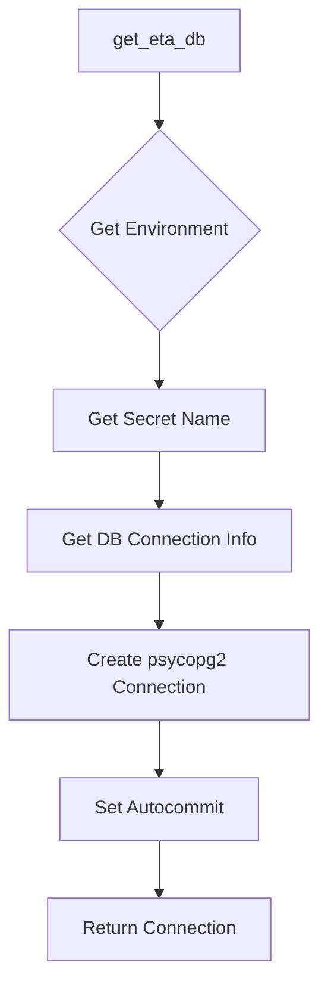
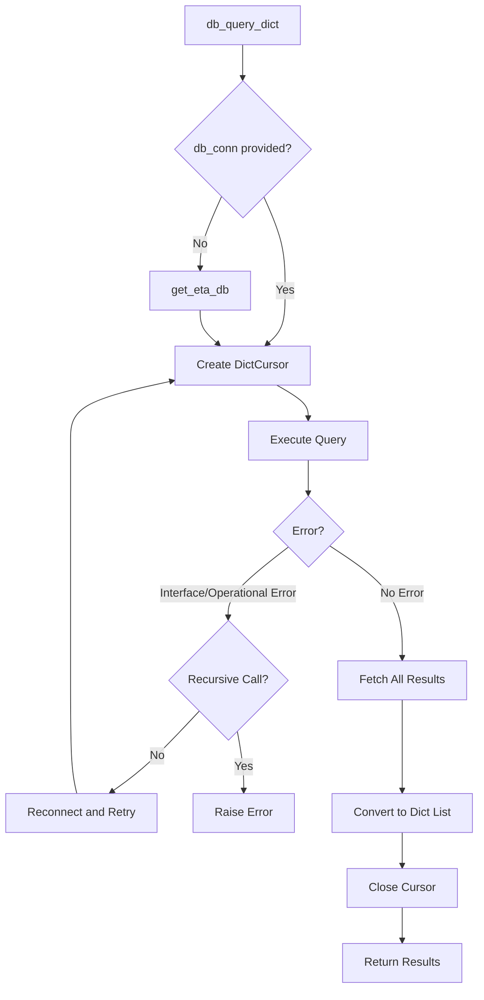
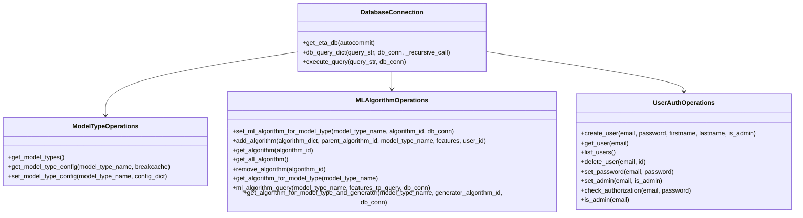
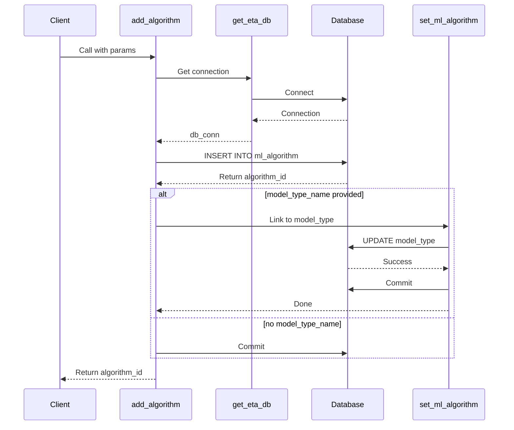
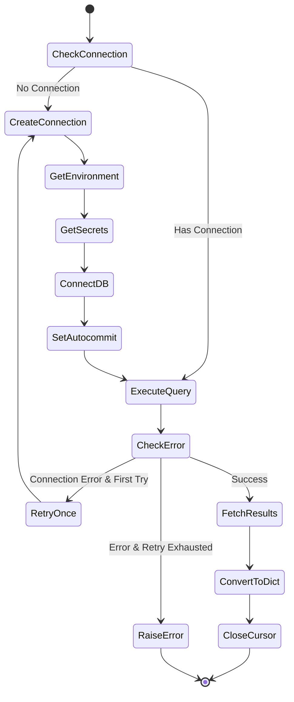
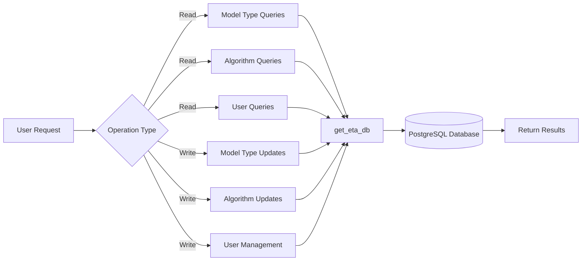

# Diagram: research/common/model_db.py


> Auto-generated by Obscura crawlers

## Diagram 1

```mermaid
graph TB
      A[get_eta_db] --> B{Get Environment}
      B --> C[Get Secret Name]
      C --> D[Get DB Connection Info]...
  └ 239 lines...
```

> SVG rendering failed for this diagram.

## Diagram 2



### SVG

<svg id="container" width="276" xmlns="http://www.w3.org/2000/svg" class="flowchart" height="838.890625" viewBox="0 0 276 838.890625" role="graphics-document document" aria-roledescription="flowchart-v2"><style>#container{font-family:"trebuchet ms",verdana,arial,sans-serif;font-size:16px;fill:#333;}@keyframes edge-animation-frame{from{stroke-dashoffset:0;}}@keyframes dash{to{stroke-dashoffset:0;}}#container .edge-animation-slow{stroke-dasharray:9,5!important;stroke-dashoffset:900;animation:dash 50s linear infinite;stroke-linecap:round;}#container .edge-animation-fast{stroke-dasharray:9,5!important;stroke-dashoffset:900;animation:dash 20s linear infinite;stroke-linecap:round;}#container .error-icon{fill:#552222;}#container .error-text{fill:#552222;stroke:#552222;}#container .edge-thickness-normal{stroke-width:1px;}#container .edge-thickness-thick{stroke-width:3.5px;}#container .edge-pattern-solid{stroke-dasharray:0;}#container .edge-thickness-invisible{stroke-width:0;fill:none;}#container .edge-pattern-dashed{stroke-dasharray:3;}#container .edge-pattern-dotted{stroke-dasharray:2;}#container .marker{fill:#333333;stroke:#333333;}#container .marker.cross{stroke:#333333;}#container svg{font-family:"trebuchet ms",verdana,arial,sans-serif;font-size:16px;}#container p{margin:0;}#container .label{font-family:"trebuchet ms",verdana,arial,sans-serif;color:#333;}#container .cluster-label text{fill:#333;}#container .cluster-label span{color:#333;}#container .cluster-label span p{background-color:transparent;}#container .label text,#container span{fill:#333;color:#333;}#container .node rect,#container .node circle,#container .node ellipse,#container .node polygon,#container .node path{fill:#ECECFF;stroke:#9370DB;stroke-width:1px;}#container .rough-node .label text,#container .node .label text,#container .image-shape .label,#container .icon-shape .label{text-anchor:middle;}#container .node .katex path{fill:#000;stroke:#000;stroke-width:1px;}#container .rough-node .label,#container .node .label,#container .image-shape .label,#container .icon-shape .label{text-align:center;}#container .node.clickable{cursor:pointer;}#container .root .anchor path{fill:#333333!important;stroke-width:0;stroke:#333333;}#container .arrowheadPath{fill:#333333;}#container .edgePath .path{stroke:#333333;stroke-width:2.0px;}#container .flowchart-link{stroke:#333333;fill:none;}#container .edgeLabel{background-color:rgba(232,232,232, 0.8);text-align:center;}#container .edgeLabel p{background-color:rgba(232,232,232, 0.8);}#container .edgeLabel rect{opacity:0.5;background-color:rgba(232,232,232, 0.8);fill:rgba(232,232,232, 0.8);}#container .labelBkg{background-color:rgba(232, 232, 232, 0.5);}#container .cluster rect{fill:#ffffde;stroke:#aaaa33;stroke-width:1px;}#container .cluster text{fill:#333;}#container .cluster span{color:#333;}#container div.mermaidTooltip{position:absolute;text-align:center;max-width:200px;padding:2px;font-family:"trebuchet ms",verdana,arial,sans-serif;font-size:12px;background:hsl(80, 100%, 96.2745098039%);border:1px solid #aaaa33;border-radius:2px;pointer-events:none;z-index:100;}#container .flowchartTitleText{text-anchor:middle;font-size:18px;fill:#333;}#container rect.text{fill:none;stroke-width:0;}#container .icon-shape,#container .image-shape{background-color:rgba(232,232,232, 0.8);text-align:center;}#container .icon-shape p,#container .image-shape p{background-color:rgba(232,232,232, 0.8);padding:2px;}#container .icon-shape rect,#container .image-shape rect{opacity:0.5;background-color:rgba(232,232,232, 0.8);fill:rgba(232,232,232, 0.8);}#container .label-icon{display:inline-block;height:1em;overflow:visible;vertical-align:-0.125em;}#container .node .label-icon path{fill:currentColor;stroke:revert;stroke-width:revert;}#container :root{--mermaid-font-family:"trebuchet ms",verdana,arial,sans-serif;}</style><g><marker id="container_flowchart-v2-pointEnd" class="marker flowchart-v2" viewBox="0 0 10 10" refX="5" refY="5" markerUnits="userSpaceOnUse" markerWidth="8" markerHeight="8" orient="auto"><path d="M 0 0 L 10 5 L 0 10 z" class="arrowMarkerPath" style="stroke-width: 1; stroke-dasharray: 1, 0;"></path></marker><marker id="container_flowchart-v2-pointStart" class="marker flowchart-v2" viewBox="0 0 10 10" refX="4.5" refY="5" markerUnits="userSpaceOnUse" markerWidth="8" markerHeight="8" orient="auto"><path d="M 0 5 L 10 10 L 10 0 z" class="arrowMarkerPath" style="stroke-width: 1; stroke-dasharray: 1, 0;"></path></marker><marker id="container_flowchart-v2-circleEnd" class="marker flowchart-v2" viewBox="0 0 10 10" refX="11" refY="5" markerUnits="userSpaceOnUse" markerWidth="11" markerHeight="11" orient="auto"><circle cx="5" cy="5" r="5" class="arrowMarkerPath" style="stroke-width: 1; stroke-dasharray: 1, 0;"></circle></marker><marker id="container_flowchart-v2-circleStart" class="marker flowchart-v2" viewBox="0 0 10 10" refX="-1" refY="5" markerUnits="userSpaceOnUse" markerWidth="11" markerHeight="11" orient="auto"><circle cx="5" cy="5" r="5" class="arrowMarkerPath" style="stroke-width: 1; stroke-dasharray: 1, 0;"></circle></marker><marker id="container_flowchart-v2-crossEnd" class="marker cross flowchart-v2" viewBox="0 0 11 11" refX="12" refY="5.2" markerUnits="userSpaceOnUse" markerWidth="11" markerHeight="11" orient="auto"><path d="M 1,1 l 9,9 M 10,1 l -9,9" class="arrowMarkerPath" style="stroke-width: 2; stroke-dasharray: 1, 0;"></path></marker><marker id="container_flowchart-v2-crossStart" class="marker cross flowchart-v2" viewBox="0 0 11 11" refX="-1" refY="5.2" markerUnits="userSpaceOnUse" markerWidth="11" markerHeight="11" orient="auto"><path d="M 1,1 l 9,9 M 10,1 l -9,9" class="arrowMarkerPath" style="stroke-width: 2; stroke-dasharray: 1, 0;"></path></marker><g class="root"><g class="clusters"></g><g class="edgePaths"><path d="M138,62L138,66.167C138,70.333,138,78.667,138,86.333C138,94,138,101,138,104.5L138,108" id="L_A_B_0" class="edge-thickness-normal edge-pattern-solid edge-thickness-normal edge-pattern-solid flowchart-link" style=";" data-edge="true" data-et="edge" data-id="L_A_B_0" data-points="W3sieCI6MTM4LCJ5Ijo2Mn0seyJ4IjoxMzgsInkiOjg3fSx7IngiOjEzOCwieSI6MTEyfV0=" marker-end="url(#container_flowchart-v2-pointEnd)"></path><path d="M138,286.891L138,291.057C138,295.224,138,303.557,138,311.224C138,318.891,138,325.891,138,329.391L138,332.891" id="L_B_C_0" class="edge-thickness-normal edge-pattern-solid edge-thickness-normal edge-pattern-solid flowchart-link" style=";" data-edge="true" data-et="edge" data-id="L_B_C_0" data-points="W3sieCI6MTM4LCJ5IjoyODYuODkwNjI1fSx7IngiOjEzOCwieSI6MzExLjg5MDYyNX0seyJ4IjoxMzgsInkiOjMzNi44OTA2MjV9XQ==" marker-end="url(#container_flowchart-v2-pointEnd)"></path><path d="M138,390.891L138,395.057C138,399.224,138,407.557,138,415.224C138,422.891,138,429.891,138,433.391L138,436.891" id="L_C_D_0" class="edge-thickness-normal edge-pattern-solid edge-thickness-normal edge-pattern-solid flowchart-link" style=";" data-edge="true" data-et="edge" data-id="L_C_D_0" data-points="W3sieCI6MTM4LCJ5IjozOTAuODkwNjI1fSx7IngiOjEzOCwieSI6NDE1Ljg5MDYyNX0seyJ4IjoxMzgsInkiOjQ0MC44OTA2MjV9XQ==" marker-end="url(#container_flowchart-v2-pointEnd)"></path><path d="M138,494.891L138,499.057C138,503.224,138,511.557,138,519.224C138,526.891,138,533.891,138,537.391L138,540.891" id="L_D_E_0" class="edge-thickness-normal edge-pattern-solid edge-thickness-normal edge-pattern-solid flowchart-link" style=";" data-edge="true" data-et="edge" data-id="L_D_E_0" data-points="W3sieCI6MTM4LCJ5Ijo0OTQuODkwNjI1fSx7IngiOjEzOCwieSI6NTE5Ljg5MDYyNX0seyJ4IjoxMzgsInkiOjU0NC44OTA2MjV9XQ==" marker-end="url(#container_flowchart-v2-pointEnd)"></path><path d="M138,622.891L138,627.057C138,631.224,138,639.557,138,647.224C138,654.891,138,661.891,138,665.391L138,668.891" id="L_E_F_0" class="edge-thickness-normal edge-pattern-solid edge-thickness-normal edge-pattern-solid flowchart-link" style=";" data-edge="true" data-et="edge" data-id="L_E_F_0" data-points="W3sieCI6MTM4LCJ5Ijo2MjIuODkwNjI1fSx7IngiOjEzOCwieSI6NjQ3Ljg5MDYyNX0seyJ4IjoxMzgsInkiOjY3Mi44OTA2MjV9XQ==" marker-end="url(#container_flowchart-v2-pointEnd)"></path><path d="M138,726.891L138,731.057C138,735.224,138,743.557,138,751.224C138,758.891,138,765.891,138,769.391L138,772.891" id="L_F_G_0" class="edge-thickness-normal edge-pattern-solid edge-thickness-normal edge-pattern-solid flowchart-link" style=";" data-edge="true" data-et="edge" data-id="L_F_G_0" data-points="W3sieCI6MTM4LCJ5Ijo3MjYuODkwNjI1fSx7IngiOjEzOCwieSI6NzUxLjg5MDYyNX0seyJ4IjoxMzgsInkiOjc3Ni44OTA2MjV9XQ==" marker-end="url(#container_flowchart-v2-pointEnd)"></path></g><g class="edgeLabels"><g class="edgeLabel"><g class="label" data-id="L_A_B_0" transform="translate(0, 0)"><foreignObject width="0" height="0"><div xmlns="http://www.w3.org/1999/xhtml" class="labelBkg" style="display: table-cell; white-space: nowrap; line-height: 1.5; max-width: 200px; text-align: center;"><span class="edgeLabel"></span></div></foreignObject></g></g><g class="edgeLabel"><g class="label" data-id="L_B_C_0" transform="translate(0, 0)"><foreignObject width="0" height="0"><div xmlns="http://www.w3.org/1999/xhtml" class="labelBkg" style="display: table-cell; white-space: nowrap; line-height: 1.5; max-width: 200px; text-align: center;"><span class="edgeLabel"></span></div></foreignObject></g></g><g class="edgeLabel"><g class="label" data-id="L_C_D_0" transform="translate(0, 0)"><foreignObject width="0" height="0"><div xmlns="http://www.w3.org/1999/xhtml" class="labelBkg" style="display: table-cell; white-space: nowrap; line-height: 1.5; max-width: 200px; text-align: center;"><span class="edgeLabel"></span></div></foreignObject></g></g><g class="edgeLabel"><g class="label" data-id="L_D_E_0" transform="translate(0, 0)"><foreignObject width="0" height="0"><div xmlns="http://www.w3.org/1999/xhtml" class="labelBkg" style="display: table-cell; white-space: nowrap; line-height: 1.5; max-width: 200px; text-align: center;"><span class="edgeLabel"></span></div></foreignObject></g></g><g class="edgeLabel"><g class="label" data-id="L_E_F_0" transform="translate(0, 0)"><foreignObject width="0" height="0"><div xmlns="http://www.w3.org/1999/xhtml" class="labelBkg" style="display: table-cell; white-space: nowrap; line-height: 1.5; max-width: 200px; text-align: center;"><span class="edgeLabel"></span></div></foreignObject></g></g><g class="edgeLabel"><g class="label" data-id="L_F_G_0" transform="translate(0, 0)"><foreignObject width="0" height="0"><div xmlns="http://www.w3.org/1999/xhtml" class="labelBkg" style="display: table-cell; white-space: nowrap; line-height: 1.5; max-width: 200px; text-align: center;"><span class="edgeLabel"></span></div></foreignObject></g></g></g><g class="nodes"><g class="node default" id="flowchart-A-0" transform="translate(138, 35)"><rect class="basic label-container" style="" x="-70.3671875" y="-27" width="140.734375" height="54"></rect><g class="label" style="" transform="translate(-40.3671875, -12)"><rect></rect><foreignObject width="80.734375" height="24"><div xmlns="http://www.w3.org/1999/xhtml" style="display: table-cell; white-space: nowrap; line-height: 1.5; max-width: 200px; text-align: center;"><span class="nodeLabel"><p>get_eta_db</p></span></div></foreignObject></g></g><g class="node default" id="flowchart-B-1" transform="translate(138, 199.4453125)"><polygon points="87.4453125,0 174.890625,-87.4453125 87.4453125,-174.890625 0,-87.4453125" class="label-container" transform="translate(-86.9453125, 87.4453125)"></polygon><g class="label" style="" transform="translate(-60.4453125, -12)"><rect></rect><foreignObject width="120.890625" height="24"><div xmlns="http://www.w3.org/1999/xhtml" style="display: table-cell; white-space: nowrap; line-height: 1.5; max-width: 200px; text-align: center;"><span class="nodeLabel"><p>Get Environment</p></span></div></foreignObject></g></g><g class="node default" id="flowchart-C-3" transform="translate(138, 363.890625)"><rect class="basic label-container" style="" x="-90.2109375" y="-27" width="180.421875" height="54"></rect><g class="label" style="" transform="translate(-60.2109375, -12)"><rect></rect><foreignObject width="120.421875" height="24"><div xmlns="http://www.w3.org/1999/xhtml" style="display: table-cell; white-space: nowrap; line-height: 1.5; max-width: 200px; text-align: center;"><span class="nodeLabel"><p>Get Secret Name</p></span></div></foreignObject></g></g><g class="node default" id="flowchart-D-5" transform="translate(138, 467.890625)"><rect class="basic label-container" style="" x="-114.0546875" y="-27" width="228.109375" height="54"></rect><g class="label" style="" transform="translate(-84.0546875, -12)"><rect></rect><foreignObject width="168.109375" height="24"><div xmlns="http://www.w3.org/1999/xhtml" style="display: table-cell; white-space: nowrap; line-height: 1.5; max-width: 200px; text-align: center;"><span class="nodeLabel"><p>Get DB Connection Info</p></span></div></foreignObject></g></g><g class="node default" id="flowchart-E-7" transform="translate(138, 583.890625)"><rect class="basic label-container" style="" x="-130" y="-39" width="260" height="78"></rect><g class="label" style="" transform="translate(-100, -24)"><rect></rect><foreignObject width="200" height="48"><div xmlns="http://www.w3.org/1999/xhtml" style="display: table; white-space: break-spaces; line-height: 1.5; max-width: 200px; text-align: center; width: 200px;"><span class="nodeLabel"><p>Create psycopg2 Connection</p></span></div></foreignObject></g></g><g class="node default" id="flowchart-F-9" transform="translate(138, 699.890625)"><rect class="basic label-container" style="" x="-87.6015625" y="-27" width="175.203125" height="54"></rect><g class="label" style="" transform="translate(-57.6015625, -12)"><rect></rect><foreignObject width="115.203125" height="24"><div xmlns="http://www.w3.org/1999/xhtml" style="display: table-cell; white-space: nowrap; line-height: 1.5; max-width: 200px; text-align: center;"><span class="nodeLabel"><p>Set Autocommit</p></span></div></foreignObject></g></g><g class="node default" id="flowchart-G-11" transform="translate(138, 803.890625)"><rect class="basic label-container" style="" x="-97.578125" y="-27" width="195.15625" height="54"></rect><g class="label" style="" transform="translate(-67.578125, -12)"><rect></rect><foreignObject width="135.15625" height="24"><div xmlns="http://www.w3.org/1999/xhtml" style="display: table-cell; white-space: nowrap; line-height: 1.5; max-width: 200px; text-align: center;"><span class="nodeLabel"><p>Return Connection</p></span></div></foreignObject></g></g></g></g></g></svg>

## Diagram 3



### SVG

<svg id="container" width="663.03515625" xmlns="http://www.w3.org/2000/svg" class="flowchart" height="1366.625" viewBox="0 0 663.03515625 1366.625" role="graphics-document document" aria-roledescription="flowchart-v2"><style>#container{font-family:"trebuchet ms",verdana,arial,sans-serif;font-size:16px;fill:#333;}@keyframes edge-animation-frame{from{stroke-dashoffset:0;}}@keyframes dash{to{stroke-dashoffset:0;}}#container .edge-animation-slow{stroke-dasharray:9,5!important;stroke-dashoffset:900;animation:dash 50s linear infinite;stroke-linecap:round;}#container .edge-animation-fast{stroke-dasharray:9,5!important;stroke-dashoffset:900;animation:dash 20s linear infinite;stroke-linecap:round;}#container .error-icon{fill:#552222;}#container .error-text{fill:#552222;stroke:#552222;}#container .edge-thickness-normal{stroke-width:1px;}#container .edge-thickness-thick{stroke-width:3.5px;}#container .edge-pattern-solid{stroke-dasharray:0;}#container .edge-thickness-invisible{stroke-width:0;fill:none;}#container .edge-pattern-dashed{stroke-dasharray:3;}#container .edge-pattern-dotted{stroke-dasharray:2;}#container .marker{fill:#333333;stroke:#333333;}#container .marker.cross{stroke:#333333;}#container svg{font-family:"trebuchet ms",verdana,arial,sans-serif;font-size:16px;}#container p{margin:0;}#container .label{font-family:"trebuchet ms",verdana,arial,sans-serif;color:#333;}#container .cluster-label text{fill:#333;}#container .cluster-label span{color:#333;}#container .cluster-label span p{background-color:transparent;}#container .label text,#container span{fill:#333;color:#333;}#container .node rect,#container .node circle,#container .node ellipse,#container .node polygon,#container .node path{fill:#ECECFF;stroke:#9370DB;stroke-width:1px;}#container .rough-node .label text,#container .node .label text,#container .image-shape .label,#container .icon-shape .label{text-anchor:middle;}#container .node .katex path{fill:#000;stroke:#000;stroke-width:1px;}#container .rough-node .label,#container .node .label,#container .image-shape .label,#container .icon-shape .label{text-align:center;}#container .node.clickable{cursor:pointer;}#container .root .anchor path{fill:#333333!important;stroke-width:0;stroke:#333333;}#container .arrowheadPath{fill:#333333;}#container .edgePath .path{stroke:#333333;stroke-width:2.0px;}#container .flowchart-link{stroke:#333333;fill:none;}#container .edgeLabel{background-color:rgba(232,232,232, 0.8);text-align:center;}#container .edgeLabel p{background-color:rgba(232,232,232, 0.8);}#container .edgeLabel rect{opacity:0.5;background-color:rgba(232,232,232, 0.8);fill:rgba(232,232,232, 0.8);}#container .labelBkg{background-color:rgba(232, 232, 232, 0.5);}#container .cluster rect{fill:#ffffde;stroke:#aaaa33;stroke-width:1px;}#container .cluster text{fill:#333;}#container .cluster span{color:#333;}#container div.mermaidTooltip{position:absolute;text-align:center;max-width:200px;padding:2px;font-family:"trebuchet ms",verdana,arial,sans-serif;font-size:12px;background:hsl(80, 100%, 96.2745098039%);border:1px solid #aaaa33;border-radius:2px;pointer-events:none;z-index:100;}#container .flowchartTitleText{text-anchor:middle;font-size:18px;fill:#333;}#container rect.text{fill:none;stroke-width:0;}#container .icon-shape,#container .image-shape{background-color:rgba(232,232,232, 0.8);text-align:center;}#container .icon-shape p,#container .image-shape p{background-color:rgba(232,232,232, 0.8);padding:2px;}#container .icon-shape rect,#container .image-shape rect{opacity:0.5;background-color:rgba(232,232,232, 0.8);fill:rgba(232,232,232, 0.8);}#container .label-icon{display:inline-block;height:1em;overflow:visible;vertical-align:-0.125em;}#container .node .label-icon path{fill:currentColor;stroke:revert;stroke-width:revert;}#container :root{--mermaid-font-family:"trebuchet ms",verdana,arial,sans-serif;}</style><g><marker id="container_flowchart-v2-pointEnd" class="marker flowchart-v2" viewBox="0 0 10 10" refX="5" refY="5" markerUnits="userSpaceOnUse" markerWidth="8" markerHeight="8" orient="auto"><path d="M 0 0 L 10 5 L 0 10 z" class="arrowMarkerPath" style="stroke-width: 1; stroke-dasharray: 1, 0;"></path></marker><marker id="container_flowchart-v2-pointStart" class="marker flowchart-v2" viewBox="0 0 10 10" refX="4.5" refY="5" markerUnits="userSpaceOnUse" markerWidth="8" markerHeight="8" orient="auto"><path d="M 0 5 L 10 10 L 10 0 z" class="arrowMarkerPath" style="stroke-width: 1; stroke-dasharray: 1, 0;"></path></marker><marker id="container_flowchart-v2-circleEnd" class="marker flowchart-v2" viewBox="0 0 10 10" refX="11" refY="5" markerUnits="userSpaceOnUse" markerWidth="11" markerHeight="11" orient="auto"><circle cx="5" cy="5" r="5" class="arrowMarkerPath" style="stroke-width: 1; stroke-dasharray: 1, 0;"></circle></marker><marker id="container_flowchart-v2-circleStart" class="marker flowchart-v2" viewBox="0 0 10 10" refX="-1" refY="5" markerUnits="userSpaceOnUse" markerWidth="11" markerHeight="11" orient="auto"><circle cx="5" cy="5" r="5" class="arrowMarkerPath" style="stroke-width: 1; stroke-dasharray: 1, 0;"></circle></marker><marker id="container_flowchart-v2-crossEnd" class="marker cross flowchart-v2" viewBox="0 0 11 11" refX="12" refY="5.2" markerUnits="userSpaceOnUse" markerWidth="11" markerHeight="11" orient="auto"><path d="M 1,1 l 9,9 M 10,1 l -9,9" class="arrowMarkerPath" style="stroke-width: 2; stroke-dasharray: 1, 0;"></path></marker><marker id="container_flowchart-v2-crossStart" class="marker cross flowchart-v2" viewBox="0 0 11 11" refX="-1" refY="5.2" markerUnits="userSpaceOnUse" markerWidth="11" markerHeight="11" orient="auto"><path d="M 1,1 l 9,9 M 10,1 l -9,9" class="arrowMarkerPath" style="stroke-width: 2; stroke-dasharray: 1, 0;"></path></marker><g class="root"><g class="clusters"></g><g class="edgePaths"><path d="M335.117,62L335.117,66.167C335.117,70.333,335.117,78.667,335.117,86.333C335.117,94,335.117,101,335.117,104.5L335.117,108" id="L_Start_Check_0" class="edge-thickness-normal edge-pattern-solid edge-thickness-normal edge-pattern-solid flowchart-link" style=";" data-edge="true" data-et="edge" data-id="L_Start_Check_0" data-points="W3sieCI6MzM1LjExNzE4NzUsInkiOjYyfSx7IngiOjMzNS4xMTcxODc1LCJ5Ijo4N30seyJ4IjozMzUuMTE3MTg3NSwieSI6MTEyfV0=" marker-end="url(#container_flowchart-v2-pointEnd)"></path><path d="M305.685,275.052L300.807,286.124C295.929,297.196,286.173,319.34,281.296,335.912C276.418,352.484,276.418,363.484,276.418,368.984L276.418,374.484" id="L_Check_GetConn_0" class="edge-thickness-normal edge-pattern-solid edge-thickness-normal edge-pattern-solid flowchart-link" style=";" data-edge="true" data-et="edge" data-id="L_Check_GetConn_0" data-points="W3sieCI6MzA1LjY4NDU1MzIwMDc0NDg2LCJ5IjoyNzUuMDUxNzQwNzAwNzQ0ODZ9LHsieCI6Mjc2LjQxNzk2ODc1LCJ5IjozNDEuNDg0Mzc1fSx7IngiOjI3Ni40MTc5Njg3NSwieSI6Mzc4LjQ4NDM3NX1d" marker-end="url(#container_flowchart-v2-pointEnd)"></path><path d="M364.55,275.052L369.428,286.124C374.305,297.196,384.061,319.34,388.939,341.079C393.816,362.818,393.816,384.151,393.816,403.484C393.816,422.818,393.816,440.151,389.612,452.542C385.408,464.934,376.999,472.383,372.794,476.107L368.59,479.832" id="L_Check_CreateCursor_0" class="edge-thickness-normal edge-pattern-solid edge-thickness-normal edge-pattern-solid flowchart-link" style=";" data-edge="true" data-et="edge" data-id="L_Check_CreateCursor_0" data-points="W3sieCI6MzY0LjU0OTgyMTc5OTI1NTE0LCJ5IjoyNzUuMDUxNzQwNzAwNzQ0ODZ9LHsieCI6MzkzLjgxNjQwNjI1LCJ5IjozNDEuNDg0Mzc1fSx7IngiOjM5My44MTY0MDYyNSwieSI6NDA1LjQ4NDM3NX0seyJ4IjozOTMuODE2NDA2MjUsInkiOjQ1Ny40ODQzNzV9LHsieCI6MzY1LjU5NTYyODAwNDgwNzcsInkiOjQ4Mi40ODQzNzV9XQ==" marker-end="url(#container_flowchart-v2-pointEnd)"></path><path d="M276.418,432.484L276.418,436.651C276.418,440.818,276.418,449.151,280.622,457.042C284.827,464.934,293.236,472.383,297.44,476.107L301.645,479.832" id="L_GetConn_CreateCursor_0" class="edge-thickness-normal edge-pattern-solid edge-thickness-normal edge-pattern-solid flowchart-link" style=";" data-edge="true" data-et="edge" data-id="L_GetConn_CreateCursor_0" data-points="W3sieCI6Mjc2LjQxNzk2ODc1LCJ5Ijo0MzIuNDg0Mzc1fSx7IngiOjI3Ni40MTc5Njg3NSwieSI6NDU3LjQ4NDM3NX0seyJ4IjozMDQuNjM4NzQ2OTk1MTkyMywieSI6NDgyLjQ4NDM3NX1d" marker-end="url(#container_flowchart-v2-pointEnd)"></path><path d="M382.428,536.484L389.729,540.651C397.03,544.818,411.632,553.151,418.933,560.818C426.234,568.484,426.234,575.484,426.234,578.984L426.234,582.484" id="L_CreateCursor_Execute_0" class="edge-thickness-normal edge-pattern-solid edge-thickness-normal edge-pattern-solid flowchart-link" style=";" data-edge="true" data-et="edge" data-id="L_CreateCursor_Execute_0" data-points="W3sieCI6MzgyLjQyODAzNDg1NTc2OTIsInkiOjUzNi40ODQzNzV9LHsieCI6NDI2LjIzNDM3NSwieSI6NTYxLjQ4NDM3NX0seyJ4Ijo0MjYuMjM0Mzc1LCJ5Ijo1ODYuNDg0Mzc1fV0=" marker-end="url(#container_flowchart-v2-pointEnd)"></path><path d="M426.234,640.484L426.234,644.651C426.234,648.818,426.234,657.151,426.234,664.818C426.234,672.484,426.234,679.484,426.234,682.984L426.234,686.484" id="L_Execute_Error_0" class="edge-thickness-normal edge-pattern-solid edge-thickness-normal edge-pattern-solid flowchart-link" style=";" data-edge="true" data-et="edge" data-id="L_Execute_Error_0" data-points="W3sieCI6NDI2LjIzNDM3NSwieSI6NjQwLjQ4NDM3NX0seyJ4Ijo0MjYuMjM0Mzc1LCJ5Ijo2NjUuNDg0Mzc1fSx7IngiOjQyNi4yMzQzNzUsInkiOjY5MC40ODQzNzV9XQ==" marker-end="url(#container_flowchart-v2-pointEnd)"></path><path d="M399.019,759.925L385.223,770.628C371.427,781.33,343.834,802.735,330.038,818.938C316.242,835.141,316.242,846.141,316.242,851.641L316.242,857.141" id="L_Error_Recursive_0" class="edge-thickness-normal edge-pattern-solid edge-thickness-normal edge-pattern-solid flowchart-link" style=";" data-edge="true" data-et="edge" data-id="L_Error_Recursive_0" data-points="W3sieCI6Mzk5LjAxODk5Njc0MDEzMDQsInkiOjc1OS45MjUyNDY3NDAxMzA0fSx7IngiOjMxNi4yNDIxODc1LCJ5Ijo4MjQuMTQwNjI1fSx7IngiOjMxNi4yNDIxODc1LCJ5Ijo4NjEuMTQwNjI1fV0=" marker-end="url(#container_flowchart-v2-pointEnd)"></path><path d="M276.844,983.226L264.709,995.959C252.575,1008.693,228.307,1034.159,207.939,1052.675C187.571,1071.192,171.103,1082.759,162.869,1088.542L154.635,1094.326" id="L_Recursive_Retry_0" class="edge-thickness-normal edge-pattern-solid edge-thickness-normal edge-pattern-solid flowchart-link" style=";" data-edge="true" data-et="edge" data-id="L_Recursive_Retry_0" data-points="W3sieCI6Mjc2Ljg0MzU3NzIwMjg4NDUsInkiOjk4My4yMjYzODk3MDI4ODQ1fSx7IngiOjIwNC4wMzkwNjI1LCJ5IjoxMDU5LjYyNX0seyJ4IjoxNTEuMzYxOTM4NDc2NTYyNSwieSI6MTA5Ni42MjV9XQ==" marker-end="url(#container_flowchart-v2-pointEnd)"></path><path d="M106.564,1096.625L105.112,1090.458C103.66,1084.292,100.756,1071.958,99.304,1046.168C97.852,1020.378,97.852,981.13,97.852,941.883C97.852,902.635,97.852,863.388,97.852,829.543C97.852,795.698,97.852,767.255,97.852,740.813C97.852,714.37,97.852,689.927,97.852,669.039C97.852,648.151,97.852,630.818,97.852,613.484C97.852,596.151,97.852,578.818,121.298,565.012C144.744,551.207,191.637,540.93,215.084,535.791L238.53,530.653" id="L_Retry_CreateCursor_0" class="edge-thickness-normal edge-pattern-solid edge-thickness-normal edge-pattern-solid flowchart-link" style=";" data-edge="true" data-et="edge" data-id="L_Retry_CreateCursor_0" data-points="W3sieCI6MTA2LjU2NDA4NjkxNDA2MjUsInkiOjEwOTYuNjI1fSx7IngiOjk3Ljg1MTU2MjUsInkiOjEwNTkuNjI1fSx7IngiOjk3Ljg1MTU2MjUsInkiOjk0MS44ODI4MTI1fSx7IngiOjk3Ljg1MTU2MjUsInkiOjgyNC4xNDA2MjV9LHsieCI6OTcuODUxNTYyNSwieSI6NzM4LjgxMjV9LHsieCI6OTcuODUxNTYyNSwieSI6NjY1LjQ4NDM3NX0seyJ4Ijo5Ny44NTE1NjI1LCJ5Ijo2MTMuNDg0Mzc1fSx7IngiOjk3Ljg1MTU2MjUsInkiOjU2MS40ODQzNzV9LHsieCI6MjQyLjQzNzUsInkiOjUyOS43OTYzOTM0MzkyNDkzfV0=" marker-end="url(#container_flowchart-v2-pointEnd)"></path><path d="M328.506,1010.361L329.976,1018.572C331.447,1026.783,334.387,1043.204,335.858,1056.914C337.328,1070.625,337.328,1081.625,337.328,1087.125L337.328,1092.625" id="L_Recursive_Raise_0" class="edge-thickness-normal edge-pattern-solid edge-thickness-normal edge-pattern-solid flowchart-link" style=";" data-edge="true" data-et="edge" data-id="L_Recursive_Raise_0" data-points="W3sieCI6MzI4LjUwNTczMDc3ODcwMDA3LCJ5IjoxMDEwLjM2MTQ1NjcyMTN9LHsieCI6MzM3LjMyODEyNSwieSI6MTA1OS42MjV9LHsieCI6MzM3LjMyODEyNSwieSI6MTA5Ni42MjV9XQ==" marker-end="url(#container_flowchart-v2-pointEnd)"></path><path d="M455.425,757.95L472.252,768.982C489.079,780.014,522.733,802.077,539.56,827.566C556.387,853.055,556.387,881.969,556.387,896.426L556.387,910.883" id="L_Error_Fetch_0" class="edge-thickness-normal edge-pattern-solid edge-thickness-normal edge-pattern-solid flowchart-link" style=";" data-edge="true" data-et="edge" data-id="L_Error_Fetch_0" data-points="W3sieCI6NDU1LjQyNTA0MjYwMTAxODgsInkiOjc1Ny45NDk5NTczOTg5ODEyfSx7IngiOjU1Ni4zODY3MTg3NSwieSI6ODI0LjE0MDYyNX0seyJ4Ijo1NTYuMzg2NzE4NzUsInkiOjkxNC44ODI4MTI1fV0=" marker-end="url(#container_flowchart-v2-pointEnd)"></path><path d="M556.387,968.883L556.387,984.007C556.387,999.13,556.387,1029.378,556.387,1050.001C556.387,1070.625,556.387,1081.625,556.387,1087.125L556.387,1092.625" id="L_Fetch_Convert_0" class="edge-thickness-normal edge-pattern-solid edge-thickness-normal edge-pattern-solid flowchart-link" style=";" data-edge="true" data-et="edge" data-id="L_Fetch_Convert_0" data-points="W3sieCI6NTU2LjM4NjcxODc1LCJ5Ijo5NjguODgyODEyNX0seyJ4Ijo1NTYuMzg2NzE4NzUsInkiOjEwNTkuNjI1fSx7IngiOjU1Ni4zODY3MTg3NSwieSI6MTA5Ni42MjV9XQ==" marker-end="url(#container_flowchart-v2-pointEnd)"></path><path d="M556.387,1150.625L556.387,1154.792C556.387,1158.958,556.387,1167.292,556.387,1174.958C556.387,1182.625,556.387,1189.625,556.387,1193.125L556.387,1196.625" id="L_Convert_Close_0" class="edge-thickness-normal edge-pattern-solid edge-thickness-normal edge-pattern-solid flowchart-link" style=";" data-edge="true" data-et="edge" data-id="L_Convert_Close_0" data-points="W3sieCI6NTU2LjM4NjcxODc1LCJ5IjoxMTUwLjYyNX0seyJ4Ijo1NTYuMzg2NzE4NzUsInkiOjExNzUuNjI1fSx7IngiOjU1Ni4zODY3MTg3NSwieSI6MTIwMC42MjV9XQ==" marker-end="url(#container_flowchart-v2-pointEnd)"></path><path d="M556.387,1254.625L556.387,1258.792C556.387,1262.958,556.387,1271.292,556.387,1278.958C556.387,1286.625,556.387,1293.625,556.387,1297.125L556.387,1300.625" id="L_Close_Return_0" class="edge-thickness-normal edge-pattern-solid edge-thickness-normal edge-pattern-solid flowchart-link" style=";" data-edge="true" data-et="edge" data-id="L_Close_Return_0" data-points="W3sieCI6NTU2LjM4NjcxODc1LCJ5IjoxMjU0LjYyNX0seyJ4Ijo1NTYuMzg2NzE4NzUsInkiOjEyNzkuNjI1fSx7IngiOjU1Ni4zODY3MTg3NSwieSI6MTMwNC42MjV9XQ==" marker-end="url(#container_flowchart-v2-pointEnd)"></path></g><g class="edgeLabels"><g class="edgeLabel"><g class="label" data-id="L_Start_Check_0" transform="translate(0, 0)"><foreignObject width="0" height="0"><div xmlns="http://www.w3.org/1999/xhtml" class="labelBkg" style="display: table-cell; white-space: nowrap; line-height: 1.5; max-width: 200px; text-align: center;"><span class="edgeLabel"></span></div></foreignObject></g></g><g class="edgeLabel" transform="translate(276.41796875, 341.484375)"><g class="label" data-id="L_Check_GetConn_0" transform="translate(-10.140625, -12)"><foreignObject width="20.28125" height="24"><div xmlns="http://www.w3.org/1999/xhtml" class="labelBkg" style="display: table-cell; white-space: nowrap; line-height: 1.5; max-width: 200px; text-align: center;"><span class="edgeLabel"><p>No</p></span></div></foreignObject></g></g><g class="edgeLabel" transform="translate(393.81640625, 405.484375)"><g class="label" data-id="L_Check_CreateCursor_0" transform="translate(-12.03125, -12)"><foreignObject width="24.0625" height="24"><div xmlns="http://www.w3.org/1999/xhtml" class="labelBkg" style="display: table-cell; white-space: nowrap; line-height: 1.5; max-width: 200px; text-align: center;"><span class="edgeLabel"><p>Yes</p></span></div></foreignObject></g></g><g class="edgeLabel"><g class="label" data-id="L_GetConn_CreateCursor_0" transform="translate(0, 0)"><foreignObject width="0" height="0"><div xmlns="http://www.w3.org/1999/xhtml" class="labelBkg" style="display: table-cell; white-space: nowrap; line-height: 1.5; max-width: 200px; text-align: center;"><span class="edgeLabel"></span></div></foreignObject></g></g><g class="edgeLabel"><g class="label" data-id="L_CreateCursor_Execute_0" transform="translate(0, 0)"><foreignObject width="0" height="0"><div xmlns="http://www.w3.org/1999/xhtml" class="labelBkg" style="display: table-cell; white-space: nowrap; line-height: 1.5; max-width: 200px; text-align: center;"><span class="edgeLabel"></span></div></foreignObject></g></g><g class="edgeLabel"><g class="label" data-id="L_Execute_Error_0" transform="translate(0, 0)"><foreignObject width="0" height="0"><div xmlns="http://www.w3.org/1999/xhtml" class="labelBkg" style="display: table-cell; white-space: nowrap; line-height: 1.5; max-width: 200px; text-align: center;"><span class="edgeLabel"></span></div></foreignObject></g></g><g class="edgeLabel" transform="translate(316.2421875, 824.140625)"><g class="label" data-id="L_Error_Recursive_0" transform="translate(-99.09375, -12)"><foreignObject width="198.1875" height="24"><div xmlns="http://www.w3.org/1999/xhtml" class="labelBkg" style="display: table-cell; white-space: nowrap; line-height: 1.5; max-width: 200px; text-align: center;"><span class="edgeLabel"><p>Interface/Operational Error</p></span></div></foreignObject></g></g><g class="edgeLabel" transform="translate(218.23672, 1044.72646)"><g class="label" data-id="L_Recursive_Retry_0" transform="translate(-10.140625, -12)"><foreignObject width="20.28125" height="24"><div xmlns="http://www.w3.org/1999/xhtml" class="labelBkg" style="display: table-cell; white-space: nowrap; line-height: 1.5; max-width: 200px; text-align: center;"><span class="edgeLabel"><p>No</p></span></div></foreignObject></g></g><g class="edgeLabel"><g class="label" data-id="L_Retry_CreateCursor_0" transform="translate(0, 0)"><foreignObject width="0" height="0"><div xmlns="http://www.w3.org/1999/xhtml" class="labelBkg" style="display: table-cell; white-space: nowrap; line-height: 1.5; max-width: 200px; text-align: center;"><span class="edgeLabel"></span></div></foreignObject></g></g><g class="edgeLabel" transform="translate(337.328125, 1059.625)"><g class="label" data-id="L_Recursive_Raise_0" transform="translate(-12.03125, -12)"><foreignObject width="24.0625" height="24"><div xmlns="http://www.w3.org/1999/xhtml" class="labelBkg" style="display: table-cell; white-space: nowrap; line-height: 1.5; max-width: 200px; text-align: center;"><span class="edgeLabel"><p>Yes</p></span></div></foreignObject></g></g><g class="edgeLabel" transform="translate(556.38671875, 824.140625)"><g class="label" data-id="L_Error_Fetch_0" transform="translate(-30.15625, -12)"><foreignObject width="60.3125" height="24"><div xmlns="http://www.w3.org/1999/xhtml" class="labelBkg" style="display: table-cell; white-space: nowrap; line-height: 1.5; max-width: 200px; text-align: center;"><span class="edgeLabel"><p>No Error</p></span></div></foreignObject></g></g><g class="edgeLabel"><g class="label" data-id="L_Fetch_Convert_0" transform="translate(0, 0)"><foreignObject width="0" height="0"><div xmlns="http://www.w3.org/1999/xhtml" class="labelBkg" style="display: table-cell; white-space: nowrap; line-height: 1.5; max-width: 200px; text-align: center;"><span class="edgeLabel"></span></div></foreignObject></g></g><g class="edgeLabel"><g class="label" data-id="L_Convert_Close_0" transform="translate(0, 0)"><foreignObject width="0" height="0"><div xmlns="http://www.w3.org/1999/xhtml" class="labelBkg" style="display: table-cell; white-space: nowrap; line-height: 1.5; max-width: 200px; text-align: center;"><span class="edgeLabel"></span></div></foreignObject></g></g><g class="edgeLabel"><g class="label" data-id="L_Close_Return_0" transform="translate(0, 0)"><foreignObject width="0" height="0"><div xmlns="http://www.w3.org/1999/xhtml" class="labelBkg" style="display: table-cell; white-space: nowrap; line-height: 1.5; max-width: 200px; text-align: center;"><span class="edgeLabel"></span></div></foreignObject></g></g></g><g class="nodes"><g class="node default" id="flowchart-Start-0" transform="translate(335.1171875, 35)"><rect class="basic label-container" style="" x="-81.71875" y="-27" width="163.4375" height="54"></rect><g class="label" style="" transform="translate(-51.71875, -12)"><rect></rect><foreignObject width="103.4375" height="24"><div xmlns="http://www.w3.org/1999/xhtml" style="display: table-cell; white-space: nowrap; line-height: 1.5; max-width: 200px; text-align: center;"><span class="nodeLabel"><p>db_query_dict</p></span></div></foreignObject></g></g><g class="node default" id="flowchart-Check-1" transform="translate(335.1171875, 208.2421875)"><polygon points="96.2421875,0 192.484375,-96.2421875 96.2421875,-192.484375 0,-96.2421875" class="label-container" transform="translate(-95.7421875, 96.2421875)"></polygon><g class="label" style="" transform="translate(-69.2421875, -12)"><rect></rect><foreignObject width="138.484375" height="24"><div xmlns="http://www.w3.org/1999/xhtml" style="display: table-cell; white-space: nowrap; line-height: 1.5; max-width: 200px; text-align: center;"><span class="nodeLabel"><p>db_conn provided?</p></span></div></foreignObject></g></g><g class="node default" id="flowchart-GetConn-3" transform="translate(276.41796875, 405.484375)"><rect class="basic label-container" style="" x="-70.3671875" y="-27" width="140.734375" height="54"></rect><g class="label" style="" transform="translate(-40.3671875, -12)"><rect></rect><foreignObject width="80.734375" height="24"><div xmlns="http://www.w3.org/1999/xhtml" style="display: table-cell; white-space: nowrap; line-height: 1.5; max-width: 200px; text-align: center;"><span class="nodeLabel"><p>get_eta_db</p></span></div></foreignObject></g></g><g class="node default" id="flowchart-CreateCursor-5" transform="translate(335.1171875, 509.484375)"><rect class="basic label-container" style="" x="-92.6796875" y="-27" width="185.359375" height="54"></rect><g class="label" style="" transform="translate(-62.6796875, -12)"><rect></rect><foreignObject width="125.359375" height="24"><div xmlns="http://www.w3.org/1999/xhtml" style="display: table-cell; white-space: nowrap; line-height: 1.5; max-width: 200px; text-align: center;"><span class="nodeLabel"><p>Create DictCursor</p></span></div></foreignObject></g></g><g class="node default" id="flowchart-Execute-9" transform="translate(426.234375, 613.484375)"><rect class="basic label-container" style="" x="-81.671875" y="-27" width="163.34375" height="54"></rect><g class="label" style="" transform="translate(-51.671875, -12)"><rect></rect><foreignObject width="103.34375" height="24"><div xmlns="http://www.w3.org/1999/xhtml" style="display: table-cell; white-space: nowrap; line-height: 1.5; max-width: 200px; text-align: center;"><span class="nodeLabel"><p>Execute Query</p></span></div></foreignObject></g></g><g class="node default" id="flowchart-Error-11" transform="translate(426.234375, 738.8125)"><polygon points="48.328125,0 96.65625,-48.328125 48.328125,-96.65625 0,-48.328125" class="label-container" transform="translate(-47.828125, 48.328125)"></polygon><g class="label" style="" transform="translate(-21.328125, -12)"><rect></rect><foreignObject width="42.65625" height="24"><div xmlns="http://www.w3.org/1999/xhtml" style="display: table-cell; white-space: nowrap; line-height: 1.5; max-width: 200px; text-align: center;"><span class="nodeLabel"><p>Error?</p></span></div></foreignObject></g></g><g class="node default" id="flowchart-Recursive-13" transform="translate(316.2421875, 941.8828125)"><polygon points="80.7421875,0 161.484375,-80.7421875 80.7421875,-161.484375 0,-80.7421875" class="label-container" transform="translate(-80.2421875, 80.7421875)"></polygon><g class="label" style="" transform="translate(-53.7421875, -12)"><rect></rect><foreignObject width="107.484375" height="24"><div xmlns="http://www.w3.org/1999/xhtml" style="display: table-cell; white-space: nowrap; line-height: 1.5; max-width: 200px; text-align: center;"><span class="nodeLabel"><p>Recursive Call?</p></span></div></foreignObject></g></g><g class="node default" id="flowchart-Retry-15" transform="translate(112.921875, 1123.625)"><rect class="basic label-container" style="" x="-104.921875" y="-27" width="209.84375" height="54"></rect><g class="label" style="" transform="translate(-74.921875, -12)"><rect></rect><foreignObject width="149.84375" height="24"><div xmlns="http://www.w3.org/1999/xhtml" style="display: table-cell; white-space: nowrap; line-height: 1.5; max-width: 200px; text-align: center;"><span class="nodeLabel"><p>Reconnect and Retry</p></span></div></foreignObject></g></g><g class="node default" id="flowchart-Raise-19" transform="translate(337.328125, 1123.625)"><rect class="basic label-container" style="" x="-69.484375" y="-27" width="138.96875" height="54"></rect><g class="label" style="" transform="translate(-39.484375, -12)"><rect></rect><foreignObject width="78.96875" height="24"><div xmlns="http://www.w3.org/1999/xhtml" style="display: table-cell; white-space: nowrap; line-height: 1.5; max-width: 200px; text-align: center;"><span class="nodeLabel"><p>Raise Error</p></span></div></foreignObject></g></g><g class="node default" id="flowchart-Fetch-21" transform="translate(556.38671875, 941.8828125)"><rect class="basic label-container" style="" x="-89.2421875" y="-27" width="178.484375" height="54"></rect><g class="label" style="" transform="translate(-59.2421875, -12)"><rect></rect><foreignObject width="118.484375" height="24"><div xmlns="http://www.w3.org/1999/xhtml" style="display: table-cell; white-space: nowrap; line-height: 1.5; max-width: 200px; text-align: center;"><span class="nodeLabel"><p>Fetch All Results</p></span></div></foreignObject></g></g><g class="node default" id="flowchart-Convert-23" transform="translate(556.38671875, 1123.625)"><rect class="basic label-container" style="" x="-98.6484375" y="-27" width="197.296875" height="54"></rect><g class="label" style="" transform="translate(-68.6484375, -12)"><rect></rect><foreignObject width="137.296875" height="24"><div xmlns="http://www.w3.org/1999/xhtml" style="display: table-cell; white-space: nowrap; line-height: 1.5; max-width: 200px; text-align: center;"><span class="nodeLabel"><p>Convert to Dict List</p></span></div></foreignObject></g></g><g class="node default" id="flowchart-Close-25" transform="translate(556.38671875, 1227.625)"><rect class="basic label-container" style="" x="-75.0625" y="-27" width="150.125" height="54"></rect><g class="label" style="" transform="translate(-45.0625, -12)"><rect></rect><foreignObject width="90.125" height="24"><div xmlns="http://www.w3.org/1999/xhtml" style="display: table-cell; white-space: nowrap; line-height: 1.5; max-width: 200px; text-align: center;"><span class="nodeLabel"><p>Close Cursor</p></span></div></foreignObject></g></g><g class="node default" id="flowchart-Return-27" transform="translate(556.38671875, 1331.625)"><rect class="basic label-container" style="" x="-82.9609375" y="-27" width="165.921875" height="54"></rect><g class="label" style="" transform="translate(-52.9609375, -12)"><rect></rect><foreignObject width="105.921875" height="24"><div xmlns="http://www.w3.org/1999/xhtml" style="display: table-cell; white-space: nowrap; line-height: 1.5; max-width: 200px; text-align: center;"><span class="nodeLabel"><p>Return Results</p></span></div></foreignObject></g></g></g></g></g></svg>

## Diagram 4



### SVG

<svg id="container" width="2022.2734375" xmlns="http://www.w3.org/2000/svg" class="classDiagram" height="534" viewBox="0 0 2022.2734375 534" role="graphics-document document" aria-roledescription="class"><style>#container{font-family:"trebuchet ms",verdana,arial,sans-serif;font-size:16px;fill:#333;}@keyframes edge-animation-frame{from{stroke-dashoffset:0;}}@keyframes dash{to{stroke-dashoffset:0;}}#container .edge-animation-slow{stroke-dasharray:9,5!important;stroke-dashoffset:900;animation:dash 50s linear infinite;stroke-linecap:round;}#container .edge-animation-fast{stroke-dasharray:9,5!important;stroke-dashoffset:900;animation:dash 20s linear infinite;stroke-linecap:round;}#container .error-icon{fill:#552222;}#container .error-text{fill:#552222;stroke:#552222;}#container .edge-thickness-normal{stroke-width:1px;}#container .edge-thickness-thick{stroke-width:3.5px;}#container .edge-pattern-solid{stroke-dasharray:0;}#container .edge-thickness-invisible{stroke-width:0;fill:none;}#container .edge-pattern-dashed{stroke-dasharray:3;}#container .edge-pattern-dotted{stroke-dasharray:2;}#container .marker{fill:#333333;stroke:#333333;}#container .marker.cross{stroke:#333333;}#container svg{font-family:"trebuchet ms",verdana,arial,sans-serif;font-size:16px;}#container p{margin:0;}#container g.classGroup text{fill:#9370DB;stroke:none;font-family:"trebuchet ms",verdana,arial,sans-serif;font-size:10px;}#container g.classGroup text .title{font-weight:bolder;}#container .nodeLabel,#container .edgeLabel{color:#131300;}#container .edgeLabel .label rect{fill:#ECECFF;}#container .label text{fill:#131300;}#container .labelBkg{background:#ECECFF;}#container .edgeLabel .label span{background:#ECECFF;}#container .classTitle{font-weight:bolder;}#container .node rect,#container .node circle,#container .node ellipse,#container .node polygon,#container .node path{fill:#ECECFF;stroke:#9370DB;stroke-width:1px;}#container .divider{stroke:#9370DB;stroke-width:1;}#container g.clickable{cursor:pointer;}#container g.classGroup rect{fill:#ECECFF;stroke:#9370DB;}#container g.classGroup line{stroke:#9370DB;stroke-width:1;}#container .classLabel .box{stroke:none;stroke-width:0;fill:#ECECFF;opacity:0.5;}#container .classLabel .label{fill:#9370DB;font-size:10px;}#container .relation{stroke:#333333;stroke-width:1;fill:none;}#container .dashed-line{stroke-dasharray:3;}#container .dotted-line{stroke-dasharray:1 2;}#container #compositionStart,#container .composition{fill:#333333!important;stroke:#333333!important;stroke-width:1;}#container #compositionEnd,#container .composition{fill:#333333!important;stroke:#333333!important;stroke-width:1;}#container #dependencyStart,#container .dependency{fill:#333333!important;stroke:#333333!important;stroke-width:1;}#container #dependencyStart,#container .dependency{fill:#333333!important;stroke:#333333!important;stroke-width:1;}#container #extensionStart,#container .extension{fill:transparent!important;stroke:#333333!important;stroke-width:1;}#container #extensionEnd,#container .extension{fill:transparent!important;stroke:#333333!important;stroke-width:1;}#container #aggregationStart,#container .aggregation{fill:transparent!important;stroke:#333333!important;stroke-width:1;}#container #aggregationEnd,#container .aggregation{fill:transparent!important;stroke:#333333!important;stroke-width:1;}#container #lollipopStart,#container .lollipop{fill:#ECECFF!important;stroke:#333333!important;stroke-width:1;}#container #lollipopEnd,#container .lollipop{fill:#ECECFF!important;stroke:#333333!important;stroke-width:1;}#container .edgeTerminals{font-size:11px;line-height:initial;}#container .classTitleText{text-anchor:middle;font-size:18px;fill:#333;}#container .label-icon{display:inline-block;height:1em;overflow:visible;vertical-align:-0.125em;}#container .node .label-icon path{fill:currentColor;stroke:revert;stroke-width:revert;}#container :root{--mermaid-font-family:"trebuchet ms",verdana,arial,sans-serif;}</style><g><defs><marker id="container_class-aggregationStart" class="marker aggregation class" refX="18" refY="7" markerWidth="190" markerHeight="240" orient="auto"><path d="M 18,7 L9,13 L1,7 L9,1 Z"></path></marker></defs><defs><marker id="container_class-aggregationEnd" class="marker aggregation class" refX="1" refY="7" markerWidth="20" markerHeight="28" orient="auto"><path d="M 18,7 L9,13 L1,7 L9,1 Z"></path></marker></defs><defs><marker id="container_class-extensionStart" class="marker extension class" refX="18" refY="7" markerWidth="190" markerHeight="240" orient="auto"><path d="M 1,7 L18,13 V 1 Z"></path></marker></defs><defs><marker id="container_class-extensionEnd" class="marker extension class" refX="1" refY="7" markerWidth="20" markerHeight="28" orient="auto"><path d="M 1,1 V 13 L18,7 Z"></path></marker></defs><defs><marker id="container_class-compositionStart" class="marker composition class" refX="18" refY="7" markerWidth="190" markerHeight="240" orient="auto"><path d="M 18,7 L9,13 L1,7 L9,1 Z"></path></marker></defs><defs><marker id="container_class-compositionEnd" class="marker composition class" refX="1" refY="7" markerWidth="20" markerHeight="28" orient="auto"><path d="M 18,7 L9,13 L1,7 L9,1 Z"></path></marker></defs><defs><marker id="container_class-dependencyStart" class="marker dependency class" refX="6" refY="7" markerWidth="190" markerHeight="240" orient="auto"><path d="M 5,7 L9,13 L1,7 L9,1 Z"></path></marker></defs><defs><marker id="container_class-dependencyEnd" class="marker dependency class" refX="13" refY="7" markerWidth="20" markerHeight="28" orient="auto"><path d="M 18,7 L9,13 L14,7 L9,1 Z"></path></marker></defs><defs><marker id="container_class-lollipopStart" class="marker lollipop class" refX="13" refY="7" markerWidth="190" markerHeight="240" orient="auto"><circle stroke="black" fill="transparent" cx="7" cy="7" r="6"></circle></marker></defs><defs><marker id="container_class-lollipopEnd" class="marker lollipop class" refX="1" refY="7" markerWidth="190" markerHeight="240" orient="auto"><circle stroke="black" fill="transparent" cx="7" cy="7" r="6"></circle></marker></defs><g class="root"><g class="clusters"></g><g class="edgePaths"><path d="M760.164,131.302L677.757,143.918C595.349,156.534,430.534,181.767,348.126,207.55C265.719,233.333,265.719,259.667,265.719,272.833L265.719,286" id="id_DatabaseConnection_ModelTypeOperations_1" class="edge-thickness-normal edge-pattern-solid relation" style=";;;" data-edge="true" data-et="edge" data-id="id_DatabaseConnection_ModelTypeOperations_1" data-points="W3sieCI6NzYwLjE2NDA2MjUsInkiOjEzMS4zMDE1MTgwNTU5NDg2fSx7IngiOjI2NS43MTg3NSwieSI6MjA3fSx7IngiOjI2NS43MTg3NSwieSI6MjkyfV0=" marker-end="url(#container_class-dependencyEnd)"></path><path d="M997.277,182L997.277,186.167C997.277,190.333,997.277,198.667,997.277,206C997.277,213.333,997.277,219.667,997.277,222.833L997.277,226" id="id_DatabaseConnection_MLAlgorithmOperations_2" class="edge-thickness-normal edge-pattern-solid relation" style=";;;" data-edge="true" data-et="edge" data-id="id_DatabaseConnection_MLAlgorithmOperations_2" data-points="W3sieCI6OTk3LjI3NzM0Mzc1LCJ5IjoxODJ9LHsieCI6OTk3LjI3NzM0Mzc1LCJ5IjoyMDd9LHsieCI6OTk3LjI3NzM0Mzc1LCJ5IjoyMzJ9XQ==" marker-end="url(#container_class-dependencyEnd)"></path><path d="M1234.391,130.627L1319.108,143.355C1403.826,156.084,1573.26,181.542,1657.978,197.438C1742.695,213.333,1742.695,219.667,1742.695,222.833L1742.695,226" id="id_DatabaseConnection_UserAuthOperations_3" class="edge-thickness-normal edge-pattern-solid relation" style=";;;" data-edge="true" data-et="edge" data-id="id_DatabaseConnection_UserAuthOperations_3" data-points="W3sieCI6MTIzNC4zOTA2MjUsInkiOjEzMC42MjY1NzI3NTk2MTk5Nn0seyJ4IjoxNzQyLjY5NTMxMjUsInkiOjIwN30seyJ4IjoxNzQyLjY5NTMxMjUsInkiOjIzMn1d" marker-end="url(#container_class-dependencyEnd)"></path></g><g class="edgeLabels"><g class="edgeLabel"><g class="label" data-id="id_DatabaseConnection_ModelTypeOperations_1" transform="translate(0, 0)"><foreignObject width="0" height="0"><div xmlns="http://www.w3.org/1999/xhtml" class="labelBkg" style="display: table-cell; white-space: nowrap; line-height: 1.5; max-width: 200px; text-align: center;"><span class="edgeLabel"></span></div></foreignObject></g></g><g class="edgeLabel"><g class="label" data-id="id_DatabaseConnection_MLAlgorithmOperations_2" transform="translate(0, 0)"><foreignObject width="0" height="0"><div xmlns="http://www.w3.org/1999/xhtml" class="labelBkg" style="display: table-cell; white-space: nowrap; line-height: 1.5; max-width: 200px; text-align: center;"><span class="edgeLabel"></span></div></foreignObject></g></g><g class="edgeLabel"><g class="label" data-id="id_DatabaseConnection_UserAuthOperations_3" transform="translate(0, 0)"><foreignObject width="0" height="0"><div xmlns="http://www.w3.org/1999/xhtml" class="labelBkg" style="display: table-cell; white-space: nowrap; line-height: 1.5; max-width: 200px; text-align: center;"><span class="edgeLabel"></span></div></foreignObject></g></g></g><g class="nodes"><g class="node default" id="classId-DatabaseConnection-0" transform="translate(997.27734375, 95)"><g class="basic label-container"><path d="M-237.11328125 -87 L237.11328125 -87 L237.11328125 87 L-237.11328125 87" stroke="none" stroke-width="0" fill="#ECECFF" style=""></path><path d="M-237.11328125 -87 C-54.76814402800798 -87, 127.57699319398404 -87, 237.11328125 -87 M-237.11328125 -87 C-97.93692852729603 -87, 41.239424195407935 -87, 237.11328125 -87 M237.11328125 -87 C237.11328125 -35.06237834473574, 237.11328125 16.875243310528518, 237.11328125 87 M237.11328125 -87 C237.11328125 -24.707445997764516, 237.11328125 37.58510800447097, 237.11328125 87 M237.11328125 87 C62.06829510604692 87, -112.97669103790616 87, -237.11328125 87 M237.11328125 87 C94.69671028997783 87, -47.71986067004434 87, -237.11328125 87 M-237.11328125 87 C-237.11328125 21.838195605569496, -237.11328125 -43.32360878886101, -237.11328125 -87 M-237.11328125 87 C-237.11328125 44.111855107727045, -237.11328125 1.2237102154540906, -237.11328125 -87" stroke="#9370DB" stroke-width="1.3" fill="none" stroke-dasharray="0 0" style=""></path></g><g class="annotation-group text" transform="translate(0, -63)"></g><g class="label-group text" transform="translate(-75.3984375, -63)"><g class="label" style="font-weight: bolder" transform="translate(0,-12)"><foreignObject width="150.796875" height="24"><div xmlns="http://www.w3.org/1999/xhtml" style="display: table-cell; white-space: nowrap; line-height: 1.5; max-width: 199px; text-align: center;"><span class="nodeLabel markdown-node-label" style=""><p>DatabaseConnection</p></span></div></foreignObject></g></g><g class="members-group text" transform="translate(-225.11328125, -15)"></g><g class="methods-group text" transform="translate(-225.11328125, 15)"><g class="label" style="" transform="translate(0,-12)"><foreignObject width="186.359375" height="24"><div xmlns="http://www.w3.org/1999/xhtml" style="display: table-cell; white-space: nowrap; line-height: 1.5; max-width: 244px; text-align: center;"><span class="nodeLabel markdown-node-label" style=""><p>+get_eta_db(autocommit)</p></span></div></foreignObject></g><g class="label" style="" transform="translate(0,12)"><foreignObject width="374.828125" height="24"><div xmlns="http://www.w3.org/1999/xhtml" style="display: table-cell; white-space: nowrap; line-height: 1.5; max-width: 432px; text-align: center;"><span class="nodeLabel markdown-node-label" style=""><p>+db_query_dict(query_str, db_conn, _recursive_call)</p></span></div></foreignObject></g><g class="label" style="" transform="translate(0,36)"><foreignObject width="261.546875" height="24"><div xmlns="http://www.w3.org/1999/xhtml" style="display: table-cell; white-space: nowrap; line-height: 1.5; max-width: 319px; text-align: center;"><span class="nodeLabel markdown-node-label" style=""><p>+execute_query(query_str, db_conn)</p></span></div></foreignObject></g></g><g class="divider" style=""><path d="M-237.11328125 -39 C-122.02033821946355 -39, -6.9273951889271075 -39, 237.11328125 -39 M-237.11328125 -39 C-115.36609382967329 -39, 6.381093590653421 -39, 237.11328125 -39" stroke="#9370DB" stroke-width="1.3" fill="none" stroke-dasharray="0 0" style=""></path></g><g class="divider" style=""><path d="M-237.11328125 -15 C-131.1717160289349 -15, -25.23015080786979 -15, 237.11328125 -15 M-237.11328125 -15 C-104.82825859374407 -15, 27.456764062511866 -15, 237.11328125 -15" stroke="#9370DB" stroke-width="1.3" fill="none" stroke-dasharray="0 0" style=""></path></g></g><g class="node default" id="classId-ModelTypeOperations-1" transform="translate(265.71875, 379)"><g class="basic label-container"><path d="M-257.71875 -87 L257.71875 -87 L257.71875 87 L-257.71875 87" stroke="none" stroke-width="0" fill="#ECECFF" style=""></path><path d="M-257.71875 -87 C-150.6482886190213 -87, -43.5778272380426 -87, 257.71875 -87 M-257.71875 -87 C-87.61240732017336 -87, 82.49393535965328 -87, 257.71875 -87 M257.71875 -87 C257.71875 -30.74900645781765, 257.71875 25.5019870843647, 257.71875 87 M257.71875 -87 C257.71875 -17.765661611568845, 257.71875 51.46867677686231, 257.71875 87 M257.71875 87 C134.2376540893761 87, 10.756558178752186 87, -257.71875 87 M257.71875 87 C136.5488007573287 87, 15.378851514657413 87, -257.71875 87 M-257.71875 87 C-257.71875 19.355729274121018, -257.71875 -48.288541451757965, -257.71875 -87 M-257.71875 87 C-257.71875 24.275052175189614, -257.71875 -38.44989564962077, -257.71875 -87" stroke="#9370DB" stroke-width="1.3" fill="none" stroke-dasharray="0 0" style=""></path></g><g class="annotation-group text" transform="translate(0, -63)"></g><g class="label-group text" transform="translate(-80.421875, -63)"><g class="label" style="font-weight: bolder" transform="translate(0,-12)"><foreignObject width="160.84375" height="24"><div xmlns="http://www.w3.org/1999/xhtml" style="display: table-cell; white-space: nowrap; line-height: 1.5; max-width: 209px; text-align: center;"><span class="nodeLabel markdown-node-label" style=""><p>ModelTypeOperations</p></span></div></foreignObject></g></g><g class="members-group text" transform="translate(-245.71875, -15)"></g><g class="methods-group text" transform="translate(-245.71875, 15)"><g class="label" style="" transform="translate(0,-12)"><foreignObject width="142.53125" height="24"><div xmlns="http://www.w3.org/1999/xhtml" style="display: table-cell; white-space: nowrap; line-height: 1.5; max-width: 200px; text-align: center;"><span class="nodeLabel markdown-node-label" style=""><p>+get_model_types()</p></span></div></foreignObject></g><g class="label" style="" transform="translate(0,12)"><foreignObject width="411.015625" height="24"><div xmlns="http://www.w3.org/1999/xhtml" style="display: table-cell; white-space: nowrap; line-height: 1.5; max-width: 468px; text-align: center;"><span class="nodeLabel markdown-node-label" style=""><p>+get_model_type_config(model_type_name, breakcache)</p></span></div></foreignObject></g><g class="label" style="" transform="translate(0,36)"><foreignObject width="407.109375" height="24"><div xmlns="http://www.w3.org/1999/xhtml" style="display: table-cell; white-space: nowrap; line-height: 1.5; max-width: 464px; text-align: center;"><span class="nodeLabel markdown-node-label" style=""><p>+set_model_type_config(model_type_name, config_dict)</p></span></div></foreignObject></g></g><g class="divider" style=""><path d="M-257.71875 -39 C-58.79594314794025 -39, 140.1268637041195 -39, 257.71875 -39 M-257.71875 -39 C-154.0403610229527 -39, -50.361972045905446 -39, 257.71875 -39" stroke="#9370DB" stroke-width="1.3" fill="none" stroke-dasharray="0 0" style=""></path></g><g class="divider" style=""><path d="M-257.71875 -15 C-90.56826914104263 -15, 76.58221171791473 -15, 257.71875 -15 M-257.71875 -15 C-60.13574876716817 -15, 137.44725246566367 -15, 257.71875 -15" stroke="#9370DB" stroke-width="1.3" fill="none" stroke-dasharray="0 0" style=""></path></g></g><g class="node default" id="classId-MLAlgorithmOperations-2" transform="translate(997.27734375, 379)"><g class="basic label-container"><path d="M-423.83984375 -147 L423.83984375 -147 L423.83984375 147 L-423.83984375 147" stroke="none" stroke-width="0" fill="#ECECFF" style=""></path><path d="M-423.83984375 -147 C-157.08549558719932 -147, 109.66885257560136 -147, 423.83984375 -147 M-423.83984375 -147 C-184.69871328644962 -147, 54.442417177100765 -147, 423.83984375 -147 M423.83984375 -147 C423.83984375 -83.86357852538693, 423.83984375 -20.727157050773855, 423.83984375 147 M423.83984375 -147 C423.83984375 -60.449914984264126, 423.83984375 26.100170031471748, 423.83984375 147 M423.83984375 147 C85.22623038196537 147, -253.38738298606927 147, -423.83984375 147 M423.83984375 147 C187.40255466631874 147, -49.03473441736253 147, -423.83984375 147 M-423.83984375 147 C-423.83984375 50.46926211001225, -423.83984375 -46.061475779975495, -423.83984375 -147 M-423.83984375 147 C-423.83984375 82.29504025936407, -423.83984375 17.590080518728143, -423.83984375 -147" stroke="#9370DB" stroke-width="1.3" fill="none" stroke-dasharray="0 0" style=""></path></g><g class="annotation-group text" transform="translate(0, -123)"></g><g class="label-group text" transform="translate(-86.8515625, -123)"><g class="label" style="font-weight: bolder" transform="translate(0,-12)"><foreignObject width="173.703125" height="24"><div xmlns="http://www.w3.org/1999/xhtml" style="display: table-cell; white-space: nowrap; line-height: 1.5; max-width: 221px; text-align: center;"><span class="nodeLabel markdown-node-label" style=""><p>MLAlgorithmOperations</p></span></div></foreignObject></g></g><g class="members-group text" transform="translate(-411.83984375, -75)"></g><g class="methods-group text" transform="translate(-411.83984375, -45)"><g class="label" style="" transform="translate(0,-12)"><foreignObject width="571.921875" height="24"><div xmlns="http://www.w3.org/1999/xhtml" style="display: table-cell; white-space: nowrap; line-height: 1.5; max-width: 629px; text-align: center;"><span class="nodeLabel markdown-node-label" style=""><p>+set_ml_algorithm_for_model_type(model_type_name, algorithm_id, db_conn)</p></span></div></foreignObject></g><g class="label" style="" transform="translate(0,12)"><foreignObject width="656.859375" height="24"><div xmlns="http://www.w3.org/1999/xhtml" style="display: table-cell; white-space: nowrap; line-height: 1.5; max-width: 714px; text-align: center;"><span class="nodeLabel markdown-node-label" style=""><p>+add_algorithm(algorithm_dict, parent_algorithm_id, model_type_name, features, user_id)</p></span></div></foreignObject></g><g class="label" style="" transform="translate(0,36)"><foreignObject width="211.703125" height="24"><div xmlns="http://www.w3.org/1999/xhtml" style="display: table-cell; white-space: nowrap; line-height: 1.5; max-width: 269px; text-align: center;"><span class="nodeLabel markdown-node-label" style=""><p>+get_algorithm(algorithm_id)</p></span></div></foreignObject></g><g class="label" style="" transform="translate(0,60)"><foreignObject width="145.03125" height="24"><div xmlns="http://www.w3.org/1999/xhtml" style="display: table-cell; white-space: nowrap; line-height: 1.5; max-width: 202px; text-align: center;"><span class="nodeLabel markdown-node-label" style=""><p>+get_all_algorithm()</p></span></div></foreignObject></g><g class="label" style="" transform="translate(0,84)"><foreignObject width="242.765625" height="24"><div xmlns="http://www.w3.org/1999/xhtml" style="display: table-cell; white-space: nowrap; line-height: 1.5; max-width: 300px; text-align: center;"><span class="nodeLabel markdown-node-label" style=""><p>+remove_algorithm(algorithm_id)</p></span></div></foreignObject></g><g class="label" style="" transform="translate(0,108)"><foreignObject width="375.03125" height="24"><div xmlns="http://www.w3.org/1999/xhtml" style="display: table-cell; white-space: nowrap; line-height: 1.5; max-width: 432px; text-align: center;"><span class="nodeLabel markdown-node-label" style=""><p>+get_algorithm_for_model_type(model_type_name)</p></span></div></foreignObject></g><g class="label" style="" transform="translate(0,132)"><foreignObject width="507.796875" height="24"><div xmlns="http://www.w3.org/1999/xhtml" style="display: table-cell; white-space: nowrap; line-height: 1.5; max-width: 565px; text-align: center;"><span class="nodeLabel markdown-node-label" style=""><p>+ml_algorithm_query(model_type_name, features_to_query, db_conn)</p></span></div></foreignObject></g><g class="label" style="" transform="translate(0,156)"><foreignObject width="736.828125" height="24"><div xmlns="http://www.w3.org/1999/xhtml" style="display: table-cell; white-space: nowrap; line-height: 1.5; max-width: 794px; text-align: center;"><span class="nodeLabel markdown-node-label" style=""><p>+get_algorithm_for_model_type_and_generator(model_type_name, generator_algorithm_id, db_conn)</p></span></div></foreignObject></g></g><g class="divider" style=""><path d="M-423.83984375 -99 C-228.97681875115575 -99, -34.113793752311494 -99, 423.83984375 -99 M-423.83984375 -99 C-227.33462057842522 -99, -30.829397406850433 -99, 423.83984375 -99" stroke="#9370DB" stroke-width="1.3" fill="none" stroke-dasharray="0 0" style=""></path></g><g class="divider" style=""><path d="M-423.83984375 -75 C-160.0188617347502 -75, 103.8021202804996 -75, 423.83984375 -75 M-423.83984375 -75 C-139.41204712759048 -75, 145.01574949481903 -75, 423.83984375 -75" stroke="#9370DB" stroke-width="1.3" fill="none" stroke-dasharray="0 0" style=""></path></g></g><g class="node default" id="classId-UserAuthOperations-3" transform="translate(1742.6953125, 379)"><g class="basic label-container"><path d="M-271.578125 -147 L271.578125 -147 L271.578125 147 L-271.578125 147" stroke="none" stroke-width="0" fill="#ECECFF" style=""></path><path d="M-271.578125 -147 C-59.01356441617756 -147, 153.55099616764488 -147, 271.578125 -147 M-271.578125 -147 C-156.96489465840517 -147, -42.35166431681034 -147, 271.578125 -147 M271.578125 -147 C271.578125 -46.402465707559784, 271.578125 54.19506858488043, 271.578125 147 M271.578125 -147 C271.578125 -74.21757145631337, 271.578125 -1.4351429126267305, 271.578125 147 M271.578125 147 C55.16138161438104 147, -161.25536177123792 147, -271.578125 147 M271.578125 147 C107.66922045609977 147, -56.23968408780047 147, -271.578125 147 M-271.578125 147 C-271.578125 55.92282908075518, -271.578125 -35.15434183848964, -271.578125 -147 M-271.578125 147 C-271.578125 55.040591441387534, -271.578125 -36.91881711722493, -271.578125 -147" stroke="#9370DB" stroke-width="1.3" fill="none" stroke-dasharray="0 0" style=""></path></g><g class="annotation-group text" transform="translate(0, -123)"></g><g class="label-group text" transform="translate(-74.1875, -123)"><g class="label" style="font-weight: bolder" transform="translate(0,-12)"><foreignObject width="148.375" height="24"><div xmlns="http://www.w3.org/1999/xhtml" style="display: table-cell; white-space: nowrap; line-height: 1.5; max-width: 197px; text-align: center;"><span class="nodeLabel markdown-node-label" style=""><p>UserAuthOperations</p></span></div></foreignObject></g></g><g class="members-group text" transform="translate(-259.578125, -75)"></g><g class="methods-group text" transform="translate(-259.578125, -45)"><g class="label" style="" transform="translate(0,-12)"><foreignObject width="444.96875" height="24"><div xmlns="http://www.w3.org/1999/xhtml" style="display: table-cell; white-space: nowrap; line-height: 1.5; max-width: 502px; text-align: center;"><span class="nodeLabel markdown-node-label" style=""><p>+create_user(email, password, firstname, lastname, is_admin)</p></span></div></foreignObject></g><g class="label" style="" transform="translate(0,12)"><foreignObject width="120.9375" height="24"><div xmlns="http://www.w3.org/1999/xhtml" style="display: table-cell; white-space: nowrap; line-height: 1.5; max-width: 178px; text-align: center;"><span class="nodeLabel markdown-node-label" style=""><p>+get_user(email)</p></span></div></foreignObject></g><g class="label" style="" transform="translate(0,36)"><foreignObject width="87.71875" height="24"><div xmlns="http://www.w3.org/1999/xhtml" style="display: table-cell; white-space: nowrap; line-height: 1.5; max-width: 145px; text-align: center;"><span class="nodeLabel markdown-node-label" style=""><p>+list_users()</p></span></div></foreignObject></g><g class="label" style="" transform="translate(0,60)"><foreignObject width="166.15625" height="24"><div xmlns="http://www.w3.org/1999/xhtml" style="display: table-cell; white-space: nowrap; line-height: 1.5; max-width: 224px; text-align: center;"><span class="nodeLabel markdown-node-label" style=""><p>+delete_user(email, id)</p></span></div></foreignObject></g><g class="label" style="" transform="translate(0,84)"><foreignObject width="234.40625" height="24"><div xmlns="http://www.w3.org/1999/xhtml" style="display: table-cell; white-space: nowrap; line-height: 1.5; max-width: 292px; text-align: center;"><span class="nodeLabel markdown-node-label" style=""><p>+set_password(email, password)</p></span></div></foreignObject></g><g class="label" style="" transform="translate(0,108)"><foreignObject width="208.21875" height="24"><div xmlns="http://www.w3.org/1999/xhtml" style="display: table-cell; white-space: nowrap; line-height: 1.5; max-width: 266px; text-align: center;"><span class="nodeLabel markdown-node-label" style=""><p>+set_admin(email, is_admin)</p></span></div></foreignObject></g><g class="label" style="" transform="translate(0,132)"><foreignObject width="282.734375" height="24"><div xmlns="http://www.w3.org/1999/xhtml" style="display: table-cell; white-space: nowrap; line-height: 1.5; max-width: 340px; text-align: center;"><span class="nodeLabel markdown-node-label" style=""><p>+check_authorization(email, password)</p></span></div></foreignObject></g><g class="label" style="" transform="translate(0,156)"><foreignObject width="124.234375" height="24"><div xmlns="http://www.w3.org/1999/xhtml" style="display: table-cell; white-space: nowrap; line-height: 1.5; max-width: 182px; text-align: center;"><span class="nodeLabel markdown-node-label" style=""><p>+is_admin(email)</p></span></div></foreignObject></g></g><g class="divider" style=""><path d="M-271.578125 -99 C-131.7315751911576 -99, 8.114974617684823 -99, 271.578125 -99 M-271.578125 -99 C-153.69208771646805 -99, -35.806050432936104 -99, 271.578125 -99" stroke="#9370DB" stroke-width="1.3" fill="none" stroke-dasharray="0 0" style=""></path></g><g class="divider" style=""><path d="M-271.578125 -75 C-107.31950494522346 -75, 56.939115109553086 -75, 271.578125 -75 M-271.578125 -75 C-146.5817627543479 -75, -21.585400508695756 -75, 271.578125 -75" stroke="#9370DB" stroke-width="1.3" fill="none" stroke-dasharray="0 0" style=""></path></g></g></g></g></g></svg>

## Diagram 5



### SVG

<svg id="container" width="1081" xmlns="http://www.w3.org/2000/svg" height="943" viewBox="-50 -10 1081 943" role="graphics-document document" aria-roledescription="sequence"><g><rect x="831" y="857" fill="#eaeaea" stroke="#666" width="150" height="65" name="set_ml_algorithm" rx="3" ry="3" class="actor actor-bottom"></rect><text x="906" y="889.5" dominant-baseline="central" alignment-baseline="central" class="actor actor-box" style="text-anchor: middle; font-size: 16px; font-weight: 400;"><tspan x="906" dy="0">set_ml_algorithm</tspan></text></g><g><rect x="616" y="857" fill="#eaeaea" stroke="#666" width="150" height="65" name="Database" rx="3" ry="3" class="actor actor-bottom"></rect><text x="691" y="889.5" dominant-baseline="central" alignment-baseline="central" class="actor actor-box" style="text-anchor: middle; font-size: 16px; font-weight: 400;"><tspan x="691" dy="0">Database</tspan></text></g><g><rect x="416" y="857" fill="#eaeaea" stroke="#666" width="150" height="65" name="get_eta_db" rx="3" ry="3" class="actor actor-bottom"></rect><text x="491" y="889.5" dominant-baseline="central" alignment-baseline="central" class="actor actor-box" style="text-anchor: middle; font-size: 16px; font-weight: 400;"><tspan x="491" dy="0">get_eta_db</tspan></text></g><g><rect x="216" y="857" fill="#eaeaea" stroke="#666" width="150" height="65" name="add_algorithm" rx="3" ry="3" class="actor actor-bottom"></rect><text x="291" y="889.5" dominant-baseline="central" alignment-baseline="central" class="actor actor-box" style="text-anchor: middle; font-size: 16px; font-weight: 400;"><tspan x="291" dy="0">add_algorithm</tspan></text></g><g><rect x="0" y="857" fill="#eaeaea" stroke="#666" width="150" height="65" name="Client" rx="3" ry="3" class="actor actor-bottom"></rect><text x="75" y="889.5" dominant-baseline="central" alignment-baseline="central" class="actor actor-box" style="text-anchor: middle; font-size: 16px; font-weight: 400;"><tspan x="75" dy="0">Client</tspan></text></g><g><line id="actor4" x1="906" y1="65" x2="906" y2="857" class="actor-line 200" stroke-width="0.5px" stroke="#999" name="set_ml_algorithm"></line><g id="root-4"><rect x="831" y="0" fill="#eaeaea" stroke="#666" width="150" height="65" name="set_ml_algorithm" rx="3" ry="3" class="actor actor-top"></rect><text x="906" y="32.5" dominant-baseline="central" alignment-baseline="central" class="actor actor-box" style="text-anchor: middle; font-size: 16px; font-weight: 400;"><tspan x="906" dy="0">set_ml_algorithm</tspan></text></g></g><g><line id="actor3" x1="691" y1="65" x2="691" y2="857" class="actor-line 200" stroke-width="0.5px" stroke="#999" name="Database"></line><g id="root-3"><rect x="616" y="0" fill="#eaeaea" stroke="#666" width="150" height="65" name="Database" rx="3" ry="3" class="actor actor-top"></rect><text x="691" y="32.5" dominant-baseline="central" alignment-baseline="central" class="actor actor-box" style="text-anchor: middle; font-size: 16px; font-weight: 400;"><tspan x="691" dy="0">Database</tspan></text></g></g><g><line id="actor2" x1="491" y1="65" x2="491" y2="857" class="actor-line 200" stroke-width="0.5px" stroke="#999" name="get_eta_db"></line><g id="root-2"><rect x="416" y="0" fill="#eaeaea" stroke="#666" width="150" height="65" name="get_eta_db" rx="3" ry="3" class="actor actor-top"></rect><text x="491" y="32.5" dominant-baseline="central" alignment-baseline="central" class="actor actor-box" style="text-anchor: middle; font-size: 16px; font-weight: 400;"><tspan x="491" dy="0">get_eta_db</tspan></text></g></g><g><line id="actor1" x1="291" y1="65" x2="291" y2="857" class="actor-line 200" stroke-width="0.5px" stroke="#999" name="add_algorithm"></line><g id="root-1"><rect x="216" y="0" fill="#eaeaea" stroke="#666" width="150" height="65" name="add_algorithm" rx="3" ry="3" class="actor actor-top"></rect><text x="291" y="32.5" dominant-baseline="central" alignment-baseline="central" class="actor actor-box" style="text-anchor: middle; font-size: 16px; font-weight: 400;"><tspan x="291" dy="0">add_algorithm</tspan></text></g></g><g><line id="actor0" x1="75" y1="65" x2="75" y2="857" class="actor-line 200" stroke-width="0.5px" stroke="#999" name="Client"></line><g id="root-0"><rect x="0" y="0" fill="#eaeaea" stroke="#666" width="150" height="65" name="Client" rx="3" ry="3" class="actor actor-top"></rect><text x="75" y="32.5" dominant-baseline="central" alignment-baseline="central" class="actor actor-box" style="text-anchor: middle; font-size: 16px; font-weight: 400;"><tspan x="75" dy="0">Client</tspan></text></g></g><style>#container{font-family:"trebuchet ms",verdana,arial,sans-serif;font-size:16px;fill:#333;}@keyframes edge-animation-frame{from{stroke-dashoffset:0;}}@keyframes dash{to{stroke-dashoffset:0;}}#container .edge-animation-slow{stroke-dasharray:9,5!important;stroke-dashoffset:900;animation:dash 50s linear infinite;stroke-linecap:round;}#container .edge-animation-fast{stroke-dasharray:9,5!important;stroke-dashoffset:900;animation:dash 20s linear infinite;stroke-linecap:round;}#container .error-icon{fill:#552222;}#container .error-text{fill:#552222;stroke:#552222;}#container .edge-thickness-normal{stroke-width:1px;}#container .edge-thickness-thick{stroke-width:3.5px;}#container .edge-pattern-solid{stroke-dasharray:0;}#container .edge-thickness-invisible{stroke-width:0;fill:none;}#container .edge-pattern-dashed{stroke-dasharray:3;}#container .edge-pattern-dotted{stroke-dasharray:2;}#container .marker{fill:#333333;stroke:#333333;}#container .marker.cross{stroke:#333333;}#container svg{font-family:"trebuchet ms",verdana,arial,sans-serif;font-size:16px;}#container p{margin:0;}#container .actor{stroke:hsl(259.6261682243, 59.7765363128%, 87.9019607843%);fill:#ECECFF;}#container text.actor&gt;tspan{fill:black;stroke:none;}#container .actor-line{stroke:hsl(259.6261682243, 59.7765363128%, 87.9019607843%);}#container .innerArc{stroke-width:1.5;stroke-dasharray:none;}#container .messageLine0{stroke-width:1.5;stroke-dasharray:none;stroke:#333;}#container .messageLine1{stroke-width:1.5;stroke-dasharray:2,2;stroke:#333;}#container #arrowhead path{fill:#333;stroke:#333;}#container .sequenceNumber{fill:white;}#container #sequencenumber{fill:#333;}#container #crosshead path{fill:#333;stroke:#333;}#container .messageText{fill:#333;stroke:none;}#container .labelBox{stroke:hsl(259.6261682243, 59.7765363128%, 87.9019607843%);fill:#ECECFF;}#container .labelText,#container .labelText&gt;tspan{fill:black;stroke:none;}#container .loopText,#container .loopText&gt;tspan{fill:black;stroke:none;}#container .loopLine{stroke-width:2px;stroke-dasharray:2,2;stroke:hsl(259.6261682243, 59.7765363128%, 87.9019607843%);fill:hsl(259.6261682243, 59.7765363128%, 87.9019607843%);}#container .note{stroke:#aaaa33;fill:#fff5ad;}#container .noteText,#container .noteText&gt;tspan{fill:black;stroke:none;}#container .activation0{fill:#f4f4f4;stroke:#666;}#container .activation1{fill:#f4f4f4;stroke:#666;}#container .activation2{fill:#f4f4f4;stroke:#666;}#container .actorPopupMenu{position:absolute;}#container .actorPopupMenuPanel{position:absolute;fill:#ECECFF;box-shadow:0px 8px 16px 0px rgba(0,0,0,0.2);filter:drop-shadow(3px 5px 2px rgb(0 0 0 / 0.4));}#container .actor-man line{stroke:hsl(259.6261682243, 59.7765363128%, 87.9019607843%);fill:#ECECFF;}#container .actor-man circle,#container line{stroke:hsl(259.6261682243, 59.7765363128%, 87.9019607843%);fill:#ECECFF;stroke-width:2px;}#container :root{--mermaid-font-family:"trebuchet ms",verdana,arial,sans-serif;}</style><g></g><defs><symbol id="computer" width="24" height="24"><path transform="scale(.5)" d="M2 2v13h20v-13h-20zm18 11h-16v-9h16v9zm-10.228 6l.466-1h3.524l.467 1h-4.457zm14.228 3h-24l2-6h2.104l-1.33 4h18.45l-1.297-4h2.073l2 6zm-5-10h-14v-7h14v7z"></path></symbol></defs><defs><symbol id="database" fill-rule="evenodd" clip-rule="evenodd"><path transform="scale(.5)" d="M12.258.001l.256.004.255.005.253.008.251.01.249.012.247.015.246.016.242.019.241.02.239.023.236.024.233.027.231.028.229.031.225.032.223.034.22.036.217.038.214.04.211.041.208.043.205.045.201.046.198.048.194.05.191.051.187.053.183.054.18.056.175.057.172.059.168.06.163.061.16.063.155.064.15.066.074.033.073.033.071.034.07.034.069.035.068.035.067.035.066.035.064.036.064.036.062.036.06.036.06.037.058.037.058.037.055.038.055.038.053.038.052.038.051.039.05.039.048.039.047.039.045.04.044.04.043.04.041.04.04.041.039.041.037.041.036.041.034.041.033.042.032.042.03.042.029.042.027.042.026.043.024.043.023.043.021.043.02.043.018.044.017.043.015.044.013.044.012.044.011.045.009.044.007.045.006.045.004.045.002.045.001.045v17l-.001.045-.002.045-.004.045-.006.045-.007.045-.009.044-.011.045-.012.044-.013.044-.015.044-.017.043-.018.044-.02.043-.021.043-.023.043-.024.043-.026.043-.027.042-.029.042-.03.042-.032.042-.033.042-.034.041-.036.041-.037.041-.039.041-.04.041-.041.04-.043.04-.044.04-.045.04-.047.039-.048.039-.05.039-.051.039-.052.038-.053.038-.055.038-.055.038-.058.037-.058.037-.06.037-.06.036-.062.036-.064.036-.064.036-.066.035-.067.035-.068.035-.069.035-.07.034-.071.034-.073.033-.074.033-.15.066-.155.064-.16.063-.163.061-.168.06-.172.059-.175.057-.18.056-.183.054-.187.053-.191.051-.194.05-.198.048-.201.046-.205.045-.208.043-.211.041-.214.04-.217.038-.22.036-.223.034-.225.032-.229.031-.231.028-.233.027-.236.024-.239.023-.241.02-.242.019-.246.016-.247.015-.249.012-.251.01-.253.008-.255.005-.256.004-.258.001-.258-.001-.256-.004-.255-.005-.253-.008-.251-.01-.249-.012-.247-.015-.245-.016-.243-.019-.241-.02-.238-.023-.236-.024-.234-.027-.231-.028-.228-.031-.226-.032-.223-.034-.22-.036-.217-.038-.214-.04-.211-.041-.208-.043-.204-.045-.201-.046-.198-.048-.195-.05-.19-.051-.187-.053-.184-.054-.179-.056-.176-.057-.172-.059-.167-.06-.164-.061-.159-.063-.155-.064-.151-.066-.074-.033-.072-.033-.072-.034-.07-.034-.069-.035-.068-.035-.067-.035-.066-.035-.064-.036-.063-.036-.062-.036-.061-.036-.06-.037-.058-.037-.057-.037-.056-.038-.055-.038-.053-.038-.052-.038-.051-.039-.049-.039-.049-.039-.046-.039-.046-.04-.044-.04-.043-.04-.041-.04-.04-.041-.039-.041-.037-.041-.036-.041-.034-.041-.033-.042-.032-.042-.03-.042-.029-.042-.027-.042-.026-.043-.024-.043-.023-.043-.021-.043-.02-.043-.018-.044-.017-.043-.015-.044-.013-.044-.012-.044-.011-.045-.009-.044-.007-.045-.006-.045-.004-.045-.002-.045-.001-.045v-17l.001-.045.002-.045.004-.045.006-.045.007-.045.009-.044.011-.045.012-.044.013-.044.015-.044.017-.043.018-.044.02-.043.021-.043.023-.043.024-.043.026-.043.027-.042.029-.042.03-.042.032-.042.033-.042.034-.041.036-.041.037-.041.039-.041.04-.041.041-.04.043-.04.044-.04.046-.04.046-.039.049-.039.049-.039.051-.039.052-.038.053-.038.055-.038.056-.038.057-.037.058-.037.06-.037.061-.036.062-.036.063-.036.064-.036.066-.035.067-.035.068-.035.069-.035.07-.034.072-.034.072-.033.074-.033.151-.066.155-.064.159-.063.164-.061.167-.06.172-.059.176-.057.179-.056.184-.054.187-.053.19-.051.195-.05.198-.048.201-.046.204-.045.208-.043.211-.041.214-.04.217-.038.22-.036.223-.034.226-.032.228-.031.231-.028.234-.027.236-.024.238-.023.241-.02.243-.019.245-.016.247-.015.249-.012.251-.01.253-.008.255-.005.256-.004.258-.001.258.001zm-9.258 20.499v.01l.001.021.003.021.004.022.005.021.006.022.007.022.009.023.01.022.011.023.012.023.013.023.015.023.016.024.017.023.018.024.019.024.021.024.022.025.023.024.024.025.052.049.056.05.061.051.066.051.07.051.075.051.079.052.084.052.088.052.092.052.097.052.102.051.105.052.11.052.114.051.119.051.123.051.127.05.131.05.135.05.139.048.144.049.147.047.152.047.155.047.16.045.163.045.167.043.171.043.176.041.178.041.183.039.187.039.19.037.194.035.197.035.202.033.204.031.209.03.212.029.216.027.219.025.222.024.226.021.23.02.233.018.236.016.24.015.243.012.246.01.249.008.253.005.256.004.259.001.26-.001.257-.004.254-.005.25-.008.247-.011.244-.012.241-.014.237-.016.233-.018.231-.021.226-.021.224-.024.22-.026.216-.027.212-.028.21-.031.205-.031.202-.034.198-.034.194-.036.191-.037.187-.039.183-.04.179-.04.175-.042.172-.043.168-.044.163-.045.16-.046.155-.046.152-.047.148-.048.143-.049.139-.049.136-.05.131-.05.126-.05.123-.051.118-.052.114-.051.11-.052.106-.052.101-.052.096-.052.092-.052.088-.053.083-.051.079-.052.074-.052.07-.051.065-.051.06-.051.056-.05.051-.05.023-.024.023-.025.021-.024.02-.024.019-.024.018-.024.017-.024.015-.023.014-.024.013-.023.012-.023.01-.023.01-.022.008-.022.006-.022.006-.022.004-.022.004-.021.001-.021.001-.021v-4.127l-.077.055-.08.053-.083.054-.085.053-.087.052-.09.052-.093.051-.095.05-.097.05-.1.049-.102.049-.105.048-.106.047-.109.047-.111.046-.114.045-.115.045-.118.044-.12.043-.122.042-.124.042-.126.041-.128.04-.13.04-.132.038-.134.038-.135.037-.138.037-.139.035-.142.035-.143.034-.144.033-.147.032-.148.031-.15.03-.151.03-.153.029-.154.027-.156.027-.158.026-.159.025-.161.024-.162.023-.163.022-.165.021-.166.02-.167.019-.169.018-.169.017-.171.016-.173.015-.173.014-.175.013-.175.012-.177.011-.178.01-.179.008-.179.008-.181.006-.182.005-.182.004-.184.003-.184.002h-.37l-.184-.002-.184-.003-.182-.004-.182-.005-.181-.006-.179-.008-.179-.008-.178-.01-.176-.011-.176-.012-.175-.013-.173-.014-.172-.015-.171-.016-.17-.017-.169-.018-.167-.019-.166-.02-.165-.021-.163-.022-.162-.023-.161-.024-.159-.025-.157-.026-.156-.027-.155-.027-.153-.029-.151-.03-.15-.03-.148-.031-.146-.032-.145-.033-.143-.034-.141-.035-.14-.035-.137-.037-.136-.037-.134-.038-.132-.038-.13-.04-.128-.04-.126-.041-.124-.042-.122-.042-.12-.044-.117-.043-.116-.045-.113-.045-.112-.046-.109-.047-.106-.047-.105-.048-.102-.049-.1-.049-.097-.05-.095-.05-.093-.052-.09-.051-.087-.052-.085-.053-.083-.054-.08-.054-.077-.054v4.127zm0-5.654v.011l.001.021.003.021.004.021.005.022.006.022.007.022.009.022.01.022.011.023.012.023.013.023.015.024.016.023.017.024.018.024.019.024.021.024.022.024.023.025.024.024.052.05.056.05.061.05.066.051.07.051.075.052.079.051.084.052.088.052.092.052.097.052.102.052.105.052.11.051.114.051.119.052.123.05.127.051.131.05.135.049.139.049.144.048.147.048.152.047.155.046.16.045.163.045.167.044.171.042.176.042.178.04.183.04.187.038.19.037.194.036.197.034.202.033.204.032.209.03.212.028.216.027.219.025.222.024.226.022.23.02.233.018.236.016.24.014.243.012.246.01.249.008.253.006.256.003.259.001.26-.001.257-.003.254-.006.25-.008.247-.01.244-.012.241-.015.237-.016.233-.018.231-.02.226-.022.224-.024.22-.025.216-.027.212-.029.21-.03.205-.032.202-.033.198-.035.194-.036.191-.037.187-.039.183-.039.179-.041.175-.042.172-.043.168-.044.163-.045.16-.045.155-.047.152-.047.148-.048.143-.048.139-.05.136-.049.131-.05.126-.051.123-.051.118-.051.114-.052.11-.052.106-.052.101-.052.096-.052.092-.052.088-.052.083-.052.079-.052.074-.051.07-.052.065-.051.06-.05.056-.051.051-.049.023-.025.023-.024.021-.025.02-.024.019-.024.018-.024.017-.024.015-.023.014-.023.013-.024.012-.022.01-.023.01-.023.008-.022.006-.022.006-.022.004-.021.004-.022.001-.021.001-.021v-4.139l-.077.054-.08.054-.083.054-.085.052-.087.053-.09.051-.093.051-.095.051-.097.05-.1.049-.102.049-.105.048-.106.047-.109.047-.111.046-.114.045-.115.044-.118.044-.12.044-.122.042-.124.042-.126.041-.128.04-.13.039-.132.039-.134.038-.135.037-.138.036-.139.036-.142.035-.143.033-.144.033-.147.033-.148.031-.15.03-.151.03-.153.028-.154.028-.156.027-.158.026-.159.025-.161.024-.162.023-.163.022-.165.021-.166.02-.167.019-.169.018-.169.017-.171.016-.173.015-.173.014-.175.013-.175.012-.177.011-.178.009-.179.009-.179.007-.181.007-.182.005-.182.004-.184.003-.184.002h-.37l-.184-.002-.184-.003-.182-.004-.182-.005-.181-.007-.179-.007-.179-.009-.178-.009-.176-.011-.176-.012-.175-.013-.173-.014-.172-.015-.171-.016-.17-.017-.169-.018-.167-.019-.166-.02-.165-.021-.163-.022-.162-.023-.161-.024-.159-.025-.157-.026-.156-.027-.155-.028-.153-.028-.151-.03-.15-.03-.148-.031-.146-.033-.145-.033-.143-.033-.141-.035-.14-.036-.137-.036-.136-.037-.134-.038-.132-.039-.13-.039-.128-.04-.126-.041-.124-.042-.122-.043-.12-.043-.117-.044-.116-.044-.113-.046-.112-.046-.109-.046-.106-.047-.105-.048-.102-.049-.1-.049-.097-.05-.095-.051-.093-.051-.09-.051-.087-.053-.085-.052-.083-.054-.08-.054-.077-.054v4.139zm0-5.666v.011l.001.02.003.022.004.021.005.022.006.021.007.022.009.023.01.022.011.023.012.023.013.023.015.023.016.024.017.024.018.023.019.024.021.025.022.024.023.024.024.025.052.05.056.05.061.05.066.051.07.051.075.052.079.051.084.052.088.052.092.052.097.052.102.052.105.051.11.052.114.051.119.051.123.051.127.05.131.05.135.05.139.049.144.048.147.048.152.047.155.046.16.045.163.045.167.043.171.043.176.042.178.04.183.04.187.038.19.037.194.036.197.034.202.033.204.032.209.03.212.028.216.027.219.025.222.024.226.021.23.02.233.018.236.017.24.014.243.012.246.01.249.008.253.006.256.003.259.001.26-.001.257-.003.254-.006.25-.008.247-.01.244-.013.241-.014.237-.016.233-.018.231-.02.226-.022.224-.024.22-.025.216-.027.212-.029.21-.03.205-.032.202-.033.198-.035.194-.036.191-.037.187-.039.183-.039.179-.041.175-.042.172-.043.168-.044.163-.045.16-.045.155-.047.152-.047.148-.048.143-.049.139-.049.136-.049.131-.051.126-.05.123-.051.118-.052.114-.051.11-.052.106-.052.101-.052.096-.052.092-.052.088-.052.083-.052.079-.052.074-.052.07-.051.065-.051.06-.051.056-.05.051-.049.023-.025.023-.025.021-.024.02-.024.019-.024.018-.024.017-.024.015-.023.014-.024.013-.023.012-.023.01-.022.01-.023.008-.022.006-.022.006-.022.004-.022.004-.021.001-.021.001-.021v-4.153l-.077.054-.08.054-.083.053-.085.053-.087.053-.09.051-.093.051-.095.051-.097.05-.1.049-.102.048-.105.048-.106.048-.109.046-.111.046-.114.046-.115.044-.118.044-.12.043-.122.043-.124.042-.126.041-.128.04-.13.039-.132.039-.134.038-.135.037-.138.036-.139.036-.142.034-.143.034-.144.033-.147.032-.148.032-.15.03-.151.03-.153.028-.154.028-.156.027-.158.026-.159.024-.161.024-.162.023-.163.023-.165.021-.166.02-.167.019-.169.018-.169.017-.171.016-.173.015-.173.014-.175.013-.175.012-.177.01-.178.01-.179.009-.179.007-.181.006-.182.006-.182.004-.184.003-.184.001-.185.001-.185-.001-.184-.001-.184-.003-.182-.004-.182-.006-.181-.006-.179-.007-.179-.009-.178-.01-.176-.01-.176-.012-.175-.013-.173-.014-.172-.015-.171-.016-.17-.017-.169-.018-.167-.019-.166-.02-.165-.021-.163-.023-.162-.023-.161-.024-.159-.024-.157-.026-.156-.027-.155-.028-.153-.028-.151-.03-.15-.03-.148-.032-.146-.032-.145-.033-.143-.034-.141-.034-.14-.036-.137-.036-.136-.037-.134-.038-.132-.039-.13-.039-.128-.041-.126-.041-.124-.041-.122-.043-.12-.043-.117-.044-.116-.044-.113-.046-.112-.046-.109-.046-.106-.048-.105-.048-.102-.048-.1-.05-.097-.049-.095-.051-.093-.051-.09-.052-.087-.052-.085-.053-.083-.053-.08-.054-.077-.054v4.153zm8.74-8.179l-.257.004-.254.005-.25.008-.247.011-.244.012-.241.014-.237.016-.233.018-.231.021-.226.022-.224.023-.22.026-.216.027-.212.028-.21.031-.205.032-.202.033-.198.034-.194.036-.191.038-.187.038-.183.04-.179.041-.175.042-.172.043-.168.043-.163.045-.16.046-.155.046-.152.048-.148.048-.143.048-.139.049-.136.05-.131.05-.126.051-.123.051-.118.051-.114.052-.11.052-.106.052-.101.052-.096.052-.092.052-.088.052-.083.052-.079.052-.074.051-.07.052-.065.051-.06.05-.056.05-.051.05-.023.025-.023.024-.021.024-.02.025-.019.024-.018.024-.017.023-.015.024-.014.023-.013.023-.012.023-.01.023-.01.022-.008.022-.006.023-.006.021-.004.022-.004.021-.001.021-.001.021.001.021.001.021.004.021.004.022.006.021.006.023.008.022.01.022.01.023.012.023.013.023.014.023.015.024.017.023.018.024.019.024.02.025.021.024.023.024.023.025.051.05.056.05.06.05.065.051.07.052.074.051.079.052.083.052.088.052.092.052.096.052.101.052.106.052.11.052.114.052.118.051.123.051.126.051.131.05.136.05.139.049.143.048.148.048.152.048.155.046.16.046.163.045.168.043.172.043.175.042.179.041.183.04.187.038.191.038.194.036.198.034.202.033.205.032.21.031.212.028.216.027.22.026.224.023.226.022.231.021.233.018.237.016.241.014.244.012.247.011.25.008.254.005.257.004.26.001.26-.001.257-.004.254-.005.25-.008.247-.011.244-.012.241-.014.237-.016.233-.018.231-.021.226-.022.224-.023.22-.026.216-.027.212-.028.21-.031.205-.032.202-.033.198-.034.194-.036.191-.038.187-.038.183-.04.179-.041.175-.042.172-.043.168-.043.163-.045.16-.046.155-.046.152-.048.148-.048.143-.048.139-.049.136-.05.131-.05.126-.051.123-.051.118-.051.114-.052.11-.052.106-.052.101-.052.096-.052.092-.052.088-.052.083-.052.079-.052.074-.051.07-.052.065-.051.06-.05.056-.05.051-.05.023-.025.023-.024.021-.024.02-.025.019-.024.018-.024.017-.023.015-.024.014-.023.013-.023.012-.023.01-.023.01-.022.008-.022.006-.023.006-.021.004-.022.004-.021.001-.021.001-.021-.001-.021-.001-.021-.004-.021-.004-.022-.006-.021-.006-.023-.008-.022-.01-.022-.01-.023-.012-.023-.013-.023-.014-.023-.015-.024-.017-.023-.018-.024-.019-.024-.02-.025-.021-.024-.023-.024-.023-.025-.051-.05-.056-.05-.06-.05-.065-.051-.07-.052-.074-.051-.079-.052-.083-.052-.088-.052-.092-.052-.096-.052-.101-.052-.106-.052-.11-.052-.114-.052-.118-.051-.123-.051-.126-.051-.131-.05-.136-.05-.139-.049-.143-.048-.148-.048-.152-.048-.155-.046-.16-.046-.163-.045-.168-.043-.172-.043-.175-.042-.179-.041-.183-.04-.187-.038-.191-.038-.194-.036-.198-.034-.202-.033-.205-.032-.21-.031-.212-.028-.216-.027-.22-.026-.224-.023-.226-.022-.231-.021-.233-.018-.237-.016-.241-.014-.244-.012-.247-.011-.25-.008-.254-.005-.257-.004-.26-.001-.26.001z"></path></symbol></defs><defs><symbol id="clock" width="24" height="24"><path transform="scale(.5)" d="M12 2c5.514 0 10 4.486 10 10s-4.486 10-10 10-10-4.486-10-10 4.486-10 10-10zm0-2c-6.627 0-12 5.373-12 12s5.373 12 12 12 12-5.373 12-12-5.373-12-12-12zm5.848 12.459c.202.038.202.333.001.372-1.907.361-6.045 1.111-6.547 1.111-.719 0-1.301-.582-1.301-1.301 0-.512.77-5.447 1.125-7.445.034-.192.312-.181.343.014l.985 6.238 5.394 1.011z"></path></symbol></defs><defs><marker id="arrowhead" refX="7.9" refY="5" markerUnits="userSpaceOnUse" markerWidth="12" markerHeight="12" orient="auto-start-reverse"><path d="M -1 0 L 10 5 L 0 10 z"></path></marker></defs><defs><marker id="crosshead" markerWidth="15" markerHeight="8" orient="auto" refX="4" refY="4.5"><path fill="none" stroke="#000000" stroke-width="1pt" d="M 1,2 L 6,7 M 6,2 L 1,7" style="stroke-dasharray: 0, 0;"></path></marker></defs><defs><marker id="filled-head" refX="15.5" refY="7" markerWidth="20" markerHeight="28" orient="auto"><path d="M 18,7 L9,13 L14,7 L9,1 Z"></path></marker></defs><defs><marker id="sequencenumber" refX="15" refY="15" markerWidth="60" markerHeight="40" orient="auto"><circle cx="15" cy="15" r="6"></circle></marker></defs><g><line x1="280" y1="411" x2="917" y2="411" class="loopLine"></line><line x1="917" y1="411" x2="917" y2="789" class="loopLine"></line><line x1="280" y1="789" x2="917" y2="789" class="loopLine"></line><line x1="280" y1="411" x2="280" y2="789" class="loopLine"></line><line x1="280" y1="701" x2="917" y2="701" class="loopLine" style="stroke-dasharray: 3, 3;"></line><polygon points="280,411 330,411 330,424 321.6,431 280,431" class="labelBox"></polygon><text x="305" y="424" text-anchor="middle" dominant-baseline="middle" alignment-baseline="middle" class="labelText" style="font-size: 16px; font-weight: 400;">alt</text><text x="623.5" y="429" text-anchor="middle" class="loopText" style="font-size: 16px; font-weight: 400;"><tspan x="623.5">[model_type_name provided]</tspan></text><text x="598.5" y="719" text-anchor="middle" class="loopText" style="font-size: 16px; font-weight: 400;">[no model_type_name]</text></g><text x="182" y="80" text-anchor="middle" dominant-baseline="middle" alignment-baseline="middle" class="messageText" dy="1em" style="font-size: 16px; font-weight: 400;">Call with params</text><line x1="76" y1="113" x2="287" y2="113" class="messageLine0" stroke-width="2" stroke="none" marker-end="url(#arrowhead)" style="fill: none;"></line><text x="390" y="128" text-anchor="middle" dominant-baseline="middle" alignment-baseline="middle" class="messageText" dy="1em" style="font-size: 16px; font-weight: 400;">Get connection</text><line x1="292" y1="161" x2="487" y2="161" class="messageLine0" stroke-width="2" stroke="none" marker-end="url(#arrowhead)" style="fill: none;"></line><text x="590" y="176" text-anchor="middle" dominant-baseline="middle" alignment-baseline="middle" class="messageText" dy="1em" style="font-size: 16px; font-weight: 400;">Connect</text><line x1="492" y1="209" x2="687" y2="209" class="messageLine0" stroke-width="2" stroke="none" marker-end="url(#arrowhead)" style="fill: none;"></line><text x="593" y="224" text-anchor="middle" dominant-baseline="middle" alignment-baseline="middle" class="messageText" dy="1em" style="font-size: 16px; font-weight: 400;">Connection</text><line x1="690" y1="257" x2="495" y2="257" class="messageLine1" stroke-width="2" stroke="none" marker-end="url(#arrowhead)" style="stroke-dasharray: 3, 3; fill: none;"></line><text x="393" y="272" text-anchor="middle" dominant-baseline="middle" alignment-baseline="middle" class="messageText" dy="1em" style="font-size: 16px; font-weight: 400;">db_conn</text><line x1="490" y1="305" x2="295" y2="305" class="messageLine1" stroke-width="2" stroke="none" marker-end="url(#arrowhead)" style="stroke-dasharray: 3, 3; fill: none;"></line><text x="490" y="320" text-anchor="middle" dominant-baseline="middle" alignment-baseline="middle" class="messageText" dy="1em" style="font-size: 16px; font-weight: 400;">INSERT INTO ml_algorithm</text><line x1="292" y1="353" x2="687" y2="353" class="messageLine0" stroke-width="2" stroke="none" marker-end="url(#arrowhead)" style="fill: none;"></line><text x="493" y="368" text-anchor="middle" dominant-baseline="middle" alignment-baseline="middle" class="messageText" dy="1em" style="font-size: 16px; font-weight: 400;">Return algorithm_id</text><line x1="690" y1="401" x2="295" y2="401" class="messageLine1" stroke-width="2" stroke="none" marker-end="url(#arrowhead)" style="stroke-dasharray: 3, 3; fill: none;"></line><text x="597" y="461" text-anchor="middle" dominant-baseline="middle" alignment-baseline="middle" class="messageText" dy="1em" style="font-size: 16px; font-weight: 400;">Link to model_type</text><line x1="292" y1="494" x2="902" y2="494" class="messageLine0" stroke-width="2" stroke="none" marker-end="url(#arrowhead)" style="fill: none;"></line><text x="800" y="509" text-anchor="middle" dominant-baseline="middle" alignment-baseline="middle" class="messageText" dy="1em" style="font-size: 16px; font-weight: 400;">UPDATE model_type</text><line x1="905" y1="542" x2="695" y2="542" class="messageLine0" stroke-width="2" stroke="none" marker-end="url(#arrowhead)" style="fill: none;"></line><text x="797" y="557" text-anchor="middle" dominant-baseline="middle" alignment-baseline="middle" class="messageText" dy="1em" style="font-size: 16px; font-weight: 400;">Success</text><line x1="692" y1="590" x2="902" y2="590" class="messageLine1" stroke-width="2" stroke="none" marker-end="url(#arrowhead)" style="stroke-dasharray: 3, 3; fill: none;"></line><text x="800" y="605" text-anchor="middle" dominant-baseline="middle" alignment-baseline="middle" class="messageText" dy="1em" style="font-size: 16px; font-weight: 400;">Commit</text><line x1="905" y1="638" x2="695" y2="638" class="messageLine0" stroke-width="2" stroke="none" marker-end="url(#arrowhead)" style="fill: none;"></line><text x="600" y="653" text-anchor="middle" dominant-baseline="middle" alignment-baseline="middle" class="messageText" dy="1em" style="font-size: 16px; font-weight: 400;">Done</text><line x1="905" y1="686" x2="295" y2="686" class="messageLine1" stroke-width="2" stroke="none" marker-end="url(#arrowhead)" style="stroke-dasharray: 3, 3; fill: none;"></line><text x="490" y="746" text-anchor="middle" dominant-baseline="middle" alignment-baseline="middle" class="messageText" dy="1em" style="font-size: 16px; font-weight: 400;">Commit</text><line x1="292" y1="779" x2="687" y2="779" class="messageLine0" stroke-width="2" stroke="none" marker-end="url(#arrowhead)" style="fill: none;"></line><text x="185" y="804" text-anchor="middle" dominant-baseline="middle" alignment-baseline="middle" class="messageText" dy="1em" style="font-size: 16px; font-weight: 400;">Return algorithm_id</text><line x1="290" y1="837" x2="79" y2="837" class="messageLine1" stroke-width="2" stroke="none" marker-end="url(#arrowhead)" style="stroke-dasharray: 3, 3; fill: none;"></line></svg>

## Diagram 6



### SVG

<svg id="container" width="481.53515625" xmlns="http://www.w3.org/2000/svg" class="statediagram" height="1156" viewBox="0 0 481.53515625 1156" role="graphics-document document" aria-roledescription="stateDiagram"><style>#container{font-family:"trebuchet ms",verdana,arial,sans-serif;font-size:16px;fill:#333;}@keyframes edge-animation-frame{from{stroke-dashoffset:0;}}@keyframes dash{to{stroke-dashoffset:0;}}#container .edge-animation-slow{stroke-dasharray:9,5!important;stroke-dashoffset:900;animation:dash 50s linear infinite;stroke-linecap:round;}#container .edge-animation-fast{stroke-dasharray:9,5!important;stroke-dashoffset:900;animation:dash 20s linear infinite;stroke-linecap:round;}#container .error-icon{fill:#552222;}#container .error-text{fill:#552222;stroke:#552222;}#container .edge-thickness-normal{stroke-width:1px;}#container .edge-thickness-thick{stroke-width:3.5px;}#container .edge-pattern-solid{stroke-dasharray:0;}#container .edge-thickness-invisible{stroke-width:0;fill:none;}#container .edge-pattern-dashed{stroke-dasharray:3;}#container .edge-pattern-dotted{stroke-dasharray:2;}#container .marker{fill:#333333;stroke:#333333;}#container .marker.cross{stroke:#333333;}#container svg{font-family:"trebuchet ms",verdana,arial,sans-serif;font-size:16px;}#container p{margin:0;}#container defs #statediagram-barbEnd{fill:#333333;stroke:#333333;}#container g.stateGroup text{fill:#9370DB;stroke:none;font-size:10px;}#container g.stateGroup text{fill:#333;stroke:none;font-size:10px;}#container g.stateGroup .state-title{font-weight:bolder;fill:#131300;}#container g.stateGroup rect{fill:#ECECFF;stroke:#9370DB;}#container g.stateGroup line{stroke:#333333;stroke-width:1;}#container .transition{stroke:#333333;stroke-width:1;fill:none;}#container .stateGroup .composit{fill:white;border-bottom:1px;}#container .stateGroup .alt-composit{fill:#e0e0e0;border-bottom:1px;}#container .state-note{stroke:#aaaa33;fill:#fff5ad;}#container .state-note text{fill:black;stroke:none;font-size:10px;}#container .stateLabel .box{stroke:none;stroke-width:0;fill:#ECECFF;opacity:0.5;}#container .edgeLabel .label rect{fill:#ECECFF;opacity:0.5;}#container .edgeLabel{background-color:rgba(232,232,232, 0.8);text-align:center;}#container .edgeLabel p{background-color:rgba(232,232,232, 0.8);}#container .edgeLabel rect{opacity:0.5;background-color:rgba(232,232,232, 0.8);fill:rgba(232,232,232, 0.8);}#container .edgeLabel .label text{fill:#333;}#container .label div .edgeLabel{color:#333;}#container .stateLabel text{fill:#131300;font-size:10px;font-weight:bold;}#container .node circle.state-start{fill:#333333;stroke:#333333;}#container .node .fork-join{fill:#333333;stroke:#333333;}#container .node circle.state-end{fill:#9370DB;stroke:white;stroke-width:1.5;}#container .end-state-inner{fill:white;stroke-width:1.5;}#container .node rect{fill:#ECECFF;stroke:#9370DB;stroke-width:1px;}#container .node polygon{fill:#ECECFF;stroke:#9370DB;stroke-width:1px;}#container #statediagram-barbEnd{fill:#333333;}#container .statediagram-cluster rect{fill:#ECECFF;stroke:#9370DB;stroke-width:1px;}#container .cluster-label,#container .nodeLabel{color:#131300;}#container .statediagram-cluster rect.outer{rx:5px;ry:5px;}#container .statediagram-state .divider{stroke:#9370DB;}#container .statediagram-state .title-state{rx:5px;ry:5px;}#container .statediagram-cluster.statediagram-cluster .inner{fill:white;}#container .statediagram-cluster.statediagram-cluster-alt .inner{fill:#f0f0f0;}#container .statediagram-cluster .inner{rx:0;ry:0;}#container .statediagram-state rect.basic{rx:5px;ry:5px;}#container .statediagram-state rect.divider{stroke-dasharray:10,10;fill:#f0f0f0;}#container .note-edge{stroke-dasharray:5;}#container .statediagram-note rect{fill:#fff5ad;stroke:#aaaa33;stroke-width:1px;rx:0;ry:0;}#container .statediagram-note rect{fill:#fff5ad;stroke:#aaaa33;stroke-width:1px;rx:0;ry:0;}#container .statediagram-note text{fill:black;}#container .statediagram-note .nodeLabel{color:black;}#container .statediagram .edgeLabel{color:red;}#container #dependencyStart,#container #dependencyEnd{fill:#333333;stroke:#333333;stroke-width:1;}#container .statediagramTitleText{text-anchor:middle;font-size:18px;fill:#333;}#container :root{--mermaid-font-family:"trebuchet ms",verdana,arial,sans-serif;}</style><g><defs><marker id="container_stateDiagram-barbEnd" refX="19" refY="7" markerWidth="20" markerHeight="14" markerUnits="userSpaceOnUse" orient="auto"><path d="M 19,7 L9,13 L14,7 L9,1 Z"></path></marker></defs><g class="root"><g class="clusters"></g><g class="edgePaths"><path d="M149.184,22L149.184,26.167C149.184,30.333,149.184,38.667,149.267,47.083C149.35,55.5,149.517,64,149.6,68.25L149.684,72.5" id="edge0" class="edge-thickness-normal edge-pattern-solid transition" style="fill:none;;;fill:none" data-edge="true" data-et="edge" data-id="edge0" data-points="W3sieCI6MTQ5LjE4MzU5Mzc1LCJ5IjoyMn0seyJ4IjoxNDkuMTgzNTkzNzUsInkiOjQ3fSx7IngiOjE0OS42ODM1OTM3NSwieSI6NzIuNX1d" marker-end="url(#container_stateDiagram-barbEnd)"></path><path d="M125.42,112.5L117.855,118.583C110.29,124.667,95.161,136.833,87.679,149.167C80.198,161.5,80.365,174,80.448,180.25L80.531,186.5" id="edge1" class="edge-thickness-normal edge-pattern-solid transition" style="fill:none;;;fill:none" data-edge="true" data-et="edge" data-id="edge1" data-points="W3sieCI6MTI1LjQxOTYxMzQ4Njg0MjExLCJ5IjoxMTIuNX0seyJ4Ijo4MC4wMzEyNSwieSI6MTQ5fSx7IngiOjgwLjUzMTI1LCJ5IjoxODYuNX1d" marker-end="url(#container_stateDiagram-barbEnd)"></path><path d="M217.337,111.974L238.982,118.145C260.627,124.316,303.917,136.658,325.562,152.329C347.207,168,347.207,187,347.207,204C347.207,221,347.207,236,347.207,251C347.207,266,347.207,281,347.207,296C347.207,311,347.207,326,347.207,341C347.207,356,347.207,371,347.207,386C347.207,401,347.207,416,347.207,431C347.207,446,347.207,461,347.207,476C347.207,491,347.207,506,347.207,521C347.207,536,347.207,551,347.207,566C347.207,581,347.207,596,340.037,607.75C332.867,619.5,318.527,628,311.357,632.25L304.187,636.5" id="edge2" class="edge-thickness-normal edge-pattern-solid transition" style="fill:none;;;fill:none" data-edge="true" data-et="edge" data-id="edge2" data-points="W3sieCI6MjE3LjMzNjk1NjE2MDU2MzAzLCJ5IjoxMTEuOTczNjYyODQ1NjAxNzd9LHsieCI6MzQ3LjIwNzAzMTI1LCJ5IjoxNDl9LHsieCI6MzQ3LjIwNzAzMTI1LCJ5IjoyMDZ9LHsieCI6MzQ3LjIwNzAzMTI1LCJ5IjoyNTF9LHsieCI6MzQ3LjIwNzAzMTI1LCJ5IjoyOTZ9LHsieCI6MzQ3LjIwNzAzMTI1LCJ5IjozNDF9LHsieCI6MzQ3LjIwNzAzMTI1LCJ5IjozODZ9LHsieCI6MzQ3LjIwNzAzMTI1LCJ5Ijo0MzF9LHsieCI6MzQ3LjIwNzAzMTI1LCJ5Ijo0NzZ9LHsieCI6MzQ3LjIwNzAzMTI1LCJ5Ijo1MjF9LHsieCI6MzQ3LjIwNzAzMTI1LCJ5Ijo1NjZ9LHsieCI6MzQ3LjIwNzAzMTI1LCJ5Ijo2MTF9LHsieCI6MzA0LjE4NzA2NTk3MjIyMjIzLCJ5Ijo2MzYuNX1d" marker-end="url(#container_stateDiagram-barbEnd)"></path><path d="M107.184,226.5L112.653,230.583C118.123,234.667,129.061,242.833,134.614,251.167C140.167,259.5,140.333,268,140.417,272.25L140.5,276.5" id="edge3" class="edge-thickness-normal edge-pattern-solid transition" style="fill:none;;;fill:none" data-edge="true" data-et="edge" data-id="edge3" data-points="W3sieCI6MTA3LjE4NDAyNzc3Nzc3Nzc3LCJ5IjoyMjYuNX0seyJ4IjoxNDAsInkiOjI1MX0seyJ4IjoxNDAuNSwieSI6Mjc2LjV9XQ==" marker-end="url(#container_stateDiagram-barbEnd)"></path><path d="M140.5,316.5L140.417,320.583C140.333,324.667,140.167,332.833,140.167,341.167C140.167,349.5,140.333,358,140.417,362.25L140.5,366.5" id="edge4" class="edge-thickness-normal edge-pattern-solid transition" style="fill:none;;;fill:none" data-edge="true" data-et="edge" data-id="edge4" data-points="W3sieCI6MTQwLjUsInkiOjMxNi41fSx7IngiOjE0MCwieSI6MzQxfSx7IngiOjE0MC41LCJ5IjozNjYuNX1d" marker-end="url(#container_stateDiagram-barbEnd)"></path><path d="M140.5,406.5L140.417,410.583C140.333,414.667,140.167,422.833,140.167,431.167C140.167,439.5,140.333,448,140.417,452.25L140.5,456.5" id="edge5" class="edge-thickness-normal edge-pattern-solid transition" style="fill:none;;;fill:none" data-edge="true" data-et="edge" data-id="edge5" data-points="W3sieCI6MTQwLjUsInkiOjQwNi41fSx7IngiOjE0MCwieSI6NDMxfSx7IngiOjE0MC41LCJ5Ijo0NTYuNX1d" marker-end="url(#container_stateDiagram-barbEnd)"></path><path d="M140.5,496.5L140.417,500.583C140.333,504.667,140.167,512.833,140.167,521.167C140.167,529.5,140.333,538,140.417,542.25L140.5,546.5" id="edge6" class="edge-thickness-normal edge-pattern-solid transition" style="fill:none;;;fill:none" data-edge="true" data-et="edge" data-id="edge6" data-points="W3sieCI6MTQwLjUsInkiOjQ5Ni41fSx7IngiOjE0MCwieSI6NTIxfSx7IngiOjE0MC41LCJ5Ijo1NDYuNX1d" marker-end="url(#container_stateDiagram-barbEnd)"></path><path d="M140.5,586.5L140.417,590.583C140.333,594.667,140.167,602.833,152.452,611.29C164.738,619.747,189.476,628.493,201.845,632.867L214.214,637.24" id="edge7" class="edge-thickness-normal edge-pattern-solid transition" style="fill:none;;;fill:none" data-edge="true" data-et="edge" data-id="edge7" data-points="W3sieCI6MTQwLjUsInkiOjU4Ni41fSx7IngiOjE0MCwieSI6NjExfSx7IngiOjIxNC4yMTQwNjQ4OTU5NDgyNCwieSI6NjM3LjIzOTkyOTkwODE5Njl9XQ==" marker-end="url(#container_stateDiagram-barbEnd)"></path><path d="M269.371,676.5L269.288,680.583C269.204,684.667,269.038,692.833,269.038,701.167C269.038,709.5,269.204,718,269.288,722.25L269.371,726.5" id="edge8" class="edge-thickness-normal edge-pattern-solid transition" style="fill:none;;;fill:none" data-edge="true" data-et="edge" data-id="edge8" data-points="W3sieCI6MjY5LjM3MTA5Mzc1LCJ5Ijo2NzYuNX0seyJ4IjoyNjguODcxMDkzNzUsInkiOjcwMX0seyJ4IjoyNjkuMzcxMDkzNzUsInkiOjcyNi41fV0=" marker-end="url(#container_stateDiagram-barbEnd)"></path><path d="M227.332,766.5L214.286,772.583C201.241,778.667,175.15,790.833,155.713,803.167C136.277,815.5,123.495,828,117.104,834.25L110.713,840.5" id="edge9" class="edge-thickness-normal edge-pattern-solid transition" style="fill:none;;;fill:none" data-edge="true" data-et="edge" data-id="edge9" data-points="W3sieCI6MjI3LjMzMTYyMDA2NTc4OTQ4LCJ5Ijo3NjYuNX0seyJ4IjoxNDkuMDU4NTkzNzUsInkiOjgwM30seyJ4IjoxMTAuNzEyNjUwNzY3NTQzODYsInkiOjg0MC41fV0=" marker-end="url(#container_stateDiagram-barbEnd)"></path><path d="M315.62,764.518L332.213,770.932C348.805,777.346,381.991,790.173,398.666,802.836C415.342,815.5,415.509,828,415.592,834.25L415.676,840.5" id="edge10" class="edge-thickness-normal edge-pattern-solid transition" style="fill:none;;;fill:none" data-edge="true" data-et="edge" data-id="edge10" data-points="W3sieCI6MzE1LjYxOTk3NDQ0Mzk4NDIsInkiOjc2NC41MTg0NjcxMDg2Mjk3fSx7IngiOjQxNS4xNzU3ODEyNSwieSI6ODAzfSx7IngiOjQxNS42NzU3ODEyNSwieSI6ODQwLjV9XQ==" marker-end="url(#container_stateDiagram-barbEnd)"></path><path d="M269.371,766.5L269.288,772.583C269.204,778.667,269.038,790.833,268.954,806.417C268.871,822,268.871,841,268.871,860C268.871,879,268.871,898,268.871,917C268.871,936,268.871,955,268.871,972C268.871,989,268.871,1004,268.954,1015.75C269.038,1027.5,269.204,1036,269.288,1040.25L269.371,1044.5" id="edge11" class="edge-thickness-normal edge-pattern-solid transition" style="fill:none;;;fill:none" data-edge="true" data-et="edge" data-id="edge11" data-points="W3sieCI6MjY5LjM3MTA5Mzc1LCJ5Ijo3NjYuNX0seyJ4IjoyNjguODcxMDkzNzUsInkiOjgwM30seyJ4IjoyNjguODcxMDkzNzUsInkiOjg2MH0seyJ4IjoyNjguODcxMDkzNzUsInkiOjkxN30seyJ4IjoyNjguODcxMDkzNzUsInkiOjk3NH0seyJ4IjoyNjguODcxMDkzNzUsInkiOjEwMTl9LHsieCI6MjY5LjM3MTA5Mzc1LCJ5IjoxMDQ0LjV9XQ==" marker-end="url(#container_stateDiagram-barbEnd)"></path><path d="M68.717,840.5L62.159,834.25C55.602,828,42.486,815.5,35.929,799.75C29.371,784,29.371,765,29.371,748C29.371,731,29.371,716,29.371,701C29.371,686,29.371,671,29.371,656C29.371,641,29.371,626,29.371,611C29.371,596,29.371,581,29.371,566C29.371,551,29.371,536,29.371,521C29.371,506,29.371,491,29.371,476C29.371,461,29.371,446,29.371,431C29.371,416,29.371,401,29.371,386C29.371,371,29.371,356,29.371,341C29.371,326,29.371,311,29.371,296C29.371,281,29.371,266,34.145,254.417C38.919,242.833,48.467,234.667,53.242,230.583L58.016,226.5" id="edge12" class="edge-thickness-normal edge-pattern-solid transition" style="fill:none;;;fill:none" data-edge="true" data-et="edge" data-id="edge12" data-points="W3sieCI6NjguNzE3MDM2NzMyNDU2MTQsInkiOjg0MC41fSx7IngiOjI5LjM3MTA5Mzc1LCJ5Ijo4MDN9LHsieCI6MjkuMzcxMDkzNzUsInkiOjc0Nn0seyJ4IjoyOS4zNzEwOTM3NSwieSI6NzAxfSx7IngiOjI5LjM3MTA5Mzc1LCJ5Ijo2NTZ9LHsieCI6MjkuMzcxMDkzNzUsInkiOjYxMX0seyJ4IjoyOS4zNzEwOTM3NSwieSI6NTY2fSx7IngiOjI5LjM3MTA5Mzc1LCJ5Ijo1MjF9LHsieCI6MjkuMzcxMDkzNzUsInkiOjQ3Nn0seyJ4IjoyOS4zNzEwOTM3NSwieSI6NDMxfSx7IngiOjI5LjM3MTA5Mzc1LCJ5IjozODZ9LHsieCI6MjkuMzcxMDkzNzUsInkiOjM0MX0seyJ4IjoyOS4zNzEwOTM3NSwieSI6Mjk2fSx7IngiOjI5LjM3MTA5Mzc1LCJ5IjoyNTF9LHsieCI6NTguMDE1NjI1LCJ5IjoyMjYuNX1d" marker-end="url(#container_stateDiagram-barbEnd)"></path><path d="M415.676,880.5L415.592,886.583C415.509,892.667,415.342,904.833,415.342,917.167C415.342,929.5,415.509,942,415.592,948.25L415.676,954.5" id="edge13" class="edge-thickness-normal edge-pattern-solid transition" style="fill:none;;;fill:none" data-edge="true" data-et="edge" data-id="edge13" data-points="W3sieCI6NDE1LjY3NTc4MTI1LCJ5Ijo4ODAuNX0seyJ4Ijo0MTUuMTc1NzgxMjUsInkiOjkxN30seyJ4Ijo0MTUuNjc1NzgxMjUsInkiOjk1NC41fV0=" marker-end="url(#container_stateDiagram-barbEnd)"></path><path d="M415.676,994.5L415.592,998.583C415.509,1002.667,415.342,1010.833,415.342,1019.167C415.342,1027.5,415.509,1036,415.592,1040.25L415.676,1044.5" id="edge14" class="edge-thickness-normal edge-pattern-solid transition" style="fill:none;;;fill:none" data-edge="true" data-et="edge" data-id="edge14" data-points="W3sieCI6NDE1LjY3NTc4MTI1LCJ5Ijo5OTQuNX0seyJ4Ijo0MTUuMTc1NzgxMjUsInkiOjEwMTl9LHsieCI6NDE1LjY3NTc4MTI1LCJ5IjoxMDQ0LjV9XQ==" marker-end="url(#container_stateDiagram-barbEnd)"></path><path d="M415.676,1084.5L415.592,1088.583C415.509,1092.667,415.342,1100.833,404.136,1109.782C392.929,1118.732,370.683,1128.463,359.56,1133.329L348.437,1138.195" id="edge15" class="edge-thickness-normal edge-pattern-solid transition" style="fill:none;;;fill:none" data-edge="true" data-et="edge" data-id="edge15" data-points="W3sieCI6NDE1LjY3NTc4MTI1LCJ5IjoxMDg0LjV9LHsieCI6NDE1LjE3NTc4MTI1LCJ5IjoxMTA5fSx7IngiOjM0OC40MzY2NzI0NTIzMDM2NCwieSI6MTEzOC4xOTQ1NzM1NzEzNTN9XQ==" marker-end="url(#container_stateDiagram-barbEnd)"></path><path d="M269.371,1084.5L269.288,1088.583C269.204,1092.667,269.038,1100.833,280.078,1109.782C291.117,1118.732,313.364,1128.463,324.487,1133.329L335.61,1138.195" id="edge16" class="edge-thickness-normal edge-pattern-solid transition" style="fill:none;;;fill:none" data-edge="true" data-et="edge" data-id="edge16" data-points="W3sieCI6MjY5LjM3MTA5Mzc1LCJ5IjoxMDg0LjV9LHsieCI6MjY4Ljg3MTA5Mzc1LCJ5IjoxMTA5fSx7IngiOjMzNS42MTAyMDI1NDc2OTYzNiwieSI6MTEzOC4xOTQ1NzM1NzEzNTN9XQ==" marker-end="url(#container_stateDiagram-barbEnd)"></path></g><g class="edgeLabels"><g class="edgeLabel"><g class="label" data-id="edge0" transform="translate(0, 0)"><foreignObject width="0" height="0"><div xmlns="http://www.w3.org/1999/xhtml" class="labelBkg" style="display: table-cell; white-space: nowrap; line-height: 1.5; max-width: 200px; text-align: center;"><span class="edgeLabel"></span></div></foreignObject></g></g><g class="edgeLabel" transform="translate(80.03125, 149)"><g class="label" data-id="edge1" transform="translate(-53.3125, -12)"><foreignObject width="106.625" height="24"><div xmlns="http://www.w3.org/1999/xhtml" class="labelBkg" style="display: table-cell; white-space: nowrap; line-height: 1.5; max-width: 200px; text-align: center;"><span class="edgeLabel"><p>No Connection</p></span></div></foreignObject></g></g><g class="edgeLabel" transform="translate(347.20703125, 386)"><g class="label" data-id="edge2" transform="translate(-56.625, -12)"><foreignObject width="113.25" height="24"><div xmlns="http://www.w3.org/1999/xhtml" class="labelBkg" style="display: table-cell; white-space: nowrap; line-height: 1.5; max-width: 200px; text-align: center;"><span class="edgeLabel"><p>Has Connection</p></span></div></foreignObject></g></g><g class="edgeLabel"><g class="label" data-id="edge3" transform="translate(0, 0)"><foreignObject width="0" height="0"><div xmlns="http://www.w3.org/1999/xhtml" class="labelBkg" style="display: table-cell; white-space: nowrap; line-height: 1.5; max-width: 200px; text-align: center;"><span class="edgeLabel"></span></div></foreignObject></g></g><g class="edgeLabel"><g class="label" data-id="edge4" transform="translate(0, 0)"><foreignObject width="0" height="0"><div xmlns="http://www.w3.org/1999/xhtml" class="labelBkg" style="display: table-cell; white-space: nowrap; line-height: 1.5; max-width: 200px; text-align: center;"><span class="edgeLabel"></span></div></foreignObject></g></g><g class="edgeLabel"><g class="label" data-id="edge5" transform="translate(0, 0)"><foreignObject width="0" height="0"><div xmlns="http://www.w3.org/1999/xhtml" class="labelBkg" style="display: table-cell; white-space: nowrap; line-height: 1.5; max-width: 200px; text-align: center;"><span class="edgeLabel"></span></div></foreignObject></g></g><g class="edgeLabel"><g class="label" data-id="edge6" transform="translate(0, 0)"><foreignObject width="0" height="0"><div xmlns="http://www.w3.org/1999/xhtml" class="labelBkg" style="display: table-cell; white-space: nowrap; line-height: 1.5; max-width: 200px; text-align: center;"><span class="edgeLabel"></span></div></foreignObject></g></g><g class="edgeLabel"><g class="label" data-id="edge7" transform="translate(0, 0)"><foreignObject width="0" height="0"><div xmlns="http://www.w3.org/1999/xhtml" class="labelBkg" style="display: table-cell; white-space: nowrap; line-height: 1.5; max-width: 200px; text-align: center;"><span class="edgeLabel"></span></div></foreignObject></g></g><g class="edgeLabel"><g class="label" data-id="edge8" transform="translate(0, 0)"><foreignObject width="0" height="0"><div xmlns="http://www.w3.org/1999/xhtml" class="labelBkg" style="display: table-cell; white-space: nowrap; line-height: 1.5; max-width: 200px; text-align: center;"><span class="edgeLabel"></span></div></foreignObject></g></g><g class="edgeLabel" transform="translate(149.05859375, 803)"><g class="label" data-id="edge9" transform="translate(-99.6875, -12)"><foreignObject width="199.375" height="24"><div xmlns="http://www.w3.org/1999/xhtml" class="labelBkg" style="display: table-cell; white-space: nowrap; line-height: 1.5; max-width: 200px; text-align: center;"><span class="edgeLabel"><p>Connection Error &amp; First Try</p></span></div></foreignObject></g></g><g class="edgeLabel" transform="translate(415.17578125, 803)"><g class="label" data-id="edge10" transform="translate(-28.1015625, -12)"><foreignObject width="56.203125" height="24"><div xmlns="http://www.w3.org/1999/xhtml" class="labelBkg" style="display: table-cell; white-space: nowrap; line-height: 1.5; max-width: 200px; text-align: center;"><span class="edgeLabel"><p>Success</p></span></div></foreignObject></g></g><g class="edgeLabel" transform="translate(268.87109375, 917)"><g class="label" data-id="edge11" transform="translate(-86.5859375, -12)"><foreignObject width="173.171875" height="24"><div xmlns="http://www.w3.org/1999/xhtml" class="labelBkg" style="display: table-cell; white-space: nowrap; line-height: 1.5; max-width: 200px; text-align: center;"><span class="edgeLabel"><p>Error &amp; Retry Exhausted</p></span></div></foreignObject></g></g><g class="edgeLabel"><g class="label" data-id="edge12" transform="translate(0, 0)"><foreignObject width="0" height="0"><div xmlns="http://www.w3.org/1999/xhtml" class="labelBkg" style="display: table-cell; white-space: nowrap; line-height: 1.5; max-width: 200px; text-align: center;"><span class="edgeLabel"></span></div></foreignObject></g></g><g class="edgeLabel"><g class="label" data-id="edge13" transform="translate(0, 0)"><foreignObject width="0" height="0"><div xmlns="http://www.w3.org/1999/xhtml" class="labelBkg" style="display: table-cell; white-space: nowrap; line-height: 1.5; max-width: 200px; text-align: center;"><span class="edgeLabel"></span></div></foreignObject></g></g><g class="edgeLabel"><g class="label" data-id="edge14" transform="translate(0, 0)"><foreignObject width="0" height="0"><div xmlns="http://www.w3.org/1999/xhtml" class="labelBkg" style="display: table-cell; white-space: nowrap; line-height: 1.5; max-width: 200px; text-align: center;"><span class="edgeLabel"></span></div></foreignObject></g></g><g class="edgeLabel"><g class="label" data-id="edge15" transform="translate(0, 0)"><foreignObject width="0" height="0"><div xmlns="http://www.w3.org/1999/xhtml" class="labelBkg" style="display: table-cell; white-space: nowrap; line-height: 1.5; max-width: 200px; text-align: center;"><span class="edgeLabel"></span></div></foreignObject></g></g><g class="edgeLabel"><g class="label" data-id="edge16" transform="translate(0, 0)"><foreignObject width="0" height="0"><div xmlns="http://www.w3.org/1999/xhtml" class="labelBkg" style="display: table-cell; white-space: nowrap; line-height: 1.5; max-width: 200px; text-align: center;"><span class="edgeLabel"></span></div></foreignObject></g></g></g><g class="nodes"><g class="node default" id="state-root_start-0" transform="translate(149.18359375, 15)"><circle class="state-start" r="7" width="14" height="14"></circle></g><g class="node  statediagram-state" id="state-CheckConnection-2" transform="translate(149.18359375, 92)"><g class="basic label-container outer-path"><path d="M-65.4296875 -20 C-20.957475536057594 -20, 23.514736427884813 -20, 65.4296875 -20 C65.4296875 -20, 65.4296875 -20, 65.4296875 -20 C65.51802217895936 -19.99634645065284, 65.60635685791873 -19.99269290130568, 65.84258422736166 -19.982922465033347 C65.97511593830683 -19.966402404492246, 66.107647649252 -19.949882343951145, 66.25266045140367 -19.931806517013612 C66.34639942168663 -19.912151521847726, 66.44013839196957 -19.892496526681835, 66.657114935704 -19.847001329696653 C66.75996304812341 -19.81638211999533, 66.86281116054282 -19.785762910294, 67.05318484602341 -19.729086208503173 C67.17587440415801 -19.68121259436183, 67.29856396229262 -19.633338980220486, 67.43816462326485 -19.578866633275286 C67.58084611471702 -19.50911390244814, 67.7235276061692 -19.43936117162099, 67.80942446518537 -19.397368756032446 C67.92735798146549 -19.327095633531503, 68.0452914977456 -19.25682251103056, 68.16442829061214 -19.185832391312644 C68.24220716194482 -19.130299344567604, 68.31998603327752 -19.074766297822563, 68.50075106344833 -18.94570254698197 C68.58899728243087 -18.870961812049487, 68.6772435014134 -18.796221077117007, 68.8160953581287 -18.678619553365657 C68.88384921994393 -18.610865691550437, 68.95160308175915 -18.543111829735217, 69.10830705336566 -18.386407858128706 C69.20691798150312 -18.26997815528526, 69.30552890964059 -18.153548452441807, 69.37539004698196 -18.07106356344834 C69.448138924946 -17.969172420238795, 69.52088780291001 -17.86728127702925, 69.61551989131264 -17.734740790612136 C69.67439368383735 -17.635937818407633, 69.73326747636206 -17.537134846203127, 69.82705625603245 -17.37973696518537 C69.88993376748597 -17.251118959745227, 69.9528112789395 -17.12250095430509, 70.00855413327528 -17.008477123264846 C70.03932096974252 -16.929628478994545, 70.07008780620976 -16.85077983472424, 70.15877370850318 -16.623497346023417 C70.19689118014962 -16.495463015703407, 70.23500865179606 -16.367428685383395, 70.27668882969665 -16.227427435703994 C70.30862009253431 -16.075140260206176, 70.34055135537197 -15.922853084708361, 70.36149401701361 -15.82297295140367 C70.3791594714629 -15.681252350745845, 70.3968249259122 -15.53953175008802, 70.41260996503335 -15.412896727361662 C70.41757363892494 -15.292886157362721, 70.42253731281652 -15.17287558736378, 70.4296875 -15 C70.4296875 -15, 70.4296875 -15, 70.4296875 -15 C70.4296875 -3.4278755459543984, 70.4296875 8.144248908091203, 70.4296875 15 C70.4296875 15, 70.4296875 15, 70.4296875 15 C70.42364695072415 15.14604701628993, 70.4176064014483 15.29209403257986, 70.41260996503335 15.412896727361662 C70.40066061203292 15.508760068412668, 70.38871125903249 15.604623409463674, 70.36149401701361 15.822972951403669 C70.33252498085866 15.96113262004442, 70.30355594470372 16.099292288685174, 70.27668882969665 16.227427435703994 C70.2447048667889 16.33485967333662, 70.21272090388112 16.442291910969246, 70.15877370850318 16.623497346023417 C70.11529765916524 16.73491691144334, 70.0718216098273 16.846336476863264, 70.00855413327528 17.008477123264846 C69.96578096562685 17.095971036146004, 69.9230077979784 17.183464949027165, 69.82705625603245 17.379736965185366 C69.7751630217853 17.466825049051728, 69.72326978753816 17.55391313291809, 69.61551989131264 17.734740790612133 C69.52168273651765 17.866167903238132, 69.42784558172266 17.99759501586413, 69.37539004698196 18.07106356344834 C69.30915327113077 18.14926917691658, 69.24291649527957 18.227474790384814, 69.10830705336566 18.386407858128706 C69.03065772709469 18.46405718439967, 68.95300840082373 18.541706510670636, 68.8160953581287 18.678619553365657 C68.74024319420545 18.74286305912952, 68.66439103028219 18.807106564893378, 68.50075106344833 18.94570254698197 C68.38703974863525 19.026890865258597, 68.27332843382216 19.108079183535224, 68.16442829061214 19.185832391312644 C68.07499738613993 19.239121643626792, 67.98556648166772 19.292410895940943, 67.80942446518537 19.397368756032446 C67.71163444521231 19.445175383727037, 67.61384442523924 19.492982011421628, 67.43816462326485 19.578866633275286 C67.30550233581044 19.63063161847258, 67.17284004835605 19.682396603669872, 67.05318484602341 19.729086208503173 C66.91481490798647 19.77028072388558, 66.77644496994951 19.811475239267985, 66.657114935704 19.847001329696653 C66.51716799627334 19.876345117127723, 66.37722105684269 19.905688904558794, 66.25266045140367 19.931806517013612 C66.1115277228901 19.94939869327654, 65.97039499437653 19.96699086953947, 65.84258422736166 19.982922465033347 C65.69433123188409 19.989054254283307, 65.54607823640654 19.995186043533263, 65.4296875 20 C65.4296875 20, 65.4296875 20, 65.4296875 20 C18.645858539324642 20, -28.137970421350715 20, -65.4296875 20 C-65.4296875 20, -65.4296875 20, -65.4296875 20 C-65.58835966051927 19.993437270896244, -65.74703182103853 19.98687454179249, -65.84258422736166 19.982922465033347 C-65.97367417240233 19.966582120424825, -66.104764117443 19.9502417758163, -66.25266045140367 19.931806517013612 C-66.33496832132604 19.914548371542676, -66.41727619124842 19.897290226071743, -66.657114935704 19.847001329696653 C-66.79638148211696 19.805539882435394, -66.93564802852991 19.76407843517413, -67.05318484602341 19.729086208503173 C-67.16488548898342 19.685500482368756, -67.27658613194343 19.64191475623434, -67.43816462326485 19.578866633275286 C-67.54875056181234 19.52480446216772, -67.65933650035983 19.470742291060148, -67.80942446518537 19.397368756032446 C-67.89405733562504 19.346938511436953, -67.97869020606468 19.29650826684146, -68.16442829061214 19.185832391312644 C-68.23712252303434 19.133929706971415, -68.30981675545657 19.082027022630186, -68.50075106344833 18.94570254698197 C-68.5851120138316 18.87425246669585, -68.66947296421489 18.802802386409727, -68.8160953581287 18.67861955336566 C-68.91766719513006 18.5770477163643, -69.01923903213142 18.475475879362943, -69.10830705336566 18.386407858128706 C-69.18061161719136 18.301038020936673, -69.25291618101704 18.215668183744643, -69.37539004698196 18.07106356344834 C-69.4663818914288 17.943621555916387, -69.55737373587561 17.816179548384433, -69.61551989131264 17.734740790612133 C-69.6705244095945 17.64243129842775, -69.72552892787635 17.550121806243364, -69.82705625603245 17.37973696518537 C-69.87375383252426 17.2842155457077, -69.92045140901607 17.188694126230033, -70.00855413327528 17.00847712326485 C-70.04107582075967 16.925131181271194, -70.07359750824406 16.841785239277538, -70.15877370850318 16.623497346023417 C-70.19258868241748 16.509914850834207, -70.2264036563318 16.396332355644997, -70.27668882969665 16.227427435703994 C-70.30275329842854 16.103120284301568, -70.32881776716044 15.978813132899143, -70.36149401701361 15.82297295140367 C-70.3733263238348 15.728048609962007, -70.385158630656 15.633124268520344, -70.41260996503335 15.412896727361664 C-70.41878827849791 15.263518880083753, -70.42496659196247 15.114141032805843, -70.4296875 15 C-70.4296875 15, -70.4296875 15, -70.4296875 15 C-70.4296875 5.011390052067382, -70.4296875 -4.977219895865236, -70.4296875 -15 C-70.4296875 -15, -70.4296875 -15, -70.4296875 -15 C-70.42368719583 -15.14507397934212, -70.41768689166001 -15.290147958684242, -70.41260996503335 -15.41289672736166 C-70.39239593028023 -15.575063240267031, -70.3721818955271 -15.7372297531724, -70.36149401701361 -15.822972951403669 C-70.34323402816531 -15.910058831485108, -70.32497403931701 -15.997144711566545, -70.27668882969665 -16.227427435703994 C-70.23985991279837 -16.351133586920465, -70.20303099590006 -16.474839738136936, -70.15877370850318 -16.623497346023417 C-70.11174661026453 -16.74401746982724, -70.06471951202589 -16.864537593631066, -70.00855413327528 -17.008477123264846 C-69.9389016883731 -17.150953476578703, -69.8692492434709 -17.29342982989256, -69.82705625603245 -17.379736965185366 C-69.77599447495344 -17.465429690595318, -69.72493269387442 -17.551122416005267, -69.61551989131264 -17.734740790612133 C-69.55448511124492 -17.820225318905745, -69.49345033117719 -17.905709847199354, -69.37539004698196 -18.07106356344834 C-69.3110416137534 -18.147039614995066, -69.24669318052484 -18.223015666541794, -69.10830705336566 -18.386407858128706 C-68.99815808308851 -18.496556828405858, -68.88800911281136 -18.606705798683006, -68.8160953581287 -18.678619553365657 C-68.72339310855108 -18.75713435369605, -68.63069085897347 -18.83564915402644, -68.50075106344833 -18.945702546981966 C-68.41082000688398 -19.009912087213753, -68.32088895031963 -19.074121627445543, -68.16442829061214 -19.185832391312644 C-68.07552800835857 -19.238805461413726, -67.986627726105 -19.291778531514808, -67.80942446518537 -19.397368756032446 C-67.69767500297208 -19.451999739199984, -67.58592554075878 -19.506630722367518, -67.43816462326485 -19.578866633275286 C-67.2997881139197 -19.632861314773344, -67.16141160457457 -19.686855996271404, -67.05318484602341 -19.729086208503173 C-66.97390889332749 -19.75268768219838, -66.89463294063158 -19.776289155893593, -66.657114935704 -19.847001329696653 C-66.51019113208896 -19.877808011710446, -66.36326732847392 -19.90861469372424, -66.25266045140367 -19.931806517013612 C-66.10259553084285 -19.950512089854108, -65.95253061028201 -19.969217662694604, -65.84258422736167 -19.982922465033347 C-65.70460937502696 -19.98862914713839, -65.56663452269224 -19.99433582924343, -65.4296875 -20 C-65.4296875 -20, -65.4296875 -20, -65.4296875 -20" stroke="none" stroke-width="0" fill="#ECECFF" style=""></path><path d="M-65.4296875 -20 C-24.545668260473718 -20, 16.338350979052564 -20, 65.4296875 -20 M-65.4296875 -20 C-17.23588797511173 -20, 30.95791154977654 -20, 65.4296875 -20 M65.4296875 -20 C65.4296875 -20, 65.4296875 -20, 65.4296875 -20 M65.4296875 -20 C65.4296875 -20, 65.4296875 -20, 65.4296875 -20 M65.4296875 -20 C65.51768037131126 -19.99636058792174, 65.60567324262252 -19.992721175843478, 65.84258422736166 -19.982922465033347 M65.4296875 -20 C65.55550012669165 -19.99479635126851, 65.68131275338331 -19.989592702537013, 65.84258422736166 -19.982922465033347 M65.84258422736166 -19.982922465033347 C65.94573585700186 -19.9700646278077, 66.04888748664207 -19.957206790582056, 66.25266045140367 -19.931806517013612 M65.84258422736166 -19.982922465033347 C65.93641801823344 -19.97122609519893, 66.03025180910522 -19.95952972536451, 66.25266045140367 -19.931806517013612 M66.25266045140367 -19.931806517013612 C66.41074079531329 -19.898660554496775, 66.5688211392229 -19.86551459197994, 66.657114935704 -19.847001329696653 M66.25266045140367 -19.931806517013612 C66.39458572166708 -19.902047917228224, 66.53651099193051 -19.872289317442835, 66.657114935704 -19.847001329696653 M66.657114935704 -19.847001329696653 C66.80099337630952 -19.80416686204561, 66.94487181691505 -19.76133239439456, 67.05318484602341 -19.729086208503173 M66.657114935704 -19.847001329696653 C66.793599894713 -19.806367996885143, 66.930084853722 -19.765734664073637, 67.05318484602341 -19.729086208503173 M67.05318484602341 -19.729086208503173 C67.18114787599515 -19.679154879265656, 67.30911090596689 -19.62922355002814, 67.43816462326485 -19.578866633275286 M67.05318484602341 -19.729086208503173 C67.20668172858939 -19.66919153906602, 67.36017861115535 -19.609296869628867, 67.43816462326485 -19.578866633275286 M67.43816462326485 -19.578866633275286 C67.52569039190918 -19.536077892293186, 67.6132161605535 -19.49328915131108, 67.80942446518537 -19.397368756032446 M67.43816462326485 -19.578866633275286 C67.56300375652853 -19.517836499859875, 67.68784288979221 -19.456806366444468, 67.80942446518537 -19.397368756032446 M67.80942446518537 -19.397368756032446 C67.91079055771553 -19.3369676753007, 68.01215665024569 -19.276566594568955, 68.16442829061214 -19.185832391312644 M67.80942446518537 -19.397368756032446 C67.88557676502904 -19.3519918346581, 67.96172906487271 -19.306614913283756, 68.16442829061214 -19.185832391312644 M68.16442829061214 -19.185832391312644 C68.25678273400749 -19.1198925861405, 68.34913717740285 -19.053952780968363, 68.50075106344833 -18.94570254698197 M68.16442829061214 -19.185832391312644 C68.29832723965532 -19.090230379237646, 68.43222618869852 -18.99462836716265, 68.50075106344833 -18.94570254698197 M68.50075106344833 -18.94570254698197 C68.6092647884587 -18.85379611007116, 68.71777851346907 -18.761889673160347, 68.8160953581287 -18.678619553365657 M68.50075106344833 -18.94570254698197 C68.6106608456699 -18.852613709927834, 68.72057062789146 -18.759524872873694, 68.8160953581287 -18.678619553365657 M68.8160953581287 -18.678619553365657 C68.9133477237016 -18.581367187792758, 69.01060008927452 -18.484114822219855, 69.10830705336566 -18.386407858128706 M68.8160953581287 -18.678619553365657 C68.90641839338443 -18.58829651810994, 68.99674142864015 -18.49797348285422, 69.10830705336566 -18.386407858128706 M69.10830705336566 -18.386407858128706 C69.17154359093394 -18.31174461930736, 69.23478012850221 -18.237081380486007, 69.37539004698196 -18.07106356344834 M69.10830705336566 -18.386407858128706 C69.17060578988666 -18.31285187891156, 69.23290452640767 -18.23929589969441, 69.37539004698196 -18.07106356344834 M69.37539004698196 -18.07106356344834 C69.44660477803734 -17.971321126675896, 69.51781950909272 -17.87157868990345, 69.61551989131264 -17.734740790612136 M69.37539004698196 -18.07106356344834 C69.43506218705892 -17.987487531207567, 69.49473432713589 -17.90391149896679, 69.61551989131264 -17.734740790612136 M69.61551989131264 -17.734740790612136 C69.6904102264821 -17.609058591677375, 69.76530056165157 -17.48337639274261, 69.82705625603245 -17.37973696518537 M69.61551989131264 -17.734740790612136 C69.65925263629173 -17.66134777478456, 69.70298538127082 -17.587954758956982, 69.82705625603245 -17.37973696518537 M69.82705625603245 -17.37973696518537 C69.89607245883234 -17.23856206589354, 69.96508866163221 -17.097387166601706, 70.00855413327528 -17.008477123264846 M69.82705625603245 -17.37973696518537 C69.8952621746401 -17.240219528700763, 69.96346809324774 -17.100702092216153, 70.00855413327528 -17.008477123264846 M70.00855413327528 -17.008477123264846 C70.049867268448 -16.902600631790236, 70.09118040362071 -16.79672414031563, 70.15877370850318 -16.623497346023417 M70.00855413327528 -17.008477123264846 C70.05770358335083 -16.88251787785414, 70.10685303342638 -16.756558632443433, 70.15877370850318 -16.623497346023417 M70.15877370850318 -16.623497346023417 C70.20325900932562 -16.47407385454121, 70.24774431014806 -16.324650363059003, 70.27668882969665 -16.227427435703994 M70.15877370850318 -16.623497346023417 C70.20022374412437 -16.484269130633773, 70.24167377974555 -16.34504091524413, 70.27668882969665 -16.227427435703994 M70.27668882969665 -16.227427435703994 C70.30673451655798 -16.084132984392536, 70.33678020341932 -15.94083853308108, 70.36149401701361 -15.82297295140367 M70.27668882969665 -16.227427435703994 C70.30777900081468 -16.079151610554863, 70.3388691719327 -15.930875785405734, 70.36149401701361 -15.82297295140367 M70.36149401701361 -15.82297295140367 C70.37943490578253 -15.679042686831913, 70.39737579455146 -15.535112422260157, 70.41260996503335 -15.412896727361662 M70.36149401701361 -15.82297295140367 C70.37214701956502 -15.737509544576035, 70.38280002211643 -15.652046137748401, 70.41260996503335 -15.412896727361662 M70.41260996503335 -15.412896727361662 C70.41860373412068 -15.26798075175103, 70.42459750320799 -15.123064776140398, 70.4296875 -15 M70.41260996503335 -15.412896727361662 C70.41788271103813 -15.285413482628966, 70.42315545704292 -15.157930237896272, 70.4296875 -15 M70.4296875 -15 C70.4296875 -15, 70.4296875 -15, 70.4296875 -15 M70.4296875 -15 C70.4296875 -15, 70.4296875 -15, 70.4296875 -15 M70.4296875 -15 C70.4296875 -8.259012258010962, 70.4296875 -1.5180245160219243, 70.4296875 15 M70.4296875 -15 C70.4296875 -8.821256329734712, 70.4296875 -2.642512659469425, 70.4296875 15 M70.4296875 15 C70.4296875 15, 70.4296875 15, 70.4296875 15 M70.4296875 15 C70.4296875 15, 70.4296875 15, 70.4296875 15 M70.4296875 15 C70.42431773065456 15.129829052831393, 70.41894796130914 15.259658105662785, 70.41260996503335 15.412896727361662 M70.4296875 15 C70.42616682700218 15.08512202503162, 70.42264615400437 15.17024405006324, 70.41260996503335 15.412896727361662 M70.41260996503335 15.412896727361662 C70.40044164195982 15.510516749531487, 70.38827331888628 15.608136771701309, 70.36149401701361 15.822972951403669 M70.41260996503335 15.412896727361662 C70.39506013809091 15.553689709668655, 70.37751031114847 15.694482691975647, 70.36149401701361 15.822972951403669 M70.36149401701361 15.822972951403669 C70.32788747311503 15.983249908647048, 70.29428092921646 16.143526865890426, 70.27668882969665 16.227427435703994 M70.36149401701361 15.822972951403669 C70.33111693667395 15.967847890685476, 70.30073985633429 16.112722829967286, 70.27668882969665 16.227427435703994 M70.27668882969665 16.227427435703994 C70.23599700094864 16.364108879100172, 70.19530517220062 16.500790322496353, 70.15877370850318 16.623497346023417 M70.27668882969665 16.227427435703994 C70.24448503248655 16.335598083741743, 70.21228123527646 16.443768731779496, 70.15877370850318 16.623497346023417 M70.15877370850318 16.623497346023417 C70.11458193396508 16.736751157930197, 70.070390159427 16.850004969836974, 70.00855413327528 17.008477123264846 M70.15877370850318 16.623497346023417 C70.11741978332338 16.7294783733271, 70.0760658581436 16.83545940063079, 70.00855413327528 17.008477123264846 M70.00855413327528 17.008477123264846 C69.97082834787611 17.085646450732447, 69.93310256247692 17.162815778200052, 69.82705625603245 17.379736965185366 M70.00855413327528 17.008477123264846 C69.9468462155155 17.13470268656488, 69.88513829775574 17.26092824986491, 69.82705625603245 17.379736965185366 M69.82705625603245 17.379736965185366 C69.77787438540723 17.462274793783894, 69.728692514782 17.54481262238242, 69.61551989131264 17.734740790612133 M69.82705625603245 17.379736965185366 C69.75480713528798 17.50098663439464, 69.6825580145435 17.622236303603913, 69.61551989131264 17.734740790612133 M69.61551989131264 17.734740790612133 C69.56113812285031 17.810907196383003, 69.50675635438799 17.887073602153876, 69.37539004698196 18.07106356344834 M69.61551989131264 17.734740790612133 C69.55410180212155 17.820762176736068, 69.49268371293046 17.906783562860006, 69.37539004698196 18.07106356344834 M69.37539004698196 18.07106356344834 C69.2687434028853 18.19698101819651, 69.16209675878866 18.32289847294468, 69.10830705336566 18.386407858128706 M69.37539004698196 18.07106356344834 C69.30545657266808 18.15363386054386, 69.23552309835421 18.236204157639378, 69.10830705336566 18.386407858128706 M69.10830705336566 18.386407858128706 C69.04134572814863 18.453369183345735, 68.9743844029316 18.52033050856276, 68.8160953581287 18.678619553365657 M69.10830705336566 18.386407858128706 C69.03574043598223 18.458974475512136, 68.9631738185988 18.531541092895566, 68.8160953581287 18.678619553365657 M68.8160953581287 18.678619553365657 C68.72830105436908 18.752977535628652, 68.64050675060946 18.82733551789165, 68.50075106344833 18.94570254698197 M68.8160953581287 18.678619553365657 C68.72507861545868 18.75570680216511, 68.63406187278866 18.832794050964566, 68.50075106344833 18.94570254698197 M68.50075106344833 18.94570254698197 C68.38343439928947 19.029465035214017, 68.26611773513062 19.11322752344606, 68.16442829061214 19.185832391312644 M68.50075106344833 18.94570254698197 C68.42818920336511 18.997510719289757, 68.35562734328187 19.049318891597544, 68.16442829061214 19.185832391312644 M68.16442829061214 19.185832391312644 C68.06393125535148 19.24571562631328, 67.96343422009083 19.305598861313918, 67.80942446518537 19.397368756032446 M68.16442829061214 19.185832391312644 C68.06926668010148 19.242536403231693, 67.9741050695908 19.299240415150745, 67.80942446518537 19.397368756032446 M67.80942446518537 19.397368756032446 C67.67448178751064 19.46333821133559, 67.53953910983591 19.529307666638736, 67.43816462326485 19.578866633275286 M67.80942446518537 19.397368756032446 C67.6975592293659 19.452056337467262, 67.58569399354641 19.506743918902078, 67.43816462326485 19.578866633275286 M67.43816462326485 19.578866633275286 C67.30443812038268 19.631046876621088, 67.17071161750052 19.683227119966887, 67.05318484602341 19.729086208503173 M67.43816462326485 19.578866633275286 C67.30510486807474 19.630786710864324, 67.1720451128846 19.682706788453366, 67.05318484602341 19.729086208503173 M67.05318484602341 19.729086208503173 C66.96797923193698 19.754453018880824, 66.88277361785056 19.779819829258475, 66.657114935704 19.847001329696653 M67.05318484602341 19.729086208503173 C66.95180258980776 19.759269013904614, 66.85042033359211 19.789451819306056, 66.657114935704 19.847001329696653 M66.657114935704 19.847001329696653 C66.543277779828 19.87087047122538, 66.42944062395202 19.89473961275411, 66.25266045140367 19.931806517013612 M66.657114935704 19.847001329696653 C66.55117680452966 19.869214219915413, 66.44523867335532 19.89142711013417, 66.25266045140367 19.931806517013612 M66.25266045140367 19.931806517013612 C66.12995593283598 19.947101619302327, 66.0072514142683 19.96239672159104, 65.84258422736166 19.982922465033347 M66.25266045140367 19.931806517013612 C66.12402869771617 19.94784044838951, 65.99539694402868 19.96387437976541, 65.84258422736166 19.982922465033347 M65.84258422736166 19.982922465033347 C65.7574331841655 19.98644433823133, 65.67228214096934 19.98996621142931, 65.4296875 20 M65.84258422736166 19.982922465033347 C65.7128397144678 19.988288737781097, 65.58309520157395 19.993655010528848, 65.4296875 20 M65.4296875 20 C65.4296875 20, 65.4296875 20, 65.4296875 20 M65.4296875 20 C65.4296875 20, 65.4296875 20, 65.4296875 20 M65.4296875 20 C20.4584860910863 20, -24.5127153178274 20, -65.4296875 20 M65.4296875 20 C32.22693285141181 20, -0.9758217971763798 20, -65.4296875 20 M-65.4296875 20 C-65.4296875 20, -65.4296875 20, -65.4296875 20 M-65.4296875 20 C-65.4296875 20, -65.4296875 20, -65.4296875 20 M-65.4296875 20 C-65.59043090414288 19.993351603626287, -65.75117430828574 19.986703207252578, -65.84258422736166 19.982922465033347 M-65.4296875 20 C-65.55101961747567 19.99498166650046, -65.67235173495136 19.989963333000922, -65.84258422736166 19.982922465033347 M-65.84258422736166 19.982922465033347 C-65.99349972623838 19.964110867716343, -66.14441522511513 19.945299270399342, -66.25266045140367 19.931806517013612 M-65.84258422736166 19.982922465033347 C-65.99059815226971 19.964472548534353, -66.13861207717778 19.946022632035362, -66.25266045140367 19.931806517013612 M-66.25266045140367 19.931806517013612 C-66.3610740937987 19.909074566675788, -66.46948773619376 19.886342616337963, -66.657114935704 19.847001329696653 M-66.25266045140367 19.931806517013612 C-66.34445792963692 19.912558609921515, -66.43625540787015 19.89331070282942, -66.657114935704 19.847001329696653 M-66.657114935704 19.847001329696653 C-66.74705330511904 19.820225517010034, -66.83699167453408 19.793449704323415, -67.05318484602341 19.729086208503173 M-66.657114935704 19.847001329696653 C-66.79925226578457 19.80468521310741, -66.94138959586513 19.762369096518164, -67.05318484602341 19.729086208503173 M-67.05318484602341 19.729086208503173 C-67.19919717875742 19.672112019473037, -67.3452095114914 19.615137830442897, -67.43816462326485 19.578866633275286 M-67.05318484602341 19.729086208503173 C-67.13918067665473 19.69553053126378, -67.22517650728605 19.661974854024393, -67.43816462326485 19.578866633275286 M-67.43816462326485 19.578866633275286 C-67.55007330446803 19.524157812686575, -67.66198198567122 19.469448992097863, -67.80942446518537 19.397368756032446 M-67.43816462326485 19.578866633275286 C-67.5353262473099 19.531367209630602, -67.63248787135494 19.483867785985915, -67.80942446518537 19.397368756032446 M-67.80942446518537 19.397368756032446 C-67.88406184248683 19.352894532557276, -67.95869921978829 19.308420309082106, -68.16442829061214 19.185832391312644 M-67.80942446518537 19.397368756032446 C-67.89115184122782 19.348669810308902, -67.97287921727028 19.29997086458536, -68.16442829061214 19.185832391312644 M-68.16442829061214 19.185832391312644 C-68.29734628099855 19.09093077025655, -68.43026427138497 18.996029149200456, -68.50075106344833 18.94570254698197 M-68.16442829061214 19.185832391312644 C-68.28804901681573 19.09756888929349, -68.41166974301933 19.009305387274335, -68.50075106344833 18.94570254698197 M-68.50075106344833 18.94570254698197 C-68.61205212167037 18.851435359263427, -68.72335317989243 18.757168171544883, -68.8160953581287 18.67861955336566 M-68.50075106344833 18.94570254698197 C-68.61955999216342 18.845076517322116, -68.73836892087851 18.744450487662267, -68.8160953581287 18.67861955336566 M-68.8160953581287 18.67861955336566 C-68.914291116331 18.58042379516337, -69.0124868745333 18.48222803696108, -69.10830705336566 18.386407858128706 M-68.8160953581287 18.67861955336566 C-68.87474454502023 18.619970366474124, -68.93339373191178 18.561321179582592, -69.10830705336566 18.386407858128706 M-69.10830705336566 18.386407858128706 C-69.19124099196124 18.288487941860808, -69.27417493055682 18.19056802559291, -69.37539004698196 18.07106356344834 M-69.10830705336566 18.386407858128706 C-69.21225360732839 18.263678393777546, -69.31620016129114 18.140948929426386, -69.37539004698196 18.07106356344834 M-69.37539004698196 18.07106356344834 C-69.4638157448143 17.947215667874, -69.55224144264665 17.823367772299658, -69.61551989131264 17.734740790612133 M-69.37539004698196 18.07106356344834 C-69.44029510914669 17.98015836780641, -69.50520017131142 17.88925317216448, -69.61551989131264 17.734740790612133 M-69.61551989131264 17.734740790612133 C-69.67851455132512 17.62902211044331, -69.7415092113376 17.52330343027449, -69.82705625603245 17.37973696518537 M-69.61551989131264 17.734740790612133 C-69.68327626210349 17.621030928671157, -69.75103263289434 17.50732106673018, -69.82705625603245 17.37973696518537 M-69.82705625603245 17.37973696518537 C-69.87352596209405 17.28468166212283, -69.91999566815566 17.18962635906029, -70.00855413327528 17.00847712326485 M-69.82705625603245 17.37973696518537 C-69.87046714964735 17.29093856298954, -69.91387804326226 17.202140160793707, -70.00855413327528 17.00847712326485 M-70.00855413327528 17.00847712326485 C-70.04906482435956 16.904657119740918, -70.08957551544385 16.800837116216982, -70.15877370850318 16.623497346023417 M-70.00855413327528 17.00847712326485 C-70.0439091132088 16.917870075025412, -70.07926409314233 16.827263026785975, -70.15877370850318 16.623497346023417 M-70.15877370850318 16.623497346023417 C-70.18877739268521 16.52271674737793, -70.21878107686726 16.42193614873245, -70.27668882969665 16.227427435703994 M-70.15877370850318 16.623497346023417 C-70.18322520959057 16.541366201647346, -70.20767671067799 16.459235057271272, -70.27668882969665 16.227427435703994 M-70.27668882969665 16.227427435703994 C-70.30695975962213 16.083058750961392, -70.33723068954761 15.93869006621879, -70.36149401701361 15.82297295140367 M-70.27668882969665 16.227427435703994 C-70.30281704996118 16.102816239300704, -70.32894527022569 15.978205042897418, -70.36149401701361 15.82297295140367 M-70.36149401701361 15.82297295140367 C-70.37689119827175 15.699449507237361, -70.39228837952987 15.57592606307105, -70.41260996503335 15.412896727361664 M-70.36149401701361 15.82297295140367 C-70.37436861405448 15.719686866627521, -70.38724321109534 15.61640078185137, -70.41260996503335 15.412896727361664 M-70.41260996503335 15.412896727361664 C-70.41766288866437 15.290728297612988, -70.42271581229538 15.168559867864312, -70.4296875 15 M-70.41260996503335 15.412896727361664 C-70.41640978201848 15.32102562296666, -70.4202095990036 15.229154518571656, -70.4296875 15 M-70.4296875 15 C-70.4296875 15, -70.4296875 15, -70.4296875 15 M-70.4296875 15 C-70.4296875 15, -70.4296875 15, -70.4296875 15 M-70.4296875 15 C-70.4296875 7.846511343538223, -70.4296875 0.6930226870764464, -70.4296875 -15 M-70.4296875 15 C-70.4296875 8.2231690380565, -70.4296875 1.446338076113003, -70.4296875 -15 M-70.4296875 -15 C-70.4296875 -15, -70.4296875 -15, -70.4296875 -15 M-70.4296875 -15 C-70.4296875 -15, -70.4296875 -15, -70.4296875 -15 M-70.4296875 -15 C-70.42570507755767 -15.096286097298332, -70.42172265511532 -15.192572194596664, -70.41260996503335 -15.41289672736166 M-70.4296875 -15 C-70.42459361525333 -15.123158778217373, -70.41949973050666 -15.246317556434747, -70.41260996503335 -15.41289672736166 M-70.41260996503335 -15.41289672736166 C-70.40074504576107 -15.50808270125502, -70.38888012648879 -15.603268675148382, -70.36149401701361 -15.822972951403669 M-70.41260996503335 -15.41289672736166 C-70.39977753980834 -15.515844489957015, -70.38694511458334 -15.61879225255237, -70.36149401701361 -15.822972951403669 M-70.36149401701361 -15.822972951403669 C-70.33911184077843 -15.929718444611344, -70.31672966454326 -16.036463937819022, -70.27668882969665 -16.227427435703994 M-70.36149401701361 -15.822972951403669 C-70.34450624927645 -15.903991330784985, -70.32751848153929 -15.9850097101663, -70.27668882969665 -16.227427435703994 M-70.27668882969665 -16.227427435703994 C-70.24254548232702 -16.34211291788662, -70.20840213495738 -16.456798400069246, -70.15877370850318 -16.623497346023417 M-70.27668882969665 -16.227427435703994 C-70.24822698807232 -16.32302907649086, -70.21976514644797 -16.41863071727773, -70.15877370850318 -16.623497346023417 M-70.15877370850318 -16.623497346023417 C-70.12557863390626 -16.708569031284444, -70.09238355930935 -16.793640716545468, -70.00855413327528 -17.008477123264846 M-70.15877370850318 -16.623497346023417 C-70.09873787834867 -16.777355992503573, -70.03870204819415 -16.931214638983725, -70.00855413327528 -17.008477123264846 M-70.00855413327528 -17.008477123264846 C-69.95634105987452 -17.115280671997354, -69.90412798647375 -17.222084220729858, -69.82705625603245 -17.379736965185366 M-70.00855413327528 -17.008477123264846 C-69.93932404954968 -17.150089522983006, -69.87009396582408 -17.29170192270116, -69.82705625603245 -17.379736965185366 M-69.82705625603245 -17.379736965185366 C-69.77134504168068 -17.473232446400832, -69.71563382732892 -17.566727927616302, -69.61551989131264 -17.734740790612133 M-69.82705625603245 -17.379736965185366 C-69.77191297287854 -17.472279334872763, -69.71676968972464 -17.56482170456016, -69.61551989131264 -17.734740790612133 M-69.61551989131264 -17.734740790612133 C-69.56145450565651 -17.8104640746921, -69.50738912000038 -17.886187358772062, -69.37539004698196 -18.07106356344834 M-69.61551989131264 -17.734740790612133 C-69.52123034362714 -17.86680151890457, -69.42694079594165 -17.998862247197007, -69.37539004698196 -18.07106356344834 M-69.37539004698196 -18.07106356344834 C-69.29930336044505 -18.16089894448731, -69.22321667390814 -18.25073432552628, -69.10830705336566 -18.386407858128706 M-69.37539004698196 -18.07106356344834 C-69.29519754243677 -18.165746674649295, -69.21500503789157 -18.260429785850246, -69.10830705336566 -18.386407858128706 M-69.10830705336566 -18.386407858128706 C-69.01545452877842 -18.479260382715953, -68.92260200419116 -18.572112907303197, -68.8160953581287 -18.678619553365657 M-69.10830705336566 -18.386407858128706 C-69.02425494589866 -18.47045996559571, -68.94020283843166 -18.55451207306271, -68.8160953581287 -18.678619553365657 M-68.8160953581287 -18.678619553365657 C-68.74985624835885 -18.734721217579196, -68.68361713858899 -18.790822881792735, -68.50075106344833 -18.945702546981966 M-68.8160953581287 -18.678619553365657 C-68.73669085757689 -18.745871734780525, -68.65728635702506 -18.813123916195394, -68.50075106344833 -18.945702546981966 M-68.50075106344833 -18.945702546981966 C-68.42397288811455 -19.000521110516686, -68.34719471278078 -19.055339674051407, -68.16442829061214 -19.185832391312644 M-68.50075106344833 -18.945702546981966 C-68.3752975395847 -19.035274641378273, -68.24984401572105 -19.12484673577458, -68.16442829061214 -19.185832391312644 M-68.16442829061214 -19.185832391312644 C-68.02673750835578 -19.267878288984093, -67.88904672609941 -19.34992418665554, -67.80942446518537 -19.397368756032446 M-68.16442829061214 -19.185832391312644 C-68.05527998459266 -19.25087066475358, -67.94613167857318 -19.315908938194518, -67.80942446518537 -19.397368756032446 M-67.80942446518537 -19.397368756032446 C-67.73407878298515 -19.434203015585034, -67.65873310078493 -19.471037275137625, -67.43816462326485 -19.578866633275286 M-67.80942446518537 -19.397368756032446 C-67.71720079056644 -19.442454163299452, -67.6249771159475 -19.48753957056646, -67.43816462326485 -19.578866633275286 M-67.43816462326485 -19.578866633275286 C-67.34292952792332 -19.61602748279186, -67.24769443258177 -19.653188332308435, -67.05318484602341 -19.729086208503173 M-67.43816462326485 -19.578866633275286 C-67.34749662042753 -19.6142453977667, -67.25682861759023 -19.649624162258117, -67.05318484602341 -19.729086208503173 M-67.05318484602341 -19.729086208503173 C-66.95049698117859 -19.759657710434514, -66.84780911633378 -19.79022921236586, -66.657114935704 -19.847001329696653 M-67.05318484602341 -19.729086208503173 C-66.90185606321464 -19.774138739129818, -66.75052728040588 -19.819191269756463, -66.657114935704 -19.847001329696653 M-66.657114935704 -19.847001329696653 C-66.56490926740484 -19.866334825245165, -66.47270359910569 -19.885668320793673, -66.25266045140367 -19.931806517013612 M-66.657114935704 -19.847001329696653 C-66.535455921711 -19.872510542404036, -66.413796907718 -19.898019755111424, -66.25266045140367 -19.931806517013612 M-66.25266045140367 -19.931806517013612 C-66.15016003376005 -19.944583180748538, -66.04765961611642 -19.957359844483463, -65.84258422736167 -19.982922465033347 M-66.25266045140367 -19.931806517013612 C-66.15192731949149 -19.94436288881185, -66.05119418757933 -19.956919260610082, -65.84258422736167 -19.982922465033347 M-65.84258422736167 -19.982922465033347 C-65.75311417081626 -19.986622973944826, -65.66364411427084 -19.990323482856308, -65.4296875 -20 M-65.84258422736167 -19.982922465033347 C-65.68973718195835 -19.989244265593754, -65.53689013655503 -19.995566066154158, -65.4296875 -20 M-65.4296875 -20 C-65.4296875 -20, -65.4296875 -20, -65.4296875 -20 M-65.4296875 -20 C-65.4296875 -20, -65.4296875 -20, -65.4296875 -20" stroke="#9370DB" stroke-width="1.3" fill="none" stroke-dasharray="0 0" style=""></path></g><g class="label" style="" transform="translate(-62.4296875, -12)"><rect></rect><foreignObject width="124.859375" height="24"><div xmlns="http://www.w3.org/1999/xhtml" style="display: table-cell; white-space: nowrap; line-height: 1.5; max-width: 200px; text-align: center;"><span class="nodeLabel"><p>CheckConnection</p></span></div></foreignObject></g></g><g class="node  statediagram-state" id="state-CreateConnection-12" transform="translate(80.03125, 206)"><g class="basic label-container outer-path"><path d="M-67.03125 -20 C-37.705326041086934 -20, -8.379402082173868 -20, 67.03125 -20 C67.03125 -20, 67.03125 -20, 67.03125 -20 C67.17638666625724 -19.993997103080016, 67.32152333251447 -19.987994206160028, 67.44414672736166 -19.982922465033347 C67.5526925609818 -19.969392240982813, 67.66123839460192 -19.95586201693228, 67.85422295140367 -19.931806517013612 C67.94425029898856 -19.912929767287885, 68.03427764657346 -19.894053017562157, 68.258677435704 -19.847001329696653 C68.38790013274705 -19.80853006594806, 68.5171228297901 -19.770058802199465, 68.65474734602341 -19.729086208503173 C68.73983563785141 -19.695884654003724, 68.8249239296794 -19.662683099504275, 69.03972712326485 -19.578866633275286 C69.11597199298544 -19.54159278772992, 69.19221686270603 -19.50431894218455, 69.41098696518537 -19.397368756032446 C69.51072782746868 -19.33793610232493, 69.61046868975201 -19.27850344861742, 69.76599079061214 -19.185832391312644 C69.84493147162813 -19.129469828397646, 69.92387215264411 -19.07310726548265, 70.10231356344833 -18.94570254698197 C70.17212576114783 -18.886574631661944, 70.24193795884733 -18.827446716341914, 70.4176578581287 -18.678619553365657 C70.50214367412862 -18.594133737365752, 70.58662949012852 -18.509647921365847, 70.70986955336566 -18.386407858128706 C70.80282096351979 -18.276660335541376, 70.8957723736739 -18.166912812954042, 70.97695254698196 -18.07106356344834 C71.06877029132458 -17.9424648111402, 71.16058803566719 -17.81386605883206, 71.21708239131264 -17.734740790612136 C71.29616446473146 -17.602023947228968, 71.3752465381503 -17.4693071038458, 71.42861875603245 -17.37973696518537 C71.47316984761349 -17.288606250771377, 71.51772093919452 -17.197475536357384, 71.61011663327528 -17.008477123264846 C71.66879910514511 -16.85808683681814, 71.72748157701496 -16.707696550371434, 71.76033620850318 -16.623497346023417 C71.79246438737694 -16.515580695500034, 71.82459256625071 -16.40766404497665, 71.87825132969665 -16.227427435703994 C71.90281432238227 -16.11028115192298, 71.92737731506789 -15.993134868141965, 71.96305651701361 -15.82297295140367 C71.98227171115657 -15.668819608589057, 72.00148690529954 -15.514666265774444, 72.01417246503335 -15.412896727361662 C72.01765520421367 -15.328691857477628, 72.02113794339398 -15.244486987593593, 72.03125 -15 C72.03125 -15, 72.03125 -15, 72.03125 -15 C72.03125 -6.149468628183964, 72.03125 2.7010627436320718, 72.03125 15 C72.03125 15, 72.03125 15, 72.03125 15 C72.02738153480634 15.093530865051484, 72.02351306961266 15.187061730102968, 72.01417246503335 15.412896727361662 C71.99925128500945 15.532601465305474, 71.98433010498555 15.652306203249285, 71.96305651701361 15.822972951403669 C71.9437102871392 15.915239352487934, 71.92436405726478 16.0075057535722, 71.87825132969665 16.227427435703994 C71.84727625350993 16.33147088257697, 71.8163011773232 16.435514329449944, 71.76033620850318 16.623497346023417 C71.72775291399688 16.70700117328292, 71.69516961949058 16.79050500054242, 71.61011663327528 17.008477123264846 C71.54881955226479 17.133862306562047, 71.4875224712543 17.25924748985925, 71.42861875603245 17.379736965185366 C71.38486138278282 17.453171312583844, 71.3411040095332 17.52660565998232, 71.21708239131264 17.734740790612133 C71.13749757908909 17.846206255462132, 71.05791276686551 17.957671720312135, 70.97695254698196 18.07106356344834 C70.8983121914337 18.163914055791572, 70.81967183588546 18.256764548134804, 70.70986955336566 18.386407858128706 C70.61581419563339 18.480463215860972, 70.52175883790113 18.574518573593235, 70.4176578581287 18.678619553365657 C70.2997955561303 18.77844383109407, 70.18193325413189 18.878268108822486, 70.10231356344833 18.94570254698197 C69.98862613533133 19.026873810485395, 69.87493870721434 19.108045073988823, 69.76599079061214 19.185832391312644 C69.68085508645606 19.236562259767965, 69.5957193823 19.287292128223285, 69.41098696518537 19.397368756032446 C69.33147261736154 19.436240952027898, 69.25195826953771 19.475113148023347, 69.03972712326485 19.578866633275286 C68.91410125955686 19.62788599740676, 68.78847539584885 19.676905361538235, 68.65474734602341 19.729086208503173 C68.56290357498128 19.756429283831885, 68.47105980393914 19.783772359160597, 68.258677435704 19.847001329696653 C68.15924984557937 19.867849103011814, 68.05982225545473 19.888696876326975, 67.85422295140367 19.931806517013612 C67.69876722915616 19.951184052583585, 67.54331150690867 19.970561588153554, 67.44414672736166 19.982922465033347 C67.3224065090314 19.987957677709087, 67.20066629070114 19.992992890384826, 67.03125 20 C67.03125 20, 67.03125 20, 67.03125 20 C37.81834280730105 20, 8.6054356146021 20, -67.03125 20 C-67.03125 20, -67.03125 20, -67.03125 20 C-67.18843504931311 19.993498778270702, -67.34562009862624 19.986997556541404, -67.44414672736166 19.982922465033347 C-67.53962344458711 19.971021304642516, -67.63510016181256 19.95912014425168, -67.85422295140367 19.931806517013612 C-67.96378788312508 19.908833166689465, -68.0733528148465 19.885859816365315, -68.258677435704 19.847001329696653 C-68.41239994355708 19.801236156247747, -68.56612245141015 19.75547098279884, -68.65474734602341 19.729086208503173 C-68.78743493439957 19.677311350855575, -68.92012252277573 19.625536493207978, -69.03972712326485 19.578866633275286 C-69.1339167298678 19.53282014042451, -69.22810633647076 19.486773647573727, -69.41098696518537 19.397368756032446 C-69.48439286099463 19.353628336250143, -69.55779875680388 19.30988791646784, -69.76599079061214 19.185832391312644 C-69.87543759888526 19.107688872182248, -69.98488440715838 19.029545353051855, -70.10231356344833 18.94570254698197 C-70.17869439801716 18.881011280021735, -70.255075232586 18.816320013061503, -70.4176578581287 18.67861955336566 C-70.5074512358171 18.588826175677273, -70.59724461350548 18.499032797988885, -70.70986955336566 18.386407858128706 C-70.77579269142886 18.308572556097012, -70.84171582949205 18.230737254065314, -70.97695254698196 18.07106356344834 C-71.02887150401637 17.998346539701263, -71.08079046105078 17.925629515954185, -71.21708239131264 17.734740790612133 C-71.29195187752423 17.609093580743252, -71.36682136373581 17.483446370874372, -71.42861875603245 17.37973696518537 C-71.46986799701729 17.295360294118954, -71.51111723800211 17.210983623052538, -71.61011663327528 17.00847712326485 C-71.66060254160485 16.87909282888736, -71.71108844993441 16.749708534509864, -71.76033620850318 16.623497346023417 C-71.8028849152142 16.4805787594955, -71.84543362192521 16.337660172967585, -71.87825132969665 16.227427435703994 C-71.90141424493719 16.116958427440533, -71.92457716017772 16.006489419177075, -71.96305651701361 15.82297295140367 C-71.9811916646038 15.677484251020855, -71.99932681219398 15.531995550638042, -72.01417246503335 15.412896727361664 C-72.02021483439869 15.266805705365188, -72.02625720376403 15.12071468336871, -72.03125 15 C-72.03125 15, -72.03125 15, -72.03125 15 C-72.03125 4.355643500875949, -72.03125 -6.288712998248101, -72.03125 -15 C-72.03125 -15, -72.03125 -15, -72.03125 -15 C-72.0271589781783 -15.098911788208268, -72.02306795635663 -15.197823576416537, -72.01417246503335 -15.41289672736166 C-71.99754434774808 -15.546295320431682, -71.9809162304628 -15.679693913501703, -71.96305651701361 -15.822972951403669 C-71.93850365675894 -15.940070911405659, -71.91395079650427 -16.05716887140765, -71.87825132969665 -16.227427435703994 C-71.8447599562305 -16.33992297614824, -71.81126858276437 -16.45241851659249, -71.76033620850318 -16.623497346023417 C-71.72748243640639 -16.707694347939924, -71.6946286643096 -16.79189134985643, -71.61011663327528 -17.008477123264846 C-71.57376303078388 -17.082839605731483, -71.53740942829246 -17.157202088198115, -71.42861875603245 -17.379736965185366 C-71.3625426192335 -17.490627030655308, -71.29646648243452 -17.60151709612525, -71.21708239131264 -17.734740790612133 C-71.1368438331885 -17.847121883565872, -71.05660527506434 -17.959502976519612, -70.97695254698196 -18.07106356344834 C-70.88038786820002 -18.185077264243063, -70.78382318941809 -18.29909096503778, -70.70986955336566 -18.386407858128706 C-70.64526424535394 -18.451013166140427, -70.58065893734222 -18.515618474152152, -70.4176578581287 -18.678619553365657 C-70.31278862892012 -18.76743925978735, -70.20791939971151 -18.85625896620904, -70.10231356344833 -18.945702546981966 C-70.03398497142736 -18.99448822398791, -69.96565637940638 -19.04327390099386, -69.76599079061214 -19.185832391312644 C-69.65452132416354 -19.252253776156728, -69.54305185771493 -19.31867516100081, -69.41098696518537 -19.397368756032446 C-69.2887775788873 -19.457113284493992, -69.16656819258924 -19.51685781295554, -69.03972712326485 -19.578866633275286 C-68.91091692866942 -19.62912852717475, -68.78210673407398 -19.67939042107421, -68.65474734602341 -19.729086208503173 C-68.5318988421693 -19.76565979271893, -68.4090503383152 -19.80223337693469, -68.258677435704 -19.847001329696653 C-68.12651504301047 -19.874712869322728, -67.99435265031693 -19.902424408948807, -67.85422295140367 -19.931806517013612 C-67.7229435146954 -19.948170481733868, -67.59166407798715 -19.964534446454127, -67.44414672736167 -19.982922465033347 C-67.31460176267824 -19.988280484406065, -67.1850567979948 -19.99363850377878, -67.03125 -20 C-67.03125 -20, -67.03125 -20, -67.03125 -20" stroke="none" stroke-width="0" fill="#ECECFF" style=""></path><path d="M-67.03125 -20 C-39.53103959790253 -20, -12.030829195805055 -20, 67.03125 -20 M-67.03125 -20 C-16.34236750976109 -20, 34.34651498047782 -20, 67.03125 -20 M67.03125 -20 C67.03125 -20, 67.03125 -20, 67.03125 -20 M67.03125 -20 C67.03125 -20, 67.03125 -20, 67.03125 -20 M67.03125 -20 C67.11630063163817 -19.996482279854778, 67.20135126327632 -19.992964559709556, 67.44414672736166 -19.982922465033347 M67.03125 -20 C67.1756076473581 -19.99402932354002, 67.31996529471621 -19.988058647080035, 67.44414672736166 -19.982922465033347 M67.44414672736166 -19.982922465033347 C67.56487577269651 -19.967873605226306, 67.68560481803138 -19.952824745419267, 67.85422295140367 -19.931806517013612 M67.44414672736166 -19.982922465033347 C67.59134601951015 -19.964574092401936, 67.73854531165865 -19.946225719770528, 67.85422295140367 -19.931806517013612 M67.85422295140367 -19.931806517013612 C67.9955121224651 -19.902181293205178, 68.13680129352653 -19.872556069396744, 68.258677435704 -19.847001329696653 M67.85422295140367 -19.931806517013612 C67.94864561776842 -19.912008165854562, 68.04306828413318 -19.892209814695516, 68.258677435704 -19.847001329696653 M68.258677435704 -19.847001329696653 C68.3495058353802 -19.819960543520818, 68.44033423505641 -19.792919757344983, 68.65474734602341 -19.729086208503173 M68.258677435704 -19.847001329696653 C68.36566933783794 -19.81514846034672, 68.47266123997187 -19.783295590996786, 68.65474734602341 -19.729086208503173 M68.65474734602341 -19.729086208503173 C68.78607310218233 -19.677842739435704, 68.91739885834123 -19.62659927036824, 69.03972712326485 -19.578866633275286 M68.65474734602341 -19.729086208503173 C68.75376055226513 -19.690451135538666, 68.85277375850686 -19.65181606257416, 69.03972712326485 -19.578866633275286 M69.03972712326485 -19.578866633275286 C69.14368124041572 -19.528046562092975, 69.24763535756657 -19.477226490910667, 69.41098696518537 -19.397368756032446 M69.03972712326485 -19.578866633275286 C69.17931167131641 -19.510627905821746, 69.31889621936797 -19.442389178368202, 69.41098696518537 -19.397368756032446 M69.41098696518537 -19.397368756032446 C69.52394169201843 -19.330062348098792, 69.63689641885146 -19.26275594016514, 69.76599079061214 -19.185832391312644 M69.41098696518537 -19.397368756032446 C69.4941095687663 -19.347838435150926, 69.57723217234722 -19.298308114269407, 69.76599079061214 -19.185832391312644 M69.76599079061214 -19.185832391312644 C69.84449457126198 -19.129781769263346, 69.9229983519118 -19.073731147214044, 70.10231356344833 -18.94570254698197 M69.76599079061214 -19.185832391312644 C69.86473670541278 -19.115329163269507, 69.96348262021344 -19.04482593522637, 70.10231356344833 -18.94570254698197 M70.10231356344833 -18.94570254698197 C70.17584770058863 -18.883422309756405, 70.24938183772892 -18.82114207253084, 70.4176578581287 -18.678619553365657 M70.10231356344833 -18.94570254698197 C70.20919672288203 -18.85517712866845, 70.31607988231573 -18.764651710354933, 70.4176578581287 -18.678619553365657 M70.4176578581287 -18.678619553365657 C70.50199158191376 -18.594285829580606, 70.58632530569881 -18.509952105795556, 70.70986955336566 -18.386407858128706 M70.4176578581287 -18.678619553365657 C70.51799095085437 -18.57828646063999, 70.61832404358005 -18.477953367914328, 70.70986955336566 -18.386407858128706 M70.70986955336566 -18.386407858128706 C70.76372602582354 -18.32281964125556, 70.81758249828142 -18.259231424382417, 70.97695254698196 -18.07106356344834 M70.70986955336566 -18.386407858128706 C70.80411510230724 -18.275132348762355, 70.89836065124881 -18.163856839396004, 70.97695254698196 -18.07106356344834 M70.97695254698196 -18.07106356344834 C71.03077584099624 -17.9956793498096, 71.08459913501054 -17.920295136170854, 71.21708239131264 -17.734740790612136 M70.97695254698196 -18.07106356344834 C71.03886634986571 -17.984347887099418, 71.10078015274946 -17.897632210750494, 71.21708239131264 -17.734740790612136 M71.21708239131264 -17.734740790612136 C71.27808429255056 -17.63236639117281, 71.33908619378849 -17.529991991733485, 71.42861875603245 -17.37973696518537 M71.21708239131264 -17.734740790612136 C71.27592947005797 -17.635982649913934, 71.33477654880332 -17.53722450921573, 71.42861875603245 -17.37973696518537 M71.42861875603245 -17.37973696518537 C71.4989840081502 -17.235802541407065, 71.56934926026794 -17.091868117628756, 71.61011663327528 -17.008477123264846 M71.42861875603245 -17.37973696518537 C71.48352771478099 -17.26741889483279, 71.53843667352953 -17.15510082448021, 71.61011663327528 -17.008477123264846 M71.61011663327528 -17.008477123264846 C71.64609752922031 -16.91626598976345, 71.68207842516533 -16.82405485626205, 71.76033620850318 -16.623497346023417 M71.61011663327528 -17.008477123264846 C71.64535696364341 -16.91816389668, 71.68059729401153 -16.827850670095152, 71.76033620850318 -16.623497346023417 M71.76033620850318 -16.623497346023417 C71.80185403877542 -16.484041412415017, 71.84337186904766 -16.344585478806618, 71.87825132969665 -16.227427435703994 M71.76033620850318 -16.623497346023417 C71.80039747657639 -16.488933918598317, 71.84045874464961 -16.35437049117322, 71.87825132969665 -16.227427435703994 M71.87825132969665 -16.227427435703994 C71.90845554662218 -16.08337691984755, 71.93865976354772 -15.939326403991107, 71.96305651701361 -15.82297295140367 M71.87825132969665 -16.227427435703994 C71.8962450776566 -16.141611316643107, 71.91423882561656 -16.055795197582217, 71.96305651701361 -15.82297295140367 M71.96305651701361 -15.82297295140367 C71.98073446680097 -15.681152107255272, 71.99841241658834 -15.539331263106874, 72.01417246503335 -15.412896727361662 M71.96305651701361 -15.82297295140367 C71.97445150587315 -15.731556980741919, 71.98584649473268 -15.640141010080168, 72.01417246503335 -15.412896727361662 M72.01417246503335 -15.412896727361662 C72.01856208125037 -15.30676559228155, 72.02295169746739 -15.200634457201438, 72.03125 -15 M72.01417246503335 -15.412896727361662 C72.01881984433633 -15.300533455451696, 72.02346722363932 -15.188170183541727, 72.03125 -15 M72.03125 -15 C72.03125 -15, 72.03125 -15, 72.03125 -15 M72.03125 -15 C72.03125 -15, 72.03125 -15, 72.03125 -15 M72.03125 -15 C72.03125 -8.671012576145475, 72.03125 -2.342025152290951, 72.03125 15 M72.03125 -15 C72.03125 -3.9131610841106035, 72.03125 7.173677831778793, 72.03125 15 M72.03125 15 C72.03125 15, 72.03125 15, 72.03125 15 M72.03125 15 C72.03125 15, 72.03125 15, 72.03125 15 M72.03125 15 C72.0259054624343 15.129219004642827, 72.02056092486858 15.258438009285657, 72.01417246503335 15.412896727361662 M72.03125 15 C72.02494492033978 15.15244277131001, 72.01863984067955 15.30488554262002, 72.01417246503335 15.412896727361662 M72.01417246503335 15.412896727361662 C71.99586041171817 15.559804648839489, 71.97754835840297 15.706712570317313, 71.96305651701361 15.822972951403669 M72.01417246503335 15.412896727361662 C71.99429403909703 15.572370828178839, 71.97441561316072 15.731844928996017, 71.96305651701361 15.822972951403669 M71.96305651701361 15.822972951403669 C71.94183406401258 15.924187470888626, 71.92061161101157 16.025401990373584, 71.87825132969665 16.227427435703994 M71.96305651701361 15.822972951403669 C71.94092328178267 15.92853119052142, 71.91879004655172 16.03408942963917, 71.87825132969665 16.227427435703994 M71.87825132969665 16.227427435703994 C71.83180666048183 16.38343232960174, 71.78536199126702 16.539437223499483, 71.76033620850318 16.623497346023417 M71.87825132969665 16.227427435703994 C71.85324948614804 16.311407147821395, 71.82824764259944 16.395386859938796, 71.76033620850318 16.623497346023417 M71.76033620850318 16.623497346023417 C71.70441316786496 16.766815816302024, 71.64849012722675 16.910134286580632, 71.61011663327528 17.008477123264846 M71.76033620850318 16.623497346023417 C71.7288139667394 16.70428192815236, 71.69729172497561 16.785066510281297, 71.61011663327528 17.008477123264846 M71.61011663327528 17.008477123264846 C71.57050694405899 17.089500037584035, 71.5308972548427 17.170522951903223, 71.42861875603245 17.379736965185366 M71.61011663327528 17.008477123264846 C71.55151069473415 17.128357486654853, 71.49290475619301 17.24823785004486, 71.42861875603245 17.379736965185366 M71.42861875603245 17.379736965185366 C71.37143763686927 17.475699264962987, 71.3142565177061 17.571661564740612, 71.21708239131264 17.734740790612133 M71.42861875603245 17.379736965185366 C71.36518209351996 17.48619742125905, 71.30174543100748 17.592657877332734, 71.21708239131264 17.734740790612133 M71.21708239131264 17.734740790612133 C71.12431654945716 17.86466743610797, 71.03155070760167 17.994594081603807, 70.97695254698196 18.07106356344834 M71.21708239131264 17.734740790612133 C71.13423818507681 17.85077132081262, 71.05139397884098 17.966801851013106, 70.97695254698196 18.07106356344834 M70.97695254698196 18.07106356344834 C70.91821717867178 18.14041228176911, 70.85948181036161 18.209761000089873, 70.70986955336566 18.386407858128706 M70.97695254698196 18.07106356344834 C70.91481701641077 18.144426845764677, 70.85268148583957 18.21779012808101, 70.70986955336566 18.386407858128706 M70.70986955336566 18.386407858128706 C70.62155553633201 18.47472187516236, 70.53324151929836 18.563035892196012, 70.4176578581287 18.678619553365657 M70.70986955336566 18.386407858128706 C70.62452102409014 18.47175638740423, 70.53917249481461 18.55710491667976, 70.4176578581287 18.678619553365657 M70.4176578581287 18.678619553365657 C70.31466707402292 18.765848297940682, 70.21167628991712 18.853077042515707, 70.10231356344833 18.94570254698197 M70.4176578581287 18.678619553365657 C70.32454917593526 18.75747858456234, 70.23144049374181 18.83633761575902, 70.10231356344833 18.94570254698197 M70.10231356344833 18.94570254698197 C69.98923578597443 19.02643852829267, 69.87615800850054 19.10717450960337, 69.76599079061214 19.185832391312644 M70.10231356344833 18.94570254698197 C69.96859566430955 19.041175291909834, 69.83487776517075 19.136648036837702, 69.76599079061214 19.185832391312644 M69.76599079061214 19.185832391312644 C69.68415546821238 19.23459565910365, 69.60232014581263 19.283358926894657, 69.41098696518537 19.397368756032446 M69.76599079061214 19.185832391312644 C69.67569581732987 19.239636516881266, 69.5854008440476 19.293440642449884, 69.41098696518537 19.397368756032446 M69.41098696518537 19.397368756032446 C69.31351871773074 19.44501807872806, 69.21605047027613 19.492667401423677, 69.03972712326485 19.578866633275286 M69.41098696518537 19.397368756032446 C69.31496424559064 19.444311403218233, 69.21894152599593 19.491254050404024, 69.03972712326485 19.578866633275286 M69.03972712326485 19.578866633275286 C68.90707902766056 19.630626080795484, 68.77443093205626 19.68238552831568, 68.65474734602341 19.729086208503173 M69.03972712326485 19.578866633275286 C68.95536817545668 19.611783596855084, 68.87100922764851 19.64470056043488, 68.65474734602341 19.729086208503173 M68.65474734602341 19.729086208503173 C68.52367636212095 19.768107731090797, 68.3926053782185 19.80712925367842, 68.258677435704 19.847001329696653 M68.65474734602341 19.729086208503173 C68.53191465603672 19.76565508472662, 68.40908196605001 19.80222396095007, 68.258677435704 19.847001329696653 M68.258677435704 19.847001329696653 C68.14715105588634 19.870385952437527, 68.0356246760687 19.893770575178404, 67.85422295140367 19.931806517013612 M68.258677435704 19.847001329696653 C68.10152817861756 19.87995206383672, 67.9443789215311 19.912902797976784, 67.85422295140367 19.931806517013612 M67.85422295140367 19.931806517013612 C67.71218280358708 19.949511802974705, 67.57014265577048 19.967217088935794, 67.44414672736166 19.982922465033347 M67.85422295140367 19.931806517013612 C67.75839724958277 19.943751178288903, 67.66257154776187 19.955695839564193, 67.44414672736166 19.982922465033347 M67.44414672736166 19.982922465033347 C67.29423451322478 19.98912288007468, 67.1443222990879 19.995323295116016, 67.03125 20 M67.44414672736166 19.982922465033347 C67.35078608819026 19.986783889632534, 67.25742544901888 19.990645314231724, 67.03125 20 M67.03125 20 C67.03125 20, 67.03125 20, 67.03125 20 M67.03125 20 C67.03125 20, 67.03125 20, 67.03125 20 M67.03125 20 C22.87439716304307 20, -21.28245567391386 20, -67.03125 20 M67.03125 20 C28.9722560963654 20, -9.086737807269202 20, -67.03125 20 M-67.03125 20 C-67.03125 20, -67.03125 20, -67.03125 20 M-67.03125 20 C-67.03125 20, -67.03125 20, -67.03125 20 M-67.03125 20 C-67.12934264041793 19.995942858381532, -67.22743528083586 19.99188571676306, -67.44414672736166 19.982922465033347 M-67.03125 20 C-67.19597632669503 19.993186868730984, -67.36070265339008 19.986373737461964, -67.44414672736166 19.982922465033347 M-67.44414672736166 19.982922465033347 C-67.53664240458768 19.97139289089093, -67.62913808181371 19.959863316748507, -67.85422295140367 19.931806517013612 M-67.44414672736166 19.982922465033347 C-67.59868735883656 19.963658995409226, -67.75322799031146 19.9443955257851, -67.85422295140367 19.931806517013612 M-67.85422295140367 19.931806517013612 C-67.99942859805839 19.9013600946298, -68.14463424471312 19.87091367224599, -68.258677435704 19.847001329696653 M-67.85422295140367 19.931806517013612 C-67.97436534765558 19.90661530560579, -68.09450774390747 19.88142409419797, -68.258677435704 19.847001329696653 M-68.258677435704 19.847001329696653 C-68.4159409900233 19.80018194103892, -68.57320454434259 19.75336255238119, -68.65474734602341 19.729086208503173 M-68.258677435704 19.847001329696653 C-68.40158670271983 19.804455397524595, -68.54449596973565 19.761909465352538, -68.65474734602341 19.729086208503173 M-68.65474734602341 19.729086208503173 C-68.76003668293122 19.688002181753383, -68.865326019839 19.646918155003593, -69.03972712326485 19.578866633275286 M-68.65474734602341 19.729086208503173 C-68.76589212126784 19.68571738262444, -68.87703689651227 19.64234855674571, -69.03972712326485 19.578866633275286 M-69.03972712326485 19.578866633275286 C-69.14931199340005 19.52529385469363, -69.25889686353523 19.471721076111972, -69.41098696518537 19.397368756032446 M-69.03972712326485 19.578866633275286 C-69.18681930296623 19.506957648353247, -69.33391148266759 19.435048663431207, -69.41098696518537 19.397368756032446 M-69.41098696518537 19.397368756032446 C-69.53997689244054 19.32050744259666, -69.6689668196957 19.243646129160876, -69.76599079061214 19.185832391312644 M-69.41098696518537 19.397368756032446 C-69.53912892774854 19.321012719879636, -69.66727089031168 19.24465668372683, -69.76599079061214 19.185832391312644 M-69.76599079061214 19.185832391312644 C-69.85784608667272 19.120248970487562, -69.9497013827333 19.054665549662477, -70.10231356344833 18.94570254698197 M-69.76599079061214 19.185832391312644 C-69.8805619371198 19.104030165005867, -69.99513308362744 19.02222793869909, -70.10231356344833 18.94570254698197 M-70.10231356344833 18.94570254698197 C-70.17317285492798 18.885687788468267, -70.24403214640763 18.82567302995457, -70.4176578581287 18.67861955336566 M-70.10231356344833 18.94570254698197 C-70.17466800593266 18.884421460163075, -70.24702244841697 18.823140373344177, -70.4176578581287 18.67861955336566 M-70.4176578581287 18.67861955336566 C-70.49826711486524 18.59801029662912, -70.5788763716018 18.517401039892576, -70.70986955336566 18.386407858128706 M-70.4176578581287 18.67861955336566 C-70.49696566705116 18.599311744443213, -70.57627347597361 18.520003935520766, -70.70986955336566 18.386407858128706 M-70.70986955336566 18.386407858128706 C-70.78381259472262 18.299103474171073, -70.85775563607957 18.211799090213443, -70.97695254698196 18.07106356344834 M-70.70986955336566 18.386407858128706 C-70.81029161549822 18.267839753418027, -70.91071367763078 18.149271648707344, -70.97695254698196 18.07106356344834 M-70.97695254698196 18.07106356344834 C-71.04736787462411 17.97244076081926, -71.11778320226625 17.873817958190177, -71.21708239131264 17.734740790612133 M-70.97695254698196 18.07106356344834 C-71.05827605783303 17.957162899653554, -71.13959956868408 17.843262235858766, -71.21708239131264 17.734740790612133 M-71.21708239131264 17.734740790612133 C-71.27962557889836 17.62977977893585, -71.34216876648408 17.524818767259568, -71.42861875603245 17.37973696518537 M-71.21708239131264 17.734740790612133 C-71.29332681691524 17.60678613472004, -71.36957124251784 17.478831478827946, -71.42861875603245 17.37973696518537 M-71.42861875603245 17.37973696518537 C-71.47700880334288 17.280753541313345, -71.52539885065333 17.18177011744132, -71.61011663327528 17.00847712326485 M-71.42861875603245 17.37973696518537 C-71.49650574604088 17.24087190757773, -71.56439273604931 17.10200684997009, -71.61011663327528 17.00847712326485 M-71.61011663327528 17.00847712326485 C-71.65785102526695 16.88614436092127, -71.70558541725862 16.763811598577696, -71.76033620850318 16.623497346023417 M-71.61011663327528 17.00847712326485 C-71.66715749742711 16.862293916838414, -71.72419836157894 16.716110710411982, -71.76033620850318 16.623497346023417 M-71.76033620850318 16.623497346023417 C-71.79472261908066 16.50799542891745, -71.82910902965813 16.392493511811484, -71.87825132969665 16.227427435703994 M-71.76033620850318 16.623497346023417 C-71.79997198281258 16.49036312695742, -71.83960775712198 16.357228907891418, -71.87825132969665 16.227427435703994 M-71.87825132969665 16.227427435703994 C-71.9001493269624 16.12299109788627, -71.92204732422816 16.01855476006855, -71.96305651701361 15.82297295140367 M-71.87825132969665 16.227427435703994 C-71.89795275416667 16.1334670339161, -71.91765417863667 16.03950663212821, -71.96305651701361 15.82297295140367 M-71.96305651701361 15.82297295140367 C-71.9782937763524 15.700732476239487, -71.99353103569119 15.578492001075304, -72.01417246503335 15.412896727361664 M-71.96305651701361 15.82297295140367 C-71.98294625381655 15.66340810948412, -72.00283599061949 15.50384326756457, -72.01417246503335 15.412896727361664 M-72.01417246503335 15.412896727361664 C-72.01787220827367 15.32344518303826, -72.02157195151398 15.233993638714853, -72.03125 15 M-72.01417246503335 15.412896727361664 C-72.01903340644415 15.295369999743517, -72.02389434785495 15.17784327212537, -72.03125 15 M-72.03125 15 C-72.03125 15, -72.03125 15, -72.03125 15 M-72.03125 15 C-72.03125 15, -72.03125 15, -72.03125 15 M-72.03125 15 C-72.03125 8.592853931954012, -72.03125 2.185707863908025, -72.03125 -15 M-72.03125 15 C-72.03125 5.373867126683393, -72.03125 -4.252265746633213, -72.03125 -15 M-72.03125 -15 C-72.03125 -15, -72.03125 -15, -72.03125 -15 M-72.03125 -15 C-72.03125 -15, -72.03125 -15, -72.03125 -15 M-72.03125 -15 C-72.02692729568965 -15.104513354332536, -72.0226045913793 -15.209026708665071, -72.01417246503335 -15.41289672736166 M-72.03125 -15 C-72.0255652175947 -15.1374453664123, -72.0198804351894 -15.274890732824598, -72.01417246503335 -15.41289672736166 M-72.01417246503335 -15.41289672736166 C-72.00298456872976 -15.502651303944653, -71.99179667242618 -15.592405880527647, -71.96305651701361 -15.822972951403669 M-72.01417246503335 -15.41289672736166 C-72.0039333167687 -15.495040000067025, -71.99369416850404 -15.577183272772388, -71.96305651701361 -15.822972951403669 M-71.96305651701361 -15.822972951403669 C-71.93248663277389 -15.968767414649033, -71.90191674853416 -16.1145618778944, -71.87825132969665 -16.227427435703994 M-71.96305651701361 -15.822972951403669 C-71.9372191198191 -15.94619714898616, -71.91138172262461 -16.06942134656865, -71.87825132969665 -16.227427435703994 M-71.87825132969665 -16.227427435703994 C-71.8535513086654 -16.31039334385653, -71.82885128763417 -16.39335925200906, -71.76033620850318 -16.623497346023417 M-71.87825132969665 -16.227427435703994 C-71.83418546115284 -16.37544207899693, -71.79011959260903 -16.52345672228986, -71.76033620850318 -16.623497346023417 M-71.76033620850318 -16.623497346023417 C-71.71795141581099 -16.732120260342736, -71.6755666231188 -16.84074317466206, -71.61011663327528 -17.008477123264846 M-71.76033620850318 -16.623497346023417 C-71.71339187594377 -16.743805359569908, -71.66644754338438 -16.864113373116396, -71.61011663327528 -17.008477123264846 M-71.61011663327528 -17.008477123264846 C-71.57083963096137 -17.088819515648115, -71.53156262864746 -17.169161908031388, -71.42861875603245 -17.379736965185366 M-71.61011663327528 -17.008477123264846 C-71.55013485542831 -17.131171810937612, -71.49015307758134 -17.25386649861038, -71.42861875603245 -17.379736965185366 M-71.42861875603245 -17.379736965185366 C-71.3679850230121 -17.481493498633608, -71.30735128999174 -17.583250032081853, -71.21708239131264 -17.734740790612133 M-71.42861875603245 -17.379736965185366 C-71.34968415808942 -17.512206312786283, -71.27074956014637 -17.644675660387197, -71.21708239131264 -17.734740790612133 M-71.21708239131264 -17.734740790612133 C-71.16267380152858 -17.810944761981407, -71.10826521174452 -17.88714873335068, -70.97695254698196 -18.07106356344834 M-71.21708239131264 -17.734740790612133 C-71.13052320522249 -17.85597447383643, -71.04396401913235 -17.977208157060723, -70.97695254698196 -18.07106356344834 M-70.97695254698196 -18.07106356344834 C-70.91013969757722 -18.14994934567599, -70.84332684817248 -18.22883512790364, -70.70986955336566 -18.386407858128706 M-70.97695254698196 -18.07106356344834 C-70.92149509953111 -18.136542047923786, -70.86603765208027 -18.202020532399235, -70.70986955336566 -18.386407858128706 M-70.70986955336566 -18.386407858128706 C-70.63975076063905 -18.456526650855327, -70.56963196791241 -18.526645443581945, -70.4176578581287 -18.678619553365657 M-70.70986955336566 -18.386407858128706 C-70.60455440095294 -18.491723010541435, -70.4992392485402 -18.597038162954163, -70.4176578581287 -18.678619553365657 M-70.4176578581287 -18.678619553365657 C-70.30906028348281 -18.770597007295162, -70.20046270883692 -18.862574461224664, -70.10231356344833 -18.945702546981966 M-70.4176578581287 -18.678619553365657 C-70.31782839900285 -18.763170792262994, -70.21799893987698 -18.84772203116033, -70.10231356344833 -18.945702546981966 M-70.10231356344833 -18.945702546981966 C-69.97583003632859 -19.036010049568034, -69.84934650920886 -19.126317552154102, -69.76599079061214 -19.185832391312644 M-70.10231356344833 -18.945702546981966 C-69.98409870449359 -19.030106333972032, -69.86588384553885 -19.114510120962102, -69.76599079061214 -19.185832391312644 M-69.76599079061214 -19.185832391312644 C-69.67862855793996 -19.23788898279039, -69.59126632526777 -19.28994557426814, -69.41098696518537 -19.397368756032446 M-69.76599079061214 -19.185832391312644 C-69.63288678558186 -19.265145162998703, -69.49978278055158 -19.344457934684762, -69.41098696518537 -19.397368756032446 M-69.41098696518537 -19.397368756032446 C-69.33012712857487 -19.436898721414888, -69.24926729196437 -19.47642868679733, -69.03972712326485 -19.578866633275286 M-69.41098696518537 -19.397368756032446 C-69.2951913192927 -19.453977797868927, -69.17939567340002 -19.51058683970541, -69.03972712326485 -19.578866633275286 M-69.03972712326485 -19.578866633275286 C-68.96010268571648 -19.60993618521898, -68.88047824816812 -19.64100573716268, -68.65474734602341 -19.729086208503173 M-69.03972712326485 -19.578866633275286 C-68.89687624016611 -19.634607220829746, -68.75402535706735 -19.690347808384207, -68.65474734602341 -19.729086208503173 M-68.65474734602341 -19.729086208503173 C-68.51522540573619 -19.77062368981512, -68.37570346544895 -19.812161171127073, -68.258677435704 -19.847001329696653 M-68.65474734602341 -19.729086208503173 C-68.53081514305386 -19.765982423924193, -68.40688294008432 -19.802878639345217, -68.258677435704 -19.847001329696653 M-68.258677435704 -19.847001329696653 C-68.10270400897129 -19.879705518138074, -67.94673058223859 -19.912409706579492, -67.85422295140367 -19.931806517013612 M-68.258677435704 -19.847001329696653 C-68.10462154406561 -19.87930345330959, -67.95056565242722 -19.911605576922522, -67.85422295140367 -19.931806517013612 M-67.85422295140367 -19.931806517013612 C-67.73495267678211 -19.94667354124087, -67.61568240216054 -19.96154056546813, -67.44414672736167 -19.982922465033347 M-67.85422295140367 -19.931806517013612 C-67.76988693436384 -19.942318990574524, -67.68555091732401 -19.952831464135432, -67.44414672736167 -19.982922465033347 M-67.44414672736167 -19.982922465033347 C-67.32562781094575 -19.987824443676374, -67.20710889452984 -19.9927264223194, -67.03125 -20 M-67.44414672736167 -19.982922465033347 C-67.34323787866806 -19.987096085887696, -67.24232902997444 -19.99126970674205, -67.03125 -20 M-67.03125 -20 C-67.03125 -20, -67.03125 -20, -67.03125 -20 M-67.03125 -20 C-67.03125 -20, -67.03125 -20, -67.03125 -20" stroke="#9370DB" stroke-width="1.3" fill="none" stroke-dasharray="0 0" style=""></path></g><g class="label" style="" transform="translate(-64.03125, -12)"><rect></rect><foreignObject width="128.0625" height="24"><div xmlns="http://www.w3.org/1999/xhtml" style="display: table-cell; white-space: nowrap; line-height: 1.5; max-width: 200px; text-align: center;"><span class="nodeLabel"><p>CreateConnection</p></span></div></foreignObject></g></g><g class="node  statediagram-state" id="state-ExecuteQuery-8" transform="translate(268.87109375, 656)"><g class="basic label-container outer-path"><path d="M-52.546875 -20 C-19.585719703020857 -20, 13.375435593958287 -20, 52.546875 -20 C52.546875 -20, 52.546875 -20, 52.546875 -20 C52.6675966757233 -19.9950069145581, 52.788318351446605 -19.9900138291162, 52.95977172736166 -19.982922465033347 C53.043579452169936 -19.972475843030427, 53.12738717697821 -19.962029221027507, 53.36984795140367 -19.931806517013612 C53.48440600341597 -19.907786219460537, 53.598964055428276 -19.88376592190746, 53.774302435703994 -19.847001329696653 C53.88756244335131 -19.813282364483324, 54.00082245099862 -19.779563399269993, 54.17037234602342 -19.729086208503173 C54.321332793322156 -19.670181259178506, 54.472293240620886 -19.61127630985384, 54.555352123264846 -19.578866633275286 C54.68745662364126 -19.514284678306726, 54.81956112401768 -19.449702723338167, 54.926611965185366 -19.397368756032446 C55.010591342255836 -19.347327908963923, 55.094570719326306 -19.297287061895403, 55.281615790612136 -19.185832391312644 C55.37298519452793 -19.120595890810872, 55.46435459844373 -19.055359390309103, 55.61793856344834 -18.94570254698197 C55.69249938582791 -18.88255275171514, 55.767060208207475 -18.819402956448307, 55.933282858128706 -18.678619553365657 C56.011104449291224 -18.60079796220314, 56.08892604045374 -18.522976371040617, 56.22549455336566 -18.386407858128706 C56.30765538160847 -18.289400751529456, 56.38981620985128 -18.192393644930206, 56.49257754698197 -18.07106356344834 C56.575900772929856 -17.954362124397477, 56.659223998877735 -17.837660685346613, 56.732707391312644 -17.734740790612136 C56.8066178300869 -17.610703070012242, 56.88052826886116 -17.48666534941235, 56.94424375603245 -17.37973696518537 C57.01312389543633 -17.23884038801862, 57.0820040348402 -17.09794381085187, 57.12574163327529 -17.008477123264846 C57.17469615320582 -16.88301744100155, 57.22365067313636 -16.757557758738248, 57.275961208503176 -16.623497346023417 C57.317996254077606 -16.482304116839348, 57.360031299652036 -16.34111088765528, 57.39387632969665 -16.227427435703994 C57.42710600180956 -16.068947862424288, 57.46033567392248 -15.910468289144585, 57.47868151701361 -15.82297295140367 C57.49885740072758 -15.661112504113511, 57.51903328444155 -15.499252056823352, 57.52979746503335 -15.412896727361662 C57.53527623900022 -15.280432185769799, 57.5407550129671 -15.147967644177937, 57.546875 -15 C57.546875 -15, 57.546875 -15, 57.546875 -15 C57.546875 -7.606974957712448, 57.546875 -0.21394991542489628, 57.546875 15 C57.546875 15, 57.546875 15, 57.546875 15 C57.54125165887624 15.135959853185588, 57.53562831775248 15.271919706371177, 57.52979746503335 15.412896727361662 C57.510917001066424 15.564364706958308, 57.4920365370995 15.715832686554952, 57.47868151701361 15.822972951403669 C57.44806910826015 15.968970223354706, 57.41745669950669 16.114967495305745, 57.39387632969665 16.227427435703994 C57.364691204279595 16.325458543924867, 57.33550607886254 16.42348965214574, 57.275961208503176 16.623497346023417 C57.21958049020768 16.767988743613802, 57.16319977191219 16.912480141204185, 57.12574163327529 17.008477123264846 C57.06683690206931 17.12896867681972, 57.007932170863334 17.24946023037459, 56.94424375603245 17.379736965185366 C56.887647360277974 17.474717972468998, 56.831050964523506 17.56969897975263, 56.732707391312644 17.734740790612133 C56.64546650820948 17.85692924990889, 56.55822562510632 17.979117709205646, 56.49257754698197 18.07106356344834 C56.42817559772039 18.14710280125585, 56.36377364845882 18.22314203906336, 56.22549455336566 18.386407858128706 C56.150276616443094 18.46162579505127, 56.07505867952053 18.536843731973832, 55.933282858128706 18.678619553365657 C55.85680699344704 18.743391306725837, 55.78033112876537 18.808163060086017, 55.61793856344834 18.94570254698197 C55.51023461187077 19.02260169034957, 55.4025306602932 19.099500833717173, 55.281615790612136 19.185832391312644 C55.15643621495731 19.260423228015195, 55.031256639302484 19.335014064717747, 54.926611965185366 19.397368756032446 C54.81588456888647 19.45150008162079, 54.70515717258756 19.505631407209137, 54.555352123264846 19.578866633275286 C54.44481599667631 19.621997963711515, 54.334279870087784 19.66512929414774, 54.17037234602342 19.729086208503173 C54.04873666464964 19.765298719822386, 53.92710098327585 19.801511231141596, 53.774302435703994 19.847001329696653 C53.64024846220363 19.87510949210941, 53.50619448870326 19.903217654522166, 53.36984795140367 19.931806517013612 C53.287240030202454 19.94210358365288, 53.204632109001246 19.952400650292148, 52.95977172736166 19.982922465033347 C52.81623562273233 19.98885916223472, 52.672699518103 19.994795859436095, 52.546875 20 C52.546875 20, 52.546875 20, 52.546875 20 C25.193474389936686 20, -2.1599262201266285 20, -52.546875 20 C-52.546875 20, -52.546875 20, -52.546875 20 C-52.655892168096685 19.99549101657445, -52.76490933619337 19.990982033148907, -52.95977172736166 19.982922465033347 C-53.09882747783198 19.965589183813517, -53.23788322830231 19.948255902593687, -53.36984795140367 19.931806517013612 C-53.45724726334464 19.9134808084154, -53.54464657528561 19.89515509981719, -53.774302435703994 19.847001329696653 C-53.86045232522143 19.821353396343017, -53.94660221473887 19.79570546298938, -54.17037234602342 19.729086208503173 C-54.31323694931272 19.673340267313748, -54.45610155260202 19.61759432612432, -54.555352123264846 19.578866633275286 C-54.663333958165126 19.526077530867106, -54.7713157930654 19.473288428458925, -54.926611965185366 19.397368756032446 C-55.008938840928124 19.34831258602519, -55.091265716670875 19.299256416017936, -55.281615790612136 19.185832391312644 C-55.365048562220785 19.12626253736101, -55.44848133382943 19.06669268340938, -55.61793856344834 18.94570254698197 C-55.702011841410915 18.874496112807726, -55.78608511937349 18.803289678633483, -55.933282858128706 18.67861955336566 C-56.03768086420163 18.57422154729273, -56.14207887027456 18.469823541219803, -56.22549455336566 18.386407858128706 C-56.322621958707636 18.27172974734004, -56.419749364049615 18.15705163655137, -56.49257754698197 18.07106356344834 C-56.55300722423672 17.98642653437532, -56.613436901491475 17.901789505302293, -56.732707391312644 17.734740790612133 C-56.784730777418396 17.647434283744342, -56.836754163524155 17.560127776876552, -56.94424375603244 17.37973696518537 C-56.98095185427348 17.304649350072733, -57.01765995251452 17.2295617349601, -57.12574163327528 17.00847712326485 C-57.185209527903915 16.856073970796757, -57.244677422532554 16.703670818328668, -57.275961208503176 16.623497346023417 C-57.30398488195911 16.529367486170244, -57.332008555415044 16.43523762631707, -57.39387632969665 16.227427435703994 C-57.41448645381569 16.12913324656699, -57.435096577934736 16.03083905742999, -57.47868151701361 15.82297295140367 C-57.492901963014575 15.708889832021509, -57.50712240901554 15.594806712639347, -57.52979746503335 15.412896727361664 C-57.53411728646195 15.308453074683426, -57.53843710789056 15.204009422005187, -57.546875 15 C-57.546875 15, -57.546875 15, -57.546875 15 C-57.546875 8.74670686224259, -57.546875 2.4934137244851815, -57.546875 -15 C-57.546875 -15, -57.546875 -15, -57.546875 -15 C-57.54208995535089 -15.115691713104624, -57.537304910701785 -15.231383426209247, -57.52979746503335 -15.41289672736166 C-57.518780678711536 -15.501278579033086, -57.50776389238973 -15.58966043070451, -57.47868151701361 -15.822972951403669 C-57.459059409434026 -15.916555073595385, -57.43943730185444 -16.0101371957871, -57.39387632969665 -16.227427435703994 C-57.359672288031796 -16.34231678643055, -57.32546824636694 -16.457206137157108, -57.275961208503176 -16.623497346023417 C-57.234621476801955 -16.72944199855896, -57.19328174510074 -16.83538665109451, -57.12574163327529 -17.008477123264846 C-57.057950208054564 -17.147146699974762, -56.99015878283384 -17.28581627668468, -56.94424375603245 -17.379736965185366 C-56.870535801629536 -17.503434873164807, -56.79682784722662 -17.62713278114425, -56.732707391312644 -17.734740790612133 C-56.649341778066024 -17.85150159676867, -56.56597616481941 -17.968262402925205, -56.49257754698197 -18.07106356344834 C-56.396446402914194 -18.18456539077329, -56.30031525884642 -18.29806721809824, -56.22549455336566 -18.386407858128706 C-56.16313871186275 -18.448763699631613, -56.10078287035984 -18.511119541134523, -55.933282858128706 -18.678619553365657 C-55.818094381253445 -18.776179216733375, -55.70290590437819 -18.873738880101094, -55.61793856344834 -18.945702546981966 C-55.5175812720145 -19.017356275827716, -55.417223980580665 -19.089010004673465, -55.281615790612136 -19.185832391312644 C-55.143443604590246 -19.268165143364886, -55.005271418568356 -19.350497895417124, -54.926611965185366 -19.397368756032446 C-54.83533840363246 -19.44198968132442, -54.74406484207956 -19.486610606616395, -54.555352123264846 -19.578866633275286 C-54.40262979696667 -19.638459069918884, -54.2499074706685 -19.698051506562482, -54.17037234602342 -19.729086208503173 C-54.06796844111047 -19.759573171900005, -53.965564536197526 -19.79006013529684, -53.774302435703994 -19.847001329696653 C-53.62133521745313 -19.879075182504984, -53.46836799920227 -19.91114903531332, -53.36984795140367 -19.931806517013612 C-53.24939803765442 -19.946820583104792, -53.128948123905175 -19.96183464919597, -52.95977172736166 -19.982922465033347 C-52.79657546369139 -19.989672312427547, -52.63337920002111 -19.996422159821748, -52.546875 -20 C-52.546875 -20, -52.546875 -20, -52.546875 -20" stroke="none" stroke-width="0" fill="#ECECFF" style=""></path><path d="M-52.546875 -20 C-16.620444994973482 -20, 19.305985010053035 -20, 52.546875 -20 M-52.546875 -20 C-19.29105080850104 -20, 13.964773382997919 -20, 52.546875 -20 M52.546875 -20 C52.546875 -20, 52.546875 -20, 52.546875 -20 M52.546875 -20 C52.546875 -20, 52.546875 -20, 52.546875 -20 M52.546875 -20 C52.63553329376161 -19.99633306584561, 52.72419158752323 -19.992666131691223, 52.95977172736166 -19.982922465033347 M52.546875 -20 C52.678752468251744 -19.994545507566084, 52.81062993650349 -19.989091015132168, 52.95977172736166 -19.982922465033347 M52.95977172736166 -19.982922465033347 C53.097082889897784 -19.965806646472732, 53.2343940524339 -19.948690827912113, 53.36984795140367 -19.931806517013612 M52.95977172736166 -19.982922465033347 C53.09230545040122 -19.966402153684943, 53.224839173440785 -19.949881842336538, 53.36984795140367 -19.931806517013612 M53.36984795140367 -19.931806517013612 C53.47314956962673 -19.9101464454268, 53.576451187849784 -19.888486373839992, 53.774302435703994 -19.847001329696653 M53.36984795140367 -19.931806517013612 C53.52422673120398 -19.899436690872662, 53.67860551100429 -19.86706686473171, 53.774302435703994 -19.847001329696653 M53.774302435703994 -19.847001329696653 C53.93266270002433 -19.799855436325192, 54.091022964344674 -19.752709542953728, 54.17037234602342 -19.729086208503173 M53.774302435703994 -19.847001329696653 C53.86360881244299 -19.820413669381743, 53.952915189181994 -19.793826009066834, 54.17037234602342 -19.729086208503173 M54.17037234602342 -19.729086208503173 C54.2908576541067 -19.682072695400844, 54.411342962189984 -19.635059182298512, 54.555352123264846 -19.578866633275286 M54.17037234602342 -19.729086208503173 C54.31132318688114 -19.674087019731807, 54.45227402773886 -19.61908783096044, 54.555352123264846 -19.578866633275286 M54.555352123264846 -19.578866633275286 C54.67948603383351 -19.518181262227564, 54.80361994440218 -19.457495891179843, 54.926611965185366 -19.397368756032446 M54.555352123264846 -19.578866633275286 C54.672322155415316 -19.5216834689812, 54.789292187565785 -19.464500304687117, 54.926611965185366 -19.397368756032446 M54.926611965185366 -19.397368756032446 C55.04637456687126 -19.326005735198617, 55.16613716855715 -19.254642714364792, 55.281615790612136 -19.185832391312644 M54.926611965185366 -19.397368756032446 C55.052267824360335 -19.32249411595311, 55.17792368353531 -19.247619475873773, 55.281615790612136 -19.185832391312644 M55.281615790612136 -19.185832391312644 C55.35344639167817 -19.134546327907817, 55.4252769927442 -19.08326026450299, 55.61793856344834 -18.94570254698197 M55.281615790612136 -19.185832391312644 C55.366805200824416 -19.125008321504982, 55.45199461103669 -19.06418425169732, 55.61793856344834 -18.94570254698197 M55.61793856344834 -18.94570254698197 C55.71729983360631 -18.86154784391303, 55.81666110376428 -18.77739314084409, 55.933282858128706 -18.678619553365657 M55.61793856344834 -18.94570254698197 C55.725532679216826 -18.85457497936869, 55.83312679498531 -18.763447411755408, 55.933282858128706 -18.678619553365657 M55.933282858128706 -18.678619553365657 C56.03129024763643 -18.580612163857932, 56.129297637144155 -18.48260477435021, 56.22549455336566 -18.386407858128706 M55.933282858128706 -18.678619553365657 C56.0364891673215 -18.57541324417286, 56.1396954765143 -18.47220693498007, 56.22549455336566 -18.386407858128706 M56.22549455336566 -18.386407858128706 C56.33057842490147 -18.26233556545646, 56.43566229643728 -18.138263272784215, 56.49257754698197 -18.07106356344834 M56.22549455336566 -18.386407858128706 C56.31149459447434 -18.2848678014643, 56.397494635583016 -18.1833277447999, 56.49257754698197 -18.07106356344834 M56.49257754698197 -18.07106356344834 C56.576954082094495 -17.952886873122925, 56.66133061720703 -17.834710182797508, 56.732707391312644 -17.734740790612136 M56.49257754698197 -18.07106356344834 C56.564084241680156 -17.97091220615129, 56.63559093637834 -17.870760848854243, 56.732707391312644 -17.734740790612136 M56.732707391312644 -17.734740790612136 C56.803698902227374 -17.6156016630161, 56.8746904131421 -17.496462535420065, 56.94424375603245 -17.37973696518537 M56.732707391312644 -17.734740790612136 C56.816862684084256 -17.59350998661584, 56.90101797685587 -17.452279182619538, 56.94424375603245 -17.37973696518537 M56.94424375603245 -17.37973696518537 C56.99887158563429 -17.267993953693804, 57.05349941523613 -17.156250942202238, 57.12574163327529 -17.008477123264846 M56.94424375603245 -17.37973696518537 C56.98546167281435 -17.295424368800184, 57.02667958959626 -17.211111772415, 57.12574163327529 -17.008477123264846 M57.12574163327529 -17.008477123264846 C57.17981448674358 -16.869900276329616, 57.233887340211865 -16.731323429394386, 57.275961208503176 -16.623497346023417 M57.12574163327529 -17.008477123264846 C57.165162837457615 -16.90744923537688, 57.20458404163994 -16.806421347488914, 57.275961208503176 -16.623497346023417 M57.275961208503176 -16.623497346023417 C57.31796902900645 -16.48239556424136, 57.35997684950973 -16.341293782459307, 57.39387632969665 -16.227427435703994 M57.275961208503176 -16.623497346023417 C57.31154817075603 -16.50396284692467, 57.34713513300889 -16.384428347825924, 57.39387632969665 -16.227427435703994 M57.39387632969665 -16.227427435703994 C57.412319142485195 -16.139469628269907, 57.43076195527374 -16.05151182083582, 57.47868151701361 -15.82297295140367 M57.39387632969665 -16.227427435703994 C57.425245836957686 -16.077819395401022, 57.45661534421872 -15.92821135509805, 57.47868151701361 -15.82297295140367 M57.47868151701361 -15.82297295140367 C57.49707057746013 -15.675447242427747, 57.515459637906645 -15.527921533451826, 57.52979746503335 -15.412896727361662 M57.47868151701361 -15.82297295140367 C57.49104984603607 -15.723748387256272, 57.50341817505853 -15.624523823108873, 57.52979746503335 -15.412896727361662 M57.52979746503335 -15.412896727361662 C57.534808772122034 -15.291734492837552, 57.53982007921072 -15.170572258313442, 57.546875 -15 M57.52979746503335 -15.412896727361662 C57.5352990586711 -15.279880456996143, 57.540800652308846 -15.146864186630623, 57.546875 -15 M57.546875 -15 C57.546875 -15, 57.546875 -15, 57.546875 -15 M57.546875 -15 C57.546875 -15, 57.546875 -15, 57.546875 -15 M57.546875 -15 C57.546875 -5.58745187650201, 57.546875 3.8250962469959795, 57.546875 15 M57.546875 -15 C57.546875 -8.551519421425272, 57.546875 -2.103038842850543, 57.546875 15 M57.546875 15 C57.546875 15, 57.546875 15, 57.546875 15 M57.546875 15 C57.546875 15, 57.546875 15, 57.546875 15 M57.546875 15 C57.541041565059004 15.141039453358836, 57.535208130118015 15.282078906717672, 57.52979746503335 15.412896727361662 M57.546875 15 C57.54179211072941 15.12289293211618, 57.53670922145882 15.245785864232358, 57.52979746503335 15.412896727361662 M57.52979746503335 15.412896727361662 C57.514431327301004 15.536171125734445, 57.49906518956867 15.659445524107229, 57.47868151701361 15.822972951403669 M57.52979746503335 15.412896727361662 C57.51103875933616 15.56338790473838, 57.49228005363898 15.713879082115099, 57.47868151701361 15.822972951403669 M57.47868151701361 15.822972951403669 C57.4552634149581 15.93465900139441, 57.43184531290258 16.046345051385153, 57.39387632969665 16.227427435703994 M57.47868151701361 15.822972951403669 C57.45161948757809 15.952037687957514, 57.42455745814257 16.08110242451136, 57.39387632969665 16.227427435703994 M57.39387632969665 16.227427435703994 C57.37020838484954 16.30692666106338, 57.346540440002435 16.386425886422767, 57.275961208503176 16.623497346023417 M57.39387632969665 16.227427435703994 C57.35182956502355 16.368660028646623, 57.30978280035044 16.509892621589252, 57.275961208503176 16.623497346023417 M57.275961208503176 16.623497346023417 C57.22427537633204 16.755956781656867, 57.1725895441609 16.888416217290313, 57.12574163327529 17.008477123264846 M57.275961208503176 16.623497346023417 C57.22665378498285 16.749861442675982, 57.177346361462526 16.87622553932855, 57.12574163327529 17.008477123264846 M57.12574163327529 17.008477123264846 C57.058075848473486 17.146889698390087, 56.99041006367168 17.285302273515324, 56.94424375603245 17.379736965185366 M57.12574163327529 17.008477123264846 C57.08441262397618 17.09301696302612, 57.04308361467706 17.177556802787393, 56.94424375603245 17.379736965185366 M56.94424375603245 17.379736965185366 C56.89242171666417 17.46670556862868, 56.840599677295884 17.55367417207199, 56.732707391312644 17.734740790612133 M56.94424375603245 17.379736965185366 C56.87693749616566 17.49269144353015, 56.80963123629888 17.605645921874935, 56.732707391312644 17.734740790612133 M56.732707391312644 17.734740790612133 C56.659749419735725 17.836924787647774, 56.586791448158806 17.939108784683413, 56.49257754698197 18.07106356344834 M56.732707391312644 17.734740790612133 C56.65403269551017 17.844931558103315, 56.575357999707684 17.9551223255945, 56.49257754698197 18.07106356344834 M56.49257754698197 18.07106356344834 C56.39659989409082 18.1843841640835, 56.30062224119967 18.297704764718656, 56.22549455336566 18.386407858128706 M56.49257754698197 18.07106356344834 C56.38978261459818 18.19243331077059, 56.286987682214395 18.313803058092834, 56.22549455336566 18.386407858128706 M56.22549455336566 18.386407858128706 C56.1663446266379 18.445557784856465, 56.10719469991014 18.504707711584224, 55.933282858128706 18.678619553365657 M56.22549455336566 18.386407858128706 C56.13414228067837 18.477760130815994, 56.04279000799108 18.569112403503283, 55.933282858128706 18.678619553365657 M55.933282858128706 18.678619553365657 C55.85357650614782 18.74612738989991, 55.77387015416692 18.81363522643417, 55.61793856344834 18.94570254698197 M55.933282858128706 18.678619553365657 C55.85463053348469 18.745234674283253, 55.77597820884067 18.811849795200846, 55.61793856344834 18.94570254698197 M55.61793856344834 18.94570254698197 C55.54971695369037 18.994411840120282, 55.48149534393241 19.043121133258595, 55.281615790612136 19.185832391312644 M55.61793856344834 18.94570254698197 C55.54514988137372 18.997672667078856, 55.47236119929909 19.04964278717574, 55.281615790612136 19.185832391312644 M55.281615790612136 19.185832391312644 C55.15799490519424 19.25949445023076, 55.03437401977636 19.333156509148875, 54.926611965185366 19.397368756032446 M55.281615790612136 19.185832391312644 C55.1567599462692 19.260230326023844, 55.03190410192626 19.33462826073504, 54.926611965185366 19.397368756032446 M54.926611965185366 19.397368756032446 C54.80679497970623 19.455943711000923, 54.68697799422711 19.5145186659694, 54.555352123264846 19.578866633275286 M54.926611965185366 19.397368756032446 C54.802776421359006 19.45790826446791, 54.678940877532646 19.518447772903375, 54.555352123264846 19.578866633275286 M54.555352123264846 19.578866633275286 C54.43334163528951 19.626475273418244, 54.31133114731417 19.674083913561198, 54.17037234602342 19.729086208503173 M54.555352123264846 19.578866633275286 C54.44614059736596 19.621481102918537, 54.33692907146707 19.664095572561788, 54.17037234602342 19.729086208503173 M54.17037234602342 19.729086208503173 C54.08695552433981 19.753920472308938, 54.003538702656186 19.778754736114703, 53.774302435703994 19.847001329696653 M54.17037234602342 19.729086208503173 C54.08031096508535 19.755898643306917, 53.990249584147286 19.78271107811066, 53.774302435703994 19.847001329696653 M53.774302435703994 19.847001329696653 C53.629585029389006 19.8773453788467, 53.48486762307402 19.90768942799675, 53.36984795140367 19.931806517013612 M53.774302435703994 19.847001329696653 C53.654935436459354 19.872029957449207, 53.53556843721472 19.897058585201766, 53.36984795140367 19.931806517013612 M53.36984795140367 19.931806517013612 C53.24715897493416 19.94709968198181, 53.124469998464654 19.962392846950006, 52.95977172736166 19.982922465033347 M53.36984795140367 19.931806517013612 C53.27659060531139 19.9434310330812, 53.183333259219104 19.955055549148785, 52.95977172736166 19.982922465033347 M52.95977172736166 19.982922465033347 C52.846129993463485 19.9876227219153, 52.732488259565315 19.99232297879725, 52.546875 20 M52.95977172736166 19.982922465033347 C52.84233318237868 19.987779759183375, 52.7248946373957 19.992637053333404, 52.546875 20 M52.546875 20 C52.546875 20, 52.546875 20, 52.546875 20 M52.546875 20 C52.546875 20, 52.546875 20, 52.546875 20 M52.546875 20 C27.970902489118142 20, 3.3949299782362843 20, -52.546875 20 M52.546875 20 C12.744341282062344 20, -27.058192435875313 20, -52.546875 20 M-52.546875 20 C-52.546875 20, -52.546875 20, -52.546875 20 M-52.546875 20 C-52.546875 20, -52.546875 20, -52.546875 20 M-52.546875 20 C-52.70221730017938 19.99357499493865, -52.85755960035875 19.9871499898773, -52.95977172736166 19.982922465033347 M-52.546875 20 C-52.68679961476847 19.99421267512418, -52.826724229536936 19.988425350248363, -52.95977172736166 19.982922465033347 M-52.95977172736166 19.982922465033347 C-53.07739002566815 19.968261359439015, -53.19500832397464 19.953600253844687, -53.36984795140367 19.931806517013612 M-52.95977172736166 19.982922465033347 C-53.05542071178331 19.970999831558903, -53.151069696204964 19.959077198084454, -53.36984795140367 19.931806517013612 M-53.36984795140367 19.931806517013612 C-53.45583360528062 19.913777221340897, -53.54181925915756 19.895747925668186, -53.774302435703994 19.847001329696653 M-53.36984795140367 19.931806517013612 C-53.508717742700156 19.90268858379564, -53.64758753399665 19.87357065057767, -53.774302435703994 19.847001329696653 M-53.774302435703994 19.847001329696653 C-53.929554817820815 19.80078069294564, -54.08480719993763 19.754560056194624, -54.17037234602342 19.729086208503173 M-53.774302435703994 19.847001329696653 C-53.92686467562085 19.801581582978613, -54.0794269155377 19.756161836260574, -54.17037234602342 19.729086208503173 M-54.17037234602342 19.729086208503173 C-54.268464869986246 19.690810386878688, -54.366557393949066 19.652534565254204, -54.555352123264846 19.578866633275286 M-54.17037234602342 19.729086208503173 C-54.30393157167321 19.67697123693599, -54.437490797323 19.62485626536881, -54.555352123264846 19.578866633275286 M-54.555352123264846 19.578866633275286 C-54.66648899438941 19.524535127642533, -54.777625865513976 19.47020362200978, -54.926611965185366 19.397368756032446 M-54.555352123264846 19.578866633275286 C-54.632011070109115 19.541390357759106, -54.708670016953384 19.50391408224293, -54.926611965185366 19.397368756032446 M-54.926611965185366 19.397368756032446 C-55.02441713139513 19.339089526827077, -55.1222222976049 19.280810297621706, -55.281615790612136 19.185832391312644 M-54.926611965185366 19.397368756032446 C-55.003284709818146 19.351681716876712, -55.07995745445093 19.305994677720978, -55.281615790612136 19.185832391312644 M-55.281615790612136 19.185832391312644 C-55.36455265899334 19.12661660545995, -55.44748952737455 19.067400819607258, -55.61793856344834 18.94570254698197 M-55.281615790612136 19.185832391312644 C-55.39537920920425 19.104606871652834, -55.509142627796365 19.02338135199302, -55.61793856344834 18.94570254698197 M-55.61793856344834 18.94570254698197 C-55.69340327246061 18.881787198788313, -55.768867981472866 18.817871850594656, -55.933282858128706 18.67861955336566 M-55.61793856344834 18.94570254698197 C-55.70826725028928 18.86919805174332, -55.79859593713023 18.79269355650467, -55.933282858128706 18.67861955336566 M-55.933282858128706 18.67861955336566 C-56.008326326907564 18.6035760845868, -56.08336979568643 18.528532615807936, -56.22549455336566 18.386407858128706 M-55.933282858128706 18.67861955336566 C-56.005108331782026 18.60679407971234, -56.076933805435345 18.53496860605902, -56.22549455336566 18.386407858128706 M-56.22549455336566 18.386407858128706 C-56.3040646135945 18.293640363312278, -56.38263467382334 18.20087286849585, -56.49257754698197 18.07106356344834 M-56.22549455336566 18.386407858128706 C-56.2903281066807 18.30985902637821, -56.355161659995744 18.233310194627713, -56.49257754698197 18.07106356344834 M-56.49257754698197 18.07106356344834 C-56.5764320029345 17.953618090482504, -56.66028645888704 17.836172617516667, -56.732707391312644 17.734740790612133 M-56.49257754698197 18.07106356344834 C-56.58566103532579 17.940692026364637, -56.678744523669614 17.810320489280933, -56.732707391312644 17.734740790612133 M-56.732707391312644 17.734740790612133 C-56.80692126639835 17.610193838176468, -56.88113514148406 17.485646885740806, -56.94424375603244 17.37973696518537 M-56.732707391312644 17.734740790612133 C-56.8075315246843 17.60916969262921, -56.882355658055964 17.48359859464629, -56.94424375603244 17.37973696518537 M-56.94424375603244 17.37973696518537 C-56.9934575007593 17.279068641317526, -57.04267124548615 17.178400317449682, -57.12574163327528 17.00847712326485 M-56.94424375603244 17.37973696518537 C-56.99887369591123 17.267989637053322, -57.053503635790015 17.15624230892128, -57.12574163327528 17.00847712326485 M-57.12574163327528 17.00847712326485 C-57.18223579010343 16.863695007630806, -57.23872994693157 16.71891289199676, -57.275961208503176 16.623497346023417 M-57.12574163327528 17.00847712326485 C-57.18053459702257 16.86805479184881, -57.23532756076985 16.727632460432766, -57.275961208503176 16.623497346023417 M-57.275961208503176 16.623497346023417 C-57.30014632665922 16.542260966141217, -57.324331444815265 16.461024586259015, -57.39387632969665 16.227427435703994 M-57.275961208503176 16.623497346023417 C-57.317625204445214 16.48355045058466, -57.35928920038725 16.343603555145904, -57.39387632969665 16.227427435703994 M-57.39387632969665 16.227427435703994 C-57.426132563061174 16.073590404696002, -57.458388796425695 15.919753373688009, -57.47868151701361 15.82297295140367 M-57.39387632969665 16.227427435703994 C-57.41319672299323 16.135284254909628, -57.43251711628981 16.043141074115262, -57.47868151701361 15.82297295140367 M-57.47868151701361 15.82297295140367 C-57.490171636190794 15.73079380050243, -57.50166175536798 15.638614649601191, -57.52979746503335 15.412896727361664 M-57.47868151701361 15.82297295140367 C-57.497641141637345 15.67086990771265, -57.51660076626108 15.518766864021629, -57.52979746503335 15.412896727361664 M-57.52979746503335 15.412896727361664 C-57.53658488222968 15.248792109623901, -57.54337229942602 15.084687491886136, -57.546875 15 M-57.52979746503335 15.412896727361664 C-57.53360704461008 15.320789585263714, -57.53741662418681 15.228682443165766, -57.546875 15 M-57.546875 15 C-57.546875 15, -57.546875 15, -57.546875 15 M-57.546875 15 C-57.546875 15, -57.546875 15, -57.546875 15 M-57.546875 15 C-57.546875 5.736391922475882, -57.546875 -3.5272161550482366, -57.546875 -15 M-57.546875 15 C-57.546875 7.354551088727195, -57.546875 -0.2908978225456096, -57.546875 -15 M-57.546875 -15 C-57.546875 -15, -57.546875 -15, -57.546875 -15 M-57.546875 -15 C-57.546875 -15, -57.546875 -15, -57.546875 -15 M-57.546875 -15 C-57.54048961287623 -15.154384426762418, -57.53410422575246 -15.308768853524834, -57.52979746503335 -15.41289672736166 M-57.546875 -15 C-57.54013271891059 -15.163013327286745, -57.53339043782118 -15.326026654573488, -57.52979746503335 -15.41289672736166 M-57.52979746503335 -15.41289672736166 C-57.51474749146978 -15.533634707776267, -57.499697517906206 -15.654372688190875, -57.47868151701361 -15.822972951403669 M-57.52979746503335 -15.41289672736166 C-57.51027075853421 -15.569549169101567, -57.490744052035076 -15.726201610841471, -57.47868151701361 -15.822972951403669 M-57.47868151701361 -15.822972951403669 C-57.45720315086984 -15.925407976631854, -57.43572478472606 -16.027843001860038, -57.39387632969665 -16.227427435703994 M-57.47868151701361 -15.822972951403669 C-57.45352460969444 -15.942951743954879, -57.42836770237526 -16.062930536506087, -57.39387632969665 -16.227427435703994 M-57.39387632969665 -16.227427435703994 C-57.357121217504194 -16.35088568128355, -57.320366105311734 -16.474343926863106, -57.275961208503176 -16.623497346023417 M-57.39387632969665 -16.227427435703994 C-57.36362432362144 -16.32904213288549, -57.333372317546214 -16.430656830066983, -57.275961208503176 -16.623497346023417 M-57.275961208503176 -16.623497346023417 C-57.234003718959286 -16.731025176226048, -57.192046229415396 -16.838553006428683, -57.12574163327529 -17.008477123264846 M-57.275961208503176 -16.623497346023417 C-57.237059734825934 -16.7231932787799, -57.1981582611487 -16.82288921153638, -57.12574163327529 -17.008477123264846 M-57.12574163327529 -17.008477123264846 C-57.077460449509495 -17.10723786319704, -57.0291792657437 -17.205998603129228, -56.94424375603245 -17.379736965185366 M-57.12574163327529 -17.008477123264846 C-57.08310266470774 -17.09569652753844, -57.04046369614019 -17.182915931812033, -56.94424375603245 -17.379736965185366 M-56.94424375603245 -17.379736965185366 C-56.88353596989643 -17.481617775796927, -56.822828183760414 -17.58349858640849, -56.732707391312644 -17.734740790612133 M-56.94424375603245 -17.379736965185366 C-56.86013207952407 -17.520894571647425, -56.77602040301569 -17.662052178109484, -56.732707391312644 -17.734740790612133 M-56.732707391312644 -17.734740790612133 C-56.66691776292258 -17.82688489833721, -56.60112813453251 -17.91902900606228, -56.49257754698197 -18.07106356344834 M-56.732707391312644 -17.734740790612133 C-56.669774040348834 -17.822884432894575, -56.60684068938503 -17.911028075177022, -56.49257754698197 -18.07106356344834 M-56.49257754698197 -18.07106356344834 C-56.40124803774246 -18.178896111244367, -56.30991852850295 -18.286728659040396, -56.22549455336566 -18.386407858128706 M-56.49257754698197 -18.07106356344834 C-56.42078238513524 -18.155831950860318, -56.34898722328852 -18.240600338272298, -56.22549455336566 -18.386407858128706 M-56.22549455336566 -18.386407858128706 C-56.1458980472332 -18.46600436426116, -56.06630154110075 -18.545600870393613, -55.933282858128706 -18.678619553365657 M-56.22549455336566 -18.386407858128706 C-56.14106202095347 -18.470840390540893, -56.05662948854128 -18.55527292295308, -55.933282858128706 -18.678619553365657 M-55.933282858128706 -18.678619553365657 C-55.85651134636072 -18.743641707034953, -55.77973983459274 -18.808663860704254, -55.61793856344834 -18.945702546981966 M-55.933282858128706 -18.678619553365657 C-55.858673835890144 -18.741810171830654, -55.78406481365158 -18.80500079029565, -55.61793856344834 -18.945702546981966 M-55.61793856344834 -18.945702546981966 C-55.48904899725512 -19.037727928447588, -55.360159431061895 -19.12975330991321, -55.281615790612136 -19.185832391312644 M-55.61793856344834 -18.945702546981966 C-55.50021965873459 -19.029752229450114, -55.382500754020846 -19.113801911918262, -55.281615790612136 -19.185832391312644 M-55.281615790612136 -19.185832391312644 C-55.14179750762122 -19.269146004256694, -55.001979224630304 -19.35245961720074, -54.926611965185366 -19.397368756032446 M-55.281615790612136 -19.185832391312644 C-55.17489640679374 -19.24942334127196, -55.068177022975355 -19.313014291231276, -54.926611965185366 -19.397368756032446 M-54.926611965185366 -19.397368756032446 C-54.84565183293471 -19.436947752965647, -54.764691700684054 -19.476526749898852, -54.555352123264846 -19.578866633275286 M-54.926611965185366 -19.397368756032446 C-54.8500939689062 -19.434776125016125, -54.773575972627036 -19.472183493999808, -54.555352123264846 -19.578866633275286 M-54.555352123264846 -19.578866633275286 C-54.44669040186346 -19.62126656853789, -54.33802868046207 -19.663666503800492, -54.17037234602342 -19.729086208503173 M-54.555352123264846 -19.578866633275286 C-54.40507215535472 -19.637506058718564, -54.25479218744461 -19.696145484161843, -54.17037234602342 -19.729086208503173 M-54.17037234602342 -19.729086208503173 C-54.04433259498189 -19.766609868170406, -53.918292843940364 -19.804133527837642, -53.774302435703994 -19.847001329696653 M-54.17037234602342 -19.729086208503173 C-54.078242881581176 -19.756514338442244, -53.98611341713893 -19.783942468381316, -53.774302435703994 -19.847001329696653 M-53.774302435703994 -19.847001329696653 C-53.65944600801977 -19.87108419004908, -53.54458958033555 -19.895167050401504, -53.36984795140367 -19.931806517013612 M-53.774302435703994 -19.847001329696653 C-53.65104586588296 -19.872845514635785, -53.527789296061925 -19.898689699574916, -53.36984795140367 -19.931806517013612 M-53.36984795140367 -19.931806517013612 C-53.26976801207655 -19.94428146844103, -53.169688072749416 -19.95675641986845, -52.95977172736166 -19.982922465033347 M-53.36984795140367 -19.931806517013612 C-53.25723243961357 -19.945844025919005, -53.144616927823456 -19.959881534824394, -52.95977172736166 -19.982922465033347 M-52.95977172736166 -19.982922465033347 C-52.86285206597523 -19.98693109188021, -52.7659324045888 -19.99093971872707, -52.546875 -20 M-52.95977172736166 -19.982922465033347 C-52.81701607518739 -19.988826882482407, -52.67426042301312 -19.994731299931466, -52.546875 -20 M-52.546875 -20 C-52.546875 -20, -52.546875 -20, -52.546875 -20 M-52.546875 -20 C-52.546875 -20, -52.546875 -20, -52.546875 -20" stroke="#9370DB" stroke-width="1.3" fill="none" stroke-dasharray="0 0" style=""></path></g><g class="label" style="" transform="translate(-49.546875, -12)"><rect></rect><foreignObject width="99.09375" height="24"><div xmlns="http://www.w3.org/1999/xhtml" style="display: table-cell; white-space: nowrap; line-height: 1.5; max-width: 200px; text-align: center;"><span class="nodeLabel"><p>ExecuteQuery</p></span></div></foreignObject></g></g><g class="node  statediagram-state" id="state-GetEnvironment-4" transform="translate(140, 296)"><g class="basic label-container outer-path"><path d="M-61.3203125 -20 C-26.253005183500555 -20, 8.81430213299889 -20, 61.3203125 -20 C61.3203125 -20, 61.3203125 -20, 61.3203125 -20 C61.41336519536331 -19.996151312050927, 61.506417890726624 -19.992302624101857, 61.73320922736166 -19.982922465033347 C61.83155315635639 -19.970663907068193, 61.92989708535112 -19.958405349103035, 62.14328545140367 -19.931806517013612 C62.24077768026005 -19.911364546282552, 62.33826990911643 -19.890922575551492, 62.547739935703994 -19.847001329696653 C62.690684056851765 -19.804445020999935, 62.83362817799954 -19.761888712303215, 62.94380984602342 -19.729086208503173 C63.09036567685983 -19.671899945855383, 63.23692150769625 -19.61471368320759, 63.328789623264846 -19.578866633275286 C63.438181756352904 -19.52538807809452, 63.54757388944097 -19.47190952291375, 63.700049465185366 -19.397368756032446 C63.821737959519254 -19.324858152270156, 63.94342645385315 -19.252347548507867, 64.05505329061214 -19.185832391312644 C64.16601633968664 -19.10660629705796, 64.27697938876113 -19.027380202803283, 64.39137606344833 -18.94570254698197 C64.47385650621294 -18.875845175404343, 64.55633694897755 -18.80598780382672, 64.7067203581287 -18.678619553365657 C64.7928073713897 -18.592532540104663, 64.87889438465069 -18.506445526843674, 64.99893205336566 -18.386407858128706 C65.10280250950436 -18.263768242308604, 65.20667296564305 -18.141128626488506, 65.26601504698196 -18.07106356344834 C65.32714862943621 -17.985440653802378, 65.38828221189047 -17.899817744156415, 65.50614489131264 -17.734740790612136 C65.55823820211695 -17.647316934958894, 65.61033151292126 -17.55989307930565, 65.71768125603245 -17.37973696518537 C65.76391039048723 -17.28517375921002, 65.810139524942 -17.19061055323467, 65.89917913327528 -17.008477123264846 C65.94775245046932 -16.883994379888208, 65.99632576766338 -16.75951163651157, 66.04939870850318 -16.623497346023417 C66.09392990944852 -16.473919678746128, 66.13846111039386 -16.324342011468836, 66.16731382969665 -16.227427435703994 C66.19794713792044 -16.081330489608494, 66.22858044614422 -15.935233543512995, 66.25211901701361 -15.82297295140367 C66.26960607616361 -15.68268352190773, 66.28709313531363 -15.54239409241179, 66.30323496503335 -15.412896727361662 C66.3075897173126 -15.307608524580624, 66.31194446959184 -15.202320321799585, 66.3203125 -15 C66.3203125 -15, 66.3203125 -15, 66.3203125 -15 C66.3203125 -7.401480682852233, 66.3203125 0.19703863429553437, 66.3203125 15 C66.3203125 15, 66.3203125 15, 66.3203125 15 C66.31578614352114 15.10943720979891, 66.31125978704229 15.21887441959782, 66.30323496503335 15.412896727361662 C66.29083906972355 15.512342441257118, 66.27844317441374 15.611788155152572, 66.25211901701361 15.822972951403669 C66.22382070168798 15.957933805729922, 66.19552238636236 16.092894660056174, 66.16731382969665 16.227427435703994 C66.13401093034807 16.339289902746952, 66.10070803099948 16.451152369789906, 66.04939870850318 16.623497346023417 C66.00926856799896 16.726342081994378, 65.96913842749473 16.829186817965343, 65.89917913327528 17.008477123264846 C65.85394967314475 17.100995462725898, 65.80872021301421 17.193513802186946, 65.71768125603245 17.379736965185366 C65.64160534463008 17.507408817759938, 65.56552943322772 17.63508067033451, 65.50614489131264 17.734740790612133 C65.43608378165875 17.832867480080722, 65.36602267200487 17.930994169549308, 65.26601504698196 18.07106356344834 C65.16445670980835 18.190973265564878, 65.06289837263473 18.31088296768141, 64.99893205336566 18.386407858128706 C64.89344212435475 18.491897787139624, 64.78795219534382 18.59738771615054, 64.7067203581287 18.678619553365657 C64.58612122112785 18.780761812100288, 64.465522084127 18.882904070834915, 64.39137606344833 18.94570254698197 C64.26642293472571 19.03491736611468, 64.1414698060031 19.12413218524739, 64.05505329061214 19.185832391312644 C63.97419903838479 19.234011068169856, 63.89334478615745 19.28218974502707, 63.700049465185366 19.397368756032446 C63.5641839345172 19.46378936667318, 63.42831840384904 19.530209977313916, 63.328789623264846 19.578866633275286 C63.2112438224178 19.62473314709477, 63.093698021570745 19.670599660914252, 62.94380984602342 19.729086208503173 C62.808373256581284 19.769407428171743, 62.67293666713915 19.809728647840316, 62.547739935703994 19.847001329696653 C62.390251243589326 19.880023235877747, 62.23276255147465 19.913045142058838, 62.14328545140367 19.931806517013612 C62.053904715280574 19.942947814152472, 61.96452397915748 19.95408911129133, 61.73320922736166 19.982922465033347 C61.64008973926774 19.98677391555019, 61.54697025117381 19.99062536606704, 61.3203125 20 C61.3203125 20, 61.3203125 20, 61.3203125 20 C29.190807815574736 20, -2.9386968688505277 20, -61.3203125 20 C-61.3203125 20, -61.3203125 20, -61.3203125 20 C-61.44252523831493 19.99494524375313, -61.56473797662986 19.98989048750626, -61.73320922736166 19.982922465033347 C-61.88849096806144 19.963566616240684, -62.04377270876121 19.94421076744802, -62.14328545140367 19.931806517013612 C-62.2547939629658 19.908425640851934, -62.36630247452793 19.885044764690253, -62.547739935703994 19.847001329696653 C-62.69028087344367 19.80456505390117, -62.832821811183344 19.762128778105694, -62.94380984602342 19.729086208503173 C-63.0874730172116 19.673028665152664, -63.23113618839978 19.61697112180216, -63.328789623264846 19.578866633275286 C-63.417632726837034 19.535433886489088, -63.50647583040922 19.49200113970289, -63.700049465185366 19.397368756032446 C-63.78456326121072 19.347009464387117, -63.869077057236076 19.296650172741785, -64.05505329061214 19.185832391312644 C-64.18631104224549 19.092116157942197, -64.31756879387885 18.99839992457175, -64.39137606344833 18.94570254698197 C-64.4917354088238 18.860702517324167, -64.59209475419925 18.77570248766636, -64.7067203581287 18.67861955336566 C-64.81760617459261 18.567733736901758, -64.92849199105652 18.456847920437855, -64.99893205336566 18.386407858128706 C-65.09850473814221 18.26884261136724, -65.19807742291876 18.15127736460577, -65.26601504698196 18.07106356344834 C-65.34518125349572 17.96018439237385, -65.42434746000949 17.84930522129936, -65.50614489131264 17.734740790612133 C-65.54995245564362 17.66122221171093, -65.5937600199746 17.587703632809728, -65.71768125603245 17.37973696518537 C-65.7628554046226 17.287331767288578, -65.80802955321275 17.194926569391782, -65.89917913327528 17.00847712326485 C-65.92952068877241 16.930718380712673, -65.95986224426954 16.852959638160495, -66.04939870850318 16.623497346023417 C-66.09434965534437 16.47250977713518, -66.13930060218556 16.321522208246943, -66.16731382969665 16.227427435703994 C-66.19699471012765 16.085872826038067, -66.22667559055864 15.94431821637214, -66.25211901701361 15.82297295140367 C-66.27047063216281 15.675747646249368, -66.28882224731203 15.528522341095066, -66.30323496503335 15.412896727361664 C-66.30860633979557 15.283028859130987, -66.3139777145578 15.153160990900307, -66.3203125 15 C-66.3203125 15, -66.3203125 15, -66.3203125 15 C-66.3203125 4.934805039402423, -66.3203125 -5.130389921195153, -66.3203125 -15 C-66.3203125 -15, -66.3203125 -15, -66.3203125 -15 C-66.31360519138218 -15.16216777088229, -66.30689788276435 -15.324335541764578, -66.30323496503335 -15.41289672736166 C-66.2862231562722 -15.549373474270556, -66.26921134751105 -15.685850221179452, -66.25211901701361 -15.822972951403669 C-66.2339558570207 -15.909597033498303, -66.2157926970278 -15.996221115592935, -66.16731382969665 -16.227427435703994 C-66.12331722962183 -16.375209410310962, -66.07932062954701 -16.522991384917933, -66.04939870850318 -16.623497346023417 C-65.99851600449351 -16.753898540577207, -65.94763330048386 -16.884299735131, -65.89917913327528 -17.008477123264846 C-65.83542353528357 -17.13889128342763, -65.77166793729185 -17.269305443590415, -65.71768125603245 -17.379736965185366 C-65.6741665768843 -17.452764019329333, -65.63065189773616 -17.5257910734733, -65.50614489131264 -17.734740790612133 C-65.43234848596862 -17.83809908720299, -65.35855208062459 -17.941457383793853, -65.26601504698196 -18.07106356344834 C-65.15970862950098 -18.196579313390465, -65.05340221201999 -18.322095063332593, -64.99893205336566 -18.386407858128706 C-64.93572587806524 -18.44961403342913, -64.87251970276482 -18.512820208729547, -64.7067203581287 -18.678619553365657 C-64.58756625171034 -18.779537933627303, -64.46841214529196 -18.88045631388895, -64.39137606344833 -18.945702546981966 C-64.3096011692706 -19.004088699199556, -64.22782627509288 -19.062474851417143, -64.05505329061214 -19.185832391312644 C-63.93429963271585 -19.257785953467337, -63.813545974819554 -19.329739515622034, -63.700049465185366 -19.397368756032446 C-63.58839314695683 -19.451954203880504, -63.47673682872829 -19.50653965172856, -63.328789623264846 -19.578866633275286 C-63.25037257606349 -19.60946506004362, -63.17195552886214 -19.640063486811957, -62.94380984602342 -19.729086208503173 C-62.794992978589576 -19.773390909521595, -62.646176111155725 -19.81769561054002, -62.547739935703994 -19.847001329696653 C-62.423803063834306 -19.87298815897503, -62.29986619196462 -19.898974988253407, -62.14328545140367 -19.931806517013612 C-61.99634299150091 -19.950122875538977, -61.84940053159814 -19.968439234064345, -61.73320922736166 -19.982922465033347 C-61.591477213274224 -19.98878454449796, -61.449745199186786 -19.99464662396257, -61.3203125 -20 C-61.3203125 -20, -61.3203125 -20, -61.3203125 -20" stroke="none" stroke-width="0" fill="#ECECFF" style=""></path><path d="M-61.3203125 -20 C-35.264401731646146 -20, -9.208490963292292 -20, 61.3203125 -20 M-61.3203125 -20 C-19.379076837681147 -20, 22.562158824637706 -20, 61.3203125 -20 M61.3203125 -20 C61.3203125 -20, 61.3203125 -20, 61.3203125 -20 M61.3203125 -20 C61.3203125 -20, 61.3203125 -20, 61.3203125 -20 M61.3203125 -20 C61.40601730791782 -19.99645522292371, 61.49172211583565 -19.992910445847418, 61.73320922736166 -19.982922465033347 M61.3203125 -20 C61.41418489280469 -19.99611740911397, 61.50805728560938 -19.992234818227942, 61.73320922736166 -19.982922465033347 M61.73320922736166 -19.982922465033347 C61.8878171022105 -19.963650613531406, 62.04242497705933 -19.944378762029462, 62.14328545140367 -19.931806517013612 M61.73320922736166 -19.982922465033347 C61.851721043399166 -19.968149982569997, 61.97023285943667 -19.953377500106647, 62.14328545140367 -19.931806517013612 M62.14328545140367 -19.931806517013612 C62.29402519413871 -19.900199716706105, 62.44476493687375 -19.8685929163986, 62.547739935703994 -19.847001329696653 M62.14328545140367 -19.931806517013612 C62.29595504727093 -19.89979506905668, 62.44862464313819 -19.86778362109975, 62.547739935703994 -19.847001329696653 M62.547739935703994 -19.847001329696653 C62.650220956926454 -19.816491407779754, 62.75270197814892 -19.78598148586286, 62.94380984602342 -19.729086208503173 M62.547739935703994 -19.847001329696653 C62.62915571908771 -19.82276280080409, 62.71057150247143 -19.79852427191152, 62.94380984602342 -19.729086208503173 M62.94380984602342 -19.729086208503173 C63.06113937993734 -19.68330408230286, 63.17846891385125 -19.637521956102553, 63.328789623264846 -19.578866633275286 M62.94380984602342 -19.729086208503173 C63.034536177538044 -19.69368468409124, 63.125262509052675 -19.658283159679314, 63.328789623264846 -19.578866633275286 M63.328789623264846 -19.578866633275286 C63.46869845400483 -19.51046937367544, 63.60860728474482 -19.442072114075597, 63.700049465185366 -19.397368756032446 M63.328789623264846 -19.578866633275286 C63.41478392861822 -19.536826579075317, 63.5007782339716 -19.494786524875348, 63.700049465185366 -19.397368756032446 M63.700049465185366 -19.397368756032446 C63.842015365777044 -19.312775440765392, 63.98398126636872 -19.22818212549834, 64.05505329061214 -19.185832391312644 M63.700049465185366 -19.397368756032446 C63.81127607622682 -19.33109208160076, 63.92250268726827 -19.26481540716908, 64.05505329061214 -19.185832391312644 M64.05505329061214 -19.185832391312644 C64.15856416356776 -19.11192704853804, 64.26207503652337 -19.03802170576343, 64.39137606344833 -18.94570254698197 M64.05505329061214 -19.185832391312644 C64.13974582584122 -19.12536308342419, 64.22443836107031 -19.064893775535733, 64.39137606344833 -18.94570254698197 M64.39137606344833 -18.94570254698197 C64.46985643435856 -18.879233063447888, 64.54833680526879 -18.81276357991381, 64.7067203581287 -18.678619553365657 M64.39137606344833 -18.94570254698197 C64.50779748950349 -18.847098628926602, 64.62421891555864 -18.74849471087123, 64.7067203581287 -18.678619553365657 M64.7067203581287 -18.678619553365657 C64.77815069618744 -18.60718921530693, 64.84958103424616 -18.535758877248206, 64.99893205336566 -18.386407858128706 M64.7067203581287 -18.678619553365657 C64.82080402238819 -18.564535889106175, 64.93488768664767 -18.450452224846693, 64.99893205336566 -18.386407858128706 M64.99893205336566 -18.386407858128706 C65.06615277593973 -18.30704050096003, 65.1333734985138 -18.227673143791353, 65.26601504698196 -18.07106356344834 M64.99893205336566 -18.386407858128706 C65.08564595154515 -18.284024952013464, 65.17235984972464 -18.18164204589822, 65.26601504698196 -18.07106356344834 M65.26601504698196 -18.07106356344834 C65.33613214324097 -17.97285845986038, 65.4062492395 -17.87465335627242, 65.50614489131264 -17.734740790612136 M65.26601504698196 -18.07106356344834 C65.33522106998238 -17.974134497353514, 65.40442709298281 -17.877205431258687, 65.50614489131264 -17.734740790612136 M65.50614489131264 -17.734740790612136 C65.55180114464484 -17.65811971125752, 65.59745739797704 -17.581498631902907, 65.71768125603245 -17.37973696518537 M65.50614489131264 -17.734740790612136 C65.55265718310639 -17.656683093355127, 65.59916947490014 -17.578625396098122, 65.71768125603245 -17.37973696518537 M65.71768125603245 -17.37973696518537 C65.76362519379012 -17.28575713837836, 65.8095691315478 -17.191777311571354, 65.89917913327528 -17.008477123264846 M65.71768125603245 -17.37973696518537 C65.78007665264272 -17.252105141419705, 65.842472049253 -17.124473317654036, 65.89917913327528 -17.008477123264846 M65.89917913327528 -17.008477123264846 C65.93306793942956 -16.921627556392757, 65.96695674558384 -16.834777989520667, 66.04939870850318 -16.623497346023417 M65.89917913327528 -17.008477123264846 C65.9383887194808 -16.9079915657719, 65.97759830568631 -16.807506008278956, 66.04939870850318 -16.623497346023417 M66.04939870850318 -16.623497346023417 C66.07415213530635 -16.54035205104516, 66.09890556210951 -16.457206756066906, 66.16731382969665 -16.227427435703994 M66.04939870850318 -16.623497346023417 C66.07563021239281 -16.535387277628857, 66.10186171628244 -16.4472772092343, 66.16731382969665 -16.227427435703994 M66.16731382969665 -16.227427435703994 C66.184502795426 -16.145449499098145, 66.20169176115533 -16.063471562492296, 66.25211901701361 -15.82297295140367 M66.16731382969665 -16.227427435703994 C66.19887063881272 -16.076926111893428, 66.2304274479288 -15.926424788082866, 66.25211901701361 -15.82297295140367 M66.25211901701361 -15.82297295140367 C66.26449596780799 -15.723679219338853, 66.27687291860236 -15.624385487274035, 66.30323496503335 -15.412896727361662 M66.25211901701361 -15.82297295140367 C66.2668599962512 -15.704713869089518, 66.28160097548879 -15.586454786775366, 66.30323496503335 -15.412896727361662 M66.30323496503335 -15.412896727361662 C66.30954046029157 -15.260443907818496, 66.31584595554979 -15.10799108827533, 66.3203125 -15 M66.30323496503335 -15.412896727361662 C66.30851511950821 -15.285234362336848, 66.31379527398309 -15.157571997312033, 66.3203125 -15 M66.3203125 -15 C66.3203125 -15, 66.3203125 -15, 66.3203125 -15 M66.3203125 -15 C66.3203125 -15, 66.3203125 -15, 66.3203125 -15 M66.3203125 -15 C66.3203125 -3.482787542371785, 66.3203125 8.03442491525643, 66.3203125 15 M66.3203125 -15 C66.3203125 -8.914286291980854, 66.3203125 -2.8285725839617104, 66.3203125 15 M66.3203125 15 C66.3203125 15, 66.3203125 15, 66.3203125 15 M66.3203125 15 C66.3203125 15, 66.3203125 15, 66.3203125 15 M66.3203125 15 C66.31464760141182 15.136964620038164, 66.30898270282364 15.27392924007633, 66.30323496503335 15.412896727361662 M66.3203125 15 C66.31477851702354 15.133799372375478, 66.30924453404707 15.267598744750956, 66.30323496503335 15.412896727361662 M66.30323496503335 15.412896727361662 C66.28480840838778 15.560723248516963, 66.26638185174221 15.708549769672263, 66.25211901701361 15.822972951403669 M66.30323496503335 15.412896727361662 C66.28764750744782 15.537946657896489, 66.27206004986229 15.662996588431314, 66.25211901701361 15.822972951403669 M66.25211901701361 15.822972951403669 C66.22522307996577 15.951245557038082, 66.19832714291792 16.079518162672496, 66.16731382969665 16.227427435703994 M66.25211901701361 15.822972951403669 C66.23462095135054 15.906425053190361, 66.21712288568744 15.989877154977053, 66.16731382969665 16.227427435703994 M66.16731382969665 16.227427435703994 C66.13954518848399 16.32070065735251, 66.11177654727133 16.413973879001023, 66.04939870850318 16.623497346023417 M66.16731382969665 16.227427435703994 C66.1300846614993 16.352478007335105, 66.09285549330193 16.47752857896621, 66.04939870850318 16.623497346023417 M66.04939870850318 16.623497346023417 C65.99761344027443 16.756211614432484, 65.94582817204568 16.888925882841548, 65.89917913327528 17.008477123264846 M66.04939870850318 16.623497346023417 C66.00945927542075 16.725853340759087, 65.96951984233833 16.82820933549476, 65.89917913327528 17.008477123264846 M65.89917913327528 17.008477123264846 C65.85616984454751 17.09645402953369, 65.81316055581974 17.18443093580253, 65.71768125603245 17.379736965185366 M65.89917913327528 17.008477123264846 C65.83061738081352 17.14872242953194, 65.76205562835175 17.288967735799037, 65.71768125603245 17.379736965185366 M65.71768125603245 17.379736965185366 C65.67008971619116 17.45960587436317, 65.62249817634986 17.539474783540975, 65.50614489131264 17.734740790612133 M65.71768125603245 17.379736965185366 C65.65847471852558 17.479098355521494, 65.59926818101872 17.57845974585762, 65.50614489131264 17.734740790612133 M65.50614489131264 17.734740790612133 C65.44420080873105 17.82149887631657, 65.38225672614946 17.90825696202101, 65.26601504698196 18.07106356344834 M65.50614489131264 17.734740790612133 C65.42897871688734 17.842818742456135, 65.35181254246204 17.950896694300138, 65.26601504698196 18.07106356344834 M65.26601504698196 18.07106356344834 C65.1850879341679 18.16661402499339, 65.10416082135383 18.262164486538442, 64.99893205336566 18.386407858128706 M65.26601504698196 18.07106356344834 C65.20656966147425 18.141250597490142, 65.14712427596653 18.211437631531943, 64.99893205336566 18.386407858128706 M64.99893205336566 18.386407858128706 C64.90275467876825 18.48258523272612, 64.80657730417083 18.578762607323537, 64.7067203581287 18.678619553365657 M64.99893205336566 18.386407858128706 C64.91931418175913 18.46602572973523, 64.83969631015262 18.54564360134175, 64.7067203581287 18.678619553365657 M64.7067203581287 18.678619553365657 C64.63442314157817 18.739852172291, 64.56212592502764 18.801084791216336, 64.39137606344833 18.94570254698197 M64.7067203581287 18.678619553365657 C64.64224619932844 18.733226380360012, 64.57777204052817 18.78783320735437, 64.39137606344833 18.94570254698197 M64.39137606344833 18.94570254698197 C64.31766348685427 18.998332315086806, 64.24395091026021 19.050962083191642, 64.05505329061214 19.185832391312644 M64.39137606344833 18.94570254698197 C64.27835337201293 19.026399197617152, 64.16533068057751 19.10709584825234, 64.05505329061214 19.185832391312644 M64.05505329061214 19.185832391312644 C63.947457109193884 19.249945799238848, 63.83986092777563 19.31405920716505, 63.700049465185366 19.397368756032446 M64.05505329061214 19.185832391312644 C63.95876354337705 19.243208626809295, 63.86247379614197 19.300584862305946, 63.700049465185366 19.397368756032446 M63.700049465185366 19.397368756032446 C63.604882940698594 19.443892834935184, 63.50971641621182 19.49041691383792, 63.328789623264846 19.578866633275286 M63.700049465185366 19.397368756032446 C63.572704858279195 19.45962374087603, 63.445360251373025 19.521878725719617, 63.328789623264846 19.578866633275286 M63.328789623264846 19.578866633275286 C63.23977624037823 19.613599763058463, 63.1507628574916 19.648332892841644, 62.94380984602342 19.729086208503173 M63.328789623264846 19.578866633275286 C63.23026358103747 19.61731161425152, 63.1317375388101 19.655756595227754, 62.94380984602342 19.729086208503173 M62.94380984602342 19.729086208503173 C62.82754939139161 19.763698445486444, 62.71128893675979 19.79831068246972, 62.547739935703994 19.847001329696653 M62.94380984602342 19.729086208503173 C62.85881381969197 19.7543906219027, 62.773817793360514 19.779695035302232, 62.547739935703994 19.847001329696653 M62.547739935703994 19.847001329696653 C62.457290390935604 19.8659666048625, 62.36684084616722 19.88493188002835, 62.14328545140367 19.931806517013612 M62.547739935703994 19.847001329696653 C62.395048357349545 19.879017386896443, 62.2423567789951 19.911033444096233, 62.14328545140367 19.931806517013612 M62.14328545140367 19.931806517013612 C62.022714865274665 19.946835624901244, 61.90214427914566 19.96186473278887, 61.73320922736166 19.982922465033347 M62.14328545140367 19.931806517013612 C62.002609895209126 19.949341706806404, 61.86193433901459 19.966876896599192, 61.73320922736166 19.982922465033347 M61.73320922736166 19.982922465033347 C61.58802746965965 19.988927226949283, 61.44284571195764 19.994931988865222, 61.3203125 20 M61.73320922736166 19.982922465033347 C61.59165702937435 19.988777107249046, 61.450104831387044 19.99463174946474, 61.3203125 20 M61.3203125 20 C61.3203125 20, 61.3203125 20, 61.3203125 20 M61.3203125 20 C61.3203125 20, 61.3203125 20, 61.3203125 20 M61.3203125 20 C13.981681838595755 20, -33.35694882280849 20, -61.3203125 20 M61.3203125 20 C31.19232306818301 20, 1.0643336363660225 20, -61.3203125 20 M-61.3203125 20 C-61.3203125 20, -61.3203125 20, -61.3203125 20 M-61.3203125 20 C-61.3203125 20, -61.3203125 20, -61.3203125 20 M-61.3203125 20 C-61.447878171267185 19.99472384480853, -61.57544384253437 19.989447689617062, -61.73320922736166 19.982922465033347 M-61.3203125 20 C-61.46774353483882 19.993902207293534, -61.615174569677635 19.987804414587067, -61.73320922736166 19.982922465033347 M-61.73320922736166 19.982922465033347 C-61.82779488693325 19.971132374863238, -61.92238054650484 19.959342284693125, -62.14328545140367 19.931806517013612 M-61.73320922736166 19.982922465033347 C-61.890645904149615 19.963298003737417, -62.04808258093757 19.94367354244149, -62.14328545140367 19.931806517013612 M-62.14328545140367 19.931806517013612 C-62.30309785682753 19.898297379388424, -62.462910262251384 19.864788241763236, -62.547739935703994 19.847001329696653 M-62.14328545140367 19.931806517013612 C-62.26859980068364 19.90553086109506, -62.393914149963614 19.87925520517651, -62.547739935703994 19.847001329696653 M-62.547739935703994 19.847001329696653 C-62.6612604846384 19.813204797981445, -62.77478103357279 19.779408266266238, -62.94380984602342 19.729086208503173 M-62.547739935703994 19.847001329696653 C-62.66953505905786 19.810741350443337, -62.79133018241172 19.774481371190017, -62.94380984602342 19.729086208503173 M-62.94380984602342 19.729086208503173 C-63.0848323452754 19.674059058539598, -63.225854844527376 19.619031908576023, -63.328789623264846 19.578866633275286 M-62.94380984602342 19.729086208503173 C-63.04627247337142 19.689105167246304, -63.14873510071941 19.649124125989438, -63.328789623264846 19.578866633275286 M-63.328789623264846 19.578866633275286 C-63.41921895287459 19.53465842783147, -63.50964828248433 19.490450222387654, -63.700049465185366 19.397368756032446 M-63.328789623264846 19.578866633275286 C-63.45304412222897 19.518122310153238, -63.577298621193094 19.457377987031187, -63.700049465185366 19.397368756032446 M-63.700049465185366 19.397368756032446 C-63.83801970020192 19.31515634065959, -63.975989935218465 19.232943925286737, -64.05505329061214 19.185832391312644 M-63.700049465185366 19.397368756032446 C-63.775137732869055 19.35262586020641, -63.850226000552745 19.30788296438037, -64.05505329061214 19.185832391312644 M-64.05505329061214 19.185832391312644 C-64.16643913026462 19.106304430387382, -64.2778249699171 19.02677646946212, -64.39137606344833 18.94570254698197 M-64.05505329061214 19.185832391312644 C-64.15868741525976 19.11183904852137, -64.26232153990739 19.0378457057301, -64.39137606344833 18.94570254698197 M-64.39137606344833 18.94570254698197 C-64.48388707129403 18.8673497201362, -64.57639807913974 18.78899689329043, -64.7067203581287 18.67861955336566 M-64.39137606344833 18.94570254698197 C-64.49459876962476 18.85827737443297, -64.59782147580117 18.77085220188397, -64.7067203581287 18.67861955336566 M-64.7067203581287 18.67861955336566 C-64.79469387360827 18.590646037886092, -64.88266738908784 18.502672522406527, -64.99893205336566 18.386407858128706 M-64.7067203581287 18.67861955336566 C-64.81629951187776 18.5690403996166, -64.92587866562683 18.459461245867544, -64.99893205336566 18.386407858128706 M-64.99893205336566 18.386407858128706 C-65.09743317818484 18.27010779981818, -65.19593430300401 18.153807741507652, -65.26601504698196 18.07106356344834 M-64.99893205336566 18.386407858128706 C-65.06435741379732 18.309160281035986, -65.12978277422897 18.23191270394327, -65.26601504698196 18.07106356344834 M-65.26601504698196 18.07106356344834 C-65.3254072459692 17.987879613098883, -65.38479944495643 17.904695662749422, -65.50614489131264 17.734740790612133 M-65.26601504698196 18.07106356344834 C-65.33057285495045 17.980644727569338, -65.39513066291892 17.89022589169033, -65.50614489131264 17.734740790612133 M-65.50614489131264 17.734740790612133 C-65.57404279651877 17.620793403274895, -65.64194070172489 17.506846015937658, -65.71768125603245 17.37973696518537 M-65.50614489131264 17.734740790612133 C-65.56974036400145 17.628013816674336, -65.63333583669024 17.521286842736544, -65.71768125603245 17.37973696518537 M-65.71768125603245 17.37973696518537 C-65.77332206526947 17.265921870730974, -65.82896287450649 17.15210677627658, -65.89917913327528 17.00847712326485 M-65.71768125603245 17.37973696518537 C-65.76513650072876 17.282665710623657, -65.81259174542505 17.185594456061946, -65.89917913327528 17.00847712326485 M-65.89917913327528 17.00847712326485 C-65.9380682656211 16.908812818630174, -65.97695739796691 16.809148513995495, -66.04939870850318 16.623497346023417 M-65.89917913327528 17.00847712326485 C-65.95138622854753 16.874681804792917, -66.00359332381979 16.74088648632098, -66.04939870850318 16.623497346023417 M-66.04939870850318 16.623497346023417 C-66.08882512606223 16.491066343885784, -66.12825154362129 16.358635341748155, -66.16731382969665 16.227427435703994 M-66.04939870850318 16.623497346023417 C-66.07978338211309 16.52143702644813, -66.11016805572301 16.419376706872846, -66.16731382969665 16.227427435703994 M-66.16731382969665 16.227427435703994 C-66.18544278430352 16.14096648657571, -66.2035717389104 16.054505537447426, -66.25211901701361 15.82297295140367 M-66.16731382969665 16.227427435703994 C-66.18973841238191 16.12047969686203, -66.21216299506717 16.013531958020067, -66.25211901701361 15.82297295140367 M-66.25211901701361 15.82297295140367 C-66.26504734325185 15.7192558256856, -66.2779756694901 15.61553869996753, -66.30323496503335 15.412896727361664 M-66.25211901701361 15.82297295140367 C-66.26414996246531 15.726455037257177, -66.276180907917 15.62993712311068, -66.30323496503335 15.412896727361664 M-66.30323496503335 15.412896727361664 C-66.30755307011171 15.308494572206614, -66.31187117519005 15.204092417051566, -66.3203125 15 M-66.30323496503335 15.412896727361664 C-66.30708211647351 15.319881181358681, -66.31092926791368 15.2268656353557, -66.3203125 15 M-66.3203125 15 C-66.3203125 15, -66.3203125 15, -66.3203125 15 M-66.3203125 15 C-66.3203125 15, -66.3203125 15, -66.3203125 15 M-66.3203125 15 C-66.3203125 6.250519255741942, -66.3203125 -2.498961488516116, -66.3203125 -15 M-66.3203125 15 C-66.3203125 6.868461788969125, -66.3203125 -1.2630764220617507, -66.3203125 -15 M-66.3203125 -15 C-66.3203125 -15, -66.3203125 -15, -66.3203125 -15 M-66.3203125 -15 C-66.3203125 -15, -66.3203125 -15, -66.3203125 -15 M-66.3203125 -15 C-66.31603750492158 -15.103359851454721, -66.31176250984316 -15.206719702909444, -66.30323496503335 -15.41289672736166 M-66.3203125 -15 C-66.31362108056628 -15.161783605829841, -66.30692966113256 -15.323567211659682, -66.30323496503335 -15.41289672736166 M-66.30323496503335 -15.41289672736166 C-66.28305949993575 -15.574753816314121, -66.26288403483812 -15.736610905266584, -66.25211901701361 -15.822972951403669 M-66.30323496503335 -15.41289672736166 C-66.28939761416311 -15.5239064770668, -66.27556026329287 -15.634916226771939, -66.25211901701361 -15.822972951403669 M-66.25211901701361 -15.822972951403669 C-66.23399106420788 -15.909429122723244, -66.21586311140214 -15.995885294042818, -66.16731382969665 -16.227427435703994 M-66.25211901701361 -15.822972951403669 C-66.2328000200931 -15.915109472575207, -66.21348102317259 -16.007245993746746, -66.16731382969665 -16.227427435703994 M-66.16731382969665 -16.227427435703994 C-66.14188320991852 -16.31284738178849, -66.11645259014038 -16.398267327872986, -66.04939870850318 -16.623497346023417 M-66.16731382969665 -16.227427435703994 C-66.1276929087799 -16.360511763103524, -66.08807198786316 -16.493596090503058, -66.04939870850318 -16.623497346023417 M-66.04939870850318 -16.623497346023417 C-65.98999523044219 -16.775735412977, -65.93059175238122 -16.927973479930582, -65.89917913327528 -17.008477123264846 M-66.04939870850318 -16.623497346023417 C-65.99667170278379 -16.75862508077878, -65.9439446970644 -16.893752815534146, -65.89917913327528 -17.008477123264846 M-65.89917913327528 -17.008477123264846 C-65.84021659267367 -17.129086927828556, -65.78125405207206 -17.249696732392266, -65.71768125603245 -17.379736965185366 M-65.89917913327528 -17.008477123264846 C-65.85758109153565 -17.093567277679142, -65.81598304979602 -17.17865743209344, -65.71768125603245 -17.379736965185366 M-65.71768125603245 -17.379736965185366 C-65.66082800455337 -17.475149031993638, -65.60397475307428 -17.570561098801914, -65.50614489131264 -17.734740790612133 M-65.71768125603245 -17.379736965185366 C-65.64732906666175 -17.497803172793816, -65.57697687729106 -17.61586938040227, -65.50614489131264 -17.734740790612133 M-65.50614489131264 -17.734740790612133 C-65.45534520331356 -17.805890180537777, -65.40454551531447 -17.87703957046342, -65.26601504698196 -18.07106356344834 M-65.50614489131264 -17.734740790612133 C-65.43390721383822 -17.83591595298798, -65.36166953636382 -17.937091115363824, -65.26601504698196 -18.07106356344834 M-65.26601504698196 -18.07106356344834 C-65.1910917039929 -18.159525387355878, -65.11616836100383 -18.247987211263414, -64.99893205336566 -18.386407858128706 M-65.26601504698196 -18.07106356344834 C-65.18415977875938 -18.167709896013434, -65.10230451053681 -18.264356228578528, -64.99893205336566 -18.386407858128706 M-64.99893205336566 -18.386407858128706 C-64.92681956390771 -18.458520347586653, -64.85470707444976 -18.5306328370446, -64.7067203581287 -18.678619553365657 M-64.99893205336566 -18.386407858128706 C-64.91927449272725 -18.46606541876712, -64.83961693208883 -18.54572297940553, -64.7067203581287 -18.678619553365657 M-64.7067203581287 -18.678619553365657 C-64.5817986324949 -18.784422857921427, -64.4568769068611 -18.890226162477195, -64.39137606344833 -18.945702546981966 M-64.7067203581287 -18.678619553365657 C-64.61898814171683 -18.7529249503275, -64.53125592530495 -18.827230347289344, -64.39137606344833 -18.945702546981966 M-64.39137606344833 -18.945702546981966 C-64.30787945247987 -19.005317981360424, -64.2243828415114 -19.064933415738885, -64.05505329061214 -19.185832391312644 M-64.39137606344833 -18.945702546981966 C-64.27049971196747 -19.032006603111096, -64.1496233604866 -19.11831065924023, -64.05505329061214 -19.185832391312644 M-64.05505329061214 -19.185832391312644 C-63.96911993724241 -19.23703755553351, -63.883186583872686 -19.28824271975438, -63.700049465185366 -19.397368756032446 M-64.05505329061214 -19.185832391312644 C-63.95667454433781 -19.2444534000512, -63.85829579806348 -19.30307440878975, -63.700049465185366 -19.397368756032446 M-63.700049465185366 -19.397368756032446 C-63.604863707477456 -19.443902237484057, -63.509677949769554 -19.490435718935668, -63.328789623264846 -19.578866633275286 M-63.700049465185366 -19.397368756032446 C-63.59050026963549 -19.450924094372056, -63.48095107408562 -19.504479432711662, -63.328789623264846 -19.578866633275286 M-63.328789623264846 -19.578866633275286 C-63.20359849705271 -19.62771636230948, -63.07840737084057 -19.676566091343673, -62.94380984602342 -19.729086208503173 M-63.328789623264846 -19.578866633275286 C-63.18791987477463 -19.633834179706664, -63.04705012628442 -19.688801726138042, -62.94380984602342 -19.729086208503173 M-62.94380984602342 -19.729086208503173 C-62.815247457165164 -19.76736088998786, -62.68668506830691 -19.805635571472546, -62.547739935703994 -19.847001329696653 M-62.94380984602342 -19.729086208503173 C-62.85112909862373 -19.756678462489656, -62.75844835122404 -19.784270716476136, -62.547739935703994 -19.847001329696653 M-62.547739935703994 -19.847001329696653 C-62.456489511752395 -19.866134531568193, -62.3652390878008 -19.88526773343973, -62.14328545140367 -19.931806517013612 M-62.547739935703994 -19.847001329696653 C-62.41599231782882 -19.87462590018892, -62.28424469995363 -19.902250470681185, -62.14328545140367 -19.931806517013612 M-62.14328545140367 -19.931806517013612 C-62.001757010463976 -19.949448018779016, -61.86022856952428 -19.967089520544423, -61.73320922736166 -19.982922465033347 M-62.14328545140367 -19.931806517013612 C-62.03038057767973 -19.94588009484644, -61.91747570395578 -19.95995367267927, -61.73320922736166 -19.982922465033347 M-61.73320922736166 -19.982922465033347 C-61.61274520172919 -19.987904893988663, -61.49228117609672 -19.992887322943982, -61.3203125 -20 M-61.73320922736166 -19.982922465033347 C-61.58556020399303 -19.989029273812097, -61.437911180624404 -19.99513608259085, -61.3203125 -20 M-61.3203125 -20 C-61.3203125 -20, -61.3203125 -20, -61.3203125 -20 M-61.3203125 -20 C-61.3203125 -20, -61.3203125 -20, -61.3203125 -20" stroke="#9370DB" stroke-width="1.3" fill="none" stroke-dasharray="0 0" style=""></path></g><g class="label" style="" transform="translate(-58.3203125, -12)"><rect></rect><foreignObject width="116.640625" height="24"><div xmlns="http://www.w3.org/1999/xhtml" style="display: table-cell; white-space: nowrap; line-height: 1.5; max-width: 200px; text-align: center;"><span class="nodeLabel"><p>GetEnvironment</p></span></div></foreignObject></g></g><g class="node  statediagram-state" id="state-GetSecrets-5" transform="translate(140, 386)"><g class="basic label-container outer-path"><path d="M-41.6796875 -20 C-22.873954920740072 -20, -4.068222341480144 -20, 41.6796875 -20 C41.6796875 -20, 41.6796875 -20, 41.6796875 -20 C41.76244563961268 -19.996577098026325, 41.84520377922536 -19.993154196052647, 42.09258422736166 -19.982922465033347 C42.25565509370725 -19.962595702741467, 42.41872596005283 -19.942268940449583, 42.50266045140367 -19.931806517013612 C42.619709395449185 -19.90726393432423, 42.7367583394947 -19.88272135163485, 42.907114935703994 -19.847001329696653 C43.00031300858073 -19.81925506124269, 43.09351108145747 -19.79150879278873, 43.30318484602342 -19.729086208503173 C43.429653745621145 -19.679737890746743, 43.55612264521887 -19.630389572990318, 43.688164623264846 -19.578866633275286 C43.80635206238675 -19.521088314978243, 43.92453950150866 -19.4633099966812, 44.059424465185366 -19.397368756032446 C44.15221583577838 -19.3420771005439, 44.24500720637138 -19.28678544505535, 44.414428290612136 -19.185832391312644 C44.49203515628451 -19.130422154248578, 44.56964202195688 -19.07501191718451, 44.75075106344834 -18.94570254698197 C44.848315370342625 -18.863069794162268, 44.94587967723691 -18.780437041342562, 45.066095358128706 -18.678619553365657 C45.132223718063976 -18.612491193430383, 45.19835207799925 -18.546362833495113, 45.35830705336566 -18.386407858128706 C45.44671905698337 -18.282020002711157, 45.53513106060108 -18.17763214729361, 45.62539004698197 -18.07106356344834 C45.706391620399735 -17.957613801083763, 45.7873931938175 -17.844164038719185, 45.865519891312644 -17.734740790612136 C45.920492078546175 -17.642485556927713, 45.9754642657797 -17.55023032324329, 46.07705625603245 -17.37973696518537 C46.12018114876078 -17.291523587153744, 46.163306041489115 -17.20331020912212, 46.25855413327529 -17.008477123264846 C46.314613524256224 -16.864809217005693, 46.37067291523716 -16.72114131074654, 46.408773708503176 -16.623497346023417 C46.44466989126652 -16.502924193538934, 46.480566074029866 -16.38235104105445, 46.52668882969665 -16.227427435703994 C46.54701716377721 -16.13047716488496, 46.56734549785777 -16.033526894065933, 46.61149401701361 -15.82297295140367 C46.62590631237777 -15.707350726018548, 46.640318607741925 -15.591728500633426, 46.66260996503335 -15.412896727361662 C46.66626781162728 -15.324458150554571, 46.6699256582212 -15.23601957374748, 46.6796875 -15 C46.6796875 -15, 46.6796875 -15, 46.6796875 -15 C46.6796875 -4.9958484074930585, 46.6796875 5.008303185013883, 46.6796875 15 C46.6796875 15, 46.6796875 15, 46.6796875 15 C46.675759192352324 15.094977722192535, 46.67183088470465 15.18995544438507, 46.66260996503335 15.412896727361662 C46.64775365776624 15.532081025478385, 46.632897350499135 15.651265323595107, 46.61149401701361 15.822972951403669 C46.587297279308586 15.938372485086198, 46.56310054160356 16.053772018768726, 46.52668882969665 16.227427435703994 C46.47995948126454 16.384388550236746, 46.43323013283243 16.541349664769495, 46.408773708503176 16.623497346023417 C46.36838348077867 16.72700862841469, 46.32799325305417 16.830519910805965, 46.25855413327529 17.008477123264846 C46.21999175336578 17.08735773215553, 46.18142937345628 17.166238341046213, 46.07705625603245 17.379736965185366 C46.027586609794774 17.46275774357562, 45.978116963557106 17.545778521965868, 45.865519891312644 17.734740790612133 C45.80100303720567 17.82510226703922, 45.7364861830987 17.915463743466308, 45.62539004698197 18.07106356344834 C45.52128456298304 18.19398067613865, 45.417179078984105 18.316897788828957, 45.35830705336566 18.386407858128706 C45.26621408871735 18.47850082277702, 45.17412112406903 18.57059378742533, 45.066095358128706 18.678619553365657 C44.94787547025977 18.778746690877455, 44.82965558239083 18.87887382838925, 44.75075106344834 18.94570254698197 C44.66425170937117 19.007461898732352, 44.577752355293995 19.069221250482734, 44.414428290612136 19.185832391312644 C44.300920087694486 19.253468599407622, 44.18741188477683 19.321104807502596, 44.059424465185366 19.397368756032446 C43.980084471224636 19.436155715618057, 43.90074447726391 19.47494267520367, 43.688164623264846 19.578866633275286 C43.58650530961321 19.61853422055515, 43.48484599596157 19.658201807835017, 43.30318484602342 19.729086208503173 C43.20285771013864 19.758954890972156, 43.102530574253855 19.788823573441135, 42.907114935703994 19.847001329696653 C42.79782383734831 19.869917263201913, 42.68853273899263 19.89283319670717, 42.50266045140367 19.931806517013612 C42.37786179543241 19.94736265325746, 42.25306313946114 19.962918789501305, 42.09258422736166 19.982922465033347 C41.935563466068736 19.989416891759866, 41.778542704775816 19.99591131848639, 41.6796875 20 C41.6796875 20, 41.6796875 20, 41.6796875 20 C17.766865726778267 20, -6.145956046443466 20, -41.6796875 20 C-41.6796875 20, -41.6796875 20, -41.6796875 20 C-41.83588549206402 19.99353960326051, -41.992083484128045 19.987079206521017, -42.09258422736166 19.982922465033347 C-42.25050221593293 19.963238008286197, -42.4084202045042 19.943553551539043, -42.50266045140367 19.931806517013612 C-42.596120377374675 19.912210031287138, -42.689580303345686 19.89261354556066, -42.907114935703994 19.847001329696653 C-43.0529006235524 19.80359904993989, -43.198686311400806 19.76019677018313, -43.30318484602342 19.729086208503173 C-43.42049996481093 19.68330970710264, -43.53781508359844 19.63753320570211, -43.688164623264846 19.578866633275286 C-43.79738306407077 19.52547299107713, -43.9066015048767 19.472079348878975, -44.059424465185366 19.397368756032446 C-44.18640718488143 19.32170347869509, -44.3133899045775 19.24603820135773, -44.414428290612136 19.185832391312644 C-44.54026456908013 19.095987015381507, -44.66610084754812 19.006141639450373, -44.75075106344834 18.94570254698197 C-44.860109449832585 18.853080718379815, -44.96946783621683 18.760458889777656, -45.066095358128706 18.67861955336566 C-45.140800371962264 18.6039145395321, -45.21550538579582 18.52920952569854, -45.35830705336566 18.386407858128706 C-45.451555430174686 18.276309707674486, -45.544803806983715 18.166211557220265, -45.62539004698197 18.07106356344834 C-45.704725000667956 17.95994804725386, -45.78405995435394 17.848832531059383, -45.865519891312644 17.734740790612133 C-45.940559607512675 17.608807897961565, -46.015599323712706 17.482875005310998, -46.07705625603244 17.37973696518537 C-46.14430592920045 17.242175560011713, -46.211555602368456 17.104614154838057, -46.25855413327528 17.00847712326485 C-46.29357642837 16.918722673196708, -46.32859872346472 16.82896822312857, -46.408773708503176 16.623497346023417 C-46.448027726542435 16.491645423665002, -46.48728174458169 16.359793501306584, -46.52668882969665 16.227427435703994 C-46.55240637912801 16.10477481831337, -46.578123928559364 15.982122200922744, -46.61149401701361 15.82297295140367 C-46.630508028847686 15.670433587880616, -46.64952204068177 15.517894224357562, -46.66260996503335 15.412896727361664 C-46.66697345856624 15.307397180552687, -46.67133695209914 15.20189763374371, -46.6796875 15 C-46.6796875 15, -46.6796875 15, -46.6796875 15 C-46.6796875 7.494420717106062, -46.6796875 -0.011158565787875219, -46.6796875 -15 C-46.6796875 -15, -46.6796875 -15, -46.6796875 -15 C-46.67426084693417 -15.131204374389277, -46.66883419386833 -15.262408748778554, -46.66260996503335 -15.41289672736166 C-46.64282573274032 -15.5716151623824, -46.62304150044729 -15.73033359740314, -46.61149401701361 -15.822972951403669 C-46.58857237424307 -15.932291278494032, -46.56565073147253 -16.041609605584398, -46.52668882969665 -16.227427435703994 C-46.49550622423313 -16.332167961129898, -46.464323618769605 -16.436908486555797, -46.408773708503176 -16.623497346023417 C-46.361781843095834 -16.74392717581913, -46.314789977688484 -16.86435700561485, -46.25855413327529 -17.008477123264846 C-46.199036250967374 -17.13022289744553, -46.13951836865946 -17.251968671626216, -46.07705625603245 -17.379736965185366 C-46.023428923593364 -17.469735241314037, -45.96980159115428 -17.55973351744271, -45.865519891312644 -17.734740790612133 C-45.77680964862673 -17.85898721605026, -45.68809940594081 -17.98323364148839, -45.62539004698197 -18.07106356344834 C-45.52869495415765 -18.18523124381193, -45.43199986133333 -18.299398924175517, -45.35830705336566 -18.386407858128706 C-45.267307172998095 -18.477407738496264, -45.17630729263054 -18.568407618863823, -45.066095358128706 -18.678619553365657 C-44.96511486074351 -18.76414567193977, -44.86413436335831 -18.849671790513877, -44.75075106344834 -18.945702546981966 C-44.6298226058994 -19.03204380612863, -44.508894148350464 -19.118385065275298, -44.414428290612136 -19.185832391312644 C-44.276621253762 -19.267947561685926, -44.13881421691186 -19.350062732059204, -44.059424465185366 -19.397368756032446 C-43.935576800064794 -19.457914190207568, -43.81172913494423 -19.518459624382693, -43.688164623264846 -19.578866633275286 C-43.59906394367597 -19.613633826337384, -43.5099632640871 -19.648401019399486, -43.30318484602342 -19.729086208503173 C-43.17874568393403 -19.766133352193417, -43.05430652184464 -19.80318049588366, -42.907114935703994 -19.847001329696653 C-42.775144547335366 -19.874672610249405, -42.64317415896674 -19.90234389080216, -42.50266045140367 -19.931806517013612 C-42.34783971604567 -19.95110490155035, -42.19301898068767 -19.97040328608709, -42.09258422736166 -19.982922465033347 C-41.94541810751356 -19.98900930077475, -41.79825198766546 -19.99509613651615, -41.6796875 -20 C-41.6796875 -20, -41.6796875 -20, -41.6796875 -20" stroke="none" stroke-width="0" fill="#ECECFF" style=""></path><path d="M-41.6796875 -20 C-15.705208451231051 -20, 10.269270597537897 -20, 41.6796875 -20 M-41.6796875 -20 C-18.695805689384226 -20, 4.288076121231548 -20, 41.6796875 -20 M41.6796875 -20 C41.6796875 -20, 41.6796875 -20, 41.6796875 -20 M41.6796875 -20 C41.6796875 -20, 41.6796875 -20, 41.6796875 -20 M41.6796875 -20 C41.79095559243506 -19.99539791765516, 41.90222368487012 -19.990795835310323, 42.09258422736166 -19.982922465033347 M41.6796875 -20 C41.8126357797669 -19.99450121847421, 41.94558405953379 -19.989002436948418, 42.09258422736166 -19.982922465033347 M42.09258422736166 -19.982922465033347 C42.241572584299504 -19.96435108570851, 42.39056094123734 -19.945779706383675, 42.50266045140367 -19.931806517013612 M42.09258422736166 -19.982922465033347 C42.21837408150513 -19.967242776066183, 42.3441639356486 -19.95156308709902, 42.50266045140367 -19.931806517013612 M42.50266045140367 -19.931806517013612 C42.611733388076765 -19.908936327202824, 42.72080632474985 -19.88606613739204, 42.907114935703994 -19.847001329696653 M42.50266045140367 -19.931806517013612 C42.63934127211656 -19.903147562661196, 42.77602209282945 -19.87448860830878, 42.907114935703994 -19.847001329696653 M42.907114935703994 -19.847001329696653 C43.05205563417202 -19.803850614177918, 43.19699633264005 -19.76069989865918, 43.30318484602342 -19.729086208503173 M42.907114935703994 -19.847001329696653 C43.05193902261103 -19.803885330943793, 43.19676310951806 -19.760769332190932, 43.30318484602342 -19.729086208503173 M43.30318484602342 -19.729086208503173 C43.43193778928863 -19.678846654142085, 43.56069073255385 -19.628607099780993, 43.688164623264846 -19.578866633275286 M43.30318484602342 -19.729086208503173 C43.445243915820946 -19.673654587457605, 43.58730298561847 -19.61822296641204, 43.688164623264846 -19.578866633275286 M43.688164623264846 -19.578866633275286 C43.79664446538209 -19.525834069973886, 43.905124307499335 -19.472801506672482, 44.059424465185366 -19.397368756032446 M43.688164623264846 -19.578866633275286 C43.821808001055345 -19.51353236698065, 43.955451378845844 -19.44819810068602, 44.059424465185366 -19.397368756032446 M44.059424465185366 -19.397368756032446 C44.18759639441617 -19.320994863621532, 44.315768323646964 -19.244620971210615, 44.414428290612136 -19.185832391312644 M44.059424465185366 -19.397368756032446 C44.14413895889435 -19.346889874525367, 44.22885345260334 -19.296410993018288, 44.414428290612136 -19.185832391312644 M44.414428290612136 -19.185832391312644 C44.50623212212752 -19.120285715466565, 44.598035953642906 -19.054739039620486, 44.75075106344834 -18.94570254698197 M44.414428290612136 -19.185832391312644 C44.546823207055624 -19.091304237873477, 44.67921812349911 -18.99677608443431, 44.75075106344834 -18.94570254698197 M44.75075106344834 -18.94570254698197 C44.87348481107588 -18.84175236526919, 44.996218558703426 -18.737802183556408, 45.066095358128706 -18.678619553365657 M44.75075106344834 -18.94570254698197 C44.82306974208412 -18.88445175059766, 44.895388420719904 -18.82320095421335, 45.066095358128706 -18.678619553365657 M45.066095358128706 -18.678619553365657 C45.17148565623018 -18.57322925526418, 45.27687595433166 -18.4678389571627, 45.35830705336566 -18.386407858128706 M45.066095358128706 -18.678619553365657 C45.13079308492949 -18.613921826564866, 45.19549081173029 -18.54922409976408, 45.35830705336566 -18.386407858128706 M45.35830705336566 -18.386407858128706 C45.41558027699143 -18.318785490774662, 45.4728535006172 -18.251163123420618, 45.62539004698197 -18.07106356344834 M45.35830705336566 -18.386407858128706 C45.42733562451833 -18.30490597817672, 45.496364195671006 -18.223404098224734, 45.62539004698197 -18.07106356344834 M45.62539004698197 -18.07106356344834 C45.71808686962027 -17.94123358538078, 45.81078369225857 -17.811403607313213, 45.865519891312644 -17.734740790612136 M45.62539004698197 -18.07106356344834 C45.68204767113869 -17.99170962345053, 45.73870529529541 -17.912355683452716, 45.865519891312644 -17.734740790612136 M45.865519891312644 -17.734740790612136 C45.9223755534748 -17.63932467815567, 45.97923121563695 -17.543908565699205, 46.07705625603245 -17.37973696518537 M45.865519891312644 -17.734740790612136 C45.93239922984629 -17.62250277870858, 45.999278568379935 -17.510264766805022, 46.07705625603245 -17.37973696518537 M46.07705625603245 -17.37973696518537 C46.13686120796301 -17.257403980705913, 46.19666615989356 -17.135070996226453, 46.25855413327529 -17.008477123264846 M46.07705625603245 -17.37973696518537 C46.119626942918835 -17.29265723332304, 46.16219762980522 -17.205577501460713, 46.25855413327529 -17.008477123264846 M46.25855413327529 -17.008477123264846 C46.309154003408686 -16.878800769814582, 46.35975387354208 -16.749124416364314, 46.408773708503176 -16.623497346023417 M46.25855413327529 -17.008477123264846 C46.2899521086533 -16.928011008588896, 46.321350084031316 -16.847544893912946, 46.408773708503176 -16.623497346023417 M46.408773708503176 -16.623497346023417 C46.43609655220298 -16.531721531824843, 46.46341939590279 -16.43994571762627, 46.52668882969665 -16.227427435703994 M46.408773708503176 -16.623497346023417 C46.442639504576924 -16.50974414220984, 46.476505300650665 -16.395990938396267, 46.52668882969665 -16.227427435703994 M46.52668882969665 -16.227427435703994 C46.5553883286665 -16.090553248843893, 46.584087827636345 -15.95367906198379, 46.61149401701361 -15.82297295140367 M46.52668882969665 -16.227427435703994 C46.558159144818156 -16.077338620668836, 46.589629459939665 -15.927249805633682, 46.61149401701361 -15.82297295140367 M46.61149401701361 -15.82297295140367 C46.62408727252085 -15.721943920995935, 46.636680528028094 -15.620914890588201, 46.66260996503335 -15.412896727361662 M46.61149401701361 -15.82297295140367 C46.62671016085408 -15.700901874717974, 46.64192630469455 -15.578830798032278, 46.66260996503335 -15.412896727361662 M46.66260996503335 -15.412896727361662 C46.66928377865892 -15.2515387907273, 46.67595759228449 -15.090180854092939, 46.6796875 -15 M46.66260996503335 -15.412896727361662 C46.66849910530382 -15.270510443310569, 46.674388245574306 -15.128124159259475, 46.6796875 -15 M46.6796875 -15 C46.6796875 -15, 46.6796875 -15, 46.6796875 -15 M46.6796875 -15 C46.6796875 -15, 46.6796875 -15, 46.6796875 -15 M46.6796875 -15 C46.6796875 -5.328833528361217, 46.6796875 4.342332943277565, 46.6796875 15 M46.6796875 -15 C46.6796875 -6.683303972769902, 46.6796875 1.6333920544601952, 46.6796875 15 M46.6796875 15 C46.6796875 15, 46.6796875 15, 46.6796875 15 M46.6796875 15 C46.6796875 15, 46.6796875 15, 46.6796875 15 M46.6796875 15 C46.67528629495109 15.106411327202103, 46.670885089902185 15.212822654404206, 46.66260996503335 15.412896727361662 M46.6796875 15 C46.67303237711111 15.160906036285514, 46.666377254222226 15.321812072571028, 46.66260996503335 15.412896727361662 M46.66260996503335 15.412896727361662 C46.64292470735158 15.570821141407833, 46.623239449669825 15.728745555454005, 46.61149401701361 15.822972951403669 M46.66260996503335 15.412896727361662 C46.64311835922368 15.569267574829022, 46.623626753414015 15.725638422296383, 46.61149401701361 15.822972951403669 M46.61149401701361 15.822972951403669 C46.57980330637061 15.974112880878987, 46.54811259572761 16.125252810354304, 46.52668882969665 16.227427435703994 M46.61149401701361 15.822972951403669 C46.57895312938759 15.978167560835603, 46.546412241761566 16.133362170267535, 46.52668882969665 16.227427435703994 M46.52668882969665 16.227427435703994 C46.4955131681369 16.33214463696828, 46.464337506577145 16.436861838232563, 46.408773708503176 16.623497346023417 M46.52668882969665 16.227427435703994 C46.493128768524564 16.34015369408552, 46.45956870735247 16.452879952467047, 46.408773708503176 16.623497346023417 M46.408773708503176 16.623497346023417 C46.367117468113804 16.730253140809076, 46.325461227724425 16.837008935594735, 46.25855413327529 17.008477123264846 M46.408773708503176 16.623497346023417 C46.370080644993834 16.72265916929456, 46.3313875814845 16.8218209925657, 46.25855413327529 17.008477123264846 M46.25855413327529 17.008477123264846 C46.205776245217756 17.116436018844233, 46.152998357160214 17.22439491442362, 46.07705625603245 17.379736965185366 M46.25855413327529 17.008477123264846 C46.20814328610351 17.111594159322703, 46.15773243893173 17.21471119538056, 46.07705625603245 17.379736965185366 M46.07705625603245 17.379736965185366 C45.996791802435986 17.51443809853554, 45.91652734883952 17.649139231885712, 45.865519891312644 17.734740790612133 M46.07705625603245 17.379736965185366 C46.02419781874144 17.4684448687614, 45.971339381450434 17.557152772337428, 45.865519891312644 17.734740790612133 M45.865519891312644 17.734740790612133 C45.797785876297596 17.829608181246922, 45.730051861282554 17.924475571881715, 45.62539004698197 18.07106356344834 M45.865519891312644 17.734740790612133 C45.775353545078175 17.861026615960547, 45.685187198843714 17.987312441308962, 45.62539004698197 18.07106356344834 M45.62539004698197 18.07106356344834 C45.56067252264984 18.147475400037585, 45.4959549983177 18.223887236626833, 45.35830705336566 18.386407858128706 M45.62539004698197 18.07106356344834 C45.53016636562813 18.18349395157156, 45.4349426842743 18.295924339694782, 45.35830705336566 18.386407858128706 M45.35830705336566 18.386407858128706 C45.28333620199714 18.46137870949723, 45.20836535062861 18.53634956086575, 45.066095358128706 18.678619553365657 M45.35830705336566 18.386407858128706 C45.29542693581746 18.449287975676903, 45.23254681826926 18.512168093225096, 45.066095358128706 18.678619553365657 M45.066095358128706 18.678619553365657 C44.95210365664589 18.775165599680868, 44.838111955163065 18.871711645996083, 44.75075106344834 18.94570254698197 M45.066095358128706 18.678619553365657 C44.94490310202218 18.781264158357967, 44.82371084591566 18.883908763350277, 44.75075106344834 18.94570254698197 M44.75075106344834 18.94570254698197 C44.67705768665156 18.998318606695033, 44.603364309854776 19.0509346664081, 44.414428290612136 19.185832391312644 M44.75075106344834 18.94570254698197 C44.61675531668077 19.04137367130378, 44.4827595699132 19.137044795625595, 44.414428290612136 19.185832391312644 M44.414428290612136 19.185832391312644 C44.2967715736673 19.255940577210236, 44.17911485672247 19.32604876310783, 44.059424465185366 19.397368756032446 M44.414428290612136 19.185832391312644 C44.277778984330446 19.26725770400487, 44.141129678048756 19.348683016697095, 44.059424465185366 19.397368756032446 M44.059424465185366 19.397368756032446 C43.93997437552344 19.455764346565363, 43.82052428586151 19.514159937098285, 43.688164623264846 19.578866633275286 M44.059424465185366 19.397368756032446 C43.93150348921199 19.45990551054351, 43.80358251323862 19.522442265054575, 43.688164623264846 19.578866633275286 M43.688164623264846 19.578866633275286 C43.573196053658805 19.623727508343915, 43.45822748405277 19.668588383412548, 43.30318484602342 19.729086208503173 M43.688164623264846 19.578866633275286 C43.609715483466786 19.609477582613717, 43.53126634366872 19.64008853195215, 43.30318484602342 19.729086208503173 M43.30318484602342 19.729086208503173 C43.17858616749392 19.766180842295235, 43.05398748896442 19.803275476087293, 42.907114935703994 19.847001329696653 M43.30318484602342 19.729086208503173 C43.149886085905976 19.77472522678527, 42.99658732578854 19.820364245067374, 42.907114935703994 19.847001329696653 M42.907114935703994 19.847001329696653 C42.7531098500728 19.879292800410127, 42.59910476444162 19.9115842711236, 42.50266045140367 19.931806517013612 M42.907114935703994 19.847001329696653 C42.75132345212683 19.87966736867012, 42.59553196854967 19.91233340764359, 42.50266045140367 19.931806517013612 M42.50266045140367 19.931806517013612 C42.376319113461186 19.947554948364633, 42.2499777755187 19.963303379715654, 42.09258422736166 19.982922465033347 M42.50266045140367 19.931806517013612 C42.34130244040447 19.951919772109225, 42.17994442940527 19.97203302720484, 42.09258422736166 19.982922465033347 M42.09258422736166 19.982922465033347 C41.928201051030655 19.989721403498326, 41.76381787469965 19.9965203419633, 41.6796875 20 M42.09258422736166 19.982922465033347 C41.97752748371201 19.98768124715153, 41.862470740062356 19.99244002926972, 41.6796875 20 M41.6796875 20 C41.6796875 20, 41.6796875 20, 41.6796875 20 M41.6796875 20 C41.6796875 20, 41.6796875 20, 41.6796875 20 M41.6796875 20 C10.762312942191961 20, -20.155061615616077 20, -41.6796875 20 M41.6796875 20 C14.452624120115011 20, -12.774439259769977 20, -41.6796875 20 M-41.6796875 20 C-41.6796875 20, -41.6796875 20, -41.6796875 20 M-41.6796875 20 C-41.6796875 20, -41.6796875 20, -41.6796875 20 M-41.6796875 20 C-41.8162039885763 19.994353636266183, -41.9527204771526 19.988707272532366, -42.09258422736166 19.982922465033347 M-41.6796875 20 C-41.80732812638344 19.99472074464199, -41.934968752766885 19.98944148928398, -42.09258422736166 19.982922465033347 M-42.09258422736166 19.982922465033347 C-42.23393773275442 19.965302768961127, -42.37529123814718 19.94768307288891, -42.50266045140367 19.931806517013612 M-42.09258422736166 19.982922465033347 C-42.20823194573829 19.96850699197111, -42.32387966411492 19.95409151890888, -42.50266045140367 19.931806517013612 M-42.50266045140367 19.931806517013612 C-42.64755239713856 19.901425870795723, -42.79244434287345 19.871045224577838, -42.907114935703994 19.847001329696653 M-42.50266045140367 19.931806517013612 C-42.6269833409432 19.90573874834139, -42.75130623048272 19.87967097966916, -42.907114935703994 19.847001329696653 M-42.907114935703994 19.847001329696653 C-43.01352655475902 19.815321218104362, -43.11993817381404 19.783641106512075, -43.30318484602342 19.729086208503173 M-42.907114935703994 19.847001329696653 C-43.03988786881368 19.807473114876657, -43.172660801923364 19.767944900056666, -43.30318484602342 19.729086208503173 M-43.30318484602342 19.729086208503173 C-43.44093149844164 19.67533729794065, -43.57867815085987 19.62158838737813, -43.688164623264846 19.578866633275286 M-43.30318484602342 19.729086208503173 C-43.43663748721214 19.677012826321757, -43.570090128400864 19.62493944414034, -43.688164623264846 19.578866633275286 M-43.688164623264846 19.578866633275286 C-43.80144123549778 19.523489071955474, -43.914717847730714 19.468111510635662, -44.059424465185366 19.397368756032446 M-43.688164623264846 19.578866633275286 C-43.81230635732439 19.518177437555927, -43.93644809138394 19.457488241836568, -44.059424465185366 19.397368756032446 M-44.059424465185366 19.397368756032446 C-44.151202426055015 19.342680961667348, -44.242980386924664 19.28799316730225, -44.414428290612136 19.185832391312644 M-44.059424465185366 19.397368756032446 C-44.14106219369183 19.348723228645582, -44.222699922198295 19.300077701258715, -44.414428290612136 19.185832391312644 M-44.414428290612136 19.185832391312644 C-44.513966720505294 19.114763318369416, -44.61350515039846 19.04369424542619, -44.75075106344834 18.94570254698197 M-44.414428290612136 19.185832391312644 C-44.54297489091272 19.094051882787728, -44.671521491213305 19.002271374262815, -44.75075106344834 18.94570254698197 M-44.75075106344834 18.94570254698197 C-44.84727563977855 18.863950401030035, -44.94380021610877 18.7821982550781, -45.066095358128706 18.67861955336566 M-44.75075106344834 18.94570254698197 C-44.8143273345122 18.891856192108456, -44.87790360557606 18.83800983723494, -45.066095358128706 18.67861955336566 M-45.066095358128706 18.67861955336566 C-45.14460614872289 18.60010876277147, -45.22311693931709 18.52159797217728, -45.35830705336566 18.386407858128706 M-45.066095358128706 18.67861955336566 C-45.15513197950279 18.589582931991576, -45.244168600876876 18.50054631061749, -45.35830705336566 18.386407858128706 M-45.35830705336566 18.386407858128706 C-45.43031693911044 18.301385946689354, -45.50232682485523 18.216364035250002, -45.62539004698197 18.07106356344834 M-45.35830705336566 18.386407858128706 C-45.44047680573184 18.2893902148369, -45.52264655809803 18.192372571545093, -45.62539004698197 18.07106356344834 M-45.62539004698197 18.07106356344834 C-45.700496509844406 17.965870417139424, -45.77560297270684 17.86067727083051, -45.865519891312644 17.734740790612133 M-45.62539004698197 18.07106356344834 C-45.7212499296011 17.936803444236237, -45.81710981222023 17.802543325024136, -45.865519891312644 17.734740790612133 M-45.865519891312644 17.734740790612133 C-45.933048622948775 17.621412956465043, -46.000577354584905 17.508085122317958, -46.07705625603244 17.37973696518537 M-45.865519891312644 17.734740790612133 C-45.94231542358468 17.605861258393784, -46.01911095585672 17.476981726175435, -46.07705625603244 17.37973696518537 M-46.07705625603244 17.37973696518537 C-46.13335023602683 17.26458578859155, -46.18964421602122 17.149434611997734, -46.25855413327528 17.00847712326485 M-46.07705625603244 17.37973696518537 C-46.14118136862732 17.24856695082064, -46.20530648122221 17.117396936455904, -46.25855413327528 17.00847712326485 M-46.25855413327528 17.00847712326485 C-46.30144032237128 16.898569240088758, -46.34432651146727 16.788661356912662, -46.408773708503176 16.623497346023417 M-46.25855413327528 17.00847712326485 C-46.29854070900307 16.906000312283478, -46.33852728473085 16.80352350130211, -46.408773708503176 16.623497346023417 M-46.408773708503176 16.623497346023417 C-46.45200400400051 16.478289343119222, -46.495234299497845 16.333081340215024, -46.52668882969665 16.227427435703994 M-46.408773708503176 16.623497346023417 C-46.43412907235164 16.538330180150787, -46.4594844362001 16.453163014278157, -46.52668882969665 16.227427435703994 M-46.52668882969665 16.227427435703994 C-46.5553349031812 16.09080804666687, -46.58398097666575 15.954188657629743, -46.61149401701361 15.82297295140367 M-46.52668882969665 16.227427435703994 C-46.55792279573273 16.07846582114427, -46.5891567617688 15.929504206584546, -46.61149401701361 15.82297295140367 M-46.61149401701361 15.82297295140367 C-46.62336033664345 15.727775743182036, -46.635226656273296 15.632578534960402, -46.66260996503335 15.412896727361664 M-46.61149401701361 15.82297295140367 C-46.62992033542523 15.675148341473411, -46.64834665383685 15.52732373154315, -46.66260996503335 15.412896727361664 M-46.66260996503335 15.412896727361664 C-46.66785497883204 15.286083985553375, -46.67309999263074 15.159271243745088, -46.6796875 15 M-46.66260996503335 15.412896727361664 C-46.66630133793895 15.323647559073116, -46.66999271084454 15.234398390784568, -46.6796875 15 M-46.6796875 15 C-46.6796875 15, -46.6796875 15, -46.6796875 15 M-46.6796875 15 C-46.6796875 15, -46.6796875 15, -46.6796875 15 M-46.6796875 15 C-46.6796875 4.18619509003187, -46.6796875 -6.627609819936261, -46.6796875 -15 M-46.6796875 15 C-46.6796875 7.801926357373422, -46.6796875 0.6038527147468447, -46.6796875 -15 M-46.6796875 -15 C-46.6796875 -15, -46.6796875 -15, -46.6796875 -15 M-46.6796875 -15 C-46.6796875 -15, -46.6796875 -15, -46.6796875 -15 M-46.6796875 -15 C-46.676178531375086 -15.08483903938546, -46.672669562750166 -15.169678078770923, -46.66260996503335 -15.41289672736166 M-46.6796875 -15 C-46.67607098812932 -15.08743919533967, -46.672454476258636 -15.17487839067934, -46.66260996503335 -15.41289672736166 M-46.66260996503335 -15.41289672736166 C-46.64820888518956 -15.528428976556935, -46.63380780534577 -15.643961225752207, -46.61149401701361 -15.822972951403669 M-46.66260996503335 -15.41289672736166 C-46.64232263976679 -15.575651211304892, -46.62203531450024 -15.738405695248124, -46.61149401701361 -15.822972951403669 M-46.61149401701361 -15.822972951403669 C-46.58036812645773 -15.971419130363422, -46.54924223590184 -16.119865309323178, -46.52668882969665 -16.227427435703994 M-46.61149401701361 -15.822972951403669 C-46.57905047175975 -15.977703313775049, -46.54660692650588 -16.13243367614643, -46.52668882969665 -16.227427435703994 M-46.52668882969665 -16.227427435703994 C-46.48063677049279 -16.382113575821446, -46.43458471128892 -16.536799715938898, -46.408773708503176 -16.623497346023417 M-46.52668882969665 -16.227427435703994 C-46.50018477224983 -16.316452995359214, -46.47368071480302 -16.40547855501443, -46.408773708503176 -16.623497346023417 M-46.408773708503176 -16.623497346023417 C-46.356658065509265 -16.757058292392447, -46.304542422515354 -16.890619238761477, -46.25855413327529 -17.008477123264846 M-46.408773708503176 -16.623497346023417 C-46.36680383683724 -16.73105690888526, -46.32483396517131 -16.838616471747102, -46.25855413327529 -17.008477123264846 M-46.25855413327529 -17.008477123264846 C-46.21902042923865 -17.08934460741475, -46.179486725202004 -17.170212091564654, -46.07705625603245 -17.379736965185366 M-46.25855413327529 -17.008477123264846 C-46.198879649078506 -17.130543231729266, -46.13920516488172 -17.252609340193686, -46.07705625603245 -17.379736965185366 M-46.07705625603245 -17.379736965185366 C-46.008362951559356 -17.495019204725864, -45.93966964708626 -17.61030144426636, -45.865519891312644 -17.734740790612133 M-46.07705625603245 -17.379736965185366 C-46.001599574007265 -17.506369616779015, -45.92614289198209 -17.633002268372667, -45.865519891312644 -17.734740790612133 M-45.865519891312644 -17.734740790612133 C-45.80910438527307 -17.813755623087754, -45.7526888792335 -17.89277045556338, -45.62539004698197 -18.07106356344834 M-45.865519891312644 -17.734740790612133 C-45.791482726453445 -17.83843629188472, -45.717445561594246 -17.942131793157305, -45.62539004698197 -18.07106356344834 M-45.62539004698197 -18.07106356344834 C-45.52603588325578 -18.18837080289318, -45.42668171952959 -18.305678042338013, -45.35830705336566 -18.386407858128706 M-45.62539004698197 -18.07106356344834 C-45.52891888215889 -18.184966852520464, -45.43244771733581 -18.298870141592587, -45.35830705336566 -18.386407858128706 M-45.35830705336566 -18.386407858128706 C-45.26539656960415 -18.479318341890213, -45.17248608584264 -18.57222882565172, -45.066095358128706 -18.678619553365657 M-45.35830705336566 -18.386407858128706 C-45.2709217638562 -18.473793147638162, -45.183536474346745 -18.561178437147618, -45.066095358128706 -18.678619553365657 M-45.066095358128706 -18.678619553365657 C-44.9425737010801 -18.783237060317635, -44.81905204403149 -18.88785456726961, -44.75075106344834 -18.945702546981966 M-45.066095358128706 -18.678619553365657 C-44.98208937604655 -18.7497689908366, -44.8980833939644 -18.820918428307543, -44.75075106344834 -18.945702546981966 M-44.75075106344834 -18.945702546981966 C-44.61785192470363 -19.04059070822459, -44.48495278595892 -19.135478869467217, -44.414428290612136 -19.185832391312644 M-44.75075106344834 -18.945702546981966 C-44.636992517250874 -19.026924587818865, -44.52323397105341 -19.108146628655767, -44.414428290612136 -19.185832391312644 M-44.414428290612136 -19.185832391312644 C-44.33105668279275 -19.235511086514748, -44.24768507497336 -19.285189781716856, -44.059424465185366 -19.397368756032446 M-44.414428290612136 -19.185832391312644 C-44.30834736423456 -19.249042903213596, -44.20226643785697 -19.312253415114547, -44.059424465185366 -19.397368756032446 M-44.059424465185366 -19.397368756032446 C-43.952188407287636 -19.449793270280058, -43.844952349389914 -19.502217784527666, -43.688164623264846 -19.578866633275286 M-44.059424465185366 -19.397368756032446 C-43.93793356302013 -19.456762039004396, -43.816442660854904 -19.51615532197635, -43.688164623264846 -19.578866633275286 M-43.688164623264846 -19.578866633275286 C-43.572948152282684 -19.62382423976105, -43.45773168130053 -19.66878184624681, -43.30318484602342 -19.729086208503173 M-43.688164623264846 -19.578866633275286 C-43.58970762162169 -19.61728467453196, -43.491250619978544 -19.65570271578863, -43.30318484602342 -19.729086208503173 M-43.30318484602342 -19.729086208503173 C-43.160881667324894 -19.771451700365258, -43.01857848862637 -19.813817192227344, -42.907114935703994 -19.847001329696653 M-43.30318484602342 -19.729086208503173 C-43.20782731308867 -19.757475376071202, -43.112469780153916 -19.78586454363923, -42.907114935703994 -19.847001329696653 M-42.907114935703994 -19.847001329696653 C-42.80642354061102 -19.86811409504734, -42.70573214551805 -19.889226860398026, -42.50266045140367 -19.931806517013612 M-42.907114935703994 -19.847001329696653 C-42.769369521086915 -19.875883505916956, -42.631624106469836 -19.90476568213726, -42.50266045140367 -19.931806517013612 M-42.50266045140367 -19.931806517013612 C-42.41161830622777 -19.943154908574932, -42.32057616105187 -19.954503300136253, -42.09258422736166 -19.982922465033347 M-42.50266045140367 -19.931806517013612 C-42.41742838898551 -19.942430682514452, -42.332196326567356 -19.95305484801529, -42.09258422736166 -19.982922465033347 M-42.09258422736166 -19.982922465033347 C-41.989893384655524 -19.987169789705245, -41.887202541949385 -19.991417114377143, -41.6796875 -20 M-42.09258422736166 -19.982922465033347 C-41.935840619930254 -19.98940542859136, -41.77909701249885 -19.995888392149375, -41.6796875 -20 M-41.6796875 -20 C-41.6796875 -20, -41.6796875 -20, -41.6796875 -20 M-41.6796875 -20 C-41.6796875 -20, -41.6796875 -20, -41.6796875 -20" stroke="#9370DB" stroke-width="1.3" fill="none" stroke-dasharray="0 0" style=""></path></g><g class="label" style="" transform="translate(-38.6796875, -12)"><rect></rect><foreignObject width="77.359375" height="24"><div xmlns="http://www.w3.org/1999/xhtml" style="display: table-cell; white-space: nowrap; line-height: 1.5; max-width: 200px; text-align: center;"><span class="nodeLabel"><p>GetSecrets</p></span></div></foreignObject></g></g><g class="node  statediagram-state" id="state-ConnectDB-6" transform="translate(140, 476)"><g class="basic label-container outer-path"><path d="M-42.4609375 -20 C-10.912205556912273 -20, 20.636526386175454 -20, 42.4609375 -20 C42.4609375 -20, 42.4609375 -20, 42.4609375 -20 C42.55230980615147 -19.996220813462834, 42.64368211230293 -19.992441626925668, 42.87383422736166 -19.982922465033347 C43.00275835024055 -19.966852089875747, 43.13168247311943 -19.950781714718147, 43.28391045140367 -19.931806517013612 C43.424530765911335 -19.902321537676514, 43.56515108041899 -19.872836558339415, 43.688364935703994 -19.847001329696653 C43.77506924139839 -19.82118833949574, 43.86177354709278 -19.79537534929483, 44.08443484602342 -19.729086208503173 C44.23386673240341 -19.670777705499837, 44.38329861878341 -19.612469202496506, 44.469414623264846 -19.578866633275286 C44.599518996832764 -19.515262480721553, 44.72962337040069 -19.451658328167824, 44.840674465185366 -19.397368756032446 C44.9437171009298 -19.335968672384556, 45.04675973667424 -19.274568588736667, 45.195678290612136 -19.185832391312644 C45.266325253985926 -19.135391428976604, 45.336972217359715 -19.084950466640567, 45.53200106344834 -18.94570254698197 C45.61338169495884 -18.876776668020877, 45.69476232646934 -18.80785078905978, 45.847345358128706 -18.678619553365657 C45.94421696329974 -18.581747948194625, 46.04108856847077 -18.48487634302359, 46.13955705336566 -18.386407858128706 C46.23194226582233 -18.277328843899525, 46.324327478279 -18.168249829670348, 46.40664004698197 -18.07106356344834 C46.48998872533807 -17.95432647608174, 46.57333740369418 -17.837589388715138, 46.646769891312644 -17.734740790612136 C46.718553611546916 -17.614272164235363, 46.79033733178119 -17.49380353785859, 46.85830625603245 -17.37973696518537 C46.89583130819667 -17.302978244112797, 46.93335636036088 -17.22621952304023, 47.03980413327529 -17.008477123264846 C47.08064743943595 -16.90380470035538, 47.12149074559661 -16.79913227744591, 47.190023708503176 -16.623497346023417 C47.221966631180926 -16.516202960093416, 47.25390955385867 -16.40890857416342, 47.30793882969665 -16.227427435703994 C47.32627240454757 -16.139990607883608, 47.34460597939849 -16.052553780063217, 47.39274401701361 -15.82297295140367 C47.405674558916786 -15.71923805057733, 47.41860510081997 -15.61550314975099, 47.44385996503335 -15.412896727361662 C47.44982659832248 -15.268636834861923, 47.455793231611615 -15.124376942362183, 47.4609375 -15 C47.4609375 -15, 47.4609375 -15, 47.4609375 -15 C47.4609375 -5.830145521995453, 47.4609375 3.339708956009094, 47.4609375 15 C47.4609375 15, 47.4609375 15, 47.4609375 15 C47.4554022089302 15.133830999156377, 47.4498669178604 15.267661998312754, 47.44385996503335 15.412896727361662 C47.424935171389095 15.564720340520784, 47.40601037774484 15.716543953679905, 47.39274401701361 15.822972951403669 C47.37322498812641 15.91606346876921, 47.35370595923921 16.009153986134752, 47.30793882969665 16.227427435703994 C47.26875721172831 16.359036170511033, 47.22957559375996 16.49064490531807, 47.190023708503176 16.623497346023417 C47.156571156658664 16.70922888891801, 47.12311860481416 16.794960431812598, 47.03980413327529 17.008477123264846 C46.985899158844134 17.11874151087123, 46.93199418441298 17.229005898477613, 46.85830625603245 17.379736965185366 C46.80199994474119 17.474231147925735, 46.74569363344993 17.56872533066611, 46.646769891312644 17.734740790612133 C46.58187481355773 17.825632002218036, 46.51697973580283 17.91652321382394, 46.40664004698197 18.07106356344834 C46.342392128155424 18.146920937864863, 46.27814420932888 18.222778312281385, 46.13955705336566 18.386407858128706 C46.07233380959222 18.453631101902136, 46.005110565818796 18.52085434567557, 45.847345358128706 18.678619553365657 C45.76622927172083 18.7473213740541, 45.685113185312964 18.81602319474254, 45.53200106344834 18.94570254698197 C45.4632742357549 18.99477255879293, 45.394547408061456 19.04384257060389, 45.195678290612136 19.185832391312644 C45.11351114926547 19.234793380279445, 45.031344007918804 19.283754369246246, 44.840674465185366 19.397368756032446 C44.75909083320484 19.43725256341013, 44.6775072012243 19.477136370787814, 44.469414623264846 19.578866633275286 C44.369654401450354 19.617793192620802, 44.26989417963587 19.65671975196632, 44.08443484602342 19.729086208503173 C43.949486142774596 19.76926217815877, 43.814537439525765 19.80943814781437, 43.688364935703994 19.847001329696653 C43.56242654484942 19.873407833373562, 43.43648815399485 19.89981433705047, 43.28391045140367 19.931806517013612 C43.160090148952705 19.947240701618334, 43.03626984650174 19.962674886223056, 42.87383422736166 19.982922465033347 C42.71398247203303 19.989533982539307, 42.55413071670439 19.99614550004527, 42.4609375 20 C42.4609375 20, 42.4609375 20, 42.4609375 20 C19.777965005684685 20, -2.9050074886306305 20, -42.4609375 20 C-42.4609375 20, -42.4609375 20, -42.4609375 20 C-42.62129410871535 19.99336760160351, -42.781650717430686 19.986735203207015, -42.87383422736166 19.982922465033347 C-42.968000546067465 19.971184645647647, -43.06216686477327 19.959446826261946, -43.28391045140367 19.931806517013612 C-43.38171847939222 19.911298330167767, -43.47952650738077 19.89079014332192, -43.688364935703994 19.847001329696653 C-43.786728508541934 19.817717225274645, -43.885092081379874 19.788433120852638, -44.08443484602342 19.729086208503173 C-44.194407284674966 19.68617482978249, -44.30437972332652 19.64326345106181, -44.469414623264846 19.578866633275286 C-44.57812347393916 19.525722114512277, -44.68683232461347 19.472577595749268, -44.840674465185366 19.397368756032446 C-44.941963699907916 19.337013472613453, -45.043252934630466 19.27665818919446, -45.195678290612136 19.185832391312644 C-45.27345305370523 19.130302277794293, -45.351227816798335 19.07477216427594, -45.53200106344834 18.94570254698197 C-45.649977745322445 18.845781394440454, -45.76795442719654 18.745860241898935, -45.847345358128706 18.67861955336566 C-45.91630638489767 18.60965852659669, -45.98526741166664 18.540697499827722, -46.13955705336566 18.386407858128706 C-46.23923768986288 18.268715153011495, -46.3389183263601 18.151022447894285, -46.40664004698197 18.07106356344834 C-46.46542855790311 17.98872513084318, -46.52421706882425 17.906386698238013, -46.646769891312644 17.734740790612133 C-46.70794769118895 17.632071195169058, -46.76912549106525 17.529401599725983, -46.85830625603244 17.37973696518537 C-46.9135727850708 17.26668747311433, -46.96883931410915 17.153637981043293, -47.03980413327528 17.00847712326485 C-47.080961565778594 16.90299966353354, -47.122118998281906 16.79752220380223, -47.190023708503176 16.623497346023417 C-47.23122552351654 16.485102888958266, -47.272427338529916 16.34670843189312, -47.30793882969665 16.227427435703994 C-47.34034124311215 16.072893240064868, -47.37274365652765 15.918359044425742, -47.39274401701361 15.82297295140367 C-47.40618530741764 15.715140585406917, -47.41962659782166 15.607308219410163, -47.44385996503335 15.412896727361664 C-47.45008375697017 15.262419312002041, -47.456307548907 15.11194189664242, -47.4609375 15 C-47.4609375 15, -47.4609375 15, -47.4609375 15 C-47.4609375 6.514720733359026, -47.4609375 -1.9705585332819489, -47.4609375 -15 C-47.4609375 -15, -47.4609375 -15, -47.4609375 -15 C-47.455092695085106 -15.141314353982546, -47.44924789017021 -15.282628707965094, -47.44385996503335 -15.41289672736166 C-47.43111223158575 -15.515165052606603, -47.418364498138146 -15.617433377851548, -47.39274401701361 -15.822972951403669 C-47.372202029358036 -15.920942182845698, -47.35166004170246 -16.018911414287725, -47.30793882969665 -16.227427435703994 C-47.28322029867227 -16.3104555178275, -47.258501767647886 -16.393483599951008, -47.190023708503176 -16.623497346023417 C-47.13243129719345 -16.77109404667432, -47.074838885883715 -16.91869074732523, -47.03980413327529 -17.008477123264846 C-46.99822019919048 -17.09353842000996, -46.956636265105665 -17.17859971675507, -46.85830625603245 -17.379736965185366 C-46.782958884278365 -17.50618617047441, -46.70761151252428 -17.632635375763456, -46.646769891312644 -17.734740790612133 C-46.55626970208342 -17.861494192167083, -46.4657695128542 -17.988247593722033, -46.40664004698197 -18.07106356344834 C-46.32878118374497 -18.16299134956324, -46.25092232050797 -18.254919135678136, -46.13955705336566 -18.386407858128706 C-46.030861657444554 -18.49510325404981, -45.92216626152345 -18.60379864997091, -45.847345358128706 -18.678619553365657 C-45.75550362669631 -18.756405532004443, -45.66366189526391 -18.83419151064323, -45.53200106344834 -18.945702546981966 C-45.42348877819892 -19.023178829498224, -45.3149764929495 -19.100655112014486, -45.195678290612136 -19.185832391312644 C-45.10301253351717 -19.241049197402866, -45.0103467764222 -19.296266003493088, -44.840674465185366 -19.397368756032446 C-44.69633172364161 -19.46793362254233, -44.55198898209787 -19.538498489052216, -44.469414623264846 -19.578866633275286 C-44.319780504982546 -19.63725404741177, -44.170146386700246 -19.695641461548252, -44.08443484602342 -19.729086208503173 C-43.94712687643738 -19.76996456217945, -43.80981890685134 -19.810842915855726, -43.688364935703994 -19.847001329696653 C-43.56170361805913 -19.873559415181273, -43.43504230041426 -19.900117500665893, -43.28391045140367 -19.931806517013612 C-43.14177123252755 -19.949524152169396, -42.99963201365144 -19.96724178732518, -42.87383422736166 -19.982922465033347 C-42.7865365415126 -19.986533124028202, -42.699238855663545 -19.99014378302306, -42.4609375 -20 C-42.4609375 -20, -42.4609375 -20, -42.4609375 -20" stroke="none" stroke-width="0" fill="#ECECFF" style=""></path><path d="M-42.4609375 -20 C-10.3272665789749 -20, 21.8064043420502 -20, 42.4609375 -20 M-42.4609375 -20 C-16.00272760584177 -20, 10.45548228831646 -20, 42.4609375 -20 M42.4609375 -20 C42.4609375 -20, 42.4609375 -20, 42.4609375 -20 M42.4609375 -20 C42.4609375 -20, 42.4609375 -20, 42.4609375 -20 M42.4609375 -20 C42.572320369249205 -19.995393170451013, 42.68370323849842 -19.990786340902027, 42.87383422736166 -19.982922465033347 M42.4609375 -20 C42.56647896500279 -19.995634772717786, 42.67202043000557 -19.991269545435568, 42.87383422736166 -19.982922465033347 M42.87383422736166 -19.982922465033347 C42.980094736830594 -19.969677106341184, 43.086355246299526 -19.95643174764902, 43.28391045140367 -19.931806517013612 M42.87383422736166 -19.982922465033347 C42.991982160384715 -19.968195340540447, 43.11013009340777 -19.953468216047543, 43.28391045140367 -19.931806517013612 M43.28391045140367 -19.931806517013612 C43.41252915735519 -19.904838010360628, 43.541147863306705 -19.87786950370764, 43.688364935703994 -19.847001329696653 M43.28391045140367 -19.931806517013612 C43.36590888626047 -19.914613253253023, 43.44790732111727 -19.897419989492434, 43.688364935703994 -19.847001329696653 M43.688364935703994 -19.847001329696653 C43.83684503587555 -19.802796888636163, 43.9853251360471 -19.758592447575673, 44.08443484602342 -19.729086208503173 M43.688364935703994 -19.847001329696653 C43.77081407432028 -19.82245515762214, 43.85326321293656 -19.79790898554763, 44.08443484602342 -19.729086208503173 M44.08443484602342 -19.729086208503173 C44.18030263884803 -19.69167847966261, 44.27617043167265 -19.654270750822043, 44.469414623264846 -19.578866633275286 M44.08443484602342 -19.729086208503173 C44.18216655670288 -19.690951176658743, 44.27989826738234 -19.652816144814313, 44.469414623264846 -19.578866633275286 M44.469414623264846 -19.578866633275286 C44.61304935817459 -19.50864789011793, 44.75668409308434 -19.438429146960576, 44.840674465185366 -19.397368756032446 M44.469414623264846 -19.578866633275286 C44.56901695246301 -19.530174021587488, 44.66861928166117 -19.48148140989969, 44.840674465185366 -19.397368756032446 M44.840674465185366 -19.397368756032446 C44.97589312159471 -19.31679592562775, 45.11111177800405 -19.23622309522306, 45.195678290612136 -19.185832391312644 M44.840674465185366 -19.397368756032446 C44.96912920228661 -19.32082634670835, 45.09758393938786 -19.244283937384257, 45.195678290612136 -19.185832391312644 M45.195678290612136 -19.185832391312644 C45.29857858081762 -19.112362996242396, 45.40147887102311 -19.03889360117215, 45.53200106344834 -18.94570254698197 M45.195678290612136 -19.185832391312644 C45.294192824798486 -19.1154943658528, 45.39270735898484 -19.04515634039296, 45.53200106344834 -18.94570254698197 M45.53200106344834 -18.94570254698197 C45.62409859821454 -18.867699913971055, 45.71619613298074 -18.789697280960137, 45.847345358128706 -18.678619553365657 M45.53200106344834 -18.94570254698197 C45.63860724420467 -18.855411717641733, 45.745213424961 -18.765120888301496, 45.847345358128706 -18.678619553365657 M45.847345358128706 -18.678619553365657 C45.93252637447667 -18.593438537017693, 46.01770739082463 -18.50825752066973, 46.13955705336566 -18.386407858128706 M45.847345358128706 -18.678619553365657 C45.92858143873407 -18.597383472760292, 46.009817519339435 -18.51614739215493, 46.13955705336566 -18.386407858128706 M46.13955705336566 -18.386407858128706 C46.24520759863557 -18.261666495042906, 46.35085814390547 -18.136925131957106, 46.40664004698197 -18.07106356344834 M46.13955705336566 -18.386407858128706 C46.22490360267301 -18.28563937777614, 46.31025015198036 -18.184870897423572, 46.40664004698197 -18.07106356344834 M46.40664004698197 -18.07106356344834 C46.45655904437775 -18.001147657459445, 46.506478041773526 -17.93123175147055, 46.646769891312644 -17.734740790612136 M46.40664004698197 -18.07106356344834 C46.454830935193655 -18.003568024965944, 46.50302182340534 -17.936072486483543, 46.646769891312644 -17.734740790612136 M46.646769891312644 -17.734740790612136 C46.711419912195716 -17.626244056455757, 46.776069933078794 -17.517747322299375, 46.85830625603245 -17.37973696518537 M46.646769891312644 -17.734740790612136 C46.711402219466414 -17.626273748686653, 46.77603454762019 -17.51780670676117, 46.85830625603245 -17.37973696518537 M46.85830625603245 -17.37973696518537 C46.907946368523135 -17.27819649211664, 46.95758648101382 -17.176656019047904, 47.03980413327529 -17.008477123264846 M46.85830625603245 -17.37973696518537 C46.91571964048989 -17.262296010163773, 46.97313302494733 -17.144855055142177, 47.03980413327529 -17.008477123264846 M47.03980413327529 -17.008477123264846 C47.073568673204434 -16.92194602343407, 47.10733321313358 -16.835414923603295, 47.190023708503176 -16.623497346023417 M47.03980413327529 -17.008477123264846 C47.08078186145177 -16.903460206253133, 47.121759589628255 -16.79844328924142, 47.190023708503176 -16.623497346023417 M47.190023708503176 -16.623497346023417 C47.22311961259877 -16.51233016377904, 47.25621551669437 -16.401162981534668, 47.30793882969665 -16.227427435703994 M47.190023708503176 -16.623497346023417 C47.23303364116671 -16.479029528830228, 47.27604357383025 -16.334561711637043, 47.30793882969665 -16.227427435703994 M47.30793882969665 -16.227427435703994 C47.33799281797668 -16.084093393111367, 47.3680468062567 -15.940759350518737, 47.39274401701361 -15.82297295140367 M47.30793882969665 -16.227427435703994 C47.33446517646351 -16.10091748694504, 47.360991523230375 -15.974407538186082, 47.39274401701361 -15.82297295140367 M47.39274401701361 -15.82297295140367 C47.40997882115845 -15.684707230437517, 47.42721362530328 -15.546441509471364, 47.44385996503335 -15.412896727361662 M47.39274401701361 -15.82297295140367 C47.40681813217409 -15.710063766984106, 47.42089224733457 -15.597154582564542, 47.44385996503335 -15.412896727361662 M47.44385996503335 -15.412896727361662 C47.447293470993706 -15.329882206988675, 47.450726976954066 -15.246867686615687, 47.4609375 -15 M47.44385996503335 -15.412896727361662 C47.44880713698215 -15.293285137554177, 47.45375430893095 -15.173673547746692, 47.4609375 -15 M47.4609375 -15 C47.4609375 -15, 47.4609375 -15, 47.4609375 -15 M47.4609375 -15 C47.4609375 -15, 47.4609375 -15, 47.4609375 -15 M47.4609375 -15 C47.4609375 -3.1875932183705675, 47.4609375 8.624813563258865, 47.4609375 15 M47.4609375 -15 C47.4609375 -4.053365131664632, 47.4609375 6.893269736670735, 47.4609375 15 M47.4609375 15 C47.4609375 15, 47.4609375 15, 47.4609375 15 M47.4609375 15 C47.4609375 15, 47.4609375 15, 47.4609375 15 M47.4609375 15 C47.45532882893076 15.135605163968831, 47.44972015786153 15.271210327937663, 47.44385996503335 15.412896727361662 M47.4609375 15 C47.45610144376073 15.116925059642977, 47.45126538752146 15.233850119285956, 47.44385996503335 15.412896727361662 M47.44385996503335 15.412896727361662 C47.42458762508281 15.567508520775355, 47.40531528513226 15.722120314189048, 47.39274401701361 15.822972951403669 M47.44385996503335 15.412896727361662 C47.431252489803576 15.514039835084763, 47.4186450145738 15.615182942807865, 47.39274401701361 15.822972951403669 M47.39274401701361 15.822972951403669 C47.37382724031346 15.913191196383066, 47.35491046361331 16.003409441362464, 47.30793882969665 16.227427435703994 M47.39274401701361 15.822972951403669 C47.36606859600846 15.950193867805982, 47.3393931750033 16.077414784208298, 47.30793882969665 16.227427435703994 M47.30793882969665 16.227427435703994 C47.26838313984487 16.36029265581866, 47.228827449993084 16.49315787593333, 47.190023708503176 16.623497346023417 M47.30793882969665 16.227427435703994 C47.28280658143638 16.3118451695266, 47.25767433317611 16.3962629033492, 47.190023708503176 16.623497346023417 M47.190023708503176 16.623497346023417 C47.14203771489659 16.74647490804453, 47.09405172129 16.869452470065642, 47.03980413327529 17.008477123264846 M47.190023708503176 16.623497346023417 C47.15059785740414 16.724537142938278, 47.1111720063051 16.82557693985314, 47.03980413327529 17.008477123264846 M47.03980413327529 17.008477123264846 C46.97122808659564 17.148751668821973, 46.90265203991598 17.2890262143791, 46.85830625603245 17.379736965185366 M47.03980413327529 17.008477123264846 C47.00303916324168 17.083681071488595, 46.96627419320807 17.158885019712343, 46.85830625603245 17.379736965185366 M46.85830625603245 17.379736965185366 C46.786235043286204 17.50068806624996, 46.71416383053997 17.62163916731456, 46.646769891312644 17.734740790612133 M46.85830625603245 17.379736965185366 C46.81136687295529 17.458511414096964, 46.76442748987812 17.53728586300856, 46.646769891312644 17.734740790612133 M46.646769891312644 17.734740790612133 C46.57045540393564 17.84162588052567, 46.494140916558635 17.94851097043921, 46.40664004698197 18.07106356344834 M46.646769891312644 17.734740790612133 C46.57092654688772 17.84096600376405, 46.495083202462794 17.947191216915964, 46.40664004698197 18.07106356344834 M46.40664004698197 18.07106356344834 C46.33014702906942 18.161378699035964, 46.253654011156875 18.251693834623584, 46.13955705336566 18.386407858128706 M46.40664004698197 18.07106356344834 C46.302571719591185 18.193936805414314, 46.198503392200394 18.316810047380283, 46.13955705336566 18.386407858128706 M46.13955705336566 18.386407858128706 C46.04523313910831 18.480731772386054, 45.95090922485096 18.575055686643402, 45.847345358128706 18.678619553365657 M46.13955705336566 18.386407858128706 C46.076726249078646 18.44923866241572, 46.01389544479163 18.512069466702734, 45.847345358128706 18.678619553365657 M45.847345358128706 18.678619553365657 C45.76511339893511 18.748266470094, 45.6828814397415 18.817913386822344, 45.53200106344834 18.94570254698197 M45.847345358128706 18.678619553365657 C45.757310704531264 18.75487501515033, 45.66727605093382 18.831130476935, 45.53200106344834 18.94570254698197 M45.53200106344834 18.94570254698197 C45.44244042779551 19.00964761176634, 45.35287979214268 19.073592676550714, 45.195678290612136 19.185832391312644 M45.53200106344834 18.94570254698197 C45.45948790766074 18.997475945091065, 45.38697475187313 19.04924934320016, 45.195678290612136 19.185832391312644 M45.195678290612136 19.185832391312644 C45.07347489179401 19.258649811551187, 44.95127149297588 19.33146723178973, 44.840674465185366 19.397368756032446 M45.195678290612136 19.185832391312644 C45.09834034224782 19.243833219110815, 45.00100239388351 19.301834046908986, 44.840674465185366 19.397368756032446 M44.840674465185366 19.397368756032446 C44.70730291246969 19.462570135145402, 44.57393135975402 19.527771514258358, 44.469414623264846 19.578866633275286 M44.840674465185366 19.397368756032446 C44.706347648849004 19.463037135073176, 44.57202083251264 19.52870551411391, 44.469414623264846 19.578866633275286 M44.469414623264846 19.578866633275286 C44.332490225347115 19.632294699136096, 44.195565827429384 19.68572276499691, 44.08443484602342 19.729086208503173 M44.469414623264846 19.578866633275286 C44.3471241855463 19.626584510147016, 44.22483374782775 19.674302387018745, 44.08443484602342 19.729086208503173 M44.08443484602342 19.729086208503173 C43.97029208850114 19.76306797974084, 43.85614933097886 19.797049750978506, 43.688364935703994 19.847001329696653 M44.08443484602342 19.729086208503173 C43.99683611986002 19.755165479214803, 43.90923739369662 19.781244749926433, 43.688364935703994 19.847001329696653 M43.688364935703994 19.847001329696653 C43.54491379162905 19.877079871575482, 43.401462647554105 19.90715841345431, 43.28391045140367 19.931806517013612 M43.688364935703994 19.847001329696653 C43.58014966513317 19.869691685836948, 43.471934394562346 19.892382041977246, 43.28391045140367 19.931806517013612 M43.28391045140367 19.931806517013612 C43.17193518756962 19.94576421909451, 43.059959923735576 19.959721921175404, 42.87383422736166 19.982922465033347 M43.28391045140367 19.931806517013612 C43.17442354185919 19.945454046055783, 43.064936632314705 19.959101575097954, 42.87383422736166 19.982922465033347 M42.87383422736166 19.982922465033347 C42.78095143704251 19.98676412565781, 42.68806864672336 19.990605786282277, 42.4609375 20 M42.87383422736166 19.982922465033347 C42.7258854602613 19.98904167130455, 42.57793669316094 19.99516087757575, 42.4609375 20 M42.4609375 20 C42.4609375 20, 42.4609375 20, 42.4609375 20 M42.4609375 20 C42.4609375 20, 42.4609375 20, 42.4609375 20 M42.4609375 20 C15.042023931881527 20, -12.376889636236946 20, -42.4609375 20 M42.4609375 20 C10.395623635718707 20, -21.669690228562587 20, -42.4609375 20 M-42.4609375 20 C-42.4609375 20, -42.4609375 20, -42.4609375 20 M-42.4609375 20 C-42.4609375 20, -42.4609375 20, -42.4609375 20 M-42.4609375 20 C-42.614697874947154 19.993640423850234, -42.76845824989431 19.987280847700468, -42.87383422736166 19.982922465033347 M-42.4609375 20 C-42.60707469214523 19.993955721023184, -42.753211884290465 19.987911442046364, -42.87383422736166 19.982922465033347 M-42.87383422736166 19.982922465033347 C-42.96241969942043 19.971880297456728, -43.0510051714792 19.960838129880106, -43.28391045140367 19.931806517013612 M-42.87383422736166 19.982922465033347 C-42.983851692911124 19.969208802254123, -43.093869158460585 19.955495139474902, -43.28391045140367 19.931806517013612 M-43.28391045140367 19.931806517013612 C-43.39916092643034 19.907641033622042, -43.51441140145702 19.88347555023047, -43.688364935703994 19.847001329696653 M-43.28391045140367 19.931806517013612 C-43.38491264271929 19.910628584547954, -43.48591483403491 19.889450652082296, -43.688364935703994 19.847001329696653 M-43.688364935703994 19.847001329696653 C-43.810852044993986 19.81053533730425, -43.93333915428397 19.774069344911847, -44.08443484602342 19.729086208503173 M-43.688364935703994 19.847001329696653 C-43.81394634183447 19.809614125221614, -43.93952774796495 19.772226920746572, -44.08443484602342 19.729086208503173 M-44.08443484602342 19.729086208503173 C-44.19212647415002 19.68706480481102, -44.299818102276625 19.645043401118862, -44.469414623264846 19.578866633275286 M-44.08443484602342 19.729086208503173 C-44.20236503716364 19.68306970512586, -44.320295228303856 19.63705320174855, -44.469414623264846 19.578866633275286 M-44.469414623264846 19.578866633275286 C-44.599389409749314 19.51532583198638, -44.72936419623378 19.451785030697476, -44.840674465185366 19.397368756032446 M-44.469414623264846 19.578866633275286 C-44.59828049050767 19.515867949569987, -44.72714635775049 19.45286926586469, -44.840674465185366 19.397368756032446 M-44.840674465185366 19.397368756032446 C-44.961569408738036 19.325331005900054, -45.0824643522907 19.253293255767662, -45.195678290612136 19.185832391312644 M-44.840674465185366 19.397368756032446 C-44.95514046569593 19.32916182445104, -45.0696064662065 19.260954892869638, -45.195678290612136 19.185832391312644 M-45.195678290612136 19.185832391312644 C-45.2734855388803 19.130279083825105, -45.35129278714846 19.074725776337562, -45.53200106344834 18.94570254698197 M-45.195678290612136 19.185832391312644 C-45.315891581091215 19.100001751639375, -45.43610487157029 19.014171111966103, -45.53200106344834 18.94570254698197 M-45.53200106344834 18.94570254698197 C-45.604382022152386 18.88439900207056, -45.67676298085643 18.823095457159152, -45.847345358128706 18.67861955336566 M-45.53200106344834 18.94570254698197 C-45.64934199345062 18.84631984880918, -45.76668292345289 18.74693715063639, -45.847345358128706 18.67861955336566 M-45.847345358128706 18.67861955336566 C-45.930349196815364 18.595615714679, -46.01335303550202 18.51261187599234, -46.13955705336566 18.386407858128706 M-45.847345358128706 18.67861955336566 C-45.916844758481865 18.6091201530125, -45.986344158835024 18.539620752659342, -46.13955705336566 18.386407858128706 M-46.13955705336566 18.386407858128706 C-46.19359606070356 18.32260412272996, -46.247635068041475 18.258800387331217, -46.40664004698197 18.07106356344834 M-46.13955705336566 18.386407858128706 C-46.23858526088339 18.26948547445196, -46.337613468401116 18.152563090775217, -46.40664004698197 18.07106356344834 M-46.40664004698197 18.07106356344834 C-46.46779230797891 17.985414492875613, -46.52894456897586 17.899765422302888, -46.646769891312644 17.734740790612133 M-46.40664004698197 18.07106356344834 C-46.49631937808181 17.94545984523637, -46.58599870918165 17.819856127024398, -46.646769891312644 17.734740790612133 M-46.646769891312644 17.734740790612133 C-46.69731727600558 17.64991133372381, -46.74786466069852 17.565081876835492, -46.85830625603244 17.37973696518537 M-46.646769891312644 17.734740790612133 C-46.70507485369641 17.636892438556835, -46.763379816080175 17.53904408650154, -46.85830625603244 17.37973696518537 M-46.85830625603244 17.37973696518537 C-46.92118790854472 17.251110489074176, -46.984069561057 17.12248401296298, -47.03980413327528 17.00847712326485 M-46.85830625603244 17.37973696518537 C-46.912956054903766 17.2679490148348, -46.96760585377509 17.15616106448423, -47.03980413327528 17.00847712326485 M-47.03980413327528 17.00847712326485 C-47.08526857630166 16.89196174155013, -47.13073301932804 16.77544635983541, -47.190023708503176 16.623497346023417 M-47.03980413327528 17.00847712326485 C-47.07209402601715 16.925725220285134, -47.10438391875901 16.842973317305418, -47.190023708503176 16.623497346023417 M-47.190023708503176 16.623497346023417 C-47.219330799740426 16.52505656183413, -47.248637890977676 16.426615777644844, -47.30793882969665 16.227427435703994 M-47.190023708503176 16.623497346023417 C-47.227176154500846 16.49870447971833, -47.26432860049852 16.37391161341325, -47.30793882969665 16.227427435703994 M-47.30793882969665 16.227427435703994 C-47.33922189165869 16.07823167193661, -47.370504953620724 15.929035908169224, -47.39274401701361 15.82297295140367 M-47.30793882969665 16.227427435703994 C-47.340740583986275 16.0709886961046, -47.373542338275904 15.914549956505203, -47.39274401701361 15.82297295140367 M-47.39274401701361 15.82297295140367 C-47.40322739857956 15.7388703240574, -47.41371078014551 15.654767696711128, -47.44385996503335 15.412896727361664 M-47.39274401701361 15.82297295140367 C-47.409348700818505 15.689762352756594, -47.4259533846234 15.556551754109515, -47.44385996503335 15.412896727361664 M-47.44385996503335 15.412896727361664 C-47.45006109042184 15.262967338613894, -47.456262215810334 15.113037949866122, -47.4609375 15 M-47.44385996503335 15.412896727361664 C-47.450672829929815 15.248176840961111, -47.45748569482628 15.083456954560559, -47.4609375 15 M-47.4609375 15 C-47.4609375 15, -47.4609375 15, -47.4609375 15 M-47.4609375 15 C-47.4609375 15, -47.4609375 15, -47.4609375 15 M-47.4609375 15 C-47.4609375 3.1447049014464135, -47.4609375 -8.710590197107173, -47.4609375 -15 M-47.4609375 15 C-47.4609375 5.578807050275165, -47.4609375 -3.8423858994496705, -47.4609375 -15 M-47.4609375 -15 C-47.4609375 -15, -47.4609375 -15, -47.4609375 -15 M-47.4609375 -15 C-47.4609375 -15, -47.4609375 -15, -47.4609375 -15 M-47.4609375 -15 C-47.455992286115915 -15.119564248167428, -47.45104707223184 -15.239128496334855, -47.44385996503335 -15.41289672736166 M-47.4609375 -15 C-47.455861870983085 -15.12271739536631, -47.45078624196618 -15.245434790732618, -47.44385996503335 -15.41289672736166 M-47.44385996503335 -15.41289672736166 C-47.43332316663208 -15.497427889734238, -47.42278636823081 -15.581959052106816, -47.39274401701361 -15.822972951403669 M-47.44385996503335 -15.41289672736166 C-47.43232683111497 -15.505420962787996, -47.42079369719659 -15.597945198214331, -47.39274401701361 -15.822972951403669 M-47.39274401701361 -15.822972951403669 C-47.373734316046495 -15.913634372533753, -47.35472461507938 -16.00429579366384, -47.30793882969665 -16.227427435703994 M-47.39274401701361 -15.822972951403669 C-47.372680744973266 -15.918659083386693, -47.35261747293292 -16.01434521536972, -47.30793882969665 -16.227427435703994 M-47.30793882969665 -16.227427435703994 C-47.27556434620612 -16.336171408851378, -47.24318986271558 -16.44491538199876, -47.190023708503176 -16.623497346023417 M-47.30793882969665 -16.227427435703994 C-47.263821804590364 -16.3756139108613, -47.219704779484076 -16.523800386018607, -47.190023708503176 -16.623497346023417 M-47.190023708503176 -16.623497346023417 C-47.13050025810202 -16.77604287573429, -47.07097680770085 -16.928588405445165, -47.03980413327529 -17.008477123264846 M-47.190023708503176 -16.623497346023417 C-47.150834445106476 -16.723930820621042, -47.11164518170978 -16.82436429521867, -47.03980413327529 -17.008477123264846 M-47.03980413327529 -17.008477123264846 C-47.00097763181214 -17.08789800142888, -46.962151130349 -17.167318879592916, -46.85830625603245 -17.379736965185366 M-47.03980413327529 -17.008477123264846 C-47.00294378806157 -17.083876164537763, -46.96608344284786 -17.159275205810683, -46.85830625603245 -17.379736965185366 M-46.85830625603245 -17.379736965185366 C-46.77847349630621 -17.513713622743655, -46.69864073657997 -17.647690280301944, -46.646769891312644 -17.734740790612133 M-46.85830625603245 -17.379736965185366 C-46.805960617383796 -17.467584281599702, -46.75361497873514 -17.555431598014042, -46.646769891312644 -17.734740790612133 M-46.646769891312644 -17.734740790612133 C-46.5922189557289 -17.81114412967843, -46.53766802014516 -17.887547468744728, -46.40664004698197 -18.07106356344834 M-46.646769891312644 -17.734740790612133 C-46.59661791247934 -17.804983007407195, -46.54646593364603 -17.87522522420226, -46.40664004698197 -18.07106356344834 M-46.40664004698197 -18.07106356344834 C-46.343584072909536 -18.145513611353, -46.28052809883711 -18.219963659257658, -46.13955705336566 -18.386407858128706 M-46.40664004698197 -18.07106356344834 C-46.30695228115621 -18.188764686147852, -46.20726451533044 -18.306465808847364, -46.13955705336566 -18.386407858128706 M-46.13955705336566 -18.386407858128706 C-46.04092075698478 -18.485044154509577, -45.942284460603915 -18.583680450890448, -45.847345358128706 -18.678619553365657 M-46.13955705336566 -18.386407858128706 C-46.045136764264996 -18.480828147229367, -45.950716475164334 -18.575248436330025, -45.847345358128706 -18.678619553365657 M-45.847345358128706 -18.678619553365657 C-45.760002338113715 -18.75259531779399, -45.672659318098724 -18.82657108222232, -45.53200106344834 -18.945702546981966 M-45.847345358128706 -18.678619553365657 C-45.75617521748284 -18.755836723623325, -45.66500507683697 -18.833053893880994, -45.53200106344834 -18.945702546981966 M-45.53200106344834 -18.945702546981966 C-45.402247014908916 -19.038345156979183, -45.2724929663695 -19.130987766976396, -45.195678290612136 -19.185832391312644 M-45.53200106344834 -18.945702546981966 C-45.41312280186713 -19.030579994343228, -45.294244540285916 -19.115457441704486, -45.195678290612136 -19.185832391312644 M-45.195678290612136 -19.185832391312644 C-45.1183905271325 -19.231885902156233, -45.04110276365286 -19.27793941299982, -44.840674465185366 -19.397368756032446 M-45.195678290612136 -19.185832391312644 C-45.11652962385659 -19.232994759824475, -45.03738095710105 -19.280157128336302, -44.840674465185366 -19.397368756032446 M-44.840674465185366 -19.397368756032446 C-44.701110197661066 -19.465597568940346, -44.56154593013677 -19.53382638184825, -44.469414623264846 -19.578866633275286 M-44.840674465185366 -19.397368756032446 C-44.736772448036604 -19.44816335707574, -44.63287043088784 -19.498957958119036, -44.469414623264846 -19.578866633275286 M-44.469414623264846 -19.578866633275286 C-44.34440570925934 -19.62764526288582, -44.219396795253836 -19.67642389249636, -44.08443484602342 -19.729086208503173 M-44.469414623264846 -19.578866633275286 C-44.32536345466102 -19.63507557368718, -44.18131228605721 -19.69128451409907, -44.08443484602342 -19.729086208503173 M-44.08443484602342 -19.729086208503173 C-43.965882961988946 -19.764380633576682, -43.84733107795447 -19.79967505865019, -43.688364935703994 -19.847001329696653 M-44.08443484602342 -19.729086208503173 C-43.94172725890133 -19.7715720979694, -43.79901967177924 -19.81405798743563, -43.688364935703994 -19.847001329696653 M-43.688364935703994 -19.847001329696653 C-43.55832190077952 -19.874268486729452, -43.428278865855034 -19.901535643762248, -43.28391045140367 -19.931806517013612 M-43.688364935703994 -19.847001329696653 C-43.5335288116532 -19.879467050842692, -43.37869268760241 -19.91193277198873, -43.28391045140367 -19.931806517013612 M-43.28391045140367 -19.931806517013612 C-43.181695161919954 -19.94454763956047, -43.07947987243623 -19.95728876210733, -42.87383422736166 -19.982922465033347 M-43.28391045140367 -19.931806517013612 C-43.15567367235306 -19.94779121485237, -43.02743689330244 -19.963775912691123, -42.87383422736166 -19.982922465033347 M-42.87383422736166 -19.982922465033347 C-42.711925424488626 -19.989619062655084, -42.55001662161558 -19.99631566027682, -42.4609375 -20 M-42.87383422736166 -19.982922465033347 C-42.71082376416758 -19.989664627663007, -42.547813300973495 -19.99640679029267, -42.4609375 -20 M-42.4609375 -20 C-42.4609375 -20, -42.4609375 -20, -42.4609375 -20 M-42.4609375 -20 C-42.4609375 -20, -42.4609375 -20, -42.4609375 -20" stroke="#9370DB" stroke-width="1.3" fill="none" stroke-dasharray="0 0" style=""></path></g><g class="label" style="" transform="translate(-39.4609375, -12)"><rect></rect><foreignObject width="78.921875" height="24"><div xmlns="http://www.w3.org/1999/xhtml" style="display: table-cell; white-space: nowrap; line-height: 1.5; max-width: 200px; text-align: center;"><span class="nodeLabel"><p>ConnectDB</p></span></div></foreignObject></g></g><g class="node  statediagram-state" id="state-SetAutocommit-7" transform="translate(140, 566)"><g class="basic label-container outer-path"><path d="M-58.484375 -20 C-16.972291170807473 -20, 24.539792658385053 -20, 58.484375 -20 C58.484375 -20, 58.484375 -20, 58.484375 -20 C58.616319532230854 -19.99454273377939, 58.7482640644617 -19.98908546755878, 58.89727172736166 -19.982922465033347 C58.99628053737772 -19.970581029735314, 59.09528934739378 -19.958239594437277, 59.30734795140367 -19.931806517013612 C59.43085454874545 -19.905909906816376, 59.55436114608724 -19.880013296619136, 59.711802435703994 -19.847001329696653 C59.79740734542699 -19.821515643857495, 59.88301225514999 -19.796029958018337, 60.10787234602342 -19.729086208503173 C60.23999776021453 -19.67753071190328, 60.372123174405644 -19.62597521530339, 60.492852123264846 -19.578866633275286 C60.597083320518536 -19.527911105884648, 60.70131451777223 -19.47695557849401, 60.864111965185366 -19.397368756032446 C60.95743032471932 -19.34176308329442, 61.05074868425327 -19.2861574105564, 61.219115790612136 -19.185832391312644 C61.29404612206653 -19.132333162949205, 61.36897645352092 -19.078833934585766, 61.55543856344834 -18.94570254698197 C61.622734048910026 -18.888706178196582, 61.69002953437171 -18.831709809411194, 61.870782858128706 -18.678619553365657 C61.96843874900274 -18.580963662491623, 62.06609463987677 -18.483307771617586, 62.16299455336566 -18.386407858128706 C62.224413994024566 -18.313890061574167, 62.28583343468347 -18.241372265019624, 62.43007754698197 -18.07106356344834 C62.51768975341797 -17.94835503346539, 62.60530195985396 -17.82564650348244, 62.670207391312644 -17.734740790612136 C62.73565761439809 -17.624901143886877, 62.801107837483535 -17.515061497161618, 62.88174375603245 -17.37973696518537 C62.93223097470971 -17.2764637087161, 62.98271819338698 -17.173190452246832, 63.06324163327529 -17.008477123264846 C63.12174450878924 -16.858547102831906, 63.18024738430319 -16.70861708239897, 63.213461208503176 -16.623497346023417 C63.2597139411536 -16.468137155680893, 63.305966673804015 -16.312776965338365, 63.33137632969665 -16.227427435703994 C63.35302220870786 -16.124193504977736, 63.37466808771907 -16.020959574251478, 63.41618151701361 -15.82297295140367 C63.435762079512415 -15.665888451454098, 63.455342642011225 -15.508803951504525, 63.46729746503335 -15.412896727361662 C63.47123187516661 -15.317771460671029, 63.47516628529986 -15.222646193980395, 63.484375 -15 C63.484375 -15, 63.484375 -15, 63.484375 -15 C63.484375 -6.039182078549375, 63.484375 2.9216358429012494, 63.484375 15 C63.484375 15, 63.484375 15, 63.484375 15 C63.48008616615779 15.103694441914781, 63.47579733231558 15.207388883829564, 63.46729746503335 15.412896727361662 C63.45125806707867 15.541572336520298, 63.435218669124 15.670247945678932, 63.41618151701361 15.822972951403669 C63.39249368824037 15.935945387097588, 63.36880585946713 16.04891782279151, 63.33137632969665 16.227427435703994 C63.2890042608812 16.369752705999467, 63.246632192065746 16.51207797629494, 63.213461208503176 16.623497346023417 C63.15553653886236 16.77194555180004, 63.09761186922154 16.92039375757666, 63.06324163327529 17.008477123264846 C63.0195936681786 17.09776046292764, 62.97594570308192 17.187043802590427, 62.88174375603245 17.379736965185366 C62.80608509252498 17.506708585442738, 62.73042642901751 17.63368020570011, 62.670207391312644 17.734740790612133 C62.59794991102089 17.83594368855936, 62.52569243072913 17.93714658650659, 62.43007754698197 18.07106356344834 C62.35612132332076 18.158383511723194, 62.282165099659544 18.245703459998044, 62.16299455336566 18.386407858128706 C62.05171616821105 18.49768624328331, 61.940437783056446 18.60896462843792, 61.870782858128706 18.678619553365657 C61.7483101819471 18.782348618842935, 61.62583750576549 18.88607768432021, 61.55543856344834 18.94570254698197 C61.43267672333193 19.03335281612166, 61.30991488321553 19.12100308526135, 61.219115790612136 19.185832391312644 C61.085930975814136 19.26519331516855, 60.95274616101614 19.34455423902445, 60.864111965185366 19.397368756032446 C60.77927570301021 19.438842677419572, 60.69443944083505 19.4803165988067, 60.492852123264846 19.578866633275286 C60.4007597646079 19.61480118313219, 60.30866740595094 19.65073573298909, 60.10787234602342 19.729086208503173 C59.95297292688213 19.775201763623514, 59.798073507740845 19.82131731874386, 59.711802435703994 19.847001329696653 C59.605173233402205 19.86935912229303, 59.49854403110041 19.891716914889408, 59.30734795140367 19.931806517013612 C59.1826758128596 19.947346882876605, 59.05800367431552 19.9628872487396, 58.89727172736166 19.982922465033347 C58.753121195435305 19.988884575135707, 58.60897066350894 19.994846685238066, 58.484375 20 C58.484375 20, 58.484375 20, 58.484375 20 C16.67705901578268 20, -25.130256968434637 20, -58.484375 20 C-58.484375 20, -58.484375 20, -58.484375 20 C-58.58521534509631 19.995829212475392, -58.686055690192624 19.991658424950785, -58.89727172736166 19.982922465033347 C-58.991231911613724 19.971210340280507, -59.085192095865786 19.95949821552767, -59.30734795140367 19.931806517013612 C-59.4067715971481 19.91095957074801, -59.50619524289253 19.890112624482406, -59.711802435703994 19.847001329696653 C-59.81689607374156 19.81571359805385, -59.921989711779126 19.784425866411045, -60.10787234602342 19.729086208503173 C-60.21534872195182 19.687148796479395, -60.32282509788021 19.645211384455614, -60.492852123264846 19.578866633275286 C-60.62398774641225 19.514758333522074, -60.755123369559655 19.450650033768863, -60.864111965185366 19.397368756032446 C-60.95456409222212 19.343470987151996, -61.04501621925887 19.289573218271542, -61.219115790612136 19.185832391312644 C-61.34576205045238 19.095408699797378, -61.47240831029262 19.004985008282112, -61.55543856344834 18.94570254698197 C-61.64473033596128 18.870076273380814, -61.734022108474214 18.794449999779655, -61.870782858128706 18.67861955336566 C-61.92948558077983 18.619916830714534, -61.98818830343096 18.561214108063407, -62.16299455336566 18.386407858128706 C-62.2544307523387 18.278449342002332, -62.34586695131174 18.170490825875955, -62.43007754698197 18.07106356344834 C-62.4872518849675 17.99098592070483, -62.54442622295302 17.91090827796132, -62.670207391312644 17.734740790612133 C-62.73655338615169 17.623397844916703, -62.80289938099073 17.512054899221276, -62.88174375603244 17.37973696518537 C-62.92626227976583 17.288672869368547, -62.97078080349921 17.19760877355173, -63.06324163327528 17.00847712326485 C-63.11239464761671 16.88250874342353, -63.161547661958146 16.75654036358221, -63.213461208503176 16.623497346023417 C-63.243155863123704 16.523754759377372, -63.27285051774423 16.424012172731327, -63.33137632969665 16.227427435703994 C-63.35700841937161 16.105182394580783, -63.38264050904656 15.982937353457574, -63.41618151701361 15.82297295140367 C-63.427438423444165 15.732664743060319, -63.43869532987471 15.642356534716967, -63.46729746503335 15.412896727361664 C-63.472387718964114 15.289825734179285, -63.477477972894874 15.166754740996906, -63.484375 15 C-63.484375 15, -63.484375 15, -63.484375 15 C-63.484375 8.282433224658504, -63.484375 1.5648664493170106, -63.484375 -15 C-63.484375 -15, -63.484375 -15, -63.484375 -15 C-63.47959605360958 -15.115544270803285, -63.47481710721917 -15.231088541606573, -63.46729746503335 -15.41289672736166 C-63.45483351136656 -15.512888437470147, -63.44236955769978 -15.612880147578634, -63.41618151701361 -15.822972951403669 C-63.39446364072412 -15.926550252895105, -63.37274576443462 -16.030127554386542, -63.33137632969665 -16.227427435703994 C-63.30753633703776 -16.307504559476193, -63.28369634437887 -16.387581683248396, -63.213461208503176 -16.623497346023417 C-63.17571286284069 -16.7202380649499, -63.137964517178204 -16.816978783876387, -63.06324163327529 -17.008477123264846 C-63.02431736467715 -17.088097987299975, -62.985393096079015 -17.167718851335103, -62.88174375603245 -17.379736965185366 C-62.81238187663218 -17.496141218224796, -62.74301999723191 -17.612545471264227, -62.670207391312644 -17.734740790612133 C-62.60189066752176 -17.830424315667003, -62.53357394373087 -17.926107840721876, -62.43007754698197 -18.07106356344834 C-62.3351502120399 -18.18314405602436, -62.24022287709783 -18.29522454860038, -62.16299455336566 -18.386407858128706 C-62.09761121188937 -18.45179119960499, -62.03222787041309 -18.51717454108127, -61.870782858128706 -18.678619553365657 C-61.77841490868011 -18.7568512159297, -61.68604695923152 -18.835082878493743, -61.55543856344834 -18.945702546981966 C-61.44619253896819 -19.02370270923961, -61.336946514488034 -19.101702871497253, -61.219115790612136 -19.185832391312644 C-61.094229653200216 -19.260248376774932, -60.96934351578829 -19.334664362237223, -60.864111965185366 -19.397368756032446 C-60.777195260332014 -19.43985974387056, -60.69027855547867 -19.482350731708674, -60.492852123264846 -19.578866633275286 C-60.342277781777554 -19.637620923644814, -60.19170344029026 -19.696375214014346, -60.10787234602342 -19.729086208503173 C-59.99812383118252 -19.761759757013415, -59.88837531634162 -19.794433305523658, -59.711802435703994 -19.847001329696653 C-59.60108437138303 -19.870216466500867, -59.49036630706207 -19.893431603305082, -59.30734795140367 -19.931806517013612 C-59.216928944346805 -19.9430772344894, -59.12650993728993 -19.954347951965186, -58.89727172736166 -19.982922465033347 C-58.74269421245926 -19.98931583834166, -58.58811669755686 -19.995709211649974, -58.484375 -20 C-58.484375 -20, -58.484375 -20, -58.484375 -20" stroke="none" stroke-width="0" fill="#ECECFF" style=""></path><path d="M-58.484375 -20 C-30.702535202083364 -20, -2.920695404166729 -20, 58.484375 -20 M-58.484375 -20 C-13.378730212348586 -20, 31.72691457530283 -20, 58.484375 -20 M58.484375 -20 C58.484375 -20, 58.484375 -20, 58.484375 -20 M58.484375 -20 C58.484375 -20, 58.484375 -20, 58.484375 -20 M58.484375 -20 C58.5731645641602 -19.996327636461764, 58.66195412832041 -19.99265527292353, 58.89727172736166 -19.982922465033347 M58.484375 -20 C58.64485784203885 -19.99336238055463, 58.80534068407771 -19.986724761109254, 58.89727172736166 -19.982922465033347 M58.89727172736166 -19.982922465033347 C59.02519487128219 -19.966976861772785, 59.15311801520272 -19.951031258512224, 59.30734795140367 -19.931806517013612 M58.89727172736166 -19.982922465033347 C58.99940163961584 -19.970191984747053, 59.10153155187002 -19.95746150446076, 59.30734795140367 -19.931806517013612 M59.30734795140367 -19.931806517013612 C59.4643990060353 -19.898876373763002, 59.62145006066693 -19.865946230512392, 59.711802435703994 -19.847001329696653 M59.30734795140367 -19.931806517013612 C59.421195186735446 -19.907935262045253, 59.53504242206722 -19.884064007076894, 59.711802435703994 -19.847001329696653 M59.711802435703994 -19.847001329696653 C59.82179084609035 -19.81425636118812, 59.931779256476716 -19.781511392679594, 60.10787234602342 -19.729086208503173 M59.711802435703994 -19.847001329696653 C59.83253044516806 -19.811059044012993, 59.95325845463213 -19.77511675832933, 60.10787234602342 -19.729086208503173 M60.10787234602342 -19.729086208503173 C60.209384043388006 -19.689476221277253, 60.31089574075259 -19.649866234051334, 60.492852123264846 -19.578866633275286 M60.10787234602342 -19.729086208503173 C60.23591964313278 -19.67912199812652, 60.36396694024214 -19.629157787749868, 60.492852123264846 -19.578866633275286 M60.492852123264846 -19.578866633275286 C60.632138204445404 -19.51077381738394, 60.771424285625955 -19.44268100149259, 60.864111965185366 -19.397368756032446 M60.492852123264846 -19.578866633275286 C60.580342702416104 -19.536095095388085, 60.66783328156736 -19.493323557500883, 60.864111965185366 -19.397368756032446 M60.864111965185366 -19.397368756032446 C60.95214173483909 -19.344914398851127, 61.04017150449282 -19.292460041669806, 61.219115790612136 -19.185832391312644 M60.864111965185366 -19.397368756032446 C60.99647237404491 -19.318499071489423, 61.12883278290446 -19.239629386946405, 61.219115790612136 -19.185832391312644 M61.219115790612136 -19.185832391312644 C61.34264070083153 -19.0976373005913, 61.466165611050926 -19.009442209869952, 61.55543856344834 -18.94570254698197 M61.219115790612136 -19.185832391312644 C61.31116962477258 -19.120107217008865, 61.40322345893303 -19.05438204270509, 61.55543856344834 -18.94570254698197 M61.55543856344834 -18.94570254698197 C61.671752579558955 -18.847189600509143, 61.78806659566956 -18.748676654036316, 61.870782858128706 -18.678619553365657 M61.55543856344834 -18.94570254698197 C61.649208527881406 -18.866283438298034, 61.74297849231448 -18.786864329614097, 61.870782858128706 -18.678619553365657 M61.870782858128706 -18.678619553365657 C61.953366899462566 -18.596035512031797, 62.035950940796425 -18.513451470697937, 62.16299455336566 -18.386407858128706 M61.870782858128706 -18.678619553365657 C61.9768964591277 -18.572505952366665, 62.08301006012669 -18.46639235136767, 62.16299455336566 -18.386407858128706 M62.16299455336566 -18.386407858128706 C62.24297867887329 -18.29197077959249, 62.32296280438093 -18.197533701056276, 62.43007754698197 -18.07106356344834 M62.16299455336566 -18.386407858128706 C62.232901066607376 -18.30386939391094, 62.3028075798491 -18.22133092969317, 62.43007754698197 -18.07106356344834 M62.43007754698197 -18.07106356344834 C62.489909182454056 -17.98726414400764, 62.54974081792614 -17.903464724566934, 62.670207391312644 -17.734740790612136 M62.43007754698197 -18.07106356344834 C62.50542897812542 -17.965527317714372, 62.58078040926887 -17.859991071980406, 62.670207391312644 -17.734740790612136 M62.670207391312644 -17.734740790612136 C62.714278489391226 -17.66077994501768, 62.7583495874698 -17.586819099423224, 62.88174375603245 -17.37973696518537 M62.670207391312644 -17.734740790612136 C62.722296352030455 -17.647324235345994, 62.774385312748265 -17.559907680079856, 62.88174375603245 -17.37973696518537 M62.88174375603245 -17.37973696518537 C62.920881974156345 -17.299678460400287, 62.96002019228024 -17.219619955615208, 63.06324163327529 -17.008477123264846 M62.88174375603245 -17.37973696518537 C62.953571020149965 -17.232811948061485, 63.02539828426748 -17.085886930937598, 63.06324163327529 -17.008477123264846 M63.06324163327529 -17.008477123264846 C63.09479655844934 -16.92760878073395, 63.12635148362338 -16.846740438203057, 63.213461208503176 -16.623497346023417 M63.06324163327529 -17.008477123264846 C63.09357254330876 -16.930745662697863, 63.12390345334223 -16.853014202130876, 63.213461208503176 -16.623497346023417 M63.213461208503176 -16.623497346023417 C63.239483171024666 -16.536091114677486, 63.26550513354615 -16.448684883331552, 63.33137632969665 -16.227427435703994 M63.213461208503176 -16.623497346023417 C63.246783215129454 -16.511570698766047, 63.280105221755726 -16.399644051508677, 63.33137632969665 -16.227427435703994 M63.33137632969665 -16.227427435703994 C63.355447523913305 -16.112626646372533, 63.37951871812996 -15.99782585704107, 63.41618151701361 -15.82297295140367 M63.33137632969665 -16.227427435703994 C63.3525483762837 -16.126453315430634, 63.373720422870754 -16.025479195157274, 63.41618151701361 -15.82297295140367 M63.41618151701361 -15.82297295140367 C63.430757841182185 -15.70603480964891, 63.44533416535076 -15.58909666789415, 63.46729746503335 -15.412896727361662 M63.41618151701361 -15.82297295140367 C63.43197171577391 -15.696296535620538, 63.44776191453421 -15.569620119837406, 63.46729746503335 -15.412896727361662 M63.46729746503335 -15.412896727361662 C63.47295425209604 -15.276128225928149, 63.478611039158736 -15.139359724494637, 63.484375 -15 M63.46729746503335 -15.412896727361662 C63.474004654142234 -15.250731845939123, 63.48071184325113 -15.088566964516582, 63.484375 -15 M63.484375 -15 C63.484375 -15, 63.484375 -15, 63.484375 -15 M63.484375 -15 C63.484375 -15, 63.484375 -15, 63.484375 -15 M63.484375 -15 C63.484375 -3.6948700536064045, 63.484375 7.610259892787191, 63.484375 15 M63.484375 -15 C63.484375 -6.275138242764742, 63.484375 2.4497235144705165, 63.484375 15 M63.484375 15 C63.484375 15, 63.484375 15, 63.484375 15 M63.484375 15 C63.484375 15, 63.484375 15, 63.484375 15 M63.484375 15 C63.47906337298464 15.12842330089741, 63.473751745969274 15.256846601794821, 63.46729746503335 15.412896727361662 M63.484375 15 C63.47902537190728 15.12934208223853, 63.47367574381455 15.258684164477058, 63.46729746503335 15.412896727361662 M63.46729746503335 15.412896727361662 C63.45476875311139 15.513407958711262, 63.442240041189436 15.613919190060862, 63.41618151701361 15.822972951403669 M63.46729746503335 15.412896727361662 C63.45699854325126 15.495519531392844, 63.44669962146917 15.578142335424024, 63.41618151701361 15.822972951403669 M63.41618151701361 15.822972951403669 C63.383447613166354 15.979088097405256, 63.350713709319095 16.135203243406846, 63.33137632969665 16.227427435703994 M63.41618151701361 15.822972951403669 C63.38815813532962 15.956622587067942, 63.36013475364562 16.090272222732217, 63.33137632969665 16.227427435703994 M63.33137632969665 16.227427435703994 C63.28909000619486 16.36946469256787, 63.24680368269307 16.511501949431747, 63.213461208503176 16.623497346023417 M63.33137632969665 16.227427435703994 C63.29327461236868 16.35540884820108, 63.25517289504071 16.483390260698165, 63.213461208503176 16.623497346023417 M63.213461208503176 16.623497346023417 C63.18232419232382 16.70329467959001, 63.15118717614446 16.7830920131566, 63.06324163327529 17.008477123264846 M63.213461208503176 16.623497346023417 C63.166476396686456 16.7439090990156, 63.119491584869735 16.864320852007786, 63.06324163327529 17.008477123264846 M63.06324163327529 17.008477123264846 C63.00418771564389 17.129273842530537, 62.945133798012485 17.250070561796228, 62.88174375603245 17.379736965185366 M63.06324163327529 17.008477123264846 C63.02464682849591 17.08742405828698, 62.98605202371653 17.166370993309116, 62.88174375603245 17.379736965185366 M62.88174375603245 17.379736965185366 C62.804614112484046 17.50917720847287, 62.72748446893564 17.63861745176038, 62.670207391312644 17.734740790612133 M62.88174375603245 17.379736965185366 C62.79971818277464 17.51739363867465, 62.71769260951684 17.655050312163937, 62.670207391312644 17.734740790612133 M62.670207391312644 17.734740790612133 C62.59669721405453 17.837698199825642, 62.52318703679642 17.94065560903915, 62.43007754698197 18.07106356344834 M62.670207391312644 17.734740790612133 C62.585328794752 17.853620661747225, 62.500450198191366 17.972500532882314, 62.43007754698197 18.07106356344834 M62.43007754698197 18.07106356344834 C62.331497946089165 18.187456278283904, 62.23291834519637 18.30384899311947, 62.16299455336566 18.386407858128706 M62.43007754698197 18.07106356344834 C62.35725719313974 18.157042392762133, 62.284436839297506 18.243021222075928, 62.16299455336566 18.386407858128706 M62.16299455336566 18.386407858128706 C62.046253444867794 18.503148966626565, 61.92951233636994 18.619890075124427, 61.870782858128706 18.678619553365657 M62.16299455336566 18.386407858128706 C62.084677577085536 18.46472483440883, 62.00636060080541 18.54304181068895, 61.870782858128706 18.678619553365657 M61.870782858128706 18.678619553365657 C61.75657599537551 18.775347831981154, 61.64236913262233 18.872076110596648, 61.55543856344834 18.94570254698197 M61.870782858128706 18.678619553365657 C61.78074937355871 18.754874025034585, 61.69071588898872 18.83112849670351, 61.55543856344834 18.94570254698197 M61.55543856344834 18.94570254698197 C61.474899767189314 19.003206142249002, 61.39436097093029 19.06070973751604, 61.219115790612136 19.185832391312644 M61.55543856344834 18.94570254698197 C61.46426008913509 19.01080272636772, 61.373081614821835 19.075902905753473, 61.219115790612136 19.185832391312644 M61.219115790612136 19.185832391312644 C61.12007409141678 19.244848434247594, 61.02103239222143 19.303864477182543, 60.864111965185366 19.397368756032446 M61.219115790612136 19.185832391312644 C61.12801883735197 19.240114393222168, 61.03692188409182 19.29439639513169, 60.864111965185366 19.397368756032446 M60.864111965185366 19.397368756032446 C60.75677165155925 19.44984423779999, 60.64943133793312 19.502319719567534, 60.492852123264846 19.578866633275286 M60.864111965185366 19.397368756032446 C60.75153145211349 19.452406015208542, 60.638950939041614 19.507443274384634, 60.492852123264846 19.578866633275286 M60.492852123264846 19.578866633275286 C60.37952917488662 19.623085384948244, 60.266206226508395 19.667304136621198, 60.10787234602342 19.729086208503173 M60.492852123264846 19.578866633275286 C60.408284936761824 19.611864851845958, 60.3237177502588 19.644863070416633, 60.10787234602342 19.729086208503173 M60.10787234602342 19.729086208503173 C60.01655299886701 19.756273156076578, 59.92523365171061 19.78346010364998, 59.711802435703994 19.847001329696653 M60.10787234602342 19.729086208503173 C59.95988435673018 19.773144141807467, 59.811896367436944 19.817202075111766, 59.711802435703994 19.847001329696653 M59.711802435703994 19.847001329696653 C59.62822273549454 19.864526149935497, 59.544643035285084 19.882050970174344, 59.30734795140367 19.931806517013612 M59.711802435703994 19.847001329696653 C59.62464523633927 19.8652762726261, 59.537488036974544 19.883551215555546, 59.30734795140367 19.931806517013612 M59.30734795140367 19.931806517013612 C59.1663656817254 19.949379938602277, 59.02538341204714 19.966953360190946, 58.89727172736166 19.982922465033347 M59.30734795140367 19.931806517013612 C59.1443677856922 19.95212197348324, 58.981387619980715 19.972437429952873, 58.89727172736166 19.982922465033347 M58.89727172736166 19.982922465033347 C58.75339037894309 19.98887344162347, 58.60950903052452 19.994824418213593, 58.484375 20 M58.89727172736166 19.982922465033347 C58.73483844794734 19.989640755165293, 58.57240516853302 19.996359045297236, 58.484375 20 M58.484375 20 C58.484375 20, 58.484375 20, 58.484375 20 M58.484375 20 C58.484375 20, 58.484375 20, 58.484375 20 M58.484375 20 C34.06088941599794 20, 9.637403831995883 20, -58.484375 20 M58.484375 20 C32.3804439437604 20, 6.276512887520788 20, -58.484375 20 M-58.484375 20 C-58.484375 20, -58.484375 20, -58.484375 20 M-58.484375 20 C-58.484375 20, -58.484375 20, -58.484375 20 M-58.484375 20 C-58.57381232183696 19.996300845006076, -58.66324964367392 19.992601690012155, -58.89727172736166 19.982922465033347 M-58.484375 20 C-58.62785362211177 19.99406568029314, -58.77133224422354 19.988131360586276, -58.89727172736166 19.982922465033347 M-58.89727172736166 19.982922465033347 C-59.0365937528285 19.965555992669817, -59.17591577829534 19.948189520306283, -59.30734795140367 19.931806517013612 M-58.89727172736166 19.982922465033347 C-59.023946907409545 19.967132420307284, -59.15062208745743 19.951342375581223, -59.30734795140367 19.931806517013612 M-59.30734795140367 19.931806517013612 C-59.420006527580775 19.908184497660585, -59.53266510375788 19.884562478307558, -59.711802435703994 19.847001329696653 M-59.30734795140367 19.931806517013612 C-59.43248239533566 19.9055685832797, -59.55761683926766 19.879330649545786, -59.711802435703994 19.847001329696653 M-59.711802435703994 19.847001329696653 C-59.84504085073387 19.807334534904786, -59.97827926576373 19.767667740112916, -60.10787234602342 19.729086208503173 M-59.711802435703994 19.847001329696653 C-59.79267412864867 19.822924783545993, -59.873545821593346 19.798848237395333, -60.10787234602342 19.729086208503173 M-60.10787234602342 19.729086208503173 C-60.23997195041188 19.67754078291953, -60.37207155480033 19.625995357335885, -60.492852123264846 19.578866633275286 M-60.10787234602342 19.729086208503173 C-60.233784196090625 19.67995525214805, -60.359696046157836 19.630824295792927, -60.492852123264846 19.578866633275286 M-60.492852123264846 19.578866633275286 C-60.598307994159335 19.527312399423508, -60.70376386505382 19.47575816557173, -60.864111965185366 19.397368756032446 M-60.492852123264846 19.578866633275286 C-60.59763928828492 19.52763930980541, -60.702426453304994 19.476411986335528, -60.864111965185366 19.397368756032446 M-60.864111965185366 19.397368756032446 C-61.00118524477996 19.31569081008129, -61.13825852437455 19.234012864130133, -61.219115790612136 19.185832391312644 M-60.864111965185366 19.397368756032446 C-60.94530122677774 19.348990456922884, -61.02649048837011 19.300612157813323, -61.219115790612136 19.185832391312644 M-61.219115790612136 19.185832391312644 C-61.33440325383533 19.10351872470123, -61.44969071705854 19.021205058089816, -61.55543856344834 18.94570254698197 M-61.219115790612136 19.185832391312644 C-61.28851420205434 19.136282877921445, -61.35791261349654 19.08673336453025, -61.55543856344834 18.94570254698197 M-61.55543856344834 18.94570254698197 C-61.670127929137756 18.848565609225307, -61.78481729482718 18.751428671468645, -61.870782858128706 18.67861955336566 M-61.55543856344834 18.94570254698197 C-61.662769913953305 18.854797530194517, -61.77010126445826 18.76389251340706, -61.870782858128706 18.67861955336566 M-61.870782858128706 18.67861955336566 C-61.94758165890534 18.60182075258902, -62.02438045968198 18.525021951812384, -62.16299455336566 18.386407858128706 M-61.870782858128706 18.67861955336566 C-61.930750304951125 18.618652106543237, -61.99071775177355 18.558684659720814, -62.16299455336566 18.386407858128706 M-62.16299455336566 18.386407858128706 C-62.25049561460171 18.2830955503488, -62.337996675837765 18.179783242568895, -62.43007754698197 18.07106356344834 M-62.16299455336566 18.386407858128706 C-62.259318244147366 18.272678691328203, -62.355641934929075 18.1589495245277, -62.43007754698197 18.07106356344834 M-62.43007754698197 18.07106356344834 C-62.50486856124296 17.96631223039517, -62.579659575503946 17.861560897342002, -62.670207391312644 17.734740790612133 M-62.43007754698197 18.07106356344834 C-62.52420749767908 17.939226364646043, -62.618337448376195 17.807389165843745, -62.670207391312644 17.734740790612133 M-62.670207391312644 17.734740790612133 C-62.74196571484191 17.614314785405675, -62.81372403837118 17.493888780199217, -62.88174375603244 17.37973696518537 M-62.670207391312644 17.734740790612133 C-62.733145659871965 17.62911674751254, -62.79608392843128 17.52349270441295, -62.88174375603244 17.37973696518537 M-62.88174375603244 17.37973696518537 C-62.94466675433979 17.251025914898563, -63.00758975264714 17.12231486461176, -63.06324163327528 17.00847712326485 M-62.88174375603244 17.37973696518537 C-62.923419126188975 17.294488632966075, -62.96509449634551 17.209240300746785, -63.06324163327528 17.00847712326485 M-63.06324163327528 17.00847712326485 C-63.120798847304336 16.86097062551363, -63.17835606133339 16.71346412776241, -63.213461208503176 16.623497346023417 M-63.06324163327528 17.00847712326485 C-63.09512889522476 16.926757074572627, -63.12701615717423 16.845037025880405, -63.213461208503176 16.623497346023417 M-63.213461208503176 16.623497346023417 C-63.244823508506 16.518153237279744, -63.27618580850882 16.412809128536075, -63.33137632969665 16.227427435703994 M-63.213461208503176 16.623497346023417 C-63.242401527611214 16.526288527699535, -63.271341846719245 16.42907970937565, -63.33137632969665 16.227427435703994 M-63.33137632969665 16.227427435703994 C-63.3610715657858 16.08580436076492, -63.390766801874946 15.94418128582585, -63.41618151701361 15.82297295140367 M-63.33137632969665 16.227427435703994 C-63.35030557539826 16.13714972332982, -63.36923482109987 16.046872010955646, -63.41618151701361 15.82297295140367 M-63.41618151701361 15.82297295140367 C-63.43252252950285 15.691877648309198, -63.44886354199208 15.560782345214726, -63.46729746503335 15.412896727361664 M-63.41618151701361 15.82297295140367 C-63.429455377127724 15.716483790096209, -63.44272923724184 15.609994628788746, -63.46729746503335 15.412896727361664 M-63.46729746503335 15.412896727361664 C-63.472711032652676 15.282008729899715, -63.478124600272004 15.151120732437766, -63.484375 15 M-63.46729746503335 15.412896727361664 C-63.47150462751322 15.31117691693176, -63.47571178999309 15.209457106501855, -63.484375 15 M-63.484375 15 C-63.484375 15, -63.484375 15, -63.484375 15 M-63.484375 15 C-63.484375 15, -63.484375 15, -63.484375 15 M-63.484375 15 C-63.484375 8.022822767748364, -63.484375 1.0456455354967282, -63.484375 -15 M-63.484375 15 C-63.484375 4.732949365837435, -63.484375 -5.534101268325131, -63.484375 -15 M-63.484375 -15 C-63.484375 -15, -63.484375 -15, -63.484375 -15 M-63.484375 -15 C-63.484375 -15, -63.484375 -15, -63.484375 -15 M-63.484375 -15 C-63.480023990345686 -15.105197714453201, -63.475672980691364 -15.210395428906404, -63.46729746503335 -15.41289672736166 M-63.484375 -15 C-63.47949582250991 -15.117967635364774, -63.474616645019815 -15.23593527072955, -63.46729746503335 -15.41289672736166 M-63.46729746503335 -15.41289672736166 C-63.45565050867134 -15.506334100071037, -63.44400355230934 -15.599771472780414, -63.41618151701361 -15.822972951403669 M-63.46729746503335 -15.41289672736166 C-63.44714333779457 -15.574582633954838, -63.42698921055579 -15.736268540548014, -63.41618151701361 -15.822972951403669 M-63.41618151701361 -15.822972951403669 C-63.39254260621195 -15.935712086593316, -63.368903695410275 -16.048451221782962, -63.33137632969665 -16.227427435703994 M-63.41618151701361 -15.822972951403669 C-63.39314027226564 -15.932861686480063, -63.370099027517675 -16.042750421556455, -63.33137632969665 -16.227427435703994 M-63.33137632969665 -16.227427435703994 C-63.29709066440976 -16.342590955344036, -63.26280499912286 -16.45775447498408, -63.213461208503176 -16.623497346023417 M-63.33137632969665 -16.227427435703994 C-63.30494459130051 -16.31621007995001, -63.27851285290437 -16.404992724196028, -63.213461208503176 -16.623497346023417 M-63.213461208503176 -16.623497346023417 C-63.17043242504321 -16.73377066723511, -63.127403641583236 -16.844043988446803, -63.06324163327529 -17.008477123264846 M-63.213461208503176 -16.623497346023417 C-63.16282410670844 -16.75326911604417, -63.11218700491371 -16.883040886064926, -63.06324163327529 -17.008477123264846 M-63.06324163327529 -17.008477123264846 C-63.01024119548891 -17.116891251590783, -62.95724075770253 -17.22530537991672, -62.88174375603245 -17.379736965185366 M-63.06324163327529 -17.008477123264846 C-62.99446965789464 -17.14915244738569, -62.92569768251399 -17.289827771506527, -62.88174375603245 -17.379736965185366 M-62.88174375603245 -17.379736965185366 C-62.80632619798498 -17.50630395827263, -62.73090863993752 -17.632870951359887, -62.670207391312644 -17.734740790612133 M-62.88174375603245 -17.379736965185366 C-62.80134074262068 -17.51467063190893, -62.72093772920892 -17.649604298632493, -62.670207391312644 -17.734740790612133 M-62.670207391312644 -17.734740790612133 C-62.58890854033369 -17.848606916107084, -62.50760968935474 -17.962473041602035, -62.43007754698197 -18.07106356344834 M-62.670207391312644 -17.734740790612133 C-62.576826230931566 -17.86552924332432, -62.48344507055048 -17.99631769603651, -62.43007754698197 -18.07106356344834 M-62.43007754698197 -18.07106356344834 C-62.34003452075813 -18.177377163618008, -62.24999149453429 -18.28369076378767, -62.16299455336566 -18.386407858128706 M-62.43007754698197 -18.07106356344834 C-62.36338472868751 -18.149807625211874, -62.29669191039305 -18.228551686975408, -62.16299455336566 -18.386407858128706 M-62.16299455336566 -18.386407858128706 C-62.085003347168794 -18.46439906432557, -62.00701214097193 -18.542390270522432, -61.870782858128706 -18.678619553365657 M-62.16299455336566 -18.386407858128706 C-62.09079939607949 -18.458603015414873, -62.01860423879332 -18.530798172701044, -61.870782858128706 -18.678619553365657 M-61.870782858128706 -18.678619553365657 C-61.74508225110894 -18.785082536804936, -61.61938164408917 -18.891545520244218, -61.55543856344834 -18.945702546981966 M-61.870782858128706 -18.678619553365657 C-61.76677570368065 -18.766709119709827, -61.66276854923259 -18.854798686053993, -61.55543856344834 -18.945702546981966 M-61.55543856344834 -18.945702546981966 C-61.439764761062605 -19.028292054453566, -61.32409095867687 -19.110881561925165, -61.219115790612136 -19.185832391312644 M-61.55543856344834 -18.945702546981966 C-61.470756054857766 -19.006164695988122, -61.38607354626719 -19.066626844994275, -61.219115790612136 -19.185832391312644 M-61.219115790612136 -19.185832391312644 C-61.085228286179046 -19.26561202730709, -60.95134078174595 -19.34539166330153, -60.864111965185366 -19.397368756032446 M-61.219115790612136 -19.185832391312644 C-61.095545544852314 -19.25946427554415, -60.97197529909249 -19.333096159775653, -60.864111965185366 -19.397368756032446 M-60.864111965185366 -19.397368756032446 C-60.75869883759542 -19.448902093955915, -60.65328571000548 -19.50043543187938, -60.492852123264846 -19.578866633275286 M-60.864111965185366 -19.397368756032446 C-60.78602764912678 -19.435541852097135, -60.707943333068194 -19.47371494816182, -60.492852123264846 -19.578866633275286 M-60.492852123264846 -19.578866633275286 C-60.37301623439336 -19.62562674221483, -60.253180345521876 -19.672386851154375, -60.10787234602342 -19.729086208503173 M-60.492852123264846 -19.578866633275286 C-60.3663966935065 -19.628209695084077, -60.239941263748165 -19.677552756892865, -60.10787234602342 -19.729086208503173 M-60.10787234602342 -19.729086208503173 C-60.02023626268935 -19.75517660092638, -59.93260017935529 -19.781266993349586, -59.711802435703994 -19.847001329696653 M-60.10787234602342 -19.729086208503173 C-59.96439882716869 -19.771800125725935, -59.82092530831396 -19.814514042948694, -59.711802435703994 -19.847001329696653 M-59.711802435703994 -19.847001329696653 C-59.62568525519085 -19.865058203604875, -59.5395680746777 -19.883115077513096, -59.30734795140367 -19.931806517013612 M-59.711802435703994 -19.847001329696653 C-59.57779183298272 -19.87510039821334, -59.443781230261436 -19.90319946673003, -59.30734795140367 -19.931806517013612 M-59.30734795140367 -19.931806517013612 C-59.188243418940715 -19.946652881502345, -59.06913888647776 -19.96149924599108, -58.89727172736166 -19.982922465033347 M-59.30734795140367 -19.931806517013612 C-59.15159387795603 -19.951221242021898, -58.99583980450839 -19.970635967030184, -58.89727172736166 -19.982922465033347 M-58.89727172736166 -19.982922465033347 C-58.741725225081005 -19.989355915956082, -58.58617872280035 -19.995789366878814, -58.484375 -20 M-58.89727172736166 -19.982922465033347 C-58.76276865437582 -19.988485553282352, -58.62826558138998 -19.994048641531357, -58.484375 -20 M-58.484375 -20 C-58.484375 -20, -58.484375 -20, -58.484375 -20 M-58.484375 -20 C-58.484375 -20, -58.484375 -20, -58.484375 -20" stroke="#9370DB" stroke-width="1.3" fill="none" stroke-dasharray="0 0" style=""></path></g><g class="label" style="" transform="translate(-55.484375, -12)"><rect></rect><foreignObject width="110.96875" height="24"><div xmlns="http://www.w3.org/1999/xhtml" style="display: table-cell; white-space: nowrap; line-height: 1.5; max-width: 200px; text-align: center;"><span class="nodeLabel"><p>SetAutocommit</p></span></div></foreignObject></g></g><g class="node  statediagram-state" id="state-CheckError-11" transform="translate(268.87109375, 746)"><g class="basic label-container outer-path"><path d="M-42.265625 -20 C-18.40385870214748 -20, 5.457907595705038 -20, 42.265625 -20 C42.265625 -20, 42.265625 -20, 42.265625 -20 C42.35237534941285 -19.9964119790076, 42.439125698825706 -19.992823958015197, 42.67852172736166 -19.982922465033347 C42.82688274679226 -19.96442928324724, 42.97524376622286 -19.945936101461132, 43.08859795140367 -19.931806517013612 C43.23424921257631 -19.901266659090997, 43.37990047374895 -19.87072680116838, 43.493052435703994 -19.847001329696653 C43.649510017700095 -19.800421889395746, 43.8059675996962 -19.753842449094837, 43.88912234602342 -19.729086208503173 C44.032771614371754 -19.67303409005761, 44.17642088272008 -19.616981971612045, 44.274102123264846 -19.578866633275286 C44.372314028425365 -19.530853758480106, 44.470525933585876 -19.482840883684922, 44.645361965185366 -19.397368756032446 C44.77755573545885 -19.318598366534133, 44.909749505732336 -19.239827977035823, 45.000365790612136 -19.185832391312644 C45.11635737783719 -19.103015989826847, 45.23234896506224 -19.02019958834105, 45.33668856344834 -18.94570254698197 C45.4175993768427 -18.877174583667458, 45.49851019023706 -18.808646620352945, 45.652032858128706 -18.678619553365657 C45.73183662810792 -18.598815783386442, 45.811640398087135 -18.519012013407227, 45.94424455336566 -18.386407858128706 C45.99980735595619 -18.320804981074886, 46.05537015854673 -18.25520210402107, 46.21132754698197 -18.07106356344834 C46.270337489104406 -17.988414997149384, 46.32934743122684 -17.90576643085043, 46.451457391312644 -17.734740790612136 C46.53276056739038 -17.598296456016644, 46.61406374346812 -17.461852121421156, 46.66299375603245 -17.37973696518537 C46.70444005092659 -17.29495721390484, 46.74588634582074 -17.210177462624312, 46.84449163327529 -17.008477123264846 C46.898969593652744 -16.868862076298672, 46.9534475540302 -16.729247029332498, 46.994711208503176 -16.623497346023417 C47.02485244071286 -16.52225473169731, 47.05499367292255 -16.421012117371205, 47.11262632969665 -16.227427435703994 C47.1438599621037 -16.07846741229409, 47.175093594510734 -15.929507388884181, 47.19743151701361 -15.82297295140367 C47.21499386251459 -15.682079539320599, 47.232556208015566 -15.541186127237529, 47.24854746503335 -15.412896727361662 C47.25245524908946 -15.318415219863358, 47.25636303314557 -15.223933712365053, 47.265625 -15 C47.265625 -15, 47.265625 -15, 47.265625 -15 C47.265625 -4.147522899196723, 47.265625 6.704954201606554, 47.265625 15 C47.265625 15, 47.265625 15, 47.265625 15 C47.26074472889141 15.117994076622255, 47.25586445778282 15.23598815324451, 47.24854746503335 15.412896727361662 C47.235038186107865 15.521274529318006, 47.221528907182375 15.629652331274348, 47.19743151701361 15.822972951403669 C47.16710939058187 15.967585803480766, 47.136787264150136 16.112198655557865, 47.11262632969665 16.227427435703994 C47.08738639799576 16.3122068718277, 47.06214646629486 16.39698630795141, 46.994711208503176 16.623497346023417 C46.94859197289141 16.74169081731655, 46.90247273727964 16.859884288609685, 46.84449163327529 17.008477123264846 C46.78053378117313 17.139305000823178, 46.71657592907097 17.270132878381506, 46.66299375603245 17.379736965185366 C46.60829023618443 17.471541316820502, 46.55358671633641 17.563345668455643, 46.451457391312644 17.734740790612133 C46.356921226106785 17.86714692823305, 46.26238506090092 17.99955306585397, 46.21132754698197 18.07106356344834 C46.12522554032167 18.172724010612047, 46.039123533661375 18.274384457775756, 45.94424455336566 18.386407858128706 C45.8501892442859 18.480463167208466, 45.75613393520614 18.574518476288226, 45.652032858128706 18.678619553365657 C45.561498429222745 18.7552983032446, 45.470964000316776 18.831977053123545, 45.33668856344834 18.94570254698197 C45.22066752328498 19.028539977461524, 45.10464648312163 19.111377407941077, 45.000365790612136 19.185832391312644 C44.87734237042311 19.259138438228895, 44.75431895023408 19.33244448514515, 44.645361965185366 19.397368756032446 C44.57034062208686 19.434044455859954, 44.495319278988354 19.470720155687463, 44.274102123264846 19.578866633275286 C44.18346041690283 19.6142351368502, 44.09281871054081 19.649603640425113, 43.88912234602342 19.729086208503173 C43.80340929240382 19.75460409017529, 43.71769623878423 19.78012197184741, 43.493052435703994 19.847001329696653 C43.33781123114861 19.87955198729266, 43.18257002659324 19.912102644888666, 43.08859795140367 19.931806517013612 C42.997047919602025 19.94321821657681, 42.90549788780038 19.954629916140007, 42.67852172736166 19.982922465033347 C42.552569311991085 19.98813189546737, 42.42661689662051 19.99334132590139, 42.265625 20 C42.265625 20, 42.265625 20, 42.265625 20 C18.85063676858851 20, -4.564351462822977 20, -42.265625 20 C-42.265625 20, -42.265625 20, -42.265625 20 C-42.360822381730245 19.99606260716664, -42.456019763460496 19.992125214333278, -42.67852172736166 19.982922465033347 C-42.81916172589258 19.965391707498707, -42.959801724423485 19.947860949964063, -43.08859795140367 19.931806517013612 C-43.1924160986271 19.91003814068466, -43.296234245850535 19.8882697643557, -43.493052435703994 19.847001329696653 C-43.613677694652104 19.81108963416697, -43.734302953600206 19.77517793863728, -43.88912234602342 19.729086208503173 C-43.971059173516466 19.69711435920313, -44.05299600100952 19.66514250990309, -44.274102123264846 19.578866633275286 C-44.3695663678519 19.532197007884314, -44.46503061243896 19.48552738249334, -44.645361965185366 19.397368756032446 C-44.74984951463488 19.33510769069756, -44.8543370640844 19.27284662536267, -45.000365790612136 19.185832391312644 C-45.12401425109873 19.097549087396043, -45.24766271158532 19.00926578347944, -45.33668856344834 18.94570254698197 C-45.43300608605402 18.864125766589268, -45.5293236086597 18.782548986196566, -45.652032858128706 18.67861955336566 C-45.716259932245976 18.61439247924839, -45.78048700636324 18.550165405131125, -45.94424455336566 18.386407858128706 C-46.02474363297389 18.291362774434816, -46.105242712582125 18.196317690740926, -46.21132754698197 18.07106356344834 C-46.27718193294868 17.97882875709395, -46.34303631891539 17.886593950739563, -46.451457391312644 17.734740790612133 C-46.53083053722597 17.601535464555255, -46.6102036831393 17.468330138498377, -46.66299375603244 17.37973696518537 C-46.734228415250755 17.23402414075785, -46.805463074469074 17.088311316330326, -46.84449163327528 17.00847712326485 C-46.87636206353769 16.926800210489695, -46.90823249380009 16.845123297714537, -46.994711208503176 16.623497346023417 C-47.03280303689185 16.495549149887914, -47.07089486528052 16.367600953752415, -47.11262632969665 16.227427435703994 C-47.14537023852996 16.071264573735984, -47.17811414736325 15.915101711767976, -47.19743151701361 15.82297295140367 C-47.21408346157282 15.68938320471326, -47.23073540613203 15.55579345802285, -47.24854746503335 15.412896727361664 C-47.253332182898816 15.2972129151569, -47.25811690076429 15.181529102952137, -47.265625 15 C-47.265625 15, -47.265625 15, -47.265625 15 C-47.265625 8.827464145629998, -47.265625 2.6549282912599956, -47.265625 -15 C-47.265625 -15, -47.265625 -15, -47.265625 -15 C-47.2592529767795 -15.15406131737128, -47.252880953559 -15.308122634742558, -47.24854746503335 -15.41289672736166 C-47.23341866829661 -15.534267064417811, -47.218289871559875 -15.65563740147396, -47.19743151701361 -15.822972951403669 C-47.16460742634088 -15.979518218098853, -47.13178333566814 -16.13606348479404, -47.11262632969665 -16.227427435703994 C-47.07542306526341 -16.3523909981252, -47.03821980083016 -16.4773545605464, -46.994711208503176 -16.623497346023417 C-46.956736086383486 -16.720819243200776, -46.91876096426379 -16.81814114037814, -46.84449163327529 -17.008477123264846 C-46.80763317906426 -17.08387229642994, -46.77077472485323 -17.15926746959504, -46.66299375603245 -17.379736965185366 C-46.5905254157127 -17.501354532311076, -46.51805707539295 -17.622972099436787, -46.451457391312644 -17.734740790612133 C-46.37318205666629 -17.844372218002274, -46.29490672201994 -17.95400364539241, -46.21132754698197 -18.07106356344834 C-46.108821692265394 -18.192091997413865, -46.00631583754882 -18.313120431379385, -45.94424455336566 -18.386407858128706 C-45.83396116846305 -18.496691243031318, -45.72367778356043 -18.606974627933926, -45.652032858128706 -18.678619553365657 C-45.55689534249799 -18.759196918831, -45.46175782686726 -18.839774284296347, -45.33668856344834 -18.945702546981966 C-45.23640202555803 -19.017305758768615, -45.136115487667716 -19.088908970555263, -45.000365790612136 -19.185832391312644 C-44.8777834443692 -19.258875615204335, -44.75520109812627 -19.331918839096026, -44.645361965185366 -19.397368756032446 C-44.55347183733394 -19.442291102220857, -44.46158170948251 -19.487213448409264, -44.274102123264846 -19.578866633275286 C-44.17546496372094 -19.617354972362975, -44.07682780417704 -19.65584331145066, -43.88912234602342 -19.729086208503173 C-43.777087123499584 -19.762440539386784, -43.66505190097575 -19.7957948702704, -43.493052435703994 -19.847001329696653 C-43.39695598443745 -19.867150636643398, -43.3008595331709 -19.887299943590143, -43.08859795140367 -19.931806517013612 C-42.978204887866454 -19.945566998033183, -42.86781182432923 -19.959327479052757, -42.67852172736166 -19.982922465033347 C-42.51432426419668 -19.98971372234496, -42.3501268010317 -19.99650497965657, -42.265625 -20 C-42.265625 -20, -42.265625 -20, -42.265625 -20" stroke="none" stroke-width="0" fill="#ECECFF" style=""></path><path d="M-42.265625 -20 C-17.17418873981624 -20, 7.917247520367518 -20, 42.265625 -20 M-42.265625 -20 C-9.636262512460277 -20, 22.993099975079446 -20, 42.265625 -20 M42.265625 -20 C42.265625 -20, 42.265625 -20, 42.265625 -20 M42.265625 -20 C42.265625 -20, 42.265625 -20, 42.265625 -20 M42.265625 -20 C42.43053629918581 -19.993179218212173, 42.59544759837162 -19.986358436424347, 42.67852172736166 -19.982922465033347 M42.265625 -20 C42.388937509720066 -19.994899756871344, 42.51225001944013 -19.989799513742692, 42.67852172736166 -19.982922465033347 M42.67852172736166 -19.982922465033347 C42.831588354616486 -19.96384272984365, 42.9846549818713 -19.94476299465395, 43.08859795140367 -19.931806517013612 M42.67852172736166 -19.982922465033347 C42.8390290389127 -19.96291524951336, 42.999536350463735 -19.942908033993376, 43.08859795140367 -19.931806517013612 M43.08859795140367 -19.931806517013612 C43.19010203931731 -19.910523347897946, 43.29160612723095 -19.88924017878228, 43.493052435703994 -19.847001329696653 M43.08859795140367 -19.931806517013612 C43.247519504459035 -19.8984841714872, 43.4064410575144 -19.865161825960787, 43.493052435703994 -19.847001329696653 M43.493052435703994 -19.847001329696653 C43.58090528494348 -19.820846403267346, 43.66875813418298 -19.794691476838036, 43.88912234602342 -19.729086208503173 M43.493052435703994 -19.847001329696653 C43.64651847037898 -19.801312511621102, 43.79998450505396 -19.75562369354555, 43.88912234602342 -19.729086208503173 M43.88912234602342 -19.729086208503173 C44.013718875303454 -19.680468491911846, 44.13831540458348 -19.631850775320522, 44.274102123264846 -19.578866633275286 M43.88912234602342 -19.729086208503173 C44.04115112847822 -19.669764393507027, 44.193179910933026 -19.61044257851088, 44.274102123264846 -19.578866633275286 M44.274102123264846 -19.578866633275286 C44.349846443585925 -19.541837491420452, 44.425590763907 -19.50480834956562, 44.645361965185366 -19.397368756032446 M44.274102123264846 -19.578866633275286 C44.404669302276936 -19.515036228926427, 44.535236481289026 -19.45120582457757, 44.645361965185366 -19.397368756032446 M44.645361965185366 -19.397368756032446 C44.73380705891766 -19.34466691941719, 44.822252152649966 -19.291965082801934, 45.000365790612136 -19.185832391312644 M44.645361965185366 -19.397368756032446 C44.782560480523784 -19.31561618577562, 44.9197589958622 -19.2338636155188, 45.000365790612136 -19.185832391312644 M45.000365790612136 -19.185832391312644 C45.12123827125132 -19.099531098911353, 45.242110751890515 -19.013229806510058, 45.33668856344834 -18.94570254698197 M45.000365790612136 -19.185832391312644 C45.107762453730324 -19.109152647688017, 45.21515911684851 -19.03247290406339, 45.33668856344834 -18.94570254698197 M45.33668856344834 -18.94570254698197 C45.41170654714708 -18.882165555828774, 45.486724530845805 -18.818628564675578, 45.652032858128706 -18.678619553365657 M45.33668856344834 -18.94570254698197 C45.44613380583289 -18.853007155100034, 45.555579048217446 -18.760311763218095, 45.652032858128706 -18.678619553365657 M45.652032858128706 -18.678619553365657 C45.71472766639346 -18.615924745100905, 45.77742247465821 -18.55322993683615, 45.94424455336566 -18.386407858128706 M45.652032858128706 -18.678619553365657 C45.71946224116028 -18.611190170334087, 45.786891624191846 -18.543760787302517, 45.94424455336566 -18.386407858128706 M45.94424455336566 -18.386407858128706 C46.01495924148648 -18.302915183634283, 46.0856739296073 -18.21942250913986, 46.21132754698197 -18.07106356344834 M45.94424455336566 -18.386407858128706 C46.00400250286896 -18.31585178047468, 46.06376045237225 -18.245295702820655, 46.21132754698197 -18.07106356344834 M46.21132754698197 -18.07106356344834 C46.26834482538268 -17.99120589634016, 46.32536210378338 -17.911348229231976, 46.451457391312644 -17.734740790612136 M46.21132754698197 -18.07106356344834 C46.305843039064406 -17.93868638033831, 46.40035853114685 -17.806309197228284, 46.451457391312644 -17.734740790612136 M46.451457391312644 -17.734740790612136 C46.5153439131534 -17.62752537317447, 46.57923043499416 -17.520309955736806, 46.66299375603245 -17.37973696518537 M46.451457391312644 -17.734740790612136 C46.523919743277425 -17.613133273242767, 46.5963820952422 -17.491525755873397, 46.66299375603245 -17.37973696518537 M46.66299375603245 -17.37973696518537 C46.71561620802956 -17.272096019149522, 46.76823866002667 -17.16445507311368, 46.84449163327529 -17.008477123264846 M46.66299375603245 -17.37973696518537 C46.716063554213704 -17.271180957904, 46.76913335239496 -17.162624950622636, 46.84449163327529 -17.008477123264846 M46.84449163327529 -17.008477123264846 C46.891291021660436 -16.88854056980157, 46.93809041004559 -16.768604016338294, 46.994711208503176 -16.623497346023417 M46.84449163327529 -17.008477123264846 C46.904428035431906 -16.854873288905033, 46.964364437588515 -16.701269454545216, 46.994711208503176 -16.623497346023417 M46.994711208503176 -16.623497346023417 C47.02745851966537 -16.513501066802096, 47.06020583082757 -16.403504787580776, 47.11262632969665 -16.227427435703994 M46.994711208503176 -16.623497346023417 C47.04041726536086 -16.46997340729996, 47.08612332221854 -16.316449468576504, 47.11262632969665 -16.227427435703994 M47.11262632969665 -16.227427435703994 C47.13473950573887 -16.12196486324401, 47.15685268178109 -16.01650229078403, 47.19743151701361 -15.82297295140367 M47.11262632969665 -16.227427435703994 C47.14628742695878 -16.06689030153965, 47.1799485242209 -15.906353167375306, 47.19743151701361 -15.82297295140367 M47.19743151701361 -15.82297295140367 C47.2174478710437 -15.662392326417919, 47.23746422507379 -15.501811701432167, 47.24854746503335 -15.412896727361662 M47.19743151701361 -15.82297295140367 C47.21738131410175 -15.662926277572057, 47.23733111118989 -15.502879603740443, 47.24854746503335 -15.412896727361662 M47.24854746503335 -15.412896727361662 C47.25532232679786 -15.249095671977624, 47.26209718856238 -15.085294616593584, 47.265625 -15 M47.24854746503335 -15.412896727361662 C47.252993281041 -15.305406806620972, 47.25743909704865 -15.197916885880282, 47.265625 -15 M47.265625 -15 C47.265625 -15, 47.265625 -15, 47.265625 -15 M47.265625 -15 C47.265625 -15, 47.265625 -15, 47.265625 -15 M47.265625 -15 C47.265625 -8.992482046782435, 47.265625 -2.984964093564871, 47.265625 15 M47.265625 -15 C47.265625 -4.915878198230471, 47.265625 5.168243603539057, 47.265625 15 M47.265625 15 C47.265625 15, 47.265625 15, 47.265625 15 M47.265625 15 C47.265625 15, 47.265625 15, 47.265625 15 M47.265625 15 C47.261362150911516 15.103066188493106, 47.25709930182304 15.206132376986211, 47.24854746503335 15.412896727361662 M47.265625 15 C47.262202554428235 15.082747104831833, 47.25878010885647 15.165494209663665, 47.24854746503335 15.412896727361662 M47.24854746503335 15.412896727361662 C47.231954627017736 15.546012293504642, 47.215361789002124 15.679127859647622, 47.19743151701361 15.822972951403669 M47.24854746503335 15.412896727361662 C47.22845977004167 15.574049683161611, 47.20837207504998 15.73520263896156, 47.19743151701361 15.822972951403669 M47.19743151701361 15.822972951403669 C47.168803774068195 15.959504918090984, 47.14017603112278 16.0960368847783, 47.11262632969665 16.227427435703994 M47.19743151701361 15.822972951403669 C47.16389485304184 15.982916635994115, 47.130358189070066 16.14286032058456, 47.11262632969665 16.227427435703994 M47.11262632969665 16.227427435703994 C47.08734362738083 16.312350535790785, 47.06206092506501 16.397273635877575, 46.994711208503176 16.623497346023417 M47.11262632969665 16.227427435703994 C47.07816073734492 16.343195319701294, 47.0436951449932 16.458963203698595, 46.994711208503176 16.623497346023417 M46.994711208503176 16.623497346023417 C46.96260076549928 16.705789358738862, 46.930490322495395 16.788081371454304, 46.84449163327529 17.008477123264846 M46.994711208503176 16.623497346023417 C46.947531312682074 16.744409056470797, 46.900351416860964 16.865320766918177, 46.84449163327529 17.008477123264846 M46.84449163327529 17.008477123264846 C46.80687610247292 17.08542092134992, 46.76926057167056 17.162364719434997, 46.66299375603245 17.379736965185366 M46.84449163327529 17.008477123264846 C46.80164647624468 17.09611829278091, 46.758801319214065 17.183759462296972, 46.66299375603245 17.379736965185366 M46.66299375603245 17.379736965185366 C46.60360854641696 17.479398206008877, 46.544223336801466 17.579059446832385, 46.451457391312644 17.734740790612133 M46.66299375603245 17.379736965185366 C46.60143456445748 17.483046618484178, 46.539875372882506 17.586356271782986, 46.451457391312644 17.734740790612133 M46.451457391312644 17.734740790612133 C46.355771633401545 17.86875703299673, 46.26008587549045 18.002773275381326, 46.21132754698197 18.07106356344834 M46.451457391312644 17.734740790612133 C46.40295769457689 17.802668842343273, 46.35445799784113 17.87059689407441, 46.21132754698197 18.07106356344834 M46.21132754698197 18.07106356344834 C46.15482168659819 18.137779906734607, 46.09831582621441 18.204496250020878, 45.94424455336566 18.386407858128706 M46.21132754698197 18.07106356344834 C46.105854825313976 18.1955949706041, 46.00038210364598 18.32012637775986, 45.94424455336566 18.386407858128706 M45.94424455336566 18.386407858128706 C45.83279423704618 18.497858174448186, 45.721343920726696 18.609308490767663, 45.652032858128706 18.678619553365657 M45.94424455336566 18.386407858128706 C45.87573714723008 18.454915264264276, 45.80722974109452 18.523422670399846, 45.652032858128706 18.678619553365657 M45.652032858128706 18.678619553365657 C45.53536328522531 18.777433641080677, 45.418693712321904 18.876247728795697, 45.33668856344834 18.94570254698197 M45.652032858128706 18.678619553365657 C45.553990249208056 18.761657407337367, 45.455947640287405 18.844695261309077, 45.33668856344834 18.94570254698197 M45.33668856344834 18.94570254698197 C45.205305736935884 19.039508082099644, 45.07392291042343 19.13331361721732, 45.000365790612136 19.185832391312644 M45.33668856344834 18.94570254698197 C45.243095173847216 19.012526942742536, 45.1495017842461 19.079351338503105, 45.000365790612136 19.185832391312644 M45.000365790612136 19.185832391312644 C44.86161197347753 19.268511720281467, 44.72285815634293 19.35119104925029, 44.645361965185366 19.397368756032446 M45.000365790612136 19.185832391312644 C44.901680068192036 19.244636318130613, 44.802994345771936 19.303440244948582, 44.645361965185366 19.397368756032446 M44.645361965185366 19.397368756032446 C44.50937876791547 19.463846890369595, 44.37339557064557 19.53032502470674, 44.274102123264846 19.578866633275286 M44.645361965185366 19.397368756032446 C44.55482891718308 19.441627666308708, 44.464295869180795 19.485886576584967, 44.274102123264846 19.578866633275286 M44.274102123264846 19.578866633275286 C44.16084965353516 19.623057884094244, 44.04759718380548 19.667249134913202, 43.88912234602342 19.729086208503173 M44.274102123264846 19.578866633275286 C44.1503984596861 19.62713595258885, 44.026694796107364 19.675405271902417, 43.88912234602342 19.729086208503173 M43.88912234602342 19.729086208503173 C43.73665461842862 19.774477817683827, 43.584186890833806 19.819869426864482, 43.493052435703994 19.847001329696653 M43.88912234602342 19.729086208503173 C43.75451382509568 19.769160901493784, 43.61990530416794 19.80923559448439, 43.493052435703994 19.847001329696653 M43.493052435703994 19.847001329696653 C43.35804144759355 19.8753101569714, 43.2230304594831 19.903618984246144, 43.08859795140367 19.931806517013612 M43.493052435703994 19.847001329696653 C43.380165311164596 19.870671270601864, 43.267278186625205 19.894341211507076, 43.08859795140367 19.931806517013612 M43.08859795140367 19.931806517013612 C42.984748130448146 19.94475138369595, 42.88089830949263 19.95769625037829, 42.67852172736166 19.982922465033347 M43.08859795140367 19.931806517013612 C42.94139448621777 19.950155409813593, 42.79419102103186 19.968504302613574, 42.67852172736166 19.982922465033347 M42.67852172736166 19.982922465033347 C42.564476934877675 19.98763939254172, 42.450432142393694 19.992356320050096, 42.265625 20 M42.67852172736166 19.982922465033347 C42.51834089733178 19.98954759316963, 42.3581600673019 19.99617272130591, 42.265625 20 M42.265625 20 C42.265625 20, 42.265625 20, 42.265625 20 M42.265625 20 C42.265625 20, 42.265625 20, 42.265625 20 M42.265625 20 C18.66761690510058 20, -4.93039118979884 20, -42.265625 20 M42.265625 20 C20.27272863689855 20, -1.7201677262029023 20, -42.265625 20 M-42.265625 20 C-42.265625 20, -42.265625 20, -42.265625 20 M-42.265625 20 C-42.265625 20, -42.265625 20, -42.265625 20 M-42.265625 20 C-42.371455443186704 19.995622820491686, -42.47728588637341 19.991245640983372, -42.67852172736166 19.982922465033347 M-42.265625 20 C-42.38441142154897 19.995086957262828, -42.50319784309793 19.99017391452566, -42.67852172736166 19.982922465033347 M-42.67852172736166 19.982922465033347 C-42.82705121382825 19.964408283853103, -42.97558070029484 19.94589410267286, -43.08859795140367 19.931806517013612 M-42.67852172736166 19.982922465033347 C-42.808024220292296 19.966779996123982, -42.93752671322292 19.950637527214617, -43.08859795140367 19.931806517013612 M-43.08859795140367 19.931806517013612 C-43.20445308450366 19.907514250156506, -43.32030821760365 19.883221983299403, -43.493052435703994 19.847001329696653 M-43.08859795140367 19.931806517013612 C-43.20900464372663 19.9065598885473, -43.32941133604959 19.88131326008099, -43.493052435703994 19.847001329696653 M-43.493052435703994 19.847001329696653 C-43.58424253532153 19.81985286078273, -43.675432634939064 19.792704391868806, -43.88912234602342 19.729086208503173 M-43.493052435703994 19.847001329696653 C-43.58998186124501 19.818144189423954, -43.686911286786014 19.789287049151255, -43.88912234602342 19.729086208503173 M-43.88912234602342 19.729086208503173 C-43.983859682452916 19.69211958511678, -44.07859701888241 19.65515296173039, -44.274102123264846 19.578866633275286 M-43.88912234602342 19.729086208503173 C-43.98971621594571 19.689834358656576, -44.090310085868005 19.650582508809983, -44.274102123264846 19.578866633275286 M-44.274102123264846 19.578866633275286 C-44.41026960947974 19.512298405562717, -44.546437095694635 19.445730177850148, -44.645361965185366 19.397368756032446 M-44.274102123264846 19.578866633275286 C-44.38084147883769 19.52668494199803, -44.48758083441053 19.474503250720776, -44.645361965185366 19.397368756032446 M-44.645361965185366 19.397368756032446 C-44.77712658276839 19.3188540860322, -44.90889120035142 19.24033941603195, -45.000365790612136 19.185832391312644 M-44.645361965185366 19.397368756032446 C-44.76526326297639 19.325923090258538, -44.885164560767414 19.25447742448463, -45.000365790612136 19.185832391312644 M-45.000365790612136 19.185832391312644 C-45.09009063728111 19.12177008211627, -45.17981548395009 19.057707772919898, -45.33668856344834 18.94570254698197 M-45.000365790612136 19.185832391312644 C-45.09963848193124 19.114953052064475, -45.19891117325034 19.044073712816306, -45.33668856344834 18.94570254698197 M-45.33668856344834 18.94570254698197 C-45.449771850814734 18.8499258881767, -45.56285513818113 18.75414922937143, -45.652032858128706 18.67861955336566 M-45.33668856344834 18.94570254698197 C-45.402238525346284 18.89018456124234, -45.467788487244235 18.83466657550271, -45.652032858128706 18.67861955336566 M-45.652032858128706 18.67861955336566 C-45.76152819821145 18.569124213282915, -45.871023538294196 18.459628873200167, -45.94424455336566 18.386407858128706 M-45.652032858128706 18.67861955336566 C-45.73702605246583 18.593626359028534, -45.82201924680295 18.50863316469141, -45.94424455336566 18.386407858128706 M-45.94424455336566 18.386407858128706 C-46.00356327881827 18.316370371331384, -46.06288200427088 18.24633288453406, -46.21132754698197 18.07106356344834 M-45.94424455336566 18.386407858128706 C-46.00366693086978 18.31624798958542, -46.063089308373904 18.24608812104213, -46.21132754698197 18.07106356344834 M-46.21132754698197 18.07106356344834 C-46.26440956623018 17.996717569717056, -46.317491585478386 17.92237157598577, -46.451457391312644 17.734740790612133 M-46.21132754698197 18.07106356344834 C-46.293956888999595 17.955333969309553, -46.37658623101722 17.839604375170765, -46.451457391312644 17.734740790612133 M-46.451457391312644 17.734740790612133 C-46.51180667986045 17.63346161658155, -46.57215596840825 17.53218244255097, -46.66299375603244 17.37973696518537 M-46.451457391312644 17.734740790612133 C-46.53478039867974 17.594906741745103, -46.618103406046835 17.455072692878076, -46.66299375603244 17.37973696518537 M-46.66299375603244 17.37973696518537 C-46.70263560189624 17.298648273392345, -46.742277447760046 17.217559581599325, -46.84449163327528 17.00847712326485 M-46.66299375603244 17.37973696518537 C-46.729005593711044 17.24470759297597, -46.79501743138964 17.109678220766572, -46.84449163327528 17.00847712326485 M-46.84449163327528 17.00847712326485 C-46.874981297149695 16.930338811472065, -46.90547096102411 16.852200499679277, -46.994711208503176 16.623497346023417 M-46.84449163327528 17.00847712326485 C-46.87777038931515 16.923190980845234, -46.911049145355015 16.837904838425622, -46.994711208503176 16.623497346023417 M-46.994711208503176 16.623497346023417 C-47.039792849531395 16.47207078309939, -47.084874490559606 16.320644220175364, -47.11262632969665 16.227427435703994 M-46.994711208503176 16.623497346023417 C-47.02033172350863 16.53743955311407, -47.04595223851409 16.451381760204722, -47.11262632969665 16.227427435703994 M-47.11262632969665 16.227427435703994 C-47.14004206027111 16.09667582106792, -47.16745779084556 15.965924206431843, -47.19743151701361 15.82297295140367 M-47.11262632969665 16.227427435703994 C-47.129865319274266 16.145210924426067, -47.14710430885187 16.06299441314814, -47.19743151701361 15.82297295140367 M-47.19743151701361 15.82297295140367 C-47.208126096095185 15.737175998057577, -47.21882067517676 15.651379044711485, -47.24854746503335 15.412896727361664 M-47.19743151701361 15.82297295140367 C-47.214849603570904 15.683236852550662, -47.2322676901282 15.543500753697655, -47.24854746503335 15.412896727361664 M-47.24854746503335 15.412896727361664 C-47.255199015816025 15.252077056641566, -47.2618505665987 15.091257385921466, -47.265625 15 M-47.24854746503335 15.412896727361664 C-47.255184221250545 15.252434756255814, -47.26182097746774 15.091972785149965, -47.265625 15 M-47.265625 15 C-47.265625 15, -47.265625 15, -47.265625 15 M-47.265625 15 C-47.265625 15, -47.265625 15, -47.265625 15 M-47.265625 15 C-47.265625 3.0629691588766423, -47.265625 -8.874061682246715, -47.265625 -15 M-47.265625 15 C-47.265625 6.338946344404597, -47.265625 -2.3221073111908055, -47.265625 -15 M-47.265625 -15 C-47.265625 -15, -47.265625 -15, -47.265625 -15 M-47.265625 -15 C-47.265625 -15, -47.265625 -15, -47.265625 -15 M-47.265625 -15 C-47.25906010608293 -15.158724500879602, -47.252495212165854 -15.317449001759204, -47.24854746503335 -15.41289672736166 M-47.265625 -15 C-47.25954983468063 -15.146883955058378, -47.25347466936125 -15.293767910116756, -47.24854746503335 -15.41289672736166 M-47.24854746503335 -15.41289672736166 C-47.235554109482685 -15.517135548869842, -47.22256075393202 -15.621374370378023, -47.19743151701361 -15.822972951403669 M-47.24854746503335 -15.41289672736166 C-47.230142069996184 -15.560553480121605, -47.21173667495903 -15.708210232881548, -47.19743151701361 -15.822972951403669 M-47.19743151701361 -15.822972951403669 C-47.169373515247784 -15.956787697809228, -47.141315513481956 -16.090602444214788, -47.11262632969665 -16.227427435703994 M-47.19743151701361 -15.822972951403669 C-47.165570809566915 -15.97492363281227, -47.133710102120226 -16.126874314220874, -47.11262632969665 -16.227427435703994 M-47.11262632969665 -16.227427435703994 C-47.08890569397612 -16.307103646587368, -47.065185058255594 -16.386779857470742, -46.994711208503176 -16.623497346023417 M-47.11262632969665 -16.227427435703994 C-47.08473248427905 -16.32112121086356, -47.05683863886144 -16.414814986023124, -46.994711208503176 -16.623497346023417 M-46.994711208503176 -16.623497346023417 C-46.935862539380835 -16.774313559524916, -46.877013870258494 -16.92512977302642, -46.84449163327529 -17.008477123264846 M-46.994711208503176 -16.623497346023417 C-46.93989128484614 -16.76398876976671, -46.885071361189105 -16.90448019351, -46.84449163327529 -17.008477123264846 M-46.84449163327529 -17.008477123264846 C-46.77913148823747 -17.142173436870635, -46.713771343199646 -17.275869750476424, -46.66299375603245 -17.379736965185366 M-46.84449163327529 -17.008477123264846 C-46.778266268661575 -17.14394327180123, -46.71204090404786 -17.279409420337615, -46.66299375603245 -17.379736965185366 M-46.66299375603245 -17.379736965185366 C-46.61235198893294 -17.464724816189182, -46.56171022183344 -17.549712667193, -46.451457391312644 -17.734740790612133 M-46.66299375603245 -17.379736965185366 C-46.587007458726745 -17.507258425900986, -46.511021161421034 -17.634779886616606, -46.451457391312644 -17.734740790612133 M-46.451457391312644 -17.734740790612133 C-46.364755080624306 -17.856174932308623, -46.278052769935975 -17.977609074005116, -46.21132754698197 -18.07106356344834 M-46.451457391312644 -17.734740790612133 C-46.39825772587658 -17.809251558081648, -46.34505806044053 -17.883762325551164, -46.21132754698197 -18.07106356344834 M-46.21132754698197 -18.07106356344834 C-46.124150356068064 -18.173993478261465, -46.03697316515416 -18.276923393074586, -45.94424455336566 -18.386407858128706 M-46.21132754698197 -18.07106356344834 C-46.145229904762 -18.149104902148608, -46.079132262542025 -18.227146240848874, -45.94424455336566 -18.386407858128706 M-45.94424455336566 -18.386407858128706 C-45.82985972056279 -18.500792690931576, -45.71547488775992 -18.61517752373445, -45.652032858128706 -18.678619553365657 M-45.94424455336566 -18.386407858128706 C-45.88370198222242 -18.44695042927194, -45.82315941107919 -18.507493000415174, -45.652032858128706 -18.678619553365657 M-45.652032858128706 -18.678619553365657 C-45.526733020180465 -18.78474310271598, -45.401433182232225 -18.8908666520663, -45.33668856344834 -18.945702546981966 M-45.652032858128706 -18.678619553365657 C-45.58351152330421 -18.73665416360036, -45.514990188479715 -18.79468877383506, -45.33668856344834 -18.945702546981966 M-45.33668856344834 -18.945702546981966 C-45.23389669729915 -19.019094528763958, -45.13110483114997 -19.092486510545953, -45.000365790612136 -19.185832391312644 M-45.33668856344834 -18.945702546981966 C-45.228166359721286 -19.023185911155142, -45.11964415599423 -19.100669275328315, -45.000365790612136 -19.185832391312644 M-45.000365790612136 -19.185832391312644 C-44.86697071009037 -19.265318606344714, -44.733575629568605 -19.344804821376783, -44.645361965185366 -19.397368756032446 M-45.000365790612136 -19.185832391312644 C-44.86153861625348 -19.268555431699173, -44.72271144189483 -19.351278472085706, -44.645361965185366 -19.397368756032446 M-44.645361965185366 -19.397368756032446 C-44.53390432296956 -19.451857077096243, -44.42244668075376 -19.506345398160043, -44.274102123264846 -19.578866633275286 M-44.645361965185366 -19.397368756032446 C-44.52369451260989 -19.456848349240698, -44.40202706003441 -19.516327942448953, -44.274102123264846 -19.578866633275286 M-44.274102123264846 -19.578866633275286 C-44.18092895752043 -19.615222915366402, -44.08775579177601 -19.651579197457515, -43.88912234602342 -19.729086208503173 M-44.274102123264846 -19.578866633275286 C-44.13483719154851 -19.63320797825832, -43.99557225983219 -19.687549323241353, -43.88912234602342 -19.729086208503173 M-43.88912234602342 -19.729086208503173 C-43.73430947115354 -19.775175998277586, -43.579496596283654 -19.821265788052, -43.493052435703994 -19.847001329696653 M-43.88912234602342 -19.729086208503173 C-43.77835989669123 -19.762061618390177, -43.66759744735903 -19.795037028277182, -43.493052435703994 -19.847001329696653 M-43.493052435703994 -19.847001329696653 C-43.37866700577925 -19.870985432204208, -43.2642815758545 -19.894969534711763, -43.08859795140367 -19.931806517013612 M-43.493052435703994 -19.847001329696653 C-43.391742467155275 -19.86824379626174, -43.290432498606556 -19.88948626282683, -43.08859795140367 -19.931806517013612 M-43.08859795140367 -19.931806517013612 C-42.98140312971054 -19.945168337603068, -42.87420830801742 -19.958530158192524, -42.67852172736166 -19.982922465033347 M-43.08859795140367 -19.931806517013612 C-42.960722153411126 -19.947746218610405, -42.832846355418575 -19.963685920207197, -42.67852172736166 -19.982922465033347 M-42.67852172736166 -19.982922465033347 C-42.579444019624304 -19.987020349337524, -42.48036631188695 -19.991118233641696, -42.265625 -20 M-42.67852172736166 -19.982922465033347 C-42.5738865070801 -19.987250209756635, -42.46925128679854 -19.991577954479922, -42.265625 -20 M-42.265625 -20 C-42.265625 -20, -42.265625 -20, -42.265625 -20 M-42.265625 -20 C-42.265625 -20, -42.265625 -20, -42.265625 -20" stroke="#9370DB" stroke-width="1.3" fill="none" stroke-dasharray="0 0" style=""></path></g><g class="label" style="" transform="translate(-39.265625, -12)"><rect></rect><foreignObject width="78.53125" height="24"><div xmlns="http://www.w3.org/1999/xhtml" style="display: table-cell; white-space: nowrap; line-height: 1.5; max-width: 200px; text-align: center;"><span class="nodeLabel"><p>CheckError</p></span></div></foreignObject></g></g><g class="node  statediagram-state" id="state-RetryOnce-12" transform="translate(89.21484375, 860)"><g class="basic label-container outer-path"><path d="M-40.2421875 -20 C-21.465283653229594 -20, -2.6883798064591886 -20, 40.2421875 -20 C40.2421875 -20, 40.2421875 -20, 40.2421875 -20 C40.3333025161333 -19.9962314550567, 40.424417532266595 -19.992462910113403, 40.65508422736166 -19.982922465033347 C40.75322611666743 -19.970689091289156, 40.85136800597319 -19.958455717544968, 41.06516045140367 -19.931806517013612 C41.22138357066066 -19.89904997355546, 41.377606689917656 -19.866293430097304, 41.469614935703994 -19.847001329696653 C41.60956915099229 -19.805335154540987, 41.74952336628059 -19.763668979385322, 41.86568484602342 -19.729086208503173 C41.94389684226107 -19.698567792869156, 42.02210883849872 -19.668049377235143, 42.250664623264846 -19.578866633275286 C42.39719223347718 -19.50723364955846, 42.5437198436895 -19.435600665841633, 42.621924465185366 -19.397368756032446 C42.740066955632344 -19.326971111956208, 42.858209446079314 -19.256573467879967, 42.976928290612136 -19.185832391312644 C43.08639229416593 -19.107676594987822, 43.19585629771973 -19.029520798663, 43.31325106344834 -18.94570254698197 C43.42839654939505 -18.84817929507337, 43.543542035341765 -18.75065604316477, 43.628595358128706 -18.678619553365657 C43.711896026953745 -18.59531888454062, 43.79519669577878 -18.512018215715585, 43.92080705336566 -18.386407858128706 C43.987054198180516 -18.308190002048203, 44.053301342995375 -18.229972145967704, 44.18789004698197 -18.07106356344834 C44.2437219014392 -17.99286618587546, 44.29955375589643 -17.91466880830258, 44.428019891312644 -17.734740790612136 C44.499909113876505 -17.614095108481163, 44.57179833644037 -17.49344942635019, 44.63955625603245 -17.37973696518537 C44.69425754774336 -17.267843684547874, 44.74895883945428 -17.155950403910374, 44.82105413327529 -17.008477123264846 C44.874311333848276 -16.871990615551148, 44.927568534421255 -16.73550410783745, 44.971273708503176 -16.623497346023417 C45.001603651442814 -16.521620863528998, 45.031933594382444 -16.419744381034576, 45.08918882969665 -16.227427435703994 C45.112342960967275 -16.117000320113977, 45.135497092237905 -16.00657320452396, 45.17399401701361 -15.82297295140367 C45.191391443340166 -15.683402598658057, 45.20878886966671 -15.543832245912446, 45.22510996503335 -15.412896727361662 C45.22944163532317 -15.308166595631919, 45.23377330561299 -15.203436463902175, 45.2421875 -15 C45.2421875 -15, 45.2421875 -15, 45.2421875 -15 C45.2421875 -3.8199231353648244, 45.2421875 7.360153729270351, 45.2421875 15 C45.2421875 15, 45.2421875 15, 45.2421875 15 C45.23696574633251 15.126250363685719, 45.23174399266502 15.252500727371435, 45.22510996503335 15.412896727361662 C45.21190279254564 15.518850889102762, 45.198695620057926 15.624805050843861, 45.17399401701361 15.822972951403669 C45.15086205482412 15.933294337797639, 45.12773009263462 16.04361572419161, 45.08918882969665 16.227427435703994 C45.0500113866558 16.3590221471768, 45.01083394361494 16.490616858649602, 44.971273708503176 16.623497346023417 C44.92668876268546 16.737758769564174, 44.88210381686774 16.85202019310493, 44.82105413327529 17.008477123264846 C44.77853520617265 17.095450978797246, 44.73601627907001 17.182424834329645, 44.63955625603245 17.379736965185366 C44.565554889770624 17.503927281798557, 44.49155352350879 17.62811759841175, 44.428019891312644 17.734740790612133 C44.37776837899539 17.805122412725197, 44.327516866678145 17.87550403483826, 44.18789004698197 18.07106356344834 C44.10973653459145 18.163339241161413, 44.031583022200934 18.255614918874485, 43.92080705336566 18.386407858128706 C43.82186017275622 18.48535473873815, 43.72291329214677 18.58430161934759, 43.628595358128706 18.678619553365657 C43.547783505561334 18.747063701135165, 43.46697165299396 18.815507848904673, 43.31325106344834 18.94570254698197 C43.22542173618745 19.008411481333845, 43.13759240892656 19.071120415685716, 42.976928290612136 19.185832391312644 C42.90195850719979 19.2305046858374, 42.82698872378744 19.275176980362154, 42.621924465185366 19.397368756032446 C42.518439972702275 19.44795924170435, 42.414955480219184 19.498549727376258, 42.250664623264846 19.578866633275286 C42.158229236644154 19.614935033058995, 42.065793850023454 19.6510034328427, 41.86568484602342 19.729086208503173 C41.78529571575866 19.753019089519462, 41.704906585493895 19.776951970535755, 41.469614935703994 19.847001329696653 C41.383712980629866 19.865013075575938, 41.29781102555574 19.883024821455223, 41.06516045140367 19.931806517013612 C40.952257873705214 19.945879808647163, 40.83935529600676 19.959953100280714, 40.65508422736166 19.982922465033347 C40.495651649657596 19.989516645224512, 40.33621907195353 19.996110825415677, 40.2421875 20 C40.2421875 20, 40.2421875 20, 40.2421875 20 C14.366306253991144 20, -11.509574992017711 20, -40.2421875 20 C-40.2421875 20, -40.2421875 20, -40.2421875 20 C-40.40671973567724 19.993194896394858, -40.571251971354485 19.98638979278972, -40.65508422736166 19.982922465033347 C-40.75606243656534 19.970335544382586, -40.85704064576902 19.95774862373182, -41.06516045140367 19.931806517013612 C-41.21187716182052 19.901043257877166, -41.35859387223737 19.870279998740717, -41.469614935703994 19.847001329696653 C-41.58781573837421 19.81181142607387, -41.70601654104443 19.776621522451087, -41.86568484602342 19.729086208503173 C-42.00841478979098 19.67339281162218, -42.15114473355855 19.617699414741182, -42.250664623264846 19.578866633275286 C-42.38993797048731 19.510780042636718, -42.52921131770977 19.44269345199815, -42.621924465185366 19.397368756032446 C-42.74635394209264 19.32322488116769, -42.87078341899992 19.249081006302934, -42.976928290612136 19.185832391312644 C-43.07809458213866 19.113601047502907, -43.17926087366518 19.041369703693174, -43.31325106344834 18.94570254698197 C-43.410714629826465 18.863155117027112, -43.5081781962046 18.78060768707225, -43.628595358128706 18.67861955336566 C-43.70720283578652 18.60001207570785, -43.78581031344433 18.521404598050037, -43.92080705336566 18.386407858128706 C-44.01610087224009 18.273894658791402, -44.11139469111452 18.1613814594541, -44.18789004698197 18.07106356344834 C-44.274616211149784 17.949596012875155, -44.3613423753176 17.82812846230197, -44.428019891312644 17.734740790612133 C-44.4719595033327 17.661000607095467, -44.515899115352745 17.5872604235788, -44.63955625603244 17.37973696518537 C-44.7094778801018 17.236709997084343, -44.77939950417116 17.093683028983317, -44.82105413327528 17.00847712326485 C-44.8545029094559 16.92275525656753, -44.88795168563652 16.837033389870214, -44.971273708503176 16.623497346023417 C-45.01820066470361 16.465872478697243, -45.06512762090406 16.30824761137107, -45.08918882969665 16.227427435703994 C-45.11812486908422 16.08942513586294, -45.147060908471786 15.951422836021882, -45.17399401701361 15.82297295140367 C-45.192745170183635 15.672542363959082, -45.21149632335366 15.522111776514492, -45.22510996503335 15.412896727361664 C-45.231281419466086 15.263684716183514, -45.237452873898825 15.114472705005364, -45.2421875 15 C-45.2421875 15, -45.2421875 15, -45.2421875 15 C-45.2421875 3.6800935167832254, -45.2421875 -7.639812966433549, -45.2421875 -15 C-45.2421875 -15, -45.2421875 -15, -45.2421875 -15 C-45.23651526368183 -15.13714202999251, -45.230843027363655 -15.27428405998502, -45.22510996503335 -15.41289672736166 C-45.20785861478475 -15.551295188969792, -45.19060726453615 -15.689693650577922, -45.17399401701361 -15.822972951403669 C-45.15441087973435 -15.916369215710754, -45.13482774245509 -16.009765480017837, -45.08918882969665 -16.227427435703994 C-45.04902799106739 -16.362325314731287, -45.00886715243812 -16.497223193758575, -44.971273708503176 -16.623497346023417 C-44.940202400452364 -16.703126284088608, -44.90913109240156 -16.7827552221538, -44.82105413327529 -17.008477123264846 C-44.75789460375413 -17.13767200588282, -44.69473507423297 -17.26686688850079, -44.63955625603245 -17.379736965185366 C-44.56118556861709 -17.511259948813404, -44.48281488120173 -17.642782932441442, -44.428019891312644 -17.734740790612133 C-44.37306990540775 -17.811703034428, -44.31811991950286 -17.888665278243867, -44.18789004698197 -18.07106356344834 C-44.091052825136124 -18.18539905523054, -43.994215603290286 -18.29973454701274, -43.92080705336566 -18.386407858128706 C-43.81592526916153 -18.49128964233283, -43.71104348495741 -18.596171426536955, -43.628595358128706 -18.678619553365657 C-43.54312432088717 -18.751009829261083, -43.457653283645634 -18.823400105156512, -43.31325106344834 -18.945702546981966 C-43.18401371228905 -19.037976242140584, -43.05477636112976 -19.130249937299205, -42.976928290612136 -19.185832391312644 C-42.89340641024696 -19.235600629516195, -42.809884529881785 -19.285368867719747, -42.621924465185366 -19.397368756032446 C-42.54082220230138 -19.43701723639835, -42.45971993941739 -19.476665716764252, -42.250664623264846 -19.578866633275286 C-42.11912922992581 -19.63019190302428, -41.987593836586775 -19.68151717277327, -41.86568484602342 -19.729086208503173 C-41.72133825103331 -19.772060051753215, -41.57699165604319 -19.815033895003257, -41.469614935703994 -19.847001329696653 C-41.38266174553746 -19.86523349639555, -41.29570855537093 -19.883465663094448, -41.06516045140367 -19.931806517013612 C-40.92710880210058 -19.949014637153475, -40.78905715279748 -19.966222757293334, -40.65508422736166 -19.982922465033347 C-40.56033548625005 -19.986841301953465, -40.465586745138424 -19.99076013887358, -40.2421875 -20 C-40.2421875 -20, -40.2421875 -20, -40.2421875 -20" stroke="none" stroke-width="0" fill="#ECECFF" style=""></path><path d="M-40.2421875 -20 C-20.03739545636946 -20, 0.16739658726108075 -20, 40.2421875 -20 M-40.2421875 -20 C-18.61321298290838 -20, 3.015761534183241 -20, 40.2421875 -20 M40.2421875 -20 C40.2421875 -20, 40.2421875 -20, 40.2421875 -20 M40.2421875 -20 C40.2421875 -20, 40.2421875 -20, 40.2421875 -20 M40.2421875 -20 C40.33970498543385 -19.995966646967638, 40.437222470867695 -19.991933293935276, 40.65508422736166 -19.982922465033347 M40.2421875 -20 C40.33962165839067 -19.995970093399638, 40.437055816781346 -19.991940186799273, 40.65508422736166 -19.982922465033347 M40.65508422736166 -19.982922465033347 C40.755948216948894 -19.970349781842927, 40.85681220653613 -19.957777098652507, 41.06516045140367 -19.931806517013612 M40.65508422736166 -19.982922465033347 C40.75206450785763 -19.970833885676296, 40.8490447883536 -19.958745306319248, 41.06516045140367 -19.931806517013612 M41.06516045140367 -19.931806517013612 C41.18756341036776 -19.906141315449442, 41.309966369331846 -19.880476113885276, 41.469614935703994 -19.847001329696653 M41.06516045140367 -19.931806517013612 C41.15228366589611 -19.913538699962533, 41.23940688038854 -19.895270882911454, 41.469614935703994 -19.847001329696653 M41.469614935703994 -19.847001329696653 C41.584586991850855 -19.812772665561354, 41.69955904799772 -19.77854400142606, 41.86568484602342 -19.729086208503173 M41.469614935703994 -19.847001329696653 C41.600186031842036 -19.80812863014453, 41.73075712798007 -19.76925593059241, 41.86568484602342 -19.729086208503173 M41.86568484602342 -19.729086208503173 C41.944377900229924 -19.698380083467224, 42.023070954436434 -19.667673958431276, 42.250664623264846 -19.578866633275286 M41.86568484602342 -19.729086208503173 C41.96298886616018 -19.69111806202637, 42.060292886296935 -19.653149915549566, 42.250664623264846 -19.578866633275286 M42.250664623264846 -19.578866633275286 C42.36858575245323 -19.52121850597163, 42.4865068816416 -19.463570378667974, 42.621924465185366 -19.397368756032446 M42.250664623264846 -19.578866633275286 C42.36441336026651 -19.523258264220182, 42.47816209726817 -19.467649895165078, 42.621924465185366 -19.397368756032446 M42.621924465185366 -19.397368756032446 C42.72996761320399 -19.33298901382187, 42.83801076122262 -19.268609271611297, 42.976928290612136 -19.185832391312644 M42.621924465185366 -19.397368756032446 C42.758351280993345 -19.316076018886232, 42.89477809680133 -19.234783281740018, 42.976928290612136 -19.185832391312644 M42.976928290612136 -19.185832391312644 C43.09106155960497 -19.10434280354231, 43.20519482859779 -19.022853215771974, 43.31325106344834 -18.94570254698197 M42.976928290612136 -19.185832391312644 C43.064217067090084 -19.123509402801627, 43.15150584356803 -19.06118641429061, 43.31325106344834 -18.94570254698197 M43.31325106344834 -18.94570254698197 C43.4270096235334 -18.849353961358137, 43.54076818361846 -18.7530053757343, 43.628595358128706 -18.678619553365657 M43.31325106344834 -18.94570254698197 C43.43072263096205 -18.84620920448099, 43.54819419847577 -18.74671586198001, 43.628595358128706 -18.678619553365657 M43.628595358128706 -18.678619553365657 C43.71665410892701 -18.59056080256735, 43.80471285972532 -18.502502051769046, 43.92080705336566 -18.386407858128706 M43.628595358128706 -18.678619553365657 C43.71772582535877 -18.58948908613559, 43.80685629258884 -18.500358618905523, 43.92080705336566 -18.386407858128706 M43.92080705336566 -18.386407858128706 C44.00619781390476 -18.285587177673445, 44.09158857444387 -18.184766497218185, 44.18789004698197 -18.07106356344834 M43.92080705336566 -18.386407858128706 C44.01397816437094 -18.276400935236584, 44.10714927537622 -18.166394012344462, 44.18789004698197 -18.07106356344834 M44.18789004698197 -18.07106356344834 C44.27554060919135 -17.948301312862284, 44.36319117140074 -17.825539062276228, 44.428019891312644 -17.734740790612136 M44.18789004698197 -18.07106356344834 C44.27757785277321 -17.945447975692538, 44.36726565856446 -17.81983238793674, 44.428019891312644 -17.734740790612136 M44.428019891312644 -17.734740790612136 C44.479931848170196 -17.64762128615137, 44.531843805027755 -17.560501781690604, 44.63955625603245 -17.37973696518537 M44.428019891312644 -17.734740790612136 C44.47257381242769 -17.659969663413488, 44.517127733542736 -17.58519853621484, 44.63955625603245 -17.37973696518537 M44.63955625603245 -17.37973696518537 C44.70443745600315 -17.247020349373344, 44.76931865597385 -17.114303733561318, 44.82105413327529 -17.008477123264846 M44.63955625603245 -17.37973696518537 C44.6814492740418 -17.294043427167203, 44.72334229205115 -17.208349889149037, 44.82105413327529 -17.008477123264846 M44.82105413327529 -17.008477123264846 C44.86946740202293 -16.884404548903483, 44.917880670770565 -16.760331974542115, 44.971273708503176 -16.623497346023417 M44.82105413327529 -17.008477123264846 C44.87626388538664 -16.866986654814653, 44.931473637497994 -16.72549618636446, 44.971273708503176 -16.623497346023417 M44.971273708503176 -16.623497346023417 C45.003131156714936 -16.51649006376371, 45.034988604926696 -16.409482781504007, 45.08918882969665 -16.227427435703994 M44.971273708503176 -16.623497346023417 C44.99574819185137 -16.541289005594134, 45.02022267519956 -16.459080665164855, 45.08918882969665 -16.227427435703994 M45.08918882969665 -16.227427435703994 C45.12229459547849 -16.069538798814172, 45.15540036126033 -15.91165016192435, 45.17399401701361 -15.82297295140367 M45.08918882969665 -16.227427435703994 C45.10646940303015 -16.145012602400335, 45.12374997636364 -16.062597769096676, 45.17399401701361 -15.82297295140367 M45.17399401701361 -15.82297295140367 C45.18747368573955 -15.714832696422304, 45.20095335446548 -15.606692441440938, 45.22510996503335 -15.412896727361662 M45.17399401701361 -15.82297295140367 C45.18800651335296 -15.71055810220584, 45.20201900969231 -15.598143253008008, 45.22510996503335 -15.412896727361662 M45.22510996503335 -15.412896727361662 C45.231683799431664 -15.25395606557517, 45.238257633829974 -15.09501540378868, 45.2421875 -15 M45.22510996503335 -15.412896727361662 C45.23146898876035 -15.259149708765555, 45.23782801248735 -15.10540269016945, 45.2421875 -15 M45.2421875 -15 C45.2421875 -15, 45.2421875 -15, 45.2421875 -15 M45.2421875 -15 C45.2421875 -15, 45.2421875 -15, 45.2421875 -15 M45.2421875 -15 C45.2421875 -8.2073495451951, 45.2421875 -1.4146990903902008, 45.2421875 15 M45.2421875 -15 C45.2421875 -5.6405680377875065, 45.2421875 3.718863924424987, 45.2421875 15 M45.2421875 15 C45.2421875 15, 45.2421875 15, 45.2421875 15 M45.2421875 15 C45.2421875 15, 45.2421875 15, 45.2421875 15 M45.2421875 15 C45.23687646842822 15.128408904398881, 45.23156543685644 15.256817808797763, 45.22510996503335 15.412896727361662 M45.2421875 15 C45.237251026872606 15.119352916155083, 45.23231455374521 15.238705832310167, 45.22510996503335 15.412896727361662 M45.22510996503335 15.412896727361662 C45.20606127690963 15.56571428042187, 45.187012588785905 15.71853183348208, 45.17399401701361 15.822972951403669 M45.22510996503335 15.412896727361662 C45.20669253932922 15.560649995801612, 45.188275113625096 15.70840326424156, 45.17399401701361 15.822972951403669 M45.17399401701361 15.822972951403669 C45.147060037515224 15.951426989804174, 45.120126058016844 16.07988102820468, 45.08918882969665 16.227427435703994 M45.17399401701361 15.822972951403669 C45.149852514397175 15.938109056869386, 45.125711011780744 16.053245162335102, 45.08918882969665 16.227427435703994 M45.08918882969665 16.227427435703994 C45.055432846604674 16.340811784213862, 45.021676863512695 16.454196132723727, 44.971273708503176 16.623497346023417 M45.08918882969665 16.227427435703994 C45.047587097546604 16.367165190752107, 45.005985365396555 16.50690294580022, 44.971273708503176 16.623497346023417 M44.971273708503176 16.623497346023417 C44.911627191707524 16.776358267873206, 44.851980674911864 16.929219189722996, 44.82105413327529 17.008477123264846 M44.971273708503176 16.623497346023417 C44.925028949220874 16.742012506914236, 44.87878418993858 16.86052766780506, 44.82105413327529 17.008477123264846 M44.82105413327529 17.008477123264846 C44.75230146893654 17.149112946018125, 44.68354880459778 17.289748768771407, 44.63955625603245 17.379736965185366 M44.82105413327529 17.008477123264846 C44.74966813839543 17.15449950973593, 44.67828214351557 17.30052189620702, 44.63955625603245 17.379736965185366 M44.63955625603245 17.379736965185366 C44.5551845371703 17.521330979025812, 44.470812818308154 17.662924992866262, 44.428019891312644 17.734740790612133 M44.63955625603245 17.379736965185366 C44.589256291802926 17.46415119696042, 44.53895632757341 17.54856542873547, 44.428019891312644 17.734740790612133 M44.428019891312644 17.734740790612133 C44.35409022294462 17.838285733681168, 44.28016055457659 17.941830676750204, 44.18789004698197 18.07106356344834 M44.428019891312644 17.734740790612133 C44.34067275650825 17.857078064675655, 44.25332562170385 17.979415338739177, 44.18789004698197 18.07106356344834 M44.18789004698197 18.07106356344834 C44.111578030434124 18.161164991128487, 44.03526601388627 18.251266418808637, 43.92080705336566 18.386407858128706 M44.18789004698197 18.07106356344834 C44.09971446395248 18.175172277604847, 44.011538880922984 18.279280991761354, 43.92080705336566 18.386407858128706 M43.92080705336566 18.386407858128706 C43.85856032113641 18.44865459035795, 43.79631358890717 18.5109013225872, 43.628595358128706 18.678619553365657 M43.92080705336566 18.386407858128706 C43.84271213404983 18.46450277744453, 43.76461721473401 18.54259769676035, 43.628595358128706 18.678619553365657 M43.628595358128706 18.678619553365657 C43.53045630446931 18.76173909186433, 43.43231725080992 18.84485863036301, 43.31325106344834 18.94570254698197 M43.628595358128706 18.678619553365657 C43.50604444595974 18.782414881344163, 43.38349353379076 18.886210209322666, 43.31325106344834 18.94570254698197 M43.31325106344834 18.94570254698197 C43.18287333580719 19.038790455298855, 43.05249560816603 19.13187836361574, 42.976928290612136 19.185832391312644 M43.31325106344834 18.94570254698197 C43.244320360272425 18.994918123089562, 43.17538965709651 19.044133699197154, 42.976928290612136 19.185832391312644 M42.976928290612136 19.185832391312644 C42.85584437526082 19.257982744195928, 42.73476045990951 19.33013309707921, 42.621924465185366 19.397368756032446 M42.976928290612136 19.185832391312644 C42.87175657699021 19.248501130006346, 42.76658486336828 19.31116986870005, 42.621924465185366 19.397368756032446 M42.621924465185366 19.397368756032446 C42.54323685279918 19.43583678570008, 42.464549240413 19.474304815367713, 42.250664623264846 19.578866633275286 M42.621924465185366 19.397368756032446 C42.48600047821944 19.463817944215798, 42.35007649125352 19.530267132399153, 42.250664623264846 19.578866633275286 M42.250664623264846 19.578866633275286 C42.13962061805974 19.62219613856266, 42.028576612854636 19.66552564385003, 41.86568484602342 19.729086208503173 M42.250664623264846 19.578866633275286 C42.137888450324006 19.622872032510518, 42.02511227738316 19.666877431745753, 41.86568484602342 19.729086208503173 M41.86568484602342 19.729086208503173 C41.74465833761824 19.76511736117193, 41.62363182921305 19.80114851384069, 41.469614935703994 19.847001329696653 M41.86568484602342 19.729086208503173 C41.755177810010586 19.761985578550437, 41.64467077399775 19.7948849485977, 41.469614935703994 19.847001329696653 M41.469614935703994 19.847001329696653 C41.3620158024223 19.869562495432973, 41.254416669140596 19.89212366116929, 41.06516045140367 19.931806517013612 M41.469614935703994 19.847001329696653 C41.3624375300439 19.869474068449627, 41.255260124383796 19.891946807202604, 41.06516045140367 19.931806517013612 M41.06516045140367 19.931806517013612 C40.90919237243506 19.95124791778227, 40.75322429346644 19.970689318550924, 40.65508422736166 19.982922465033347 M41.06516045140367 19.931806517013612 C40.93940584443478 19.947481812425046, 40.81365123746588 19.96315710783648, 40.65508422736166 19.982922465033347 M40.65508422736166 19.982922465033347 C40.51794645169451 19.98859452539132, 40.380808676027364 19.994266585749294, 40.2421875 20 M40.65508422736166 19.982922465033347 C40.500602772229776 19.989311865280165, 40.3461213170979 19.99570126552698, 40.2421875 20 M40.2421875 20 C40.2421875 20, 40.2421875 20, 40.2421875 20 M40.2421875 20 C40.2421875 20, 40.2421875 20, 40.2421875 20 M40.2421875 20 C8.774032303388676 20, -22.694122893222648 20, -40.2421875 20 M40.2421875 20 C14.131676806322705 20, -11.97883388735459 20, -40.2421875 20 M-40.2421875 20 C-40.2421875 20, -40.2421875 20, -40.2421875 20 M-40.2421875 20 C-40.2421875 20, -40.2421875 20, -40.2421875 20 M-40.2421875 20 C-40.39670643195723 19.993609049700222, -40.551225363914455 19.987218099400444, -40.65508422736166 19.982922465033347 M-40.2421875 20 C-40.34837240874194 19.995608159687876, -40.454557317483875 19.991216319375752, -40.65508422736166 19.982922465033347 M-40.65508422736166 19.982922465033347 C-40.76513451841287 19.9692047105596, -40.87518480946407 19.95548695608585, -41.06516045140367 19.931806517013612 M-40.65508422736166 19.982922465033347 C-40.739901564964875 19.97234999492678, -40.82471890256808 19.961777524820214, -41.06516045140367 19.931806517013612 M-41.06516045140367 19.931806517013612 C-41.206674857621394 19.902134066359235, -41.348189263839124 19.87246161570486, -41.469614935703994 19.847001329696653 M-41.06516045140367 19.931806517013612 C-41.183173937228 19.907061691180928, -41.301187423052326 19.882316865348244, -41.469614935703994 19.847001329696653 M-41.469614935703994 19.847001329696653 C-41.56167120725517 19.819594990225365, -41.653727478806346 19.792188650754078, -41.86568484602342 19.729086208503173 M-41.469614935703994 19.847001329696653 C-41.56463104315844 19.818713808898146, -41.65964715061289 19.79042628809964, -41.86568484602342 19.729086208503173 M-41.86568484602342 19.729086208503173 C-41.98121398165026 19.68400659989447, -42.09674311727709 19.63892699128577, -42.250664623264846 19.578866633275286 M-41.86568484602342 19.729086208503173 C-41.960773336606145 19.691982564341, -42.05586182718888 19.654878920178827, -42.250664623264846 19.578866633275286 M-42.250664623264846 19.578866633275286 C-42.366921903585265 19.522031912118727, -42.483179183905676 19.465197190962165, -42.621924465185366 19.397368756032446 M-42.250664623264846 19.578866633275286 C-42.33138210260813 19.5394062621201, -42.41209958195142 19.499945890964913, -42.621924465185366 19.397368756032446 M-42.621924465185366 19.397368756032446 C-42.74232911890504 19.325623155227756, -42.862733772624715 19.25387755442307, -42.976928290612136 19.185832391312644 M-42.621924465185366 19.397368756032446 C-42.693176924625824 19.35491150580631, -42.76442938406628 19.312454255580175, -42.976928290612136 19.185832391312644 M-42.976928290612136 19.185832391312644 C-43.07513062582932 19.115717271632374, -43.173332961046505 19.045602151952103, -43.31325106344834 18.94570254698197 M-42.976928290612136 19.185832391312644 C-43.10023016453162 19.09779654544863, -43.223532038451104 19.009760699584614, -43.31325106344834 18.94570254698197 M-43.31325106344834 18.94570254698197 C-43.383081146542835 18.886559483505092, -43.45291122963732 18.82741642002821, -43.628595358128706 18.67861955336566 M-43.31325106344834 18.94570254698197 C-43.41211468231747 18.861969333054404, -43.5109783011866 18.778236119126834, -43.628595358128706 18.67861955336566 M-43.628595358128706 18.67861955336566 C-43.732426117652096 18.57478879384227, -43.83625687717549 18.47095803431888, -43.92080705336566 18.386407858128706 M-43.628595358128706 18.67861955336566 C-43.73864770375947 18.568567207734898, -43.848700049390224 18.45851486210414, -43.92080705336566 18.386407858128706 M-43.92080705336566 18.386407858128706 C-43.98281176605937 18.313199032188457, -44.044816478753084 18.239990206248205, -44.18789004698197 18.07106356344834 M-43.92080705336566 18.386407858128706 C-44.009523946351266 18.281660020514718, -44.09824083933687 18.17691218290073, -44.18789004698197 18.07106356344834 M-44.18789004698197 18.07106356344834 C-44.25179132324842 17.981564257430765, -44.31569259951486 17.89206495141319, -44.428019891312644 17.734740790612133 M-44.18789004698197 18.07106356344834 C-44.25675282091794 17.974615247580342, -44.32561559485391 17.878166931712343, -44.428019891312644 17.734740790612133 M-44.428019891312644 17.734740790612133 C-44.50484156013074 17.60581739560997, -44.581663228948834 17.47689400060781, -44.63955625603244 17.37973696518537 M-44.428019891312644 17.734740790612133 C-44.486414505447414 17.636741983505736, -44.54480911958219 17.53874317639934, -44.63955625603244 17.37973696518537 M-44.63955625603244 17.37973696518537 C-44.683973619420144 17.288879796163062, -44.72839098280784 17.19802262714075, -44.82105413327528 17.00847712326485 M-44.63955625603244 17.37973696518537 C-44.69358707652665 17.269215155342522, -44.747617897020845 17.158693345499678, -44.82105413327528 17.00847712326485 M-44.82105413327528 17.00847712326485 C-44.86391104591298 16.898644269221126, -44.906767958550674 16.788811415177403, -44.971273708503176 16.623497346023417 M-44.82105413327528 17.00847712326485 C-44.86818842394544 16.88768228880269, -44.91532271461559 16.76688745434053, -44.971273708503176 16.623497346023417 M-44.971273708503176 16.623497346023417 C-45.00258618141375 16.518320603532352, -45.03389865432432 16.41314386104129, -45.08918882969665 16.227427435703994 M-44.971273708503176 16.623497346023417 C-44.99773174646127 16.534626363105996, -45.02418978441937 16.445755380188576, -45.08918882969665 16.227427435703994 M-45.08918882969665 16.227427435703994 C-45.113695817722075 16.110548250395077, -45.1382028057475 15.993669065086161, -45.17399401701361 15.82297295140367 M-45.08918882969665 16.227427435703994 C-45.121663329675194 16.072549443481165, -45.154137829653735 15.917671451258338, -45.17399401701361 15.82297295140367 M-45.17399401701361 15.82297295140367 C-45.18805359508105 15.710180390395246, -45.20211317314849 15.597387829386822, -45.22510996503335 15.412896727361664 M-45.17399401701361 15.82297295140367 C-45.19124567625867 15.68457201088039, -45.208497335503715 15.546171070357108, -45.22510996503335 15.412896727361664 M-45.22510996503335 15.412896727361664 C-45.23140972423426 15.260582592897682, -45.237709483435175 15.1082684584337, -45.2421875 15 M-45.22510996503335 15.412896727361664 C-45.228921284095634 15.320747528380462, -45.23273260315793 15.22859832939926, -45.2421875 15 M-45.2421875 15 C-45.2421875 15, -45.2421875 15, -45.2421875 15 M-45.2421875 15 C-45.2421875 15, -45.2421875 15, -45.2421875 15 M-45.2421875 15 C-45.2421875 5.43439007318168, -45.2421875 -4.13121985363664, -45.2421875 -15 M-45.2421875 15 C-45.2421875 6.419122575602229, -45.2421875 -2.1617548487955425, -45.2421875 -15 M-45.2421875 -15 C-45.2421875 -15, -45.2421875 -15, -45.2421875 -15 M-45.2421875 -15 C-45.2421875 -15, -45.2421875 -15, -45.2421875 -15 M-45.2421875 -15 C-45.23749488730126 -15.113456914588046, -45.23280227460252 -15.226913829176091, -45.22510996503335 -15.41289672736166 M-45.2421875 -15 C-45.235750923420035 -15.155622073705048, -45.22931434684007 -15.311244147410097, -45.22510996503335 -15.41289672736166 M-45.22510996503335 -15.41289672736166 C-45.214754279686105 -15.495974915463078, -45.204398594338855 -15.579053103564497, -45.17399401701361 -15.822972951403669 M-45.22510996503335 -15.41289672736166 C-45.20589192106227 -15.56707293284046, -45.18667387709119 -15.72124913831926, -45.17399401701361 -15.822972951403669 M-45.17399401701361 -15.822972951403669 C-45.144153708336454 -15.96528790924078, -45.1143133996593 -16.10760286707789, -45.08918882969665 -16.227427435703994 M-45.17399401701361 -15.822972951403669 C-45.15002201245066 -15.93730068358492, -45.126050007887706 -16.05162841576617, -45.08918882969665 -16.227427435703994 M-45.08918882969665 -16.227427435703994 C-45.04916521194675 -16.361864397922364, -45.00914159419685 -16.496301360140738, -44.971273708503176 -16.623497346023417 M-45.08918882969665 -16.227427435703994 C-45.05866764892798 -16.329946274742934, -45.028146468159306 -16.432465113781877, -44.971273708503176 -16.623497346023417 M-44.971273708503176 -16.623497346023417 C-44.92682578265095 -16.737407617487534, -44.882377856798726 -16.851317888951648, -44.82105413327529 -17.008477123264846 M-44.971273708503176 -16.623497346023417 C-44.94076704209498 -16.701679231575874, -44.91026037568679 -16.779861117128334, -44.82105413327529 -17.008477123264846 M-44.82105413327529 -17.008477123264846 C-44.767807772736184 -17.11739429462185, -44.71456141219708 -17.226311465978856, -44.63955625603245 -17.379736965185366 M-44.82105413327529 -17.008477123264846 C-44.77768145199851 -17.097197360873697, -44.734308770721725 -17.185917598482547, -44.63955625603245 -17.379736965185366 M-44.63955625603245 -17.379736965185366 C-44.56033091461868 -17.51269424328685, -44.481105573204914 -17.64565152138834, -44.428019891312644 -17.734740790612133 M-44.63955625603245 -17.379736965185366 C-44.592026419658644 -17.459502322583646, -44.54449658328484 -17.53926767998193, -44.428019891312644 -17.734740790612133 M-44.428019891312644 -17.734740790612133 C-44.373206721100146 -17.811511412128148, -44.31839355088765 -17.888282033644167, -44.18789004698197 -18.07106356344834 M-44.428019891312644 -17.734740790612133 C-44.36395698144336 -17.824466478575868, -44.29989407157407 -17.9141921665396, -44.18789004698197 -18.07106356344834 M-44.18789004698197 -18.07106356344834 C-44.13436164577776 -18.134264427324226, -44.080833244573554 -18.19746529120011, -43.92080705336566 -18.386407858128706 M-44.18789004698197 -18.07106356344834 C-44.10325865254418 -18.17098766204198, -44.018627258106385 -18.27091176063562, -43.92080705336566 -18.386407858128706 M-43.92080705336566 -18.386407858128706 C-43.84214637442457 -18.465068537069786, -43.763485695483496 -18.543729216010867, -43.628595358128706 -18.678619553365657 M-43.92080705336566 -18.386407858128706 C-43.85849375042153 -18.448721161072832, -43.796180447477404 -18.511034464016955, -43.628595358128706 -18.678619553365657 M-43.628595358128706 -18.678619553365657 C-43.545756919392765 -18.748780132064322, -43.462918480656825 -18.818940710762984, -43.31325106344834 -18.945702546981966 M-43.628595358128706 -18.678619553365657 C-43.523747733710245 -18.76742096146351, -43.41890010929178 -18.856222369561365, -43.31325106344834 -18.945702546981966 M-43.31325106344834 -18.945702546981966 C-43.22215562140947 -19.01074344246329, -43.13106017937059 -19.075784337944615, -42.976928290612136 -19.185832391312644 M-43.31325106344834 -18.945702546981966 C-43.23014758983171 -19.005037286686374, -43.14704411621508 -19.064372026390778, -42.976928290612136 -19.185832391312644 M-42.976928290612136 -19.185832391312644 C-42.8461801278643 -19.263741385696637, -42.715431965116466 -19.34165038008063, -42.621924465185366 -19.397368756032446 M-42.976928290612136 -19.185832391312644 C-42.87413451997188 -19.24708418354598, -42.77134074933163 -19.308335975779315, -42.621924465185366 -19.397368756032446 M-42.621924465185366 -19.397368756032446 C-42.511769373863515 -19.451220298765925, -42.401614282541665 -19.5050718414994, -42.250664623264846 -19.578866633275286 M-42.621924465185366 -19.397368756032446 C-42.52998529742065 -19.442315076373607, -42.43804612965594 -19.48726139671477, -42.250664623264846 -19.578866633275286 M-42.250664623264846 -19.578866633275286 C-42.121827242532206 -19.629139135238404, -41.99298986179957 -19.67941163720152, -41.86568484602342 -19.729086208503173 M-42.250664623264846 -19.578866633275286 C-42.15112536823966 -19.617706971112064, -42.051586113214476 -19.656547308948838, -41.86568484602342 -19.729086208503173 M-41.86568484602342 -19.729086208503173 C-41.74017317242117 -19.76645265270508, -41.614661498818926 -19.803819096906988, -41.469614935703994 -19.847001329696653 M-41.86568484602342 -19.729086208503173 C-41.75313504693262 -19.762593735468275, -41.64058524784181 -19.79610126243338, -41.469614935703994 -19.847001329696653 M-41.469614935703994 -19.847001329696653 C-41.32064003235669 -19.87823808209847, -41.17166512900939 -19.909474834500287, -41.06516045140367 -19.931806517013612 M-41.469614935703994 -19.847001329696653 C-41.31903484999321 -19.878574653446538, -41.168454764282416 -19.910147977196424, -41.06516045140367 -19.931806517013612 M-41.06516045140367 -19.931806517013612 C-40.93464538894057 -19.948075202583574, -40.80413032647746 -19.964343888153536, -40.65508422736166 -19.982922465033347 M-41.06516045140367 -19.931806517013612 C-40.926794040111346 -19.949053872194515, -40.78842762881902 -19.966301227375418, -40.65508422736166 -19.982922465033347 M-40.65508422736166 -19.982922465033347 C-40.545805777297424 -19.98744225516101, -40.436527327233186 -19.991962045288673, -40.2421875 -20 M-40.65508422736166 -19.982922465033347 C-40.565808958975964 -19.986614917446946, -40.476533690590266 -19.990307369860545, -40.2421875 -20 M-40.2421875 -20 C-40.2421875 -20, -40.2421875 -20, -40.2421875 -20 M-40.2421875 -20 C-40.2421875 -20, -40.2421875 -20, -40.2421875 -20" stroke="#9370DB" stroke-width="1.3" fill="none" stroke-dasharray="0 0" style=""></path></g><g class="label" style="" transform="translate(-37.2421875, -12)"><rect></rect><foreignObject width="74.484375" height="24"><div xmlns="http://www.w3.org/1999/xhtml" style="display: table-cell; white-space: nowrap; line-height: 1.5; max-width: 200px; text-align: center;"><span class="nodeLabel"><p>RetryOnce</p></span></div></foreignObject></g></g><g class="node  statediagram-state" id="state-FetchResults-13" transform="translate(415.17578125, 860)"><g class="basic label-container outer-path"><path d="M-48.734375 -20 C-15.7568023467987 -20, 17.2207703064026 -20, 48.734375 -20 C48.734375 -20, 48.734375 -20, 48.734375 -20 C48.843247766160076 -19.995496989082728, 48.95212053232016 -19.99099397816546, 49.14727172736166 -19.982922465033347 C49.2986216437417 -19.964056717631028, 49.44997156012174 -19.94519097022871, 49.55734795140367 -19.931806517013612 C49.69119502459106 -19.903741737034427, 49.82504209777845 -19.875676957055244, 49.961802435703994 -19.847001329696653 C50.075632104946166 -19.81311276887849, 50.18946177418834 -19.779224208060324, 50.35787234602342 -19.729086208503173 C50.4526455545996 -19.692105587761713, 50.54741876317578 -19.65512496702025, 50.742852123264846 -19.578866633275286 C50.87262879709119 -19.515422683363354, 51.00240547091753 -19.45197873345142, 51.114111965185366 -19.397368756032446 C51.214319353426106 -19.337658113193516, 51.31452674166684 -19.277947470354587, 51.469115790612136 -19.185832391312644 C51.57592243524366 -19.109573912790463, 51.68272907987519 -19.033315434268285, 51.80543856344834 -18.94570254698197 C51.91938270712463 -18.849196780074223, 52.033326850800925 -18.752691013166476, 52.120782858128706 -18.678619553365657 C52.200067396801764 -18.599335014692596, 52.27935193547483 -18.520050476019538, 52.41299455336566 -18.386407858128706 C52.5019688629085 -18.281356089359907, 52.59094317245134 -18.176304320591107, 52.68007754698197 -18.07106356344834 C52.774219260116126 -17.93920989032794, 52.868360973250276 -17.80735621720754, 52.920207391312644 -17.734740790612136 C52.995826927299845 -17.607834834806326, 53.071446463287046 -17.480928879000512, 53.13174375603245 -17.37973696518537 C53.1755087012251 -17.29021433891165, 53.219273646417754 -17.200691712637926, 53.31324163327529 -17.008477123264846 C53.35314639296662 -16.906209988814922, 53.39305115265795 -16.803942854364998, 53.463461208503176 -16.623497346023417 C53.510512512371946 -16.46545480224196, 53.557563816240716 -16.307412258460506, 53.58137632969665 -16.227427435703994 C53.614451514534544 -16.06968464602358, 53.647526699372435 -15.911941856343162, 53.66618151701361 -15.82297295140367 C53.684842808433906 -15.673263277263876, 53.7035040998542 -15.523553603124082, 53.71729746503335 -15.412896727361662 C53.723032466445055 -15.27423717731926, 53.72876746785677 -15.135577627276854, 53.734375 -15 C53.734375 -15, 53.734375 -15, 53.734375 -15 C53.734375 -7.565171174099837, 53.734375 -0.13034234819967416, 53.734375 15 C53.734375 15, 53.734375 15, 53.734375 15 C53.72886086476559 15.13331949821581, 53.72334672953118 15.26663899643162, 53.71729746503335 15.412896727361662 C53.69693091982584 15.5762867510046, 53.67656437461833 15.739676774647538, 53.66618151701361 15.822972951403669 C53.64235887503438 15.936588340759162, 53.618536233055146 16.050203730114653, 53.58137632969665 16.227427435703994 C53.556852239690514 16.309802401960102, 53.53232814968437 16.392177368216213, 53.463461208503176 16.623497346023417 C53.40709024146551 16.76796375328174, 53.350719274427846 16.912430160540065, 53.31324163327529 17.008477123264846 C53.24541915216288 17.147210225816558, 53.17759667105048 17.285943328368273, 53.13174375603245 17.379736965185366 C53.076252597551346 17.47286314499964, 53.02076143907024 17.565989324813916, 52.920207391312644 17.734740790612133 C52.84401630466324 17.841453047053047, 52.76782521801383 17.948165303493962, 52.68007754698197 18.07106356344834 C52.577759058344995 18.191870774701705, 52.47544056970803 18.312677985955073, 52.41299455336566 18.386407858128706 C52.29993324525298 18.499469166241383, 52.1868719371403 18.61253047435406, 52.120782858128706 18.678619553365657 C52.02259972770843 18.761776422976528, 51.92441659728816 18.844933292587402, 51.80543856344834 18.94570254698197 C51.73013603821302 18.99946751659725, 51.654833512977696 19.053232486212526, 51.469115790612136 19.185832391312644 C51.3934546409602 19.230916650696752, 51.317793491308265 19.27600091008086, 51.114111965185366 19.397368756032446 C51.023851331430876 19.441494491097917, 50.93359069767639 19.485620226163388, 50.742852123264846 19.578866633275286 C50.63921479392438 19.61930604467199, 50.535577464583916 19.659745456068695, 50.35787234602342 19.729086208503173 C50.27465956699386 19.753859726178888, 50.1914467879643 19.7786332438546, 49.961802435703994 19.847001329696653 C49.84723225960163 19.871024169404084, 49.732662083499264 19.895047009111515, 49.55734795140367 19.931806517013612 C49.471309272524444 19.94253122715147, 49.38527059364522 19.953255937289324, 49.14727172736166 19.982922465033347 C49.05025009469301 19.986935309443638, 48.95322846202437 19.990948153853928, 48.734375 20 C48.734375 20, 48.734375 20, 48.734375 20 C18.928426215100096 20, -10.877522569799808 20, -48.734375 20 C-48.734375 20, -48.734375 20, -48.734375 20 C-48.82037531715895 19.996443000571087, -48.906375634317904 19.992886001142175, -49.14727172736166 19.982922465033347 C-49.268708464998674 19.967785391472837, -49.39014520263569 19.952648317912328, -49.55734795140367 19.931806517013612 C-49.70693465221424 19.90044148417361, -49.85652135302481 19.869076451333605, -49.961802435703994 19.847001329696653 C-50.06169087114484 19.817263254008612, -50.16157930658568 19.787525178320575, -50.35787234602342 19.729086208503173 C-50.45628902963228 19.6906838993923, -50.55470571324114 19.652281590281426, -50.742852123264846 19.578866633275286 C-50.857529638139916 19.522804212385267, -50.972207153014985 19.466741791495252, -51.114111965185366 19.397368756032446 C-51.24731486905706 19.31799705342821, -51.380517772928755 19.238625350823977, -51.469115790612136 19.185832391312644 C-51.53854263634167 19.13626257623051, -51.6079694820712 19.086692761148374, -51.80543856344834 18.94570254698197 C-51.877769179436434 18.88444164017599, -51.95009979542453 18.82318073337001, -52.120782858128706 18.67861955336566 C-52.21633946942784 18.58306294206653, -52.31189608072697 18.487506330767395, -52.41299455336566 18.386407858128706 C-52.48797546172654 18.2978780669151, -52.56295637008743 18.209348275701497, -52.68007754698197 18.07106356344834 C-52.734563817913624 17.994750792862423, -52.78905008884528 17.918438022276508, -52.920207391312644 17.734740790612133 C-52.976486403730156 17.640292421293122, -53.03276541614767 17.545844051974107, -53.13174375603244 17.37973696518537 C-53.196034466560086 17.248228214835, -53.26032517708773 17.116719464484632, -53.31324163327528 17.00847712326485 C-53.36413140991176 16.87805780312196, -53.41502118654823 16.747638482979067, -53.463461208503176 16.623497346023417 C-53.49713043695397 16.51040440121655, -53.53079966540476 16.39731145640969, -53.58137632969665 16.227427435703994 C-53.60613589806126 16.109343639520873, -53.630895466425876 15.991259843337753, -53.66618151701361 15.82297295140367 C-53.681542214382816 15.6997421981878, -53.69690291175202 15.57651144497193, -53.71729746503335 15.412896727361664 C-53.72162924050672 15.308164052528099, -53.72596101598009 15.203431377694532, -53.734375 15 C-53.734375 15, -53.734375 15, -53.734375 15 C-53.734375 8.03013530965116, -53.734375 1.0602706193023188, -53.734375 -15 C-53.734375 -15, -53.734375 -15, -53.734375 -15 C-53.72956860786448 -15.116207847739707, -53.72476221572895 -15.232415695479414, -53.71729746503335 -15.41289672736166 C-53.69805592089984 -15.567261462218172, -53.67881437676633 -15.721626197074684, -53.66618151701361 -15.822972951403669 C-53.64821157324927 -15.908675543049963, -53.63024162948493 -15.994378134696257, -53.58137632969665 -16.227427435703994 C-53.555460497817975 -16.31447718050473, -53.5295446659393 -16.401526925305472, -53.463461208503176 -16.623497346023417 C-53.414867054477284 -16.74803348962349, -53.3662729004514 -16.872569633223566, -53.31324163327529 -17.008477123264846 C-53.26069798119277 -17.115956881499063, -53.20815432911024 -17.223436639733283, -53.13174375603245 -17.379736965185366 C-53.05191596477737 -17.51370528457319, -52.972088173522295 -17.647673603961014, -52.920207391312644 -17.734740790612133 C-52.85539757094994 -17.82551259181059, -52.79058775058724 -17.916284393009047, -52.68007754698197 -18.07106356344834 C-52.58131093786887 -18.18767707847238, -52.48254432875578 -18.304290593496415, -52.41299455336566 -18.386407858128706 C-52.34249680001223 -18.456905611482135, -52.2719990466588 -18.527403364835568, -52.120782858128706 -18.678619553365657 C-52.04971326073047 -18.73881243190645, -51.97864366333223 -18.799005310447242, -51.80543856344834 -18.945702546981966 C-51.71578483481538 -19.009714078876602, -51.62613110618242 -19.07372561077124, -51.469115790612136 -19.185832391312644 C-51.34524578184395 -19.2596428955266, -51.221375773075756 -19.333453399740556, -51.114111965185366 -19.397368756032446 C-51.01667765165442 -19.445001489443634, -50.91924333812348 -19.49263422285482, -50.742852123264846 -19.578866633275286 C-50.657093048971184 -19.612329927905048, -50.57133397467753 -19.645793222534813, -50.35787234602342 -19.729086208503173 C-50.20664378886483 -19.77410890066095, -50.05541523170625 -19.819131592818728, -49.961802435703994 -19.847001329696653 C-49.81439288151272 -19.877909862895702, -49.66698332732144 -19.90881839609475, -49.55734795140367 -19.931806517013612 C-49.408628884988914 -19.95034432930975, -49.25990981857415 -19.968882141605892, -49.14727172736166 -19.982922465033347 C-49.007514319064185 -19.98870287419837, -48.86775691076671 -19.99448328336339, -48.734375 -20 C-48.734375 -20, -48.734375 -20, -48.734375 -20" stroke="none" stroke-width="0" fill="#ECECFF" style=""></path><path d="M-48.734375 -20 C-16.64463165004156 -20, 15.445111699916879 -20, 48.734375 -20 M-48.734375 -20 C-28.252306991947883 -20, -7.770238983895766 -20, 48.734375 -20 M48.734375 -20 C48.734375 -20, 48.734375 -20, 48.734375 -20 M48.734375 -20 C48.734375 -20, 48.734375 -20, 48.734375 -20 M48.734375 -20 C48.86493661054141 -19.99459993184356, 48.99549822108282 -19.989199863687123, 49.14727172736166 -19.982922465033347 M48.734375 -20 C48.89302433526308 -19.993438214955823, 49.05167367052616 -19.986876429911646, 49.14727172736166 -19.982922465033347 M49.14727172736166 -19.982922465033347 C49.29059983950897 -19.965056634485858, 49.43392795165628 -19.94719080393837, 49.55734795140367 -19.931806517013612 M49.14727172736166 -19.982922465033347 C49.25617980652658 -19.969347087122745, 49.365087885691494 -19.955771709212144, 49.55734795140367 -19.931806517013612 M49.55734795140367 -19.931806517013612 C49.69734658270121 -19.90245189093784, 49.83734521399875 -19.873097264862064, 49.961802435703994 -19.847001329696653 M49.55734795140367 -19.931806517013612 C49.647157051478864 -19.912975528978407, 49.73696615155406 -19.894144540943202, 49.961802435703994 -19.847001329696653 M49.961802435703994 -19.847001329696653 C50.08739899028941 -19.80960961533118, 50.212995544874815 -19.772217900965707, 50.35787234602342 -19.729086208503173 M49.961802435703994 -19.847001329696653 C50.10049111661006 -19.805711920450662, 50.23917979751612 -19.764422511204668, 50.35787234602342 -19.729086208503173 M50.35787234602342 -19.729086208503173 C50.491142152970646 -19.67708416846417, 50.62441195991788 -19.625082128425166, 50.742852123264846 -19.578866633275286 M50.35787234602342 -19.729086208503173 C50.470914568154676 -19.684976996551697, 50.58395679028593 -19.64086778460022, 50.742852123264846 -19.578866633275286 M50.742852123264846 -19.578866633275286 C50.86670109021486 -19.51832056267453, 50.99055005716487 -19.45777449207377, 51.114111965185366 -19.397368756032446 M50.742852123264846 -19.578866633275286 C50.84884482607613 -19.52704995829109, 50.95483752888741 -19.475233283306896, 51.114111965185366 -19.397368756032446 M51.114111965185366 -19.397368756032446 C51.22640595113324 -19.33045606420792, 51.33869993708111 -19.263543372383392, 51.469115790612136 -19.185832391312644 M51.114111965185366 -19.397368756032446 C51.21925920823329 -19.334714598635895, 51.32440645128121 -19.27206044123934, 51.469115790612136 -19.185832391312644 M51.469115790612136 -19.185832391312644 C51.53700560526738 -19.137359995324335, 51.60489541992263 -19.08888759933603, 51.80543856344834 -18.94570254698197 M51.469115790612136 -19.185832391312644 C51.55186993853645 -19.126747065358636, 51.63462408646076 -19.06766173940463, 51.80543856344834 -18.94570254698197 M51.80543856344834 -18.94570254698197 C51.906739223581376 -18.859905264392594, 52.0080398837144 -18.774107981803215, 52.120782858128706 -18.678619553365657 M51.80543856344834 -18.94570254698197 C51.88966875356989 -18.87436321498823, 51.97389894369144 -18.803023882994488, 52.120782858128706 -18.678619553365657 M52.120782858128706 -18.678619553365657 C52.2004395528333 -18.59896285866106, 52.2800962475379 -18.519306163956465, 52.41299455336566 -18.386407858128706 M52.120782858128706 -18.678619553365657 C52.20010306165099 -18.59929934984337, 52.27942326517328 -18.51997914632108, 52.41299455336566 -18.386407858128706 M52.41299455336566 -18.386407858128706 C52.51853502874775 -18.261796454313878, 52.62407550412984 -18.137185050499046, 52.68007754698197 -18.07106356344834 M52.41299455336566 -18.386407858128706 C52.49778412441796 -18.286297000759216, 52.582573695470266 -18.186186143389723, 52.68007754698197 -18.07106356344834 M52.68007754698197 -18.07106356344834 C52.7496844749719 -17.97357299497929, 52.819291402961824 -17.876082426510237, 52.920207391312644 -17.734740790612136 M52.68007754698197 -18.07106356344834 C52.74091058270729 -17.98586159568705, 52.801743618432624 -17.900659627925762, 52.920207391312644 -17.734740790612136 M52.920207391312644 -17.734740790612136 C52.96808508664513 -17.654391650556878, 53.01596278197763 -17.57404251050162, 53.13174375603245 -17.37973696518537 M52.920207391312644 -17.734740790612136 C52.99768808376021 -17.604711411256805, 53.07516877620777 -17.474682031901473, 53.13174375603245 -17.37973696518537 M53.13174375603245 -17.37973696518537 C53.20319339878925 -17.233584384901036, 53.274643041546064 -17.087431804616706, 53.31324163327529 -17.008477123264846 M53.13174375603245 -17.37973696518537 C53.17922879564718 -17.28260476414389, 53.226713835261904 -17.18547256310241, 53.31324163327529 -17.008477123264846 M53.31324163327529 -17.008477123264846 C53.356636267850334 -16.897266206000364, 53.40003090242538 -16.786055288735884, 53.463461208503176 -16.623497346023417 M53.31324163327529 -17.008477123264846 C53.37259464493417 -16.85636839061547, 53.43194765659304 -16.70425965796609, 53.463461208503176 -16.623497346023417 M53.463461208503176 -16.623497346023417 C53.50004919841963 -16.50060045427363, 53.53663718833609 -16.37770356252384, 53.58137632969665 -16.227427435703994 M53.463461208503176 -16.623497346023417 C53.50033535288277 -16.499639278375177, 53.53720949726237 -16.375781210726938, 53.58137632969665 -16.227427435703994 M53.58137632969665 -16.227427435703994 C53.602940479486115 -16.12458328950956, 53.62450462927558 -16.02173914331512, 53.66618151701361 -15.82297295140367 M53.58137632969665 -16.227427435703994 C53.61205994599222 -16.081090559412317, 53.6427435622878 -15.934753683120638, 53.66618151701361 -15.82297295140367 M53.66618151701361 -15.82297295140367 C53.67886591920551 -15.721212699337615, 53.69155032139741 -15.619452447271561, 53.71729746503335 -15.412896727361662 M53.66618151701361 -15.82297295140367 C53.677917777453786 -15.728819139293561, 53.68965403789396 -15.63466532718345, 53.71729746503335 -15.412896727361662 M53.71729746503335 -15.412896727361662 C53.72155261650726 -15.310016650029718, 53.72580776798118 -15.207136572697774, 53.734375 -15 M53.71729746503335 -15.412896727361662 C53.722881868718126 -15.27787829465375, 53.728466272402905 -15.142859861945837, 53.734375 -15 M53.734375 -15 C53.734375 -15, 53.734375 -15, 53.734375 -15 M53.734375 -15 C53.734375 -15, 53.734375 -15, 53.734375 -15 M53.734375 -15 C53.734375 -4.143034590817354, 53.734375 6.7139308183652915, 53.734375 15 M53.734375 -15 C53.734375 -6.878919294397718, 53.734375 1.2421614112045631, 53.734375 15 M53.734375 15 C53.734375 15, 53.734375 15, 53.734375 15 M53.734375 15 C53.734375 15, 53.734375 15, 53.734375 15 M53.734375 15 C53.72801214175304 15.153839728741064, 53.72164928350608 15.307679457482127, 53.71729746503335 15.412896727361662 M53.734375 15 C53.729838654335495 15.109678726040594, 53.72530230867098 15.219357452081187, 53.71729746503335 15.412896727361662 M53.71729746503335 15.412896727361662 C53.69748877291834 15.571811390601352, 53.67768008080333 15.730726053841042, 53.66618151701361 15.822972951403669 M53.71729746503335 15.412896727361662 C53.70244462526476 15.532053207571142, 53.687591785496174 15.651209687780623, 53.66618151701361 15.822972951403669 M53.66618151701361 15.822972951403669 C53.63295563645667 15.981434441923756, 53.59972975589974 16.139895932443846, 53.58137632969665 16.227427435703994 M53.66618151701361 15.822972951403669 C53.64252778823429 15.935782756769276, 53.61887405945497 16.048592562134885, 53.58137632969665 16.227427435703994 M53.58137632969665 16.227427435703994 C53.556880852158955 16.30970629437275, 53.532385374621256 16.391985153041503, 53.463461208503176 16.623497346023417 M53.58137632969665 16.227427435703994 C53.543795035895926 16.35366077638741, 53.5062137420952 16.479894117070828, 53.463461208503176 16.623497346023417 M53.463461208503176 16.623497346023417 C53.42657559462287 16.718027072881657, 53.38968998074257 16.812556799739898, 53.31324163327529 17.008477123264846 M53.463461208503176 16.623497346023417 C53.41157997975631 16.756457540163755, 53.35969875100945 16.889417734304093, 53.31324163327529 17.008477123264846 M53.31324163327529 17.008477123264846 C53.2639670036294 17.10926998922518, 53.214692373983524 17.210062855185512, 53.13174375603245 17.379736965185366 M53.31324163327529 17.008477123264846 C53.24772303120971 17.142497565901618, 53.182204429144136 17.27651800853839, 53.13174375603245 17.379736965185366 M53.13174375603245 17.379736965185366 C53.05677735044393 17.505546826755367, 52.981810944855404 17.63135668832537, 52.920207391312644 17.734740790612133 M53.13174375603245 17.379736965185366 C53.06658499623453 17.489087473401593, 53.001426236436615 17.598437981617824, 52.920207391312644 17.734740790612133 M52.920207391312644 17.734740790612133 C52.850834823622144 17.831903117058765, 52.78146225593165 17.929065443505397, 52.68007754698197 18.07106356344834 M52.920207391312644 17.734740790612133 C52.82913070357886 17.86230162856105, 52.73805401584507 17.98986246650997, 52.68007754698197 18.07106356344834 M52.68007754698197 18.07106356344834 C52.58323799981155 18.18540180073608, 52.48639845264113 18.299740038023817, 52.41299455336566 18.386407858128706 M52.68007754698197 18.07106356344834 C52.580996542536894 18.18804828433941, 52.48191553809181 18.305033005230474, 52.41299455336566 18.386407858128706 M52.41299455336566 18.386407858128706 C52.34385137237674 18.45555103911762, 52.27470819138783 18.524694220106536, 52.120782858128706 18.678619553365657 M52.41299455336566 18.386407858128706 C52.337955172702046 18.46144723879232, 52.26291579203843 18.536486619455932, 52.120782858128706 18.678619553365657 M52.120782858128706 18.678619553365657 C52.000564746823 18.78043909979814, 51.8803466355173 18.882258646230625, 51.80543856344834 18.94570254698197 M52.120782858128706 18.678619553365657 C52.03980422401327 18.747204957900827, 51.958825589897835 18.815790362435997, 51.80543856344834 18.94570254698197 M51.80543856344834 18.94570254698197 C51.72828541130732 19.000788838811122, 51.651132259166296 19.055875130640274, 51.469115790612136 19.185832391312644 M51.80543856344834 18.94570254698197 C51.72977099045274 18.99972815568841, 51.65410341745714 19.053753764394852, 51.469115790612136 19.185832391312644 M51.469115790612136 19.185832391312644 C51.371170137866535 19.244195332323223, 51.27322448512094 19.302558273333798, 51.114111965185366 19.397368756032446 M51.469115790612136 19.185832391312644 C51.38050939019472 19.238630345849263, 51.29190298977729 19.29142830038588, 51.114111965185366 19.397368756032446 M51.114111965185366 19.397368756032446 C50.97965298736228 19.463101744887073, 50.84519400953919 19.5288347337417, 50.742852123264846 19.578866633275286 M51.114111965185366 19.397368756032446 C51.02507767617679 19.440894967683263, 50.93604338716821 19.48442117933408, 50.742852123264846 19.578866633275286 M50.742852123264846 19.578866633275286 C50.648849158580326 19.615546703917584, 50.5548461938958 19.652226774559878, 50.35787234602342 19.729086208503173 M50.742852123264846 19.578866633275286 C50.64808606276227 19.615844464829774, 50.55332000225968 19.65282229638426, 50.35787234602342 19.729086208503173 M50.35787234602342 19.729086208503173 C50.26370159406212 19.75712205606716, 50.16953084210081 19.785157903631152, 49.961802435703994 19.847001329696653 M50.35787234602342 19.729086208503173 C50.26406549859418 19.757013716993978, 50.170258651164936 19.78494122548478, 49.961802435703994 19.847001329696653 M49.961802435703994 19.847001329696653 C49.86072029333239 19.868196026135866, 49.75963815096079 19.889390722575076, 49.55734795140367 19.931806517013612 M49.961802435703994 19.847001329696653 C49.83993145941488 19.87255498622386, 49.71806048312576 19.89810864275107, 49.55734795140367 19.931806517013612 M49.55734795140367 19.931806517013612 C49.39835092771937 19.951625475347335, 49.23935390403508 19.971444433681057, 49.14727172736166 19.982922465033347 M49.55734795140367 19.931806517013612 C49.452629346494945 19.944859677502784, 49.34791074158621 19.957912837991955, 49.14727172736166 19.982922465033347 M49.14727172736166 19.982922465033347 C49.04997848999862 19.986946543096895, 48.952685252635575 19.99097062116044, 48.734375 20 M49.14727172736166 19.982922465033347 C49.01095435744755 19.988560593158375, 48.87463698753344 19.994198721283407, 48.734375 20 M48.734375 20 C48.734375 20, 48.734375 20, 48.734375 20 M48.734375 20 C48.734375 20, 48.734375 20, 48.734375 20 M48.734375 20 C11.962090520532378 20, -24.810193958935244 20, -48.734375 20 M48.734375 20 C13.740789376643733 20, -21.252796246712535 20, -48.734375 20 M-48.734375 20 C-48.734375 20, -48.734375 20, -48.734375 20 M-48.734375 20 C-48.734375 20, -48.734375 20, -48.734375 20 M-48.734375 20 C-48.85633386337445 19.994955744098338, -48.978292726748904 19.98991148819668, -49.14727172736166 19.982922465033347 M-48.734375 20 C-48.86892048188829 19.994435157705816, -49.00346596377658 19.98887031541163, -49.14727172736166 19.982922465033347 M-49.14727172736166 19.982922465033347 C-49.25567397458756 19.96941013900819, -49.36407622181346 19.95589781298303, -49.55734795140367 19.931806517013612 M-49.14727172736166 19.982922465033347 C-49.30851253686705 19.9628238190887, -49.46975334637244 19.942725173144055, -49.55734795140367 19.931806517013612 M-49.55734795140367 19.931806517013612 C-49.666945048932654 19.90882642222886, -49.77654214646163 19.885846327444103, -49.961802435703994 19.847001329696653 M-49.55734795140367 19.931806517013612 C-49.691404910214175 19.903697728647145, -49.82546186902468 19.87558894028068, -49.961802435703994 19.847001329696653 M-49.961802435703994 19.847001329696653 C-50.0552311627139 19.819186392532046, -50.14865988972382 19.79137145536744, -50.35787234602342 19.729086208503173 M-49.961802435703994 19.847001329696653 C-50.09889381709623 19.806187457119435, -50.23598519848847 19.765373584542218, -50.35787234602342 19.729086208503173 M-50.35787234602342 19.729086208503173 C-50.45499173252037 19.691190106296183, -50.55211111901732 19.653294004089194, -50.742852123264846 19.578866633275286 M-50.35787234602342 19.729086208503173 C-50.48498290367031 19.679487514999018, -50.61209346131719 19.629888821494866, -50.742852123264846 19.578866633275286 M-50.742852123264846 19.578866633275286 C-50.845370697048764 19.52874835648162, -50.94788927083268 19.47863007968796, -51.114111965185366 19.397368756032446 M-50.742852123264846 19.578866633275286 C-50.848531665101184 19.527203053362978, -50.95421120693752 19.47553947345067, -51.114111965185366 19.397368756032446 M-51.114111965185366 19.397368756032446 C-51.23033571468222 19.328114433397715, -51.34655946417907 19.258860110762985, -51.469115790612136 19.185832391312644 M-51.114111965185366 19.397368756032446 C-51.233962666993506 19.325953238920388, -51.35381336880165 19.25453772180833, -51.469115790612136 19.185832391312644 M-51.469115790612136 19.185832391312644 C-51.57937917811884 19.10710584581567, -51.68964256562554 19.0283793003187, -51.80543856344834 18.94570254698197 M-51.469115790612136 19.185832391312644 C-51.59596357576102 19.095264813492616, -51.722811360909894 19.004697235672584, -51.80543856344834 18.94570254698197 M-51.80543856344834 18.94570254698197 C-51.89642459724111 18.868641307274814, -51.98741063103388 18.791580067567658, -52.120782858128706 18.67861955336566 M-51.80543856344834 18.94570254698197 C-51.89246574276405 18.871994285980502, -51.97949292207977 18.798286024979035, -52.120782858128706 18.67861955336566 M-52.120782858128706 18.67861955336566 C-52.19431866819179 18.60508374330258, -52.26785447825487 18.531547933239494, -52.41299455336566 18.386407858128706 M-52.120782858128706 18.67861955336566 C-52.23053218643161 18.568870225062756, -52.34028151473451 18.459120896759856, -52.41299455336566 18.386407858128706 M-52.41299455336566 18.386407858128706 C-52.49538159852537 18.28913365772038, -52.57776864368508 18.191859457312052, -52.68007754698197 18.07106356344834 M-52.41299455336566 18.386407858128706 C-52.51922639913991 18.26098015483435, -52.625458244914164 18.135552451539994, -52.68007754698197 18.07106356344834 M-52.68007754698197 18.07106356344834 C-52.76837965090146 17.9473887719194, -52.85668175482095 17.82371398039046, -52.920207391312644 17.734740790612133 M-52.68007754698197 18.07106356344834 C-52.775011739204935 17.938099954304338, -52.86994593142791 17.805136345160335, -52.920207391312644 17.734740790612133 M-52.920207391312644 17.734740790612133 C-52.984217938991094 17.62731723096265, -53.048228486669544 17.519893671313167, -53.13174375603244 17.37973696518537 M-52.920207391312644 17.734740790612133 C-53.00465876126473 17.593013104995364, -53.08911013121682 17.451285419378593, -53.13174375603244 17.37973696518537 M-53.13174375603244 17.37973696518537 C-53.19439671403363 17.25157829117371, -53.25704967203481 17.123419617162053, -53.31324163327528 17.00847712326485 M-53.13174375603244 17.37973696518537 C-53.177702554208544 17.285726740906615, -53.22366135238465 17.191716516627856, -53.31324163327528 17.00847712326485 M-53.31324163327528 17.00847712326485 C-53.37133725642443 16.85959080119442, -53.42943287957359 16.710704479123994, -53.463461208503176 16.623497346023417 M-53.31324163327528 17.00847712326485 C-53.35259822670707 16.907614818539468, -53.39195482013887 16.806752513814082, -53.463461208503176 16.623497346023417 M-53.463461208503176 16.623497346023417 C-53.492189520418755 16.527000647306018, -53.520917832334334 16.430503948588623, -53.58137632969665 16.227427435703994 M-53.463461208503176 16.623497346023417 C-53.508040288575096 16.473758855594898, -53.552619368647015 16.32402036516638, -53.58137632969665 16.227427435703994 M-53.58137632969665 16.227427435703994 C-53.61529064799317 16.065682635049892, -53.64920496628969 15.903937834395794, -53.66618151701361 15.82297295140367 M-53.58137632969665 16.227427435703994 C-53.60032707047251 16.137047208619983, -53.61927781124837 16.04666698153597, -53.66618151701361 15.82297295140367 M-53.66618151701361 15.82297295140367 C-53.68641080675568 15.660684055787815, -53.70664009649776 15.498395160171961, -53.71729746503335 15.412896727361664 M-53.66618151701361 15.82297295140367 C-53.678387116753356 15.72505387825041, -53.6905927164931 15.62713480509715, -53.71729746503335 15.412896727361664 M-53.71729746503335 15.412896727361664 C-53.722089271604645 15.297041526051657, -53.72688107817595 15.18118632474165, -53.734375 15 M-53.71729746503335 15.412896727361664 C-53.7216585996163 15.307454214703894, -53.726019734199255 15.202011702046121, -53.734375 15 M-53.734375 15 C-53.734375 15, -53.734375 15, -53.734375 15 M-53.734375 15 C-53.734375 15, -53.734375 15, -53.734375 15 M-53.734375 15 C-53.734375 4.165091074530416, -53.734375 -6.669817850939168, -53.734375 -15 M-53.734375 15 C-53.734375 7.533081919515529, -53.734375 0.06616383903105749, -53.734375 -15 M-53.734375 -15 C-53.734375 -15, -53.734375 -15, -53.734375 -15 M-53.734375 -15 C-53.734375 -15, -53.734375 -15, -53.734375 -15 M-53.734375 -15 C-53.73072231288529 -15.088313832100711, -53.72706962577058 -15.176627664201424, -53.71729746503335 -15.41289672736166 M-53.734375 -15 C-53.729351812069275 -15.121449486800646, -53.72432862413854 -15.242898973601294, -53.71729746503335 -15.41289672736166 M-53.71729746503335 -15.41289672736166 C-53.704148287490845 -15.518385626321434, -53.69099910994834 -15.623874525281208, -53.66618151701361 -15.822972951403669 M-53.71729746503335 -15.41289672736166 C-53.70538595798575 -15.508456450343699, -53.69347445093815 -15.60401617332574, -53.66618151701361 -15.822972951403669 M-53.66618151701361 -15.822972951403669 C-53.63630809901546 -15.965445814833265, -53.60643468101731 -16.10791867826286, -53.58137632969665 -16.227427435703994 M-53.66618151701361 -15.822972951403669 C-53.638682292022686 -15.954122769171223, -53.61118306703177 -16.085272586938775, -53.58137632969665 -16.227427435703994 M-53.58137632969665 -16.227427435703994 C-53.54230570881331 -16.358663337874667, -53.503235087929966 -16.48989924004534, -53.463461208503176 -16.623497346023417 M-53.58137632969665 -16.227427435703994 C-53.53850480964087 -16.371430333143174, -53.49563328958508 -16.515433230582357, -53.463461208503176 -16.623497346023417 M-53.463461208503176 -16.623497346023417 C-53.4158019809934 -16.74563747830895, -53.36814275348363 -16.867777610594484, -53.31324163327529 -17.008477123264846 M-53.463461208503176 -16.623497346023417 C-53.40349774986175 -16.77717052021115, -53.34353429122032 -16.930843694398888, -53.31324163327529 -17.008477123264846 M-53.31324163327529 -17.008477123264846 C-53.26232643816788 -17.11262581951454, -53.211411243060475 -17.216774515764236, -53.13174375603245 -17.379736965185366 M-53.31324163327529 -17.008477123264846 C-53.24385305379347 -17.150413731234316, -53.17446447431166 -17.29235033920379, -53.13174375603245 -17.379736965185366 M-53.13174375603245 -17.379736965185366 C-53.07992829025286 -17.46669453672343, -53.02811282447326 -17.5536521082615, -52.920207391312644 -17.734740790612133 M-53.13174375603245 -17.379736965185366 C-53.06390935483614 -17.493577779043168, -52.996074953639834 -17.60741859290097, -52.920207391312644 -17.734740790612133 M-52.920207391312644 -17.734740790612133 C-52.861005927400086 -17.81765759986811, -52.80180446348753 -17.90057440912409, -52.68007754698197 -18.07106356344834 M-52.920207391312644 -17.734740790612133 C-52.83113120707085 -17.859499749088844, -52.74205502282906 -17.98425870756555, -52.68007754698197 -18.07106356344834 M-52.68007754698197 -18.07106356344834 C-52.58702904516456 -18.18092572194589, -52.49398054334715 -18.29078788044344, -52.41299455336566 -18.386407858128706 M-52.68007754698197 -18.07106356344834 C-52.594054652793886 -18.172630602692614, -52.508031758605796 -18.274197641936887, -52.41299455336566 -18.386407858128706 M-52.41299455336566 -18.386407858128706 C-52.33858760424476 -18.460814807249605, -52.26418065512386 -18.5352217563705, -52.120782858128706 -18.678619553365657 M-52.41299455336566 -18.386407858128706 C-52.33575663989234 -18.463645771602028, -52.25851872641901 -18.540883685075347, -52.120782858128706 -18.678619553365657 M-52.120782858128706 -18.678619553365657 C-52.02823920989977 -18.757000025205844, -51.93569556167084 -18.83538049704603, -51.80543856344834 -18.945702546981966 M-52.120782858128706 -18.678619553365657 C-52.04860214242111 -18.739753501110272, -51.97642142671352 -18.800887448854883, -51.80543856344834 -18.945702546981966 M-51.80543856344834 -18.945702546981966 C-51.68121067486219 -19.034399554609962, -51.55698278627604 -19.123096562237954, -51.469115790612136 -19.185832391312644 M-51.80543856344834 -18.945702546981966 C-51.678758428798155 -19.036150424646657, -51.552078294147975 -19.126598302311344, -51.469115790612136 -19.185832391312644 M-51.469115790612136 -19.185832391312644 C-51.3794272676777 -19.239275150910604, -51.28973874474327 -19.292717910508564, -51.114111965185366 -19.397368756032446 M-51.469115790612136 -19.185832391312644 C-51.39726198597615 -19.22864796549895, -51.32540818134017 -19.271463539685257, -51.114111965185366 -19.397368756032446 M-51.114111965185366 -19.397368756032446 C-51.0362000655742 -19.435457562832106, -50.95828816596304 -19.47354636963177, -50.742852123264846 -19.578866633275286 M-51.114111965185366 -19.397368756032446 C-51.03211599876032 -19.437454141437012, -50.95012003233526 -19.477539526841575, -50.742852123264846 -19.578866633275286 M-50.742852123264846 -19.578866633275286 C-50.65193523204201 -19.614342514316096, -50.56101834081917 -19.64981839535691, -50.35787234602342 -19.729086208503173 M-50.742852123264846 -19.578866633275286 C-50.61171062585459 -19.630038204355923, -50.480569128444344 -19.681209775436557, -50.35787234602342 -19.729086208503173 M-50.35787234602342 -19.729086208503173 C-50.24813013987913 -19.76175787883306, -50.13838793373484 -19.794429549162945, -49.961802435703994 -19.847001329696653 M-50.35787234602342 -19.729086208503173 C-50.24929779122287 -19.761410253966535, -50.14072323642233 -19.793734299429893, -49.961802435703994 -19.847001329696653 M-49.961802435703994 -19.847001329696653 C-49.85402664938661 -19.869599535679434, -49.746250863069235 -19.892197741662216, -49.55734795140367 -19.931806517013612 M-49.961802435703994 -19.847001329696653 C-49.849796795522586 -19.870486442768332, -49.737791155341185 -19.893971555840007, -49.55734795140367 -19.931806517013612 M-49.55734795140367 -19.931806517013612 C-49.40957859711174 -19.950225947817096, -49.26180924281981 -19.968645378620582, -49.14727172736166 -19.982922465033347 M-49.55734795140367 -19.931806517013612 C-49.39650785544792 -19.951855214066384, -49.23566775949218 -19.971903911119156, -49.14727172736166 -19.982922465033347 M-49.14727172736166 -19.982922465033347 C-49.01175716199344 -19.988527388916747, -48.87624259662522 -19.994132312800144, -48.734375 -20 M-49.14727172736166 -19.982922465033347 C-49.05213083110119 -19.986857521610396, -48.95698993484071 -19.99079257818745, -48.734375 -20 M-48.734375 -20 C-48.734375 -20, -48.734375 -20, -48.734375 -20 M-48.734375 -20 C-48.734375 -20, -48.734375 -20, -48.734375 -20" stroke="#9370DB" stroke-width="1.3" fill="none" stroke-dasharray="0 0" style=""></path></g><g class="label" style="" transform="translate(-45.734375, -12)"><rect></rect><foreignObject width="91.46875" height="24"><div xmlns="http://www.w3.org/1999/xhtml" style="display: table-cell; white-space: nowrap; line-height: 1.5; max-width: 200px; text-align: center;"><span class="nodeLabel"><p>FetchResults</p></span></div></foreignObject></g></g><g class="node  statediagram-state" id="state-RaiseError-16" transform="translate(268.87109375, 1064)"><g class="basic label-container outer-path"><path d="M-40.3671875 -20 C-15.507372737689838 -20, 9.352442024620323 -20, 40.3671875 -20 C40.3671875 -20, 40.3671875 -20, 40.3671875 -20 C40.4555425154108 -19.996345609530987, 40.543897530821596 -19.992691219061975, 40.78008422736166 -19.982922465033347 C40.90522885458386 -19.967323203518045, 41.03037348180606 -19.951723942002744, 41.19016045140367 -19.931806517013612 C41.31093683494983 -19.90648237244932, 41.43171321849598 -19.881158227885035, 41.594614935703994 -19.847001329696653 C41.73598395777415 -19.804913948312485, 41.87735297984432 -19.762826566928318, 41.99068484602342 -19.729086208503173 C42.09392495853688 -19.68880179159333, 42.19716507105035 -19.64851737468349, 42.375664623264846 -19.578866633275286 C42.4545441916333 -19.5403047620461, 42.53342376000177 -19.501742890816914, 42.746924465185366 -19.397368756032446 C42.85350190537873 -19.333862386115044, 42.96007934557208 -19.270356016197642, 43.101928290612136 -19.185832391312644 C43.22244485231741 -19.09978522014577, 43.34296141402268 -19.013738048978894, 43.43825106344834 -18.94570254698197 C43.5429475607639 -18.857029137011057, 43.64764405807945 -18.76835572704014, 43.753595358128706 -18.678619553365657 C43.8617728048606 -18.570442106633763, 43.96995025159249 -18.46226465990187, 44.04580705336566 -18.386407858128706 C44.14994147416447 -18.263456579823334, 44.254075894963286 -18.140505301517965, 44.31289004698197 -18.07106356344834 C44.36952099387708 -17.991746987280173, 44.42615194077219 -17.912430411112002, 44.553019891312644 -17.734740790612136 C44.605971210071694 -17.645877011820467, 44.65892252883074 -17.557013233028798, 44.76455625603245 -17.37973696518537 C44.8045402598747 -17.29794837806067, 44.844524263716956 -17.216159790935972, 44.94605413327529 -17.008477123264846 C44.98622800897325 -16.90552030359829, 45.0264018846712 -16.802563483931735, 45.096273708503176 -16.623497346023417 C45.13012006330557 -16.509809444289193, 45.16396641810796 -16.39612154255497, 45.21418882969665 -16.227427435703994 C45.24647358652052 -16.07345437008059, 45.27875834334439 -15.91948130445719, 45.29899401701361 -15.82297295140367 C45.30983734090435 -15.7359826971006, 45.32068066479509 -15.648992442797526, 45.35010996503335 -15.412896727361662 C45.356895665228414 -15.248833622887116, 45.36368136542349 -15.084770518412567, 45.3671875 -15 C45.3671875 -15, 45.3671875 -15, 45.3671875 -15 C45.3671875 -8.52604405469751, 45.3671875 -2.0520881093950187, 45.3671875 15 C45.3671875 15, 45.3671875 15, 45.3671875 15 C45.36285534284834 15.10474190296376, 45.358523185696676 15.20948380592752, 45.35010996503335 15.412896727361662 C45.332833026145394 15.551500473093643, 45.31555608725744 15.690104218825624, 45.29899401701361 15.822972951403669 C45.271464504001884 15.954267219366114, 45.243934990990155 16.08556148732856, 45.21418882969665 16.227427435703994 C45.18957723612485 16.310096321256076, 45.16496564255304 16.392765206808157, 45.096273708503176 16.623497346023417 C45.05367811669408 16.73266049217967, 45.01108252488498 16.841823638335924, 44.94605413327529 17.008477123264846 C44.87781993692371 17.14805240279921, 44.809585740572125 17.28762768233357, 44.76455625603245 17.379736965185366 C44.70097795250093 17.4864351255595, 44.6373996489694 17.593133285933632, 44.553019891312644 17.734740790612133 C44.480658693276375 17.836088954298916, 44.40829749524011 17.9374371179857, 44.31289004698197 18.07106356344834 C44.24164849359464 18.155178306587455, 44.1704069402073 18.239293049726573, 44.04580705336566 18.386407858128706 C43.94397626237131 18.48823864912305, 43.842145471376966 18.590069440117396, 43.753595358128706 18.678619553365657 C43.66762719611326 18.751430872467054, 43.58165903409782 18.82424219156845, 43.43825106344834 18.94570254698197 C43.30915091440483 19.03787828171279, 43.18005076536133 19.130054016443612, 43.101928290612136 19.185832391312644 C43.01219311313676 19.239302950982832, 42.92245793566138 19.292773510653024, 42.746924465185366 19.397368756032446 C42.62198855538931 19.458446200611657, 42.49705264559325 19.51952364519087, 42.375664623264846 19.578866633275286 C42.26168522464085 19.623341532629, 42.147705826016846 19.66781643198271, 41.99068484602342 19.729086208503173 C41.871975926242634 19.764427385143957, 41.75326700646184 19.799768561784745, 41.594614935703994 19.847001329696653 C41.445576683841324 19.878251364885337, 41.296538431978654 19.90950140007402, 41.19016045140367 19.931806517013612 C41.073897527718096 19.946298675337633, 40.95763460403252 19.960790833661658, 40.78008422736166 19.982922465033347 C40.62958031633002 19.989147352839275, 40.479076405298386 19.995372240645203, 40.3671875 20 C40.3671875 20, 40.3671875 20, 40.3671875 20 C19.713047037991263 20, -0.941093424017474 20, -40.3671875 20 C-40.3671875 20, -40.3671875 20, -40.3671875 20 C-40.48797101411903 19.995004356903134, -40.608754528238066 19.99000871380627, -40.78008422736166 19.982922465033347 C-40.870788531626154 19.971616185297716, -40.96149283589065 19.960309905562085, -41.19016045140367 19.931806517013612 C-41.313206932005386 19.906006383151396, -41.4362534126071 19.880206249289184, -41.594614935703994 19.847001329696653 C-41.691478929383706 19.818163669333067, -41.78834292306342 19.789326008969482, -41.99068484602342 19.729086208503173 C-42.08318452707389 19.692992720955118, -42.17568420812436 19.65689923340706, -42.375664623264846 19.578866633275286 C-42.50849216494665 19.513931204951223, -42.641319706628465 19.448995776627157, -42.746924465185366 19.397368756032446 C-42.8316443616196 19.346886655199892, -42.91636425805384 19.29640455436734, -43.101928290612136 19.185832391312644 C-43.19768867939621 19.117460787873934, -43.29344906818029 19.04908918443522, -43.43825106344834 18.94570254698197 C-43.536968449824656 18.862093185658058, -43.63568583620098 18.778483824334145, -43.753595358128706 18.67861955336566 C-43.83508374800011 18.59713116349426, -43.916572137871505 18.515642773622858, -44.04580705336566 18.386407858128706 C-44.14828374137392 18.265413861230613, -44.25076042938219 18.144419864332516, -44.31289004698197 18.07106356344834 C-44.381857359899584 17.974468831626616, -44.4508246728172 17.877874099804888, -44.553019891312644 17.734740790612133 C-44.60557023531529 17.646549934287528, -44.658120579317945 17.558359077962923, -44.76455625603244 17.37973696518537 C-44.819369864127566 17.26761393771183, -44.87418347222269 17.15549091023829, -44.94605413327528 17.00847712326485 C-45.002901560276506 16.86278965376909, -45.05974898727773 16.71710218427333, -45.096273708503176 16.623497346023417 C-45.14310613384561 16.46619000225208, -45.18993855918806 16.30888265848074, -45.21418882969665 16.227427435703994 C-45.231375837655335 16.14545883613457, -45.24856284561402 16.063490236565144, -45.29899401701361 15.82297295140367 C-45.312235147077395 15.716746365984378, -45.325476277141185 15.610519780565085, -45.35010996503335 15.412896727361664 C-45.35384488272133 15.322594743302085, -45.357579800409326 15.232292759242505, -45.3671875 15 C-45.3671875 15, -45.3671875 15, -45.3671875 15 C-45.3671875 5.894144287136749, -45.3671875 -3.2117114257265023, -45.3671875 -15 C-45.3671875 -15, -45.3671875 -15, -45.3671875 -15 C-45.36340337314658 -15.091491751985714, -45.35961924629317 -15.18298350397143, -45.35010996503335 -15.41289672736166 C-45.3372388236725 -15.516155089044192, -45.32436768231165 -15.619413450726723, -45.29899401701361 -15.822972951403669 C-45.2752546868151 -15.936191008657508, -45.251515356616586 -16.049409065911348, -45.21418882969665 -16.227427435703994 C-45.17677843632043 -16.353086731980525, -45.13936804294421 -16.478746028257056, -45.096273708503176 -16.623497346023417 C-45.05710820033875 -16.723869941178293, -45.01794269217433 -16.824242536333173, -44.94605413327529 -17.008477123264846 C-44.87659334426967 -17.15056143817613, -44.80713255526405 -17.29264575308741, -44.76455625603245 -17.379736965185366 C-44.71471302429964 -17.463384700931496, -44.66486979256683 -17.54703243667763, -44.553019891312644 -17.734740790612133 C-44.474173180747265 -17.84517247976879, -44.395326470181885 -17.95560416892545, -44.31289004698197 -18.07106356344834 C-44.211732547412 -18.19049999750055, -44.11057504784203 -18.30993643155276, -44.04580705336566 -18.386407858128706 C-43.980618367839654 -18.451596543654706, -43.91542968231366 -18.516785229180705, -43.753595358128706 -18.678619553365657 C-43.64827270971553 -18.767823286264335, -43.542950061302356 -18.85702701916301, -43.43825106344834 -18.945702546981966 C-43.31662000083617 -19.03254545650169, -43.194988938223986 -19.11938836602141, -43.101928290612136 -19.185832391312644 C-43.0249211760215 -19.231718671716752, -42.94791406143087 -19.27760495212086, -42.746924465185366 -19.397368756032446 C-42.6313743830682 -19.45385774905419, -42.51582430095103 -19.51034674207593, -42.375664623264846 -19.578866633275286 C-42.29791584059011 -19.609204302416178, -42.220167057915376 -19.63954197155707, -41.99068484602342 -19.729086208503173 C-41.90762187794935 -19.75381512552503, -41.82455890987528 -19.77854404254689, -41.594614935703994 -19.847001329696653 C-41.51163655431068 -19.864400066638566, -41.42865817291735 -19.88179880358048, -41.19016045140367 -19.931806517013612 C-41.08782717498562 -19.944562346616497, -40.98549389856757 -19.95731817621938, -40.78008422736166 -19.982922465033347 C-40.63254549765949 -19.98902471203231, -40.485006767957316 -19.995126959031275, -40.3671875 -20 C-40.3671875 -20, -40.3671875 -20, -40.3671875 -20" stroke="none" stroke-width="0" fill="#ECECFF" style=""></path><path d="M-40.3671875 -20 C-11.973482262373835 -20, 16.42022297525233 -20, 40.3671875 -20 M-40.3671875 -20 C-8.839258321603417 -20, 22.688670856793166 -20, 40.3671875 -20 M40.3671875 -20 C40.3671875 -20, 40.3671875 -20, 40.3671875 -20 M40.3671875 -20 C40.3671875 -20, 40.3671875 -20, 40.3671875 -20 M40.3671875 -20 C40.45094723814476 -19.996535671604605, 40.53470697628952 -19.99307134320921, 40.78008422736166 -19.982922465033347 M40.3671875 -20 C40.48500641762958 -19.995126973520936, 40.60282533525915 -19.99025394704187, 40.78008422736166 -19.982922465033347 M40.78008422736166 -19.982922465033347 C40.86810519404947 -19.971950662977836, 40.95612616073728 -19.960978860922324, 41.19016045140367 -19.931806517013612 M40.78008422736166 -19.982922465033347 C40.884794853675714 -19.969870299074966, 40.989505479989774 -19.95681813311658, 41.19016045140367 -19.931806517013612 M41.19016045140367 -19.931806517013612 C41.27612593218348 -19.91378145119456, 41.362091412963295 -19.895756385375506, 41.594614935703994 -19.847001329696653 M41.19016045140367 -19.931806517013612 C41.29042028540963 -19.910784240507144, 41.390680119415585 -19.889761964000677, 41.594614935703994 -19.847001329696653 M41.594614935703994 -19.847001329696653 C41.70922705174964 -19.81287982437234, 41.823839167795285 -19.77875831904803, 41.99068484602342 -19.729086208503173 M41.594614935703994 -19.847001329696653 C41.71083741489336 -19.812400398492443, 41.82705989408272 -19.77779946728823, 41.99068484602342 -19.729086208503173 M41.99068484602342 -19.729086208503173 C42.119481628308876 -19.6788295481033, 42.24827841059433 -19.628572887703434, 42.375664623264846 -19.578866633275286 M41.99068484602342 -19.729086208503173 C42.12266947447906 -19.67758564666773, 42.2546541029347 -19.62608508483229, 42.375664623264846 -19.578866633275286 M42.375664623264846 -19.578866633275286 C42.490674929202186 -19.52264152074845, 42.605685235139525 -19.466416408221612, 42.746924465185366 -19.397368756032446 M42.375664623264846 -19.578866633275286 C42.47941126292616 -19.528147991657058, 42.58315790258748 -19.477429350038832, 42.746924465185366 -19.397368756032446 M42.746924465185366 -19.397368756032446 C42.83046849606799 -19.347587318985386, 42.91401252695061 -19.297805881938327, 43.101928290612136 -19.185832391312644 M42.746924465185366 -19.397368756032446 C42.85119355872561 -19.335237862164988, 42.95546265226585 -19.273106968297533, 43.101928290612136 -19.185832391312644 M43.101928290612136 -19.185832391312644 C43.218694959039254 -19.102462592485285, 43.335461627466366 -19.019092793657922, 43.43825106344834 -18.94570254698197 M43.101928290612136 -19.185832391312644 C43.234084707134315 -19.091474523544274, 43.366241123656486 -18.997116655775905, 43.43825106344834 -18.94570254698197 M43.43825106344834 -18.94570254698197 C43.524776049042664 -18.872419622365992, 43.61130103463698 -18.799136697750015, 43.753595358128706 -18.678619553365657 M43.43825106344834 -18.94570254698197 C43.555934048694496 -18.8460301427956, 43.67361703394065 -18.746357738609227, 43.753595358128706 -18.678619553365657 M43.753595358128706 -18.678619553365657 C43.85079241238063 -18.581422499113735, 43.94798946663255 -18.484225444861817, 44.04580705336566 -18.386407858128706 M43.753595358128706 -18.678619553365657 C43.83248932932308 -18.59972558217128, 43.91138330051746 -18.520831610976906, 44.04580705336566 -18.386407858128706 M44.04580705336566 -18.386407858128706 C44.14180161208766 -18.273067296816777, 44.237796170809666 -18.159726735504844, 44.31289004698197 -18.07106356344834 M44.04580705336566 -18.386407858128706 C44.1245345126517 -18.293454522596605, 44.20326197193775 -18.200501187064507, 44.31289004698197 -18.07106356344834 M44.31289004698197 -18.07106356344834 C44.38386454545936 -17.971657593336165, 44.45483904393676 -17.872251623223992, 44.553019891312644 -17.734740790612136 M44.31289004698197 -18.07106356344834 C44.36917051975105 -17.992237856835366, 44.425450992520126 -17.91341215022239, 44.553019891312644 -17.734740790612136 M44.553019891312644 -17.734740790612136 C44.63018915549046 -17.60523405532915, 44.707358419668275 -17.47572732004616, 44.76455625603245 -17.37973696518537 M44.553019891312644 -17.734740790612136 C44.6026918100848 -17.651380555109558, 44.65236372885695 -17.56802031960698, 44.76455625603245 -17.37973696518537 M44.76455625603245 -17.37973696518537 C44.819540099549236 -17.26726571559102, 44.874523943066016 -17.154794465996673, 44.94605413327529 -17.008477123264846 M44.76455625603245 -17.37973696518537 C44.82602594257638 -17.253998711626238, 44.887495629120316 -17.128260458067103, 44.94605413327529 -17.008477123264846 M44.94605413327529 -17.008477123264846 C45.00174866794561 -16.865744263593143, 45.05744320261593 -16.72301140392144, 45.096273708503176 -16.623497346023417 M44.94605413327529 -17.008477123264846 C44.983563808822055 -16.9123480634237, 45.02107348436883 -16.816219003582557, 45.096273708503176 -16.623497346023417 M45.096273708503176 -16.623497346023417 C45.126028109517335 -16.52355407477876, 45.155782510531495 -16.423610803534107, 45.21418882969665 -16.227427435703994 M45.096273708503176 -16.623497346023417 C45.13672328523836 -16.487629612794557, 45.17717286197355 -16.351761879565693, 45.21418882969665 -16.227427435703994 M45.21418882969665 -16.227427435703994 C45.23143316479932 -16.145185430448052, 45.248677499901994 -16.062943425192113, 45.29899401701361 -15.82297295140367 M45.21418882969665 -16.227427435703994 C45.238106390069184 -16.113359359773227, 45.262023950441716 -15.999291283842464, 45.29899401701361 -15.82297295140367 M45.29899401701361 -15.82297295140367 C45.31837147382107 -15.667517861026198, 45.33774893062852 -15.512062770648726, 45.35010996503335 -15.412896727361662 M45.29899401701361 -15.82297295140367 C45.314393510247186 -15.699430959480777, 45.329793003480766 -15.575888967557882, 45.35010996503335 -15.412896727361662 M45.35010996503335 -15.412896727361662 C45.353589644085744 -15.32876584454935, 45.357069323138134 -15.24463496173704, 45.3671875 -15 M45.35010996503335 -15.412896727361662 C45.35384970105039 -15.322478246846147, 45.35758943706744 -15.23205976633063, 45.3671875 -15 M45.3671875 -15 C45.3671875 -15, 45.3671875 -15, 45.3671875 -15 M45.3671875 -15 C45.3671875 -15, 45.3671875 -15, 45.3671875 -15 M45.3671875 -15 C45.3671875 -7.4593127256029925, 45.3671875 0.08137454879401496, 45.3671875 15 M45.3671875 -15 C45.3671875 -7.837956364842737, 45.3671875 -0.6759127296854732, 45.3671875 15 M45.3671875 15 C45.3671875 15, 45.3671875 15, 45.3671875 15 M45.3671875 15 C45.3671875 15, 45.3671875 15, 45.3671875 15 M45.3671875 15 C45.363556525825466 15.087788861608438, 45.359925551650925 15.175577723216877, 45.35010996503335 15.412896727361662 M45.3671875 15 C45.362510076212644 15.113089680568828, 45.357832652425294 15.226179361137657, 45.35010996503335 15.412896727361662 M45.35010996503335 15.412896727361662 C45.337368059623074 15.515118297344651, 45.324626154212794 15.617339867327638, 45.29899401701361 15.822972951403669 M45.35010996503335 15.412896727361662 C45.33852747479809 15.505816922421808, 45.32694498456283 15.598737117481955, 45.29899401701361 15.822972951403669 M45.29899401701361 15.822972951403669 C45.270674574597614 15.958034565444153, 45.24235513218162 16.09309617948464, 45.21418882969665 16.227427435703994 M45.29899401701361 15.822972951403669 C45.28139565496634 15.906903388580316, 45.263797292919065 15.990833825756964, 45.21418882969665 16.227427435703994 M45.21418882969665 16.227427435703994 C45.17271127007495 16.366748102581663, 45.131233710453245 16.506068769459336, 45.096273708503176 16.623497346023417 M45.21418882969665 16.227427435703994 C45.18325075329753 16.331346602481176, 45.152312676898404 16.43526576925836, 45.096273708503176 16.623497346023417 M45.096273708503176 16.623497346023417 C45.03776545733446 16.773441143078824, 44.979257206165734 16.92338494013423, 44.94605413327529 17.008477123264846 M45.096273708503176 16.623497346023417 C45.03722533073073 16.774825368931342, 44.97817695295828 16.926153391839268, 44.94605413327529 17.008477123264846 M44.94605413327529 17.008477123264846 C44.901860339521384 17.098876973291688, 44.85766654576748 17.189276823318526, 44.76455625603245 17.379736965185366 M44.94605413327529 17.008477123264846 C44.89666790645312 17.109498264897915, 44.847281679630946 17.210519406530985, 44.76455625603245 17.379736965185366 M44.76455625603245 17.379736965185366 C44.69528196419299 17.495994227331817, 44.62600767235353 17.612251489478272, 44.553019891312644 17.734740790612133 M44.76455625603245 17.379736965185366 C44.6820531231648 17.518195087109245, 44.59954999029715 17.656653209033124, 44.553019891312644 17.734740790612133 M44.553019891312644 17.734740790612133 C44.47672983279624 17.841591665777575, 44.40043977427984 17.948442540943013, 44.31289004698197 18.07106356344834 M44.553019891312644 17.734740790612133 C44.45866073029397 17.866899018444055, 44.3643015692753 17.99905724627598, 44.31289004698197 18.07106356344834 M44.31289004698197 18.07106356344834 C44.25305724837934 18.141708015266953, 44.19322444977671 18.21235246708557, 44.04580705336566 18.386407858128706 M44.31289004698197 18.07106356344834 C44.215349848754094 18.18622905787641, 44.117809650526226 18.30139455230448, 44.04580705336566 18.386407858128706 M44.04580705336566 18.386407858128706 C43.933821946209974 18.49839296528439, 43.82183683905429 18.610378072440074, 43.753595358128706 18.678619553365657 M44.04580705336566 18.386407858128706 C43.940218491768206 18.491996419726156, 43.834629930170756 18.59758498132361, 43.753595358128706 18.678619553365657 M43.753595358128706 18.678619553365657 C43.656944557573674 18.760478605782684, 43.56029375701865 18.84233765819971, 43.43825106344834 18.94570254698197 M43.753595358128706 18.678619553365657 C43.646361880131685 18.76944167636732, 43.539128402134665 18.860263799368983, 43.43825106344834 18.94570254698197 M43.43825106344834 18.94570254698197 C43.35220146509963 19.007140779314383, 43.266151866750924 19.068579011646797, 43.101928290612136 19.185832391312644 M43.43825106344834 18.94570254698197 C43.329065307422795 19.023659678390107, 43.219879551397256 19.10161680979824, 43.101928290612136 19.185832391312644 M43.101928290612136 19.185832391312644 C42.99086135516077 19.25201391974465, 42.87979441970939 19.318195448176652, 42.746924465185366 19.397368756032446 M43.101928290612136 19.185832391312644 C42.99514648502449 19.249460536572975, 42.88836467943684 19.313088681833303, 42.746924465185366 19.397368756032446 M42.746924465185366 19.397368756032446 C42.66968581664893 19.43512843043717, 42.59244716811249 19.472888104841896, 42.375664623264846 19.578866633275286 M42.746924465185366 19.397368756032446 C42.6655699393867 19.43714056022267, 42.58421541358803 19.47691236441289, 42.375664623264846 19.578866633275286 M42.375664623264846 19.578866633275286 C42.27689393509378 19.617407075394976, 42.178123246922716 19.65594751751466, 41.99068484602342 19.729086208503173 M42.375664623264846 19.578866633275286 C42.22478818909124 19.637738800576802, 42.07391175491764 19.696610967878318, 41.99068484602342 19.729086208503173 M41.99068484602342 19.729086208503173 C41.85915861331494 19.768243264532586, 41.72763238060646 19.807400320562, 41.594614935703994 19.847001329696653 M41.99068484602342 19.729086208503173 C41.86972023018189 19.765098934957383, 41.74875561434037 19.80111166141159, 41.594614935703994 19.847001329696653 M41.594614935703994 19.847001329696653 C41.48050945679767 19.87092673264844, 41.36640397789134 19.894852135600228, 41.19016045140367 19.931806517013612 M41.594614935703994 19.847001329696653 C41.51074417627489 19.864587178636132, 41.426873416845794 19.88217302757561, 41.19016045140367 19.931806517013612 M41.19016045140367 19.931806517013612 C41.10004988118377 19.943038787877764, 41.00993931096388 19.954271058741917, 40.78008422736166 19.982922465033347 M41.19016045140367 19.931806517013612 C41.03366754168457 19.95131333786709, 40.877174631965474 19.97082015872057, 40.78008422736166 19.982922465033347 M40.78008422736166 19.982922465033347 C40.6700475668349 19.98747361497771, 40.560010906308136 19.99202476492207, 40.3671875 20 M40.78008422736166 19.982922465033347 C40.681003781696695 19.987020462579046, 40.58192333603173 19.991118460124746, 40.3671875 20 M40.3671875 20 C40.3671875 20, 40.3671875 20, 40.3671875 20 M40.3671875 20 C40.3671875 20, 40.3671875 20, 40.3671875 20 M40.3671875 20 C18.517734717244405 20, -3.3317180655111898 20, -40.3671875 20 M40.3671875 20 C17.752930188186873 20, -4.861327123626253 20, -40.3671875 20 M-40.3671875 20 C-40.3671875 20, -40.3671875 20, -40.3671875 20 M-40.3671875 20 C-40.3671875 20, -40.3671875 20, -40.3671875 20 M-40.3671875 20 C-40.45209262641334 19.99648829799539, -40.53699775282668 19.992976595990786, -40.78008422736166 19.982922465033347 M-40.3671875 20 C-40.51084010696985 19.99405848422618, -40.65449271393971 19.988116968452356, -40.78008422736166 19.982922465033347 M-40.78008422736166 19.982922465033347 C-40.925480552321694 19.964798832027608, -41.07087687728173 19.946675199021865, -41.19016045140367 19.931806517013612 M-40.78008422736166 19.982922465033347 C-40.928655689075775 19.964403051643956, -41.07722715078988 19.945883638254564, -41.19016045140367 19.931806517013612 M-41.19016045140367 19.931806517013612 C-41.33284350507087 19.901889026757235, -41.475526558738075 19.87197153650086, -41.594614935703994 19.847001329696653 M-41.19016045140367 19.931806517013612 C-41.30493268155569 19.90774131102717, -41.41970491170772 19.883676105040728, -41.594614935703994 19.847001329696653 M-41.594614935703994 19.847001329696653 C-41.70708158704802 19.813518556888287, -41.81954823839205 19.780035784079917, -41.99068484602342 19.729086208503173 M-41.594614935703994 19.847001329696653 C-41.726686112910194 19.80768203666105, -41.8587572901164 19.768362743625445, -41.99068484602342 19.729086208503173 M-41.99068484602342 19.729086208503173 C-42.12913780437335 19.675061696510877, -42.26759076272328 19.62103718451858, -42.375664623264846 19.578866633275286 M-41.99068484602342 19.729086208503173 C-42.09297034034836 19.68917428476638, -42.1952558346733 19.64926236102959, -42.375664623264846 19.578866633275286 M-42.375664623264846 19.578866633275286 C-42.51645891327758 19.51003649901397, -42.65725320329032 19.441206364752652, -42.746924465185366 19.397368756032446 M-42.375664623264846 19.578866633275286 C-42.518406906834905 19.50908418299264, -42.66114919040496 19.439301732709996, -42.746924465185366 19.397368756032446 M-42.746924465185366 19.397368756032446 C-42.88123754693742 19.31733553099892, -43.015550628689475 19.237302305965397, -43.101928290612136 19.185832391312644 M-42.746924465185366 19.397368756032446 C-42.83437003809427 19.345262504552615, -42.92181561100317 19.293156253072784, -43.101928290612136 19.185832391312644 M-43.101928290612136 19.185832391312644 C-43.20526180878407 19.112053677419684, -43.308595326956016 19.038274963526728, -43.43825106344834 18.94570254698197 M-43.101928290612136 19.185832391312644 C-43.23630267804318 19.08989092275333, -43.370677065474226 18.993949454194013, -43.43825106344834 18.94570254698197 M-43.43825106344834 18.94570254698197 C-43.529404291799665 18.868499700707105, -43.620557520150996 18.791296854432243, -43.753595358128706 18.67861955336566 M-43.43825106344834 18.94570254698197 C-43.50558226363228 18.88867592936984, -43.572913463816214 18.831649311757705, -43.753595358128706 18.67861955336566 M-43.753595358128706 18.67861955336566 C-43.81879314073244 18.613421770761928, -43.88399092333617 18.548223988158195, -44.04580705336566 18.386407858128706 M-43.753595358128706 18.67861955336566 C-43.845631608852194 18.58658330264217, -43.93766785957568 18.49454705191868, -44.04580705336566 18.386407858128706 M-44.04580705336566 18.386407858128706 C-44.15003353440985 18.263347884497012, -44.254260015454044 18.140287910865318, -44.31289004698197 18.07106356344834 M-44.04580705336566 18.386407858128706 C-44.109701000449554 18.310968417358993, -44.173594947533445 18.23552897658928, -44.31289004698197 18.07106356344834 M-44.31289004698197 18.07106356344834 C-44.39943957928369 17.949843401196016, -44.4859891115854 17.828623238943695, -44.553019891312644 17.734740790612133 M-44.31289004698197 18.07106356344834 C-44.393498599613935 17.958164260943636, -44.47410715224591 17.84526495843893, -44.553019891312644 17.734740790612133 M-44.553019891312644 17.734740790612133 C-44.62024187096844 17.621927752711162, -44.68746385062423 17.509114714810195, -44.76455625603244 17.37973696518537 M-44.553019891312644 17.734740790612133 C-44.60808236836895 17.642334031054013, -44.66314484542525 17.549927271495893, -44.76455625603244 17.37973696518537 M-44.76455625603244 17.37973696518537 C-44.82934739980233 17.247204562276472, -44.89413854357221 17.114672159367576, -44.94605413327528 17.00847712326485 M-44.76455625603244 17.37973696518537 C-44.811289393295546 17.28414280498736, -44.85802253055866 17.188548644789353, -44.94605413327528 17.00847712326485 M-44.94605413327528 17.00847712326485 C-44.996929343102664 16.878095134654224, -45.047804552930046 16.747713146043598, -45.096273708503176 16.623497346023417 M-44.94605413327528 17.00847712326485 C-44.98246978535878 16.91515180526992, -45.01888543744228 16.82182648727499, -45.096273708503176 16.623497346023417 M-45.096273708503176 16.623497346023417 C-45.130989948194205 16.50688755245425, -45.16570618788524 16.390277758885077, -45.21418882969665 16.227427435703994 M-45.096273708503176 16.623497346023417 C-45.13524152697951 16.492606751050943, -45.17420934545585 16.361716156078465, -45.21418882969665 16.227427435703994 M-45.21418882969665 16.227427435703994 C-45.23643280715921 16.121341042665527, -45.25867678462177 16.015254649627064, -45.29899401701361 15.82297295140367 M-45.21418882969665 16.227427435703994 C-45.23879028273129 16.110097726107643, -45.26339173576593 15.992768016511294, -45.29899401701361 15.82297295140367 M-45.29899401701361 15.82297295140367 C-45.31462028840613 15.697611638217678, -45.33024655979865 15.572250325031687, -45.35010996503335 15.412896727361664 M-45.29899401701361 15.82297295140367 C-45.31614000791723 15.685419732112951, -45.333285998820834 15.54786651282223, -45.35010996503335 15.412896727361664 M-45.35010996503335 15.412896727361664 C-45.35543925338114 15.284046414815506, -45.36076854172894 15.155196102269349, -45.3671875 15 M-45.35010996503335 15.412896727361664 C-45.35415056246381 15.315204088530468, -45.358191159894275 15.217511449699272, -45.3671875 15 M-45.3671875 15 C-45.3671875 15, -45.3671875 15, -45.3671875 15 M-45.3671875 15 C-45.3671875 15, -45.3671875 15, -45.3671875 15 M-45.3671875 15 C-45.3671875 8.299979952128156, -45.3671875 1.5999599042563126, -45.3671875 -15 M-45.3671875 15 C-45.3671875 6.566726324207382, -45.3671875 -1.8665473515852362, -45.3671875 -15 M-45.3671875 -15 C-45.3671875 -15, -45.3671875 -15, -45.3671875 -15 M-45.3671875 -15 C-45.3671875 -15, -45.3671875 -15, -45.3671875 -15 M-45.3671875 -15 C-45.360808095049116 -15.154239791157172, -45.354428690098224 -15.308479582314344, -45.35010996503335 -15.41289672736166 M-45.3671875 -15 C-45.36249135534266 -15.11354230947375, -45.35779521068532 -15.227084618947499, -45.35010996503335 -15.41289672736166 M-45.35010996503335 -15.41289672736166 C-45.338176896105125 -15.508629429911371, -45.326243827176896 -15.60436213246108, -45.29899401701361 -15.822972951403669 M-45.35010996503335 -15.41289672736166 C-45.33574173835127 -15.528165413011246, -45.32137351166919 -15.643434098660833, -45.29899401701361 -15.822972951403669 M-45.29899401701361 -15.822972951403669 C-45.2801604608794 -15.912794299304625, -45.2613269047452 -16.00261564720558, -45.21418882969665 -16.227427435703994 M-45.29899401701361 -15.822972951403669 C-45.268746555268095 -15.967229711263817, -45.23849909352258 -16.111486471123964, -45.21418882969665 -16.227427435703994 M-45.21418882969665 -16.227427435703994 C-45.16842238374053 -16.381154217833487, -45.122655937784394 -16.534880999962976, -45.096273708503176 -16.623497346023417 M-45.21418882969665 -16.227427435703994 C-45.17456354982177 -16.36052640458582, -45.134938269946886 -16.49362537346764, -45.096273708503176 -16.623497346023417 M-45.096273708503176 -16.623497346023417 C-45.05407601750301 -16.731640759800896, -45.011878326502845 -16.839784173578373, -44.94605413327529 -17.008477123264846 M-45.096273708503176 -16.623497346023417 C-45.06501661772006 -16.70360240442638, -45.03375952693695 -16.783707462829344, -44.94605413327529 -17.008477123264846 M-44.94605413327529 -17.008477123264846 C-44.89599178655799 -17.110881290248937, -44.845929439840695 -17.213285457233027, -44.76455625603245 -17.379736965185366 M-44.94605413327529 -17.008477123264846 C-44.90663568970678 -17.08910883835878, -44.86721724613827 -17.16974055345271, -44.76455625603245 -17.379736965185366 M-44.76455625603245 -17.379736965185366 C-44.689375165127274 -17.505907115204, -44.6141940742221 -17.632077265222634, -44.553019891312644 -17.734740790612133 M-44.76455625603245 -17.379736965185366 C-44.6841167000558 -17.51473195824561, -44.603677144079164 -17.64972695130585, -44.553019891312644 -17.734740790612133 M-44.553019891312644 -17.734740790612133 C-44.47019682925425 -17.850741706549535, -44.387373767195854 -17.96674262248694, -44.31289004698197 -18.07106356344834 M-44.553019891312644 -17.734740790612133 C-44.504752556892946 -17.802343398670672, -44.456485222473255 -17.86994600672921, -44.31289004698197 -18.07106356344834 M-44.31289004698197 -18.07106356344834 C-44.21738118245749 -18.183830666704882, -44.121872317933 -18.29659776996142, -44.04580705336566 -18.386407858128706 M-44.31289004698197 -18.07106356344834 C-44.20779656862266 -18.195147198875652, -44.10270309026336 -18.319230834302964, -44.04580705336566 -18.386407858128706 M-44.04580705336566 -18.386407858128706 C-43.948439878805985 -18.483775032688378, -43.85107270424631 -18.58114220724805, -43.753595358128706 -18.678619553365657 M-44.04580705336566 -18.386407858128706 C-43.9848652961881 -18.44734961530627, -43.92392353901053 -18.508291372483832, -43.753595358128706 -18.678619553365657 M-43.753595358128706 -18.678619553365657 C-43.66772910443987 -18.75134456051721, -43.58186285075104 -18.82406956766877, -43.43825106344834 -18.945702546981966 M-43.753595358128706 -18.678619553365657 C-43.63640928741885 -18.77787109240823, -43.519223216708994 -18.877122631450806, -43.43825106344834 -18.945702546981966 M-43.43825106344834 -18.945702546981966 C-43.36656857634063 -18.99688285905317, -43.294886089232925 -19.048063171124376, -43.101928290612136 -19.185832391312644 M-43.43825106344834 -18.945702546981966 C-43.326771816607945 -19.02529719935754, -43.21529256976755 -19.104891851733107, -43.101928290612136 -19.185832391312644 M-43.101928290612136 -19.185832391312644 C-42.96958884997818 -19.264689581505188, -42.83724940934422 -19.34354677169773, -42.746924465185366 -19.397368756032446 M-43.101928290612136 -19.185832391312644 C-43.02152727220002 -19.233740999436016, -42.94112625378791 -19.281649607559388, -42.746924465185366 -19.397368756032446 M-42.746924465185366 -19.397368756032446 C-42.629857419823516 -19.454599347195643, -42.51279037446167 -19.51182993835884, -42.375664623264846 -19.578866633275286 M-42.746924465185366 -19.397368756032446 C-42.628240589939786 -19.455389767162, -42.509556714694206 -19.51341077829155, -42.375664623264846 -19.578866633275286 M-42.375664623264846 -19.578866633275286 C-42.260508598091384 -19.623800653733305, -42.145352572917915 -19.668734674191324, -41.99068484602342 -19.729086208503173 M-42.375664623264846 -19.578866633275286 C-42.27639176151662 -19.617603024132833, -42.177118899768395 -19.656339414990377, -41.99068484602342 -19.729086208503173 M-41.99068484602342 -19.729086208503173 C-41.88926071333649 -19.759281481070275, -41.78783658064957 -19.789476753637377, -41.594614935703994 -19.847001329696653 M-41.99068484602342 -19.729086208503173 C-41.90661487585269 -19.75411492303849, -41.82254490568195 -19.77914363757381, -41.594614935703994 -19.847001329696653 M-41.594614935703994 -19.847001329696653 C-41.46488553433231 -19.87420272468891, -41.335156132960634 -19.901404119681164, -41.19016045140367 -19.931806517013612 M-41.594614935703994 -19.847001329696653 C-41.46017978029856 -19.87518941755001, -41.325744624893126 -19.90337750540337, -41.19016045140367 -19.931806517013612 M-41.19016045140367 -19.931806517013612 C-41.03277424687537 -19.951424686948936, -40.875388042347076 -19.97104285688426, -40.78008422736166 -19.982922465033347 M-41.19016045140367 -19.931806517013612 C-41.050334598312425 -19.949235791425032, -40.91050874522118 -19.96666506583645, -40.78008422736166 -19.982922465033347 M-40.78008422736166 -19.982922465033347 C-40.62269619022241 -19.989432082401237, -40.46530815308316 -19.995941699769126, -40.3671875 -20 M-40.78008422736166 -19.982922465033347 C-40.65258512824744 -19.988195866780202, -40.52508602913321 -19.993469268527058, -40.3671875 -20 M-40.3671875 -20 C-40.3671875 -20, -40.3671875 -20, -40.3671875 -20 M-40.3671875 -20 C-40.3671875 -20, -40.3671875 -20, -40.3671875 -20" stroke="#9370DB" stroke-width="1.3" fill="none" stroke-dasharray="0 0" style=""></path></g><g class="label" style="" transform="translate(-37.3671875, -12)"><rect></rect><foreignObject width="74.734375" height="24"><div xmlns="http://www.w3.org/1999/xhtml" style="display: table-cell; white-space: nowrap; line-height: 1.5; max-width: 200px; text-align: center;"><span class="nodeLabel"><p>RaiseError</p></span></div></foreignObject></g></g><g class="node  statediagram-state" id="state-ConvertToDict-14" transform="translate(415.17578125, 974)"><g class="basic label-container outer-path"><path d="M-53.359375 -20 C-12.433486291355855 -20, 28.49240241728829 -20, 53.359375 -20 C53.359375 -20, 53.359375 -20, 53.359375 -20 C53.483425132407085 -19.99486924857134, 53.60747526481417 -19.98973849714268, 53.77227172736166 -19.982922465033347 C53.86369100295782 -19.971527064214165, 53.955110278553974 -19.960131663394986, 54.18234795140367 -19.931806517013612 C54.3323769020993 -19.900348754124124, 54.48240585279493 -19.868890991234636, 54.586802435703994 -19.847001329696653 C54.733566791653494 -19.80330768782239, 54.88033114760299 -19.75961404594813, 54.98287234602342 -19.729086208503173 C55.09457857159378 -19.685498304027437, 55.20628479716414 -19.641910399551698, 55.367852123264846 -19.578866633275286 C55.46806376465025 -19.52987614700997, 55.56827540603565 -19.480885660744647, 55.739111965185366 -19.397368756032446 C55.86020941800556 -19.32521033656861, 55.981306870825755 -19.253051917104774, 56.094115790612136 -19.185832391312644 C56.22270200486364 -19.094023598970406, 56.35128821911515 -19.002214806628167, 56.43043856344834 -18.94570254698197 C56.5270342346457 -18.863890186749114, 56.62362990584305 -18.782077826516254, 56.745782858128706 -18.678619553365657 C56.8399836149367 -18.584418796557664, 56.93418437174469 -18.49021803974967, 57.03799455336566 -18.386407858128706 C57.10475923938436 -18.307578942303504, 57.17152392540306 -18.228750026478306, 57.30507754698197 -18.07106356344834 C57.37263542784823 -17.976442864037946, 57.440193308714484 -17.881822164627547, 57.545207391312644 -17.734740790612136 C57.619034374087754 -17.61084312725012, 57.692861356862856 -17.486945463888105, 57.75674375603245 -17.37973696518537 C57.80019896475917 -17.290847914979462, 57.84365417348588 -17.20195886477356, 57.93824163327529 -17.008477123264846 C57.980831456607966 -16.899328760446668, 58.02342127994064 -16.79018039762849, 58.088461208503176 -16.623497346023417 C58.127672722397485 -16.4917881925712, 58.1668842362918 -16.360079039118983, 58.20637632969665 -16.227427435703994 C58.23045531574451 -16.112589485425534, 58.25453430179237 -15.997751535147074, 58.29118151701361 -15.82297295140367 C58.311613851973405 -15.659055131363685, 58.33204618693319 -15.495137311323699, 58.34229746503335 -15.412896727361662 C58.34758947963844 -15.284947610825977, 58.35288149424352 -15.156998494290292, 58.359375 -15 C58.359375 -15, 58.359375 -15, 58.359375 -15 C58.359375 -3.182206365410442, 58.359375 8.635587269179116, 58.359375 15 C58.359375 15, 58.359375 15, 58.359375 15 C58.352737047149894 15.160490903022122, 58.34609909429979 15.320981806044244, 58.34229746503335 15.412896727361662 C58.322070550839314 15.575166565211665, 58.30184363664528 15.737436403061666, 58.29118151701361 15.822972951403669 C58.26887588830752 15.929353372705027, 58.24657025960142 16.035733794006383, 58.20637632969665 16.227427435703994 C58.16866072340722 16.354111924084293, 58.1309451171178 16.480796412464592, 58.088461208503176 16.623497346023417 C58.03433054383904 16.76222235035601, 57.98019987917491 16.900947354688597, 57.93824163327529 17.008477123264846 C57.884362048566295 17.118689575364446, 57.830482463857294 17.22890202746404, 57.75674375603245 17.379736965185366 C57.707759777145654 17.461942688595954, 57.65877579825885 17.544148412006543, 57.545207391312644 17.734740790612133 C57.47747389788532 17.829607450717866, 57.409740404458 17.9244741108236, 57.30507754698197 18.07106356344834 C57.24555726672835 18.141339025549534, 57.18603698647472 18.21161448765073, 57.03799455336566 18.386407858128706 C56.966266259238026 18.458136152256333, 56.8945379651104 18.52986444638396, 56.745782858128706 18.678619553365657 C56.636169401044455 18.771457415830774, 56.526555943960204 18.86429527829589, 56.43043856344834 18.94570254698197 C56.3276529844897 19.01909003979619, 56.224867405531064 19.092477532610413, 56.094115790612136 19.185832391312644 C55.98672465144212 19.249823620578514, 55.87933351227209 19.31381484984438, 55.739111965185366 19.397368756032446 C55.652531201235156 19.43969551237037, 55.56595043728495 19.482022268708295, 55.367852123264846 19.578866633275286 C55.26378643465511 19.619473190977534, 55.15972074604538 19.660079748679777, 54.98287234602342 19.729086208503173 C54.884556238800435 19.75835618179935, 54.78624013157745 19.78762615509553, 54.586802435703994 19.847001329696653 C54.48856983226282 19.867598540653216, 54.390337228821636 19.88819575160978, 54.18234795140367 19.931806517013612 C54.09237441154604 19.94302170706092, 54.00240087168841 19.95423689710823, 53.77227172736166 19.982922465033347 C53.61034015049934 19.989620004594247, 53.448408573637025 19.99631754415515, 53.359375 20 C53.359375 20, 53.359375 20, 53.359375 20 C31.73051670530599 20, 10.101658410611982 20, -53.359375 20 C-53.359375 20, -53.359375 20, -53.359375 20 C-53.459790563261656 19.99584678158203, -53.560206126523305 19.991693563164066, -53.77227172736166 19.982922465033347 C-53.86614794858658 19.971220806260927, -53.960024169811504 19.959519147488507, -54.18234795140367 19.931806517013612 C-54.30271603320616 19.9065679843221, -54.42308411500865 19.881329451630585, -54.586802435703994 19.847001329696653 C-54.733420161659716 19.80335134146291, -54.880037887615444 19.759701353229172, -54.98287234602342 19.729086208503173 C-55.13201380982178 19.670891028742847, -55.28115527362014 19.612695848982522, -55.367852123264846 19.578866633275286 C-55.49430848547904 19.517045884801657, -55.62076484769322 19.455225136328032, -55.739111965185366 19.397368756032446 C-55.859504162495796 19.325630577636588, -55.97989635980623 19.253892399240726, -56.094115790612136 19.185832391312644 C-56.19106769321516 19.116610063358763, -56.288019595818184 19.047387735404882, -56.43043856344834 18.94570254698197 C-56.53906243690081 18.8537028190995, -56.647686310353265 18.76170309121703, -56.745782858128706 18.67861955336566 C-56.831068796905015 18.59333361458935, -56.916354735681324 18.50804767581304, -57.03799455336566 18.386407858128706 C-57.13576983287482 18.270964803756303, -57.23354511238398 18.155521749383897, -57.30507754698197 18.07106356344834 C-57.38665901635552 17.956801606263287, -57.46824048572907 17.842539649078237, -57.545207391312644 17.734740790612133 C-57.593475043032576 17.653737219298804, -57.64174269475251 17.572733647985476, -57.75674375603244 17.37973696518537 C-57.82029962540041 17.249731356452536, -57.883855494768376 17.119725747719702, -57.93824163327528 17.00847712326485 C-57.9952864916781 16.862283680450435, -58.05233135008091 16.716090237636017, -58.088461208503176 16.623497346023417 C-58.118319742382454 16.523204298650544, -58.14817827626173 16.42291125127767, -58.20637632969665 16.227427435703994 C-58.23265093840757 16.102118080786244, -58.25892554711849 15.976808725868494, -58.29118151701361 15.82297295140367 C-58.30890940797269 15.680751455640339, -58.32663729893177 15.538529959877005, -58.34229746503335 15.412896727361664 C-58.348096229888526 15.272695519393467, -58.353894994743705 15.13249431142527, -58.359375 15 C-58.359375 15, -58.359375 15, -58.359375 15 C-58.359375 5.665562442103756, -58.359375 -3.6688751157924884, -58.359375 -15 C-58.359375 -15, -58.359375 -15, -58.359375 -15 C-58.352782881493695 -15.159382730759972, -58.34619076298739 -15.318765461519947, -58.34229746503335 -15.41289672736166 C-58.32564134452068 -15.546519975518688, -58.30898522400801 -15.680143223675717, -58.29118151701361 -15.822972951403669 C-58.2598313561829 -15.972488724349594, -58.22848119535218 -16.122004497295517, -58.20637632969665 -16.227427435703994 C-58.17214988970691 -16.34239202107763, -58.13792344971717 -16.457356606451263, -58.088461208503176 -16.623497346023417 C-58.04472976410748 -16.735571432881677, -58.00099831971178 -16.847645519739935, -57.93824163327529 -17.008477123264846 C-57.880982617867986 -17.12560231134733, -57.82372360246069 -17.24272749942981, -57.75674375603245 -17.379736965185366 C-57.70814251598112 -17.461300369952955, -57.6595412759298 -17.54286377472054, -57.545207391312644 -17.734740790612133 C-57.45522368502459 -17.860770812799633, -57.36523997873655 -17.98680083498713, -57.30507754698197 -18.07106356344834 C-57.23606689138865 -18.152544290539367, -57.16705623579533 -18.234025017630394, -57.03799455336566 -18.386407858128706 C-56.92958240178518 -18.49482000970918, -56.82117025020471 -18.603232161289657, -56.745782858128706 -18.678619553365657 C-56.627872111317856 -18.778484861757224, -56.50996136450701 -18.878350170148796, -56.43043856344834 -18.945702546981966 C-56.305433323160095 -19.03495457305739, -56.18042808287185 -19.124206599132812, -56.094115790612136 -19.185832391312644 C-55.991661284953075 -19.246882025496806, -55.889206779294014 -19.307931659680968, -55.739111965185366 -19.397368756032446 C-55.64385868399397 -19.443935247703674, -55.54860540280257 -19.490501739374906, -55.367852123264846 -19.578866633275286 C-55.23902282410387 -19.629135981799358, -55.110193524942886 -19.67940533032343, -54.98287234602342 -19.729086208503173 C-54.83985877255742 -19.77166319405089, -54.69684519909142 -19.81424017959861, -54.586802435703994 -19.847001329696653 C-54.437245049289096 -19.878360215954253, -54.2876876628742 -19.909719102211852, -54.18234795140367 -19.931806517013612 C-54.07292839009702 -19.94544565110669, -53.96350882879036 -19.959084785199774, -53.77227172736166 -19.982922465033347 C-53.673973275933534 -19.986988119058164, -53.5756748245054 -19.99105377308298, -53.359375 -20 C-53.359375 -20, -53.359375 -20, -53.359375 -20" stroke="none" stroke-width="0" fill="#ECECFF" style=""></path><path d="M-53.359375 -20 C-31.042225718414027 -20, -8.725076436828054 -20, 53.359375 -20 M-53.359375 -20 C-17.711874479314822 -20, 17.935626041370355 -20, 53.359375 -20 M53.359375 -20 C53.359375 -20, 53.359375 -20, 53.359375 -20 M53.359375 -20 C53.359375 -20, 53.359375 -20, 53.359375 -20 M53.359375 -20 C53.44213429065117 -19.99657705041902, 53.524893581302344 -19.99315410083804, 53.77227172736166 -19.982922465033347 M53.359375 -20 C53.465739184757815 -19.99560074477701, 53.572103369515624 -19.991201489554022, 53.77227172736166 -19.982922465033347 M53.77227172736166 -19.982922465033347 C53.87717678627279 -19.969846063077014, 53.98208184518393 -19.95676966112068, 54.18234795140367 -19.931806517013612 M53.77227172736166 -19.982922465033347 C53.87573645434013 -19.97002560026519, 53.979201181318594 -19.95712873549703, 54.18234795140367 -19.931806517013612 M54.18234795140367 -19.931806517013612 C54.32452984761519 -19.901994108425395, 54.4667117438267 -19.872181699837178, 54.586802435703994 -19.847001329696653 M54.18234795140367 -19.931806517013612 C54.28312845416772 -19.910675067749086, 54.383908956931776 -19.88954361848456, 54.586802435703994 -19.847001329696653 M54.586802435703994 -19.847001329696653 C54.68957240266709 -19.816405384905668, 54.792342369630184 -19.785809440114683, 54.98287234602342 -19.729086208503173 M54.586802435703994 -19.847001329696653 C54.70268283442825 -19.812502240259388, 54.81856323315252 -19.77800315082212, 54.98287234602342 -19.729086208503173 M54.98287234602342 -19.729086208503173 C55.09734333518377 -19.68441948992694, 55.21181432434412 -19.639752771350707, 55.367852123264846 -19.578866633275286 M54.98287234602342 -19.729086208503173 C55.081357993161184 -19.690656989739818, 55.179843640298955 -19.65222777097646, 55.367852123264846 -19.578866633275286 M55.367852123264846 -19.578866633275286 C55.462281921074656 -19.53270271809854, 55.556711718884465 -19.486538802921796, 55.739111965185366 -19.397368756032446 M55.367852123264846 -19.578866633275286 C55.50739190068599 -19.510649792849282, 55.64693167810713 -19.442432952423278, 55.739111965185366 -19.397368756032446 M55.739111965185366 -19.397368756032446 C55.83490613334277 -19.340287821569234, 55.93070030150018 -19.283206887106022, 56.094115790612136 -19.185832391312644 M55.739111965185366 -19.397368756032446 C55.8281859053359 -19.344292208285218, 55.91725984548643 -19.29121566053799, 56.094115790612136 -19.185832391312644 M56.094115790612136 -19.185832391312644 C56.171623765250175 -19.130492761089975, 56.24913173988822 -19.075153130867303, 56.43043856344834 -18.94570254698197 M56.094115790612136 -19.185832391312644 C56.171519856009716 -19.130566950861677, 56.248923921407304 -19.075301510410714, 56.43043856344834 -18.94570254698197 M56.43043856344834 -18.94570254698197 C56.53048168669368 -18.860970343806468, 56.630524809939025 -18.77623814063097, 56.745782858128706 -18.678619553365657 M56.43043856344834 -18.94570254698197 C56.54305664839868 -18.85031989452472, 56.65567473334903 -18.75493724206747, 56.745782858128706 -18.678619553365657 M56.745782858128706 -18.678619553365657 C56.82148805272889 -18.602914358765478, 56.897193247329064 -18.5272091641653, 57.03799455336566 -18.386407858128706 M56.745782858128706 -18.678619553365657 C56.83659111980894 -18.587811291685416, 56.92739938148919 -18.497003030005175, 57.03799455336566 -18.386407858128706 M57.03799455336566 -18.386407858128706 C57.117278036651086 -18.292798026301067, 57.19656151993651 -18.19918819447343, 57.30507754698197 -18.07106356344834 M57.03799455336566 -18.386407858128706 C57.126914726931496 -18.281420007587176, 57.21583490049733 -18.176432157045646, 57.30507754698197 -18.07106356344834 M57.30507754698197 -18.07106356344834 C57.37088098819124 -17.97890010966627, 57.43668442940051 -17.8867366558842, 57.545207391312644 -17.734740790612136 M57.30507754698197 -18.07106356344834 C57.35713349431433 -17.998154672851104, 57.4091894416467 -17.925245782253867, 57.545207391312644 -17.734740790612136 M57.545207391312644 -17.734740790612136 C57.61017408285346 -17.62571261452118, 57.67514077439428 -17.51668443843023, 57.75674375603245 -17.37973696518537 M57.545207391312644 -17.734740790612136 C57.591976996598774 -17.656251265597053, 57.6387466018849 -17.577761740581966, 57.75674375603245 -17.37973696518537 M57.75674375603245 -17.37973696518537 C57.81629073840761 -17.257931665865716, 57.87583772078277 -17.136126366546065, 57.93824163327529 -17.008477123264846 M57.75674375603245 -17.37973696518537 C57.80562116633227 -17.279756624384365, 57.8544985766321 -17.179776283583365, 57.93824163327529 -17.008477123264846 M57.93824163327529 -17.008477123264846 C57.98857418178987 -16.87948585640937, 58.03890673030445 -16.750494589553895, 58.088461208503176 -16.623497346023417 M57.93824163327529 -17.008477123264846 C57.99477176373743 -16.86360281510807, 58.051301894199575 -16.718728506951294, 58.088461208503176 -16.623497346023417 M58.088461208503176 -16.623497346023417 C58.12602468340428 -16.497323857968784, 58.16358815830538 -16.37115036991415, 58.20637632969665 -16.227427435703994 M58.088461208503176 -16.623497346023417 C58.1221344209551 -16.51039101919264, 58.15580763340702 -16.39728469236186, 58.20637632969665 -16.227427435703994 M58.20637632969665 -16.227427435703994 C58.23906667894386 -16.07152001111497, 58.27175702819107 -15.915612586525949, 58.29118151701361 -15.82297295140367 M58.20637632969665 -16.227427435703994 C58.23973667922764 -16.06832463323973, 58.273097028758635 -15.909221830775463, 58.29118151701361 -15.82297295140367 M58.29118151701361 -15.82297295140367 C58.30899071697878 -15.680099156475626, 58.32679991694394 -15.537225361547579, 58.34229746503335 -15.412896727361662 M58.29118151701361 -15.82297295140367 C58.309856964964425 -15.673149706904603, 58.32853241291524 -15.523326462405533, 58.34229746503335 -15.412896727361662 M58.34229746503335 -15.412896727361662 C58.34704065841384 -15.298216884640054, 58.35178385179433 -15.183537041918445, 58.359375 -15 M58.34229746503335 -15.412896727361662 C58.34728211331896 -15.2923790432698, 58.352266761604575 -15.171861359177939, 58.359375 -15 M58.359375 -15 C58.359375 -15, 58.359375 -15, 58.359375 -15 M58.359375 -15 C58.359375 -15, 58.359375 -15, 58.359375 -15 M58.359375 -15 C58.359375 -8.92194382615881, 58.359375 -2.843887652317621, 58.359375 15 M58.359375 -15 C58.359375 -8.160786196362032, 58.359375 -1.3215723927240663, 58.359375 15 M58.359375 15 C58.359375 15, 58.359375 15, 58.359375 15 M58.359375 15 C58.359375 15, 58.359375 15, 58.359375 15 M58.359375 15 C58.35319805372124 15.149344791772869, 58.34702110744248 15.29868958354574, 58.34229746503335 15.412896727361662 M58.359375 15 C58.35488593084231 15.108535685491491, 58.35039686168462 15.217071370982982, 58.34229746503335 15.412896727361662 M58.34229746503335 15.412896727361662 C58.3318232770726 15.496925599274409, 58.321349089111855 15.580954471187157, 58.29118151701361 15.822972951403669 M58.34229746503335 15.412896727361662 C58.32883543275951 15.520895494412875, 58.31537340048568 15.628894261464085, 58.29118151701361 15.822972951403669 M58.29118151701361 15.822972951403669 C58.26059187211575 15.968861657549166, 58.230002227217874 16.11475036369466, 58.20637632969665 16.227427435703994 M58.29118151701361 15.822972951403669 C58.264091437430245 15.952171465246876, 58.23700135784688 16.081369979090084, 58.20637632969665 16.227427435703994 M58.20637632969665 16.227427435703994 C58.16231092088996 16.375440534767172, 58.11824551208326 16.52345363383035, 58.088461208503176 16.623497346023417 M58.20637632969665 16.227427435703994 C58.173417250783665 16.338135030261434, 58.14045817187068 16.44884262481887, 58.088461208503176 16.623497346023417 M58.088461208503176 16.623497346023417 C58.048410946202964 16.726137371701878, 58.008360683902744 16.82877739738034, 57.93824163327529 17.008477123264846 M58.088461208503176 16.623497346023417 C58.04900685674959 16.724610183856022, 58.00955250499601 16.825723021688628, 57.93824163327529 17.008477123264846 M57.93824163327529 17.008477123264846 C57.87247635685265 17.143002146363926, 57.80671108043002 17.277527169463006, 57.75674375603245 17.379736965185366 M57.93824163327529 17.008477123264846 C57.87041434045 17.147220068332594, 57.8025870476247 17.28596301340034, 57.75674375603245 17.379736965185366 M57.75674375603245 17.379736965185366 C57.70536742714447 17.46595756992996, 57.653991098256505 17.55217817467455, 57.545207391312644 17.734740790612133 M57.75674375603245 17.379736965185366 C57.68172752968252 17.505630436781047, 57.60671130333258 17.631523908376728, 57.545207391312644 17.734740790612133 M57.545207391312644 17.734740790612133 C57.45209133060232 17.865157948133604, 57.35897526989201 17.99557510565507, 57.30507754698197 18.07106356344834 M57.545207391312644 17.734740790612133 C57.475420700815306 17.83248313213802, 57.40563401031797 17.930225473663906, 57.30507754698197 18.07106356344834 M57.30507754698197 18.07106356344834 C57.21517608246148 18.177210022030696, 57.125274617940995 18.283356480613048, 57.03799455336566 18.386407858128706 M57.30507754698197 18.07106356344834 C57.214578132004235 18.177916020801497, 57.12407871702649 18.284768478154653, 57.03799455336566 18.386407858128706 M57.03799455336566 18.386407858128706 C56.97490815991164 18.449494251582717, 56.911821766457635 18.51258064503673, 56.745782858128706 18.678619553365657 M57.03799455336566 18.386407858128706 C56.977495607122734 18.446906804371633, 56.9169966608798 18.50740575061456, 56.745782858128706 18.678619553365657 M56.745782858128706 18.678619553365657 C56.657907346012365 18.753046315598304, 56.57003183389603 18.827473077830955, 56.43043856344834 18.94570254698197 M56.745782858128706 18.678619553365657 C56.63286772026245 18.774253796808956, 56.51995258239619 18.86988804025226, 56.43043856344834 18.94570254698197 M56.43043856344834 18.94570254698197 C56.34902600165745 19.003829998847767, 56.267613439866565 19.06195745071356, 56.094115790612136 19.185832391312644 M56.43043856344834 18.94570254698197 C56.34647979279204 19.005647957035162, 56.26252102213573 19.065593367088358, 56.094115790612136 19.185832391312644 M56.094115790612136 19.185832391312644 C55.96046533903405 19.26547077446528, 55.82681488745596 19.345109157617916, 55.739111965185366 19.397368756032446 M56.094115790612136 19.185832391312644 C56.00255648853351 19.24038989331903, 55.91099718645488 19.294947395325412, 55.739111965185366 19.397368756032446 M55.739111965185366 19.397368756032446 C55.618878426130884 19.456147351635185, 55.4986448870764 19.51492594723792, 55.367852123264846 19.578866633275286 M55.739111965185366 19.397368756032446 C55.64505659213958 19.443349626095813, 55.55100121909379 19.48933049615918, 55.367852123264846 19.578866633275286 M55.367852123264846 19.578866633275286 C55.28738512361471 19.6102649539713, 55.20691812396458 19.641663274667312, 54.98287234602342 19.729086208503173 M55.367852123264846 19.578866633275286 C55.232720447550655 19.63159517676158, 55.09758877183647 19.68432372024787, 54.98287234602342 19.729086208503173 M54.98287234602342 19.729086208503173 C54.884818556716986 19.758278086371966, 54.78676476741055 19.787469964240756, 54.586802435703994 19.847001329696653 M54.98287234602342 19.729086208503173 C54.888222733962394 19.757264618895647, 54.793573121901375 19.78544302928812, 54.586802435703994 19.847001329696653 M54.586802435703994 19.847001329696653 C54.453188915545866 19.875017138755343, 54.31957539538774 19.90303294781403, 54.18234795140367 19.931806517013612 M54.586802435703994 19.847001329696653 C54.439777662510025 19.877829182804817, 54.292752889316056 19.908657035912977, 54.18234795140367 19.931806517013612 M54.18234795140367 19.931806517013612 C54.06582883852132 19.94633060928771, 53.94930972563897 19.960854701561807, 53.77227172736166 19.982922465033347 M54.18234795140367 19.931806517013612 C54.037296412325354 19.949887172504017, 53.892244873247044 19.96796782799442, 53.77227172736166 19.982922465033347 M53.77227172736166 19.982922465033347 C53.68734667519743 19.98643499117311, 53.60242162303321 19.989947517312867, 53.359375 20 M53.77227172736166 19.982922465033347 C53.66621403892639 19.987309043474667, 53.56015635049113 19.991695621915984, 53.359375 20 M53.359375 20 C53.359375 20, 53.359375 20, 53.359375 20 M53.359375 20 C53.359375 20, 53.359375 20, 53.359375 20 M53.359375 20 C24.08522706537165 20, -5.188920869256698 20, -53.359375 20 M53.359375 20 C15.119298249871818 20, -23.120778500256364 20, -53.359375 20 M-53.359375 20 C-53.359375 20, -53.359375 20, -53.359375 20 M-53.359375 20 C-53.359375 20, -53.359375 20, -53.359375 20 M-53.359375 20 C-53.47106194116987 19.995380593943345, -53.58274888233974 19.990761187886694, -53.77227172736166 19.982922465033347 M-53.359375 20 C-53.45170401043911 19.996181243880798, -53.544033020878224 19.9923624877616, -53.77227172736166 19.982922465033347 M-53.77227172736166 19.982922465033347 C-53.881116101742194 19.96935502791584, -53.98996047612272 19.955787590798327, -54.18234795140367 19.931806517013612 M-53.77227172736166 19.982922465033347 C-53.933285958480575 19.962852062055124, -54.094300189599494 19.942781659076896, -54.18234795140367 19.931806517013612 M-54.18234795140367 19.931806517013612 C-54.30113136954938 19.9069002533498, -54.41991478769509 19.881993989685984, -54.586802435703994 19.847001329696653 M-54.18234795140367 19.931806517013612 C-54.33737892892223 19.899299939391813, -54.492409906440784 19.866793361770018, -54.586802435703994 19.847001329696653 M-54.586802435703994 19.847001329696653 C-54.6939488801673 19.815102451101833, -54.80109532463061 19.78320357250701, -54.98287234602342 19.729086208503173 M-54.586802435703994 19.847001329696653 C-54.68600561505215 19.817467263586497, -54.78520879440031 19.787933197476345, -54.98287234602342 19.729086208503173 M-54.98287234602342 19.729086208503173 C-55.069167234197856 19.695413838648346, -55.15546212237229 19.661741468793522, -55.367852123264846 19.578866633275286 M-54.98287234602342 19.729086208503173 C-55.10921329384548 19.679787817684538, -55.235554241667536 19.630489426865907, -55.367852123264846 19.578866633275286 M-55.367852123264846 19.578866633275286 C-55.44530781267059 19.541000854054992, -55.52276350207633 19.503135074834702, -55.739111965185366 19.397368756032446 M-55.367852123264846 19.578866633275286 C-55.483893256726354 19.52213757987924, -55.59993439018786 19.46540852648319, -55.739111965185366 19.397368756032446 M-55.739111965185366 19.397368756032446 C-55.83464630147392 19.340442647757122, -55.93018063776246 19.283516539481795, -56.094115790612136 19.185832391312644 M-55.739111965185366 19.397368756032446 C-55.865526664866636 19.322041945157736, -55.991941364547905 19.246715134283022, -56.094115790612136 19.185832391312644 M-56.094115790612136 19.185832391312644 C-56.18341312652453 19.122075318929593, -56.27271046243692 19.05831824654654, -56.43043856344834 18.94570254698197 M-56.094115790612136 19.185832391312644 C-56.20407094133562 19.107325922648847, -56.3140260920591 19.028819453985054, -56.43043856344834 18.94570254698197 M-56.43043856344834 18.94570254698197 C-56.5026687673942 18.88452668483761, -56.574898971340055 18.82335082269325, -56.745782858128706 18.67861955336566 M-56.43043856344834 18.94570254698197 C-56.50641907537661 18.881350336002946, -56.582399587304884 18.81699812502392, -56.745782858128706 18.67861955336566 M-56.745782858128706 18.67861955336566 C-56.81011196401783 18.614290447476534, -56.87444106990696 18.54996134158741, -57.03799455336566 18.386407858128706 M-56.745782858128706 18.67861955336566 C-56.81330184037296 18.61110057112141, -56.88082082261721 18.543581588877156, -57.03799455336566 18.386407858128706 M-57.03799455336566 18.386407858128706 C-57.123860861507694 18.285025699679643, -57.20972716964974 18.183643541230584, -57.30507754698197 18.07106356344834 M-57.03799455336566 18.386407858128706 C-57.129856298139345 18.277946901024936, -57.221718042913025 18.169485943921167, -57.30507754698197 18.07106356344834 M-57.30507754698197 18.07106356344834 C-57.389979662583066 17.952150751847544, -57.47488177818417 17.833237940246747, -57.545207391312644 17.734740790612133 M-57.30507754698197 18.07106356344834 C-57.396183630456605 17.943461554202703, -57.48728971393124 17.81585954495706, -57.545207391312644 17.734740790612133 M-57.545207391312644 17.734740790612133 C-57.61693681611468 17.61436328372761, -57.68866624091672 17.49398577684309, -57.75674375603244 17.37973696518537 M-57.545207391312644 17.734740790612133 C-57.61891260762953 17.611047477733933, -57.69261782394643 17.48735416485573, -57.75674375603244 17.37973696518537 M-57.75674375603244 17.37973696518537 C-57.81511552785957 17.260335597464884, -57.8734872996867 17.140934229744396, -57.93824163327528 17.00847712326485 M-57.75674375603244 17.37973696518537 C-57.81643317367053 17.257640309878518, -57.876122591308615 17.13554365457167, -57.93824163327528 17.00847712326485 M-57.93824163327528 17.00847712326485 C-57.98105339146457 16.89875999015472, -58.02386514965386 16.78904285704459, -58.088461208503176 16.623497346023417 M-57.93824163327528 17.00847712326485 C-57.981049912521875 16.898768905920733, -58.02385819176847 16.789060688576615, -58.088461208503176 16.623497346023417 M-58.088461208503176 16.623497346023417 C-58.13459009322935 16.46855315352538, -58.18071897795553 16.31360896102734, -58.20637632969665 16.227427435703994 M-58.088461208503176 16.623497346023417 C-58.117034044345196 16.52752288223136, -58.14560688018721 16.4315484184393, -58.20637632969665 16.227427435703994 M-58.20637632969665 16.227427435703994 C-58.22543762014892 16.136519973037185, -58.24449891060117 16.04561251037038, -58.29118151701361 15.82297295140367 M-58.20637632969665 16.227427435703994 C-58.23768653774538 16.078102206312586, -58.26899674579412 15.92877697692118, -58.29118151701361 15.82297295140367 M-58.29118151701361 15.82297295140367 C-58.30574422867149 15.706144015624762, -58.320306940329374 15.589315079845855, -58.34229746503335 15.412896727361664 M-58.29118151701361 15.82297295140367 C-58.309379983574786 15.676976276395694, -58.32757845013597 15.530979601387717, -58.34229746503335 15.412896727361664 M-58.34229746503335 15.412896727361664 C-58.348552908862644 15.26165403979845, -58.35480835269194 15.11041135223524, -58.359375 15 M-58.34229746503335 15.412896727361664 C-58.346501734794444 15.311246856423553, -58.35070600455553 15.209596985485442, -58.359375 15 M-58.359375 15 C-58.359375 15, -58.359375 15, -58.359375 15 M-58.359375 15 C-58.359375 15, -58.359375 15, -58.359375 15 M-58.359375 15 C-58.359375 4.461727239642096, -58.359375 -6.076545520715808, -58.359375 -15 M-58.359375 15 C-58.359375 4.493951638917158, -58.359375 -6.012096722165683, -58.359375 -15 M-58.359375 -15 C-58.359375 -15, -58.359375 -15, -58.359375 -15 M-58.359375 -15 C-58.359375 -15, -58.359375 -15, -58.359375 -15 M-58.359375 -15 C-58.3549695703744 -15.10651346804932, -58.3505641407488 -15.21302693609864, -58.34229746503335 -15.41289672736166 M-58.359375 -15 C-58.353527500206134 -15.141379510148788, -58.347680000412275 -15.282759020297574, -58.34229746503335 -15.41289672736166 M-58.34229746503335 -15.41289672736166 C-58.32597033689217 -15.543880643672829, -58.309643208751 -15.674864559983996, -58.29118151701361 -15.822972951403669 M-58.34229746503335 -15.41289672736166 C-58.326668665544595 -15.538278322127002, -58.31103986605584 -15.663659916892344, -58.29118151701361 -15.822972951403669 M-58.29118151701361 -15.822972951403669 C-58.26078055999686 -15.967961763780117, -58.2303796029801 -16.112950576156564, -58.20637632969665 -16.227427435703994 M-58.29118151701361 -15.822972951403669 C-58.263446389930124 -15.955247837839943, -58.23571126284663 -16.087522724276216, -58.20637632969665 -16.227427435703994 M-58.20637632969665 -16.227427435703994 C-58.17294220742041 -16.339730672791212, -58.13950808514417 -16.45203390987843, -58.088461208503176 -16.623497346023417 M-58.20637632969665 -16.227427435703994 C-58.15941877145961 -16.38515509345915, -58.11246121322258 -16.54288275121431, -58.088461208503176 -16.623497346023417 M-58.088461208503176 -16.623497346023417 C-58.03311014542999 -16.765349963431408, -57.9777590823568 -16.9072025808394, -57.93824163327529 -17.008477123264846 M-58.088461208503176 -16.623497346023417 C-58.03879577365758 -16.75077894706941, -57.989130338812 -16.878060548115403, -57.93824163327529 -17.008477123264846 M-57.93824163327529 -17.008477123264846 C-57.88258271653992 -17.122329257199127, -57.826923799804554 -17.23618139113341, -57.75674375603245 -17.379736965185366 M-57.93824163327529 -17.008477123264846 C-57.87187380201289 -17.144234691989013, -57.805505970750495 -17.279992260713176, -57.75674375603245 -17.379736965185366 M-57.75674375603245 -17.379736965185366 C-57.69719060253751 -17.479680052204635, -57.637637449042565 -17.579623139223905, -57.545207391312644 -17.734740790612133 M-57.75674375603245 -17.379736965185366 C-57.6722336957061 -17.521563145958776, -57.58772363537975 -17.663389326732183, -57.545207391312644 -17.734740790612133 M-57.545207391312644 -17.734740790612133 C-57.469588992507546 -17.84065094782084, -57.39397059370245 -17.94656110502955, -57.30507754698197 -18.07106356344834 M-57.545207391312644 -17.734740790612133 C-57.45732513064753 -17.857827555076536, -57.36944286998243 -17.980914319540943, -57.30507754698197 -18.07106356344834 M-57.30507754698197 -18.07106356344834 C-57.24873397899843 -18.137588288459735, -57.19239041101489 -18.204113013471126, -57.03799455336566 -18.386407858128706 M-57.30507754698197 -18.07106356344834 C-57.248932505443314 -18.137353888729187, -57.19278746390465 -18.203644214010037, -57.03799455336566 -18.386407858128706 M-57.03799455336566 -18.386407858128706 C-56.922488437097485 -18.50191397439688, -56.806982320829306 -18.617420090665053, -56.745782858128706 -18.678619553365657 M-57.03799455336566 -18.386407858128706 C-56.93226426047533 -18.49213815101903, -56.82653396758501 -18.59786844390936, -56.745782858128706 -18.678619553365657 M-56.745782858128706 -18.678619553365657 C-56.654061389756286 -18.756303674388427, -56.56233992138387 -18.833987795411197, -56.43043856344834 -18.945702546981966 M-56.745782858128706 -18.678619553365657 C-56.67801228646043 -18.73601829964264, -56.610241714792146 -18.79341704591962, -56.43043856344834 -18.945702546981966 M-56.43043856344834 -18.945702546981966 C-56.30810121216119 -19.033049736922973, -56.18576386087405 -19.120396926863982, -56.094115790612136 -19.185832391312644 M-56.43043856344834 -18.945702546981966 C-56.32301797323068 -19.022399374227263, -56.21559738301301 -19.09909620147256, -56.094115790612136 -19.185832391312644 M-56.094115790612136 -19.185832391312644 C-56.0154326871875 -19.232717344293956, -55.93674958376286 -19.279602297275268, -55.739111965185366 -19.397368756032446 M-56.094115790612136 -19.185832391312644 C-55.997724819116115 -19.243268943376744, -55.90133384762009 -19.30070549544084, -55.739111965185366 -19.397368756032446 M-55.739111965185366 -19.397368756032446 C-55.64898291552376 -19.441430163554667, -55.558853865862154 -19.48549157107689, -55.367852123264846 -19.578866633275286 M-55.739111965185366 -19.397368756032446 C-55.59677677350741 -19.466952191215917, -55.45444158182945 -19.536535626399388, -55.367852123264846 -19.578866633275286 M-55.367852123264846 -19.578866633275286 C-55.282563406771665 -19.612146393721776, -55.19727469027848 -19.645426154168263, -54.98287234602342 -19.729086208503173 M-55.367852123264846 -19.578866633275286 C-55.28430302701066 -19.61146759179812, -55.20075393075648 -19.644068550320952, -54.98287234602342 -19.729086208503173 M-54.98287234602342 -19.729086208503173 C-54.87250290236584 -19.76194461553148, -54.76213345870825 -19.794803022559787, -54.586802435703994 -19.847001329696653 M-54.98287234602342 -19.729086208503173 C-54.87472789762043 -19.761282205744056, -54.76658344921744 -19.793478202984936, -54.586802435703994 -19.847001329696653 M-54.586802435703994 -19.847001329696653 C-54.460509338939254 -19.873482207381816, -54.334216242174506 -19.899963085066982, -54.18234795140367 -19.931806517013612 M-54.586802435703994 -19.847001329696653 C-54.445269897108936 -19.876677582310744, -54.30373735851388 -19.906353834924836, -54.18234795140367 -19.931806517013612 M-54.18234795140367 -19.931806517013612 C-54.02754755440681 -19.95110236637628, -53.87274715740995 -19.970398215738946, -53.77227172736166 -19.982922465033347 M-54.18234795140367 -19.931806517013612 C-54.08265196919916 -19.94423360823561, -53.982955986994654 -19.956660699457608, -53.77227172736166 -19.982922465033347 M-53.77227172736166 -19.982922465033347 C-53.66946550227785 -19.987174561955687, -53.56665927719404 -19.991426658878027, -53.359375 -20 M-53.77227172736166 -19.982922465033347 C-53.647377954840124 -19.988088109675246, -53.52248418231859 -19.99325375431715, -53.359375 -20 M-53.359375 -20 C-53.359375 -20, -53.359375 -20, -53.359375 -20 M-53.359375 -20 C-53.359375 -20, -53.359375 -20, -53.359375 -20" stroke="#9370DB" stroke-width="1.3" fill="none" stroke-dasharray="0 0" style=""></path></g><g class="label" style="" transform="translate(-50.359375, -12)"><rect></rect><foreignObject width="100.71875" height="24"><div xmlns="http://www.w3.org/1999/xhtml" style="display: table-cell; white-space: nowrap; line-height: 1.5; max-width: 200px; text-align: center;"><span class="nodeLabel"><p>ConvertToDict</p></span></div></foreignObject></g></g><g class="node  statediagram-state" id="state-CloseCursor-15" transform="translate(415.17578125, 1064)"><g class="basic label-container outer-path"><path d="M-45.9375 -20 C-16.29539723520645 -20, 13.346705529587098 -20, 45.9375 -20 C45.9375 -20, 45.9375 -20, 45.9375 -20 C46.02195441992952 -19.996506939353452, 46.10640883985904 -19.993013878706908, 46.35039672736166 -19.982922465033347 C46.49345199813013 -19.965090644128264, 46.636507268898605 -19.94725882322318, 46.76047295140367 -19.931806517013612 C46.90895181584004 -19.90067377303398, 47.05743068027642 -19.86954102905435, 47.164927435703994 -19.847001329696653 C47.289568849066384 -19.809893973193606, 47.41421026242878 -19.772786616690556, 47.56099734602342 -19.729086208503173 C47.660486779308506 -19.69026531116971, 47.75997621259359 -19.651444413836245, 47.945977123264846 -19.578866633275286 C48.07716071274772 -19.514734884209535, 48.20834430223059 -19.45060313514378, 48.317236965185366 -19.397368756032446 C48.42058284657688 -19.33578797719987, 48.52392872796839 -19.274207198367293, 48.672240790612136 -19.185832391312644 C48.76247384676221 -19.1214072275211, 48.85270690291228 -19.05698206372956, 49.00856356344834 -18.94570254698197 C49.107387119902114 -18.862003264189372, 49.20621067635589 -18.778303981396775, 49.323907858128706 -18.678619553365657 C49.40147271377169 -18.601054697722674, 49.47903756941467 -18.52348984207969, 49.61611955336566 -18.386407858128706 C49.67483375130627 -18.317084135616057, 49.733547949246876 -18.24776041310341, 49.88320254698197 -18.07106356344834 C49.970625143431846 -17.9486205987743, 50.05804773988173 -17.826177634100258, 50.123332391312644 -17.734740790612136 C50.17919705369686 -17.640987790371067, 50.23506171608107 -17.54723479013, 50.33486875603245 -17.37973696518537 C50.3968896642878 -17.252871169593497, 50.458910572543154 -17.126005374001625, 50.51636663327529 -17.008477123264846 C50.55396481538563 -16.91212124054075, 50.59156299749597 -16.815765357816655, 50.666586208503176 -16.623497346023417 C50.693441948980755 -16.53329050389107, 50.720297689458334 -16.443083661758727, 50.78450132969665 -16.227427435703994 C50.80689210447407 -16.120640934167966, 50.829282879251494 -16.013854432631938, 50.86930651701361 -15.82297295140367 C50.88505269795802 -15.696649667283625, 50.900798878902414 -15.57032638316358, 50.92042246503335 -15.412896727361662 C50.9269228243131 -15.255732530155996, 50.93342318359286 -15.098568332950329, 50.9375 -15 C50.9375 -15, 50.9375 -15, 50.9375 -15 C50.9375 -8.174820110955686, 50.9375 -1.3496402219113701, 50.9375 15 C50.9375 15, 50.9375 15, 50.9375 15 C50.93083192016429 15.161219306376925, 50.924163840328575 15.32243861275385, 50.92042246503335 15.412896727361662 C50.907811622196846 15.514066851612986, 50.89520077936034 15.61523697586431, 50.86930651701361 15.822972951403669 C50.844013453890256 15.943601100760844, 50.8187203907669 16.06422925011802, 50.78450132969665 16.227427435703994 C50.742137299255155 16.369725705577306, 50.69977326881366 16.512023975450617, 50.666586208503176 16.623497346023417 C50.63054845482156 16.715854193415545, 50.59451070113993 16.808211040807674, 50.51636663327529 17.008477123264846 C50.45818846879964 17.127482460817948, 50.40001030432399 17.24648779837105, 50.33486875603245 17.379736965185366 C50.27484321597975 17.48047281913767, 50.21481767592705 17.58120867308997, 50.123332391312644 17.734740790612133 C50.05192660778516 17.834750813020815, 49.98052082425768 17.934760835429497, 49.88320254698197 18.07106356344834 C49.78036814340908 18.1924799143155, 49.677533739836186 18.31389626518266, 49.61611955336566 18.386407858128706 C49.54959012278385 18.452937288710515, 49.48306069220204 18.51946671929232, 49.323907858128706 18.678619553365657 C49.23493398388375 18.753976580868155, 49.14596010963879 18.829333608370654, 49.00856356344834 18.94570254698197 C48.9366716459413 18.997032389484207, 48.864779728434264 19.04836223198645, 48.672240790612136 19.185832391312644 C48.55243840831568 19.257219116245253, 48.432636026019225 19.328605841177858, 48.317236965185366 19.397368756032446 C48.187617561909576 19.460735821057153, 48.05799815863379 19.52410288608186, 47.945977123264846 19.578866633275286 C47.799282307786385 19.63610712789869, 47.65258749230792 19.693347622522097, 47.56099734602342 19.729086208503173 C47.429735732369885 19.768164484026617, 47.29847411871635 19.80724275955006, 47.164927435703994 19.847001329696653 C47.02601331936982 19.87612855689768, 46.88709920303563 19.90525578409871, 46.76047295140367 19.931806517013612 C46.62137496085744 19.949145063453415, 46.48227697031121 19.966483609893213, 46.35039672736166 19.982922465033347 C46.20835609296714 19.98879730912828, 46.066315458572625 19.994672153223213, 45.9375 20 C45.9375 20, 45.9375 20, 45.9375 20 C20.03490981136842 20, -5.867680377263163 20, -45.9375 20 C-45.9375 20, -45.9375 20, -45.9375 20 C-46.045682960968925 19.995525519636477, -46.15386592193786 19.991051039272953, -46.35039672736166 19.982922465033347 C-46.44308817396069 19.971368488264034, -46.535779620559715 19.959814511494717, -46.76047295140367 19.931806517013612 C-46.85370712645246 19.912257366277817, -46.94694130150126 19.892708215542022, -47.164927435703994 19.847001329696653 C-47.25670838028869 19.819676958614718, -47.3484893248734 19.792352587532783, -47.56099734602342 19.729086208503173 C-47.649998931655986 19.69435768202281, -47.73900051728855 19.65962915554245, -47.945977123264846 19.578866633275286 C-48.04758959352809 19.529191323500932, -48.14920206379132 19.47951601372658, -48.317236965185366 19.397368756032446 C-48.44453335134117 19.321516574053852, -48.571829737496984 19.245664392075263, -48.672240790612136 19.185832391312644 C-48.745892201845045 19.133246294436276, -48.819543613077954 19.080660197559908, -49.00856356344834 18.94570254698197 C-49.119879609918115 18.85142266486514, -49.23119565638789 18.757142782748314, -49.323907858128706 18.67861955336566 C-49.39482198822795 18.607705423266413, -49.4657361183272 18.53679129316717, -49.61611955336566 18.386407858128706 C-49.6748323121666 18.317085834805045, -49.73354507096755 18.247763811481388, -49.88320254698197 18.07106356344834 C-49.96639157433049 17.954550081230476, -50.049580601679004 17.83803659901261, -50.123332391312644 17.734740790612133 C-50.168769140001736 17.658488087579496, -50.21420588869083 17.58223538454686, -50.33486875603244 17.37973696518537 C-50.37191188185445 17.30396404020223, -50.40895500767646 17.228191115219094, -50.51636663327528 17.00847712326485 C-50.57150428165528 16.867171440841332, -50.62664193003528 16.725865758417818, -50.666586208503176 16.623497346023417 C-50.69536494313597 16.526831280384425, -50.72414367776877 16.430165214745436, -50.78450132969665 16.227427435703994 C-50.80862270135972 16.112387339157344, -50.83274407302277 15.997347242610696, -50.86930651701361 15.82297295140367 C-50.882587182375964 15.716429195187779, -50.895867847738316 15.609885438971888, -50.92042246503335 15.412896727361664 C-50.92641121444483 15.268102116323176, -50.93239996385633 15.123307505284687, -50.9375 15 C-50.9375 15, -50.9375 15, -50.9375 15 C-50.9375 7.619706708887595, -50.9375 0.23941341777518943, -50.9375 -15 C-50.9375 -15, -50.9375 -15, -50.9375 -15 C-50.93306274961815 -15.10728282300271, -50.928625499236304 -15.214565646005418, -50.92042246503335 -15.41289672736166 C-50.90063288506332 -15.571658063967483, -50.880843305093286 -15.730419400573307, -50.86930651701361 -15.822972951403669 C-50.844592571547416 -15.940839162007002, -50.81987862608123 -16.058705372610333, -50.78450132969665 -16.227427435703994 C-50.74184842238016 -16.37069602589598, -50.699195515063664 -16.51396461608797, -50.666586208503176 -16.623497346023417 C-50.610509718659145 -16.767209072913108, -50.55443322881512 -16.910920799802795, -50.51636663327529 -17.008477123264846 C-50.4754592972673 -17.092154416522632, -50.43455196125932 -17.175831709780418, -50.33486875603245 -17.379736965185366 C-50.25326496211928 -17.516685801603565, -50.17166116820611 -17.653634638021764, -50.123332391312644 -17.734740790612133 C-50.068928196519956 -17.810938606412993, -50.01452400172727 -17.887136422213853, -49.88320254698197 -18.07106356344834 C-49.812818466682636 -18.154165890025542, -49.7424343863833 -18.237268216602743, -49.61611955336566 -18.386407858128706 C-49.51017648510709 -18.49235092638727, -49.40423341684853 -18.598293994645836, -49.323907858128706 -18.678619553365657 C-49.229759530007 -18.75835911974723, -49.135611201885304 -18.8380986861288, -49.00856356344834 -18.945702546981966 C-48.90663825510402 -19.018475818383358, -48.80471294675971 -19.09124908978475, -48.672240790612136 -19.185832391312644 C-48.5467414585744 -19.26061376146298, -48.421242126536676 -19.335395131613318, -48.317236965185366 -19.397368756032446 C-48.16982702147887 -19.46943308631071, -48.022417077772374 -19.541497416588967, -47.945977123264846 -19.578866633275286 C-47.82610080891633 -19.625642516284916, -47.70622449456782 -19.672418399294546, -47.56099734602342 -19.729086208503173 C-47.429587541401375 -19.76820860238945, -47.29817773677934 -19.80733099627573, -47.164927435703994 -19.847001329696653 C-47.03128098387341 -19.875024043800927, -46.89763453204282 -19.9030467579052, -46.76047295140367 -19.931806517013612 C-46.645783511793844 -19.946102540752136, -46.53109407218402 -19.960398564490657, -46.35039672736166 -19.982922465033347 C-46.196014643841096 -19.989307755239917, -46.04163256032052 -19.995693045446487, -45.9375 -20 C-45.9375 -20, -45.9375 -20, -45.9375 -20" stroke="none" stroke-width="0" fill="#ECECFF" style=""></path><path d="M-45.9375 -20 C-24.2054332347756 -20, -2.473366469551202 -20, 45.9375 -20 M-45.9375 -20 C-15.864483814402629 -20, 14.208532371194742 -20, 45.9375 -20 M45.9375 -20 C45.9375 -20, 45.9375 -20, 45.9375 -20 M45.9375 -20 C45.9375 -20, 45.9375 -20, 45.9375 -20 M45.9375 -20 C46.06013773918024 -19.994927665587316, 46.182775478360476 -19.989855331174628, 46.35039672736166 -19.982922465033347 M45.9375 -20 C46.05392377419492 -19.99518467708023, 46.170347548389834 -19.990369354160457, 46.35039672736166 -19.982922465033347 M46.35039672736166 -19.982922465033347 C46.51328440234711 -19.962618537520694, 46.67617207733256 -19.94231461000804, 46.76047295140367 -19.931806517013612 M46.35039672736166 -19.982922465033347 C46.49900120609797 -19.96439893607643, 46.647605684834275 -19.945875407119516, 46.76047295140367 -19.931806517013612 M46.76047295140367 -19.931806517013612 C46.89044781047343 -19.904553654954302, 47.0204226695432 -19.87730079289499, 47.164927435703994 -19.847001329696653 M46.76047295140367 -19.931806517013612 C46.85508419263044 -19.911968625863988, 46.94969543385722 -19.892130734714367, 47.164927435703994 -19.847001329696653 M47.164927435703994 -19.847001329696653 C47.28273269245541 -19.81192918519603, 47.40053794920683 -19.776857040695404, 47.56099734602342 -19.729086208503173 M47.164927435703994 -19.847001329696653 C47.29256207943036 -19.80900284990468, 47.42019672315673 -19.771004370112706, 47.56099734602342 -19.729086208503173 M47.56099734602342 -19.729086208503173 C47.711681781193356 -19.670288959445372, 47.862366216363284 -19.61149171038757, 47.945977123264846 -19.578866633275286 M47.56099734602342 -19.729086208503173 C47.67493512047204 -19.684627550953092, 47.78887289492066 -19.640168893403015, 47.945977123264846 -19.578866633275286 M47.945977123264846 -19.578866633275286 C48.060247916684595 -19.523003046388936, 48.17451871010435 -19.467139459502583, 48.317236965185366 -19.397368756032446 M47.945977123264846 -19.578866633275286 C48.06990627327448 -19.518281363565254, 48.19383542328411 -19.457696093855226, 48.317236965185366 -19.397368756032446 M48.317236965185366 -19.397368756032446 C48.39836712646193 -19.34902567306723, 48.47949728773849 -19.300682590102014, 48.672240790612136 -19.185832391312644 M48.317236965185366 -19.397368756032446 C48.44195658070518 -19.32305199608036, 48.566676196224996 -19.248735236128276, 48.672240790612136 -19.185832391312644 M48.672240790612136 -19.185832391312644 C48.77832828263672 -19.11008737788264, 48.884415774661306 -19.034342364452634, 49.00856356344834 -18.94570254698197 M48.672240790612136 -19.185832391312644 C48.8004363711866 -19.094302506055012, 48.92863195176106 -19.00277262079738, 49.00856356344834 -18.94570254698197 M49.00856356344834 -18.94570254698197 C49.10636404493078 -18.862869764489673, 49.20416452641321 -18.780036981997373, 49.323907858128706 -18.678619553365657 M49.00856356344834 -18.94570254698197 C49.13081419798676 -18.842161541183497, 49.25306483252518 -18.738620535385024, 49.323907858128706 -18.678619553365657 M49.323907858128706 -18.678619553365657 C49.40797218515748 -18.59455522633688, 49.49203651218626 -18.510490899308106, 49.61611955336566 -18.386407858128706 M49.323907858128706 -18.678619553365657 C49.439234591610365 -18.563292819883994, 49.55456132509203 -18.44796608640233, 49.61611955336566 -18.386407858128706 M49.61611955336566 -18.386407858128706 C49.718578604389634 -18.265434685178608, 49.82103765541362 -18.14446151222851, 49.88320254698197 -18.07106356344834 M49.61611955336566 -18.386407858128706 C49.66984745231156 -18.322971447714302, 49.72357535125745 -18.259535037299894, 49.88320254698197 -18.07106356344834 M49.88320254698197 -18.07106356344834 C49.959719924926084 -17.96389430761489, 50.036237302870205 -17.85672505178144, 50.123332391312644 -17.734740790612136 M49.88320254698197 -18.07106356344834 C49.96776112292087 -17.95263190908184, 50.05231969885977 -17.834200254715338, 50.123332391312644 -17.734740790612136 M50.123332391312644 -17.734740790612136 C50.19937213407052 -17.60712963685486, 50.2754118768284 -17.479518483097586, 50.33486875603245 -17.37973696518537 M50.123332391312644 -17.734740790612136 C50.18075952712679 -17.638365621622505, 50.23818666294093 -17.541990452632874, 50.33486875603245 -17.37973696518537 M50.33486875603245 -17.37973696518537 C50.372343621984896 -17.3030809016498, 50.40981848793734 -17.226424838114227, 50.51636663327529 -17.008477123264846 M50.33486875603245 -17.37973696518537 C50.38242007637768 -17.28246918474262, 50.429971396722905 -17.185201404299875, 50.51636663327529 -17.008477123264846 M50.51636663327529 -17.008477123264846 C50.56822380292459 -16.875578587307235, 50.620080972573895 -16.742680051349627, 50.666586208503176 -16.623497346023417 M50.51636663327529 -17.008477123264846 C50.56397442159134 -16.88646881833477, 50.61158220990739 -16.764460513404693, 50.666586208503176 -16.623497346023417 M50.666586208503176 -16.623497346023417 C50.69355376755887 -16.53291491190798, 50.72052132661456 -16.44233247779254, 50.78450132969665 -16.227427435703994 M50.666586208503176 -16.623497346023417 C50.70910822255226 -16.480668418566456, 50.75163023660134 -16.33783949110949, 50.78450132969665 -16.227427435703994 M50.78450132969665 -16.227427435703994 C50.80380344225294 -16.135371439757858, 50.82310555480923 -16.04331544381172, 50.86930651701361 -15.82297295140367 M50.78450132969665 -16.227427435703994 C50.80154323907731 -16.146150842984678, 50.81858514845796 -16.064874250265365, 50.86930651701361 -15.82297295140367 M50.86930651701361 -15.82297295140367 C50.87968593388628 -15.739704377821534, 50.89006535075895 -15.656435804239397, 50.92042246503335 -15.412896727361662 M50.86930651701361 -15.82297295140367 C50.88796829778762 -15.673259351437745, 50.90663007856163 -15.52354575147182, 50.92042246503335 -15.412896727361662 M50.92042246503335 -15.412896727361662 C50.92609845965911 -15.275663829869462, 50.93177445428486 -15.138430932377263, 50.9375 -15 M50.92042246503335 -15.412896727361662 C50.92455550928906 -15.312968930372508, 50.92868855354477 -15.213041133383353, 50.9375 -15 M50.9375 -15 C50.9375 -15, 50.9375 -15, 50.9375 -15 M50.9375 -15 C50.9375 -15, 50.9375 -15, 50.9375 -15 M50.9375 -15 C50.9375 -5.44635477958966, 50.9375 4.10729044082068, 50.9375 15 M50.9375 -15 C50.9375 -8.630879769753992, 50.9375 -2.2617595395079846, 50.9375 15 M50.9375 15 C50.9375 15, 50.9375 15, 50.9375 15 M50.9375 15 C50.9375 15, 50.9375 15, 50.9375 15 M50.9375 15 C50.931865137977745 15.136238402829632, 50.92623027595549 15.272476805659263, 50.92042246503335 15.412896727361662 M50.9375 15 C50.93174007175906 15.139262225207931, 50.92598014351812 15.278524450415864, 50.92042246503335 15.412896727361662 M50.92042246503335 15.412896727361662 C50.901943181804675 15.561146246014657, 50.883463898576004 15.709395764667653, 50.86930651701361 15.822972951403669 M50.92042246503335 15.412896727361662 C50.90670850254957 15.52291659728229, 50.89299454006579 15.632936467202917, 50.86930651701361 15.822972951403669 M50.86930651701361 15.822972951403669 C50.849756469375826 15.91621140397419, 50.83020642173805 16.00944985654471, 50.78450132969665 16.227427435703994 M50.86930651701361 15.822972951403669 C50.83766678385378 15.973869758113539, 50.80602705069394 16.12476656482341, 50.78450132969665 16.227427435703994 M50.78450132969665 16.227427435703994 C50.75605683097629 16.32297082270326, 50.72761233225593 16.41851420970253, 50.666586208503176 16.623497346023417 M50.78450132969665 16.227427435703994 C50.74050478363295 16.375209228890828, 50.69650823756925 16.52299102207766, 50.666586208503176 16.623497346023417 M50.666586208503176 16.623497346023417 C50.61309404877941 16.76058600243439, 50.55960188905564 16.897674658845368, 50.51636663327529 17.008477123264846 M50.666586208503176 16.623497346023417 C50.63299444643116 16.709585654155113, 50.59940268435915 16.795673962286813, 50.51636663327529 17.008477123264846 M50.51636663327529 17.008477123264846 C50.44427148857143 17.155950098886372, 50.372176343867565 17.3034230745079, 50.33486875603245 17.379736965185366 M50.51636663327529 17.008477123264846 C50.47755475538448 17.087868088433545, 50.438742877493674 17.167259053602248, 50.33486875603245 17.379736965185366 M50.33486875603245 17.379736965185366 C50.25069654880325 17.520996155304104, 50.166524341574046 17.662255345422842, 50.123332391312644 17.734740790612133 M50.33486875603245 17.379736965185366 C50.286817924882165 17.46037666463317, 50.23876709373188 17.541016364080974, 50.123332391312644 17.734740790612133 M50.123332391312644 17.734740790612133 C50.04873966381398 17.839214405775177, 49.97414693631533 17.94368802093822, 49.88320254698197 18.07106356344834 M50.123332391312644 17.734740790612133 C50.034801697862676 17.85873574169869, 49.94627100441271 17.982730692785253, 49.88320254698197 18.07106356344834 M49.88320254698197 18.07106356344834 C49.78949418926235 18.18170481233744, 49.695785831542736 18.29234606122654, 49.61611955336566 18.386407858128706 M49.88320254698197 18.07106356344834 C49.786216705605554 18.18557452997871, 49.68923086422913 18.30008549650908, 49.61611955336566 18.386407858128706 M49.61611955336566 18.386407858128706 C49.523369745451774 18.47915766604259, 49.43061993753789 18.571907473956472, 49.323907858128706 18.678619553365657 M49.61611955336566 18.386407858128706 C49.547786489676696 18.454740921817667, 49.479453425987735 18.523073985506628, 49.323907858128706 18.678619553365657 M49.323907858128706 18.678619553365657 C49.251934925849675 18.73957751752325, 49.17996199357064 18.800535481680846, 49.00856356344834 18.94570254698197 M49.323907858128706 18.678619553365657 C49.24062141717101 18.74915957059088, 49.15733497621332 18.819699587816103, 49.00856356344834 18.94570254698197 M49.00856356344834 18.94570254698197 C48.9348076266087 18.9983632737071, 48.86105168976907 19.05102400043223, 48.672240790612136 19.185832391312644 M49.00856356344834 18.94570254698197 C48.90350701691141 19.020711479481815, 48.79845047037448 19.09572041198166, 48.672240790612136 19.185832391312644 M48.672240790612136 19.185832391312644 C48.53897818969625 19.265239665634162, 48.40571558878037 19.34464693995568, 48.317236965185366 19.397368756032446 M48.672240790612136 19.185832391312644 C48.594294794633605 19.23227812359156, 48.51634879865507 19.278723855870478, 48.317236965185366 19.397368756032446 M48.317236965185366 19.397368756032446 C48.21094763329844 19.449330444135427, 48.10465830141151 19.50129213223841, 47.945977123264846 19.578866633275286 M48.317236965185366 19.397368756032446 C48.21971386149667 19.445044896306783, 48.12219075780798 19.492721036581123, 47.945977123264846 19.578866633275286 M47.945977123264846 19.578866633275286 C47.82253999948823 19.627031948435327, 47.69910287571161 19.67519726359537, 47.56099734602342 19.729086208503173 M47.945977123264846 19.578866633275286 C47.84216082757739 19.619375877557285, 47.73834453188993 19.659885121839284, 47.56099734602342 19.729086208503173 M47.56099734602342 19.729086208503173 C47.43767505557408 19.765800845099683, 47.31435276512475 19.802515481696197, 47.164927435703994 19.847001329696653 M47.56099734602342 19.729086208503173 C47.4793434064445 19.753395639567017, 47.39768946686558 19.777705070630862, 47.164927435703994 19.847001329696653 M47.164927435703994 19.847001329696653 C47.05829914186703 19.869358931807987, 46.95167084803007 19.891716533919322, 46.76047295140367 19.931806517013612 M47.164927435703994 19.847001329696653 C47.014202816928226 19.878604958843376, 46.86347819815246 19.9102085879901, 46.76047295140367 19.931806517013612 M46.76047295140367 19.931806517013612 C46.66231702741965 19.94404164017862, 46.56416110343562 19.956276763343634, 46.35039672736166 19.982922465033347 M46.76047295140367 19.931806517013612 C46.65246540030448 19.945269644217884, 46.54445784920529 19.958732771422156, 46.35039672736166 19.982922465033347 M46.35039672736166 19.982922465033347 C46.251359892345434 19.98701865882927, 46.1523230573292 19.991114852625195, 45.9375 20 M46.35039672736166 19.982922465033347 C46.20495382188953 19.988938028100954, 46.05951091641741 19.994953591168557, 45.9375 20 M45.9375 20 C45.9375 20, 45.9375 20, 45.9375 20 M45.9375 20 C45.9375 20, 45.9375 20, 45.9375 20 M45.9375 20 C17.637042726133153 20, -10.663414547733694 20, -45.9375 20 M45.9375 20 C12.721252083735934 20, -20.494995832528133 20, -45.9375 20 M-45.9375 20 C-45.9375 20, -45.9375 20, -45.9375 20 M-45.9375 20 C-45.9375 20, -45.9375 20, -45.9375 20 M-45.9375 20 C-46.052283800240005 19.99525250690474, -46.16706760048001 19.990505013809486, -46.35039672736166 19.982922465033347 M-45.9375 20 C-46.08089569271273 19.994069110278456, -46.22429138542546 19.98813822055691, -46.35039672736166 19.982922465033347 M-46.35039672736166 19.982922465033347 C-46.48655046275121 19.965950919616095, -46.62270419814076 19.94897937419884, -46.76047295140367 19.931806517013612 M-46.35039672736166 19.982922465033347 C-46.48165656956164 19.966560942766, -46.61291641176162 19.950199420498656, -46.76047295140367 19.931806517013612 M-46.76047295140367 19.931806517013612 C-46.896590395060876 19.90326569040756, -47.03270783871808 19.87472486380151, -47.164927435703994 19.847001329696653 M-46.76047295140367 19.931806517013612 C-46.9002253847756 19.902503513214285, -47.039977818147534 19.873200509414957, -47.164927435703994 19.847001329696653 M-47.164927435703994 19.847001329696653 C-47.314278100846224 19.802537710215006, -47.463628765988446 19.75807409073336, -47.56099734602342 19.729086208503173 M-47.164927435703994 19.847001329696653 C-47.29871096704757 19.80717224674676, -47.432494498391144 19.767343163796866, -47.56099734602342 19.729086208503173 M-47.56099734602342 19.729086208503173 C-47.68103635054722 19.682246843590157, -47.80107535507101 19.63540747867714, -47.945977123264846 19.578866633275286 M-47.56099734602342 19.729086208503173 C-47.69298492750212 19.67758449439456, -47.824972508980814 19.626082780285945, -47.945977123264846 19.578866633275286 M-47.945977123264846 19.578866633275286 C-48.03481833254657 19.535434812551266, -48.12365954182829 19.49200299182725, -48.317236965185366 19.397368756032446 M-47.945977123264846 19.578866633275286 C-48.051497462583896 19.527280882731194, -48.157017801902946 19.4756951321871, -48.317236965185366 19.397368756032446 M-48.317236965185366 19.397368756032446 C-48.4538304881591 19.3159766829769, -48.59042401113284 19.23458460992135, -48.672240790612136 19.185832391312644 M-48.317236965185366 19.397368756032446 C-48.43085140599727 19.32966924389302, -48.544465846809175 19.261969731753588, -48.672240790612136 19.185832391312644 M-48.672240790612136 19.185832391312644 C-48.80166600441072 19.093424564807673, -48.9310912182093 19.001016738302706, -49.00856356344834 18.94570254698197 M-48.672240790612136 19.185832391312644 C-48.798858547837966 19.09542905027292, -48.925476305063796 19.005025709233195, -49.00856356344834 18.94570254698197 M-49.00856356344834 18.94570254698197 C-49.1308736677537 18.842111172860204, -49.25318377205906 18.738519798738437, -49.323907858128706 18.67861955336566 M-49.00856356344834 18.94570254698197 C-49.084339442028615 18.88152365160782, -49.16011532060889 18.817344756233677, -49.323907858128706 18.67861955336566 M-49.323907858128706 18.67861955336566 C-49.394453248099914 18.608074163394456, -49.464998638071116 18.537528773423247, -49.61611955336566 18.386407858128706 M-49.323907858128706 18.67861955336566 C-49.424376157442445 18.57815125405192, -49.524844456756185 18.477682954738178, -49.61611955336566 18.386407858128706 M-49.61611955336566 18.386407858128706 C-49.707438243271454 18.278588084695855, -49.79875693317725 18.170768311263004, -49.88320254698197 18.07106356344834 M-49.61611955336566 18.386407858128706 C-49.70248840003528 18.28443235356133, -49.78885724670491 18.18245684899395, -49.88320254698197 18.07106356344834 M-49.88320254698197 18.07106356344834 C-49.96040457552117 17.96293539479336, -50.03760660406036 17.854807226138373, -50.123332391312644 17.734740790612133 M-49.88320254698197 18.07106356344834 C-49.96103996585599 17.96204547525905, -50.03887738473 17.853027387069755, -50.123332391312644 17.734740790612133 M-50.123332391312644 17.734740790612133 C-50.17453738021934 17.64880773145755, -50.22574236912604 17.56287467230296, -50.33486875603244 17.37973696518537 M-50.123332391312644 17.734740790612133 C-50.196903237903335 17.6112729792305, -50.270474084494026 17.48780516784886, -50.33486875603244 17.37973696518537 M-50.33486875603244 17.37973696518537 C-50.40504301632756 17.23619322142468, -50.47521727662268 17.09264947766399, -50.51636663327528 17.00847712326485 M-50.33486875603244 17.37973696518537 C-50.38571587759723 17.27572751559276, -50.43656299916201 17.171718066000146, -50.51636663327528 17.00847712326485 M-50.51636663327528 17.00847712326485 C-50.57109799489578 16.868212664569544, -50.62582935651628 16.727948205874238, -50.666586208503176 16.623497346023417 M-50.51636663327528 17.00847712326485 C-50.55258356893573 16.91566107181633, -50.58880050459618 16.82284502036781, -50.666586208503176 16.623497346023417 M-50.666586208503176 16.623497346023417 C-50.71334225656082 16.466446549029396, -50.76009830461847 16.30939575203538, -50.78450132969665 16.227427435703994 M-50.666586208503176 16.623497346023417 C-50.69538495363903 16.526764066289488, -50.72418369877488 16.43003078655556, -50.78450132969665 16.227427435703994 M-50.78450132969665 16.227427435703994 C-50.80747077380728 16.117881133569107, -50.83044021791791 16.00833483143422, -50.86930651701361 15.82297295140367 M-50.78450132969665 16.227427435703994 C-50.80817873375765 16.11450471774254, -50.83185613781865 16.001581999781088, -50.86930651701361 15.82297295140367 M-50.86930651701361 15.82297295140367 C-50.88298960331201 15.713200784792896, -50.89667268961042 15.603428618182123, -50.92042246503335 15.412896727361664 M-50.86930651701361 15.82297295140367 C-50.88370263296324 15.707480524906616, -50.89809874891288 15.59198809840956, -50.92042246503335 15.412896727361664 M-50.92042246503335 15.412896727361664 C-50.92660198609407 15.26348968310051, -50.932781507154786 15.114082638839356, -50.9375 15 M-50.92042246503335 15.412896727361664 C-50.92454880564992 15.313131009423577, -50.928675146266485 15.213365291485488, -50.9375 15 M-50.9375 15 C-50.9375 15, -50.9375 15, -50.9375 15 M-50.9375 15 C-50.9375 15, -50.9375 15, -50.9375 15 M-50.9375 15 C-50.9375 8.580838396399672, -50.9375 2.1616767927993443, -50.9375 -15 M-50.9375 15 C-50.9375 4.7629116678373435, -50.9375 -5.474176664325313, -50.9375 -15 M-50.9375 -15 C-50.9375 -15, -50.9375 -15, -50.9375 -15 M-50.9375 -15 C-50.9375 -15, -50.9375 -15, -50.9375 -15 M-50.9375 -15 C-50.93266373045411 -15.116930216921547, -50.927827460908226 -15.233860433843097, -50.92042246503335 -15.41289672736166 M-50.9375 -15 C-50.93189260459563 -15.135574321235849, -50.92628520919127 -15.271148642471697, -50.92042246503335 -15.41289672736166 M-50.92042246503335 -15.41289672736166 C-50.90931912520081 -15.501972952085591, -50.89821578536827 -15.591049176809523, -50.86930651701361 -15.822972951403669 M-50.92042246503335 -15.41289672736166 C-50.90627944249156 -15.526358719267543, -50.89213641994977 -15.639820711173426, -50.86930651701361 -15.822972951403669 M-50.86930651701361 -15.822972951403669 C-50.8389323720261 -15.967833891349164, -50.80855822703858 -16.112694831294657, -50.78450132969665 -16.227427435703994 M-50.86930651701361 -15.822972951403669 C-50.84141742484922 -15.95598213098128, -50.813528332684825 -16.088991310558892, -50.78450132969665 -16.227427435703994 M-50.78450132969665 -16.227427435703994 C-50.738970764706124 -16.38036190763659, -50.69344019971559 -16.53329637956919, -50.666586208503176 -16.623497346023417 M-50.78450132969665 -16.227427435703994 C-50.757217064801175 -16.319073665983073, -50.7299327999057 -16.410719896262155, -50.666586208503176 -16.623497346023417 M-50.666586208503176 -16.623497346023417 C-50.62156834701237 -16.738868237349163, -50.576550485521565 -16.85423912867491, -50.51636663327529 -17.008477123264846 M-50.666586208503176 -16.623497346023417 C-50.612653260112026 -16.76171564697454, -50.558720311720876 -16.899933947925664, -50.51636663327529 -17.008477123264846 M-50.51636663327529 -17.008477123264846 C-50.446564055958824 -17.15126057734064, -50.37676147864235 -17.29404403141643, -50.33486875603245 -17.379736965185366 M-50.51636663327529 -17.008477123264846 C-50.46400086153067 -17.11559302145213, -50.41163508978606 -17.222708919639413, -50.33486875603245 -17.379736965185366 M-50.33486875603245 -17.379736965185366 C-50.288614422139574 -17.457361753227303, -50.242360088246706 -17.53498654126924, -50.123332391312644 -17.734740790612133 M-50.33486875603245 -17.379736965185366 C-50.25531943700036 -17.51323794788351, -50.17577011796826 -17.646738930581655, -50.123332391312644 -17.734740790612133 M-50.123332391312644 -17.734740790612133 C-50.06300760654752 -17.819230908612692, -50.00268282178239 -17.903721026613248, -49.88320254698197 -18.07106356344834 M-50.123332391312644 -17.734740790612133 C-50.054620172212985 -17.83097824131194, -49.98590795311333 -17.927215692011746, -49.88320254698197 -18.07106356344834 M-49.88320254698197 -18.07106356344834 C-49.79217082551802 -18.17854451388215, -49.70113910405407 -18.28602546431596, -49.61611955336566 -18.386407858128706 M-49.88320254698197 -18.07106356344834 C-49.78199087790105 -18.19056395532127, -49.680779208820134 -18.3100643471942, -49.61611955336566 -18.386407858128706 M-49.61611955336566 -18.386407858128706 C-49.50864239434146 -18.493885017152905, -49.40116523531726 -18.601362176177105, -49.323907858128706 -18.678619553365657 M-49.61611955336566 -18.386407858128706 C-49.54832549436865 -18.45420191712571, -49.480531435371645 -18.52199597612272, -49.323907858128706 -18.678619553365657 M-49.323907858128706 -18.678619553365657 C-49.22552106809941 -18.76194891386656, -49.127134278070116 -18.845278274367466, -49.00856356344834 -18.945702546981966 M-49.323907858128706 -18.678619553365657 C-49.2198810365038 -18.766725776958925, -49.115854214878894 -18.854832000552193, -49.00856356344834 -18.945702546981966 M-49.00856356344834 -18.945702546981966 C-48.927366180467274 -19.003676364130524, -48.84616879748621 -19.061650181279084, -48.672240790612136 -19.185832391312644 M-49.00856356344834 -18.945702546981966 C-48.91039914682167 -19.01579059330898, -48.812234730195 -19.085878639635997, -48.672240790612136 -19.185832391312644 M-48.672240790612136 -19.185832391312644 C-48.53102739919767 -19.269977308437582, -48.389814007783194 -19.35412222556252, -48.317236965185366 -19.397368756032446 M-48.672240790612136 -19.185832391312644 C-48.59111070578696 -19.234175428722722, -48.50998062096178 -19.2825184661328, -48.317236965185366 -19.397368756032446 M-48.317236965185366 -19.397368756032446 C-48.215715062052276 -19.446999790234774, -48.11419315891919 -19.496630824437105, -47.945977123264846 -19.578866633275286 M-48.317236965185366 -19.397368756032446 C-48.23789030311632 -19.436158975457577, -48.15854364104728 -19.474949194882708, -47.945977123264846 -19.578866633275286 M-47.945977123264846 -19.578866633275286 C-47.8092778295623 -19.632206863198768, -47.67257853585975 -19.685547093122253, -47.56099734602342 -19.729086208503173 M-47.945977123264846 -19.578866633275286 C-47.7962042077754 -19.637308206250058, -47.64643129228597 -19.695749779224826, -47.56099734602342 -19.729086208503173 M-47.56099734602342 -19.729086208503173 C-47.4057773459021 -19.77529720471643, -47.25055734578079 -19.821508200929692, -47.164927435703994 -19.847001329696653 M-47.56099734602342 -19.729086208503173 C-47.4055795987144 -19.775356076604947, -47.250161851405366 -19.82162594470672, -47.164927435703994 -19.847001329696653 M-47.164927435703994 -19.847001329696653 C-47.042469651462206 -19.87267802691268, -46.92001186722042 -19.898354724128712, -46.76047295140367 -19.931806517013612 M-47.164927435703994 -19.847001329696653 C-47.07837874526208 -19.86514868172234, -46.991830054820156 -19.88329603374802, -46.76047295140367 -19.931806517013612 M-46.76047295140367 -19.931806517013612 C-46.66100510952556 -19.944205170573582, -46.561537267647445 -19.95660382413355, -46.35039672736166 -19.982922465033347 M-46.76047295140367 -19.931806517013612 C-46.65056644068046 -19.945506349288166, -46.54065992995725 -19.95920618156272, -46.35039672736166 -19.982922465033347 M-46.35039672736166 -19.982922465033347 C-46.22359946550506 -19.988166838576504, -46.09680220364846 -19.993411212119664, -45.9375 -20 M-46.35039672736166 -19.982922465033347 C-46.204831223746375 -19.988943098797662, -46.05926572013109 -19.994963732561974, -45.9375 -20 M-45.9375 -20 C-45.9375 -20, -45.9375 -20, -45.9375 -20 M-45.9375 -20 C-45.9375 -20, -45.9375 -20, -45.9375 -20" stroke="#9370DB" stroke-width="1.3" fill="none" stroke-dasharray="0 0" style=""></path></g><g class="label" style="" transform="translate(-42.9375, -12)"><rect></rect><foreignObject width="85.875" height="24"><div xmlns="http://www.w3.org/1999/xhtml" style="display: table-cell; white-space: nowrap; line-height: 1.5; max-width: 200px; text-align: center;"><span class="nodeLabel"><p>CloseCursor</p></span></div></foreignObject></g></g><g class="node default" id="state-root_end-16" transform="translate(342.0234375, 1141)"><g><path d="M7 0 C7 0.40517908122283747, 6.964012880168563 0.816513743121899, 6.893654271085456 1.2155372436685123 C6.823295662002349 1.6145607442151257, 6.716427752933756 2.013397210557766, 6.5778483455013586 2.394141003279681 C6.439268938068961 2.7748847960015954, 6.26476736710249 3.149104622578984, 6.062177826491071 3.4999999999999996 C5.859588285879653 3.8508953774210153, 5.622755194947063 4.189128084166967, 5.362311101832846 4.499513267805774 C5.10186700871863 4.809898451444582, 4.809898451444583 5.10186700871863, 4.499513267805775 5.362311101832846 C4.189128084166968 5.622755194947063, 3.8508953774210166 5.859588285879652, 3.500000000000001 6.06217782649107 C3.149104622578985 6.264767367102489, 2.7748847960015963 6.439268938068961, 2.3941410032796817 6.5778483455013586 C2.013397210557767 6.716427752933756, 1.6145607442151264 6.823295662002349, 1.2155372436685128 6.893654271085456 C0.8165137431218992 6.964012880168563, 0.4051790812228379 7, 4.286263797015736e-16 7 C-0.405179081222837 7, -0.8165137431218985 6.964012880168563, -1.2155372436685121 6.893654271085456 C-1.6145607442151257 6.823295662002349, -2.0133972105577667 6.716427752933756, -2.394141003279681 6.5778483455013586 C-2.774884796001595 6.439268938068961, -3.149104622578983 6.26476736710249, -3.4999999999999982 6.062177826491071 C-3.8508953774210135 5.859588285879653, -4.189128084166966 5.6227551949470636, -4.499513267805773 5.362311101832848 C-4.809898451444581 5.101867008718632, -5.101867008718628 4.809898451444586, -5.3623111018328435 4.499513267805779 C-5.622755194947059 4.189128084166971, -5.859588285879649 3.8508953774210206, -6.062177826491068 3.5000000000000053 C-6.264767367102486 3.14910462257899, -6.439268938068958 2.774884796001602, -6.577848345501356 2.394141003279688 C-6.716427752933754 2.0133972105577738, -6.823295662002347 1.614560744215134, -6.893654271085454 1.215537243668521 C-6.9640128801685615 0.816513743121908, -6.999999999999999 0.4051790812228472, -7 1.0183126166254463e-14 C-7.000000000000001 -0.40517908122282686, -6.964012880168565 -0.8165137431218878, -6.893654271085459 -1.215537243668501 C-6.823295662002352 -1.6145607442151142, -6.716427752933759 -2.0133972105577542, -6.577848345501363 -2.394141003279669 C-6.439268938068967 -2.7748847960015834, -6.264767367102496 -3.149104622578972, -6.062177826491078 -3.4999999999999876 C-5.859588285879661 -3.8508953774210033, -5.6227551949470715 -4.1891280841669545, -5.362311101832856 -4.499513267805763 C-5.10186700871864 -4.809898451444571, -4.809898451444594 -5.10186700871862, -4.499513267805787 -5.362311101832836 C-4.189128084166979 -5.622755194947053, -3.850895377421028 -5.859588285879643, -3.5000000000000133 -6.062177826491062 C-3.1491046225789985 -6.264767367102482, -2.774884796001611 -6.439268938068954, -2.3941410032796973 -6.577848345501353 C-2.0133972105577835 -6.716427752933752, -1.6145607442151435 -6.823295662002345, -1.2155372436685306 -6.893654271085453 C-0.8165137431219176 -6.9640128801685615, -0.40517908122285695 -6.999999999999999, -1.9937625952807352e-14 -7 C0.4051790812228171 -7.000000000000001, 0.8165137431218781 -6.964012880168565, 1.2155372436684913 -6.89365427108546 C1.6145607442151044 -6.823295662002354, 2.013397210557745 -6.716427752933763, 2.3941410032796595 -6.5778483455013665 C2.774884796001574 -6.43926893806897, 3.149104622578963 -6.2647673671025, 3.499999999999979 -6.062177826491083 C3.8508953774209953 -5.859588285879665, 4.189128084166947 -5.622755194947077, 4.499513267805756 -5.362311101832862 C4.809898451444564 -5.1018670087186475, 5.101867008718613 -4.809898451444602, 5.362311101832829 -4.499513267805796 C5.622755194947046 -4.189128084166989, 5.859588285879637 -3.8508953774210393, 6.062177826491056 -3.500000000000025 C6.2647673671024755 -3.1491046225790105, 6.439268938068949 -2.774884796001623, 6.577848345501348 -2.3941410032797092 C6.716427752933747 -2.0133972105577955, 6.823295662002342 -1.6145607442151562, 6.893654271085451 -1.2155372436685434 C6.96401288016856 -0.8165137431219307, 6.982275711847575 -0.2025895406114567, 7 -3.2800750208310675e-14 C7.017724288152425 0.2025895406113911, 7.017724288152424 -0.2025895406114242, 7 0" stroke="none" stroke-width="0" fill="#ECECFF" style=""></path><path d="M7 0 C7 0.40517908122283747, 6.964012880168563 0.816513743121899, 6.893654271085456 1.2155372436685123 C6.823295662002349 1.6145607442151257, 6.716427752933756 2.013397210557766, 6.5778483455013586 2.394141003279681 C6.439268938068961 2.7748847960015954, 6.26476736710249 3.149104622578984, 6.062177826491071 3.4999999999999996 C5.859588285879653 3.8508953774210153, 5.622755194947063 4.189128084166967, 5.362311101832846 4.499513267805774 C5.10186700871863 4.809898451444582, 4.809898451444583 5.10186700871863, 4.499513267805775 5.362311101832846 C4.189128084166968 5.622755194947063, 3.8508953774210166 5.859588285879652, 3.500000000000001 6.06217782649107 C3.149104622578985 6.264767367102489, 2.7748847960015963 6.439268938068961, 2.3941410032796817 6.5778483455013586 C2.013397210557767 6.716427752933756, 1.6145607442151264 6.823295662002349, 1.2155372436685128 6.893654271085456 C0.8165137431218992 6.964012880168563, 0.4051790812228379 7, 4.286263797015736e-16 7 C-0.405179081222837 7, -0.8165137431218985 6.964012880168563, -1.2155372436685121 6.893654271085456 C-1.6145607442151257 6.823295662002349, -2.0133972105577667 6.716427752933756, -2.394141003279681 6.5778483455013586 C-2.774884796001595 6.439268938068961, -3.149104622578983 6.26476736710249, -3.4999999999999982 6.062177826491071 C-3.8508953774210135 5.859588285879653, -4.189128084166966 5.6227551949470636, -4.499513267805773 5.362311101832848 C-4.809898451444581 5.101867008718632, -5.101867008718628 4.809898451444586, -5.3623111018328435 4.499513267805779 C-5.622755194947059 4.189128084166971, -5.859588285879649 3.8508953774210206, -6.062177826491068 3.5000000000000053 C-6.264767367102486 3.14910462257899, -6.439268938068958 2.774884796001602, -6.577848345501356 2.394141003279688 C-6.716427752933754 2.0133972105577738, -6.823295662002347 1.614560744215134, -6.893654271085454 1.215537243668521 C-6.9640128801685615 0.816513743121908, -6.999999999999999 0.4051790812228472, -7 1.0183126166254463e-14 C-7.000000000000001 -0.40517908122282686, -6.964012880168565 -0.8165137431218878, -6.893654271085459 -1.215537243668501 C-6.823295662002352 -1.6145607442151142, -6.716427752933759 -2.0133972105577542, -6.577848345501363 -2.394141003279669 C-6.439268938068967 -2.7748847960015834, -6.264767367102496 -3.149104622578972, -6.062177826491078 -3.4999999999999876 C-5.859588285879661 -3.8508953774210033, -5.6227551949470715 -4.1891280841669545, -5.362311101832856 -4.499513267805763 C-5.10186700871864 -4.809898451444571, -4.809898451444594 -5.10186700871862, -4.499513267805787 -5.362311101832836 C-4.189128084166979 -5.622755194947053, -3.850895377421028 -5.859588285879643, -3.5000000000000133 -6.062177826491062 C-3.1491046225789985 -6.264767367102482, -2.774884796001611 -6.439268938068954, -2.3941410032796973 -6.577848345501353 C-2.0133972105577835 -6.716427752933752, -1.6145607442151435 -6.823295662002345, -1.2155372436685306 -6.893654271085453 C-0.8165137431219176 -6.9640128801685615, -0.40517908122285695 -6.999999999999999, -1.9937625952807352e-14 -7 C0.4051790812228171 -7.000000000000001, 0.8165137431218781 -6.964012880168565, 1.2155372436684913 -6.89365427108546 C1.6145607442151044 -6.823295662002354, 2.013397210557745 -6.716427752933763, 2.3941410032796595 -6.5778483455013665 C2.774884796001574 -6.43926893806897, 3.149104622578963 -6.2647673671025, 3.499999999999979 -6.062177826491083 C3.8508953774209953 -5.859588285879665, 4.189128084166947 -5.622755194947077, 4.499513267805756 -5.362311101832862 C4.809898451444564 -5.1018670087186475, 5.101867008718613 -4.809898451444602, 5.362311101832829 -4.499513267805796 C5.622755194947046 -4.189128084166989, 5.859588285879637 -3.8508953774210393, 6.062177826491056 -3.500000000000025 C6.2647673671024755 -3.1491046225790105, 6.439268938068949 -2.774884796001623, 6.577848345501348 -2.3941410032797092 C6.716427752933747 -2.0133972105577955, 6.823295662002342 -1.6145607442151562, 6.893654271085451 -1.2155372436685434 C6.96401288016856 -0.8165137431219307, 6.982275711847575 -0.2025895406114567, 7 -3.2800750208310675e-14 C7.017724288152425 0.2025895406113911, 7.017724288152424 -0.2025895406114242, 7 0" stroke="#333333" stroke-width="2" fill="none" stroke-dasharray="0 0" style=""></path><g><path d="M2.5 0 C2.5 0.14470681472244193, 2.487147457203058 0.29161205111496386, 2.46201938253052 0.4341204441673258 C2.436891307857982 0.5766288372196877, 2.3987241974763416 0.7190704323420595, 2.3492315519647713 0.8550503583141718 C2.299738906453201 0.991030284286284, 2.2374169168223177 1.124680222349637, 2.165063509461097 1.2499999999999998 C2.092710102099876 1.3753197776503625, 2.0081268553382365 1.496117172916774, 1.915111107797445 1.6069690242163481 C1.8220953602566536 1.7178208755159223, 1.7178208755159226 1.8220953602566536, 1.6069690242163484 1.915111107797445 C1.4961171729167742 2.0081268553382365, 1.375319777650363 2.0927101020998755, 1.2500000000000002 2.1650635094610964 C1.1246802223496375 2.2374169168223172, 0.9910302842862845 2.2997389064532, 0.8550503583141721 2.349231551964771 C0.7190704323420597 2.3987241974763416, 0.576628837219688 2.436891307857982, 0.43412044416732604 2.46201938253052 C0.291612051114964 2.487147457203058, 0.14470681472244212 2.5, 1.5308084989341916e-16 2.5 C-0.1447068147224418 2.5, -0.2916120511149638 2.487147457203058, -0.43412044416732576 2.46201938253052 C-0.5766288372196877 2.436891307857982, -0.7190704323420595 2.3987241974763416, -0.8550503583141718 2.3492315519647713 C-0.991030284286284 2.299738906453201, -1.124680222349637 2.2374169168223177, -1.2499999999999996 2.165063509461097 C-1.375319777650362 2.092710102099876, -1.4961171729167733 2.008126855338237, -1.6069690242163475 1.9151111077974459 C-1.7178208755159217 1.8220953602566548, -1.822095360256653 1.7178208755159234, -1.9151111077974443 1.6069690242163495 C-2.0081268553382357 1.4961171729167755, -2.0927101020998746 1.3753197776503645, -2.1650635094610955 1.250000000000002 C-2.2374169168223164 1.1246802223496395, -2.2997389064531992 0.9910302842862865, -2.34923155196477 0.8550503583141743 C-2.3987241974763407 0.7190704323420621, -2.436891307857981 0.5766288372196907, -2.4620193825305194 0.434120444167329 C-2.487147457203058 0.29161205111496724, -2.5 0.14470681472244545, -2.5 3.636830773662308e-15 C-2.5 -0.14470681472243818, -2.4871474572030587 -0.2916120511149599, -2.4620193825305208 -0.4341204441673218 C-2.436891307857983 -0.5766288372196837, -2.398724197476343 -0.7190704323420553, -2.3492315519647726 -0.8550503583141675 C-2.2997389064532023 -0.9910302842862798, -2.23741691682232 -1.1246802223496328, -2.165063509461099 -1.2499999999999956 C-2.092710102099878 -1.3753197776503583, -2.00812685533824 -1.4961171729167695, -1.9151111077974488 -1.606969024216344 C-1.8220953602566576 -1.7178208755159183, -1.7178208755159263 -1.82209536025665, -1.6069690242163523 -1.9151111077974416 C-1.4961171729167784 -2.0081268553382334, -1.3753197776503672 -2.0927101020998724, -1.2500000000000047 -2.1650635094610937 C-1.1246802223496422 -2.237416916822315, -0.9910302842862897 -2.299738906453198, -0.8550503583141776 -2.3492315519647686 C-0.7190704323420656 -2.3987241974763394, -0.5766288372196942 -2.4368913078579806, -0.43412044416733236 -2.462019382530519 C-0.29161205111497057 -2.4871474572030574, -0.1447068147224489 -2.4999999999999996, -7.120580697431198e-15 -2.5 C0.14470681472243463 -2.5000000000000004, 0.29161205111495647 -2.487147457203059, 0.4341204441673183 -2.4620193825305217 C0.5766288372196802 -2.436891307857984, 0.7190704323420518 -2.3987241974763442, 0.8550503583141642 -2.349231551964774 C0.9910302842862766 -2.2997389064532037, 1.1246802223496295 -2.2374169168223212, 1.2499999999999925 -2.165063509461101 C1.3753197776503554 -2.0927101020998804, 1.4961171729167668 -2.008126855338242, 1.6069690242163412 -1.915111107797451 C1.7178208755159157 -1.82209536025666, 1.8220953602566472 -1.7178208755159294, 1.915111107797439 -1.6069690242163557 C2.0081268553382308 -1.496117172916782, 2.09271010209987 -1.3753197776503712, 2.1650635094610915 -1.2500000000000089 C2.237416916822313 -1.1246802223496466, 2.299738906453196 -0.9910302842862939, 2.3492315519647673 -0.855050358314182 C2.3987241974763385 -0.71907043234207, 2.4368913078579792 -0.5766288372196986, 2.462019382530518 -0.4341204441673369 C2.487147457203057 -0.29161205111497523, 2.4936698970884197 -0.07235340736123454, 2.5 -1.1714553645825241e-14 C2.5063301029115803 0.07235340736121111, 2.50633010291158 -0.07235340736122292, 2.5 0" stroke="none" stroke-width="0" fill="#9370DB" style=""></path><path d="M2.5 0 C2.5 0.14470681472244193, 2.487147457203058 0.29161205111496386, 2.46201938253052 0.4341204441673258 C2.436891307857982 0.5766288372196877, 2.3987241974763416 0.7190704323420595, 2.3492315519647713 0.8550503583141718 C2.299738906453201 0.991030284286284, 2.2374169168223177 1.124680222349637, 2.165063509461097 1.2499999999999998 C2.092710102099876 1.3753197776503625, 2.0081268553382365 1.496117172916774, 1.915111107797445 1.6069690242163481 C1.8220953602566536 1.7178208755159223, 1.7178208755159226 1.8220953602566536, 1.6069690242163484 1.915111107797445 C1.4961171729167742 2.0081268553382365, 1.375319777650363 2.0927101020998755, 1.2500000000000002 2.1650635094610964 C1.1246802223496375 2.2374169168223172, 0.9910302842862845 2.2997389064532, 0.8550503583141721 2.349231551964771 C0.7190704323420597 2.3987241974763416, 0.576628837219688 2.436891307857982, 0.43412044416732604 2.46201938253052 C0.291612051114964 2.487147457203058, 0.14470681472244212 2.5, 1.5308084989341916e-16 2.5 C-0.1447068147224418 2.5, -0.2916120511149638 2.487147457203058, -0.43412044416732576 2.46201938253052 C-0.5766288372196877 2.436891307857982, -0.7190704323420595 2.3987241974763416, -0.8550503583141718 2.3492315519647713 C-0.991030284286284 2.299738906453201, -1.124680222349637 2.2374169168223177, -1.2499999999999996 2.165063509461097 C-1.375319777650362 2.092710102099876, -1.4961171729167733 2.008126855338237, -1.6069690242163475 1.9151111077974459 C-1.7178208755159217 1.8220953602566548, -1.822095360256653 1.7178208755159234, -1.9151111077974443 1.6069690242163495 C-2.0081268553382357 1.4961171729167755, -2.0927101020998746 1.3753197776503645, -2.1650635094610955 1.250000000000002 C-2.2374169168223164 1.1246802223496395, -2.2997389064531992 0.9910302842862865, -2.34923155196477 0.8550503583141743 C-2.3987241974763407 0.7190704323420621, -2.436891307857981 0.5766288372196907, -2.4620193825305194 0.434120444167329 C-2.487147457203058 0.29161205111496724, -2.5 0.14470681472244545, -2.5 3.636830773662308e-15 C-2.5 -0.14470681472243818, -2.4871474572030587 -0.2916120511149599, -2.4620193825305208 -0.4341204441673218 C-2.436891307857983 -0.5766288372196837, -2.398724197476343 -0.7190704323420553, -2.3492315519647726 -0.8550503583141675 C-2.2997389064532023 -0.9910302842862798, -2.23741691682232 -1.1246802223496328, -2.165063509461099 -1.2499999999999956 C-2.092710102099878 -1.3753197776503583, -2.00812685533824 -1.4961171729167695, -1.9151111077974488 -1.606969024216344 C-1.8220953602566576 -1.7178208755159183, -1.7178208755159263 -1.82209536025665, -1.6069690242163523 -1.9151111077974416 C-1.4961171729167784 -2.0081268553382334, -1.3753197776503672 -2.0927101020998724, -1.2500000000000047 -2.1650635094610937 C-1.1246802223496422 -2.237416916822315, -0.9910302842862897 -2.299738906453198, -0.8550503583141776 -2.3492315519647686 C-0.7190704323420656 -2.3987241974763394, -0.5766288372196942 -2.4368913078579806, -0.43412044416733236 -2.462019382530519 C-0.29161205111497057 -2.4871474572030574, -0.1447068147224489 -2.4999999999999996, -7.120580697431198e-15 -2.5 C0.14470681472243463 -2.5000000000000004, 0.29161205111495647 -2.487147457203059, 0.4341204441673183 -2.4620193825305217 C0.5766288372196802 -2.436891307857984, 0.7190704323420518 -2.3987241974763442, 0.8550503583141642 -2.349231551964774 C0.9910302842862766 -2.2997389064532037, 1.1246802223496295 -2.2374169168223212, 1.2499999999999925 -2.165063509461101 C1.3753197776503554 -2.0927101020998804, 1.4961171729167668 -2.008126855338242, 1.6069690242163412 -1.915111107797451 C1.7178208755159157 -1.82209536025666, 1.8220953602566472 -1.7178208755159294, 1.915111107797439 -1.6069690242163557 C2.0081268553382308 -1.496117172916782, 2.09271010209987 -1.3753197776503712, 2.1650635094610915 -1.2500000000000089 C2.237416916822313 -1.1246802223496466, 2.299738906453196 -0.9910302842862939, 2.3492315519647673 -0.855050358314182 C2.3987241974763385 -0.71907043234207, 2.4368913078579792 -0.5766288372196986, 2.462019382530518 -0.4341204441673369 C2.487147457203057 -0.29161205111497523, 2.4936698970884197 -0.07235340736123454, 2.5 -1.1714553645825241e-14 C2.5063301029115803 0.07235340736121111, 2.50633010291158 -0.07235340736122292, 2.5 0" stroke="#9370DB" stroke-width="2" fill="none" stroke-dasharray="0 0" style=""></path></g></g></g></g></g></g></svg>

## Diagram 7



### SVG

<svg id="container" width="1306.75" xmlns="http://www.w3.org/2000/svg" class="flowchart" height="590" viewBox="0 0 1306.75 590" role="graphics-document document" aria-roledescription="flowchart-v2"><style>#container{font-family:"trebuchet ms",verdana,arial,sans-serif;font-size:16px;fill:#333;}@keyframes edge-animation-frame{from{stroke-dashoffset:0;}}@keyframes dash{to{stroke-dashoffset:0;}}#container .edge-animation-slow{stroke-dasharray:9,5!important;stroke-dashoffset:900;animation:dash 50s linear infinite;stroke-linecap:round;}#container .edge-animation-fast{stroke-dasharray:9,5!important;stroke-dashoffset:900;animation:dash 20s linear infinite;stroke-linecap:round;}#container .error-icon{fill:#552222;}#container .error-text{fill:#552222;stroke:#552222;}#container .edge-thickness-normal{stroke-width:1px;}#container .edge-thickness-thick{stroke-width:3.5px;}#container .edge-pattern-solid{stroke-dasharray:0;}#container .edge-thickness-invisible{stroke-width:0;fill:none;}#container .edge-pattern-dashed{stroke-dasharray:3;}#container .edge-pattern-dotted{stroke-dasharray:2;}#container .marker{fill:#333333;stroke:#333333;}#container .marker.cross{stroke:#333333;}#container svg{font-family:"trebuchet ms",verdana,arial,sans-serif;font-size:16px;}#container p{margin:0;}#container .label{font-family:"trebuchet ms",verdana,arial,sans-serif;color:#333;}#container .cluster-label text{fill:#333;}#container .cluster-label span{color:#333;}#container .cluster-label span p{background-color:transparent;}#container .label text,#container span{fill:#333;color:#333;}#container .node rect,#container .node circle,#container .node ellipse,#container .node polygon,#container .node path{fill:#ECECFF;stroke:#9370DB;stroke-width:1px;}#container .rough-node .label text,#container .node .label text,#container .image-shape .label,#container .icon-shape .label{text-anchor:middle;}#container .node .katex path{fill:#000;stroke:#000;stroke-width:1px;}#container .rough-node .label,#container .node .label,#container .image-shape .label,#container .icon-shape .label{text-align:center;}#container .node.clickable{cursor:pointer;}#container .root .anchor path{fill:#333333!important;stroke-width:0;stroke:#333333;}#container .arrowheadPath{fill:#333333;}#container .edgePath .path{stroke:#333333;stroke-width:2.0px;}#container .flowchart-link{stroke:#333333;fill:none;}#container .edgeLabel{background-color:rgba(232,232,232, 0.8);text-align:center;}#container .edgeLabel p{background-color:rgba(232,232,232, 0.8);}#container .edgeLabel rect{opacity:0.5;background-color:rgba(232,232,232, 0.8);fill:rgba(232,232,232, 0.8);}#container .labelBkg{background-color:rgba(232, 232, 232, 0.5);}#container .cluster rect{fill:#ffffde;stroke:#aaaa33;stroke-width:1px;}#container .cluster text{fill:#333;}#container .cluster span{color:#333;}#container div.mermaidTooltip{position:absolute;text-align:center;max-width:200px;padding:2px;font-family:"trebuchet ms",verdana,arial,sans-serif;font-size:12px;background:hsl(80, 100%, 96.2745098039%);border:1px solid #aaaa33;border-radius:2px;pointer-events:none;z-index:100;}#container .flowchartTitleText{text-anchor:middle;font-size:18px;fill:#333;}#container rect.text{fill:none;stroke-width:0;}#container .icon-shape,#container .image-shape{background-color:rgba(232,232,232, 0.8);text-align:center;}#container .icon-shape p,#container .image-shape p{background-color:rgba(232,232,232, 0.8);padding:2px;}#container .icon-shape rect,#container .image-shape rect{opacity:0.5;background-color:rgba(232,232,232, 0.8);fill:rgba(232,232,232, 0.8);}#container .label-icon{display:inline-block;height:1em;overflow:visible;vertical-align:-0.125em;}#container .node .label-icon path{fill:currentColor;stroke:revert;stroke-width:revert;}#container :root{--mermaid-font-family:"trebuchet ms",verdana,arial,sans-serif;}</style><g><marker id="container_flowchart-v2-pointEnd" class="marker flowchart-v2" viewBox="0 0 10 10" refX="5" refY="5" markerUnits="userSpaceOnUse" markerWidth="8" markerHeight="8" orient="auto"><path d="M 0 0 L 10 5 L 0 10 z" class="arrowMarkerPath" style="stroke-width: 1; stroke-dasharray: 1, 0;"></path></marker><marker id="container_flowchart-v2-pointStart" class="marker flowchart-v2" viewBox="0 0 10 10" refX="4.5" refY="5" markerUnits="userSpaceOnUse" markerWidth="8" markerHeight="8" orient="auto"><path d="M 0 5 L 10 10 L 10 0 z" class="arrowMarkerPath" style="stroke-width: 1; stroke-dasharray: 1, 0;"></path></marker><marker id="container_flowchart-v2-circleEnd" class="marker flowchart-v2" viewBox="0 0 10 10" refX="11" refY="5" markerUnits="userSpaceOnUse" markerWidth="11" markerHeight="11" orient="auto"><circle cx="5" cy="5" r="5" class="arrowMarkerPath" style="stroke-width: 1; stroke-dasharray: 1, 0;"></circle></marker><marker id="container_flowchart-v2-circleStart" class="marker flowchart-v2" viewBox="0 0 10 10" refX="-1" refY="5" markerUnits="userSpaceOnUse" markerWidth="11" markerHeight="11" orient="auto"><circle cx="5" cy="5" r="5" class="arrowMarkerPath" style="stroke-width: 1; stroke-dasharray: 1, 0;"></circle></marker><marker id="container_flowchart-v2-crossEnd" class="marker cross flowchart-v2" viewBox="0 0 11 11" refX="12" refY="5.2" markerUnits="userSpaceOnUse" markerWidth="11" markerHeight="11" orient="auto"><path d="M 1,1 l 9,9 M 10,1 l -9,9" class="arrowMarkerPath" style="stroke-width: 2; stroke-dasharray: 1, 0;"></path></marker><marker id="container_flowchart-v2-crossStart" class="marker cross flowchart-v2" viewBox="0 0 11 11" refX="-1" refY="5.2" markerUnits="userSpaceOnUse" markerWidth="11" markerHeight="11" orient="auto"><path d="M 1,1 l 9,9 M 10,1 l -9,9" class="arrowMarkerPath" style="stroke-width: 2; stroke-dasharray: 1, 0;"></path></marker><g class="root"><g class="clusters"></g><g class="edgePaths"><path d="M164.141,295L168.307,295C172.474,295,180.807,295,188.474,295C196.141,295,203.141,295,206.641,295L210.141,295" id="L_A_B_0" class="edge-thickness-normal edge-pattern-solid edge-thickness-normal edge-pattern-solid flowchart-link" style=";" data-edge="true" data-et="edge" data-id="L_A_B_0" data-points="W3sieCI6MTY0LjE0MDYyNSwieSI6Mjk1fSx7IngiOjE4OS4xNDA2MjUsInkiOjI5NX0seyJ4IjoyMTQuMTQwNjI1LCJ5IjoyOTV9XQ==" marker-end="url(#container_flowchart-v2-pointEnd)"></path><path d="M323.351,239.616L339.922,205.513C356.494,171.411,389.638,103.205,413.228,69.103C436.818,35,450.854,35,457.872,35L464.891,35" id="L_B_C_0" class="edge-thickness-normal edge-pattern-solid edge-thickness-normal edge-pattern-solid flowchart-link" style=";" data-edge="true" data-et="edge" data-id="L_B_C_0" data-points="W3sieCI6MzIzLjM1MDU2ODQ4MDU0Njc3LCJ5IjoyMzkuNjE2MTkzNDgwNTQ2OH0seyJ4Ijo0MjIuNzgxMjUsInkiOjM1fSx7IngiOjQ2OC44OTA2MjUsInkiOjM1fV0=" marker-end="url(#container_flowchart-v2-pointEnd)"></path><path d="M333.264,249.529L348.183,231.108C363.103,212.686,392.942,175.843,415.873,157.422C438.805,139,454.828,139,462.84,139L470.852,139" id="L_B_D_0" class="edge-thickness-normal edge-pattern-solid edge-thickness-normal edge-pattern-solid flowchart-link" style=";" data-edge="true" data-et="edge" data-id="L_B_D_0" data-points="W3sieCI6MzMzLjI2Mzg3MTQwMjg3NzcsInkiOjI0OS41Mjk0OTY0MDI4Nzc3fSx7IngiOjQyMi43ODEyNSwieSI6MTM5fSx7IngiOjQ3NC44NTE1NjI1LCJ5IjoxMzl9XQ==" marker-end="url(#container_flowchart-v2-pointEnd)"></path><path d="M354.739,271.005L366.079,266.337C377.42,261.67,400.1,252.335,422.614,247.667C445.128,243,467.474,243,478.647,243L489.82,243" id="L_B_E_0" class="edge-thickness-normal edge-pattern-solid edge-thickness-normal edge-pattern-solid flowchart-link" style=";" data-edge="true" data-et="edge" data-id="L_B_E_0" data-points="W3sieCI6MzU0LjczODkzMDgwODY1NjA1LCJ5IjoyNzEuMDA0NTU1ODA4NjU2MDV9LHsieCI6NDIyLjc4MTI1LCJ5IjoyNDN9LHsieCI6NDkzLjgyMDMxMjUsInkiOjI0M31d" marker-end="url(#container_flowchart-v2-pointEnd)"></path><path d="M354.739,318.995L366.079,323.663C377.42,328.33,400.1,337.665,418.115,342.333C436.13,347,449.479,347,456.154,347L462.828,347" id="L_B_F_0" class="edge-thickness-normal edge-pattern-solid edge-thickness-normal edge-pattern-solid flowchart-link" style=";" data-edge="true" data-et="edge" data-id="L_B_F_0" data-points="W3sieCI6MzU0LjczODkzMDgwODY1NjA1LCJ5IjozMTguOTk1NDQ0MTkxMzQzOTV9LHsieCI6NDIyLjc4MTI1LCJ5IjozNDd9LHsieCI6NDY2LjgyODEyNSwieSI6MzQ3fV0=" marker-end="url(#container_flowchart-v2-pointEnd)"></path><path d="M333.264,340.471L348.183,358.892C363.103,377.314,392.942,414.157,415.53,432.578C438.117,451,453.453,451,461.121,451L468.789,451" id="L_B_G_0" class="edge-thickness-normal edge-pattern-solid edge-thickness-normal edge-pattern-solid flowchart-link" style=";" data-edge="true" data-et="edge" data-id="L_B_G_0" data-points="W3sieCI6MzMzLjI2Mzg3MTQwMjg3NzcsInkiOjM0MC40NzA1MDM1OTcxMjIzfSx7IngiOjQyMi43ODEyNSwieSI6NDUxfSx7IngiOjQ3Mi43ODkwNjI1LCJ5Ijo0NTF9XQ==" marker-end="url(#container_flowchart-v2-pointEnd)"></path><path d="M323.351,350.384L339.922,384.487C356.494,418.589,389.638,486.795,414.26,520.897C438.883,555,454.984,555,463.035,555L471.086,555" id="L_B_H_0" class="edge-thickness-normal edge-pattern-solid edge-thickness-normal edge-pattern-solid flowchart-link" style=";" data-edge="true" data-et="edge" data-id="L_B_H_0" data-points="W3sieCI6MzIzLjM1MDU2ODQ4MDU0Njc3LCJ5IjozNTAuMzgzODA2NTE5NDUzMjN9LHsieCI6NDIyLjc4MTI1LCJ5Ijo1NTV9LHsieCI6NDc1LjA4NTkzNzUsInkiOjU1NX1d" marker-end="url(#container_flowchart-v2-pointEnd)"></path><path d="M671.844,35L676.354,35C680.865,35,689.885,35,708.41,73.207C726.935,111.415,754.964,187.83,768.978,226.037L782.992,264.245" id="L_C_I_0" class="edge-thickness-normal edge-pattern-solid edge-thickness-normal edge-pattern-solid flowchart-link" style=";" data-edge="true" data-et="edge" data-id="L_C_I_0" data-points="W3sieCI6NjcxLjg0Mzc1LCJ5IjozNX0seyJ4Ijo2OTguOTA2MjUsInkiOjM1fSx7IngiOjc4NC4zNjk5MjE4NzUsInkiOjI2OH1d" marker-end="url(#container_flowchart-v2-pointEnd)"></path><path d="M665.883,139L671.387,139C676.891,139,687.898,139,706.198,159.931C724.498,180.862,750.09,222.725,762.885,243.656L775.681,264.587" id="L_D_I_0" class="edge-thickness-normal edge-pattern-solid edge-thickness-normal edge-pattern-solid flowchart-link" style=";" data-edge="true" data-et="edge" data-id="L_D_I_0" data-points="W3sieCI6NjY1Ljg4MjgxMjUsInkiOjEzOX0seyJ4Ijo2OTguOTA2MjUsInkiOjEzOX0seyJ4Ijo3NzcuNzY3NTc4MTI1LCJ5IjoyNjh9XQ==" marker-end="url(#container_flowchart-v2-pointEnd)"></path><path d="M646.914,243L655.579,243C664.245,243,681.576,243,697.297,246.848C713.019,250.695,727.131,258.39,734.188,262.238L741.244,266.085" id="L_E_I_0" class="edge-thickness-normal edge-pattern-solid edge-thickness-normal edge-pattern-solid flowchart-link" style=";" data-edge="true" data-et="edge" data-id="L_E_I_0" data-points="W3sieCI6NjQ2LjkxNDA2MjUsInkiOjI0M30seyJ4Ijo2OTguOTA2MjUsInkiOjI0M30seyJ4Ijo3NDQuNzU1ODU5Mzc1LCJ5IjoyNjh9XQ==" marker-end="url(#container_flowchart-v2-pointEnd)"></path><path d="M673.906,347L678.073,347C682.24,347,690.573,347,701.796,343.152C713.019,339.305,727.131,331.61,734.188,327.762L741.244,323.915" id="L_F_I_0" class="edge-thickness-normal edge-pattern-solid edge-thickness-normal edge-pattern-solid flowchart-link" style=";" data-edge="true" data-et="edge" data-id="L_F_I_0" data-points="W3sieCI6NjczLjkwNjI1LCJ5IjozNDd9LHsieCI6Njk4LjkwNjI1LCJ5IjozNDd9LHsieCI6NzQ0Ljc1NTg1OTM3NSwieSI6MzIyfV0=" marker-end="url(#container_flowchart-v2-pointEnd)"></path><path d="M667.945,451L673.105,451C678.266,451,688.586,451,706.542,430.069C724.498,409.138,750.09,367.275,762.885,346.344L775.681,325.413" id="L_G_I_0" class="edge-thickness-normal edge-pattern-solid edge-thickness-normal edge-pattern-solid flowchart-link" style=";" data-edge="true" data-et="edge" data-id="L_G_I_0" data-points="W3sieCI6NjY3Ljk0NTMxMjUsInkiOjQ1MX0seyJ4Ijo2OTguOTA2MjUsInkiOjQ1MX0seyJ4Ijo3NzcuNzY3NTc4MTI1LCJ5IjozMjJ9XQ==" marker-end="url(#container_flowchart-v2-pointEnd)"></path><path d="M665.648,555L671.191,555C676.734,555,687.82,555,707.378,516.793C726.935,478.585,754.964,402.17,768.978,363.963L782.992,325.755" id="L_H_I_0" class="edge-thickness-normal edge-pattern-solid edge-thickness-normal edge-pattern-solid flowchart-link" style=";" data-edge="true" data-et="edge" data-id="L_H_I_0" data-points="W3sieCI6NjY1LjY0ODQzNzUsInkiOjU1NX0seyJ4Ijo2OTguOTA2MjUsInkiOjU1NX0seyJ4Ijo3ODQuMzY5OTIxODc1LCJ5IjozMjJ9XQ==" marker-end="url(#container_flowchart-v2-pointEnd)"></path><path d="M864.641,295L868.807,295C872.974,295,881.307,295,888.974,295C896.641,295,903.641,295,907.141,295L910.641,295" id="L_I_J_0" class="edge-thickness-normal edge-pattern-solid edge-thickness-normal edge-pattern-solid flowchart-link" style=";" data-edge="true" data-et="edge" data-id="L_I_J_0" data-points="W3sieCI6ODY0LjY0MDYyNSwieSI6Mjk1fSx7IngiOjg4OS42NDA2MjUsInkiOjI5NX0seyJ4Ijo5MTQuNjQwNjI1LCJ5IjoyOTV9XQ==" marker-end="url(#container_flowchart-v2-pointEnd)"></path><path d="M1082.828,295L1086.995,295C1091.161,295,1099.495,295,1107.161,295C1114.828,295,1121.828,295,1125.328,295L1128.828,295" id="L_J_K_0" class="edge-thickness-normal edge-pattern-solid edge-thickness-normal edge-pattern-solid flowchart-link" style=";" data-edge="true" data-et="edge" data-id="L_J_K_0" data-points="W3sieCI6MTA4Mi44MjgxMjUsInkiOjI5NX0seyJ4IjoxMTA3LjgyODEyNSwieSI6Mjk1fSx7IngiOjExMzIuODI4MTI1LCJ5IjoyOTV9XQ==" marker-end="url(#container_flowchart-v2-pointEnd)"></path></g><g class="edgeLabels"><g class="edgeLabel"><g class="label" data-id="L_A_B_0" transform="translate(0, 0)"><foreignObject width="0" height="0"><div xmlns="http://www.w3.org/1999/xhtml" class="labelBkg" style="display: table-cell; white-space: nowrap; line-height: 1.5; max-width: 200px; text-align: center;"><span class="edgeLabel"></span></div></foreignObject></g></g><g class="edgeLabel" transform="translate(422.78125, 35)"><g class="label" data-id="L_B_C_0" transform="translate(-18.140625, -12)"><foreignObject width="36.28125" height="24"><div xmlns="http://www.w3.org/1999/xhtml" class="labelBkg" style="display: table-cell; white-space: nowrap; line-height: 1.5; max-width: 200px; text-align: center;"><span class="edgeLabel"><p>Read</p></span></div></foreignObject></g></g><g class="edgeLabel" transform="translate(422.78125, 139)"><g class="label" data-id="L_B_D_0" transform="translate(-18.140625, -12)"><foreignObject width="36.28125" height="24"><div xmlns="http://www.w3.org/1999/xhtml" class="labelBkg" style="display: table-cell; white-space: nowrap; line-height: 1.5; max-width: 200px; text-align: center;"><span class="edgeLabel"><p>Read</p></span></div></foreignObject></g></g><g class="edgeLabel" transform="translate(422.78125, 243)"><g class="label" data-id="L_B_E_0" transform="translate(-18.140625, -12)"><foreignObject width="36.28125" height="24"><div xmlns="http://www.w3.org/1999/xhtml" class="labelBkg" style="display: table-cell; white-space: nowrap; line-height: 1.5; max-width: 200px; text-align: center;"><span class="edgeLabel"><p>Read</p></span></div></foreignObject></g></g><g class="edgeLabel" transform="translate(422.78125, 347)"><g class="label" data-id="L_B_F_0" transform="translate(-19.046875, -12)"><foreignObject width="38.09375" height="24"><div xmlns="http://www.w3.org/1999/xhtml" class="labelBkg" style="display: table-cell; white-space: nowrap; line-height: 1.5; max-width: 200px; text-align: center;"><span class="edgeLabel"><p>Write</p></span></div></foreignObject></g></g><g class="edgeLabel" transform="translate(422.78125, 451)"><g class="label" data-id="L_B_G_0" transform="translate(-19.046875, -12)"><foreignObject width="38.09375" height="24"><div xmlns="http://www.w3.org/1999/xhtml" class="labelBkg" style="display: table-cell; white-space: nowrap; line-height: 1.5; max-width: 200px; text-align: center;"><span class="edgeLabel"><p>Write</p></span></div></foreignObject></g></g><g class="edgeLabel" transform="translate(422.78125, 555)"><g class="label" data-id="L_B_H_0" transform="translate(-19.046875, -12)"><foreignObject width="38.09375" height="24"><div xmlns="http://www.w3.org/1999/xhtml" class="labelBkg" style="display: table-cell; white-space: nowrap; line-height: 1.5; max-width: 200px; text-align: center;"><span class="edgeLabel"><p>Write</p></span></div></foreignObject></g></g><g class="edgeLabel"><g class="label" data-id="L_C_I_0" transform="translate(0, 0)"><foreignObject width="0" height="0"><div xmlns="http://www.w3.org/1999/xhtml" class="labelBkg" style="display: table-cell; white-space: nowrap; line-height: 1.5; max-width: 200px; text-align: center;"><span class="edgeLabel"></span></div></foreignObject></g></g><g class="edgeLabel"><g class="label" data-id="L_D_I_0" transform="translate(0, 0)"><foreignObject width="0" height="0"><div xmlns="http://www.w3.org/1999/xhtml" class="labelBkg" style="display: table-cell; white-space: nowrap; line-height: 1.5; max-width: 200px; text-align: center;"><span class="edgeLabel"></span></div></foreignObject></g></g><g class="edgeLabel"><g class="label" data-id="L_E_I_0" transform="translate(0, 0)"><foreignObject width="0" height="0"><div xmlns="http://www.w3.org/1999/xhtml" class="labelBkg" style="display: table-cell; white-space: nowrap; line-height: 1.5; max-width: 200px; text-align: center;"><span class="edgeLabel"></span></div></foreignObject></g></g><g class="edgeLabel"><g class="label" data-id="L_F_I_0" transform="translate(0, 0)"><foreignObject width="0" height="0"><div xmlns="http://www.w3.org/1999/xhtml" class="labelBkg" style="display: table-cell; white-space: nowrap; line-height: 1.5; max-width: 200px; text-align: center;"><span class="edgeLabel"></span></div></foreignObject></g></g><g class="edgeLabel"><g class="label" data-id="L_G_I_0" transform="translate(0, 0)"><foreignObject width="0" height="0"><div xmlns="http://www.w3.org/1999/xhtml" class="labelBkg" style="display: table-cell; white-space: nowrap; line-height: 1.5; max-width: 200px; text-align: center;"><span class="edgeLabel"></span></div></foreignObject></g></g><g class="edgeLabel"><g class="label" data-id="L_H_I_0" transform="translate(0, 0)"><foreignObject width="0" height="0"><div xmlns="http://www.w3.org/1999/xhtml" class="labelBkg" style="display: table-cell; white-space: nowrap; line-height: 1.5; max-width: 200px; text-align: center;"><span class="edgeLabel"></span></div></foreignObject></g></g><g class="edgeLabel"><g class="label" data-id="L_I_J_0" transform="translate(0, 0)"><foreignObject width="0" height="0"><div xmlns="http://www.w3.org/1999/xhtml" class="labelBkg" style="display: table-cell; white-space: nowrap; line-height: 1.5; max-width: 200px; text-align: center;"><span class="edgeLabel"></span></div></foreignObject></g></g><g class="edgeLabel"><g class="label" data-id="L_J_K_0" transform="translate(0, 0)"><foreignObject width="0" height="0"><div xmlns="http://www.w3.org/1999/xhtml" class="labelBkg" style="display: table-cell; white-space: nowrap; line-height: 1.5; max-width: 200px; text-align: center;"><span class="edgeLabel"></span></div></foreignObject></g></g></g><g class="nodes"><g class="node default" id="flowchart-A-0" transform="translate(86.0703125, 295)"><rect class="basic label-container" style="" x="-78.0703125" y="-27" width="156.140625" height="54"></rect><g class="label" style="" transform="translate(-48.0703125, -12)"><rect></rect><foreignObject width="96.140625" height="24"><div xmlns="http://www.w3.org/1999/xhtml" style="display: table-cell; white-space: nowrap; line-height: 1.5; max-width: 200px; text-align: center;"><span class="nodeLabel"><p>User Request</p></span></div></foreignObject></g></g><g class="node default" id="flowchart-B-1" transform="translate(296.4375, 295)"><polygon points="82.296875,0 164.59375,-82.296875 82.296875,-164.59375 0,-82.296875" class="label-container" transform="translate(-81.796875, 82.296875)"></polygon><g class="label" style="" transform="translate(-55.296875, -12)"><rect></rect><foreignObject width="110.59375" height="24"><div xmlns="http://www.w3.org/1999/xhtml" style="display: table-cell; white-space: nowrap; line-height: 1.5; max-width: 200px; text-align: center;"><span class="nodeLabel"><p>Operation Type</p></span></div></foreignObject></g></g><g class="node default" id="flowchart-C-3" transform="translate(570.3671875, 35)"><rect class="basic label-container" style="" x="-101.4765625" y="-27" width="202.953125" height="54"></rect><g class="label" style="" transform="translate(-71.4765625, -12)"><rect></rect><foreignObject width="142.953125" height="24"><div xmlns="http://www.w3.org/1999/xhtml" style="display: table-cell; white-space: nowrap; line-height: 1.5; max-width: 200px; text-align: center;"><span class="nodeLabel"><p>Model Type Queries</p></span></div></foreignObject></g></g><g class="node default" id="flowchart-D-5" transform="translate(570.3671875, 139)"><rect class="basic label-container" style="" x="-95.515625" y="-27" width="191.03125" height="54"></rect><g class="label" style="" transform="translate(-65.515625, -12)"><rect></rect><foreignObject width="131.03125" height="24"><div xmlns="http://www.w3.org/1999/xhtml" style="display: table-cell; white-space: nowrap; line-height: 1.5; max-width: 200px; text-align: center;"><span class="nodeLabel"><p>Algorithm Queries</p></span></div></foreignObject></g></g><g class="node default" id="flowchart-E-7" transform="translate(570.3671875, 243)"><rect class="basic label-container" style="" x="-76.546875" y="-27" width="153.09375" height="54"></rect><g class="label" style="" transform="translate(-46.546875, -12)"><rect></rect><foreignObject width="93.09375" height="24"><div xmlns="http://www.w3.org/1999/xhtml" style="display: table-cell; white-space: nowrap; line-height: 1.5; max-width: 200px; text-align: center;"><span class="nodeLabel"><p>User Queries</p></span></div></foreignObject></g></g><g class="node default" id="flowchart-F-9" transform="translate(570.3671875, 347)"><rect class="basic label-container" style="" x="-103.5390625" y="-27" width="207.078125" height="54"></rect><g class="label" style="" transform="translate(-73.5390625, -12)"><rect></rect><foreignObject width="147.078125" height="24"><div xmlns="http://www.w3.org/1999/xhtml" style="display: table-cell; white-space: nowrap; line-height: 1.5; max-width: 200px; text-align: center;"><span class="nodeLabel"><p>Model Type Updates</p></span></div></foreignObject></g></g><g class="node default" id="flowchart-G-11" transform="translate(570.3671875, 451)"><rect class="basic label-container" style="" x="-97.578125" y="-27" width="195.15625" height="54"></rect><g class="label" style="" transform="translate(-67.578125, -12)"><rect></rect><foreignObject width="135.15625" height="24"><div xmlns="http://www.w3.org/1999/xhtml" style="display: table-cell; white-space: nowrap; line-height: 1.5; max-width: 200px; text-align: center;"><span class="nodeLabel"><p>Algorithm Updates</p></span></div></foreignObject></g></g><g class="node default" id="flowchart-H-13" transform="translate(570.3671875, 555)"><rect class="basic label-container" style="" x="-95.28125" y="-27" width="190.5625" height="54"></rect><g class="label" style="" transform="translate(-65.28125, -12)"><rect></rect><foreignObject width="130.5625" height="24"><div xmlns="http://www.w3.org/1999/xhtml" style="display: table-cell; white-space: nowrap; line-height: 1.5; max-width: 200px; text-align: center;"><span class="nodeLabel"><p>User Management</p></span></div></foreignObject></g></g><g class="node default" id="flowchart-I-15" transform="translate(794.2734375, 295)"><rect class="basic label-container" style="" x="-70.3671875" y="-27" width="140.734375" height="54"></rect><g class="label" style="" transform="translate(-40.3671875, -12)"><rect></rect><foreignObject width="80.734375" height="24"><div xmlns="http://www.w3.org/1999/xhtml" style="display: table-cell; white-space: nowrap; line-height: 1.5; max-width: 200px; text-align: center;"><span class="nodeLabel"><p>get_eta_db</p></span></div></foreignObject></g></g><g class="node default" id="flowchart-J-27" transform="translate(998.734375, 295)"><path d="M0,14.341291835429548 a84.09375,14.341291835429548 0,0,0 168.1875,0 a84.09375,14.341291835429548 0,0,0 -168.1875,0 l0,53.341291835429544 a84.09375,14.341291835429548 0,0,0 168.1875,0 l0,-53.341291835429544" class="basic label-container" style="" transform="translate(-84.09375, -41.01193775314432)"></path><g class="label" style="" transform="translate(-76.59375, -2)"><rect></rect><foreignObject width="153.1875" height="24"><div xmlns="http://www.w3.org/1999/xhtml" style="display: table-cell; white-space: nowrap; line-height: 1.5; max-width: 200px; text-align: center;"><span class="nodeLabel"><p>PostgreSQL Database</p></span></div></foreignObject></g></g><g class="node default" id="flowchart-K-29" transform="translate(1215.7890625, 295)"><rect class="basic label-container" style="" x="-82.9609375" y="-27" width="165.921875" height="54"></rect><g class="label" style="" transform="translate(-52.9609375, -12)"><rect></rect><foreignObject width="105.921875" height="24"><div xmlns="http://www.w3.org/1999/xhtml" style="display: table-cell; white-space: nowrap; line-height: 1.5; max-width: 200px; text-align: center;"><span class="nodeLabel"><p>Return Results</p></span></div></foreignObject></g></g></g></g></g></svg>
