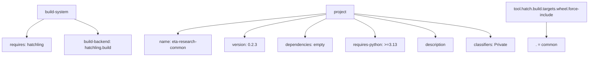
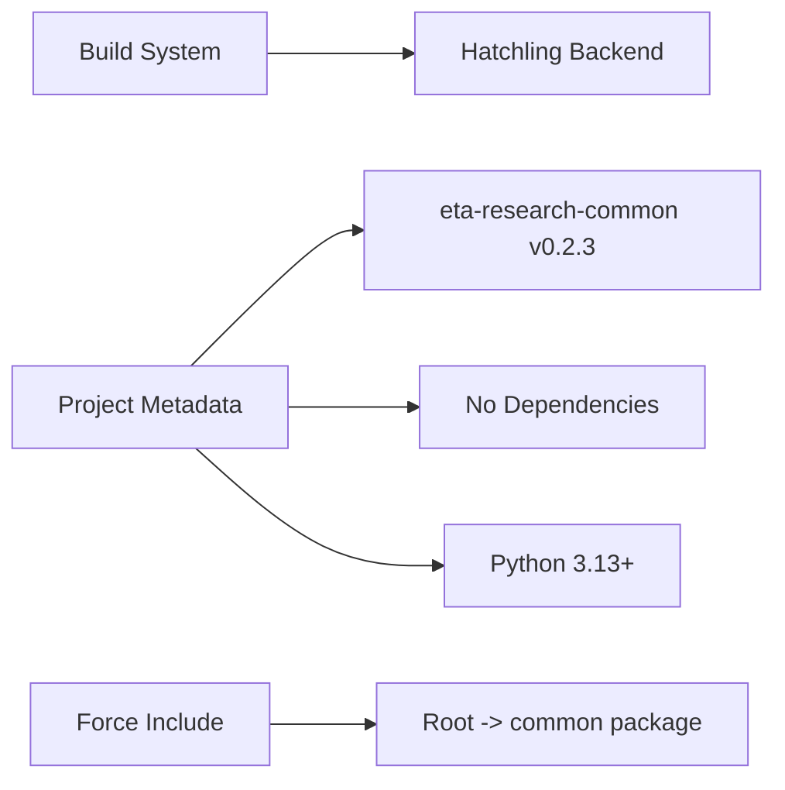

# Diagram: research/common/pyproject.toml

> Auto-generated by Obscura crawlers

## Diagram 1

### SVG

<svg id="container" width="2291" xmlns="http://www.w3.org/2000/svg" class="flowchart" height="222" viewBox="0 0 2291 222" role="graphics-document document" aria-roledescription="flowchart-v2"><g><marker id="container_flowchart-v2-pointEnd" class="marker flowchart-v2" viewBox="0 0 10 10" refX="5" refY="5" markerUnits="userSpaceOnUse" markerWidth="8" markerHeight="8" orient="auto"><path d="M 0 0 L 10 5 L 0 10 z" class="arrowMarkerPath" style="stroke-width: 1; stroke-dasharray: 1, 0;"></path></marker><marker id="container_flowchart-v2-pointStart" class="marker flowchart-v2" viewBox="0 0 10 10" refX="4.5" refY="5" markerUnits="userSpaceOnUse" markerWidth="8" markerHeight="8" orient="auto"><path d="M 0 5 L 10 10 L 10 0 z" class="arrowMarkerPath" style="stroke-width: 1; stroke-dasharray: 1, 0;"></path></marker><marker id="container_flowchart-v2-circleEnd" class="marker flowchart-v2" viewBox="0 0 10 10" refX="11" refY="5" markerUnits="userSpaceOnUse" markerWidth="11" markerHeight="11" orient="auto"><circle cx="5" cy="5" r="5" class="arrowMarkerPath" style="stroke-width: 1; stroke-dasharray: 1, 0;"></circle></marker><marker id="container_flowchart-v2-circleStart" class="marker flowchart-v2" viewBox="0 0 10 10" refX="-1" refY="5" markerUnits="userSpaceOnUse" markerWidth="11" markerHeight="11" orient="auto"><circle cx="5" cy="5" r="5" class="arrowMarkerPath" style="stroke-width: 1; stroke-dasharray: 1, 0;"></circle></marker><marker id="container_flowchart-v2-crossEnd" class="marker cross flowchart-v2" viewBox="0 0 11 11" refX="12" refY="5.2" markerUnits="userSpaceOnUse" markerWidth="11" markerHeight="11" orient="auto"><path d="M 1,1 l 9,9 M 10,1 l -9,9" class="arrowMarkerPath" style="stroke-width: 2; stroke-dasharray: 1, 0;"></path></marker><marker id="container_flowchart-v2-crossStart" class="marker cross flowchart-v2" viewBox="0 0 11 11" refX="-1" refY="5.2" markerUnits="userSpaceOnUse" markerWidth="11" markerHeight="11" orient="auto"><path d="M 1,1 l 9,9 M 10,1 l -9,9" class="arrowMarkerPath" style="stroke-width: 2; stroke-dasharray: 1, 0;"></path></marker><g class="root"><g class="clusters"></g><g class="edgePaths"><path d="M171.506,74L160.531,80.167C149.556,86.333,127.606,98.667,116.631,110.333C105.656,122,105.656,133,105.656,138.5L105.656,144" id="L_A_B_0" class="edge-thickness-normal edge-pattern-solid edge-thickness-normal edge-pattern-solid flowchart-link" style=";" data-edge="true" data-et="edge" data-id="L_A_B_0" data-points="W3sieCI6MTcxLjUwNjA0MjQ4MDQ2ODc1LCJ5Ijo3NH0seyJ4IjoxMDUuNjU2MjUsInkiOjExMX0seyJ4IjoxMDUuNjU2MjUsInkiOjE0OH1d" marker-end="url(#container_flowchart-v2-pointEnd)"></path><path d="M288.642,74L304.421,80.167C320.199,86.333,351.756,98.667,367.534,108.333C383.313,118,383.313,125,383.313,128.5L383.313,132" id="L_A_C_0" class="edge-thickness-normal edge-pattern-solid edge-thickness-normal edge-pattern-solid flowchart-link" style=";" data-edge="true" data-et="edge" data-id="L_A_C_0" data-points="W3sieCI6Mjg4LjY0MjI3Mjk0OTIxODc1LCJ5Ijo3NH0seyJ4IjozODMuMzEyNSwieSI6MTExfSx7IngiOjM4My4zMTI1LCJ5IjoxMzZ9XQ==" marker-end="url(#container_flowchart-v2-pointEnd)"></path><path d="M1264.527,52.676L1169.325,62.396C1074.122,72.117,883.717,91.559,788.515,104.779C693.313,118,693.313,125,693.313,128.5L693.313,132" id="L_D_E_0" class="edge-thickness-normal edge-pattern-solid edge-thickness-normal edge-pattern-solid flowchart-link" style=";" data-edge="true" data-et="edge" data-id="L_D_E_0" data-points="W3sieCI6MTI2NC41MjczNDM3NSwieSI6NTIuNjc1NjQ3MDQxOTYwMzV9LHsieCI6NjkzLjMxMjUsInkiOjExMX0seyJ4Ijo2OTMuMzEyNSwieSI6MTM2fV0=" marker-end="url(#container_flowchart-v2-pointEnd)"></path><path d="M1264.527,56.616L1212.135,65.68C1159.742,74.744,1054.957,92.872,1002.564,107.436C950.172,122,950.172,133,950.172,138.5L950.172,144" id="L_D_F_0" class="edge-thickness-normal edge-pattern-solid edge-thickness-normal edge-pattern-solid flowchart-link" style=";" data-edge="true" data-et="edge" data-id="L_D_F_0" data-points="W3sieCI6MTI2NC41MjczNDM3NSwieSI6NTYuNjE2Mzg3NzMwMzIwNDd9LHsieCI6OTUwLjE3MTg3NSwieSI6MTExfSx7IngiOjk1MC4xNzE4NzUsInkiOjE0OH1d" marker-end="url(#container_flowchart-v2-pointEnd)"></path><path d="M1264.527,73.287L1251.236,79.573C1237.945,85.858,1211.363,98.429,1198.072,110.215C1184.781,122,1184.781,133,1184.781,138.5L1184.781,144" id="L_D_G_0" class="edge-thickness-normal edge-pattern-solid edge-thickness-normal edge-pattern-solid flowchart-link" style=";" data-edge="true" data-et="edge" data-id="L_D_G_0" data-points="W3sieCI6MTI2NC41MjczNDM3NSwieSI6NzMuMjg3MTk4NzI5OTc1NDd9LHsieCI6MTE4NC43ODEyNSwieSI6MTExfSx7IngiOjExODQuNzgxMjUsInkiOjE0OH1d" marker-end="url(#container_flowchart-v2-pointEnd)"></path><path d="M1375.699,73.287L1388.99,79.573C1402.281,85.858,1428.863,98.429,1442.154,110.215C1455.445,122,1455.445,133,1455.445,138.5L1455.445,144" id="L_D_H_0" class="edge-thickness-normal edge-pattern-solid edge-thickness-normal edge-pattern-solid flowchart-link" style=";" data-edge="true" data-et="edge" data-id="L_D_H_0" data-points="W3sieCI6MTM3NS42OTkyMTg3NSwieSI6NzMuMjg3MTk4NzI5OTc1NDd9LHsieCI6MTQ1NS40NDUzMTI1LCJ5IjoxMTF9LHsieCI6MTQ1NS40NDUzMTI1LCJ5IjoxNDh9XQ==" marker-end="url(#container_flowchart-v2-pointEnd)"></path><path d="M1375.699,56.627L1428.027,65.689C1480.354,74.751,1585.009,92.876,1637.337,107.438C1689.664,122,1689.664,133,1689.664,138.5L1689.664,144" id="L_D_I_0" class="edge-thickness-normal edge-pattern-solid edge-thickness-normal edge-pattern-solid flowchart-link" style=";" data-edge="true" data-et="edge" data-id="L_D_I_0" data-points="W3sieCI6MTM3NS42OTkyMTg3NSwieSI6NTYuNjI2NTUyNTA3Nzk1NTd9LHsieCI6MTY4OS42NjQwNjI1LCJ5IjoxMTF9LHsieCI6MTY4OS42NjQwNjI1LCJ5IjoxNDh9XQ==" marker-end="url(#container_flowchart-v2-pointEnd)"></path><path d="M1375.699,53.074L1464.057,62.728C1552.414,72.382,1729.129,91.691,1817.486,106.846C1905.844,122,1905.844,133,1905.844,138.5L1905.844,144" id="L_D_J_0" class="edge-thickness-normal edge-pattern-solid edge-thickness-normal edge-pattern-solid flowchart-link" style=";" data-edge="true" data-et="edge" data-id="L_D_J_0" data-points="W3sieCI6MTM3NS42OTkyMTg3NSwieSI6NTMuMDczNjEyNjc2NDc5MDJ9LHsieCI6MTkwNS44NDM3NSwieSI6MTExfSx7IngiOjE5MDUuODQzNzUsInkiOjE0OH1d" marker-end="url(#container_flowchart-v2-pointEnd)"></path><path d="M2122.289,86L2122.289,90.167C2122.289,94.333,2122.289,102.667,2122.289,112.333C2122.289,122,2122.289,133,2122.289,138.5L2122.289,144" id="L_K_L_0" class="edge-thickness-normal edge-pattern-solid edge-thickness-normal edge-pattern-solid flowchart-link" style=";" data-edge="true" data-et="edge" data-id="L_K_L_0" data-points="W3sieCI6MjEyMi4yODkwNjI1LCJ5Ijo4Nn0seyJ4IjoyMTIyLjI4OTA2MjUsInkiOjExMX0seyJ4IjoyMTIyLjI4OTA2MjUsInkiOjE0OH1d" marker-end="url(#container_flowchart-v2-pointEnd)"></path></g><g class="edgeLabels"><g class="edgeLabel"><g class="label" data-id="L_A_B_0" transform="translate(0, 0)"><foreignObject width="0" height="0">

</foreignObject></g></g><g class="edgeLabel"><g class="label" data-id="L_A_C_0" transform="translate(0, 0)"><foreignObject width="0" height="0">

</foreignObject></g></g><g class="edgeLabel"><g class="label" data-id="L_D_E_0" transform="translate(0, 0)"><foreignObject width="0" height="0">

</foreignObject></g></g><g class="edgeLabel"><g class="label" data-id="L_D_F_0" transform="translate(0, 0)"><foreignObject width="0" height="0">

</foreignObject></g></g><g class="edgeLabel"><g class="label" data-id="L_D_G_0" transform="translate(0, 0)"><foreignObject width="0" height="0">

</foreignObject></g></g><g class="edgeLabel"><g class="label" data-id="L_D_H_0" transform="translate(0, 0)"><foreignObject width="0" height="0">

</foreignObject></g></g><g class="edgeLabel"><g class="label" data-id="L_D_I_0" transform="translate(0, 0)"><foreignObject width="0" height="0">

</foreignObject></g></g><g class="edgeLabel"><g class="label" data-id="L_D_J_0" transform="translate(0, 0)"><foreignObject width="0" height="0">

</foreignObject></g></g><g class="edgeLabel"><g class="label" data-id="L_K_L_0" transform="translate(0, 0)"><foreignObject width="0" height="0">

</foreignObject></g></g></g><g class="nodes"><g class="node default" id="flowchart-A-0" transform="translate(219.55859375, 47)"><rect class="basic label-container" style="" x="-77.1796875" y="-27" width="154.359375" height="54"></rect><g class="label" style="" transform="translate(-47.1796875, -12)"><rect></rect><foreignObject width="94.359375" height="24">

build-system

</foreignObject></g></g><g class="node default" id="flowchart-B-1" transform="translate(105.65625, 175)"><rect class="basic label-container" style="" x="-97.65625" y="-27" width="195.3125" height="54"></rect><g class="label" style="" transform="translate(-67.65625, -12)"><rect></rect><foreignObject width="135.3125" height="24">

requires: hatchling

</foreignObject></g></g><g class="node default" id="flowchart-C-3" transform="translate(383.3125, 175)"><rect class="basic label-container" style="" x="-130" y="-39" width="260" height="78"></rect><g class="label" style="" transform="translate(-100, -24)"><rect></rect><foreignObject width="200" height="48">

build-backend: hatchling.build

</foreignObject></g></g><g class="node default" id="flowchart-D-4" transform="translate(1320.11328125, 47)"><rect class="basic label-container" style="" x="-55.5859375" y="-27" width="111.171875" height="54"></rect><g class="label" style="" transform="translate(-25.5859375, -12)"><rect></rect><foreignObject width="51.171875" height="24">

project

</foreignObject></g></g><g class="node default" id="flowchart-E-5" transform="translate(693.3125, 175)"><rect class="basic label-container" style="" x="-130" y="-39" width="260" height="78"></rect><g class="label" style="" transform="translate(-100, -24)"><rect></rect><foreignObject width="200" height="48">

name: eta-research-common

</foreignObject></g></g><g class="node default" id="flowchart-F-7" transform="translate(950.171875, 175)"><rect class="basic label-container" style="" x="-76.859375" y="-27" width="153.71875" height="54"></rect><g class="label" style="" transform="translate(-46.859375, -12)"><rect></rect><foreignObject width="93.71875" height="24">

version: 0.2.3

</foreignObject></g></g><g class="node default" id="flowchart-G-9" transform="translate(1184.78125, 175)"><rect class="basic label-container" style="" x="-107.75" y="-27" width="215.5" height="54"></rect><g class="label" style="" transform="translate(-77.75, -12)"><rect></rect><foreignObject width="155.5" height="24">

dependencies: empty

</foreignObject></g></g><g class="node default" id="flowchart-H-11" transform="translate(1455.4453125, 175)"><rect class="basic label-container" style="" x="-112.9140625" y="-27" width="225.828125" height="54"></rect><g class="label" style="" transform="translate(-82.9140625, -12)"><rect></rect><foreignObject width="165.828125" height="24">

requires-python: &gt;=3.13

</foreignObject></g></g><g class="node default" id="flowchart-I-13" transform="translate(1689.6640625, 175)"><rect class="basic label-container" style="" x="-71.3046875" y="-27" width="142.609375" height="54"></rect><g class="label" style="" transform="translate(-41.3046875, -12)"><rect></rect><foreignObject width="82.609375" height="24">

description

</foreignObject></g></g><g class="node default" id="flowchart-J-15" transform="translate(1905.84375, 175)"><rect class="basic label-container" style="" x="-94.875" y="-27" width="189.75" height="54"></rect><g class="label" style="" transform="translate(-64.875, -12)"><rect></rect><foreignObject width="129.75" height="24">

classifiers: Private

</foreignObject></g></g><g class="node default" id="flowchart-K-16" transform="translate(2122.2890625, 47)"><rect class="basic label-container" style="" x="-160.7109375" y="-39" width="321.421875" height="78"></rect><g class="label" style="" transform="translate(-130.7109375, -24)"><rect></rect><foreignObject width="261.421875" height="48">

tool.hatch.build.targets.wheel.force-include

</foreignObject></g></g><g class="node default" id="flowchart-L-17" transform="translate(2122.2890625, 175)"><rect class="basic label-container" style="" x="-71.5703125" y="-27" width="143.140625" height="54"></rect><g class="label" style="" transform="translate(-41.5703125, -12)"><rect></rect><foreignObject width="83.140625" height="24">

. = common

</foreignObject></g></g></g></g></g></svg>

## Diagram 2

### SVG

<svg id="container" width="509.0625" xmlns="http://www.w3.org/2000/svg" class="flowchart" height="510" viewBox="0 0 509.0625 510" role="graphics-document document" aria-roledescription="flowchart-v2"><g><marker id="container_flowchart-v2-pointEnd" class="marker flowchart-v2" viewBox="0 0 10 10" refX="5" refY="5" markerUnits="userSpaceOnUse" markerWidth="8" markerHeight="8" orient="auto"><path d="M 0 0 L 10 5 L 0 10 z" class="arrowMarkerPath" style="stroke-width: 1; stroke-dasharray: 1, 0;"></path></marker><marker id="container_flowchart-v2-pointStart" class="marker flowchart-v2" viewBox="0 0 10 10" refX="4.5" refY="5" markerUnits="userSpaceOnUse" markerWidth="8" markerHeight="8" orient="auto"><path d="M 0 5 L 10 10 L 10 0 z" class="arrowMarkerPath" style="stroke-width: 1; stroke-dasharray: 1, 0;"></path></marker><marker id="container_flowchart-v2-circleEnd" class="marker flowchart-v2" viewBox="0 0 10 10" refX="11" refY="5" markerUnits="userSpaceOnUse" markerWidth="11" markerHeight="11" orient="auto"><circle cx="5" cy="5" r="5" class="arrowMarkerPath" style="stroke-width: 1; stroke-dasharray: 1, 0;"></circle></marker><marker id="container_flowchart-v2-circleStart" class="marker flowchart-v2" viewBox="0 0 10 10" refX="-1" refY="5" markerUnits="userSpaceOnUse" markerWidth="11" markerHeight="11" orient="auto"><circle cx="5" cy="5" r="5" class="arrowMarkerPath" style="stroke-width: 1; stroke-dasharray: 1, 0;"></circle></marker><marker id="container_flowchart-v2-crossEnd" class="marker cross flowchart-v2" viewBox="0 0 11 11" refX="12" refY="5.2" markerUnits="userSpaceOnUse" markerWidth="11" markerHeight="11" orient="auto"><path d="M 1,1 l 9,9 M 10,1 l -9,9" class="arrowMarkerPath" style="stroke-width: 2; stroke-dasharray: 1, 0;"></path></marker><marker id="container_flowchart-v2-crossStart" class="marker cross flowchart-v2" viewBox="0 0 11 11" refX="-1" refY="5.2" markerUnits="userSpaceOnUse" markerWidth="11" markerHeight="11" orient="auto"><path d="M 1,1 l 9,9 M 10,1 l -9,9" class="arrowMarkerPath" style="stroke-width: 2; stroke-dasharray: 1, 0;"></path></marker><g class="root"><g class="clusters"></g><g class="edgePaths"><path d="M176.398,35L183.009,35C189.62,35,202.841,35,218.362,35C233.883,35,251.703,35,260.613,35L269.523,35" id="L_BS_HAT_0" class="edge-thickness-normal edge-pattern-solid edge-thickness-normal edge-pattern-solid flowchart-link" style=";" data-edge="true" data-et="edge" data-id="L_BS_HAT_0" data-points="W3sieCI6MTc2LjM5ODQzNzUsInkiOjM1fSx7IngiOjIxNi4wNjI1LCJ5IjozNX0seyJ4IjoyNzMuNTIzNDM3NSwieSI6MzV9XQ==" marker-end="url(#container_flowchart-v2-pointEnd)"></path><path d="M126.655,240L141.556,225.167C156.457,210.333,186.26,180.667,204.661,165.833C223.063,151,230.063,151,233.563,151L237.063,151" id="L_PROJ_NAME_0" class="edge-thickness-normal edge-pattern-solid edge-thickness-normal edge-pattern-solid flowchart-link" style=";" data-edge="true" data-et="edge" data-id="L_PROJ_NAME_0" data-points="W3sieCI6MTI2LjY1NDkwMzAxNzI0MTM4LCJ5IjoyNDB9LHsieCI6MjE2LjA2MjUsInkiOjE1MX0seyJ4IjoyNDEuMDYyNSwieSI6MTUxfV0=" marker-end="url(#container_flowchart-v2-pointEnd)"></path><path d="M191.063,267L195.229,267C199.396,267,207.729,267,221.466,267C235.203,267,254.344,267,263.914,267L273.484,267" id="L_PROJ_DEPS_0" class="edge-thickness-normal edge-pattern-solid edge-thickness-normal edge-pattern-solid flowchart-link" style=";" data-edge="true" data-et="edge" data-id="L_PROJ_DEPS_0" data-points="W3sieCI6MTkxLjA2MjUsInkiOjI2N30seyJ4IjoyMTYuMDYyNSwieSI6MjY3fSx7IngiOjI3Ny40ODQzNzUsInkiOjI2N31d" marker-end="url(#container_flowchart-v2-pointEnd)"></path><path d="M129.785,294L144.164,306.833C158.544,319.667,187.303,345.333,214.489,358.167C241.674,371,267.286,371,280.092,371L292.898,371" id="L_PROJ_PY_0" class="edge-thickness-normal edge-pattern-solid edge-thickness-normal edge-pattern-solid flowchart-link" style=";" data-edge="true" data-et="edge" data-id="L_PROJ_PY_0" data-points="W3sieCI6MTI5Ljc4NDU1NTI4ODQ2MTU1LCJ5IjoyOTR9LHsieCI6MjE2LjA2MjUsInkiOjM3MX0seyJ4IjoyOTYuODk4NDM3NSwieSI6MzcxfV0=" marker-end="url(#container_flowchart-v2-pointEnd)"></path><path d="M177.859,475L184.227,475C190.594,475,203.328,475,214.622,475C225.917,475,235.771,475,240.698,475L245.625,475" id="L_CONFIG_MAP_0" class="edge-thickness-normal edge-pattern-solid edge-thickness-normal edge-pattern-solid flowchart-link" style=";" data-edge="true" data-et="edge" data-id="L_CONFIG_MAP_0" data-points="W3sieCI6MTc3Ljg1OTM3NSwieSI6NDc1fSx7IngiOjIxNi4wNjI1LCJ5Ijo0NzV9LHsieCI6MjQ5LjYyNSwieSI6NDc1fV0=" marker-end="url(#container_flowchart-v2-pointEnd)"></path></g><g class="edgeLabels"><g class="edgeLabel"><g class="label" data-id="L_BS_HAT_0" transform="translate(0, 0)"><foreignObject width="0" height="0">

</foreignObject></g></g><g class="edgeLabel"><g class="label" data-id="L_PROJ_NAME_0" transform="translate(0, 0)"><foreignObject width="0" height="0">

</foreignObject></g></g><g class="edgeLabel"><g class="label" data-id="L_PROJ_DEPS_0" transform="translate(0, 0)"><foreignObject width="0" height="0">

</foreignObject></g></g><g class="edgeLabel"><g class="label" data-id="L_PROJ_PY_0" transform="translate(0, 0)"><foreignObject width="0" height="0">

</foreignObject></g></g><g class="edgeLabel"><g class="label" data-id="L_CONFIG_MAP_0" transform="translate(0, 0)"><foreignObject width="0" height="0">

</foreignObject></g></g></g><g class="nodes"><g class="node default" id="flowchart-BS-0" transform="translate(99.53125, 35)"><rect class="basic label-container" style="" x="-76.8671875" y="-27" width="153.734375" height="54"></rect><g class="label" style="" transform="translate(-46.8671875, -12)"><rect></rect><foreignObject width="93.734375" height="24">

Build System

</foreignObject></g></g><g class="node default" id="flowchart-HAT-1" transform="translate(371.0625, 35)"><rect class="basic label-container" style="" x="-97.5390625" y="-27" width="195.078125" height="54"></rect><g class="label" style="" transform="translate(-67.5390625, -12)"><rect></rect><foreignObject width="135.078125" height="24">

Hatchling Backend

</foreignObject></g></g><g class="node default" id="flowchart-PROJ-2" transform="translate(99.53125, 267)"><rect class="basic label-container" style="" x="-91.53125" y="-27" width="183.0625" height="54"></rect><g class="label" style="" transform="translate(-61.53125, -12)"><rect></rect><foreignObject width="123.0625" height="24">

Project Metadata

</foreignObject></g></g><g class="node default" id="flowchart-NAME-3" transform="translate(371.0625, 151)"><rect class="basic label-container" style="" x="-130" y="-39" width="260" height="78"></rect><g class="label" style="" transform="translate(-100, -24)"><rect></rect><foreignObject width="200" height="48">

eta-research-common v0.2.3

</foreignObject></g></g><g class="node default" id="flowchart-DEPS-5" transform="translate(371.0625, 267)"><rect class="basic label-container" style="" x="-93.578125" y="-27" width="187.15625" height="54"></rect><g class="label" style="" transform="translate(-63.578125, -12)"><rect></rect><foreignObject width="127.15625" height="24">

No Dependencies

</foreignObject></g></g><g class="node default" id="flowchart-PY-7" transform="translate(371.0625, 371)"><rect class="basic label-container" style="" x="-74.1640625" y="-27" width="148.328125" height="54"></rect><g class="label" style="" transform="translate(-44.1640625, -12)"><rect></rect><foreignObject width="88.328125" height="24">

Python 3.13+

</foreignObject></g></g><g class="node default" id="flowchart-CONFIG-8" transform="translate(99.53125, 475)"><rect class="basic label-container" style="" x="-78.328125" y="-27" width="156.65625" height="54"></rect><g class="label" style="" transform="translate(-48.328125, -12)"><rect></rect><foreignObject width="96.65625" height="24">

Force Include

</foreignObject></g></g><g class="node default" id="flowchart-MAP-9" transform="translate(371.0625, 475)"><rect class="basic label-container" style="" x="-121.4375" y="-27" width="242.875" height="54"></rect><g class="label" style="" transform="translate(-91.4375, -12)"><rect></rect><foreignObject width="182.875" height="24">

Root -&gt; common package

</foreignObject></g></g></g></g></g></svg>
