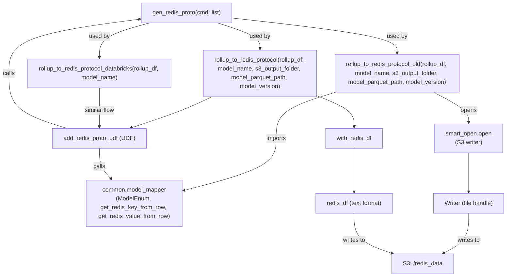
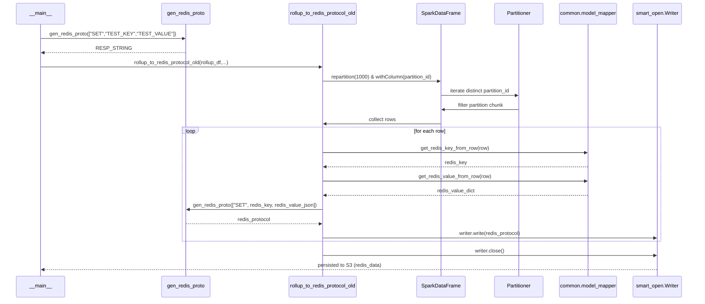

# Diagram: research/common/redis_bulk_load.py

> Auto-generated by Obscura crawlers

## Diagram 1

### SVG

<svg id="container" width="1464.16015625" xmlns="http://www.w3.org/2000/svg" class="flowchart" height="726" viewBox="0 0 1464.16015625 726" role="graphics-document document" aria-roledescription="flowchart-v2"><g><marker id="container_flowchart-v2-pointEnd" class="marker flowchart-v2" viewBox="0 0 10 10" refX="5" refY="5" markerUnits="userSpaceOnUse" markerWidth="8" markerHeight="8" orient="auto"><path d="M 0 0 L 10 5 L 0 10 z" class="arrowMarkerPath" style="stroke-width: 1; stroke-dasharray: 1, 0;"></path></marker><marker id="container_flowchart-v2-pointStart" class="marker flowchart-v2" viewBox="0 0 10 10" refX="4.5" refY="5" markerUnits="userSpaceOnUse" markerWidth="8" markerHeight="8" orient="auto"><path d="M 0 5 L 10 10 L 10 0 z" class="arrowMarkerPath" style="stroke-width: 1; stroke-dasharray: 1, 0;"></path></marker><marker id="container_flowchart-v2-circleEnd" class="marker flowchart-v2" viewBox="0 0 10 10" refX="11" refY="5" markerUnits="userSpaceOnUse" markerWidth="11" markerHeight="11" orient="auto"><circle cx="5" cy="5" r="5" class="arrowMarkerPath" style="stroke-width: 1; stroke-dasharray: 1, 0;"></circle></marker><marker id="container_flowchart-v2-circleStart" class="marker flowchart-v2" viewBox="0 0 10 10" refX="-1" refY="5" markerUnits="userSpaceOnUse" markerWidth="11" markerHeight="11" orient="auto"><circle cx="5" cy="5" r="5" class="arrowMarkerPath" style="stroke-width: 1; stroke-dasharray: 1, 0;"></circle></marker><marker id="container_flowchart-v2-crossEnd" class="marker cross flowchart-v2" viewBox="0 0 11 11" refX="12" refY="5.2" markerUnits="userSpaceOnUse" markerWidth="11" markerHeight="11" orient="auto"><path d="M 1,1 l 9,9 M 10,1 l -9,9" class="arrowMarkerPath" style="stroke-width: 2; stroke-dasharray: 1, 0;"></path></marker><marker id="container_flowchart-v2-crossStart" class="marker cross flowchart-v2" viewBox="0 0 11 11" refX="-1" refY="5.2" markerUnits="userSpaceOnUse" markerWidth="11" markerHeight="11" orient="auto"><path d="M 1,1 l 9,9 M 10,1 l -9,9" class="arrowMarkerPath" style="stroke-width: 2; stroke-dasharray: 1, 0;"></path></marker><g class="root"><g class="clusters"></g><g class="edgePaths"><path d="M663.301,48.611L740.336,57.009C817.371,65.407,971.441,82.204,1048.477,98.102C1125.512,114,1125.512,129,1125.512,136.5L1125.512,144" id="L_gen_redis_proto_rollup_old_0" class="edge-thickness-normal edge-pattern-solid edge-thickness-normal edge-pattern-solid flowchart-link" style=";" data-edge="true" data-et="edge" data-id="L_gen_redis_proto_rollup_old_0" data-points="W3sieCI6NjYzLjMwMDc4MTI1LCJ5Ijo0OC42MTA5ODY5MDUxNDIxM30seyJ4IjoxMTI1LjUxMTcxODc1LCJ5Ijo5OX0seyJ4IjoxMTI1LjUxMTcxODc1LCJ5IjoxNDh9XQ==" marker-end="url(#container_flowchart-v2-pointEnd)"></path><path d="M624.7,62L644.399,68.167C664.098,74.333,703.496,86.667,723.195,98.333C742.895,110,742.895,121,742.895,126.5L742.895,132" id="L_gen_redis_proto_rollup_udf_0" class="edge-thickness-normal edge-pattern-solid edge-thickness-normal edge-pattern-solid flowchart-link" style=";" data-edge="true" data-et="edge" data-id="L_gen_redis_proto_rollup_udf_0" data-points="W3sieCI6NjI0LjY5OTU4NDk2MDkzNzUsInkiOjYyfSx7IngiOjc0Mi44OTQ1MzEyNSwieSI6OTl9LHsieCI6NzQyLjg5NDUzMTI1LCJ5IjoxMzZ9XQ==" marker-end="url(#container_flowchart-v2-pointEnd)"></path><path d="M427.877,62L402.623,68.167C377.368,74.333,326.86,86.667,301.606,102.333C276.352,118,276.352,137,276.352,146.5L276.352,156" id="L_gen_redis_proto_rollup_dbx_0" class="edge-thickness-normal edge-pattern-solid edge-thickness-normal edge-pattern-solid flowchart-link" style=";" data-edge="true" data-et="edge" data-id="L_gen_redis_proto_rollup_dbx_0" data-points="W3sieCI6NDI3Ljg3Njc3MDAxOTUzMTI1LCJ5Ijo2Mn0seyJ4IjoyNzYuMzUxNTYyNSwieSI6OTl9LHsieCI6Mjc2LjM1MTU2MjUsInkiOjE2MH1d" marker-end="url(#container_flowchart-v2-pointEnd)"></path><path d="M951.324,247.646L920.677,256.205C890.03,264.764,828.736,281.882,798.089,303.108C767.441,324.333,767.441,349.667,767.441,375C767.441,400.333,767.441,425.667,731.555,446.313C695.669,466.959,623.896,482.919,588.01,490.899L552.123,498.878" id="L_rollup_old_model_mapper_0" class="edge-thickness-normal edge-pattern-solid edge-thickness-normal edge-pattern-solid flowchart-link" style=";" data-edge="true" data-et="edge" data-id="L_rollup_old_model_mapper_0" data-points="W3sieCI6OTUxLjMyNDIxODc1LCJ5IjoyNDcuNjQ2MTcxOTcyMTU5OH0seyJ4Ijo3NjcuNDQxNDA2MjUsInkiOjI5OX0seyJ4Ijo3NjcuNDQxNDA2MjUsInkiOjM3NX0seyJ4Ijo3NjcuNDQxNDA2MjUsInkiOjQ1MX0seyJ4Ijo1NDguMjE4NzUsInkiOjQ5OS43NDY0MzkyNTI2MTMyfV0=" marker-end="url(#container_flowchart-v2-pointEnd)"></path><path d="M1227.842,250L1244.229,258.167C1260.615,266.333,1293.388,282.667,1309.774,296.333C1326.16,310,1326.16,321,1326.16,326.5L1326.16,332" id="L_rollup_old_smart_open_0" class="edge-thickness-normal edge-pattern-solid edge-thickness-normal edge-pattern-solid flowchart-link" style=";" data-edge="true" data-et="edge" data-id="L_rollup_old_smart_open_0" data-points="W3sieCI6MTIyNy44NDI0MjE4NzUsInkiOjI1MH0seyJ4IjoxMzI2LjE2MDE1NjI1LCJ5IjoyOTl9LHsieCI6MTMyNi4xNjAxNTYyNSwieSI6MzM2fV0=" marker-end="url(#container_flowchart-v2-pointEnd)"></path><path d="M1326.16,414L1326.16,420.167C1326.16,426.333,1326.16,438.667,1326.16,454.333C1326.16,470,1326.16,489,1326.16,498.5L1326.16,508" id="L_smart_open_writer_0" class="edge-thickness-normal edge-pattern-solid edge-thickness-normal edge-pattern-solid flowchart-link" style=";" data-edge="true" data-et="edge" data-id="L_smart_open_writer_0" data-points="W3sieCI6MTMyNi4xNjAxNTYyNSwieSI6NDE0fSx7IngiOjEzMjYuMTYwMTU2MjUsInkiOjQ1MX0seyJ4IjoxMzI2LjE2MDE1NjI1LCJ5Ijo1MTJ9XQ==" marker-end="url(#container_flowchart-v2-pointEnd)"></path><path d="M1326.16,566L1326.16,576.167C1326.16,586.333,1326.16,606.667,1314.279,622.705C1302.398,638.743,1278.635,650.485,1266.754,656.357L1254.872,662.228" id="L_writer_redis_s3_0" class="edge-thickness-normal edge-pattern-solid edge-thickness-normal edge-pattern-solid flowchart-link" style=";" data-edge="true" data-et="edge" data-id="L_writer_redis_s3_0" data-points="W3sieCI6MTMyNi4xNjAxNTYyNSwieSI6NTY2fSx7IngiOjEzMjYuMTYwMTU2MjUsInkiOjYyN30seyJ4IjoxMjUxLjI4NjE5Mzg0NzY1NjIsInkiOjY2NH1d" marker-end="url(#container_flowchart-v2-pointEnd)"></path><path d="M597.328,262L583.079,268.167C568.83,274.333,540.333,286.667,501.415,300.795C462.496,314.924,413.157,330.848,388.487,338.81L363.817,346.771" id="L_rollup_udf_add_udf_0" class="edge-thickness-normal edge-pattern-solid edge-thickness-normal edge-pattern-solid flowchart-link" style=";" data-edge="true" data-et="edge" data-id="L_rollup_udf_add_udf_0" data-points="W3sieCI6NTk3LjMyNzYxNzE4NzUsInkiOjI2Mn0seyJ4Ijo1MTEuODM1OTM3NSwieSI6Mjk5fSx7IngiOjM2MC4wMTA0ODUxOTczNjg0NCwieSI6MzQ4fV0=" marker-end="url(#container_flowchart-v2-pointEnd)"></path><path d="M276.352,402L276.352,410.167C276.352,418.333,276.352,434.667,282.542,448.548C288.733,462.429,301.115,473.858,307.306,479.572L313.497,485.287" id="L_add_udf_model_mapper_0" class="edge-thickness-normal edge-pattern-solid edge-thickness-normal edge-pattern-solid flowchart-link" style=";" data-edge="true" data-et="edge" data-id="L_add_udf_model_mapper_0" data-points="W3sieCI6Mjc2LjM1MTU2MjUsInkiOjQwMn0seyJ4IjoyNzYuMzUxNTYyNSwieSI6NDUxfSx7IngiOjMxNi40MzU5OTA3NjcwNDU0NCwieSI6NDg4fV0=" marker-end="url(#container_flowchart-v2-pointEnd)"></path><path d="M186.859,348L159.79,339.833C132.721,331.667,78.583,315.333,51.514,290.5C24.445,265.667,24.445,232.333,24.445,199C24.445,165.667,24.445,132.333,88.642,107.673C152.84,83.013,281.234,67.027,345.431,59.033L409.628,51.04" id="L_add_udf_gen_redis_proto_0" class="edge-thickness-normal edge-pattern-solid edge-thickness-normal edge-pattern-solid flowchart-link" style=";" data-edge="true" data-et="edge" data-id="L_add_udf_gen_redis_proto_0" data-points="W3sieCI6MTg2Ljg1ODU1MjYzMTU3ODk2LCJ5IjozNDh9LHsieCI6MjQuNDQ1MzEyNSwieSI6Mjk5fSx7IngiOjI0LjQ0NTMxMjUsInkiOjE5OX0seyJ4IjoyNC40NDUzMTI1LCJ5Ijo5OX0seyJ4Ijo0MTMuNTk3NjU2MjUsInkiOjUwLjU0NTYwMTcwMjMyMTY5fV0=" marker-end="url(#container_flowchart-v2-pointEnd)"></path><path d="M901.324,259.367L918.66,265.972C935.996,272.578,970.668,285.789,988.004,299.894C1005.34,314,1005.34,329,1005.34,336.5L1005.34,344" id="L_rollup_udf_with_redis_0" class="edge-thickness-normal edge-pattern-solid edge-thickness-normal edge-pattern-solid flowchart-link" style=";" data-edge="true" data-et="edge" data-id="L_rollup_udf_with_redis_0" data-points="W3sieCI6OTAxLjMyNDIxODc1LCJ5IjoyNTkuMzY2NzQzMDcxNDczMjV9LHsieCI6MTAwNS4zMzk4NDM3NSwieSI6Mjk5fSx7IngiOjEwMDUuMzM5ODQzNzUsInkiOjM0OH1d" marker-end="url(#container_flowchart-v2-pointEnd)"></path><path d="M1005.34,402L1005.34,410.167C1005.34,418.333,1005.34,434.667,1005.34,452.333C1005.34,470,1005.34,489,1005.34,498.5L1005.34,508" id="L_with_redis_redis_df_0" class="edge-thickness-normal edge-pattern-solid edge-thickness-normal edge-pattern-solid flowchart-link" style=";" data-edge="true" data-et="edge" data-id="L_with_redis_redis_df_0" data-points="W3sieCI6MTAwNS4zMzk4NDM3NSwieSI6NDAyfSx7IngiOjEwMDUuMzM5ODQzNzUsInkiOjQ1MX0seyJ4IjoxMDA1LjMzOTg0Mzc1LCJ5Ijo1MTJ9XQ==" marker-end="url(#container_flowchart-v2-pointEnd)"></path><path d="M1005.34,566L1005.34,576.167C1005.34,586.333,1005.34,606.667,1023.141,622.788C1040.942,638.91,1076.544,650.821,1094.346,656.776L1112.147,662.731" id="L_redis_df_redis_s3_0" class="edge-thickness-normal edge-pattern-solid edge-thickness-normal edge-pattern-solid flowchart-link" style=";" data-edge="true" data-et="edge" data-id="L_redis_df_redis_s3_0" data-points="W3sieCI6MTAwNS4zMzk4NDM3NSwieSI6NTY2fSx7IngiOjEwMDUuMzM5ODQzNzUsInkiOjYyN30seyJ4IjoxMTE1Ljk0MDEyNDUxMTcxODgsInkiOjY2NH1d" marker-end="url(#container_flowchart-v2-pointEnd)"></path><path d="M276.352,238L276.352,248.167C276.352,258.333,276.352,278.667,276.352,296.333C276.352,314,276.352,329,276.352,336.5L276.352,344" id="L_rollup_dbx_add_udf_0" class="edge-thickness-normal edge-pattern-solid edge-thickness-normal edge-pattern-solid flowchart-link" style=";" data-edge="true" data-et="edge" data-id="L_rollup_dbx_add_udf_0" data-points="W3sieCI6Mjc2LjM1MTU2MjUsInkiOjIzOH0seyJ4IjoyNzYuMzUxNTYyNSwieSI6Mjk5fSx7IngiOjI3Ni4zNTE1NjI1LCJ5IjozNDh9XQ==" marker-end="url(#container_flowchart-v2-pointEnd)"></path></g><g class="edgeLabels"><g class="edgeLabel" transform="translate(1125.51171875, 99)"><g class="label" data-id="L_gen_redis_proto_rollup_old_0" transform="translate(-28.3125, -12)"><foreignObject width="56.625" height="24">

used by

</foreignObject></g></g><g class="edgeLabel" transform="translate(742.89453125, 99)"><g class="label" data-id="L_gen_redis_proto_rollup_udf_0" transform="translate(-28.3125, -12)"><foreignObject width="56.625" height="24">

used by

</foreignObject></g></g><g class="edgeLabel" transform="translate(276.3515625, 99)"><g class="label" data-id="L_gen_redis_proto_rollup_dbx_0" transform="translate(-28.3125, -12)"><foreignObject width="56.625" height="24">

used by

</foreignObject></g></g><g class="edgeLabel" transform="translate(767.44140625, 375)"><g class="label" data-id="L_rollup_old_model_mapper_0" transform="translate(-28.25, -12)"><foreignObject width="56.5" height="24">

imports

</foreignObject></g></g><g class="edgeLabel" transform="translate(1326.16015625, 299)"><g class="label" data-id="L_rollup_old_smart_open_0" transform="translate(-22.2109375, -12)"><foreignObject width="44.421875" height="24">

opens

</foreignObject></g></g><g class="edgeLabel"><g class="label" data-id="L_smart_open_writer_0" transform="translate(0, 0)"><foreignObject width="0" height="0">

</foreignObject></g></g><g class="edgeLabel" transform="translate(1326.16015625, 627)"><g class="label" data-id="L_writer_redis_s3_0" transform="translate(-31.5078125, -12)"><foreignObject width="63.015625" height="24">

writes to

</foreignObject></g></g><g class="edgeLabel"><g class="label" data-id="L_rollup_udf_add_udf_0" transform="translate(0, 0)"><foreignObject width="0" height="0">

</foreignObject></g></g><g class="edgeLabel" transform="translate(276.3515625, 451)"><g class="label" data-id="L_add_udf_model_mapper_0" transform="translate(-16.4453125, -12)"><foreignObject width="32.890625" height="24">

calls

</foreignObject></g></g><g class="edgeLabel" transform="translate(24.4453125, 199)"><g class="label" data-id="L_add_udf_gen_redis_proto_0" transform="translate(-16.4453125, -12)"><foreignObject width="32.890625" height="24">

calls

</foreignObject></g></g><g class="edgeLabel"><g class="label" data-id="L_rollup_udf_with_redis_0" transform="translate(0, 0)"><foreignObject width="0" height="0">

</foreignObject></g></g><g class="edgeLabel"><g class="label" data-id="L_with_redis_redis_df_0" transform="translate(0, 0)"><foreignObject width="0" height="0">

</foreignObject></g></g><g class="edgeLabel" transform="translate(1005.33984375, 627)"><g class="label" data-id="L_redis_df_redis_s3_0" transform="translate(-31.5078125, -12)"><foreignObject width="63.015625" height="24">

writes to

</foreignObject></g></g><g class="edgeLabel" transform="translate(276.3515625, 299)"><g class="label" data-id="L_rollup_dbx_add_udf_0" transform="translate(-42.078125, -12)"><foreignObject width="84.15625" height="24">

similar flow

</foreignObject></g></g></g><g class="nodes"><g class="node default" id="flowchart-gen_redis_proto-0" transform="translate(538.44921875, 35)"><rect class="basic label-container" style="" x="-124.8515625" y="-27" width="249.703125" height="54"></rect><g class="label" style="" transform="translate(-94.8515625, -12)"><rect></rect><foreignObject width="189.703125" height="24">

gen_redis_proto(cmd: list)

</foreignObject></g></g><g class="node default" id="flowchart-rollup_old-1" transform="translate(1125.51171875, 199)"><rect class="basic label-container" style="" x="-174.1875" y="-51" width="348.375" height="102"></rect><g class="label" style="" transform="translate(-144.1875, -36)"><rect></rect><foreignObject width="288.375" height="72">

rollup_to_redis_protocol_old(rollup_df, model_name, s3_output_folder, model_parquet_path, model_version)

</foreignObject></g></g><g class="node default" id="flowchart-rollup_udf-2" transform="translate(742.89453125, 199)"><rect class="basic label-container" style="" x="-158.4296875" y="-63" width="316.859375" height="126"></rect><g class="label" style="" transform="translate(-128.4296875, -48)"><rect></rect><foreignObject width="256.859375" height="96">

rollup_to_redis_protocol(rollup_df, model_name, s3_output_folder, model_parquet_path, model_version)

</foreignObject></g></g><g class="node default" id="flowchart-rollup_dbx-3" transform="translate(276.3515625, 199)"><rect class="basic label-container" style="" x="-200.4609375" y="-39" width="400.921875" height="78"></rect><g class="label" style="" transform="translate(-170.4609375, -24)"><rect></rect><foreignObject width="340.921875" height="48">

rollup_to_redis_protocol_databricks(rollup_df, model_name)

</foreignObject></g></g><g class="node default" id="flowchart-model_mapper-4" transform="translate(371.6875, 539)"><rect class="basic label-container" style="" x="-176.53125" y="-51" width="353.0625" height="102"></rect><g class="label" style="" transform="translate(-146.53125, -36)"><rect></rect><foreignObject width="293.0625" height="72">

common.model_mapper\n(ModelEnum, get_redis_key_from_row, get_redis_value_from_row)

</foreignObject></g></g><g class="node default" id="flowchart-smart_open-5" transform="translate(1326.16015625, 375)"><rect class="basic label-container" style="" x="-130" y="-39" width="260" height="78"></rect><g class="label" style="" transform="translate(-100, -24)"><rect></rect><foreignObject width="200" height="48">

smart_open.open\n(S3 writer)

</foreignObject></g></g><g class="node default" id="flowchart-writer-6" transform="translate(1326.16015625, 539)"><rect class="basic label-container" style="" x="-97.9921875" y="-27" width="195.984375" height="54"></rect><g class="label" style="" transform="translate(-67.9921875, -12)"><rect></rect><foreignObject width="135.984375" height="24">

Writer (file handle)

</foreignObject></g></g><g class="node default" id="flowchart-redis_s3-7" transform="translate(1196.6484375, 691)"><rect class="basic label-container" style="" x="-84.4609375" y="-27" width="168.921875" height="54"></rect><g class="label" style="" transform="translate(-54.4609375, -12)"><rect></rect><foreignObject width="108.921875" height="24">

S3: /redis_data

</foreignObject></g></g><g class="node default" id="flowchart-add_udf-8" transform="translate(276.3515625, 375)"><rect class="basic label-container" style="" x="-127.421875" y="-27" width="254.84375" height="54"></rect><g class="label" style="" transform="translate(-97.421875, -12)"><rect></rect><foreignObject width="194.84375" height="24">

add_redis_proto_udf (UDF)

</foreignObject></g></g><g class="node default" id="flowchart-with_redis-9" transform="translate(1005.33984375, 375)"><rect class="basic label-container" style="" x="-79.0234375" y="-27" width="158.046875" height="54"></rect><g class="label" style="" transform="translate(-49.0234375, -12)"><rect></rect><foreignObject width="98.046875" height="24">

with_redis_df

</foreignObject></g></g><g class="node default" id="flowchart-redis_df-10" transform="translate(1005.33984375, 539)"><rect class="basic label-container" style="" x="-106.9921875" y="-27" width="213.984375" height="54"></rect><g class="label" style="" transform="translate(-76.9921875, -12)"><rect></rect><foreignObject width="153.984375" height="24">

redis_df (text format)

</foreignObject></g></g></g></g></g></svg>

## Diagram 2

### SVG

<svg id="container" width="2241" xmlns="http://www.w3.org/2000/svg" height="994" viewBox="-50 -10 2241 994" role="graphics-document document" aria-roledescription="sequence"><g><rect x="1986" y="908" fill="#eaeaea" stroke="#666" width="155" height="65" name="Writer" rx="3" ry="3" class="actor actor-bottom"></rect><text x="2063.5" y="940.5" dominant-baseline="central" alignment-baseline="central" class="actor actor-box" style="text-anchor: middle; font-size: 16px; font-weight: 400;"><tspan x="2063.5" dy="0">smart_open.Writer</tspan></text></g><g><rect x="1738" y="908" fill="#eaeaea" stroke="#666" width="198" height="65" name="Model" rx="3" ry="3" class="actor actor-bottom"></rect><text x="1837" y="940.5" dominant-baseline="central" alignment-baseline="central" class="actor actor-box" style="text-anchor: middle; font-size: 16px; font-weight: 400;"><tspan x="1837" dy="0">common.model_mapper</tspan></text></g><g><rect x="1538" y="908" fill="#eaeaea" stroke="#666" width="150" height="65" name="Partitioner" rx="3" ry="3" class="actor actor-bottom"></rect><text x="1613" y="940.5" dominant-baseline="central" alignment-baseline="central" class="actor actor-box" style="text-anchor: middle; font-size: 16px; font-weight: 400;"><tspan x="1613" dy="0">Partitioner</tspan></text></g><g><rect x="1272" y="908" fill="#eaeaea" stroke="#666" width="150" height="65" name="Spark" rx="3" ry="3" class="actor actor-bottom"></rect><text x="1347" y="940.5" dominant-baseline="central" alignment-baseline="central" class="actor actor-box" style="text-anchor: middle; font-size: 16px; font-weight: 400;"><tspan x="1347" dy="0">SparkDataFrame</tspan></text></g><g><rect x="838" y="908" fill="#eaeaea" stroke="#666" width="230" height="65" name="RollupOld" rx="3" ry="3" class="actor actor-bottom"></rect><text x="953" y="940.5" dominant-baseline="central" alignment-baseline="central" class="actor actor-box" style="text-anchor: middle; font-size: 16px; font-weight: 400;"><tspan x="953" dy="0">rollup_to_redis_protocol_old</tspan></text></g><g><rect x="427" y="908" fill="#eaeaea" stroke="#666" width="150" height="65" name="Gen" rx="3" ry="3" class="actor actor-bottom"></rect><text x="502" y="940.5" dominant-baseline="central" alignment-baseline="central" class="actor actor-box" style="text-anchor: middle; font-size: 16px; font-weight: 400;"><tspan x="502" dy="0">gen_redis_proto</tspan></text></g><g><rect x="0" y="908" fill="#eaeaea" stroke="#666" width="150" height="65" name="CLI" rx="3" ry="3" class="actor actor-bottom"></rect><text x="75" y="940.5" dominant-baseline="central" alignment-baseline="central" class="actor actor-box" style="text-anchor: middle; font-size: 16px; font-weight: 400;"><tspan x="75" dy="0">__main__</tspan></text></g><g><line id="actor6" x1="2063.5" y1="65" x2="2063.5" y2="908" class="actor-line 200" stroke-width="0.5px" stroke="#999" name="Writer"></line><g id="root-6"><rect x="1986" y="0" fill="#eaeaea" stroke="#666" width="155" height="65" name="Writer" rx="3" ry="3" class="actor actor-top"></rect><text x="2063.5" y="32.5" dominant-baseline="central" alignment-baseline="central" class="actor actor-box" style="text-anchor: middle; font-size: 16px; font-weight: 400;"><tspan x="2063.5" dy="0">smart_open.Writer</tspan></text></g></g><g><line id="actor5" x1="1837" y1="65" x2="1837" y2="908" class="actor-line 200" stroke-width="0.5px" stroke="#999" name="Model"></line><g id="root-5"><rect x="1738" y="0" fill="#eaeaea" stroke="#666" width="198" height="65" name="Model" rx="3" ry="3" class="actor actor-top"></rect><text x="1837" y="32.5" dominant-baseline="central" alignment-baseline="central" class="actor actor-box" style="text-anchor: middle; font-size: 16px; font-weight: 400;"><tspan x="1837" dy="0">common.model_mapper</tspan></text></g></g><g><line id="actor4" x1="1613" y1="65" x2="1613" y2="908" class="actor-line 200" stroke-width="0.5px" stroke="#999" name="Partitioner"></line><g id="root-4"><rect x="1538" y="0" fill="#eaeaea" stroke="#666" width="150" height="65" name="Partitioner" rx="3" ry="3" class="actor actor-top"></rect><text x="1613" y="32.5" dominant-baseline="central" alignment-baseline="central" class="actor actor-box" style="text-anchor: middle; font-size: 16px; font-weight: 400;"><tspan x="1613" dy="0">Partitioner</tspan></text></g></g><g><line id="actor3" x1="1347" y1="65" x2="1347" y2="908" class="actor-line 200" stroke-width="0.5px" stroke="#999" name="Spark"></line><g id="root-3"><rect x="1272" y="0" fill="#eaeaea" stroke="#666" width="150" height="65" name="Spark" rx="3" ry="3" class="actor actor-top"></rect><text x="1347" y="32.5" dominant-baseline="central" alignment-baseline="central" class="actor actor-box" style="text-anchor: middle; font-size: 16px; font-weight: 400;"><tspan x="1347" dy="0">SparkDataFrame</tspan></text></g></g><g><line id="actor2" x1="953" y1="65" x2="953" y2="908" class="actor-line 200" stroke-width="0.5px" stroke="#999" name="RollupOld"></line><g id="root-2"><rect x="838" y="0" fill="#eaeaea" stroke="#666" width="230" height="65" name="RollupOld" rx="3" ry="3" class="actor actor-top"></rect><text x="953" y="32.5" dominant-baseline="central" alignment-baseline="central" class="actor actor-box" style="text-anchor: middle; font-size: 16px; font-weight: 400;"><tspan x="953" dy="0">rollup_to_redis_protocol_old</tspan></text></g></g><g><line id="actor1" x1="502" y1="65" x2="502" y2="908" class="actor-line 200" stroke-width="0.5px" stroke="#999" name="Gen"></line><g id="root-1"><rect x="427" y="0" fill="#eaeaea" stroke="#666" width="150" height="65" name="Gen" rx="3" ry="3" class="actor actor-top"></rect><text x="502" y="32.5" dominant-baseline="central" alignment-baseline="central" class="actor actor-box" style="text-anchor: middle; font-size: 16px; font-weight: 400;"><tspan x="502" dy="0">gen_redis_proto</tspan></text></g></g><g><line id="actor0" x1="75" y1="65" x2="75" y2="908" class="actor-line 200" stroke-width="0.5px" stroke="#999" name="CLI"></line><g id="root-0"><rect x="0" y="0" fill="#eaeaea" stroke="#666" width="150" height="65" name="CLI" rx="3" ry="3" class="actor actor-top"></rect><text x="75" y="32.5" dominant-baseline="central" alignment-baseline="central" class="actor actor-box" style="text-anchor: middle; font-size: 16px; font-weight: 400;"><tspan x="75" dy="0">__main__</tspan></text></g></g><g></g><defs><symbol id="computer" width="24" height="24"><path transform="scale(.5)" d="M2 2v13h20v-13h-20zm18 11h-16v-9h16v9zm-10.228 6l.466-1h3.524l.467 1h-4.457zm14.228 3h-24l2-6h2.104l-1.33 4h18.45l-1.297-4h2.073l2 6zm-5-10h-14v-7h14v7z"></path></symbol></defs><defs><symbol id="database" fill-rule="evenodd" clip-rule="evenodd"><path transform="scale(.5)" d="M12.258.001l.256.004.255.005.253.008.251.01.249.012.247.015.246.016.242.019.241.02.239.023.236.024.233.027.231.028.229.031.225.032.223.034.22.036.217.038.214.04.211.041.208.043.205.045.201.046.198.048.194.05.191.051.187.053.183.054.18.056.175.057.172.059.168.06.163.061.16.063.155.064.15.066.074.033.073.033.071.034.07.034.069.035.068.035.067.035.066.035.064.036.064.036.062.036.06.036.06.037.058.037.058.037.055.038.055.038.053.038.052.038.051.039.05.039.048.039.047.039.045.04.044.04.043.04.041.04.04.041.039.041.037.041.036.041.034.041.033.042.032.042.03.042.029.042.027.042.026.043.024.043.023.043.021.043.02.043.018.044.017.043.015.044.013.044.012.044.011.045.009.044.007.045.006.045.004.045.002.045.001.045v17l-.001.045-.002.045-.004.045-.006.045-.007.045-.009.044-.011.045-.012.044-.013.044-.015.044-.017.043-.018.044-.02.043-.021.043-.023.043-.024.043-.026.043-.027.042-.029.042-.03.042-.032.042-.033.042-.034.041-.036.041-.037.041-.039.041-.04.041-.041.04-.043.04-.044.04-.045.04-.047.039-.048.039-.05.039-.051.039-.052.038-.053.038-.055.038-.055.038-.058.037-.058.037-.06.037-.06.036-.062.036-.064.036-.064.036-.066.035-.067.035-.068.035-.069.035-.07.034-.071.034-.073.033-.074.033-.15.066-.155.064-.16.063-.163.061-.168.06-.172.059-.175.057-.18.056-.183.054-.187.053-.191.051-.194.05-.198.048-.201.046-.205.045-.208.043-.211.041-.214.04-.217.038-.22.036-.223.034-.225.032-.229.031-.231.028-.233.027-.236.024-.239.023-.241.02-.242.019-.246.016-.247.015-.249.012-.251.01-.253.008-.255.005-.256.004-.258.001-.258-.001-.256-.004-.255-.005-.253-.008-.251-.01-.249-.012-.247-.015-.245-.016-.243-.019-.241-.02-.238-.023-.236-.024-.234-.027-.231-.028-.228-.031-.226-.032-.223-.034-.22-.036-.217-.038-.214-.04-.211-.041-.208-.043-.204-.045-.201-.046-.198-.048-.195-.05-.19-.051-.187-.053-.184-.054-.179-.056-.176-.057-.172-.059-.167-.06-.164-.061-.159-.063-.155-.064-.151-.066-.074-.033-.072-.033-.072-.034-.07-.034-.069-.035-.068-.035-.067-.035-.066-.035-.064-.036-.063-.036-.062-.036-.061-.036-.06-.037-.058-.037-.057-.037-.056-.038-.055-.038-.053-.038-.052-.038-.051-.039-.049-.039-.049-.039-.046-.039-.046-.04-.044-.04-.043-.04-.041-.04-.04-.041-.039-.041-.037-.041-.036-.041-.034-.041-.033-.042-.032-.042-.03-.042-.029-.042-.027-.042-.026-.043-.024-.043-.023-.043-.021-.043-.02-.043-.018-.044-.017-.043-.015-.044-.013-.044-.012-.044-.011-.045-.009-.044-.007-.045-.006-.045-.004-.045-.002-.045-.001-.045v-17l.001-.045.002-.045.004-.045.006-.045.007-.045.009-.044.011-.045.012-.044.013-.044.015-.044.017-.043.018-.044.02-.043.021-.043.023-.043.024-.043.026-.043.027-.042.029-.042.03-.042.032-.042.033-.042.034-.041.036-.041.037-.041.039-.041.04-.041.041-.04.043-.04.044-.04.046-.04.046-.039.049-.039.049-.039.051-.039.052-.038.053-.038.055-.038.056-.038.057-.037.058-.037.06-.037.061-.036.062-.036.063-.036.064-.036.066-.035.067-.035.068-.035.069-.035.07-.034.072-.034.072-.033.074-.033.151-.066.155-.064.159-.063.164-.061.167-.06.172-.059.176-.057.179-.056.184-.054.187-.053.19-.051.195-.05.198-.048.201-.046.204-.045.208-.043.211-.041.214-.04.217-.038.22-.036.223-.034.226-.032.228-.031.231-.028.234-.027.236-.024.238-.023.241-.02.243-.019.245-.016.247-.015.249-.012.251-.01.253-.008.255-.005.256-.004.258-.001.258.001zm-9.258 20.499v.01l.001.021.003.021.004.022.005.021.006.022.007.022.009.023.01.022.011.023.012.023.013.023.015.023.016.024.017.023.018.024.019.024.021.024.022.025.023.024.024.025.052.049.056.05.061.051.066.051.07.051.075.051.079.052.084.052.088.052.092.052.097.052.102.051.105.052.11.052.114.051.119.051.123.051.127.05.131.05.135.05.139.048.144.049.147.047.152.047.155.047.16.045.163.045.167.043.171.043.176.041.178.041.183.039.187.039.19.037.194.035.197.035.202.033.204.031.209.03.212.029.216.027.219.025.222.024.226.021.23.02.233.018.236.016.24.015.243.012.246.01.249.008.253.005.256.004.259.001.26-.001.257-.004.254-.005.25-.008.247-.011.244-.012.241-.014.237-.016.233-.018.231-.021.226-.021.224-.024.22-.026.216-.027.212-.028.21-.031.205-.031.202-.034.198-.034.194-.036.191-.037.187-.039.183-.04.179-.04.175-.042.172-.043.168-.044.163-.045.16-.046.155-.046.152-.047.148-.048.143-.049.139-.049.136-.05.131-.05.126-.05.123-.051.118-.052.114-.051.11-.052.106-.052.101-.052.096-.052.092-.052.088-.053.083-.051.079-.052.074-.052.07-.051.065-.051.06-.051.056-.05.051-.05.023-.024.023-.025.021-.024.02-.024.019-.024.018-.024.017-.024.015-.023.014-.024.013-.023.012-.023.01-.023.01-.022.008-.022.006-.022.006-.022.004-.022.004-.021.001-.021.001-.021v-4.127l-.077.055-.08.053-.083.054-.085.053-.087.052-.09.052-.093.051-.095.05-.097.05-.1.049-.102.049-.105.048-.106.047-.109.047-.111.046-.114.045-.115.045-.118.044-.12.043-.122.042-.124.042-.126.041-.128.04-.13.04-.132.038-.134.038-.135.037-.138.037-.139.035-.142.035-.143.034-.144.033-.147.032-.148.031-.15.03-.151.03-.153.029-.154.027-.156.027-.158.026-.159.025-.161.024-.162.023-.163.022-.165.021-.166.02-.167.019-.169.018-.169.017-.171.016-.173.015-.173.014-.175.013-.175.012-.177.011-.178.01-.179.008-.179.008-.181.006-.182.005-.182.004-.184.003-.184.002h-.37l-.184-.002-.184-.003-.182-.004-.182-.005-.181-.006-.179-.008-.179-.008-.178-.01-.176-.011-.176-.012-.175-.013-.173-.014-.172-.015-.171-.016-.17-.017-.169-.018-.167-.019-.166-.02-.165-.021-.163-.022-.162-.023-.161-.024-.159-.025-.157-.026-.156-.027-.155-.027-.153-.029-.151-.03-.15-.03-.148-.031-.146-.032-.145-.033-.143-.034-.141-.035-.14-.035-.137-.037-.136-.037-.134-.038-.132-.038-.13-.04-.128-.04-.126-.041-.124-.042-.122-.042-.12-.044-.117-.043-.116-.045-.113-.045-.112-.046-.109-.047-.106-.047-.105-.048-.102-.049-.1-.049-.097-.05-.095-.05-.093-.052-.09-.051-.087-.052-.085-.053-.083-.054-.08-.054-.077-.054v4.127zm0-5.654v.011l.001.021.003.021.004.021.005.022.006.022.007.022.009.022.01.022.011.023.012.023.013.023.015.024.016.023.017.024.018.024.019.024.021.024.022.024.023.025.024.024.052.05.056.05.061.05.066.051.07.051.075.052.079.051.084.052.088.052.092.052.097.052.102.052.105.052.11.051.114.051.119.052.123.05.127.051.131.05.135.049.139.049.144.048.147.048.152.047.155.046.16.045.163.045.167.044.171.042.176.042.178.04.183.04.187.038.19.037.194.036.197.034.202.033.204.032.209.03.212.028.216.027.219.025.222.024.226.022.23.02.233.018.236.016.24.014.243.012.246.01.249.008.253.006.256.003.259.001.26-.001.257-.003.254-.006.25-.008.247-.01.244-.012.241-.015.237-.016.233-.018.231-.02.226-.022.224-.024.22-.025.216-.027.212-.029.21-.03.205-.032.202-.033.198-.035.194-.036.191-.037.187-.039.183-.039.179-.041.175-.042.172-.043.168-.044.163-.045.16-.045.155-.047.152-.047.148-.048.143-.048.139-.05.136-.049.131-.05.126-.051.123-.051.118-.051.114-.052.11-.052.106-.052.101-.052.096-.052.092-.052.088-.052.083-.052.079-.052.074-.051.07-.052.065-.051.06-.05.056-.051.051-.049.023-.025.023-.024.021-.025.02-.024.019-.024.018-.024.017-.024.015-.023.014-.023.013-.024.012-.022.01-.023.01-.023.008-.022.006-.022.006-.022.004-.021.004-.022.001-.021.001-.021v-4.139l-.077.054-.08.054-.083.054-.085.052-.087.053-.09.051-.093.051-.095.051-.097.05-.1.049-.102.049-.105.048-.106.047-.109.047-.111.046-.114.045-.115.044-.118.044-.12.044-.122.042-.124.042-.126.041-.128.04-.13.039-.132.039-.134.038-.135.037-.138.036-.139.036-.142.035-.143.033-.144.033-.147.033-.148.031-.15.03-.151.03-.153.028-.154.028-.156.027-.158.026-.159.025-.161.024-.162.023-.163.022-.165.021-.166.02-.167.019-.169.018-.169.017-.171.016-.173.015-.173.014-.175.013-.175.012-.177.011-.178.009-.179.009-.179.007-.181.007-.182.005-.182.004-.184.003-.184.002h-.37l-.184-.002-.184-.003-.182-.004-.182-.005-.181-.007-.179-.007-.179-.009-.178-.009-.176-.011-.176-.012-.175-.013-.173-.014-.172-.015-.171-.016-.17-.017-.169-.018-.167-.019-.166-.02-.165-.021-.163-.022-.162-.023-.161-.024-.159-.025-.157-.026-.156-.027-.155-.028-.153-.028-.151-.03-.15-.03-.148-.031-.146-.033-.145-.033-.143-.033-.141-.035-.14-.036-.137-.036-.136-.037-.134-.038-.132-.039-.13-.039-.128-.04-.126-.041-.124-.042-.122-.043-.12-.043-.117-.044-.116-.044-.113-.046-.112-.046-.109-.046-.106-.047-.105-.048-.102-.049-.1-.049-.097-.05-.095-.051-.093-.051-.09-.051-.087-.053-.085-.052-.083-.054-.08-.054-.077-.054v4.139zm0-5.666v.011l.001.02.003.022.004.021.005.022.006.021.007.022.009.023.01.022.011.023.012.023.013.023.015.023.016.024.017.024.018.023.019.024.021.025.022.024.023.024.024.025.052.05.056.05.061.05.066.051.07.051.075.052.079.051.084.052.088.052.092.052.097.052.102.052.105.051.11.052.114.051.119.051.123.051.127.05.131.05.135.05.139.049.144.048.147.048.152.047.155.046.16.045.163.045.167.043.171.043.176.042.178.04.183.04.187.038.19.037.194.036.197.034.202.033.204.032.209.03.212.028.216.027.219.025.222.024.226.021.23.02.233.018.236.017.24.014.243.012.246.01.249.008.253.006.256.003.259.001.26-.001.257-.003.254-.006.25-.008.247-.01.244-.013.241-.014.237-.016.233-.018.231-.02.226-.022.224-.024.22-.025.216-.027.212-.029.21-.03.205-.032.202-.033.198-.035.194-.036.191-.037.187-.039.183-.039.179-.041.175-.042.172-.043.168-.044.163-.045.16-.045.155-.047.152-.047.148-.048.143-.049.139-.049.136-.049.131-.051.126-.05.123-.051.118-.052.114-.051.11-.052.106-.052.101-.052.096-.052.092-.052.088-.052.083-.052.079-.052.074-.052.07-.051.065-.051.06-.051.056-.05.051-.049.023-.025.023-.025.021-.024.02-.024.019-.024.018-.024.017-.024.015-.023.014-.024.013-.023.012-.023.01-.022.01-.023.008-.022.006-.022.006-.022.004-.022.004-.021.001-.021.001-.021v-4.153l-.077.054-.08.054-.083.053-.085.053-.087.053-.09.051-.093.051-.095.051-.097.05-.1.049-.102.048-.105.048-.106.048-.109.046-.111.046-.114.046-.115.044-.118.044-.12.043-.122.043-.124.042-.126.041-.128.04-.13.039-.132.039-.134.038-.135.037-.138.036-.139.036-.142.034-.143.034-.144.033-.147.032-.148.032-.15.03-.151.03-.153.028-.154.028-.156.027-.158.026-.159.024-.161.024-.162.023-.163.023-.165.021-.166.02-.167.019-.169.018-.169.017-.171.016-.173.015-.173.014-.175.013-.175.012-.177.01-.178.01-.179.009-.179.007-.181.006-.182.006-.182.004-.184.003-.184.001-.185.001-.185-.001-.184-.001-.184-.003-.182-.004-.182-.006-.181-.006-.179-.007-.179-.009-.178-.01-.176-.01-.176-.012-.175-.013-.173-.014-.172-.015-.171-.016-.17-.017-.169-.018-.167-.019-.166-.02-.165-.021-.163-.023-.162-.023-.161-.024-.159-.024-.157-.026-.156-.027-.155-.028-.153-.028-.151-.03-.15-.03-.148-.032-.146-.032-.145-.033-.143-.034-.141-.034-.14-.036-.137-.036-.136-.037-.134-.038-.132-.039-.13-.039-.128-.041-.126-.041-.124-.041-.122-.043-.12-.043-.117-.044-.116-.044-.113-.046-.112-.046-.109-.046-.106-.048-.105-.048-.102-.048-.1-.05-.097-.049-.095-.051-.093-.051-.09-.052-.087-.052-.085-.053-.083-.053-.08-.054-.077-.054v4.153zm8.74-8.179l-.257.004-.254.005-.25.008-.247.011-.244.012-.241.014-.237.016-.233.018-.231.021-.226.022-.224.023-.22.026-.216.027-.212.028-.21.031-.205.032-.202.033-.198.034-.194.036-.191.038-.187.038-.183.04-.179.041-.175.042-.172.043-.168.043-.163.045-.16.046-.155.046-.152.048-.148.048-.143.048-.139.049-.136.05-.131.05-.126.051-.123.051-.118.051-.114.052-.11.052-.106.052-.101.052-.096.052-.092.052-.088.052-.083.052-.079.052-.074.051-.07.052-.065.051-.06.05-.056.05-.051.05-.023.025-.023.024-.021.024-.02.025-.019.024-.018.024-.017.023-.015.024-.014.023-.013.023-.012.023-.01.023-.01.022-.008.022-.006.023-.006.021-.004.022-.004.021-.001.021-.001.021.001.021.001.021.004.021.004.022.006.021.006.023.008.022.01.022.01.023.012.023.013.023.014.023.015.024.017.023.018.024.019.024.02.025.021.024.023.024.023.025.051.05.056.05.06.05.065.051.07.052.074.051.079.052.083.052.088.052.092.052.096.052.101.052.106.052.11.052.114.052.118.051.123.051.126.051.131.05.136.05.139.049.143.048.148.048.152.048.155.046.16.046.163.045.168.043.172.043.175.042.179.041.183.04.187.038.191.038.194.036.198.034.202.033.205.032.21.031.212.028.216.027.22.026.224.023.226.022.231.021.233.018.237.016.241.014.244.012.247.011.25.008.254.005.257.004.26.001.26-.001.257-.004.254-.005.25-.008.247-.011.244-.012.241-.014.237-.016.233-.018.231-.021.226-.022.224-.023.22-.026.216-.027.212-.028.21-.031.205-.032.202-.033.198-.034.194-.036.191-.038.187-.038.183-.04.179-.041.175-.042.172-.043.168-.043.163-.045.16-.046.155-.046.152-.048.148-.048.143-.048.139-.049.136-.05.131-.05.126-.051.123-.051.118-.051.114-.052.11-.052.106-.052.101-.052.096-.052.092-.052.088-.052.083-.052.079-.052.074-.051.07-.052.065-.051.06-.05.056-.05.051-.05.023-.025.023-.024.021-.024.02-.025.019-.024.018-.024.017-.023.015-.024.014-.023.013-.023.012-.023.01-.023.01-.022.008-.022.006-.023.006-.021.004-.022.004-.021.001-.021.001-.021-.001-.021-.001-.021-.004-.021-.004-.022-.006-.021-.006-.023-.008-.022-.01-.022-.01-.023-.012-.023-.013-.023-.014-.023-.015-.024-.017-.023-.018-.024-.019-.024-.02-.025-.021-.024-.023-.024-.023-.025-.051-.05-.056-.05-.06-.05-.065-.051-.07-.052-.074-.051-.079-.052-.083-.052-.088-.052-.092-.052-.096-.052-.101-.052-.106-.052-.11-.052-.114-.052-.118-.051-.123-.051-.126-.051-.131-.05-.136-.05-.139-.049-.143-.048-.148-.048-.152-.048-.155-.046-.16-.046-.163-.045-.168-.043-.172-.043-.175-.042-.179-.041-.183-.04-.187-.038-.191-.038-.194-.036-.198-.034-.202-.033-.205-.032-.21-.031-.212-.028-.216-.027-.22-.026-.224-.023-.226-.022-.231-.021-.233-.018-.237-.016-.241-.014-.244-.012-.247-.011-.25-.008-.254-.005-.257-.004-.26-.001-.26.001z"></path></symbol></defs><defs><symbol id="clock" width="24" height="24"><path transform="scale(.5)" d="M12 2c5.514 0 10 4.486 10 10s-4.486 10-10 10-10-4.486-10-10 4.486-10 10-10zm0-2c-6.627 0-12 5.373-12 12s5.373 12 12 12 12-5.373 12-12-5.373-12-12-12zm5.848 12.459c.202.038.202.333.001.372-1.907.361-6.045 1.111-6.547 1.111-.719 0-1.301-.582-1.301-1.301 0-.512.77-5.447 1.125-7.445.034-.192.312-.181.343.014l.985 6.238 5.394 1.011z"></path></symbol></defs><defs><marker id="arrowhead" refX="7.9" refY="5" markerUnits="userSpaceOnUse" markerWidth="12" markerHeight="12" orient="auto-start-reverse"><path d="M -1 0 L 10 5 L 0 10 z"></path></marker></defs><defs><marker id="crosshead" markerWidth="15" markerHeight="8" orient="auto" refX="4" refY="4.5"><path fill="none" stroke="#000000" stroke-width="1pt" d="M 1,2 L 6,7 M 6,2 L 1,7" style="stroke-dasharray: 0, 0;"></path></marker></defs><defs><marker id="filled-head" refX="15.5" refY="7" markerWidth="20" markerHeight="28" orient="auto"><path d="M 18,7 L9,13 L14,7 L9,1 Z"></path></marker></defs><defs><marker id="sequencenumber" refX="15" refY="15" markerWidth="60" markerHeight="40" orient="auto"><circle cx="15" cy="15" r="6"></circle></marker></defs><g><line x1="491" y1="411" x2="2074.5" y2="411" class="loopLine"></line><line x1="2074.5" y1="411" x2="2074.5" y2="792" class="loopLine"></line><line x1="491" y1="792" x2="2074.5" y2="792" class="loopLine"></line><line x1="491" y1="411" x2="491" y2="792" class="loopLine"></line><polygon points="491,411 541,411 541,424 532.6,431 491,431" class="labelBox"></polygon><text x="516" y="424" text-anchor="middle" dominant-baseline="middle" alignment-baseline="middle" class="labelText" style="font-size: 16px; font-weight: 400;">loop</text><text x="1307.75" y="429" text-anchor="middle" class="loopText" style="font-size: 16px; font-weight: 400;"><tspan x="1307.75">[for each row]</tspan></text></g><text x="287" y="80" text-anchor="middle" dominant-baseline="middle" alignment-baseline="middle" class="messageText" dy="1em" style="font-size: 16px; font-weight: 400;">gen_redis_proto(["SET","TEST_KEY","TEST_VALUE"])</text><line x1="76" y1="113" x2="498" y2="113" class="messageLine0" stroke-width="2" stroke="none" marker-end="url(#arrowhead)" style="fill: none;"></line><text x="290" y="128" text-anchor="middle" dominant-baseline="middle" alignment-baseline="middle" class="messageText" dy="1em" style="font-size: 16px; font-weight: 400;">RESP_STRING</text><line x1="501" y1="161" x2="79" y2="161" class="messageLine1" stroke-width="2" stroke="none" marker-end="url(#arrowhead)" style="stroke-dasharray: 3, 3; fill: none;"></line><text x="513" y="176" text-anchor="middle" dominant-baseline="middle" alignment-baseline="middle" class="messageText" dy="1em" style="font-size: 16px; font-weight: 400;">rollup_to_redis_protocol_old(rollup_df,...)</text><line x1="76" y1="209" x2="949" y2="209" class="messageLine0" stroke-width="2" stroke="none" marker-end="url(#arrowhead)" style="fill: none;"></line><text x="1149" y="224" text-anchor="middle" dominant-baseline="middle" alignment-baseline="middle" class="messageText" dy="1em" style="font-size: 16px; font-weight: 400;">repartition(1000) &amp; withColumn(partition_id)</text><line x1="954" y1="257" x2="1343" y2="257" class="messageLine0" stroke-width="2" stroke="none" marker-end="url(#arrowhead)" style="fill: none;"></line><text x="1479" y="272" text-anchor="middle" dominant-baseline="middle" alignment-baseline="middle" class="messageText" dy="1em" style="font-size: 16px; font-weight: 400;">iterate distinct partition_id</text><line x1="1348" y1="305" x2="1609" y2="305" class="messageLine0" stroke-width="2" stroke="none" marker-end="url(#arrowhead)" style="fill: none;"></line><text x="1482" y="320" text-anchor="middle" dominant-baseline="middle" alignment-baseline="middle" class="messageText" dy="1em" style="font-size: 16px; font-weight: 400;">filter partition chunk</text><line x1="1612" y1="353" x2="1351" y2="353" class="messageLine0" stroke-width="2" stroke="none" marker-end="url(#arrowhead)" style="fill: none;"></line><text x="1152" y="368" text-anchor="middle" dominant-baseline="middle" alignment-baseline="middle" class="messageText" dy="1em" style="font-size: 16px; font-weight: 400;">collect rows</text><line x1="1346" y1="401" x2="957" y2="401" class="messageLine0" stroke-width="2" stroke="none" marker-end="url(#arrowhead)" style="fill: none;"></line><text x="1394" y="461" text-anchor="middle" dominant-baseline="middle" alignment-baseline="middle" class="messageText" dy="1em" style="font-size: 16px; font-weight: 400;">get_redis_key_from_row(row)</text><line x1="954" y1="494" x2="1833" y2="494" class="messageLine0" stroke-width="2" stroke="none" marker-end="url(#arrowhead)" style="fill: none;"></line><text x="1397" y="509" text-anchor="middle" dominant-baseline="middle" alignment-baseline="middle" class="messageText" dy="1em" style="font-size: 16px; font-weight: 400;">redis_key</text><line x1="1836" y1="542" x2="957" y2="542" class="messageLine1" stroke-width="2" stroke="none" marker-end="url(#arrowhead)" style="stroke-dasharray: 3, 3; fill: none;"></line><text x="1394" y="557" text-anchor="middle" dominant-baseline="middle" alignment-baseline="middle" class="messageText" dy="1em" style="font-size: 16px; font-weight: 400;">get_redis_value_from_row(row)</text><line x1="954" y1="590" x2="1833" y2="590" class="messageLine0" stroke-width="2" stroke="none" marker-end="url(#arrowhead)" style="fill: none;"></line><text x="1397" y="605" text-anchor="middle" dominant-baseline="middle" alignment-baseline="middle" class="messageText" dy="1em" style="font-size: 16px; font-weight: 400;">redis_value_dict</text><line x1="1836" y1="638" x2="957" y2="638" class="messageLine1" stroke-width="2" stroke="none" marker-end="url(#arrowhead)" style="stroke-dasharray: 3, 3; fill: none;"></line><text x="729" y="653" text-anchor="middle" dominant-baseline="middle" alignment-baseline="middle" class="messageText" dy="1em" style="font-size: 16px; font-weight: 400;">gen_redis_proto(["SET", redis_key, redis_value_json])</text><line x1="952" y1="686" x2="506" y2="686" class="messageLine0" stroke-width="2" stroke="none" marker-end="url(#arrowhead)" style="fill: none;"></line><text x="726" y="701" text-anchor="middle" dominant-baseline="middle" alignment-baseline="middle" class="messageText" dy="1em" style="font-size: 16px; font-weight: 400;">redis_protocol</text><line x1="503" y1="734" x2="949" y2="734" class="messageLine1" stroke-width="2" stroke="none" marker-end="url(#arrowhead)" style="stroke-dasharray: 3, 3; fill: none;"></line><text x="1507" y="749" text-anchor="middle" dominant-baseline="middle" alignment-baseline="middle" class="messageText" dy="1em" style="font-size: 16px; font-weight: 400;">writer.write(redis_protocol)</text><line x1="954" y1="782" x2="2059.5" y2="782" class="messageLine0" stroke-width="2" stroke="none" marker-end="url(#arrowhead)" style="fill: none;"></line><text x="1507" y="807" text-anchor="middle" dominant-baseline="middle" alignment-baseline="middle" class="messageText" dy="1em" style="font-size: 16px; font-weight: 400;">writer.close()</text><line x1="954" y1="840" x2="2059.5" y2="840" class="messageLine0" stroke-width="2" stroke="none" marker-end="url(#arrowhead)" style="fill: none;"></line><text x="1071" y="855" text-anchor="middle" dominant-baseline="middle" alignment-baseline="middle" class="messageText" dy="1em" style="font-size: 16px; font-weight: 400;">persisted to S3 (redis_data)</text><line x1="2062.5" y1="888" x2="79" y2="888" class="messageLine1" stroke-width="2" stroke="none" marker-end="url(#arrowhead)" style="stroke-dasharray: 3, 3; fill: none;"></line></svg>
