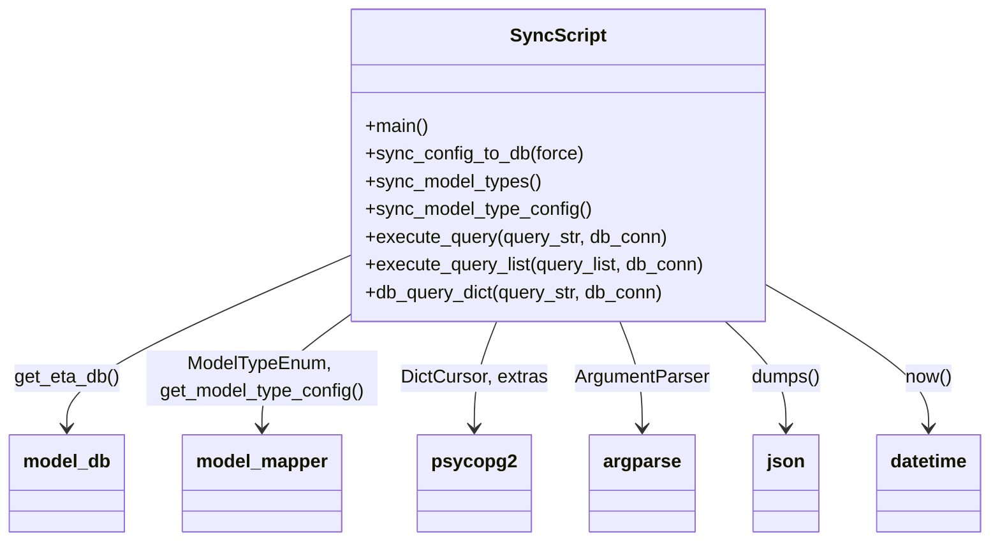

# Diagram: research/common/sync_config_to_db.py


> Auto-generated by Obscura crawlers

## Diagram 1

```mermaid
flowchart TD
    Start([Start]) --> IsMain{Is __name__ == "__main__"?}
    IsMain -->|yes| ParseArgs[Parse command-line args]
    ParseArgs --> SyncCall[Call sync_config_to_db(force)]
    SyncCall --> SyncTypes[sync_model_types()]
    SyncCall --> SyncTypeConfig[sync_model_type_config()]
    SyncTypes --> DbSelect[Query: SELECT id, name, ... FROM eta.model_type]
    DbSelect --> Compare[Compare DB model_types to model_mapper.ModelTypeEnum]
    Compare --> MissingCheck{Any missing model_types?}
    MissingCheck -->|yes| InsertLoop[For each missing model_type]
    InsertLoop --> BuildInsert[Build INSERT INTO eta.model_type(...)]
    BuildInsert --> ExecInsert[execute_query(INSERT, get_eta_db())]
    MissingCheck -->|no| SkipInsert[No inserts needed]
    SyncTypeConfig --> ForEachType[For each model_type in ModelTypeEnum]
    ForEachType --> BuildUpdate[Build UPDATE eta.model_type SET config_json=...]
    BuildUpdate --> ExecUpdate[execute_query(UPDATE, get_eta_db())]
    ExecInsert --> CommitDB[get_eta_db()]
    ExecUpdate --> CommitDB
    SkipInsert --> End([Done])
    CommitDB --> End
```

> SVG rendering failed for this diagram.

## Diagram 2



### SVG

<svg id="container" width="843.5625" xmlns="http://www.w3.org/2000/svg" class="classDiagram" height="468" viewBox="0 0 843.5625 468" role="graphics-document document" aria-roledescription="class"><style>#container{font-family:"trebuchet ms",verdana,arial,sans-serif;font-size:16px;fill:#333;}@keyframes edge-animation-frame{from{stroke-dashoffset:0;}}@keyframes dash{to{stroke-dashoffset:0;}}#container .edge-animation-slow{stroke-dasharray:9,5!important;stroke-dashoffset:900;animation:dash 50s linear infinite;stroke-linecap:round;}#container .edge-animation-fast{stroke-dasharray:9,5!important;stroke-dashoffset:900;animation:dash 20s linear infinite;stroke-linecap:round;}#container .error-icon{fill:#552222;}#container .error-text{fill:#552222;stroke:#552222;}#container .edge-thickness-normal{stroke-width:1px;}#container .edge-thickness-thick{stroke-width:3.5px;}#container .edge-pattern-solid{stroke-dasharray:0;}#container .edge-thickness-invisible{stroke-width:0;fill:none;}#container .edge-pattern-dashed{stroke-dasharray:3;}#container .edge-pattern-dotted{stroke-dasharray:2;}#container .marker{fill:#333333;stroke:#333333;}#container .marker.cross{stroke:#333333;}#container svg{font-family:"trebuchet ms",verdana,arial,sans-serif;font-size:16px;}#container p{margin:0;}#container g.classGroup text{fill:#9370DB;stroke:none;font-family:"trebuchet ms",verdana,arial,sans-serif;font-size:10px;}#container g.classGroup text .title{font-weight:bolder;}#container .nodeLabel,#container .edgeLabel{color:#131300;}#container .edgeLabel .label rect{fill:#ECECFF;}#container .label text{fill:#131300;}#container .labelBkg{background:#ECECFF;}#container .edgeLabel .label span{background:#ECECFF;}#container .classTitle{font-weight:bolder;}#container .node rect,#container .node circle,#container .node ellipse,#container .node polygon,#container .node path{fill:#ECECFF;stroke:#9370DB;stroke-width:1px;}#container .divider{stroke:#9370DB;stroke-width:1;}#container g.clickable{cursor:pointer;}#container g.classGroup rect{fill:#ECECFF;stroke:#9370DB;}#container g.classGroup line{stroke:#9370DB;stroke-width:1;}#container .classLabel .box{stroke:none;stroke-width:0;fill:#ECECFF;opacity:0.5;}#container .classLabel .label{fill:#9370DB;font-size:10px;}#container .relation{stroke:#333333;stroke-width:1;fill:none;}#container .dashed-line{stroke-dasharray:3;}#container .dotted-line{stroke-dasharray:1 2;}#container #compositionStart,#container .composition{fill:#333333!important;stroke:#333333!important;stroke-width:1;}#container #compositionEnd,#container .composition{fill:#333333!important;stroke:#333333!important;stroke-width:1;}#container #dependencyStart,#container .dependency{fill:#333333!important;stroke:#333333!important;stroke-width:1;}#container #dependencyStart,#container .dependency{fill:#333333!important;stroke:#333333!important;stroke-width:1;}#container #extensionStart,#container .extension{fill:transparent!important;stroke:#333333!important;stroke-width:1;}#container #extensionEnd,#container .extension{fill:transparent!important;stroke:#333333!important;stroke-width:1;}#container #aggregationStart,#container .aggregation{fill:transparent!important;stroke:#333333!important;stroke-width:1;}#container #aggregationEnd,#container .aggregation{fill:transparent!important;stroke:#333333!important;stroke-width:1;}#container #lollipopStart,#container .lollipop{fill:#ECECFF!important;stroke:#333333!important;stroke-width:1;}#container #lollipopEnd,#container .lollipop{fill:#ECECFF!important;stroke:#333333!important;stroke-width:1;}#container .edgeTerminals{font-size:11px;line-height:initial;}#container .classTitleText{text-anchor:middle;font-size:18px;fill:#333;}#container .label-icon{display:inline-block;height:1em;overflow:visible;vertical-align:-0.125em;}#container .node .label-icon path{fill:currentColor;stroke:revert;stroke-width:revert;}#container :root{--mermaid-font-family:"trebuchet ms",verdana,arial,sans-serif;}</style><g><defs><marker id="container_class-aggregationStart" class="marker aggregation class" refX="18" refY="7" markerWidth="190" markerHeight="240" orient="auto"><path d="M 18,7 L9,13 L1,7 L9,1 Z"></path></marker></defs><defs><marker id="container_class-aggregationEnd" class="marker aggregation class" refX="1" refY="7" markerWidth="20" markerHeight="28" orient="auto"><path d="M 18,7 L9,13 L1,7 L9,1 Z"></path></marker></defs><defs><marker id="container_class-extensionStart" class="marker extension class" refX="18" refY="7" markerWidth="190" markerHeight="240" orient="auto"><path d="M 1,7 L18,13 V 1 Z"></path></marker></defs><defs><marker id="container_class-extensionEnd" class="marker extension class" refX="1" refY="7" markerWidth="20" markerHeight="28" orient="auto"><path d="M 1,1 V 13 L18,7 Z"></path></marker></defs><defs><marker id="container_class-compositionStart" class="marker composition class" refX="18" refY="7" markerWidth="190" markerHeight="240" orient="auto"><path d="M 18,7 L9,13 L1,7 L9,1 Z"></path></marker></defs><defs><marker id="container_class-compositionEnd" class="marker composition class" refX="1" refY="7" markerWidth="20" markerHeight="28" orient="auto"><path d="M 18,7 L9,13 L1,7 L9,1 Z"></path></marker></defs><defs><marker id="container_class-dependencyStart" class="marker dependency class" refX="6" refY="7" markerWidth="190" markerHeight="240" orient="auto"><path d="M 5,7 L9,13 L1,7 L9,1 Z"></path></marker></defs><defs><marker id="container_class-dependencyEnd" class="marker dependency class" refX="13" refY="7" markerWidth="20" markerHeight="28" orient="auto"><path d="M 18,7 L9,13 L14,7 L9,1 Z"></path></marker></defs><defs><marker id="container_class-lollipopStart" class="marker lollipop class" refX="13" refY="7" markerWidth="190" markerHeight="240" orient="auto"><circle stroke="black" fill="transparent" cx="7" cy="7" r="6"></circle></marker></defs><defs><marker id="container_class-lollipopEnd" class="marker lollipop class" refX="1" refY="7" markerWidth="190" markerHeight="240" orient="auto"><circle stroke="black" fill="transparent" cx="7" cy="7" r="6"></circle></marker></defs><g class="root"><g class="clusters"></g><g class="edgePaths"><path d="M296.547,221.705L256.556,239.254C216.565,256.803,136.583,291.902,96.592,316.617C56.602,341.333,56.602,355.667,56.602,362.833L56.602,370" id="id_SyncScript_model_db_1" class="edge-thickness-normal edge-pattern-solid relation" style=";;;" data-edge="true" data-et="edge" data-id="id_SyncScript_model_db_1" data-points="W3sieCI6Mjk2LjU0Njg3NSwieSI6MjIxLjcwNDgyNTc4NzIxODE3fSx7IngiOjU2LjYwMTU2MjUsInkiOjMyN30seyJ4Ijo1Ni42MDE1NjI1LCJ5IjozNzZ9XQ==" marker-end="url(#container_class-dependencyEnd)"></path><path d="M296.547,273.341L284.241,282.284C271.935,291.227,247.323,309.114,235.017,325.223C222.711,341.333,222.711,355.667,222.711,362.833L222.711,370" id="id_SyncScript_model_mapper_2" class="edge-thickness-normal edge-pattern-solid relation" style=";;;" data-edge="true" data-et="edge" data-id="id_SyncScript_model_mapper_2" data-points="W3sieCI6Mjk2LjU0Njg3NSwieSI6MjczLjM0MDkwMzQ4MDYyMjA1fSx7IngiOjIyMi43MTA5Mzc1LCJ5IjozMjd9LHsieCI6MjIyLjcxMDkzNzUsInkiOjM3Nn1d" marker-end="url(#container_class-dependencyEnd)"></path><path d="M424.299,278L421.178,286.167C418.056,294.333,411.813,310.667,408.692,326C405.57,341.333,405.57,355.667,405.57,362.833L405.57,370" id="id_SyncScript_psycopg2_3" class="edge-thickness-normal edge-pattern-solid relation" style=";;;" data-edge="true" data-et="edge" data-id="id_SyncScript_psycopg2_3" data-points="W3sieCI6NDI0LjI5ODk5Nzk2MTk1NjUsInkiOjI3OH0seyJ4Ijo0MDUuNTcwMzEyNSwieSI6MzI3fSx7IngiOjQwNS41NzAzMTI1LCJ5IjozNzZ9XQ==" marker-end="url(#container_class-dependencyEnd)"></path><path d="M527.498,278L530.619,286.167C533.741,294.333,539.984,310.667,543.105,326C546.227,341.333,546.227,355.667,546.227,362.833L546.227,370" id="id_SyncScript_argparse_4" class="edge-thickness-normal edge-pattern-solid relation" style=";;;" data-edge="true" data-et="edge" data-id="id_SyncScript_argparse_4" data-points="W3sieCI6NTI3LjQ5Nzg3NzAzODA0MzUsInkiOjI3OH0seyJ4Ijo1NDYuMjI2NTYyNSwieSI6MzI3fSx7IngiOjU0Ni4yMjY1NjI1LCJ5IjozNzZ9XQ==" marker-end="url(#container_class-dependencyEnd)"></path><path d="M616.854,278L625.381,286.167C633.908,294.333,650.962,310.667,659.489,326C668.016,341.333,668.016,355.667,668.016,362.833L668.016,370" id="id_SyncScript_json_5" class="edge-thickness-normal edge-pattern-solid relation" style=";;;" data-edge="true" data-et="edge" data-id="id_SyncScript_json_5" data-points="W3sieCI6NjE2Ljg1Mzk4MjY3NjYzMDUsInkiOjI3OH0seyJ4Ijo2NjguMDE1NjI1LCJ5IjozMjd9LHsieCI6NjY4LjAxNTYyNSwieSI6Mzc2fV0=" marker-end="url(#container_class-dependencyEnd)"></path><path d="M655.25,247.899L677.79,261.083C700.331,274.266,745.411,300.633,767.952,320.983C790.492,341.333,790.492,355.667,790.492,362.833L790.492,370" id="id_SyncScript_datetime_6" class="edge-thickness-normal edge-pattern-solid relation" style=";;;" data-edge="true" data-et="edge" data-id="id_SyncScript_datetime_6" data-points="W3sieCI6NjU1LjI1LCJ5IjoyNDcuODk5Mzc0MTkyOTA3NTJ9LHsieCI6NzkwLjQ5MjE4NzUsInkiOjMyN30seyJ4Ijo3OTAuNDkyMTg3NSwieSI6Mzc2fV0=" marker-end="url(#container_class-dependencyEnd)"></path></g><g class="edgeLabels"><g class="edgeLabel" transform="translate(56.6015625, 327)"><g class="label" data-id="id_SyncScript_model_db_1" transform="translate(-45.546875, -12)"><foreignObject width="91.09375" height="24"><div xmlns="http://www.w3.org/1999/xhtml" class="labelBkg" style="display: table-cell; white-space: nowrap; line-height: 1.5; max-width: 200px; text-align: center;"><span class="edgeLabel"><p>get_eta_db()</p></span></div></foreignObject></g></g><g class="edgeLabel" transform="translate(222.7109375, 327)"><g class="label" data-id="id_SyncScript_model_mapper_2" transform="translate(-100, -24)"><foreignObject width="200" height="48"><div xmlns="http://www.w3.org/1999/xhtml" class="labelBkg" style="display: table; white-space: break-spaces; line-height: 1.5; max-width: 200px; text-align: center; width: 200px;"><span class="edgeLabel"><p>ModelTypeEnum, get_model_type_config()</p></span></div></foreignObject></g></g><g class="edgeLabel" transform="translate(405.5703125, 327)"><g class="label" data-id="id_SyncScript_psycopg2_3" transform="translate(-62.859375, -12)"><foreignObject width="125.71875" height="24"><div xmlns="http://www.w3.org/1999/xhtml" class="labelBkg" style="display: table-cell; white-space: nowrap; line-height: 1.5; max-width: 200px; text-align: center;"><span class="edgeLabel"><p>DictCursor, extras</p></span></div></foreignObject></g></g><g class="edgeLabel" transform="translate(546.2265625, 327)"><g class="label" data-id="id_SyncScript_argparse_4" transform="translate(-57.796875, -12)"><foreignObject width="115.59375" height="24"><div xmlns="http://www.w3.org/1999/xhtml" class="labelBkg" style="display: table-cell; white-space: nowrap; line-height: 1.5; max-width: 200px; text-align: center;"><span class="edgeLabel"><p>ArgumentParser</p></span></div></foreignObject></g></g><g class="edgeLabel" transform="translate(668.015625, 327)"><g class="label" data-id="id_SyncScript_json_5" transform="translate(-29.96875, -12)"><foreignObject width="59.9375" height="24"><div xmlns="http://www.w3.org/1999/xhtml" class="labelBkg" style="display: table-cell; white-space: nowrap; line-height: 1.5; max-width: 200px; text-align: center;"><span class="edgeLabel"><p>dumps()</p></span></div></foreignObject></g></g><g class="edgeLabel" transform="translate(790.4921875, 327)"><g class="label" data-id="id_SyncScript_datetime_6" transform="translate(-20.28125, -12)"><foreignObject width="40.5625" height="24"><div xmlns="http://www.w3.org/1999/xhtml" class="labelBkg" style="display: table-cell; white-space: nowrap; line-height: 1.5; max-width: 200px; text-align: center;"><span class="edgeLabel"><p>now()</p></span></div></foreignObject></g></g></g><g class="nodes"><g class="node default" id="classId-SyncScript-0" transform="translate(475.8984375, 143)"><g class="basic label-container"><path d="M-179.3515625 -135 L179.3515625 -135 L179.3515625 135 L-179.3515625 135" stroke="none" stroke-width="0" fill="#ECECFF" style=""></path><path d="M-179.3515625 -135 C-89.49696469156058 -135, 0.35763311687884425 -135, 179.3515625 -135 M-179.3515625 -135 C-59.21691124832742 -135, 60.91774000334516 -135, 179.3515625 -135 M179.3515625 -135 C179.3515625 -76.37043368866195, 179.3515625 -17.740867377323895, 179.3515625 135 M179.3515625 -135 C179.3515625 -39.08477203607475, 179.3515625 56.830455927850494, 179.3515625 135 M179.3515625 135 C39.61765014376701 135, -100.11626221246598 135, -179.3515625 135 M179.3515625 135 C60.46969918524502 135, -58.41216412950996 135, -179.3515625 135 M-179.3515625 135 C-179.3515625 61.85091530291588, -179.3515625 -11.29816939416824, -179.3515625 -135 M-179.3515625 135 C-179.3515625 34.93639241093085, -179.3515625 -65.1272151781383, -179.3515625 -135" stroke="#9370DB" stroke-width="1.3" fill="none" stroke-dasharray="0 0" style=""></path></g><g class="annotation-group text" transform="translate(0, -111)"></g><g class="label-group text" transform="translate(-38.828125, -111)"><g class="label" style="font-weight: bolder" transform="translate(0,-12)"><foreignObject width="77.65625" height="24"><div xmlns="http://www.w3.org/1999/xhtml" style="display: table-cell; white-space: nowrap; line-height: 1.5; max-width: 126px; text-align: center;"><span class="nodeLabel markdown-node-label" style=""><p>SyncScript</p></span></div></foreignObject></g></g><g class="members-group text" transform="translate(-167.3515625, -63)"></g><g class="methods-group text" transform="translate(-167.3515625, -33)"><g class="label" style="" transform="translate(0,-12)"><foreignObject width="54.65625" height="24"><div xmlns="http://www.w3.org/1999/xhtml" style="display: table-cell; white-space: nowrap; line-height: 1.5; max-width: 112px; text-align: center;"><span class="nodeLabel markdown-node-label" style=""><p>+main()</p></span></div></foreignObject></g><g class="label" style="" transform="translate(0,12)"><foreignObject width="188.015625" height="24"><div xmlns="http://www.w3.org/1999/xhtml" style="display: table-cell; white-space: nowrap; line-height: 1.5; max-width: 245px; text-align: center;"><span class="nodeLabel markdown-node-label" style=""><p>+sync_config_to_db(force)</p></span></div></foreignObject></g><g class="label" style="" transform="translate(0,36)"><foreignObject width="152.078125" height="24"><div xmlns="http://www.w3.org/1999/xhtml" style="display: table-cell; white-space: nowrap; line-height: 1.5; max-width: 209px; text-align: center;"><span class="nodeLabel markdown-node-label" style=""><p>+sync_model_types()</p></span></div></foreignObject></g><g class="label" style="" transform="translate(0,60)"><foreignObject width="195.84375" height="24"><div xmlns="http://www.w3.org/1999/xhtml" style="display: table-cell; white-space: nowrap; line-height: 1.5; max-width: 253px; text-align: center;"><span class="nodeLabel markdown-node-label" style=""><p>+sync_model_type_config()</p></span></div></foreignObject></g><g class="label" style="" transform="translate(0,84)"><foreignObject width="261.546875" height="24"><div xmlns="http://www.w3.org/1999/xhtml" style="display: table-cell; white-space: nowrap; line-height: 1.5; max-width: 319px; text-align: center;"><span class="nodeLabel markdown-node-label" style=""><p>+execute_query(query_str, db_conn)</p></span></div></foreignObject></g><g class="label" style="" transform="translate(0,108)"><foreignObject width="295.875" height="24"><div xmlns="http://www.w3.org/1999/xhtml" style="display: table-cell; white-space: nowrap; line-height: 1.5; max-width: 353px; text-align: center;"><span class="nodeLabel markdown-node-label" style=""><p>+execute_query_list(query_list, db_conn)</p></span></div></foreignObject></g><g class="label" style="" transform="translate(0,132)"><foreignObject width="259.671875" height="24"><div xmlns="http://www.w3.org/1999/xhtml" style="display: table-cell; white-space: nowrap; line-height: 1.5; max-width: 317px; text-align: center;"><span class="nodeLabel markdown-node-label" style=""><p>+db_query_dict(query_str, db_conn)</p></span></div></foreignObject></g></g><g class="divider" style=""><path d="M-179.3515625 -87 C-97.3769920737018 -87, -15.4024216474036 -87, 179.3515625 -87 M-179.3515625 -87 C-50.715806148158265 -87, 77.91995020368347 -87, 179.3515625 -87" stroke="#9370DB" stroke-width="1.3" fill="none" stroke-dasharray="0 0" style=""></path></g><g class="divider" style=""><path d="M-179.3515625 -63 C-64.30074457972398 -63, 50.750073340552035 -63, 179.3515625 -63 M-179.3515625 -63 C-58.76794694230199 -63, 61.81566861539602 -63, 179.3515625 -63" stroke="#9370DB" stroke-width="1.3" fill="none" stroke-dasharray="0 0" style=""></path></g></g><g class="node default" id="classId-model_db-1" transform="translate(56.6015625, 418)"><g class="basic label-container"><path d="M-48.6015625 -42 L48.6015625 -42 L48.6015625 42 L-48.6015625 42" stroke="none" stroke-width="0" fill="#ECECFF" style=""></path><path d="M-48.6015625 -42 C-25.146229114698375 -42, -1.6908957293967504 -42, 48.6015625 -42 M-48.6015625 -42 C-14.742006393872913 -42, 19.117549712254174 -42, 48.6015625 -42 M48.6015625 -42 C48.6015625 -11.067157030556917, 48.6015625 19.865685938886166, 48.6015625 42 M48.6015625 -42 C48.6015625 -21.77727296933778, 48.6015625 -1.5545459386755596, 48.6015625 42 M48.6015625 42 C11.831768436085163 42, -24.938025627829674 42, -48.6015625 42 M48.6015625 42 C21.355710845077247 42, -5.890140809845505 42, -48.6015625 42 M-48.6015625 42 C-48.6015625 17.036603220308148, -48.6015625 -7.926793559383704, -48.6015625 -42 M-48.6015625 42 C-48.6015625 11.687299781237709, -48.6015625 -18.625400437524583, -48.6015625 -42" stroke="#9370DB" stroke-width="1.3" fill="none" stroke-dasharray="0 0" style=""></path></g><g class="annotation-group text" transform="translate(0, -18)"></g><g class="label-group text" transform="translate(-36.6015625, -18)"><g class="label" style="font-weight: bolder" transform="translate(0,-12)"><foreignObject width="73.203125" height="24"><div xmlns="http://www.w3.org/1999/xhtml" style="display: table-cell; white-space: nowrap; line-height: 1.5; max-width: 123px; text-align: center;"><span class="nodeLabel markdown-node-label" style=""><p>model_db</p></span></div></foreignObject></g></g><g class="members-group text" transform="translate(-36.6015625, 30)"></g><g class="methods-group text" transform="translate(-36.6015625, 60)"></g><g class="divider" style=""><path d="M-48.6015625 6 C-28.986711045659398 6, -9.371859591318795 6, 48.6015625 6 M-48.6015625 6 C-19.799590584805344 6, 9.002381330389312 6, 48.6015625 6" stroke="#9370DB" stroke-width="1.3" fill="none" stroke-dasharray="0 0" style=""></path></g><g class="divider" style=""><path d="M-48.6015625 24 C-19.07726357953372 24, 10.447035340932558 24, 48.6015625 24 M-48.6015625 24 C-10.525819251067809 24, 27.549923997864383 24, 48.6015625 24" stroke="#9370DB" stroke-width="1.3" fill="none" stroke-dasharray="0 0" style=""></path></g></g><g class="node default" id="classId-model_mapper-2" transform="translate(222.7109375, 418)"><g class="basic label-container"><path d="M-67.5078125 -42 L67.5078125 -42 L67.5078125 42 L-67.5078125 42" stroke="none" stroke-width="0" fill="#ECECFF" style=""></path><path d="M-67.5078125 -42 C-36.36284315050315 -42, -5.217873801006299 -42, 67.5078125 -42 M-67.5078125 -42 C-25.41375521542968 -42, 16.680302069140637 -42, 67.5078125 -42 M67.5078125 -42 C67.5078125 -16.384557755670908, 67.5078125 9.230884488658184, 67.5078125 42 M67.5078125 -42 C67.5078125 -10.612151706830563, 67.5078125 20.775696586338874, 67.5078125 42 M67.5078125 42 C23.98987358624869 42, -19.528065327502617 42, -67.5078125 42 M67.5078125 42 C13.877157528468317 42, -39.75349744306337 42, -67.5078125 42 M-67.5078125 42 C-67.5078125 14.181780569789787, -67.5078125 -13.636438860420427, -67.5078125 -42 M-67.5078125 42 C-67.5078125 11.772135731037913, -67.5078125 -18.455728537924173, -67.5078125 -42" stroke="#9370DB" stroke-width="1.3" fill="none" stroke-dasharray="0 0" style=""></path></g><g class="annotation-group text" transform="translate(0, -18)"></g><g class="label-group text" transform="translate(-55.5078125, -18)"><g class="label" style="font-weight: bolder" transform="translate(0,-12)"><foreignObject width="111.015625" height="24"><div xmlns="http://www.w3.org/1999/xhtml" style="display: table-cell; white-space: nowrap; line-height: 1.5; max-width: 161px; text-align: center;"><span class="nodeLabel markdown-node-label" style=""><p>model_mapper</p></span></div></foreignObject></g></g><g class="members-group text" transform="translate(-55.5078125, 30)"></g><g class="methods-group text" transform="translate(-55.5078125, 60)"></g><g class="divider" style=""><path d="M-67.5078125 6 C-20.025241007024995 6, 27.45733048595001 6, 67.5078125 6 M-67.5078125 6 C-30.2230233359328 6, 7.061765828134398 6, 67.5078125 6" stroke="#9370DB" stroke-width="1.3" fill="none" stroke-dasharray="0 0" style=""></path></g><g class="divider" style=""><path d="M-67.5078125 24 C-15.183818777544047 24, 37.140174944911905 24, 67.5078125 24 M-67.5078125 24 C-26.543131403356348 24, 14.421549693287304 24, 67.5078125 24" stroke="#9370DB" stroke-width="1.3" fill="none" stroke-dasharray="0 0" style=""></path></g></g><g class="node default" id="classId-psycopg2-3" transform="translate(405.5703125, 418)"><g class="basic label-container"><path d="M-46.234375 -42 L46.234375 -42 L46.234375 42 L-46.234375 42" stroke="none" stroke-width="0" fill="#ECECFF" style=""></path><path d="M-46.234375 -42 C-26.723033071630958 -42, -7.211691143261916 -42, 46.234375 -42 M-46.234375 -42 C-13.75458630033937 -42, 18.72520239932126 -42, 46.234375 -42 M46.234375 -42 C46.234375 -8.572316141361576, 46.234375 24.85536771727685, 46.234375 42 M46.234375 -42 C46.234375 -16.019417113457276, 46.234375 9.961165773085447, 46.234375 42 M46.234375 42 C14.123704236959512 42, -17.986966526080977 42, -46.234375 42 M46.234375 42 C23.246407030552596 42, 0.258439061105193 42, -46.234375 42 M-46.234375 42 C-46.234375 8.47909782406414, -46.234375 -25.04180435187172, -46.234375 -42 M-46.234375 42 C-46.234375 22.679552369132715, -46.234375 3.3591047382654295, -46.234375 -42" stroke="#9370DB" stroke-width="1.3" fill="none" stroke-dasharray="0 0" style=""></path></g><g class="annotation-group text" transform="translate(0, -18)"></g><g class="label-group text" transform="translate(-34.234375, -18)"><g class="label" style="font-weight: bolder" transform="translate(0,-12)"><foreignObject width="68.46875" height="24"><div xmlns="http://www.w3.org/1999/xhtml" style="display: table-cell; white-space: nowrap; line-height: 1.5; max-width: 117px; text-align: center;"><span class="nodeLabel markdown-node-label" style=""><p>psycopg2</p></span></div></foreignObject></g></g><g class="members-group text" transform="translate(-34.234375, 30)"></g><g class="methods-group text" transform="translate(-34.234375, 60)"></g><g class="divider" style=""><path d="M-46.234375 6 C-22.75016202755095 6, 0.734050944898101 6, 46.234375 6 M-46.234375 6 C-23.594573299166022 6, -0.9547715983320444 6, 46.234375 6" stroke="#9370DB" stroke-width="1.3" fill="none" stroke-dasharray="0 0" style=""></path></g><g class="divider" style=""><path d="M-46.234375 24 C-25.84235304286434 24, -5.450331085728678 24, 46.234375 24 M-46.234375 24 C-15.684253212783762 24, 14.865868574432476 24, 46.234375 24" stroke="#9370DB" stroke-width="1.3" fill="none" stroke-dasharray="0 0" style=""></path></g></g><g class="node default" id="classId-argparse-4" transform="translate(546.2265625, 418)"><g class="basic label-container"><path d="M-44.3828125 -42 L44.3828125 -42 L44.3828125 42 L-44.3828125 42" stroke="none" stroke-width="0" fill="#ECECFF" style=""></path><path d="M-44.3828125 -42 C-20.860019389673464 -42, 2.662773720653071 -42, 44.3828125 -42 M-44.3828125 -42 C-23.793663456369714 -42, -3.204514412739428 -42, 44.3828125 -42 M44.3828125 -42 C44.3828125 -20.090767756653964, 44.3828125 1.818464486692072, 44.3828125 42 M44.3828125 -42 C44.3828125 -18.09930063309081, 44.3828125 5.801398733818381, 44.3828125 42 M44.3828125 42 C16.983902944370467 42, -10.415006611259066 42, -44.3828125 42 M44.3828125 42 C19.87271532774018 42, -4.637381844519638 42, -44.3828125 42 M-44.3828125 42 C-44.3828125 10.40772547120099, -44.3828125 -21.18454905759802, -44.3828125 -42 M-44.3828125 42 C-44.3828125 17.40712452517482, -44.3828125 -7.185750949650362, -44.3828125 -42" stroke="#9370DB" stroke-width="1.3" fill="none" stroke-dasharray="0 0" style=""></path></g><g class="annotation-group text" transform="translate(0, -18)"></g><g class="label-group text" transform="translate(-32.3828125, -18)"><g class="label" style="font-weight: bolder" transform="translate(0,-12)"><foreignObject width="64.765625" height="24"><div xmlns="http://www.w3.org/1999/xhtml" style="display: table-cell; white-space: nowrap; line-height: 1.5; max-width: 113px; text-align: center;"><span class="nodeLabel markdown-node-label" style=""><p>argparse</p></span></div></foreignObject></g></g><g class="members-group text" transform="translate(-32.3828125, 30)"></g><g class="methods-group text" transform="translate(-32.3828125, 60)"></g><g class="divider" style=""><path d="M-44.3828125 6 C-22.14941966525386 6, 0.08397316949228184 6, 44.3828125 6 M-44.3828125 6 C-13.922334116382174 6, 16.53814426723565 6, 44.3828125 6" stroke="#9370DB" stroke-width="1.3" fill="none" stroke-dasharray="0 0" style=""></path></g><g class="divider" style=""><path d="M-44.3828125 24 C-22.665986868760644 24, -0.9491612375212881 24, 44.3828125 24 M-44.3828125 24 C-25.193514033533773 24, -6.004215567067547 24, 44.3828125 24" stroke="#9370DB" stroke-width="1.3" fill="none" stroke-dasharray="0 0" style=""></path></g></g><g class="node default" id="classId-json-5" transform="translate(668.015625, 418)"><g class="basic label-container"><path d="M-27.40625 -42 L27.40625 -42 L27.40625 42 L-27.40625 42" stroke="none" stroke-width="0" fill="#ECECFF" style=""></path><path d="M-27.40625 -42 C-5.503693379847604 -42, 16.39886324030479 -42, 27.40625 -42 M-27.40625 -42 C-5.944568342321915 -42, 15.51711331535617 -42, 27.40625 -42 M27.40625 -42 C27.40625 -9.800959459009455, 27.40625 22.39808108198109, 27.40625 42 M27.40625 -42 C27.40625 -22.89953268438663, 27.40625 -3.799065368773263, 27.40625 42 M27.40625 42 C6.269837445957144 42, -14.866575108085712 42, -27.40625 42 M27.40625 42 C12.179778669647698 42, -3.046692660704604 42, -27.40625 42 M-27.40625 42 C-27.40625 16.986953882862302, -27.40625 -8.026092234275396, -27.40625 -42 M-27.40625 42 C-27.40625 22.4998703512563, -27.40625 2.9997407025125966, -27.40625 -42" stroke="#9370DB" stroke-width="1.3" fill="none" stroke-dasharray="0 0" style=""></path></g><g class="annotation-group text" transform="translate(0, -18)"></g><g class="label-group text" transform="translate(-15.40625, -18)"><g class="label" style="font-weight: bolder" transform="translate(0,-12)"><foreignObject width="30.8125" height="24"><div xmlns="http://www.w3.org/1999/xhtml" style="display: table-cell; white-space: nowrap; line-height: 1.5; max-width: 82px; text-align: center;"><span class="nodeLabel markdown-node-label" style=""><p>json</p></span></div></foreignObject></g></g><g class="members-group text" transform="translate(-15.40625, 30)"></g><g class="methods-group text" transform="translate(-15.40625, 60)"></g><g class="divider" style=""><path d="M-27.40625 6 C-15.758567269961961 6, -4.110884539923923 6, 27.40625 6 M-27.40625 6 C-11.307831130389314 6, 4.7905877392213725 6, 27.40625 6" stroke="#9370DB" stroke-width="1.3" fill="none" stroke-dasharray="0 0" style=""></path></g><g class="divider" style=""><path d="M-27.40625 24 C-11.614287065187794 24, 4.177675869624412 24, 27.40625 24 M-27.40625 24 C-6.534026016376277 24, 14.338197967247446 24, 27.40625 24" stroke="#9370DB" stroke-width="1.3" fill="none" stroke-dasharray="0 0" style=""></path></g></g><g class="node default" id="classId-datetime-6" transform="translate(790.4921875, 418)"><g class="basic label-container"><path d="M-45.0703125 -42 L45.0703125 -42 L45.0703125 42 L-45.0703125 42" stroke="none" stroke-width="0" fill="#ECECFF" style=""></path><path d="M-45.0703125 -42 C-18.96017092954267 -42, 7.14997064091466 -42, 45.0703125 -42 M-45.0703125 -42 C-16.63725339831078 -42, 11.795805703378441 -42, 45.0703125 -42 M45.0703125 -42 C45.0703125 -19.517047424276754, 45.0703125 2.965905151446492, 45.0703125 42 M45.0703125 -42 C45.0703125 -22.1264439629928, 45.0703125 -2.252887925985597, 45.0703125 42 M45.0703125 42 C20.364799627668422 42, -4.3407132446631564 42, -45.0703125 42 M45.0703125 42 C24.955951795600257 42, 4.841591091200513 42, -45.0703125 42 M-45.0703125 42 C-45.0703125 16.295736649987894, -45.0703125 -9.408526700024211, -45.0703125 -42 M-45.0703125 42 C-45.0703125 21.620686363194977, -45.0703125 1.2413727263899546, -45.0703125 -42" stroke="#9370DB" stroke-width="1.3" fill="none" stroke-dasharray="0 0" style=""></path></g><g class="annotation-group text" transform="translate(0, -18)"></g><g class="label-group text" transform="translate(-33.0703125, -18)"><g class="label" style="font-weight: bolder" transform="translate(0,-12)"><foreignObject width="66.140625" height="24"><div xmlns="http://www.w3.org/1999/xhtml" style="display: table-cell; white-space: nowrap; line-height: 1.5; max-width: 115px; text-align: center;"><span class="nodeLabel markdown-node-label" style=""><p>datetime</p></span></div></foreignObject></g></g><g class="members-group text" transform="translate(-33.0703125, 30)"></g><g class="methods-group text" transform="translate(-33.0703125, 60)"></g><g class="divider" style=""><path d="M-45.0703125 6 C-24.734097457698873 6, -4.397882415397746 6, 45.0703125 6 M-45.0703125 6 C-23.93811139258326 6, -2.8059102851665187 6, 45.0703125 6" stroke="#9370DB" stroke-width="1.3" fill="none" stroke-dasharray="0 0" style=""></path></g><g class="divider" style=""><path d="M-45.0703125 24 C-10.909426660735711 24, 23.251459178528577 24, 45.0703125 24 M-45.0703125 24 C-22.245577559601816 24, 0.5791573807963672 24, 45.0703125 24" stroke="#9370DB" stroke-width="1.3" fill="none" stroke-dasharray="0 0" style=""></path></g></g></g></g></g></svg>
