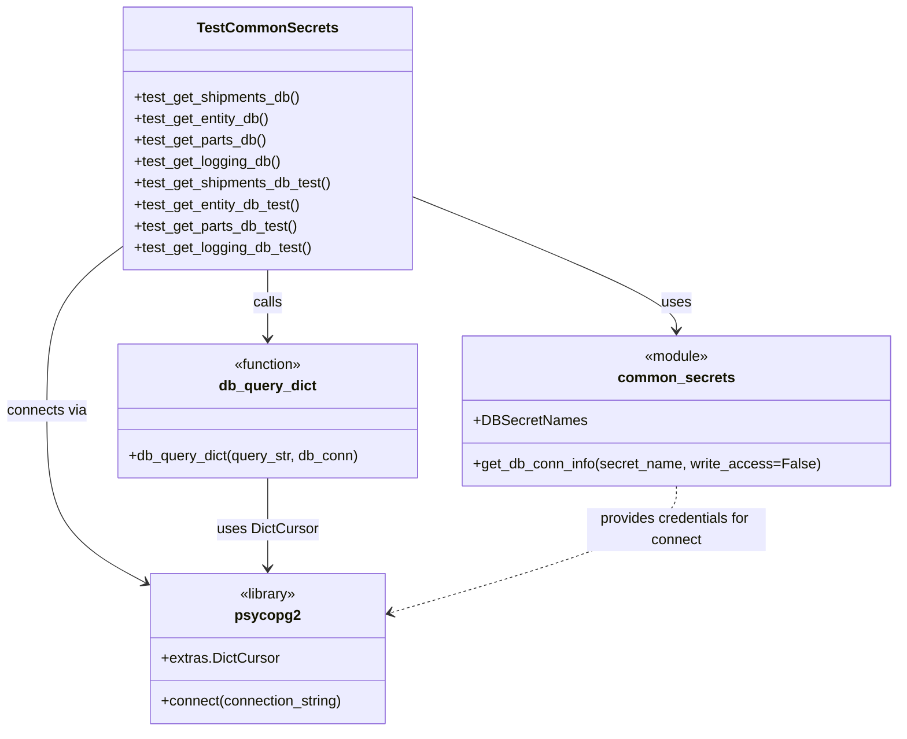
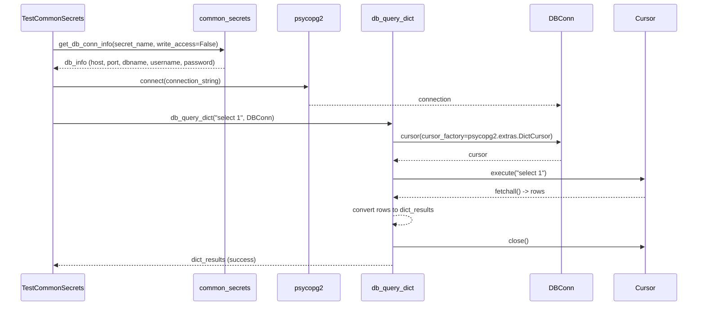

# Diagram: research/common/tests/test_common_secrets.py

> Auto-generated by Obscura crawlers

## Diagram 1

### SVG

<svg id="container" width="997.015625" xmlns="http://www.w3.org/2000/svg" class="classDiagram" height="818" viewBox="0 0 997.015625 818" role="graphics-document document" aria-roledescription="class"><g><defs><marker id="container_class-aggregationStart" class="marker aggregation class" refX="18" refY="7" markerWidth="190" markerHeight="240" orient="auto"><path d="M 18,7 L9,13 L1,7 L9,1 Z"></path></marker></defs><defs><marker id="container_class-aggregationEnd" class="marker aggregation class" refX="1" refY="7" markerWidth="20" markerHeight="28" orient="auto"><path d="M 18,7 L9,13 L1,7 L9,1 Z"></path></marker></defs><defs><marker id="container_class-extensionStart" class="marker extension class" refX="18" refY="7" markerWidth="190" markerHeight="240" orient="auto"><path d="M 1,7 L18,13 V 1 Z"></path></marker></defs><defs><marker id="container_class-extensionEnd" class="marker extension class" refX="1" refY="7" markerWidth="20" markerHeight="28" orient="auto"><path d="M 1,1 V 13 L18,7 Z"></path></marker></defs><defs><marker id="container_class-compositionStart" class="marker composition class" refX="18" refY="7" markerWidth="190" markerHeight="240" orient="auto"><path d="M 18,7 L9,13 L1,7 L9,1 Z"></path></marker></defs><defs><marker id="container_class-compositionEnd" class="marker composition class" refX="1" refY="7" markerWidth="20" markerHeight="28" orient="auto"><path d="M 18,7 L9,13 L1,7 L9,1 Z"></path></marker></defs><defs><marker id="container_class-dependencyStart" class="marker dependency class" refX="6" refY="7" markerWidth="190" markerHeight="240" orient="auto"><path d="M 5,7 L9,13 L1,7 L9,1 Z"></path></marker></defs><defs><marker id="container_class-dependencyEnd" class="marker dependency class" refX="13" refY="7" markerWidth="20" markerHeight="28" orient="auto"><path d="M 18,7 L9,13 L14,7 L9,1 Z"></path></marker></defs><defs><marker id="container_class-lollipopStart" class="marker lollipop class" refX="13" refY="7" markerWidth="190" markerHeight="240" orient="auto"><circle stroke="black" fill="transparent" cx="7" cy="7" r="6"></circle></marker></defs><defs><marker id="container_class-lollipopEnd" class="marker lollipop class" refX="1" refY="7" markerWidth="190" markerHeight="240" orient="auto"><circle stroke="black" fill="transparent" cx="7" cy="7" r="6"></circle></marker></defs><g class="root"><g class="clusters"></g><g class="edgePaths"><path d="M462.02,220.283L510.713,240.069C559.406,259.855,656.793,299.428,705.486,324.381C754.18,349.333,754.18,359.667,754.18,364.833L754.18,370" id="id_TestCommonSecrets_common_secrets_1" class="edge-thickness-normal edge-pattern-solid relation" style=";;;" data-edge="true" data-et="edge" data-id="id_TestCommonSecrets_common_secrets_1" data-points="W3sieCI6NDYyLjAxOTUzMTI1LCJ5IjoyMjAuMjgzMDAwNjM4MzYwMjh9LHsieCI6NzU0LjE3OTY4NzUsInkiOjMzOX0seyJ4Ijo3NTQuMTc5Njg3NSwieSI6Mzc2fV0=" marker-end="url(#container_class-dependencyEnd)"></path><path d="M140.699,274.117L126.114,284.931C111.529,295.745,82.358,317.372,67.773,348.353C53.188,379.333,53.188,419.667,53.188,462C53.188,504.333,53.188,548.667,71.591,580.696C89.995,612.726,126.803,632.452,145.206,642.315L163.61,652.178" id="id_TestCommonSecrets_psycopg2_2" class="edge-thickness-normal edge-pattern-solid relation" style=";;;" data-edge="true" data-et="edge" data-id="id_TestCommonSecrets_psycopg2_2" data-points="W3sieCI6MTQwLjY5OTIxODc1LCJ5IjoyNzQuMTE2OTE3NDU4OTE4MzV9LHsieCI6NTMuMTg3NSwieSI6MzM5fSx7IngiOjUzLjE4NzUsInkiOjQ2MH0seyJ4Ijo1My4xODc1LCJ5Ijo1OTN9LHsieCI6MTY4Ljg5ODQzNzUsInkiOjY1NS4wMTE2NzkxNTM4MTIyfV0=" marker-end="url(#container_class-dependencyEnd)"></path><path d="M301.359,302L301.359,308.167C301.359,314.333,301.359,326.667,301.359,339.5C301.359,352.333,301.359,365.667,301.359,372.333L301.359,379" id="id_TestCommonSecrets_db_query_dict_3" class="edge-thickness-normal edge-pattern-solid relation" style=";;;" data-edge="true" data-et="edge" data-id="id_TestCommonSecrets_db_query_dict_3" data-points="W3sieCI6MzAxLjM1OTM3NSwieSI6MzAyfSx7IngiOjMwMS4zNTkzNzUsInkiOjMzOX0seyJ4IjozMDEuMzU5Mzc1LCJ5IjozODV9XQ==" marker-end="url(#container_class-dependencyEnd)"></path><path d="M301.359,535L301.359,544.667C301.359,554.333,301.359,573.667,301.359,590.5C301.359,607.333,301.359,621.667,301.359,628.833L301.359,636" id="id_db_query_dict_psycopg2_4" class="edge-thickness-normal edge-pattern-solid relation" style=";;;" data-edge="true" data-et="edge" data-id="id_db_query_dict_psycopg2_4" data-points="W3sieCI6MzAxLjM1OTM3NSwieSI6NTM1fSx7IngiOjMwMS4zNTkzNzUsInkiOjU5M30seyJ4IjozMDEuMzU5Mzc1LCJ5Ijo2NDJ9XQ==" marker-end="url(#container_class-dependencyEnd)"></path><path d="M754.18,544L754.18,552.167C754.18,560.333,754.18,576.667,701.746,600.234C649.312,623.801,544.445,654.602,492.011,670.003L439.577,685.403" id="id_common_secrets_psycopg2_5" class="edge-thickness-normal edge-pattern-dashed relation" style=";;;" data-edge="true" data-et="edge" data-id="id_common_secrets_psycopg2_5" data-points="W3sieCI6NzU0LjE3OTY4NzUsInkiOjU0NH0seyJ4Ijo3NTQuMTc5Njg3NSwieSI6NTkzfSx7IngiOjQzMy44MjAzMTI1LCJ5Ijo2ODcuMDk0MjcwMjg1MTkxOH1d" marker-end="url(#container_class-dependencyEnd)"></path></g><g class="edgeLabels"><g class="edgeLabel" transform="translate(754.1796875, 339)"><g class="label" data-id="id_TestCommonSecrets_common_secrets_1" transform="translate(-16.4921875, -12)"><foreignObject width="32.984375" height="24">

uses

</foreignObject></g></g><g class="edgeLabel" transform="translate(53.1875, 460)"><g class="label" data-id="id_TestCommonSecrets_psycopg2_2" transform="translate(-45.1875, -12)"><foreignObject width="90.375" height="24">

connects via

</foreignObject></g></g><g class="edgeLabel" transform="translate(301.359375, 339)"><g class="label" data-id="id_TestCommonSecrets_db_query_dict_3" transform="translate(-16.4453125, -12)"><foreignObject width="32.890625" height="24">

calls

</foreignObject></g></g><g class="edgeLabel" transform="translate(301.359375, 593)"><g class="label" data-id="id_db_query_dict_psycopg2_4" transform="translate(-56.1953125, -12)"><foreignObject width="112.390625" height="24">

uses DictCursor

</foreignObject></g></g><g class="edgeLabel" transform="translate(754.1796875, 593)"><g class="label" data-id="id_common_secrets_psycopg2_5" transform="translate(-100, -24)"><foreignObject width="200" height="48">

provides credentials for connect

</foreignObject></g></g></g><g class="nodes"><g class="node default" id="classId-TestCommonSecrets-0" transform="translate(301.359375, 155)"><g class="basic label-container"><path d="M-160.66015625 -147 L160.66015625 -147 L160.66015625 147 L-160.66015625 147" stroke="none" stroke-width="0" fill="#ECECFF" style=""></path><path d="M-160.66015625 -147 C-61.36381419588764 -147, 37.93252785822472 -147, 160.66015625 -147 M-160.66015625 -147 C-77.3565414814217 -147, 5.9470732871565986 -147, 160.66015625 -147 M160.66015625 -147 C160.66015625 -43.52148042340073, 160.66015625 59.95703915319854, 160.66015625 147 M160.66015625 -147 C160.66015625 -75.48022521356557, 160.66015625 -3.96045042713115, 160.66015625 147 M160.66015625 147 C53.20070527826286 147, -54.25874569347428 147, -160.66015625 147 M160.66015625 147 C36.428517680764074 147, -87.80312088847185 147, -160.66015625 147 M-160.66015625 147 C-160.66015625 48.129470861725366, -160.66015625 -50.74105827654927, -160.66015625 -147 M-160.66015625 147 C-160.66015625 68.89537150811843, -160.66015625 -9.20925698376314, -160.66015625 -147" stroke="#9370DB" stroke-width="1.3" fill="none" stroke-dasharray="0 0" style=""></path></g><g class="annotation-group text" transform="translate(0, -123)"></g><g class="label-group text" transform="translate(-74.3359375, -123)"><g class="label" style="font-weight: bolder" transform="translate(0,-12)"><foreignObject width="148.671875" height="24">

TestCommonSecrets

</foreignObject></g></g><g class="members-group text" transform="translate(-148.66015625, -75)"></g><g class="methods-group text" transform="translate(-148.66015625, -45)"><g class="label" style="" transform="translate(0,-12)"><foreignObject width="187.796875" height="24">

+test_get_shipments_db()

</foreignObject></g><g class="label" style="" transform="translate(0,12)"><foreignObject width="153.359375" height="24">

+test_get_entity_db()

</foreignObject></g><g class="label" style="" transform="translate(0,36)"><foreignObject width="149.359375" height="24">

+test_get_parts_db()

</foreignObject></g><g class="label" style="" transform="translate(0,60)"><foreignObject width="164.90625" height="24">

+test_get_logging_db()

</foreignObject></g><g class="label" style="" transform="translate(0,84)"><foreignObject width="222.984375" height="24">

+test_get_shipments_db_test()

</foreignObject></g><g class="label" style="" transform="translate(0,108)"><foreignObject width="188.53125" height="24">

+test_get_entity_db_test()

</foreignObject></g><g class="label" style="" transform="translate(0,132)"><foreignObject width="184.53125" height="24">

+test_get_parts_db_test()

</foreignObject></g><g class="label" style="" transform="translate(0,156)"><foreignObject width="200.09375" height="24">

+test_get_logging_db_test()

</foreignObject></g></g><g class="divider" style=""><path d="M-160.66015625 -99 C-32.357329018712704 -99, 95.94549821257459 -99, 160.66015625 -99 M-160.66015625 -99 C-61.32026773462603 -99, 38.01962078074794 -99, 160.66015625 -99" stroke="#9370DB" stroke-width="1.3" fill="none" stroke-dasharray="0 0" style=""></path></g><g class="divider" style=""><path d="M-160.66015625 -75 C-86.62757256635443 -75, -12.594988882708861 -75, 160.66015625 -75 M-160.66015625 -75 C-48.428473135340354 -75, 63.80320997931929 -75, 160.66015625 -75" stroke="#9370DB" stroke-width="1.3" fill="none" stroke-dasharray="0 0" style=""></path></g></g><g class="node default" id="classId-common_secrets-1" transform="translate(754.1796875, 460)"><g class="basic label-container"><path d="M-234.8359375 -84 L234.8359375 -84 L234.8359375 84 L-234.8359375 84" stroke="none" stroke-width="0" fill="#ECECFF" style=""></path><path d="M-234.8359375 -84 C-62.73811603611699 -84, 109.35970542776602 -84, 234.8359375 -84 M-234.8359375 -84 C-125.46153791913456 -84, -16.087138338269114 -84, 234.8359375 -84 M234.8359375 -84 C234.8359375 -45.30336687064675, 234.8359375 -6.606733741293496, 234.8359375 84 M234.8359375 -84 C234.8359375 -45.41173181042504, 234.8359375 -6.823463620850077, 234.8359375 84 M234.8359375 84 C100.44025355275124 84, -33.95543039449751 84, -234.8359375 84 M234.8359375 84 C55.93843385709195 84, -122.9590697858161 84, -234.8359375 84 M-234.8359375 84 C-234.8359375 26.87233412698525, -234.8359375 -30.255331746029498, -234.8359375 -84 M-234.8359375 84 C-234.8359375 26.507904441729757, -234.8359375 -30.984191116540487, -234.8359375 -84" stroke="#9370DB" stroke-width="1.3" fill="none" stroke-dasharray="0 0" style=""></path></g><g class="annotation-group text" transform="translate(-36.6015625, -60)"><g class="label" style="" transform="translate(0,-12)"><foreignObject width="73.203125" height="24">

«module»

</foreignObject></g></g><g class="label-group text" transform="translate(-61.765625, -36)"><g class="label" style="font-weight: bolder" transform="translate(0,-12)"><foreignObject width="123.53125" height="24">

common_secrets

</foreignObject></g></g><g class="members-group text" transform="translate(-222.8359375, 12)"><g class="label" style="" transform="translate(0,-12)"><foreignObject width="122.515625" height="24">

+DBSecretNames

</foreignObject></g></g><g class="methods-group text" transform="translate(-222.8359375, 60)"><g class="label" style="" transform="translate(0,-12)"><foreignObject width="383.90625" height="24">

+get_db_conn_info(secret_name, write_access=False)

</foreignObject></g></g><g class="divider" style=""><path d="M-234.8359375 -12 C-55.927503968255195 -12, 122.98092956348961 -12, 234.8359375 -12 M-234.8359375 -12 C-99.27470417114145 -12, 36.2865291577171 -12, 234.8359375 -12" stroke="#9370DB" stroke-width="1.3" fill="none" stroke-dasharray="0 0" style=""></path></g><g class="divider" style=""><path d="M-234.8359375 36 C-101.19510324775305 36, 32.445731004493894 36, 234.8359375 36 M-234.8359375 36 C-124.85622390692731 36, -14.876510313854624 36, 234.8359375 36" stroke="#9370DB" stroke-width="1.3" fill="none" stroke-dasharray="0 0" style=""></path></g></g><g class="node default" id="classId-db_query_dict-2" transform="translate(301.359375, 460)"><g class="basic label-container"><path d="M-167.984375 -75 L167.984375 -75 L167.984375 75 L-167.984375 75" stroke="none" stroke-width="0" fill="#ECECFF" style=""></path><path d="M-167.984375 -75 C-34.078896824442324 -75, 99.82658135111535 -75, 167.984375 -75 M-167.984375 -75 C-49.08214759484251 -75, 69.82007981031498 -75, 167.984375 -75 M167.984375 -75 C167.984375 -21.867117506206803, 167.984375 31.265764987586394, 167.984375 75 M167.984375 -75 C167.984375 -25.122537199434596, 167.984375 24.754925601130807, 167.984375 75 M167.984375 75 C40.32327678336628 75, -87.33782143326744 75, -167.984375 75 M167.984375 75 C71.81789702049309 75, -24.348580959013816 75, -167.984375 75 M-167.984375 75 C-167.984375 30.351895818196766, -167.984375 -14.296208363606468, -167.984375 -75 M-167.984375 75 C-167.984375 25.410593027880637, -167.984375 -24.178813944238726, -167.984375 -75" stroke="#9370DB" stroke-width="1.3" fill="none" stroke-dasharray="0 0" style=""></path></g><g class="annotation-group text" transform="translate(-39.484375, -51)"><g class="label" style="" transform="translate(0,-12)"><foreignObject width="78.96875" height="24">

«function»

</foreignObject></g></g><g class="label-group text" transform="translate(-52.296875, -27)"><g class="label" style="font-weight: bolder" transform="translate(0,-12)"><foreignObject width="104.59375" height="24">

db_query_dict

</foreignObject></g></g><g class="members-group text" transform="translate(-155.984375, 21)"></g><g class="methods-group text" transform="translate(-155.984375, 51)"><g class="label" style="" transform="translate(0,-12)"><foreignObject width="259.671875" height="24">

+db_query_dict(query_str, db_conn)

</foreignObject></g></g><g class="divider" style=""><path d="M-167.984375 -3 C-48.65869877338446 -3, 70.66697745323108 -3, 167.984375 -3 M-167.984375 -3 C-90.06774175165506 -3, -12.151108503310127 -3, 167.984375 -3" stroke="#9370DB" stroke-width="1.3" fill="none" stroke-dasharray="0 0" style=""></path></g><g class="divider" style=""><path d="M-167.984375 21 C-48.93637530083059 21, 70.11162439833882 21, 167.984375 21 M-167.984375 21 C-54.323022665057465 21, 59.33832966988507 21, 167.984375 21" stroke="#9370DB" stroke-width="1.3" fill="none" stroke-dasharray="0 0" style=""></path></g></g><g class="node default" id="classId-psycopg2-3" transform="translate(301.359375, 726)"><g class="basic label-container"><path d="M-132.4609375 -84 L132.4609375 -84 L132.4609375 84 L-132.4609375 84" stroke="none" stroke-width="0" fill="#ECECFF" style=""></path><path d="M-132.4609375 -84 C-58.40966208801599 -84, 15.641613323968016 -84, 132.4609375 -84 M-132.4609375 -84 C-27.206893317156855 -84, 78.04715086568629 -84, 132.4609375 -84 M132.4609375 -84 C132.4609375 -37.017074457196536, 132.4609375 9.965851085606928, 132.4609375 84 M132.4609375 -84 C132.4609375 -30.5711561815937, 132.4609375 22.8576876368126, 132.4609375 84 M132.4609375 84 C69.00537217922056 84, 5.54980685844113 84, -132.4609375 84 M132.4609375 84 C34.500856325096095 84, -63.45922484980781 84, -132.4609375 84 M-132.4609375 84 C-132.4609375 38.64813703940192, -132.4609375 -6.703725921196167, -132.4609375 -84 M-132.4609375 84 C-132.4609375 42.06048654265855, -132.4609375 0.12097308531710382, -132.4609375 -84" stroke="#9370DB" stroke-width="1.3" fill="none" stroke-dasharray="0 0" style=""></path></g><g class="annotation-group text" transform="translate(-32.6640625, -60)"><g class="label" style="" transform="translate(0,-12)"><foreignObject width="65.328125" height="24">

«library»

</foreignObject></g></g><g class="label-group text" transform="translate(-34.234375, -36)"><g class="label" style="font-weight: bolder" transform="translate(0,-12)"><foreignObject width="68.46875" height="24">

psycopg2

</foreignObject></g></g><g class="members-group text" transform="translate(-120.4609375, 12)"><g class="label" style="" transform="translate(0,-12)"><foreignObject width="130.75" height="24">

+extras.DictCursor

</foreignObject></g></g><g class="methods-group text" transform="translate(-120.4609375, 60)"><g class="label" style="" transform="translate(0,-12)"><foreignObject width="206.6875" height="24">

+connect(connection_string)

</foreignObject></g></g><g class="divider" style=""><path d="M-132.4609375 -12 C-49.712022540877214 -12, 33.03689241824557 -12, 132.4609375 -12 M-132.4609375 -12 C-65.57158966461216 -12, 1.3177581707756758 -12, 132.4609375 -12" stroke="#9370DB" stroke-width="1.3" fill="none" stroke-dasharray="0 0" style=""></path></g><g class="divider" style=""><path d="M-132.4609375 36 C-42.25772527626437 36, 47.94548694747127 36, 132.4609375 36 M-132.4609375 36 C-67.62801854987464 36, -2.7950995997492782 36, 132.4609375 36" stroke="#9370DB" stroke-width="1.3" fill="none" stroke-dasharray="0 0" style=""></path></g></g></g></g></g></svg>

## Diagram 2

### SVG

<svg id="container" width="1734" xmlns="http://www.w3.org/2000/svg" height="777" viewBox="-50 -10 1734 777" role="graphics-document document" aria-roledescription="sequence"><g><rect x="1484" y="691" fill="#eaeaea" stroke="#666" width="150" height="65" name="Cursor" rx="3" ry="3" class="actor actor-bottom"></rect><text x="1559" y="723.5" dominant-baseline="central" alignment-baseline="central" class="actor actor-box" style="text-anchor: middle; font-size: 16px; font-weight: 400;"><tspan x="1559" dy="0">Cursor</tspan></text></g><g><rect x="1284" y="691" fill="#eaeaea" stroke="#666" width="150" height="65" name="DBConn" rx="3" ry="3" class="actor actor-bottom"></rect><text x="1359" y="723.5" dominant-baseline="central" alignment-baseline="central" class="actor actor-box" style="text-anchor: middle; font-size: 16px; font-weight: 400;"><tspan x="1359" dy="0">DBConn</tspan></text></g><g><rect x="854" y="691" fill="#eaeaea" stroke="#666" width="150" height="65" name="db_query_dict" rx="3" ry="3" class="actor actor-bottom"></rect><text x="929" y="723.5" dominant-baseline="central" alignment-baseline="central" class="actor actor-box" style="text-anchor: middle; font-size: 16px; font-weight: 400;"><tspan x="929" dy="0">db_query_dict</tspan></text></g><g><rect x="654" y="691" fill="#eaeaea" stroke="#666" width="150" height="65" name="psycopg2" rx="3" ry="3" class="actor actor-bottom"></rect><text x="729" y="723.5" dominant-baseline="central" alignment-baseline="central" class="actor actor-box" style="text-anchor: middle; font-size: 16px; font-weight: 400;"><tspan x="729" dy="0">psycopg2</tspan></text></g><g><rect x="454" y="691" fill="#eaeaea" stroke="#666" width="150" height="65" name="common_secrets" rx="3" ry="3" class="actor actor-bottom"></rect><text x="529" y="723.5" dominant-baseline="central" alignment-baseline="central" class="actor actor-box" style="text-anchor: middle; font-size: 16px; font-weight: 400;"><tspan x="529" dy="0">common_secrets</tspan></text></g><g><rect x="0" y="691" fill="#eaeaea" stroke="#666" width="166" height="65" name="TestCommonSecrets" rx="3" ry="3" class="actor actor-bottom"></rect><text x="83" y="723.5" dominant-baseline="central" alignment-baseline="central" class="actor actor-box" style="text-anchor: middle; font-size: 16px; font-weight: 400;"><tspan x="83" dy="0">TestCommonSecrets</tspan></text></g><g><line id="actor5" x1="1559" y1="65" x2="1559" y2="691" class="actor-line 200" stroke-width="0.5px" stroke="#999" name="Cursor"></line><g id="root-5"><rect x="1484" y="0" fill="#eaeaea" stroke="#666" width="150" height="65" name="Cursor" rx="3" ry="3" class="actor actor-top"></rect><text x="1559" y="32.5" dominant-baseline="central" alignment-baseline="central" class="actor actor-box" style="text-anchor: middle; font-size: 16px; font-weight: 400;"><tspan x="1559" dy="0">Cursor</tspan></text></g></g><g><line id="actor4" x1="1359" y1="65" x2="1359" y2="691" class="actor-line 200" stroke-width="0.5px" stroke="#999" name="DBConn"></line><g id="root-4"><rect x="1284" y="0" fill="#eaeaea" stroke="#666" width="150" height="65" name="DBConn" rx="3" ry="3" class="actor actor-top"></rect><text x="1359" y="32.5" dominant-baseline="central" alignment-baseline="central" class="actor actor-box" style="text-anchor: middle; font-size: 16px; font-weight: 400;"><tspan x="1359" dy="0">DBConn</tspan></text></g></g><g><line id="actor3" x1="929" y1="65" x2="929" y2="691" class="actor-line 200" stroke-width="0.5px" stroke="#999" name="db_query_dict"></line><g id="root-3"><rect x="854" y="0" fill="#eaeaea" stroke="#666" width="150" height="65" name="db_query_dict" rx="3" ry="3" class="actor actor-top"></rect><text x="929" y="32.5" dominant-baseline="central" alignment-baseline="central" class="actor actor-box" style="text-anchor: middle; font-size: 16px; font-weight: 400;"><tspan x="929" dy="0">db_query_dict</tspan></text></g></g><g><line id="actor2" x1="729" y1="65" x2="729" y2="691" class="actor-line 200" stroke-width="0.5px" stroke="#999" name="psycopg2"></line><g id="root-2"><rect x="654" y="0" fill="#eaeaea" stroke="#666" width="150" height="65" name="psycopg2" rx="3" ry="3" class="actor actor-top"></rect><text x="729" y="32.5" dominant-baseline="central" alignment-baseline="central" class="actor actor-box" style="text-anchor: middle; font-size: 16px; font-weight: 400;"><tspan x="729" dy="0">psycopg2</tspan></text></g></g><g><line id="actor1" x1="529" y1="65" x2="529" y2="691" class="actor-line 200" stroke-width="0.5px" stroke="#999" name="common_secrets"></line><g id="root-1"><rect x="454" y="0" fill="#eaeaea" stroke="#666" width="150" height="65" name="common_secrets" rx="3" ry="3" class="actor actor-top"></rect><text x="529" y="32.5" dominant-baseline="central" alignment-baseline="central" class="actor actor-box" style="text-anchor: middle; font-size: 16px; font-weight: 400;"><tspan x="529" dy="0">common_secrets</tspan></text></g></g><g><line id="actor0" x1="83" y1="65" x2="83" y2="691" class="actor-line 200" stroke-width="0.5px" stroke="#999" name="TestCommonSecrets"></line><g id="root-0"><rect x="0" y="0" fill="#eaeaea" stroke="#666" width="166" height="65" name="TestCommonSecrets" rx="3" ry="3" class="actor actor-top"></rect><text x="83" y="32.5" dominant-baseline="central" alignment-baseline="central" class="actor actor-box" style="text-anchor: middle; font-size: 16px; font-weight: 400;"><tspan x="83" dy="0">TestCommonSecrets</tspan></text></g></g><g></g><defs><symbol id="computer" width="24" height="24"><path transform="scale(.5)" d="M2 2v13h20v-13h-20zm18 11h-16v-9h16v9zm-10.228 6l.466-1h3.524l.467 1h-4.457zm14.228 3h-24l2-6h2.104l-1.33 4h18.45l-1.297-4h2.073l2 6zm-5-10h-14v-7h14v7z"></path></symbol></defs><defs><symbol id="database" fill-rule="evenodd" clip-rule="evenodd"><path transform="scale(.5)" d="M12.258.001l.256.004.255.005.253.008.251.01.249.012.247.015.246.016.242.019.241.02.239.023.236.024.233.027.231.028.229.031.225.032.223.034.22.036.217.038.214.04.211.041.208.043.205.045.201.046.198.048.194.05.191.051.187.053.183.054.18.056.175.057.172.059.168.06.163.061.16.063.155.064.15.066.074.033.073.033.071.034.07.034.069.035.068.035.067.035.066.035.064.036.064.036.062.036.06.036.06.037.058.037.058.037.055.038.055.038.053.038.052.038.051.039.05.039.048.039.047.039.045.04.044.04.043.04.041.04.04.041.039.041.037.041.036.041.034.041.033.042.032.042.03.042.029.042.027.042.026.043.024.043.023.043.021.043.02.043.018.044.017.043.015.044.013.044.012.044.011.045.009.044.007.045.006.045.004.045.002.045.001.045v17l-.001.045-.002.045-.004.045-.006.045-.007.045-.009.044-.011.045-.012.044-.013.044-.015.044-.017.043-.018.044-.02.043-.021.043-.023.043-.024.043-.026.043-.027.042-.029.042-.03.042-.032.042-.033.042-.034.041-.036.041-.037.041-.039.041-.04.041-.041.04-.043.04-.044.04-.045.04-.047.039-.048.039-.05.039-.051.039-.052.038-.053.038-.055.038-.055.038-.058.037-.058.037-.06.037-.06.036-.062.036-.064.036-.064.036-.066.035-.067.035-.068.035-.069.035-.07.034-.071.034-.073.033-.074.033-.15.066-.155.064-.16.063-.163.061-.168.06-.172.059-.175.057-.18.056-.183.054-.187.053-.191.051-.194.05-.198.048-.201.046-.205.045-.208.043-.211.041-.214.04-.217.038-.22.036-.223.034-.225.032-.229.031-.231.028-.233.027-.236.024-.239.023-.241.02-.242.019-.246.016-.247.015-.249.012-.251.01-.253.008-.255.005-.256.004-.258.001-.258-.001-.256-.004-.255-.005-.253-.008-.251-.01-.249-.012-.247-.015-.245-.016-.243-.019-.241-.02-.238-.023-.236-.024-.234-.027-.231-.028-.228-.031-.226-.032-.223-.034-.22-.036-.217-.038-.214-.04-.211-.041-.208-.043-.204-.045-.201-.046-.198-.048-.195-.05-.19-.051-.187-.053-.184-.054-.179-.056-.176-.057-.172-.059-.167-.06-.164-.061-.159-.063-.155-.064-.151-.066-.074-.033-.072-.033-.072-.034-.07-.034-.069-.035-.068-.035-.067-.035-.066-.035-.064-.036-.063-.036-.062-.036-.061-.036-.06-.037-.058-.037-.057-.037-.056-.038-.055-.038-.053-.038-.052-.038-.051-.039-.049-.039-.049-.039-.046-.039-.046-.04-.044-.04-.043-.04-.041-.04-.04-.041-.039-.041-.037-.041-.036-.041-.034-.041-.033-.042-.032-.042-.03-.042-.029-.042-.027-.042-.026-.043-.024-.043-.023-.043-.021-.043-.02-.043-.018-.044-.017-.043-.015-.044-.013-.044-.012-.044-.011-.045-.009-.044-.007-.045-.006-.045-.004-.045-.002-.045-.001-.045v-17l.001-.045.002-.045.004-.045.006-.045.007-.045.009-.044.011-.045.012-.044.013-.044.015-.044.017-.043.018-.044.02-.043.021-.043.023-.043.024-.043.026-.043.027-.042.029-.042.03-.042.032-.042.033-.042.034-.041.036-.041.037-.041.039-.041.04-.041.041-.04.043-.04.044-.04.046-.04.046-.039.049-.039.049-.039.051-.039.052-.038.053-.038.055-.038.056-.038.057-.037.058-.037.06-.037.061-.036.062-.036.063-.036.064-.036.066-.035.067-.035.068-.035.069-.035.07-.034.072-.034.072-.033.074-.033.151-.066.155-.064.159-.063.164-.061.167-.06.172-.059.176-.057.179-.056.184-.054.187-.053.19-.051.195-.05.198-.048.201-.046.204-.045.208-.043.211-.041.214-.04.217-.038.22-.036.223-.034.226-.032.228-.031.231-.028.234-.027.236-.024.238-.023.241-.02.243-.019.245-.016.247-.015.249-.012.251-.01.253-.008.255-.005.256-.004.258-.001.258.001zm-9.258 20.499v.01l.001.021.003.021.004.022.005.021.006.022.007.022.009.023.01.022.011.023.012.023.013.023.015.023.016.024.017.023.018.024.019.024.021.024.022.025.023.024.024.025.052.049.056.05.061.051.066.051.07.051.075.051.079.052.084.052.088.052.092.052.097.052.102.051.105.052.11.052.114.051.119.051.123.051.127.05.131.05.135.05.139.048.144.049.147.047.152.047.155.047.16.045.163.045.167.043.171.043.176.041.178.041.183.039.187.039.19.037.194.035.197.035.202.033.204.031.209.03.212.029.216.027.219.025.222.024.226.021.23.02.233.018.236.016.24.015.243.012.246.01.249.008.253.005.256.004.259.001.26-.001.257-.004.254-.005.25-.008.247-.011.244-.012.241-.014.237-.016.233-.018.231-.021.226-.021.224-.024.22-.026.216-.027.212-.028.21-.031.205-.031.202-.034.198-.034.194-.036.191-.037.187-.039.183-.04.179-.04.175-.042.172-.043.168-.044.163-.045.16-.046.155-.046.152-.047.148-.048.143-.049.139-.049.136-.05.131-.05.126-.05.123-.051.118-.052.114-.051.11-.052.106-.052.101-.052.096-.052.092-.052.088-.053.083-.051.079-.052.074-.052.07-.051.065-.051.06-.051.056-.05.051-.05.023-.024.023-.025.021-.024.02-.024.019-.024.018-.024.017-.024.015-.023.014-.024.013-.023.012-.023.01-.023.01-.022.008-.022.006-.022.006-.022.004-.022.004-.021.001-.021.001-.021v-4.127l-.077.055-.08.053-.083.054-.085.053-.087.052-.09.052-.093.051-.095.05-.097.05-.1.049-.102.049-.105.048-.106.047-.109.047-.111.046-.114.045-.115.045-.118.044-.12.043-.122.042-.124.042-.126.041-.128.04-.13.04-.132.038-.134.038-.135.037-.138.037-.139.035-.142.035-.143.034-.144.033-.147.032-.148.031-.15.03-.151.03-.153.029-.154.027-.156.027-.158.026-.159.025-.161.024-.162.023-.163.022-.165.021-.166.02-.167.019-.169.018-.169.017-.171.016-.173.015-.173.014-.175.013-.175.012-.177.011-.178.01-.179.008-.179.008-.181.006-.182.005-.182.004-.184.003-.184.002h-.37l-.184-.002-.184-.003-.182-.004-.182-.005-.181-.006-.179-.008-.179-.008-.178-.01-.176-.011-.176-.012-.175-.013-.173-.014-.172-.015-.171-.016-.17-.017-.169-.018-.167-.019-.166-.02-.165-.021-.163-.022-.162-.023-.161-.024-.159-.025-.157-.026-.156-.027-.155-.027-.153-.029-.151-.03-.15-.03-.148-.031-.146-.032-.145-.033-.143-.034-.141-.035-.14-.035-.137-.037-.136-.037-.134-.038-.132-.038-.13-.04-.128-.04-.126-.041-.124-.042-.122-.042-.12-.044-.117-.043-.116-.045-.113-.045-.112-.046-.109-.047-.106-.047-.105-.048-.102-.049-.1-.049-.097-.05-.095-.05-.093-.052-.09-.051-.087-.052-.085-.053-.083-.054-.08-.054-.077-.054v4.127zm0-5.654v.011l.001.021.003.021.004.021.005.022.006.022.007.022.009.022.01.022.011.023.012.023.013.023.015.024.016.023.017.024.018.024.019.024.021.024.022.024.023.025.024.024.052.05.056.05.061.05.066.051.07.051.075.052.079.051.084.052.088.052.092.052.097.052.102.052.105.052.11.051.114.051.119.052.123.05.127.051.131.05.135.049.139.049.144.048.147.048.152.047.155.046.16.045.163.045.167.044.171.042.176.042.178.04.183.04.187.038.19.037.194.036.197.034.202.033.204.032.209.03.212.028.216.027.219.025.222.024.226.022.23.02.233.018.236.016.24.014.243.012.246.01.249.008.253.006.256.003.259.001.26-.001.257-.003.254-.006.25-.008.247-.01.244-.012.241-.015.237-.016.233-.018.231-.02.226-.022.224-.024.22-.025.216-.027.212-.029.21-.03.205-.032.202-.033.198-.035.194-.036.191-.037.187-.039.183-.039.179-.041.175-.042.172-.043.168-.044.163-.045.16-.045.155-.047.152-.047.148-.048.143-.048.139-.05.136-.049.131-.05.126-.051.123-.051.118-.051.114-.052.11-.052.106-.052.101-.052.096-.052.092-.052.088-.052.083-.052.079-.052.074-.051.07-.052.065-.051.06-.05.056-.051.051-.049.023-.025.023-.024.021-.025.02-.024.019-.024.018-.024.017-.024.015-.023.014-.023.013-.024.012-.022.01-.023.01-.023.008-.022.006-.022.006-.022.004-.021.004-.022.001-.021.001-.021v-4.139l-.077.054-.08.054-.083.054-.085.052-.087.053-.09.051-.093.051-.095.051-.097.05-.1.049-.102.049-.105.048-.106.047-.109.047-.111.046-.114.045-.115.044-.118.044-.12.044-.122.042-.124.042-.126.041-.128.04-.13.039-.132.039-.134.038-.135.037-.138.036-.139.036-.142.035-.143.033-.144.033-.147.033-.148.031-.15.03-.151.03-.153.028-.154.028-.156.027-.158.026-.159.025-.161.024-.162.023-.163.022-.165.021-.166.02-.167.019-.169.018-.169.017-.171.016-.173.015-.173.014-.175.013-.175.012-.177.011-.178.009-.179.009-.179.007-.181.007-.182.005-.182.004-.184.003-.184.002h-.37l-.184-.002-.184-.003-.182-.004-.182-.005-.181-.007-.179-.007-.179-.009-.178-.009-.176-.011-.176-.012-.175-.013-.173-.014-.172-.015-.171-.016-.17-.017-.169-.018-.167-.019-.166-.02-.165-.021-.163-.022-.162-.023-.161-.024-.159-.025-.157-.026-.156-.027-.155-.028-.153-.028-.151-.03-.15-.03-.148-.031-.146-.033-.145-.033-.143-.033-.141-.035-.14-.036-.137-.036-.136-.037-.134-.038-.132-.039-.13-.039-.128-.04-.126-.041-.124-.042-.122-.043-.12-.043-.117-.044-.116-.044-.113-.046-.112-.046-.109-.046-.106-.047-.105-.048-.102-.049-.1-.049-.097-.05-.095-.051-.093-.051-.09-.051-.087-.053-.085-.052-.083-.054-.08-.054-.077-.054v4.139zm0-5.666v.011l.001.02.003.022.004.021.005.022.006.021.007.022.009.023.01.022.011.023.012.023.013.023.015.023.016.024.017.024.018.023.019.024.021.025.022.024.023.024.024.025.052.05.056.05.061.05.066.051.07.051.075.052.079.051.084.052.088.052.092.052.097.052.102.052.105.051.11.052.114.051.119.051.123.051.127.05.131.05.135.05.139.049.144.048.147.048.152.047.155.046.16.045.163.045.167.043.171.043.176.042.178.04.183.04.187.038.19.037.194.036.197.034.202.033.204.032.209.03.212.028.216.027.219.025.222.024.226.021.23.02.233.018.236.017.24.014.243.012.246.01.249.008.253.006.256.003.259.001.26-.001.257-.003.254-.006.25-.008.247-.01.244-.013.241-.014.237-.016.233-.018.231-.02.226-.022.224-.024.22-.025.216-.027.212-.029.21-.03.205-.032.202-.033.198-.035.194-.036.191-.037.187-.039.183-.039.179-.041.175-.042.172-.043.168-.044.163-.045.16-.045.155-.047.152-.047.148-.048.143-.049.139-.049.136-.049.131-.051.126-.05.123-.051.118-.052.114-.051.11-.052.106-.052.101-.052.096-.052.092-.052.088-.052.083-.052.079-.052.074-.052.07-.051.065-.051.06-.051.056-.05.051-.049.023-.025.023-.025.021-.024.02-.024.019-.024.018-.024.017-.024.015-.023.014-.024.013-.023.012-.023.01-.022.01-.023.008-.022.006-.022.006-.022.004-.022.004-.021.001-.021.001-.021v-4.153l-.077.054-.08.054-.083.053-.085.053-.087.053-.09.051-.093.051-.095.051-.097.05-.1.049-.102.048-.105.048-.106.048-.109.046-.111.046-.114.046-.115.044-.118.044-.12.043-.122.043-.124.042-.126.041-.128.04-.13.039-.132.039-.134.038-.135.037-.138.036-.139.036-.142.034-.143.034-.144.033-.147.032-.148.032-.15.03-.151.03-.153.028-.154.028-.156.027-.158.026-.159.024-.161.024-.162.023-.163.023-.165.021-.166.02-.167.019-.169.018-.169.017-.171.016-.173.015-.173.014-.175.013-.175.012-.177.01-.178.01-.179.009-.179.007-.181.006-.182.006-.182.004-.184.003-.184.001-.185.001-.185-.001-.184-.001-.184-.003-.182-.004-.182-.006-.181-.006-.179-.007-.179-.009-.178-.01-.176-.01-.176-.012-.175-.013-.173-.014-.172-.015-.171-.016-.17-.017-.169-.018-.167-.019-.166-.02-.165-.021-.163-.023-.162-.023-.161-.024-.159-.024-.157-.026-.156-.027-.155-.028-.153-.028-.151-.03-.15-.03-.148-.032-.146-.032-.145-.033-.143-.034-.141-.034-.14-.036-.137-.036-.136-.037-.134-.038-.132-.039-.13-.039-.128-.041-.126-.041-.124-.041-.122-.043-.12-.043-.117-.044-.116-.044-.113-.046-.112-.046-.109-.046-.106-.048-.105-.048-.102-.048-.1-.05-.097-.049-.095-.051-.093-.051-.09-.052-.087-.052-.085-.053-.083-.053-.08-.054-.077-.054v4.153zm8.74-8.179l-.257.004-.254.005-.25.008-.247.011-.244.012-.241.014-.237.016-.233.018-.231.021-.226.022-.224.023-.22.026-.216.027-.212.028-.21.031-.205.032-.202.033-.198.034-.194.036-.191.038-.187.038-.183.04-.179.041-.175.042-.172.043-.168.043-.163.045-.16.046-.155.046-.152.048-.148.048-.143.048-.139.049-.136.05-.131.05-.126.051-.123.051-.118.051-.114.052-.11.052-.106.052-.101.052-.096.052-.092.052-.088.052-.083.052-.079.052-.074.051-.07.052-.065.051-.06.05-.056.05-.051.05-.023.025-.023.024-.021.024-.02.025-.019.024-.018.024-.017.023-.015.024-.014.023-.013.023-.012.023-.01.023-.01.022-.008.022-.006.023-.006.021-.004.022-.004.021-.001.021-.001.021.001.021.001.021.004.021.004.022.006.021.006.023.008.022.01.022.01.023.012.023.013.023.014.023.015.024.017.023.018.024.019.024.02.025.021.024.023.024.023.025.051.05.056.05.06.05.065.051.07.052.074.051.079.052.083.052.088.052.092.052.096.052.101.052.106.052.11.052.114.052.118.051.123.051.126.051.131.05.136.05.139.049.143.048.148.048.152.048.155.046.16.046.163.045.168.043.172.043.175.042.179.041.183.04.187.038.191.038.194.036.198.034.202.033.205.032.21.031.212.028.216.027.22.026.224.023.226.022.231.021.233.018.237.016.241.014.244.012.247.011.25.008.254.005.257.004.26.001.26-.001.257-.004.254-.005.25-.008.247-.011.244-.012.241-.014.237-.016.233-.018.231-.021.226-.022.224-.023.22-.026.216-.027.212-.028.21-.031.205-.032.202-.033.198-.034.194-.036.191-.038.187-.038.183-.04.179-.041.175-.042.172-.043.168-.043.163-.045.16-.046.155-.046.152-.048.148-.048.143-.048.139-.049.136-.05.131-.05.126-.051.123-.051.118-.051.114-.052.11-.052.106-.052.101-.052.096-.052.092-.052.088-.052.083-.052.079-.052.074-.051.07-.052.065-.051.06-.05.056-.05.051-.05.023-.025.023-.024.021-.024.02-.025.019-.024.018-.024.017-.023.015-.024.014-.023.013-.023.012-.023.01-.023.01-.022.008-.022.006-.023.006-.021.004-.022.004-.021.001-.021.001-.021-.001-.021-.001-.021-.004-.021-.004-.022-.006-.021-.006-.023-.008-.022-.01-.022-.01-.023-.012-.023-.013-.023-.014-.023-.015-.024-.017-.023-.018-.024-.019-.024-.02-.025-.021-.024-.023-.024-.023-.025-.051-.05-.056-.05-.06-.05-.065-.051-.07-.052-.074-.051-.079-.052-.083-.052-.088-.052-.092-.052-.096-.052-.101-.052-.106-.052-.11-.052-.114-.052-.118-.051-.123-.051-.126-.051-.131-.05-.136-.05-.139-.049-.143-.048-.148-.048-.152-.048-.155-.046-.16-.046-.163-.045-.168-.043-.172-.043-.175-.042-.179-.041-.183-.04-.187-.038-.191-.038-.194-.036-.198-.034-.202-.033-.205-.032-.21-.031-.212-.028-.216-.027-.22-.026-.224-.023-.226-.022-.231-.021-.233-.018-.237-.016-.241-.014-.244-.012-.247-.011-.25-.008-.254-.005-.257-.004-.26-.001-.26.001z"></path></symbol></defs><defs><symbol id="clock" width="24" height="24"><path transform="scale(.5)" d="M12 2c5.514 0 10 4.486 10 10s-4.486 10-10 10-10-4.486-10-10 4.486-10 10-10zm0-2c-6.627 0-12 5.373-12 12s5.373 12 12 12 12-5.373 12-12-5.373-12-12-12zm5.848 12.459c.202.038.202.333.001.372-1.907.361-6.045 1.111-6.547 1.111-.719 0-1.301-.582-1.301-1.301 0-.512.77-5.447 1.125-7.445.034-.192.312-.181.343.014l.985 6.238 5.394 1.011z"></path></symbol></defs><defs><marker id="arrowhead" refX="7.9" refY="5" markerUnits="userSpaceOnUse" markerWidth="12" markerHeight="12" orient="auto-start-reverse"><path d="M -1 0 L 10 5 L 0 10 z"></path></marker></defs><defs><marker id="crosshead" markerWidth="15" markerHeight="8" orient="auto" refX="4" refY="4.5"><path fill="none" stroke="#000000" stroke-width="1pt" d="M 1,2 L 6,7 M 6,2 L 1,7" style="stroke-dasharray: 0, 0;"></path></marker></defs><defs><marker id="filled-head" refX="15.5" refY="7" markerWidth="20" markerHeight="28" orient="auto"><path d="M 18,7 L9,13 L14,7 L9,1 Z"></path></marker></defs><defs><marker id="sequencenumber" refX="15" refY="15" markerWidth="60" markerHeight="40" orient="auto"><circle cx="15" cy="15" r="6"></circle></marker></defs><text x="305" y="80" text-anchor="middle" dominant-baseline="middle" alignment-baseline="middle" class="messageText" dy="1em" style="font-size: 16px; font-weight: 400;">get_db_conn_info(secret_name, write_access=False)</text><line x1="84" y1="113" x2="525" y2="113" class="messageLine0" stroke-width="2" stroke="none" marker-end="url(#arrowhead)" style="fill: none;"></line><text x="308" y="128" text-anchor="middle" dominant-baseline="middle" alignment-baseline="middle" class="messageText" dy="1em" style="font-size: 16px; font-weight: 400;">db_info (host, port, dbname, username, password)</text><line x1="528" y1="161" x2="87" y2="161" class="messageLine1" stroke-width="2" stroke="none" marker-end="url(#arrowhead)" style="stroke-dasharray: 3, 3; fill: none;"></line><text x="405" y="176" text-anchor="middle" dominant-baseline="middle" alignment-baseline="middle" class="messageText" dy="1em" style="font-size: 16px; font-weight: 400;">connect(connection_string)</text><line x1="84" y1="209" x2="725" y2="209" class="messageLine0" stroke-width="2" stroke="none" marker-end="url(#arrowhead)" style="fill: none;"></line><text x="1043" y="224" text-anchor="middle" dominant-baseline="middle" alignment-baseline="middle" class="messageText" dy="1em" style="font-size: 16px; font-weight: 400;">connection</text><line x1="730" y1="257" x2="1355" y2="257" class="messageLine1" stroke-width="2" stroke="none" marker-end="url(#arrowhead)" style="stroke-dasharray: 3, 3; fill: none;"></line><text x="505" y="272" text-anchor="middle" dominant-baseline="middle" alignment-baseline="middle" class="messageText" dy="1em" style="font-size: 16px; font-weight: 400;">db_query_dict("select 1", DBConn)</text><line x1="84" y1="305" x2="925" y2="305" class="messageLine0" stroke-width="2" stroke="none" marker-end="url(#arrowhead)" style="fill: none;"></line><text x="1143" y="320" text-anchor="middle" dominant-baseline="middle" alignment-baseline="middle" class="messageText" dy="1em" style="font-size: 16px; font-weight: 400;">cursor(cursor_factory=psycopg2.extras.DictCursor)</text><line x1="930" y1="353" x2="1355" y2="353" class="messageLine0" stroke-width="2" stroke="none" marker-end="url(#arrowhead)" style="fill: none;"></line><text x="1146" y="368" text-anchor="middle" dominant-baseline="middle" alignment-baseline="middle" class="messageText" dy="1em" style="font-size: 16px; font-weight: 400;">cursor</text><line x1="1358" y1="401" x2="933" y2="401" class="messageLine1" stroke-width="2" stroke="none" marker-end="url(#arrowhead)" style="stroke-dasharray: 3, 3; fill: none;"></line><text x="1243" y="416" text-anchor="middle" dominant-baseline="middle" alignment-baseline="middle" class="messageText" dy="1em" style="font-size: 16px; font-weight: 400;">execute("select 1")</text><line x1="930" y1="449" x2="1555" y2="449" class="messageLine0" stroke-width="2" stroke="none" marker-end="url(#arrowhead)" style="fill: none;"></line><text x="1246" y="464" text-anchor="middle" dominant-baseline="middle" alignment-baseline="middle" class="messageText" dy="1em" style="font-size: 16px; font-weight: 400;">fetchall() -&gt; rows</text><line x1="1558" y1="497" x2="933" y2="497" class="messageLine1" stroke-width="2" stroke="none" marker-end="url(#arrowhead)" style="stroke-dasharray: 3, 3; fill: none;"></line><text x="930" y="512" text-anchor="middle" dominant-baseline="middle" alignment-baseline="middle" class="messageText" dy="1em" style="font-size: 16px; font-weight: 400;">convert rows to dict_results</text><path d="M 930,545 C 990,535 990,575 930,565" class="messageLine1" stroke-width="2" stroke="none" marker-end="url(#arrowhead)" style="stroke-dasharray: 3, 3; fill: none;"></path><text x="1243" y="590" text-anchor="middle" dominant-baseline="middle" alignment-baseline="middle" class="messageText" dy="1em" style="font-size: 16px; font-weight: 400;">close()</text><line x1="930" y1="623" x2="1555" y2="623" class="messageLine0" stroke-width="2" stroke="none" marker-end="url(#arrowhead)" style="fill: none;"></line><text x="508" y="638" text-anchor="middle" dominant-baseline="middle" alignment-baseline="middle" class="messageText" dy="1em" style="font-size: 16px; font-weight: 400;">dict_results (success)</text><line x1="928" y1="671" x2="87" y2="671" class="messageLine1" stroke-width="2" stroke="none" marker-end="url(#arrowhead)" style="stroke-dasharray: 3, 3; fill: none;"></line></svg>
