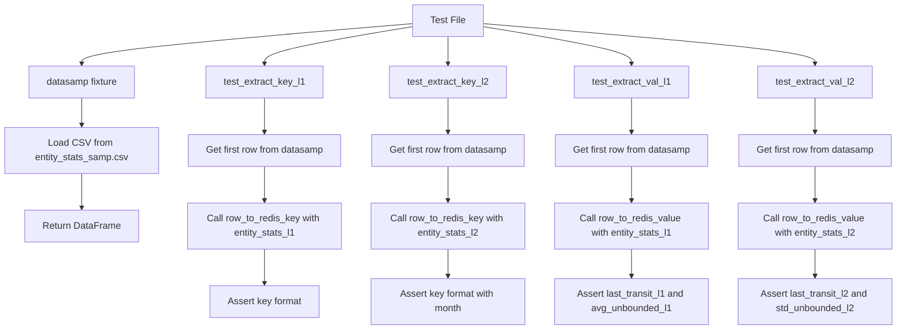
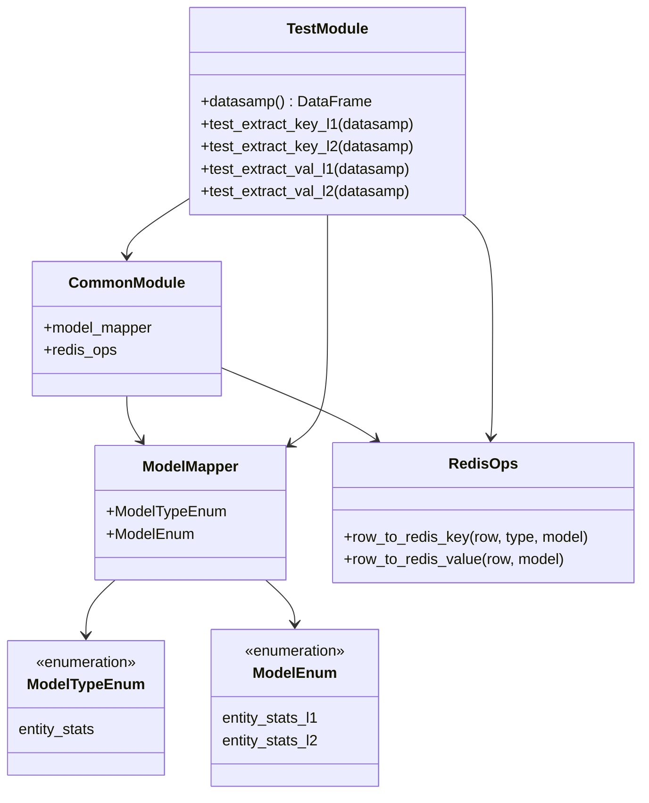
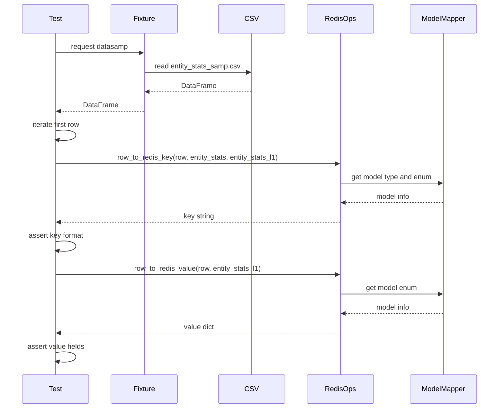

# Diagram: research/common/tests/test_redis_ops.py

> Auto-generated by Obscura crawlers

## Diagram 1

### SVG

<svg id="container" width="1516" xmlns="http://www.w3.org/2000/svg" class="flowchart" height="558" viewBox="0 0 1516 558" role="graphics-document document" aria-roledescription="flowchart-v2"><g><marker id="container_flowchart-v2-pointEnd" class="marker flowchart-v2" viewBox="0 0 10 10" refX="5" refY="5" markerUnits="userSpaceOnUse" markerWidth="8" markerHeight="8" orient="auto"><path d="M 0 0 L 10 5 L 0 10 z" class="arrowMarkerPath" style="stroke-width: 1; stroke-dasharray: 1, 0;"></path></marker><marker id="container_flowchart-v2-pointStart" class="marker flowchart-v2" viewBox="0 0 10 10" refX="4.5" refY="5" markerUnits="userSpaceOnUse" markerWidth="8" markerHeight="8" orient="auto"><path d="M 0 5 L 10 10 L 10 0 z" class="arrowMarkerPath" style="stroke-width: 1; stroke-dasharray: 1, 0;"></path></marker><marker id="container_flowchart-v2-circleEnd" class="marker flowchart-v2" viewBox="0 0 10 10" refX="11" refY="5" markerUnits="userSpaceOnUse" markerWidth="11" markerHeight="11" orient="auto"><circle cx="5" cy="5" r="5" class="arrowMarkerPath" style="stroke-width: 1; stroke-dasharray: 1, 0;"></circle></marker><marker id="container_flowchart-v2-circleStart" class="marker flowchart-v2" viewBox="0 0 10 10" refX="-1" refY="5" markerUnits="userSpaceOnUse" markerWidth="11" markerHeight="11" orient="auto"><circle cx="5" cy="5" r="5" class="arrowMarkerPath" style="stroke-width: 1; stroke-dasharray: 1, 0;"></circle></marker><marker id="container_flowchart-v2-crossEnd" class="marker cross flowchart-v2" viewBox="0 0 11 11" refX="12" refY="5.2" markerUnits="userSpaceOnUse" markerWidth="11" markerHeight="11" orient="auto"><path d="M 1,1 l 9,9 M 10,1 l -9,9" class="arrowMarkerPath" style="stroke-width: 2; stroke-dasharray: 1, 0;"></path></marker><marker id="container_flowchart-v2-crossStart" class="marker cross flowchart-v2" viewBox="0 0 11 11" refX="-1" refY="5.2" markerUnits="userSpaceOnUse" markerWidth="11" markerHeight="11" orient="auto"><path d="M 1,1 l 9,9 M 10,1 l -9,9" class="arrowMarkerPath" style="stroke-width: 2; stroke-dasharray: 1, 0;"></path></marker><g class="root"><g class="clusters"></g><g class="edgePaths"><path d="M698.625,39.98L605.188,47.817C511.75,55.653,324.875,71.327,231.438,82.663C138,94,138,101,138,104.5L138,108" id="L_A_B_0" class="edge-thickness-normal edge-pattern-solid edge-thickness-normal edge-pattern-solid flowchart-link" style=";" data-edge="true" data-et="edge" data-id="L_A_B_0" data-points="W3sieCI6Njk4LjYyNSwieSI6MzkuOTc5ODM4NzA5Njc3NDE2fSx7IngiOjEzOCwieSI6ODd9LHsieCI6MTM4LCJ5IjoxMTJ9XQ==" marker-end="url(#container_flowchart-v2-pointEnd)"></path><path d="M138,166L138,170.167C138,174.333,138,182.667,138,190.333C138,198,138,205,138,208.5L138,212" id="L_B_C_0" class="edge-thickness-normal edge-pattern-solid edge-thickness-normal edge-pattern-solid flowchart-link" style=";" data-edge="true" data-et="edge" data-id="L_B_C_0" data-points="W3sieCI6MTM4LCJ5IjoxNjZ9LHsieCI6MTM4LCJ5IjoxOTF9LHsieCI6MTM4LCJ5IjoyMTZ9XQ==" marker-end="url(#container_flowchart-v2-pointEnd)"></path><path d="M138,294L138,298.167C138,302.333,138,310.667,138,320.333C138,330,138,341,138,346.5L138,352" id="L_C_D_0" class="edge-thickness-normal edge-pattern-solid edge-thickness-normal edge-pattern-solid flowchart-link" style=";" data-edge="true" data-et="edge" data-id="L_C_D_0" data-points="W3sieCI6MTM4LCJ5IjoyOTR9LHsieCI6MTM4LCJ5IjozMTl9LHsieCI6MTM4LCJ5IjozNTZ9XQ==" marker-end="url(#container_flowchart-v2-pointEnd)"></path><path d="M698.625,44.96L656.854,51.966C615.083,58.973,531.542,72.987,489.771,83.493C448,94,448,101,448,104.5L448,108" id="L_A_E_0" class="edge-thickness-normal edge-pattern-solid edge-thickness-normal edge-pattern-solid flowchart-link" style=";" data-edge="true" data-et="edge" data-id="L_A_E_0" data-points="W3sieCI6Njk4LjYyNSwieSI6NDQuOTU5Njc3NDE5MzU0ODR9LHsieCI6NDQ4LCJ5Ijo4N30seyJ4Ijo0NDgsInkiOjExMn1d" marker-end="url(#container_flowchart-v2-pointEnd)"></path><path d="M758,62L758,66.167C758,70.333,758,78.667,758,86.333C758,94,758,101,758,104.5L758,108" id="L_A_F_0" class="edge-thickness-normal edge-pattern-solid edge-thickness-normal edge-pattern-solid flowchart-link" style=";" data-edge="true" data-et="edge" data-id="L_A_F_0" data-points="W3sieCI6NzU4LCJ5Ijo2Mn0seyJ4Ijo3NTgsInkiOjg3fSx7IngiOjc1OCwieSI6MTEyfV0=" marker-end="url(#container_flowchart-v2-pointEnd)"></path><path d="M817.375,44.96L859.146,51.966C900.917,58.973,984.458,72.987,1026.229,83.493C1068,94,1068,101,1068,104.5L1068,108" id="L_A_G_0" class="edge-thickness-normal edge-pattern-solid edge-thickness-normal edge-pattern-solid flowchart-link" style=";" data-edge="true" data-et="edge" data-id="L_A_G_0" data-points="W3sieCI6ODE3LjM3NSwieSI6NDQuOTU5Njc3NDE5MzU0ODR9LHsieCI6MTA2OCwieSI6ODd9LHsieCI6MTA2OCwieSI6MTEyfV0=" marker-end="url(#container_flowchart-v2-pointEnd)"></path><path d="M817.375,39.98L910.813,47.817C1004.25,55.653,1191.125,71.327,1284.563,82.663C1378,94,1378,101,1378,104.5L1378,108" id="L_A_H_0" class="edge-thickness-normal edge-pattern-solid edge-thickness-normal edge-pattern-solid flowchart-link" style=";" data-edge="true" data-et="edge" data-id="L_A_H_0" data-points="W3sieCI6ODE3LjM3NSwieSI6MzkuOTc5ODM4NzA5Njc3NDE2fSx7IngiOjEzNzgsInkiOjg3fSx7IngiOjEzNzgsInkiOjExMn1d" marker-end="url(#container_flowchart-v2-pointEnd)"></path><path d="M448,166L448,170.167C448,174.333,448,182.667,448,190.333C448,198,448,205,448,208.5L448,212" id="L_E_I_0" class="edge-thickness-normal edge-pattern-solid edge-thickness-normal edge-pattern-solid flowchart-link" style=";" data-edge="true" data-et="edge" data-id="L_E_I_0" data-points="W3sieCI6NDQ4LCJ5IjoxNjZ9LHsieCI6NDQ4LCJ5IjoxOTF9LHsieCI6NDQ4LCJ5IjoyMTZ9XQ==" marker-end="url(#container_flowchart-v2-pointEnd)"></path><path d="M448,294L448,298.167C448,302.333,448,310.667,448,318.333C448,326,448,333,448,336.5L448,340" id="L_I_J_0" class="edge-thickness-normal edge-pattern-solid edge-thickness-normal edge-pattern-solid flowchart-link" style=";" data-edge="true" data-et="edge" data-id="L_I_J_0" data-points="W3sieCI6NDQ4LCJ5IjoyOTR9LHsieCI6NDQ4LCJ5IjozMTl9LHsieCI6NDQ4LCJ5IjozNDR9XQ==" marker-end="url(#container_flowchart-v2-pointEnd)"></path><path d="M448,422L448,426.167C448,430.333,448,438.667,448,448.333C448,458,448,469,448,474.5L448,480" id="L_J_K_0" class="edge-thickness-normal edge-pattern-solid edge-thickness-normal edge-pattern-solid flowchart-link" style=";" data-edge="true" data-et="edge" data-id="L_J_K_0" data-points="W3sieCI6NDQ4LCJ5Ijo0MjJ9LHsieCI6NDQ4LCJ5Ijo0NDd9LHsieCI6NDQ4LCJ5Ijo0ODR9XQ==" marker-end="url(#container_flowchart-v2-pointEnd)"></path><path d="M758,166L758,170.167C758,174.333,758,182.667,758,190.333C758,198,758,205,758,208.5L758,212" id="L_F_L_0" class="edge-thickness-normal edge-pattern-solid edge-thickness-normal edge-pattern-solid flowchart-link" style=";" data-edge="true" data-et="edge" data-id="L_F_L_0" data-points="W3sieCI6NzU4LCJ5IjoxNjZ9LHsieCI6NzU4LCJ5IjoxOTF9LHsieCI6NzU4LCJ5IjoyMTZ9XQ==" marker-end="url(#container_flowchart-v2-pointEnd)"></path><path d="M758,294L758,298.167C758,302.333,758,310.667,758,318.333C758,326,758,333,758,336.5L758,340" id="L_L_M_0" class="edge-thickness-normal edge-pattern-solid edge-thickness-normal edge-pattern-solid flowchart-link" style=";" data-edge="true" data-et="edge" data-id="L_L_M_0" data-points="W3sieCI6NzU4LCJ5IjoyOTR9LHsieCI6NzU4LCJ5IjozMTl9LHsieCI6NzU4LCJ5IjozNDR9XQ==" marker-end="url(#container_flowchart-v2-pointEnd)"></path><path d="M758,422L758,426.167C758,430.333,758,438.667,758,446.333C758,454,758,461,758,464.5L758,468" id="L_M_N_0" class="edge-thickness-normal edge-pattern-solid edge-thickness-normal edge-pattern-solid flowchart-link" style=";" data-edge="true" data-et="edge" data-id="L_M_N_0" data-points="W3sieCI6NzU4LCJ5Ijo0MjJ9LHsieCI6NzU4LCJ5Ijo0NDd9LHsieCI6NzU4LCJ5Ijo0NzJ9XQ==" marker-end="url(#container_flowchart-v2-pointEnd)"></path><path d="M1068,166L1068,170.167C1068,174.333,1068,182.667,1068,190.333C1068,198,1068,205,1068,208.5L1068,212" id="L_G_O_0" class="edge-thickness-normal edge-pattern-solid edge-thickness-normal edge-pattern-solid flowchart-link" style=";" data-edge="true" data-et="edge" data-id="L_G_O_0" data-points="W3sieCI6MTA2OCwieSI6MTY2fSx7IngiOjEwNjgsInkiOjE5MX0seyJ4IjoxMDY4LCJ5IjoyMTZ9XQ==" marker-end="url(#container_flowchart-v2-pointEnd)"></path><path d="M1068,294L1068,298.167C1068,302.333,1068,310.667,1068,318.333C1068,326,1068,333,1068,336.5L1068,340" id="L_O_P_0" class="edge-thickness-normal edge-pattern-solid edge-thickness-normal edge-pattern-solid flowchart-link" style=";" data-edge="true" data-et="edge" data-id="L_O_P_0" data-points="W3sieCI6MTA2OCwieSI6Mjk0fSx7IngiOjEwNjgsInkiOjMxOX0seyJ4IjoxMDY4LCJ5IjozNDR9XQ==" marker-end="url(#container_flowchart-v2-pointEnd)"></path><path d="M1068,422L1068,426.167C1068,430.333,1068,438.667,1068,446.333C1068,454,1068,461,1068,464.5L1068,468" id="L_P_Q_0" class="edge-thickness-normal edge-pattern-solid edge-thickness-normal edge-pattern-solid flowchart-link" style=";" data-edge="true" data-et="edge" data-id="L_P_Q_0" data-points="W3sieCI6MTA2OCwieSI6NDIyfSx7IngiOjEwNjgsInkiOjQ0N30seyJ4IjoxMDY4LCJ5Ijo0NzJ9XQ==" marker-end="url(#container_flowchart-v2-pointEnd)"></path><path d="M1378,166L1378,170.167C1378,174.333,1378,182.667,1378,190.333C1378,198,1378,205,1378,208.5L1378,212" id="L_H_R_0" class="edge-thickness-normal edge-pattern-solid edge-thickness-normal edge-pattern-solid flowchart-link" style=";" data-edge="true" data-et="edge" data-id="L_H_R_0" data-points="W3sieCI6MTM3OCwieSI6MTY2fSx7IngiOjEzNzgsInkiOjE5MX0seyJ4IjoxMzc4LCJ5IjoyMTZ9XQ==" marker-end="url(#container_flowchart-v2-pointEnd)"></path><path d="M1378,294L1378,298.167C1378,302.333,1378,310.667,1378,318.333C1378,326,1378,333,1378,336.5L1378,340" id="L_R_S_0" class="edge-thickness-normal edge-pattern-solid edge-thickness-normal edge-pattern-solid flowchart-link" style=";" data-edge="true" data-et="edge" data-id="L_R_S_0" data-points="W3sieCI6MTM3OCwieSI6Mjk0fSx7IngiOjEzNzgsInkiOjMxOX0seyJ4IjoxMzc4LCJ5IjozNDR9XQ==" marker-end="url(#container_flowchart-v2-pointEnd)"></path><path d="M1378,422L1378,426.167C1378,430.333,1378,438.667,1378,446.333C1378,454,1378,461,1378,464.5L1378,468" id="L_S_T_0" class="edge-thickness-normal edge-pattern-solid edge-thickness-normal edge-pattern-solid flowchart-link" style=";" data-edge="true" data-et="edge" data-id="L_S_T_0" data-points="W3sieCI6MTM3OCwieSI6NDIyfSx7IngiOjEzNzgsInkiOjQ0N30seyJ4IjoxMzc4LCJ5Ijo0NzJ9XQ==" marker-end="url(#container_flowchart-v2-pointEnd)"></path></g><g class="edgeLabels"><g class="edgeLabel"><g class="label" data-id="L_A_B_0" transform="translate(0, 0)"><foreignObject width="0" height="0">

</foreignObject></g></g><g class="edgeLabel"><g class="label" data-id="L_B_C_0" transform="translate(0, 0)"><foreignObject width="0" height="0">

</foreignObject></g></g><g class="edgeLabel"><g class="label" data-id="L_C_D_0" transform="translate(0, 0)"><foreignObject width="0" height="0">

</foreignObject></g></g><g class="edgeLabel"><g class="label" data-id="L_A_E_0" transform="translate(0, 0)"><foreignObject width="0" height="0">

</foreignObject></g></g><g class="edgeLabel"><g class="label" data-id="L_A_F_0" transform="translate(0, 0)"><foreignObject width="0" height="0">

</foreignObject></g></g><g class="edgeLabel"><g class="label" data-id="L_A_G_0" transform="translate(0, 0)"><foreignObject width="0" height="0">

</foreignObject></g></g><g class="edgeLabel"><g class="label" data-id="L_A_H_0" transform="translate(0, 0)"><foreignObject width="0" height="0">

</foreignObject></g></g><g class="edgeLabel"><g class="label" data-id="L_E_I_0" transform="translate(0, 0)"><foreignObject width="0" height="0">

</foreignObject></g></g><g class="edgeLabel"><g class="label" data-id="L_I_J_0" transform="translate(0, 0)"><foreignObject width="0" height="0">

</foreignObject></g></g><g class="edgeLabel"><g class="label" data-id="L_J_K_0" transform="translate(0, 0)"><foreignObject width="0" height="0">

</foreignObject></g></g><g class="edgeLabel"><g class="label" data-id="L_F_L_0" transform="translate(0, 0)"><foreignObject width="0" height="0">

</foreignObject></g></g><g class="edgeLabel"><g class="label" data-id="L_L_M_0" transform="translate(0, 0)"><foreignObject width="0" height="0">

</foreignObject></g></g><g class="edgeLabel"><g class="label" data-id="L_M_N_0" transform="translate(0, 0)"><foreignObject width="0" height="0">

</foreignObject></g></g><g class="edgeLabel"><g class="label" data-id="L_G_O_0" transform="translate(0, 0)"><foreignObject width="0" height="0">

</foreignObject></g></g><g class="edgeLabel"><g class="label" data-id="L_O_P_0" transform="translate(0, 0)"><foreignObject width="0" height="0">

</foreignObject></g></g><g class="edgeLabel"><g class="label" data-id="L_P_Q_0" transform="translate(0, 0)"><foreignObject width="0" height="0">

</foreignObject></g></g><g class="edgeLabel"><g class="label" data-id="L_H_R_0" transform="translate(0, 0)"><foreignObject width="0" height="0">

</foreignObject></g></g><g class="edgeLabel"><g class="label" data-id="L_R_S_0" transform="translate(0, 0)"><foreignObject width="0" height="0">

</foreignObject></g></g><g class="edgeLabel"><g class="label" data-id="L_S_T_0" transform="translate(0, 0)"><foreignObject width="0" height="0">

</foreignObject></g></g></g><g class="nodes"><g class="node default" id="flowchart-A-0" transform="translate(758, 35)"><rect class="basic label-container" style="" x="-59.375" y="-27" width="118.75" height="54"></rect><g class="label" style="" transform="translate(-29.375, -12)"><rect></rect><foreignObject width="58.75" height="24">

Test File

</foreignObject></g></g><g class="node default" id="flowchart-B-1" transform="translate(138, 139)"><rect class="basic label-container" style="" x="-91.2109375" y="-27" width="182.421875" height="54"></rect><g class="label" style="" transform="translate(-61.2109375, -12)"><rect></rect><foreignObject width="122.421875" height="24">

datasamp fixture

</foreignObject></g></g><g class="node default" id="flowchart-C-3" transform="translate(138, 255)"><rect class="basic label-container" style="" x="-130" y="-39" width="260" height="78"></rect><g class="label" style="" transform="translate(-100, -24)"><rect></rect><foreignObject width="200" height="48">

Load CSV from entity_stats_samp.csv

</foreignObject></g></g><g class="node default" id="flowchart-D-5" transform="translate(138, 383)"><rect class="basic label-container" style="" x="-95.15625" y="-27" width="190.3125" height="54"></rect><g class="label" style="" transform="translate(-65.15625, -12)"><rect></rect><foreignObject width="130.3125" height="24">

Return DataFrame

</foreignObject></g></g><g class="node default" id="flowchart-E-7" transform="translate(448, 139)"><rect class="basic label-container" style="" x="-98.5859375" y="-27" width="197.171875" height="54"></rect><g class="label" style="" transform="translate(-68.5859375, -12)"><rect></rect><foreignObject width="137.171875" height="24">

test_extract_key_l1

</foreignObject></g></g><g class="node default" id="flowchart-F-9" transform="translate(758, 139)"><rect class="basic label-container" style="" x="-99.2734375" y="-27" width="198.546875" height="54"></rect><g class="label" style="" transform="translate(-69.2734375, -12)"><rect></rect><foreignObject width="138.546875" height="24">

test_extract_key_l2

</foreignObject></g></g><g class="node default" id="flowchart-G-11" transform="translate(1068, 139)"><rect class="basic label-container" style="" x="-96.7265625" y="-27" width="193.453125" height="54"></rect><g class="label" style="" transform="translate(-66.7265625, -12)"><rect></rect><foreignObject width="133.453125" height="24">

test_extract_val_l1

</foreignObject></g></g><g class="node default" id="flowchart-H-13" transform="translate(1378, 139)"><rect class="basic label-container" style="" x="-97.4140625" y="-27" width="194.828125" height="54"></rect><g class="label" style="" transform="translate(-67.4140625, -12)"><rect></rect><foreignObject width="134.828125" height="24">

test_extract_val_l2

</foreignObject></g></g><g class="node default" id="flowchart-I-15" transform="translate(448, 255)"><rect class="basic label-container" style="" x="-130" y="-39" width="260" height="78"></rect><g class="label" style="" transform="translate(-100, -24)"><rect></rect><foreignObject width="200" height="48">

Get first row from datasamp

</foreignObject></g></g><g class="node default" id="flowchart-J-17" transform="translate(448, 383)"><rect class="basic label-container" style="" x="-130" y="-39" width="260" height="78"></rect><g class="label" style="" transform="translate(-100, -24)"><rect></rect><foreignObject width="200" height="48">

Call row_to_redis_key with entity_stats_l1

</foreignObject></g></g><g class="node default" id="flowchart-K-19" transform="translate(448, 511)"><rect class="basic label-container" style="" x="-93.296875" y="-27" width="186.59375" height="54"></rect><g class="label" style="" transform="translate(-63.296875, -12)"><rect></rect><foreignObject width="126.59375" height="24">

Assert key format

</foreignObject></g></g><g class="node default" id="flowchart-L-21" transform="translate(758, 255)"><rect class="basic label-container" style="" x="-130" y="-39" width="260" height="78"></rect><g class="label" style="" transform="translate(-100, -24)"><rect></rect><foreignObject width="200" height="48">

Get first row from datasamp

</foreignObject></g></g><g class="node default" id="flowchart-M-23" transform="translate(758, 383)"><rect class="basic label-container" style="" x="-130" y="-39" width="260" height="78"></rect><g class="label" style="" transform="translate(-100, -24)"><rect></rect><foreignObject width="200" height="48">

Call row_to_redis_key with entity_stats_l2

</foreignObject></g></g><g class="node default" id="flowchart-N-25" transform="translate(758, 511)"><rect class="basic label-container" style="" x="-130" y="-39" width="260" height="78"></rect><g class="label" style="" transform="translate(-100, -24)"><rect></rect><foreignObject width="200" height="48">

Assert key format with month

</foreignObject></g></g><g class="node default" id="flowchart-O-27" transform="translate(1068, 255)"><rect class="basic label-container" style="" x="-130" y="-39" width="260" height="78"></rect><g class="label" style="" transform="translate(-100, -24)"><rect></rect><foreignObject width="200" height="48">

Get first row from datasamp

</foreignObject></g></g><g class="node default" id="flowchart-P-29" transform="translate(1068, 383)"><rect class="basic label-container" style="" x="-130" y="-39" width="260" height="78"></rect><g class="label" style="" transform="translate(-100, -24)"><rect></rect><foreignObject width="200" height="48">

Call row_to_redis_value with entity_stats_l1

</foreignObject></g></g><g class="node default" id="flowchart-Q-31" transform="translate(1068, 511)"><rect class="basic label-container" style="" x="-130" y="-39" width="260" height="78"></rect><g class="label" style="" transform="translate(-100, -24)"><rect></rect><foreignObject width="200" height="48">

Assert last_transit_l1 and avg_unbounded_l1

</foreignObject></g></g><g class="node default" id="flowchart-R-33" transform="translate(1378, 255)"><rect class="basic label-container" style="" x="-130" y="-39" width="260" height="78"></rect><g class="label" style="" transform="translate(-100, -24)"><rect></rect><foreignObject width="200" height="48">

Get first row from datasamp

</foreignObject></g></g><g class="node default" id="flowchart-S-35" transform="translate(1378, 383)"><rect class="basic label-container" style="" x="-130" y="-39" width="260" height="78"></rect><g class="label" style="" transform="translate(-100, -24)"><rect></rect><foreignObject width="200" height="48">

Call row_to_redis_value with entity_stats_l2

</foreignObject></g></g><g class="node default" id="flowchart-T-37" transform="translate(1378, 511)"><rect class="basic label-container" style="" x="-130" y="-39" width="260" height="78"></rect><g class="label" style="" transform="translate(-100, -24)"><rect></rect><foreignObject width="200" height="48">

Assert last_transit_l2 and std_unbounded_l2

</foreignObject></g></g></g></g></g></svg>

## Diagram 2

### SVG

<svg id="container" width="687.033203125" xmlns="http://www.w3.org/2000/svg" class="classDiagram" height="850" viewBox="0 0 687.033203125 850" role="graphics-document document" aria-roledescription="class"><g><defs><marker id="container_class-aggregationStart" class="marker aggregation class" refX="18" refY="7" markerWidth="190" markerHeight="240" orient="auto"><path d="M 18,7 L9,13 L1,7 L9,1 Z"></path></marker></defs><defs><marker id="container_class-aggregationEnd" class="marker aggregation class" refX="1" refY="7" markerWidth="20" markerHeight="28" orient="auto"><path d="M 18,7 L9,13 L1,7 L9,1 Z"></path></marker></defs><defs><marker id="container_class-extensionStart" class="marker extension class" refX="18" refY="7" markerWidth="190" markerHeight="240" orient="auto"><path d="M 1,7 L18,13 V 1 Z"></path></marker></defs><defs><marker id="container_class-extensionEnd" class="marker extension class" refX="1" refY="7" markerWidth="20" markerHeight="28" orient="auto"><path d="M 1,1 V 13 L18,7 Z"></path></marker></defs><defs><marker id="container_class-compositionStart" class="marker composition class" refX="18" refY="7" markerWidth="190" markerHeight="240" orient="auto"><path d="M 18,7 L9,13 L1,7 L9,1 Z"></path></marker></defs><defs><marker id="container_class-compositionEnd" class="marker composition class" refX="1" refY="7" markerWidth="20" markerHeight="28" orient="auto"><path d="M 18,7 L9,13 L1,7 L9,1 Z"></path></marker></defs><defs><marker id="container_class-dependencyStart" class="marker dependency class" refX="6" refY="7" markerWidth="190" markerHeight="240" orient="auto"><path d="M 5,7 L9,13 L1,7 L9,1 Z"></path></marker></defs><defs><marker id="container_class-dependencyEnd" class="marker dependency class" refX="13" refY="7" markerWidth="20" markerHeight="28" orient="auto"><path d="M 18,7 L9,13 L14,7 L9,1 Z"></path></marker></defs><defs><marker id="container_class-lollipopStart" class="marker lollipop class" refX="13" refY="7" markerWidth="190" markerHeight="240" orient="auto"><circle stroke="black" fill="transparent" cx="7" cy="7" r="6"></circle></marker></defs><defs><marker id="container_class-lollipopEnd" class="marker lollipop class" refX="1" refY="7" markerWidth="190" markerHeight="240" orient="auto"><circle stroke="black" fill="transparent" cx="7" cy="7" r="6"></circle></marker></defs><g class="root"><g class="clusters"></g><g class="edgePaths"><path d="M204.434,212.734L193.353,219.778C182.273,226.822,160.112,240.911,149.032,251.122C137.951,261.333,137.951,267.667,137.951,270.833L137.951,274" id="id_TestModule_CommonModule_1" class="edge-thickness-normal edge-pattern-solid relation" style=";;;" data-edge="true" data-et="edge" data-id="id_TestModule_CommonModule_1" data-points="W3sieCI6MjA0LjQzMzU5Mzc1LCJ5IjoyMTIuNzMzNjcyOTc1NjEzMzN9LHsieCI6MTM3Ljk1MTE3MTg3NSwieSI6MjU1fSx7IngiOjEzNy45NTExNzE4NzUsInkiOjI4MH1d" marker-end="url(#container_class-dependencyEnd)"></path><path d="M137.951,424L137.951,428.167C137.951,432.333,137.951,440.667,140.559,448.673C143.166,456.679,148.382,464.358,150.989,468.197L153.597,472.037" id="id_CommonModule_ModelMapper_2" class="edge-thickness-normal edge-pattern-solid relation" style=";;;" data-edge="true" data-et="edge" data-id="id_CommonModule_ModelMapper_2" data-points="W3sieCI6MTM3Ljk1MTE3MTg3NSwieSI6NDI0fSx7IngiOjEzNy45NTExNzE4NzUsInkiOjQ0OX0seyJ4IjoxNTYuOTY4MjAzMTI1LCJ5Ijo0Nzd9XQ==" marker-end="url(#container_class-dependencyEnd)"></path><path d="M238.787,393.814L260.968,403.012C283.148,412.209,327.51,430.605,354.949,443.404C382.388,456.203,392.905,463.406,398.163,467.008L403.421,470.609" id="id_CommonModule_RedisOps_3" class="edge-thickness-normal edge-pattern-solid relation" style=";;;" data-edge="true" data-et="edge" data-id="id_CommonModule_RedisOps_3" data-points="W3sieCI6MjM4Ljc4NzEwOTM3NSwieSI6MzkzLjgxMzgyMTgzNzQwMDk1fSx7IngiOjM3MS44NzEwOTM3NSwieSI6NDQ5fSx7IngiOjQwOC4zNzE1ODIwMzEyNSwieSI6NDc0fV0=" marker-end="url(#container_class-dependencyEnd)"></path><path d="M124.193,621L118.899,625.667C113.605,630.333,103.017,639.667,97.724,649.5C92.43,659.333,92.43,669.667,92.43,674.833L92.43,680" id="id_ModelMapper_ModelTypeEnum_4" class="edge-thickness-normal edge-pattern-solid relation" style=";;;" data-edge="true" data-et="edge" data-id="id_ModelMapper_ModelTypeEnum_4" data-points="W3sieCI6MTI0LjE5MjczNDM3NSwieSI6NjIxfSx7IngiOjkyLjQyOTY4NzUsInkiOjY0OX0seyJ4Ijo5Mi40Mjk2ODc1LCJ5Ijo2ODZ9XQ==" marker-end="url(#container_class-dependencyEnd)"></path><path d="M287.546,621L292.839,625.667C298.133,630.333,308.721,639.667,314.015,647.5C319.309,655.333,319.309,661.667,319.309,664.833L319.309,668" id="id_ModelMapper_ModelEnum_5" class="edge-thickness-normal edge-pattern-solid relation" style=";;;" data-edge="true" data-et="edge" data-id="id_ModelMapper_ModelEnum_5" data-points="W3sieCI6Mjg3LjU0NTU0Njg3NSwieSI6NjIxfSx7IngiOjMxOS4zMDg1OTM3NSwieSI6NjQ5fSx7IngiOjMxOS4zMDg1OTM3NSwieSI6Njc0fV0=" marker-end="url(#container_class-dependencyEnd)"></path><path d="M495.52,230L500.912,234.167C506.304,238.333,517.089,246.667,522.481,267C527.873,287.333,527.873,319.667,527.873,352C527.873,384.333,527.873,416.667,527.556,436.005C527.239,455.343,526.604,461.687,526.287,464.858L525.97,468.03" id="id_TestModule_RedisOps_6" class="edge-thickness-normal edge-pattern-solid relation" style=";;;" data-edge="true" data-et="edge" data-id="id_TestModule_RedisOps_6" data-points="W3sieCI6NDk1LjUxOTc0NjY2ODE5ODU0LCJ5IjoyMzB9LHsieCI6NTI3Ljg3MzA0Njg3NSwieSI6MjU1fSx7IngiOjUyNy44NzMwNDY4NzUsInkiOjM1Mn0seyJ4Ijo1MjcuODczMDQ2ODc1LCJ5Ijo0NDl9LHsieCI6NTI1LjM3MzA0Njg3NSwieSI6NDc0fV0=" marker-end="url(#container_class-dependencyEnd)"></path><path d="M351.871,230L351.871,234.167C351.871,238.333,351.871,246.667,351.871,267C351.871,287.333,351.871,319.667,351.871,352C351.871,384.333,351.871,416.667,345.17,437.423C338.468,458.18,325.066,467.36,318.364,471.949L311.663,476.539" id="id_TestModule_ModelMapper_7" class="edge-thickness-normal edge-pattern-solid relation" style=";;;" data-edge="true" data-et="edge" data-id="id_TestModule_ModelMapper_7" data-points="W3sieCI6MzUxLjg3MTA5Mzc1LCJ5IjoyMzB9LHsieCI6MzUxLjg3MTA5Mzc1LCJ5IjoyNTV9LHsieCI6MzUxLjg3MTA5Mzc1LCJ5IjozNTJ9LHsieCI6MzUxLjg3MTA5Mzc1LCJ5Ijo0NDl9LHsieCI6MzA2LjcxMjg5MDYyNSwieSI6NDc5LjkyOTg2MjM0NjY2MTd9XQ==" marker-end="url(#container_class-dependencyEnd)"></path></g><g class="edgeLabels"><g class="edgeLabel"><g class="label" data-id="id_TestModule_CommonModule_1" transform="translate(0, 0)"><foreignObject width="0" height="0">

</foreignObject></g></g><g class="edgeLabel"><g class="label" data-id="id_CommonModule_ModelMapper_2" transform="translate(0, 0)"><foreignObject width="0" height="0">

</foreignObject></g></g><g class="edgeLabel"><g class="label" data-id="id_CommonModule_RedisOps_3" transform="translate(0, 0)"><foreignObject width="0" height="0">

</foreignObject></g></g><g class="edgeLabel"><g class="label" data-id="id_ModelMapper_ModelTypeEnum_4" transform="translate(0, 0)"><foreignObject width="0" height="0">

</foreignObject></g></g><g class="edgeLabel"><g class="label" data-id="id_ModelMapper_ModelEnum_5" transform="translate(0, 0)"><foreignObject width="0" height="0">

</foreignObject></g></g><g class="edgeLabel"><g class="label" data-id="id_TestModule_RedisOps_6" transform="translate(0, 0)"><foreignObject width="0" height="0">

</foreignObject></g></g><g class="edgeLabel"><g class="label" data-id="id_TestModule_ModelMapper_7" transform="translate(0, 0)"><foreignObject width="0" height="0">

</foreignObject></g></g></g><g class="nodes"><g class="node default" id="classId-TestModule-0" transform="translate(351.87109375, 119)"><g class="basic label-container"><path d="M-147.4375 -111 L147.4375 -111 L147.4375 111 L-147.4375 111" stroke="none" stroke-width="0" fill="#ECECFF" style=""></path><path d="M-147.4375 -111 C-65.35901973374604 -111, 16.719460532507924 -111, 147.4375 -111 M-147.4375 -111 C-46.08583712734102 -111, 55.265825745317954 -111, 147.4375 -111 M147.4375 -111 C147.4375 -40.986428876165974, 147.4375 29.027142247668053, 147.4375 111 M147.4375 -111 C147.4375 -35.17237753013967, 147.4375 40.65524493972066, 147.4375 111 M147.4375 111 C75.12286590018257 111, 2.8082318003651494 111, -147.4375 111 M147.4375 111 C80.3277156826141 111, 13.217931365228196 111, -147.4375 111 M-147.4375 111 C-147.4375 29.179531384888392, -147.4375 -52.640937230223216, -147.4375 -111 M-147.4375 111 C-147.4375 45.444019435216845, -147.4375 -20.11196112956631, -147.4375 -111" stroke="#9370DB" stroke-width="1.3" fill="none" stroke-dasharray="0 0" style=""></path></g><g class="annotation-group text" transform="translate(0, -87)"></g><g class="label-group text" transform="translate(-42.34375, -87)"><g class="label" style="font-weight: bolder" transform="translate(0,-12)"><foreignObject width="84.6875" height="24">

TestModule

</foreignObject></g></g><g class="members-group text" transform="translate(-135.4375, -39)"></g><g class="methods-group text" transform="translate(-135.4375, -9)"><g class="label" style="" transform="translate(0,-12)"><foreignObject width="179.65625" height="24">

+datasamp() : DataFrame

</foreignObject></g><g class="label" style="" transform="translate(0,12)"><foreignObject width="227.15625" height="24">

+test_extract_key_l1(datasamp)

</foreignObject></g><g class="label" style="" transform="translate(0,36)"><foreignObject width="228.53125" height="24">

+test_extract_key_l2(datasamp)

</foreignObject></g><g class="label" style="" transform="translate(0,60)"><foreignObject width="223.4375" height="24">

+test_extract_val_l1(datasamp)

</foreignObject></g><g class="label" style="" transform="translate(0,84)"><foreignObject width="224.8125" height="24">

+test_extract_val_l2(datasamp)

</foreignObject></g></g><g class="divider" style=""><path d="M-147.4375 -63 C-56.997333781637394 -63, 33.44283243672521 -63, 147.4375 -63 M-147.4375 -63 C-83.73252254329797 -63, -20.02754508659595 -63, 147.4375 -63" stroke="#9370DB" stroke-width="1.3" fill="none" stroke-dasharray="0 0" style=""></path></g><g class="divider" style=""><path d="M-147.4375 -39 C-85.6463963412246 -39, -23.85529268244919 -39, 147.4375 -39 M-147.4375 -39 C-45.52806759935288 -39, 56.38136480129424 -39, 147.4375 -39" stroke="#9370DB" stroke-width="1.3" fill="none" stroke-dasharray="0 0" style=""></path></g></g><g class="node default" id="classId-CommonModule-1" transform="translate(137.951171875, 352)"><g class="basic label-container"><path d="M-100.8359375 -72 L100.8359375 -72 L100.8359375 72 L-100.8359375 72" stroke="none" stroke-width="0" fill="#ECECFF" style=""></path><path d="M-100.8359375 -72 C-36.093890145376534 -72, 28.648157209246932 -72, 100.8359375 -72 M-100.8359375 -72 C-27.18391851049587 -72, 46.46810047900826 -72, 100.8359375 -72 M100.8359375 -72 C100.8359375 -32.2552392942437, 100.8359375 7.489521411512598, 100.8359375 72 M100.8359375 -72 C100.8359375 -39.515937964294274, 100.8359375 -7.031875928588548, 100.8359375 72 M100.8359375 72 C53.49642768821698 72, 6.156917876433965 72, -100.8359375 72 M100.8359375 72 C49.806074366070945 72, -1.2237887678581103 72, -100.8359375 72 M-100.8359375 72 C-100.8359375 35.288620456847994, -100.8359375 -1.422759086304012, -100.8359375 -72 M-100.8359375 72 C-100.8359375 33.2705310286368, -100.8359375 -5.4589379427263935, -100.8359375 -72" stroke="#9370DB" stroke-width="1.3" fill="none" stroke-dasharray="0 0" style=""></path></g><g class="annotation-group text" transform="translate(0, -48)"></g><g class="label-group text" transform="translate(-59.015625, -48)"><g class="label" style="font-weight: bolder" transform="translate(0,-12)"><foreignObject width="118.03125" height="24">

CommonModule

</foreignObject></g></g><g class="members-group text" transform="translate(-88.8359375, 0)"><g class="label" style="" transform="translate(0,-12)"><foreignObject width="118.65625" height="24">

+model_mapper

</foreignObject></g><g class="label" style="" transform="translate(0,12)"><foreignObject width="77.953125" height="24">

+redis_ops

</foreignObject></g></g><g class="methods-group text" transform="translate(-88.8359375, 72)"></g><g class="divider" style=""><path d="M-100.8359375 -24 C-54.399771366249844 -24, -7.963605232499688 -24, 100.8359375 -24 M-100.8359375 -24 C-43.19806128989876 -24, 14.43981492020248 -24, 100.8359375 -24" stroke="#9370DB" stroke-width="1.3" fill="none" stroke-dasharray="0 0" style=""></path></g><g class="divider" style=""><path d="M-100.8359375 48 C-28.679578219183355 48, 43.47678106163329 48, 100.8359375 48 M-100.8359375 48 C-33.94742902921986 48, 32.94107944156028 48, 100.8359375 48" stroke="#9370DB" stroke-width="1.3" fill="none" stroke-dasharray="0 0" style=""></path></g></g><g class="node default" id="classId-ModelMapper-2" transform="translate(205.869140625, 549)"><g class="basic label-container"><path d="M-100.84375 -72 L100.84375 -72 L100.84375 72 L-100.84375 72" stroke="none" stroke-width="0" fill="#ECECFF" style=""></path><path d="M-100.84375 -72 C-53.87195230834628 -72, -6.900154616692561 -72, 100.84375 -72 M-100.84375 -72 C-36.290820336585114 -72, 28.262109326829773 -72, 100.84375 -72 M100.84375 -72 C100.84375 -36.02471988377617, 100.84375 -0.04943976755234303, 100.84375 72 M100.84375 -72 C100.84375 -41.865526866484146, 100.84375 -11.731053732968284, 100.84375 72 M100.84375 72 C33.56658020421442 72, -33.710589591571164 72, -100.84375 72 M100.84375 72 C39.755448900536614 72, -21.332852198926773 72, -100.84375 72 M-100.84375 72 C-100.84375 23.426527816404516, -100.84375 -25.14694436719097, -100.84375 -72 M-100.84375 72 C-100.84375 28.853074091456726, -100.84375 -14.293851817086548, -100.84375 -72" stroke="#9370DB" stroke-width="1.3" fill="none" stroke-dasharray="0 0" style=""></path></g><g class="annotation-group text" transform="translate(0, -48)"></g><g class="label-group text" transform="translate(-50.40625, -48)"><g class="label" style="font-weight: bolder" transform="translate(0,-12)"><foreignObject width="100.8125" height="24">

ModelMapper

</foreignObject></g></g><g class="members-group text" transform="translate(-88.84375, 0)"><g class="label" style="" transform="translate(0,-12)"><foreignObject width="127.28125" height="24">

+ModelTypeEnum

</foreignObject></g><g class="label" style="" transform="translate(0,12)"><foreignObject width="93.5625" height="24">

+ModelEnum

</foreignObject></g></g><g class="methods-group text" transform="translate(-88.84375, 72)"></g><g class="divider" style=""><path d="M-100.84375 -24 C-33.23598422755535 -24, 34.3717815448893 -24, 100.84375 -24 M-100.84375 -24 C-43.530921935238624 -24, 13.781906129522753 -24, 100.84375 -24" stroke="#9370DB" stroke-width="1.3" fill="none" stroke-dasharray="0 0" style=""></path></g><g class="divider" style=""><path d="M-100.84375 48 C-57.616880269396546 48, -14.390010538793092 48, 100.84375 48 M-100.84375 48 C-29.978102328684926 48, 40.88754534263015 48, 100.84375 48" stroke="#9370DB" stroke-width="1.3" fill="none" stroke-dasharray="0 0" style=""></path></g></g><g class="node default" id="classId-RedisOps-3" transform="translate(517.873046875, 549)"><g class="basic label-container"><path d="M-161.16015625 -75 L161.16015625 -75 L161.16015625 75 L-161.16015625 75" stroke="none" stroke-width="0" fill="#ECECFF" style=""></path><path d="M-161.16015625 -75 C-94.10950180981342 -75, -27.058847369626847 -75, 161.16015625 -75 M-161.16015625 -75 C-87.93926462259398 -75, -14.718372995187963 -75, 161.16015625 -75 M161.16015625 -75 C161.16015625 -25.70481997839901, 161.16015625 23.590360043201983, 161.16015625 75 M161.16015625 -75 C161.16015625 -34.27082598510572, 161.16015625 6.458348029788553, 161.16015625 75 M161.16015625 75 C94.51283959627074 75, 27.865522942541475 75, -161.16015625 75 M161.16015625 75 C72.00325512386023 75, -17.153646002279544 75, -161.16015625 75 M-161.16015625 75 C-161.16015625 42.31009281697957, -161.16015625 9.620185633959139, -161.16015625 -75 M-161.16015625 75 C-161.16015625 20.00353629704572, -161.16015625 -34.99292740590856, -161.16015625 -75" stroke="#9370DB" stroke-width="1.3" fill="none" stroke-dasharray="0 0" style=""></path></g><g class="annotation-group text" transform="translate(0, -51)"></g><g class="label-group text" transform="translate(-34.3203125, -51)"><g class="label" style="font-weight: bolder" transform="translate(0,-12)"><foreignObject width="68.640625" height="24">

RedisOps

</foreignObject></g></g><g class="members-group text" transform="translate(-149.16015625, -3)"></g><g class="methods-group text" transform="translate(-149.16015625, 27)"><g class="label" style="" transform="translate(0,-12)"><foreignObject width="264" height="24">

+row_to_redis_key(row, type, model)

</foreignObject></g><g class="label" style="" transform="translate(0,12)"><foreignObject width="238.109375" height="24">

+row_to_redis_value(row, model)

</foreignObject></g></g><g class="divider" style=""><path d="M-161.16015625 -27 C-50.77817654898993 -27, 59.603803152020134 -27, 161.16015625 -27 M-161.16015625 -27 C-41.68899327702837 -27, 77.78216969594325 -27, 161.16015625 -27" stroke="#9370DB" stroke-width="1.3" fill="none" stroke-dasharray="0 0" style=""></path></g><g class="divider" style=""><path d="M-161.16015625 -3 C-57.333302034453396 -3, 46.49355218109321 -3, 161.16015625 -3 M-161.16015625 -3 C-85.95745053736547 -3, -10.754744824730949 -3, 161.16015625 -3" stroke="#9370DB" stroke-width="1.3" fill="none" stroke-dasharray="0 0" style=""></path></g></g><g class="node default" id="classId-ModelTypeEnum-4" transform="translate(92.4296875, 758)"><g class="basic label-container"><path d="M-84.4296875 -72 L84.4296875 -72 L84.4296875 72 L-84.4296875 72" stroke="none" stroke-width="0" fill="#ECECFF" style=""></path><path d="M-84.4296875 -72 C-49.766085581922205 -72, -15.10248366384441 -72, 84.4296875 -72 M-84.4296875 -72 C-28.09244557733288 -72, 28.244796345334237 -72, 84.4296875 -72 M84.4296875 -72 C84.4296875 -19.453977709991015, 84.4296875 33.09204458001797, 84.4296875 72 M84.4296875 -72 C84.4296875 -19.546939433782917, 84.4296875 32.906121132434166, 84.4296875 72 M84.4296875 72 C38.382607502046284 72, -7.664472495907432 72, -84.4296875 72 M84.4296875 72 C44.07966410154466 72, 3.7296407030893164 72, -84.4296875 72 M-84.4296875 72 C-84.4296875 25.947014141961787, -84.4296875 -20.105971716076425, -84.4296875 -72 M-84.4296875 72 C-84.4296875 42.50488422004926, -84.4296875 13.009768440098519, -84.4296875 -72" stroke="#9370DB" stroke-width="1.3" fill="none" stroke-dasharray="0 0" style=""></path></g><g class="annotation-group text" transform="translate(-55.5546875, -48)"><g class="label" style="" transform="translate(0,-12)"><foreignObject width="111.109375" height="24">

«enumeration»

</foreignObject></g></g><g class="label-group text" transform="translate(-59.96875, -24)"><g class="label" style="font-weight: bolder" transform="translate(0,-12)"><foreignObject width="119.9375" height="24">

ModelTypeEnum

</foreignObject></g></g><g class="members-group text" transform="translate(-72.4296875, 24)"><g class="label" style="" transform="translate(0,-12)"><foreignObject width="84.890625" height="24">

entity_stats

</foreignObject></g></g><g class="methods-group text" transform="translate(-72.4296875, 72)"></g><g class="divider" style=""><path d="M-84.4296875 0 C-46.05059753888505 0, -7.6715075777701 0, 84.4296875 0 M-84.4296875 0 C-31.50651967415571 0, 21.416648151688577 0, 84.4296875 0" stroke="#9370DB" stroke-width="1.3" fill="none" stroke-dasharray="0 0" style=""></path></g><g class="divider" style=""><path d="M-84.4296875 48 C-37.60172572151024 48, 9.226236056979516 48, 84.4296875 48 M-84.4296875 48 C-37.76542511380796 48, 8.898837272384085 48, 84.4296875 48" stroke="#9370DB" stroke-width="1.3" fill="none" stroke-dasharray="0 0" style=""></path></g></g><g class="node default" id="classId-ModelEnum-5" transform="translate(319.30859375, 758)"><g class="basic label-container"><path d="M-92.44921875 -84 L92.44921875 -84 L92.44921875 84 L-92.44921875 84" stroke="none" stroke-width="0" fill="#ECECFF" style=""></path><path d="M-92.44921875 -84 C-43.850879665235915 -84, 4.74745941952817 -84, 92.44921875 -84 M-92.44921875 -84 C-24.560624290675904 -84, 43.32797016864819 -84, 92.44921875 -84 M92.44921875 -84 C92.44921875 -38.615850384507866, 92.44921875 6.768299230984269, 92.44921875 84 M92.44921875 -84 C92.44921875 -25.66372567783465, 92.44921875 32.6725486443307, 92.44921875 84 M92.44921875 84 C37.06280459026245 84, -18.323609569475096 84, -92.44921875 84 M92.44921875 84 C24.665570844321635 84, -43.11807706135673 84, -92.44921875 84 M-92.44921875 84 C-92.44921875 19.241890592461914, -92.44921875 -45.51621881507617, -92.44921875 -84 M-92.44921875 84 C-92.44921875 27.265587766405353, -92.44921875 -29.468824467189293, -92.44921875 -84" stroke="#9370DB" stroke-width="1.3" fill="none" stroke-dasharray="0 0" style=""></path></g><g class="annotation-group text" transform="translate(-55.5546875, -60)"><g class="label" style="" transform="translate(0,-12)"><foreignObject width="111.109375" height="24">

«enumeration»

</foreignObject></g></g><g class="label-group text" transform="translate(-42.6328125, -36)"><g class="label" style="font-weight: bolder" transform="translate(0,-12)"><foreignObject width="85.265625" height="24">

ModelEnum

</foreignObject></g></g><g class="members-group text" transform="translate(-80.44921875, 12)"><g class="label" style="" transform="translate(0,-12)"><foreignObject width="103.953125" height="24">

entity_stats_l1

</foreignObject></g><g class="label" style="" transform="translate(0,12)"><foreignObject width="105.34375" height="24">

entity_stats_l2

</foreignObject></g></g><g class="methods-group text" transform="translate(-80.44921875, 84)"></g><g class="divider" style=""><path d="M-92.44921875 -12 C-53.53044159611524 -12, -14.611664442230477 -12, 92.44921875 -12 M-92.44921875 -12 C-48.07388976314382 -12, -3.6985607762876356 -12, 92.44921875 -12" stroke="#9370DB" stroke-width="1.3" fill="none" stroke-dasharray="0 0" style=""></path></g><g class="divider" style=""><path d="M-92.44921875 60 C-20.261141032644318 60, 51.926936684711364 60, 92.44921875 60 M-92.44921875 60 C-53.524509911451844 60, -14.599801072903688 60, 92.44921875 60" stroke="#9370DB" stroke-width="1.3" fill="none" stroke-dasharray="0 0" style=""></path></g></g></g></g></g></svg>

## Diagram 3

### SVG

<svg id="container" width="1172" xmlns="http://www.w3.org/2000/svg" height="981" viewBox="-50 -10 1172 981" role="graphics-document document" aria-roledescription="sequence"><g><rect x="922" y="895" fill="#eaeaea" stroke="#666" width="150" height="65" name="ModelMapper" rx="3" ry="3" class="actor actor-bottom"></rect><text x="997" y="927.5" dominant-baseline="central" alignment-baseline="central" class="actor actor-box" style="text-anchor: middle; font-size: 16px; font-weight: 400;"><tspan x="997" dy="0">ModelMapper</tspan></text></g><g><rect x="666" y="895" fill="#eaeaea" stroke="#666" width="150" height="65" name="RedisOps" rx="3" ry="3" class="actor actor-bottom"></rect><text x="741" y="927.5" dominant-baseline="central" alignment-baseline="central" class="actor actor-box" style="text-anchor: middle; font-size: 16px; font-weight: 400;"><tspan x="741" dy="0">RedisOps</tspan></text></g><g><rect x="466" y="895" fill="#eaeaea" stroke="#666" width="150" height="65" name="CSV" rx="3" ry="3" class="actor actor-bottom"></rect><text x="541" y="927.5" dominant-baseline="central" alignment-baseline="central" class="actor actor-box" style="text-anchor: middle; font-size: 16px; font-weight: 400;"><tspan x="541" dy="0">CSV</tspan></text></g><g><rect x="201" y="895" fill="#eaeaea" stroke="#666" width="150" height="65" name="Fixture" rx="3" ry="3" class="actor actor-bottom"></rect><text x="276" y="927.5" dominant-baseline="central" alignment-baseline="central" class="actor actor-box" style="text-anchor: middle; font-size: 16px; font-weight: 400;"><tspan x="276" dy="0">Fixture</tspan></text></g><g><rect x="0" y="895" fill="#eaeaea" stroke="#666" width="150" height="65" name="Test" rx="3" ry="3" class="actor actor-bottom"></rect><text x="75" y="927.5" dominant-baseline="central" alignment-baseline="central" class="actor actor-box" style="text-anchor: middle; font-size: 16px; font-weight: 400;"><tspan x="75" dy="0">Test</tspan></text></g><g><line id="actor4" x1="997" y1="65" x2="997" y2="895" class="actor-line 200" stroke-width="0.5px" stroke="#999" name="ModelMapper"></line><g id="root-4"><rect x="922" y="0" fill="#eaeaea" stroke="#666" width="150" height="65" name="ModelMapper" rx="3" ry="3" class="actor actor-top"></rect><text x="997" y="32.5" dominant-baseline="central" alignment-baseline="central" class="actor actor-box" style="text-anchor: middle; font-size: 16px; font-weight: 400;"><tspan x="997" dy="0">ModelMapper</tspan></text></g></g><g><line id="actor3" x1="741" y1="65" x2="741" y2="895" class="actor-line 200" stroke-width="0.5px" stroke="#999" name="RedisOps"></line><g id="root-3"><rect x="666" y="0" fill="#eaeaea" stroke="#666" width="150" height="65" name="RedisOps" rx="3" ry="3" class="actor actor-top"></rect><text x="741" y="32.5" dominant-baseline="central" alignment-baseline="central" class="actor actor-box" style="text-anchor: middle; font-size: 16px; font-weight: 400;"><tspan x="741" dy="0">RedisOps</tspan></text></g></g><g><line id="actor2" x1="541" y1="65" x2="541" y2="895" class="actor-line 200" stroke-width="0.5px" stroke="#999" name="CSV"></line><g id="root-2"><rect x="466" y="0" fill="#eaeaea" stroke="#666" width="150" height="65" name="CSV" rx="3" ry="3" class="actor actor-top"></rect><text x="541" y="32.5" dominant-baseline="central" alignment-baseline="central" class="actor actor-box" style="text-anchor: middle; font-size: 16px; font-weight: 400;"><tspan x="541" dy="0">CSV</tspan></text></g></g><g><line id="actor1" x1="276" y1="65" x2="276" y2="895" class="actor-line 200" stroke-width="0.5px" stroke="#999" name="Fixture"></line><g id="root-1"><rect x="201" y="0" fill="#eaeaea" stroke="#666" width="150" height="65" name="Fixture" rx="3" ry="3" class="actor actor-top"></rect><text x="276" y="32.5" dominant-baseline="central" alignment-baseline="central" class="actor actor-box" style="text-anchor: middle; font-size: 16px; font-weight: 400;"><tspan x="276" dy="0">Fixture</tspan></text></g></g><g><line id="actor0" x1="75" y1="65" x2="75" y2="895" class="actor-line 200" stroke-width="0.5px" stroke="#999" name="Test"></line><g id="root-0"><rect x="0" y="0" fill="#eaeaea" stroke="#666" width="150" height="65" name="Test" rx="3" ry="3" class="actor actor-top"></rect><text x="75" y="32.5" dominant-baseline="central" alignment-baseline="central" class="actor actor-box" style="text-anchor: middle; font-size: 16px; font-weight: 400;"><tspan x="75" dy="0">Test</tspan></text></g></g><g></g><defs><symbol id="computer" width="24" height="24"><path transform="scale(.5)" d="M2 2v13h20v-13h-20zm18 11h-16v-9h16v9zm-10.228 6l.466-1h3.524l.467 1h-4.457zm14.228 3h-24l2-6h2.104l-1.33 4h18.45l-1.297-4h2.073l2 6zm-5-10h-14v-7h14v7z"></path></symbol></defs><defs><symbol id="database" fill-rule="evenodd" clip-rule="evenodd"><path transform="scale(.5)" d="M12.258.001l.256.004.255.005.253.008.251.01.249.012.247.015.246.016.242.019.241.02.239.023.236.024.233.027.231.028.229.031.225.032.223.034.22.036.217.038.214.04.211.041.208.043.205.045.201.046.198.048.194.05.191.051.187.053.183.054.18.056.175.057.172.059.168.06.163.061.16.063.155.064.15.066.074.033.073.033.071.034.07.034.069.035.068.035.067.035.066.035.064.036.064.036.062.036.06.036.06.037.058.037.058.037.055.038.055.038.053.038.052.038.051.039.05.039.048.039.047.039.045.04.044.04.043.04.041.04.04.041.039.041.037.041.036.041.034.041.033.042.032.042.03.042.029.042.027.042.026.043.024.043.023.043.021.043.02.043.018.044.017.043.015.044.013.044.012.044.011.045.009.044.007.045.006.045.004.045.002.045.001.045v17l-.001.045-.002.045-.004.045-.006.045-.007.045-.009.044-.011.045-.012.044-.013.044-.015.044-.017.043-.018.044-.02.043-.021.043-.023.043-.024.043-.026.043-.027.042-.029.042-.03.042-.032.042-.033.042-.034.041-.036.041-.037.041-.039.041-.04.041-.041.04-.043.04-.044.04-.045.04-.047.039-.048.039-.05.039-.051.039-.052.038-.053.038-.055.038-.055.038-.058.037-.058.037-.06.037-.06.036-.062.036-.064.036-.064.036-.066.035-.067.035-.068.035-.069.035-.07.034-.071.034-.073.033-.074.033-.15.066-.155.064-.16.063-.163.061-.168.06-.172.059-.175.057-.18.056-.183.054-.187.053-.191.051-.194.05-.198.048-.201.046-.205.045-.208.043-.211.041-.214.04-.217.038-.22.036-.223.034-.225.032-.229.031-.231.028-.233.027-.236.024-.239.023-.241.02-.242.019-.246.016-.247.015-.249.012-.251.01-.253.008-.255.005-.256.004-.258.001-.258-.001-.256-.004-.255-.005-.253-.008-.251-.01-.249-.012-.247-.015-.245-.016-.243-.019-.241-.02-.238-.023-.236-.024-.234-.027-.231-.028-.228-.031-.226-.032-.223-.034-.22-.036-.217-.038-.214-.04-.211-.041-.208-.043-.204-.045-.201-.046-.198-.048-.195-.05-.19-.051-.187-.053-.184-.054-.179-.056-.176-.057-.172-.059-.167-.06-.164-.061-.159-.063-.155-.064-.151-.066-.074-.033-.072-.033-.072-.034-.07-.034-.069-.035-.068-.035-.067-.035-.066-.035-.064-.036-.063-.036-.062-.036-.061-.036-.06-.037-.058-.037-.057-.037-.056-.038-.055-.038-.053-.038-.052-.038-.051-.039-.049-.039-.049-.039-.046-.039-.046-.04-.044-.04-.043-.04-.041-.04-.04-.041-.039-.041-.037-.041-.036-.041-.034-.041-.033-.042-.032-.042-.03-.042-.029-.042-.027-.042-.026-.043-.024-.043-.023-.043-.021-.043-.02-.043-.018-.044-.017-.043-.015-.044-.013-.044-.012-.044-.011-.045-.009-.044-.007-.045-.006-.045-.004-.045-.002-.045-.001-.045v-17l.001-.045.002-.045.004-.045.006-.045.007-.045.009-.044.011-.045.012-.044.013-.044.015-.044.017-.043.018-.044.02-.043.021-.043.023-.043.024-.043.026-.043.027-.042.029-.042.03-.042.032-.042.033-.042.034-.041.036-.041.037-.041.039-.041.04-.041.041-.04.043-.04.044-.04.046-.04.046-.039.049-.039.049-.039.051-.039.052-.038.053-.038.055-.038.056-.038.057-.037.058-.037.06-.037.061-.036.062-.036.063-.036.064-.036.066-.035.067-.035.068-.035.069-.035.07-.034.072-.034.072-.033.074-.033.151-.066.155-.064.159-.063.164-.061.167-.06.172-.059.176-.057.179-.056.184-.054.187-.053.19-.051.195-.05.198-.048.201-.046.204-.045.208-.043.211-.041.214-.04.217-.038.22-.036.223-.034.226-.032.228-.031.231-.028.234-.027.236-.024.238-.023.241-.02.243-.019.245-.016.247-.015.249-.012.251-.01.253-.008.255-.005.256-.004.258-.001.258.001zm-9.258 20.499v.01l.001.021.003.021.004.022.005.021.006.022.007.022.009.023.01.022.011.023.012.023.013.023.015.023.016.024.017.023.018.024.019.024.021.024.022.025.023.024.024.025.052.049.056.05.061.051.066.051.07.051.075.051.079.052.084.052.088.052.092.052.097.052.102.051.105.052.11.052.114.051.119.051.123.051.127.05.131.05.135.05.139.048.144.049.147.047.152.047.155.047.16.045.163.045.167.043.171.043.176.041.178.041.183.039.187.039.19.037.194.035.197.035.202.033.204.031.209.03.212.029.216.027.219.025.222.024.226.021.23.02.233.018.236.016.24.015.243.012.246.01.249.008.253.005.256.004.259.001.26-.001.257-.004.254-.005.25-.008.247-.011.244-.012.241-.014.237-.016.233-.018.231-.021.226-.021.224-.024.22-.026.216-.027.212-.028.21-.031.205-.031.202-.034.198-.034.194-.036.191-.037.187-.039.183-.04.179-.04.175-.042.172-.043.168-.044.163-.045.16-.046.155-.046.152-.047.148-.048.143-.049.139-.049.136-.05.131-.05.126-.05.123-.051.118-.052.114-.051.11-.052.106-.052.101-.052.096-.052.092-.052.088-.053.083-.051.079-.052.074-.052.07-.051.065-.051.06-.051.056-.05.051-.05.023-.024.023-.025.021-.024.02-.024.019-.024.018-.024.017-.024.015-.023.014-.024.013-.023.012-.023.01-.023.01-.022.008-.022.006-.022.006-.022.004-.022.004-.021.001-.021.001-.021v-4.127l-.077.055-.08.053-.083.054-.085.053-.087.052-.09.052-.093.051-.095.05-.097.05-.1.049-.102.049-.105.048-.106.047-.109.047-.111.046-.114.045-.115.045-.118.044-.12.043-.122.042-.124.042-.126.041-.128.04-.13.04-.132.038-.134.038-.135.037-.138.037-.139.035-.142.035-.143.034-.144.033-.147.032-.148.031-.15.03-.151.03-.153.029-.154.027-.156.027-.158.026-.159.025-.161.024-.162.023-.163.022-.165.021-.166.02-.167.019-.169.018-.169.017-.171.016-.173.015-.173.014-.175.013-.175.012-.177.011-.178.01-.179.008-.179.008-.181.006-.182.005-.182.004-.184.003-.184.002h-.37l-.184-.002-.184-.003-.182-.004-.182-.005-.181-.006-.179-.008-.179-.008-.178-.01-.176-.011-.176-.012-.175-.013-.173-.014-.172-.015-.171-.016-.17-.017-.169-.018-.167-.019-.166-.02-.165-.021-.163-.022-.162-.023-.161-.024-.159-.025-.157-.026-.156-.027-.155-.027-.153-.029-.151-.03-.15-.03-.148-.031-.146-.032-.145-.033-.143-.034-.141-.035-.14-.035-.137-.037-.136-.037-.134-.038-.132-.038-.13-.04-.128-.04-.126-.041-.124-.042-.122-.042-.12-.044-.117-.043-.116-.045-.113-.045-.112-.046-.109-.047-.106-.047-.105-.048-.102-.049-.1-.049-.097-.05-.095-.05-.093-.052-.09-.051-.087-.052-.085-.053-.083-.054-.08-.054-.077-.054v4.127zm0-5.654v.011l.001.021.003.021.004.021.005.022.006.022.007.022.009.022.01.022.011.023.012.023.013.023.015.024.016.023.017.024.018.024.019.024.021.024.022.024.023.025.024.024.052.05.056.05.061.05.066.051.07.051.075.052.079.051.084.052.088.052.092.052.097.052.102.052.105.052.11.051.114.051.119.052.123.05.127.051.131.05.135.049.139.049.144.048.147.048.152.047.155.046.16.045.163.045.167.044.171.042.176.042.178.04.183.04.187.038.19.037.194.036.197.034.202.033.204.032.209.03.212.028.216.027.219.025.222.024.226.022.23.02.233.018.236.016.24.014.243.012.246.01.249.008.253.006.256.003.259.001.26-.001.257-.003.254-.006.25-.008.247-.01.244-.012.241-.015.237-.016.233-.018.231-.02.226-.022.224-.024.22-.025.216-.027.212-.029.21-.03.205-.032.202-.033.198-.035.194-.036.191-.037.187-.039.183-.039.179-.041.175-.042.172-.043.168-.044.163-.045.16-.045.155-.047.152-.047.148-.048.143-.048.139-.05.136-.049.131-.05.126-.051.123-.051.118-.051.114-.052.11-.052.106-.052.101-.052.096-.052.092-.052.088-.052.083-.052.079-.052.074-.051.07-.052.065-.051.06-.05.056-.051.051-.049.023-.025.023-.024.021-.025.02-.024.019-.024.018-.024.017-.024.015-.023.014-.023.013-.024.012-.022.01-.023.01-.023.008-.022.006-.022.006-.022.004-.021.004-.022.001-.021.001-.021v-4.139l-.077.054-.08.054-.083.054-.085.052-.087.053-.09.051-.093.051-.095.051-.097.05-.1.049-.102.049-.105.048-.106.047-.109.047-.111.046-.114.045-.115.044-.118.044-.12.044-.122.042-.124.042-.126.041-.128.04-.13.039-.132.039-.134.038-.135.037-.138.036-.139.036-.142.035-.143.033-.144.033-.147.033-.148.031-.15.03-.151.03-.153.028-.154.028-.156.027-.158.026-.159.025-.161.024-.162.023-.163.022-.165.021-.166.02-.167.019-.169.018-.169.017-.171.016-.173.015-.173.014-.175.013-.175.012-.177.011-.178.009-.179.009-.179.007-.181.007-.182.005-.182.004-.184.003-.184.002h-.37l-.184-.002-.184-.003-.182-.004-.182-.005-.181-.007-.179-.007-.179-.009-.178-.009-.176-.011-.176-.012-.175-.013-.173-.014-.172-.015-.171-.016-.17-.017-.169-.018-.167-.019-.166-.02-.165-.021-.163-.022-.162-.023-.161-.024-.159-.025-.157-.026-.156-.027-.155-.028-.153-.028-.151-.03-.15-.03-.148-.031-.146-.033-.145-.033-.143-.033-.141-.035-.14-.036-.137-.036-.136-.037-.134-.038-.132-.039-.13-.039-.128-.04-.126-.041-.124-.042-.122-.043-.12-.043-.117-.044-.116-.044-.113-.046-.112-.046-.109-.046-.106-.047-.105-.048-.102-.049-.1-.049-.097-.05-.095-.051-.093-.051-.09-.051-.087-.053-.085-.052-.083-.054-.08-.054-.077-.054v4.139zm0-5.666v.011l.001.02.003.022.004.021.005.022.006.021.007.022.009.023.01.022.011.023.012.023.013.023.015.023.016.024.017.024.018.023.019.024.021.025.022.024.023.024.024.025.052.05.056.05.061.05.066.051.07.051.075.052.079.051.084.052.088.052.092.052.097.052.102.052.105.051.11.052.114.051.119.051.123.051.127.05.131.05.135.05.139.049.144.048.147.048.152.047.155.046.16.045.163.045.167.043.171.043.176.042.178.04.183.04.187.038.19.037.194.036.197.034.202.033.204.032.209.03.212.028.216.027.219.025.222.024.226.021.23.02.233.018.236.017.24.014.243.012.246.01.249.008.253.006.256.003.259.001.26-.001.257-.003.254-.006.25-.008.247-.01.244-.013.241-.014.237-.016.233-.018.231-.02.226-.022.224-.024.22-.025.216-.027.212-.029.21-.03.205-.032.202-.033.198-.035.194-.036.191-.037.187-.039.183-.039.179-.041.175-.042.172-.043.168-.044.163-.045.16-.045.155-.047.152-.047.148-.048.143-.049.139-.049.136-.049.131-.051.126-.05.123-.051.118-.052.114-.051.11-.052.106-.052.101-.052.096-.052.092-.052.088-.052.083-.052.079-.052.074-.052.07-.051.065-.051.06-.051.056-.05.051-.049.023-.025.023-.025.021-.024.02-.024.019-.024.018-.024.017-.024.015-.023.014-.024.013-.023.012-.023.01-.022.01-.023.008-.022.006-.022.006-.022.004-.022.004-.021.001-.021.001-.021v-4.153l-.077.054-.08.054-.083.053-.085.053-.087.053-.09.051-.093.051-.095.051-.097.05-.1.049-.102.048-.105.048-.106.048-.109.046-.111.046-.114.046-.115.044-.118.044-.12.043-.122.043-.124.042-.126.041-.128.04-.13.039-.132.039-.134.038-.135.037-.138.036-.139.036-.142.034-.143.034-.144.033-.147.032-.148.032-.15.03-.151.03-.153.028-.154.028-.156.027-.158.026-.159.024-.161.024-.162.023-.163.023-.165.021-.166.02-.167.019-.169.018-.169.017-.171.016-.173.015-.173.014-.175.013-.175.012-.177.01-.178.01-.179.009-.179.007-.181.006-.182.006-.182.004-.184.003-.184.001-.185.001-.185-.001-.184-.001-.184-.003-.182-.004-.182-.006-.181-.006-.179-.007-.179-.009-.178-.01-.176-.01-.176-.012-.175-.013-.173-.014-.172-.015-.171-.016-.17-.017-.169-.018-.167-.019-.166-.02-.165-.021-.163-.023-.162-.023-.161-.024-.159-.024-.157-.026-.156-.027-.155-.028-.153-.028-.151-.03-.15-.03-.148-.032-.146-.032-.145-.033-.143-.034-.141-.034-.14-.036-.137-.036-.136-.037-.134-.038-.132-.039-.13-.039-.128-.041-.126-.041-.124-.041-.122-.043-.12-.043-.117-.044-.116-.044-.113-.046-.112-.046-.109-.046-.106-.048-.105-.048-.102-.048-.1-.05-.097-.049-.095-.051-.093-.051-.09-.052-.087-.052-.085-.053-.083-.053-.08-.054-.077-.054v4.153zm8.74-8.179l-.257.004-.254.005-.25.008-.247.011-.244.012-.241.014-.237.016-.233.018-.231.021-.226.022-.224.023-.22.026-.216.027-.212.028-.21.031-.205.032-.202.033-.198.034-.194.036-.191.038-.187.038-.183.04-.179.041-.175.042-.172.043-.168.043-.163.045-.16.046-.155.046-.152.048-.148.048-.143.048-.139.049-.136.05-.131.05-.126.051-.123.051-.118.051-.114.052-.11.052-.106.052-.101.052-.096.052-.092.052-.088.052-.083.052-.079.052-.074.051-.07.052-.065.051-.06.05-.056.05-.051.05-.023.025-.023.024-.021.024-.02.025-.019.024-.018.024-.017.023-.015.024-.014.023-.013.023-.012.023-.01.023-.01.022-.008.022-.006.023-.006.021-.004.022-.004.021-.001.021-.001.021.001.021.001.021.004.021.004.022.006.021.006.023.008.022.01.022.01.023.012.023.013.023.014.023.015.024.017.023.018.024.019.024.02.025.021.024.023.024.023.025.051.05.056.05.06.05.065.051.07.052.074.051.079.052.083.052.088.052.092.052.096.052.101.052.106.052.11.052.114.052.118.051.123.051.126.051.131.05.136.05.139.049.143.048.148.048.152.048.155.046.16.046.163.045.168.043.172.043.175.042.179.041.183.04.187.038.191.038.194.036.198.034.202.033.205.032.21.031.212.028.216.027.22.026.224.023.226.022.231.021.233.018.237.016.241.014.244.012.247.011.25.008.254.005.257.004.26.001.26-.001.257-.004.254-.005.25-.008.247-.011.244-.012.241-.014.237-.016.233-.018.231-.021.226-.022.224-.023.22-.026.216-.027.212-.028.21-.031.205-.032.202-.033.198-.034.194-.036.191-.038.187-.038.183-.04.179-.041.175-.042.172-.043.168-.043.163-.045.16-.046.155-.046.152-.048.148-.048.143-.048.139-.049.136-.05.131-.05.126-.051.123-.051.118-.051.114-.052.11-.052.106-.052.101-.052.096-.052.092-.052.088-.052.083-.052.079-.052.074-.051.07-.052.065-.051.06-.05.056-.05.051-.05.023-.025.023-.024.021-.024.02-.025.019-.024.018-.024.017-.023.015-.024.014-.023.013-.023.012-.023.01-.023.01-.022.008-.022.006-.023.006-.021.004-.022.004-.021.001-.021.001-.021-.001-.021-.001-.021-.004-.021-.004-.022-.006-.021-.006-.023-.008-.022-.01-.022-.01-.023-.012-.023-.013-.023-.014-.023-.015-.024-.017-.023-.018-.024-.019-.024-.02-.025-.021-.024-.023-.024-.023-.025-.051-.05-.056-.05-.06-.05-.065-.051-.07-.052-.074-.051-.079-.052-.083-.052-.088-.052-.092-.052-.096-.052-.101-.052-.106-.052-.11-.052-.114-.052-.118-.051-.123-.051-.126-.051-.131-.05-.136-.05-.139-.049-.143-.048-.148-.048-.152-.048-.155-.046-.16-.046-.163-.045-.168-.043-.172-.043-.175-.042-.179-.041-.183-.04-.187-.038-.191-.038-.194-.036-.198-.034-.202-.033-.205-.032-.21-.031-.212-.028-.216-.027-.22-.026-.224-.023-.226-.022-.231-.021-.233-.018-.237-.016-.241-.014-.244-.012-.247-.011-.25-.008-.254-.005-.257-.004-.26-.001-.26.001z"></path></symbol></defs><defs><symbol id="clock" width="24" height="24"><path transform="scale(.5)" d="M12 2c5.514 0 10 4.486 10 10s-4.486 10-10 10-10-4.486-10-10 4.486-10 10-10zm0-2c-6.627 0-12 5.373-12 12s5.373 12 12 12 12-5.373 12-12-5.373-12-12-12zm5.848 12.459c.202.038.202.333.001.372-1.907.361-6.045 1.111-6.547 1.111-.719 0-1.301-.582-1.301-1.301 0-.512.77-5.447 1.125-7.445.034-.192.312-.181.343.014l.985 6.238 5.394 1.011z"></path></symbol></defs><defs><marker id="arrowhead" refX="7.9" refY="5" markerUnits="userSpaceOnUse" markerWidth="12" markerHeight="12" orient="auto-start-reverse"><path d="M -1 0 L 10 5 L 0 10 z"></path></marker></defs><defs><marker id="crosshead" markerWidth="15" markerHeight="8" orient="auto" refX="4" refY="4.5"><path fill="none" stroke="#000000" stroke-width="1pt" d="M 1,2 L 6,7 M 6,2 L 1,7" style="stroke-dasharray: 0, 0;"></path></marker></defs><defs><marker id="filled-head" refX="15.5" refY="7" markerWidth="20" markerHeight="28" orient="auto"><path d="M 18,7 L9,13 L14,7 L9,1 Z"></path></marker></defs><defs><marker id="sequencenumber" refX="15" refY="15" markerWidth="60" markerHeight="40" orient="auto"><circle cx="15" cy="15" r="6"></circle></marker></defs><text x="174" y="80" text-anchor="middle" dominant-baseline="middle" alignment-baseline="middle" class="messageText" dy="1em" style="font-size: 16px; font-weight: 400;">request datasamp</text><line x1="76" y1="113" x2="272" y2="113" class="messageLine0" stroke-width="2" stroke="none" marker-end="url(#arrowhead)" style="fill: none;"></line><text x="407" y="128" text-anchor="middle" dominant-baseline="middle" alignment-baseline="middle" class="messageText" dy="1em" style="font-size: 16px; font-weight: 400;">read entity_stats_samp.csv</text><line x1="277" y1="161" x2="537" y2="161" class="messageLine0" stroke-width="2" stroke="none" marker-end="url(#arrowhead)" style="fill: none;"></line><text x="410" y="176" text-anchor="middle" dominant-baseline="middle" alignment-baseline="middle" class="messageText" dy="1em" style="font-size: 16px; font-weight: 400;">DataFrame</text><line x1="540" y1="209" x2="280" y2="209" class="messageLine1" stroke-width="2" stroke="none" marker-end="url(#arrowhead)" style="stroke-dasharray: 3, 3; fill: none;"></line><text x="177" y="224" text-anchor="middle" dominant-baseline="middle" alignment-baseline="middle" class="messageText" dy="1em" style="font-size: 16px; font-weight: 400;">DataFrame</text><line x1="275" y1="257" x2="79" y2="257" class="messageLine1" stroke-width="2" stroke="none" marker-end="url(#arrowhead)" style="stroke-dasharray: 3, 3; fill: none;"></line><text x="76" y="272" text-anchor="middle" dominant-baseline="middle" alignment-baseline="middle" class="messageText" dy="1em" style="font-size: 16px; font-weight: 400;">iterate first row</text><path d="M 76,305 C 136,295 136,335 76,325" class="messageLine0" stroke-width="2" stroke="none" marker-end="url(#arrowhead)" style="fill: none;"></path><text x="407" y="350" text-anchor="middle" dominant-baseline="middle" alignment-baseline="middle" class="messageText" dy="1em" style="font-size: 16px; font-weight: 400;">row_to_redis_key(row, entity_stats, entity_stats_l1)</text><line x1="76" y1="383" x2="737" y2="383" class="messageLine0" stroke-width="2" stroke="none" marker-end="url(#arrowhead)" style="fill: none;"></line><text x="868" y="398" text-anchor="middle" dominant-baseline="middle" alignment-baseline="middle" class="messageText" dy="1em" style="font-size: 16px; font-weight: 400;">get model type and enum</text><line x1="742" y1="431" x2="993" y2="431" class="messageLine0" stroke-width="2" stroke="none" marker-end="url(#arrowhead)" style="fill: none;"></line><text x="871" y="446" text-anchor="middle" dominant-baseline="middle" alignment-baseline="middle" class="messageText" dy="1em" style="font-size: 16px; font-weight: 400;">model info</text><line x1="996" y1="479" x2="745" y2="479" class="messageLine1" stroke-width="2" stroke="none" marker-end="url(#arrowhead)" style="stroke-dasharray: 3, 3; fill: none;"></line><text x="410" y="494" text-anchor="middle" dominant-baseline="middle" alignment-baseline="middle" class="messageText" dy="1em" style="font-size: 16px; font-weight: 400;">key string</text><line x1="740" y1="527" x2="79" y2="527" class="messageLine1" stroke-width="2" stroke="none" marker-end="url(#arrowhead)" style="stroke-dasharray: 3, 3; fill: none;"></line><text x="76" y="542" text-anchor="middle" dominant-baseline="middle" alignment-baseline="middle" class="messageText" dy="1em" style="font-size: 16px; font-weight: 400;">assert key format</text><path d="M 76,575 C 136,565 136,605 76,595" class="messageLine0" stroke-width="2" stroke="none" marker-end="url(#arrowhead)" style="fill: none;"></path><text x="407" y="620" text-anchor="middle" dominant-baseline="middle" alignment-baseline="middle" class="messageText" dy="1em" style="font-size: 16px; font-weight: 400;">row_to_redis_value(row, entity_stats_l1)</text><line x1="76" y1="653" x2="737" y2="653" class="messageLine0" stroke-width="2" stroke="none" marker-end="url(#arrowhead)" style="fill: none;"></line><text x="868" y="668" text-anchor="middle" dominant-baseline="middle" alignment-baseline="middle" class="messageText" dy="1em" style="font-size: 16px; font-weight: 400;">get model enum</text><line x1="742" y1="701" x2="993" y2="701" class="messageLine0" stroke-width="2" stroke="none" marker-end="url(#arrowhead)" style="fill: none;"></line><text x="871" y="716" text-anchor="middle" dominant-baseline="middle" alignment-baseline="middle" class="messageText" dy="1em" style="font-size: 16px; font-weight: 400;">model info</text><line x1="996" y1="749" x2="745" y2="749" class="messageLine1" stroke-width="2" stroke="none" marker-end="url(#arrowhead)" style="stroke-dasharray: 3, 3; fill: none;"></line><text x="410" y="764" text-anchor="middle" dominant-baseline="middle" alignment-baseline="middle" class="messageText" dy="1em" style="font-size: 16px; font-weight: 400;">value dict</text><line x1="740" y1="797" x2="79" y2="797" class="messageLine1" stroke-width="2" stroke="none" marker-end="url(#arrowhead)" style="stroke-dasharray: 3, 3; fill: none;"></line><text x="76" y="812" text-anchor="middle" dominant-baseline="middle" alignment-baseline="middle" class="messageText" dy="1em" style="font-size: 16px; font-weight: 400;">assert value fields</text><path d="M 76,845 C 136,835 136,875 76,865" class="messageLine0" stroke-width="2" stroke="none" marker-end="url(#arrowhead)" style="fill: none;"></path></svg>
