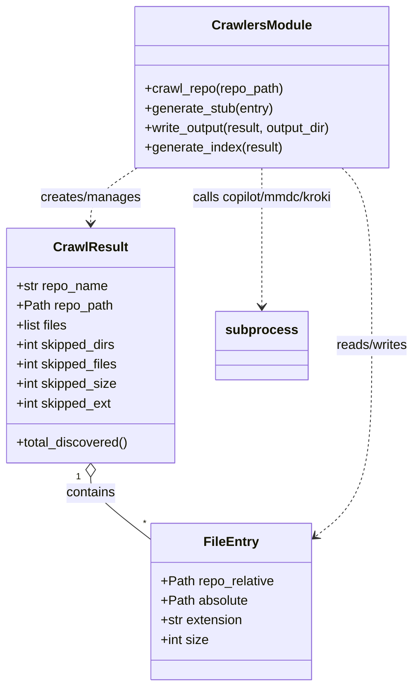

# Diagram: research/config/config.prod-b.yml


> Auto-generated by Obscura crawlers

## Diagram 1



### SVG

<svg id="container" width="505.703125" xmlns="http://www.w3.org/2000/svg" class="classDiagram" height="842" viewBox="0 0 505.703125 842" role="graphics-document document" aria-roledescription="class"><style>#container{font-family:"trebuchet ms",verdana,arial,sans-serif;font-size:16px;fill:#333;}@keyframes edge-animation-frame{from{stroke-dashoffset:0;}}@keyframes dash{to{stroke-dashoffset:0;}}#container .edge-animation-slow{stroke-dasharray:9,5!important;stroke-dashoffset:900;animation:dash 50s linear infinite;stroke-linecap:round;}#container .edge-animation-fast{stroke-dasharray:9,5!important;stroke-dashoffset:900;animation:dash 20s linear infinite;stroke-linecap:round;}#container .error-icon{fill:#552222;}#container .error-text{fill:#552222;stroke:#552222;}#container .edge-thickness-normal{stroke-width:1px;}#container .edge-thickness-thick{stroke-width:3.5px;}#container .edge-pattern-solid{stroke-dasharray:0;}#container .edge-thickness-invisible{stroke-width:0;fill:none;}#container .edge-pattern-dashed{stroke-dasharray:3;}#container .edge-pattern-dotted{stroke-dasharray:2;}#container .marker{fill:#333333;stroke:#333333;}#container .marker.cross{stroke:#333333;}#container svg{font-family:"trebuchet ms",verdana,arial,sans-serif;font-size:16px;}#container p{margin:0;}#container g.classGroup text{fill:#9370DB;stroke:none;font-family:"trebuchet ms",verdana,arial,sans-serif;font-size:10px;}#container g.classGroup text .title{font-weight:bolder;}#container .nodeLabel,#container .edgeLabel{color:#131300;}#container .edgeLabel .label rect{fill:#ECECFF;}#container .label text{fill:#131300;}#container .labelBkg{background:#ECECFF;}#container .edgeLabel .label span{background:#ECECFF;}#container .classTitle{font-weight:bolder;}#container .node rect,#container .node circle,#container .node ellipse,#container .node polygon,#container .node path{fill:#ECECFF;stroke:#9370DB;stroke-width:1px;}#container .divider{stroke:#9370DB;stroke-width:1;}#container g.clickable{cursor:pointer;}#container g.classGroup rect{fill:#ECECFF;stroke:#9370DB;}#container g.classGroup line{stroke:#9370DB;stroke-width:1;}#container .classLabel .box{stroke:none;stroke-width:0;fill:#ECECFF;opacity:0.5;}#container .classLabel .label{fill:#9370DB;font-size:10px;}#container .relation{stroke:#333333;stroke-width:1;fill:none;}#container .dashed-line{stroke-dasharray:3;}#container .dotted-line{stroke-dasharray:1 2;}#container #compositionStart,#container .composition{fill:#333333!important;stroke:#333333!important;stroke-width:1;}#container #compositionEnd,#container .composition{fill:#333333!important;stroke:#333333!important;stroke-width:1;}#container #dependencyStart,#container .dependency{fill:#333333!important;stroke:#333333!important;stroke-width:1;}#container #dependencyStart,#container .dependency{fill:#333333!important;stroke:#333333!important;stroke-width:1;}#container #extensionStart,#container .extension{fill:transparent!important;stroke:#333333!important;stroke-width:1;}#container #extensionEnd,#container .extension{fill:transparent!important;stroke:#333333!important;stroke-width:1;}#container #aggregationStart,#container .aggregation{fill:transparent!important;stroke:#333333!important;stroke-width:1;}#container #aggregationEnd,#container .aggregation{fill:transparent!important;stroke:#333333!important;stroke-width:1;}#container #lollipopStart,#container .lollipop{fill:#ECECFF!important;stroke:#333333!important;stroke-width:1;}#container #lollipopEnd,#container .lollipop{fill:#ECECFF!important;stroke:#333333!important;stroke-width:1;}#container .edgeTerminals{font-size:11px;line-height:initial;}#container .classTitleText{text-anchor:middle;font-size:18px;fill:#333;}#container .label-icon{display:inline-block;height:1em;overflow:visible;vertical-align:-0.125em;}#container .node .label-icon path{fill:currentColor;stroke:revert;stroke-width:revert;}#container :root{--mermaid-font-family:"trebuchet ms",verdana,arial,sans-serif;}</style><g><defs><marker id="container_class-aggregationStart" class="marker aggregation class" refX="18" refY="7" markerWidth="190" markerHeight="240" orient="auto"><path d="M 18,7 L9,13 L1,7 L9,1 Z"></path></marker></defs><defs><marker id="container_class-aggregationEnd" class="marker aggregation class" refX="1" refY="7" markerWidth="20" markerHeight="28" orient="auto"><path d="M 18,7 L9,13 L1,7 L9,1 Z"></path></marker></defs><defs><marker id="container_class-extensionStart" class="marker extension class" refX="18" refY="7" markerWidth="190" markerHeight="240" orient="auto"><path d="M 1,7 L18,13 V 1 Z"></path></marker></defs><defs><marker id="container_class-extensionEnd" class="marker extension class" refX="1" refY="7" markerWidth="20" markerHeight="28" orient="auto"><path d="M 1,1 V 13 L18,7 Z"></path></marker></defs><defs><marker id="container_class-compositionStart" class="marker composition class" refX="18" refY="7" markerWidth="190" markerHeight="240" orient="auto"><path d="M 18,7 L9,13 L1,7 L9,1 Z"></path></marker></defs><defs><marker id="container_class-compositionEnd" class="marker composition class" refX="1" refY="7" markerWidth="20" markerHeight="28" orient="auto"><path d="M 18,7 L9,13 L1,7 L9,1 Z"></path></marker></defs><defs><marker id="container_class-dependencyStart" class="marker dependency class" refX="6" refY="7" markerWidth="190" markerHeight="240" orient="auto"><path d="M 5,7 L9,13 L1,7 L9,1 Z"></path></marker></defs><defs><marker id="container_class-dependencyEnd" class="marker dependency class" refX="13" refY="7" markerWidth="20" markerHeight="28" orient="auto"><path d="M 18,7 L9,13 L14,7 L9,1 Z"></path></marker></defs><defs><marker id="container_class-lollipopStart" class="marker lollipop class" refX="13" refY="7" markerWidth="190" markerHeight="240" orient="auto"><circle stroke="black" fill="transparent" cx="7" cy="7" r="6"></circle></marker></defs><defs><marker id="container_class-lollipopEnd" class="marker lollipop class" refX="1" refY="7" markerWidth="190" markerHeight="240" orient="auto"><circle stroke="black" fill="transparent" cx="7" cy="7" r="6"></circle></marker></defs><g class="root"><g class="clusters"></g><g class="edgePaths"><path d="M111.008,585.25L111.008,588.542C111.008,591.833,111.008,598.417,123.056,611.114C135.104,623.81,159.201,642.621,171.249,652.026L183.297,661.431" id="id_CrawlResult_FileEntry_1" class="edge-thickness-normal edge-pattern-solid relation" style=";;;" data-edge="true" data-et="edge" data-id="id_CrawlResult_FileEntry_1" data-points="W3sieCI6MTExLjAwNzgxMjUsInkiOjU2OH0seyJ4IjoxMTEuMDA3ODEyNSwieSI6NjA1fSx7IngiOjE4My4yOTY4NzUsInkiOjY2MS40MzEwODAzMzc0OTA4fV0=" marker-start="url(#container_class-aggregationStart)"></path><path d="M167.162,206L157.803,212.167C148.444,218.333,129.726,230.667,120.367,242C111.008,253.333,111.008,263.667,111.008,268.833L111.008,274" id="id_CrawlersModule_CrawlResult_2" class="edge-thickness-normal edge-pattern-dashed relation" style=";;;" data-edge="true" data-et="edge" data-id="id_CrawlersModule_CrawlResult_2" data-points="W3sieCI6MTY3LjE2MjQ1NDA0NDExNzY1LCJ5IjoyMDZ9LHsieCI6MTExLjAwNzgxMjUsInkiOjI0M30seyJ4IjoxMTEuMDA3ODEyNSwieSI6MjgwfV0=" marker-end="url(#container_class-dependencyEnd)"></path><path d="M415.208,206L421.3,212.167C427.392,218.333,439.575,230.667,445.666,267C451.758,303.333,451.758,363.667,451.758,424C451.758,484.333,451.758,544.667,440.498,583.623C429.238,622.58,406.718,640.159,395.458,648.949L384.198,657.739" id="id_CrawlersModule_FileEntry_3" class="edge-thickness-normal edge-pattern-dashed relation" style=";;;" data-edge="true" data-et="edge" data-id="id_CrawlersModule_FileEntry_3" data-points="W3sieCI6NDE1LjIwODQwOTkyNjQ3MDYsInkiOjIwNn0seyJ4Ijo0NTEuNzU3ODEyNSwieSI6MjQzfSx7IngiOjQ1MS43NTc4MTI1LCJ5Ijo0MjR9LHsieCI6NDUxLjc1NzgxMjUsInkiOjYwNX0seyJ4IjozNzkuNDY4NzUsInkiOjY2MS40MzEwODAzMzc0OTA4fV0=" marker-end="url(#container_class-dependencyEnd)"></path><path d="M317.414,206L317.414,212.167C317.414,218.333,317.414,230.667,317.414,259C317.414,287.333,317.414,331.667,317.414,353.833L317.414,376" id="id_CrawlersModule_subprocess_4" class="edge-thickness-normal edge-pattern-dashed relation" style=";;;" data-edge="true" data-et="edge" data-id="id_CrawlersModule_subprocess_4" data-points="W3sieCI6MzE3LjQxNDA2MjUsInkiOjIwNn0seyJ4IjozMTcuNDE0MDYyNSwieSI6MjQzfSx7IngiOjMxNy40MTQwNjI1LCJ5IjozODJ9XQ==" marker-end="url(#container_class-dependencyEnd)"></path></g><g class="edgeLabels"><g class="edgeLabel" transform="translate(111.0078125, 605)"><g class="label" data-id="id_CrawlResult_FileEntry_1" transform="translate(-30.890625, -12)"><foreignObject width="61.78125" height="24"><div xmlns="http://www.w3.org/1999/xhtml" class="labelBkg" style="display: table-cell; white-space: nowrap; line-height: 1.5; max-width: 200px; text-align: center;"><span class="edgeLabel"><p>contains</p></span></div></foreignObject></g></g><g class="edgeLabel" transform="translate(111.0078125, 243)"><g class="label" data-id="id_CrawlersModule_CrawlResult_2" transform="translate(-62.390625, -12)"><foreignObject width="124.78125" height="24"><div xmlns="http://www.w3.org/1999/xhtml" class="labelBkg" style="display: table-cell; white-space: nowrap; line-height: 1.5; max-width: 200px; text-align: center;"><span class="edgeLabel"><p>creates/manages</p></span></div></foreignObject></g></g><g class="edgeLabel" transform="translate(451.7578125, 424)"><g class="label" data-id="id_CrawlersModule_FileEntry_3" transform="translate(-45.9453125, -12)"><foreignObject width="91.890625" height="24"><div xmlns="http://www.w3.org/1999/xhtml" class="labelBkg" style="display: table-cell; white-space: nowrap; line-height: 1.5; max-width: 200px; text-align: center;"><span class="edgeLabel"><p>reads/writes</p></span></div></foreignObject></g></g><g class="edgeLabel" transform="translate(317.4140625, 243)"><g class="label" data-id="id_CrawlersModule_subprocess_4" transform="translate(-92.140625, -12)"><foreignObject width="184.28125" height="24"><div xmlns="http://www.w3.org/1999/xhtml" class="labelBkg" style="display: table-cell; white-space: nowrap; line-height: 1.5; max-width: 200px; text-align: center;"><span class="edgeLabel"><p>calls copilot/mmdc/kroki</p></span></div></foreignObject></g></g><g class="edgeTerminals" transform="translate(96.00781125000005, 585.4999989285715)"><g class="inner" transform="translate(0, 0)"><foreignObject style="width: 9px; height: 12px;"><div xmlns="http://www.w3.org/1999/xhtml" style="display: inline-block; padding-right: 1px; white-space: nowrap;"><span class="edgeLabel">1</span></div></foreignObject></g></g><g class="edgeTerminals" transform="translate(173.7324214872937, 633.8386989062896)"><g class="inner" transform="translate(0, 0)"></g><foreignObject style="width: 9px; height: 12px;"><div xmlns="http://www.w3.org/1999/xhtml" style="display: inline-block; padding-right: 1px; white-space: nowrap;"><span class="edgeLabel">*</span></div></foreignObject></g></g><g class="nodes"><g class="node default" id="classId-FileEntry-0" transform="translate(281.3828125, 738)"><g class="basic label-container"><path d="M-98.0859375 -96 L98.0859375 -96 L98.0859375 96 L-98.0859375 96" stroke="none" stroke-width="0" fill="#ECECFF" style=""></path><path d="M-98.0859375 -96 C-24.024476774925162 -96, 50.036983950149676 -96, 98.0859375 -96 M-98.0859375 -96 C-55.61366589852683 -96, -13.141394297053665 -96, 98.0859375 -96 M98.0859375 -96 C98.0859375 -29.82437849115837, 98.0859375 36.35124301768326, 98.0859375 96 M98.0859375 -96 C98.0859375 -25.56447631656927, 98.0859375 44.87104736686146, 98.0859375 96 M98.0859375 96 C58.52309047079225 96, 18.960243441584495 96, -98.0859375 96 M98.0859375 96 C22.269385326051335 96, -53.54716684789733 96, -98.0859375 96 M-98.0859375 96 C-98.0859375 33.66110028940557, -98.0859375 -28.677799421188865, -98.0859375 -96 M-98.0859375 96 C-98.0859375 27.77479591631085, -98.0859375 -40.4504081673783, -98.0859375 -96" stroke="#9370DB" stroke-width="1.3" fill="none" stroke-dasharray="0 0" style=""></path></g><g class="annotation-group text" transform="translate(0, -72)"></g><g class="label-group text" transform="translate(-31.859375, -72)"><g class="label" style="font-weight: bolder" transform="translate(0,-12)"><foreignObject width="63.71875" height="24"><div xmlns="http://www.w3.org/1999/xhtml" style="display: table-cell; white-space: nowrap; line-height: 1.5; max-width: 113px; text-align: center;"><span class="nodeLabel markdown-node-label" style=""><p>FileEntry</p></span></div></foreignObject></g></g><g class="members-group text" transform="translate(-86.0859375, -24)"><g class="label" style="" transform="translate(0,-12)"><foreignObject width="140.3125" height="24"><div xmlns="http://www.w3.org/1999/xhtml" style="display: table-cell; white-space: nowrap; line-height: 1.5; max-width: 198px; text-align: center;"><span class="nodeLabel markdown-node-label" style=""><p>+Path repo_relative</p></span></div></foreignObject></g><g class="label" style="" transform="translate(0,12)"><foreignObject width="107.78125" height="24"><div xmlns="http://www.w3.org/1999/xhtml" style="display: table-cell; white-space: nowrap; line-height: 1.5; max-width: 165px; text-align: center;"><span class="nodeLabel markdown-node-label" style=""><p>+Path absolute</p></span></div></foreignObject></g><g class="label" style="" transform="translate(0,36)"><foreignObject width="102.328125" height="24"><div xmlns="http://www.w3.org/1999/xhtml" style="display: table-cell; white-space: nowrap; line-height: 1.5; max-width: 160px; text-align: center;"><span class="nodeLabel markdown-node-label" style=""><p>+str extension</p></span></div></foreignObject></g><g class="label" style="" transform="translate(0,60)"><foreignObject width="59.484375" height="24"><div xmlns="http://www.w3.org/1999/xhtml" style="display: table-cell; white-space: nowrap; line-height: 1.5; max-width: 117px; text-align: center;"><span class="nodeLabel markdown-node-label" style=""><p>+int size</p></span></div></foreignObject></g></g><g class="methods-group text" transform="translate(-86.0859375, 96)"></g><g class="divider" style=""><path d="M-98.0859375 -48 C-49.889122871520975 -48, -1.6923082430419498 -48, 98.0859375 -48 M-98.0859375 -48 C-30.667489052932908 -48, 36.750959394134185 -48, 98.0859375 -48" stroke="#9370DB" stroke-width="1.3" fill="none" stroke-dasharray="0 0" style=""></path></g><g class="divider" style=""><path d="M-98.0859375 72 C-36.15382096978476 72, 25.77829556043048 72, 98.0859375 72 M-98.0859375 72 C-44.96416262507425 72, 8.157612249851496 72, 98.0859375 72" stroke="#9370DB" stroke-width="1.3" fill="none" stroke-dasharray="0 0" style=""></path></g></g><g class="node default" id="classId-CrawlResult-1" transform="translate(111.0078125, 424)"><g class="basic label-container"><path d="M-103.0078125 -144 L103.0078125 -144 L103.0078125 144 L-103.0078125 144" stroke="none" stroke-width="0" fill="#ECECFF" style=""></path><path d="M-103.0078125 -144 C-40.72871530949208 -144, 21.550381881015838 -144, 103.0078125 -144 M-103.0078125 -144 C-60.965163482559056 -144, -18.922514465118113 -144, 103.0078125 -144 M103.0078125 -144 C103.0078125 -82.08582242640918, 103.0078125 -20.17164485281836, 103.0078125 144 M103.0078125 -144 C103.0078125 -30.854394818538182, 103.0078125 82.29121036292364, 103.0078125 144 M103.0078125 144 C37.23929257311595 144, -28.529227353768107 144, -103.0078125 144 M103.0078125 144 C29.26710042031246 144, -44.47361165937508 144, -103.0078125 144 M-103.0078125 144 C-103.0078125 75.65382166787427, -103.0078125 7.307643335748537, -103.0078125 -144 M-103.0078125 144 C-103.0078125 52.36531526553557, -103.0078125 -39.26936946892886, -103.0078125 -144" stroke="#9370DB" stroke-width="1.3" fill="none" stroke-dasharray="0 0" style=""></path></g><g class="annotation-group text" transform="translate(0, -120)"></g><g class="label-group text" transform="translate(-43.28125, -120)"><g class="label" style="font-weight: bolder" transform="translate(0,-12)"><foreignObject width="86.5625" height="24"><div xmlns="http://www.w3.org/1999/xhtml" style="display: table-cell; white-space: nowrap; line-height: 1.5; max-width: 135px; text-align: center;"><span class="nodeLabel markdown-node-label" style=""><p>CrawlResult</p></span></div></foreignObject></g></g><g class="members-group text" transform="translate(-91.0078125, -72)"><g class="label" style="" transform="translate(0,-12)"><foreignObject width="113.4375" height="24"><div xmlns="http://www.w3.org/1999/xhtml" style="display: table-cell; white-space: nowrap; line-height: 1.5; max-width: 171px; text-align: center;"><span class="nodeLabel markdown-node-label" style=""><p>+str repo_name</p></span></div></foreignObject></g><g class="label" style="" transform="translate(0,12)"><foreignObject width="118.96875" height="24"><div xmlns="http://www.w3.org/1999/xhtml" style="display: table-cell; white-space: nowrap; line-height: 1.5; max-width: 176px; text-align: center;"><span class="nodeLabel markdown-node-label" style=""><p>+Path repo_path</p></span></div></foreignObject></g><g class="label" style="" transform="translate(0,36)"><foreignObject width="64.6875" height="24"><div xmlns="http://www.w3.org/1999/xhtml" style="display: table-cell; white-space: nowrap; line-height: 1.5; max-width: 122px; text-align: center;"><span class="nodeLabel markdown-node-label" style=""><p>+list files</p></span></div></foreignObject></g><g class="label" style="" transform="translate(0,60)"><foreignObject width="124.859375" height="24"><div xmlns="http://www.w3.org/1999/xhtml" style="display: table-cell; white-space: nowrap; line-height: 1.5; max-width: 182px; text-align: center;"><span class="nodeLabel markdown-node-label" style=""><p>+int skipped_dirs</p></span></div></foreignObject></g><g class="label" style="" transform="translate(0,84)"><foreignObject width="127.375" height="24"><div xmlns="http://www.w3.org/1999/xhtml" style="display: table-cell; white-space: nowrap; line-height: 1.5; max-width: 185px; text-align: center;"><span class="nodeLabel markdown-node-label" style=""><p>+int skipped_files</p></span></div></foreignObject></g><g class="label" style="" transform="translate(0,108)"><foreignObject width="125.265625" height="24"><div xmlns="http://www.w3.org/1999/xhtml" style="display: table-cell; white-space: nowrap; line-height: 1.5; max-width: 183px; text-align: center;"><span class="nodeLabel markdown-node-label" style=""><p>+int skipped_size</p></span></div></foreignObject></g><g class="label" style="" transform="translate(0,132)"><foreignObject width="119.484375" height="24"><div xmlns="http://www.w3.org/1999/xhtml" style="display: table-cell; white-space: nowrap; line-height: 1.5; max-width: 177px; text-align: center;"><span class="nodeLabel markdown-node-label" style=""><p>+int skipped_ext</p></span></div></foreignObject></g></g><g class="methods-group text" transform="translate(-91.0078125, 120)"><g class="label" style="" transform="translate(0,-12)"><foreignObject width="138.734375" height="24"><div xmlns="http://www.w3.org/1999/xhtml" style="display: table-cell; white-space: nowrap; line-height: 1.5; max-width: 196px; text-align: center;"><span class="nodeLabel markdown-node-label" style=""><p>+total_discovered()</p></span></div></foreignObject></g></g><g class="divider" style=""><path d="M-103.0078125 -96 C-42.63357130498749 -96, 17.740669890025018 -96, 103.0078125 -96 M-103.0078125 -96 C-42.35269206241331 -96, 18.302428375173378 -96, 103.0078125 -96" stroke="#9370DB" stroke-width="1.3" fill="none" stroke-dasharray="0 0" style=""></path></g><g class="divider" style=""><path d="M-103.0078125 96 C-54.94915838405452 96, -6.890504268109041 96, 103.0078125 96 M-103.0078125 96 C-54.22547260441154 96, -5.443132708823086 96, 103.0078125 96" stroke="#9370DB" stroke-width="1.3" fill="none" stroke-dasharray="0 0" style=""></path></g></g><g class="node default" id="classId-CrawlersModule-2" transform="translate(317.4140625, 107)"><g class="basic label-container"><path d="M-160.57421875 -99 L160.57421875 -99 L160.57421875 99 L-160.57421875 99" stroke="none" stroke-width="0" fill="#ECECFF" style=""></path><path d="M-160.57421875 -99 C-64.58286208869838 -99, 31.408494572603246 -99, 160.57421875 -99 M-160.57421875 -99 C-44.05330162243382 -99, 72.46761550513236 -99, 160.57421875 -99 M160.57421875 -99 C160.57421875 -53.669372844864604, 160.57421875 -8.338745689729208, 160.57421875 99 M160.57421875 -99 C160.57421875 -48.01280631288888, 160.57421875 2.974387374222246, 160.57421875 99 M160.57421875 99 C33.942272393563755 99, -92.68967396287249 99, -160.57421875 99 M160.57421875 99 C59.357709375150606 99, -41.85879999969879 99, -160.57421875 99 M-160.57421875 99 C-160.57421875 45.70557837493668, -160.57421875 -7.588843250126644, -160.57421875 -99 M-160.57421875 99 C-160.57421875 36.69580441143662, -160.57421875 -25.608391177126762, -160.57421875 -99" stroke="#9370DB" stroke-width="1.3" fill="none" stroke-dasharray="0 0" style=""></path></g><g class="annotation-group text" transform="translate(0, -75)"></g><g class="label-group text" transform="translate(-58.5859375, -75)"><g class="label" style="font-weight: bolder" transform="translate(0,-12)"><foreignObject width="117.171875" height="24"><div xmlns="http://www.w3.org/1999/xhtml" style="display: table-cell; white-space: nowrap; line-height: 1.5; max-width: 165px; text-align: center;"><span class="nodeLabel markdown-node-label" style=""><p>CrawlersModule</p></span></div></foreignObject></g></g><g class="members-group text" transform="translate(-148.57421875, -27)"></g><g class="methods-group text" transform="translate(-148.57421875, 3)"><g class="label" style="" transform="translate(0,-12)"><foreignObject width="172.453125" height="24"><div xmlns="http://www.w3.org/1999/xhtml" style="display: table-cell; white-space: nowrap; line-height: 1.5; max-width: 230px; text-align: center;"><span class="nodeLabel markdown-node-label" style=""><p>+crawl_repo(repo_path)</p></span></div></foreignObject></g><g class="label" style="" transform="translate(0,12)"><foreignObject width="159.796875" height="24"><div xmlns="http://www.w3.org/1999/xhtml" style="display: table-cell; white-space: nowrap; line-height: 1.5; max-width: 217px; text-align: center;"><span class="nodeLabel markdown-node-label" style=""><p>+generate_stub(entry)</p></span></div></foreignObject></g><g class="label" style="" transform="translate(0,36)"><foreignObject width="238.5625" height="24"><div xmlns="http://www.w3.org/1999/xhtml" style="display: table-cell; white-space: nowrap; line-height: 1.5; max-width: 296px; text-align: center;"><span class="nodeLabel markdown-node-label" style=""><p>+write_output(result, output_dir)</p></span></div></foreignObject></g><g class="label" style="" transform="translate(0,60)"><foreignObject width="171.265625" height="24"><div xmlns="http://www.w3.org/1999/xhtml" style="display: table-cell; white-space: nowrap; line-height: 1.5; max-width: 229px; text-align: center;"><span class="nodeLabel markdown-node-label" style=""><p>+generate_index(result)</p></span></div></foreignObject></g></g><g class="divider" style=""><path d="M-160.57421875 -51 C-40.62016703823902 -51, 79.33388467352196 -51, 160.57421875 -51 M-160.57421875 -51 C-54.61549718648125 -51, 51.3432243770375 -51, 160.57421875 -51" stroke="#9370DB" stroke-width="1.3" fill="none" stroke-dasharray="0 0" style=""></path></g><g class="divider" style=""><path d="M-160.57421875 -27 C-94.74842901130918 -27, -28.92263927261837 -27, 160.57421875 -27 M-160.57421875 -27 C-40.174695867013625 -27, 80.22482701597275 -27, 160.57421875 -27" stroke="#9370DB" stroke-width="1.3" fill="none" stroke-dasharray="0 0" style=""></path></g></g><g class="node default" id="classId-subprocess-3" transform="translate(317.4140625, 424)"><g class="basic label-container"><path d="M-53.3984375 -42 L53.3984375 -42 L53.3984375 42 L-53.3984375 42" stroke="none" stroke-width="0" fill="#ECECFF" style=""></path><path d="M-53.3984375 -42 C-28.919393976172646 -42, -4.440350452345292 -42, 53.3984375 -42 M-53.3984375 -42 C-25.243090693580083 -42, 2.9122561128398345 -42, 53.3984375 -42 M53.3984375 -42 C53.3984375 -14.958853141546822, 53.3984375 12.082293716906356, 53.3984375 42 M53.3984375 -42 C53.3984375 -23.693734799557596, 53.3984375 -5.387469599115192, 53.3984375 42 M53.3984375 42 C17.680915350798784 42, -18.03660679840243 42, -53.3984375 42 M53.3984375 42 C21.550251304051407 42, -10.297934891897185 42, -53.3984375 42 M-53.3984375 42 C-53.3984375 21.636848850803467, -53.3984375 1.2736977016069346, -53.3984375 -42 M-53.3984375 42 C-53.3984375 10.472378482018893, -53.3984375 -21.055243035962214, -53.3984375 -42" stroke="#9370DB" stroke-width="1.3" fill="none" stroke-dasharray="0 0" style=""></path></g><g class="annotation-group text" transform="translate(0, -18)"></g><g class="label-group text" transform="translate(-41.3984375, -18)"><g class="label" style="font-weight: bolder" transform="translate(0,-12)"><foreignObject width="82.796875" height="24"><div xmlns="http://www.w3.org/1999/xhtml" style="display: table-cell; white-space: nowrap; line-height: 1.5; max-width: 132px; text-align: center;"><span class="nodeLabel markdown-node-label" style=""><p>subprocess</p></span></div></foreignObject></g></g><g class="members-group text" transform="translate(-41.3984375, 30)"></g><g class="methods-group text" transform="translate(-41.3984375, 60)"></g><g class="divider" style=""><path d="M-53.3984375 6 C-26.24043731089683 6, 0.9175628782063399 6, 53.3984375 6 M-53.3984375 6 C-28.384419493823323 6, -3.370401487646646 6, 53.3984375 6" stroke="#9370DB" stroke-width="1.3" fill="none" stroke-dasharray="0 0" style=""></path></g><g class="divider" style=""><path d="M-53.3984375 24 C-13.915417929809458 24, 25.567601640381085 24, 53.3984375 24 M-53.3984375 24 C-23.02624556520037 24, 7.345946369599261 24, 53.3984375 24" stroke="#9370DB" stroke-width="1.3" fill="none" stroke-dasharray="0 0" style=""></path></g></g></g></g></g></svg>

## Diagram 2

```mermaid
flowchart TD
    Start([Start]) --> ValidateRepo{repo path valid?}
    ValidateRepo -- No --> ExitError([Error & Exit])
    ValidateRepo -- Yes --> WalkRepo[walk repo (crawl_repo)]
    WalkRepo --> FileLoop[(for each file)]
    FileLoop --> CheckSkip{filename/dir skipped?}
    CheckSkip -- Yes --> SkipFile[skip file]
    CheckSkip -- No --> CheckExt{extension allowed?}
    CheckExt -- No --> SkipExt[skip wrong ext]
    CheckExt -- Yes --> CheckSize{size <= MAX_FILE_SIZE?}
    CheckSize -- No --> SkipSize[skip large file]
    CheckSize -- Yes --> AddEntry[add FileEntry to CrawlResult]
    AddEntry --> ContinueLoop[continue]
    ContinueLoop --> FileLoop
    FileLoop --> AfterCrawl[done crawling]
    AfterCrawl --> GenerateStubs[for each FileEntry: generate_stub]
    GenerateStubs --> CallCopilot[call copilot -p -> Mermaid text]
    CallCopilot --> SplitDiagrams[split_mermaid_diagrams]
    SplitDiagrams --> RenderSVG[render SVG via mmdc or kroki]
    RenderSVG --> WriteMarkdown[write .md with Mermaid + SVG]
    WriteMarkdown --> BuildIndex[generate INDEX.md]
    BuildIndex --> Done([Done])
```

> SVG rendering failed for this diagram.
