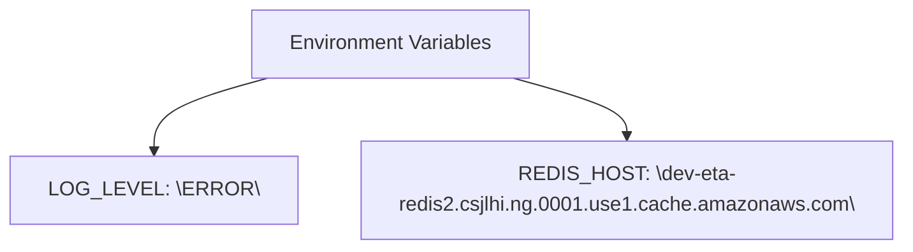

# Diagram: research/config/config.qa.yml

> Auto-generated by Obscura crawlers

## Mermaid

### SVG

<svg id="container" width="692.4375" xmlns="http://www.w3.org/2000/svg" class="flowchart" height="198" viewBox="0 0 692.4375 198" role="graphics-document document" aria-roledescription="flowchart-v2"><g><marker id="container_flowchart-v2-pointEnd" class="marker flowchart-v2" viewBox="0 0 10 10" refX="5" refY="5" markerUnits="userSpaceOnUse" markerWidth="8" markerHeight="8" orient="auto"><path d="M 0 0 L 10 5 L 0 10 z" class="arrowMarkerPath" style="stroke-width: 1; stroke-dasharray: 1, 0;"></path></marker><marker id="container_flowchart-v2-pointStart" class="marker flowchart-v2" viewBox="0 0 10 10" refX="4.5" refY="5" markerUnits="userSpaceOnUse" markerWidth="8" markerHeight="8" orient="auto"><path d="M 0 5 L 10 10 L 10 0 z" class="arrowMarkerPath" style="stroke-width: 1; stroke-dasharray: 1, 0;"></path></marker><marker id="container_flowchart-v2-circleEnd" class="marker flowchart-v2" viewBox="0 0 10 10" refX="11" refY="5" markerUnits="userSpaceOnUse" markerWidth="11" markerHeight="11" orient="auto"><circle cx="5" cy="5" r="5" class="arrowMarkerPath" style="stroke-width: 1; stroke-dasharray: 1, 0;"></circle></marker><marker id="container_flowchart-v2-circleStart" class="marker flowchart-v2" viewBox="0 0 10 10" refX="-1" refY="5" markerUnits="userSpaceOnUse" markerWidth="11" markerHeight="11" orient="auto"><circle cx="5" cy="5" r="5" class="arrowMarkerPath" style="stroke-width: 1; stroke-dasharray: 1, 0;"></circle></marker><marker id="container_flowchart-v2-crossEnd" class="marker cross flowchart-v2" viewBox="0 0 11 11" refX="12" refY="5.2" markerUnits="userSpaceOnUse" markerWidth="11" markerHeight="11" orient="auto"><path d="M 1,1 l 9,9 M 10,1 l -9,9" class="arrowMarkerPath" style="stroke-width: 2; stroke-dasharray: 1, 0;"></path></marker><marker id="container_flowchart-v2-crossStart" class="marker cross flowchart-v2" viewBox="0 0 11 11" refX="-1" refY="5.2" markerUnits="userSpaceOnUse" markerWidth="11" markerHeight="11" orient="auto"><path d="M 1,1 l 9,9 M 10,1 l -9,9" class="arrowMarkerPath" style="stroke-width: 2; stroke-dasharray: 1, 0;"></path></marker><g class="root"><g class="clusters"></g><g class="edgePaths"><path d="M201.125,62L186.573,66.167C172.021,70.333,142.917,78.667,128.365,88.333C113.813,98,113.813,109,113.813,114.5L113.813,120" id="L_Env_LOG_LEVEL_0" class="edge-thickness-normal edge-pattern-solid edge-thickness-normal edge-pattern-solid flowchart-link" style=";" data-edge="true" data-et="edge" data-id="L_Env_LOG_LEVEL_0" data-points="W3sieCI6MjAxLjEyNDY5OTUxOTIzMDc3LCJ5Ijo2Mn0seyJ4IjoxMTMuODEyNSwieSI6ODd9LHsieCI6MTEzLjgxMjUsInkiOjEyNH1d" marker-end="url(#container_flowchart-v2-pointEnd)"></path><path d="M389.719,62L404.271,66.167C418.823,70.333,447.927,78.667,462.479,86.333C477.031,94,477.031,101,477.031,104.5L477.031,108" id="L_Env_REDIS_HOST_0" class="edge-thickness-normal edge-pattern-solid edge-thickness-normal edge-pattern-solid flowchart-link" style=";" data-edge="true" data-et="edge" data-id="L_Env_REDIS_HOST_0" data-points="W3sieCI6Mzg5LjcxOTA1MDQ4MDc2OTIsInkiOjYyfSx7IngiOjQ3Ny4wMzEyNSwieSI6ODd9LHsieCI6NDc3LjAzMTI1LCJ5IjoxMTJ9XQ==" marker-end="url(#container_flowchart-v2-pointEnd)"></path></g><g class="edgeLabels"><g class="edgeLabel"><g class="label" data-id="L_Env_LOG_LEVEL_0" transform="translate(0, 0)"><foreignObject width="0" height="0">

</foreignObject></g></g><g class="edgeLabel"><g class="label" data-id="L_Env_REDIS_HOST_0" transform="translate(0, 0)"><foreignObject width="0" height="0">

</foreignObject></g></g></g><g class="nodes"><g class="node default" id="flowchart-Env-0" transform="translate(295.421875, 35)"><rect class="basic label-container" style="" x="-111.4765625" y="-27" width="222.953125" height="54"></rect><g class="label" style="" transform="translate(-81.4765625, -12)"><rect></rect><foreignObject width="162.953125" height="24">

Environment Variables

</foreignObject></g></g><g class="node default" id="flowchart-LOG_LEVEL-1" transform="translate(113.8125, 151)"><rect class="basic label-container" style="" x="-105.8125" y="-27" width="211.625" height="54"></rect><g class="label" style="" transform="translate(-75.8125, -12)"><rect></rect><foreignObject width="151.625" height="24">

LOG_LEVEL: \ERROR\

</foreignObject></g></g><g class="node default" id="flowchart-REDIS_HOST-2" transform="translate(477.03125, 151)"><rect class="basic label-container" style="" x="-207.40625" y="-39" width="414.8125" height="78"></rect><g class="label" style="" transform="translate(-177.40625, -24)"><rect></rect><foreignObject width="354.8125" height="48">

REDIS_HOST: \dev-eta-redis2.csjlhi.ng.0001.use1.cache.amazonaws.com\

</foreignObject></g></g></g></g></g></svg>
