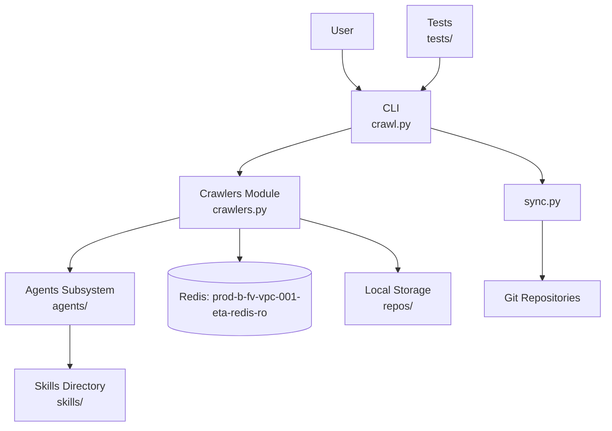
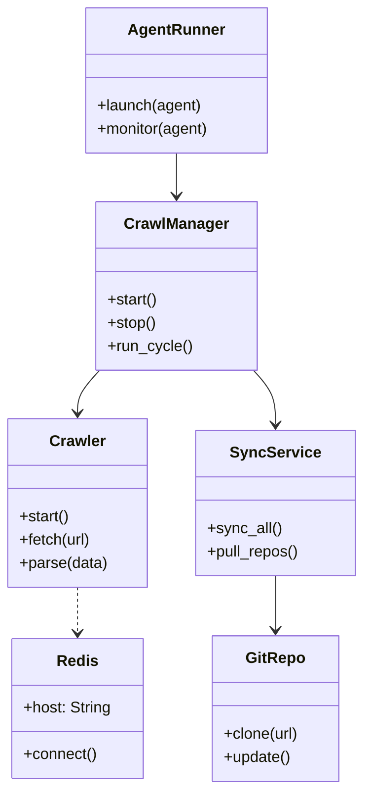

# Diagram: research/config/config.staging1.yml

> Auto-generated by Obscura crawlers

## Diagram 1

### SVG

<svg id="container" width="903.578125" xmlns="http://www.w3.org/2000/svg" class="flowchart" height="638.4264526367188" viewBox="0 0 903.578125 638.4264526367188" role="graphics-document document" aria-roledescription="flowchart-v2"><g><marker id="container_flowchart-v2-pointEnd" class="marker flowchart-v2" viewBox="0 0 10 10" refX="5" refY="5" markerUnits="userSpaceOnUse" markerWidth="8" markerHeight="8" orient="auto"><path d="M 0 0 L 10 5 L 0 10 z" class="arrowMarkerPath" style="stroke-width: 1; stroke-dasharray: 1, 0;"></path></marker><marker id="container_flowchart-v2-pointStart" class="marker flowchart-v2" viewBox="0 0 10 10" refX="4.5" refY="5" markerUnits="userSpaceOnUse" markerWidth="8" markerHeight="8" orient="auto"><path d="M 0 5 L 10 10 L 10 0 z" class="arrowMarkerPath" style="stroke-width: 1; stroke-dasharray: 1, 0;"></path></marker><marker id="container_flowchart-v2-circleEnd" class="marker flowchart-v2" viewBox="0 0 10 10" refX="11" refY="5" markerUnits="userSpaceOnUse" markerWidth="11" markerHeight="11" orient="auto"><circle cx="5" cy="5" r="5" class="arrowMarkerPath" style="stroke-width: 1; stroke-dasharray: 1, 0;"></circle></marker><marker id="container_flowchart-v2-circleStart" class="marker flowchart-v2" viewBox="0 0 10 10" refX="-1" refY="5" markerUnits="userSpaceOnUse" markerWidth="11" markerHeight="11" orient="auto"><circle cx="5" cy="5" r="5" class="arrowMarkerPath" style="stroke-width: 1; stroke-dasharray: 1, 0;"></circle></marker><marker id="container_flowchart-v2-crossEnd" class="marker cross flowchart-v2" viewBox="0 0 11 11" refX="12" refY="5.2" markerUnits="userSpaceOnUse" markerWidth="11" markerHeight="11" orient="auto"><path d="M 1,1 l 9,9 M 10,1 l -9,9" class="arrowMarkerPath" style="stroke-width: 2; stroke-dasharray: 1, 0;"></path></marker><marker id="container_flowchart-v2-crossStart" class="marker cross flowchart-v2" viewBox="0 0 11 11" refX="-1" refY="5.2" markerUnits="userSpaceOnUse" markerWidth="11" markerHeight="11" orient="auto"><path d="M 1,1 l 9,9 M 10,1 l -9,9" class="arrowMarkerPath" style="stroke-width: 2; stroke-dasharray: 1, 0;"></path></marker><g class="root"><g class="clusters"></g><g class="edgePaths"><path d="M508.027,74L508.027,80.167C508.027,86.333,508.027,98.667,512.344,108.564C516.66,118.461,525.293,125.923,529.609,129.654L533.926,133.384" id="L_User_CLI_0" class="edge-thickness-normal edge-pattern-solid edge-thickness-normal edge-pattern-solid flowchart-link" style=";" data-edge="true" data-et="edge" data-id="L_User_CLI_0" data-points="W3sieCI6NTA4LjAyNzM0Mzc1LCJ5Ijo3NH0seyJ4Ijo1MDguMDI3MzQzNzUsInkiOjExMX0seyJ4Ijo1MzYuOTUxOTA0Mjk2ODc1LCJ5IjoxMzZ9XQ==" marker-end="url(#container_flowchart-v2-pointEnd)"></path><path d="M522.441,191.901L494.745,199.751C467.049,207.601,411.658,223.3,383.962,234.65C356.266,246,356.266,253,356.266,256.5L356.266,260" id="L_CLI_Crawlers_0" class="edge-thickness-normal edge-pattern-solid edge-thickness-normal edge-pattern-solid flowchart-link" style=";" data-edge="true" data-et="edge" data-id="L_CLI_Crawlers_0" data-points="W3sieCI6NTIyLjQ0MTQwNjI1LCJ5IjoxOTEuOTAxNDgyNTE5NDE4MDd9LHsieCI6MzU2LjI2NTYyNSwieSI6MjM5fSx7IngiOjM1Ni4yNjU2MjUsInkiOjI2NH1d" marker-end="url(#container_flowchart-v2-pointEnd)"></path><path d="M266.555,325.704L239.359,332.587C212.164,339.469,157.773,353.235,130.578,366.32C103.383,379.404,103.383,391.809,103.383,398.011L103.383,404.213" id="L_Crawlers_Agents_0" class="edge-thickness-normal edge-pattern-solid edge-thickness-normal edge-pattern-solid flowchart-link" style=";" data-edge="true" data-et="edge" data-id="L_Crawlers_Agents_0" data-points="W3sieCI6MjY2LjU1NDY4NzUsInkiOjMyNS43MDQxOTIyODI3Mzk2NX0seyJ4IjoxMDMuMzgyODEyNSwieSI6MzY3fSx7IngiOjEwMy4zODI4MTI1LCJ5Ijo0MDguMjEzMjM3NzYyNDUxMn1d" marker-end="url(#container_flowchart-v2-pointEnd)"></path><path d="M356.266,342L356.266,346.167C356.266,350.333,356.266,358.667,356.266,366.333C356.266,374,356.266,381,356.266,384.5L356.266,388" id="L_Crawlers_Redis_0" class="edge-thickness-normal edge-pattern-solid edge-thickness-normal edge-pattern-solid flowchart-link" style=";" data-edge="true" data-et="edge" data-id="L_Crawlers_Redis_0" data-points="W3sieCI6MzU2LjI2NTYyNSwieSI6MzQyfSx7IngiOjM1Ni4yNjU2MjUsInkiOjM2N30seyJ4IjozNTYuMjY1NjI1LCJ5IjozOTJ9XQ==" marker-end="url(#container_flowchart-v2-pointEnd)"></path><path d="M445.977,327.358L470.31,333.965C494.643,340.572,543.31,353.786,567.643,366.595C591.977,379.404,591.977,391.809,591.977,398.011L591.977,404.213" id="L_Crawlers_Storage_0" class="edge-thickness-normal edge-pattern-solid edge-thickness-normal edge-pattern-solid flowchart-link" style=";" data-edge="true" data-et="edge" data-id="L_Crawlers_Storage_0" data-points="W3sieCI6NDQ1Ljk3NjU2MjUsInkiOjMyNy4zNTgyMjQ3ODUzODk5NX0seyJ4Ijo1OTEuOTc2NTYyNSwieSI6MzY3fSx7IngiOjU5MS45NzY1NjI1LCJ5Ijo0MDguMjEzMjM3NzYyNDUxMn1d" marker-end="url(#container_flowchart-v2-pointEnd)"></path><path d="M641.707,191.901L669.403,199.751C697.099,207.601,752.491,223.3,780.187,236.65C807.883,250,807.883,261,807.883,266.5L807.883,272" id="L_CLI_Sync_0" class="edge-thickness-normal edge-pattern-solid edge-thickness-normal edge-pattern-solid flowchart-link" style=";" data-edge="true" data-et="edge" data-id="L_CLI_Sync_0" data-points="W3sieCI6NjQxLjcwNzAzMTI1LCJ5IjoxOTEuOTAxNDgyNTE5NDE4MDd9LHsieCI6ODA3Ljg4MjgxMjUsInkiOjIzOX0seyJ4Ijo4MDcuODgyODEyNSwieSI6Mjc2fV0=" marker-end="url(#container_flowchart-v2-pointEnd)"></path><path d="M807.883,330L807.883,336.167C807.883,342.333,807.883,354.667,807.883,369.036C807.883,383.404,807.883,399.809,807.883,408.011L807.883,416.213" id="L_Sync_Git_0" class="edge-thickness-normal edge-pattern-solid edge-thickness-normal edge-pattern-solid flowchart-link" style=";" data-edge="true" data-et="edge" data-id="L_Sync_Git_0" data-points="W3sieCI6ODA3Ljg4MjgxMjUsInkiOjMzMH0seyJ4Ijo4MDcuODgyODEyNSwieSI6MzY3fSx7IngiOjgwNy44ODI4MTI1LCJ5Ijo0MjAuMjEzMjM3NzYyNDUxMn1d" marker-end="url(#container_flowchart-v2-pointEnd)"></path><path d="M103.383,486.213L103.383,493.082C103.383,499.951,103.383,513.689,103.383,524.058C103.383,534.426,103.383,541.426,103.383,544.926L103.383,548.426" id="L_Agents_Skills_0" class="edge-thickness-normal edge-pattern-solid edge-thickness-normal edge-pattern-solid flowchart-link" style=";" data-edge="true" data-et="edge" data-id="L_Agents_Skills_0" data-points="W3sieCI6MTAzLjM4MjgxMjUsInkiOjQ4Ni4yMTMyMzc3NjI0NTEyfSx7IngiOjEwMy4zODI4MTI1LCJ5Ijo1MjcuNDI2NDc1NTI0OTAyM30seyJ4IjoxMDMuMzgyODEyNSwieSI6NTUyLjQyNjQ3NTUyNDkwMjN9XQ==" marker-end="url(#container_flowchart-v2-pointEnd)"></path><path d="M656.121,86L656.121,90.167C656.121,94.333,656.121,102.667,651.805,110.564C647.488,118.461,638.856,125.923,634.539,129.654L630.223,133.384" id="L_Tests_CLI_0" class="edge-thickness-normal edge-pattern-solid edge-thickness-normal edge-pattern-solid flowchart-link" style=";" data-edge="true" data-et="edge" data-id="L_Tests_CLI_0" data-points="W3sieCI6NjU2LjEyMTA5Mzc1LCJ5Ijo4Nn0seyJ4Ijo2NTYuMTIxMDkzNzUsInkiOjExMX0seyJ4Ijo2MjcuMTk2NTMzMjAzMTI1LCJ5IjoxMzZ9XQ==" marker-end="url(#container_flowchart-v2-pointEnd)"></path></g><g class="edgeLabels"><g class="edgeLabel"><g class="label" data-id="L_User_CLI_0" transform="translate(0, 0)"><foreignObject width="0" height="0">

</foreignObject></g></g><g class="edgeLabel"><g class="label" data-id="L_CLI_Crawlers_0" transform="translate(0, 0)"><foreignObject width="0" height="0">

</foreignObject></g></g><g class="edgeLabel"><g class="label" data-id="L_Crawlers_Agents_0" transform="translate(0, 0)"><foreignObject width="0" height="0">

</foreignObject></g></g><g class="edgeLabel"><g class="label" data-id="L_Crawlers_Redis_0" transform="translate(0, 0)"><foreignObject width="0" height="0">

</foreignObject></g></g><g class="edgeLabel"><g class="label" data-id="L_Crawlers_Storage_0" transform="translate(0, 0)"><foreignObject width="0" height="0">

</foreignObject></g></g><g class="edgeLabel"><g class="label" data-id="L_CLI_Sync_0" transform="translate(0, 0)"><foreignObject width="0" height="0">

</foreignObject></g></g><g class="edgeLabel"><g class="label" data-id="L_Sync_Git_0" transform="translate(0, 0)"><foreignObject width="0" height="0">

</foreignObject></g></g><g class="edgeLabel"><g class="label" data-id="L_Agents_Skills_0" transform="translate(0, 0)"><foreignObject width="0" height="0">

</foreignObject></g></g><g class="edgeLabel"><g class="label" data-id="L_Tests_CLI_0" transform="translate(0, 0)"><foreignObject width="0" height="0">

</foreignObject></g></g></g><g class="nodes"><g class="node default" id="flowchart-User-0" transform="translate(508.02734375, 47)"><rect class="basic label-container" style="" x="-46.4453125" y="-27" width="92.890625" height="54"></rect><g class="label" style="" transform="translate(-16.4453125, -12)"><rect></rect><foreignObject width="32.890625" height="24">

User

</foreignObject></g></g><g class="node default" id="flowchart-CLI-1" transform="translate(582.07421875, 175)"><rect class="basic label-container" style="" x="-59.6328125" y="-39" width="119.265625" height="78"></rect><g class="label" style="" transform="translate(-29.6328125, -24)"><rect></rect><foreignObject width="59.265625" height="48">

CLI crawl.py

</foreignObject></g></g><g class="node default" id="flowchart-Crawlers-3" transform="translate(356.265625, 303)"><rect class="basic label-container" style="" x="-89.7109375" y="-39" width="179.421875" height="78"></rect><g class="label" style="" transform="translate(-59.7109375, -24)"><rect></rect><foreignObject width="119.421875" height="48">

Crawlers Module crawlers.py

</foreignObject></g></g><g class="node default" id="flowchart-Agents-5" transform="translate(103.3828125, 447.2132377624512)"><rect class="basic label-container" style="" x="-95.3828125" y="-39" width="190.765625" height="78"></rect><g class="label" style="" transform="translate(-65.3828125, -24)"><rect></rect><foreignObject width="130.765625" height="48">

Agents Subsystem agents/

</foreignObject></g></g><g class="node default" id="flowchart-Redis-7" transform="translate(356.265625, 447.2132377624512)"><path d="M0,15.808823529411764 a107.5,15.808823529411764 0,0,0 215,0 a107.5,15.808823529411764 0,0,0 -215,0 l0,78.80882352941177 a107.5,15.808823529411764 0,0,0 215,0 l0,-78.80882352941177" class="basic label-container" style="" transform="translate(-107.5, -55.21323529411765)"></path><g class="label" style="" transform="translate(-100, -14)"><rect></rect><foreignObject width="200" height="48">

Redis: prod-b-fv-vpc-001-eta-redis-ro

</foreignObject></g></g><g class="node default" id="flowchart-Storage-9" transform="translate(591.9765625, 447.2132377624512)"><rect class="basic label-container" style="" x="-78.2109375" y="-39" width="156.421875" height="78"></rect><g class="label" style="" transform="translate(-48.2109375, -24)"><rect></rect><foreignObject width="96.421875" height="48">

Local Storage repos/

</foreignObject></g></g><g class="node default" id="flowchart-Sync-11" transform="translate(807.8828125, 303)"><rect class="basic label-container" style="" x="-56.7109375" y="-27" width="113.421875" height="54"></rect><g class="label" style="" transform="translate(-26.7109375, -12)"><rect></rect><foreignObject width="53.421875" height="24">

sync.py

</foreignObject></g></g><g class="node default" id="flowchart-Git-13" transform="translate(807.8828125, 447.2132377624512)"><rect class="basic label-container" style="" x="-87.6953125" y="-27" width="175.390625" height="54"></rect><g class="label" style="" transform="translate(-57.6953125, -12)"><rect></rect><foreignObject width="115.390625" height="24">

Git Repositories

</foreignObject></g></g><g class="node default" id="flowchart-Skills-15" transform="translate(103.3828125, 591.4264755249023)"><rect class="basic label-container" style="" x="-84.1640625" y="-39" width="168.328125" height="78"></rect><g class="label" style="" transform="translate(-54.1640625, -24)"><rect></rect><foreignObject width="108.328125" height="48">

Skills Directory skills/

</foreignObject></g></g><g class="node default" id="flowchart-Tests-16" transform="translate(656.12109375, 47)"><rect class="basic label-container" style="" x="-51.6484375" y="-39" width="103.296875" height="78"></rect><g class="label" style="" transform="translate(-21.6484375, -24)"><rect></rect><foreignObject width="43.296875" height="48">

Tests tests/

</foreignObject></g></g></g></g></g></svg>

## Diagram 2

### SVG

<svg id="container" width="372.2578125" xmlns="http://www.w3.org/2000/svg" class="classDiagram" height="814" viewBox="0 0 372.2578125 814" role="graphics-document document" aria-roledescription="class"><g><defs><marker id="container_class-aggregationStart" class="marker aggregation class" refX="18" refY="7" markerWidth="190" markerHeight="240" orient="auto"><path d="M 18,7 L9,13 L1,7 L9,1 Z"></path></marker></defs><defs><marker id="container_class-aggregationEnd" class="marker aggregation class" refX="1" refY="7" markerWidth="20" markerHeight="28" orient="auto"><path d="M 18,7 L9,13 L1,7 L9,1 Z"></path></marker></defs><defs><marker id="container_class-extensionStart" class="marker extension class" refX="18" refY="7" markerWidth="190" markerHeight="240" orient="auto"><path d="M 1,7 L18,13 V 1 Z"></path></marker></defs><defs><marker id="container_class-extensionEnd" class="marker extension class" refX="1" refY="7" markerWidth="20" markerHeight="28" orient="auto"><path d="M 1,1 V 13 L18,7 Z"></path></marker></defs><defs><marker id="container_class-compositionStart" class="marker composition class" refX="18" refY="7" markerWidth="190" markerHeight="240" orient="auto"><path d="M 18,7 L9,13 L1,7 L9,1 Z"></path></marker></defs><defs><marker id="container_class-compositionEnd" class="marker composition class" refX="1" refY="7" markerWidth="20" markerHeight="28" orient="auto"><path d="M 18,7 L9,13 L1,7 L9,1 Z"></path></marker></defs><defs><marker id="container_class-dependencyStart" class="marker dependency class" refX="6" refY="7" markerWidth="190" markerHeight="240" orient="auto"><path d="M 5,7 L9,13 L1,7 L9,1 Z"></path></marker></defs><defs><marker id="container_class-dependencyEnd" class="marker dependency class" refX="13" refY="7" markerWidth="20" markerHeight="28" orient="auto"><path d="M 18,7 L9,13 L14,7 L9,1 Z"></path></marker></defs><defs><marker id="container_class-lollipopStart" class="marker lollipop class" refX="13" refY="7" markerWidth="190" markerHeight="240" orient="auto"><circle stroke="black" fill="transparent" cx="7" cy="7" r="6"></circle></marker></defs><defs><marker id="container_class-lollipopEnd" class="marker lollipop class" refX="1" refY="7" markerWidth="190" markerHeight="240" orient="auto"><circle stroke="black" fill="transparent" cx="7" cy="7" r="6"></circle></marker></defs><g class="root"><g class="clusters"></g><g class="edgePaths"><path d="M102.124,382L98.345,386.167C94.567,390.333,87.01,398.667,83.232,406C79.453,413.333,79.453,419.667,79.453,422.833L79.453,426" id="id_CrawlManager_Crawler_1" class="edge-thickness-normal edge-pattern-solid relation" style=";;;" data-edge="true" data-et="edge" data-id="id_CrawlManager_Crawler_1" data-points="W3sieCI6MTAyLjEyMzc2MTg1ODI1ODkzLCJ5IjozODJ9LHsieCI6NzkuNDUzMTI1LCJ5Ijo0MDd9LHsieCI6NzkuNDUzMTI1LCJ5Ijo0MzJ9XQ==" marker-end="url(#container_class-dependencyEnd)"></path><path d="M259.911,382L263.69,386.167C267.468,390.333,275.025,398.667,278.804,408C282.582,417.333,282.582,427.667,282.582,432.833L282.582,438" id="id_CrawlManager_SyncService_2" class="edge-thickness-normal edge-pattern-solid relation" style=";;;" data-edge="true" data-et="edge" data-id="id_CrawlManager_SyncService_2" data-points="W3sieCI6MjU5LjkxMTM5NDM5MTc0MTA2LCJ5IjozODJ9LHsieCI6MjgyLjU4MjAzMTI1LCJ5Ijo0MDd9LHsieCI6MjgyLjU4MjAzMTI1LCJ5Ijo0NDR9XQ==" marker-end="url(#container_class-dependencyEnd)"></path><path d="M181.018,158L181.018,162.167C181.018,166.333,181.018,174.667,181.018,182C181.018,189.333,181.018,195.667,181.018,198.833L181.018,202" id="id_AgentRunner_CrawlManager_3" class="edge-thickness-normal edge-pattern-solid relation" style=";;;" data-edge="true" data-et="edge" data-id="id_AgentRunner_CrawlManager_3" data-points="W3sieCI6MTgxLjAxNzU3ODEyNSwieSI6MTU4fSx7IngiOjE4MS4wMTc1NzgxMjUsInkiOjE4M30seyJ4IjoxODEuMDE3NTc4MTI1LCJ5IjoyMDh9XQ==" marker-end="url(#container_class-dependencyEnd)"></path><path d="M79.453,606L79.453,610.167C79.453,614.333,79.453,622.667,79.453,630.5C79.453,638.333,79.453,645.667,79.453,649.333L79.453,653" id="id_Crawler_Redis_4" class="edge-thickness-normal edge-pattern-dashed relation" style=";;;" data-edge="true" data-et="edge" data-id="id_Crawler_Redis_4" data-points="W3sieCI6NzkuNDUzMTI1LCJ5Ijo2MDZ9LHsieCI6NzkuNDUzMTI1LCJ5Ijo2MzF9LHsieCI6NzkuNDUzMTI1LCJ5Ijo2NTl9XQ==" marker-end="url(#container_class-dependencyEnd)"></path><path d="M282.582,594L282.582,600.167C282.582,606.333,282.582,618.667,282.582,628C282.582,637.333,282.582,643.667,282.582,646.833L282.582,650" id="id_SyncService_GitRepo_5" class="edge-thickness-normal edge-pattern-solid relation" style=";;;" data-edge="true" data-et="edge" data-id="id_SyncService_GitRepo_5" data-points="W3sieCI6MjgyLjU4MjAzMTI1LCJ5Ijo1OTR9LHsieCI6MjgyLjU4MjAzMTI1LCJ5Ijo2MzF9LHsieCI6MjgyLjU4MjAzMTI1LCJ5Ijo2NTZ9XQ==" marker-end="url(#container_class-dependencyEnd)"></path></g><g class="edgeLabels"><g class="edgeLabel"><g class="label" data-id="id_CrawlManager_Crawler_1" transform="translate(0, 0)"><foreignObject width="0" height="0">

</foreignObject></g></g><g class="edgeLabel"><g class="label" data-id="id_CrawlManager_SyncService_2" transform="translate(0, 0)"><foreignObject width="0" height="0">

</foreignObject></g></g><g class="edgeLabel"><g class="label" data-id="id_AgentRunner_CrawlManager_3" transform="translate(0, 0)"><foreignObject width="0" height="0">

</foreignObject></g></g><g class="edgeLabel"><g class="label" data-id="id_Crawler_Redis_4" transform="translate(0, 0)"><foreignObject width="0" height="0">

</foreignObject></g></g><g class="edgeLabel"><g class="label" data-id="id_SyncService_GitRepo_5" transform="translate(0, 0)"><foreignObject width="0" height="0">

</foreignObject></g></g></g><g class="nodes"><g class="node default" id="classId-CrawlManager-0" transform="translate(181.017578125, 295)"><g class="basic label-container"><path d="M-81.625 -87 L81.625 -87 L81.625 87 L-81.625 87" stroke="none" stroke-width="0" fill="#ECECFF" style=""></path><path d="M-81.625 -87 C-26.428592279530136 -87, 28.767815440939728 -87, 81.625 -87 M-81.625 -87 C-37.926395172624204 -87, 5.772209654751592 -87, 81.625 -87 M81.625 -87 C81.625 -31.43038461127918, 81.625 24.13923077744164, 81.625 87 M81.625 -87 C81.625 -18.404442009882956, 81.625 50.19111598023409, 81.625 87 M81.625 87 C21.57001738230082 87, -38.48496523539836 87, -81.625 87 M81.625 87 C29.75641828970174 87, -22.112163420596517 87, -81.625 87 M-81.625 87 C-81.625 18.30751951717889, -81.625 -50.38496096564222, -81.625 -87 M-81.625 87 C-81.625 25.24476229043534, -81.625 -36.51047541912932, -81.625 -87" stroke="#9370DB" stroke-width="1.3" fill="none" stroke-dasharray="0 0" style=""></path></g><g class="annotation-group text" transform="translate(0, -63)"></g><g class="label-group text" transform="translate(-51.59375, -63)"><g class="label" style="font-weight: bolder" transform="translate(0,-12)"><foreignObject width="103.1875" height="24">

CrawlManager

</foreignObject></g></g><g class="members-group text" transform="translate(-69.625, -15)"></g><g class="methods-group text" transform="translate(-69.625, 15)"><g class="label" style="" transform="translate(0,-12)"><foreignObject width="52.15625" height="24">

+start()

</foreignObject></g><g class="label" style="" transform="translate(0,12)"><foreignObject width="50.21875" height="24">

+stop()

</foreignObject></g><g class="label" style="" transform="translate(0,36)"><foreignObject width="87.65625" height="24">

+run_cycle()

</foreignObject></g></g><g class="divider" style=""><path d="M-81.625 -39 C-24.22060193357244 -39, 33.18379613285512 -39, 81.625 -39 M-81.625 -39 C-40.530043446238565 -39, 0.5649131075228695 -39, 81.625 -39" stroke="#9370DB" stroke-width="1.3" fill="none" stroke-dasharray="0 0" style=""></path></g><g class="divider" style=""><path d="M-81.625 -15 C-44.51225079476839 -15, -7.399501589536783 -15, 81.625 -15 M-81.625 -15 C-44.8261360841267 -15, -8.027272168253404 -15, 81.625 -15" stroke="#9370DB" stroke-width="1.3" fill="none" stroke-dasharray="0 0" style=""></path></g></g><g class="node default" id="classId-Crawler-1" transform="translate(79.453125, 519)"><g class="basic label-container"><path d="M-71.453125 -87 L71.453125 -87 L71.453125 87 L-71.453125 87" stroke="none" stroke-width="0" fill="#ECECFF" style=""></path><path d="M-71.453125 -87 C-31.313047895267957 -87, 8.827029209464087 -87, 71.453125 -87 M-71.453125 -87 C-32.10141969588696 -87, 7.250285608226079 -87, 71.453125 -87 M71.453125 -87 C71.453125 -43.19063987982975, 71.453125 0.6187202403404939, 71.453125 87 M71.453125 -87 C71.453125 -42.431650277328814, 71.453125 2.136699445342373, 71.453125 87 M71.453125 87 C30.789689374623222 87, -9.873746250753555 87, -71.453125 87 M71.453125 87 C27.842027691128877 87, -15.769069617742247 87, -71.453125 87 M-71.453125 87 C-71.453125 18.021338828538802, -71.453125 -50.957322342922396, -71.453125 -87 M-71.453125 87 C-71.453125 47.049453146683, -71.453125 7.098906293365999, -71.453125 -87" stroke="#9370DB" stroke-width="1.3" fill="none" stroke-dasharray="0 0" style=""></path></g><g class="annotation-group text" transform="translate(0, -63)"></g><g class="label-group text" transform="translate(-27.734375, -63)"><g class="label" style="font-weight: bolder" transform="translate(0,-12)"><foreignObject width="55.46875" height="24">

Crawler

</foreignObject></g></g><g class="members-group text" transform="translate(-59.453125, -15)"></g><g class="methods-group text" transform="translate(-59.453125, 15)"><g class="label" style="" transform="translate(0,-12)"><foreignObject width="52.15625" height="24">

+start()

</foreignObject></g><g class="label" style="" transform="translate(0,12)"><foreignObject width="74.78125" height="24">

+fetch(url)

</foreignObject></g><g class="label" style="" transform="translate(0,36)"><foreignObject width="91.171875" height="24">

+parse(data)

</foreignObject></g></g><g class="divider" style=""><path d="M-71.453125 -39 C-20.816601022214797 -39, 29.819922955570405 -39, 71.453125 -39 M-71.453125 -39 C-38.79708080424592 -39, -6.141036608491845 -39, 71.453125 -39" stroke="#9370DB" stroke-width="1.3" fill="none" stroke-dasharray="0 0" style=""></path></g><g class="divider" style=""><path d="M-71.453125 -15 C-36.77673127721619 -15, -2.100337554432386 -15, 71.453125 -15 M-71.453125 -15 C-36.33894158746534 -15, -1.2247581749306846 -15, 71.453125 -15" stroke="#9370DB" stroke-width="1.3" fill="none" stroke-dasharray="0 0" style=""></path></g></g><g class="node default" id="classId-SyncService-2" transform="translate(282.58203125, 519)"><g class="basic label-container"><path d="M-81.67578125 -75 L81.67578125 -75 L81.67578125 75 L-81.67578125 75" stroke="none" stroke-width="0" fill="#ECECFF" style=""></path><path d="M-81.67578125 -75 C-48.838788783550505 -75, -16.00179631710101 -75, 81.67578125 -75 M-81.67578125 -75 C-32.47592628011948 -75, 16.72392868976104 -75, 81.67578125 -75 M81.67578125 -75 C81.67578125 -34.26176208076551, 81.67578125 6.476475838468986, 81.67578125 75 M81.67578125 -75 C81.67578125 -39.99396544099903, 81.67578125 -4.987930881998054, 81.67578125 75 M81.67578125 75 C34.77956005621266 75, -12.116661137574681 75, -81.67578125 75 M81.67578125 75 C37.55779613835091 75, -6.560188973298182 75, -81.67578125 75 M-81.67578125 75 C-81.67578125 38.56277350019787, -81.67578125 2.1255470003957413, -81.67578125 -75 M-81.67578125 75 C-81.67578125 22.01484519322794, -81.67578125 -30.970309613544117, -81.67578125 -75" stroke="#9370DB" stroke-width="1.3" fill="none" stroke-dasharray="0 0" style=""></path></g><g class="annotation-group text" transform="translate(0, -51)"></g><g class="label-group text" transform="translate(-43.7421875, -51)"><g class="label" style="font-weight: bolder" transform="translate(0,-12)"><foreignObject width="87.484375" height="24">

SyncService

</foreignObject></g></g><g class="members-group text" transform="translate(-69.67578125, -3)"></g><g class="methods-group text" transform="translate(-69.67578125, 27)"><g class="label" style="" transform="translate(0,-12)"><foreignObject width="76.375" height="24">

+sync_all()

</foreignObject></g><g class="label" style="" transform="translate(0,12)"><foreignObject width="95.609375" height="24">

+pull_repos()

</foreignObject></g></g><g class="divider" style=""><path d="M-81.67578125 -27 C-32.96323271755192 -27, 15.749315814896164 -27, 81.67578125 -27 M-81.67578125 -27 C-20.900217588868948 -27, 39.875346072262104 -27, 81.67578125 -27" stroke="#9370DB" stroke-width="1.3" fill="none" stroke-dasharray="0 0" style=""></path></g><g class="divider" style=""><path d="M-81.67578125 -3 C-35.938173384399576 -3, 9.799434481200848 -3, 81.67578125 -3 M-81.67578125 -3 C-25.991686934044495 -3, 29.69240738191101 -3, 81.67578125 -3" stroke="#9370DB" stroke-width="1.3" fill="none" stroke-dasharray="0 0" style=""></path></g></g><g class="node default" id="classId-AgentRunner-3" transform="translate(181.017578125, 83)"><g class="basic label-container"><path d="M-94.14453125 -75 L94.14453125 -75 L94.14453125 75 L-94.14453125 75" stroke="none" stroke-width="0" fill="#ECECFF" style=""></path><path d="M-94.14453125 -75 C-49.734338800835665 -75, -5.324146351671331 -75, 94.14453125 -75 M-94.14453125 -75 C-46.30530359735699 -75, 1.5339240552860218 -75, 94.14453125 -75 M94.14453125 -75 C94.14453125 -18.180946058943405, 94.14453125 38.63810788211319, 94.14453125 75 M94.14453125 -75 C94.14453125 -28.907739811617127, 94.14453125 17.184520376765747, 94.14453125 75 M94.14453125 75 C37.56146501787032 75, -19.021601214259363 75, -94.14453125 75 M94.14453125 75 C49.592147307926695 75, 5.039763365853389 75, -94.14453125 75 M-94.14453125 75 C-94.14453125 33.444872407370156, -94.14453125 -8.110255185259689, -94.14453125 -75 M-94.14453125 75 C-94.14453125 37.99807753252364, -94.14453125 0.9961550650472759, -94.14453125 -75" stroke="#9370DB" stroke-width="1.3" fill="none" stroke-dasharray="0 0" style=""></path></g><g class="annotation-group text" transform="translate(0, -51)"></g><g class="label-group text" transform="translate(-47.4453125, -51)"><g class="label" style="font-weight: bolder" transform="translate(0,-12)"><foreignObject width="94.890625" height="24">

AgentRunner

</foreignObject></g></g><g class="members-group text" transform="translate(-82.14453125, -3)"></g><g class="methods-group text" transform="translate(-82.14453125, 27)"><g class="label" style="" transform="translate(0,-12)"><foreignObject width="107.859375" height="24">

+launch(agent)

</foreignObject></g><g class="label" style="" transform="translate(0,12)"><foreignObject width="116.84375" height="24">

+monitor(agent)

</foreignObject></g></g><g class="divider" style=""><path d="M-94.14453125 -27 C-21.270068714904085 -27, 51.60439382019183 -27, 94.14453125 -27 M-94.14453125 -27 C-28.868560279345843 -27, 36.407410691308314 -27, 94.14453125 -27" stroke="#9370DB" stroke-width="1.3" fill="none" stroke-dasharray="0 0" style=""></path></g><g class="divider" style=""><path d="M-94.14453125 -3 C-25.38667419997077 -3, 43.37118285005846 -3, 94.14453125 -3 M-94.14453125 -3 C-43.922989396876034 -3, 6.298552456247933 -3, 94.14453125 -3" stroke="#9370DB" stroke-width="1.3" fill="none" stroke-dasharray="0 0" style=""></path></g></g><g class="node default" id="classId-Redis-4" transform="translate(79.453125, 731)"><g class="basic label-container"><path d="M-67.5703125 -72 L67.5703125 -72 L67.5703125 72 L-67.5703125 72" stroke="none" stroke-width="0" fill="#ECECFF" style=""></path><path d="M-67.5703125 -72 C-37.102703814766436 -72, -6.635095129532871 -72, 67.5703125 -72 M-67.5703125 -72 C-26.14551891835616 -72, 15.27927466328768 -72, 67.5703125 -72 M67.5703125 -72 C67.5703125 -25.46661976327713, 67.5703125 21.06676047344574, 67.5703125 72 M67.5703125 -72 C67.5703125 -23.226002419241496, 67.5703125 25.547995161517008, 67.5703125 72 M67.5703125 72 C32.70541123731288 72, -2.1594900253742395 72, -67.5703125 72 M67.5703125 72 C25.5780388019758 72, -16.4142348960484 72, -67.5703125 72 M-67.5703125 72 C-67.5703125 16.88214541034796, -67.5703125 -38.23570917930408, -67.5703125 -72 M-67.5703125 72 C-67.5703125 21.715549110255225, -67.5703125 -28.56890177948955, -67.5703125 -72" stroke="#9370DB" stroke-width="1.3" fill="none" stroke-dasharray="0 0" style=""></path></g><g class="annotation-group text" transform="translate(0, -48)"></g><g class="label-group text" transform="translate(-20.15625, -48)"><g class="label" style="font-weight: bolder" transform="translate(0,-12)"><foreignObject width="40.3125" height="24">

Redis

</foreignObject></g></g><g class="members-group text" transform="translate(-55.5703125, 0)"><g class="label" style="" transform="translate(0,-12)"><foreignObject width="90.984375" height="24">

+host: String

</foreignObject></g></g><g class="methods-group text" transform="translate(-55.5703125, 48)"><g class="label" style="" transform="translate(0,-12)"><foreignObject width="75.921875" height="24">

+connect()

</foreignObject></g></g><g class="divider" style=""><path d="M-67.5703125 -24 C-29.677992866022727 -24, 8.214326767954546 -24, 67.5703125 -24 M-67.5703125 -24 C-16.443433645264484 -24, 34.68344520947103 -24, 67.5703125 -24" stroke="#9370DB" stroke-width="1.3" fill="none" stroke-dasharray="0 0" style=""></path></g><g class="divider" style=""><path d="M-67.5703125 24 C-18.63047745976698 24, 30.309357580466042 24, 67.5703125 24 M-67.5703125 24 C-25.461783699965608 24, 16.646745100068784 24, 67.5703125 24" stroke="#9370DB" stroke-width="1.3" fill="none" stroke-dasharray="0 0" style=""></path></g></g><g class="node default" id="classId-GitRepo-5" transform="translate(282.58203125, 731)"><g class="basic label-container"><path d="M-65.7109375 -75 L65.7109375 -75 L65.7109375 75 L-65.7109375 75" stroke="none" stroke-width="0" fill="#ECECFF" style=""></path><path d="M-65.7109375 -75 C-32.54410114381994 -75, 0.6227352123601264 -75, 65.7109375 -75 M-65.7109375 -75 C-31.953086914732566 -75, 1.804763670534868 -75, 65.7109375 -75 M65.7109375 -75 C65.7109375 -36.45861284998801, 65.7109375 2.082774300023985, 65.7109375 75 M65.7109375 -75 C65.7109375 -31.801660006368103, 65.7109375 11.396679987263795, 65.7109375 75 M65.7109375 75 C33.22653943863319 75, 0.7421413772663783 75, -65.7109375 75 M65.7109375 75 C31.59416064995088 75, -2.5226162000982413 75, -65.7109375 75 M-65.7109375 75 C-65.7109375 30.07790235125828, -65.7109375 -14.844195297483438, -65.7109375 -75 M-65.7109375 75 C-65.7109375 39.81289385368405, -65.7109375 4.625787707368104, -65.7109375 -75" stroke="#9370DB" stroke-width="1.3" fill="none" stroke-dasharray="0 0" style=""></path></g><g class="annotation-group text" transform="translate(0, -51)"></g><g class="label-group text" transform="translate(-29.1875, -51)"><g class="label" style="font-weight: bolder" transform="translate(0,-12)"><foreignObject width="58.375" height="24">

GitRepo

</foreignObject></g></g><g class="members-group text" transform="translate(-53.7109375, -3)"></g><g class="methods-group text" transform="translate(-53.7109375, 27)"><g class="label" style="" transform="translate(0,-12)"><foreignObject width="78.234375" height="24">

+clone(url)

</foreignObject></g><g class="label" style="" transform="translate(0,12)"><foreignObject width="69.703125" height="24">

+update()

</foreignObject></g></g><g class="divider" style=""><path d="M-65.7109375 -27 C-32.648303069614144 -27, 0.41433136077171184 -27, 65.7109375 -27 M-65.7109375 -27 C-28.198857180841685 -27, 9.31322313831663 -27, 65.7109375 -27" stroke="#9370DB" stroke-width="1.3" fill="none" stroke-dasharray="0 0" style=""></path></g><g class="divider" style=""><path d="M-65.7109375 -3 C-25.612443972968954 -3, 14.486049554062092 -3, 65.7109375 -3 M-65.7109375 -3 C-29.101868616487224 -3, 7.507200267025553 -3, 65.7109375 -3" stroke="#9370DB" stroke-width="1.3" fill="none" stroke-dasharray="0 0" style=""></path></g></g></g></g></g></svg>
