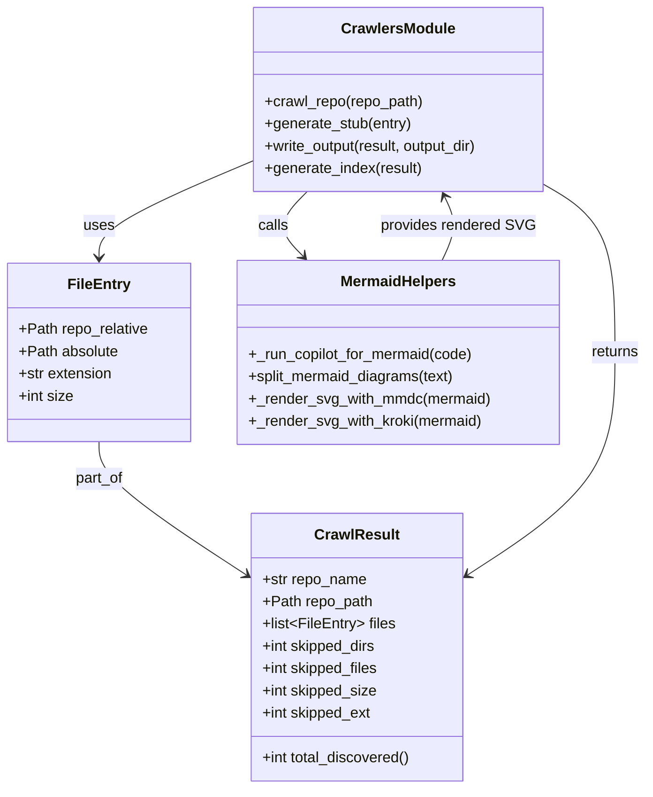

# Diagram: research/config/config.test.yml


> Auto-generated by Obscura crawlers

## Diagram 1

```mermaid
flowchart TD
    CLI[CLI: crawlers.py]
    CrawlRepo[crawl_repo(repo_path)]
    FileEntry[FileEntry<br/>repo_relative, absolute, extension, size]
    GenerateStub[generate_stub(entry)]
    RunCopilot[_run_copilot_for_mermaid(code)]
    SplitDiagrams[split_mermaid_diagrams(raw_mermaid)]
    RenderMMD[_render_svg_with_mmdc(mermaid)]
    RenderKroki[_render_svg_with_kroki(mermaid)]
    WriteOutput[write_output(result, output_dir)]
    Index[INDEX.md]
    CLI -->|invokes| CrawlRepo
    CrawlRepo -->|discovers files| FileEntry
    FileEntry -->|used to generate| GenerateStub
    GenerateStub --> RunCopilot
    RunCopilot --> SplitDiagrams
    SplitDiagrams -->|try render| RenderMMD
    SplitDiagrams -->|fallback render| RenderKroki
    GenerateStub -->|embeds mermaid & svg| WriteOutput
    WriteOutput --> Index
```

> SVG rendering failed for this diagram.

## Diagram 2



### SVG

<svg id="container" width="695.4375" xmlns="http://www.w3.org/2000/svg" class="classDiagram" height="848" viewBox="0 0 695.4375 848" role="graphics-document document" aria-roledescription="class"><style>#container{font-family:"trebuchet ms",verdana,arial,sans-serif;font-size:16px;fill:#333;}@keyframes edge-animation-frame{from{stroke-dashoffset:0;}}@keyframes dash{to{stroke-dashoffset:0;}}#container .edge-animation-slow{stroke-dasharray:9,5!important;stroke-dashoffset:900;animation:dash 50s linear infinite;stroke-linecap:round;}#container .edge-animation-fast{stroke-dasharray:9,5!important;stroke-dashoffset:900;animation:dash 20s linear infinite;stroke-linecap:round;}#container .error-icon{fill:#552222;}#container .error-text{fill:#552222;stroke:#552222;}#container .edge-thickness-normal{stroke-width:1px;}#container .edge-thickness-thick{stroke-width:3.5px;}#container .edge-pattern-solid{stroke-dasharray:0;}#container .edge-thickness-invisible{stroke-width:0;fill:none;}#container .edge-pattern-dashed{stroke-dasharray:3;}#container .edge-pattern-dotted{stroke-dasharray:2;}#container .marker{fill:#333333;stroke:#333333;}#container .marker.cross{stroke:#333333;}#container svg{font-family:"trebuchet ms",verdana,arial,sans-serif;font-size:16px;}#container p{margin:0;}#container g.classGroup text{fill:#9370DB;stroke:none;font-family:"trebuchet ms",verdana,arial,sans-serif;font-size:10px;}#container g.classGroup text .title{font-weight:bolder;}#container .nodeLabel,#container .edgeLabel{color:#131300;}#container .edgeLabel .label rect{fill:#ECECFF;}#container .label text{fill:#131300;}#container .labelBkg{background:#ECECFF;}#container .edgeLabel .label span{background:#ECECFF;}#container .classTitle{font-weight:bolder;}#container .node rect,#container .node circle,#container .node ellipse,#container .node polygon,#container .node path{fill:#ECECFF;stroke:#9370DB;stroke-width:1px;}#container .divider{stroke:#9370DB;stroke-width:1;}#container g.clickable{cursor:pointer;}#container g.classGroup rect{fill:#ECECFF;stroke:#9370DB;}#container g.classGroup line{stroke:#9370DB;stroke-width:1;}#container .classLabel .box{stroke:none;stroke-width:0;fill:#ECECFF;opacity:0.5;}#container .classLabel .label{fill:#9370DB;font-size:10px;}#container .relation{stroke:#333333;stroke-width:1;fill:none;}#container .dashed-line{stroke-dasharray:3;}#container .dotted-line{stroke-dasharray:1 2;}#container #compositionStart,#container .composition{fill:#333333!important;stroke:#333333!important;stroke-width:1;}#container #compositionEnd,#container .composition{fill:#333333!important;stroke:#333333!important;stroke-width:1;}#container #dependencyStart,#container .dependency{fill:#333333!important;stroke:#333333!important;stroke-width:1;}#container #dependencyStart,#container .dependency{fill:#333333!important;stroke:#333333!important;stroke-width:1;}#container #extensionStart,#container .extension{fill:transparent!important;stroke:#333333!important;stroke-width:1;}#container #extensionEnd,#container .extension{fill:transparent!important;stroke:#333333!important;stroke-width:1;}#container #aggregationStart,#container .aggregation{fill:transparent!important;stroke:#333333!important;stroke-width:1;}#container #aggregationEnd,#container .aggregation{fill:transparent!important;stroke:#333333!important;stroke-width:1;}#container #lollipopStart,#container .lollipop{fill:#ECECFF!important;stroke:#333333!important;stroke-width:1;}#container #lollipopEnd,#container .lollipop{fill:#ECECFF!important;stroke:#333333!important;stroke-width:1;}#container .edgeTerminals{font-size:11px;line-height:initial;}#container .classTitleText{text-anchor:middle;font-size:18px;fill:#333;}#container .label-icon{display:inline-block;height:1em;overflow:visible;vertical-align:-0.125em;}#container .node .label-icon path{fill:currentColor;stroke:revert;stroke-width:revert;}#container :root{--mermaid-font-family:"trebuchet ms",verdana,arial,sans-serif;}</style><g><defs><marker id="container_class-aggregationStart" class="marker aggregation class" refX="18" refY="7" markerWidth="190" markerHeight="240" orient="auto"><path d="M 18,7 L9,13 L1,7 L9,1 Z"></path></marker></defs><defs><marker id="container_class-aggregationEnd" class="marker aggregation class" refX="1" refY="7" markerWidth="20" markerHeight="28" orient="auto"><path d="M 18,7 L9,13 L1,7 L9,1 Z"></path></marker></defs><defs><marker id="container_class-extensionStart" class="marker extension class" refX="18" refY="7" markerWidth="190" markerHeight="240" orient="auto"><path d="M 1,7 L18,13 V 1 Z"></path></marker></defs><defs><marker id="container_class-extensionEnd" class="marker extension class" refX="1" refY="7" markerWidth="20" markerHeight="28" orient="auto"><path d="M 1,1 V 13 L18,7 Z"></path></marker></defs><defs><marker id="container_class-compositionStart" class="marker composition class" refX="18" refY="7" markerWidth="190" markerHeight="240" orient="auto"><path d="M 18,7 L9,13 L1,7 L9,1 Z"></path></marker></defs><defs><marker id="container_class-compositionEnd" class="marker composition class" refX="1" refY="7" markerWidth="20" markerHeight="28" orient="auto"><path d="M 18,7 L9,13 L1,7 L9,1 Z"></path></marker></defs><defs><marker id="container_class-dependencyStart" class="marker dependency class" refX="6" refY="7" markerWidth="190" markerHeight="240" orient="auto"><path d="M 5,7 L9,13 L1,7 L9,1 Z"></path></marker></defs><defs><marker id="container_class-dependencyEnd" class="marker dependency class" refX="13" refY="7" markerWidth="20" markerHeight="28" orient="auto"><path d="M 18,7 L9,13 L14,7 L9,1 Z"></path></marker></defs><defs><marker id="container_class-lollipopStart" class="marker lollipop class" refX="13" refY="7" markerWidth="190" markerHeight="240" orient="auto"><circle stroke="black" fill="transparent" cx="7" cy="7" r="6"></circle></marker></defs><defs><marker id="container_class-lollipopEnd" class="marker lollipop class" refX="1" refY="7" markerWidth="190" markerHeight="240" orient="auto"><circle stroke="black" fill="transparent" cx="7" cy="7" r="6"></circle></marker></defs><g class="root"><g class="clusters"></g><g class="edgePaths"><path d="M106.086,475L106.086,481.667C106.086,488.333,106.086,501.667,132.339,525.454C158.592,549.242,211.097,583.483,237.35,600.604L263.603,617.725" id="id_FileEntry_CrawlResult_1" class="edge-thickness-normal edge-pattern-solid relation" style=";;;" data-edge="true" data-et="edge" data-id="id_FileEntry_CrawlResult_1" data-points="W3sieCI6MTA2LjA4NTkzNzUsInkiOjQ3NX0seyJ4IjoxMDYuMDg1OTM3NSwieSI6NTE1fSx7IngiOjI2OC42Mjg5MDYyNSwieSI6NjIxLjAwMjYwMzc2MzQ5Mzl9XQ==" marker-end="url(#container_class-dependencyEnd)"></path><path d="M587.613,200.272L599.873,207.394C612.133,214.515,636.652,228.757,648.912,258.545C661.172,288.333,661.172,333.667,661.172,379C661.172,424.333,661.172,469.667,634.919,509.454C608.666,549.242,556.16,583.483,529.907,600.604L503.655,617.725" id="id_CrawlersModule_CrawlResult_2" class="edge-thickness-normal edge-pattern-solid relation" style=";;;" data-edge="true" data-et="edge" data-id="id_CrawlersModule_CrawlResult_2" data-points="W3sieCI6NTg3LjYxMzI4MTI1LCJ5IjoyMDAuMjcyMjQ3OTg5NTg5MjN9LHsieCI6NjYxLjE3MTg3NSwieSI6MjQzfSx7IngiOjY2MS4xNzE4NzUsInkiOjM3OX0seyJ4Ijo2NjEuMTcxODc1LCJ5Ijo1MTV9LHsieCI6NDk4LjYyODkwNjI1LCJ5Ijo2MjEuMDAyNjAzNzYzNDkzOX1d" marker-end="url(#container_class-dependencyEnd)"></path><path d="M266.465,175.041L239.735,186.368C213.005,197.694,159.546,220.347,132.816,237.34C106.086,254.333,106.086,265.667,106.086,271.333L106.086,277" id="id_CrawlersModule_FileEntry_3" class="edge-thickness-normal edge-pattern-solid relation" style=";;;" data-edge="true" data-et="edge" data-id="id_CrawlersModule_FileEntry_3" data-points="W3sieCI6MjY2LjQ2NDg0Mzc1LCJ5IjoxNzUuMDQxMzgwNjUzMzI3NX0seyJ4IjoxMDYuMDg1OTM3NSwieSI6MjQzfSx7IngiOjEwNi4wODU5Mzc1LCJ5IjoyODN9XQ==" marker-end="url(#container_class-dependencyEnd)"></path><path d="M329.489,206L323.413,212.167C317.337,218.333,305.184,230.667,304.482,242.288C303.78,253.909,314.529,264.817,319.904,270.272L325.278,275.726" id="id_CrawlersModule_MermaidHelpers_4" class="edge-thickness-normal edge-pattern-solid relation" style=";;;" data-edge="true" data-et="edge" data-id="id_CrawlersModule_MermaidHelpers_4" data-points="W3sieCI6MzI5LjQ4OTI1NzgxMjUsInkiOjIwNn0seyJ4IjoyOTMuMDMxMjUsInkiOjI0M30seyJ4IjozMjkuNDg5MjU3ODEyNSwieSI6MjgwfV0=" marker-end="url(#container_class-dependencyEnd)"></path><path d="M475.043,280L478.034,273.833C481.024,267.667,487.004,255.333,487.44,243.9C487.877,232.466,482.769,221.933,480.215,216.666L477.661,211.399" id="id_MermaidHelpers_CrawlersModule_5" class="edge-thickness-normal edge-pattern-solid relation" style=";;;" data-edge="true" data-et="edge" data-id="id_MermaidHelpers_CrawlersModule_5" data-points="W3sieCI6NDc1LjA0MzM3MDg2Mzk3MDYsInkiOjI4MH0seyJ4Ijo0OTIuOTg0Mzc1LCJ5IjoyNDN9LHsieCI6NDc1LjA0MzM3MDg2Mzk3MDYsInkiOjIwNn1d" marker-end="url(#container_class-dependencyEnd)"></path></g><g class="edgeLabels"><g class="edgeLabel" transform="translate(106.0859375, 515)"><g class="label" data-id="id_FileEntry_CrawlResult_1" transform="translate(-26.359375, -12)"><foreignObject width="52.71875" height="24"><div xmlns="http://www.w3.org/1999/xhtml" class="labelBkg" style="display: table-cell; white-space: nowrap; line-height: 1.5; max-width: 200px; text-align: center;"><span class="edgeLabel"><p>part_of</p></span></div></foreignObject></g></g><g class="edgeLabel" transform="translate(661.171875, 379)"><g class="label" data-id="id_CrawlersModule_CrawlResult_2" transform="translate(-26.265625, -12)"><foreignObject width="52.53125" height="24"><div xmlns="http://www.w3.org/1999/xhtml" class="labelBkg" style="display: table-cell; white-space: nowrap; line-height: 1.5; max-width: 200px; text-align: center;"><span class="edgeLabel"><p>returns</p></span></div></foreignObject></g></g><g class="edgeLabel" transform="translate(106.0859375, 243)"><g class="label" data-id="id_CrawlersModule_FileEntry_3" transform="translate(-16.4921875, -12)"><foreignObject width="32.984375" height="24"><div xmlns="http://www.w3.org/1999/xhtml" class="labelBkg" style="display: table-cell; white-space: nowrap; line-height: 1.5; max-width: 200px; text-align: center;"><span class="edgeLabel"><p>uses</p></span></div></foreignObject></g></g><g class="edgeLabel" transform="translate(293.03125, 243)"><g class="label" data-id="id_CrawlersModule_MermaidHelpers_4" transform="translate(-16.4453125, -12)"><foreignObject width="32.890625" height="24"><div xmlns="http://www.w3.org/1999/xhtml" class="labelBkg" style="display: table-cell; white-space: nowrap; line-height: 1.5; max-width: 200px; text-align: center;"><span class="edgeLabel"><p>calls</p></span></div></foreignObject></g></g><g class="edgeLabel" transform="translate(492.984375, 243)"><g class="label" data-id="id_MermaidHelpers_CrawlersModule_5" transform="translate(-82.2421875, -12)"><foreignObject width="164.484375" height="24"><div xmlns="http://www.w3.org/1999/xhtml" class="labelBkg" style="display: table-cell; white-space: nowrap; line-height: 1.5; max-width: 200px; text-align: center;"><span class="edgeLabel"><p>provides rendered SVG</p></span></div></foreignObject></g></g></g><g class="nodes"><g class="node default" id="classId-FileEntry-0" transform="translate(106.0859375, 379)"><g class="basic label-container"><path d="M-98.0859375 -96 L98.0859375 -96 L98.0859375 96 L-98.0859375 96" stroke="none" stroke-width="0" fill="#ECECFF" style=""></path><path d="M-98.0859375 -96 C-35.71377800678433 -96, 26.658381486431338 -96, 98.0859375 -96 M-98.0859375 -96 C-49.918598639197434 -96, -1.7512597783948678 -96, 98.0859375 -96 M98.0859375 -96 C98.0859375 -51.21174416745475, 98.0859375 -6.423488334909507, 98.0859375 96 M98.0859375 -96 C98.0859375 -37.276970397398074, 98.0859375 21.446059205203852, 98.0859375 96 M98.0859375 96 C41.439544114120636 96, -15.206849271758728 96, -98.0859375 96 M98.0859375 96 C53.6526483634161 96, 9.219359226832196 96, -98.0859375 96 M-98.0859375 96 C-98.0859375 40.0114075158652, -98.0859375 -15.977184968269597, -98.0859375 -96 M-98.0859375 96 C-98.0859375 23.357257900301803, -98.0859375 -49.28548419939639, -98.0859375 -96" stroke="#9370DB" stroke-width="1.3" fill="none" stroke-dasharray="0 0" style=""></path></g><g class="annotation-group text" transform="translate(0, -72)"></g><g class="label-group text" transform="translate(-31.859375, -72)"><g class="label" style="font-weight: bolder" transform="translate(0,-12)"><foreignObject width="63.71875" height="24"><div xmlns="http://www.w3.org/1999/xhtml" style="display: table-cell; white-space: nowrap; line-height: 1.5; max-width: 113px; text-align: center;"><span class="nodeLabel markdown-node-label" style=""><p>FileEntry</p></span></div></foreignObject></g></g><g class="members-group text" transform="translate(-86.0859375, -24)"><g class="label" style="" transform="translate(0,-12)"><foreignObject width="140.3125" height="24"><div xmlns="http://www.w3.org/1999/xhtml" style="display: table-cell; white-space: nowrap; line-height: 1.5; max-width: 198px; text-align: center;"><span class="nodeLabel markdown-node-label" style=""><p>+Path repo_relative</p></span></div></foreignObject></g><g class="label" style="" transform="translate(0,12)"><foreignObject width="107.78125" height="24"><div xmlns="http://www.w3.org/1999/xhtml" style="display: table-cell; white-space: nowrap; line-height: 1.5; max-width: 165px; text-align: center;"><span class="nodeLabel markdown-node-label" style=""><p>+Path absolute</p></span></div></foreignObject></g><g class="label" style="" transform="translate(0,36)"><foreignObject width="102.328125" height="24"><div xmlns="http://www.w3.org/1999/xhtml" style="display: table-cell; white-space: nowrap; line-height: 1.5; max-width: 160px; text-align: center;"><span class="nodeLabel markdown-node-label" style=""><p>+str extension</p></span></div></foreignObject></g><g class="label" style="" transform="translate(0,60)"><foreignObject width="59.484375" height="24"><div xmlns="http://www.w3.org/1999/xhtml" style="display: table-cell; white-space: nowrap; line-height: 1.5; max-width: 117px; text-align: center;"><span class="nodeLabel markdown-node-label" style=""><p>+int size</p></span></div></foreignObject></g></g><g class="methods-group text" transform="translate(-86.0859375, 96)"></g><g class="divider" style=""><path d="M-98.0859375 -48 C-51.56055633629827 -48, -5.035175172596539 -48, 98.0859375 -48 M-98.0859375 -48 C-44.32688731688024 -48, 9.432162866239523 -48, 98.0859375 -48" stroke="#9370DB" stroke-width="1.3" fill="none" stroke-dasharray="0 0" style=""></path></g><g class="divider" style=""><path d="M-98.0859375 72 C-57.60187276148952 72, -17.117808022979034 72, 98.0859375 72 M-98.0859375 72 C-47.590449065661105 72, 2.905039368677791 72, 98.0859375 72" stroke="#9370DB" stroke-width="1.3" fill="none" stroke-dasharray="0 0" style=""></path></g></g><g class="node default" id="classId-CrawlResult-1" transform="translate(383.62890625, 696)"><g class="basic label-container"><path d="M-115 -144 L115 -144 L115 144 L-115 144" stroke="none" stroke-width="0" fill="#ECECFF" style=""></path><path d="M-115 -144 C-30.366335500756747 -144, 54.267328998486505 -144, 115 -144 M-115 -144 C-24.288084030168875 -144, 66.42383193966225 -144, 115 -144 M115 -144 C115 -63.70030074038084, 115 16.59939851923832, 115 144 M115 -144 C115 -48.85877078505439, 115 46.28245842989122, 115 144 M115 144 C52.18275133707843 144, -10.634497325843142 144, -115 144 M115 144 C52.105883609219035 144, -10.78823278156193 144, -115 144 M-115 144 C-115 77.76834599054365, -115 11.536691981087301, -115 -144 M-115 144 C-115 85.40783407836116, -115 26.81566815672234, -115 -144" stroke="#9370DB" stroke-width="1.3" fill="none" stroke-dasharray="0 0" style=""></path></g><g class="annotation-group text" transform="translate(0, -120)"></g><g class="label-group text" transform="translate(-43.28125, -120)"><g class="label" style="font-weight: bolder" transform="translate(0,-12)"><foreignObject width="86.5625" height="24"><div xmlns="http://www.w3.org/1999/xhtml" style="display: table-cell; white-space: nowrap; line-height: 1.5; max-width: 135px; text-align: center;"><span class="nodeLabel markdown-node-label" style=""><p>CrawlResult</p></span></div></foreignObject></g></g><g class="members-group text" transform="translate(-103, -72)"><g class="label" style="" transform="translate(0,-12)"><foreignObject width="113.4375" height="24"><div xmlns="http://www.w3.org/1999/xhtml" style="display: table-cell; white-space: nowrap; line-height: 1.5; max-width: 171px; text-align: center;"><span class="nodeLabel markdown-node-label" style=""><p>+str repo_name</p></span></div></foreignObject></g><g class="label" style="" transform="translate(0,12)"><foreignObject width="118.96875" height="24"><div xmlns="http://www.w3.org/1999/xhtml" style="display: table-cell; white-space: nowrap; line-height: 1.5; max-width: 176px; text-align: center;"><span class="nodeLabel markdown-node-label" style=""><p>+Path repo_path</p></span></div></foreignObject></g><g class="label" style="" transform="translate(0,36)"><foreignObject width="143.421875" height="24"><div xmlns="http://www.w3.org/1999/xhtml" style="display: table-cell; white-space: nowrap; line-height: 1.5; max-width: 240px; text-align: center;"><span class="nodeLabel markdown-node-label" style=""><p>+list&lt;FileEntry&gt; files</p></span></div></foreignObject></g><g class="label" style="" transform="translate(0,60)"><foreignObject width="124.859375" height="24"><div xmlns="http://www.w3.org/1999/xhtml" style="display: table-cell; white-space: nowrap; line-height: 1.5; max-width: 182px; text-align: center;"><span class="nodeLabel markdown-node-label" style=""><p>+int skipped_dirs</p></span></div></foreignObject></g><g class="label" style="" transform="translate(0,84)"><foreignObject width="127.375" height="24"><div xmlns="http://www.w3.org/1999/xhtml" style="display: table-cell; white-space: nowrap; line-height: 1.5; max-width: 185px; text-align: center;"><span class="nodeLabel markdown-node-label" style=""><p>+int skipped_files</p></span></div></foreignObject></g><g class="label" style="" transform="translate(0,108)"><foreignObject width="125.265625" height="24"><div xmlns="http://www.w3.org/1999/xhtml" style="display: table-cell; white-space: nowrap; line-height: 1.5; max-width: 183px; text-align: center;"><span class="nodeLabel markdown-node-label" style=""><p>+int skipped_size</p></span></div></foreignObject></g><g class="label" style="" transform="translate(0,132)"><foreignObject width="119.484375" height="24"><div xmlns="http://www.w3.org/1999/xhtml" style="display: table-cell; white-space: nowrap; line-height: 1.5; max-width: 177px; text-align: center;"><span class="nodeLabel markdown-node-label" style=""><p>+int skipped_ext</p></span></div></foreignObject></g></g><g class="methods-group text" transform="translate(-103, 120)"><g class="label" style="" transform="translate(0,-12)"><foreignObject width="162.71875" height="24"><div xmlns="http://www.w3.org/1999/xhtml" style="display: table-cell; white-space: nowrap; line-height: 1.5; max-width: 220px; text-align: center;"><span class="nodeLabel markdown-node-label" style=""><p>+int total_discovered()</p></span></div></foreignObject></g></g><g class="divider" style=""><path d="M-115 -96 C-63.994076825044324 -96, -12.988153650088648 -96, 115 -96 M-115 -96 C-63.317363915448475 -96, -11.63472783089695 -96, 115 -96" stroke="#9370DB" stroke-width="1.3" fill="none" stroke-dasharray="0 0" style=""></path></g><g class="divider" style=""><path d="M-115 96 C-66.54053455228805 96, -18.081069104576088 96, 115 96 M-115 96 C-28.55778461637371 96, 57.88443076725258 96, 115 96" stroke="#9370DB" stroke-width="1.3" fill="none" stroke-dasharray="0 0" style=""></path></g></g><g class="node default" id="classId-CrawlersModule-2" transform="translate(427.0390625, 107)"><g class="basic label-container"><path d="M-160.57421875 -99 L160.57421875 -99 L160.57421875 99 L-160.57421875 99" stroke="none" stroke-width="0" fill="#ECECFF" style=""></path><path d="M-160.57421875 -99 C-38.0079513428707 -99, 84.5583160642586 -99, 160.57421875 -99 M-160.57421875 -99 C-60.14483063252638 -99, 40.28455748494724 -99, 160.57421875 -99 M160.57421875 -99 C160.57421875 -28.627471678745493, 160.57421875 41.74505664250901, 160.57421875 99 M160.57421875 -99 C160.57421875 -42.574908855724075, 160.57421875 13.85018228855185, 160.57421875 99 M160.57421875 99 C72.53610182958724 99, -15.502015090825523 99, -160.57421875 99 M160.57421875 99 C49.36920078989425 99, -61.8358171702115 99, -160.57421875 99 M-160.57421875 99 C-160.57421875 55.31166029772821, -160.57421875 11.62332059545642, -160.57421875 -99 M-160.57421875 99 C-160.57421875 36.71124772719782, -160.57421875 -25.577504545604356, -160.57421875 -99" stroke="#9370DB" stroke-width="1.3" fill="none" stroke-dasharray="0 0" style=""></path></g><g class="annotation-group text" transform="translate(0, -75)"></g><g class="label-group text" transform="translate(-58.5859375, -75)"><g class="label" style="font-weight: bolder" transform="translate(0,-12)"><foreignObject width="117.171875" height="24"><div xmlns="http://www.w3.org/1999/xhtml" style="display: table-cell; white-space: nowrap; line-height: 1.5; max-width: 165px; text-align: center;"><span class="nodeLabel markdown-node-label" style=""><p>CrawlersModule</p></span></div></foreignObject></g></g><g class="members-group text" transform="translate(-148.57421875, -27)"></g><g class="methods-group text" transform="translate(-148.57421875, 3)"><g class="label" style="" transform="translate(0,-12)"><foreignObject width="172.453125" height="24"><div xmlns="http://www.w3.org/1999/xhtml" style="display: table-cell; white-space: nowrap; line-height: 1.5; max-width: 230px; text-align: center;"><span class="nodeLabel markdown-node-label" style=""><p>+crawl_repo(repo_path)</p></span></div></foreignObject></g><g class="label" style="" transform="translate(0,12)"><foreignObject width="159.796875" height="24"><div xmlns="http://www.w3.org/1999/xhtml" style="display: table-cell; white-space: nowrap; line-height: 1.5; max-width: 217px; text-align: center;"><span class="nodeLabel markdown-node-label" style=""><p>+generate_stub(entry)</p></span></div></foreignObject></g><g class="label" style="" transform="translate(0,36)"><foreignObject width="238.5625" height="24"><div xmlns="http://www.w3.org/1999/xhtml" style="display: table-cell; white-space: nowrap; line-height: 1.5; max-width: 296px; text-align: center;"><span class="nodeLabel markdown-node-label" style=""><p>+write_output(result, output_dir)</p></span></div></foreignObject></g><g class="label" style="" transform="translate(0,60)"><foreignObject width="171.265625" height="24"><div xmlns="http://www.w3.org/1999/xhtml" style="display: table-cell; white-space: nowrap; line-height: 1.5; max-width: 229px; text-align: center;"><span class="nodeLabel markdown-node-label" style=""><p>+generate_index(result)</p></span></div></foreignObject></g></g><g class="divider" style=""><path d="M-160.57421875 -51 C-88.14649630571573 -51, -15.718773861431458 -51, 160.57421875 -51 M-160.57421875 -51 C-33.69214737306926 -51, 93.18992400386148 -51, 160.57421875 -51" stroke="#9370DB" stroke-width="1.3" fill="none" stroke-dasharray="0 0" style=""></path></g><g class="divider" style=""><path d="M-160.57421875 -27 C-54.9612733884575 -27, 50.651671973085 -27, 160.57421875 -27 M-160.57421875 -27 C-52.036622392854255 -27, 56.50097396429149 -27, 160.57421875 -27" stroke="#9370DB" stroke-width="1.3" fill="none" stroke-dasharray="0 0" style=""></path></g></g><g class="node default" id="classId-MermaidHelpers-3" transform="translate(427.0390625, 379)"><g class="basic label-container"><path d="M-172.8671875 -99 L172.8671875 -99 L172.8671875 99 L-172.8671875 99" stroke="none" stroke-width="0" fill="#ECECFF" style=""></path><path d="M-172.8671875 -99 C-83.9860727755094 -99, 4.895041948981202 -99, 172.8671875 -99 M-172.8671875 -99 C-40.42181176666787 -99, 92.02356396666426 -99, 172.8671875 -99 M172.8671875 -99 C172.8671875 -44.47053879411633, 172.8671875 10.058922411767341, 172.8671875 99 M172.8671875 -99 C172.8671875 -35.55568518787345, 172.8671875 27.8886296242531, 172.8671875 99 M172.8671875 99 C62.6227151925615 99, -47.621757114877 99, -172.8671875 99 M172.8671875 99 C42.4450628168768 99, -87.9770618662464 99, -172.8671875 99 M-172.8671875 99 C-172.8671875 22.18372360201009, -172.8671875 -54.63255279597982, -172.8671875 -99 M-172.8671875 99 C-172.8671875 24.969064367779907, -172.8671875 -49.061871264440185, -172.8671875 -99" stroke="#9370DB" stroke-width="1.3" fill="none" stroke-dasharray="0 0" style=""></path></g><g class="annotation-group text" transform="translate(0, -75)"></g><g class="label-group text" transform="translate(-60.40625, -75)"><g class="label" style="font-weight: bolder" transform="translate(0,-12)"><foreignObject width="120.8125" height="24"><div xmlns="http://www.w3.org/1999/xhtml" style="display: table-cell; white-space: nowrap; line-height: 1.5; max-width: 170px; text-align: center;"><span class="nodeLabel markdown-node-label" style=""><p>MermaidHelpers</p></span></div></foreignObject></g></g><g class="members-group text" transform="translate(-160.8671875, -27)"></g><g class="methods-group text" transform="translate(-160.8671875, 3)"><g class="label" style="" transform="translate(0,-12)"><foreignObject width="244.5" height="24"><div xmlns="http://www.w3.org/1999/xhtml" style="display: table-cell; white-space: nowrap; line-height: 1.5; max-width: 302px; text-align: center;"><span class="nodeLabel markdown-node-label" style=""><p>+_run_copilot_for_mermaid(code)</p></span></div></foreignObject></g><g class="label" style="" transform="translate(0,12)"><foreignObject width="225.828125" height="24"><div xmlns="http://www.w3.org/1999/xhtml" style="display: table-cell; white-space: nowrap; line-height: 1.5; max-width: 283px; text-align: center;"><span class="nodeLabel markdown-node-label" style=""><p>+split_mermaid_diagrams(text)</p></span></div></foreignObject></g><g class="label" style="" transform="translate(0,36)"><foreignObject width="261.328125" height="24"><div xmlns="http://www.w3.org/1999/xhtml" style="display: table-cell; white-space: nowrap; line-height: 1.5; max-width: 319px; text-align: center;"><span class="nodeLabel markdown-node-label" style=""><p>+_render_svg_with_mmdc(mermaid)</p></span></div></foreignObject></g><g class="label" style="" transform="translate(0,60)"><foreignObject width="252.609375" height="24"><div xmlns="http://www.w3.org/1999/xhtml" style="display: table-cell; white-space: nowrap; line-height: 1.5; max-width: 310px; text-align: center;"><span class="nodeLabel markdown-node-label" style=""><p>+_render_svg_with_kroki(mermaid)</p></span></div></foreignObject></g></g><g class="divider" style=""><path d="M-172.8671875 -51 C-91.3097993040982 -51, -9.752411108196412 -51, 172.8671875 -51 M-172.8671875 -51 C-64.51695112971368 -51, 43.83328524057265 -51, 172.8671875 -51" stroke="#9370DB" stroke-width="1.3" fill="none" stroke-dasharray="0 0" style=""></path></g><g class="divider" style=""><path d="M-172.8671875 -27 C-39.40344691942832 -27, 94.06029366114336 -27, 172.8671875 -27 M-172.8671875 -27 C-80.54858555537508 -27, 11.770016389249832 -27, 172.8671875 -27" stroke="#9370DB" stroke-width="1.3" fill="none" stroke-dasharray="0 0" style=""></path></g></g></g></g></g></svg>
