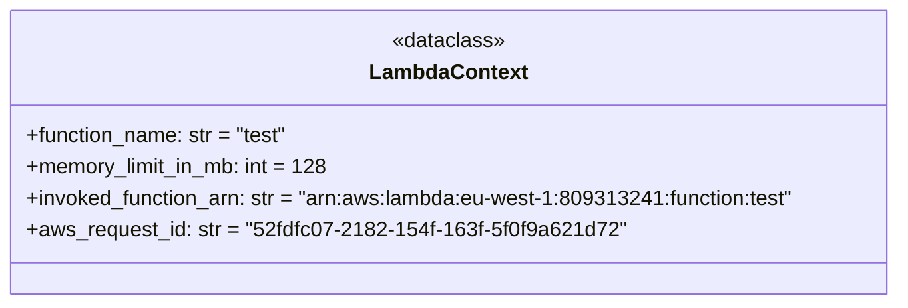

# Diagram: research/conftest.py


> Auto-generated by Obscura crawlers

## Diagram 1



> SVG rendering failed for this diagram.

## Diagram 2

```mermaid
flowchart TD
  Start([Start])
  ImportModules([Import modules: logging, os, dataclass, pytest])
  CheckAWS{Is AWS_STAGE set?}
  CheckRedis{Is REDIS_HOST set?}
  SetMetrics([Set POWERTOOLS_METRICS_NAMESPACE = "EtaServiceTests"])
  SetLogLevel([Set POWERTOOLS_LOG_LEVEL = "DEBUG"])
  ConfigureLogging([logging.basicConfig(level="DEBUG")])
  DefineFixture([Define pytest fixture fake_lambda_context])
  DefineDataclass([Declare @dataclass LambdaContext with defaults])
  ReturnContext([Return LambdaContext instance])
  End([End])

  Start --> ImportModules
  ImportModules --> CheckAWS
  CheckAWS -->|yes| CheckRedis
  CheckAWS -->|no| End
  CheckRedis -->|yes| SetMetrics
  CheckRedis -->|no| End
  SetMetrics --> SetLogLevel
  SetLogLevel --> ConfigureLogging
  ConfigureLogging --> DefineFixture
  DefineFixture --> DefineDataclass
  DefineDataclass --> ReturnContext
  ReturnContext --> End
```

> SVG rendering failed for this diagram.
