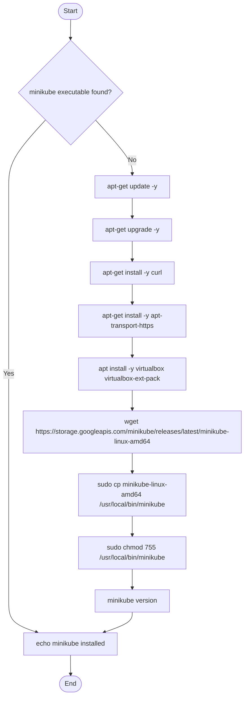

# Diagram: research/deploy/dev/install_minikube.sh

> Auto-generated by Obscura crawlers

## Mermaid

### SVG

<svg id="container" width="622.671875" xmlns="http://www.w3.org/2000/svg" class="flowchart" height="1704" viewBox="0 0 622.671875 1704" role="graphics-document document" aria-roledescription="flowchart-v2"><g><marker id="container_flowchart-v2-pointEnd" class="marker flowchart-v2" viewBox="0 0 10 10" refX="5" refY="5" markerUnits="userSpaceOnUse" markerWidth="8" markerHeight="8" orient="auto"><path d="M 0 0 L 10 5 L 0 10 z" class="arrowMarkerPath" style="stroke-width: 1; stroke-dasharray: 1, 0;"></path></marker><marker id="container_flowchart-v2-pointStart" class="marker flowchart-v2" viewBox="0 0 10 10" refX="4.5" refY="5" markerUnits="userSpaceOnUse" markerWidth="8" markerHeight="8" orient="auto"><path d="M 0 5 L 10 10 L 10 0 z" class="arrowMarkerPath" style="stroke-width: 1; stroke-dasharray: 1, 0;"></path></marker><marker id="container_flowchart-v2-circleEnd" class="marker flowchart-v2" viewBox="0 0 10 10" refX="11" refY="5" markerUnits="userSpaceOnUse" markerWidth="11" markerHeight="11" orient="auto"><circle cx="5" cy="5" r="5" class="arrowMarkerPath" style="stroke-width: 1; stroke-dasharray: 1, 0;"></circle></marker><marker id="container_flowchart-v2-circleStart" class="marker flowchart-v2" viewBox="0 0 10 10" refX="-1" refY="5" markerUnits="userSpaceOnUse" markerWidth="11" markerHeight="11" orient="auto"><circle cx="5" cy="5" r="5" class="arrowMarkerPath" style="stroke-width: 1; stroke-dasharray: 1, 0;"></circle></marker><marker id="container_flowchart-v2-crossEnd" class="marker cross flowchart-v2" viewBox="0 0 11 11" refX="12" refY="5.2" markerUnits="userSpaceOnUse" markerWidth="11" markerHeight="11" orient="auto"><path d="M 1,1 l 9,9 M 10,1 l -9,9" class="arrowMarkerPath" style="stroke-width: 2; stroke-dasharray: 1, 0;"></path></marker><marker id="container_flowchart-v2-crossStart" class="marker cross flowchart-v2" viewBox="0 0 11 11" refX="-1" refY="5.2" markerUnits="userSpaceOnUse" markerWidth="11" markerHeight="11" orient="auto"><path d="M 1,1 l 9,9 M 10,1 l -9,9" class="arrowMarkerPath" style="stroke-width: 2; stroke-dasharray: 1, 0;"></path></marker><g class="root"><g class="clusters"></g><g class="edgePaths"><path d="M177.941,47.5L177.858,51.583C177.775,55.667,177.608,63.833,177.525,71.417C177.441,79,177.441,86,177.441,89.5L177.441,93" id="L_Start_Check_0" class="edge-thickness-normal edge-pattern-solid edge-thickness-normal edge-pattern-solid flowchart-link" style=";" data-edge="true" data-et="edge" data-id="L_Start_Check_0" data-points="W3sieCI6MTc3Ljk0MTQwNjI1LCJ5Ijo0Ny41MDAwMDAwMDAwMDAwNX0seyJ4IjoxNzcuNDQxNDA2MjUsInkiOjcyfSx7IngiOjE3Ny40NDE0MDYyNSwieSI6OTd9XQ==" marker-end="url(#container_flowchart-v2-pointEnd)"></path><path d="M111.816,309.375L96.519,326.479C81.221,343.583,50.626,377.792,35.329,405.563C20.031,433.333,20.031,454.667,20.031,474C20.031,493.333,20.031,510.667,20.031,528C20.031,545.333,20.031,562.667,20.031,580C20.031,597.333,20.031,614.667,20.031,632C20.031,649.333,20.031,666.667,20.031,684C20.031,701.333,20.031,718.667,20.031,738C20.031,757.333,20.031,778.667,20.031,800C20.031,821.333,20.031,842.667,20.031,864C20.031,885.333,20.031,906.667,20.031,928C20.031,949.333,20.031,970.667,20.031,994C20.031,1017.333,20.031,1042.667,20.031,1068C20.031,1093.333,20.031,1118.667,20.031,1144C20.031,1169.333,20.031,1194.667,20.031,1220C20.031,1245.333,20.031,1270.667,20.031,1294C20.031,1317.333,20.031,1338.667,20.031,1360C20.031,1381.333,20.031,1402.667,20.031,1422C20.031,1441.333,20.031,1458.667,20.031,1476C20.031,1493.333,20.031,1510.667,32.011,1523.291C43.991,1535.915,67.951,1543.83,79.931,1547.788L91.911,1551.745" id="L_Check_Installed_0" class="edge-thickness-normal edge-pattern-solid edge-thickness-normal edge-pattern-solid flowchart-link" style=";" data-edge="true" data-et="edge" data-id="L_Check_Installed_0" data-points="W3sieCI6MTExLjgxNjQ5NTU4NDg3OTg1LCJ5IjozMDkuMzc1MDg5MzM0ODc5OX0seyJ4IjoyMC4wMzEyNSwieSI6NDEyfSx7IngiOjIwLjAzMTI1LCJ5Ijo0NzZ9LHsieCI6MjAuMDMxMjUsInkiOjUyOH0seyJ4IjoyMC4wMzEyNSwieSI6NTgwfSx7IngiOjIwLjAzMTI1LCJ5Ijo2MzJ9LHsieCI6MjAuMDMxMjUsInkiOjY4NH0seyJ4IjoyMC4wMzEyNSwieSI6NzM2fSx7IngiOjIwLjAzMTI1LCJ5Ijo4MDB9LHsieCI6MjAuMDMxMjUsInkiOjg2NH0seyJ4IjoyMC4wMzEyNSwieSI6OTI4fSx7IngiOjIwLjAzMTI1LCJ5Ijo5OTJ9LHsieCI6MjAuMDMxMjUsInkiOjEwNjh9LHsieCI6MjAuMDMxMjUsInkiOjExNDR9LHsieCI6MjAuMDMxMjUsInkiOjEyMjB9LHsieCI6MjAuMDMxMjUsInkiOjEyOTZ9LHsieCI6MjAuMDMxMjUsInkiOjEzNjB9LHsieCI6MjAuMDMxMjUsInkiOjE0MjR9LHsieCI6MjAuMDMxMjUsInkiOjE0NzZ9LHsieCI6MjAuMDMxMjUsInkiOjE1Mjh9LHsieCI6OTUuNzA5MjA5NzM1NTc2OTIsInkiOjE1NTN9XQ==" marker-end="url(#container_flowchart-v2-pointEnd)"></path><path d="M243.066,309.375L258.364,326.479C273.661,343.583,304.256,377.792,319.554,400.396C334.852,423,334.852,434,334.852,439.5L334.852,445" id="L_Check_Update_0" class="edge-thickness-normal edge-pattern-solid edge-thickness-normal edge-pattern-solid flowchart-link" style=";" data-edge="true" data-et="edge" data-id="L_Check_Update_0" data-points="W3sieCI6MjQzLjA2NjMxNjkxNTEyMDE1LCJ5IjozMDkuMzc1MDg5MzM0ODc5OX0seyJ4IjozMzQuODUxNTYyNSwieSI6NDEyfSx7IngiOjMzNC44NTE1NjI1LCJ5Ijo0NDl9XQ==" marker-end="url(#container_flowchart-v2-pointEnd)"></path><path d="M334.852,503L334.852,507.167C334.852,511.333,334.852,519.667,334.852,527.333C334.852,535,334.852,542,334.852,545.5L334.852,549" id="L_Update_Upgrade_0" class="edge-thickness-normal edge-pattern-solid edge-thickness-normal edge-pattern-solid flowchart-link" style=";" data-edge="true" data-et="edge" data-id="L_Update_Upgrade_0" data-points="W3sieCI6MzM0Ljg1MTU2MjUsInkiOjUwM30seyJ4IjozMzQuODUxNTYyNSwieSI6NTI4fSx7IngiOjMzNC44NTE1NjI1LCJ5Ijo1NTN9XQ==" marker-end="url(#container_flowchart-v2-pointEnd)"></path><path d="M334.852,607L334.852,611.167C334.852,615.333,334.852,623.667,334.852,631.333C334.852,639,334.852,646,334.852,649.5L334.852,653" id="L_Upgrade_Curl_0" class="edge-thickness-normal edge-pattern-solid edge-thickness-normal edge-pattern-solid flowchart-link" style=";" data-edge="true" data-et="edge" data-id="L_Upgrade_Curl_0" data-points="W3sieCI6MzM0Ljg1MTU2MjUsInkiOjYwN30seyJ4IjozMzQuODUxNTYyNSwieSI6NjMyfSx7IngiOjMzNC44NTE1NjI1LCJ5Ijo2NTd9XQ==" marker-end="url(#container_flowchart-v2-pointEnd)"></path><path d="M334.852,711L334.852,715.167C334.852,719.333,334.852,727.667,334.852,735.333C334.852,743,334.852,750,334.852,753.5L334.852,757" id="L_Curl_AptTransport_0" class="edge-thickness-normal edge-pattern-solid edge-thickness-normal edge-pattern-solid flowchart-link" style=";" data-edge="true" data-et="edge" data-id="L_Curl_AptTransport_0" data-points="W3sieCI6MzM0Ljg1MTU2MjUsInkiOjcxMX0seyJ4IjozMzQuODUxNTYyNSwieSI6NzM2fSx7IngiOjMzNC44NTE1NjI1LCJ5Ijo3NjF9XQ==" marker-end="url(#container_flowchart-v2-pointEnd)"></path><path d="M334.852,839L334.852,843.167C334.852,847.333,334.852,855.667,334.852,863.333C334.852,871,334.852,878,334.852,881.5L334.852,885" id="L_AptTransport_VirtualBox_0" class="edge-thickness-normal edge-pattern-solid edge-thickness-normal edge-pattern-solid flowchart-link" style=";" data-edge="true" data-et="edge" data-id="L_AptTransport_VirtualBox_0" data-points="W3sieCI6MzM0Ljg1MTU2MjUsInkiOjgzOX0seyJ4IjozMzQuODUxNTYyNSwieSI6ODY0fSx7IngiOjMzNC44NTE1NjI1LCJ5Ijo4ODl9XQ==" marker-end="url(#container_flowchart-v2-pointEnd)"></path><path d="M334.852,967L334.852,971.167C334.852,975.333,334.852,983.667,334.852,991.333C334.852,999,334.852,1006,334.852,1009.5L334.852,1013" id="L_VirtualBox_Wget_0" class="edge-thickness-normal edge-pattern-solid edge-thickness-normal edge-pattern-solid flowchart-link" style=";" data-edge="true" data-et="edge" data-id="L_VirtualBox_Wget_0" data-points="W3sieCI6MzM0Ljg1MTU2MjUsInkiOjk2N30seyJ4IjozMzQuODUxNTYyNSwieSI6OTkyfSx7IngiOjMzNC44NTE1NjI1LCJ5IjoxMDE3fV0=" marker-end="url(#container_flowchart-v2-pointEnd)"></path><path d="M334.852,1119L334.852,1123.167C334.852,1127.333,334.852,1135.667,334.852,1143.333C334.852,1151,334.852,1158,334.852,1161.5L334.852,1165" id="L_Wget_Copy_0" class="edge-thickness-normal edge-pattern-solid edge-thickness-normal edge-pattern-solid flowchart-link" style=";" data-edge="true" data-et="edge" data-id="L_Wget_Copy_0" data-points="W3sieCI6MzM0Ljg1MTU2MjUsInkiOjExMTl9LHsieCI6MzM0Ljg1MTU2MjUsInkiOjExNDR9LHsieCI6MzM0Ljg1MTU2MjUsInkiOjExNjl9XQ==" marker-end="url(#container_flowchart-v2-pointEnd)"></path><path d="M334.852,1271L334.852,1275.167C334.852,1279.333,334.852,1287.667,334.852,1295.333C334.852,1303,334.852,1310,334.852,1313.5L334.852,1317" id="L_Copy_Chmod_0" class="edge-thickness-normal edge-pattern-solid edge-thickness-normal edge-pattern-solid flowchart-link" style=";" data-edge="true" data-et="edge" data-id="L_Copy_Chmod_0" data-points="W3sieCI6MzM0Ljg1MTU2MjUsInkiOjEyNzF9LHsieCI6MzM0Ljg1MTU2MjUsInkiOjEyOTZ9LHsieCI6MzM0Ljg1MTU2MjUsInkiOjEzMjF9XQ==" marker-end="url(#container_flowchart-v2-pointEnd)"></path><path d="M334.852,1399L334.852,1403.167C334.852,1407.333,334.852,1415.667,334.852,1423.333C334.852,1431,334.852,1438,334.852,1441.5L334.852,1445" id="L_Chmod_Version_0" class="edge-thickness-normal edge-pattern-solid edge-thickness-normal edge-pattern-solid flowchart-link" style=";" data-edge="true" data-et="edge" data-id="L_Chmod_Version_0" data-points="W3sieCI6MzM0Ljg1MTU2MjUsInkiOjEzOTl9LHsieCI6MzM0Ljg1MTU2MjUsInkiOjE0MjR9LHsieCI6MzM0Ljg1MTU2MjUsInkiOjE0NDl9XQ==" marker-end="url(#container_flowchart-v2-pointEnd)"></path><path d="M334.852,1503L334.852,1507.167C334.852,1511.333,334.852,1519.667,322.872,1527.791C310.892,1535.915,286.932,1543.83,274.952,1547.788L262.972,1551.745" id="L_Version_Installed_0" class="edge-thickness-normal edge-pattern-solid edge-thickness-normal edge-pattern-solid flowchart-link" style=";" data-edge="true" data-et="edge" data-id="L_Version_Installed_0" data-points="W3sieCI6MzM0Ljg1MTU2MjUsInkiOjE1MDN9LHsieCI6MzM0Ljg1MTU2MjUsInkiOjE1Mjh9LHsieCI6MjU5LjE3MzYwMjc2NDQyMzEsInkiOjE1NTN9XQ==" marker-end="url(#container_flowchart-v2-pointEnd)"></path><path d="M177.441,1607L177.441,1611.167C177.441,1615.333,177.441,1623.667,177.512,1631.417C177.582,1639.167,177.722,1646.334,177.793,1649.917L177.863,1653.501" id="L_Installed_End_0" class="edge-thickness-normal edge-pattern-solid edge-thickness-normal edge-pattern-solid flowchart-link" style=";" data-edge="true" data-et="edge" data-id="L_Installed_End_0" data-points="W3sieCI6MTc3LjQ0MTQwNjI1LCJ5IjoxNjA3fSx7IngiOjE3Ny40NDE0MDYyNSwieSI6MTYzMn0seyJ4IjoxNzcuOTQxNDA2MjUsInkiOjE2NTcuNX1d" marker-end="url(#container_flowchart-v2-pointEnd)"></path></g><g class="edgeLabels"><g class="edgeLabel"><g class="label" data-id="L_Start_Check_0" transform="translate(0, 0)"><foreignObject width="0" height="0">

</foreignObject></g></g><g class="edgeLabel" transform="translate(20.03125, 928)"><g class="label" data-id="L_Check_Installed_0" transform="translate(-12.03125, -12)"><foreignObject width="24.0625" height="24">

Yes

</foreignObject></g></g><g class="edgeLabel" transform="translate(334.8515625, 412)"><g class="label" data-id="L_Check_Update_0" transform="translate(-10.140625, -12)"><foreignObject width="20.28125" height="24">

No

</foreignObject></g></g><g class="edgeLabel"><g class="label" data-id="L_Update_Upgrade_0" transform="translate(0, 0)"><foreignObject width="0" height="0">

</foreignObject></g></g><g class="edgeLabel"><g class="label" data-id="L_Upgrade_Curl_0" transform="translate(0, 0)"><foreignObject width="0" height="0">

</foreignObject></g></g><g class="edgeLabel"><g class="label" data-id="L_Curl_AptTransport_0" transform="translate(0, 0)"><foreignObject width="0" height="0">

</foreignObject></g></g><g class="edgeLabel"><g class="label" data-id="L_AptTransport_VirtualBox_0" transform="translate(0, 0)"><foreignObject width="0" height="0">

</foreignObject></g></g><g class="edgeLabel"><g class="label" data-id="L_VirtualBox_Wget_0" transform="translate(0, 0)"><foreignObject width="0" height="0">

</foreignObject></g></g><g class="edgeLabel"><g class="label" data-id="L_Wget_Copy_0" transform="translate(0, 0)"><foreignObject width="0" height="0">

</foreignObject></g></g><g class="edgeLabel"><g class="label" data-id="L_Copy_Chmod_0" transform="translate(0, 0)"><foreignObject width="0" height="0">

</foreignObject></g></g><g class="edgeLabel"><g class="label" data-id="L_Chmod_Version_0" transform="translate(0, 0)"><foreignObject width="0" height="0">

</foreignObject></g></g><g class="edgeLabel"><g class="label" data-id="L_Version_Installed_0" transform="translate(0, 0)"><foreignObject width="0" height="0">

</foreignObject></g></g><g class="edgeLabel"><g class="label" data-id="L_Installed_End_0" transform="translate(0, 0)"><foreignObject width="0" height="0">

</foreignObject></g></g></g><g class="nodes"><g class="node default" id="flowchart-Start-0" transform="translate(177.44140625, 27.5)"><g class="basic label-container outer-path"><path d="M-10.3984375 -19.5 C-2.881814727055403 -19.5, 4.634808045889194 -19.5, 10.3984375 -19.5 C10.3984375 -19.5, 10.398437499999998 -19.5, 10.398437499999998 -19.5 C10.737581198008252 -19.489124321708037, 11.076724896016504 -19.478248643416077, 11.6478067896239 -19.45993515863156 C11.94913700632971 -19.430866195028557, 12.25046722303552 -19.401797231425554, 12.892042152847864 -19.3399052695533 C13.268949762794527 -19.27896977013929, 13.64585737274119 -19.218034270725287, 14.126030759676757 -19.140403561325776 C14.521527240167853 -19.05013407050941, 14.917023720658948 -18.959864579693047, 15.34470188623539 -18.862249829261074 C15.704547989213808 -18.75544939476782, 16.064394092192227 -18.648648960274564, 16.543047751460602 -18.50658706670804 C16.857683044954932 -18.390798370245356, 17.17231833844926 -18.275009673782673, 17.716144095147794 -18.074876768247425 C18.095388533841 -17.906996505124507, 18.474632972534206 -17.73911624200159, 18.85917041279238 -17.568892924097174 C19.1606693252133 -17.41160113460645, 19.46216823763422 -17.25430934511573, 19.967429764076783 -16.990714730406097 C20.328632275702795 -16.771751645196836, 20.689834787328806 -16.55278855998758, 21.036368073605697 -16.342718045390892 C21.342457258576044 -16.129203480342838, 21.64854644354639 -15.915688915294783, 22.061592844578712 -15.627565626425154 C22.433800746482774 -15.330739729524913, 22.806008648386836 -15.033913832624672, 23.03889120850187 -14.848196188198123 C23.31414439001208 -14.59821853155065, 23.589397571522287 -14.348240874903176, 23.964247236767985 -14.007812326905688 C24.1537229598648 -13.812163086562053, 24.343198682961614 -13.61651384621842, 24.833858442968648 -13.10986736009568 C25.05719107014804 -12.847528148224283, 25.28052369732743 -12.585188936352884, 25.644151408126582 -12.158051136245305 C25.923471165630584 -11.783788107743336, 26.202790923134586 -11.409525079241364, 26.391796464640635 -11.156274872382312 C26.56002884772914 -10.897824755238174, 26.72826123081764 -10.639374638094038, 27.073721378604247 -10.108655082055241 C27.235673087552033 -9.821093423429629, 27.39762479649982 -9.533531764804016, 27.6871239742735 -9.019496659696287 C27.88942072643354 -8.599423125378875, 28.09171747859358 -8.179349591061461, 28.22948364880834 -7.893275190886684 C28.410292744066588 -7.446673229892769, 28.591101839324836 -7.000071268898855, 28.698571729970325 -6.734618561215508 C28.813212392913787 -6.389339149938936, 28.92785305585725 -6.044059738662362, 29.09246063421488 -5.548287939305138 C29.190364154219928 -5.174939385871915, 29.288267674224976 -4.801590832438692, 29.40953178754556 -4.339158212148133 C29.48370965334043 -3.9582705487889664, 29.5578875191353 -3.5773828854297998, 29.648482276581777 -3.1121979531509023 C29.700922276815714 -2.7054836667858306, 29.753362277049646 -2.2987693804207585, 29.808330202509367 -1.872449005199798 C29.836959863075364 -1.4265189324383112, 29.86558952364136 -0.9805888596768244, 29.888418715913414 -0.6250057626472757 C29.888418715913414 -0.28441917937190786, 29.888418715913414 0.05616740390345998, 29.888418715913414 0.625005762647271 C29.864574202948305 0.9964032990233167, 29.840729689983192 1.3678008353993625, 29.808330202509367 1.8724490051997846 C29.74969580845733 2.3272057867966596, 29.69106141440529 2.7819625683935345, 29.648482276581777 3.1121979531508885 C29.562048013174017 3.556019627861697, 29.475613749766257 3.9998413025725053, 29.40953178754556 4.339158212148129 C29.341081142699487 4.600190187643352, 29.27263049785341 4.861222163138575, 29.092460634214884 5.548287939305125 C28.975113803872258 5.90171789561876, 28.857766973529632 6.255147851932394, 28.69857172997033 6.734618561215495 C28.55940468280904 7.0783638583157, 28.420237635647748 7.422109155415905, 28.229483648808344 7.893275190886679 C28.062258240273156 8.240522329760546, 27.89503283173797 8.587769468634413, 27.687123974273504 9.019496659696284 C27.558121717948016 9.248553228697132, 27.429119461622527 9.47760979769798, 27.07372137860425 10.108655082055236 C26.838481844534904 10.470046177045376, 26.603242310465557 10.831437272035515, 26.39179646464064 11.156274872382301 C26.117675046912236 11.523572599163469, 25.84355362918383 11.890870325944638, 25.644151408126582 12.158051136245302 C25.47444354500841 12.35739964891488, 25.304735681890236 12.55674816158446, 24.83385844296866 13.10986736009567 C24.56852128088477 13.383849764533432, 24.30318411880088 13.657832168971193, 23.96424723676799 14.007812326905684 C23.70520776875143 14.243065117949579, 23.44616830073487 14.478317908993475, 23.038891208501887 14.848196188198111 C22.679243818677158 15.135005410964348, 22.31959642885243 15.421814633730586, 22.061592844578715 15.627565626425152 C21.826161313022286 15.791792471172178, 21.590729781465853 15.956019315919205, 21.036368073605708 16.34271804539089 C20.692144542609903 16.551388372762553, 20.347921011614094 16.760058700134213, 19.967429764076787 16.990714730406093 C19.591626331752817 17.18677114033592, 19.21582289942885 17.38282755026575, 18.859170412792388 17.56889292409717 C18.49996916397822 17.72790066162074, 18.140767915164055 17.88690839914431, 17.716144095147804 18.07487676824742 C17.440039361169433 18.176485862635644, 17.163934627191058 18.278094957023868, 16.543047751460616 18.506587066708033 C16.29616150589319 18.5798616084601, 16.04927526032576 18.653136150212163, 15.344701886235413 18.86224982926107 C15.100704140601813 18.917940722467847, 14.856706394968214 18.973631615674623, 14.126030759676766 19.140403561325773 C13.84299930848961 19.186161891412027, 13.559967857302453 19.23192022149828, 12.892042152847878 19.3399052695533 C12.616446417321844 19.36649165870713, 12.34085068179581 19.39307804786096, 11.6478067896239 19.45993515863156 C11.247268343769058 19.472779646989334, 10.846729897914216 19.48562413534711, 10.398437500000004 19.5 C10.398437500000002 19.5, 10.398437500000002 19.5, 10.3984375 19.5 C4.4651843234319095 19.5, -1.468068853136181 19.5, -10.398437499999996 19.5 C-10.795349580657803 19.487271802115803, -11.19226166131561 19.474543604231606, -11.647806789623893 19.45993515863156 C-11.905426026904454 19.435082940643568, -12.163045264185014 19.410230722655573, -12.892042152847871 19.3399052695533 C-13.231736254151956 19.284986161621553, -13.571430355456043 19.230067053689808, -14.126030759676759 19.140403561325773 C-14.443666576864382 19.067905258820115, -14.761302394052006 18.995406956314458, -15.344701886235388 18.862249829261074 C-15.77504697697564 18.734525665256847, -16.20539206771589 18.60680150125262, -16.54304775146059 18.506587066708043 C-16.912979882466505 18.370448622882734, -17.282912013472416 18.234310179057427, -17.716144095147797 18.074876768247425 C-18.035118372801193 17.933676317566025, -18.354092650454586 17.79247586688463, -18.85917041279238 17.568892924097174 C-19.110728290672004 17.437655340337887, -19.362286168551627 17.306417756578597, -19.96742976407678 16.990714730406097 C-20.241699709784296 16.824450677529093, -20.51596965549181 16.658186624652092, -21.036368073605686 16.3427180453909 C-21.412944413967214 16.080034692081735, -21.78952075432874 15.817351338772571, -22.061592844578712 15.627565626425156 C-22.43335791693043 15.33109287430872, -22.805122989282143 15.034620122192285, -23.03889120850187 14.848196188198125 C-23.24628596501757 14.659845757695125, -23.45368072153327 14.471495327192125, -23.964247236767974 14.007812326905697 C-24.22850400648514 13.734945516288445, -24.4927607762023 13.462078705671194, -24.833858442968655 13.109867360095677 C-25.001187852929572 12.91331271384243, -25.16851726289049 12.716758067589183, -25.64415140812658 12.158051136245307 C-25.919626536634844 11.78893956034472, -26.19510166514311 11.41982798444413, -26.391796464640635 11.156274872382316 C-26.538906983867758 10.93027361014386, -26.68601750309488 10.704272347905407, -27.073721378604244 10.108655082055249 C-27.279074767085124 9.744029346522007, -27.484428155566004 9.379403610988765, -27.6871239742735 9.019496659696289 C-27.82261959559292 8.738137102884657, -27.958115216912336 8.456777546073024, -28.22948364880834 7.893275190886686 C-28.346447080647238 7.604373252910491, -28.46341051248614 7.315471314934294, -28.698571729970325 6.73461856121551 C-28.778975967103182 6.4924538096468085, -28.85938020423604 6.250289058078107, -29.09246063421488 5.5482879393051325 C-29.18283739353113 5.2036421864970075, -29.27321415284738 4.858996433688882, -29.409531787545557 4.339158212148136 C-29.498588121329394 3.8818727602309555, -29.587644455113228 3.4245873083137752, -29.648482276581777 3.112197953150904 C-29.68538957561297 2.8259522300355115, -29.72229687464416 2.5397065069201186, -29.808330202509364 1.872449005199809 C-29.8377657010955 1.4139673548139278, -29.867201199681638 0.9554857044280466, -29.888418715913414 0.6250057626472781 C-29.888418715913414 0.20826152262851816, -29.888418715913414 -0.20848271739024182, -29.888418715913414 -0.6250057626472687 C-29.87232641198172 -0.8756563858573001, -29.85623410805003 -1.1263070090673315, -29.808330202509367 -1.8724490051997822 C-29.76947213538581 -2.1738245004168046, -29.730614068262256 -2.475199995633827, -29.648482276581777 -3.112197953150895 C-29.58754381934529 -3.425104051712764, -29.5266053621088 -3.738010150274633, -29.40953178754556 -4.339158212148126 C-29.320548077395355 -4.6784916647348, -29.231564367245145 -5.0178251173214745, -29.092460634214884 -5.548287939305123 C-28.996370847888304 -5.837695065892446, -28.900281061561724 -6.12710219247977, -28.698571729970332 -6.734618561215485 C-28.514056265045664 -7.1903753269432436, -28.329540800121 -7.646132092671002, -28.229483648808344 -7.893275190886676 C-28.052622926559 -8.260530264850678, -27.875762204309655 -8.627785338814679, -27.687123974273504 -9.019496659696282 C-27.451416232416907 -9.438019623359688, -27.215708490560313 -9.856542587023094, -27.073721378604247 -10.108655082055243 C-26.92780918351931 -10.33281539661621, -26.781896988434376 -10.556975711177179, -26.39179646464064 -11.156274872382308 C-26.193322468817684 -11.422211945432084, -25.994848472994725 -11.688149018481859, -25.644151408126586 -12.158051136245302 C-25.33102606966012 -12.525865976144518, -25.01790073119365 -12.893680816043734, -24.833858442968662 -13.10986736009567 C-24.624920740847816 -13.325612691639808, -24.415983038726974 -13.541358023183946, -23.964247236767996 -14.007812326905677 C-23.635427320385606 -14.306437874865928, -23.306607404003216 -14.605063422826177, -23.038891208501887 -14.848196188198107 C-22.662415713727817 -15.148425376846767, -22.285940218953748 -15.448654565495426, -22.06159284457872 -15.627565626425149 C-21.847522810481298 -15.77689161526909, -21.63345277638388 -15.926217604113031, -21.03636807360571 -16.342718045390885 C-20.80698710090567 -16.481770139033873, -20.577606128205627 -16.620822232676858, -19.96742976407679 -16.99071473040609 C-19.73166708718594 -17.113711967926843, -19.49590441029509 -17.2367092054476, -18.859170412792388 -17.56889292409717 C-18.599986643957116 -17.683625890147212, -18.340802875121845 -17.798358856197254, -17.716144095147804 -18.07487676824742 C-17.34605755504729 -18.211072036046886, -16.97597101494678 -18.347267303846348, -16.54304775146062 -18.506587066708033 C-16.086281275502675 -18.642152959156192, -15.62951479954473 -18.77771885160435, -15.344701886235413 -18.862249829261067 C-14.908705735319861 -18.961763105566764, -14.472709584404312 -19.061276381872464, -14.126030759676768 -19.140403561325773 C-13.822193557572291 -19.18952560386933, -13.518356355467816 -19.23864764641289, -12.89204215284788 -19.3399052695533 C-12.447693303114077 -19.38277106867944, -12.003344453380272 -19.425636867805583, -11.647806789623903 -19.45993515863156 C-11.229896193618233 -19.473336738031833, -10.81198559761256 -19.486738317432106, -10.398437500000005 -19.5 C-10.398437500000004 -19.5, -10.398437500000002 -19.5, -10.3984375 -19.5" stroke="none" stroke-width="0" fill="#ECECFF" style=""></path><path d="M-10.3984375 -19.5 C-6.013653615799264 -19.5, -1.6288697315985274 -19.5, 10.3984375 -19.5 M-10.3984375 -19.5 C-6.05261229331418 -19.5, -1.7067870866283599 -19.5, 10.3984375 -19.5 M10.3984375 -19.5 C10.3984375 -19.5, 10.398437499999998 -19.5, 10.398437499999998 -19.5 M10.3984375 -19.5 C10.3984375 -19.5, 10.3984375 -19.5, 10.398437499999998 -19.5 M10.398437499999998 -19.5 C10.773350726589644 -19.487977262547595, 11.14826395317929 -19.475954525095194, 11.6478067896239 -19.45993515863156 M10.398437499999998 -19.5 C10.719402131092282 -19.489707289000627, 11.040366762184568 -19.47941457800125, 11.6478067896239 -19.45993515863156 M11.6478067896239 -19.45993515863156 C11.954528322134722 -19.430346101276854, 12.261249854645545 -19.400757043922145, 12.892042152847864 -19.3399052695533 M11.6478067896239 -19.45993515863156 C12.052923837790832 -19.42085400421943, 12.458040885957764 -19.381772849807298, 12.892042152847864 -19.3399052695533 M12.892042152847864 -19.3399052695533 C13.29415236075411 -19.274895209550255, 13.696262568660355 -19.20988514954721, 14.126030759676757 -19.140403561325776 M12.892042152847864 -19.3399052695533 C13.185344231199164 -19.29248646411705, 13.478646309550463 -19.245067658680803, 14.126030759676757 -19.140403561325776 M14.126030759676757 -19.140403561325776 C14.585248674760821 -19.035590068884787, 15.044466589844887 -18.9307765764438, 15.34470188623539 -18.862249829261074 M14.126030759676757 -19.140403561325776 C14.457877877393038 -19.064661622211855, 14.78972499510932 -18.988919683097933, 15.34470188623539 -18.862249829261074 M15.34470188623539 -18.862249829261074 C15.686943340223467 -18.760674362179465, 16.02918479421154 -18.659098895097856, 16.543047751460602 -18.50658706670804 M15.34470188623539 -18.862249829261074 C15.771046776758912 -18.73571290368369, 16.197391667282435 -18.609175978106308, 16.543047751460602 -18.50658706670804 M16.543047751460602 -18.50658706670804 C16.995806414604424 -18.33996769341591, 17.448565077748245 -18.17334832012378, 17.716144095147794 -18.074876768247425 M16.543047751460602 -18.50658706670804 C16.914693400997184 -18.369818032223854, 17.286339050533762 -18.233048997739665, 17.716144095147794 -18.074876768247425 M17.716144095147794 -18.074876768247425 C18.042890431929692 -17.93023585753978, 18.369636768711587 -17.785594946832138, 18.85917041279238 -17.568892924097174 M17.716144095147794 -18.074876768247425 C17.976861013210538 -17.959465122513635, 18.237577931273286 -17.844053476779848, 18.85917041279238 -17.568892924097174 M18.85917041279238 -17.568892924097174 C19.212088661550226 -17.384775699775133, 19.56500691030807 -17.200658475453093, 19.967429764076783 -16.990714730406097 M18.85917041279238 -17.568892924097174 C19.25207307389587 -17.363915857465653, 19.644975734999353 -17.158938790834128, 19.967429764076783 -16.990714730406097 M19.967429764076783 -16.990714730406097 C20.305233333005617 -16.78593622176732, 20.643036901934448 -16.58115771312854, 21.036368073605697 -16.342718045390892 M19.967429764076783 -16.990714730406097 C20.379087979734276 -16.741165100902325, 20.790746195391765 -16.491615471398553, 21.036368073605697 -16.342718045390892 M21.036368073605697 -16.342718045390892 C21.279420491824116 -16.17317520001133, 21.522472910042538 -16.00363235463177, 22.061592844578712 -15.627565626425154 M21.036368073605697 -16.342718045390892 C21.261837800586854 -16.18544012427601, 21.48730752756801 -16.028162203161124, 22.061592844578712 -15.627565626425154 M22.061592844578712 -15.627565626425154 C22.318222048651773 -15.422910665366818, 22.57485125272483 -15.21825570430848, 23.03889120850187 -14.848196188198123 M22.061592844578712 -15.627565626425154 C22.45214064620453 -15.316114147542041, 22.842688447830344 -15.004662668658927, 23.03889120850187 -14.848196188198123 M23.03889120850187 -14.848196188198123 C23.393449004507307 -14.5261961789512, 23.748006800512744 -14.204196169704277, 23.964247236767985 -14.007812326905688 M23.03889120850187 -14.848196188198123 C23.28168797233602 -14.627694591334294, 23.52448473617017 -14.407192994470464, 23.964247236767985 -14.007812326905688 M23.964247236767985 -14.007812326905688 C24.187275131021682 -13.777517715158089, 24.410303025275383 -13.54722310341049, 24.833858442968648 -13.10986736009568 M23.964247236767985 -14.007812326905688 C24.172299409239702 -13.792981377427608, 24.38035158171142 -13.57815042794953, 24.833858442968648 -13.10986736009568 M24.833858442968648 -13.10986736009568 C25.029856881699043 -12.879636441335858, 25.225855320429435 -12.649405522576034, 25.644151408126582 -12.158051136245305 M24.833858442968648 -13.10986736009568 C25.114602307003395 -12.78008964262206, 25.39534617103814 -12.45031192514844, 25.644151408126582 -12.158051136245305 M25.644151408126582 -12.158051136245305 C25.904820884152784 -11.80877778584799, 26.16549036017899 -11.459504435450675, 26.391796464640635 -11.156274872382312 M25.644151408126582 -12.158051136245305 C25.80248055294626 -11.945904506268759, 25.96080969776594 -11.733757876292213, 26.391796464640635 -11.156274872382312 M26.391796464640635 -11.156274872382312 C26.558637169008097 -10.899962747471756, 26.72547787337556 -10.6436506225612, 27.073721378604247 -10.108655082055241 M26.391796464640635 -11.156274872382312 C26.58052124873943 -10.866342924306204, 26.769246032838225 -10.576410976230099, 27.073721378604247 -10.108655082055241 M27.073721378604247 -10.108655082055241 C27.30629846540369 -9.695690913459014, 27.53887555220313 -9.282726744862787, 27.6871239742735 -9.019496659696287 M27.073721378604247 -10.108655082055241 C27.25488026995505 -9.786989126134955, 27.43603916130585 -9.465323170214669, 27.6871239742735 -9.019496659696287 M27.6871239742735 -9.019496659696287 C27.80868276637691 -8.76707722695207, 27.93024155848032 -8.514657794207853, 28.22948364880834 -7.893275190886684 M27.6871239742735 -9.019496659696287 C27.828593660841488 -8.725731828571478, 27.970063347409475 -8.43196699744667, 28.22948364880834 -7.893275190886684 M28.22948364880834 -7.893275190886684 C28.386158607586047 -7.5062850136014925, 28.54283356636375 -7.1192948363163016, 28.698571729970325 -6.734618561215508 M28.22948364880834 -7.893275190886684 C28.36918581777345 -7.548208132585175, 28.508887986738557 -7.203141074283664, 28.698571729970325 -6.734618561215508 M28.698571729970325 -6.734618561215508 C28.823522521042825 -6.358286686710104, 28.94847331211533 -5.981954812204701, 29.09246063421488 -5.548287939305138 M28.698571729970325 -6.734618561215508 C28.836147773527106 -6.320261437788266, 28.973723817083883 -5.905904314361024, 29.09246063421488 -5.548287939305138 M29.09246063421488 -5.548287939305138 C29.196273234282053 -5.152405502583528, 29.30008583434923 -4.756523065861918, 29.40953178754556 -4.339158212148133 M29.09246063421488 -5.548287939305138 C29.199638519650605 -5.139572210949342, 29.306816405086327 -4.730856482593547, 29.40953178754556 -4.339158212148133 M29.40953178754556 -4.339158212148133 C29.501810909178683 -3.8653244257613144, 29.594090030811806 -3.3914906393744957, 29.648482276581777 -3.1121979531509023 M29.40953178754556 -4.339158212148133 C29.457443633923916 -4.0931410071676035, 29.505355480302267 -3.8471238021870735, 29.648482276581777 -3.1121979531509023 M29.648482276581777 -3.1121979531509023 C29.701351050651525 -2.702158181586236, 29.75421982472127 -2.29211841002157, 29.808330202509367 -1.872449005199798 M29.648482276581777 -3.1121979531509023 C29.695404551657838 -2.748278053512239, 29.742326826733898 -2.384358153873576, 29.808330202509367 -1.872449005199798 M29.808330202509367 -1.872449005199798 C29.838582436103664 -1.4012460478051687, 29.86883466969796 -0.9300430904105396, 29.888418715913414 -0.6250057626472757 M29.808330202509367 -1.872449005199798 C29.83221243903382 -1.5004638939370554, 29.856094675558275 -1.128478782674313, 29.888418715913414 -0.6250057626472757 M29.888418715913414 -0.6250057626472757 C29.888418715913414 -0.3532078939547318, 29.888418715913414 -0.08141002526218788, 29.888418715913414 0.625005762647271 M29.888418715913414 -0.6250057626472757 C29.888418715913414 -0.2749267966873857, 29.888418715913414 0.07515216927250434, 29.888418715913414 0.625005762647271 M29.888418715913414 0.625005762647271 C29.85893240036379 1.0842789282581644, 29.82944608481417 1.5435520938690575, 29.808330202509367 1.8724490051997846 M29.888418715913414 0.625005762647271 C29.864883168360755 0.9915909133319616, 29.8413476208081 1.358176064016652, 29.808330202509367 1.8724490051997846 M29.808330202509367 1.8724490051997846 C29.76695918627818 2.193314437457687, 29.72558817004699 2.5141798697155893, 29.648482276581777 3.1121979531508885 M29.808330202509367 1.8724490051997846 C29.747765128243145 2.3421797612819417, 29.68720005397692 2.811910517364099, 29.648482276581777 3.1121979531508885 M29.648482276581777 3.1121979531508885 C29.553960354955375 3.597548043487256, 29.459438433328973 4.082898133823624, 29.40953178754556 4.339158212148129 M29.648482276581777 3.1121979531508885 C29.571396416147394 3.5080175543790726, 29.494310555713014 3.9038371556072566, 29.40953178754556 4.339158212148129 M29.40953178754556 4.339158212148129 C29.328993289144393 4.6462864121577905, 29.248454790743224 4.953414612167452, 29.092460634214884 5.548287939305125 M29.40953178754556 4.339158212148129 C29.289853415582865 4.795543713376404, 29.17017504362017 5.2519292146046785, 29.092460634214884 5.548287939305125 M29.092460634214884 5.548287939305125 C28.93495324927189 6.022675087359662, 28.77744586432889 6.497062235414198, 28.69857172997033 6.734618561215495 M29.092460634214884 5.548287939305125 C28.963201170213296 5.937596850179132, 28.83394170621171 6.326905761053138, 28.69857172997033 6.734618561215495 M28.69857172997033 6.734618561215495 C28.52520687330462 7.162833108961287, 28.351842016638905 7.5910476567070795, 28.229483648808344 7.893275190886679 M28.69857172997033 6.734618561215495 C28.5253714820625 7.162426522146823, 28.35217123415467 7.5902344830781505, 28.229483648808344 7.893275190886679 M28.229483648808344 7.893275190886679 C28.112978163850496 8.135201323219686, 27.996472678892648 8.377127455552694, 27.687123974273504 9.019496659696284 M28.229483648808344 7.893275190886679 C28.018069069329105 8.33228208872266, 27.80665448984987 8.771288986558641, 27.687123974273504 9.019496659696284 M27.687123974273504 9.019496659696284 C27.53107405108984 9.296579100077091, 27.37502412790617 9.573661540457898, 27.07372137860425 10.108655082055236 M27.687123974273504 9.019496659696284 C27.471863579103786 9.401713288798767, 27.256603183934065 9.783929917901252, 27.07372137860425 10.108655082055236 M27.07372137860425 10.108655082055236 C26.894139467557714 10.384541121917898, 26.714557556511178 10.660427161780559, 26.39179646464064 11.156274872382301 M27.07372137860425 10.108655082055236 C26.860533331893087 10.436169170809741, 26.647345285181924 10.763683259564244, 26.39179646464064 11.156274872382301 M26.39179646464064 11.156274872382301 C26.22318185061549 11.38220309406866, 26.054567236590337 11.608131315755019, 25.644151408126582 12.158051136245302 M26.39179646464064 11.156274872382301 C26.188966835290824 11.428048097551692, 25.986137205941006 11.699821322721082, 25.644151408126582 12.158051136245302 M25.644151408126582 12.158051136245302 C25.477507546790097 12.35380049807547, 25.310863685453608 12.549549859905639, 24.83385844296866 13.10986736009567 M25.644151408126582 12.158051136245302 C25.398278893410854 12.446866982572818, 25.152406378695126 12.735682828900334, 24.83385844296866 13.10986736009567 M24.83385844296866 13.10986736009567 C24.508895024989627 13.445418769151816, 24.1839316070106 13.780970178207962, 23.96424723676799 14.007812326905684 M24.83385844296866 13.10986736009567 C24.64382228397029 13.3060952965203, 24.453786124971923 13.502323232944931, 23.96424723676799 14.007812326905684 M23.96424723676799 14.007812326905684 C23.652632159837182 14.290812894891113, 23.341017082906376 14.573813462876544, 23.038891208501887 14.848196188198111 M23.96424723676799 14.007812326905684 C23.63703512773324 14.304977706773059, 23.309823018698488 14.602143086640435, 23.038891208501887 14.848196188198111 M23.038891208501887 14.848196188198111 C22.70104246184503 15.117621573124229, 22.36319371518817 15.387046958050346, 22.061592844578715 15.627565626425152 M23.038891208501887 14.848196188198111 C22.72216586949273 15.100776217642673, 22.40544053048357 15.353356247087236, 22.061592844578715 15.627565626425152 M22.061592844578715 15.627565626425152 C21.710136563895432 15.872726313532631, 21.358680283212152 16.11788700064011, 21.036368073605708 16.34271804539089 M22.061592844578715 15.627565626425152 C21.755378497385937 15.841167499221392, 21.449164150193155 16.05476937201763, 21.036368073605708 16.34271804539089 M21.036368073605708 16.34271804539089 C20.630440538190424 16.58879370285462, 20.22451300277514 16.834869360318347, 19.967429764076787 16.990714730406093 M21.036368073605708 16.34271804539089 C20.61869234017464 16.59591552953186, 20.201016606743572 16.84911301367283, 19.967429764076787 16.990714730406093 M19.967429764076787 16.990714730406093 C19.740059921637847 17.109333431569155, 19.512690079198908 17.227952132732213, 18.859170412792388 17.56889292409717 M19.967429764076787 16.990714730406093 C19.527303224109247 17.220328464392654, 19.087176684141706 17.449942198379215, 18.859170412792388 17.56889292409717 M18.859170412792388 17.56889292409717 C18.589365554676146 17.688327531308477, 18.319560696559908 17.807762138519784, 17.716144095147804 18.07487676824742 M18.859170412792388 17.56889292409717 C18.53757394150127 17.711254142117376, 18.21597747021016 17.85361536013758, 17.716144095147804 18.07487676824742 M17.716144095147804 18.07487676824742 C17.312932244990094 18.22326245635494, 16.909720394832387 18.371648144462462, 16.543047751460616 18.506587066708033 M17.716144095147804 18.07487676824742 C17.34401771813151 18.211822714887937, 16.971891341115214 18.348768661528453, 16.543047751460616 18.506587066708033 M16.543047751460616 18.506587066708033 C16.27076128247424 18.587400261442347, 15.998474813487862 18.668213456176666, 15.344701886235413 18.86224982926107 M16.543047751460616 18.506587066708033 C16.152159698677885 18.62260058896069, 15.761271645895151 18.738614111213348, 15.344701886235413 18.86224982926107 M15.344701886235413 18.86224982926107 C14.987064577745963 18.943878211122243, 14.629427269256514 19.02550659298342, 14.126030759676766 19.140403561325773 M15.344701886235413 18.86224982926107 C14.878891607222512 18.96856798574962, 14.413081328209609 19.07488614223817, 14.126030759676766 19.140403561325773 M14.126030759676766 19.140403561325773 C13.65159271982352 19.217107024287294, 13.177154679970277 19.29381048724882, 12.892042152847878 19.3399052695533 M14.126030759676766 19.140403561325773 C13.676171399036441 19.213133334042656, 13.226312038396117 19.28586310675954, 12.892042152847878 19.3399052695533 M12.892042152847878 19.3399052695533 C12.607459116137226 19.3673586528436, 12.322876079426576 19.3948120361339, 11.6478067896239 19.45993515863156 M12.892042152847878 19.3399052695533 C12.505752266729488 19.377170190285582, 12.119462380611097 19.414435111017863, 11.6478067896239 19.45993515863156 M11.6478067896239 19.45993515863156 C11.25706058381092 19.47246562891063, 10.866314377997941 19.484996099189704, 10.398437500000004 19.5 M11.6478067896239 19.45993515863156 C11.25824608846254 19.472427612083898, 10.86868538730118 19.484920065536237, 10.398437500000004 19.5 M10.398437500000004 19.5 C10.398437500000002 19.5, 10.398437500000002 19.5, 10.3984375 19.5 M10.398437500000004 19.5 C10.398437500000002 19.5, 10.3984375 19.5, 10.3984375 19.5 M10.3984375 19.5 C2.503630153848764 19.5, -5.391177192302472 19.5, -10.398437499999996 19.5 M10.3984375 19.5 C4.21212743151362 19.5, -1.9741826369727598 19.5, -10.398437499999996 19.5 M-10.398437499999996 19.5 C-10.674579140995059 19.491144675050386, -10.950720781990121 19.48228935010077, -11.647806789623893 19.45993515863156 M-10.398437499999996 19.5 C-10.680673196685209 19.490949250545764, -10.96290889337042 19.481898501091525, -11.647806789623893 19.45993515863156 M-11.647806789623893 19.45993515863156 C-12.096163732465778 19.416682703583717, -12.544520675307663 19.373430248535875, -12.892042152847871 19.3399052695533 M-11.647806789623893 19.45993515863156 C-12.06541784005305 19.419648722847427, -12.483028890482206 19.379362287063298, -12.892042152847871 19.3399052695533 M-12.892042152847871 19.3399052695533 C-13.205937762706037 19.28915706164824, -13.519833372564205 19.23840885374318, -14.126030759676759 19.140403561325773 M-12.892042152847871 19.3399052695533 C-13.296434284281759 19.274526285850886, -13.700826415715644 19.20914730214847, -14.126030759676759 19.140403561325773 M-14.126030759676759 19.140403561325773 C-14.414914884491278 19.07446764498195, -14.703799009305797 19.008531728638125, -15.344701886235388 18.862249829261074 M-14.126030759676759 19.140403561325773 C-14.544613567121026 19.04486476703471, -14.963196374565293 18.949325972743647, -15.344701886235388 18.862249829261074 M-15.344701886235388 18.862249829261074 C-15.679381344051844 18.762918722949475, -16.0140608018683 18.663587616637873, -16.54304775146059 18.506587066708043 M-15.344701886235388 18.862249829261074 C-15.65971553721218 18.768755431191558, -15.974729188188974 18.675261033122045, -16.54304775146059 18.506587066708043 M-16.54304775146059 18.506587066708043 C-16.804709712364094 18.410293046318902, -17.0663716732676 18.31399902592976, -17.716144095147797 18.074876768247425 M-16.54304775146059 18.506587066708043 C-16.926180441204917 18.36559069524237, -17.30931313094924 18.224594323776703, -17.716144095147797 18.074876768247425 M-17.716144095147797 18.074876768247425 C-17.961718712052495 17.966168170055898, -18.207293328957196 17.85745957186437, -18.85917041279238 17.568892924097174 M-17.716144095147797 18.074876768247425 C-18.064624094799534 17.920615009693506, -18.413104094451267 17.766353251139588, -18.85917041279238 17.568892924097174 M-18.85917041279238 17.568892924097174 C-19.296758152045854 17.34060368081696, -19.73434589129933 17.112314437536746, -19.96742976407678 16.990714730406097 M-18.85917041279238 17.568892924097174 C-19.271600077053833 17.35372863242578, -19.684029741315285 17.138564340754392, -19.96742976407678 16.990714730406097 M-19.96742976407678 16.990714730406097 C-20.2514325616566 16.818550565527516, -20.53543535923642 16.646386400648936, -21.036368073605686 16.3427180453909 M-19.96742976407678 16.990714730406097 C-20.371573114285344 16.745720656499717, -20.77571646449391 16.500726582593337, -21.036368073605686 16.3427180453909 M-21.036368073605686 16.3427180453909 C-21.44523421635361 16.057510723740002, -21.854100359101537 15.772303402089104, -22.061592844578712 15.627565626425156 M-21.036368073605686 16.3427180453909 C-21.39431073427233 16.09303274039789, -21.752253394938975 15.843347435404887, -22.061592844578712 15.627565626425156 M-22.061592844578712 15.627565626425156 C-22.28855431652694 15.446569892244863, -22.51551578847517 15.265574158064569, -23.03889120850187 14.848196188198125 M-22.061592844578712 15.627565626425156 C-22.363091582496832 15.387128406153824, -22.664590320414952 15.146691185882494, -23.03889120850187 14.848196188198125 M-23.03889120850187 14.848196188198125 C-23.33197345649385 14.582026645103157, -23.625055704485824 14.31585710200819, -23.964247236767974 14.007812326905697 M-23.03889120850187 14.848196188198125 C-23.262931867584165 14.644728389410592, -23.48697252666646 14.441260590623056, -23.964247236767974 14.007812326905697 M-23.964247236767974 14.007812326905697 C-24.243216863489497 13.719753283483419, -24.52218649021102 13.431694240061141, -24.833858442968655 13.109867360095677 M-23.964247236767974 14.007812326905697 C-24.184960741273105 13.779907512588428, -24.405674245778233 13.55200269827116, -24.833858442968655 13.109867360095677 M-24.833858442968655 13.109867360095677 C-25.007517976500406 12.905876990501891, -25.18117751003216 12.701886620908107, -25.64415140812658 12.158051136245307 M-24.833858442968655 13.109867360095677 C-25.09950739534726 12.797820984778165, -25.36515634772586 12.485774609460652, -25.64415140812658 12.158051136245307 M-25.64415140812658 12.158051136245307 C-25.815381323177913 11.928618649442688, -25.98661123822925 11.69918616264007, -26.391796464640635 11.156274872382316 M-25.64415140812658 12.158051136245307 C-25.849268625223168 11.883212751898776, -26.054385842319753 11.608374367552246, -26.391796464640635 11.156274872382316 M-26.391796464640635 11.156274872382316 C-26.628945970389832 10.791949547992717, -26.86609547613903 10.427624223603116, -27.073721378604244 10.108655082055249 M-26.391796464640635 11.156274872382316 C-26.552369132485527 10.909592134773902, -26.71294180033042 10.662909397165489, -27.073721378604244 10.108655082055249 M-27.073721378604244 10.108655082055249 C-27.291450896934453 9.72205427475548, -27.509180415264666 9.33545346745571, -27.6871239742735 9.019496659696289 M-27.073721378604244 10.108655082055249 C-27.216956181554934 9.854327185319729, -27.360190984505625 9.599999288584211, -27.6871239742735 9.019496659696289 M-27.6871239742735 9.019496659696289 C-27.87802290026787 8.623090955286301, -28.06892182626224 8.226685250876313, -28.22948364880834 7.893275190886686 M-27.6871239742735 9.019496659696289 C-27.82966779810788 8.72350135955496, -27.97221162194226 8.427506059413634, -28.22948364880834 7.893275190886686 M-28.22948364880834 7.893275190886686 C-28.385098557152048 7.508903358668151, -28.540713465495756 7.124531526449617, -28.698571729970325 6.73461856121551 M-28.22948364880834 7.893275190886686 C-28.36999771936221 7.546202719963891, -28.510511789916077 7.1991302490410956, -28.698571729970325 6.73461856121551 M-28.698571729970325 6.73461856121551 C-28.85551558779348 6.261928667060082, -29.012459445616635 5.789238772904654, -29.09246063421488 5.5482879393051325 M-28.698571729970325 6.73461856121551 C-28.83104909869527 6.335617834018231, -28.96352646742022 5.936617106820952, -29.09246063421488 5.5482879393051325 M-29.09246063421488 5.5482879393051325 C-29.18587211824321 5.192069465911843, -29.279283602271537 4.835850992518554, -29.409531787545557 4.339158212148136 M-29.09246063421488 5.5482879393051325 C-29.18629566013522 5.190454317113392, -29.280130686055557 4.832620694921652, -29.409531787545557 4.339158212148136 M-29.409531787545557 4.339158212148136 C-29.49250509166784 3.9131078318942456, -29.575478395790128 3.487057451640356, -29.648482276581777 3.112197953150904 M-29.409531787545557 4.339158212148136 C-29.47264805749703 4.015069505575715, -29.5357643274485 3.6909807990032935, -29.648482276581777 3.112197953150904 M-29.648482276581777 3.112197953150904 C-29.692220216139564 2.7729751309737987, -29.735958155697347 2.4337523087966932, -29.808330202509364 1.872449005199809 M-29.648482276581777 3.112197953150904 C-29.70783646348878 2.6518586003101086, -29.767190650395783 2.1915192474693135, -29.808330202509364 1.872449005199809 M-29.808330202509364 1.872449005199809 C-29.826856617808602 1.5838851326608803, -29.845383033107844 1.2953212601219515, -29.888418715913414 0.6250057626472781 M-29.808330202509364 1.872449005199809 C-29.83009857689454 1.5333890030351485, -29.851866951279717 1.1943290008704879, -29.888418715913414 0.6250057626472781 M-29.888418715913414 0.6250057626472781 C-29.888418715913414 0.2571247372081479, -29.888418715913414 -0.11075628823098238, -29.888418715913414 -0.6250057626472687 M-29.888418715913414 0.6250057626472781 C-29.888418715913414 0.25840846492083275, -29.888418715913414 -0.10818883280561264, -29.888418715913414 -0.6250057626472687 M-29.888418715913414 -0.6250057626472687 C-29.86259716178024 -1.0271973110547894, -29.83677560764707 -1.42938885946231, -29.808330202509367 -1.8724490051997822 M-29.888418715913414 -0.6250057626472687 C-29.869302235818072 -0.9227603706772487, -29.850185755722727 -1.2205149787072287, -29.808330202509367 -1.8724490051997822 M-29.808330202509367 -1.8724490051997822 C-29.74886825057883 -2.3336241622825042, -29.689406298648294 -2.794799319365226, -29.648482276581777 -3.112197953150895 M-29.808330202509367 -1.8724490051997822 C-29.759850713234222 -2.2484463506598464, -29.711371223959073 -2.6244436961199105, -29.648482276581777 -3.112197953150895 M-29.648482276581777 -3.112197953150895 C-29.59163134098711 -3.404115491980013, -29.534780405392446 -3.696033030809131, -29.40953178754556 -4.339158212148126 M-29.648482276581777 -3.112197953150895 C-29.594967272558126 -3.386986188412245, -29.54145226853447 -3.6617744236735956, -29.40953178754556 -4.339158212148126 M-29.40953178754556 -4.339158212148126 C-29.327577488291475 -4.651685474421942, -29.245623189037385 -4.9642127366957585, -29.092460634214884 -5.548287939305123 M-29.40953178754556 -4.339158212148126 C-29.32990645134695 -4.642804128912427, -29.250281115148344 -4.9464500456767295, -29.092460634214884 -5.548287939305123 M-29.092460634214884 -5.548287939305123 C-28.992607787825435 -5.849028803239616, -28.89275494143598 -6.149769667174108, -28.698571729970332 -6.734618561215485 M-29.092460634214884 -5.548287939305123 C-28.969199720662218 -5.919530171966201, -28.845938807109555 -6.29077240462728, -28.698571729970332 -6.734618561215485 M-28.698571729970332 -6.734618561215485 C-28.53111613389469 -7.148237121056024, -28.363660537819047 -7.561855680896563, -28.229483648808344 -7.893275190886676 M-28.698571729970332 -6.734618561215485 C-28.52612108769086 -7.160574981752129, -28.353670445411392 -7.586531402288772, -28.229483648808344 -7.893275190886676 M-28.229483648808344 -7.893275190886676 C-28.0380115636518 -8.29087107256056, -27.846539478495256 -8.688466954234444, -27.687123974273504 -9.019496659696282 M-28.229483648808344 -7.893275190886676 C-28.104378412576594 -8.153058890745145, -27.97927317634484 -8.412842590603614, -27.687123974273504 -9.019496659696282 M-27.687123974273504 -9.019496659696282 C-27.55132763840275 -9.260616804904906, -27.415531302531996 -9.501736950113528, -27.073721378604247 -10.108655082055243 M-27.687123974273504 -9.019496659696282 C-27.47678521166815 -9.392974431811398, -27.266446449062798 -9.766452203926512, -27.073721378604247 -10.108655082055243 M-27.073721378604247 -10.108655082055243 C-26.880011453265862 -10.406245545773219, -26.686301527927476 -10.703836009491194, -26.39179646464064 -11.156274872382308 M-27.073721378604247 -10.108655082055243 C-26.9240087290504 -10.338653915245377, -26.77429607949655 -10.56865274843551, -26.39179646464064 -11.156274872382308 M-26.39179646464064 -11.156274872382308 C-26.238129860086147 -11.362174123169662, -26.084463255531656 -11.568073373957015, -25.644151408126586 -12.158051136245302 M-26.39179646464064 -11.156274872382308 C-26.106323114709525 -11.538783154132808, -25.82084976477841 -11.921291435883308, -25.644151408126586 -12.158051136245302 M-25.644151408126586 -12.158051136245302 C-25.373323329015676 -12.476181208523238, -25.102495249904766 -12.794311280801177, -24.833858442968662 -13.10986736009567 M-25.644151408126586 -12.158051136245302 C-25.335325658438034 -12.520815434512444, -25.026499908749482 -12.883579732779587, -24.833858442968662 -13.10986736009567 M-24.833858442968662 -13.10986736009567 C-24.553873393823725 -13.398974910537854, -24.27388834467879 -13.688082460980038, -23.964247236767996 -14.007812326905677 M-24.833858442968662 -13.10986736009567 C-24.593133224950122 -13.358435911607769, -24.352408006931586 -13.607004463119866, -23.964247236767996 -14.007812326905677 M-23.964247236767996 -14.007812326905677 C-23.752860277727095 -14.199788370114174, -23.541473318686194 -14.391764413322672, -23.038891208501887 -14.848196188198107 M-23.964247236767996 -14.007812326905677 C-23.61392479924305 -14.325965895642064, -23.263602361718103 -14.644119464378448, -23.038891208501887 -14.848196188198107 M-23.038891208501887 -14.848196188198107 C-22.80786332832472 -15.03243477472931, -22.57683544814756 -15.216673361260513, -22.06159284457872 -15.627565626425149 M-23.038891208501887 -14.848196188198107 C-22.759248631049292 -15.071203702115039, -22.4796060535967 -15.29421121603197, -22.06159284457872 -15.627565626425149 M-22.06159284457872 -15.627565626425149 C-21.70690379995278 -15.874981349714929, -21.35221475532684 -16.12239707300471, -21.03636807360571 -16.342718045390885 M-22.06159284457872 -15.627565626425149 C-21.790060475553478 -15.81697485261035, -21.518528106528237 -16.006384078795552, -21.03636807360571 -16.342718045390885 M-21.03636807360571 -16.342718045390885 C-20.76233261016751 -16.50883995373826, -20.48829714672931 -16.67496186208563, -19.96742976407679 -16.99071473040609 M-21.03636807360571 -16.342718045390885 C-20.677765791243313 -16.560104856339898, -20.31916350888092 -16.777491667288906, -19.96742976407679 -16.99071473040609 M-19.96742976407679 -16.99071473040609 C-19.601655564427965 -17.181538896073327, -19.23588136477914 -17.37236306174056, -18.859170412792388 -17.56889292409717 M-19.96742976407679 -16.99071473040609 C-19.665461593032276 -17.14825133182017, -19.363493421987762 -17.30578793323425, -18.859170412792388 -17.56889292409717 M-18.859170412792388 -17.56889292409717 C-18.5036114830454 -17.726288315015257, -18.148052553298413 -17.883683705933343, -17.716144095147804 -18.07487676824742 M-18.859170412792388 -17.56889292409717 C-18.516339641658448 -17.72065393676467, -18.17350887052451 -17.87241494943217, -17.716144095147804 -18.07487676824742 M-17.716144095147804 -18.07487676824742 C-17.477716595534822 -18.162620292104645, -17.23928909592184 -18.250363815961865, -16.54304775146062 -18.506587066708033 M-17.716144095147804 -18.07487676824742 C-17.424150609183965 -18.18233307024031, -17.13215712322012 -18.289789372233198, -16.54304775146062 -18.506587066708033 M-16.54304775146062 -18.506587066708033 C-16.161870629296747 -18.619718435726725, -15.780693507132876 -18.73284980474542, -15.344701886235413 -18.862249829261067 M-16.54304775146062 -18.506587066708033 C-16.073858963925712 -18.64583983602619, -15.604670176390803 -18.78509260534435, -15.344701886235413 -18.862249829261067 M-15.344701886235413 -18.862249829261067 C-14.939445490078844 -18.954746957138674, -14.534189093922278 -19.04724408501628, -14.126030759676768 -19.140403561325773 M-15.344701886235413 -18.862249829261067 C-14.929103934191529 -18.957107349784994, -14.513505982147645 -19.05196487030892, -14.126030759676768 -19.140403561325773 M-14.126030759676768 -19.140403561325773 C-13.867162793388983 -19.18225532656412, -13.608294827101197 -19.22410709180247, -12.89204215284788 -19.3399052695533 M-14.126030759676768 -19.140403561325773 C-13.645236144388575 -19.21813470610764, -13.164441529100381 -19.295865850889506, -12.89204215284788 -19.3399052695533 M-12.89204215284788 -19.3399052695533 C-12.414459460146565 -19.385977097540973, -11.936876767445252 -19.432048925528647, -11.647806789623903 -19.45993515863156 M-12.89204215284788 -19.3399052695533 C-12.603172396469242 -19.367772187534435, -12.314302640090604 -19.39563910551557, -11.647806789623903 -19.45993515863156 M-11.647806789623903 -19.45993515863156 C-11.193908771784866 -19.47449078460476, -10.740010753945826 -19.489046410577963, -10.398437500000005 -19.5 M-11.647806789623903 -19.45993515863156 C-11.242734272472864 -19.47292504583077, -10.837661755321824 -19.485914933029978, -10.398437500000005 -19.5 M-10.398437500000005 -19.5 C-10.398437500000004 -19.5, -10.398437500000002 -19.5, -10.3984375 -19.5 M-10.398437500000005 -19.5 C-10.398437500000004 -19.5, -10.398437500000002 -19.5, -10.3984375 -19.5" stroke="#9370DB" stroke-width="1.3" fill="none" stroke-dasharray="0 0" style=""></path></g><g class="label" style="" transform="translate(-17.5234375, -12)"><rect></rect><foreignObject width="35.046875" height="24">

Start

</foreignObject></g></g><g class="node default" id="flowchart-Check-1" transform="translate(177.44140625, 236)"><polygon points="139,0 278,-139 139,-278 0,-139" class="label-container" transform="translate(-138.5, 139)"></polygon><g class="label" style="" transform="translate(-100, -24)"><rect></rect><foreignObject width="200" height="48">

minikube executable found?

</foreignObject></g></g><g class="node default" id="flowchart-Installed-3" transform="translate(177.44140625, 1580)"><rect class="basic label-container" style="" x="-117.2265625" y="-27" width="234.453125" height="54"></rect><g class="label" style="" transform="translate(-87.2265625, -12)"><rect></rect><foreignObject width="174.453125" height="24">

echo minikube installed

</foreignObject></g></g><g class="node default" id="flowchart-Update-5" transform="translate(334.8515625, 476)"><rect class="basic label-container" style="" x="-93.171875" y="-27" width="186.34375" height="54"></rect><g class="label" style="" transform="translate(-63.171875, -12)"><rect></rect><foreignObject width="126.34375" height="24">

apt-get update -y

</foreignObject></g></g><g class="node default" id="flowchart-Upgrade-7" transform="translate(334.8515625, 580)"><rect class="basic label-container" style="" x="-97.375" y="-27" width="194.75" height="54"></rect><g class="label" style="" transform="translate(-67.375, -12)"><rect></rect><foreignObject width="134.75" height="24">

apt-get upgrade -y

</foreignObject></g></g><g class="node default" id="flowchart-Curl-9" transform="translate(334.8515625, 684)"><rect class="basic label-container" style="" x="-105.921875" y="-27" width="211.84375" height="54"></rect><g class="label" style="" transform="translate(-75.921875, -12)"><rect></rect><foreignObject width="151.84375" height="24">

apt-get install -y curl

</foreignObject></g></g><g class="node default" id="flowchart-AptTransport-11" transform="translate(334.8515625, 800)"><rect class="basic label-container" style="" x="-130" y="-39" width="260" height="78"></rect><g class="label" style="" transform="translate(-100, -24)"><rect></rect><foreignObject width="200" height="48">

apt-get install -y apt-transport-https

</foreignObject></g></g><g class="node default" id="flowchart-VirtualBox-13" transform="translate(334.8515625, 928)"><rect class="basic label-container" style="" x="-130" y="-39" width="260" height="78"></rect><g class="label" style="" transform="translate(-100, -24)"><rect></rect><foreignObject width="200" height="48">

apt install -y virtualbox virtualbox-ext-pack

</foreignObject></g></g><g class="node default" id="flowchart-Wget-15" transform="translate(334.8515625, 1068)"><rect class="basic label-container" style="" x="-279.8203125" y="-51" width="559.640625" height="102"></rect><g class="label" style="" transform="translate(-249.8203125, -36)"><rect></rect><foreignObject width="499.640625" height="72">

wget https://storage.googleapis.com/minikube/releases/latest/minikube-linux-amd64

</foreignObject></g></g><g class="node default" id="flowchart-Copy-17" transform="translate(334.8515625, 1220)"><rect class="basic label-container" style="" x="-130" y="-51" width="260" height="102"></rect><g class="label" style="" transform="translate(-100, -36)"><rect></rect><foreignObject width="200" height="72">

sudo cp minikube-linux-amd64 /usr/local/bin/minikube

</foreignObject></g></g><g class="node default" id="flowchart-Chmod-19" transform="translate(334.8515625, 1360)"><rect class="basic label-container" style="" x="-130" y="-39" width="260" height="78"></rect><g class="label" style="" transform="translate(-100, -24)"><rect></rect><foreignObject width="200" height="48">

sudo chmod 755 /usr/local/bin/minikube

</foreignObject></g></g><g class="node default" id="flowchart-Version-21" transform="translate(334.8515625, 1476)"><rect class="basic label-container" style="" x="-92.5703125" y="-27" width="185.140625" height="54"></rect><g class="label" style="" transform="translate(-62.5703125, -12)"><rect></rect><foreignObject width="125.140625" height="24">

minikube version

</foreignObject></g></g><g class="node default" id="flowchart-End-25" transform="translate(177.44140625, 1676.5)"><g class="basic label-container outer-path"><path d="M-6.5546875 -19.5 C-3.4433568380877833 -19.5, -0.3320261761755665 -19.5, 6.5546875 -19.5 C6.5546875 -19.5, 6.554687499999999 -19.5, 6.554687499999999 -19.5 C6.886526369700239 -19.48935857333389, 7.2183652394004785 -19.47871714666778, 7.8040567896239 -19.45993515863156 C8.106299785883534 -19.430778140282776, 8.408542782143169 -19.401621121933996, 9.048292152847864 -19.3399052695533 C9.302425974684837 -19.29881888407592, 9.55655979652181 -19.257732498598543, 10.282280759676757 -19.140403561325776 C10.579257552885487 -19.07262054623057, 10.876234346094218 -19.004837531135365, 11.50095188623539 -18.862249829261074 C11.767964977978266 -18.783001745212108, 12.034978069721141 -18.703753661163145, 12.699297751460602 -18.50658706670804 C13.069019257467321 -18.37052613482943, 13.438740763474039 -18.234465202950823, 13.872394095147794 -18.074876768247425 C14.189625130926773 -17.934447999032397, 14.506856166705754 -17.79401922981737, 15.015420412792382 -17.568892924097174 C15.431223887654934 -17.35196851759622, 15.847027362517485 -17.13504411109526, 16.123679764076783 -16.990714730406097 C16.399140399934005 -16.82372887416307, 16.67460103579123 -16.65674301792004, 17.192618073605697 -16.342718045390892 C17.599047360223064 -16.059210569086872, 18.005476646840428 -15.775703092782848, 18.217842844578712 -15.627565626425154 C18.430295391507542 -15.45814037384912, 18.642747938436372 -15.28871512127309, 19.19514120850187 -14.848196188198123 C19.38283594425609 -14.677736795316713, 19.57053068001031 -14.507277402435301, 20.120497236767985 -14.007812326905688 C20.426003284414016 -13.692352250198176, 20.731509332060046 -13.376892173490667, 20.990108442968648 -13.10986736009568 C21.241174535858242 -12.814950841322172, 21.492240628747837 -12.520034322548666, 21.800401408126582 -12.158051136245305 C22.00819861722075 -11.87962180677431, 22.215995826314916 -11.601192477303314, 22.548046464640635 -11.156274872382312 C22.70832134531369 -10.910049615836899, 22.86859622598674 -10.663824359291484, 23.229971378604247 -10.108655082055241 C23.38541278025147 -9.832653133281873, 23.5408541818987 -9.556651184508507, 23.8433739742735 -9.019496659696287 C23.994630439644634 -8.705409372983224, 24.145886905015768 -8.391322086270163, 24.38573364880834 -7.893275190886684 C24.49351374763811 -7.6270562629906955, 24.601293846467886 -7.360837335094706, 24.854821729970325 -6.734618561215508 C24.945042794251883 -6.46288709037392, 25.035263858533437 -6.191155619532332, 25.24871063421488 -5.548287939305138 C25.321559195666246 -5.270484801724834, 25.39440775711761 -4.992681664144531, 25.56578178754556 -4.339158212148133 C25.634075425954276 -3.988484812784978, 25.702369064362987 -3.637811413421823, 25.804732276581777 -3.1121979531509023 C25.845866770585346 -2.7931669405838244, 25.887001264588918 -2.474135928016747, 25.964580202509367 -1.872449005199798 C25.982194914745985 -1.5980856437746822, 25.9998096269826 -1.3237222823495665, 26.044668715913414 -0.6250057626472757 C26.044668715913414 -0.24734575557841276, 26.044668715913414 0.13031425149045017, 26.044668715913414 0.625005762647271 C26.023489594031172 0.9548876814426938, 26.002310472148928 1.2847696002381164, 25.964580202509367 1.8724490051997846 C25.928807978741997 2.149891308714937, 25.893035754974626 2.4273336122300897, 25.804732276581777 3.1121979531508885 C25.739891732447493 3.445140443226595, 25.675051188313205 3.7780829333023016, 25.56578178754556 4.339158212148129 C25.477588038824738 4.67547919943311, 25.389394290103915 5.011800186718091, 25.248710634214884 5.548287939305125 C25.12667827940542 5.915829948775929, 25.00464592459596 6.2833719582467324, 24.85482172997033 6.734618561215495 C24.738275740726543 7.022489407911062, 24.621729751482757 7.310360254606628, 24.385733648808344 7.893275190886679 C24.171329486790857 8.338490020830152, 23.956925324773373 8.783704850773626, 23.843373974273504 9.019496659696284 C23.650898257075376 9.361256785861382, 23.458422539877244 9.70301691202648, 23.22997137860425 10.108655082055236 C23.02043295299043 10.430562372743738, 22.810894527376607 10.752469663432239, 22.54804646464064 11.156274872382301 C22.388173544702685 11.370490020376533, 22.228300624764728 11.584705168370762, 21.800401408126582 12.158051136245302 C21.48787588584802 12.525161397919694, 21.17535036356946 12.892271659594087, 20.99010844296866 13.10986736009567 C20.677138927701694 13.43303407988388, 20.364169412434734 13.75620079967209, 20.12049723676799 14.007812326905684 C19.91822581516296 14.19150988019883, 19.715954393557926 14.375207433491973, 19.195141208501887 14.848196188198111 C18.828065451287785 15.140929336280216, 18.46098969407368 15.433662484362321, 18.217842844578715 15.627565626425152 C17.82044742105816 15.904771470902473, 17.4230519975376 16.181977315379793, 17.192618073605708 16.34271804539089 C16.829010260397638 16.563139238554314, 16.465402447189565 16.783560431717735, 16.123679764076787 16.990714730406093 C15.892109069249338 17.111525013569466, 15.660538374421888 17.232335296732835, 15.015420412792386 17.56889292409717 C14.561216886468738 17.769955351731753, 14.10701336014509 17.97101777936634, 13.872394095147804 18.07487676824742 C13.619180310878741 18.168061781541, 13.365966526609679 18.261246794834577, 12.699297751460616 18.506587066708033 C12.26051743946086 18.636814760104706, 11.821737127461105 18.767042453501375, 11.500951886235413 18.86224982926107 C11.048160495900074 18.965596509365156, 10.595369105564734 19.068943189469238, 10.282280759676766 19.140403561325773 C9.835855863951295 19.212578076389896, 9.389430968225824 19.284752591454016, 9.048292152847878 19.3399052695533 C8.701672259367943 19.373343273805897, 8.355052365888007 19.406781278058492, 7.804056789623901 19.45993515863156 C7.456319672518281 19.471086411147898, 7.108582555412661 19.48223766366424, 6.5546875000000036 19.5 C6.554687500000003 19.5, 6.554687500000001 19.5, 6.5546875 19.5 C2.9895968462677405 19.5, -0.5754938074645191 19.5, -6.5546874999999964 19.5 C-6.963847235605005 19.48687904366026, -7.373006971210015 19.47375808732052, -7.8040567896238935 19.45993515863156 C-8.11525307410993 19.42991442733548, -8.426449358595965 19.399893696039403, -9.048292152847871 19.3399052695533 C-9.309769427285861 19.29763165160871, -9.571246701723851 19.255358033664127, -10.282280759676759 19.140403561325773 C-10.729242455827542 19.038387470877005, -11.176204151978325 18.936371380428234, -11.500951886235388 18.862249829261074 C-11.89761619952584 18.74452194320994, -12.294280512816293 18.6267940571588, -12.699297751460593 18.506587066708043 C-13.133279897818845 18.346877625161223, -13.567262044177099 18.1871681836144, -13.872394095147797 18.074876768247425 C-14.271814763236275 17.8980650868778, -14.671235431324751 17.721253405508175, -15.01542041279238 17.568892924097174 C-15.331853992503092 17.403809728247477, -15.648287572213803 17.23872653239778, -16.12367976407678 16.990714730406097 C-16.434701829022504 16.802171326867466, -16.745723893968226 16.613627923328835, -17.192618073605686 16.3427180453909 C-17.47547777026051 16.14540736580341, -17.758337466915336 15.948096686215923, -18.217842844578712 15.627565626425156 C-18.547664196781817 15.364541874957968, -18.87748554898492 15.10151812349078, -19.19514120850187 14.848196188198125 C-19.457128931189853 14.61026587026819, -19.719116653877833 14.372335552338255, -20.120497236767974 14.007812326905697 C-20.33244989302252 13.788953807686175, -20.544402549277063 13.570095288466653, -20.990108442968655 13.109867360095677 C-21.183931810334755 12.882191403925416, -21.37775517770086 12.654515447755157, -21.80040140812658 12.158051136245307 C-22.02116114799583 11.862253196446549, -22.24192088786508 11.56645525664779, -22.548046464640635 11.156274872382316 C-22.719512834595655 10.892856482964142, -22.890979204550675 10.629438093545968, -23.229971378604244 10.108655082055249 C-23.457016682424413 9.705513154292488, -23.684061986244583 9.302371226529726, -23.8433739742735 9.019496659696289 C-23.98236533178811 8.730878131878566, -24.121356689302722 8.442259604060844, -24.38573364880834 7.893275190886686 C-24.483414444573214 7.652001736817737, -24.58109524033809 7.410728282748788, -24.854821729970325 6.73461856121551 C-24.998730556612742 6.3011881041262905, -25.142639383255155 5.86775764703707, -25.24871063421488 5.5482879393051325 C-25.346383860377465 5.175817596103197, -25.444057086540052 4.803347252901262, -25.565781787545557 4.339158212148136 C-25.64373988126878 3.9388598773283467, -25.721697974991997 3.5385615425085577, -25.804732276581777 3.112197953150904 C-25.85278492866219 2.739511072684681, -25.900837580742596 2.3668241922184583, -25.964580202509364 1.872449005199809 C-25.993913094627484 1.4155655333757375, -26.023245986745604 0.9586820615516661, -26.044668715913414 0.6250057626472781 C-26.044668715913414 0.26646162911287696, -26.044668715913414 -0.09208250442152421, -26.044668715913414 -0.6250057626472687 C-26.02380430374546 -0.9499858236135098, -26.00293989157751 -1.274965884579751, -25.964580202509367 -1.8724490051997822 C-25.924006866744875 -2.187127785277796, -25.883433530980387 -2.5018065653558095, -25.804732276581777 -3.112197953150895 C-25.75117809794248 -3.387187341784036, -25.69762391930318 -3.6621767304171766, -25.56578178754556 -4.339158212148126 C-25.461291792886488 -4.737623848033325, -25.356801798227416 -5.136089483918523, -25.248710634214884 -5.548287939305123 C-25.13066442301493 -5.903824319329821, -25.012618211814978 -6.25936069935452, -24.854821729970332 -6.734618561215485 C-24.690588104536545 -7.140278791278083, -24.526354479102753 -7.545939021340682, -24.385733648808344 -7.893275190886676 C-24.272610205536026 -8.128178441295585, -24.159486762263704 -8.363081691704496, -23.843373974273504 -9.019496659696282 C-23.685218803637337 -9.300317180108426, -23.52706363300117 -9.58113770052057, -23.229971378604247 -10.108655082055243 C-23.069675360193504 -10.354912811842027, -22.909379341782763 -10.601170541628811, -22.54804646464064 -11.156274872382308 C-22.394048627746326 -11.362617944329138, -22.24005079085201 -11.568961016275967, -21.800401408126586 -12.158051136245302 C-21.574978395080755 -12.422845834301748, -21.34955538203492 -12.687640532358197, -20.990108442968662 -13.10986736009567 C-20.67984520344916 -13.430239627985253, -20.36958196392966 -13.750611895874835, -20.120497236767996 -14.007812326905677 C-19.837937514107125 -14.264425590905697, -19.555377791446254 -14.521038854905717, -19.195141208501887 -14.848196188198107 C-18.97398098778666 -15.024565578897858, -18.752820767071437 -15.200934969597611, -18.21784284457872 -15.627565626425149 C-17.98583955048339 -15.789401081125318, -17.75383625638806 -15.951236535825489, -17.19261807360571 -16.342718045390885 C-16.927020453393787 -16.50372488358822, -16.66142283318186 -16.664731721785554, -16.12367976407679 -16.99071473040609 C-15.710949639206175 -17.20603577218483, -15.298219514335559 -17.42135681396357, -15.01542041279239 -17.56889292409717 C-14.69399013479959 -17.711180573274163, -14.37255985680679 -17.853468222451152, -13.872394095147806 -18.07487676824742 C-13.408049152956677 -18.245759999331348, -12.943704210765546 -18.416643230415275, -12.699297751460618 -18.506587066708033 C-12.31467624506055 -18.620740710888086, -11.930054738660482 -18.734894355068143, -11.500951886235413 -18.862249829261067 C-11.194161324765671 -18.932272772921028, -10.88737076329593 -19.002295716580985, -10.282280759676768 -19.140403561325773 C-9.789813362788578 -19.220021870912955, -9.297345965900389 -19.299640180500134, -9.04829215284788 -19.3399052695533 C-8.646680163283134 -19.378648295177527, -8.245068173718389 -19.41739132080175, -7.804056789623903 -19.45993515863156 C-7.425936437896969 -19.472060742344826, -7.047816086170035 -19.484186326058094, -6.554687500000006 -19.5 C-6.554687500000005 -19.5, -6.5546875000000036 -19.5, -6.5546875 -19.5" stroke="none" stroke-width="0" fill="#ECECFF" style=""></path><path d="M-6.5546875 -19.5 C-1.6628487105400076 -19.5, 3.228990078919985 -19.5, 6.5546875 -19.5 M-6.5546875 -19.5 C-2.6102306549174554 -19.5, 1.3342261901650891 -19.5, 6.5546875 -19.5 M6.5546875 -19.5 C6.5546875 -19.5, 6.554687499999999 -19.5, 6.554687499999999 -19.5 M6.5546875 -19.5 C6.5546875 -19.5, 6.554687499999999 -19.5, 6.554687499999999 -19.5 M6.554687499999999 -19.5 C6.920862021553988 -19.488257495809233, 7.287036543107978 -19.476514991618465, 7.8040567896239 -19.45993515863156 M6.554687499999999 -19.5 C7.0275668658928785 -19.484835679139664, 7.500446231785758 -19.469671358279328, 7.8040567896239 -19.45993515863156 M7.8040567896239 -19.45993515863156 C8.182382153133554 -19.4234385658166, 8.560707516643209 -19.386941973001644, 9.048292152847864 -19.3399052695533 M7.8040567896239 -19.45993515863156 C8.12884911164793 -19.428602833945817, 8.453641433671963 -19.397270509260075, 9.048292152847864 -19.3399052695533 M9.048292152847864 -19.3399052695533 C9.3670803274067 -19.288366069729843, 9.685868501965539 -19.236826869906388, 10.282280759676757 -19.140403561325776 M9.048292152847864 -19.3399052695533 C9.463346479283963 -19.272802504849487, 9.87840080572006 -19.205699740145672, 10.282280759676757 -19.140403561325776 M10.282280759676757 -19.140403561325776 C10.726353406265826 -19.039046877586657, 11.170426052854895 -18.93769019384754, 11.50095188623539 -18.862249829261074 M10.282280759676757 -19.140403561325776 C10.539847272468087 -19.08161568555973, 10.797413785259415 -19.02282780979368, 11.50095188623539 -18.862249829261074 M11.50095188623539 -18.862249829261074 C11.943139048811044 -18.7310110004964, 12.385326211386701 -18.59977217173173, 12.699297751460602 -18.50658706670804 M11.50095188623539 -18.862249829261074 C11.910609455997442 -18.740665612892162, 12.320267025759495 -18.61908139652325, 12.699297751460602 -18.50658706670804 M12.699297751460602 -18.50658706670804 C13.119334254245947 -18.352009750908163, 13.539370757031293 -18.19743243510829, 13.872394095147794 -18.074876768247425 M12.699297751460602 -18.50658706670804 C13.134556608699086 -18.346407783755506, 13.569815465937571 -18.186228500802972, 13.872394095147794 -18.074876768247425 M13.872394095147794 -18.074876768247425 C14.134579542784047 -17.958815048033827, 14.396764990420301 -17.842753327820226, 15.015420412792382 -17.568892924097174 M13.872394095147794 -18.074876768247425 C14.263388201980511 -17.901795275580668, 14.654382308813227 -17.72871378291391, 15.015420412792382 -17.568892924097174 M15.015420412792382 -17.568892924097174 C15.281573797358945 -17.430040873848178, 15.547727181925508 -17.29118882359918, 16.123679764076783 -16.990714730406097 M15.015420412792382 -17.568892924097174 C15.308873784838699 -17.415798487866468, 15.602327156885014 -17.262704051635758, 16.123679764076783 -16.990714730406097 M16.123679764076783 -16.990714730406097 C16.376558880074747 -16.837417924205493, 16.62943799607271 -16.68412111800489, 17.192618073605697 -16.342718045390892 M16.123679764076783 -16.990714730406097 C16.404789371271633 -16.820304434541157, 16.685898978466486 -16.64989413867622, 17.192618073605697 -16.342718045390892 M17.192618073605697 -16.342718045390892 C17.577626067326076 -16.074153135698985, 17.962634061046455 -15.805588226007078, 18.217842844578712 -15.627565626425154 M17.192618073605697 -16.342718045390892 C17.462112080516256 -16.15473069237762, 17.73160608742682 -15.966743339364346, 18.217842844578712 -15.627565626425154 M18.217842844578712 -15.627565626425154 C18.477659731452434 -15.42036857316109, 18.73747661832616 -15.213171519897024, 19.19514120850187 -14.848196188198123 M18.217842844578712 -15.627565626425154 C18.446850449402643 -15.444938155726373, 18.67585805422657 -15.262310685027591, 19.19514120850187 -14.848196188198123 M19.19514120850187 -14.848196188198123 C19.54927593980169 -14.526580395123164, 19.903410671101508 -14.204964602048204, 20.120497236767985 -14.007812326905688 M19.19514120850187 -14.848196188198123 C19.532324624938788 -14.541975130774437, 19.869508041375706 -14.23575407335075, 20.120497236767985 -14.007812326905688 M20.120497236767985 -14.007812326905688 C20.343241530428557 -13.777810556054535, 20.56598582408913 -13.54780878520338, 20.990108442968648 -13.10986736009568 M20.120497236767985 -14.007812326905688 C20.342356624687337 -13.778724293884455, 20.56421601260669 -13.549636260863224, 20.990108442968648 -13.10986736009568 M20.990108442968648 -13.10986736009568 C21.298286734683558 -12.747863602805785, 21.606465026398464 -12.385859845515887, 21.800401408126582 -12.158051136245305 M20.990108442968648 -13.10986736009568 C21.214617749928934 -12.846145953198668, 21.439127056889216 -12.582424546301654, 21.800401408126582 -12.158051136245305 M21.800401408126582 -12.158051136245305 C22.019844489987275 -11.864017398228, 22.239287571847967 -11.569983660210697, 22.548046464640635 -11.156274872382312 M21.800401408126582 -12.158051136245305 C22.056289352839116 -11.815184602201843, 22.31217729755165 -11.47231806815838, 22.548046464640635 -11.156274872382312 M22.548046464640635 -11.156274872382312 C22.76621968255711 -10.821102221950541, 22.984392900473587 -10.485929571518769, 23.229971378604247 -10.108655082055241 M22.548046464640635 -11.156274872382312 C22.707516309652647 -10.911286366794599, 22.866986154664662 -10.666297861206885, 23.229971378604247 -10.108655082055241 M23.229971378604247 -10.108655082055241 C23.352947371289893 -9.890298754372294, 23.475923363975543 -9.671942426689347, 23.8433739742735 -9.019496659696287 M23.229971378604247 -10.108655082055241 C23.381022453027057 -9.840448603837661, 23.532073527449867 -9.572242125620079, 23.8433739742735 -9.019496659696287 M23.8433739742735 -9.019496659696287 C23.971006480070628 -8.754465030510406, 24.09863898586776 -8.489433401324526, 24.38573364880834 -7.893275190886684 M23.8433739742735 -9.019496659696287 C24.04462017033645 -8.601604627592783, 24.245866366399397 -8.183712595489279, 24.38573364880834 -7.893275190886684 M24.38573364880834 -7.893275190886684 C24.54101523421846 -7.509726672758476, 24.696296819628575 -7.126178154630269, 24.854821729970325 -6.734618561215508 M24.38573364880834 -7.893275190886684 C24.54160792924641 -7.508262704580457, 24.69748220968448 -7.12325021827423, 24.854821729970325 -6.734618561215508 M24.854821729970325 -6.734618561215508 C24.95585688065182 -6.430316785127992, 25.056892031333312 -6.126015009040476, 25.24871063421488 -5.548287939305138 M24.854821729970325 -6.734618561215508 C25.00218661174368 -6.290779016719504, 25.149551493517038 -5.8469394722235, 25.24871063421488 -5.548287939305138 M25.24871063421488 -5.548287939305138 C25.349619894699604 -5.1634771947267515, 25.450529155184324 -4.778666450148364, 25.56578178754556 -4.339158212148133 M25.24871063421488 -5.548287939305138 C25.333377780349807 -5.22541541611941, 25.418044926484733 -4.902542892933682, 25.56578178754556 -4.339158212148133 M25.56578178754556 -4.339158212148133 C25.627310936095565 -4.023219038534011, 25.68884008464557 -3.7072798649198884, 25.804732276581777 -3.1121979531509023 M25.56578178754556 -4.339158212148133 C25.615419036199107 -4.084281431148392, 25.665056284852653 -3.8294046501486516, 25.804732276581777 -3.1121979531509023 M25.804732276581777 -3.1121979531509023 C25.860530857700684 -2.679435176668786, 25.916329438819595 -2.24667240018667, 25.964580202509367 -1.872449005199798 M25.804732276581777 -3.1121979531509023 C25.84127287252485 -2.8287963067732553, 25.877813468467924 -2.545394660395609, 25.964580202509367 -1.872449005199798 M25.964580202509367 -1.872449005199798 C25.985820476918626 -1.5416145864346429, 26.007060751327888 -1.2107801676694878, 26.044668715913414 -0.6250057626472757 M25.964580202509367 -1.872449005199798 C25.982442414747528 -1.5942306314722205, 26.000304626985688 -1.3160122577446431, 26.044668715913414 -0.6250057626472757 M26.044668715913414 -0.6250057626472757 C26.044668715913414 -0.15403705831686287, 26.044668715913414 0.31693164601354995, 26.044668715913414 0.625005762647271 M26.044668715913414 -0.6250057626472757 C26.044668715913414 -0.3458013650048406, 26.044668715913414 -0.0665969673624055, 26.044668715913414 0.625005762647271 M26.044668715913414 0.625005762647271 C26.025078018310737 0.9301466911354568, 26.00548732070806 1.2352876196236426, 25.964580202509367 1.8724490051997846 M26.044668715913414 0.625005762647271 C26.023987799547236 0.9471277283857161, 26.00330688318106 1.269249694124161, 25.964580202509367 1.8724490051997846 M25.964580202509367 1.8724490051997846 C25.914786964945243 2.2586355229602124, 25.86499372738112 2.6448220407206406, 25.804732276581777 3.1121979531508885 M25.964580202509367 1.8724490051997846 C25.912633285610053 2.275339034591862, 25.860686368710738 2.6782290639839395, 25.804732276581777 3.1121979531508885 M25.804732276581777 3.1121979531508885 C25.71570038271774 3.5693579112453087, 25.626668488853696 4.026517869339729, 25.56578178754556 4.339158212148129 M25.804732276581777 3.1121979531508885 C25.73489419319111 3.470801751077809, 25.665056109800446 3.8294055490047296, 25.56578178754556 4.339158212148129 M25.56578178754556 4.339158212148129 C25.443805951865375 4.8043049382582605, 25.321830116185193 5.2694516643683915, 25.248710634214884 5.548287939305125 M25.56578178754556 4.339158212148129 C25.451162852714578 4.776249886819258, 25.336543917883596 5.213341561490386, 25.248710634214884 5.548287939305125 M25.248710634214884 5.548287939305125 C25.145476622663608 5.859212333991523, 25.042242611112332 6.170136728677921, 24.85482172997033 6.734618561215495 M25.248710634214884 5.548287939305125 C25.153848609441063 5.833997243712782, 25.058986584667238 6.119706548120439, 24.85482172997033 6.734618561215495 M24.85482172997033 6.734618561215495 C24.729440860257853 7.044311733479521, 24.604059990545377 7.3540049057435475, 24.385733648808344 7.893275190886679 M24.85482172997033 6.734618561215495 C24.745522234005588 7.004590429410406, 24.636222738040846 7.274562297605318, 24.385733648808344 7.893275190886679 M24.385733648808344 7.893275190886679 C24.172396883256813 8.33627354922997, 23.95906011770528 8.77927190757326, 23.843373974273504 9.019496659696284 M24.385733648808344 7.893275190886679 C24.185991174600034 8.308044712384534, 23.986248700391723 8.72281423388239, 23.843373974273504 9.019496659696284 M23.843373974273504 9.019496659696284 C23.617418374883254 9.420703706899188, 23.391462775493 9.821910754102092, 23.22997137860425 10.108655082055236 M23.843373974273504 9.019496659696284 C23.611234819311214 9.43168323597024, 23.379095664348924 9.843869812244197, 23.22997137860425 10.108655082055236 M23.22997137860425 10.108655082055236 C23.036770169680516 10.405464020750824, 22.843568960756784 10.70227295944641, 22.54804646464064 11.156274872382301 M23.22997137860425 10.108655082055236 C23.05797864064924 10.372882114070999, 22.885985902694223 10.637109146086763, 22.54804646464064 11.156274872382301 M22.54804646464064 11.156274872382301 C22.281359292676935 11.513611387112496, 22.014672120713225 11.870947901842689, 21.800401408126582 12.158051136245302 M22.54804646464064 11.156274872382301 C22.282177457899994 11.512515120249981, 22.016308451159343 11.868755368117661, 21.800401408126582 12.158051136245302 M21.800401408126582 12.158051136245302 C21.5823250170701 12.414216074078425, 21.36424862601362 12.670381011911546, 20.99010844296866 13.10986736009567 M21.800401408126582 12.158051136245302 C21.531952393714104 12.473386623755847, 21.263503379301625 12.788722111266392, 20.99010844296866 13.10986736009567 M20.99010844296866 13.10986736009567 C20.668467066100174 13.441988488960531, 20.346825689231686 13.774109617825392, 20.12049723676799 14.007812326905684 M20.99010844296866 13.10986736009567 C20.787543018929046 13.319032791347174, 20.584977594889438 13.52819822259868, 20.12049723676799 14.007812326905684 M20.12049723676799 14.007812326905684 C19.779799146945606 14.317225317704887, 19.439101057123228 14.626638308504091, 19.195141208501887 14.848196188198111 M20.12049723676799 14.007812326905684 C19.80211141073367 14.29696191008272, 19.48372558469935 14.586111493259756, 19.195141208501887 14.848196188198111 M19.195141208501887 14.848196188198111 C18.973595941605353 15.024872642980949, 18.752050674708816 15.201549097763785, 18.217842844578715 15.627565626425152 M19.195141208501887 14.848196188198111 C18.92778883330926 15.061402592868735, 18.660436458116635 15.274608997539358, 18.217842844578715 15.627565626425152 M18.217842844578715 15.627565626425152 C17.878965676648818 15.863951669016885, 17.54008850871892 16.100337711608617, 17.192618073605708 16.34271804539089 M18.217842844578715 15.627565626425152 C17.81642375227174 15.907578208066063, 17.415004659964765 16.187590789706974, 17.192618073605708 16.34271804539089 M17.192618073605708 16.34271804539089 C16.860663131832965 16.543951081877296, 16.52870819006022 16.745184118363706, 16.123679764076787 16.990714730406093 M17.192618073605708 16.34271804539089 C16.876451837057694 16.534379875985334, 16.560285600509683 16.726041706579778, 16.123679764076787 16.990714730406093 M16.123679764076787 16.990714730406093 C15.682203785183798 17.221032465815703, 15.240727806290808 17.451350201225317, 15.015420412792386 17.56889292409717 M16.123679764076787 16.990714730406093 C15.76677299086541 17.17691276538077, 15.409866217654033 17.363110800355447, 15.015420412792386 17.56889292409717 M15.015420412792386 17.56889292409717 C14.70493459234942 17.706335786572648, 14.394448771906458 17.843778649048126, 13.872394095147804 18.07487676824742 M15.015420412792386 17.56889292409717 C14.68474436178269 17.71527340272263, 14.354068310772991 17.86165388134809, 13.872394095147804 18.07487676824742 M13.872394095147804 18.07487676824742 C13.511711325262585 18.207611361680158, 13.151028555377364 18.340345955112895, 12.699297751460616 18.506587066708033 M13.872394095147804 18.07487676824742 C13.42193371010076 18.240650353954887, 12.971473325053713 18.40642393966235, 12.699297751460616 18.506587066708033 M12.699297751460616 18.506587066708033 C12.292426775420266 18.627344236687474, 11.885555799379917 18.74810140666692, 11.500951886235413 18.86224982926107 M12.699297751460616 18.506587066708033 C12.446223826086007 18.581698079347074, 12.193149900711397 18.65680909198612, 11.500951886235413 18.86224982926107 M11.500951886235413 18.86224982926107 C11.246446486603162 18.92033902592419, 10.99194108697091 18.978428222587308, 10.282280759676766 19.140403561325773 M11.500951886235413 18.86224982926107 C11.103499475996998 18.952965748278626, 10.70604706575858 19.04368166729618, 10.282280759676766 19.140403561325773 M10.282280759676766 19.140403561325773 C10.020340043154954 19.182752104992424, 9.758399326633144 19.225100648659076, 9.048292152847878 19.3399052695533 M10.282280759676766 19.140403561325773 C9.867192613699757 19.207511793710687, 9.45210446772275 19.2746200260956, 9.048292152847878 19.3399052695533 M9.048292152847878 19.3399052695533 C8.591066820219767 19.384013247498018, 8.133841487591656 19.428121225442737, 7.804056789623901 19.45993515863156 M9.048292152847878 19.3399052695533 C8.630383539590484 19.380220410865597, 8.21247492633309 19.420535552177896, 7.804056789623901 19.45993515863156 M7.804056789623901 19.45993515863156 C7.4652793613100545 19.470799091367322, 7.1265019329962085 19.481663024103085, 6.5546875000000036 19.5 M7.804056789623901 19.45993515863156 C7.543670982789806 19.4682852246465, 7.283285175955712 19.476635290661445, 6.5546875000000036 19.5 M6.5546875000000036 19.5 C6.554687500000003 19.5, 6.554687500000002 19.5, 6.5546875 19.5 M6.5546875000000036 19.5 C6.554687500000003 19.5, 6.554687500000001 19.5, 6.5546875 19.5 M6.5546875 19.5 C1.6833714385896608 19.5, -3.1879446228206785 19.5, -6.5546874999999964 19.5 M6.5546875 19.5 C1.3356296501694276 19.5, -3.883428199661145 19.5, -6.5546874999999964 19.5 M-6.5546874999999964 19.5 C-6.862225183757936 19.49013786506767, -7.169762867515876 19.48027573013534, -7.8040567896238935 19.45993515863156 M-6.5546874999999964 19.5 C-6.844550484898085 19.49070465825839, -7.134413469796175 19.481409316516782, -7.8040567896238935 19.45993515863156 M-7.8040567896238935 19.45993515863156 C-8.290710255231707 19.412988284090797, -8.777363720839519 19.366041409550032, -9.048292152847871 19.3399052695533 M-7.8040567896238935 19.45993515863156 C-8.269680665281145 19.415016983341545, -8.735304540938396 19.37009880805153, -9.048292152847871 19.3399052695533 M-9.048292152847871 19.3399052695533 C-9.46475512791981 19.272574765462274, -9.881218102991747 19.205244261371252, -10.282280759676759 19.140403561325773 M-9.048292152847871 19.3399052695533 C-9.481734058152643 19.2698297436958, -9.915175963457413 19.199754217838304, -10.282280759676759 19.140403561325773 M-10.282280759676759 19.140403561325773 C-10.670664770057234 19.05175744539895, -11.05904878043771 18.963111329472135, -11.500951886235388 18.862249829261074 M-10.282280759676759 19.140403561325773 C-10.65209695768218 19.05599542740726, -11.0219131556876 18.97158729348875, -11.500951886235388 18.862249829261074 M-11.500951886235388 18.862249829261074 C-11.841387941883093 18.761210194930158, -12.181823997530797 18.66017056059924, -12.699297751460593 18.506587066708043 M-11.500951886235388 18.862249829261074 C-11.742324872516622 18.790611593925465, -11.983697858797857 18.718973358589853, -12.699297751460593 18.506587066708043 M-12.699297751460593 18.506587066708043 C-13.158082698095484 18.337749965384848, -13.616867644730375 18.16891286406165, -13.872394095147797 18.074876768247425 M-12.699297751460593 18.506587066708043 C-12.976547470794948 18.40455660712469, -13.253797190129305 18.302526147541336, -13.872394095147797 18.074876768247425 M-13.872394095147797 18.074876768247425 C-14.217502155124118 17.922107667362777, -14.562610215100438 17.769338566478126, -15.01542041279238 17.568892924097174 M-13.872394095147797 18.074876768247425 C-14.239600643732793 17.91232532198409, -14.60680719231779 17.749773875720752, -15.01542041279238 17.568892924097174 M-15.01542041279238 17.568892924097174 C-15.29144416753505 17.424891508049576, -15.567467922277718 17.28089009200198, -16.12367976407678 16.990714730406097 M-15.01542041279238 17.568892924097174 C-15.400440315783445 17.368028287323753, -15.785460218774508 17.167163650550332, -16.12367976407678 16.990714730406097 M-16.12367976407678 16.990714730406097 C-16.445256997089636 16.79577272195612, -16.766834230102493 16.600830713506138, -17.192618073605686 16.3427180453909 M-16.12367976407678 16.990714730406097 C-16.54376433996467 16.736056991811868, -16.96384891585256 16.481399253217642, -17.192618073605686 16.3427180453909 M-17.192618073605686 16.3427180453909 C-17.42649211750854 16.179577636608457, -17.660366161411396 16.01643722782601, -18.217842844578712 15.627565626425156 M-17.192618073605686 16.3427180453909 C-17.487377695311846 16.13710649322705, -17.78213731701801 15.931494941063205, -18.217842844578712 15.627565626425156 M-18.217842844578712 15.627565626425156 C-18.482934614730432 15.416161994117429, -18.74802638488215 15.204758361809702, -19.19514120850187 14.848196188198125 M-18.217842844578712 15.627565626425156 C-18.477354890263015 15.42061167589749, -18.736866935947315 15.213657725369824, -19.19514120850187 14.848196188198125 M-19.19514120850187 14.848196188198125 C-19.418033737660217 14.645771090629669, -19.64092626681856 14.443345993061211, -20.120497236767974 14.007812326905697 M-19.19514120850187 14.848196188198125 C-19.405024482928322 14.657585751571157, -19.614907757354775 14.466975314944186, -20.120497236767974 14.007812326905697 M-20.120497236767974 14.007812326905697 C-20.383082711080505 13.736671266009633, -20.64566818539303 13.465530205113572, -20.990108442968655 13.109867360095677 M-20.120497236767974 14.007812326905697 C-20.392280521501043 13.727173771596147, -20.664063806234115 13.446535216286597, -20.990108442968655 13.109867360095677 M-20.990108442968655 13.109867360095677 C-21.21343238396584 12.84753835150815, -21.43675632496303 12.585209342920622, -21.80040140812658 12.158051136245307 M-20.990108442968655 13.109867360095677 C-21.168851784134475 12.899905260778068, -21.347595125300295 12.689943161460457, -21.80040140812658 12.158051136245307 M-21.80040140812658 12.158051136245307 C-22.08339349416325 11.778867522065573, -22.36638558019992 11.399683907885839, -22.548046464640635 11.156274872382316 M-21.80040140812658 12.158051136245307 C-22.00871818043596 11.87892563939911, -22.21703495274534 11.599800142552912, -22.548046464640635 11.156274872382316 M-22.548046464640635 11.156274872382316 C-22.781790144853886 10.797181810608143, -23.015533825067134 10.438088748833968, -23.229971378604244 10.108655082055249 M-22.548046464640635 11.156274872382316 C-22.744075198277603 10.855122096430506, -22.940103931914567 10.553969320478696, -23.229971378604244 10.108655082055249 M-23.229971378604244 10.108655082055249 C-23.39045392797015 9.823702065035802, -23.550936477336055 9.538749048016355, -23.8433739742735 9.019496659696289 M-23.229971378604244 10.108655082055249 C-23.44049527843532 9.734848580048682, -23.6510191782664 9.361042078042116, -23.8433739742735 9.019496659696289 M-23.8433739742735 9.019496659696289 C-24.005077268314214 8.68371630972452, -24.166780562354926 8.347935959752752, -24.38573364880834 7.893275190886686 M-23.8433739742735 9.019496659696289 C-23.960202902958727 8.776898889542794, -24.077031831643954 8.534301119389298, -24.38573364880834 7.893275190886686 M-24.38573364880834 7.893275190886686 C-24.498387721201226 7.615017454057938, -24.61104179359411 7.33675971722919, -24.854821729970325 6.73461856121551 M-24.38573364880834 7.893275190886686 C-24.53262570411532 7.530448974313761, -24.6795177594223 7.167622757740835, -24.854821729970325 6.73461856121551 M-24.854821729970325 6.73461856121551 C-24.937237290170764 6.4863960250280615, -25.0196528503712 6.238173488840613, -25.24871063421488 5.5482879393051325 M-24.854821729970325 6.73461856121551 C-24.960866983863838 6.415227152504934, -25.06691223775735 6.095835743794359, -25.24871063421488 5.5482879393051325 M-25.24871063421488 5.5482879393051325 C-25.343360110387916 5.187348465314881, -25.438009586560955 4.826408991324629, -25.565781787545557 4.339158212148136 M-25.24871063421488 5.5482879393051325 C-25.368275074177117 5.092336910173056, -25.487839514139353 4.636385881040979, -25.565781787545557 4.339158212148136 M-25.565781787545557 4.339158212148136 C-25.650025636736665 3.906583851495639, -25.734269485927772 3.474009490843142, -25.804732276581777 3.112197953150904 M-25.565781787545557 4.339158212148136 C-25.64170503273508 3.9493083944835026, -25.7176282779246 3.5594585768188693, -25.804732276581777 3.112197953150904 M-25.804732276581777 3.112197953150904 C-25.866963064169013 2.629548253483273, -25.92919385175625 2.1468985538156415, -25.964580202509364 1.872449005199809 M-25.804732276581777 3.112197953150904 C-25.850094791626727 2.7603752443040697, -25.895457306671677 2.4085525354572352, -25.964580202509364 1.872449005199809 M-25.964580202509364 1.872449005199809 C-25.991775382061135 1.448862132127139, -26.018970561612907 1.025275259054469, -26.044668715913414 0.6250057626472781 M-25.964580202509364 1.872449005199809 C-25.99444519216568 1.407277684716897, -26.024310181822 0.9421063642339853, -26.044668715913414 0.6250057626472781 M-26.044668715913414 0.6250057626472781 C-26.044668715913414 0.35265470311434893, -26.044668715913414 0.08030364358141973, -26.044668715913414 -0.6250057626472687 M-26.044668715913414 0.6250057626472781 C-26.044668715913414 0.13832240488980635, -26.044668715913414 -0.34836095286766544, -26.044668715913414 -0.6250057626472687 M-26.044668715913414 -0.6250057626472687 C-26.019305848312314 -1.0200528980726573, -25.993942980711214 -1.4151000334980457, -25.964580202509367 -1.8724490051997822 M-26.044668715913414 -0.6250057626472687 C-26.022402586171054 -0.9718187062809782, -26.00013645642869 -1.3186316499146877, -25.964580202509367 -1.8724490051997822 M-25.964580202509367 -1.8724490051997822 C-25.917451179707918 -2.237972399369616, -25.870322156906468 -2.6034957935394503, -25.804732276581777 -3.112197953150895 M-25.964580202509367 -1.8724490051997822 C-25.90204618893731 -2.3574504657269486, -25.83951217536525 -2.8424519262541152, -25.804732276581777 -3.112197953150895 M-25.804732276581777 -3.112197953150895 C-25.719207632827235 -3.5513489231906137, -25.633682989072692 -3.990499893230332, -25.56578178754556 -4.339158212148126 M-25.804732276581777 -3.112197953150895 C-25.735049165384623 -3.4700060016175076, -25.665366054187473 -3.82781405008412, -25.56578178754556 -4.339158212148126 M-25.56578178754556 -4.339158212148126 C-25.449944317151232 -4.780896691038953, -25.3341068467569 -5.222635169929781, -25.248710634214884 -5.548287939305123 M-25.56578178754556 -4.339158212148126 C-25.491438859676137 -4.6226600165429925, -25.417095931806713 -4.906161820937859, -25.248710634214884 -5.548287939305123 M-25.248710634214884 -5.548287939305123 C-25.109663729744724 -5.967075061453606, -24.970616825274565 -6.3858621836020895, -24.854821729970332 -6.734618561215485 M-25.248710634214884 -5.548287939305123 C-25.0939331004115 -6.014453210669856, -24.939155566608118 -6.480618482034589, -24.854821729970332 -6.734618561215485 M-24.854821729970332 -6.734618561215485 C-24.674618043431696 -7.179725150967186, -24.494414356893056 -7.6248317407188875, -24.385733648808344 -7.893275190886676 M-24.854821729970332 -6.734618561215485 C-24.6990811659814 -7.119300765307117, -24.543340601992465 -7.503982969398749, -24.385733648808344 -7.893275190886676 M-24.385733648808344 -7.893275190886676 C-24.2345408749694 -8.207230220770363, -24.08334810113046 -8.521185250654048, -23.843373974273504 -9.019496659696282 M-24.385733648808344 -7.893275190886676 C-24.182808838284814 -8.314652901834178, -23.97988402776128 -8.73603061278168, -23.843373974273504 -9.019496659696282 M-23.843373974273504 -9.019496659696282 C-23.62760622955522 -9.40261413929696, -23.41183848483693 -9.785731618897637, -23.229971378604247 -10.108655082055243 M-23.843373974273504 -9.019496659696282 C-23.641002781128666 -9.378827205430358, -23.438631587983828 -9.738157751164435, -23.229971378604247 -10.108655082055243 M-23.229971378604247 -10.108655082055243 C-23.084277330144488 -10.332480264819369, -22.93858328168473 -10.556305447583494, -22.54804646464064 -11.156274872382308 M-23.229971378604247 -10.108655082055243 C-23.008836121502732 -10.448378220094124, -22.787700864401216 -10.788101358133007, -22.54804646464064 -11.156274872382308 M-22.54804646464064 -11.156274872382308 C-22.35750201265614 -11.411587079084855, -22.16695756067164 -11.666899285787402, -21.800401408126586 -12.158051136245302 M-22.54804646464064 -11.156274872382308 C-22.338145252575867 -11.437523374155305, -22.12824404051109 -11.7187718759283, -21.800401408126586 -12.158051136245302 M-21.800401408126586 -12.158051136245302 C-21.510700273696756 -12.498350573208112, -21.22099913926693 -12.838650010170921, -20.990108442968662 -13.10986736009567 M-21.800401408126586 -12.158051136245302 C-21.524358974689946 -12.48230628581941, -21.248316541253303 -12.806561435393517, -20.990108442968662 -13.10986736009567 M-20.990108442968662 -13.10986736009567 C-20.670074178792596 -13.440329013159198, -20.350039914616534 -13.770790666222728, -20.120497236767996 -14.007812326905677 M-20.990108442968662 -13.10986736009567 C-20.68128997049286 -13.428747787395054, -20.37247149801706 -13.747628214694437, -20.120497236767996 -14.007812326905677 M-20.120497236767996 -14.007812326905677 C-19.86697099113359 -14.238058155253968, -19.613444745499184 -14.46830398360226, -19.195141208501887 -14.848196188198107 M-20.120497236767996 -14.007812326905677 C-19.889236163379593 -14.217837514924325, -19.657975089991186 -14.427862702942974, -19.195141208501887 -14.848196188198107 M-19.195141208501887 -14.848196188198107 C-18.82440801060516 -15.143846047896021, -18.453674812708435 -15.439495907593937, -18.21784284457872 -15.627565626425149 M-19.195141208501887 -14.848196188198107 C-18.83855308279937 -15.13256572923732, -18.48196495709685 -15.416935270276536, -18.21784284457872 -15.627565626425149 M-18.21784284457872 -15.627565626425149 C-17.829748833220513 -15.898283208429657, -17.441654821862304 -16.169000790434165, -17.19261807360571 -16.342718045390885 M-18.21784284457872 -15.627565626425149 C-17.853591303869376 -15.88165173302893, -17.48933976316003 -16.13573783963271, -17.19261807360571 -16.342718045390885 M-17.19261807360571 -16.342718045390885 C-16.886336009402914 -16.528388032623816, -16.580053945200117 -16.71405801985675, -16.12367976407679 -16.99071473040609 M-17.19261807360571 -16.342718045390885 C-16.86523261388297 -16.541181035005323, -16.537847154160232 -16.739644024619764, -16.12367976407679 -16.99071473040609 M-16.12367976407679 -16.99071473040609 C-15.683628339170706 -17.220289276913206, -15.24357691426462 -17.44986382342032, -15.01542041279239 -17.56889292409717 M-16.12367976407679 -16.99071473040609 C-15.878232612630349 -17.118764352099294, -15.632785461183907 -17.2468139737925, -15.01542041279239 -17.56889292409717 M-15.01542041279239 -17.56889292409717 C-14.6190250255293 -17.744365403387164, -14.222629638266211 -17.919837882677154, -13.872394095147806 -18.07487676824742 M-15.01542041279239 -17.56889292409717 C-14.642522094132518 -17.733963948132292, -14.269623775472647 -17.899034972167414, -13.872394095147806 -18.07487676824742 M-13.872394095147806 -18.07487676824742 C-13.4495021567507 -18.230504910747783, -13.026610218353595 -18.38613305324814, -12.699297751460618 -18.506587066708033 M-13.872394095147806 -18.07487676824742 C-13.544167097561358 -18.19566733745634, -13.215940099974912 -18.316457906665256, -12.699297751460618 -18.506587066708033 M-12.699297751460618 -18.506587066708033 C-12.253425797717759 -18.63891952214927, -11.8075538439749 -18.771251977590506, -11.500951886235413 -18.862249829261067 M-12.699297751460618 -18.506587066708033 C-12.429125501275514 -18.58677277239989, -12.15895325109041 -18.66695847809175, -11.500951886235413 -18.862249829261067 M-11.500951886235413 -18.862249829261067 C-11.07154854858558 -18.960258338960994, -10.642145210935746 -19.058266848660917, -10.282280759676768 -19.140403561325773 M-11.500951886235413 -18.862249829261067 C-11.033405337944055 -18.96896427788221, -10.565858789652696 -19.07567872650335, -10.282280759676768 -19.140403561325773 M-10.282280759676768 -19.140403561325773 C-9.988534926117735 -19.187894109662636, -9.694789092558702 -19.2353846579995, -9.04829215284788 -19.3399052695533 M-10.282280759676768 -19.140403561325773 C-10.017197162052238 -19.183260221635706, -9.752113564427706 -19.226116881945636, -9.04829215284788 -19.3399052695533 M-9.04829215284788 -19.3399052695533 C-8.58896423474398 -19.38421608139014, -8.129636316640077 -19.428526893226977, -7.804056789623903 -19.45993515863156 M-9.04829215284788 -19.3399052695533 C-8.676861401527068 -19.375736747422383, -8.305430650206256 -19.411568225291468, -7.804056789623903 -19.45993515863156 M-7.804056789623903 -19.45993515863156 C-7.400698800692634 -19.47287006424789, -6.997340811761365 -19.485804969864216, -6.554687500000006 -19.5 M-7.804056789623903 -19.45993515863156 C-7.5337146120047755 -19.468604506078677, -7.263372434385648 -19.477273853525798, -6.554687500000006 -19.5 M-6.554687500000006 -19.5 C-6.554687500000004 -19.5, -6.554687500000002 -19.5, -6.5546875 -19.5 M-6.554687500000006 -19.5 C-6.554687500000004 -19.5, -6.554687500000003 -19.5, -6.5546875 -19.5" stroke="#9370DB" stroke-width="1.3" fill="none" stroke-dasharray="0 0" style=""></path></g><g class="label" style="" transform="translate(-13.6796875, -12)"><rect></rect><foreignObject width="27.359375" height="24">

End

</foreignObject></g></g></g></g></g></svg>
