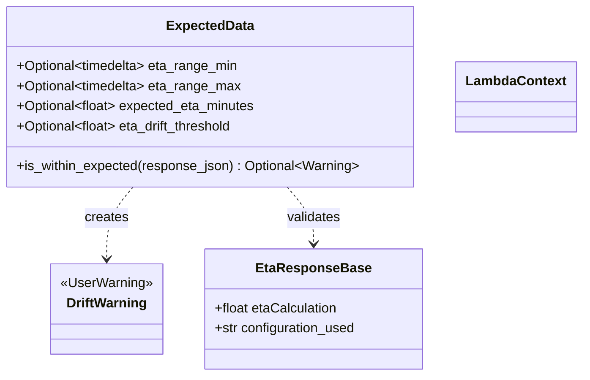
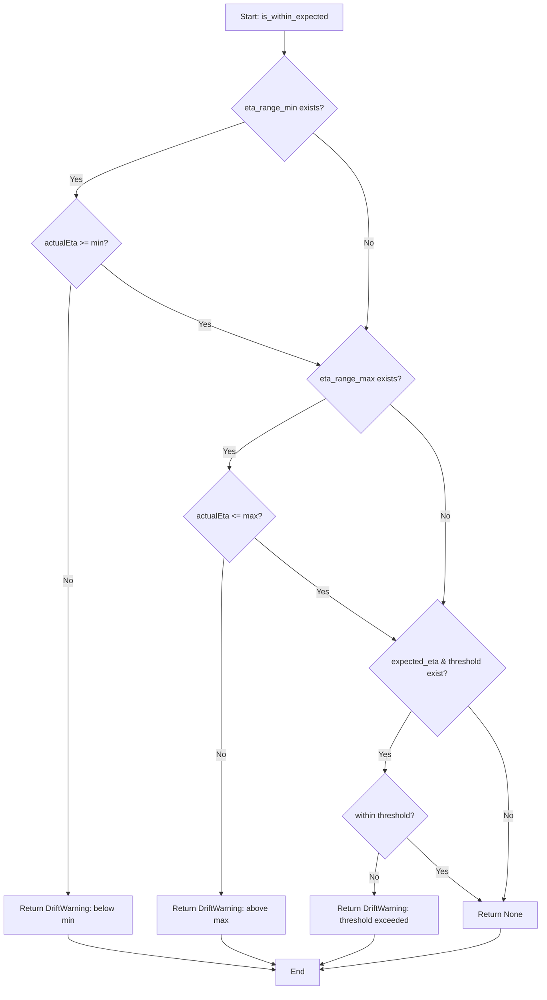
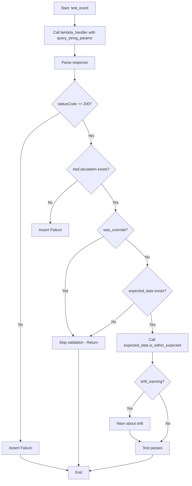
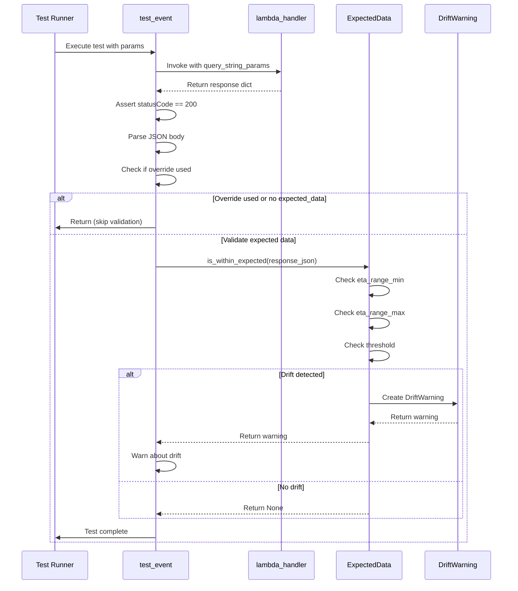
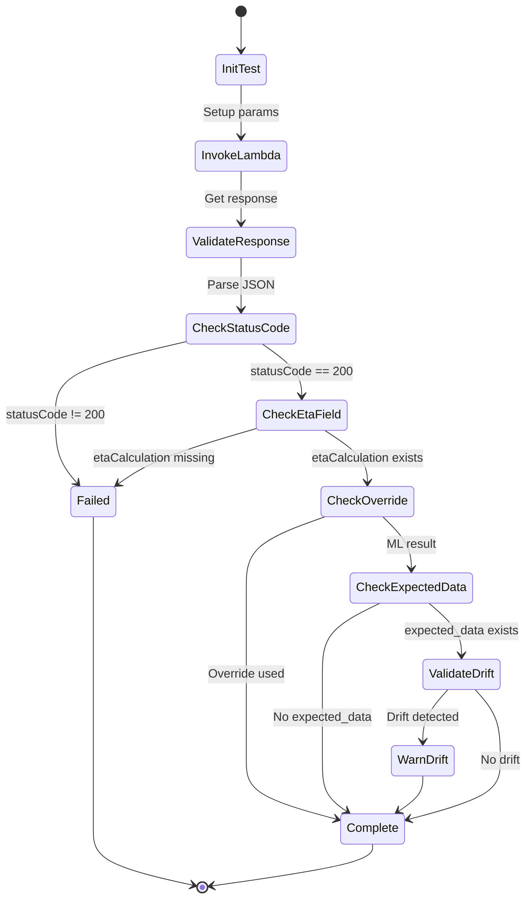

# Diagram: research/e2e/test_get_ml_eta_prod_qsps.py


> Auto-generated by Obscura crawlers

## Diagram 1

```mermaid
classDiagram
      class DriftWarning {
          <<UserWarning>>
      }...
  └ 105 lines...

✗ read_bash
  Invalid shell ID: 0. Please supply a valid shell ID to read output from.

  <no active shell sessions>
```

> SVG rendering failed for this diagram.

## Diagram 2



### SVG

<svg id="container" width="691.9453125" xmlns="http://www.w3.org/2000/svg" class="classDiagram" height="450" viewBox="0 0 691.9453125 450" role="graphics-document document" aria-roledescription="class"><style>#container{font-family:"trebuchet ms",verdana,arial,sans-serif;font-size:16px;fill:#333;}@keyframes edge-animation-frame{from{stroke-dashoffset:0;}}@keyframes dash{to{stroke-dashoffset:0;}}#container .edge-animation-slow{stroke-dasharray:9,5!important;stroke-dashoffset:900;animation:dash 50s linear infinite;stroke-linecap:round;}#container .edge-animation-fast{stroke-dasharray:9,5!important;stroke-dashoffset:900;animation:dash 20s linear infinite;stroke-linecap:round;}#container .error-icon{fill:#552222;}#container .error-text{fill:#552222;stroke:#552222;}#container .edge-thickness-normal{stroke-width:1px;}#container .edge-thickness-thick{stroke-width:3.5px;}#container .edge-pattern-solid{stroke-dasharray:0;}#container .edge-thickness-invisible{stroke-width:0;fill:none;}#container .edge-pattern-dashed{stroke-dasharray:3;}#container .edge-pattern-dotted{stroke-dasharray:2;}#container .marker{fill:#333333;stroke:#333333;}#container .marker.cross{stroke:#333333;}#container svg{font-family:"trebuchet ms",verdana,arial,sans-serif;font-size:16px;}#container p{margin:0;}#container g.classGroup text{fill:#9370DB;stroke:none;font-family:"trebuchet ms",verdana,arial,sans-serif;font-size:10px;}#container g.classGroup text .title{font-weight:bolder;}#container .nodeLabel,#container .edgeLabel{color:#131300;}#container .edgeLabel .label rect{fill:#ECECFF;}#container .label text{fill:#131300;}#container .labelBkg{background:#ECECFF;}#container .edgeLabel .label span{background:#ECECFF;}#container .classTitle{font-weight:bolder;}#container .node rect,#container .node circle,#container .node ellipse,#container .node polygon,#container .node path{fill:#ECECFF;stroke:#9370DB;stroke-width:1px;}#container .divider{stroke:#9370DB;stroke-width:1;}#container g.clickable{cursor:pointer;}#container g.classGroup rect{fill:#ECECFF;stroke:#9370DB;}#container g.classGroup line{stroke:#9370DB;stroke-width:1;}#container .classLabel .box{stroke:none;stroke-width:0;fill:#ECECFF;opacity:0.5;}#container .classLabel .label{fill:#9370DB;font-size:10px;}#container .relation{stroke:#333333;stroke-width:1;fill:none;}#container .dashed-line{stroke-dasharray:3;}#container .dotted-line{stroke-dasharray:1 2;}#container #compositionStart,#container .composition{fill:#333333!important;stroke:#333333!important;stroke-width:1;}#container #compositionEnd,#container .composition{fill:#333333!important;stroke:#333333!important;stroke-width:1;}#container #dependencyStart,#container .dependency{fill:#333333!important;stroke:#333333!important;stroke-width:1;}#container #dependencyStart,#container .dependency{fill:#333333!important;stroke:#333333!important;stroke-width:1;}#container #extensionStart,#container .extension{fill:transparent!important;stroke:#333333!important;stroke-width:1;}#container #extensionEnd,#container .extension{fill:transparent!important;stroke:#333333!important;stroke-width:1;}#container #aggregationStart,#container .aggregation{fill:transparent!important;stroke:#333333!important;stroke-width:1;}#container #aggregationEnd,#container .aggregation{fill:transparent!important;stroke:#333333!important;stroke-width:1;}#container #lollipopStart,#container .lollipop{fill:#ECECFF!important;stroke:#333333!important;stroke-width:1;}#container #lollipopEnd,#container .lollipop{fill:#ECECFF!important;stroke:#333333!important;stroke-width:1;}#container .edgeTerminals{font-size:11px;line-height:initial;}#container .classTitleText{text-anchor:middle;font-size:18px;fill:#333;}#container .label-icon{display:inline-block;height:1em;overflow:visible;vertical-align:-0.125em;}#container .node .label-icon path{fill:currentColor;stroke:revert;stroke-width:revert;}#container :root{--mermaid-font-family:"trebuchet ms",verdana,arial,sans-serif;}</style><g><defs><marker id="container_class-aggregationStart" class="marker aggregation class" refX="18" refY="7" markerWidth="190" markerHeight="240" orient="auto"><path d="M 18,7 L9,13 L1,7 L9,1 Z"></path></marker></defs><defs><marker id="container_class-aggregationEnd" class="marker aggregation class" refX="1" refY="7" markerWidth="20" markerHeight="28" orient="auto"><path d="M 18,7 L9,13 L1,7 L9,1 Z"></path></marker></defs><defs><marker id="container_class-extensionStart" class="marker extension class" refX="18" refY="7" markerWidth="190" markerHeight="240" orient="auto"><path d="M 1,7 L18,13 V 1 Z"></path></marker></defs><defs><marker id="container_class-extensionEnd" class="marker extension class" refX="1" refY="7" markerWidth="20" markerHeight="28" orient="auto"><path d="M 1,1 V 13 L18,7 Z"></path></marker></defs><defs><marker id="container_class-compositionStart" class="marker composition class" refX="18" refY="7" markerWidth="190" markerHeight="240" orient="auto"><path d="M 18,7 L9,13 L1,7 L9,1 Z"></path></marker></defs><defs><marker id="container_class-compositionEnd" class="marker composition class" refX="1" refY="7" markerWidth="20" markerHeight="28" orient="auto"><path d="M 18,7 L9,13 L1,7 L9,1 Z"></path></marker></defs><defs><marker id="container_class-dependencyStart" class="marker dependency class" refX="6" refY="7" markerWidth="190" markerHeight="240" orient="auto"><path d="M 5,7 L9,13 L1,7 L9,1 Z"></path></marker></defs><defs><marker id="container_class-dependencyEnd" class="marker dependency class" refX="13" refY="7" markerWidth="20" markerHeight="28" orient="auto"><path d="M 18,7 L9,13 L14,7 L9,1 Z"></path></marker></defs><defs><marker id="container_class-lollipopStart" class="marker lollipop class" refX="13" refY="7" markerWidth="190" markerHeight="240" orient="auto"><circle stroke="black" fill="transparent" cx="7" cy="7" r="6"></circle></marker></defs><defs><marker id="container_class-lollipopEnd" class="marker lollipop class" refX="1" refY="7" markerWidth="190" markerHeight="240" orient="auto"><circle stroke="black" fill="transparent" cx="7" cy="7" r="6"></circle></marker></defs><g class="root"><g class="clusters"></g><g class="edgePaths"><path d="M159.777,224L154.53,230.167C149.282,236.333,138.788,248.667,133.54,263C128.293,277.333,128.293,293.667,128.293,301.833L128.293,310" id="id_ExpectedData_DriftWarning_1" class="edge-thickness-normal edge-pattern-dashed relation" style=";;;" data-edge="true" data-et="edge" data-id="id_ExpectedData_DriftWarning_1" data-points="W3sieCI6MTU5Ljc3Njg1ODgzNjIwNjg4LCJ5IjoyMjR9LHsieCI6MTI4LjI5Mjk2ODc1LCJ5IjoyNjF9LHsieCI6MTI4LjI5Mjk2ODc1LCJ5IjozMTZ9XQ==" marker-end="url(#container_class-dependencyEnd)"></path><path d="M343.575,224L348.822,230.167C354.069,236.333,364.564,248.667,369.811,260C375.059,271.333,375.059,281.667,375.059,286.833L375.059,292" id="id_ExpectedData_EtaResponseBase_2" class="edge-thickness-normal edge-pattern-dashed relation" style=";;;" data-edge="true" data-et="edge" data-id="id_ExpectedData_EtaResponseBase_2" data-points="W3sieCI6MzQzLjU3NDcwMzY2Mzc5MzEsInkiOjIyNH0seyJ4IjozNzUuMDU4NTkzNzUsInkiOjI2MX0seyJ4IjozNzUuMDU4NTkzNzUsInkiOjI5OH1d" marker-end="url(#container_class-dependencyEnd)"></path></g><g class="edgeLabels"><g class="edgeLabel" transform="translate(128.29296875, 261)"><g class="label" data-id="id_ExpectedData_DriftWarning_1" transform="translate(-26.171875, -12)"><foreignObject width="52.34375" height="24"><div xmlns="http://www.w3.org/1999/xhtml" class="labelBkg" style="display: table-cell; white-space: nowrap; line-height: 1.5; max-width: 200px; text-align: center;"><span class="edgeLabel"><p>creates</p></span></div></foreignObject></g></g><g class="edgeLabel" transform="translate(375.05859375, 261)"><g class="label" data-id="id_ExpectedData_EtaResponseBase_2" transform="translate(-32.6875, -12)"><foreignObject width="65.375" height="24"><div xmlns="http://www.w3.org/1999/xhtml" class="labelBkg" style="display: table-cell; white-space: nowrap; line-height: 1.5; max-width: 200px; text-align: center;"><span class="edgeLabel"><p>validates</p></span></div></foreignObject></g></g></g><g class="nodes"><g class="node default" id="classId-DriftWarning-0" transform="translate(128.29296875, 370)"><g class="basic label-container"><path d="M-67.171875 -54 L67.171875 -54 L67.171875 54 L-67.171875 54" stroke="none" stroke-width="0" fill="#ECECFF" style=""></path><path d="M-67.171875 -54 C-19.646305613985753 -54, 27.879263772028494 -54, 67.171875 -54 M-67.171875 -54 C-23.472023617662515 -54, 20.22782776467497 -54, 67.171875 -54 M67.171875 -54 C67.171875 -11.111615931119715, 67.171875 31.77676813776057, 67.171875 54 M67.171875 -54 C67.171875 -26.398321052803023, 67.171875 1.2033578943939531, 67.171875 54 M67.171875 54 C36.424280598294274 54, 5.676686196588541 54, -67.171875 54 M67.171875 54 C23.315632360181674 54, -20.540610279636653 54, -67.171875 54 M-67.171875 54 C-67.171875 16.32864312696512, -67.171875 -21.342713746069762, -67.171875 -54 M-67.171875 54 C-67.171875 13.21534756903916, -67.171875 -27.56930486192168, -67.171875 -54" stroke="#9370DB" stroke-width="1.3" fill="none" stroke-dasharray="0 0" style=""></path></g><g class="annotation-group text" transform="translate(-55.171875, -30)"><g class="label" style="" transform="translate(0,-12)"><foreignObject width="110.34375" height="24"><div xmlns="http://www.w3.org/1999/xhtml" style="display: table-cell; white-space: nowrap; line-height: 1.5; max-width: 160px; text-align: center;"><span class="nodeLabel markdown-node-label" style=""><p>«UserWarning»</p></span></div></foreignObject></g></g><g class="label-group text" transform="translate(-46.6328125, -6)"><g class="label" style="font-weight: bolder" transform="translate(0,-12)"><foreignObject width="93.265625" height="24"><div xmlns="http://www.w3.org/1999/xhtml" style="display: table-cell; white-space: nowrap; line-height: 1.5; max-width: 142px; text-align: center;"><span class="nodeLabel markdown-node-label" style=""><p>DriftWarning</p></span></div></foreignObject></g></g><g class="members-group text" transform="translate(-55.171875, 42)"></g><g class="methods-group text" transform="translate(-55.171875, 72)"></g><g class="divider" style=""><path d="M-67.171875 18 C-25.60171691299354 18, 15.968441174012924 18, 67.171875 18 M-67.171875 18 C-19.364073231969222 18, 28.443728536061556 18, 67.171875 18" stroke="#9370DB" stroke-width="1.3" fill="none" stroke-dasharray="0 0" style=""></path></g><g class="divider" style=""><path d="M-67.171875 36 C-26.88148844535577 36, 13.408898109288458 36, 67.171875 36 M-67.171875 36 C-22.27995844577098 36, 22.61195810845804 36, 67.171875 36" stroke="#9370DB" stroke-width="1.3" fill="none" stroke-dasharray="0 0" style=""></path></g></g><g class="node default" id="classId-ExpectedData-1" transform="translate(251.67578125, 116)"><g class="basic label-container"><path d="M-243.67578125 -108 L243.67578125 -108 L243.67578125 108 L-243.67578125 108" stroke="none" stroke-width="0" fill="#ECECFF" style=""></path><path d="M-243.67578125 -108 C-140.22704341104287 -108, -36.77830557208571 -108, 243.67578125 -108 M-243.67578125 -108 C-131.8689965448956 -108, -20.06221183979116 -108, 243.67578125 -108 M243.67578125 -108 C243.67578125 -64.50912159869964, 243.67578125 -21.018243197399272, 243.67578125 108 M243.67578125 -108 C243.67578125 -24.359499278658802, 243.67578125 59.281001442682395, 243.67578125 108 M243.67578125 108 C134.31559556112356 108, 24.955409872247117 108, -243.67578125 108 M243.67578125 108 C55.09249783778819 108, -133.49078557442363 108, -243.67578125 108 M-243.67578125 108 C-243.67578125 48.7835582457765, -243.67578125 -10.432883508447006, -243.67578125 -108 M-243.67578125 108 C-243.67578125 23.574296392847984, -243.67578125 -60.85140721430403, -243.67578125 -108" stroke="#9370DB" stroke-width="1.3" fill="none" stroke-dasharray="0 0" style=""></path></g><g class="annotation-group text" transform="translate(0, -84)"></g><g class="label-group text" transform="translate(-50.3828125, -84)"><g class="label" style="font-weight: bolder" transform="translate(0,-12)"><foreignObject width="100.765625" height="24"><div xmlns="http://www.w3.org/1999/xhtml" style="display: table-cell; white-space: nowrap; line-height: 1.5; max-width: 149px; text-align: center;"><span class="nodeLabel markdown-node-label" style=""><p>ExpectedData</p></span></div></foreignObject></g></g><g class="members-group text" transform="translate(-231.67578125, -36)"><g class="label" style="" transform="translate(0,-12)"><foreignObject width="268.59375" height="24"><div xmlns="http://www.w3.org/1999/xhtml" style="display: table-cell; white-space: nowrap; line-height: 1.5; max-width: 365px; text-align: center;"><span class="nodeLabel markdown-node-label" style=""><p>+Optional&lt;timedelta&gt; eta_range_min</p></span></div></foreignObject></g><g class="label" style="" transform="translate(0,12)"><foreignObject width="271.171875" height="24"><div xmlns="http://www.w3.org/1999/xhtml" style="display: table-cell; white-space: nowrap; line-height: 1.5; max-width: 368px; text-align: center;"><span class="nodeLabel markdown-node-label" style=""><p>+Optional&lt;timedelta&gt; eta_range_max</p></span></div></foreignObject></g><g class="label" style="" transform="translate(0,36)"><foreignObject width="288.1875" height="24"><div xmlns="http://www.w3.org/1999/xhtml" style="display: table-cell; white-space: nowrap; line-height: 1.5; max-width: 385px; text-align: center;"><span class="nodeLabel markdown-node-label" style=""><p>+Optional&lt;float&gt; expected_eta_minutes</p></span></div></foreignObject></g><g class="label" style="" transform="translate(0,60)"><foreignObject width="264.515625" height="24"><div xmlns="http://www.w3.org/1999/xhtml" style="display: table-cell; white-space: nowrap; line-height: 1.5; max-width: 362px; text-align: center;"><span class="nodeLabel markdown-node-label" style=""><p>+Optional&lt;float&gt; eta_drift_threshold</p></span></div></foreignObject></g></g><g class="methods-group text" transform="translate(-231.67578125, 84)"><g class="label" style="" transform="translate(0,-12)"><foreignObject width="412.96875" height="24"><div xmlns="http://www.w3.org/1999/xhtml" style="display: table-cell; white-space: nowrap; line-height: 1.5; max-width: 510px; text-align: center;"><span class="nodeLabel markdown-node-label" style=""><p>+is_within_expected(response_json) : Optional&lt;Warning&gt;</p></span></div></foreignObject></g></g><g class="divider" style=""><path d="M-243.67578125 -60 C-133.68538059221868 -60, -23.694979934437384 -60, 243.67578125 -60 M-243.67578125 -60 C-55.56376539878431 -60, 132.54825045243138 -60, 243.67578125 -60" stroke="#9370DB" stroke-width="1.3" fill="none" stroke-dasharray="0 0" style=""></path></g><g class="divider" style=""><path d="M-243.67578125 60 C-68.82408935861065 60, 106.0276025327787 60, 243.67578125 60 M-243.67578125 60 C-59.554757202050126 60, 124.56626684589975 60, 243.67578125 60" stroke="#9370DB" stroke-width="1.3" fill="none" stroke-dasharray="0 0" style=""></path></g></g><g class="node default" id="classId-EtaResponseBase-2" transform="translate(375.05859375, 370)"><g class="basic label-container"><path d="M-129.59375 -72 L129.59375 -72 L129.59375 72 L-129.59375 72" stroke="none" stroke-width="0" fill="#ECECFF" style=""></path><path d="M-129.59375 -72 C-44.131550508793 -72, 41.330648982414004 -72, 129.59375 -72 M-129.59375 -72 C-76.2272112346817 -72, -22.860672469363422 -72, 129.59375 -72 M129.59375 -72 C129.59375 -28.10123062853623, 129.59375 15.797538742927543, 129.59375 72 M129.59375 -72 C129.59375 -36.48258037129279, 129.59375 -0.9651607425855815, 129.59375 72 M129.59375 72 C63.15920066800281 72, -3.2753486639943787 72, -129.59375 72 M129.59375 72 C68.53385990962596 72, 7.47396981925192 72, -129.59375 72 M-129.59375 72 C-129.59375 36.62625870491894, -129.59375 1.2525174098378784, -129.59375 -72 M-129.59375 72 C-129.59375 14.799459616394294, -129.59375 -42.40108076721141, -129.59375 -72" stroke="#9370DB" stroke-width="1.3" fill="none" stroke-dasharray="0 0" style=""></path></g><g class="annotation-group text" transform="translate(0, -48)"></g><g class="label-group text" transform="translate(-64.40625, -48)"><g class="label" style="font-weight: bolder" transform="translate(0,-12)"><foreignObject width="128.8125" height="24"><div xmlns="http://www.w3.org/1999/xhtml" style="display: table-cell; white-space: nowrap; line-height: 1.5; max-width: 177px; text-align: center;"><span class="nodeLabel markdown-node-label" style=""><p>EtaResponseBase</p></span></div></foreignObject></g></g><g class="members-group text" transform="translate(-117.59375, 0)"><g class="label" style="" transform="translate(0,-12)"><foreignObject width="149.203125" height="24"><div xmlns="http://www.w3.org/1999/xhtml" style="display: table-cell; white-space: nowrap; line-height: 1.5; max-width: 207px; text-align: center;"><span class="nodeLabel markdown-node-label" style=""><p>+float etaCalculation</p></span></div></foreignObject></g><g class="label" style="" transform="translate(0,12)"><foreignObject width="170.78125" height="24"><div xmlns="http://www.w3.org/1999/xhtml" style="display: table-cell; white-space: nowrap; line-height: 1.5; max-width: 228px; text-align: center;"><span class="nodeLabel markdown-node-label" style=""><p>+str configuration_used</p></span></div></foreignObject></g></g><g class="methods-group text" transform="translate(-117.59375, 72)"></g><g class="divider" style=""><path d="M-129.59375 -24 C-60.66486061876506 -24, 8.264028762469877 -24, 129.59375 -24 M-129.59375 -24 C-40.26557575276779 -24, 49.062598494464424 -24, 129.59375 -24" stroke="#9370DB" stroke-width="1.3" fill="none" stroke-dasharray="0 0" style=""></path></g><g class="divider" style=""><path d="M-129.59375 48 C-63.11589188408519 48, 3.3619662318296264 48, 129.59375 48 M-129.59375 48 C-42.3927440041075 48, 44.808261991785 48, 129.59375 48" stroke="#9370DB" stroke-width="1.3" fill="none" stroke-dasharray="0 0" style=""></path></g></g><g class="node default" id="classId-LambdaContext-3" transform="translate(614.6484375, 116)"><g class="basic label-container"><path d="M-69.296875 -42 L69.296875 -42 L69.296875 42 L-69.296875 42" stroke="none" stroke-width="0" fill="#ECECFF" style=""></path><path d="M-69.296875 -42 C-19.42198588804674 -42, 30.452903223906517 -42, 69.296875 -42 M-69.296875 -42 C-39.9445023337005 -42, -10.59212966740099 -42, 69.296875 -42 M69.296875 -42 C69.296875 -15.22885230212994, 69.296875 11.542295395740119, 69.296875 42 M69.296875 -42 C69.296875 -9.123420348975927, 69.296875 23.753159302048147, 69.296875 42 M69.296875 42 C23.351169674343396 42, -22.59453565131321 42, -69.296875 42 M69.296875 42 C39.55175643909828 42, 9.806637878196554 42, -69.296875 42 M-69.296875 42 C-69.296875 14.628568285279641, -69.296875 -12.742863429440717, -69.296875 -42 M-69.296875 42 C-69.296875 12.764482805798487, -69.296875 -16.471034388403027, -69.296875 -42" stroke="#9370DB" stroke-width="1.3" fill="none" stroke-dasharray="0 0" style=""></path></g><g class="annotation-group text" transform="translate(0, -18)"></g><g class="label-group text" transform="translate(-57.296875, -18)"><g class="label" style="font-weight: bolder" transform="translate(0,-12)"><foreignObject width="114.59375" height="24"><div xmlns="http://www.w3.org/1999/xhtml" style="display: table-cell; white-space: nowrap; line-height: 1.5; max-width: 163px; text-align: center;"><span class="nodeLabel markdown-node-label" style=""><p>LambdaContext</p></span></div></foreignObject></g></g><g class="members-group text" transform="translate(-57.296875, 30)"></g><g class="methods-group text" transform="translate(-57.296875, 60)"></g><g class="divider" style=""><path d="M-69.296875 6 C-34.38853641409147 6, 0.5198021718170622 6, 69.296875 6 M-69.296875 6 C-20.932875062521447 6, 27.431124874957106 6, 69.296875 6" stroke="#9370DB" stroke-width="1.3" fill="none" stroke-dasharray="0 0" style=""></path></g><g class="divider" style=""><path d="M-69.296875 24 C-33.18928898136092 24, 2.9182970372781654 24, 69.296875 24 M-69.296875 24 C-40.92395238111594 24, -12.551029762231884 24, 69.296875 24" stroke="#9370DB" stroke-width="1.3" fill="none" stroke-dasharray="0 0" style=""></path></g></g></g></g></g></svg>

## Diagram 3



### SVG

<svg id="container" width="1097.421875" xmlns="http://www.w3.org/2000/svg" class="flowchart" height="1998.78125" viewBox="0 0 1097.421875 1998.78125" role="graphics-document document" aria-roledescription="flowchart-v2"><style>#container{font-family:"trebuchet ms",verdana,arial,sans-serif;font-size:16px;fill:#333;}@keyframes edge-animation-frame{from{stroke-dashoffset:0;}}@keyframes dash{to{stroke-dashoffset:0;}}#container .edge-animation-slow{stroke-dasharray:9,5!important;stroke-dashoffset:900;animation:dash 50s linear infinite;stroke-linecap:round;}#container .edge-animation-fast{stroke-dasharray:9,5!important;stroke-dashoffset:900;animation:dash 20s linear infinite;stroke-linecap:round;}#container .error-icon{fill:#552222;}#container .error-text{fill:#552222;stroke:#552222;}#container .edge-thickness-normal{stroke-width:1px;}#container .edge-thickness-thick{stroke-width:3.5px;}#container .edge-pattern-solid{stroke-dasharray:0;}#container .edge-thickness-invisible{stroke-width:0;fill:none;}#container .edge-pattern-dashed{stroke-dasharray:3;}#container .edge-pattern-dotted{stroke-dasharray:2;}#container .marker{fill:#333333;stroke:#333333;}#container .marker.cross{stroke:#333333;}#container svg{font-family:"trebuchet ms",verdana,arial,sans-serif;font-size:16px;}#container p{margin:0;}#container .label{font-family:"trebuchet ms",verdana,arial,sans-serif;color:#333;}#container .cluster-label text{fill:#333;}#container .cluster-label span{color:#333;}#container .cluster-label span p{background-color:transparent;}#container .label text,#container span{fill:#333;color:#333;}#container .node rect,#container .node circle,#container .node ellipse,#container .node polygon,#container .node path{fill:#ECECFF;stroke:#9370DB;stroke-width:1px;}#container .rough-node .label text,#container .node .label text,#container .image-shape .label,#container .icon-shape .label{text-anchor:middle;}#container .node .katex path{fill:#000;stroke:#000;stroke-width:1px;}#container .rough-node .label,#container .node .label,#container .image-shape .label,#container .icon-shape .label{text-align:center;}#container .node.clickable{cursor:pointer;}#container .root .anchor path{fill:#333333!important;stroke-width:0;stroke:#333333;}#container .arrowheadPath{fill:#333333;}#container .edgePath .path{stroke:#333333;stroke-width:2.0px;}#container .flowchart-link{stroke:#333333;fill:none;}#container .edgeLabel{background-color:rgba(232,232,232, 0.8);text-align:center;}#container .edgeLabel p{background-color:rgba(232,232,232, 0.8);}#container .edgeLabel rect{opacity:0.5;background-color:rgba(232,232,232, 0.8);fill:rgba(232,232,232, 0.8);}#container .labelBkg{background-color:rgba(232, 232, 232, 0.5);}#container .cluster rect{fill:#ffffde;stroke:#aaaa33;stroke-width:1px;}#container .cluster text{fill:#333;}#container .cluster span{color:#333;}#container div.mermaidTooltip{position:absolute;text-align:center;max-width:200px;padding:2px;font-family:"trebuchet ms",verdana,arial,sans-serif;font-size:12px;background:hsl(80, 100%, 96.2745098039%);border:1px solid #aaaa33;border-radius:2px;pointer-events:none;z-index:100;}#container .flowchartTitleText{text-anchor:middle;font-size:18px;fill:#333;}#container rect.text{fill:none;stroke-width:0;}#container .icon-shape,#container .image-shape{background-color:rgba(232,232,232, 0.8);text-align:center;}#container .icon-shape p,#container .image-shape p{background-color:rgba(232,232,232, 0.8);padding:2px;}#container .icon-shape rect,#container .image-shape rect{opacity:0.5;background-color:rgba(232,232,232, 0.8);fill:rgba(232,232,232, 0.8);}#container .label-icon{display:inline-block;height:1em;overflow:visible;vertical-align:-0.125em;}#container .node .label-icon path{fill:currentColor;stroke:revert;stroke-width:revert;}#container :root{--mermaid-font-family:"trebuchet ms",verdana,arial,sans-serif;}</style><g><marker id="container_flowchart-v2-pointEnd" class="marker flowchart-v2" viewBox="0 0 10 10" refX="5" refY="5" markerUnits="userSpaceOnUse" markerWidth="8" markerHeight="8" orient="auto"><path d="M 0 0 L 10 5 L 0 10 z" class="arrowMarkerPath" style="stroke-width: 1; stroke-dasharray: 1, 0;"></path></marker><marker id="container_flowchart-v2-pointStart" class="marker flowchart-v2" viewBox="0 0 10 10" refX="4.5" refY="5" markerUnits="userSpaceOnUse" markerWidth="8" markerHeight="8" orient="auto"><path d="M 0 5 L 10 10 L 10 0 z" class="arrowMarkerPath" style="stroke-width: 1; stroke-dasharray: 1, 0;"></path></marker><marker id="container_flowchart-v2-circleEnd" class="marker flowchart-v2" viewBox="0 0 10 10" refX="11" refY="5" markerUnits="userSpaceOnUse" markerWidth="11" markerHeight="11" orient="auto"><circle cx="5" cy="5" r="5" class="arrowMarkerPath" style="stroke-width: 1; stroke-dasharray: 1, 0;"></circle></marker><marker id="container_flowchart-v2-circleStart" class="marker flowchart-v2" viewBox="0 0 10 10" refX="-1" refY="5" markerUnits="userSpaceOnUse" markerWidth="11" markerHeight="11" orient="auto"><circle cx="5" cy="5" r="5" class="arrowMarkerPath" style="stroke-width: 1; stroke-dasharray: 1, 0;"></circle></marker><marker id="container_flowchart-v2-crossEnd" class="marker cross flowchart-v2" viewBox="0 0 11 11" refX="12" refY="5.2" markerUnits="userSpaceOnUse" markerWidth="11" markerHeight="11" orient="auto"><path d="M 1,1 l 9,9 M 10,1 l -9,9" class="arrowMarkerPath" style="stroke-width: 2; stroke-dasharray: 1, 0;"></path></marker><marker id="container_flowchart-v2-crossStart" class="marker cross flowchart-v2" viewBox="0 0 11 11" refX="-1" refY="5.2" markerUnits="userSpaceOnUse" markerWidth="11" markerHeight="11" orient="auto"><path d="M 1,1 l 9,9 M 10,1 l -9,9" class="arrowMarkerPath" style="stroke-width: 2; stroke-dasharray: 1, 0;"></path></marker><g class="root"><g class="clusters"></g><g class="edgePaths"><path d="M575.855,62L575.855,66.167C575.855,70.333,575.855,78.667,575.855,86.333C575.855,94,575.855,101,575.855,104.5L575.855,108" id="L_A_B_0" class="edge-thickness-normal edge-pattern-solid edge-thickness-normal edge-pattern-solid flowchart-link" style=";" data-edge="true" data-et="edge" data-id="L_A_B_0" data-points="W3sieCI6NTc1Ljg1NTQ2ODc1LCJ5Ijo2Mn0seyJ4Ijo1NzUuODU1NDY4NzUsInkiOjg3fSx7IngiOjU3NS44NTU0Njg3NSwieSI6MTEyfV0=" marker-end="url(#container_flowchart-v2-pointEnd)"></path><path d="M496.034,246.35L439.031,265.821C382.028,285.291,268.022,324.231,211.019,349.202C154.016,374.172,154.016,385.172,154.016,390.672L154.016,396.172" id="L_B_C_0" class="edge-thickness-normal edge-pattern-solid edge-thickness-normal edge-pattern-solid flowchart-link" style=";" data-edge="true" data-et="edge" data-id="L_B_C_0" data-points="W3sieCI6NDk2LjAzMzg0NDM2MTI5NDQsInkiOjI0Ni4zNTAyNTA2MTEyOTQ0fSx7IngiOjE1NC4wMTU2MjUsInkiOjM2My4xNzE4NzV9LHsieCI6MTU0LjAxNTYyNSwieSI6NDAwLjE3MTg3NX1d" marker-end="url(#container_flowchart-v2-pointEnd)"></path><path d="M633.974,268.053L652.791,283.906C671.607,299.759,709.239,331.466,728.055,368.513C746.871,405.56,746.871,447.948,746.871,490.336C746.871,532.724,746.871,575.112,746.067,603.602C745.263,632.093,743.656,646.686,742.852,653.982L742.048,661.279" id="L_B_D_0" class="edge-thickness-normal edge-pattern-solid edge-thickness-normal edge-pattern-solid flowchart-link" style=";" data-edge="true" data-et="edge" data-id="L_B_D_0" data-points="W3sieCI6NjMzLjk3NDQwNzg3ODYyOTEsInkiOjI2OC4wNTI5MzU4NzEzNzA4M30seyJ4Ijo3NDYuODcxMDkzNzUsInkiOjM2My4xNzE4NzV9LHsieCI6NzQ2Ljg3MTA5Mzc1LCJ5Ijo0OTAuMzM1OTM3NX0seyJ4Ijo3NDYuODcxMDkzNzUsInkiOjYxNy41fSx7IngiOjc0MS42MTAwNzk1NTQ1MzA5LCJ5Ijo2NjUuMjU0NjEwODA0NTMwOX1d" marker-end="url(#container_flowchart-v2-pointEnd)"></path><path d="M143.93,570.415L142.942,578.262C141.953,586.11,139.977,601.805,138.988,633.882C138,665.958,138,714.417,138,762.875C138,811.333,138,859.792,138,905.436C138,951.081,138,993.911,138,1036.742C138,1079.573,138,1122.404,138,1173.152C138,1223.901,138,1282.568,138,1341.234C138,1399.901,138,1458.568,138,1509.113C138,1559.659,138,1602.083,138,1644.508C138,1686.932,138,1729.357,138,1756.069C138,1782.781,138,1793.781,138,1799.281L138,1804.781" id="L_C_E_0" class="edge-thickness-normal edge-pattern-solid edge-thickness-normal edge-pattern-solid flowchart-link" style=";" data-edge="true" data-et="edge" data-id="L_C_E_0" data-points="W3sieCI6MTQzLjkzMDE1OTM5NTk3MzE2LCJ5Ijo1NzAuNDE0NTM0Mzk1OTczMn0seyJ4IjoxMzgsInkiOjYxNy41fSx7IngiOjEzOCwieSI6NzYyLjg3NX0seyJ4IjoxMzgsInkiOjkwOC4yNX0seyJ4IjoxMzgsInkiOjEwMzYuNzQyMTg3NX0seyJ4IjoxMzgsInkiOjExNjUuMjM0Mzc1fSx7IngiOjEzOCwieSI6MTM0MS4yMzQzNzV9LHsieCI6MTM4LCJ5IjoxNTE3LjIzNDM3NX0seyJ4IjoxMzgsInkiOjE2NDQuNTA3ODEyNX0seyJ4IjoxMzgsInkiOjE3NzEuNzgxMjV9LHsieCI6MTM4LCJ5IjoxODA4Ljc4MTI1fV0=" marker-end="url(#container_flowchart-v2-pointEnd)"></path><path d="M203.545,530.971L221.123,545.392C238.702,559.814,273.859,588.657,347.68,622.461C421.502,656.265,533.988,695.03,590.232,714.413L646.475,733.796" id="L_C_D_0" class="edge-thickness-normal edge-pattern-solid edge-thickness-normal edge-pattern-solid flowchart-link" style=";" data-edge="true" data-et="edge" data-id="L_C_D_0" data-points="W3sieCI6MjAzLjU0NTA3MDk2NzI3MzAzLCJ5Ijo1MzAuOTcwNTU0MDMyNzI3fSx7IngiOjMwOS4wMTU2MjUsInkiOjYxNy41fSx7IngiOjY1MC4yNTY1Njc2OTgzOTc4LCJ5Ijo3MzUuMDk4OTAxMDUxNjAyMn1d" marker-end="url(#container_flowchart-v2-pointEnd)"></path><path d="M660.701,801.095L627.92,818.954C595.139,836.814,529.577,872.532,496.796,895.891C464.016,919.25,464.016,930.25,464.016,935.75L464.016,941.25" id="L_D_F_0" class="edge-thickness-normal edge-pattern-solid edge-thickness-normal edge-pattern-solid flowchart-link" style=";" data-edge="true" data-et="edge" data-id="L_D_F_0" data-points="W3sieCI6NjYwLjcwMDg2NzMyMDk4MTgsInkiOjgwMS4wOTUzOTg1NzA5ODE4fSx7IngiOjQ2NC4wMTU2MjUsInkiOjkwOC4yNX0seyJ4Ijo0NjQuMDE1NjI1LCJ5Ijo5NDUuMjV9XQ==" marker-end="url(#container_flowchart-v2-pointEnd)"></path><path d="M789.434,812.671L808.174,828.601C826.913,844.531,864.392,876.39,883.132,913.736C901.871,951.081,901.871,993.911,901.871,1036.742C901.871,1079.573,901.871,1122.404,901.195,1151.254C900.518,1180.104,899.165,1194.974,898.488,1202.41L897.812,1209.845" id="L_D_G_0" class="edge-thickness-normal edge-pattern-solid edge-thickness-normal edge-pattern-solid flowchart-link" style=";" data-edge="true" data-et="edge" data-id="L_D_G_0" data-points="W3sieCI6Nzg5LjQzNDM4MDA1NDI2MiwieSI6ODEyLjY3MTA4ODY5NTczOH0seyJ4Ijo5MDEuODcxMDkzNzUsInkiOjkwOC4yNX0seyJ4Ijo5MDEuODcxMDkzNzUsInkiOjEwMzYuNzQyMTg3NX0seyJ4Ijo5MDEuODcxMDkzNzUsInkiOjExNjUuMjM0Mzc1fSx7IngiOjg5Ny40NDkxNzA0MzQ0MzMyLCJ5IjoxMjEzLjgyODA3NjY4NDQzMzJ9XQ==" marker-end="url(#container_flowchart-v2-pointEnd)"></path><path d="M453.876,1118.094L452.896,1125.951C451.917,1133.808,449.959,1149.521,448.979,1186.711C448,1223.901,448,1282.568,448,1341.234C448,1399.901,448,1458.568,448,1509.113C448,1559.659,448,1602.083,448,1644.508C448,1686.932,448,1729.357,448,1756.069C448,1782.781,448,1793.781,448,1799.281L448,1804.781" id="L_F_H_0" class="edge-thickness-normal edge-pattern-solid edge-thickness-normal edge-pattern-solid flowchart-link" style=";" data-edge="true" data-et="edge" data-id="L_F_H_0" data-points="W3sieCI6NDUzLjg3NTY1NzIwMTE2Nzc3LCJ5IjoxMTE4LjA5NDQwNzIwMTE2Nzh9LHsieCI6NDQ4LCJ5IjoxMTY1LjIzNDM3NX0seyJ4Ijo0NDgsInkiOjEzNDEuMjM0Mzc1fSx7IngiOjQ0OCwieSI6MTUxNy4yMzQzNzV9LHsieCI6NDQ4LCJ5IjoxNjQ0LjUwNzgxMjV9LHsieCI6NDQ4LCJ5IjoxNzcxLjc4MTI1fSx7IngiOjQ0OCwieSI6MTgwOC43ODEyNX1d" marker-end="url(#container_flowchart-v2-pointEnd)"></path><path d="M514.039,1078.211L531.535,1092.715C549.031,1107.219,584.023,1136.227,631.477,1170.489C678.93,1204.752,738.845,1244.27,768.802,1264.03L798.76,1283.789" id="L_F_G_0" class="edge-thickness-normal edge-pattern-solid edge-thickness-normal edge-pattern-solid flowchart-link" style=";" data-edge="true" data-et="edge" data-id="L_F_G_0" data-points="W3sieCI6NTE0LjAzOTE4NzE1NzI0NjQsInkiOjEwNzguMjEwODEyODQyNzUzNX0seyJ4Ijo2MTkuMDE1NjI1LCJ5IjoxMTY1LjIzNDM3NX0seyJ4Ijo4MDIuMDk4OTE3MDE5Nzc4NywieSI6MTI4NS45OTA5MjY3MzAyMjE0fV0=" marker-end="url(#container_flowchart-v2-pointEnd)"></path><path d="M833.371,1427.75L824.324,1442.664C815.276,1457.578,797.181,1487.406,788.133,1507.82C779.086,1528.234,779.086,1539.234,779.086,1544.734L779.086,1550.234" id="L_G_I_0" class="edge-thickness-normal edge-pattern-solid edge-thickness-normal edge-pattern-solid flowchart-link" style=";" data-edge="true" data-et="edge" data-id="L_G_I_0" data-points="W3sieCI6ODMzLjM3MTE1NDgzNDkwMjQsInkiOjE0MjcuNzUwMDYxMDg0OTAyNH0seyJ4Ijo3NzkuMDg1OTM3NSwieSI6MTUxNy4yMzQzNzV9LHsieCI6Nzc5LjA4NTkzNzUsInkiOjE1NTQuMjM0Mzc1fV0=" marker-end="url(#container_flowchart-v2-pointEnd)"></path><path d="M948.375,1417.715L961.933,1434.302C975.492,1450.888,1002.609,1484.061,1016.168,1521.86C1029.727,1559.659,1029.727,1602.083,1029.727,1644.508C1029.727,1686.932,1029.727,1729.357,1028.143,1758.083C1026.56,1786.81,1023.393,1801.839,1021.809,1809.353L1020.226,1816.867" id="L_G_J_0" class="edge-thickness-normal edge-pattern-solid edge-thickness-normal edge-pattern-solid flowchart-link" style=";" data-edge="true" data-et="edge" data-id="L_G_J_0" data-points="W3sieCI6OTQ4LjM3NDY1OTgzMDM5MTIsInkiOjE0MTcuNzE1MTgzOTE5NjA4OH0seyJ4IjoxMDI5LjcyNjU2MjUsInkiOjE1MTcuMjM0Mzc1fSx7IngiOjEwMjkuNzI2NTYyNSwieSI6MTY0NC41MDc4MTI1fSx7IngiOjEwMjkuNzI2NTYyNSwieSI6MTc3MS43ODEyNX0seyJ4IjoxMDE5LjQwMDY5OTAxMzE1NzksInkiOjE4MjAuNzgxMjV9XQ==" marker-end="url(#container_flowchart-v2-pointEnd)"></path><path d="M766.256,1721.951L764.88,1730.256C763.504,1738.561,760.752,1755.171,759.376,1768.976C758,1782.781,758,1793.781,758,1799.281L758,1804.781" id="L_I_K_0" class="edge-thickness-normal edge-pattern-solid edge-thickness-normal edge-pattern-solid flowchart-link" style=";" data-edge="true" data-et="edge" data-id="L_I_K_0" data-points="W3sieCI6NzY2LjI1NTYwNTMzNTA0NDcsInkiOjE3MjEuOTUwOTE3ODM1MDQ0N30seyJ4Ijo3NTgsInkiOjE3NzEuNzgxMjV9LHsieCI6NzU4LCJ5IjoxODA4Ljc4MTI1fV0=" marker-end="url(#container_flowchart-v2-pointEnd)"></path><path d="M824.326,1689.542L838.095,1703.248C851.864,1716.955,879.403,1744.368,904.102,1765.855C928.801,1787.341,950.661,1802.902,961.591,1810.682L972.521,1818.462" id="L_I_J_0" class="edge-thickness-normal edge-pattern-solid edge-thickness-normal edge-pattern-solid flowchart-link" style=";" data-edge="true" data-et="edge" data-id="L_I_J_0" data-points="W3sieCI6ODI0LjMyNTYyNzY1MDY5NzQsInkiOjE2ODkuNTQxNTU5ODQ5MzAyNX0seyJ4Ijo5MDYuOTQxNDA2MjUsInkiOjE3NzEuNzgxMjV9LHsieCI6OTc1Ljc3OTY1NjY2MTE4NDIsInkiOjE4MjAuNzgxMjV9XQ==" marker-end="url(#container_flowchart-v2-pointEnd)"></path><path d="M138,1886.781L138,1890.948C138,1895.115,138,1903.448,207.558,1915.393C277.115,1927.338,416.23,1942.895,485.788,1950.674L555.345,1958.452" id="L_E_L_0" class="edge-thickness-normal edge-pattern-solid edge-thickness-normal edge-pattern-solid flowchart-link" style=";" data-edge="true" data-et="edge" data-id="L_E_L_0" data-points="W3sieCI6MTM4LCJ5IjoxODg2Ljc4MTI1fSx7IngiOjEzOCwieSI6MTkxMS43ODEyNX0seyJ4Ijo1NTkuMzIwMzEyNSwieSI6MTk1OC44OTY2Mzk3ODQ5NDYzfV0=" marker-end="url(#container_flowchart-v2-pointEnd)"></path><path d="M448,1886.781L448,1890.948C448,1895.115,448,1903.448,465.921,1913.627C483.843,1923.806,519.685,1935.831,537.607,1941.843L555.528,1947.855" id="L_H_L_0" class="edge-thickness-normal edge-pattern-solid edge-thickness-normal edge-pattern-solid flowchart-link" style=";" data-edge="true" data-et="edge" data-id="L_H_L_0" data-points="W3sieCI6NDQ4LCJ5IjoxODg2Ljc4MTI1fSx7IngiOjQ0OCwieSI6MTkxMS43ODEyNX0seyJ4Ijo1NTkuMzIwMzEyNSwieSI6MTk0OS4xMjc0MTkzNTQ4Mzg4fV0=" marker-end="url(#container_flowchart-v2-pointEnd)"></path><path d="M758,1886.781L758,1890.948C758,1895.115,758,1903.448,740.079,1913.627C722.157,1923.806,686.315,1935.831,668.393,1941.843L650.472,1947.855" id="L_K_L_0" class="edge-thickness-normal edge-pattern-solid edge-thickness-normal edge-pattern-solid flowchart-link" style=";" data-edge="true" data-et="edge" data-id="L_K_L_0" data-points="W3sieCI6NzU4LCJ5IjoxODg2Ljc4MTI1fSx7IngiOjc1OCwieSI6MTkxMS43ODEyNX0seyJ4Ijo2NDYuNjc5Njg3NSwieSI6MTk0OS4xMjc0MTkzNTQ4Mzg4fV0=" marker-end="url(#container_flowchart-v2-pointEnd)"></path><path d="M1013.711,1874.781L1013.711,1880.948C1013.711,1887.115,1013.711,1899.448,953.2,1913.276C892.69,1927.104,771.669,1942.426,711.158,1950.087L650.648,1957.749" id="L_J_L_0" class="edge-thickness-normal edge-pattern-solid edge-thickness-normal edge-pattern-solid flowchart-link" style=";" data-edge="true" data-et="edge" data-id="L_J_L_0" data-points="W3sieCI6MTAxMy43MTA5Mzc1LCJ5IjoxODc0Ljc4MTI1fSx7IngiOjEwMTMuNzEwOTM3NSwieSI6MTkxMS43ODEyNX0seyJ4Ijo2NDYuNjc5Njg3NSwieSI6MTk1OC4yNTA5NzY2NTUzODAzfV0=" marker-end="url(#container_flowchart-v2-pointEnd)"></path></g><g class="edgeLabels"><g class="edgeLabel"><g class="label" data-id="L_A_B_0" transform="translate(0, 0)"><foreignObject width="0" height="0"><div xmlns="http://www.w3.org/1999/xhtml" class="labelBkg" style="display: table-cell; white-space: nowrap; line-height: 1.5; max-width: 200px; text-align: center;"><span class="edgeLabel"></span></div></foreignObject></g></g><g class="edgeLabel" transform="translate(154.015625, 363.171875)"><g class="label" data-id="L_B_C_0" transform="translate(-12.03125, -12)"><foreignObject width="24.0625" height="24"><div xmlns="http://www.w3.org/1999/xhtml" class="labelBkg" style="display: table-cell; white-space: nowrap; line-height: 1.5; max-width: 200px; text-align: center;"><span class="edgeLabel"><p>Yes</p></span></div></foreignObject></g></g><g class="edgeLabel" transform="translate(746.87109375, 490.3359375)"><g class="label" data-id="L_B_D_0" transform="translate(-10.140625, -12)"><foreignObject width="20.28125" height="24"><div xmlns="http://www.w3.org/1999/xhtml" class="labelBkg" style="display: table-cell; white-space: nowrap; line-height: 1.5; max-width: 200px; text-align: center;"><span class="edgeLabel"><p>No</p></span></div></foreignObject></g></g><g class="edgeLabel" transform="translate(138, 1165.234375)"><g class="label" data-id="L_C_E_0" transform="translate(-10.140625, -12)"><foreignObject width="20.28125" height="24"><div xmlns="http://www.w3.org/1999/xhtml" class="labelBkg" style="display: table-cell; white-space: nowrap; line-height: 1.5; max-width: 200px; text-align: center;"><span class="edgeLabel"><p>No</p></span></div></foreignObject></g></g><g class="edgeLabel" transform="translate(415.14643, 654.07494)"><g class="label" data-id="L_C_D_0" transform="translate(-12.03125, -12)"><foreignObject width="24.0625" height="24"><div xmlns="http://www.w3.org/1999/xhtml" class="labelBkg" style="display: table-cell; white-space: nowrap; line-height: 1.5; max-width: 200px; text-align: center;"><span class="edgeLabel"><p>Yes</p></span></div></foreignObject></g></g><g class="edgeLabel" transform="translate(464.015625, 908.25)"><g class="label" data-id="L_D_F_0" transform="translate(-12.03125, -12)"><foreignObject width="24.0625" height="24"><div xmlns="http://www.w3.org/1999/xhtml" class="labelBkg" style="display: table-cell; white-space: nowrap; line-height: 1.5; max-width: 200px; text-align: center;"><span class="edgeLabel"><p>Yes</p></span></div></foreignObject></g></g><g class="edgeLabel" transform="translate(901.87109375, 1036.7421875)"><g class="label" data-id="L_D_G_0" transform="translate(-10.140625, -12)"><foreignObject width="20.28125" height="24"><div xmlns="http://www.w3.org/1999/xhtml" class="labelBkg" style="display: table-cell; white-space: nowrap; line-height: 1.5; max-width: 200px; text-align: center;"><span class="edgeLabel"><p>No</p></span></div></foreignObject></g></g><g class="edgeLabel" transform="translate(448, 1517.234375)"><g class="label" data-id="L_F_H_0" transform="translate(-10.140625, -12)"><foreignObject width="20.28125" height="24"><div xmlns="http://www.w3.org/1999/xhtml" class="labelBkg" style="display: table-cell; white-space: nowrap; line-height: 1.5; max-width: 200px; text-align: center;"><span class="edgeLabel"><p>No</p></span></div></foreignObject></g></g><g class="edgeLabel" transform="translate(653.64377, 1188.07412)"><g class="label" data-id="L_F_G_0" transform="translate(-12.03125, -12)"><foreignObject width="24.0625" height="24"><div xmlns="http://www.w3.org/1999/xhtml" class="labelBkg" style="display: table-cell; white-space: nowrap; line-height: 1.5; max-width: 200px; text-align: center;"><span class="edgeLabel"><p>Yes</p></span></div></foreignObject></g></g><g class="edgeLabel" transform="translate(779.0859375, 1517.234375)"><g class="label" data-id="L_G_I_0" transform="translate(-12.03125, -12)"><foreignObject width="24.0625" height="24"><div xmlns="http://www.w3.org/1999/xhtml" class="labelBkg" style="display: table-cell; white-space: nowrap; line-height: 1.5; max-width: 200px; text-align: center;"><span class="edgeLabel"><p>Yes</p></span></div></foreignObject></g></g><g class="edgeLabel" transform="translate(1029.7265625, 1644.5078125)"><g class="label" data-id="L_G_J_0" transform="translate(-10.140625, -12)"><foreignObject width="20.28125" height="24"><div xmlns="http://www.w3.org/1999/xhtml" class="labelBkg" style="display: table-cell; white-space: nowrap; line-height: 1.5; max-width: 200px; text-align: center;"><span class="edgeLabel"><p>No</p></span></div></foreignObject></g></g><g class="edgeLabel" transform="translate(758, 1771.78125)"><g class="label" data-id="L_I_K_0" transform="translate(-10.140625, -12)"><foreignObject width="20.28125" height="24"><div xmlns="http://www.w3.org/1999/xhtml" class="labelBkg" style="display: table-cell; white-space: nowrap; line-height: 1.5; max-width: 200px; text-align: center;"><span class="edgeLabel"><p>No</p></span></div></foreignObject></g></g><g class="edgeLabel" transform="translate(895.57571, 1760.4673)"><g class="label" data-id="L_I_J_0" transform="translate(-12.03125, -12)"><foreignObject width="24.0625" height="24"><div xmlns="http://www.w3.org/1999/xhtml" class="labelBkg" style="display: table-cell; white-space: nowrap; line-height: 1.5; max-width: 200px; text-align: center;"><span class="edgeLabel"><p>Yes</p></span></div></foreignObject></g></g><g class="edgeLabel"><g class="label" data-id="L_E_L_0" transform="translate(0, 0)"><foreignObject width="0" height="0"><div xmlns="http://www.w3.org/1999/xhtml" class="labelBkg" style="display: table-cell; white-space: nowrap; line-height: 1.5; max-width: 200px; text-align: center;"><span class="edgeLabel"></span></div></foreignObject></g></g><g class="edgeLabel"><g class="label" data-id="L_H_L_0" transform="translate(0, 0)"><foreignObject width="0" height="0"><div xmlns="http://www.w3.org/1999/xhtml" class="labelBkg" style="display: table-cell; white-space: nowrap; line-height: 1.5; max-width: 200px; text-align: center;"><span class="edgeLabel"></span></div></foreignObject></g></g><g class="edgeLabel"><g class="label" data-id="L_K_L_0" transform="translate(0, 0)"><foreignObject width="0" height="0"><div xmlns="http://www.w3.org/1999/xhtml" class="labelBkg" style="display: table-cell; white-space: nowrap; line-height: 1.5; max-width: 200px; text-align: center;"><span class="edgeLabel"></span></div></foreignObject></g></g><g class="edgeLabel"><g class="label" data-id="L_J_L_0" transform="translate(0, 0)"><foreignObject width="0" height="0"><div xmlns="http://www.w3.org/1999/xhtml" class="labelBkg" style="display: table-cell; white-space: nowrap; line-height: 1.5; max-width: 200px; text-align: center;"><span class="edgeLabel"></span></div></foreignObject></g></g></g><g class="nodes"><g class="node default" id="flowchart-A-0" transform="translate(575.85546875, 35)"><rect class="basic label-container" style="" x="-120.953125" y="-27" width="241.90625" height="54"></rect><g class="label" style="" transform="translate(-90.953125, -12)"><rect></rect><foreignObject width="181.90625" height="24"><div xmlns="http://www.w3.org/1999/xhtml" style="display: table-cell; white-space: nowrap; line-height: 1.5; max-width: 200px; text-align: center;"><span class="nodeLabel"><p>Start: is_within_expected</p></span></div></foreignObject></g></g><g class="node default" id="flowchart-B-1" transform="translate(575.85546875, 219.0859375)"><polygon points="107.0859375,0 214.171875,-107.0859375 107.0859375,-214.171875 0,-107.0859375" class="label-container" transform="translate(-106.5859375, 107.0859375)"></polygon><g class="label" style="" transform="translate(-80.0859375, -12)"><rect></rect><foreignObject width="160.171875" height="24"><div xmlns="http://www.w3.org/1999/xhtml" style="display: table-cell; white-space: nowrap; line-height: 1.5; max-width: 200px; text-align: center;"><span class="nodeLabel"><p>eta_range_min exists?</p></span></div></foreignObject></g></g><g class="node default" id="flowchart-C-3" transform="translate(154.015625, 490.3359375)"><polygon points="90.1640625,0 180.328125,-90.1640625 90.1640625,-180.328125 0,-90.1640625" class="label-container" transform="translate(-89.6640625, 90.1640625)"></polygon><g class="label" style="" transform="translate(-63.1640625, -12)"><rect></rect><foreignObject width="126.328125" height="24"><div xmlns="http://www.w3.org/1999/xhtml" style="display: table-cell; white-space: nowrap; line-height: 1.5; max-width: 200px; text-align: center;"><span class="nodeLabel"><p>actualEta &gt;= min?</p></span></div></foreignObject></g></g><g class="node default" id="flowchart-D-5" transform="translate(730.85546875, 762.875)"><polygon points="108.375,0 216.75,-108.375 108.375,-216.75 0,-108.375" class="label-container" transform="translate(-107.875, 108.375)"></polygon><g class="label" style="" transform="translate(-81.375, -12)"><rect></rect><foreignObject width="162.75" height="24"><div xmlns="http://www.w3.org/1999/xhtml" style="display: table-cell; white-space: nowrap; line-height: 1.5; max-width: 200px; text-align: center;"><span class="nodeLabel"><p>eta_range_max exists?</p></span></div></foreignObject></g></g><g class="node default" id="flowchart-E-7" transform="translate(138, 1847.78125)"><rect class="basic label-container" style="" x="-130" y="-39" width="260" height="78"></rect><g class="label" style="" transform="translate(-100, -24)"><rect></rect><foreignObject width="200" height="48"><div xmlns="http://www.w3.org/1999/xhtml" style="display: table; white-space: break-spaces; line-height: 1.5; max-width: 200px; text-align: center; width: 200px;"><span class="nodeLabel"><p>Return DriftWarning: below min</p></span></div></foreignObject></g></g><g class="node default" id="flowchart-F-11" transform="translate(464.015625, 1036.7421875)"><polygon points="91.4921875,0 182.984375,-91.4921875 91.4921875,-182.984375 0,-91.4921875" class="label-container" transform="translate(-90.9921875, 91.4921875)"></polygon><g class="label" style="" transform="translate(-64.4921875, -12)"><rect></rect><foreignObject width="128.984375" height="24"><div xmlns="http://www.w3.org/1999/xhtml" style="display: table-cell; white-space: nowrap; line-height: 1.5; max-width: 200px; text-align: center;"><span class="nodeLabel"><p>actualEta &lt;= max?</p></span></div></foreignObject></g></g><g class="node default" id="flowchart-G-13" transform="translate(885.85546875, 1341.234375)"><polygon points="139,0 278,-139 139,-278 0,-139" class="label-container" transform="translate(-138.5, 139)"></polygon><g class="label" style="" transform="translate(-100, -24)"><rect></rect><foreignObject width="200" height="48"><div xmlns="http://www.w3.org/1999/xhtml" style="display: table; white-space: break-spaces; line-height: 1.5; max-width: 200px; text-align: center; width: 200px;"><span class="nodeLabel"><p>expected_eta &amp; threshold exist?</p></span></div></foreignObject></g></g><g class="node default" id="flowchart-H-15" transform="translate(448, 1847.78125)"><rect class="basic label-container" style="" x="-130" y="-39" width="260" height="78"></rect><g class="label" style="" transform="translate(-100, -24)"><rect></rect><foreignObject width="200" height="48"><div xmlns="http://www.w3.org/1999/xhtml" style="display: table; white-space: break-spaces; line-height: 1.5; max-width: 200px; text-align: center; width: 200px;"><span class="nodeLabel"><p>Return DriftWarning: above max</p></span></div></foreignObject></g></g><g class="node default" id="flowchart-I-19" transform="translate(779.0859375, 1644.5078125)"><polygon points="90.2734375,0 180.546875,-90.2734375 90.2734375,-180.546875 0,-90.2734375" class="label-container" transform="translate(-89.7734375, 90.2734375)"></polygon><g class="label" style="" transform="translate(-63.2734375, -12)"><rect></rect><foreignObject width="126.546875" height="24"><div xmlns="http://www.w3.org/1999/xhtml" style="display: table-cell; white-space: nowrap; line-height: 1.5; max-width: 200px; text-align: center;"><span class="nodeLabel"><p>within threshold?</p></span></div></foreignObject></g></g><g class="node default" id="flowchart-J-21" transform="translate(1013.7109375, 1847.78125)"><rect class="basic label-container" style="" x="-75.7109375" y="-27" width="151.421875" height="54"></rect><g class="label" style="" transform="translate(-45.7109375, -12)"><rect></rect><foreignObject width="91.421875" height="24"><div xmlns="http://www.w3.org/1999/xhtml" style="display: table-cell; white-space: nowrap; line-height: 1.5; max-width: 200px; text-align: center;"><span class="nodeLabel"><p>Return None</p></span></div></foreignObject></g></g><g class="node default" id="flowchart-K-23" transform="translate(758, 1847.78125)"><rect class="basic label-container" style="" x="-130" y="-39" width="260" height="78"></rect><g class="label" style="" transform="translate(-100, -24)"><rect></rect><foreignObject width="200" height="48"><div xmlns="http://www.w3.org/1999/xhtml" style="display: table; white-space: break-spaces; line-height: 1.5; max-width: 200px; text-align: center; width: 200px;"><span class="nodeLabel"><p>Return DriftWarning: threshold exceeded</p></span></div></foreignObject></g></g><g class="node default" id="flowchart-L-27" transform="translate(603, 1963.78125)"><rect class="basic label-container" style="" x="-43.6796875" y="-27" width="87.359375" height="54"></rect><g class="label" style="" transform="translate(-13.6796875, -12)"><rect></rect><foreignObject width="27.359375" height="24"><div xmlns="http://www.w3.org/1999/xhtml" style="display: table-cell; white-space: nowrap; line-height: 1.5; max-width: 200px; text-align: center;"><span class="nodeLabel"><p>End</p></span></div></foreignObject></g></g></g></g></g></svg>

## Diagram 4



### SVG

<svg id="container" width="818.8203125" xmlns="http://www.w3.org/2000/svg" class="flowchart" height="2042.96875" viewBox="0 0 818.8203125 2042.96875" role="graphics-document document" aria-roledescription="flowchart-v2"><style>#container{font-family:"trebuchet ms",verdana,arial,sans-serif;font-size:16px;fill:#333;}@keyframes edge-animation-frame{from{stroke-dashoffset:0;}}@keyframes dash{to{stroke-dashoffset:0;}}#container .edge-animation-slow{stroke-dasharray:9,5!important;stroke-dashoffset:900;animation:dash 50s linear infinite;stroke-linecap:round;}#container .edge-animation-fast{stroke-dasharray:9,5!important;stroke-dashoffset:900;animation:dash 20s linear infinite;stroke-linecap:round;}#container .error-icon{fill:#552222;}#container .error-text{fill:#552222;stroke:#552222;}#container .edge-thickness-normal{stroke-width:1px;}#container .edge-thickness-thick{stroke-width:3.5px;}#container .edge-pattern-solid{stroke-dasharray:0;}#container .edge-thickness-invisible{stroke-width:0;fill:none;}#container .edge-pattern-dashed{stroke-dasharray:3;}#container .edge-pattern-dotted{stroke-dasharray:2;}#container .marker{fill:#333333;stroke:#333333;}#container .marker.cross{stroke:#333333;}#container svg{font-family:"trebuchet ms",verdana,arial,sans-serif;font-size:16px;}#container p{margin:0;}#container .label{font-family:"trebuchet ms",verdana,arial,sans-serif;color:#333;}#container .cluster-label text{fill:#333;}#container .cluster-label span{color:#333;}#container .cluster-label span p{background-color:transparent;}#container .label text,#container span{fill:#333;color:#333;}#container .node rect,#container .node circle,#container .node ellipse,#container .node polygon,#container .node path{fill:#ECECFF;stroke:#9370DB;stroke-width:1px;}#container .rough-node .label text,#container .node .label text,#container .image-shape .label,#container .icon-shape .label{text-anchor:middle;}#container .node .katex path{fill:#000;stroke:#000;stroke-width:1px;}#container .rough-node .label,#container .node .label,#container .image-shape .label,#container .icon-shape .label{text-align:center;}#container .node.clickable{cursor:pointer;}#container .root .anchor path{fill:#333333!important;stroke-width:0;stroke:#333333;}#container .arrowheadPath{fill:#333333;}#container .edgePath .path{stroke:#333333;stroke-width:2.0px;}#container .flowchart-link{stroke:#333333;fill:none;}#container .edgeLabel{background-color:rgba(232,232,232, 0.8);text-align:center;}#container .edgeLabel p{background-color:rgba(232,232,232, 0.8);}#container .edgeLabel rect{opacity:0.5;background-color:rgba(232,232,232, 0.8);fill:rgba(232,232,232, 0.8);}#container .labelBkg{background-color:rgba(232, 232, 232, 0.5);}#container .cluster rect{fill:#ffffde;stroke:#aaaa33;stroke-width:1px;}#container .cluster text{fill:#333;}#container .cluster span{color:#333;}#container div.mermaidTooltip{position:absolute;text-align:center;max-width:200px;padding:2px;font-family:"trebuchet ms",verdana,arial,sans-serif;font-size:12px;background:hsl(80, 100%, 96.2745098039%);border:1px solid #aaaa33;border-radius:2px;pointer-events:none;z-index:100;}#container .flowchartTitleText{text-anchor:middle;font-size:18px;fill:#333;}#container rect.text{fill:none;stroke-width:0;}#container .icon-shape,#container .image-shape{background-color:rgba(232,232,232, 0.8);text-align:center;}#container .icon-shape p,#container .image-shape p{background-color:rgba(232,232,232, 0.8);padding:2px;}#container .icon-shape rect,#container .image-shape rect{opacity:0.5;background-color:rgba(232,232,232, 0.8);fill:rgba(232,232,232, 0.8);}#container .label-icon{display:inline-block;height:1em;overflow:visible;vertical-align:-0.125em;}#container .node .label-icon path{fill:currentColor;stroke:revert;stroke-width:revert;}#container :root{--mermaid-font-family:"trebuchet ms",verdana,arial,sans-serif;}</style><g><marker id="container_flowchart-v2-pointEnd" class="marker flowchart-v2" viewBox="0 0 10 10" refX="5" refY="5" markerUnits="userSpaceOnUse" markerWidth="8" markerHeight="8" orient="auto"><path d="M 0 0 L 10 5 L 0 10 z" class="arrowMarkerPath" style="stroke-width: 1; stroke-dasharray: 1, 0;"></path></marker><marker id="container_flowchart-v2-pointStart" class="marker flowchart-v2" viewBox="0 0 10 10" refX="4.5" refY="5" markerUnits="userSpaceOnUse" markerWidth="8" markerHeight="8" orient="auto"><path d="M 0 5 L 10 10 L 10 0 z" class="arrowMarkerPath" style="stroke-width: 1; stroke-dasharray: 1, 0;"></path></marker><marker id="container_flowchart-v2-circleEnd" class="marker flowchart-v2" viewBox="0 0 10 10" refX="11" refY="5" markerUnits="userSpaceOnUse" markerWidth="11" markerHeight="11" orient="auto"><circle cx="5" cy="5" r="5" class="arrowMarkerPath" style="stroke-width: 1; stroke-dasharray: 1, 0;"></circle></marker><marker id="container_flowchart-v2-circleStart" class="marker flowchart-v2" viewBox="0 0 10 10" refX="-1" refY="5" markerUnits="userSpaceOnUse" markerWidth="11" markerHeight="11" orient="auto"><circle cx="5" cy="5" r="5" class="arrowMarkerPath" style="stroke-width: 1; stroke-dasharray: 1, 0;"></circle></marker><marker id="container_flowchart-v2-crossEnd" class="marker cross flowchart-v2" viewBox="0 0 11 11" refX="12" refY="5.2" markerUnits="userSpaceOnUse" markerWidth="11" markerHeight="11" orient="auto"><path d="M 1,1 l 9,9 M 10,1 l -9,9" class="arrowMarkerPath" style="stroke-width: 2; stroke-dasharray: 1, 0;"></path></marker><marker id="container_flowchart-v2-crossStart" class="marker cross flowchart-v2" viewBox="0 0 11 11" refX="-1" refY="5.2" markerUnits="userSpaceOnUse" markerWidth="11" markerHeight="11" orient="auto"><path d="M 1,1 l 9,9 M 10,1 l -9,9" class="arrowMarkerPath" style="stroke-width: 2; stroke-dasharray: 1, 0;"></path></marker><g class="root"><g class="clusters"></g><g class="edgePaths"><path d="M322.285,62L322.285,66.167C322.285,70.333,322.285,78.667,322.285,86.333C322.285,94,322.285,101,322.285,104.5L322.285,108" id="L_A_B_0" class="edge-thickness-normal edge-pattern-solid edge-thickness-normal edge-pattern-solid flowchart-link" style=";" data-edge="true" data-et="edge" data-id="L_A_B_0" data-points="W3sieCI6MzIyLjI4NTE1NjI1LCJ5Ijo2Mn0seyJ4IjozMjIuMjg1MTU2MjUsInkiOjg3fSx7IngiOjMyMi4yODUxNTYyNSwieSI6MTEyfV0=" marker-end="url(#container_flowchart-v2-pointEnd)"></path><path d="M322.285,190L322.285,194.167C322.285,198.333,322.285,206.667,322.285,214.333C322.285,222,322.285,229,322.285,232.5L322.285,236" id="L_B_C_0" class="edge-thickness-normal edge-pattern-solid edge-thickness-normal edge-pattern-solid flowchart-link" style=";" data-edge="true" data-et="edge" data-id="L_B_C_0" data-points="W3sieCI6MzIyLjI4NTE1NjI1LCJ5IjoxOTB9LHsieCI6MzIyLjI4NTE1NjI1LCJ5IjoyMTV9LHsieCI6MzIyLjI4NTE1NjI1LCJ5IjoyNDB9XQ==" marker-end="url(#container_flowchart-v2-pointEnd)"></path><path d="M322.285,294L322.285,298.167C322.285,302.333,322.285,310.667,322.285,318.333C322.285,326,322.285,333,322.285,336.5L322.285,340" id="L_C_D_0" class="edge-thickness-normal edge-pattern-solid edge-thickness-normal edge-pattern-solid flowchart-link" style=";" data-edge="true" data-et="edge" data-id="L_C_D_0" data-points="W3sieCI6MzIyLjI4NTE1NjI1LCJ5IjoyOTR9LHsieCI6MzIyLjI4NTE1NjI1LCJ5IjozMTl9LHsieCI6MzIyLjI4NTE1NjI1LCJ5IjozNDR9XQ==" marker-end="url(#container_flowchart-v2-pointEnd)"></path><path d="M260.937,474.605L231.898,490.996C202.859,507.388,144.781,540.17,115.742,580.299C86.703,620.427,86.703,667.901,86.703,715.375C86.703,762.849,86.703,810.323,86.703,853.28C86.703,896.237,86.703,934.677,86.703,973.117C86.703,1011.557,86.703,1049.997,86.703,1093.164C86.703,1136.331,86.703,1184.224,86.703,1232.117C86.703,1280.01,86.703,1327.904,86.703,1364.517C86.703,1401.13,86.703,1426.464,86.703,1449.797C86.703,1473.13,86.703,1494.464,86.703,1522.478C86.703,1550.492,86.703,1585.188,86.703,1621.883C86.703,1658.578,86.703,1697.273,86.703,1727.288C86.703,1757.302,86.703,1778.635,86.703,1797.969C86.703,1817.302,86.703,1834.635,86.703,1846.802C86.703,1858.969,86.703,1865.969,86.703,1869.469L86.703,1872.969" id="L_D_E_0" class="edge-thickness-normal edge-pattern-solid edge-thickness-normal edge-pattern-solid flowchart-link" style=";" data-edge="true" data-et="edge" data-id="L_D_E_0" data-points="W3sieCI6MjYwLjkzNzA5OTQ0MjgzODQsInkiOjQ3NC42MDUwNjgxOTI4Mzg0fSx7IngiOjg2LjcwMzEyNSwieSI6NTcyLjk1MzEyNX0seyJ4Ijo4Ni43MDMxMjUsInkiOjcxNS4zNzV9LHsieCI6ODYuNzAzMTI1LCJ5Ijo4NTcuNzk2ODc1fSx7IngiOjg2LjcwMzEyNSwieSI6OTczLjExNzE4NzV9LHsieCI6ODYuNzAzMTI1LCJ5IjoxMDg4LjQzNzV9LHsieCI6ODYuNzAzMTI1LCJ5IjoxMjMyLjExNzE4NzV9LHsieCI6ODYuNzAzMTI1LCJ5IjoxMzc1Ljc5Njg3NX0seyJ4Ijo4Ni43MDMxMjUsInkiOjE0NTEuNzk2ODc1fSx7IngiOjg2LjcwMzEyNSwieSI6MTUxNS43OTY4NzV9LHsieCI6ODYuNzAzMTI1LCJ5IjoxNjE5Ljg4MjgxMjV9LHsieCI6ODYuNzAzMTI1LCJ5IjoxNzM1Ljk2ODc1fSx7IngiOjg2LjcwMzEyNSwieSI6MTc5OS45Njg3NX0seyJ4Ijo4Ni43MDMxMjUsInkiOjE4NTEuOTY4NzV9LHsieCI6ODYuNzAzMTI1LCJ5IjoxODc2Ljk2ODc1fV0=" marker-end="url(#container_flowchart-v2-pointEnd)"></path><path d="M355.45,502.789L361.624,514.483C367.798,526.177,380.147,549.565,386.322,566.759C392.496,583.953,392.496,594.953,392.496,600.453L392.496,605.953" id="L_D_F_0" class="edge-thickness-normal edge-pattern-solid edge-thickness-normal edge-pattern-solid flowchart-link" style=";" data-edge="true" data-et="edge" data-id="L_D_F_0" data-points="W3sieCI6MzU1LjQ0OTYxOTc2ODQzNjY2LCJ5Ijo1MDIuNzg4NjYxNDgxNTYzMzR9LHsieCI6MzkyLjQ5NjA5Mzc1LCJ5Ijo1NzIuOTUzMTI1fSx7IngiOjM5Mi40OTYwOTM3NSwieSI6NjA5Ljk1MzEyNX1d" marker-end="url(#container_flowchart-v2-pointEnd)"></path><path d="M333.826,762.127L313.816,778.072C293.806,794.017,253.786,825.907,233.776,855.905C213.766,885.904,213.766,914.01,213.766,928.064L213.766,942.117" id="L_F_G_0" class="edge-thickness-normal edge-pattern-solid edge-thickness-normal edge-pattern-solid flowchart-link" style=";" data-edge="true" data-et="edge" data-id="L_F_G_0" data-points="W3sieCI6MzMzLjgyNTgwMzc3MDk4MTU3LCJ5Ijo3NjIuMTI2NTg1MDIwOTgxNn0seyJ4IjoyMTMuNzY1NjI1LCJ5Ijo4NTcuNzk2ODc1fSx7IngiOjIxMy43NjU2MjUsInkiOjk0Ni4xMTcxODc1fV0=" marker-end="url(#container_flowchart-v2-pointEnd)"></path><path d="M436.867,776.426L446.724,789.987C456.581,803.549,476.294,830.673,486.151,849.735C496.008,868.797,496.008,879.797,496.008,885.297L496.008,890.797" id="L_F_H_0" class="edge-thickness-normal edge-pattern-solid edge-thickness-normal edge-pattern-solid flowchart-link" style=";" data-edge="true" data-et="edge" data-id="L_F_H_0" data-points="W3sieCI6NDM2Ljg2NzQxODk4NzQ1NjEsInkiOjc3Ni40MjU1NDk3NjI1NDM4fSx7IngiOjQ5Ni4wMDc4MTI1LCJ5Ijo4NTcuNzk2ODc1fSx7IngiOjQ5Ni4wMDc4MTI1LCJ5Ijo4OTQuNzk2ODc1fV0=" marker-end="url(#container_flowchart-v2-pointEnd)"></path><path d="M444.658,1000.087L416.622,1014.812C388.586,1029.537,332.513,1058.987,304.477,1097.659C276.441,1136.331,276.441,1184.224,276.441,1232.117C276.441,1280.01,276.441,1327.904,282.411,1359.492C288.38,1391.079,300.319,1406.362,306.288,1414.003L312.258,1421.645" id="L_H_I_0" class="edge-thickness-normal edge-pattern-solid edge-thickness-normal edge-pattern-solid flowchart-link" style=";" data-edge="true" data-et="edge" data-id="L_H_I_0" data-points="W3sieCI6NDQ0LjY1NzU4MzkzMjU5MTUsInkiOjEwMDAuMDg3MjcxNDMyNTkxNX0seyJ4IjoyNzYuNDQxNDA2MjUsInkiOjEwODguNDM3NX0seyJ4IjoyNzYuNDQxNDA2MjUsInkiOjEyMzIuMTE3MTg3NX0seyJ4IjoyNzYuNDQxNDA2MjUsInkiOjEzNzUuNzk2ODc1fSx7IngiOjMxNC43MjAxMzc3NDY3MTA1LCJ5IjoxNDI0Ljc5Njg3NX1d" marker-end="url(#container_flowchart-v2-pointEnd)"></path><path d="M538.829,1008.616L554.877,1021.919C570.925,1035.223,603.021,1061.83,619.069,1080.634C635.117,1099.438,635.117,1110.438,635.117,1115.938L635.117,1121.438" id="L_H_J_0" class="edge-thickness-normal edge-pattern-solid edge-thickness-normal edge-pattern-solid flowchart-link" style=";" data-edge="true" data-et="edge" data-id="L_H_J_0" data-points="W3sieCI6NTM4LjgyOTQyNTkyMzg2NDYsInkiOjEwMDguNjE1ODg2NTc2MTM1NH0seyJ4Ijo2MzUuMTE3MTg3NSwieSI6MTA4OC40Mzc1fSx7IngiOjYzNS4xMTcxODc1LCJ5IjoxMTI1LjQzNzV9XQ==" marker-end="url(#container_flowchart-v2-pointEnd)"></path><path d="M578.878,1282.558L561.552,1298.098C544.226,1313.638,509.574,1344.717,477.885,1368.104C446.196,1391.491,417.469,1407.185,403.106,1415.032L388.743,1422.879" id="L_J_I_0" class="edge-thickness-normal edge-pattern-solid edge-thickness-normal edge-pattern-solid flowchart-link" style=";" data-edge="true" data-et="edge" data-id="L_J_I_0" data-points="W3sieCI6NTc4Ljg3ODMxOTk1MDk1ODksInkiOjEyODIuNTU4MDA3NDUwOTU5fSx7IngiOjQ3NC45MjE4NzUsInkiOjEzNzUuNzk2ODc1fSx7IngiOjM4NS4yMzI5MzU4NTUyNjMyLCJ5IjoxNDI0Ljc5Njg3NX1d" marker-end="url(#container_flowchart-v2-pointEnd)"></path><path d="M648.77,1325.145L650.008,1333.587C651.247,1342.029,653.725,1358.913,654.964,1372.855C656.203,1386.797,656.203,1397.797,656.203,1403.297L656.203,1408.797" id="L_J_K_0" class="edge-thickness-normal edge-pattern-solid edge-thickness-normal edge-pattern-solid flowchart-link" style=";" data-edge="true" data-et="edge" data-id="L_J_K_0" data-points="W3sieCI6NjQ4Ljc2OTU1NzE4MDUzNTgsInkiOjEzMjUuMTQ0NTA1MzE5NDY0fSx7IngiOjY1Ni4yMDMxMjUsInkiOjEzNzUuNzk2ODc1fSx7IngiOjY1Ni4yMDMxMjUsInkiOjE0MTIuNzk2ODc1fV0=" marker-end="url(#container_flowchart-v2-pointEnd)"></path><path d="M656.203,1490.797L656.203,1494.964C656.203,1499.13,656.203,1507.464,656.203,1515.13C656.203,1522.797,656.203,1529.797,656.203,1533.297L656.203,1536.797" id="L_K_L_0" class="edge-thickness-normal edge-pattern-solid edge-thickness-normal edge-pattern-solid flowchart-link" style=";" data-edge="true" data-et="edge" data-id="L_K_L_0" data-points="W3sieCI6NjU2LjIwMzEyNSwieSI6MTQ5MC43OTY4NzV9LHsieCI6NjU2LjIwMzEyNSwieSI6MTUxNS43OTY4NzV9LHsieCI6NjU2LjIwMzEyNSwieSI6MTU0MC43OTY4NzV9XQ==" marker-end="url(#container_flowchart-v2-pointEnd)"></path><path d="M620.038,1662.803L609.762,1674.997C599.487,1687.192,578.937,1711.58,568.662,1729.274C558.387,1746.969,558.387,1757.969,558.387,1763.469L558.387,1768.969" id="L_L_M_0" class="edge-thickness-normal edge-pattern-solid edge-thickness-normal edge-pattern-solid flowchart-link" style=";" data-edge="true" data-et="edge" data-id="L_L_M_0" data-points="W3sieCI6NjIwLjAzNzU0NTYyNjA2MTUsInkiOjE2NjIuODAzMTcwNjI2MDYxNX0seyJ4Ijo1NTguMzg2NzE4NzUsInkiOjE3MzUuOTY4NzV9LHsieCI6NTU4LjM4NjcxODc1LCJ5IjoxNzcyLjk2ODc1fV0=" marker-end="url(#container_flowchart-v2-pointEnd)"></path><path d="M685.267,1669.905L691.665,1680.915C698.062,1691.926,710.857,1713.947,717.255,1735.625C723.652,1757.302,723.652,1778.635,723.652,1797.969C723.652,1817.302,723.652,1834.635,718.776,1847.062C713.899,1859.488,704.146,1867.007,699.269,1870.767L694.393,1874.526" id="L_L_N_0" class="edge-thickness-normal edge-pattern-solid edge-thickness-normal edge-pattern-solid flowchart-link" style=";" data-edge="true" data-et="edge" data-id="L_L_N_0" data-points="W3sieCI6Njg1LjI2NzIyODA3MTQ1ODksInkiOjE2NjkuOTA0NjQ2OTI4NTQxfSx7IngiOjcyMy42NTIzNDM3NSwieSI6MTczNS45Njg3NX0seyJ4Ijo3MjMuNjUyMzQzNzUsInkiOjE3OTkuOTY4NzV9LHsieCI6NzIzLjY1MjM0Mzc1LCJ5IjoxODUxLjk2ODc1fSx7IngiOjY5MS4yMjQ4MzQ3MzU1NzY5LCJ5IjoxODc2Ljk2ODc1fV0=" marker-end="url(#container_flowchart-v2-pointEnd)"></path><path d="M558.387,1826.969L558.387,1831.135C558.387,1835.302,558.387,1843.635,565.636,1851.656C572.885,1859.676,587.384,1867.384,594.633,1871.237L601.882,1875.091" id="L_M_N_0" class="edge-thickness-normal edge-pattern-solid edge-thickness-normal edge-pattern-solid flowchart-link" style=";" data-edge="true" data-et="edge" data-id="L_M_N_0" data-points="W3sieCI6NTU4LjM4NjcxODc1LCJ5IjoxODI2Ljk2ODc1fSx7IngiOjU1OC4zODY3MTg3NSwieSI6MTg1MS45Njg3NX0seyJ4Ijo2MDUuNDEzODM3MTM5NDIzMSwieSI6MTg3Ni45Njg3NX1d" marker-end="url(#container_flowchart-v2-pointEnd)"></path><path d="M86.703,1930.969L86.703,1935.135C86.703,1939.302,86.703,1947.635,120.289,1958.813C153.874,1969.99,221.046,1984.012,254.632,1991.023L288.217,1998.034" id="L_E_O_0" class="edge-thickness-normal edge-pattern-solid edge-thickness-normal edge-pattern-solid flowchart-link" style=";" data-edge="true" data-et="edge" data-id="L_E_O_0" data-points="W3sieCI6ODYuNzAzMTI1LCJ5IjoxOTMwLjk2ODc1fSx7IngiOjg2LjcwMzEyNSwieSI6MTk1NS45Njg3NX0seyJ4IjoyOTIuMTMyODEyNSwieSI6MTk5OC44NTA4OTI2MzMxMzA2fV0=" marker-end="url(#container_flowchart-v2-pointEnd)"></path><path d="M335.813,1478.797L335.813,1484.964C335.813,1491.13,335.813,1503.464,335.813,1526.978C335.813,1550.492,335.813,1585.188,335.813,1621.883C335.813,1658.578,335.813,1697.273,335.813,1727.288C335.813,1757.302,335.813,1778.635,335.813,1797.969C335.813,1817.302,335.813,1834.635,335.813,1851.969C335.813,1869.302,335.813,1886.635,335.813,1903.969C335.813,1921.302,335.813,1938.635,335.813,1950.802C335.813,1962.969,335.813,1969.969,335.813,1973.469L335.813,1976.969" id="L_I_O_0" class="edge-thickness-normal edge-pattern-solid edge-thickness-normal edge-pattern-solid flowchart-link" style=";" data-edge="true" data-et="edge" data-id="L_I_O_0" data-points="W3sieCI6MzM1LjgxMjUsInkiOjE0NzguNzk2ODc1fSx7IngiOjMzNS44MTI1LCJ5IjoxNTE1Ljc5Njg3NX0seyJ4IjozMzUuODEyNSwieSI6MTYxOS44ODI4MTI1fSx7IngiOjMzNS44MTI1LCJ5IjoxNzM1Ljk2ODc1fSx7IngiOjMzNS44MTI1LCJ5IjoxNzk5Ljk2ODc1fSx7IngiOjMzNS44MTI1LCJ5IjoxODUxLjk2ODc1fSx7IngiOjMzNS44MTI1LCJ5IjoxOTAzLjk2ODc1fSx7IngiOjMzNS44MTI1LCJ5IjoxOTU1Ljk2ODc1fSx7IngiOjMzNS44MTI1LCJ5IjoxOTgwLjk2ODc1fV0=" marker-end="url(#container_flowchart-v2-pointEnd)"></path><path d="M656.203,1930.969L656.203,1935.135C656.203,1939.302,656.203,1947.635,610.743,1959.18C565.282,1970.725,474.361,1985.482,428.901,1992.86L383.441,2000.239" id="L_N_O_0" class="edge-thickness-normal edge-pattern-solid edge-thickness-normal edge-pattern-solid flowchart-link" style=";" data-edge="true" data-et="edge" data-id="L_N_O_0" data-points="W3sieCI6NjU2LjIwMzEyNSwieSI6MTkzMC45Njg3NX0seyJ4Ijo2NTYuMjAzMTI1LCJ5IjoxOTU1Ljk2ODc1fSx7IngiOjM3OS40OTIxODc1LCJ5IjoyMDAwLjg3OTQ1NDcwNjE2OTN9XQ==" marker-end="url(#container_flowchart-v2-pointEnd)"></path></g><g class="edgeLabels"><g class="edgeLabel"><g class="label" data-id="L_A_B_0" transform="translate(0, 0)"><foreignObject width="0" height="0"><div xmlns="http://www.w3.org/1999/xhtml" class="labelBkg" style="display: table-cell; white-space: nowrap; line-height: 1.5; max-width: 200px; text-align: center;"><span class="edgeLabel"></span></div></foreignObject></g></g><g class="edgeLabel"><g class="label" data-id="L_B_C_0" transform="translate(0, 0)"><foreignObject width="0" height="0"><div xmlns="http://www.w3.org/1999/xhtml" class="labelBkg" style="display: table-cell; white-space: nowrap; line-height: 1.5; max-width: 200px; text-align: center;"><span class="edgeLabel"></span></div></foreignObject></g></g><g class="edgeLabel"><g class="label" data-id="L_C_D_0" transform="translate(0, 0)"><foreignObject width="0" height="0"><div xmlns="http://www.w3.org/1999/xhtml" class="labelBkg" style="display: table-cell; white-space: nowrap; line-height: 1.5; max-width: 200px; text-align: center;"><span class="edgeLabel"></span></div></foreignObject></g></g><g class="edgeLabel" transform="translate(86.703125, 1375.796875)"><g class="label" data-id="L_D_E_0" transform="translate(-10.140625, -12)"><foreignObject width="20.28125" height="24"><div xmlns="http://www.w3.org/1999/xhtml" class="labelBkg" style="display: table-cell; white-space: nowrap; line-height: 1.5; max-width: 200px; text-align: center;"><span class="edgeLabel"><p>No</p></span></div></foreignObject></g></g><g class="edgeLabel" transform="translate(392.49609375, 572.953125)"><g class="label" data-id="L_D_F_0" transform="translate(-12.03125, -12)"><foreignObject width="24.0625" height="24"><div xmlns="http://www.w3.org/1999/xhtml" class="labelBkg" style="display: table-cell; white-space: nowrap; line-height: 1.5; max-width: 200px; text-align: center;"><span class="edgeLabel"><p>Yes</p></span></div></foreignObject></g></g><g class="edgeLabel" transform="translate(213.765625, 857.796875)"><g class="label" data-id="L_F_G_0" transform="translate(-10.140625, -12)"><foreignObject width="20.28125" height="24"><div xmlns="http://www.w3.org/1999/xhtml" class="labelBkg" style="display: table-cell; white-space: nowrap; line-height: 1.5; max-width: 200px; text-align: center;"><span class="edgeLabel"><p>No</p></span></div></foreignObject></g></g><g class="edgeLabel" transform="translate(496.0078125, 857.796875)"><g class="label" data-id="L_F_H_0" transform="translate(-12.03125, -12)"><foreignObject width="24.0625" height="24"><div xmlns="http://www.w3.org/1999/xhtml" class="labelBkg" style="display: table-cell; white-space: nowrap; line-height: 1.5; max-width: 200px; text-align: center;"><span class="edgeLabel"><p>Yes</p></span></div></foreignObject></g></g><g class="edgeLabel" transform="translate(276.44140625, 1232.1171875)"><g class="label" data-id="L_H_I_0" transform="translate(-12.03125, -12)"><foreignObject width="24.0625" height="24"><div xmlns="http://www.w3.org/1999/xhtml" class="labelBkg" style="display: table-cell; white-space: nowrap; line-height: 1.5; max-width: 200px; text-align: center;"><span class="edgeLabel"><p>Yes</p></span></div></foreignObject></g></g><g class="edgeLabel" transform="translate(635.1171875, 1088.4375)"><g class="label" data-id="L_H_J_0" transform="translate(-10.140625, -12)"><foreignObject width="20.28125" height="24"><div xmlns="http://www.w3.org/1999/xhtml" class="labelBkg" style="display: table-cell; white-space: nowrap; line-height: 1.5; max-width: 200px; text-align: center;"><span class="edgeLabel"><p>No</p></span></div></foreignObject></g></g><g class="edgeLabel" transform="translate(488.85876, 1363.29684)"><g class="label" data-id="L_J_I_0" transform="translate(-10.140625, -12)"><foreignObject width="20.28125" height="24"><div xmlns="http://www.w3.org/1999/xhtml" class="labelBkg" style="display: table-cell; white-space: nowrap; line-height: 1.5; max-width: 200px; text-align: center;"><span class="edgeLabel"><p>No</p></span></div></foreignObject></g></g><g class="edgeLabel" transform="translate(656.203125, 1375.796875)"><g class="label" data-id="L_J_K_0" transform="translate(-12.03125, -12)"><foreignObject width="24.0625" height="24"><div xmlns="http://www.w3.org/1999/xhtml" class="labelBkg" style="display: table-cell; white-space: nowrap; line-height: 1.5; max-width: 200px; text-align: center;"><span class="edgeLabel"><p>Yes</p></span></div></foreignObject></g></g><g class="edgeLabel"><g class="label" data-id="L_K_L_0" transform="translate(0, 0)"><foreignObject width="0" height="0"><div xmlns="http://www.w3.org/1999/xhtml" class="labelBkg" style="display: table-cell; white-space: nowrap; line-height: 1.5; max-width: 200px; text-align: center;"><span class="edgeLabel"></span></div></foreignObject></g></g><g class="edgeLabel" transform="translate(558.38671875, 1735.96875)"><g class="label" data-id="L_L_M_0" transform="translate(-12.03125, -12)"><foreignObject width="24.0625" height="24"><div xmlns="http://www.w3.org/1999/xhtml" class="labelBkg" style="display: table-cell; white-space: nowrap; line-height: 1.5; max-width: 200px; text-align: center;"><span class="edgeLabel"><p>Yes</p></span></div></foreignObject></g></g><g class="edgeLabel" transform="translate(723.65234375, 1799.96875)"><g class="label" data-id="L_L_N_0" transform="translate(-10.140625, -12)"><foreignObject width="20.28125" height="24"><div xmlns="http://www.w3.org/1999/xhtml" class="labelBkg" style="display: table-cell; white-space: nowrap; line-height: 1.5; max-width: 200px; text-align: center;"><span class="edgeLabel"><p>No</p></span></div></foreignObject></g></g><g class="edgeLabel"><g class="label" data-id="L_M_N_0" transform="translate(0, 0)"><foreignObject width="0" height="0"><div xmlns="http://www.w3.org/1999/xhtml" class="labelBkg" style="display: table-cell; white-space: nowrap; line-height: 1.5; max-width: 200px; text-align: center;"><span class="edgeLabel"></span></div></foreignObject></g></g><g class="edgeLabel"><g class="label" data-id="L_E_O_0" transform="translate(0, 0)"><foreignObject width="0" height="0"><div xmlns="http://www.w3.org/1999/xhtml" class="labelBkg" style="display: table-cell; white-space: nowrap; line-height: 1.5; max-width: 200px; text-align: center;"><span class="edgeLabel"></span></div></foreignObject></g></g><g class="edgeLabel"><g class="label" data-id="L_I_O_0" transform="translate(0, 0)"><foreignObject width="0" height="0"><div xmlns="http://www.w3.org/1999/xhtml" class="labelBkg" style="display: table-cell; white-space: nowrap; line-height: 1.5; max-width: 200px; text-align: center;"><span class="edgeLabel"></span></div></foreignObject></g></g><g class="edgeLabel"><g class="label" data-id="L_N_O_0" transform="translate(0, 0)"><foreignObject width="0" height="0"><div xmlns="http://www.w3.org/1999/xhtml" class="labelBkg" style="display: table-cell; white-space: nowrap; line-height: 1.5; max-width: 200px; text-align: center;"><span class="edgeLabel"></span></div></foreignObject></g></g></g><g class="nodes"><g class="node default" id="flowchart-A-0" transform="translate(322.28515625, 35)"><rect class="basic label-container" style="" x="-89.515625" y="-27" width="179.03125" height="54"></rect><g class="label" style="" transform="translate(-59.515625, -12)"><rect></rect><foreignObject width="119.03125" height="24"><div xmlns="http://www.w3.org/1999/xhtml" style="display: table-cell; white-space: nowrap; line-height: 1.5; max-width: 200px; text-align: center;"><span class="nodeLabel"><p>Start: test_event</p></span></div></foreignObject></g></g><g class="node default" id="flowchart-B-1" transform="translate(322.28515625, 151)"><rect class="basic label-container" style="" x="-130" y="-39" width="260" height="78"></rect><g class="label" style="" transform="translate(-100, -24)"><rect></rect><foreignObject width="200" height="48"><div xmlns="http://www.w3.org/1999/xhtml" style="display: table; white-space: break-spaces; line-height: 1.5; max-width: 200px; text-align: center; width: 200px;"><span class="nodeLabel"><p>Call lambda_handler with query_string_params</p></span></div></foreignObject></g></g><g class="node default" id="flowchart-C-3" transform="translate(322.28515625, 267)"><rect class="basic label-container" style="" x="-84.8984375" y="-27" width="169.796875" height="54"></rect><g class="label" style="" transform="translate(-54.8984375, -12)"><rect></rect><foreignObject width="109.796875" height="24"><div xmlns="http://www.w3.org/1999/xhtml" style="display: table-cell; white-space: nowrap; line-height: 1.5; max-width: 200px; text-align: center;"><span class="nodeLabel"><p>Parse response</p></span></div></foreignObject></g></g><g class="node default" id="flowchart-D-5" transform="translate(322.28515625, 439.9765625)"><polygon points="95.9765625,0 191.953125,-95.9765625 95.9765625,-191.953125 0,-95.9765625" class="label-container" transform="translate(-95.4765625, 95.9765625)"></polygon><g class="label" style="" transform="translate(-68.9765625, -12)"><rect></rect><foreignObject width="137.953125" height="24"><div xmlns="http://www.w3.org/1999/xhtml" style="display: table-cell; white-space: nowrap; line-height: 1.5; max-width: 200px; text-align: center;"><span class="nodeLabel"><p>statusCode == 200?</p></span></div></foreignObject></g></g><g class="node default" id="flowchart-E-7" transform="translate(86.703125, 1903.96875)"><rect class="basic label-container" style="" x="-78.703125" y="-27" width="157.40625" height="54"></rect><g class="label" style="" transform="translate(-48.703125, -12)"><rect></rect><foreignObject width="97.40625" height="24"><div xmlns="http://www.w3.org/1999/xhtml" style="display: table-cell; white-space: nowrap; line-height: 1.5; max-width: 200px; text-align: center;"><span class="nodeLabel"><p>Assert Failure</p></span></div></foreignObject></g></g><g class="node default" id="flowchart-F-9" transform="translate(392.49609375, 715.375)"><polygon points="105.421875,0 210.84375,-105.421875 105.421875,-210.84375 0,-105.421875" class="label-container" transform="translate(-104.921875, 105.421875)"></polygon><g class="label" style="" transform="translate(-78.421875, -12)"><rect></rect><foreignObject width="156.84375" height="24"><div xmlns="http://www.w3.org/1999/xhtml" style="display: table-cell; white-space: nowrap; line-height: 1.5; max-width: 200px; text-align: center;"><span class="nodeLabel"><p>etaCalculation exists?</p></span></div></foreignObject></g></g><g class="node default" id="flowchart-G-11" transform="translate(213.765625, 973.1171875)"><rect class="basic label-container" style="" x="-78.703125" y="-27" width="157.40625" height="54"></rect><g class="label" style="" transform="translate(-48.703125, -12)"><rect></rect><foreignObject width="97.40625" height="24"><div xmlns="http://www.w3.org/1999/xhtml" style="display: table-cell; white-space: nowrap; line-height: 1.5; max-width: 200px; text-align: center;"><span class="nodeLabel"><p>Assert Failure</p></span></div></foreignObject></g></g><g class="node default" id="flowchart-H-13" transform="translate(496.0078125, 973.1171875)"><polygon points="78.3203125,0 156.640625,-78.3203125 78.3203125,-156.640625 0,-78.3203125" class="label-container" transform="translate(-77.8203125, 78.3203125)"></polygon><g class="label" style="" transform="translate(-51.3203125, -12)"><rect></rect><foreignObject width="102.640625" height="24"><div xmlns="http://www.w3.org/1999/xhtml" style="display: table-cell; white-space: nowrap; line-height: 1.5; max-width: 200px; text-align: center;"><span class="nodeLabel"><p>was_override?</p></span></div></foreignObject></g></g><g class="node default" id="flowchart-I-15" transform="translate(335.8125, 1451.796875)"><rect class="basic label-container" style="" x="-115.7734375" y="-27" width="231.546875" height="54"></rect><g class="label" style="" transform="translate(-85.7734375, -12)"><rect></rect><foreignObject width="171.546875" height="24"><div xmlns="http://www.w3.org/1999/xhtml" style="display: table-cell; white-space: nowrap; line-height: 1.5; max-width: 200px; text-align: center;"><span class="nodeLabel"><p>Skip validation - Return</p></span></div></foreignObject></g></g><g class="node default" id="flowchart-J-17" transform="translate(635.1171875, 1232.1171875)"><polygon points="106.6796875,0 213.359375,-106.6796875 106.6796875,-213.359375 0,-106.6796875" class="label-container" transform="translate(-106.1796875, 106.6796875)"></polygon><g class="label" style="" transform="translate(-79.6796875, -12)"><rect></rect><foreignObject width="159.359375" height="24"><div xmlns="http://www.w3.org/1999/xhtml" style="display: table-cell; white-space: nowrap; line-height: 1.5; max-width: 200px; text-align: center;"><span class="nodeLabel"><p>expected_data exists?</p></span></div></foreignObject></g></g><g class="node default" id="flowchart-K-21" transform="translate(656.203125, 1451.796875)"><rect class="basic label-container" style="" x="-154.6171875" y="-39" width="309.234375" height="78"></rect><g class="label" style="" transform="translate(-124.6171875, -24)"><rect></rect><foreignObject width="249.234375" height="48"><div xmlns="http://www.w3.org/1999/xhtml" style="display: table; white-space: break-spaces; line-height: 1.5; max-width: 200px; text-align: center; width: 200px;"><span class="nodeLabel"><p>Call expected_data.is_within_expected</p></span></div></foreignObject></g></g><g class="node default" id="flowchart-L-23" transform="translate(656.203125, 1619.8828125)"><polygon points="79.0859375,0 158.171875,-79.0859375 79.0859375,-158.171875 0,-79.0859375" class="label-container" transform="translate(-78.5859375, 79.0859375)"></polygon><g class="label" style="" transform="translate(-52.0859375, -12)"><rect></rect><foreignObject width="104.171875" height="24"><div xmlns="http://www.w3.org/1999/xhtml" style="display: table-cell; white-space: nowrap; line-height: 1.5; max-width: 200px; text-align: center;"><span class="nodeLabel"><p>drift_warning?</p></span></div></foreignObject></g></g><g class="node default" id="flowchart-M-25" transform="translate(558.38671875, 1799.96875)"><rect class="basic label-container" style="" x="-89.7578125" y="-27" width="179.515625" height="54"></rect><g class="label" style="" transform="translate(-59.7578125, -12)"><rect></rect><foreignObject width="119.515625" height="24"><div xmlns="http://www.w3.org/1999/xhtml" style="display: table-cell; white-space: nowrap; line-height: 1.5; max-width: 200px; text-align: center;"><span class="nodeLabel"><p>Warn about drift</p></span></div></foreignObject></g></g><g class="node default" id="flowchart-N-27" transform="translate(656.203125, 1903.96875)"><rect class="basic label-container" style="" x="-71.234375" y="-27" width="142.46875" height="54"></rect><g class="label" style="" transform="translate(-41.234375, -12)"><rect></rect><foreignObject width="82.46875" height="24"><div xmlns="http://www.w3.org/1999/xhtml" style="display: table-cell; white-space: nowrap; line-height: 1.5; max-width: 200px; text-align: center;"><span class="nodeLabel"><p>Test passes</p></span></div></foreignObject></g></g><g class="node default" id="flowchart-O-31" transform="translate(335.8125, 2007.96875)"><rect class="basic label-container" style="" x="-43.6796875" y="-27" width="87.359375" height="54"></rect><g class="label" style="" transform="translate(-13.6796875, -12)"><rect></rect><foreignObject width="27.359375" height="24"><div xmlns="http://www.w3.org/1999/xhtml" style="display: table-cell; white-space: nowrap; line-height: 1.5; max-width: 200px; text-align: center;"><span class="nodeLabel"><p>End</p></span></div></foreignObject></g></g></g></g></g></svg>

## Diagram 5



### SVG

<svg id="container" width="1224" xmlns="http://www.w3.org/2000/svg" height="1397" viewBox="-50 -10 1224 1397" role="graphics-document document" aria-roledescription="sequence"><g><rect x="974" y="1311" fill="#eaeaea" stroke="#666" width="150" height="65" name="DW" rx="3" ry="3" class="actor actor-bottom"></rect><text x="1049" y="1343.5" dominant-baseline="central" alignment-baseline="central" class="actor actor-box" style="text-anchor: middle; font-size: 16px; font-weight: 400;"><tspan x="1049" dy="0">DriftWarning</tspan></text></g><g><rect x="762" y="1311" fill="#eaeaea" stroke="#666" width="150" height="65" name="ED" rx="3" ry="3" class="actor actor-bottom"></rect><text x="837" y="1343.5" dominant-baseline="central" alignment-baseline="central" class="actor actor-box" style="text-anchor: middle; font-size: 16px; font-weight: 400;"><tspan x="837" dy="0">ExpectedData</tspan></text></g><g><rect x="562" y="1311" fill="#eaeaea" stroke="#666" width="150" height="65" name="LH" rx="3" ry="3" class="actor actor-bottom"></rect><text x="637" y="1343.5" dominant-baseline="central" alignment-baseline="central" class="actor actor-box" style="text-anchor: middle; font-size: 16px; font-weight: 400;"><tspan x="637" dy="0">lambda_handler</tspan></text></g><g><rect x="251" y="1311" fill="#eaeaea" stroke="#666" width="150" height="65" name="TF" rx="3" ry="3" class="actor actor-bottom"></rect><text x="326" y="1343.5" dominant-baseline="central" alignment-baseline="central" class="actor actor-box" style="text-anchor: middle; font-size: 16px; font-weight: 400;"><tspan x="326" dy="0">test_event</tspan></text></g><g><rect x="0" y="1311" fill="#eaeaea" stroke="#666" width="150" height="65" name="T" rx="3" ry="3" class="actor actor-bottom"></rect><text x="75" y="1343.5" dominant-baseline="central" alignment-baseline="central" class="actor actor-box" style="text-anchor: middle; font-size: 16px; font-weight: 400;"><tspan x="75" dy="0">Test Runner</tspan></text></g><g><line id="actor4" x1="1049" y1="65" x2="1049" y2="1311" class="actor-line 200" stroke-width="0.5px" stroke="#999" name="DW"></line><g id="root-4"><rect x="974" y="0" fill="#eaeaea" stroke="#666" width="150" height="65" name="DW" rx="3" ry="3" class="actor actor-top"></rect><text x="1049" y="32.5" dominant-baseline="central" alignment-baseline="central" class="actor actor-box" style="text-anchor: middle; font-size: 16px; font-weight: 400;"><tspan x="1049" dy="0">DriftWarning</tspan></text></g></g><g><line id="actor3" x1="837" y1="65" x2="837" y2="1311" class="actor-line 200" stroke-width="0.5px" stroke="#999" name="ED"></line><g id="root-3"><rect x="762" y="0" fill="#eaeaea" stroke="#666" width="150" height="65" name="ED" rx="3" ry="3" class="actor actor-top"></rect><text x="837" y="32.5" dominant-baseline="central" alignment-baseline="central" class="actor actor-box" style="text-anchor: middle; font-size: 16px; font-weight: 400;"><tspan x="837" dy="0">ExpectedData</tspan></text></g></g><g><line id="actor2" x1="637" y1="65" x2="637" y2="1311" class="actor-line 200" stroke-width="0.5px" stroke="#999" name="LH"></line><g id="root-2"><rect x="562" y="0" fill="#eaeaea" stroke="#666" width="150" height="65" name="LH" rx="3" ry="3" class="actor actor-top"></rect><text x="637" y="32.5" dominant-baseline="central" alignment-baseline="central" class="actor actor-box" style="text-anchor: middle; font-size: 16px; font-weight: 400;"><tspan x="637" dy="0">lambda_handler</tspan></text></g></g><g><line id="actor1" x1="326" y1="65" x2="326" y2="1311" class="actor-line 200" stroke-width="0.5px" stroke="#999" name="TF"></line><g id="root-1"><rect x="251" y="0" fill="#eaeaea" stroke="#666" width="150" height="65" name="TF" rx="3" ry="3" class="actor actor-top"></rect><text x="326" y="32.5" dominant-baseline="central" alignment-baseline="central" class="actor actor-box" style="text-anchor: middle; font-size: 16px; font-weight: 400;"><tspan x="326" dy="0">test_event</tspan></text></g></g><g><line id="actor0" x1="75" y1="65" x2="75" y2="1311" class="actor-line 200" stroke-width="0.5px" stroke="#999" name="T"></line><g id="root-0"><rect x="0" y="0" fill="#eaeaea" stroke="#666" width="150" height="65" name="T" rx="3" ry="3" class="actor actor-top"></rect><text x="75" y="32.5" dominant-baseline="central" alignment-baseline="central" class="actor actor-box" style="text-anchor: middle; font-size: 16px; font-weight: 400;"><tspan x="75" dy="0">Test Runner</tspan></text></g></g><style>#container{font-family:"trebuchet ms",verdana,arial,sans-serif;font-size:16px;fill:#333;}@keyframes edge-animation-frame{from{stroke-dashoffset:0;}}@keyframes dash{to{stroke-dashoffset:0;}}#container .edge-animation-slow{stroke-dasharray:9,5!important;stroke-dashoffset:900;animation:dash 50s linear infinite;stroke-linecap:round;}#container .edge-animation-fast{stroke-dasharray:9,5!important;stroke-dashoffset:900;animation:dash 20s linear infinite;stroke-linecap:round;}#container .error-icon{fill:#552222;}#container .error-text{fill:#552222;stroke:#552222;}#container .edge-thickness-normal{stroke-width:1px;}#container .edge-thickness-thick{stroke-width:3.5px;}#container .edge-pattern-solid{stroke-dasharray:0;}#container .edge-thickness-invisible{stroke-width:0;fill:none;}#container .edge-pattern-dashed{stroke-dasharray:3;}#container .edge-pattern-dotted{stroke-dasharray:2;}#container .marker{fill:#333333;stroke:#333333;}#container .marker.cross{stroke:#333333;}#container svg{font-family:"trebuchet ms",verdana,arial,sans-serif;font-size:16px;}#container p{margin:0;}#container .actor{stroke:hsl(259.6261682243, 59.7765363128%, 87.9019607843%);fill:#ECECFF;}#container text.actor&gt;tspan{fill:black;stroke:none;}#container .actor-line{stroke:hsl(259.6261682243, 59.7765363128%, 87.9019607843%);}#container .innerArc{stroke-width:1.5;stroke-dasharray:none;}#container .messageLine0{stroke-width:1.5;stroke-dasharray:none;stroke:#333;}#container .messageLine1{stroke-width:1.5;stroke-dasharray:2,2;stroke:#333;}#container #arrowhead path{fill:#333;stroke:#333;}#container .sequenceNumber{fill:white;}#container #sequencenumber{fill:#333;}#container #crosshead path{fill:#333;stroke:#333;}#container .messageText{fill:#333;stroke:none;}#container .labelBox{stroke:hsl(259.6261682243, 59.7765363128%, 87.9019607843%);fill:#ECECFF;}#container .labelText,#container .labelText&gt;tspan{fill:black;stroke:none;}#container .loopText,#container .loopText&gt;tspan{fill:black;stroke:none;}#container .loopLine{stroke-width:2px;stroke-dasharray:2,2;stroke:hsl(259.6261682243, 59.7765363128%, 87.9019607843%);fill:hsl(259.6261682243, 59.7765363128%, 87.9019607843%);}#container .note{stroke:#aaaa33;fill:#fff5ad;}#container .noteText,#container .noteText&gt;tspan{fill:black;stroke:none;}#container .activation0{fill:#f4f4f4;stroke:#666;}#container .activation1{fill:#f4f4f4;stroke:#666;}#container .activation2{fill:#f4f4f4;stroke:#666;}#container .actorPopupMenu{position:absolute;}#container .actorPopupMenuPanel{position:absolute;fill:#ECECFF;box-shadow:0px 8px 16px 0px rgba(0,0,0,0.2);filter:drop-shadow(3px 5px 2px rgb(0 0 0 / 0.4));}#container .actor-man line{stroke:hsl(259.6261682243, 59.7765363128%, 87.9019607843%);fill:#ECECFF;}#container .actor-man circle,#container line{stroke:hsl(259.6261682243, 59.7765363128%, 87.9019607843%);fill:#ECECFF;stroke-width:2px;}#container :root{--mermaid-font-family:"trebuchet ms",verdana,arial,sans-serif;}</style><g></g><defs><symbol id="computer" width="24" height="24"><path transform="scale(.5)" d="M2 2v13h20v-13h-20zm18 11h-16v-9h16v9zm-10.228 6l.466-1h3.524l.467 1h-4.457zm14.228 3h-24l2-6h2.104l-1.33 4h18.45l-1.297-4h2.073l2 6zm-5-10h-14v-7h14v7z"></path></symbol></defs><defs><symbol id="database" fill-rule="evenodd" clip-rule="evenodd"><path transform="scale(.5)" d="M12.258.001l.256.004.255.005.253.008.251.01.249.012.247.015.246.016.242.019.241.02.239.023.236.024.233.027.231.028.229.031.225.032.223.034.22.036.217.038.214.04.211.041.208.043.205.045.201.046.198.048.194.05.191.051.187.053.183.054.18.056.175.057.172.059.168.06.163.061.16.063.155.064.15.066.074.033.073.033.071.034.07.034.069.035.068.035.067.035.066.035.064.036.064.036.062.036.06.036.06.037.058.037.058.037.055.038.055.038.053.038.052.038.051.039.05.039.048.039.047.039.045.04.044.04.043.04.041.04.04.041.039.041.037.041.036.041.034.041.033.042.032.042.03.042.029.042.027.042.026.043.024.043.023.043.021.043.02.043.018.044.017.043.015.044.013.044.012.044.011.045.009.044.007.045.006.045.004.045.002.045.001.045v17l-.001.045-.002.045-.004.045-.006.045-.007.045-.009.044-.011.045-.012.044-.013.044-.015.044-.017.043-.018.044-.02.043-.021.043-.023.043-.024.043-.026.043-.027.042-.029.042-.03.042-.032.042-.033.042-.034.041-.036.041-.037.041-.039.041-.04.041-.041.04-.043.04-.044.04-.045.04-.047.039-.048.039-.05.039-.051.039-.052.038-.053.038-.055.038-.055.038-.058.037-.058.037-.06.037-.06.036-.062.036-.064.036-.064.036-.066.035-.067.035-.068.035-.069.035-.07.034-.071.034-.073.033-.074.033-.15.066-.155.064-.16.063-.163.061-.168.06-.172.059-.175.057-.18.056-.183.054-.187.053-.191.051-.194.05-.198.048-.201.046-.205.045-.208.043-.211.041-.214.04-.217.038-.22.036-.223.034-.225.032-.229.031-.231.028-.233.027-.236.024-.239.023-.241.02-.242.019-.246.016-.247.015-.249.012-.251.01-.253.008-.255.005-.256.004-.258.001-.258-.001-.256-.004-.255-.005-.253-.008-.251-.01-.249-.012-.247-.015-.245-.016-.243-.019-.241-.02-.238-.023-.236-.024-.234-.027-.231-.028-.228-.031-.226-.032-.223-.034-.22-.036-.217-.038-.214-.04-.211-.041-.208-.043-.204-.045-.201-.046-.198-.048-.195-.05-.19-.051-.187-.053-.184-.054-.179-.056-.176-.057-.172-.059-.167-.06-.164-.061-.159-.063-.155-.064-.151-.066-.074-.033-.072-.033-.072-.034-.07-.034-.069-.035-.068-.035-.067-.035-.066-.035-.064-.036-.063-.036-.062-.036-.061-.036-.06-.037-.058-.037-.057-.037-.056-.038-.055-.038-.053-.038-.052-.038-.051-.039-.049-.039-.049-.039-.046-.039-.046-.04-.044-.04-.043-.04-.041-.04-.04-.041-.039-.041-.037-.041-.036-.041-.034-.041-.033-.042-.032-.042-.03-.042-.029-.042-.027-.042-.026-.043-.024-.043-.023-.043-.021-.043-.02-.043-.018-.044-.017-.043-.015-.044-.013-.044-.012-.044-.011-.045-.009-.044-.007-.045-.006-.045-.004-.045-.002-.045-.001-.045v-17l.001-.045.002-.045.004-.045.006-.045.007-.045.009-.044.011-.045.012-.044.013-.044.015-.044.017-.043.018-.044.02-.043.021-.043.023-.043.024-.043.026-.043.027-.042.029-.042.03-.042.032-.042.033-.042.034-.041.036-.041.037-.041.039-.041.04-.041.041-.04.043-.04.044-.04.046-.04.046-.039.049-.039.049-.039.051-.039.052-.038.053-.038.055-.038.056-.038.057-.037.058-.037.06-.037.061-.036.062-.036.063-.036.064-.036.066-.035.067-.035.068-.035.069-.035.07-.034.072-.034.072-.033.074-.033.151-.066.155-.064.159-.063.164-.061.167-.06.172-.059.176-.057.179-.056.184-.054.187-.053.19-.051.195-.05.198-.048.201-.046.204-.045.208-.043.211-.041.214-.04.217-.038.22-.036.223-.034.226-.032.228-.031.231-.028.234-.027.236-.024.238-.023.241-.02.243-.019.245-.016.247-.015.249-.012.251-.01.253-.008.255-.005.256-.004.258-.001.258.001zm-9.258 20.499v.01l.001.021.003.021.004.022.005.021.006.022.007.022.009.023.01.022.011.023.012.023.013.023.015.023.016.024.017.023.018.024.019.024.021.024.022.025.023.024.024.025.052.049.056.05.061.051.066.051.07.051.075.051.079.052.084.052.088.052.092.052.097.052.102.051.105.052.11.052.114.051.119.051.123.051.127.05.131.05.135.05.139.048.144.049.147.047.152.047.155.047.16.045.163.045.167.043.171.043.176.041.178.041.183.039.187.039.19.037.194.035.197.035.202.033.204.031.209.03.212.029.216.027.219.025.222.024.226.021.23.02.233.018.236.016.24.015.243.012.246.01.249.008.253.005.256.004.259.001.26-.001.257-.004.254-.005.25-.008.247-.011.244-.012.241-.014.237-.016.233-.018.231-.021.226-.021.224-.024.22-.026.216-.027.212-.028.21-.031.205-.031.202-.034.198-.034.194-.036.191-.037.187-.039.183-.04.179-.04.175-.042.172-.043.168-.044.163-.045.16-.046.155-.046.152-.047.148-.048.143-.049.139-.049.136-.05.131-.05.126-.05.123-.051.118-.052.114-.051.11-.052.106-.052.101-.052.096-.052.092-.052.088-.053.083-.051.079-.052.074-.052.07-.051.065-.051.06-.051.056-.05.051-.05.023-.024.023-.025.021-.024.02-.024.019-.024.018-.024.017-.024.015-.023.014-.024.013-.023.012-.023.01-.023.01-.022.008-.022.006-.022.006-.022.004-.022.004-.021.001-.021.001-.021v-4.127l-.077.055-.08.053-.083.054-.085.053-.087.052-.09.052-.093.051-.095.05-.097.05-.1.049-.102.049-.105.048-.106.047-.109.047-.111.046-.114.045-.115.045-.118.044-.12.043-.122.042-.124.042-.126.041-.128.04-.13.04-.132.038-.134.038-.135.037-.138.037-.139.035-.142.035-.143.034-.144.033-.147.032-.148.031-.15.03-.151.03-.153.029-.154.027-.156.027-.158.026-.159.025-.161.024-.162.023-.163.022-.165.021-.166.02-.167.019-.169.018-.169.017-.171.016-.173.015-.173.014-.175.013-.175.012-.177.011-.178.01-.179.008-.179.008-.181.006-.182.005-.182.004-.184.003-.184.002h-.37l-.184-.002-.184-.003-.182-.004-.182-.005-.181-.006-.179-.008-.179-.008-.178-.01-.176-.011-.176-.012-.175-.013-.173-.014-.172-.015-.171-.016-.17-.017-.169-.018-.167-.019-.166-.02-.165-.021-.163-.022-.162-.023-.161-.024-.159-.025-.157-.026-.156-.027-.155-.027-.153-.029-.151-.03-.15-.03-.148-.031-.146-.032-.145-.033-.143-.034-.141-.035-.14-.035-.137-.037-.136-.037-.134-.038-.132-.038-.13-.04-.128-.04-.126-.041-.124-.042-.122-.042-.12-.044-.117-.043-.116-.045-.113-.045-.112-.046-.109-.047-.106-.047-.105-.048-.102-.049-.1-.049-.097-.05-.095-.05-.093-.052-.09-.051-.087-.052-.085-.053-.083-.054-.08-.054-.077-.054v4.127zm0-5.654v.011l.001.021.003.021.004.021.005.022.006.022.007.022.009.022.01.022.011.023.012.023.013.023.015.024.016.023.017.024.018.024.019.024.021.024.022.024.023.025.024.024.052.05.056.05.061.05.066.051.07.051.075.052.079.051.084.052.088.052.092.052.097.052.102.052.105.052.11.051.114.051.119.052.123.05.127.051.131.05.135.049.139.049.144.048.147.048.152.047.155.046.16.045.163.045.167.044.171.042.176.042.178.04.183.04.187.038.19.037.194.036.197.034.202.033.204.032.209.03.212.028.216.027.219.025.222.024.226.022.23.02.233.018.236.016.24.014.243.012.246.01.249.008.253.006.256.003.259.001.26-.001.257-.003.254-.006.25-.008.247-.01.244-.012.241-.015.237-.016.233-.018.231-.02.226-.022.224-.024.22-.025.216-.027.212-.029.21-.03.205-.032.202-.033.198-.035.194-.036.191-.037.187-.039.183-.039.179-.041.175-.042.172-.043.168-.044.163-.045.16-.045.155-.047.152-.047.148-.048.143-.048.139-.05.136-.049.131-.05.126-.051.123-.051.118-.051.114-.052.11-.052.106-.052.101-.052.096-.052.092-.052.088-.052.083-.052.079-.052.074-.051.07-.052.065-.051.06-.05.056-.051.051-.049.023-.025.023-.024.021-.025.02-.024.019-.024.018-.024.017-.024.015-.023.014-.023.013-.024.012-.022.01-.023.01-.023.008-.022.006-.022.006-.022.004-.021.004-.022.001-.021.001-.021v-4.139l-.077.054-.08.054-.083.054-.085.052-.087.053-.09.051-.093.051-.095.051-.097.05-.1.049-.102.049-.105.048-.106.047-.109.047-.111.046-.114.045-.115.044-.118.044-.12.044-.122.042-.124.042-.126.041-.128.04-.13.039-.132.039-.134.038-.135.037-.138.036-.139.036-.142.035-.143.033-.144.033-.147.033-.148.031-.15.03-.151.03-.153.028-.154.028-.156.027-.158.026-.159.025-.161.024-.162.023-.163.022-.165.021-.166.02-.167.019-.169.018-.169.017-.171.016-.173.015-.173.014-.175.013-.175.012-.177.011-.178.009-.179.009-.179.007-.181.007-.182.005-.182.004-.184.003-.184.002h-.37l-.184-.002-.184-.003-.182-.004-.182-.005-.181-.007-.179-.007-.179-.009-.178-.009-.176-.011-.176-.012-.175-.013-.173-.014-.172-.015-.171-.016-.17-.017-.169-.018-.167-.019-.166-.02-.165-.021-.163-.022-.162-.023-.161-.024-.159-.025-.157-.026-.156-.027-.155-.028-.153-.028-.151-.03-.15-.03-.148-.031-.146-.033-.145-.033-.143-.033-.141-.035-.14-.036-.137-.036-.136-.037-.134-.038-.132-.039-.13-.039-.128-.04-.126-.041-.124-.042-.122-.043-.12-.043-.117-.044-.116-.044-.113-.046-.112-.046-.109-.046-.106-.047-.105-.048-.102-.049-.1-.049-.097-.05-.095-.051-.093-.051-.09-.051-.087-.053-.085-.052-.083-.054-.08-.054-.077-.054v4.139zm0-5.666v.011l.001.02.003.022.004.021.005.022.006.021.007.022.009.023.01.022.011.023.012.023.013.023.015.023.016.024.017.024.018.023.019.024.021.025.022.024.023.024.024.025.052.05.056.05.061.05.066.051.07.051.075.052.079.051.084.052.088.052.092.052.097.052.102.052.105.051.11.052.114.051.119.051.123.051.127.05.131.05.135.05.139.049.144.048.147.048.152.047.155.046.16.045.163.045.167.043.171.043.176.042.178.04.183.04.187.038.19.037.194.036.197.034.202.033.204.032.209.03.212.028.216.027.219.025.222.024.226.021.23.02.233.018.236.017.24.014.243.012.246.01.249.008.253.006.256.003.259.001.26-.001.257-.003.254-.006.25-.008.247-.01.244-.013.241-.014.237-.016.233-.018.231-.02.226-.022.224-.024.22-.025.216-.027.212-.029.21-.03.205-.032.202-.033.198-.035.194-.036.191-.037.187-.039.183-.039.179-.041.175-.042.172-.043.168-.044.163-.045.16-.045.155-.047.152-.047.148-.048.143-.049.139-.049.136-.049.131-.051.126-.05.123-.051.118-.052.114-.051.11-.052.106-.052.101-.052.096-.052.092-.052.088-.052.083-.052.079-.052.074-.052.07-.051.065-.051.06-.051.056-.05.051-.049.023-.025.023-.025.021-.024.02-.024.019-.024.018-.024.017-.024.015-.023.014-.024.013-.023.012-.023.01-.022.01-.023.008-.022.006-.022.006-.022.004-.022.004-.021.001-.021.001-.021v-4.153l-.077.054-.08.054-.083.053-.085.053-.087.053-.09.051-.093.051-.095.051-.097.05-.1.049-.102.048-.105.048-.106.048-.109.046-.111.046-.114.046-.115.044-.118.044-.12.043-.122.043-.124.042-.126.041-.128.04-.13.039-.132.039-.134.038-.135.037-.138.036-.139.036-.142.034-.143.034-.144.033-.147.032-.148.032-.15.03-.151.03-.153.028-.154.028-.156.027-.158.026-.159.024-.161.024-.162.023-.163.023-.165.021-.166.02-.167.019-.169.018-.169.017-.171.016-.173.015-.173.014-.175.013-.175.012-.177.01-.178.01-.179.009-.179.007-.181.006-.182.006-.182.004-.184.003-.184.001-.185.001-.185-.001-.184-.001-.184-.003-.182-.004-.182-.006-.181-.006-.179-.007-.179-.009-.178-.01-.176-.01-.176-.012-.175-.013-.173-.014-.172-.015-.171-.016-.17-.017-.169-.018-.167-.019-.166-.02-.165-.021-.163-.023-.162-.023-.161-.024-.159-.024-.157-.026-.156-.027-.155-.028-.153-.028-.151-.03-.15-.03-.148-.032-.146-.032-.145-.033-.143-.034-.141-.034-.14-.036-.137-.036-.136-.037-.134-.038-.132-.039-.13-.039-.128-.041-.126-.041-.124-.041-.122-.043-.12-.043-.117-.044-.116-.044-.113-.046-.112-.046-.109-.046-.106-.048-.105-.048-.102-.048-.1-.05-.097-.049-.095-.051-.093-.051-.09-.052-.087-.052-.085-.053-.083-.053-.08-.054-.077-.054v4.153zm8.74-8.179l-.257.004-.254.005-.25.008-.247.011-.244.012-.241.014-.237.016-.233.018-.231.021-.226.022-.224.023-.22.026-.216.027-.212.028-.21.031-.205.032-.202.033-.198.034-.194.036-.191.038-.187.038-.183.04-.179.041-.175.042-.172.043-.168.043-.163.045-.16.046-.155.046-.152.048-.148.048-.143.048-.139.049-.136.05-.131.05-.126.051-.123.051-.118.051-.114.052-.11.052-.106.052-.101.052-.096.052-.092.052-.088.052-.083.052-.079.052-.074.051-.07.052-.065.051-.06.05-.056.05-.051.05-.023.025-.023.024-.021.024-.02.025-.019.024-.018.024-.017.023-.015.024-.014.023-.013.023-.012.023-.01.023-.01.022-.008.022-.006.023-.006.021-.004.022-.004.021-.001.021-.001.021.001.021.001.021.004.021.004.022.006.021.006.023.008.022.01.022.01.023.012.023.013.023.014.023.015.024.017.023.018.024.019.024.02.025.021.024.023.024.023.025.051.05.056.05.06.05.065.051.07.052.074.051.079.052.083.052.088.052.092.052.096.052.101.052.106.052.11.052.114.052.118.051.123.051.126.051.131.05.136.05.139.049.143.048.148.048.152.048.155.046.16.046.163.045.168.043.172.043.175.042.179.041.183.04.187.038.191.038.194.036.198.034.202.033.205.032.21.031.212.028.216.027.22.026.224.023.226.022.231.021.233.018.237.016.241.014.244.012.247.011.25.008.254.005.257.004.26.001.26-.001.257-.004.254-.005.25-.008.247-.011.244-.012.241-.014.237-.016.233-.018.231-.021.226-.022.224-.023.22-.026.216-.027.212-.028.21-.031.205-.032.202-.033.198-.034.194-.036.191-.038.187-.038.183-.04.179-.041.175-.042.172-.043.168-.043.163-.045.16-.046.155-.046.152-.048.148-.048.143-.048.139-.049.136-.05.131-.05.126-.051.123-.051.118-.051.114-.052.11-.052.106-.052.101-.052.096-.052.092-.052.088-.052.083-.052.079-.052.074-.051.07-.052.065-.051.06-.05.056-.05.051-.05.023-.025.023-.024.021-.024.02-.025.019-.024.018-.024.017-.023.015-.024.014-.023.013-.023.012-.023.01-.023.01-.022.008-.022.006-.023.006-.021.004-.022.004-.021.001-.021.001-.021-.001-.021-.001-.021-.004-.021-.004-.022-.006-.021-.006-.023-.008-.022-.01-.022-.01-.023-.012-.023-.013-.023-.014-.023-.015-.024-.017-.023-.018-.024-.019-.024-.02-.025-.021-.024-.023-.024-.023-.025-.051-.05-.056-.05-.06-.05-.065-.051-.07-.052-.074-.051-.079-.052-.083-.052-.088-.052-.092-.052-.096-.052-.101-.052-.106-.052-.11-.052-.114-.052-.118-.051-.123-.051-.126-.051-.131-.05-.136-.05-.139-.049-.143-.048-.148-.048-.152-.048-.155-.046-.16-.046-.163-.045-.168-.043-.172-.043-.175-.042-.179-.041-.183-.04-.187-.038-.191-.038-.194-.036-.198-.034-.202-.033-.205-.032-.21-.031-.212-.028-.216-.027-.22-.026-.224-.023-.226-.022-.231-.021-.233-.018-.237-.016-.241-.014-.244-.012-.247-.011-.25-.008-.254-.005-.257-.004-.26-.001-.26.001z"></path></symbol></defs><defs><symbol id="clock" width="24" height="24"><path transform="scale(.5)" d="M12 2c5.514 0 10 4.486 10 10s-4.486 10-10 10-10-4.486-10-10 4.486-10 10-10zm0-2c-6.627 0-12 5.373-12 12s5.373 12 12 12 12-5.373 12-12-5.373-12-12-12zm5.848 12.459c.202.038.202.333.001.372-1.907.361-6.045 1.111-6.547 1.111-.719 0-1.301-.582-1.301-1.301 0-.512.77-5.447 1.125-7.445.034-.192.312-.181.343.014l.985 6.238 5.394 1.011z"></path></symbol></defs><defs><marker id="arrowhead" refX="7.9" refY="5" markerUnits="userSpaceOnUse" markerWidth="12" markerHeight="12" orient="auto-start-reverse"><path d="M -1 0 L 10 5 L 0 10 z"></path></marker></defs><defs><marker id="crosshead" markerWidth="15" markerHeight="8" orient="auto" refX="4" refY="4.5"><path fill="none" stroke="#000000" stroke-width="1pt" d="M 1,2 L 6,7 M 6,2 L 1,7" style="stroke-dasharray: 0, 0;"></path></marker></defs><defs><marker id="filled-head" refX="15.5" refY="7" markerWidth="20" markerHeight="28" orient="auto"><path d="M 18,7 L9,13 L14,7 L9,1 Z"></path></marker></defs><defs><marker id="sequencenumber" refX="15" refY="15" markerWidth="60" markerHeight="40" orient="auto"><circle cx="15" cy="15" r="6"></circle></marker></defs><g><line x1="242" y1="873" x2="1060" y2="873" class="loopLine"></line><line x1="1060" y1="873" x2="1060" y2="1233" class="loopLine"></line><line x1="242" y1="1233" x2="1060" y2="1233" class="loopLine"></line><line x1="242" y1="873" x2="242" y2="1233" class="loopLine"></line><line x1="242" y1="1145" x2="1060" y2="1145" class="loopLine" style="stroke-dasharray: 3, 3;"></line><polygon points="242,873 292,873 292,886 283.6,893 242,893" class="labelBox"></polygon><text x="267" y="886" text-anchor="middle" dominant-baseline="middle" alignment-baseline="middle" class="labelText" style="font-size: 16px; font-weight: 400;">alt</text><text x="676" y="891" text-anchor="middle" class="loopText" style="font-size: 16px; font-weight: 400;"><tspan x="676">[Drift detected]</tspan></text><text x="651" y="1163" text-anchor="middle" class="loopText" style="font-size: 16px; font-weight: 400;">[No drift]</text></g><g><line x1="64" y1="453" x2="1070" y2="453" class="loopLine"></line><line x1="1070" y1="453" x2="1070" y2="1291" class="loopLine"></line><line x1="64" y1="1291" x2="1070" y2="1291" class="loopLine"></line><line x1="64" y1="453" x2="64" y2="1291" class="loopLine"></line><line x1="64" y1="551" x2="1070" y2="551" class="loopLine" style="stroke-dasharray: 3, 3;"></line><polygon points="64,453 114,453 114,466 105.6,473 64,473" class="labelBox"></polygon><text x="89" y="466" text-anchor="middle" dominant-baseline="middle" alignment-baseline="middle" class="labelText" style="font-size: 16px; font-weight: 400;">alt</text><text x="592" y="471" text-anchor="middle" class="loopText" style="font-size: 16px; font-weight: 400;"><tspan x="592">[Override used or no expected_data]</tspan></text><text x="567" y="569" text-anchor="middle" class="loopText" style="font-size: 16px; font-weight: 400;">[Validate expected data]</text></g><text x="199" y="80" text-anchor="middle" dominant-baseline="middle" alignment-baseline="middle" class="messageText" dy="1em" style="font-size: 16px; font-weight: 400;">Execute test with params</text><line x1="76" y1="113" x2="322" y2="113" class="messageLine0" stroke-width="2" stroke="none" marker-end="url(#arrowhead)" style="fill: none;"></line><text x="480" y="128" text-anchor="middle" dominant-baseline="middle" alignment-baseline="middle" class="messageText" dy="1em" style="font-size: 16px; font-weight: 400;">Invoke with query_string_params</text><line x1="327" y1="161" x2="633" y2="161" class="messageLine0" stroke-width="2" stroke="none" marker-end="url(#arrowhead)" style="fill: none;"></line><text x="483" y="176" text-anchor="middle" dominant-baseline="middle" alignment-baseline="middle" class="messageText" dy="1em" style="font-size: 16px; font-weight: 400;">Return response dict</text><line x1="636" y1="209" x2="330" y2="209" class="messageLine1" stroke-width="2" stroke="none" marker-end="url(#arrowhead)" style="stroke-dasharray: 3, 3; fill: none;"></line><text x="327" y="224" text-anchor="middle" dominant-baseline="middle" alignment-baseline="middle" class="messageText" dy="1em" style="font-size: 16px; font-weight: 400;">Assert statusCode == 200</text><path d="M 327,257 C 387,247 387,287 327,277" class="messageLine0" stroke-width="2" stroke="none" marker-end="url(#arrowhead)" style="fill: none;"></path><text x="327" y="302" text-anchor="middle" dominant-baseline="middle" alignment-baseline="middle" class="messageText" dy="1em" style="font-size: 16px; font-weight: 400;">Parse JSON body</text><path d="M 327,335 C 387,325 387,365 327,355" class="messageLine0" stroke-width="2" stroke="none" marker-end="url(#arrowhead)" style="fill: none;"></path><text x="327" y="380" text-anchor="middle" dominant-baseline="middle" alignment-baseline="middle" class="messageText" dy="1em" style="font-size: 16px; font-weight: 400;">Check if override used</text><path d="M 327,413 C 387,403 387,443 327,433" class="messageLine0" stroke-width="2" stroke="none" marker-end="url(#arrowhead)" style="fill: none;"></path><text x="202" y="503" text-anchor="middle" dominant-baseline="middle" alignment-baseline="middle" class="messageText" dy="1em" style="font-size: 16px; font-weight: 400;">Return (skip validation)</text><line x1="325" y1="536" x2="79" y2="536" class="messageLine0" stroke-width="2" stroke="none" marker-end="url(#arrowhead)" style="fill: none;"></line><text x="580" y="596" text-anchor="middle" dominant-baseline="middle" alignment-baseline="middle" class="messageText" dy="1em" style="font-size: 16px; font-weight: 400;">is_within_expected(response_json)</text><line x1="327" y1="629" x2="833" y2="629" class="messageLine0" stroke-width="2" stroke="none" marker-end="url(#arrowhead)" style="fill: none;"></line><text x="838" y="644" text-anchor="middle" dominant-baseline="middle" alignment-baseline="middle" class="messageText" dy="1em" style="font-size: 16px; font-weight: 400;">Check eta_range_min</text><path d="M 838,677 C 898,667 898,707 838,697" class="messageLine0" stroke-width="2" stroke="none" marker-end="url(#arrowhead)" style="fill: none;"></path><text x="838" y="722" text-anchor="middle" dominant-baseline="middle" alignment-baseline="middle" class="messageText" dy="1em" style="font-size: 16px; font-weight: 400;">Check eta_range_max</text><path d="M 838,755 C 898,745 898,785 838,775" class="messageLine0" stroke-width="2" stroke="none" marker-end="url(#arrowhead)" style="fill: none;"></path><text x="838" y="800" text-anchor="middle" dominant-baseline="middle" alignment-baseline="middle" class="messageText" dy="1em" style="font-size: 16px; font-weight: 400;">Check threshold</text><path d="M 838,833 C 898,823 898,863 838,853" class="messageLine0" stroke-width="2" stroke="none" marker-end="url(#arrowhead)" style="fill: none;"></path><text x="942" y="923" text-anchor="middle" dominant-baseline="middle" alignment-baseline="middle" class="messageText" dy="1em" style="font-size: 16px; font-weight: 400;">Create DriftWarning</text><line x1="838" y1="956" x2="1045" y2="956" class="messageLine0" stroke-width="2" stroke="none" marker-end="url(#arrowhead)" style="fill: none;"></line><text x="945" y="971" text-anchor="middle" dominant-baseline="middle" alignment-baseline="middle" class="messageText" dy="1em" style="font-size: 16px; font-weight: 400;">Return warning</text><line x1="1048" y1="1004" x2="841" y2="1004" class="messageLine1" stroke-width="2" stroke="none" marker-end="url(#arrowhead)" style="stroke-dasharray: 3, 3; fill: none;"></line><text x="583" y="1019" text-anchor="middle" dominant-baseline="middle" alignment-baseline="middle" class="messageText" dy="1em" style="font-size: 16px; font-weight: 400;">Return warning</text><line x1="836" y1="1052" x2="330" y2="1052" class="messageLine1" stroke-width="2" stroke="none" marker-end="url(#arrowhead)" style="stroke-dasharray: 3, 3; fill: none;"></line><text x="327" y="1067" text-anchor="middle" dominant-baseline="middle" alignment-baseline="middle" class="messageText" dy="1em" style="font-size: 16px; font-weight: 400;">Warn about drift</text><path d="M 327,1100 C 387,1090 387,1130 327,1120" class="messageLine0" stroke-width="2" stroke="none" marker-end="url(#arrowhead)" style="fill: none;"></path><text x="583" y="1190" text-anchor="middle" dominant-baseline="middle" alignment-baseline="middle" class="messageText" dy="1em" style="font-size: 16px; font-weight: 400;">Return None</text><line x1="836" y1="1223" x2="330" y2="1223" class="messageLine1" stroke-width="2" stroke="none" marker-end="url(#arrowhead)" style="stroke-dasharray: 3, 3; fill: none;"></line><text x="202" y="1248" text-anchor="middle" dominant-baseline="middle" alignment-baseline="middle" class="messageText" dy="1em" style="font-size: 16px; font-weight: 400;">Test complete</text><line x1="325" y1="1281" x2="79" y2="1281" class="messageLine0" stroke-width="2" stroke="none" marker-end="url(#arrowhead)" style="fill: none;"></line></svg>

## Diagram 6



### SVG

<svg id="container" width="701.5078125" xmlns="http://www.w3.org/2000/svg" class="statediagram" height="1186" viewBox="0 0 701.5078125 1186" role="graphics-document document" aria-roledescription="stateDiagram"><style>#container{font-family:"trebuchet ms",verdana,arial,sans-serif;font-size:16px;fill:#333;}@keyframes edge-animation-frame{from{stroke-dashoffset:0;}}@keyframes dash{to{stroke-dashoffset:0;}}#container .edge-animation-slow{stroke-dasharray:9,5!important;stroke-dashoffset:900;animation:dash 50s linear infinite;stroke-linecap:round;}#container .edge-animation-fast{stroke-dasharray:9,5!important;stroke-dashoffset:900;animation:dash 20s linear infinite;stroke-linecap:round;}#container .error-icon{fill:#552222;}#container .error-text{fill:#552222;stroke:#552222;}#container .edge-thickness-normal{stroke-width:1px;}#container .edge-thickness-thick{stroke-width:3.5px;}#container .edge-pattern-solid{stroke-dasharray:0;}#container .edge-thickness-invisible{stroke-width:0;fill:none;}#container .edge-pattern-dashed{stroke-dasharray:3;}#container .edge-pattern-dotted{stroke-dasharray:2;}#container .marker{fill:#333333;stroke:#333333;}#container .marker.cross{stroke:#333333;}#container svg{font-family:"trebuchet ms",verdana,arial,sans-serif;font-size:16px;}#container p{margin:0;}#container defs #statediagram-barbEnd{fill:#333333;stroke:#333333;}#container g.stateGroup text{fill:#9370DB;stroke:none;font-size:10px;}#container g.stateGroup text{fill:#333;stroke:none;font-size:10px;}#container g.stateGroup .state-title{font-weight:bolder;fill:#131300;}#container g.stateGroup rect{fill:#ECECFF;stroke:#9370DB;}#container g.stateGroup line{stroke:#333333;stroke-width:1;}#container .transition{stroke:#333333;stroke-width:1;fill:none;}#container .stateGroup .composit{fill:white;border-bottom:1px;}#container .stateGroup .alt-composit{fill:#e0e0e0;border-bottom:1px;}#container .state-note{stroke:#aaaa33;fill:#fff5ad;}#container .state-note text{fill:black;stroke:none;font-size:10px;}#container .stateLabel .box{stroke:none;stroke-width:0;fill:#ECECFF;opacity:0.5;}#container .edgeLabel .label rect{fill:#ECECFF;opacity:0.5;}#container .edgeLabel{background-color:rgba(232,232,232, 0.8);text-align:center;}#container .edgeLabel p{background-color:rgba(232,232,232, 0.8);}#container .edgeLabel rect{opacity:0.5;background-color:rgba(232,232,232, 0.8);fill:rgba(232,232,232, 0.8);}#container .edgeLabel .label text{fill:#333;}#container .label div .edgeLabel{color:#333;}#container .stateLabel text{fill:#131300;font-size:10px;font-weight:bold;}#container .node circle.state-start{fill:#333333;stroke:#333333;}#container .node .fork-join{fill:#333333;stroke:#333333;}#container .node circle.state-end{fill:#9370DB;stroke:white;stroke-width:1.5;}#container .end-state-inner{fill:white;stroke-width:1.5;}#container .node rect{fill:#ECECFF;stroke:#9370DB;stroke-width:1px;}#container .node polygon{fill:#ECECFF;stroke:#9370DB;stroke-width:1px;}#container #statediagram-barbEnd{fill:#333333;}#container .statediagram-cluster rect{fill:#ECECFF;stroke:#9370DB;stroke-width:1px;}#container .cluster-label,#container .nodeLabel{color:#131300;}#container .statediagram-cluster rect.outer{rx:5px;ry:5px;}#container .statediagram-state .divider{stroke:#9370DB;}#container .statediagram-state .title-state{rx:5px;ry:5px;}#container .statediagram-cluster.statediagram-cluster .inner{fill:white;}#container .statediagram-cluster.statediagram-cluster-alt .inner{fill:#f0f0f0;}#container .statediagram-cluster .inner{rx:0;ry:0;}#container .statediagram-state rect.basic{rx:5px;ry:5px;}#container .statediagram-state rect.divider{stroke-dasharray:10,10;fill:#f0f0f0;}#container .note-edge{stroke-dasharray:5;}#container .statediagram-note rect{fill:#fff5ad;stroke:#aaaa33;stroke-width:1px;rx:0;ry:0;}#container .statediagram-note rect{fill:#fff5ad;stroke:#aaaa33;stroke-width:1px;rx:0;ry:0;}#container .statediagram-note text{fill:black;}#container .statediagram-note .nodeLabel{color:black;}#container .statediagram .edgeLabel{color:red;}#container #dependencyStart,#container #dependencyEnd{fill:#333333;stroke:#333333;stroke-width:1;}#container .statediagramTitleText{text-anchor:middle;font-size:18px;fill:#333;}#container :root{--mermaid-font-family:"trebuchet ms",verdana,arial,sans-serif;}</style><g><defs><marker id="container_stateDiagram-barbEnd" refX="19" refY="7" markerWidth="20" markerHeight="14" markerUnits="userSpaceOnUse" orient="auto"><path d="M 19,7 L9,13 L14,7 L9,1 Z"></path></marker></defs><g class="root"><g class="clusters"></g><g class="edgePaths"><path d="M321.273,22L321.273,26.167C321.273,30.333,321.273,38.667,321.357,47.083C321.44,55.5,321.607,64,321.69,68.25L321.773,72.5" id="edge0" class="edge-thickness-normal edge-pattern-solid transition" style="fill:none;;;fill:none" data-edge="true" data-et="edge" data-id="edge0" data-points="W3sieCI6MzIxLjI3MzQzNzUsInkiOjIyfSx7IngiOjMyMS4yNzM0Mzc1LCJ5Ijo0N30seyJ4IjozMjEuNzczNDM3NSwieSI6NzIuNX1d" marker-end="url(#container_stateDiagram-barbEnd)"></path><path d="M321.773,112.5L321.69,118.583C321.607,124.667,321.44,136.833,321.44,149.167C321.44,161.5,321.607,174,321.69,180.25L321.773,186.5" id="edge1" class="edge-thickness-normal edge-pattern-solid transition" style="fill:none;;;fill:none" data-edge="true" data-et="edge" data-id="edge1" data-points="W3sieCI6MzIxLjc3MzQzNzUsInkiOjExMi41fSx7IngiOjMyMS4yNzM0Mzc1LCJ5IjoxNDl9LHsieCI6MzIxLjc3MzQzNzUsInkiOjE4Ni41fV0=" marker-end="url(#container_stateDiagram-barbEnd)"></path><path d="M321.773,226.5L321.69,232.583C321.607,238.667,321.44,250.833,321.44,263.167C321.44,275.5,321.607,288,321.69,294.25L321.773,300.5" id="edge2" class="edge-thickness-normal edge-pattern-solid transition" style="fill:none;;;fill:none" data-edge="true" data-et="edge" data-id="edge2" data-points="W3sieCI6MzIxLjc3MzQzNzUsInkiOjIyNi41fSx7IngiOjMyMS4yNzM0Mzc1LCJ5IjoyNjN9LHsieCI6MzIxLjc3MzQzNzUsInkiOjMwMC41fV0=" marker-end="url(#container_stateDiagram-barbEnd)"></path><path d="M321.773,340.5L321.69,346.583C321.607,352.667,321.44,364.833,321.44,377.167C321.44,389.5,321.607,402,321.69,408.25L321.773,414.5" id="edge3" class="edge-thickness-normal edge-pattern-solid transition" style="fill:none;;;fill:none" data-edge="true" data-et="edge" data-id="edge3" data-points="W3sieCI6MzIxLjc3MzQzNzUsInkiOjM0MC41fSx7IngiOjMyMS4yNzM0Mzc1LCJ5IjozNzd9LHsieCI6MzIxLjc3MzQzNzUsInkiOjQxNC41fV0=" marker-end="url(#container_stateDiagram-barbEnd)"></path><path d="M251.547,450.52L221.522,457.266C191.497,464.013,131.448,477.507,101.423,493.753C71.398,510,71.398,529,71.398,548C71.398,567,71.398,586,76.989,601.75C82.58,617.5,93.761,630,99.352,636.25L104.943,642.5" id="edge4" class="edge-thickness-normal edge-pattern-solid transition" style="fill:none;;;fill:none" data-edge="true" data-et="edge" data-id="edge4" data-points="W3sieCI6MjUxLjU0NjkzMjkyNTExNTgsInkiOjQ1MC41MTk2NTI4Njk1MDgzfSx7IngiOjcxLjM5ODQzNzUsInkiOjQ5MX0seyJ4Ijo3MS4zOTg0Mzc1LCJ5Ijo1NDh9LHsieCI6NzEuMzk4NDM3NSwieSI6NjA1fSx7IngiOjEwNC45NDI4NDUzOTQ3MzY4NCwieSI6NjQyLjV9XQ==" marker-end="url(#container_stateDiagram-barbEnd)"></path><path d="M349.225,454.5L357.607,460.583C365.988,466.667,382.75,478.833,391.214,491.167C399.678,503.5,399.845,516,399.928,522.25L400.012,528.5" id="edge5" class="edge-thickness-normal edge-pattern-solid transition" style="fill:none;;;fill:none" data-edge="true" data-et="edge" data-id="edge5" data-points="W3sieCI6MzQ5LjIyNTQ2NjAwODc3MTk1LCJ5Ijo0NTQuNX0seyJ4IjozOTkuNTExNzE4NzUsInkiOjQ5MX0seyJ4Ijo0MDAuMDExNzE4NzUsInkiOjUyOC41fV0=" marker-end="url(#container_stateDiagram-barbEnd)"></path><path d="M342.187,565.065L318.58,571.721C294.972,578.377,247.758,591.688,215.649,604.682C183.54,617.675,166.538,630.351,158.036,636.688L149.535,643.026" id="edge6" class="edge-thickness-normal edge-pattern-solid transition" style="fill:none;;;fill:none" data-edge="true" data-et="edge" data-id="edge6" data-points="W3sieCI6MzQyLjE4NzIxMTIwOTk3Njc0LCJ5Ijo1NjUuMDY1Mzk5OTkyNjE4Nn0seyJ4IjoyMDAuNTQyOTY4NzUsInkiOjYwNX0seyJ4IjoxNDkuNTM1MDMxODgwNzYyOSwieSI6NjQzLjAyNTc3ODM2MTE3MTd9XQ==" marker-end="url(#container_stateDiagram-barbEnd)"></path><path d="M431.029,568.5L440.509,574.583C449.989,580.667,468.95,592.833,478.513,605.167C488.077,617.5,488.243,630,488.327,636.25L488.41,642.5" id="edge7" class="edge-thickness-normal edge-pattern-solid transition" style="fill:none;;;fill:none" data-edge="true" data-et="edge" data-id="edge7" data-points="W3sieCI6NDMxLjAyODcxNDM2NDAzNTA3LCJ5Ijo1NjguNX0seyJ4Ijo0ODcuOTEwMTU2MjUsInkiOjYwNX0seyJ4Ijo0ODguNDEwMTU2MjUsInkiOjY0Mi41fV0=" marker-end="url(#container_stateDiagram-barbEnd)"></path><path d="M431.474,682.356L413.638,688.463C395.803,694.57,360.132,706.785,342.296,722.393C324.461,738,324.461,757,324.461,776C324.461,795,324.461,814,324.461,833C324.461,852,324.461,871,324.461,890C324.461,909,324.461,928,324.461,947C324.461,966,324.461,985,324.461,1002C324.461,1019,324.461,1034,345.425,1047.187C366.389,1060.374,408.318,1071.748,429.282,1077.435L450.246,1083.122" id="edge8" class="edge-thickness-normal edge-pattern-solid transition" style="fill:none;;;fill:none" data-edge="true" data-et="edge" data-id="edge8" data-points="W3sieCI6NDMxLjQ3MzY2NzA0NjkwMzIsInkiOjY4Mi4zNTU1ODUxNzQzODAyfSx7IngiOjMyNC40NjA5Mzc1LCJ5Ijo3MTl9LHsieCI6MzI0LjQ2MDkzNzUsInkiOjc3Nn0seyJ4IjozMjQuNDYwOTM3NSwieSI6ODMzfSx7IngiOjMyNC40NjA5Mzc1LCJ5Ijo4OTB9LHsieCI6MzI0LjQ2MDkzNzUsInkiOjk0N30seyJ4IjozMjQuNDYwOTM3NSwieSI6MTAwNH0seyJ4IjozMjQuNDYwOTM3NSwieSI6MTA0OX0seyJ4Ijo0NTAuMjQ2MDkzNzUsInkiOjEwODMuMTIxODQ2MzkwMzgzOH1d" marker-end="url(#container_stateDiagram-barbEnd)"></path><path d="M508.407,682.5L514.49,688.583C520.572,694.667,532.737,706.833,538.903,719.167C545.069,731.5,545.236,744,545.319,750.25L545.402,756.5" id="edge9" class="edge-thickness-normal edge-pattern-solid transition" style="fill:none;;;fill:none" data-edge="true" data-et="edge" data-id="edge9" data-points="W3sieCI6NTA4LjQwNzQxNTAyMTkyOTgsInkiOjY4Mi41fSx7IngiOjU0NC45MDIzNDM3NSwieSI6NzE5fSx7IngiOjU0NS40MDIzNDM3NSwieSI6NzU2LjV9XQ==" marker-end="url(#container_stateDiagram-barbEnd)"></path><path d="M503.068,796.5L489.932,802.583C476.795,808.667,450.523,820.833,437.386,836.417C424.25,852,424.25,871,424.25,890C424.25,909,424.25,928,424.25,947C424.25,966,424.25,985,424.25,1002C424.25,1019,424.25,1034,430.62,1045.75C436.99,1057.5,449.729,1066,456.099,1070.25L462.469,1074.5" id="edge10" class="edge-thickness-normal edge-pattern-solid transition" style="fill:none;;;fill:none" data-edge="true" data-et="edge" data-id="edge10" data-points="W3sieCI6NTAzLjA2ODE4ODA0ODI0NTYsInkiOjc5Ni41fSx7IngiOjQyNC4yNSwieSI6ODMzfSx7IngiOjQyNC4yNSwieSI6ODkwfSx7IngiOjQyNC4yNSwieSI6OTQ3fSx7IngiOjQyNC4yNSwieSI6MTAwNH0seyJ4Ijo0MjQuMjUsInkiOjEwNDl9LHsieCI6NDYyLjQ2OTE4NDAyNzc3Nzc3LCJ5IjoxMDc0LjV9XQ==" marker-end="url(#container_stateDiagram-barbEnd)"></path><path d="M569.225,796.5L576.487,802.583C583.749,808.667,598.273,820.833,605.618,833.167C612.964,845.5,613.13,858,613.214,864.25L613.297,870.5" id="edge11" class="edge-thickness-normal edge-pattern-solid transition" style="fill:none;;;fill:none" data-edge="true" data-et="edge" data-id="edge11" data-points="W3sieCI6NTY5LjIyNDk4NjI5Mzg1OTYsInkiOjc5Ni41fSx7IngiOjYxMi43OTY4NzUsInkiOjgzM30seyJ4Ijo2MTMuMjk2ODc1LCJ5Ijo4NzAuNX1d" marker-end="url(#container_stateDiagram-barbEnd)"></path><path d="M594.785,910.5L588.994,916.583C583.203,922.667,571.621,934.833,565.913,947.167C560.206,959.5,560.372,972,560.456,978.25L560.539,984.5" id="edge12" class="edge-thickness-normal edge-pattern-solid transition" style="fill:none;;;fill:none" data-edge="true" data-et="edge" data-id="edge12" data-points="W3sieCI6NTk0Ljc4NTM2MTg0MjEwNTMsInkiOjkxMC41fSx7IngiOjU2MC4wMzkwNjI1LCJ5Ijo5NDd9LHsieCI6NTYwLjUzOTA2MjUsInkiOjk4NC41fV0=" marker-end="url(#container_stateDiagram-barbEnd)"></path><path d="M631.808,910.5L637.433,916.583C643.057,922.667,654.306,934.833,659.93,950.417C665.555,966,665.555,985,665.555,1002C665.555,1019,665.555,1034,643.803,1047.25C622.051,1060.499,578.547,1071.998,556.795,1077.748L535.043,1083.498" id="edge13" class="edge-thickness-normal edge-pattern-solid transition" style="fill:none;;;fill:none" data-edge="true" data-et="edge" data-id="edge13" data-points="W3sieCI6NjMxLjgwODM4ODE1Nzg5NDcsInkiOjkxMC41fSx7IngiOjY2NS41NTQ2ODc1LCJ5Ijo5NDd9LHsieCI6NjY1LjU1NDY4NzUsInkiOjEwMDR9LHsieCI6NjY1LjU1NDY4NzUsInkiOjEwNDl9LHsieCI6NTM1LjA0Mjk2ODc1LCJ5IjoxMDgzLjQ5NzU4OTcxMDA4OTR9XQ==" marker-end="url(#container_stateDiagram-barbEnd)"></path><path d="M560.539,1024.5L560.456,1028.583C560.372,1032.667,560.206,1040.833,553.919,1049.167C547.633,1057.5,535.226,1066,529.023,1070.25L522.82,1074.5" id="edge14" class="edge-thickness-normal edge-pattern-solid transition" style="fill:none;;;fill:none" data-edge="true" data-et="edge" data-id="edge14" data-points="W3sieCI6NTYwLjUzOTA2MjUsInkiOjEwMjQuNX0seyJ4Ijo1NjAuMDM5MDYyNSwieSI6MTA0OX0seyJ4Ijo1MjIuODE5ODc4NDcyMjIyMiwieSI6MTA3NC41fV0=" marker-end="url(#container_stateDiagram-barbEnd)"></path><path d="M492.645,1114.5L492.561,1118.583C492.478,1122.667,492.311,1130.833,456.111,1140.085C419.911,1149.336,347.678,1159.672,311.562,1164.84L275.445,1170.008" id="edge15" class="edge-thickness-normal edge-pattern-solid transition" style="fill:none;;;fill:none" data-edge="true" data-et="edge" data-id="edge15" data-points="W3sieCI6NDkyLjY0NDUzMTI1LCJ5IjoxMTE0LjV9LHsieCI6NDkyLjE0NDUzMTI1LCJ5IjoxMTM5fSx7IngiOjI3NS40NDUwNDEyOTI3MjYxLCJ5IjoxMTcwLjAwODQ0MDcwMTY3MTR9XQ==" marker-end="url(#container_stateDiagram-barbEnd)"></path><path d="M122.805,682.5L122.721,688.583C122.638,694.667,122.471,706.833,122.388,722.417C122.305,738,122.305,757,122.305,776C122.305,795,122.305,814,122.305,833C122.305,852,122.305,871,122.305,890C122.305,909,122.305,928,122.305,947C122.305,966,122.305,985,122.305,1002C122.305,1019,122.305,1034,122.305,1049C122.305,1064,122.305,1079,122.305,1094C122.305,1109,122.305,1124,145.533,1136.584C168.762,1149.168,215.22,1159.336,238.449,1164.419L261.677,1169.503" id="edge16" class="edge-thickness-normal edge-pattern-solid transition" style="fill:none;;;fill:none" data-edge="true" data-et="edge" data-id="edge16" data-points="W3sieCI6MTIyLjgwNDY4NzUsInkiOjY4Mi41fSx7IngiOjEyMi4zMDQ2ODc1LCJ5Ijo3MTl9LHsieCI6MTIyLjMwNDY4NzUsInkiOjc3Nn0seyJ4IjoxMjIuMzA0Njg3NSwieSI6ODMzfSx7IngiOjEyMi4zMDQ2ODc1LCJ5Ijo4OTB9LHsieCI6MTIyLjMwNDY4NzUsInkiOjk0N30seyJ4IjoxMjIuMzA0Njg3NSwieSI6MTAwNH0seyJ4IjoxMjIuMzA0Njg3NSwieSI6MTA0OX0seyJ4IjoxMjIuMzA0Njg3NSwieSI6MTA5NH0seyJ4IjoxMjIuMzA0Njg3NSwieSI6MTEzOX0seyJ4IjoyNjEuNjc3NDg0NjIzMjI0ODcsInkiOjExNjkuNTAzMzkxNzcyMjAwM31d" marker-end="url(#container_stateDiagram-barbEnd)"></path></g><g class="edgeLabels"><g class="edgeLabel"><g class="label" data-id="edge0" transform="translate(0, 0)"><foreignObject width="0" height="0"><div xmlns="http://www.w3.org/1999/xhtml" class="labelBkg" style="display: table-cell; white-space: nowrap; line-height: 1.5; max-width: 200px; text-align: center;"><span class="edgeLabel"></span></div></foreignObject></g></g><g class="edgeLabel" transform="translate(321.2734375, 149)"><g class="label" data-id="edge1" transform="translate(-49.9140625, -12)"><foreignObject width="99.828125" height="24"><div xmlns="http://www.w3.org/1999/xhtml" class="labelBkg" style="display: table-cell; white-space: nowrap; line-height: 1.5; max-width: 200px; text-align: center;"><span class="edgeLabel"><p>Setup params</p></span></div></foreignObject></g></g><g class="edgeLabel" transform="translate(321.2734375, 263)"><g class="label" data-id="edge2" transform="translate(-47.5703125, -12)"><foreignObject width="95.140625" height="24"><div xmlns="http://www.w3.org/1999/xhtml" class="labelBkg" style="display: table-cell; white-space: nowrap; line-height: 1.5; max-width: 200px; text-align: center;"><span class="edgeLabel"><p>Get response</p></span></div></foreignObject></g></g><g class="edgeLabel" transform="translate(321.2734375, 377)"><g class="label" data-id="edge3" transform="translate(-39.546875, -12)"><foreignObject width="79.09375" height="24"><div xmlns="http://www.w3.org/1999/xhtml" class="labelBkg" style="display: table-cell; white-space: nowrap; line-height: 1.5; max-width: 200px; text-align: center;"><span class="edgeLabel"><p>Parse JSON</p></span></div></foreignObject></g></g><g class="edgeLabel" transform="translate(71.3984375, 548)"><g class="label" data-id="edge4" transform="translate(-63.3984375, -12)"><foreignObject width="126.796875" height="24"><div xmlns="http://www.w3.org/1999/xhtml" class="labelBkg" style="display: table-cell; white-space: nowrap; line-height: 1.5; max-width: 200px; text-align: center;"><span class="edgeLabel"><p>statusCode != 200</p></span></div></foreignObject></g></g><g class="edgeLabel" transform="translate(399.51171875, 491)"><g class="label" data-id="edge5" transform="translate(-65.46875, -12)"><foreignObject width="130.9375" height="24"><div xmlns="http://www.w3.org/1999/xhtml" class="labelBkg" style="display: table-cell; white-space: nowrap; line-height: 1.5; max-width: 200px; text-align: center;"><span class="edgeLabel"><p>statusCode == 200</p></span></div></foreignObject></g></g><g class="edgeLabel" transform="translate(200.54296875, 605)"><g class="label" data-id="edge6" transform="translate(-81.8125, -12)"><foreignObject width="163.625" height="24"><div xmlns="http://www.w3.org/1999/xhtml" class="labelBkg" style="display: table-cell; white-space: nowrap; line-height: 1.5; max-width: 200px; text-align: center;"><span class="edgeLabel"><p>etaCalculation missing</p></span></div></foreignObject></g></g><g class="edgeLabel" transform="translate(487.91015625, 605)"><g class="label" data-id="edge7" transform="translate(-74.984375, -12)"><foreignObject width="149.96875" height="24"><div xmlns="http://www.w3.org/1999/xhtml" class="labelBkg" style="display: table-cell; white-space: nowrap; line-height: 1.5; max-width: 200px; text-align: center;"><span class="edgeLabel"><p>etaCalculation exists</p></span></div></foreignObject></g></g><g class="edgeLabel" transform="translate(324.4609375, 890)"><g class="label" data-id="edge8" transform="translate(-51.0390625, -12)"><foreignObject width="102.078125" height="24"><div xmlns="http://www.w3.org/1999/xhtml" class="labelBkg" style="display: table-cell; white-space: nowrap; line-height: 1.5; max-width: 200px; text-align: center;"><span class="edgeLabel"><p>Override used</p></span></div></foreignObject></g></g><g class="edgeLabel" transform="translate(544.90234375, 719)"><g class="label" data-id="edge9" transform="translate(-33.1640625, -12)"><foreignObject width="66.328125" height="24"><div xmlns="http://www.w3.org/1999/xhtml" class="labelBkg" style="display: table-cell; white-space: nowrap; line-height: 1.5; max-width: 200px; text-align: center;"><span class="edgeLabel"><p>ML result</p></span></div></foreignObject></g></g><g class="edgeLabel" transform="translate(424.25, 947)"><g class="label" data-id="edge10" transform="translate(-65.59375, -12)"><foreignObject width="131.1875" height="24"><div xmlns="http://www.w3.org/1999/xhtml" class="labelBkg" style="display: table-cell; white-space: nowrap; line-height: 1.5; max-width: 200px; text-align: center;"><span class="edgeLabel"><p>No expected_data</p></span></div></foreignObject></g></g><g class="edgeLabel" transform="translate(612.796875, 833)"><g class="label" data-id="edge11" transform="translate(-76.2421875, -12)"><foreignObject width="152.484375" height="24"><div xmlns="http://www.w3.org/1999/xhtml" class="labelBkg" style="display: table-cell; white-space: nowrap; line-height: 1.5; max-width: 200px; text-align: center;"><span class="edgeLabel"><p>expected_data exists</p></span></div></foreignObject></g></g><g class="edgeLabel" transform="translate(560.0390625, 947)"><g class="label" data-id="edge12" transform="translate(-50.1953125, -12)"><foreignObject width="100.390625" height="24"><div xmlns="http://www.w3.org/1999/xhtml" class="labelBkg" style="display: table-cell; white-space: nowrap; line-height: 1.5; max-width: 200px; text-align: center;"><span class="edgeLabel"><p>Drift detected</p></span></div></foreignObject></g></g><g class="edgeLabel" transform="translate(665.5546875, 1004)"><g class="label" data-id="edge13" transform="translate(-27.953125, -12)"><foreignObject width="55.90625" height="24"><div xmlns="http://www.w3.org/1999/xhtml" class="labelBkg" style="display: table-cell; white-space: nowrap; line-height: 1.5; max-width: 200px; text-align: center;"><span class="edgeLabel"><p>No drift</p></span></div></foreignObject></g></g><g class="edgeLabel"><g class="label" data-id="edge14" transform="translate(0, 0)"><foreignObject width="0" height="0"><div xmlns="http://www.w3.org/1999/xhtml" class="labelBkg" style="display: table-cell; white-space: nowrap; line-height: 1.5; max-width: 200px; text-align: center;"><span class="edgeLabel"></span></div></foreignObject></g></g><g class="edgeLabel"><g class="label" data-id="edge15" transform="translate(0, 0)"><foreignObject width="0" height="0"><div xmlns="http://www.w3.org/1999/xhtml" class="labelBkg" style="display: table-cell; white-space: nowrap; line-height: 1.5; max-width: 200px; text-align: center;"><span class="edgeLabel"></span></div></foreignObject></g></g><g class="edgeLabel"><g class="label" data-id="edge16" transform="translate(0, 0)"><foreignObject width="0" height="0"><div xmlns="http://www.w3.org/1999/xhtml" class="labelBkg" style="display: table-cell; white-space: nowrap; line-height: 1.5; max-width: 200px; text-align: center;"><span class="edgeLabel"></span></div></foreignObject></g></g></g><g class="nodes"><g class="node default" id="state-root_start-0" transform="translate(321.2734375, 15)"><circle class="state-start" r="7" width="14" height="14"></circle></g><g class="node  statediagram-state" id="state-InitTest-1" transform="translate(321.2734375, 92)"><g class="basic label-container outer-path"><path d="M-29.875 -20 C-14.584924965535288 -20, 0.7051500689294237 -20, 29.875 -20 C29.875 -20, 29.875 -20, 29.875 -20 C29.96741567380101 -19.996177659457636, 30.05983134760202 -19.992355318915273, 30.287896727361662 -19.982922465033347 C30.383927416033462 -19.97095225217374, 30.479958104705265 -19.958982039314133, 30.69797295140367 -19.931806517013612 C30.80226619558277 -19.90993852332873, 30.906559439761875 -19.888070529643848, 31.102427435703998 -19.847001329696653 C31.255181314663186 -19.801524529563764, 31.40793519362237 -19.75604772943088, 31.498497346023417 -19.729086208503173 C31.64333365952343 -19.672570903602104, 31.788169973023443 -19.616055598701035, 31.883477123264846 -19.578866633275286 C32.019112032026484 -19.512558766814646, 32.15474694078813 -19.446250900354006, 32.254736965185366 -19.397368756032446 C32.37824826377298 -19.32377199669151, 32.501759562360604 -19.250175237350568, 32.609740790612136 -19.185832391312644 C32.705417143945 -19.11752078803285, 32.80109349727786 -19.049209184753057, 32.94606356344834 -18.94570254698197 C33.02985926853864 -18.874731205038426, 33.11365497362893 -18.803759863094882, 33.261407858128706 -18.678619553365657 C33.33345561794338 -18.606571793550984, 33.40550337775805 -18.534524033736307, 33.55361955336566 -18.386407858128706 C33.609080987468275 -18.320924666622414, 33.66454242157089 -18.25544147511612, 33.82070254698197 -18.07106356344834 C33.8710667344031 -18.00052413003334, 33.92143092182424 -17.929984696618337, 34.060832391312644 -17.734740790612136 C34.10540912188453 -17.659931384205827, 34.14998585245641 -17.585121977799517, 34.27236875603245 -17.37973696518537 C34.32358447819396 -17.274973531020873, 34.374800200355466 -17.170210096856373, 34.45386663327529 -17.008477123264846 C34.50233433774169 -16.884265042112503, 34.55080204220808 -16.760052960960163, 34.604086208503176 -16.623497346023417 C34.641484811835966 -16.49787765180467, 34.67888341516876 -16.372257957585926, 34.72200132969665 -16.227427435703994 C34.74462773554439 -16.119517158063633, 34.76725414139212 -16.011606880423276, 34.80680651701361 -15.82297295140367 C34.821445724947225 -15.705530326450996, 34.83608493288084 -15.588087701498319, 34.85792246503335 -15.412896727361662 C34.86454479121187 -15.2527836424244, 34.8711671173904 -15.092670557487141, 34.875 -15 C34.875 -15, 34.875 -15, 34.875 -15 C34.875 -3.972859083110089, 34.875 7.054281833779822, 34.875 15 C34.875 15, 34.875 15, 34.875 15 C34.870398469485544 15.111254750406603, 34.86579693897108 15.222509500813207, 34.85792246503335 15.412896727361662 C34.845880726449266 15.50950122910257, 34.833838987865185 15.60610573084348, 34.80680651701361 15.822972951403669 C34.77314989975875 15.983488719433648, 34.739493282503894 16.144004487463626, 34.72200132969665 16.227427435703994 C34.67594840693299 16.382116476467683, 34.62989548416932 16.53680551723137, 34.604086208503176 16.623497346023417 C34.55331237623237 16.753619526223005, 34.50253854396156 16.883741706422597, 34.45386663327529 17.008477123264846 C34.39573964939853 17.12737776922958, 34.337612665521775 17.246278415194315, 34.27236875603245 17.379736965185366 C34.22545358224272 17.458470785670446, 34.17853840845299 17.537204606155527, 34.060832391312644 17.734740790612133 C33.99301017091285 17.82973172057483, 33.92518795051304 17.924722650537532, 33.82070254698197 18.07106356344834 C33.741087775944365 18.16506454598585, 33.66147300490676 18.259065528523355, 33.55361955336566 18.386407858128706 C33.43764643586068 18.502380975633685, 33.3216733183557 18.618354093138663, 33.261407858128706 18.678619553365657 C33.16026863550099 18.764280105362698, 33.059129412873276 18.849940657359735, 32.94606356344834 18.94570254698197 C32.858029462525494 19.008557686918298, 32.769995361602646 19.07141282685463, 32.609740790612136 19.185832391312644 C32.47712254700887 19.264855712015272, 32.34450430340561 19.343879032717904, 32.254736965185366 19.397368756032446 C32.17093382512316 19.43833761479426, 32.08713068506095 19.479306473556072, 31.883477123264846 19.578866633275286 C31.753875858892002 19.629437203559753, 31.624274594519157 19.680007773844217, 31.498497346023417 19.729086208503173 C31.39033551853884 19.761287379720816, 31.282173691054265 19.79348855093846, 31.102427435703998 19.847001329696653 C30.982842070743967 19.87207574392486, 30.863256705783936 19.897150158153067, 30.69797295140367 19.931806517013612 C30.60169184738271 19.943807944113942, 30.50541074336175 19.95580937121427, 30.287896727361662 19.982922465033347 C30.164547760833617 19.988024216026734, 30.04119879430557 19.99312596702012, 29.875 20 C29.875 20, 29.875 20, 29.875 20 C15.350521472539668 20, 0.8260429450793367 20, -29.875 20 C-29.875 20, -29.875 20, -29.875 20 C-30.014489773803813 19.994230660279516, -30.153979547607626 19.988461320559033, -30.287896727361662 19.982922465033347 C-30.420275587736782 19.966421457295933, -30.552654448111902 19.949920449558523, -30.69797295140367 19.931806517013612 C-30.84470806617202 19.901039398890465, -30.99144318094037 19.870272280767313, -31.102427435703994 19.847001329696653 C-31.23547807083318 19.807390439403385, -31.36852870596237 19.767779549110113, -31.498497346023417 19.729086208503173 C-31.58526580133598 19.695229052177638, -31.67203425664854 19.661371895852103, -31.883477123264846 19.578866633275286 C-32.030152057500686 19.507161627232005, -32.176826991736526 19.435456621188727, -32.254736965185366 19.397368756032446 C-32.34211133924986 19.345304929855214, -32.42948571331436 19.293241103677985, -32.609740790612136 19.185832391312644 C-32.70953938510439 19.114577564415992, -32.80933797959665 19.04332273751934, -32.94606356344834 18.94570254698197 C-33.02223819147165 18.881185928056944, -33.09841281949496 18.816669309131917, -33.261407858128706 18.67861955336566 C-33.36120615591046 18.578821255583907, -33.461004453692205 18.479022957802158, -33.55361955336566 18.386407858128706 C-33.6354922516869 18.28974094588502, -33.71736495000814 18.193074033641327, -33.82070254698197 18.07106356344834 C-33.91063329705319 17.945107711057325, -34.000564047124406 17.81915185866631, -34.060832391312644 17.734740790612133 C-34.10365848389449 17.662869333830816, -34.14648457647634 17.590997877049496, -34.27236875603244 17.37973696518537 C-34.31235859582147 17.297936440440733, -34.3523484356105 17.2161359156961, -34.45386663327528 17.00847712326485 C-34.507841134968054 16.870152330328402, -34.56181563666082 16.731827537391954, -34.604086208503176 16.623497346023417 C-34.64334909653828 16.491615629874154, -34.68261198457338 16.359733913724895, -34.72200132969665 16.227427435703994 C-34.74334093959404 16.12565416935934, -34.76468054949142 16.023880903014682, -34.80680651701361 15.82297295140367 C-34.8267911820199 15.66264655070069, -34.846775847026194 15.50232014999771, -34.85792246503335 15.412896727361664 C-34.86311616584631 15.28732461916493, -34.86830986665926 15.1617525109682, -34.875 15 C-34.875 15, -34.875 15, -34.875 15 C-34.875 3.173463624005045, -34.875 -8.65307275198991, -34.875 -15 C-34.875 -15, -34.875 -15, -34.875 -15 C-34.87020446127474 -15.115945436473341, -34.86540892254947 -15.231890872946682, -34.85792246503335 -15.41289672736166 C-34.84057962290516 -15.552029179944515, -34.82323678077697 -15.69116163252737, -34.80680651701361 -15.822972951403669 C-34.77956578108907 -15.952889978284869, -34.752325045164525 -16.082807005166067, -34.72200132969665 -16.227427435703994 C-34.68498830417318 -16.351751996891334, -34.64797527864972 -16.476076558078674, -34.604086208503176 -16.623497346023417 C-34.561313818449406 -16.733113587248987, -34.51854142839564 -16.84272982847456, -34.45386663327529 -17.008477123264846 C-34.41318779088366 -17.091687025359832, -34.37250894849204 -17.174896927454817, -34.27236875603245 -17.379736965185366 C-34.20449188281052 -17.493649056298917, -34.136615009588596 -17.607561147412472, -34.060832391312644 -17.734740790612133 C-33.98797899596706 -17.836778319522605, -33.91512560062149 -17.938815848433073, -33.82070254698197 -18.07106356344834 C-33.720659144939 -18.189184585036056, -33.620615742896035 -18.30730560662377, -33.55361955336566 -18.386407858128706 C-33.44126078281809 -18.498766628676268, -33.32890201227053 -18.611125399223834, -33.261407858128706 -18.678619553365657 C-33.14835550313396 -18.774370013788527, -33.035303148139214 -18.870120474211397, -32.94606356344834 -18.945702546981966 C-32.869811669470906 -19.0001453528506, -32.79355977549347 -19.054588158719227, -32.609740790612136 -19.185832391312644 C-32.508602797328074 -19.246097554395455, -32.40746480404401 -19.30636271747827, -32.254736965185366 -19.397368756032446 C-32.176489902859 -19.435621413899398, -32.09824284053262 -19.473874071766353, -31.88347712326485 -19.578866633275286 C-31.734240610966015 -19.637098901075586, -31.58500409866718 -19.69533116887588, -31.49849734602342 -19.729086208503173 C-31.389301647869996 -19.761595176354792, -31.280105949716567 -19.79410414420641, -31.102427435703994 -19.847001329696653 C-30.968831985759255 -19.875013349830034, -30.83523653581452 -19.903025369963416, -30.697972951403674 -19.931806517013612 C-30.608166715882273 -19.94300085259716, -30.51836048036087 -19.954195188180705, -30.287896727361662 -19.982922465033347 C-30.194433064230623 -19.986788150735027, -30.10096940109958 -19.990653836436703, -29.875 -20 C-29.875 -20, -29.875 -20, -29.875 -20" stroke="none" stroke-width="0" fill="#ECECFF" style=""></path><path d="M-29.875 -20 C-6.935685621023023 -20, 16.003628757953955 -20, 29.875 -20 M-29.875 -20 C-11.308237858803608 -20, 7.258524282392784 -20, 29.875 -20 M29.875 -20 C29.875 -20, 29.875 -20, 29.875 -20 M29.875 -20 C29.875 -20, 29.875 -20, 29.875 -20 M29.875 -20 C29.991706752380022 -19.99517297301592, 30.108413504760044 -19.990345946031834, 30.287896727361662 -19.982922465033347 M29.875 -20 C29.98474891970267 -19.995460751104154, 30.094497839405342 -19.99092150220831, 30.287896727361662 -19.982922465033347 M30.287896727361662 -19.982922465033347 C30.443526683028605 -19.96352321129029, 30.599156638695547 -19.944123957547237, 30.69797295140367 -19.931806517013612 M30.287896727361662 -19.982922465033347 C30.431929525529043 -19.96496879546506, 30.575962323696423 -19.947015125896776, 30.69797295140367 -19.931806517013612 M30.69797295140367 -19.931806517013612 C30.85272362106441 -19.899358713768937, 31.00747429072515 -19.86691091052426, 31.102427435703998 -19.847001329696653 M30.69797295140367 -19.931806517013612 C30.80233080652501 -19.909924975838784, 30.90668866164635 -19.888043434663956, 31.102427435703998 -19.847001329696653 M31.102427435703998 -19.847001329696653 C31.191149602401193 -19.82058759624689, 31.279871769098385 -19.79417386279713, 31.498497346023417 -19.729086208503173 M31.102427435703998 -19.847001329696653 C31.24283163121465 -19.805201189624512, 31.383235826725297 -19.763401049552375, 31.498497346023417 -19.729086208503173 M31.498497346023417 -19.729086208503173 C31.628280330263397 -19.678444730906516, 31.758063314503378 -19.62780325330986, 31.883477123264846 -19.578866633275286 M31.498497346023417 -19.729086208503173 C31.625759211297176 -19.679428474579804, 31.75302107657093 -19.629770740656436, 31.883477123264846 -19.578866633275286 M31.883477123264846 -19.578866633275286 C32.01813943656876 -19.51303423976125, 32.15280174987267 -19.447201846247214, 32.254736965185366 -19.397368756032446 M31.883477123264846 -19.578866633275286 C32.024786025631435 -19.509784920363973, 32.16609492799803 -19.440703207452664, 32.254736965185366 -19.397368756032446 M32.254736965185366 -19.397368756032446 C32.36177824834666 -19.33358599569835, 32.468819531507954 -19.269803235364254, 32.609740790612136 -19.185832391312644 M32.254736965185366 -19.397368756032446 C32.36604028548174 -19.331046372806195, 32.47734360577811 -19.26472398957995, 32.609740790612136 -19.185832391312644 M32.609740790612136 -19.185832391312644 C32.72296002880316 -19.104995408991233, 32.836179266994186 -19.024158426669825, 32.94606356344834 -18.94570254698197 M32.609740790612136 -19.185832391312644 C32.70632209336196 -19.116874666568076, 32.80290339611179 -19.047916941823505, 32.94606356344834 -18.94570254698197 M32.94606356344834 -18.94570254698197 C33.029048916287664 -18.875417538384948, 33.11203426912698 -18.805132529787922, 33.261407858128706 -18.678619553365657 M32.94606356344834 -18.94570254698197 C33.05509981789069 -18.853353550217367, 33.164136072333044 -18.761004553452764, 33.261407858128706 -18.678619553365657 M33.261407858128706 -18.678619553365657 C33.34418209613297 -18.595845315361395, 33.42695633413723 -18.513071077357132, 33.55361955336566 -18.386407858128706 M33.261407858128706 -18.678619553365657 C33.34790028857593 -18.592127122918434, 33.43439271902315 -18.505634692471208, 33.55361955336566 -18.386407858128706 M33.55361955336566 -18.386407858128706 C33.61981431532183 -18.308251850372585, 33.68600907727801 -18.230095842616464, 33.82070254698197 -18.07106356344834 M33.55361955336566 -18.386407858128706 C33.64018535181075 -18.284199813039447, 33.72675115025584 -18.181991767950187, 33.82070254698197 -18.07106356344834 M33.82070254698197 -18.07106356344834 C33.869428952995676 -18.002817985617106, 33.918155359009376 -17.934572407785872, 34.060832391312644 -17.734740790612136 M33.82070254698197 -18.07106356344834 C33.88548978061859 -17.980323396928057, 33.950277014255214 -17.889583230407773, 34.060832391312644 -17.734740790612136 M34.060832391312644 -17.734740790612136 C34.14086216107896 -17.600433507546658, 34.220891930845276 -17.466126224481176, 34.27236875603245 -17.37973696518537 M34.060832391312644 -17.734740790612136 C34.1226537668482 -17.630991135854963, 34.18447514238376 -17.527241481097786, 34.27236875603245 -17.37973696518537 M34.27236875603245 -17.37973696518537 C34.32122473318609 -17.27980046658563, 34.370080710339735 -17.17986396798589, 34.45386663327529 -17.008477123264846 M34.27236875603245 -17.37973696518537 C34.32304811881987 -17.276070671656683, 34.37372748160729 -17.172404378127993, 34.45386663327529 -17.008477123264846 M34.45386663327529 -17.008477123264846 C34.511066125411894 -16.86188738815432, 34.56826561754849 -16.71529765304379, 34.604086208503176 -16.623497346023417 M34.45386663327529 -17.008477123264846 C34.485209395579226 -16.928152507570825, 34.516552157883154 -16.847827891876804, 34.604086208503176 -16.623497346023417 M34.604086208503176 -16.623497346023417 C34.6372627540473 -16.51205929392823, 34.67043929959142 -16.40062124183304, 34.72200132969665 -16.227427435703994 M34.604086208503176 -16.623497346023417 C34.64244497175317 -16.494652531493976, 34.68080373500317 -16.365807716964536, 34.72200132969665 -16.227427435703994 M34.72200132969665 -16.227427435703994 C34.747165611860645 -16.10741347090506, 34.77232989402464 -15.987399506106126, 34.80680651701361 -15.82297295140367 M34.72200132969665 -16.227427435703994 C34.740423863995034 -16.139566340824185, 34.75884639829341 -16.051705245944373, 34.80680651701361 -15.82297295140367 M34.80680651701361 -15.82297295140367 C34.82485616734134 -15.678170150351917, 34.84290581766907 -15.533367349300166, 34.85792246503335 -15.412896727361662 M34.80680651701361 -15.82297295140367 C34.819272198490054 -15.72296737999189, 34.83173787996649 -15.622961808580106, 34.85792246503335 -15.412896727361662 M34.85792246503335 -15.412896727361662 C34.862613688214125 -15.299473408220566, 34.8673049113949 -15.186050089079467, 34.875 -15 M34.85792246503335 -15.412896727361662 C34.864386293334064 -15.256615767796655, 34.87085012163478 -15.100334808231647, 34.875 -15 M34.875 -15 C34.875 -15, 34.875 -15, 34.875 -15 M34.875 -15 C34.875 -15, 34.875 -15, 34.875 -15 M34.875 -15 C34.875 -5.436431564085115, 34.875 4.127136871829769, 34.875 15 M34.875 -15 C34.875 -4.414315249651157, 34.875 6.171369500697686, 34.875 15 M34.875 15 C34.875 15, 34.875 15, 34.875 15 M34.875 15 C34.875 15, 34.875 15, 34.875 15 M34.875 15 C34.869348620763624 15.136637752248024, 34.86369724152724 15.27327550449605, 34.85792246503335 15.412896727361662 M34.875 15 C34.86866444840614 15.153179514739245, 34.862328896812286 15.30635902947849, 34.85792246503335 15.412896727361662 M34.85792246503335 15.412896727361662 C34.84444082028055 15.521052834961742, 34.83095917552775 15.629208942561823, 34.80680651701361 15.822972951403669 M34.85792246503335 15.412896727361662 C34.83987306044182 15.557697557001843, 34.82182365585028 15.702498386642024, 34.80680651701361 15.822972951403669 M34.80680651701361 15.822972951403669 C34.78018671212844 15.949928622367143, 34.75356690724327 16.076884293330618, 34.72200132969665 16.227427435703994 M34.80680651701361 15.822972951403669 C34.778828242290736 15.956407462105942, 34.750849967567866 16.089841972808212, 34.72200132969665 16.227427435703994 M34.72200132969665 16.227427435703994 C34.696182470177696 16.31415145609018, 34.67036361065874 16.40087547647636, 34.604086208503176 16.623497346023417 M34.72200132969665 16.227427435703994 C34.69309953172762 16.324506863802814, 34.664197733758584 16.42158629190163, 34.604086208503176 16.623497346023417 M34.604086208503176 16.623497346023417 C34.56840908837615 16.71492996882428, 34.53273196824913 16.80636259162514, 34.45386663327529 17.008477123264846 M34.604086208503176 16.623497346023417 C34.55071248919894 16.76028246565326, 34.49733876989471 16.897067585283096, 34.45386663327529 17.008477123264846 M34.45386663327529 17.008477123264846 C34.384222376714824 17.150936727057978, 34.314578120154366 17.29339633085111, 34.27236875603245 17.379736965185366 M34.45386663327529 17.008477123264846 C34.4120346784548 17.094045754533752, 34.37020272363431 17.179614385802658, 34.27236875603245 17.379736965185366 M34.27236875603245 17.379736965185366 C34.213864055770536 17.477920520650816, 34.155359355508615 17.576104076116263, 34.060832391312644 17.734740790612133 M34.27236875603245 17.379736965185366 C34.18934868067536 17.51906262854364, 34.106328605318275 17.658388291901915, 34.060832391312644 17.734740790612133 M34.060832391312644 17.734740790612133 C34.00793559292738 17.808827366383998, 33.95503879454211 17.88291394215586, 33.82070254698197 18.07106356344834 M34.060832391312644 17.734740790612133 C33.996517718722785 17.824819094205612, 33.932203046132926 17.914897397799095, 33.82070254698197 18.07106356344834 M33.82070254698197 18.07106356344834 C33.750784884663815 18.15361519135578, 33.680867222345654 18.23616681926322, 33.55361955336566 18.386407858128706 M33.82070254698197 18.07106356344834 C33.76619245369246 18.13542350897911, 33.71168236040295 18.199783454509877, 33.55361955336566 18.386407858128706 M33.55361955336566 18.386407858128706 C33.445241911887436 18.494785499606927, 33.336864270409215 18.603163141085147, 33.261407858128706 18.678619553365657 M33.55361955336566 18.386407858128706 C33.44195258997138 18.49807482152298, 33.33028562657711 18.609741784917258, 33.261407858128706 18.678619553365657 M33.261407858128706 18.678619553365657 C33.16932061345161 18.756613471115674, 33.07723336877451 18.83460738886569, 32.94606356344834 18.94570254698197 M33.261407858128706 18.678619553365657 C33.19434841513802 18.735416004375963, 33.12728897214735 18.79221245538627, 32.94606356344834 18.94570254698197 M32.94606356344834 18.94570254698197 C32.839159489518934 19.02203058868578, 32.732255415589535 19.098358630389587, 32.609740790612136 19.185832391312644 M32.94606356344834 18.94570254698197 C32.832556311128506 19.026745167438833, 32.71904905880867 19.1077877878957, 32.609740790612136 19.185832391312644 M32.609740790612136 19.185832391312644 C32.519943090331644 19.23934020648815, 32.43014539005116 19.292848021663655, 32.254736965185366 19.397368756032446 M32.609740790612136 19.185832391312644 C32.48760337110589 19.25861049641489, 32.36546595159964 19.331388601517137, 32.254736965185366 19.397368756032446 M32.254736965185366 19.397368756032446 C32.11328171616758 19.466522013462, 31.97182646714979 19.53567527089156, 31.883477123264846 19.578866633275286 M32.254736965185366 19.397368756032446 C32.171673721803195 19.437975901348196, 32.08861047842103 19.478583046663946, 31.883477123264846 19.578866633275286 M31.883477123264846 19.578866633275286 C31.786378920636402 19.616754469511132, 31.689280718007957 19.654642305746982, 31.498497346023417 19.729086208503173 M31.883477123264846 19.578866633275286 C31.73148797505711 19.638172982940237, 31.579498826849374 19.697479332605184, 31.498497346023417 19.729086208503173 M31.498497346023417 19.729086208503173 C31.40010014248996 19.758380325217036, 31.301702938956506 19.7876744419309, 31.102427435703998 19.847001329696653 M31.498497346023417 19.729086208503173 C31.356958333715596 19.77122419817379, 31.215419321407776 19.813362187844408, 31.102427435703998 19.847001329696653 M31.102427435703998 19.847001329696653 C30.969578462922684 19.874856830028353, 30.83672949014137 19.90271233036005, 30.69797295140367 19.931806517013612 M31.102427435703998 19.847001329696653 C31.002776924182676 19.86789584471338, 30.90312641266135 19.888790359730113, 30.69797295140367 19.931806517013612 M30.69797295140367 19.931806517013612 C30.548548413625117 19.950432266223544, 30.399123875846563 19.969058015433472, 30.287896727361662 19.982922465033347 M30.69797295140367 19.931806517013612 C30.605737807626817 19.94330361569546, 30.513502663849962 19.954800714377306, 30.287896727361662 19.982922465033347 M30.287896727361662 19.982922465033347 C30.190839994321443 19.986936761205744, 30.093783261281224 19.990951057378144, 29.875 20 M30.287896727361662 19.982922465033347 C30.16046077827621 19.988193254875693, 30.033024829190758 19.99346404471804, 29.875 20 M29.875 20 C29.875 20, 29.875 20, 29.875 20 M29.875 20 C29.875 20, 29.875 20, 29.875 20 M29.875 20 C14.237984082590774 20, -1.3990318348184516 20, -29.875 20 M29.875 20 C11.686529231627109 20, -6.5019415367457825 20, -29.875 20 M-29.875 20 C-29.875 20, -29.875 20, -29.875 20 M-29.875 20 C-29.875 20, -29.875 20, -29.875 20 M-29.875 20 C-29.972167861826716 19.995981107506992, -30.069335723653428 19.991962215013988, -30.287896727361662 19.982922465033347 M-29.875 20 C-30.015848256955458 19.994174473000747, -30.156696513910916 19.98834894600149, -30.287896727361662 19.982922465033347 M-30.287896727361662 19.982922465033347 C-30.414455434536524 19.967146938635764, -30.54101414171139 19.951371412238185, -30.69797295140367 19.931806517013612 M-30.287896727361662 19.982922465033347 C-30.395219530012703 19.969544691634123, -30.502542332663744 19.956166918234903, -30.69797295140367 19.931806517013612 M-30.69797295140367 19.931806517013612 C-30.804074030630193 19.909559460181242, -30.910175109856716 19.88731240334887, -31.102427435703994 19.847001329696653 M-30.69797295140367 19.931806517013612 C-30.795141623132558 19.9114323890779, -30.892310294861446 19.89105826114218, -31.102427435703994 19.847001329696653 M-31.102427435703994 19.847001329696653 C-31.207763403767313 19.815641453279376, -31.31309937183063 19.7842815768621, -31.498497346023417 19.729086208503173 M-31.102427435703994 19.847001329696653 C-31.19974857578177 19.81802757095365, -31.297069715859543 19.789053812210643, -31.498497346023417 19.729086208503173 M-31.498497346023417 19.729086208503173 C-31.589014651509736 19.693766246300584, -31.67953195699606 19.658446284097998, -31.883477123264846 19.578866633275286 M-31.498497346023417 19.729086208503173 C-31.62045866021098 19.68149675603175, -31.74241997439854 19.633907303560324, -31.883477123264846 19.578866633275286 M-31.883477123264846 19.578866633275286 C-32.0078863894936 19.51804664904793, -32.13229565572235 19.457226664820567, -32.254736965185366 19.397368756032446 M-31.883477123264846 19.578866633275286 C-32.01892673315009 19.512649353915442, -32.154376343035324 19.446432074555602, -32.254736965185366 19.397368756032446 M-32.254736965185366 19.397368756032446 C-32.34044370437818 19.346298624551352, -32.426150443571 19.29522849307026, -32.609740790612136 19.185832391312644 M-32.254736965185366 19.397368756032446 C-32.35741013189917 19.336188828140685, -32.46008329861298 19.275008900248924, -32.609740790612136 19.185832391312644 M-32.609740790612136 19.185832391312644 C-32.68544155647102 19.131783083357337, -32.7611423223299 19.07773377540203, -32.94606356344834 18.94570254698197 M-32.609740790612136 19.185832391312644 C-32.67867684229338 19.13661299644565, -32.74761289397462 19.087393601578658, -32.94606356344834 18.94570254698197 M-32.94606356344834 18.94570254698197 C-33.0498677356221 18.85778489785459, -33.153671907795854 18.769867248727206, -33.261407858128706 18.67861955336566 M-32.94606356344834 18.94570254698197 C-33.03602344046709 18.869510417728844, -33.12598331748584 18.793318288475717, -33.261407858128706 18.67861955336566 M-33.261407858128706 18.67861955336566 C-33.35445363617164 18.58557377532272, -33.44749941421458 18.49252799727978, -33.55361955336566 18.386407858128706 M-33.261407858128706 18.67861955336566 C-33.34681094248184 18.593216469012525, -33.43221402683498 18.50781338465939, -33.55361955336566 18.386407858128706 M-33.55361955336566 18.386407858128706 C-33.62238853378386 18.30521247637774, -33.69115751420207 18.224017094626774, -33.82070254698197 18.07106356344834 M-33.55361955336566 18.386407858128706 C-33.64012205730594 18.28427454472006, -33.726624561246226 18.182141231311412, -33.82070254698197 18.07106356344834 M-33.82070254698197 18.07106356344834 C-33.897926175409644 17.962905142267243, -33.97514980383732 17.854746721086144, -34.060832391312644 17.734740790612133 M-33.82070254698197 18.07106356344834 C-33.87803070920118 17.990770476460717, -33.935358871420384 17.91047738947309, -34.060832391312644 17.734740790612133 M-34.060832391312644 17.734740790612133 C-34.113555013049876 17.64626081494441, -34.166277634787114 17.557780839276685, -34.27236875603244 17.37973696518537 M-34.060832391312644 17.734740790612133 C-34.114730581635634 17.64428795630354, -34.16862877195863 17.55383512199495, -34.27236875603244 17.37973696518537 M-34.27236875603244 17.37973696518537 C-34.31752100841058 17.28737655670613, -34.362673260788725 17.195016148226884, -34.45386663327528 17.00847712326485 M-34.27236875603244 17.37973696518537 C-34.34114867755575 17.239045386969913, -34.409928599079066 17.09835380875446, -34.45386663327528 17.00847712326485 M-34.45386663327528 17.00847712326485 C-34.48509415818821 16.92844783569336, -34.51632168310114 16.848418548121867, -34.604086208503176 16.623497346023417 M-34.45386663327528 17.00847712326485 C-34.51002055153737 16.864566964345972, -34.56617446979946 16.72065680542709, -34.604086208503176 16.623497346023417 M-34.604086208503176 16.623497346023417 C-34.63451598834613 16.521285517282095, -34.66494576818909 16.419073688540777, -34.72200132969665 16.227427435703994 M-34.604086208503176 16.623497346023417 C-34.64082888239527 16.50008087995832, -34.67757155628736 16.376664413893216, -34.72200132969665 16.227427435703994 M-34.72200132969665 16.227427435703994 C-34.75255132064282 16.08172784792603, -34.783101311589 15.936028260148065, -34.80680651701361 15.82297295140367 M-34.72200132969665 16.227427435703994 C-34.754439297362126 16.07272367407141, -34.7868772650276 15.918019912438824, -34.80680651701361 15.82297295140367 M-34.80680651701361 15.82297295140367 C-34.82086493055522 15.71018973277031, -34.834923344096815 15.59740651413695, -34.85792246503335 15.412896727361664 M-34.80680651701361 15.82297295140367 C-34.82551722475583 15.672866836241377, -34.844227932498036 15.522760721079083, -34.85792246503335 15.412896727361664 M-34.85792246503335 15.412896727361664 C-34.86278501652443 15.295331071591399, -34.86764756801551 15.177765415821131, -34.875 15 M-34.85792246503335 15.412896727361664 C-34.86376806302339 15.271563198589874, -34.86961366101343 15.130229669818085, -34.875 15 M-34.875 15 C-34.875 15, -34.875 15, -34.875 15 M-34.875 15 C-34.875 15, -34.875 15, -34.875 15 M-34.875 15 C-34.875 3.314122525793346, -34.875 -8.371754948413308, -34.875 -15 M-34.875 15 C-34.875 5.386407836542949, -34.875 -4.227184326914102, -34.875 -15 M-34.875 -15 C-34.875 -15, -34.875 -15, -34.875 -15 M-34.875 -15 C-34.875 -15, -34.875 -15, -34.875 -15 M-34.875 -15 C-34.868622102937096 -15.154203333787029, -34.86224420587419 -15.308406667574058, -34.85792246503335 -15.41289672736166 M-34.875 -15 C-34.868917439275094 -15.147062759478835, -34.86283487855019 -15.29412551895767, -34.85792246503335 -15.41289672736166 M-34.85792246503335 -15.41289672736166 C-34.84438476256579 -15.521502556367441, -34.830847060098236 -15.630108385373221, -34.80680651701361 -15.822972951403669 M-34.85792246503335 -15.41289672736166 C-34.84225283699494 -15.538605867993342, -34.82658320895652 -15.664315008625023, -34.80680651701361 -15.822972951403669 M-34.80680651701361 -15.822972951403669 C-34.78017743484573 -15.94997286775723, -34.753548352677846 -16.076972784110794, -34.72200132969665 -16.227427435703994 M-34.80680651701361 -15.822972951403669 C-34.774316244116626 -15.977926168123947, -34.74182597121963 -16.132879384844227, -34.72200132969665 -16.227427435703994 M-34.72200132969665 -16.227427435703994 C-34.692320670081685 -16.327123013955003, -34.66264001046672 -16.426818592206008, -34.604086208503176 -16.623497346023417 M-34.72200132969665 -16.227427435703994 C-34.68725684770034 -16.344132093504367, -34.65251236570403 -16.46083675130474, -34.604086208503176 -16.623497346023417 M-34.604086208503176 -16.623497346023417 C-34.563492807000436 -16.727529318183432, -34.5228994054977 -16.83156129034345, -34.45386663327529 -17.008477123264846 M-34.604086208503176 -16.623497346023417 C-34.54966445758343 -16.76296834049527, -34.49524270666368 -16.90243933496712, -34.45386663327529 -17.008477123264846 M-34.45386663327529 -17.008477123264846 C-34.39739569074342 -17.123990282514814, -34.340924748211556 -17.23950344176478, -34.27236875603245 -17.379736965185366 M-34.45386663327529 -17.008477123264846 C-34.41049636885775 -17.097192417109106, -34.3671261044402 -17.185907710953366, -34.27236875603245 -17.379736965185366 M-34.27236875603245 -17.379736965185366 C-34.2002804488537 -17.500716754409293, -34.12819214167494 -17.621696543633224, -34.060832391312644 -17.734740790612133 M-34.27236875603245 -17.379736965185366 C-34.20337830462678 -17.495517881621993, -34.134387853221114 -17.611298798058616, -34.060832391312644 -17.734740790612133 M-34.060832391312644 -17.734740790612133 C-34.01254130859299 -17.802376660234284, -33.964250225873336 -17.87001252985643, -33.82070254698197 -18.07106356344834 M-34.060832391312644 -17.734740790612133 C-33.96734167992004 -17.86568267906266, -33.873850968527435 -17.99662456751319, -33.82070254698197 -18.07106356344834 M-33.82070254698197 -18.07106356344834 C-33.749774393086604 -18.154808276506508, -33.67884623919124 -18.238552989564674, -33.55361955336566 -18.386407858128706 M-33.82070254698197 -18.07106356344834 C-33.7228155752612 -18.1866384925658, -33.624928603540425 -18.302213421683255, -33.55361955336566 -18.386407858128706 M-33.55361955336566 -18.386407858128706 C-33.46740510519816 -18.472622306296202, -33.381190657030665 -18.558836754463695, -33.261407858128706 -18.678619553365657 M-33.55361955336566 -18.386407858128706 C-33.474471161272426 -18.46555625022194, -33.39532276917919 -18.54470464231517, -33.261407858128706 -18.678619553365657 M-33.261407858128706 -18.678619553365657 C-33.187618734544984 -18.741115753092497, -33.11382961096127 -18.803611952819335, -32.94606356344834 -18.945702546981966 M-33.261407858128706 -18.678619553365657 C-33.150357280251164 -18.772674595054042, -33.039306702373615 -18.866729636742424, -32.94606356344834 -18.945702546981966 M-32.94606356344834 -18.945702546981966 C-32.839506704012635 -19.02178268230222, -32.73294984457693 -19.097862817622477, -32.609740790612136 -19.185832391312644 M-32.94606356344834 -18.945702546981966 C-32.84598432607981 -19.017157749040923, -32.745905088711275 -19.088612951099876, -32.609740790612136 -19.185832391312644 M-32.609740790612136 -19.185832391312644 C-32.479075878630695 -19.263691779007292, -32.348410966649254 -19.341551166701944, -32.254736965185366 -19.397368756032446 M-32.609740790612136 -19.185832391312644 C-32.498897167362074 -19.251880854555264, -32.38805354411202 -19.31792931779788, -32.254736965185366 -19.397368756032446 M-32.254736965185366 -19.397368756032446 C-32.12937334021702 -19.45865529781817, -32.00400971524867 -19.51994183960389, -31.88347712326485 -19.578866633275286 M-32.254736965185366 -19.397368756032446 C-32.12987268779502 -19.458411181662363, -32.005008410404685 -19.51945360729228, -31.88347712326485 -19.578866633275286 M-31.88347712326485 -19.578866633275286 C-31.79422982645886 -19.613691036553032, -31.70498252965287 -19.64851543983078, -31.49849734602342 -19.729086208503173 M-31.88347712326485 -19.578866633275286 C-31.792034595318842 -19.61454761840194, -31.70059206737284 -19.65022860352859, -31.49849734602342 -19.729086208503173 M-31.49849734602342 -19.729086208503173 C-31.38895862552773 -19.761697298530716, -31.279419905032043 -19.79430838855826, -31.102427435703994 -19.847001329696653 M-31.49849734602342 -19.729086208503173 C-31.344512842542283 -19.774929381430024, -31.190528339061146 -19.820772554356875, -31.102427435703994 -19.847001329696653 M-31.102427435703994 -19.847001329696653 C-30.99135050053701 -19.87029171380434, -30.88027356537003 -19.89358209791202, -30.697972951403674 -19.931806517013612 M-31.102427435703994 -19.847001329696653 C-31.019536323114274 -19.86438176829469, -30.93664521052455 -19.881762206892727, -30.697972951403674 -19.931806517013612 M-30.697972951403674 -19.931806517013612 C-30.588012514871213 -19.94551307113328, -30.478052078338752 -19.959219625252945, -30.287896727361662 -19.982922465033347 M-30.697972951403674 -19.931806517013612 C-30.603152852701182 -19.943625829990914, -30.50833275399869 -19.955445142968216, -30.287896727361662 -19.982922465033347 M-30.287896727361662 -19.982922465033347 C-30.140814819437825 -19.9890058177438, -29.993732911513984 -19.995089170454246, -29.875 -20 M-30.287896727361662 -19.982922465033347 C-30.168534758422254 -19.98785931258667, -30.049172789482846 -19.992796160139996, -29.875 -20 M-29.875 -20 C-29.875 -20, -29.875 -20, -29.875 -20 M-29.875 -20 C-29.875 -20, -29.875 -20, -29.875 -20" stroke="#9370DB" stroke-width="1.3" fill="none" stroke-dasharray="0 0" style=""></path></g><g class="label" style="" transform="translate(-26.875, -12)"><rect></rect><foreignObject width="53.75" height="24"><div xmlns="http://www.w3.org/1999/xhtml" style="display: table-cell; white-space: nowrap; line-height: 1.5; max-width: 200px; text-align: center;"><span class="nodeLabel"><p>InitTest</p></span></div></foreignObject></g></g><g class="node  statediagram-state" id="state-InvokeLambda-2" transform="translate(321.2734375, 206)"><g class="basic label-container outer-path"><path d="M-55.953125 -20 C-33.11605421851467 -20, -10.27898343702934 -20, 55.953125 -20 C55.953125 -20, 55.953125 -20, 55.953125 -20 C56.059104040559674 -19.995616674458876, 56.16508308111934 -19.991233348917756, 56.36602172736166 -19.982922465033347 C56.51517592226385 -19.964330414027813, 56.664330117166045 -19.94573836302228, 56.77609795140367 -19.931806517013612 C56.90909088146555 -19.90392083201437, 57.042083811527434 -19.87603514701513, 57.180552435703994 -19.847001329696653 C57.29958479104651 -19.811563862117158, 57.41861714638903 -19.776126394537663, 57.57662234602342 -19.729086208503173 C57.65424899728874 -19.69879619518612, 57.73187564855405 -19.668506181869066, 57.961602123264846 -19.578866633275286 C58.068450227123876 -19.52663177820042, 58.1752983309829 -19.474396923125553, 58.332861965185366 -19.397368756032446 C58.434266708625 -19.336944644357658, 58.53567145206463 -19.276520532682866, 58.687865790612136 -19.185832391312644 C58.78987360381603 -19.113000212573763, 58.89188141701991 -19.040168033834885, 59.02418856344834 -18.94570254698197 C59.13568208104335 -18.85127235448944, 59.247175598638364 -18.756842161996904, 59.339532858128706 -18.678619553365657 C59.411251663393934 -18.606900748100433, 59.482970468659154 -18.535181942835205, 59.63174455336566 -18.386407858128706 C59.70611447311274 -18.298599459808255, 59.780484392859826 -18.210791061487804, 59.89882754698197 -18.07106356344834 C59.975954757721915 -17.963040183641127, 60.05308196846185 -17.855016803833912, 60.138957391312644 -17.734740790612136 C60.211455087218226 -17.61307395845683, 60.28395278312381 -17.491407126301524, 60.35049375603245 -17.37973696518537 C60.40768155799416 -17.26275744653414, 60.46486935995588 -17.145777927882907, 60.53199163327529 -17.008477123264846 C60.56936572857677 -16.912695525813678, 60.60673982387824 -16.81691392836251, 60.682211208503176 -16.623497346023417 C60.72359532799609 -16.484490539005762, 60.764979447489 -16.34548373198811, 60.80012632969665 -16.227427435703994 C60.817293937811975 -16.145551358230087, 60.8344615459273 -16.063675280756176, 60.88493151701361 -15.82297295140367 C60.897815528101944 -15.719611342702215, 60.91069953919028 -15.616249734000762, 60.93604746503335 -15.412896727361662 C60.94173739842222 -15.275326821648683, 60.9474273318111 -15.137756915935705, 60.953125 -15 C60.953125 -15, 60.953125 -15, 60.953125 -15 C60.953125 -4.708745232622334, 60.953125 5.5825095347553315, 60.953125 15 C60.953125 15, 60.953125 15, 60.953125 15 C60.9491582430427 15.09590734079049, 60.9451914860854 15.191814681580981, 60.93604746503335 15.412896727361662 C60.92187866620383 15.526565508795136, 60.90770986737431 15.640234290228609, 60.88493151701361 15.822972951403669 C60.859516631917856 15.94418209638838, 60.83410174682209 16.06539124137309, 60.80012632969665 16.227427435703994 C60.76716631457134 16.3381381749432, 60.73420629944602 16.448848914182406, 60.682211208503176 16.623497346023417 C60.63960284560455 16.73269322167711, 60.596994482705924 16.841889097330807, 60.53199163327529 17.008477123264846 C60.484742600188454 17.105126565237363, 60.43749356710161 17.201776007209876, 60.35049375603245 17.379736965185366 C60.300078813113 17.464344156099248, 60.249663870193544 17.54895134701313, 60.138957391312644 17.734740790612133 C60.084806377388176 17.810584004543884, 60.03065536346371 17.88642721847564, 59.89882754698197 18.07106356344834 C59.81822500988975 18.166230799162747, 59.73762247279754 18.261398034877153, 59.63174455336566 18.386407858128706 C59.55910384844122 18.45904856305314, 59.48646314351679 18.53168926797758, 59.339532858128706 18.678619553365657 C59.25546094668784 18.74982483015505, 59.171389035246975 18.821030106944445, 59.02418856344834 18.94570254698197 C58.926237371661884 19.01563835369923, 58.82828617987542 19.085574160416495, 58.687865790612136 19.185832391312644 C58.56926165424762 19.256505116647702, 58.45065751788311 19.32717784198276, 58.332861965185366 19.397368756032446 C58.23826209353437 19.443615815243817, 58.14366222188336 19.489862874455184, 57.961602123264846 19.578866633275286 C57.833081595315406 19.629015498898745, 57.70456106736596 19.6791643645222, 57.57662234602342 19.729086208503173 C57.43083253348808 19.77248971623244, 57.28504272095274 19.81589322396171, 57.180552435703994 19.847001329696653 C57.02843700718449 19.8788965809799, 56.876321578664985 19.910791832263154, 56.77609795140367 19.931806517013612 C56.686161111525045 19.94301713241331, 56.59622427164643 19.954227747813007, 56.36602172736166 19.982922465033347 C56.210179209765606 19.98936815924009, 56.05433669216955 19.99581385344683, 55.953125 20 C55.953125 20, 55.953125 20, 55.953125 20 C14.649675555398325 20, -26.65377388920335 20, -55.953125 20 C-55.953125 20, -55.953125 20, -55.953125 20 C-56.073847977365475 19.99500686072178, -56.19457095473095 19.990013721443564, -56.36602172736166 19.982922465033347 C-56.4547698969859 19.97186001722634, -56.54351806661014 19.960797569419334, -56.77609795140367 19.931806517013612 C-56.92276163630935 19.901054376157667, -57.06942532121504 19.870302235301722, -57.180552435703994 19.847001329696653 C-57.331368768575544 19.80210136202639, -57.482185101447094 19.757201394356134, -57.57662234602342 19.729086208503173 C-57.66162885856736 19.69591656437938, -57.746635371111296 19.66274692025559, -57.961602123264846 19.578866633275286 C-58.0769286103281 19.52248694921472, -58.19225509739136 19.466107265154154, -58.332861965185366 19.397368756032446 C-58.46612060048264 19.317963844706718, -58.599379235779914 19.23855893338099, -58.687865790612136 19.185832391312644 C-58.81430444811113 19.095556925020034, -58.94074310561012 19.005281458727424, -59.02418856344834 18.94570254698197 C-59.14119843690458 18.84660023940087, -59.258208310360814 18.747497931819776, -59.339532858128706 18.67861955336566 C-59.40535308248661 18.61279932900775, -59.47117330684452 18.546979104649843, -59.63174455336566 18.386407858128706 C-59.71811461075821 18.284430924063475, -59.80448466815075 18.182453989998244, -59.89882754698197 18.07106356344834 C-59.9663112271857 17.976546788531948, -60.033794907389435 17.882030013615555, -60.138957391312644 17.734740790612133 C-60.214058305906974 17.608705193804223, -60.289159220501304 17.482669596996313, -60.35049375603244 17.37973696518537 C-60.40970099689922 17.258626618228863, -60.468908237765994 17.137516271272357, -60.53199163327528 17.00847712326485 C-60.59006002896815 16.859660579184663, -60.648128424661024 16.710844035104476, -60.682211208503176 16.623497346023417 C-60.72362029849851 16.484406664566638, -60.765029388493836 16.345315983109856, -60.80012632969665 16.227427435703994 C-60.82032960967701 16.13107357523681, -60.840532889657375 16.034719714769626, -60.88493151701361 15.82297295140367 C-60.904490162942224 15.666064276508665, -60.92404880887083 15.509155601613662, -60.93604746503335 15.412896727361664 C-60.94272843219253 15.2513658342307, -60.94940939935172 15.089834941099735, -60.953125 15 C-60.953125 15, -60.953125 15, -60.953125 15 C-60.953125 4.688418902891282, -60.953125 -5.623162194217436, -60.953125 -15 C-60.953125 -15, -60.953125 -15, -60.953125 -15 C-60.94834413350572 -15.115590694634568, -60.94356326701144 -15.231181389269135, -60.93604746503335 -15.41289672736166 C-60.92347148742673 -15.513787146308136, -60.910895509820115 -15.614677565254611, -60.88493151701361 -15.822972951403669 C-60.85501980280447 -15.965628457838456, -60.82510808859533 -16.108283964273244, -60.80012632969665 -16.227427435703994 C-60.75805841060466 -16.36873108508711, -60.71599049151266 -16.51003473447022, -60.682211208503176 -16.623497346023417 C-60.652122906769414 -16.700607054804482, -60.622034605035644 -16.777716763585552, -60.53199163327529 -17.008477123264846 C-60.470709138398696 -17.13383247014826, -60.4094266435221 -17.259187817031673, -60.35049375603245 -17.379736965185366 C-60.26779862215063 -17.51851730638632, -60.185103488268815 -17.657297647587274, -60.138957391312644 -17.734740790612133 C-60.08195871533318 -17.814572403408285, -60.024960039353715 -17.894404016204437, -59.89882754698197 -18.07106356344834 C-59.81883073904078 -18.165515616105562, -59.738833931099585 -18.259967668762783, -59.63174455336566 -18.386407858128706 C-59.524815448523164 -18.493336962971203, -59.417886343680664 -18.600266067813696, -59.339532858128706 -18.678619553365657 C-59.24853153004419 -18.755693746677153, -59.15753020195967 -18.83276793998865, -59.02418856344834 -18.945702546981966 C-58.91528322344033 -19.02345946520183, -58.806377883432326 -19.101216383421693, -58.687865790612136 -19.185832391312644 C-58.61510708293094 -19.229187170676187, -58.542348375249745 -19.272541950039727, -58.332861965185366 -19.397368756032446 C-58.1914183545425 -19.4665163238072, -58.04997474389963 -19.53566389158195, -57.961602123264846 -19.578866633275286 C-57.84176332191269 -19.62562787866832, -57.72192452056052 -19.67238912406135, -57.57662234602342 -19.729086208503173 C-57.45632969084693 -19.764898883599805, -57.33603703567043 -19.800711558696438, -57.180552435703994 -19.847001329696653 C-57.04423373848284 -19.875584354737512, -56.907915041261674 -19.90416737977837, -56.77609795140367 -19.931806517013612 C-56.62085568035547 -19.95115744591934, -56.46561340930726 -19.970508374825066, -56.36602172736166 -19.982922465033347 C-56.21901464134238 -19.989002723086934, -56.07200755532311 -19.99508298114052, -55.953125 -20 C-55.953125 -20, -55.953125 -20, -55.953125 -20" stroke="none" stroke-width="0" fill="#ECECFF" style=""></path><path d="M-55.953125 -20 C-17.56445937348088 -20, 20.82420625303824 -20, 55.953125 -20 M-55.953125 -20 C-21.2747813112041 -20, 13.403562377591797 -20, 55.953125 -20 M55.953125 -20 C55.953125 -20, 55.953125 -20, 55.953125 -20 M55.953125 -20 C55.953125 -20, 55.953125 -20, 55.953125 -20 M55.953125 -20 C56.06614623480736 -19.995325407150283, 56.179167469614725 -19.99065081430056, 56.36602172736166 -19.982922465033347 M55.953125 -20 C56.0568497592076 -19.995709912225283, 56.160574518415196 -19.991419824450563, 56.36602172736166 -19.982922465033347 M56.36602172736166 -19.982922465033347 C56.479782120799136 -19.96874224677944, 56.59354251423661 -19.95456202852553, 56.77609795140367 -19.931806517013612 M56.36602172736166 -19.982922465033347 C56.504862409073596 -19.965615992106294, 56.64370309078553 -19.94830951917924, 56.77609795140367 -19.931806517013612 M56.77609795140367 -19.931806517013612 C56.92813306086043 -19.89992810686682, 57.08016817031719 -19.86804969672003, 57.180552435703994 -19.847001329696653 M56.77609795140367 -19.931806517013612 C56.902859720117114 -19.905227369154815, 57.02962148883055 -19.878648221296014, 57.180552435703994 -19.847001329696653 M57.180552435703994 -19.847001329696653 C57.321294072560676 -19.805100728983156, 57.46203570941736 -19.763200128269663, 57.57662234602342 -19.729086208503173 M57.180552435703994 -19.847001329696653 C57.261470449543346 -19.82291099321816, 57.34238846338269 -19.79882065673966, 57.57662234602342 -19.729086208503173 M57.57662234602342 -19.729086208503173 C57.65696312792674 -19.697737138124797, 57.737303909830054 -19.66638806774642, 57.961602123264846 -19.578866633275286 M57.57662234602342 -19.729086208503173 C57.68928178715059 -19.68512635816298, 57.801941228277755 -19.641166507822785, 57.961602123264846 -19.578866633275286 M57.961602123264846 -19.578866633275286 C58.09447534537956 -19.513908873148353, 58.227348567494275 -19.448951113021415, 58.332861965185366 -19.397368756032446 M57.961602123264846 -19.578866633275286 C58.05834139843639 -19.531573683413487, 58.155080673607934 -19.48428073355169, 58.332861965185366 -19.397368756032446 M58.332861965185366 -19.397368756032446 C58.45272422102239 -19.325946354213542, 58.57258647685942 -19.254523952394635, 58.687865790612136 -19.185832391312644 M58.332861965185366 -19.397368756032446 C58.443435101048614 -19.33148146828826, 58.55400823691187 -19.26559418054407, 58.687865790612136 -19.185832391312644 M58.687865790612136 -19.185832391312644 C58.76692132965988 -19.12938782133921, 58.84597686870762 -19.07294325136578, 59.02418856344834 -18.94570254698197 M58.687865790612136 -19.185832391312644 C58.77432043267886 -19.124104963324122, 58.86077507474559 -19.0623775353356, 59.02418856344834 -18.94570254698197 M59.02418856344834 -18.94570254698197 C59.138191467925 -18.849147012214985, 59.252194372401654 -18.752591477448004, 59.339532858128706 -18.678619553365657 M59.02418856344834 -18.94570254698197 C59.120840283153306 -18.86384271608466, 59.217492002858265 -18.78198288518735, 59.339532858128706 -18.678619553365657 M59.339532858128706 -18.678619553365657 C59.40906854572659 -18.609083865767772, 59.478604233324475 -18.53954817816989, 59.63174455336566 -18.386407858128706 M59.339532858128706 -18.678619553365657 C59.41419932664247 -18.60395308485189, 59.48886579515624 -18.529286616338126, 59.63174455336566 -18.386407858128706 M59.63174455336566 -18.386407858128706 C59.720596604547126 -18.28150043953441, 59.8094486557286 -18.17659302094011, 59.89882754698197 -18.07106356344834 M59.63174455336566 -18.386407858128706 C59.72731082703513 -18.27357297202276, 59.82287710070461 -18.16073808591681, 59.89882754698197 -18.07106356344834 M59.89882754698197 -18.07106356344834 C59.964460875792746 -17.979138366904618, 60.03009420460352 -17.887213170360894, 60.138957391312644 -17.734740790612136 M59.89882754698197 -18.07106356344834 C59.99387778853025 -17.93793741711125, 60.08892803007853 -17.80481127077416, 60.138957391312644 -17.734740790612136 M60.138957391312644 -17.734740790612136 C60.199167068143424 -17.633695915273805, 60.259376744974205 -17.532651039935473, 60.35049375603245 -17.37973696518537 M60.138957391312644 -17.734740790612136 C60.21306850131106 -17.610366300245392, 60.28717961130946 -17.485991809878648, 60.35049375603245 -17.37973696518537 M60.35049375603245 -17.37973696518537 C60.42137251754641 -17.234752141148075, 60.49225127906037 -17.089767317110784, 60.53199163327529 -17.008477123264846 M60.35049375603245 -17.37973696518537 C60.40449504818213 -17.269275556536666, 60.458496340331806 -17.158814147887963, 60.53199163327529 -17.008477123264846 M60.53199163327529 -17.008477123264846 C60.56225207878381 -16.93092624779856, 60.59251252429233 -16.853375372332277, 60.682211208503176 -16.623497346023417 M60.53199163327529 -17.008477123264846 C60.5687585995235 -16.914251464228037, 60.6055255657717 -16.820025805191225, 60.682211208503176 -16.623497346023417 M60.682211208503176 -16.623497346023417 C60.72550852576615 -16.4780642209768, 60.76880584302913 -16.332631095930186, 60.80012632969665 -16.227427435703994 M60.682211208503176 -16.623497346023417 C60.707758128209605 -16.53768675536591, 60.73330504791604 -16.451876164708406, 60.80012632969665 -16.227427435703994 M60.80012632969665 -16.227427435703994 C60.82483551611294 -16.109583922050422, 60.84954470252923 -15.991740408396849, 60.88493151701361 -15.82297295140367 M60.80012632969665 -16.227427435703994 C60.83101668804002 -16.080104561374096, 60.86190704638339 -15.932781687044198, 60.88493151701361 -15.82297295140367 M60.88493151701361 -15.82297295140367 C60.89533626861757 -15.739501130667856, 60.90574102022152 -15.656029309932041, 60.93604746503335 -15.412896727361662 M60.88493151701361 -15.82297295140367 C60.90404034409073 -15.669672935318069, 60.92314917116785 -15.516372919232467, 60.93604746503335 -15.412896727361662 M60.93604746503335 -15.412896727361662 C60.94140020169166 -15.283479486936693, 60.94675293834997 -15.154062246511725, 60.953125 -15 M60.93604746503335 -15.412896727361662 C60.94148203167948 -15.281501020241382, 60.9469165983256 -15.150105313121102, 60.953125 -15 M60.953125 -15 C60.953125 -15, 60.953125 -15, 60.953125 -15 M60.953125 -15 C60.953125 -15, 60.953125 -15, 60.953125 -15 M60.953125 -15 C60.953125 -5.061048104616283, 60.953125 4.877903790767434, 60.953125 15 M60.953125 -15 C60.953125 -7.047789994799453, 60.953125 0.9044200104010933, 60.953125 15 M60.953125 15 C60.953125 15, 60.953125 15, 60.953125 15 M60.953125 15 C60.953125 15, 60.953125 15, 60.953125 15 M60.953125 15 C60.94695393417505 15.149202615508166, 60.94078286835009 15.29840523101633, 60.93604746503335 15.412896727361662 M60.953125 15 C60.94797339496293 15.124554326172937, 60.94282178992586 15.249108652345875, 60.93604746503335 15.412896727361662 M60.93604746503335 15.412896727361662 C60.92258912103999 15.520865905288757, 60.90913077704663 15.628835083215849, 60.88493151701361 15.822972951403669 M60.93604746503335 15.412896727361662 C60.920565934324586 15.53709686257168, 60.905084403615824 15.6612969977817, 60.88493151701361 15.822972951403669 M60.88493151701361 15.822972951403669 C60.860226207101846 15.940797977159443, 60.83552089719007 16.05862300291522, 60.80012632969665 16.227427435703994 M60.88493151701361 15.822972951403669 C60.86191980634942 15.932720831975756, 60.83890809568522 16.042468712547844, 60.80012632969665 16.227427435703994 M60.80012632969665 16.227427435703994 C60.76412693226314 16.348347280154226, 60.728127534829625 16.469267124604457, 60.682211208503176 16.623497346023417 M60.80012632969665 16.227427435703994 C60.77622143888656 16.30772254852345, 60.752316548076465 16.388017661342907, 60.682211208503176 16.623497346023417 M60.682211208503176 16.623497346023417 C60.628827354051474 16.760308439810142, 60.57544349959978 16.897119533596864, 60.53199163327529 17.008477123264846 M60.682211208503176 16.623497346023417 C60.64666254561436 16.714600761136957, 60.61111388272555 16.8057041762505, 60.53199163327529 17.008477123264846 M60.53199163327529 17.008477123264846 C60.472966201270225 17.129215574250534, 60.41394076926516 17.249954025236224, 60.35049375603245 17.379736965185366 M60.53199163327529 17.008477123264846 C60.49199141566715 17.090298876177766, 60.45199119805902 17.172120629090685, 60.35049375603245 17.379736965185366 M60.35049375603245 17.379736965185366 C60.266221818031276 17.521163525134856, 60.18194988003011 17.662590085084346, 60.138957391312644 17.734740790612133 M60.35049375603245 17.379736965185366 C60.27396479377534 17.50816913519642, 60.197435831518234 17.636601305207474, 60.138957391312644 17.734740790612133 M60.138957391312644 17.734740790612133 C60.05123000971022 17.85761063345248, 59.9635026281078 17.98048047629283, 59.89882754698197 18.07106356344834 M60.138957391312644 17.734740790612133 C60.063079211015285 17.841014794439122, 59.987201030717934 17.94728879826611, 59.89882754698197 18.07106356344834 M59.89882754698197 18.07106356344834 C59.82582279474695 18.157260111533088, 59.75281804251193 18.243456659617838, 59.63174455336566 18.386407858128706 M59.89882754698197 18.07106356344834 C59.82689885258465 18.155989612444884, 59.754970158187334 18.240915661441424, 59.63174455336566 18.386407858128706 M59.63174455336566 18.386407858128706 C59.52112725203556 18.4970251594588, 59.41050995070547 18.607642460788895, 59.339532858128706 18.678619553365657 M59.63174455336566 18.386407858128706 C59.55262344660782 18.46552896488654, 59.473502339849986 18.54465007164438, 59.339532858128706 18.678619553365657 M59.339532858128706 18.678619553365657 C59.26065739598077 18.745423662108745, 59.18178193383284 18.812227770851838, 59.02418856344834 18.94570254698197 M59.339532858128706 18.678619553365657 C59.27168607505672 18.736082847408984, 59.20383929198473 18.79354614145231, 59.02418856344834 18.94570254698197 M59.02418856344834 18.94570254698197 C58.898160240809176 19.035685039815835, 58.772131918170004 19.1256675326497, 58.687865790612136 19.185832391312644 M59.02418856344834 18.94570254698197 C58.89047776487384 19.04117022220437, 58.756766966299345 19.136637897426773, 58.687865790612136 19.185832391312644 M58.687865790612136 19.185832391312644 C58.593038935104545 19.24233693254617, 58.498212079596954 19.298841473779692, 58.332861965185366 19.397368756032446 M58.687865790612136 19.185832391312644 C58.554590485182466 19.26524723588121, 58.4213151797528 19.344662080449776, 58.332861965185366 19.397368756032446 M58.332861965185366 19.397368756032446 C58.20862236432408 19.458105795915817, 58.0843827634628 19.51884283579919, 57.961602123264846 19.578866633275286 M58.332861965185366 19.397368756032446 C58.24606669134269 19.439800379866757, 58.159271417500015 19.482232003701064, 57.961602123264846 19.578866633275286 M57.961602123264846 19.578866633275286 C57.879087956965556 19.611063760876586, 57.796573790666265 19.643260888477887, 57.57662234602342 19.729086208503173 M57.961602123264846 19.578866633275286 C57.86305606603824 19.617319424128453, 57.76451000881164 19.65577221498162, 57.57662234602342 19.729086208503173 M57.57662234602342 19.729086208503173 C57.46179688638796 19.763271228966083, 57.3469714267525 19.79745624942899, 57.180552435703994 19.847001329696653 M57.57662234602342 19.729086208503173 C57.42895367191202 19.773049077559, 57.28128499780062 19.817011946614826, 57.180552435703994 19.847001329696653 M57.180552435703994 19.847001329696653 C57.095360742876466 19.86486414924379, 57.01016905004893 19.88272696879093, 56.77609795140367 19.931806517013612 M57.180552435703994 19.847001329696653 C57.05345609551273 19.8736506298172, 56.926359755321464 19.900299929937745, 56.77609795140367 19.931806517013612 M56.77609795140367 19.931806517013612 C56.6232641706196 19.950857227921002, 56.470430389835535 19.969907938828392, 56.36602172736166 19.982922465033347 M56.77609795140367 19.931806517013612 C56.64146586535572 19.94858838903824, 56.50683377930777 19.96537026106287, 56.36602172736166 19.982922465033347 M56.36602172736166 19.982922465033347 C56.23293049916928 19.98842715894975, 56.0998392709769 19.99393185286615, 55.953125 20 M56.36602172736166 19.982922465033347 C56.26219464579748 19.987216784892038, 56.15836756423329 19.99151110475073, 55.953125 20 M55.953125 20 C55.953125 20, 55.953125 20, 55.953125 20 M55.953125 20 C55.953125 20, 55.953125 20, 55.953125 20 M55.953125 20 C16.459674657868874 20, -23.033775684262253 20, -55.953125 20 M55.953125 20 C19.149352707833415 20, -17.65441958433317 20, -55.953125 20 M-55.953125 20 C-55.953125 20, -55.953125 20, -55.953125 20 M-55.953125 20 C-55.953125 20, -55.953125 20, -55.953125 20 M-55.953125 20 C-56.11144184966995 19.993451966661677, -56.2697586993399 19.986903933323354, -56.36602172736166 19.982922465033347 M-55.953125 20 C-56.06705719119687 19.99528772971531, -56.18098938239374 19.99057545943062, -56.36602172736166 19.982922465033347 M-56.36602172736166 19.982922465033347 C-56.481284742937 19.968554945125284, -56.596547758512344 19.95418742521722, -56.77609795140367 19.931806517013612 M-56.36602172736166 19.982922465033347 C-56.45608870339399 19.971695628179006, -56.54615567942632 19.96046879132467, -56.77609795140367 19.931806517013612 M-56.77609795140367 19.931806517013612 C-56.90898925392971 19.903942141067795, -57.04188055645576 19.876077765121977, -57.180552435703994 19.847001329696653 M-56.77609795140367 19.931806517013612 C-56.92592308612818 19.90039148983922, -57.07574822085268 19.868976462664822, -57.180552435703994 19.847001329696653 M-57.180552435703994 19.847001329696653 C-57.323661791072226 19.80439582864115, -57.46677114644046 19.761790327585654, -57.57662234602342 19.729086208503173 M-57.180552435703994 19.847001329696653 C-57.30482695104935 19.810003203465882, -57.4291014663947 19.773005077235112, -57.57662234602342 19.729086208503173 M-57.57662234602342 19.729086208503173 C-57.699741470394024 19.681044977096406, -57.82286059476463 19.63300374568964, -57.961602123264846 19.578866633275286 M-57.57662234602342 19.729086208503173 C-57.68536753416683 19.68665370441677, -57.79411272231023 19.644221200330367, -57.961602123264846 19.578866633275286 M-57.961602123264846 19.578866633275286 C-58.09500851748572 19.513648221188333, -58.22841491170659 19.44842980910138, -58.332861965185366 19.397368756032446 M-57.961602123264846 19.578866633275286 C-58.08328028694753 19.519381803725793, -58.204958450630215 19.4598969741763, -58.332861965185366 19.397368756032446 M-58.332861965185366 19.397368756032446 C-58.447416710025 19.329108944308867, -58.56197145486465 19.260849132585285, -58.687865790612136 19.185832391312644 M-58.332861965185366 19.397368756032446 C-58.45291662794194 19.32583170457488, -58.57297129069851 19.254294653117316, -58.687865790612136 19.185832391312644 M-58.687865790612136 19.185832391312644 C-58.77980552756559 19.120188680848862, -58.87174526451905 19.054544970385077, -59.02418856344834 18.94570254698197 M-58.687865790612136 19.185832391312644 C-58.79734958460559 19.107662464885497, -58.906833378599046 19.02949253845835, -59.02418856344834 18.94570254698197 M-59.02418856344834 18.94570254698197 C-59.091409274201624 18.88876950914407, -59.15862998495491 18.83183647130617, -59.339532858128706 18.67861955336566 M-59.02418856344834 18.94570254698197 C-59.14433577082066 18.843943053117766, -59.26448297819298 18.74218355925356, -59.339532858128706 18.67861955336566 M-59.339532858128706 18.67861955336566 C-59.44463730053101 18.573515110963356, -59.549741742933314 18.468410668561052, -59.63174455336566 18.386407858128706 M-59.339532858128706 18.67861955336566 C-59.44217080779051 18.575981603703852, -59.54480875745232 18.473343654042043, -59.63174455336566 18.386407858128706 M-59.63174455336566 18.386407858128706 C-59.69454926337311 18.312254477144975, -59.75735397338056 18.238101096161248, -59.89882754698197 18.07106356344834 M-59.63174455336566 18.386407858128706 C-59.70944726885518 18.294664435310874, -59.78714998434471 18.202921012493043, -59.89882754698197 18.07106356344834 M-59.89882754698197 18.07106356344834 C-59.99424700625142 17.93742029551768, -60.089666465520864 17.80377702758702, -60.138957391312644 17.734740790612133 M-59.89882754698197 18.07106356344834 C-59.97081176791206 17.97024338905001, -60.04279598884215 17.869423214651682, -60.138957391312644 17.734740790612133 M-60.138957391312644 17.734740790612133 C-60.20057654223488 17.631330512545198, -60.26219569315712 17.527920234478263, -60.35049375603244 17.37973696518537 M-60.138957391312644 17.734740790612133 C-60.204607427950386 17.624565813479112, -60.270257464588134 17.51439083634609, -60.35049375603244 17.37973696518537 M-60.35049375603244 17.37973696518537 C-60.42126755955428 17.234966836152534, -60.49204136307612 17.090196707119695, -60.53199163327528 17.00847712326485 M-60.35049375603244 17.37973696518537 C-60.410485667660495 17.257021548532094, -60.47047757928854 17.134306131878823, -60.53199163327528 17.00847712326485 M-60.53199163327528 17.00847712326485 C-60.56518941751829 16.923398493776023, -60.598387201761305 16.838319864287193, -60.682211208503176 16.623497346023417 M-60.53199163327528 17.00847712326485 C-60.564982346989545 16.923929170060443, -60.597973060703815 16.83938121685604, -60.682211208503176 16.623497346023417 M-60.682211208503176 16.623497346023417 C-60.71322565411882 16.519321659569766, -60.74424009973447 16.41514597311611, -60.80012632969665 16.227427435703994 M-60.682211208503176 16.623497346023417 C-60.71841195274629 16.50190118956153, -60.75461269698939 16.380305033099642, -60.80012632969665 16.227427435703994 M-60.80012632969665 16.227427435703994 C-60.82117151809317 16.127058329883784, -60.8422167064897 16.02668922406357, -60.88493151701361 15.82297295140367 M-60.80012632969665 16.227427435703994 C-60.821569594246455 16.1251598176538, -60.84301285879626 16.022892199603604, -60.88493151701361 15.82297295140367 M-60.88493151701361 15.82297295140367 C-60.896778341075596 15.727932145814917, -60.90862516513758 15.632891340226161, -60.93604746503335 15.412896727361664 M-60.88493151701361 15.82297295140367 C-60.899752515148485 15.704071919785624, -60.91457351328335 15.585170888167577, -60.93604746503335 15.412896727361664 M-60.93604746503335 15.412896727361664 C-60.94154752118526 15.279917629976472, -60.94704757733717 15.14693853259128, -60.953125 15 M-60.93604746503335 15.412896727361664 C-60.94075497136881 15.29907971783755, -60.945462477704275 15.185262708313436, -60.953125 15 M-60.953125 15 C-60.953125 15, -60.953125 15, -60.953125 15 M-60.953125 15 C-60.953125 15, -60.953125 15, -60.953125 15 M-60.953125 15 C-60.953125 5.87070051708324, -60.953125 -3.258598965833521, -60.953125 -15 M-60.953125 15 C-60.953125 3.772202111003857, -60.953125 -7.455595777992286, -60.953125 -15 M-60.953125 -15 C-60.953125 -15, -60.953125 -15, -60.953125 -15 M-60.953125 -15 C-60.953125 -15, -60.953125 -15, -60.953125 -15 M-60.953125 -15 C-60.948566923049604 -15.110204140091396, -60.94400884609921 -15.220408280182792, -60.93604746503335 -15.41289672736166 M-60.953125 -15 C-60.94829814169334 -15.116702674135839, -60.943471283386685 -15.23340534827168, -60.93604746503335 -15.41289672736166 M-60.93604746503335 -15.41289672736166 C-60.9157687572351 -15.575582077913054, -60.895490049436845 -15.738267428464448, -60.88493151701361 -15.822972951403669 M-60.93604746503335 -15.41289672736166 C-60.923119588351206 -15.516610246528813, -60.91019171166907 -15.620323765695968, -60.88493151701361 -15.822972951403669 M-60.88493151701361 -15.822972951403669 C-60.8662120873917 -15.912250005009229, -60.84749265776979 -16.00152705861479, -60.80012632969665 -16.227427435703994 M-60.88493151701361 -15.822972951403669 C-60.86698807917505 -15.908549130493343, -60.84904464133649 -15.994125309583016, -60.80012632969665 -16.227427435703994 M-60.80012632969665 -16.227427435703994 C-60.768924678556004 -16.332231934431665, -60.737723027415356 -16.43703643315933, -60.682211208503176 -16.623497346023417 M-60.80012632969665 -16.227427435703994 C-60.75583412287718 -16.376202335863333, -60.71154191605772 -16.52497723602267, -60.682211208503176 -16.623497346023417 M-60.682211208503176 -16.623497346023417 C-60.63847629310064 -16.735580328309855, -60.59474137769809 -16.84766331059629, -60.53199163327529 -17.008477123264846 M-60.682211208503176 -16.623497346023417 C-60.63194564276721 -16.752316950729334, -60.581680077031244 -16.881136555435255, -60.53199163327529 -17.008477123264846 M-60.53199163327529 -17.008477123264846 C-60.486850429852296 -17.10081493074509, -60.4417092264293 -17.19315273822534, -60.35049375603245 -17.379736965185366 M-60.53199163327529 -17.008477123264846 C-60.46584526830434 -17.14378167544908, -60.399698903333395 -17.279086227633314, -60.35049375603245 -17.379736965185366 M-60.35049375603245 -17.379736965185366 C-60.275292899120096 -17.505940286844115, -60.20009204220774 -17.632143608502865, -60.138957391312644 -17.734740790612133 M-60.35049375603245 -17.379736965185366 C-60.286566055291445 -17.4870214897344, -60.22263835455043 -17.59430601428343, -60.138957391312644 -17.734740790612133 M-60.138957391312644 -17.734740790612133 C-60.046311868131 -17.864498919320216, -59.953666344949355 -17.9942570480283, -59.89882754698197 -18.07106356344834 M-60.138957391312644 -17.734740790612133 C-60.083411008723886 -17.81253833995609, -60.02786462613513 -17.890335889300047, -59.89882754698197 -18.07106356344834 M-59.89882754698197 -18.07106356344834 C-59.83250803565152 -18.149366862512345, -59.766188524321066 -18.22767016157635, -59.63174455336566 -18.386407858128706 M-59.89882754698197 -18.07106356344834 C-59.843602952395685 -18.13626711906611, -59.78837835780939 -18.201470674683883, -59.63174455336566 -18.386407858128706 M-59.63174455336566 -18.386407858128706 C-59.5661952178232 -18.451957193671163, -59.50064588228075 -18.517506529213616, -59.339532858128706 -18.678619553365657 M-59.63174455336566 -18.386407858128706 C-59.53189561073281 -18.486256800761552, -59.432046668099964 -18.586105743394395, -59.339532858128706 -18.678619553365657 M-59.339532858128706 -18.678619553365657 C-59.24320424074719 -18.760205730554155, -59.14687562336568 -18.841791907742657, -59.02418856344834 -18.945702546981966 M-59.339532858128706 -18.678619553365657 C-59.25929925948703 -18.74657394504269, -59.17906566084536 -18.814528336719725, -59.02418856344834 -18.945702546981966 M-59.02418856344834 -18.945702546981966 C-58.90441075024336 -19.03122226185774, -58.78463293703838 -19.11674197673351, -58.687865790612136 -19.185832391312644 M-59.02418856344834 -18.945702546981966 C-58.894640570561265 -19.03819803607118, -58.765092577674196 -19.13069352516039, -58.687865790612136 -19.185832391312644 M-58.687865790612136 -19.185832391312644 C-58.58149643180498 -19.249214771636552, -58.47512707299782 -19.312597151960464, -58.332861965185366 -19.397368756032446 M-58.687865790612136 -19.185832391312644 C-58.5479175416754 -19.269223447150956, -58.40796929273867 -19.35261450298927, -58.332861965185366 -19.397368756032446 M-58.332861965185366 -19.397368756032446 C-58.23866779014982 -19.443417482253828, -58.14447361511428 -19.48946620847521, -57.961602123264846 -19.578866633275286 M-58.332861965185366 -19.397368756032446 C-58.237136506643374 -19.444166081144676, -58.141411048101375 -19.490963406256906, -57.961602123264846 -19.578866633275286 M-57.961602123264846 -19.578866633275286 C-57.813986729108365 -19.636466338813527, -57.666371334951876 -19.69406604435177, -57.57662234602342 -19.729086208503173 M-57.961602123264846 -19.578866633275286 C-57.827290693829895 -19.631275115670235, -57.692979264394936 -19.683683598065187, -57.57662234602342 -19.729086208503173 M-57.57662234602342 -19.729086208503173 C-57.49548108294979 -19.753243009158396, -57.41433981987616 -19.777399809813623, -57.180552435703994 -19.847001329696653 M-57.57662234602342 -19.729086208503173 C-57.49522952569858 -19.75331790099691, -57.41383670537374 -19.777549593490647, -57.180552435703994 -19.847001329696653 M-57.180552435703994 -19.847001329696653 C-57.053211954427674 -19.873701820819534, -56.92587147315135 -19.900402311942415, -56.77609795140367 -19.931806517013612 M-57.180552435703994 -19.847001329696653 C-57.02571616406202 -19.879467081789308, -56.87087989242004 -19.911932833881966, -56.77609795140367 -19.931806517013612 M-56.77609795140367 -19.931806517013612 C-56.64508280626332 -19.948137537824284, -56.514067661122965 -19.96446855863496, -56.36602172736166 -19.982922465033347 M-56.77609795140367 -19.931806517013612 C-56.67780124043499 -19.94405918925796, -56.57950452946631 -19.956311861502304, -56.36602172736166 -19.982922465033347 M-56.36602172736166 -19.982922465033347 C-56.244003757078815 -19.98796916561482, -56.12198578679597 -19.9930158661963, -55.953125 -20 M-56.36602172736166 -19.982922465033347 C-56.201744408928946 -19.989717025183264, -56.03746709049623 -19.99651158533318, -55.953125 -20 M-55.953125 -20 C-55.953125 -20, -55.953125 -20, -55.953125 -20 M-55.953125 -20 C-55.953125 -20, -55.953125 -20, -55.953125 -20" stroke="#9370DB" stroke-width="1.3" fill="none" stroke-dasharray="0 0" style=""></path></g><g class="label" style="" transform="translate(-52.953125, -12)"><rect></rect><foreignObject width="105.90625" height="24"><div xmlns="http://www.w3.org/1999/xhtml" style="display: table-cell; white-space: nowrap; line-height: 1.5; max-width: 200px; text-align: center;"><span class="nodeLabel"><p>InvokeLambda</p></span></div></foreignObject></g></g><g class="node  statediagram-state" id="state-ValidateResponse-3" transform="translate(321.2734375, 320)"><g class="basic label-container outer-path"><path d="M-67.2890625 -20 C-24.464182101089143 -20, 18.360698297821713 -20, 67.2890625 -20 C67.2890625 -20, 67.2890625 -20, 67.2890625 -20 C67.4432099344544 -19.993624414950595, 67.5973573689088 -19.98724882990119, 67.70195922736166 -19.982922465033347 C67.84697566763376 -19.964846184604575, 67.99199210790586 -19.946769904175802, 68.11203545140367 -19.931806517013612 C68.22090898819185 -19.908978136962013, 68.32978252498003 -19.886149756910413, 68.516489935704 -19.847001329696653 C68.63280649696293 -19.81237238904677, 68.74912305822184 -19.77774344839689, 68.91255984602341 -19.729086208503173 C69.05896062807959 -19.671960446077172, 69.20536141013577 -19.61483468365117, 69.29753962326485 -19.578866633275286 C69.43459910140605 -19.511862337281524, 69.57165857954726 -19.444858041287763, 69.66879946518537 -19.397368756032446 C69.7951392485563 -19.322086585589226, 69.92147903192722 -19.24680441514601, 70.02380329061214 -19.185832391312644 C70.14352406753522 -19.10035339955941, 70.26324484445833 -19.01487440780618, 70.36012606344833 -18.94570254698197 C70.4333621254687 -18.883674766505084, 70.50659818748909 -18.821646986028203, 70.6754703581287 -18.678619553365657 C70.76993083092805 -18.584159080566323, 70.86439130372737 -18.48969860776699, 70.96768205336566 -18.386407858128706 C71.03685288977954 -18.304738005900216, 71.10602372619343 -18.223068153671722, 71.23476504698196 -18.07106356344834 C71.32681803170787 -17.942135336483638, 71.41887101643377 -17.813207109518935, 71.47489489131264 -17.734740790612136 C71.54518254201734 -17.61678289286024, 71.61547019272203 -17.49882499510834, 71.68643125603245 -17.37973696518537 C71.73281341490873 -17.28486074275275, 71.779195573785 -17.189984520320124, 71.86792913327528 -17.008477123264846 C71.92535182720655 -16.861315370978406, 71.98277452113781 -16.71415361869197, 72.01814870850318 -16.623497346023417 C72.04418957539639 -16.53602761601219, 72.0702304422896 -16.448557886000966, 72.13606382969665 -16.227427435703994 C72.15754249696607 -16.12499097434175, 72.1790211642355 -16.0225545129795, 72.22086901701361 -15.82297295140367 C72.23744497692304 -15.68999278938252, 72.25402093683248 -15.55701262736137, 72.27198496503335 -15.412896727361662 C72.27720069684949 -15.286791958618128, 72.28241642866563 -15.160687189874594, 72.2890625 -15 C72.2890625 -15, 72.2890625 -15, 72.2890625 -15 C72.2890625 -8.357512555144272, 72.2890625 -1.7150251102885452, 72.2890625 15 C72.2890625 15, 72.2890625 15, 72.2890625 15 C72.28491246386635 15.100338622720798, 72.28076242773268 15.200677245441598, 72.27198496503335 15.412896727361662 C72.2557998202185 15.542741586517607, 72.23961467540366 15.672586445673554, 72.22086901701361 15.822972951403669 C72.19948347429265 15.924965281428992, 72.17809793157168 16.026957611454314, 72.13606382969665 16.227427435703994 C72.09343735610496 16.37060723657952, 72.05081088251326 16.513787037455046, 72.01814870850318 16.623497346023417 C71.96086311809339 16.770307732097596, 71.9035775276836 16.917118118171775, 71.86792913327528 17.008477123264846 C71.80901484024352 17.128988235847, 71.75010054721174 17.249499348429154, 71.68643125603245 17.379736965185366 C71.60412797149671 17.51785969833376, 71.52182468696097 17.655982431482155, 71.47489489131264 17.734740790612133 C71.38689277295369 17.857995426221624, 71.29889065459474 17.98125006183112, 71.23476504698196 18.07106356344834 C71.13065670047358 18.193984055897182, 71.0265483539652 18.31690454834602, 70.96768205336566 18.386407858128706 C70.86527457288886 18.488815338605498, 70.76286709241208 18.59122281908229, 70.6754703581287 18.678619553365657 C70.57702158055493 18.76200141463866, 70.47857280298115 18.84538327591166, 70.36012606344833 18.94570254698197 C70.2900439156875 18.995740238721517, 70.21996176792668 19.045777930461064, 70.02380329061214 19.185832391312644 C69.921929884409 19.246535765378912, 69.82005647820586 19.307239139445176, 69.66879946518537 19.397368756032446 C69.5783118040864 19.44160547800371, 69.48782414298744 19.485842199974968, 69.29753962326485 19.578866633275286 C69.14554576834004 19.638174819506936, 68.99355191341523 19.697483005738583, 68.91255984602341 19.729086208503173 C68.80926475467483 19.75983848959728, 68.70596966332624 19.790590770691384, 68.516489935704 19.847001329696653 C68.39454687727273 19.87257010025969, 68.27260381884147 19.898138870822724, 68.11203545140367 19.931806517013612 C67.98952564398031 19.9470773485835, 67.86701583655696 19.962348180153384, 67.70195922736166 19.982922465033347 C67.55947414758558 19.988815691525236, 67.41698906780951 19.994708918017125, 67.2890625 20 C67.2890625 20, 67.2890625 20, 67.2890625 20 C14.571602306730654 20, -38.14585788653869 20, -67.2890625 20 C-67.2890625 20, -67.2890625 20, -67.2890625 20 C-67.39320129162509 19.995692787717825, -67.49734008325018 19.991385575435647, -67.70195922736166 19.982922465033347 C-67.82764201809634 19.96725612150617, -67.95332480883103 19.951589777978995, -68.11203545140367 19.931806517013612 C-68.2004602197723 19.913265792813377, -68.28888498814094 19.894725068613145, -68.516489935704 19.847001329696653 C-68.67106830814618 19.800981354319806, -68.82564668058835 19.75496137894296, -68.91255984602341 19.729086208503173 C-69.0448985241913 19.677447496041317, -69.17723720235918 19.625808783579462, -69.29753962326485 19.578866633275286 C-69.43949597813247 19.50946840012321, -69.58145233300007 19.440070166971132, -69.66879946518537 19.397368756032446 C-69.78833479439949 19.32614116019699, -69.9078701236136 19.254913564361534, -70.02380329061214 19.185832391312644 C-70.12658423654891 19.112448206412456, -70.22936518248568 19.039064021512264, -70.36012606344833 18.94570254698197 C-70.47095994919236 18.85183103416882, -70.58179383493638 18.757959521355673, -70.6754703581287 18.67861955336566 C-70.73871666083268 18.615373250661687, -70.80196296353665 18.552126947957714, -70.96768205336566 18.386407858128706 C-71.0557660132762 18.282407323184326, -71.14384997318673 18.178406788239943, -71.23476504698196 18.07106356344834 C-71.29423914869824 17.987764901189546, -71.3537132504145 17.904466238930752, -71.47489489131264 17.734740790612133 C-71.53427829742924 17.635082576450294, -71.59366170354583 17.535424362288456, -71.68643125603245 17.37973696518537 C-71.7263799046293 17.29802069837108, -71.76632855322613 17.216304431556793, -71.86792913327528 17.00847712326485 C-71.91345728850536 16.89179846116575, -71.95898544373543 16.775119799066648, -72.01814870850318 16.623497346023417 C-72.06180952693474 16.476843242074462, -72.1054703453663 16.33018913812551, -72.13606382969665 16.227427435703994 C-72.15507427787281 16.136762450970558, -72.17408472604897 16.04609746623712, -72.22086901701361 15.82297295140367 C-72.23297458456106 15.725856383638392, -72.24508015210853 15.628739815873113, -72.27198496503335 15.412896727361664 C-72.27825939280672 15.261195050348672, -72.28453382058008 15.109493373335678, -72.2890625 15 C-72.2890625 15, -72.2890625 15, -72.2890625 15 C-72.2890625 7.204996672906067, -72.2890625 -0.5900066541878655, -72.2890625 -15 C-72.2890625 -15, -72.2890625 -15, -72.2890625 -15 C-72.284574354321 -15.108513357835555, -72.28008620864199 -15.217026715671109, -72.27198496503335 -15.41289672736166 C-72.2548972649376 -15.549982310321539, -72.23780956484183 -15.68706789328142, -72.22086901701361 -15.822972951403669 C-72.19838585164285 -15.930200083884138, -72.17590268627211 -16.03742721636461, -72.13606382969665 -16.227427435703994 C-72.09780704319861 -16.35592971636166, -72.05955025670058 -16.484431997019325, -72.01814870850318 -16.623497346023417 C-71.9759107250136 -16.731744020601433, -71.93367274152403 -16.839990695179445, -71.86792913327528 -17.008477123264846 C-71.801672083363 -17.144008085115377, -71.73541503345074 -17.27953904696591, -71.68643125603245 -17.379736965185366 C-71.63462674011853 -17.466676160477764, -71.58282222420463 -17.553615355770166, -71.47489489131264 -17.734740790612133 C-71.38368115870725 -17.862493571846368, -71.29246742610185 -17.990246353080604, -71.23476504698196 -18.07106356344834 C-71.14586954466874 -18.176022284696963, -71.05697404235552 -18.280981005945584, -70.96768205336566 -18.386407858128706 C-70.8808236242571 -18.47326628723726, -70.79396519514856 -18.56012471634581, -70.6754703581287 -18.678619553365657 C-70.59095721072525 -18.750198537952425, -70.5064440633218 -18.821777522539193, -70.36012606344833 -18.945702546981966 C-70.25933558805446 -19.017665563230448, -70.15854511266059 -19.08962857947893, -70.02380329061214 -19.185832391312644 C-69.93549955972107 -19.238449993958017, -69.84719582883 -19.291067596603387, -69.66879946518537 -19.397368756032446 C-69.56469951660446 -19.44826011985673, -69.46059956802357 -19.49915148368101, -69.29753962326485 -19.578866633275286 C-69.1893066245081 -19.621099280442834, -69.08107362575136 -19.66333192761038, -68.91255984602341 -19.729086208503173 C-68.82370520357355 -19.7555393816933, -68.73485056112371 -19.78199255488343, -68.516489935704 -19.847001329696653 C-68.40514164674124 -19.87034861071208, -68.29379335777848 -19.89369589172751, -68.11203545140367 -19.931806517013612 C-67.98309708915771 -19.94787866710647, -67.85415872691175 -19.963950817199322, -67.70195922736167 -19.982922465033347 C-67.60711410219879 -19.98684528842731, -67.51226897703592 -19.990768111821275, -67.2890625 -20 C-67.2890625 -20, -67.2890625 -20, -67.2890625 -20" stroke="none" stroke-width="0" fill="#ECECFF" style=""></path><path d="M-67.2890625 -20 C-18.895585526827603 -20, 29.497891446344795 -20, 67.2890625 -20 M-67.2890625 -20 C-30.349637655141052 -20, 6.589787189717896 -20, 67.2890625 -20 M67.2890625 -20 C67.2890625 -20, 67.2890625 -20, 67.2890625 -20 M67.2890625 -20 C67.2890625 -20, 67.2890625 -20, 67.2890625 -20 M67.2890625 -20 C67.3787913949775 -19.996288785451778, 67.46852028995501 -19.992577570903556, 67.70195922736166 -19.982922465033347 M67.2890625 -20 C67.43422311369298 -19.993996112606744, 67.57938372738597 -19.98799222521349, 67.70195922736166 -19.982922465033347 M67.70195922736166 -19.982922465033347 C67.81899019058112 -19.968334570681264, 67.93602115380058 -19.95374667632918, 68.11203545140367 -19.931806517013612 M67.70195922736166 -19.982922465033347 C67.83819920946162 -19.96594016897485, 67.9744391915616 -19.948957872916356, 68.11203545140367 -19.931806517013612 M68.11203545140367 -19.931806517013612 C68.2424884856022 -19.904453392173348, 68.3729415198007 -19.877100267333088, 68.516489935704 -19.847001329696653 M68.11203545140367 -19.931806517013612 C68.25749178353745 -19.901307531412346, 68.40294811567124 -19.87080854581108, 68.516489935704 -19.847001329696653 M68.516489935704 -19.847001329696653 C68.65214173162178 -19.80661604028434, 68.78779352753958 -19.766230750872023, 68.91255984602341 -19.729086208503173 M68.516489935704 -19.847001329696653 C68.64920646041236 -19.807489908385342, 68.78192298512072 -19.76797848707403, 68.91255984602341 -19.729086208503173 M68.91255984602341 -19.729086208503173 C69.03878531754276 -19.679832876677683, 69.16501078906211 -19.630579544852193, 69.29753962326485 -19.578866633275286 M68.91255984602341 -19.729086208503173 C69.03127881904982 -19.682761921478786, 69.14999779207622 -19.636437634454396, 69.29753962326485 -19.578866633275286 M69.29753962326485 -19.578866633275286 C69.42207256523187 -19.517986187663666, 69.5466055071989 -19.457105742052047, 69.66879946518537 -19.397368756032446 M69.29753962326485 -19.578866633275286 C69.41921263426013 -19.519384322721173, 69.5408856452554 -19.45990201216706, 69.66879946518537 -19.397368756032446 M69.66879946518537 -19.397368756032446 C69.74441234281481 -19.35231326053037, 69.82002522044426 -19.307257765028293, 70.02380329061214 -19.185832391312644 M69.66879946518537 -19.397368756032446 C69.77702129043907 -19.332882545299398, 69.88524311569276 -19.26839633456635, 70.02380329061214 -19.185832391312644 M70.02380329061214 -19.185832391312644 C70.10321184829148 -19.129135770880843, 70.18262040597082 -19.072439150449046, 70.36012606344833 -18.94570254698197 M70.02380329061214 -19.185832391312644 C70.1176255088956 -19.11884461501318, 70.21144772717906 -19.051856838713718, 70.36012606344833 -18.94570254698197 M70.36012606344833 -18.94570254698197 C70.43610762643623 -18.881349445800854, 70.51208918942413 -18.816996344619735, 70.6754703581287 -18.678619553365657 M70.36012606344833 -18.94570254698197 C70.4623223135424 -18.85914673838822, 70.56451856363647 -18.772590929794468, 70.6754703581287 -18.678619553365657 M70.6754703581287 -18.678619553365657 C70.78213851332595 -18.571951398168416, 70.88880666852319 -18.465283242971175, 70.96768205336566 -18.386407858128706 M70.6754703581287 -18.678619553365657 C70.78135596438092 -18.572733947113445, 70.88724157063314 -18.466848340861233, 70.96768205336566 -18.386407858128706 M70.96768205336566 -18.386407858128706 C71.06746204287649 -18.26859784713, 71.1672420323873 -18.150787836131293, 71.23476504698196 -18.07106356344834 M70.96768205336566 -18.386407858128706 C71.03422059579378 -18.30784594953636, 71.10075913822189 -18.22928404094402, 71.23476504698196 -18.07106356344834 M71.23476504698196 -18.07106356344834 C71.31517894817706 -17.958436887243664, 71.39559284937215 -17.84581021103899, 71.47489489131264 -17.734740790612136 M71.23476504698196 -18.07106356344834 C71.3023684980628 -17.976379038981253, 71.36997194914365 -17.881694514514166, 71.47489489131264 -17.734740790612136 M71.47489489131264 -17.734740790612136 C71.53420310615125 -17.635208763696436, 71.59351132098988 -17.53567673678074, 71.68643125603245 -17.37973696518537 M71.47489489131264 -17.734740790612136 C71.52143350054482 -17.656638926994756, 71.56797210977699 -17.57853706337737, 71.68643125603245 -17.37973696518537 M71.68643125603245 -17.37973696518537 C71.73461295387726 -17.281179726957205, 71.78279465172207 -17.182622488729045, 71.86792913327528 -17.008477123264846 M71.68643125603245 -17.37973696518537 C71.74946703244763 -17.25079522359174, 71.81250280886282 -17.12185348199811, 71.86792913327528 -17.008477123264846 M71.86792913327528 -17.008477123264846 C71.91539588967008 -16.88683025217286, 71.96286264606486 -16.765183381080874, 72.01814870850318 -16.623497346023417 M71.86792913327528 -17.008477123264846 C71.90373017723552 -16.916726910897967, 71.93953122119575 -16.824976698531092, 72.01814870850318 -16.623497346023417 M72.01814870850318 -16.623497346023417 C72.06508608981073 -16.4658374613797, 72.11202347111829 -16.308177576735986, 72.13606382969665 -16.227427435703994 M72.01814870850318 -16.623497346023417 C72.04914206955094 -16.519392481384887, 72.08013543059869 -16.415287616746358, 72.13606382969665 -16.227427435703994 M72.13606382969665 -16.227427435703994 C72.16857882448792 -16.07235631486347, 72.2010938192792 -15.917285194022947, 72.22086901701361 -15.82297295140367 M72.13606382969665 -16.227427435703994 C72.15720468516514 -16.12660207269621, 72.17834554063363 -16.025776709688422, 72.22086901701361 -15.82297295140367 M72.22086901701361 -15.82297295140367 C72.23640055255947 -15.698371653825014, 72.25193208810535 -15.573770356246358, 72.27198496503335 -15.412896727361662 M72.22086901701361 -15.82297295140367 C72.23109712307932 -15.74091826442205, 72.24132522914503 -15.65886357744043, 72.27198496503335 -15.412896727361662 M72.27198496503335 -15.412896727361662 C72.27805179008757 -15.266214421323003, 72.2841186151418 -15.119532115284343, 72.2890625 -15 M72.27198496503335 -15.412896727361662 C72.27807356517343 -15.265687948286564, 72.28416216531352 -15.118479169211465, 72.2890625 -15 M72.2890625 -15 C72.2890625 -15, 72.2890625 -15, 72.2890625 -15 M72.2890625 -15 C72.2890625 -15, 72.2890625 -15, 72.2890625 -15 M72.2890625 -15 C72.2890625 -4.931290712212684, 72.2890625 5.137418575574632, 72.2890625 15 M72.2890625 -15 C72.2890625 -8.568038044114836, 72.2890625 -2.13607608822967, 72.2890625 15 M72.2890625 15 C72.2890625 15, 72.2890625 15, 72.2890625 15 M72.2890625 15 C72.2890625 15, 72.2890625 15, 72.2890625 15 M72.2890625 15 C72.28560586132113 15.083573817940543, 72.28214922264226 15.167147635881085, 72.27198496503335 15.412896727361662 M72.2890625 15 C72.28326658253123 15.140132364512109, 72.27747066506245 15.280264729024218, 72.27198496503335 15.412896727361662 M72.27198496503335 15.412896727361662 C72.25582186629613 15.542564722493392, 72.23965876755891 15.672232717625121, 72.22086901701361 15.822972951403669 M72.27198496503335 15.412896727361662 C72.25627973478068 15.538891485734164, 72.240574504528 15.664886244106665, 72.22086901701361 15.822972951403669 M72.22086901701361 15.822972951403669 C72.19180511930124 15.961585035557002, 72.16274122158886 16.100197119710337, 72.13606382969665 16.227427435703994 M72.22086901701361 15.822972951403669 C72.20119227833938 15.916815621233013, 72.18151553966514 16.01065829106236, 72.13606382969665 16.227427435703994 M72.13606382969665 16.227427435703994 C72.09992706491836 16.348808688931808, 72.06379030014006 16.470189942159617, 72.01814870850318 16.623497346023417 M72.13606382969665 16.227427435703994 C72.10818723362092 16.32106327134555, 72.08031063754518 16.414699106987108, 72.01814870850318 16.623497346023417 M72.01814870850318 16.623497346023417 C71.96876387370577 16.750059830776603, 71.91937903890836 16.876622315529794, 71.86792913327528 17.008477123264846 M72.01814870850318 16.623497346023417 C71.96942658100156 16.748361457533836, 71.92070445349992 16.87322556904426, 71.86792913327528 17.008477123264846 M71.86792913327528 17.008477123264846 C71.81124626742279 17.124423778595943, 71.75456340157028 17.24037043392704, 71.68643125603245 17.379736965185366 M71.86792913327528 17.008477123264846 C71.80398899790205 17.13926876067492, 71.74004886252882 17.270060398084997, 71.68643125603245 17.379736965185366 M71.68643125603245 17.379736965185366 C71.62407379553636 17.484386286588485, 71.56171633504027 17.589035607991605, 71.47489489131264 17.734740790612133 M71.68643125603245 17.379736965185366 C71.62045647548229 17.49045693292247, 71.55448169493211 17.601176900659574, 71.47489489131264 17.734740790612133 M71.47489489131264 17.734740790612133 C71.39021840050592 17.85333759502658, 71.30554190969919 17.97193439944103, 71.23476504698196 18.07106356344834 M71.47489489131264 17.734740790612133 C71.38514315239975 17.860445922276174, 71.29539141348687 17.98615105394022, 71.23476504698196 18.07106356344834 M71.23476504698196 18.07106356344834 C71.14039956254858 18.18248068038229, 71.0460340781152 18.29389779731624, 70.96768205336566 18.386407858128706 M71.23476504698196 18.07106356344834 C71.17533922187728 18.14122750256592, 71.1159133967726 18.211391441683496, 70.96768205336566 18.386407858128706 M70.96768205336566 18.386407858128706 C70.86885808484296 18.485231826651418, 70.77003411632023 18.58405579517413, 70.6754703581287 18.678619553365657 M70.96768205336566 18.386407858128706 C70.85407231717033 18.500017594324035, 70.740462580975 18.613627330519364, 70.6754703581287 18.678619553365657 M70.6754703581287 18.678619553365657 C70.5549290759143 18.780712811595688, 70.43438779369991 18.882806069825723, 70.36012606344833 18.94570254698197 M70.6754703581287 18.678619553365657 C70.58765933859634 18.75299169316598, 70.49984831906399 18.827363832966306, 70.36012606344833 18.94570254698197 M70.36012606344833 18.94570254698197 C70.28643642821544 18.998315935269765, 70.21274679298254 19.05092932355756, 70.02380329061214 19.185832391312644 M70.36012606344833 18.94570254698197 C70.25984039994584 19.017305134467712, 70.15955473644335 19.08890772195345, 70.02380329061214 19.185832391312644 M70.02380329061214 19.185832391312644 C69.88534184733581 19.268337503276783, 69.74688040405947 19.350842615240918, 69.66879946518537 19.397368756032446 M70.02380329061214 19.185832391312644 C69.93126890312529 19.240970918107422, 69.83873451563842 19.296109444902203, 69.66879946518537 19.397368756032446 M69.66879946518537 19.397368756032446 C69.52412983061659 19.468093430804448, 69.37946019604779 19.538818105576446, 69.29753962326485 19.578866633275286 M69.66879946518537 19.397368756032446 C69.57286862054796 19.44426648828847, 69.47693777591056 19.491164220544494, 69.29753962326485 19.578866633275286 M69.29753962326485 19.578866633275286 C69.21459168103154 19.611233020771273, 69.13164373879823 19.64359940826726, 68.91255984602341 19.729086208503173 M69.29753962326485 19.578866633275286 C69.16678751920574 19.629886262598813, 69.03603541514663 19.680905891922343, 68.91255984602341 19.729086208503173 M68.91255984602341 19.729086208503173 C68.8317796973548 19.753135500742022, 68.7509995486862 19.777184792980872, 68.516489935704 19.847001329696653 M68.91255984602341 19.729086208503173 C68.77665925520577 19.769545567366368, 68.64075866438814 19.810004926229563, 68.516489935704 19.847001329696653 M68.516489935704 19.847001329696653 C68.4236931551656 19.866458768447973, 68.33089637462719 19.885916207199294, 68.11203545140367 19.931806517013612 M68.516489935704 19.847001329696653 C68.35808550117602 19.880215246870105, 68.19968106664804 19.913429164043556, 68.11203545140367 19.931806517013612 M68.11203545140367 19.931806517013612 C67.97370103248993 19.949049884348682, 67.8353666135762 19.96629325168375, 67.70195922736166 19.982922465033347 M68.11203545140367 19.931806517013612 C67.95942964673549 19.950828810727792, 67.80682384206729 19.96985110444197, 67.70195922736166 19.982922465033347 M67.70195922736166 19.982922465033347 C67.5938389728927 19.987394351836848, 67.48571871842373 19.99186623864035, 67.2890625 20 M67.70195922736166 19.982922465033347 C67.54684663432572 19.98933796933697, 67.3917340412898 19.995753473640587, 67.2890625 20 M67.2890625 20 C67.2890625 20, 67.2890625 20, 67.2890625 20 M67.2890625 20 C67.2890625 20, 67.2890625 20, 67.2890625 20 M67.2890625 20 C15.830839041682033 20, -35.627384416635934 20, -67.2890625 20 M67.2890625 20 C23.88673182912646 20, -19.515598841747078 20, -67.2890625 20 M-67.2890625 20 C-67.2890625 20, -67.2890625 20, -67.2890625 20 M-67.2890625 20 C-67.2890625 20, -67.2890625 20, -67.2890625 20 M-67.2890625 20 C-67.40897675498934 19.995040309726683, -67.52889100997866 19.990080619453362, -67.70195922736166 19.982922465033347 M-67.2890625 20 C-67.41774473390484 19.99467766343623, -67.54642696780968 19.989355326872467, -67.70195922736166 19.982922465033347 M-67.70195922736166 19.982922465033347 C-67.81644502797778 19.968651824868918, -67.9309308285939 19.954381184704488, -68.11203545140367 19.931806517013612 M-67.70195922736166 19.982922465033347 C-67.82478159166224 19.967612673289345, -67.94760395596282 19.952302881545346, -68.11203545140367 19.931806517013612 M-68.11203545140367 19.931806517013612 C-68.2641688049392 19.89990750724974, -68.41630215847472 19.86800849748587, -68.516489935704 19.847001329696653 M-68.11203545140367 19.931806517013612 C-68.23142954545726 19.906772208077047, -68.35082363951085 19.881737899140482, -68.516489935704 19.847001329696653 M-68.516489935704 19.847001329696653 C-68.61459785290091 19.817793337256667, -68.71270577009784 19.788585344816685, -68.91255984602341 19.729086208503173 M-68.516489935704 19.847001329696653 C-68.60379244736295 19.821010245863857, -68.6910949590219 19.79501916203106, -68.91255984602341 19.729086208503173 M-68.91255984602341 19.729086208503173 C-69.04210509654888 19.67853749488978, -69.17165034707435 19.627988781276386, -69.29753962326485 19.578866633275286 M-68.91255984602341 19.729086208503173 C-69.0318188701793 19.682551192874147, -69.15107789433519 19.63601617724512, -69.29753962326485 19.578866633275286 M-69.29753962326485 19.578866633275286 C-69.39024874664274 19.533543904571076, -69.48295787002064 19.488221175866865, -69.66879946518537 19.397368756032446 M-69.29753962326485 19.578866633275286 C-69.37708802610756 19.53997778879558, -69.45663642895025 19.501088944315867, -69.66879946518537 19.397368756032446 M-69.66879946518537 19.397368756032446 C-69.80182820923139 19.31810083015895, -69.9348569532774 19.23883290428546, -70.02380329061214 19.185832391312644 M-69.66879946518537 19.397368756032446 C-69.79745457780392 19.320706948816063, -69.92610969042246 19.244045141599685, -70.02380329061214 19.185832391312644 M-70.02380329061214 19.185832391312644 C-70.13049996689354 19.10965242868331, -70.23719664317495 19.03347246605398, -70.36012606344833 18.94570254698197 M-70.02380329061214 19.185832391312644 C-70.09800102823195 19.13285622489345, -70.17219876585177 19.07988005847426, -70.36012606344833 18.94570254698197 M-70.36012606344833 18.94570254698197 C-70.4437681694379 18.874861296840727, -70.52741027542747 18.80402004669949, -70.6754703581287 18.67861955336566 M-70.36012606344833 18.94570254698197 C-70.44455797881835 18.874192362418018, -70.52898989418837 18.802682177854063, -70.6754703581287 18.67861955336566 M-70.6754703581287 18.67861955336566 C-70.74117312269536 18.61291678879901, -70.80687588726201 18.54721402423236, -70.96768205336566 18.386407858128706 M-70.6754703581287 18.67861955336566 C-70.74184940625342 18.612240505240948, -70.80822845437812 18.54586145711624, -70.96768205336566 18.386407858128706 M-70.96768205336566 18.386407858128706 C-71.0274243188179 18.31587029859876, -71.08716658427015 18.245332739068814, -71.23476504698196 18.07106356344834 M-70.96768205336566 18.386407858128706 C-71.06108983132567 18.276121503091158, -71.15449760928568 18.16583514805361, -71.23476504698196 18.07106356344834 M-71.23476504698196 18.07106356344834 C-71.2957290562334 17.9856781558502, -71.35669306548482 17.90029274825206, -71.47489489131264 17.734740790612133 M-71.23476504698196 18.07106356344834 C-71.29634645496921 17.984813435118152, -71.35792786295646 17.89856330678796, -71.47489489131264 17.734740790612133 M-71.47489489131264 17.734740790612133 C-71.5509669580691 17.60707539018592, -71.62703902482555 17.479409989759702, -71.68643125603245 17.37973696518537 M-71.47489489131264 17.734740790612133 C-71.54064016116735 17.624405991519552, -71.60638543102205 17.514071192426975, -71.68643125603245 17.37973696518537 M-71.68643125603245 17.37973696518537 C-71.7449120452343 17.260112598860594, -71.80339283443615 17.140488232535823, -71.86792913327528 17.00847712326485 M-71.68643125603245 17.37973696518537 C-71.7425427357923 17.26495909878809, -71.79865421555215 17.15018123239081, -71.86792913327528 17.00847712326485 M-71.86792913327528 17.00847712326485 C-71.90270115260816 16.91936407500403, -71.93747317194102 16.83025102674321, -72.01814870850318 16.623497346023417 M-71.86792913327528 17.00847712326485 C-71.92462206783014 16.86318558397658, -71.98131500238499 16.71789404468831, -72.01814870850318 16.623497346023417 M-72.01814870850318 16.623497346023417 C-72.04820163518588 16.522551344733877, -72.07825456186858 16.421605343444337, -72.13606382969665 16.227427435703994 M-72.01814870850318 16.623497346023417 C-72.04997075049928 16.51660899114569, -72.08179279249539 16.409720636267966, -72.13606382969665 16.227427435703994 M-72.13606382969665 16.227427435703994 C-72.15663138215355 16.129336280133717, -72.17719893461044 16.03124512456344, -72.22086901701361 15.82297295140367 M-72.13606382969665 16.227427435703994 C-72.16504565081466 16.089206792778498, -72.19402747193267 15.950986149853, -72.22086901701361 15.82297295140367 M-72.22086901701361 15.82297295140367 C-72.23577860672225 15.703361196430944, -72.2506881964309 15.583749441458217, -72.27198496503335 15.412896727361664 M-72.22086901701361 15.82297295140367 C-72.2402896733714 15.66717129387522, -72.25971032972916 15.51136963634677, -72.27198496503335 15.412896727361664 M-72.27198496503335 15.412896727361664 C-72.27879606421374 15.248219532039796, -72.28560716339413 15.08354233671793, -72.2890625 15 M-72.27198496503335 15.412896727361664 C-72.27825314853872 15.261346022829233, -72.28452133204411 15.109795318296804, -72.2890625 15 M-72.2890625 15 C-72.2890625 15, -72.2890625 15, -72.2890625 15 M-72.2890625 15 C-72.2890625 15, -72.2890625 15, -72.2890625 15 M-72.2890625 15 C-72.2890625 6.314586969620491, -72.2890625 -2.3708260607590184, -72.2890625 -15 M-72.2890625 15 C-72.2890625 4.951977133408862, -72.2890625 -5.096045733182276, -72.2890625 -15 M-72.2890625 -15 C-72.2890625 -15, -72.2890625 -15, -72.2890625 -15 M-72.2890625 -15 C-72.2890625 -15, -72.2890625 -15, -72.2890625 -15 M-72.2890625 -15 C-72.28274747758175 -15.15268316503527, -72.27643245516352 -15.305366330070543, -72.27198496503335 -15.41289672736166 M-72.2890625 -15 C-72.28551289394572 -15.085821561841062, -72.28196328789146 -15.171643123682124, -72.27198496503335 -15.41289672736166 M-72.27198496503335 -15.41289672736166 C-72.25648888535244 -15.537213581282657, -72.24099280567152 -15.661530435203654, -72.22086901701361 -15.822972951403669 M-72.27198496503335 -15.41289672736166 C-72.25333025946213 -15.562553566716483, -72.23467555389092 -15.712210406071307, -72.22086901701361 -15.822972951403669 M-72.22086901701361 -15.822972951403669 C-72.19834605123384 -15.930389900738655, -72.17582308545407 -16.03780685007364, -72.13606382969665 -16.227427435703994 M-72.22086901701361 -15.822972951403669 C-72.20352802844785 -15.905675918162151, -72.1861870398821 -15.988378884920632, -72.13606382969665 -16.227427435703994 M-72.13606382969665 -16.227427435703994 C-72.1021789937968 -16.341244593166117, -72.06829415789694 -16.455061750628236, -72.01814870850318 -16.623497346023417 M-72.13606382969665 -16.227427435703994 C-72.103393992311 -16.337163485097147, -72.07072415492534 -16.4468995344903, -72.01814870850318 -16.623497346023417 M-72.01814870850318 -16.623497346023417 C-71.98630369402584 -16.705109123723755, -71.95445867954848 -16.786720901424093, -71.86792913327528 -17.008477123264846 M-72.01814870850318 -16.623497346023417 C-71.95920351245434 -16.77456093683647, -71.90025831640548 -16.925624527649518, -71.86792913327528 -17.008477123264846 M-71.86792913327528 -17.008477123264846 C-71.7995496842741 -17.14834952184296, -71.73117023527291 -17.288221920421073, -71.68643125603245 -17.379736965185366 M-71.86792913327528 -17.008477123264846 C-71.82658397759765 -17.093049990971295, -71.78523882192 -17.177622858677744, -71.68643125603245 -17.379736965185366 M-71.68643125603245 -17.379736965185366 C-71.63756435834564 -17.461746200989978, -71.58869746065882 -17.543755436794587, -71.47489489131264 -17.734740790612133 M-71.68643125603245 -17.379736965185366 C-71.61824623881205 -17.4941661886529, -71.55006122159165 -17.608595412120437, -71.47489489131264 -17.734740790612133 M-71.47489489131264 -17.734740790612133 C-71.3863674669401 -17.858731163070868, -71.29784004256757 -17.982721535529603, -71.23476504698196 -18.07106356344834 M-71.47489489131264 -17.734740790612133 C-71.38311138247056 -17.86329159311837, -71.29132787362848 -17.99184239562461, -71.23476504698196 -18.07106356344834 M-71.23476504698196 -18.07106356344834 C-71.16963708204787 -18.147960006340604, -71.10450911711376 -18.224856449232867, -70.96768205336566 -18.386407858128706 M-71.23476504698196 -18.07106356344834 C-71.14882457846642 -18.17253328288494, -71.06288410995089 -18.274003002321543, -70.96768205336566 -18.386407858128706 M-70.96768205336566 -18.386407858128706 C-70.89092140121883 -18.463168510275537, -70.814160749072 -18.53992916242237, -70.6754703581287 -18.678619553365657 M-70.96768205336566 -18.386407858128706 C-70.8997963676525 -18.45429354384187, -70.83191068193933 -18.52217922955504, -70.6754703581287 -18.678619553365657 M-70.6754703581287 -18.678619553365657 C-70.60191754810457 -18.740915605717102, -70.52836473808043 -18.80321165806855, -70.36012606344833 -18.945702546981966 M-70.6754703581287 -18.678619553365657 C-70.60180567282598 -18.74101035924467, -70.52814098752324 -18.80340116512368, -70.36012606344833 -18.945702546981966 M-70.36012606344833 -18.945702546981966 C-70.26675504371569 -19.012368173708104, -70.17338402398303 -19.07903380043424, -70.02380329061214 -19.185832391312644 M-70.36012606344833 -18.945702546981966 C-70.27868747878924 -19.003848578818545, -70.19724889413014 -19.061994610655127, -70.02380329061214 -19.185832391312644 M-70.02380329061214 -19.185832391312644 C-69.89956835747772 -19.259860343250537, -69.77533342434332 -19.33388829518843, -69.66879946518537 -19.397368756032446 M-70.02380329061214 -19.185832391312644 C-69.93109786761892 -19.241072833147943, -69.83839244462571 -19.29631327498324, -69.66879946518537 -19.397368756032446 M-69.66879946518537 -19.397368756032446 C-69.53346035890493 -19.463532013471696, -69.3981212526245 -19.529695270910942, -69.29753962326485 -19.578866633275286 M-69.66879946518537 -19.397368756032446 C-69.53369855557523 -19.463415566215236, -69.3985976459651 -19.529462376398026, -69.29753962326485 -19.578866633275286 M-69.29753962326485 -19.578866633275286 C-69.1853841964784 -19.622629816609457, -69.07322876969192 -19.666392999943625, -68.91255984602341 -19.729086208503173 M-69.29753962326485 -19.578866633275286 C-69.15337705987963 -19.63511904006576, -69.00921449649441 -19.691371446856238, -68.91255984602341 -19.729086208503173 M-68.91255984602341 -19.729086208503173 C-68.80423768347404 -19.76133511353776, -68.69591552092469 -19.79358401857235, -68.516489935704 -19.847001329696653 M-68.91255984602341 -19.729086208503173 C-68.80141556128206 -19.762175295716766, -68.6902712765407 -19.795264382930363, -68.516489935704 -19.847001329696653 M-68.516489935704 -19.847001329696653 C-68.41868305464556 -19.867509276056545, -68.3208761735871 -19.88801722241644, -68.11203545140367 -19.931806517013612 M-68.516489935704 -19.847001329696653 C-68.43364840628709 -19.86437137179664, -68.35080687687017 -19.881741413896624, -68.11203545140367 -19.931806517013612 M-68.11203545140367 -19.931806517013612 C-67.96654890871076 -19.94994139564803, -67.82106236601786 -19.968076274282446, -67.70195922736167 -19.982922465033347 M-68.11203545140367 -19.931806517013612 C-68.01870525441225 -19.943440113936305, -67.92537505742084 -19.955073710859, -67.70195922736167 -19.982922465033347 M-67.70195922736167 -19.982922465033347 C-67.56971317466427 -19.9883922022327, -67.43746712196689 -19.993861939432055, -67.2890625 -20 M-67.70195922736167 -19.982922465033347 C-67.57170114138607 -19.98830997932088, -67.44144305541046 -19.99369749360842, -67.2890625 -20 M-67.2890625 -20 C-67.2890625 -20, -67.2890625 -20, -67.2890625 -20 M-67.2890625 -20 C-67.2890625 -20, -67.2890625 -20, -67.2890625 -20" stroke="#9370DB" stroke-width="1.3" fill="none" stroke-dasharray="0 0" style=""></path></g><g class="label" style="" transform="translate(-64.2890625, -12)"><rect></rect><foreignObject width="128.578125" height="24"><div xmlns="http://www.w3.org/1999/xhtml" style="display: table-cell; white-space: nowrap; line-height: 1.5; max-width: 200px; text-align: center;"><span class="nodeLabel"><p>ValidateResponse</p></span></div></foreignObject></g></g><g class="node  statediagram-state" id="state-CheckStatusCode-5" transform="translate(321.2734375, 434)"><g class="basic label-container outer-path"><path d="M-65.3359375 -20 C-37.98804366018808 -20, -10.640149820376159 -20, 65.3359375 -20 C65.3359375 -20, 65.3359375 -20, 65.3359375 -20 C65.44830895308544 -19.995352282321097, 65.56068040617089 -19.990704564642193, 65.74883422736166 -19.982922465033347 C65.89689577553166 -19.964466612300946, 66.04495732370167 -19.94601075956854, 66.15891045140367 -19.931806517013612 C66.3090178803318 -19.900332298969182, 66.4591253092599 -19.868858080924753, 66.563364935704 -19.847001329696653 C66.71405128862023 -19.8021400587357, 66.86473764153644 -19.757278787774748, 66.95943484602341 -19.729086208503173 C67.06807386412953 -19.686695132093874, 67.17671288223566 -19.644304055684575, 67.34441462326485 -19.578866633275286 C67.4218016745343 -19.541034409195166, 67.49918872580373 -19.503202185115047, 67.71567446518537 -19.397368756032446 C67.80036403980046 -19.346904723082368, 67.88505361441553 -19.29644069013229, 68.07067829061214 -19.185832391312644 C68.16981581699159 -19.115049557976466, 68.26895334337104 -19.044266724640284, 68.40700106344833 -18.94570254698197 C68.51538865052659 -18.853902943450052, 68.62377623760486 -18.762103339918134, 68.7223453581287 -18.678619553365657 C68.80168629130243 -18.599278620191928, 68.88102722447617 -18.519937687018203, 69.01455705336566 -18.386407858128706 C69.07980012233261 -18.309375512161655, 69.14504319129958 -18.232343166194603, 69.28164004698196 -18.07106356344834 C69.36032074891254 -17.960864383851362, 69.43900145084312 -17.850665204254387, 69.52176989131264 -17.734740790612136 C69.56920787450449 -17.65512958274278, 69.61664585769634 -17.575518374873422, 69.73330625603245 -17.37973696518537 C69.78849683001722 -17.266842841659763, 69.84368740400198 -17.153948718134156, 69.91480413327528 -17.008477123264846 C69.95498551926623 -16.905501056366905, 69.99516690525718 -16.802524989468967, 70.06502370850318 -16.623497346023417 C70.10605994629086 -16.485659053055503, 70.14709618407853 -16.34782076008759, 70.18293882969665 -16.227427435703994 C70.21044512661165 -16.096243890384013, 70.23795142352664 -15.965060345064035, 70.26774401701361 -15.82297295140367 C70.28023304760042 -15.722780062424972, 70.29272207818723 -15.622587173446272, 70.31885996503335 -15.412896727361662 C70.32479499783175 -15.269400864286377, 70.33073003063012 -15.125905001211091, 70.3359375 -15 C70.3359375 -15, 70.3359375 -15, 70.3359375 -15 C70.3359375 -5.42090284149571, 70.3359375 4.158194317008579, 70.3359375 15 C70.3359375 15, 70.3359375 15, 70.3359375 15 C70.33215400328416 15.091476516663697, 70.32837050656833 15.182953033327392, 70.31885996503335 15.412896727361662 C70.30298200660188 15.540277192584817, 70.28710404817039 15.667657657807972, 70.26774401701361 15.822972951403669 C70.23496481880845 15.979304116103476, 70.20218562060329 16.13563528080328, 70.18293882969665 16.227427435703994 C70.14348540562928 16.359949151103994, 70.1040319815619 16.492470866503993, 70.06502370850318 16.623497346023417 C70.00879034098043 16.767611115947236, 69.95255697345766 16.911724885871056, 69.91480413327528 17.008477123264846 C69.86163932998197 17.11722746660909, 69.80847452668866 17.22597780995334, 69.73330625603245 17.379736965185366 C69.66808031255957 17.48920022215594, 69.60285436908667 17.598663479126515, 69.52176989131264 17.734740790612133 C69.45779610255855 17.824341656687686, 69.39382231380443 17.913942522763243, 69.28164004698196 18.07106356344834 C69.19882648277691 18.168841353941918, 69.11601291857184 18.266619144435495, 69.01455705336566 18.386407858128706 C68.93730871197366 18.463656199520717, 68.86006037058164 18.54090454091273, 68.7223453581287 18.678619553365657 C68.65296482961548 18.737381863534534, 68.58358430110226 18.79614417370341, 68.40700106344833 18.94570254698197 C68.32948695736086 19.001046554975396, 68.25197285127338 19.05639056296882, 68.07067829061214 19.185832391312644 C67.96057409921936 19.251440248804442, 67.85046990782658 19.31704810629624, 67.71567446518537 19.397368756032446 C67.60580077911493 19.4510827281213, 67.49592709304449 19.504796700210157, 67.34441462326485 19.578866633275286 C67.22749895437661 19.624487268841452, 67.11058328548837 19.670107904407615, 66.95943484602341 19.729086208503173 C66.87865589910128 19.7531351429666, 66.79787695217912 19.77718407743002, 66.563364935704 19.847001329696653 C66.48178938350992 19.864105924287244, 66.40021383131584 19.881210518877833, 66.15891045140367 19.931806517013612 C66.02156055729746 19.948927163459405, 65.88421066319127 19.966047809905195, 65.74883422736166 19.982922465033347 C65.64543331703611 19.987199158319225, 65.54203240671056 19.991475851605102, 65.3359375 20 C65.3359375 20, 65.3359375 20, 65.3359375 20 C21.859910006771628 20, -21.616117486456744 20, -65.3359375 20 C-65.3359375 20, -65.3359375 20, -65.3359375 20 C-65.47933659148131 19.994068969704347, -65.62273568296263 19.98813793940869, -65.74883422736166 19.982922465033347 C-65.83694466503343 19.971939510431316, -65.9250551027052 19.96095655582928, -66.15891045140367 19.931806517013612 C-66.32031354225296 19.897963847728615, -66.48171663310225 19.864121178443618, -66.563364935704 19.847001329696653 C-66.69090482665372 19.8090310590285, -66.81844471760344 19.771060788360344, -66.95943484602341 19.729086208503173 C-67.0689090624359 19.686369236703438, -67.1783832788484 19.643652264903704, -67.34441462326485 19.578866633275286 C-67.483233287939 19.51100232339003, -67.62205195261316 19.44313801350478, -67.71567446518537 19.397368756032446 C-67.81390373674574 19.338836814890758, -67.9121330083061 19.280304873749067, -68.07067829061214 19.185832391312644 C-68.17581336857293 19.110767388453873, -68.28094844653373 19.0357023855951, -68.40700106344833 18.94570254698197 C-68.50963313751022 18.858777614316605, -68.6122652115721 18.77185268165124, -68.7223453581287 18.67861955336566 C-68.78728611354813 18.613678797946232, -68.85222686896756 18.548738042526804, -69.01455705336566 18.386407858128706 C-69.08055583528987 18.30848324355907, -69.1465546172141 18.230558628989435, -69.28164004698196 18.07106356344834 C-69.36353039946094 17.956368988556857, -69.44542075193992 17.841674413665373, -69.52176989131264 17.734740790612133 C-69.57059053564427 17.652809177953085, -69.6194111799759 17.570877565294033, -69.73330625603245 17.37973696518537 C-69.77837371500574 17.28755000438803, -69.82344117397905 17.19536304359069, -69.91480413327528 17.00847712326485 C-69.95356114314114 16.909151419527063, -69.99231815300699 16.809825715789277, -70.06502370850318 16.623497346023417 C-70.09821389469178 16.51201347581106, -70.1314040808804 16.400529605598706, -70.18293882969665 16.227427435703994 C-70.21396086618257 16.07947655951566, -70.2449829026685 15.931525683327319, -70.26774401701361 15.82297295140367 C-70.27885085995953 15.733868623053286, -70.28995770290545 15.644764294702902, -70.31885996503335 15.412896727361664 C-70.32333754024985 15.304638939746551, -70.32781511546635 15.196381152131439, -70.3359375 15 C-70.3359375 15, -70.3359375 15, -70.3359375 15 C-70.3359375 4.896251135295513, -70.3359375 -5.207497729408974, -70.3359375 -15 C-70.3359375 -15, -70.3359375 -15, -70.3359375 -15 C-70.33055785563784 -15.130067808723354, -70.32517821127567 -15.260135617446709, -70.31885996503335 -15.41289672736166 C-70.30718700840488 -15.506542686461612, -70.2955140517764 -15.600188645561566, -70.26774401701361 -15.822972951403669 C-70.2371139359818 -15.969054506314876, -70.20648385495 -16.115136061226085, -70.18293882969665 -16.227427435703994 C-70.15149451754259 -16.333047018407758, -70.12005020538851 -16.43866660111152, -70.06502370850318 -16.623497346023417 C-70.02385284754872 -16.729009219925576, -69.98268198659429 -16.834521093827732, -69.91480413327528 -17.008477123264846 C-69.86843752738397 -17.103321531558215, -69.82207092149267 -17.198165939851584, -69.73330625603245 -17.379736965185366 C-69.65027106587067 -17.51908799445882, -69.5672358757089 -17.658439023732274, -69.52176989131264 -17.734740790612133 C-69.42762140509197 -17.86660395003043, -69.33347291887131 -17.998467109448725, -69.28164004698196 -18.07106356344834 C-69.20309320560764 -18.163803643815044, -69.12454636423332 -18.256543724181746, -69.01455705336566 -18.386407858128706 C-68.90703883137597 -18.493926080118392, -68.79952060938629 -18.601444302108078, -68.7223453581287 -18.678619553365657 C-68.63154763278156 -18.755521303954954, -68.54074990743442 -18.832423054544247, -68.40700106344833 -18.945702546981966 C-68.32943378480377 -19.001084519451446, -68.2518665061592 -19.056466491920926, -68.07067829061214 -19.185832391312644 C-67.98371087980762 -19.23765372002246, -67.89674346900308 -19.289475048732278, -67.71567446518537 -19.397368756032446 C-67.58873786051848 -19.45942428073524, -67.4618012558516 -19.521479805438034, -67.34441462326485 -19.578866633275286 C-67.24128366616985 -19.619108457608675, -67.13815270907483 -19.659350281942068, -66.95943484602341 -19.729086208503173 C-66.82098551338572 -19.770304360682328, -66.68253618074803 -19.811522512861483, -66.563364935704 -19.847001329696653 C-66.47585989209894 -19.865349207893487, -66.38835484849388 -19.883697086090322, -66.15891045140367 -19.931806517013612 C-66.008138196687 -19.950600258964684, -65.85736594197031 -19.96939400091576, -65.74883422736167 -19.982922465033347 C-65.5935282064265 -19.989345969574057, -65.43822218549131 -19.99576947411477, -65.3359375 -20 C-65.3359375 -20, -65.3359375 -20, -65.3359375 -20" stroke="none" stroke-width="0" fill="#ECECFF" style=""></path><path d="M-65.3359375 -20 C-27.36742063733506 -20, 10.601096225329883 -20, 65.3359375 -20 M-65.3359375 -20 C-38.022418936231894 -20, -10.708900372463788 -20, 65.3359375 -20 M65.3359375 -20 C65.3359375 -20, 65.3359375 -20, 65.3359375 -20 M65.3359375 -20 C65.3359375 -20, 65.3359375 -20, 65.3359375 -20 M65.3359375 -20 C65.4236196123775 -19.996373441006316, 65.511301724755 -19.99274688201263, 65.74883422736166 -19.982922465033347 M65.3359375 -20 C65.45327679638164 -19.99514681080249, 65.57061609276329 -19.990293621604973, 65.74883422736166 -19.982922465033347 M65.74883422736166 -19.982922465033347 C65.8827407208674 -19.966231038024784, 66.01664721437314 -19.94953961101622, 66.15891045140367 -19.931806517013612 M65.74883422736166 -19.982922465033347 C65.83156434067453 -19.972610167163246, 65.91429445398741 -19.962297869293142, 66.15891045140367 -19.931806517013612 M66.15891045140367 -19.931806517013612 C66.2679769257366 -19.908937682213065, 66.37704340006955 -19.886068847412517, 66.563364935704 -19.847001329696653 M66.15891045140367 -19.931806517013612 C66.3143389867271 -19.899216580286105, 66.46976752205053 -19.8666266435586, 66.563364935704 -19.847001329696653 M66.563364935704 -19.847001329696653 C66.70091717324338 -19.806050254299862, 66.83846941078278 -19.765099178903068, 66.95943484602341 -19.729086208503173 M66.563364935704 -19.847001329696653 C66.67977269663201 -19.812345237728902, 66.79618045756003 -19.77768914576115, 66.95943484602341 -19.729086208503173 M66.95943484602341 -19.729086208503173 C67.04599450573033 -19.69531052447578, 67.13255416543724 -19.661534840448386, 67.34441462326485 -19.578866633275286 M66.95943484602341 -19.729086208503173 C67.03897790860673 -19.698048409169377, 67.11852097119002 -19.66701060983558, 67.34441462326485 -19.578866633275286 M67.34441462326485 -19.578866633275286 C67.46383980795693 -19.520483218040233, 67.58326499264899 -19.46209980280518, 67.71567446518537 -19.397368756032446 M67.34441462326485 -19.578866633275286 C67.46317578976814 -19.520807836752265, 67.58193695627145 -19.462749040229248, 67.71567446518537 -19.397368756032446 M67.71567446518537 -19.397368756032446 C67.84035397729431 -19.323075892526372, 67.96503348940327 -19.248783029020295, 68.07067829061214 -19.185832391312644 M67.71567446518537 -19.397368756032446 C67.84658462629244 -19.319363231578784, 67.9774947873995 -19.24135770712512, 68.07067829061214 -19.185832391312644 M68.07067829061214 -19.185832391312644 C68.15143394851997 -19.128173959804425, 68.23218960642781 -19.07051552829621, 68.40700106344833 -18.94570254698197 M68.07067829061214 -19.185832391312644 C68.19045720966675 -19.100311886875414, 68.31023612872136 -19.014791382438187, 68.40700106344833 -18.94570254698197 M68.40700106344833 -18.94570254698197 C68.47764590549438 -18.88586941787356, 68.54829074754043 -18.826036288765152, 68.7223453581287 -18.678619553365657 M68.40700106344833 -18.94570254698197 C68.50804666871657 -18.860121284843807, 68.60909227398483 -18.774540022705644, 68.7223453581287 -18.678619553365657 M68.7223453581287 -18.678619553365657 C68.78836205373234 -18.61260285776202, 68.85437874933598 -18.546586162158384, 69.01455705336566 -18.386407858128706 M68.7223453581287 -18.678619553365657 C68.79339385571701 -18.607571055777356, 68.86444235330531 -18.536522558189056, 69.01455705336566 -18.386407858128706 M69.01455705336566 -18.386407858128706 C69.09884417768866 -18.28689023849151, 69.18313130201166 -18.187372618854308, 69.28164004698196 -18.07106356344834 M69.01455705336566 -18.386407858128706 C69.10965923199963 -18.274120927995753, 69.2047614106336 -18.161833997862804, 69.28164004698196 -18.07106356344834 M69.28164004698196 -18.07106356344834 C69.3326003337003 -17.999689241021187, 69.38356062041865 -17.928314918594033, 69.52176989131264 -17.734740790612136 M69.28164004698196 -18.07106356344834 C69.33016987439025 -18.003093311084623, 69.37869970179854 -17.935123058720905, 69.52176989131264 -17.734740790612136 M69.52176989131264 -17.734740790612136 C69.57304783623866 -17.64868529545948, 69.62432578116466 -17.562629800306823, 69.73330625603245 -17.37973696518537 M69.52176989131264 -17.734740790612136 C69.5978652597793 -17.607036284870517, 69.67396062824595 -17.4793317791289, 69.73330625603245 -17.37973696518537 M69.73330625603245 -17.37973696518537 C69.78655068620105 -17.27082374246434, 69.83979511636964 -17.16191051974331, 69.91480413327528 -17.008477123264846 M69.73330625603245 -17.37973696518537 C69.78904013473166 -17.265731494103182, 69.84477401343086 -17.151726023020995, 69.91480413327528 -17.008477123264846 M69.91480413327528 -17.008477123264846 C69.96017440865575 -16.89220307254372, 70.00554468403621 -16.77592902182259, 70.06502370850318 -16.623497346023417 M69.91480413327528 -17.008477123264846 C69.97057388938082 -16.865551487576266, 70.02634364548634 -16.72262585188768, 70.06502370850318 -16.623497346023417 M70.06502370850318 -16.623497346023417 C70.10454293300303 -16.490754610866734, 70.1440621575029 -16.358011875710055, 70.18293882969665 -16.227427435703994 M70.06502370850318 -16.623497346023417 C70.10486357652907 -16.489677588248135, 70.14470344455496 -16.35585783047285, 70.18293882969665 -16.227427435703994 M70.18293882969665 -16.227427435703994 C70.21572253816312 -16.071074760581652, 70.24850624662959 -15.914722085459312, 70.26774401701361 -15.82297295140367 M70.18293882969665 -16.227427435703994 C70.20402213123899 -16.126876559956457, 70.22510543278133 -16.026325684208917, 70.26774401701361 -15.82297295140367 M70.26774401701361 -15.82297295140367 C70.28426825372195 -15.690407737276873, 70.30079249043028 -15.557842523150075, 70.31885996503335 -15.412896727361662 M70.26774401701361 -15.82297295140367 C70.28068361981931 -15.71916535974719, 70.29362322262503 -15.615357768090712, 70.31885996503335 -15.412896727361662 M70.31885996503335 -15.412896727361662 C70.32394992010613 -15.28983295989926, 70.3290398751789 -15.166769192436856, 70.3359375 -15 M70.31885996503335 -15.412896727361662 C70.32245020199056 -15.32609280085942, 70.32604043894777 -15.239288874357179, 70.3359375 -15 M70.3359375 -15 C70.3359375 -15, 70.3359375 -15, 70.3359375 -15 M70.3359375 -15 C70.3359375 -15, 70.3359375 -15, 70.3359375 -15 M70.3359375 -15 C70.3359375 -5.444194674911724, 70.3359375 4.1116106501765515, 70.3359375 15 M70.3359375 -15 C70.3359375 -5.925900543823889, 70.3359375 3.148198912352221, 70.3359375 15 M70.3359375 15 C70.3359375 15, 70.3359375 15, 70.3359375 15 M70.3359375 15 C70.3359375 15, 70.3359375 15, 70.3359375 15 M70.3359375 15 C70.32990985971202 15.145734905739227, 70.32388221942404 15.291469811478454, 70.31885996503335 15.412896727361662 M70.3359375 15 C70.3307197233711 15.126154207757793, 70.32550194674222 15.252308415515584, 70.31885996503335 15.412896727361662 M70.31885996503335 15.412896727361662 C70.30561377810038 15.51916388136864, 70.29236759116742 15.625431035375618, 70.26774401701361 15.822972951403669 M70.31885996503335 15.412896727361662 C70.30136150672163 15.553277606304917, 70.2838630484099 15.69365848524817, 70.26774401701361 15.822972951403669 M70.26774401701361 15.822972951403669 C70.24187242438322 15.946360234498107, 70.21600083175282 16.069747517592543, 70.18293882969665 16.227427435703994 M70.26774401701361 15.822972951403669 C70.24057021152456 15.952570772401085, 70.21339640603549 16.0821685933985, 70.18293882969665 16.227427435703994 M70.18293882969665 16.227427435703994 C70.13836369536388 16.377152672628345, 70.0937885610311 16.5268779095527, 70.06502370850318 16.623497346023417 M70.18293882969665 16.227427435703994 C70.15754503980553 16.312723672378716, 70.1321512499144 16.398019909053442, 70.06502370850318 16.623497346023417 M70.06502370850318 16.623497346023417 C70.0289974602895 16.715824707428222, 69.99297121207584 16.808152068833028, 69.91480413327528 17.008477123264846 M70.06502370850318 16.623497346023417 C70.02177092714447 16.73434472465088, 69.97851814578578 16.845192103278343, 69.91480413327528 17.008477123264846 M69.91480413327528 17.008477123264846 C69.86246899962168 17.115530350235254, 69.81013386596808 17.22258357720566, 69.73330625603245 17.379736965185366 M69.91480413327528 17.008477123264846 C69.8531820936591 17.134527020014406, 69.79156005404292 17.26057691676397, 69.73330625603245 17.379736965185366 M69.73330625603245 17.379736965185366 C69.6651022455763 17.494198063415205, 69.59689823512018 17.60865916164504, 69.52176989131264 17.734740790612133 M69.73330625603245 17.379736965185366 C69.65444286471367 17.5120868126519, 69.57557947339491 17.64443666011844, 69.52176989131264 17.734740790612133 M69.52176989131264 17.734740790612133 C69.44986969809199 17.835443276880888, 69.37796950487134 17.93614576314964, 69.28164004698196 18.07106356344834 M69.52176989131264 17.734740790612133 C69.45761258597793 17.824598687651182, 69.39345528064322 17.91445658469023, 69.28164004698196 18.07106356344834 M69.28164004698196 18.07106356344834 C69.20933766006705 18.15643083036668, 69.13703527315212 18.241798097285024, 69.01455705336566 18.386407858128706 M69.28164004698196 18.07106356344834 C69.21960498429927 18.14430822355288, 69.15756992161657 18.217552883657415, 69.01455705336566 18.386407858128706 M69.01455705336566 18.386407858128706 C68.91968843369607 18.4812764777983, 68.82481981402647 18.57614509746789, 68.7223453581287 18.678619553365657 M69.01455705336566 18.386407858128706 C68.91954750375827 18.481417407736103, 68.82453795415087 18.5764269573435, 68.7223453581287 18.678619553365657 M68.7223453581287 18.678619553365657 C68.61883585230005 18.766287632829354, 68.5153263464714 18.853955712293047, 68.40700106344833 18.94570254698197 M68.7223453581287 18.678619553365657 C68.63176810012249 18.755334577642145, 68.54119084211628 18.832049601918637, 68.40700106344833 18.94570254698197 M68.40700106344833 18.94570254698197 C68.32788001897886 19.002193886927568, 68.24875897450939 19.058685226873163, 68.07067829061214 19.185832391312644 M68.40700106344833 18.94570254698197 C68.30317004247401 19.01983647104843, 68.19933902149968 19.09397039511489, 68.07067829061214 19.185832391312644 M68.07067829061214 19.185832391312644 C67.96644891796097 19.247939616667605, 67.86221954530981 19.31004684202256, 67.71567446518537 19.397368756032446 M68.07067829061214 19.185832391312644 C67.98073024116401 19.239429795146304, 67.8907821917159 19.293027198979964, 67.71567446518537 19.397368756032446 M67.71567446518537 19.397368756032446 C67.64119257745608 19.433780732199804, 67.56671068972678 19.47019270836716, 67.34441462326485 19.578866633275286 M67.71567446518537 19.397368756032446 C67.5884152776428 19.459581981893734, 67.4611560901002 19.521795207755023, 67.34441462326485 19.578866633275286 M67.34441462326485 19.578866633275286 C67.24719298603551 19.61680263384186, 67.14997134880616 19.65473863440844, 66.95943484602341 19.729086208503173 M67.34441462326485 19.578866633275286 C67.25294154994161 19.61455953724512, 67.16146847661835 19.65025244121496, 66.95943484602341 19.729086208503173 M66.95943484602341 19.729086208503173 C66.81301860399951 19.77267621237148, 66.6666023619756 19.816266216239782, 66.563364935704 19.847001329696653 M66.95943484602341 19.729086208503173 C66.80820500933811 19.774109281592562, 66.65697517265279 19.819132354681948, 66.563364935704 19.847001329696653 M66.563364935704 19.847001329696653 C66.47270691859315 19.866010316915993, 66.38204890148229 19.885019304135334, 66.15891045140367 19.931806517013612 M66.563364935704 19.847001329696653 C66.4396232048148 19.872947242214195, 66.31588147392559 19.898893154731738, 66.15891045140367 19.931806517013612 M66.15891045140367 19.931806517013612 C66.03587940781624 19.947142320603593, 65.91284836422881 19.96247812419357, 65.74883422736166 19.982922465033347 M66.15891045140367 19.931806517013612 C66.03196067542574 19.94763079008666, 65.9050108994478 19.963455063159707, 65.74883422736166 19.982922465033347 M65.74883422736166 19.982922465033347 C65.60560786324444 19.98884635127238, 65.46238149912723 19.994770237511407, 65.3359375 20 M65.74883422736166 19.982922465033347 C65.64509210452572 19.987213270973047, 65.54134998168978 19.991504076912744, 65.3359375 20 M65.3359375 20 C65.3359375 20, 65.3359375 20, 65.3359375 20 M65.3359375 20 C65.3359375 20, 65.3359375 20, 65.3359375 20 M65.3359375 20 C29.678768969444214 20, -5.978399561111573 20, -65.3359375 20 M65.3359375 20 C13.882847693778793 20, -37.570242112442415 20, -65.3359375 20 M-65.3359375 20 C-65.3359375 20, -65.3359375 20, -65.3359375 20 M-65.3359375 20 C-65.3359375 20, -65.3359375 20, -65.3359375 20 M-65.3359375 20 C-65.49314096209011 19.99349801671261, -65.6503444241802 19.986996033425225, -65.74883422736166 19.982922465033347 M-65.3359375 20 C-65.50008646890501 19.993210748425817, -65.66423543781002 19.986421496851634, -65.74883422736166 19.982922465033347 M-65.74883422736166 19.982922465033347 C-65.86177411833037 19.96884452230551, -65.9747140092991 19.95476657957767, -66.15891045140367 19.931806517013612 M-65.74883422736166 19.982922465033347 C-65.912536486516 19.96251699970993, -66.07623874567035 19.942111534386513, -66.15891045140367 19.931806517013612 M-66.15891045140367 19.931806517013612 C-66.28131842817281 19.906140263326364, -66.40372640494195 19.88047400963912, -66.563364935704 19.847001329696653 M-66.15891045140367 19.931806517013612 C-66.28837818559695 19.904659987859024, -66.41784591979022 19.877513458704435, -66.563364935704 19.847001329696653 M-66.563364935704 19.847001329696653 C-66.6900866511279 19.80927464043615, -66.8168083665518 19.771547951175652, -66.95943484602341 19.729086208503173 M-66.563364935704 19.847001329696653 C-66.65940433480162 19.81840916177657, -66.75544373389923 19.78981699385649, -66.95943484602341 19.729086208503173 M-66.95943484602341 19.729086208503173 C-67.10071814568994 19.67395729390206, -67.24200144535645 19.618828379300947, -67.34441462326485 19.578866633275286 M-66.95943484602341 19.729086208503173 C-67.09808278558467 19.67498561460613, -67.23673072514592 19.620885020709085, -67.34441462326485 19.578866633275286 M-67.34441462326485 19.578866633275286 C-67.44903570125916 19.527720504804726, -67.55365677925349 19.47657437633417, -67.71567446518537 19.397368756032446 M-67.34441462326485 19.578866633275286 C-67.42775676964757 19.53812314059082, -67.51109891603029 19.49737964790635, -67.71567446518537 19.397368756032446 M-67.71567446518537 19.397368756032446 C-67.7905774722728 19.35273625156067, -67.86548047936023 19.3081037470889, -68.07067829061214 19.185832391312644 M-67.71567446518537 19.397368756032446 C-67.7983370270267 19.348112560527166, -67.88099958886805 19.298856365021887, -68.07067829061214 19.185832391312644 M-68.07067829061214 19.185832391312644 C-68.15805445411999 19.123447009661515, -68.24543061762783 19.06106162801039, -68.40700106344833 18.94570254698197 M-68.07067829061214 19.185832391312644 C-68.16880809196886 19.11576905981334, -68.26693789332556 19.045705728314033, -68.40700106344833 18.94570254698197 M-68.40700106344833 18.94570254698197 C-68.50056048866874 18.866461755915125, -68.59411991388916 18.78722096484828, -68.7223453581287 18.67861955336566 M-68.40700106344833 18.94570254698197 C-68.53228868037473 18.839589348309158, -68.65757629730113 18.733476149636346, -68.7223453581287 18.67861955336566 M-68.7223453581287 18.67861955336566 C-68.82720792022913 18.57375699126524, -68.93207048232955 18.46889442916482, -69.01455705336566 18.386407858128706 M-68.7223453581287 18.67861955336566 C-68.83452065242777 18.566444259066603, -68.94669594672682 18.454268964767547, -69.01455705336566 18.386407858128706 M-69.01455705336566 18.386407858128706 C-69.10296226508166 18.28202802189436, -69.19136747679765 18.17764818566001, -69.28164004698196 18.07106356344834 M-69.01455705336566 18.386407858128706 C-69.08063273688917 18.308392446012355, -69.14670842041268 18.230377033896005, -69.28164004698196 18.07106356344834 M-69.28164004698196 18.07106356344834 C-69.35994263855322 17.96139396035959, -69.4382452301245 17.851724357270843, -69.52176989131264 17.734740790612133 M-69.28164004698196 18.07106356344834 C-69.34867483421107 17.977175502261208, -69.41570962144016 17.883287441074078, -69.52176989131264 17.734740790612133 M-69.52176989131264 17.734740790612133 C-69.58570402187286 17.62744547543418, -69.64963815243307 17.520150160256225, -69.73330625603245 17.37973696518537 M-69.52176989131264 17.734740790612133 C-69.58456828176578 17.629351493263492, -69.64736667221891 17.52396219591485, -69.73330625603245 17.37973696518537 M-69.73330625603245 17.37973696518537 C-69.79450710606913 17.254548625491342, -69.85570795610582 17.12936028579731, -69.91480413327528 17.00847712326485 M-69.73330625603245 17.37973696518537 C-69.77939842954632 17.28545391729254, -69.82549060306019 17.191170869399713, -69.91480413327528 17.00847712326485 M-69.91480413327528 17.00847712326485 C-69.96289678441588 16.885226221410228, -70.01098943555647 16.76197531955561, -70.06502370850318 16.623497346023417 M-69.91480413327528 17.00847712326485 C-69.95781606688621 16.898246984515374, -70.00082800049714 16.788016845765895, -70.06502370850318 16.623497346023417 M-70.06502370850318 16.623497346023417 C-70.09682291752738 16.51668568574638, -70.12862212655158 16.409874025469346, -70.18293882969665 16.227427435703994 M-70.06502370850318 16.623497346023417 C-70.10972334374688 16.47335391791097, -70.15442297899058 16.323210489798523, -70.18293882969665 16.227427435703994 M-70.18293882969665 16.227427435703994 C-70.21635993904916 16.06803485636344, -70.24978104840164 15.908642277022885, -70.26774401701361 15.82297295140367 M-70.18293882969665 16.227427435703994 C-70.21241468851025 16.086850618967503, -70.24189054732383 15.946273802231012, -70.26774401701361 15.82297295140367 M-70.26774401701361 15.82297295140367 C-70.28445257478468 15.688929026847998, -70.30116113255576 15.554885102292323, -70.31885996503335 15.412896727361664 M-70.26774401701361 15.82297295140367 C-70.27858458792659 15.736004782785573, -70.28942515883958 15.649036614167473, -70.31885996503335 15.412896727361664 M-70.31885996503335 15.412896727361664 C-70.32358886445047 15.298562480811327, -70.32831776386757 15.18422823426099, -70.3359375 15 M-70.31885996503335 15.412896727361664 C-70.32416249335427 15.284693412613676, -70.32946502167519 15.156490097865685, -70.3359375 15 M-70.3359375 15 C-70.3359375 15, -70.3359375 15, -70.3359375 15 M-70.3359375 15 C-70.3359375 15, -70.3359375 15, -70.3359375 15 M-70.3359375 15 C-70.3359375 3.878018011491408, -70.3359375 -7.243963977017184, -70.3359375 -15 M-70.3359375 15 C-70.3359375 5.34008780469523, -70.3359375 -4.31982439060954, -70.3359375 -15 M-70.3359375 -15 C-70.3359375 -15, -70.3359375 -15, -70.3359375 -15 M-70.3359375 -15 C-70.3359375 -15, -70.3359375 -15, -70.3359375 -15 M-70.3359375 -15 C-70.33203564358215 -15.094338190418913, -70.32813378716428 -15.188676380837826, -70.31885996503335 -15.41289672736166 M-70.3359375 -15 C-70.33173564442464 -15.101591501308768, -70.32753378884927 -15.203183002617536, -70.31885996503335 -15.41289672736166 M-70.31885996503335 -15.41289672736166 C-70.30144239280745 -15.552628700005902, -70.28402482058154 -15.692360672650144, -70.26774401701361 -15.822972951403669 M-70.31885996503335 -15.41289672736166 C-70.30820307555368 -15.498391316959621, -70.297546186074 -15.583885906557581, -70.26774401701361 -15.822972951403669 M-70.26774401701361 -15.822972951403669 C-70.24169498157988 -15.947206498032074, -70.21564594614614 -16.07144004466048, -70.18293882969665 -16.227427435703994 M-70.26774401701361 -15.822972951403669 C-70.24402864798348 -15.936076732605448, -70.22031327895336 -16.049180513807226, -70.18293882969665 -16.227427435703994 M-70.18293882969665 -16.227427435703994 C-70.14428184450854 -16.357273960065783, -70.10562485932044 -16.48712048442757, -70.06502370850318 -16.623497346023417 M-70.18293882969665 -16.227427435703994 C-70.15813387867675 -16.31074579747551, -70.13332892765685 -16.39406415924702, -70.06502370850318 -16.623497346023417 M-70.06502370850318 -16.623497346023417 C-70.02852512654586 -16.717035195070306, -69.99202654458855 -16.810573044117195, -69.91480413327528 -17.008477123264846 M-70.06502370850318 -16.623497346023417 C-70.01924820360811 -16.740809910986272, -69.97347269871305 -16.858122475949127, -69.91480413327528 -17.008477123264846 M-69.91480413327528 -17.008477123264846 C-69.85505668631689 -17.130692479443656, -69.79530923935847 -17.252907835622462, -69.73330625603245 -17.379736965185366 M-69.91480413327528 -17.008477123264846 C-69.87781312125118 -17.084143447770533, -69.84082210922708 -17.159809772276216, -69.73330625603245 -17.379736965185366 M-69.73330625603245 -17.379736965185366 C-69.67118196436836 -17.48399497879873, -69.60905767270428 -17.588252992412094, -69.52176989131264 -17.734740790612133 M-69.73330625603245 -17.379736965185366 C-69.66385394680692 -17.496292979052978, -69.59440163758138 -17.612848992920593, -69.52176989131264 -17.734740790612133 M-69.52176989131264 -17.734740790612133 C-69.44957923516647 -17.83585009552015, -69.3773885790203 -17.936959400428165, -69.28164004698196 -18.07106356344834 M-69.52176989131264 -17.734740790612133 C-69.42930809411867 -17.86424159506389, -69.33684629692469 -17.993742399515646, -69.28164004698196 -18.07106356344834 M-69.28164004698196 -18.07106356344834 C-69.22101239455606 -18.142646497402726, -69.16038474213015 -18.21422943135711, -69.01455705336566 -18.386407858128706 M-69.28164004698196 -18.07106356344834 C-69.19473776272189 -18.17366889658864, -69.1078354784618 -18.276274229728937, -69.01455705336566 -18.386407858128706 M-69.01455705336566 -18.386407858128706 C-68.94667559820483 -18.45428931328954, -68.87879414304399 -18.522170768450373, -68.7223453581287 -18.678619553365657 M-69.01455705336566 -18.386407858128706 C-68.90475342972826 -18.496211481766114, -68.79494980609084 -18.60601510540352, -68.7223453581287 -18.678619553365657 M-68.7223453581287 -18.678619553365657 C-68.62749644873355 -18.758952481818277, -68.5326475393384 -18.839285410270893, -68.40700106344833 -18.945702546981966 M-68.7223453581287 -18.678619553365657 C-68.64317099505993 -18.745676818275133, -68.56399663199115 -18.812734083184612, -68.40700106344833 -18.945702546981966 M-68.40700106344833 -18.945702546981966 C-68.3143101477564 -19.01188258875634, -68.22161923206446 -19.078062630530717, -68.07067829061214 -19.185832391312644 M-68.40700106344833 -18.945702546981966 C-68.32751484200068 -19.002454618278538, -68.24802862055301 -19.059206689575106, -68.07067829061214 -19.185832391312644 M-68.07067829061214 -19.185832391312644 C-67.95370220262664 -19.25553501038118, -67.83672611464115 -19.32523762944972, -67.71567446518537 -19.397368756032446 M-68.07067829061214 -19.185832391312644 C-67.99754985170965 -19.22940748266404, -67.92442141280716 -19.272982574015437, -67.71567446518537 -19.397368756032446 M-67.71567446518537 -19.397368756032446 C-67.6322307186629 -19.43816191799867, -67.54878697214043 -19.47895507996489, -67.34441462326485 -19.578866633275286 M-67.71567446518537 -19.397368756032446 C-67.62114863649485 -19.443579617846108, -67.52662280780432 -19.489790479659767, -67.34441462326485 -19.578866633275286 M-67.34441462326485 -19.578866633275286 C-67.19452368027935 -19.63735426072193, -67.04463273729385 -19.695841888168577, -66.95943484602341 -19.729086208503173 M-67.34441462326485 -19.578866633275286 C-67.26027629070533 -19.611697512517928, -67.17613795814583 -19.64452839176057, -66.95943484602341 -19.729086208503173 M-66.95943484602341 -19.729086208503173 C-66.81762464789824 -19.77130493368963, -66.67581444977307 -19.81352365887609, -66.563364935704 -19.847001329696653 M-66.95943484602341 -19.729086208503173 C-66.82769042794204 -19.768308221132457, -66.69594600986069 -19.807530233761746, -66.563364935704 -19.847001329696653 M-66.563364935704 -19.847001329696653 C-66.42514978647198 -19.87598199890827, -66.28693463723995 -19.90496266811989, -66.15891045140367 -19.931806517013612 M-66.563364935704 -19.847001329696653 C-66.45559356887925 -19.869598609009277, -66.3478222020545 -19.8921958883219, -66.15891045140367 -19.931806517013612 M-66.15891045140367 -19.931806517013612 C-66.00348697851203 -19.95118003270557, -65.8480635056204 -19.970553548397525, -65.74883422736167 -19.982922465033347 M-66.15891045140367 -19.931806517013612 C-65.99723891637797 -19.951958852838374, -65.83556738135226 -19.972111188663135, -65.74883422736167 -19.982922465033347 M-65.74883422736167 -19.982922465033347 C-65.63568321468757 -19.98760242553534, -65.52253220201348 -19.99228238603733, -65.3359375 -20 M-65.74883422736167 -19.982922465033347 C-65.60825074430159 -19.98873704090328, -65.46766726124149 -19.99455161677322, -65.3359375 -20 M-65.3359375 -20 C-65.3359375 -20, -65.3359375 -20, -65.3359375 -20 M-65.3359375 -20 C-65.3359375 -20, -65.3359375 -20, -65.3359375 -20" stroke="#9370DB" stroke-width="1.3" fill="none" stroke-dasharray="0 0" style=""></path></g><g class="label" style="" transform="translate(-62.3359375, -12)"><rect></rect><foreignObject width="124.671875" height="24"><div xmlns="http://www.w3.org/1999/xhtml" style="display: table-cell; white-space: nowrap; line-height: 1.5; max-width: 200px; text-align: center;"><span class="nodeLabel"><p>CheckStatusCode</p></span></div></foreignObject></g></g><g class="node  statediagram-state" id="state-Failed-16" transform="translate(122.3046875, 662)"><g class="basic label-container outer-path"><path d="M-24.5078125 -20 C-5.91551004826648 -20, 12.67679240346704 -20, 24.5078125 -20 C24.5078125 -20, 24.5078125 -20, 24.5078125 -20 C24.63497104916313 -19.99474068350331, 24.762129598326258 -19.989481367006622, 24.920709227361662 -19.982922465033347 C25.01861126612376 -19.970718988628246, 25.116513304885853 -19.958515512223148, 25.33078545140367 -19.931806517013612 C25.4508906981152 -19.906623095045276, 25.570995944826727 -19.88143967307694, 25.735239935703998 -19.847001329696653 C25.839446441041545 -19.815977708901737, 25.94365294637909 -19.784954088106822, 26.131309846023417 -19.729086208503173 C26.226841254869136 -19.691809737098477, 26.322372663714855 -19.654533265693786, 26.516289623264846 -19.578866633275286 C26.609021356943323 -19.53353285106866, 26.701753090621796 -19.488199068862034, 26.88754946518537 -19.397368756032446 C27.002085364785422 -19.329120173634266, 27.116621264385476 -19.26087159123609, 27.242553290612136 -19.185832391312644 C27.354926386324166 -19.105599543109328, 27.467299482036196 -19.025366694906012, 27.57887606344834 -18.94570254698197 C27.667404481857105 -18.870722801327474, 27.755932900265865 -18.795743055672983, 27.894220358128706 -18.678619553365657 C27.96064056965871 -18.61219934183565, 28.027060781188716 -18.545779130305647, 28.186432053365657 -18.386407858128706 C28.26682490200286 -18.291488201105302, 28.347217750640063 -18.1965685440819, 28.45351504698197 -18.07106356344834 C28.53343342036614 -17.959130917125083, 28.613351793750315 -17.847198270801826, 28.693644891312644 -17.734740790612136 C28.755085997484205 -17.63162931019009, 28.81652710365577 -17.52851782976804, 28.905181256032446 -17.37973696518537 C28.951645236161834 -17.28469337470439, 28.998109216291226 -17.189649784223413, 29.086679133275286 -17.008477123264846 C29.127682344212353 -16.90339489953476, 29.16868555514942 -16.798312675804674, 29.236898708503173 -16.623497346023417 C29.281886443339168 -16.472386208438873, 29.32687417817516 -16.321275070854327, 29.354813829696653 -16.227427435703994 C29.38030960870674 -16.105832489951226, 29.40580538771682 -15.984237544198459, 29.439619017013612 -15.82297295140367 C29.458498862053357 -15.67150993713251, 29.477378707093102 -15.52004692286135, 29.490734965033347 -15.412896727361662 C29.495750949397248 -15.291621406749169, 29.50076693376115 -15.170346086136677, 29.5078125 -15 C29.5078125 -15, 29.5078125 -15, 29.5078125 -15 C29.5078125 -8.260022490813958, 29.5078125 -1.5200449816279153, 29.5078125 15 C29.5078125 15, 29.5078125 15, 29.5078125 15 C29.501125102890732 15.161686354990666, 29.49443770578147 15.323372709981331, 29.490734965033347 15.412896727361662 C29.472528505761225 15.558957523663514, 29.454322046489104 15.705018319965367, 29.439619017013612 15.822972951403669 C29.409251378403894 15.967802861010579, 29.378883739794176 16.11263277061749, 29.354813829696653 16.227427435703994 C29.32802769478536 16.317400476860545, 29.301241559874065 16.407373518017092, 29.236898708503173 16.623497346023417 C29.19192372182312 16.738758358626182, 29.146948735143067 16.854019371228947, 29.086679133275286 17.008477123264846 C29.03911271394629 17.10577578917254, 28.9915462946173 17.203074455080237, 28.905181256032446 17.379736965185366 C28.85741888147587 17.459892572007437, 28.809656506919293 17.540048178829508, 28.693644891312644 17.734740790612133 C28.639073251992453 17.81117312706553, 28.58450161267226 17.88760546351893, 28.45351504698197 18.07106356344834 C28.364193814577533 18.176524943265818, 28.274872582173092 18.281986323083295, 28.186432053365657 18.386407858128706 C28.076333586888307 18.496506324606056, 27.966235120410957 18.606604791083406, 27.894220358128706 18.678619553365657 C27.818526423053502 18.742729046131256, 27.742832487978298 18.80683853889686, 27.57887606344834 18.94570254698197 C27.475803380481143 19.019295028118275, 27.37273069751394 19.09288750925458, 27.242553290612136 19.185832391312644 C27.131067717820695 19.25226337345391, 27.01958214502925 19.318694355595174, 26.88754946518537 19.397368756032446 C26.744681005335845 19.46721289013945, 26.60181254548632 19.537057024246455, 26.516289623264846 19.578866633275286 C26.426602895174767 19.613862503172165, 26.336916167084684 19.648858373069046, 26.131309846023417 19.729086208503173 C25.99644040297585 19.76923858137448, 25.86157095992828 19.80939095424579, 25.735239935703998 19.847001329696653 C25.654324245164247 19.863967565847986, 25.5734085546245 19.880933801999316, 25.33078545140367 19.931806517013612 C25.228932617240545 19.944502459551874, 25.127079783077416 19.95719840209014, 24.920709227361662 19.982922465033347 C24.768929572243916 19.98920011800498, 24.61714991712617 19.995477770976613, 24.5078125 20 C24.5078125 20, 24.5078125 20, 24.5078125 20 C8.325083679838198 20, -7.857645140323605 20, -24.5078125 20 C-24.5078125 20, -24.5078125 20, -24.5078125 20 C-24.609080220035928 19.995811536117138, -24.710347940071852 19.991623072234272, -24.920709227361662 19.982922465033347 C-25.029064167954946 19.969416035773794, -25.137419108548226 19.955909606514243, -25.33078545140367 19.931806517013612 C-25.47872295413586 19.900787284646565, -25.62666045686805 19.869768052279515, -25.735239935703994 19.847001329696653 C-25.868783955202954 19.807243552512354, -26.002327974701913 19.76748577532806, -26.131309846023417 19.729086208503173 C-26.218587075563068 19.695030527858183, -26.30586430510272 19.660974847213193, -26.516289623264846 19.578866633275286 C-26.657049106144864 19.510053515184286, -26.797808589024882 19.441240397093285, -26.88754946518537 19.397368756032446 C-26.974729727488373 19.345420595359172, -27.061909989791374 19.2934724346859, -27.242553290612133 19.185832391312644 C-27.32540409024757 19.12667805736328, -27.408254889883008 19.067523723413913, -27.57887606344834 18.94570254698197 C-27.68518585122572 18.85566274968969, -27.791495639003106 18.765622952397408, -27.894220358128706 18.67861955336566 C-27.99364941842768 18.579190493066687, -28.09307847872665 18.479761432767713, -28.186432053365657 18.386407858128706 C-28.284154916995497 18.27102669106807, -28.38187778062534 18.155645524007436, -28.453515046981966 18.07106356344834 C-28.53836991792849 17.95221692210336, -28.623224788875014 17.833370280758384, -28.693644891312644 17.734740790612133 C-28.74243119243431 17.652866813295965, -28.791217493555976 17.570992835979798, -28.905181256032446 17.37973696518537 C-28.95567098564304 17.276458572519886, -29.00616071525363 17.1731801798544, -29.086679133275286 17.00847712326485 C-29.11972194315029 16.923795659042817, -29.152764753025288 16.839114194820784, -29.236898708503173 16.623497346023417 C-29.27731597158941 16.487738152428086, -29.317733234675647 16.351978958832756, -29.354813829696653 16.227427435703994 C-29.380140746287537 16.10663783175679, -29.405467662878426 15.98584822780958, -29.439619017013612 15.82297295140367 C-29.452081156900686 15.722995792290803, -29.46454329678776 15.623018633177933, -29.490734965033347 15.412896727361664 C-29.495596424011705 15.295357486113627, -29.500457882990066 15.17781824486559, -29.5078125 15 C-29.5078125 15, -29.5078125 15, -29.5078125 15 C-29.5078125 5.225260196453188, -29.5078125 -4.549479607093623, -29.5078125 -15 C-29.5078125 -15, -29.5078125 -15, -29.5078125 -15 C-29.50233616942923 -15.13240546572068, -29.496859838858462 -15.26481093144136, -29.490734965033347 -15.41289672736166 C-29.474391780503275 -15.544009455591343, -29.4580485959732 -15.675122183821026, -29.439619017013612 -15.822972951403669 C-29.422220704006676 -15.905949310958366, -29.404822390999744 -15.988925670513062, -29.354813829696653 -16.227427435703994 C-29.314766570116987 -16.361943809428702, -29.274719310537325 -16.496460183153406, -29.236898708503173 -16.623497346023417 C-29.19858953661469 -16.72167533938785, -29.16028036472621 -16.819853332752288, -29.08667913327529 -17.008477123264846 C-29.039571724182213 -17.10483686872777, -28.992464315089133 -17.201196614190692, -28.905181256032446 -17.379736965185366 C-28.831130324431992 -17.504010463169497, -28.757079392831542 -17.628283961153624, -28.693644891312644 -17.734740790612133 C-28.61130031175445 -17.850071550111174, -28.52895573219626 -17.965402309610212, -28.45351504698197 -18.07106356344834 C-28.349112925372967 -18.19433091550304, -28.244710803763965 -18.31759826755774, -28.18643205336566 -18.386407858128706 C-28.119993776937214 -18.45284613455715, -28.05355550050877 -18.519284410985595, -27.894220358128706 -18.678619553365657 C-27.793059381792123 -18.76429852981427, -27.691898405455543 -18.84997750626288, -27.57887606344834 -18.945702546981966 C-27.451436516760317 -19.036692634419996, -27.323996970072294 -19.12768272185803, -27.242553290612136 -19.185832391312644 C-27.10307098634394 -19.268945804392533, -26.96358868207574 -19.35205921747242, -26.887549465185366 -19.397368756032446 C-26.740989405245795 -19.469017603454276, -26.594429345306224 -19.540666450876106, -26.51628962326485 -19.578866633275286 C-26.407978469171418 -19.621129776749843, -26.299667315077986 -19.6633929202244, -26.13130984602342 -19.729086208503173 C-26.046059369756176 -19.75446637493073, -25.960808893488935 -19.779846541358282, -25.735239935703994 -19.847001329696653 C-25.630084876148793 -19.86905002706326, -25.52492981659359 -19.891098724429867, -25.330785451403674 -19.931806517013612 C-25.235888084364877 -19.94363546147899, -25.14099071732608 -19.95546440594437, -24.920709227361662 -19.982922465033347 C-24.832375553436776 -19.986575972811973, -24.74404187951189 -19.9902294805906, -24.5078125 -20 C-24.5078125 -20, -24.5078125 -20, -24.5078125 -20" stroke="none" stroke-width="0" fill="#ECECFF" style=""></path><path d="M-24.5078125 -20 C-5.5122621622249675 -20, 13.483288175550065 -20, 24.5078125 -20 M-24.5078125 -20 C-13.23740972272249 -20, -1.9670069454449788 -20, 24.5078125 -20 M24.5078125 -20 C24.5078125 -20, 24.5078125 -20, 24.5078125 -20 M24.5078125 -20 C24.5078125 -20, 24.5078125 -20, 24.5078125 -20 M24.5078125 -20 C24.598331922648025 -19.99625608898547, 24.688851345296047 -19.99251217797094, 24.920709227361662 -19.982922465033347 M24.5078125 -20 C24.62712519983525 -19.995065190231898, 24.746437899670497 -19.990130380463793, 24.920709227361662 -19.982922465033347 M24.920709227361662 -19.982922465033347 C25.046163247178473 -19.967284637771346, 25.171617266995284 -19.951646810509345, 25.33078545140367 -19.931806517013612 M24.920709227361662 -19.982922465033347 C25.068303147776618 -19.964524902039823, 25.215897068191573 -19.946127339046296, 25.33078545140367 -19.931806517013612 M25.33078545140367 -19.931806517013612 C25.449337575943506 -19.906948750519028, 25.56788970048334 -19.882090984024448, 25.735239935703998 -19.847001329696653 M25.33078545140367 -19.931806517013612 C25.490990110358528 -19.89821513247199, 25.651194769313385 -19.864623747930366, 25.735239935703998 -19.847001329696653 M25.735239935703998 -19.847001329696653 C25.890635505802077 -19.80073806403664, 26.046031075900157 -19.754474798376627, 26.131309846023417 -19.729086208503173 M25.735239935703998 -19.847001329696653 C25.8894416707906 -19.80109348411879, 26.043643405877205 -19.755185638540926, 26.131309846023417 -19.729086208503173 M26.131309846023417 -19.729086208503173 C26.26771473537461 -19.675860855514063, 26.404119624725805 -19.622635502524957, 26.516289623264846 -19.578866633275286 M26.131309846023417 -19.729086208503173 C26.251327862503164 -19.68225503315036, 26.37134587898291 -19.63542385779754, 26.516289623264846 -19.578866633275286 M26.516289623264846 -19.578866633275286 C26.657183257166462 -19.509987932746057, 26.798076891068078 -19.441109232216824, 26.88754946518537 -19.397368756032446 M26.516289623264846 -19.578866633275286 C26.612040723005748 -19.53205677294474, 26.70779182274665 -19.48524691261419, 26.88754946518537 -19.397368756032446 M26.88754946518537 -19.397368756032446 C27.029526864561596 -19.312768588977022, 27.171504263937823 -19.228168421921602, 27.242553290612136 -19.185832391312644 M26.88754946518537 -19.397368756032446 C26.985758905391084 -19.338848631813196, 27.083968345596798 -19.280328507593943, 27.242553290612136 -19.185832391312644 M27.242553290612136 -19.185832391312644 C27.344992457304976 -19.112692232102265, 27.447431623997815 -19.03955207289189, 27.57887606344834 -18.94570254698197 M27.242553290612136 -19.185832391312644 C27.345733485311328 -19.112163148275116, 27.448913680010524 -19.038493905237587, 27.57887606344834 -18.94570254698197 M27.57887606344834 -18.94570254698197 C27.69833911685938 -18.84452250196512, 27.81780217027042 -18.74334245694827, 27.894220358128706 -18.678619553365657 M27.57887606344834 -18.94570254698197 C27.69875947916298 -18.844166473255093, 27.818642894877623 -18.742630399528217, 27.894220358128706 -18.678619553365657 M27.894220358128706 -18.678619553365657 C27.98080505869919 -18.592034852795173, 28.067389759269673 -18.50545015222469, 28.186432053365657 -18.386407858128706 M27.894220358128706 -18.678619553365657 C27.994291526547535 -18.578548384946828, 28.09436269496636 -18.478477216528002, 28.186432053365657 -18.386407858128706 M28.186432053365657 -18.386407858128706 C28.2542665721631 -18.30631579312852, 28.322101090960544 -18.226223728128335, 28.45351504698197 -18.07106356344834 M28.186432053365657 -18.386407858128706 C28.29143798497408 -18.262427588954836, 28.396443916582506 -18.138447319780965, 28.45351504698197 -18.07106356344834 M28.45351504698197 -18.07106356344834 C28.54845304753536 -17.93809462040571, 28.643391048088752 -17.805125677363076, 28.693644891312644 -17.734740790612136 M28.45351504698197 -18.07106356344834 C28.515427721449836 -17.984349467544195, 28.577340395917698 -17.89763537164005, 28.693644891312644 -17.734740790612136 M28.693644891312644 -17.734740790612136 C28.75868168953741 -17.625594960324833, 28.823718487762175 -17.51644913003753, 28.905181256032446 -17.37973696518537 M28.693644891312644 -17.734740790612136 C28.75297096202486 -17.63517879767408, 28.812297032737074 -17.53561680473602, 28.905181256032446 -17.37973696518537 M28.905181256032446 -17.37973696518537 C28.966346493556077 -17.254621472051134, 29.02751173107971 -17.129505978916903, 29.086679133275286 -17.008477123264846 M28.905181256032446 -17.37973696518537 C28.97083463071132 -17.245440840761752, 29.03648800539019 -17.11114471633813, 29.086679133275286 -17.008477123264846 M29.086679133275286 -17.008477123264846 C29.133731731917983 -16.887891647526303, 29.180784330560684 -16.767306171787762, 29.236898708503173 -16.623497346023417 M29.086679133275286 -17.008477123264846 C29.141208681746203 -16.868729867345884, 29.19573823021712 -16.728982611426922, 29.236898708503173 -16.623497346023417 M29.236898708503173 -16.623497346023417 C29.274551300849986 -16.497024517745302, 29.3122038931968 -16.370551689467188, 29.354813829696653 -16.227427435703994 M29.236898708503173 -16.623497346023417 C29.266906169209705 -16.522704062255777, 29.29691362991624 -16.421910778488133, 29.354813829696653 -16.227427435703994 M29.354813829696653 -16.227427435703994 C29.375731234743924 -16.127667756621214, 29.396648639791195 -16.027908077538434, 29.439619017013612 -15.82297295140367 M29.354813829696653 -16.227427435703994 C29.387946955914774 -16.069408310910095, 29.4210800821329 -15.911389186116198, 29.439619017013612 -15.82297295140367 M29.439619017013612 -15.82297295140367 C29.457040809001008 -15.683207125844142, 29.474462600988403 -15.543441300284611, 29.490734965033347 -15.412896727361662 M29.439619017013612 -15.82297295140367 C29.456733273304245 -15.6856743221336, 29.473847529594877 -15.54837569286353, 29.490734965033347 -15.412896727361662 M29.490734965033347 -15.412896727361662 C29.497279317239535 -15.254668879261017, 29.503823669445723 -15.096441031160373, 29.5078125 -15 M29.490734965033347 -15.412896727361662 C29.494930135500226 -15.311466857074134, 29.499125305967105 -15.210036986786605, 29.5078125 -15 M29.5078125 -15 C29.5078125 -15, 29.5078125 -15, 29.5078125 -15 M29.5078125 -15 C29.5078125 -15, 29.5078125 -15, 29.5078125 -15 M29.5078125 -15 C29.5078125 -3.937854518254035, 29.5078125 7.12429096349193, 29.5078125 15 M29.5078125 -15 C29.5078125 -7.016098243514421, 29.5078125 0.9678035129711589, 29.5078125 15 M29.5078125 15 C29.5078125 15, 29.5078125 15, 29.5078125 15 M29.5078125 15 C29.5078125 15, 29.5078125 15, 29.5078125 15 M29.5078125 15 C29.504371739199517 15.083189926235146, 29.500930978399033 15.166379852470293, 29.490734965033347 15.412896727361662 M29.5078125 15 C29.503628617776982 15.101156945713987, 29.499444735553965 15.202313891427975, 29.490734965033347 15.412896727361662 M29.490734965033347 15.412896727361662 C29.472700395523123 15.557578542988379, 29.4546658260129 15.702260358615094, 29.439619017013612 15.822972951403669 M29.490734965033347 15.412896727361662 C29.470610140878296 15.57434755080772, 29.45048531672325 15.735798374253777, 29.439619017013612 15.822972951403669 M29.439619017013612 15.822972951403669 C29.411096170394913 15.959004644569163, 29.382573323776217 16.09503633773466, 29.354813829696653 16.227427435703994 M29.439619017013612 15.822972951403669 C29.41688733647155 15.931385307083714, 29.39415565592949 16.039797662763757, 29.354813829696653 16.227427435703994 M29.354813829696653 16.227427435703994 C29.32363161176604 16.33216665942979, 29.292449393835426 16.436905883155593, 29.236898708503173 16.623497346023417 M29.354813829696653 16.227427435703994 C29.32025502780669 16.34350840502127, 29.28569622591673 16.459589374338545, 29.236898708503173 16.623497346023417 M29.236898708503173 16.623497346023417 C29.201969799458357 16.71301246815686, 29.167040890413546 16.80252759029031, 29.086679133275286 17.008477123264846 M29.236898708503173 16.623497346023417 C29.185632673706912 16.754880933188907, 29.13436663891065 16.8862645203544, 29.086679133275286 17.008477123264846 M29.086679133275286 17.008477123264846 C29.050020896030656 17.083462746079142, 29.013362658786022 17.158448368893435, 28.905181256032446 17.379736965185366 M29.086679133275286 17.008477123264846 C29.044312387672036 17.095139686564718, 29.001945642068783 17.18180224986459, 28.905181256032446 17.379736965185366 M28.905181256032446 17.379736965185366 C28.847742786505282 17.476131154599614, 28.790304316978116 17.572525344013865, 28.693644891312644 17.734740790612133 M28.905181256032446 17.379736965185366 C28.858659170282166 17.457811098822184, 28.81213708453189 17.535885232459005, 28.693644891312644 17.734740790612133 M28.693644891312644 17.734740790612133 C28.618797524392907 17.839571050474667, 28.543950157473173 17.944401310337202, 28.45351504698197 18.07106356344834 M28.693644891312644 17.734740790612133 C28.644613306548507 17.803413797877816, 28.59558172178437 17.872086805143503, 28.45351504698197 18.07106356344834 M28.45351504698197 18.07106356344834 C28.366516129340134 18.173782991406874, 28.2795172116983 18.276502419365407, 28.186432053365657 18.386407858128706 M28.45351504698197 18.07106356344834 C28.39394967571025 18.141392264414, 28.334384304438526 18.211720965379662, 28.186432053365657 18.386407858128706 M28.186432053365657 18.386407858128706 C28.082934032742173 18.48990587875219, 27.97943601211869 18.593403899375673, 27.894220358128706 18.678619553365657 M28.186432053365657 18.386407858128706 C28.093092135430883 18.47974777606348, 27.99975221749611 18.573087693998254, 27.894220358128706 18.678619553365657 M27.894220358128706 18.678619553365657 C27.81951969814351 18.741887785042987, 27.744819038158308 18.805156016720314, 27.57887606344834 18.94570254698197 M27.894220358128706 18.678619553365657 C27.808289835416435 18.751398993603416, 27.722359312704167 18.824178433841173, 27.57887606344834 18.94570254698197 M27.57887606344834 18.94570254698197 C27.506770598869075 18.997184859163198, 27.434665134289812 19.048667171344427, 27.242553290612136 19.185832391312644 M27.57887606344834 18.94570254698197 C27.45986391919928 19.030675584730755, 27.340851774950213 19.115648622479544, 27.242553290612136 19.185832391312644 M27.242553290612136 19.185832391312644 C27.113995743590284 19.262436062052263, 26.98543819656843 19.339039732791885, 26.88754946518537 19.397368756032446 M27.242553290612136 19.185832391312644 C27.123928269492644 19.25651756126049, 27.00530324837315 19.32720273120834, 26.88754946518537 19.397368756032446 M26.88754946518537 19.397368756032446 C26.781175996590896 19.449371576065396, 26.67480252799642 19.50137439609835, 26.516289623264846 19.578866633275286 M26.88754946518537 19.397368756032446 C26.7446664353126 19.467220012989788, 26.60178340543983 19.53707126994713, 26.516289623264846 19.578866633275286 M26.516289623264846 19.578866633275286 C26.40830202054298 19.621003526612892, 26.30031441782111 19.663140419950494, 26.131309846023417 19.729086208503173 M26.516289623264846 19.578866633275286 C26.39385259936255 19.62664170825341, 26.27141557546025 19.67441678323153, 26.131309846023417 19.729086208503173 M26.131309846023417 19.729086208503173 C26.019791332444857 19.762286708468768, 25.908272818866294 19.79548720843436, 25.735239935703998 19.847001329696653 M26.131309846023417 19.729086208503173 C26.020960242787783 19.761938708781944, 25.91061063955215 19.79479120906072, 25.735239935703998 19.847001329696653 M25.735239935703998 19.847001329696653 C25.639327197068887 19.86711211615537, 25.543414458433773 19.88722290261408, 25.33078545140367 19.931806517013612 M25.735239935703998 19.847001329696653 C25.639107114350942 19.867158262648594, 25.54297429299789 19.887315195600536, 25.33078545140367 19.931806517013612 M25.33078545140367 19.931806517013612 C25.1776078836381 19.950900080923557, 25.02443031587253 19.969993644833497, 24.920709227361662 19.982922465033347 M25.33078545140367 19.931806517013612 C25.221696518977417 19.94540443825973, 25.112607586551164 19.95900235950585, 24.920709227361662 19.982922465033347 M24.920709227361662 19.982922465033347 C24.803067730815794 19.987788153322107, 24.68542623426993 19.99265384161087, 24.5078125 20 M24.920709227361662 19.982922465033347 C24.75591852770674 19.98973825878768, 24.591127828051818 19.996554052542013, 24.5078125 20 M24.5078125 20 C24.5078125 20, 24.5078125 20, 24.5078125 20 M24.5078125 20 C24.5078125 20, 24.5078125 20, 24.5078125 20 M24.5078125 20 C8.668796888646295 20, -7.170218722707411 20, -24.5078125 20 M24.5078125 20 C13.935926720187359 20, 3.364040940374718 20, -24.5078125 20 M-24.5078125 20 C-24.5078125 20, -24.5078125 20, -24.5078125 20 M-24.5078125 20 C-24.5078125 20, -24.5078125 20, -24.5078125 20 M-24.5078125 20 C-24.65633261602124 19.99385716256263, -24.80485273204248 19.987714325125264, -24.920709227361662 19.982922465033347 M-24.5078125 20 C-24.63752454979574 19.99463506993592, -24.767236599591477 19.989270139871838, -24.920709227361662 19.982922465033347 M-24.920709227361662 19.982922465033347 C-25.010583934455656 19.97171959447718, -25.10045864154965 19.960516723921007, -25.33078545140367 19.931806517013612 M-24.920709227361662 19.982922465033347 C-25.059799193763787 19.965584918802065, -25.198889160165916 19.948247372570783, -25.33078545140367 19.931806517013612 M-25.33078545140367 19.931806517013612 C-25.461381171975024 19.904423473987137, -25.591976892546377 19.877040430960662, -25.735239935703994 19.847001329696653 M-25.33078545140367 19.931806517013612 C-25.473444488237394 19.901894062557655, -25.61610352507112 19.8719816081017, -25.735239935703994 19.847001329696653 M-25.735239935703994 19.847001329696653 C-25.840698228826277 19.81560503553146, -25.94615652194856 19.78420874136626, -26.131309846023417 19.729086208503173 M-25.735239935703994 19.847001329696653 C-25.860438022507726 19.80972824432961, -25.985636109311457 19.77245515896256, -26.131309846023417 19.729086208503173 M-26.131309846023417 19.729086208503173 C-26.23257367338989 19.68957294045065, -26.333837500756367 19.650059672398122, -26.516289623264846 19.578866633275286 M-26.131309846023417 19.729086208503173 C-26.21158407513618 19.697763107104258, -26.29185830424894 19.666440005705343, -26.516289623264846 19.578866633275286 M-26.516289623264846 19.578866633275286 C-26.602316951027532 19.536810435403112, -26.688344278790215 19.49475423753094, -26.88754946518537 19.397368756032446 M-26.516289623264846 19.578866633275286 C-26.637252032004692 19.519731714995697, -26.75821444074454 19.46059679671611, -26.88754946518537 19.397368756032446 M-26.88754946518537 19.397368756032446 C-26.969936258747563 19.348276882754416, -27.052323052309756 19.299185009476382, -27.242553290612133 19.185832391312644 M-26.88754946518537 19.397368756032446 C-27.002481713487335 19.328884001070595, -27.1174139617893 19.260399246108744, -27.242553290612133 19.185832391312644 M-27.242553290612133 19.185832391312644 C-27.37132900849402 19.09388829597894, -27.500104726375902 19.001944200645237, -27.57887606344834 18.94570254698197 M-27.242553290612133 19.185832391312644 C-27.351377355584255 19.108133502353038, -27.460201420556377 19.030434613393435, -27.57887606344834 18.94570254698197 M-27.57887606344834 18.94570254698197 C-27.665555892376133 18.872288476752317, -27.752235721303926 18.798874406522668, -27.894220358128706 18.67861955336566 M-27.57887606344834 18.94570254698197 C-27.685216709300185 18.855636614233795, -27.791557355152033 18.76557068148562, -27.894220358128706 18.67861955336566 M-27.894220358128706 18.67861955336566 C-28.00065663809892 18.572183273395446, -28.107092918069135 18.465746993425228, -28.186432053365657 18.386407858128706 M-27.894220358128706 18.67861955336566 C-28.00392916644039 18.568910745053977, -28.11363797475207 18.459201936742293, -28.186432053365657 18.386407858128706 M-28.186432053365657 18.386407858128706 C-28.29225305472916 18.261465237913498, -28.39807405609266 18.13652261769829, -28.453515046981966 18.07106356344834 M-28.186432053365657 18.386407858128706 C-28.240184230776684 18.32294278218469, -28.29393640818771 18.259477706240673, -28.453515046981966 18.07106356344834 M-28.453515046981966 18.07106356344834 C-28.534389864538774 17.957791333713033, -28.615264682095585 17.844519103977724, -28.693644891312644 17.734740790612133 M-28.453515046981966 18.07106356344834 C-28.545776906844292 17.941842788652885, -28.638038766706615 17.81262201385743, -28.693644891312644 17.734740790612133 M-28.693644891312644 17.734740790612133 C-28.745912262974496 17.64702482314934, -28.798179634636345 17.55930885568655, -28.905181256032446 17.37973696518537 M-28.693644891312644 17.734740790612133 C-28.762391983153226 17.619368284222045, -28.831139074993807 17.503995777831957, -28.905181256032446 17.37973696518537 M-28.905181256032446 17.37973696518537 C-28.97646001494865 17.23393393338399, -29.04773877386485 17.088130901582616, -29.086679133275286 17.00847712326485 M-28.905181256032446 17.37973696518537 C-28.949773994626973 17.28852106044365, -28.9943667332215 17.19730515570193, -29.086679133275286 17.00847712326485 M-29.086679133275286 17.00847712326485 C-29.138481617140307 16.875718734961232, -29.19028410100533 16.74296034665761, -29.236898708503173 16.623497346023417 M-29.086679133275286 17.00847712326485 C-29.127835240938335 16.903003058808142, -29.168991348601384 16.79752899435144, -29.236898708503173 16.623497346023417 M-29.236898708503173 16.623497346023417 C-29.28320064599243 16.467971879540674, -29.329502583481684 16.31244641305793, -29.354813829696653 16.227427435703994 M-29.236898708503173 16.623497346023417 C-29.260780456001395 16.543279970218222, -29.28466220349962 16.463062594413024, -29.354813829696653 16.227427435703994 M-29.354813829696653 16.227427435703994 C-29.384130695422968 16.087608891770806, -29.413447561149283 15.947790347837616, -29.439619017013612 15.82297295140367 M-29.354813829696653 16.227427435703994 C-29.37860340807907 16.11396973387237, -29.402392986461486 16.000512032040746, -29.439619017013612 15.82297295140367 M-29.439619017013612 15.82297295140367 C-29.45251916972132 15.719481847024669, -29.465419322429028 15.615990742645668, -29.490734965033347 15.412896727361664 M-29.439619017013612 15.82297295140367 C-29.459506258701815 15.663428126470345, -29.47939350039002 15.50388330153702, -29.490734965033347 15.412896727361664 M-29.490734965033347 15.412896727361664 C-29.495851559483008 15.289188879149012, -29.500968153932664 15.165481030936363, -29.5078125 15 M-29.490734965033347 15.412896727361664 C-29.495486060709684 15.298025824741805, -29.50023715638602 15.183154922121945, -29.5078125 15 M-29.5078125 15 C-29.5078125 15, -29.5078125 15, -29.5078125 15 M-29.5078125 15 C-29.5078125 15, -29.5078125 15, -29.5078125 15 M-29.5078125 15 C-29.5078125 8.82368928309146, -29.5078125 2.647378566182919, -29.5078125 -15 M-29.5078125 15 C-29.5078125 8.513445452520758, -29.5078125 2.0268909050415154, -29.5078125 -15 M-29.5078125 -15 C-29.5078125 -15, -29.5078125 -15, -29.5078125 -15 M-29.5078125 -15 C-29.5078125 -15, -29.5078125 -15, -29.5078125 -15 M-29.5078125 -15 C-29.503749124223283 -15.098243368467614, -29.499685748446563 -15.19648673693523, -29.490734965033347 -15.41289672736166 M-29.5078125 -15 C-29.503641366947075 -15.100848699200759, -29.49947023389415 -15.20169739840152, -29.490734965033347 -15.41289672736166 M-29.490734965033347 -15.41289672736166 C-29.4704409501788 -15.57570487833229, -29.45014693532426 -15.738513029302922, -29.439619017013612 -15.822972951403669 M-29.490734965033347 -15.41289672736166 C-29.471376884517714 -15.56819637199482, -29.452018804002083 -15.723496016627976, -29.439619017013612 -15.822972951403669 M-29.439619017013612 -15.822972951403669 C-29.40880147456042 -15.969948550829253, -29.377983932107227 -16.11692415025484, -29.354813829696653 -16.227427435703994 M-29.439619017013612 -15.822972951403669 C-29.417820831079638 -15.926933267152476, -29.396022645145663 -16.030893582901285, -29.354813829696653 -16.227427435703994 M-29.354813829696653 -16.227427435703994 C-29.328136660739556 -16.31703446667228, -29.30145949178246 -16.40664149764056, -29.236898708503173 -16.623497346023417 M-29.354813829696653 -16.227427435703994 C-29.32064470249559 -16.342199510813955, -29.286475575294524 -16.456971585923917, -29.236898708503173 -16.623497346023417 M-29.236898708503173 -16.623497346023417 C-29.19090824583973 -16.741360800533545, -29.144917783176286 -16.859224255043674, -29.08667913327529 -17.008477123264846 M-29.236898708503173 -16.623497346023417 C-29.18623465027608 -16.753338199459623, -29.13557059204899 -16.883179052895834, -29.08667913327529 -17.008477123264846 M-29.08667913327529 -17.008477123264846 C-29.02221964017239 -17.14033112389119, -28.957760147069497 -17.272185124517538, -28.905181256032446 -17.379736965185366 M-29.08667913327529 -17.008477123264846 C-29.03785706443703 -17.108344261296843, -28.989034995598768 -17.20821139932884, -28.905181256032446 -17.379736965185366 M-28.905181256032446 -17.379736965185366 C-28.861273179493534 -17.453424225336082, -28.81736510295462 -17.527111485486802, -28.693644891312644 -17.734740790612133 M-28.905181256032446 -17.379736965185366 C-28.84728473869903 -17.476899858002753, -28.789388221365613 -17.57406275082014, -28.693644891312644 -17.734740790612133 M-28.693644891312644 -17.734740790612133 C-28.640571876638923 -17.809074172652156, -28.587498861965198 -17.88340755469218, -28.45351504698197 -18.07106356344834 M-28.693644891312644 -17.734740790612133 C-28.610635567269135 -17.851002582691287, -28.527626243225626 -17.967264374770437, -28.45351504698197 -18.07106356344834 M-28.45351504698197 -18.07106356344834 C-28.373966239366023 -18.16498666312107, -28.294417431750073 -18.258909762793795, -28.18643205336566 -18.386407858128706 M-28.45351504698197 -18.07106356344834 C-28.38525718723897 -18.15165546615844, -28.31699932749597 -18.23224736886854, -28.18643205336566 -18.386407858128706 M-28.18643205336566 -18.386407858128706 C-28.120320570649444 -18.452519340844923, -28.054209087933224 -18.51863082356114, -27.894220358128706 -18.678619553365657 M-28.18643205336566 -18.386407858128706 C-28.071651018165653 -18.501188893328713, -27.956869982965642 -18.61596992852872, -27.894220358128706 -18.678619553365657 M-27.894220358128706 -18.678619553365657 C-27.805434840440093 -18.753817051002596, -27.71664932275148 -18.82901454863953, -27.57887606344834 -18.945702546981966 M-27.894220358128706 -18.678619553365657 C-27.82925396867051 -18.733643278461194, -27.76428757921231 -18.78866700355673, -27.57887606344834 -18.945702546981966 M-27.57887606344834 -18.945702546981966 C-27.507872069295356 -18.996398424394695, -27.43686807514237 -19.04709430180742, -27.242553290612136 -19.185832391312644 M-27.57887606344834 -18.945702546981966 C-27.505032481421985 -18.998425851167628, -27.43118889939563 -19.05114915535329, -27.242553290612136 -19.185832391312644 M-27.242553290612136 -19.185832391312644 C-27.163309673102926 -19.233051338192986, -27.08406605559372 -19.280270285073325, -26.887549465185366 -19.397368756032446 M-27.242553290612136 -19.185832391312644 C-27.110787472466836 -19.264347776692727, -26.97902165432154 -19.342863162072813, -26.887549465185366 -19.397368756032446 M-26.887549465185366 -19.397368756032446 C-26.743460764371992 -19.46780942959688, -26.59937206355862 -19.53825010316131, -26.51628962326485 -19.578866633275286 M-26.887549465185366 -19.397368756032446 C-26.759817185029522 -19.459813262779385, -26.632084904873675 -19.522257769526327, -26.51628962326485 -19.578866633275286 M-26.51628962326485 -19.578866633275286 C-26.37027618879229 -19.635841252205147, -26.224262754319728 -19.692815871135007, -26.13130984602342 -19.729086208503173 M-26.51628962326485 -19.578866633275286 C-26.42563013808642 -19.614242074165894, -26.334970652907987 -19.649617515056498, -26.13130984602342 -19.729086208503173 M-26.13130984602342 -19.729086208503173 C-26.007714652162026 -19.765882091965626, -25.88411945830063 -19.80267797542808, -25.735239935703994 -19.847001329696653 M-26.13130984602342 -19.729086208503173 C-26.02675231844014 -19.760214333148465, -25.92219479085686 -19.79134245779376, -25.735239935703994 -19.847001329696653 M-25.735239935703994 -19.847001329696653 C-25.575173727753757 -19.88056368411539, -25.41510751980352 -19.91412603853413, -25.330785451403674 -19.931806517013612 M-25.735239935703994 -19.847001329696653 C-25.581996095965028 -19.87913318393166, -25.428752256226062 -19.91126503816667, -25.330785451403674 -19.931806517013612 M-25.330785451403674 -19.931806517013612 C-25.180854038263664 -19.950495448171456, -25.030922625123655 -19.969184379329302, -24.920709227361662 -19.982922465033347 M-25.330785451403674 -19.931806517013612 C-25.235824852854773 -19.943643343278506, -25.14086425430587 -19.9554801695434, -24.920709227361662 -19.982922465033347 M-24.920709227361662 -19.982922465033347 C-24.825702937310396 -19.9868519542564, -24.730696647259133 -19.99078144347946, -24.5078125 -20 M-24.920709227361662 -19.982922465033347 C-24.791903227322656 -19.98824992060229, -24.66309722728365 -19.99357737617123, -24.5078125 -20 M-24.5078125 -20 C-24.5078125 -20, -24.5078125 -20, -24.5078125 -20 M-24.5078125 -20 C-24.5078125 -20, -24.5078125 -20, -24.5078125 -20" stroke="#9370DB" stroke-width="1.3" fill="none" stroke-dasharray="0 0" style=""></path></g><g class="label" style="" transform="translate(-21.5078125, -12)"><rect></rect><foreignObject width="43.015625" height="24"><div xmlns="http://www.w3.org/1999/xhtml" style="display: table-cell; white-space: nowrap; line-height: 1.5; max-width: 200px; text-align: center;"><span class="nodeLabel"><p>Failed</p></span></div></foreignObject></g></g><g class="node  statediagram-state" id="state-CheckEtaField-7" transform="translate(399.51171875, 548)"><g class="basic label-container outer-path"><path d="M-53.078125 -20 C-12.62245352238044 -20, 27.83321795523912 -20, 53.078125 -20 C53.078125 -20, 53.078125 -20, 53.078125 -20 C53.183388897024564 -19.995646253014282, 53.288652794049135 -19.991292506028568, 53.49102172736166 -19.982922465033347 C53.58250573841952 -19.97151899494728, 53.67398974947738 -19.960115524861212, 53.90109795140367 -19.931806517013612 C53.98209720698153 -19.914822759116362, 54.063096462559386 -19.897839001219108, 54.305552435703994 -19.847001329696653 C54.43788931724574 -19.807602933053047, 54.570226198787495 -19.76820453640944, 54.70162234602342 -19.729086208503173 C54.8181677525953 -19.683610049741176, 54.93471315916718 -19.63813389097918, 55.086602123264846 -19.578866633275286 C55.23157880323443 -19.507991853153424, 55.376555483204015 -19.437117073031562, 55.457861965185366 -19.397368756032446 C55.55684733701413 -19.338386276922755, 55.6558327088429 -19.27940379781306, 55.812865790612136 -19.185832391312644 C55.927730453592325 -19.103820598272506, 56.042595116572514 -19.021808805232368, 56.14918856344834 -18.94570254698197 C56.24180798218438 -18.86725790079581, 56.33442740092043 -18.788813254609646, 56.464532858128706 -18.678619553365657 C56.57189557006709 -18.57125684142727, 56.67925828200548 -18.46389412948889, 56.75674455336566 -18.386407858128706 C56.85304291409094 -18.27270859846931, 56.94934127481622 -18.159009338809916, 57.02382754698197 -18.07106356344834 C57.11828290678456 -17.93877060083641, 57.21273826658714 -17.80647763822448, 57.263957391312644 -17.734740790612136 C57.342854048478245 -17.602335115851332, 57.42175070564385 -17.469929441090528, 57.47549375603245 -17.37973696518537 C57.54363282044161 -17.24035628114955, 57.61177188485077 -17.100975597113727, 57.65699163327529 -17.008477123264846 C57.7113219127435 -16.869240550032593, 57.765652192211704 -16.73000397680034, 57.807211208503176 -16.623497346023417 C57.85369614361209 -16.467357201371552, 57.900181078721005 -16.311217056719688, 57.92512632969665 -16.227427435703994 C57.949836525418206 -16.109579108452888, 57.97454672113976 -15.991730781201783, 58.00993151701361 -15.82297295140367 C58.02648143180533 -15.690201735590861, 58.04303134659705 -15.557430519778052, 58.06104746503335 -15.412896727361662 C58.066860730183976 -15.272344934572693, 58.072673995334604 -15.131793141783723, 58.078125 -15 C58.078125 -15, 58.078125 -15, 58.078125 -15 C58.078125 -7.946606279350707, 58.078125 -0.8932125587014141, 58.078125 15 C58.078125 15, 58.078125 15, 58.078125 15 C58.07393323845574 15.101347450137613, 58.069741476911474 15.202694900275224, 58.06104746503335 15.412896727361662 C58.049428281670956 15.506111291979739, 58.03780909830857 15.599325856597817, 58.00993151701361 15.822972951403669 C57.99143986723486 15.911163673124209, 57.97294821745611 15.99935439484475, 57.92512632969665 16.227427435703994 C57.884297649201756 16.36456855601494, 57.84346896870686 16.501709676325888, 57.807211208503176 16.623497346023417 C57.77368352500443 16.70942143484598, 57.74015584150568 16.795345523668544, 57.65699163327529 17.008477123264846 C57.60763515508263 17.109437413103617, 57.558278676889984 17.210397702942384, 57.47549375603245 17.379736965185366 C57.40298203446105 17.501427335444998, 57.33047031288964 17.623117705704626, 57.263957391312644 17.734740790612133 C57.18391964285892 17.84684063212311, 57.103881894405184 17.958940473634094, 57.02382754698197 18.07106356344834 C56.94536072057759 18.163709170318555, 56.8668938941732 18.25635477718877, 56.75674455336566 18.386407858128706 C56.68383360663891 18.45931880485545, 56.61092265991217 18.532229751582197, 56.464532858128706 18.678619553365657 C56.37334461942559 18.75585205189592, 56.28215638072247 18.833084550426182, 56.14918856344834 18.94570254698197 C56.07973255733947 18.995293182174777, 56.0102765512306 19.044883817367587, 55.812865790612136 19.185832391312644 C55.68071518345537 19.26457706117599, 55.5485645762986 19.343321731039342, 55.457861965185366 19.397368756032446 C55.32948835813448 19.46012678839386, 55.2011147510836 19.522884820755277, 55.086602123264846 19.578866633275286 C54.93627471520503 19.63752456992242, 54.785947307145214 19.69618250656955, 54.70162234602342 19.729086208503173 C54.6185990190686 19.7538033238525, 54.535575692113774 19.77852043920183, 54.305552435703994 19.847001329696653 C54.183153729389595 19.87266563957395, 54.060755023075195 19.89832994945125, 53.90109795140367 19.931806517013612 C53.79817862744754 19.944635397365936, 53.69525930349141 19.957464277718262, 53.49102172736166 19.982922465033347 C53.40578751859429 19.986447777984797, 53.320553309826906 19.98997309093625, 53.078125 20 C53.078125 20, 53.078125 20, 53.078125 20 C12.97444092645943 20, -27.12924314708114 20, -53.078125 20 C-53.078125 20, -53.078125 20, -53.078125 20 C-53.235270317024835 19.9935004216103, -53.39241563404967 19.987000843220603, -53.49102172736166 19.982922465033347 C-53.654626628046735 19.96252913543047, -53.8182315287318 19.942135805827593, -53.90109795140367 19.931806517013612 C-53.99569496590324 19.91197160889499, -54.09029198040282 19.89213670077637, -54.305552435703994 19.847001329696653 C-54.38838897285379 19.822339824081673, -54.471225510003585 19.797678318466698, -54.70162234602342 19.729086208503173 C-54.841037088327994 19.67468640724721, -54.98045183063257 19.620286605991247, -55.086602123264846 19.578866633275286 C-55.18740715410105 19.52958605658397, -55.28821218493726 19.480305479892653, -55.457861965185366 19.397368756032446 C-55.53633461250365 19.350609207670697, -55.61480725982193 19.30384965930895, -55.812865790612136 19.185832391312644 C-55.89654113869195 19.12608934108956, -55.98021648677176 19.066346290866473, -56.14918856344834 18.94570254698197 C-56.25392796309145 18.856992800593154, -56.35866736273455 18.768283054204336, -56.464532858128706 18.67861955336566 C-56.53060829730204 18.612544114192325, -56.59668373647537 18.546468675018993, -56.75674455336566 18.386407858128706 C-56.86110302623517 18.263192042043343, -56.96546149910468 18.139976225957977, -57.02382754698197 18.07106356344834 C-57.114399230869715 17.944210027393808, -57.20497091475745 17.81735649133928, -57.263957391312644 17.734740790612133 C-57.33522610686406 17.615136453610695, -57.40649482241548 17.495532116609258, -57.47549375603244 17.37973696518537 C-57.51343087953994 17.30213533870756, -57.55136800304744 17.224533712229753, -57.65699163327528 17.00847712326485 C-57.693130710203036 16.915860606647414, -57.7292697871308 16.82324409002998, -57.807211208503176 16.623497346023417 C-57.85033640107955 16.478642377607553, -57.893461593655935 16.33378740919169, -57.92512632969665 16.227427435703994 C-57.94931949531058 16.112044938105065, -57.97351266092452 15.996662440506137, -58.00993151701361 15.82297295140367 C-58.023879976831886 15.711071833355915, -58.03782843665016 15.599170715308157, -58.06104746503335 15.412896727361664 C-58.06592087326541 15.295068579795439, -58.070794281497484 15.177240432229215, -58.078125 15 C-58.078125 15, -58.078125 15, -58.078125 15 C-58.078125 8.84531523573319, -58.078125 2.690630471466381, -58.078125 -15 C-58.078125 -15, -58.078125 -15, -58.078125 -15 C-58.07422888781684 -15.094199307628571, -58.07033277563367 -15.188398615257142, -58.06104746503335 -15.41289672736166 C-58.046027666461676 -15.533392629770905, -58.031007867890004 -15.653888532180149, -58.00993151701361 -15.822972951403669 C-57.98240137776219 -15.954270206040158, -57.95487123851077 -16.08556746067665, -57.92512632969665 -16.227427435703994 C-57.8810618136346 -16.375437536090764, -57.83699729757255 -16.52344763647754, -57.807211208503176 -16.623497346023417 C-57.75522570991947 -16.75672476085386, -57.70324021133577 -16.889952175684307, -57.65699163327529 -17.008477123264846 C-57.5988812033338 -17.127343907613774, -57.5407707733923 -17.246210691962702, -57.47549375603245 -17.379736965185366 C-57.3911680957961 -17.52125368267834, -57.306842435559744 -17.66277040017131, -57.263957391312644 -17.734740790612133 C-57.174765840998674 -17.85966132932637, -57.08557429068471 -17.984581868040607, -57.02382754698197 -18.07106356344834 C-56.95943659176573 -18.14708982061105, -56.89504563654949 -18.22311607777376, -56.75674455336566 -18.386407858128706 C-56.67154484582851 -18.471607565665856, -56.58634513829136 -18.556807273203006, -56.464532858128706 -18.678619553365657 C-56.38797835922405 -18.74345790651543, -56.311423860319394 -18.808296259665205, -56.14918856344834 -18.945702546981966 C-56.01607113149336 -19.04074656658101, -55.88295369953838 -19.135790586180054, -55.812865790612136 -19.185832391312644 C-55.70354018438786 -19.25097631274411, -55.59421457816359 -19.316120234175575, -55.457861965185366 -19.397368756032446 C-55.370121443240585 -19.440262483505848, -55.282380921295804 -19.48315621097925, -55.086602123264846 -19.578866633275286 C-54.956346579922666 -19.629692504005813, -54.82609103658048 -19.68051837473634, -54.70162234602342 -19.729086208503173 C-54.57491269008538 -19.766809307499177, -54.44820303414734 -19.80453240649518, -54.305552435703994 -19.847001329696653 C-54.15550092624502 -19.878463822661402, -54.00544941678604 -19.909926315626155, -53.90109795140367 -19.931806517013612 C-53.81814483675994 -19.942146611970617, -53.73519172211621 -19.95248670692762, -53.49102172736166 -19.982922465033347 C-53.381732752897655 -19.987442690453406, -53.272443778433654 -19.99196291587346, -53.078125 -20 C-53.078125 -20, -53.078125 -20, -53.078125 -20" stroke="none" stroke-width="0" fill="#ECECFF" style=""></path><path d="M-53.078125 -20 C-30.899382092259692 -20, -8.720639184519385 -20, 53.078125 -20 M-53.078125 -20 C-16.202051808063118 -20, 20.674021383873765 -20, 53.078125 -20 M53.078125 -20 C53.078125 -20, 53.078125 -20, 53.078125 -20 M53.078125 -20 C53.078125 -20, 53.078125 -20, 53.078125 -20 M53.078125 -20 C53.17319483819172 -19.996067882406415, 53.268264676383446 -19.992135764812826, 53.49102172736166 -19.982922465033347 M53.078125 -20 C53.24077166991381 -19.99327288397171, 53.403418339827624 -19.986545767943422, 53.49102172736166 -19.982922465033347 M53.49102172736166 -19.982922465033347 C53.65409271247691 -19.962595687936844, 53.81716369759216 -19.94226891084034, 53.90109795140367 -19.931806517013612 M53.49102172736166 -19.982922465033347 C53.6418805181421 -19.964117936373174, 53.79273930892254 -19.945313407713, 53.90109795140367 -19.931806517013612 M53.90109795140367 -19.931806517013612 C54.03416981625517 -19.903904281129464, 54.16724168110668 -19.87600204524532, 54.305552435703994 -19.847001329696653 M53.90109795140367 -19.931806517013612 C54.024930053142604 -19.905841655721517, 54.148762154881545 -19.879876794429425, 54.305552435703994 -19.847001329696653 M54.305552435703994 -19.847001329696653 C54.393531076985035 -19.82080895335399, 54.48150971826608 -19.794616577011322, 54.70162234602342 -19.729086208503173 M54.305552435703994 -19.847001329696653 C54.385785710234344 -19.823114848942875, 54.46601898476469 -19.799228368189095, 54.70162234602342 -19.729086208503173 M54.70162234602342 -19.729086208503173 C54.80617437788648 -19.6882898790746, 54.91072640974953 -19.647493549646022, 55.086602123264846 -19.578866633275286 M54.70162234602342 -19.729086208503173 C54.85270460061252 -19.67013372982632, 55.00378685520161 -19.611181251149464, 55.086602123264846 -19.578866633275286 M55.086602123264846 -19.578866633275286 C55.205056082325385 -19.52095802131962, 55.32351004138592 -19.46304940936395, 55.457861965185366 -19.397368756032446 M55.086602123264846 -19.578866633275286 C55.22524371205498 -19.51108889051481, 55.36388530084511 -19.443311147754333, 55.457861965185366 -19.397368756032446 M55.457861965185366 -19.397368756032446 C55.54192006160606 -19.34728100241254, 55.62597815802676 -19.29719324879263, 55.812865790612136 -19.185832391312644 M55.457861965185366 -19.397368756032446 C55.584877776860374 -19.321683760155665, 55.71189358853539 -19.245998764278884, 55.812865790612136 -19.185832391312644 M55.812865790612136 -19.185832391312644 C55.93707212756721 -19.097150771253478, 56.06127846452229 -19.00846915119431, 56.14918856344834 -18.94570254698197 M55.812865790612136 -19.185832391312644 C55.941928710906794 -19.0936832373976, 56.07099163120145 -19.001534083482554, 56.14918856344834 -18.94570254698197 M56.14918856344834 -18.94570254698197 C56.22569239125288 -18.88090711006483, 56.302196219057414 -18.816111673147685, 56.464532858128706 -18.678619553365657 M56.14918856344834 -18.94570254698197 C56.253216403500154 -18.857595460825113, 56.35724424355196 -18.769488374668253, 56.464532858128706 -18.678619553365657 M56.464532858128706 -18.678619553365657 C56.58121076762238 -18.561941643871982, 56.697888677116055 -18.445263734378308, 56.75674455336566 -18.386407858128706 M56.464532858128706 -18.678619553365657 C56.5354857640326 -18.60766664746176, 56.6064386699365 -18.53671374155786, 56.75674455336566 -18.386407858128706 M56.75674455336566 -18.386407858128706 C56.84857327022863 -18.277985897005433, 56.94040198709159 -18.16956393588216, 57.02382754698197 -18.07106356344834 M56.75674455336566 -18.386407858128706 C56.855504201491314 -18.26980256192701, 56.95426384961697 -18.153197265725314, 57.02382754698197 -18.07106356344834 M57.02382754698197 -18.07106356344834 C57.087631315687545 -17.98170082526695, 57.15143508439313 -17.892338087085562, 57.263957391312644 -17.734740790612136 M57.02382754698197 -18.07106356344834 C57.107076346568284 -17.954466365002663, 57.19032514615459 -17.83786916655698, 57.263957391312644 -17.734740790612136 M57.263957391312644 -17.734740790612136 C57.343530087112555 -17.601200576635662, 57.42310278291246 -17.467660362659192, 57.47549375603245 -17.37973696518537 M57.263957391312644 -17.734740790612136 C57.34610673856704 -17.596876397554936, 57.42825608582144 -17.459012004497733, 57.47549375603245 -17.37973696518537 M57.47549375603245 -17.37973696518537 C57.53245322431065 -17.26322451054907, 57.58941269258885 -17.146712055912765, 57.65699163327529 -17.008477123264846 M57.47549375603245 -17.37973696518537 C57.513766862195304 -17.301448075201172, 57.552039968358166 -17.223159185216975, 57.65699163327529 -17.008477123264846 M57.65699163327529 -17.008477123264846 C57.713530206335115 -16.863581178584536, 57.77006877939494 -16.718685233904225, 57.807211208503176 -16.623497346023417 M57.65699163327529 -17.008477123264846 C57.70579189459714 -16.883412771934402, 57.75459215591899 -16.75834842060396, 57.807211208503176 -16.623497346023417 M57.807211208503176 -16.623497346023417 C57.84557109231767 -16.494648767584184, 57.88393097613216 -16.365800189144952, 57.92512632969665 -16.227427435703994 M57.807211208503176 -16.623497346023417 C57.842701636941314 -16.504287098292533, 57.87819206537945 -16.385076850561653, 57.92512632969665 -16.227427435703994 M57.92512632969665 -16.227427435703994 C57.952394117932606 -16.097381390433625, 57.97966190616856 -15.967335345163255, 58.00993151701361 -15.82297295140367 M57.92512632969665 -16.227427435703994 C57.944112518530474 -16.136878149079433, 57.9630987073643 -16.046328862454867, 58.00993151701361 -15.82297295140367 M58.00993151701361 -15.82297295140367 C58.02550228427564 -15.698056918509495, 58.04107305153767 -15.57314088561532, 58.06104746503335 -15.412896727361662 M58.00993151701361 -15.82297295140367 C58.020308023445914 -15.73972772674576, 58.03068452987821 -15.65648250208785, 58.06104746503335 -15.412896727361662 M58.06104746503335 -15.412896727361662 C58.065723004428314 -15.29985260720019, 58.07039854382328 -15.186808487038716, 58.078125 -15 M58.06104746503335 -15.412896727361662 C58.067764666751536 -15.250489763365774, 58.074481868469725 -15.088082799369886, 58.078125 -15 M58.078125 -15 C58.078125 -15, 58.078125 -15, 58.078125 -15 M58.078125 -15 C58.078125 -15, 58.078125 -15, 58.078125 -15 M58.078125 -15 C58.078125 -4.885193832126603, 58.078125 5.229612335746793, 58.078125 15 M58.078125 -15 C58.078125 -7.3419078209265365, 58.078125 0.316184358146927, 58.078125 15 M58.078125 15 C58.078125 15, 58.078125 15, 58.078125 15 M58.078125 15 C58.078125 15, 58.078125 15, 58.078125 15 M58.078125 15 C58.071354337504424 15.163699526421784, 58.064583675008855 15.32739905284357, 58.06104746503335 15.412896727361662 M58.078125 15 C58.07460253772165 15.085165285846319, 58.0710800754433 15.17033057169264, 58.06104746503335 15.412896727361662 M58.06104746503335 15.412896727361662 C58.043075007920656 15.557080248064146, 58.02510255080796 15.701263768766628, 58.00993151701361 15.822972951403669 M58.06104746503335 15.412896727361662 C58.04143035442124 15.570274433499913, 58.02181324380913 15.727652139638161, 58.00993151701361 15.822972951403669 M58.00993151701361 15.822972951403669 C57.97635862193995 15.983089430042364, 57.94278572686629 16.14320590868106, 57.92512632969665 16.227427435703994 M58.00993151701361 15.822972951403669 C57.97654350133235 15.98220769978885, 57.9431554856511 16.141442448174033, 57.92512632969665 16.227427435703994 M57.92512632969665 16.227427435703994 C57.88226024901253 16.371412062615807, 57.83939416832842 16.515396689527616, 57.807211208503176 16.623497346023417 M57.92512632969665 16.227427435703994 C57.900582421889546 16.30986896878013, 57.876038514082445 16.39231050185626, 57.807211208503176 16.623497346023417 M57.807211208503176 16.623497346023417 C57.75983019573994 16.744924475020383, 57.71244918297669 16.866351604017353, 57.65699163327529 17.008477123264846 M57.807211208503176 16.623497346023417 C57.77343453272094 16.710059547380162, 57.739657856938706 16.796621748736904, 57.65699163327529 17.008477123264846 M57.65699163327529 17.008477123264846 C57.60999488101689 17.104610516554548, 57.56299812875849 17.20074390984425, 57.47549375603245 17.379736965185366 M57.65699163327529 17.008477123264846 C57.61565367078404 17.09303527707335, 57.574315708292794 17.177593430881856, 57.47549375603245 17.379736965185366 M57.47549375603245 17.379736965185366 C57.40098014269312 17.504786943314986, 57.3264665293538 17.62983692144461, 57.263957391312644 17.734740790612133 M57.47549375603245 17.379736965185366 C57.415766079613505 17.479972939461764, 57.35603840319456 17.58020891373816, 57.263957391312644 17.734740790612133 M57.263957391312644 17.734740790612133 C57.17817835184934 17.85488181050051, 57.09239931238604 17.975022830388887, 57.02382754698197 18.07106356344834 M57.263957391312644 17.734740790612133 C57.194325758978465 17.83226595966814, 57.12469412664429 17.929791128724144, 57.02382754698197 18.07106356344834 M57.02382754698197 18.07106356344834 C56.95784374002836 18.148970497103594, 56.89185993307475 18.226877430758844, 56.75674455336566 18.386407858128706 M57.02382754698197 18.07106356344834 C56.96537213266866 18.140081740709597, 56.906916718355355 18.209099917970857, 56.75674455336566 18.386407858128706 M56.75674455336566 18.386407858128706 C56.65523349312045 18.487918918373918, 56.55372243287523 18.58942997861913, 56.464532858128706 18.678619553365657 M56.75674455336566 18.386407858128706 C56.69820121570617 18.44495119578819, 56.63965787804669 18.50349453344767, 56.464532858128706 18.678619553365657 M56.464532858128706 18.678619553365657 C56.401028176053266 18.732405275458873, 56.337523493977834 18.786190997552094, 56.14918856344834 18.94570254698197 M56.464532858128706 18.678619553365657 C56.36959423438888 18.759028465992245, 56.27465561064904 18.839437378618836, 56.14918856344834 18.94570254698197 M56.14918856344834 18.94570254698197 C56.06838819246139 19.003392903015058, 55.98758782147445 19.061083259048146, 55.812865790612136 19.185832391312644 M56.14918856344834 18.94570254698197 C56.021467547897124 19.036893599325627, 55.89374653234591 19.12808465166928, 55.812865790612136 19.185832391312644 M55.812865790612136 19.185832391312644 C55.713344648791626 19.245134120042373, 55.61382350697112 19.3044358487721, 55.457861965185366 19.397368756032446 M55.812865790612136 19.185832391312644 C55.717924249926256 19.242405270079356, 55.62298270924038 19.298978148846068, 55.457861965185366 19.397368756032446 M55.457861965185366 19.397368756032446 C55.310866856447454 19.469230285852102, 55.163871747709535 19.541091815671756, 55.086602123264846 19.578866633275286 M55.457861965185366 19.397368756032446 C55.36221462713487 19.444127890363514, 55.26656728908437 19.490887024694587, 55.086602123264846 19.578866633275286 M55.086602123264846 19.578866633275286 C54.98517173906332 19.618444892006522, 54.88374135486179 19.65802315073776, 54.70162234602342 19.729086208503173 M55.086602123264846 19.578866633275286 C54.95651317761116 19.629627497386043, 54.82642423195747 19.680388361496796, 54.70162234602342 19.729086208503173 M54.70162234602342 19.729086208503173 C54.583202826480075 19.76434122696031, 54.46478330693674 19.79959624541744, 54.305552435703994 19.847001329696653 M54.70162234602342 19.729086208503173 C54.569494840928634 19.76842227107778, 54.43736733583384 19.807758333652387, 54.305552435703994 19.847001329696653 M54.305552435703994 19.847001329696653 C54.223470173963904 19.86421217010632, 54.14138791222382 19.88142301051599, 53.90109795140367 19.931806517013612 M54.305552435703994 19.847001329696653 C54.210517359765426 19.866928089639973, 54.11548228382686 19.886854849583294, 53.90109795140367 19.931806517013612 M53.90109795140367 19.931806517013612 C53.80256252766044 19.944088944774276, 53.704027103917205 19.95637137253494, 53.49102172736166 19.982922465033347 M53.90109795140367 19.931806517013612 C53.78993554622036 19.94566289636936, 53.67877314103705 19.959519275725107, 53.49102172736166 19.982922465033347 M53.49102172736166 19.982922465033347 C53.40197681183352 19.986605389982284, 53.31293189630537 19.99028831493122, 53.078125 20 M53.49102172736166 19.982922465033347 C53.37664352284756 19.987653182565293, 53.262265318333455 19.992383900097238, 53.078125 20 M53.078125 20 C53.078125 20, 53.078125 20, 53.078125 20 M53.078125 20 C53.078125 20, 53.078125 20, 53.078125 20 M53.078125 20 C17.666695609024053 20, -17.744733781951894 20, -53.078125 20 M53.078125 20 C12.743400401111778 20, -27.591324197776444 20, -53.078125 20 M-53.078125 20 C-53.078125 20, -53.078125 20, -53.078125 20 M-53.078125 20 C-53.078125 20, -53.078125 20, -53.078125 20 M-53.078125 20 C-53.221612199931954 19.994065325511873, -53.36509939986391 19.98813065102374, -53.49102172736166 19.982922465033347 M-53.078125 20 C-53.213435584834144 19.994403512813896, -53.34874616966829 19.988807025627793, -53.49102172736166 19.982922465033347 M-53.49102172736166 19.982922465033347 C-53.590376266948745 19.970537934589228, -53.689730806535835 19.958153404145108, -53.90109795140367 19.931806517013612 M-53.49102172736166 19.982922465033347 C-53.58799860139163 19.970834310291842, -53.6849754754216 19.958746155550333, -53.90109795140367 19.931806517013612 M-53.90109795140367 19.931806517013612 C-53.992461780949704 19.912649536489464, -54.08382561049573 19.893492555965317, -54.305552435703994 19.847001329696653 M-53.90109795140367 19.931806517013612 C-54.05998702982312 19.8984909807023, -54.218876108242576 19.865175444390985, -54.305552435703994 19.847001329696653 M-54.305552435703994 19.847001329696653 C-54.44575437325291 19.80526140442864, -54.58595631080182 19.76352147916063, -54.70162234602342 19.729086208503173 M-54.305552435703994 19.847001329696653 C-54.44981084960456 19.804053739094414, -54.59406926350513 19.76110614849217, -54.70162234602342 19.729086208503173 M-54.70162234602342 19.729086208503173 C-54.85445955445208 19.669448944713157, -55.00729676288073 19.60981168092314, -55.086602123264846 19.578866633275286 M-54.70162234602342 19.729086208503173 C-54.833853530051606 19.677489440384786, -54.96608471407979 19.625892672266396, -55.086602123264846 19.578866633275286 M-55.086602123264846 19.578866633275286 C-55.226003294496664 19.510717553286298, -55.36540446572848 19.44256847329731, -55.457861965185366 19.397368756032446 M-55.086602123264846 19.578866633275286 C-55.20278926159416 19.522066202448713, -55.31897639992347 19.465265771622143, -55.457861965185366 19.397368756032446 M-55.457861965185366 19.397368756032446 C-55.57466898001273 19.32776688269869, -55.69147599484009 19.258165009364937, -55.812865790612136 19.185832391312644 M-55.457861965185366 19.397368756032446 C-55.585898426910425 19.321075584733954, -55.71393488863548 19.244782413435463, -55.812865790612136 19.185832391312644 M-55.812865790612136 19.185832391312644 C-55.88372878500943 19.13523718579049, -55.95459177940673 19.084641980268337, -56.14918856344834 18.94570254698197 M-55.812865790612136 19.185832391312644 C-55.897563899176106 19.12535910413957, -55.982262007740076 19.064885816966495, -56.14918856344834 18.94570254698197 M-56.14918856344834 18.94570254698197 C-56.271940270682485 18.841737154258315, -56.39469197791663 18.73777176153466, -56.464532858128706 18.67861955336566 M-56.14918856344834 18.94570254698197 C-56.22342723272707 18.882825601473407, -56.29766590200579 18.819948655964847, -56.464532858128706 18.67861955336566 M-56.464532858128706 18.67861955336566 C-56.52780670801073 18.615345703483637, -56.59108055789275 18.55207185360161, -56.75674455336566 18.386407858128706 M-56.464532858128706 18.67861955336566 C-56.56454830108734 18.578604110407024, -56.66456374404598 18.47858866744839, -56.75674455336566 18.386407858128706 M-56.75674455336566 18.386407858128706 C-56.830940612893855 18.298804736180795, -56.90513667242206 18.211201614232884, -57.02382754698197 18.07106356344834 M-56.75674455336566 18.386407858128706 C-56.82215313029 18.309180097285633, -56.88756170721434 18.23195233644256, -57.02382754698197 18.07106356344834 M-57.02382754698197 18.07106356344834 C-57.088477576435174 17.98051556334344, -57.15312760588837 17.889967563238542, -57.263957391312644 17.734740790612133 M-57.02382754698197 18.07106356344834 C-57.1007148138211 17.963376245983856, -57.177602080660236 17.85568892851937, -57.263957391312644 17.734740790612133 M-57.263957391312644 17.734740790612133 C-57.34571533815203 17.597533252203938, -57.42747328499143 17.460325713795743, -57.47549375603244 17.37973696518537 M-57.263957391312644 17.734740790612133 C-57.32301432330711 17.635630470720912, -57.38207125530158 17.536520150829695, -57.47549375603244 17.37973696518537 M-57.47549375603244 17.37973696518537 C-57.528303298992334 17.271713318468272, -57.58111284195222 17.163689671751175, -57.65699163327528 17.00847712326485 M-57.47549375603244 17.37973696518537 C-57.5225115719984 17.283560485393192, -57.56952938796436 17.187384005601015, -57.65699163327528 17.00847712326485 M-57.65699163327528 17.00847712326485 C-57.705461253386886 16.8842601327346, -57.75393087349848 16.760043142204353, -57.807211208503176 16.623497346023417 M-57.65699163327528 17.00847712326485 C-57.68826485428763 16.928330726627188, -57.71953807529998 16.84818432998952, -57.807211208503176 16.623497346023417 M-57.807211208503176 16.623497346023417 C-57.84315988967149 16.502747854505078, -57.879108570839804 16.381998362986735, -57.92512632969665 16.227427435703994 M-57.807211208503176 16.623497346023417 C-57.85131402974902 16.475358580792342, -57.895416850994856 16.32721981556127, -57.92512632969665 16.227427435703994 M-57.92512632969665 16.227427435703994 C-57.95828036559482 16.069308588073252, -57.99143440149298 15.91118974044251, -58.00993151701361 15.82297295140367 M-57.92512632969665 16.227427435703994 C-57.94759725290086 16.120258688793008, -57.970068176105066 16.013089941882026, -58.00993151701361 15.82297295140367 M-58.00993151701361 15.82297295140367 C-58.028070287029564 15.677455190214221, -58.046209057045516 15.531937429024772, -58.06104746503335 15.412896727361664 M-58.00993151701361 15.82297295140367 C-58.02415070713403 15.708899907287098, -58.03836989725445 15.594826863170523, -58.06104746503335 15.412896727361664 M-58.06104746503335 15.412896727361664 C-58.06486206957275 15.320668092867711, -58.06867667411215 15.228439458373758, -58.078125 15 M-58.06104746503335 15.412896727361664 C-58.06484651054043 15.321044275586107, -58.0686455560475 15.229191823810549, -58.078125 15 M-58.078125 15 C-58.078125 15, -58.078125 15, -58.078125 15 M-58.078125 15 C-58.078125 15, -58.078125 15, -58.078125 15 M-58.078125 15 C-58.078125 4.8521283055180895, -58.078125 -5.295743388963821, -58.078125 -15 M-58.078125 15 C-58.078125 7.597817827161139, -58.078125 0.19563565432227747, -58.078125 -15 M-58.078125 -15 C-58.078125 -15, -58.078125 -15, -58.078125 -15 M-58.078125 -15 C-58.078125 -15, -58.078125 -15, -58.078125 -15 M-58.078125 -15 C-58.07261758920606 -15.13315691623485, -58.06711017841213 -15.266313832469697, -58.06104746503335 -15.41289672736166 M-58.078125 -15 C-58.07457229951402 -15.085896378301856, -58.071019599028034 -15.171792756603711, -58.06104746503335 -15.41289672736166 M-58.06104746503335 -15.41289672736166 C-58.041663609967365 -15.568403147584275, -58.02227975490139 -15.72390956780689, -58.00993151701361 -15.822972951403669 M-58.06104746503335 -15.41289672736166 C-58.04890427809024 -15.5103150956475, -58.03676109114713 -15.607733463933343, -58.00993151701361 -15.822972951403669 M-58.00993151701361 -15.822972951403669 C-57.97643759016427 -15.982712813311089, -57.94294366331493 -16.14245267521851, -57.92512632969665 -16.227427435703994 M-58.00993151701361 -15.822972951403669 C-57.98026731646007 -15.964448011086315, -57.950603115906524 -16.105923070768963, -57.92512632969665 -16.227427435703994 M-57.92512632969665 -16.227427435703994 C-57.89537436521853 -16.327362522768382, -57.8656224007404 -16.42729760983277, -57.807211208503176 -16.623497346023417 M-57.92512632969665 -16.227427435703994 C-57.893580938176356 -16.33338653801398, -57.86203554665607 -16.439345640323968, -57.807211208503176 -16.623497346023417 M-57.807211208503176 -16.623497346023417 C-57.75809126181545 -16.749380980731228, -57.708971315127734 -16.87526461543904, -57.65699163327529 -17.008477123264846 M-57.807211208503176 -16.623497346023417 C-57.76218625332714 -16.73888641690637, -57.71716129815109 -16.854275487789327, -57.65699163327529 -17.008477123264846 M-57.65699163327529 -17.008477123264846 C-57.58959786452009 -17.146333280673275, -57.522204095764884 -17.284189438081704, -57.47549375603245 -17.379736965185366 M-57.65699163327529 -17.008477123264846 C-57.61648098159622 -17.091342985758356, -57.57597032991715 -17.174208848251862, -57.47549375603245 -17.379736965185366 M-57.47549375603245 -17.379736965185366 C-57.42273105692356 -17.46828419936096, -57.36996835781466 -17.556831433536548, -57.263957391312644 -17.734740790612133 M-57.47549375603245 -17.379736965185366 C-57.39215716025127 -17.519593818353613, -57.308820564470096 -17.659450671521856, -57.263957391312644 -17.734740790612133 M-57.263957391312644 -17.734740790612133 C-57.17580803892042 -17.85820164031577, -57.0876586865282 -17.98166249001941, -57.02382754698197 -18.07106356344834 M-57.263957391312644 -17.734740790612133 C-57.208985134561324 -17.811734226689193, -57.154012877810004 -17.888727662766254, -57.02382754698197 -18.07106356344834 M-57.02382754698197 -18.07106356344834 C-56.95426679723996 -18.153193785473423, -56.88470604749795 -18.235324007498505, -56.75674455336566 -18.386407858128706 M-57.02382754698197 -18.07106356344834 C-56.940306492151024 -18.16967668654543, -56.856785437320084 -18.268289809642514, -56.75674455336566 -18.386407858128706 M-56.75674455336566 -18.386407858128706 C-56.65736870354796 -18.485783707946403, -56.55799285373026 -18.585159557764097, -56.464532858128706 -18.678619553365657 M-56.75674455336566 -18.386407858128706 C-56.664123139839546 -18.479029271654817, -56.571501726313436 -18.57165068518093, -56.464532858128706 -18.678619553365657 M-56.464532858128706 -18.678619553365657 C-56.38391880916598 -18.74689617002783, -56.30330476020327 -18.815172786690002, -56.14918856344834 -18.945702546981966 M-56.464532858128706 -18.678619553365657 C-56.38798423682816 -18.743452928438682, -56.31143561552762 -18.808286303511707, -56.14918856344834 -18.945702546981966 M-56.14918856344834 -18.945702546981966 C-56.024595985883856 -19.03465993753574, -55.900003408319364 -19.123617328089512, -55.812865790612136 -19.185832391312644 M-56.14918856344834 -18.945702546981966 C-56.06246462247175 -19.007622250696453, -55.975740681495154 -19.069541954410937, -55.812865790612136 -19.185832391312644 M-55.812865790612136 -19.185832391312644 C-55.70111458887559 -19.25242165394946, -55.589363387139045 -19.31901091658628, -55.457861965185366 -19.397368756032446 M-55.812865790612136 -19.185832391312644 C-55.74014924008682 -19.229162050463774, -55.6674326895615 -19.272491709614904, -55.457861965185366 -19.397368756032446 M-55.457861965185366 -19.397368756032446 C-55.356398438514354 -19.446971251721447, -55.25493491184334 -19.496573747410444, -55.086602123264846 -19.578866633275286 M-55.457861965185366 -19.397368756032446 C-55.32776171086242 -19.460970894810018, -55.19766145653948 -19.52457303358759, -55.086602123264846 -19.578866633275286 M-55.086602123264846 -19.578866633275286 C-54.98787831445767 -19.61738878301042, -54.889154505650495 -19.655910932745556, -54.70162234602342 -19.729086208503173 M-55.086602123264846 -19.578866633275286 C-54.93297127765714 -19.638813575253533, -54.77934043204943 -19.698760517231783, -54.70162234602342 -19.729086208503173 M-54.70162234602342 -19.729086208503173 C-54.58703821939981 -19.76319938101551, -54.47245409277619 -19.79731255352785, -54.305552435703994 -19.847001329696653 M-54.70162234602342 -19.729086208503173 C-54.549338129766745 -19.77442318399136, -54.39705391351007 -19.819760159479547, -54.305552435703994 -19.847001329696653 M-54.305552435703994 -19.847001329696653 C-54.20948528428572 -19.867144493111265, -54.11341813286744 -19.887287656525874, -53.90109795140367 -19.931806517013612 M-54.305552435703994 -19.847001329696653 C-54.14837386450631 -19.87995821035948, -53.991195293308635 -19.91291509102231, -53.90109795140367 -19.931806517013612 M-53.90109795140367 -19.931806517013612 C-53.7563636353847 -19.949847630690908, -53.611629319365726 -19.967888744368203, -53.49102172736166 -19.982922465033347 M-53.90109795140367 -19.931806517013612 C-53.75324173982984 -19.950236774565994, -53.60538552825601 -19.96866703211838, -53.49102172736166 -19.982922465033347 M-53.49102172736166 -19.982922465033347 C-53.343116787040536 -19.98903985861555, -53.1952118467194 -19.995157252197753, -53.078125 -20 M-53.49102172736166 -19.982922465033347 C-53.390645838965504 -19.98707404248674, -53.290269950569346 -19.99122561994013, -53.078125 -20 M-53.078125 -20 C-53.078125 -20, -53.078125 -20, -53.078125 -20 M-53.078125 -20 C-53.078125 -20, -53.078125 -20, -53.078125 -20" stroke="#9370DB" stroke-width="1.3" fill="none" stroke-dasharray="0 0" style=""></path></g><g class="label" style="" transform="translate(-50.078125, -12)"><rect></rect><foreignObject width="100.15625" height="24"><div xmlns="http://www.w3.org/1999/xhtml" style="display: table-cell; white-space: nowrap; line-height: 1.5; max-width: 200px; text-align: center;"><span class="nodeLabel"><p>CheckEtaField</p></span></div></foreignObject></g></g><g class="node  statediagram-state" id="state-CheckOverride-9" transform="translate(487.91015625, 662)"><g class="basic label-container outer-path"><path d="M-55.75 -20 C-24.185596591842913 -20, 7.3788068163141745 -20, 55.75 -20 C55.75 -20, 55.75 -20, 55.75 -20 C55.834810429800974 -19.996492214676252, 55.91962085960195 -19.992984429352504, 56.16289672736166 -19.982922465033347 C56.297295046695154 -19.96616973199929, 56.43169336602865 -19.94941699896523, 56.57297295140367 -19.931806517013612 C56.67202949093474 -19.911036544826423, 56.77108603046581 -19.89026657263923, 56.977427435703994 -19.847001329696653 C57.07601514556726 -19.817650496791067, 57.174602855430535 -19.788299663885486, 57.37349734602342 -19.729086208503173 C57.46857353324396 -19.691987365127822, 57.5636497204645 -19.654888521752476, 57.758477123264846 -19.578866633275286 C57.88707168962528 -19.516000580489596, 58.01566625598571 -19.45313452770391, 58.129736965185366 -19.397368756032446 C58.26789809521302 -19.31504259192282, 58.406059225240675 -19.23271642781319, 58.484740790612136 -19.185832391312644 C58.60388443458799 -19.100765464563548, 58.72302807856384 -19.01569853781445, 58.82106356344834 -18.94570254698197 C58.93918577566925 -18.845658136524122, 59.05730798789017 -18.745613726066274, 59.136407858128706 -18.678619553365657 C59.244639075227816 -18.570388336266547, 59.35287029232693 -18.462157119167436, 59.42861955336566 -18.386407858128706 C59.52619297706448 -18.27120313446121, 59.62376640076331 -18.155998410793714, 59.69570254698197 -18.07106356344834 C59.772097688288035 -17.964065510678658, 59.8484928295941 -17.857067457908975, 59.935832391312644 -17.734740790612136 C60.005704017906176 -17.61748107140334, 60.07557564449971 -17.500221352194544, 60.14736875603245 -17.37973696518537 C60.209193956344414 -17.253271496590312, 60.27101915665638 -17.12680602799525, 60.32886663327529 -17.008477123264846 C60.36139090614797 -16.925124555488857, 60.393915179020645 -16.841771987712864, 60.479086208503176 -16.623497346023417 C60.50553037507324 -16.53467295627706, 60.53197454164331 -16.445848566530703, 60.59700132969665 -16.227427435703994 C60.63087271718124 -16.06588738148049, 60.66474410466583 -15.904347327256989, 60.68180651701361 -15.82297295140367 C60.70147801709131 -15.665158907340734, 60.72114951716901 -15.507344863277797, 60.73292246503335 -15.412896727361662 C60.737664889701556 -15.298235470389454, 60.74240731436977 -15.183574213417247, 60.75 -15 C60.75 -15, 60.75 -15, 60.75 -15 C60.75 -7.770158772822813, 60.75 -0.5403175456456264, 60.75 15 C60.75 15, 60.75 15, 60.75 15 C60.7457243020093 15.103376846306746, 60.74144860401861 15.206753692613491, 60.73292246503335 15.412896727361662 C60.719890207570145 15.51744763834523, 60.70685795010695 15.621998549328795, 60.68180651701361 15.822972951403669 C60.66269013288604 15.914143167856414, 60.64357374875848 16.005313384309158, 60.59700132969665 16.227427435703994 C60.5719558814227 16.311553613511983, 60.54691043314875 16.395679791319974, 60.479086208503176 16.623497346023417 C60.430323185232055 16.748466264408755, 60.381560161960934 16.873435182794097, 60.32886663327529 17.008477123264846 C60.26876383142121 17.13141936950099, 60.208661029567125 17.254361615737135, 60.14736875603245 17.379736965185366 C60.099762333600324 17.459630850573216, 60.0521559111682 17.539524735961066, 59.935832391312644 17.734740790612133 C59.84411455751489 17.86319960949561, 59.75239672371713 17.991658428379083, 59.69570254698197 18.07106356344834 C59.60881092951813 18.173656302326112, 59.52191931205429 18.27624904120388, 59.42861955336566 18.386407858128706 C59.35768829097401 18.457339120520352, 59.286757028582365 18.528270382911998, 59.136407858128706 18.678619553365657 C59.036655875851835 18.76310517271917, 58.936903893574964 18.847590792072687, 58.82106356344834 18.94570254698197 C58.718347029214165 19.01904074281045, 58.615630494979996 19.092378938638927, 58.484740790612136 19.185832391312644 C58.41200326379515 19.22917454962059, 58.33926573697816 19.272516707928542, 58.129736965185366 19.397368756032446 C57.98979323504909 19.465783076907517, 57.84984950491281 19.53419739778259, 57.758477123264846 19.578866633275286 C57.67381678059731 19.61190120149415, 57.58915643792977 19.644935769713012, 57.37349734602342 19.729086208503173 C57.275467419893246 19.75827098199658, 57.17743749376307 19.78745575548999, 56.977427435703994 19.847001329696653 C56.84663287461319 19.874426065195713, 56.71583831352239 19.901850800694774, 56.57297295140367 19.931806517013612 C56.467690725841784 19.944929932743932, 56.362408500279905 19.95805334847425, 56.16289672736166 19.982922465033347 C56.01815878442388 19.98890887063485, 55.87342084148611 19.99489527623636, 55.75 20 C55.75 20, 55.75 20, 55.75 20 C15.826569616197474 20, -24.09686076760505 20, -55.75 20 C-55.75 20, -55.75 20, -55.75 20 C-55.90184216673689 19.993719761528673, -56.05368433347378 19.987439523057347, -56.16289672736166 19.982922465033347 C-56.258779111124376 19.970970738361377, -56.3546614948871 19.95901901168941, -56.57297295140367 19.931806517013612 C-56.65563634751824 19.914473825539368, -56.73829974363281 19.897141134065123, -56.977427435703994 19.847001329696653 C-57.124206935540904 19.803303179291767, -57.27098643537781 19.759605028886885, -57.37349734602342 19.729086208503173 C-57.472758960592955 19.69035420630837, -57.57202057516249 19.65162220411357, -57.758477123264846 19.578866633275286 C-57.85325554082951 19.532532288285438, -57.94803395839417 19.48619794329559, -58.129736965185366 19.397368756032446 C-58.24579787516218 19.328211464690433, -58.361858785139006 19.259054173348417, -58.484740790612136 19.185832391312644 C-58.60885851589454 19.097214038771718, -58.732976241176935 19.008595686230795, -58.82106356344834 18.94570254698197 C-58.91140873336702 18.86918409128861, -59.00175390328569 18.792665635595245, -59.136407858128706 18.67861955336566 C-59.20002004667704 18.615007364817327, -59.26363223522537 18.55139517626899, -59.42861955336566 18.386407858128706 C-59.485498136672724 18.319251441718485, -59.54237671997979 18.252095025308265, -59.69570254698197 18.07106356344834 C-59.78419593040958 17.947120868299432, -59.87268931383719 17.82317817315052, -59.935832391312644 17.734740790612133 C-59.99309007786479 17.63864999417614, -60.05034776441694 17.542559197740154, -60.14736875603244 17.37973696518537 C-60.1879965803274 17.29663142227514, -60.22862440462236 17.21352587936491, -60.32886663327528 17.00847712326485 C-60.371648911169515 16.898835541675925, -60.41443118906375 16.789193960087, -60.479086208503176 16.623497346023417 C-60.52196423483694 16.479472594381733, -60.56484226117071 16.33544784274005, -60.59700132969665 16.227427435703994 C-60.6152049182458 16.14061054098336, -60.63340850679494 16.053793646262722, -60.68180651701361 15.82297295140367 C-60.7000681208046 15.676469759783929, -60.71832972459559 15.529966568164188, -60.73292246503335 15.412896727361664 C-60.73822499096214 15.284693470450044, -60.74352751689092 15.156490213538424, -60.75 15 C-60.75 15, -60.75 15, -60.75 15 C-60.75 7.089965563999444, -60.75 -0.8200688720011122, -60.75 -15 C-60.75 -15, -60.75 -15, -60.75 -15 C-60.745851993045996 -15.100289561680105, -60.74170398609199 -15.20057912336021, -60.73292246503335 -15.41289672736166 C-60.71834714688259 -15.529826798367372, -60.70377182873184 -15.646756869373084, -60.68180651701361 -15.822972951403669 C-60.649220379723005 -15.978383366381614, -60.616634242432404 -16.133793781359557, -60.59700132969665 -16.227427435703994 C-60.5699319630523 -16.318351835481703, -60.54286259640794 -16.409276235259416, -60.479086208503176 -16.623497346023417 C-60.44424816124512 -16.71277960935419, -60.409410113987065 -16.802061872684963, -60.32886663327529 -17.008477123264846 C-60.27079230383999 -17.127270062848062, -60.21271797440468 -17.24606300243128, -60.14736875603245 -17.379736965185366 C-60.06336990432885 -17.520705227194266, -59.97937105262526 -17.661673489203164, -59.935832391312644 -17.734740790612133 C-59.849407048550134 -17.855787014592444, -59.762981705787624 -17.976833238572752, -59.69570254698197 -18.07106356344834 C-59.62440068993749 -18.155249506980912, -59.553098832893006 -18.23943545051348, -59.42861955336566 -18.386407858128706 C-59.32215187140337 -18.492875540090992, -59.215684189441085 -18.599343222053275, -59.136407858128706 -18.678619553365657 C-59.05577434618558 -18.746912654331368, -58.97514083424245 -18.815205755297075, -58.82106356344834 -18.945702546981966 C-58.711288231990174 -19.02408062715805, -58.601512900532 -19.102458707334133, -58.484740790612136 -19.185832391312644 C-58.413022183498406 -19.22856740526177, -58.34130357638467 -19.2713024192109, -58.129736965185366 -19.397368756032446 C-58.030108076066526 -19.44607435207427, -57.930479186947686 -19.494779948116093, -57.758477123264846 -19.578866633275286 C-57.6618579776947 -19.616567540866924, -57.56523883212456 -19.654268448458563, -57.37349734602342 -19.729086208503173 C-57.23515043275349 -19.77027386911544, -57.09680351948357 -19.811461529727705, -56.977427435703994 -19.847001329696653 C-56.82844314934997 -19.87824004950809, -56.67945886299594 -19.909478769319524, -56.57297295140367 -19.931806517013612 C-56.41307207595557 -19.951738140352198, -56.25317120050747 -19.971669763690787, -56.16289672736166 -19.982922465033347 C-56.03443227552569 -19.988235794064117, -55.90596782368972 -19.993549123094887, -55.75 -20 C-55.75 -20, -55.75 -20, -55.75 -20" stroke="none" stroke-width="0" fill="#ECECFF" style=""></path><path d="M-55.75 -20 C-13.068930759335181 -20, 29.612138481329637 -20, 55.75 -20 M-55.75 -20 C-17.66857929640446 -20, 20.41284140719108 -20, 55.75 -20 M55.75 -20 C55.75 -20, 55.75 -20, 55.75 -20 M55.75 -20 C55.75 -20, 55.75 -20, 55.75 -20 M55.75 -20 C55.89933129882642 -19.993823611793633, 56.048662597652836 -19.987647223587267, 56.16289672736166 -19.982922465033347 M55.75 -20 C55.83690428886874 -19.996405612024606, 55.92380857773748 -19.992811224049213, 56.16289672736166 -19.982922465033347 M56.16289672736166 -19.982922465033347 C56.30789408326782 -19.96484856346831, 56.45289143917398 -19.94677466190327, 56.57297295140367 -19.931806517013612 M56.16289672736166 -19.982922465033347 C56.269660992134305 -19.96961431330806, 56.376425256906955 -19.956306161582773, 56.57297295140367 -19.931806517013612 M56.57297295140367 -19.931806517013612 C56.65974216108158 -19.91361292696649, 56.7465113707595 -19.89541933691937, 56.977427435703994 -19.847001329696653 M56.57297295140367 -19.931806517013612 C56.72684136174374 -19.899543704095056, 56.880709772083804 -19.867280891176502, 56.977427435703994 -19.847001329696653 M56.977427435703994 -19.847001329696653 C57.08059210718048 -19.816287876280754, 57.183756778656964 -19.785574422864855, 57.37349734602342 -19.729086208503173 M56.977427435703994 -19.847001329696653 C57.117588821657286 -19.80527347716173, 57.25775020761058 -19.76354562462681, 57.37349734602342 -19.729086208503173 M57.37349734602342 -19.729086208503173 C57.508871337235455 -19.676263113216216, 57.64424532844748 -19.62344001792926, 57.758477123264846 -19.578866633275286 M57.37349734602342 -19.729086208503173 C57.4950956759463 -19.68163839293134, 57.616694005869185 -19.634190577359508, 57.758477123264846 -19.578866633275286 M57.758477123264846 -19.578866633275286 C57.88992815578047 -19.514604139277694, 58.02137918829609 -19.4503416452801, 58.129736965185366 -19.397368756032446 M57.758477123264846 -19.578866633275286 C57.83902989851815 -19.53948678104332, 57.919582673771444 -19.500106928811352, 58.129736965185366 -19.397368756032446 M58.129736965185366 -19.397368756032446 C58.247052128198284 -19.32746409210261, 58.36436729121121 -19.257559428172776, 58.484740790612136 -19.185832391312644 M58.129736965185366 -19.397368756032446 C58.248998692533135 -19.326304191522407, 58.368260419880905 -19.25523962701237, 58.484740790612136 -19.185832391312644 M58.484740790612136 -19.185832391312644 C58.563555901496585 -19.129559483748324, 58.642371012381034 -19.073286576184007, 58.82106356344834 -18.94570254698197 M58.484740790612136 -19.185832391312644 C58.579251201792545 -19.118353254729076, 58.673761612972946 -19.050874118145504, 58.82106356344834 -18.94570254698197 M58.82106356344834 -18.94570254698197 C58.90775916380108 -18.872275119036765, 58.99445476415383 -18.79884769109156, 59.136407858128706 -18.678619553365657 M58.82106356344834 -18.94570254698197 C58.89244232680666 -18.88524781823004, 58.96382109016498 -18.824793089478113, 59.136407858128706 -18.678619553365657 M59.136407858128706 -18.678619553365657 C59.223950595839355 -18.591076815655008, 59.311493333550004 -18.50353407794436, 59.42861955336566 -18.386407858128706 M59.136407858128706 -18.678619553365657 C59.236735567989385 -18.578291843504974, 59.33706327785007 -18.477964133644292, 59.42861955336566 -18.386407858128706 M59.42861955336566 -18.386407858128706 C59.53441428547699 -18.261496253960924, 59.640209017588326 -18.136584649793146, 59.69570254698197 -18.07106356344834 M59.42861955336566 -18.386407858128706 C59.51377682485855 -18.285862857669372, 59.598934096351456 -18.185317857210034, 59.69570254698197 -18.07106356344834 M59.69570254698197 -18.07106356344834 C59.76400143020545 -17.975405025662823, 59.832300313428924 -17.879746487877306, 59.935832391312644 -17.734740790612136 M59.69570254698197 -18.07106356344834 C59.78476455313043 -17.946324462626876, 59.873826559278896 -17.821585361805415, 59.935832391312644 -17.734740790612136 M59.935832391312644 -17.734740790612136 C60.01048440412367 -17.609458548200404, 60.0851364169347 -17.484176305788672, 60.14736875603245 -17.37973696518537 M59.935832391312644 -17.734740790612136 C59.999062600214216 -17.62862680840239, 60.06229280911579 -17.522512826192646, 60.14736875603245 -17.37973696518537 M60.14736875603245 -17.37973696518537 C60.19876327717729 -17.274607791854677, 60.250157798322135 -17.16947861852399, 60.32886663327529 -17.008477123264846 M60.14736875603245 -17.37973696518537 C60.195496356141305 -17.281290385644823, 60.243623956250154 -17.18284380610428, 60.32886663327529 -17.008477123264846 M60.32886663327529 -17.008477123264846 C60.385480217783396 -16.86338894071803, 60.442093802291495 -16.71830075817121, 60.479086208503176 -16.623497346023417 M60.32886663327529 -17.008477123264846 C60.359031764002445 -16.931170518648365, 60.389196894729594 -16.853863914031887, 60.479086208503176 -16.623497346023417 M60.479086208503176 -16.623497346023417 C60.52373762495384 -16.47351588198174, 60.5683890414045 -16.323534417940067, 60.59700132969665 -16.227427435703994 M60.479086208503176 -16.623497346023417 C60.505484170788506 -16.534828153733724, 60.531882133073836 -16.44615896144403, 60.59700132969665 -16.227427435703994 M60.59700132969665 -16.227427435703994 C60.626876375146445 -16.08494681060163, 60.65675142059623 -15.942466185499264, 60.68180651701361 -15.82297295140367 M60.59700132969665 -16.227427435703994 C60.618950049345315 -16.122749191749737, 60.64089876899397 -16.018070947795476, 60.68180651701361 -15.82297295140367 M60.68180651701361 -15.82297295140367 C60.694708239605326 -15.719469252675326, 60.70760996219705 -15.61596555394698, 60.73292246503335 -15.412896727361662 M60.68180651701361 -15.82297295140367 C60.70002088287452 -15.676848724720543, 60.71823524873542 -15.530724498037415, 60.73292246503335 -15.412896727361662 M60.73292246503335 -15.412896727361662 C60.737105899163375 -15.311750615537333, 60.7412893332934 -15.210604503713006, 60.75 -15 M60.73292246503335 -15.412896727361662 C60.73916419290828 -15.261985661000384, 60.7454059207832 -15.111074594639105, 60.75 -15 M60.75 -15 C60.75 -15, 60.75 -15, 60.75 -15 M60.75 -15 C60.75 -15, 60.75 -15, 60.75 -15 M60.75 -15 C60.75 -7.057582316322777, 60.75 0.8848353673544462, 60.75 15 M60.75 -15 C60.75 -4.5192635922399695, 60.75 5.961472815520061, 60.75 15 M60.75 15 C60.75 15, 60.75 15, 60.75 15 M60.75 15 C60.75 15, 60.75 15, 60.75 15 M60.75 15 C60.745049684126634 15.119687602895349, 60.74009936825326 15.239375205790697, 60.73292246503335 15.412896727361662 M60.75 15 C60.74366066898786 15.153270892648507, 60.73732133797572 15.306541785297014, 60.73292246503335 15.412896727361662 M60.73292246503335 15.412896727361662 C60.71293103066794 15.573277435053607, 60.69293959630253 15.733658142745549, 60.68180651701361 15.822972951403669 M60.73292246503335 15.412896727361662 C60.716794855338655 15.542280012669613, 60.700667245643956 15.671663297977563, 60.68180651701361 15.822972951403669 M60.68180651701361 15.822972951403669 C60.64789483672732 15.984705170810095, 60.61398315644103 16.146437390216523, 60.59700132969665 16.227427435703994 M60.68180651701361 15.822972951403669 C60.65264986205492 15.962027415149677, 60.62349320709623 16.101081878895688, 60.59700132969665 16.227427435703994 M60.59700132969665 16.227427435703994 C60.56456989382748 16.336362708519058, 60.53213845795831 16.445297981334125, 60.479086208503176 16.623497346023417 M60.59700132969665 16.227427435703994 C60.55134154226744 16.38079595815685, 60.50568175483822 16.534164480609704, 60.479086208503176 16.623497346023417 M60.479086208503176 16.623497346023417 C60.44269742232396 16.71675381260647, 60.40630863614475 16.810010279189523, 60.32886663327529 17.008477123264846 M60.479086208503176 16.623497346023417 C60.42523550517981 16.761504870930022, 60.37138480185645 16.899512395836627, 60.32886663327529 17.008477123264846 M60.32886663327529 17.008477123264846 C60.27971488520283 17.10901863094917, 60.23056313713037 17.209560138633496, 60.14736875603245 17.379736965185366 M60.32886663327529 17.008477123264846 C60.27230725128442 17.12417118831971, 60.21574786929355 17.23986525337457, 60.14736875603245 17.379736965185366 M60.14736875603245 17.379736965185366 C60.08808641259952 17.479225574280207, 60.0288040691666 17.578714183375048, 59.935832391312644 17.734740790612133 M60.14736875603245 17.379736965185366 C60.10339239678927 17.453538818499563, 60.05941603754609 17.527340671813764, 59.935832391312644 17.734740790612133 M59.935832391312644 17.734740790612133 C59.87664742696997 17.81763449078266, 59.81746246262728 17.900528190953185, 59.69570254698197 18.07106356344834 M59.935832391312644 17.734740790612133 C59.85140848917087 17.852983822589753, 59.7669845870291 17.971226854567377, 59.69570254698197 18.07106356344834 M59.69570254698197 18.07106356344834 C59.59131239568925 18.194316782177307, 59.48692224439654 18.317570000906272, 59.42861955336566 18.386407858128706 M59.69570254698197 18.07106356344834 C59.64192992615944 18.134552776882703, 59.588157305336914 18.198041990317066, 59.42861955336566 18.386407858128706 M59.42861955336566 18.386407858128706 C59.31758363458868 18.497443776905683, 59.2065477158117 18.608479695682657, 59.136407858128706 18.678619553365657 M59.42861955336566 18.386407858128706 C59.3252445894623 18.489782822032062, 59.221869625558945 18.59315778593542, 59.136407858128706 18.678619553365657 M59.136407858128706 18.678619553365657 C59.07276130985333 18.732525430001107, 59.009114761577955 18.786431306636555, 58.82106356344834 18.94570254698197 M59.136407858128706 18.678619553365657 C59.03471732004952 18.76474704573133, 58.93302678197035 18.850874538097, 58.82106356344834 18.94570254698197 M58.82106356344834 18.94570254698197 C58.698430084055474 19.03326116832659, 58.57579660466261 19.12081978967121, 58.484740790612136 19.185832391312644 M58.82106356344834 18.94570254698197 C58.73388076704566 19.00794986717365, 58.64669797064298 19.070197187365327, 58.484740790612136 19.185832391312644 M58.484740790612136 19.185832391312644 C58.36748183277724 19.255703564225804, 58.25022287494233 19.325574737138968, 58.129736965185366 19.397368756032446 M58.484740790612136 19.185832391312644 C58.39073905103931 19.24184527016731, 58.29673731146649 19.297858149021977, 58.129736965185366 19.397368756032446 M58.129736965185366 19.397368756032446 C57.98347437692125 19.468872178413537, 57.83721178865714 19.54037560079463, 57.758477123264846 19.578866633275286 M58.129736965185366 19.397368756032446 C58.040839264801335 19.44082819357357, 57.951941564417304 19.48428763111469, 57.758477123264846 19.578866633275286 M57.758477123264846 19.578866633275286 C57.679297556058984 19.60976259627267, 57.60011798885313 19.640658559270054, 57.37349734602342 19.729086208503173 M57.758477123264846 19.578866633275286 C57.68056180194363 19.609269285997684, 57.602646480622425 19.63967193872008, 57.37349734602342 19.729086208503173 M57.37349734602342 19.729086208503173 C57.22742286839336 19.772574464703023, 57.0813483907633 19.81606272090287, 56.977427435703994 19.847001329696653 M57.37349734602342 19.729086208503173 C57.2256865423345 19.77309139136755, 57.077875738645574 19.817096574231932, 56.977427435703994 19.847001329696653 M56.977427435703994 19.847001329696653 C56.84757974085346 19.874227528223106, 56.71773204600293 19.90145372674956, 56.57297295140367 19.931806517013612 M56.977427435703994 19.847001329696653 C56.883056765908215 19.866788778321688, 56.788686096112436 19.886576226946726, 56.57297295140367 19.931806517013612 M56.57297295140367 19.931806517013612 C56.4428516570516 19.94802611943972, 56.312730362699526 19.96424572186583, 56.16289672736166 19.982922465033347 M56.57297295140367 19.931806517013612 C56.466316573561954 19.945101220646983, 56.359660195720245 19.958395924280353, 56.16289672736166 19.982922465033347 M56.16289672736166 19.982922465033347 C56.05711337132918 19.987297697002557, 55.9513300152967 19.991672928971767, 55.75 20 M56.16289672736166 19.982922465033347 C56.051449416300805 19.98753195991538, 55.94000210523995 19.992141454797412, 55.75 20 M55.75 20 C55.75 20, 55.75 20, 55.75 20 M55.75 20 C55.75 20, 55.75 20, 55.75 20 M55.75 20 C32.74731614899221 20, 9.744632297984431 20, -55.75 20 M55.75 20 C17.22405777279465 20, -21.301884454410697 20, -55.75 20 M-55.75 20 C-55.75 20, -55.75 20, -55.75 20 M-55.75 20 C-55.75 20, -55.75 20, -55.75 20 M-55.75 20 C-55.84355560182766 19.996130511685703, -55.93711120365533 19.9922610233714, -56.16289672736166 19.982922465033347 M-55.75 20 C-55.8504572268428 19.99584505836357, -55.95091445368559 19.99169011672714, -56.16289672736166 19.982922465033347 M-56.16289672736166 19.982922465033347 C-56.27999688052895 19.968325946163265, -56.39709703369623 19.95372942729318, -56.57297295140367 19.931806517013612 M-56.16289672736166 19.982922465033347 C-56.27587301639927 19.968839985290955, -56.38884930543687 19.95475750554856, -56.57297295140367 19.931806517013612 M-56.57297295140367 19.931806517013612 C-56.69787971913199 19.90561632195945, -56.822786486860316 19.879426126905287, -56.977427435703994 19.847001329696653 M-56.57297295140367 19.931806517013612 C-56.68637596719501 19.90802840508804, -56.79977898298635 19.884250293162467, -56.977427435703994 19.847001329696653 M-56.977427435703994 19.847001329696653 C-57.091747780773225 19.812966688355562, -57.206068125842464 19.778932047014475, -57.37349734602342 19.729086208503173 M-56.977427435703994 19.847001329696653 C-57.08902372712961 19.813777674262738, -57.20062001855522 19.780554018828823, -57.37349734602342 19.729086208503173 M-57.37349734602342 19.729086208503173 C-57.490681582113524 19.683360777689646, -57.60786581820363 19.637635346876117, -57.758477123264846 19.578866633275286 M-57.37349734602342 19.729086208503173 C-57.47921933853915 19.68783335901129, -57.584941331054885 19.646580509519406, -57.758477123264846 19.578866633275286 M-57.758477123264846 19.578866633275286 C-57.87490746872977 19.521947305725018, -57.9913378141947 19.46502797817475, -58.129736965185366 19.397368756032446 M-57.758477123264846 19.578866633275286 C-57.837841087025105 19.54006795556872, -57.91720505078536 19.501269277862157, -58.129736965185366 19.397368756032446 M-58.129736965185366 19.397368756032446 C-58.231031668015554 19.337010214328533, -58.33232637084574 19.27665167262462, -58.484740790612136 19.185832391312644 M-58.129736965185366 19.397368756032446 C-58.24986876219259 19.32578574253783, -58.37000055919981 19.254202729043215, -58.484740790612136 19.185832391312644 M-58.484740790612136 19.185832391312644 C-58.59694973826469 19.10571674257113, -58.70915868591725 19.025601093829614, -58.82106356344834 18.94570254698197 M-58.484740790612136 19.185832391312644 C-58.56762642445889 19.12665318621444, -58.65051205830565 19.067473981116233, -58.82106356344834 18.94570254698197 M-58.82106356344834 18.94570254698197 C-58.93113250117854 18.8524789120881, -59.041201438908736 18.759255277194224, -59.136407858128706 18.67861955336566 M-58.82106356344834 18.94570254698197 C-58.94689986291601 18.839124637901705, -59.072736162383684 18.732546728821443, -59.136407858128706 18.67861955336566 M-59.136407858128706 18.67861955336566 C-59.204941687238 18.61008572425637, -59.27347551634729 18.541551895147073, -59.42861955336566 18.386407858128706 M-59.136407858128706 18.67861955336566 C-59.19846853257806 18.616558878916305, -59.26052920702741 18.554498204466952, -59.42861955336566 18.386407858128706 M-59.42861955336566 18.386407858128706 C-59.51408274431981 18.285501659243998, -59.59954593527396 18.18459546035929, -59.69570254698197 18.07106356344834 M-59.42861955336566 18.386407858128706 C-59.53476598166485 18.261081007056585, -59.64091240996404 18.13575415598446, -59.69570254698197 18.07106356344834 M-59.69570254698197 18.07106356344834 C-59.791034369332834 17.93754303865918, -59.8863661916837 17.80402251387002, -59.935832391312644 17.734740790612133 M-59.69570254698197 18.07106356344834 C-59.78113244575104 17.951411545527712, -59.86656234452012 17.831759527607087, -59.935832391312644 17.734740790612133 M-59.935832391312644 17.734740790612133 C-59.98168833355629 17.657784590024082, -60.02754427579994 17.580828389436036, -60.14736875603244 17.37973696518537 M-59.935832391312644 17.734740790612133 C-60.01649280365247 17.599375152750923, -60.097153215992286 17.464009514889714, -60.14736875603244 17.37973696518537 M-60.14736875603244 17.37973696518537 C-60.18882357294809 17.294939781831243, -60.23027838986373 17.210142598477116, -60.32886663327528 17.00847712326485 M-60.14736875603244 17.37973696518537 C-60.20088410102949 17.270269577325283, -60.25439944602653 17.160802189465194, -60.32886663327528 17.00847712326485 M-60.32886663327528 17.00847712326485 C-60.381923786596275 16.872503292719845, -60.43498093991727 16.73652946217484, -60.479086208503176 16.623497346023417 M-60.32886663327528 17.00847712326485 C-60.37045875557198 16.90188564906789, -60.41205087786869 16.795294174870925, -60.479086208503176 16.623497346023417 M-60.479086208503176 16.623497346023417 C-60.516133830353965 16.499056577821072, -60.55318145220475 16.374615809618728, -60.59700132969665 16.227427435703994 M-60.479086208503176 16.623497346023417 C-60.5233489874078 16.47482129248762, -60.56761176631242 16.326145238951817, -60.59700132969665 16.227427435703994 M-60.59700132969665 16.227427435703994 C-60.62104451728947 16.112760216086357, -60.645087704882286 15.998092996468719, -60.68180651701361 15.82297295140367 M-60.59700132969665 16.227427435703994 C-60.62412067487235 16.0980893478509, -60.65124002004805 15.968751259997807, -60.68180651701361 15.82297295140367 M-60.68180651701361 15.82297295140367 C-60.698958538694534 15.685371350375302, -60.716110560375455 15.547769749346934, -60.73292246503335 15.412896727361664 M-60.68180651701361 15.82297295140367 C-60.700769827180416 15.670840340549244, -60.71973313734723 15.518707729694817, -60.73292246503335 15.412896727361664 M-60.73292246503335 15.412896727361664 C-60.73723325429344 15.308671452383994, -60.741544043553546 15.204446177406323, -60.75 15 M-60.73292246503335 15.412896727361664 C-60.73751925004988 15.301756712516665, -60.7421160350664 15.190616697671665, -60.75 15 M-60.75 15 C-60.75 15, -60.75 15, -60.75 15 M-60.75 15 C-60.75 15, -60.75 15, -60.75 15 M-60.75 15 C-60.75 8.110523205472926, -60.75 1.2210464109458528, -60.75 -15 M-60.75 15 C-60.75 6.370609389442265, -60.75 -2.25878122111547, -60.75 -15 M-60.75 -15 C-60.75 -15, -60.75 -15, -60.75 -15 M-60.75 -15 C-60.75 -15, -60.75 -15, -60.75 -15 M-60.75 -15 C-60.744433348868085 -15.134589215552399, -60.73886669773618 -15.269178431104796, -60.73292246503335 -15.41289672736166 M-60.75 -15 C-60.745977080897624 -15.097265216265368, -60.74195416179525 -15.194530432530737, -60.73292246503335 -15.41289672736166 M-60.73292246503335 -15.41289672736166 C-60.71473997887151 -15.558765200075172, -60.69655749270967 -15.704633672788683, -60.68180651701361 -15.822972951403669 M-60.73292246503335 -15.41289672736166 C-60.716716399102275 -15.542909425571317, -60.7005103331712 -15.672922123780971, -60.68180651701361 -15.822972951403669 M-60.68180651701361 -15.822972951403669 C-60.657211142493146 -15.940273671236637, -60.63261576797267 -16.057574391069608, -60.59700132969665 -16.227427435703994 M-60.68180651701361 -15.822972951403669 C-60.648302063981774 -15.982763014977373, -60.614797610949935 -16.142553078551078, -60.59700132969665 -16.227427435703994 M-60.59700132969665 -16.227427435703994 C-60.5713503119441 -16.31358768553476, -60.54569929419155 -16.39974793536553, -60.479086208503176 -16.623497346023417 M-60.59700132969665 -16.227427435703994 C-60.56114859010507 -16.34785466514681, -60.52529585051349 -16.468281894589623, -60.479086208503176 -16.623497346023417 M-60.479086208503176 -16.623497346023417 C-60.4269630545252 -16.757077541394892, -60.37483990054723 -16.890657736766368, -60.32886663327529 -17.008477123264846 M-60.479086208503176 -16.623497346023417 C-60.427738481319466 -16.755090292835117, -60.37639075413575 -16.88668323964682, -60.32886663327529 -17.008477123264846 M-60.32886663327529 -17.008477123264846 C-60.2753979288913 -17.117849106226025, -60.22192922450731 -17.227221089187204, -60.14736875603245 -17.379736965185366 M-60.32886663327529 -17.008477123264846 C-60.27855193025759 -17.11139749331213, -60.22823722723989 -17.214317863359412, -60.14736875603245 -17.379736965185366 M-60.14736875603245 -17.379736965185366 C-60.084453540671575 -17.485322320026103, -60.02153832531069 -17.59090767486684, -59.935832391312644 -17.734740790612133 M-60.14736875603245 -17.379736965185366 C-60.09590270047856 -17.4661081507045, -60.044436644924666 -17.552479336223634, -59.935832391312644 -17.734740790612133 M-59.935832391312644 -17.734740790612133 C-59.847334971109156 -17.858689139617443, -59.75883755090566 -17.982637488622753, -59.69570254698197 -18.07106356344834 M-59.935832391312644 -17.734740790612133 C-59.85913756627446 -17.842158576564255, -59.78244274123628 -17.949576362516382, -59.69570254698197 -18.07106356344834 M-59.69570254698197 -18.07106356344834 C-59.63214946864185 -18.146100541252785, -59.56859639030172 -18.221137519057233, -59.42861955336566 -18.386407858128706 M-59.69570254698197 -18.07106356344834 C-59.63374246981411 -18.144219688322803, -59.57178239264625 -18.21737581319727, -59.42861955336566 -18.386407858128706 M-59.42861955336566 -18.386407858128706 C-59.33246745013141 -18.482559961362952, -59.236315346897165 -18.578712064597195, -59.136407858128706 -18.678619553365657 M-59.42861955336566 -18.386407858128706 C-59.36814753368899 -18.446879877805372, -59.307675514012324 -18.507351897482035, -59.136407858128706 -18.678619553365657 M-59.136407858128706 -18.678619553365657 C-59.05179393576776 -18.750283889987585, -58.96718001340682 -18.821948226609514, -58.82106356344834 -18.945702546981966 M-59.136407858128706 -18.678619553365657 C-59.020525939260544 -18.77676653214224, -58.90464402039238 -18.874913510918827, -58.82106356344834 -18.945702546981966 M-58.82106356344834 -18.945702546981966 C-58.74509623218583 -18.999942178977292, -58.669128900923326 -19.054181810972615, -58.484740790612136 -19.185832391312644 M-58.82106356344834 -18.945702546981966 C-58.730216556005296 -19.010566063571225, -58.63936954856224 -19.075429580160485, -58.484740790612136 -19.185832391312644 M-58.484740790612136 -19.185832391312644 C-58.3781733362533 -19.249332810964212, -58.27160588189446 -19.312833230615784, -58.129736965185366 -19.397368756032446 M-58.484740790612136 -19.185832391312644 C-58.38420443135299 -19.245739058330322, -58.283668072093846 -19.305645725348, -58.129736965185366 -19.397368756032446 M-58.129736965185366 -19.397368756032446 C-57.99462023038185 -19.463423302680862, -57.85950349557833 -19.52947784932928, -57.758477123264846 -19.578866633275286 M-58.129736965185366 -19.397368756032446 C-58.00027171906301 -19.46066045821703, -57.87080647294064 -19.52395216040162, -57.758477123264846 -19.578866633275286 M-57.758477123264846 -19.578866633275286 C-57.6649077055407 -19.615377533368687, -57.57133828781655 -19.65188843346209, -57.37349734602342 -19.729086208503173 M-57.758477123264846 -19.578866633275286 C-57.64560003876537 -19.622911408322885, -57.5327229542659 -19.666956183370484, -57.37349734602342 -19.729086208503173 M-57.37349734602342 -19.729086208503173 C-57.22045161701995 -19.774649896158806, -57.06740588801647 -19.82021358381444, -56.977427435703994 -19.847001329696653 M-57.37349734602342 -19.729086208503173 C-57.21625716302982 -19.775898639215775, -57.05901698003623 -19.822711069928378, -56.977427435703994 -19.847001329696653 M-56.977427435703994 -19.847001329696653 C-56.819537540807254 -19.880107359254804, -56.66164764591051 -19.913213388812952, -56.57297295140367 -19.931806517013612 M-56.977427435703994 -19.847001329696653 C-56.844853182544384 -19.874799227381125, -56.71227892938477 -19.9025971250656, -56.57297295140367 -19.931806517013612 M-56.57297295140367 -19.931806517013612 C-56.462309057284365 -19.945600757030036, -56.35164516316507 -19.95939499704646, -56.16289672736166 -19.982922465033347 M-56.57297295140367 -19.931806517013612 C-56.41698987249281 -19.951249787523118, -56.261006793581956 -19.970693058032623, -56.16289672736166 -19.982922465033347 M-56.16289672736166 -19.982922465033347 C-56.07299407478836 -19.98664086624889, -55.98309142221506 -19.990359267464434, -55.75 -20 M-56.16289672736166 -19.982922465033347 C-56.080044607670175 -19.986349254051834, -55.99719248797869 -19.989776043070325, -55.75 -20 M-55.75 -20 C-55.75 -20, -55.75 -20, -55.75 -20 M-55.75 -20 C-55.75 -20, -55.75 -20, -55.75 -20" stroke="#9370DB" stroke-width="1.3" fill="none" stroke-dasharray="0 0" style=""></path></g><g class="label" style="" transform="translate(-52.75, -12)"><rect></rect><foreignObject width="105.5" height="24"><div xmlns="http://www.w3.org/1999/xhtml" style="display: table-cell; white-space: nowrap; line-height: 1.5; max-width: 200px; text-align: center;"><span class="nodeLabel"><p>CheckOverride</p></span></div></foreignObject></g></g><g class="node  statediagram-state" id="state-Complete-15" transform="translate(492.14453125, 1094)"><g class="basic label-container outer-path"><path d="M-37.3984375 -20 C-12.405801560533927 -20, 12.586834378932146 -20, 37.3984375 -20 C37.3984375 -20, 37.3984375 -20, 37.3984375 -20 C37.51232393694708 -19.99528962212508, 37.62621037389415 -19.99057924425016, 37.81133422736166 -19.982922465033347 C37.9066350754234 -19.971043226710908, 38.001935923485135 -19.95916398838847, 38.22141045140367 -19.931806517013612 C38.34732332449467 -19.90540536384907, 38.47323619758566 -19.879004210684528, 38.625864935703994 -19.847001329696653 C38.75629207038484 -19.808171489327293, 38.88671920506569 -19.76934164895793, 39.02193484602342 -19.729086208503173 C39.14212392293127 -19.682188285164187, 39.26231299983912 -19.6352903618252, 39.406914623264846 -19.578866633275286 C39.54233109960725 -19.512665551917518, 39.67774757594967 -19.44646447055975, 39.778174465185366 -19.397368756032446 C39.86200735143038 -19.34741519854917, 39.94584023767539 -19.297461641065894, 40.133178290612136 -19.185832391312644 C40.209817661918095 -19.131112931948934, 40.28645703322406 -19.07639347258522, 40.46950106344834 -18.94570254698197 C40.58328557050301 -18.849331985395878, 40.69707007755767 -18.75296142380979, 40.784845358128706 -18.678619553365657 C40.84863319608476 -18.6148317154096, 40.91242103404082 -18.551043877453548, 41.07705705336566 -18.386407858128706 C41.15473896092933 -18.294689003182505, 41.232420868493 -18.202970148236304, 41.34414004698197 -18.07106356344834 C41.413436110890686 -17.974008387214937, 41.4827321747994 -17.87695321098153, 41.584269891312644 -17.734740790612136 C41.64968379002617 -17.624962104048535, 41.71509768873969 -17.515183417484934, 41.79580625603245 -17.37973696518537 C41.857891802663346 -17.252738949682985, 41.91997734929424 -17.125740934180605, 41.97730413327529 -17.008477123264846 C42.02863531103272 -16.876926588997797, 42.079966488790156 -16.74537605473075, 42.127523708503176 -16.623497346023417 C42.16392746759774 -16.501219274696044, 42.20033122669229 -16.378941203368672, 42.24543882969665 -16.227427435703994 C42.27716155870693 -16.076134803633067, 42.308884287717206 -15.924842171562137, 42.33024401701361 -15.82297295140367 C42.34116918721658 -15.735326087412801, 42.35209435741955 -15.64767922342193, 42.38135996503335 -15.412896727361662 C42.38619999841559 -15.295875509267171, 42.39104003179783 -15.17885429117268, 42.3984375 -15 C42.3984375 -15, 42.3984375 -15, 42.3984375 -15 C42.3984375 -6.943426791262629, 42.3984375 1.1131464174747414, 42.3984375 15 C42.3984375 15, 42.3984375 15, 42.3984375 15 C42.39348938926613 15.119634287537822, 42.38854127853226 15.239268575075643, 42.38135996503335 15.412896727361662 C42.36301759439685 15.560047868678447, 42.344675223760355 15.70719900999523, 42.33024401701361 15.822972951403669 C42.31187780257937 15.910565444534878, 42.29351158814512 15.99815793766609, 42.24543882969665 16.227427435703994 C42.20116157348328 16.37615211766267, 42.15688431726992 16.524876799621346, 42.127523708503176 16.623497346023417 C42.09716969194723 16.70128802353241, 42.06681567539128 16.779078701041406, 41.97730413327529 17.008477123264846 C41.910341929181584 17.145450501048302, 41.84337972508788 17.282423878831757, 41.79580625603245 17.379736965185366 C41.72244492217212 17.502853168838215, 41.6490835883118 17.62596937249106, 41.584269891312644 17.734740790612133 C41.501571540231055 17.85056703795872, 41.41887318914947 17.9663932853053, 41.34414004698197 18.07106356344834 C41.238955913002485 18.195254235764136, 41.133771779023 18.31944490807993, 41.07705705336566 18.386407858128706 C40.96445001709349 18.49901489440087, 40.85184298082133 18.611621930673035, 40.784845358128706 18.678619553365657 C40.658831292185376 18.785348022970673, 40.53281722624204 18.89207649257569, 40.46950106344834 18.94570254698197 C40.370990819227444 19.01603750946535, 40.272480575006554 19.086372471948724, 40.133178290612136 19.185832391312644 C39.99831280540362 19.26619477735985, 39.863447320195114 19.346557163407056, 39.778174465185366 19.397368756032446 C39.64247764629842 19.46370688850911, 39.50678082741146 19.530045020985767, 39.406914623264846 19.578866633275286 C39.30714869646107 19.61779541871453, 39.2073827696573 19.656724204153775, 39.02193484602342 19.729086208503173 C38.92723400083051 19.757279871659865, 38.83253315563759 19.785473534816557, 38.625864935703994 19.847001329696653 C38.49987448726036 19.87341874870214, 38.373884038816726 19.89983616770763, 38.22141045140367 19.931806517013612 C38.11764428182291 19.944740956562963, 38.01387811224216 19.95767539611231, 37.81133422736166 19.982922465033347 C37.66351993325435 19.989036109460415, 37.515705639147036 19.995149753887482, 37.3984375 20 C37.3984375 20, 37.3984375 20, 37.3984375 20 C16.707905752147347 20, -3.9826259957053054 20, -37.3984375 20 C-37.3984375 20, -37.3984375 20, -37.3984375 20 C-37.521227079343625 19.994921385431702, -37.64401665868724 19.989842770863405, -37.81133422736166 19.982922465033347 C-37.90651836765063 19.971057774319615, -38.001702507939584 19.959193083605882, -38.22141045140367 19.931806517013612 C-38.316904132931846 19.9117835975902, -38.412397814460014 19.89176067816679, -38.625864935703994 19.847001329696653 C-38.75977652332904 19.807134122739974, -38.89368811095408 19.767266915783292, -39.02193484602342 19.729086208503173 C-39.135030640328935 19.684956092624432, -39.24812643463446 19.640825976745695, -39.406914623264846 19.578866633275286 C-39.49646994619454 19.535085703661533, -39.58602526912422 19.49130477404778, -39.778174465185366 19.397368756032446 C-39.912666969026986 19.317228618639508, -40.04715947286861 19.237088481246566, -40.133178290612136 19.185832391312644 C-40.24017866474168 19.109435592587495, -40.347179038871225 19.03303879386235, -40.46950106344834 18.94570254698197 C-40.5458578157963 18.88103167662237, -40.622214568144265 18.816360806262775, -40.784845358128706 18.67861955336566 C-40.877172133057854 18.586292778436512, -40.969498907987 18.493966003507364, -41.07705705336566 18.386407858128706 C-41.13671117838858 18.315974365807016, -41.19636530341151 18.245540873485325, -41.34414004698197 18.07106356344834 C-41.427240176206766 17.954674590799684, -41.510340305431555 17.838285618151023, -41.584269891312644 17.734740790612133 C-41.65652161224111 17.613486757731085, -41.72877333316957 17.492232724850034, -41.79580625603244 17.37973696518537 C-41.844598168972006 17.2799315120301, -41.89339008191156 17.18012605887483, -41.97730413327528 17.00847712326485 C-42.03511516734048 16.86032014050976, -42.092926201405675 16.712163157754674, -42.127523708503176 16.623497346023417 C-42.164562723933706 16.49908548627712, -42.20160173936424 16.37467362653082, -42.24543882969665 16.227427435703994 C-42.27005375175184 16.11003348940311, -42.29466867380703 15.992639543102225, -42.33024401701361 15.82297295140367 C-42.341068833426526 15.736131172809612, -42.35189364983944 15.649289394215554, -42.38135996503335 15.412896727361664 C-42.38591487576468 15.302769139389154, -42.39046978649602 15.192641551416642, -42.3984375 15 C-42.3984375 15, -42.3984375 15, -42.3984375 15 C-42.3984375 7.74762203032608, -42.3984375 0.4952440606521602, -42.3984375 -15 C-42.3984375 -15, -42.3984375 -15, -42.3984375 -15 C-42.39320386063375 -15.126537733386913, -42.3879702212675 -15.253075466773826, -42.38135996503335 -15.41289672736166 C-42.3676462228529 -15.52291482990518, -42.35393248067245 -15.632932932448698, -42.33024401701361 -15.822972951403669 C-42.312303884882084 -15.908533364853604, -42.29436375275055 -15.994093778303538, -42.24543882969665 -16.227427435703994 C-42.2086433228654 -16.3510213644835, -42.17184781603414 -16.47461529326301, -42.127523708503176 -16.623497346023417 C-42.07242841633844 -16.7646944787703, -42.0173331241737 -16.905891611517184, -41.97730413327529 -17.008477123264846 C-41.91163095603812 -17.142813754468907, -41.845957778800944 -17.277150385672968, -41.79580625603245 -17.379736965185366 C-41.71556856331334 -17.51439318798862, -41.63533087059423 -17.649049410791875, -41.584269891312644 -17.734740790612133 C-41.5088192175608 -17.840416034267548, -41.43336854380895 -17.946091277922967, -41.34414004698197 -18.07106356344834 C-41.25151078119262 -18.18043073090291, -41.15888151540327 -18.289797898357474, -41.07705705336566 -18.386407858128706 C-40.96784137890147 -18.495623532592898, -40.85862570443727 -18.60483920705709, -40.784845358128706 -18.678619553365657 C-40.702662673982346 -18.74822473625784, -40.62047998983599 -18.81782991915002, -40.46950106344834 -18.945702546981966 C-40.35705983092279 -19.02598404393507, -40.244618598397246 -19.106265540888174, -40.133178290612136 -19.185832391312644 C-39.99777927437855 -19.266512692845335, -39.86238025814496 -19.347192994378027, -39.778174465185366 -19.397368756032446 C-39.657410006763364 -19.45640690229839, -39.53664554834136 -19.51544504856433, -39.406914623264846 -19.578866633275286 C-39.32293742107425 -19.611634639252873, -39.23896021888365 -19.644402645230464, -39.02193484602342 -19.729086208503173 C-38.88299539955925 -19.770450273890432, -38.74405595309507 -19.81181433927769, -38.625864935703994 -19.847001329696653 C-38.49319126315669 -19.874820073434574, -38.360517590609376 -19.902638817172495, -38.22141045140367 -19.931806517013612 C-38.11906324654114 -19.944564082795292, -38.01671604167861 -19.95732164857697, -37.81133422736166 -19.982922465033347 C-37.65756600622934 -19.989282365703733, -37.503797785097014 -19.995642266374116, -37.3984375 -20 C-37.3984375 -20, -37.3984375 -20, -37.3984375 -20" stroke="none" stroke-width="0" fill="#ECECFF" style=""></path><path d="M-37.3984375 -20 C-8.281870022016754 -20, 20.83469745596649 -20, 37.3984375 -20 M-37.3984375 -20 C-18.574838388216776 -20, 0.2487607235664484 -20, 37.3984375 -20 M37.3984375 -20 C37.3984375 -20, 37.3984375 -20, 37.3984375 -20 M37.3984375 -20 C37.3984375 -20, 37.3984375 -20, 37.3984375 -20 M37.3984375 -20 C37.503266597004504 -19.995664236476138, 37.608095694009 -19.991328472952276, 37.81133422736166 -19.982922465033347 M37.3984375 -20 C37.52987702371404 -19.99456362108615, 37.661316547428086 -19.989127242172298, 37.81133422736166 -19.982922465033347 M37.81133422736166 -19.982922465033347 C37.89464231181667 -19.97253812313551, 37.97795039627168 -19.962153781237674, 38.22141045140367 -19.931806517013612 M37.81133422736166 -19.982922465033347 C37.96038744092479 -19.9643430013386, 38.109440654487926 -19.945763537643852, 38.22141045140367 -19.931806517013612 M38.22141045140367 -19.931806517013612 C38.357625968919955 -19.9032451264818, 38.49384148643623 -19.874683735949986, 38.625864935703994 -19.847001329696653 M38.22141045140367 -19.931806517013612 C38.321065535382 -19.91091104325347, 38.420720619360324 -19.89001556949333, 38.625864935703994 -19.847001329696653 M38.625864935703994 -19.847001329696653 C38.710586835383396 -19.821778527337386, 38.7953087350628 -19.796555724978123, 39.02193484602342 -19.729086208503173 M38.625864935703994 -19.847001329696653 C38.76619782123145 -19.805222419526334, 38.90653070675891 -19.76344350935602, 39.02193484602342 -19.729086208503173 M39.02193484602342 -19.729086208503173 C39.16796909158507 -19.672103469061152, 39.314003337146715 -19.61512072961913, 39.406914623264846 -19.578866633275286 M39.02193484602342 -19.729086208503173 C39.12984642130025 -19.68697898116668, 39.23775799657707 -19.644871753830188, 39.406914623264846 -19.578866633275286 M39.406914623264846 -19.578866633275286 C39.52931137617542 -19.519030506858353, 39.651708129085996 -19.459194380441424, 39.778174465185366 -19.397368756032446 M39.406914623264846 -19.578866633275286 C39.539333021506955 -19.514131222990905, 39.671751419749064 -19.44939581270652, 39.778174465185366 -19.397368756032446 M39.778174465185366 -19.397368756032446 C39.8513229116833 -19.353781742741894, 39.924471358181236 -19.31019472945134, 40.133178290612136 -19.185832391312644 M39.778174465185366 -19.397368756032446 C39.86912643653172 -19.34317314459198, 39.960078407878086 -19.288977533151513, 40.133178290612136 -19.185832391312644 M40.133178290612136 -19.185832391312644 C40.26082965280956 -19.09469107050772, 40.38848101500698 -19.0035497497028, 40.46950106344834 -18.94570254698197 M40.133178290612136 -19.185832391312644 C40.23588719755547 -19.11249964126515, 40.33859610449881 -19.039166891217658, 40.46950106344834 -18.94570254698197 M40.46950106344834 -18.94570254698197 C40.54607897209924 -18.880844366788512, 40.622656880750135 -18.81598618659505, 40.784845358128706 -18.678619553365657 M40.46950106344834 -18.94570254698197 C40.552998889296646 -18.874983495886962, 40.63649671514496 -18.804264444791958, 40.784845358128706 -18.678619553365657 M40.784845358128706 -18.678619553365657 C40.8986938447479 -18.56477106674646, 41.0125423313671 -18.45092258012726, 41.07705705336566 -18.386407858128706 M40.784845358128706 -18.678619553365657 C40.84612778596632 -18.617337125528042, 40.907410213803935 -18.55605469769043, 41.07705705336566 -18.386407858128706 M41.07705705336566 -18.386407858128706 C41.17733488830791 -18.26801004213984, 41.27761272325017 -18.14961222615097, 41.34414004698197 -18.07106356344834 M41.07705705336566 -18.386407858128706 C41.159779902276014 -18.288737174981193, 41.24250275118638 -18.19106649183368, 41.34414004698197 -18.07106356344834 M41.34414004698197 -18.07106356344834 C41.407468126481085 -17.982367069454014, 41.4707962059802 -17.893670575459684, 41.584269891312644 -17.734740790612136 M41.34414004698197 -18.07106356344834 C41.439353193450316 -17.93770925457453, 41.53456633991866 -17.804354945700716, 41.584269891312644 -17.734740790612136 M41.584269891312644 -17.734740790612136 C41.6487768285775 -17.62648418175, 41.71328376584236 -17.518227572887866, 41.79580625603245 -17.37973696518537 M41.584269891312644 -17.734740790612136 C41.662262988059005 -17.60385148588898, 41.740256084805374 -17.472962181165826, 41.79580625603245 -17.37973696518537 M41.79580625603245 -17.37973696518537 C41.855962014967204 -17.256686393509288, 41.916117773901966 -17.133635821833202, 41.97730413327529 -17.008477123264846 M41.79580625603245 -17.37973696518537 C41.85981341570572 -17.248808227378227, 41.923820575379 -17.117879489571084, 41.97730413327529 -17.008477123264846 M41.97730413327529 -17.008477123264846 C42.03455259876619 -16.861761880203698, 42.0918010642571 -16.71504663714255, 42.127523708503176 -16.623497346023417 M41.97730413327529 -17.008477123264846 C42.031939178915415 -16.868459501272486, 42.08657422455554 -16.728441879280123, 42.127523708503176 -16.623497346023417 M42.127523708503176 -16.623497346023417 C42.169838071861555 -16.48136590494152, 42.21215243521993 -16.339234463859622, 42.24543882969665 -16.227427435703994 M42.127523708503176 -16.623497346023417 C42.160388611773044 -16.513106081875065, 42.19325351504292 -16.402714817726714, 42.24543882969665 -16.227427435703994 M42.24543882969665 -16.227427435703994 C42.27186645163189 -16.101388327257123, 42.29829407356712 -15.975349218810251, 42.33024401701361 -15.82297295140367 M42.24543882969665 -16.227427435703994 C42.273509958389916 -16.093550084110774, 42.30158108708318 -15.959672732517555, 42.33024401701361 -15.82297295140367 M42.33024401701361 -15.82297295140367 C42.34806897105582 -15.679972769845339, 42.365893925098014 -15.536972588287009, 42.38135996503335 -15.412896727361662 M42.33024401701361 -15.82297295140367 C42.343891456878964 -15.713486757277646, 42.357538896744316 -15.604000563151622, 42.38135996503335 -15.412896727361662 M42.38135996503335 -15.412896727361662 C42.386229410872545 -15.295164381622373, 42.391098856711736 -15.177432035883083, 42.3984375 -15 M42.38135996503335 -15.412896727361662 C42.38655778135595 -15.287225115315902, 42.39175559767854 -15.16155350327014, 42.3984375 -15 M42.3984375 -15 C42.3984375 -15, 42.3984375 -15, 42.3984375 -15 M42.3984375 -15 C42.3984375 -15, 42.3984375 -15, 42.3984375 -15 M42.3984375 -15 C42.3984375 -4.714139964134899, 42.3984375 5.571720071730201, 42.3984375 15 M42.3984375 -15 C42.3984375 -3.124287790570108, 42.3984375 8.751424418859784, 42.3984375 15 M42.3984375 15 C42.3984375 15, 42.3984375 15, 42.3984375 15 M42.3984375 15 C42.3984375 15, 42.3984375 15, 42.3984375 15 M42.3984375 15 C42.39484653810488 15.086821453884971, 42.39125557620976 15.17364290776994, 42.38135996503335 15.412896727361662 M42.3984375 15 C42.39479007908422 15.08818650714983, 42.39114265816843 15.176373014299662, 42.38135996503335 15.412896727361662 M42.38135996503335 15.412896727361662 C42.370624420517075 15.499022324730396, 42.359888876000795 15.58514792209913, 42.33024401701361 15.822972951403669 M42.38135996503335 15.412896727361662 C42.365925394299126 15.536720127525465, 42.3504908235649 15.660543527689267, 42.33024401701361 15.822972951403669 M42.33024401701361 15.822972951403669 C42.29741940250503 15.979520716386569, 42.264594787996444 16.136068481369467, 42.24543882969665 16.227427435703994 M42.33024401701361 15.822972951403669 C42.300966411456756 15.96260425500295, 42.27168880589989 16.102235558602228, 42.24543882969665 16.227427435703994 M42.24543882969665 16.227427435703994 C42.20635762993934 16.358698871685956, 42.16727643018202 16.48997030766792, 42.127523708503176 16.623497346023417 M42.24543882969665 16.227427435703994 C42.216445028703326 16.324815896513893, 42.18745122771 16.422204357323796, 42.127523708503176 16.623497346023417 M42.127523708503176 16.623497346023417 C42.06970163382115 16.771682623454502, 42.011879559139125 16.91986790088559, 41.97730413327529 17.008477123264846 M42.127523708503176 16.623497346023417 C42.08680793337741 16.72784293490125, 42.04609215825163 16.83218852377908, 41.97730413327529 17.008477123264846 M41.97730413327529 17.008477123264846 C41.91422790031655 17.137501620041046, 41.8511516673578 17.266526116817246, 41.79580625603245 17.379736965185366 M41.97730413327529 17.008477123264846 C41.91260669019327 17.140817858353195, 41.84790924711125 17.273158593441547, 41.79580625603245 17.379736965185366 M41.79580625603245 17.379736965185366 C41.74355151879723 17.46743172934445, 41.69129678156201 17.555126493503536, 41.584269891312644 17.734740790612133 M41.79580625603245 17.379736965185366 C41.74551330584496 17.46413942587909, 41.69522035565747 17.548541886572814, 41.584269891312644 17.734740790612133 M41.584269891312644 17.734740790612133 C41.50389139965561 17.84731787267304, 41.423512907998564 17.959894954733947, 41.34414004698197 18.07106356344834 M41.584269891312644 17.734740790612133 C41.50611287147733 17.844206507799, 41.42795585164201 17.95367222498587, 41.34414004698197 18.07106356344834 M41.34414004698197 18.07106356344834 C41.26539635699088 18.164036062537676, 41.18665266699979 18.257008561627014, 41.07705705336566 18.386407858128706 M41.34414004698197 18.07106356344834 C41.2571745882856 18.173743486504613, 41.170209129589225 18.276423409560888, 41.07705705336566 18.386407858128706 M41.07705705336566 18.386407858128706 C41.017578030921186 18.44588688057318, 40.95809900847671 18.50536590301765, 40.784845358128706 18.678619553365657 M41.07705705336566 18.386407858128706 C41.016260954174484 18.44720395731988, 40.95546485498331 18.508000056511055, 40.784845358128706 18.678619553365657 M40.784845358128706 18.678619553365657 C40.69500194937294 18.754713039031873, 40.605158540617175 18.830806524698094, 40.46950106344834 18.94570254698197 M40.784845358128706 18.678619553365657 C40.68442219459289 18.763673634248118, 40.583999031057076 18.84872771513058, 40.46950106344834 18.94570254698197 M40.46950106344834 18.94570254698197 C40.3460688727981 19.033831437203364, 40.22263668214786 19.12196032742476, 40.133178290612136 19.185832391312644 M40.46950106344834 18.94570254698197 C40.36201211122352 19.02244818376222, 40.2545231589987 19.099193820542467, 40.133178290612136 19.185832391312644 M40.133178290612136 19.185832391312644 C39.99816639095523 19.266282021434247, 39.86315449129832 19.34673165155585, 39.778174465185366 19.397368756032446 M40.133178290612136 19.185832391312644 C40.0110480877905 19.258606196204248, 39.88891788496886 19.331380001095855, 39.778174465185366 19.397368756032446 M39.778174465185366 19.397368756032446 C39.6717709249515 19.44938627719409, 39.56536738471763 19.50140379835574, 39.406914623264846 19.578866633275286 M39.778174465185366 19.397368756032446 C39.670190311950485 19.450158991805353, 39.56220615871561 19.50294922757826, 39.406914623264846 19.578866633275286 M39.406914623264846 19.578866633275286 C39.295083197508504 19.62250339101519, 39.18325177175216 19.666140148755094, 39.02193484602342 19.729086208503173 M39.406914623264846 19.578866633275286 C39.31342966389701 19.61534457761579, 39.219944704529176 19.651822521956294, 39.02193484602342 19.729086208503173 M39.02193484602342 19.729086208503173 C38.93222928103629 19.755792712308665, 38.84252371604916 19.78249921611416, 38.625864935703994 19.847001329696653 M39.02193484602342 19.729086208503173 C38.883863471911035 19.77019183755407, 38.74579209779865 19.811297466604966, 38.625864935703994 19.847001329696653 M38.625864935703994 19.847001329696653 C38.49676934042338 19.874069829526753, 38.36767374514275 19.901138329356858, 38.22141045140367 19.931806517013612 M38.625864935703994 19.847001329696653 C38.538441989322344 19.865331993915945, 38.45101904294069 19.88366265813524, 38.22141045140367 19.931806517013612 M38.22141045140367 19.931806517013612 C38.11041169419043 19.945642497671166, 37.99941293697719 19.959478478328716, 37.81133422736166 19.982922465033347 M38.22141045140367 19.931806517013612 C38.0666743378561 19.95109435345268, 37.91193822430853 19.97038218989175, 37.81133422736166 19.982922465033347 M37.81133422736166 19.982922465033347 C37.711968851193404 19.987032247391834, 37.612603475025146 19.99114202975032, 37.3984375 20 M37.81133422736166 19.982922465033347 C37.713602254123465 19.98696468934692, 37.615870280885275 19.991006913660488, 37.3984375 20 M37.3984375 20 C37.3984375 20, 37.3984375 20, 37.3984375 20 M37.3984375 20 C37.3984375 20, 37.3984375 20, 37.3984375 20 M37.3984375 20 C8.816777208940017 20, -19.764883082119965 20, -37.3984375 20 M37.3984375 20 C12.989704759273202 20, -11.419027981453596 20, -37.3984375 20 M-37.3984375 20 C-37.3984375 20, -37.3984375 20, -37.3984375 20 M-37.3984375 20 C-37.3984375 20, -37.3984375 20, -37.3984375 20 M-37.3984375 20 C-37.505750065187854 19.995561519472272, -37.6130626303757 19.991123038944547, -37.81133422736166 19.982922465033347 M-37.3984375 20 C-37.514922946931904 19.99518212627696, -37.6314083938638 19.990364252553917, -37.81133422736166 19.982922465033347 M-37.81133422736166 19.982922465033347 C-37.92107803936314 19.969242913133307, -38.03082185136461 19.955563361233267, -38.22141045140367 19.931806517013612 M-37.81133422736166 19.982922465033347 C-37.97025182717275 19.963113406875095, -38.129169426983836 19.943304348716843, -38.22141045140367 19.931806517013612 M-38.22141045140367 19.931806517013612 C-38.38107346913854 19.898328702692872, -38.540736486873406 19.864850888372132, -38.625864935703994 19.847001329696653 M-38.22141045140367 19.931806517013612 C-38.337132162045485 19.90754222590408, -38.45285387268731 19.88327793479455, -38.625864935703994 19.847001329696653 M-38.625864935703994 19.847001329696653 C-38.707705849674205 19.822636233944742, -38.789546763644424 19.798271138192835, -39.02193484602342 19.729086208503173 M-38.625864935703994 19.847001329696653 C-38.75062853174752 19.8098575978334, -38.875392127791045 19.77271386597015, -39.02193484602342 19.729086208503173 M-39.02193484602342 19.729086208503173 C-39.12940630041005 19.687150716870953, -39.236877754796666 19.645215225238733, -39.406914623264846 19.578866633275286 M-39.02193484602342 19.729086208503173 C-39.13540092349856 19.684811607683294, -39.2488670009737 19.640537006863415, -39.406914623264846 19.578866633275286 M-39.406914623264846 19.578866633275286 C-39.54153036719389 19.513057006141366, -39.67614611112294 19.447247379007447, -39.778174465185366 19.397368756032446 M-39.406914623264846 19.578866633275286 C-39.51122954135975 19.527870177259345, -39.61554445945465 19.476873721243404, -39.778174465185366 19.397368756032446 M-39.778174465185366 19.397368756032446 C-39.878439277794364 19.337623895697146, -39.97870409040336 19.277879035361845, -40.133178290612136 19.185832391312644 M-39.778174465185366 19.397368756032446 C-39.89141973530124 19.32988922188031, -40.00466500541711 19.26240968772818, -40.133178290612136 19.185832391312644 M-40.133178290612136 19.185832391312644 C-40.26129030419612 19.094362171739395, -40.38940231778011 19.002891952166145, -40.46950106344834 18.94570254698197 M-40.133178290612136 19.185832391312644 C-40.2156572221935 19.12694356605061, -40.29813615377487 19.06805474078858, -40.46950106344834 18.94570254698197 M-40.46950106344834 18.94570254698197 C-40.56977671739591 18.86077340034782, -40.67005237134349 18.77584425371367, -40.784845358128706 18.67861955336566 M-40.46950106344834 18.94570254698197 C-40.5681143461482 18.86218135697438, -40.66672762884805 18.778660166966784, -40.784845358128706 18.67861955336566 M-40.784845358128706 18.67861955336566 C-40.870816907063706 18.592648004430657, -40.95678845599871 18.506676455495654, -41.07705705336566 18.386407858128706 M-40.784845358128706 18.67861955336566 C-40.84802348536577 18.615441426128594, -40.91120161260283 18.552263298891532, -41.07705705336566 18.386407858128706 M-41.07705705336566 18.386407858128706 C-41.133289021672674 18.320014898606402, -41.189520989979684 18.253621939084095, -41.34414004698197 18.07106356344834 M-41.07705705336566 18.386407858128706 C-41.16460710700022 18.283037705133186, -41.25215716063478 18.17966755213767, -41.34414004698197 18.07106356344834 M-41.34414004698197 18.07106356344834 C-41.39495315795055 17.99989537348419, -41.44576626891914 17.92872718352004, -41.584269891312644 17.734740790612133 M-41.34414004698197 18.07106356344834 C-41.40251985358424 17.98929755685785, -41.4608996601865 17.907531550267358, -41.584269891312644 17.734740790612133 M-41.584269891312644 17.734740790612133 C-41.66150071912624 17.605130738217504, -41.73873154693983 17.47552068582288, -41.79580625603244 17.37973696518537 M-41.584269891312644 17.734740790612133 C-41.64992716386607 17.62455367004576, -41.71558443641949 17.514366549479387, -41.79580625603244 17.37973696518537 M-41.79580625603244 17.37973696518537 C-41.83578228758443 17.297964685641062, -41.87575831913641 17.21619240609676, -41.97730413327528 17.00847712326485 M-41.79580625603244 17.37973696518537 C-41.86155431916514 17.245247152433645, -41.92730238229783 17.11075733968192, -41.97730413327528 17.00847712326485 M-41.97730413327528 17.00847712326485 C-42.01217091546654 16.919121218611597, -42.0470376976578 16.829765313958347, -42.127523708503176 16.623497346023417 M-41.97730413327528 17.00847712326485 C-42.0258036466091 16.88418352297178, -42.074303159942914 16.75988992267871, -42.127523708503176 16.623497346023417 M-42.127523708503176 16.623497346023417 C-42.15513259226973 16.530760740177104, -42.18274147603629 16.438024134330792, -42.24543882969665 16.227427435703994 M-42.127523708503176 16.623497346023417 C-42.16777458893812 16.48829702190222, -42.20802546937308 16.353096697781027, -42.24543882969665 16.227427435703994 M-42.24543882969665 16.227427435703994 C-42.26354624391409 16.14106921740356, -42.28165365813153 16.054710999103126, -42.33024401701361 15.82297295140367 M-42.24543882969665 16.227427435703994 C-42.26344994990299 16.141528464600984, -42.28146107010932 16.055629493497975, -42.33024401701361 15.82297295140367 M-42.33024401701361 15.82297295140367 C-42.34492766842865 15.705173779898423, -42.3596113198437 15.587374608393176, -42.38135996503335 15.412896727361664 M-42.33024401701361 15.82297295140367 C-42.343101142252294 15.719827033658419, -42.355958267490976 15.616681115913167, -42.38135996503335 15.412896727361664 M-42.38135996503335 15.412896727361664 C-42.387265672886976 15.270109876081461, -42.3931713807406 15.127323024801258, -42.3984375 15 M-42.38135996503335 15.412896727361664 C-42.385460575810484 15.313753099585737, -42.38956118658762 15.214609471809812, -42.3984375 15 M-42.3984375 15 C-42.3984375 15, -42.3984375 15, -42.3984375 15 M-42.3984375 15 C-42.3984375 15, -42.3984375 15, -42.3984375 15 M-42.3984375 15 C-42.3984375 3.7337204006436195, -42.3984375 -7.532559198712761, -42.3984375 -15 M-42.3984375 15 C-42.3984375 3.7805128653585918, -42.3984375 -7.4389742692828165, -42.3984375 -15 M-42.3984375 -15 C-42.3984375 -15, -42.3984375 -15, -42.3984375 -15 M-42.3984375 -15 C-42.3984375 -15, -42.3984375 -15, -42.3984375 -15 M-42.3984375 -15 C-42.3921704279978 -15.151523830863265, -42.3859033559956 -15.303047661726533, -42.38135996503335 -15.41289672736166 M-42.3984375 -15 C-42.39426166961822 -15.100962270141583, -42.390085839236434 -15.201924540283166, -42.38135996503335 -15.41289672736166 M-42.38135996503335 -15.41289672736166 C-42.36108331025019 -15.57556560765848, -42.340806655467034 -15.7382344879553, -42.33024401701361 -15.822972951403669 M-42.38135996503335 -15.41289672736166 C-42.3702855454803 -15.501740939974447, -42.35921112592726 -15.59058515258723, -42.33024401701361 -15.822972951403669 M-42.33024401701361 -15.822972951403669 C-42.30492152787671 -15.943741439854588, -42.27959903873981 -16.064509928305508, -42.24543882969665 -16.227427435703994 M-42.33024401701361 -15.822972951403669 C-42.31227623908376 -15.908665213711634, -42.29430846115391 -15.994357476019598, -42.24543882969665 -16.227427435703994 M-42.24543882969665 -16.227427435703994 C-42.2141471462572 -16.332534347592535, -42.18285546281774 -16.437641259481072, -42.127523708503176 -16.623497346023417 M-42.24543882969665 -16.227427435703994 C-42.19900725004231 -16.38338836254314, -42.15257567038797 -16.539349289382287, -42.127523708503176 -16.623497346023417 M-42.127523708503176 -16.623497346023417 C-42.06764340728112 -16.776957406009913, -42.00776310605906 -16.93041746599641, -41.97730413327529 -17.008477123264846 M-42.127523708503176 -16.623497346023417 C-42.07713278897908 -16.752638204955744, -42.02674186945497 -16.88177906388807, -41.97730413327529 -17.008477123264846 M-41.97730413327529 -17.008477123264846 C-41.91489828477625 -17.1361303267107, -41.8524924362772 -17.26378353015655, -41.79580625603245 -17.379736965185366 M-41.97730413327529 -17.008477123264846 C-41.92001057530884 -17.125672969281432, -41.86271701734239 -17.242868815298014, -41.79580625603245 -17.379736965185366 M-41.79580625603245 -17.379736965185366 C-41.74922542471756 -17.457909686600185, -41.70264459340267 -17.536082408015005, -41.584269891312644 -17.734740790612133 M-41.79580625603245 -17.379736965185366 C-41.75064780427534 -17.45552262570459, -41.70548935251822 -17.53130828622381, -41.584269891312644 -17.734740790612133 M-41.584269891312644 -17.734740790612133 C-41.52316156696989 -17.820328324071852, -41.462053242627135 -17.90591585753157, -41.34414004698197 -18.07106356344834 M-41.584269891312644 -17.734740790612133 C-41.52777022809412 -17.813873492550666, -41.471270564875596 -17.8930061944892, -41.34414004698197 -18.07106356344834 M-41.34414004698197 -18.07106356344834 C-41.26099007135979 -18.169238554151544, -41.17784009573761 -18.26741354485475, -41.07705705336566 -18.386407858128706 M-41.34414004698197 -18.07106356344834 C-41.26296389412493 -18.166908066016497, -41.18178774126789 -18.262752568584652, -41.07705705336566 -18.386407858128706 M-41.07705705336566 -18.386407858128706 C-40.99796631057098 -18.465498600923382, -40.918875567776304 -18.544589343718055, -40.784845358128706 -18.678619553365657 M-41.07705705336566 -18.386407858128706 C-40.977057785459984 -18.48640712603438, -40.87705851755431 -18.586406393940052, -40.784845358128706 -18.678619553365657 M-40.784845358128706 -18.678619553365657 C-40.69277457011957 -18.756599533028897, -40.60070378211043 -18.834579512692134, -40.46950106344834 -18.945702546981966 M-40.784845358128706 -18.678619553365657 C-40.71886547908311 -18.734501660355427, -40.6528856000375 -18.790383767345194, -40.46950106344834 -18.945702546981966 M-40.46950106344834 -18.945702546981966 C-40.343331284309905 -19.035786037815054, -40.21716150517146 -19.125869528648145, -40.133178290612136 -19.185832391312644 M-40.46950106344834 -18.945702546981966 C-40.36921638859607 -19.017304428585017, -40.268931713743804 -19.08890631018807, -40.133178290612136 -19.185832391312644 M-40.133178290612136 -19.185832391312644 C-40.05797206946053 -19.23064557214978, -39.98276584830892 -19.27545875298691, -39.778174465185366 -19.397368756032446 M-40.133178290612136 -19.185832391312644 C-40.0387830030049 -19.24207977389538, -39.94438771539767 -19.298327156478116, -39.778174465185366 -19.397368756032446 M-39.778174465185366 -19.397368756032446 C-39.686649151512924 -19.442112755436213, -39.595123837840475 -19.486856754839977, -39.406914623264846 -19.578866633275286 M-39.778174465185366 -19.397368756032446 C-39.63919355334293 -19.465312383725088, -39.50021264150049 -19.53325601141773, -39.406914623264846 -19.578866633275286 M-39.406914623264846 -19.578866633275286 C-39.29568720385989 -19.622267707005523, -39.184459784454944 -19.665668780735764, -39.02193484602342 -19.729086208503173 M-39.406914623264846 -19.578866633275286 C-39.27073646062822 -19.63200351722584, -39.1345582979916 -19.685140401176394, -39.02193484602342 -19.729086208503173 M-39.02193484602342 -19.729086208503173 C-38.92037976623109 -19.759320465712634, -38.81882468643877 -19.789554722922094, -38.625864935703994 -19.847001329696653 M-39.02193484602342 -19.729086208503173 C-38.93734428642404 -19.754269909226462, -38.85275372682467 -19.77945360994975, -38.625864935703994 -19.847001329696653 M-38.625864935703994 -19.847001329696653 C-38.479447884522806 -19.877701756898734, -38.33303083334162 -19.908402184100815, -38.22141045140367 -19.931806517013612 M-38.625864935703994 -19.847001329696653 C-38.494854063383116 -19.874471420891094, -38.36384319106223 -19.901941512085536, -38.22141045140367 -19.931806517013612 M-38.22141045140367 -19.931806517013612 C-38.059978166426525 -19.95192903035092, -37.89854588144939 -19.97205154368823, -37.81133422736166 -19.982922465033347 M-38.22141045140367 -19.931806517013612 C-38.09743284435446 -19.947260309616055, -37.97345523730525 -19.9627141022185, -37.81133422736166 -19.982922465033347 M-37.81133422736166 -19.982922465033347 C-37.647925144036364 -19.98968111471359, -37.48451606071106 -19.996439764393834, -37.3984375 -20 M-37.81133422736166 -19.982922465033347 C-37.67641307364786 -19.98850284522917, -37.54149191993405 -19.99408322542499, -37.3984375 -20 M-37.3984375 -20 C-37.3984375 -20, -37.3984375 -20, -37.3984375 -20 M-37.3984375 -20 C-37.3984375 -20, -37.3984375 -20, -37.3984375 -20" stroke="#9370DB" stroke-width="1.3" fill="none" stroke-dasharray="0 0" style=""></path></g><g class="label" style="" transform="translate(-34.3984375, -12)"><rect></rect><foreignObject width="68.796875" height="24"><div xmlns="http://www.w3.org/1999/xhtml" style="display: table-cell; white-space: nowrap; line-height: 1.5; max-width: 200px; text-align: center;"><span class="nodeLabel"><p>Complete</p></span></div></foreignObject></g></g><g class="node  statediagram-state" id="state-CheckExpectedData-11" transform="translate(544.90234375, 776)"><g class="basic label-container outer-path"><path d="M-73.984375 -20 C-15.24353601259427 -20, 43.49730297481146 -20, 73.984375 -20 C73.984375 -20, 73.984375 -20, 73.984375 -20 C74.11378292504794 -19.994647648628533, 74.24319085009587 -19.989295297257065, 74.39727172736166 -19.982922465033347 C74.5443096109338 -19.964594211959998, 74.69134749450592 -19.946265958886652, 74.80734795140367 -19.931806517013612 C74.91120176828159 -19.910030661544614, 75.0150555851595 -19.88825480607561, 75.211802435704 -19.847001329696653 C75.33020287475236 -19.81175199174899, 75.44860331380072 -19.776502653801334, 75.60787234602341 -19.729086208503173 C75.7362418280274 -19.67899628119053, 75.86461131003138 -19.62890635387788, 75.99285212326485 -19.578866633275286 C76.13370106716344 -19.510009780357265, 76.27455001106202 -19.441152927439244, 76.36411196518537 -19.397368756032446 C76.45751768047076 -19.341711030564927, 76.55092339575613 -19.286053305097404, 76.71911579061214 -19.185832391312644 C76.8052572255398 -19.12432858892316, 76.89139866046747 -19.062824786533675, 77.05543856344833 -18.94570254698197 C77.14253561031879 -18.871935111180154, 77.22963265718926 -18.798167675378338, 77.3707828581287 -18.678619553365657 C77.44019793185231 -18.60920447964205, 77.50961300557593 -18.539789405918437, 77.66299455336566 -18.386407858128706 C77.76939934814548 -18.26077595432934, 77.87580414292529 -18.135144050529977, 77.93007754698196 -18.07106356344834 C77.99281354281919 -17.983196334218974, 78.05554953865641 -17.895329104989607, 78.17020739131264 -17.734740790612136 C78.21922705671365 -17.652475177503266, 78.26824672211465 -17.570209564394396, 78.38174375603245 -17.37973696518537 C78.45141751779857 -17.237217007529374, 78.52109127956471 -17.09469704987338, 78.56324163327528 -17.008477123264846 C78.5951498724265 -16.926703314611952, 78.62705811157774 -16.844929505959055, 78.71346120850318 -16.623497346023417 C78.74576677677418 -16.514984855017964, 78.77807234504517 -16.40647236401251, 78.83137632969665 -16.227427435703994 C78.85407197874443 -16.11918692209991, 78.8767676277922 -16.010946408495826, 78.91618151701361 -15.82297295140367 C78.92683825076807 -15.73747961110683, 78.93749498452252 -15.651986270809989, 78.96729746503335 -15.412896727361662 C78.9724533676626 -15.28823849499004, 78.97760927029182 -15.163580262618419, 78.984375 -15 C78.984375 -15, 78.984375 -15, 78.984375 -15 C78.984375 -5.089230670291872, 78.984375 4.821538659416255, 78.984375 15 C78.984375 15, 78.984375 15, 78.984375 15 C78.97889947114119 15.132386082112701, 78.97342394228238 15.264772164225404, 78.96729746503335 15.412896727361662 C78.95217621189929 15.534206546082213, 78.9370549587652 15.655516364802764, 78.91618151701361 15.822972951403669 C78.89772668648563 15.91098807406531, 78.87927185595764 15.999003196726951, 78.83137632969665 16.227427435703994 C78.78745663514295 16.374951089219124, 78.74353694058925 16.522474742734254, 78.71346120850318 16.623497346023417 C78.66078118533252 16.75850467482557, 78.60810116216187 16.893512003627723, 78.56324163327528 17.008477123264846 C78.52541987334689 17.0858427697698, 78.48759811341851 17.16320841627476, 78.38174375603245 17.379736965185366 C78.3191541249937 17.484775919032558, 78.25656449395495 17.58981487287975, 78.17020739131264 17.734740790612133 C78.11242035972423 17.815676564138997, 78.05463332813581 17.89661233766586, 77.93007754698196 18.07106356344834 C77.83755485823876 18.180304895622303, 77.74503216949557 18.28954622779627, 77.66299455336566 18.386407858128706 C77.57089827716506 18.478504134329306, 77.47880200096446 18.570600410529906, 77.3707828581287 18.678619553365657 C77.27578063333301 18.759082333338775, 77.18077840853731 18.839545113311893, 77.05543856344833 18.94570254698197 C76.93982273462865 19.028250662122996, 76.82420690580898 19.11079877726402, 76.71911579061214 19.185832391312644 C76.58981682402991 19.26287785221705, 76.46051785744768 19.33992331312145, 76.36411196518537 19.397368756032446 C76.2853734286446 19.435861681002276, 76.20663489210382 19.47435460597211, 75.99285212326485 19.578866633275286 C75.84990500111081 19.634644773425652, 75.70695787895676 19.69042291357602, 75.60787234602341 19.729086208503173 C75.47528209175445 19.76856003747592, 75.34269183748548 19.808033866448667, 75.211802435704 19.847001329696653 C75.07609501362447 19.875456183818656, 74.94038759154495 19.90391103794066, 74.80734795140367 19.931806517013612 C74.68450321808417 19.947119097052912, 74.56165848476468 19.962431677092212, 74.39727172736166 19.982922465033347 C74.29512386939525 19.987147331690288, 74.19297601142884 19.99137219834723, 73.984375 20 C73.984375 20, 73.984375 20, 73.984375 20 C37.79148103382979 20, 1.5985870676595795 20, -73.984375 20 C-73.984375 20, -73.984375 20, -73.984375 20 C-74.14370938348509 19.993409881151774, -74.30304376697018 19.98681976230355, -74.39727172736166 19.982922465033347 C-74.51786858359439 19.967890082580702, -74.63846543982712 19.95285770012806, -74.80734795140367 19.931806517013612 C-74.96768818824363 19.898186704778915, -75.1280284250836 19.864566892544214, -75.211802435704 19.847001329696653 C-75.3403849762994 19.80872064877988, -75.4689675168948 19.77043996786311, -75.60787234602341 19.729086208503173 C-75.69959234431741 19.693296954110764, -75.7913123426114 19.657507699718355, -75.99285212326485 19.578866633275286 C-76.11702284264703 19.518163267495137, -76.24119356202921 19.45745990171499, -76.36411196518537 19.397368756032446 C-76.43837454154779 19.353117865441202, -76.5126371179102 19.30886697484996, -76.71911579061214 19.185832391312644 C-76.79062390750865 19.134776577179295, -76.86213202440514 19.083720763045946, -77.05543856344833 18.94570254698197 C-77.13043281539476 18.882185655597688, -77.20542706734118 18.81866876421341, -77.3707828581287 18.67861955336566 C-77.47869388403193 18.57070852746244, -77.58660490993515 18.46279750155922, -77.66299455336566 18.386407858128706 C-77.73903755641771 18.29662405408286, -77.81508055946975 18.206840250037015, -77.93007754698196 18.07106356344834 C-78.01044661300635 17.958499682807346, -78.09081567903074 17.84593580216635, -78.17020739131264 17.734740790612133 C-78.21793915081082 17.654636562487344, -78.265670910309 17.574532334362555, -78.38174375603245 17.37973696518537 C-78.44093229044245 17.2586648828978, -78.50012082485244 17.137592800610232, -78.56324163327528 17.00847712326485 C-78.60616233612392 16.89848078892129, -78.64908303897256 16.78848445457773, -78.71346120850318 16.623497346023417 C-78.74549584594521 16.515894895630613, -78.77753048338725 16.408292445237812, -78.83137632969665 16.227427435703994 C-78.84908861648768 16.142953666510248, -78.86680090327872 16.058479897316502, -78.91618151701361 15.82297295140367 C-78.92794877067217 15.728570497089677, -78.93971602433075 15.634168042775682, -78.96729746503335 15.412896727361664 C-78.97109926387773 15.320977706027517, -78.97490106272213 15.229058684693367, -78.984375 15 C-78.984375 15, -78.984375 15, -78.984375 15 C-78.984375 7.755815476764884, -78.984375 0.5116309535297674, -78.984375 -15 C-78.984375 -15, -78.984375 -15, -78.984375 -15 C-78.97944674246403 -15.11915428146791, -78.97451848492808 -15.238308562935819, -78.96729746503335 -15.41289672736166 C-78.95210991209477 -15.534738434358584, -78.9369223591562 -15.656580141355507, -78.91618151701361 -15.822972951403669 C-78.89007390365829 -15.947485868950457, -78.86396629030298 -16.071998786497247, -78.83137632969665 -16.227427435703994 C-78.78785613439614 -16.373609194882082, -78.74433593909562 -16.51979095406017, -78.71346120850318 -16.623497346023417 C-78.68339360413805 -16.700554011994605, -78.65332599977293 -16.777610677965793, -78.56324163327528 -17.008477123264846 C-78.49154063092291 -17.155143867820023, -78.41983962857056 -17.301810612375196, -78.38174375603245 -17.379736965185366 C-78.32767662693475 -17.470473315339397, -78.27360949783704 -17.561209665493426, -78.17020739131264 -17.734740790612133 C-78.10678538298538 -17.823568840115612, -78.0433633746581 -17.912396889619096, -77.93007754698196 -18.07106356344834 C-77.84204590742799 -18.175002323864454, -77.75401426787403 -18.27894108428057, -77.66299455336566 -18.386407858128706 C-77.6035627076854 -18.445839703808968, -77.54413086200513 -18.50527154948923, -77.3707828581287 -18.678619553365657 C-77.30514872147292 -18.73420883148853, -77.23951458481714 -18.789798109611404, -77.05543856344833 -18.945702546981966 C-76.95316775217233 -19.01872250273512, -76.85089694089633 -19.091742458488277, -76.71911579061214 -19.185832391312644 C-76.59916055910733 -19.257310194604326, -76.47920532760253 -19.328787997896008, -76.36411196518537 -19.397368756032446 C-76.25619354132061 -19.450126858674313, -76.14827511745587 -19.50288496131618, -75.99285212326485 -19.578866633275286 C-75.88099225239301 -19.622514490333703, -75.76913238152116 -19.666162347392117, -75.60787234602341 -19.729086208503173 C-75.48618681571419 -19.765313560493468, -75.36450128540496 -19.80154091248376, -75.211802435704 -19.847001329696653 C-75.05858356748833 -19.879127947953837, -74.90536469927264 -19.911254566211024, -74.80734795140367 -19.931806517013612 C-74.71152368321899 -19.943750999586335, -74.61569941503429 -19.955695482159058, -74.39727172736167 -19.982922465033347 C-74.2893320627589 -19.98738688258473, -74.18139239815613 -19.991851300136116, -73.984375 -20 C-73.984375 -20, -73.984375 -20, -73.984375 -20" stroke="none" stroke-width="0" fill="#ECECFF" style=""></path><path d="M-73.984375 -20 C-18.013059854169768 -20, 37.958255291660464 -20, 73.984375 -20 M-73.984375 -20 C-15.21542881845322 -20, 43.55351736309356 -20, 73.984375 -20 M73.984375 -20 C73.984375 -20, 73.984375 -20, 73.984375 -20 M73.984375 -20 C73.984375 -20, 73.984375 -20, 73.984375 -20 M73.984375 -20 C74.13150748699107 -19.993914555323855, 74.27863997398215 -19.98782911064771, 74.39727172736166 -19.982922465033347 M73.984375 -20 C74.09365247335045 -19.99548025026952, 74.20292994670088 -19.990960500539035, 74.39727172736166 -19.982922465033347 M74.39727172736166 -19.982922465033347 C74.54310141633648 -19.964744813259497, 74.6889311053113 -19.946567161485646, 74.80734795140367 -19.931806517013612 M74.39727172736166 -19.982922465033347 C74.54837581942893 -19.96408735959966, 74.6994799114962 -19.945252254165972, 74.80734795140367 -19.931806517013612 M74.80734795140367 -19.931806517013612 C74.8973940897433 -19.912925827280944, 74.98744022808293 -19.89404513754827, 75.211802435704 -19.847001329696653 M74.80734795140367 -19.931806517013612 C74.95356028305119 -19.901149014983766, 75.09977261469872 -19.870491512953922, 75.211802435704 -19.847001329696653 M75.211802435704 -19.847001329696653 C75.32410197646084 -19.813568307865644, 75.43640151721767 -19.780135286034636, 75.60787234602341 -19.729086208503173 M75.211802435704 -19.847001329696653 C75.3137222440164 -19.816658488102146, 75.4156420523288 -19.786315646507635, 75.60787234602341 -19.729086208503173 M75.60787234602341 -19.729086208503173 C75.71643204926141 -19.686726080851454, 75.82499175249941 -19.644365953199735, 75.99285212326485 -19.578866633275286 M75.60787234602341 -19.729086208503173 C75.72777065432949 -19.682301743424674, 75.84766896263555 -19.635517278346175, 75.99285212326485 -19.578866633275286 M75.99285212326485 -19.578866633275286 C76.07576360745385 -19.538333678508316, 76.15867509164285 -19.497800723741346, 76.36411196518537 -19.397368756032446 M75.99285212326485 -19.578866633275286 C76.10096932198924 -19.526011355525856, 76.20908652071363 -19.473156077776427, 76.36411196518537 -19.397368756032446 M76.36411196518537 -19.397368756032446 C76.47659693035227 -19.33034226529411, 76.58908189551917 -19.263315774555778, 76.71911579061214 -19.185832391312644 M76.36411196518537 -19.397368756032446 C76.50205613689918 -19.315171871017064, 76.640000308613 -19.232974986001683, 76.71911579061214 -19.185832391312644 M76.71911579061214 -19.185832391312644 C76.82664293953849 -19.10905948261169, 76.93417008846482 -19.03228657391074, 77.05543856344833 -18.94570254698197 M76.71911579061214 -19.185832391312644 C76.81959200593602 -19.114093752441438, 76.9200682212599 -19.04235511357023, 77.05543856344833 -18.94570254698197 M77.05543856344833 -18.94570254698197 C77.16547932713816 -18.852502774283078, 77.27552009082798 -18.75930300158419, 77.3707828581287 -18.678619553365657 M77.05543856344833 -18.94570254698197 C77.12517382526539 -18.88663979303046, 77.19490908708246 -18.827577039078953, 77.3707828581287 -18.678619553365657 M77.3707828581287 -18.678619553365657 C77.44608128267545 -18.603321128818916, 77.5213797072222 -18.52802270427217, 77.66299455336566 -18.386407858128706 M77.3707828581287 -18.678619553365657 C77.47136054583362 -18.57804186566074, 77.57193823353855 -18.47746417795582, 77.66299455336566 -18.386407858128706 M77.66299455336566 -18.386407858128706 C77.75923917852262 -18.272772043934935, 77.85548380367958 -18.15913622974117, 77.93007754698196 -18.07106356344834 M77.66299455336566 -18.386407858128706 C77.76979978127929 -18.26030316382164, 77.87660500919293 -18.134198469514576, 77.93007754698196 -18.07106356344834 M77.93007754698196 -18.07106356344834 C77.98111102171616 -17.99958673482709, 78.03214449645036 -17.92810990620584, 78.17020739131264 -17.734740790612136 M77.93007754698196 -18.07106356344834 C77.99114873219689 -17.9855280465736, 78.0522199174118 -17.899992529698856, 78.17020739131264 -17.734740790612136 M78.17020739131264 -17.734740790612136 C78.25277379866218 -17.5961764804064, 78.33534020601171 -17.45761217020066, 78.38174375603245 -17.37973696518537 M78.17020739131264 -17.734740790612136 C78.24728807734807 -17.605382708632504, 78.3243687633835 -17.47602462665287, 78.38174375603245 -17.37973696518537 M78.38174375603245 -17.37973696518537 C78.45021059135111 -17.239685815037788, 78.51867742666977 -17.09963466489021, 78.56324163327528 -17.008477123264846 M78.38174375603245 -17.37973696518537 C78.42347452666004 -17.294375309491222, 78.46520529728762 -17.20901365379708, 78.56324163327528 -17.008477123264846 M78.56324163327528 -17.008477123264846 C78.59660096160735 -16.922984491757116, 78.62996028993943 -16.837491860249386, 78.71346120850318 -16.623497346023417 M78.56324163327528 -17.008477123264846 C78.60687127031957 -16.896663946287383, 78.65050090736386 -16.784850769309916, 78.71346120850318 -16.623497346023417 M78.71346120850318 -16.623497346023417 C78.75970701833191 -16.468160409029036, 78.80595282816064 -16.31282347203466, 78.83137632969665 -16.227427435703994 M78.71346120850318 -16.623497346023417 C78.73871852405591 -16.538659518570686, 78.76397583960863 -16.45382169111796, 78.83137632969665 -16.227427435703994 M78.83137632969665 -16.227427435703994 C78.86161581559888 -16.083208714384753, 78.8918553015011 -15.938989993065512, 78.91618151701361 -15.82297295140367 M78.83137632969665 -16.227427435703994 C78.86295391668668 -16.07682701766863, 78.89453150367672 -15.926226599633267, 78.91618151701361 -15.82297295140367 M78.91618151701361 -15.82297295140367 C78.93557029731025 -15.667427018659676, 78.95495907760689 -15.511881085915684, 78.96729746503335 -15.412896727361662 M78.91618151701361 -15.82297295140367 C78.92726981821417 -15.734017373672598, 78.93835811941474 -15.645061795941526, 78.96729746503335 -15.412896727361662 M78.96729746503335 -15.412896727361662 C78.97151108372262 -15.311020820180257, 78.9757247024119 -15.209144912998852, 78.984375 -15 M78.96729746503335 -15.412896727361662 C78.97089640261963 -15.325882439043607, 78.97449534020589 -15.238868150725553, 78.984375 -15 M78.984375 -15 C78.984375 -15, 78.984375 -15, 78.984375 -15 M78.984375 -15 C78.984375 -15, 78.984375 -15, 78.984375 -15 M78.984375 -15 C78.984375 -6.852047634432358, 78.984375 1.295904731135284, 78.984375 15 M78.984375 -15 C78.984375 -8.718305234031327, 78.984375 -2.4366104680626517, 78.984375 15 M78.984375 15 C78.984375 15, 78.984375 15, 78.984375 15 M78.984375 15 C78.984375 15, 78.984375 15, 78.984375 15 M78.984375 15 C78.97755672534858 15.164850682216318, 78.97073845069716 15.329701364432637, 78.96729746503335 15.412896727361662 M78.984375 15 C78.98032095095921 15.098017868783487, 78.97626690191842 15.196035737566971, 78.96729746503335 15.412896727361662 M78.96729746503335 15.412896727361662 C78.94865127335582 15.562485264249062, 78.93000508167829 15.712073801136462, 78.91618151701361 15.822972951403669 M78.96729746503335 15.412896727361662 C78.9503967302348 15.548482386597579, 78.93349599543625 15.684068045833497, 78.91618151701361 15.822972951403669 M78.91618151701361 15.822972951403669 C78.88416901607548 15.975647569168567, 78.85215651513734 16.128322186933467, 78.83137632969665 16.227427435703994 M78.91618151701361 15.822972951403669 C78.895939868767 15.919509798523324, 78.87569822052039 16.01604664564298, 78.83137632969665 16.227427435703994 M78.83137632969665 16.227427435703994 C78.79965128271287 16.33398999007843, 78.76792623572908 16.440552544452864, 78.71346120850318 16.623497346023417 M78.83137632969665 16.227427435703994 C78.798995072401 16.33619416166168, 78.76661381510536 16.44496088761937, 78.71346120850318 16.623497346023417 M78.71346120850318 16.623497346023417 C78.67702064912301 16.716886495949094, 78.64058008974284 16.810275645874768, 78.56324163327528 17.008477123264846 M78.71346120850318 16.623497346023417 C78.65565494692812 16.771642097934503, 78.59784868535307 16.919786849845586, 78.56324163327528 17.008477123264846 M78.56324163327528 17.008477123264846 C78.50084819678436 17.13610493754227, 78.43845476029345 17.263732751819695, 78.38174375603245 17.379736965185366 M78.56324163327528 17.008477123264846 C78.5117601697636 17.113784140049443, 78.46027870625194 17.219091156834043, 78.38174375603245 17.379736965185366 M78.38174375603245 17.379736965185366 C78.3375433632207 17.453914795339145, 78.29334297040897 17.528092625492924, 78.17020739131264 17.734740790612133 M78.38174375603245 17.379736965185366 C78.33896762213537 17.451524580475738, 78.29619148823829 17.523312195766113, 78.17020739131264 17.734740790612133 M78.17020739131264 17.734740790612133 C78.11140739313785 17.817095312117075, 78.05260739496306 17.899449833622015, 77.93007754698196 18.07106356344834 M78.17020739131264 17.734740790612133 C78.10345040549123 17.828239766719108, 78.03669341966982 17.921738742826086, 77.93007754698196 18.07106356344834 M77.93007754698196 18.07106356344834 C77.83554395422188 18.182679165508567, 77.74101036146179 18.294294767568793, 77.66299455336566 18.386407858128706 M77.93007754698196 18.07106356344834 C77.86912198548409 18.143033658912415, 77.8081664239862 18.21500375437649, 77.66299455336566 18.386407858128706 M77.66299455336566 18.386407858128706 C77.5672595753686 18.482142836125767, 77.47152459737153 18.577877814122832, 77.3707828581287 18.678619553365657 M77.66299455336566 18.386407858128706 C77.592795199923 18.456607211571367, 77.52259584648034 18.526806565014027, 77.3707828581287 18.678619553365657 M77.3707828581287 18.678619553365657 C77.29948847399463 18.739002816560124, 77.22819408986057 18.799386079754594, 77.05543856344833 18.94570254698197 M77.3707828581287 18.678619553365657 C77.30412337355837 18.735077256873538, 77.23746388898803 18.79153496038142, 77.05543856344833 18.94570254698197 M77.05543856344833 18.94570254698197 C76.9832515867199 18.997243057719086, 76.91106460999147 19.0487835684562, 76.71911579061214 19.185832391312644 M77.05543856344833 18.94570254698197 C76.94981336999773 19.021117485574443, 76.8441881765471 19.096532424166917, 76.71911579061214 19.185832391312644 M76.71911579061214 19.185832391312644 C76.62012308165869 19.244819242399686, 76.52113037270523 19.303806093486724, 76.36411196518537 19.397368756032446 M76.71911579061214 19.185832391312644 C76.63891624779662 19.233620946038755, 76.5587167049811 19.281409500764866, 76.36411196518537 19.397368756032446 M76.36411196518537 19.397368756032446 C76.25680741374936 19.449826754730566, 76.14950286231335 19.502284753428686, 75.99285212326485 19.578866633275286 M76.36411196518537 19.397368756032446 C76.22150436689779 19.467085362692632, 76.0788967686102 19.53680196935282, 75.99285212326485 19.578866633275286 M75.99285212326485 19.578866633275286 C75.9109229421496 19.610835498949452, 75.82899376103435 19.64280436462362, 75.60787234602341 19.729086208503173 M75.99285212326485 19.578866633275286 C75.89407749604514 19.617408612416522, 75.79530286882543 19.65595059155776, 75.60787234602341 19.729086208503173 M75.60787234602341 19.729086208503173 C75.49261755402753 19.763399046747722, 75.37736276203167 19.79771188499227, 75.211802435704 19.847001329696653 M75.60787234602341 19.729086208503173 C75.50262364601994 19.760420104093367, 75.39737494601647 19.791753999683557, 75.211802435704 19.847001329696653 M75.211802435704 19.847001329696653 C75.10751571805656 19.868867954911753, 75.00322900040912 19.890734580126853, 74.80734795140367 19.931806517013612 M75.211802435704 19.847001329696653 C75.10025927784372 19.87038947042312, 74.98871611998344 19.893777611149584, 74.80734795140367 19.931806517013612 M74.80734795140367 19.931806517013612 C74.72381294038101 19.942219145278607, 74.64027792935836 19.9526317735436, 74.39727172736166 19.982922465033347 M74.80734795140367 19.931806517013612 C74.65926473357644 19.95026507086597, 74.51118151574921 19.968723624718333, 74.39727172736166 19.982922465033347 M74.39727172736166 19.982922465033347 C74.28499130461428 19.98756641766962, 74.17271088186689 19.99221037030589, 73.984375 20 M74.39727172736166 19.982922465033347 C74.2949796286472 19.987153297531755, 74.19268752993274 19.991384130030166, 73.984375 20 M73.984375 20 C73.984375 20, 73.984375 20, 73.984375 20 M73.984375 20 C73.984375 20, 73.984375 20, 73.984375 20 M73.984375 20 C34.5077587196289 20, -4.968857560742194 20, -73.984375 20 M73.984375 20 C16.62084112047628 20, -40.74269275904744 20, -73.984375 20 M-73.984375 20 C-73.984375 20, -73.984375 20, -73.984375 20 M-73.984375 20 C-73.984375 20, -73.984375 20, -73.984375 20 M-73.984375 20 C-74.08537911683207 19.995822438826295, -74.18638323366416 19.99164487765259, -74.39727172736166 19.982922465033347 M-73.984375 20 C-74.08003754317134 19.996043367947124, -74.17570008634269 19.992086735894244, -74.39727172736166 19.982922465033347 M-74.39727172736166 19.982922465033347 C-74.52318826474804 19.96722698501642, -74.64910480213443 19.951531504999497, -74.80734795140367 19.931806517013612 M-74.39727172736166 19.982922465033347 C-74.50942286718208 19.968942840033613, -74.62157400700251 19.954963215033878, -74.80734795140367 19.931806517013612 M-74.80734795140367 19.931806517013612 C-74.96739104843573 19.898249008444832, -75.12743414546777 19.864691499876052, -75.211802435704 19.847001329696653 M-74.80734795140367 19.931806517013612 C-74.95508098518692 19.900830157276705, -75.1028140189702 19.8698537975398, -75.211802435704 19.847001329696653 M-75.211802435704 19.847001329696653 C-75.31827526721189 19.815302994367567, -75.42474809871977 19.783604659038485, -75.60787234602341 19.729086208503173 M-75.211802435704 19.847001329696653 C-75.36208822049326 19.80225931303401, -75.51237400528252 19.757517296371365, -75.60787234602341 19.729086208503173 M-75.60787234602341 19.729086208503173 C-75.75360023812378 19.67222300855269, -75.89932813022413 19.61535980860221, -75.99285212326485 19.578866633275286 M-75.60787234602341 19.729086208503173 C-75.7010916732928 19.692711914129124, -75.79431100056219 19.65633761975507, -75.99285212326485 19.578866633275286 M-75.99285212326485 19.578866633275286 C-76.12821553642563 19.51269149292632, -76.26357894958639 19.446516352577355, -76.36411196518537 19.397368756032446 M-75.99285212326485 19.578866633275286 C-76.09677281781076 19.528062901408912, -76.20069351235665 19.47725916954254, -76.36411196518537 19.397368756032446 M-76.36411196518537 19.397368756032446 C-76.50391438707732 19.31406459425195, -76.64371680896927 19.230760432471453, -76.71911579061214 19.185832391312644 M-76.36411196518537 19.397368756032446 C-76.4796176516374 19.328542306100097, -76.59512333808942 19.25971585616775, -76.71911579061214 19.185832391312644 M-76.71911579061214 19.185832391312644 C-76.83570423267099 19.102589843666358, -76.95229267472985 19.01934729602007, -77.05543856344833 18.94570254698197 M-76.71911579061214 19.185832391312644 C-76.80897305436419 19.121675538136152, -76.89883031811625 19.057518684959664, -77.05543856344833 18.94570254698197 M-77.05543856344833 18.94570254698197 C-77.14470170777031 18.870100520221715, -77.23396485209229 18.79449849346146, -77.3707828581287 18.67861955336566 M-77.05543856344833 18.94570254698197 C-77.15174991677837 18.86413099169921, -77.2480612701084 18.78255943641645, -77.3707828581287 18.67861955336566 M-77.3707828581287 18.67861955336566 C-77.46179708558374 18.58760532591063, -77.55281131303877 18.4965910984556, -77.66299455336566 18.386407858128706 M-77.3707828581287 18.67861955336566 C-77.4641778014813 18.585224610013075, -77.55757274483388 18.49182966666049, -77.66299455336566 18.386407858128706 M-77.66299455336566 18.386407858128706 C-77.72810654503904 18.309530274829747, -77.7932185367124 18.232652691530788, -77.93007754698196 18.07106356344834 M-77.66299455336566 18.386407858128706 C-77.74573755889618 18.28871337610475, -77.82848056442668 18.19101889408079, -77.93007754698196 18.07106356344834 M-77.93007754698196 18.07106356344834 C-78.0065758645303 17.963921003360174, -78.08307418207865 17.856778443272006, -78.17020739131264 17.734740790612133 M-77.93007754698196 18.07106356344834 C-77.98443374710845 17.994932968359926, -78.03878994723496 17.918802373271514, -78.17020739131264 17.734740790612133 M-78.17020739131264 17.734740790612133 C-78.25037278837524 17.600205895575165, -78.33053818543786 17.465671000538194, -78.38174375603245 17.37973696518537 M-78.17020739131264 17.734740790612133 C-78.22236601243956 17.64720733009546, -78.27452463356649 17.559673869578788, -78.38174375603245 17.37973696518537 M-78.38174375603245 17.37973696518537 C-78.4201702841612 17.301134245553854, -78.45859681228994 17.22253152592234, -78.56324163327528 17.00847712326485 M-78.38174375603245 17.37973696518537 C-78.4247704825987 17.29172438924779, -78.46779720916496 17.20371181331021, -78.56324163327528 17.00847712326485 M-78.56324163327528 17.00847712326485 C-78.59639939535258 16.923501061796323, -78.62955715742987 16.83852500032779, -78.71346120850318 16.623497346023417 M-78.56324163327528 17.00847712326485 C-78.59544820813302 16.925938745722316, -78.62765478299075 16.84340036817978, -78.71346120850318 16.623497346023417 M-78.71346120850318 16.623497346023417 C-78.74880115151889 16.504792569916177, -78.78414109453462 16.386087793808937, -78.83137632969665 16.227427435703994 M-78.71346120850318 16.623497346023417 C-78.75977349849487 16.467937106097974, -78.80608578848656 16.312376866172528, -78.83137632969665 16.227427435703994 M-78.83137632969665 16.227427435703994 C-78.85672229331855 16.10654699230046, -78.88206825694047 15.985666548896926, -78.91618151701361 15.82297295140367 M-78.83137632969665 16.227427435703994 C-78.85697221620478 16.105355055400597, -78.88256810271292 15.983282675097197, -78.91618151701361 15.82297295140367 M-78.91618151701361 15.82297295140367 C-78.93264654392522 15.69088274616964, -78.94911157083682 15.558792540935608, -78.96729746503335 15.412896727361664 M-78.91618151701361 15.82297295140367 C-78.92894297260314 15.720594540669492, -78.94170442819266 15.618216129935314, -78.96729746503335 15.412896727361664 M-78.96729746503335 15.412896727361664 C-78.97179648875624 15.304120362673816, -78.97629551247913 15.195343997985967, -78.984375 15 M-78.96729746503335 15.412896727361664 C-78.97197901871859 15.299707195068068, -78.97666057240383 15.186517662774472, -78.984375 15 M-78.984375 15 C-78.984375 15, -78.984375 15, -78.984375 15 M-78.984375 15 C-78.984375 15, -78.984375 15, -78.984375 15 M-78.984375 15 C-78.984375 8.71800052836905, -78.984375 2.4360010567381014, -78.984375 -15 M-78.984375 15 C-78.984375 7.555887054332392, -78.984375 0.11177410866478432, -78.984375 -15 M-78.984375 -15 C-78.984375 -15, -78.984375 -15, -78.984375 -15 M-78.984375 -15 C-78.984375 -15, -78.984375 -15, -78.984375 -15 M-78.984375 -15 C-78.9776080551356 -15.163609642386911, -78.97084111027122 -15.327219284773824, -78.96729746503335 -15.41289672736166 M-78.984375 -15 C-78.98004917135438 -15.10458889379486, -78.97572334270876 -15.209177787589722, -78.96729746503335 -15.41289672736166 M-78.96729746503335 -15.41289672736166 C-78.95700490495369 -15.495468494817889, -78.94671234487404 -15.578040262274115, -78.91618151701361 -15.822972951403669 M-78.96729746503335 -15.41289672736166 C-78.94768377249731 -15.570247012082817, -78.92807007996129 -15.727597296803973, -78.91618151701361 -15.822972951403669 M-78.91618151701361 -15.822972951403669 C-78.88829943344064 -15.955948705476118, -78.86041734986766 -16.08892445954857, -78.83137632969665 -16.227427435703994 M-78.91618151701361 -15.822972951403669 C-78.89540081803376 -15.92208064935475, -78.87462011905392 -16.02118834730583, -78.83137632969665 -16.227427435703994 M-78.83137632969665 -16.227427435703994 C-78.80659505278403 -16.310666277550887, -78.78181377587141 -16.393905119397775, -78.71346120850318 -16.623497346023417 M-78.83137632969665 -16.227427435703994 C-78.79409481680801 -16.352653830053768, -78.75681330391937 -16.477880224403542, -78.71346120850318 -16.623497346023417 M-78.71346120850318 -16.623497346023417 C-78.66235847358118 -16.75446243147818, -78.61125573865918 -16.885427516932946, -78.56324163327528 -17.008477123264846 M-78.71346120850318 -16.623497346023417 C-78.6693041853151 -16.736662097852854, -78.62514716212704 -16.849826849682294, -78.56324163327528 -17.008477123264846 M-78.56324163327528 -17.008477123264846 C-78.50004146749119 -17.13775512868726, -78.43684130170708 -17.267033134109674, -78.38174375603245 -17.379736965185366 M-78.56324163327528 -17.008477123264846 C-78.50477259097416 -17.128077460920135, -78.44630354867303 -17.247677798575424, -78.38174375603245 -17.379736965185366 M-78.38174375603245 -17.379736965185366 C-78.33120886628056 -17.464545452857, -78.28067397652866 -17.549353940528633, -78.17020739131264 -17.734740790612133 M-78.38174375603245 -17.379736965185366 C-78.31795450139873 -17.486789147187675, -78.25416524676501 -17.593841329189985, -78.17020739131264 -17.734740790612133 M-78.17020739131264 -17.734740790612133 C-78.08711316534591 -17.851121495233436, -78.00401893937918 -17.967502199854742, -77.93007754698196 -18.07106356344834 M-78.17020739131264 -17.734740790612133 C-78.07606013965675 -17.866602220914885, -77.98191288800083 -17.99846365121764, -77.93007754698196 -18.07106356344834 M-77.93007754698196 -18.07106356344834 C-77.85144230165734 -18.163908022161927, -77.77280705633272 -18.256752480875512, -77.66299455336566 -18.386407858128706 M-77.93007754698196 -18.07106356344834 C-77.83974646988143 -18.17771726464545, -77.74941539278092 -18.28437096584256, -77.66299455336566 -18.386407858128706 M-77.66299455336566 -18.386407858128706 C-77.57535705828505 -18.474045353209316, -77.48771956320444 -18.561682848289927, -77.3707828581287 -18.678619553365657 M-77.66299455336566 -18.386407858128706 C-77.55822319629726 -18.491179215197107, -77.45345183922885 -18.59595057226551, -77.3707828581287 -18.678619553365657 M-77.3707828581287 -18.678619553365657 C-77.27548509253212 -18.759332643628728, -77.18018732693554 -18.8400457338918, -77.05543856344833 -18.945702546981966 M-77.3707828581287 -18.678619553365657 C-77.29656410755139 -18.741479628594686, -77.22234535697406 -18.804339703823715, -77.05543856344833 -18.945702546981966 M-77.05543856344833 -18.945702546981966 C-76.93723574890257 -19.03009773442932, -76.81903293435678 -19.114492921876675, -76.71911579061214 -19.185832391312644 M-77.05543856344833 -18.945702546981966 C-76.97428558960158 -19.003644656618068, -76.89313261575482 -19.06158676625417, -76.71911579061214 -19.185832391312644 M-76.71911579061214 -19.185832391312644 C-76.59246809541153 -19.261298037381867, -76.46582040021094 -19.336763683451085, -76.36411196518537 -19.397368756032446 M-76.71911579061214 -19.185832391312644 C-76.62962717824422 -19.23915603006885, -76.54013856587632 -19.292479668825052, -76.36411196518537 -19.397368756032446 M-76.36411196518537 -19.397368756032446 C-76.23194548749031 -19.46198100986585, -76.09977900979524 -19.526593263699255, -75.99285212326485 -19.578866633275286 M-76.36411196518537 -19.397368756032446 C-76.27676234582515 -19.440071382876866, -76.18941272646494 -19.482774009721282, -75.99285212326485 -19.578866633275286 M-75.99285212326485 -19.578866633275286 C-75.90198861664197 -19.614321683580553, -75.81112511001909 -19.649776733885822, -75.60787234602341 -19.729086208503173 M-75.99285212326485 -19.578866633275286 C-75.86580856756859 -19.628439182537175, -75.73876501187233 -19.678011731799064, -75.60787234602341 -19.729086208503173 M-75.60787234602341 -19.729086208503173 C-75.50710220565115 -19.759086779122377, -75.40633206527889 -19.78908734974158, -75.211802435704 -19.847001329696653 M-75.60787234602341 -19.729086208503173 C-75.45824022326377 -19.773633621548033, -75.30860810050414 -19.818181034592897, -75.211802435704 -19.847001329696653 M-75.211802435704 -19.847001329696653 C-75.10058982598117 -19.870320161767133, -74.98937721625835 -19.893638993837616, -74.80734795140367 -19.931806517013612 M-75.211802435704 -19.847001329696653 C-75.05641801582742 -19.879582016387683, -74.90103359595082 -19.912162703078714, -74.80734795140367 -19.931806517013612 M-74.80734795140367 -19.931806517013612 C-74.67679920649205 -19.948079401096404, -74.54625046158043 -19.964352285179196, -74.39727172736167 -19.982922465033347 M-74.80734795140367 -19.931806517013612 C-74.65336204111027 -19.95100084071457, -74.49937613081686 -19.970195164415532, -74.39727172736167 -19.982922465033347 M-74.39727172736167 -19.982922465033347 C-74.30311844642485 -19.986816673538456, -74.20896516548801 -19.990710882043565, -73.984375 -20 M-74.39727172736167 -19.982922465033347 C-74.27330202984511 -19.988049889650327, -74.14933233232856 -19.993177314267307, -73.984375 -20 M-73.984375 -20 C-73.984375 -20, -73.984375 -20, -73.984375 -20 M-73.984375 -20 C-73.984375 -20, -73.984375 -20, -73.984375 -20" stroke="#9370DB" stroke-width="1.3" fill="none" stroke-dasharray="0 0" style=""></path></g><g class="label" style="" transform="translate(-70.984375, -12)"><rect></rect><foreignObject width="141.96875" height="24"><div xmlns="http://www.w3.org/1999/xhtml" style="display: table-cell; white-space: nowrap; line-height: 1.5; max-width: 200px; text-align: center;"><span class="nodeLabel"><p>CheckExpectedData</p></span></div></foreignObject></g></g><g class="node  statediagram-state" id="state-ValidateDrift-13" transform="translate(612.796875, 890)"><g class="basic label-container outer-path"><path d="M-48.328125 -20 C-24.161728564647987 -20, 0.004667870704025745 -20, 48.328125 -20 C48.328125 -20, 48.328125 -20, 48.328125 -20 C48.428869539256524 -19.995833175034235, 48.52961407851305 -19.991666350068474, 48.74102172736166 -19.982922465033347 C48.868893446890894 -19.966983271816478, 48.99676516642013 -19.951044078599605, 49.15109795140367 -19.931806517013612 C49.299315179663296 -19.900728632371283, 49.44753240792293 -19.869650747728954, 49.555552435703994 -19.847001329696653 C49.66410080539143 -19.814685079879226, 49.772649175078854 -19.782368830061802, 49.95162234602342 -19.729086208503173 C50.031112566172794 -19.698069028351078, 50.11060278632217 -19.667051848198987, 50.336602123264846 -19.578866633275286 C50.42716184532976 -19.534594682844396, 50.51772156739469 -19.49032273241351, 50.707861965185366 -19.397368756032446 C50.824353970308316 -19.327954587740017, 50.94084597543127 -19.258540419447588, 51.062865790612136 -19.185832391312644 C51.160136069070916 -19.11638274736693, 51.2574063475297 -19.04693310342122, 51.39918856344834 -18.94570254698197 C51.47335433157411 -18.88288734560038, 51.547520099699874 -18.820072144218788, 51.714532858128706 -18.678619553365657 C51.81281443766177 -18.580337973832595, 51.91109601719483 -18.482056394299534, 52.00674455336566 -18.386407858128706 C52.111543180946384 -18.26267235235783, 52.21634180852711 -18.138936846586947, 52.27382754698197 -18.07106356344834 C52.351547144280346 -17.962210494643166, 52.42926674157872 -17.85335742583799, 52.513957391312644 -17.734740790612136 C52.571004238320704 -17.639003828585672, 52.628051085328764 -17.543266866559208, 52.72549375603245 -17.37973696518537 C52.784118265215085 -17.25981861494101, 52.84274277439773 -17.139900264696653, 52.90699163327529 -17.008477123264846 C52.95579270889992 -16.88341068505524, 53.00459378452455 -16.758344246845628, 53.057211208503176 -16.623497346023417 C53.087517867845015 -16.521699071755375, 53.11782452718685 -16.419900797487337, 53.17512632969665 -16.227427435703994 C53.19317755936419 -16.141337173809013, 53.21122878903172 -16.05524691191403, 53.25993151701361 -15.82297295140367 C53.271665578528285 -15.72883678011021, 53.28339964004296 -15.63470060881675, 53.31104746503335 -15.412896727361662 C53.31479977594204 -15.322174213997174, 53.318552086850744 -15.231451700632688, 53.328125 -15 C53.328125 -15, 53.328125 -15, 53.328125 -15 C53.328125 -4.115109857273843, 53.328125 6.769780285452313, 53.328125 15 C53.328125 15, 53.328125 15, 53.328125 15 C53.32383957507004 15.103612022015444, 53.31955415014008 15.207224044030887, 53.31104746503335 15.412896727361662 C53.29557919191917 15.536990503900128, 53.28011091880499 15.661084280438592, 53.25993151701361 15.822972951403669 C53.23370642781914 15.948046136918098, 53.20748133862467 16.073119322432525, 53.17512632969665 16.227427435703994 C53.14406816394443 16.33174997550773, 53.113009998192204 16.436072515311462, 53.057211208503176 16.623497346023417 C52.998217965880826 16.774684069651478, 52.93922472325847 16.925870793279536, 52.90699163327529 17.008477123264846 C52.85572363994737 17.11334747980923, 52.80445564661945 17.218217836353617, 52.72549375603245 17.379736965185366 C52.673896888894554 17.46632768086799, 52.622300021756665 17.552918396550616, 52.513957391312644 17.734740790612133 C52.43329252819811 17.847718960854785, 52.35262766508358 17.96069713109744, 52.27382754698197 18.07106356344834 C52.21688322951494 18.138297592034572, 52.15993891204791 18.2055316206208, 52.00674455336566 18.386407858128706 C51.89374315495188 18.49940925654248, 51.780741756538106 18.61241065495626, 51.714532858128706 18.678619553365657 C51.65070777039259 18.732676645210823, 51.58688268265647 18.78673373705599, 51.39918856344834 18.94570254698197 C51.316599328707056 19.004670127186458, 51.234010093965765 19.063637707390946, 51.062865790612136 19.185832391312644 C50.98649406359822 19.23134006290034, 50.9101223365843 19.276847734488033, 50.707861965185366 19.397368756032446 C50.63186359033878 19.434522097576757, 50.5558652154922 19.47167543912107, 50.336602123264846 19.578866633275286 C50.218235790215864 19.625053319753494, 50.09986945716688 19.671240006231706, 49.95162234602342 19.729086208503173 C49.8023857340763 19.773515872877468, 49.65314912212918 19.817945537251763, 49.555552435703994 19.847001329696653 C49.39495293088153 19.88067550471054, 49.23435342605907 19.914349679724424, 49.15109795140367 19.931806517013612 C48.98976927429622 19.95191611564343, 48.828440597188774 19.97202571427325, 48.74102172736166 19.982922465033347 C48.60879017786259 19.98839160237598, 48.47655862836351 19.993860739718617, 48.328125 20 C48.328125 20, 48.328125 20, 48.328125 20 C19.8987055647083 20, -8.530713870583398 20, -48.328125 20 C-48.328125 20, -48.328125 20, -48.328125 20 C-48.490657612446235 19.993277601423465, -48.65319022489247 19.98655520284693, -48.74102172736166 19.982922465033347 C-48.89518622367145 19.96370588060866, -49.04935071998124 19.944489296183974, -49.15109795140367 19.931806517013612 C-49.24885559834275 19.91130889396296, -49.34661324528183 19.89081127091231, -49.555552435703994 19.847001329696653 C-49.641646650118204 19.821369971539397, -49.72774086453241 19.795738613382145, -49.95162234602342 19.729086208503173 C-50.06867942487836 19.683410394596773, -50.18573650373331 19.63773458069037, -50.336602123264846 19.578866633275286 C-50.432013539365094 19.532222834157803, -50.52742495546534 19.485579035040324, -50.707861965185366 19.397368756032446 C-50.83624569522323 19.320868657734266, -50.96462942526109 19.24436855943609, -51.062865790612136 19.185832391312644 C-51.17589281592922 19.105132646345425, -51.288919841246305 19.0244329013782, -51.39918856344834 18.94570254698197 C-51.473629455504415 18.882654327517727, -51.54807034756048 18.819606108053488, -51.714532858128706 18.67861955336566 C-51.785615080759115 18.60753733073525, -51.85669730338952 18.536455108104846, -52.00674455336566 18.386407858128706 C-52.077115750045294 18.30332074321253, -52.14748694672494 18.220233628296356, -52.27382754698197 18.07106356344834 C-52.34203427002241 17.975534104030363, -52.41024099306285 17.880004644612384, -52.513957391312644 17.734740790612133 C-52.57144697938883 17.638260813203566, -52.628936567465026 17.541780835795002, -52.72549375603244 17.37973696518537 C-52.76973619389895 17.289237612035794, -52.81397863176546 17.198738258886216, -52.90699163327528 17.00847712326485 C-52.941154741894394 16.9209245794229, -52.9753178505135 16.833372035580947, -53.057211208503176 16.623497346023417 C-53.1032079370635 16.468997058261483, -53.14920466562383 16.314496770499552, -53.17512632969665 16.227427435703994 C-53.19989253120086 16.10931200462753, -53.22465873270507 15.991196573551068, -53.25993151701361 15.82297295140367 C-53.27956923740309 15.665429903918785, -53.299206957792556 15.507886856433899, -53.31104746503335 15.412896727361664 C-53.316119744479714 15.290260317144533, -53.32119202392607 15.167623906927403, -53.328125 15 C-53.328125 15, -53.328125 15, -53.328125 15 C-53.328125 3.854339401510547, -53.328125 -7.291321196978906, -53.328125 -15 C-53.328125 -15, -53.328125 -15, -53.328125 -15 C-53.32143021658684 -15.161864939353753, -53.31473543317368 -15.323729878707505, -53.31104746503335 -15.41289672736166 C-53.29702304314063 -15.525407248968644, -53.28299862124792 -15.637917770575626, -53.25993151701361 -15.822972951403669 C-53.23519659031615 -15.940939226087279, -53.210461663618695 -16.058905500770887, -53.17512632969665 -16.227427435703994 C-53.13981743496317 -16.34602792246958, -53.10450854022968 -16.46462840923517, -53.057211208503176 -16.623497346023417 C-53.00828163519995 -16.748893095560174, -52.95935206189672 -16.874288845096928, -52.90699163327529 -17.008477123264846 C-52.86185575055009 -17.100804047083795, -52.816719867824894 -17.193130970902743, -52.72549375603245 -17.379736965185366 C-52.648248875199116 -17.509370601590113, -52.571003994365775 -17.63900423799486, -52.513957391312644 -17.734740790612133 C-52.46176504670094 -17.807840717485277, -52.409572702089235 -17.88094064435842, -52.27382754698197 -18.07106356344834 C-52.176769289570295 -18.18566003142997, -52.07971103215863 -18.300256499411596, -52.00674455336566 -18.386407858128706 C-51.937945932200456 -18.45520647929391, -51.86914731103525 -18.524005100459114, -51.714532858128706 -18.678619553365657 C-51.60410709314245 -18.772145405529223, -51.4936813281562 -18.86567125769279, -51.39918856344834 -18.945702546981966 C-51.32504708158247 -18.998638547564862, -51.25090559971659 -19.051574548147755, -51.062865790612136 -19.185832391312644 C-50.98706943512918 -19.230997215884887, -50.911273079646215 -19.27616204045713, -50.707861965185366 -19.397368756032446 C-50.6093218925819 -19.445542062114693, -50.51078181997844 -19.493715368196938, -50.336602123264846 -19.578866633275286 C-50.233529852807536 -19.619085558011587, -50.13045758235022 -19.659304482747892, -49.95162234602342 -19.729086208503173 C-49.805707918578875 -19.772526815698313, -49.65979349113432 -19.815967422893454, -49.555552435703994 -19.847001329696653 C-49.41972095554294 -19.875482196062926, -49.2838894753819 -19.9039630624292, -49.15109795140367 -19.931806517013612 C-49.04550048774492 -19.94496922713173, -48.939903024086156 -19.958131937249846, -48.74102172736166 -19.982922465033347 C-48.644841343513384 -19.986900515135055, -48.5486609596651 -19.99087856523676, -48.328125 -20 C-48.328125 -20, -48.328125 -20, -48.328125 -20" stroke="none" stroke-width="0" fill="#ECECFF" style=""></path><path d="M-48.328125 -20 C-24.088472035838794 -20, 0.15118092832241103 -20, 48.328125 -20 M-48.328125 -20 C-14.476810949201045 -20, 19.37450310159791 -20, 48.328125 -20 M48.328125 -20 C48.328125 -20, 48.328125 -20, 48.328125 -20 M48.328125 -20 C48.328125 -20, 48.328125 -20, 48.328125 -20 M48.328125 -20 C48.466386033575674 -19.994281481351276, 48.604647067151355 -19.988562962702556, 48.74102172736166 -19.982922465033347 M48.328125 -20 C48.448647810087834 -19.995015139701625, 48.56917062017567 -19.99003027940325, 48.74102172736166 -19.982922465033347 M48.74102172736166 -19.982922465033347 C48.8735589197197 -19.966401721234845, 49.00609611207774 -19.949880977436344, 49.15109795140367 -19.931806517013612 M48.74102172736166 -19.982922465033347 C48.842585643976626 -19.970262536029907, 48.94414956059158 -19.957602607026466, 49.15109795140367 -19.931806517013612 M49.15109795140367 -19.931806517013612 C49.235281064919796 -19.914155174309354, 49.31946417843592 -19.89650383160509, 49.555552435703994 -19.847001329696653 M49.15109795140367 -19.931806517013612 C49.28206028308307 -19.90434660372139, 49.41302261476246 -19.87688669042917, 49.555552435703994 -19.847001329696653 M49.555552435703994 -19.847001329696653 C49.67559160067511 -19.81126412190392, 49.79563076564623 -19.775526914111193, 49.95162234602342 -19.729086208503173 M49.555552435703994 -19.847001329696653 C49.69977547941267 -19.804064269256777, 49.84399852312135 -19.7611272088169, 49.95162234602342 -19.729086208503173 M49.95162234602342 -19.729086208503173 C50.08983269793811 -19.67515636183567, 50.228043049852786 -19.62122651516816, 50.336602123264846 -19.578866633275286 M49.95162234602342 -19.729086208503173 C50.09913550308184 -19.67152639600439, 50.246648660140266 -19.6139665835056, 50.336602123264846 -19.578866633275286 M50.336602123264846 -19.578866633275286 C50.4225696451145 -19.536839672732434, 50.508537166964146 -19.49481271218958, 50.707861965185366 -19.397368756032446 M50.336602123264846 -19.578866633275286 C50.43654623449862 -19.530006934531634, 50.53649034573239 -19.481147235787983, 50.707861965185366 -19.397368756032446 M50.707861965185366 -19.397368756032446 C50.77919009131571 -19.354866418245663, 50.85051821744605 -19.31236408045888, 51.062865790612136 -19.185832391312644 M50.707861965185366 -19.397368756032446 C50.80773524992774 -19.337857195666498, 50.90760853467011 -19.278345635300553, 51.062865790612136 -19.185832391312644 M51.062865790612136 -19.185832391312644 C51.166229535128615 -19.112032096224493, 51.26959327964509 -19.03823180113634, 51.39918856344834 -18.94570254698197 M51.062865790612136 -19.185832391312644 C51.16730523739246 -19.11126405957034, 51.271744684172795 -19.036695727828032, 51.39918856344834 -18.94570254698197 M51.39918856344834 -18.94570254698197 C51.49142353416534 -18.86758351165844, 51.58365850488234 -18.78946447633491, 51.714532858128706 -18.678619553365657 M51.39918856344834 -18.94570254698197 C51.48854073268274 -18.87002511996708, 51.57789290191714 -18.794347692952194, 51.714532858128706 -18.678619553365657 M51.714532858128706 -18.678619553365657 C51.82445064834845 -18.56870176314591, 51.9343684385682 -18.45878397292616, 52.00674455336566 -18.386407858128706 M51.714532858128706 -18.678619553365657 C51.82445384490908 -18.568698566585287, 51.934374831689446 -18.458777579804917, 52.00674455336566 -18.386407858128706 M52.00674455336566 -18.386407858128706 C52.11319498446545 -18.26072207162816, 52.21964541556525 -18.135036285127615, 52.27382754698197 -18.07106356344834 M52.00674455336566 -18.386407858128706 C52.095326019884986 -18.281819918241307, 52.18390748640431 -18.17723197835391, 52.27382754698197 -18.07106356344834 M52.27382754698197 -18.07106356344834 C52.35479247227861 -17.95766512997106, 52.43575739757525 -17.844266696493776, 52.513957391312644 -17.734740790612136 M52.27382754698197 -18.07106356344834 C52.33733358475293 -17.98211782338631, 52.4008396225239 -17.893172083324284, 52.513957391312644 -17.734740790612136 M52.513957391312644 -17.734740790612136 C52.59699522484685 -17.59538532518735, 52.68003305838106 -17.456029859762566, 52.72549375603245 -17.37973696518537 M52.513957391312644 -17.734740790612136 C52.56032050361637 -17.656933448842253, 52.60668361592009 -17.57912610707237, 52.72549375603245 -17.37973696518537 M52.72549375603245 -17.37973696518537 C52.76491216782919 -17.299105315081636, 52.804330579625926 -17.218473664977903, 52.90699163327529 -17.008477123264846 M52.72549375603245 -17.37973696518537 C52.7914869422628 -17.24474574512317, 52.857480128493144 -17.109754525060968, 52.90699163327529 -17.008477123264846 M52.90699163327529 -17.008477123264846 C52.94934389997637 -16.899937565916776, 52.99169616667744 -16.791398008568702, 53.057211208503176 -16.623497346023417 M52.90699163327529 -17.008477123264846 C52.9409741952964 -16.921387280698507, 52.9749567573175 -16.83429743813217, 53.057211208503176 -16.623497346023417 M53.057211208503176 -16.623497346023417 C53.09850558301255 -16.484791987091636, 53.13979995752193 -16.34608662815986, 53.17512632969665 -16.227427435703994 M53.057211208503176 -16.623497346023417 C53.09703166290042 -16.489742797477298, 53.13685211729766 -16.35598824893118, 53.17512632969665 -16.227427435703994 M53.17512632969665 -16.227427435703994 C53.20390025798863 -16.09019827912976, 53.23267418628061 -15.95296912255552, 53.25993151701361 -15.82297295140367 M53.17512632969665 -16.227427435703994 C53.204195181259756 -16.088791725553193, 53.233264032822866 -15.95015601540239, 53.25993151701361 -15.82297295140367 M53.25993151701361 -15.82297295140367 C53.270817592501736 -15.735639723639194, 53.28170366798985 -15.648306495874717, 53.31104746503335 -15.412896727361662 M53.25993151701361 -15.82297295140367 C53.276323010091645 -15.691472669236262, 53.29271450316968 -15.559972387068854, 53.31104746503335 -15.412896727361662 M53.31104746503335 -15.412896727361662 C53.3173229106643 -15.261170440821013, 53.323598356295264 -15.109444154280364, 53.328125 -15 M53.31104746503335 -15.412896727361662 C53.31574377658933 -15.299350382650783, 53.32044008814531 -15.185804037939903, 53.328125 -15 M53.328125 -15 C53.328125 -15, 53.328125 -15, 53.328125 -15 M53.328125 -15 C53.328125 -15, 53.328125 -15, 53.328125 -15 M53.328125 -15 C53.328125 -6.322934551119438, 53.328125 2.3541308977611237, 53.328125 15 M53.328125 -15 C53.328125 -6.9488705500456245, 53.328125 1.102258899908751, 53.328125 15 M53.328125 15 C53.328125 15, 53.328125 15, 53.328125 15 M53.328125 15 C53.328125 15, 53.328125 15, 53.328125 15 M53.328125 15 C53.32250557741302 15.135865111701346, 53.31688615482603 15.271730223402692, 53.31104746503335 15.412896727361662 M53.328125 15 C53.32234487915513 15.13975043735889, 53.316564758310264 15.27950087471778, 53.31104746503335 15.412896727361662 M53.31104746503335 15.412896727361662 C53.299799554128214 15.50313276936087, 53.28855164322308 15.593368811360074, 53.25993151701361 15.822972951403669 M53.31104746503335 15.412896727361662 C53.297075052816865 15.524990002835729, 53.283102640600376 15.637083278309795, 53.25993151701361 15.822972951403669 M53.25993151701361 15.822972951403669 C53.234756231328554 15.943039394400941, 53.20958094564349 16.063105837398215, 53.17512632969665 16.227427435703994 M53.25993151701361 15.822972951403669 C53.241710273954546 15.909874044342983, 53.22348903089547 15.996775137282297, 53.17512632969665 16.227427435703994 M53.17512632969665 16.227427435703994 C53.13696153133203 16.355620733668164, 53.0987967329674 16.48381403163233, 53.057211208503176 16.623497346023417 M53.17512632969665 16.227427435703994 C53.14770447295084 16.319535828861518, 53.12028261620503 16.411644222019042, 53.057211208503176 16.623497346023417 M53.057211208503176 16.623497346023417 C53.01381734413366 16.734706289420288, 52.97042347976415 16.845915232817156, 52.90699163327529 17.008477123264846 M53.057211208503176 16.623497346023417 C53.00036010750591 16.769194231164086, 52.94350900650864 16.91489111630476, 52.90699163327529 17.008477123264846 M52.90699163327529 17.008477123264846 C52.85109929917438 17.122806720051862, 52.79520696507347 17.237136316838875, 52.72549375603245 17.379736965185366 M52.90699163327529 17.008477123264846 C52.85323228439869 17.1184436290382, 52.79947293552209 17.228410134811554, 52.72549375603245 17.379736965185366 M52.72549375603245 17.379736965185366 C52.66167382885765 17.486840622353345, 52.59785390168285 17.59394427952132, 52.513957391312644 17.734740790612133 M52.72549375603245 17.379736965185366 C52.64100112081059 17.52153390286026, 52.556508485588736 17.663330840535153, 52.513957391312644 17.734740790612133 M52.513957391312644 17.734740790612133 C52.42513801043515 17.859140073598297, 52.33631862955765 17.98353935658446, 52.27382754698197 18.07106356344834 M52.513957391312644 17.734740790612133 C52.44159815025456 17.836086213380433, 52.369238909196476 17.937431636148734, 52.27382754698197 18.07106356344834 M52.27382754698197 18.07106356344834 C52.1989602420333 18.1594592233666, 52.12409293708463 18.247854883284855, 52.00674455336566 18.386407858128706 M52.27382754698197 18.07106356344834 C52.180755298129654 18.180953760017022, 52.087683049277345 18.2908439565857, 52.00674455336566 18.386407858128706 M52.00674455336566 18.386407858128706 C51.91732527562208 18.47582713587228, 51.82790599787851 18.565246413615853, 51.714532858128706 18.678619553365657 M52.00674455336566 18.386407858128706 C51.90095961224027 18.49219279925409, 51.795174671114886 18.597977740379477, 51.714532858128706 18.678619553365657 M51.714532858128706 18.678619553365657 C51.62905023777723 18.751019639654775, 51.54356761742575 18.823419725943893, 51.39918856344834 18.94570254698197 M51.714532858128706 18.678619553365657 C51.62747441611537 18.752354292521357, 51.54041597410203 18.826089031677053, 51.39918856344834 18.94570254698197 M51.39918856344834 18.94570254698197 C51.31754098974567 19.003997794127628, 51.235893416043 19.062293041273286, 51.062865790612136 19.185832391312644 M51.39918856344834 18.94570254698197 C51.319192302949475 19.002818779161657, 51.23919604245061 19.059935011341345, 51.062865790612136 19.185832391312644 M51.062865790612136 19.185832391312644 C50.95067271654136 19.252684952710087, 50.838479642470595 19.31953751410753, 50.707861965185366 19.397368756032446 M51.062865790612136 19.185832391312644 C50.942562314980826 19.257517703062767, 50.822258839349516 19.329203014812894, 50.707861965185366 19.397368756032446 M50.707861965185366 19.397368756032446 C50.6273316546749 19.436737625920845, 50.54680134416443 19.476106495809248, 50.336602123264846 19.578866633275286 M50.707861965185366 19.397368756032446 C50.59234605223598 19.453841044765927, 50.4768301392866 19.510313333499408, 50.336602123264846 19.578866633275286 M50.336602123264846 19.578866633275286 C50.19357786983173 19.63467487014414, 50.050553616398616 19.690483107012994, 49.95162234602342 19.729086208503173 M50.336602123264846 19.578866633275286 C50.2517732597179 19.611966958545345, 50.16694439617096 19.645067283815404, 49.95162234602342 19.729086208503173 M49.95162234602342 19.729086208503173 C49.79746274565664 19.77498151003145, 49.643303145289856 19.820876811559728, 49.555552435703994 19.847001329696653 M49.95162234602342 19.729086208503173 C49.81581140980114 19.769518876036877, 49.68000047357887 19.80995154357058, 49.555552435703994 19.847001329696653 M49.555552435703994 19.847001329696653 C49.41923209038961 19.875584700306323, 49.28291174507523 19.90416807091599, 49.15109795140367 19.931806517013612 M49.555552435703994 19.847001329696653 C49.423857567654 19.87461483971369, 49.292162699604006 19.902228349730724, 49.15109795140367 19.931806517013612 M49.15109795140367 19.931806517013612 C49.02863703830512 19.947071253912267, 48.90617612520657 19.96233599081092, 48.74102172736166 19.982922465033347 M49.15109795140367 19.931806517013612 C49.03177804044131 19.9466797284043, 48.912458129478956 19.961552939794984, 48.74102172736166 19.982922465033347 M48.74102172736166 19.982922465033347 C48.58036553431218 19.989567254329554, 48.4197093412627 19.99621204362576, 48.328125 20 M48.74102172736166 19.982922465033347 C48.59169224680435 19.989098778035547, 48.44236276624704 19.995275091037747, 48.328125 20 M48.328125 20 C48.328125 20, 48.328125 20, 48.328125 20 M48.328125 20 C48.328125 20, 48.328125 20, 48.328125 20 M48.328125 20 C17.309438614272512 20, -13.709247771454976 20, -48.328125 20 M48.328125 20 C14.635001049657618 20, -19.058122900684765 20, -48.328125 20 M-48.328125 20 C-48.328125 20, -48.328125 20, -48.328125 20 M-48.328125 20 C-48.328125 20, -48.328125 20, -48.328125 20 M-48.328125 20 C-48.456851446231404 19.99467583480088, -48.585577892462815 19.98935166960176, -48.74102172736166 19.982922465033347 M-48.328125 20 C-48.41861801634953 19.996257181158054, -48.509111032699046 19.992514362316108, -48.74102172736166 19.982922465033347 M-48.74102172736166 19.982922465033347 C-48.88408090486072 19.965090157154805, -49.027140082359765 19.947257849276262, -49.15109795140367 19.931806517013612 M-48.74102172736166 19.982922465033347 C-48.87073991427429 19.966753109897166, -49.000458101186915 19.95058375476098, -49.15109795140367 19.931806517013612 M-49.15109795140367 19.931806517013612 C-49.27887283946359 19.905014940366687, -49.4066477275235 19.878223363719762, -49.555552435703994 19.847001329696653 M-49.15109795140367 19.931806517013612 C-49.27447994104896 19.905936034302783, -49.397861930694255 19.880065551591958, -49.555552435703994 19.847001329696653 M-49.555552435703994 19.847001329696653 C-49.67544808819154 19.811306847421445, -49.79534374067908 19.775612365146237, -49.95162234602342 19.729086208503173 M-49.555552435703994 19.847001329696653 C-49.66905481843711 19.813210206293892, -49.78255720117023 19.77941908289113, -49.95162234602342 19.729086208503173 M-49.95162234602342 19.729086208503173 C-50.04723838121152 19.69177671579721, -50.14285441639962 19.654467223091252, -50.336602123264846 19.578866633275286 M-49.95162234602342 19.729086208503173 C-50.07697499862202 19.680173451677398, -50.20232765122062 19.631260694851623, -50.336602123264846 19.578866633275286 M-50.336602123264846 19.578866633275286 C-50.47523802509352 19.51109167070086, -50.61387392692219 19.443316708126435, -50.707861965185366 19.397368756032446 M-50.336602123264846 19.578866633275286 C-50.47431667246335 19.511542092555544, -50.61203122166185 19.444217551835802, -50.707861965185366 19.397368756032446 M-50.707861965185366 19.397368756032446 C-50.79072881081314 19.347990833811963, -50.873595656440926 19.298612911591476, -51.062865790612136 19.185832391312644 M-50.707861965185366 19.397368756032446 C-50.84305562525076 19.316810820215785, -50.97824928531616 19.236252884399125, -51.062865790612136 19.185832391312644 M-51.062865790612136 19.185832391312644 C-51.1744461490448 19.106165546647787, -51.28602650747746 19.02649870198293, -51.39918856344834 18.94570254698197 M-51.062865790612136 19.185832391312644 C-51.19559979514559 19.091062133630665, -51.32833379967904 18.996291875948685, -51.39918856344834 18.94570254698197 M-51.39918856344834 18.94570254698197 C-51.50327108255472 18.85754915002822, -51.6073536016611 18.76939575307447, -51.714532858128706 18.67861955336566 M-51.39918856344834 18.94570254698197 C-51.462479687674964 18.892097699160253, -51.52577081190158 18.838492851338536, -51.714532858128706 18.67861955336566 M-51.714532858128706 18.67861955336566 C-51.78035783118174 18.612794580312627, -51.84618280423477 18.546969607259594, -52.00674455336566 18.386407858128706 M-51.714532858128706 18.67861955336566 C-51.7752397330175 18.617912678476863, -51.835946607906294 18.55720580358807, -52.00674455336566 18.386407858128706 M-52.00674455336566 18.386407858128706 C-52.07523571808169 18.30554049275747, -52.14372688279772 18.22467312738623, -52.27382754698197 18.07106356344834 M-52.00674455336566 18.386407858128706 C-52.072190906685144 18.30913549478017, -52.13763726000463 18.231863131431627, -52.27382754698197 18.07106356344834 M-52.27382754698197 18.07106356344834 C-52.32244822654534 18.002966064724212, -52.371068906108704 17.934868566000087, -52.513957391312644 17.734740790612133 M-52.27382754698197 18.07106356344834 C-52.322525085500104 18.002858417060274, -52.37122262401824 17.93465327067221, -52.513957391312644 17.734740790612133 M-52.513957391312644 17.734740790612133 C-52.567842762439405 17.64430946969065, -52.62172813356616 17.553878148769165, -52.72549375603244 17.37973696518537 M-52.513957391312644 17.734740790612133 C-52.56278145479391 17.652803439879616, -52.61160551827517 17.5708660891471, -52.72549375603244 17.37973696518537 M-52.72549375603244 17.37973696518537 C-52.79028830495611 17.247197596923094, -52.855082853879765 17.11465822866082, -52.90699163327528 17.00847712326485 M-52.72549375603244 17.37973696518537 C-52.76995427382015 17.288791522426926, -52.81441479160785 17.197846079668487, -52.90699163327528 17.00847712326485 M-52.90699163327528 17.00847712326485 C-52.943709967526935 16.914376097353735, -52.98042830177858 16.82027507144262, -53.057211208503176 16.623497346023417 M-52.90699163327528 17.00847712326485 C-52.96047462939299 16.871411951163513, -53.013957625510706 16.734346779062175, -53.057211208503176 16.623497346023417 M-53.057211208503176 16.623497346023417 C-53.08555949898199 16.528277116810987, -53.11390778946081 16.433056887598557, -53.17512632969665 16.227427435703994 M-53.057211208503176 16.623497346023417 C-53.08982379027226 16.513953614856195, -53.122436372041356 16.404409883688977, -53.17512632969665 16.227427435703994 M-53.17512632969665 16.227427435703994 C-53.194526365006276 16.134904424732547, -53.213926400315906 16.0423814137611, -53.25993151701361 15.82297295140367 M-53.17512632969665 16.227427435703994 C-53.19781290161866 16.11923021289775, -53.22049947354067 16.01103299009151, -53.25993151701361 15.82297295140367 M-53.25993151701361 15.82297295140367 C-53.2723272560825 15.723528490946522, -53.284722995151384 15.624084030489374, -53.31104746503335 15.412896727361664 M-53.25993151701361 15.82297295140367 C-53.27983866333472 15.663268442124886, -53.299745809655825 15.503563932846102, -53.31104746503335 15.412896727361664 M-53.31104746503335 15.412896727361664 C-53.317393857628595 15.259455101374886, -53.323740250223835 15.106013475388108, -53.328125 15 M-53.31104746503335 15.412896727361664 C-53.3153773135959 15.308210640936377, -53.31970716215845 15.20352455451109, -53.328125 15 M-53.328125 15 C-53.328125 15, -53.328125 15, -53.328125 15 M-53.328125 15 C-53.328125 15, -53.328125 15, -53.328125 15 M-53.328125 15 C-53.328125 4.237279847966434, -53.328125 -6.525440304067132, -53.328125 -15 M-53.328125 15 C-53.328125 5.161999023742034, -53.328125 -4.676001952515932, -53.328125 -15 M-53.328125 -15 C-53.328125 -15, -53.328125 -15, -53.328125 -15 M-53.328125 -15 C-53.328125 -15, -53.328125 -15, -53.328125 -15 M-53.328125 -15 C-53.32147565684757 -15.1607662951419, -53.31482631369513 -15.321532590283802, -53.31104746503335 -15.41289672736166 M-53.328125 -15 C-53.32238389590148 -15.13880709940568, -53.31664279180297 -15.27761419881136, -53.31104746503335 -15.41289672736166 M-53.31104746503335 -15.41289672736166 C-53.29402588686358 -15.549451849070424, -53.27700430869381 -15.686006970779186, -53.25993151701361 -15.822972951403669 M-53.31104746503335 -15.41289672736166 C-53.29875657342393 -15.51150005208827, -53.28646568181452 -15.610103376814878, -53.25993151701361 -15.822972951403669 M-53.25993151701361 -15.822972951403669 C-53.23326496095958 -15.950151588915414, -53.20659840490555 -16.077330226427158, -53.17512632969665 -16.227427435703994 M-53.25993151701361 -15.822972951403669 C-53.229262534653735 -15.969240035255742, -53.19859355229386 -16.115507119107818, -53.17512632969665 -16.227427435703994 M-53.17512632969665 -16.227427435703994 C-53.13670908702964 -16.35646867913264, -53.09829184436261 -16.48550992256128, -53.057211208503176 -16.623497346023417 M-53.17512632969665 -16.227427435703994 C-53.14467267560298 -16.329719456639854, -53.11421902150932 -16.432011477575713, -53.057211208503176 -16.623497346023417 M-53.057211208503176 -16.623497346023417 C-53.0191857672791 -16.720948200013286, -52.98116032605502 -16.81839905400316, -52.90699163327529 -17.008477123264846 M-53.057211208503176 -16.623497346023417 C-53.00966740222645 -16.745341679039647, -52.96212359594973 -16.86718601205588, -52.90699163327529 -17.008477123264846 M-52.90699163327529 -17.008477123264846 C-52.867208903702135 -17.089853997291506, -52.82742617412897 -17.17123087131817, -52.72549375603245 -17.379736965185366 M-52.90699163327529 -17.008477123264846 C-52.84932483633667 -17.12643644180194, -52.79165803939805 -17.24439576033903, -52.72549375603245 -17.379736965185366 M-52.72549375603245 -17.379736965185366 C-52.68026589930515 -17.455639102273302, -52.63503804257784 -17.531541239361243, -52.513957391312644 -17.734740790612133 M-52.72549375603245 -17.379736965185366 C-52.64635691684333 -17.512545717389894, -52.56722007765422 -17.64535446959442, -52.513957391312644 -17.734740790612133 M-52.513957391312644 -17.734740790612133 C-52.44111047943185 -17.836769238865184, -52.36826356755105 -17.93879768711823, -52.27382754698197 -18.07106356344834 M-52.513957391312644 -17.734740790612133 C-52.461679660376205 -17.80796030847396, -52.40940192943977 -17.88117982633579, -52.27382754698197 -18.07106356344834 M-52.27382754698197 -18.07106356344834 C-52.18735106533925 -18.17316615238831, -52.10087458369654 -18.275268741328276, -52.00674455336566 -18.386407858128706 M-52.27382754698197 -18.07106356344834 C-52.16916607273372 -18.19463713258557, -52.064504598485456 -18.3182107017228, -52.00674455336566 -18.386407858128706 M-52.00674455336566 -18.386407858128706 C-51.94389311802631 -18.449259293468057, -51.881041682686956 -18.512110728807407, -51.714532858128706 -18.678619553365657 M-52.00674455336566 -18.386407858128706 C-51.93007764786751 -18.463074763626853, -51.85341074236936 -18.539741669124997, -51.714532858128706 -18.678619553365657 M-51.714532858128706 -18.678619553365657 C-51.64550507118806 -18.73708310666223, -51.576477284247424 -18.795546659958802, -51.39918856344834 -18.945702546981966 M-51.714532858128706 -18.678619553365657 C-51.58972202489321 -18.784328936851, -51.46491119165771 -18.890038320336345, -51.39918856344834 -18.945702546981966 M-51.39918856344834 -18.945702546981966 C-51.314850334931876 -19.005918884739884, -51.230512106415404 -19.066135222497802, -51.062865790612136 -19.185832391312644 M-51.39918856344834 -18.945702546981966 C-51.31891603152606 -19.003016033166602, -51.238643499603775 -19.060329519351242, -51.062865790612136 -19.185832391312644 M-51.062865790612136 -19.185832391312644 C-50.98015134544791 -19.235119502567915, -50.89743690028368 -19.28440661382319, -50.707861965185366 -19.397368756032446 M-51.062865790612136 -19.185832391312644 C-50.94375467069206 -19.256807213274936, -50.82464355077199 -19.327782035237227, -50.707861965185366 -19.397368756032446 M-50.707861965185366 -19.397368756032446 C-50.61222830307983 -19.444121204601416, -50.5165946409743 -19.490873653170386, -50.336602123264846 -19.578866633275286 M-50.707861965185366 -19.397368756032446 C-50.63207243687025 -19.43441999872886, -50.55628290855514 -19.47147124142527, -50.336602123264846 -19.578866633275286 M-50.336602123264846 -19.578866633275286 C-50.24062797092514 -19.616315863727426, -50.14465381858543 -19.653765094179562, -49.95162234602342 -19.729086208503173 M-50.336602123264846 -19.578866633275286 C-50.21293463271739 -19.627121837828245, -50.08926714216994 -19.675377042381204, -49.95162234602342 -19.729086208503173 M-49.95162234602342 -19.729086208503173 C-49.801728734850904 -19.773711470021478, -49.65183512367839 -19.81833673153978, -49.555552435703994 -19.847001329696653 M-49.95162234602342 -19.729086208503173 C-49.82418644574338 -19.76702551980759, -49.69675054546334 -19.804964831112006, -49.555552435703994 -19.847001329696653 M-49.555552435703994 -19.847001329696653 C-49.443394983616045 -19.870518274377748, -49.3312375315281 -19.894035219058843, -49.15109795140367 -19.931806517013612 M-49.555552435703994 -19.847001329696653 C-49.39945299898628 -19.879731939653468, -49.24335356226856 -19.91246254961028, -49.15109795140367 -19.931806517013612 M-49.15109795140367 -19.931806517013612 C-49.03681996851353 -19.946051252725514, -48.922541985623376 -19.960295988437416, -48.74102172736166 -19.982922465033347 M-49.15109795140367 -19.931806517013612 C-49.03411034680153 -19.94638900671968, -48.91712274219939 -19.96097149642575, -48.74102172736166 -19.982922465033347 M-48.74102172736166 -19.982922465033347 C-48.576065390973724 -19.989745109573633, -48.41110905458579 -19.99656775411392, -48.328125 -20 M-48.74102172736166 -19.982922465033347 C-48.57653543409399 -19.989725668446372, -48.41204914082632 -19.996528871859397, -48.328125 -20 M-48.328125 -20 C-48.328125 -20, -48.328125 -20, -48.328125 -20 M-48.328125 -20 C-48.328125 -20, -48.328125 -20, -48.328125 -20" stroke="#9370DB" stroke-width="1.3" fill="none" stroke-dasharray="0 0" style=""></path></g><g class="label" style="" transform="translate(-45.328125, -12)"><rect></rect><foreignObject width="90.65625" height="24"><div xmlns="http://www.w3.org/1999/xhtml" style="display: table-cell; white-space: nowrap; line-height: 1.5; max-width: 200px; text-align: center;"><span class="nodeLabel"><p>ValidateDrift</p></span></div></foreignObject></g></g><g class="node  statediagram-state" id="state-WarnDrift-14" transform="translate(560.0390625, 1004)"><g class="basic label-container outer-path"><path d="M-37.5625 -20 C-17.429961697868645 -20, 2.7025766042627097 -20, 37.5625 -20 C37.5625 -20, 37.5625 -20, 37.5625 -20 C37.66166166212692 -19.995898643316586, 37.76082332425383 -19.991797286633176, 37.97539672736166 -19.982922465033347 C38.074663241252296 -19.97054890698085, 38.17392975514292 -19.958175348928346, 38.38547295140367 -19.931806517013612 C38.484620346610164 -19.911017494394613, 38.583767741816665 -19.89022847177561, 38.789927435703994 -19.847001329696653 C38.935657473261 -19.803615617749468, 39.08138751081801 -19.760229905802287, 39.18599734602342 -19.729086208503173 C39.27677653061139 -19.693664060758028, 39.36755571519936 -19.658241913012883, 39.570977123264846 -19.578866633275286 C39.67184223200606 -19.529556686285872, 39.772707340747274 -19.48024673929646, 39.942236965185366 -19.397368756032446 C40.038489539283425 -19.340014670917586, 40.134742113381485 -19.28266058580273, 40.297240790612136 -19.185832391312644 C40.381104479273645 -19.12595486849889, 40.46496816793516 -19.066077345685134, 40.63356356344834 -18.94570254698197 C40.75504925122166 -18.842809418045164, 40.876534938994965 -18.739916289108358, 40.948907858128706 -18.678619553365657 C41.029067314272716 -18.598460097221643, 41.10922677041673 -18.51830064107763, 41.24111955336566 -18.386407858128706 C41.32473321685735 -18.287685392192497, 41.40834688034903 -18.188962926256288, 41.50820254698197 -18.07106356344834 C41.564448868989864 -17.992285687952435, 41.62069519099776 -17.91350781245653, 41.748332391312644 -17.734740790612136 C41.823909852504194 -17.60790544542417, 41.89948731369575 -17.4810701002362, 41.95986875603245 -17.37973696518537 C41.996637717187724 -17.304524852991765, 42.033406678343 -17.22931274079816, 42.14136663327529 -17.008477123264846 C42.18267263380628 -16.902618916309926, 42.223978634337264 -16.796760709355006, 42.291586208503176 -16.623497346023417 C42.33814089385465 -16.46712291443672, 42.38469557920612 -16.31074848285003, 42.40950132969665 -16.227427435703994 C42.43814474534905 -16.090820722449653, 42.46678816100144 -15.95421400919531, 42.49430651701361 -15.82297295140367 C42.51002842848271 -15.696844368451758, 42.52575033995182 -15.570715785499848, 42.54542246503335 -15.412896727361662 C42.549971772834766 -15.302904605744962, 42.55452108063618 -15.192912484128263, 42.5625 -15 C42.5625 -15, 42.5625 -15, 42.5625 -15 C42.5625 -7.980532882702045, 42.5625 -0.9610657654040899, 42.5625 15 C42.5625 15, 42.5625 15, 42.5625 15 C42.55891407982606 15.086699556305442, 42.55532815965212 15.173399112610884, 42.54542246503335 15.412896727361662 C42.52826593452368 15.550534500339099, 42.51110940401401 15.688172273316534, 42.49430651701361 15.822972951403669 C42.46946431010984 15.941450868852188, 42.44462210320608 16.05992878630071, 42.40950132969665 16.227427435703994 C42.36375895158777 16.381073375359644, 42.31801657347889 16.53471931501529, 42.291586208503176 16.623497346023417 C42.237719222617436 16.761546599561104, 42.1838522367317 16.89959585309879, 42.14136663327529 17.008477123264846 C42.070346456859994 17.153751216106336, 41.9993262804447 17.299025308947826, 41.95986875603245 17.379736965185366 C41.9134951462763 17.457561923953506, 41.86712153652015 17.535386882721646, 41.748332391312644 17.734740790612133 C41.66079617958589 17.857342883382323, 41.57325996785912 17.979944976152517, 41.50820254698197 18.07106356344834 C41.424950020492034 18.169359635732302, 41.341697494002105 18.267655708016267, 41.24111955336566 18.386407858128706 C41.15490981877747 18.472617592716894, 41.06870008418928 18.558827327305085, 40.948907858128706 18.678619553365657 C40.83157452934911 18.777995813631236, 40.71424120056952 18.877372073896815, 40.63356356344834 18.94570254698197 C40.514119392956445 19.030984045539295, 40.39467522246454 19.116265544096617, 40.297240790612136 19.185832391312644 C40.164737369894205 19.264787292426497, 40.032233949176266 19.34374219354035, 39.942236965185366 19.397368756032446 C39.812283606883376 19.460899081721262, 39.68233024858139 19.52442940741008, 39.570977123264846 19.578866633275286 C39.4521048575955 19.625250735274566, 39.333232591926155 19.671634837273842, 39.18599734602342 19.729086208503173 C39.09198581106649 19.757074655111225, 38.997974276109574 19.785063101719274, 38.789927435703994 19.847001329696653 C38.66969616774188 19.872211175542525, 38.54946489977977 19.897421021388393, 38.38547295140367 19.931806517013612 C38.27098933118803 19.946076885391406, 38.15650571097238 19.9603472537692, 37.97539672736166 19.982922465033347 C37.85813120563161 19.9877726028887, 37.74086568390155 19.99262274074405, 37.5625 20 C37.5625 20, 37.5625 20, 37.5625 20 C20.767145232571004 20, 3.971790465142007 20, -37.5625 20 C-37.5625 20, -37.5625 20, -37.5625 20 C-37.6955666984771 19.994496320640128, -37.828633396954196 19.98899264128025, -37.97539672736166 19.982922465033347 C-38.12070311980484 19.96481004210414, -38.26600951224801 19.946697619174937, -38.38547295140367 19.931806517013612 C-38.52370952716114 19.902821355132055, -38.66194610291861 19.873836193250494, -38.789927435703994 19.847001329696653 C-38.88465978151539 19.818798288399513, -38.97939212732678 19.790595247102374, -39.18599734602342 19.729086208503173 C-39.28239368118395 19.691472241803154, -39.378790016344475 19.653858275103136, -39.570977123264846 19.578866633275286 C-39.66325415666387 19.5337551404902, -39.7555311900629 19.488643647705114, -39.942236965185366 19.397368756032446 C-40.04069452214399 19.33870078631921, -40.139152079102615 19.280032816605978, -40.297240790612136 19.185832391312644 C-40.37564769921271 19.12985093457711, -40.45405460781328 19.073869477841573, -40.63356356344834 18.94570254698197 C-40.74743341862344 18.84925969922521, -40.86130327379854 18.75281685146845, -40.948907858128706 18.67861955336566 C-41.028704985703975 18.598822425790388, -41.10850211327924 18.51902529821512, -41.24111955336566 18.386407858128706 C-41.32577197485333 18.286458932944182, -41.41042439634101 18.186510007759658, -41.50820254698197 18.07106356344834 C-41.5629391924439 17.99440012151416, -41.61767583790583 17.917736679579978, -41.748332391312644 17.734740790612133 C-41.799348251769096 17.64912512995035, -41.85036411222554 17.563509469288565, -41.95986875603244 17.37973696518537 C-42.019020501655056 17.258740135565194, -42.07817224727768 17.137743305945015, -42.14136663327528 17.00847712326485 C-42.179632971386006 16.910408903464855, -42.21789930949673 16.812340683664857, -42.291586208503176 16.623497346023417 C-42.337887978351695 16.467972442635975, -42.384189748200214 16.312447539248538, -42.40950132969665 16.227427435703994 C-42.4422940342327 16.07103185635848, -42.47508673876875 15.914636277012965, -42.49430651701361 15.82297295140367 C-42.505665366731975 15.731846905963431, -42.51702421645034 15.640720860523192, -42.54542246503335 15.412896727361664 C-42.550601128139476 15.287688197394969, -42.555779791245605 15.162479667428274, -42.5625 15 C-42.5625 15, -42.5625 15, -42.5625 15 C-42.5625 8.117834746677651, -42.5625 1.235669493355303, -42.5625 -15 C-42.5625 -15, -42.5625 -15, -42.5625 -15 C-42.55814266908951 -15.105350548336531, -42.55378533817902 -15.210701096673063, -42.54542246503335 -15.41289672736166 C-42.53055729121802 -15.53215215710668, -42.51569211740269 -15.651407586851697, -42.49430651701361 -15.822972951403669 C-42.466120784819644 -15.957396872154314, -42.437935052625676 -16.091820792904958, -42.40950132969665 -16.227427435703994 C-42.37758824702695 -16.3346215908138, -42.345675164357246 -16.441815745923606, -42.291586208503176 -16.623497346023417 C-42.23266256698314 -16.774505697313355, -42.1737389254631 -16.925514048603294, -42.14136663327529 -17.008477123264846 C-42.10231352205341 -17.08836153909932, -42.06326041083152 -17.16824595493379, -41.95986875603245 -17.379736965185366 C-41.91097801511759 -17.46178621508957, -41.86208727420274 -17.543835464993776, -41.748332391312644 -17.734740790612133 C-41.65644364678416 -17.863438984867823, -41.56455490225567 -17.992137179123514, -41.50820254698197 -18.07106356344834 C-41.44237051408613 -18.148791297812203, -41.37653848119029 -18.22651903217606, -41.24111955336566 -18.386407858128706 C-41.147495976806056 -18.480031434688307, -41.053872400246455 -18.573655011247908, -40.948907858128706 -18.678619553365657 C-40.84205691502477 -18.769117685839724, -40.73520597192084 -18.859615818313788, -40.63356356344834 -18.945702546981966 C-40.534005134726954 -19.0167858988141, -40.43444670600556 -19.087869250646232, -40.297240790612136 -19.185832391312644 C-40.206240829471 -19.240056598463926, -40.11524086832986 -19.294280805615212, -39.942236965185366 -19.397368756032446 C-39.805417032701605 -19.46425594529012, -39.66859710021784 -19.531143134547793, -39.570977123264846 -19.578866633275286 C-39.42457666691588 -19.63599226860994, -39.27817621056691 -19.693117903944596, -39.18599734602342 -19.729086208503173 C-39.043059765980324 -19.771640569828655, -38.90012218593723 -19.814194931154137, -38.789927435703994 -19.847001329696653 C-38.634774744961724 -19.87953342789774, -38.479622054219455 -19.91206552609883, -38.38547295140367 -19.931806517013612 C-38.26066609935353 -19.947363674897627, -38.13585924730339 -19.96292083278164, -37.97539672736166 -19.982922465033347 C-37.85525063979227 -19.987891743973105, -37.73510455222287 -19.992861022912862, -37.5625 -20 C-37.5625 -20, -37.5625 -20, -37.5625 -20" stroke="none" stroke-width="0" fill="#ECECFF" style=""></path><path d="M-37.5625 -20 C-20.30872252544195 -20, -3.0549450508839016 -20, 37.5625 -20 M-37.5625 -20 C-22.03687077742098 -20, -6.511241554841959 -20, 37.5625 -20 M37.5625 -20 C37.5625 -20, 37.5625 -20, 37.5625 -20 M37.5625 -20 C37.5625 -20, 37.5625 -20, 37.5625 -20 M37.5625 -20 C37.72100227791569 -19.9934442972927, 37.879504555831375 -19.986888594585405, 37.97539672736166 -19.982922465033347 M37.5625 -20 C37.68786351341246 -19.994814926731138, 37.81322702682492 -19.989629853462276, 37.97539672736166 -19.982922465033347 M37.97539672736166 -19.982922465033347 C38.101789426738264 -19.96716763148624, 38.228182126114866 -19.95141279793913, 38.38547295140367 -19.931806517013612 M37.97539672736166 -19.982922465033347 C38.08997830509314 -19.96863988626394, 38.204559882824626 -19.95435730749453, 38.38547295140367 -19.931806517013612 M38.38547295140367 -19.931806517013612 C38.51309313522819 -19.90504737843369, 38.6407133190527 -19.87828823985377, 38.789927435703994 -19.847001329696653 M38.38547295140367 -19.931806517013612 C38.502280444720896 -19.907314561218072, 38.61908793803812 -19.882822605422533, 38.789927435703994 -19.847001329696653 M38.789927435703994 -19.847001329696653 C38.90303404739048 -19.81332803243951, 39.01614065907697 -19.77965473518237, 39.18599734602342 -19.729086208503173 M38.789927435703994 -19.847001329696653 C38.93605951659301 -19.80349592426359, 39.08219159748202 -19.759990518830527, 39.18599734602342 -19.729086208503173 M39.18599734602342 -19.729086208503173 C39.32583834013761 -19.674520083274974, 39.4656793342518 -19.61995395804678, 39.570977123264846 -19.578866633275286 M39.18599734602342 -19.729086208503173 C39.27557043766549 -19.6941346796859, 39.36514352930757 -19.659183150868625, 39.570977123264846 -19.578866633275286 M39.570977123264846 -19.578866633275286 C39.65039959529804 -19.54003935261699, 39.72982206733123 -19.50121207195869, 39.942236965185366 -19.397368756032446 M39.570977123264846 -19.578866633275286 C39.70602502856154 -19.512845735322394, 39.841072933858236 -19.446824837369498, 39.942236965185366 -19.397368756032446 M39.942236965185366 -19.397368756032446 C40.08172484004015 -19.314252023603434, 40.22121271489494 -19.231135291174425, 40.297240790612136 -19.185832391312644 M39.942236965185366 -19.397368756032446 C40.02093651743591 -19.350474001678336, 40.09963606968647 -19.303579247324226, 40.297240790612136 -19.185832391312644 M40.297240790612136 -19.185832391312644 C40.40348448122603 -19.10997585423344, 40.50972817183992 -19.03411931715424, 40.63356356344834 -18.94570254698197 M40.297240790612136 -19.185832391312644 C40.3954098929568 -19.115740999447286, 40.49357899530146 -19.045649607581932, 40.63356356344834 -18.94570254698197 M40.63356356344834 -18.94570254698197 C40.697072174025195 -18.89191349761778, 40.76058078460204 -18.838124448253588, 40.948907858128706 -18.678619553365657 M40.63356356344834 -18.94570254698197 C40.70150441420279 -18.88815958167565, 40.769445264957234 -18.830616616369337, 40.948907858128706 -18.678619553365657 M40.948907858128706 -18.678619553365657 C41.01737472606685 -18.610152685427515, 41.08584159400499 -18.541685817489377, 41.24111955336566 -18.386407858128706 M40.948907858128706 -18.678619553365657 C41.02106481905718 -18.606462592437182, 41.093221779985655 -18.534305631508705, 41.24111955336566 -18.386407858128706 M41.24111955336566 -18.386407858128706 C41.32149660807179 -18.29150684896448, 41.40187366277792 -18.196605839800256, 41.50820254698197 -18.07106356344834 M41.24111955336566 -18.386407858128706 C41.29478272740729 -18.323047868264364, 41.34844590144892 -18.25968787840002, 41.50820254698197 -18.07106356344834 M41.50820254698197 -18.07106356344834 C41.56403010233724 -17.992872207142387, 41.61985765769252 -17.914680850836437, 41.748332391312644 -17.734740790612136 M41.50820254698197 -18.07106356344834 C41.56615607666313 -17.98989459483329, 41.62410960634429 -17.908725626218242, 41.748332391312644 -17.734740790612136 M41.748332391312644 -17.734740790612136 C41.79094023624503 -17.663235600645287, 41.83354808117741 -17.591730410678434, 41.95986875603245 -17.37973696518537 M41.748332391312644 -17.734740790612136 C41.79381364609365 -17.658413396720054, 41.83929490087466 -17.58208600282797, 41.95986875603245 -17.37973696518537 M41.95986875603245 -17.37973696518537 C42.01276671161764 -17.2715324675526, 42.065664667202824 -17.163327969919834, 42.14136663327529 -17.008477123264846 M41.95986875603245 -17.37973696518537 C42.01097174770003 -17.275204124931882, 42.06207473936762 -17.170671284678395, 42.14136663327529 -17.008477123264846 M42.14136663327529 -17.008477123264846 C42.189856930159685 -16.88420714270734, 42.23834722704409 -16.759937162149832, 42.291586208503176 -16.623497346023417 M42.14136663327529 -17.008477123264846 C42.18872573607447 -16.8871061446935, 42.23608483887364 -16.765735166122155, 42.291586208503176 -16.623497346023417 M42.291586208503176 -16.623497346023417 C42.316750152223136 -16.538973149028415, 42.341914095943096 -16.45444895203341, 42.40950132969665 -16.227427435703994 M42.291586208503176 -16.623497346023417 C42.3373334979917 -16.469834909334352, 42.383080787480225 -16.316172472645285, 42.40950132969665 -16.227427435703994 M42.40950132969665 -16.227427435703994 C42.43225425120326 -16.118913777218864, 42.45500717270986 -16.010400118733735, 42.49430651701361 -15.82297295140367 M42.40950132969665 -16.227427435703994 C42.43606110889199 -16.100758040382328, 42.46262088808732 -15.97408864506066, 42.49430651701361 -15.82297295140367 M42.49430651701361 -15.82297295140367 C42.51344099274152 -15.669467169754142, 42.53257546846944 -15.515961388104614, 42.54542246503335 -15.412896727361662 M42.49430651701361 -15.82297295140367 C42.50757405357901 -15.71653452058401, 42.52084159014442 -15.610096089764351, 42.54542246503335 -15.412896727361662 M42.54542246503335 -15.412896727361662 C42.55101988695207 -15.277563542776445, 42.55661730887079 -15.142230358191227, 42.5625 -15 M42.54542246503335 -15.412896727361662 C42.55033799348796 -15.294050206706103, 42.55525352194256 -15.175203686050542, 42.5625 -15 M42.5625 -15 C42.5625 -15, 42.5625 -15, 42.5625 -15 M42.5625 -15 C42.5625 -15, 42.5625 -15, 42.5625 -15 M42.5625 -15 C42.5625 -7.9246539886253835, 42.5625 -0.849307977250767, 42.5625 15 M42.5625 -15 C42.5625 -4.338017684841812, 42.5625 6.323964630316375, 42.5625 15 M42.5625 15 C42.5625 15, 42.5625 15, 42.5625 15 M42.5625 15 C42.5625 15, 42.5625 15, 42.5625 15 M42.5625 15 C42.55575949327427 15.1629704271282, 42.549018986548546 15.3259408542564, 42.54542246503335 15.412896727361662 M42.5625 15 C42.55772319310006 15.11549254269277, 42.55294638620012 15.23098508538554, 42.54542246503335 15.412896727361662 M42.54542246503335 15.412896727361662 C42.52909916746086 15.543849913045598, 42.51277586988838 15.674803098729532, 42.49430651701361 15.822972951403669 M42.54542246503335 15.412896727361662 C42.52617612857616 15.567299908497189, 42.506929792118974 15.721703089632713, 42.49430651701361 15.822972951403669 M42.49430651701361 15.822972951403669 C42.471708137527635 15.930749565195754, 42.44910975804165 16.038526178987837, 42.40950132969665 16.227427435703994 M42.49430651701361 15.822972951403669 C42.4769131340336 15.905925798581816, 42.45951975105359 15.98887864575996, 42.40950132969665 16.227427435703994 M42.40950132969665 16.227427435703994 C42.37406360343431 16.346460659946892, 42.33862587717196 16.465493884189794, 42.291586208503176 16.623497346023417 M42.40950132969665 16.227427435703994 C42.37999948082557 16.326522399253697, 42.35049763195449 16.4256173628034, 42.291586208503176 16.623497346023417 M42.291586208503176 16.623497346023417 C42.260948944794784 16.70201392377202, 42.2303116810864 16.780530501520627, 42.14136663327529 17.008477123264846 M42.291586208503176 16.623497346023417 C42.255349541611025 16.716363964285055, 42.21911287471887 16.80923058254669, 42.14136663327529 17.008477123264846 M42.14136663327529 17.008477123264846 C42.092128110284854 17.109196131880967, 42.04288958729442 17.209915140497092, 41.95986875603245 17.379736965185366 M42.14136663327529 17.008477123264846 C42.07355144275235 17.147195312677454, 42.0057362522294 17.28591350209006, 41.95986875603245 17.379736965185366 M41.95986875603245 17.379736965185366 C41.913738806974344 17.45715300854066, 41.86760885791623 17.53456905189596, 41.748332391312644 17.734740790612133 M41.95986875603245 17.379736965185366 C41.912868296884156 17.45861391296954, 41.86586783773587 17.53749086075371, 41.748332391312644 17.734740790612133 M41.748332391312644 17.734740790612133 C41.6957213319235 17.808427164019513, 41.643110272534365 17.882113537426896, 41.50820254698197 18.07106356344834 M41.748332391312644 17.734740790612133 C41.65892372047831 17.859965425535872, 41.569515049643975 17.985190060459608, 41.50820254698197 18.07106356344834 M41.50820254698197 18.07106356344834 C41.406911872001324 18.19065723741081, 41.305621197020685 18.310250911373277, 41.24111955336566 18.386407858128706 M41.50820254698197 18.07106356344834 C41.40510905135875 18.19278582372127, 41.30201555573553 18.3145080839942, 41.24111955336566 18.386407858128706 M41.24111955336566 18.386407858128706 C41.125182133049464 18.5023452784449, 41.00924471273327 18.618282698761092, 40.948907858128706 18.678619553365657 M41.24111955336566 18.386407858128706 C41.130044755659995 18.497482655834368, 41.01896995795433 18.60855745354003, 40.948907858128706 18.678619553365657 M40.948907858128706 18.678619553365657 C40.851414936806705 18.761191845689744, 40.753922015484704 18.843764138013828, 40.63356356344834 18.94570254698197 M40.948907858128706 18.678619553365657 C40.82798966009713 18.781032043008754, 40.70707146206556 18.883444532651854, 40.63356356344834 18.94570254698197 M40.63356356344834 18.94570254698197 C40.55969383381687 18.99844452019885, 40.485824104185404 19.051186493415727, 40.297240790612136 19.185832391312644 M40.63356356344834 18.94570254698197 C40.51747699845339 19.02858676129206, 40.40139043345844 19.111470975602153, 40.297240790612136 19.185832391312644 M40.297240790612136 19.185832391312644 C40.15847164745482 19.268520852608777, 40.019702504297506 19.35120931390491, 39.942236965185366 19.397368756032446 M40.297240790612136 19.185832391312644 C40.20338847327297 19.241756233841915, 40.10953615593381 19.297680076371186, 39.942236965185366 19.397368756032446 M39.942236965185366 19.397368756032446 C39.85446774184447 19.44027651476342, 39.766698518503574 19.483184273494395, 39.570977123264846 19.578866633275286 M39.942236965185366 19.397368756032446 C39.850517601966004 19.44220762047915, 39.75879823874665 19.487046484925852, 39.570977123264846 19.578866633275286 M39.570977123264846 19.578866633275286 C39.46040085873804 19.62201362558363, 39.349824594211235 19.66516061789197, 39.18599734602342 19.729086208503173 M39.570977123264846 19.578866633275286 C39.421553902288935 19.637171755027456, 39.272130681313016 19.695476876779626, 39.18599734602342 19.729086208503173 M39.18599734602342 19.729086208503173 C39.06036268018656 19.7664892690798, 38.9347280143497 19.80389232965642, 38.789927435703994 19.847001329696653 M39.18599734602342 19.729086208503173 C39.10241981087542 19.753968318780323, 39.01884227572742 19.77885042905747, 38.789927435703994 19.847001329696653 M38.789927435703994 19.847001329696653 C38.65131375623251 19.87606556191207, 38.51270007676102 19.905129794127493, 38.38547295140367 19.931806517013612 M38.789927435703994 19.847001329696653 C38.64867135662637 19.876619614845747, 38.50741527754875 19.906237899994842, 38.38547295140367 19.931806517013612 M38.38547295140367 19.931806517013612 C38.29684625837015 19.942853822779377, 38.20821956533663 19.95390112854514, 37.97539672736166 19.982922465033347 M38.38547295140367 19.931806517013612 C38.243042995016104 19.949560392562404, 38.100613038628545 19.967314268111195, 37.97539672736166 19.982922465033347 M37.97539672736166 19.982922465033347 C37.81642102011237 19.989497748922727, 37.65744531286308 19.996073032812102, 37.5625 20 M37.97539672736166 19.982922465033347 C37.816346698268504 19.989500822896925, 37.65729666917534 19.996079180760503, 37.5625 20 M37.5625 20 C37.5625 20, 37.5625 20, 37.5625 20 M37.5625 20 C37.5625 20, 37.5625 20, 37.5625 20 M37.5625 20 C8.641989472342598 20, -20.278521055314805 20, -37.5625 20 M37.5625 20 C18.088664608533595 20, -1.3851707829328106 20, -37.5625 20 M-37.5625 20 C-37.5625 20, -37.5625 20, -37.5625 20 M-37.5625 20 C-37.5625 20, -37.5625 20, -37.5625 20 M-37.5625 20 C-37.64866574154257 19.99643615856797, -37.734831483085145 19.99287231713594, -37.97539672736166 19.982922465033347 M-37.5625 20 C-37.66517864620593 19.995753179779083, -37.76785729241186 19.991506359558166, -37.97539672736166 19.982922465033347 M-37.97539672736166 19.982922465033347 C-38.10599490584504 19.966643419062265, -38.23659308432841 19.95036437309118, -38.38547295140367 19.931806517013612 M-37.97539672736166 19.982922465033347 C-38.06451548266468 19.971813823769654, -38.153634237967694 19.96070518250596, -38.38547295140367 19.931806517013612 M-38.38547295140367 19.931806517013612 C-38.481369991537505 19.91169902218447, -38.57726703167135 19.891591527355327, -38.789927435703994 19.847001329696653 M-38.38547295140367 19.931806517013612 C-38.50825101991119 19.906062663249184, -38.631029088418714 19.880318809484756, -38.789927435703994 19.847001329696653 M-38.789927435703994 19.847001329696653 C-38.9137164836344 19.810147733377338, -39.03750553156481 19.77329413705802, -39.18599734602342 19.729086208503173 M-38.789927435703994 19.847001329696653 C-38.87853424501893 19.82062193962758, -38.96714105433388 19.794242549558508, -39.18599734602342 19.729086208503173 M-39.18599734602342 19.729086208503173 C-39.27889443694494 19.692837651142234, -39.37179152786646 19.656589093781296, -39.570977123264846 19.578866633275286 M-39.18599734602342 19.729086208503173 C-39.3021873061638 19.683748745369137, -39.41837726630418 19.6384112822351, -39.570977123264846 19.578866633275286 M-39.570977123264846 19.578866633275286 C-39.64714845776997 19.541628736906215, -39.7233197922751 19.50439084053714, -39.942236965185366 19.397368756032446 M-39.570977123264846 19.578866633275286 C-39.71642384533366 19.507762063573214, -39.86187056740246 19.43665749387114, -39.942236965185366 19.397368756032446 M-39.942236965185366 19.397368756032446 C-40.05872619441158 19.327956241815446, -40.17521542363779 19.25854372759845, -40.297240790612136 19.185832391312644 M-39.942236965185366 19.397368756032446 C-40.02204113367107 19.349815793270263, -40.10184530215676 19.30226283050808, -40.297240790612136 19.185832391312644 M-40.297240790612136 19.185832391312644 C-40.4028192397667 19.11045082750606, -40.508397688921264 19.03506926369948, -40.63356356344834 18.94570254698197 M-40.297240790612136 19.185832391312644 C-40.36983248399167 19.13400291844071, -40.44242417737121 19.082173445568774, -40.63356356344834 18.94570254698197 M-40.63356356344834 18.94570254698197 C-40.71019871568637 18.880795883943335, -40.7868338679244 18.8158892209047, -40.948907858128706 18.67861955336566 M-40.63356356344834 18.94570254698197 C-40.71083199152517 18.880259526667608, -40.78810041960199 18.81481650635325, -40.948907858128706 18.67861955336566 M-40.948907858128706 18.67861955336566 C-41.02064264823905 18.606884763255316, -41.09237743834939 18.535149973144975, -41.24111955336566 18.386407858128706 M-40.948907858128706 18.67861955336566 C-41.015281469138976 18.612245942355386, -41.081655080149254 18.545872331345112, -41.24111955336566 18.386407858128706 M-41.24111955336566 18.386407858128706 C-41.33802438195152 18.271992543219405, -41.434929210537376 18.1575772283101, -41.50820254698197 18.07106356344834 M-41.24111955336566 18.386407858128706 C-41.33268396321784 18.278297963703377, -41.42424837307002 18.170188069278048, -41.50820254698197 18.07106356344834 M-41.50820254698197 18.07106356344834 C-41.57765155612621 17.97379417408433, -41.64710056527046 17.876524784720317, -41.748332391312644 17.734740790612133 M-41.50820254698197 18.07106356344834 C-41.558798545490156 18.000199458405003, -41.609394543998334 17.929335353361665, -41.748332391312644 17.734740790612133 M-41.748332391312644 17.734740790612133 C-41.81602602884281 17.621136208666638, -41.883719666372976 17.507531626721146, -41.95986875603244 17.37973696518537 M-41.748332391312644 17.734740790612133 C-41.803303475067615 17.64248740880367, -41.858274558822586 17.55023402699521, -41.95986875603244 17.37973696518537 M-41.95986875603244 17.37973696518537 C-41.998997871238956 17.29969708071541, -42.03812698644546 17.219657196245457, -42.14136663327528 17.00847712326485 M-41.95986875603244 17.37973696518537 C-42.03241434157014 17.2313425981112, -42.104959927107835 17.082948231037037, -42.14136663327528 17.00847712326485 M-42.14136663327528 17.00847712326485 C-42.183528608129336 16.900425242125205, -42.22569058298339 16.79237336098556, -42.291586208503176 16.623497346023417 M-42.14136663327528 17.00847712326485 C-42.17141584641351 16.931467589968772, -42.20146505955174 16.854458056672694, -42.291586208503176 16.623497346023417 M-42.291586208503176 16.623497346023417 C-42.335413197126606 16.476285086238946, -42.37924018575003 16.329072826454478, -42.40950132969665 16.227427435703994 M-42.291586208503176 16.623497346023417 C-42.32824853559927 16.500350760088736, -42.36491086269536 16.377204174154055, -42.40950132969665 16.227427435703994 M-42.40950132969665 16.227427435703994 C-42.441543382975766 16.074611876362198, -42.47358543625488 15.9217963170204, -42.49430651701361 15.82297295140367 M-42.40950132969665 16.227427435703994 C-42.42901106149303 16.134381258197788, -42.448520793289404 16.041335080691578, -42.49430651701361 15.82297295140367 M-42.49430651701361 15.82297295140367 C-42.50633786732871 15.726451789252113, -42.518369217643816 15.629930627100556, -42.54542246503335 15.412896727361664 M-42.49430651701361 15.82297295140367 C-42.50965754434619 15.69981977577875, -42.52500857167877 15.576666600153828, -42.54542246503335 15.412896727361664 M-42.54542246503335 15.412896727361664 C-42.5501516903564 15.298554601132265, -42.55488091567945 15.184212474902866, -42.5625 15 M-42.54542246503335 15.412896727361664 C-42.55181672116804 15.258297867685439, -42.55821097730273 15.103699008009214, -42.5625 15 M-42.5625 15 C-42.5625 15, -42.5625 15, -42.5625 15 M-42.5625 15 C-42.5625 15, -42.5625 15, -42.5625 15 M-42.5625 15 C-42.5625 3.347459992593535, -42.5625 -8.30508001481293, -42.5625 -15 M-42.5625 15 C-42.5625 8.048734936101857, -42.5625 1.097469872203714, -42.5625 -15 M-42.5625 -15 C-42.5625 -15, -42.5625 -15, -42.5625 -15 M-42.5625 -15 C-42.5625 -15, -42.5625 -15, -42.5625 -15 M-42.5625 -15 C-42.556578713736315 -15.143163502509044, -42.55065742747263 -15.286327005018087, -42.54542246503335 -15.41289672736166 M-42.5625 -15 C-42.557757968352945 -15.114651754596727, -42.5530159367059 -15.229303509193453, -42.54542246503335 -15.41289672736166 M-42.54542246503335 -15.41289672736166 C-42.52749330051456 -15.556732934473672, -42.50956413599577 -15.700569141585682, -42.49430651701361 -15.822972951403669 M-42.54542246503335 -15.41289672736166 C-42.52951135529025 -15.540543148029577, -42.51360024554716 -15.668189568697496, -42.49430651701361 -15.822972951403669 M-42.49430651701361 -15.822972951403669 C-42.4711187558618 -15.933560455251545, -42.44793099470999 -16.04414795909942, -42.40950132969665 -16.227427435703994 M-42.49430651701361 -15.822972951403669 C-42.46173122428274 -15.978331646304685, -42.42915593155186 -16.133690341205703, -42.40950132969665 -16.227427435703994 M-42.40950132969665 -16.227427435703994 C-42.37536710291021 -16.342082282387704, -42.34123287612377 -16.456737129071414, -42.291586208503176 -16.623497346023417 M-42.40950132969665 -16.227427435703994 C-42.37007375969462 -16.35986230882933, -42.330646189692594 -16.49229718195467, -42.291586208503176 -16.623497346023417 M-42.291586208503176 -16.623497346023417 C-42.241170903761585 -16.75270069891223, -42.190755599019994 -16.881904051801044, -42.14136663327529 -17.008477123264846 M-42.291586208503176 -16.623497346023417 C-42.24843703065914 -16.73407921159817, -42.20528785281511 -16.844661077172926, -42.14136663327529 -17.008477123264846 M-42.14136663327529 -17.008477123264846 C-42.071717683438536 -17.150946327308077, -42.00206873360178 -17.293415531351307, -41.95986875603245 -17.379736965185366 M-42.14136663327529 -17.008477123264846 C-42.089453391801804 -17.11466735598719, -42.03754015032831 -17.220857588709535, -41.95986875603245 -17.379736965185366 M-41.95986875603245 -17.379736965185366 C-41.87620938273373 -17.520135508921296, -41.792550009435 -17.660534052657226, -41.748332391312644 -17.734740790612133 M-41.95986875603245 -17.379736965185366 C-41.882692143246054 -17.509256033024798, -41.80551553045966 -17.63877510086423, -41.748332391312644 -17.734740790612133 M-41.748332391312644 -17.734740790612133 C-41.68082125080663 -17.829296026074868, -41.61331011030062 -17.923851261537603, -41.50820254698197 -18.07106356344834 M-41.748332391312644 -17.734740790612133 C-41.65912378918406 -17.85968521187871, -41.569915187055464 -17.984629633145286, -41.50820254698197 -18.07106356344834 M-41.50820254698197 -18.07106356344834 C-41.42776900477833 -18.16603126727485, -41.347335462574684 -18.26099897110136, -41.24111955336566 -18.386407858128706 M-41.50820254698197 -18.07106356344834 C-41.42796851257653 -18.165795708862632, -41.347734478171084 -18.260527854276923, -41.24111955336566 -18.386407858128706 M-41.24111955336566 -18.386407858128706 C-41.1648142273323 -18.462713184162062, -41.088508901298944 -18.539018510195422, -40.948907858128706 -18.678619553365657 M-41.24111955336566 -18.386407858128706 C-41.16632207338365 -18.461205338110716, -41.09152459340164 -18.53600281809273, -40.948907858128706 -18.678619553365657 M-40.948907858128706 -18.678619553365657 C-40.877685004566224 -18.73894223325636, -40.80646215100374 -18.799264913147066, -40.63356356344834 -18.945702546981966 M-40.948907858128706 -18.678619553365657 C-40.82585979070206 -18.78283595036856, -40.70281172327542 -18.887052347371462, -40.63356356344834 -18.945702546981966 M-40.63356356344834 -18.945702546981966 C-40.53329847561353 -19.017290443723354, -40.43303338777872 -19.08887834046474, -40.297240790612136 -19.185832391312644 M-40.63356356344834 -18.945702546981966 C-40.53842088971294 -19.01363311035304, -40.44327821597754 -19.08156367372412, -40.297240790612136 -19.185832391312644 M-40.297240790612136 -19.185832391312644 C-40.17781611629814 -19.256994051139433, -40.05839144198414 -19.328155710966225, -39.942236965185366 -19.397368756032446 M-40.297240790612136 -19.185832391312644 C-40.15721344220476 -19.26927058020495, -40.017186093797385 -19.35270876909725, -39.942236965185366 -19.397368756032446 M-39.942236965185366 -19.397368756032446 C-39.85589160405224 -19.439580430945522, -39.76954624291911 -19.4817921058586, -39.570977123264846 -19.578866633275286 M-39.942236965185366 -19.397368756032446 C-39.82813212179759 -19.453151214891655, -39.71402727840981 -19.508933673750867, -39.570977123264846 -19.578866633275286 M-39.570977123264846 -19.578866633275286 C-39.440841613326995 -19.629645666826104, -39.31070610338914 -19.68042470037692, -39.18599734602342 -19.729086208503173 M-39.570977123264846 -19.578866633275286 C-39.47744313301377 -19.6153637095258, -39.3839091427627 -19.65186078577631, -39.18599734602342 -19.729086208503173 M-39.18599734602342 -19.729086208503173 C-39.07353160861439 -19.762568709221302, -38.961065871205356 -19.796051209939435, -38.789927435703994 -19.847001329696653 M-39.18599734602342 -19.729086208503173 C-39.03848570271295 -19.77300232746403, -38.89097405940247 -19.81691844642489, -38.789927435703994 -19.847001329696653 M-38.789927435703994 -19.847001329696653 C-38.63872619719509 -19.87870489549216, -38.487524958686194 -19.91040846128767, -38.38547295140367 -19.931806517013612 M-38.789927435703994 -19.847001329696653 C-38.63468862411292 -19.87955148554081, -38.47944981252184 -19.912101641384965, -38.38547295140367 -19.931806517013612 M-38.38547295140367 -19.931806517013612 C-38.2273607265847 -19.95151518528379, -38.06924850176573 -19.97122385355397, -37.97539672736166 -19.982922465033347 M-38.38547295140367 -19.931806517013612 C-38.26252687631842 -19.94713172929084, -38.139580801233166 -19.96245694156807, -37.97539672736166 -19.982922465033347 M-37.97539672736166 -19.982922465033347 C-37.86508633986435 -19.987484936408958, -37.75477595236704 -19.992047407784565, -37.5625 -20 M-37.97539672736166 -19.982922465033347 C-37.88402155592363 -19.98670177007964, -37.7926463844856 -19.99048107512594, -37.5625 -20 M-37.5625 -20 C-37.5625 -20, -37.5625 -20, -37.5625 -20 M-37.5625 -20 C-37.5625 -20, -37.5625 -20, -37.5625 -20" stroke="#9370DB" stroke-width="1.3" fill="none" stroke-dasharray="0 0" style=""></path></g><g class="label" style="" transform="translate(-34.5625, -12)"><rect></rect><foreignObject width="69.125" height="24"><div xmlns="http://www.w3.org/1999/xhtml" style="display: table-cell; white-space: nowrap; line-height: 1.5; max-width: 200px; text-align: center;"><span class="nodeLabel"><p>WarnDrift</p></span></div></foreignObject></g></g><g class="node default" id="state-root_end-16" transform="translate(268.515625, 1171)"><g><path d="M7 0 C7 0.40517908122283747, 6.964012880168563 0.816513743121899, 6.893654271085456 1.2155372436685123 C6.823295662002349 1.6145607442151257, 6.716427752933756 2.013397210557766, 6.5778483455013586 2.394141003279681 C6.439268938068961 2.7748847960015954, 6.26476736710249 3.149104622578984, 6.062177826491071 3.4999999999999996 C5.859588285879653 3.8508953774210153, 5.622755194947063 4.189128084166967, 5.362311101832846 4.499513267805774 C5.10186700871863 4.809898451444582, 4.809898451444583 5.10186700871863, 4.499513267805775 5.362311101832846 C4.189128084166968 5.622755194947063, 3.8508953774210166 5.859588285879652, 3.500000000000001 6.06217782649107 C3.149104622578985 6.264767367102489, 2.7748847960015963 6.439268938068961, 2.3941410032796817 6.5778483455013586 C2.013397210557767 6.716427752933756, 1.6145607442151264 6.823295662002349, 1.2155372436685128 6.893654271085456 C0.8165137431218992 6.964012880168563, 0.4051790812228379 7, 4.286263797015736e-16 7 C-0.405179081222837 7, -0.8165137431218985 6.964012880168563, -1.2155372436685121 6.893654271085456 C-1.6145607442151257 6.823295662002349, -2.0133972105577667 6.716427752933756, -2.394141003279681 6.5778483455013586 C-2.774884796001595 6.439268938068961, -3.149104622578983 6.26476736710249, -3.4999999999999982 6.062177826491071 C-3.8508953774210135 5.859588285879653, -4.189128084166966 5.6227551949470636, -4.499513267805773 5.362311101832848 C-4.809898451444581 5.101867008718632, -5.101867008718628 4.809898451444586, -5.3623111018328435 4.499513267805779 C-5.622755194947059 4.189128084166971, -5.859588285879649 3.8508953774210206, -6.062177826491068 3.5000000000000053 C-6.264767367102486 3.14910462257899, -6.439268938068958 2.774884796001602, -6.577848345501356 2.394141003279688 C-6.716427752933754 2.0133972105577738, -6.823295662002347 1.614560744215134, -6.893654271085454 1.215537243668521 C-6.9640128801685615 0.816513743121908, -6.999999999999999 0.4051790812228472, -7 1.0183126166254463e-14 C-7.000000000000001 -0.40517908122282686, -6.964012880168565 -0.8165137431218878, -6.893654271085459 -1.215537243668501 C-6.823295662002352 -1.6145607442151142, -6.716427752933759 -2.0133972105577542, -6.577848345501363 -2.394141003279669 C-6.439268938068967 -2.7748847960015834, -6.264767367102496 -3.149104622578972, -6.062177826491078 -3.4999999999999876 C-5.859588285879661 -3.8508953774210033, -5.6227551949470715 -4.1891280841669545, -5.362311101832856 -4.499513267805763 C-5.10186700871864 -4.809898451444571, -4.809898451444594 -5.10186700871862, -4.499513267805787 -5.362311101832836 C-4.189128084166979 -5.622755194947053, -3.850895377421028 -5.859588285879643, -3.5000000000000133 -6.062177826491062 C-3.1491046225789985 -6.264767367102482, -2.774884796001611 -6.439268938068954, -2.3941410032796973 -6.577848345501353 C-2.0133972105577835 -6.716427752933752, -1.6145607442151435 -6.823295662002345, -1.2155372436685306 -6.893654271085453 C-0.8165137431219176 -6.9640128801685615, -0.40517908122285695 -6.999999999999999, -1.9937625952807352e-14 -7 C0.4051790812228171 -7.000000000000001, 0.8165137431218781 -6.964012880168565, 1.2155372436684913 -6.89365427108546 C1.6145607442151044 -6.823295662002354, 2.013397210557745 -6.716427752933763, 2.3941410032796595 -6.5778483455013665 C2.774884796001574 -6.43926893806897, 3.149104622578963 -6.2647673671025, 3.499999999999979 -6.062177826491083 C3.8508953774209953 -5.859588285879665, 4.189128084166947 -5.622755194947077, 4.499513267805756 -5.362311101832862 C4.809898451444564 -5.1018670087186475, 5.101867008718613 -4.809898451444602, 5.362311101832829 -4.499513267805796 C5.622755194947046 -4.189128084166989, 5.859588285879637 -3.8508953774210393, 6.062177826491056 -3.500000000000025 C6.2647673671024755 -3.1491046225790105, 6.439268938068949 -2.774884796001623, 6.577848345501348 -2.3941410032797092 C6.716427752933747 -2.0133972105577955, 6.823295662002342 -1.6145607442151562, 6.893654271085451 -1.2155372436685434 C6.96401288016856 -0.8165137431219307, 6.982275711847575 -0.2025895406114567, 7 -3.2800750208310675e-14 C7.017724288152425 0.2025895406113911, 7.017724288152424 -0.2025895406114242, 7 0" stroke="none" stroke-width="0" fill="#ECECFF" style=""></path><path d="M7 0 C7 0.40517908122283747, 6.964012880168563 0.816513743121899, 6.893654271085456 1.2155372436685123 C6.823295662002349 1.6145607442151257, 6.716427752933756 2.013397210557766, 6.5778483455013586 2.394141003279681 C6.439268938068961 2.7748847960015954, 6.26476736710249 3.149104622578984, 6.062177826491071 3.4999999999999996 C5.859588285879653 3.8508953774210153, 5.622755194947063 4.189128084166967, 5.362311101832846 4.499513267805774 C5.10186700871863 4.809898451444582, 4.809898451444583 5.10186700871863, 4.499513267805775 5.362311101832846 C4.189128084166968 5.622755194947063, 3.8508953774210166 5.859588285879652, 3.500000000000001 6.06217782649107 C3.149104622578985 6.264767367102489, 2.7748847960015963 6.439268938068961, 2.3941410032796817 6.5778483455013586 C2.013397210557767 6.716427752933756, 1.6145607442151264 6.823295662002349, 1.2155372436685128 6.893654271085456 C0.8165137431218992 6.964012880168563, 0.4051790812228379 7, 4.286263797015736e-16 7 C-0.405179081222837 7, -0.8165137431218985 6.964012880168563, -1.2155372436685121 6.893654271085456 C-1.6145607442151257 6.823295662002349, -2.0133972105577667 6.716427752933756, -2.394141003279681 6.5778483455013586 C-2.774884796001595 6.439268938068961, -3.149104622578983 6.26476736710249, -3.4999999999999982 6.062177826491071 C-3.8508953774210135 5.859588285879653, -4.189128084166966 5.6227551949470636, -4.499513267805773 5.362311101832848 C-4.809898451444581 5.101867008718632, -5.101867008718628 4.809898451444586, -5.3623111018328435 4.499513267805779 C-5.622755194947059 4.189128084166971, -5.859588285879649 3.8508953774210206, -6.062177826491068 3.5000000000000053 C-6.264767367102486 3.14910462257899, -6.439268938068958 2.774884796001602, -6.577848345501356 2.394141003279688 C-6.716427752933754 2.0133972105577738, -6.823295662002347 1.614560744215134, -6.893654271085454 1.215537243668521 C-6.9640128801685615 0.816513743121908, -6.999999999999999 0.4051790812228472, -7 1.0183126166254463e-14 C-7.000000000000001 -0.40517908122282686, -6.964012880168565 -0.8165137431218878, -6.893654271085459 -1.215537243668501 C-6.823295662002352 -1.6145607442151142, -6.716427752933759 -2.0133972105577542, -6.577848345501363 -2.394141003279669 C-6.439268938068967 -2.7748847960015834, -6.264767367102496 -3.149104622578972, -6.062177826491078 -3.4999999999999876 C-5.859588285879661 -3.8508953774210033, -5.6227551949470715 -4.1891280841669545, -5.362311101832856 -4.499513267805763 C-5.10186700871864 -4.809898451444571, -4.809898451444594 -5.10186700871862, -4.499513267805787 -5.362311101832836 C-4.189128084166979 -5.622755194947053, -3.850895377421028 -5.859588285879643, -3.5000000000000133 -6.062177826491062 C-3.1491046225789985 -6.264767367102482, -2.774884796001611 -6.439268938068954, -2.3941410032796973 -6.577848345501353 C-2.0133972105577835 -6.716427752933752, -1.6145607442151435 -6.823295662002345, -1.2155372436685306 -6.893654271085453 C-0.8165137431219176 -6.9640128801685615, -0.40517908122285695 -6.999999999999999, -1.9937625952807352e-14 -7 C0.4051790812228171 -7.000000000000001, 0.8165137431218781 -6.964012880168565, 1.2155372436684913 -6.89365427108546 C1.6145607442151044 -6.823295662002354, 2.013397210557745 -6.716427752933763, 2.3941410032796595 -6.5778483455013665 C2.774884796001574 -6.43926893806897, 3.149104622578963 -6.2647673671025, 3.499999999999979 -6.062177826491083 C3.8508953774209953 -5.859588285879665, 4.189128084166947 -5.622755194947077, 4.499513267805756 -5.362311101832862 C4.809898451444564 -5.1018670087186475, 5.101867008718613 -4.809898451444602, 5.362311101832829 -4.499513267805796 C5.622755194947046 -4.189128084166989, 5.859588285879637 -3.8508953774210393, 6.062177826491056 -3.500000000000025 C6.2647673671024755 -3.1491046225790105, 6.439268938068949 -2.774884796001623, 6.577848345501348 -2.3941410032797092 C6.716427752933747 -2.0133972105577955, 6.823295662002342 -1.6145607442151562, 6.893654271085451 -1.2155372436685434 C6.96401288016856 -0.8165137431219307, 6.982275711847575 -0.2025895406114567, 7 -3.2800750208310675e-14 C7.017724288152425 0.2025895406113911, 7.017724288152424 -0.2025895406114242, 7 0" stroke="#333333" stroke-width="2" fill="none" stroke-dasharray="0 0" style=""></path><g><path d="M2.5 0 C2.5 0.14470681472244193, 2.487147457203058 0.29161205111496386, 2.46201938253052 0.4341204441673258 C2.436891307857982 0.5766288372196877, 2.3987241974763416 0.7190704323420595, 2.3492315519647713 0.8550503583141718 C2.299738906453201 0.991030284286284, 2.2374169168223177 1.124680222349637, 2.165063509461097 1.2499999999999998 C2.092710102099876 1.3753197776503625, 2.0081268553382365 1.496117172916774, 1.915111107797445 1.6069690242163481 C1.8220953602566536 1.7178208755159223, 1.7178208755159226 1.8220953602566536, 1.6069690242163484 1.915111107797445 C1.4961171729167742 2.0081268553382365, 1.375319777650363 2.0927101020998755, 1.2500000000000002 2.1650635094610964 C1.1246802223496375 2.2374169168223172, 0.9910302842862845 2.2997389064532, 0.8550503583141721 2.349231551964771 C0.7190704323420597 2.3987241974763416, 0.576628837219688 2.436891307857982, 0.43412044416732604 2.46201938253052 C0.291612051114964 2.487147457203058, 0.14470681472244212 2.5, 1.5308084989341916e-16 2.5 C-0.1447068147224418 2.5, -0.2916120511149638 2.487147457203058, -0.43412044416732576 2.46201938253052 C-0.5766288372196877 2.436891307857982, -0.7190704323420595 2.3987241974763416, -0.8550503583141718 2.3492315519647713 C-0.991030284286284 2.299738906453201, -1.124680222349637 2.2374169168223177, -1.2499999999999996 2.165063509461097 C-1.375319777650362 2.092710102099876, -1.4961171729167733 2.008126855338237, -1.6069690242163475 1.9151111077974459 C-1.7178208755159217 1.8220953602566548, -1.822095360256653 1.7178208755159234, -1.9151111077974443 1.6069690242163495 C-2.0081268553382357 1.4961171729167755, -2.0927101020998746 1.3753197776503645, -2.1650635094610955 1.250000000000002 C-2.2374169168223164 1.1246802223496395, -2.2997389064531992 0.9910302842862865, -2.34923155196477 0.8550503583141743 C-2.3987241974763407 0.7190704323420621, -2.436891307857981 0.5766288372196907, -2.4620193825305194 0.434120444167329 C-2.487147457203058 0.29161205111496724, -2.5 0.14470681472244545, -2.5 3.636830773662308e-15 C-2.5 -0.14470681472243818, -2.4871474572030587 -0.2916120511149599, -2.4620193825305208 -0.4341204441673218 C-2.436891307857983 -0.5766288372196837, -2.398724197476343 -0.7190704323420553, -2.3492315519647726 -0.8550503583141675 C-2.2997389064532023 -0.9910302842862798, -2.23741691682232 -1.1246802223496328, -2.165063509461099 -1.2499999999999956 C-2.092710102099878 -1.3753197776503583, -2.00812685533824 -1.4961171729167695, -1.9151111077974488 -1.606969024216344 C-1.8220953602566576 -1.7178208755159183, -1.7178208755159263 -1.82209536025665, -1.6069690242163523 -1.9151111077974416 C-1.4961171729167784 -2.0081268553382334, -1.3753197776503672 -2.0927101020998724, -1.2500000000000047 -2.1650635094610937 C-1.1246802223496422 -2.237416916822315, -0.9910302842862897 -2.299738906453198, -0.8550503583141776 -2.3492315519647686 C-0.7190704323420656 -2.3987241974763394, -0.5766288372196942 -2.4368913078579806, -0.43412044416733236 -2.462019382530519 C-0.29161205111497057 -2.4871474572030574, -0.1447068147224489 -2.4999999999999996, -7.120580697431198e-15 -2.5 C0.14470681472243463 -2.5000000000000004, 0.29161205111495647 -2.487147457203059, 0.4341204441673183 -2.4620193825305217 C0.5766288372196802 -2.436891307857984, 0.7190704323420518 -2.3987241974763442, 0.8550503583141642 -2.349231551964774 C0.9910302842862766 -2.2997389064532037, 1.1246802223496295 -2.2374169168223212, 1.2499999999999925 -2.165063509461101 C1.3753197776503554 -2.0927101020998804, 1.4961171729167668 -2.008126855338242, 1.6069690242163412 -1.915111107797451 C1.7178208755159157 -1.82209536025666, 1.8220953602566472 -1.7178208755159294, 1.915111107797439 -1.6069690242163557 C2.0081268553382308 -1.496117172916782, 2.09271010209987 -1.3753197776503712, 2.1650635094610915 -1.2500000000000089 C2.237416916822313 -1.1246802223496466, 2.299738906453196 -0.9910302842862939, 2.3492315519647673 -0.855050358314182 C2.3987241974763385 -0.71907043234207, 2.4368913078579792 -0.5766288372196986, 2.462019382530518 -0.4341204441673369 C2.487147457203057 -0.29161205111497523, 2.4936698970884197 -0.07235340736123454, 2.5 -1.1714553645825241e-14 C2.5063301029115803 0.07235340736121111, 2.50633010291158 -0.07235340736122292, 2.5 0" stroke="none" stroke-width="0" fill="#9370DB" style=""></path><path d="M2.5 0 C2.5 0.14470681472244193, 2.487147457203058 0.29161205111496386, 2.46201938253052 0.4341204441673258 C2.436891307857982 0.5766288372196877, 2.3987241974763416 0.7190704323420595, 2.3492315519647713 0.8550503583141718 C2.299738906453201 0.991030284286284, 2.2374169168223177 1.124680222349637, 2.165063509461097 1.2499999999999998 C2.092710102099876 1.3753197776503625, 2.0081268553382365 1.496117172916774, 1.915111107797445 1.6069690242163481 C1.8220953602566536 1.7178208755159223, 1.7178208755159226 1.8220953602566536, 1.6069690242163484 1.915111107797445 C1.4961171729167742 2.0081268553382365, 1.375319777650363 2.0927101020998755, 1.2500000000000002 2.1650635094610964 C1.1246802223496375 2.2374169168223172, 0.9910302842862845 2.2997389064532, 0.8550503583141721 2.349231551964771 C0.7190704323420597 2.3987241974763416, 0.576628837219688 2.436891307857982, 0.43412044416732604 2.46201938253052 C0.291612051114964 2.487147457203058, 0.14470681472244212 2.5, 1.5308084989341916e-16 2.5 C-0.1447068147224418 2.5, -0.2916120511149638 2.487147457203058, -0.43412044416732576 2.46201938253052 C-0.5766288372196877 2.436891307857982, -0.7190704323420595 2.3987241974763416, -0.8550503583141718 2.3492315519647713 C-0.991030284286284 2.299738906453201, -1.124680222349637 2.2374169168223177, -1.2499999999999996 2.165063509461097 C-1.375319777650362 2.092710102099876, -1.4961171729167733 2.008126855338237, -1.6069690242163475 1.9151111077974459 C-1.7178208755159217 1.8220953602566548, -1.822095360256653 1.7178208755159234, -1.9151111077974443 1.6069690242163495 C-2.0081268553382357 1.4961171729167755, -2.0927101020998746 1.3753197776503645, -2.1650635094610955 1.250000000000002 C-2.2374169168223164 1.1246802223496395, -2.2997389064531992 0.9910302842862865, -2.34923155196477 0.8550503583141743 C-2.3987241974763407 0.7190704323420621, -2.436891307857981 0.5766288372196907, -2.4620193825305194 0.434120444167329 C-2.487147457203058 0.29161205111496724, -2.5 0.14470681472244545, -2.5 3.636830773662308e-15 C-2.5 -0.14470681472243818, -2.4871474572030587 -0.2916120511149599, -2.4620193825305208 -0.4341204441673218 C-2.436891307857983 -0.5766288372196837, -2.398724197476343 -0.7190704323420553, -2.3492315519647726 -0.8550503583141675 C-2.2997389064532023 -0.9910302842862798, -2.23741691682232 -1.1246802223496328, -2.165063509461099 -1.2499999999999956 C-2.092710102099878 -1.3753197776503583, -2.00812685533824 -1.4961171729167695, -1.9151111077974488 -1.606969024216344 C-1.8220953602566576 -1.7178208755159183, -1.7178208755159263 -1.82209536025665, -1.6069690242163523 -1.9151111077974416 C-1.4961171729167784 -2.0081268553382334, -1.3753197776503672 -2.0927101020998724, -1.2500000000000047 -2.1650635094610937 C-1.1246802223496422 -2.237416916822315, -0.9910302842862897 -2.299738906453198, -0.8550503583141776 -2.3492315519647686 C-0.7190704323420656 -2.3987241974763394, -0.5766288372196942 -2.4368913078579806, -0.43412044416733236 -2.462019382530519 C-0.29161205111497057 -2.4871474572030574, -0.1447068147224489 -2.4999999999999996, -7.120580697431198e-15 -2.5 C0.14470681472243463 -2.5000000000000004, 0.29161205111495647 -2.487147457203059, 0.4341204441673183 -2.4620193825305217 C0.5766288372196802 -2.436891307857984, 0.7190704323420518 -2.3987241974763442, 0.8550503583141642 -2.349231551964774 C0.9910302842862766 -2.2997389064532037, 1.1246802223496295 -2.2374169168223212, 1.2499999999999925 -2.165063509461101 C1.3753197776503554 -2.0927101020998804, 1.4961171729167668 -2.008126855338242, 1.6069690242163412 -1.915111107797451 C1.7178208755159157 -1.82209536025666, 1.8220953602566472 -1.7178208755159294, 1.915111107797439 -1.6069690242163557 C2.0081268553382308 -1.496117172916782, 2.09271010209987 -1.3753197776503712, 2.1650635094610915 -1.2500000000000089 C2.237416916822313 -1.1246802223496466, 2.299738906453196 -0.9910302842862939, 2.3492315519647673 -0.855050358314182 C2.3987241974763385 -0.71907043234207, 2.4368913078579792 -0.5766288372196986, 2.462019382530518 -0.4341204441673369 C2.487147457203057 -0.29161205111497523, 2.4936698970884197 -0.07235340736123454, 2.5 -1.1714553645825241e-14 C2.5063301029115803 0.07235340736121111, 2.50633010291158 -0.07235340736122292, 2.5 0" stroke="#9370DB" stroke-width="2" fill="none" stroke-dasharray="0 0" style=""></path></g></g></g></g></g></g></svg>
