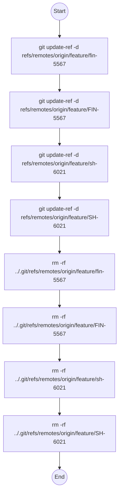

# Diagram: research/fix_git.sh

> Auto-generated by Obscura crawlers

## Mermaid

### SVG

<svg id="container" width="361.78125" xmlns="http://www.w3.org/2000/svg" class="flowchart" height="1374.40625" viewBox="0 0 361.78125 1374.40625" role="graphics-document document" aria-roledescription="flowchart-v2"><g><marker id="container_flowchart-v2-pointEnd" class="marker flowchart-v2" viewBox="0 0 10 10" refX="5" refY="5" markerUnits="userSpaceOnUse" markerWidth="8" markerHeight="8" orient="auto"><path d="M 0 0 L 10 5 L 0 10 z" class="arrowMarkerPath" style="stroke-width: 1; stroke-dasharray: 1, 0;"></path></marker><marker id="container_flowchart-v2-pointStart" class="marker flowchart-v2" viewBox="0 0 10 10" refX="4.5" refY="5" markerUnits="userSpaceOnUse" markerWidth="8" markerHeight="8" orient="auto"><path d="M 0 5 L 10 10 L 10 0 z" class="arrowMarkerPath" style="stroke-width: 1; stroke-dasharray: 1, 0;"></path></marker><marker id="container_flowchart-v2-circleEnd" class="marker flowchart-v2" viewBox="0 0 10 10" refX="11" refY="5" markerUnits="userSpaceOnUse" markerWidth="11" markerHeight="11" orient="auto"><circle cx="5" cy="5" r="5" class="arrowMarkerPath" style="stroke-width: 1; stroke-dasharray: 1, 0;"></circle></marker><marker id="container_flowchart-v2-circleStart" class="marker flowchart-v2" viewBox="0 0 10 10" refX="-1" refY="5" markerUnits="userSpaceOnUse" markerWidth="11" markerHeight="11" orient="auto"><circle cx="5" cy="5" r="5" class="arrowMarkerPath" style="stroke-width: 1; stroke-dasharray: 1, 0;"></circle></marker><marker id="container_flowchart-v2-crossEnd" class="marker cross flowchart-v2" viewBox="0 0 11 11" refX="12" refY="5.2" markerUnits="userSpaceOnUse" markerWidth="11" markerHeight="11" orient="auto"><path d="M 1,1 l 9,9 M 10,1 l -9,9" class="arrowMarkerPath" style="stroke-width: 2; stroke-dasharray: 1, 0;"></path></marker><marker id="container_flowchart-v2-crossStart" class="marker cross flowchart-v2" viewBox="0 0 11 11" refX="-1" refY="5.2" markerUnits="userSpaceOnUse" markerWidth="11" markerHeight="11" orient="auto"><path d="M 1,1 l 9,9 M 10,1 l -9,9" class="arrowMarkerPath" style="stroke-width: 2; stroke-dasharray: 1, 0;"></path></marker><g class="root"><g class="clusters"></g><g class="edgePaths"><path d="M180.891,58.047L180.891,62.214C180.891,66.38,180.891,74.714,180.891,82.38C180.891,90.047,180.891,97.047,180.891,100.547L180.891,104.047" id="L_Start_UR1_0" class="edge-thickness-normal edge-pattern-solid edge-thickness-normal edge-pattern-solid flowchart-link" style=";" data-edge="true" data-et="edge" data-id="L_Start_UR1_0" data-points="W3sieCI6MTgwLjg5MDYyNSwieSI6NTguMDQ2ODc1fSx7IngiOjE4MC44OTA2MjUsInkiOjgzLjA0Njg3NX0seyJ4IjoxODAuODkwNjI1LCJ5IjoxMDguMDQ2ODc1fV0=" marker-end="url(#container_flowchart-v2-pointEnd)"></path><path d="M180.891,210.047L180.891,214.214C180.891,218.38,180.891,226.714,180.891,234.38C180.891,242.047,180.891,249.047,180.891,252.547L180.891,256.047" id="L_UR1_UR2_0" class="edge-thickness-normal edge-pattern-solid edge-thickness-normal edge-pattern-solid flowchart-link" style=";" data-edge="true" data-et="edge" data-id="L_UR1_UR2_0" data-points="W3sieCI6MTgwLjg5MDYyNSwieSI6MjEwLjA0Njg3NX0seyJ4IjoxODAuODkwNjI1LCJ5IjoyMzUuMDQ2ODc1fSx7IngiOjE4MC44OTA2MjUsInkiOjI2MC4wNDY4NzV9XQ==" marker-end="url(#container_flowchart-v2-pointEnd)"></path><path d="M180.891,362.047L180.891,366.214C180.891,370.38,180.891,378.714,180.891,386.38C180.891,394.047,180.891,401.047,180.891,404.547L180.891,408.047" id="L_UR2_UR3_0" class="edge-thickness-normal edge-pattern-solid edge-thickness-normal edge-pattern-solid flowchart-link" style=";" data-edge="true" data-et="edge" data-id="L_UR2_UR3_0" data-points="W3sieCI6MTgwLjg5MDYyNSwieSI6MzYyLjA0Njg3NX0seyJ4IjoxODAuODkwNjI1LCJ5IjozODcuMDQ2ODc1fSx7IngiOjE4MC44OTA2MjUsInkiOjQxMi4wNDY4NzV9XQ==" marker-end="url(#container_flowchart-v2-pointEnd)"></path><path d="M180.891,514.047L180.891,518.214C180.891,522.38,180.891,530.714,180.891,538.38C180.891,546.047,180.891,553.047,180.891,556.547L180.891,560.047" id="L_UR3_UR4_0" class="edge-thickness-normal edge-pattern-solid edge-thickness-normal edge-pattern-solid flowchart-link" style=";" data-edge="true" data-et="edge" data-id="L_UR3_UR4_0" data-points="W3sieCI6MTgwLjg5MDYyNSwieSI6NTE0LjA0Njg3NX0seyJ4IjoxODAuODkwNjI1LCJ5Ijo1MzkuMDQ2ODc1fSx7IngiOjE4MC44OTA2MjUsInkiOjU2NC4wNDY4NzV9XQ==" marker-end="url(#container_flowchart-v2-pointEnd)"></path><path d="M180.891,666.047L180.891,670.214C180.891,674.38,180.891,682.714,180.891,690.38C180.891,698.047,180.891,705.047,180.891,708.547L180.891,712.047" id="L_UR4_RM1_0" class="edge-thickness-normal edge-pattern-solid edge-thickness-normal edge-pattern-solid flowchart-link" style=";" data-edge="true" data-et="edge" data-id="L_UR4_RM1_0" data-points="W3sieCI6MTgwLjg5MDYyNSwieSI6NjY2LjA0Njg3NX0seyJ4IjoxODAuODkwNjI1LCJ5Ijo2OTEuMDQ2ODc1fSx7IngiOjE4MC44OTA2MjUsInkiOjcxNi4wNDY4NzV9XQ==" marker-end="url(#container_flowchart-v2-pointEnd)"></path><path d="M180.891,818.047L180.891,822.214C180.891,826.38,180.891,834.714,180.891,842.38C180.891,850.047,180.891,857.047,180.891,860.547L180.891,864.047" id="L_RM1_RM2_0" class="edge-thickness-normal edge-pattern-solid edge-thickness-normal edge-pattern-solid flowchart-link" style=";" data-edge="true" data-et="edge" data-id="L_RM1_RM2_0" data-points="W3sieCI6MTgwLjg5MDYyNSwieSI6ODE4LjA0Njg3NX0seyJ4IjoxODAuODkwNjI1LCJ5Ijo4NDMuMDQ2ODc1fSx7IngiOjE4MC44OTA2MjUsInkiOjg2OC4wNDY4NzV9XQ==" marker-end="url(#container_flowchart-v2-pointEnd)"></path><path d="M180.891,970.047L180.891,974.214C180.891,978.38,180.891,986.714,180.891,994.38C180.891,1002.047,180.891,1009.047,180.891,1012.547L180.891,1016.047" id="L_RM2_RM3_0" class="edge-thickness-normal edge-pattern-solid edge-thickness-normal edge-pattern-solid flowchart-link" style=";" data-edge="true" data-et="edge" data-id="L_RM2_RM3_0" data-points="W3sieCI6MTgwLjg5MDYyNSwieSI6OTcwLjA0Njg3NX0seyJ4IjoxODAuODkwNjI1LCJ5Ijo5OTUuMDQ2ODc1fSx7IngiOjE4MC44OTA2MjUsInkiOjEwMjAuMDQ2ODc1fV0=" marker-end="url(#container_flowchart-v2-pointEnd)"></path><path d="M180.891,1122.047L180.891,1126.214C180.891,1130.38,180.891,1138.714,180.891,1146.38C180.891,1154.047,180.891,1161.047,180.891,1164.547L180.891,1168.047" id="L_RM3_RM4_0" class="edge-thickness-normal edge-pattern-solid edge-thickness-normal edge-pattern-solid flowchart-link" style=";" data-edge="true" data-et="edge" data-id="L_RM3_RM4_0" data-points="W3sieCI6MTgwLjg5MDYyNSwieSI6MTEyMi4wNDY4NzV9LHsieCI6MTgwLjg5MDYyNSwieSI6MTE0Ny4wNDY4NzV9LHsieCI6MTgwLjg5MDYyNSwieSI6MTE3Mi4wNDY4NzV9XQ==" marker-end="url(#container_flowchart-v2-pointEnd)"></path><path d="M180.891,1274.047L180.891,1278.214C180.891,1282.38,180.891,1290.714,180.891,1298.38C180.891,1306.047,180.891,1313.047,180.891,1316.547L180.891,1320.047" id="L_RM4_End_0" class="edge-thickness-normal edge-pattern-solid edge-thickness-normal edge-pattern-solid flowchart-link" style=";" data-edge="true" data-et="edge" data-id="L_RM4_End_0" data-points="W3sieCI6MTgwLjg5MDYyNSwieSI6MTI3NC4wNDY4NzV9LHsieCI6MTgwLjg5MDYyNSwieSI6MTI5OS4wNDY4NzV9LHsieCI6MTgwLjg5MDYyNSwieSI6MTMyNC4wNDY4NzV9XQ==" marker-end="url(#container_flowchart-v2-pointEnd)"></path></g><g class="edgeLabels"><g class="edgeLabel"><g class="label" data-id="L_Start_UR1_0" transform="translate(0, 0)"><foreignObject width="0" height="0">

</foreignObject></g></g><g class="edgeLabel"><g class="label" data-id="L_UR1_UR2_0" transform="translate(0, 0)"><foreignObject width="0" height="0">

</foreignObject></g></g><g class="edgeLabel"><g class="label" data-id="L_UR2_UR3_0" transform="translate(0, 0)"><foreignObject width="0" height="0">

</foreignObject></g></g><g class="edgeLabel"><g class="label" data-id="L_UR3_UR4_0" transform="translate(0, 0)"><foreignObject width="0" height="0">

</foreignObject></g></g><g class="edgeLabel"><g class="label" data-id="L_UR4_RM1_0" transform="translate(0, 0)"><foreignObject width="0" height="0">

</foreignObject></g></g><g class="edgeLabel"><g class="label" data-id="L_RM1_RM2_0" transform="translate(0, 0)"><foreignObject width="0" height="0">

</foreignObject></g></g><g class="edgeLabel"><g class="label" data-id="L_RM2_RM3_0" transform="translate(0, 0)"><foreignObject width="0" height="0">

</foreignObject></g></g><g class="edgeLabel"><g class="label" data-id="L_RM3_RM4_0" transform="translate(0, 0)"><foreignObject width="0" height="0">

</foreignObject></g></g><g class="edgeLabel"><g class="label" data-id="L_RM4_End_0" transform="translate(0, 0)"><foreignObject width="0" height="0">

</foreignObject></g></g></g><g class="nodes"><g class="node default" id="flowchart-Start-0" transform="translate(180.890625, 33.0234375)"><circle class="basic label-container" style="" r="25.0234375" cx="0" cy="0"></circle><g class="label" style="" transform="translate(-17.5234375, -12)"><rect></rect><foreignObject width="35.046875" height="24">

Start

</foreignObject></g></g><g class="node default" id="flowchart-UR1-1" transform="translate(180.890625, 159.046875)"><rect class="basic label-container" style="" x="-148.2421875" y="-51" width="296.484375" height="102"></rect><g class="label" style="" transform="translate(-118.2421875, -36)"><rect></rect><foreignObject width="236.484375" height="72">

git update-ref -d refs/remotes/origin/feature/fin-5567

</foreignObject></g></g><g class="node default" id="flowchart-UR2-2" transform="translate(180.890625, 311.046875)"><rect class="basic label-container" style="" x="-150.9453125" y="-51" width="301.890625" height="102"></rect><g class="label" style="" transform="translate(-120.9453125, -36)"><rect></rect><foreignObject width="241.890625" height="72">

git update-ref -d refs/remotes/origin/feature/FIN-5567

</foreignObject></g></g><g class="node default" id="flowchart-UR3-3" transform="translate(180.890625, 463.046875)"><rect class="basic label-container" style="" x="-147.453125" y="-51" width="294.90625" height="102"></rect><g class="label" style="" transform="translate(-117.453125, -36)"><rect></rect><foreignObject width="234.90625" height="72">

git update-ref -d refs/remotes/origin/feature/sh-6021

</foreignObject></g></g><g class="node default" id="flowchart-UR4-4" transform="translate(180.890625, 615.046875)"><rect class="basic label-container" style="" x="-149.0703125" y="-51" width="298.140625" height="102"></rect><g class="label" style="" transform="translate(-119.0703125, -36)"><rect></rect><foreignObject width="238.140625" height="72">

git update-ref -d refs/remotes/origin/feature/SH-6021

</foreignObject></g></g><g class="node default" id="flowchart-RM1-5" transform="translate(180.890625, 767.046875)"><rect class="basic label-container" style="" x="-170.1875" y="-51" width="340.375" height="102"></rect><g class="label" style="" transform="translate(-140.1875, -36)"><rect></rect><foreignObject width="280.375" height="72">

rm -rf ../.git/refs/remotes/origin/feature/fin-5567

</foreignObject></g></g><g class="node default" id="flowchart-RM2-6" transform="translate(180.890625, 919.046875)"><rect class="basic label-container" style="" x="-172.890625" y="-51" width="345.78125" height="102"></rect><g class="label" style="" transform="translate(-142.890625, -36)"><rect></rect><foreignObject width="285.78125" height="72">

rm -rf ../.git/refs/remotes/origin/feature/FIN-5567

</foreignObject></g></g><g class="node default" id="flowchart-RM3-7" transform="translate(180.890625, 1071.046875)"><rect class="basic label-container" style="" x="-169.3984375" y="-51" width="338.796875" height="102"></rect><g class="label" style="" transform="translate(-139.3984375, -36)"><rect></rect><foreignObject width="278.796875" height="72">

rm -rf ../.git/refs/remotes/origin/feature/sh-6021

</foreignObject></g></g><g class="node default" id="flowchart-RM4-8" transform="translate(180.890625, 1223.046875)"><rect class="basic label-container" style="" x="-171.015625" y="-51" width="342.03125" height="102"></rect><g class="label" style="" transform="translate(-141.015625, -36)"><rect></rect><foreignObject width="282.03125" height="72">

rm -rf ../.git/refs/remotes/origin/feature/SH-6021

</foreignObject></g></g><g class="node default" id="flowchart-End-9" transform="translate(180.890625, 1345.2265625)"><circle class="basic label-container" style="" r="21.1796875" cx="0" cy="0"></circle><g class="label" style="" transform="translate(-13.6796875, -12)"><rect></rect><foreignObject width="27.359375" height="24">

End

</foreignObject></g></g></g></g></g></svg>
