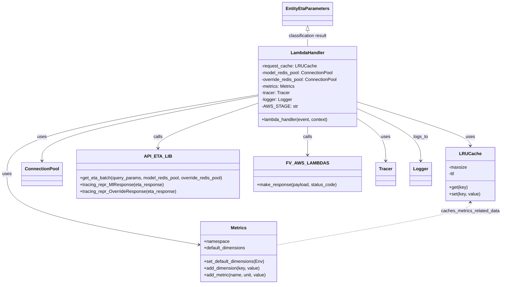

# Diagram: research/get_ml_eta.py


> Auto-generated by Obscura crawlers

## Diagram 1

```mermaid
flowchart TD
    Start([lambda_handler(event, context)])
    Start --> ParseQuery
    ParseQuery["Extract queryStringParameters into query_params"]
    ParseQuery --> Classify
    Classify["params = classify_params(query_params)"]
    Classify --> SetSpan
    SetSpan["span = trace.get_current_span()\nspan.set_attributes(params.get_tracing_representation())\nspan.set_attribute('raw_params', json)"]
    SetSpan --> IsEntity
    IsEntity{"params instanceof EntityEtaParameters?"}
    IsEntity -->|yes| BuildCacheKey
    IsEntity -->|no| CallAPI
    BuildCacheKey["build cache_key excluding external_entity_id\ncache_key = json.dumps(..., sort_keys=True)"]
    BuildCacheKey --> CacheGet
    CacheGet{"cached_response = request_cache.get(cache_key)?"}
    CacheGet -->|yes| ReturnCached
    CacheGet -->|no| CallAPI
    ReturnCached["return cached_response"]
    CallAPI["eta_response = api.eta_lib.get_eta_batch(query_params, model_redis_pool, override_redis_pool)"]
    CallAPI --> HasETA
    HasETA{"'etaDate' in eta_response?"}
    HasETA -->|yes| HasHistorical
    HasETA -->|no| NoHistorical
    HasHistorical --> SetAttrsBranch
    SetAttrsBranch{"'redis_key' in eta_response?"}
    SetAttrsBranch -->|yes| SetMlAttrs
    SetAttrsBranch -->|no| SetOverrideAttrs
    SetMlAttrs["span.set_attributes(api.eta_lib.tracing_repr_MlResponse(eta_response))"]
    SetOverrideAttrs["span.set_attributes(api.eta_lib.tracing_repr_OverrideResponse(eta_response))"]
    SetMlAttrs --> CheckConfig
    SetOverrideAttrs --> CheckConfig
    CheckConfig{"eta_response['configuration_used'] == 'machine_learning_configuration'?"}
    CheckConfig -->|yes| AddMLMetric
    CheckConfig -->|no| AddOverrideMetric
    AddMLMetric["metrics.add_metric(MLUsed, Count, 1)"]
    AddOverrideMetric["metrics.add_metric(OverrideUsed, Count, 1)"]
    AddMLMetric --> MakeResp200
    AddOverrideMetric --> MakeResp200
    MakeResp200["resp = fv.aws.lambdas.make_response(eta_response, 200)"]
    MakeResp200 --> MaybeCacheSet1
    MaybeCacheSet1{"if cache_key present -> try request_cache.set(cache_key, resp)"}
    MaybeCacheSet1 --> ReturnResp
    NoHistorical["span.set_attribute('no_historical', True)\nmetrics.add_metric(NoHistoricalData, Count, 1)"]
    NoHistorical --> SingleMetricBlock
    SingleMetricBlock["with single_metric(... ) as no_historical_by_solution:\nno_historical_by_solution.add_dimension('SolutionId', params.solution_id or 'None')"]
    SingleMetricBlock --> MakeResp404
    MakeResp404["resp = fv.aws.lambdas.make_response({...eta_response, 'error': 'No historical data'}, 404)"]
    MakeResp404 --> MaybeCacheSet2
    MaybeCacheSet2{"if cache_key present -> try request_cache.set(cache_key, resp)"}
    MaybeCacheSet2 --> ReturnResp
    ReturnResp["return resp"]
```

> SVG rendering failed for this diagram.

## Diagram 2



### SVG

<svg id="container" width="1768.41796875" xmlns="http://www.w3.org/2000/svg" class="classDiagram" height="1018" viewBox="0 0 1768.41796875 1018" role="graphics-document document" aria-roledescription="class"><style>#container{font-family:"trebuchet ms",verdana,arial,sans-serif;font-size:16px;fill:#333;}@keyframes edge-animation-frame{from{stroke-dashoffset:0;}}@keyframes dash{to{stroke-dashoffset:0;}}#container .edge-animation-slow{stroke-dasharray:9,5!important;stroke-dashoffset:900;animation:dash 50s linear infinite;stroke-linecap:round;}#container .edge-animation-fast{stroke-dasharray:9,5!important;stroke-dashoffset:900;animation:dash 20s linear infinite;stroke-linecap:round;}#container .error-icon{fill:#552222;}#container .error-text{fill:#552222;stroke:#552222;}#container .edge-thickness-normal{stroke-width:1px;}#container .edge-thickness-thick{stroke-width:3.5px;}#container .edge-pattern-solid{stroke-dasharray:0;}#container .edge-thickness-invisible{stroke-width:0;fill:none;}#container .edge-pattern-dashed{stroke-dasharray:3;}#container .edge-pattern-dotted{stroke-dasharray:2;}#container .marker{fill:#333333;stroke:#333333;}#container .marker.cross{stroke:#333333;}#container svg{font-family:"trebuchet ms",verdana,arial,sans-serif;font-size:16px;}#container p{margin:0;}#container g.classGroup text{fill:#9370DB;stroke:none;font-family:"trebuchet ms",verdana,arial,sans-serif;font-size:10px;}#container g.classGroup text .title{font-weight:bolder;}#container .nodeLabel,#container .edgeLabel{color:#131300;}#container .edgeLabel .label rect{fill:#ECECFF;}#container .label text{fill:#131300;}#container .labelBkg{background:#ECECFF;}#container .edgeLabel .label span{background:#ECECFF;}#container .classTitle{font-weight:bolder;}#container .node rect,#container .node circle,#container .node ellipse,#container .node polygon,#container .node path{fill:#ECECFF;stroke:#9370DB;stroke-width:1px;}#container .divider{stroke:#9370DB;stroke-width:1;}#container g.clickable{cursor:pointer;}#container g.classGroup rect{fill:#ECECFF;stroke:#9370DB;}#container g.classGroup line{stroke:#9370DB;stroke-width:1;}#container .classLabel .box{stroke:none;stroke-width:0;fill:#ECECFF;opacity:0.5;}#container .classLabel .label{fill:#9370DB;font-size:10px;}#container .relation{stroke:#333333;stroke-width:1;fill:none;}#container .dashed-line{stroke-dasharray:3;}#container .dotted-line{stroke-dasharray:1 2;}#container #compositionStart,#container .composition{fill:#333333!important;stroke:#333333!important;stroke-width:1;}#container #compositionEnd,#container .composition{fill:#333333!important;stroke:#333333!important;stroke-width:1;}#container #dependencyStart,#container .dependency{fill:#333333!important;stroke:#333333!important;stroke-width:1;}#container #dependencyStart,#container .dependency{fill:#333333!important;stroke:#333333!important;stroke-width:1;}#container #extensionStart,#container .extension{fill:transparent!important;stroke:#333333!important;stroke-width:1;}#container #extensionEnd,#container .extension{fill:transparent!important;stroke:#333333!important;stroke-width:1;}#container #aggregationStart,#container .aggregation{fill:transparent!important;stroke:#333333!important;stroke-width:1;}#container #aggregationEnd,#container .aggregation{fill:transparent!important;stroke:#333333!important;stroke-width:1;}#container #lollipopStart,#container .lollipop{fill:#ECECFF!important;stroke:#333333!important;stroke-width:1;}#container #lollipopEnd,#container .lollipop{fill:#ECECFF!important;stroke:#333333!important;stroke-width:1;}#container .edgeTerminals{font-size:11px;line-height:initial;}#container .classTitleText{text-anchor:middle;font-size:18px;fill:#333;}#container .label-icon{display:inline-block;height:1em;overflow:visible;vertical-align:-0.125em;}#container .node .label-icon path{fill:currentColor;stroke:revert;stroke-width:revert;}#container :root{--mermaid-font-family:"trebuchet ms",verdana,arial,sans-serif;}</style><g><defs><marker id="container_class-aggregationStart" class="marker aggregation class" refX="18" refY="7" markerWidth="190" markerHeight="240" orient="auto"><path d="M 18,7 L9,13 L1,7 L9,1 Z"></path></marker></defs><defs><marker id="container_class-aggregationEnd" class="marker aggregation class" refX="1" refY="7" markerWidth="20" markerHeight="28" orient="auto"><path d="M 18,7 L9,13 L1,7 L9,1 Z"></path></marker></defs><defs><marker id="container_class-extensionStart" class="marker extension class" refX="18" refY="7" markerWidth="190" markerHeight="240" orient="auto"><path d="M 1,7 L18,13 V 1 Z"></path></marker></defs><defs><marker id="container_class-extensionEnd" class="marker extension class" refX="1" refY="7" markerWidth="20" markerHeight="28" orient="auto"><path d="M 1,1 V 13 L18,7 Z"></path></marker></defs><defs><marker id="container_class-compositionStart" class="marker composition class" refX="18" refY="7" markerWidth="190" markerHeight="240" orient="auto"><path d="M 18,7 L9,13 L1,7 L9,1 Z"></path></marker></defs><defs><marker id="container_class-compositionEnd" class="marker composition class" refX="1" refY="7" markerWidth="20" markerHeight="28" orient="auto"><path d="M 18,7 L9,13 L1,7 L9,1 Z"></path></marker></defs><defs><marker id="container_class-dependencyStart" class="marker dependency class" refX="6" refY="7" markerWidth="190" markerHeight="240" orient="auto"><path d="M 5,7 L9,13 L1,7 L9,1 Z"></path></marker></defs><defs><marker id="container_class-dependencyEnd" class="marker dependency class" refX="13" refY="7" markerWidth="20" markerHeight="28" orient="auto"><path d="M 18,7 L9,13 L14,7 L9,1 Z"></path></marker></defs><defs><marker id="container_class-lollipopStart" class="marker lollipop class" refX="13" refY="7" markerWidth="190" markerHeight="240" orient="auto"><circle stroke="black" fill="transparent" cx="7" cy="7" r="6"></circle></marker></defs><defs><marker id="container_class-lollipopEnd" class="marker lollipop class" refX="1" refY="7" markerWidth="190" markerHeight="240" orient="auto"><circle stroke="black" fill="transparent" cx="7" cy="7" r="6"></circle></marker></defs><g class="root"><g class="clusters"></g><g class="edgePaths"><path d="M1266.801,367.055L1331.435,387.712C1396.069,408.37,1525.337,449.685,1589.971,475.509C1654.605,501.333,1654.605,511.667,1654.605,516.833L1654.605,522" id="id_LambdaHandler_LRUCache_1" class="edge-thickness-normal edge-pattern-solid relation" style=";;;" data-edge="true" data-et="edge" data-id="id_LambdaHandler_LRUCache_1" data-points="W3sieCI6MTI2Ni44MDA3ODEyNSwieSI6MzY3LjA1NDg2MzQ5NjUzMDV9LHsieCI6MTY1NC42MDU0Njg3NSwieSI6NDkxfSx7IngiOjE2NTQuNjA1NDY4NzUsInkiOjUyOH1d" marker-end="url(#container_class-dependencyEnd)"></path><path d="M909.77,344.272L782.39,368.727C655.01,393.181,400.251,442.091,272.872,480.712C145.492,519.333,145.492,547.667,145.492,561.833L145.492,576" id="id_LambdaHandler_ConnectionPool_2" class="edge-thickness-normal edge-pattern-solid relation" style=";;;" data-edge="true" data-et="edge" data-id="id_LambdaHandler_ConnectionPool_2" data-points="W3sieCI6OTA5Ljc2OTUzMTI1LCJ5IjozNDQuMjcxOTIzMTAwODI2Nn0seyJ4IjoxNDUuNDkyMTg3NSwieSI6NDkxfSx7IngiOjE0NS40OTIxODc1LCJ5Ijo1ODJ9XQ==" marker-end="url(#container_class-dependencyEnd)"></path><path d="M909.77,340.374L762.223,365.478C614.677,390.582,319.585,440.791,172.038,488.062C24.492,535.333,24.492,579.667,24.492,624C24.492,668.333,24.492,712.667,136.333,754.73C248.175,796.794,471.857,836.587,583.699,856.484L695.54,876.381" id="id_LambdaHandler_Metrics_3" class="edge-thickness-normal edge-pattern-solid relation" style=";;;" data-edge="true" data-et="edge" data-id="id_LambdaHandler_Metrics_3" data-points="W3sieCI6OTA5Ljc2OTUzMTI1LCJ5IjozNDAuMzczNjk5NjUyMjYxNH0seyJ4IjoyNC40OTIxODc1LCJ5Ijo0OTF9LHsieCI6MjQuNDkyMTg3NSwieSI6NjI0fSx7IngiOjI0LjQ5MjE4NzUsInkiOjc1N30seyJ4Ijo3MDEuNDQ3MjY1NjI1LCJ5Ijo4NzcuNDMxNDkwODEzNzYxNX1d" marker-end="url(#container_class-dependencyEnd)"></path><path d="M1266.801,428.637L1282.441,439.031C1298.081,449.424,1329.361,470.212,1345.001,494.773C1360.641,519.333,1360.641,547.667,1360.641,561.833L1360.641,576" id="id_LambdaHandler_Tracer_4" class="edge-thickness-normal edge-pattern-solid relation" style=";;;" data-edge="true" data-et="edge" data-id="id_LambdaHandler_Tracer_4" data-points="W3sieCI6MTI2Ni44MDA3ODEyNSwieSI6NDI4LjYzNjYwNDg1MDYyMzJ9LHsieCI6MTM2MC42NDA2MjUsInkiOjQ5MX0seyJ4IjoxMzYwLjY0MDYyNSwieSI6NTgyfV0=" marker-end="url(#container_class-dependencyEnd)"></path><path d="M1266.801,392.03L1302.697,408.525C1338.594,425.02,1410.387,458.01,1446.283,488.672C1482.18,519.333,1482.18,547.667,1482.18,561.833L1482.18,576" id="id_LambdaHandler_Logger_5" class="edge-thickness-normal edge-pattern-solid relation" style=";;;" data-edge="true" data-et="edge" data-id="id_LambdaHandler_Logger_5" data-points="W3sieCI6MTI2Ni44MDA3ODEyNSwieSI6MzkyLjAzMDQwNTUwNTkxNTV9LHsieCI6MTQ4Mi4xNzk2ODc1LCJ5Ijo0OTF9LHsieCI6MTQ4Mi4xNzk2ODc1LCJ5Ijo1ODJ9XQ==" marker-end="url(#container_class-dependencyEnd)"></path><path d="M909.77,370.91L851.11,390.925C792.451,410.94,675.132,450.97,616.472,477.652C557.813,504.333,557.813,517.667,557.813,524.333L557.813,531" id="id_LambdaHandler_API_ETA_LIB_6" class="edge-thickness-normal edge-pattern-solid relation" style=";;;" data-edge="true" data-et="edge" data-id="id_LambdaHandler_API_ETA_LIB_6" data-points="W3sieCI6OTA5Ljc2OTUzMTI1LCJ5IjozNzAuOTEwNDQ5ODQ5NDEyMDN9LHsieCI6NTU3LjgxMjUsInkiOjQ5MX0seyJ4Ijo1NTcuODEyNSwieSI6NTM3fV0=" marker-end="url(#container_class-dependencyEnd)"></path><path d="M1088.285,454L1088.285,460.167C1088.285,466.333,1088.285,478.667,1088.285,495.5C1088.285,512.333,1088.285,533.667,1088.285,544.333L1088.285,555" id="id_LambdaHandler_FV_AWS_LAMBDAS_7" class="edge-thickness-normal edge-pattern-solid relation" style=";;;" data-edge="true" data-et="edge" data-id="id_LambdaHandler_FV_AWS_LAMBDAS_7" data-points="W3sieCI6MTA4OC4yODUxNTYyNSwieSI6NDU0fSx7IngiOjEwODguMjg1MTU2MjUsInkiOjQ5MX0seyJ4IjoxMDg4LjI4NTE1NjI1LCJ5Ijo1NjF9XQ==" marker-end="url(#container_class-dependencyEnd)"></path><path d="M1088.285,109.25L1088.285,112.542C1088.285,115.833,1088.285,122.417,1088.285,131.875C1088.285,141.333,1088.285,153.667,1088.285,159.833L1088.285,166" id="id_EntityEtaParameters_LambdaHandler_8" class="edge-thickness-normal edge-pattern-solid relation" style=";;;" data-edge="true" data-et="edge" data-id="id_EntityEtaParameters_LambdaHandler_8" data-points="W3sieCI6MTA4OC4yODUxNTYyNSwieSI6OTJ9LHsieCI6MTA4OC4yODUxNTYyNSwieSI6MTI5fSx7IngiOjEwODguMjg1MTU2MjUsInkiOjE2Nn1d" marker-start="url(#container_class-extensionStart)"></path><path d="M1654.605,726L1654.605,731.167C1654.605,736.333,1654.605,746.667,1541.78,771.905C1428.954,797.144,1203.302,837.288,1090.476,857.36L977.65,877.431" id="id_LRUCache_Metrics_9" class="edge-thickness-normal edge-pattern-dashed relation" style=";;;" data-edge="true" data-et="edge" data-id="id_LRUCache_Metrics_9" data-points="W3sieCI6MTY1NC42MDU0Njg3NSwieSI6NzIwfSx7IngiOjE2NTQuNjA1NDY4NzUsInkiOjc1N30seyJ4Ijo5NzcuNjUwMzkwNjI1LCJ5Ijo4NzcuNDMxNDkwODEzNzYxNX1d" marker-start="url(#container_class-dependencyStart)"></path></g><g class="edgeLabels"><g class="edgeLabel" transform="translate(1654.60546875, 491)"><g class="label" data-id="id_LambdaHandler_LRUCache_1" transform="translate(-16.4921875, -12)"><foreignObject width="32.984375" height="24"><div xmlns="http://www.w3.org/1999/xhtml" class="labelBkg" style="display: table-cell; white-space: nowrap; line-height: 1.5; max-width: 200px; text-align: center;"><span class="edgeLabel"><p>uses</p></span></div></foreignObject></g></g><g class="edgeLabel" transform="translate(145.4921875, 491)"><g class="label" data-id="id_LambdaHandler_ConnectionPool_2" transform="translate(-16.4921875, -12)"><foreignObject width="32.984375" height="24"><div xmlns="http://www.w3.org/1999/xhtml" class="labelBkg" style="display: table-cell; white-space: nowrap; line-height: 1.5; max-width: 200px; text-align: center;"><span class="edgeLabel"><p>uses</p></span></div></foreignObject></g></g><g class="edgeLabel" transform="translate(24.4921875, 624)"><g class="label" data-id="id_LambdaHandler_Metrics_3" transform="translate(-16.4921875, -12)"><foreignObject width="32.984375" height="24"><div xmlns="http://www.w3.org/1999/xhtml" class="labelBkg" style="display: table-cell; white-space: nowrap; line-height: 1.5; max-width: 200px; text-align: center;"><span class="edgeLabel"><p>uses</p></span></div></foreignObject></g></g><g class="edgeLabel" transform="translate(1360.640625, 491)"><g class="label" data-id="id_LambdaHandler_Tracer_4" transform="translate(-16.4921875, -12)"><foreignObject width="32.984375" height="24"><div xmlns="http://www.w3.org/1999/xhtml" class="labelBkg" style="display: table-cell; white-space: nowrap; line-height: 1.5; max-width: 200px; text-align: center;"><span class="edgeLabel"><p>uses</p></span></div></foreignObject></g></g><g class="edgeLabel" transform="translate(1482.1796875, 491)"><g class="label" data-id="id_LambdaHandler_Logger_5" transform="translate(-26.1015625, -12)"><foreignObject width="52.203125" height="24"><div xmlns="http://www.w3.org/1999/xhtml" class="labelBkg" style="display: table-cell; white-space: nowrap; line-height: 1.5; max-width: 200px; text-align: center;"><span class="edgeLabel"><p>logs_to</p></span></div></foreignObject></g></g><g class="edgeLabel" transform="translate(557.8125, 491)"><g class="label" data-id="id_LambdaHandler_API_ETA_LIB_6" transform="translate(-16.4453125, -12)"><foreignObject width="32.890625" height="24"><div xmlns="http://www.w3.org/1999/xhtml" class="labelBkg" style="display: table-cell; white-space: nowrap; line-height: 1.5; max-width: 200px; text-align: center;"><span class="edgeLabel"><p>calls</p></span></div></foreignObject></g></g><g class="edgeLabel" transform="translate(1088.28515625, 491)"><g class="label" data-id="id_LambdaHandler_FV_AWS_LAMBDAS_7" transform="translate(-16.4453125, -12)"><foreignObject width="32.890625" height="24"><div xmlns="http://www.w3.org/1999/xhtml" class="labelBkg" style="display: table-cell; white-space: nowrap; line-height: 1.5; max-width: 200px; text-align: center;"><span class="edgeLabel"><p>calls</p></span></div></foreignObject></g></g><g class="edgeLabel" transform="translate(1088.28515625, 129)"><g class="label" data-id="id_EntityEtaParameters_LambdaHandler_8" transform="translate(-70.203125, -12)"><foreignObject width="140.40625" height="24"><div xmlns="http://www.w3.org/1999/xhtml" class="labelBkg" style="display: table-cell; white-space: nowrap; line-height: 1.5; max-width: 200px; text-align: center;"><span class="edgeLabel"><p>classification result</p></span></div></foreignObject></g></g><g class="edgeLabel" transform="translate(1654.60546875, 757)"><g class="label" data-id="id_LRUCache_Metrics_9" transform="translate(-105.8125, -12)"><foreignObject width="211.625" height="24"><div xmlns="http://www.w3.org/1999/xhtml" class="labelBkg" style="display: table; white-space: break-spaces; line-height: 1.5; max-width: 200px; text-align: center; width: 200px;"><span class="edgeLabel"><p>caches_metrics_related_data</p></span></div></foreignObject></g></g></g><g class="nodes"><g class="node default" id="classId-LambdaHandler-0" transform="translate(1088.28515625, 310)"><g class="basic label-container"><path d="M-178.515625 -144 L178.515625 -144 L178.515625 144 L-178.515625 144" stroke="none" stroke-width="0" fill="#ECECFF" style=""></path><path d="M-178.515625 -144 C-76.60661506571466 -144, 25.302394868570673 -144, 178.515625 -144 M-178.515625 -144 C-76.12259395846964 -144, 26.270437083060727 -144, 178.515625 -144 M178.515625 -144 C178.515625 -45.21037732705844, 178.515625 53.57924534588312, 178.515625 144 M178.515625 -144 C178.515625 -60.022482099905304, 178.515625 23.955035800189393, 178.515625 144 M178.515625 144 C101.03336472405225 144, 23.551104448104496 144, -178.515625 144 M178.515625 144 C67.45142990205639 144, -43.61276519588722 144, -178.515625 144 M-178.515625 144 C-178.515625 75.93250276082334, -178.515625 7.86500552164668, -178.515625 -144 M-178.515625 144 C-178.515625 58.68518176147603, -178.515625 -26.62963647704794, -178.515625 -144" stroke="#9370DB" stroke-width="1.3" fill="none" stroke-dasharray="0 0" style=""></path></g><g class="annotation-group text" transform="translate(0, -120)"></g><g class="label-group text" transform="translate(-58.21875, -120)"><g class="label" style="font-weight: bolder" transform="translate(0,-12)"><foreignObject width="116.4375" height="24"><div xmlns="http://www.w3.org/1999/xhtml" style="display: table-cell; white-space: nowrap; line-height: 1.5; max-width: 167px; text-align: center;"><span class="nodeLabel markdown-node-label" style=""><p>LambdaHandler</p></span></div></foreignObject></g></g><g class="members-group text" transform="translate(-166.515625, -72)"><g class="label" style="" transform="translate(0,-12)"><foreignObject width="191.109375" height="24"><div xmlns="http://www.w3.org/1999/xhtml" style="display: table-cell; white-space: nowrap; line-height: 1.5; max-width: 248px; text-align: center;"><span class="nodeLabel markdown-node-label" style=""><p>-request_cache: LRUCache</p></span></div></foreignObject></g><g class="label" style="" transform="translate(0,12)"><foreignObject width="260.203125" height="24"><div xmlns="http://www.w3.org/1999/xhtml" style="display: table-cell; white-space: nowrap; line-height: 1.5; max-width: 318px; text-align: center;"><span class="nodeLabel markdown-node-label" style=""><p>-model_redis_pool: ConnectionPool</p></span></div></foreignObject></g><g class="label" style="" transform="translate(0,36)"><foreignObject width="274.8125" height="24"><div xmlns="http://www.w3.org/1999/xhtml" style="display: table-cell; white-space: nowrap; line-height: 1.5; max-width: 332px; text-align: center;"><span class="nodeLabel markdown-node-label" style=""><p>-override_redis_pool: ConnectionPool</p></span></div></foreignObject></g><g class="label" style="" transform="translate(0,60)"><foreignObject width="121.296875" height="24"><div xmlns="http://www.w3.org/1999/xhtml" style="display: table-cell; white-space: nowrap; line-height: 1.5; max-width: 179px; text-align: center;"><span class="nodeLabel markdown-node-label" style=""><p>-metrics: Metrics</p></span></div></foreignObject></g><g class="label" style="" transform="translate(0,84)"><foreignObject width="101.265625" height="24"><div xmlns="http://www.w3.org/1999/xhtml" style="display: table-cell; white-space: nowrap; line-height: 1.5; max-width: 159px; text-align: center;"><span class="nodeLabel markdown-node-label" style=""><p>-tracer: Tracer</p></span></div></foreignObject></g><g class="label" style="" transform="translate(0,108)"><foreignObject width="108.125" height="24"><div xmlns="http://www.w3.org/1999/xhtml" style="display: table-cell; white-space: nowrap; line-height: 1.5; max-width: 166px; text-align: center;"><span class="nodeLabel markdown-node-label" style=""><p>-logger: Logger</p></span></div></foreignObject></g><g class="label" style="" transform="translate(0,132)"><foreignObject width="115.765625" height="24"><div xmlns="http://www.w3.org/1999/xhtml" style="display: table-cell; white-space: nowrap; line-height: 1.5; max-width: 174px; text-align: center;"><span class="nodeLabel markdown-node-label" style=""><p>-AWS_STAGE: str</p></span></div></foreignObject></g></g><g class="methods-group text" transform="translate(-166.515625, 120)"><g class="label" style="" transform="translate(0,-12)"><foreignObject width="240.1875" height="24"><div xmlns="http://www.w3.org/1999/xhtml" style="display: table-cell; white-space: nowrap; line-height: 1.5; max-width: 298px; text-align: center;"><span class="nodeLabel markdown-node-label" style=""><p>+lambda_handler(event, context)</p></span></div></foreignObject></g></g><g class="divider" style=""><path d="M-178.515625 -96 C-41.5886854965465 -96, 95.338254006907 -96, 178.515625 -96 M-178.515625 -96 C-71.9864193473076 -96, 34.542786305384794 -96, 178.515625 -96" stroke="#9370DB" stroke-width="1.3" fill="none" stroke-dasharray="0 0" style=""></path></g><g class="divider" style=""><path d="M-178.515625 96 C-83.75947390842607 96, 10.996677183147852 96, 178.515625 96 M-178.515625 96 C-91.34660327647802 96, -4.177581552956042 96, 178.515625 96" stroke="#9370DB" stroke-width="1.3" fill="none" stroke-dasharray="0 0" style=""></path></g></g><g class="node default" id="classId-EntityEtaParameters-1" transform="translate(1088.28515625, 50)"><g class="basic label-container"><path d="M-86.3125 -42 L86.3125 -42 L86.3125 42 L-86.3125 42" stroke="none" stroke-width="0" fill="#ECECFF" style=""></path><path d="M-86.3125 -42 C-19.73810613114763 -42, 46.83628773770474 -42, 86.3125 -42 M-86.3125 -42 C-21.494286405776222 -42, 43.323927188447556 -42, 86.3125 -42 M86.3125 -42 C86.3125 -15.362172293957304, 86.3125 11.275655412085392, 86.3125 42 M86.3125 -42 C86.3125 -19.493176206651867, 86.3125 3.0136475866962655, 86.3125 42 M86.3125 42 C19.777910701508162 42, -46.756678596983676 42, -86.3125 42 M86.3125 42 C46.135738097255164 42, 5.958976194510328 42, -86.3125 42 M-86.3125 42 C-86.3125 18.215534556269724, -86.3125 -5.568930887460553, -86.3125 -42 M-86.3125 42 C-86.3125 15.628737444462601, -86.3125 -10.742525111074798, -86.3125 -42" stroke="#9370DB" stroke-width="1.3" fill="none" stroke-dasharray="0 0" style=""></path></g><g class="annotation-group text" transform="translate(0, -18)"></g><g class="label-group text" transform="translate(-74.3125, -18)"><g class="label" style="font-weight: bolder" transform="translate(0,-12)"><foreignObject width="148.625" height="24"><div xmlns="http://www.w3.org/1999/xhtml" style="display: table-cell; white-space: nowrap; line-height: 1.5; max-width: 196px; text-align: center;"><span class="nodeLabel markdown-node-label" style=""><p>EntityEtaParameters</p></span></div></foreignObject></g></g><g class="members-group text" transform="translate(-74.3125, 30)"></g><g class="methods-group text" transform="translate(-74.3125, 60)"></g><g class="divider" style=""><path d="M-86.3125 6 C-32.460409349264836 6, 21.391681301470328 6, 86.3125 6 M-86.3125 6 C-35.49455754999947 6, 15.32338490000106 6, 86.3125 6" stroke="#9370DB" stroke-width="1.3" fill="none" stroke-dasharray="0 0" style=""></path></g><g class="divider" style=""><path d="M-86.3125 24 C-21.137769927153485 24, 44.03696014569303 24, 86.3125 24 M-86.3125 24 C-37.843606503467946 24, 10.625286993064108 24, 86.3125 24" stroke="#9370DB" stroke-width="1.3" fill="none" stroke-dasharray="0 0" style=""></path></g></g><g class="node default" id="classId-LRUCache-2" transform="translate(1654.60546875, 624)"><g class="basic label-container"><path d="M-85.58203125 -96 L85.58203125 -96 L85.58203125 96 L-85.58203125 96" stroke="none" stroke-width="0" fill="#ECECFF" style=""></path><path d="M-85.58203125 -96 C-27.721720373070376 -96, 30.13859050385925 -96, 85.58203125 -96 M-85.58203125 -96 C-28.42669035674247 -96, 28.72865053651506 -96, 85.58203125 -96 M85.58203125 -96 C85.58203125 -56.745298974984166, 85.58203125 -17.490597949968333, 85.58203125 96 M85.58203125 -96 C85.58203125 -45.29672445613521, 85.58203125 5.406551087729582, 85.58203125 96 M85.58203125 96 C50.60242776927397 96, 15.622824288547946 96, -85.58203125 96 M85.58203125 96 C27.61334222847345 96, -30.3553467930531 96, -85.58203125 96 M-85.58203125 96 C-85.58203125 57.100590044349616, -85.58203125 18.201180088699232, -85.58203125 -96 M-85.58203125 96 C-85.58203125 20.683540483848418, -85.58203125 -54.632919032303164, -85.58203125 -96" stroke="#9370DB" stroke-width="1.3" fill="none" stroke-dasharray="0 0" style=""></path></g><g class="annotation-group text" transform="translate(0, -72)"></g><g class="label-group text" transform="translate(-35.9453125, -72)"><g class="label" style="font-weight: bolder" transform="translate(0,-12)"><foreignObject width="71.890625" height="24"><div xmlns="http://www.w3.org/1999/xhtml" style="display: table-cell; white-space: nowrap; line-height: 1.5; max-width: 121px; text-align: center;"><span class="nodeLabel markdown-node-label" style=""><p>LRUCache</p></span></div></foreignObject></g></g><g class="members-group text" transform="translate(-73.58203125, -24)"><g class="label" style="" transform="translate(0,-12)"><foreignObject width="64.140625" height="24"><div xmlns="http://www.w3.org/1999/xhtml" style="display: table-cell; white-space: nowrap; line-height: 1.5; max-width: 122px; text-align: center;"><span class="nodeLabel markdown-node-label" style=""><p>-maxsize</p></span></div></foreignObject></g><g class="label" style="" transform="translate(0,12)"><foreignObject width="22.453125" height="24"><div xmlns="http://www.w3.org/1999/xhtml" style="display: table-cell; white-space: nowrap; line-height: 1.5; max-width: 80px; text-align: center;"><span class="nodeLabel markdown-node-label" style=""><p>-ttl</p></span></div></foreignObject></g></g><g class="methods-group text" transform="translate(-73.58203125, 48)"><g class="label" style="" transform="translate(0,-12)"><foreignObject width="65.5" height="24"><div xmlns="http://www.w3.org/1999/xhtml" style="display: table-cell; white-space: nowrap; line-height: 1.5; max-width: 123px; text-align: center;"><span class="nodeLabel markdown-node-label" style=""><p>+get(key)</p></span></div></foreignObject></g><g class="label" style="" transform="translate(0,12)"><foreignObject width="111.21875" height="24"><div xmlns="http://www.w3.org/1999/xhtml" style="display: table-cell; white-space: nowrap; line-height: 1.5; max-width: 169px; text-align: center;"><span class="nodeLabel markdown-node-label" style=""><p>+set(key, value)</p></span></div></foreignObject></g></g><g class="divider" style=""><path d="M-85.58203125 -48 C-32.84294444888284 -48, 19.89614235223432 -48, 85.58203125 -48 M-85.58203125 -48 C-39.326998813605165 -48, 6.92803362278967 -48, 85.58203125 -48" stroke="#9370DB" stroke-width="1.3" fill="none" stroke-dasharray="0 0" style=""></path></g><g class="divider" style=""><path d="M-85.58203125 24 C-27.320627860918698 24, 30.940775528162604 24, 85.58203125 24 M-85.58203125 24 C-39.91601036479076 24, 5.750010520418485 24, 85.58203125 24" stroke="#9370DB" stroke-width="1.3" fill="none" stroke-dasharray="0 0" style=""></path></g></g><g class="node default" id="classId-ConnectionPool-3" transform="translate(145.4921875, 624)"><g class="basic label-container"><path d="M-69.5078125 -42 L69.5078125 -42 L69.5078125 42 L-69.5078125 42" stroke="none" stroke-width="0" fill="#ECECFF" style=""></path><path d="M-69.5078125 -42 C-14.136020261317107 -42, 41.235771977365786 -42, 69.5078125 -42 M-69.5078125 -42 C-26.44488910738079 -42, 16.618034285238423 -42, 69.5078125 -42 M69.5078125 -42 C69.5078125 -22.50986191531563, 69.5078125 -3.019723830631257, 69.5078125 42 M69.5078125 -42 C69.5078125 -12.085807338844912, 69.5078125 17.828385322310176, 69.5078125 42 M69.5078125 42 C25.391485460964944 42, -18.724841578070112 42, -69.5078125 42 M69.5078125 42 C22.658703856127687 42, -24.190404787744626 42, -69.5078125 42 M-69.5078125 42 C-69.5078125 14.894391682642738, -69.5078125 -12.211216634714525, -69.5078125 -42 M-69.5078125 42 C-69.5078125 13.47822807400809, -69.5078125 -15.04354385198382, -69.5078125 -42" stroke="#9370DB" stroke-width="1.3" fill="none" stroke-dasharray="0 0" style=""></path></g><g class="annotation-group text" transform="translate(0, -18)"></g><g class="label-group text" transform="translate(-57.5078125, -18)"><g class="label" style="font-weight: bolder" transform="translate(0,-12)"><foreignObject width="115.015625" height="24"><div xmlns="http://www.w3.org/1999/xhtml" style="display: table-cell; white-space: nowrap; line-height: 1.5; max-width: 165px; text-align: center;"><span class="nodeLabel markdown-node-label" style=""><p>ConnectionPool</p></span></div></foreignObject></g></g><g class="members-group text" transform="translate(-57.5078125, 30)"></g><g class="methods-group text" transform="translate(-57.5078125, 60)"></g><g class="divider" style=""><path d="M-69.5078125 6 C-26.00845907538006 6, 17.49089434923988 6, 69.5078125 6 M-69.5078125 6 C-16.80683921530479 6, 35.89413406939042 6, 69.5078125 6" stroke="#9370DB" stroke-width="1.3" fill="none" stroke-dasharray="0 0" style=""></path></g><g class="divider" style=""><path d="M-69.5078125 24 C-32.107543521776655 24, 5.292725456446689 24, 69.5078125 24 M-69.5078125 24 C-16.983598808206565 24, 35.54061488358687 24, 69.5078125 24" stroke="#9370DB" stroke-width="1.3" fill="none" stroke-dasharray="0 0" style=""></path></g></g><g class="node default" id="classId-Metrics-4" transform="translate(839.548828125, 902)"><g class="basic label-container"><path d="M-138.1015625 -108 L138.1015625 -108 L138.1015625 108 L-138.1015625 108" stroke="none" stroke-width="0" fill="#ECECFF" style=""></path><path d="M-138.1015625 -108 C-42.88979004169008 -108, 52.321982416619846 -108, 138.1015625 -108 M-138.1015625 -108 C-60.216951232510254 -108, 17.66766003497949 -108, 138.1015625 -108 M138.1015625 -108 C138.1015625 -52.54929623886484, 138.1015625 2.9014075222703184, 138.1015625 108 M138.1015625 -108 C138.1015625 -34.65980636426937, 138.1015625 38.68038727146126, 138.1015625 108 M138.1015625 108 C65.96728113568402 108, -6.167000228631963 108, -138.1015625 108 M138.1015625 108 C68.42604982265877 108, -1.2494628546824629 108, -138.1015625 108 M-138.1015625 108 C-138.1015625 53.98505341008523, -138.1015625 -0.02989317982954276, -138.1015625 -108 M-138.1015625 108 C-138.1015625 47.99066041453172, -138.1015625 -12.018679170936565, -138.1015625 -108" stroke="#9370DB" stroke-width="1.3" fill="none" stroke-dasharray="0 0" style=""></path></g><g class="annotation-group text" transform="translate(0, -84)"></g><g class="label-group text" transform="translate(-26.953125, -84)"><g class="label" style="font-weight: bolder" transform="translate(0,-12)"><foreignObject width="53.90625" height="24"><div xmlns="http://www.w3.org/1999/xhtml" style="display: table-cell; white-space: nowrap; line-height: 1.5; max-width: 103px; text-align: center;"><span class="nodeLabel markdown-node-label" style=""><p>Metrics</p></span></div></foreignObject></g></g><g class="members-group text" transform="translate(-126.1015625, -36)"><g class="label" style="" transform="translate(0,-12)"><foreignObject width="90.078125" height="24"><div xmlns="http://www.w3.org/1999/xhtml" style="display: table-cell; white-space: nowrap; line-height: 1.5; max-width: 147px; text-align: center;"><span class="nodeLabel markdown-node-label" style=""><p>+namespace</p></span></div></foreignObject></g><g class="label" style="" transform="translate(0,12)"><foreignObject width="151.828125" height="24"><div xmlns="http://www.w3.org/1999/xhtml" style="display: table-cell; white-space: nowrap; line-height: 1.5; max-width: 209px; text-align: center;"><span class="nodeLabel markdown-node-label" style=""><p>+default_dimensions</p></span></div></foreignObject></g></g><g class="methods-group text" transform="translate(-126.1015625, 36)"><g class="label" style="" transform="translate(0,-12)"><foreignObject width="217.703125" height="24"><div xmlns="http://www.w3.org/1999/xhtml" style="display: table-cell; white-space: nowrap; line-height: 1.5; max-width: 275px; text-align: center;"><span class="nodeLabel markdown-node-label" style=""><p>+set_default_dimensions(Env)</p></span></div></foreignObject></g><g class="label" style="" transform="translate(0,12)"><foreignObject width="201.453125" height="24"><div xmlns="http://www.w3.org/1999/xhtml" style="display: table-cell; white-space: nowrap; line-height: 1.5; max-width: 259px; text-align: center;"><span class="nodeLabel markdown-node-label" style=""><p>+add_dimension(key, value)</p></span></div></foreignObject></g><g class="label" style="" transform="translate(0,36)"><foreignObject width="225.25" height="24"><div xmlns="http://www.w3.org/1999/xhtml" style="display: table-cell; white-space: nowrap; line-height: 1.5; max-width: 283px; text-align: center;"><span class="nodeLabel markdown-node-label" style=""><p>+add_metric(name, unit, value)</p></span></div></foreignObject></g></g><g class="divider" style=""><path d="M-138.1015625 -60 C-70.5895370921888 -60, -3.077511684377612 -60, 138.1015625 -60 M-138.1015625 -60 C-36.716587946843035 -60, 64.66838660631393 -60, 138.1015625 -60" stroke="#9370DB" stroke-width="1.3" fill="none" stroke-dasharray="0 0" style=""></path></g><g class="divider" style=""><path d="M-138.1015625 12 C-33.55637386853556 12, 70.98881476292888 12, 138.1015625 12 M-138.1015625 12 C-71.58240617469433 12, -5.063249849388654 12, 138.1015625 12" stroke="#9370DB" stroke-width="1.3" fill="none" stroke-dasharray="0 0" style=""></path></g></g><g class="node default" id="classId-API_ETA_LIB-5" transform="translate(557.8125, 624)"><g class="basic label-container"><path d="M-292.8125 -87 L292.8125 -87 L292.8125 87 L-292.8125 87" stroke="none" stroke-width="0" fill="#ECECFF" style=""></path><path d="M-292.8125 -87 C-160.58787471822325 -87, -28.363249436446495 -87, 292.8125 -87 M-292.8125 -87 C-95.35416152564954 -87, 102.10417694870091 -87, 292.8125 -87 M292.8125 -87 C292.8125 -32.34425556665959, 292.8125 22.31148886668082, 292.8125 87 M292.8125 -87 C292.8125 -38.75233013154191, 292.8125 9.49533973691618, 292.8125 87 M292.8125 87 C81.94988274840597 87, -128.91273450318806 87, -292.8125 87 M292.8125 87 C92.54428565789601 87, -107.72392868420798 87, -292.8125 87 M-292.8125 87 C-292.8125 40.469226642898526, -292.8125 -6.061546714202947, -292.8125 -87 M-292.8125 87 C-292.8125 36.01916265262745, -292.8125 -14.9616746947451, -292.8125 -87" stroke="#9370DB" stroke-width="1.3" fill="none" stroke-dasharray="0 0" style=""></path></g><g class="annotation-group text" transform="translate(0, -63)"></g><g class="label-group text" transform="translate(-44.421875, -63)"><g class="label" style="font-weight: bolder" transform="translate(0,-12)"><foreignObject width="88.84375" height="24"><div xmlns="http://www.w3.org/1999/xhtml" style="display: table-cell; white-space: nowrap; line-height: 1.5; max-width: 138px; text-align: center;"><span class="nodeLabel markdown-node-label" style=""><p>API_ETA_LIB</p></span></div></foreignObject></g></g><g class="members-group text" transform="translate(-280.8125, -15)"></g><g class="methods-group text" transform="translate(-280.8125, 15)"><g class="label" style="" transform="translate(0,-12)"><foreignObject width="517.203125" height="24"><div xmlns="http://www.w3.org/1999/xhtml" style="display: table-cell; white-space: nowrap; line-height: 1.5; max-width: 575px; text-align: center;"><span class="nodeLabel markdown-node-label" style=""><p>+get_eta_batch(query_params, model_redis_pool, override_redis_pool)</p></span></div></foreignObject></g><g class="label" style="" transform="translate(0,12)"><foreignObject width="298.640625" height="24"><div xmlns="http://www.w3.org/1999/xhtml" style="display: table-cell; white-space: nowrap; line-height: 1.5; max-width: 356px; text-align: center;"><span class="nodeLabel markdown-node-label" style=""><p>+tracing_repr_MlResponse(eta_response)</p></span></div></foreignObject></g><g class="label" style="" transform="translate(0,36)"><foreignObject width="343.625" height="24"><div xmlns="http://www.w3.org/1999/xhtml" style="display: table-cell; white-space: nowrap; line-height: 1.5; max-width: 401px; text-align: center;"><span class="nodeLabel markdown-node-label" style=""><p>+tracing_repr_OverrideResponse(eta_response)</p></span></div></foreignObject></g></g><g class="divider" style=""><path d="M-292.8125 -39 C-67.08877067892126 -39, 158.63495864215747 -39, 292.8125 -39 M-292.8125 -39 C-170.24097429244173 -39, -47.66944858488347 -39, 292.8125 -39" stroke="#9370DB" stroke-width="1.3" fill="none" stroke-dasharray="0 0" style=""></path></g><g class="divider" style=""><path d="M-292.8125 -15 C-110.33724412378433 -15, 72.13801175243134 -15, 292.8125 -15 M-292.8125 -15 C-69.25690207157848 -15, 154.29869585684304 -15, 292.8125 -15" stroke="#9370DB" stroke-width="1.3" fill="none" stroke-dasharray="0 0" style=""></path></g></g><g class="node default" id="classId-FV_AWS_LAMBDAS-6" transform="translate(1088.28515625, 624)"><g class="basic label-container"><path d="M-187.66015625 -63 L187.66015625 -63 L187.66015625 63 L-187.66015625 63" stroke="none" stroke-width="0" fill="#ECECFF" style=""></path><path d="M-187.66015625 -63 C-97.8147116899724 -63, -7.969267129944797 -63, 187.66015625 -63 M-187.66015625 -63 C-50.53612915990527 -63, 86.58789793018946 -63, 187.66015625 -63 M187.66015625 -63 C187.66015625 -19.949057369223425, 187.66015625 23.10188526155315, 187.66015625 63 M187.66015625 -63 C187.66015625 -29.585465694225206, 187.66015625 3.8290686115495873, 187.66015625 63 M187.66015625 63 C111.54557823710775 63, 35.431000224215495 63, -187.66015625 63 M187.66015625 63 C43.9666811034204 63, -99.7267940431592 63, -187.66015625 63 M-187.66015625 63 C-187.66015625 37.34293746894658, -187.66015625 11.68587493789316, -187.66015625 -63 M-187.66015625 63 C-187.66015625 25.435685188809025, -187.66015625 -12.12862962238195, -187.66015625 -63" stroke="#9370DB" stroke-width="1.3" fill="none" stroke-dasharray="0 0" style=""></path></g><g class="annotation-group text" transform="translate(0, -39)"></g><g class="label-group text" transform="translate(-66.6015625, -39)"><g class="label" style="font-weight: bolder" transform="translate(0,-12)"><foreignObject width="133.203125" height="24"><div xmlns="http://www.w3.org/1999/xhtml" style="display: table-cell; white-space: nowrap; line-height: 1.5; max-width: 181px; text-align: center;"><span class="nodeLabel markdown-node-label" style=""><p>FV_AWS_LAMBDAS</p></span></div></foreignObject></g></g><g class="members-group text" transform="translate(-175.66015625, 9)"></g><g class="methods-group text" transform="translate(-175.66015625, 39)"><g class="label" style="" transform="translate(0,-12)"><foreignObject width="284.71875" height="24"><div xmlns="http://www.w3.org/1999/xhtml" style="display: table-cell; white-space: nowrap; line-height: 1.5; max-width: 342px; text-align: center;"><span class="nodeLabel markdown-node-label" style=""><p>+make_response(payload, status_code)</p></span></div></foreignObject></g></g><g class="divider" style=""><path d="M-187.66015625 -15 C-90.1797133539981 -15, 7.300729542003808 -15, 187.66015625 -15 M-187.66015625 -15 C-43.534102994383176 -15, 100.59195026123365 -15, 187.66015625 -15" stroke="#9370DB" stroke-width="1.3" fill="none" stroke-dasharray="0 0" style=""></path></g><g class="divider" style=""><path d="M-187.66015625 9 C-47.23354375963032 9, 93.19306873073936 9, 187.66015625 9 M-187.66015625 9 C-66.74565730185674 9, 54.16884164628652 9, 187.66015625 9" stroke="#9370DB" stroke-width="1.3" fill="none" stroke-dasharray="0 0" style=""></path></g></g><g class="node default" id="classId-Tracer-7" transform="translate(1360.640625, 624)"><g class="basic label-container"><path d="M-34.6953125 -42 L34.6953125 -42 L34.6953125 42 L-34.6953125 42" stroke="none" stroke-width="0" fill="#ECECFF" style=""></path><path d="M-34.6953125 -42 C-17.476335747013394 -42, -0.25735899402678797 -42, 34.6953125 -42 M-34.6953125 -42 C-8.516877306167942 -42, 17.661557887664117 -42, 34.6953125 -42 M34.6953125 -42 C34.6953125 -11.760070811545269, 34.6953125 18.479858376909462, 34.6953125 42 M34.6953125 -42 C34.6953125 -11.927468950269805, 34.6953125 18.14506209946039, 34.6953125 42 M34.6953125 42 C18.326389373168798 42, 1.9574662463375958 42, -34.6953125 42 M34.6953125 42 C14.278461593583582 42, -6.138389312832835 42, -34.6953125 42 M-34.6953125 42 C-34.6953125 8.968279157936124, -34.6953125 -24.063441684127753, -34.6953125 -42 M-34.6953125 42 C-34.6953125 17.193659421120906, -34.6953125 -7.612681157758189, -34.6953125 -42" stroke="#9370DB" stroke-width="1.3" fill="none" stroke-dasharray="0 0" style=""></path></g><g class="annotation-group text" transform="translate(0, -18)"></g><g class="label-group text" transform="translate(-22.6953125, -18)"><g class="label" style="font-weight: bolder" transform="translate(0,-12)"><foreignObject width="45.390625" height="24"><div xmlns="http://www.w3.org/1999/xhtml" style="display: table-cell; white-space: nowrap; line-height: 1.5; max-width: 95px; text-align: center;"><span class="nodeLabel markdown-node-label" style=""><p>Tracer</p></span></div></foreignObject></g></g><g class="members-group text" transform="translate(-22.6953125, 30)"></g><g class="methods-group text" transform="translate(-22.6953125, 60)"></g><g class="divider" style=""><path d="M-34.6953125 6 C-16.415091439570755 6, 1.8651296208584895 6, 34.6953125 6 M-34.6953125 6 C-16.625117690709242 6, 1.4450771185815157 6, 34.6953125 6" stroke="#9370DB" stroke-width="1.3" fill="none" stroke-dasharray="0 0" style=""></path></g><g class="divider" style=""><path d="M-34.6953125 24 C-13.275805804571256 24, 8.143700890857488 24, 34.6953125 24 M-34.6953125 24 C-18.10729847886616 24, -1.5192844577323186 24, 34.6953125 24" stroke="#9370DB" stroke-width="1.3" fill="none" stroke-dasharray="0 0" style=""></path></g></g><g class="node default" id="classId-Logger-8" transform="translate(1482.1796875, 624)"><g class="basic label-container"><path d="M-36.84375 -42 L36.84375 -42 L36.84375 42 L-36.84375 42" stroke="none" stroke-width="0" fill="#ECECFF" style=""></path><path d="M-36.84375 -42 C-20.04599123982125 -42, -3.2482324796425033 -42, 36.84375 -42 M-36.84375 -42 C-8.507809695056572 -42, 19.828130609886855 -42, 36.84375 -42 M36.84375 -42 C36.84375 -13.44004850848589, 36.84375 15.119902983028219, 36.84375 42 M36.84375 -42 C36.84375 -17.645554930322614, 36.84375 6.7088901393547715, 36.84375 42 M36.84375 42 C15.282141914836576 42, -6.279466170326849 42, -36.84375 42 M36.84375 42 C19.54964968268573 42, 2.255549365371458 42, -36.84375 42 M-36.84375 42 C-36.84375 8.650969583419624, -36.84375 -24.698060833160753, -36.84375 -42 M-36.84375 42 C-36.84375 22.78425549586197, -36.84375 3.56851099172394, -36.84375 -42" stroke="#9370DB" stroke-width="1.3" fill="none" stroke-dasharray="0 0" style=""></path></g><g class="annotation-group text" transform="translate(0, -18)"></g><g class="label-group text" transform="translate(-24.84375, -18)"><g class="label" style="font-weight: bolder" transform="translate(0,-12)"><foreignObject width="49.6875" height="24"><div xmlns="http://www.w3.org/1999/xhtml" style="display: table-cell; white-space: nowrap; line-height: 1.5; max-width: 99px; text-align: center;"><span class="nodeLabel markdown-node-label" style=""><p>Logger</p></span></div></foreignObject></g></g><g class="members-group text" transform="translate(-24.84375, 30)"></g><g class="methods-group text" transform="translate(-24.84375, 60)"></g><g class="divider" style=""><path d="M-36.84375 6 C-14.297612178416589 6, 8.248525643166822 6, 36.84375 6 M-36.84375 6 C-18.13129570383864 6, 0.5811585923227227 6, 36.84375 6" stroke="#9370DB" stroke-width="1.3" fill="none" stroke-dasharray="0 0" style=""></path></g><g class="divider" style=""><path d="M-36.84375 24 C-10.557093176222732 24, 15.729563647554535 24, 36.84375 24 M-36.84375 24 C-17.288483031346725 24, 2.266783937306549 24, 36.84375 24" stroke="#9370DB" stroke-width="1.3" fill="none" stroke-dasharray="0 0" style=""></path></g></g></g></g></g></svg>
