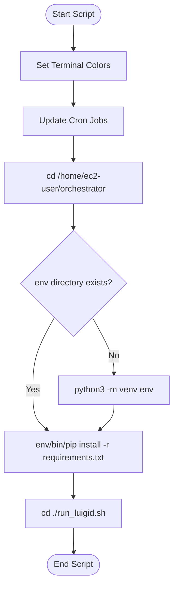

# Diagram: research/orchestrator/configuration/build.sh

> Auto-generated by Obscura crawlers

## Mermaid

### SVG

<svg id="container" width="328.19921875" xmlns="http://www.w3.org/2000/svg" class="flowchart" height="1091.84375" viewBox="0 0 328.19921875 1091.84375" role="graphics-document document" aria-roledescription="flowchart-v2"><g><marker id="container_flowchart-v2-pointEnd" class="marker flowchart-v2" viewBox="0 0 10 10" refX="5" refY="5" markerUnits="userSpaceOnUse" markerWidth="8" markerHeight="8" orient="auto"><path d="M 0 0 L 10 5 L 0 10 z" class="arrowMarkerPath" style="stroke-width: 1; stroke-dasharray: 1, 0;"></path></marker><marker id="container_flowchart-v2-pointStart" class="marker flowchart-v2" viewBox="0 0 10 10" refX="4.5" refY="5" markerUnits="userSpaceOnUse" markerWidth="8" markerHeight="8" orient="auto"><path d="M 0 5 L 10 10 L 10 0 z" class="arrowMarkerPath" style="stroke-width: 1; stroke-dasharray: 1, 0;"></path></marker><marker id="container_flowchart-v2-circleEnd" class="marker flowchart-v2" viewBox="0 0 10 10" refX="11" refY="5" markerUnits="userSpaceOnUse" markerWidth="11" markerHeight="11" orient="auto"><circle cx="5" cy="5" r="5" class="arrowMarkerPath" style="stroke-width: 1; stroke-dasharray: 1, 0;"></circle></marker><marker id="container_flowchart-v2-circleStart" class="marker flowchart-v2" viewBox="0 0 10 10" refX="-1" refY="5" markerUnits="userSpaceOnUse" markerWidth="11" markerHeight="11" orient="auto"><circle cx="5" cy="5" r="5" class="arrowMarkerPath" style="stroke-width: 1; stroke-dasharray: 1, 0;"></circle></marker><marker id="container_flowchart-v2-crossEnd" class="marker cross flowchart-v2" viewBox="0 0 11 11" refX="12" refY="5.2" markerUnits="userSpaceOnUse" markerWidth="11" markerHeight="11" orient="auto"><path d="M 1,1 l 9,9 M 10,1 l -9,9" class="arrowMarkerPath" style="stroke-width: 2; stroke-dasharray: 1, 0;"></path></marker><marker id="container_flowchart-v2-crossStart" class="marker cross flowchart-v2" viewBox="0 0 11 11" refX="-1" refY="5.2" markerUnits="userSpaceOnUse" markerWidth="11" markerHeight="11" orient="auto"><path d="M 1,1 l 9,9 M 10,1 l -9,9" class="arrowMarkerPath" style="stroke-width: 2; stroke-dasharray: 1, 0;"></path></marker><g class="root"><g class="clusters"></g><g class="edgePaths"><path d="M138.5,47.5L138.417,51.583C138.333,55.667,138.167,63.833,138.083,71.417C138,79,138,86,138,89.5L138,93" id="L_Start_SetColors_0" class="edge-thickness-normal edge-pattern-solid edge-thickness-normal edge-pattern-solid flowchart-link" style=";" data-edge="true" data-et="edge" data-id="L_Start_SetColors_0" data-points="W3sieCI6MTM4LjUsInkiOjQ3LjV9LHsieCI6MTM4LCJ5Ijo3Mn0seyJ4IjoxMzgsInkiOjk3fV0=" marker-end="url(#container_flowchart-v2-pointEnd)"></path><path d="M138,151L138,155.167C138,159.333,138,167.667,138,175.333C138,183,138,190,138,193.5L138,197" id="L_SetColors_UpdateCron_0" class="edge-thickness-normal edge-pattern-solid edge-thickness-normal edge-pattern-solid flowchart-link" style=";" data-edge="true" data-et="edge" data-id="L_SetColors_UpdateCron_0" data-points="W3sieCI6MTM4LCJ5IjoxNTF9LHsieCI6MTM4LCJ5IjoxNzZ9LHsieCI6MTM4LCJ5IjoyMDF9XQ==" marker-end="url(#container_flowchart-v2-pointEnd)"></path><path d="M138,255L138,259.167C138,263.333,138,271.667,138,279.333C138,287,138,294,138,297.5L138,301" id="L_UpdateCron_ChangeDir_0" class="edge-thickness-normal edge-pattern-solid edge-thickness-normal edge-pattern-solid flowchart-link" style=";" data-edge="true" data-et="edge" data-id="L_UpdateCron_ChangeDir_0" data-points="W3sieCI6MTM4LCJ5IjoyNTV9LHsieCI6MTM4LCJ5IjoyODB9LHsieCI6MTM4LCJ5IjozMDV9XQ==" marker-end="url(#container_flowchart-v2-pointEnd)"></path><path d="M138,383L138,387.167C138,391.333,138,399.667,138,407.333C138,415,138,422,138,425.5L138,429" id="L_ChangeDir_CheckEnv_0" class="edge-thickness-normal edge-pattern-solid edge-thickness-normal edge-pattern-solid flowchart-link" style=";" data-edge="true" data-et="edge" data-id="L_ChangeDir_CheckEnv_0" data-points="W3sieCI6MTM4LCJ5IjozODN9LHsieCI6MTM4LCJ5Ijo0MDh9LHsieCI6MTM4LCJ5Ijo0MzN9XQ==" marker-end="url(#container_flowchart-v2-pointEnd)"></path><path d="M173.979,598.865L180.718,611.028C187.456,623.191,200.933,647.517,207.672,665.181C214.41,682.844,214.41,693.844,214.41,699.344L214.41,704.844" id="L_CheckEnv_CreateVenv_0" class="edge-thickness-normal edge-pattern-solid edge-thickness-normal edge-pattern-solid flowchart-link" style=";" data-edge="true" data-et="edge" data-id="L_CheckEnv_CreateVenv_0" data-points="W3sieCI6MTczLjk3OTAxOTA2MTMwOTY2LCJ5Ijo1OTguODY0NzMwOTM4NjkwM30seyJ4IjoyMTQuNDEwMTU2MjUsInkiOjY3MS44NDM3NX0seyJ4IjoyMTQuNDEwMTU2MjUsInkiOjcwOC44NDM3NX1d" marker-end="url(#container_flowchart-v2-pointEnd)"></path><path d="M102.021,598.865L95.282,611.028C88.544,623.191,75.067,647.517,68.328,670.347C61.59,693.177,61.59,714.51,61.59,733.844C61.59,753.177,61.59,770.51,66.053,782.916C70.517,795.321,79.444,802.798,83.908,806.537L88.371,810.275" id="L_CheckEnv_InstallDeps_0" class="edge-thickness-normal edge-pattern-solid edge-thickness-normal edge-pattern-solid flowchart-link" style=";" data-edge="true" data-et="edge" data-id="L_CheckEnv_InstallDeps_0" data-points="W3sieCI6MTAyLjAyMDk4MDkzODY5MDMzLCJ5Ijo1OTguODY0NzMwOTM4NjkwM30seyJ4Ijo2MS41ODk4NDM3NSwieSI6NjcxLjg0Mzc1fSx7IngiOjYxLjU4OTg0Mzc1LCJ5Ijo3MzUuODQzNzV9LHsieCI6NjEuNTg5ODQzNzUsInkiOjc4Ny44NDM3NX0seyJ4Ijo5MS40Mzc1NjEwMzUxNTYyNSwieSI6ODEyLjg0Mzc1fV0=" marker-end="url(#container_flowchart-v2-pointEnd)"></path><path d="M214.41,762.844L214.41,767.01C214.41,771.177,214.41,779.51,209.947,787.416C205.483,795.321,196.556,802.798,192.092,806.537L187.629,810.275" id="L_CreateVenv_InstallDeps_0" class="edge-thickness-normal edge-pattern-solid edge-thickness-normal edge-pattern-solid flowchart-link" style=";" data-edge="true" data-et="edge" data-id="L_CreateVenv_InstallDeps_0" data-points="W3sieCI6MjE0LjQxMDE1NjI1LCJ5Ijo3NjIuODQzNzV9LHsieCI6MjE0LjQxMDE1NjI1LCJ5Ijo3ODcuODQzNzV9LHsieCI6MTg0LjU2MjQzODk2NDg0Mzc1LCJ5Ijo4MTIuODQzNzV9XQ==" marker-end="url(#container_flowchart-v2-pointEnd)"></path><path d="M138,890.844L138,895.01C138,899.177,138,907.51,138,915.177C138,922.844,138,929.844,138,933.344L138,936.844" id="L_InstallDeps_RefreshLuigid_0" class="edge-thickness-normal edge-pattern-solid edge-thickness-normal edge-pattern-solid flowchart-link" style=";" data-edge="true" data-et="edge" data-id="L_InstallDeps_RefreshLuigid_0" data-points="W3sieCI6MTM4LCJ5Ijo4OTAuODQzNzV9LHsieCI6MTM4LCJ5Ijo5MTUuODQzNzV9LHsieCI6MTM4LCJ5Ijo5NDAuODQzNzV9XQ==" marker-end="url(#container_flowchart-v2-pointEnd)"></path><path d="M138,994.844L138,999.01C138,1003.177,138,1011.51,138.07,1019.261C138.141,1027.011,138.281,1034.178,138.351,1037.761L138.422,1041.345" id="L_RefreshLuigid_End_0" class="edge-thickness-normal edge-pattern-solid edge-thickness-normal edge-pattern-solid flowchart-link" style=";" data-edge="true" data-et="edge" data-id="L_RefreshLuigid_End_0" data-points="W3sieCI6MTM4LCJ5Ijo5OTQuODQzNzV9LHsieCI6MTM4LCJ5IjoxMDE5Ljg0Mzc1fSx7IngiOjEzOC41LCJ5IjoxMDQ1LjM0Mzc1fV0=" marker-end="url(#container_flowchart-v2-pointEnd)"></path></g><g class="edgeLabels"><g class="edgeLabel"><g class="label" data-id="L_Start_SetColors_0" transform="translate(0, 0)"><foreignObject width="0" height="0">

</foreignObject></g></g><g class="edgeLabel"><g class="label" data-id="L_SetColors_UpdateCron_0" transform="translate(0, 0)"><foreignObject width="0" height="0">

</foreignObject></g></g><g class="edgeLabel"><g class="label" data-id="L_UpdateCron_ChangeDir_0" transform="translate(0, 0)"><foreignObject width="0" height="0">

</foreignObject></g></g><g class="edgeLabel"><g class="label" data-id="L_ChangeDir_CheckEnv_0" transform="translate(0, 0)"><foreignObject width="0" height="0">

</foreignObject></g></g><g class="edgeLabel" transform="translate(214.41015625, 671.84375)"><g class="label" data-id="L_CheckEnv_CreateVenv_0" transform="translate(-10.140625, -12)"><foreignObject width="20.28125" height="24">

No

</foreignObject></g></g><g class="edgeLabel" transform="translate(61.58984375, 735.84375)"><g class="label" data-id="L_CheckEnv_InstallDeps_0" transform="translate(-12.03125, -12)"><foreignObject width="24.0625" height="24">

Yes

</foreignObject></g></g><g class="edgeLabel"><g class="label" data-id="L_CreateVenv_InstallDeps_0" transform="translate(0, 0)"><foreignObject width="0" height="0">

</foreignObject></g></g><g class="edgeLabel"><g class="label" data-id="L_InstallDeps_RefreshLuigid_0" transform="translate(0, 0)"><foreignObject width="0" height="0">

</foreignObject></g></g><g class="edgeLabel"><g class="label" data-id="L_RefreshLuigid_End_0" transform="translate(0, 0)"><foreignObject width="0" height="0">

</foreignObject></g></g></g><g class="nodes"><g class="node default" id="flowchart-Start-0" transform="translate(138, 27.5)"><g class="basic label-container outer-path"><path d="M-33.6875 -19.5 C-8.802182725213392 -19.5, 16.083134549573217 -19.5, 33.6875 -19.5 C33.6875 -19.5, 33.6875 -19.5, 33.6875 -19.5 C34.081953645016995 -19.487350639361747, 34.47640729003399 -19.474701278723497, 34.9368692896239 -19.45993515863156 C35.25299782788316 -19.42943861874588, 35.56912636614242 -19.398942078860202, 36.181104652847864 -19.3399052695533 C36.449361897646384 -19.296535518580278, 36.7176191424449 -19.253165767607257, 37.41509325967676 -19.140403561325776 C37.87751870590336 -19.0348579708326, 38.339944152129966 -18.929312380339425, 38.63376438623539 -18.862249829261074 C38.98594367686063 -18.757724864430326, 39.338122967485866 -18.653199899599574, 39.832110251460605 -18.50658706670804 C40.21238977201382 -18.366640687879105, 40.59266929256703 -18.226694309050167, 41.0052065951478 -18.074876768247425 C41.31090875478346 -17.939551490509082, 41.61661091441913 -17.80422621277074, 42.14823291279238 -17.568892924097174 C42.589878268040664 -17.3384868251515, 43.03152362328895 -17.10808072620582, 43.25649226407678 -16.990714730406097 C43.55850122843274 -16.807635121411842, 43.8605101927887 -16.624555512417583, 44.3254305736057 -16.342718045390892 C44.57175091660871 -16.170895637147783, 44.81807125961171 -15.999073228904678, 45.35065534457871 -15.627565626425154 C45.65184478013717 -15.387375066554773, 45.953034215695624 -15.14718450668439, 46.327953708501866 -14.848196188198123 C46.54153267342649 -14.654229423243331, 46.75511163835111 -14.46026265828854, 47.25330973676799 -14.007812326905688 C47.492763343092584 -13.76055681886885, 47.73221694941717 -13.513301310832011, 48.12292094296865 -13.10986736009568 C48.39182285783218 -12.793999869944562, 48.660724772695716 -12.478132379793445, 48.93321390812658 -12.158051136245305 C49.19826149467679 -11.802911516599895, 49.463309081227 -11.447771896954485, 49.680858964640635 -11.156274872382312 C49.84634142706344 -10.90204937183777, 50.01182388948626 -10.647823871293228, 50.36278387860425 -10.108655082055241 C50.574266616768966 -9.73314606549439, 50.785749354933685 -9.357637048933539, 50.976186474273504 -9.019496659696287 C51.16681173504665 -8.623659226973665, 51.357436995819796 -8.227821794251044, 51.51854614880834 -7.893275190886684 C51.64072437422931 -7.5914926119415975, 51.76290259965028 -7.28971003299651, 51.987634229970325 -6.734618561215508 C52.10533943989391 -6.38010922270406, 52.223044649817496 -6.025599884192611, 52.38152313421488 -5.548287939305138 C52.47737433397769 -5.182765772436778, 52.573225533740505 -4.81724360556842, 52.69859428754556 -4.339158212148133 C52.78729511354699 -3.8836982175569887, 52.875995939548424 -3.4282382229658444, 52.937544776581774 -3.1121979531509023 C52.993367737798074 -2.6792460894478074, 53.049190699014375 -2.2462942257447125, 53.09739270250937 -1.872449005199798 C53.1176926995064 -1.5562601661083566, 53.13799269650343 -1.2400713270169152, 53.17748121591342 -0.6250057626472757 C53.17748121591342 -0.34918987247172667, 53.17748121591342 -0.07337398229617764, 53.17748121591342 0.625005762647271 C53.148578933692626 1.0751821377383541, 53.11967665147184 1.5253585128294374, 53.09739270250937 1.8724490051997846 C53.03950222979845 2.321436079778759, 52.98161175708754 2.7704231543577333, 52.937544776581774 3.1121979531508885 C52.888542723158224 3.363813140893153, 52.83954066973468 3.6154283286354176, 52.69859428754556 4.339158212148129 C52.59329096761176 4.740725409803273, 52.48798764767796 5.142292607458417, 52.38152313421489 5.548287939305125 C52.298057478486996 5.799673195911261, 52.214591822759104 6.051058452517396, 51.987634229970325 6.734618561215495 C51.82667293409289 7.1321960740077195, 51.66571163821545 7.529773586799943, 51.51854614880834 7.893275190886679 C51.38284269576241 8.175066314725298, 51.247139242716486 8.456857438563917, 50.976186474273504 9.019496659696284 C50.81202422114785 9.310983363351571, 50.6478619680222 9.602470067006857, 50.36278387860425 10.108655082055236 C50.15119497096877 10.433712463760527, 49.93960606333329 10.758769845465816, 49.68085896464064 11.156274872382301 C49.43917607744521 11.48010792346021, 49.19749319024977 11.803940974538119, 48.93321390812658 12.158051136245302 C48.67404672525778 12.462483656273468, 48.41487954238898 12.766916176301633, 48.12292094296866 13.10986736009567 C47.79561517592463 13.447837436871863, 47.4683094088806 13.785807513648056, 47.25330973676799 14.007812326905684 C47.06035935133234 14.1830447617709, 46.867408965896686 14.358277196636115, 46.32795370850189 14.848196188198111 C45.99003903320486 15.11767414946033, 45.65212435790783 15.387152110722546, 45.35065534457871 15.627565626425152 C45.121112760356894 15.787684596439973, 44.89157017613508 15.947803566454795, 44.32543057360571 16.34271804539089 C43.973840827673044 16.55585381554596, 43.62225108174038 16.76898958570103, 43.25649226407678 16.990714730406093 C42.9610421663463 17.144850857147265, 42.66559206861582 17.298986983888437, 42.14823291279239 17.56889292409717 C41.822613859852694 17.713034819687557, 41.496994806913 17.857176715277944, 41.005206595147804 18.07487676824742 C40.69650676367076 18.188481159820935, 40.38780693219372 18.302085551394445, 39.83211025146062 18.506587066708033 C39.462170006421275 18.616383389579738, 39.09222976138193 18.726179712451447, 38.63376438623541 18.86224982926107 C38.34636259288723 18.92784741312082, 38.05896079953906 18.993444996980564, 37.415093259676766 19.140403561325773 C37.16705625551601 19.18050426060279, 36.91901925135525 19.220604959879804, 36.18110465284788 19.3399052695533 C35.72773230419724 19.383641554767603, 35.2743599555466 19.427377839981908, 34.9368692896239 19.45993515863156 C34.66243473233926 19.468735740729215, 34.388000175054614 19.477536322826875, 33.68750000000001 19.5 C33.68750000000001 19.5, 33.6875 19.5, 33.6875 19.5 C15.558491338480067 19.5, -2.5705173230398657 19.5, -33.68749999999999 19.5 C-33.948642927426306 19.49162565460131, -34.20978585485262 19.483251309202622, -34.93686928962389 19.45993515863156 C-35.32609752409938 19.422386778967148, -35.71532575857487 19.384838399302737, -36.18110465284787 19.3399052695533 C-36.53657569876202 19.28243546756903, -36.89204674467618 19.22496566558476, -37.41509325967676 19.140403561325773 C-37.80984631415415 19.05030375264573, -38.20459936863154 18.960203943965684, -38.633764386235384 18.862249829261074 C-38.9703126108097 18.762364082785098, -39.306860835384015 18.66247833630912, -39.83211025146059 18.506587066708043 C-40.27983387506016 18.341820634511596, -40.72755749865973 18.177054202315144, -41.0052065951478 18.074876768247425 C-41.43172481775544 17.886069803312562, -41.85824304036307 17.6972628383777, -42.14823291279238 17.568892924097174 C-42.572900939079894 17.347343886795834, -42.9975689653674 17.125794849494493, -43.25649226407678 16.990714730406097 C-43.49347167684676 16.847056417739328, -43.730451089616736 16.703398105072555, -44.325430573605686 16.3427180453909 C-44.58362503539044 16.162612765907966, -44.841819497175194 15.98250748642503, -45.35065534457871 15.627565626425156 C-45.5755855336195 15.448189786308832, -45.8005157226603 15.26881394619251, -46.327953708501866 14.848196188198125 C-46.58242023629127 14.617096420475164, -46.83688676408068 14.385996652752205, -47.253309736767974 14.007812326905697 C-47.58074600258529 13.669707499431938, -47.908182268402605 13.331602671958182, -48.122920942968655 13.109867360095677 C-48.40999066120005 12.772658934331371, -48.69706037943144 12.435450508567067, -48.933213908126575 12.158051136245307 C-49.16749242304519 11.844139269466151, -49.401770937963796 11.530227402686995, -49.680858964640635 11.156274872382316 C-49.824453878749004 10.93567452367843, -49.96804879285737 10.715074174974543, -50.36278387860425 10.108655082055249 C-50.52464750029109 9.82124983128124, -50.68651112197794 9.53384458050723, -50.976186474273504 9.019496659696289 C-51.10359732632685 8.754925299252001, -51.23100817838019 8.490353938807715, -51.51854614880834 7.893275190886686 C-51.62270386475616 7.636003618743128, -51.72686158070398 7.37873204659957, -51.987634229970325 6.73461856121551 C-52.092356078608404 6.419213038278315, -52.197077927246475 6.10380751534112, -52.38152313421488 5.5482879393051325 C-52.49123791900343 5.1298979142178815, -52.600952703791975 4.711507889130631, -52.69859428754556 4.339158212148136 C-52.78292630776467 3.906131111901777, -52.867258327983784 3.473104011655418, -52.937544776581774 3.112197953150904 C-52.978264615929206 2.7963829202140187, -53.01898445527664 2.4805678872771333, -53.09739270250937 1.872449005199809 C-53.113599640839816 1.620012858697946, -53.12980657917026 1.3675767121960831, -53.17748121591342 0.6250057626472781 C-53.17748121591342 0.3469082705191913, -53.17748121591342 0.0688107783911045, -53.17748121591342 -0.6250057626472687 C-53.16094741008123 -0.8825331343314671, -53.14441360424904 -1.1400605060156654, -53.09739270250937 -1.8724490051997822 C-53.04964330886469 -2.2427838731236016, -53.001893915220016 -2.613118741047421, -52.937544776581774 -3.112197953150895 C-52.84755380658992 -3.5742825644608125, -52.75756283659807 -4.03636717577073, -52.69859428754556 -4.339158212148126 C-52.62352476931012 -4.625430820514873, -52.54845525107468 -4.911703428881619, -52.38152313421489 -5.548287939305123 C-52.25355010869259 -5.933722302445625, -52.125577083170306 -6.319156665586128, -51.98763422997033 -6.734618561215485 C-51.878408442444886 -7.004408368140284, -51.76918265491943 -7.274198175065083, -51.51854614880834 -7.893275190886676 C-51.34552750776015 -8.252552101029105, -51.17250886671197 -8.611829011171535, -50.976186474273504 -9.019496659696282 C-50.73410010112821 -9.449345529119228, -50.492013727982915 -9.879194398542174, -50.36278387860425 -10.108655082055243 C-50.177660863070635 -10.393053746404949, -49.99253784753702 -10.677452410754654, -49.68085896464064 -11.156274872382308 C-49.51661791296506 -11.37634291895997, -49.35237686128948 -11.59641096553763, -48.93321390812659 -12.158051136245302 C-48.6436521594516 -12.498186842769202, -48.354090410776614 -12.838322549293101, -48.12292094296866 -13.10986736009567 C-47.90193319786391 -13.338055350347616, -47.68094545275917 -13.566243340599561, -47.253309736767996 -14.007812326905677 C-46.8936934311966 -14.334406340699575, -46.53407712562521 -14.66100035449347, -46.32795370850189 -14.848196188198107 C-46.037932703172004 -15.079480222165612, -45.74791169784212 -15.310764256133117, -45.35065534457872 -15.627565626425149 C-44.949751232264184 -15.90721898031646, -44.54884711994965 -16.18687233420777, -44.325430573605715 -16.342718045390885 C-44.08572792095474 -16.488027202077053, -43.84602526830376 -16.633336358763216, -43.25649226407679 -16.99071473040609 C-43.02916543439631 -17.109310991840612, -42.80183860471583 -17.227907253275134, -42.14823291279239 -17.56889292409717 C-41.79129148357447 -17.726900306520648, -41.43435005435655 -17.884907688944125, -41.005206595147804 -18.07487676824742 C-40.56547693256526 -18.23670134889424, -40.12574726998272 -18.398525929541055, -39.83211025146062 -18.506587066708033 C-39.55460179751334 -18.588950119167986, -39.277093343566065 -18.671313171627936, -38.63376438623541 -18.862249829261067 C-38.28638376850302 -18.941537188388107, -37.939003150770624 -19.020824547515144, -37.415093259676766 -19.140403561325773 C-37.122069571260916 -19.187777358836204, -36.829045882845065 -19.23515115634664, -36.18110465284788 -19.3399052695533 C-35.92787629423564 -19.364333904756965, -35.67464793562339 -19.388762539960627, -34.9368692896239 -19.45993515863156 C-34.50512527697648 -19.473780348778423, -34.07338126432906 -19.487625538925283, -33.68750000000001 -19.5 C-33.68750000000001 -19.5, -33.68750000000001 -19.5, -33.6875 -19.5" stroke="none" stroke-width="0" fill="#ECECFF" style=""></path><path d="M-33.6875 -19.5 C-10.271813867090032 -19.5, 13.143872265819937 -19.5, 33.6875 -19.5 M-33.6875 -19.5 C-11.117067173326923 -19.5, 11.453365653346154 -19.5, 33.6875 -19.5 M33.6875 -19.5 C33.6875 -19.5, 33.6875 -19.5, 33.6875 -19.5 M33.6875 -19.5 C33.6875 -19.5, 33.6875 -19.5, 33.6875 -19.5 M33.6875 -19.5 C33.96560847245646 -19.491081602593624, 34.24371694491291 -19.48216320518725, 34.9368692896239 -19.45993515863156 M33.6875 -19.5 C34.131908790623605 -19.485748675073935, 34.5763175812472 -19.471497350147875, 34.9368692896239 -19.45993515863156 M34.9368692896239 -19.45993515863156 C35.323542535770954 -19.42263325561837, 35.710215781918 -19.385331352605178, 36.181104652847864 -19.3399052695533 M34.9368692896239 -19.45993515863156 C35.22765821696754 -19.43188310053557, 35.51844714431119 -19.403831042439577, 36.181104652847864 -19.3399052695533 M36.181104652847864 -19.3399052695533 C36.57624286839816 -19.276022387205757, 36.97138108394845 -19.212139504858214, 37.41509325967676 -19.140403561325776 M36.181104652847864 -19.3399052695533 C36.51201553148648 -19.2864061649472, 36.8429264101251 -19.2329070603411, 37.41509325967676 -19.140403561325776 M37.41509325967676 -19.140403561325776 C37.6960023825555 -19.076287887132043, 37.97691150543423 -19.01217221293831, 38.63376438623539 -18.862249829261074 M37.41509325967676 -19.140403561325776 C37.797300648084104 -19.053167219058096, 38.179508036491455 -18.96593087679042, 38.63376438623539 -18.862249829261074 M38.63376438623539 -18.862249829261074 C38.96889022865853 -18.76278623834133, 39.304016071081676 -18.663322647421587, 39.832110251460605 -18.50658706670804 M38.63376438623539 -18.862249829261074 C39.07495699721396 -18.73130617818991, 39.51614960819253 -18.600362527118744, 39.832110251460605 -18.50658706670804 M39.832110251460605 -18.50658706670804 C40.21329163427429 -18.366308794230527, 40.59447301708798 -18.226030521753014, 41.0052065951478 -18.074876768247425 M39.832110251460605 -18.50658706670804 C40.11572001754636 -18.402216051128544, 40.399329783632105 -18.29784503554905, 41.0052065951478 -18.074876768247425 M41.0052065951478 -18.074876768247425 C41.43320418139308 -17.88541493291394, 41.86120176763836 -17.695953097580457, 42.14823291279238 -17.568892924097174 M41.0052065951478 -18.074876768247425 C41.40927245449088 -17.896008798504088, 41.81333831383397 -17.717140828760755, 42.14823291279238 -17.568892924097174 M42.14823291279238 -17.568892924097174 C42.5847872784525 -17.341142791158706, 43.021341644112624 -17.11339265822024, 43.25649226407678 -16.990714730406097 M42.14823291279238 -17.568892924097174 C42.40174800607539 -17.4366342623156, 42.655263099358386 -17.304375600534023, 43.25649226407678 -16.990714730406097 M43.25649226407678 -16.990714730406097 C43.637251144902095 -16.759896459262244, 44.0180100257274 -16.529078188118387, 44.3254305736057 -16.342718045390892 M43.25649226407678 -16.990714730406097 C43.488662771825524 -16.84997160422346, 43.72083327957427 -16.709228478040824, 44.3254305736057 -16.342718045390892 M44.3254305736057 -16.342718045390892 C44.61971177685121 -16.13744021723479, 44.91399298009672 -15.932162389078691, 45.35065534457871 -15.627565626425154 M44.3254305736057 -16.342718045390892 C44.72893574878632 -16.0612503026424, 45.13244092396694 -15.779782559893906, 45.35065534457871 -15.627565626425154 M45.35065534457871 -15.627565626425154 C45.70698325124731 -15.343403603140775, 46.063311157915905 -15.059241579856396, 46.327953708501866 -14.848196188198123 M45.35065534457871 -15.627565626425154 C45.72964325373841 -15.32533285416211, 46.108631162898114 -15.023100081899065, 46.327953708501866 -14.848196188198123 M46.327953708501866 -14.848196188198123 C46.53447290926182 -14.660640914266558, 46.74099211002178 -14.473085640334991, 47.25330973676799 -14.007812326905688 M46.327953708501866 -14.848196188198123 C46.56806001362593 -14.630137994749159, 46.80816631874999 -14.412079801300196, 47.25330973676799 -14.007812326905688 M47.25330973676799 -14.007812326905688 C47.47047107953134 -13.783575411224703, 47.6876324222947 -13.559338495543717, 48.12292094296865 -13.10986736009568 M47.25330973676799 -14.007812326905688 C47.587669341933385 -13.662558583138303, 47.92202894709878 -13.317304839370918, 48.12292094296865 -13.10986736009568 M48.12292094296865 -13.10986736009568 C48.37527349469975 -12.813439693565359, 48.62762604643085 -12.517012027035035, 48.93321390812658 -12.158051136245305 M48.12292094296865 -13.10986736009568 C48.44362270463608 -12.733152822393924, 48.764324466303506 -12.35643828469217, 48.93321390812658 -12.158051136245305 M48.93321390812658 -12.158051136245305 C49.17710671493032 -11.83125699422009, 49.42099952173405 -11.504462852194873, 49.680858964640635 -11.156274872382312 M48.93321390812658 -12.158051136245305 C49.146656321575996 -11.872057747226972, 49.36009873502542 -11.586064358208638, 49.680858964640635 -11.156274872382312 M49.680858964640635 -11.156274872382312 C49.88167458423201 -10.847768154145674, 50.08249020382338 -10.539261435909038, 50.36278387860425 -10.108655082055241 M49.680858964640635 -11.156274872382312 C49.858388383650166 -10.88354201145977, 50.035917802659704 -10.61080915053723, 50.36278387860425 -10.108655082055241 M50.36278387860425 -10.108655082055241 C50.49934801311239 -9.866171632617899, 50.63591214762052 -9.623688183180557, 50.976186474273504 -9.019496659696287 M50.36278387860425 -10.108655082055241 C50.56428217586119 -9.75087445136043, 50.76578047311812 -9.393093820665616, 50.976186474273504 -9.019496659696287 M50.976186474273504 -9.019496659696287 C51.184565952760686 -8.586792214011066, 51.39294543124787 -8.154087768325844, 51.51854614880834 -7.893275190886684 M50.976186474273504 -9.019496659696287 C51.125800474648884 -8.708819986690028, 51.27541447502426 -8.398143313683766, 51.51854614880834 -7.893275190886684 M51.51854614880834 -7.893275190886684 C51.669293015623744 -7.520927515360244, 51.82003988243915 -7.148579839833802, 51.987634229970325 -6.734618561215508 M51.51854614880834 -7.893275190886684 C51.63797021614932 -7.598295435647206, 51.75739428349029 -7.303315680407727, 51.987634229970325 -6.734618561215508 M51.987634229970325 -6.734618561215508 C52.08060695196555 -6.45459953575747, 52.173579673960774 -6.174580510299433, 52.38152313421488 -5.548287939305138 M51.987634229970325 -6.734618561215508 C52.083995490248455 -6.444393798339611, 52.18035675052659 -6.154169035463714, 52.38152313421488 -5.548287939305138 M52.38152313421488 -5.548287939305138 C52.49517281701885 -5.114892442689501, 52.60882249982282 -4.681496946073865, 52.69859428754556 -4.339158212148133 M52.38152313421488 -5.548287939305138 C52.463845360276224 -5.234357612654774, 52.54616758633757 -4.92042728600441, 52.69859428754556 -4.339158212148133 M52.69859428754556 -4.339158212148133 C52.7670288476743 -3.9877612095364885, 52.835463407803026 -3.636364206924844, 52.937544776581774 -3.1121979531509023 M52.69859428754556 -4.339158212148133 C52.75916362066782 -4.028147487898412, 52.81973295379008 -3.717136763648691, 52.937544776581774 -3.1121979531509023 M52.937544776581774 -3.1121979531509023 C52.98641641450577 -2.7331591802088853, 53.03528805242976 -2.354120407266868, 53.09739270250937 -1.872449005199798 M52.937544776581774 -3.1121979531509023 C52.98524583981179 -2.742237926379281, 53.032946903041804 -2.37227789960766, 53.09739270250937 -1.872449005199798 M53.09739270250937 -1.872449005199798 C53.12240922225839 -1.4827965171374615, 53.147425742007414 -1.093144029075125, 53.17748121591342 -0.6250057626472757 M53.09739270250937 -1.872449005199798 C53.12343153774958 -1.4668731281639422, 53.149470372989796 -1.0612972511280865, 53.17748121591342 -0.6250057626472757 M53.17748121591342 -0.6250057626472757 C53.17748121591342 -0.3106721783447839, 53.17748121591342 0.0036614059577079194, 53.17748121591342 0.625005762647271 M53.17748121591342 -0.6250057626472757 C53.17748121591342 -0.1382837104109761, 53.17748121591342 0.3484383418253235, 53.17748121591342 0.625005762647271 M53.17748121591342 0.625005762647271 C53.15179306172628 1.0251194992168124, 53.12610490753914 1.4252332357863537, 53.09739270250937 1.8724490051997846 M53.17748121591342 0.625005762647271 C53.155760968608305 0.9633161466924296, 53.134040721303194 1.3016265307375883, 53.09739270250937 1.8724490051997846 M53.09739270250937 1.8724490051997846 C53.06271559921172 2.1413977706077425, 53.028038495914075 2.4103465360157004, 52.937544776581774 3.1121979531508885 M53.09739270250937 1.8724490051997846 C53.050425436618596 2.2367178447129197, 53.00345817072782 2.600986684226055, 52.937544776581774 3.1121979531508885 M52.937544776581774 3.1121979531508885 C52.8837214358258 3.38856943236572, 52.82989809506983 3.664940911580551, 52.69859428754556 4.339158212148129 M52.937544776581774 3.1121979531508885 C52.85144304366711 3.554312154060005, 52.76534131075245 3.9964263549691217, 52.69859428754556 4.339158212148129 M52.69859428754556 4.339158212148129 C52.58743058797783 4.763073577252064, 52.47626688841009 5.186988942356, 52.38152313421489 5.548287939305125 M52.69859428754556 4.339158212148129 C52.62019928201141 4.638112344860175, 52.54180427647726 4.937066477572221, 52.38152313421489 5.548287939305125 M52.38152313421489 5.548287939305125 C52.22885620769071 6.008096397824484, 52.076189281166535 6.467904856343842, 51.987634229970325 6.734618561215495 M52.38152313421489 5.548287939305125 C52.27105409773219 5.881003076340287, 52.16058506124949 6.213718213375447, 51.987634229970325 6.734618561215495 M51.987634229970325 6.734618561215495 C51.85839633051824 7.053838671506956, 51.72915843106615 7.373058781798417, 51.51854614880834 7.893275190886679 M51.987634229970325 6.734618561215495 C51.883338353476404 6.992231392579075, 51.77904247698248 7.249844223942656, 51.51854614880834 7.893275190886679 M51.51854614880834 7.893275190886679 C51.31891136766977 8.307821085420958, 51.1192765865312 8.722366979955238, 50.976186474273504 9.019496659696284 M51.51854614880834 7.893275190886679 C51.39332758682686 8.153294214089252, 51.26810902484537 8.413313237291826, 50.976186474273504 9.019496659696284 M50.976186474273504 9.019496659696284 C50.76393142760414 9.39637698821185, 50.55167638093477 9.773257316727419, 50.36278387860425 10.108655082055236 M50.976186474273504 9.019496659696284 C50.75735848546604 9.40804791256061, 50.53853049665858 9.796599165424936, 50.36278387860425 10.108655082055236 M50.36278387860425 10.108655082055236 C50.179979835411395 10.389491182158267, 49.99717579221855 10.670327282261297, 49.68085896464064 11.156274872382301 M50.36278387860425 10.108655082055236 C50.14168177110959 10.448327293396066, 49.92057966361494 10.787999504736895, 49.68085896464064 11.156274872382301 M49.68085896464064 11.156274872382301 C49.4479515113905 11.468349641432003, 49.21504405814035 11.780424410481704, 48.93321390812658 12.158051136245302 M49.68085896464064 11.156274872382301 C49.466559571689956 11.443416535859898, 49.25226017873926 11.730558199337496, 48.93321390812658 12.158051136245302 M48.93321390812658 12.158051136245302 C48.63803311423458 12.504787293013841, 48.34285232034257 12.851523449782379, 48.12292094296866 13.10986736009567 M48.93321390812658 12.158051136245302 C48.69016391890526 12.443551483520832, 48.44711392968395 12.729051830796362, 48.12292094296866 13.10986736009567 M48.12292094296866 13.10986736009567 C47.82576639753618 13.416703825096604, 47.5286118521037 13.72354029009754, 47.25330973676799 14.007812326905684 M48.12292094296866 13.10986736009567 C47.83648941888152 13.405631425181118, 47.55005789479438 13.701395490266568, 47.25330973676799 14.007812326905684 M47.25330973676799 14.007812326905684 C46.95459225514682 14.279099640082574, 46.655874773525646 14.550386953259464, 46.32795370850189 14.848196188198111 M47.25330973676799 14.007812326905684 C47.060023110074624 14.1833501271847, 46.86673648338126 14.358887927463716, 46.32795370850189 14.848196188198111 M46.32795370850189 14.848196188198111 C45.938833321981186 15.158509341520006, 45.549712935460484 15.4688224948419, 45.35065534457871 15.627565626425152 M46.32795370850189 14.848196188198111 C46.05832393215809 15.063218759682606, 45.788694155814284 15.2782413311671, 45.35065534457871 15.627565626425152 M45.35065534457871 15.627565626425152 C45.06440542398371 15.827241179472885, 44.778155503388696 16.02691673252062, 44.32543057360571 16.34271804539089 M45.35065534457871 15.627565626425152 C45.01193039690717 15.863845486754165, 44.67320544923563 16.10012534708318, 44.32543057360571 16.34271804539089 M44.32543057360571 16.34271804539089 C43.9374620079196 16.577906869866172, 43.549493442233484 16.813095694341452, 43.25649226407678 16.990714730406093 M44.32543057360571 16.34271804539089 C43.97295541028088 16.556390560772375, 43.620480246956056 16.77006307615386, 43.25649226407678 16.990714730406093 M43.25649226407678 16.990714730406093 C42.88954321654247 17.182151813462664, 42.52259416900816 17.37358889651923, 42.14823291279239 17.56889292409717 M43.25649226407678 16.990714730406093 C43.00354341172584 17.122677984656107, 42.7505945593749 17.25464123890612, 42.14823291279239 17.56889292409717 M42.14823291279239 17.56889292409717 C41.760241827443245 17.740645068234617, 41.372250742094096 17.912397212372063, 41.005206595147804 18.07487676824742 M42.14823291279239 17.56889292409717 C41.79139406399822 17.726854897209993, 41.43455521520405 17.884816870322815, 41.005206595147804 18.07487676824742 M41.005206595147804 18.07487676824742 C40.60639174763387 18.221644318736587, 40.20757690011994 18.36841186922575, 39.83211025146062 18.506587066708033 M41.005206595147804 18.07487676824742 C40.71339286218431 18.182266919474568, 40.4215791292208 18.28965707070171, 39.83211025146062 18.506587066708033 M39.83211025146062 18.506587066708033 C39.459723410991465 18.617109526260865, 39.08733657052232 18.727631985813698, 38.63376438623541 18.86224982926107 M39.83211025146062 18.506587066708033 C39.41151062923522 18.631418826812062, 38.990911007009814 18.756250586916096, 38.63376438623541 18.86224982926107 M38.63376438623541 18.86224982926107 C38.15652353104479 18.971176940170704, 37.679282675854175 19.080104051080337, 37.415093259676766 19.140403561325773 M38.63376438623541 18.86224982926107 C38.182118302716475 18.965335100558136, 37.73047221919753 19.068420371855204, 37.415093259676766 19.140403561325773 M37.415093259676766 19.140403561325773 C37.04198957600135 19.200724071440135, 36.66888589232593 19.261044581554494, 36.18110465284788 19.3399052695533 M37.415093259676766 19.140403561325773 C37.063530265333064 19.197241539839524, 36.71196727098936 19.254079518353272, 36.18110465284788 19.3399052695533 M36.18110465284788 19.3399052695533 C35.747153289411784 19.381768035681105, 35.3132019259757 19.423630801808915, 34.9368692896239 19.45993515863156 M36.18110465284788 19.3399052695533 C35.68849774672804 19.387426465340198, 35.1958908406082 19.434947661127094, 34.9368692896239 19.45993515863156 M34.9368692896239 19.45993515863156 C34.68336767929295 19.46806446186392, 34.42986606896199 19.476193765096284, 33.68750000000001 19.5 M34.9368692896239 19.45993515863156 C34.59166668378606 19.47100513430467, 34.246464077948225 19.482075109977778, 33.68750000000001 19.5 M33.68750000000001 19.5 C33.68750000000001 19.5, 33.6875 19.5, 33.6875 19.5 M33.68750000000001 19.5 C33.68750000000001 19.5, 33.6875 19.5, 33.6875 19.5 M33.6875 19.5 C10.989252502050494 19.5, -11.708994995899012 19.5, -33.68749999999999 19.5 M33.6875 19.5 C10.95878251498511 19.5, -11.76993497002978 19.5, -33.68749999999999 19.5 M-33.68749999999999 19.5 C-33.93938461668248 19.491922550606656, -34.19126923336498 19.483845101213312, -34.93686928962389 19.45993515863156 M-33.68749999999999 19.5 C-33.94691547996424 19.491681050479148, -34.206330959928486 19.483362100958292, -34.93686928962389 19.45993515863156 M-34.93686928962389 19.45993515863156 C-35.236931621684576 19.430988506335417, -35.53699395374526 19.402041854039275, -36.18110465284787 19.3399052695533 M-34.93686928962389 19.45993515863156 C-35.41008620269164 19.41428449215452, -35.88330311575939 19.368633825677477, -36.18110465284787 19.3399052695533 M-36.18110465284787 19.3399052695533 C-36.62467001666061 19.268193061432825, -37.06823538047334 19.196480853312355, -37.41509325967676 19.140403561325773 M-36.18110465284787 19.3399052695533 C-36.534679878685274 19.282741969056737, -36.88825510452268 19.22557866856017, -37.41509325967676 19.140403561325773 M-37.41509325967676 19.140403561325773 C-37.845153035805815 19.042245223826626, -38.27521281193488 18.94408688632748, -38.633764386235384 18.862249829261074 M-37.41509325967676 19.140403561325773 C-37.89885363302564 19.029988412940348, -38.382614006374524 18.919573264554923, -38.633764386235384 18.862249829261074 M-38.633764386235384 18.862249829261074 C-38.955919850145996 18.766635778600943, -39.27807531405661 18.671021727940815, -39.83211025146059 18.506587066708043 M-38.633764386235384 18.862249829261074 C-38.88683812619291 18.78713887165285, -39.13991186615044 18.712027914044626, -39.83211025146059 18.506587066708043 M-39.83211025146059 18.506587066708043 C-40.19776540845312 18.37202258885557, -40.563420565445654 18.237458111003104, -41.0052065951478 18.074876768247425 M-39.83211025146059 18.506587066708043 C-40.25225121897917 18.351971306920678, -40.67239218649775 18.19735554713331, -41.0052065951478 18.074876768247425 M-41.0052065951478 18.074876768247425 C-41.30749636589999 17.941062053842874, -41.6097861366522 17.807247339438323, -42.14823291279238 17.568892924097174 M-41.0052065951478 18.074876768247425 C-41.28349415000041 17.951687122821184, -41.56178170485302 17.828497477394944, -42.14823291279238 17.568892924097174 M-42.14823291279238 17.568892924097174 C-42.41061727574763 17.432007170008628, -42.67300163870288 17.29512141592008, -43.25649226407678 16.990714730406097 M-42.14823291279238 17.568892924097174 C-42.40601371021252 17.434408847199567, -42.663794507632666 17.29992477030196, -43.25649226407678 16.990714730406097 M-43.25649226407678 16.990714730406097 C-43.47429620220335 16.85868070315576, -43.692100140329906 16.726646675905425, -44.325430573605686 16.3427180453909 M-43.25649226407678 16.990714730406097 C-43.649494271210685 16.752474604145377, -44.04249627834458 16.51423447788466, -44.325430573605686 16.3427180453909 M-44.325430573605686 16.3427180453909 C-44.71406091659955 16.071626341654785, -45.102691259593406 15.80053463791867, -45.35065534457871 15.627565626425156 M-44.325430573605686 16.3427180453909 C-44.69464688837744 16.085168727322785, -45.063863203149204 15.827619409254673, -45.35065534457871 15.627565626425156 M-45.35065534457871 15.627565626425156 C-45.570801752477195 15.452004724468063, -45.79094816037568 15.27644382251097, -46.327953708501866 14.848196188198125 M-45.35065534457871 15.627565626425156 C-45.69374563743622 15.353960247887418, -46.036835930293734 15.08035486934968, -46.327953708501866 14.848196188198125 M-46.327953708501866 14.848196188198125 C-46.653688772178775 14.552372221844262, -46.97942383585569 14.256548255490397, -47.253309736767974 14.007812326905697 M-46.327953708501866 14.848196188198125 C-46.56700869052312 14.631092778574647, -46.80606367254437 14.413989368951171, -47.253309736767974 14.007812326905697 M-47.253309736767974 14.007812326905697 C-47.573268852147095 13.677428271144844, -47.893227967526215 13.347044215383994, -48.122920942968655 13.109867360095677 M-47.253309736767974 14.007812326905697 C-47.57563933033297 13.674980557798051, -47.89796892389796 13.342148788690405, -48.122920942968655 13.109867360095677 M-48.122920942968655 13.109867360095677 C-48.33185932635796 12.864436446035786, -48.54079770974726 12.619005531975894, -48.933213908126575 12.158051136245307 M-48.122920942968655 13.109867360095677 C-48.37362751544792 12.81537315445343, -48.62433408792718 12.520878948811184, -48.933213908126575 12.158051136245307 M-48.933213908126575 12.158051136245307 C-49.18202876962787 11.824661889333768, -49.43084363112917 11.491272642422231, -49.680858964640635 11.156274872382316 M-48.933213908126575 12.158051136245307 C-49.1911249523686 11.812473833140496, -49.44903599661061 11.466896530035685, -49.680858964640635 11.156274872382316 M-49.680858964640635 11.156274872382316 C-49.944939679539026 10.75057597869732, -50.20902039443742 10.344877085012325, -50.36278387860425 10.108655082055249 M-49.680858964640635 11.156274872382316 C-49.89477330395615 10.827645003150652, -50.10868764327167 10.49901513391899, -50.36278387860425 10.108655082055249 M-50.36278387860425 10.108655082055249 C-50.551952540592865 9.772766967290286, -50.74112120258149 9.436878852525323, -50.976186474273504 9.019496659696289 M-50.36278387860425 10.108655082055249 C-50.601146230528485 9.685418589408327, -50.83950858245272 9.262182096761403, -50.976186474273504 9.019496659696289 M-50.976186474273504 9.019496659696289 C-51.095772276492994 8.771174182661243, -51.21535807871249 8.522851705626197, -51.51854614880834 7.893275190886686 M-50.976186474273504 9.019496659696289 C-51.179759893243386 8.59677209943195, -51.38333331221326 8.17404753916761, -51.51854614880834 7.893275190886686 M-51.51854614880834 7.893275190886686 C-51.68949584762453 7.471026129723124, -51.860445546440715 7.048777068559561, -51.987634229970325 6.73461856121551 M-51.51854614880834 7.893275190886686 C-51.68644685201417 7.4785572078290175, -51.85434755522 7.06383922477135, -51.987634229970325 6.73461856121551 M-51.987634229970325 6.73461856121551 C-52.08520852550173 6.440740329427692, -52.18278282103312 6.1468620976398745, -52.38152313421488 5.5482879393051325 M-51.987634229970325 6.73461856121551 C-52.08637419280572 6.437229525231913, -52.185114155641116 6.139840489248317, -52.38152313421488 5.5482879393051325 M-52.38152313421488 5.5482879393051325 C-52.480265365861904 5.171741014881144, -52.57900759750892 4.795194090457155, -52.69859428754556 4.339158212148136 M-52.38152313421488 5.5482879393051325 C-52.45596022302065 5.26442705845039, -52.53039731182641 4.980566177595647, -52.69859428754556 4.339158212148136 M-52.69859428754556 4.339158212148136 C-52.77939399104621 3.9242688116956566, -52.860193694546865 3.509379411243177, -52.937544776581774 3.112197953150904 M-52.69859428754556 4.339158212148136 C-52.77820486328745 3.9303747314146666, -52.85781543902934 3.521591250681197, -52.937544776581774 3.112197953150904 M-52.937544776581774 3.112197953150904 C-52.99749910586077 2.647204014584471, -53.05745343513976 2.182210076018038, -53.09739270250937 1.872449005199809 M-52.937544776581774 3.112197953150904 C-52.97106287867394 2.8522381722219916, -53.0045809807661 2.592278391293079, -53.09739270250937 1.872449005199809 M-53.09739270250937 1.872449005199809 C-53.11557499846424 1.58924506921757, -53.133757294419105 1.3060411332353308, -53.17748121591342 0.6250057626472781 M-53.09739270250937 1.872449005199809 C-53.124919038724215 1.4437040997949186, -53.152445374939056 1.0149591943900282, -53.17748121591342 0.6250057626472781 M-53.17748121591342 0.6250057626472781 C-53.17748121591342 0.26763275487617766, -53.17748121591342 -0.08974025289492282, -53.17748121591342 -0.6250057626472687 M-53.17748121591342 0.6250057626472781 C-53.17748121591342 0.16714791668473972, -53.17748121591342 -0.2907099292777987, -53.17748121591342 -0.6250057626472687 M-53.17748121591342 -0.6250057626472687 C-53.15125754144177 -1.0334606599121248, -53.125033866970135 -1.4419155571769808, -53.09739270250937 -1.8724490051997822 M-53.17748121591342 -0.6250057626472687 C-53.1536986273829 -0.9954387759699915, -53.129916038852386 -1.3658717892927144, -53.09739270250937 -1.8724490051997822 M-53.09739270250937 -1.8724490051997822 C-53.062219112780184 -2.1452484213284038, -53.027045523051 -2.418047837457026, -52.937544776581774 -3.112197953150895 M-53.09739270250937 -1.8724490051997822 C-53.05225947707396 -2.2224933891133394, -53.00712625163855 -2.572537773026897, -52.937544776581774 -3.112197953150895 M-52.937544776581774 -3.112197953150895 C-52.88846376139245 -3.36421859287182, -52.839382746203135 -3.616239232592745, -52.69859428754556 -4.339158212148126 M-52.937544776581774 -3.112197953150895 C-52.88338467968198 -3.390298603990804, -52.82922458278219 -3.668399254830713, -52.69859428754556 -4.339158212148126 M-52.69859428754556 -4.339158212148126 C-52.5842590707473 -4.775167946996311, -52.46992385394904 -5.211177681844497, -52.38152313421489 -5.548287939305123 M-52.69859428754556 -4.339158212148126 C-52.59664757108704 -4.727925225990877, -52.49470085462852 -5.116692239833626, -52.38152313421489 -5.548287939305123 M-52.38152313421489 -5.548287939305123 C-52.25167772476069 -5.939361624524664, -52.12183231530649 -6.330435309744205, -51.98763422997033 -6.734618561215485 M-52.38152313421489 -5.548287939305123 C-52.26629173697254 -5.895346548169199, -52.1510603397302 -6.242405157033275, -51.98763422997033 -6.734618561215485 M-51.98763422997033 -6.734618561215485 C-51.8532073654023 -7.066655515665143, -51.71878050083427 -7.398692470114801, -51.51854614880834 -7.893275190886676 M-51.98763422997033 -6.734618561215485 C-51.89062999463454 -6.974220897944203, -51.79362575929874 -7.2138232346729225, -51.51854614880834 -7.893275190886676 M-51.51854614880834 -7.893275190886676 C-51.35085050875105 -8.241498775577531, -51.18315486869376 -8.589722360268388, -50.976186474273504 -9.019496659696282 M-51.51854614880834 -7.893275190886676 C-51.352680614489415 -8.237698521853831, -51.18681508017049 -8.582121852820986, -50.976186474273504 -9.019496659696282 M-50.976186474273504 -9.019496659696282 C-50.775344213690694 -9.376112430845268, -50.574501953107884 -9.732728201994254, -50.36278387860425 -10.108655082055243 M-50.976186474273504 -9.019496659696282 C-50.83334719605836 -9.273122262212615, -50.69050791784322 -9.526747864728948, -50.36278387860425 -10.108655082055243 M-50.36278387860425 -10.108655082055243 C-50.19819342298547 -10.361510220611422, -50.0336029673667 -10.614365359167602, -49.68085896464064 -11.156274872382308 M-50.36278387860425 -10.108655082055243 C-50.17584011710318 -10.39585090114971, -49.988896355602115 -10.683046720244176, -49.68085896464064 -11.156274872382308 M-49.68085896464064 -11.156274872382308 C-49.510310729581946 -11.384793970097117, -49.33976249452325 -11.613313067811928, -48.93321390812659 -12.158051136245302 M-49.68085896464064 -11.156274872382308 C-49.445410097640135 -11.471754904329936, -49.209961230639635 -11.787234936277565, -48.93321390812659 -12.158051136245302 M-48.93321390812659 -12.158051136245302 C-48.615715485059404 -12.531002850152083, -48.29821706199222 -12.903954564058864, -48.12292094296866 -13.10986736009567 M-48.93321390812659 -12.158051136245302 C-48.770682525645114 -12.3489697464057, -48.60815114316363 -12.5398883565661, -48.12292094296866 -13.10986736009567 M-48.12292094296866 -13.10986736009567 C-47.91693808474919 -13.322561572714447, -47.71095522652971 -13.535255785333225, -47.253309736767996 -14.007812326905677 M-48.12292094296866 -13.10986736009567 C-47.85284655768298 -13.388741336422541, -47.5827721723973 -13.667615312749412, -47.253309736767996 -14.007812326905677 M-47.253309736767996 -14.007812326905677 C-47.03217396229388 -14.208641986351097, -46.81103818781977 -14.409471645796517, -46.32795370850189 -14.848196188198107 M-47.253309736767996 -14.007812326905677 C-46.97752623242628 -14.258271608717154, -46.70174272808456 -14.508730890528632, -46.32795370850189 -14.848196188198107 M-46.32795370850189 -14.848196188198107 C-46.13050837973744 -15.005653583646891, -45.933063050973 -15.163110979095675, -45.35065534457872 -15.627565626425149 M-46.32795370850189 -14.848196188198107 C-46.07774865379705 -15.04772806108908, -45.827543599092216 -15.247259933980052, -45.35065534457872 -15.627565626425149 M-45.35065534457872 -15.627565626425149 C-45.01453093875604 -15.862031461336038, -44.67840653293336 -16.096497296246927, -44.325430573605715 -16.342718045390885 M-45.35065534457872 -15.627565626425149 C-45.039165423242295 -15.844847511368073, -44.727675501905864 -16.062129396310997, -44.325430573605715 -16.342718045390885 M-44.325430573605715 -16.342718045390885 C-43.92239399204404 -16.58704118963942, -43.51935741048238 -16.831364333887958, -43.25649226407679 -16.99071473040609 M-44.325430573605715 -16.342718045390885 C-44.001748536845085 -16.538935998241964, -43.67806650008445 -16.735153951093043, -43.25649226407679 -16.99071473040609 M-43.25649226407679 -16.99071473040609 C-42.94847415803099 -17.151407579035173, -42.64045605198519 -17.31210042766425, -42.14823291279239 -17.56889292409717 M-43.25649226407679 -16.99071473040609 C-42.96781691945362 -17.141316472790614, -42.67914157483045 -17.29191821517514, -42.14823291279239 -17.56889292409717 M-42.14823291279239 -17.56889292409717 C-41.770094653502504 -17.736283514411884, -41.39195639421262 -17.903674104726598, -41.005206595147804 -18.07487676824742 M-42.14823291279239 -17.56889292409717 C-41.77745924668076 -17.733023427474762, -41.40668558056914 -17.897153930852355, -41.005206595147804 -18.07487676824742 M-41.005206595147804 -18.07487676824742 C-40.57080720985978 -18.234739757577312, -40.13640782457176 -18.3946027469072, -39.83211025146062 -18.506587066708033 M-41.005206595147804 -18.07487676824742 C-40.54422146503437 -18.244523557428995, -40.08323633492093 -18.414170346610568, -39.83211025146062 -18.506587066708033 M-39.83211025146062 -18.506587066708033 C-39.58071527379689 -18.581199776479462, -39.32932029613317 -18.655812486250888, -38.63376438623541 -18.862249829261067 M-39.83211025146062 -18.506587066708033 C-39.57069568573456 -18.58417353762247, -39.30928112000851 -18.661760008536906, -38.63376438623541 -18.862249829261067 M-38.63376438623541 -18.862249829261067 C-38.33918381733465 -18.929485921794804, -38.04460324843388 -18.996722014328544, -37.415093259676766 -19.140403561325773 M-38.63376438623541 -18.862249829261067 C-38.308070273245036 -18.93658738519841, -37.98237616025465 -19.01092494113575, -37.415093259676766 -19.140403561325773 M-37.415093259676766 -19.140403561325773 C-36.99435640155523 -19.2084250336838, -36.57361954343369 -19.27644650604182, -36.18110465284788 -19.3399052695533 M-37.415093259676766 -19.140403561325773 C-36.94969850031595 -19.21564497682897, -36.48430374095512 -19.290886392332165, -36.18110465284788 -19.3399052695533 M-36.18110465284788 -19.3399052695533 C-35.87989347460185 -19.36896274965925, -35.57868229635582 -19.3980202297652, -34.9368692896239 -19.45993515863156 M-36.18110465284788 -19.3399052695533 C-35.698867506634635 -19.38642610707347, -35.216630360421384 -19.43294694459364, -34.9368692896239 -19.45993515863156 M-34.9368692896239 -19.45993515863156 C-34.505614536593235 -19.473764659174797, -34.07435978356258 -19.487594159718036, -33.68750000000001 -19.5 M-34.9368692896239 -19.45993515863156 C-34.448596688921924 -19.475593110571108, -33.96032408821995 -19.49125106251066, -33.68750000000001 -19.5 M-33.68750000000001 -19.5 C-33.68750000000001 -19.5, -33.6875 -19.5, -33.6875 -19.5 M-33.68750000000001 -19.5 C-33.68750000000001 -19.5, -33.6875 -19.5, -33.6875 -19.5" stroke="#9370DB" stroke-width="1.3" fill="none" stroke-dasharray="0 0" style=""></path></g><g class="label" style="" transform="translate(-40.8125, -12)"><rect></rect><foreignObject width="81.625" height="24">

Start Script

</foreignObject></g></g><g class="node default" id="flowchart-SetColors-1" transform="translate(138, 124)"><rect class="basic label-container" style="" x="-100.0859375" y="-27" width="200.171875" height="54"></rect><g class="label" style="" transform="translate(-70.0859375, -12)"><rect></rect><foreignObject width="140.171875" height="24">

Set Terminal Colors

</foreignObject></g></g><g class="node default" id="flowchart-UpdateCron-3" transform="translate(138, 228)"><rect class="basic label-container" style="" x="-92.7265625" y="-27" width="185.453125" height="54"></rect><g class="label" style="" transform="translate(-62.7265625, -12)"><rect></rect><foreignObject width="125.453125" height="24">

Update Cron Jobs

</foreignObject></g></g><g class="node default" id="flowchart-ChangeDir-5" transform="translate(138, 344)"><rect class="basic label-container" style="" x="-130" y="-39" width="260" height="78"></rect><g class="label" style="" transform="translate(-100, -24)"><rect></rect><foreignObject width="200" height="48">

cd /home/ec2-user/orchestrator

</foreignObject></g></g><g class="node default" id="flowchart-CheckEnv-7" transform="translate(138, 533.921875)"><polygon points="100.921875,0 201.84375,-100.921875 100.921875,-201.84375 0,-100.921875" class="label-container" transform="translate(-100.421875, 100.921875)"></polygon><g class="label" style="" transform="translate(-73.921875, -12)"><rect></rect><foreignObject width="147.84375" height="24">

env directory exists?

</foreignObject></g></g><g class="node default" id="flowchart-CreateVenv-9" transform="translate(214.41015625, 735.84375)"><rect class="basic label-container" style="" x="-105.7890625" y="-27" width="211.578125" height="54"></rect><g class="label" style="" transform="translate(-75.7890625, -12)"><rect></rect><foreignObject width="151.578125" height="24">

python3 -m venv env

</foreignObject></g></g><g class="node default" id="flowchart-InstallDeps-11" transform="translate(138, 851.84375)"><rect class="basic label-container" style="" x="-130" y="-39" width="260" height="78"></rect><g class="label" style="" transform="translate(-100, -24)"><rect></rect><foreignObject width="200" height="48">

env/bin/pip install -r requirements.txt

</foreignObject></g></g><g class="node default" id="flowchart-RefreshLuigid-15" transform="translate(138, 967.84375)"><rect class="basic label-container" style="" x="-93.7578125" y="-27" width="187.515625" height="54"></rect><g class="label" style="" transform="translate(-63.7578125, -12)"><rect></rect><foreignObject width="127.515625" height="24">

cd ./run_luigid.sh

</foreignObject></g></g><g class="node default" id="flowchart-End-17" transform="translate(138, 1064.34375)"><g class="basic label-container outer-path"><path d="M-29.8359375 -19.5 C-6.8650218769444535 -19.5, 16.105893746111093 -19.5, 29.8359375 -19.5 C29.8359375 -19.5, 29.8359375 -19.5, 29.8359375 -19.5 C30.29997571445166 -19.485119197658126, 30.76401392890332 -19.470238395316255, 31.0853067896239 -19.45993515863156 C31.504446315562138 -19.419501272653328, 31.923585841500373 -19.379067386675096, 32.329542152847864 -19.3399052695533 C32.71082622655134 -19.278262217419076, 33.09211030025481 -19.21661916528485, 33.56353075967676 -19.140403561325776 C34.02634876924707 -19.034768370811115, 34.489166778817385 -18.92913318029645, 34.78220188623539 -18.862249829261074 C35.087940166355814 -18.771508312574312, 35.393678446476244 -18.680766795887553, 35.980547751460605 -18.50658706670804 C36.30888170199642 -18.38575713782509, 36.637215652532234 -18.264927208942144, 37.1536440951478 -18.074876768247425 C37.55656240351405 -17.896516785280642, 37.9594807118803 -17.71815680231386, 38.29667041279238 -17.568892924097174 C38.554099478035425 -17.434592345651065, 38.81152854327847 -17.300291767204953, 39.40492976407678 -16.990714730406097 C39.715588689504706 -16.8023914641772, 40.02624761493263 -16.614068197948306, 40.4738680736057 -16.342718045390892 C40.743166379186945 -16.154867205153174, 41.01246468476819 -15.967016364915455, 41.49909284457871 -15.627565626425154 C41.70139308343929 -15.466236569369288, 41.903693322299866 -15.304907512313422, 42.476391208501866 -14.848196188198123 C42.71178785663479 -14.634415180617811, 42.947184504767726 -14.420634173037499, 43.40174723676799 -14.007812326905688 C43.745143006319196 -13.653228001527062, 44.0885387758704 -13.298643676148435, 44.27135844296865 -13.10986736009568 C44.584947091485546 -12.741508289848147, 44.89853574000244 -12.373149219600615, 45.08165140812658 -12.158051136245305 C45.25258632573302 -11.929013919144031, 45.42352124333945 -11.699976702042756, 45.829296464640635 -11.156274872382312 C46.00900405329587 -10.880195757963534, 46.188711641951095 -10.604116643544756, 46.51122137860425 -10.108655082055241 C46.743509068792974 -9.696204766445929, 46.975796758981694 -9.283754450836614, 47.124623974273504 -9.019496659696287 C47.25914456994328 -8.740161764508343, 47.39366516561305 -8.4608268693204, 47.66698364880834 -7.893275190886684 C47.76121122335283 -7.660531259995575, 47.85543879789732 -7.427787329104465, 48.136071729970325 -6.734618561215508 C48.21708841409737 -6.490609216880494, 48.29810509822441 -6.24659987254548, 48.52996063421488 -5.548287939305138 C48.63429545484169 -5.150414049257802, 48.73863027546851 -4.752540159210465, 48.84703178754556 -4.339158212148133 C48.91967258944019 -3.966163047058114, 48.992313391334825 -3.5931678819680952, 49.085982276581774 -3.1121979531509023 C49.13786309564374 -2.709820565532841, 49.1897439147057 -2.3074431779147795, 49.24583020250937 -1.872449005199798 C49.27219440312185 -1.4618052998606088, 49.29855860373434 -1.0511615945214194, 49.32591871591342 -0.6250057626472757 C49.32591871591342 -0.20404994423109762, 49.32591871591342 0.21690587418508045, 49.32591871591342 0.625005762647271 C49.30256365750409 0.9887796492363754, 49.279208599094765 1.3525535358254799, 49.24583020250937 1.8724490051997846 C49.20159967092876 2.2154922738326324, 49.15736913934814 2.5585355424654797, 49.085982276581774 3.1121979531508885 C48.99987070981495 3.554362648812453, 48.913759143048125 3.9965273444740177, 48.84703178754556 4.339158212148129 C48.73913181472334 4.7506275726632845, 48.631231841901126 5.16209693317844, 48.52996063421489 5.548287939305125 C48.419397996033105 5.881284989744526, 48.30883535785132 6.214282040183927, 48.136071729970325 6.734618561215495 C48.036308498160864 6.98103567257573, 47.93654526635141 7.2274527839359655, 47.66698364880834 7.893275190886679 C47.47493533985941 8.292067613594684, 47.282887030910466 8.69086003630269, 47.124623974273504 9.019496659696284 C46.96538266274886 9.302245733239609, 46.80614135122421 9.584994806782936, 46.51122137860425 10.108655082055236 C46.287834498828985 10.451837317166337, 46.06444761905373 10.795019552277436, 45.82929646464064 11.156274872382301 C45.54632663573086 11.535428664039669, 45.26335680682108 11.914582455697039, 45.08165140812658 12.158051136245302 C44.822694178063756 12.462237033760912, 44.56373694800094 12.766422931276523, 44.27135844296866 13.10986736009567 C43.967857025928296 13.423257491119596, 43.66435560888793 13.736647622143524, 43.40174723676799 14.007812326905684 C43.201334734491006 14.189821658849405, 43.00092223221402 14.371830990793129, 42.47639120850189 14.848196188198111 C42.1283545981093 15.125746123343033, 41.780317987716714 15.403296058487953, 41.49909284457871 15.627565626425152 C41.19314411454385 15.84098221619041, 40.88719538450899 16.054398805955667, 40.47386807360571 16.34271804539089 C40.185718074098396 16.517396268449577, 39.897568074591085 16.692074491508265, 39.40492976407678 16.990714730406093 C39.106496141470785 17.146407360163785, 38.80806251886479 17.302099989921476, 38.29667041279239 17.56889292409717 C37.928172442925465 17.732016044253363, 37.55967447305854 17.895139164409557, 37.153644095147804 18.07487676824742 C36.88697663269427 18.173012859477325, 36.62030917024073 18.271148950707225, 35.98054775146062 18.506587066708033 C35.56073469498349 18.631185378226746, 35.140921638506356 18.755783689745456, 34.78220188623541 18.86224982926107 C34.46498217876754 18.934653157438564, 34.14776247129967 19.007056485616058, 33.563530759676766 19.140403561325773 C33.2205696619042 19.195850851910606, 32.87760856413164 19.251298142495436, 32.32954215284788 19.3399052695533 C32.05485549377751 19.366403961194777, 31.780168834707148 19.392902652836252, 31.0853067896239 19.45993515863156 C30.688179030331305 19.47267027290978, 30.291051271038715 19.485405387188003, 29.835937500000004 19.5 C29.835937500000004 19.5, 29.835937500000004 19.5, 29.8359375 19.5 C17.693790190254838 19.5, 5.551642880509679 19.5, -29.835937499999996 19.5 C-30.208018250043324 19.488068094557356, -30.580099000086655 19.476136189114712, -31.085306789623893 19.45993515863156 C-31.400646522140725 19.429514713887176, -31.715986254657558 19.39909426914279, -32.32954215284787 19.3399052695533 C-32.595636551903986 19.29688519070679, -32.8617309509601 19.253865111860282, -33.56353075967676 19.140403561325773 C-34.00667370283673 19.039259076327465, -34.449816645996705 18.938114591329157, -34.782201886235384 18.862249829261074 C-35.051968488088846 18.782184517864756, -35.32173508994231 18.70211920646844, -35.98054775146059 18.506587066708043 C-36.2498659874054 18.40747546632987, -36.51918422335021 18.308363865951698, -37.1536440951478 18.074876768247425 C-37.57875749599416 17.88669167623372, -38.003870896840525 17.698506584220016, -38.29667041279238 17.568892924097174 C-38.60228275264014 17.409455162152643, -38.90789509248791 17.250017400208108, -39.40492976407678 16.990714730406097 C-39.65843818586124 16.837036435339506, -39.9119466076457 16.683358140272915, -40.473868073605686 16.3427180453909 C-40.87269731502474 16.064512031616566, -41.271526556443796 15.786306017842234, -41.49909284457871 15.627565626425156 C-41.7856760620671 15.399023136777869, -42.07225927955548 15.17048064713058, -42.476391208501866 14.848196188198125 C-42.78601917667178 14.567000259813327, -43.095647144841685 14.285804331428528, -43.401747236767974 14.007812326905697 C-43.643363158244945 13.758324050944651, -43.88497907972192 13.508835774983606, -44.271358442968655 13.109867360095677 C-44.43961806455036 12.912220034342116, -44.607877686132056 12.714572708588554, -45.081651408126575 12.158051136245307 C-45.271777215836856 11.903299874730937, -45.46190302354714 11.648548613216567, -45.829296464640635 11.156274872382316 C-46.02909627392493 10.84932871156061, -46.22889608320923 10.542382550738903, -46.51122137860425 10.108655082055249 C-46.75554807336157 9.67482829475299, -46.999874768118886 9.241001507450731, -47.124623974273504 9.019496659696289 C-47.24267238630755 8.774366606276205, -47.360720798341596 8.529236552856121, -47.66698364880834 7.893275190886686 C-47.81911483124132 7.517508229020907, -47.971246013674296 7.141741267155129, -48.136071729970325 6.73461856121551 C-48.2416576036138 6.416610732625744, -48.34724347725727 6.098602904035978, -48.52996063421488 5.5482879393051325 C-48.620119646462456 5.204472550442046, -48.71027865871003 4.860657161578958, -48.84703178754556 4.339158212148136 C-48.91270784251559 4.001925550516195, -48.97838389748561 3.6646928888842547, -49.085982276581774 3.112197953150904 C-49.11901615501692 2.8559937152850585, -49.15205003345206 2.599789477419213, -49.24583020250937 1.872449005199809 C-49.26980684251346 1.498993483540555, -49.29378348251756 1.1255379618813008, -49.32591871591342 0.6250057626472781 C-49.32591871591342 0.2376112743655961, -49.32591871591342 -0.14978321391608596, -49.32591871591342 -0.6250057626472687 C-49.30711451075897 -0.9178964364089055, -49.28831030560453 -1.2107871101705423, -49.24583020250937 -1.8724490051997822 C-49.21259811462874 -2.1301905163838946, -49.17936602674812 -2.3879320275680067, -49.085982276581774 -3.112197953150895 C-49.02090236619265 -3.4463695383551123, -48.95582245580353 -3.780541123559329, -48.84703178754556 -4.339158212148126 C-48.735251368137696 -4.7654253972905325, -48.62347094872984 -5.191692582432939, -48.52996063421489 -5.548287939305123 C-48.44044119924199 -5.8179062144584845, -48.35092176426909 -6.087524489611846, -48.13607172997033 -6.734618561215485 C-48.000335893919896 -7.069888700533921, -47.86460005786946 -7.405158839852357, -47.66698364880834 -7.893275190886676 C-47.470889470472585 -8.300468947944148, -47.27479529213683 -8.70766270500162, -47.124623974273504 -9.019496659696282 C-46.908159554000534 -9.403851157290354, -46.691695133727556 -9.788205654884429, -46.51122137860425 -10.108655082055243 C-46.33990972051259 -10.371835792505344, -46.16859806242093 -10.635016502955445, -45.82929646464064 -11.156274872382308 C-45.64526529374795 -11.402859875793954, -45.461234122855245 -11.649444879205602, -45.08165140812659 -12.158051136245302 C-44.79428351821821 -12.495609811427842, -44.50691562830983 -12.833168486610385, -44.27135844296866 -13.10986736009567 C-44.01823399971642 -13.371239129656889, -43.76510955646418 -13.632610899218108, -43.401747236767996 -14.007812326905677 C-43.20525134221585 -14.186264699341459, -43.00875544766371 -14.364717071777239, -42.47639120850189 -14.848196188198107 C-42.2788262841359 -15.005748957956547, -42.08126135976992 -15.163301727714986, -41.49909284457872 -15.627565626425149 C-41.23536329363338 -15.811531944496362, -40.97163374268804 -15.995498262567578, -40.473868073605715 -16.342718045390885 C-40.154792862871204 -16.536143313232213, -39.8357176521367 -16.729568581073543, -39.40492976407679 -16.99071473040609 C-39.01487985629641 -17.194203517456224, -38.62482994851603 -17.397692304506357, -38.29667041279239 -17.56889292409717 C-37.94764374034026 -17.72339667848335, -37.598617067888135 -17.877900432869527, -37.153644095147804 -18.07487676824742 C-36.85096682180615 -18.186264802755193, -36.5482895484645 -18.297652837262962, -35.98054775146062 -18.506587066708033 C-35.579643730683614 -18.6255732756865, -35.178739709906615 -18.744559484664965, -34.78220188623541 -18.862249829261067 C-34.39171636652731 -18.951375600978288, -34.00123084681921 -19.04050137269551, -33.563530759676766 -19.140403561325773 C-33.195418209799165 -19.199917143634522, -32.82730565992157 -19.25943072594327, -32.32954215284788 -19.3399052695533 C-31.88186043684891 -19.383092586279684, -31.434178720849943 -19.426279903006066, -31.085306789623903 -19.45993515863156 C-30.83252895670017 -19.46804125173122, -30.579751123776436 -19.47614734483088, -29.835937500000007 -19.5 C-29.835937500000004 -19.5, -29.835937500000004 -19.5, -29.8359375 -19.5" stroke="none" stroke-width="0" fill="#ECECFF" style=""></path><path d="M-29.8359375 -19.5 C-10.764376240948195 -19.5, 8.30718501810361 -19.5, 29.8359375 -19.5 M-29.8359375 -19.5 C-13.204692808201148 -19.5, 3.4265518835977034 -19.5, 29.8359375 -19.5 M29.8359375 -19.5 C29.8359375 -19.5, 29.8359375 -19.5, 29.8359375 -19.5 M29.8359375 -19.5 C29.8359375 -19.5, 29.8359375 -19.5, 29.8359375 -19.5 M29.8359375 -19.5 C30.14973208197233 -19.48993721852025, 30.463526663944663 -19.479874437040497, 31.0853067896239 -19.45993515863156 M29.8359375 -19.5 C30.23276602574142 -19.48727448155934, 30.629594551482835 -19.474548963118682, 31.0853067896239 -19.45993515863156 M31.0853067896239 -19.45993515863156 C31.350563620734746 -19.434346151152308, 31.61582045184559 -19.408757143673057, 32.329542152847864 -19.3399052695533 M31.0853067896239 -19.45993515863156 C31.49607157684435 -19.420309173625334, 31.906836364064798 -19.380683188619113, 32.329542152847864 -19.3399052695533 M32.329542152847864 -19.3399052695533 C32.79282172888285 -19.265005820486735, 33.256101304917834 -19.190106371420168, 33.56353075967676 -19.140403561325776 M32.329542152847864 -19.3399052695533 C32.79014129974365 -19.26543917148292, 33.25074044663944 -19.190973073412543, 33.56353075967676 -19.140403561325776 M33.56353075967676 -19.140403561325776 C34.01576978972686 -19.03718295385231, 34.46800881977696 -18.93396234637884, 34.78220188623539 -18.862249829261074 M33.56353075967676 -19.140403561325776 C33.96630660581298 -19.048472602803212, 34.3690824519492 -18.956541644280648, 34.78220188623539 -18.862249829261074 M34.78220188623539 -18.862249829261074 C35.053755082033945 -18.781654266159876, 35.3253082778325 -18.701058703058678, 35.980547751460605 -18.50658706670804 M34.78220188623539 -18.862249829261074 C35.05122527441481 -18.782405099782004, 35.32024866259423 -18.702560370302933, 35.980547751460605 -18.50658706670804 M35.980547751460605 -18.50658706670804 C36.255317796972896 -18.405469150013058, 36.53008784248519 -18.304351233318076, 37.1536440951478 -18.074876768247425 M35.980547751460605 -18.50658706670804 C36.222196043534765 -18.417658261452424, 36.463844335608925 -18.328729456196807, 37.1536440951478 -18.074876768247425 M37.1536440951478 -18.074876768247425 C37.48756646251799 -17.927059241667727, 37.82148882988818 -17.779241715088027, 38.29667041279238 -17.568892924097174 M37.1536440951478 -18.074876768247425 C37.501724424051034 -17.920791932078053, 37.84980475295428 -17.766707095908682, 38.29667041279238 -17.568892924097174 M38.29667041279238 -17.568892924097174 C38.57800606334533 -17.422120295407787, 38.859341713898274 -17.2753476667184, 39.40492976407678 -16.990714730406097 M38.29667041279238 -17.568892924097174 C38.57685457716202 -17.422721025012056, 38.85703874153165 -17.27654912592694, 39.40492976407678 -16.990714730406097 M39.40492976407678 -16.990714730406097 C39.714723888428175 -16.80291571167193, 40.024518012779566 -16.61511669293776, 40.4738680736057 -16.342718045390892 M39.40492976407678 -16.990714730406097 C39.74982489105796 -16.781637277601362, 40.09472001803915 -16.57255982479663, 40.4738680736057 -16.342718045390892 M40.4738680736057 -16.342718045390892 C40.842086370868095 -16.085864901133828, 41.21030466813049 -15.829011756876763, 41.49909284457871 -15.627565626425154 M40.4738680736057 -16.342718045390892 C40.83584361039638 -16.090219580594148, 41.19781914718707 -15.837721115797404, 41.49909284457871 -15.627565626425154 M41.49909284457871 -15.627565626425154 C41.724050153100684 -15.448168159244274, 41.94900746162265 -15.268770692063391, 42.476391208501866 -14.848196188198123 M41.49909284457871 -15.627565626425154 C41.841630574021885 -15.354400902506022, 42.18416830346506 -15.08123617858689, 42.476391208501866 -14.848196188198123 M42.476391208501866 -14.848196188198123 C42.66651760318119 -14.675528427019103, 42.856643997860516 -14.502860665840084, 43.40174723676799 -14.007812326905688 M42.476391208501866 -14.848196188198123 C42.81901765925451 -14.537031911023693, 43.16164411000716 -14.22586763384926, 43.40174723676799 -14.007812326905688 M43.40174723676799 -14.007812326905688 C43.62918491536162 -13.772964250777076, 43.85662259395526 -13.538116174648465, 44.27135844296865 -13.10986736009568 M43.40174723676799 -14.007812326905688 C43.7236940200832 -13.675375840810242, 44.04564080339842 -13.342939354714797, 44.27135844296865 -13.10986736009568 M44.27135844296865 -13.10986736009568 C44.54354144335935 -12.790145720185295, 44.81572444375005 -12.470424080274912, 45.08165140812658 -12.158051136245305 M44.27135844296865 -13.10986736009568 C44.53227510758911 -12.803379799253692, 44.79319177220956 -12.496892238411704, 45.08165140812658 -12.158051136245305 M45.08165140812658 -12.158051136245305 C45.33885221697537 -11.81342548386365, 45.59605302582415 -11.468799831481997, 45.829296464640635 -11.156274872382312 M45.08165140812658 -12.158051136245305 C45.375930263021424 -11.763744280041422, 45.67020911791626 -11.369437423837537, 45.829296464640635 -11.156274872382312 M45.829296464640635 -11.156274872382312 C46.05203970818297 -10.814081435365514, 46.27478295172531 -10.471887998348718, 46.51122137860425 -10.108655082055241 M45.829296464640635 -11.156274872382312 C45.99613905976564 -10.899959842760431, 46.16298165489064 -10.64364481313855, 46.51122137860425 -10.108655082055241 M46.51122137860425 -10.108655082055241 C46.74974383486966 -9.685134307938243, 46.98826629113507 -9.261613533821247, 47.124623974273504 -9.019496659696287 M46.51122137860425 -10.108655082055241 C46.65160178606494 -9.859395453551103, 46.79198219352563 -9.610135825046964, 47.124623974273504 -9.019496659696287 M47.124623974273504 -9.019496659696287 C47.33306458671196 -8.586665268053178, 47.54150519915043 -8.153833876410067, 47.66698364880834 -7.893275190886684 M47.124623974273504 -9.019496659696287 C47.32180396275392 -8.610048194640818, 47.51898395123433 -8.200599729585349, 47.66698364880834 -7.893275190886684 M47.66698364880834 -7.893275190886684 C47.761991510429795 -7.658603935829646, 47.85699937205125 -7.423932680772608, 48.136071729970325 -6.734618561215508 M47.66698364880834 -7.893275190886684 C47.84786281751163 -7.446500147128726, 48.028741986214925 -6.999725103370769, 48.136071729970325 -6.734618561215508 M48.136071729970325 -6.734618561215508 C48.26997792757881 -6.331314429073985, 48.4038841251873 -5.928010296932462, 48.52996063421488 -5.548287939305138 M48.136071729970325 -6.734618561215508 C48.21995685165063 -6.481969939993534, 48.30384197333093 -6.22932131877156, 48.52996063421488 -5.548287939305138 M48.52996063421488 -5.548287939305138 C48.63896196127588 -5.132618637747565, 48.74796328833688 -4.716949336189993, 48.84703178754556 -4.339158212148133 M48.52996063421488 -5.548287939305138 C48.621337095079554 -5.199829891219485, 48.71271355594423 -4.851371843133833, 48.84703178754556 -4.339158212148133 M48.84703178754556 -4.339158212148133 C48.91012413853645 -4.015192324383005, 48.973216489527346 -3.691226436617877, 49.085982276581774 -3.1121979531509023 M48.84703178754556 -4.339158212148133 C48.94091511872384 -3.857087148796753, 49.03479844990211 -3.375016085445373, 49.085982276581774 -3.1121979531509023 M49.085982276581774 -3.1121979531509023 C49.130724898920704 -2.765183009720287, 49.17546752125964 -2.4181680662896725, 49.24583020250937 -1.872449005199798 M49.085982276581774 -3.1121979531509023 C49.12521165348133 -2.8079426526346194, 49.16444103038089 -2.5036873521183365, 49.24583020250937 -1.872449005199798 M49.24583020250937 -1.872449005199798 C49.271774969979646 -1.4683383096108549, 49.297719737449924 -1.064227614021912, 49.32591871591342 -0.6250057626472757 M49.24583020250937 -1.872449005199798 C49.27590464118793 -1.404015347131288, 49.30597907986648 -0.9355816890627778, 49.32591871591342 -0.6250057626472757 M49.32591871591342 -0.6250057626472757 C49.32591871591342 -0.2215333735842004, 49.32591871591342 0.18193901547887492, 49.32591871591342 0.625005762647271 M49.32591871591342 -0.6250057626472757 C49.32591871591342 -0.15854002317850285, 49.32591871591342 0.30792571629027, 49.32591871591342 0.625005762647271 M49.32591871591342 0.625005762647271 C49.30936036069374 0.8829155108575538, 49.29280200547406 1.1408252590678365, 49.24583020250937 1.8724490051997846 M49.32591871591342 0.625005762647271 C49.30060900520317 1.019224936590111, 49.275299294492925 1.413444110532951, 49.24583020250937 1.8724490051997846 M49.24583020250937 1.8724490051997846 C49.20158954663013 2.2155707958934823, 49.157348890750896 2.5586925865871795, 49.085982276581774 3.1121979531508885 M49.24583020250937 1.8724490051997846 C49.20495737133703 2.189450612518966, 49.1640845401647 2.506452219838147, 49.085982276581774 3.1121979531508885 M49.085982276581774 3.1121979531508885 C48.99708393973007 3.5686721242142796, 48.908185602878355 4.025146295277671, 48.84703178754556 4.339158212148129 M49.085982276581774 3.1121979531508885 C49.0265761117068 3.4172360542864917, 48.967169946831824 3.7222741554220953, 48.84703178754556 4.339158212148129 M48.84703178754556 4.339158212148129 C48.75906715400211 4.674605483962654, 48.67110252045866 5.010052755777178, 48.52996063421489 5.548287939305125 M48.84703178754556 4.339158212148129 C48.763701216385535 4.656933795679313, 48.68037064522551 4.9747093792104975, 48.52996063421489 5.548287939305125 M48.52996063421489 5.548287939305125 C48.44409517785365 5.806901013062588, 48.358229721492414 6.065514086820051, 48.136071729970325 6.734618561215495 M48.52996063421489 5.548287939305125 C48.41060704552514 5.907761932026762, 48.29125345683539 6.267235924748399, 48.136071729970325 6.734618561215495 M48.136071729970325 6.734618561215495 C47.99060122946242 7.093933509950821, 47.845130728954516 7.453248458686148, 47.66698364880834 7.893275190886679 M48.136071729970325 6.734618561215495 C47.97858612793889 7.123611043010124, 47.821100525907454 7.512603524804753, 47.66698364880834 7.893275190886679 M47.66698364880834 7.893275190886679 C47.504582809514936 8.230504008500741, 47.34218197022153 8.567732826114803, 47.124623974273504 9.019496659696284 M47.66698364880834 7.893275190886679 C47.450427423154984 8.342958827016822, 47.23387119750163 8.792642463146965, 47.124623974273504 9.019496659696284 M47.124623974273504 9.019496659696284 C46.93508695995786 9.356038821317592, 46.74554994564222 9.692580982938901, 46.51122137860425 10.108655082055236 M47.124623974273504 9.019496659696284 C46.922974345689184 9.377545994486818, 46.72132471710487 9.735595329277354, 46.51122137860425 10.108655082055236 M46.51122137860425 10.108655082055236 C46.33797108517755 10.374814056976437, 46.16472079175085 10.640973031897637, 45.82929646464064 11.156274872382301 M46.51122137860425 10.108655082055236 C46.247922673728326 10.513152598346627, 45.98462396885241 10.917650114638018, 45.82929646464064 11.156274872382301 M45.82929646464064 11.156274872382301 C45.60128748147669 11.46178613777631, 45.373278498312736 11.76729740317032, 45.08165140812658 12.158051136245302 M45.82929646464064 11.156274872382301 C45.564013719230765 11.511729583476253, 45.29873097382089 11.867184294570205, 45.08165140812658 12.158051136245302 M45.08165140812658 12.158051136245302 C44.817330941194975 12.468536996963813, 44.55301047426336 12.779022857682323, 44.27135844296866 13.10986736009567 M45.08165140812658 12.158051136245302 C44.83970286304128 12.442257664564721, 44.59775431795598 12.726464192884142, 44.27135844296866 13.10986736009567 M44.27135844296866 13.10986736009567 C44.041174577268926 13.347551099877485, 43.81099071156919 13.5852348396593, 43.40174723676799 14.007812326905684 M44.27135844296866 13.10986736009567 C44.086260073554996 13.300996623374035, 43.90116170414132 13.4921258866524, 43.40174723676799 14.007812326905684 M43.40174723676799 14.007812326905684 C43.04729577202786 14.329715768910829, 42.69284430728773 14.651619210915973, 42.47639120850189 14.848196188198111 M43.40174723676799 14.007812326905684 C43.10129113308153 14.280678610640846, 42.80083502939508 14.553544894376008, 42.47639120850189 14.848196188198111 M42.47639120850189 14.848196188198111 C42.10629491197344 15.143338136003477, 41.736198615445 15.438480083808841, 41.49909284457871 15.627565626425152 M42.47639120850189 14.848196188198111 C42.121183683951756 15.131464736557636, 41.76597615940162 15.41473328491716, 41.49909284457871 15.627565626425152 M41.49909284457871 15.627565626425152 C41.109305251398034 15.899464577795042, 40.719517658217356 16.171363529164932, 40.47386807360571 16.34271804539089 M41.49909284457871 15.627565626425152 C41.21359347622603 15.826717626719521, 40.92809410787335 16.02586962701389, 40.47386807360571 16.34271804539089 M40.47386807360571 16.34271804539089 C40.198147781872215 16.509861306552015, 39.92242749013872 16.677004567713144, 39.40492976407678 16.990714730406093 M40.47386807360571 16.34271804539089 C40.11564010064414 16.559877947781427, 39.75741212768258 16.77703785017197, 39.40492976407678 16.990714730406093 M39.40492976407678 16.990714730406093 C39.1644662451746 17.116164394193127, 38.92400272627241 17.241614057980165, 38.29667041279239 17.56889292409717 M39.40492976407678 16.990714730406093 C39.111341910276096 17.143879325681915, 38.81775405647541 17.29704392095774, 38.29667041279239 17.56889292409717 M38.29667041279239 17.56889292409717 C37.8890030070868 17.74935519157911, 37.481335601381204 17.929817459061052, 37.153644095147804 18.07487676824742 M38.29667041279239 17.56889292409717 C37.844659100519934 17.76898492360101, 37.39264778824747 17.96907692310485, 37.153644095147804 18.07487676824742 M37.153644095147804 18.07487676824742 C36.91755240751624 18.161760691703474, 36.68146071988467 18.248644615159527, 35.98054775146062 18.506587066708033 M37.153644095147804 18.07487676824742 C36.72829448759532 18.231409355715407, 36.30294488004283 18.387941943183392, 35.98054775146062 18.506587066708033 M35.98054775146062 18.506587066708033 C35.616788200084635 18.614548992143575, 35.25302864870865 18.722510917579122, 34.78220188623541 18.86224982926107 M35.98054775146062 18.506587066708033 C35.67857433940749 18.596211190314616, 35.37660092735436 18.6858353139212, 34.78220188623541 18.86224982926107 M34.78220188623541 18.86224982926107 C34.37153042817528 18.955982909681584, 33.96085897011513 19.0497159901021, 33.563530759676766 19.140403561325773 M34.78220188623541 18.86224982926107 C34.34122337183353 18.962900297519564, 33.90024485743164 19.063550765778057, 33.563530759676766 19.140403561325773 M33.563530759676766 19.140403561325773 C33.23201361684757 19.19400068202456, 32.90049647401837 19.247597802723345, 32.32954215284788 19.3399052695533 M33.563530759676766 19.140403561325773 C33.081863934042026 19.218275718312377, 32.600197108407286 19.29614787529898, 32.32954215284788 19.3399052695533 M32.32954215284788 19.3399052695533 C31.951450355797324 19.376379330492853, 31.573358558746765 19.412853391432407, 31.0853067896239 19.45993515863156 M32.32954215284788 19.3399052695533 C31.96442945270151 19.375127252624154, 31.599316752555143 19.410349235695005, 31.0853067896239 19.45993515863156 M31.0853067896239 19.45993515863156 C30.754533248922595 19.47054242227021, 30.423759708221287 19.48114968590886, 29.835937500000004 19.5 M31.0853067896239 19.45993515863156 C30.699858782478493 19.47229572599168, 30.31441077533309 19.4846562933518, 29.835937500000004 19.5 M29.835937500000004 19.5 C29.835937500000004 19.5, 29.8359375 19.5, 29.8359375 19.5 M29.835937500000004 19.5 C29.835937500000004 19.5, 29.835937500000004 19.5, 29.8359375 19.5 M29.8359375 19.5 C13.595894783477714 19.5, -2.6441479330445716 19.5, -29.835937499999996 19.5 M29.8359375 19.5 C10.789947517878275 19.5, -8.25604246424345 19.5, -29.835937499999996 19.5 M-29.835937499999996 19.5 C-30.262910684348228 19.48630780103084, -30.68988386869646 19.472615602061676, -31.085306789623893 19.45993515863156 M-29.835937499999996 19.5 C-30.286902377047404 19.485538434142974, -30.73786725409481 19.471076868285948, -31.085306789623893 19.45993515863156 M-31.085306789623893 19.45993515863156 C-31.52593427357682 19.4174283551867, -31.966561757529742 19.374921551741846, -32.32954215284787 19.3399052695533 M-31.085306789623893 19.45993515863156 C-31.453374570134567 19.424428102511964, -31.821442350645242 19.38892104639237, -32.32954215284787 19.3399052695533 M-32.32954215284787 19.3399052695533 C-32.68583844386813 19.28230204834015, -33.04213473488838 19.224698827126996, -33.56353075967676 19.140403561325773 M-32.32954215284787 19.3399052695533 C-32.650887226746626 19.287952690073613, -32.97223230064539 19.23600011059393, -33.56353075967676 19.140403561325773 M-33.56353075967676 19.140403561325773 C-33.91763945699426 19.059580561938258, -34.27174815431175 18.978757562550744, -34.782201886235384 18.862249829261074 M-33.56353075967676 19.140403561325773 C-33.832013469645 19.079124134788938, -34.10049617961324 19.017844708252106, -34.782201886235384 18.862249829261074 M-34.782201886235384 18.862249829261074 C-35.04325631768649 18.78477024430906, -35.3043107491376 18.707290659357046, -35.98054775146059 18.506587066708043 M-34.782201886235384 18.862249829261074 C-35.20739881026728 18.73605361411261, -35.63259573429917 18.60985739896414, -35.98054775146059 18.506587066708043 M-35.98054775146059 18.506587066708043 C-36.40793729613779 18.349303763521192, -36.83532684081499 18.19202046033434, -37.1536440951478 18.074876768247425 M-35.98054775146059 18.506587066708043 C-36.22921218224163 18.41507625755182, -36.47787661302267 18.3235654483956, -37.1536440951478 18.074876768247425 M-37.1536440951478 18.074876768247425 C-37.55189140097184 17.89858449954571, -37.95013870679588 17.722292230843994, -38.29667041279238 17.568892924097174 M-37.1536440951478 18.074876768247425 C-37.40544151164582 17.963413521268723, -37.65723892814384 17.851950274290026, -38.29667041279238 17.568892924097174 M-38.29667041279238 17.568892924097174 C-38.644775872404516 17.387286528789712, -38.99288133201665 17.20568013348225, -39.40492976407678 16.990714730406097 M-38.29667041279238 17.568892924097174 C-38.72342563268043 17.34625499923134, -39.15018085256849 17.12361707436551, -39.40492976407678 16.990714730406097 M-39.40492976407678 16.990714730406097 C-39.788246484365864 16.758345881947772, -40.171563204654944 16.525977033489443, -40.473868073605686 16.3427180453909 M-39.40492976407678 16.990714730406097 C-39.763592801845974 16.773291089172446, -40.122255839615164 16.555867447938795, -40.473868073605686 16.3427180453909 M-40.473868073605686 16.3427180453909 C-40.744675915705905 16.15381421782433, -41.015483757806116 15.964910390257764, -41.49909284457871 15.627565626425156 M-40.473868073605686 16.3427180453909 C-40.74972060458136 16.15029526124587, -41.025573135557046 15.95787247710084, -41.49909284457871 15.627565626425156 M-41.49909284457871 15.627565626425156 C-41.707925528779604 15.46102711804606, -41.9167582129805 15.294488609666965, -42.476391208501866 14.848196188198125 M-41.49909284457871 15.627565626425156 C-41.718289982936305 15.452761741665801, -41.93748712129389 15.277957856906447, -42.476391208501866 14.848196188198125 M-42.476391208501866 14.848196188198125 C-42.682125181533344 14.661354037313576, -42.887859154564815 14.474511886429026, -43.401747236767974 14.007812326905697 M-42.476391208501866 14.848196188198125 C-42.77522618522923 14.57680216907454, -43.0740611619566 14.305408149950955, -43.401747236767974 14.007812326905697 M-43.401747236767974 14.007812326905697 C-43.61144226517817 13.791284993790162, -43.82113729358836 13.574757660674628, -44.271358442968655 13.109867360095677 M-43.401747236767974 14.007812326905697 C-43.66361869096997 13.737408550395902, -43.92549014517196 13.467004773886107, -44.271358442968655 13.109867360095677 M-44.271358442968655 13.109867360095677 C-44.50295436149461 12.837821616014004, -44.734550280020564 12.565775871932331, -45.081651408126575 12.158051136245307 M-44.271358442968655 13.109867360095677 C-44.580277222482714 12.746993783701946, -44.88919600199677 12.384120207308214, -45.081651408126575 12.158051136245307 M-45.081651408126575 12.158051136245307 C-45.31578818567681 11.844329184627234, -45.54992496322705 11.53060723300916, -45.829296464640635 11.156274872382316 M-45.081651408126575 12.158051136245307 C-45.26326411137221 11.914706659153795, -45.44487681461784 11.671362182062284, -45.829296464640635 11.156274872382316 M-45.829296464640635 11.156274872382316 C-45.98493453160663 10.917173006849756, -46.14057259857263 10.678071141317195, -46.51122137860425 10.108655082055249 M-45.829296464640635 11.156274872382316 C-46.030728698816766 10.846820868559293, -46.2321609329929 10.53736686473627, -46.51122137860425 10.108655082055249 M-46.51122137860425 10.108655082055249 C-46.691321309048824 9.78886941845539, -46.871421239493394 9.469083754855529, -47.124623974273504 9.019496659696289 M-46.51122137860425 10.108655082055249 C-46.65271175924168 9.857424583778831, -46.79420213987911 9.606194085502414, -47.124623974273504 9.019496659696289 M-47.124623974273504 9.019496659696289 C-47.26123055591939 8.735830169996, -47.397837137565276 8.45216368029571, -47.66698364880834 7.893275190886686 M-47.124623974273504 9.019496659696289 C-47.3179200305169 8.618113263033816, -47.51121608676031 8.216729866371345, -47.66698364880834 7.893275190886686 M-47.66698364880834 7.893275190886686 C-47.840076425211834 7.465732686648883, -48.013169201615334 7.038190182411079, -48.136071729970325 6.73461856121551 M-47.66698364880834 7.893275190886686 C-47.81721122326662 7.52221017752218, -47.967438797724895 7.1511451641576755, -48.136071729970325 6.73461856121551 M-48.136071729970325 6.73461856121551 C-48.28526966775168 6.285258144081232, -48.43446760553303 5.835897726946955, -48.52996063421488 5.5482879393051325 M-48.136071729970325 6.73461856121551 C-48.23516510810614 6.436165094656141, -48.33425848624195 6.137711628096772, -48.52996063421488 5.5482879393051325 M-48.52996063421488 5.5482879393051325 C-48.632350081004766 5.157832602828362, -48.73473952779465 4.767377266351591, -48.84703178754556 4.339158212148136 M-48.52996063421488 5.5482879393051325 C-48.59523534933918 5.299367160295694, -48.66051006446348 5.050446381286257, -48.84703178754556 4.339158212148136 M-48.84703178754556 4.339158212148136 C-48.90296725146681 4.051941426876992, -48.958902715388064 3.764724641605847, -49.085982276581774 3.112197953150904 M-48.84703178754556 4.339158212148136 C-48.93329523411856 3.8962136457816525, -49.01955868069157 3.4532690794151697, -49.085982276581774 3.112197953150904 M-49.085982276581774 3.112197953150904 C-49.12127959293327 2.838438937772237, -49.15657690928476 2.5646799223935703, -49.24583020250937 1.872449005199809 M-49.085982276581774 3.112197953150904 C-49.14635995955786 2.6439205669104315, -49.20673764253396 2.175643180669959, -49.24583020250937 1.872449005199809 M-49.24583020250937 1.872449005199809 C-49.270976027681584 1.4807824807977883, -49.2961218528538 1.0891159563957675, -49.32591871591342 0.6250057626472781 M-49.24583020250937 1.872449005199809 C-49.276359705504085 1.3969273530858022, -49.3068892084988 0.9214057009717951, -49.32591871591342 0.6250057626472781 M-49.32591871591342 0.6250057626472781 C-49.32591871591342 0.36357458120322195, -49.32591871591342 0.10214339975916575, -49.32591871591342 -0.6250057626472687 M-49.32591871591342 0.6250057626472781 C-49.32591871591342 0.3236232569876631, -49.32591871591342 0.022240751328048036, -49.32591871591342 -0.6250057626472687 M-49.32591871591342 -0.6250057626472687 C-49.30877278222028 -0.8920675198664548, -49.291626848527144 -1.159129277085641, -49.24583020250937 -1.8724490051997822 M-49.32591871591342 -0.6250057626472687 C-49.30825954057798 -0.9000616727264894, -49.29060036524254 -1.17511758280571, -49.24583020250937 -1.8724490051997822 M-49.24583020250937 -1.8724490051997822 C-49.18559651707161 -2.339609574968475, -49.12536283163385 -2.8067701447371673, -49.085982276581774 -3.112197953150895 M-49.24583020250937 -1.8724490051997822 C-49.199284820287254 -2.2334457982891376, -49.15273943806514 -2.5944425913784928, -49.085982276581774 -3.112197953150895 M-49.085982276581774 -3.112197953150895 C-49.016551501251946 -3.46871031027, -48.94712072592212 -3.8252226673891045, -48.84703178754556 -4.339158212148126 M-49.085982276581774 -3.112197953150895 C-49.00599169412176 -3.5229326880674905, -48.92600111166174 -3.933667422984086, -48.84703178754556 -4.339158212148126 M-48.84703178754556 -4.339158212148126 C-48.765118708840774 -4.651528282602352, -48.683205630135994 -4.963898353056578, -48.52996063421489 -5.548287939305123 M-48.84703178754556 -4.339158212148126 C-48.74076857606473 -4.7443858922917235, -48.6345053645839 -5.14961357243532, -48.52996063421489 -5.548287939305123 M-48.52996063421489 -5.548287939305123 C-48.43948253769039 -5.820793550309916, -48.349004441165896 -6.09329916131471, -48.13607172997033 -6.734618561215485 M-48.52996063421489 -5.548287939305123 C-48.376911404211974 -6.009247834990652, -48.22386217420906 -6.470207730676181, -48.13607172997033 -6.734618561215485 M-48.13607172997033 -6.734618561215485 C-47.998669484134865 -7.07400476492079, -47.8612672382994 -7.4133909686260955, -47.66698364880834 -7.893275190886676 M-48.13607172997033 -6.734618561215485 C-48.03693701584624 -6.979483221741304, -47.937802301722144 -7.224347882267123, -47.66698364880834 -7.893275190886676 M-47.66698364880834 -7.893275190886676 C-47.47628145321788 -8.289272380403599, -47.28557925762741 -8.685269569920521, -47.124623974273504 -9.019496659696282 M-47.66698364880834 -7.893275190886676 C-47.50120945932752 -8.237508842343043, -47.3354352698467 -8.58174249379941, -47.124623974273504 -9.019496659696282 M-47.124623974273504 -9.019496659696282 C-46.94949445395784 -9.330456856803668, -46.77436493364217 -9.641417053911054, -46.51122137860425 -10.108655082055243 M-47.124623974273504 -9.019496659696282 C-46.9785952433066 -9.278785458540478, -46.832566512339696 -9.538074257384672, -46.51122137860425 -10.108655082055243 M-46.51122137860425 -10.108655082055243 C-46.37289422994098 -10.321162728442369, -46.23456708127772 -10.533670374829494, -45.82929646464064 -11.156274872382308 M-46.51122137860425 -10.108655082055243 C-46.359974538072414 -10.34101084457552, -46.20872769754059 -10.573366607095796, -45.82929646464064 -11.156274872382308 M-45.82929646464064 -11.156274872382308 C-45.66084946312998 -11.381978508569071, -45.49240246161931 -11.607682144755834, -45.08165140812659 -12.158051136245302 M-45.82929646464064 -11.156274872382308 C-45.56121632134628 -11.515477841793285, -45.29313617805191 -11.874680811204263, -45.08165140812659 -12.158051136245302 M-45.08165140812659 -12.158051136245302 C-44.76737181854244 -12.527221825186087, -44.453092228958305 -12.896392514126871, -44.27135844296866 -13.10986736009567 M-45.08165140812659 -12.158051136245302 C-44.77593076562737 -12.517167998922245, -44.470210123128155 -12.87628486159919, -44.27135844296866 -13.10986736009567 M-44.27135844296866 -13.10986736009567 C-44.093513930950685 -13.293506420060213, -43.91566941893271 -13.477145480024758, -43.401747236767996 -14.007812326905677 M-44.27135844296866 -13.10986736009567 C-44.02729641856237 -13.361881438160019, -43.78323439415609 -13.613895516224368, -43.401747236767996 -14.007812326905677 M-43.401747236767996 -14.007812326905677 C-43.140514561675225 -14.245056930587104, -42.87928188658246 -14.482301534268531, -42.47639120850189 -14.848196188198107 M-43.401747236767996 -14.007812326905677 C-43.189925548929736 -14.200183179305643, -42.97810386109147 -14.39255403170561, -42.47639120850189 -14.848196188198107 M-42.47639120850189 -14.848196188198107 C-42.14086492518311 -15.115769470415453, -41.80533864186433 -15.383342752632796, -41.49909284457872 -15.627565626425149 M-42.47639120850189 -14.848196188198107 C-42.270795118419926 -15.012153598896745, -42.06519902833796 -15.176111009595381, -41.49909284457872 -15.627565626425149 M-41.49909284457872 -15.627565626425149 C-41.176836481890255 -15.852357714783519, -40.85458011920179 -16.07714980314189, -40.473868073605715 -16.342718045390885 M-41.49909284457872 -15.627565626425149 C-41.289727964674114 -15.773609503387025, -41.08036308476951 -15.919653380348903, -40.473868073605715 -16.342718045390885 M-40.473868073605715 -16.342718045390885 C-40.18794387439935 -16.516046975226885, -39.90201967519298 -16.68937590506289, -39.40492976407679 -16.99071473040609 M-40.473868073605715 -16.342718045390885 C-40.25868418791307 -16.473163781458645, -40.043500302220416 -16.603609517526404, -39.40492976407679 -16.99071473040609 M-39.40492976407679 -16.99071473040609 C-39.1527624330812 -17.122270265465605, -38.90059510208561 -17.25382580052512, -38.29667041279239 -17.56889292409717 M-39.40492976407679 -16.99071473040609 C-38.96961179777769 -17.217819834589868, -38.53429383147859 -17.444924938773642, -38.29667041279239 -17.56889292409717 M-38.29667041279239 -17.56889292409717 C-37.84284054735607 -17.769789943141188, -37.38901068191975 -17.97068696218521, -37.153644095147804 -18.07487676824742 M-38.29667041279239 -17.56889292409717 C-37.97225824212905 -17.712500568704705, -37.64784607146571 -17.856108213312243, -37.153644095147804 -18.07487676824742 M-37.153644095147804 -18.07487676824742 C-36.798405331770475 -18.20560791696141, -36.443166568393146 -18.336339065675396, -35.98054775146062 -18.506587066708033 M-37.153644095147804 -18.07487676824742 C-36.72911812287208 -18.231106250319957, -36.30459215059636 -18.38733573239249, -35.98054775146062 -18.506587066708033 M-35.98054775146062 -18.506587066708033 C-35.54317654561226 -18.636396544795517, -35.1058053397639 -18.766206022883004, -34.78220188623541 -18.862249829261067 M-35.98054775146062 -18.506587066708033 C-35.6827662257583 -18.594967060449356, -35.38498470005597 -18.68334705419068, -34.78220188623541 -18.862249829261067 M-34.78220188623541 -18.862249829261067 C-34.53710376154706 -18.918191876806446, -34.292005636858704 -18.97413392435183, -33.563530759676766 -19.140403561325773 M-34.78220188623541 -18.862249829261067 C-34.36539567858578 -18.9573831262424, -33.94858947093614 -19.05251642322374, -33.563530759676766 -19.140403561325773 M-33.563530759676766 -19.140403561325773 C-33.220448811928364 -19.19587038999749, -32.87736686417996 -19.251337218669214, -32.32954215284788 -19.3399052695533 M-33.563530759676766 -19.140403561325773 C-33.07868738881923 -19.218789277509522, -32.5938440179617 -19.29717499369327, -32.32954215284788 -19.3399052695533 M-32.32954215284788 -19.3399052695533 C-32.021318521555266 -19.369639232570947, -31.713094890262653 -19.399373195588595, -31.085306789623903 -19.45993515863156 M-32.32954215284788 -19.3399052695533 C-31.963751348316727 -19.375192668538613, -31.597960543785575 -19.410480067523928, -31.085306789623903 -19.45993515863156 M-31.085306789623903 -19.45993515863156 C-30.745278896743592 -19.470839191332086, -30.405251003863285 -19.481743224032616, -29.835937500000007 -19.5 M-31.085306789623903 -19.45993515863156 C-30.762780509721193 -19.47027794866872, -30.440254229818482 -19.48062073870588, -29.835937500000007 -19.5 M-29.835937500000007 -19.5 C-29.835937500000007 -19.5, -29.835937500000004 -19.5, -29.8359375 -19.5 M-29.835937500000007 -19.5 C-29.835937500000004 -19.5, -29.835937500000004 -19.5, -29.8359375 -19.5" stroke="#9370DB" stroke-width="1.3" fill="none" stroke-dasharray="0 0" style=""></path></g><g class="label" style="" transform="translate(-36.9609375, -12)"><rect></rect><foreignObject width="73.921875" height="24">

End Script

</foreignObject></g></g></g></g></g></svg>
