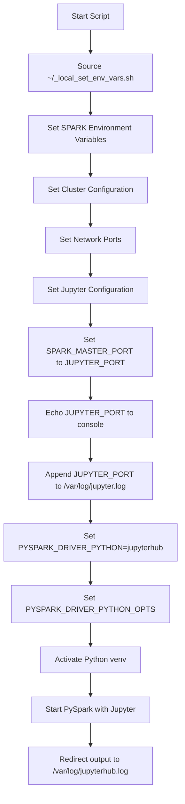
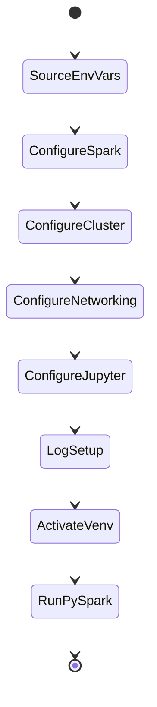

# Diagram: research/orchestrator/configuration/jupyterhub_setup/launch_jupyterhub_spark.py


> Auto-generated by Obscura crawlers

## Diagram 1



### SVG

<svg id="container" width="353.375" xmlns="http://www.w3.org/2000/svg" class="flowchart" height="1614" viewBox="0 0 353.375 1614" role="graphics-document document" aria-roledescription="flowchart-v2"><style>#container{font-family:"trebuchet ms",verdana,arial,sans-serif;font-size:16px;fill:#333;}@keyframes edge-animation-frame{from{stroke-dashoffset:0;}}@keyframes dash{to{stroke-dashoffset:0;}}#container .edge-animation-slow{stroke-dasharray:9,5!important;stroke-dashoffset:900;animation:dash 50s linear infinite;stroke-linecap:round;}#container .edge-animation-fast{stroke-dasharray:9,5!important;stroke-dashoffset:900;animation:dash 20s linear infinite;stroke-linecap:round;}#container .error-icon{fill:#552222;}#container .error-text{fill:#552222;stroke:#552222;}#container .edge-thickness-normal{stroke-width:1px;}#container .edge-thickness-thick{stroke-width:3.5px;}#container .edge-pattern-solid{stroke-dasharray:0;}#container .edge-thickness-invisible{stroke-width:0;fill:none;}#container .edge-pattern-dashed{stroke-dasharray:3;}#container .edge-pattern-dotted{stroke-dasharray:2;}#container .marker{fill:#333333;stroke:#333333;}#container .marker.cross{stroke:#333333;}#container svg{font-family:"trebuchet ms",verdana,arial,sans-serif;font-size:16px;}#container p{margin:0;}#container .label{font-family:"trebuchet ms",verdana,arial,sans-serif;color:#333;}#container .cluster-label text{fill:#333;}#container .cluster-label span{color:#333;}#container .cluster-label span p{background-color:transparent;}#container .label text,#container span{fill:#333;color:#333;}#container .node rect,#container .node circle,#container .node ellipse,#container .node polygon,#container .node path{fill:#ECECFF;stroke:#9370DB;stroke-width:1px;}#container .rough-node .label text,#container .node .label text,#container .image-shape .label,#container .icon-shape .label{text-anchor:middle;}#container .node .katex path{fill:#000;stroke:#000;stroke-width:1px;}#container .rough-node .label,#container .node .label,#container .image-shape .label,#container .icon-shape .label{text-align:center;}#container .node.clickable{cursor:pointer;}#container .root .anchor path{fill:#333333!important;stroke-width:0;stroke:#333333;}#container .arrowheadPath{fill:#333333;}#container .edgePath .path{stroke:#333333;stroke-width:2.0px;}#container .flowchart-link{stroke:#333333;fill:none;}#container .edgeLabel{background-color:rgba(232,232,232, 0.8);text-align:center;}#container .edgeLabel p{background-color:rgba(232,232,232, 0.8);}#container .edgeLabel rect{opacity:0.5;background-color:rgba(232,232,232, 0.8);fill:rgba(232,232,232, 0.8);}#container .labelBkg{background-color:rgba(232, 232, 232, 0.5);}#container .cluster rect{fill:#ffffde;stroke:#aaaa33;stroke-width:1px;}#container .cluster text{fill:#333;}#container .cluster span{color:#333;}#container div.mermaidTooltip{position:absolute;text-align:center;max-width:200px;padding:2px;font-family:"trebuchet ms",verdana,arial,sans-serif;font-size:12px;background:hsl(80, 100%, 96.2745098039%);border:1px solid #aaaa33;border-radius:2px;pointer-events:none;z-index:100;}#container .flowchartTitleText{text-anchor:middle;font-size:18px;fill:#333;}#container rect.text{fill:none;stroke-width:0;}#container .icon-shape,#container .image-shape{background-color:rgba(232,232,232, 0.8);text-align:center;}#container .icon-shape p,#container .image-shape p{background-color:rgba(232,232,232, 0.8);padding:2px;}#container .icon-shape rect,#container .image-shape rect{opacity:0.5;background-color:rgba(232,232,232, 0.8);fill:rgba(232,232,232, 0.8);}#container .label-icon{display:inline-block;height:1em;overflow:visible;vertical-align:-0.125em;}#container .node .label-icon path{fill:currentColor;stroke:revert;stroke-width:revert;}#container :root{--mermaid-font-family:"trebuchet ms",verdana,arial,sans-serif;}</style><g><marker id="container_flowchart-v2-pointEnd" class="marker flowchart-v2" viewBox="0 0 10 10" refX="5" refY="5" markerUnits="userSpaceOnUse" markerWidth="8" markerHeight="8" orient="auto"><path d="M 0 0 L 10 5 L 0 10 z" class="arrowMarkerPath" style="stroke-width: 1; stroke-dasharray: 1, 0;"></path></marker><marker id="container_flowchart-v2-pointStart" class="marker flowchart-v2" viewBox="0 0 10 10" refX="4.5" refY="5" markerUnits="userSpaceOnUse" markerWidth="8" markerHeight="8" orient="auto"><path d="M 0 5 L 10 10 L 10 0 z" class="arrowMarkerPath" style="stroke-width: 1; stroke-dasharray: 1, 0;"></path></marker><marker id="container_flowchart-v2-circleEnd" class="marker flowchart-v2" viewBox="0 0 10 10" refX="11" refY="5" markerUnits="userSpaceOnUse" markerWidth="11" markerHeight="11" orient="auto"><circle cx="5" cy="5" r="5" class="arrowMarkerPath" style="stroke-width: 1; stroke-dasharray: 1, 0;"></circle></marker><marker id="container_flowchart-v2-circleStart" class="marker flowchart-v2" viewBox="0 0 10 10" refX="-1" refY="5" markerUnits="userSpaceOnUse" markerWidth="11" markerHeight="11" orient="auto"><circle cx="5" cy="5" r="5" class="arrowMarkerPath" style="stroke-width: 1; stroke-dasharray: 1, 0;"></circle></marker><marker id="container_flowchart-v2-crossEnd" class="marker cross flowchart-v2" viewBox="0 0 11 11" refX="12" refY="5.2" markerUnits="userSpaceOnUse" markerWidth="11" markerHeight="11" orient="auto"><path d="M 1,1 l 9,9 M 10,1 l -9,9" class="arrowMarkerPath" style="stroke-width: 2; stroke-dasharray: 1, 0;"></path></marker><marker id="container_flowchart-v2-crossStart" class="marker cross flowchart-v2" viewBox="0 0 11 11" refX="-1" refY="5.2" markerUnits="userSpaceOnUse" markerWidth="11" markerHeight="11" orient="auto"><path d="M 1,1 l 9,9 M 10,1 l -9,9" class="arrowMarkerPath" style="stroke-width: 2; stroke-dasharray: 1, 0;"></path></marker><g class="root"><g class="clusters"></g><g class="edgePaths"><path d="M176.688,62L176.688,66.167C176.688,70.333,176.688,78.667,176.688,86.333C176.688,94,176.688,101,176.688,104.5L176.688,108" id="L_A_B_0" class="edge-thickness-normal edge-pattern-solid edge-thickness-normal edge-pattern-solid flowchart-link" style=";" data-edge="true" data-et="edge" data-id="L_A_B_0" data-points="W3sieCI6MTc2LjY4NzUsInkiOjYyfSx7IngiOjE3Ni42ODc1LCJ5Ijo4N30seyJ4IjoxNzYuNjg3NSwieSI6MTEyfV0=" marker-end="url(#container_flowchart-v2-pointEnd)"></path><path d="M176.688,190L176.688,194.167C176.688,198.333,176.688,206.667,176.688,214.333C176.688,222,176.688,229,176.688,232.5L176.688,236" id="L_B_C_0" class="edge-thickness-normal edge-pattern-solid edge-thickness-normal edge-pattern-solid flowchart-link" style=";" data-edge="true" data-et="edge" data-id="L_B_C_0" data-points="W3sieCI6MTc2LjY4NzUsInkiOjE5MH0seyJ4IjoxNzYuNjg3NSwieSI6MjE1fSx7IngiOjE3Ni42ODc1LCJ5IjoyNDB9XQ==" marker-end="url(#container_flowchart-v2-pointEnd)"></path><path d="M176.688,318L176.688,322.167C176.688,326.333,176.688,334.667,176.688,342.333C176.688,350,176.688,357,176.688,360.5L176.688,364" id="L_C_D_0" class="edge-thickness-normal edge-pattern-solid edge-thickness-normal edge-pattern-solid flowchart-link" style=";" data-edge="true" data-et="edge" data-id="L_C_D_0" data-points="W3sieCI6MTc2LjY4NzUsInkiOjMxOH0seyJ4IjoxNzYuNjg3NSwieSI6MzQzfSx7IngiOjE3Ni42ODc1LCJ5IjozNjh9XQ==" marker-end="url(#container_flowchart-v2-pointEnd)"></path><path d="M176.688,422L176.688,426.167C176.688,430.333,176.688,438.667,176.688,446.333C176.688,454,176.688,461,176.688,464.5L176.688,468" id="L_D_E_0" class="edge-thickness-normal edge-pattern-solid edge-thickness-normal edge-pattern-solid flowchart-link" style=";" data-edge="true" data-et="edge" data-id="L_D_E_0" data-points="W3sieCI6MTc2LjY4NzUsInkiOjQyMn0seyJ4IjoxNzYuNjg3NSwieSI6NDQ3fSx7IngiOjE3Ni42ODc1LCJ5Ijo0NzJ9XQ==" marker-end="url(#container_flowchart-v2-pointEnd)"></path><path d="M176.688,526L176.688,530.167C176.688,534.333,176.688,542.667,176.688,550.333C176.688,558,176.688,565,176.688,568.5L176.688,572" id="L_E_F_0" class="edge-thickness-normal edge-pattern-solid edge-thickness-normal edge-pattern-solid flowchart-link" style=";" data-edge="true" data-et="edge" data-id="L_E_F_0" data-points="W3sieCI6MTc2LjY4NzUsInkiOjUyNn0seyJ4IjoxNzYuNjg3NSwieSI6NTUxfSx7IngiOjE3Ni42ODc1LCJ5Ijo1NzZ9XQ==" marker-end="url(#container_flowchart-v2-pointEnd)"></path><path d="M176.688,630L176.688,634.167C176.688,638.333,176.688,646.667,176.688,654.333C176.688,662,176.688,669,176.688,672.5L176.688,676" id="L_F_G_0" class="edge-thickness-normal edge-pattern-solid edge-thickness-normal edge-pattern-solid flowchart-link" style=";" data-edge="true" data-et="edge" data-id="L_F_G_0" data-points="W3sieCI6MTc2LjY4NzUsInkiOjYzMH0seyJ4IjoxNzYuNjg3NSwieSI6NjU1fSx7IngiOjE3Ni42ODc1LCJ5Ijo2ODB9XQ==" marker-end="url(#container_flowchart-v2-pointEnd)"></path><path d="M176.688,758L176.688,762.167C176.688,766.333,176.688,774.667,176.688,782.333C176.688,790,176.688,797,176.688,800.5L176.688,804" id="L_G_H_0" class="edge-thickness-normal edge-pattern-solid edge-thickness-normal edge-pattern-solid flowchart-link" style=";" data-edge="true" data-et="edge" data-id="L_G_H_0" data-points="W3sieCI6MTc2LjY4NzUsInkiOjc1OH0seyJ4IjoxNzYuNjg3NSwieSI6NzgzfSx7IngiOjE3Ni42ODc1LCJ5Ijo4MDh9XQ==" marker-end="url(#container_flowchart-v2-pointEnd)"></path><path d="M176.688,886L176.688,890.167C176.688,894.333,176.688,902.667,176.688,910.333C176.688,918,176.688,925,176.688,928.5L176.688,932" id="L_H_I_0" class="edge-thickness-normal edge-pattern-solid edge-thickness-normal edge-pattern-solid flowchart-link" style=";" data-edge="true" data-et="edge" data-id="L_H_I_0" data-points="W3sieCI6MTc2LjY4NzUsInkiOjg4Nn0seyJ4IjoxNzYuNjg3NSwieSI6OTExfSx7IngiOjE3Ni42ODc1LCJ5Ijo5MzZ9XQ==" marker-end="url(#container_flowchart-v2-pointEnd)"></path><path d="M176.688,1014L176.688,1018.167C176.688,1022.333,176.688,1030.667,176.688,1038.333C176.688,1046,176.688,1053,176.688,1056.5L176.688,1060" id="L_I_J_0" class="edge-thickness-normal edge-pattern-solid edge-thickness-normal edge-pattern-solid flowchart-link" style=";" data-edge="true" data-et="edge" data-id="L_I_J_0" data-points="W3sieCI6MTc2LjY4NzUsInkiOjEwMTR9LHsieCI6MTc2LjY4NzUsInkiOjEwMzl9LHsieCI6MTc2LjY4NzUsInkiOjEwNjR9XQ==" marker-end="url(#container_flowchart-v2-pointEnd)"></path><path d="M176.688,1142L176.688,1146.167C176.688,1150.333,176.688,1158.667,176.688,1166.333C176.688,1174,176.688,1181,176.688,1184.5L176.688,1188" id="L_J_K_0" class="edge-thickness-normal edge-pattern-solid edge-thickness-normal edge-pattern-solid flowchart-link" style=";" data-edge="true" data-et="edge" data-id="L_J_K_0" data-points="W3sieCI6MTc2LjY4NzUsInkiOjExNDJ9LHsieCI6MTc2LjY4NzUsInkiOjExNjd9LHsieCI6MTc2LjY4NzUsInkiOjExOTJ9XQ==" marker-end="url(#container_flowchart-v2-pointEnd)"></path><path d="M176.688,1270L176.688,1274.167C176.688,1278.333,176.688,1286.667,176.688,1294.333C176.688,1302,176.688,1309,176.688,1312.5L176.688,1316" id="L_K_L_0" class="edge-thickness-normal edge-pattern-solid edge-thickness-normal edge-pattern-solid flowchart-link" style=";" data-edge="true" data-et="edge" data-id="L_K_L_0" data-points="W3sieCI6MTc2LjY4NzUsInkiOjEyNzB9LHsieCI6MTc2LjY4NzUsInkiOjEyOTV9LHsieCI6MTc2LjY4NzUsInkiOjEzMjB9XQ==" marker-end="url(#container_flowchart-v2-pointEnd)"></path><path d="M176.688,1374L176.688,1378.167C176.688,1382.333,176.688,1390.667,176.688,1398.333C176.688,1406,176.688,1413,176.688,1416.5L176.688,1420" id="L_L_M_0" class="edge-thickness-normal edge-pattern-solid edge-thickness-normal edge-pattern-solid flowchart-link" style=";" data-edge="true" data-et="edge" data-id="L_L_M_0" data-points="W3sieCI6MTc2LjY4NzUsInkiOjEzNzR9LHsieCI6MTc2LjY4NzUsInkiOjEzOTl9LHsieCI6MTc2LjY4NzUsInkiOjE0MjR9XQ==" marker-end="url(#container_flowchart-v2-pointEnd)"></path><path d="M176.688,1478L176.688,1482.167C176.688,1486.333,176.688,1494.667,176.688,1502.333C176.688,1510,176.688,1517,176.688,1520.5L176.688,1524" id="L_M_N_0" class="edge-thickness-normal edge-pattern-solid edge-thickness-normal edge-pattern-solid flowchart-link" style=";" data-edge="true" data-et="edge" data-id="L_M_N_0" data-points="W3sieCI6MTc2LjY4NzUsInkiOjE0Nzh9LHsieCI6MTc2LjY4NzUsInkiOjE1MDN9LHsieCI6MTc2LjY4NzUsInkiOjE1Mjh9XQ==" marker-end="url(#container_flowchart-v2-pointEnd)"></path></g><g class="edgeLabels"><g class="edgeLabel"><g class="label" data-id="L_A_B_0" transform="translate(0, 0)"><foreignObject width="0" height="0"><div xmlns="http://www.w3.org/1999/xhtml" class="labelBkg" style="display: table-cell; white-space: nowrap; line-height: 1.5; max-width: 200px; text-align: center;"><span class="edgeLabel"></span></div></foreignObject></g></g><g class="edgeLabel"><g class="label" data-id="L_B_C_0" transform="translate(0, 0)"><foreignObject width="0" height="0"><div xmlns="http://www.w3.org/1999/xhtml" class="labelBkg" style="display: table-cell; white-space: nowrap; line-height: 1.5; max-width: 200px; text-align: center;"><span class="edgeLabel"></span></div></foreignObject></g></g><g class="edgeLabel"><g class="label" data-id="L_C_D_0" transform="translate(0, 0)"><foreignObject width="0" height="0"><div xmlns="http://www.w3.org/1999/xhtml" class="labelBkg" style="display: table-cell; white-space: nowrap; line-height: 1.5; max-width: 200px; text-align: center;"><span class="edgeLabel"></span></div></foreignObject></g></g><g class="edgeLabel"><g class="label" data-id="L_D_E_0" transform="translate(0, 0)"><foreignObject width="0" height="0"><div xmlns="http://www.w3.org/1999/xhtml" class="labelBkg" style="display: table-cell; white-space: nowrap; line-height: 1.5; max-width: 200px; text-align: center;"><span class="edgeLabel"></span></div></foreignObject></g></g><g class="edgeLabel"><g class="label" data-id="L_E_F_0" transform="translate(0, 0)"><foreignObject width="0" height="0"><div xmlns="http://www.w3.org/1999/xhtml" class="labelBkg" style="display: table-cell; white-space: nowrap; line-height: 1.5; max-width: 200px; text-align: center;"><span class="edgeLabel"></span></div></foreignObject></g></g><g class="edgeLabel"><g class="label" data-id="L_F_G_0" transform="translate(0, 0)"><foreignObject width="0" height="0"><div xmlns="http://www.w3.org/1999/xhtml" class="labelBkg" style="display: table-cell; white-space: nowrap; line-height: 1.5; max-width: 200px; text-align: center;"><span class="edgeLabel"></span></div></foreignObject></g></g><g class="edgeLabel"><g class="label" data-id="L_G_H_0" transform="translate(0, 0)"><foreignObject width="0" height="0"><div xmlns="http://www.w3.org/1999/xhtml" class="labelBkg" style="display: table-cell; white-space: nowrap; line-height: 1.5; max-width: 200px; text-align: center;"><span class="edgeLabel"></span></div></foreignObject></g></g><g class="edgeLabel"><g class="label" data-id="L_H_I_0" transform="translate(0, 0)"><foreignObject width="0" height="0"><div xmlns="http://www.w3.org/1999/xhtml" class="labelBkg" style="display: table-cell; white-space: nowrap; line-height: 1.5; max-width: 200px; text-align: center;"><span class="edgeLabel"></span></div></foreignObject></g></g><g class="edgeLabel"><g class="label" data-id="L_I_J_0" transform="translate(0, 0)"><foreignObject width="0" height="0"><div xmlns="http://www.w3.org/1999/xhtml" class="labelBkg" style="display: table-cell; white-space: nowrap; line-height: 1.5; max-width: 200px; text-align: center;"><span class="edgeLabel"></span></div></foreignObject></g></g><g class="edgeLabel"><g class="label" data-id="L_J_K_0" transform="translate(0, 0)"><foreignObject width="0" height="0"><div xmlns="http://www.w3.org/1999/xhtml" class="labelBkg" style="display: table-cell; white-space: nowrap; line-height: 1.5; max-width: 200px; text-align: center;"><span class="edgeLabel"></span></div></foreignObject></g></g><g class="edgeLabel"><g class="label" data-id="L_K_L_0" transform="translate(0, 0)"><foreignObject width="0" height="0"><div xmlns="http://www.w3.org/1999/xhtml" class="labelBkg" style="display: table-cell; white-space: nowrap; line-height: 1.5; max-width: 200px; text-align: center;"><span class="edgeLabel"></span></div></foreignObject></g></g><g class="edgeLabel"><g class="label" data-id="L_L_M_0" transform="translate(0, 0)"><foreignObject width="0" height="0"><div xmlns="http://www.w3.org/1999/xhtml" class="labelBkg" style="display: table-cell; white-space: nowrap; line-height: 1.5; max-width: 200px; text-align: center;"><span class="edgeLabel"></span></div></foreignObject></g></g><g class="edgeLabel"><g class="label" data-id="L_M_N_0" transform="translate(0, 0)"><foreignObject width="0" height="0"><div xmlns="http://www.w3.org/1999/xhtml" class="labelBkg" style="display: table-cell; white-space: nowrap; line-height: 1.5; max-width: 200px; text-align: center;"><span class="edgeLabel"></span></div></foreignObject></g></g></g><g class="nodes"><g class="node default" id="flowchart-A-0" transform="translate(176.6875, 35)"><rect class="basic label-container" style="" x="-70.8125" y="-27" width="141.625" height="54"></rect><g class="label" style="" transform="translate(-40.8125, -12)"><rect></rect><foreignObject width="81.625" height="24"><div xmlns="http://www.w3.org/1999/xhtml" style="display: table-cell; white-space: nowrap; line-height: 1.5; max-width: 200px; text-align: center;"><span class="nodeLabel"><p>Start Script</p></span></div></foreignObject></g></g><g class="node default" id="flowchart-B-1" transform="translate(176.6875, 151)"><rect class="basic label-container" style="" x="-130" y="-39" width="260" height="78"></rect><g class="label" style="" transform="translate(-100, -24)"><rect></rect><foreignObject width="200" height="48"><div xmlns="http://www.w3.org/1999/xhtml" style="display: table; white-space: break-spaces; line-height: 1.5; max-width: 200px; text-align: center; width: 200px;"><span class="nodeLabel"><p>Source ~/_local_set_env_vars.sh</p></span></div></foreignObject></g></g><g class="node default" id="flowchart-C-3" transform="translate(176.6875, 279)"><rect class="basic label-container" style="" x="-130" y="-39" width="260" height="78"></rect><g class="label" style="" transform="translate(-100, -24)"><rect></rect><foreignObject width="200" height="48"><div xmlns="http://www.w3.org/1999/xhtml" style="display: table; white-space: break-spaces; line-height: 1.5; max-width: 200px; text-align: center; width: 200px;"><span class="nodeLabel"><p>Set SPARK Environment Variables</p></span></div></foreignObject></g></g><g class="node default" id="flowchart-D-5" transform="translate(176.6875, 395)"><rect class="basic label-container" style="" x="-119.8828125" y="-27" width="239.765625" height="54"></rect><g class="label" style="" transform="translate(-89.8828125, -12)"><rect></rect><foreignObject width="179.765625" height="24"><div xmlns="http://www.w3.org/1999/xhtml" style="display: table-cell; white-space: nowrap; line-height: 1.5; max-width: 200px; text-align: center;"><span class="nodeLabel"><p>Set Cluster Configuration</p></span></div></foreignObject></g></g><g class="node default" id="flowchart-E-7" transform="translate(176.6875, 499)"><rect class="basic label-container" style="" x="-94.9453125" y="-27" width="189.890625" height="54"></rect><g class="label" style="" transform="translate(-64.9453125, -12)"><rect></rect><foreignObject width="129.890625" height="24"><div xmlns="http://www.w3.org/1999/xhtml" style="display: table-cell; white-space: nowrap; line-height: 1.5; max-width: 200px; text-align: center;"><span class="nodeLabel"><p>Set Network Ports</p></span></div></foreignObject></g></g><g class="node default" id="flowchart-F-9" transform="translate(176.6875, 603)"><rect class="basic label-container" style="" x="-120.5" y="-27" width="241" height="54"></rect><g class="label" style="" transform="translate(-90.5, -12)"><rect></rect><foreignObject width="181" height="24"><div xmlns="http://www.w3.org/1999/xhtml" style="display: table-cell; white-space: nowrap; line-height: 1.5; max-width: 200px; text-align: center;"><span class="nodeLabel"><p>Set Jupyter Configuration</p></span></div></foreignObject></g></g><g class="node default" id="flowchart-G-11" transform="translate(176.6875, 719)"><rect class="basic label-container" style="" x="-130" y="-39" width="260" height="78"></rect><g class="label" style="" transform="translate(-100, -24)"><rect></rect><foreignObject width="200" height="48"><div xmlns="http://www.w3.org/1999/xhtml" style="display: table; white-space: break-spaces; line-height: 1.5; max-width: 200px; text-align: center; width: 200px;"><span class="nodeLabel"><p>Set SPARK_MASTER_PORT to JUPYTER_PORT</p></span></div></foreignObject></g></g><g class="node default" id="flowchart-H-13" transform="translate(176.6875, 847)"><rect class="basic label-container" style="" x="-130" y="-39" width="260" height="78"></rect><g class="label" style="" transform="translate(-100, -24)"><rect></rect><foreignObject width="200" height="48"><div xmlns="http://www.w3.org/1999/xhtml" style="display: table; white-space: break-spaces; line-height: 1.5; max-width: 200px; text-align: center; width: 200px;"><span class="nodeLabel"><p>Echo JUPYTER_PORT to console</p></span></div></foreignObject></g></g><g class="node default" id="flowchart-I-15" transform="translate(176.6875, 975)"><rect class="basic label-container" style="" x="-130" y="-39" width="260" height="78"></rect><g class="label" style="" transform="translate(-100, -24)"><rect></rect><foreignObject width="200" height="48"><div xmlns="http://www.w3.org/1999/xhtml" style="display: table; white-space: break-spaces; line-height: 1.5; max-width: 200px; text-align: center; width: 200px;"><span class="nodeLabel"><p>Append JUPYTER_PORT to /var/log/jupyter.log</p></span></div></foreignObject></g></g><g class="node default" id="flowchart-J-17" transform="translate(176.6875, 1103)"><rect class="basic label-container" style="" x="-168.6875" y="-39" width="337.375" height="78"></rect><g class="label" style="" transform="translate(-138.6875, -24)"><rect></rect><foreignObject width="277.375" height="48"><div xmlns="http://www.w3.org/1999/xhtml" style="display: table; white-space: break-spaces; line-height: 1.5; max-width: 200px; text-align: center; width: 200px;"><span class="nodeLabel"><p>Set PYSPARK_DRIVER_PYTHON=jupyterhub</p></span></div></foreignObject></g></g><g class="node default" id="flowchart-K-19" transform="translate(176.6875, 1231)"><rect class="basic label-container" style="" x="-146.984375" y="-39" width="293.96875" height="78"></rect><g class="label" style="" transform="translate(-116.984375, -24)"><rect></rect><foreignObject width="233.96875" height="48"><div xmlns="http://www.w3.org/1999/xhtml" style="display: table; white-space: break-spaces; line-height: 1.5; max-width: 200px; text-align: center; width: 200px;"><span class="nodeLabel"><p>Set PYSPARK_DRIVER_PYTHON_OPTS</p></span></div></foreignObject></g></g><g class="node default" id="flowchart-L-21" transform="translate(176.6875, 1347)"><rect class="basic label-container" style="" x="-105.3984375" y="-27" width="210.796875" height="54"></rect><g class="label" style="" transform="translate(-75.3984375, -12)"><rect></rect><foreignObject width="150.796875" height="24"><div xmlns="http://www.w3.org/1999/xhtml" style="display: table-cell; white-space: nowrap; line-height: 1.5; max-width: 200px; text-align: center;"><span class="nodeLabel"><p>Activate Python venv</p></span></div></foreignObject></g></g><g class="node default" id="flowchart-M-23" transform="translate(176.6875, 1451)"><rect class="basic label-container" style="" x="-124.53125" y="-27" width="249.0625" height="54"></rect><g class="label" style="" transform="translate(-94.53125, -12)"><rect></rect><foreignObject width="189.0625" height="24"><div xmlns="http://www.w3.org/1999/xhtml" style="display: table-cell; white-space: nowrap; line-height: 1.5; max-width: 200px; text-align: center;"><span class="nodeLabel"><p>Start PySpark with Jupyter</p></span></div></foreignObject></g></g><g class="node default" id="flowchart-N-25" transform="translate(176.6875, 1567)"><rect class="basic label-container" style="" x="-130" y="-39" width="260" height="78"></rect><g class="label" style="" transform="translate(-100, -24)"><rect></rect><foreignObject width="200" height="48"><div xmlns="http://www.w3.org/1999/xhtml" style="display: table; white-space: break-spaces; line-height: 1.5; max-width: 200px; text-align: center; width: 200px;"><span class="nodeLabel"><p>Redirect output to /var/log/jupyterhub.log</p></span></div></foreignObject></g></g></g></g></g></svg>

## Diagram 2

```mermaid
graph LR
    A[Spark Master<br/>ip-172-31-36-190.ec2.internal] -->|Port 7077| B[Spark Workers]
    B -->|Port 7078| A
    A -->|Port 4443| C[JupyterHub]
    C -->|PySpark Driver| D[Python 3<br/>/usr/bin/python3]
    D -->|Uses| E[Virtual Env<br/>/home/ubuntu/venv]
    A -->|Spark Home| F[/home/ubuntu/user_lib_spark]
    B -->|Worker Dir| G[/var/run/spark/work]
    C -->|Config| H[/home/ubuntu/jupyterhub_config.py]
    C -->|Logs| I[/var/log/jupyterhub.log]
    C -->|Logs| J[/var/log/jupyter.log]
    A -->|Hive Thrift| K[Port 10001]
    D -->|Hadoop User| L[hadoop]
```

> SVG rendering failed for this diagram.

## Diagram 3



### SVG

<svg id="container" width="183.265625" xmlns="http://www.w3.org/2000/svg" class="statediagram" height="814" viewBox="0 0 183.265625 814" role="graphics-document document" aria-roledescription="stateDiagram"><style>#container{font-family:"trebuchet ms",verdana,arial,sans-serif;font-size:16px;fill:#333;}@keyframes edge-animation-frame{from{stroke-dashoffset:0;}}@keyframes dash{to{stroke-dashoffset:0;}}#container .edge-animation-slow{stroke-dasharray:9,5!important;stroke-dashoffset:900;animation:dash 50s linear infinite;stroke-linecap:round;}#container .edge-animation-fast{stroke-dasharray:9,5!important;stroke-dashoffset:900;animation:dash 20s linear infinite;stroke-linecap:round;}#container .error-icon{fill:#552222;}#container .error-text{fill:#552222;stroke:#552222;}#container .edge-thickness-normal{stroke-width:1px;}#container .edge-thickness-thick{stroke-width:3.5px;}#container .edge-pattern-solid{stroke-dasharray:0;}#container .edge-thickness-invisible{stroke-width:0;fill:none;}#container .edge-pattern-dashed{stroke-dasharray:3;}#container .edge-pattern-dotted{stroke-dasharray:2;}#container .marker{fill:#333333;stroke:#333333;}#container .marker.cross{stroke:#333333;}#container svg{font-family:"trebuchet ms",verdana,arial,sans-serif;font-size:16px;}#container p{margin:0;}#container defs #statediagram-barbEnd{fill:#333333;stroke:#333333;}#container g.stateGroup text{fill:#9370DB;stroke:none;font-size:10px;}#container g.stateGroup text{fill:#333;stroke:none;font-size:10px;}#container g.stateGroup .state-title{font-weight:bolder;fill:#131300;}#container g.stateGroup rect{fill:#ECECFF;stroke:#9370DB;}#container g.stateGroup line{stroke:#333333;stroke-width:1;}#container .transition{stroke:#333333;stroke-width:1;fill:none;}#container .stateGroup .composit{fill:white;border-bottom:1px;}#container .stateGroup .alt-composit{fill:#e0e0e0;border-bottom:1px;}#container .state-note{stroke:#aaaa33;fill:#fff5ad;}#container .state-note text{fill:black;stroke:none;font-size:10px;}#container .stateLabel .box{stroke:none;stroke-width:0;fill:#ECECFF;opacity:0.5;}#container .edgeLabel .label rect{fill:#ECECFF;opacity:0.5;}#container .edgeLabel{background-color:rgba(232,232,232, 0.8);text-align:center;}#container .edgeLabel p{background-color:rgba(232,232,232, 0.8);}#container .edgeLabel rect{opacity:0.5;background-color:rgba(232,232,232, 0.8);fill:rgba(232,232,232, 0.8);}#container .edgeLabel .label text{fill:#333;}#container .label div .edgeLabel{color:#333;}#container .stateLabel text{fill:#131300;font-size:10px;font-weight:bold;}#container .node circle.state-start{fill:#333333;stroke:#333333;}#container .node .fork-join{fill:#333333;stroke:#333333;}#container .node circle.state-end{fill:#9370DB;stroke:white;stroke-width:1.5;}#container .end-state-inner{fill:white;stroke-width:1.5;}#container .node rect{fill:#ECECFF;stroke:#9370DB;stroke-width:1px;}#container .node polygon{fill:#ECECFF;stroke:#9370DB;stroke-width:1px;}#container #statediagram-barbEnd{fill:#333333;}#container .statediagram-cluster rect{fill:#ECECFF;stroke:#9370DB;stroke-width:1px;}#container .cluster-label,#container .nodeLabel{color:#131300;}#container .statediagram-cluster rect.outer{rx:5px;ry:5px;}#container .statediagram-state .divider{stroke:#9370DB;}#container .statediagram-state .title-state{rx:5px;ry:5px;}#container .statediagram-cluster.statediagram-cluster .inner{fill:white;}#container .statediagram-cluster.statediagram-cluster-alt .inner{fill:#f0f0f0;}#container .statediagram-cluster .inner{rx:0;ry:0;}#container .statediagram-state rect.basic{rx:5px;ry:5px;}#container .statediagram-state rect.divider{stroke-dasharray:10,10;fill:#f0f0f0;}#container .note-edge{stroke-dasharray:5;}#container .statediagram-note rect{fill:#fff5ad;stroke:#aaaa33;stroke-width:1px;rx:0;ry:0;}#container .statediagram-note rect{fill:#fff5ad;stroke:#aaaa33;stroke-width:1px;rx:0;ry:0;}#container .statediagram-note text{fill:black;}#container .statediagram-note .nodeLabel{color:black;}#container .statediagram .edgeLabel{color:red;}#container #dependencyStart,#container #dependencyEnd{fill:#333333;stroke:#333333;stroke-width:1;}#container .statediagramTitleText{text-anchor:middle;font-size:18px;fill:#333;}#container :root{--mermaid-font-family:"trebuchet ms",verdana,arial,sans-serif;}</style><g><defs><marker id="container_stateDiagram-barbEnd" refX="19" refY="7" markerWidth="20" markerHeight="14" markerUnits="userSpaceOnUse" orient="auto"><path d="M 19,7 L9,13 L14,7 L9,1 Z"></path></marker></defs><g class="root"><g class="clusters"></g><g class="edgePaths"><path d="M91.633,22L91.633,26.167C91.633,30.333,91.633,38.667,91.716,47.083C91.799,55.5,91.966,64,92.049,68.25L92.133,72.5" id="edge0" class="edge-thickness-normal edge-pattern-solid transition" style="fill:none;;;fill:none" data-edge="true" data-et="edge" data-id="edge0" data-points="W3sieCI6OTEuNjMyODEyNSwieSI6MjJ9LHsieCI6OTEuNjMyODEyNSwieSI6NDd9LHsieCI6OTIuMTMyODEyNSwieSI6NzIuNX1d" marker-end="url(#container_stateDiagram-barbEnd)"></path><path d="M92.133,112.5L92.049,116.583C91.966,120.667,91.799,128.833,91.799,137.167C91.799,145.5,91.966,154,92.049,158.25L92.133,162.5" id="edge1" class="edge-thickness-normal edge-pattern-solid transition" style="fill:none;;;fill:none" data-edge="true" data-et="edge" data-id="edge1" data-points="W3sieCI6OTIuMTMyODEyNSwieSI6MTEyLjV9LHsieCI6OTEuNjMyODEyNSwieSI6MTM3fSx7IngiOjkyLjEzMjgxMjUsInkiOjE2Mi41fV0=" marker-end="url(#container_stateDiagram-barbEnd)"></path><path d="M92.133,202.5L92.049,206.583C91.966,210.667,91.799,218.833,91.799,227.167C91.799,235.5,91.966,244,92.049,248.25L92.133,252.5" id="edge2" class="edge-thickness-normal edge-pattern-solid transition" style="fill:none;;;fill:none" data-edge="true" data-et="edge" data-id="edge2" data-points="W3sieCI6OTIuMTMyODEyNSwieSI6MjAyLjV9LHsieCI6OTEuNjMyODEyNSwieSI6MjI3fSx7IngiOjkyLjEzMjgxMjUsInkiOjI1Mi41fV0=" marker-end="url(#container_stateDiagram-barbEnd)"></path><path d="M92.133,292.5L92.049,296.583C91.966,300.667,91.799,308.833,91.799,317.167C91.799,325.5,91.966,334,92.049,338.25L92.133,342.5" id="edge3" class="edge-thickness-normal edge-pattern-solid transition" style="fill:none;;;fill:none" data-edge="true" data-et="edge" data-id="edge3" data-points="W3sieCI6OTIuMTMyODEyNSwieSI6MjkyLjV9LHsieCI6OTEuNjMyODEyNSwieSI6MzE3fSx7IngiOjkyLjEzMjgxMjUsInkiOjM0Mi41fV0=" marker-end="url(#container_stateDiagram-barbEnd)"></path><path d="M92.133,382.5L92.049,386.583C91.966,390.667,91.799,398.833,91.799,407.167C91.799,415.5,91.966,424,92.049,428.25L92.133,432.5" id="edge4" class="edge-thickness-normal edge-pattern-solid transition" style="fill:none;;;fill:none" data-edge="true" data-et="edge" data-id="edge4" data-points="W3sieCI6OTIuMTMyODEyNSwieSI6MzgyLjV9LHsieCI6OTEuNjMyODEyNSwieSI6NDA3fSx7IngiOjkyLjEzMjgxMjUsInkiOjQzMi41fV0=" marker-end="url(#container_stateDiagram-barbEnd)"></path><path d="M92.133,472.5L92.049,476.583C91.966,480.667,91.799,488.833,91.799,497.167C91.799,505.5,91.966,514,92.049,518.25L92.133,522.5" id="edge5" class="edge-thickness-normal edge-pattern-solid transition" style="fill:none;;;fill:none" data-edge="true" data-et="edge" data-id="edge5" data-points="W3sieCI6OTIuMTMyODEyNSwieSI6NDcyLjV9LHsieCI6OTEuNjMyODEyNSwieSI6NDk3fSx7IngiOjkyLjEzMjgxMjUsInkiOjUyMi41fV0=" marker-end="url(#container_stateDiagram-barbEnd)"></path><path d="M92.133,562.5L92.049,566.583C91.966,570.667,91.799,578.833,91.799,587.167C91.799,595.5,91.966,604,92.049,608.25L92.133,612.5" id="edge6" class="edge-thickness-normal edge-pattern-solid transition" style="fill:none;;;fill:none" data-edge="true" data-et="edge" data-id="edge6" data-points="W3sieCI6OTIuMTMyODEyNSwieSI6NTYyLjV9LHsieCI6OTEuNjMyODEyNSwieSI6NTg3fSx7IngiOjkyLjEzMjgxMjUsInkiOjYxMi41fV0=" marker-end="url(#container_stateDiagram-barbEnd)"></path><path d="M92.133,652.5L92.049,656.583C91.966,660.667,91.799,668.833,91.799,677.167C91.799,685.5,91.966,694,92.049,698.25L92.133,702.5" id="edge7" class="edge-thickness-normal edge-pattern-solid transition" style="fill:none;;;fill:none" data-edge="true" data-et="edge" data-id="edge7" data-points="W3sieCI6OTIuMTMyODEyNSwieSI6NjUyLjV9LHsieCI6OTEuNjMyODEyNSwieSI6Njc3fSx7IngiOjkyLjEzMjgxMjUsInkiOjcwMi41fV0=" marker-end="url(#container_stateDiagram-barbEnd)"></path><path d="M92.133,742.5L92.049,746.583C91.966,750.667,91.799,758.833,91.716,767.083C91.633,775.333,91.633,783.667,91.633,787.833L91.633,792" id="edge8" class="edge-thickness-normal edge-pattern-solid transition" style="fill:none;;;fill:none" data-edge="true" data-et="edge" data-id="edge8" data-points="W3sieCI6OTIuMTMyODEyNSwieSI6NzQyLjV9LHsieCI6OTEuNjMyODEyNSwieSI6NzY3fSx7IngiOjkxLjYzMjgxMjUsInkiOjc5Mn1d" marker-end="url(#container_stateDiagram-barbEnd)"></path></g><g class="edgeLabels"><g class="edgeLabel"><g class="label" data-id="edge0" transform="translate(0, 0)"><foreignObject width="0" height="0"><div xmlns="http://www.w3.org/1999/xhtml" class="labelBkg" style="display: table-cell; white-space: nowrap; line-height: 1.5; max-width: 200px; text-align: center;"><span class="edgeLabel"></span></div></foreignObject></g></g><g class="edgeLabel"><g class="label" data-id="edge1" transform="translate(0, 0)"><foreignObject width="0" height="0"><div xmlns="http://www.w3.org/1999/xhtml" class="labelBkg" style="display: table-cell; white-space: nowrap; line-height: 1.5; max-width: 200px; text-align: center;"><span class="edgeLabel"></span></div></foreignObject></g></g><g class="edgeLabel"><g class="label" data-id="edge2" transform="translate(0, 0)"><foreignObject width="0" height="0"><div xmlns="http://www.w3.org/1999/xhtml" class="labelBkg" style="display: table-cell; white-space: nowrap; line-height: 1.5; max-width: 200px; text-align: center;"><span class="edgeLabel"></span></div></foreignObject></g></g><g class="edgeLabel"><g class="label" data-id="edge3" transform="translate(0, 0)"><foreignObject width="0" height="0"><div xmlns="http://www.w3.org/1999/xhtml" class="labelBkg" style="display: table-cell; white-space: nowrap; line-height: 1.5; max-width: 200px; text-align: center;"><span class="edgeLabel"></span></div></foreignObject></g></g><g class="edgeLabel"><g class="label" data-id="edge4" transform="translate(0, 0)"><foreignObject width="0" height="0"><div xmlns="http://www.w3.org/1999/xhtml" class="labelBkg" style="display: table-cell; white-space: nowrap; line-height: 1.5; max-width: 200px; text-align: center;"><span class="edgeLabel"></span></div></foreignObject></g></g><g class="edgeLabel"><g class="label" data-id="edge5" transform="translate(0, 0)"><foreignObject width="0" height="0"><div xmlns="http://www.w3.org/1999/xhtml" class="labelBkg" style="display: table-cell; white-space: nowrap; line-height: 1.5; max-width: 200px; text-align: center;"><span class="edgeLabel"></span></div></foreignObject></g></g><g class="edgeLabel"><g class="label" data-id="edge6" transform="translate(0, 0)"><foreignObject width="0" height="0"><div xmlns="http://www.w3.org/1999/xhtml" class="labelBkg" style="display: table-cell; white-space: nowrap; line-height: 1.5; max-width: 200px; text-align: center;"><span class="edgeLabel"></span></div></foreignObject></g></g><g class="edgeLabel"><g class="label" data-id="edge7" transform="translate(0, 0)"><foreignObject width="0" height="0"><div xmlns="http://www.w3.org/1999/xhtml" class="labelBkg" style="display: table-cell; white-space: nowrap; line-height: 1.5; max-width: 200px; text-align: center;"><span class="edgeLabel"></span></div></foreignObject></g></g><g class="edgeLabel"><g class="label" data-id="edge8" transform="translate(0, 0)"><foreignObject width="0" height="0"><div xmlns="http://www.w3.org/1999/xhtml" class="labelBkg" style="display: table-cell; white-space: nowrap; line-height: 1.5; max-width: 200px; text-align: center;"><span class="edgeLabel"></span></div></foreignObject></g></g></g><g class="nodes"><g class="node default" id="state-root_start-0" transform="translate(91.6328125, 15)"><circle class="state-start" r="7" width="14" height="14"></circle></g><g class="node  statediagram-state" id="state-SourceEnvVars-1" transform="translate(91.6328125, 92)"><g class="basic label-container outer-path"><path d="M-55.515625 -20 C-12.842588254536494 -20, 29.83044849092701 -20, 55.515625 -20 C55.515625 -20, 55.515625 -20, 55.515625 -20 C55.62862973191002 -19.995326089715164, 55.74163446382003 -19.99065217943033, 55.92852172736166 -19.982922465033347 C56.015343730877724 -19.972100113581337, 56.102165734393786 -19.961277762129324, 56.33859795140367 -19.931806517013612 C56.47376673550642 -19.90346460339861, 56.608935519609176 -19.87512268978361, 56.743052435703994 -19.847001329696653 C56.865128312464385 -19.810657766532785, 56.98720418922478 -19.774314203368917, 57.13912234602342 -19.729086208503173 C57.21668827219668 -19.69881989019057, 57.294254198369934 -19.668553571877965, 57.524102123264846 -19.578866633275286 C57.611635207299216 -19.536074316016908, 57.69916829133359 -19.493281998758533, 57.895361965185366 -19.397368756032446 C57.988207461476975 -19.342044848628007, 58.08105295776858 -19.286720941223567, 58.250365790612136 -19.185832391312644 C58.38362244893348 -19.09068896599867, 58.51687910725482 -18.995545540684695, 58.58668856344834 -18.94570254698197 C58.70007781740719 -18.849666747691717, 58.813467071366034 -18.75363094840147, 58.902032858128706 -18.678619553365657 C58.97326015977503 -18.607392251719332, 59.044487461421355 -18.536164950073005, 59.19424455336566 -18.386407858128706 C59.2650746853231 -18.302778879353948, 59.33590481728054 -18.21914990057919, 59.46132754698197 -18.07106356344834 C59.51028823842513 -18.0024898484566, 59.559248929868296 -17.933916133464862, 59.701457391312644 -17.734740790612136 C59.76942119117203 -17.620682817778103, 59.83738499103142 -17.50662484494407, 59.91299375603245 -17.37973696518537 C59.9703526287551 -17.262407515699532, 60.027711501477754 -17.145078066213692, 60.09449163327529 -17.008477123264846 C60.14038743297483 -16.89085626913953, 60.18628323267437 -16.773235415014213, 60.244711208503176 -16.623497346023417 C60.27523132254941 -16.520982090041983, 60.30575143659565 -16.418466834060546, 60.36262632969665 -16.227427435703994 C60.38656475981035 -16.113259827413614, 60.41050318992405 -15.999092219123234, 60.44743151701361 -15.82297295140367 C60.46065938364752 -15.716852771469464, 60.473887250281415 -15.610732591535257, 60.49854746503335 -15.412896727361662 C60.50266139452434 -15.313431082774013, 60.50677532401533 -15.213965438186364, 60.515625 -15 C60.515625 -15, 60.515625 -15, 60.515625 -15 C60.515625 -5.565792578160755, 60.515625 3.86841484367849, 60.515625 15 C60.515625 15, 60.515625 15, 60.515625 15 C60.51177883235991 15.092991759910298, 60.50793266471982 15.185983519820596, 60.49854746503335 15.412896727361662 C60.47958930385849 15.564988030576174, 60.460631142683624 15.717079333790686, 60.44743151701361 15.822972951403669 C60.42292644116662 15.939843017115487, 60.39842136531963 16.056713082827304, 60.36262632969665 16.227427435703994 C60.31568273248077 16.385108199215733, 60.26873913526489 16.542788962727467, 60.244711208503176 16.623497346023417 C60.20241946842223 16.731881786938107, 60.16012772834127 16.840266227852794, 60.09449163327529 17.008477123264846 C60.05044145953498 17.09858319385826, 60.00639128579468 17.188689264451675, 59.91299375603245 17.379736965185366 C59.84241449921365 17.49818424114021, 59.77183524239486 17.616631517095048, 59.701457391312644 17.734740790612133 C59.6070220257404 17.8670057495621, 59.512586660168154 17.999270708512068, 59.46132754698197 18.07106356344834 C59.393043730552364 18.1516861131604, 59.32475991412276 18.232308662872462, 59.19424455336566 18.386407858128706 C59.11143582473358 18.46921658676078, 59.02862709610151 18.55202531539285, 58.902032858128706 18.678619553365657 C58.792534078704016 18.7713602888076, 58.68303529927933 18.864101024249543, 58.58668856344834 18.94570254698197 C58.509020666569214 19.001156359490107, 58.431352769690086 19.056610171998244, 58.250365790612136 19.185832391312644 C58.14769638937977 19.247010075464484, 58.045026988147406 19.30818775961632, 57.895361965185366 19.397368756032446 C57.77941296838331 19.45405276656035, 57.66346397158126 19.510736777088248, 57.524102123264846 19.578866633275286 C57.39060704945845 19.630956572715494, 57.257111975652066 19.683046512155705, 57.13912234602342 19.729086208503173 C57.014403379749744 19.766216653508263, 56.88968441347607 19.80334709851335, 56.743052435703994 19.847001329696653 C56.59747534129184 19.87752563648494, 56.451898246879686 19.908049943273227, 56.33859795140367 19.931806517013612 C56.256039698654014 19.94209739248685, 56.17348144590436 19.952388267960085, 55.92852172736166 19.982922465033347 C55.79285293448083 19.988533767813852, 55.65718414159999 19.994145070594357, 55.515625 20 C55.515625 20, 55.515625 20, 55.515625 20 C28.603853805815394 20, 1.6920826116307879 20, -55.515625 20 C-55.515625 20, -55.515625 20, -55.515625 20 C-55.626057919585044 19.995432460659753, -55.73649083917009 19.99086492131951, -55.92852172736166 19.982922465033347 C-56.01695797482622 19.971898898282998, -56.10539422229077 19.960875331532648, -56.33859795140367 19.931806517013612 C-56.45279215715272 19.907862509999294, -56.566986362901766 19.883918502984976, -56.743052435703994 19.847001329696653 C-56.88455501293472 19.804874187218463, -57.026057590165436 19.762747044740273, -57.13912234602342 19.729086208503173 C-57.22076929050721 19.69722747190435, -57.302416234990986 19.665368735305524, -57.524102123264846 19.578866633275286 C-57.628837545113605 19.527664605500483, -57.733572966962356 19.476462577725684, -57.895361965185366 19.397368756032446 C-58.014070490345716 19.32663382847643, -58.132779015506074 19.255898900920418, -58.250365790612136 19.185832391312644 C-58.33946789917615 19.122214708577165, -58.428570007740156 19.05859702584168, -58.58668856344834 18.94570254698197 C-58.64985915413523 18.89219978586094, -58.71302974482211 18.838697024739908, -58.902032858128706 18.67861955336566 C-58.97712296306202 18.603529448432344, -59.05221306799534 18.528439343499027, -59.19424455336566 18.386407858128706 C-59.255214429819986 18.3144208610275, -59.316184306274316 18.24243386392629, -59.46132754698197 18.07106356344834 C-59.55001595859516 17.94684771433001, -59.63870437020836 17.822631865211672, -59.701457391312644 17.734740790612133 C-59.77056303712016 17.61876655302536, -59.83966868292768 17.502792315438587, -59.91299375603244 17.37973696518537 C-59.95228504913644 17.299365340523746, -59.991576342240435 17.21899371586212, -60.09449163327528 17.00847712326485 C-60.152816223169125 16.859004009717786, -60.211140813062975 16.70953089617072, -60.244711208503176 16.623497346023417 C-60.272997741763604 16.528484555650916, -60.301284275024024 16.433471765278416, -60.36262632969665 16.227427435703994 C-60.38626212806398 16.11470314439435, -60.40989792643132 16.00197885308471, -60.44743151701361 15.82297295140367 C-60.46667883531048 15.668561893487489, -60.48592615360736 15.514150835571309, -60.49854746503335 15.412896727361664 C-60.50379898987768 15.285926562983885, -60.50905051472201 15.158956398606104, -60.515625 15 C-60.515625 15, -60.515625 15, -60.515625 15 C-60.515625 5.136988031374379, -60.515625 -4.726023937251242, -60.515625 -15 C-60.515625 -15, -60.515625 -15, -60.515625 -15 C-60.5114742476748 -15.100355938635758, -60.5073234953496 -15.200711877271516, -60.49854746503335 -15.41289672736166 C-60.47822359083893 -15.575944424028314, -60.45789971664452 -15.738992120694967, -60.44743151701361 -15.822972951403669 C-60.414220532354946 -15.98136340012733, -60.38100954769628 -16.139753848850994, -60.36262632969665 -16.227427435703994 C-60.33493298344164 -16.320447746047996, -60.307239637186626 -16.413468056392, -60.244711208503176 -16.623497346023417 C-60.21260572949012 -16.705776637120636, -60.18050025047706 -16.788055928217858, -60.09449163327529 -17.008477123264846 C-60.022650872180556 -17.15542974889691, -59.95081011108582 -17.30238237452897, -59.91299375603245 -17.379736965185366 C-59.84102860567662 -17.500510070592426, -59.76906345532079 -17.62128317599949, -59.701457391312644 -17.734740790612133 C-59.61004598122779 -17.86277043638273, -59.51863457114294 -17.990800082153328, -59.46132754698197 -18.07106356344834 C-59.358167719938756 -18.192864141080864, -59.25500789289554 -18.31466471871339, -59.19424455336566 -18.386407858128706 C-59.10654263346052 -18.47410977803384, -59.01884071355539 -18.561811697938975, -58.902032858128706 -18.678619553365657 C-58.78023014105908 -18.781781192419665, -58.658427423989444 -18.884942831473676, -58.58668856344834 -18.945702546981966 C-58.45756797354524 -19.037892876206023, -58.32844738364213 -19.130083205430083, -58.250365790612136 -19.185832391312644 C-58.166305936276125 -19.235921192422715, -58.08224608194012 -19.286009993532783, -57.895361965185366 -19.397368756032446 C-57.77786768081878 -19.454808211618023, -57.66037339645219 -19.512247667203603, -57.524102123264846 -19.578866633275286 C-57.396511070180416 -19.628652816680972, -57.26892001709599 -19.67843900008666, -57.13912234602342 -19.729086208503173 C-56.985502600447134 -19.77482078829675, -56.831882854870855 -19.82055536809033, -56.743052435703994 -19.847001329696653 C-56.61636445434262 -19.8735650059747, -56.48967647298125 -19.90012868225275, -56.33859795140367 -19.931806517013612 C-56.24141884337621 -19.943919880196617, -56.14423973534874 -19.956033243379622, -55.92852172736166 -19.982922465033347 C-55.845409549576225 -19.986360010134163, -55.76229737179079 -19.989797555234983, -55.515625 -20 C-55.515625 -20, -55.515625 -20, -55.515625 -20" stroke="none" stroke-width="0" fill="#ECECFF" style=""></path><path d="M-55.515625 -20 C-11.26991275879783 -20, 32.97579948240434 -20, 55.515625 -20 M-55.515625 -20 C-28.65518530285769 -20, -1.7947456057153772 -20, 55.515625 -20 M55.515625 -20 C55.515625 -20, 55.515625 -20, 55.515625 -20 M55.515625 -20 C55.515625 -20, 55.515625 -20, 55.515625 -20 M55.515625 -20 C55.648445719353305 -19.994506494411944, 55.7812664387066 -19.989012988823884, 55.92852172736166 -19.982922465033347 M55.515625 -20 C55.64654396274622 -19.99458515164704, 55.77746292549244 -19.98917030329408, 55.92852172736166 -19.982922465033347 M55.92852172736166 -19.982922465033347 C56.089107149899554 -19.962905512989003, 56.249692572437446 -19.942888560944663, 56.33859795140367 -19.931806517013612 M55.92852172736166 -19.982922465033347 C56.05693255949465 -19.9669160715005, 56.185343391627626 -19.95090967796765, 56.33859795140367 -19.931806517013612 M56.33859795140367 -19.931806517013612 C56.44408018031977 -19.909689219445962, 56.54956240923587 -19.887571921878315, 56.743052435703994 -19.847001329696653 M56.33859795140367 -19.931806517013612 C56.47130401159742 -19.903980982300368, 56.604010071791166 -19.87615544758712, 56.743052435703994 -19.847001329696653 M56.743052435703994 -19.847001329696653 C56.834304261855294 -19.81983448399742, 56.9255560880066 -19.792667638298184, 57.13912234602342 -19.729086208503173 M56.743052435703994 -19.847001329696653 C56.82417500791298 -19.822850093552926, 56.90529758012196 -19.7986988574092, 57.13912234602342 -19.729086208503173 M57.13912234602342 -19.729086208503173 C57.22538870687285 -19.695424970045107, 57.31165506772227 -19.661763731587044, 57.524102123264846 -19.578866633275286 M57.13912234602342 -19.729086208503173 C57.21958656331033 -19.69768897348866, 57.300050780597246 -19.666291738474147, 57.524102123264846 -19.578866633275286 M57.524102123264846 -19.578866633275286 C57.63815908179466 -19.52310758389669, 57.75221604032448 -19.467348534518095, 57.895361965185366 -19.397368756032446 M57.524102123264846 -19.578866633275286 C57.64467410486618 -19.519922583193267, 57.76524608646753 -19.46097853311125, 57.895361965185366 -19.397368756032446 M57.895361965185366 -19.397368756032446 C58.03533005537311 -19.313965877374745, 58.17529814556085 -19.230562998717044, 58.250365790612136 -19.185832391312644 M57.895361965185366 -19.397368756032446 C58.02901349448392 -19.3177297306978, 58.16266502378248 -19.238090705363152, 58.250365790612136 -19.185832391312644 M58.250365790612136 -19.185832391312644 C58.33551776868847 -19.125035047536354, 58.420669746764794 -19.064237703760064, 58.58668856344834 -18.94570254698197 M58.250365790612136 -19.185832391312644 C58.378505552303466 -19.09434235997155, 58.506645313994795 -19.00285232863045, 58.58668856344834 -18.94570254698197 M58.58668856344834 -18.94570254698197 C58.65548902189044 -18.887431531102273, 58.724289480332544 -18.82916051522258, 58.902032858128706 -18.678619553365657 M58.58668856344834 -18.94570254698197 C58.65903515418411 -18.88442811025487, 58.73138174491989 -18.82315367352777, 58.902032858128706 -18.678619553365657 M58.902032858128706 -18.678619553365657 C59.00645839936147 -18.574194012132892, 59.110883940594235 -18.469768470900128, 59.19424455336566 -18.386407858128706 M58.902032858128706 -18.678619553365657 C58.96833646460387 -18.61231594689049, 59.03464007107904 -18.546012340415324, 59.19424455336566 -18.386407858128706 M59.19424455336566 -18.386407858128706 C59.26232200531993 -18.306028962492253, 59.330399457274204 -18.2256500668558, 59.46132754698197 -18.07106356344834 M59.19424455336566 -18.386407858128706 C59.27512281192323 -18.290915078695306, 59.3560010704808 -18.19542229926191, 59.46132754698197 -18.07106356344834 M59.46132754698197 -18.07106356344834 C59.54855953611012 -17.94888756093865, 59.63579152523826 -17.82671155842896, 59.701457391312644 -17.734740790612136 M59.46132754698197 -18.07106356344834 C59.51841197419164 -17.99111184858159, 59.57549640140132 -17.911160133714837, 59.701457391312644 -17.734740790612136 M59.701457391312644 -17.734740790612136 C59.76830024055525 -17.622564015640222, 59.83514308979786 -17.510387240668308, 59.91299375603245 -17.37973696518537 M59.701457391312644 -17.734740790612136 C59.75563854795676 -17.643813077544053, 59.809819704600876 -17.55288536447597, 59.91299375603245 -17.37973696518537 M59.91299375603245 -17.37973696518537 C59.97211652847305 -17.25879940115627, 60.031239300913654 -17.137861837127172, 60.09449163327529 -17.008477123264846 M59.91299375603245 -17.37973696518537 C59.967486117976456 -17.26827105721698, 60.02197847992046 -17.156805149248594, 60.09449163327529 -17.008477123264846 M60.09449163327529 -17.008477123264846 C60.12886660233599 -16.9203816276439, 60.16324157139669 -16.83228613202295, 60.244711208503176 -16.623497346023417 M60.09449163327529 -17.008477123264846 C60.124726276199404 -16.93099237415515, 60.15496091912351 -16.85350762504545, 60.244711208503176 -16.623497346023417 M60.244711208503176 -16.623497346023417 C60.274528380018296 -16.523343232382693, 60.30434555153341 -16.42318911874197, 60.36262632969665 -16.227427435703994 M60.244711208503176 -16.623497346023417 C60.27546877454371 -16.520184502852704, 60.30622634058424 -16.41687165968199, 60.36262632969665 -16.227427435703994 M60.36262632969665 -16.227427435703994 C60.39379083226984 -16.078797107589683, 60.424955334843034 -15.930166779475373, 60.44743151701361 -15.82297295140367 M60.36262632969665 -16.227427435703994 C60.383097311771884 -16.12979684540278, 60.40356829384712 -16.032166255101565, 60.44743151701361 -15.82297295140367 M60.44743151701361 -15.82297295140367 C60.45837324745445 -15.735193233380356, 60.4693149778953 -15.647413515357043, 60.49854746503335 -15.412896727361662 M60.44743151701361 -15.82297295140367 C60.4645585315461 -15.685571969504913, 60.4816855460786 -15.548170987606158, 60.49854746503335 -15.412896727361662 M60.49854746503335 -15.412896727361662 C60.50492737410594 -15.258644747665397, 60.51130728317853 -15.104392767969129, 60.515625 -15 M60.49854746503335 -15.412896727361662 C60.50427460928341 -15.274427145973268, 60.510001753533466 -15.135957564584873, 60.515625 -15 M60.515625 -15 C60.515625 -15, 60.515625 -15, 60.515625 -15 M60.515625 -15 C60.515625 -15, 60.515625 -15, 60.515625 -15 M60.515625 -15 C60.515625 -4.850882883349705, 60.515625 5.29823423330059, 60.515625 15 M60.515625 -15 C60.515625 -7.439081879515718, 60.515625 0.12183624096856427, 60.515625 15 M60.515625 15 C60.515625 15, 60.515625 15, 60.515625 15 M60.515625 15 C60.515625 15, 60.515625 15, 60.515625 15 M60.515625 15 C60.510143441752554 15.132531859289593, 60.50466188350511 15.265063718579185, 60.49854746503335 15.412896727361662 M60.515625 15 C60.510160039596926 15.13213056041153, 60.504695079193844 15.264261120823061, 60.49854746503335 15.412896727361662 M60.49854746503335 15.412896727361662 C60.48567816038026 15.516140354108956, 60.47280885572717 15.619383980856247, 60.44743151701361 15.822972951403669 M60.49854746503335 15.412896727361662 C60.47814722469514 15.576557069222286, 60.457746984356945 15.740217411082911, 60.44743151701361 15.822972951403669 M60.44743151701361 15.822972951403669 C60.42191868768494 15.944649213854472, 60.39640585835628 16.066325476305277, 60.36262632969665 16.227427435703994 M60.44743151701361 15.822972951403669 C60.41386830780531 15.983043236032273, 60.380305098597006 16.14311352066088, 60.36262632969665 16.227427435703994 M60.36262632969665 16.227427435703994 C60.3334250735042 16.325512726244305, 60.30422381731175 16.423598016784617, 60.244711208503176 16.623497346023417 M60.36262632969665 16.227427435703994 C60.31627110128495 16.383131903239885, 60.26991587287324 16.538836370775776, 60.244711208503176 16.623497346023417 M60.244711208503176 16.623497346023417 C60.19683764550884 16.746186773079472, 60.1489640825145 16.868876200135524, 60.09449163327529 17.008477123264846 M60.244711208503176 16.623497346023417 C60.197437148857574 16.744650377670936, 60.15016308921198 16.865803409318456, 60.09449163327529 17.008477123264846 M60.09449163327529 17.008477123264846 C60.04038879944484 17.119146238741436, 59.98628596561439 17.229815354218026, 59.91299375603245 17.379736965185366 M60.09449163327529 17.008477123264846 C60.03113168491253 17.13808196917595, 59.96777173654977 17.267686815087053, 59.91299375603245 17.379736965185366 M59.91299375603245 17.379736965185366 C59.844831809548545 17.49412747096139, 59.77666986306464 17.608517976737417, 59.701457391312644 17.734740790612133 M59.91299375603245 17.379736965185366 C59.852911386139034 17.480568191916152, 59.79282901624562 17.581399418646935, 59.701457391312644 17.734740790612133 M59.701457391312644 17.734740790612133 C59.62314275929429 17.844427257396283, 59.54482812727594 17.954113724180434, 59.46132754698197 18.07106356344834 M59.701457391312644 17.734740790612133 C59.62681903196534 17.83927831715574, 59.55218067261804 17.943815843699344, 59.46132754698197 18.07106356344834 M59.46132754698197 18.07106356344834 C59.36005230340475 18.190639017587213, 59.25877705982753 18.310214471726088, 59.19424455336566 18.386407858128706 M59.46132754698197 18.07106356344834 C59.370715639373806 18.178048840599264, 59.280103731765635 18.285034117750186, 59.19424455336566 18.386407858128706 M59.19424455336566 18.386407858128706 C59.09041814108383 18.490234270410536, 58.986591728802 18.594060682692362, 58.902032858128706 18.678619553365657 M59.19424455336566 18.386407858128706 C59.08568056840618 18.49497184308818, 58.97711658344671 18.60353582804765, 58.902032858128706 18.678619553365657 M58.902032858128706 18.678619553365657 C58.81089578674754 18.755808715384838, 58.71975871536636 18.83299787740402, 58.58668856344834 18.94570254698197 M58.902032858128706 18.678619553365657 C58.79026935785867 18.773278409519737, 58.67850585758863 18.867937265673817, 58.58668856344834 18.94570254698197 M58.58668856344834 18.94570254698197 C58.48251640614455 19.020080037706133, 58.378344248840754 19.0944575284303, 58.250365790612136 19.185832391312644 M58.58668856344834 18.94570254698197 C58.46212740399702 19.0346375054341, 58.3375662445457 19.123572463886237, 58.250365790612136 19.185832391312644 M58.250365790612136 19.185832391312644 C58.12920956275031 19.258025833099488, 58.00805333488848 19.330219274886336, 57.895361965185366 19.397368756032446 M58.250365790612136 19.185832391312644 C58.14905543247866 19.246200261552502, 58.04774507434519 19.306568131792357, 57.895361965185366 19.397368756032446 M57.895361965185366 19.397368756032446 C57.81678198430713 19.435784167862085, 57.73820200342889 19.47419957969172, 57.524102123264846 19.578866633275286 M57.895361965185366 19.397368756032446 C57.81314284270272 19.437563235785966, 57.73092372022007 19.47775771553949, 57.524102123264846 19.578866633275286 M57.524102123264846 19.578866633275286 C57.41070068575657 19.62311601150183, 57.29729924824828 19.66736538972837, 57.13912234602342 19.729086208503173 M57.524102123264846 19.578866633275286 C57.398168544202434 19.628006068310647, 57.27223496514003 19.677145503346008, 57.13912234602342 19.729086208503173 M57.13912234602342 19.729086208503173 C57.05708227322515 19.753510596407136, 56.975042200426884 19.7779349843111, 56.743052435703994 19.847001329696653 M57.13912234602342 19.729086208503173 C57.056198879577614 19.75377359409087, 56.97327541313181 19.778460979678567, 56.743052435703994 19.847001329696653 M56.743052435703994 19.847001329696653 C56.58685055388048 19.879753420133284, 56.430648672056975 19.91250551056991, 56.33859795140367 19.931806517013612 M56.743052435703994 19.847001329696653 C56.5964205270671 19.877746807769686, 56.44978861843021 19.908492285842716, 56.33859795140367 19.931806517013612 M56.33859795140367 19.931806517013612 C56.20811686439871 19.94807096754713, 56.07763577739375 19.964335418080655, 55.92852172736166 19.982922465033347 M56.33859795140367 19.931806517013612 C56.19101645090707 19.95020253186593, 56.04343495041047 19.968598546718244, 55.92852172736166 19.982922465033347 M55.92852172736166 19.982922465033347 C55.84222413302792 19.98649175993716, 55.755926538694176 19.99006105484097, 55.515625 20 M55.92852172736166 19.982922465033347 C55.79358573423704 19.98850345899174, 55.65864974111243 19.994084452950133, 55.515625 20 M55.515625 20 C55.515625 20, 55.515625 20, 55.515625 20 M55.515625 20 C55.515625 20, 55.515625 20, 55.515625 20 M55.515625 20 C17.145965964279206 20, -21.223693071441588 20, -55.515625 20 M55.515625 20 C16.727166311857232 20, -22.061292376285536 20, -55.515625 20 M-55.515625 20 C-55.515625 20, -55.515625 20, -55.515625 20 M-55.515625 20 C-55.515625 20, -55.515625 20, -55.515625 20 M-55.515625 20 C-55.663428917327025 19.99388678475974, -55.81123283465404 19.987773569519483, -55.92852172736166 19.982922465033347 M-55.515625 20 C-55.61847045050649 19.99574628070218, -55.72131590101299 19.991492561404357, -55.92852172736166 19.982922465033347 M-55.92852172736166 19.982922465033347 C-56.0576265294771 19.9668295682324, -56.186731331592526 19.95073667143145, -56.33859795140367 19.931806517013612 M-55.92852172736166 19.982922465033347 C-56.07272394147654 19.96494767778923, -56.21692615559141 19.94697289054511, -56.33859795140367 19.931806517013612 M-56.33859795140367 19.931806517013612 C-56.45628667651498 19.90712978634162, -56.57397540162628 19.88245305566963, -56.743052435703994 19.847001329696653 M-56.33859795140367 19.931806517013612 C-56.451262245212696 19.90818329879924, -56.56392653902172 19.88456008058487, -56.743052435703994 19.847001329696653 M-56.743052435703994 19.847001329696653 C-56.845089447897685 19.816623594994876, -56.94712646009137 19.786245860293104, -57.13912234602342 19.729086208503173 M-56.743052435703994 19.847001329696653 C-56.89024283774355 19.803180848405827, -57.037433239783105 19.759360367115, -57.13912234602342 19.729086208503173 M-57.13912234602342 19.729086208503173 C-57.24132017643684 19.689208491330803, -57.34351800685026 19.649330774158432, -57.524102123264846 19.578866633275286 M-57.13912234602342 19.729086208503173 C-57.227875549771554 19.694454600934865, -57.316628753519694 19.65982299336656, -57.524102123264846 19.578866633275286 M-57.524102123264846 19.578866633275286 C-57.64017182406413 19.522123614158794, -57.75624152486342 19.4653805950423, -57.895361965185366 19.397368756032446 M-57.524102123264846 19.578866633275286 C-57.66110054002779 19.511892188370396, -57.798098956790724 19.44491774346551, -57.895361965185366 19.397368756032446 M-57.895361965185366 19.397368756032446 C-58.02931034035289 19.317552848953135, -58.16325871552042 19.237736941873827, -58.250365790612136 19.185832391312644 M-57.895361965185366 19.397368756032446 C-58.03283170424094 19.31545457151954, -58.170301443296516 19.23354038700663, -58.250365790612136 19.185832391312644 M-58.250365790612136 19.185832391312644 C-58.37454146047517 19.09717266713634, -58.4987171303382 19.00851294296004, -58.58668856344834 18.94570254698197 M-58.250365790612136 19.185832391312644 C-58.38081980606357 19.092690014546143, -58.511273821515005 18.999547637779642, -58.58668856344834 18.94570254698197 M-58.58668856344834 18.94570254698197 C-58.691378830257065 18.857034413981165, -58.79606909706579 18.76836628098036, -58.902032858128706 18.67861955336566 M-58.58668856344834 18.94570254698197 C-58.66270011288146 18.881324048577266, -58.738711662314586 18.816945550172562, -58.902032858128706 18.67861955336566 M-58.902032858128706 18.67861955336566 C-58.97002091057499 18.610631500919382, -59.03800896302126 18.5426434484731, -59.19424455336566 18.386407858128706 M-58.902032858128706 18.67861955336566 C-59.00109772836021 18.57955468313416, -59.10016259859171 18.480489812902658, -59.19424455336566 18.386407858128706 M-59.19424455336566 18.386407858128706 C-59.25462673313132 18.315114753196614, -59.31500891289698 18.24382164826452, -59.46132754698197 18.07106356344834 M-59.19424455336566 18.386407858128706 C-59.26788524821749 18.299460454015126, -59.34152594306932 18.212513049901546, -59.46132754698197 18.07106356344834 M-59.46132754698197 18.07106356344834 C-59.537129155310204 17.96489680533688, -59.612930763638445 17.858730047225425, -59.701457391312644 17.734740790612133 M-59.46132754698197 18.07106356344834 C-59.5546133864882 17.94040861592801, -59.64789922599443 17.809753668407684, -59.701457391312644 17.734740790612133 M-59.701457391312644 17.734740790612133 C-59.76448822309753 17.62896140637668, -59.82751905488242 17.523182022141224, -59.91299375603244 17.37973696518537 M-59.701457391312644 17.734740790612133 C-59.74644397344148 17.65924356454527, -59.79143055557032 17.58374633847841, -59.91299375603244 17.37973696518537 M-59.91299375603244 17.37973696518537 C-59.976063763206405 17.250725203455502, -60.03913377038036 17.121713441725632, -60.09449163327528 17.00847712326485 M-59.91299375603244 17.37973696518537 C-59.978735740030274 17.245259587502762, -60.04447772402811 17.110782209820155, -60.09449163327528 17.00847712326485 M-60.09449163327528 17.00847712326485 C-60.14272287180077 16.88487105238193, -60.19095411032626 16.761264981499004, -60.244711208503176 16.623497346023417 M-60.09449163327528 17.00847712326485 C-60.143740242781114 16.882263754013593, -60.192988852286945 16.75605038476234, -60.244711208503176 16.623497346023417 M-60.244711208503176 16.623497346023417 C-60.279955611247175 16.505113484031934, -60.31520001399117 16.386729622040452, -60.36262632969665 16.227427435703994 M-60.244711208503176 16.623497346023417 C-60.27971290454156 16.505928721485397, -60.31471460057995 16.38836009694738, -60.36262632969665 16.227427435703994 M-60.36262632969665 16.227427435703994 C-60.38337298811635 16.128482084628565, -60.40411964653605 16.029536733553137, -60.44743151701361 15.82297295140367 M-60.36262632969665 16.227427435703994 C-60.39521089520205 16.07202451691344, -60.42779546070744 15.91662159812289, -60.44743151701361 15.82297295140367 M-60.44743151701361 15.82297295140367 C-60.463585689940565 15.69337656332828, -60.47973986286752 15.563780175252889, -60.49854746503335 15.412896727361664 M-60.44743151701361 15.82297295140367 C-60.46251901072679 15.701933966667106, -60.47760650443996 15.58089498193054, -60.49854746503335 15.412896727361664 M-60.49854746503335 15.412896727361664 C-60.50350364000291 15.293067464580973, -60.508459814972475 15.173238201800281, -60.515625 15 M-60.49854746503335 15.412896727361664 C-60.504104080897115 15.278550142223024, -60.50966069676088 15.144203557084383, -60.515625 15 M-60.515625 15 C-60.515625 15, -60.515625 15, -60.515625 15 M-60.515625 15 C-60.515625 15, -60.515625 15, -60.515625 15 M-60.515625 15 C-60.515625 8.983498275518235, -60.515625 2.9669965510364698, -60.515625 -15 M-60.515625 15 C-60.515625 4.141790915765185, -60.515625 -6.71641816846963, -60.515625 -15 M-60.515625 -15 C-60.515625 -15, -60.515625 -15, -60.515625 -15 M-60.515625 -15 C-60.515625 -15, -60.515625 -15, -60.515625 -15 M-60.515625 -15 C-60.510882740208594 -15.114657270618695, -60.50614048041718 -15.229314541237391, -60.49854746503335 -15.41289672736166 M-60.515625 -15 C-60.510254170828404 -15.129854677065552, -60.50488334165681 -15.259709354131104, -60.49854746503335 -15.41289672736166 M-60.49854746503335 -15.41289672736166 C-60.48799682829988 -15.49753890735664, -60.47744619156641 -15.582181087351621, -60.44743151701361 -15.822972951403669 M-60.49854746503335 -15.41289672736166 C-60.47970302623846 -15.564075696050935, -60.460858587443575 -15.71525466474021, -60.44743151701361 -15.822972951403669 M-60.44743151701361 -15.822972951403669 C-60.4145295968937 -15.979889403752898, -60.38162767677379 -16.13680585610213, -60.36262632969665 -16.227427435703994 M-60.44743151701361 -15.822972951403669 C-60.41395681907395 -15.982621106435658, -60.38048212113429 -16.14226926146765, -60.36262632969665 -16.227427435703994 M-60.36262632969665 -16.227427435703994 C-60.326668750834216 -16.348206814050048, -60.290711171971786 -16.4689861923961, -60.244711208503176 -16.623497346023417 M-60.36262632969665 -16.227427435703994 C-60.337413003043864 -16.312117507046402, -60.312199676391074 -16.39680757838881, -60.244711208503176 -16.623497346023417 M-60.244711208503176 -16.623497346023417 C-60.20543271851914 -16.72415948876676, -60.166154228535106 -16.8248216315101, -60.09449163327529 -17.008477123264846 M-60.244711208503176 -16.623497346023417 C-60.18815668386848 -16.768434171086536, -60.131602159233786 -16.91337099614966, -60.09449163327529 -17.008477123264846 M-60.09449163327529 -17.008477123264846 C-60.02761609945089 -17.14527321417878, -59.96074056562649 -17.282069305092712, -59.91299375603245 -17.379736965185366 M-60.09449163327529 -17.008477123264846 C-60.040054204055934 -17.119830664548942, -59.985616774836586 -17.231184205833035, -59.91299375603245 -17.379736965185366 M-59.91299375603245 -17.379736965185366 C-59.85734996639226 -17.473119293134857, -59.80170617675208 -17.56650162108435, -59.701457391312644 -17.734740790612133 M-59.91299375603245 -17.379736965185366 C-59.85749767652932 -17.47287140354018, -59.8020015970262 -17.56600584189499, -59.701457391312644 -17.734740790612133 M-59.701457391312644 -17.734740790612133 C-59.638069823200176 -17.82352060359353, -59.57468225508771 -17.91230041657493, -59.46132754698197 -18.07106356344834 M-59.701457391312644 -17.734740790612133 C-59.60983114473269 -17.863071333615817, -59.518204898152725 -17.991401876619502, -59.46132754698197 -18.07106356344834 M-59.46132754698197 -18.07106356344834 C-59.37354881416268 -18.174703717447066, -59.28577008134339 -18.278343871445795, -59.19424455336566 -18.386407858128706 M-59.46132754698197 -18.07106356344834 C-59.372185173109386 -18.17631376539631, -59.283042799236796 -18.281563967344272, -59.19424455336566 -18.386407858128706 M-59.19424455336566 -18.386407858128706 C-59.1188549765662 -18.461797434928165, -59.04346539976674 -18.53718701172762, -58.902032858128706 -18.678619553365657 M-59.19424455336566 -18.386407858128706 C-59.11847686841217 -18.462175543082193, -59.04270918345868 -18.537943228035676, -58.902032858128706 -18.678619553365657 M-58.902032858128706 -18.678619553365657 C-58.823030893757924 -18.745530804026163, -58.744028929387134 -18.812442054686667, -58.58668856344834 -18.945702546981966 M-58.902032858128706 -18.678619553365657 C-58.82467080191055 -18.744141872670664, -58.747308745692386 -18.80966419197567, -58.58668856344834 -18.945702546981966 M-58.58668856344834 -18.945702546981966 C-58.46243967305038 -19.034414549615377, -58.338190782652426 -19.123126552248785, -58.250365790612136 -19.185832391312644 M-58.58668856344834 -18.945702546981966 C-58.51191545392677 -18.999089521042983, -58.4371423444052 -19.052476495103996, -58.250365790612136 -19.185832391312644 M-58.250365790612136 -19.185832391312644 C-58.163328152003295 -19.23769556671076, -58.076290513394454 -19.289558742108873, -57.895361965185366 -19.397368756032446 M-58.250365790612136 -19.185832391312644 C-58.141814076706105 -19.250515173015575, -58.03326236280008 -19.315197954718506, -57.895361965185366 -19.397368756032446 M-57.895361965185366 -19.397368756032446 C-57.75838602411345 -19.464332213241523, -57.62141008304153 -19.531295670450596, -57.524102123264846 -19.578866633275286 M-57.895361965185366 -19.397368756032446 C-57.77952032242984 -19.454000284364973, -57.66367867967431 -19.5106318126975, -57.524102123264846 -19.578866633275286 M-57.524102123264846 -19.578866633275286 C-57.401700499660315 -19.626627895014355, -57.27929887605578 -19.674389156753424, -57.13912234602342 -19.729086208503173 M-57.524102123264846 -19.578866633275286 C-57.42921644848064 -19.615891138467298, -57.33433077369643 -19.652915643659313, -57.13912234602342 -19.729086208503173 M-57.13912234602342 -19.729086208503173 C-56.99049562175724 -19.77333430144793, -56.841868897491054 -19.817582394392694, -56.743052435703994 -19.847001329696653 M-57.13912234602342 -19.729086208503173 C-57.00341836887039 -19.7694870329423, -56.867714391717364 -19.80988785738143, -56.743052435703994 -19.847001329696653 M-56.743052435703994 -19.847001329696653 C-56.60818365514481 -19.87528033918351, -56.47331487458563 -19.90355934867037, -56.33859795140367 -19.931806517013612 M-56.743052435703994 -19.847001329696653 C-56.600092785799454 -19.876976816085175, -56.45713313589492 -19.906952302473698, -56.33859795140367 -19.931806517013612 M-56.33859795140367 -19.931806517013612 C-56.20785281050741 -19.948103881830356, -56.07710766961115 -19.964401246647103, -55.92852172736166 -19.982922465033347 M-56.33859795140367 -19.931806517013612 C-56.18428044239011 -19.95104217445193, -56.02996293337656 -19.970277831890254, -55.92852172736166 -19.982922465033347 M-55.92852172736166 -19.982922465033347 C-55.82823241854366 -19.987070461528898, -55.72794310972566 -19.991218458024452, -55.515625 -20 M-55.92852172736166 -19.982922465033347 C-55.815915716506794 -19.987579884093357, -55.70330970565192 -19.992237303153363, -55.515625 -20 M-55.515625 -20 C-55.515625 -20, -55.515625 -20, -55.515625 -20 M-55.515625 -20 C-55.515625 -20, -55.515625 -20, -55.515625 -20" stroke="#9370DB" stroke-width="1.3" fill="none" stroke-dasharray="0 0" style=""></path></g><g class="label" style="" transform="translate(-52.515625, -12)"><rect></rect><foreignObject width="105.03125" height="24"><div xmlns="http://www.w3.org/1999/xhtml" style="display: table-cell; white-space: nowrap; line-height: 1.5; max-width: 200px; text-align: center;"><span class="nodeLabel"><p>SourceEnvVars</p></span></div></foreignObject></g></g><g class="node  statediagram-state" id="state-ConfigureSpark-2" transform="translate(91.6328125, 182)"><g class="basic label-container outer-path"><path d="M-57.796875 -20 C-11.8175598540817 -20, 34.1617552918366 -20, 57.796875 -20 C57.796875 -20, 57.796875 -20, 57.796875 -20 C57.92193923187954 -19.994827305106902, 58.04700346375909 -19.989654610213805, 58.20977172736166 -19.982922465033347 C58.35418721171553 -19.964921093681664, 58.49860269606939 -19.946919722329977, 58.61984795140367 -19.931806517013612 C58.72714703793652 -19.90930826446463, 58.83444612446937 -19.886810011915646, 59.024302435703994 -19.847001329696653 C59.127641995173875 -19.816235809869244, 59.230981554643755 -19.785470290041836, 59.42037234602342 -19.729086208503173 C59.51765240685698 -19.691127410975486, 59.61493246769055 -19.6531686134478, 59.805352123264846 -19.578866633275286 C59.879921175638096 -19.54241204491005, 59.954490228011345 -19.505957456544813, 60.176611965185366 -19.397368756032446 C60.29060940884201 -19.329441023734102, 60.40460685249866 -19.26151329143576, 60.531615790612136 -19.185832391312644 C60.635517406824505 -19.11164806321503, 60.73941902303687 -19.037463735117413, 60.86793856344834 -18.94570254698197 C60.961508830122 -18.86645257367261, 61.05507909679566 -18.78720260036325, 61.183282858128706 -18.678619553365657 C61.293707420860656 -18.568194990633707, 61.404131983592606 -18.457770427901753, 61.47549455336566 -18.386407858128706 C61.56646282261461 -18.27900182558357, 61.65743109186357 -18.171595793038435, 61.74257754698197 -18.07106356344834 C61.82209957190877 -17.959686037678985, 61.90162159683557 -17.84830851190963, 61.982707391312644 -17.734740790612136 C62.05320165697379 -17.616436148223546, 62.123695922634944 -17.49813150583496, 62.19424375603245 -17.37973696518537 C62.24315366846672 -17.279690140205712, 62.292063580900994 -17.179643315226052, 62.37574163327529 -17.008477123264846 C62.40597720807147 -16.93098998597171, 62.43621278286765 -16.853502848678577, 62.525961208503176 -16.623497346023417 C62.56074298328718 -16.506667423957307, 62.59552475807118 -16.389837501891193, 62.64387632969665 -16.227427435703994 C62.669116002802475 -16.107053915016266, 62.6943556759083 -15.986680394328538, 62.72868151701361 -15.82297295140367 C62.74626004411735 -15.681949722877476, 62.763838571221086 -15.54092649435128, 62.77979746503335 -15.412896727361662 C62.78633613386152 -15.254806290672436, 62.79287480268969 -15.096715853983211, 62.796875 -15 C62.796875 -15, 62.796875 -15, 62.796875 -15 C62.796875 -6.779467120250551, 62.796875 1.4410657594988976, 62.796875 15 C62.796875 15, 62.796875 15, 62.796875 15 C62.79061580701415 15.15133333381135, 62.7843566140283 15.302666667622697, 62.77979746503335 15.412896727361662 C62.76479130605731 15.533283206506916, 62.74978514708127 15.653669685652169, 62.72868151701361 15.822972951403669 C62.69908473079322 15.964126497388733, 62.66948794457282 16.1052800433738, 62.64387632969665 16.227427435703994 C62.603275556841716 16.36380302774676, 62.56267478398678 16.500178619789523, 62.525961208503176 16.623497346023417 C62.47716175365027 16.748559630551078, 62.42836229879737 16.87362191507874, 62.37574163327529 17.008477123264846 C62.33193602703828 17.09808292303419, 62.28813042080128 17.18768872280354, 62.19424375603245 17.379736965185366 C62.141822517695964 17.467711154246008, 62.08940127935948 17.55568534330665, 61.982707391312644 17.734740790612133 C61.88963838683236 17.865092041782777, 61.79656938235207 17.99544329295342, 61.74257754698197 18.07106356344834 C61.64189594854249 18.18993810209755, 61.54121435010301 18.30881264074676, 61.47549455336566 18.386407858128706 C61.39695937422494 18.46494303726942, 61.318424195084226 18.543478216410136, 61.183282858128706 18.678619553365657 C61.10041960652455 18.748801147491697, 61.017556354920394 18.818982741617738, 60.86793856344834 18.94570254698197 C60.79643804631833 18.99675293498634, 60.72493752918831 19.047803322990706, 60.531615790612136 19.185832391312644 C60.43533446446777 19.243203608928386, 60.3390531383234 19.300574826544132, 60.176611965185366 19.397368756032446 C60.07117019836144 19.44891609482427, 59.96572843153752 19.500463433616094, 59.805352123264846 19.578866633275286 C59.65280836151941 19.638389393814194, 59.50026459977397 19.6979121543531, 59.42037234602342 19.729086208503173 C59.31724020440902 19.759789977359528, 59.21410806279462 19.790493746215883, 59.024302435703994 19.847001329696653 C58.9109363985393 19.87077168801958, 58.797570361374596 19.894542046342508, 58.61984795140367 19.931806517013612 C58.46985016719686 19.950503721316306, 58.31985238299005 19.969200925619, 58.20977172736166 19.982922465033347 C58.05824046050017 19.989189844590708, 57.906709193638676 19.995457224148073, 57.796875 20 C57.796875 20, 57.796875 20, 57.796875 20 C29.62805291186436 20, 1.459230823728717 20, -57.796875 20 C-57.796875 20, -57.796875 20, -57.796875 20 C-57.91477298955289 19.995123703081997, -58.032670979105774 19.99024740616399, -58.20977172736166 19.982922465033347 C-58.36862013453618 19.96312203172825, -58.52746854171069 19.94332159842315, -58.61984795140367 19.931806517013612 C-58.724011117102734 19.90996579791782, -58.8281742828018 19.88812507882203, -59.024302435703994 19.847001329696653 C-59.13723292922927 19.813380465087842, -59.250163422754554 19.779759600479032, -59.42037234602342 19.729086208503173 C-59.523845570518986 19.68871083101565, -59.62731879501456 19.648335453528134, -59.805352123264846 19.578866633275286 C-59.91670074056322 19.52443161124587, -60.0280493578616 19.469996589216453, -60.176611965185366 19.397368756032446 C-60.312710488195556 19.316271638933213, -60.44880901120575 19.23517452183398, -60.531615790612136 19.185832391312644 C-60.64123186239542 19.10756802035885, -60.750847934178715 19.02930364940506, -60.86793856344834 18.94570254698197 C-60.991570448871045 18.840991681359384, -61.115202334293755 18.736280815736794, -61.183282858128706 18.67861955336566 C-61.25534982703581 18.606552584458555, -61.327416795942916 18.53448561555145, -61.47549455336566 18.386407858128706 C-61.56698489138109 18.278385420155765, -61.65847522939653 18.170362982182823, -61.74257754698197 18.07106356344834 C-61.830366855874445 17.948106986041687, -61.91815616476693 17.825150408635032, -61.982707391312644 17.734740790612133 C-62.03294504784889 17.65043112463831, -62.08318270438514 17.566121458664483, -62.19424375603244 17.37973696518537 C-62.253939821846366 17.257626710817483, -62.31363588766029 17.135516456449594, -62.37574163327528 17.00847712326485 C-62.41230646740337 16.914769484455828, -62.448871301531454 16.82106184564681, -62.525961208503176 16.623497346023417 C-62.55929963382908 16.51151554932616, -62.59263805915498 16.3995337526289, -62.64387632969665 16.227427435703994 C-62.67198119677489 16.09338917837462, -62.70008606385312 15.95935092104524, -62.72868151701361 15.82297295140367 C-62.74608703072664 15.683337717832446, -62.76349254443967 15.543702484261221, -62.77979746503335 15.412896727361664 C-62.7856918798196 15.270382917276743, -62.79158629460586 15.127869107191824, -62.796875 15 C-62.796875 15, -62.796875 15, -62.796875 15 C-62.796875 8.42479462623852, -62.796875 1.8495892524770383, -62.796875 -15 C-62.796875 -15, -62.796875 -15, -62.796875 -15 C-62.79109778124261 -15.139680271352765, -62.785320562485225 -15.279360542705527, -62.77979746503335 -15.41289672736166 C-62.75967235827886 -15.574349817953577, -62.73954725152438 -15.735802908545493, -62.72868151701361 -15.822972951403669 C-62.69804208363625 -15.969099109696067, -62.66740265025889 -16.115225267988464, -62.64387632969665 -16.227427435703994 C-62.61844149678618 -16.31286153345054, -62.59300666387571 -16.398295631197083, -62.525961208503176 -16.623497346023417 C-62.49261572202143 -16.708954503908966, -62.459270235539684 -16.79441166179452, -62.37574163327529 -17.008477123264846 C-62.306425303098194 -17.15026594291934, -62.2371089729211 -17.29205476257383, -62.19424375603245 -17.379736965185366 C-62.13819009172184 -17.473807151584815, -62.08213642741123 -17.567877337984267, -61.982707391312644 -17.734740790612133 C-61.92493935583835 -17.815649958425787, -61.867171320364044 -17.89655912623944, -61.74257754698197 -18.07106356344834 C-61.67804572309455 -18.14725614393683, -61.61351389920712 -18.223448724425317, -61.47549455336566 -18.386407858128706 C-61.41381112298681 -18.448091288507555, -61.35212769260796 -18.509774718886405, -61.183282858128706 -18.678619553365657 C-61.115561046334406 -18.735977002135975, -61.04783923454011 -18.793334450906293, -60.86793856344834 -18.945702546981966 C-60.77202162184156 -19.014185926987665, -60.67610468023477 -19.082669306993363, -60.531615790612136 -19.185832391312644 C-60.446393527024085 -19.23661383799406, -60.361171263436034 -19.28739528467548, -60.176611965185366 -19.397368756032446 C-60.09713335793091 -19.43622347952821, -60.01765475067644 -19.47507820302397, -59.805352123264846 -19.578866633275286 C-59.67275336178499 -19.630606830560392, -59.54015460030514 -19.6823470278455, -59.42037234602342 -19.729086208503173 C-59.337238234320075 -19.753836305901146, -59.25410412261674 -19.778586403299116, -59.024302435703994 -19.847001329696653 C-58.9018457246403 -19.872677801890898, -58.77938901357662 -19.898354274085143, -58.61984795140367 -19.931806517013612 C-58.530328383713126 -19.94296511948931, -58.44080881602258 -19.954123721965004, -58.20977172736166 -19.982922465033347 C-58.063356124935964 -19.98897825914454, -57.916940522510274 -19.995034053255736, -57.796875 -20 C-57.796875 -20, -57.796875 -20, -57.796875 -20" stroke="none" stroke-width="0" fill="#ECECFF" style=""></path><path d="M-57.796875 -20 C-20.926586120916035 -20, 15.94370275816793 -20, 57.796875 -20 M-57.796875 -20 C-25.164718554248843 -20, 7.467437891502314 -20, 57.796875 -20 M57.796875 -20 C57.796875 -20, 57.796875 -20, 57.796875 -20 M57.796875 -20 C57.796875 -20, 57.796875 -20, 57.796875 -20 M57.796875 -20 C57.88546234298317 -19.996336000391516, 57.97404968596634 -19.99267200078303, 58.20977172736166 -19.982922465033347 M57.796875 -20 C57.937661752500574 -19.994177016843818, 58.07844850500115 -19.988354033687635, 58.20977172736166 -19.982922465033347 M58.20977172736166 -19.982922465033347 C58.36407604913898 -19.96368845138231, 58.5183803709163 -19.944454437731274, 58.61984795140367 -19.931806517013612 M58.20977172736166 -19.982922465033347 C58.30096836572121 -19.971554815916768, 58.39216500408075 -19.96018716680019, 58.61984795140367 -19.931806517013612 M58.61984795140367 -19.931806517013612 C58.75023946208856 -19.90446629229759, 58.88063097277344 -19.87712606758157, 59.024302435703994 -19.847001329696653 M58.61984795140367 -19.931806517013612 C58.7112949869924 -19.912632090016967, 58.802742022581135 -19.893457663020317, 59.024302435703994 -19.847001329696653 M59.024302435703994 -19.847001329696653 C59.17453453608167 -19.80227529557581, 59.32476663645935 -19.757549261454972, 59.42037234602342 -19.729086208503173 M59.024302435703994 -19.847001329696653 C59.173798156909044 -19.80249452515403, 59.3232938781141 -19.75798772061141, 59.42037234602342 -19.729086208503173 M59.42037234602342 -19.729086208503173 C59.553119340264324 -19.67728817061522, 59.68586633450523 -19.625490132727265, 59.805352123264846 -19.578866633275286 M59.42037234602342 -19.729086208503173 C59.53946139206278 -19.68261751854103, 59.65855043810214 -19.636148828578886, 59.805352123264846 -19.578866633275286 M59.805352123264846 -19.578866633275286 C59.9249316397971 -19.52040776980097, 60.04451115632935 -19.461948906326647, 60.176611965185366 -19.397368756032446 M59.805352123264846 -19.578866633275286 C59.92565666764411 -19.520053325284444, 60.04596121202338 -19.461240017293598, 60.176611965185366 -19.397368756032446 M60.176611965185366 -19.397368756032446 C60.255321857620515 -19.350467840265686, 60.334031750055665 -19.30356692449893, 60.531615790612136 -19.185832391312644 M60.176611965185366 -19.397368756032446 C60.27904833163035 -19.3363299304738, 60.381484698075326 -19.275291104915155, 60.531615790612136 -19.185832391312644 M60.531615790612136 -19.185832391312644 C60.603809022740485 -19.134287414305838, 60.67600225486883 -19.08274243729903, 60.86793856344834 -18.94570254698197 M60.531615790612136 -19.185832391312644 C60.63546808600884 -19.111683277600566, 60.73932038140554 -19.037534163888484, 60.86793856344834 -18.94570254698197 M60.86793856344834 -18.94570254698197 C60.94656880416209 -18.87910613019921, 61.02519904487583 -18.81250971341645, 61.183282858128706 -18.678619553365657 M60.86793856344834 -18.94570254698197 C60.97885731280689 -18.851759158353726, 61.08977606216543 -18.75781576972548, 61.183282858128706 -18.678619553365657 M61.183282858128706 -18.678619553365657 C61.281979955442935 -18.57992245605143, 61.38067705275716 -18.481225358737202, 61.47549455336566 -18.386407858128706 M61.183282858128706 -18.678619553365657 C61.28021959095954 -18.581682820534823, 61.37715632379037 -18.484746087703986, 61.47549455336566 -18.386407858128706 M61.47549455336566 -18.386407858128706 C61.566643359665676 -18.278788665890172, 61.657792165965695 -18.171169473651638, 61.74257754698197 -18.07106356344834 M61.47549455336566 -18.386407858128706 C61.54342782867992 -18.306199191529448, 61.61136110399418 -18.22599052493019, 61.74257754698197 -18.07106356344834 M61.74257754698197 -18.07106356344834 C61.79642118651468 -17.995650854138052, 61.85026482604739 -17.920238144827763, 61.982707391312644 -17.734740790612136 M61.74257754698197 -18.07106356344834 C61.83360272246632 -17.943574872893738, 61.924627897950664 -17.816086182339138, 61.982707391312644 -17.734740790612136 M61.982707391312644 -17.734740790612136 C62.050711929494966 -17.620614450050873, 62.11871646767728 -17.50648810948961, 62.19424375603245 -17.37973696518537 M61.982707391312644 -17.734740790612136 C62.05361135268065 -17.615748590113217, 62.124515314048644 -17.496756389614298, 62.19424375603245 -17.37973696518537 M62.19424375603245 -17.37973696518537 C62.24032539915943 -17.28547545754321, 62.28640704228641 -17.191213949901048, 62.37574163327529 -17.008477123264846 M62.19424375603245 -17.37973696518537 C62.231511803470184 -17.303503955683517, 62.26877985090791 -17.22727094618167, 62.37574163327529 -17.008477123264846 M62.37574163327529 -17.008477123264846 C62.42035903675093 -16.894132517875793, 62.46497644022657 -16.77978791248674, 62.525961208503176 -16.623497346023417 M62.37574163327529 -17.008477123264846 C62.416592468336 -16.903785405438192, 62.45744330339671 -16.799093687611535, 62.525961208503176 -16.623497346023417 M62.525961208503176 -16.623497346023417 C62.560218214131176 -16.508430092480655, 62.59447521975918 -16.393362838937897, 62.64387632969665 -16.227427435703994 M62.525961208503176 -16.623497346023417 C62.561500719385634 -16.504122233268244, 62.59704023026809 -16.38474712051307, 62.64387632969665 -16.227427435703994 M62.64387632969665 -16.227427435703994 C62.66504792067433 -16.126455488331352, 62.68621951165201 -16.02548354095871, 62.72868151701361 -15.82297295140367 M62.64387632969665 -16.227427435703994 C62.6609837345143 -16.145838480922507, 62.67809113933195 -16.06424952614102, 62.72868151701361 -15.82297295140367 M62.72868151701361 -15.82297295140367 C62.740828628552194 -15.725523098163421, 62.752975740090776 -15.628073244923172, 62.77979746503335 -15.412896727361662 M62.72868151701361 -15.82297295140367 C62.74323812625799 -15.706192972061688, 62.75779473550237 -15.589412992719707, 62.77979746503335 -15.412896727361662 M62.77979746503335 -15.412896727361662 C62.78574872512082 -15.269008524609127, 62.79169998520829 -15.125120321856594, 62.796875 -15 M62.77979746503335 -15.412896727361662 C62.78552866135621 -15.27432917588544, 62.79125985767908 -15.135761624409216, 62.796875 -15 M62.796875 -15 C62.796875 -15, 62.796875 -15, 62.796875 -15 M62.796875 -15 C62.796875 -15, 62.796875 -15, 62.796875 -15 M62.796875 -15 C62.796875 -5.768227871633023, 62.796875 3.463544256733954, 62.796875 15 M62.796875 -15 C62.796875 -6.903603607114643, 62.796875 1.1927927857707132, 62.796875 15 M62.796875 15 C62.796875 15, 62.796875 15, 62.796875 15 M62.796875 15 C62.796875 15, 62.796875 15, 62.796875 15 M62.796875 15 C62.79081959435767 15.146406210114415, 62.78476418871535 15.292812420228831, 62.77979746503335 15.412896727361662 M62.796875 15 C62.790888160976195 15.144748422122811, 62.78490132195239 15.289496844245622, 62.77979746503335 15.412896727361662 M62.77979746503335 15.412896727361662 C62.76174759657423 15.557701278366212, 62.743697728115116 15.702505829370763, 62.72868151701361 15.822972951403669 M62.77979746503335 15.412896727361662 C62.769258647307105 15.497444089710802, 62.75871982958086 15.581991452059942, 62.72868151701361 15.822972951403669 M62.72868151701361 15.822972951403669 C62.70868991001129 15.918317297147993, 62.68869830300896 16.013661642892316, 62.64387632969665 16.227427435703994 M62.72868151701361 15.822972951403669 C62.69810236045187 15.968811636380504, 62.66752320389012 16.11465032135734, 62.64387632969665 16.227427435703994 M62.64387632969665 16.227427435703994 C62.619380925146004 16.30970604921358, 62.594885520595355 16.391984662723164, 62.525961208503176 16.623497346023417 M62.64387632969665 16.227427435703994 C62.61764964708629 16.315521309706963, 62.591422964475925 16.40361518370993, 62.525961208503176 16.623497346023417 M62.525961208503176 16.623497346023417 C62.47139371973645 16.763341834587386, 62.41682623096971 16.903186323151356, 62.37574163327529 17.008477123264846 M62.525961208503176 16.623497346023417 C62.48560554904021 16.7269200375529, 62.44524988957724 16.830342729082385, 62.37574163327529 17.008477123264846 M62.37574163327529 17.008477123264846 C62.31254240910186 17.137753202591846, 62.24934318492843 17.26702928191885, 62.19424375603245 17.379736965185366 M62.37574163327529 17.008477123264846 C62.31143079181515 17.140027052095814, 62.24711995035501 17.27157698092678, 62.19424375603245 17.379736965185366 M62.19424375603245 17.379736965185366 C62.11253548125417 17.51686114311918, 62.03082720647589 17.653985321052993, 61.982707391312644 17.734740790612133 M62.19424375603245 17.379736965185366 C62.12793878327408 17.49101106694662, 62.061633810515715 17.602285168707876, 61.982707391312644 17.734740790612133 M61.982707391312644 17.734740790612133 C61.90714906793216 17.840566806953458, 61.83159074455168 17.946392823294786, 61.74257754698197 18.07106356344834 M61.982707391312644 17.734740790612133 C61.92719734356679 17.812487449842237, 61.87168729582094 17.890234109072342, 61.74257754698197 18.07106356344834 M61.74257754698197 18.07106356344834 C61.63680445059988 18.195949622358867, 61.5310313542178 18.320835681269394, 61.47549455336566 18.386407858128706 M61.74257754698197 18.07106356344834 C61.66085798829245 18.167549664070528, 61.57913842960293 18.26403576469271, 61.47549455336566 18.386407858128706 M61.47549455336566 18.386407858128706 C61.37402325350716 18.487879157987198, 61.27255195364867 18.589350457845693, 61.183282858128706 18.678619553365657 M61.47549455336566 18.386407858128706 C61.40380877206585 18.458093639428515, 61.33212299076604 18.529779420728325, 61.183282858128706 18.678619553365657 M61.183282858128706 18.678619553365657 C61.07388145178778 18.771277818012518, 60.96448004544684 18.86393608265938, 60.86793856344834 18.94570254698197 M61.183282858128706 18.678619553365657 C61.05899954702766 18.78388214839393, 60.934716235926615 18.889144743422197, 60.86793856344834 18.94570254698197 M60.86793856344834 18.94570254698197 C60.75338908709484 19.02748930109607, 60.638839610741336 19.10927605521017, 60.531615790612136 19.185832391312644 M60.86793856344834 18.94570254698197 C60.77303478666814 19.013462541205495, 60.67813100988795 19.081222535429024, 60.531615790612136 19.185832391312644 M60.531615790612136 19.185832391312644 C60.410724999109355 19.257867667360316, 60.28983420760658 19.329902943407987, 60.176611965185366 19.397368756032446 M60.531615790612136 19.185832391312644 C60.45515807142338 19.231391303114552, 60.37870035223461 19.27695021491646, 60.176611965185366 19.397368756032446 M60.176611965185366 19.397368756032446 C60.04244882392147 19.46295711920597, 59.908285682657564 19.5285454823795, 59.805352123264846 19.578866633275286 M60.176611965185366 19.397368756032446 C60.04440377031329 19.462001404150975, 59.91219557544122 19.526634052269504, 59.805352123264846 19.578866633275286 M59.805352123264846 19.578866633275286 C59.66745000370013 19.632676207306613, 59.529547884135425 19.68648578133794, 59.42037234602342 19.729086208503173 M59.805352123264846 19.578866633275286 C59.65451083153202 19.637725087953854, 59.503669539799205 19.696583542632425, 59.42037234602342 19.729086208503173 M59.42037234602342 19.729086208503173 C59.287827775998664 19.76854643668714, 59.15528320597391 19.8080066648711, 59.024302435703994 19.847001329696653 M59.42037234602342 19.729086208503173 C59.27639016183456 19.77195156195716, 59.1324079776457 19.814816915411146, 59.024302435703994 19.847001329696653 M59.024302435703994 19.847001329696653 C58.89208913287623 19.874723544055332, 58.75987583004847 19.90244575841401, 58.61984795140367 19.931806517013612 M59.024302435703994 19.847001329696653 C58.90626224950297 19.871751754009598, 58.78822206330195 19.896502178322542, 58.61984795140367 19.931806517013612 M58.61984795140367 19.931806517013612 C58.52530924325273 19.943590754695244, 58.43077053510179 19.95537499237687, 58.20977172736166 19.982922465033347 M58.61984795140367 19.931806517013612 C58.484879751355024 19.948630285604736, 58.34991155130637 19.965454054195856, 58.20977172736166 19.982922465033347 M58.20977172736166 19.982922465033347 C58.115575567691884 19.98681844701597, 58.021379408022106 19.990714428998594, 57.796875 20 M58.20977172736166 19.982922465033347 C58.06763197087348 19.9888014088484, 57.925492214385294 19.994680352663455, 57.796875 20 M57.796875 20 C57.796875 20, 57.796875 20, 57.796875 20 M57.796875 20 C57.796875 20, 57.796875 20, 57.796875 20 M57.796875 20 C16.498930467167405 20, -24.79901406566519 20, -57.796875 20 M57.796875 20 C14.532383559711178 20, -28.732107880577644 20, -57.796875 20 M-57.796875 20 C-57.796875 20, -57.796875 20, -57.796875 20 M-57.796875 20 C-57.796875 20, -57.796875 20, -57.796875 20 M-57.796875 20 C-57.933007394124274 19.99436952253023, -58.069139788248556 19.98873904506046, -58.20977172736166 19.982922465033347 M-57.796875 20 C-57.96054876562364 19.99323040297892, -58.124222531247284 19.98646080595784, -58.20977172736166 19.982922465033347 M-58.20977172736166 19.982922465033347 C-58.34730988277176 19.9657783518405, -58.48484803818186 19.948634238647646, -58.61984795140367 19.931806517013612 M-58.20977172736166 19.982922465033347 C-58.323094349338426 19.968796814935107, -58.4364169713152 19.95467116483687, -58.61984795140367 19.931806517013612 M-58.61984795140367 19.931806517013612 C-58.780254256102346 19.898172851805707, -58.94066056080103 19.864539186597803, -59.024302435703994 19.847001329696653 M-58.61984795140367 19.931806517013612 C-58.721868681031566 19.910415019522187, -58.82388941065947 19.889023522030758, -59.024302435703994 19.847001329696653 M-59.024302435703994 19.847001329696653 C-59.10828751016599 19.821997889708893, -59.192272584627986 19.796994449721133, -59.42037234602342 19.729086208503173 M-59.024302435703994 19.847001329696653 C-59.1752879849885 19.80205098411754, -59.32627353427301 19.757100638538425, -59.42037234602342 19.729086208503173 M-59.42037234602342 19.729086208503173 C-59.543286939818586 19.681124785174596, -59.666201533613744 19.633163361846016, -59.805352123264846 19.578866633275286 M-59.42037234602342 19.729086208503173 C-59.557223843991146 19.67568658829112, -59.69407534195888 19.62228696807907, -59.805352123264846 19.578866633275286 M-59.805352123264846 19.578866633275286 C-59.89305104624062 19.53599324229864, -59.9807499692164 19.493119851321993, -60.176611965185366 19.397368756032446 M-59.805352123264846 19.578866633275286 C-59.89840752600189 19.53337461890771, -59.99146292873894 19.48788260454014, -60.176611965185366 19.397368756032446 M-60.176611965185366 19.397368756032446 C-60.28909398471294 19.33034402051417, -60.401576004240525 19.263319284995895, -60.531615790612136 19.185832391312644 M-60.176611965185366 19.397368756032446 C-60.2917547360563 19.328758556847912, -60.40689750692722 19.260148357663383, -60.531615790612136 19.185832391312644 M-60.531615790612136 19.185832391312644 C-60.640380898513826 19.10817559689224, -60.74914600641551 19.03051880247184, -60.86793856344834 18.94570254698197 M-60.531615790612136 19.185832391312644 C-60.64817019925006 19.102614143061853, -60.764724607887985 19.01939589481106, -60.86793856344834 18.94570254698197 M-60.86793856344834 18.94570254698197 C-60.986562558992944 18.845233147727757, -61.105186554537546 18.74476374847354, -61.183282858128706 18.67861955336566 M-60.86793856344834 18.94570254698197 C-60.95098984000522 18.875361703844312, -61.0340411165621 18.80502086070665, -61.183282858128706 18.67861955336566 M-61.183282858128706 18.67861955336566 C-61.287225122081736 18.574677289412627, -61.39116738603477 18.470735025459593, -61.47549455336566 18.386407858128706 M-61.183282858128706 18.67861955336566 C-61.25297145273097 18.6089309587634, -61.32266004733323 18.539242364161133, -61.47549455336566 18.386407858128706 M-61.47549455336566 18.386407858128706 C-61.54631976049292 18.302784694089954, -61.617144967620185 18.219161530051206, -61.74257754698197 18.07106356344834 M-61.47549455336566 18.386407858128706 C-61.530543192202344 18.321412053071917, -61.58559183103903 18.256416248015128, -61.74257754698197 18.07106356344834 M-61.74257754698197 18.07106356344834 C-61.81411373257225 17.970870901586963, -61.88564991816253 17.870678239725585, -61.982707391312644 17.734740790612133 M-61.74257754698197 18.07106356344834 C-61.81584947192639 17.96843984736239, -61.88912139687082 17.865816131276436, -61.982707391312644 17.734740790612133 M-61.982707391312644 17.734740790612133 C-62.045539808399035 17.629294389204855, -62.10837222548543 17.52384798779758, -62.19424375603244 17.37973696518537 M-61.982707391312644 17.734740790612133 C-62.06665870312606 17.593852310833096, -62.15061001493947 17.45296383105406, -62.19424375603244 17.37973696518537 M-62.19424375603244 17.37973696518537 C-62.2382024731493 17.289817972105364, -62.28216119026616 17.199898979025363, -62.37574163327528 17.00847712326485 M-62.19424375603244 17.37973696518537 C-62.25606116549366 17.253287433030223, -62.31787857495488 17.12683790087508, -62.37574163327528 17.00847712326485 M-62.37574163327528 17.00847712326485 C-62.408213801549344 16.925258088130914, -62.440685969823406 16.842039052996977, -62.525961208503176 16.623497346023417 M-62.37574163327528 17.00847712326485 C-62.434429598938145 16.85807275743327, -62.493117564601 16.70766839160169, -62.525961208503176 16.623497346023417 M-62.525961208503176 16.623497346023417 C-62.56465214046502 16.493536796458624, -62.60334307242687 16.363576246893835, -62.64387632969665 16.227427435703994 M-62.525961208503176 16.623497346023417 C-62.55245322646441 16.53451222628743, -62.57894524442564 16.445527106551438, -62.64387632969665 16.227427435703994 M-62.64387632969665 16.227427435703994 C-62.66246236288741 16.138786578850965, -62.68104839607817 16.050145721997936, -62.72868151701361 15.82297295140367 M-62.64387632969665 16.227427435703994 C-62.66968422943843 16.104343917924314, -62.69549212918022 15.981260400144631, -62.72868151701361 15.82297295140367 M-62.72868151701361 15.82297295140367 C-62.74201398682496 15.716013595484448, -62.7553464566363 15.609054239565227, -62.77979746503335 15.412896727361664 M-62.72868151701361 15.82297295140367 C-62.7456603621484 15.686760654239988, -62.762639207283186 15.550548357076307, -62.77979746503335 15.412896727361664 M-62.77979746503335 15.412896727361664 C-62.78361100362092 15.320693865206838, -62.787424542208484 15.22849100305201, -62.796875 15 M-62.77979746503335 15.412896727361664 C-62.78392502527014 15.313101521725258, -62.78805258550693 15.21330631608885, -62.796875 15 M-62.796875 15 C-62.796875 15, -62.796875 15, -62.796875 15 M-62.796875 15 C-62.796875 15, -62.796875 15, -62.796875 15 M-62.796875 15 C-62.796875 3.5638281852208973, -62.796875 -7.872343629558205, -62.796875 -15 M-62.796875 15 C-62.796875 3.896652297490295, -62.796875 -7.20669540501941, -62.796875 -15 M-62.796875 -15 C-62.796875 -15, -62.796875 -15, -62.796875 -15 M-62.796875 -15 C-62.796875 -15, -62.796875 -15, -62.796875 -15 M-62.796875 -15 C-62.790510204234245 -15.153886573626478, -62.7841454084685 -15.307773147252954, -62.77979746503335 -15.41289672736166 M-62.796875 -15 C-62.79307875709862 -15.091784691017223, -62.78928251419724 -15.183569382034444, -62.77979746503335 -15.41289672736166 M-62.77979746503335 -15.41289672736166 C-62.76315438786019 -15.54641533570229, -62.74651131068704 -15.679933944042919, -62.72868151701361 -15.822972951403669 M-62.77979746503335 -15.41289672736166 C-62.75944789276918 -15.576150586054379, -62.73909832050502 -15.739404444747095, -62.72868151701361 -15.822972951403669 M-62.72868151701361 -15.822972951403669 C-62.70575494310812 -15.932314796155028, -62.68282836920262 -16.041656640906385, -62.64387632969665 -16.227427435703994 M-62.72868151701361 -15.822972951403669 C-62.70473020860366 -15.937201979105252, -62.6807789001937 -16.051431006806837, -62.64387632969665 -16.227427435703994 M-62.64387632969665 -16.227427435703994 C-62.61783751499071 -16.314890272539685, -62.59179870028477 -16.402353109375376, -62.525961208503176 -16.623497346023417 M-62.64387632969665 -16.227427435703994 C-62.620221434473805 -16.306882828148147, -62.596566539250965 -16.386338220592304, -62.525961208503176 -16.623497346023417 M-62.525961208503176 -16.623497346023417 C-62.49135948636189 -16.712173959986114, -62.4567577642206 -16.80085057394881, -62.37574163327529 -17.008477123264846 M-62.525961208503176 -16.623497346023417 C-62.49569960298558 -16.701051194338184, -62.46543799746799 -16.77860504265295, -62.37574163327529 -17.008477123264846 M-62.37574163327529 -17.008477123264846 C-62.31101656027679 -17.140874376250707, -62.24629148727829 -17.273271629236568, -62.19424375603245 -17.379736965185366 M-62.37574163327529 -17.008477123264846 C-62.30615988311572 -17.15080886817132, -62.23657813295615 -17.2931406130778, -62.19424375603245 -17.379736965185366 M-62.19424375603245 -17.379736965185366 C-62.140116529765066 -17.470574171403374, -62.08598930349768 -17.56141137762138, -61.982707391312644 -17.734740790612133 M-62.19424375603245 -17.379736965185366 C-62.11470495310713 -17.51322029957922, -62.03516615018181 -17.646703633973072, -61.982707391312644 -17.734740790612133 M-61.982707391312644 -17.734740790612133 C-61.93342009578513 -17.803771943085557, -61.884132800257625 -17.87280309555898, -61.74257754698197 -18.07106356344834 M-61.982707391312644 -17.734740790612133 C-61.90097944154105 -17.849207906359524, -61.81925149176945 -17.963675022106916, -61.74257754698197 -18.07106356344834 M-61.74257754698197 -18.07106356344834 C-61.63601583424934 -18.196880739924495, -61.52945412151671 -18.32269791640065, -61.47549455336566 -18.386407858128706 M-61.74257754698197 -18.07106356344834 C-61.643970226397634 -18.187489006861853, -61.545362905813306 -18.30391445027536, -61.47549455336566 -18.386407858128706 M-61.47549455336566 -18.386407858128706 C-61.40754511536692 -18.454357296127444, -61.33959567736818 -18.522306734126182, -61.183282858128706 -18.678619553365657 M-61.47549455336566 -18.386407858128706 C-61.36463703765075 -18.49726537384361, -61.25377952193585 -18.608122889558516, -61.183282858128706 -18.678619553365657 M-61.183282858128706 -18.678619553365657 C-61.09333398657127 -18.754802361468528, -61.00338511501383 -18.8309851695714, -60.86793856344834 -18.945702546981966 M-61.183282858128706 -18.678619553365657 C-61.07608527082843 -18.76941127849778, -60.96888768352815 -18.860203003629906, -60.86793856344834 -18.945702546981966 M-60.86793856344834 -18.945702546981966 C-60.791147603915974 -19.00053023825903, -60.714356644383614 -19.055357929536097, -60.531615790612136 -19.185832391312644 M-60.86793856344834 -18.945702546981966 C-60.76132902555991 -19.021820293994544, -60.65471948767148 -19.097938041007122, -60.531615790612136 -19.185832391312644 M-60.531615790612136 -19.185832391312644 C-60.43589754182214 -19.242868087652084, -60.34017929303214 -19.299903783991525, -60.176611965185366 -19.397368756032446 M-60.531615790612136 -19.185832391312644 C-60.45069035148814 -19.23405348635314, -60.36976491236415 -19.282274581393633, -60.176611965185366 -19.397368756032446 M-60.176611965185366 -19.397368756032446 C-60.053434906565776 -19.45758635066596, -59.930257847946194 -19.51780394529947, -59.805352123264846 -19.578866633275286 M-60.176611965185366 -19.397368756032446 C-60.03541315221513 -19.466396649517336, -59.89421433924489 -19.53542454300223, -59.805352123264846 -19.578866633275286 M-59.805352123264846 -19.578866633275286 C-59.71310861201463 -19.614860163057102, -59.62086510076441 -19.65085369283892, -59.42037234602342 -19.729086208503173 M-59.805352123264846 -19.578866633275286 C-59.66529498218765 -19.633517099310165, -59.52523784111047 -19.688167565345044, -59.42037234602342 -19.729086208503173 M-59.42037234602342 -19.729086208503173 C-59.28961679493944 -19.76801382267198, -59.158861243855455 -19.806941436840784, -59.024302435703994 -19.847001329696653 M-59.42037234602342 -19.729086208503173 C-59.31657489835352 -19.759988047554007, -59.212777450683625 -19.790889886604845, -59.024302435703994 -19.847001329696653 M-59.024302435703994 -19.847001329696653 C-58.922308728524975 -19.868387161176383, -58.82031502134595 -19.889772992656113, -58.61984795140367 -19.931806517013612 M-59.024302435703994 -19.847001329696653 C-58.87426535740015 -19.878460796766372, -58.7242282790963 -19.909920263836096, -58.61984795140367 -19.931806517013612 M-58.61984795140367 -19.931806517013612 C-58.479564433928225 -19.94929283923103, -58.33928091645278 -19.966779161448446, -58.20977172736166 -19.982922465033347 M-58.61984795140367 -19.931806517013612 C-58.47784684608339 -19.949506936332615, -58.33584574076311 -19.967207355651617, -58.20977172736166 -19.982922465033347 M-58.20977172736166 -19.982922465033347 C-58.111044991460325 -19.987005833035006, -58.012318255558995 -19.991089201036665, -57.796875 -20 M-58.20977172736166 -19.982922465033347 C-58.05421661141611 -19.989356272219897, -57.898661495470556 -19.995790079406444, -57.796875 -20 M-57.796875 -20 C-57.796875 -20, -57.796875 -20, -57.796875 -20 M-57.796875 -20 C-57.796875 -20, -57.796875 -20, -57.796875 -20" stroke="#9370DB" stroke-width="1.3" fill="none" stroke-dasharray="0 0" style=""></path></g><g class="label" style="" transform="translate(-54.796875, -12)"><rect></rect><foreignObject width="109.59375" height="24"><div xmlns="http://www.w3.org/1999/xhtml" style="display: table-cell; white-space: nowrap; line-height: 1.5; max-width: 200px; text-align: center;"><span class="nodeLabel"><p>ConfigureSpark</p></span></div></foreignObject></g></g><g class="node  statediagram-state" id="state-ConfigureCluster-3" transform="translate(91.6328125, 272)"><g class="basic label-container outer-path"><path d="M-62.578125 -20 C-19.885888037106824 -20, 22.806348925786352 -20, 62.578125 -20 C62.578125 -20, 62.578125 -20, 62.578125 -20 C62.67334330017396 -19.996061741973406, 62.76856160034792 -19.992123483946813, 62.99102172736166 -19.982922465033347 C63.09857137375933 -19.969516415590597, 63.206121020156985 -19.956110366147847, 63.40109795140367 -19.931806517013612 C63.52756369182363 -19.905289439760665, 63.65402943224359 -19.878772362507718, 63.805552435703994 -19.847001329696653 C63.93133212537323 -19.80955509365447, 64.05711181504246 -19.77210885761229, 64.20162234602341 -19.729086208503173 C64.29494240862388 -19.692672607080958, 64.38826247122435 -19.656259005658747, 64.58660212326485 -19.578866633275286 C64.6997507589566 -19.523551635874163, 64.81289939464834 -19.468236638473044, 64.95786196518537 -19.397368756032446 C65.03235839750921 -19.352978517534495, 65.10685482983304 -19.308588279036545, 65.31286579061214 -19.185832391312644 C65.40664735897491 -19.1188736384987, 65.50042892733768 -19.05191488568476, 65.64918856344833 -18.94570254698197 C65.72046594347735 -18.885333685529844, 65.79174332350637 -18.824964824077718, 65.9645328581287 -18.678619553365657 C66.04909699490324 -18.594055416591125, 66.13366113167777 -18.509491279816594, 66.25674455336566 -18.386407858128706 C66.31402810227651 -18.318773299733618, 66.37131165118734 -18.251138741338526, 66.52382754698196 -18.07106356344834 C66.58467200446715 -17.985845598517038, 66.64551646195233 -17.90062763358573, 66.76395739131264 -17.734740790612136 C66.84544154038608 -17.597992744142545, 66.92692568945951 -17.461244697672953, 66.97549375603245 -17.37973696518537 C67.02357461151765 -17.281386003300817, 67.07165546700284 -17.183035041416264, 67.15699163327528 -17.008477123264846 C67.19472908848167 -16.911764314185383, 67.23246654368806 -16.815051505105917, 67.30721120850318 -16.623497346023417 C67.33929107848493 -16.51574296220791, 67.37137094846669 -16.407988578392402, 67.42512632969665 -16.227427435703994 C67.4546156833465 -16.086786259142187, 67.48410503699635 -15.946145082580381, 67.50993151701361 -15.82297295140367 C67.52917774734586 -15.668570621652508, 67.54842397767808 -15.514168291901347, 67.56104746503335 -15.412896727361662 C67.5655127014281 -15.304937264951608, 67.56997793782286 -15.196977802541552, 67.578125 -15 C67.578125 -15, 67.578125 -15, 67.578125 -15 C67.578125 -7.125235044803548, 67.578125 0.7495299103929032, 67.578125 15 C67.578125 15, 67.578125 15, 67.578125 15 C67.57411829816914 15.09687311879054, 67.5701115963383 15.193746237581081, 67.56104746503335 15.412896727361662 C67.54146655132125 15.569984044909816, 67.52188563760915 15.727071362457968, 67.50993151701361 15.822972951403669 C67.48346025521529 15.949220187901199, 67.45698899341696 16.075467424398727, 67.42512632969665 16.227427435703994 C67.38637259115345 16.357598948856776, 67.34761885261025 16.48777046200956, 67.30721120850318 16.623497346023417 C67.2519809914813 16.76504026154438, 67.19675077445943 16.90658317706535, 67.15699163327528 17.008477123264846 C67.10328578574862 17.118334190277675, 67.04957993822198 17.228191257290504, 66.97549375603245 17.379736965185366 C66.92774829286921 17.459864191027464, 66.88000282970599 17.53999141686956, 66.76395739131264 17.734740790612133 C66.70696005698274 17.814570524311165, 66.64996272265282 17.8944002580102, 66.52382754698196 18.07106356344834 C66.44835837689963 18.160169844187116, 66.37288920681729 18.249276124925892, 66.25674455336566 18.386407858128706 C66.14468432158354 18.49846808991083, 66.0326240898014 18.610528321692957, 65.9645328581287 18.678619553365657 C65.88142377594316 18.74900935537339, 65.79831469375762 18.819399157381117, 65.64918856344833 18.94570254698197 C65.55704694574833 19.011490397528316, 65.4649053280483 19.077278248074663, 65.31286579061214 19.185832391312644 C65.23962548745507 19.229474139291543, 65.16638518429802 19.273115887270443, 64.95786196518537 19.397368756032446 C64.86339639231957 19.44355016056836, 64.76893081945379 19.48973156510427, 64.58660212326485 19.578866633275286 C64.50783448182331 19.609601862340657, 64.42906684038176 19.64033709140603, 64.20162234602341 19.729086208503173 C64.08648968434326 19.763362686977377, 63.971357022663106 19.797639165451578, 63.805552435703994 19.847001329696653 C63.67100887419803 19.875212147918987, 63.536465312692066 19.90342296614132, 63.40109795140367 19.931806517013612 C63.28776920091817 19.945932931029667, 63.17444045043268 19.960059345045725, 62.99102172736166 19.982922465033347 C62.845238023385285 19.988952123631353, 62.69945431940891 19.99498178222936, 62.578125 20 C62.578125 20, 62.578125 20, 62.578125 20 C32.327716527586205 20, 2.0773080551724092 20, -62.578125 20 C-62.578125 20, -62.578125 20, -62.578125 20 C-62.72776382117463 19.993810892575226, -62.87740264234926 19.987621785150456, -62.99102172736166 19.982922465033347 C-63.15298365845816 19.96273393137611, -63.314945589554654 19.942545397718874, -63.40109795140367 19.931806517013612 C-63.53371966539462 19.903998667839296, -63.66634137938557 19.876190818664984, -63.805552435703994 19.847001329696653 C-63.93593197643566 19.808185658659877, -64.06631151716732 19.769369987623097, -64.20162234602341 19.729086208503173 C-64.33902306190342 19.67547228279674, -64.47642377778341 19.621858357090307, -64.58660212326485 19.578866633275286 C-64.68829394203019 19.52915253238197, -64.78998576079553 19.479438431488656, -64.95786196518537 19.397368756032446 C-65.09552447286421 19.31533970635224, -65.23318698054307 19.233310656672035, -65.31286579061214 19.185832391312644 C-65.3917407353798 19.129516763176834, -65.47061568014745 19.07320113504102, -65.64918856344833 18.94570254698197 C-65.72085583115461 18.885003467511723, -65.79252309886088 18.824304388041476, -65.9645328581287 18.67861955336566 C-66.07702366916831 18.566128742326057, -66.1895144802079 18.45363793128646, -66.25674455336566 18.386407858128706 C-66.31562347667284 18.316889644743267, -66.37450239998 18.24737143135783, -66.52382754698196 18.07106356344834 C-66.59554308664993 17.970619700571564, -66.66725862631787 17.870175837694788, -66.76395739131264 17.734740790612133 C-66.80821603719781 17.660465199187204, -66.85247468308297 17.58618960776227, -66.97549375603245 17.37973696518537 C-67.04375903669829 17.240098101669894, -67.11202431736413 17.10045923815442, -67.15699163327528 17.00847712326485 C-67.19049491351215 16.922615574642563, -67.22399819374903 16.83675402602028, -67.30721120850318 16.623497346023417 C-67.33179459390341 16.540923210049442, -67.35637797930364 16.45834907407547, -67.42512632969665 16.227427435703994 C-67.44634025333507 16.126253594614596, -67.4675541769735 16.0250797535252, -67.50993151701361 15.82297295140367 C-67.52884366648118 15.671250775788643, -67.54775581594876 15.519528600173617, -67.56104746503335 15.412896727361664 C-67.56625668450663 15.286949412551674, -67.5714659039799 15.161002097741687, -67.578125 15 C-67.578125 15, -67.578125 15, -67.578125 15 C-67.578125 4.225074017816464, -67.578125 -6.549851964367072, -67.578125 -15 C-67.578125 -15, -67.578125 -15, -67.578125 -15 C-67.57403071769306 -15.09899061947352, -67.56993643538613 -15.197981238947042, -67.56104746503335 -15.41289672736166 C-67.5488190707902 -15.510998668763417, -67.53659067654705 -15.609100610165173, -67.50993151701361 -15.822972951403669 C-67.47699754280302 -15.980042276721253, -67.44406356859243 -16.13711160203884, -67.42512632969665 -16.227427435703994 C-67.39208140257361 -16.338423389315906, -67.35903647545058 -16.449419342927815, -67.30721120850318 -16.623497346023417 C-67.25414390237427 -16.75949719598517, -67.20107659624536 -16.895497045946918, -67.15699163327528 -17.008477123264846 C-67.09656504429684 -17.132081686649997, -67.03613845531841 -17.255686250035144, -66.97549375603245 -17.379736965185366 C-66.9045220616714 -17.498842836313308, -66.83355036731035 -17.61794870744125, -66.76395739131264 -17.734740790612133 C-66.67254239285701 -17.862775462208702, -66.58112739440139 -17.990810133805272, -66.52382754698196 -18.07106356344834 C-66.43342390135847 -18.17780294613862, -66.34302025573497 -18.284542328828895, -66.25674455336566 -18.386407858128706 C-66.1406665591705 -18.502485852323876, -66.02458856497532 -18.618563846519045, -65.9645328581287 -18.678619553365657 C-65.89189008838538 -18.740144840916177, -65.81924731864207 -18.801670128466696, -65.64918856344833 -18.945702546981966 C-65.57454782033136 -18.99899501324661, -65.49990707721439 -19.052287479511254, -65.31286579061214 -19.185832391312644 C-65.20409250399872 -19.25064720169156, -65.09531921738532 -19.315462012070473, -64.95786196518537 -19.397368756032446 C-64.85097169664455 -19.449624224164197, -64.74408142810373 -19.501879692295944, -64.58660212326485 -19.578866633275286 C-64.45895396490779 -19.628675099227493, -64.33130580655074 -19.6784835651797, -64.20162234602341 -19.729086208503173 C-64.0545502100395 -19.772871480463724, -63.907478074055575 -19.81665675242428, -63.805552435703994 -19.847001329696653 C-63.68103236272527 -19.873110443388274, -63.556512289746536 -19.899219557079892, -63.40109795140367 -19.931806517013612 C-63.25076002698616 -19.950546119749355, -63.10042210256864 -19.969285722485097, -62.99102172736166 -19.982922465033347 C-62.86228632258283 -19.98824700076073, -62.73355091780401 -19.993571536488112, -62.578125 -20 C-62.578125 -20, -62.578125 -20, -62.578125 -20" stroke="none" stroke-width="0" fill="#ECECFF" style=""></path><path d="M-62.578125 -20 C-15.244646262204384 -20, 32.08883247559123 -20, 62.578125 -20 M-62.578125 -20 C-14.876160523237374 -20, 32.82580395352525 -20, 62.578125 -20 M62.578125 -20 C62.578125 -20, 62.578125 -20, 62.578125 -20 M62.578125 -20 C62.578125 -20, 62.578125 -20, 62.578125 -20 M62.578125 -20 C62.71381679427212 -19.994387745874914, 62.849508588544246 -19.988775491749827, 62.99102172736166 -19.982922465033347 M62.578125 -20 C62.70710851296441 -19.994665202442153, 62.83609202592883 -19.98933040488431, 62.99102172736166 -19.982922465033347 M62.99102172736166 -19.982922465033347 C63.102826661110306 -19.968985994575455, 63.21463159485894 -19.955049524117562, 63.40109795140367 -19.931806517013612 M62.99102172736166 -19.982922465033347 C63.082778164449834 -19.971485037078015, 63.17453460153801 -19.960047609122682, 63.40109795140367 -19.931806517013612 M63.40109795140367 -19.931806517013612 C63.54088408286848 -19.902496447467236, 63.6806702143333 -19.87318637792086, 63.805552435703994 -19.847001329696653 M63.40109795140367 -19.931806517013612 C63.52358621926051 -19.906123428055658, 63.646074487117346 -19.880440339097703, 63.805552435703994 -19.847001329696653 M63.805552435703994 -19.847001329696653 C63.93277092931367 -19.809126743162324, 64.05998942292334 -19.771252156627995, 64.20162234602341 -19.729086208503173 M63.805552435703994 -19.847001329696653 C63.92229606787795 -19.812245244526594, 64.03903970005192 -19.777489159356534, 64.20162234602341 -19.729086208503173 M64.20162234602341 -19.729086208503173 C64.29963947480634 -19.690839806169176, 64.39765660358927 -19.65259340383518, 64.58660212326485 -19.578866633275286 M64.20162234602341 -19.729086208503173 C64.33718996701683 -19.676187558641065, 64.47275758801025 -19.62328890877896, 64.58660212326485 -19.578866633275286 M64.58660212326485 -19.578866633275286 C64.7088144244798 -19.519120679797712, 64.83102672569473 -19.459374726320142, 64.95786196518537 -19.397368756032446 M64.58660212326485 -19.578866633275286 C64.70600506501206 -19.520494091953385, 64.82540800675926 -19.462121550631483, 64.95786196518537 -19.397368756032446 M64.95786196518537 -19.397368756032446 C65.03883456969258 -19.349119556523796, 65.11980717419979 -19.30087035701515, 65.31286579061214 -19.185832391312644 M64.95786196518537 -19.397368756032446 C65.08697208056992 -19.320435826016354, 65.21608219595447 -19.243502896000262, 65.31286579061214 -19.185832391312644 M65.31286579061214 -19.185832391312644 C65.38848880180214 -19.131838599123864, 65.46411181299214 -19.07784480693508, 65.64918856344833 -18.94570254698197 M65.31286579061214 -19.185832391312644 C65.43590804970255 -19.0979819068738, 65.55895030879296 -19.010131422434963, 65.64918856344833 -18.94570254698197 M65.64918856344833 -18.94570254698197 C65.76595240881522 -18.846808614563283, 65.8827162541821 -18.747914682144593, 65.9645328581287 -18.678619553365657 M65.64918856344833 -18.94570254698197 C65.75193862526231 -18.858677683788066, 65.85468868707628 -18.771652820594163, 65.9645328581287 -18.678619553365657 M65.9645328581287 -18.678619553365657 C66.05929371813389 -18.58385869336048, 66.15405457813907 -18.489097833355306, 66.25674455336566 -18.386407858128706 M65.9645328581287 -18.678619553365657 C66.02484422156517 -18.618308189929195, 66.08515558500163 -18.557996826492737, 66.25674455336566 -18.386407858128706 M66.25674455336566 -18.386407858128706 C66.3159382038489 -18.316518047068666, 66.37513185433214 -18.246628236008625, 66.52382754698196 -18.07106356344834 M66.25674455336566 -18.386407858128706 C66.31759197590392 -18.314565442092988, 66.3784393984422 -18.242723026057266, 66.52382754698196 -18.07106356344834 M66.52382754698196 -18.07106356344834 C66.61966105504906 -17.936840384094737, 66.71549456311618 -17.802617204741132, 66.76395739131264 -17.734740790612136 M66.52382754698196 -18.07106356344834 C66.57839275513129 -17.99464023441017, 66.63295796328063 -17.918216905372, 66.76395739131264 -17.734740790612136 M66.76395739131264 -17.734740790612136 C66.83782715141365 -17.610771337634397, 66.91169691151465 -17.48680188465666, 66.97549375603245 -17.37973696518537 M66.76395739131264 -17.734740790612136 C66.8331756501899 -17.618577563909458, 66.90239390906716 -17.502414337206776, 66.97549375603245 -17.37973696518537 M66.97549375603245 -17.37973696518537 C67.0283941488759 -17.27152748206111, 67.08129454171937 -17.16331799893685, 67.15699163327528 -17.008477123264846 M66.97549375603245 -17.37973696518537 C67.02900190401265 -17.270284299058535, 67.08251005199286 -17.160831632931696, 67.15699163327528 -17.008477123264846 M67.15699163327528 -17.008477123264846 C67.20016066300245 -16.897844381673877, 67.24332969272962 -16.787211640082912, 67.30721120850318 -16.623497346023417 M67.15699163327528 -17.008477123264846 C67.20834202132143 -16.876877357247164, 67.25969240936757 -16.745277591229485, 67.30721120850318 -16.623497346023417 M67.30721120850318 -16.623497346023417 C67.34719120787177 -16.489206895365204, 67.38717120724037 -16.354916444706994, 67.42512632969665 -16.227427435703994 M67.30721120850318 -16.623497346023417 C67.3466263363706 -16.4911042652915, 67.38604146423803 -16.358711184559585, 67.42512632969665 -16.227427435703994 M67.42512632969665 -16.227427435703994 C67.45434767555109 -16.088064446928982, 67.48356902140551 -15.94870145815397, 67.50993151701361 -15.82297295140367 M67.42512632969665 -16.227427435703994 C67.4458142787294 -16.128762082534053, 67.46650222776215 -16.030096729364107, 67.50993151701361 -15.82297295140367 M67.50993151701361 -15.82297295140367 C67.52752734324672 -15.681810941109282, 67.54512316947982 -15.540648930814893, 67.56104746503335 -15.412896727361662 M67.50993151701361 -15.82297295140367 C67.52978305777098 -15.663714536162018, 67.54963459852836 -15.504456120920365, 67.56104746503335 -15.412896727361662 M67.56104746503335 -15.412896727361662 C67.56533654571481 -15.30919631742396, 67.56962562639629 -15.205495907486256, 67.578125 -15 M67.56104746503335 -15.412896727361662 C67.5656186711982 -15.30237515213187, 67.57018987736302 -15.191853576902075, 67.578125 -15 M67.578125 -15 C67.578125 -15, 67.578125 -15, 67.578125 -15 M67.578125 -15 C67.578125 -15, 67.578125 -15, 67.578125 -15 M67.578125 -15 C67.578125 -7.301522640954143, 67.578125 0.39695471809171323, 67.578125 15 M67.578125 -15 C67.578125 -3.825756858410646, 67.578125 7.348486283178708, 67.578125 15 M67.578125 15 C67.578125 15, 67.578125 15, 67.578125 15 M67.578125 15 C67.578125 15, 67.578125 15, 67.578125 15 M67.578125 15 C67.5738975409175 15.10221053703752, 67.56967008183501 15.204421074075038, 67.56104746503335 15.412896727361662 M67.578125 15 C67.57403521328642 15.098881926047534, 67.56994542657283 15.197763852095068, 67.56104746503335 15.412896727361662 M67.56104746503335 15.412896727361662 C67.54701117437614 15.525502465790739, 67.53297488371894 15.638108204219813, 67.50993151701361 15.822972951403669 M67.56104746503335 15.412896727361662 C67.54448363831938 15.545779551170982, 67.5279198116054 15.678662374980302, 67.50993151701361 15.822972951403669 M67.50993151701361 15.822972951403669 C67.48755693081357 15.929682246073956, 67.46518234461351 16.03639154074424, 67.42512632969665 16.227427435703994 M67.50993151701361 15.822972951403669 C67.48443670398639 15.94456329017294, 67.45894189095915 16.066153628942214, 67.42512632969665 16.227427435703994 M67.42512632969665 16.227427435703994 C67.38732445320777 16.3544017005762, 67.34952257671888 16.481375965448407, 67.30721120850318 16.623497346023417 M67.42512632969665 16.227427435703994 C67.38107382071564 16.375397205016508, 67.33702131173463 16.523366974329022, 67.30721120850318 16.623497346023417 M67.30721120850318 16.623497346023417 C67.25533290960726 16.75645003159929, 67.20345461071133 16.88940271717516, 67.15699163327528 17.008477123264846 M67.30721120850318 16.623497346023417 C67.25203904213303 16.764891490474188, 67.19686687576288 16.90628563492496, 67.15699163327528 17.008477123264846 M67.15699163327528 17.008477123264846 C67.11849739464145 17.08721834694829, 67.08000315600762 17.165959570631735, 66.97549375603245 17.379736965185366 M67.15699163327528 17.008477123264846 C67.09363137835845 17.13808259624233, 67.03027112344162 17.267688069219815, 66.97549375603245 17.379736965185366 M66.97549375603245 17.379736965185366 C66.90492159003722 17.498172341202835, 66.83434942404199 17.616607717220305, 66.76395739131264 17.734740790612133 M66.97549375603245 17.379736965185366 C66.91528197446101 17.480785372734275, 66.85507019288957 17.581833780283187, 66.76395739131264 17.734740790612133 M66.76395739131264 17.734740790612133 C66.70849637016279 17.812418783822164, 66.65303534901295 17.8900967770322, 66.52382754698196 18.07106356344834 M66.76395739131264 17.734740790612133 C66.69321012946229 17.83382849602586, 66.62246286761193 17.932916201439586, 66.52382754698196 18.07106356344834 M66.52382754698196 18.07106356344834 C66.43036515724047 18.181414398494436, 66.336902767499 18.29176523354053, 66.25674455336566 18.386407858128706 M66.52382754698196 18.07106356344834 C66.44241378810344 18.167188606915953, 66.36100002922491 18.263313650383562, 66.25674455336566 18.386407858128706 M66.25674455336566 18.386407858128706 C66.16453574494952 18.478616666544855, 66.07232693653336 18.570825474961005, 65.9645328581287 18.678619553365657 M66.25674455336566 18.386407858128706 C66.14269932543152 18.50045308606284, 66.0286540974974 18.614498313996975, 65.9645328581287 18.678619553365657 M65.9645328581287 18.678619553365657 C65.84874030418224 18.77669084391444, 65.73294775023578 18.87476213446323, 65.64918856344833 18.94570254698197 M65.9645328581287 18.678619553365657 C65.86943820369062 18.75916061725259, 65.77434354925254 18.839701681139527, 65.64918856344833 18.94570254698197 M65.64918856344833 18.94570254698197 C65.5620986958067 19.007883517313555, 65.47500882816507 19.07006448764514, 65.31286579061214 19.185832391312644 M65.64918856344833 18.94570254698197 C65.53191308619951 19.029435628325473, 65.41463760895068 19.113168709668976, 65.31286579061214 19.185832391312644 M65.31286579061214 19.185832391312644 C65.17980679222696 19.265118344859268, 65.04674779384177 19.34440429840589, 64.95786196518537 19.397368756032446 M65.31286579061214 19.185832391312644 C65.22594134555176 19.237628117996024, 65.13901690049137 19.289423844679405, 64.95786196518537 19.397368756032446 M64.95786196518537 19.397368756032446 C64.83184331512601 19.458975520072602, 64.70582466506664 19.52058228411276, 64.58660212326485 19.578866633275286 M64.95786196518537 19.397368756032446 C64.8490110646573 19.450582718737426, 64.74016016412924 19.503796681442406, 64.58660212326485 19.578866633275286 M64.58660212326485 19.578866633275286 C64.43362269051745 19.638559393166684, 64.28064325777005 19.698252153058082, 64.20162234602341 19.729086208503173 M64.58660212326485 19.578866633275286 C64.44360024736783 19.634666138402462, 64.30059837147078 19.69046564352964, 64.20162234602341 19.729086208503173 M64.20162234602341 19.729086208503173 C64.06110124288736 19.77092115348338, 63.92058013975132 19.812756098463588, 63.805552435703994 19.847001329696653 M64.20162234602341 19.729086208503173 C64.05242315868543 19.77350473108859, 63.903223971347444 19.817923253674007, 63.805552435703994 19.847001329696653 M63.805552435703994 19.847001329696653 C63.70760183682737 19.8675394105141, 63.60965123795076 19.888077491331554, 63.40109795140367 19.931806517013612 M63.805552435703994 19.847001329696653 C63.68323859690827 19.872647844726576, 63.56092475811254 19.8982943597565, 63.40109795140367 19.931806517013612 M63.40109795140367 19.931806517013612 C63.31755574313681 19.94222004241416, 63.234013534869945 19.95263356781471, 62.99102172736166 19.982922465033347 M63.40109795140367 19.931806517013612 C63.291089480982635 19.945519058551245, 63.1810810105616 19.95923160008888, 62.99102172736166 19.982922465033347 M62.99102172736166 19.982922465033347 C62.86995309313257 19.987929900785197, 62.748884458903476 19.992937336537047, 62.578125 20 M62.99102172736166 19.982922465033347 C62.85173561140797 19.98868338140284, 62.71244949545427 19.994444297772336, 62.578125 20 M62.578125 20 C62.578125 20, 62.578125 20, 62.578125 20 M62.578125 20 C62.578125 20, 62.578125 20, 62.578125 20 M62.578125 20 C15.14497079767856 20, -32.28818340464288 20, -62.578125 20 M62.578125 20 C35.00285907604416 20, 7.427593152088328 20, -62.578125 20 M-62.578125 20 C-62.578125 20, -62.578125 20, -62.578125 20 M-62.578125 20 C-62.578125 20, -62.578125 20, -62.578125 20 M-62.578125 20 C-62.71607866304311 19.994294194290543, -62.85403232608623 19.988588388581086, -62.99102172736166 19.982922465033347 M-62.578125 20 C-62.695886023712326 19.995129368031066, -62.81364704742465 19.99025873606213, -62.99102172736166 19.982922465033347 M-62.99102172736166 19.982922465033347 C-63.14923453102882 19.963201259622817, -63.30744733469597 19.943480054212287, -63.40109795140367 19.931806517013612 M-62.99102172736166 19.982922465033347 C-63.141470293226796 19.96416907085554, -63.291918859091936 19.945415676677737, -63.40109795140367 19.931806517013612 M-63.40109795140367 19.931806517013612 C-63.498216981210135 19.91144279789445, -63.59533601101659 19.891079078775284, -63.805552435703994 19.847001329696653 M-63.40109795140367 19.931806517013612 C-63.539783818096346 19.902727148729603, -63.67846968478903 19.873647780445598, -63.805552435703994 19.847001329696653 M-63.805552435703994 19.847001329696653 C-63.93517332383968 19.80841151932353, -64.06479421197537 19.76982170895041, -64.20162234602341 19.729086208503173 M-63.805552435703994 19.847001329696653 C-63.948512791512314 19.804440187732077, -64.09147314732064 19.7618790457675, -64.20162234602341 19.729086208503173 M-64.20162234602341 19.729086208503173 C-64.34199277463343 19.674313497293646, -64.48236320324345 19.61954078608412, -64.58660212326485 19.578866633275286 M-64.20162234602341 19.729086208503173 C-64.31417908752974 19.685166431679384, -64.42673582903606 19.6412466548556, -64.58660212326485 19.578866633275286 M-64.58660212326485 19.578866633275286 C-64.73421565527285 19.506702774741118, -64.88182918728084 19.434538916206954, -64.95786196518537 19.397368756032446 M-64.58660212326485 19.578866633275286 C-64.68735322880168 19.529612419056452, -64.78810433433851 19.480358204837614, -64.95786196518537 19.397368756032446 M-64.95786196518537 19.397368756032446 C-65.09175543331199 19.317585566447992, -65.22564890143859 19.237802376863538, -65.31286579061214 19.185832391312644 M-64.95786196518537 19.397368756032446 C-65.06785884716945 19.331824841069132, -65.1778557291535 19.266280926105818, -65.31286579061214 19.185832391312644 M-65.31286579061214 19.185832391312644 C-65.38563439685993 19.133876605080616, -65.4584030031077 19.081920818848584, -65.64918856344833 18.94570254698197 M-65.31286579061214 19.185832391312644 C-65.39612910320105 19.126383528775555, -65.47939241578996 19.066934666238467, -65.64918856344833 18.94570254698197 M-65.64918856344833 18.94570254698197 C-65.73841674112333 18.870130135461032, -65.82764491879833 18.79455772394009, -65.9645328581287 18.67861955336566 M-65.64918856344833 18.94570254698197 C-65.73674988205336 18.871541893079144, -65.82431120065839 18.79738123917632, -65.9645328581287 18.67861955336566 M-65.9645328581287 18.67861955336566 C-66.03453905715445 18.60861335433992, -66.10454525618019 18.538607155314182, -66.25674455336566 18.386407858128706 M-65.9645328581287 18.67861955336566 C-66.0283354336747 18.614816977819675, -66.09213800922068 18.55101440227369, -66.25674455336566 18.386407858128706 M-66.25674455336566 18.386407858128706 C-66.34991291699741 18.276404179054374, -66.44308128062917 18.166400499980043, -66.52382754698196 18.07106356344834 M-66.25674455336566 18.386407858128706 C-66.32387195986335 18.30715067904321, -66.39099936636104 18.22789349995772, -66.52382754698196 18.07106356344834 M-66.52382754698196 18.07106356344834 C-66.60730949767886 17.954139816554587, -66.69079144837576 17.837216069660837, -66.76395739131264 17.734740790612133 M-66.52382754698196 18.07106356344834 C-66.58396851215156 17.986830900810084, -66.64410947732115 17.902598238171823, -66.76395739131264 17.734740790612133 M-66.76395739131264 17.734740790612133 C-66.81900414627191 17.642360416137272, -66.87405090123116 17.54998004166241, -66.97549375603245 17.37973696518537 M-66.76395739131264 17.734740790612133 C-66.82606509666556 17.630510612420455, -66.88817280201849 17.526280434228774, -66.97549375603245 17.37973696518537 M-66.97549375603245 17.37973696518537 C-67.03457502639083 17.258884295022366, -67.0936562967492 17.138031624859366, -67.15699163327528 17.00847712326485 M-66.97549375603245 17.37973696518537 C-67.02472751621299 17.279027699052616, -67.07396127639352 17.178318432919866, -67.15699163327528 17.00847712326485 M-67.15699163327528 17.00847712326485 C-67.2020319006026 16.89304881070132, -67.24707216792993 16.777620498137786, -67.30721120850318 16.623497346023417 M-67.15699163327528 17.00847712326485 C-67.20371530943612 16.888734603603147, -67.25043898559694 16.768992083941445, -67.30721120850318 16.623497346023417 M-67.30721120850318 16.623497346023417 C-67.34781999424756 16.487094839159457, -67.38842877999194 16.3506923322955, -67.42512632969665 16.227427435703994 M-67.30721120850318 16.623497346023417 C-67.35311394567286 16.469312769777414, -67.39901668284254 16.315128193531407, -67.42512632969665 16.227427435703994 M-67.42512632969665 16.227427435703994 C-67.45647215150017 16.0779323565277, -67.48781797330368 15.928437277351408, -67.50993151701361 15.82297295140367 M-67.42512632969665 16.227427435703994 C-67.44356890798534 16.13947074665097, -67.46201148627404 16.05151405759795, -67.50993151701361 15.82297295140367 M-67.50993151701361 15.82297295140367 C-67.52980600211129 15.663530465851338, -67.54968048720895 15.504087980299007, -67.56104746503335 15.412896727361664 M-67.50993151701361 15.82297295140367 C-67.52406369869408 15.70959792999617, -67.53819588037456 15.596222908588667, -67.56104746503335 15.412896727361664 M-67.56104746503335 15.412896727361664 C-67.56504338533081 15.316284282015276, -67.56903930562827 15.219671836668889, -67.578125 15 M-67.56104746503335 15.412896727361664 C-67.56573438150429 15.299577534864516, -67.5704212979752 15.18625834236737, -67.578125 15 M-67.578125 15 C-67.578125 15, -67.578125 15, -67.578125 15 M-67.578125 15 C-67.578125 15, -67.578125 15, -67.578125 15 M-67.578125 15 C-67.578125 8.053811096916727, -67.578125 1.1076221938334534, -67.578125 -15 M-67.578125 15 C-67.578125 4.6955098145283625, -67.578125 -5.608980370943275, -67.578125 -15 M-67.578125 -15 C-67.578125 -15, -67.578125 -15, -67.578125 -15 M-67.578125 -15 C-67.578125 -15, -67.578125 -15, -67.578125 -15 M-67.578125 -15 C-67.5720146715096 -15.147734122150219, -67.56590434301921 -15.295468244300436, -67.56104746503335 -15.41289672736166 M-67.578125 -15 C-67.5738078795627 -15.104378348729435, -67.5694907591254 -15.208756697458872, -67.56104746503335 -15.41289672736166 M-67.56104746503335 -15.41289672736166 C-67.54232704146217 -15.563080787482678, -67.52360661789098 -15.713264847603693, -67.50993151701361 -15.822972951403669 M-67.56104746503335 -15.41289672736166 C-67.54671107389382 -15.52791001328604, -67.53237468275428 -15.642923299210416, -67.50993151701361 -15.822972951403669 M-67.50993151701361 -15.822972951403669 C-67.49140352734197 -15.911336986020503, -67.47287553767035 -15.999701020637339, -67.42512632969665 -16.227427435703994 M-67.50993151701361 -15.822972951403669 C-67.47647481640708 -15.982535273218174, -67.44301811580054 -16.14209759503268, -67.42512632969665 -16.227427435703994 M-67.42512632969665 -16.227427435703994 C-67.39374850757022 -16.332823682341807, -67.36237068544379 -16.438219928979617, -67.30721120850318 -16.623497346023417 M-67.42512632969665 -16.227427435703994 C-67.37861236890777 -16.38366507589628, -67.33209840811888 -16.539902716088562, -67.30721120850318 -16.623497346023417 M-67.30721120850318 -16.623497346023417 C-67.2473081137769 -16.777015820754883, -67.18740501905062 -16.930534295486346, -67.15699163327528 -17.008477123264846 M-67.30721120850318 -16.623497346023417 C-67.2747732657604 -16.706628668637936, -67.24233532301761 -16.789759991252453, -67.15699163327528 -17.008477123264846 M-67.15699163327528 -17.008477123264846 C-67.09233628818613 -17.140731745532392, -67.027680943097 -17.272986367799934, -66.97549375603245 -17.379736965185366 M-67.15699163327528 -17.008477123264846 C-67.08984858345708 -17.145820426890456, -67.02270553363888 -17.283163730516065, -66.97549375603245 -17.379736965185366 M-66.97549375603245 -17.379736965185366 C-66.90736501451727 -17.494071745833768, -66.8392362730021 -17.60840652648217, -66.76395739131264 -17.734740790612133 M-66.97549375603245 -17.379736965185366 C-66.89349227838235 -17.517353201027312, -66.81149080073227 -17.654969436869262, -66.76395739131264 -17.734740790612133 M-66.76395739131264 -17.734740790612133 C-66.68431243655886 -17.846290490316765, -66.60466748180507 -17.957840190021397, -66.52382754698196 -18.07106356344834 M-66.76395739131264 -17.734740790612133 C-66.68042896027042 -17.851729637279995, -66.5969005292282 -17.968718483947857, -66.52382754698196 -18.07106356344834 M-66.52382754698196 -18.07106356344834 C-66.42710374344668 -18.185265142484315, -66.3303799399114 -18.29946672152029, -66.25674455336566 -18.386407858128706 M-66.52382754698196 -18.07106356344834 C-66.46786538293291 -18.13713796568523, -66.41190321888385 -18.20321236792212, -66.25674455336566 -18.386407858128706 M-66.25674455336566 -18.386407858128706 C-66.18938334413332 -18.453769067361044, -66.12202213490099 -18.52113027659338, -65.9645328581287 -18.678619553365657 M-66.25674455336566 -18.386407858128706 C-66.15742675839307 -18.4857256531013, -66.05810896342047 -18.585043448073893, -65.9645328581287 -18.678619553365657 M-65.9645328581287 -18.678619553365657 C-65.88736550669338 -18.743976966131527, -65.81019815525806 -18.8093343788974, -65.64918856344833 -18.945702546981966 M-65.9645328581287 -18.678619553365657 C-65.87234637595664 -18.756697520986503, -65.78015989378457 -18.83477548860735, -65.64918856344833 -18.945702546981966 M-65.64918856344833 -18.945702546981966 C-65.56489558266613 -19.005886578478574, -65.48060260188392 -19.066070609975185, -65.31286579061214 -19.185832391312644 M-65.64918856344833 -18.945702546981966 C-65.57631240407679 -18.997735124668377, -65.50343624470523 -19.04976770235479, -65.31286579061214 -19.185832391312644 M-65.31286579061214 -19.185832391312644 C-65.23017801302474 -19.235103612141238, -65.14749023543735 -19.284374832969828, -64.95786196518537 -19.397368756032446 M-65.31286579061214 -19.185832391312644 C-65.22423259096016 -19.238646314726925, -65.13559939130816 -19.291460238141205, -64.95786196518537 -19.397368756032446 M-64.95786196518537 -19.397368756032446 C-64.82248333009113 -19.46355133793124, -64.68710469499689 -19.52973391983003, -64.58660212326485 -19.578866633275286 M-64.95786196518537 -19.397368756032446 C-64.81140114623284 -19.468969087492006, -64.6649403272803 -19.540569418951566, -64.58660212326485 -19.578866633275286 M-64.58660212326485 -19.578866633275286 C-64.45290782787592 -19.63103430921823, -64.31921353248698 -19.683201985161173, -64.20162234602341 -19.729086208503173 M-64.58660212326485 -19.578866633275286 C-64.47382267186384 -19.622873311769645, -64.36104322046283 -19.666879990264004, -64.20162234602341 -19.729086208503173 M-64.20162234602341 -19.729086208503173 C-64.11284957101998 -19.755515008698495, -64.02407679601656 -19.781943808893814, -63.805552435703994 -19.847001329696653 M-64.20162234602341 -19.729086208503173 C-64.05937530864833 -19.771434986369105, -63.91712827127324 -19.813783764235037, -63.805552435703994 -19.847001329696653 M-63.805552435703994 -19.847001329696653 C-63.70788523252489 -19.867479988685083, -63.61021802934578 -19.887958647673514, -63.40109795140367 -19.931806517013612 M-63.805552435703994 -19.847001329696653 C-63.664635605063594 -19.876548481928737, -63.5237187744232 -19.906095634160824, -63.40109795140367 -19.931806517013612 M-63.40109795140367 -19.931806517013612 C-63.285411572023726 -19.946226809164884, -63.16972519264379 -19.96064710131616, -62.99102172736166 -19.982922465033347 M-63.40109795140367 -19.931806517013612 C-63.26469694696059 -19.948808884486244, -63.12829594251751 -19.96581125195888, -62.99102172736166 -19.982922465033347 M-62.99102172736166 -19.982922465033347 C-62.843535351240625 -19.989022546672178, -62.69604897511959 -19.99512262831101, -62.578125 -20 M-62.99102172736166 -19.982922465033347 C-62.89486445697206 -19.98689955915533, -62.79870718658246 -19.990876653277315, -62.578125 -20 M-62.578125 -20 C-62.578125 -20, -62.578125 -20, -62.578125 -20 M-62.578125 -20 C-62.578125 -20, -62.578125 -20, -62.578125 -20" stroke="#9370DB" stroke-width="1.3" fill="none" stroke-dasharray="0 0" style=""></path></g><g class="label" style="" transform="translate(-59.578125, -12)"><rect></rect><foreignObject width="119.15625" height="24"><div xmlns="http://www.w3.org/1999/xhtml" style="display: table-cell; white-space: nowrap; line-height: 1.5; max-width: 200px; text-align: center;"><span class="nodeLabel"><p>ConfigureCluster</p></span></div></foreignObject></g></g><g class="node  statediagram-state" id="state-ConfigureNetworking-4" transform="translate(91.6328125, 362)"><g class="basic label-container outer-path"><path d="M-78.6328125 -20 C-30.096014612925266 -20, 18.440783274149467 -20, 78.6328125 -20 C78.6328125 -20, 78.6328125 -20, 78.6328125 -20 C78.73139658641519 -19.995922532024732, 78.82998067283036 -19.99184506404946, 79.04570922736166 -19.982922465033347 C79.1671569290812 -19.967784024801375, 79.28860463080073 -19.952645584569407, 79.45578545140367 -19.931806517013612 C79.60490068705091 -19.90054034002276, 79.75401592269816 -19.86927416303191, 79.860239935704 -19.847001329696653 C79.95849185828676 -19.817750464995783, 80.05674378086952 -19.788499600294912, 80.25630984602341 -19.729086208503173 C80.34207898421937 -19.695618986926547, 80.42784812241533 -19.662151765349925, 80.64128962326485 -19.578866633275286 C80.71619392782955 -19.542248150100495, 80.79109823239423 -19.5056296669257, 81.01254946518537 -19.397368756032446 C81.10924238914215 -19.33975227935545, 81.20593531309893 -19.282135802678454, 81.36755329061214 -19.185832391312644 C81.43898186490834 -19.134833369504314, 81.51041043920456 -19.083834347695984, 81.70387606344833 -18.94570254698197 C81.80586298029988 -18.859324034600707, 81.90784989715142 -18.772945522219448, 82.0192203581287 -18.678619553365657 C82.10091412533194 -18.59692578616242, 82.18260789253519 -18.515232018959185, 82.31143205336566 -18.386407858128706 C82.38523763888358 -18.29926576797356, 82.4590432244015 -18.212123677818408, 82.57851504698196 -18.07106356344834 C82.67446416854081 -17.936678457324547, 82.77041329009965 -17.802293351200753, 82.81864489131264 -17.734740790612136 C82.89918020824409 -17.599585089933946, 82.97971552517555 -17.46442938925576, 83.03018125603245 -17.37973696518537 C83.09809280786935 -17.24082166555456, 83.16600435970625 -17.101906365923746, 83.21167913327528 -17.008477123264846 C83.26537598479119 -16.870863886748907, 83.3190728363071 -16.733250650232964, 83.36189870850318 -16.623497346023417 C83.40582041796442 -16.47596692455315, 83.44974212742567 -16.32843650308288, 83.47981382969665 -16.227427435703994 C83.50122495157188 -16.125313113098105, 83.5226360734471 -16.023198790492213, 83.56461901701361 -15.82297295140367 C83.5812371285728 -15.689654628983707, 83.59785524013198 -15.556336306563745, 83.61573496503335 -15.412896727361662 C83.62069009475292 -15.293092736395852, 83.62564522447249 -15.173288745430042, 83.6328125 -15 C83.6328125 -15, 83.6328125 -15, 83.6328125 -15 C83.6328125 -3.970656081939289, 83.6328125 7.058687836121422, 83.6328125 15 C83.6328125 15, 83.6328125 15, 83.6328125 15 C83.62830626601081 15.10895069285438, 83.62380003202162 15.217901385708762, 83.61573496503335 15.412896727361662 C83.5964425062342 15.567669923660185, 83.57715004743504 15.722443119958706, 83.56461901701361 15.822972951403669 C83.53930496085083 15.943701221156848, 83.51399090468803 16.064429490910026, 83.47981382969665 16.227427435703994 C83.45460119120186 16.312115195564445, 83.42938855270707 16.3968029554249, 83.36189870850318 16.623497346023417 C83.32804328879263 16.710261350773195, 83.29418786908208 16.797025355522972, 83.21167913327528 17.008477123264846 C83.15944970188455 17.115314132800663, 83.10722027049381 17.22215114233648, 83.03018125603245 17.379736965185366 C82.94592569418214 17.52113604240767, 82.86167013233184 17.662535119629972, 82.81864489131264 17.734740790612133 C82.73867727818276 17.846742401490186, 82.6587096650529 17.958744012368243, 82.57851504698196 18.07106356344834 C82.51739091962065 18.143232684251284, 82.45626679225934 18.215401805054224, 82.31143205336566 18.386407858128706 C82.20416565811205 18.493674253382327, 82.09689926285841 18.600940648635945, 82.0192203581287 18.678619553365657 C81.90916053348947 18.771835469865202, 81.79910070885023 18.865051386364744, 81.70387606344833 18.94570254698197 C81.57495268641341 19.037752068924565, 81.44602930937849 19.129801590867164, 81.36755329061214 19.185832391312644 C81.28443564187715 19.235359759746824, 81.20131799314218 19.284887128181005, 81.01254946518537 19.397368756032446 C80.90420743367055 19.45033394783557, 80.79586540215571 19.503299139638695, 80.64128962326485 19.578866633275286 C80.52492797118722 19.624271090811128, 80.4085663191096 19.66967554834697, 80.25630984602341 19.729086208503173 C80.17358557609039 19.753714290719586, 80.09086130615738 19.778342372936, 79.860239935704 19.847001329696653 C79.77251252222852 19.865395833952157, 79.68478510875305 19.88379033820766, 79.45578545140367 19.931806517013612 C79.30978233060624 19.950005787041608, 79.1637792098088 19.9682050570696, 79.04570922736166 19.982922465033347 C78.94256515356072 19.987188535481987, 78.83942107975979 19.99145460593063, 78.6328125 20 C78.6328125 20, 78.6328125 20, 78.6328125 20 C23.144039820252914 20, -32.34473285949417 20, -78.6328125 20 C-78.6328125 20, -78.6328125 20, -78.6328125 20 C-78.73797263775568 19.99565054452939, -78.84313277551135 19.991301089058776, -79.04570922736166 19.982922465033347 C-79.20602047241108 19.9629396891773, -79.36633171746051 19.942956913321254, -79.45578545140367 19.931806517013612 C-79.6040747665689 19.900713517336662, -79.75236408173413 19.869620517659715, -79.860239935704 19.847001329696653 C-80.01836680830696 19.79992492004996, -80.17649368090993 19.752848510403272, -80.25630984602341 19.729086208503173 C-80.35025565867832 19.692428438652033, -80.44420147133324 19.655770668800894, -80.64128962326485 19.578866633275286 C-80.76041785368032 19.520628390140086, -80.87954608409578 19.46239014700489, -81.01254946518537 19.397368756032446 C-81.12351973589934 19.331244827281584, -81.23449000661329 19.26512089853072, -81.36755329061214 19.185832391312644 C-81.47195614076959 19.111290189056838, -81.57635899092705 19.036747986801032, -81.70387606344833 18.94570254698197 C-81.77690264757342 18.883852185232215, -81.84992923169851 18.822001823482463, -82.0192203581287 18.67861955336566 C-82.10579128105549 18.592048630438878, -82.19236220398227 18.5054777075121, -82.31143205336566 18.386407858128706 C-82.40459446801334 18.276411203006596, -82.49775688266102 18.166414547884486, -82.57851504698196 18.07106356344834 C-82.65138858477128 17.968997823290117, -82.72426212256062 17.866932083131893, -82.81864489131264 17.734740790612133 C-82.89771436185627 17.602045097582522, -82.97678383239992 17.46934940455291, -83.03018125603245 17.37973696518537 C-83.09722296373317 17.242600960174403, -83.1642646714339 17.105464955163438, -83.21167913327528 17.00847712326485 C-83.24496482644685 16.923173202500358, -83.27825051961841 16.837869281735866, -83.36189870850318 16.623497346023417 C-83.39613767409358 16.508490687898806, -83.43037663968398 16.3934840297742, -83.47981382969665 16.227427435703994 C-83.51257854390248 16.071165348364516, -83.5453432581083 15.914903261025039, -83.56461901701361 15.82297295140367 C-83.58492306179262 15.660084335652245, -83.60522710657163 15.497195719900818, -83.61573496503335 15.412896727361664 C-83.62059226682828 15.295457997542114, -83.6254495686232 15.178019267722563, -83.6328125 15 C-83.6328125 15, -83.6328125 15, -83.6328125 15 C-83.6328125 4.8709080355280285, -83.6328125 -5.258183928943943, -83.6328125 -15 C-83.6328125 -15, -83.6328125 -15, -83.6328125 -15 C-83.6277277056645 -15.122938992339149, -83.622642911329 -15.245877984678298, -83.61573496503335 -15.41289672736166 C-83.6041977833465 -15.505453435894266, -83.59266060165965 -15.598010144426873, -83.56461901701361 -15.822972951403669 C-83.54303644084247 -15.925904977042, -83.52145386467133 -16.028837002680334, -83.47981382969665 -16.227427435703994 C-83.44611769120279 -16.340610769752182, -83.41242155270893 -16.45379410380037, -83.36189870850318 -16.623497346023417 C-83.328217262129 -16.709815495323376, -83.29453581575483 -16.796133644623335, -83.21167913327528 -17.008477123264846 C-83.17083867169879 -17.092017622686562, -83.12999821012231 -17.175558122108278, -83.03018125603245 -17.379736965185366 C-82.95434678255619 -17.50700363263972, -82.87851230907992 -17.634270300094073, -82.81864489131264 -17.734740790612133 C-82.75677694232326 -17.821392244586125, -82.69490899333385 -17.908043698560114, -82.57851504698196 -18.07106356344834 C-82.48024029576804 -18.18709634294821, -82.3819655445541 -18.303129122448073, -82.31143205336566 -18.386407858128706 C-82.2070502347222 -18.490789676772163, -82.10266841607874 -18.595171495415624, -82.0192203581287 -18.678619553365657 C-81.89994412029272 -18.77964137366152, -81.78066788245673 -18.880663193957382, -81.70387606344833 -18.945702546981966 C-81.5751901454852 -19.037582526406045, -81.44650422752206 -19.129462505830123, -81.36755329061214 -19.185832391312644 C-81.29462832059319 -19.229286241525564, -81.22170335057424 -19.272740091738488, -81.01254946518537 -19.397368756032446 C-80.8918269354292 -19.45638640462268, -80.77110440567303 -19.515404053212915, -80.64128962326485 -19.578866633275286 C-80.50662491864584 -19.631412964074812, -80.37196021402684 -19.683959294874334, -80.25630984602341 -19.729086208503173 C-80.11072481478168 -19.77242875019987, -79.96513978353993 -19.815771291896567, -79.860239935704 -19.847001329696653 C-79.75672458314617 -19.86870621666072, -79.65320923058833 -19.890411103624785, -79.45578545140367 -19.931806517013612 C-79.35657803586483 -19.944172708464244, -79.25737062032599 -19.95653889991488, -79.04570922736167 -19.982922465033347 C-78.89141222965452 -19.989304236064644, -78.73711523194739 -19.995686007095937, -78.6328125 -20 C-78.6328125 -20, -78.6328125 -20, -78.6328125 -20" stroke="none" stroke-width="0" fill="#ECECFF" style=""></path><path d="M-78.6328125 -20 C-32.284707807730975 -20, 14.06339688453805 -20, 78.6328125 -20 M-78.6328125 -20 C-35.68144565376683 -20, 7.269921192466342 -20, 78.6328125 -20 M78.6328125 -20 C78.6328125 -20, 78.6328125 -20, 78.6328125 -20 M78.6328125 -20 C78.6328125 -20, 78.6328125 -20, 78.6328125 -20 M78.6328125 -20 C78.74904626396652 -19.995192535961408, 78.86528002793303 -19.990385071922816, 79.04570922736166 -19.982922465033347 M78.6328125 -20 C78.77366387382708 -19.994174344085984, 78.91451524765415 -19.988348688171964, 79.04570922736166 -19.982922465033347 M79.04570922736166 -19.982922465033347 C79.1904634617935 -19.964878868528476, 79.33521769622533 -19.94683527202361, 79.45578545140367 -19.931806517013612 M79.04570922736166 -19.982922465033347 C79.1531631206564 -19.969528351202428, 79.26061701395113 -19.956134237371508, 79.45578545140367 -19.931806517013612 M79.45578545140367 -19.931806517013612 C79.55942020091003 -19.91007659514209, 79.6630549504164 -19.88834667327057, 79.860239935704 -19.847001329696653 M79.45578545140367 -19.931806517013612 C79.54556927318097 -19.912980829280098, 79.63535309495828 -19.894155141546587, 79.860239935704 -19.847001329696653 M79.860239935704 -19.847001329696653 C79.95042034430308 -19.82015345882289, 80.04060075290218 -19.793305587949124, 80.25630984602341 -19.729086208503173 M79.860239935704 -19.847001329696653 C79.95984855550539 -19.81734655873381, 80.05945717530678 -19.787691787770967, 80.25630984602341 -19.729086208503173 M80.25630984602341 -19.729086208503173 C80.35002931412915 -19.69251675856919, 80.44374878223488 -19.65594730863521, 80.64128962326485 -19.578866633275286 M80.25630984602341 -19.729086208503173 C80.35225616813673 -19.69164783743907, 80.44820249025005 -19.65420946637497, 80.64128962326485 -19.578866633275286 M80.64128962326485 -19.578866633275286 C80.77194478230598 -19.514993218111073, 80.90259994134709 -19.451119802946863, 81.01254946518537 -19.397368756032446 M80.64128962326485 -19.578866633275286 C80.76247841298492 -19.51962104407814, 80.88366720270498 -19.46037545488099, 81.01254946518537 -19.397368756032446 M81.01254946518537 -19.397368756032446 C81.12632577449033 -19.329572791206793, 81.24010208379526 -19.26177682638114, 81.36755329061214 -19.185832391312644 M81.01254946518537 -19.397368756032446 C81.15085475196132 -19.314956693145675, 81.28916003873728 -19.232544630258904, 81.36755329061214 -19.185832391312644 M81.36755329061214 -19.185832391312644 C81.44928226266265 -19.127479026863682, 81.53101123471318 -19.069125662414717, 81.70387606344833 -18.94570254698197 M81.36755329061214 -19.185832391312644 C81.50096374871548 -19.090579155064972, 81.63437420681882 -18.995325918817297, 81.70387606344833 -18.94570254698197 M81.70387606344833 -18.94570254698197 C81.77630169799394 -18.88436116356291, 81.84872733253954 -18.823019780143852, 82.0192203581287 -18.678619553365657 M81.70387606344833 -18.94570254698197 C81.8253071491711 -18.842855663622988, 81.94673823489384 -18.740008780264002, 82.0192203581287 -18.678619553365657 M82.0192203581287 -18.678619553365657 C82.08209863225706 -18.615741279237305, 82.14497690638541 -18.552863005108954, 82.31143205336566 -18.386407858128706 M82.0192203581287 -18.678619553365657 C82.13319430878492 -18.564645602709444, 82.24716825944114 -18.45067165205323, 82.31143205336566 -18.386407858128706 M82.31143205336566 -18.386407858128706 C82.40980733443965 -18.270256383247364, 82.50818261551363 -18.154104908366023, 82.57851504698196 -18.07106356344834 M82.31143205336566 -18.386407858128706 C82.40544772049681 -18.275403769703047, 82.49946338762794 -18.164399681277388, 82.57851504698196 -18.07106356344834 M82.57851504698196 -18.07106356344834 C82.65604692425661 -17.962473412895044, 82.73357880153127 -17.85388326234175, 82.81864489131264 -17.734740790612136 M82.57851504698196 -18.07106356344834 C82.67244597815615 -17.939505108831245, 82.76637690933033 -17.80794665421415, 82.81864489131264 -17.734740790612136 M82.81864489131264 -17.734740790612136 C82.87252855895612 -17.644312328504476, 82.92641222659958 -17.553883866396816, 83.03018125603245 -17.37973696518537 M82.81864489131264 -17.734740790612136 C82.86283086567514 -17.660587157738334, 82.90701684003761 -17.58643352486453, 83.03018125603245 -17.37973696518537 M83.03018125603245 -17.37973696518537 C83.09259111078138 -17.252075566824367, 83.15500096553032 -17.124414168463364, 83.21167913327528 -17.008477123264846 M83.03018125603245 -17.37973696518537 C83.09303586792308 -17.25116580154985, 83.15589047981369 -17.122594637914325, 83.21167913327528 -17.008477123264846 M83.21167913327528 -17.008477123264846 C83.25210922470437 -16.904863678954346, 83.29253931613347 -16.801250234643845, 83.36189870850318 -16.623497346023417 M83.21167913327528 -17.008477123264846 C83.26402097143362 -16.874336488370673, 83.31636280959195 -16.7401958534765, 83.36189870850318 -16.623497346023417 M83.36189870850318 -16.623497346023417 C83.39755017362269 -16.50374618561479, 83.4332016387422 -16.383995025206165, 83.47981382969665 -16.227427435703994 M83.36189870850318 -16.623497346023417 C83.40118558063372 -16.49153506871765, 83.44047245276427 -16.359572791411882, 83.47981382969665 -16.227427435703994 M83.47981382969665 -16.227427435703994 C83.5109615535852 -16.078877128806063, 83.54210927747374 -15.930326821908134, 83.56461901701361 -15.82297295140367 M83.47981382969665 -16.227427435703994 C83.51014625362721 -16.082765472603093, 83.54047867755776 -15.938103509502188, 83.56461901701361 -15.82297295140367 M83.56461901701361 -15.82297295140367 C83.57743985568592 -15.720118141594401, 83.59026069435822 -15.617263331785132, 83.61573496503335 -15.412896727361662 M83.56461901701361 -15.82297295140367 C83.57751866834768 -15.719485869280327, 83.59041831968175 -15.61599878715698, 83.61573496503335 -15.412896727361662 M83.61573496503335 -15.412896727361662 C83.6213987121381 -15.275959947626, 83.62706245924285 -15.139023167890334, 83.6328125 -15 M83.61573496503335 -15.412896727361662 C83.61957077106473 -15.32015548805259, 83.62340657709612 -15.227414248743518, 83.6328125 -15 M83.6328125 -15 C83.6328125 -15, 83.6328125 -15, 83.6328125 -15 M83.6328125 -15 C83.6328125 -15, 83.6328125 -15, 83.6328125 -15 M83.6328125 -15 C83.6328125 -7.181419390150458, 83.6328125 0.6371612196990846, 83.6328125 15 M83.6328125 -15 C83.6328125 -8.917808689600442, 83.6328125 -2.8356173792008814, 83.6328125 15 M83.6328125 15 C83.6328125 15, 83.6328125 15, 83.6328125 15 M83.6328125 15 C83.6328125 15, 83.6328125 15, 83.6328125 15 M83.6328125 15 C83.62726977591879 15.134010712803128, 83.62172705183758 15.268021425606255, 83.61573496503335 15.412896727361662 M83.6328125 15 C83.62919748542892 15.087402993973072, 83.62558247085784 15.174805987946142, 83.61573496503335 15.412896727361662 M83.61573496503335 15.412896727361662 C83.60216913865891 15.521728179602288, 83.58860331228445 15.630559631842914, 83.56461901701361 15.822972951403669 M83.61573496503335 15.412896727361662 C83.59978070015973 15.540889358824135, 83.58382643528608 15.668881990286607, 83.56461901701361 15.822972951403669 M83.56461901701361 15.822972951403669 C83.53589945336141 15.959942831121822, 83.50717988970922 16.096912710839973, 83.47981382969665 16.227427435703994 M83.56461901701361 15.822972951403669 C83.54714834719694 15.906294396407661, 83.52967767738026 15.989615841411656, 83.47981382969665 16.227427435703994 M83.47981382969665 16.227427435703994 C83.43609920032732 16.374262287406747, 83.392384570958 16.5210971391095, 83.36189870850318 16.623497346023417 M83.47981382969665 16.227427435703994 C83.433685733299 16.38236898025319, 83.38755763690135 16.537310524802386, 83.36189870850318 16.623497346023417 M83.36189870850318 16.623497346023417 C83.30646028882451 16.765573839224345, 83.25102186914583 16.90765033242527, 83.21167913327528 17.008477123264846 M83.36189870850318 16.623497346023417 C83.32377603034146 16.721197396927405, 83.28565335217976 16.81889744783139, 83.21167913327528 17.008477123264846 M83.21167913327528 17.008477123264846 C83.13948154881015 17.156159642767303, 83.06728396434501 17.30384216226976, 83.03018125603245 17.379736965185366 M83.21167913327528 17.008477123264846 C83.14554118871872 17.143764451216153, 83.07940324416215 17.27905177916746, 83.03018125603245 17.379736965185366 M83.03018125603245 17.379736965185366 C82.95588603589127 17.504420432238323, 82.88159081575009 17.629103899291277, 82.81864489131264 17.734740790612133 M83.03018125603245 17.379736965185366 C82.95240502831629 17.510262316715696, 82.87462880060012 17.640787668246023, 82.81864489131264 17.734740790612133 M82.81864489131264 17.734740790612133 C82.76835438387006 17.805177028796418, 82.71806387642746 17.875613266980707, 82.57851504698196 18.07106356344834 M82.81864489131264 17.734740790612133 C82.76842669826306 17.805075746187253, 82.71820850521348 17.875410701762373, 82.57851504698196 18.07106356344834 M82.57851504698196 18.07106356344834 C82.52301737527439 18.13658954061395, 82.46751970356684 18.20211551777956, 82.31143205336566 18.386407858128706 M82.57851504698196 18.07106356344834 C82.51960041812784 18.140623934293412, 82.4606857892737 18.210184305138487, 82.31143205336566 18.386407858128706 M82.31143205336566 18.386407858128706 C82.2206389398825 18.47720097161186, 82.12984582639935 18.567994085095016, 82.0192203581287 18.678619553365657 M82.31143205336566 18.386407858128706 C82.21693374438894 18.480906167105424, 82.12243543541223 18.57540447608214, 82.0192203581287 18.678619553365657 M82.0192203581287 18.678619553365657 C81.91369127564442 18.767998127003878, 81.80816219316016 18.857376700642103, 81.70387606344833 18.94570254698197 M82.0192203581287 18.678619553365657 C81.91678962968852 18.76537395498828, 81.81435890124834 18.852128356610905, 81.70387606344833 18.94570254698197 M81.70387606344833 18.94570254698197 C81.60930530782504 19.01322476866964, 81.51473455220173 19.08074699035731, 81.36755329061214 19.185832391312644 M81.70387606344833 18.94570254698197 C81.61276431285775 19.010755086545405, 81.52165256226718 19.07580762610884, 81.36755329061214 19.185832391312644 M81.36755329061214 19.185832391312644 C81.28004469836767 19.23797619416572, 81.19253610612321 19.2901199970188, 81.01254946518537 19.397368756032446 M81.36755329061214 19.185832391312644 C81.27464343740746 19.241194647113527, 81.18173358420277 19.29655690291441, 81.01254946518537 19.397368756032446 M81.01254946518537 19.397368756032446 C80.89846708701398 19.45314023231658, 80.78438470884258 19.50891170860072, 80.64128962326485 19.578866633275286 M81.01254946518537 19.397368756032446 C80.89698329682436 19.45386561313961, 80.78141712846336 19.510362470246772, 80.64128962326485 19.578866633275286 M80.64128962326485 19.578866633275286 C80.56238013809583 19.60965720993487, 80.48347065292681 19.640447786594454, 80.25630984602341 19.729086208503173 M80.64128962326485 19.578866633275286 C80.49861574041678 19.634538155117614, 80.35594185756871 19.690209676959938, 80.25630984602341 19.729086208503173 M80.25630984602341 19.729086208503173 C80.14686021304192 19.761670776028605, 80.03741058006042 19.794255343554035, 79.860239935704 19.847001329696653 M80.25630984602341 19.729086208503173 C80.10741525154998 19.77341404986388, 79.95852065707655 19.81774189122459, 79.860239935704 19.847001329696653 M79.860239935704 19.847001329696653 C79.72899007704963 19.874521531055684, 79.59774021839527 19.902041732414713, 79.45578545140367 19.931806517013612 M79.860239935704 19.847001329696653 C79.74860958796444 19.870407752218306, 79.63697924022487 19.893814174739962, 79.45578545140367 19.931806517013612 M79.45578545140367 19.931806517013612 C79.3144556287412 19.949423261036582, 79.17312580607872 19.96704000505955, 79.04570922736166 19.982922465033347 M79.45578545140367 19.931806517013612 C79.30494828744779 19.950608349892914, 79.1541111234919 19.969410182772215, 79.04570922736166 19.982922465033347 M79.04570922736166 19.982922465033347 C78.92305965801476 19.987995288745346, 78.80041008866789 19.99306811245734, 78.6328125 20 M79.04570922736166 19.982922465033347 C78.92125256899536 19.988070030500054, 78.79679591062904 19.99321759596676, 78.6328125 20 M78.6328125 20 C78.6328125 20, 78.6328125 20, 78.6328125 20 M78.6328125 20 C78.6328125 20, 78.6328125 20, 78.6328125 20 M78.6328125 20 C35.0308612886983 20, -8.571089922603406 20, -78.6328125 20 M78.6328125 20 C38.36468616205776 20, -1.9034401758844837 20, -78.6328125 20 M-78.6328125 20 C-78.6328125 20, -78.6328125 20, -78.6328125 20 M-78.6328125 20 C-78.6328125 20, -78.6328125 20, -78.6328125 20 M-78.6328125 20 C-78.77406355683011 19.994157813074697, -78.91531461366024 19.988315626149394, -79.04570922736166 19.982922465033347 M-78.6328125 20 C-78.75553151933836 19.994924303815107, -78.87825053867672 19.989848607630215, -79.04570922736166 19.982922465033347 M-79.04570922736166 19.982922465033347 C-79.13414317406279 19.97189918507286, -79.22257712076392 19.96087590511237, -79.45578545140367 19.931806517013612 M-79.04570922736166 19.982922465033347 C-79.18311816818671 19.965794458421726, -79.32052710901176 19.948666451810105, -79.45578545140367 19.931806517013612 M-79.45578545140367 19.931806517013612 C-79.60523844610998 19.90046951939551, -79.75469144081629 19.869132521777413, -79.860239935704 19.847001329696653 M-79.45578545140367 19.931806517013612 C-79.53901222817528 19.91435569703788, -79.62223900494689 19.896904877062145, -79.860239935704 19.847001329696653 M-79.860239935704 19.847001329696653 C-79.99578128845629 19.80664892063931, -80.13132264120857 19.76629651158197, -80.25630984602341 19.729086208503173 M-79.860239935704 19.847001329696653 C-79.97112493582718 19.813989434858392, -80.08200993595035 19.780977540020135, -80.25630984602341 19.729086208503173 M-80.25630984602341 19.729086208503173 C-80.40967457508857 19.669243105522053, -80.56303930415373 19.60940000254093, -80.64128962326485 19.578866633275286 M-80.25630984602341 19.729086208503173 C-80.39568951312737 19.674700093632964, -80.53506918023132 19.62031397876276, -80.64128962326485 19.578866633275286 M-80.64128962326485 19.578866633275286 C-80.73910277362131 19.53104869782529, -80.83691592397776 19.483230762375292, -81.01254946518537 19.397368756032446 M-80.64128962326485 19.578866633275286 C-80.78232017464015 19.509920997871816, -80.92335072601543 19.440975362468347, -81.01254946518537 19.397368756032446 M-81.01254946518537 19.397368756032446 C-81.09711389039754 19.346979295940017, -81.1816783156097 19.296589835847588, -81.36755329061214 19.185832391312644 M-81.01254946518537 19.397368756032446 C-81.10626500742623 19.341526413771643, -81.19998054966707 19.285684071510843, -81.36755329061214 19.185832391312644 M-81.36755329061214 19.185832391312644 C-81.45948348290948 19.12019549560234, -81.55141367520682 19.054558599892033, -81.70387606344833 18.94570254698197 M-81.36755329061214 19.185832391312644 C-81.49863099329713 19.092244710420456, -81.62970869598213 18.998657029528268, -81.70387606344833 18.94570254698197 M-81.70387606344833 18.94570254698197 C-81.80118688994384 18.8632844811088, -81.89849771643934 18.780866415235632, -82.0192203581287 18.67861955336566 M-81.70387606344833 18.94570254698197 C-81.77523966823065 18.885260656889013, -81.84660327301297 18.824818766796053, -82.0192203581287 18.67861955336566 M-82.0192203581287 18.67861955336566 C-82.11196241953847 18.585877491955895, -82.20470448094824 18.493135430546126, -82.31143205336566 18.386407858128706 M-82.0192203581287 18.67861955336566 C-82.12843847814584 18.56940143334853, -82.23765659816297 18.460183313331406, -82.31143205336566 18.386407858128706 M-82.31143205336566 18.386407858128706 C-82.36779030143934 18.31986580036763, -82.42414854951303 18.253323742606554, -82.57851504698196 18.07106356344834 M-82.31143205336566 18.386407858128706 C-82.41460753715522 18.264588794610695, -82.51778302094479 18.142769731092685, -82.57851504698196 18.07106356344834 M-82.57851504698196 18.07106356344834 C-82.67418007580768 17.93707635395424, -82.76984510463339 17.803089144460138, -82.81864489131264 17.734740790612133 M-82.57851504698196 18.07106356344834 C-82.65906752015036 17.958242805119358, -82.73961999331875 17.84542204679037, -82.81864489131264 17.734740790612133 M-82.81864489131264 17.734740790612133 C-82.8628872950607 17.660492457010296, -82.90712969880876 17.58624412340846, -83.03018125603245 17.37973696518537 M-82.81864489131264 17.734740790612133 C-82.86989945699719 17.648724530889123, -82.92115402268173 17.562708271166112, -83.03018125603245 17.37973696518537 M-83.03018125603245 17.37973696518537 C-83.09217072786481 17.252935473824525, -83.15416019969717 17.12613398246368, -83.21167913327528 17.00847712326485 M-83.03018125603245 17.37973696518537 C-83.08355927250109 17.270550487320047, -83.13693728896973 17.161364009454726, -83.21167913327528 17.00847712326485 M-83.21167913327528 17.00847712326485 C-83.24594272057267 16.9206670746395, -83.28020630787006 16.83285702601415, -83.36189870850318 16.623497346023417 M-83.21167913327528 17.00847712326485 C-83.27036602825 16.858075501371832, -83.32905292322471 16.707673879478815, -83.36189870850318 16.623497346023417 M-83.36189870850318 16.623497346023417 C-83.39368296939335 16.516735895643485, -83.42546723028353 16.409974445263554, -83.47981382969665 16.227427435703994 M-83.36189870850318 16.623497346023417 C-83.39032707521885 16.528008145472707, -83.41875544193452 16.432518944922, -83.47981382969665 16.227427435703994 M-83.47981382969665 16.227427435703994 C-83.5042306860839 16.110978107888368, -83.52864754247115 15.994528780072743, -83.56461901701361 15.82297295140367 M-83.47981382969665 16.227427435703994 C-83.51176332142626 16.075053322634037, -83.54371281315585 15.922679209564079, -83.56461901701361 15.82297295140367 M-83.56461901701361 15.82297295140367 C-83.57850529813278 15.711570660182666, -83.59239157925194 15.600168368961663, -83.61573496503335 15.412896727361664 M-83.56461901701361 15.82297295140367 C-83.58412846428818 15.666458971296802, -83.60363791156277 15.509944991189935, -83.61573496503335 15.412896727361664 M-83.61573496503335 15.412896727361664 C-83.62128661314507 15.278670251393542, -83.62683826125681 15.14444377542542, -83.6328125 15 M-83.61573496503335 15.412896727361664 C-83.61930871496786 15.32649142031676, -83.62288246490235 15.240086113271854, -83.6328125 15 M-83.6328125 15 C-83.6328125 15, -83.6328125 15, -83.6328125 15 M-83.6328125 15 C-83.6328125 15, -83.6328125 15, -83.6328125 15 M-83.6328125 15 C-83.6328125 5.429050079507478, -83.6328125 -4.141899840985044, -83.6328125 -15 M-83.6328125 15 C-83.6328125 5.312612202707339, -83.6328125 -4.374775594585323, -83.6328125 -15 M-83.6328125 -15 C-83.6328125 -15, -83.6328125 -15, -83.6328125 -15 M-83.6328125 -15 C-83.6328125 -15, -83.6328125 -15, -83.6328125 -15 M-83.6328125 -15 C-83.62884036970623 -15.096037256088493, -83.62486823941246 -15.192074512176985, -83.61573496503335 -15.41289672736166 M-83.6328125 -15 C-83.62612360532445 -15.161722562805114, -83.6194347106489 -15.32344512561023, -83.61573496503335 -15.41289672736166 M-83.61573496503335 -15.41289672736166 C-83.60177432035813 -15.524895598074126, -83.58781367568291 -15.636894468786592, -83.56461901701361 -15.822972951403669 M-83.61573496503335 -15.41289672736166 C-83.6048454150818 -15.50025782890922, -83.59395586513024 -15.587618930456777, -83.56461901701361 -15.822972951403669 M-83.56461901701361 -15.822972951403669 C-83.54002524344317 -15.940266035955888, -83.51543146987271 -16.05755912050811, -83.47981382969665 -16.227427435703994 M-83.56461901701361 -15.822972951403669 C-83.54629026555438 -15.910386775414313, -83.52796151409514 -15.997800599424957, -83.47981382969665 -16.227427435703994 M-83.47981382969665 -16.227427435703994 C-83.43434796348537 -16.38014458826792, -83.38888209727409 -16.532861740831844, -83.36189870850318 -16.623497346023417 M-83.47981382969665 -16.227427435703994 C-83.4462138566611 -16.340287755671664, -83.41261388362557 -16.453148075639337, -83.36189870850318 -16.623497346023417 M-83.36189870850318 -16.623497346023417 C-83.32092112104348 -16.72851390240889, -83.2799435335838 -16.833530458794357, -83.21167913327528 -17.008477123264846 M-83.36189870850318 -16.623497346023417 C-83.32362143575234 -16.721593588904344, -83.28534416300151 -16.81968983178527, -83.21167913327528 -17.008477123264846 M-83.21167913327528 -17.008477123264846 C-83.16919671304868 -17.095376302788736, -83.12671429282207 -17.182275482312622, -83.03018125603245 -17.379736965185366 M-83.21167913327528 -17.008477123264846 C-83.1711663147458 -17.091347418121707, -83.13065349621633 -17.17421771297857, -83.03018125603245 -17.379736965185366 M-83.03018125603245 -17.379736965185366 C-82.97858688876339 -17.466323485546784, -82.92699252149431 -17.552910005908203, -82.81864489131264 -17.734740790612133 M-83.03018125603245 -17.379736965185366 C-82.98642929617999 -17.45316222773118, -82.94267733632755 -17.526587490276995, -82.81864489131264 -17.734740790612133 M-82.81864489131264 -17.734740790612133 C-82.738103796988 -17.847545611878854, -82.65756270266334 -17.960350433145575, -82.57851504698196 -18.07106356344834 M-82.81864489131264 -17.734740790612133 C-82.76426288960596 -17.81090752306206, -82.70988088789926 -17.887074255511983, -82.57851504698196 -18.07106356344834 M-82.57851504698196 -18.07106356344834 C-82.51648824118182 -18.14429847467006, -82.45446143538169 -18.21753338589178, -82.31143205336566 -18.386407858128706 M-82.57851504698196 -18.07106356344834 C-82.51284797223009 -18.148596532099656, -82.44718089747822 -18.226129500750975, -82.31143205336566 -18.386407858128706 M-82.31143205336566 -18.386407858128706 C-82.21065705513143 -18.48718285636294, -82.10988205689719 -18.58795785459717, -82.0192203581287 -18.678619553365657 M-82.31143205336566 -18.386407858128706 C-82.22932843471332 -18.468511476781046, -82.14722481606098 -18.550615095433383, -82.0192203581287 -18.678619553365657 M-82.0192203581287 -18.678619553365657 C-81.89344397023923 -18.785146719927575, -81.76766758234976 -18.891673886489496, -81.70387606344833 -18.945702546981966 M-82.0192203581287 -18.678619553365657 C-81.94833773520429 -18.738654072605073, -81.87745511227988 -18.798688591844485, -81.70387606344833 -18.945702546981966 M-81.70387606344833 -18.945702546981966 C-81.60473742505869 -19.016486174278167, -81.50559878666903 -19.087269801574372, -81.36755329061214 -19.185832391312644 M-81.70387606344833 -18.945702546981966 C-81.60861992723916 -19.01371412100223, -81.51336379102999 -19.081725695022495, -81.36755329061214 -19.185832391312644 M-81.36755329061214 -19.185832391312644 C-81.27378537709436 -19.24170594008093, -81.18001746357659 -19.29757948884922, -81.01254946518537 -19.397368756032446 M-81.36755329061214 -19.185832391312644 C-81.27151803638112 -19.24305698189431, -81.1754827821501 -19.300281572475974, -81.01254946518537 -19.397368756032446 M-81.01254946518537 -19.397368756032446 C-80.90226222777474 -19.451284901052226, -80.7919749903641 -19.505201046072006, -80.64128962326485 -19.578866633275286 M-81.01254946518537 -19.397368756032446 C-80.90181927728379 -19.45150144635218, -80.79108908938223 -19.50563413667191, -80.64128962326485 -19.578866633275286 M-80.64128962326485 -19.578866633275286 C-80.50354004495432 -19.632616685524525, -80.3657904666438 -19.686366737773763, -80.25630984602341 -19.729086208503173 M-80.64128962326485 -19.578866633275286 C-80.50602927903239 -19.631645383373204, -80.37076893479994 -19.68442413347112, -80.25630984602341 -19.729086208503173 M-80.25630984602341 -19.729086208503173 C-80.10272226227542 -19.774811213305615, -79.94913467852744 -19.820536218108057, -79.860239935704 -19.847001329696653 M-80.25630984602341 -19.729086208503173 C-80.12100436314563 -19.769368396056397, -79.98569888026786 -19.80965058360962, -79.860239935704 -19.847001329696653 M-79.860239935704 -19.847001329696653 C-79.74703458154268 -19.87073799633676, -79.63382922738136 -19.89447466297687, -79.45578545140367 -19.931806517013612 M-79.860239935704 -19.847001329696653 C-79.72715070285119 -19.874907207267718, -79.59406146999838 -19.90281308483878, -79.45578545140367 -19.931806517013612 M-79.45578545140367 -19.931806517013612 C-79.29259206498807 -19.952148551416293, -79.12939867857247 -19.972490585818974, -79.04570922736167 -19.982922465033347 M-79.45578545140367 -19.931806517013612 C-79.35916703811455 -19.94384998967037, -79.26254862482544 -19.955893462327126, -79.04570922736167 -19.982922465033347 M-79.04570922736167 -19.982922465033347 C-78.90141810174416 -19.988890390133786, -78.75712697612663 -19.994858315234225, -78.6328125 -20 M-79.04570922736167 -19.982922465033347 C-78.88215944962437 -19.989686933877515, -78.71860967188707 -19.996451402721682, -78.6328125 -20 M-78.6328125 -20 C-78.6328125 -20, -78.6328125 -20, -78.6328125 -20 M-78.6328125 -20 C-78.6328125 -20, -78.6328125 -20, -78.6328125 -20" stroke="#9370DB" stroke-width="1.3" fill="none" stroke-dasharray="0 0" style=""></path></g><g class="label" style="" transform="translate(-75.6328125, -12)"><rect></rect><foreignObject width="151.265625" height="24"><div xmlns="http://www.w3.org/1999/xhtml" style="display: table-cell; white-space: nowrap; line-height: 1.5; max-width: 200px; text-align: center;"><span class="nodeLabel"><p>ConfigureNetworking</p></span></div></foreignObject></g></g><g class="node  statediagram-state" id="state-ConfigureJupyter-5" transform="translate(91.6328125, 452)"><g class="basic label-container outer-path"><path d="M-63.1953125 -20 C-28.161144581817794 -20, 6.873023336364412 -20, 63.1953125 -20 C63.1953125 -20, 63.1953125 -20, 63.1953125 -20 C63.35204938139602 -19.993517314632868, 63.508786262792036 -19.987034629265732, 63.60820922736166 -19.982922465033347 C63.70769788523641 -19.970521216762105, 63.807186543111165 -19.958119968490863, 64.01828545140367 -19.931806517013612 C64.11332540067981 -19.911878735238858, 64.20836534995597 -19.891950953464104, 64.422739935704 -19.847001329696653 C64.57756966685879 -19.800906521588793, 64.73239939801357 -19.754811713480933, 64.81880984602341 -19.729086208503173 C64.90870685879882 -19.694008285267458, 64.99860387157423 -19.65893036203174, 65.20378962326485 -19.578866633275286 C65.29908789008951 -19.532278149468034, 65.39438615691417 -19.485689665660786, 65.57504946518537 -19.397368756032446 C65.67914845758432 -19.335339220444784, 65.78324744998325 -19.273309684857118, 65.93005329061214 -19.185832391312644 C66.03726310907543 -19.109286052207473, 66.14447292753873 -19.032739713102302, 66.26637606344833 -18.94570254698197 C66.38621109966778 -18.84420744859737, 66.5060461358872 -18.74271235021277, 66.5817203581287 -18.678619553365657 C66.69332555569386 -18.56701435580051, 66.804930753259 -18.455409158235362, 66.87393205336566 -18.386407858128706 C66.96599965876152 -18.27770384184763, 67.05806726415737 -18.16899982556655, 67.14101504698196 -18.07106356344834 C67.2362015916927 -17.937746512654233, 67.33138813640345 -17.804429461860128, 67.38114489131264 -17.734740790612136 C67.42908507884775 -17.65428677510903, 67.47702526638285 -17.57383275960592, 67.59268125603245 -17.37973696518537 C67.63951820239575 -17.2839304600789, 67.68635514875905 -17.188123954972433, 67.77417913327528 -17.008477123264846 C67.80906371317758 -16.919075606987263, 67.84394829307988 -16.829674090709677, 67.92439870850318 -16.623497346023417 C67.96608219030679 -16.48348499872937, 68.00776567211041 -16.343472651435324, 68.04231382969665 -16.227427435703994 C68.06242383251646 -16.131518434414218, 68.08253383533626 -16.035609433124442, 68.12711901701361 -15.82297295140367 C68.1377053004002 -15.738044797158476, 68.14829158378679 -15.653116642913282, 68.17823496503335 -15.412896727361662 C68.18383593317998 -15.277477802890674, 68.1894369013266 -15.142058878419684, 68.1953125 -15 C68.1953125 -15, 68.1953125 -15, 68.1953125 -15 C68.1953125 -8.189124788961482, 68.1953125 -1.378249577922963, 68.1953125 15 C68.1953125 15, 68.1953125 15, 68.1953125 15 C68.19112413079938 15.10126543083021, 68.18693576159878 15.202530861660419, 68.17823496503335 15.412896727361662 C68.16641697411356 15.507706219895752, 68.15459898319378 15.602515712429843, 68.12711901701361 15.822972951403669 C68.10323667665313 15.936873055394736, 68.07935433629265 16.050773159385805, 68.04231382969665 16.227427435703994 C68.01636003157535 16.314604706865733, 67.99040623345405 16.401781978027472, 67.92439870850318 16.623497346023417 C67.88593733647656 16.722065394912814, 67.84747596444994 16.820633443802212, 67.77417913327528 17.008477123264846 C67.7052322673501 17.149510191712533, 67.63628540142491 17.290543260160224, 67.59268125603245 17.379736965185366 C67.53004624483519 17.484852076765012, 67.46741123363793 17.58996718834466, 67.38114489131264 17.734740790612133 C67.30247193578151 17.844929120701632, 67.22379898025038 17.955117450791132, 67.14101504698196 18.07106356344834 C67.08231150323341 18.140374706580193, 67.02360795948486 18.20968584971205, 66.87393205336566 18.386407858128706 C66.77960721556626 18.480732695928104, 66.68528237776687 18.575057533727502, 66.5817203581287 18.678619553365657 C66.47346905046224 18.770303734123534, 66.36521774279578 18.86198791488141, 66.26637606344833 18.94570254698197 C66.13651938375105 19.03841843421745, 66.00666270405378 19.131134321452933, 65.93005329061214 19.185832391312644 C65.83636961703857 19.241655743969545, 65.74268594346502 19.297479096626446, 65.57504946518537 19.397368756032446 C65.47579172993251 19.445892906005504, 65.37653399467965 19.494417055978566, 65.20378962326485 19.578866633275286 C65.07760759362998 19.628103014024855, 64.9514255639951 19.677339394774425, 64.81880984602341 19.729086208503173 C64.6792167363891 19.77064487784776, 64.53962362675479 19.812203547192347, 64.422739935704 19.847001329696653 C64.28102246893036 19.87671635767221, 64.13930500215673 19.906431385647764, 64.01828545140367 19.931806517013612 C63.90070161108513 19.946463327424222, 63.783117770766594 19.961120137834836, 63.60820922736166 19.982922465033347 C63.50115027961289 19.987350455866203, 63.39409133186411 19.991778446699055, 63.1953125 20 C63.1953125 20, 63.1953125 20, 63.1953125 20 C18.144532132000165 20, -26.90624823599967 20, -63.1953125 20 C-63.1953125 20, -63.1953125 20, -63.1953125 20 C-63.34505416196067 19.993806639048852, -63.494795823921336 19.987613278097708, -63.60820922736166 19.982922465033347 C-63.75182223016049 19.96502112290318, -63.895435232959315 19.947119780773015, -64.01828545140367 19.931806517013612 C-64.17331234360867 19.89930079599199, -64.32833923581367 19.866795074970366, -64.422739935704 19.847001329696653 C-64.53047097498553 19.81492840968378, -64.63820201426705 19.782855489670904, -64.81880984602341 19.729086208503173 C-64.9012905280016 19.696902146524515, -64.98377120997978 19.664718084545857, -65.20378962326485 19.578866633275286 C-65.30561803608761 19.529085755616308, -65.40744644891035 19.479304877957333, -65.57504946518537 19.397368756032446 C-65.69618935173256 19.325185051555582, -65.81732923827974 19.253001347078722, -65.93005329061214 19.185832391312644 C-66.02067888183488 19.12112696286611, -66.11130447305763 19.056421534419574, -66.26637606344833 18.94570254698197 C-66.37981104304674 18.849628020050517, -66.49324602264515 18.753553493119067, -66.5817203581287 18.67861955336566 C-66.66722162433527 18.5931182871591, -66.75272289054183 18.507617020952544, -66.87393205336566 18.386407858128706 C-66.93618631147712 18.312904394470475, -66.99844056958858 18.239400930812245, -67.14101504698196 18.07106356344834 C-67.22564853251244 17.95252699167093, -67.31028201804291 17.833990419893517, -67.38114489131264 17.734740790612133 C-67.45493315089075 17.61090811315967, -67.52872141046888 17.487075435707208, -67.59268125603245 17.37973696518537 C-67.64860235130263 17.265348536486275, -67.70452344657281 17.15096010778718, -67.77417913327528 17.00847712326485 C-67.83023062300218 16.86482946618436, -67.88628211272909 16.72118180910387, -67.92439870850318 16.623497346023417 C-67.9530062454753 16.527406323189997, -67.98161378244743 16.431315300356577, -68.04231382969665 16.227427435703994 C-68.07551796867733 16.069069635515763, -68.108722107658 15.910711835327536, -68.12711901701361 15.82297295140367 C-68.14738487081698 15.660390721656881, -68.16765072462034 15.497808491910094, -68.17823496503335 15.412896727361664 C-68.18361253687316 15.282879027609237, -68.18899010871296 15.152861327856808, -68.1953125 15 C-68.1953125 15, -68.1953125 15, -68.1953125 15 C-68.1953125 5.797683500682227, -68.1953125 -3.4046329986355452, -68.1953125 -15 C-68.1953125 -15, -68.1953125 -15, -68.1953125 -15 C-68.18985964961945 -15.131837767061652, -68.18440679923891 -15.263675534123305, -68.17823496503335 -15.41289672736166 C-68.16719168333687 -15.501491137415004, -68.15614840164038 -15.590085547468348, -68.12711901701361 -15.822972951403669 C-68.10644307601686 -15.921581035623916, -68.0857671350201 -16.02018911984416, -68.04231382969665 -16.227427435703994 C-67.99889287015844 -16.37327586783224, -67.95547191062025 -16.519124299960485, -67.92439870850318 -16.623497346023417 C-67.865294719531 -16.77496788822187, -67.80619073055881 -16.92643843042032, -67.77417913327528 -17.008477123264846 C-67.71657240083769 -17.126313577901286, -67.65896566840011 -17.244150032537725, -67.59268125603245 -17.379736965185366 C-67.54862703717485 -17.453669483792027, -67.50457281831727 -17.52760200239869, -67.38114489131264 -17.734740790612133 C-67.31638993128188 -17.825435755134965, -67.25163497125111 -17.9161307196578, -67.14101504698196 -18.07106356344834 C-67.04309541993132 -18.186677048640927, -66.94517579288068 -18.30229053383351, -66.87393205336566 -18.386407858128706 C-66.7975083122023 -18.462831599292073, -66.72108457103893 -18.539255340455437, -66.5817203581287 -18.678619553365657 C-66.50829228546954 -18.740809958558067, -66.43486421281037 -18.803000363750478, -66.26637606344833 -18.945702546981966 C-66.14907185165232 -19.02945614439783, -66.0317676398563 -19.113209741813698, -65.93005329061214 -19.185832391312644 C-65.82635573605792 -19.247622721865735, -65.72265818150372 -19.309413052418822, -65.57504946518537 -19.397368756032446 C-65.49132481740399 -19.438299242256374, -65.40760016962261 -19.479229728480302, -65.20378962326485 -19.578866633275286 C-65.10786231696498 -19.616297584345958, -65.01193501066511 -19.65372853541663, -64.81880984602341 -19.729086208503173 C-64.70884024217285 -19.76182557806341, -64.5988706383223 -19.79456494762365, -64.422739935704 -19.847001329696653 C-64.32901791993214 -19.866652769875405, -64.23529590416028 -19.886304210054153, -64.01828545140367 -19.931806517013612 C-63.90560135112681 -19.94585257546496, -63.792917250849946 -19.95989863391631, -63.60820922736166 -19.982922465033347 C-63.4942527396516 -19.987635740229255, -63.38029625194154 -19.992349015425162, -63.1953125 -20 C-63.1953125 -20, -63.1953125 -20, -63.1953125 -20" stroke="none" stroke-width="0" fill="#ECECFF" style=""></path><path d="M-63.1953125 -20 C-22.431439576111934 -20, 18.33243334777613 -20, 63.1953125 -20 M-63.1953125 -20 C-17.373979637995134 -20, 28.44735322400973 -20, 63.1953125 -20 M63.1953125 -20 C63.1953125 -20, 63.1953125 -20, 63.1953125 -20 M63.1953125 -20 C63.1953125 -20, 63.1953125 -20, 63.1953125 -20 M63.1953125 -20 C63.33016706004686 -19.994422374138615, 63.46502162009372 -19.988844748277234, 63.60820922736166 -19.982922465033347 M63.1953125 -20 C63.34564658238086 -19.993782136359027, 63.49598066476172 -19.987564272718053, 63.60820922736166 -19.982922465033347 M63.60820922736166 -19.982922465033347 C63.73231737194595 -19.967452400944126, 63.856425516530244 -19.9519823368549, 64.01828545140367 -19.931806517013612 M63.60820922736166 -19.982922465033347 C63.7347231977315 -19.967152515072698, 63.861237168101326 -19.95138256511205, 64.01828545140367 -19.931806517013612 M64.01828545140367 -19.931806517013612 C64.17792869101378 -19.898332849729538, 64.33757193062388 -19.864859182445464, 64.422739935704 -19.847001329696653 M64.01828545140367 -19.931806517013612 C64.13243074462979 -19.907872765876853, 64.2465760378559 -19.883939014740097, 64.422739935704 -19.847001329696653 M64.422739935704 -19.847001329696653 C64.50975052276043 -19.82109715558355, 64.59676110981685 -19.79519298147045, 64.81880984602341 -19.729086208503173 M64.422739935704 -19.847001329696653 C64.53217383380907 -19.814421446646897, 64.64160773191414 -19.78184156359714, 64.81880984602341 -19.729086208503173 M64.81880984602341 -19.729086208503173 C64.96480929112049 -19.67211704824457, 65.11080873621756 -19.615147887985962, 65.20378962326485 -19.578866633275286 M64.81880984602341 -19.729086208503173 C64.97002362646089 -19.670082408281026, 65.12123740689837 -19.61107860805888, 65.20378962326485 -19.578866633275286 M65.20378962326485 -19.578866633275286 C65.3148516418863 -19.524571720801518, 65.42591366050777 -19.47027680832775, 65.57504946518537 -19.397368756032446 M65.20378962326485 -19.578866633275286 C65.34576665201028 -19.509458293280204, 65.4877436807557 -19.44004995328512, 65.57504946518537 -19.397368756032446 M65.57504946518537 -19.397368756032446 C65.69097189365087 -19.328293981760357, 65.80689432211636 -19.259219207488265, 65.93005329061214 -19.185832391312644 M65.57504946518537 -19.397368756032446 C65.69256134341207 -19.32734687527782, 65.81007322163875 -19.257324994523188, 65.93005329061214 -19.185832391312644 M65.93005329061214 -19.185832391312644 C66.05443336267952 -19.097026726767513, 66.17881343474691 -19.008221062222383, 66.26637606344833 -18.94570254698197 M65.93005329061214 -19.185832391312644 C66.04354608217862 -19.104800095635216, 66.15703887374512 -19.02376779995779, 66.26637606344833 -18.94570254698197 M66.26637606344833 -18.94570254698197 C66.32976429087422 -18.892015456945675, 66.39315251830011 -18.838328366909376, 66.5817203581287 -18.678619553365657 M66.26637606344833 -18.94570254698197 C66.38865490834415 -18.842137648229574, 66.51093375323997 -18.738572749477175, 66.5817203581287 -18.678619553365657 M66.5817203581287 -18.678619553365657 C66.66534068957466 -18.5949992219197, 66.74896102102062 -18.511378890473743, 66.87393205336566 -18.386407858128706 M66.5817203581287 -18.678619553365657 C66.64217706017614 -18.618162851318232, 66.70263376222356 -18.557706149270803, 66.87393205336566 -18.386407858128706 M66.87393205336566 -18.386407858128706 C66.95207026716298 -18.29415024343049, 67.0302084809603 -18.201892628732278, 67.14101504698196 -18.07106356344834 M66.87393205336566 -18.386407858128706 C66.96504440130714 -18.278831712192755, 67.05615674924861 -18.171255566256804, 67.14101504698196 -18.07106356344834 M67.14101504698196 -18.07106356344834 C67.21858317877884 -17.96242263527731, 67.29615131057572 -17.853781707106283, 67.38114489131264 -17.734740790612136 M67.14101504698196 -18.07106356344834 C67.21229285536205 -17.971232781385837, 67.28357066374214 -17.871401999323332, 67.38114489131264 -17.734740790612136 M67.38114489131264 -17.734740790612136 C67.42412394543642 -17.662612631241636, 67.46710299956021 -17.59048447187114, 67.59268125603245 -17.37973696518537 M67.38114489131264 -17.734740790612136 C67.4334221435359 -17.647008241427788, 67.48569939575917 -17.55927569224344, 67.59268125603245 -17.37973696518537 M67.59268125603245 -17.37973696518537 C67.6424114684046 -17.278012189863315, 67.69214168077674 -17.176287414541257, 67.77417913327528 -17.008477123264846 M67.59268125603245 -17.37973696518537 C67.6421166358377 -17.27861527951836, 67.69155201564296 -17.177493593851352, 67.77417913327528 -17.008477123264846 M67.77417913327528 -17.008477123264846 C67.81334604489307 -16.90810093136725, 67.85251295651086 -16.807724739469652, 67.92439870850318 -16.623497346023417 M67.77417913327528 -17.008477123264846 C67.83325711475719 -16.857073232551702, 67.89233509623911 -16.705669341838558, 67.92439870850318 -16.623497346023417 M67.92439870850318 -16.623497346023417 C67.95329311213162 -16.52644275507683, 67.98218751576006 -16.42938816413024, 68.04231382969665 -16.227427435703994 M67.92439870850318 -16.623497346023417 C67.96597647491889 -16.483840090457942, 68.00755424133459 -16.34418283489247, 68.04231382969665 -16.227427435703994 M68.04231382969665 -16.227427435703994 C68.07135163229454 -16.08893980485842, 68.10038943489242 -15.950452174012845, 68.12711901701361 -15.82297295140367 M68.04231382969665 -16.227427435703994 C68.06300153881308 -16.12876322674743, 68.08368924792951 -16.03009901779087, 68.12711901701361 -15.82297295140367 M68.12711901701361 -15.82297295140367 C68.13863149220943 -15.730614449985412, 68.15014396740524 -15.638255948567153, 68.17823496503335 -15.412896727361662 M68.12711901701361 -15.82297295140367 C68.1428514638301 -15.696759848930123, 68.1585839106466 -15.570546746456573, 68.17823496503335 -15.412896727361662 M68.17823496503335 -15.412896727361662 C68.18402472233181 -15.27291330203602, 68.18981447963026 -15.13292987671038, 68.1953125 -15 M68.17823496503335 -15.412896727361662 C68.1849698546873 -15.250062108508123, 68.19170474434122 -15.087227489654584, 68.1953125 -15 M68.1953125 -15 C68.1953125 -15, 68.1953125 -15, 68.1953125 -15 M68.1953125 -15 C68.1953125 -15, 68.1953125 -15, 68.1953125 -15 M68.1953125 -15 C68.1953125 -3.075637833585727, 68.1953125 8.848724332828546, 68.1953125 15 M68.1953125 -15 C68.1953125 -3.4299322848293485, 68.1953125 8.140135430341303, 68.1953125 15 M68.1953125 15 C68.1953125 15, 68.1953125 15, 68.1953125 15 M68.1953125 15 C68.1953125 15, 68.1953125 15, 68.1953125 15 M68.1953125 15 C68.18946375638424 15.141409582989523, 68.18361501276848 15.282819165979046, 68.17823496503335 15.412896727361662 M68.1953125 15 C68.19111739958028 15.101428176703596, 68.18692229916054 15.20285635340719, 68.17823496503335 15.412896727361662 M68.17823496503335 15.412896727361662 C68.16577991545691 15.512817004661258, 68.15332486588046 15.612737281960852, 68.12711901701361 15.822972951403669 M68.17823496503335 15.412896727361662 C68.16120386741025 15.549528218611268, 68.14417276978713 15.686159709860876, 68.12711901701361 15.822972951403669 M68.12711901701361 15.822972951403669 C68.09855759599368 15.959188614324438, 68.06999617497375 16.095404277245205, 68.04231382969665 16.227427435703994 M68.12711901701361 15.822972951403669 C68.10551071414483 15.926027673289228, 68.08390241127603 16.029082395174786, 68.04231382969665 16.227427435703994 M68.04231382969665 16.227427435703994 C68.01449133692687 16.32088154154436, 67.98666884415707 16.41433564738473, 67.92439870850318 16.623497346023417 M68.04231382969665 16.227427435703994 C68.00175275265762 16.363669691851534, 67.96119167561858 16.499911947999074, 67.92439870850318 16.623497346023417 M67.92439870850318 16.623497346023417 C67.88832339866507 16.715950441595815, 67.85224808882697 16.808403537168214, 67.77417913327528 17.008477123264846 M67.92439870850318 16.623497346023417 C67.88476959446656 16.725058061202834, 67.84514048042993 16.82661877638225, 67.77417913327528 17.008477123264846 M67.77417913327528 17.008477123264846 C67.72485040269866 17.109380654447815, 67.67552167212204 17.210284185630783, 67.59268125603245 17.379736965185366 M67.77417913327528 17.008477123264846 C67.7336614418707 17.091357385747077, 67.69314375046609 17.174237648229305, 67.59268125603245 17.379736965185366 M67.59268125603245 17.379736965185366 C67.54125335614243 17.4660441172384, 67.48982545625243 17.552351269291435, 67.38114489131264 17.734740790612133 M67.59268125603245 17.379736965185366 C67.53426315701569 17.477775185009076, 67.47584505799894 17.575813404832786, 67.38114489131264 17.734740790612133 M67.38114489131264 17.734740790612133 C67.32076895779554 17.819302546897134, 67.26039302427844 17.903864303182136, 67.14101504698196 18.07106356344834 M67.38114489131264 17.734740790612133 C67.31943915405562 17.82116505291918, 67.2577334167986 17.907589315226225, 67.14101504698196 18.07106356344834 M67.14101504698196 18.07106356344834 C67.05972768877074 18.167039365930073, 66.97844033055952 18.26301516841181, 66.87393205336566 18.386407858128706 M67.14101504698196 18.07106356344834 C67.08651859108498 18.135407407340182, 67.032022135188 18.199751251232023, 66.87393205336566 18.386407858128706 M66.87393205336566 18.386407858128706 C66.76624797362855 18.49409193786581, 66.65856389389145 18.601776017602912, 66.5817203581287 18.678619553365657 M66.87393205336566 18.386407858128706 C66.77133731925126 18.489002592243114, 66.66874258513684 18.59159732635752, 66.5817203581287 18.678619553365657 M66.5817203581287 18.678619553365657 C66.45940143054945 18.78221840041922, 66.33708250297019 18.885817247472783, 66.26637606344833 18.94570254698197 M66.5817203581287 18.678619553365657 C66.48728772340615 18.758599915155102, 66.3928550886836 18.83858027694455, 66.26637606344833 18.94570254698197 M66.26637606344833 18.94570254698197 C66.13305007228884 19.040895474990904, 65.99972408112936 19.13608840299984, 65.93005329061214 19.185832391312644 M66.26637606344833 18.94570254698197 C66.16996257420979 19.014540455182445, 66.07354908497126 19.08337836338292, 65.93005329061214 19.185832391312644 M65.93005329061214 19.185832391312644 C65.80124494552837 19.262585505259622, 65.67243660044461 19.339338619206597, 65.57504946518537 19.397368756032446 M65.93005329061214 19.185832391312644 C65.79508026627313 19.2662588567728, 65.66010724193414 19.346685322232958, 65.57504946518537 19.397368756032446 M65.57504946518537 19.397368756032446 C65.46490672188996 19.451214262183637, 65.35476397859453 19.505059768334824, 65.20378962326485 19.578866633275286 M65.57504946518537 19.397368756032446 C65.42881508144443 19.468858390062344, 65.2825806977035 19.540348024092243, 65.20378962326485 19.578866633275286 M65.20378962326485 19.578866633275286 C65.06016323517679 19.63490982381559, 64.91653684708871 19.690953014355895, 64.81880984602341 19.729086208503173 M65.20378962326485 19.578866633275286 C65.06096693440256 19.634596219404546, 64.91814424554025 19.690325805533803, 64.81880984602341 19.729086208503173 M64.81880984602341 19.729086208503173 C64.67150652208035 19.77294030810125, 64.52420319813729 19.816794407699327, 64.422739935704 19.847001329696653 M64.81880984602341 19.729086208503173 C64.68452346807015 19.769064995374972, 64.55023709011688 19.809043782246775, 64.422739935704 19.847001329696653 M64.422739935704 19.847001329696653 C64.27223541823903 19.878558808451636, 64.12173090077407 19.91011628720662, 64.01828545140367 19.931806517013612 M64.422739935704 19.847001329696653 C64.27451857240489 19.87808008136559, 64.12629720910576 19.90915883303452, 64.01828545140367 19.931806517013612 M64.01828545140367 19.931806517013612 C63.87085935469391 19.9501831608041, 63.723433257984155 19.968559804594587, 63.60820922736166 19.982922465033347 M64.01828545140367 19.931806517013612 C63.92787418811806 19.94307626922932, 63.83746292483246 19.954346021445023, 63.60820922736166 19.982922465033347 M63.60820922736166 19.982922465033347 C63.474413915391935 19.98845628007019, 63.34061860342221 19.993990095107034, 63.1953125 20 M63.60820922736166 19.982922465033347 C63.519265221640744 19.986601216321784, 63.43032121591983 19.99027996761022, 63.1953125 20 M63.1953125 20 C63.1953125 20, 63.1953125 20, 63.1953125 20 M63.1953125 20 C63.1953125 20, 63.1953125 20, 63.1953125 20 M63.1953125 20 C28.920914195563434 20, -5.353484108873133 20, -63.1953125 20 M63.1953125 20 C15.726604939715351 20, -31.742102620569298 20, -63.1953125 20 M-63.1953125 20 C-63.1953125 20, -63.1953125 20, -63.1953125 20 M-63.1953125 20 C-63.1953125 20, -63.1953125 20, -63.1953125 20 M-63.1953125 20 C-63.33590476739854 19.994185060807137, -63.47649703479707 19.988370121614278, -63.60820922736166 19.982922465033347 M-63.1953125 20 C-63.35132126202228 19.99354742987293, -63.507330024044556 19.987094859745856, -63.60820922736166 19.982922465033347 M-63.60820922736166 19.982922465033347 C-63.7683670878297 19.96295880854543, -63.92852494829774 19.942995152057517, -64.01828545140367 19.931806517013612 M-63.60820922736166 19.982922465033347 C-63.74864951982261 19.965416600834367, -63.88908981228355 19.947910736635386, -64.01828545140367 19.931806517013612 M-64.01828545140367 19.931806517013612 C-64.15972393416021 19.902149985834967, -64.30116241691677 19.872493454656322, -64.422739935704 19.847001329696653 M-64.01828545140367 19.931806517013612 C-64.15669780335972 19.902784498739, -64.29511015531575 19.873762480464386, -64.422739935704 19.847001329696653 M-64.422739935704 19.847001329696653 C-64.51901541634615 19.818338877255556, -64.61529089698828 19.789676424814463, -64.81880984602341 19.729086208503173 M-64.422739935704 19.847001329696653 C-64.53280048805048 19.81423488359604, -64.64286104039695 19.781468437495423, -64.81880984602341 19.729086208503173 M-64.81880984602341 19.729086208503173 C-64.94208338702795 19.68098472353887, -65.0653569280325 19.632883238574568, -65.20378962326485 19.578866633275286 M-64.81880984602341 19.729086208503173 C-64.90958751005127 19.69366465408243, -65.00036517407912 19.658243099661682, -65.20378962326485 19.578866633275286 M-65.20378962326485 19.578866633275286 C-65.2934389293687 19.535039758087354, -65.38308823547256 19.49121288289942, -65.57504946518537 19.397368756032446 M-65.20378962326485 19.578866633275286 C-65.295419749502 19.534071394130905, -65.38704987573914 19.489276154986523, -65.57504946518537 19.397368756032446 M-65.57504946518537 19.397368756032446 C-65.65361213643163 19.350555565053078, -65.73217480767788 19.303742374073707, -65.93005329061214 19.185832391312644 M-65.57504946518537 19.397368756032446 C-65.7048302581671 19.320036188912056, -65.83461105114885 19.242703621791666, -65.93005329061214 19.185832391312644 M-65.93005329061214 19.185832391312644 C-66.05612373095983 19.095819827012892, -66.1821941713075 19.005807262713144, -66.26637606344833 18.94570254698197 M-65.93005329061214 19.185832391312644 C-66.02286888524101 19.11956333048831, -66.11568447986988 19.05329426966398, -66.26637606344833 18.94570254698197 M-66.26637606344833 18.94570254698197 C-66.3296809517608 18.8920860415742, -66.39298584007327 18.83846953616643, -66.5817203581287 18.67861955336566 M-66.26637606344833 18.94570254698197 C-66.38228379541971 18.847533705622183, -66.49819152739109 18.749364864262393, -66.5817203581287 18.67861955336566 M-66.5817203581287 18.67861955336566 C-66.65535296246348 18.604986949030877, -66.72898556679827 18.531354344696098, -66.87393205336566 18.386407858128706 M-66.5817203581287 18.67861955336566 C-66.6589180254532 18.601421886041166, -66.7361156927777 18.52422421871667, -66.87393205336566 18.386407858128706 M-66.87393205336566 18.386407858128706 C-66.96983854128514 18.273171281816822, -67.06574502920462 18.159934705504938, -67.14101504698196 18.07106356344834 M-66.87393205336566 18.386407858128706 C-66.97195982551789 18.270666686255968, -67.0699875976701 18.15492551438323, -67.14101504698196 18.07106356344834 M-67.14101504698196 18.07106356344834 C-67.21396270936864 17.96889400533202, -67.28691037175531 17.866724447215702, -67.38114489131264 17.734740790612133 M-67.14101504698196 18.07106356344834 C-67.19605239662731 17.993978959100748, -67.25108974627265 17.916894354753154, -67.38114489131264 17.734740790612133 M-67.38114489131264 17.734740790612133 C-67.4400932069812 17.63581275243524, -67.49904152264976 17.53688471425835, -67.59268125603245 17.37973696518537 M-67.38114489131264 17.734740790612133 C-67.42698614025927 17.657809248558124, -67.4728273892059 17.580877706504115, -67.59268125603245 17.37973696518537 M-67.59268125603245 17.37973696518537 C-67.65613228579429 17.24994580929456, -67.71958331555614 17.12015465340375, -67.77417913327528 17.00847712326485 M-67.59268125603245 17.37973696518537 C-67.65578511823549 17.25065595188664, -67.71888898043852 17.12157493858791, -67.77417913327528 17.00847712326485 M-67.77417913327528 17.00847712326485 C-67.81793345819567 16.896344398647276, -67.86168778311605 16.7842116740297, -67.92439870850318 16.623497346023417 M-67.77417913327528 17.00847712326485 C-67.8334656964881 16.85653868338806, -67.89275225970091 16.704600243511273, -67.92439870850318 16.623497346023417 M-67.92439870850318 16.623497346023417 C-67.96341679956899 16.49243788839951, -68.00243489063482 16.361378430775602, -68.04231382969665 16.227427435703994 M-67.92439870850318 16.623497346023417 C-67.96787853816028 16.477451172651513, -68.01135836781738 16.331404999279613, -68.04231382969665 16.227427435703994 M-68.04231382969665 16.227427435703994 C-68.06506720392532 16.11891161808835, -68.08782057815398 16.01039580047271, -68.12711901701361 15.82297295140367 M-68.04231382969665 16.227427435703994 C-68.07060264823902 16.092511873613994, -68.09889146678137 15.95759631152399, -68.12711901701361 15.82297295140367 M-68.12711901701361 15.82297295140367 C-68.1456482196777 15.67432295551471, -68.16417742234177 15.525672959625748, -68.17823496503335 15.412896727361664 M-68.12711901701361 15.82297295140367 C-68.1391948594017 15.726094852875168, -68.1512707017898 15.629216754346663, -68.17823496503335 15.412896727361664 M-68.17823496503335 15.412896727361664 C-68.18473654051175 15.2557031251837, -68.19123811599016 15.098509523005735, -68.1953125 15 M-68.17823496503335 15.412896727361664 C-68.18436455474426 15.264696911835085, -68.19049414445519 15.116497096308507, -68.1953125 15 M-68.1953125 15 C-68.1953125 15, -68.1953125 15, -68.1953125 15 M-68.1953125 15 C-68.1953125 15, -68.1953125 15, -68.1953125 15 M-68.1953125 15 C-68.1953125 6.066782218174577, -68.1953125 -2.866435563650846, -68.1953125 -15 M-68.1953125 15 C-68.1953125 4.239003529614408, -68.1953125 -6.5219929407711845, -68.1953125 -15 M-68.1953125 -15 C-68.1953125 -15, -68.1953125 -15, -68.1953125 -15 M-68.1953125 -15 C-68.1953125 -15, -68.1953125 -15, -68.1953125 -15 M-68.1953125 -15 C-68.19184513386227 -15.083833183982664, -68.18837776772456 -15.167666367965328, -68.17823496503335 -15.41289672736166 M-68.1953125 -15 C-68.18913638425141 -15.149324711404821, -68.18296026850281 -15.298649422809644, -68.17823496503335 -15.41289672736166 M-68.17823496503335 -15.41289672736166 C-68.16080966615617 -15.55269068684377, -68.14338436727897 -15.692484646325877, -68.12711901701361 -15.822972951403669 M-68.17823496503335 -15.41289672736166 C-68.1606745134487 -15.553774945555494, -68.14311406186404 -15.694653163749328, -68.12711901701361 -15.822972951403669 M-68.12711901701361 -15.822972951403669 C-68.10976059903292 -15.905759042853587, -68.09240218105224 -15.988545134303505, -68.04231382969665 -16.227427435703994 M-68.12711901701361 -15.822972951403669 C-68.10044899830376 -15.95016810307825, -68.07377897959391 -16.077363254752832, -68.04231382969665 -16.227427435703994 M-68.04231382969665 -16.227427435703994 C-68.01382637251939 -16.323115117616442, -67.98533891534211 -16.41880279952889, -67.92439870850318 -16.623497346023417 M-68.04231382969665 -16.227427435703994 C-68.01164231732533 -16.330451229695086, -67.98097080495401 -16.433475023686178, -67.92439870850318 -16.623497346023417 M-67.92439870850318 -16.623497346023417 C-67.8904541416233 -16.710489815388005, -67.85650957474341 -16.797482284752594, -67.77417913327528 -17.008477123264846 M-67.92439870850318 -16.623497346023417 C-67.8935622642954 -16.70252437964415, -67.86272582008763 -16.78155141326488, -67.77417913327528 -17.008477123264846 M-67.77417913327528 -17.008477123264846 C-67.71712153674949 -17.125190302439876, -67.6600639402237 -17.2419034816149, -67.59268125603245 -17.379736965185366 M-67.77417913327528 -17.008477123264846 C-67.7073299831719 -17.145219245414822, -67.64048083306852 -17.2819613675648, -67.59268125603245 -17.379736965185366 M-67.59268125603245 -17.379736965185366 C-67.51834459599037 -17.504489977365303, -67.44400793594828 -17.62924298954524, -67.38114489131264 -17.734740790612133 M-67.59268125603245 -17.379736965185366 C-67.54459039970506 -17.46044383554729, -67.49649954337767 -17.541150705909214, -67.38114489131264 -17.734740790612133 M-67.38114489131264 -17.734740790612133 C-67.33164416128729 -17.804070876699296, -67.28214343126194 -17.87340096278646, -67.14101504698196 -18.07106356344834 M-67.38114489131264 -17.734740790612133 C-67.32712288274095 -17.81040332130528, -67.27310087416927 -17.886065851998428, -67.14101504698196 -18.07106356344834 M-67.14101504698196 -18.07106356344834 C-67.06978297183852 -18.155167115646037, -66.9985508966951 -18.239270667843737, -66.87393205336566 -18.386407858128706 M-67.14101504698196 -18.07106356344834 C-67.04963281478827 -18.178958361118752, -66.95825058259457 -18.286853158789167, -66.87393205336566 -18.386407858128706 M-66.87393205336566 -18.386407858128706 C-66.77283211177354 -18.487507799720824, -66.67173217018143 -18.58860774131294, -66.5817203581287 -18.678619553365657 M-66.87393205336566 -18.386407858128706 C-66.78306772382584 -18.47727218766853, -66.69220339428601 -18.56813651720835, -66.5817203581287 -18.678619553365657 M-66.5817203581287 -18.678619553365657 C-66.5035311184804 -18.744842461298784, -66.42534187883207 -18.811065369231912, -66.26637606344833 -18.945702546981966 M-66.5817203581287 -18.678619553365657 C-66.47551823142585 -18.76856816637915, -66.369316104723 -18.85851677939264, -66.26637606344833 -18.945702546981966 M-66.26637606344833 -18.945702546981966 C-66.16961196714631 -19.01479078381427, -66.07284787084429 -19.083879020646574, -65.93005329061214 -19.185832391312644 M-66.26637606344833 -18.945702546981966 C-66.15337824252691 -19.026381440411466, -66.0403804216055 -19.107060333840966, -65.93005329061214 -19.185832391312644 M-65.93005329061214 -19.185832391312644 C-65.84950840127834 -19.233826727897462, -65.76896351194453 -19.281821064482283, -65.57504946518537 -19.397368756032446 M-65.93005329061214 -19.185832391312644 C-65.80538657996182 -19.260117626805084, -65.68071986931149 -19.334402862297527, -65.57504946518537 -19.397368756032446 M-65.57504946518537 -19.397368756032446 C-65.47467510460997 -19.446438790862505, -65.37430074403458 -19.49550882569256, -65.20378962326485 -19.578866633275286 M-65.57504946518537 -19.397368756032446 C-65.48904625463487 -19.439413163718008, -65.40304304408438 -19.481457571403574, -65.20378962326485 -19.578866633275286 M-65.20378962326485 -19.578866633275286 C-65.05609935348612 -19.636495555371994, -64.90840908370737 -19.694124477468698, -64.81880984602341 -19.729086208503173 M-65.20378962326485 -19.578866633275286 C-65.0806800596549 -19.62690413406167, -64.95757049604495 -19.674941634848054, -64.81880984602341 -19.729086208503173 M-64.81880984602341 -19.729086208503173 C-64.69000039626349 -19.76743444320512, -64.56119094650356 -19.805782677907064, -64.422739935704 -19.847001329696653 M-64.81880984602341 -19.729086208503173 C-64.66594721774085 -19.774595384712384, -64.51308458945827 -19.820104560921596, -64.422739935704 -19.847001329696653 M-64.422739935704 -19.847001329696653 C-64.32264370797465 -19.86798930157436, -64.22254748024528 -19.888977273452074, -64.01828545140367 -19.931806517013612 M-64.422739935704 -19.847001329696653 C-64.28977497824073 -19.874881149458748, -64.15681002077746 -19.902760969220843, -64.01828545140367 -19.931806517013612 M-64.01828545140367 -19.931806517013612 C-63.899819831669774 -19.94657324111372, -63.78135421193588 -19.961339965213835, -63.60820922736166 -19.982922465033347 M-64.01828545140367 -19.931806517013612 C-63.92675596576408 -19.94321565550038, -63.83522648012449 -19.95462479398715, -63.60820922736166 -19.982922465033347 M-63.60820922736166 -19.982922465033347 C-63.50782014449858 -19.98707458821393, -63.4074310616355 -19.99122671139451, -63.1953125 -20 M-63.60820922736166 -19.982922465033347 C-63.49370113317999 -19.987658554841683, -63.37919303899832 -19.992394644650016, -63.1953125 -20 M-63.1953125 -20 C-63.1953125 -20, -63.1953125 -20, -63.1953125 -20 M-63.1953125 -20 C-63.1953125 -20, -63.1953125 -20, -63.1953125 -20" stroke="#9370DB" stroke-width="1.3" fill="none" stroke-dasharray="0 0" style=""></path></g><g class="label" style="" transform="translate(-60.1953125, -12)"><rect></rect><foreignObject width="120.390625" height="24"><div xmlns="http://www.w3.org/1999/xhtml" style="display: table-cell; white-space: nowrap; line-height: 1.5; max-width: 200px; text-align: center;"><span class="nodeLabel"><p>ConfigureJupyter</p></span></div></foreignObject></g></g><g class="node  statediagram-state" id="state-LogSetup-6" transform="translate(91.6328125, 542)"><g class="basic label-container outer-path"><path d="M-36.6328125 -20 C-18.40684101831738 -20, -0.18086953663475924 -20, 36.6328125 -20 C36.6328125 -20, 36.6328125 -20, 36.6328125 -20 C36.783209194074246 -19.993779546720233, 36.9336058881485 -19.987559093440467, 37.04570922736166 -19.982922465033347 C37.16452799916432 -19.968111720573773, 37.28334677096698 -19.9533009761142, 37.45578545140367 -19.931806517013612 C37.61101784457476 -19.899257706970605, 37.76625023774585 -19.866708896927594, 37.860239935703994 -19.847001329696653 C37.95618437461388 -19.818437432649347, 38.05212881352378 -19.789873535602037, 38.25630984602342 -19.729086208503173 C38.33825597060963 -19.697110731466122, 38.42020209519584 -19.66513525442907, 38.641289623264846 -19.578866633275286 C38.74007644022958 -19.53057270122509, 38.83886325719431 -19.482278769174897, 39.012549465185366 -19.397368756032446 C39.15112579424 -19.314795187003458, 39.28970212329464 -19.232221617974467, 39.367553290612136 -19.185832391312644 C39.460174326465626 -19.119702242783937, 39.552795362319124 -19.053572094255227, 39.70387606344834 -18.94570254698197 C39.80839085424409 -18.857183034582974, 39.912905645039835 -18.768663522183978, 40.019220358128706 -18.678619553365657 C40.10071747678585 -18.59712243470851, 40.182214595443 -18.515625316051363, 40.31143205336566 -18.386407858128706 C40.38723247355005 -18.296910471133476, 40.46303289373445 -18.20741308413825, 40.57851504698197 -18.07106356344834 C40.64983976161949 -17.971167085084712, 40.721164476257 -17.871270606721083, 40.818644891312644 -17.734740790612136 C40.87085324472415 -17.64712386855305, 40.92306159813566 -17.559506946493958, 41.03018125603245 -17.37973696518537 C41.09321900675639 -17.250791185078622, 41.156256757480335 -17.121845404971875, 41.21167913327529 -17.008477123264846 C41.25038362647388 -16.909286008210564, 41.28908811967246 -16.810094893156286, 41.361898708503176 -16.623497346023417 C41.39353117458442 -16.5172457654189, 41.425163640665666 -16.410994184814378, 41.47981382969665 -16.227427435703994 C41.500339644120004 -16.12953533794335, 41.52086545854336 -16.031643240182706, 41.56461901701361 -15.82297295140367 C41.58029535706847 -15.697209963812895, 41.59597169712334 -15.57144697622212, 41.61573496503335 -15.412896727361662 C41.62085690073423 -15.28905973960077, 41.62597883643512 -15.165222751839876, 41.6328125 -15 C41.6328125 -15, 41.6328125 -15, 41.6328125 -15 C41.6328125 -7.252318653934609, 41.6328125 0.4953626921307812, 41.6328125 15 C41.6328125 15, 41.6328125 15, 41.6328125 15 C41.627511105572204 15.128175899739835, 41.622209711144414 15.25635179947967, 41.61573496503335 15.412896727361662 C41.60008014159191 15.538487098539582, 41.584425318150466 15.664077469717501, 41.56461901701361 15.822972951403669 C41.54750900762706 15.904574327943847, 41.53039899824051 15.986175704484024, 41.47981382969665 16.227427435703994 C41.43744946190155 16.36972683872809, 41.39508509410644 16.512026241752192, 41.361898708503176 16.623497346023417 C41.31991023703169 16.73110457610164, 41.27792176556021 16.838711806179862, 41.21167913327529 17.008477123264846 C41.16639481057099 17.101107685914243, 41.121110487866694 17.193738248563637, 41.03018125603245 17.379736965185366 C40.97325394405763 17.475273321542314, 40.91632663208281 17.57080967789926, 40.818644891312644 17.734740790612133 C40.74149715761783 17.8427929146061, 40.664349423923014 17.950845038600065, 40.57851504698197 18.07106356344834 C40.483708199596684 18.183001796634876, 40.388901352211406 18.294940029821415, 40.31143205336566 18.386407858128706 C40.2221177716308 18.475722139863567, 40.132803489895934 18.565036421598425, 40.019220358128706 18.678619553365657 C39.91146384115462 18.769884667783778, 39.803707324180536 18.861149782201903, 39.70387606344834 18.94570254698197 C39.6106093170777 19.012293723958607, 39.51734257070707 19.078884900935247, 39.367553290612136 19.185832391312644 C39.29567882987936 19.22866027386104, 39.22380436914657 19.271488156409433, 39.012549465185366 19.397368756032446 C38.91986152077328 19.442681130971174, 38.8271735763612 19.487993505909905, 38.641289623264846 19.578866633275286 C38.541124381236635 19.61795123199861, 38.44095913920843 19.657035830721934, 38.25630984602342 19.729086208503173 C38.12850877579711 19.767134235610907, 38.0007077055708 19.805182262718645, 37.860239935703994 19.847001329696653 C37.773602634466236 19.865167261452395, 37.68696533322848 19.883333193208138, 37.45578545140367 19.931806517013612 C37.29886679363725 19.951366407305844, 37.14194813587084 19.970926297598076, 37.04570922736166 19.982922465033347 C36.90935117577237 19.98856227576491, 36.77299312418308 19.99420208649647, 36.6328125 20 C36.6328125 20, 36.6328125 20, 36.6328125 20 C8.92646049873991 20, -18.77989150252018 20, -36.6328125 20 C-36.6328125 20, -36.6328125 20, -36.6328125 20 C-36.75993619749909 19.9947421249788, -36.88705989499817 19.989484249957595, -37.04570922736166 19.982922465033347 C-37.152849478579434 19.96956744664655, -37.25998972979721 19.956212428259754, -37.45578545140367 19.931806517013612 C-37.53899207960424 19.914359921748957, -37.62219870780481 19.896913326484306, -37.860239935703994 19.847001329696653 C-37.98077170254118 19.811117467974338, -38.10130346937837 19.775233606252026, -38.25630984602342 19.729086208503173 C-38.36632407826661 19.68615852187243, -38.476338310509796 19.643230835241685, -38.641289623264846 19.578866633275286 C-38.72017433236708 19.540302248894495, -38.79905904146932 19.501737864513704, -39.012549465185366 19.397368756032446 C-39.118716459824824 19.33410695857925, -39.22488345446428 19.270845161126058, -39.367553290612136 19.185832391312644 C-39.47628199267783 19.108201590159528, -39.58501069474353 19.03057078900641, -39.70387606344834 18.94570254698197 C-39.779739768068 18.88144926674686, -39.85560347268765 18.81719598651175, -40.019220358128706 18.67861955336566 C-40.11408961062705 18.58375030086732, -40.20895886312539 18.488881048368977, -40.31143205336566 18.386407858128706 C-40.38559239613562 18.29884690687756, -40.45975273890558 18.211285955626416, -40.57851504698197 18.07106356344834 C-40.66710312065602 17.946988246357616, -40.75569119433007 17.82291292926689, -40.818644891312644 17.734740790612133 C-40.874905523483264 17.640323267327407, -40.931166155653884 17.545905744042685, -41.03018125603244 17.37973696518537 C-41.09805296738681 17.24090316056414, -41.16592467874119 17.102069355942913, -41.21167913327528 17.00847712326485 C-41.25581356042764 16.895370280111983, -41.29994798757999 16.782263436959116, -41.361898708503176 16.623497346023417 C-41.390725102571814 16.526671195161345, -41.41955149664046 16.429845044299277, -41.47981382969665 16.227427435703994 C-41.5075140556888 16.095319000204842, -41.53521428168094 15.963210564705692, -41.56461901701361 15.82297295140367 C-41.58240973343337 15.680247440187467, -41.60020044985313 15.537521928971264, -41.61573496503335 15.412896727361664 C-41.61926470377598 15.327555512829067, -41.622794442518625 15.24221429829647, -41.6328125 15 C-41.6328125 15, -41.6328125 15, -41.6328125 15 C-41.6328125 8.49513251580101, -41.6328125 1.9902650316020232, -41.6328125 -15 C-41.6328125 -15, -41.6328125 -15, -41.6328125 -15 C-41.62900493975631 -15.092058319126426, -41.62519737951261 -15.184116638252855, -41.61573496503335 -15.41289672736166 C-41.60453168064897 -15.502774754380548, -41.593328396264596 -15.592652781399437, -41.56461901701361 -15.822972951403669 C-41.533969526388965 -15.969147074907784, -41.50332003576432 -16.115321198411902, -41.47981382969665 -16.227427435703994 C-41.45022172882378 -16.326825550383898, -41.420629627950895 -16.4262236650638, -41.361898708503176 -16.623497346023417 C-41.31385953277355 -16.746611202145026, -41.265820357043914 -16.869725058266635, -41.21167913327529 -17.008477123264846 C-41.16463306476975 -17.10471139455044, -41.11758699626422 -17.200945665836034, -41.03018125603245 -17.379736965185366 C-40.953799123830144 -17.50792272257033, -40.87741699162784 -17.636108479955297, -40.818644891312644 -17.734740790612133 C-40.72755878474783 -17.8623148204547, -40.63647267818302 -17.98988885029727, -40.57851504698197 -18.07106356344834 C-40.49099039571285 -18.174403723927657, -40.40346574444372 -18.277743884406977, -40.31143205336566 -18.386407858128706 C-40.23984912048889 -18.45799079100547, -40.168266187612126 -18.52957372388224, -40.019220358128706 -18.678619553365657 C-39.909411713766495 -18.771622731022433, -39.799603069404284 -18.864625908679205, -39.70387606344834 -18.945702546981966 C-39.63085364697326 -18.997839550233163, -39.55783123049817 -19.04997655348436, -39.367553290612136 -19.185832391312644 C-39.2438192737755 -19.259561861924222, -39.120085256938864 -19.3332913325358, -39.012549465185366 -19.397368756032446 C-38.9046326861086 -19.450126054586462, -38.796715907031825 -19.502883353140483, -38.641289623264846 -19.578866633275286 C-38.5045553486851 -19.632220512779405, -38.367821074105365 -19.685574392283527, -38.25630984602342 -19.729086208503173 C-38.11098969060185 -19.77234989325158, -37.965669535180275 -19.81561357799999, -37.860239935703994 -19.847001329696653 C-37.703503739267376 -19.879865454126254, -37.54676754283076 -19.91272957855585, -37.45578545140367 -19.931806517013612 C-37.363172325956285 -19.943350731061557, -37.2705592005089 -19.9548949451095, -37.04570922736166 -19.982922465033347 C-36.94878928135387 -19.986931103652235, -36.851869335346066 -19.990939742271124, -36.6328125 -20 C-36.6328125 -20, -36.6328125 -20, -36.6328125 -20" stroke="none" stroke-width="0" fill="#ECECFF" style=""></path><path d="M-36.6328125 -20 C-12.553648913743743 -20, 11.525514672512514 -20, 36.6328125 -20 M-36.6328125 -20 C-9.767524954165125 -20, 17.09776259166975 -20, 36.6328125 -20 M36.6328125 -20 C36.6328125 -20, 36.6328125 -20, 36.6328125 -20 M36.6328125 -20 C36.6328125 -20, 36.6328125 -20, 36.6328125 -20 M36.6328125 -20 C36.72800805962861 -19.99606268252932, 36.82320361925722 -19.99212536505864, 37.04570922736166 -19.982922465033347 M36.6328125 -20 C36.74007170476404 -19.995563726475726, 36.84733090952809 -19.991127452951456, 37.04570922736166 -19.982922465033347 M37.04570922736166 -19.982922465033347 C37.15790969821172 -19.96893669092718, 37.27011016906177 -19.954950916821016, 37.45578545140367 -19.931806517013612 M37.04570922736166 -19.982922465033347 C37.13267927631706 -19.972081659736567, 37.219649325272464 -19.961240854439787, 37.45578545140367 -19.931806517013612 M37.45578545140367 -19.931806517013612 C37.580905256010205 -19.905571652823458, 37.70602506061674 -19.8793367886333, 37.860239935703994 -19.847001329696653 M37.45578545140367 -19.931806517013612 C37.59820531250771 -19.90194421243445, 37.740625173611754 -19.872081907855293, 37.860239935703994 -19.847001329696653 M37.860239935703994 -19.847001329696653 C37.95220904240725 -19.819620940324928, 38.0441781491105 -19.792240550953203, 38.25630984602342 -19.729086208503173 M37.860239935703994 -19.847001329696653 C37.95097767444274 -19.819987534451332, 38.041715413181485 -19.792973739206012, 38.25630984602342 -19.729086208503173 M38.25630984602342 -19.729086208503173 C38.39243363759685 -19.675970540207313, 38.52855742917028 -19.62285487191145, 38.641289623264846 -19.578866633275286 M38.25630984602342 -19.729086208503173 C38.40122040559978 -19.67254193269321, 38.54613096517615 -19.615997656883252, 38.641289623264846 -19.578866633275286 M38.641289623264846 -19.578866633275286 C38.761824453111124 -19.5199407455796, 38.8823592829574 -19.461014857883914, 39.012549465185366 -19.397368756032446 M38.641289623264846 -19.578866633275286 C38.751542325497255 -19.52496737147537, 38.86179502772966 -19.471068109675457, 39.012549465185366 -19.397368756032446 M39.012549465185366 -19.397368756032446 C39.08714862025657 -19.35291730806295, 39.16174777532777 -19.30846586009345, 39.367553290612136 -19.185832391312644 M39.012549465185366 -19.397368756032446 C39.09957830237448 -19.345510825142135, 39.186607139563606 -19.29365289425182, 39.367553290612136 -19.185832391312644 M39.367553290612136 -19.185832391312644 C39.44189853043861 -19.132750910342125, 39.516243770265085 -19.079669429371602, 39.70387606344834 -18.94570254698197 M39.367553290612136 -19.185832391312644 C39.48311047077096 -19.103326150510615, 39.598667650929784 -19.020819909708585, 39.70387606344834 -18.94570254698197 M39.70387606344834 -18.94570254698197 C39.8065864643911 -18.858711274832494, 39.909296865333864 -18.77172000268302, 40.019220358128706 -18.678619553365657 M39.70387606344834 -18.94570254698197 C39.8194478213457 -18.847818261147616, 39.935019579243054 -18.749933975313258, 40.019220358128706 -18.678619553365657 M40.019220358128706 -18.678619553365657 C40.12043745780869 -18.57740245368567, 40.22165455748868 -18.476185354005683, 40.31143205336566 -18.386407858128706 M40.019220358128706 -18.678619553365657 C40.09070920760562 -18.607130703888743, 40.162198057082534 -18.53564185441183, 40.31143205336566 -18.386407858128706 M40.31143205336566 -18.386407858128706 C40.40089308831262 -18.280781413761183, 40.49035412325958 -18.17515496939366, 40.57851504698197 -18.07106356344834 M40.31143205336566 -18.386407858128706 C40.39793182753879 -18.284277767750044, 40.484431601711925 -18.182147677371383, 40.57851504698197 -18.07106356344834 M40.57851504698197 -18.07106356344834 C40.654814679874505 -17.964199278534778, 40.73111431276705 -17.857334993621215, 40.818644891312644 -17.734740790612136 M40.57851504698197 -18.07106356344834 C40.66566552827768 -17.94900171976089, 40.75281600957339 -17.82693987607344, 40.818644891312644 -17.734740790612136 M40.818644891312644 -17.734740790612136 C40.865811116206714 -17.65558565201215, 40.912977341100785 -17.57643051341216, 41.03018125603245 -17.37973696518537 M40.818644891312644 -17.734740790612136 C40.88710353633537 -17.61985236044179, 40.9555621813581 -17.50496393027144, 41.03018125603245 -17.37973696518537 M41.03018125603245 -17.37973696518537 C41.10126475737567 -17.234333339133418, 41.17234825871889 -17.088929713081466, 41.21167913327529 -17.008477123264846 M41.03018125603245 -17.37973696518537 C41.09968660001412 -17.23756151161387, 41.169191943995784 -17.095386058042365, 41.21167913327529 -17.008477123264846 M41.21167913327529 -17.008477123264846 C41.24427780839432 -16.924933878873077, 41.276876483513355 -16.84139063448131, 41.361898708503176 -16.623497346023417 M41.21167913327529 -17.008477123264846 C41.249772976238795 -16.910850970640517, 41.2878668192023 -16.813224818016188, 41.361898708503176 -16.623497346023417 M41.361898708503176 -16.623497346023417 C41.406027102602415 -16.475272683091948, 41.45015549670166 -16.327048020160476, 41.47981382969665 -16.227427435703994 M41.361898708503176 -16.623497346023417 C41.403737016638644 -16.48296494624799, 41.445575324774104 -16.34243254647256, 41.47981382969665 -16.227427435703994 M41.47981382969665 -16.227427435703994 C41.51194332778517 -16.07419483294293, 41.54407282587368 -15.92096223018186, 41.56461901701361 -15.82297295140367 M41.47981382969665 -16.227427435703994 C41.500291313380714 -16.129765837808442, 41.520768797064775 -16.03210423991289, 41.56461901701361 -15.82297295140367 M41.56461901701361 -15.82297295140367 C41.57637103637716 -15.728692713783678, 41.5881230557407 -15.634412476163686, 41.61573496503335 -15.412896727361662 M41.56461901701361 -15.82297295140367 C41.57757706557504 -15.719017379201963, 41.59053511413647 -15.615061807000256, 41.61573496503335 -15.412896727361662 M41.61573496503335 -15.412896727361662 C41.62168004722393 -15.26915789238453, 41.62762512941451 -15.125419057407397, 41.6328125 -15 M41.61573496503335 -15.412896727361662 C41.62001158611077 -15.30949756287553, 41.624288207188194 -15.206098398389397, 41.6328125 -15 M41.6328125 -15 C41.6328125 -15, 41.6328125 -15, 41.6328125 -15 M41.6328125 -15 C41.6328125 -15, 41.6328125 -15, 41.6328125 -15 M41.6328125 -15 C41.6328125 -4.766196648387876, 41.6328125 5.467606703224249, 41.6328125 15 M41.6328125 -15 C41.6328125 -8.769113618585534, 41.6328125 -2.5382272371710677, 41.6328125 15 M41.6328125 15 C41.6328125 15, 41.6328125 15, 41.6328125 15 M41.6328125 15 C41.6328125 15, 41.6328125 15, 41.6328125 15 M41.6328125 15 C41.627045582571604 15.139431208180833, 41.6212786651432 15.278862416361665, 41.61573496503335 15.412896727361662 M41.6328125 15 C41.62919939932503 15.087356720231298, 41.62558629865006 15.174713440462595, 41.61573496503335 15.412896727361662 M41.61573496503335 15.412896727361662 C41.598799426119676 15.548761601610943, 41.581863887206005 15.684626475860224, 41.56461901701361 15.822972951403669 M41.61573496503335 15.412896727361662 C41.60487576485251 15.500014348745799, 41.59401656467167 15.587131970129937, 41.56461901701361 15.822972951403669 M41.56461901701361 15.822972951403669 C41.53441952645507 15.967000926182342, 41.50422003589653 16.111028900961013, 41.47981382969665 16.227427435703994 M41.56461901701361 15.822972951403669 C41.53109545575473 15.982854146290894, 41.497571894495856 16.142735341178117, 41.47981382969665 16.227427435703994 M41.47981382969665 16.227427435703994 C41.448628715163245 16.33217638894707, 41.41744360062984 16.436925342190143, 41.361898708503176 16.623497346023417 M41.47981382969665 16.227427435703994 C41.43701251327624 16.371194523288736, 41.39421119685582 16.514961610873478, 41.361898708503176 16.623497346023417 M41.361898708503176 16.623497346023417 C41.30181474470704 16.77747934845505, 41.2417307809109 16.931461350886686, 41.21167913327529 17.008477123264846 M41.361898708503176 16.623497346023417 C41.31683020324691 16.738998026196693, 41.27176169799064 16.85449870636997, 41.21167913327529 17.008477123264846 M41.21167913327529 17.008477123264846 C41.16777809246833 17.098278137567227, 41.12387705166138 17.18807915186961, 41.03018125603245 17.379736965185366 M41.21167913327529 17.008477123264846 C41.139899240744825 17.155305240258617, 41.06811934821436 17.302133357252384, 41.03018125603245 17.379736965185366 M41.03018125603245 17.379736965185366 C40.964816432002436 17.48943329380356, 40.89945160797242 17.59912962242176, 40.818644891312644 17.734740790612133 M41.03018125603245 17.379736965185366 C40.96250321515513 17.493315372570127, 40.894825174277806 17.60689377995489, 40.818644891312644 17.734740790612133 M40.818644891312644 17.734740790612133 C40.73380655476264 17.85356427409392, 40.64896821821263 17.97238775757571, 40.57851504698197 18.07106356344834 M40.818644891312644 17.734740790612133 C40.744550516205116 17.83851641982303, 40.67045614109759 17.942292049033924, 40.57851504698197 18.07106356344834 M40.57851504698197 18.07106356344834 C40.491402826980405 18.173916767250216, 40.40429060697885 18.27676997105209, 40.31143205336566 18.386407858128706 M40.57851504698197 18.07106356344834 C40.49219912421783 18.172976580878593, 40.40588320145368 18.274889598308846, 40.31143205336566 18.386407858128706 M40.31143205336566 18.386407858128706 C40.24670707214536 18.451132839349, 40.18198209092507 18.515857820569295, 40.019220358128706 18.678619553365657 M40.31143205336566 18.386407858128706 C40.24437547321035 18.453464438284012, 40.177318893055045 18.520521018439318, 40.019220358128706 18.678619553365657 M40.019220358128706 18.678619553365657 C39.900919727636264 18.778815076391197, 39.782619097143815 18.879010599416738, 39.70387606344834 18.94570254698197 M40.019220358128706 18.678619553365657 C39.93695086787403 18.748298257281256, 39.85468137761936 18.817976961196855, 39.70387606344834 18.94570254698197 M39.70387606344834 18.94570254698197 C39.602977951722636 19.017742414094247, 39.502079839996924 19.089782281206528, 39.367553290612136 19.185832391312644 M39.70387606344834 18.94570254698197 C39.60922635382859 19.013281140739593, 39.51457664420884 19.080859734497214, 39.367553290612136 19.185832391312644 M39.367553290612136 19.185832391312644 C39.25410308572892 19.253434040080407, 39.1406528808457 19.32103568884817, 39.012549465185366 19.397368756032446 M39.367553290612136 19.185832391312644 C39.293655942737544 19.229865652962808, 39.21975859486295 19.273898914612968, 39.012549465185366 19.397368756032446 M39.012549465185366 19.397368756032446 C38.89368843076034 19.45547637500743, 38.77482739633532 19.51358399398241, 38.641289623264846 19.578866633275286 M39.012549465185366 19.397368756032446 C38.93492123347399 19.435318886046094, 38.85729300176261 19.47326901605974, 38.641289623264846 19.578866633275286 M38.641289623264846 19.578866633275286 C38.49701503798634 19.63516275114416, 38.35274045270783 19.69145886901304, 38.25630984602342 19.729086208503173 M38.641289623264846 19.578866633275286 C38.494272935863776 19.63623272271263, 38.3472562484627 19.693598812149972, 38.25630984602342 19.729086208503173 M38.25630984602342 19.729086208503173 C38.12370785993072 19.768563530191173, 37.991105873838016 19.80804085187917, 37.860239935703994 19.847001329696653 M38.25630984602342 19.729086208503173 C38.16624885330245 19.75589852772968, 38.07618786058148 19.78271084695619, 37.860239935703994 19.847001329696653 M37.860239935703994 19.847001329696653 C37.75066188682697 19.869977430399107, 37.64108383794994 19.892953531101558, 37.45578545140367 19.931806517013612 M37.860239935703994 19.847001329696653 C37.74282905343069 19.871619802851825, 37.625418171157385 19.896238276007, 37.45578545140367 19.931806517013612 M37.45578545140367 19.931806517013612 C37.30217044939001 19.950954607045716, 37.14855544737636 19.97010269707782, 37.04570922736166 19.982922465033347 M37.45578545140367 19.931806517013612 C37.32048856378442 19.948671256467684, 37.18519167616518 19.96553599592175, 37.04570922736166 19.982922465033347 M37.04570922736166 19.982922465033347 C36.90058378332849 19.98892489779871, 36.75545833929532 19.994927330564078, 36.6328125 20 M37.04570922736166 19.982922465033347 C36.90693866812353 19.988662057819354, 36.768168108885405 19.99440165060536, 36.6328125 20 M36.6328125 20 C36.6328125 20, 36.6328125 20, 36.6328125 20 M36.6328125 20 C36.6328125 20, 36.6328125 20, 36.6328125 20 M36.6328125 20 C17.128382338933672 20, -2.376047822132655 20, -36.6328125 20 M36.6328125 20 C10.74445676790787 20, -15.14389896418426 20, -36.6328125 20 M-36.6328125 20 C-36.6328125 20, -36.6328125 20, -36.6328125 20 M-36.6328125 20 C-36.6328125 20, -36.6328125 20, -36.6328125 20 M-36.6328125 20 C-36.75210219303927 19.995066141800017, -36.871391886078534 19.990132283600033, -37.04570922736166 19.982922465033347 M-36.6328125 20 C-36.731778539559976 19.995906734325807, -36.83074457911995 19.99181346865161, -37.04570922736166 19.982922465033347 M-37.04570922736166 19.982922465033347 C-37.18504327580907 19.96555449400685, -37.32437732425648 19.948186522980354, -37.45578545140367 19.931806517013612 M-37.04570922736166 19.982922465033347 C-37.19403080794028 19.964434199295013, -37.34235238851889 19.94594593355668, -37.45578545140367 19.931806517013612 M-37.45578545140367 19.931806517013612 C-37.56797185415635 19.908283502016474, -37.68015825690902 19.884760487019335, -37.860239935703994 19.847001329696653 M-37.45578545140367 19.931806517013612 C-37.58859193213302 19.90395992632828, -37.721398412862364 19.87611333564295, -37.860239935703994 19.847001329696653 M-37.860239935703994 19.847001329696653 C-38.01595492346269 19.80064296927892, -38.171669911221386 19.754284608861184, -38.25630984602342 19.729086208503173 M-37.860239935703994 19.847001329696653 C-37.97285512966832 19.813474333834176, -38.08547032363265 19.7799473379717, -38.25630984602342 19.729086208503173 M-38.25630984602342 19.729086208503173 C-38.36574751922011 19.686383495910494, -38.47518519241679 19.643680783317816, -38.641289623264846 19.578866633275286 M-38.25630984602342 19.729086208503173 C-38.3763216517557 19.68225745659154, -38.49633345748798 19.635428704679907, -38.641289623264846 19.578866633275286 M-38.641289623264846 19.578866633275286 C-38.74594941930933 19.52770157670337, -38.85060921535383 19.476536520131457, -39.012549465185366 19.397368756032446 M-38.641289623264846 19.578866633275286 C-38.7576909101829 19.521961511582955, -38.874092197100964 19.465056389890627, -39.012549465185366 19.397368756032446 M-39.012549465185366 19.397368756032446 C-39.12399959358035 19.330958894167185, -39.235449721975336 19.264549032301925, -39.367553290612136 19.185832391312644 M-39.012549465185366 19.397368756032446 C-39.11717442319559 19.335025812967427, -39.22179938120581 19.272682869902408, -39.367553290612136 19.185832391312644 M-39.367553290612136 19.185832391312644 C-39.46863512074978 19.113661351775473, -39.569716950887425 19.041490312238306, -39.70387606344834 18.94570254698197 M-39.367553290612136 19.185832391312644 C-39.46246585341885 19.118066123986758, -39.55737841622556 19.05029985666087, -39.70387606344834 18.94570254698197 M-39.70387606344834 18.94570254698197 C-39.77082919742033 18.88899613511757, -39.837782331392326 18.83228972325317, -40.019220358128706 18.67861955336566 M-39.70387606344834 18.94570254698197 C-39.829246358988485 18.839519323095317, -39.954616654528635 18.733336099208664, -40.019220358128706 18.67861955336566 M-40.019220358128706 18.67861955336566 C-40.08160397491409 18.616235936580274, -40.14398759169947 18.553852319794892, -40.31143205336566 18.386407858128706 M-40.019220358128706 18.67861955336566 C-40.128564339106795 18.56927557238757, -40.23790832008488 18.459931591409486, -40.31143205336566 18.386407858128706 M-40.31143205336566 18.386407858128706 C-40.416085237701985 18.262844076871996, -40.52073842203831 18.139280295615286, -40.57851504698197 18.07106356344834 M-40.31143205336566 18.386407858128706 C-40.368974843794966 18.318467213851154, -40.42651763422427 18.250526569573598, -40.57851504698197 18.07106356344834 M-40.57851504698197 18.07106356344834 C-40.634206287505116 17.99306312794379, -40.68989752802826 17.91506269243924, -40.818644891312644 17.734740790612133 M-40.57851504698197 18.07106356344834 C-40.64645478881836 17.975908034472422, -40.714394530654744 17.880752505496503, -40.818644891312644 17.734740790612133 M-40.818644891312644 17.734740790612133 C-40.87247872803473 17.644395955580787, -40.92631256475681 17.554051120549445, -41.03018125603244 17.37973696518537 M-40.818644891312644 17.734740790612133 C-40.87216971581376 17.644914545000127, -40.92569454031487 17.555088299388117, -41.03018125603244 17.37973696518537 M-41.03018125603244 17.37973696518537 C-41.08447746240668 17.268672299848184, -41.13877366878093 17.157607634511002, -41.21167913327528 17.00847712326485 M-41.03018125603244 17.37973696518537 C-41.075796827301374 17.286428822766936, -41.12141239857031 17.193120680348503, -41.21167913327528 17.00847712326485 M-41.21167913327528 17.00847712326485 C-41.26847726353425 16.862915990492002, -41.32527539379322 16.717354857719158, -41.361898708503176 16.623497346023417 M-41.21167913327528 17.00847712326485 C-41.25164202159377 16.90606101791084, -41.29160490991225 16.80364491255683, -41.361898708503176 16.623497346023417 M-41.361898708503176 16.623497346023417 C-41.39074200681884 16.52661441479651, -41.4195853051345 16.429731483569597, -41.47981382969665 16.227427435703994 M-41.361898708503176 16.623497346023417 C-41.39700694138368 16.50557087054079, -41.432115174264176 16.38764439505816, -41.47981382969665 16.227427435703994 M-41.47981382969665 16.227427435703994 C-41.505121502114086 16.106729611428463, -41.53042917453153 15.98603178715293, -41.56461901701361 15.82297295140367 M-41.47981382969665 16.227427435703994 C-41.51203951585598 16.073736090997905, -41.54426520201531 15.920044746291817, -41.56461901701361 15.82297295140367 M-41.56461901701361 15.82297295140367 C-41.58114317540786 15.690408365549374, -41.597667333802114 15.557843779695077, -41.61573496503335 15.412896727361664 M-41.56461901701361 15.82297295140367 C-41.575754957255086 15.733635190835903, -41.58689089749656 15.644297430268136, -41.61573496503335 15.412896727361664 M-41.61573496503335 15.412896727361664 C-41.62015618498159 15.30600148450965, -41.62457740492982 15.199106241657635, -41.6328125 15 M-41.61573496503335 15.412896727361664 C-41.620871179670104 15.288714506760948, -41.62600739430687 15.164532286160235, -41.6328125 15 M-41.6328125 15 C-41.6328125 15, -41.6328125 15, -41.6328125 15 M-41.6328125 15 C-41.6328125 15, -41.6328125 15, -41.6328125 15 M-41.6328125 15 C-41.6328125 7.464149962119706, -41.6328125 -0.07170007576058879, -41.6328125 -15 M-41.6328125 15 C-41.6328125 4.156403240677971, -41.6328125 -6.687193518644058, -41.6328125 -15 M-41.6328125 -15 C-41.6328125 -15, -41.6328125 -15, -41.6328125 -15 M-41.6328125 -15 C-41.6328125 -15, -41.6328125 -15, -41.6328125 -15 M-41.6328125 -15 C-41.62649506745893 -15.152741436432576, -41.620177634917866 -15.305482872865152, -41.61573496503335 -15.41289672736166 M-41.6328125 -15 C-41.629366095157266 -15.083326386595358, -41.62591969031454 -15.166652773190718, -41.61573496503335 -15.41289672736166 M-41.61573496503335 -15.41289672736166 C-41.6039175817673 -15.507701345011084, -41.59210019850125 -15.602505962660505, -41.56461901701361 -15.822972951403669 M-41.61573496503335 -15.41289672736166 C-41.60475438254198 -15.500988134843837, -41.5937738000506 -15.589079542326012, -41.56461901701361 -15.822972951403669 M-41.56461901701361 -15.822972951403669 C-41.53731949093591 -15.953170361382076, -41.5100199648582 -16.083367771360482, -41.47981382969665 -16.227427435703994 M-41.56461901701361 -15.822972951403669 C-41.532578203617234 -15.975782597473566, -41.50053739022085 -16.128592243543462, -41.47981382969665 -16.227427435703994 M-41.47981382969665 -16.227427435703994 C-41.434556275744725 -16.379444879722943, -41.3892987217928 -16.53146232374189, -41.361898708503176 -16.623497346023417 M-41.47981382969665 -16.227427435703994 C-41.43384294116676 -16.381840928333702, -41.387872052636865 -16.536254420963406, -41.361898708503176 -16.623497346023417 M-41.361898708503176 -16.623497346023417 C-41.30814970829467 -16.761244228184612, -41.254400708086166 -16.898991110345804, -41.21167913327529 -17.008477123264846 M-41.361898708503176 -16.623497346023417 C-41.30494077265555 -16.769468025420462, -41.24798283680793 -16.915438704817507, -41.21167913327529 -17.008477123264846 M-41.21167913327529 -17.008477123264846 C-41.15055380608977 -17.13351097849762, -41.089428478904246 -17.258544833730387, -41.03018125603245 -17.379736965185366 M-41.21167913327529 -17.008477123264846 C-41.15405446959982 -17.126350256834634, -41.09642980592435 -17.24422339040442, -41.03018125603245 -17.379736965185366 M-41.03018125603245 -17.379736965185366 C-40.960809580376925 -17.496157658462362, -40.89143790472141 -17.61257835173936, -40.818644891312644 -17.734740790612133 M-41.03018125603245 -17.379736965185366 C-40.97639503807078 -17.47000188562551, -40.92260882010911 -17.560266806065655, -40.818644891312644 -17.734740790612133 M-40.818644891312644 -17.734740790612133 C-40.75091677690636 -17.829599916930153, -40.68318866250007 -17.924459043248174, -40.57851504698197 -18.07106356344834 M-40.818644891312644 -17.734740790612133 C-40.72487923919818 -17.866067757503036, -40.63111358708371 -17.997394724393942, -40.57851504698197 -18.07106356344834 M-40.57851504698197 -18.07106356344834 C-40.47746489192173 -18.190373256077407, -40.376414736861484 -18.309682948706474, -40.31143205336566 -18.386407858128706 M-40.57851504698197 -18.07106356344834 C-40.52053495432933 -18.139520529485328, -40.462554861676686 -18.207977495522318, -40.31143205336566 -18.386407858128706 M-40.31143205336566 -18.386407858128706 C-40.22680860500329 -18.47103130649107, -40.14218515664093 -18.555654754853435, -40.019220358128706 -18.678619553365657 M-40.31143205336566 -18.386407858128706 C-40.2193564891284 -18.47848342236596, -40.127280924891146 -18.57055898660322, -40.019220358128706 -18.678619553365657 M-40.019220358128706 -18.678619553365657 C-39.912439854395785 -18.769058026735703, -39.805659350662864 -18.85949650010575, -39.70387606344834 -18.945702546981966 M-40.019220358128706 -18.678619553365657 C-39.90547682822266 -18.774955409077222, -39.79173329831661 -18.87129126478879, -39.70387606344834 -18.945702546981966 M-39.70387606344834 -18.945702546981966 C-39.63426625293423 -18.9954029964094, -39.56465644242013 -19.045103445836833, -39.367553290612136 -19.185832391312644 M-39.70387606344834 -18.945702546981966 C-39.620599744353065 -19.005160695986106, -39.53732342525779 -19.064618844990246, -39.367553290612136 -19.185832391312644 M-39.367553290612136 -19.185832391312644 C-39.295463098309085 -19.22878882197478, -39.22337290600604 -19.271745252636915, -39.012549465185366 -19.397368756032446 M-39.367553290612136 -19.185832391312644 C-39.23762355996077 -19.263253706020937, -39.107693829309405 -19.340675020729226, -39.012549465185366 -19.397368756032446 M-39.012549465185366 -19.397368756032446 C-38.87639326219943 -19.46393146771049, -38.7402370592135 -19.530494179388537, -38.641289623264846 -19.578866633275286 M-39.012549465185366 -19.397368756032446 C-38.86407336483589 -19.469954298533683, -38.71559726448642 -19.54253984103492, -38.641289623264846 -19.578866633275286 M-38.641289623264846 -19.578866633275286 C-38.54420121391154 -19.616750648163315, -38.44711280455824 -19.654634663051347, -38.25630984602342 -19.729086208503173 M-38.641289623264846 -19.578866633275286 C-38.501691425407834 -19.633338019109942, -38.36209322755083 -19.687809404944602, -38.25630984602342 -19.729086208503173 M-38.25630984602342 -19.729086208503173 C-38.11579592747847 -19.770919014537935, -37.97528200893352 -19.8127518205727, -37.860239935703994 -19.847001329696653 M-38.25630984602342 -19.729086208503173 C-38.153594535918266 -19.75966588124253, -38.05087922581312 -19.790245553981887, -37.860239935703994 -19.847001329696653 M-37.860239935703994 -19.847001329696653 C-37.717427637611166 -19.876945919659303, -37.574615339518346 -19.90689050962195, -37.45578545140367 -19.931806517013612 M-37.860239935703994 -19.847001329696653 C-37.742668556378064 -19.871653455544873, -37.62509717705213 -19.896305581393094, -37.45578545140367 -19.931806517013612 M-37.45578545140367 -19.931806517013612 C-37.34905982866647 -19.945109852014205, -37.24233420592927 -19.958413187014795, -37.04570922736166 -19.982922465033347 M-37.45578545140367 -19.931806517013612 C-37.35786870986704 -19.94401182611765, -37.259951968330405 -19.95621713522168, -37.04570922736166 -19.982922465033347 M-37.04570922736166 -19.982922465033347 C-36.902529623729464 -19.98884441724441, -36.759350020097266 -19.994766369455476, -36.6328125 -20 M-37.04570922736166 -19.982922465033347 C-36.91899978564856 -19.988163206308503, -36.79229034393546 -19.993403947583655, -36.6328125 -20 M-36.6328125 -20 C-36.6328125 -20, -36.6328125 -20, -36.6328125 -20 M-36.6328125 -20 C-36.6328125 -20, -36.6328125 -20, -36.6328125 -20" stroke="#9370DB" stroke-width="1.3" fill="none" stroke-dasharray="0 0" style=""></path></g><g class="label" style="" transform="translate(-33.6328125, -12)"><rect></rect><foreignObject width="67.265625" height="24"><div xmlns="http://www.w3.org/1999/xhtml" style="display: table-cell; white-space: nowrap; line-height: 1.5; max-width: 200px; text-align: center;"><span class="nodeLabel"><p>LogSetup</p></span></div></foreignObject></g></g><g class="node  statediagram-state" id="state-ActivateVenv-7" transform="translate(91.6328125, 632)"><g class="basic label-container outer-path"><path d="M-49.0234375 -20 C-17.944288974982047 -20, 13.134859550035905 -20, 49.0234375 -20 C49.0234375 -20, 49.0234375 -20, 49.0234375 -20 C49.17425983340194 -19.99376194214742, 49.32508216680388 -19.987523884294838, 49.43633422736166 -19.982922465033347 C49.576387929938704 -19.96546478921314, 49.71644163251575 -19.948007113392936, 49.84641045140367 -19.931806517013612 C49.945683471535965 -19.910991153617644, 50.04495649166826 -19.89017579022168, 50.250864935703994 -19.847001329696653 C50.3350893383738 -19.82192663861434, 50.41931374104361 -19.79685194753203, 50.64693484602342 -19.729086208503173 C50.759156045994416 -19.685297360392756, 50.87137724596541 -19.64150851228234, 51.031914623264846 -19.578866633275286 C51.12825460148603 -19.53176888779785, 51.22459457970721 -19.484671142320412, 51.403174465185366 -19.397368756032446 C51.47526550657367 -19.354411819425316, 51.547356547961975 -19.311454882818186, 51.758178290612136 -19.185832391312644 C51.83719102096054 -19.12941838616306, 51.91620375130894 -19.07300438101348, 52.09450106344834 -18.94570254698197 C52.207121586467835 -18.85031782958548, 52.31974210948733 -18.754933112188994, 52.409845358128706 -18.678619553365657 C52.50705038076648 -18.581414530727884, 52.60425540340425 -18.48420950809011, 52.70205705336566 -18.386407858128706 C52.785533955515035 -18.287846866004234, 52.86901085766441 -18.18928587387976, 52.96914004698197 -18.07106356344834 C53.0472900620544 -17.96160765704232, 53.125440077126825 -17.852151750636303, 53.209269891312644 -17.734740790612136 C53.26417596562332 -17.64259650872814, 53.319082039934 -17.550452226844147, 53.42080625603245 -17.37973696518537 C53.4773127494334 -17.26415108547036, 53.533819242834355 -17.148565205755347, 53.60230413327529 -17.008477123264846 C53.640154211415805 -16.911475686341586, 53.67800428955632 -16.81447424941833, 53.752523708503176 -16.623497346023417 C53.78646545660465 -16.50948902384583, 53.82040720470612 -16.395480701668248, 53.87043882969665 -16.227427435703994 C53.88817121866653 -16.14285779482321, 53.9059036076364 -16.058288153942428, 53.95524401701361 -15.82297295140367 C53.96600795856725 -15.736619539618724, 53.976771900120895 -15.65026612783378, 54.00635996503335 -15.412896727361662 C54.01156473940881 -15.287056885108, 54.016769513784276 -15.161217042854338, 54.0234375 -15 C54.0234375 -15, 54.0234375 -15, 54.0234375 -15 C54.0234375 -6.081554984496121, 54.0234375 2.8368900310077585, 54.0234375 15 C54.0234375 15, 54.0234375 15, 54.0234375 15 C54.01918719774452 15.102762834039616, 54.01493689548905 15.205525668079233, 54.00635996503335 15.412896727361662 C53.99127091048443 15.533948233858109, 53.976181855935515 15.654999740354555, 53.95524401701361 15.822972951403669 C53.9318556760021 15.934517064467116, 53.9084673349906 16.046061177530564, 53.87043882969665 16.227427435703994 C53.82726166909059 16.372456961654535, 53.784084508484526 16.517486487605076, 53.752523708503176 16.623497346023417 C53.708829815017815 16.735475198146126, 53.66513592153245 16.84745305026884, 53.60230413327529 17.008477123264846 C53.530033542231735 17.156308980110378, 53.45776295118819 17.30414083695591, 53.42080625603245 17.379736965185366 C53.34939237862894 17.499584915207507, 53.27797850122543 17.619432865229648, 53.209269891312644 17.734740790612133 C53.12348276641175 17.854893134860458, 53.03769564151085 17.975045479108783, 52.96914004698197 18.07106356344834 C52.910831401852754 18.139908450661395, 52.85252275672354 18.20875333787445, 52.70205705336566 18.386407858128706 C52.597840085191194 18.490624826303172, 52.493623117016725 18.594841794477638, 52.409845358128706 18.678619553365657 C52.29935419905544 18.772200791495663, 52.18886303998219 18.86578202962567, 52.09450106344834 18.94570254698197 C52.01723341026528 19.0008705909838, 51.939965757082206 19.056038634985637, 51.758178290612136 19.185832391312644 C51.6749875307406 19.235403324528217, 51.59179677086906 19.284974257743787, 51.403174465185366 19.397368756032446 C51.291585414718 19.451921318675907, 51.17999636425063 19.506473881319373, 51.031914623264846 19.578866633275286 C50.93119221062624 19.618168640645433, 50.83046979798763 19.657470648015575, 50.64693484602342 19.729086208503173 C50.49795757486771 19.773438663778638, 50.348980303712004 19.8177911190541, 50.250864935703994 19.847001329696653 C50.12498104925982 19.8733964050005, 49.99909716281565 19.89979148030434, 49.84641045140367 19.931806517013612 C49.690501952007196 19.951240491196344, 49.53459345261072 19.97067446537908, 49.43633422736166 19.982922465033347 C49.31766104195462 19.987830824289045, 49.19898785654758 19.992739183544742, 49.0234375 20 C49.0234375 20, 49.0234375 20, 49.0234375 20 C25.11486882727416 20, 1.2063001545483232 20, -49.0234375 20 C-49.0234375 20, -49.0234375 20, -49.0234375 20 C-49.16742908362146 19.994044464048162, -49.311420667242906 19.98808892809632, -49.43633422736166 19.982922465033347 C-49.58161312797603 19.96481346895703, -49.7268920285904 19.94670447288071, -49.84641045140367 19.931806517013612 C-49.96635037618858 19.906657759408013, -50.08629030097348 19.881509001802417, -50.250864935703994 19.847001329696653 C-50.37927386361544 19.808772335515318, -50.50768279152688 19.770543341333983, -50.64693484602342 19.729086208503173 C-50.770342416755156 19.68093242497703, -50.89374998748689 19.632778641450884, -51.031914623264846 19.578866633275286 C-51.116224817468684 19.537649890848282, -51.20053501167252 19.49643314842128, -51.403174465185366 19.397368756032446 C-51.491174043484584 19.34493238899354, -51.57917362178381 19.29249602195464, -51.758178290612136 19.185832391312644 C-51.83535489384246 19.130729355727564, -51.91253149707278 19.075626320142483, -52.09450106344834 18.94570254698197 C-52.16691206151224 18.884373560030568, -52.23932305957614 18.82304457307917, -52.409845358128706 18.67861955336566 C-52.49755381981665 18.590911091677714, -52.5852622815046 18.503202629989765, -52.70205705336566 18.386407858128706 C-52.78408868543624 18.28955329316176, -52.86612031750683 18.192698728194813, -52.96914004698197 18.07106356344834 C-53.02377617949957 17.994540898651778, -53.07841231201718 17.918018233855214, -53.209269891312644 17.734740790612133 C-53.275952366901834 17.622833157357462, -53.34263484249102 17.51092552410279, -53.42080625603244 17.37973696518537 C-53.474640899037624 17.269616442810285, -53.5284755420428 17.1594959204352, -53.60230413327528 17.00847712326485 C-53.643444640973364 16.903043038092, -53.684585148671445 16.797608952919152, -53.752523708503176 16.623497346023417 C-53.787616522755904 16.50562266079855, -53.822709337008625 16.387747975573685, -53.87043882969665 16.227427435703994 C-53.8889751063071 16.139023878863703, -53.90751138291755 16.050620322023413, -53.95524401701361 15.82297295140367 C-53.96737046619269 15.725688861348795, -53.97949691537176 15.628404771293917, -54.00635996503335 15.412896727361664 C-54.010691827423265 15.308161951079729, -54.01502368981319 15.203427174797795, -54.0234375 15 C-54.0234375 15, -54.0234375 15, -54.0234375 15 C-54.0234375 6.230094939744475, -54.0234375 -2.5398101205110493, -54.0234375 -15 C-54.0234375 -15, -54.0234375 -15, -54.0234375 -15 C-54.01813629231429 -15.128171384732598, -54.01283508462858 -15.256342769465194, -54.00635996503335 -15.41289672736166 C-53.996122678534775 -15.495025064102062, -53.98588539203621 -15.577153400842466, -53.95524401701361 -15.822972951403669 C-53.923464167451286 -15.97453800387898, -53.89168431788895 -16.126103056354292, -53.87043882969665 -16.227427435703994 C-53.83523097492726 -16.345688535212783, -53.80002312015787 -16.463949634721573, -53.752523708503176 -16.623497346023417 C-53.713004108846086 -16.724777399901722, -53.673484509188995 -16.82605745378003, -53.60230413327529 -17.008477123264846 C-53.542721810149565 -17.13035471324524, -53.48313948702384 -17.25223230322563, -53.42080625603245 -17.379736965185366 C-53.36601486121523 -17.471688790047004, -53.311223466398 -17.563640614908646, -53.209269891312644 -17.734740790612133 C-53.12648750246153 -17.850684740178323, -53.04370511361041 -17.966628689744514, -52.96914004698197 -18.07106356344834 C-52.86920786707094 -18.18905326531302, -52.76927568715991 -18.3070429671777, -52.70205705336566 -18.386407858128706 C-52.60896246213802 -18.47950244935635, -52.51586787091037 -18.57259704058399, -52.409845358128706 -18.678619553365657 C-52.312205930186465 -18.761315930467482, -52.21456650224423 -18.84401230756931, -52.09450106344834 -18.945702546981966 C-51.98770589153389 -19.0219528341416, -51.880910719619436 -19.098203121301236, -51.758178290612136 -19.185832391312644 C-51.6833287848546 -19.230433015911515, -51.60847927909707 -19.275033640510387, -51.403174465185366 -19.397368756032446 C-51.313848269135775 -19.441037672339988, -51.224522073086185 -19.48470658864753, -51.031914623264846 -19.578866633275286 C-50.9096202311313 -19.626586053164537, -50.78732583899775 -19.67430547305379, -50.64693484602342 -19.729086208503173 C-50.52629233260031 -19.76500304091263, -50.4056498191772 -19.80091987332209, -50.250864935703994 -19.847001329696653 C-50.15728561445956 -19.866622849979354, -50.06370629321513 -19.886244370262055, -49.84641045140367 -19.931806517013612 C-49.698064665946674 -19.95029779988689, -49.549718880489685 -19.968789082760168, -49.43633422736166 -19.982922465033347 C-49.33291685156496 -19.98719983933615, -49.22949947576826 -19.99147721363895, -49.0234375 -20 C-49.0234375 -20, -49.0234375 -20, -49.0234375 -20" stroke="none" stroke-width="0" fill="#ECECFF" style=""></path><path d="M-49.0234375 -20 C-20.140570616068928 -20, 8.742296267862145 -20, 49.0234375 -20 M-49.0234375 -20 C-26.080212920042083 -20, -3.136988340084166 -20, 49.0234375 -20 M49.0234375 -20 C49.0234375 -20, 49.0234375 -20, 49.0234375 -20 M49.0234375 -20 C49.0234375 -20, 49.0234375 -20, 49.0234375 -20 M49.0234375 -20 C49.149789113482015 -19.99477405860996, 49.27614072696402 -19.98954811721992, 49.43633422736166 -19.982922465033347 M49.0234375 -20 C49.11797842639088 -19.996089758360313, 49.212519352781754 -19.992179516720626, 49.43633422736166 -19.982922465033347 M49.43633422736166 -19.982922465033347 C49.5992522659634 -19.96261475269987, 49.76217030456513 -19.942307040366394, 49.84641045140367 -19.931806517013612 M49.43633422736166 -19.982922465033347 C49.59976788663803 -19.962550480649806, 49.76320154591439 -19.942178496266262, 49.84641045140367 -19.931806517013612 M49.84641045140367 -19.931806517013612 C49.99354557764552 -19.900955525304546, 50.14068070388737 -19.870104533595477, 50.250864935703994 -19.847001329696653 M49.84641045140367 -19.931806517013612 C49.97407419481888 -19.905038244947992, 50.101737938234095 -19.87826997288237, 50.250864935703994 -19.847001329696653 M50.250864935703994 -19.847001329696653 C50.337827392392626 -19.821111484614878, 50.42478984908126 -19.795221639533104, 50.64693484602342 -19.729086208503173 M50.250864935703994 -19.847001329696653 C50.38931529076835 -19.805782873127892, 50.5277656458327 -19.764564416559132, 50.64693484602342 -19.729086208503173 M50.64693484602342 -19.729086208503173 C50.73466419327036 -19.694854110981357, 50.822393540517304 -19.66062201345954, 51.031914623264846 -19.578866633275286 M50.64693484602342 -19.729086208503173 C50.729127099680134 -19.69701469160479, 50.81131935333685 -19.664943174706405, 51.031914623264846 -19.578866633275286 M51.031914623264846 -19.578866633275286 C51.13577904985018 -19.528090409138667, 51.23964347643551 -19.477314185002044, 51.403174465185366 -19.397368756032446 M51.031914623264846 -19.578866633275286 C51.13997833009721 -19.526037506118396, 51.248042036929576 -19.473208378961502, 51.403174465185366 -19.397368756032446 M51.403174465185366 -19.397368756032446 C51.501958903548235 -19.338506007280237, 51.60074334191111 -19.279643258528026, 51.758178290612136 -19.185832391312644 M51.403174465185366 -19.397368756032446 C51.53960700750757 -19.31607260662441, 51.676039549829774 -19.23477645721637, 51.758178290612136 -19.185832391312644 M51.758178290612136 -19.185832391312644 C51.840627691450855 -19.1269646505956, 51.92307709228957 -19.06809690987856, 52.09450106344834 -18.94570254698197 M51.758178290612136 -19.185832391312644 C51.87296587890593 -19.10387562854087, 51.987753467199724 -19.021918865769095, 52.09450106344834 -18.94570254698197 M52.09450106344834 -18.94570254698197 C52.1863881712433 -18.867878136524507, 52.27827527903827 -18.790053726067047, 52.409845358128706 -18.678619553365657 M52.09450106344834 -18.94570254698197 C52.21130954430628 -18.846770810230765, 52.32811802516422 -18.74783907347956, 52.409845358128706 -18.678619553365657 M52.409845358128706 -18.678619553365657 C52.50534412229959 -18.58312078919477, 52.60084288647048 -18.48762202502388, 52.70205705336566 -18.386407858128706 M52.409845358128706 -18.678619553365657 C52.52035554844839 -18.56810936304597, 52.63086573876808 -18.457599172726283, 52.70205705336566 -18.386407858128706 M52.70205705336566 -18.386407858128706 C52.77884832396301 -18.295740576261554, 52.85563959456037 -18.205073294394403, 52.96914004698197 -18.07106356344834 M52.70205705336566 -18.386407858128706 C52.798718056810905 -18.272280427018927, 52.89537906025616 -18.158152995909152, 52.96914004698197 -18.07106356344834 M52.96914004698197 -18.07106356344834 C53.0586159370358 -17.94574478214995, 53.14809182708964 -17.82042600085156, 53.209269891312644 -17.734740790612136 M52.96914004698197 -18.07106356344834 C53.055091638643574 -17.950680869169368, 53.14104323030518 -17.830298174890398, 53.209269891312644 -17.734740790612136 M53.209269891312644 -17.734740790612136 C53.25393043603641 -17.65979072591011, 53.29859098076018 -17.584840661208087, 53.42080625603245 -17.37973696518537 M53.209269891312644 -17.734740790612136 C53.27864628263502 -17.618312183425036, 53.3480226739574 -17.501883576237933, 53.42080625603245 -17.37973696518537 M53.42080625603245 -17.37973696518537 C53.457807550906146 -17.304049606774647, 53.49480884577985 -17.228362248363926, 53.60230413327529 -17.008477123264846 M53.42080625603245 -17.37973696518537 C53.461367270782745 -17.296768083383068, 53.50192828553303 -17.213799201580766, 53.60230413327529 -17.008477123264846 M53.60230413327529 -17.008477123264846 C53.64955304829076 -16.887388531781593, 53.69680196330624 -16.766299940298342, 53.752523708503176 -16.623497346023417 M53.60230413327529 -17.008477123264846 C53.65714829449449 -16.867923583973244, 53.71199245571369 -16.72737004468164, 53.752523708503176 -16.623497346023417 M53.752523708503176 -16.623497346023417 C53.791396436708496 -16.492926153640973, 53.830269164913815 -16.36235496125853, 53.87043882969665 -16.227427435703994 M53.752523708503176 -16.623497346023417 C53.78364817650759 -16.51895210088033, 53.814772644512004 -16.414406855737244, 53.87043882969665 -16.227427435703994 M53.87043882969665 -16.227427435703994 C53.89960958311038 -16.088305733342736, 53.928780336524106 -15.949184030981474, 53.95524401701361 -15.82297295140367 M53.87043882969665 -16.227427435703994 C53.90100856530471 -16.081633681315587, 53.931578300912754 -15.935839926927182, 53.95524401701361 -15.82297295140367 M53.95524401701361 -15.82297295140367 C53.968690017354334 -15.715102800075114, 53.98213601769506 -15.607232648746558, 54.00635996503335 -15.412896727361662 M53.95524401701361 -15.82297295140367 C53.97118808537491 -15.695062121168327, 53.98713215373622 -15.567151290932985, 54.00635996503335 -15.412896727361662 M54.00635996503335 -15.412896727361662 C54.01116445405519 -15.296734892668473, 54.01596894307703 -15.180573057975284, 54.0234375 -15 M54.00635996503335 -15.412896727361662 C54.01301684557062 -15.251948195056285, 54.01967372610789 -15.090999662750907, 54.0234375 -15 M54.0234375 -15 C54.0234375 -15, 54.0234375 -15, 54.0234375 -15 M54.0234375 -15 C54.0234375 -15, 54.0234375 -15, 54.0234375 -15 M54.0234375 -15 C54.0234375 -7.467393476164431, 54.0234375 0.06521304767113811, 54.0234375 15 M54.0234375 -15 C54.0234375 -3.876435253997151, 54.0234375 7.247129492005698, 54.0234375 15 M54.0234375 15 C54.0234375 15, 54.0234375 15, 54.0234375 15 M54.0234375 15 C54.0234375 15, 54.0234375 15, 54.0234375 15 M54.0234375 15 C54.017016454664606 15.155246562832478, 54.01059540932921 15.310493125664955, 54.00635996503335 15.412896727361662 M54.0234375 15 C54.01799789302344 15.131517571074465, 54.01255828604689 15.26303514214893, 54.00635996503335 15.412896727361662 M54.00635996503335 15.412896727361662 C53.98976207667284 15.546052809751474, 53.973164188312325 15.679208892141288, 53.95524401701361 15.822972951403669 M54.00635996503335 15.412896727361662 C53.99096110937499 15.536433604355649, 53.975562253716646 15.659970481349637, 53.95524401701361 15.822972951403669 M53.95524401701361 15.822972951403669 C53.93261026004405 15.93091828815164, 53.90997650307448 16.038863624899612, 53.87043882969665 16.227427435703994 M53.95524401701361 15.822972951403669 C53.93073973130124 15.939839248790683, 53.90623544558887 16.0567055461777, 53.87043882969665 16.227427435703994 M53.87043882969665 16.227427435703994 C53.824768844057 16.38083021334188, 53.77909885841734 16.534232990979767, 53.752523708503176 16.623497346023417 M53.87043882969665 16.227427435703994 C53.84005157017416 16.329496441206512, 53.80966431065167 16.43156544670903, 53.752523708503176 16.623497346023417 M53.752523708503176 16.623497346023417 C53.71402099488816 16.72217134432365, 53.67551828127315 16.82084534262389, 53.60230413327529 17.008477123264846 M53.752523708503176 16.623497346023417 C53.705229527653856 16.744701943896665, 53.65793534680454 16.865906541769913, 53.60230413327529 17.008477123264846 M53.60230413327529 17.008477123264846 C53.54147994119598 17.132894996792338, 53.48065574911667 17.257312870319826, 53.42080625603245 17.379736965185366 M53.60230413327529 17.008477123264846 C53.54044383417099 17.135014387587166, 53.4785835350667 17.26155165190949, 53.42080625603245 17.379736965185366 M53.42080625603245 17.379736965185366 C53.3394570156505 17.516258605657942, 53.258107775268556 17.65278024613052, 53.209269891312644 17.734740790612133 M53.42080625603245 17.379736965185366 C53.338383928400006 17.518059478427247, 53.25596160076757 17.656381991669125, 53.209269891312644 17.734740790612133 M53.209269891312644 17.734740790612133 C53.13843099003487 17.833956845029775, 53.067592088757095 17.933172899447417, 52.96914004698197 18.07106356344834 M53.209269891312644 17.734740790612133 C53.13789684978408 17.834704954998074, 53.06652380825551 17.934669119384015, 52.96914004698197 18.07106356344834 M52.96914004698197 18.07106356344834 C52.90994152774601 18.140959123033856, 52.850743008510044 18.21085468261937, 52.70205705336566 18.386407858128706 M52.96914004698197 18.07106356344834 C52.87804954738741 18.17861391308982, 52.78695904779286 18.286164262731294, 52.70205705336566 18.386407858128706 M52.70205705336566 18.386407858128706 C52.61714569640456 18.4713192150898, 52.53223433944347 18.55623057205089, 52.409845358128706 18.678619553365657 M52.70205705336566 18.386407858128706 C52.58744976064008 18.50101515085429, 52.47284246791449 18.61562244357987, 52.409845358128706 18.678619553365657 M52.409845358128706 18.678619553365657 C52.34209273769646 18.73600309572128, 52.27434011726421 18.7933866380769, 52.09450106344834 18.94570254698197 M52.409845358128706 18.678619553365657 C52.32482489227874 18.750628214758684, 52.23980442642878 18.822636876151712, 52.09450106344834 18.94570254698197 M52.09450106344834 18.94570254698197 C52.022150331100775 18.99735997698387, 51.94979959875321 19.04901740698577, 51.758178290612136 19.185832391312644 M52.09450106344834 18.94570254698197 C52.01203999461011 19.004578618490537, 51.92957892577189 19.063454689999105, 51.758178290612136 19.185832391312644 M51.758178290612136 19.185832391312644 C51.65201146317051 19.249094089137554, 51.54584463572888 19.312355786962467, 51.403174465185366 19.397368756032446 M51.758178290612136 19.185832391312644 C51.67160396890637 19.237419489760683, 51.5850296472006 19.28900658820872, 51.403174465185366 19.397368756032446 M51.403174465185366 19.397368756032446 C51.32663507578755 19.434786583474555, 51.25009568638973 19.472204410916667, 51.031914623264846 19.578866633275286 M51.403174465185366 19.397368756032446 C51.322005127667204 19.437050027188906, 51.24083579014905 19.47673129834537, 51.031914623264846 19.578866633275286 M51.031914623264846 19.578866633275286 C50.91529980099339 19.62436987812731, 50.79868497872192 19.669873122979336, 50.64693484602342 19.729086208503173 M51.031914623264846 19.578866633275286 C50.94124055275431 19.61424776538014, 50.85056648224377 19.649628897484995, 50.64693484602342 19.729086208503173 M50.64693484602342 19.729086208503173 C50.534914971373425 19.76243597012677, 50.42289509672343 19.79578573175037, 50.250864935703994 19.847001329696653 M50.64693484602342 19.729086208503173 C50.56258203552808 19.754199128251475, 50.47822922503274 19.779312047999774, 50.250864935703994 19.847001329696653 M50.250864935703994 19.847001329696653 C50.13095023776424 19.872144797789062, 50.01103553982448 19.897288265881475, 49.84641045140367 19.931806517013612 M50.250864935703994 19.847001329696653 C50.12489883744975 19.873413643004337, 49.9989327391955 19.89982595631202, 49.84641045140367 19.931806517013612 M49.84641045140367 19.931806517013612 C49.735818508537406 19.945591788315696, 49.62522656567115 19.95937705961778, 49.43633422736166 19.982922465033347 M49.84641045140367 19.931806517013612 C49.691819676589446 19.951076236998464, 49.53722890177522 19.970345956983316, 49.43633422736166 19.982922465033347 M49.43633422736166 19.982922465033347 C49.3075778366047 19.988247868747205, 49.178821445847746 19.993573272461067, 49.0234375 20 M49.43633422736166 19.982922465033347 C49.33209386658432 19.987233878246734, 49.22785350580699 19.99154529146012, 49.0234375 20 M49.0234375 20 C49.0234375 20, 49.0234375 20, 49.0234375 20 M49.0234375 20 C49.0234375 20, 49.0234375 20, 49.0234375 20 M49.0234375 20 C20.973562317949835 20, -7.076312864100331 20, -49.0234375 20 M49.0234375 20 C24.18107027039297 20, -0.661296959214063 20, -49.0234375 20 M-49.0234375 20 C-49.0234375 20, -49.0234375 20, -49.0234375 20 M-49.0234375 20 C-49.0234375 20, -49.0234375 20, -49.0234375 20 M-49.0234375 20 C-49.17002125552899 19.993937251025006, -49.31660501105798 19.987874502050015, -49.43633422736166 19.982922465033347 M-49.0234375 20 C-49.18256188069905 19.993418566931254, -49.341686261398095 19.986837133862508, -49.43633422736166 19.982922465033347 M-49.43633422736166 19.982922465033347 C-49.546275407612036 19.96921831120674, -49.65621658786241 19.95551415738013, -49.84641045140367 19.931806517013612 M-49.43633422736166 19.982922465033347 C-49.53807569727715 19.970240404034076, -49.63981716719263 19.957558343034805, -49.84641045140367 19.931806517013612 M-49.84641045140367 19.931806517013612 C-49.9275950373763 19.914783899419028, -50.00877962334893 19.897761281824447, -50.250864935703994 19.847001329696653 M-49.84641045140367 19.931806517013612 C-49.97739449006759 19.904342052245365, -50.10837852873151 19.876877587477118, -50.250864935703994 19.847001329696653 M-50.250864935703994 19.847001329696653 C-50.3745417596375 19.81018114390879, -50.498218583571 19.773360958120925, -50.64693484602342 19.729086208503173 M-50.250864935703994 19.847001329696653 C-50.37722022255011 19.80938373095031, -50.50357550939622 19.771766132203965, -50.64693484602342 19.729086208503173 M-50.64693484602342 19.729086208503173 C-50.762433577565716 19.684018463605074, -50.87793230910801 19.638950718706976, -51.031914623264846 19.578866633275286 M-50.64693484602342 19.729086208503173 C-50.74075684541747 19.69247675073634, -50.834578844811524 19.655867292969504, -51.031914623264846 19.578866633275286 M-51.031914623264846 19.578866633275286 C-51.137146251782184 19.527422024841734, -51.242377880299514 19.47597741640818, -51.403174465185366 19.397368756032446 M-51.031914623264846 19.578866633275286 C-51.151328729814395 19.520488633814107, -51.270742836363944 19.46211063435293, -51.403174465185366 19.397368756032446 M-51.403174465185366 19.397368756032446 C-51.511465514257246 19.332841296856984, -51.619756563329126 19.26831383768152, -51.758178290612136 19.185832391312644 M-51.403174465185366 19.397368756032446 C-51.542187964407574 19.31453469012599, -51.68120146362978 19.231700624219535, -51.758178290612136 19.185832391312644 M-51.758178290612136 19.185832391312644 C-51.86818556560668 19.10728870663463, -51.97819284060123 19.028745021956617, -52.09450106344834 18.94570254698197 M-51.758178290612136 19.185832391312644 C-51.86318962477529 19.110855739827215, -51.96820095893843 19.035879088341783, -52.09450106344834 18.94570254698197 M-52.09450106344834 18.94570254698197 C-52.199202703578685 18.85702478126912, -52.30390434370902 18.768347015556273, -52.409845358128706 18.67861955336566 M-52.09450106344834 18.94570254698197 C-52.20216000319664 18.854520076258414, -52.309818942944936 18.763337605534858, -52.409845358128706 18.67861955336566 M-52.409845358128706 18.67861955336566 C-52.51230427796344 18.576160633530925, -52.614763197798176 18.47370171369619, -52.70205705336566 18.386407858128706 M-52.409845358128706 18.67861955336566 C-52.49257285009438 18.595892061399987, -52.57530034206005 18.51316456943431, -52.70205705336566 18.386407858128706 M-52.70205705336566 18.386407858128706 C-52.799481547332114 18.271378975463943, -52.89690604129858 18.156350092799176, -52.96914004698197 18.07106356344834 M-52.70205705336566 18.386407858128706 C-52.791811911814506 18.28043449700805, -52.881566770263355 18.174461135887388, -52.96914004698197 18.07106356344834 M-52.96914004698197 18.07106356344834 C-53.02170020602917 17.997448480405495, -53.07426036507638 17.92383339736265, -53.209269891312644 17.734740790612133 M-52.96914004698197 18.07106356344834 C-53.0584388113762 17.945992862071645, -53.14773757577043 17.82092216069495, -53.209269891312644 17.734740790612133 M-53.209269891312644 17.734740790612133 C-53.26671597919472 17.63833381594868, -53.324162067076806 17.54192684128523, -53.42080625603244 17.37973696518537 M-53.209269891312644 17.734740790612133 C-53.27993703430565 17.616146022626367, -53.35060417729865 17.497551254640605, -53.42080625603244 17.37973696518537 M-53.42080625603244 17.37973696518537 C-53.47659221236768 17.265624967596036, -53.53237816870291 17.151512970006706, -53.60230413327528 17.00847712326485 M-53.42080625603244 17.37973696518537 C-53.48251840807993 17.25350274051137, -53.544230560127424 17.12726851583737, -53.60230413327528 17.00847712326485 M-53.60230413327528 17.00847712326485 C-53.646878517325035 16.894242767215612, -53.691452901374795 16.78000841116637, -53.752523708503176 16.623497346023417 M-53.60230413327528 17.00847712326485 C-53.65899789929719 16.863183453109148, -53.71569166531909 16.717889782953446, -53.752523708503176 16.623497346023417 M-53.752523708503176 16.623497346023417 C-53.78391183926037 16.51806647330526, -53.81529997001756 16.412635600587105, -53.87043882969665 16.227427435703994 M-53.752523708503176 16.623497346023417 C-53.7786183204398 16.53584708959364, -53.80471293237641 16.448196833163866, -53.87043882969665 16.227427435703994 M-53.87043882969665 16.227427435703994 C-53.903304616644355 16.070683310354955, -53.936170403592065 15.913939185005916, -53.95524401701361 15.82297295140367 M-53.87043882969665 16.227427435703994 C-53.901374138627965 16.079890182189988, -53.93230944755928 15.932352928675982, -53.95524401701361 15.82297295140367 M-53.95524401701361 15.82297295140367 C-53.96789738306084 15.721461685916351, -53.98055074910806 15.61995042042903, -54.00635996503335 15.412896727361664 M-53.95524401701361 15.82297295140367 C-53.97448113046248 15.668643761587322, -53.99371824391135 15.514314571770974, -54.00635996503335 15.412896727361664 M-54.00635996503335 15.412896727361664 C-54.01278302398308 15.257601479822988, -54.01920608293282 15.102306232284311, -54.0234375 15 M-54.00635996503335 15.412896727361664 C-54.01063425597763 15.309553900300804, -54.01490854692191 15.206211073239944, -54.0234375 15 M-54.0234375 15 C-54.0234375 15, -54.0234375 15, -54.0234375 15 M-54.0234375 15 C-54.0234375 15, -54.0234375 15, -54.0234375 15 M-54.0234375 15 C-54.0234375 3.7599472596157355, -54.0234375 -7.480105480768529, -54.0234375 -15 M-54.0234375 15 C-54.0234375 5.603803997535184, -54.0234375 -3.7923920049296314, -54.0234375 -15 M-54.0234375 -15 C-54.0234375 -15, -54.0234375 -15, -54.0234375 -15 M-54.0234375 -15 C-54.0234375 -15, -54.0234375 -15, -54.0234375 -15 M-54.0234375 -15 C-54.01661892707783 -15.164857893738052, -54.009800354155665 -15.329715787476102, -54.00635996503335 -15.41289672736166 M-54.0234375 -15 C-54.019397441847474 -15.09767960029273, -54.015357383694955 -15.195359200585461, -54.00635996503335 -15.41289672736166 M-54.00635996503335 -15.41289672736166 C-53.986468353002586 -15.57247661324253, -53.96657674097183 -15.732056499123402, -53.95524401701361 -15.822972951403669 M-54.00635996503335 -15.41289672736166 C-53.993997617750175 -15.512073303177539, -53.981635270467 -15.611249878993418, -53.95524401701361 -15.822972951403669 M-53.95524401701361 -15.822972951403669 C-53.93482454206008 -15.920357892977458, -53.914405067106536 -16.01774283455125, -53.87043882969665 -16.227427435703994 M-53.95524401701361 -15.822972951403669 C-53.925609693575915 -15.964305520587036, -53.89597537013822 -16.105638089770405, -53.87043882969665 -16.227427435703994 M-53.87043882969665 -16.227427435703994 C-53.83128568716768 -16.35894052319623, -53.7921325446387 -16.49045361068847, -53.752523708503176 -16.623497346023417 M-53.87043882969665 -16.227427435703994 C-53.83207886345121 -16.356276291023903, -53.79371889720577 -16.485125146343815, -53.752523708503176 -16.623497346023417 M-53.752523708503176 -16.623497346023417 C-53.71267602852021 -16.725618197717736, -53.672828348537244 -16.827739049412052, -53.60230413327529 -17.008477123264846 M-53.752523708503176 -16.623497346023417 C-53.70662495863663 -16.741125760778797, -53.660726208770086 -16.858754175534177, -53.60230413327529 -17.008477123264846 M-53.60230413327529 -17.008477123264846 C-53.564432609061356 -17.085944564242915, -53.52656108484742 -17.163412005220984, -53.42080625603245 -17.379736965185366 M-53.60230413327529 -17.008477123264846 C-53.56477505530048 -17.08524407926461, -53.52724597732567 -17.16201103526437, -53.42080625603245 -17.379736965185366 M-53.42080625603245 -17.379736965185366 C-53.355689809047384 -17.489016463339347, -53.29057336206232 -17.598295961493328, -53.209269891312644 -17.734740790612133 M-53.42080625603245 -17.379736965185366 C-53.34090875177148 -17.513822278092515, -53.2610112475105 -17.64790759099967, -53.209269891312644 -17.734740790612133 M-53.209269891312644 -17.734740790612133 C-53.12322436986454 -17.855255041742502, -53.03717884841644 -17.975769292872876, -52.96914004698197 -18.07106356344834 M-53.209269891312644 -17.734740790612133 C-53.13879735366879 -17.833443720834108, -53.06832481602494 -17.93214665105608, -52.96914004698197 -18.07106356344834 M-52.96914004698197 -18.07106356344834 C-52.90877492220728 -18.142336531590647, -52.84840979743259 -18.213609499732954, -52.70205705336566 -18.386407858128706 M-52.96914004698197 -18.07106356344834 C-52.896354477402205 -18.157001323061046, -52.823568907822434 -18.24293908267375, -52.70205705336566 -18.386407858128706 M-52.70205705336566 -18.386407858128706 C-52.61293601595666 -18.4755288955377, -52.52381497854767 -18.564649932946693, -52.409845358128706 -18.678619553365657 M-52.70205705336566 -18.386407858128706 C-52.638433351360426 -18.45003156013394, -52.57480964935519 -18.513655262139174, -52.409845358128706 -18.678619553365657 M-52.409845358128706 -18.678619553365657 C-52.32507604007276 -18.750415503427615, -52.24030672201682 -18.822211453489572, -52.09450106344834 -18.945702546981966 M-52.409845358128706 -18.678619553365657 C-52.32806900856255 -18.747880588423484, -52.246292658996396 -18.817141623481312, -52.09450106344834 -18.945702546981966 M-52.09450106344834 -18.945702546981966 C-52.00921470934379 -19.00659583339832, -51.92392835523924 -19.06748911981467, -51.758178290612136 -19.185832391312644 M-52.09450106344834 -18.945702546981966 C-51.98258097576333 -19.02561195367078, -51.87066088807832 -19.105521360359592, -51.758178290612136 -19.185832391312644 M-51.758178290612136 -19.185832391312644 C-51.636998905973115 -19.25803963154366, -51.515819521334095 -19.33024687177468, -51.403174465185366 -19.397368756032446 M-51.758178290612136 -19.185832391312644 C-51.67930123397415 -19.23283291532373, -51.60042417733616 -19.279833439334812, -51.403174465185366 -19.397368756032446 M-51.403174465185366 -19.397368756032446 C-51.31576431191103 -19.440100976104226, -51.228354158636705 -19.48283319617601, -51.031914623264846 -19.578866633275286 M-51.403174465185366 -19.397368756032446 C-51.27642500168646 -19.459332792992967, -51.14967553818756 -19.521296829953485, -51.031914623264846 -19.578866633275286 M-51.031914623264846 -19.578866633275286 C-50.91917340304976 -19.622858393914605, -50.806432182834676 -19.666850154553927, -50.64693484602342 -19.729086208503173 M-51.031914623264846 -19.578866633275286 C-50.94869188977778 -19.611340244651217, -50.865469156290715 -19.64381385602715, -50.64693484602342 -19.729086208503173 M-50.64693484602342 -19.729086208503173 C-50.50491691192722 -19.771366779367785, -50.362898977831016 -19.813647350232397, -50.250864935703994 -19.847001329696653 M-50.64693484602342 -19.729086208503173 C-50.52712986439895 -19.764753696892882, -50.40732488277448 -19.800421185282595, -50.250864935703994 -19.847001329696653 M-50.250864935703994 -19.847001329696653 C-50.09680487809244 -19.879304326822304, -49.94274482048089 -19.91160732394795, -49.84641045140367 -19.931806517013612 M-50.250864935703994 -19.847001329696653 C-50.09024075827179 -19.88068067801278, -49.929616580839586 -19.914360026328907, -49.84641045140367 -19.931806517013612 M-49.84641045140367 -19.931806517013612 C-49.748917390153494 -19.943959014425015, -49.651424328903325 -19.95611151183642, -49.43633422736166 -19.982922465033347 M-49.84641045140367 -19.931806517013612 C-49.71159896517568 -19.94861075124736, -49.57678747894769 -19.96541498548111, -49.43633422736166 -19.982922465033347 M-49.43633422736166 -19.982922465033347 C-49.28814399908395 -19.989051658212716, -49.139953770806244 -19.995180851392085, -49.0234375 -20 M-49.43633422736166 -19.982922465033347 C-49.281846990172596 -19.989312104427817, -49.12735975298352 -19.995701743822288, -49.0234375 -20 M-49.0234375 -20 C-49.0234375 -20, -49.0234375 -20, -49.0234375 -20 M-49.0234375 -20 C-49.0234375 -20, -49.0234375 -20, -49.0234375 -20" stroke="#9370DB" stroke-width="1.3" fill="none" stroke-dasharray="0 0" style=""></path></g><g class="label" style="" transform="translate(-46.0234375, -12)"><rect></rect><foreignObject width="92.046875" height="24"><div xmlns="http://www.w3.org/1999/xhtml" style="display: table-cell; white-space: nowrap; line-height: 1.5; max-width: 200px; text-align: center;"><span class="nodeLabel"><p>ActivateVenv</p></span></div></foreignObject></g></g><g class="node  statediagram-state" id="state-RunPySpark-8" transform="translate(91.6328125, 722)"><g class="basic label-container outer-path"><path d="M-46.296875 -20 C-15.68726635450679 -20, 14.922342290986421 -20, 46.296875 -20 C46.296875 -20, 46.296875 -20, 46.296875 -20 C46.42818541311053 -19.99456896114021, 46.55949582622106 -19.989137922280424, 46.70977172736166 -19.982922465033347 C46.85864528276643 -19.964365395704686, 47.0075188381712 -19.945808326376024, 47.11984795140367 -19.931806517013612 C47.23330710826612 -19.908016633543316, 47.34676626512856 -19.88422675007302, 47.524302435703994 -19.847001329696653 C47.627070364131754 -19.816405991803933, 47.72983829255952 -19.78581065391121, 47.92037234602342 -19.729086208503173 C48.061237640116815 -19.67412040018283, 48.20210293421021 -19.619154591862483, 48.305352123264846 -19.578866633275286 C48.3966882680376 -19.53421511291142, 48.48802441281036 -19.48956359254755, 48.676611965185366 -19.397368756032446 C48.76924896105006 -19.342169087915565, 48.861885956914755 -19.286969419798687, 49.031615790612136 -19.185832391312644 C49.14190548319597 -19.107087064351596, 49.252195175779796 -19.028341737390548, 49.36793856344834 -18.94570254698197 C49.468895381612256 -18.860196483685257, 49.56985219977618 -18.77469042038854, 49.683282858128706 -18.678619553365657 C49.78108358162644 -18.580818829867923, 49.878884305124174 -18.48301810637019, 49.97549455336566 -18.386407858128706 C50.078221834337604 -18.265117986677485, 50.180949115309545 -18.143828115226267, 50.24257754698197 -18.07106356344834 C50.30674947660784 -17.9811851838151, 50.37092140623371 -17.89130680418186, 50.482707391312644 -17.734740790612136 C50.55732012006719 -17.60952447535363, 50.631932848821734 -17.484308160095125, 50.69424375603245 -17.37973696518537 C50.74740402610595 -17.270995894690472, 50.80056429617944 -17.162254824195575, 50.87574163327529 -17.008477123264846 C50.92863275629156 -16.872928791924117, 50.98152387930783 -16.73738046058339, 51.025961208503176 -16.623497346023417 C51.058407276944685 -16.514512923264263, 51.09085334538619 -16.405528500505106, 51.14387632969665 -16.227427435703994 C51.16668220213179 -16.11866124266089, 51.18948807456693 -16.009895049617786, 51.22868151701361 -15.82297295140367 C51.24252881182936 -15.711883426681434, 51.256376106645114 -15.600793901959198, 51.27979746503335 -15.412896727361662 C51.284182990137836 -15.306864506262897, 51.288568515242325 -15.200832285164134, 51.296875 -15 C51.296875 -15, 51.296875 -15, 51.296875 -15 C51.296875 -7.627938385584047, 51.296875 -0.2558767711680936, 51.296875 15 C51.296875 15, 51.296875 15, 51.296875 15 C51.291210639569435 15.13695160858656, 51.28554627913888 15.273903217173123, 51.27979746503335 15.412896727361662 C51.26041234076079 15.568413329757622, 51.24102721648822 15.723929932153581, 51.22868151701361 15.822972951403669 C51.204519699332195 15.93820594385697, 51.18035788165078 16.053438936310272, 51.14387632969665 16.227427435703994 C51.10387353207249 16.36179446435277, 51.06387073444833 16.496161493001548, 51.025961208503176 16.623497346023417 C50.97631372776157 16.750732934644315, 50.926666247019966 16.87796852326521, 50.87574163327529 17.008477123264846 C50.81311124952268 17.136589620912996, 50.75048086577006 17.264702118561146, 50.69424375603245 17.379736965185366 C50.63745960058086 17.47503307389766, 50.58067544512927 17.57032918260995, 50.482707391312644 17.734740790612133 C50.38811544635616 17.867225052634666, 50.293523501399676 17.999709314657196, 50.24257754698197 18.07106356344834 C50.17363001227567 18.152469763848888, 50.10468247756937 18.23387596424944, 49.97549455336566 18.386407858128706 C49.89313300949189 18.468769402002472, 49.810771465618124 18.551130945876235, 49.683282858128706 18.678619553365657 C49.596706107883676 18.75194632040437, 49.51012935763865 18.825273087443083, 49.36793856344834 18.94570254698197 C49.24397793801651 19.03420873238552, 49.12001731258469 19.122714917789068, 49.031615790612136 19.185832391312644 C48.90253935802592 19.262745250737368, 48.7734629254397 19.339658110162095, 48.676611965185366 19.397368756032446 C48.538650096583936 19.464814203840874, 48.4006882279825 19.5322596516493, 48.305352123264846 19.578866633275286 C48.21539392862031 19.613968429750418, 48.12543573397577 19.64907022622555, 47.92037234602342 19.729086208503173 C47.83608049938245 19.75418097852566, 47.751788652741475 19.779275748548145, 47.524302435703994 19.847001329696653 C47.426484616362615 19.867511569573292, 47.32866679702123 19.888021809449935, 47.11984795140367 19.931806517013612 C47.033386960630565 19.94258386827414, 46.94692596985746 19.953361219534674, 46.70977172736166 19.982922465033347 C46.60607347529824 19.987211456464472, 46.50237522323481 19.9915004478956, 46.296875 20 C46.296875 20, 46.296875 20, 46.296875 20 C16.780633469951646 20, -12.735608060096709 20, -46.296875 20 C-46.296875 20, -46.296875 20, -46.296875 20 C-46.42715660305333 19.994611513038937, -46.557438206106646 19.98922302607787, -46.70977172736166 19.982922465033347 C-46.86762578099769 19.963245977767563, -47.02547983463372 19.943569490501776, -47.11984795140367 19.931806517013612 C-47.268527699801474 19.90063165209667, -47.41720744819927 19.86945678717973, -47.524302435703994 19.847001329696653 C-47.673220324892156 19.802666553198893, -47.822138214080326 19.758331776701134, -47.92037234602342 19.729086208503173 C-48.01055853643163 19.69389544780499, -48.100744726839835 19.65870468710681, -48.305352123264846 19.578866633275286 C-48.38867524632999 19.538132440524095, -48.47199836939514 19.4973982477729, -48.676611965185366 19.397368756032446 C-48.7955897452823 19.326473387358934, -48.91456752537923 19.255578018685423, -49.031615790612136 19.185832391312644 C-49.10081809975506 19.136422892271952, -49.17002040889799 19.087013393231256, -49.36793856344834 18.94570254698197 C-49.457941996979855 18.869473527244327, -49.54794543051136 18.79324450750668, -49.683282858128706 18.67861955336566 C-49.78528806181342 18.57661434968095, -49.88729326549812 18.47460914599624, -49.97549455336566 18.386407858128706 C-50.029190831038136 18.323008782881278, -50.082887108710615 18.259609707633846, -50.24257754698197 18.07106356344834 C-50.298562595730836 17.99265162392007, -50.35454764447971 17.914239684391802, -50.482707391312644 17.734740790612133 C-50.55499359830742 17.61342888264431, -50.627279805302194 17.492116974676488, -50.69424375603244 17.37973696518537 C-50.73283222803426 17.300802984066788, -50.771420700036074 17.22186900294821, -50.87574163327528 17.00847712326485 C-50.91944871129717 16.896465482070855, -50.96315578931906 16.78445384087686, -51.025961208503176 16.623497346023417 C-51.06496195555306 16.49249614592211, -51.103962702602935 16.361494945820805, -51.14387632969665 16.227427435703994 C-51.16610995404634 16.12139041892492, -51.18834357839603 16.01535340214585, -51.22868151701361 15.82297295140367 C-51.23890634607217 15.740944554117775, -51.24913117513073 15.658916156831879, -51.27979746503335 15.412896727361664 C-51.28354925194522 15.322186883072328, -51.287301038857095 15.231477038782991, -51.296875 15 C-51.296875 15, -51.296875 15, -51.296875 15 C-51.296875 4.8208919736545415, -51.296875 -5.358216052690917, -51.296875 -15 C-51.296875 -15, -51.296875 -15, -51.296875 -15 C-51.292345891096765 -15.109503757284834, -51.287816782193524 -15.219007514569668, -51.27979746503335 -15.41289672736166 C-51.26463487058887 -15.534538205556888, -51.249472276144395 -15.656179683752116, -51.22868151701361 -15.822972951403669 C-51.2013281994586 -15.953426904700972, -51.17397488190359 -16.083880857998277, -51.14387632969665 -16.227427435703994 C-51.104718308862196 -16.3589569091355, -51.06556028802773 -16.490486382567003, -51.025961208503176 -16.623497346023417 C-50.98326121535354 -16.732928049884883, -50.940561222203904 -16.842358753746346, -50.87574163327529 -17.008477123264846 C-50.82924040033925 -17.103596915579793, -50.782739167403214 -17.19871670789474, -50.69424375603245 -17.379736965185366 C-50.61733324077859 -17.50880946374526, -50.54042272552474 -17.637881962305155, -50.482707391312644 -17.734740790612133 C-50.41491453317021 -17.82969059617465, -50.34712167502777 -17.92464040173717, -50.24257754698197 -18.07106356344834 C-50.16919102314246 -18.15771086841475, -50.09580449930295 -18.24435817338116, -49.97549455336566 -18.386407858128706 C-49.87873500746611 -18.48316740402825, -49.781975461566574 -18.579926949927792, -49.683282858128706 -18.678619553365657 C-49.60624721107072 -18.743865418214014, -49.52921156401273 -18.809111283062375, -49.36793856344834 -18.945702546981966 C-49.27173185766304 -19.01439281463459, -49.17552515187774 -19.08308308228721, -49.031615790612136 -19.185832391312644 C-48.90287751611171 -19.262543752254693, -48.77413924161128 -19.33925511319674, -48.676611965185366 -19.397368756032446 C-48.593058804945535 -19.438215407105755, -48.509505644705705 -19.479062058179068, -48.305352123264846 -19.578866633275286 C-48.167690247309764 -19.63258246395924, -48.03002837135468 -19.686298294643194, -47.92037234602342 -19.729086208503173 C-47.794772312333066 -19.766478958643063, -47.66917227864271 -19.803871708782953, -47.524302435703994 -19.847001329696653 C-47.439245314052464 -19.86483593263542, -47.35418819240093 -19.882670535574185, -47.11984795140367 -19.931806517013612 C-46.96107724831232 -19.951597264514845, -46.802306545220965 -19.971388012016078, -46.70977172736166 -19.982922465033347 C-46.61571468180051 -19.986812693213878, -46.52165763623936 -19.990702921394405, -46.296875 -20 C-46.296875 -20, -46.296875 -20, -46.296875 -20" stroke="none" stroke-width="0" fill="#ECECFF" style=""></path><path d="M-46.296875 -20 C-21.014785970237494 -20, 4.2673030595250125 -20, 46.296875 -20 M-46.296875 -20 C-25.191883417175465 -20, -4.086891834350929 -20, 46.296875 -20 M46.296875 -20 C46.296875 -20, 46.296875 -20, 46.296875 -20 M46.296875 -20 C46.296875 -20, 46.296875 -20, 46.296875 -20 M46.296875 -20 C46.45524079051564 -19.993449942453324, 46.61360658103128 -19.986899884906652, 46.70977172736166 -19.982922465033347 M46.296875 -20 C46.444389867456024 -19.99389873995084, 46.59190473491204 -19.987797479901676, 46.70977172736166 -19.982922465033347 M46.70977172736166 -19.982922465033347 C46.85541382522863 -19.964768196466704, 47.0010559230956 -19.946613927900064, 47.11984795140367 -19.931806517013612 M46.70977172736166 -19.982922465033347 C46.82871676148255 -19.968095981992217, 46.947661795603445 -19.95326949895109, 47.11984795140367 -19.931806517013612 M47.11984795140367 -19.931806517013612 C47.20973817217575 -19.912958519756945, 47.29962839294783 -19.89411052250028, 47.524302435703994 -19.847001329696653 M47.11984795140367 -19.931806517013612 C47.24919514104665 -19.90468526339327, 47.378542330689626 -19.87756400977292, 47.524302435703994 -19.847001329696653 M47.524302435703994 -19.847001329696653 C47.64371838491533 -19.811449661274448, 47.76313433412667 -19.77589799285224, 47.92037234602342 -19.729086208503173 M47.524302435703994 -19.847001329696653 C47.603985977492 -19.82327851147125, 47.683669519280016 -19.79955569324585, 47.92037234602342 -19.729086208503173 M47.92037234602342 -19.729086208503173 C48.05729480189988 -19.675658900429216, 48.19421725777634 -19.62223159235526, 48.305352123264846 -19.578866633275286 M47.92037234602342 -19.729086208503173 C48.041381768787446 -19.681868185217798, 48.16239119155148 -19.634650161932424, 48.305352123264846 -19.578866633275286 M48.305352123264846 -19.578866633275286 C48.44548434659986 -19.510360163690383, 48.58561656993487 -19.441853694105475, 48.676611965185366 -19.397368756032446 M48.305352123264846 -19.578866633275286 C48.38956374258226 -19.537698081173804, 48.47377536189967 -19.496529529072326, 48.676611965185366 -19.397368756032446 M48.676611965185366 -19.397368756032446 C48.774878939276036 -19.33881434905904, 48.8731459133667 -19.280259942085635, 49.031615790612136 -19.185832391312644 M48.676611965185366 -19.397368756032446 C48.78202296021468 -19.33455743656795, 48.887433955244006 -19.271746117103454, 49.031615790612136 -19.185832391312644 M49.031615790612136 -19.185832391312644 C49.101504499905616 -19.135932811984166, 49.17139320919909 -19.086033232655684, 49.36793856344834 -18.94570254698197 M49.031615790612136 -19.185832391312644 C49.14090907721947 -19.10779848454479, 49.2502023638268 -19.029764577776938, 49.36793856344834 -18.94570254698197 M49.36793856344834 -18.94570254698197 C49.44327971778652 -18.88189184425927, 49.51862087212469 -18.818081141536563, 49.683282858128706 -18.678619553365657 M49.36793856344834 -18.94570254698197 C49.49375052149 -18.839145254037902, 49.61956247953166 -18.732587961093834, 49.683282858128706 -18.678619553365657 M49.683282858128706 -18.678619553365657 C49.78321387949904 -18.578688531995326, 49.88314490086937 -18.478757510624998, 49.97549455336566 -18.386407858128706 M49.683282858128706 -18.678619553365657 C49.7674925726353 -18.594409838859065, 49.85170228714189 -18.510200124352473, 49.97549455336566 -18.386407858128706 M49.97549455336566 -18.386407858128706 C50.0471381080245 -18.301818472985214, 50.11878166268335 -18.21722908784172, 50.24257754698197 -18.07106356344834 M49.97549455336566 -18.386407858128706 C50.03175269953927 -18.31998399045771, 50.08801084571289 -18.253560122786716, 50.24257754698197 -18.07106356344834 M50.24257754698197 -18.07106356344834 C50.302754066058256 -17.98678110446545, 50.36293058513455 -17.902498645482556, 50.482707391312644 -17.734740790612136 M50.24257754698197 -18.07106356344834 C50.336674053721765 -17.939273205822705, 50.43077056046156 -17.80748284819707, 50.482707391312644 -17.734740790612136 M50.482707391312644 -17.734740790612136 C50.539187535666144 -17.63995487835205, 50.59566768001965 -17.54516896609196, 50.69424375603245 -17.37973696518537 M50.482707391312644 -17.734740790612136 C50.55849665089857 -17.607550001856247, 50.63428591048449 -17.480359213100357, 50.69424375603245 -17.37973696518537 M50.69424375603245 -17.37973696518537 C50.73072133494634 -17.305120884893174, 50.76719891386023 -17.230504804600983, 50.87574163327529 -17.008477123264846 M50.69424375603245 -17.37973696518537 C50.74467417200105 -17.276579900513816, 50.795104587969654 -17.173422835842267, 50.87574163327529 -17.008477123264846 M50.87574163327529 -17.008477123264846 C50.921443195602215 -16.89135405686345, 50.96714475792914 -16.774230990462055, 51.025961208503176 -16.623497346023417 M50.87574163327529 -17.008477123264846 C50.92247198326464 -16.88871750004648, 50.969202333253996 -16.768957876828107, 51.025961208503176 -16.623497346023417 M51.025961208503176 -16.623497346023417 C51.059130980738644 -16.512082045070944, 51.09230075297412 -16.400666744118467, 51.14387632969665 -16.227427435703994 M51.025961208503176 -16.623497346023417 C51.06068577843487 -16.506859571669086, 51.09541034836657 -16.390221797314755, 51.14387632969665 -16.227427435703994 M51.14387632969665 -16.227427435703994 C51.1744020608334 -16.081843548262537, 51.20492779197015 -15.93625966082108, 51.22868151701361 -15.82297295140367 M51.14387632969665 -16.227427435703994 C51.17686897040584 -16.070078317024883, 51.20986161111503 -15.912729198345772, 51.22868151701361 -15.82297295140367 M51.22868151701361 -15.82297295140367 C51.24791175371905 -15.668698930063881, 51.26714199042449 -15.514424908724092, 51.27979746503335 -15.412896727361662 M51.22868151701361 -15.82297295140367 C51.24658180289807 -15.679368422305672, 51.26448208878253 -15.53576389320767, 51.27979746503335 -15.412896727361662 M51.27979746503335 -15.412896727361662 C51.285083804225735 -15.285084829653815, 51.29037014341812 -15.15727293194597, 51.296875 -15 M51.27979746503335 -15.412896727361662 C51.285855546993105 -15.266425809857653, 51.29191362895286 -15.119954892353643, 51.296875 -15 M51.296875 -15 C51.296875 -15, 51.296875 -15, 51.296875 -15 M51.296875 -15 C51.296875 -15, 51.296875 -15, 51.296875 -15 M51.296875 -15 C51.296875 -4.123852958649733, 51.296875 6.7522940827005336, 51.296875 15 M51.296875 -15 C51.296875 -6.7053630057742435, 51.296875 1.589273988451513, 51.296875 15 M51.296875 15 C51.296875 15, 51.296875 15, 51.296875 15 M51.296875 15 C51.296875 15, 51.296875 15, 51.296875 15 M51.296875 15 C51.29253206267697 15.105002543476994, 51.28818912535394 15.21000508695399, 51.27979746503335 15.412896727361662 M51.296875 15 C51.291105847272526 15.139485252729775, 51.285336694545045 15.27897050545955, 51.27979746503335 15.412896727361662 M51.27979746503335 15.412896727361662 C51.26016828360972 15.570371271238402, 51.2405391021861 15.727845815115142, 51.22868151701361 15.822972951403669 M51.27979746503335 15.412896727361662 C51.260794983469715 15.565343589621458, 51.241792501906076 15.717790451881253, 51.22868151701361 15.822972951403669 M51.22868151701361 15.822972951403669 C51.20871521551466 15.918196609668362, 51.18874891401571 16.013420267933057, 51.14387632969665 16.227427435703994 M51.22868151701361 15.822972951403669 C51.19829068971065 15.967913452959776, 51.16789986240769 16.112853954515884, 51.14387632969665 16.227427435703994 M51.14387632969665 16.227427435703994 C51.10995055884754 16.341382091236923, 51.07602478799842 16.45533674676985, 51.025961208503176 16.623497346023417 M51.14387632969665 16.227427435703994 C51.1040684800073 16.361139645782636, 51.064260630317946 16.49485185586128, 51.025961208503176 16.623497346023417 M51.025961208503176 16.623497346023417 C50.973840474013606 16.757071340777536, 50.92171973952403 16.890645335531655, 50.87574163327529 17.008477123264846 M51.025961208503176 16.623497346023417 C50.96750402669034 16.7733102635365, 50.90904684487751 16.92312318104959, 50.87574163327529 17.008477123264846 M50.87574163327529 17.008477123264846 C50.805041870613806 17.153095799297073, 50.73434210795233 17.297714475329304, 50.69424375603245 17.379736965185366 M50.87574163327529 17.008477123264846 C50.82041790001143 17.121643628449434, 50.765094166747566 17.234810133634024, 50.69424375603245 17.379736965185366 M50.69424375603245 17.379736965185366 C50.64786484920192 17.457570813591325, 50.6014859423714 17.535404661997283, 50.482707391312644 17.734740790612133 M50.69424375603245 17.379736965185366 C50.63741989779311 17.475099703772628, 50.58059603955377 17.570462442359887, 50.482707391312644 17.734740790612133 M50.482707391312644 17.734740790612133 C50.43321819926105 17.80405471676159, 50.383729007209446 17.873368642911046, 50.24257754698197 18.07106356344834 M50.482707391312644 17.734740790612133 C50.39747227303319 17.85412000148312, 50.31223715475373 17.97349921235411, 50.24257754698197 18.07106356344834 M50.24257754698197 18.07106356344834 C50.18188150937139 18.142727239637697, 50.121185471760796 18.214390915827053, 49.97549455336566 18.386407858128706 M50.24257754698197 18.07106356344834 C50.1576155122678 18.17137804827862, 50.07265347755363 18.271692533108894, 49.97549455336566 18.386407858128706 M49.97549455336566 18.386407858128706 C49.87310155693394 18.488800854560424, 49.77070856050222 18.59119385099214, 49.683282858128706 18.678619553365657 M49.97549455336566 18.386407858128706 C49.90264773117767 18.45925468031669, 49.82980090898969 18.532101502504673, 49.683282858128706 18.678619553365657 M49.683282858128706 18.678619553365657 C49.60162136773061 18.74778330767046, 49.51995987733251 18.81694706197526, 49.36793856344834 18.94570254698197 M49.683282858128706 18.678619553365657 C49.612491290383616 18.738576952802088, 49.541699722638526 18.798534352238523, 49.36793856344834 18.94570254698197 M49.36793856344834 18.94570254698197 C49.26845759858892 19.01673059067972, 49.16897663372949 19.087758634377472, 49.031615790612136 19.185832391312644 M49.36793856344834 18.94570254698197 C49.25634302908349 19.025380227054146, 49.14474749471864 19.105057907126323, 49.031615790612136 19.185832391312644 M49.031615790612136 19.185832391312644 C48.92320493010697 19.25043124260626, 48.814794069601795 19.31503009389988, 48.676611965185366 19.397368756032446 M49.031615790612136 19.185832391312644 C48.94794792552387 19.235687617529887, 48.86428006043561 19.285542843747127, 48.676611965185366 19.397368756032446 M48.676611965185366 19.397368756032446 C48.535041470977696 19.46657835340229, 48.393470976770026 19.53578795077214, 48.305352123264846 19.578866633275286 M48.676611965185366 19.397368756032446 C48.56774465267722 19.450590742065593, 48.45887734016907 19.503812728098737, 48.305352123264846 19.578866633275286 M48.305352123264846 19.578866633275286 C48.15653281139757 19.63693610896203, 48.00771349953029 19.695005584648772, 47.92037234602342 19.729086208503173 M48.305352123264846 19.578866633275286 C48.19454600910956 19.622103313186972, 48.08373989495427 19.66533999309866, 47.92037234602342 19.729086208503173 M47.92037234602342 19.729086208503173 C47.7881493484677 19.768450700415155, 47.65592635091197 19.807815192327137, 47.524302435703994 19.847001329696653 M47.92037234602342 19.729086208503173 C47.81371372834216 19.76083985477252, 47.70705511066089 19.792593501041868, 47.524302435703994 19.847001329696653 M47.524302435703994 19.847001329696653 C47.41507777574708 19.869903332534626, 47.305853115790164 19.8928053353726, 47.11984795140367 19.931806517013612 M47.524302435703994 19.847001329696653 C47.37811887571558 19.877652798943988, 47.231935315727156 19.908304268191323, 47.11984795140367 19.931806517013612 M47.11984795140367 19.931806517013612 C46.98738939156251 19.948317459279107, 46.85493083172135 19.9648284015446, 46.70977172736166 19.982922465033347 M47.11984795140367 19.931806517013612 C46.9740358799686 19.94998197276342, 46.82822380853353 19.968157428513233, 46.70977172736166 19.982922465033347 M46.70977172736166 19.982922465033347 C46.61436371572849 19.986868569583933, 46.51895570409531 19.990814674134523, 46.296875 20 M46.70977172736166 19.982922465033347 C46.585415236628045 19.98806588753612, 46.46105874589443 19.993209310038896, 46.296875 20 M46.296875 20 C46.296875 20, 46.296875 20, 46.296875 20 M46.296875 20 C46.296875 20, 46.296875 20, 46.296875 20 M46.296875 20 C19.52092456651639 20, -7.255025866967223 20, -46.296875 20 M46.296875 20 C21.162244374420997 20, -3.9723862511580066 20, -46.296875 20 M-46.296875 20 C-46.296875 20, -46.296875 20, -46.296875 20 M-46.296875 20 C-46.296875 20, -46.296875 20, -46.296875 20 M-46.296875 20 C-46.39281811653663 19.996031763346895, -46.48876123307326 19.992063526693787, -46.70977172736166 19.982922465033347 M-46.296875 20 C-46.44601903172322 19.993831357218316, -46.595163063446435 19.98766271443663, -46.70977172736166 19.982922465033347 M-46.70977172736166 19.982922465033347 C-46.83458077461106 19.967365033518032, -46.95938982186046 19.951807602002713, -47.11984795140367 19.931806517013612 M-46.70977172736166 19.982922465033347 C-46.824167407299576 19.96866305839974, -46.9385630872375 19.954403651766135, -47.11984795140367 19.931806517013612 M-47.11984795140367 19.931806517013612 C-47.2561610057055 19.903224675168513, -47.39247406000732 19.874642833323414, -47.524302435703994 19.847001329696653 M-47.11984795140367 19.931806517013612 C-47.27764337107166 19.898720296827793, -47.43543879073965 19.865634076641975, -47.524302435703994 19.847001329696653 M-47.524302435703994 19.847001329696653 C-47.6257415300655 19.816801602846038, -47.727180624427 19.786601875995427, -47.92037234602342 19.729086208503173 M-47.524302435703994 19.847001329696653 C-47.634626127558214 19.814156543570355, -47.74494981941244 19.781311757444062, -47.92037234602342 19.729086208503173 M-47.92037234602342 19.729086208503173 C-48.019825284220786 19.69027955159713, -48.119278222418146 19.651472894691086, -48.305352123264846 19.578866633275286 M-47.92037234602342 19.729086208503173 C-47.99765970253561 19.698928588409622, -48.074947059047794 19.66877096831607, -48.305352123264846 19.578866633275286 M-48.305352123264846 19.578866633275286 C-48.41398577623085 19.5257588764318, -48.52261942919685 19.47265111958832, -48.676611965185366 19.397368756032446 M-48.305352123264846 19.578866633275286 C-48.39040702468182 19.537285825675887, -48.475461926098795 19.49570501807649, -48.676611965185366 19.397368756032446 M-48.676611965185366 19.397368756032446 C-48.76863634280005 19.34253412915818, -48.860660720414735 19.28769950228392, -49.031615790612136 19.185832391312644 M-48.676611965185366 19.397368756032446 C-48.80430123662279 19.321282465240728, -48.93199050806022 19.24519617444901, -49.031615790612136 19.185832391312644 M-49.031615790612136 19.185832391312644 C-49.09920547611854 19.13757428341783, -49.16679516162495 19.08931617552302, -49.36793856344834 18.94570254698197 M-49.031615790612136 19.185832391312644 C-49.141003823836115 19.107730836760748, -49.25039185706009 19.02962928220885, -49.36793856344834 18.94570254698197 M-49.36793856344834 18.94570254698197 C-49.49118837252544 18.841315283517073, -49.614438181602544 18.736928020052176, -49.683282858128706 18.67861955336566 M-49.36793856344834 18.94570254698197 C-49.458332892713 18.869142455446415, -49.548727221977664 18.79258236391086, -49.683282858128706 18.67861955336566 M-49.683282858128706 18.67861955336566 C-49.76607502191859 18.595827389575774, -49.84886718570847 18.513035225785888, -49.97549455336566 18.386407858128706 M-49.683282858128706 18.67861955336566 C-49.79515247069382 18.56674994080054, -49.907022083258944 18.454880328235422, -49.97549455336566 18.386407858128706 M-49.97549455336566 18.386407858128706 C-50.04148508228255 18.308492987866412, -50.10747561119943 18.230578117604114, -50.24257754698197 18.07106356344834 M-49.97549455336566 18.386407858128706 C-50.031701725243856 18.32004417569458, -50.087908897122055 18.253680493260454, -50.24257754698197 18.07106356344834 M-50.24257754698197 18.07106356344834 C-50.326969244460294 17.952865636908317, -50.41136094193862 17.83466771036829, -50.482707391312644 17.734740790612133 M-50.24257754698197 18.07106356344834 C-50.30252239410869 17.987105581219613, -50.362467241235414 17.903147598990884, -50.482707391312644 17.734740790612133 M-50.482707391312644 17.734740790612133 C-50.5379633867697 17.642009265273686, -50.59321938222675 17.549277739935235, -50.69424375603244 17.37973696518537 M-50.482707391312644 17.734740790612133 C-50.56593992693517 17.595058572922962, -50.6491724625577 17.455376355233792, -50.69424375603244 17.37973696518537 M-50.69424375603244 17.37973696518537 C-50.74255002656662 17.280924909448256, -50.79085629710079 17.182112853711146, -50.87574163327528 17.00847712326485 M-50.69424375603244 17.37973696518537 C-50.73650082076121 17.293298757700246, -50.778757885489966 17.206860550215126, -50.87574163327528 17.00847712326485 M-50.87574163327528 17.00847712326485 C-50.93392345032374 16.859369905162033, -50.9921052673722 16.71026268705922, -51.025961208503176 16.623497346023417 M-50.87574163327528 17.00847712326485 C-50.91294715138433 16.91312755213177, -50.95015266949338 16.81777798099869, -51.025961208503176 16.623497346023417 M-51.025961208503176 16.623497346023417 C-51.05017228186697 16.542173784135183, -51.07438335523077 16.46085022224695, -51.14387632969665 16.227427435703994 M-51.025961208503176 16.623497346023417 C-51.06655841776028 16.487133723894786, -51.10715562701738 16.350770101766155, -51.14387632969665 16.227427435703994 M-51.14387632969665 16.227427435703994 C-51.16945854188442 16.10542027122488, -51.195040754072174 15.983413106745765, -51.22868151701361 15.82297295140367 M-51.14387632969665 16.227427435703994 C-51.17033204567181 16.10125434063686, -51.19678776164697 15.975081245569724, -51.22868151701361 15.82297295140367 M-51.22868151701361 15.82297295140367 C-51.24641630372258 15.68069613468499, -51.264151090431554 15.538419317966307, -51.27979746503335 15.412896727361664 M-51.22868151701361 15.82297295140367 C-51.245512302637025 15.687948457415125, -51.26234308826044 15.552923963426577, -51.27979746503335 15.412896727361664 M-51.27979746503335 15.412896727361664 C-51.28487443458187 15.290146920929086, -51.289951404130406 15.167397114496508, -51.296875 15 M-51.27979746503335 15.412896727361664 C-51.28621740379248 15.257676919076424, -51.292637342551615 15.102457110791184, -51.296875 15 M-51.296875 15 C-51.296875 15, -51.296875 15, -51.296875 15 M-51.296875 15 C-51.296875 15, -51.296875 15, -51.296875 15 M-51.296875 15 C-51.296875 3.7236195563490906, -51.296875 -7.552760887301819, -51.296875 -15 M-51.296875 15 C-51.296875 4.456010562187247, -51.296875 -6.087978875625506, -51.296875 -15 M-51.296875 -15 C-51.296875 -15, -51.296875 -15, -51.296875 -15 M-51.296875 -15 C-51.296875 -15, -51.296875 -15, -51.296875 -15 M-51.296875 -15 C-51.29322795037188 -15.08817753024182, -51.28958090074375 -15.176355060483639, -51.27979746503335 -15.41289672736166 M-51.296875 -15 C-51.29010761737422 -15.163620226481473, -51.28334023474844 -15.327240452962945, -51.27979746503335 -15.41289672736166 M-51.27979746503335 -15.41289672736166 C-51.262944522671994 -15.548098973143581, -51.24609158031065 -15.6833012189255, -51.22868151701361 -15.822972951403669 M-51.27979746503335 -15.41289672736166 C-51.26466118077948 -15.53432713280885, -51.24952489652561 -15.655757538256038, -51.22868151701361 -15.822972951403669 M-51.22868151701361 -15.822972951403669 C-51.195100160235185 -15.98312978576287, -51.16151880345676 -16.143286620122073, -51.14387632969665 -16.227427435703994 M-51.22868151701361 -15.822972951403669 C-51.19914437408919 -15.963842045466912, -51.16960723116476 -16.104711139530153, -51.14387632969665 -16.227427435703994 M-51.14387632969665 -16.227427435703994 C-51.10281320215773 -16.365356049754183, -51.06175007461881 -16.50328466380437, -51.025961208503176 -16.623497346023417 M-51.14387632969665 -16.227427435703994 C-51.11881965139624 -16.31159133450596, -51.093762973095814 -16.395755233307924, -51.025961208503176 -16.623497346023417 M-51.025961208503176 -16.623497346023417 C-50.97205201386884 -16.761654771313086, -50.9181428192345 -16.899812196602756, -50.87574163327529 -17.008477123264846 M-51.025961208503176 -16.623497346023417 C-50.99011213316185 -16.71537065227048, -50.95426305782052 -16.807243958517542, -50.87574163327529 -17.008477123264846 M-50.87574163327529 -17.008477123264846 C-50.8271608558393 -17.107850691844543, -50.778580078403316 -17.207224260424244, -50.69424375603245 -17.379736965185366 M-50.87574163327529 -17.008477123264846 C-50.8089471836045 -17.145107353891532, -50.74215273393372 -17.281737584518222, -50.69424375603245 -17.379736965185366 M-50.69424375603245 -17.379736965185366 C-50.61250862672822 -17.516906210828715, -50.53077349742399 -17.654075456472064, -50.482707391312644 -17.734740790612133 M-50.69424375603245 -17.379736965185366 C-50.634425497525314 -17.48012495582011, -50.57460723901818 -17.580512946454856, -50.482707391312644 -17.734740790612133 M-50.482707391312644 -17.734740790612133 C-50.43115027682151 -17.806951022344983, -50.37959316233038 -17.87916125407783, -50.24257754698197 -18.07106356344834 M-50.482707391312644 -17.734740790612133 C-50.39896616353292 -17.8520276776548, -50.31522493575319 -17.96931456469747, -50.24257754698197 -18.07106356344834 M-50.24257754698197 -18.07106356344834 C-50.14318717602047 -18.18841355269513, -50.04379680505897 -18.30576354194192, -49.97549455336566 -18.386407858128706 M-50.24257754698197 -18.07106356344834 C-50.182165191540406 -18.14239229673365, -50.121752836098835 -18.21372103001896, -49.97549455336566 -18.386407858128706 M-49.97549455336566 -18.386407858128706 C-49.90634651575987 -18.45555589573449, -49.837198478154086 -18.52470393334028, -49.683282858128706 -18.678619553365657 M-49.97549455336566 -18.386407858128706 C-49.87090320233282 -18.49099920916154, -49.76631185129999 -18.595590560194378, -49.683282858128706 -18.678619553365657 M-49.683282858128706 -18.678619553365657 C-49.60090502665659 -18.748390017611705, -49.518527195184475 -18.818160481857756, -49.36793856344834 -18.945702546981966 M-49.683282858128706 -18.678619553365657 C-49.58934538042344 -18.758180538553987, -49.49540790271817 -18.837741523742316, -49.36793856344834 -18.945702546981966 M-49.36793856344834 -18.945702546981966 C-49.24869488152711 -19.030840899451213, -49.12945119960587 -19.11597925192046, -49.031615790612136 -19.185832391312644 M-49.36793856344834 -18.945702546981966 C-49.244482301342686 -19.033848623892187, -49.12102603923703 -19.121994700802407, -49.031615790612136 -19.185832391312644 M-49.031615790612136 -19.185832391312644 C-48.95997411883363 -19.228521561752586, -48.88833244705511 -19.271210732192532, -48.676611965185366 -19.397368756032446 M-49.031615790612136 -19.185832391312644 C-48.95534676250941 -19.23127886763207, -48.87907773440667 -19.2767253439515, -48.676611965185366 -19.397368756032446 M-48.676611965185366 -19.397368756032446 C-48.55331862974788 -19.45764319493846, -48.43002529431038 -19.51791763384447, -48.305352123264846 -19.578866633275286 M-48.676611965185366 -19.397368756032446 C-48.55102068102707 -19.45876659361439, -48.42542939686877 -19.520164431196328, -48.305352123264846 -19.578866633275286 M-48.305352123264846 -19.578866633275286 C-48.225564429100885 -19.609999888148064, -48.14577673493692 -19.641133143020845, -47.92037234602342 -19.729086208503173 M-48.305352123264846 -19.578866633275286 C-48.15703315000726 -19.6367408762307, -48.00871417674968 -19.69461511918611, -47.92037234602342 -19.729086208503173 M-47.92037234602342 -19.729086208503173 C-47.78860856530582 -19.768313985639022, -47.65684478458822 -19.80754176277487, -47.524302435703994 -19.847001329696653 M-47.92037234602342 -19.729086208503173 C-47.839075988065886 -19.7532891829059, -47.75777963010835 -19.777492157308625, -47.524302435703994 -19.847001329696653 M-47.524302435703994 -19.847001329696653 C-47.42782609857682 -19.867230290332056, -47.33134976144965 -19.88745925096746, -47.11984795140367 -19.931806517013612 M-47.524302435703994 -19.847001329696653 C-47.43589779789013 -19.865537832963422, -47.34749316007626 -19.884074336230192, -47.11984795140367 -19.931806517013612 M-47.11984795140367 -19.931806517013612 C-46.97345979963117 -19.950053781102596, -46.82707164785868 -19.96830104519158, -46.70977172736166 -19.982922465033347 M-47.11984795140367 -19.931806517013612 C-46.9829163896887 -19.94887501838122, -46.84598482797373 -19.965943519748823, -46.70977172736166 -19.982922465033347 M-46.70977172736166 -19.982922465033347 C-46.600668687689605 -19.987435000133523, -46.491565648017556 -19.991947535233702, -46.296875 -20 M-46.70977172736166 -19.982922465033347 C-46.62454786111951 -19.986447350214792, -46.539323994877364 -19.989972235396234, -46.296875 -20 M-46.296875 -20 C-46.296875 -20, -46.296875 -20, -46.296875 -20 M-46.296875 -20 C-46.296875 -20, -46.296875 -20, -46.296875 -20" stroke="#9370DB" stroke-width="1.3" fill="none" stroke-dasharray="0 0" style=""></path></g><g class="label" style="" transform="translate(-43.296875, -12)"><rect></rect><foreignObject width="86.59375" height="24"><div xmlns="http://www.w3.org/1999/xhtml" style="display: table-cell; white-space: nowrap; line-height: 1.5; max-width: 200px; text-align: center;"><span class="nodeLabel"><p>RunPySpark</p></span></div></foreignObject></g></g><g class="node default" id="state-root_end-8" transform="translate(91.6328125, 799)"><g><path d="M7 0 C7 0.40517908122283747, 6.964012880168563 0.816513743121899, 6.893654271085456 1.2155372436685123 C6.823295662002349 1.6145607442151257, 6.716427752933756 2.013397210557766, 6.5778483455013586 2.394141003279681 C6.439268938068961 2.7748847960015954, 6.26476736710249 3.149104622578984, 6.062177826491071 3.4999999999999996 C5.859588285879653 3.8508953774210153, 5.622755194947063 4.189128084166967, 5.362311101832846 4.499513267805774 C5.10186700871863 4.809898451444582, 4.809898451444583 5.10186700871863, 4.499513267805775 5.362311101832846 C4.189128084166968 5.622755194947063, 3.8508953774210166 5.859588285879652, 3.500000000000001 6.06217782649107 C3.149104622578985 6.264767367102489, 2.7748847960015963 6.439268938068961, 2.3941410032796817 6.5778483455013586 C2.013397210557767 6.716427752933756, 1.6145607442151264 6.823295662002349, 1.2155372436685128 6.893654271085456 C0.8165137431218992 6.964012880168563, 0.4051790812228379 7, 4.286263797015736e-16 7 C-0.405179081222837 7, -0.8165137431218985 6.964012880168563, -1.2155372436685121 6.893654271085456 C-1.6145607442151257 6.823295662002349, -2.0133972105577667 6.716427752933756, -2.394141003279681 6.5778483455013586 C-2.774884796001595 6.439268938068961, -3.149104622578983 6.26476736710249, -3.4999999999999982 6.062177826491071 C-3.8508953774210135 5.859588285879653, -4.189128084166966 5.6227551949470636, -4.499513267805773 5.362311101832848 C-4.809898451444581 5.101867008718632, -5.101867008718628 4.809898451444586, -5.3623111018328435 4.499513267805779 C-5.622755194947059 4.189128084166971, -5.859588285879649 3.8508953774210206, -6.062177826491068 3.5000000000000053 C-6.264767367102486 3.14910462257899, -6.439268938068958 2.774884796001602, -6.577848345501356 2.394141003279688 C-6.716427752933754 2.0133972105577738, -6.823295662002347 1.614560744215134, -6.893654271085454 1.215537243668521 C-6.9640128801685615 0.816513743121908, -6.999999999999999 0.4051790812228472, -7 1.0183126166254463e-14 C-7.000000000000001 -0.40517908122282686, -6.964012880168565 -0.8165137431218878, -6.893654271085459 -1.215537243668501 C-6.823295662002352 -1.6145607442151142, -6.716427752933759 -2.0133972105577542, -6.577848345501363 -2.394141003279669 C-6.439268938068967 -2.7748847960015834, -6.264767367102496 -3.149104622578972, -6.062177826491078 -3.4999999999999876 C-5.859588285879661 -3.8508953774210033, -5.6227551949470715 -4.1891280841669545, -5.362311101832856 -4.499513267805763 C-5.10186700871864 -4.809898451444571, -4.809898451444594 -5.10186700871862, -4.499513267805787 -5.362311101832836 C-4.189128084166979 -5.622755194947053, -3.850895377421028 -5.859588285879643, -3.5000000000000133 -6.062177826491062 C-3.1491046225789985 -6.264767367102482, -2.774884796001611 -6.439268938068954, -2.3941410032796973 -6.577848345501353 C-2.0133972105577835 -6.716427752933752, -1.6145607442151435 -6.823295662002345, -1.2155372436685306 -6.893654271085453 C-0.8165137431219176 -6.9640128801685615, -0.40517908122285695 -6.999999999999999, -1.9937625952807352e-14 -7 C0.4051790812228171 -7.000000000000001, 0.8165137431218781 -6.964012880168565, 1.2155372436684913 -6.89365427108546 C1.6145607442151044 -6.823295662002354, 2.013397210557745 -6.716427752933763, 2.3941410032796595 -6.5778483455013665 C2.774884796001574 -6.43926893806897, 3.149104622578963 -6.2647673671025, 3.499999999999979 -6.062177826491083 C3.8508953774209953 -5.859588285879665, 4.189128084166947 -5.622755194947077, 4.499513267805756 -5.362311101832862 C4.809898451444564 -5.1018670087186475, 5.101867008718613 -4.809898451444602, 5.362311101832829 -4.499513267805796 C5.622755194947046 -4.189128084166989, 5.859588285879637 -3.8508953774210393, 6.062177826491056 -3.500000000000025 C6.2647673671024755 -3.1491046225790105, 6.439268938068949 -2.774884796001623, 6.577848345501348 -2.3941410032797092 C6.716427752933747 -2.0133972105577955, 6.823295662002342 -1.6145607442151562, 6.893654271085451 -1.2155372436685434 C6.96401288016856 -0.8165137431219307, 6.982275711847575 -0.2025895406114567, 7 -3.2800750208310675e-14 C7.017724288152425 0.2025895406113911, 7.017724288152424 -0.2025895406114242, 7 0" stroke="none" stroke-width="0" fill="#ECECFF" style=""></path><path d="M7 0 C7 0.40517908122283747, 6.964012880168563 0.816513743121899, 6.893654271085456 1.2155372436685123 C6.823295662002349 1.6145607442151257, 6.716427752933756 2.013397210557766, 6.5778483455013586 2.394141003279681 C6.439268938068961 2.7748847960015954, 6.26476736710249 3.149104622578984, 6.062177826491071 3.4999999999999996 C5.859588285879653 3.8508953774210153, 5.622755194947063 4.189128084166967, 5.362311101832846 4.499513267805774 C5.10186700871863 4.809898451444582, 4.809898451444583 5.10186700871863, 4.499513267805775 5.362311101832846 C4.189128084166968 5.622755194947063, 3.8508953774210166 5.859588285879652, 3.500000000000001 6.06217782649107 C3.149104622578985 6.264767367102489, 2.7748847960015963 6.439268938068961, 2.3941410032796817 6.5778483455013586 C2.013397210557767 6.716427752933756, 1.6145607442151264 6.823295662002349, 1.2155372436685128 6.893654271085456 C0.8165137431218992 6.964012880168563, 0.4051790812228379 7, 4.286263797015736e-16 7 C-0.405179081222837 7, -0.8165137431218985 6.964012880168563, -1.2155372436685121 6.893654271085456 C-1.6145607442151257 6.823295662002349, -2.0133972105577667 6.716427752933756, -2.394141003279681 6.5778483455013586 C-2.774884796001595 6.439268938068961, -3.149104622578983 6.26476736710249, -3.4999999999999982 6.062177826491071 C-3.8508953774210135 5.859588285879653, -4.189128084166966 5.6227551949470636, -4.499513267805773 5.362311101832848 C-4.809898451444581 5.101867008718632, -5.101867008718628 4.809898451444586, -5.3623111018328435 4.499513267805779 C-5.622755194947059 4.189128084166971, -5.859588285879649 3.8508953774210206, -6.062177826491068 3.5000000000000053 C-6.264767367102486 3.14910462257899, -6.439268938068958 2.774884796001602, -6.577848345501356 2.394141003279688 C-6.716427752933754 2.0133972105577738, -6.823295662002347 1.614560744215134, -6.893654271085454 1.215537243668521 C-6.9640128801685615 0.816513743121908, -6.999999999999999 0.4051790812228472, -7 1.0183126166254463e-14 C-7.000000000000001 -0.40517908122282686, -6.964012880168565 -0.8165137431218878, -6.893654271085459 -1.215537243668501 C-6.823295662002352 -1.6145607442151142, -6.716427752933759 -2.0133972105577542, -6.577848345501363 -2.394141003279669 C-6.439268938068967 -2.7748847960015834, -6.264767367102496 -3.149104622578972, -6.062177826491078 -3.4999999999999876 C-5.859588285879661 -3.8508953774210033, -5.6227551949470715 -4.1891280841669545, -5.362311101832856 -4.499513267805763 C-5.10186700871864 -4.809898451444571, -4.809898451444594 -5.10186700871862, -4.499513267805787 -5.362311101832836 C-4.189128084166979 -5.622755194947053, -3.850895377421028 -5.859588285879643, -3.5000000000000133 -6.062177826491062 C-3.1491046225789985 -6.264767367102482, -2.774884796001611 -6.439268938068954, -2.3941410032796973 -6.577848345501353 C-2.0133972105577835 -6.716427752933752, -1.6145607442151435 -6.823295662002345, -1.2155372436685306 -6.893654271085453 C-0.8165137431219176 -6.9640128801685615, -0.40517908122285695 -6.999999999999999, -1.9937625952807352e-14 -7 C0.4051790812228171 -7.000000000000001, 0.8165137431218781 -6.964012880168565, 1.2155372436684913 -6.89365427108546 C1.6145607442151044 -6.823295662002354, 2.013397210557745 -6.716427752933763, 2.3941410032796595 -6.5778483455013665 C2.774884796001574 -6.43926893806897, 3.149104622578963 -6.2647673671025, 3.499999999999979 -6.062177826491083 C3.8508953774209953 -5.859588285879665, 4.189128084166947 -5.622755194947077, 4.499513267805756 -5.362311101832862 C4.809898451444564 -5.1018670087186475, 5.101867008718613 -4.809898451444602, 5.362311101832829 -4.499513267805796 C5.622755194947046 -4.189128084166989, 5.859588285879637 -3.8508953774210393, 6.062177826491056 -3.500000000000025 C6.2647673671024755 -3.1491046225790105, 6.439268938068949 -2.774884796001623, 6.577848345501348 -2.3941410032797092 C6.716427752933747 -2.0133972105577955, 6.823295662002342 -1.6145607442151562, 6.893654271085451 -1.2155372436685434 C6.96401288016856 -0.8165137431219307, 6.982275711847575 -0.2025895406114567, 7 -3.2800750208310675e-14 C7.017724288152425 0.2025895406113911, 7.017724288152424 -0.2025895406114242, 7 0" stroke="#333333" stroke-width="2" fill="none" stroke-dasharray="0 0" style=""></path><g><path d="M2.5 0 C2.5 0.14470681472244193, 2.487147457203058 0.29161205111496386, 2.46201938253052 0.4341204441673258 C2.436891307857982 0.5766288372196877, 2.3987241974763416 0.7190704323420595, 2.3492315519647713 0.8550503583141718 C2.299738906453201 0.991030284286284, 2.2374169168223177 1.124680222349637, 2.165063509461097 1.2499999999999998 C2.092710102099876 1.3753197776503625, 2.0081268553382365 1.496117172916774, 1.915111107797445 1.6069690242163481 C1.8220953602566536 1.7178208755159223, 1.7178208755159226 1.8220953602566536, 1.6069690242163484 1.915111107797445 C1.4961171729167742 2.0081268553382365, 1.375319777650363 2.0927101020998755, 1.2500000000000002 2.1650635094610964 C1.1246802223496375 2.2374169168223172, 0.9910302842862845 2.2997389064532, 0.8550503583141721 2.349231551964771 C0.7190704323420597 2.3987241974763416, 0.576628837219688 2.436891307857982, 0.43412044416732604 2.46201938253052 C0.291612051114964 2.487147457203058, 0.14470681472244212 2.5, 1.5308084989341916e-16 2.5 C-0.1447068147224418 2.5, -0.2916120511149638 2.487147457203058, -0.43412044416732576 2.46201938253052 C-0.5766288372196877 2.436891307857982, -0.7190704323420595 2.3987241974763416, -0.8550503583141718 2.3492315519647713 C-0.991030284286284 2.299738906453201, -1.124680222349637 2.2374169168223177, -1.2499999999999996 2.165063509461097 C-1.375319777650362 2.092710102099876, -1.4961171729167733 2.008126855338237, -1.6069690242163475 1.9151111077974459 C-1.7178208755159217 1.8220953602566548, -1.822095360256653 1.7178208755159234, -1.9151111077974443 1.6069690242163495 C-2.0081268553382357 1.4961171729167755, -2.0927101020998746 1.3753197776503645, -2.1650635094610955 1.250000000000002 C-2.2374169168223164 1.1246802223496395, -2.2997389064531992 0.9910302842862865, -2.34923155196477 0.8550503583141743 C-2.3987241974763407 0.7190704323420621, -2.436891307857981 0.5766288372196907, -2.4620193825305194 0.434120444167329 C-2.487147457203058 0.29161205111496724, -2.5 0.14470681472244545, -2.5 3.636830773662308e-15 C-2.5 -0.14470681472243818, -2.4871474572030587 -0.2916120511149599, -2.4620193825305208 -0.4341204441673218 C-2.436891307857983 -0.5766288372196837, -2.398724197476343 -0.7190704323420553, -2.3492315519647726 -0.8550503583141675 C-2.2997389064532023 -0.9910302842862798, -2.23741691682232 -1.1246802223496328, -2.165063509461099 -1.2499999999999956 C-2.092710102099878 -1.3753197776503583, -2.00812685533824 -1.4961171729167695, -1.9151111077974488 -1.606969024216344 C-1.8220953602566576 -1.7178208755159183, -1.7178208755159263 -1.82209536025665, -1.6069690242163523 -1.9151111077974416 C-1.4961171729167784 -2.0081268553382334, -1.3753197776503672 -2.0927101020998724, -1.2500000000000047 -2.1650635094610937 C-1.1246802223496422 -2.237416916822315, -0.9910302842862897 -2.299738906453198, -0.8550503583141776 -2.3492315519647686 C-0.7190704323420656 -2.3987241974763394, -0.5766288372196942 -2.4368913078579806, -0.43412044416733236 -2.462019382530519 C-0.29161205111497057 -2.4871474572030574, -0.1447068147224489 -2.4999999999999996, -7.120580697431198e-15 -2.5 C0.14470681472243463 -2.5000000000000004, 0.29161205111495647 -2.487147457203059, 0.4341204441673183 -2.4620193825305217 C0.5766288372196802 -2.436891307857984, 0.7190704323420518 -2.3987241974763442, 0.8550503583141642 -2.349231551964774 C0.9910302842862766 -2.2997389064532037, 1.1246802223496295 -2.2374169168223212, 1.2499999999999925 -2.165063509461101 C1.3753197776503554 -2.0927101020998804, 1.4961171729167668 -2.008126855338242, 1.6069690242163412 -1.915111107797451 C1.7178208755159157 -1.82209536025666, 1.8220953602566472 -1.7178208755159294, 1.915111107797439 -1.6069690242163557 C2.0081268553382308 -1.496117172916782, 2.09271010209987 -1.3753197776503712, 2.1650635094610915 -1.2500000000000089 C2.237416916822313 -1.1246802223496466, 2.299738906453196 -0.9910302842862939, 2.3492315519647673 -0.855050358314182 C2.3987241974763385 -0.71907043234207, 2.4368913078579792 -0.5766288372196986, 2.462019382530518 -0.4341204441673369 C2.487147457203057 -0.29161205111497523, 2.4936698970884197 -0.07235340736123454, 2.5 -1.1714553645825241e-14 C2.5063301029115803 0.07235340736121111, 2.50633010291158 -0.07235340736122292, 2.5 0" stroke="none" stroke-width="0" fill="#9370DB" style=""></path><path d="M2.5 0 C2.5 0.14470681472244193, 2.487147457203058 0.29161205111496386, 2.46201938253052 0.4341204441673258 C2.436891307857982 0.5766288372196877, 2.3987241974763416 0.7190704323420595, 2.3492315519647713 0.8550503583141718 C2.299738906453201 0.991030284286284, 2.2374169168223177 1.124680222349637, 2.165063509461097 1.2499999999999998 C2.092710102099876 1.3753197776503625, 2.0081268553382365 1.496117172916774, 1.915111107797445 1.6069690242163481 C1.8220953602566536 1.7178208755159223, 1.7178208755159226 1.8220953602566536, 1.6069690242163484 1.915111107797445 C1.4961171729167742 2.0081268553382365, 1.375319777650363 2.0927101020998755, 1.2500000000000002 2.1650635094610964 C1.1246802223496375 2.2374169168223172, 0.9910302842862845 2.2997389064532, 0.8550503583141721 2.349231551964771 C0.7190704323420597 2.3987241974763416, 0.576628837219688 2.436891307857982, 0.43412044416732604 2.46201938253052 C0.291612051114964 2.487147457203058, 0.14470681472244212 2.5, 1.5308084989341916e-16 2.5 C-0.1447068147224418 2.5, -0.2916120511149638 2.487147457203058, -0.43412044416732576 2.46201938253052 C-0.5766288372196877 2.436891307857982, -0.7190704323420595 2.3987241974763416, -0.8550503583141718 2.3492315519647713 C-0.991030284286284 2.299738906453201, -1.124680222349637 2.2374169168223177, -1.2499999999999996 2.165063509461097 C-1.375319777650362 2.092710102099876, -1.4961171729167733 2.008126855338237, -1.6069690242163475 1.9151111077974459 C-1.7178208755159217 1.8220953602566548, -1.822095360256653 1.7178208755159234, -1.9151111077974443 1.6069690242163495 C-2.0081268553382357 1.4961171729167755, -2.0927101020998746 1.3753197776503645, -2.1650635094610955 1.250000000000002 C-2.2374169168223164 1.1246802223496395, -2.2997389064531992 0.9910302842862865, -2.34923155196477 0.8550503583141743 C-2.3987241974763407 0.7190704323420621, -2.436891307857981 0.5766288372196907, -2.4620193825305194 0.434120444167329 C-2.487147457203058 0.29161205111496724, -2.5 0.14470681472244545, -2.5 3.636830773662308e-15 C-2.5 -0.14470681472243818, -2.4871474572030587 -0.2916120511149599, -2.4620193825305208 -0.4341204441673218 C-2.436891307857983 -0.5766288372196837, -2.398724197476343 -0.7190704323420553, -2.3492315519647726 -0.8550503583141675 C-2.2997389064532023 -0.9910302842862798, -2.23741691682232 -1.1246802223496328, -2.165063509461099 -1.2499999999999956 C-2.092710102099878 -1.3753197776503583, -2.00812685533824 -1.4961171729167695, -1.9151111077974488 -1.606969024216344 C-1.8220953602566576 -1.7178208755159183, -1.7178208755159263 -1.82209536025665, -1.6069690242163523 -1.9151111077974416 C-1.4961171729167784 -2.0081268553382334, -1.3753197776503672 -2.0927101020998724, -1.2500000000000047 -2.1650635094610937 C-1.1246802223496422 -2.237416916822315, -0.9910302842862897 -2.299738906453198, -0.8550503583141776 -2.3492315519647686 C-0.7190704323420656 -2.3987241974763394, -0.5766288372196942 -2.4368913078579806, -0.43412044416733236 -2.462019382530519 C-0.29161205111497057 -2.4871474572030574, -0.1447068147224489 -2.4999999999999996, -7.120580697431198e-15 -2.5 C0.14470681472243463 -2.5000000000000004, 0.29161205111495647 -2.487147457203059, 0.4341204441673183 -2.4620193825305217 C0.5766288372196802 -2.436891307857984, 0.7190704323420518 -2.3987241974763442, 0.8550503583141642 -2.349231551964774 C0.9910302842862766 -2.2997389064532037, 1.1246802223496295 -2.2374169168223212, 1.2499999999999925 -2.165063509461101 C1.3753197776503554 -2.0927101020998804, 1.4961171729167668 -2.008126855338242, 1.6069690242163412 -1.915111107797451 C1.7178208755159157 -1.82209536025666, 1.8220953602566472 -1.7178208755159294, 1.915111107797439 -1.6069690242163557 C2.0081268553382308 -1.496117172916782, 2.09271010209987 -1.3753197776503712, 2.1650635094610915 -1.2500000000000089 C2.237416916822313 -1.1246802223496466, 2.299738906453196 -0.9910302842862939, 2.3492315519647673 -0.855050358314182 C2.3987241974763385 -0.71907043234207, 2.4368913078579792 -0.5766288372196986, 2.462019382530518 -0.4341204441673369 C2.487147457203057 -0.29161205111497523, 2.4936698970884197 -0.07235340736123454, 2.5 -1.1714553645825241e-14 C2.5063301029115803 0.07235340736121111, 2.50633010291158 -0.07235340736122292, 2.5 0" stroke="#9370DB" stroke-width="2" fill="none" stroke-dasharray="0 0" style=""></path></g></g></g></g></g></g></svg>
