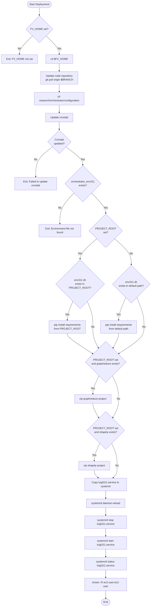
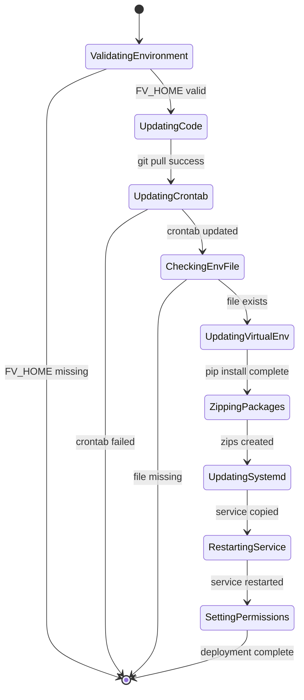

# Diagram: research/orchestrator/deploy311.sh

> Auto-generated by Obscura crawlers

## Diagram 1

### SVG

<svg id="container" width="924.48046875" xmlns="http://www.w3.org/2000/svg" class="flowchart" height="3616.921875" viewBox="0 0 924.48046875 3616.921875" role="graphics-document document" aria-roledescription="flowchart-v2"><g><marker id="container_flowchart-v2-pointEnd" class="marker flowchart-v2" viewBox="0 0 10 10" refX="5" refY="5" markerUnits="userSpaceOnUse" markerWidth="8" markerHeight="8" orient="auto"><path d="M 0 0 L 10 5 L 0 10 z" class="arrowMarkerPath" style="stroke-width: 1; stroke-dasharray: 1, 0;"></path></marker><marker id="container_flowchart-v2-pointStart" class="marker flowchart-v2" viewBox="0 0 10 10" refX="4.5" refY="5" markerUnits="userSpaceOnUse" markerWidth="8" markerHeight="8" orient="auto"><path d="M 0 5 L 10 10 L 10 0 z" class="arrowMarkerPath" style="stroke-width: 1; stroke-dasharray: 1, 0;"></path></marker><marker id="container_flowchart-v2-circleEnd" class="marker flowchart-v2" viewBox="0 0 10 10" refX="11" refY="5" markerUnits="userSpaceOnUse" markerWidth="11" markerHeight="11" orient="auto"><circle cx="5" cy="5" r="5" class="arrowMarkerPath" style="stroke-width: 1; stroke-dasharray: 1, 0;"></circle></marker><marker id="container_flowchart-v2-circleStart" class="marker flowchart-v2" viewBox="0 0 10 10" refX="-1" refY="5" markerUnits="userSpaceOnUse" markerWidth="11" markerHeight="11" orient="auto"><circle cx="5" cy="5" r="5" class="arrowMarkerPath" style="stroke-width: 1; stroke-dasharray: 1, 0;"></circle></marker><marker id="container_flowchart-v2-crossEnd" class="marker cross flowchart-v2" viewBox="0 0 11 11" refX="12" refY="5.2" markerUnits="userSpaceOnUse" markerWidth="11" markerHeight="11" orient="auto"><path d="M 1,1 l 9,9 M 10,1 l -9,9" class="arrowMarkerPath" style="stroke-width: 2; stroke-dasharray: 1, 0;"></path></marker><marker id="container_flowchart-v2-crossStart" class="marker cross flowchart-v2" viewBox="0 0 11 11" refX="-1" refY="5.2" markerUnits="userSpaceOnUse" markerWidth="11" markerHeight="11" orient="auto"><path d="M 1,1 l 9,9 M 10,1 l -9,9" class="arrowMarkerPath" style="stroke-width: 2; stroke-dasharray: 1, 0;"></path></marker><g class="root"><g class="clusters"></g><g class="edgePaths"><path d="M235.313,47.5L235.229,51.583C235.146,55.667,234.979,63.833,234.896,71.417C234.813,79,234.813,86,234.813,89.5L234.813,93" id="L_Start_CheckFVHome_0" class="edge-thickness-normal edge-pattern-solid edge-thickness-normal edge-pattern-solid flowchart-link" style=";" data-edge="true" data-et="edge" data-id="L_Start_CheckFVHome_0" data-points="W3sieCI6MjM1LjMxMjUsInkiOjQ3LjV9LHsieCI6MjM0LjgxMjUsInkiOjcyfSx7IngiOjIzNC44MTI1LCJ5Ijo5N31d" marker-end="url(#container_flowchart-v2-pointEnd)"></path><path d="M195.549,211.94L182.36,224.65C169.171,237.361,142.792,262.782,129.603,280.993C116.414,299.203,116.414,310.203,116.414,315.703L116.414,321.203" id="L_CheckFVHome_ExitFVHome_0" class="edge-thickness-normal edge-pattern-solid edge-thickness-normal edge-pattern-solid flowchart-link" style=";" data-edge="true" data-et="edge" data-id="L_CheckFVHome_ExitFVHome_0" data-points="W3sieCI6MTk1LjU0OTI1NDcxNDgwMTc1LCJ5IjoyMTEuOTM5ODc5NzE0ODAxNzV9LHsieCI6MTE2LjQxNDA2MjUsInkiOjI4OC4yMDMxMjV9LHsieCI6MTE2LjQxNDA2MjUsInkiOjMyNS4yMDMxMjV9XQ==" marker-end="url(#container_flowchart-v2-pointEnd)"></path><path d="M274.076,211.94L287.265,224.65C300.454,237.361,326.833,262.782,340.022,280.993C353.211,299.203,353.211,310.203,353.211,315.703L353.211,321.203" id="L_CheckFVHome_CDHome_0" class="edge-thickness-normal edge-pattern-solid edge-thickness-normal edge-pattern-solid flowchart-link" style=";" data-edge="true" data-et="edge" data-id="L_CheckFVHome_CDHome_0" data-points="W3sieCI6Mjc0LjA3NTc0NTI4NTE5ODI1LCJ5IjoyMTEuOTM5ODc5NzE0ODAxNzV9LHsieCI6MzUzLjIxMDkzNzUsInkiOjI4OC4yMDMxMjV9LHsieCI6MzUzLjIxMDkzNzUsInkiOjMyNS4yMDMxMjV9XQ==" marker-end="url(#container_flowchart-v2-pointEnd)"></path><path d="M353.211,379.203L353.211,383.37C353.211,387.536,353.211,395.87,353.211,403.536C353.211,411.203,353.211,418.203,353.211,421.703L353.211,425.203" id="L_CDHome_UpdateCode_0" class="edge-thickness-normal edge-pattern-solid edge-thickness-normal edge-pattern-solid flowchart-link" style=";" data-edge="true" data-et="edge" data-id="L_CDHome_UpdateCode_0" data-points="W3sieCI6MzUzLjIxMDkzNzUsInkiOjM3OS4yMDMxMjV9LHsieCI6MzUzLjIxMDkzNzUsInkiOjQwNC4yMDMxMjV9LHsieCI6MzUzLjIxMDkzNzUsInkiOjQyOS4yMDMxMjV9XQ==" marker-end="url(#container_flowchart-v2-pointEnd)"></path><path d="M353.211,507.203L353.211,511.37C353.211,515.536,353.211,523.87,353.211,531.536C353.211,539.203,353.211,546.203,353.211,549.703L353.211,553.203" id="L_UpdateCode_CDConfig_0" class="edge-thickness-normal edge-pattern-solid edge-thickness-normal edge-pattern-solid flowchart-link" style=";" data-edge="true" data-et="edge" data-id="L_UpdateCode_CDConfig_0" data-points="W3sieCI6MzUzLjIxMDkzNzUsInkiOjUwNy4yMDMxMjV9LHsieCI6MzUzLjIxMDkzNzUsInkiOjUzMi4yMDMxMjV9LHsieCI6MzUzLjIxMDkzNzUsInkiOjU1Ny4yMDMxMjV9XQ==" marker-end="url(#container_flowchart-v2-pointEnd)"></path><path d="M353.211,635.203L353.211,639.37C353.211,643.536,353.211,651.87,353.211,659.536C353.211,667.203,353.211,674.203,353.211,677.703L353.211,681.203" id="L_CDConfig_UpdateCron_0" class="edge-thickness-normal edge-pattern-solid edge-thickness-normal edge-pattern-solid flowchart-link" style=";" data-edge="true" data-et="edge" data-id="L_CDConfig_UpdateCron_0" data-points="W3sieCI6MzUzLjIxMDkzNzUsInkiOjYzNS4yMDMxMjV9LHsieCI6MzUzLjIxMDkzNzUsInkiOjY2MC4yMDMxMjV9LHsieCI6MzUzLjIxMDkzNzUsInkiOjY4NS4yMDMxMjV9XQ==" marker-end="url(#container_flowchart-v2-pointEnd)"></path><path d="M353.211,739.203L353.211,743.37C353.211,747.536,353.211,755.87,353.211,763.536C353.211,771.203,353.211,778.203,353.211,781.703L353.211,785.203" id="L_UpdateCron_CronCheck_0" class="edge-thickness-normal edge-pattern-solid edge-thickness-normal edge-pattern-solid flowchart-link" style=";" data-edge="true" data-et="edge" data-id="L_UpdateCron_CronCheck_0" data-points="W3sieCI6MzUzLjIxMDkzNzUsInkiOjczOS4yMDMxMjV9LHsieCI6MzUzLjIxMDkzNzUsInkiOjc2NC4yMDMxMjV9LHsieCI6MzUzLjIxMDkzNzUsInkiOjc4OS4yMDMxMjV9XQ==" marker-end="url(#container_flowchart-v2-pointEnd)"></path><path d="M311.617,893.875L294.342,906.974C277.066,920.073,242.516,946.271,225.24,976.785C207.965,1007.299,207.965,1042.13,207.965,1059.546L207.965,1076.961" id="L_CronCheck_ExitCron_0" class="edge-thickness-normal edge-pattern-solid edge-thickness-normal edge-pattern-solid flowchart-link" style=";" data-edge="true" data-et="edge" data-id="L_CronCheck_ExitCron_0" data-points="W3sieCI6MzExLjYxNjgzOTE1OTc5NjI2LCJ5Ijo4OTMuODc0NjUxNjU5Nzk2M30seyJ4IjoyMDcuOTY0ODQzNzUsInkiOjk3Mi40Njg3NX0seyJ4IjoyMDcuOTY0ODQzNzUsInkiOjEwODAuOTYwOTM3NX1d" marker-end="url(#container_flowchart-v2-pointEnd)"></path><path d="M394.805,893.875L412.08,906.974C429.356,920.073,463.906,946.271,481.182,964.87C498.457,983.469,498.457,994.469,498.457,999.969L498.457,1005.469" id="L_CronCheck_CheckEnvFile_0" class="edge-thickness-normal edge-pattern-solid edge-thickness-normal edge-pattern-solid flowchart-link" style=";" data-edge="true" data-et="edge" data-id="L_CronCheck_CheckEnvFile_0" data-points="W3sieCI6Mzk0LjgwNTAzNTg0MDIwMzc0LCJ5Ijo4OTMuODc0NjUxNjU5Nzk2M30seyJ4Ijo0OTguNDU3MDMxMjUsInkiOjk3Mi40Njg3NX0seyJ4Ijo0OTguNDU3MDMxMjUsInkiOjEwMDkuNDY4NzV9XQ==" marker-end="url(#container_flowchart-v2-pointEnd)"></path><path d="M445.4,1177.396L431.534,1192.405C417.669,1207.415,389.938,1237.434,376.073,1266.86C362.207,1296.286,362.207,1325.12,362.207,1339.536L362.207,1353.953" id="L_CheckEnvFile_ExitEnv_0" class="edge-thickness-normal edge-pattern-solid edge-thickness-normal edge-pattern-solid flowchart-link" style=";" data-edge="true" data-et="edge" data-id="L_CheckEnvFile_ExitEnv_0" data-points="W3sieCI6NDQ1LjM5OTg1MDQzNTU1MDI2LCJ5IjoxMTc3LjM5NTk0NDE4NTU1MDJ9LHsieCI6MzYyLjIwNzAzMTI1LCJ5IjoxMjY3LjQ1MzEyNX0seyJ4IjozNjIuMjA3MDMxMjUsInkiOjEzNTcuOTUzMTI1fV0=" marker-end="url(#container_flowchart-v2-pointEnd)"></path><path d="M551.514,1177.396L565.38,1192.405C579.245,1207.415,606.976,1237.434,620.842,1257.944C634.707,1278.453,634.707,1289.453,634.707,1294.953L634.707,1300.453" id="L_CheckEnvFile_CheckProjectRoot_0" class="edge-thickness-normal edge-pattern-solid edge-thickness-normal edge-pattern-solid flowchart-link" style=";" data-edge="true" data-et="edge" data-id="L_CheckEnvFile_CheckProjectRoot_0" data-points="W3sieCI6NTUxLjUxNDIxMjA2NDQ0OTgsInkiOjExNzcuMzk1OTQ0MTg1NTUwMn0seyJ4Ijo2MzQuNzA3MDMxMjUsInkiOjEyNjcuNDUzMTI1fSx7IngiOjYzNC43MDcwMzEyNSwieSI6MTMwNC40NTMxMjV9XQ==" marker-end="url(#container_flowchart-v2-pointEnd)"></path><path d="M583.264,1438.01L564.795,1452.751C546.326,1467.491,509.388,1496.972,490.918,1517.213C472.449,1537.453,472.449,1548.453,472.449,1553.953L472.449,1559.453" id="L_CheckProjectRoot_CheckEnvPR_0" class="edge-thickness-normal edge-pattern-solid edge-thickness-normal edge-pattern-solid flowchart-link" style=";" data-edge="true" data-et="edge" data-id="L_CheckProjectRoot_CheckEnvPR_0" data-points="W3sieCI6NTgzLjI2NDIwMDg4NDQ4OTIsInkiOjE0MzguMDEwMjk0NjM0NDg5MX0seyJ4Ijo0NzIuNDQ5MjE4NzUsInkiOjE1MjYuNDUzMTI1fSx7IngiOjQ3Mi40NDkyMTg3NSwieSI6MTU2My40NTMxMjV9XQ==" marker-end="url(#container_flowchart-v2-pointEnd)"></path><path d="M686.15,1438.01L704.619,1452.751C723.088,1467.491,760.027,1496.972,778.496,1518.733C796.965,1540.495,796.965,1554.536,796.965,1561.557L796.965,1568.578" id="L_CheckProjectRoot_CheckEnvDefault_0" class="edge-thickness-normal edge-pattern-solid edge-thickness-normal edge-pattern-solid flowchart-link" style=";" data-edge="true" data-et="edge" data-id="L_CheckProjectRoot_CheckEnvDefault_0" data-points="W3sieCI6Njg2LjE0OTg2MTYxNTUxMDgsInkiOjE0MzguMDEwMjk0NjM0NDg5MX0seyJ4Ijo3OTYuOTY0ODQzNzUsInkiOjE1MjYuNDUzMTI1fSx7IngiOjc5Ni45NjQ4NDM3NSwieSI6MTU3Mi41NzgxMjV9XQ==" marker-end="url(#container_flowchart-v2-pointEnd)"></path><path d="M430.236,1777.521L423.75,1790.723C417.264,1803.925,404.292,1830.33,397.806,1849.032C391.32,1867.734,391.32,1878.734,391.32,1884.234L391.32,1889.734" id="L_CheckEnvPR_InstallReqPR_0" class="edge-thickness-normal edge-pattern-solid edge-thickness-normal edge-pattern-solid flowchart-link" style=";" data-edge="true" data-et="edge" data-id="L_CheckEnvPR_InstallReqPR_0" data-points="W3sieCI6NDMwLjIzNTY3ODU3MDM2NjQsInkiOjE3NzcuNTIwODM0ODIwMzY2NH0seyJ4IjozOTEuMzIwMzEyNSwieSI6MTg1Ni43MzQzNzV9LHsieCI6MzkxLjMyMDMxMjUsInkiOjE4OTMuNzM0Mzc1fV0=" marker-end="url(#container_flowchart-v2-pointEnd)"></path><path d="M514.663,1777.521L521.149,1790.723C527.635,1803.925,540.606,1830.33,547.092,1856.199C553.578,1882.068,553.578,1907.401,553.578,1930.734C553.578,1954.068,553.578,1975.401,559.427,1997.005C565.275,2018.609,576.972,2040.484,582.821,2051.421L588.669,2062.358" id="L_CheckEnvPR_ZipGraphReduce_0" class="edge-thickness-normal edge-pattern-solid edge-thickness-normal edge-pattern-solid flowchart-link" style=";" data-edge="true" data-et="edge" data-id="L_CheckEnvPR_ZipGraphReduce_0" data-points="W3sieCI6NTE0LjY2Mjc1ODkyOTYzMzYsInkiOjE3NzcuNTIwODM0ODIwMzY2NH0seyJ4Ijo1NTMuNTc4MTI1LCJ5IjoxODU2LjczNDM3NX0seyJ4Ijo1NTMuNTc4MTI1LCJ5IjoxOTMyLjczNDM3NX0seyJ4Ijo1NTMuNTc4MTI1LCJ5IjoxOTk2LjczNDM3NX0seyJ4Ijo1OTAuNTU1NjE1ODgwNjc2NiwieSI6MjA2NS44ODU3OTAzNjkzMjMzfV0=" marker-end="url(#container_flowchart-v2-pointEnd)"></path><path d="M757.757,1771.402L750.77,1785.624C743.784,1799.846,729.81,1828.29,722.823,1848.012C715.836,1867.734,715.836,1878.734,715.836,1884.234L715.836,1889.734" id="L_CheckEnvDefault_InstallReqDefault_0" class="edge-thickness-normal edge-pattern-solid edge-thickness-normal edge-pattern-solid flowchart-link" style=";" data-edge="true" data-et="edge" data-id="L_CheckEnvDefault_InstallReqDefault_0" data-points="W3sieCI6NzU3Ljc1NzM2NDcxNzE2NjMsInkiOjE3NzEuNDAxODk1OTY3MTY2NH0seyJ4Ijo3MTUuODM1OTM3NSwieSI6MTg1Ni43MzQzNzV9LHsieCI6NzE1LjgzNTkzNzUsInkiOjE4OTMuNzM0Mzc1fV0=" marker-end="url(#container_flowchart-v2-pointEnd)"></path><path d="M836.172,1771.402L843.159,1785.624C850.146,1799.846,864.12,1828.29,871.107,1855.179C878.094,1882.068,878.094,1907.401,878.094,1930.734C878.094,1954.068,878.094,1975.401,851.105,2002.892C824.116,2030.382,770.138,2064.03,743.15,2080.854L716.161,2097.678" id="L_CheckEnvDefault_ZipGraphReduce_0" class="edge-thickness-normal edge-pattern-solid edge-thickness-normal edge-pattern-solid flowchart-link" style=";" data-edge="true" data-et="edge" data-id="L_CheckEnvDefault_ZipGraphReduce_0" data-points="W3sieCI6ODM2LjE3MjMyMjc4MjgzMzcsInkiOjE3NzEuNDAxODk1OTY3MTY2NH0seyJ4Ijo4NzguMDkzNzUsInkiOjE4NTYuNzM0Mzc1fSx7IngiOjg3OC4wOTM3NSwieSI6MTkzMi43MzQzNzV9LHsieCI6ODc4LjA5Mzc1LCJ5IjoxOTk2LjczNDM3NX0seyJ4Ijo3MTIuNzY2MzQyNTEyMzIxMiwieSI6MjA5OS43OTM2ODYyNjIzMjF9XQ==" marker-end="url(#container_flowchart-v2-pointEnd)"></path><path d="M391.32,1971.734L391.32,1975.901C391.32,1980.068,391.32,1988.401,418.309,2009.392C445.298,2030.382,499.276,2064.03,526.264,2080.854L553.253,2097.678" id="L_InstallReqPR_ZipGraphReduce_0" class="edge-thickness-normal edge-pattern-solid edge-thickness-normal edge-pattern-solid flowchart-link" style=";" data-edge="true" data-et="edge" data-id="L_InstallReqPR_ZipGraphReduce_0" data-points="W3sieCI6MzkxLjMyMDMxMjUsInkiOjE5NzEuNzM0Mzc1fSx7IngiOjM5MS4zMjAzMTI1LCJ5IjoxOTk2LjczNDM3NX0seyJ4Ijo1NTYuNjQ3NzE5OTg3Njc4OCwieSI6MjA5OS43OTM2ODYyNjIzMjF9XQ==" marker-end="url(#container_flowchart-v2-pointEnd)"></path><path d="M715.836,1971.734L715.836,1975.901C715.836,1980.068,715.836,1988.401,709.987,2003.505C704.139,2018.609,692.442,2040.484,686.593,2051.421L680.745,2062.358" id="L_InstallReqDefault_ZipGraphReduce_0" class="edge-thickness-normal edge-pattern-solid edge-thickness-normal edge-pattern-solid flowchart-link" style=";" data-edge="true" data-et="edge" data-id="L_InstallReqDefault_ZipGraphReduce_0" data-points="W3sieCI6NzE1LjgzNTkzNzUsInkiOjE5NzEuNzM0Mzc1fSx7IngiOjcxNS44MzU5Mzc1LCJ5IjoxOTk2LjczNDM3NX0seyJ4Ijo2NzguODU4NDQ2NjE5MzIzNCwieSI6MjA2NS44ODU3OTAzNjkzMjMzfV0=" marker-end="url(#container_flowchart-v2-pointEnd)"></path><path d="M592.954,2233.419L586.504,2246.544C580.054,2259.67,567.154,2285.921,560.704,2304.546C554.254,2323.172,554.254,2334.172,554.254,2339.672L554.254,2345.172" id="L_ZipGraphReduce_ZipGR_0" class="edge-thickness-normal edge-pattern-solid edge-thickness-normal edge-pattern-solid flowchart-link" style=";" data-edge="true" data-et="edge" data-id="L_ZipGraphReduce_ZipGR_0" data-points="W3sieCI6NTkyLjk1Mzk4NTYzOTgzODIsInkiOjIyMzMuNDE4ODI5Mzg5ODM4M30seyJ4Ijo1NTQuMjUzOTA2MjUsInkiOjIzMTIuMTcxODc1fSx7IngiOjU1NC4yNTM5MDYyNSwieSI6MjM0OS4xNzE4NzV9XQ==" marker-end="url(#container_flowchart-v2-pointEnd)"></path><path d="M676.46,2233.419L682.91,2246.544C689.36,2259.67,702.26,2285.921,708.71,2309.713C715.16,2333.505,715.16,2354.839,715.16,2374.172C715.16,2393.505,715.16,2410.839,708.921,2429.927C702.681,2449.015,690.202,2469.858,683.962,2480.279L677.723,2490.701" id="L_ZipGraphReduce_ZipShapely_0" class="edge-thickness-normal edge-pattern-solid edge-thickness-normal edge-pattern-solid flowchart-link" style=";" data-edge="true" data-et="edge" data-id="L_ZipGraphReduce_ZipShapely_0" data-points="W3sieCI6Njc2LjQ2MDA3Njg2MDE2MTgsInkiOjIyMzMuNDE4ODI5Mzg5ODM4M30seyJ4Ijo3MTUuMTYwMTU2MjUsInkiOjIzMTIuMTcxODc1fSx7IngiOjcxNS4xNjAxNTYyNSwieSI6MjM3Ni4xNzE4NzV9LHsieCI6NzE1LjE2MDE1NjI1LCJ5IjoyNDI4LjE3MTg3NX0seyJ4Ijo2NzUuNjY3OTY0NzcyNDM4LCJ5IjoyNDk0LjEzMjgwODUyMjQzOH1d" marker-end="url(#container_flowchart-v2-pointEnd)"></path><path d="M554.254,2403.172L554.254,2407.339C554.254,2411.505,554.254,2419.839,560.493,2434.427C566.733,2449.015,579.212,2469.858,585.452,2480.279L591.691,2490.701" id="L_ZipGR_ZipShapely_0" class="edge-thickness-normal edge-pattern-solid edge-thickness-normal edge-pattern-solid flowchart-link" style=";" data-edge="true" data-et="edge" data-id="L_ZipGR_ZipShapely_0" data-points="W3sieCI6NTU0LjI1MzkwNjI1LCJ5IjoyNDAzLjE3MTg3NX0seyJ4Ijo1NTQuMjUzOTA2MjUsInkiOjI0MjguMTcxODc1fSx7IngiOjU5My43NDYwOTc3Mjc1NjIsInkiOjI0OTQuMTMyODA4NTIyNDM4fV0=" marker-end="url(#container_flowchart-v2-pointEnd)"></path><path d="M598.719,2635.934L592.753,2648.098C586.788,2660.263,574.857,2684.592,568.891,2702.257C562.926,2719.922,562.926,2730.922,562.926,2736.422L562.926,2741.922" id="L_ZipShapely_ZipSH_0" class="edge-thickness-normal edge-pattern-solid edge-thickness-normal edge-pattern-solid flowchart-link" style=";" data-edge="true" data-et="edge" data-id="L_ZipShapely_ZipSH_0" data-points="W3sieCI6NTk4LjcxODcyMzcwMDkzODMsInkiOjI2MzUuOTMzNTY3NDUwOTM4NH0seyJ4Ijo1NjIuOTI1NzgxMjUsInkiOjI3MDguOTIxODc1fSx7IngiOjU2Mi45MjU3ODEyNSwieSI6Mjc0NS45MjE4NzV9XQ==" marker-end="url(#container_flowchart-v2-pointEnd)"></path><path d="M670.695,2635.934L676.661,2648.098C682.626,2660.263,694.557,2684.592,700.523,2707.424C706.488,2730.255,706.488,2751.589,706.488,2770.922C706.488,2790.255,706.488,2807.589,702.313,2819.978C698.137,2832.368,689.786,2839.814,685.61,2843.537L681.434,2847.26" id="L_ZipShapely_UpdateService_0" class="edge-thickness-normal edge-pattern-solid edge-thickness-normal edge-pattern-solid flowchart-link" style=";" data-edge="true" data-et="edge" data-id="L_ZipShapely_UpdateService_0" data-points="W3sieCI6NjcwLjY5NTMzODc5OTA2MTcsInkiOjI2MzUuOTMzNTY3NDUwOTM4NH0seyJ4Ijo3MDYuNDg4MjgxMjUsInkiOjI3MDguOTIxODc1fSx7IngiOjcwNi40ODgyODEyNSwieSI6Mjc3Mi45MjE4NzV9LHsieCI6NzA2LjQ4ODI4MTI1LCJ5IjoyODI0LjkyMTg3NX0seyJ4Ijo2NzguNDQ4NzMwNDY4NzUsInkiOjI4NDkuOTIxODc1fV0=" marker-end="url(#container_flowchart-v2-pointEnd)"></path><path d="M562.926,2799.922L562.926,2804.089C562.926,2808.255,562.926,2816.589,567.101,2824.478C571.277,2832.368,579.628,2839.814,583.804,2843.537L587.98,2847.26" id="L_ZipSH_UpdateService_0" class="edge-thickness-normal edge-pattern-solid edge-thickness-normal edge-pattern-solid flowchart-link" style=";" data-edge="true" data-et="edge" data-id="L_ZipSH_UpdateService_0" data-points="W3sieCI6NTYyLjkyNTc4MTI1LCJ5IjoyNzk5LjkyMTg3NX0seyJ4Ijo1NjIuOTI1NzgxMjUsInkiOjI4MjQuOTIxODc1fSx7IngiOjU5MC45NjUzMzIwMzEyNSwieSI6Mjg0OS45MjE4NzV9XQ==" marker-end="url(#container_flowchart-v2-pointEnd)"></path><path d="M634.707,2927.922L634.707,2932.089C634.707,2936.255,634.707,2944.589,634.707,2952.255C634.707,2959.922,634.707,2966.922,634.707,2970.422L634.707,2973.922" id="L_UpdateService_Reload_0" class="edge-thickness-normal edge-pattern-solid edge-thickness-normal edge-pattern-solid flowchart-link" style=";" data-edge="true" data-et="edge" data-id="L_UpdateService_Reload_0" data-points="W3sieCI6NjM0LjcwNzAzMTI1LCJ5IjoyOTI3LjkyMTg3NX0seyJ4Ijo2MzQuNzA3MDMxMjUsInkiOjI5NTIuOTIxODc1fSx7IngiOjYzNC43MDcwMzEyNSwieSI6Mjk3Ny45MjE4NzV9XQ==" marker-end="url(#container_flowchart-v2-pointEnd)"></path><path d="M634.707,3031.922L634.707,3036.089C634.707,3040.255,634.707,3048.589,634.707,3056.255C634.707,3063.922,634.707,3070.922,634.707,3074.422L634.707,3077.922" id="L_Reload_Stop_0" class="edge-thickness-normal edge-pattern-solid edge-thickness-normal edge-pattern-solid flowchart-link" style=";" data-edge="true" data-et="edge" data-id="L_Reload_Stop_0" data-points="W3sieCI6NjM0LjcwNzAzMTI1LCJ5IjozMDMxLjkyMTg3NX0seyJ4Ijo2MzQuNzA3MDMxMjUsInkiOjMwNTYuOTIxODc1fSx7IngiOjYzNC43MDcwMzEyNSwieSI6MzA4MS45MjE4NzV9XQ==" marker-end="url(#container_flowchart-v2-pointEnd)"></path><path d="M634.707,3159.922L634.707,3164.089C634.707,3168.255,634.707,3176.589,634.707,3184.255C634.707,3191.922,634.707,3198.922,634.707,3202.422L634.707,3205.922" id="L_Stop_StartSvc_0" class="edge-thickness-normal edge-pattern-solid edge-thickness-normal edge-pattern-solid flowchart-link" style=";" data-edge="true" data-et="edge" data-id="L_Stop_StartSvc_0" data-points="W3sieCI6NjM0LjcwNzAzMTI1LCJ5IjozMTU5LjkyMTg3NX0seyJ4Ijo2MzQuNzA3MDMxMjUsInkiOjMxODQuOTIxODc1fSx7IngiOjYzNC43MDcwMzEyNSwieSI6MzIwOS45MjE4NzV9XQ==" marker-end="url(#container_flowchart-v2-pointEnd)"></path><path d="M634.707,3287.922L634.707,3292.089C634.707,3296.255,634.707,3304.589,634.707,3312.255C634.707,3319.922,634.707,3326.922,634.707,3330.422L634.707,3333.922" id="L_StartSvc_Status_0" class="edge-thickness-normal edge-pattern-solid edge-thickness-normal edge-pattern-solid flowchart-link" style=";" data-edge="true" data-et="edge" data-id="L_StartSvc_Status_0" data-points="W3sieCI6NjM0LjcwNzAzMTI1LCJ5IjozMjg3LjkyMTg3NX0seyJ4Ijo2MzQuNzA3MDMxMjUsInkiOjMzMTIuOTIxODc1fSx7IngiOjYzNC43MDcwMzEyNSwieSI6MzMzNy45MjE4NzV9XQ==" marker-end="url(#container_flowchart-v2-pointEnd)"></path><path d="M634.707,3415.922L634.707,3420.089C634.707,3424.255,634.707,3432.589,634.707,3440.255C634.707,3447.922,634.707,3454.922,634.707,3458.422L634.707,3461.922" id="L_Status_Chown_0" class="edge-thickness-normal edge-pattern-solid edge-thickness-normal edge-pattern-solid flowchart-link" style=";" data-edge="true" data-et="edge" data-id="L_Status_Chown_0" data-points="W3sieCI6NjM0LjcwNzAzMTI1LCJ5IjozNDE1LjkyMTg3NX0seyJ4Ijo2MzQuNzA3MDMxMjUsInkiOjM0NDAuOTIxODc1fSx7IngiOjYzNC43MDcwMzEyNSwieSI6MzQ2NS45MjE4NzV9XQ==" marker-end="url(#container_flowchart-v2-pointEnd)"></path><path d="M634.707,3519.922L634.707,3524.089C634.707,3528.255,634.707,3536.589,634.777,3544.339C634.848,3552.089,634.988,3559.256,635.058,3562.839L635.129,3566.423" id="L_Chown_End_0" class="edge-thickness-normal edge-pattern-solid edge-thickness-normal edge-pattern-solid flowchart-link" style=";" data-edge="true" data-et="edge" data-id="L_Chown_End_0" data-points="W3sieCI6NjM0LjcwNzAzMTI1LCJ5IjozNTE5LjkyMTg3NX0seyJ4Ijo2MzQuNzA3MDMxMjUsInkiOjM1NDQuOTIxODc1fSx7IngiOjYzNS4yMDcwMzEyNSwieSI6MzU3MC40MjE4NzV9XQ==" marker-end="url(#container_flowchart-v2-pointEnd)"></path></g><g class="edgeLabels"><g class="edgeLabel"><g class="label" data-id="L_Start_CheckFVHome_0" transform="translate(0, 0)"><foreignObject width="0" height="0">

</foreignObject></g></g><g class="edgeLabel" transform="translate(116.4140625, 288.203125)"><g class="label" data-id="L_CheckFVHome_ExitFVHome_0" transform="translate(-10.140625, -12)"><foreignObject width="20.28125" height="24">

No

</foreignObject></g></g><g class="edgeLabel" transform="translate(353.2109375, 288.203125)"><g class="label" data-id="L_CheckFVHome_CDHome_0" transform="translate(-12.03125, -12)"><foreignObject width="24.0625" height="24">

Yes

</foreignObject></g></g><g class="edgeLabel"><g class="label" data-id="L_CDHome_UpdateCode_0" transform="translate(0, 0)"><foreignObject width="0" height="0">

</foreignObject></g></g><g class="edgeLabel"><g class="label" data-id="L_UpdateCode_CDConfig_0" transform="translate(0, 0)"><foreignObject width="0" height="0">

</foreignObject></g></g><g class="edgeLabel"><g class="label" data-id="L_CDConfig_UpdateCron_0" transform="translate(0, 0)"><foreignObject width="0" height="0">

</foreignObject></g></g><g class="edgeLabel"><g class="label" data-id="L_UpdateCron_CronCheck_0" transform="translate(0, 0)"><foreignObject width="0" height="0">

</foreignObject></g></g><g class="edgeLabel" transform="translate(207.96484375, 972.46875)"><g class="label" data-id="L_CronCheck_ExitCron_0" transform="translate(-10.140625, -12)"><foreignObject width="20.28125" height="24">

No

</foreignObject></g></g><g class="edgeLabel" transform="translate(498.45703125, 972.46875)"><g class="label" data-id="L_CronCheck_CheckEnvFile_0" transform="translate(-12.03125, -12)"><foreignObject width="24.0625" height="24">

Yes

</foreignObject></g></g><g class="edgeLabel" transform="translate(362.20703125, 1267.453125)"><g class="label" data-id="L_CheckEnvFile_ExitEnv_0" transform="translate(-10.140625, -12)"><foreignObject width="20.28125" height="24">

No

</foreignObject></g></g><g class="edgeLabel" transform="translate(634.70703125, 1267.453125)"><g class="label" data-id="L_CheckEnvFile_CheckProjectRoot_0" transform="translate(-12.03125, -12)"><foreignObject width="24.0625" height="24">

Yes

</foreignObject></g></g><g class="edgeLabel" transform="translate(472.44921875, 1526.453125)"><g class="label" data-id="L_CheckProjectRoot_CheckEnvPR_0" transform="translate(-12.03125, -12)"><foreignObject width="24.0625" height="24">

Yes

</foreignObject></g></g><g class="edgeLabel" transform="translate(796.96484375, 1526.453125)"><g class="label" data-id="L_CheckProjectRoot_CheckEnvDefault_0" transform="translate(-10.140625, -12)"><foreignObject width="20.28125" height="24">

No

</foreignObject></g></g><g class="edgeLabel" transform="translate(391.3203125, 1856.734375)"><g class="label" data-id="L_CheckEnvPR_InstallReqPR_0" transform="translate(-12.03125, -12)"><foreignObject width="24.0625" height="24">

Yes

</foreignObject></g></g><g class="edgeLabel" transform="translate(553.578125, 1932.734375)"><g class="label" data-id="L_CheckEnvPR_ZipGraphReduce_0" transform="translate(-10.140625, -12)"><foreignObject width="20.28125" height="24">

No

</foreignObject></g></g><g class="edgeLabel" transform="translate(715.8359375, 1856.734375)"><g class="label" data-id="L_CheckEnvDefault_InstallReqDefault_0" transform="translate(-12.03125, -12)"><foreignObject width="24.0625" height="24">

Yes

</foreignObject></g></g><g class="edgeLabel" transform="translate(878.09375, 1932.734375)"><g class="label" data-id="L_CheckEnvDefault_ZipGraphReduce_0" transform="translate(-10.140625, -12)"><foreignObject width="20.28125" height="24">

No

</foreignObject></g></g><g class="edgeLabel"><g class="label" data-id="L_InstallReqPR_ZipGraphReduce_0" transform="translate(0, 0)"><foreignObject width="0" height="0">

</foreignObject></g></g><g class="edgeLabel"><g class="label" data-id="L_InstallReqDefault_ZipGraphReduce_0" transform="translate(0, 0)"><foreignObject width="0" height="0">

</foreignObject></g></g><g class="edgeLabel" transform="translate(554.25390625, 2312.171875)"><g class="label" data-id="L_ZipGraphReduce_ZipGR_0" transform="translate(-12.03125, -12)"><foreignObject width="24.0625" height="24">

Yes

</foreignObject></g></g><g class="edgeLabel" transform="translate(715.16015625, 2376.171875)"><g class="label" data-id="L_ZipGraphReduce_ZipShapely_0" transform="translate(-10.140625, -12)"><foreignObject width="20.28125" height="24">

No

</foreignObject></g></g><g class="edgeLabel"><g class="label" data-id="L_ZipGR_ZipShapely_0" transform="translate(0, 0)"><foreignObject width="0" height="0">

</foreignObject></g></g><g class="edgeLabel" transform="translate(562.92578125, 2708.921875)"><g class="label" data-id="L_ZipShapely_ZipSH_0" transform="translate(-12.03125, -12)"><foreignObject width="24.0625" height="24">

Yes

</foreignObject></g></g><g class="edgeLabel" transform="translate(706.48828125, 2772.921875)"><g class="label" data-id="L_ZipShapely_UpdateService_0" transform="translate(-10.140625, -12)"><foreignObject width="20.28125" height="24">

No

</foreignObject></g></g><g class="edgeLabel"><g class="label" data-id="L_ZipSH_UpdateService_0" transform="translate(0, 0)"><foreignObject width="0" height="0">

</foreignObject></g></g><g class="edgeLabel"><g class="label" data-id="L_UpdateService_Reload_0" transform="translate(0, 0)"><foreignObject width="0" height="0">

</foreignObject></g></g><g class="edgeLabel"><g class="label" data-id="L_Reload_Stop_0" transform="translate(0, 0)"><foreignObject width="0" height="0">

</foreignObject></g></g><g class="edgeLabel"><g class="label" data-id="L_Stop_StartSvc_0" transform="translate(0, 0)"><foreignObject width="0" height="0">

</foreignObject></g></g><g class="edgeLabel"><g class="label" data-id="L_StartSvc_Status_0" transform="translate(0, 0)"><foreignObject width="0" height="0">

</foreignObject></g></g><g class="edgeLabel"><g class="label" data-id="L_Status_Chown_0" transform="translate(0, 0)"><foreignObject width="0" height="0">

</foreignObject></g></g><g class="edgeLabel"><g class="label" data-id="L_Chown_End_0" transform="translate(0, 0)"><foreignObject width="0" height="0">

</foreignObject></g></g></g><g class="nodes"><g class="node default" id="flowchart-Start-0" transform="translate(234.8125, 27.5)"><g class="basic label-container outer-path"><path d="M-56.453125 -19.5 C-16.87961202468901 -19.5, 22.69390095062198 -19.5, 56.453125 -19.5 C56.453125 -19.5, 56.453125 -19.5, 56.453125 -19.5 C56.89461846967955 -19.485842163742284, 57.33611193935909 -19.471684327484567, 57.7024942896239 -19.45993515863156 C57.98887437084007 -19.432308416619072, 58.27525445205624 -19.404681674606586, 58.946729652847864 -19.3399052695533 C59.35140571791799 -19.274480381662517, 59.75608178298812 -19.209055493771736, 60.18071825967676 -19.140403561325776 C60.65416362913435 -19.032342745266845, 61.127608998591946 -18.92428192920792, 61.39938938623539 -18.862249829261074 C61.818112019246996 -18.737975149703182, 62.236834652258594 -18.613700470145293, 62.597735251460605 -18.50658706670804 C63.04627649738186 -18.341519741939194, 63.49481774330311 -18.176452417170346, 63.7708315951478 -18.074876768247425 C64.19168061991314 -17.88857938902657, 64.61252964467847 -17.702282009805714, 64.91385791279238 -17.568892924097174 C65.18021181146845 -17.429936265765686, 65.44656571014451 -17.290979607434195, 66.02211726407678 -16.990714730406097 C66.26220030579921 -16.845174979629405, 66.50228334752164 -16.69963522885271, 67.0910555736057 -16.342718045390892 C67.42653233189705 -16.108703981361646, 67.76200909018841 -15.874689917332402, 68.11628034457871 -15.627565626425154 C68.31816474199826 -15.46656819185251, 68.5200491394178 -15.305570757279867, 69.09357870850187 -14.848196188198123 C69.36511843580314 -14.601590992410593, 69.63665816310441 -14.354985796623064, 70.01893473676799 -14.007812326905688 C70.21514423630211 -13.805209909537215, 70.41135373583622 -13.60260749216874, 70.88854594296865 -13.10986736009568 C71.18939640019487 -12.756471294161791, 71.49024685742108 -12.403075228227902, 71.69883890812658 -12.158051136245305 C71.98422690972573 -11.77565721348423, 72.26961491132491 -11.393263290723155, 72.44648396464063 -11.156274872382312 C72.63307870872 -10.869615237771866, 72.81967345279939 -10.582955603161421, 73.12840887860425 -10.108655082055241 C73.29367242489295 -9.815212920870952, 73.45893597118163 -9.521770759686662, 73.7418114742735 -9.019496659696287 C73.89638787810068 -8.698515449743946, 74.05096428192786 -8.377534239791604, 74.28417114880834 -7.893275190886684 C74.46309165049969 -7.451338092516474, 74.64201215219104 -7.009400994146264, 74.75325922997033 -6.734618561215508 C74.86081123093794 -6.410689070385299, 74.96836323190554 -6.086759579555089, 75.14714813421489 -5.548287939305138 C75.21770379886011 -5.279228610994369, 75.28825946350536 -5.0101692826836, 75.46421928754556 -4.339158212148133 C75.53274062771276 -3.9873156123799833, 75.60126196787994 -3.635473012611834, 75.70316977658177 -3.1121979531509023 C75.76111019976062 -2.6628234726064903, 75.81905062293946 -2.2134489920620783, 75.86301770250937 -1.872449005199798 C75.88878866477627 -1.4710454659464347, 75.91455962704318 -1.0696419266930715, 75.94310621591342 -0.6250057626472757 C75.94310621591342 -0.1929812995967099, 75.94310621591342 0.2390431634538559, 75.94310621591342 0.625005762647271 C75.92113617662046 0.9672068585315763, 75.89916613732751 1.3094079544158814, 75.86301770250937 1.8724490051997846 C75.82122140279341 2.196612852183774, 75.77942510307746 2.5207766991677625, 75.70316977658177 3.1121979531508885 C75.62351436421086 3.521211660498134, 75.54385895183997 3.930225367845379, 75.46421928754556 4.339158212148129 C75.38942731207736 4.624372429655592, 75.31463533660916 4.909586647163056, 75.14714813421489 5.548287939305125 C75.02435930448473 5.918108330709137, 74.90157047475458 6.287928722113149, 74.75325922997033 6.734618561215495 C74.63085407955093 7.0369616492939855, 74.50844892913153 7.339304737372477, 74.28417114880834 7.893275190886679 C74.15907359898503 8.153042929753544, 74.03397604916174 8.41281066862041, 73.7418114742735 9.019496659696284 C73.60084456896163 9.26979767452455, 73.45987766364975 9.520098689352817, 73.12840887860425 10.108655082055236 C72.86521085254324 10.512997928650872, 72.60201282648224 10.917340775246508, 72.44648396464065 11.156274872382301 C72.19020615592608 11.49966378867115, 71.9339283472115 11.843052704959996, 71.69883890812659 12.158051136245302 C71.50305957567856 12.388024680298356, 71.30728024323054 12.61799822435141, 70.88854594296866 13.10986736009567 C70.58255940746353 13.42582357996649, 70.2765728719584 13.741779799837309, 70.01893473676799 14.007812326905684 C69.71749077987059 14.281575752789863, 69.4160468229732 14.555339178674041, 69.0935787085019 14.848196188198111 C68.75209464233754 15.120520643691538, 68.41061057617318 15.392845099184964, 68.11628034457871 15.627565626425152 C67.74878305525779 15.883915826754176, 67.38128576593687 16.1402660270832, 67.0910555736057 16.34271804539089 C66.78373302139691 16.529018782567636, 66.47641046918814 16.715319519744384, 66.02211726407678 16.990714730406093 C65.76115461573346 17.126858776892252, 65.50019196739014 17.263002823378407, 64.91385791279238 17.56889292409717 C64.60059900114844 17.707563351786494, 64.2873400895045 17.84623377947582, 63.770831595147804 18.07487676824742 C63.452376112054544 18.192071329795954, 63.13392062896129 18.309265891344488, 62.59773525146062 18.506587066708033 C62.35265822956947 18.579324640369787, 62.10758120767832 18.65206221403154, 61.39938938623541 18.86224982926107 C61.06231248782785 18.939185431690266, 60.72523558942029 19.016121034119465, 60.180718259676766 19.140403561325773 C59.713669944193754 19.215912310959286, 59.24662162871075 19.291421060592796, 58.94672965284788 19.3399052695533 C58.54079753633924 19.37906505262809, 58.13486541983061 19.41822483570288, 57.7024942896239 19.45993515863156 C57.20717085638058 19.475819217047096, 56.71184742313726 19.491703275462633, 56.45312500000001 19.5 C56.45312500000001 19.5, 56.453125 19.5, 56.453125 19.5 C21.71693318161998 19.5, -13.019258636760043 19.5, -56.45312499999999 19.5 C-56.84292694600431 19.487499810295102, -57.23272889200863 19.474999620590204, -57.70249428962389 19.45993515863156 C-57.95558192580393 19.435520098751685, -58.20866956198398 19.411105038871813, -58.94672965284787 19.3399052695533 C-59.29382310619686 19.283789891765764, -59.64091655954585 19.227674513978233, -60.18071825967676 19.140403561325773 C-60.42778267960302 19.084012719723617, -60.67484709952927 19.02762187812146, -61.399389386235384 18.862249829261074 C-61.663621262186155 18.783827195460304, -61.927853138136925 18.705404561659538, -62.59773525146059 18.506587066708043 C-62.9874256017823 18.363177415531545, -63.377115952104 18.219767764355048, -63.7708315951478 18.074876768247425 C-64.12394162147534 17.91856543422899, -64.47705164780287 17.762254100210555, -64.91385791279238 17.568892924097174 C-65.15504951944531 17.443063417396935, -65.39624112609825 17.317233910696697, -66.02211726407678 16.990714730406097 C-66.4229422954651 16.74773224086915, -66.82376732685344 16.504749751332206, -67.09105557360569 16.3427180453909 C-67.42411697612113 16.110388828991862, -67.75717837863658 15.878059612592827, -68.11628034457871 15.627565626425156 C-68.43951883000892 15.369791536031908, -68.76275731543913 15.112017445638658, -69.09357870850187 14.848196188198125 C-69.46069031619889 14.514795139328552, -69.82780192389593 14.181394090458976, -70.01893473676797 14.007812326905697 C-70.3001034813892 13.717482513701038, -70.58127222601043 13.427152700496379, -70.88854594296865 13.109867360095677 C-71.14708103451439 12.806177330502598, -71.40561612606012 12.50248730090952, -71.69883890812658 12.158051136245307 C-71.87957230710771 11.915884846761962, -72.06030570608884 11.673718557278615, -72.44648396464063 11.156274872382316 C-72.71554214087529 10.742929261449303, -72.98460031710994 10.329583650516293, -73.12840887860425 10.108655082055249 C-73.30002916354061 9.803925887712424, -73.47164944847698 9.499196693369598, -73.7418114742735 9.019496659696289 C-73.90949431508479 8.671299652913635, -74.07717715589607 8.323102646130982, -74.28417114880834 7.893275190886686 C-74.40821728996418 7.586878823962767, -74.53226343112003 7.280482457038849, -74.75325922997033 6.73461856121551 C-74.84133728171288 6.4693415026987, -74.92941533345545 6.204064444181888, -75.14714813421489 5.5482879393051325 C-75.2665188529793 5.093075653059645, -75.38588957174372 4.637863366814159, -75.46421928754556 4.339158212148136 C-75.55868422352468 3.8541007310666786, -75.65314915950378 3.369043249985222, -75.70316977658177 3.112197953150904 C-75.75556481320811 2.7058323956472883, -75.80795984983445 2.2994668381436725, -75.86301770250937 1.872449005199809 C-75.8831724567436 1.558522439376854, -75.90332721097784 1.2445958735538991, -75.94310621591342 0.6250057626472781 C-75.94310621591342 0.21558303039056054, -75.94310621591342 -0.19383970186615707, -75.94310621591342 -0.6250057626472687 C-75.91468927128551 -1.0676226129716668, -75.88627232665762 -1.510239463296065, -75.86301770250937 -1.8724490051997822 C-75.81662874214746 -2.2322326212303514, -75.77023978178556 -2.5920162372609203, -75.70316977658177 -3.112197953150895 C-75.63585631270804 -3.4578383634368732, -75.56854284883431 -3.8034787737228513, -75.46421928754556 -4.339158212148126 C-75.39821614581916 -4.5908567974934655, -75.33221300409276 -4.842555382838806, -75.14714813421489 -5.548287939305123 C-75.05002440964061 -5.840809123158801, -74.95290068506634 -6.133330307012478, -74.75325922997033 -6.734618561215485 C-74.57459666624018 -7.175918547834618, -74.39593410251004 -7.617218534453751, -74.28417114880834 -7.893275190886676 C-74.09296023045219 -8.290328754111483, -73.90174931209603 -8.687382317336288, -73.7418114742735 -9.019496659696282 C-73.52691633054606 -9.401064747877303, -73.3120211868186 -9.782632836058324, -73.12840887860425 -10.108655082055243 C-72.97867970286117 -10.338679303909942, -72.82895052711808 -10.568703525764642, -72.44648396464063 -11.156274872382308 C-72.18274611381318 -11.509659565478605, -71.91900826298573 -11.863044258574902, -71.69883890812659 -12.158051136245302 C-71.47158288450842 -12.424998992821273, -71.24432686089025 -12.691946849397244, -70.88854594296866 -13.10986736009567 C-70.55689914765748 -13.45231990496275, -70.22525235234629 -13.794772449829827, -70.01893473676799 -14.007812326905677 C-69.73286725790501 -14.267611242278303, -69.44679977904205 -14.52741015765093, -69.0935787085019 -14.848196188198107 C-68.8035929840546 -15.079452086600604, -68.51360725960731 -15.310707985003098, -68.11628034457871 -15.627565626425149 C-67.7255572477484 -15.90011714464372, -67.3348341509181 -16.172668662862293, -67.09105557360571 -16.342718045390885 C-66.77969475438468 -16.53146680376195, -66.46833393516364 -16.720215562133017, -66.02211726407678 -16.99071473040609 C-65.79930150851575 -17.106957567361977, -65.57648575295472 -17.223200404317865, -64.9138579127924 -17.56889292409717 C-64.63650101889338 -17.691670593526325, -64.35914412499437 -17.814448262955484, -63.770831595147804 -18.07487676824742 C-63.401650520529934 -18.21073881637924, -63.032469445912064 -18.34660086451106, -62.59773525146062 -18.506587066708033 C-62.19861507537952 -18.625043839944347, -61.79949489929842 -18.74350061318066, -61.39938938623541 -18.862249829261067 C-60.94815397866211 -18.96524136645345, -60.49691857108881 -19.06823290364584, -60.180718259676766 -19.140403561325773 C-59.73780593943973 -19.212010190425353, -59.294893619202696 -19.283616819524937, -58.94672965284788 -19.3399052695533 C-58.649688781658824 -19.368560445152994, -58.35264791046977 -19.397215620752686, -57.7024942896239 -19.45993515863156 C-57.44354728389369 -19.468239085095558, -57.18460027816348 -19.476543011559553, -56.45312500000001 -19.5 C-56.45312500000001 -19.5, -56.453125 -19.5, -56.453125 -19.5" stroke="none" stroke-width="0" fill="#ECECFF" style=""></path><path d="M-56.453125 -19.5 C-16.498904975653453 -19.5, 23.455315048693095 -19.5, 56.453125 -19.5 M-56.453125 -19.5 C-25.713646930207492 -19.5, 5.025831139585016 -19.5, 56.453125 -19.5 M56.453125 -19.5 C56.453125 -19.5, 56.453125 -19.5, 56.453125 -19.5 M56.453125 -19.5 C56.453125 -19.5, 56.453125 -19.5, 56.453125 -19.5 M56.453125 -19.5 C56.7269163234385 -19.49122004515981, 57.00070764687701 -19.482440090319617, 57.7024942896239 -19.45993515863156 M56.453125 -19.5 C56.81372924302928 -19.48843612379963, 57.17433348605856 -19.47687224759926, 57.7024942896239 -19.45993515863156 M57.7024942896239 -19.45993515863156 C58.082972570824516 -19.423230876436218, 58.463450852025126 -19.386526594240873, 58.946729652847864 -19.3399052695533 M57.7024942896239 -19.45993515863156 C58.00349175891386 -19.430898294771577, 58.30448922820381 -19.401861430911595, 58.946729652847864 -19.3399052695533 M58.946729652847864 -19.3399052695533 C59.276945995228296 -19.286518452183213, 59.607162337608735 -19.233131634813127, 60.18071825967676 -19.140403561325776 M58.946729652847864 -19.3399052695533 C59.239898990746966 -19.292507924563942, 59.53306832864607 -19.24511057957459, 60.18071825967676 -19.140403561325776 M60.18071825967676 -19.140403561325776 C60.656471544851165 -19.031815978565042, 61.132224830025564 -18.92322839580431, 61.39938938623539 -18.862249829261074 M60.18071825967676 -19.140403561325776 C60.615457201170834 -19.04117723486647, 61.05019614266491 -18.94195090840717, 61.39938938623539 -18.862249829261074 M61.39938938623539 -18.862249829261074 C61.68937589411831 -18.776183355891668, 61.97936240200122 -18.69011688252226, 62.597735251460605 -18.50658706670804 M61.39938938623539 -18.862249829261074 C61.65558904743711 -18.78621111463587, 61.91178870863883 -18.710172400010663, 62.597735251460605 -18.50658706670804 M62.597735251460605 -18.50658706670804 C63.015430235043596 -18.352871451619396, 63.43312521862658 -18.199155836530757, 63.7708315951478 -18.074876768247425 M62.597735251460605 -18.50658706670804 C63.05743636760965 -18.337412806534658, 63.51713748375869 -18.168238546361277, 63.7708315951478 -18.074876768247425 M63.7708315951478 -18.074876768247425 C64.11794464025829 -17.921220119919653, 64.46505768536876 -17.767563471591878, 64.91385791279238 -17.568892924097174 M63.7708315951478 -18.074876768247425 C64.21641790623406 -17.877628926177827, 64.6620042173203 -17.68038108410823, 64.91385791279238 -17.568892924097174 M64.91385791279238 -17.568892924097174 C65.2373343101624 -17.40013549478576, 65.5608107075324 -17.23137806547435, 66.02211726407678 -16.990714730406097 M64.91385791279238 -17.568892924097174 C65.28839711079355 -17.373496064403767, 65.66293630879473 -17.17809920471036, 66.02211726407678 -16.990714730406097 M66.02211726407678 -16.990714730406097 C66.24210282338584 -16.857358191574306, 66.46208838269489 -16.724001652742515, 67.0910555736057 -16.342718045390892 M66.02211726407678 -16.990714730406097 C66.29162085166848 -16.82734007182913, 66.56112443926018 -16.663965413252164, 67.0910555736057 -16.342718045390892 M67.0910555736057 -16.342718045390892 C67.42214709276202 -16.111762934348306, 67.75323861191833 -15.880807823305716, 68.11628034457871 -15.627565626425154 M67.0910555736057 -16.342718045390892 C67.41330807909317 -16.117928647648956, 67.73556058458065 -15.893139249907023, 68.11628034457871 -15.627565626425154 M68.11628034457871 -15.627565626425154 C68.48026466519897 -15.337297816760055, 68.84424898581923 -15.047030007094955, 69.09357870850187 -14.848196188198123 M68.11628034457871 -15.627565626425154 C68.37174670603652 -15.423838001407942, 68.62721306749432 -15.220110376390728, 69.09357870850187 -14.848196188198123 M69.09357870850187 -14.848196188198123 C69.45931412449592 -14.516044960221164, 69.82504954048997 -14.183893732244206, 70.01893473676799 -14.007812326905688 M69.09357870850187 -14.848196188198123 C69.40347236348079 -14.56675897008307, 69.71336601845971 -14.285321751968018, 70.01893473676799 -14.007812326905688 M70.01893473676799 -14.007812326905688 C70.25421675227979 -13.764864328877035, 70.48949876779159 -13.521916330848383, 70.88854594296865 -13.10986736009568 M70.01893473676799 -14.007812326905688 C70.3095496556083 -13.707728563274504, 70.60016457444858 -13.40764479964332, 70.88854594296865 -13.10986736009568 M70.88854594296865 -13.10986736009568 C71.15079672630958 -12.801812667491111, 71.41304750965051 -12.493757974886542, 71.69883890812658 -12.158051136245305 M70.88854594296865 -13.10986736009568 C71.20044461782165 -12.743493429075992, 71.51234329267463 -12.3771194980563, 71.69883890812658 -12.158051136245305 M71.69883890812658 -12.158051136245305 C71.91599739623315 -11.867078545727736, 72.13315588433974 -11.576105955210167, 72.44648396464063 -11.156274872382312 M71.69883890812658 -12.158051136245305 C71.90820685767405 -11.877517157664292, 72.1175748072215 -11.59698317908328, 72.44648396464063 -11.156274872382312 M72.44648396464063 -11.156274872382312 C72.71786147976741 -10.739366134081301, 72.9892389948942 -10.322457395780292, 73.12840887860425 -10.108655082055241 M72.44648396464063 -11.156274872382312 C72.71109792205733 -10.749756774993521, 72.97571187947403 -10.343238677604733, 73.12840887860425 -10.108655082055241 M73.12840887860425 -10.108655082055241 C73.26880331230517 -9.85937054854126, 73.4091977460061 -9.610086015027278, 73.7418114742735 -9.019496659696287 M73.12840887860425 -10.108655082055241 C73.27253790376824 -9.852739403230187, 73.41666692893223 -9.596823724405132, 73.7418114742735 -9.019496659696287 M73.7418114742735 -9.019496659696287 C73.89211102411231 -8.707396428560827, 74.0424105739511 -8.395296197425365, 74.28417114880834 -7.893275190886684 M73.7418114742735 -9.019496659696287 C73.88176751080951 -8.72887495524982, 74.0217235473455 -8.438253250803355, 74.28417114880834 -7.893275190886684 M74.28417114880834 -7.893275190886684 C74.38990388781735 -7.6321132813309855, 74.49563662682637 -7.370951371775287, 74.75325922997033 -6.734618561215508 M74.28417114880834 -7.893275190886684 C74.39712358108427 -7.614280499378414, 74.5100760133602 -7.335285807870145, 74.75325922997033 -6.734618561215508 M74.75325922997033 -6.734618561215508 C74.85556621010566 -6.426486237451536, 74.95787319024099 -6.118353913687565, 75.14714813421489 -5.548287939305138 M74.75325922997033 -6.734618561215508 C74.86713182665956 -6.391652443121924, 74.98100442334881 -6.048686325028339, 75.14714813421489 -5.548287939305138 M75.14714813421489 -5.548287939305138 C75.26592407413183 -5.095343802583808, 75.38470001404879 -4.642399665862478, 75.46421928754556 -4.339158212148133 M75.14714813421489 -5.548287939305138 C75.23259682170509 -5.222435060209564, 75.3180455091953 -4.896582181113991, 75.46421928754556 -4.339158212148133 M75.46421928754556 -4.339158212148133 C75.52644371970777 -4.019648904133551, 75.58866815187 -3.70013959611897, 75.70316977658177 -3.1121979531509023 M75.46421928754556 -4.339158212148133 C75.55297596553869 -3.883411429383944, 75.64173264353182 -3.427664646619755, 75.70316977658177 -3.1121979531509023 M75.70316977658177 -3.1121979531509023 C75.74452298126185 -2.791470663766158, 75.78587618594193 -2.4707433743814136, 75.86301770250937 -1.872449005199798 M75.70316977658177 -3.1121979531509023 C75.73620700559873 -2.8559677288341785, 75.76924423461568 -2.5997375045174547, 75.86301770250937 -1.872449005199798 M75.86301770250937 -1.872449005199798 C75.89196367377494 -1.4215921379711014, 75.92090964504051 -0.9707352707424047, 75.94310621591342 -0.6250057626472757 M75.86301770250937 -1.872449005199798 C75.89494635436436 -1.3751344802143963, 75.92687500621935 -0.8778199552289947, 75.94310621591342 -0.6250057626472757 M75.94310621591342 -0.6250057626472757 C75.94310621591342 -0.3500136147569874, 75.94310621591342 -0.07502146686669908, 75.94310621591342 0.625005762647271 M75.94310621591342 -0.6250057626472757 C75.94310621591342 -0.2596799252253955, 75.94310621591342 0.10564591219648467, 75.94310621591342 0.625005762647271 M75.94310621591342 0.625005762647271 C75.91594113697876 1.0481237943115853, 75.8887760580441 1.4712418259758997, 75.86301770250937 1.8724490051997846 M75.94310621591342 0.625005762647271 C75.92691034520172 0.8772695220535086, 75.91071447449002 1.129533281459746, 75.86301770250937 1.8724490051997846 M75.86301770250937 1.8724490051997846 C75.82003710429186 2.2057980374956307, 75.77705650607436 2.539147069791477, 75.70316977658177 3.1121979531508885 M75.86301770250937 1.8724490051997846 C75.82790154546716 2.1448029847496155, 75.79278538842495 2.417156964299446, 75.70316977658177 3.1121979531508885 M75.70316977658177 3.1121979531508885 C75.633905510403 3.4678553209710685, 75.56464124422422 3.823512688791249, 75.46421928754556 4.339158212148129 M75.70316977658177 3.1121979531508885 C75.61754924770037 3.5518412730517643, 75.53192871881895 3.9914845929526397, 75.46421928754556 4.339158212148129 M75.46421928754556 4.339158212148129 C75.39993979880227 4.584283761632965, 75.33566031005897 4.829409311117801, 75.14714813421489 5.548287939305125 M75.46421928754556 4.339158212148129 C75.36057983071761 4.734380378657827, 75.25694037388966 5.129602545167524, 75.14714813421489 5.548287939305125 M75.14714813421489 5.548287939305125 C75.02492735785012 5.916397444479603, 74.90270658148535 6.284506949654082, 74.75325922997033 6.734618561215495 M75.14714813421489 5.548287939305125 C75.05398059936579 5.828893710039812, 74.96081306451669 6.109499480774499, 74.75325922997033 6.734618561215495 M74.75325922997033 6.734618561215495 C74.60634115149495 7.09750905551749, 74.45942307301956 7.460399549819484, 74.28417114880834 7.893275190886679 M74.75325922997033 6.734618561215495 C74.57745822828021 7.16885043427122, 74.4016572265901 7.603082307326944, 74.28417114880834 7.893275190886679 M74.28417114880834 7.893275190886679 C74.0902154390445 8.296028372198679, 73.89625972928066 8.698781553510678, 73.7418114742735 9.019496659696284 M74.28417114880834 7.893275190886679 C74.11350687907155 8.247663198625512, 73.94284260933476 8.602051206364346, 73.7418114742735 9.019496659696284 M73.7418114742735 9.019496659696284 C73.57716900421424 9.31183603714442, 73.41252653415499 9.604175414592559, 73.12840887860425 10.108655082055236 M73.7418114742735 9.019496659696284 C73.57879037370387 9.308957131434129, 73.41576927313425 9.598417603171972, 73.12840887860425 10.108655082055236 M73.12840887860425 10.108655082055236 C72.96072001144209 10.36627021278204, 72.79303114427994 10.623885343508844, 72.44648396464065 11.156274872382301 M73.12840887860425 10.108655082055236 C72.91252304409377 10.440313697326953, 72.69663720958329 10.77197231259867, 72.44648396464065 11.156274872382301 M72.44648396464065 11.156274872382301 C72.19134425686457 11.498138837096707, 71.93620454908849 11.840002801811114, 71.69883890812659 12.158051136245302 M72.44648396464065 11.156274872382301 C72.2260519940825 11.451633631164594, 72.00562002352433 11.746992389946886, 71.69883890812659 12.158051136245302 M71.69883890812659 12.158051136245302 C71.49627622098402 12.395992794706396, 71.29371353384143 12.63393445316749, 70.88854594296866 13.10986736009567 M71.69883890812659 12.158051136245302 C71.39213154905799 12.5183270523504, 71.0854241899894 12.8786029684555, 70.88854594296866 13.10986736009567 M70.88854594296866 13.10986736009567 C70.65735989408684 13.348585936293755, 70.42617384520503 13.58730451249184, 70.01893473676799 14.007812326905684 M70.88854594296866 13.10986736009567 C70.59855311456762 13.409308764273746, 70.30856028616657 13.70875016845182, 70.01893473676799 14.007812326905684 M70.01893473676799 14.007812326905684 C69.81495240208031 14.19306368619221, 69.61097006739263 14.378315045478736, 69.0935787085019 14.848196188198111 M70.01893473676799 14.007812326905684 C69.66770605757449 14.32678892034761, 69.316477378381 14.645765513789536, 69.0935787085019 14.848196188198111 M69.0935787085019 14.848196188198111 C68.81128757334932 15.073315856399699, 68.52899643819673 15.298435524601286, 68.11628034457871 15.627565626425152 M69.0935787085019 14.848196188198111 C68.80021796634198 15.082143573413433, 68.50685722418207 15.316090958628754, 68.11628034457871 15.627565626425152 M68.11628034457871 15.627565626425152 C67.8010301496334 15.84747051545801, 67.4857799546881 16.067375404490868, 67.0910555736057 16.34271804539089 M68.11628034457871 15.627565626425152 C67.78781971730069 15.856685541182907, 67.45935909002269 16.085805455940662, 67.0910555736057 16.34271804539089 M67.0910555736057 16.34271804539089 C66.82597191921201 16.50341331448881, 66.56088826481833 16.66410858358673, 66.02211726407678 16.990714730406093 M67.0910555736057 16.34271804539089 C66.7125380422209 16.572177597332274, 66.3340205108361 16.80163714927366, 66.02211726407678 16.990714730406093 M66.02211726407678 16.990714730406093 C65.79204427547133 17.110743661192775, 65.56197128686588 17.230772591979456, 64.91385791279238 17.56889292409717 M66.02211726407678 16.990714730406093 C65.76386864563582 17.125442869230607, 65.50562002719487 17.26017100805512, 64.91385791279238 17.56889292409717 M64.91385791279238 17.56889292409717 C64.66468360031678 17.679195000736758, 64.41550928784118 17.78949707737635, 63.770831595147804 18.07487676824742 M64.91385791279238 17.56889292409717 C64.60393463584761 17.706086765253257, 64.29401135890285 17.84328060640934, 63.770831595147804 18.07487676824742 M63.770831595147804 18.07487676824742 C63.470250628844475 18.18549334238704, 63.169669662541146 18.29610991652666, 62.59773525146062 18.506587066708033 M63.770831595147804 18.07487676824742 C63.31371196746271 18.243101016803053, 62.856592339777606 18.411325265358688, 62.59773525146062 18.506587066708033 M62.59773525146062 18.506587066708033 C62.178074903036354 18.631140055278237, 61.75841455461208 18.75569304384844, 61.39938938623541 18.86224982926107 M62.59773525146062 18.506587066708033 C62.285952668844125 18.599122500648438, 61.97417008622762 18.691657934588843, 61.39938938623541 18.86224982926107 M61.39938938623541 18.86224982926107 C61.13402019196417 18.922818616157652, 60.868650997692924 18.983387403054238, 60.180718259676766 19.140403561325773 M61.39938938623541 18.86224982926107 C61.01324467347473 18.950384840118954, 60.62709996071405 19.03851985097684, 60.180718259676766 19.140403561325773 M60.180718259676766 19.140403561325773 C59.840898447365895 19.195342993238192, 59.50107863505502 19.25028242515061, 58.94672965284788 19.3399052695533 M60.180718259676766 19.140403561325773 C59.90992448027827 19.184183399541798, 59.639130700879775 19.227963237757823, 58.94672965284788 19.3399052695533 M58.94672965284788 19.3399052695533 C58.53380707647556 19.379739413883883, 58.12088450010324 19.419573558214463, 57.7024942896239 19.45993515863156 M58.94672965284788 19.3399052695533 C58.57081428912136 19.376169372587626, 58.19489892539483 19.412433475621953, 57.7024942896239 19.45993515863156 M57.7024942896239 19.45993515863156 C57.41302202889101 19.469217970609687, 57.12354976815811 19.47850078258782, 56.45312500000001 19.5 M57.7024942896239 19.45993515863156 C57.35884752282578 19.47095524157492, 57.015200756027674 19.48197532451828, 56.45312500000001 19.5 M56.45312500000001 19.5 C56.45312500000001 19.5, 56.453125 19.5, 56.453125 19.5 M56.45312500000001 19.5 C56.45312500000001 19.5, 56.453125 19.5, 56.453125 19.5 M56.453125 19.5 C27.26007998765107 19.5, -1.9329650246978574 19.5, -56.45312499999999 19.5 M56.453125 19.5 C16.37261504041856 19.5, -23.707894919162882 19.5, -56.45312499999999 19.5 M-56.45312499999999 19.5 C-56.880079372225744 19.486308404298992, -57.3070337444515 19.472616808597984, -57.70249428962389 19.45993515863156 M-56.45312499999999 19.5 C-56.921990129581054 19.484964407884945, -57.390855259162116 19.469928815769894, -57.70249428962389 19.45993515863156 M-57.70249428962389 19.45993515863156 C-58.16969931851522 19.414864451390667, -58.63690434740655 19.369793744149778, -58.94672965284787 19.3399052695533 M-57.70249428962389 19.45993515863156 C-57.954219777336185 19.435651503576146, -58.20594526504848 19.411367848520733, -58.94672965284787 19.3399052695533 M-58.94672965284787 19.3399052695533 C-59.387907248970436 19.26857909719556, -59.82908484509301 19.197252924837816, -60.18071825967676 19.140403561325773 M-58.94672965284787 19.3399052695533 C-59.30696998273354 19.281664406722864, -59.66721031261921 19.223423543892434, -60.18071825967676 19.140403561325773 M-60.18071825967676 19.140403561325773 C-60.52239005279945 19.062419204162335, -60.86406184592215 18.9844348469989, -61.399389386235384 18.862249829261074 M-60.18071825967676 19.140403561325773 C-60.62758448776572 19.038409260839124, -61.074450715854695 18.93641496035248, -61.399389386235384 18.862249829261074 M-61.399389386235384 18.862249829261074 C-61.874044702252014 18.721374622983937, -62.34870001826864 18.5804994167068, -62.59773525146059 18.506587066708043 M-61.399389386235384 18.862249829261074 C-61.714537594922426 18.768715495169467, -62.02968580360947 18.675181161077855, -62.59773525146059 18.506587066708043 M-62.59773525146059 18.506587066708043 C-62.92395009760101 18.38653698783139, -63.25016494374142 18.266486908954736, -63.7708315951478 18.074876768247425 M-62.59773525146059 18.506587066708043 C-63.05679671110321 18.337648206041944, -63.51585817074583 18.168709345375845, -63.7708315951478 18.074876768247425 M-63.7708315951478 18.074876768247425 C-64.17992854837989 17.893781682481524, -64.58902550161197 17.712686596715624, -64.91385791279238 17.568892924097174 M-63.7708315951478 18.074876768247425 C-64.12664240189528 17.91736987885288, -64.48245320864278 17.759862989458338, -64.91385791279238 17.568892924097174 M-64.91385791279238 17.568892924097174 C-65.19708997460916 17.421130938866156, -65.48032203642593 17.27336895363514, -66.02211726407678 16.990714730406097 M-64.91385791279238 17.568892924097174 C-65.18652714243514 17.426641561645525, -65.45919637207788 17.28439019919388, -66.02211726407678 16.990714730406097 M-66.02211726407678 16.990714730406097 C-66.26924360653233 16.840905289333953, -66.51636994898787 16.691095848261813, -67.09105557360569 16.3427180453909 M-66.02211726407678 16.990714730406097 C-66.32301026700807 16.808311623785595, -66.62390326993935 16.625908517165094, -67.09105557360569 16.3427180453909 M-67.09105557360569 16.3427180453909 C-67.301973740201 16.195590662874274, -67.51289190679634 16.04846328035765, -68.11628034457871 15.627565626425156 M-67.09105557360569 16.3427180453909 C-67.34236263222591 16.167417120204657, -67.59366969084614 15.992116195018419, -68.11628034457871 15.627565626425156 M-68.11628034457871 15.627565626425156 C-68.49406009074372 15.326296331999817, -68.87183983690872 15.025027037574478, -69.09357870850187 14.848196188198125 M-68.11628034457871 15.627565626425156 C-68.48662834444373 15.332222951906976, -68.85697634430875 15.036880277388798, -69.09357870850187 14.848196188198125 M-69.09357870850187 14.848196188198125 C-69.36626795608869 14.6005470285019, -69.6389572036755 14.352897868805675, -70.01893473676797 14.007812326905697 M-69.09357870850187 14.848196188198125 C-69.30439345561344 14.656739812723947, -69.515208202725 14.465283437249768, -70.01893473676797 14.007812326905697 M-70.01893473676797 14.007812326905697 C-70.3119719793119 13.705227315174046, -70.60500922185582 13.402642303442397, -70.88854594296865 13.109867360095677 M-70.01893473676797 14.007812326905697 C-70.20955693747688 13.810979254300019, -70.40017913818578 13.614146181694343, -70.88854594296865 13.109867360095677 M-70.88854594296865 13.109867360095677 C-71.202748778237 12.740786831141673, -71.51695161350534 12.371706302187668, -71.69883890812658 12.158051136245307 M-70.88854594296865 13.109867360095677 C-71.19170119537829 12.753763950592784, -71.49485644778792 12.397660541089893, -71.69883890812658 12.158051136245307 M-71.69883890812658 12.158051136245307 C-71.90157071954911 11.88640897818707, -72.10430253097167 11.614766820128835, -72.44648396464063 11.156274872382316 M-71.69883890812658 12.158051136245307 C-71.86029943984212 11.941708733103518, -72.02175997155767 11.725366329961728, -72.44648396464063 11.156274872382316 M-72.44648396464063 11.156274872382316 C-72.66952102248419 10.813630057698656, -72.89255808032775 10.470985243014997, -73.12840887860425 10.108655082055249 M-72.44648396464063 11.156274872382316 C-72.65213734140701 10.840336060005175, -72.85779071817339 10.524397247628032, -73.12840887860425 10.108655082055249 M-73.12840887860425 10.108655082055249 C-73.28530385161022 9.830072170144366, -73.44219882461618 9.551489258233484, -73.7418114742735 9.019496659696289 M-73.12840887860425 10.108655082055249 C-73.30775569380164 9.790206650837943, -73.48710250899903 9.47175821962064, -73.7418114742735 9.019496659696289 M-73.7418114742735 9.019496659696289 C-73.87154431378886 8.750103642604575, -74.0012771533042 8.48071062551286, -74.28417114880834 7.893275190886686 M-73.7418114742735 9.019496659696289 C-73.95529544319339 8.576192630408963, -74.16877941211327 8.132888601121635, -74.28417114880834 7.893275190886686 M-74.28417114880834 7.893275190886686 C-74.42505023193779 7.545301131845159, -74.56592931506725 7.197327072803631, -74.75325922997033 6.73461856121551 M-74.28417114880834 7.893275190886686 C-74.41612850194036 7.567337977428735, -74.54808585507237 7.241400763970783, -74.75325922997033 6.73461856121551 M-74.75325922997033 6.73461856121551 C-74.89144793633592 6.3184161950226985, -75.0296366427015 5.902213828829887, -75.14714813421489 5.5482879393051325 M-74.75325922997033 6.73461856121551 C-74.86990998838607 6.383285062641648, -74.98656074680181 6.031951564067786, -75.14714813421489 5.5482879393051325 M-75.14714813421489 5.5482879393051325 C-75.23319770226836 5.220143642198554, -75.31924727032182 4.891999345091975, -75.46421928754556 4.339158212148136 M-75.14714813421489 5.5482879393051325 C-75.21364656915554 5.294700586272397, -75.2801450040962 5.041113233239661, -75.46421928754556 4.339158212148136 M-75.46421928754556 4.339158212148136 C-75.54009205537446 3.94956758506188, -75.61596482320337 3.559976957975624, -75.70316977658177 3.112197953150904 M-75.46421928754556 4.339158212148136 C-75.53018431136023 4.000441756572518, -75.5961493351749 3.661725300996899, -75.70316977658177 3.112197953150904 M-75.70316977658177 3.112197953150904 C-75.75366594448832 2.720559646463984, -75.80416211239486 2.3289213397770636, -75.86301770250937 1.872449005199809 M-75.70316977658177 3.112197953150904 C-75.75401022404974 2.7178894821712665, -75.80485067151771 2.323581011191629, -75.86301770250937 1.872449005199809 M-75.86301770250937 1.872449005199809 C-75.8927439355787 1.409438930561677, -75.922470168648 0.946428855923545, -75.94310621591342 0.6250057626472781 M-75.86301770250937 1.872449005199809 C-75.88485476406517 1.5323191449093425, -75.90669182562097 1.192189284618876, -75.94310621591342 0.6250057626472781 M-75.94310621591342 0.6250057626472781 C-75.94310621591342 0.27084325082774496, -75.94310621591342 -0.08331926099178821, -75.94310621591342 -0.6250057626472687 M-75.94310621591342 0.6250057626472781 C-75.94310621591342 0.17812936076066843, -75.94310621591342 -0.2687470411259413, -75.94310621591342 -0.6250057626472687 M-75.94310621591342 -0.6250057626472687 C-75.92212182633567 -0.9518545686150907, -75.90113743675792 -1.2787033745829126, -75.86301770250937 -1.8724490051997822 M-75.94310621591342 -0.6250057626472687 C-75.91314936334238 -1.0916079221773487, -75.88319251077134 -1.5582100817074287, -75.86301770250937 -1.8724490051997822 M-75.86301770250937 -1.8724490051997822 C-75.81305316829221 -2.259964065974735, -75.76308863407506 -2.6474791267496878, -75.70316977658177 -3.112197953150895 M-75.86301770250937 -1.8724490051997822 C-75.80070130604473 -2.3557626704150985, -75.7383849095801 -2.8390763356304145, -75.70316977658177 -3.112197953150895 M-75.70316977658177 -3.112197953150895 C-75.61383918567664 -3.5708916574217047, -75.5245085947715 -4.029585361692514, -75.46421928754556 -4.339158212148126 M-75.70316977658177 -3.112197953150895 C-75.63440750521285 -3.4652776837191586, -75.56564523384391 -3.8183574142874215, -75.46421928754556 -4.339158212148126 M-75.46421928754556 -4.339158212148126 C-75.3643868450811 -4.71986258291937, -75.26455440261664 -5.100566953690613, -75.14714813421489 -5.548287939305123 M-75.46421928754556 -4.339158212148126 C-75.37247791878178 -4.689007812205178, -75.28073655001799 -5.03885741226223, -75.14714813421489 -5.548287939305123 M-75.14714813421489 -5.548287939305123 C-74.99185815807624 -6.015996605337052, -74.8365681819376 -6.483705271368981, -74.75325922997033 -6.734618561215485 M-75.14714813421489 -5.548287939305123 C-75.04721099946167 -5.849282666361737, -74.94727386470846 -6.150277393418351, -74.75325922997033 -6.734618561215485 M-74.75325922997033 -6.734618561215485 C-74.636295661189 -7.023520837442123, -74.51933209240768 -7.312423113668761, -74.28417114880834 -7.893275190886676 M-74.75325922997033 -6.734618561215485 C-74.65532552868237 -6.976516696816035, -74.55739182739443 -7.218414832416586, -74.28417114880834 -7.893275190886676 M-74.28417114880834 -7.893275190886676 C-74.16897653784908 -8.132479265313414, -74.05378192688981 -8.371683339740152, -73.7418114742735 -9.019496659696282 M-74.28417114880834 -7.893275190886676 C-74.10817589321785 -8.258733104815565, -73.93218063762734 -8.624191018744453, -73.7418114742735 -9.019496659696282 M-73.7418114742735 -9.019496659696282 C-73.53440617956262 -9.387765762518937, -73.32700088485173 -9.756034865341594, -73.12840887860425 -10.108655082055243 M-73.7418114742735 -9.019496659696282 C-73.49720017591376 -9.453828789513896, -73.252588877554 -9.888160919331511, -73.12840887860425 -10.108655082055243 M-73.12840887860425 -10.108655082055243 C-72.85987594487537 -10.52119377945201, -72.5913430111465 -10.93373247684878, -72.44648396464063 -11.156274872382308 M-73.12840887860425 -10.108655082055243 C-72.95997586673762 -10.367413418878952, -72.79154285487098 -10.62617175570266, -72.44648396464063 -11.156274872382308 M-72.44648396464063 -11.156274872382308 C-72.26191369015594 -11.403582225493885, -72.07734341567125 -11.650889578605462, -71.69883890812659 -12.158051136245302 M-72.44648396464063 -11.156274872382308 C-72.24446312076675 -11.426964398695814, -72.04244227689288 -11.69765392500932, -71.69883890812659 -12.158051136245302 M-71.69883890812659 -12.158051136245302 C-71.52463470597885 -12.362681304587937, -71.35043050383112 -12.567311472930573, -70.88854594296866 -13.10986736009567 M-71.69883890812659 -12.158051136245302 C-71.47789517419152 -12.417584218180046, -71.25695144025644 -12.677117300114789, -70.88854594296866 -13.10986736009567 M-70.88854594296866 -13.10986736009567 C-70.67541481134008 -13.329942751893514, -70.46228367971149 -13.550018143691355, -70.01893473676799 -14.007812326905677 M-70.88854594296866 -13.10986736009567 C-70.67358527682671 -13.331831896486138, -70.45862461068477 -13.553796432876606, -70.01893473676799 -14.007812326905677 M-70.01893473676799 -14.007812326905677 C-69.80202434134067 -14.204804608898208, -69.58511394591333 -14.40179689089074, -69.0935787085019 -14.848196188198107 M-70.01893473676799 -14.007812326905677 C-69.68392894527884 -14.312055722968612, -69.34892315378967 -14.616299119031547, -69.0935787085019 -14.848196188198107 M-69.0935787085019 -14.848196188198107 C-68.83176311420672 -15.056987157442933, -68.56994751991157 -15.26577812668776, -68.11628034457871 -15.627565626425149 M-69.0935787085019 -14.848196188198107 C-68.80415875402001 -15.079000900108971, -68.51473879953811 -15.309805612019835, -68.11628034457871 -15.627565626425149 M-68.11628034457871 -15.627565626425149 C-67.8251200815846 -15.830666421765198, -67.5339598185905 -16.033767217105247, -67.09105557360571 -16.342718045390885 M-68.11628034457871 -15.627565626425149 C-67.73394568485747 -15.894265734046023, -67.35161102513624 -16.160965841666897, -67.09105557360571 -16.342718045390885 M-67.09105557360571 -16.342718045390885 C-66.8244655445244 -16.504326487676888, -66.55787551544307 -16.66593492996289, -66.02211726407678 -16.99071473040609 M-67.09105557360571 -16.342718045390885 C-66.82476046583935 -16.50414770464261, -66.558465358073 -16.665577363894336, -66.02211726407678 -16.99071473040609 M-66.02211726407678 -16.99071473040609 C-65.64790518512699 -17.18594093229992, -65.2736931061772 -17.381167134193756, -64.9138579127924 -17.56889292409717 M-66.02211726407678 -16.99071473040609 C-65.72675066440279 -17.144807296264677, -65.4313840647288 -17.298899862123264, -64.9138579127924 -17.56889292409717 M-64.9138579127924 -17.56889292409717 C-64.65593235943395 -17.683068915479257, -64.3980068060755 -17.79724490686134, -63.770831595147804 -18.07487676824742 M-64.9138579127924 -17.56889292409717 C-64.57968749079144 -17.716820257103624, -64.2455170687905 -17.864747590110078, -63.770831595147804 -18.07487676824742 M-63.770831595147804 -18.07487676824742 C-63.48919346427202 -18.17852220384405, -63.207555333396236 -18.282167639440683, -62.59773525146062 -18.506587066708033 M-63.770831595147804 -18.07487676824742 C-63.521650678282114 -18.16657764905714, -63.27246976141643 -18.258278529866857, -62.59773525146062 -18.506587066708033 M-62.59773525146062 -18.506587066708033 C-62.25554579343953 -18.608147101659572, -61.913356335418435 -18.709707136611115, -61.39938938623541 -18.862249829261067 M-62.59773525146062 -18.506587066708033 C-62.20807952541171 -18.622234840854706, -61.8184237993628 -18.73788261500138, -61.39938938623541 -18.862249829261067 M-61.39938938623541 -18.862249829261067 C-60.920921193704174 -18.971457071909573, -60.442453001172936 -19.080664314558078, -60.180718259676766 -19.140403561325773 M-61.39938938623541 -18.862249829261067 C-60.93678026860961 -18.967837341552542, -60.47417115098381 -19.073424853844017, -60.180718259676766 -19.140403561325773 M-60.180718259676766 -19.140403561325773 C-59.896606055120785 -19.18633661923533, -59.6124938505648 -19.232269677144888, -58.94672965284788 -19.3399052695533 M-60.180718259676766 -19.140403561325773 C-59.86129000286104 -19.19204624468461, -59.54186174604531 -19.24368892804345, -58.94672965284788 -19.3399052695533 M-58.94672965284788 -19.3399052695533 C-58.46321542422277 -19.386549305677825, -57.979701195597656 -19.43319334180235, -57.7024942896239 -19.45993515863156 M-58.94672965284788 -19.3399052695533 C-58.66590446531338 -19.36699613765305, -58.38507927777888 -19.3940870057528, -57.7024942896239 -19.45993515863156 M-57.7024942896239 -19.45993515863156 C-57.30215172866815 -19.472773365341887, -56.9018091677124 -19.485611572052214, -56.45312500000001 -19.5 M-57.7024942896239 -19.45993515863156 C-57.32443747160697 -19.472058704942405, -56.94638065359003 -19.484182251253255, -56.45312500000001 -19.5 M-56.45312500000001 -19.5 C-56.45312500000001 -19.5, -56.453125 -19.5, -56.453125 -19.5 M-56.45312500000001 -19.5 C-56.45312500000001 -19.5, -56.453125 -19.5, -56.453125 -19.5" stroke="#9370DB" stroke-width="1.3" fill="none" stroke-dasharray="0 0" style=""></path></g><g class="label" style="" transform="translate(-63.578125, -12)"><rect></rect><foreignObject width="127.15625" height="24">

Start Deployment

</foreignObject></g></g><g class="node default" id="flowchart-CheckFVHome-1" transform="translate(234.8125, 174.1015625)"><polygon points="77.1015625,0 154.203125,-77.1015625 77.1015625,-154.203125 0,-77.1015625" class="label-container" transform="translate(-76.6015625, 77.1015625)"></polygon><g class="label" style="" transform="translate(-50.1015625, -12)"><rect></rect><foreignObject width="100.203125" height="24">

FV_HOME set?

</foreignObject></g></g><g class="node default" id="flowchart-ExitFVHome-3" transform="translate(116.4140625, 352.203125)"><rect class="basic label-container" style="" x="-108.4140625" y="-27" width="216.828125" height="54"></rect><g class="label" style="" transform="translate(-78.4140625, -12)"><rect></rect><foreignObject width="156.828125" height="24">

Exit: FV_HOME not set

</foreignObject></g></g><g class="node default" id="flowchart-CDHome-5" transform="translate(353.2109375, 352.203125)"><rect class="basic label-container" style="" x="-78.3828125" y="-27" width="156.765625" height="54"></rect><g class="label" style="" transform="translate(-48.3828125, -12)"><rect></rect><foreignObject width="96.765625" height="24">

cd $FV_HOME

</foreignObject></g></g><g class="node default" id="flowchart-UpdateCode-7" transform="translate(353.2109375, 468.203125)"><rect class="basic label-container" style="" x="-115.125" y="-39" width="230.25" height="78"></rect><g class="label" style="" transform="translate(-85.125, -24)"><rect></rect><foreignObject width="170.25" height="48">

Update code repository git pull origin $BRANCH

</foreignObject></g></g><g class="node default" id="flowchart-CDConfig-9" transform="translate(353.2109375, 596.203125)"><rect class="basic label-container" style="" x="-160.703125" y="-39" width="321.40625" height="78"></rect><g class="label" style="" transform="translate(-130.703125, -24)"><rect></rect><foreignObject width="261.40625" height="48">

cd research/orchestrator/configuration

</foreignObject></g></g><g class="node default" id="flowchart-UpdateCron-11" transform="translate(353.2109375, 712.203125)"><rect class="basic label-container" style="" x="-86.40625" y="-27" width="172.8125" height="54"></rect><g class="label" style="" transform="translate(-56.40625, -12)"><rect></rect><foreignObject width="112.8125" height="24">

Update crontab

</foreignObject></g></g><g class="node default" id="flowchart-CronCheck-13" transform="translate(353.2109375, 862.3359375)"><polygon points="73.1328125,0 146.265625,-73.1328125 73.1328125,-146.265625 0,-73.1328125" class="label-container" transform="translate(-72.6328125, 73.1328125)"></polygon><g class="label" style="" transform="translate(-34.1328125, -24)"><rect></rect><foreignObject width="68.265625" height="48">

Crontab updated?

</foreignObject></g></g><g class="node default" id="flowchart-ExitCron-15" transform="translate(207.96484375, 1119.9609375)"><rect class="basic label-container" style="" x="-130" y="-39" width="260" height="78"></rect><g class="label" style="" transform="translate(-100, -24)"><rect></rect><foreignObject width="200" height="48">

Exit: Failed to update crontab

</foreignObject></g></g><g class="node default" id="flowchart-CheckEnvFile-17" transform="translate(498.45703125, 1119.9609375)"><polygon points="110.4921875,0 220.984375,-110.4921875 110.4921875,-220.984375 0,-110.4921875" class="label-container" transform="translate(-109.9921875, 110.4921875)"></polygon><g class="label" style="" transform="translate(-71.4921875, -24)"><rect></rect><foreignObject width="142.984375" height="48">

orchestrator_env311 exists?

</foreignObject></g></g><g class="node default" id="flowchart-ExitEnv-19" transform="translate(362.20703125, 1396.953125)"><rect class="basic label-container" style="" x="-130" y="-39" width="260" height="78"></rect><g class="label" style="" transform="translate(-100, -24)"><rect></rect><foreignObject width="200" height="48">

Exit: Environment file not found

</foreignObject></g></g><g class="node default" id="flowchart-CheckProjectRoot-21" transform="translate(634.70703125, 1396.953125)"><polygon points="92.5,0 185,-92.5 92.5,-185 0,-92.5" class="label-container" transform="translate(-92, 92.5)"></polygon><g class="label" style="" transform="translate(-53.5, -24)"><rect></rect><foreignObject width="107" height="48">

PROJECT_ROOT set?

</foreignObject></g></g><g class="node default" id="flowchart-CheckEnvPR-23" transform="translate(472.44921875, 1691.59375)"><polygon points="128.140625,0 256.28125,-128.140625 128.140625,-256.28125 0,-128.140625" class="label-container" transform="translate(-127.640625, 128.140625)"></polygon><g class="label" style="" transform="translate(-89.140625, -24)"><rect></rect><foreignObject width="178.28125" height="48">

env311 dir exists in PROJECT_ROOT?

</foreignObject></g></g><g class="node default" id="flowchart-CheckEnvDefault-25" transform="translate(796.96484375, 1691.59375)"><polygon points="119.015625,0 238.03125,-119.015625 119.015625,-238.03125 0,-119.015625" class="label-container" transform="translate(-118.515625, 119.015625)"></polygon><g class="label" style="" transform="translate(-80.015625, -24)"><rect></rect><foreignObject width="160.03125" height="48">

env311 dir exists in default path?

</foreignObject></g></g><g class="node default" id="flowchart-InstallReqPR-27" transform="translate(391.3203125, 1932.734375)"><rect class="basic label-container" style="" x="-117.1171875" y="-39" width="234.234375" height="78"></rect><g class="label" style="" transform="translate(-87.1171875, -24)"><rect></rect><foreignObject width="174.234375" height="48">

pip install requirements from PROJECT_ROOT

</foreignObject></g></g><g class="node default" id="flowchart-ZipGraphReduce-29" transform="translate(634.70703125, 2148.453125)"><polygon points="126.71875,0 253.4375,-126.71875 126.71875,-253.4375 0,-126.71875" class="label-container" transform="translate(-126.21875, 126.71875)"></polygon><g class="label" style="" transform="translate(-87.71875, -24)"><rect></rect><foreignObject width="175.4375" height="48">

PROJECT_ROOT set and graphreduce exists?

</foreignObject></g></g><g class="node default" id="flowchart-InstallReqDefault-31" transform="translate(715.8359375, 1932.734375)"><rect class="basic label-container" style="" x="-117.1171875" y="-39" width="234.234375" height="78"></rect><g class="label" style="" transform="translate(-87.1171875, -24)"><rect></rect><foreignObject width="174.234375" height="48">

pip install requirements from default path

</foreignObject></g></g><g class="node default" id="flowchart-ZipGR-40" transform="translate(554.25390625, 2376.171875)"><rect class="basic label-container" style="" x="-115.765625" y="-27" width="231.53125" height="54"></rect><g class="label" style="" transform="translate(-85.765625, -12)"><rect></rect><foreignObject width="171.53125" height="24">

zip graphreduce project

</foreignObject></g></g><g class="node default" id="flowchart-ZipShapely-42" transform="translate(634.70703125, 2562.546875)"><polygon points="109.375,0 218.75,-109.375 109.375,-218.75 0,-109.375" class="label-container" transform="translate(-108.875, 109.375)"></polygon><g class="label" style="" transform="translate(-70.375, -24)"><rect></rect><foreignObject width="140.75" height="48">

PROJECT_ROOT set and shapely exists?

</foreignObject></g></g><g class="node default" id="flowchart-ZipSH-46" transform="translate(562.92578125, 2772.921875)"><rect class="basic label-container" style="" x="-98.421875" y="-27" width="196.84375" height="54"></rect><g class="label" style="" transform="translate(-68.421875, -12)"><rect></rect><foreignObject width="136.84375" height="24">

zip shapely project

</foreignObject></g></g><g class="node default" id="flowchart-UpdateService-48" transform="translate(634.70703125, 2888.921875)"><rect class="basic label-container" style="" x="-130" y="-39" width="260" height="78"></rect><g class="label" style="" transform="translate(-100, -24)"><rect></rect><foreignObject width="200" height="48">

Copy luigi311.service to systemd

</foreignObject></g></g><g class="node default" id="flowchart-Reload-52" transform="translate(634.70703125, 3004.921875)"><rect class="basic label-container" style="" x="-122.4765625" y="-27" width="244.953125" height="54"></rect><g class="label" style="" transform="translate(-92.4765625, -12)"><rect></rect><foreignObject width="184.953125" height="24">

systemctl daemon-reload

</foreignObject></g></g><g class="node default" id="flowchart-Stop-54" transform="translate(634.70703125, 3120.921875)"><rect class="basic label-container" style="" x="-130" y="-39" width="260" height="78"></rect><g class="label" style="" transform="translate(-100, -24)"><rect></rect><foreignObject width="200" height="48">

systemctl stop luigi311.service

</foreignObject></g></g><g class="node default" id="flowchart-StartSvc-56" transform="translate(634.70703125, 3248.921875)"><rect class="basic label-container" style="" x="-130" y="-39" width="260" height="78"></rect><g class="label" style="" transform="translate(-100, -24)"><rect></rect><foreignObject width="200" height="48">

systemctl start luigi311.service

</foreignObject></g></g><g class="node default" id="flowchart-Status-58" transform="translate(634.70703125, 3376.921875)"><rect class="basic label-container" style="" x="-130" y="-39" width="260" height="78"></rect><g class="label" style="" transform="translate(-100, -24)"><rect></rect><foreignObject width="200" height="48">

systemctl status luigi311.service

</foreignObject></g></g><g class="node default" id="flowchart-Chown-60" transform="translate(634.70703125, 3492.921875)"><rect class="basic label-container" style="" x="-129.9140625" y="-27" width="259.828125" height="54"></rect><g class="label" style="" transform="translate(-99.9140625, -12)"><rect></rect><foreignObject width="199.828125" height="24">

chown -R ec2-user:ec2-user

</foreignObject></g></g><g class="node default" id="flowchart-End-62" transform="translate(634.70703125, 3589.421875)"><g class="basic label-container outer-path"><path d="M-6.5546875 -19.5 C-2.756701060961432 -19.5, 1.041285378077136 -19.5, 6.5546875 -19.5 C6.5546875 -19.5, 6.5546875 -19.5, 6.554687499999999 -19.5 C6.916673373549868 -19.488391817598014, 7.2786592470997356 -19.476783635196032, 7.8040567896239 -19.45993515863156 C8.098780421653625 -19.431503524306677, 8.39350405368335 -19.403071889981796, 9.048292152847864 -19.3399052695533 C9.427700117746118 -19.27856553214126, 9.807108082644373 -19.217225794729224, 10.282280759676757 -19.140403561325776 C10.533011430909475 -19.083175921787447, 10.783742102142192 -19.025948282249114, 11.50095188623539 -18.862249829261074 C11.944325642110517 -18.73065882583367, 12.387699397985646 -18.599067822406273, 12.699297751460602 -18.50658706670804 C13.162948907266752 -18.335959155427073, 13.626600063072905 -18.16533124414611, 13.872394095147794 -18.074876768247425 C14.276226598737326 -17.896112098173933, 14.68005910232686 -17.717347428100442, 15.015420412792382 -17.568892924097174 C15.26495181742768 -17.43871255013143, 15.514483222062978 -17.30853217616569, 16.123679764076783 -16.990714730406097 C16.389942292684832 -16.829304820831595, 16.65620482129288 -16.667894911257097, 17.192618073605697 -16.342718045390892 C17.504504966759132 -16.125159250093056, 17.816391859912567 -15.907600454795222, 18.217842844578712 -15.627565626425154 C18.435930219832972 -15.453646748208671, 18.654017595087232 -15.279727869992188, 19.19514120850187 -14.848196188198123 C19.531390855040765 -14.542823155889623, 19.86764050157966 -14.237450123581123, 20.120497236767985 -14.007812326905688 C20.404697827448267 -13.714351883725861, 20.68889841812855 -13.420891440546036, 20.990108442968648 -13.10986736009568 C21.24941538281315 -12.805270673571464, 21.50872232265765 -12.500673987047245, 21.800401408126582 -12.158051136245305 C22.05632777560319 -11.81513311919837, 22.312254143079798 -11.472215102151434, 22.548046464640635 -11.156274872382312 C22.734986337578405 -10.869085027165296, 22.921926210516176 -10.58189518194828, 23.229971378604247 -10.108655082055241 C23.387141998088403 -9.82958273191011, 23.544312617572558 -9.550510381764976, 23.8433739742735 -9.019496659696287 C24.04042912113892 -8.610307430925541, 24.237484268004337 -8.201118202154793, 24.38573364880834 -7.893275190886684 C24.540841905977274 -7.5101547968652715, 24.69595016314621 -7.127034402843859, 24.854821729970325 -6.734618561215508 C25.000416998987436 -6.2961088083918115, 25.146012268004547 -5.857599055568114, 25.24871063421488 -5.548287939305138 C25.33684883749582 -5.212178770855979, 25.42498704077676 -4.876069602406821, 25.56578178754556 -4.339158212148133 C25.658165304234075 -3.8647883792157858, 25.750548820922585 -3.3904185462834384, 25.804732276581777 -3.1121979531509023 C25.844562380716646 -2.803283530824562, 25.884392484851514 -2.494369108498222, 25.964580202509367 -1.872449005199798 C25.99201639748139 -1.4451081224125333, 26.019452592453415 -1.0177672396252684, 26.044668715913414 -0.6250057626472757 C26.044668715913414 -0.1622494764821769, 26.044668715913414 0.30050680968292187, 26.044668715913414 0.625005762647271 C26.016598183221724 1.0622269674465272, 25.988527650530035 1.4994481722457833, 25.964580202509367 1.8724490051997846 C25.915634237149266 2.2520642470586263, 25.866688271789165 2.6316794889174684, 25.804732276581777 3.1121979531508885 C25.71101323615348 3.5934254182239957, 25.61729419572518 4.0746528832971025, 25.56578178754556 4.339158212148129 C25.470898734631707 4.700988415483922, 25.37601568171785 5.0628186188197155, 25.248710634214884 5.548287939305125 C25.13126592048012 5.902012704800274, 25.01382120674536 6.255737470295424, 24.85482172997033 6.734618561215495 C24.67787359837428 7.171683867317132, 24.500925466778227 7.608749173418769, 24.385733648808344 7.893275190886679 C24.253413375114235 8.168041070412809, 24.121093101420122 8.442806949938937, 23.843373974273504 9.019496659696284 C23.68650217576768 9.298038422935484, 23.529630377261853 9.576580186174684, 23.22997137860425 10.108655082055236 C23.093516631664436 10.318286216584884, 22.957061884724617 10.527917351114532, 22.54804646464064 11.156274872382301 C22.309206873683678 11.476298165530277, 22.070367282726714 11.796321458678253, 21.800401408126582 12.158051136245302 C21.575264086880704 12.422510244457202, 21.350126765634823 12.6869693526691, 20.99010844296866 13.10986736009567 C20.744061166635777 13.363931373766443, 20.498013890302893 13.617995387437215, 20.12049723676799 14.007812326905684 C19.893369946491795 14.214083322475732, 19.6662426562156 14.420354318045778, 19.195141208501887 14.848196188198111 C18.903088819094684 15.081100196909876, 18.611036429687484 15.314004205621641, 18.217842844578715 15.627565626425152 C17.929737990122437 15.828535101035715, 17.641633135666154 16.02950457564628, 17.192618073605708 16.34271804539089 C16.872582627541355 16.53672541353214, 16.552547181477 16.73073278167339, 16.123679764076787 16.990714730406093 C15.765388910611447 17.177634839162717, 15.407098057146108 17.364554947919338, 15.015420412792386 17.56889292409717 C14.768759754896529 17.678082280419222, 14.52209909700067 17.787271636741274, 13.872394095147804 18.07487676824742 C13.469631278734113 18.22309720778632, 13.06686846232042 18.37131764732522, 12.699297751460616 18.506587066708033 C12.223122101020458 18.64791350026168, 11.746946450580298 18.789239933815324, 11.500951886235413 18.86224982926107 C11.186431337759593 18.934037092012286, 10.871910789283774 19.005824354763504, 10.282280759676766 19.140403561325773 C9.893846365855195 19.20320262176513, 9.505411972033624 19.26600168220449, 9.048292152847878 19.3399052695533 C8.584745809747208 19.38462302777618, 8.121199466646537 19.42934078599906, 7.804056789623901 19.45993515863156 C7.395401563352687 19.47303993633893, 6.986746337081473 19.486144714046308, 6.5546875000000036 19.5 C6.554687500000003 19.5, 6.554687500000002 19.5, 6.5546875 19.5 C1.5531112442109416 19.5, -3.448465011578117 19.5, -6.5546874999999964 19.5 C-7.0404146749696235 19.484423674909316, -7.5261418499392505 19.46884734981863, -7.8040567896238935 19.45993515863156 C-8.255096497537922 19.416423900463705, -8.706136205451951 19.37291264229585, -9.048292152847871 19.3399052695533 C-9.309624007466473 19.297655161957362, -9.570955862085075 19.25540505436143, -10.282280759676759 19.140403561325773 C-10.577856853457078 19.072940246734685, -10.873432947237397 19.005476932143594, -11.500951886235388 18.862249829261074 C-11.85795767752407 18.756292384368233, -12.214963468812751 18.650334939475393, -12.699297751460593 18.506587066708043 C-13.059111221569395 18.374172383628746, -13.418924691678198 18.241757700549453, -13.872394095147797 18.074876768247425 C-14.284108412522778 17.892623053016813, -14.69582272989776 17.710369337786204, -15.01542041279238 17.568892924097174 C-15.301950909856076 17.419410147310586, -15.588481406919772 17.269927370523998, -16.12367976407678 16.990714730406097 C-16.52612840314692 16.746748000351058, -16.928577042217064 16.502781270296015, -17.192618073605686 16.3427180453909 C-17.575453224499867 16.075668816793698, -17.958288375394048 15.808619588196496, -18.217842844578712 15.627565626425156 C-18.492053661380503 15.40888979708202, -18.76626447818229 15.190213967738885, -19.19514120850187 14.848196188198125 C-19.473228447823395 14.595644715231474, -19.75131568714492 14.343093242264823, -20.120497236767974 14.007812326905697 C-20.414304172558644 13.704432543703795, -20.708111108349314 13.401052760501894, -20.990108442968655 13.109867360095677 C-21.291766803091136 12.755522285448862, -21.593425163213617 12.401177210802047, -21.80040140812658 12.158051136245307 C-22.09755937489976 11.759886532416935, -22.39471734167294 11.361721928588562, -22.548046464640635 11.156274872382316 C-22.7134392882951 10.902187081057333, -22.878832111949567 10.648099289732349, -23.229971378604244 10.108655082055249 C-23.472827336937172 9.677439736202707, -23.7156832952701 9.246224390350164, -23.8433739742735 9.019496659696289 C-24.05289750284877 8.584416569524407, -24.26242103142404 8.149336479352527, -24.38573364880834 7.893275190886686 C-24.548915555624696 7.490212726142746, -24.71209746244105 7.087150261398806, -24.854821729970325 6.73461856121551 C-24.954884257574573 6.433246170870217, -25.054946785178817 6.131873780524924, -25.24871063421488 5.5482879393051325 C-25.319745455535575 5.277401378923021, -25.39078027685627 5.00651481854091, -25.565781787545557 4.339158212148136 C-25.62516822289638 4.0342214179492215, -25.6845546582472 3.7292846237503072, -25.804732276581777 3.112197953150904 C-25.843748853238527 2.809593089295674, -25.882765429895276 2.506988225440444, -25.964580202509364 1.872449005199809 C-25.984598533338733 1.5606473440265969, -26.0046168641681 1.2488456828533847, -26.044668715913414 0.6250057626472781 C-26.044668715913414 0.1756123974998311, -26.044668715913414 -0.27378096764761595, -26.044668715913414 -0.6250057626472687 C-26.01732163234494 -1.0509586633947599, -25.989974548776473 -1.476911564142251, -25.964580202509367 -1.8724490051997822 C-25.90402817890602 -2.3420785429178137, -25.843476155302675 -2.811708080635845, -25.804732276581777 -3.112197953150895 C-25.727910797927432 -3.5066600098156964, -25.651089319273087 -3.9011220664804975, -25.56578178754556 -4.339158212148126 C-25.500351544025282 -4.588672088337878, -25.434921300505 -4.83818596452763, -25.248710634214884 -5.548287939305123 C-25.154337005573993 -5.832526272375747, -25.0599633769331 -6.116764605446371, -24.854821729970332 -6.734618561215485 C-24.68772102359031 -7.147360536646522, -24.520620317210284 -7.56010251207756, -24.385733648808344 -7.893275190886676 C-24.265003683789153 -8.143973546456456, -24.144273718769963 -8.394671902026236, -23.843373974273504 -9.019496659696282 C-23.629306243173573 -9.399595592972526, -23.415238512073643 -9.77969452624877, -23.229971378604247 -10.108655082055243 C-23.005761250851155 -10.45310204713333, -22.781551123098062 -10.797549012211414, -22.54804646464064 -11.156274872382308 C-22.316942146206067 -11.465933605048106, -22.085837827771492 -11.775592337713904, -21.800401408126586 -12.158051136245302 C-21.513990404978266 -12.494485797791079, -21.227579401829946 -12.830920459336856, -20.990108442968662 -13.10986736009567 C-20.778036750386967 -13.32884879409604, -20.56596505780527 -13.54783022809641, -20.120497236767996 -14.007812326905677 C-19.761424540182833 -14.333912649401382, -19.402351843597675 -14.660012971897089, -19.195141208501887 -14.848196188198107 C-18.896228130221573 -15.086571413715582, -18.59731505194126 -15.324946639233058, -18.21784284457872 -15.627565626425149 C-17.86058821338957 -15.876770991838972, -17.50333358220042 -16.125976357252796, -17.19261807360571 -16.342718045390885 C-16.97193936607002 -16.476494774751053, -16.751260658534335 -16.61027150411122, -16.12367976407679 -16.99071473040609 C-15.860291616297912 -17.128124158394172, -15.596903468519034 -17.26553358638225, -15.01542041279239 -17.56889292409717 C-14.57076693892885 -17.765727826799907, -14.126113465065309 -17.96256272950264, -13.872394095147806 -18.07487676824742 C-13.44165553937186 -18.23339253847653, -13.010916983595914 -18.391908308705638, -12.699297751460618 -18.506587066708033 C-12.253966676638658 -18.63875899212468, -11.808635601816697 -18.77093091754132, -11.500951886235413 -18.862249829261067 C-11.131129794164465 -18.946659308461573, -10.761307702093518 -19.031068787662083, -10.282280759676768 -19.140403561325773 C-9.965422388683145 -19.191630765474656, -9.648564017689521 -19.24285796962354, -9.04829215284788 -19.3399052695533 C-8.683001072459714 -19.375144460751546, -8.317709992071546 -19.410383651949793, -7.804056789623903 -19.45993515863156 C-7.391833340803889 -19.47315436229095, -6.979609891983875 -19.486373565950338, -6.554687500000006 -19.5 C-6.554687500000004 -19.5, -6.554687500000003 -19.5, -6.5546875 -19.5" stroke="none" stroke-width="0" fill="#ECECFF" style=""></path><path d="M-6.5546875 -19.5 C-1.401795924497697 -19.5, 3.751095651004606 -19.5, 6.5546875 -19.5 M-6.5546875 -19.5 C-1.7748596779291903 -19.5, 3.0049681441416194 -19.5, 6.5546875 -19.5 M6.5546875 -19.5 C6.5546875 -19.5, 6.554687499999999 -19.5, 6.554687499999999 -19.5 M6.5546875 -19.5 C6.5546875 -19.5, 6.5546875 -19.5, 6.554687499999999 -19.5 M6.554687499999999 -19.5 C6.988654729191676 -19.486083515625793, 7.422621958383353 -19.472167031251583, 7.8040567896239 -19.45993515863156 M6.554687499999999 -19.5 C6.998034488854336 -19.485782724990006, 7.441381477708674 -19.47156544998001, 7.8040567896239 -19.45993515863156 M7.8040567896239 -19.45993515863156 C8.159377610588418 -19.42565778636892, 8.514698431552937 -19.39138041410628, 9.048292152847864 -19.3399052695533 M7.8040567896239 -19.45993515863156 C8.192116431858652 -19.422499511655175, 8.580176074093403 -19.385063864678788, 9.048292152847864 -19.3399052695533 M9.048292152847864 -19.3399052695533 C9.474380459775219 -19.271018616453457, 9.900468766702573 -19.20213196335361, 10.282280759676757 -19.140403561325776 M9.048292152847864 -19.3399052695533 C9.34504808420657 -19.291928071947844, 9.641804015565278 -19.243950874342385, 10.282280759676757 -19.140403561325776 M10.282280759676757 -19.140403561325776 C10.625009235320928 -19.06217802327231, 10.967737710965098 -18.983952485218843, 11.50095188623539 -18.862249829261074 M10.282280759676757 -19.140403561325776 C10.701212892026184 -19.044785035904667, 11.120145024375612 -18.94916651048356, 11.50095188623539 -18.862249829261074 M11.50095188623539 -18.862249829261074 C11.745717566424721 -18.789604660182153, 11.990483246614051 -18.716959491103236, 12.699297751460602 -18.50658706670804 M11.50095188623539 -18.862249829261074 C11.932146856042186 -18.734273425611, 12.363341825848984 -18.606297021960927, 12.699297751460602 -18.50658706670804 M12.699297751460602 -18.50658706670804 C12.982851539861217 -18.402236651434126, 13.266405328261834 -18.297886236160213, 13.872394095147794 -18.074876768247425 M12.699297751460602 -18.50658706670804 C13.037703413640822 -18.382050654838068, 13.376109075821043 -18.2575142429681, 13.872394095147794 -18.074876768247425 M13.872394095147794 -18.074876768247425 C14.10470665733849 -17.972038888272913, 14.337019219529186 -17.8692010082984, 15.015420412792382 -17.568892924097174 M13.872394095147794 -18.074876768247425 C14.255331409199119 -17.905361778748723, 14.638268723250444 -17.735846789250022, 15.015420412792382 -17.568892924097174 M15.015420412792382 -17.568892924097174 C15.379041270843366 -17.37919215536225, 15.74266212889435 -17.189491386627328, 16.123679764076783 -16.990714730406097 M15.015420412792382 -17.568892924097174 C15.436365777094919 -17.349285997168916, 15.857311141397455 -17.129679070240655, 16.123679764076783 -16.990714730406097 M16.123679764076783 -16.990714730406097 C16.33994037266831 -16.859616278589513, 16.55620098125983 -16.728517826772926, 17.192618073605697 -16.342718045390892 M16.123679764076783 -16.990714730406097 C16.354041807709987 -16.851067905798015, 16.584403851343186 -16.711421081189936, 17.192618073605697 -16.342718045390892 M17.192618073605697 -16.342718045390892 C17.43448647360141 -16.174001119868166, 17.676354873597127 -16.00528419434544, 18.217842844578712 -15.627565626425154 M17.192618073605697 -16.342718045390892 C17.539499453364087 -16.100748611124352, 17.886380833122473 -15.85877917685781, 18.217842844578712 -15.627565626425154 M18.217842844578712 -15.627565626425154 C18.603086911898572 -15.320343734512743, 18.988330979218436 -15.01312184260033, 19.19514120850187 -14.848196188198123 M18.217842844578712 -15.627565626425154 C18.555635607356713 -15.358184887152632, 18.893428370134714 -15.088804147880108, 19.19514120850187 -14.848196188198123 M19.19514120850187 -14.848196188198123 C19.445953757046098 -14.62041486774664, 19.69676630559033 -14.392633547295157, 20.120497236767985 -14.007812326905688 M19.19514120850187 -14.848196188198123 C19.390228952472054 -14.671022660863253, 19.585316696442238 -14.493849133528382, 20.120497236767985 -14.007812326905688 M20.120497236767985 -14.007812326905688 C20.357631728852056 -13.762951494725009, 20.594766220936126 -13.518090662544328, 20.990108442968648 -13.10986736009568 M20.120497236767985 -14.007812326905688 C20.452724065878147 -13.664760849519503, 20.784950894988313 -13.321709372133318, 20.990108442968648 -13.10986736009568 M20.990108442968648 -13.10986736009568 C21.2055985589738 -12.856740408101068, 21.421088674978957 -12.603613456106453, 21.800401408126582 -12.158051136245305 M20.990108442968648 -13.10986736009568 C21.22328971519418 -12.835959369349306, 21.45647098741971 -12.562051378602932, 21.800401408126582 -12.158051136245305 M21.800401408126582 -12.158051136245305 C22.010338698310587 -11.876754293079326, 22.22027598849459 -11.595457449913349, 22.548046464640635 -11.156274872382312 M21.800401408126582 -12.158051136245305 C22.077240977995 -11.787111333225274, 22.35408054786342 -11.416171530205245, 22.548046464640635 -11.156274872382312 M22.548046464640635 -11.156274872382312 C22.77894038437692 -10.80155980796859, 23.00983430411321 -10.44684474355487, 23.229971378604247 -10.108655082055241 M22.548046464640635 -11.156274872382312 C22.798608803162033 -10.771343835004709, 23.049171141683427 -10.386412797627107, 23.229971378604247 -10.108655082055241 M23.229971378604247 -10.108655082055241 C23.373189752510854 -9.854356356751115, 23.51640812641746 -9.600057631446989, 23.8433739742735 -9.019496659696287 M23.229971378604247 -10.108655082055241 C23.39789630425963 -9.81048737231151, 23.565821229915013 -9.51231966256778, 23.8433739742735 -9.019496659696287 M23.8433739742735 -9.019496659696287 C23.991433820061825 -8.712047221943632, 24.13949366585015 -8.404597784190976, 24.38573364880834 -7.893275190886684 M23.8433739742735 -9.019496659696287 C24.04586541045604 -8.599018859840582, 24.24835684663858 -8.178541059984875, 24.38573364880834 -7.893275190886684 M24.38573364880834 -7.893275190886684 C24.483907312997346 -7.650784342281173, 24.582080977186347 -7.408293493675662, 24.854821729970325 -6.734618561215508 M24.38573364880834 -7.893275190886684 C24.480124724060968 -7.660127410085404, 24.574515799313595 -7.426979629284125, 24.854821729970325 -6.734618561215508 M24.854821729970325 -6.734618561215508 C24.93415058159624 -6.495692699454306, 25.01347943322215 -6.256766837693103, 25.24871063421488 -5.548287939305138 M24.854821729970325 -6.734618561215508 C24.95782221311015 -6.4243975168967005, 25.060822696249975 -6.114176472577893, 25.24871063421488 -5.548287939305138 M25.24871063421488 -5.548287939305138 C25.336894717419746 -5.212003810821562, 25.42507880062461 -4.875719682337986, 25.56578178754556 -4.339158212148133 M25.24871063421488 -5.548287939305138 C25.316461440794736 -5.289924750430837, 25.38421224737459 -5.031561561556536, 25.56578178754556 -4.339158212148133 M25.56578178754556 -4.339158212148133 C25.613590033525234 -4.09367297331887, 25.661398279504912 -3.848187734489606, 25.804732276581777 -3.1121979531509023 M25.56578178754556 -4.339158212148133 C25.61385190944048 -4.092328295841577, 25.6619220313354 -3.845498379535022, 25.804732276581777 -3.1121979531509023 M25.804732276581777 -3.1121979531509023 C25.844328179383655 -2.805099950114952, 25.883924082185533 -2.498001947079002, 25.964580202509367 -1.872449005199798 M25.804732276581777 -3.1121979531509023 C25.86757736163609 -2.624783883635369, 25.930422446690407 -2.1373698141198356, 25.964580202509367 -1.872449005199798 M25.964580202509367 -1.872449005199798 C25.987532371102674 -1.5149504527020197, 26.01048453969598 -1.1574519002042414, 26.044668715913414 -0.6250057626472757 M25.964580202509367 -1.872449005199798 C25.99371865271538 -1.4185941231074795, 26.022857102921392 -0.9647392410151611, 26.044668715913414 -0.6250057626472757 M26.044668715913414 -0.6250057626472757 C26.044668715913414 -0.16535657006658505, 26.044668715913414 0.2942926225141056, 26.044668715913414 0.625005762647271 M26.044668715913414 -0.6250057626472757 C26.044668715913414 -0.20009176077674734, 26.044668715913414 0.22482224109378102, 26.044668715913414 0.625005762647271 M26.044668715913414 0.625005762647271 C26.026826213340076 0.902917142435842, 26.008983710766742 1.180828522224413, 25.964580202509367 1.8724490051997846 M26.044668715913414 0.625005762647271 C26.018318564068185 1.035430647096487, 25.991968412222953 1.445855531545703, 25.964580202509367 1.8724490051997846 M25.964580202509367 1.8724490051997846 C25.918522933023993 2.2296600922917738, 25.872465663538616 2.586871179383763, 25.804732276581777 3.1121979531508885 M25.964580202509367 1.8724490051997846 C25.920549290868447 2.213944060999802, 25.876518379227527 2.555439116799819, 25.804732276581777 3.1121979531508885 M25.804732276581777 3.1121979531508885 C25.749702560375088 3.3947639153376095, 25.694672844168394 3.677329877524331, 25.56578178754556 4.339158212148129 M25.804732276581777 3.1121979531508885 C25.709730043178535 3.6000143429474045, 25.614727809775292 4.08783073274392, 25.56578178754556 4.339158212148129 M25.56578178754556 4.339158212148129 C25.461422878916135 4.737123960189229, 25.357063970286713 5.13508970823033, 25.248710634214884 5.548287939305125 M25.56578178754556 4.339158212148129 C25.458648217308014 4.7477049474469535, 25.351514647070466 5.156251682745777, 25.248710634214884 5.548287939305125 M25.248710634214884 5.548287939305125 C25.15974862974846 5.816227322587476, 25.070786625282032 6.084166705869828, 24.85482172997033 6.734618561215495 M25.248710634214884 5.548287939305125 C25.15033162191763 5.844589849777491, 25.05195260962038 6.140891760249856, 24.85482172997033 6.734618561215495 M24.85482172997033 6.734618561215495 C24.71727480672026 7.074362120932021, 24.579727883470188 7.414105680648547, 24.385733648808344 7.893275190886679 M24.85482172997033 6.734618561215495 C24.756722396772627 6.976925810835401, 24.658623063574925 7.219233060455308, 24.385733648808344 7.893275190886679 M24.385733648808344 7.893275190886679 C24.215220346058985 8.247349712445944, 24.04470704330962 8.601424234005208, 23.843373974273504 9.019496659696284 M24.385733648808344 7.893275190886679 C24.171163842769165 8.33883398418541, 23.95659403672999 8.78439277748414, 23.843373974273504 9.019496659696284 M23.843373974273504 9.019496659696284 C23.64305139774159 9.375189679189182, 23.442728821209677 9.730882698682082, 23.22997137860425 10.108655082055236 M23.843373974273504 9.019496659696284 C23.633922386877344 9.391399162391243, 23.424470799481185 9.763301665086203, 23.22997137860425 10.108655082055236 M23.22997137860425 10.108655082055236 C23.0775236270457 10.342855766402314, 22.925075875487153 10.577056450749394, 22.54804646464064 11.156274872382301 M23.22997137860425 10.108655082055236 C22.962633624130056 10.519357663166256, 22.69529586965586 10.930060244277277, 22.54804646464064 11.156274872382301 M22.54804646464064 11.156274872382301 C22.338995996177335 11.436383455233665, 22.12994552771403 11.716492038085027, 21.800401408126582 12.158051136245302 M22.54804646464064 11.156274872382301 C22.366994515401824 11.398867990190425, 22.185942566163007 11.64146110799855, 21.800401408126582 12.158051136245302 M21.800401408126582 12.158051136245302 C21.56497978027987 12.434590776184164, 21.329558152433155 12.711130416123027, 20.99010844296866 13.10986736009567 M21.800401408126582 12.158051136245302 C21.496227745225482 12.515350828660667, 21.19205408232438 12.872650521076034, 20.99010844296866 13.10986736009567 M20.99010844296866 13.10986736009567 C20.767582515297217 13.339643650134864, 20.54505658762578 13.569419940174058, 20.12049723676799 14.007812326905684 M20.99010844296866 13.10986736009567 C20.68463986850231 13.425288742668554, 20.37917129403596 13.740710125241437, 20.12049723676799 14.007812326905684 M20.12049723676799 14.007812326905684 C19.791316791639456 14.306765297534113, 19.462136346510928 14.60571826816254, 19.195141208501887 14.848196188198111 M20.12049723676799 14.007812326905684 C19.77792259751225 14.318929550249484, 19.435347958256514 14.630046773593284, 19.195141208501887 14.848196188198111 M19.195141208501887 14.848196188198111 C18.94884582614354 15.04461020143351, 18.702550443785192 15.241024214668908, 18.217842844578715 15.627565626425152 M19.195141208501887 14.848196188198111 C18.878076594439833 15.101046780468868, 18.56101198037778 15.353897372739626, 18.217842844578715 15.627565626425152 M18.217842844578715 15.627565626425152 C18.007342509197937 15.774401547974131, 17.796842173817158 15.92123746952311, 17.192618073605708 16.34271804539089 M18.217842844578715 15.627565626425152 C17.914032891793482 15.839490297767243, 17.610222939008253 16.051414969109334, 17.192618073605708 16.34271804539089 M17.192618073605708 16.34271804539089 C16.791219451961666 16.586048248711638, 16.38982083031763 16.829378452032387, 16.123679764076787 16.990714730406093 M17.192618073605708 16.34271804539089 C16.961733712758985 16.48268150176328, 16.730849351912262 16.622644958135673, 16.123679764076787 16.990714730406093 M16.123679764076787 16.990714730406093 C15.683674756847301 17.220265060841058, 15.243669749617816 17.449815391276022, 15.015420412792386 17.56889292409717 M16.123679764076787 16.990714730406093 C15.75034483078645 17.185483325971227, 15.37700989749611 17.380251921536356, 15.015420412792386 17.56889292409717 M15.015420412792386 17.56889292409717 C14.592834774874126 17.755959050446023, 14.170249136955865 17.94302517679488, 13.872394095147804 18.07487676824742 M15.015420412792386 17.56889292409717 C14.568418192140474 17.76676754733002, 14.121415971488563 17.96464217056287, 13.872394095147804 18.07487676824742 M13.872394095147804 18.07487676824742 C13.584362072580632 18.18087521509097, 13.29633005001346 18.286873661934518, 12.699297751460616 18.506587066708033 M13.872394095147804 18.07487676824742 C13.571661064238532 18.185549303567697, 13.270928033329257 18.296221838887973, 12.699297751460616 18.506587066708033 M12.699297751460616 18.506587066708033 C12.356966629279365 18.6081891468387, 12.014635507098115 18.70979122696937, 11.500951886235413 18.86224982926107 M12.699297751460616 18.506587066708033 C12.410282627253283 18.592365238501426, 12.121267503045948 18.67814341029482, 11.500951886235413 18.86224982926107 M11.500951886235413 18.86224982926107 C11.22348772916909 18.92557921248862, 10.946023572102767 18.988908595716175, 10.282280759676766 19.140403561325773 M11.500951886235413 18.86224982926107 C11.029396418693834 18.969879287540433, 10.557840951152253 19.07750874581979, 10.282280759676766 19.140403561325773 M10.282280759676766 19.140403561325773 C9.880870257675323 19.20530049830443, 9.479459755673878 19.27019743528309, 9.048292152847878 19.3399052695533 M10.282280759676766 19.140403561325773 C9.860554394073509 19.208585009579696, 9.438828028470253 19.27676645783362, 9.048292152847878 19.3399052695533 M9.048292152847878 19.3399052695533 C8.771785572914867 19.36657952677162, 8.495278992981856 19.39325378398994, 7.804056789623901 19.45993515863156 M9.048292152847878 19.3399052695533 C8.780195853388163 19.365768197129203, 8.512099553928447 19.39163112470511, 7.804056789623901 19.45993515863156 M7.804056789623901 19.45993515863156 C7.310675108732426 19.475756948828565, 6.817293427840951 19.49157873902557, 6.5546875000000036 19.5 M7.804056789623901 19.45993515863156 C7.433226792664125 19.471826954857256, 7.062396795704348 19.483718751082957, 6.5546875000000036 19.5 M6.5546875000000036 19.5 C6.554687500000002 19.5, 6.554687500000001 19.5, 6.5546875 19.5 M6.5546875000000036 19.5 C6.554687500000003 19.5, 6.554687500000001 19.5, 6.5546875 19.5 M6.5546875 19.5 C2.509999019365833 19.5, -1.534689461268334 19.5, -6.5546874999999964 19.5 M6.5546875 19.5 C2.095586671830045 19.5, -2.3635141563399102 19.5, -6.5546874999999964 19.5 M-6.5546874999999964 19.5 C-6.874097487102257 19.489757143407456, -7.193507474204519 19.479514286814908, -7.8040567896238935 19.45993515863156 M-6.5546874999999964 19.5 C-6.856492792882858 19.49032169168561, -7.15829808576572 19.480643383371223, -7.8040567896238935 19.45993515863156 M-7.8040567896238935 19.45993515863156 C-8.292603476494074 19.412805647312545, -8.781150163364256 19.365676135993535, -9.048292152847871 19.3399052695533 M-7.8040567896238935 19.45993515863156 C-8.117909085601644 19.429658205101195, -8.431761381579395 19.399381251570833, -9.048292152847871 19.3399052695533 M-9.048292152847871 19.3399052695533 C-9.52226355056945 19.263277249672758, -9.996234948291029 19.18664922979222, -10.282280759676759 19.140403561325773 M-9.048292152847871 19.3399052695533 C-9.384273636702856 19.285586388818945, -9.720255120557841 19.231267508084592, -10.282280759676759 19.140403561325773 M-10.282280759676759 19.140403561325773 C-10.75745168510089 19.031948898377788, -11.23262261052502 18.9234942354298, -11.500951886235388 18.862249829261074 M-10.282280759676759 19.140403561325773 C-10.680693488929647 19.049468455759833, -11.079106218182535 18.958533350193893, -11.500951886235388 18.862249829261074 M-11.500951886235388 18.862249829261074 C-11.829131472890722 18.764847850591575, -12.157311059546057 18.667445871922077, -12.699297751460593 18.506587066708043 M-11.500951886235388 18.862249829261074 C-11.975246496245278 18.721481678633353, -12.44954110625517 18.580713528005628, -12.699297751460593 18.506587066708043 M-12.699297751460593 18.506587066708043 C-13.073864639972312 18.36874298927737, -13.448431528484031 18.230898911846694, -13.872394095147797 18.074876768247425 M-12.699297751460593 18.506587066708043 C-13.084906230660824 18.36467958183665, -13.470514709861055 18.222772096965258, -13.872394095147797 18.074876768247425 M-13.872394095147797 18.074876768247425 C-14.313971342354689 17.879403619832566, -14.75554858956158 17.683930471417707, -15.01542041279238 17.568892924097174 M-13.872394095147797 18.074876768247425 C-14.294994978820707 17.887803893055235, -14.717595862493617 17.70073101786305, -15.01542041279238 17.568892924097174 M-15.01542041279238 17.568892924097174 C-15.320961220325163 17.40949248051555, -15.626502027857947 17.250092036933925, -16.12367976407678 16.990714730406097 M-15.01542041279238 17.568892924097174 C-15.352067782538654 17.393264206933473, -15.68871515228493 17.217635489769773, -16.12367976407678 16.990714730406097 M-16.12367976407678 16.990714730406097 C-16.499156685476216 16.763098414106445, -16.87463360687565 16.535482097806792, -17.192618073605686 16.3427180453909 M-16.12367976407678 16.990714730406097 C-16.473877283061658 16.778422936408408, -16.82407480204654 16.56613114241072, -17.192618073605686 16.3427180453909 M-17.192618073605686 16.3427180453909 C-17.498027642427314 16.129677551148085, -17.80343721124894 15.916637056905268, -18.217842844578712 15.627565626425156 M-17.192618073605686 16.3427180453909 C-17.52846788868789 16.10844375309373, -17.864317703770087 15.874169460796558, -18.217842844578712 15.627565626425156 M-18.217842844578712 15.627565626425156 C-18.49309111638892 15.408062454320643, -18.76833938819913 15.18855928221613, -19.19514120850187 14.848196188198125 M-18.217842844578712 15.627565626425156 C-18.54783218513245 15.364407908718695, -18.87782152568619 15.101250191012236, -19.19514120850187 14.848196188198125 M-19.19514120850187 14.848196188198125 C-19.473601721977914 14.595305717520631, -19.75206223545396 14.342415246843139, -20.120497236767974 14.007812326905697 M-19.19514120850187 14.848196188198125 C-19.487292431456197 14.58287217740878, -19.779443654410525 14.317548166619433, -20.120497236767974 14.007812326905697 M-20.120497236767974 14.007812326905697 C-20.340134653734047 13.781018661320935, -20.55977207070012 13.554224995736174, -20.990108442968655 13.109867360095677 M-20.120497236767974 14.007812326905697 C-20.31918838803384 13.802647400376793, -20.517879539299706 13.597482473847892, -20.990108442968655 13.109867360095677 M-20.990108442968655 13.109867360095677 C-21.242261367764083 12.81367418672309, -21.494414292559508 12.5174810133505, -21.80040140812658 12.158051136245307 M-20.990108442968655 13.109867360095677 C-21.17634808829378 12.891099675360756, -21.362587733618906 12.672331990625835, -21.80040140812658 12.158051136245307 M-21.80040140812658 12.158051136245307 C-21.99272003538187 11.900361696310595, -22.185038662637158 11.642672256375883, -22.548046464640635 11.156274872382316 M-21.80040140812658 12.158051136245307 C-22.01531716204682 11.870083605220149, -22.23023291596706 11.582116074194989, -22.548046464640635 11.156274872382316 M-22.548046464640635 11.156274872382316 C-22.732834491142043 10.872390841143227, -22.91762251764345 10.588506809904139, -23.229971378604244 10.108655082055249 M-22.548046464640635 11.156274872382316 C-22.718291951347453 10.894732087486434, -22.88853743805427 10.633189302590552, -23.229971378604244 10.108655082055249 M-23.229971378604244 10.108655082055249 C-23.366141969688123 9.86687040881827, -23.502312560772005 9.62508573558129, -23.8433739742735 9.019496659696289 M-23.229971378604244 10.108655082055249 C-23.403147072809293 9.801164101053612, -23.576322767014343 9.493673120051977, -23.8433739742735 9.019496659696289 M-23.8433739742735 9.019496659696289 C-23.967982800910054 8.760743764983713, -24.092591627546607 8.501990870271136, -24.38573364880834 7.893275190886686 M-23.8433739742735 9.019496659696289 C-23.960310344079783 8.776675785756046, -24.077246713886066 8.533854911815805, -24.38573364880834 7.893275190886686 M-24.38573364880834 7.893275190886686 C-24.506439534548637 7.595129319418616, -24.627145420288933 7.296983447950546, -24.854821729970325 6.73461856121551 M-24.38573364880834 7.893275190886686 C-24.542617830454883 7.505768229070418, -24.699502012101426 7.11826126725415, -24.854821729970325 6.73461856121551 M-24.854821729970325 6.73461856121551 C-24.957136197907573 6.426463685385184, -25.05945066584482 6.118308809554858, -25.24871063421488 5.5482879393051325 M-24.854821729970325 6.73461856121551 C-25.007606621084356 6.274454812146605, -25.160391512198387 5.814291063077699, -25.24871063421488 5.5482879393051325 M-25.24871063421488 5.5482879393051325 C-25.35854045574706 5.129459229257172, -25.46837027727924 4.710630519209213, -25.565781787545557 4.339158212148136 M-25.24871063421488 5.5482879393051325 C-25.36666678035894 5.098470031540714, -25.484622926502997 4.648652123776296, -25.565781787545557 4.339158212148136 M-25.565781787545557 4.339158212148136 C-25.644659204716593 3.9341393457229032, -25.723536621887625 3.5291204792976707, -25.804732276581777 3.112197953150904 M-25.565781787545557 4.339158212148136 C-25.6343800927588 3.9869204131350755, -25.702978397972043 3.634682614122015, -25.804732276581777 3.112197953150904 M-25.804732276581777 3.112197953150904 C-25.841934938431034 2.8236614543445926, -25.87913760028029 2.5351249555382807, -25.964580202509364 1.872449005199809 M-25.804732276581777 3.112197953150904 C-25.864341845200116 2.6498779101878216, -25.92395141381845 2.187557867224739, -25.964580202509364 1.872449005199809 M-25.964580202509364 1.872449005199809 C-25.986998685038085 1.5232630439415626, -26.00941716756681 1.1740770826833162, -26.044668715913414 0.6250057626472781 M-25.964580202509364 1.872449005199809 C-25.98403926683627 1.5693583712342436, -26.003498331163176 1.266267737268678, -26.044668715913414 0.6250057626472781 M-26.044668715913414 0.6250057626472781 C-26.044668715913414 0.3588690554140008, -26.044668715913414 0.09273234818072351, -26.044668715913414 -0.6250057626472687 M-26.044668715913414 0.6250057626472781 C-26.044668715913414 0.23630623781518245, -26.044668715913414 -0.15239328701691324, -26.044668715913414 -0.6250057626472687 M-26.044668715913414 -0.6250057626472687 C-26.01534199717027 -1.0817930791730335, -25.98601527842713 -1.5385803956987982, -25.964580202509367 -1.8724490051997822 M-26.044668715913414 -0.6250057626472687 C-26.023505007037276 -0.9546476114314806, -26.002341298161134 -1.2842894602156925, -25.964580202509367 -1.8724490051997822 M-25.964580202509367 -1.8724490051997822 C-25.927388512746923 -2.160900406667449, -25.890196822984482 -2.4493518081351153, -25.804732276581777 -3.112197953150895 M-25.964580202509367 -1.8724490051997822 C-25.91566098490735 -2.251856796728868, -25.866741767305335 -2.6312645882579537, -25.804732276581777 -3.112197953150895 M-25.804732276581777 -3.112197953150895 C-25.75451297552972 -3.3700634502001714, -25.704293674477665 -3.627928947249447, -25.56578178754556 -4.339158212148126 M-25.804732276581777 -3.112197953150895 C-25.742852611696197 -3.4299369540665547, -25.680972946810613 -3.747675954982214, -25.56578178754556 -4.339158212148126 M-25.56578178754556 -4.339158212148126 C-25.44736850939939 -4.790719362358869, -25.328955231253214 -5.242280512569613, -25.248710634214884 -5.548287939305123 M-25.56578178754556 -4.339158212148126 C-25.494594079776363 -4.610627794819786, -25.423406372007168 -4.882097377491446, -25.248710634214884 -5.548287939305123 M-25.248710634214884 -5.548287939305123 C-25.102417779226325 -5.988898709929587, -24.95612492423777 -6.429509480554051, -24.854821729970332 -6.734618561215485 M-25.248710634214884 -5.548287939305123 C-25.136153938234596 -5.887290774123656, -25.02359724225431 -6.226293608942189, -24.854821729970332 -6.734618561215485 M-24.854821729970332 -6.734618561215485 C-24.67872986171146 -7.169568880319572, -24.502637993452584 -7.604519199423658, -24.385733648808344 -7.893275190886676 M-24.854821729970332 -6.734618561215485 C-24.68961358878313 -7.142685864029997, -24.524405447595925 -7.550753166844509, -24.385733648808344 -7.893275190886676 M-24.385733648808344 -7.893275190886676 C-24.202313831927846 -8.274150365194409, -24.01889401504735 -8.655025539502141, -23.843373974273504 -9.019496659696282 M-24.385733648808344 -7.893275190886676 C-24.214745207236163 -8.24833634837787, -24.043756765663982 -8.603397505869065, -23.843373974273504 -9.019496659696282 M-23.843373974273504 -9.019496659696282 C-23.654726714745184 -9.35445897159526, -23.46607945521686 -9.689421283494237, -23.229971378604247 -10.108655082055243 M-23.843373974273504 -9.019496659696282 C-23.653748660111628 -9.356195606635906, -23.464123345949755 -9.69289455357553, -23.229971378604247 -10.108655082055243 M-23.229971378604247 -10.108655082055243 C-23.005880183807367 -10.45291933417462, -22.781788989010483 -10.797183586293995, -22.54804646464064 -11.156274872382308 M-23.229971378604247 -10.108655082055243 C-23.04531413372708 -10.39233819759972, -22.860656888849906 -10.676021313144195, -22.54804646464064 -11.156274872382308 M-22.54804646464064 -11.156274872382308 C-22.256568437273696 -11.546828874859452, -21.96509040990675 -11.937382877336596, -21.800401408126586 -12.158051136245302 M-22.54804646464064 -11.156274872382308 C-22.305852890889238 -11.480792196920717, -22.063659317137834 -11.805309521459126, -21.800401408126586 -12.158051136245302 M-21.800401408126586 -12.158051136245302 C-21.524664956711284 -12.481946861926273, -21.248928505295986 -12.805842587607245, -20.990108442968662 -13.10986736009567 M-21.800401408126586 -12.158051136245302 C-21.572773672961 -12.425435626355858, -21.345145937795408 -12.692820116466415, -20.990108442968662 -13.10986736009567 M-20.990108442968662 -13.10986736009567 C-20.764034069193446 -13.343307712069857, -20.537959695418227 -13.576748064044043, -20.120497236767996 -14.007812326905677 M-20.990108442968662 -13.10986736009567 C-20.646657242164444 -13.46450892279402, -20.303206041360223 -13.81915048549237, -20.120497236767996 -14.007812326905677 M-20.120497236767996 -14.007812326905677 C-19.925235912628107 -14.185143495157995, -19.729974588488215 -14.362474663410312, -19.195141208501887 -14.848196188198107 M-20.120497236767996 -14.007812326905677 C-19.870725651533764 -14.234648272021401, -19.620954066299532 -14.461484217137125, -19.195141208501887 -14.848196188198107 M-19.195141208501887 -14.848196188198107 C-18.896639137904195 -15.086243646026066, -18.5981370673065 -15.324291103854025, -18.21784284457872 -15.627565626425149 M-19.195141208501887 -14.848196188198107 C-18.923297692478986 -15.0649841581666, -18.651454176456085 -15.281772128135092, -18.21784284457872 -15.627565626425149 M-18.21784284457872 -15.627565626425149 C-17.99777317880394 -15.781076698607347, -17.77770351302916 -15.934587770789546, -17.19261807360571 -16.342718045390885 M-18.21784284457872 -15.627565626425149 C-17.961403189117195 -15.80644682898134, -17.704963533655675 -15.985328031537533, -17.19261807360571 -16.342718045390885 M-17.19261807360571 -16.342718045390885 C-16.891965623636306 -16.52497532739225, -16.5913131736669 -16.707232609393614, -16.12367976407679 -16.99071473040609 M-17.19261807360571 -16.342718045390885 C-16.920734725966213 -16.507535328493848, -16.648851378326714 -16.67235261159681, -16.12367976407679 -16.99071473040609 M-16.12367976407679 -16.99071473040609 C-15.732013757401772 -17.195046635214396, -15.340347750726753 -17.399378540022706, -15.01542041279239 -17.56889292409717 M-16.12367976407679 -16.99071473040609 C-15.712286331454193 -17.20533842069523, -15.300892898831597 -17.41996211098437, -15.01542041279239 -17.56889292409717 M-15.01542041279239 -17.56889292409717 C-14.736722729631904 -17.692264121159283, -14.45802504647142 -17.815635318221396, -13.872394095147806 -18.07487676824742 M-15.01542041279239 -17.56889292409717 C-14.610704722787133 -17.748048554598107, -14.205989032781876 -17.927204185099047, -13.872394095147806 -18.07487676824742 M-13.872394095147806 -18.07487676824742 C-13.62506812492501 -18.165895011545615, -13.377742154702213 -18.256913254843813, -12.699297751460618 -18.506587066708033 M-13.872394095147806 -18.07487676824742 C-13.552551308536147 -18.192581870314818, -13.232708521924488 -18.31028697238222, -12.699297751460618 -18.506587066708033 M-12.699297751460618 -18.506587066708033 C-12.44707740977879 -18.58144474018761, -12.194857068096963 -18.656302413667184, -11.500951886235413 -18.862249829261067 M-12.699297751460618 -18.506587066708033 C-12.41685954438316 -18.59041324402022, -12.1344213373057 -18.67423942133241, -11.500951886235413 -18.862249829261067 M-11.500951886235413 -18.862249829261067 C-11.074123724760328 -18.959670571803702, -10.647295563285244 -19.057091314346334, -10.282280759676768 -19.140403561325773 M-11.500951886235413 -18.862249829261067 C-11.122036512784158 -18.948734790597424, -10.743121139332901 -19.03521975193378, -10.282280759676768 -19.140403561325773 M-10.282280759676768 -19.140403561325773 C-9.971098295468208 -19.19071312888296, -9.659915831259646 -19.24102269644015, -9.04829215284788 -19.3399052695533 M-10.282280759676768 -19.140403561325773 C-9.886787065303308 -19.204343914732668, -9.491293370929847 -19.26828426813956, -9.04829215284788 -19.3399052695533 M-9.04829215284788 -19.3399052695533 C-8.56702274457065 -19.38633275055866, -8.08575333629342 -19.432760231564014, -7.804056789623903 -19.45993515863156 M-9.04829215284788 -19.3399052695533 C-8.673929086290645 -19.376019624346615, -8.299566019733412 -19.412133979139934, -7.804056789623903 -19.45993515863156 M-7.804056789623903 -19.45993515863156 C-7.461817325008537 -19.47091011213307, -7.119577860393172 -19.481885065634575, -6.554687500000006 -19.5 M-7.804056789623903 -19.45993515863156 C-7.431250491552423 -19.47189033098727, -7.058444193480943 -19.483845503342987, -6.554687500000006 -19.5 M-6.554687500000006 -19.5 C-6.554687500000004 -19.5, -6.554687500000003 -19.5, -6.5546875 -19.5 M-6.554687500000006 -19.5 C-6.554687500000004 -19.5, -6.554687500000002 -19.5, -6.5546875 -19.5" stroke="#9370DB" stroke-width="1.3" fill="none" stroke-dasharray="0 0" style=""></path></g><g class="label" style="" transform="translate(-13.6796875, -12)"><rect></rect><foreignObject width="27.359375" height="24">

End

</foreignObject></g></g></g></g></g></svg>

## Diagram 2

### SVG

<svg id="container" width="486.2734375" xmlns="http://www.w3.org/2000/svg" class="statediagram" height="1120" viewBox="0 0 486.2734375 1120" role="graphics-document document" aria-roledescription="stateDiagram"><g><defs><marker id="container_stateDiagram-barbEnd" refX="19" refY="7" markerWidth="20" markerHeight="14" markerUnits="userSpaceOnUse" orient="auto"><path d="M 19,7 L9,13 L14,7 L9,1 Z"></path></marker></defs><g class="root"><g class="clusters"></g><g class="edgePaths"><path d="M222.176,22L222.176,26.167C222.176,30.333,222.176,38.667,222.259,47.083C222.342,55.5,222.509,64,222.592,68.25L222.676,72.5" id="edge0" class="edge-thickness-normal edge-pattern-solid transition" style="fill:none;;;fill:none" data-edge="true" data-et="edge" data-id="edge0" data-points="W3sieCI6MjIyLjE3NTc4MTI1LCJ5IjoyMn0seyJ4IjoyMjIuMTc1NzgxMjUsInkiOjQ3fSx7IngiOjIyMi42NzU3ODEyNSwieSI6NzIuNX1d" marker-end="url(#container_stateDiagram-barbEnd)"></path><path d="M241.042,112.5L246.622,118.583C252.201,124.667,263.36,136.833,269.023,149.167C274.686,161.5,274.853,174,274.936,180.25L275.02,186.5" id="edge1" class="edge-thickness-normal edge-pattern-solid transition" style="fill:none;;;fill:none" data-edge="true" data-et="edge" data-id="edge1" data-points="W3sieCI6MjQxLjA0MjAwOTMyMDE3NTQ1LCJ5IjoxMTIuNX0seyJ4IjoyNzQuNTE5NTMxMjUsInkiOjE0OX0seyJ4IjoyNzUuMDE5NTMxMjUsInkiOjE4Ni41fV0=" marker-end="url(#container_stateDiagram-barbEnd)"></path><path d="M169.733,112.5L153.326,118.583C136.918,124.667,104.104,136.833,87.696,152.417C71.289,168,71.289,187,71.289,206C71.289,225,71.289,244,71.289,263C71.289,282,71.289,301,71.289,320C71.289,339,71.289,358,71.289,377C71.289,396,71.289,415,71.289,434C71.289,453,71.289,472,71.289,491C71.289,510,71.289,529,71.289,548C71.289,567,71.289,586,71.289,605C71.289,624,71.289,643,71.289,662C71.289,681,71.289,700,71.289,719C71.289,738,71.289,757,71.289,776C71.289,795,71.289,814,71.289,833C71.289,852,71.289,871,71.289,890C71.289,909,71.289,928,71.289,947C71.289,966,71.289,985,71.289,1004C71.289,1023,71.289,1042,91.737,1058.458C112.184,1074.915,153.079,1088.83,173.527,1095.788L193.975,1102.745" id="edge2" class="edge-thickness-normal edge-pattern-solid transition" style="fill:none;;;fill:none" data-edge="true" data-et="edge" data-id="edge2" data-points="W3sieCI6MTY5LjczMzA3MjkxNjY2NjY2LCJ5IjoxMTIuNX0seyJ4Ijo3MS4yODkwNjI1LCJ5IjoxNDl9LHsieCI6NzEuMjg5MDYyNSwieSI6MjA2fSx7IngiOjcxLjI4OTA2MjUsInkiOjI2M30seyJ4Ijo3MS4yODkwNjI1LCJ5IjozMjB9LHsieCI6NzEuMjg5MDYyNSwieSI6Mzc3fSx7IngiOjcxLjI4OTA2MjUsInkiOjQzNH0seyJ4Ijo3MS4yODkwNjI1LCJ5Ijo0OTF9LHsieCI6NzEuMjg5MDYyNSwieSI6NTQ4fSx7IngiOjcxLjI4OTA2MjUsInkiOjYwNX0seyJ4Ijo3MS4yODkwNjI1LCJ5Ijo2NjJ9LHsieCI6NzEuMjg5MDYyNSwieSI6NzE5fSx7IngiOjcxLjI4OTA2MjUsInkiOjc3Nn0seyJ4Ijo3MS4yODkwNjI1LCJ5Ijo4MzN9LHsieCI6NzEuMjg5MDYyNSwieSI6ODkwfSx7IngiOjcxLjI4OTA2MjUsInkiOjk0N30seyJ4Ijo3MS4yODkwNjI1LCJ5IjoxMDA0fSx7IngiOjcxLjI4OTA2MjUsInkiOjEwNjF9LHsieCI6MTkzLjk3NDY4MDU5MTc1MDI5LCJ5IjoxMTAyLjc0NTEzMDU2Mzg0MzV9XQ==" marker-end="url(#container_stateDiagram-barbEnd)"></path><path d="M275.02,226.5L274.936,232.583C274.853,238.667,274.686,250.833,274.686,263.167C274.686,275.5,274.853,288,274.936,294.25L275.02,300.5" id="edge3" class="edge-thickness-normal edge-pattern-solid transition" style="fill:none;;;fill:none" data-edge="true" data-et="edge" data-id="edge3" data-points="W3sieCI6Mjc1LjAxOTUzMTI1LCJ5IjoyMjYuNX0seyJ4IjoyNzQuNTE5NTMxMjUsInkiOjI2M30seyJ4IjoyNzUuMDE5NTMxMjUsInkiOjMwMC41fV0=" marker-end="url(#container_stateDiagram-barbEnd)"></path><path d="M292.706,340.5L298.076,346.583C303.446,352.667,314.186,364.833,319.639,377.167C325.092,389.5,325.259,402,325.342,408.25L325.426,414.5" id="edge4" class="edge-thickness-normal edge-pattern-solid transition" style="fill:none;;;fill:none" data-edge="true" data-et="edge" data-id="edge4" data-points="W3sieCI6MjkyLjcwNTkzNDc1ODc3MTk1LCJ5IjozNDAuNX0seyJ4IjozMjQuOTI1NzgxMjUsInkiOjM3N30seyJ4IjozMjUuNDI1NzgxMjUsInkiOjQxNC41fV0=" marker-end="url(#container_stateDiagram-barbEnd)"></path><path d="M236.689,340.5L224.787,346.583C212.885,352.667,189.081,364.833,177.179,380.417C165.277,396,165.277,415,165.277,434C165.277,453,165.277,472,165.277,491C165.277,510,165.277,529,165.277,548C165.277,567,165.277,586,165.277,605C165.277,624,165.277,643,165.277,662C165.277,681,165.277,700,165.277,719C165.277,738,165.277,757,165.277,776C165.277,795,165.277,814,165.277,833C165.277,852,165.277,871,165.277,890C165.277,909,165.277,928,165.277,947C165.277,966,165.277,985,165.277,1004C165.277,1023,165.277,1042,170.434,1057.924C175.591,1073.847,185.905,1086.694,191.062,1093.118L196.219,1099.541" id="edge5" class="edge-thickness-normal edge-pattern-solid transition" style="fill:none;;;fill:none" data-edge="true" data-et="edge" data-id="edge5" data-points="W3sieCI6MjM2LjY4ODkzOTE0NDczNjg1LCJ5IjozNDAuNX0seyJ4IjoxNjUuMjc3MzQzNzUsInkiOjM3N30seyJ4IjoxNjUuMjc3MzQzNzUsInkiOjQzNH0seyJ4IjoxNjUuMjc3MzQzNzUsInkiOjQ5MX0seyJ4IjoxNjUuMjc3MzQzNzUsInkiOjU0OH0seyJ4IjoxNjUuMjc3MzQzNzUsInkiOjYwNX0seyJ4IjoxNjUuMjc3MzQzNzUsInkiOjY2Mn0seyJ4IjoxNjUuMjc3MzQzNzUsInkiOjcxOX0seyJ4IjoxNjUuMjc3MzQzNzUsInkiOjc3Nn0seyJ4IjoxNjUuMjc3MzQzNzUsInkiOjgzM30seyJ4IjoxNjUuMjc3MzQzNzUsInkiOjg5MH0seyJ4IjoxNjUuMjc3MzQzNzUsInkiOjk0N30seyJ4IjoxNjUuMjc3MzQzNzUsInkiOjEwMDR9LHsieCI6MTY1LjI3NzM0Mzc1LCJ5IjoxMDYxfSx7IngiOjE5Ni4yMTkzMDcwNzg0NTYzOCwieSI6MTA5OS41NDE0NDM2NTA1Mjl9XQ==" marker-end="url(#container_stateDiagram-barbEnd)"></path><path d="M351.362,454.5L359.276,460.583C367.189,466.667,383.016,478.833,391.013,491.167C399.01,503.5,399.177,516,399.26,522.25L399.344,528.5" id="edge6" class="edge-thickness-normal edge-pattern-solid transition" style="fill:none;;;fill:none" data-edge="true" data-et="edge" data-id="edge6" data-points="W3sieCI6MzUxLjM2MTkxMDYzNTk2NDkzLCJ5Ijo0NTQuNX0seyJ4IjozOTguODQzNzUsInkiOjQ5MX0seyJ4IjozOTkuMzQzNzUsInkiOjUyOC41fV0=" marker-end="url(#container_stateDiagram-barbEnd)"></path><path d="M299.49,454.5L291.409,460.583C283.329,466.667,267.168,478.833,259.088,494.417C251.008,510,251.008,529,251.008,548C251.008,567,251.008,586,251.008,605C251.008,624,251.008,643,251.008,662C251.008,681,251.008,700,251.008,719C251.008,738,251.008,757,251.008,776C251.008,795,251.008,814,251.008,833C251.008,852,251.008,871,251.008,890C251.008,909,251.008,928,251.008,947C251.008,966,251.008,985,251.008,1004C251.008,1023,251.008,1042,243.486,1058.066C235.964,1074.132,220.919,1087.264,213.397,1093.831L205.875,1100.397" id="edge7" class="edge-thickness-normal edge-pattern-solid transition" style="fill:none;;;fill:none" data-edge="true" data-et="edge" data-id="edge7" data-points="W3sieCI6Mjk5LjQ4OTY1MTg2NDAzNTA3LCJ5Ijo0NTQuNX0seyJ4IjoyNTEuMDA3ODEyNSwieSI6NDkxfSx7IngiOjI1MS4wMDc4MTI1LCJ5Ijo1NDh9LHsieCI6MjUxLjAwNzgxMjUsInkiOjYwNX0seyJ4IjoyNTEuMDA3ODEyNSwieSI6NjYyfSx7IngiOjI1MS4wMDc4MTI1LCJ5Ijo3MTl9LHsieCI6MjUxLjAwNzgxMjUsInkiOjc3Nn0seyJ4IjoyNTEuMDA3ODEyNSwieSI6ODMzfSx7IngiOjI1MS4wMDc4MTI1LCJ5Ijo4OTB9LHsieCI6MjUxLjAwNzgxMjUsInkiOjk0N30seyJ4IjoyNTEuMDA3ODEyNSwieSI6MTAwNH0seyJ4IjoyNTEuMDA3ODEyNSwieSI6MTA2MX0seyJ4IjoyMDUuODc1MDYzOTAyMzIwNTYsInkiOjExMDAuMzk2NzIwNDEyNjA1NH1d" marker-end="url(#container_stateDiagram-barbEnd)"></path><path d="M399.344,568.5L399.26,574.583C399.177,580.667,399.01,592.833,399.01,605.167C399.01,617.5,399.177,630,399.26,636.25L399.344,642.5" id="edge8" class="edge-thickness-normal edge-pattern-solid transition" style="fill:none;;;fill:none" data-edge="true" data-et="edge" data-id="edge8" data-points="W3sieCI6Mzk5LjM0Mzc1LCJ5Ijo1NjguNX0seyJ4IjozOTguODQzNzUsInkiOjYwNX0seyJ4IjozOTkuMzQzNzUsInkiOjY0Mi41fV0=" marker-end="url(#container_stateDiagram-barbEnd)"></path><path d="M399.344,682.5L399.26,688.583C399.177,694.667,399.01,706.833,399.01,719.167C399.01,731.5,399.177,744,399.26,750.25L399.344,756.5" id="edge9" class="edge-thickness-normal edge-pattern-solid transition" style="fill:none;;;fill:none" data-edge="true" data-et="edge" data-id="edge9" data-points="W3sieCI6Mzk5LjM0Mzc1LCJ5Ijo2ODIuNX0seyJ4IjozOTguODQzNzUsInkiOjcxOX0seyJ4IjozOTkuMzQzNzUsInkiOjc1Ni41fV0=" marker-end="url(#container_stateDiagram-barbEnd)"></path><path d="M399.344,796.5L399.26,802.583C399.177,808.667,399.01,820.833,399.01,833.167C399.01,845.5,399.177,858,399.26,864.25L399.344,870.5" id="edge10" class="edge-thickness-normal edge-pattern-solid transition" style="fill:none;;;fill:none" data-edge="true" data-et="edge" data-id="edge10" data-points="W3sieCI6Mzk5LjM0Mzc1LCJ5Ijo3OTYuNX0seyJ4IjozOTguODQzNzUsInkiOjgzM30seyJ4IjozOTkuMzQzNzUsInkiOjg3MC41fV0=" marker-end="url(#container_stateDiagram-barbEnd)"></path><path d="M399.344,910.5L399.26,916.583C399.177,922.667,399.01,934.833,399.01,947.167C399.01,959.5,399.177,972,399.26,978.25L399.344,984.5" id="edge11" class="edge-thickness-normal edge-pattern-solid transition" style="fill:none;;;fill:none" data-edge="true" data-et="edge" data-id="edge11" data-points="W3sieCI6Mzk5LjM0Mzc1LCJ5Ijo5MTAuNX0seyJ4IjozOTguODQzNzUsInkiOjk0N30seyJ4IjozOTkuMzQzNzUsInkiOjk4NC41fV0=" marker-end="url(#container_stateDiagram-barbEnd)"></path><path d="M399.344,1024.5L399.26,1030.583C399.177,1036.667,399.01,1048.833,367.026,1061.997C335.041,1075.161,271.238,1089.322,239.337,1096.403L207.435,1103.483" id="edge12" class="edge-thickness-normal edge-pattern-solid transition" style="fill:none;;;fill:none" data-edge="true" data-et="edge" data-id="edge12" data-points="W3sieCI6Mzk5LjM0Mzc1LCJ5IjoxMDI0LjV9LHsieCI6Mzk4Ljg0Mzc1LCJ5IjoxMDYxfSx7IngiOjIwNy40MzUyNjQ1NjYwOTc5NCwieSI6MTEwMy40ODMyNTQ3NzY4OTZ9XQ==" marker-end="url(#container_stateDiagram-barbEnd)"></path></g><g class="edgeLabels"><g class="edgeLabel"><g class="label" data-id="edge0" transform="translate(0, 0)"><foreignObject width="0" height="0">

</foreignObject></g></g><g class="edgeLabel" transform="translate(274.51953125, 149)"><g class="label" data-id="edge1" transform="translate(-53.1484375, -12)"><foreignObject width="106.296875" height="24">

FV_HOME valid

</foreignObject></g></g><g class="edgeLabel" transform="translate(71.2890625, 605)"><g class="label" data-id="edge2" transform="translate(-63.2890625, -12)"><foreignObject width="126.578125" height="24">

FV_HOME missing

</foreignObject></g></g><g class="edgeLabel" transform="translate(274.51953125, 263)"><g class="label" data-id="edge3" transform="translate(-55.1171875, -12)"><foreignObject width="110.234375" height="24">

git pull success

</foreignObject></g></g><g class="edgeLabel" transform="translate(324.92578125, 377)"><g class="label" data-id="edge4" transform="translate(-60.546875, -12)"><foreignObject width="121.09375" height="24">

crontab updated

</foreignObject></g></g><g class="edgeLabel" transform="translate(165.27734375, 719)"><g class="label" data-id="edge5" transform="translate(-50.6484375, -12)"><foreignObject width="101.296875" height="24">

crontab failed

</foreignObject></g></g><g class="edgeLabel" transform="translate(398.84375, 491)"><g class="label" data-id="edge6" transform="translate(-34.171875, -12)"><foreignObject width="68.34375" height="24">

file exists

</foreignObject></g></g><g class="edgeLabel" transform="translate(251.0078125, 776)"><g class="label" data-id="edge7" transform="translate(-40.9921875, -12)"><foreignObject width="81.984375" height="24">

file missing

</foreignObject></g></g><g class="edgeLabel" transform="translate(398.84375, 605)"><g class="label" data-id="edge8" transform="translate(-72.2109375, -12)"><foreignObject width="144.421875" height="24">

pip install complete

</foreignObject></g></g><g class="edgeLabel" transform="translate(398.84375, 719)"><g class="label" data-id="edge9" transform="translate(-43.578125, -12)"><foreignObject width="87.15625" height="24">

zips created

</foreignObject></g></g><g class="edgeLabel" transform="translate(398.84375, 833)"><g class="label" data-id="edge10" transform="translate(-52.015625, -12)"><foreignObject width="104.03125" height="24">

service copied

</foreignObject></g></g><g class="edgeLabel" transform="translate(398.84375, 947)"><g class="label" data-id="edge11" transform="translate(-60.6484375, -12)"><foreignObject width="121.296875" height="24">

service restarted

</foreignObject></g></g><g class="edgeLabel" transform="translate(398.84375, 1061)"><g class="label" data-id="edge12" transform="translate(-79.4296875, -12)"><foreignObject width="158.859375" height="24">

deployment complete

</foreignObject></g></g></g><g class="nodes"><g class="node default" id="state-root_start-0" transform="translate(222.17578125, 15)"><circle class="state-start" r="7" width="14" height="14"></circle></g><g class="node  statediagram-state" id="state-ValidatingEnvironment-2" transform="translate(222.17578125, 92)"><g class="basic label-container outer-path"><path d="M-85.15625 -20 C-17.494144316051234 -20, 50.16796136789753 -20, 85.15625 -20 C85.15625 -20, 85.15625 -20, 85.15625 -20 C85.30040249995821 -19.99403780849924, 85.44455499991642 -19.988075616998483, 85.56914672736166 -19.982922465033347 C85.66485268528677 -19.970992729819102, 85.7605586432119 -19.959062994604853, 85.97922295140367 -19.931806517013612 C86.11685832689784 -19.90294741357107, 86.25449370239201 -19.874088310128528, 86.383677435704 -19.847001329696653 C86.48883626301968 -19.81569419036488, 86.59399509033535 -19.78438705103311, 86.77974734602341 -19.729086208503173 C86.87151304225193 -19.693279122721382, 86.96327873848045 -19.657472036939588, 87.16472712326485 -19.578866633275286 C87.25209115767571 -19.53615695934202, 87.33945519208658 -19.493447285408752, 87.53598696518537 -19.397368756032446 C87.64384968251981 -19.333096527173225, 87.75171239985426 -19.26882429831401, 87.89099079061214 -19.185832391312644 C87.99724872251778 -19.109965686146563, 88.10350665442343 -19.034098980980485, 88.22731356344833 -18.94570254698197 C88.29356266054799 -18.889592423931585, 88.35981175764763 -18.8334823008812, 88.5426578581287 -18.678619553365657 C88.6409795046528 -18.580297906841555, 88.73930115117692 -18.481976260317452, 88.83486955336566 -18.386407858128706 C88.9239781706778 -18.281197512476346, 89.01308678798993 -18.175987166823987, 89.10195254698196 -18.07106356344834 C89.15941005848607 -17.990589311515205, 89.2168675699902 -17.91011505958207, 89.34208239131264 -17.734740790612136 C89.38995554202796 -17.65439927740857, 89.43782869274328 -17.574057764205, 89.55361875603245 -17.37973696518537 C89.60279095273728 -17.279153629154965, 89.65196314944211 -17.17857029312456, 89.73511663327528 -17.008477123264846 C89.77735736631696 -16.900223402188693, 89.81959809935863 -16.791969681112544, 89.88533620850318 -16.623497346023417 C89.91025234512416 -16.539805518401167, 89.93516848174515 -16.45611369077892, 90.00325132969665 -16.227427435703994 C90.03509311929099 -16.075566977670423, 90.06693490888533 -15.923706519636855, 90.08805651701361 -15.82297295140367 C90.10593774721443 -15.679521295980166, 90.12381897741523 -15.53606964055666, 90.13917246503335 -15.412896727361662 C90.14288541861968 -15.32312578631906, 90.14659837220603 -15.233354845276459, 90.15625 -15 C90.15625 -15, 90.15625 -15, 90.15625 -15 C90.15625 -4.144151727051359, 90.15625 6.711696545897283, 90.15625 15 C90.15625 15, 90.15625 15, 90.15625 15 C90.15130159610838 15.119641375438723, 90.14635319221676 15.239282750877447, 90.13917246503335 15.412896727361662 C90.12348688304122 15.538733858128571, 90.1078013010491 15.664570988895479, 90.08805651701361 15.822972951403669 C90.05971641119511 15.958133113729563, 90.03137630537661 16.09329327605546, 90.00325132969665 16.227427435703994 C89.9577666946701 16.380207631607092, 89.91228205964356 16.53298782751019, 89.88533620850318 16.623497346023417 C89.84254807650491 16.73315393039517, 89.79975994450666 16.84281051476692, 89.73511663327528 17.008477123264846 C89.68513987338325 17.110706219599624, 89.63516311349122 17.2129353159344, 89.55361875603245 17.379736965185366 C89.47414987048472 17.513102963079938, 89.39468098493698 17.646468960974506, 89.34208239131264 17.734740790612133 C89.27256515658402 17.832105735852508, 89.2030479218554 17.92947068109288, 89.10195254698196 18.07106356344834 C89.01141086295165 18.17796592777757, 88.92086917892134 18.284868292106804, 88.83486955336566 18.386407858128706 C88.77163778621974 18.44963962527463, 88.7084060190738 18.512871392420557, 88.5426578581287 18.678619553365657 C88.4271627850472 18.776438890474033, 88.3116677119657 18.87425822758241, 88.22731356344833 18.94570254698197 C88.14714272750194 19.00294342363543, 88.06697189155555 19.06018430028889, 87.89099079061214 19.185832391312644 C87.75154338348366 19.26892501021076, 87.61209597635518 19.352017629108882, 87.53598696518537 19.397368756032446 C87.45654979460447 19.43620322237286, 87.37711262402358 19.475037688713275, 87.16472712326485 19.578866633275286 C87.04323799383818 19.626271838681273, 86.9217488644115 19.673677044087256, 86.77974734602341 19.729086208503173 C86.6221264013453 19.77601199688069, 86.46450545666718 19.822937785258205, 86.383677435704 19.847001329696653 C86.2392767474405 19.877278970054796, 86.09487605917701 19.90755661041294, 85.97922295140367 19.931806517013612 C85.82488550176406 19.951044660048378, 85.67054805212445 19.970282803083144, 85.56914672736166 19.982922465033347 C85.40901300533429 19.989545644768235, 85.2488792833069 19.99616882450312, 85.15625 20 C85.15625 20, 85.15625 20, 85.15625 20 C41.22539143015809 20, -2.705467139683819 20, -85.15625 20 C-85.15625 20, -85.15625 20, -85.15625 20 C-85.32140263613493 19.99316923644212, -85.48655527226987 19.986338472884242, -85.56914672736166 19.982922465033347 C-85.66373330902674 19.971132259924403, -85.75831989069182 19.95934205481546, -85.97922295140367 19.931806517013612 C-86.118767735823 19.90254705262108, -86.25831252024233 19.873287588228546, -86.383677435704 19.847001329696653 C-86.49200486101984 19.814750857868603, -86.60033228633567 19.782500386040553, -86.77974734602341 19.729086208503173 C-86.87317724239762 19.692629749809456, -86.96660713877182 19.656173291115742, -87.16472712326485 19.578866633275286 C-87.31228352246013 19.506730705271327, -87.45983992165542 19.434594777267364, -87.53598696518537 19.397368756032446 C-87.62840323217813 19.342300613774768, -87.72081949917087 19.287232471517086, -87.89099079061214 19.185832391312644 C-87.98535869657523 19.11845500149858, -88.07972660253833 19.05107761168452, -88.22731356344833 18.94570254698197 C-88.32862461622406 18.859896462273237, -88.42993566899978 18.774090377564505, -88.5426578581287 18.67861955336566 C-88.62647101254527 18.594806398949107, -88.71028416696181 18.510993244532553, -88.83486955336566 18.386407858128706 C-88.92093815008704 18.284786858005347, -89.0070067468084 18.18316585788199, -89.10195254698196 18.07106356344834 C-89.17405284037115 17.970080819456058, -89.24615313376032 17.86909807546377, -89.34208239131264 17.734740790612133 C-89.41703614052736 17.60895216917796, -89.49198988974207 17.483163547743786, -89.55361875603245 17.37973696518537 C-89.5903897220112 17.304520752059798, -89.62716068798996 17.229304538934226, -89.73511663327528 17.00847712326485 C-89.78713063387062 16.875176664038765, -89.83914463446594 16.74187620481268, -89.88533620850318 16.623497346023417 C-89.91266293447336 16.531708491508528, -89.93998966044354 16.43991963699364, -90.00325132969665 16.227427435703994 C-90.02042615373999 16.145516943891348, -90.03760097778333 16.063606452078698, -90.08805651701361 15.82297295140367 C-90.10696580036598 15.671273769115459, -90.12587508371836 15.519574586827247, -90.13917246503335 15.412896727361664 C-90.14337957668843 15.311178145761982, -90.14758668834351 15.2094595641623, -90.15625 15 C-90.15625 15, -90.15625 15, -90.15625 15 C-90.15625 4.649754795344265, -90.15625 -5.70049040931147, -90.15625 -15 C-90.15625 -15, -90.15625 -15, -90.15625 -15 C-90.15141845857589 -15.116815901476686, -90.14658691715178 -15.233631802953372, -90.13917246503335 -15.41289672736166 C-90.12002502920717 -15.566506481027123, -90.10087759338099 -15.720116234692584, -90.08805651701361 -15.822972951403669 C-90.05418849733341 -15.984496943831562, -90.0203204776532 -16.146020936259454, -90.00325132969665 -16.227427435703994 C-89.9709448477465 -16.335942995703626, -89.93863836579634 -16.444458555703253, -89.88533620850318 -16.623497346023417 C-89.8482988686479 -16.718415913230558, -89.81126152879264 -16.8133344804377, -89.73511663327528 -17.008477123264846 C-89.68438719340753 -17.112245851098606, -89.63365775353978 -17.216014578932366, -89.55361875603245 -17.379736965185366 C-89.48023395715283 -17.502892548221613, -89.40684915827323 -17.626048131257857, -89.34208239131264 -17.734740790612133 C-89.26742545652783 -17.839304333674697, -89.19276852174303 -17.94386787673726, -89.10195254698196 -18.07106356344834 C-89.03103016121759 -18.154801466087118, -88.96010777545322 -18.238539368725892, -88.83486955336566 -18.386407858128706 C-88.76842489025553 -18.452852521238842, -88.70198022714538 -18.519297184348982, -88.5426578581287 -18.678619553365657 C-88.4669543241538 -18.742737175984598, -88.39125079017889 -18.806854798603542, -88.22731356344833 -18.945702546981966 C-88.10851623248548 -19.03052221099236, -87.98971890152262 -19.115341875002752, -87.89099079061214 -19.185832391312644 C-87.81052718143418 -19.233778295437133, -87.73006357225623 -19.281724199561623, -87.53598696518537 -19.397368756032446 C-87.40106440967111 -19.463328374210757, -87.26614185415684 -19.529287992389072, -87.16472712326485 -19.578866633275286 C-87.0177701621783 -19.636209417432386, -86.87081320109174 -19.693552201589487, -86.77974734602341 -19.729086208503173 C-86.69855540897233 -19.753258095455127, -86.61736347192125 -19.77742998240708, -86.383677435704 -19.847001329696653 C-86.3006562910343 -19.86440903315471, -86.2176351463646 -19.88181673661277, -85.97922295140367 -19.931806517013612 C-85.86570844654078 -19.945956085288664, -85.75219394167787 -19.960105653563716, -85.56914672736167 -19.982922465033347 C-85.42196205455349 -19.989010068130852, -85.27477738174531 -19.99509767122836, -85.15625 -20 C-85.15625 -20, -85.15625 -20, -85.15625 -20" stroke="none" stroke-width="0" fill="#ECECFF" style=""></path><path d="M-85.15625 -20 C-18.017336101405974 -20, 49.12157779718805 -20, 85.15625 -20 M-85.15625 -20 C-26.043089871624836 -20, 33.07007025675033 -20, 85.15625 -20 M85.15625 -20 C85.15625 -20, 85.15625 -20, 85.15625 -20 M85.15625 -20 C85.15625 -20, 85.15625 -20, 85.15625 -20 M85.15625 -20 C85.27525873312088 -19.9950777623882, 85.39426746624177 -19.990155524776398, 85.56914672736166 -19.982922465033347 M85.15625 -20 C85.30430085520479 -19.99387657133357, 85.45235171040956 -19.987753142667135, 85.56914672736166 -19.982922465033347 M85.56914672736166 -19.982922465033347 C85.71640943874677 -19.964566187202337, 85.86367215013188 -19.94620990937133, 85.97922295140367 -19.931806517013612 M85.56914672736166 -19.982922465033347 C85.73043667288377 -19.962817694290603, 85.8917266184059 -19.942712923547862, 85.97922295140367 -19.931806517013612 M85.97922295140367 -19.931806517013612 C86.08247244107372 -19.910157375634956, 86.18572193074378 -19.8885082342563, 86.383677435704 -19.847001329696653 M85.97922295140367 -19.931806517013612 C86.10067546486707 -19.90634060291404, 86.22212797833046 -19.88087468881447, 86.383677435704 -19.847001329696653 M86.383677435704 -19.847001329696653 C86.52712049913578 -19.804296479446148, 86.67056356256755 -19.761591629195642, 86.77974734602341 -19.729086208503173 M86.383677435704 -19.847001329696653 C86.51322264263646 -19.80843405059394, 86.64276784956891 -19.769866771491227, 86.77974734602341 -19.729086208503173 M86.77974734602341 -19.729086208503173 C86.90777000071614 -19.67913161362733, 87.03579265540887 -19.629177018751488, 87.16472712326485 -19.578866633275286 M86.77974734602341 -19.729086208503173 C86.92104033398469 -19.673953513517716, 87.06233332194596 -19.61882081853226, 87.16472712326485 -19.578866633275286 M87.16472712326485 -19.578866633275286 C87.25540769126157 -19.534535604868232, 87.34608825925827 -19.490204576461174, 87.53598696518537 -19.397368756032446 M87.16472712326485 -19.578866633275286 C87.31130091492162 -19.507211072825978, 87.45787470657838 -19.43555551237667, 87.53598696518537 -19.397368756032446 M87.53598696518537 -19.397368756032446 C87.66875631674559 -19.318255394531366, 87.80152566830581 -19.239142033030287, 87.89099079061214 -19.185832391312644 M87.53598696518537 -19.397368756032446 C87.64128993593853 -19.33462180506497, 87.7465929066917 -19.271874854097494, 87.89099079061214 -19.185832391312644 M87.89099079061214 -19.185832391312644 C87.98081398765721 -19.121699861297433, 88.07063718470228 -19.057567331282222, 88.22731356344833 -18.94570254698197 M87.89099079061214 -19.185832391312644 C87.96175164651471 -19.135310111274034, 88.0325125024173 -19.084787831235424, 88.22731356344833 -18.94570254698197 M88.22731356344833 -18.94570254698197 C88.33954153214273 -18.85065030613912, 88.45176950083713 -18.755598065296265, 88.5426578581287 -18.678619553365657 M88.22731356344833 -18.94570254698197 C88.32267069588048 -18.864939175574037, 88.41802782831262 -18.784175804166104, 88.5426578581287 -18.678619553365657 M88.5426578581287 -18.678619553365657 C88.64949267277045 -18.571784738723913, 88.7563274874122 -18.464949924082173, 88.83486955336566 -18.386407858128706 M88.5426578581287 -18.678619553365657 C88.62291951191877 -18.598357899575603, 88.70318116570881 -18.51809624578555, 88.83486955336566 -18.386407858128706 M88.83486955336566 -18.386407858128706 C88.93974191192746 -18.262585298352974, 89.04461427048926 -18.138762738577242, 89.10195254698196 -18.07106356344834 M88.83486955336566 -18.386407858128706 C88.91123244954586 -18.29624635698016, 88.98759534572605 -18.206084855831612, 89.10195254698196 -18.07106356344834 M89.10195254698196 -18.07106356344834 C89.19253550040904 -17.944194243421915, 89.2831184538361 -17.81732492339549, 89.34208239131264 -17.734740790612136 M89.10195254698196 -18.07106356344834 C89.18210981394817 -17.958796325845316, 89.2622670809144 -17.846529088242296, 89.34208239131264 -17.734740790612136 M89.34208239131264 -17.734740790612136 C89.40054063502237 -17.63663519930083, 89.45899887873207 -17.538529607989528, 89.55361875603245 -17.37973696518537 M89.34208239131264 -17.734740790612136 C89.38774337346304 -17.65811177527661, 89.43340435561345 -17.58148275994108, 89.55361875603245 -17.37973696518537 M89.55361875603245 -17.37973696518537 C89.59328057729671 -17.298607413057614, 89.63294239856097 -17.217477860929854, 89.73511663327528 -17.008477123264846 M89.55361875603245 -17.37973696518537 C89.59435121403524 -17.29641739060478, 89.63508367203805 -17.21309781602419, 89.73511663327528 -17.008477123264846 M89.73511663327528 -17.008477123264846 C89.79165933534307 -16.863570596844042, 89.84820203741084 -16.718664070423237, 89.88533620850318 -16.623497346023417 M89.73511663327528 -17.008477123264846 C89.77227153739173 -16.91325726467799, 89.80942644150818 -16.81803740609114, 89.88533620850318 -16.623497346023417 M89.88533620850318 -16.623497346023417 C89.92531986713321 -16.489194604122684, 89.96530352576325 -16.35489186222195, 90.00325132969665 -16.227427435703994 M89.88533620850318 -16.623497346023417 C89.91620527962783 -16.519809963877343, 89.9470743507525 -16.41612258173127, 90.00325132969665 -16.227427435703994 M90.00325132969665 -16.227427435703994 C90.02835091267197 -16.1077220354849, 90.05345049564727 -15.988016635265806, 90.08805651701361 -15.82297295140367 M90.00325132969665 -16.227427435703994 C90.0218748200184 -16.13860793760181, 90.04049831034014 -16.049788439499626, 90.08805651701361 -15.82297295140367 M90.08805651701361 -15.82297295140367 C90.10776078048424 -15.664896063962527, 90.12746504395487 -15.506819176521383, 90.13917246503335 -15.412896727361662 M90.08805651701361 -15.82297295140367 C90.10262341840611 -15.70611040359919, 90.11719031979861 -15.589247855794708, 90.13917246503335 -15.412896727361662 M90.13917246503335 -15.412896727361662 C90.1434450516287 -15.309595107658641, 90.14771763822405 -15.206293487955618, 90.15625 -15 M90.13917246503335 -15.412896727361662 C90.1444347238845 -15.285667038626757, 90.14969698273563 -15.158437349891852, 90.15625 -15 M90.15625 -15 C90.15625 -15, 90.15625 -15, 90.15625 -15 M90.15625 -15 C90.15625 -15, 90.15625 -15, 90.15625 -15 M90.15625 -15 C90.15625 -6.842797389714969, 90.15625 1.3144052205700625, 90.15625 15 M90.15625 -15 C90.15625 -3.9994233930003915, 90.15625 7.001153213999217, 90.15625 15 M90.15625 15 C90.15625 15, 90.15625 15, 90.15625 15 M90.15625 15 C90.15625 15, 90.15625 15, 90.15625 15 M90.15625 15 C90.15153765678217 15.113933954557863, 90.14682531356432 15.227867909115727, 90.13917246503335 15.412896727361662 M90.15625 15 C90.15142383012154 15.116686029476742, 90.14659766024307 15.233372058953483, 90.13917246503335 15.412896727361662 M90.13917246503335 15.412896727361662 C90.12105312920437 15.558258578344617, 90.10293379337539 15.703620429327573, 90.08805651701361 15.822972951403669 M90.13917246503335 15.412896727361662 C90.12118348274453 15.55721282081479, 90.10319450045569 15.70152891426792, 90.08805651701361 15.822972951403669 M90.08805651701361 15.822972951403669 C90.05591276502186 15.97627353414644, 90.02376901303012 16.129574116889213, 90.00325132969665 16.227427435703994 M90.08805651701361 15.822972951403669 C90.06397602445416 15.937818086565338, 90.03989553189473 16.052663221727006, 90.00325132969665 16.227427435703994 M90.00325132969665 16.227427435703994 C89.96846401918042 16.34427595196691, 89.93367670866418 16.461124468229826, 89.88533620850318 16.623497346023417 M90.00325132969665 16.227427435703994 C89.97339804466965 16.32770285249285, 89.94354475964265 16.4279782692817, 89.88533620850318 16.623497346023417 M89.88533620850318 16.623497346023417 C89.83763484970181 16.745745451555614, 89.78993349090045 16.86799355708781, 89.73511663327528 17.008477123264846 M89.88533620850318 16.623497346023417 C89.83261546932019 16.75860902102234, 89.77989473013722 16.893720696021262, 89.73511663327528 17.008477123264846 M89.73511663327528 17.008477123264846 C89.69298345477951 17.094661917409958, 89.65085027628375 17.18084671155507, 89.55361875603245 17.379736965185366 M89.73511663327528 17.008477123264846 C89.667328869622 17.14713921011885, 89.59954110596871 17.285801296972856, 89.55361875603245 17.379736965185366 M89.55361875603245 17.379736965185366 C89.48630871837088 17.492697783487824, 89.41899868070931 17.60565860179028, 89.34208239131264 17.734740790612133 M89.55361875603245 17.379736965185366 C89.47728637642264 17.50783922694686, 89.40095399681283 17.635941488708355, 89.34208239131264 17.734740790612133 M89.34208239131264 17.734740790612133 C89.2642237390484 17.843788618014795, 89.18636508678416 17.952836445417457, 89.10195254698196 18.07106356344834 M89.34208239131264 17.734740790612133 C89.29085041952729 17.80649563165133, 89.23961844774195 17.878250472690528, 89.10195254698196 18.07106356344834 M89.10195254698196 18.07106356344834 C89.04702888348433 18.135911810401133, 88.99210521998671 18.200760057353925, 88.83486955336566 18.386407858128706 M89.10195254698196 18.07106356344834 C89.02230401984271 18.165104401739754, 88.94265549270347 18.25914524003117, 88.83486955336566 18.386407858128706 M88.83486955336566 18.386407858128706 C88.73103023476365 18.490247176730712, 88.62719091616165 18.594086495332714, 88.5426578581287 18.678619553365657 M88.83486955336566 18.386407858128706 C88.76242280084675 18.458854610647624, 88.68997604832782 18.531301363166538, 88.5426578581287 18.678619553365657 M88.5426578581287 18.678619553365657 C88.45244073995825 18.755029554760558, 88.3622236217878 18.831439556155456, 88.22731356344833 18.94570254698197 M88.5426578581287 18.678619553365657 C88.42905149426183 18.774839235368095, 88.31544513039496 18.871058917370537, 88.22731356344833 18.94570254698197 M88.22731356344833 18.94570254698197 C88.12385536758569 19.019570279035097, 88.02039717172305 19.093438011088224, 87.89099079061214 19.185832391312644 M88.22731356344833 18.94570254698197 C88.12597021657858 19.018060305876983, 88.02462686970883 19.090418064772, 87.89099079061214 19.185832391312644 M87.89099079061214 19.185832391312644 C87.76715525913002 19.259622351523298, 87.64331972764792 19.333412311733948, 87.53598696518537 19.397368756032446 M87.89099079061214 19.185832391312644 C87.7681095624549 19.259053710168686, 87.64522833429766 19.332275029024725, 87.53598696518537 19.397368756032446 M87.53598696518537 19.397368756032446 C87.41350478039544 19.457246647550257, 87.29102259560553 19.517124539068067, 87.16472712326485 19.578866633275286 M87.53598696518537 19.397368756032446 C87.44306658115245 19.44279476377765, 87.35014619711954 19.48822077152285, 87.16472712326485 19.578866633275286 M87.16472712326485 19.578866633275286 C87.02268063468962 19.63429334511268, 86.88063414611437 19.689720056950073, 86.77974734602341 19.729086208503173 M87.16472712326485 19.578866633275286 C87.07203298768928 19.615035997214484, 86.97933885211373 19.651205361153686, 86.77974734602341 19.729086208503173 M86.77974734602341 19.729086208503173 C86.64615486276723 19.768858413973128, 86.51256237951107 19.80863061944308, 86.383677435704 19.847001329696653 M86.77974734602341 19.729086208503173 C86.66727204924341 19.76257155516935, 86.55479675246339 19.796056901835527, 86.383677435704 19.847001329696653 M86.383677435704 19.847001329696653 C86.29852136953205 19.864856679119665, 86.2133653033601 19.88271202854268, 85.97922295140367 19.931806517013612 M86.383677435704 19.847001329696653 C86.22478788191421 19.880316965682642, 86.06589832812442 19.91363260166863, 85.97922295140367 19.931806517013612 M85.97922295140367 19.931806517013612 C85.85173729440007 19.94769758758685, 85.72425163739646 19.963588658160084, 85.56914672736166 19.982922465033347 M85.97922295140367 19.931806517013612 C85.86540876280635 19.945993440827202, 85.75159457420904 19.96018036464079, 85.56914672736166 19.982922465033347 M85.56914672736166 19.982922465033347 C85.47760295140579 19.986708743614084, 85.38605917544993 19.99049502219482, 85.15625 20 M85.56914672736166 19.982922465033347 C85.4063584872756 19.989655436447272, 85.24357024718954 19.9963884078612, 85.15625 20 M85.15625 20 C85.15625 20, 85.15625 20, 85.15625 20 M85.15625 20 C85.15625 20, 85.15625 20, 85.15625 20 M85.15625 20 C18.65083888738819 20, -47.85457222522362 20, -85.15625 20 M85.15625 20 C21.669596511085672 20, -41.817056977828656 20, -85.15625 20 M-85.15625 20 C-85.15625 20, -85.15625 20, -85.15625 20 M-85.15625 20 C-85.15625 20, -85.15625 20, -85.15625 20 M-85.15625 20 C-85.26590566908199 19.995464607978356, -85.37556133816399 19.990929215956708, -85.56914672736166 19.982922465033347 M-85.15625 20 C-85.29416403847357 19.99429583317486, -85.43207807694714 19.988591666349723, -85.56914672736166 19.982922465033347 M-85.56914672736166 19.982922465033347 C-85.6652560186527 19.970942454367467, -85.76136530994374 19.95896244370159, -85.97922295140367 19.931806517013612 M-85.56914672736166 19.982922465033347 C-85.69731664249797 19.96694610177282, -85.82548655763428 19.95096973851229, -85.97922295140367 19.931806517013612 M-85.97922295140367 19.931806517013612 C-86.0742984517254 19.911871280968484, -86.16937395204712 19.891936044923355, -86.383677435704 19.847001329696653 M-85.97922295140367 19.931806517013612 C-86.08255874755612 19.91013927906862, -86.18589454370856 19.888472041123624, -86.383677435704 19.847001329696653 M-86.383677435704 19.847001329696653 C-86.52317743462338 19.805470380612935, -86.66267743354275 19.763939431529213, -86.77974734602341 19.729086208503173 M-86.383677435704 19.847001329696653 C-86.52613960998612 19.804588502798453, -86.66860178426825 19.762175675900252, -86.77974734602341 19.729086208503173 M-86.77974734602341 19.729086208503173 C-86.9064001365956 19.67966613626585, -87.03305292716779 19.63024606402853, -87.16472712326485 19.578866633275286 M-86.77974734602341 19.729086208503173 C-86.90332037615705 19.680867862518063, -87.0268934062907 19.63264951653295, -87.16472712326485 19.578866633275286 M-87.16472712326485 19.578866633275286 C-87.26268030360315 19.53098024133853, -87.36063348394143 19.483093849401772, -87.53598696518537 19.397368756032446 M-87.16472712326485 19.578866633275286 C-87.24919986930803 19.537570424096295, -87.33367261535119 19.496274214917307, -87.53598696518537 19.397368756032446 M-87.53598696518537 19.397368756032446 C-87.63254389585471 19.339833313765762, -87.72910082652405 19.28229787149908, -87.89099079061214 19.185832391312644 M-87.53598696518537 19.397368756032446 C-87.66580619269693 19.320013286903304, -87.79562542020848 19.24265781777416, -87.89099079061214 19.185832391312644 M-87.89099079061214 19.185832391312644 C-87.9962439814513 19.11068305747962, -88.10149717229046 19.035533723646594, -88.22731356344833 18.94570254698197 M-87.89099079061214 19.185832391312644 C-88.02420608359336 19.09071850028385, -88.15742137657458 18.995604609255054, -88.22731356344833 18.94570254698197 M-88.22731356344833 18.94570254698197 C-88.3278488749867 18.860553481586535, -88.42838418652507 18.7754044161911, -88.5426578581287 18.67861955336566 M-88.22731356344833 18.94570254698197 C-88.29902748624029 18.884963952669807, -88.37074140903226 18.82422535835764, -88.5426578581287 18.67861955336566 M-88.5426578581287 18.67861955336566 C-88.65604941555172 18.565227995942653, -88.76944097297472 18.451836438519642, -88.83486955336566 18.386407858128706 M-88.5426578581287 18.67861955336566 C-88.6489570824944 18.572320328999968, -88.75525630686009 18.466021104634272, -88.83486955336566 18.386407858128706 M-88.83486955336566 18.386407858128706 C-88.90122658321765 18.308060261030025, -88.96758361306964 18.229712663931345, -89.10195254698196 18.07106356344834 M-88.83486955336566 18.386407858128706 C-88.90455843838477 18.30412634706783, -88.97424732340387 18.22184483600695, -89.10195254698196 18.07106356344834 M-89.10195254698196 18.07106356344834 C-89.19505086051713 17.940671262392243, -89.28814917405228 17.81027896133615, -89.34208239131264 17.734740790612133 M-89.10195254698196 18.07106356344834 C-89.15762275161683 17.99309259053848, -89.21329295625169 17.915121617628625, -89.34208239131264 17.734740790612133 M-89.34208239131264 17.734740790612133 C-89.41564336155015 17.611289553889744, -89.48920433178765 17.487838317167355, -89.55361875603245 17.37973696518537 M-89.34208239131264 17.734740790612133 C-89.41484553294626 17.612628483046404, -89.48760867457986 17.49051617548067, -89.55361875603245 17.37973696518537 M-89.55361875603245 17.37973696518537 C-89.6242274243816 17.235304625547297, -89.69483609273077 17.09087228590922, -89.73511663327528 17.00847712326485 M-89.55361875603245 17.37973696518537 C-89.62430592860214 17.23514404259752, -89.69499310117183 17.090551120009668, -89.73511663327528 17.00847712326485 M-89.73511663327528 17.00847712326485 C-89.78965399881835 16.868709833906887, -89.84419136436144 16.728942544548925, -89.88533620850318 16.623497346023417 M-89.73511663327528 17.00847712326485 C-89.78768895789263 16.87374580220003, -89.84026128250997 16.739014481135214, -89.88533620850318 16.623497346023417 M-89.88533620850318 16.623497346023417 C-89.91163534039705 16.53516011916688, -89.93793447229092 16.446822892310337, -90.00325132969665 16.227427435703994 M-89.88533620850318 16.623497346023417 C-89.91925411682617 16.509569100250197, -89.95317202514916 16.39564085447698, -90.00325132969665 16.227427435703994 M-90.00325132969665 16.227427435703994 C-90.03614401357325 16.070555033019012, -90.06903669744985 15.913682630334026, -90.08805651701361 15.82297295140367 M-90.00325132969665 16.227427435703994 C-90.02778819014766 16.110405782264664, -90.05232505059867 15.993384128825335, -90.08805651701361 15.82297295140367 M-90.08805651701361 15.82297295140367 C-90.10168834895548 15.713611971395313, -90.11532018089734 15.604250991386953, -90.13917246503335 15.412896727361664 M-90.08805651701361 15.82297295140367 C-90.0996004081467 15.730362416531431, -90.1111442992798 15.637751881659192, -90.13917246503335 15.412896727361664 M-90.13917246503335 15.412896727361664 C-90.14585595229514 15.251304903767466, -90.15253943955692 15.089713080173265, -90.15625 15 M-90.13917246503335 15.412896727361664 C-90.14488205583669 15.27485154918588, -90.15059164664004 15.136806371010097, -90.15625 15 M-90.15625 15 C-90.15625 15, -90.15625 15, -90.15625 15 M-90.15625 15 C-90.15625 15, -90.15625 15, -90.15625 15 M-90.15625 15 C-90.15625 4.731393179173091, -90.15625 -5.537213641653818, -90.15625 -15 M-90.15625 15 C-90.15625 5.46090947169662, -90.15625 -4.078181056606759, -90.15625 -15 M-90.15625 -15 C-90.15625 -15, -90.15625 -15, -90.15625 -15 M-90.15625 -15 C-90.15625 -15, -90.15625 -15, -90.15625 -15 M-90.15625 -15 C-90.14988596017355 -15.153868296699406, -90.1435219203471 -15.307736593398811, -90.13917246503335 -15.41289672736166 M-90.15625 -15 C-90.15023928449799 -15.145325702142095, -90.14422856899597 -15.290651404284192, -90.13917246503335 -15.41289672736166 M-90.13917246503335 -15.41289672736166 C-90.12162105262988 -15.553702428984195, -90.1040696402264 -15.694508130606728, -90.08805651701361 -15.822972951403669 M-90.13917246503335 -15.41289672736166 C-90.11926645346696 -15.57259213310336, -90.09936044190056 -15.732287538845059, -90.08805651701361 -15.822972951403669 M-90.08805651701361 -15.822972951403669 C-90.06025923402936 -15.955544272923495, -90.03246195104511 -16.08811559444332, -90.00325132969665 -16.227427435703994 M-90.08805651701361 -15.822972951403669 C-90.06547862492376 -15.93065185632324, -90.04290073283391 -16.038330761242815, -90.00325132969665 -16.227427435703994 M-90.00325132969665 -16.227427435703994 C-89.96843720404364 -16.344366022423607, -89.93362307839062 -16.461304609143223, -89.88533620850318 -16.623497346023417 M-90.00325132969665 -16.227427435703994 C-89.9715405789235 -16.33394196995343, -89.93982982815032 -16.440456504202864, -89.88533620850318 -16.623497346023417 M-89.88533620850318 -16.623497346023417 C-89.84421541276771 -16.72888091376561, -89.80309461703223 -16.83426448150781, -89.73511663327528 -17.008477123264846 M-89.88533620850318 -16.623497346023417 C-89.83270815696963 -16.75837148293466, -89.78008010543608 -16.893245619845903, -89.73511663327528 -17.008477123264846 M-89.73511663327528 -17.008477123264846 C-89.68866284522197 -17.103499865520998, -89.64220905716864 -17.198522607777154, -89.55361875603245 -17.379736965185366 M-89.73511663327528 -17.008477123264846 C-89.66570213804934 -17.150466742736228, -89.59628764282341 -17.29245636220761, -89.55361875603245 -17.379736965185366 M-89.55361875603245 -17.379736965185366 C-89.50344694626848 -17.463936126017046, -89.45327513650452 -17.548135286848726, -89.34208239131264 -17.734740790612133 M-89.55361875603245 -17.379736965185366 C-89.47816540078117 -17.50636403373206, -89.40271204552987 -17.632991102278748, -89.34208239131264 -17.734740790612133 M-89.34208239131264 -17.734740790612133 C-89.29139538842541 -17.805732355218794, -89.24070838553818 -17.87672391982546, -89.10195254698196 -18.07106356344834 M-89.34208239131264 -17.734740790612133 C-89.25430500486226 -17.857680669599667, -89.16652761841188 -17.9806205485872, -89.10195254698196 -18.07106356344834 M-89.10195254698196 -18.07106356344834 C-89.03509736653123 -18.149999325847542, -88.9682421860805 -18.22893508824674, -88.83486955336566 -18.386407858128706 M-89.10195254698196 -18.07106356344834 C-89.01294872334171 -18.176150179446108, -88.92394489970147 -18.281236795443874, -88.83486955336566 -18.386407858128706 M-88.83486955336566 -18.386407858128706 C-88.76066386765957 -18.460613543834796, -88.68645818195348 -18.534819229540883, -88.5426578581287 -18.678619553365657 M-88.83486955336566 -18.386407858128706 C-88.72788475692057 -18.49339265457379, -88.6208999604755 -18.60037745101887, -88.5426578581287 -18.678619553365657 M-88.5426578581287 -18.678619553365657 C-88.47448905937163 -18.736355580782043, -88.40632026061456 -18.79409160819843, -88.22731356344833 -18.945702546981966 M-88.5426578581287 -18.678619553365657 C-88.44947506854774 -18.757541350317865, -88.35629227896678 -18.836463147270077, -88.22731356344833 -18.945702546981966 M-88.22731356344833 -18.945702546981966 C-88.13018618156451 -19.015050164734173, -88.0330587996807 -19.08439778248638, -87.89099079061214 -19.185832391312644 M-88.22731356344833 -18.945702546981966 C-88.15411010624575 -18.997968810828105, -88.08090664904319 -19.050235074674248, -87.89099079061214 -19.185832391312644 M-87.89099079061214 -19.185832391312644 C-87.79927704534892 -19.240481921481784, -87.7075633000857 -19.29513145165092, -87.53598696518537 -19.397368756032446 M-87.89099079061214 -19.185832391312644 C-87.77295212944472 -19.256168166567267, -87.6549134682773 -19.326503941821887, -87.53598696518537 -19.397368756032446 M-87.53598696518537 -19.397368756032446 C-87.43753885926073 -19.445497102345016, -87.3390907533361 -19.493625448657582, -87.16472712326485 -19.578866633275286 M-87.53598696518537 -19.397368756032446 C-87.42046698977373 -19.453843030782707, -87.30494701436209 -19.510317305532972, -87.16472712326485 -19.578866633275286 M-87.16472712326485 -19.578866633275286 C-87.05715738910405 -19.62084047379439, -86.94958765494324 -19.662814314313497, -86.77974734602341 -19.729086208503173 M-87.16472712326485 -19.578866633275286 C-87.0405117926603 -19.62733560568187, -86.91629646205574 -19.675804578088453, -86.77974734602341 -19.729086208503173 M-86.77974734602341 -19.729086208503173 C-86.66586557523043 -19.762990280625072, -86.55198380443743 -19.79689435274697, -86.383677435704 -19.847001329696653 M-86.77974734602341 -19.729086208503173 C-86.67114023346274 -19.761419946831687, -86.56253312090206 -19.7937536851602, -86.383677435704 -19.847001329696653 M-86.383677435704 -19.847001329696653 C-86.30248931803575 -19.864024687809934, -86.22130120036749 -19.88104804592322, -85.97922295140367 -19.931806517013612 M-86.383677435704 -19.847001329696653 C-86.2541370939316 -19.874163083059617, -86.12459675215922 -19.90132483642258, -85.97922295140367 -19.931806517013612 M-85.97922295140367 -19.931806517013612 C-85.82977261361657 -19.950435482191253, -85.68032227582947 -19.969064447368897, -85.56914672736167 -19.982922465033347 M-85.97922295140367 -19.931806517013612 C-85.89634131084895 -19.942137702734712, -85.81345967029424 -19.95246888845581, -85.56914672736167 -19.982922465033347 M-85.56914672736167 -19.982922465033347 C-85.43000359034902 -19.988677467750097, -85.29086045333636 -19.994432470466847, -85.15625 -20 M-85.56914672736167 -19.982922465033347 C-85.43600557197946 -19.988429223953595, -85.30286441659726 -19.993935982873843, -85.15625 -20 M-85.15625 -20 C-85.15625 -20, -85.15625 -20, -85.15625 -20 M-85.15625 -20 C-85.15625 -20, -85.15625 -20, -85.15625 -20" stroke="#9370DB" stroke-width="1.3" fill="none" stroke-dasharray="0 0" style=""></path></g><g class="label" style="" transform="translate(-82.15625, -12)"><rect></rect><foreignObject width="164.3125" height="24">

ValidatingEnvironment

</foreignObject></g></g><g class="node  statediagram-state" id="state-UpdatingCode-3" transform="translate(274.51953125, 206)"><g class="basic label-container outer-path"><path d="M-54.3125 -20 C-31.554959207265448 -20, -8.797418414530895 -20, 54.3125 -20 C54.3125 -20, 54.3125 -20, 54.3125 -20 C54.44254672697889 -19.99462122758523, 54.57259345395778 -19.989242455170466, 54.72539672736166 -19.982922465033347 C54.82331688950467 -19.97071672955117, 54.92123705164767 -19.958510994068998, 55.13547295140367 -19.931806517013612 C55.285492191748084 -19.900350790170666, 55.435511432092504 -19.868895063327717, 55.539927435703994 -19.847001329696653 C55.6974966673996 -19.800090936941075, 55.85506589909521 -19.753180544185497, 55.93599734602342 -19.729086208503173 C56.08309902354447 -19.671686955818103, 56.23020070106553 -19.614287703133037, 56.320977123264846 -19.578866633275286 C56.452853173860845 -19.514396360599076, 56.58472922445684 -19.449926087922865, 56.692236965185366 -19.397368756032446 C56.81158166005175 -19.326254753612105, 56.930926354918135 -19.255140751191767, 57.047240790612136 -19.185832391312644 C57.11880613154724 -19.134735720001043, 57.19037147248234 -19.08363904868944, 57.38356356344834 -18.94570254698197 C57.46076467120033 -18.880316544074272, 57.53796577895231 -18.814930541166575, 57.698907858128706 -18.678619553365657 C57.75864324636547 -18.618884165128886, 57.81837863460225 -18.559148776892116, 57.99111955336566 -18.386407858128706 C58.08472434614652 -18.275888888131732, 58.17832913892739 -18.165369918134758, 58.25820254698197 -18.07106356344834 C58.32164646194173 -17.982204831797027, 58.38509037690149 -17.893346100145717, 58.498332391312644 -17.734740790612136 C58.554214537260506 -17.640958449165428, 58.61009668320837 -17.54717610771872, 58.70986875603245 -17.37973696518537 C58.76442640143208 -17.268137517774083, 58.81898404683171 -17.156538070362796, 58.89136663327529 -17.008477123264846 C58.93944698949156 -16.88525773060083, 58.98752734570782 -16.762038337936815, 59.041586208503176 -16.623497346023417 C59.083049894127285 -16.484223281082183, 59.124513579751394 -16.34494921614095, 59.15950132969665 -16.227427435703994 C59.1797118971035 -16.131038819906205, 59.19992246451035 -16.03465020410842, 59.24430651701361 -15.82297295140367 C59.25676883317446 -15.722994378139493, 59.26923114933531 -15.623015804875317, 59.29542246503335 -15.412896727361662 C59.30185761363579 -15.257309178970072, 59.308292762238224 -15.101721630578481, 59.3125 -15 C59.3125 -15, 59.3125 -15, 59.3125 -15 C59.3125 -6.877783095993314, 59.3125 1.2444338080133726, 59.3125 15 C59.3125 15, 59.3125 15, 59.3125 15 C59.30612385168566 15.154161052944964, 59.29974770337132 15.308322105889928, 59.29542246503335 15.412896727361662 C59.27669659091941 15.563124514305322, 59.25797071680546 15.713352301248984, 59.24430651701361 15.822972951403669 C59.21854334087332 15.94584317254729, 59.19278016473302 16.06871339369091, 59.15950132969665 16.227427435703994 C59.135748412472985 16.307212078245016, 59.11199549524932 16.386996720786037, 59.041586208503176 16.623497346023417 C58.98955563159564 16.756840286696892, 58.9375250546881 16.890183227370365, 58.89136663327529 17.008477123264846 C58.83915492456738 17.115277880473492, 58.78694321585948 17.222078637682138, 58.70986875603245 17.379736965185366 C58.65586673334165 17.470364052690684, 58.60186471065084 17.560991140196002, 58.498332391312644 17.734740790612133 C58.402797627695946 17.868545552329188, 58.30726286407925 18.002350314046243, 58.25820254698197 18.07106356344834 C58.18019470296601 18.163167250836565, 58.102186858950056 18.255270938224793, 57.99111955336566 18.386407858128706 C57.8951341829284 18.482393228565964, 57.79914881249114 18.57837859900322, 57.698907858128706 18.678619553365657 C57.603325804395006 18.759573423398624, 57.507743750661305 18.84052729343159, 57.38356356344834 18.94570254698197 C57.27239228274496 19.025077315762037, 57.16122100204158 19.104452084542103, 57.047240790612136 19.185832391312644 C56.952206349755805 19.24246062656549, 56.857171908899474 19.299088861818333, 56.692236965185366 19.397368756032446 C56.56735469447355 19.45841997806123, 56.442472423761735 19.51947120009001, 56.320977123264846 19.578866633275286 C56.22256534057152 19.617267030042985, 56.12415355787819 19.65566742681068, 55.93599734602342 19.729086208503173 C55.79549593460027 19.770915291006446, 55.65499452317712 19.81274437350972, 55.539927435703994 19.847001329696653 C55.39816147194842 19.876726526419986, 55.25639550819284 19.906451723143316, 55.13547295140367 19.931806517013612 C54.977798325380896 19.95146063865073, 54.82012369935812 19.971114760287847, 54.72539672736166 19.982922465033347 C54.61258376709271 19.987588443584436, 54.499770806823754 19.992254422135527, 54.3125 20 C54.3125 20, 54.3125 20, 54.3125 20 C24.900039959897686 20, -4.5124200802046275 20, -54.3125 20 C-54.3125 20, -54.3125 20, -54.3125 20 C-54.40042493475823 19.99636339779836, -54.488349869516455 19.992726795596717, -54.72539672736166 19.982922465033347 C-54.88885647339226 19.962547228939282, -55.05231621942286 19.942171992845214, -55.13547295140367 19.931806517013612 C-55.28402347062775 19.900658748604954, -55.43257398985184 19.869510980196296, -55.539927435703994 19.847001329696653 C-55.67739439401387 19.806075643026503, -55.81486135232374 19.76514995635635, -55.93599734602342 19.729086208503173 C-56.076595485903304 19.674224644080418, -56.217193625783196 19.619363079657667, -56.320977123264846 19.578866633275286 C-56.44581600985688 19.517836620450293, -56.570654896448914 19.456806607625303, -56.692236965185366 19.397368756032446 C-56.790673450972236 19.338713342012287, -56.889109936759105 19.280057927992132, -57.047240790612136 19.185832391312644 C-57.134033480877555 19.12386360154941, -57.22082617114297 19.061894811786175, -57.38356356344834 18.94570254698197 C-57.47907150149832 18.86481144973106, -57.57457943954829 18.783920352480155, -57.698907858128706 18.67861955336566 C-57.7635822285148 18.613945182979563, -57.8282565989009 18.549270812593466, -57.99111955336566 18.386407858128706 C-58.08984792547447 18.26983948945031, -58.188576297583296 18.15327112077191, -58.25820254698197 18.07106356344834 C-58.35392801644481 17.93699170157491, -58.449653485907646 17.802919839701485, -58.498332391312644 17.734740790612133 C-58.572542380838364 17.6102003589875, -58.64675237036408 17.485659927362864, -58.70986875603244 17.37973696518537 C-58.76237403770928 17.27233569487049, -58.81487931938612 17.164934424555604, -58.89136663327528 17.00847712326485 C-58.92328808368809 16.92666945705022, -58.9552095341009 16.844861790835594, -59.041586208503176 16.623497346023417 C-59.07686463010276 16.50499921671027, -59.112143051702354 16.386501087397125, -59.15950132969665 16.227427435703994 C-59.17650520915059 16.14633221602193, -59.19350908860453 16.06523699633986, -59.24430651701361 15.82297295140367 C-59.2619367054415 15.681535271389102, -59.27956689386939 15.540097591374535, -59.29542246503335 15.412896727361664 C-59.30044421430544 15.291482024119729, -59.30546596357754 15.170067320877795, -59.3125 15 C-59.3125 15, -59.3125 15, -59.3125 15 C-59.3125 6.421152538197672, -59.3125 -2.157694923604655, -59.3125 -15 C-59.3125 -15, -59.3125 -15, -59.3125 -15 C-59.30653804526543 -15.144146775479669, -59.30057609053085 -15.288293550959338, -59.29542246503335 -15.41289672736166 C-59.27944190814592 -15.541100285749225, -59.2634613512585 -15.66930384413679, -59.24430651701361 -15.822972951403669 C-59.2134925192002 -15.969931645666977, -59.182678521386784 -16.116890339930286, -59.15950132969665 -16.227427435703994 C-59.120043165403885 -16.359965073240417, -59.080585001111125 -16.49250271077684, -59.041586208503176 -16.623497346023417 C-59.01055736038018 -16.70301746861947, -58.97952851225719 -16.782537591215522, -58.89136663327529 -17.008477123264846 C-58.82477552021161 -17.144691422213665, -58.75818440714794 -17.28090572116248, -58.70986875603245 -17.379736965185366 C-58.650997695799695 -17.478535352012333, -58.59212663556694 -17.5773337388393, -58.498332391312644 -17.734740790612133 C-58.41545317858156 -17.850820350459834, -58.332573965850465 -17.966899910307532, -58.25820254698197 -18.07106356344834 C-58.18878640911837 -18.153023042551226, -58.119370271254766 -18.23498252165411, -57.99111955336566 -18.386407858128706 C-57.91893680276764 -18.458590608726723, -57.84675405216962 -18.53077335932474, -57.698907858128706 -18.678619553365657 C-57.6270855738138 -18.739449925206156, -57.555263289498896 -18.800280297046655, -57.38356356344834 -18.945702546981966 C-57.24998855894469 -19.041073267101332, -57.116413554441046 -19.136443987220698, -57.047240790612136 -19.185832391312644 C-56.91156849050777 -19.266675534686524, -56.7758961904034 -19.3475186780604, -56.692236965185366 -19.397368756032446 C-56.56192527239202 -19.46107426077965, -56.43161357959867 -19.524779765526855, -56.320977123264846 -19.578866633275286 C-56.18905601391091 -19.630342409880335, -56.05713490455696 -19.681818186485383, -55.93599734602342 -19.729086208503173 C-55.83694165719692 -19.758576364782556, -55.73788596837041 -19.788066521061936, -55.539927435703994 -19.847001329696653 C-55.455357878148355 -19.864733701195078, -55.37078832059272 -19.882466072693507, -55.13547295140367 -19.931806517013612 C-55.01398711485057 -19.946949710747628, -54.89250127829748 -19.962092904481644, -54.72539672736166 -19.982922465033347 C-54.591401216258404 -19.988464560367603, -54.457405705155146 -19.99400665570186, -54.3125 -20 C-54.3125 -20, -54.3125 -20, -54.3125 -20" stroke="none" stroke-width="0" fill="#ECECFF" style=""></path><path d="M-54.3125 -20 C-25.87953121410519 -20, 2.5534375717896225 -20, 54.3125 -20 M-54.3125 -20 C-21.652276732896212 -20, 11.007946534207576 -20, 54.3125 -20 M54.3125 -20 C54.3125 -20, 54.3125 -20, 54.3125 -20 M54.3125 -20 C54.3125 -20, 54.3125 -20, 54.3125 -20 M54.3125 -20 C54.39947725071746 -19.99640259430022, 54.48645450143492 -19.992805188600443, 54.72539672736166 -19.982922465033347 M54.3125 -20 C54.461293108051116 -19.993845871528755, 54.61008621610223 -19.98769174305751, 54.72539672736166 -19.982922465033347 M54.72539672736166 -19.982922465033347 C54.86020953196639 -19.96611806646411, 54.995022336571125 -19.94931366789487, 55.13547295140367 -19.931806517013612 M54.72539672736166 -19.982922465033347 C54.88529999076049 -19.962990544037012, 55.04520325415931 -19.943058623040677, 55.13547295140367 -19.931806517013612 M55.13547295140367 -19.931806517013612 C55.25609372237445 -19.90651500097519, 55.376714493345226 -19.881223484936772, 55.539927435703994 -19.847001329696653 M55.13547295140367 -19.931806517013612 C55.27845402322433 -19.901826538921625, 55.42143509504498 -19.871846560829635, 55.539927435703994 -19.847001329696653 M55.539927435703994 -19.847001329696653 C55.646493012822575 -19.81527538280294, 55.753058589941155 -19.783549435909233, 55.93599734602342 -19.729086208503173 M55.539927435703994 -19.847001329696653 C55.68961643706706 -19.802436983157875, 55.839305438430124 -19.7578726366191, 55.93599734602342 -19.729086208503173 M55.93599734602342 -19.729086208503173 C56.08068238187827 -19.67262993232242, 56.22536741773311 -19.61617365614167, 56.320977123264846 -19.578866633275286 M55.93599734602342 -19.729086208503173 C56.05999997350819 -19.680700233111477, 56.184002600992955 -19.632314257719784, 56.320977123264846 -19.578866633275286 M56.320977123264846 -19.578866633275286 C56.45769269777131 -19.51203046152399, 56.594408272277775 -19.445194289772694, 56.692236965185366 -19.397368756032446 M56.320977123264846 -19.578866633275286 C56.45580968699562 -19.512951009399153, 56.5906422507264 -19.44703538552302, 56.692236965185366 -19.397368756032446 M56.692236965185366 -19.397368756032446 C56.82146669035028 -19.320364554057267, 56.95069641551519 -19.24336035208209, 57.047240790612136 -19.185832391312644 M56.692236965185366 -19.397368756032446 C56.792994855068166 -19.33733008541524, 56.893752744950966 -19.277291414798036, 57.047240790612136 -19.185832391312644 M57.047240790612136 -19.185832391312644 C57.17293931728323 -19.09608536827408, 57.298637843954324 -19.006338345235513, 57.38356356344834 -18.94570254698197 M57.047240790612136 -19.185832391312644 C57.1270323496762 -19.12886231314822, 57.206823908740255 -19.071892234983796, 57.38356356344834 -18.94570254698197 M57.38356356344834 -18.94570254698197 C57.47928123456508 -18.864633814884716, 57.57499890568182 -18.78356508278746, 57.698907858128706 -18.678619553365657 M57.38356356344834 -18.94570254698197 C57.502161135943254 -18.84525552690927, 57.620758708438174 -18.744808506836574, 57.698907858128706 -18.678619553365657 M57.698907858128706 -18.678619553365657 C57.80202357305253 -18.575503838441836, 57.90513928797635 -18.472388123518016, 57.99111955336566 -18.386407858128706 M57.698907858128706 -18.678619553365657 C57.81465576546436 -18.562871646030004, 57.93040367280001 -18.44712373869435, 57.99111955336566 -18.386407858128706 M57.99111955336566 -18.386407858128706 C58.060051801833154 -18.30501970615621, 58.128984050300645 -18.22363155418371, 58.25820254698197 -18.07106356344834 M57.99111955336566 -18.386407858128706 C58.095659969453074 -18.262977222091887, 58.2002003855405 -18.13954658605507, 58.25820254698197 -18.07106356344834 M58.25820254698197 -18.07106356344834 C58.31261850212372 -17.994849276253778, 58.36703445726547 -17.918634989059214, 58.498332391312644 -17.734740790612136 M58.25820254698197 -18.07106356344834 C58.315164470048416 -17.991283426309668, 58.37212639311486 -17.911503289170998, 58.498332391312644 -17.734740790612136 M58.498332391312644 -17.734740790612136 C58.55068511893745 -17.646881577360784, 58.603037846562266 -17.559022364109435, 58.70986875603245 -17.37973696518537 M58.498332391312644 -17.734740790612136 C58.55832881873106 -17.63405379396411, 58.61832524614949 -17.533366797316084, 58.70986875603245 -17.37973696518537 M58.70986875603245 -17.37973696518537 C58.77981454639095 -17.23666056414978, 58.84976033674946 -17.093584163114187, 58.89136663327529 -17.008477123264846 M58.70986875603245 -17.37973696518537 C58.779101820330006 -17.238118468609816, 58.84833488462757 -17.096499972034266, 58.89136663327529 -17.008477123264846 M58.89136663327529 -17.008477123264846 C58.94319266468491 -16.875658387776372, 58.99501869609453 -16.742839652287902, 59.041586208503176 -16.623497346023417 M58.89136663327529 -17.008477123264846 C58.93354548650442 -16.90038198655701, 58.97572433973356 -16.792286849849177, 59.041586208503176 -16.623497346023417 M59.041586208503176 -16.623497346023417 C59.08269869153641 -16.485402949790192, 59.12381117456964 -16.347308553556967, 59.15950132969665 -16.227427435703994 M59.041586208503176 -16.623497346023417 C59.06794331908043 -16.53496537220232, 59.094300429657686 -16.44643339838122, 59.15950132969665 -16.227427435703994 M59.15950132969665 -16.227427435703994 C59.17657587779067 -16.14599518182294, 59.19365042588468 -16.064562927941886, 59.24430651701361 -15.82297295140367 M59.15950132969665 -16.227427435703994 C59.186633779965966 -16.098026846793495, 59.21376623023528 -15.968626257882999, 59.24430651701361 -15.82297295140367 M59.24430651701361 -15.82297295140367 C59.2644438363484 -15.661421885737273, 59.28458115568318 -15.499870820070875, 59.29542246503335 -15.412896727361662 M59.24430651701361 -15.82297295140367 C59.255455603545656 -15.733529725097593, 59.266604690077706 -15.644086498791518, 59.29542246503335 -15.412896727361662 M59.29542246503335 -15.412896727361662 C59.301748008416496 -15.259959188847654, 59.308073551799644 -15.107021650333646, 59.3125 -15 M59.29542246503335 -15.412896727361662 C59.302099138935176 -15.25146963562333, 59.308775812837006 -15.090042543884998, 59.3125 -15 M59.3125 -15 C59.3125 -15, 59.3125 -15, 59.3125 -15 M59.3125 -15 C59.3125 -15, 59.3125 -15, 59.3125 -15 M59.3125 -15 C59.3125 -6.932299823031258, 59.3125 1.1354003539374844, 59.3125 15 M59.3125 -15 C59.3125 -6.4175992937928115, 59.3125 2.164801412414377, 59.3125 15 M59.3125 15 C59.3125 15, 59.3125 15, 59.3125 15 M59.3125 15 C59.3125 15, 59.3125 15, 59.3125 15 M59.3125 15 C59.30738335083078 15.123709171209564, 59.302266701661566 15.247418342419127, 59.29542246503335 15.412896727361662 M59.3125 15 C59.306085634138036 15.155085068054511, 59.299671268276064 15.310170136109022, 59.29542246503335 15.412896727361662 M59.29542246503335 15.412896727361662 C59.28375781525986 15.506476044956175, 59.272093165486375 15.600055362550687, 59.24430651701361 15.822972951403669 M59.29542246503335 15.412896727361662 C59.28061153801045 15.531716963773365, 59.26580061098755 15.650537200185065, 59.24430651701361 15.822972951403669 M59.24430651701361 15.822972951403669 C59.22714309644384 15.904829057557068, 59.209979675874074 15.986685163710467, 59.15950132969665 16.227427435703994 M59.24430651701361 15.822972951403669 C59.21986704050734 15.93953015951372, 59.195427564001065 16.05608736762377, 59.15950132969665 16.227427435703994 M59.15950132969665 16.227427435703994 C59.1350232672091 16.30964779825047, 59.11054520472155 16.391868160796943, 59.041586208503176 16.623497346023417 M59.15950132969665 16.227427435703994 C59.11772534356094 16.367750499572352, 59.07594935742522 16.50807356344071, 59.041586208503176 16.623497346023417 M59.041586208503176 16.623497346023417 C58.99441705990487 16.744381513699274, 58.94724791130656 16.86526568137513, 58.89136663327529 17.008477123264846 M59.041586208503176 16.623497346023417 C59.00625683330554 16.71403877494858, 58.97092745810791 16.804580203873748, 58.89136663327529 17.008477123264846 M58.89136663327529 17.008477123264846 C58.84524952160035 17.102811182981476, 58.79913240992542 17.197145242698106, 58.70986875603245 17.379736965185366 M58.89136663327529 17.008477123264846 C58.839141278867025 17.11530579319972, 58.78691592445876 17.22213446313459, 58.70986875603245 17.379736965185366 M58.70986875603245 17.379736965185366 C58.64124769130717 17.49489797078645, 58.5726266265819 17.610058976387535, 58.498332391312644 17.734740790612133 M58.70986875603245 17.379736965185366 C58.65814076379596 17.466547737176853, 58.60641277155948 17.55335850916834, 58.498332391312644 17.734740790612133 M58.498332391312644 17.734740790612133 C58.43410222116267 17.824700741174688, 58.36987205101269 17.914660691737243, 58.25820254698197 18.07106356344834 M58.498332391312644 17.734740790612133 C58.40936190421998 17.85935171102063, 58.32039141712731 17.983962631429122, 58.25820254698197 18.07106356344834 M58.25820254698197 18.07106356344834 C58.18272391708033 18.160181013374658, 58.10724528717869 18.249298463300974, 57.99111955336566 18.386407858128706 M58.25820254698197 18.07106356344834 C58.17972048234398 18.163727162066976, 58.10123841770599 18.25639076068561, 57.99111955336566 18.386407858128706 M57.99111955336566 18.386407858128706 C57.90659520859385 18.470932202900514, 57.82207086382204 18.55545654767232, 57.698907858128706 18.678619553365657 M57.99111955336566 18.386407858128706 C57.91405903942149 18.46346837207287, 57.83699852547733 18.540528886017036, 57.698907858128706 18.678619553365657 M57.698907858128706 18.678619553365657 C57.596588389582394 18.76527972266499, 57.49426892103608 18.851939891964324, 57.38356356344834 18.94570254698197 M57.698907858128706 18.678619553365657 C57.62843017470321 18.73831110634429, 57.557952491277725 18.798002659322925, 57.38356356344834 18.94570254698197 M57.38356356344834 18.94570254698197 C57.30736314090581 19.00010860295244, 57.23116271836327 19.05451465892291, 57.047240790612136 19.185832391312644 M57.38356356344834 18.94570254698197 C57.28029204334126 19.019436995107437, 57.177020523234184 19.093171443232904, 57.047240790612136 19.185832391312644 M57.047240790612136 19.185832391312644 C56.92930743958599 19.256105415343594, 56.811374088559845 19.326378439374547, 56.692236965185366 19.397368756032446 M57.047240790612136 19.185832391312644 C56.9583276755996 19.238813108078315, 56.86941456058706 19.29179382484399, 56.692236965185366 19.397368756032446 M56.692236965185366 19.397368756032446 C56.590972508121865 19.446873932520422, 56.48970805105837 19.496379109008398, 56.320977123264846 19.578866633275286 M56.692236965185366 19.397368756032446 C56.54395751177701 19.469858163702092, 56.39567805836865 19.54234757137174, 56.320977123264846 19.578866633275286 M56.320977123264846 19.578866633275286 C56.220999528208196 19.617878011923096, 56.121021933151546 19.65688939057091, 55.93599734602342 19.729086208503173 M56.320977123264846 19.578866633275286 C56.22606774053573 19.615900389336108, 56.13115835780662 19.65293414539693, 55.93599734602342 19.729086208503173 M55.93599734602342 19.729086208503173 C55.79533660391521 19.77096272580659, 55.654675861807 19.81283924311001, 55.539927435703994 19.847001329696653 M55.93599734602342 19.729086208503173 C55.84781534259793 19.7553391283794, 55.75963333917244 19.78159204825563, 55.539927435703994 19.847001329696653 M55.539927435703994 19.847001329696653 C55.429145883644246 19.870229778479814, 55.3183643315845 19.89345822726298, 55.13547295140367 19.931806517013612 M55.539927435703994 19.847001329696653 C55.44058673454413 19.867830884311765, 55.341246033384266 19.888660438926877, 55.13547295140367 19.931806517013612 M55.13547295140367 19.931806517013612 C55.02862700919447 19.945124849820747, 54.921781066985275 19.958443182627885, 54.72539672736166 19.982922465033347 M55.13547295140367 19.931806517013612 C55.03398909883464 19.944456466044137, 54.932505246265606 19.957106415074662, 54.72539672736166 19.982922465033347 M54.72539672736166 19.982922465033347 C54.585883664588636 19.98869276799272, 54.4463706018156 19.994463070952097, 54.3125 20 M54.72539672736166 19.982922465033347 C54.5616694941858 19.989694273488745, 54.397942261009945 19.996466081944146, 54.3125 20 M54.3125 20 C54.3125 20, 54.3125 20, 54.3125 20 M54.3125 20 C54.3125 20, 54.3125 20, 54.3125 20 M54.3125 20 C15.101319916175356 20, -24.109860167649288 20, -54.3125 20 M54.3125 20 C16.733079771350646 20, -20.84634045729871 20, -54.3125 20 M-54.3125 20 C-54.3125 20, -54.3125 20, -54.3125 20 M-54.3125 20 C-54.3125 20, -54.3125 20, -54.3125 20 M-54.3125 20 C-54.47099502582189 19.99344459724152, -54.62949005164379 19.98688919448304, -54.72539672736166 19.982922465033347 M-54.3125 20 C-54.422587921090646 19.995446729903033, -54.53267584218129 19.990893459806063, -54.72539672736166 19.982922465033347 M-54.72539672736166 19.982922465033347 C-54.87315905010085 19.964503910711997, -55.02092137284004 19.946085356390647, -55.13547295140367 19.931806517013612 M-54.72539672736166 19.982922465033347 C-54.8182870394952 19.971343699701006, -54.911177351628744 19.959764934368664, -55.13547295140367 19.931806517013612 M-55.13547295140367 19.931806517013612 C-55.24310153206571 19.90923917681094, -55.350730112727746 19.886671836608265, -55.539927435703994 19.847001329696653 M-55.13547295140367 19.931806517013612 C-55.24793873430438 19.90822492215964, -55.36040451720508 19.884643327305668, -55.539927435703994 19.847001329696653 M-55.539927435703994 19.847001329696653 C-55.6785216664814 19.80574003947227, -55.81711589725881 19.76447874924789, -55.93599734602342 19.729086208503173 M-55.539927435703994 19.847001329696653 C-55.64475375632671 19.815793181896368, -55.74958007694942 19.784585034096086, -55.93599734602342 19.729086208503173 M-55.93599734602342 19.729086208503173 C-56.07974571539218 19.672995420719445, -56.22349408476093 19.616904632935714, -56.320977123264846 19.578866633275286 M-55.93599734602342 19.729086208503173 C-56.06753709625046 19.677759238691205, -56.19907684647751 19.62643226887924, -56.320977123264846 19.578866633275286 M-56.320977123264846 19.578866633275286 C-56.458620950208214 19.511576666559332, -56.59626477715159 19.444286699843374, -56.692236965185366 19.397368756032446 M-56.320977123264846 19.578866633275286 C-56.438894967240984 19.521220112014028, -56.55681281121713 19.463573590752773, -56.692236965185366 19.397368756032446 M-56.692236965185366 19.397368756032446 C-56.83395749963659 19.31292164725011, -56.975678034087814 19.228474538467776, -57.047240790612136 19.185832391312644 M-56.692236965185366 19.397368756032446 C-56.80853696840275 19.328068996042727, -56.92483697162013 19.258769236053013, -57.047240790612136 19.185832391312644 M-57.047240790612136 19.185832391312644 C-57.14452058901072 19.11637595026056, -57.2418003874093 19.04691950920848, -57.38356356344834 18.94570254698197 M-57.047240790612136 19.185832391312644 C-57.17765358402436 19.09271944651643, -57.308066377436596 18.99960650172022, -57.38356356344834 18.94570254698197 M-57.38356356344834 18.94570254698197 C-57.49418363991695 18.852012121387787, -57.604803716385554 18.758321695793605, -57.698907858128706 18.67861955336566 M-57.38356356344834 18.94570254698197 C-57.45761143499234 18.882987198911596, -57.531659306536326 18.820271850841223, -57.698907858128706 18.67861955336566 M-57.698907858128706 18.67861955336566 C-57.77244584409352 18.60508156740085, -57.84598383005833 18.531543581436036, -57.99111955336566 18.386407858128706 M-57.698907858128706 18.67861955336566 C-57.76641730901349 18.61111010248088, -57.83392675989827 18.543600651596098, -57.99111955336566 18.386407858128706 M-57.99111955336566 18.386407858128706 C-58.08834758552127 18.271610937485686, -58.18557561767688 18.156814016842667, -58.25820254698197 18.07106356344834 M-57.99111955336566 18.386407858128706 C-58.060502105074434 18.30448803412389, -58.129884656783204 18.222568210119075, -58.25820254698197 18.07106356344834 M-58.25820254698197 18.07106356344834 C-58.343438425348985 17.951683288008493, -58.428674303715994 17.832303012568648, -58.498332391312644 17.734740790612133 M-58.25820254698197 18.07106356344834 C-58.33129024449785 17.968697873930356, -58.40437794201374 17.86633218441237, -58.498332391312644 17.734740790612133 M-58.498332391312644 17.734740790612133 C-58.54613409151273 17.654519186844805, -58.59393579171281 17.574297583077477, -58.70986875603244 17.37973696518537 M-58.498332391312644 17.734740790612133 C-58.54259424589639 17.660459814296182, -58.58685610048014 17.58617883798023, -58.70986875603244 17.37973696518537 M-58.70986875603244 17.37973696518537 C-58.77142200722246 17.25382777741055, -58.832975258412475 17.12791858963573, -58.89136663327528 17.00847712326485 M-58.70986875603244 17.37973696518537 C-58.7469121053972 17.30396358293822, -58.783955454761966 17.22819020069107, -58.89136663327528 17.00847712326485 M-58.89136663327528 17.00847712326485 C-58.94917740290061 16.860320818211054, -59.00698817252594 16.71216451315726, -59.041586208503176 16.623497346023417 M-58.89136663327528 17.00847712326485 C-58.94937789499477 16.859807001009603, -59.007389156714254 16.71113687875436, -59.041586208503176 16.623497346023417 M-59.041586208503176 16.623497346023417 C-59.067116231325244 16.53774351100002, -59.09264625414731 16.451989675976623, -59.15950132969665 16.227427435703994 M-59.041586208503176 16.623497346023417 C-59.08546342891302 16.476116360642596, -59.12934064932287 16.328735375261775, -59.15950132969665 16.227427435703994 M-59.15950132969665 16.227427435703994 C-59.18330688991729 16.11389351299085, -59.20711245013792 16.000359590277704, -59.24430651701361 15.82297295140367 M-59.15950132969665 16.227427435703994 C-59.18265965093857 16.116980337224582, -59.20581797218049 16.00653323874517, -59.24430651701361 15.82297295140367 M-59.24430651701361 15.82297295140367 C-59.255612513283566 15.732270921234447, -59.26691850955351 15.641568891065221, -59.29542246503335 15.412896727361664 M-59.24430651701361 15.82297295140367 C-59.25902310994967 15.704909507492731, -59.273739702885734 15.586846063581792, -59.29542246503335 15.412896727361664 M-59.29542246503335 15.412896727361664 C-59.29987468757931 15.305251910805646, -59.304326910125276 15.197607094249628, -59.3125 15 M-59.29542246503335 15.412896727361664 C-59.29921445262684 15.321214920203388, -59.303006440220344 15.229533113045115, -59.3125 15 M-59.3125 15 C-59.3125 15, -59.3125 15, -59.3125 15 M-59.3125 15 C-59.3125 15, -59.3125 15, -59.3125 15 M-59.3125 15 C-59.3125 6.81474462275189, -59.3125 -1.3705107544962196, -59.3125 -15 M-59.3125 15 C-59.3125 8.662678393983292, -59.3125 2.325356787966582, -59.3125 -15 M-59.3125 -15 C-59.3125 -15, -59.3125 -15, -59.3125 -15 M-59.3125 -15 C-59.3125 -15, -59.3125 -15, -59.3125 -15 M-59.3125 -15 C-59.30812433968056 -15.105793712586191, -59.30374867936112 -15.211587425172382, -59.29542246503335 -15.41289672736166 M-59.3125 -15 C-59.30790048763335 -15.111205956091375, -59.303300975266694 -15.22241191218275, -59.29542246503335 -15.41289672736166 M-59.29542246503335 -15.41289672736166 C-59.27740418232714 -15.557447882571173, -59.25938589962094 -15.701999037780686, -59.24430651701361 -15.822972951403669 M-59.29542246503335 -15.41289672736166 C-59.27642474383365 -15.565305399738548, -59.257427022633955 -15.717714072115436, -59.24430651701361 -15.822972951403669 M-59.24430651701361 -15.822972951403669 C-59.212348762829905 -15.97538646992416, -59.180391008646204 -16.12779998844465, -59.15950132969665 -16.227427435703994 M-59.24430651701361 -15.822972951403669 C-59.226885483712074 -15.90605766901201, -59.209464450410536 -15.989142386620353, -59.15950132969665 -16.227427435703994 M-59.15950132969665 -16.227427435703994 C-59.126530239665094 -16.338175374897528, -59.093559149633535 -16.44892331409106, -59.041586208503176 -16.623497346023417 M-59.15950132969665 -16.227427435703994 C-59.12982611177034 -16.32710473564502, -59.100150893844024 -16.42678203558604, -59.041586208503176 -16.623497346023417 M-59.041586208503176 -16.623497346023417 C-58.98561351312947 -16.766943070482967, -58.929640817755775 -16.910388794942516, -58.89136663327529 -17.008477123264846 M-59.041586208503176 -16.623497346023417 C-58.986751184396674 -16.764027468902036, -58.93191616029017 -16.90455759178066, -58.89136663327529 -17.008477123264846 M-58.89136663327529 -17.008477123264846 C-58.82040729674645 -17.15362676612944, -58.749447960217616 -17.298776408994037, -58.70986875603245 -17.379736965185366 M-58.89136663327529 -17.008477123264846 C-58.84208553798848 -17.10928321490508, -58.79280444270168 -17.210089306545314, -58.70986875603245 -17.379736965185366 M-58.70986875603245 -17.379736965185366 C-58.63099619095207 -17.512102208210347, -58.55212362587168 -17.64446745123533, -58.498332391312644 -17.734740790612133 M-58.70986875603245 -17.379736965185366 C-58.659607484561555 -17.464086262133037, -58.60934621309065 -17.54843555908071, -58.498332391312644 -17.734740790612133 M-58.498332391312644 -17.734740790612133 C-58.41842687339894 -17.84665543172872, -58.33852135548524 -17.95857007284531, -58.25820254698197 -18.07106356344834 M-58.498332391312644 -17.734740790612133 C-58.43343481068688 -17.825635507706775, -58.36853723006112 -17.916530224801416, -58.25820254698197 -18.07106356344834 M-58.25820254698197 -18.07106356344834 C-58.154866525581625 -18.193072173365227, -58.05153050418128 -18.315080783282117, -57.99111955336566 -18.386407858128706 M-58.25820254698197 -18.07106356344834 C-58.16705476271739 -18.178681548971905, -58.07590697845282 -18.28629953449547, -57.99111955336566 -18.386407858128706 M-57.99111955336566 -18.386407858128706 C-57.87950566822519 -18.498021743269167, -57.767891783084735 -18.60963562840963, -57.698907858128706 -18.678619553365657 M-57.99111955336566 -18.386407858128706 C-57.92453420823617 -18.452993203258192, -57.857948863106685 -18.519578548387678, -57.698907858128706 -18.678619553365657 M-57.698907858128706 -18.678619553365657 C-57.615054520142166 -18.749639707882373, -57.53120118215563 -18.820659862399093, -57.38356356344834 -18.945702546981966 M-57.698907858128706 -18.678619553365657 C-57.617199018205355 -18.74782341067268, -57.53549017828201 -18.817027267979704, -57.38356356344834 -18.945702546981966 M-57.38356356344834 -18.945702546981966 C-57.261420572420306 -19.032910966365243, -57.139277581392264 -19.12011938574852, -57.047240790612136 -19.185832391312644 M-57.38356356344834 -18.945702546981966 C-57.28033541290246 -19.019406029835913, -57.177107262356586 -19.093109512689864, -57.047240790612136 -19.185832391312644 M-57.047240790612136 -19.185832391312644 C-56.929821620681174 -19.255799029913657, -56.81240245075021 -19.32576566851467, -56.692236965185366 -19.397368756032446 M-57.047240790612136 -19.185832391312644 C-56.94678749111289 -19.245689565456143, -56.84633419161366 -19.305546739599645, -56.692236965185366 -19.397368756032446 M-56.692236965185366 -19.397368756032446 C-56.61040951014414 -19.437371761241252, -56.52858205510291 -19.477374766450055, -56.320977123264846 -19.578866633275286 M-56.692236965185366 -19.397368756032446 C-56.60589674060712 -19.439577919836854, -56.51955651602887 -19.48178708364126, -56.320977123264846 -19.578866633275286 M-56.320977123264846 -19.578866633275286 C-56.193223992071914 -19.62871605975516, -56.06547086087898 -19.678565486235033, -55.93599734602342 -19.729086208503173 M-56.320977123264846 -19.578866633275286 C-56.231223281778966 -19.61388869090047, -56.141469440293086 -19.648910748525655, -55.93599734602342 -19.729086208503173 M-55.93599734602342 -19.729086208503173 C-55.79414755378353 -19.771316721368304, -55.65229776154364 -19.81354723423344, -55.539927435703994 -19.847001329696653 M-55.93599734602342 -19.729086208503173 C-55.84638149951449 -19.755766001960428, -55.756765653005566 -19.782445795417686, -55.539927435703994 -19.847001329696653 M-55.539927435703994 -19.847001329696653 C-55.45658804726459 -19.864475761856085, -55.37324865882518 -19.88195019401552, -55.13547295140367 -19.931806517013612 M-55.539927435703994 -19.847001329696653 C-55.413943389771184 -19.873417406236793, -55.287959343838374 -19.899833482776934, -55.13547295140367 -19.931806517013612 M-55.13547295140367 -19.931806517013612 C-54.97401694950484 -19.951931986662128, -54.812560947606016 -19.97205745631064, -54.72539672736166 -19.982922465033347 M-55.13547295140367 -19.931806517013612 C-54.97586625672812 -19.951701470757143, -54.816259562052565 -19.971596424500675, -54.72539672736166 -19.982922465033347 M-54.72539672736166 -19.982922465033347 C-54.58299774653523 -19.988812130446338, -54.440598765708785 -19.994701795859328, -54.3125 -20 M-54.72539672736166 -19.982922465033347 C-54.642408716618455 -19.98635487454731, -54.559420705875254 -19.989787284061272, -54.3125 -20 M-54.3125 -20 C-54.3125 -20, -54.3125 -20, -54.3125 -20 M-54.3125 -20 C-54.3125 -20, -54.3125 -20, -54.3125 -20" stroke="#9370DB" stroke-width="1.3" fill="none" stroke-dasharray="0 0" style=""></path></g><g class="label" style="" transform="translate(-51.3125, -12)"><rect></rect><foreignObject width="102.625" height="24">

UpdatingCode

</foreignObject></g></g><g class="node default" id="state-root_end-12" transform="translate(200.6015625, 1105)"><g><path d="M7 0 C7 0.40517908122283747, 6.964012880168563 0.816513743121899, 6.893654271085456 1.2155372436685123 C6.823295662002349 1.6145607442151257, 6.716427752933756 2.013397210557766, 6.5778483455013586 2.394141003279681 C6.439268938068961 2.7748847960015954, 6.26476736710249 3.149104622578984, 6.062177826491071 3.4999999999999996 C5.859588285879653 3.8508953774210153, 5.622755194947063 4.189128084166967, 5.362311101832846 4.499513267805774 C5.10186700871863 4.809898451444582, 4.809898451444583 5.10186700871863, 4.499513267805775 5.362311101832846 C4.189128084166968 5.622755194947063, 3.8508953774210166 5.859588285879652, 3.500000000000001 6.06217782649107 C3.149104622578985 6.264767367102489, 2.7748847960015963 6.439268938068961, 2.3941410032796817 6.5778483455013586 C2.013397210557767 6.716427752933756, 1.6145607442151264 6.823295662002349, 1.2155372436685128 6.893654271085456 C0.8165137431218992 6.964012880168563, 0.4051790812228379 7, 4.286263797015736e-16 7 C-0.405179081222837 7, -0.8165137431218985 6.964012880168563, -1.2155372436685121 6.893654271085456 C-1.6145607442151257 6.823295662002349, -2.0133972105577667 6.716427752933756, -2.394141003279681 6.5778483455013586 C-2.774884796001595 6.439268938068961, -3.149104622578983 6.26476736710249, -3.4999999999999982 6.062177826491071 C-3.8508953774210135 5.859588285879653, -4.189128084166966 5.6227551949470636, -4.499513267805773 5.362311101832848 C-4.809898451444581 5.101867008718632, -5.101867008718628 4.809898451444586, -5.3623111018328435 4.499513267805779 C-5.622755194947059 4.189128084166971, -5.859588285879649 3.8508953774210206, -6.062177826491068 3.5000000000000053 C-6.264767367102486 3.14910462257899, -6.439268938068958 2.774884796001602, -6.577848345501356 2.394141003279688 C-6.716427752933754 2.0133972105577738, -6.823295662002347 1.614560744215134, -6.893654271085454 1.215537243668521 C-6.9640128801685615 0.816513743121908, -6.999999999999999 0.4051790812228472, -7 1.0183126166254463e-14 C-7.000000000000001 -0.40517908122282686, -6.964012880168565 -0.8165137431218878, -6.893654271085459 -1.215537243668501 C-6.823295662002352 -1.6145607442151142, -6.716427752933759 -2.0133972105577542, -6.577848345501363 -2.394141003279669 C-6.439268938068967 -2.7748847960015834, -6.264767367102496 -3.149104622578972, -6.062177826491078 -3.4999999999999876 C-5.859588285879661 -3.8508953774210033, -5.6227551949470715 -4.1891280841669545, -5.362311101832856 -4.499513267805763 C-5.10186700871864 -4.809898451444571, -4.809898451444594 -5.10186700871862, -4.499513267805787 -5.362311101832836 C-4.189128084166979 -5.622755194947053, -3.850895377421028 -5.859588285879643, -3.5000000000000133 -6.062177826491062 C-3.1491046225789985 -6.264767367102482, -2.774884796001611 -6.439268938068954, -2.3941410032796973 -6.577848345501353 C-2.0133972105577835 -6.716427752933752, -1.6145607442151435 -6.823295662002345, -1.2155372436685306 -6.893654271085453 C-0.8165137431219176 -6.9640128801685615, -0.40517908122285695 -6.999999999999999, -1.9937625952807352e-14 -7 C0.4051790812228171 -7.000000000000001, 0.8165137431218781 -6.964012880168565, 1.2155372436684913 -6.89365427108546 C1.6145607442151044 -6.823295662002354, 2.013397210557745 -6.716427752933763, 2.3941410032796595 -6.5778483455013665 C2.774884796001574 -6.43926893806897, 3.149104622578963 -6.2647673671025, 3.499999999999979 -6.062177826491083 C3.8508953774209953 -5.859588285879665, 4.189128084166947 -5.622755194947077, 4.499513267805756 -5.362311101832862 C4.809898451444564 -5.1018670087186475, 5.101867008718613 -4.809898451444602, 5.362311101832829 -4.499513267805796 C5.622755194947046 -4.189128084166989, 5.859588285879637 -3.8508953774210393, 6.062177826491056 -3.500000000000025 C6.2647673671024755 -3.1491046225790105, 6.439268938068949 -2.774884796001623, 6.577848345501348 -2.3941410032797092 C6.716427752933747 -2.0133972105577955, 6.823295662002342 -1.6145607442151562, 6.893654271085451 -1.2155372436685434 C6.96401288016856 -0.8165137431219307, 6.982275711847575 -0.2025895406114567, 7 -3.2800750208310675e-14 C7.017724288152425 0.2025895406113911, 7.017724288152424 -0.2025895406114242, 7 0" stroke="none" stroke-width="0" fill="#ECECFF" style=""></path><path d="M7 0 C7 0.40517908122283747, 6.964012880168563 0.816513743121899, 6.893654271085456 1.2155372436685123 C6.823295662002349 1.6145607442151257, 6.716427752933756 2.013397210557766, 6.5778483455013586 2.394141003279681 C6.439268938068961 2.7748847960015954, 6.26476736710249 3.149104622578984, 6.062177826491071 3.4999999999999996 C5.859588285879653 3.8508953774210153, 5.622755194947063 4.189128084166967, 5.362311101832846 4.499513267805774 C5.10186700871863 4.809898451444582, 4.809898451444583 5.10186700871863, 4.499513267805775 5.362311101832846 C4.189128084166968 5.622755194947063, 3.8508953774210166 5.859588285879652, 3.500000000000001 6.06217782649107 C3.149104622578985 6.264767367102489, 2.7748847960015963 6.439268938068961, 2.3941410032796817 6.5778483455013586 C2.013397210557767 6.716427752933756, 1.6145607442151264 6.823295662002349, 1.2155372436685128 6.893654271085456 C0.8165137431218992 6.964012880168563, 0.4051790812228379 7, 4.286263797015736e-16 7 C-0.405179081222837 7, -0.8165137431218985 6.964012880168563, -1.2155372436685121 6.893654271085456 C-1.6145607442151257 6.823295662002349, -2.0133972105577667 6.716427752933756, -2.394141003279681 6.5778483455013586 C-2.774884796001595 6.439268938068961, -3.149104622578983 6.26476736710249, -3.4999999999999982 6.062177826491071 C-3.8508953774210135 5.859588285879653, -4.189128084166966 5.6227551949470636, -4.499513267805773 5.362311101832848 C-4.809898451444581 5.101867008718632, -5.101867008718628 4.809898451444586, -5.3623111018328435 4.499513267805779 C-5.622755194947059 4.189128084166971, -5.859588285879649 3.8508953774210206, -6.062177826491068 3.5000000000000053 C-6.264767367102486 3.14910462257899, -6.439268938068958 2.774884796001602, -6.577848345501356 2.394141003279688 C-6.716427752933754 2.0133972105577738, -6.823295662002347 1.614560744215134, -6.893654271085454 1.215537243668521 C-6.9640128801685615 0.816513743121908, -6.999999999999999 0.4051790812228472, -7 1.0183126166254463e-14 C-7.000000000000001 -0.40517908122282686, -6.964012880168565 -0.8165137431218878, -6.893654271085459 -1.215537243668501 C-6.823295662002352 -1.6145607442151142, -6.716427752933759 -2.0133972105577542, -6.577848345501363 -2.394141003279669 C-6.439268938068967 -2.7748847960015834, -6.264767367102496 -3.149104622578972, -6.062177826491078 -3.4999999999999876 C-5.859588285879661 -3.8508953774210033, -5.6227551949470715 -4.1891280841669545, -5.362311101832856 -4.499513267805763 C-5.10186700871864 -4.809898451444571, -4.809898451444594 -5.10186700871862, -4.499513267805787 -5.362311101832836 C-4.189128084166979 -5.622755194947053, -3.850895377421028 -5.859588285879643, -3.5000000000000133 -6.062177826491062 C-3.1491046225789985 -6.264767367102482, -2.774884796001611 -6.439268938068954, -2.3941410032796973 -6.577848345501353 C-2.0133972105577835 -6.716427752933752, -1.6145607442151435 -6.823295662002345, -1.2155372436685306 -6.893654271085453 C-0.8165137431219176 -6.9640128801685615, -0.40517908122285695 -6.999999999999999, -1.9937625952807352e-14 -7 C0.4051790812228171 -7.000000000000001, 0.8165137431218781 -6.964012880168565, 1.2155372436684913 -6.89365427108546 C1.6145607442151044 -6.823295662002354, 2.013397210557745 -6.716427752933763, 2.3941410032796595 -6.5778483455013665 C2.774884796001574 -6.43926893806897, 3.149104622578963 -6.2647673671025, 3.499999999999979 -6.062177826491083 C3.8508953774209953 -5.859588285879665, 4.189128084166947 -5.622755194947077, 4.499513267805756 -5.362311101832862 C4.809898451444564 -5.1018670087186475, 5.101867008718613 -4.809898451444602, 5.362311101832829 -4.499513267805796 C5.622755194947046 -4.189128084166989, 5.859588285879637 -3.8508953774210393, 6.062177826491056 -3.500000000000025 C6.2647673671024755 -3.1491046225790105, 6.439268938068949 -2.774884796001623, 6.577848345501348 -2.3941410032797092 C6.716427752933747 -2.0133972105577955, 6.823295662002342 -1.6145607442151562, 6.893654271085451 -1.2155372436685434 C6.96401288016856 -0.8165137431219307, 6.982275711847575 -0.2025895406114567, 7 -3.2800750208310675e-14 C7.017724288152425 0.2025895406113911, 7.017724288152424 -0.2025895406114242, 7 0" stroke="#333333" stroke-width="2" fill="none" stroke-dasharray="0 0" style=""></path><g><path d="M2.5 0 C2.5 0.14470681472244193, 2.487147457203058 0.29161205111496386, 2.46201938253052 0.4341204441673258 C2.436891307857982 0.5766288372196877, 2.3987241974763416 0.7190704323420595, 2.3492315519647713 0.8550503583141718 C2.299738906453201 0.991030284286284, 2.2374169168223177 1.124680222349637, 2.165063509461097 1.2499999999999998 C2.092710102099876 1.3753197776503625, 2.0081268553382365 1.496117172916774, 1.915111107797445 1.6069690242163481 C1.8220953602566536 1.7178208755159223, 1.7178208755159226 1.8220953602566536, 1.6069690242163484 1.915111107797445 C1.4961171729167742 2.0081268553382365, 1.375319777650363 2.0927101020998755, 1.2500000000000002 2.1650635094610964 C1.1246802223496375 2.2374169168223172, 0.9910302842862845 2.2997389064532, 0.8550503583141721 2.349231551964771 C0.7190704323420597 2.3987241974763416, 0.576628837219688 2.436891307857982, 0.43412044416732604 2.46201938253052 C0.291612051114964 2.487147457203058, 0.14470681472244212 2.5, 1.5308084989341916e-16 2.5 C-0.1447068147224418 2.5, -0.2916120511149638 2.487147457203058, -0.43412044416732576 2.46201938253052 C-0.5766288372196877 2.436891307857982, -0.7190704323420595 2.3987241974763416, -0.8550503583141718 2.3492315519647713 C-0.991030284286284 2.299738906453201, -1.124680222349637 2.2374169168223177, -1.2499999999999996 2.165063509461097 C-1.375319777650362 2.092710102099876, -1.4961171729167733 2.008126855338237, -1.6069690242163475 1.9151111077974459 C-1.7178208755159217 1.8220953602566548, -1.822095360256653 1.7178208755159234, -1.9151111077974443 1.6069690242163495 C-2.0081268553382357 1.4961171729167755, -2.0927101020998746 1.3753197776503645, -2.1650635094610955 1.250000000000002 C-2.2374169168223164 1.1246802223496395, -2.2997389064531992 0.9910302842862865, -2.34923155196477 0.8550503583141743 C-2.3987241974763407 0.7190704323420621, -2.436891307857981 0.5766288372196907, -2.4620193825305194 0.434120444167329 C-2.487147457203058 0.29161205111496724, -2.5 0.14470681472244545, -2.5 3.636830773662308e-15 C-2.5 -0.14470681472243818, -2.4871474572030587 -0.2916120511149599, -2.4620193825305208 -0.4341204441673218 C-2.436891307857983 -0.5766288372196837, -2.398724197476343 -0.7190704323420553, -2.3492315519647726 -0.8550503583141675 C-2.2997389064532023 -0.9910302842862798, -2.23741691682232 -1.1246802223496328, -2.165063509461099 -1.2499999999999956 C-2.092710102099878 -1.3753197776503583, -2.00812685533824 -1.4961171729167695, -1.9151111077974488 -1.606969024216344 C-1.8220953602566576 -1.7178208755159183, -1.7178208755159263 -1.82209536025665, -1.6069690242163523 -1.9151111077974416 C-1.4961171729167784 -2.0081268553382334, -1.3753197776503672 -2.0927101020998724, -1.2500000000000047 -2.1650635094610937 C-1.1246802223496422 -2.237416916822315, -0.9910302842862897 -2.299738906453198, -0.8550503583141776 -2.3492315519647686 C-0.7190704323420656 -2.3987241974763394, -0.5766288372196942 -2.4368913078579806, -0.43412044416733236 -2.462019382530519 C-0.29161205111497057 -2.4871474572030574, -0.1447068147224489 -2.4999999999999996, -7.120580697431198e-15 -2.5 C0.14470681472243463 -2.5000000000000004, 0.29161205111495647 -2.487147457203059, 0.4341204441673183 -2.4620193825305217 C0.5766288372196802 -2.436891307857984, 0.7190704323420518 -2.3987241974763442, 0.8550503583141642 -2.349231551964774 C0.9910302842862766 -2.2997389064532037, 1.1246802223496295 -2.2374169168223212, 1.2499999999999925 -2.165063509461101 C1.3753197776503554 -2.0927101020998804, 1.4961171729167668 -2.008126855338242, 1.6069690242163412 -1.915111107797451 C1.7178208755159157 -1.82209536025666, 1.8220953602566472 -1.7178208755159294, 1.915111107797439 -1.6069690242163557 C2.0081268553382308 -1.496117172916782, 2.09271010209987 -1.3753197776503712, 2.1650635094610915 -1.2500000000000089 C2.237416916822313 -1.1246802223496466, 2.299738906453196 -0.9910302842862939, 2.3492315519647673 -0.855050358314182 C2.3987241974763385 -0.71907043234207, 2.4368913078579792 -0.5766288372196986, 2.462019382530518 -0.4341204441673369 C2.487147457203057 -0.29161205111497523, 2.4936698970884197 -0.07235340736123454, 2.5 -1.1714553645825241e-14 C2.5063301029115803 0.07235340736121111, 2.50633010291158 -0.07235340736122292, 2.5 0" stroke="none" stroke-width="0" fill="#9370DB" style=""></path><path d="M2.5 0 C2.5 0.14470681472244193, 2.487147457203058 0.29161205111496386, 2.46201938253052 0.4341204441673258 C2.436891307857982 0.5766288372196877, 2.3987241974763416 0.7190704323420595, 2.3492315519647713 0.8550503583141718 C2.299738906453201 0.991030284286284, 2.2374169168223177 1.124680222349637, 2.165063509461097 1.2499999999999998 C2.092710102099876 1.3753197776503625, 2.0081268553382365 1.496117172916774, 1.915111107797445 1.6069690242163481 C1.8220953602566536 1.7178208755159223, 1.7178208755159226 1.8220953602566536, 1.6069690242163484 1.915111107797445 C1.4961171729167742 2.0081268553382365, 1.375319777650363 2.0927101020998755, 1.2500000000000002 2.1650635094610964 C1.1246802223496375 2.2374169168223172, 0.9910302842862845 2.2997389064532, 0.8550503583141721 2.349231551964771 C0.7190704323420597 2.3987241974763416, 0.576628837219688 2.436891307857982, 0.43412044416732604 2.46201938253052 C0.291612051114964 2.487147457203058, 0.14470681472244212 2.5, 1.5308084989341916e-16 2.5 C-0.1447068147224418 2.5, -0.2916120511149638 2.487147457203058, -0.43412044416732576 2.46201938253052 C-0.5766288372196877 2.436891307857982, -0.7190704323420595 2.3987241974763416, -0.8550503583141718 2.3492315519647713 C-0.991030284286284 2.299738906453201, -1.124680222349637 2.2374169168223177, -1.2499999999999996 2.165063509461097 C-1.375319777650362 2.092710102099876, -1.4961171729167733 2.008126855338237, -1.6069690242163475 1.9151111077974459 C-1.7178208755159217 1.8220953602566548, -1.822095360256653 1.7178208755159234, -1.9151111077974443 1.6069690242163495 C-2.0081268553382357 1.4961171729167755, -2.0927101020998746 1.3753197776503645, -2.1650635094610955 1.250000000000002 C-2.2374169168223164 1.1246802223496395, -2.2997389064531992 0.9910302842862865, -2.34923155196477 0.8550503583141743 C-2.3987241974763407 0.7190704323420621, -2.436891307857981 0.5766288372196907, -2.4620193825305194 0.434120444167329 C-2.487147457203058 0.29161205111496724, -2.5 0.14470681472244545, -2.5 3.636830773662308e-15 C-2.5 -0.14470681472243818, -2.4871474572030587 -0.2916120511149599, -2.4620193825305208 -0.4341204441673218 C-2.436891307857983 -0.5766288372196837, -2.398724197476343 -0.7190704323420553, -2.3492315519647726 -0.8550503583141675 C-2.2997389064532023 -0.9910302842862798, -2.23741691682232 -1.1246802223496328, -2.165063509461099 -1.2499999999999956 C-2.092710102099878 -1.3753197776503583, -2.00812685533824 -1.4961171729167695, -1.9151111077974488 -1.606969024216344 C-1.8220953602566576 -1.7178208755159183, -1.7178208755159263 -1.82209536025665, -1.6069690242163523 -1.9151111077974416 C-1.4961171729167784 -2.0081268553382334, -1.3753197776503672 -2.0927101020998724, -1.2500000000000047 -2.1650635094610937 C-1.1246802223496422 -2.237416916822315, -0.9910302842862897 -2.299738906453198, -0.8550503583141776 -2.3492315519647686 C-0.7190704323420656 -2.3987241974763394, -0.5766288372196942 -2.4368913078579806, -0.43412044416733236 -2.462019382530519 C-0.29161205111497057 -2.4871474572030574, -0.1447068147224489 -2.4999999999999996, -7.120580697431198e-15 -2.5 C0.14470681472243463 -2.5000000000000004, 0.29161205111495647 -2.487147457203059, 0.4341204441673183 -2.4620193825305217 C0.5766288372196802 -2.436891307857984, 0.7190704323420518 -2.3987241974763442, 0.8550503583141642 -2.349231551964774 C0.9910302842862766 -2.2997389064532037, 1.1246802223496295 -2.2374169168223212, 1.2499999999999925 -2.165063509461101 C1.3753197776503554 -2.0927101020998804, 1.4961171729167668 -2.008126855338242, 1.6069690242163412 -1.915111107797451 C1.7178208755159157 -1.82209536025666, 1.8220953602566472 -1.7178208755159294, 1.915111107797439 -1.6069690242163557 C2.0081268553382308 -1.496117172916782, 2.09271010209987 -1.3753197776503712, 2.1650635094610915 -1.2500000000000089 C2.237416916822313 -1.1246802223496466, 2.299738906453196 -0.9910302842862939, 2.3492315519647673 -0.855050358314182 C2.3987241974763385 -0.71907043234207, 2.4368913078579792 -0.5766288372196986, 2.462019382530518 -0.4341204441673369 C2.487147457203057 -0.29161205111497523, 2.4936698970884197 -0.07235340736123454, 2.5 -1.1714553645825241e-14 C2.5063301029115803 0.07235340736121111, 2.50633010291158 -0.07235340736122292, 2.5 0" stroke="#9370DB" stroke-width="2" fill="none" stroke-dasharray="0 0" style=""></path></g></g></g><g class="node  statediagram-state" id="state-UpdatingCrontab-5" transform="translate(274.51953125, 320)"><g class="basic label-container outer-path"><path d="M-64.6875 -20 C-35.36937908616594 -20, -6.051258172331885 -20, 64.6875 -20 C64.6875 -20, 64.6875 -20, 64.6875 -20 C64.80796887779505 -19.995017370357754, 64.92843775559011 -19.990034740715508, 65.10039672736166 -19.982922465033347 C65.2543714005709 -19.963729542033466, 65.40834607378017 -19.944536619033588, 65.51047295140367 -19.931806517013612 C65.6325762054801 -19.906204156956026, 65.75467945955656 -19.88060179689844, 65.914927435704 -19.847001329696653 C66.0220096312982 -19.815121578818903, 66.12909182689242 -19.783241827941158, 66.31099734602341 -19.729086208503173 C66.42377258448533 -19.68508117390275, 66.53654782294724 -19.641076139302324, 66.69597712326485 -19.578866633275286 C66.78916944723633 -19.53330768219495, 66.88236177120781 -19.48774873111461, 67.06723696518537 -19.397368756032446 C67.18310429359963 -19.328326814264404, 67.29897162201388 -19.259284872496362, 67.42224079061214 -19.185832391312644 C67.51325365977691 -19.120850451730245, 67.6042665289417 -19.05586851214785, 67.75856356344833 -18.94570254698197 C67.84529882086828 -18.872241531214165, 67.93203407828824 -18.798780515446364, 68.0739078581287 -18.678619553365657 C68.15500230273565 -18.597525108758717, 68.23609674734259 -18.51643066415178, 68.36611955336566 -18.386407858128706 C68.42853672544273 -18.312712042314757, 68.49095389751979 -18.239016226500805, 68.63320254698196 -18.07106356344834 C68.68389618568243 -18.000062704806968, 68.7345898243829 -17.929061846165595, 68.87333239131264 -17.734740790612136 C68.95406573049249 -17.59925276572203, 69.03479906967232 -17.463764740831923, 69.08486875603245 -17.37973696518537 C69.13883126852443 -17.269354881594374, 69.1927937810164 -17.158972798003383, 69.26636663327528 -17.008477123264846 C69.29875410487335 -16.925475147108802, 69.33114157647141 -16.842473170952758, 69.41658620850318 -16.623497346023417 C69.456374337107 -16.489851377903374, 69.49616246571082 -16.356205409783332, 69.53450132969665 -16.227427435703994 C69.56546099934958 -16.07977400058114, 69.59642066900253 -15.932120565458284, 69.61930651701361 -15.82297295140367 C69.63120644628366 -15.727506110809385, 69.6431063755537 -15.632039270215099, 69.67042246503335 -15.412896727361662 C69.67512012973025 -15.299317666719705, 69.67981779442715 -15.185738606077749, 69.6875 -15 C69.6875 -15, 69.6875 -15, 69.6875 -15 C69.6875 -8.80907824914508, 69.6875 -2.6181564982901584, 69.6875 15 C69.6875 15, 69.6875 15, 69.6875 15 C69.68400108194943 15.084596038901688, 69.68050216389888 15.169192077803379, 69.67042246503335 15.412896727361662 C69.6554798973848 15.532773046909627, 69.64053732973625 15.652649366457592, 69.61930651701361 15.822972951403669 C69.59137332486304 15.95619245345955, 69.56344013271247 16.08941195551543, 69.53450132969665 16.227427435703994 C69.49692075210153 16.35365837069519, 69.45934017450641 16.47988930568638, 69.41658620850318 16.623497346023417 C69.36174656412587 16.764039309641305, 69.30690691974857 16.904581273259197, 69.26636663327528 17.008477123264846 C69.22999300511462 17.082880568892676, 69.19361937695396 17.157284014520506, 69.08486875603245 17.379736965185366 C69.03399054820983 17.46512161492072, 68.9831123403872 17.55050626465607, 68.87333239131264 17.734740790612133 C68.80116456157525 17.835818125145483, 68.72899673183785 17.93689545967883, 68.63320254698196 18.07106356344834 C68.5494122482976 18.16999458216247, 68.46562194961322 18.2689256008766, 68.36611955336566 18.386407858128706 C68.28703489859878 18.46549251289559, 68.20795024383189 18.54457716766247, 68.0739078581287 18.678619553365657 C68.00923973365484 18.733390660905552, 67.94457160918098 18.788161768445452, 67.75856356344833 18.94570254698197 C67.62939401367919 19.037927832878488, 67.50022446391004 19.130153118775006, 67.42224079061214 19.185832391312644 C67.33290997571446 19.239062003185687, 67.24357916081678 19.292291615058733, 67.06723696518537 19.397368756032446 C66.95969002368706 19.449945252011457, 66.85214308218876 19.502521747990468, 66.69597712326485 19.578866633275286 C66.54726129213911 19.636895730651382, 66.39854546101337 19.694924828027478, 66.31099734602341 19.729086208503173 C66.15953788840316 19.774177642706764, 66.00807843078292 19.819269076910356, 65.914927435704 19.847001329696653 C65.80378169644771 19.870306140504763, 65.69263595719143 19.893610951312873, 65.51047295140367 19.931806517013612 C65.42495724837676 19.942466038279463, 65.33944154534984 19.95312555954531, 65.10039672736166 19.982922465033347 C64.95306704441573 19.989016065794516, 64.80573736146982 19.995109666555685, 64.6875 20 C64.6875 20, 64.6875 20, 64.6875 20 C20.45333738878248 20, -23.78082522243504 20, -64.6875 20 C-64.6875 20, -64.6875 20, -64.6875 20 C-64.7850710184848 19.995964432824273, -64.88264203696959 19.991928865648546, -65.10039672736166 19.982922465033347 C-65.25849430456104 19.963215622587047, -65.41659188176041 19.94350878014075, -65.51047295140367 19.931806517013612 C-65.66868395859203 19.898633157288295, -65.82689496578037 19.865459797562977, -65.914927435704 19.847001329696653 C-66.03098834571055 19.81244849972224, -66.14704925571709 19.777895669747824, -66.31099734602341 19.729086208503173 C-66.45613285530763 19.672454157044832, -66.60126836459185 19.61582210558649, -66.69597712326485 19.578866633275286 C-66.8055669362802 19.525291438266763, -66.91515674929556 19.471716243258236, -67.06723696518537 19.397368756032446 C-67.1837550016224 19.327939076443645, -67.30027303805943 19.25850939685484, -67.42224079061214 19.185832391312644 C-67.53469018054224 19.105545070084634, -67.64713957047233 19.025257748856625, -67.75856356344833 18.94570254698197 C-67.82577401334754 18.888778199644175, -67.89298446324673 18.831853852306377, -68.0739078581287 18.67861955336566 C-68.15574985778822 18.596777553706136, -68.23759185744775 18.514935554046616, -68.36611955336566 18.386407858128706 C-68.46606545486834 18.268401955211374, -68.56601135637102 18.15039605229404, -68.63320254698196 18.07106356344834 C-68.6932571777497 17.9869518196634, -68.75331180851744 17.902840075878455, -68.87333239131264 17.734740790612133 C-68.95005560561158 17.605982623612164, -69.02677881991052 17.47722445661219, -69.08486875603245 17.37973696518537 C-69.14343791110605 17.259931843580844, -69.20200706617963 17.140126721976316, -69.26636663327528 17.00847712326485 C-69.2992630558088 16.924170817646697, -69.3321594783423 16.839864512028544, -69.41658620850318 16.623497346023417 C-69.46302648990783 16.467507190520216, -69.50946677131247 16.311517035017015, -69.53450132969665 16.227427435703994 C-69.55646203500861 16.122692029500328, -69.57842274032058 16.017956623296666, -69.61930651701361 15.82297295140367 C-69.6324145545959 15.717814096592441, -69.6455225921782 15.612655241781212, -69.67042246503335 15.412896727361664 C-69.67462867661781 15.311199907463033, -69.67883488820227 15.209503087564402, -69.6875 15 C-69.6875 15, -69.6875 15, -69.6875 15 C-69.6875 7.450630161559581, -69.6875 -0.09873967688083773, -69.6875 -15 C-69.6875 -15, -69.6875 -15, -69.6875 -15 C-69.68241042526016 -15.123054571860022, -69.6773208505203 -15.246109143720043, -69.67042246503335 -15.41289672736166 C-69.65161162467224 -15.563806153581528, -69.63280078431112 -15.714715579801393, -69.61930651701361 -15.822972951403669 C-69.59432541280938 -15.94211330045348, -69.56934430860514 -16.061253649503293, -69.53450132969665 -16.227427435703994 C-69.50938760908777 -16.311782936242597, -69.4842738884789 -16.3961384367812, -69.41658620850318 -16.623497346023417 C-69.36138080052872 -16.764976681404896, -69.30617539255425 -16.906456016786372, -69.26636663327528 -17.008477123264846 C-69.21883567984568 -17.105703242515784, -69.17130472641608 -17.202929361766724, -69.08486875603245 -17.379736965185366 C-69.0132623154196 -17.499908077969817, -68.94165587480676 -17.620079190754268, -68.87333239131264 -17.734740790612133 C-68.81134404832518 -17.82156086687202, -68.74935570533772 -17.908380943131906, -68.63320254698196 -18.07106356344834 C-68.57343444864077 -18.14163162381264, -68.51366635029956 -18.212199684176934, -68.36611955336566 -18.386407858128706 C-68.29582373512395 -18.456703676370424, -68.22552791688223 -18.526999494612138, -68.0739078581287 -18.678619553365657 C-67.97742366843552 -18.760337493580874, -67.88093947874233 -18.84205543379609, -67.75856356344833 -18.945702546981966 C-67.64259867865646 -19.028499883296924, -67.52663379386458 -19.111297219611885, -67.42224079061214 -19.185832391312644 C-67.33773775470249 -19.2361852713207, -67.25323471879283 -19.286538151328756, -67.06723696518537 -19.397368756032446 C-66.93673382429606 -19.461167854050714, -66.80623068340674 -19.524966952068983, -66.69597712326485 -19.578866633275286 C-66.557899848634 -19.632744553025507, -66.41982257400312 -19.68662247277573, -66.31099734602341 -19.729086208503173 C-66.15767554829063 -19.774732085380524, -66.00435375055784 -19.82037796225788, -65.914927435704 -19.847001329696653 C-65.7672892030949 -19.87795781171766, -65.6196509704858 -19.908914293738672, -65.51047295140367 -19.931806517013612 C-65.36299689770286 -19.950189387936543, -65.21552084400204 -19.96857225885947, -65.10039672736167 -19.982922465033347 C-64.96087769932804 -19.988693014717725, -64.82135867129442 -19.994463564402103, -64.6875 -20 C-64.6875 -20, -64.6875 -20, -64.6875 -20" stroke="none" stroke-width="0" fill="#ECECFF" style=""></path><path d="M-64.6875 -20 C-19.2416065773458 -20, 26.204286845308403 -20, 64.6875 -20 M-64.6875 -20 C-38.19567616469105 -20, -11.703852329382094 -20, 64.6875 -20 M64.6875 -20 C64.6875 -20, 64.6875 -20, 64.6875 -20 M64.6875 -20 C64.6875 -20, 64.6875 -20, 64.6875 -20 M64.6875 -20 C64.8321580052881 -19.99401690064414, 64.9768160105762 -19.98803380128828, 65.10039672736166 -19.982922465033347 M64.6875 -20 C64.82807960467935 -19.99418558454108, 64.96865920935869 -19.988371169082157, 65.10039672736166 -19.982922465033347 M65.10039672736166 -19.982922465033347 C65.20708523291832 -19.969623756684484, 65.31377373847498 -19.95632504833562, 65.51047295140367 -19.931806517013612 M65.10039672736166 -19.982922465033347 C65.21337399396067 -19.968839863438053, 65.32635126055969 -19.954757261842754, 65.51047295140367 -19.931806517013612 M65.51047295140367 -19.931806517013612 C65.66911286762351 -19.898543224521642, 65.82775278384337 -19.865279932029672, 65.914927435704 -19.847001329696653 M65.51047295140367 -19.931806517013612 C65.61588294791082 -19.90970436498943, 65.72129294441795 -19.88760221296525, 65.914927435704 -19.847001329696653 M65.914927435704 -19.847001329696653 C65.99807111262895 -19.822248384608827, 66.0812147895539 -19.797495439521, 66.31099734602341 -19.729086208503173 M65.914927435704 -19.847001329696653 C66.02225971263786 -19.8150471263783, 66.12959198957172 -19.783092923059947, 66.31099734602341 -19.729086208503173 M66.31099734602341 -19.729086208503173 C66.39814851837056 -19.69507971552733, 66.48529969071771 -19.661073222551494, 66.69597712326485 -19.578866633275286 M66.31099734602341 -19.729086208503173 C66.4397512076245 -19.678846295806313, 66.5685050692256 -19.628606383109457, 66.69597712326485 -19.578866633275286 M66.69597712326485 -19.578866633275286 C66.8399434927266 -19.50848576386453, 66.98390986218836 -19.438104894453776, 67.06723696518537 -19.397368756032446 M66.69597712326485 -19.578866633275286 C66.79653690253411 -19.52970595276924, 66.89709668180338 -19.4805452722632, 67.06723696518537 -19.397368756032446 M67.06723696518537 -19.397368756032446 C67.15809383340341 -19.34322981375607, 67.24895070162147 -19.2890908714797, 67.42224079061214 -19.185832391312644 M67.06723696518537 -19.397368756032446 C67.18873054113072 -19.32497429841951, 67.31022411707607 -19.252579840806572, 67.42224079061214 -19.185832391312644 M67.42224079061214 -19.185832391312644 C67.55219927572988 -19.093043816404062, 67.68215776084762 -19.00025524149548, 67.75856356344833 -18.94570254698197 M67.42224079061214 -19.185832391312644 C67.53695796816845 -19.103925900841155, 67.65167514572477 -19.02201941036967, 67.75856356344833 -18.94570254698197 M67.75856356344833 -18.94570254698197 C67.88110608866069 -18.841914322393375, 68.00364861387305 -18.738126097804777, 68.0739078581287 -18.678619553365657 M67.75856356344833 -18.94570254698197 C67.88260492436872 -18.84064487330362, 68.00664628528911 -18.735587199625275, 68.0739078581287 -18.678619553365657 M68.0739078581287 -18.678619553365657 C68.13971980644203 -18.61280760505234, 68.20553175475534 -18.546995656739018, 68.36611955336566 -18.386407858128706 M68.0739078581287 -18.678619553365657 C68.14379955305112 -18.608727858443235, 68.21369124797356 -18.538836163520813, 68.36611955336566 -18.386407858128706 M68.36611955336566 -18.386407858128706 C68.45983274548531 -18.275760901274275, 68.55354593760495 -18.165113944419847, 68.63320254698196 -18.07106356344834 M68.36611955336566 -18.386407858128706 C68.44410907982783 -18.29432579823537, 68.52209860629 -18.202243738342034, 68.63320254698196 -18.07106356344834 M68.63320254698196 -18.07106356344834 C68.71578320878679 -17.955402150189766, 68.79836387059161 -17.839740736931187, 68.87333239131264 -17.734740790612136 M68.63320254698196 -18.07106356344834 C68.70668114656223 -17.968150381524463, 68.78015974614249 -17.86523719960059, 68.87333239131264 -17.734740790612136 M68.87333239131264 -17.734740790612136 C68.93313275936212 -17.634382824039285, 68.99293312741159 -17.534024857466438, 69.08486875603245 -17.37973696518537 M68.87333239131264 -17.734740790612136 C68.94044241407045 -17.6221156406288, 69.00755243682825 -17.50949049064546, 69.08486875603245 -17.37973696518537 M69.08486875603245 -17.37973696518537 C69.14195792460471 -17.262959204357042, 69.19904709317697 -17.146181443528715, 69.26636663327528 -17.008477123264846 M69.08486875603245 -17.37973696518537 C69.14189271789199 -17.263092586819816, 69.19891667975155 -17.14644820845426, 69.26636663327528 -17.008477123264846 M69.26636663327528 -17.008477123264846 C69.29899125849812 -16.92486737445667, 69.33161588372097 -16.841257625648492, 69.41658620850318 -16.623497346023417 M69.26636663327528 -17.008477123264846 C69.30335334019104 -16.913688317160723, 69.34034004710679 -16.8188995110566, 69.41658620850318 -16.623497346023417 M69.41658620850318 -16.623497346023417 C69.44792110336343 -16.518245289531006, 69.47925599822366 -16.41299323303859, 69.53450132969665 -16.227427435703994 M69.41658620850318 -16.623497346023417 C69.45856075615391 -16.48250732578292, 69.50053530380467 -16.341517305542418, 69.53450132969665 -16.227427435703994 M69.53450132969665 -16.227427435703994 C69.56104061286466 -16.100855790418958, 69.58757989603265 -15.974284145133922, 69.61930651701361 -15.82297295140367 M69.53450132969665 -16.227427435703994 C69.56601683652127 -16.07712309155376, 69.59753234334589 -15.926818747403523, 69.61930651701361 -15.82297295140367 M69.61930651701361 -15.82297295140367 C69.63386347827308 -15.706190148030696, 69.64842043953257 -15.589407344657722, 69.67042246503335 -15.412896727361662 M69.61930651701361 -15.82297295140367 C69.63105267074351 -15.728739770660987, 69.64279882447343 -15.634506589918303, 69.67042246503335 -15.412896727361662 M69.67042246503335 -15.412896727361662 C69.67574280359702 -15.284262800645392, 69.68106314216068 -15.15562887392912, 69.6875 -15 M69.67042246503335 -15.412896727361662 C69.67646348195343 -15.266838404476726, 69.68250449887351 -15.12078008159179, 69.6875 -15 M69.6875 -15 C69.6875 -15, 69.6875 -15, 69.6875 -15 M69.6875 -15 C69.6875 -15, 69.6875 -15, 69.6875 -15 M69.6875 -15 C69.6875 -8.6178157925096, 69.6875 -2.235631585019199, 69.6875 15 M69.6875 -15 C69.6875 -7.5510423645307005, 69.6875 -0.10208472906140109, 69.6875 15 M69.6875 15 C69.6875 15, 69.6875 15, 69.6875 15 M69.6875 15 C69.6875 15, 69.6875 15, 69.6875 15 M69.6875 15 C69.68254469302185 15.119808276683148, 69.6775893860437 15.239616553366297, 69.67042246503335 15.412896727361662 M69.6875 15 C69.68368672434863 15.092196504943692, 69.67987344869726 15.184393009887383, 69.67042246503335 15.412896727361662 M69.67042246503335 15.412896727361662 C69.65396578850971 15.544919941848324, 69.63750911198605 15.676943156334987, 69.61930651701361 15.822972951403669 M69.67042246503335 15.412896727361662 C69.65159327787374 15.563953340245211, 69.63276409071413 15.715009953128762, 69.61930651701361 15.822972951403669 M69.61930651701361 15.822972951403669 C69.59648695092089 15.931804452494442, 69.57366738482817 16.040635953585213, 69.53450132969665 16.227427435703994 M69.61930651701361 15.822972951403669 C69.58751273016999 15.974604473821396, 69.55571894332637 16.126235996239124, 69.53450132969665 16.227427435703994 M69.53450132969665 16.227427435703994 C69.48977356128151 16.37766536147355, 69.44504579286637 16.527903287243102, 69.41658620850318 16.623497346023417 M69.53450132969665 16.227427435703994 C69.5092371646893 16.31228827006926, 69.48397299968194 16.397149104434526, 69.41658620850318 16.623497346023417 M69.41658620850318 16.623497346023417 C69.36684267935438 16.75097908561597, 69.31709915020558 16.878460825208524, 69.26636663327528 17.008477123264846 M69.41658620850318 16.623497346023417 C69.38208437475761 16.711917967967256, 69.34758254101204 16.800338589911092, 69.26636663327528 17.008477123264846 M69.26636663327528 17.008477123264846 C69.22198213279148 17.099267070142787, 69.1775976323077 17.190057017020724, 69.08486875603245 17.379736965185366 M69.26636663327528 17.008477123264846 C69.22524743880702 17.0925877799298, 69.18412824433874 17.176698436594755, 69.08486875603245 17.379736965185366 M69.08486875603245 17.379736965185366 C69.04023357767156 17.454644459637738, 68.99559839931065 17.529551954090113, 68.87333239131264 17.734740790612133 M69.08486875603245 17.379736965185366 C69.02655572312716 17.47759886132334, 68.96824269022187 17.575460757461318, 68.87333239131264 17.734740790612133 M68.87333239131264 17.734740790612133 C68.79768391436663 17.84069307487832, 68.72203543742062 17.946645359144508, 68.63320254698196 18.07106356344834 M68.87333239131264 17.734740790612133 C68.82499862437162 17.802436443205995, 68.77666485743057 17.870132095799857, 68.63320254698196 18.07106356344834 M68.63320254698196 18.07106356344834 C68.55443998265667 18.164058347421964, 68.47567741833137 18.25705313139559, 68.36611955336566 18.386407858128706 M68.63320254698196 18.07106356344834 C68.56955323260136 18.14621416693107, 68.50590391822077 18.221364770413803, 68.36611955336566 18.386407858128706 M68.36611955336566 18.386407858128706 C68.24990375026145 18.502623661232917, 68.13368794715724 18.618839464337128, 68.0739078581287 18.678619553365657 M68.36611955336566 18.386407858128706 C68.28668094245108 18.46584646904328, 68.2072423315365 18.54528507995786, 68.0739078581287 18.678619553365657 M68.0739078581287 18.678619553365657 C67.96281927684274 18.772706782299093, 67.85173069555678 18.866794011232525, 67.75856356344833 18.94570254698197 M68.0739078581287 18.678619553365657 C67.99246887210997 18.74759485607411, 67.91102988609123 18.81657015878256, 67.75856356344833 18.94570254698197 M67.75856356344833 18.94570254698197 C67.63727746225666 19.032299158781477, 67.51599136106499 19.118895770580984, 67.42224079061214 19.185832391312644 M67.75856356344833 18.94570254698197 C67.6349721375706 19.033945128970558, 67.51138071169285 19.122187710959146, 67.42224079061214 19.185832391312644 M67.42224079061214 19.185832391312644 C67.2886376602711 19.265442577128397, 67.15503452993008 19.345052762944146, 67.06723696518537 19.397368756032446 M67.42224079061214 19.185832391312644 C67.2948027989768 19.261768951842164, 67.16736480734147 19.337705512371684, 67.06723696518537 19.397368756032446 M67.06723696518537 19.397368756032446 C66.9747835251284 19.442566488777615, 66.88233008507144 19.487764221522784, 66.69597712326485 19.578866633275286 M67.06723696518537 19.397368756032446 C66.93937561971944 19.459876358964753, 66.81151427425353 19.52238396189706, 66.69597712326485 19.578866633275286 M66.69597712326485 19.578866633275286 C66.61347064122117 19.611060762470743, 66.53096415917749 19.6432548916662, 66.31099734602341 19.729086208503173 M66.69597712326485 19.578866633275286 C66.59576496337294 19.617969539405834, 66.49555280348105 19.65707244553638, 66.31099734602341 19.729086208503173 M66.31099734602341 19.729086208503173 C66.15361573085939 19.775940745397246, 65.99623411569534 19.822795282291317, 65.914927435704 19.847001329696653 M66.31099734602341 19.729086208503173 C66.2191632102851 19.75642641527765, 66.12732907454678 19.78376662205213, 65.914927435704 19.847001329696653 M65.914927435704 19.847001329696653 C65.80440645263623 19.870175142907627, 65.69388546956847 19.8933489561186, 65.51047295140367 19.931806517013612 M65.914927435704 19.847001329696653 C65.81659310527792 19.867619870558915, 65.71825877485182 19.88823841142118, 65.51047295140367 19.931806517013612 M65.51047295140367 19.931806517013612 C65.42705329342449 19.942204766536733, 65.34363363544533 19.95260301605985, 65.10039672736166 19.982922465033347 M65.51047295140367 19.931806517013612 C65.40398781003708 19.94507987604262, 65.29750266867048 19.958353235071627, 65.10039672736166 19.982922465033347 M65.10039672736166 19.982922465033347 C65.0139132861505 19.98649944662087, 64.92742984493934 19.990076428208386, 64.6875 20 M65.10039672736166 19.982922465033347 C64.96523368952782 19.988512849630375, 64.83007065169399 19.994103234227406, 64.6875 20 M64.6875 20 C64.6875 20, 64.6875 20, 64.6875 20 M64.6875 20 C64.6875 20, 64.6875 20, 64.6875 20 M64.6875 20 C35.156504314242 20, 5.625508628484006 20, -64.6875 20 M64.6875 20 C32.51505463087529 20, 0.3426092617505816 20, -64.6875 20 M-64.6875 20 C-64.6875 20, -64.6875 20, -64.6875 20 M-64.6875 20 C-64.6875 20, -64.6875 20, -64.6875 20 M-64.6875 20 C-64.83480895442023 19.993907256576996, -64.98211790884046 19.987814513153992, -65.10039672736166 19.982922465033347 M-64.6875 20 C-64.79237736898986 19.995662239932056, -64.89725473797971 19.991324479864108, -65.10039672736166 19.982922465033347 M-65.10039672736166 19.982922465033347 C-65.20312193927586 19.970117780721818, -65.30584715119005 19.957313096410285, -65.51047295140367 19.931806517013612 M-65.10039672736166 19.982922465033347 C-65.18928936627717 19.971842009147963, -65.27818200519268 19.96076155326258, -65.51047295140367 19.931806517013612 M-65.51047295140367 19.931806517013612 C-65.62667806604343 19.907440866744555, -65.7428831806832 19.883075216475497, -65.914927435704 19.847001329696653 M-65.51047295140367 19.931806517013612 C-65.66798815522249 19.89877905191273, -65.82550335904132 19.86575158681185, -65.914927435704 19.847001329696653 M-65.914927435704 19.847001329696653 C-66.05871208175137 19.804194785895422, -66.20249672779873 19.761388242094196, -66.31099734602341 19.729086208503173 M-65.914927435704 19.847001329696653 C-66.063734052762 19.802699680347335, -66.21254066982 19.75839803099802, -66.31099734602341 19.729086208503173 M-66.31099734602341 19.729086208503173 C-66.40466506103954 19.69253695268742, -66.49833277605566 19.65598769687167, -66.69597712326485 19.578866633275286 M-66.31099734602341 19.729086208503173 C-66.44897115494913 19.67524866119638, -66.58694496387484 19.621411113889586, -66.69597712326485 19.578866633275286 M-66.69597712326485 19.578866633275286 C-66.79871604891555 19.52864063301802, -66.90145497456625 19.478414632760757, -67.06723696518537 19.397368756032446 M-66.69597712326485 19.578866633275286 C-66.79605059958489 19.529943691794625, -66.89612407590491 19.481020750313963, -67.06723696518537 19.397368756032446 M-67.06723696518537 19.397368756032446 C-67.16118080577928 19.341390377480714, -67.25512464637319 19.285411998928982, -67.42224079061214 19.185832391312644 M-67.06723696518537 19.397368756032446 C-67.1599662684541 19.342114084641555, -67.25269557172282 19.28685941325066, -67.42224079061214 19.185832391312644 M-67.42224079061214 19.185832391312644 C-67.4918961833987 19.136099396768223, -67.56155157618524 19.086366402223806, -67.75856356344833 18.94570254698197 M-67.42224079061214 19.185832391312644 C-67.51709880155482 19.118105073269035, -67.61195681249751 19.05037775522543, -67.75856356344833 18.94570254698197 M-67.75856356344833 18.94570254698197 C-67.86797412558678 18.85303652777018, -67.97738468772522 18.760370508558392, -68.0739078581287 18.67861955336566 M-67.75856356344833 18.94570254698197 C-67.85013651719072 18.868144211434483, -67.94170947093312 18.790585875886993, -68.0739078581287 18.67861955336566 M-68.0739078581287 18.67861955336566 C-68.18949000351472 18.56303740797965, -68.30507214890073 18.447455262593635, -68.36611955336566 18.386407858128706 M-68.0739078581287 18.67861955336566 C-68.18264062809831 18.569886783396054, -68.29137339806792 18.461154013426448, -68.36611955336566 18.386407858128706 M-68.36611955336566 18.386407858128706 C-68.43109631747834 18.309689937708956, -68.496073081591 18.232972017289207, -68.63320254698196 18.07106356344834 M-68.36611955336566 18.386407858128706 C-68.43484122355943 18.305268335454176, -68.5035628937532 18.22412881277965, -68.63320254698196 18.07106356344834 M-68.63320254698196 18.07106356344834 C-68.68365270683267 18.000403718153752, -68.73410286668337 17.929743872859163, -68.87333239131264 17.734740790612133 M-68.63320254698196 18.07106356344834 C-68.71749918111671 17.952998781405185, -68.80179581525147 17.834933999362033, -68.87333239131264 17.734740790612133 M-68.87333239131264 17.734740790612133 C-68.95521277196077 17.597327781761432, -69.03709315260892 17.459914772910736, -69.08486875603245 17.37973696518537 M-68.87333239131264 17.734740790612133 C-68.92307555559867 17.651260989709982, -68.97281871988471 17.567781188807835, -69.08486875603245 17.37973696518537 M-69.08486875603245 17.37973696518537 C-69.14073426569774 17.26546223865841, -69.19659977536304 17.151187512131454, -69.26636663327528 17.00847712326485 M-69.08486875603245 17.37973696518537 C-69.13368173779398 17.27988841506591, -69.18249471955552 17.180039864946448, -69.26636663327528 17.00847712326485 M-69.26636663327528 17.00847712326485 C-69.30580257165617 16.907411474862165, -69.34523851003706 16.806345826459484, -69.41658620850318 16.623497346023417 M-69.26636663327528 17.00847712326485 C-69.32137592700374 16.867500385621536, -69.37638522073222 16.726523647978222, -69.41658620850318 16.623497346023417 M-69.41658620850318 16.623497346023417 C-69.44463882917455 16.529270254187534, -69.47269144984593 16.43504316235165, -69.53450132969665 16.227427435703994 M-69.41658620850318 16.623497346023417 C-69.45466299668497 16.495599669052286, -69.49273978486677 16.367701992081155, -69.53450132969665 16.227427435703994 M-69.53450132969665 16.227427435703994 C-69.5580902035237 16.114926937788866, -69.58167907735074 16.002426439873737, -69.61930651701361 15.82297295140367 M-69.53450132969665 16.227427435703994 C-69.5651985528414 16.08102566537296, -69.59589577598614 15.934623895041927, -69.61930651701361 15.82297295140367 M-69.61930651701361 15.82297295140367 C-69.63941097913337 15.661685481800545, -69.65951544125315 15.500398012197419, -69.67042246503335 15.412896727361664 M-69.61930651701361 15.82297295140367 C-69.63114433316964 15.728004411481566, -69.64298214932568 15.633035871559459, -69.67042246503335 15.412896727361664 M-69.67042246503335 15.412896727361664 C-69.6759955774331 15.278151292756135, -69.68156868983283 15.143405858150604, -69.6875 15 M-69.67042246503335 15.412896727361664 C-69.6748686711242 15.305397375278757, -69.67931487721505 15.19789802319585, -69.6875 15 M-69.6875 15 C-69.6875 15, -69.6875 15, -69.6875 15 M-69.6875 15 C-69.6875 15, -69.6875 15, -69.6875 15 M-69.6875 15 C-69.6875 8.00649414025158, -69.6875 1.0129882805031567, -69.6875 -15 M-69.6875 15 C-69.6875 5.590417112661289, -69.6875 -3.8191657746774226, -69.6875 -15 M-69.6875 -15 C-69.6875 -15, -69.6875 -15, -69.6875 -15 M-69.6875 -15 C-69.6875 -15, -69.6875 -15, -69.6875 -15 M-69.6875 -15 C-69.68080185087567 -15.16194631474724, -69.67410370175135 -15.323892629494482, -69.67042246503335 -15.41289672736166 M-69.6875 -15 C-69.68308847249789 -15.106660901110462, -69.67867694499577 -15.213321802220925, -69.67042246503335 -15.41289672736166 M-69.67042246503335 -15.41289672736166 C-69.65856139369636 -15.508051831304725, -69.64670032235937 -15.603206935247787, -69.61930651701361 -15.822972951403669 M-69.67042246503335 -15.41289672736166 C-69.65447224140898 -15.540856938018097, -69.63852201778461 -15.668817148674535, -69.61930651701361 -15.822972951403669 M-69.61930651701361 -15.822972951403669 C-69.58630231137425 -15.980377225763915, -69.55329810573488 -16.13778150012416, -69.53450132969665 -16.227427435703994 M-69.61930651701361 -15.822972951403669 C-69.59157431366573 -15.955233893905419, -69.56384211031785 -16.087494836407167, -69.53450132969665 -16.227427435703994 M-69.53450132969665 -16.227427435703994 C-69.49466384711778 -16.361239180904, -69.45482636453889 -16.495050926104007, -69.41658620850318 -16.623497346023417 M-69.53450132969665 -16.227427435703994 C-69.48895107433539 -16.38042804642599, -69.44340081897414 -16.533428657147986, -69.41658620850318 -16.623497346023417 M-69.41658620850318 -16.623497346023417 C-69.3830262061264 -16.709504261031878, -69.34946620374963 -16.795511176040343, -69.26636663327528 -17.008477123264846 M-69.41658620850318 -16.623497346023417 C-69.35839384080951 -16.77263160311254, -69.30020147311586 -16.921765860201663, -69.26636663327528 -17.008477123264846 M-69.26636663327528 -17.008477123264846 C-69.21144598973727 -17.120819095236325, -69.15652534619925 -17.233161067207806, -69.08486875603245 -17.379736965185366 M-69.26636663327528 -17.008477123264846 C-69.22051687107879 -17.102264310882422, -69.17466710888229 -17.196051498499997, -69.08486875603245 -17.379736965185366 M-69.08486875603245 -17.379736965185366 C-69.00541649570881 -17.513075062353924, -68.92596423538518 -17.646413159522485, -68.87333239131264 -17.734740790612133 M-69.08486875603245 -17.379736965185366 C-69.00447004140827 -17.514663417612518, -68.92407132678409 -17.649589870039666, -68.87333239131264 -17.734740790612133 M-68.87333239131264 -17.734740790612133 C-68.80687994253935 -17.82781323604466, -68.74042749376606 -17.920885681477184, -68.63320254698196 -18.07106356344834 M-68.87333239131264 -17.734740790612133 C-68.82398930482498 -17.8038500831871, -68.7746462183373 -17.87295937576207, -68.63320254698196 -18.07106356344834 M-68.63320254698196 -18.07106356344834 C-68.55472815445064 -18.16371810362775, -68.47625376191932 -18.25637264380716, -68.36611955336566 -18.386407858128706 M-68.63320254698196 -18.07106356344834 C-68.5311240565387 -18.19158740936985, -68.42904556609544 -18.312111255291356, -68.36611955336566 -18.386407858128706 M-68.36611955336566 -18.386407858128706 C-68.25058494131451 -18.501942470179856, -68.13505032926336 -18.617477082231, -68.0739078581287 -18.678619553365657 M-68.36611955336566 -18.386407858128706 C-68.27727042139985 -18.475256990094515, -68.18842128943405 -18.564106122060323, -68.0739078581287 -18.678619553365657 M-68.0739078581287 -18.678619553365657 C-67.98677670734477 -18.752415873708777, -67.89964555656083 -18.826212194051894, -67.75856356344833 -18.945702546981966 M-68.0739078581287 -18.678619553365657 C-68.0051978983927 -18.736813920751153, -67.93648793865668 -18.79500828813665, -67.75856356344833 -18.945702546981966 M-67.75856356344833 -18.945702546981966 C-67.655990705411 -19.018938159977623, -67.55341784737367 -19.092173772973283, -67.42224079061214 -19.185832391312644 M-67.75856356344833 -18.945702546981966 C-67.67505639763057 -19.005325517377976, -67.5915492318128 -19.064948487773982, -67.42224079061214 -19.185832391312644 M-67.42224079061214 -19.185832391312644 C-67.29400290524613 -19.26224558504956, -67.16576501988011 -19.33865877878647, -67.06723696518537 -19.397368756032446 M-67.42224079061214 -19.185832391312644 C-67.31518261692588 -19.249625216215044, -67.20812444323963 -19.313418041117444, -67.06723696518537 -19.397368756032446 M-67.06723696518537 -19.397368756032446 C-66.951310384662 -19.454041807909466, -66.8353838041386 -19.510714859786486, -66.69597712326485 -19.578866633275286 M-67.06723696518537 -19.397368756032446 C-66.98538196034914 -19.437385229515346, -66.9035269555129 -19.47740170299825, -66.69597712326485 -19.578866633275286 M-66.69597712326485 -19.578866633275286 C-66.59713340511342 -19.617435571781737, -66.498289686962 -19.65600451028819, -66.31099734602341 -19.729086208503173 M-66.69597712326485 -19.578866633275286 C-66.55586130644974 -19.633539994654143, -66.41574548963465 -19.688213356033003, -66.31099734602341 -19.729086208503173 M-66.31099734602341 -19.729086208503173 C-66.20399792883731 -19.76094131518107, -66.09699851165122 -19.79279642185897, -65.914927435704 -19.847001329696653 M-66.31099734602341 -19.729086208503173 C-66.16875176037478 -19.771434554171417, -66.02650617472614 -19.81378289983966, -65.914927435704 -19.847001329696653 M-65.914927435704 -19.847001329696653 C-65.75900951475444 -19.879693879799223, -65.60309159380489 -19.912386429901794, -65.51047295140367 -19.931806517013612 M-65.914927435704 -19.847001329696653 C-65.81025294756786 -19.868949261833066, -65.70557845943172 -19.890897193969483, -65.51047295140367 -19.931806517013612 M-65.51047295140367 -19.931806517013612 C-65.38088964524076 -19.947959059281878, -65.25130633907784 -19.964111601550144, -65.10039672736167 -19.982922465033347 M-65.51047295140367 -19.931806517013612 C-65.36690865683417 -19.949701787669326, -65.22334436226465 -19.96759705832504, -65.10039672736167 -19.982922465033347 M-65.10039672736167 -19.982922465033347 C-64.95138934457977 -19.98908545597301, -64.80238196179785 -19.99524844691268, -64.6875 -20 M-65.10039672736167 -19.982922465033347 C-65.01557354286676 -19.986430777895137, -64.93075035837187 -19.98993909075693, -64.6875 -20 M-64.6875 -20 C-64.6875 -20, -64.6875 -20, -64.6875 -20 M-64.6875 -20 C-64.6875 -20, -64.6875 -20, -64.6875 -20" stroke="#9370DB" stroke-width="1.3" fill="none" stroke-dasharray="0 0" style=""></path></g><g class="label" style="" transform="translate(-61.6875, -12)"><rect></rect><foreignObject width="123.375" height="24">

UpdatingCrontab

</foreignObject></g></g><g class="node  statediagram-state" id="state-CheckingEnvFile-7" transform="translate(324.92578125, 434)"><g class="basic label-container outer-path"><path d="M-60.8125 -20 C-28.792982415813256 -20, 3.2265351683734877 -20, 60.8125 -20 C60.8125 -20, 60.8125 -20, 60.8125 -20 C60.96658950370582 -19.993626810984082, 61.12067900741163 -19.98725362196816, 61.22539672736166 -19.982922465033347 C61.37562677527541 -19.964196309089775, 61.525856823189145 -19.945470153146207, 61.63547295140367 -19.931806517013612 C61.79600712512242 -19.898146040491653, 61.95654129884118 -19.864485563969694, 62.039927435703994 -19.847001329696653 C62.1871987531164 -19.803156758855607, 62.334470070528795 -19.75931218801456, 62.43599734602342 -19.729086208503173 C62.560114539766644 -19.680655529218708, 62.68423173350986 -19.632224849934243, 62.820977123264846 -19.578866633275286 C62.94169164663155 -19.519852898770363, 63.06240616999825 -19.46083916426544, 63.192236965185366 -19.397368756032446 C63.28699113984632 -19.340907523183173, 63.38174531450728 -19.284446290333896, 63.547240790612136 -19.185832391312644 C63.67198696503431 -19.096765334710348, 63.796733139456485 -19.00769827810805, 63.88356356344834 -18.94570254698197 C63.967685689798316 -18.87445474033402, 64.05180781614828 -18.80320693368607, 64.1989078581287 -18.678619553365657 C64.2756917098166 -18.60183570167777, 64.35247556150448 -18.525051849989882, 64.49111955336566 -18.386407858128706 C64.55131723051676 -18.315332595021996, 64.61151490766784 -18.244257331915286, 64.75820254698196 -18.07106356344834 C64.83539976514464 -17.962942132144875, 64.91259698330731 -17.854820700841405, 64.99833239131264 -17.734740790612136 C65.05218826224237 -17.644358977409162, 65.10604413317209 -17.553977164206184, 65.20986875603245 -17.37973696518537 C65.25914240083526 -17.278946113753744, 65.30841604563805 -17.178155262322118, 65.39136663327528 -17.008477123264846 C65.44770686716247 -16.864089478321, 65.50404710104966 -16.71970183337715, 65.54158620850318 -16.623497346023417 C65.5798785693311 -16.494875573298, 65.61817093015904 -16.366253800572583, 65.65950132969665 -16.227427435703994 C65.68866096600519 -16.088358753248613, 65.71782060231371 -15.949290070793232, 65.74430651701361 -15.82297295140367 C65.76467913800239 -15.659534184980046, 65.78505175899119 -15.496095418556422, 65.79542246503335 -15.412896727361662 C65.80105588409718 -15.276693212050175, 65.80668930316101 -15.140489696738689, 65.8125 -15 C65.8125 -15, 65.8125 -15, 65.8125 -15 C65.8125 -6.807848590905351, 65.8125 1.3843028181892976, 65.8125 15 C65.8125 15, 65.8125 15, 65.8125 15 C65.80880713186089 15.089285319701762, 65.80511426372179 15.178570639403524, 65.79542246503335 15.412896727361662 C65.78060630957792 15.531758908723054, 65.7657901541225 15.650621090084446, 65.74430651701361 15.822972951403669 C65.72015867188426 15.938139305700501, 65.69601082675491 16.05330565999733, 65.65950132969665 16.227427435703994 C65.61678247119886 16.37091755200899, 65.57406361270107 16.514407668313986, 65.54158620850318 16.623497346023417 C65.49513104721522 16.742551721042254, 65.44867588592726 16.861606096061088, 65.39136663327528 17.008477123264846 C65.31970553738441 17.155062237848316, 65.24804444149353 17.301647352431786, 65.20986875603245 17.379736965185366 C65.14969569982651 17.48072038318551, 65.08952264362055 17.58170380118565, 64.99833239131264 17.734740790612133 C64.90484511077993 17.8656778738444, 64.81135783024722 17.99661495707667, 64.75820254698196 18.07106356344834 C64.7034166035325 18.13574920464753, 64.64863066008303 18.200434845846722, 64.49111955336566 18.386407858128706 C64.39814423687008 18.479383174624285, 64.3051689203745 18.57235849111986, 64.1989078581287 18.678619553365657 C64.08134850675171 18.778187245006265, 63.96378915537472 18.87775493664687, 63.88356356344834 18.94570254698197 C63.813480418060216 18.995740951013712, 63.7433972726721 19.045779355045454, 63.547240790612136 19.185832391312644 C63.436361759054115 19.251901953327195, 63.325482727496095 19.317971515341743, 63.192236965185366 19.397368756032446 C63.11333320786321 19.43594245252053, 63.03442945054105 19.474516149008615, 62.820977123264846 19.578866633275286 C62.73707652416686 19.611604748633383, 62.65317592506887 19.644342863991483, 62.43599734602342 19.729086208503173 C62.34979143677489 19.754750819653353, 62.26358552752636 19.780415430803533, 62.039927435703994 19.847001329696653 C61.9273627080264 19.870603671088652, 61.81479798034881 19.894206012480648, 61.63547295140367 19.931806517013612 C61.48429070458382 19.95065136442705, 61.33310845776398 19.969496211840486, 61.22539672736166 19.982922465033347 C61.12539659600289 19.987058501060712, 61.02539646464413 19.991194537088077, 60.8125 20 C60.8125 20, 60.8125 20, 60.8125 20 C32.66799734871273 20, 4.5234946974254555 20, -60.8125 20 C-60.8125 20, -60.8125 20, -60.8125 20 C-60.933366161689996 19.995000938574314, -61.054232323379985 19.990001877148625, -61.22539672736166 19.982922465033347 C-61.331083217123705 19.96974865782303, -61.43676970688575 19.95657485061271, -61.63547295140367 19.931806517013612 C-61.71823937051881 19.91445222388776, -61.80100578963395 19.89709793076191, -62.039927435703994 19.847001329696653 C-62.17168079323668 19.807776655677397, -62.30343415076938 19.768551981658142, -62.43599734602342 19.729086208503173 C-62.54050606182229 19.688306781055292, -62.64501477762116 19.647527353607412, -62.820977123264846 19.578866633275286 C-62.90220260521 19.539157914780954, -62.98342808715516 19.49944919628662, -63.192236965185366 19.397368756032446 C-63.28810486826992 19.34024388508933, -63.38397277135448 19.283119014146212, -63.547240790612136 19.185832391312644 C-63.66465561124009 19.101999820708702, -63.78207043186805 19.018167250104757, -63.88356356344834 18.94570254698197 C-64.00479796682488 18.84302224507287, -64.12603237020141 18.74034194316377, -64.1989078581287 18.67861955336566 C-64.27140636258295 18.606121048911415, -64.3439048670372 18.53362254445717, -64.49111955336566 18.386407858128706 C-64.59423614173504 18.264658332301913, -64.6973527301044 18.142908806475123, -64.75820254698196 18.07106356344834 C-64.84088061534644 17.955265723814584, -64.92355868371092 17.839467884180827, -64.99833239131264 17.734740790612133 C-65.07415397536647 17.607495754399654, -65.14997555942031 17.480250718187175, -65.20986875603245 17.37973696518537 C-65.27993391159745 17.23641639871727, -65.34999906716246 17.093095832249173, -65.39136663327528 17.00847712326485 C-65.43530305303452 16.8958777295704, -65.47923947279376 16.783278335875956, -65.54158620850318 16.623497346023417 C-65.5782907695087 16.50020889888766, -65.6149953305142 16.376920451751904, -65.65950132969665 16.227427435703994 C-65.67882522835762 16.13526753706025, -65.6981491270186 16.043107638416505, -65.74430651701361 15.82297295140367 C-65.75892248645329 15.705716756600776, -65.77353845589298 15.588460561797879, -65.79542246503335 15.412896727361664 C-65.80183882892494 15.257763351404657, -65.80825519281653 15.102629975447648, -65.8125 15 C-65.8125 15, -65.8125 15, -65.8125 15 C-65.8125 4.806067898677886, -65.8125 -5.387864202644227, -65.8125 -15 C-65.8125 -15, -65.8125 -15, -65.8125 -15 C-65.80857225591254 -15.094964096562842, -65.80464451182507 -15.189928193125683, -65.79542246503335 -15.41289672736166 C-65.7846999928728 -15.498917452132234, -65.77397752071225 -15.58493817690281, -65.74430651701361 -15.822972951403669 C-65.72077838978036 -15.935183735528328, -65.69725026254712 -16.047394519652986, -65.65950132969665 -16.227427435703994 C-65.63218743326075 -16.319173196572848, -65.60487353682487 -16.4109189574417, -65.54158620850318 -16.623497346023417 C-65.49224736852362 -16.74994195616069, -65.44290852854408 -16.876386566297963, -65.39136663327528 -17.008477123264846 C-65.32061813228488 -17.153195495142388, -65.24986963129447 -17.297913867019926, -65.20986875603245 -17.379736965185366 C-65.130481911203 -17.512965280989803, -65.05109506637356 -17.646193596794244, -64.99833239131264 -17.734740790612133 C-64.91469819089882 -17.851877776502068, -64.831063990485 -17.969014762392003, -64.75820254698196 -18.07106356344834 C-64.67108592627892 -18.173921963148636, -64.58396930557588 -18.276780362848932, -64.49111955336566 -18.386407858128706 C-64.42436531074317 -18.453162100751193, -64.35761106812069 -18.519916343373676, -64.1989078581287 -18.678619553365657 C-64.1228218836091 -18.743061086603188, -64.04673590908949 -18.80750261984072, -63.88356356344834 -18.945702546981966 C-63.77469768885239 -19.02343128743922, -63.66583181425644 -19.10116002789647, -63.547240790612136 -19.185832391312644 C-63.46683749010653 -19.23374235926858, -63.38643418960092 -19.28165232722451, -63.192236965185366 -19.397368756032446 C-63.06726226812336 -19.458465162550546, -62.94228757106135 -19.519561569068646, -62.820977123264846 -19.578866633275286 C-62.71147392336323 -19.621594914467572, -62.60197072346162 -19.664323195659854, -62.43599734602342 -19.729086208503173 C-62.29309684997929 -19.771629529443818, -62.15019635393516 -19.814172850384463, -62.039927435703994 -19.847001329696653 C-61.90601078889897 -19.87508069772939, -61.772094142093934 -19.903160065762126, -61.63547295140367 -19.931806517013612 C-61.53576061337377 -19.944235646987117, -61.436048275343865 -19.956664776960626, -61.22539672736166 -19.982922465033347 C-61.12813306852355 -19.986945319720054, -61.030869409685444 -19.99096817440676, -60.8125 -20 C-60.8125 -20, -60.8125 -20, -60.8125 -20" stroke="none" stroke-width="0" fill="#ECECFF" style=""></path><path d="M-60.8125 -20 C-12.700089613752908 -20, 35.41232077249418 -20, 60.8125 -20 M-60.8125 -20 C-28.65463057236481 -20, 3.503238855270382 -20, 60.8125 -20 M60.8125 -20 C60.8125 -20, 60.8125 -20, 60.8125 -20 M60.8125 -20 C60.8125 -20, 60.8125 -20, 60.8125 -20 M60.8125 -20 C60.917155100538956 -19.995671433023187, 61.02181020107792 -19.99134286604637, 61.22539672736166 -19.982922465033347 M60.8125 -20 C60.93922445806885 -19.994758637643777, 61.0659489161377 -19.989517275287554, 61.22539672736166 -19.982922465033347 M61.22539672736166 -19.982922465033347 C61.34479758420159 -19.968039163749545, 61.46419844104152 -19.953155862465742, 61.63547295140367 -19.931806517013612 M61.22539672736166 -19.982922465033347 C61.36053582404366 -19.966077394199093, 61.49567492072566 -19.94923232336484, 61.63547295140367 -19.931806517013612 M61.63547295140367 -19.931806517013612 C61.785301923772224 -19.90039068516988, 61.93513089614077 -19.868974853326147, 62.039927435703994 -19.847001329696653 M61.63547295140367 -19.931806517013612 C61.779923852923226 -19.901518348042853, 61.92437475444279 -19.871230179072093, 62.039927435703994 -19.847001329696653 M62.039927435703994 -19.847001329696653 C62.172211926259784 -19.807618530525357, 62.304496416815574 -19.768235731354057, 62.43599734602342 -19.729086208503173 M62.039927435703994 -19.847001329696653 C62.18264145954769 -19.804513523935377, 62.32535548339138 -19.762025718174097, 62.43599734602342 -19.729086208503173 M62.43599734602342 -19.729086208503173 C62.58281839985101 -19.671796455523083, 62.729639453678594 -19.614506702542997, 62.820977123264846 -19.578866633275286 M62.43599734602342 -19.729086208503173 C62.550570769298034 -19.68437952001152, 62.66514419257265 -19.63967283151987, 62.820977123264846 -19.578866633275286 M62.820977123264846 -19.578866633275286 C62.91865445679789 -19.531115094624404, 63.01633179033094 -19.48336355597352, 63.192236965185366 -19.397368756032446 M62.820977123264846 -19.578866633275286 C62.92989073494156 -19.525622012957836, 63.03880434661827 -19.472377392640386, 63.192236965185366 -19.397368756032446 M63.192236965185366 -19.397368756032446 C63.2794211197052 -19.345418276101352, 63.36660527422503 -19.293467796170262, 63.547240790612136 -19.185832391312644 M63.192236965185366 -19.397368756032446 C63.28958285225094 -19.33936319779509, 63.38692873931652 -19.28135763955774, 63.547240790612136 -19.185832391312644 M63.547240790612136 -19.185832391312644 C63.63561079273475 -19.12273742252937, 63.72398079485737 -19.059642453746093, 63.88356356344834 -18.94570254698197 M63.547240790612136 -19.185832391312644 C63.6512822150914 -19.1115482420311, 63.75532363957067 -19.037264092749552, 63.88356356344834 -18.94570254698197 M63.88356356344834 -18.94570254698197 C64.00362238726348 -18.844017910172223, 64.1236812110786 -18.742333273362473, 64.1989078581287 -18.678619553365657 M63.88356356344834 -18.94570254698197 C64.0049848844235 -18.84286393394234, 64.12640620539864 -18.740025320902706, 64.1989078581287 -18.678619553365657 M64.1989078581287 -18.678619553365657 C64.30192138678389 -18.57560602471048, 64.40493491543906 -18.472592496055306, 64.49111955336566 -18.386407858128706 M64.1989078581287 -18.678619553365657 C64.28314691077975 -18.59438050071461, 64.3673859634308 -18.510141448063564, 64.49111955336566 -18.386407858128706 M64.49111955336566 -18.386407858128706 C64.56228374416995 -18.302384456818785, 64.63344793497424 -18.21836105550887, 64.75820254698196 -18.07106356344834 M64.49111955336566 -18.386407858128706 C64.59756631766074 -18.26072640101631, 64.70401308195582 -18.13504494390391, 64.75820254698196 -18.07106356344834 M64.75820254698196 -18.07106356344834 C64.85418937528995 -17.936625645736466, 64.95017620359793 -17.802187728024588, 64.99833239131264 -17.734740790612136 M64.75820254698196 -18.07106356344834 C64.83778634692877 -17.959599516380162, 64.91737014687557 -17.84813546931198, 64.99833239131264 -17.734740790612136 M64.99833239131264 -17.734740790612136 C65.05328474419497 -17.64251884326389, 65.1082370970773 -17.550296895915647, 65.20986875603245 -17.37973696518537 M64.99833239131264 -17.734740790612136 C65.04724221572903 -17.652659514460076, 65.09615204014543 -17.570578238308016, 65.20986875603245 -17.37973696518537 M65.20986875603245 -17.37973696518537 C65.2704088504695 -17.255900222673606, 65.33094894490655 -17.13206348016184, 65.39136663327528 -17.008477123264846 M65.20986875603245 -17.37973696518537 C65.26722595632863 -17.262410936702565, 65.3245831566248 -17.145084908219758, 65.39136663327528 -17.008477123264846 M65.39136663327528 -17.008477123264846 C65.42681550652298 -16.917629447083787, 65.46226437977069 -16.826781770902727, 65.54158620850318 -16.623497346023417 M65.39136663327528 -17.008477123264846 C65.44618681057435 -16.867985049492745, 65.50100698787342 -16.72749297572064, 65.54158620850318 -16.623497346023417 M65.54158620850318 -16.623497346023417 C65.56902506582777 -16.53133184892837, 65.59646392315236 -16.43916635183333, 65.65950132969665 -16.227427435703994 M65.54158620850318 -16.623497346023417 C65.5883667527367 -16.46636426782503, 65.63514729697023 -16.309231189626644, 65.65950132969665 -16.227427435703994 M65.65950132969665 -16.227427435703994 C65.68172065827322 -16.121458598593257, 65.70393998684979 -16.01548976148252, 65.74430651701361 -15.82297295140367 M65.65950132969665 -16.227427435703994 C65.67657699194451 -16.145989868179583, 65.69365265419238 -16.06455230065517, 65.74430651701361 -15.82297295140367 M65.74430651701361 -15.82297295140367 C65.75716976686402 -15.719777899136846, 65.77003301671444 -15.61658284687002, 65.79542246503335 -15.412896727361662 M65.74430651701361 -15.82297295140367 C65.76216474576661 -15.679705824434208, 65.78002297451961 -15.536438697464746, 65.79542246503335 -15.412896727361662 M65.79542246503335 -15.412896727361662 C65.79912009391481 -15.32349630352209, 65.80281772279628 -15.234095879682517, 65.8125 -15 M65.79542246503335 -15.412896727361662 C65.79949403291546 -15.314455292046866, 65.80356560079758 -15.216013856732067, 65.8125 -15 M65.8125 -15 C65.8125 -15, 65.8125 -15, 65.8125 -15 M65.8125 -15 C65.8125 -15, 65.8125 -15, 65.8125 -15 M65.8125 -15 C65.8125 -8.500096756094361, 65.8125 -2.000193512188723, 65.8125 15 M65.8125 -15 C65.8125 -4.263648379792958, 65.8125 6.472703240414084, 65.8125 15 M65.8125 15 C65.8125 15, 65.8125 15, 65.8125 15 M65.8125 15 C65.8125 15, 65.8125 15, 65.8125 15 M65.8125 15 C65.80877042974777 15.090172694983114, 65.80504085949555 15.180345389966226, 65.79542246503335 15.412896727361662 M65.8125 15 C65.80768525700057 15.116409753013883, 65.80287051400113 15.232819506027768, 65.79542246503335 15.412896727361662 M65.79542246503335 15.412896727361662 C65.77615043858592 15.567506005705658, 65.75687841213849 15.722115284049654, 65.74430651701361 15.822972951403669 M65.79542246503335 15.412896727361662 C65.78178865427952 15.522273582332156, 65.76815484352569 15.63165043730265, 65.74430651701361 15.822972951403669 M65.74430651701361 15.822972951403669 C65.72381305448643 15.920710755896481, 65.70331959195924 16.01844856038929, 65.65950132969665 16.227427435703994 M65.74430651701361 15.822972951403669 C65.7204858402613 15.936578968162195, 65.696665163509 16.05018498492072, 65.65950132969665 16.227427435703994 M65.65950132969665 16.227427435703994 C65.6186152563439 16.36476133522623, 65.57772918299115 16.50209523474847, 65.54158620850318 16.623497346023417 M65.65950132969665 16.227427435703994 C65.62164031292754 16.35460034927578, 65.58377929615843 16.48177326284757, 65.54158620850318 16.623497346023417 M65.54158620850318 16.623497346023417 C65.50927899474574 16.706293638961668, 65.47697178098831 16.78908993189992, 65.39136663327528 17.008477123264846 M65.54158620850318 16.623497346023417 C65.4962949236026 16.73956896149396, 65.45100363870203 16.855640576964497, 65.39136663327528 17.008477123264846 M65.39136663327528 17.008477123264846 C65.32967568368112 17.134667977627373, 65.26798473408694 17.2608588319899, 65.20986875603245 17.379736965185366 M65.39136663327528 17.008477123264846 C65.35144305887516 17.09014209998994, 65.31151948447504 17.17180707671503, 65.20986875603245 17.379736965185366 M65.20986875603245 17.379736965185366 C65.15834548415957 17.466204172077216, 65.10682221228669 17.552671378969062, 64.99833239131264 17.734740790612133 M65.20986875603245 17.379736965185366 C65.13341098352635 17.50804966337902, 65.05695321102026 17.63636236157267, 64.99833239131264 17.734740790612133 M64.99833239131264 17.734740790612133 C64.92163783440405 17.84215820102539, 64.84494327749546 17.949575611438654, 64.75820254698196 18.07106356344834 M64.99833239131264 17.734740790612133 C64.9413074007174 17.81460925932083, 64.88428241012217 17.89447772802953, 64.75820254698196 18.07106356344834 M64.75820254698196 18.07106356344834 C64.65344223412973 18.194753831104784, 64.54868192127749 18.318444098761223, 64.49111955336566 18.386407858128706 M64.75820254698196 18.07106356344834 C64.66794117105984 18.177634968619625, 64.57767979513771 18.284206373790905, 64.49111955336566 18.386407858128706 M64.49111955336566 18.386407858128706 C64.41751949565365 18.46000791584072, 64.34391943794164 18.533607973552733, 64.1989078581287 18.678619553365657 M64.49111955336566 18.386407858128706 C64.4308709821103 18.44665642938406, 64.37062241085495 18.506905000639414, 64.1989078581287 18.678619553365657 M64.1989078581287 18.678619553365657 C64.12749802772032 18.739100594566786, 64.05608819731194 18.799581635767915, 63.88356356344834 18.94570254698197 M64.1989078581287 18.678619553365657 C64.12770779776008 18.738922928405906, 64.05650773739147 18.799226303446158, 63.88356356344834 18.94570254698197 M63.88356356344834 18.94570254698197 C63.776711779745554 19.021993254181574, 63.66985999604276 19.098283961381178, 63.547240790612136 19.185832391312644 M63.88356356344834 18.94570254698197 C63.772301309135095 19.02514226967102, 63.66103905482185 19.104581992360067, 63.547240790612136 19.185832391312644 M63.547240790612136 19.185832391312644 C63.4191047128747 19.26218492087045, 63.290968635137254 19.33853745042826, 63.192236965185366 19.397368756032446 M63.547240790612136 19.185832391312644 C63.410882921400976 19.26708404520452, 63.27452505218981 19.348335699096392, 63.192236965185366 19.397368756032446 M63.192236965185366 19.397368756032446 C63.09819170207222 19.44334468365091, 63.004146438959076 19.489320611269374, 62.820977123264846 19.578866633275286 M63.192236965185366 19.397368756032446 C63.06360887673652 19.46025119676857, 62.93498078828767 19.5231336375047, 62.820977123264846 19.578866633275286 M62.820977123264846 19.578866633275286 C62.73960445303271 19.610618347729016, 62.658231782800584 19.642370062182742, 62.43599734602342 19.729086208503173 M62.820977123264846 19.578866633275286 C62.73130689131747 19.613856066357307, 62.64163665937009 19.648845499439332, 62.43599734602342 19.729086208503173 M62.43599734602342 19.729086208503173 C62.29043255919493 19.77242272317691, 62.14486777236645 19.81575923785065, 62.039927435703994 19.847001329696653 M62.43599734602342 19.729086208503173 C62.29434808074146 19.77125702190634, 62.152698815459495 19.81342783530951, 62.039927435703994 19.847001329696653 M62.039927435703994 19.847001329696653 C61.90655021577516 19.87496759180757, 61.77317299584632 19.902933853918494, 61.63547295140367 19.931806517013612 M62.039927435703994 19.847001329696653 C61.92511562132205 19.871074835623293, 61.81030380694011 19.895148341549937, 61.63547295140367 19.931806517013612 M61.63547295140367 19.931806517013612 C61.506486673718896 19.947884639759685, 61.377500396034115 19.963962762505762, 61.22539672736166 19.982922465033347 M61.63547295140367 19.931806517013612 C61.532598117212196 19.944629851722556, 61.42972328302073 19.957453186431497, 61.22539672736166 19.982922465033347 M61.22539672736166 19.982922465033347 C61.120014986817225 19.9872810860631, 61.014633246272794 19.99163970709285, 60.8125 20 M61.22539672736166 19.982922465033347 C61.12594178476677 19.987035951886643, 61.02648684217188 19.99114943873994, 60.8125 20 M60.8125 20 C60.8125 20, 60.8125 20, 60.8125 20 M60.8125 20 C60.8125 20, 60.8125 20, 60.8125 20 M60.8125 20 C16.286670123025942 20, -28.239159753948115 20, -60.8125 20 M60.8125 20 C31.744404385965886 20, 2.6763087719317724 20, -60.8125 20 M-60.8125 20 C-60.8125 20, -60.8125 20, -60.8125 20 M-60.8125 20 C-60.8125 20, -60.8125 20, -60.8125 20 M-60.8125 20 C-60.91826179496197 19.995625659803263, -61.02402358992395 19.991251319606526, -61.22539672736166 19.982922465033347 M-60.8125 20 C-60.9701182147566 19.993480862415435, -61.127736429513206 19.98696172483087, -61.22539672736166 19.982922465033347 M-61.22539672736166 19.982922465033347 C-61.3466452064937 19.96780885787101, -61.46789368562573 19.952695250708675, -61.63547295140367 19.931806517013612 M-61.22539672736166 19.982922465033347 C-61.36815434018588 19.96512774715232, -61.5109119530101 19.947333029271295, -61.63547295140367 19.931806517013612 M-61.63547295140367 19.931806517013612 C-61.72811930196846 19.912380620110845, -61.820765652533254 19.892954723208078, -62.039927435703994 19.847001329696653 M-61.63547295140367 19.931806517013612 C-61.75301158695683 19.907161256812557, -61.87055022250998 19.8825159966115, -62.039927435703994 19.847001329696653 M-62.039927435703994 19.847001329696653 C-62.18824659451267 19.802844802955867, -62.336565753321345 19.758688276215082, -62.43599734602342 19.729086208503173 M-62.039927435703994 19.847001329696653 C-62.137496366027555 19.81795380060124, -62.23506529635112 19.78890627150583, -62.43599734602342 19.729086208503173 M-62.43599734602342 19.729086208503173 C-62.581490708132534 19.67231452243925, -62.726984070241656 19.61554283637533, -62.820977123264846 19.578866633275286 M-62.43599734602342 19.729086208503173 C-62.516801935612214 19.69755615980433, -62.59760652520101 19.666026111105484, -62.820977123264846 19.578866633275286 M-62.820977123264846 19.578866633275286 C-62.929394591856415 19.52586456253254, -63.03781206044798 19.472862491789794, -63.192236965185366 19.397368756032446 M-62.820977123264846 19.578866633275286 C-62.90689181114182 19.536865501687803, -62.99280649901878 19.494864370100323, -63.192236965185366 19.397368756032446 M-63.192236965185366 19.397368756032446 C-63.327467421881245 19.316788894183198, -63.46269787857712 19.236209032333946, -63.547240790612136 19.185832391312644 M-63.192236965185366 19.397368756032446 C-63.281437539336636 19.344216750799276, -63.3706381134879 19.29106474556611, -63.547240790612136 19.185832391312644 M-63.547240790612136 19.185832391312644 C-63.66043968442336 19.105009934599217, -63.77363857823459 19.02418747788579, -63.88356356344834 18.94570254698197 M-63.547240790612136 19.185832391312644 C-63.65596855865513 19.10820225703892, -63.76469632669812 19.030572122765196, -63.88356356344834 18.94570254698197 M-63.88356356344834 18.94570254698197 C-63.991289905587465 18.854462989345404, -64.09901624772658 18.763223431708838, -64.1989078581287 18.67861955336566 M-63.88356356344834 18.94570254698197 C-64.00302050249458 18.844527680567943, -64.12247744154082 18.74335281415392, -64.1989078581287 18.67861955336566 M-64.1989078581287 18.67861955336566 C-64.29654974476037 18.580977666733997, -64.39419163139203 18.483335780102337, -64.49111955336566 18.386407858128706 M-64.1989078581287 18.67861955336566 C-64.25951192165338 18.61801548984098, -64.32011598517806 18.5574114263163, -64.49111955336566 18.386407858128706 M-64.49111955336566 18.386407858128706 C-64.54877154426873 18.318338281095407, -64.60642353517181 18.25026870406211, -64.75820254698196 18.07106356344834 M-64.49111955336566 18.386407858128706 C-64.58007607236452 18.281377094615497, -64.66903259136336 18.176346331102287, -64.75820254698196 18.07106356344834 M-64.75820254698196 18.07106356344834 C-64.8093190154174 17.999470494916114, -64.86043548385283 17.927877426383883, -64.99833239131264 17.734740790612133 M-64.75820254698196 18.07106356344834 C-64.82877052847932 17.972226955792173, -64.8993385099767 17.873390348136002, -64.99833239131264 17.734740790612133 M-64.99833239131264 17.734740790612133 C-65.05730314752093 17.635775092350368, -65.11627390372922 17.536809394088603, -65.20986875603245 17.37973696518537 M-64.99833239131264 17.734740790612133 C-65.0724646151087 17.610330866721032, -65.14659683890474 17.48592094282993, -65.20986875603245 17.37973696518537 M-65.20986875603245 17.37973696518537 C-65.2610864615027 17.274969474097983, -65.31230416697295 17.170201983010596, -65.39136663327528 17.00847712326485 M-65.20986875603245 17.37973696518537 C-65.26982730281973 17.25708979740473, -65.32978584960702 17.13444262962409, -65.39136663327528 17.00847712326485 M-65.39136663327528 17.00847712326485 C-65.44665373465104 16.866788425638926, -65.50194083602678 16.725099728013003, -65.54158620850318 16.623497346023417 M-65.39136663327528 17.00847712326485 C-65.44595966385059 16.86856717665547, -65.5005526944259 16.728657230046093, -65.54158620850318 16.623497346023417 M-65.54158620850318 16.623497346023417 C-65.57124683990375 16.523869041358694, -65.60090747130431 16.42424073669397, -65.65950132969665 16.227427435703994 M-65.54158620850318 16.623497346023417 C-65.57392794885729 16.51486335513256, -65.6062696892114 16.406229364241707, -65.65950132969665 16.227427435703994 M-65.65950132969665 16.227427435703994 C-65.69167068561123 16.07400474225397, -65.72384004152579 15.920582048803947, -65.74430651701361 15.82297295140367 M-65.65950132969665 16.227427435703994 C-65.6821069963031 16.119616068040777, -65.70471266290956 16.01180470037756, -65.74430651701361 15.82297295140367 M-65.74430651701361 15.82297295140367 C-65.76392647547495 15.665572398476884, -65.78354643393628 15.508171845550097, -65.79542246503335 15.412896727361664 M-65.74430651701361 15.82297295140367 C-65.76027395978623 15.694874600625296, -65.77624140255885 15.56677624984692, -65.79542246503335 15.412896727361664 M-65.79542246503335 15.412896727361664 C-65.79886277960986 15.32971758982756, -65.80230309418637 15.246538452293457, -65.8125 15 M-65.79542246503335 15.412896727361664 C-65.80017980658712 15.297874813348363, -65.8049371481409 15.182852899335064, -65.8125 15 M-65.8125 15 C-65.8125 15, -65.8125 15, -65.8125 15 M-65.8125 15 C-65.8125 15, -65.8125 15, -65.8125 15 M-65.8125 15 C-65.8125 8.605332782522282, -65.8125 2.210665565044563, -65.8125 -15 M-65.8125 15 C-65.8125 6.079105683440908, -65.8125 -2.8417886331181847, -65.8125 -15 M-65.8125 -15 C-65.8125 -15, -65.8125 -15, -65.8125 -15 M-65.8125 -15 C-65.8125 -15, -65.8125 -15, -65.8125 -15 M-65.8125 -15 C-65.80621954768468 -15.15184733700818, -65.79993909536935 -15.30369467401636, -65.79542246503335 -15.41289672736166 M-65.8125 -15 C-65.80740778639098 -15.123118373834192, -65.80231557278196 -15.246236747668384, -65.79542246503335 -15.41289672736166 M-65.79542246503335 -15.41289672736166 C-65.77779303195281 -15.55432834762387, -65.76016359887227 -15.69575996788608, -65.74430651701361 -15.822972951403669 M-65.79542246503335 -15.41289672736166 C-65.78092858733012 -15.52917344471749, -65.76643470962689 -15.645450162073317, -65.74430651701361 -15.822972951403669 M-65.74430651701361 -15.822972951403669 C-65.71943001807409 -15.941614415069978, -65.69455351913459 -16.060255878736285, -65.65950132969665 -16.227427435703994 M-65.74430651701361 -15.822972951403669 C-65.71094137538441 -15.982098608432302, -65.6775762337552 -16.141224265460938, -65.65950132969665 -16.227427435703994 M-65.65950132969665 -16.227427435703994 C-65.62748819788733 -16.33495764994985, -65.59547506607801 -16.442487864195705, -65.54158620850318 -16.623497346023417 M-65.65950132969665 -16.227427435703994 C-65.63170301244344 -16.320800337415584, -65.60390469519024 -16.414173239127177, -65.54158620850318 -16.623497346023417 M-65.54158620850318 -16.623497346023417 C-65.48387034983837 -16.771410415131534, -65.42615449117356 -16.919323484239655, -65.39136663327528 -17.008477123264846 M-65.54158620850318 -16.623497346023417 C-65.48880124591987 -16.758773611491414, -65.43601628333657 -16.89404987695941, -65.39136663327528 -17.008477123264846 M-65.39136663327528 -17.008477123264846 C-65.33259618994754 -17.12869398657429, -65.27382574661979 -17.24891084988374, -65.20986875603245 -17.379736965185366 M-65.39136663327528 -17.008477123264846 C-65.33502025516388 -17.123735481920164, -65.27867387705247 -17.238993840575485, -65.20986875603245 -17.379736965185366 M-65.20986875603245 -17.379736965185366 C-65.13404973162736 -17.506977705753, -65.05823070722226 -17.634218446320627, -64.99833239131264 -17.734740790612133 M-65.20986875603245 -17.379736965185366 C-65.14687269018879 -17.48545800464333, -65.08387662434512 -17.5911790441013, -64.99833239131264 -17.734740790612133 M-64.99833239131264 -17.734740790612133 C-64.92150278167992 -17.84234735413456, -64.8446731720472 -17.94995391765699, -64.75820254698196 -18.07106356344834 M-64.99833239131264 -17.734740790612133 C-64.92661926799937 -17.835181269173614, -64.85490614468608 -17.93562174773509, -64.75820254698196 -18.07106356344834 M-64.75820254698196 -18.07106356344834 C-64.67915778882218 -18.16439153305275, -64.6001130306624 -18.25771950265716, -64.49111955336566 -18.386407858128706 M-64.75820254698196 -18.07106356344834 C-64.68359859533352 -18.15914828271259, -64.60899464368508 -18.247233001976834, -64.49111955336566 -18.386407858128706 M-64.49111955336566 -18.386407858128706 C-64.42422613010065 -18.45330128139372, -64.35733270683563 -18.520194704658735, -64.1989078581287 -18.678619553365657 M-64.49111955336566 -18.386407858128706 C-64.40345877344461 -18.47406863804976, -64.31579799352355 -18.561729417970817, -64.1989078581287 -18.678619553365657 M-64.1989078581287 -18.678619553365657 C-64.09226443579924 -18.768941924709377, -63.98562101346976 -18.8592642960531, -63.88356356344834 -18.945702546981966 M-64.1989078581287 -18.678619553365657 C-64.1079916353824 -18.755621666132534, -64.0170754126361 -18.832623778899414, -63.88356356344834 -18.945702546981966 M-63.88356356344834 -18.945702546981966 C-63.758367275828604 -19.035090978230265, -63.63317098820887 -19.124479409478564, -63.547240790612136 -19.185832391312644 M-63.88356356344834 -18.945702546981966 C-63.81527354713597 -18.994460681461355, -63.746983530823606 -19.043218815940744, -63.547240790612136 -19.185832391312644 M-63.547240790612136 -19.185832391312644 C-63.45112207156036 -19.243106716132363, -63.3550033525086 -19.300381040952082, -63.192236965185366 -19.397368756032446 M-63.547240790612136 -19.185832391312644 C-63.42886116479562 -19.256371337398683, -63.310481538979104 -19.326910283484718, -63.192236965185366 -19.397368756032446 M-63.192236965185366 -19.397368756032446 C-63.11472410392389 -19.435262484869913, -63.03721124266241 -19.47315621370738, -62.820977123264846 -19.578866633275286 M-63.192236965185366 -19.397368756032446 C-63.05185846402802 -19.46599562350831, -62.91147996287068 -19.534622490984173, -62.820977123264846 -19.578866633275286 M-62.820977123264846 -19.578866633275286 C-62.72463038075587 -19.61646124886262, -62.628283638246884 -19.65405586444996, -62.43599734602342 -19.729086208503173 M-62.820977123264846 -19.578866633275286 C-62.682819369422674 -19.63277595611121, -62.54466161558051 -19.68668527894713, -62.43599734602342 -19.729086208503173 M-62.43599734602342 -19.729086208503173 C-62.30193717127823 -19.768997651762138, -62.16787699653305 -19.808909095021104, -62.039927435703994 -19.847001329696653 M-62.43599734602342 -19.729086208503173 C-62.33251559343258 -19.759894061056833, -62.229033840841744 -19.790701913610494, -62.039927435703994 -19.847001329696653 M-62.039927435703994 -19.847001329696653 C-61.905467846412485 -19.875194540797164, -61.771008257120975 -19.90338775189768, -61.63547295140367 -19.931806517013612 M-62.039927435703994 -19.847001329696653 C-61.90549132179815 -19.875189618526413, -61.77105520789231 -19.903377907356173, -61.63547295140367 -19.931806517013612 M-61.63547295140367 -19.931806517013612 C-61.47361663806275 -19.951981885431344, -61.31176032472183 -19.97215725384908, -61.22539672736166 -19.982922465033347 M-61.63547295140367 -19.931806517013612 C-61.48625062067315 -19.95040706114129, -61.33702828994263 -19.96900760526897, -61.22539672736166 -19.982922465033347 M-61.22539672736166 -19.982922465033347 C-61.13186381810862 -19.986791014775818, -61.03833090885557 -19.990659564518285, -60.8125 -20 M-61.22539672736166 -19.982922465033347 C-61.080238074789385 -19.98892627131405, -60.9350794222171 -19.994930077594752, -60.8125 -20 M-60.8125 -20 C-60.8125 -20, -60.8125 -20, -60.8125 -20 M-60.8125 -20 C-60.8125 -20, -60.8125 -20, -60.8125 -20" stroke="#9370DB" stroke-width="1.3" fill="none" stroke-dasharray="0 0" style=""></path></g><g class="label" style="" transform="translate(-57.8125, -12)"><rect></rect><foreignObject width="115.625" height="24">

CheckingEnvFile

</foreignObject></g></g><g class="node  statediagram-state" id="state-UpdatingVirtualEnv-8" transform="translate(398.84375, 548)"><g class="basic label-container outer-path"><path d="M-72.8984375 -20 C-37.18055351317459 -20, -1.462669526349174 -20, 72.8984375 -20 C72.8984375 -20, 72.8984375 -20, 72.8984375 -20 C72.99363497414157 -19.996062603344477, 73.08883244828316 -19.992125206688957, 73.31133422736166 -19.982922465033347 C73.4582964728523 -19.964603640237023, 73.60525871834295 -19.946284815440702, 73.72141045140367 -19.931806517013612 C73.83478514668806 -19.908034343273894, 73.94815984197245 -19.884262169534175, 74.125864935704 -19.847001329696653 C74.28082247660502 -19.800868470978724, 74.43578001750605 -19.754735612260795, 74.52193484602341 -19.729086208503173 C74.61848878196403 -19.691410745787934, 74.71504271790465 -19.6537352830727, 74.90691462326485 -19.578866633275286 C75.0381742267842 -19.51469772321149, 75.16943383030353 -19.450528813147695, 75.27817446518537 -19.397368756032446 C75.39224006281708 -19.329400412779815, 75.50630566044879 -19.26143206952719, 75.63317829061214 -19.185832391312644 C75.71364955113009 -19.12837701563792, 75.79412081164803 -19.0709216399632, 75.96950106344833 -18.94570254698197 C76.07485804222681 -18.85646973774708, 76.18021502100528 -18.76723692851219, 76.2848453581287 -18.678619553365657 C76.38716736743585 -18.57629754405851, 76.48948937674301 -18.47397553475136, 76.57705705336566 -18.386407858128706 C76.67736519681159 -18.26797425695717, 76.77767334025752 -18.149540655785636, 76.84414004698196 -18.07106356344834 C76.92979812697196 -17.951091957843218, 77.01545620696194 -17.8311203522381, 77.08426989131264 -17.734740790612136 C77.13836697085367 -17.643954177128844, 77.19246405039468 -17.553167563645555, 77.29580625603245 -17.37973696518537 C77.34119040642872 -17.286902201728193, 77.386574556825 -17.194067438271016, 77.47730413327528 -17.008477123264846 C77.5189453532556 -16.901759822488543, 77.56058657323591 -16.79504252171224, 77.62752370850318 -16.623497346023417 C77.65977641813079 -16.51516240407133, 77.69202912775842 -16.406827462119242, 77.74543882969665 -16.227427435703994 C77.76683655852736 -16.125376987456324, 77.78823428735808 -16.023326539208654, 77.83024401701361 -15.82297295140367 C77.8429832566321 -15.72077276765874, 77.85572249625058 -15.61857258391381, 77.88135996503335 -15.412896727361662 C77.8849154252839 -15.32693362410454, 77.88847088553445 -15.24097052084742, 77.8984375 -15 C77.8984375 -15, 77.8984375 -15, 77.8984375 -15 C77.8984375 -8.024985500286121, 77.8984375 -1.0499710005722438, 77.8984375 15 C77.8984375 15, 77.8984375 15, 77.8984375 15 C77.89229257436632 15.148570603953248, 77.88614764873265 15.297141207906494, 77.88135996503335 15.412896727361662 C77.86341033920985 15.556897084702678, 77.84546071338636 15.700897442043692, 77.83024401701361 15.822972951403669 C77.80179128788173 15.95867023894059, 77.77333855874986 16.094367526477512, 77.74543882969665 16.227427435703994 C77.71418335635254 16.332412720026287, 77.68292788300842 16.43739800434858, 77.62752370850318 16.623497346023417 C77.58500511430921 16.73246316420375, 77.54248652011526 16.841428982384084, 77.47730413327528 17.008477123264846 C77.41692969430441 17.131975012104476, 77.35655525533355 17.25547290094411, 77.29580625603245 17.379736965185366 C77.22591988506133 17.49702142865245, 77.15603351409023 17.614305892119532, 77.08426989131264 17.734740790612133 C77.03347587879804 17.805882231527175, 76.98268186628343 17.87702367244222, 76.84414004698196 18.07106356344834 C76.77200131961237 18.156237597906657, 76.69986259224277 18.241411632364972, 76.57705705336566 18.386407858128706 C76.50188079090238 18.46158412059199, 76.42670452843909 18.536760383055277, 76.2848453581287 18.678619553365657 C76.16997091994926 18.77591323952559, 76.05509648176982 18.873206925685526, 75.96950106344833 18.94570254698197 C75.8981745429196 18.996628703800837, 75.82684802239088 19.047554860619705, 75.63317829061214 19.185832391312644 C75.49850292255583 19.26608149212638, 75.36382755449951 19.34633059294011, 75.27817446518537 19.397368756032446 C75.14722162572063 19.461387698288153, 75.01626878625589 19.52540664054386, 74.90691462326485 19.578866633275286 C74.82041412195177 19.61261923362577, 74.7339136206387 19.646371833976257, 74.52193484602341 19.729086208503173 C74.36351672368505 19.776249326952907, 74.2050986013467 19.823412445402646, 74.125864935704 19.847001329696653 C74.01873093246968 19.869464967917946, 73.91159692923537 19.891928606139235, 73.72141045140367 19.931806517013612 C73.62069971919573 19.94436009669163, 73.51998898698777 19.95691367636964, 73.31133422736166 19.982922465033347 C73.22340543035028 19.98655922697896, 73.1354766333389 19.990195988924576, 72.8984375 20 C72.8984375 20, 72.8984375 20, 72.8984375 20 C21.218656437303913 20, -30.461124625392173 20, -72.8984375 20 C-72.8984375 20, -72.8984375 20, -72.8984375 20 C-73.04005457360763 19.994142674508797, -73.18167164721525 19.988285349017595, -73.31133422736166 19.982922465033347 C-73.42114264220653 19.969234860397275, -73.53095105705141 19.955547255761203, -73.72141045140367 19.931806517013612 C-73.82579761822298 19.90991882982203, -73.9301847850423 19.888031142630446, -74.125864935704 19.847001329696653 C-74.22433306359474 19.817686097886774, -74.32280119148548 19.788370866076896, -74.52193484602341 19.729086208503173 C-74.64911346621183 19.6794609569129, -74.77629208640026 19.629835705322627, -74.90691462326485 19.578866633275286 C-74.98687431108849 19.539776723820182, -75.06683399891212 19.500686814365075, -75.27817446518537 19.397368756032446 C-75.39272842929175 19.329109409524914, -75.50728239339813 19.26085006301738, -75.63317829061214 19.185832391312644 C-75.75828091812944 19.096510832092147, -75.88338354564677 19.00718927287165, -75.96950106344833 18.94570254698197 C-76.08979504805171 18.843818739144353, -76.21008903265508 18.74193493130674, -76.2848453581287 18.67861955336566 C-76.40078506675542 18.562679844738952, -76.51672477538213 18.446740136112243, -76.57705705336566 18.386407858128706 C-76.6423179248892 18.30935449272282, -76.70757879641273 18.232301127316937, -76.84414004698196 18.07106356344834 C-76.9235622435633 17.95982585597624, -77.00298444014463 17.848588148504145, -77.08426989131264 17.734740790612133 C-77.16499784987623 17.599261795561198, -77.24572580843981 17.463782800510263, -77.29580625603245 17.37973696518537 C-77.35760970142906 17.25331599698095, -77.41941314682565 17.126895028776534, -77.47730413327528 17.00847712326485 C-77.52125012158322 16.89585320748173, -77.56519610989115 16.783229291698607, -77.62752370850318 16.623497346023417 C-77.6512265246455 16.543880990048166, -77.67492934078781 16.46426463407291, -77.74543882969665 16.227427435703994 C-77.77330737864176 16.094516231231754, -77.80117592758687 15.96160502675951, -77.83024401701361 15.82297295140367 C-77.84387159925484 15.713646064496512, -77.85749918149608 15.604319177589353, -77.88135996503335 15.412896727361664 C-77.88482502539718 15.329119291851958, -77.888290085761 15.24534185634225, -77.8984375 15 C-77.8984375 15, -77.8984375 15, -77.8984375 15 C-77.8984375 7.089623530310539, -77.8984375 -0.8207529393789219, -77.8984375 -15 C-77.8984375 -15, -77.8984375 -15, -77.8984375 -15 C-77.89344919210689 -15.120606165243656, -77.88846088421376 -15.24121233048731, -77.88135996503335 -15.41289672736166 C-77.86121205442001 -15.574532761255988, -77.84106414380665 -15.736168795150315, -77.83024401701361 -15.822972951403669 C-77.81175963565626 -15.911129008433027, -77.7932752542989 -15.999285065462384, -77.74543882969665 -16.227427435703994 C-77.70044042714333 -16.378574405519412, -77.65544202459 -16.529721375334834, -77.62752370850318 -16.623497346023417 C-77.59677470864767 -16.702300278975464, -77.56602570879217 -16.781103211927515, -77.47730413327528 -17.008477123264846 C-77.41402388002976 -17.13791895020804, -77.35074362678424 -17.267360777151232, -77.29580625603245 -17.379736965185366 C-77.21636866884651 -17.51305043765159, -77.13693108166058 -17.64636391011781, -77.08426989131264 -17.734740790612133 C-76.99689150748057 -17.85712183166208, -76.9095131236485 -17.979502872712025, -76.84414004698196 -18.07106356344834 C-76.76024850660596 -18.1701141180019, -76.67635696622996 -18.26916467255546, -76.57705705336566 -18.386407858128706 C-76.51711707017844 -18.44634784131592, -76.45717708699124 -18.50628782450313, -76.2848453581287 -18.678619553365657 C-76.19311032336272 -18.756315164537657, -76.10137528859674 -18.83401077570966, -75.96950106344833 -18.945702546981966 C-75.88645176328104 -19.00499860758698, -75.80340246311377 -19.064294668191998, -75.63317829061214 -19.185832391312644 C-75.55577748419171 -19.231953261128275, -75.47837667777128 -19.278074130943903, -75.27817446518537 -19.397368756032446 C-75.14229393989477 -19.463796697097415, -75.00641341460417 -19.530224638162387, -74.90691462326485 -19.578866633275286 C-74.7828083296483 -19.62729305931712, -74.65870203603177 -19.675719485358954, -74.52193484602341 -19.729086208503173 C-74.37994094005722 -19.771359625883544, -74.23794703409104 -19.813633043263916, -74.125864935704 -19.847001329696653 C-74.02777137856822 -19.867569385708883, -73.92967782143245 -19.888137441721113, -73.72141045140367 -19.931806517013612 C-73.55875628311604 -19.952081337946737, -73.39610211482841 -19.97235615887986, -73.31133422736167 -19.982922465033347 C-73.22352543353202 -19.98655426361065, -73.13571663970237 -19.990186062187956, -72.8984375 -20 C-72.8984375 -20, -72.8984375 -20, -72.8984375 -20" stroke="none" stroke-width="0" fill="#ECECFF" style=""></path><path d="M-72.8984375 -20 C-25.62894079888447 -20, 21.640555902231057 -20, 72.8984375 -20 M-72.8984375 -20 C-14.877709955479354 -20, 43.14301758904129 -20, 72.8984375 -20 M72.8984375 -20 C72.8984375 -20, 72.8984375 -20, 72.8984375 -20 M72.8984375 -20 C72.8984375 -20, 72.8984375 -20, 72.8984375 -20 M72.8984375 -20 C73.00768115865202 -19.99548164885579, 73.11692481730404 -19.99096329771158, 73.31133422736166 -19.982922465033347 M72.8984375 -20 C73.00562948249403 -19.995566506809382, 73.11282146498807 -19.99113301361876, 73.31133422736166 -19.982922465033347 M73.31133422736166 -19.982922465033347 C73.42180021397277 -19.969152894162093, 73.53226620058389 -19.95538332329084, 73.72141045140367 -19.931806517013612 M73.31133422736166 -19.982922465033347 C73.39351913162878 -19.972678127399927, 73.4757040358959 -19.962433789766504, 73.72141045140367 -19.931806517013612 M73.72141045140367 -19.931806517013612 C73.81877603666707 -19.911391100651567, 73.91614162193046 -19.89097568428952, 74.125864935704 -19.847001329696653 M73.72141045140367 -19.931806517013612 C73.86047958909735 -19.90264678525165, 73.99954872679102 -19.87348705348969, 74.125864935704 -19.847001329696653 M74.125864935704 -19.847001329696653 C74.26244465312058 -19.806339786084923, 74.39902437053715 -19.765678242473193, 74.52193484602341 -19.729086208503173 M74.125864935704 -19.847001329696653 C74.25411756782132 -19.80881886678928, 74.38237019993865 -19.77063640388191, 74.52193484602341 -19.729086208503173 M74.52193484602341 -19.729086208503173 C74.60517216237906 -19.696606906874266, 74.68840947873471 -19.66412760524536, 74.90691462326485 -19.578866633275286 M74.52193484602341 -19.729086208503173 C74.64454838879078 -19.681242255650165, 74.76716193155815 -19.633398302797158, 74.90691462326485 -19.578866633275286 M74.90691462326485 -19.578866633275286 C75.01383233588483 -19.526597748550767, 75.12075004850482 -19.47432886382625, 75.27817446518537 -19.397368756032446 M74.90691462326485 -19.578866633275286 C74.98288115619577 -19.541728858295002, 75.0588476891267 -19.50459108331472, 75.27817446518537 -19.397368756032446 M75.27817446518537 -19.397368756032446 C75.39249712443205 -19.329247237304944, 75.50681978367874 -19.261125718577443, 75.63317829061214 -19.185832391312644 M75.27817446518537 -19.397368756032446 C75.3605817032096 -19.34826470049927, 75.44298894123384 -19.299160644966094, 75.63317829061214 -19.185832391312644 M75.63317829061214 -19.185832391312644 C75.73596669668902 -19.11244287997479, 75.8387551027659 -19.03905336863694, 75.96950106344833 -18.94570254698197 M75.63317829061214 -19.185832391312644 C75.76609690207587 -19.09093032681587, 75.8990155135396 -18.996028262319093, 75.96950106344833 -18.94570254698197 M75.96950106344833 -18.94570254698197 C76.05840236087629 -18.87040698890791, 76.14730365830422 -18.795111430833845, 76.2848453581287 -18.678619553365657 M75.96950106344833 -18.94570254698197 C76.04953858685923 -18.877914222554267, 76.12957611027012 -18.810125898126564, 76.2848453581287 -18.678619553365657 M76.2848453581287 -18.678619553365657 C76.36780716150952 -18.595657749984856, 76.45076896489032 -18.51269594660405, 76.57705705336566 -18.386407858128706 M76.2848453581287 -18.678619553365657 C76.39903389525804 -18.56443101623632, 76.51322243238738 -18.450242479106986, 76.57705705336566 -18.386407858128706 M76.57705705336566 -18.386407858128706 C76.64347474225191 -18.307988641043615, 76.70989243113816 -18.22956942395852, 76.84414004698196 -18.07106356344834 M76.57705705336566 -18.386407858128706 C76.67700435195864 -18.268400305669967, 76.77695165055164 -18.15039275321123, 76.84414004698196 -18.07106356344834 M76.84414004698196 -18.07106356344834 C76.90868153965104 -17.980667578567928, 76.97322303232012 -17.890271593687512, 77.08426989131264 -17.734740790612136 M76.84414004698196 -18.07106356344834 C76.90990930249464 -17.978947989713422, 76.97567855800733 -17.8868324159785, 77.08426989131264 -17.734740790612136 M77.08426989131264 -17.734740790612136 C77.12710086760444 -17.66286113790801, 77.16993184389625 -17.59098148520388, 77.29580625603245 -17.37973696518537 M77.08426989131264 -17.734740790612136 C77.14754950347087 -17.6285438990401, 77.2108291156291 -17.522347007468063, 77.29580625603245 -17.37973696518537 M77.29580625603245 -17.37973696518537 C77.34175383679958 -17.285749686483413, 77.38770141756672 -17.191762407781454, 77.47730413327528 -17.008477123264846 M77.29580625603245 -17.37973696518537 C77.3437642435247 -17.28163733379751, 77.39172223101696 -17.183537702409645, 77.47730413327528 -17.008477123264846 M77.47730413327528 -17.008477123264846 C77.53141343995526 -16.869806854754593, 77.58552274663525 -16.73113658624434, 77.62752370850318 -16.623497346023417 M77.47730413327528 -17.008477123264846 C77.53377831991214 -16.863746186844846, 77.59025250654899 -16.719015250424846, 77.62752370850318 -16.623497346023417 M77.62752370850318 -16.623497346023417 C77.65144836477936 -16.543135842173722, 77.67537302105552 -16.462774338324028, 77.74543882969665 -16.227427435703994 M77.62752370850318 -16.623497346023417 C77.67451057747952 -16.465671235230428, 77.72149744645586 -16.30784512443744, 77.74543882969665 -16.227427435703994 M77.74543882969665 -16.227427435703994 C77.76879641507365 -16.116030002987443, 77.79215400045065 -16.004632570270893, 77.83024401701361 -15.82297295140367 M77.74543882969665 -16.227427435703994 C77.77673508824455 -16.07816873453265, 77.80803134679246 -15.928910033361305, 77.83024401701361 -15.82297295140367 M77.83024401701361 -15.82297295140367 C77.84809527558623 -15.679761742506054, 77.86594653415884 -15.53655053360844, 77.88135996503335 -15.412896727361662 M77.83024401701361 -15.82297295140367 C77.84821210441608 -15.678824486575978, 77.86618019181853 -15.534676021748286, 77.88135996503335 -15.412896727361662 M77.88135996503335 -15.412896727361662 C77.88726750087682 -15.270065679361911, 77.89317503672028 -15.127234631362162, 77.8984375 -15 M77.88135996503335 -15.412896727361662 C77.88704812299999 -15.27536974740091, 77.89273628096662 -15.137842767440159, 77.8984375 -15 M77.8984375 -15 C77.8984375 -15, 77.8984375 -15, 77.8984375 -15 M77.8984375 -15 C77.8984375 -15, 77.8984375 -15, 77.8984375 -15 M77.8984375 -15 C77.8984375 -5.134981599121753, 77.8984375 4.730036801756494, 77.8984375 15 M77.8984375 -15 C77.8984375 -6.15919635804285, 77.8984375 2.6816072839142997, 77.8984375 15 M77.8984375 15 C77.8984375 15, 77.8984375 15, 77.8984375 15 M77.8984375 15 C77.8984375 15, 77.8984375 15, 77.8984375 15 M77.8984375 15 C77.89404452951625 15.106212233772565, 77.8896515590325 15.212424467545128, 77.88135996503335 15.412896727361662 M77.8984375 15 C77.89208261938329 15.153646847424836, 77.88572773876659 15.307293694849673, 77.88135996503335 15.412896727361662 M77.88135996503335 15.412896727361662 C77.86505951955935 15.543666582742208, 77.84875907408535 15.674436438122752, 77.83024401701361 15.822972951403669 M77.88135996503335 15.412896727361662 C77.8634067610998 15.556925789987789, 77.84545355716624 15.700954852613915, 77.83024401701361 15.822972951403669 M77.83024401701361 15.822972951403669 C77.80350436779982 15.950500186179033, 77.77676471858601 16.0780274209544, 77.74543882969665 16.227427435703994 M77.83024401701361 15.822972951403669 C77.79981933597024 15.968074908851255, 77.76939465492686 16.11317686629884, 77.74543882969665 16.227427435703994 M77.74543882969665 16.227427435703994 C77.70469554082433 16.364281730610777, 77.663952251952 16.50113602551756, 77.62752370850318 16.623497346023417 M77.74543882969665 16.227427435703994 C77.71217147841377 16.339170498899065, 77.67890412713088 16.450913562094136, 77.62752370850318 16.623497346023417 M77.62752370850318 16.623497346023417 C77.57130061127648 16.767584795434175, 77.51507751404979 16.911672244844933, 77.47730413327528 17.008477123264846 M77.62752370850318 16.623497346023417 C77.57620777770452 16.75500880568393, 77.52489184690587 16.88652026534444, 77.47730413327528 17.008477123264846 M77.47730413327528 17.008477123264846 C77.41035261025633 17.145428652560696, 77.34340108723737 17.282380181856542, 77.29580625603245 17.379736965185366 M77.47730413327528 17.008477123264846 C77.42718359845459 17.11100031591688, 77.3770630636339 17.213523508568912, 77.29580625603245 17.379736965185366 M77.29580625603245 17.379736965185366 C77.24924963588334 17.457869055021384, 77.20269301573424 17.5360011448574, 77.08426989131264 17.734740790612133 M77.29580625603245 17.379736965185366 C77.22604788768784 17.496806612527873, 77.15628951934325 17.61387625987038, 77.08426989131264 17.734740790612133 M77.08426989131264 17.734740790612133 C76.99495810332307 17.859829732669024, 76.90564631533351 17.984918674725915, 76.84414004698196 18.07106356344834 M77.08426989131264 17.734740790612133 C77.03611556167587 17.8021851256245, 76.98796123203911 17.86962946063687, 76.84414004698196 18.07106356344834 M76.84414004698196 18.07106356344834 C76.76519465329343 18.164274213643232, 76.6862492596049 18.257484863838123, 76.57705705336566 18.386407858128706 M76.84414004698196 18.07106356344834 C76.78874337316694 18.13647029262757, 76.7333466993519 18.2018770218068, 76.57705705336566 18.386407858128706 M76.57705705336566 18.386407858128706 C76.4912405874205 18.47222432407386, 76.40542412147535 18.558040790019014, 76.2848453581287 18.678619553365657 M76.57705705336566 18.386407858128706 C76.49814757491765 18.465317336576717, 76.41923809646963 18.544226815024732, 76.2848453581287 18.678619553365657 M76.2848453581287 18.678619553365657 C76.15908972123684 18.78512914472912, 76.03333408434497 18.89163873609258, 75.96950106344833 18.94570254698197 M76.2848453581287 18.678619553365657 C76.22093937894756 18.732745156769962, 76.15703339976642 18.78687076017427, 75.96950106344833 18.94570254698197 M75.96950106344833 18.94570254698197 C75.86430480480489 19.020811232008548, 75.75910854616144 19.095919917035125, 75.63317829061214 19.185832391312644 M75.96950106344833 18.94570254698197 C75.8463210018543 19.03365142051728, 75.72314094026028 19.12160029405259, 75.63317829061214 19.185832391312644 M75.63317829061214 19.185832391312644 C75.53153788361043 19.246396927990347, 75.4298974766087 19.30696146466805, 75.27817446518537 19.397368756032446 M75.63317829061214 19.185832391312644 C75.53137590025885 19.24649344911739, 75.42957350990557 19.30715450692214, 75.27817446518537 19.397368756032446 M75.27817446518537 19.397368756032446 C75.1846404539068 19.443094747858687, 75.09110644262822 19.488820739684932, 74.90691462326485 19.578866633275286 M75.27817446518537 19.397368756032446 C75.16823566465324 19.451114560641926, 75.0582968641211 19.504860365251403, 74.90691462326485 19.578866633275286 M74.90691462326485 19.578866633275286 C74.78780842815718 19.62534201482465, 74.6687022330495 19.671817396374013, 74.52193484602341 19.729086208503173 M74.90691462326485 19.578866633275286 C74.79647786278504 19.621959190935574, 74.68604110230523 19.665051748595864, 74.52193484602341 19.729086208503173 M74.52193484602341 19.729086208503173 C74.37244323600208 19.77359178909337, 74.22295162598076 19.81809736968357, 74.125864935704 19.847001329696653 M74.52193484602341 19.729086208503173 C74.44137928030088 19.75306863950209, 74.36082371457833 19.77705107050101, 74.125864935704 19.847001329696653 M74.125864935704 19.847001329696653 C74.03532959846568 19.86598459365176, 73.94479426122734 19.88496785760687, 73.72141045140367 19.931806517013612 M74.125864935704 19.847001329696653 C74.00380781183196 19.872594017267527, 73.88175068795992 19.898186704838402, 73.72141045140367 19.931806517013612 M73.72141045140367 19.931806517013612 C73.63784398839366 19.942223065764743, 73.55427752538364 19.952639614515874, 73.31133422736166 19.982922465033347 M73.72141045140367 19.931806517013612 C73.63310325592573 19.942813997450607, 73.5447960604478 19.9538214778876, 73.31133422736166 19.982922465033347 M73.31133422736166 19.982922465033347 C73.22176709787327 19.986626988911446, 73.13219996838487 19.99033151278955, 72.8984375 20 M73.31133422736166 19.982922465033347 C73.18063003639551 19.988328430359775, 73.04992584542937 19.9937343956862, 72.8984375 20 M72.8984375 20 C72.8984375 20, 72.8984375 20, 72.8984375 20 M72.8984375 20 C72.8984375 20, 72.8984375 20, 72.8984375 20 M72.8984375 20 C32.086577942269024 20, -8.725281615461952 20, -72.8984375 20 M72.8984375 20 C19.11865903914412 20, -34.66111942171176 20, -72.8984375 20 M-72.8984375 20 C-72.8984375 20, -72.8984375 20, -72.8984375 20 M-72.8984375 20 C-72.8984375 20, -72.8984375 20, -72.8984375 20 M-72.8984375 20 C-73.02080591073762 19.9949388050941, -73.14317432147524 19.989877610188202, -73.31133422736166 19.982922465033347 M-72.8984375 20 C-73.00128057937145 19.99574637877305, -73.1041236587429 19.991492757546098, -73.31133422736166 19.982922465033347 M-73.31133422736166 19.982922465033347 C-73.40148272423505 19.971685466616766, -73.49163122110845 19.960448468200184, -73.72141045140367 19.931806517013612 M-73.31133422736166 19.982922465033347 C-73.39884669331983 19.972014047527683, -73.48635915927798 19.96110563002202, -73.72141045140367 19.931806517013612 M-73.72141045140367 19.931806517013612 C-73.85516099382845 19.903761977406887, -73.98891153625323 19.875717437800162, -74.125864935704 19.847001329696653 M-73.72141045140367 19.931806517013612 C-73.81865966661901 19.911415500884736, -73.91590888183434 19.891024484755864, -74.125864935704 19.847001329696653 M-74.125864935704 19.847001329696653 C-74.26976891158507 19.804159259864697, -74.41367288746615 19.76131719003274, -74.52193484602341 19.729086208503173 M-74.125864935704 19.847001329696653 C-74.25532527789646 19.808459315921702, -74.38478562008893 19.76991730214675, -74.52193484602341 19.729086208503173 M-74.52193484602341 19.729086208503173 C-74.62701276433634 19.688084677545096, -74.73209068264927 19.647083146587015, -74.90691462326485 19.578866633275286 M-74.52193484602341 19.729086208503173 C-74.62154010401218 19.690220116230087, -74.72114536200097 19.651354023957, -74.90691462326485 19.578866633275286 M-74.90691462326485 19.578866633275286 C-75.00686705704356 19.530002865887333, -75.10681949082229 19.48113909849938, -75.27817446518537 19.397368756032446 M-74.90691462326485 19.578866633275286 C-74.99091022905365 19.537803683753108, -75.07490583484245 19.496740734230933, -75.27817446518537 19.397368756032446 M-75.27817446518537 19.397368756032446 C-75.377651592854 19.338093254044566, -75.47712872052263 19.278817752056685, -75.63317829061214 19.185832391312644 M-75.27817446518537 19.397368756032446 C-75.40293684354805 19.323026514956844, -75.52769922191072 19.248684273881242, -75.63317829061214 19.185832391312644 M-75.63317829061214 19.185832391312644 C-75.74902736214223 19.103117744077256, -75.86487643367231 19.02040309684187, -75.96950106344833 18.94570254698197 M-75.63317829061214 19.185832391312644 C-75.73970106328383 19.109776593474106, -75.84622383595553 19.03372079563557, -75.96950106344833 18.94570254698197 M-75.96950106344833 18.94570254698197 C-76.06326598265628 18.86628771138574, -76.15703090186423 18.786872875789513, -76.2848453581287 18.67861955336566 M-75.96950106344833 18.94570254698197 C-76.03288745969178 18.892017007878085, -76.09627385593524 18.8383314687742, -76.2848453581287 18.67861955336566 M-76.2848453581287 18.67861955336566 C-76.35123418991893 18.612230721575447, -76.41762302170913 18.54584188978523, -76.57705705336566 18.386407858128706 M-76.2848453581287 18.67861955336566 C-76.38356235353274 18.57990255796163, -76.48227934893677 18.4811855625576, -76.57705705336566 18.386407858128706 M-76.57705705336566 18.386407858128706 C-76.65937731619766 18.289212507465713, -76.74169757902966 18.19201715680272, -76.84414004698196 18.07106356344834 M-76.57705705336566 18.386407858128706 C-76.63490830391757 18.31810301567259, -76.69275955446949 18.249798173216472, -76.84414004698196 18.07106356344834 M-76.84414004698196 18.07106356344834 C-76.90874187329399 17.980583076043267, -76.97334369960602 17.890102588638197, -77.08426989131264 17.734740790612133 M-76.84414004698196 18.07106356344834 C-76.9153962301119 17.971263069433185, -76.98665241324183 17.87146257541803, -77.08426989131264 17.734740790612133 M-77.08426989131264 17.734740790612133 C-77.15676412087976 17.613079775723378, -77.22925835044686 17.491418760834623, -77.29580625603245 17.37973696518537 M-77.08426989131264 17.734740790612133 C-77.14285722143671 17.636418564345586, -77.20144455156077 17.538096338079043, -77.29580625603245 17.37973696518537 M-77.29580625603245 17.37973696518537 C-77.36224460774648 17.243835144571733, -77.42868295946052 17.107933323958097, -77.47730413327528 17.00847712326485 M-77.29580625603245 17.37973696518537 C-77.3487743678627 17.27138896065959, -77.40174247969294 17.163040956133806, -77.47730413327528 17.00847712326485 M-77.47730413327528 17.00847712326485 C-77.51593792642171 16.909467196915767, -77.55457171956814 16.81045727056668, -77.62752370850318 16.623497346023417 M-77.47730413327528 17.00847712326485 C-77.5250616304695 16.886085147361936, -77.57281912766372 16.76369317145902, -77.62752370850318 16.623497346023417 M-77.62752370850318 16.623497346023417 C-77.65448984305937 16.532919696717478, -77.68145597761554 16.44234204741154, -77.74543882969665 16.227427435703994 M-77.62752370850318 16.623497346023417 C-77.67081565181772 16.47808227175138, -77.71410759513226 16.33266719747934, -77.74543882969665 16.227427435703994 M-77.74543882969665 16.227427435703994 C-77.77121480212864 16.104496186246866, -77.79699077456063 15.98156493678974, -77.83024401701361 15.82297295140367 M-77.74543882969665 16.227427435703994 C-77.7664413436201 16.127261853778354, -77.78744385754354 16.027096271852717, -77.83024401701361 15.82297295140367 M-77.83024401701361 15.82297295140367 C-77.84244358440696 15.725102272575954, -77.85464315180033 15.627231593748236, -77.88135996503335 15.412896727361664 M-77.83024401701361 15.82297295140367 C-77.84436304962665 15.70970341801177, -77.85848208223969 15.59643388461987, -77.88135996503335 15.412896727361664 M-77.88135996503335 15.412896727361664 C-77.88582461262946 15.304951500790382, -77.89028926022556 15.197006274219103, -77.8984375 15 M-77.88135996503335 15.412896727361664 C-77.88624654903502 15.294750019057018, -77.89113313303669 15.176603310752371, -77.8984375 15 M-77.8984375 15 C-77.8984375 15, -77.8984375 15, -77.8984375 15 M-77.8984375 15 C-77.8984375 15, -77.8984375 15, -77.8984375 15 M-77.8984375 15 C-77.8984375 5.7082679794580855, -77.8984375 -3.583464041083829, -77.8984375 -15 M-77.8984375 15 C-77.8984375 8.230468361937504, -77.8984375 1.4609367238750082, -77.8984375 -15 M-77.8984375 -15 C-77.8984375 -15, -77.8984375 -15, -77.8984375 -15 M-77.8984375 -15 C-77.8984375 -15, -77.8984375 -15, -77.8984375 -15 M-77.8984375 -15 C-77.89495410548157 -15.084220714498612, -77.89147071096316 -15.168441428997225, -77.88135996503335 -15.41289672736166 M-77.8984375 -15 C-77.89167538027381 -15.16349298130122, -77.88491326054762 -15.326985962602437, -77.88135996503335 -15.41289672736166 M-77.88135996503335 -15.41289672736166 C-77.86992189858623 -15.504658286731921, -77.8584838321391 -15.596419846102181, -77.83024401701361 -15.822972951403669 M-77.88135996503335 -15.41289672736166 C-77.86211576987056 -15.56728273002449, -77.84287157470776 -15.721668732687318, -77.83024401701361 -15.822972951403669 M-77.83024401701361 -15.822972951403669 C-77.80611137772753 -15.938066785708614, -77.78197873844145 -16.05316062001356, -77.74543882969665 -16.227427435703994 M-77.83024401701361 -15.822972951403669 C-77.8087656751109 -15.925407861020927, -77.78728733320818 -16.027842770638188, -77.74543882969665 -16.227427435703994 M-77.74543882969665 -16.227427435703994 C-77.7120589536595 -16.33954846288605, -77.67867907762235 -16.45166949006811, -77.62752370850318 -16.623497346023417 M-77.74543882969665 -16.227427435703994 C-77.71309357623953 -16.336073226899867, -77.6807483227824 -16.44471901809574, -77.62752370850318 -16.623497346023417 M-77.62752370850318 -16.623497346023417 C-77.57199244774661 -16.765811770515473, -77.51646118699004 -16.90812619500753, -77.47730413327528 -17.008477123264846 M-77.62752370850318 -16.623497346023417 C-77.58140683833528 -16.741684755203437, -77.53528996816739 -16.85987216438346, -77.47730413327528 -17.008477123264846 M-77.47730413327528 -17.008477123264846 C-77.42669415186414 -17.112001494919973, -77.37608417045298 -17.215525866575096, -77.29580625603245 -17.379736965185366 M-77.47730413327528 -17.008477123264846 C-77.43694613668126 -17.09103072479088, -77.39658814008723 -17.173584326316913, -77.29580625603245 -17.379736965185366 M-77.29580625603245 -17.379736965185366 C-77.23123035478724 -17.488109310539773, -77.16665445354202 -17.596481655894184, -77.08426989131264 -17.734740790612133 M-77.29580625603245 -17.379736965185366 C-77.21245182472731 -17.519623750224877, -77.12909739342216 -17.659510535264385, -77.08426989131264 -17.734740790612133 M-77.08426989131264 -17.734740790612133 C-76.9906806763649 -17.86582064187562, -76.89709146141715 -17.996900493139105, -76.84414004698196 -18.07106356344834 M-77.08426989131264 -17.734740790612133 C-76.98942311979705 -17.867581959437267, -76.89457634828146 -18.0004231282624, -76.84414004698196 -18.07106356344834 M-76.84414004698196 -18.07106356344834 C-76.77603978910878 -18.15146938598238, -76.70793953123558 -18.231875208516417, -76.57705705336566 -18.386407858128706 M-76.84414004698196 -18.07106356344834 C-76.73917918354614 -18.19499062073138, -76.6342183201103 -18.31891767801442, -76.57705705336566 -18.386407858128706 M-76.57705705336566 -18.386407858128706 C-76.50496790189936 -18.458497009595007, -76.43287875043306 -18.530586161061304, -76.2848453581287 -18.678619553365657 M-76.57705705336566 -18.386407858128706 C-76.47782928125545 -18.48563563023892, -76.37860150914523 -18.584863402349136, -76.2848453581287 -18.678619553365657 M-76.2848453581287 -18.678619553365657 C-76.18998587338686 -18.758961438680036, -76.095126388645 -18.839303323994415, -75.96950106344833 -18.945702546981966 M-76.2848453581287 -18.678619553365657 C-76.18281990354232 -18.765030705543364, -76.08079444895593 -18.85144185772107, -75.96950106344833 -18.945702546981966 M-75.96950106344833 -18.945702546981966 C-75.8744711139933 -19.01355262676382, -75.77944116453827 -19.081402706545667, -75.63317829061214 -19.185832391312644 M-75.96950106344833 -18.945702546981966 C-75.83793728780046 -19.039637277299107, -75.70637351215257 -19.13357200761625, -75.63317829061214 -19.185832391312644 M-75.63317829061214 -19.185832391312644 C-75.51299217451475 -19.257447771959512, -75.39280605841736 -19.329063152606384, -75.27817446518537 -19.397368756032446 M-75.63317829061214 -19.185832391312644 C-75.52027263974409 -19.253109556318506, -75.40736698887606 -19.320386721324365, -75.27817446518537 -19.397368756032446 M-75.27817446518537 -19.397368756032446 C-75.14628102353645 -19.46184753067637, -75.01438758188752 -19.526326305320296, -74.90691462326485 -19.578866633275286 M-75.27817446518537 -19.397368756032446 C-75.1740459895627 -19.44827406587766, -75.06991751394003 -19.499179375722868, -74.90691462326485 -19.578866633275286 M-74.90691462326485 -19.578866633275286 C-74.81272465277989 -19.61561967380735, -74.71853468229493 -19.652372714339407, -74.52193484602341 -19.729086208503173 M-74.90691462326485 -19.578866633275286 C-74.8232687389354 -19.61150535862228, -74.73962285460595 -19.64414408396928, -74.52193484602341 -19.729086208503173 M-74.52193484602341 -19.729086208503173 C-74.38823391773592 -19.768890699457778, -74.25453298944842 -19.808695190412386, -74.125864935704 -19.847001329696653 M-74.52193484602341 -19.729086208503173 C-74.37521941031986 -19.772765286189202, -74.22850397461629 -19.816444363875227, -74.125864935704 -19.847001329696653 M-74.125864935704 -19.847001329696653 C-73.98477129956377 -19.876585554143567, -73.84367766342355 -19.906169778590485, -73.72141045140367 -19.931806517013612 M-74.125864935704 -19.847001329696653 C-74.04086976792962 -19.864822942273435, -73.95587460015524 -19.882644554850216, -73.72141045140367 -19.931806517013612 M-73.72141045140367 -19.931806517013612 C-73.57748807873527 -19.949746422057807, -73.43356570606687 -19.967686327101998, -73.31133422736167 -19.982922465033347 M-73.72141045140367 -19.931806517013612 C-73.61590685539555 -19.94495752654128, -73.51040325938745 -19.958108536068945, -73.31133422736167 -19.982922465033347 M-73.31133422736167 -19.982922465033347 C-73.16792624206204 -19.988853863180047, -73.0245182567624 -19.994785261326747, -72.8984375 -20 M-73.31133422736167 -19.982922465033347 C-73.15293454614674 -19.989473924309713, -72.99453486493181 -19.99602538358608, -72.8984375 -20 M-72.8984375 -20 C-72.8984375 -20, -72.8984375 -20, -72.8984375 -20 M-72.8984375 -20 C-72.8984375 -20, -72.8984375 -20, -72.8984375 -20" stroke="#9370DB" stroke-width="1.3" fill="none" stroke-dasharray="0 0" style=""></path></g><g class="label" style="" transform="translate(-69.8984375, -12)"><rect></rect><foreignObject width="139.796875" height="24">

UpdatingVirtualEnv

</foreignObject></g></g><g class="node  statediagram-state" id="state-ZippingPackages-9" transform="translate(398.84375, 662)"><g class="basic label-container outer-path"><path d="M-62.8046875 -20 C-32.84311853761206 -20, -2.8815495752241205 -20, 62.8046875 -20 C62.8046875 -20, 62.8046875 -20, 62.8046875 -20 C62.96061860522855 -19.993550641781674, 63.116549710457086 -19.98710128356335, 63.21758422736166 -19.982922465033347 C63.32794840602921 -19.969165584509025, 63.438312584696746 -19.955408703984705, 63.62766045140367 -19.931806517013612 C63.7584041703979 -19.90439244198116, 63.889147889392135 -19.876978366948705, 64.032114935704 -19.847001329696653 C64.18797344676284 -19.80060024054116, 64.34383195782168 -19.75419915138567, 64.42818484602341 -19.729086208503173 C64.53130522998104 -19.68884850982079, 64.63442561393867 -19.648610811138408, 64.81316462326485 -19.578866633275286 C64.94991493858424 -19.51201347777545, 65.08666525390362 -19.445160322275612, 65.18442446518537 -19.397368756032446 C65.29011046178476 -19.334393571200142, 65.39579645838417 -19.271418386367834, 65.53942829061214 -19.185832391312644 C65.61382278439109 -19.132715743695982, 65.68821727817004 -19.07959909607932, 65.87575106344833 -18.94570254698197 C65.96720734396433 -18.86824302861654, 66.05866362448035 -18.79078351025111, 66.1910953581287 -18.678619553365657 C66.28285817783647 -18.586856733657886, 66.37462099754426 -18.495093913950118, 66.48330705336566 -18.386407858128706 C66.55876470755628 -18.29731517417759, 66.6342223617469 -18.208222490226476, 66.75039004698196 -18.07106356344834 C66.82662478245132 -17.96429017303137, 66.90285951792066 -17.8575167826144, 66.99051989131264 -17.734740790612136 C67.04356719067736 -17.645715935580803, 67.0966144900421 -17.556691080549466, 67.20205625603245 -17.37973696518537 C67.24850989020325 -17.284714537700943, 67.29496352437405 -17.189692110216512, 67.38355413327528 -17.008477123264846 C67.43119618639108 -16.886381005178908, 67.47883823950689 -16.764284887092966, 67.53377370850318 -16.623497346023417 C67.57488710002421 -16.485399898233446, 67.61600049154525 -16.34730245044348, 67.65168882969665 -16.227427435703994 C67.68026116990181 -16.09115969680094, 67.70883351010697 -15.954891957897889, 67.73649401701361 -15.82297295140367 C67.75261108013484 -15.69367427567831, 67.76872814325607 -15.56437559995295, 67.78760996503335 -15.412896727361662 C67.79283077032352 -15.286669293325392, 67.7980515756137 -15.160441859289122, 67.8046875 -15 C67.8046875 -15, 67.8046875 -15, 67.8046875 -15 C67.8046875 -8.630812988904863, 67.8046875 -2.261625977809725, 67.8046875 15 C67.8046875 15, 67.8046875 15, 67.8046875 15 C67.79898351201075 15.137909714620628, 67.79327952402149 15.275819429241256, 67.78760996503335 15.412896727361662 C67.77036336215828 15.551257103302113, 67.7531167592832 15.689617479242564, 67.73649401701361 15.822972951403669 C67.70855901362204 15.956201091664033, 67.68062401023045 16.0894292319244, 67.65168882969665 16.227427435703994 C67.61842502803083 16.339158575945547, 67.58516122636499 16.450889716187103, 67.53377370850318 16.623497346023417 C67.48390462157023 16.751300862639344, 67.4340355346373 16.879104379255267, 67.38355413327528 17.008477123264846 C67.3381469325868 17.101359036848375, 67.2927397318983 17.194240950431904, 67.20205625603245 17.379736965185366 C67.11814189544191 17.520563432811116, 67.03422753485137 17.66138990043687, 66.99051989131264 17.734740790612133 C66.92011893696453 17.833343462190374, 66.84971798261643 17.931946133768616, 66.75039004698196 18.07106356344834 C66.68739658962009 18.14543979801233, 66.62440313225821 18.21981603257632, 66.48330705336566 18.386407858128706 C66.37027953004778 18.499435381446588, 66.2572520067299 18.61246290476447, 66.1910953581287 18.678619553365657 C66.10300521150336 18.75322810175447, 66.01491506487802 18.82783665014328, 65.87575106344833 18.94570254698197 C65.7598752292185 19.02843630241771, 65.64399939498864 19.111170057853446, 65.53942829061214 19.185832391312644 C65.45653308982651 19.235227209539826, 65.37363788904088 19.28462202776701, 65.18442446518537 19.397368756032446 C65.07394167267587 19.451380502114667, 64.96345888016637 19.505392248196884, 64.81316462326485 19.578866633275286 C64.72267316311722 19.61417651059542, 64.63218170296959 19.64948638791556, 64.42818484602341 19.729086208503173 C64.31385702177502 19.76312307649237, 64.19952919752663 19.79715994448157, 64.032114935704 19.847001329696653 C63.87682267797466 19.87956269201754, 63.721530420245315 19.912124054338427, 63.62766045140367 19.931806517013612 C63.50837570261724 19.94667534544364, 63.38909095383082 19.96154417387367, 63.21758422736166 19.982922465033347 C63.107632494206754 19.987470102355626, 62.99768076105184 19.992017739677905, 62.8046875 20 C62.8046875 20, 62.8046875 20, 62.8046875 20 C33.779656838717855 20, 4.754626177435718 20, -62.8046875 20 C-62.8046875 20, -62.8046875 20, -62.8046875 20 C-62.91928663060687 19.995260144897266, -63.03388576121373 19.990520289794535, -63.21758422736166 19.982922465033347 C-63.317370289279076 19.970484145386845, -63.417156351196496 19.958045825740346, -63.62766045140367 19.931806517013612 C-63.77952950670342 19.899962924762125, -63.93139856200317 19.868119332510638, -64.032114935704 19.847001329696653 C-64.13897923015047 19.81518645080129, -64.24584352459692 19.783371571905924, -64.42818484602341 19.729086208503173 C-64.5513824105231 19.681014369663057, -64.67457997502281 19.632942530822937, -64.81316462326485 19.578866633275286 C-64.91046794906093 19.53129793586568, -65.00777127485699 19.48372923845607, -65.18442446518537 19.397368756032446 C-65.30924535245602 19.32299165121508, -65.43406623972666 19.248614546397715, -65.53942829061214 19.185832391312644 C-65.6304981761267 19.12080974283896, -65.72156806164125 19.05578709436528, -65.87575106344833 18.94570254698197 C-66.00176403524853 18.838975004068924, -66.12777700704872 18.732247461155882, -66.1910953581287 18.67861955336566 C-66.25884440757815 18.61087050391621, -66.3265934570276 18.543121454466764, -66.48330705336566 18.386407858128706 C-66.57227360499313 18.28136524911327, -66.66124015662061 18.176322640097837, -66.75039004698196 18.07106356344834 C-66.82216750345573 17.970532980689356, -66.8939449599295 17.870002397930367, -66.99051989131264 17.734740790612133 C-67.06590327340707 17.608231152174422, -67.1412866555015 17.48172151373671, -67.20205625603245 17.37973696518537 C-67.24958850213474 17.28250820173018, -67.29712074823702 17.185279438274996, -67.38355413327528 17.00847712326485 C-67.43914317413642 16.866014621055555, -67.49473221499754 16.72355211884626, -67.53377370850318 16.623497346023417 C-67.5786763184231 16.47267213799166, -67.62357892834305 16.321846929959896, -67.65168882969665 16.227427435703994 C-67.68345079404244 16.07594768173767, -67.71521275838823 15.924467927771346, -67.73649401701361 15.82297295140367 C-67.74873529464304 15.7247676534057, -67.76097657227248 15.626562355407728, -67.78760996503335 15.412896727361664 C-67.79397191547238 15.259078947392801, -67.8003338659114 15.10526116742394, -67.8046875 15 C-67.8046875 15, -67.8046875 15, -67.8046875 15 C-67.8046875 6.010293668586263, -67.8046875 -2.9794126628274746, -67.8046875 -15 C-67.8046875 -15, -67.8046875 -15, -67.8046875 -15 C-67.79976301699489 -15.11906302172588, -67.79483853398978 -15.238126043451762, -67.78760996503335 -15.41289672736166 C-67.7724712364127 -15.534346742671076, -67.75733250779206 -15.655796757980493, -67.73649401701361 -15.822972951403669 C-67.71559292298718 -15.92265483966099, -67.69469182896076 -16.022336727918308, -67.65168882969665 -16.227427435703994 C-67.62567423263778 -16.314808926897125, -67.5996596355789 -16.402190418090257, -67.53377370850318 -16.623497346023417 C-67.49803637801193 -16.71508427476324, -67.46229904752069 -16.80667120350306, -67.38355413327528 -17.008477123264846 C-67.33254710521217 -17.112813666827883, -67.28154007714906 -17.217150210390916, -67.20205625603245 -17.379736965185366 C-67.15098673640888 -17.465442677548758, -67.09991721678531 -17.55114838991215, -66.99051989131264 -17.734740790612133 C-66.90096450166922 -17.86017091801364, -66.81140911202581 -17.985601045415144, -66.75039004698196 -18.07106356344834 C-66.65075886786292 -18.188697874349494, -66.55112768874386 -18.306332185250646, -66.48330705336566 -18.386407858128706 C-66.40422528527189 -18.46548962622247, -66.32514351717813 -18.54457139431624, -66.1910953581287 -18.678619553365657 C-66.07668287943392 -18.775521979800352, -65.96227040073913 -18.872424406235048, -65.87575106344833 -18.945702546981966 C-65.79863226309955 -19.00076431210288, -65.72151346275078 -19.05582607722379, -65.53942829061214 -19.185832391312644 C-65.4186410247486 -19.25780597946906, -65.29785375888505 -19.329779567625476, -65.18442446518537 -19.397368756032446 C-65.0840104161689 -19.446458193359067, -64.98359636715242 -19.49554763068569, -64.81316462326485 -19.578866633275286 C-64.7024184131815 -19.622079938545564, -64.59167220309816 -19.665293243815846, -64.42818484602341 -19.729086208503173 C-64.30341853404038 -19.766230748936653, -64.17865222205732 -19.80337528937013, -64.032114935704 -19.847001329696653 C-63.93279190884493 -19.8678271784006, -63.833468881985866 -19.888653027104542, -63.62766045140367 -19.931806517013612 C-63.53335921739351 -19.943561153574464, -63.43905798338335 -19.955315790135316, -63.21758422736166 -19.982922465033347 C-63.10165764207718 -19.987717224067673, -62.985731056792694 -19.992511983102, -62.8046875 -20 C-62.8046875 -20, -62.8046875 -20, -62.8046875 -20" stroke="none" stroke-width="0" fill="#ECECFF" style=""></path><path d="M-62.8046875 -20 C-21.085177606407207 -20, 20.634332287185586 -20, 62.8046875 -20 M-62.8046875 -20 C-17.268873215572228 -20, 28.266941068855544 -20, 62.8046875 -20 M62.8046875 -20 C62.8046875 -20, 62.8046875 -20, 62.8046875 -20 M62.8046875 -20 C62.8046875 -20, 62.8046875 -20, 62.8046875 -20 M62.8046875 -20 C62.96216482004866 -19.993486689863662, 63.119642140097326 -19.986973379727324, 63.21758422736166 -19.982922465033347 M62.8046875 -20 C62.900350864111466 -19.996043333992787, 62.99601422822293 -19.992086667985575, 63.21758422736166 -19.982922465033347 M63.21758422736166 -19.982922465033347 C63.31851358370943 -19.970341633884722, 63.4194429400572 -19.9577608027361, 63.62766045140367 -19.931806517013612 M63.21758422736166 -19.982922465033347 C63.31027171102164 -19.97136898224387, 63.40295919468162 -19.95981549945439, 63.62766045140367 -19.931806517013612 M63.62766045140367 -19.931806517013612 C63.76717061481729 -19.9025543118826, 63.90668077823091 -19.873302106751584, 64.032114935704 -19.847001329696653 M63.62766045140367 -19.931806517013612 C63.71463707282031 -19.913569437298218, 63.80161369423695 -19.89533235758282, 64.032114935704 -19.847001329696653 M64.032114935704 -19.847001329696653 C64.15812255519484 -19.80948723600652, 64.28413017468569 -19.77197314231639, 64.42818484602341 -19.729086208503173 M64.032114935704 -19.847001329696653 C64.18207968731663 -19.802354888751687, 64.33204443892926 -19.757708447806724, 64.42818484602341 -19.729086208503173 M64.42818484602341 -19.729086208503173 C64.55723189333433 -19.67873189438734, 64.68627894064524 -19.628377580271508, 64.81316462326485 -19.578866633275286 M64.42818484602341 -19.729086208503173 C64.50720713130976 -19.698251617101228, 64.5862294165961 -19.667417025699283, 64.81316462326485 -19.578866633275286 M64.81316462326485 -19.578866633275286 C64.91124135569444 -19.53091984040159, 65.00931808812403 -19.482973047527892, 65.18442446518537 -19.397368756032446 M64.81316462326485 -19.578866633275286 C64.91157936748881 -19.530754596504366, 65.00999411171279 -19.482642559733442, 65.18442446518537 -19.397368756032446 M65.18442446518537 -19.397368756032446 C65.29263903867844 -19.332886866410806, 65.40085361217152 -19.268404976789164, 65.53942829061214 -19.185832391312644 M65.18442446518537 -19.397368756032446 C65.26844771448498 -19.347301766789673, 65.3524709637846 -19.297234777546898, 65.53942829061214 -19.185832391312644 M65.53942829061214 -19.185832391312644 C65.60803182467419 -19.136850409462493, 65.67663535873623 -19.087868427612346, 65.87575106344833 -18.94570254698197 M65.53942829061214 -19.185832391312644 C65.62568739018543 -19.12424457798093, 65.71194648975873 -19.06265676464922, 65.87575106344833 -18.94570254698197 M65.87575106344833 -18.94570254698197 C65.98702344651008 -18.851459645885328, 66.09829582957182 -18.757216744788682, 66.1910953581287 -18.678619553365657 M65.87575106344833 -18.94570254698197 C65.97697201352742 -18.859972775364533, 66.07819296360651 -18.774243003747095, 66.1910953581287 -18.678619553365657 M66.1910953581287 -18.678619553365657 C66.26463469956974 -18.60508021192463, 66.33817404101076 -18.531540870483603, 66.48330705336566 -18.386407858128706 M66.1910953581287 -18.678619553365657 C66.28063631230062 -18.58907859919375, 66.37017726647252 -18.499537645021846, 66.48330705336566 -18.386407858128706 M66.48330705336566 -18.386407858128706 C66.57496739437444 -18.27818469800081, 66.66662773538322 -18.16996153787291, 66.75039004698196 -18.07106356344834 M66.48330705336566 -18.386407858128706 C66.53837448594689 -18.321389863339665, 66.59344191852813 -18.256371868550623, 66.75039004698196 -18.07106356344834 M66.75039004698196 -18.07106356344834 C66.84379835491146 -17.940237088228866, 66.93720666284095 -17.80941061300939, 66.99051989131264 -17.734740790612136 M66.75039004698196 -18.07106356344834 C66.8240743194022 -17.967862318788946, 66.89775859182244 -17.864661074129554, 66.99051989131264 -17.734740790612136 M66.99051989131264 -17.734740790612136 C67.05960670354324 -17.6187981598456, 67.12869351577385 -17.502855529079067, 67.20205625603245 -17.37973696518537 M66.99051989131264 -17.734740790612136 C67.04870755080339 -17.637089298211745, 67.10689521029413 -17.53943780581135, 67.20205625603245 -17.37973696518537 M67.20205625603245 -17.37973696518537 C67.26629064467271 -17.248343423097072, 67.33052503331297 -17.11694988100878, 67.38355413327528 -17.008477123264846 M67.20205625603245 -17.37973696518537 C67.241442603787 -17.299170903128278, 67.28082895154152 -17.21860484107119, 67.38355413327528 -17.008477123264846 M67.38355413327528 -17.008477123264846 C67.41811628090302 -16.919901930088294, 67.45267842853075 -16.83132673691174, 67.53377370850318 -16.623497346023417 M67.38355413327528 -17.008477123264846 C67.43653957687165 -16.872687068993795, 67.48952502046802 -16.736897014722743, 67.53377370850318 -16.623497346023417 M67.53377370850318 -16.623497346023417 C67.57406862036045 -16.488149122961747, 67.61436353221772 -16.352800899900075, 67.65168882969665 -16.227427435703994 M67.53377370850318 -16.623497346023417 C67.57235671550194 -16.49389931001937, 67.6109397225007 -16.364301274015318, 67.65168882969665 -16.227427435703994 M67.65168882969665 -16.227427435703994 C67.674170696727 -16.12020649529285, 67.69665256375735 -16.01298555488171, 67.73649401701361 -15.82297295140367 M67.65168882969665 -16.227427435703994 C67.67671538372616 -16.108070326498073, 67.70174193775567 -15.988713217292148, 67.73649401701361 -15.82297295140367 M67.73649401701361 -15.82297295140367 C67.75268329978778 -15.693094895588011, 67.76887258256194 -15.563216839772354, 67.78760996503335 -15.412896727361662 M67.73649401701361 -15.82297295140367 C67.74748084899645 -15.734831407555857, 67.75846768097928 -15.646689863708044, 67.78760996503335 -15.412896727361662 M67.78760996503335 -15.412896727361662 C67.79321891059011 -15.277284926896526, 67.79882785614686 -15.141673126431387, 67.8046875 -15 M67.78760996503335 -15.412896727361662 C67.79250223843549 -15.294612462036234, 67.79739451183762 -15.176328196710804, 67.8046875 -15 M67.8046875 -15 C67.8046875 -15, 67.8046875 -15, 67.8046875 -15 M67.8046875 -15 C67.8046875 -15, 67.8046875 -15, 67.8046875 -15 M67.8046875 -15 C67.8046875 -5.970224134687294, 67.8046875 3.0595517306254116, 67.8046875 15 M67.8046875 -15 C67.8046875 -4.6398779393770635, 67.8046875 5.720244121245873, 67.8046875 15 M67.8046875 15 C67.8046875 15, 67.8046875 15, 67.8046875 15 M67.8046875 15 C67.8046875 15, 67.8046875 15, 67.8046875 15 M67.8046875 15 C67.79798588261822 15.162030169481069, 67.79128426523646 15.324060338962138, 67.78760996503335 15.412896727361662 M67.8046875 15 C67.80028676859682 15.106399875504355, 67.79588603719363 15.212799751008708, 67.78760996503335 15.412896727361662 M67.78760996503335 15.412896727361662 C67.77370198997014 15.524473057625364, 67.75979401490693 15.636049387889065, 67.73649401701361 15.822972951403669 M67.78760996503335 15.412896727361662 C67.76874886807254 15.56420933570834, 67.74988777111173 15.715521944055016, 67.73649401701361 15.822972951403669 M67.73649401701361 15.822972951403669 C67.70826261023076 15.957614704257216, 67.68003120344792 16.09225645711076, 67.65168882969665 16.227427435703994 M67.73649401701361 15.822972951403669 C67.71273832857506 15.936269024681664, 67.6889826401365 16.049565097959658, 67.65168882969665 16.227427435703994 M67.65168882969665 16.227427435703994 C67.61863144120562 16.338465246313145, 67.58557405271459 16.449503056922296, 67.53377370850318 16.623497346023417 M67.65168882969665 16.227427435703994 C67.62796642161845 16.307109599831858, 67.60424401354024 16.386791763959724, 67.53377370850318 16.623497346023417 M67.53377370850318 16.623497346023417 C67.47709101905826 16.768762629345144, 67.42040832961334 16.91402791266687, 67.38355413327528 17.008477123264846 M67.53377370850318 16.623497346023417 C67.47976522630036 16.761909223543668, 67.42575674409754 16.900321101063923, 67.38355413327528 17.008477123264846 M67.38355413327528 17.008477123264846 C67.33058381373284 17.116829643738093, 67.2776134941904 17.225182164211336, 67.20205625603245 17.379736965185366 M67.38355413327528 17.008477123264846 C67.31594642970215 17.146770891337894, 67.24833872612902 17.285064659410946, 67.20205625603245 17.379736965185366 M67.20205625603245 17.379736965185366 C67.12893335750748 17.502453022715436, 67.0558104589825 17.625169080245506, 66.99051989131264 17.734740790612133 M67.20205625603245 17.379736965185366 C67.15264759727908 17.462655393370905, 67.10323893852572 17.545573821556445, 66.99051989131264 17.734740790612133 M66.99051989131264 17.734740790612133 C66.91231359308618 17.844275526480118, 66.8341072948597 17.9538102623481, 66.75039004698196 18.07106356344834 M66.99051989131264 17.734740790612133 C66.93012501215424 17.819329081918777, 66.86973013299583 17.903917373225422, 66.75039004698196 18.07106356344834 M66.75039004698196 18.07106356344834 C66.6554549723727 18.183153194232165, 66.56051989776341 18.29524282501599, 66.48330705336566 18.386407858128706 M66.75039004698196 18.07106356344834 C66.6563759766877 18.182065766492272, 66.56236190639342 18.2930679695362, 66.48330705336566 18.386407858128706 M66.48330705336566 18.386407858128706 C66.39344590445893 18.476269007035434, 66.30358475555221 18.56613015594216, 66.1910953581287 18.678619553365657 M66.48330705336566 18.386407858128706 C66.41220154415832 18.45751336733604, 66.341096034951 18.528618876543376, 66.1910953581287 18.678619553365657 M66.1910953581287 18.678619553365657 C66.11761539037866 18.740853911457986, 66.04413542262861 18.80308826955032, 65.87575106344833 18.94570254698197 M66.1910953581287 18.678619553365657 C66.08512109609528 18.768375174848696, 65.97914683406185 18.858130796331736, 65.87575106344833 18.94570254698197 M65.87575106344833 18.94570254698197 C65.75023568272262 19.035318806328917, 65.62472030199689 19.124935065675864, 65.53942829061214 19.185832391312644 M65.87575106344833 18.94570254698197 C65.78859769924338 19.00792885298838, 65.70144433503843 19.070155158994787, 65.53942829061214 19.185832391312644 M65.53942829061214 19.185832391312644 C65.41667215382422 19.25897917189155, 65.2939160170363 19.332125952470452, 65.18442446518537 19.397368756032446 M65.53942829061214 19.185832391312644 C65.39857865117621 19.26976055930507, 65.25772901174028 19.353688727297495, 65.18442446518537 19.397368756032446 M65.18442446518537 19.397368756032446 C65.05737912559411 19.45947743800066, 64.93033378600283 19.521586119968873, 64.81316462326485 19.578866633275286 M65.18442446518537 19.397368756032446 C65.07481187755933 19.450955084869705, 64.96519928993328 19.504541413706967, 64.81316462326485 19.578866633275286 M64.81316462326485 19.578866633275286 C64.71131857461877 19.618607084776084, 64.6094725259727 19.658347536276885, 64.42818484602341 19.729086208503173 M64.81316462326485 19.578866633275286 C64.72975022089985 19.61141503407947, 64.64633581853484 19.643963434883656, 64.42818484602341 19.729086208503173 M64.42818484602341 19.729086208503173 C64.2937084097193 19.769121578197577, 64.15923197341519 19.80915694789198, 64.032114935704 19.847001329696653 M64.42818484602341 19.729086208503173 C64.32855460881402 19.75874741524722, 64.22892437160463 19.788408621991266, 64.032114935704 19.847001329696653 M64.032114935704 19.847001329696653 C63.93537928822761 19.86728466199461, 63.838643640751215 19.88756799429257, 63.62766045140367 19.931806517013612 M64.032114935704 19.847001329696653 C63.93973622285546 19.866371108871615, 63.84735751000692 19.885740888046573, 63.62766045140367 19.931806517013612 M63.62766045140367 19.931806517013612 C63.53623221130982 19.943203035256264, 63.44480397121598 19.954599553498916, 63.21758422736166 19.982922465033347 M63.62766045140367 19.931806517013612 C63.494486686059034 19.948406609552144, 63.36131292071439 19.965006702090676, 63.21758422736166 19.982922465033347 M63.21758422736166 19.982922465033347 C63.07717001218709 19.988730039931752, 62.93675579701251 19.994537614830158, 62.8046875 20 M63.21758422736166 19.982922465033347 C63.0546655863636 19.98966082986889, 62.891746945365526 19.99639919470443, 62.8046875 20 M62.8046875 20 C62.8046875 20, 62.8046875 20, 62.8046875 20 M62.8046875 20 C62.8046875 20, 62.8046875 20, 62.8046875 20 M62.8046875 20 C35.728505962894545 20, 8.65232442578909 20, -62.8046875 20 M62.8046875 20 C19.437373990911105 20, -23.92993951817779 20, -62.8046875 20 M-62.8046875 20 C-62.8046875 20, -62.8046875 20, -62.8046875 20 M-62.8046875 20 C-62.8046875 20, -62.8046875 20, -62.8046875 20 M-62.8046875 20 C-62.908803386920766 19.9956937350634, -63.012919273841526 19.991387470126806, -63.21758422736166 19.982922465033347 M-62.8046875 20 C-62.94579786835164 19.99416363199321, -63.08690823670328 19.988327263986417, -63.21758422736166 19.982922465033347 M-63.21758422736166 19.982922465033347 C-63.31933461250608 19.97023929275195, -63.4210849976505 19.95755612047055, -63.62766045140367 19.931806517013612 M-63.21758422736166 19.982922465033347 C-63.34624020831982 19.96688551373131, -63.47489618927797 19.95084856242927, -63.62766045140367 19.931806517013612 M-63.62766045140367 19.931806517013612 C-63.71457520349339 19.91358240993188, -63.80148995558311 19.89535830285015, -64.032114935704 19.847001329696653 M-63.62766045140367 19.931806517013612 C-63.73094269843462 19.910150507138663, -63.83422494546556 19.888494497263714, -64.032114935704 19.847001329696653 M-64.032114935704 19.847001329696653 C-64.15129497256973 19.81151989542276, -64.27047500943544 19.776038461148865, -64.42818484602341 19.729086208503173 M-64.032114935704 19.847001329696653 C-64.11527666616385 19.822243009838612, -64.19843839662371 19.79748468998057, -64.42818484602341 19.729086208503173 M-64.42818484602341 19.729086208503173 C-64.52917390901067 19.689680153844115, -64.63016297199792 19.65027409918506, -64.81316462326485 19.578866633275286 M-64.42818484602341 19.729086208503173 C-64.55847983190951 19.678244947244252, -64.6887748177956 19.627403685985332, -64.81316462326485 19.578866633275286 M-64.81316462326485 19.578866633275286 C-64.95978243393432 19.507189553241947, -65.10640024460379 19.43551247320861, -65.18442446518537 19.397368756032446 M-64.81316462326485 19.578866633275286 C-64.9177868256792 19.52771995510927, -65.02240902809356 19.47657327694325, -65.18442446518537 19.397368756032446 M-65.18442446518537 19.397368756032446 C-65.26446853866739 19.349672840921126, -65.34451261214939 19.301976925809804, -65.53942829061214 19.185832391312644 M-65.18442446518537 19.397368756032446 C-65.32448301890838 19.31391197280804, -65.46454157263138 19.23045518958363, -65.53942829061214 19.185832391312644 M-65.53942829061214 19.185832391312644 C-65.6650653586823 19.096129248871726, -65.79070242675246 19.00642610643081, -65.87575106344833 18.94570254698197 M-65.53942829061214 19.185832391312644 C-65.63002230937609 19.121149505168404, -65.72061632814005 19.056466619024164, -65.87575106344833 18.94570254698197 M-65.87575106344833 18.94570254698197 C-65.96628464423067 18.869024515427103, -66.05681822501299 18.792346483872237, -66.1910953581287 18.67861955336566 M-65.87575106344833 18.94570254698197 C-65.93892221957444 18.892199306958357, -66.00209337570053 18.838696066934745, -66.1910953581287 18.67861955336566 M-66.1910953581287 18.67861955336566 C-66.26314348882867 18.606571422665688, -66.33519161952866 18.534523291965712, -66.48330705336566 18.386407858128706 M-66.1910953581287 18.67861955336566 C-66.25249767081726 18.6172172406771, -66.31389998350582 18.555814927988543, -66.48330705336566 18.386407858128706 M-66.48330705336566 18.386407858128706 C-66.56211683661188 18.293357322880507, -66.64092661985808 18.200306787632307, -66.75039004698196 18.07106356344834 M-66.48330705336566 18.386407858128706 C-66.58462634127388 18.266780400946498, -66.68594562918207 18.14715294376429, -66.75039004698196 18.07106356344834 M-66.75039004698196 18.07106356344834 C-66.82519706727464 17.966289812552954, -66.90000408756734 17.861516061657564, -66.99051989131264 17.734740790612133 M-66.75039004698196 18.07106356344834 C-66.83869310942421 17.947387429424737, -66.92699617186648 17.823711295401136, -66.99051989131264 17.734740790612133 M-66.99051989131264 17.734740790612133 C-67.04921847030715 17.6362318646515, -67.10791704930166 17.537722938690866, -67.20205625603245 17.37973696518537 M-66.99051989131264 17.734740790612133 C-67.04329153477825 17.646178545869194, -67.09606317824385 17.557616301126252, -67.20205625603245 17.37973696518537 M-67.20205625603245 17.37973696518537 C-67.27158931811357 17.237504813335214, -67.34112238019468 17.095272661485055, -67.38355413327528 17.00847712326485 M-67.20205625603245 17.37973696518537 C-67.26955666077562 17.241662680377107, -67.33705706551879 17.10358839556885, -67.38355413327528 17.00847712326485 M-67.38355413327528 17.00847712326485 C-67.41507040398461 16.927707843636977, -67.44658667469396 16.846938564009108, -67.53377370850318 16.623497346023417 M-67.38355413327528 17.00847712326485 C-67.41536186320822 16.9269608976627, -67.44716959314115 16.845444672060545, -67.53377370850318 16.623497346023417 M-67.53377370850318 16.623497346023417 C-67.56550127436564 16.516926330884623, -67.59722884022813 16.41035531574583, -67.65168882969665 16.227427435703994 M-67.53377370850318 16.623497346023417 C-67.56750344656282 16.5102011530232, -67.60123318462246 16.396904960022983, -67.65168882969665 16.227427435703994 M-67.65168882969665 16.227427435703994 C-67.6846691025323 16.07013730211856, -67.71764937536793 15.912847168533126, -67.73649401701361 15.82297295140367 M-67.65168882969665 16.227427435703994 C-67.6790099364591 16.09712710272059, -67.70633104322155 15.966826769737187, -67.73649401701361 15.82297295140367 M-67.73649401701361 15.82297295140367 C-67.75125648882566 15.704541445528518, -67.76601896063772 15.586109939653365, -67.78760996503335 15.412896727361664 M-67.73649401701361 15.82297295140367 C-67.74761625149041 15.73374514493915, -67.75873848596721 15.64451733847463, -67.78760996503335 15.412896727361664 M-67.78760996503335 15.412896727361664 C-67.79209942598771 15.304351569099856, -67.79658888694209 15.195806410838046, -67.8046875 15 M-67.78760996503335 15.412896727361664 C-67.79207088307099 15.305041673200446, -67.79653180110863 15.197186619039227, -67.8046875 15 M-67.8046875 15 C-67.8046875 15, -67.8046875 15, -67.8046875 15 M-67.8046875 15 C-67.8046875 15, -67.8046875 15, -67.8046875 15 M-67.8046875 15 C-67.8046875 8.460743174757479, -67.8046875 1.921486349514959, -67.8046875 -15 M-67.8046875 15 C-67.8046875 3.6251545521669275, -67.8046875 -7.749690895666145, -67.8046875 -15 M-67.8046875 -15 C-67.8046875 -15, -67.8046875 -15, -67.8046875 -15 M-67.8046875 -15 C-67.8046875 -15, -67.8046875 -15, -67.8046875 -15 M-67.8046875 -15 C-67.79819693208532 -15.156927463824523, -67.79170636417064 -15.313854927649045, -67.78760996503335 -15.41289672736166 M-67.8046875 -15 C-67.7997859906191 -15.118507570703656, -67.79488448123821 -15.237015141407312, -67.78760996503335 -15.41289672736166 M-67.78760996503335 -15.41289672736166 C-67.77730726642444 -15.495549830877506, -67.76700456781553 -15.578202934393351, -67.73649401701361 -15.822972951403669 M-67.78760996503335 -15.41289672736166 C-67.76744404367835 -15.574677251913304, -67.74727812232335 -15.736457776464945, -67.73649401701361 -15.822972951403669 M-67.73649401701361 -15.822972951403669 C-67.71451910875565 -15.927776094562835, -67.6925442004977 -16.032579237722, -67.65168882969665 -16.227427435703994 M-67.73649401701361 -15.822972951403669 C-67.71237957773235 -15.937979985905514, -67.68826513845107 -16.05298702040736, -67.65168882969665 -16.227427435703994 M-67.65168882969665 -16.227427435703994 C-67.62198200336763 -16.327210906398165, -67.59227517703862 -16.42699437709234, -67.53377370850318 -16.623497346023417 M-67.65168882969665 -16.227427435703994 C-67.60612315209023 -16.38047984883435, -67.5605574744838 -16.533532261964705, -67.53377370850318 -16.623497346023417 M-67.53377370850318 -16.623497346023417 C-67.4830892344603 -16.753390520711367, -67.43240476041741 -16.883283695399314, -67.38355413327528 -17.008477123264846 M-67.53377370850318 -16.623497346023417 C-67.48958824455276 -16.73673498528004, -67.44540278060235 -16.849972624536665, -67.38355413327528 -17.008477123264846 M-67.38355413327528 -17.008477123264846 C-67.32846218240701 -17.121169509981204, -67.27337023153873 -17.23386189669756, -67.20205625603245 -17.379736965185366 M-67.38355413327528 -17.008477123264846 C-67.34528408210949 -17.086759764152667, -67.30701403094369 -17.165042405040484, -67.20205625603245 -17.379736965185366 M-67.20205625603245 -17.379736965185366 C-67.12735805295065 -17.50509672487334, -67.05265984986886 -17.63045648456131, -66.99051989131264 -17.734740790612133 M-67.20205625603245 -17.379736965185366 C-67.12105095863109 -17.51568139486017, -67.04004566122973 -17.651625824534978, -66.99051989131264 -17.734740790612133 M-66.99051989131264 -17.734740790612133 C-66.92236100452143 -17.830203251194423, -66.85420211773022 -17.925665711776713, -66.75039004698196 -18.07106356344834 M-66.99051989131264 -17.734740790612133 C-66.89824861365936 -17.863974755844527, -66.80597733600608 -17.993208721076922, -66.75039004698196 -18.07106356344834 M-66.75039004698196 -18.07106356344834 C-66.6879039672491 -18.144840738377763, -66.62541788751622 -18.21861791330718, -66.48330705336566 -18.386407858128706 M-66.75039004698196 -18.07106356344834 C-66.64919217189522 -18.190547668783122, -66.5479942968085 -18.310031774117903, -66.48330705336566 -18.386407858128706 M-66.48330705336566 -18.386407858128706 C-66.41439436815611 -18.45532054333826, -66.34548168294656 -18.52423322854781, -66.1910953581287 -18.678619553365657 M-66.48330705336566 -18.386407858128706 C-66.37166365642155 -18.498051255072816, -66.26002025947743 -18.609694652016927, -66.1910953581287 -18.678619553365657 M-66.1910953581287 -18.678619553365657 C-66.0792238164063 -18.773369915962125, -65.96735227468389 -18.868120278558592, -65.87575106344833 -18.945702546981966 M-66.1910953581287 -18.678619553365657 C-66.07624355746397 -18.775894066528654, -65.96139175679923 -18.873168579691647, -65.87575106344833 -18.945702546981966 M-65.87575106344833 -18.945702546981966 C-65.79798823080331 -19.001224142324116, -65.72022539815829 -19.056745737666265, -65.53942829061214 -19.185832391312644 M-65.87575106344833 -18.945702546981966 C-65.79364109060883 -19.004327940765656, -65.71153111776934 -19.06295333454935, -65.53942829061214 -19.185832391312644 M-65.53942829061214 -19.185832391312644 C-65.45973023137333 -19.233322126687558, -65.38003217213453 -19.280811862062475, -65.18442446518537 -19.397368756032446 M-65.53942829061214 -19.185832391312644 C-65.45646410368735 -19.23526831635628, -65.37349991676258 -19.284704241399915, -65.18442446518537 -19.397368756032446 M-65.18442446518537 -19.397368756032446 C-65.10713270071243 -19.43515439723626, -65.02984093623947 -19.47294003844008, -64.81316462326485 -19.578866633275286 M-65.18442446518537 -19.397368756032446 C-65.06451173865719 -19.45599051594777, -64.944599012129 -19.514612275863097, -64.81316462326485 -19.578866633275286 M-64.81316462326485 -19.578866633275286 C-64.72193115544742 -19.61446604288663, -64.63069768762999 -19.65006545249797, -64.42818484602341 -19.729086208503173 M-64.81316462326485 -19.578866633275286 C-64.70428700447373 -19.621350811960777, -64.5954093856826 -19.663834990646272, -64.42818484602341 -19.729086208503173 M-64.42818484602341 -19.729086208503173 C-64.33793945359419 -19.755953425901392, -64.24769406116496 -19.782820643299615, -64.032114935704 -19.847001329696653 M-64.42818484602341 -19.729086208503173 C-64.27560319372012 -19.774511734539058, -64.12302154141682 -19.81993726057494, -64.032114935704 -19.847001329696653 M-64.032114935704 -19.847001329696653 C-63.92092493464772 -19.87031542122827, -63.80973493359144 -19.893629512759887, -63.62766045140367 -19.931806517013612 M-64.032114935704 -19.847001329696653 C-63.89515182944678 -19.875719473103445, -63.758188723189555 -19.904437616510233, -63.62766045140367 -19.931806517013612 M-63.62766045140367 -19.931806517013612 C-63.527339790995725 -19.944311474292462, -63.42701913058778 -19.956816431571315, -63.21758422736166 -19.982922465033347 M-63.62766045140367 -19.931806517013612 C-63.469223185528016 -19.95155570160925, -63.31078591965237 -19.971304886204894, -63.21758422736166 -19.982922465033347 M-63.21758422736166 -19.982922465033347 C-63.0670981105512 -19.989146616864844, -62.91661199374073 -19.995370768696336, -62.8046875 -20 M-63.21758422736166 -19.982922465033347 C-63.06615500506926 -19.98918562399611, -62.914725782776856 -19.995448782958878, -62.8046875 -20 M-62.8046875 -20 C-62.8046875 -20, -62.8046875 -20, -62.8046875 -20 M-62.8046875 -20 C-62.8046875 -20, -62.8046875 -20, -62.8046875 -20" stroke="#9370DB" stroke-width="1.3" fill="none" stroke-dasharray="0 0" style=""></path></g><g class="label" style="" transform="translate(-59.8046875, -12)"><rect></rect><foreignObject width="119.609375" height="24">

ZippingPackages

</foreignObject></g></g><g class="node  statediagram-state" id="state-UpdatingSystemd-10" transform="translate(398.84375, 776)"><g class="basic label-container outer-path"><path d="M-66.84375 -20 C-32.25229569049586 -20, 2.3391586190082734 -20, 66.84375 -20 C66.84375 -20, 66.84375 -20, 66.84375 -20 C66.99601257282282 -19.99370237340434, 67.14827514564564 -19.98740474680868, 67.25664672736166 -19.982922465033347 C67.39722185130238 -19.96539979410794, 67.5377969752431 -19.947877123182533, 67.66672295140367 -19.931806517013612 C67.80952203029801 -19.90186469882541, 67.95232110919235 -19.871922880637207, 68.071177435704 -19.847001329696653 C68.22888841744664 -19.800048736123646, 68.38659939918927 -19.753096142550636, 68.46724734602341 -19.729086208503173 C68.57106898628516 -19.68857487876182, 68.67489062654688 -19.648063549020467, 68.85222712326485 -19.578866633275286 C68.9993581055238 -19.50693867893874, 69.14648908778274 -19.435010724602197, 69.22348696518537 -19.397368756032446 C69.35458845287742 -19.319249225679794, 69.48568994056947 -19.24112969532714, 69.57849079061214 -19.185832391312644 C69.6539700917294 -19.131941206143612, 69.72944939284667 -19.07805002097458, 69.91481356344833 -18.94570254698197 C70.03732402393679 -18.84194147982921, 70.15983448442525 -18.73818041267645, 70.2301578581287 -18.678619553365657 C70.32606451668899 -18.582712894805383, 70.42197117524925 -18.486806236245112, 70.52236955336566 -18.386407858128706 C70.5907851214557 -18.305629749525117, 70.65920068954574 -18.22485164092153, 70.78945254698196 -18.07106356344834 C70.83810253001779 -18.00292502265742, 70.88675251305362 -17.934786481866496, 71.02958239131264 -17.734740790612136 C71.08065043463918 -17.64903755579482, 71.13171847796573 -17.563334320977507, 71.24111875603245 -17.37973696518537 C71.29152344520682 -17.276632525512547, 71.34192813438118 -17.173528085839727, 71.42261663327528 -17.008477123264846 C71.46829320452453 -16.891418103506545, 71.51396977577377 -16.774359083748244, 71.57283620850318 -16.623497346023417 C71.61030844545408 -16.497630320841292, 71.64778068240498 -16.371763295659164, 71.69075132969665 -16.227427435703994 C71.70939140920902 -16.13852882012388, 71.72803148872138 -16.049630204543764, 71.77555651701361 -15.82297295140367 C71.79245567064525 -15.687399977033838, 71.8093548242769 -15.551827002664007, 71.82667246503335 -15.412896727361662 C71.83130220855281 -15.30095984938487, 71.83593195207226 -15.189022971408079, 71.84375 -15 C71.84375 -15, 71.84375 -15, 71.84375 -15 C71.84375 -7.747520052132675, 71.84375 -0.4950401042653496, 71.84375 15 C71.84375 15, 71.84375 15, 71.84375 15 C71.83721839090383 15.157919748106497, 71.83068678180767 15.315839496212996, 71.82667246503335 15.412896727361662 C71.81035891226549 15.5437717356306, 71.79404535949762 15.674646743899537, 71.77555651701361 15.822972951403669 C71.74304722444809 15.978016877082588, 71.71053793188257 16.13306080276151, 71.69075132969665 16.227427435703994 C71.66467196758636 16.315026468870112, 71.63859260547605 16.40262550203623, 71.57283620850318 16.623497346023417 C71.51597938229324 16.76920890362668, 71.4591225560833 16.914920461229944, 71.42261663327528 17.008477123264846 C71.37649225155938 17.102826054087963, 71.33036786984349 17.197174984911076, 71.24111875603245 17.379736965185366 C71.16871498472153 17.501246171532692, 71.0963112134106 17.62275537788002, 71.02958239131264 17.734740790612133 C70.95215635894795 17.843182696145305, 70.87473032658323 17.951624601678475, 70.78945254698196 18.07106356344834 C70.70449051998872 18.17137803916254, 70.61952849299547 18.271692514876744, 70.52236955336566 18.386407858128706 C70.43120073087998 18.477576680614384, 70.34003190839431 18.568745503100057, 70.2301578581287 18.678619553365657 C70.15847847722146 18.73932889219379, 70.08679909631422 18.800038231021922, 69.91481356344833 18.94570254698197 C69.84291259660134 18.99703885058875, 69.77101162975435 19.04837515419553, 69.57849079061214 19.185832391312644 C69.46880684851953 19.251189834575438, 69.35912290642695 19.316547277838236, 69.22348696518537 19.397368756032446 C69.13516893084413 19.44054481211294, 69.04685089650289 19.483720868193437, 68.85222712326485 19.578866633275286 C68.74146784843714 19.62208503642464, 68.63070857360941 19.665303439573993, 68.46724734602341 19.729086208503173 C68.31777428438085 19.773586267001757, 68.16830122273828 19.818086325500346, 68.071177435704 19.847001329696653 C67.92704684560273 19.87722233642572, 67.78291625550145 19.907443343154792, 67.66672295140367 19.931806517013612 C67.54990994089445 19.946367243588693, 67.43309693038523 19.960927970163777, 67.25664672736166 19.982922465033347 C67.12376156912629 19.98841863583328, 66.99087641089092 19.993914806633217, 66.84375 20 C66.84375 20, 66.84375 20, 66.84375 20 C32.556665077897485 20, -1.7304198442050307 20, -66.84375 20 C-66.84375 20, -66.84375 20, -66.84375 20 C-67.00763241139016 19.993221773326184, -67.17151482278031 19.986443546652364, -67.25664672736166 19.982922465033347 C-67.37244726196639 19.968487943448146, -67.4882477965711 19.95405342186294, -67.66672295140367 19.931806517013612 C-67.78745709751884 19.906491228707285, -67.908191243634 19.881175940400958, -68.071177435704 19.847001329696653 C-68.2079150145832 19.806292788691252, -68.3446525934624 19.765584247685847, -68.46724734602341 19.729086208503173 C-68.57879341035694 19.68556079913598, -68.69033947469046 19.642035389768786, -68.85222712326485 19.578866633275286 C-68.93380681611787 19.538984751619704, -69.01538650897086 19.499102869964123, -69.22348696518537 19.397368756032446 C-69.36461258031594 19.31327614221997, -69.50573819544648 19.229183528407496, -69.57849079061214 19.185832391312644 C-69.65523158728715 19.131040515627326, -69.73197238396216 19.076248639942012, -69.91481356344833 18.94570254698197 C-70.01405519357118 18.861649173853912, -70.11329682369404 18.77759580072585, -70.2301578581287 18.67861955336566 C-70.32908969784744 18.57968771364693, -70.42802153756617 18.4807558739282, -70.52236955336566 18.386407858128706 C-70.57858223469437 18.320037670698657, -70.63479491602307 18.253667483268607, -70.78945254698196 18.07106356344834 C-70.85233234431082 17.98299492769851, -70.91521214163969 17.89492629194868, -71.02958239131264 17.734740790612133 C-71.08347473800613 17.644297763179203, -71.13736708469963 17.55385473574627, -71.24111875603245 17.37973696518537 C-71.29070593482156 17.278304769733854, -71.34029311361067 17.176872574282335, -71.42261663327528 17.00847712326485 C-71.45651475430357 16.9216036844166, -71.49041287533184 16.83473024556835, -71.57283620850318 16.623497346023417 C-71.60062202866742 16.530166421293707, -71.62840784883166 16.436835496563997, -71.69075132969665 16.227427435703994 C-71.71793697722573 16.09777313742803, -71.7451226247548 15.968118839152067, -71.77555651701361 15.82297295140367 C-71.78700876135757 15.731097650263576, -71.79846100570153 15.63922234912348, -71.82667246503335 15.412896727361664 C-71.83243499417279 15.27357161822591, -71.83819752331222 15.134246509090154, -71.84375 15 C-71.84375 15, -71.84375 15, -71.84375 15 C-71.84375 7.930674365607234, -71.84375 0.8613487312144681, -71.84375 -15 C-71.84375 -15, -71.84375 -15, -71.84375 -15 C-71.83883049563048 -15.11894264941556, -71.83391099126094 -15.23788529883112, -71.82667246503335 -15.41289672736166 C-71.80902065557392 -15.554507861480452, -71.7913688461145 -15.696118995599244, -71.77555651701361 -15.822972951403669 C-71.75500575582602 -15.920984025738564, -71.73445499463843 -16.01899510007346, -71.69075132969665 -16.227427435703994 C-71.6589719435405 -16.334172512141013, -71.62719255738432 -16.44091758857803, -71.57283620850318 -16.623497346023417 C-71.53697572067229 -16.71539989997458, -71.50111523284141 -16.807302453925747, -71.42261663327528 -17.008477123264846 C-71.38403115058354 -17.087404989651933, -71.34544566789181 -17.166332856039023, -71.24111875603245 -17.379736965185366 C-71.19586316191463 -17.45568565162075, -71.15060756779683 -17.531634338056133, -71.02958239131264 -17.734740790612133 C-70.95739521117574 -17.835845227066258, -70.88520803103884 -17.936949663520384, -70.78945254698196 -18.07106356344834 C-70.69479750264792 -18.18282256311098, -70.60014245831385 -18.294581562773622, -70.52236955336566 -18.386407858128706 C-70.40968834348789 -18.499089068006484, -70.29700713361011 -18.61177027788426, -70.2301578581287 -18.678619553365657 C-70.12358106146229 -18.768885495651233, -70.01700426479586 -18.859151437936813, -69.91481356344833 -18.945702546981966 C-69.81147663895725 -19.019483692940053, -69.70813971446616 -19.09326483889814, -69.57849079061214 -19.185832391312644 C-69.49868005278796 -19.2333892685509, -69.41886931496379 -19.280946145789155, -69.22348696518537 -19.397368756032446 C-69.14154093448461 -19.437429729348942, -69.05959490378386 -19.477490702665435, -68.85222712326485 -19.578866633275286 C-68.7081816569342 -19.63507334865328, -68.56413619060356 -19.69128006403127, -68.46724734602341 -19.729086208503173 C-68.3608468424057 -19.760763010886397, -68.254446338788 -19.79243981326962, -68.071177435704 -19.847001329696653 C-67.96459478072242 -19.86934936234633, -67.85801212574083 -19.891697394996008, -67.66672295140367 -19.931806517013612 C-67.5756624520825 -19.943157196416756, -67.48460195276132 -19.9545078758199, -67.25664672736167 -19.982922465033347 C-67.17146898119542 -19.98644544267434, -67.08629123502917 -19.989968420315336, -66.84375 -20 C-66.84375 -20, -66.84375 -20, -66.84375 -20" stroke="none" stroke-width="0" fill="#ECECFF" style=""></path><path d="M-66.84375 -20 C-19.02848191982075 -20, 28.786786160358503 -20, 66.84375 -20 M-66.84375 -20 C-36.611750999186576 -20, -6.379751998373152 -20, 66.84375 -20 M66.84375 -20 C66.84375 -20, 66.84375 -20, 66.84375 -20 M66.84375 -20 C66.84375 -20, 66.84375 -20, 66.84375 -20 M66.84375 -20 C66.99238345322158 -19.993852474901352, 67.14101690644316 -19.9877049498027, 67.25664672736166 -19.982922465033347 M66.84375 -20 C66.97943225793915 -19.994388140300565, 67.1151145158783 -19.988776280601126, 67.25664672736166 -19.982922465033347 M67.25664672736166 -19.982922465033347 C67.38335516312165 -19.967128274987093, 67.51006359888164 -19.95133408494084, 67.66672295140367 -19.931806517013612 M67.25664672736166 -19.982922465033347 C67.41040283820544 -19.963756785803913, 67.56415894904922 -19.944591106574478, 67.66672295140367 -19.931806517013612 M67.66672295140367 -19.931806517013612 C67.78995631462834 -19.905967197986044, 67.91318967785303 -19.880127878958472, 68.071177435704 -19.847001329696653 M67.66672295140367 -19.931806517013612 C67.78562720293938 -19.90687491725224, 67.90453145447509 -19.881943317490865, 68.071177435704 -19.847001329696653 M68.071177435704 -19.847001329696653 C68.209015942918 -19.805965028125144, 68.34685445013201 -19.764928726553638, 68.46724734602341 -19.729086208503173 M68.071177435704 -19.847001329696653 C68.18792583969896 -19.81224382389393, 68.30467424369392 -19.777486318091203, 68.46724734602341 -19.729086208503173 M68.46724734602341 -19.729086208503173 C68.5915328921276 -19.680589837923613, 68.71581843823179 -19.632093467344053, 68.85222712326485 -19.578866633275286 M68.46724734602341 -19.729086208503173 C68.60952978744648 -19.673567427578856, 68.75181222886954 -19.61804864665454, 68.85222712326485 -19.578866633275286 M68.85222712326485 -19.578866633275286 C68.94786178692542 -19.532113695075896, 69.04349645058598 -19.485360756876506, 69.22348696518537 -19.397368756032446 M68.85222712326485 -19.578866633275286 C68.931663223968 -19.54003268996623, 69.01109932467115 -19.501198746657174, 69.22348696518537 -19.397368756032446 M69.22348696518537 -19.397368756032446 C69.34001882084468 -19.32793084197451, 69.45655067650398 -19.258492927916574, 69.57849079061214 -19.185832391312644 M69.22348696518537 -19.397368756032446 C69.3069285472792 -19.347648365213058, 69.39037012937303 -19.29792797439367, 69.57849079061214 -19.185832391312644 M69.57849079061214 -19.185832391312644 C69.67130323626833 -19.119565578811592, 69.76411568192452 -19.053298766310537, 69.91481356344833 -18.94570254698197 M69.57849079061214 -19.185832391312644 C69.70107355198537 -19.098309981938012, 69.82365631335863 -19.01078757256338, 69.91481356344833 -18.94570254698197 M69.91481356344833 -18.94570254698197 C69.98532931554604 -18.88597875148268, 70.05584506764373 -18.826254955983384, 70.2301578581287 -18.678619553365657 M69.91481356344833 -18.94570254698197 C69.99599682644423 -18.876943830625738, 70.07718008944012 -18.808185114269506, 70.2301578581287 -18.678619553365657 M70.2301578581287 -18.678619553365657 C70.34434792125484 -18.564429490239526, 70.45853798438097 -18.4502394271134, 70.52236955336566 -18.386407858128706 M70.2301578581287 -18.678619553365657 C70.33785827235803 -18.57091913913633, 70.44555868658736 -18.463218724907005, 70.52236955336566 -18.386407858128706 M70.52236955336566 -18.386407858128706 C70.58493352144323 -18.312538720604472, 70.6474974895208 -18.23866958308024, 70.78945254698196 -18.07106356344834 M70.52236955336566 -18.386407858128706 C70.62274674046355 -18.267892737271335, 70.72312392756145 -18.149377616413965, 70.78945254698196 -18.07106356344834 M70.78945254698196 -18.07106356344834 C70.85878635400019 -17.973955524700987, 70.92812016101841 -17.876847485953636, 71.02958239131264 -17.734740790612136 M70.78945254698196 -18.07106356344834 C70.83832964478644 -18.00260692863226, 70.88720674259092 -17.934150293816177, 71.02958239131264 -17.734740790612136 M71.02958239131264 -17.734740790612136 C71.07601406329653 -17.656818390853235, 71.12244573528042 -17.578895991094335, 71.24111875603245 -17.37973696518537 M71.02958239131264 -17.734740790612136 C71.08838345868304 -17.636059866964235, 71.14718452605345 -17.537378943316334, 71.24111875603245 -17.37973696518537 M71.24111875603245 -17.37973696518537 C71.2909289314913 -17.277848622755112, 71.34073910695012 -17.175960280324855, 71.42261663327528 -17.008477123264846 M71.24111875603245 -17.37973696518537 C71.28461637167051 -17.290761170255823, 71.32811398730857 -17.201785375326274, 71.42261663327528 -17.008477123264846 M71.42261663327528 -17.008477123264846 C71.46083959448556 -16.910520068933444, 71.49906255569583 -16.81256301460204, 71.57283620850318 -16.623497346023417 M71.42261663327528 -17.008477123264846 C71.47255018845081 -16.880508388702893, 71.52248374362634 -16.75253965414094, 71.57283620850318 -16.623497346023417 M71.57283620850318 -16.623497346023417 C71.61972406898828 -16.466003798890195, 71.66661192947338 -16.308510251756974, 71.69075132969665 -16.227427435703994 M71.57283620850318 -16.623497346023417 C71.61789572479395 -16.47214509878245, 71.66295524108473 -16.32079285154148, 71.69075132969665 -16.227427435703994 M71.69075132969665 -16.227427435703994 C71.71933950833416 -16.091084159853377, 71.74792768697166 -15.954740884002764, 71.77555651701361 -15.82297295140367 M71.69075132969665 -16.227427435703994 C71.7144147337762 -16.11457148671573, 71.73807813785575 -16.001715537727463, 71.77555651701361 -15.82297295140367 M71.77555651701361 -15.82297295140367 C71.79289505632596 -15.683875018037245, 71.81023359563831 -15.544777084670821, 71.82667246503335 -15.412896727361662 M71.77555651701361 -15.82297295140367 C71.78727602312023 -15.728953550453086, 71.79899552922684 -15.6349341495025, 71.82667246503335 -15.412896727361662 M71.82667246503335 -15.412896727361662 C71.83012891463729 -15.329327480831463, 71.83358536424123 -15.245758234301263, 71.84375 -15 M71.82667246503335 -15.412896727361662 C71.83348976482101 -15.248069615177904, 71.84030706460868 -15.083242502994144, 71.84375 -15 M71.84375 -15 C71.84375 -15, 71.84375 -15, 71.84375 -15 M71.84375 -15 C71.84375 -15, 71.84375 -15, 71.84375 -15 M71.84375 -15 C71.84375 -5.731645037626873, 71.84375 3.536709924746255, 71.84375 15 M71.84375 -15 C71.84375 -8.691574279475557, 71.84375 -2.383148558951113, 71.84375 15 M71.84375 15 C71.84375 15, 71.84375 15, 71.84375 15 M71.84375 15 C71.84375 15, 71.84375 15, 71.84375 15 M71.84375 15 C71.83884186695406 15.11866771615958, 71.83393373390811 15.23733543231916, 71.82667246503335 15.412896727361662 M71.84375 15 C71.83743432430327 15.152698959852914, 71.83111864860653 15.305397919705827, 71.82667246503335 15.412896727361662 M71.82667246503335 15.412896727361662 C71.80777103033434 15.564532944053834, 71.78886959563533 15.716169160746006, 71.77555651701361 15.822972951403669 M71.82667246503335 15.412896727361662 C71.8074315155651 15.567256691533316, 71.78819056609683 15.72161665570497, 71.77555651701361 15.822972951403669 M71.77555651701361 15.822972951403669 C71.7425216294626 15.980523554510386, 71.70948674191158 16.1380741576171, 71.69075132969665 16.227427435703994 M71.77555651701361 15.822972951403669 C71.7549315334234 15.921338008608258, 71.7343065498332 16.01970306581285, 71.69075132969665 16.227427435703994 M71.69075132969665 16.227427435703994 C71.66616773678282 16.31000226870386, 71.64158414386898 16.392577101703733, 71.57283620850318 16.623497346023417 M71.69075132969665 16.227427435703994 C71.66415670866826 16.31675719306744, 71.63756208763986 16.406086950430883, 71.57283620850318 16.623497346023417 M71.57283620850318 16.623497346023417 C71.53397878918305 16.72308037713865, 71.49512136986293 16.822663408253888, 71.42261663327528 17.008477123264846 M71.57283620850318 16.623497346023417 C71.52181809627021 16.75424556211261, 71.47079998403726 16.88499377820181, 71.42261663327528 17.008477123264846 M71.42261663327528 17.008477123264846 C71.36853368861594 17.119105554791684, 71.31445074395658 17.22973398631852, 71.24111875603245 17.379736965185366 M71.42261663327528 17.008477123264846 C71.37868206835422 17.098346712238683, 71.33474750343318 17.18821630121252, 71.24111875603245 17.379736965185366 M71.24111875603245 17.379736965185366 C71.16311338020877 17.510646876859138, 71.08510800438508 17.64155678853291, 71.02958239131264 17.734740790612133 M71.24111875603245 17.379736965185366 C71.16429726409736 17.508660063339544, 71.08747577216226 17.637583161493723, 71.02958239131264 17.734740790612133 M71.02958239131264 17.734740790612133 C70.9368773685714 17.864582253638446, 70.84417234583017 17.99442371666476, 70.78945254698196 18.07106356344834 M71.02958239131264 17.734740790612133 C70.97622646508206 17.80947041494154, 70.9228705388515 17.884200039270947, 70.78945254698196 18.07106356344834 M70.78945254698196 18.07106356344834 C70.69067767004053 18.187686840278847, 70.59190279309911 18.304310117109356, 70.52236955336566 18.386407858128706 M70.78945254698196 18.07106356344834 C70.68976748212816 18.188761497116285, 70.59008241727437 18.30645943078423, 70.52236955336566 18.386407858128706 M70.52236955336566 18.386407858128706 C70.43634638026366 18.472431031230713, 70.35032320716165 18.558454204332715, 70.2301578581287 18.678619553365657 M70.52236955336566 18.386407858128706 C70.45188805706682 18.456889354427542, 70.38140656076799 18.52737085072638, 70.2301578581287 18.678619553365657 M70.2301578581287 18.678619553365657 C70.15297446240871 18.743990554947477, 70.07579106668872 18.809361556529296, 69.91481356344833 18.94570254698197 M70.2301578581287 18.678619553365657 C70.15280043442559 18.744137949130565, 70.07544301072247 18.809656344895473, 69.91481356344833 18.94570254698197 M69.91481356344833 18.94570254698197 C69.78792878157174 19.036296539957874, 69.66104399969514 19.12689053293378, 69.57849079061214 19.185832391312644 M69.91481356344833 18.94570254698197 C69.84203710585611 18.99766393896618, 69.7692606482639 19.04962533095039, 69.57849079061214 19.185832391312644 M69.57849079061214 19.185832391312644 C69.50637106362213 19.228806420828278, 69.4342513366321 19.27178045034391, 69.22348696518537 19.397368756032446 M69.57849079061214 19.185832391312644 C69.45087640151391 19.26187406191528, 69.32326201241568 19.33791573251791, 69.22348696518537 19.397368756032446 M69.22348696518537 19.397368756032446 C69.12814210711197 19.443980016913304, 69.03279724903855 19.490591277794163, 68.85222712326485 19.578866633275286 M69.22348696518537 19.397368756032446 C69.07653787345524 19.4692077895078, 68.92958878172512 19.54104682298315, 68.85222712326485 19.578866633275286 M68.85222712326485 19.578866633275286 C68.70539161760206 19.63616202537897, 68.55855611193927 19.69345741748265, 68.46724734602341 19.729086208503173 M68.85222712326485 19.578866633275286 C68.74833660484704 19.619404839356537, 68.64444608642924 19.659943045437792, 68.46724734602341 19.729086208503173 M68.46724734602341 19.729086208503173 C68.31979871892962 19.77298356672348, 68.17235009183584 19.81688092494379, 68.071177435704 19.847001329696653 M68.46724734602341 19.729086208503173 C68.34221247515438 19.766310702381144, 68.21717760428534 19.803535196259116, 68.071177435704 19.847001329696653 M68.071177435704 19.847001329696653 C67.92565485753465 19.87751420563088, 67.7801322793653 19.90802708156511, 67.66672295140367 19.931806517013612 M68.071177435704 19.847001329696653 C67.91920698875711 19.878866181540904, 67.76723654181023 19.910731033385154, 67.66672295140367 19.931806517013612 M67.66672295140367 19.931806517013612 C67.50622217909698 19.95181291741764, 67.34572140679028 19.97181931782167, 67.25664672736166 19.982922465033347 M67.66672295140367 19.931806517013612 C67.56271225146185 19.944771437240682, 67.45870155152002 19.957736357467752, 67.25664672736166 19.982922465033347 M67.25664672736166 19.982922465033347 C67.0959552766141 19.989568712598732, 66.93526382586656 19.99621496016412, 66.84375 20 M67.25664672736166 19.982922465033347 C67.16879805594009 19.986555912960053, 67.08094938451852 19.99018936088676, 66.84375 20 M66.84375 20 C66.84375 20, 66.84375 20, 66.84375 20 M66.84375 20 C66.84375 20, 66.84375 20, 66.84375 20 M66.84375 20 C27.86297163266366 20, -11.117806734672683 20, -66.84375 20 M66.84375 20 C20.615684376425307 20, -25.612381247149386 20, -66.84375 20 M-66.84375 20 C-66.84375 20, -66.84375 20, -66.84375 20 M-66.84375 20 C-66.84375 20, -66.84375 20, -66.84375 20 M-66.84375 20 C-66.965513446996 19.99496382657954, -67.08727689399201 19.989927653159075, -67.25664672736166 19.982922465033347 M-66.84375 20 C-66.96331322075649 19.99505482860995, -67.082876441513 19.990109657219897, -67.25664672736166 19.982922465033347 M-67.25664672736166 19.982922465033347 C-67.38376357208118 19.96707736686338, -67.5108804168007 19.95123226869341, -67.66672295140367 19.931806517013612 M-67.25664672736166 19.982922465033347 C-67.34138930051145 19.972359314306182, -67.42613187366123 19.961796163579013, -67.66672295140367 19.931806517013612 M-67.66672295140367 19.931806517013612 C-67.80592923373923 19.902618029044223, -67.9451355160748 19.873429541074838, -68.071177435704 19.847001329696653 M-67.66672295140367 19.931806517013612 C-67.81363525716294 19.90100224584665, -67.9605475629222 19.870197974679687, -68.071177435704 19.847001329696653 M-68.071177435704 19.847001329696653 C-68.18706197273809 19.812501008231166, -68.3029465097722 19.77800068676568, -68.46724734602341 19.729086208503173 M-68.071177435704 19.847001329696653 C-68.18830199116464 19.812131838750634, -68.30542654662526 19.77726234780462, -68.46724734602341 19.729086208503173 M-68.46724734602341 19.729086208503173 C-68.55788323404833 19.693719975250442, -68.64851912207325 19.65835374199771, -68.85222712326485 19.578866633275286 M-68.46724734602341 19.729086208503173 C-68.60251636669054 19.676304072849945, -68.73778538735765 19.62352193719672, -68.85222712326485 19.578866633275286 M-68.85222712326485 19.578866633275286 C-68.93779289267648 19.537036077531564, -69.02335866208813 19.495205521787838, -69.22348696518537 19.397368756032446 M-68.85222712326485 19.578866633275286 C-68.9642156266804 19.52411878998478, -69.07620413009593 19.469370946694273, -69.22348696518537 19.397368756032446 M-69.22348696518537 19.397368756032446 C-69.33765870731355 19.32933716438836, -69.45183044944173 19.261305572744273, -69.57849079061214 19.185832391312644 M-69.22348696518537 19.397368756032446 C-69.317448306838 19.34137994911326, -69.41140964849062 19.285391142194072, -69.57849079061214 19.185832391312644 M-69.57849079061214 19.185832391312644 C-69.67342309786034 19.1180520267265, -69.76835540510854 19.05027166214035, -69.91481356344833 18.94570254698197 M-69.57849079061214 19.185832391312644 C-69.67174963347763 19.119246857330207, -69.76500847634314 19.05266132334777, -69.91481356344833 18.94570254698197 M-69.91481356344833 18.94570254698197 C-69.9908859166448 18.881272550416647, -70.06695826984128 18.816842553851323, -70.2301578581287 18.67861955336566 M-69.91481356344833 18.94570254698197 C-69.99958023023613 18.873908842429593, -70.08434689702392 18.802115137877216, -70.2301578581287 18.67861955336566 M-70.2301578581287 18.67861955336566 C-70.31898158531115 18.58979582618322, -70.40780531249358 18.500972099000784, -70.52236955336566 18.386407858128706 M-70.2301578581287 18.67861955336566 C-70.34260993549299 18.566167476001375, -70.45506201285728 18.45371539863709, -70.52236955336566 18.386407858128706 M-70.52236955336566 18.386407858128706 C-70.59891276209501 18.296033462355663, -70.67545597082436 18.205659066582623, -70.78945254698196 18.07106356344834 M-70.52236955336566 18.386407858128706 C-70.60085180734644 18.293744035953463, -70.67933406132721 18.20108021377822, -70.78945254698196 18.07106356344834 M-70.78945254698196 18.07106356344834 C-70.8569165140346 17.976574398517947, -70.92438048108723 17.882085233587553, -71.02958239131264 17.734740790612133 M-70.78945254698196 18.07106356344834 C-70.88469924040912 17.937662269135302, -70.97994593383628 17.804260974822263, -71.02958239131264 17.734740790612133 M-71.02958239131264 17.734740790612133 C-71.08288061178324 17.64529483563147, -71.13617883225383 17.555848880650807, -71.24111875603245 17.37973696518537 M-71.02958239131264 17.734740790612133 C-71.11380307487819 17.593400246704086, -71.19802375844375 17.45205970279604, -71.24111875603245 17.37973696518537 M-71.24111875603245 17.37973696518537 C-71.28808996290768 17.283655825812147, -71.3350611697829 17.187574686438925, -71.42261663327528 17.00847712326485 M-71.24111875603245 17.37973696518537 C-71.29244591460076 17.27474558420736, -71.34377307316907 17.16975420322935, -71.42261663327528 17.00847712326485 M-71.42261663327528 17.00847712326485 C-71.48024456087383 16.860789402166485, -71.53787248847236 16.71310168106812, -71.57283620850318 16.623497346023417 M-71.42261663327528 17.00847712326485 C-71.4811732487477 16.858409379121763, -71.5397298642201 16.70834163497868, -71.57283620850318 16.623497346023417 M-71.57283620850318 16.623497346023417 C-71.6172047129832 16.474466166539873, -71.66157321746321 16.32543498705633, -71.69075132969665 16.227427435703994 M-71.57283620850318 16.623497346023417 C-71.6136591099063 16.486375637339584, -71.65448201130941 16.349253928655752, -71.69075132969665 16.227427435703994 M-71.69075132969665 16.227427435703994 C-71.71385099637888 16.117260073646868, -71.73695066306111 16.007092711589742, -71.77555651701361 15.82297295140367 M-71.69075132969665 16.227427435703994 C-71.7099823313191 16.135710583352598, -71.72921333294153 16.043993731001198, -71.77555651701361 15.82297295140367 M-71.77555651701361 15.82297295140367 C-71.78783839019572 15.724441976751033, -71.80012026337782 15.625911002098395, -71.82667246503335 15.412896727361664 M-71.77555651701361 15.82297295140367 C-71.7880579338324 15.722680694234864, -71.80055935065118 15.622388437066059, -71.82667246503335 15.412896727361664 M-71.82667246503335 15.412896727361664 C-71.83137344719765 15.299237457753145, -71.83607442936194 15.185578188144628, -71.84375 15 M-71.82667246503335 15.412896727361664 C-71.8320827165447 15.282088905998632, -71.83749296805604 15.1512810846356, -71.84375 15 M-71.84375 15 C-71.84375 15, -71.84375 15, -71.84375 15 M-71.84375 15 C-71.84375 15, -71.84375 15, -71.84375 15 M-71.84375 15 C-71.84375 8.011648935438549, -71.84375 1.023297870877098, -71.84375 -15 M-71.84375 15 C-71.84375 5.216679717069118, -71.84375 -4.566640565861764, -71.84375 -15 M-71.84375 -15 C-71.84375 -15, -71.84375 -15, -71.84375 -15 M-71.84375 -15 C-71.84375 -15, -71.84375 -15, -71.84375 -15 M-71.84375 -15 C-71.83986129879068 -15.094020126801166, -71.83597259758136 -15.18804025360233, -71.82667246503335 -15.41289672736166 M-71.84375 -15 C-71.84000437328467 -15.090560904468958, -71.83625874656933 -15.181121808937919, -71.82667246503335 -15.41289672736166 M-71.82667246503335 -15.41289672736166 C-71.80656885434551 -15.574177366376672, -71.78646524365766 -15.735458005391683, -71.77555651701361 -15.822972951403669 M-71.82667246503335 -15.41289672736166 C-71.81581856518929 -15.499971826946318, -71.80496466534522 -15.587046926530975, -71.77555651701361 -15.822972951403669 M-71.77555651701361 -15.822972951403669 C-71.7530611599693 -15.930258228641517, -71.730565802925 -16.037543505879366, -71.69075132969665 -16.227427435703994 M-71.77555651701361 -15.822972951403669 C-71.75735638094822 -15.909773380474231, -71.73915624488284 -15.996573809544795, -71.69075132969665 -16.227427435703994 M-71.69075132969665 -16.227427435703994 C-71.65508472505662 -16.347229448865615, -71.6194181204166 -16.467031462027233, -71.57283620850318 -16.623497346023417 M-71.69075132969665 -16.227427435703994 C-71.65392846957093 -16.351113242580013, -71.61710560944522 -16.47479904945603, -71.57283620850318 -16.623497346023417 M-71.57283620850318 -16.623497346023417 C-71.5236838917151 -16.74946393818871, -71.47453157492701 -16.875430530354006, -71.42261663327528 -17.008477123264846 M-71.57283620850318 -16.623497346023417 C-71.5135624796576 -16.775402894235917, -71.45428875081201 -16.927308442448417, -71.42261663327528 -17.008477123264846 M-71.42261663327528 -17.008477123264846 C-71.35372506707344 -17.149397074320433, -71.2848335008716 -17.29031702537602, -71.24111875603245 -17.379736965185366 M-71.42261663327528 -17.008477123264846 C-71.38101808713871 -17.093568309439565, -71.33941954100214 -17.178659495614284, -71.24111875603245 -17.379736965185366 M-71.24111875603245 -17.379736965185366 C-71.19584321246249 -17.45571913112124, -71.15056766889253 -17.531701297057108, -71.02958239131264 -17.734740790612133 M-71.24111875603245 -17.379736965185366 C-71.180895907758 -17.480803945058266, -71.12067305948356 -17.581870924931167, -71.02958239131264 -17.734740790612133 M-71.02958239131264 -17.734740790612133 C-70.9456580493907 -17.85228414496825, -70.86173370746877 -17.969827499324367, -70.78945254698196 -18.07106356344834 M-71.02958239131264 -17.734740790612133 C-70.93591371966227 -17.865931927911813, -70.8422450480119 -17.997123065211497, -70.78945254698196 -18.07106356344834 M-70.78945254698196 -18.07106356344834 C-70.69994845422092 -18.1767408460809, -70.61044436145986 -18.28241812871346, -70.52236955336566 -18.386407858128706 M-70.78945254698196 -18.07106356344834 C-70.69171341103412 -18.186463943198543, -70.59397427508627 -18.30186432294875, -70.52236955336566 -18.386407858128706 M-70.52236955336566 -18.386407858128706 C-70.41217797934632 -18.496599432148034, -70.301986405327 -18.606791006167366, -70.2301578581287 -18.678619553365657 M-70.52236955336566 -18.386407858128706 C-70.43446322126998 -18.47431419022439, -70.3465568891743 -18.562220522320075, -70.2301578581287 -18.678619553365657 M-70.2301578581287 -18.678619553365657 C-70.15960356041552 -18.738375995335957, -70.08904926270235 -18.798132437306258, -69.91481356344833 -18.945702546981966 M-70.2301578581287 -18.678619553365657 C-70.11408677906083 -18.776926742659022, -69.99801569999293 -18.875233931952387, -69.91481356344833 -18.945702546981966 M-69.91481356344833 -18.945702546981966 C-69.81017271054712 -19.020414679930614, -69.70553185764592 -19.095126812879265, -69.57849079061214 -19.185832391312644 M-69.91481356344833 -18.945702546981966 C-69.83872654911875 -19.00002763104474, -69.76263953478914 -19.054352715107512, -69.57849079061214 -19.185832391312644 M-69.57849079061214 -19.185832391312644 C-69.48991080125846 -19.238614608271206, -69.4013308119048 -19.291396825229764, -69.22348696518537 -19.397368756032446 M-69.57849079061214 -19.185832391312644 C-69.49764446354261 -19.23400634580081, -69.4167981364731 -19.282180300288974, -69.22348696518537 -19.397368756032446 M-69.22348696518537 -19.397368756032446 C-69.07512027384334 -19.469900811729133, -68.9267535825013 -19.54243286742582, -68.85222712326485 -19.578866633275286 M-69.22348696518537 -19.397368756032446 C-69.14324357148654 -19.436597360838615, -69.0630001777877 -19.475825965644784, -68.85222712326485 -19.578866633275286 M-68.85222712326485 -19.578866633275286 C-68.73302204058521 -19.62538060087497, -68.61381695790556 -19.671894568474652, -68.46724734602341 -19.729086208503173 M-68.85222712326485 -19.578866633275286 C-68.76063150386261 -19.61460735487353, -68.66903588446037 -19.650348076471772, -68.46724734602341 -19.729086208503173 M-68.46724734602341 -19.729086208503173 C-68.31438951460375 -19.774593956624425, -68.16153168318408 -19.820101704745678, -68.071177435704 -19.847001329696653 M-68.46724734602341 -19.729086208503173 C-68.31357172028048 -19.77483742454316, -68.15989609453754 -19.820588640583146, -68.071177435704 -19.847001329696653 M-68.071177435704 -19.847001329696653 C-67.98660638869971 -19.86473401349962, -67.90203534169542 -19.88246669730259, -67.66672295140367 -19.931806517013612 M-68.071177435704 -19.847001329696653 C-67.94638329973183 -19.87316790835503, -67.82158916375965 -19.89933448701341, -67.66672295140367 -19.931806517013612 M-67.66672295140367 -19.931806517013612 C-67.55521982292034 -19.94570536748442, -67.443716694437 -19.95960421795522, -67.25664672736167 -19.982922465033347 M-67.66672295140367 -19.931806517013612 C-67.54479786754365 -19.947004462867337, -67.42287278368362 -19.962202408721065, -67.25664672736167 -19.982922465033347 M-67.25664672736167 -19.982922465033347 C-67.12795335134997 -19.988245262438063, -66.99925997533826 -19.99356805984278, -66.84375 -20 M-67.25664672736167 -19.982922465033347 C-67.09574012903836 -19.98957761116829, -66.93483353071505 -19.996232757303233, -66.84375 -20 M-66.84375 -20 C-66.84375 -20, -66.84375 -20, -66.84375 -20 M-66.84375 -20 C-66.84375 -20, -66.84375 -20, -66.84375 -20" stroke="#9370DB" stroke-width="1.3" fill="none" stroke-dasharray="0 0" style=""></path></g><g class="label" style="" transform="translate(-63.84375, -12)"><rect></rect><foreignObject width="127.6875" height="24">

UpdatingSystemd

</foreignObject></g></g><g class="node  statediagram-state" id="state-RestartingService-11" transform="translate(398.84375, 890)"><g class="basic label-container outer-path"><path d="M-66.109375 -20 C-36.25832122610413 -20, -6.407267452208252 -20, 66.109375 -20 C66.109375 -20, 66.109375 -20, 66.109375 -20 C66.23305408092396 -19.994884595374202, 66.35673316184793 -19.989769190748405, 66.52227172736166 -19.982922465033347 C66.63678161180897 -19.96864882282249, 66.7512914962563 -19.95437518061163, 66.93234795140367 -19.931806517013612 C67.0803818034337 -19.900767082323267, 67.2284156554637 -19.869727647632924, 67.336802435704 -19.847001329696653 C67.45424289527067 -19.812037790023435, 67.57168335483733 -19.777074250350214, 67.73287234602341 -19.729086208503173 C67.82384604679645 -19.69358816030709, 67.91481974756948 -19.658090112111008, 68.11785212326485 -19.578866633275286 C68.20807222306647 -19.53476071405191, 68.2982923228681 -19.49065479482853, 68.48911196518537 -19.397368756032446 C68.57053887387404 -19.34884884999012, 68.65196578256271 -19.300328943947793, 68.84411579061214 -19.185832391312644 C68.96908036475908 -19.096609400304033, 69.09404493890604 -19.007386409295417, 69.18043856344833 -18.94570254698197 C69.24610928134574 -18.89008228612788, 69.31177999924316 -18.834462025273783, 69.4957828581287 -18.678619553365657 C69.56645506259763 -18.607947348896737, 69.63712726706655 -18.537275144427813, 69.78799455336566 -18.386407858128706 C69.86400202848385 -18.296666001835096, 69.94000950360204 -18.206924145541485, 70.05507754698196 -18.07106356344834 C70.15011586205578 -17.93795412117804, 70.24515417712962 -17.80484467890774, 70.29520739131264 -17.734740790612136 C70.3750045006673 -17.60082396209699, 70.45480161002195 -17.466907133581845, 70.50674375603245 -17.37973696518537 C70.54925166244128 -17.292785652842483, 70.5917595688501 -17.2058343404996, 70.68824163327528 -17.008477123264846 C70.74242411485261 -16.86961932356475, 70.79660659642994 -16.73076152386465, 70.83846120850318 -16.623497346023417 C70.87001924325966 -16.517495775831666, 70.90157727801615 -16.411494205639915, 70.95637632969665 -16.227427435703994 C70.98547781432661 -16.088636091320836, 71.01457929895658 -15.94984474693768, 71.04118151701361 -15.82297295140367 C71.05718693270333 -15.694569963989139, 71.07319234839304 -15.566166976574607, 71.09229746503335 -15.412896727361662 C71.09598374931485 -15.323770590660628, 71.09967003359634 -15.234644453959595, 71.109375 -15 C71.109375 -15, 71.109375 -15, 71.109375 -15 C71.109375 -7.215893599774651, 71.109375 0.5682128004506986, 71.109375 15 C71.109375 15, 71.109375 15, 71.109375 15 C71.1026917077978 15.161587107488172, 71.0960084155956 15.323174214976346, 71.09229746503335 15.412896727361662 C71.07635648105348 15.54078281323558, 71.0604154970736 15.668668899109498, 71.04118151701361 15.822972951403669 C71.02266809575023 15.911267506095596, 71.00415467448684 15.999562060787524, 70.95637632969665 16.227427435703994 C70.92783454280578 16.32329760790755, 70.89929275591491 16.419167780111106, 70.83846120850318 16.623497346023417 C70.79582321972673 16.73276914629496, 70.75318523095028 16.842040946566502, 70.68824163327528 17.008477123264846 C70.62398883017185 17.139908332739605, 70.55973602706844 17.271339542214363, 70.50674375603245 17.379736965185366 C70.45516924083397 17.466290169473645, 70.40359472563547 17.552843373761924, 70.29520739131264 17.734740790612133 C70.21981263217305 17.840337720980475, 70.14441787303345 17.94593465134882, 70.05507754698196 18.07106356344834 C69.95905799636779 18.184433632631606, 69.8630384457536 18.297803701814875, 69.78799455336566 18.386407858128706 C69.674274948221 18.500127463273376, 69.56055534307632 18.613847068418046, 69.4957828581287 18.678619553365657 C69.39090430705252 18.767447155006465, 69.28602575597633 18.856274756647274, 69.18043856344833 18.94570254698197 C69.09106719130678 19.009512480216625, 69.0016958191652 19.073322413451283, 68.84411579061214 19.185832391312644 C68.70617009283816 19.268030185662504, 68.56822439506419 19.350227980012367, 68.48911196518537 19.397368756032446 C68.39694895511919 19.442424506206752, 68.304785945053 19.487480256381055, 68.11785212326485 19.578866633275286 C67.98862271271625 19.62929210574728, 67.85939330216763 19.67971757821927, 67.73287234602341 19.729086208503173 C67.59663884428566 19.769644679241495, 67.4604053425479 19.810203149979817, 67.336802435704 19.847001329696653 C67.20916425461905 19.873764241905256, 67.08152607353409 19.90052715411386, 66.93234795140367 19.931806517013612 C66.80143849879643 19.948124363263773, 66.67052904618919 19.96444220951393, 66.52227172736166 19.982922465033347 C66.40105071183612 19.98793620332224, 66.27982969631059 19.992949941611126, 66.109375 20 C66.109375 20, 66.109375 20, 66.109375 20 C33.25617671004453 20, 0.40297842008905604 20, -66.109375 20 C-66.109375 20, -66.109375 20, -66.109375 20 C-66.24873628018332 19.994235974814973, -66.38809756036665 19.988471949629943, -66.52227172736166 19.982922465033347 C-66.62681266300523 19.969891450994982, -66.7313535986488 19.956860436956617, -66.93234795140367 19.931806517013612 C-67.05410753743632 19.906276216567083, -67.17586712346898 19.88074591612055, -67.336802435704 19.847001329696653 C-67.45000542127838 19.813299340689962, -67.56320840685275 19.779597351683268, -67.73287234602341 19.729086208503173 C-67.85248072330843 19.68241487486015, -67.97208910059345 19.635743541217128, -68.11785212326485 19.578866633275286 C-68.26399527594013 19.507421599395705, -68.41013842861541 19.435976565516125, -68.48911196518537 19.397368756032446 C-68.56432183185218 19.35255340293975, -68.639531698519 19.307738049847057, -68.84411579061214 19.185832391312644 C-68.92100546136031 19.130934221582137, -68.99789513210848 19.07603605185163, -69.18043856344833 18.94570254698197 C-69.25072846124331 18.88617004031938, -69.3210183590383 18.826637533656793, -69.4957828581287 18.67861955336566 C-69.60086464435308 18.573537767141286, -69.70594643057746 18.468455980916914, -69.78799455336566 18.386407858128706 C-69.84196261741039 18.322687885317944, -69.89593068145511 18.258967912507178, -70.05507754698196 18.07106356344834 C-70.12932681145907 17.96707099817769, -70.20357607593618 17.863078432907038, -70.29520739131264 17.734740790612133 C-70.35861139868555 17.628335136933693, -70.42201540605848 17.521929483255253, -70.50674375603245 17.37973696518537 C-70.56466624927057 17.261254611507717, -70.6225887425087 17.142772257830067, -70.68824163327528 17.00847712326485 C-70.72266913743849 16.92024699171495, -70.75709664160168 16.832016860165055, -70.83846120850318 16.623497346023417 C-70.86237528783585 16.543171369500705, -70.8862893671685 16.462845392977993, -70.95637632969665 16.227427435703994 C-70.97996686045254 16.1149190355329, -71.00355739120842 16.00241063536181, -71.04118151701361 15.82297295140367 C-71.05586294982352 15.705191578594343, -71.07054438263344 15.587410205785014, -71.09229746503335 15.412896727361664 C-71.09911456941056 15.248074339767117, -71.10593167378777 15.083251952172569, -71.109375 15 C-71.109375 15, -71.109375 15, -71.109375 15 C-71.109375 5.109358658851372, -71.109375 -4.781282682297256, -71.109375 -15 C-71.109375 -15, -71.109375 -15, -71.109375 -15 C-71.10483505249218 -15.109765810583015, -71.10029510498435 -15.21953162116603, -71.09229746503335 -15.41289672736166 C-71.08036545733337 -15.508620916238272, -71.06843344963339 -15.604345105114884, -71.04118151701361 -15.822972951403669 C-71.0184260666295 -15.931498670658682, -70.99567061624538 -16.040024389913693, -70.95637632969665 -16.227427435703994 C-70.91188390932008 -16.37687484134699, -70.8673914889435 -16.526322246989984, -70.83846120850318 -16.623497346023417 C-70.7828485201125 -16.766020451657027, -70.72723583172181 -16.908543557290635, -70.68824163327528 -17.008477123264846 C-70.61810116837708 -17.151951737436207, -70.54796070347889 -17.295426351607567, -70.50674375603245 -17.379736965185366 C-70.46272147542665 -17.453615884489714, -70.41869919482085 -17.527494803794063, -70.29520739131264 -17.734740790612133 C-70.22554553766045 -17.83230828725763, -70.15588368400824 -17.92987578390312, -70.05507754698196 -18.07106356344834 C-69.97405017615077 -18.16673239941053, -69.89302280531956 -18.262401235372725, -69.78799455336566 -18.386407858128706 C-69.68106699978397 -18.493335411710397, -69.57413944620228 -18.600262965292085, -69.4957828581287 -18.678619553365657 C-69.39882179434892 -18.7607413853296, -69.30186073056912 -18.84286321729354, -69.18043856344833 -18.945702546981966 C-69.05935338242678 -19.032155704537313, -68.93826820140522 -19.11860886209266, -68.84411579061214 -19.185832391312644 C-68.76997003256074 -19.230013673299485, -68.69582427450933 -19.274194955286326, -68.48911196518537 -19.397368756032446 C-68.41482493943764 -19.43368546998177, -68.34053791368989 -19.470002183931097, -68.11785212326485 -19.578866633275286 C-67.96869501312513 -19.637067918256953, -67.81953790298542 -19.69526920323862, -67.73287234602341 -19.729086208503173 C-67.63390949723535 -19.758548725105573, -67.53494664844727 -19.788011241707974, -67.336802435704 -19.847001329696653 C-67.20849175806282 -19.873905249604846, -67.08018108042165 -19.90080916951304, -66.93234795140367 -19.931806517013612 C-66.79492997844676 -19.948935649479296, -66.65751200548983 -19.966064781944983, -66.52227172736167 -19.982922465033347 C-66.39280314999601 -19.98827732500323, -66.26333457263036 -19.993632184973112, -66.109375 -20 C-66.109375 -20, -66.109375 -20, -66.109375 -20" stroke="none" stroke-width="0" fill="#ECECFF" style=""></path><path d="M-66.109375 -20 C-23.90363048577236 -20, 18.30211402845528 -20, 66.109375 -20 M-66.109375 -20 C-15.280246247822305 -20, 35.54888250435539 -20, 66.109375 -20 M66.109375 -20 C66.109375 -20, 66.109375 -20, 66.109375 -20 M66.109375 -20 C66.109375 -20, 66.109375 -20, 66.109375 -20 M66.109375 -20 C66.2065389581373 -19.995981268964783, 66.3037029162746 -19.991962537929563, 66.52227172736166 -19.982922465033347 M66.109375 -20 C66.26229290183451 -19.993675268795922, 66.41521080366903 -19.987350537591844, 66.52227172736166 -19.982922465033347 M66.52227172736166 -19.982922465033347 C66.62006074162628 -19.970733077117163, 66.71784975589091 -19.95854368920098, 66.93234795140367 -19.931806517013612 M66.52227172736166 -19.982922465033347 C66.67808929174544 -19.963499825888125, 66.83390685612922 -19.944077186742906, 66.93234795140367 -19.931806517013612 M66.93234795140367 -19.931806517013612 C67.05188755542652 -19.906741697844925, 67.17142715944935 -19.881676878676238, 67.336802435704 -19.847001329696653 M66.93234795140367 -19.931806517013612 C67.0463782350855 -19.90789688084238, 67.16040851876734 -19.88398724467115, 67.336802435704 -19.847001329696653 M67.336802435704 -19.847001329696653 C67.45687692710487 -19.81125360477011, 67.57695141850574 -19.775505879843568, 67.73287234602341 -19.729086208503173 M67.336802435704 -19.847001329696653 C67.4345267519474 -19.817907540208587, 67.5322510681908 -19.788813750720518, 67.73287234602341 -19.729086208503173 M67.73287234602341 -19.729086208503173 C67.8179140914893 -19.695902816450573, 67.9029558369552 -19.662719424397977, 68.11785212326485 -19.578866633275286 M67.73287234602341 -19.729086208503173 C67.86521920413388 -19.67744430421782, 67.99756606224435 -19.625802399932464, 68.11785212326485 -19.578866633275286 M68.11785212326485 -19.578866633275286 C68.24227640894888 -19.518039306483654, 68.36670069463293 -19.457211979692023, 68.48911196518537 -19.397368756032446 M68.11785212326485 -19.578866633275286 C68.21797293909913 -19.529920548916312, 68.31809375493339 -19.480974464557338, 68.48911196518537 -19.397368756032446 M68.48911196518537 -19.397368756032446 C68.61038198278811 -19.325107510277274, 68.73165200039085 -19.252846264522102, 68.84411579061214 -19.185832391312644 M68.48911196518537 -19.397368756032446 C68.5783948274157 -19.344167717747073, 68.66767768964604 -19.290966679461697, 68.84411579061214 -19.185832391312644 M68.84411579061214 -19.185832391312644 C68.93536103192106 -19.120684541208245, 69.02660627323 -19.055536691103846, 69.18043856344833 -18.94570254698197 M68.84411579061214 -19.185832391312644 C68.93238728648036 -19.122807754643166, 69.02065878234859 -19.05978311797369, 69.18043856344833 -18.94570254698197 M69.18043856344833 -18.94570254698197 C69.24782314222648 -18.888630720006685, 69.31520772100463 -18.831558893031396, 69.4957828581287 -18.678619553365657 M69.18043856344833 -18.94570254698197 C69.245797040731 -18.890346740438677, 69.31115551801366 -18.834990933895384, 69.4957828581287 -18.678619553365657 M69.4957828581287 -18.678619553365657 C69.55780681457652 -18.616595596917843, 69.61983077102434 -18.55457164047003, 69.78799455336566 -18.386407858128706 M69.4957828581287 -18.678619553365657 C69.5879904725256 -18.586411938968766, 69.68019808692249 -18.49420432457188, 69.78799455336566 -18.386407858128706 M69.78799455336566 -18.386407858128706 C69.89472673913379 -18.260389404519874, 70.00145892490193 -18.13437095091104, 70.05507754698196 -18.07106356344834 M69.78799455336566 -18.386407858128706 C69.86380306020313 -18.296900923240234, 69.9396115670406 -18.20739398835176, 70.05507754698196 -18.07106356344834 M70.05507754698196 -18.07106356344834 C70.10724925673946 -17.99799253748672, 70.15942096649695 -17.924921511525095, 70.29520739131264 -17.734740790612136 M70.05507754698196 -18.07106356344834 C70.1180469620191 -17.982869410288437, 70.18101637705624 -17.894675257128533, 70.29520739131264 -17.734740790612136 M70.29520739131264 -17.734740790612136 C70.34090125571122 -17.65805659174396, 70.38659512010979 -17.58137239287579, 70.50674375603245 -17.37973696518537 M70.29520739131264 -17.734740790612136 C70.37852363623797 -17.59491809058672, 70.4618398811633 -17.455095390561308, 70.50674375603245 -17.37973696518537 M70.50674375603245 -17.37973696518537 C70.54522575522638 -17.301020777676403, 70.58370775442032 -17.222304590167436, 70.68824163327528 -17.008477123264846 M70.50674375603245 -17.37973696518537 C70.56219744628369 -17.26630462873417, 70.61765113653495 -17.15287229228297, 70.68824163327528 -17.008477123264846 M70.68824163327528 -17.008477123264846 C70.7355415713403 -16.887257770912267, 70.78284150940532 -16.76603841855969, 70.83846120850318 -16.623497346023417 M70.68824163327528 -17.008477123264846 C70.72122766123671 -16.92394117861577, 70.75421368919815 -16.839405233966694, 70.83846120850318 -16.623497346023417 M70.83846120850318 -16.623497346023417 C70.86242333632012 -16.543009977486946, 70.88638546413708 -16.462522608950476, 70.95637632969665 -16.227427435703994 M70.83846120850318 -16.623497346023417 C70.86364679956505 -16.53890043688868, 70.88883239062692 -16.45430352775395, 70.95637632969665 -16.227427435703994 M70.95637632969665 -16.227427435703994 C70.97445185442919 -16.141221305330916, 70.99252737916174 -16.05501517495784, 71.04118151701361 -15.82297295140367 M70.95637632969665 -16.227427435703994 C70.98090228528373 -16.11045778994553, 71.00542824087081 -15.99348814418707, 71.04118151701361 -15.82297295140367 M71.04118151701361 -15.82297295140367 C71.05715793444645 -15.694802601671627, 71.07313435187928 -15.566632251939586, 71.09229746503335 -15.412896727361662 M71.04118151701361 -15.82297295140367 C71.06033210386337 -15.669337918742075, 71.07948269071315 -15.51570288608048, 71.09229746503335 -15.412896727361662 M71.09229746503335 -15.412896727361662 C71.09838076405008 -15.265816117632301, 71.10446406306681 -15.11873550790294, 71.109375 -15 M71.09229746503335 -15.412896727361662 C71.09847247578766 -15.263598732255426, 71.10464748654196 -15.11430073714919, 71.109375 -15 M71.109375 -15 C71.109375 -15, 71.109375 -15, 71.109375 -15 M71.109375 -15 C71.109375 -15, 71.109375 -15, 71.109375 -15 M71.109375 -15 C71.109375 -6.211440402920568, 71.109375 2.5771191941588647, 71.109375 15 M71.109375 -15 C71.109375 -6.835309411914757, 71.109375 1.329381176170486, 71.109375 15 M71.109375 15 C71.109375 15, 71.109375 15, 71.109375 15 M71.109375 15 C71.109375 15, 71.109375 15, 71.109375 15 M71.109375 15 C71.1033475806515 15.1457295639148, 71.09732016130302 15.291459127829603, 71.09229746503335 15.412896727361662 M71.109375 15 C71.10334922986014 15.145689689726218, 71.09732345972029 15.291379379452438, 71.09229746503335 15.412896727361662 M71.09229746503335 15.412896727361662 C71.07624091238033 15.541709959594805, 71.0601843597273 15.670523191827948, 71.04118151701361 15.822972951403669 M71.09229746503335 15.412896727361662 C71.07302011692423 15.567548698583716, 71.05374276881508 15.72220066980577, 71.04118151701361 15.822972951403669 M71.04118151701361 15.822972951403669 C71.01750152035214 15.93590803404373, 70.99382152369068 16.04884311668379, 70.95637632969665 16.227427435703994 M71.04118151701361 15.822972951403669 C71.00771482284117 15.982582934719467, 70.97424812866872 16.142192918035267, 70.95637632969665 16.227427435703994 M70.95637632969665 16.227427435703994 C70.92741642835979 16.324702029575057, 70.89845652702292 16.42197662344612, 70.83846120850318 16.623497346023417 M70.95637632969665 16.227427435703994 C70.91945538941596 16.351442688013222, 70.88253444913526 16.47545794032245, 70.83846120850318 16.623497346023417 M70.83846120850318 16.623497346023417 C70.80116195746714 16.71908713406096, 70.76386270643111 16.814676922098503, 70.68824163327528 17.008477123264846 M70.83846120850318 16.623497346023417 C70.8008625560379 16.719854434163906, 70.76326390357262 16.816211522304396, 70.68824163327528 17.008477123264846 M70.68824163327528 17.008477123264846 C70.62050872060907 17.14702701063146, 70.55277580794287 17.285576897998073, 70.50674375603245 17.379736965185366 M70.68824163327528 17.008477123264846 C70.61991673456242 17.1482379374447, 70.55159183584955 17.287998751624556, 70.50674375603245 17.379736965185366 M70.50674375603245 17.379736965185366 C70.45069339206597 17.473801612892714, 70.3946430280995 17.56786626060006, 70.29520739131264 17.734740790612133 M70.50674375603245 17.379736965185366 C70.46382770340307 17.451759394406118, 70.42091165077369 17.52378182362687, 70.29520739131264 17.734740790612133 M70.29520739131264 17.734740790612133 C70.21983514446607 17.840306190552287, 70.14446289761949 17.94587159049244, 70.05507754698196 18.07106356344834 M70.29520739131264 17.734740790612133 C70.24285964162807 17.808058375832434, 70.19051189194349 17.881375961052736, 70.05507754698196 18.07106356344834 M70.05507754698196 18.07106356344834 C69.96963479107777 18.171945634715158, 69.88419203517358 18.272827705981975, 69.78799455336566 18.386407858128706 M70.05507754698196 18.07106356344834 C70.00161279446783 18.13418927745786, 69.9481480419537 18.197314991467383, 69.78799455336566 18.386407858128706 M69.78799455336566 18.386407858128706 C69.71536944628211 18.459032965212252, 69.64274433919857 18.5316580722958, 69.4957828581287 18.678619553365657 M69.78799455336566 18.386407858128706 C69.71788203684721 18.456520374647155, 69.64776952032877 18.5266328911656, 69.4957828581287 18.678619553365657 M69.4957828581287 18.678619553365657 C69.41830941973303 18.744236208562914, 69.34083598133738 18.80985286376017, 69.18043856344833 18.94570254698197 M69.4957828581287 18.678619553365657 C69.38938491243245 18.76873401660649, 69.2829869667362 18.858848479847328, 69.18043856344833 18.94570254698197 M69.18043856344833 18.94570254698197 C69.1056199008456 18.999122045317797, 69.03080123824286 19.05254154365363, 68.84411579061214 19.185832391312644 M69.18043856344833 18.94570254698197 C69.09629002665996 19.00578344744924, 69.01214148987158 19.06586434791651, 68.84411579061214 19.185832391312644 M68.84411579061214 19.185832391312644 C68.76134932525201 19.235150499876518, 68.67858285989189 19.284468608440392, 68.48911196518537 19.397368756032446 M68.84411579061214 19.185832391312644 C68.73728231192712 19.24949132705575, 68.6304488332421 19.313150262798853, 68.48911196518537 19.397368756032446 M68.48911196518537 19.397368756032446 C68.39853717860089 19.441648071058193, 68.30796239201639 19.48592738608394, 68.11785212326485 19.578866633275286 M68.48911196518537 19.397368756032446 C68.38653449929642 19.447515823421927, 68.28395703340746 19.497662890811405, 68.11785212326485 19.578866633275286 M68.11785212326485 19.578866633275286 C68.03257033496546 19.61214369033217, 67.94728854666606 19.645420747389053, 67.73287234602341 19.729086208503173 M68.11785212326485 19.578866633275286 C67.97991872320236 19.63268841299472, 67.84198532313987 19.686510192714156, 67.73287234602341 19.729086208503173 M67.73287234602341 19.729086208503173 C67.64407425482489 19.75552254565633, 67.55527616362636 19.781958882809484, 67.336802435704 19.847001329696653 M67.73287234602341 19.729086208503173 C67.57703552170982 19.775480841234867, 67.42119869739622 19.821875473966564, 67.336802435704 19.847001329696653 M67.336802435704 19.847001329696653 C67.23157013508421 19.869066222811373, 67.12633783446441 19.891131115926093, 66.93234795140367 19.931806517013612 M67.336802435704 19.847001329696653 C67.1943092101019 19.876879017193403, 67.0518159844998 19.90675670469015, 66.93234795140367 19.931806517013612 M66.93234795140367 19.931806517013612 C66.83662151181672 19.943738805264346, 66.74089507222975 19.95567109351508, 66.52227172736166 19.982922465033347 M66.93234795140367 19.931806517013612 C66.78818800396398 19.949776035722163, 66.64402805652429 19.967745554430714, 66.52227172736166 19.982922465033347 M66.52227172736166 19.982922465033347 C66.41088054843814 19.987529638273006, 66.29948936951463 19.992136811512662, 66.109375 20 M66.52227172736166 19.982922465033347 C66.36376304508721 19.989478432626882, 66.20525436281275 19.99603440022042, 66.109375 20 M66.109375 20 C66.109375 20, 66.109375 20, 66.109375 20 M66.109375 20 C66.109375 20, 66.109375 20, 66.109375 20 M66.109375 20 C16.70627032298838 20, -32.69683435402324 20, -66.109375 20 M66.109375 20 C26.302440162024737 20, -13.504494675950525 20, -66.109375 20 M-66.109375 20 C-66.109375 20, -66.109375 20, -66.109375 20 M-66.109375 20 C-66.109375 20, -66.109375 20, -66.109375 20 M-66.109375 20 C-66.23143006536046 19.994951765154767, -66.35348513072091 19.989903530309533, -66.52227172736166 19.982922465033347 M-66.109375 20 C-66.25206539695954 19.994098281526586, -66.39475579391907 19.988196563053172, -66.52227172736166 19.982922465033347 M-66.52227172736166 19.982922465033347 C-66.64898912404702 19.96712715800891, -66.77570652073238 19.951331850984474, -66.93234795140367 19.931806517013612 M-66.52227172736166 19.982922465033347 C-66.63937899514498 19.9683250593273, -66.75648626292832 19.95372765362125, -66.93234795140367 19.931806517013612 M-66.93234795140367 19.931806517013612 C-67.03559816945976 19.910157222908463, -67.13884838751586 19.888507928803314, -67.336802435704 19.847001329696653 M-66.93234795140367 19.931806517013612 C-67.03211691338126 19.910887165547983, -67.13188587535885 19.889967814082357, -67.336802435704 19.847001329696653 M-67.336802435704 19.847001329696653 C-67.4416128398759 19.81579792042908, -67.5464232440478 19.78459451116151, -67.73287234602341 19.729086208503173 M-67.336802435704 19.847001329696653 C-67.43226248786614 19.81858164083224, -67.52772254002826 19.790161951967825, -67.73287234602341 19.729086208503173 M-67.73287234602341 19.729086208503173 C-67.85390425338785 19.68185941169949, -67.9749361607523 19.63463261489581, -68.11785212326485 19.578866633275286 M-67.73287234602341 19.729086208503173 C-67.85098428401623 19.68299878728391, -67.96909622200904 19.636911366064652, -68.11785212326485 19.578866633275286 M-68.11785212326485 19.578866633275286 C-68.20985231516958 19.533890480049923, -68.3018525070743 19.48891432682456, -68.48911196518537 19.397368756032446 M-68.11785212326485 19.578866633275286 C-68.20863746132862 19.53448438590344, -68.2994227993924 19.490102138531597, -68.48911196518537 19.397368756032446 M-68.48911196518537 19.397368756032446 C-68.60623116404125 19.327580861394733, -68.72335036289714 19.257792966757016, -68.84411579061214 19.185832391312644 M-68.48911196518537 19.397368756032446 C-68.62022918678433 19.319239850306253, -68.7513464083833 19.241110944580065, -68.84411579061214 19.185832391312644 M-68.84411579061214 19.185832391312644 C-68.94737901330096 19.11210386742994, -69.05064223598978 19.038375343547237, -69.18043856344833 18.94570254698197 M-68.84411579061214 19.185832391312644 C-68.95172971824464 19.10899752380639, -69.05934364587714 19.032162656300137, -69.18043856344833 18.94570254698197 M-69.18043856344833 18.94570254698197 C-69.26128704344114 18.87722737736555, -69.34213552343397 18.80875220774913, -69.4957828581287 18.67861955336566 M-69.18043856344833 18.94570254698197 C-69.27533602750985 18.865328494824666, -69.37023349157138 18.784954442667367, -69.4957828581287 18.67861955336566 M-69.4957828581287 18.67861955336566 C-69.57975507580076 18.594647335693608, -69.66372729347282 18.510675118021553, -69.78799455336566 18.386407858128706 M-69.4957828581287 18.67861955336566 C-69.55768086430014 18.616721547194228, -69.61957887047157 18.5548235410228, -69.78799455336566 18.386407858128706 M-69.78799455336566 18.386407858128706 C-69.86431689462525 18.296294240084436, -69.94063923588484 18.206180622040165, -70.05507754698196 18.07106356344834 M-69.78799455336566 18.386407858128706 C-69.86350642978287 18.297251154115624, -69.93901830620008 18.208094450102546, -70.05507754698196 18.07106356344834 M-70.05507754698196 18.07106356344834 C-70.1414977736513 17.950024505002375, -70.22791800032061 17.828985446556405, -70.29520739131264 17.734740790612133 M-70.05507754698196 18.07106356344834 C-70.13314743168033 17.96171988661407, -70.2112173163787 17.8523762097798, -70.29520739131264 17.734740790612133 M-70.29520739131264 17.734740790612133 C-70.3791432065702 17.59387831740939, -70.46307902182777 17.453015844206654, -70.50674375603245 17.37973696518537 M-70.29520739131264 17.734740790612133 C-70.33847722047202 17.662124647768383, -70.3817470496314 17.589508504924634, -70.50674375603245 17.37973696518537 M-70.50674375603245 17.37973696518537 C-70.54870370937937 17.293906508745778, -70.59066366272629 17.208076052306186, -70.68824163327528 17.00847712326485 M-70.50674375603245 17.37973696518537 C-70.56031338795422 17.27015853164583, -70.61388301987601 17.16058009810629, -70.68824163327528 17.00847712326485 M-70.68824163327528 17.00847712326485 C-70.73372415316352 16.891915414523552, -70.77920667305177 16.77535370578226, -70.83846120850318 16.623497346023417 M-70.68824163327528 17.00847712326485 C-70.72536491178307 16.91333831416677, -70.76248819029087 16.81819950506869, -70.83846120850318 16.623497346023417 M-70.83846120850318 16.623497346023417 C-70.87513654956933 16.50030704693387, -70.91181189063548 16.37711674784432, -70.95637632969665 16.227427435703994 M-70.83846120850318 16.623497346023417 C-70.87771632478224 16.49164173474251, -70.9169714410613 16.359786123461603, -70.95637632969665 16.227427435703994 M-70.95637632969665 16.227427435703994 C-70.9832861309539 16.099088708623007, -71.01019593221115 15.97074998154202, -71.04118151701361 15.82297295140367 M-70.95637632969665 16.227427435703994 C-70.97418967724941 16.142471685636647, -70.99200302480217 16.057515935569295, -71.04118151701361 15.82297295140367 M-71.04118151701361 15.82297295140367 C-71.05824874324527 15.686051619430149, -71.07531596947695 15.549130287456629, -71.09229746503335 15.412896727361664 M-71.04118151701361 15.82297295140367 C-71.06101675482853 15.663845326049385, -71.08085199264343 15.5047177006951, -71.09229746503335 15.412896727361664 M-71.09229746503335 15.412896727361664 C-71.0987668361923 15.256481753840584, -71.10523620735123 15.100066780319503, -71.109375 15 M-71.09229746503335 15.412896727361664 C-71.09894872731138 15.25208403204098, -71.1055999895894 15.091271336720297, -71.109375 15 M-71.109375 15 C-71.109375 15, -71.109375 15, -71.109375 15 M-71.109375 15 C-71.109375 15, -71.109375 15, -71.109375 15 M-71.109375 15 C-71.109375 6.717026394151313, -71.109375 -1.5659472116973738, -71.109375 -15 M-71.109375 15 C-71.109375 7.367542775021984, -71.109375 -0.2649144499560325, -71.109375 -15 M-71.109375 -15 C-71.109375 -15, -71.109375 -15, -71.109375 -15 M-71.109375 -15 C-71.109375 -15, -71.109375 -15, -71.109375 -15 M-71.109375 -15 C-71.1052913628508 -15.098733243288633, -71.10120772570163 -15.197466486577268, -71.09229746503335 -15.41289672736166 M-71.109375 -15 C-71.10365935986687 -15.138191437485487, -71.09794371973372 -15.276382874970972, -71.09229746503335 -15.41289672736166 M-71.09229746503335 -15.41289672736166 C-71.07196680272304 -15.575998881493035, -71.05163614041273 -15.73910103562441, -71.04118151701361 -15.822972951403669 M-71.09229746503335 -15.41289672736166 C-71.07367130749881 -15.562324540912684, -71.05504514996426 -15.711752354463705, -71.04118151701361 -15.822972951403669 M-71.04118151701361 -15.822972951403669 C-71.02351864654227 -15.90721104336197, -71.00585577607094 -15.991449135320272, -70.95637632969665 -16.227427435703994 M-71.04118151701361 -15.822972951403669 C-71.01689168774323 -15.938816459119556, -70.99260185847282 -16.054659966835445, -70.95637632969665 -16.227427435703994 M-70.95637632969665 -16.227427435703994 C-70.91702884087536 -16.359593320884834, -70.87768135205408 -16.491759206065677, -70.83846120850318 -16.623497346023417 M-70.95637632969665 -16.227427435703994 C-70.91585520678015 -16.36353548831965, -70.87533408386363 -16.499643540935303, -70.83846120850318 -16.623497346023417 M-70.83846120850318 -16.623497346023417 C-70.79018212551097 -16.74722603176604, -70.74190304251876 -16.870954717508667, -70.68824163327528 -17.008477123264846 M-70.83846120850318 -16.623497346023417 C-70.7792290075201 -16.77529646744545, -70.71999680653701 -16.927095588867484, -70.68824163327528 -17.008477123264846 M-70.68824163327528 -17.008477123264846 C-70.63354265774124 -17.120365666086805, -70.57884368220722 -17.23225420890876, -70.50674375603245 -17.379736965185366 M-70.68824163327528 -17.008477123264846 C-70.62820753570885 -17.13127883263433, -70.56817343814242 -17.254080542003813, -70.50674375603245 -17.379736965185366 M-70.50674375603245 -17.379736965185366 C-70.46193249301156 -17.454939967826032, -70.41712122999067 -17.5301429704667, -70.29520739131264 -17.734740790612133 M-70.50674375603245 -17.379736965185366 C-70.42340824542325 -17.519591997200056, -70.34007273481404 -17.659447029214746, -70.29520739131264 -17.734740790612133 M-70.29520739131264 -17.734740790612133 C-70.22841012171463 -17.82829618765872, -70.16161285211662 -17.92185158470531, -70.05507754698196 -18.07106356344834 M-70.29520739131264 -17.734740790612133 C-70.23819548150135 -17.814590938543006, -70.18118357169006 -17.894441086473876, -70.05507754698196 -18.07106356344834 M-70.05507754698196 -18.07106356344834 C-69.95481629676361 -18.189441797890694, -69.85455504654527 -18.307820032333048, -69.78799455336566 -18.386407858128706 M-70.05507754698196 -18.07106356344834 C-69.94938765711774 -18.195851380608882, -69.8436977672535 -18.320639197769427, -69.78799455336566 -18.386407858128706 M-69.78799455336566 -18.386407858128706 C-69.72736518234156 -18.447037229152805, -69.66673581131747 -18.5076666001769, -69.4957828581287 -18.678619553365657 M-69.78799455336566 -18.386407858128706 C-69.69008485402755 -18.484317557466824, -69.59217515468943 -18.58222725680494, -69.4957828581287 -18.678619553365657 M-69.4957828581287 -18.678619553365657 C-69.38414354331489 -18.773173229803557, -69.27250422850109 -18.867726906241458, -69.18043856344833 -18.945702546981966 M-69.4957828581287 -18.678619553365657 C-69.3749986224271 -18.78091858270291, -69.2542143867255 -18.883217612040166, -69.18043856344833 -18.945702546981966 M-69.18043856344833 -18.945702546981966 C-69.10025400208026 -19.002953223398148, -69.02006944071219 -19.06020389981433, -68.84411579061214 -19.185832391312644 M-69.18043856344833 -18.945702546981966 C-69.11246521626339 -18.99423458405014, -69.04449186907843 -19.042766621118314, -68.84411579061214 -19.185832391312644 M-68.84411579061214 -19.185832391312644 C-68.71140627343897 -19.264910099257857, -68.5786967562658 -19.343987807203074, -68.48911196518537 -19.397368756032446 M-68.84411579061214 -19.185832391312644 C-68.74049507781432 -19.247576934117433, -68.6368743650165 -19.309321476922218, -68.48911196518537 -19.397368756032446 M-68.48911196518537 -19.397368756032446 C-68.39357406894301 -19.44407438752369, -68.29803617270063 -19.490780019014927, -68.11785212326485 -19.578866633275286 M-68.48911196518537 -19.397368756032446 C-68.39518343616236 -19.44328761583164, -68.30125490713935 -19.489206475630834, -68.11785212326485 -19.578866633275286 M-68.11785212326485 -19.578866633275286 C-67.98010607106431 -19.63261530963214, -67.84236001886377 -19.686363985988994, -67.73287234602341 -19.729086208503173 M-68.11785212326485 -19.578866633275286 C-67.98679207788949 -19.63000642167328, -67.85573203251414 -19.681146210071272, -67.73287234602341 -19.729086208503173 M-67.73287234602341 -19.729086208503173 C-67.60640389323169 -19.76673749821125, -67.47993544043996 -19.80438878791933, -67.336802435704 -19.847001329696653 M-67.73287234602341 -19.729086208503173 C-67.57464931747292 -19.776191245015756, -67.41642628892241 -19.82329628152834, -67.336802435704 -19.847001329696653 M-67.336802435704 -19.847001329696653 C-67.20845086350316 -19.873913824292302, -67.08009929130233 -19.900826318887948, -66.93234795140367 -19.931806517013612 M-67.336802435704 -19.847001329696653 C-67.21847221709037 -19.871812567411435, -67.10014199847674 -19.896623805126218, -66.93234795140367 -19.931806517013612 M-66.93234795140367 -19.931806517013612 C-66.838256430353 -19.943535012881327, -66.74416490930231 -19.955263508749038, -66.52227172736167 -19.982922465033347 M-66.93234795140367 -19.931806517013612 C-66.84602001843824 -19.942567282635714, -66.75969208547279 -19.953328048257816, -66.52227172736167 -19.982922465033347 M-66.52227172736167 -19.982922465033347 C-66.3833830162575 -19.988666944616682, -66.24449430515332 -19.994411424200017, -66.109375 -20 M-66.52227172736167 -19.982922465033347 C-66.40093483434777 -19.987940996050607, -66.27959794133388 -19.992959527067867, -66.109375 -20 M-66.109375 -20 C-66.109375 -20, -66.109375 -20, -66.109375 -20 M-66.109375 -20 C-66.109375 -20, -66.109375 -20, -66.109375 -20" stroke="#9370DB" stroke-width="1.3" fill="none" stroke-dasharray="0 0" style=""></path></g><g class="label" style="" transform="translate(-63.109375, -12)"><rect></rect><foreignObject width="126.21875" height="24">

RestartingService

</foreignObject></g></g><g class="node  statediagram-state" id="state-SettingPermissions-12" transform="translate(398.84375, 1004)"><g class="basic label-container outer-path"><path d="M-72.3125 -20 C-36.609068612378614 -20, -0.9056372247572284 -20, 72.3125 -20 C72.3125 -20, 72.3125 -20, 72.3125 -20 C72.4312204306381 -19.99508968666709, 72.54994086127621 -19.990179373334183, 72.72539672736166 -19.982922465033347 C72.87250566543017 -19.964585355026262, 73.0196146034987 -19.946248245019177, 73.13547295140367 -19.931806517013612 C73.22347683160673 -19.9133540437813, 73.31148071180979 -19.894901570548992, 73.539927435704 -19.847001329696653 C73.67973171917627 -19.80537979117658, 73.81953600264855 -19.76375825265651, 73.93599734602341 -19.729086208503173 C74.06763176412443 -19.677722299172153, 74.19926618222546 -19.626358389841137, 74.32097712326485 -19.578866633275286 C74.46918464626293 -19.506412390240488, 74.617392169261 -19.433958147205693, 74.69223696518537 -19.397368756032446 C74.76973148667952 -19.351192044153734, 74.84722600817366 -19.305015332275026, 75.04724079061214 -19.185832391312644 C75.13509234729194 -19.123107585460723, 75.22294390397175 -19.060382779608805, 75.38356356344833 -18.94570254698197 C75.48411191166771 -18.860542440080955, 75.58466025988707 -18.77538233317994, 75.6989078581287 -18.678619553365657 C75.8155110590374 -18.562016352456958, 75.9321142599461 -18.445413151548262, 75.99111955336566 -18.386407858128706 C76.08442788987915 -18.276238913385203, 76.17773622639264 -18.1660699686417, 76.25820254698196 -18.07106356344834 C76.34995547355697 -17.942555594072196, 76.441708400132 -17.814047624696048, 76.49833239131264 -17.734740790612136 C76.56574860505712 -17.62160178585151, 76.6331648188016 -17.508462781090884, 76.70986875603245 -17.37973696518537 C76.76057135617678 -17.276023138883367, 76.81127395632112 -17.172309312581366, 76.89136663327528 -17.008477123264846 C76.93610882907129 -16.893812702567956, 76.98085102486729 -16.779148281871063, 77.04158620850318 -16.623497346023417 C77.07156669205133 -16.522794676933426, 77.10154717559949 -16.422092007843435, 77.15950132969665 -16.227427435703994 C77.18560147788088 -16.102950121190712, 77.21170162606509 -15.978472806677432, 77.24430651701361 -15.82297295140367 C77.26259766012747 -15.676232781415086, 77.28088880324134 -15.529492611426504, 77.29542246503335 -15.412896727361662 C77.30047811586645 -15.290662359945664, 77.30553376669957 -15.168427992529665, 77.3125 -15 C77.3125 -15, 77.3125 -15, 77.3125 -15 C77.3125 -7.285434733404239, 77.3125 0.42913053319152183, 77.3125 15 C77.3125 15, 77.3125 15, 77.3125 15 C77.30623643553812 15.151439026356961, 77.29997287107625 15.302878052713924, 77.29542246503335 15.412896727361662 C77.28171418441754 15.52287101465983, 77.26800590380172 15.632845301957994, 77.24430651701361 15.822972951403669 C77.22513130454573 15.914423733076545, 77.20595609207783 16.005874514749422, 77.15950132969665 16.227427435703994 C77.1206822551411 16.35781840865368, 77.08186318058556 16.48820938160337, 77.04158620850318 16.623497346023417 C77.00415934452647 16.719414177999123, 76.96673248054977 16.81533100997483, 76.89136663327528 17.008477123264846 C76.82941805934246 17.135194956635043, 76.76746948540963 17.261912790005244, 76.70986875603245 17.379736965185366 C76.6641049767382 17.45653849638765, 76.61834119744394 17.53334002758994, 76.49833239131264 17.734740790612133 C76.42095127582996 17.84311978613779, 76.3435701603473 17.95149878166345, 76.25820254698196 18.07106356344834 C76.18436041970321 18.158248798378988, 76.11051829242444 18.245434033309635, 75.99111955336566 18.386407858128706 C75.92511920459954 18.45240820689483, 75.85911885583342 18.518408555660955, 75.6989078581287 18.678619553365657 C75.59350356522832 18.767892435617675, 75.48809927232793 18.857165317869693, 75.38356356344833 18.94570254698197 C75.28464702539246 19.016327597687816, 75.18573048733658 19.086952648393662, 75.04724079061214 19.185832391312644 C74.9180822951781 19.26279414958089, 74.78892379974404 19.33975590784914, 74.69223696518537 19.397368756032446 C74.60665022292376 19.439209564777766, 74.52106348066214 19.481050373523082, 74.32097712326485 19.578866633275286 C74.22997344019404 19.614376380600262, 74.13896975712325 19.64988612792524, 73.93599734602341 19.729086208503173 C73.85020676041312 19.75462717244901, 73.7644161748028 19.780168136394845, 73.539927435704 19.847001329696653 C73.43235858524143 19.869556145793524, 73.32478973477885 19.892110961890396, 73.13547295140367 19.931806517013612 C72.97441448435231 19.951882433995067, 72.81335601730095 19.97195835097652, 72.72539672736166 19.982922465033347 C72.62920410556227 19.986901021300454, 72.53301148376289 19.99087957756756, 72.3125 20 C72.3125 20, 72.3125 20, 72.3125 20 C18.158370474011775 20, -35.99575905197645 20, -72.3125 20 C-72.3125 20, -72.3125 20, -72.3125 20 C-72.42403526011742 19.995386867518082, -72.53557052023483 19.990773735036164, -72.72539672736166 19.982922465033347 C-72.81319008120839 19.971979034888886, -72.90098343505512 19.961035604744428, -73.13547295140367 19.931806517013612 C-73.27011856696373 19.90357430030638, -73.4047641825238 19.875342083599147, -73.539927435704 19.847001329696653 C-73.62142404563538 19.822738737698266, -73.70292065556677 19.798476145699883, -73.93599734602341 19.729086208503173 C-74.02078202002308 19.696003126047966, -74.10556669402276 19.66292004359276, -74.32097712326485 19.578866633275286 C-74.45289077223157 19.51437797987565, -74.58480442119829 19.449889326476015, -74.69223696518537 19.397368756032446 C-74.80141430704087 19.332313180988653, -74.91059164889637 19.267257605944863, -75.04724079061214 19.185832391312644 C-75.16630130470725 19.10082481815757, -75.28536181880237 19.0158172450025, -75.38356356344833 18.94570254698197 C-75.44953715000723 18.889825769456582, -75.51551073656613 18.833948991931194, -75.6989078581287 18.67861955336566 C-75.79785875046286 18.57966866103151, -75.89680964279701 18.480717768697357, -75.99111955336566 18.386407858128706 C-76.06197477185025 18.302749259747323, -76.13282999033483 18.21909066136594, -76.25820254698196 18.07106356344834 C-76.32758816292845 17.97388296178212, -76.39697377887494 17.8767023601159, -76.49833239131264 17.734740790612133 C-76.54770234446032 17.65188731881413, -76.597072297608 17.56903384701613, -76.70986875603245 17.37973696518537 C-76.76088905841904 17.27537326855964, -76.81190936080564 17.17100957193391, -76.89136663327528 17.00847712326485 C-76.92929941912124 16.911263724658387, -76.96723220496719 16.814050326051923, -77.04158620850318 16.623497346023417 C-77.07473944785858 16.5121375780362, -77.10789268721396 16.400777810048986, -77.15950132969665 16.227427435703994 C-77.18789553279456 16.0920092716221, -77.21628973589247 15.956591107540206, -77.24430651701361 15.82297295140367 C-77.26314110303602 15.67187302629853, -77.28197568905841 15.52077310119339, -77.29542246503335 15.412896727361664 C-77.3004145500256 15.29219924028081, -77.30540663501785 15.171501753199955, -77.3125 15 C-77.3125 15, -77.3125 15, -77.3125 15 C-77.3125 5.084468930056072, -77.3125 -4.831062139887855, -77.3125 -15 C-77.3125 -15, -77.3125 -15, -77.3125 -15 C-77.30579099350818 -15.162208821690772, -77.29908198701635 -15.324417643381544, -77.29542246503335 -15.41289672736166 C-77.28310873434006 -15.511683277982327, -77.27079500364677 -15.610469828602993, -77.24430651701361 -15.822972951403669 C-77.21204924790742 -15.976814922090217, -77.17979197880122 -16.130656892776766, -77.15950132969665 -16.227427435703994 C-77.11334434116898 -16.382466027207233, -77.06718735264131 -16.537504618710468, -77.04158620850318 -16.623497346023417 C-76.98319752201996 -16.773134725050927, -76.92480883553675 -16.922772104078437, -76.89136663327528 -17.008477123264846 C-76.84156546579905 -17.110347039572176, -76.7917642983228 -17.21221695587951, -76.70986875603245 -17.379736965185366 C-76.63206270119427 -17.510312373085107, -76.5542566463561 -17.640887780984844, -76.49833239131264 -17.734740790612133 C-76.42510337038901 -17.83730441587814, -76.35187434946538 -17.939868041144145, -76.25820254698196 -18.07106356344834 C-76.16484100590264 -18.181295326704028, -76.07147946482331 -18.29152708995971, -75.99111955336566 -18.386407858128706 C-75.90688934081147 -18.47063807068289, -75.82265912825729 -18.554868283237077, -75.6989078581287 -18.678619553365657 C-75.5821479186007 -18.77751017770757, -75.46538797907267 -18.876400802049478, -75.38356356344833 -18.945702546981966 C-75.25914179685168 -19.03453798084881, -75.13472003025501 -19.123373414715655, -75.04724079061214 -19.185832391312644 C-74.92337663691966 -19.259639406658756, -74.79951248322718 -19.33344642200487, -74.69223696518537 -19.397368756032446 C-74.59297318726325 -19.445895860086505, -74.49370940934112 -19.49442296414056, -74.32097712326485 -19.578866633275286 C-74.20729863268497 -19.62322411794583, -74.0936201421051 -19.667581602616377, -73.93599734602341 -19.729086208503173 C-73.83096599676819 -19.760355395972013, -73.72593464751297 -19.791624583440854, -73.539927435704 -19.847001329696653 C-73.40793571745289 -19.87467708265545, -73.27594399920177 -19.902352835614245, -73.13547295140367 -19.931806517013612 C-73.0524894907147 -19.94215039460121, -72.96950603002574 -19.952494272188808, -72.72539672736167 -19.982922465033347 C-72.61808462200777 -19.987360926542202, -72.51077251665386 -19.991799388051053, -72.3125 -20 C-72.3125 -20, -72.3125 -20, -72.3125 -20" stroke="none" stroke-width="0" fill="#ECECFF" style=""></path><path d="M-72.3125 -20 C-40.67068225066732 -20, -9.028864501334638 -20, 72.3125 -20 M-72.3125 -20 C-37.032224612640746 -20, -1.7519492252814928 -20, 72.3125 -20 M72.3125 -20 C72.3125 -20, 72.3125 -20, 72.3125 -20 M72.3125 -20 C72.3125 -20, 72.3125 -20, 72.3125 -20 M72.3125 -20 C72.40175505300896 -19.996308383700566, 72.49101010601792 -19.992616767401135, 72.72539672736166 -19.982922465033347 M72.3125 -20 C72.45720460269403 -19.994014973361175, 72.60190920538808 -19.98802994672235, 72.72539672736166 -19.982922465033347 M72.72539672736166 -19.982922465033347 C72.81096969202011 -19.97225580611257, 72.89654265667856 -19.961589147191795, 73.13547295140367 -19.931806517013612 M72.72539672736166 -19.982922465033347 C72.87622426323642 -19.964121832293102, 73.0270517991112 -19.94532119955286, 73.13547295140367 -19.931806517013612 M73.13547295140367 -19.931806517013612 C73.25113244302625 -19.907555271860513, 73.36679193464884 -19.883304026707414, 73.539927435704 -19.847001329696653 M73.13547295140367 -19.931806517013612 C73.23012384746018 -19.911960311120566, 73.32477474351668 -19.89211410522752, 73.539927435704 -19.847001329696653 M73.539927435704 -19.847001329696653 C73.66964781271129 -19.80838190020315, 73.79936818971858 -19.769762470709647, 73.93599734602341 -19.729086208503173 M73.539927435704 -19.847001329696653 C73.63342085447258 -19.81916713296103, 73.72691427324116 -19.791332936225412, 73.93599734602341 -19.729086208503173 M73.93599734602341 -19.729086208503173 C74.02008343570434 -19.696275714495012, 74.10416952538527 -19.663465220486852, 74.32097712326485 -19.578866633275286 M73.93599734602341 -19.729086208503173 C74.07599941154639 -19.674457233016234, 74.21600147706938 -19.6198282575293, 74.32097712326485 -19.578866633275286 M74.32097712326485 -19.578866633275286 C74.45164067962571 -19.514989112911604, 74.58230423598657 -19.451111592547917, 74.69223696518537 -19.397368756032446 M74.32097712326485 -19.578866633275286 C74.44396979132553 -19.518739181693206, 74.5669624593862 -19.458611730111127, 74.69223696518537 -19.397368756032446 M74.69223696518537 -19.397368756032446 C74.83233142017055 -19.31389058029915, 74.97242587515574 -19.230412404565858, 75.04724079061214 -19.185832391312644 M74.69223696518537 -19.397368756032446 C74.79801695303942 -19.33433756456894, 74.90379694089347 -19.271306373105435, 75.04724079061214 -19.185832391312644 M75.04724079061214 -19.185832391312644 C75.13320398151605 -19.124455852710017, 75.21916717241994 -19.063079314107394, 75.38356356344833 -18.94570254698197 M75.04724079061214 -19.185832391312644 C75.17876739842097 -19.091924198322513, 75.31029400622981 -18.998016005332378, 75.38356356344833 -18.94570254698197 M75.38356356344833 -18.94570254698197 C75.44732184364301 -18.891702038238087, 75.51108012383767 -18.837701529494208, 75.6989078581287 -18.678619553365657 M75.38356356344833 -18.94570254698197 C75.45991508502041 -18.881036106863558, 75.53626660659249 -18.816369666745146, 75.6989078581287 -18.678619553365657 M75.6989078581287 -18.678619553365657 C75.79256312787548 -18.58496428361888, 75.88621839762226 -18.491309013872105, 75.99111955336566 -18.386407858128706 M75.6989078581287 -18.678619553365657 C75.8067287263369 -18.57079868515747, 75.91454959454508 -18.462977816949284, 75.99111955336566 -18.386407858128706 M75.99111955336566 -18.386407858128706 C76.05503199689635 -18.31094657864554, 76.11894444042701 -18.235485299162377, 76.25820254698196 -18.07106356344834 M75.99111955336566 -18.386407858128706 C76.08658388818495 -18.273693330995748, 76.18204822300422 -18.16097880386279, 76.25820254698196 -18.07106356344834 M76.25820254698196 -18.07106356344834 C76.31418415864476 -17.99265643785863, 76.37016577030757 -17.914249312268925, 76.49833239131264 -17.734740790612136 M76.25820254698196 -18.07106356344834 C76.31731789495662 -17.988267367067873, 76.37643324293128 -17.905471170687406, 76.49833239131264 -17.734740790612136 M76.49833239131264 -17.734740790612136 C76.56511292812588 -17.622668589389647, 76.63189346493911 -17.510596388167155, 76.70986875603245 -17.37973696518537 M76.49833239131264 -17.734740790612136 C76.56316227924354 -17.625942200601646, 76.62799216717445 -17.51714361059116, 76.70986875603245 -17.37973696518537 M76.70986875603245 -17.37973696518537 C76.75123280477075 -17.29512545110563, 76.79259685350905 -17.21051393702589, 76.89136663327528 -17.008477123264846 M76.70986875603245 -17.37973696518537 C76.75886805145844 -17.279507304373794, 76.80786734688442 -17.179277643562223, 76.89136663327528 -17.008477123264846 M76.89136663327528 -17.008477123264846 C76.92738751013201 -16.916163527468132, 76.96340838698873 -16.82384993167142, 77.04158620850318 -16.623497346023417 M76.89136663327528 -17.008477123264846 C76.92389775265521 -16.925107009394555, 76.95642887203512 -16.841736895524267, 77.04158620850318 -16.623497346023417 M77.04158620850318 -16.623497346023417 C77.08165574764342 -16.488906136573892, 77.12172528678367 -16.354314927124367, 77.15950132969665 -16.227427435703994 M77.04158620850318 -16.623497346023417 C77.06792155295061 -16.53503848334361, 77.09425689739804 -16.446579620663805, 77.15950132969665 -16.227427435703994 M77.15950132969665 -16.227427435703994 C77.18386952974495 -16.111210160609442, 77.20823772979324 -15.994992885514892, 77.24430651701361 -15.82297295140367 M77.15950132969665 -16.227427435703994 C77.18112554267724 -16.124296835015926, 77.20274975565782 -16.021166234327858, 77.24430651701361 -15.82297295140367 M77.24430651701361 -15.82297295140367 C77.26248854486757 -15.677108155452022, 77.28067057272152 -15.531243359500374, 77.29542246503335 -15.412896727361662 M77.24430651701361 -15.82297295140367 C77.26309142215172 -15.672271589765073, 77.28187632728984 -15.521570228126475, 77.29542246503335 -15.412896727361662 M77.29542246503335 -15.412896727361662 C77.30129912097328 -15.270812286593964, 77.30717577691321 -15.128727845826266, 77.3125 -15 M77.29542246503335 -15.412896727361662 C77.3014475567953 -15.267223439301054, 77.30747264855725 -15.121550151240447, 77.3125 -15 M77.3125 -15 C77.3125 -15, 77.3125 -15, 77.3125 -15 M77.3125 -15 C77.3125 -15, 77.3125 -15, 77.3125 -15 M77.3125 -15 C77.3125 -4.577615092221789, 77.3125 5.844769815556422, 77.3125 15 M77.3125 -15 C77.3125 -5.630092504335067, 77.3125 3.7398149913298653, 77.3125 15 M77.3125 15 C77.3125 15, 77.3125 15, 77.3125 15 M77.3125 15 C77.3125 15, 77.3125 15, 77.3125 15 M77.3125 15 C77.30668984001619 15.14047671677734, 77.30087968003237 15.28095343355468, 77.29542246503335 15.412896727361662 M77.3125 15 C77.30739174276512 15.123506272944033, 77.30228348553025 15.247012545888065, 77.29542246503335 15.412896727361662 M77.29542246503335 15.412896727361662 C77.27775120684437 15.55466388835437, 77.26007994865539 15.696431049347076, 77.24430651701361 15.822972951403669 M77.29542246503335 15.412896727361662 C77.2794739885014 15.540842922019424, 77.26352551196943 15.668789116677184, 77.24430651701361 15.822972951403669 M77.24430651701361 15.822972951403669 C77.22626984799042 15.908993770401532, 77.20823317896722 15.995014589399396, 77.15950132969665 16.227427435703994 M77.24430651701361 15.822972951403669 C77.22183908495971 15.93012504825539, 77.1993716529058 16.037277145107108, 77.15950132969665 16.227427435703994 M77.15950132969665 16.227427435703994 C77.11279392281482 16.384314849868513, 77.06608651593298 16.541202264033036, 77.04158620850318 16.623497346023417 M77.15950132969665 16.227427435703994 C77.1183705648142 16.365583239586268, 77.07723979993176 16.503739043468546, 77.04158620850318 16.623497346023417 M77.04158620850318 16.623497346023417 C77.01097649129385 16.701943328145198, 76.98036677408453 16.78038931026698, 76.89136663327528 17.008477123264846 M77.04158620850318 16.623497346023417 C77.00487133712085 16.717589497361047, 76.96815646573852 16.811681648698677, 76.89136663327528 17.008477123264846 M76.89136663327528 17.008477123264846 C76.81896277788933 17.156581576679827, 76.74655892250335 17.304686030094803, 76.70986875603245 17.379736965185366 M76.89136663327528 17.008477123264846 C76.82409981605366 17.146073597160687, 76.75683299883205 17.283670071056527, 76.70986875603245 17.379736965185366 M76.70986875603245 17.379736965185366 C76.63102967041955 17.512046022414356, 76.55219058480667 17.644355079643343, 76.49833239131264 17.734740790612133 M76.70986875603245 17.379736965185366 C76.65108654685197 17.47838624070708, 76.5923043376715 17.5770355162288, 76.49833239131264 17.734740790612133 M76.49833239131264 17.734740790612133 C76.44368013350017 17.81128604028939, 76.38902787568769 17.88783128996665, 76.25820254698196 18.07106356344834 M76.49833239131264 17.734740790612133 C76.44578569576927 17.808337016844582, 76.39323900022592 17.881933243077032, 76.25820254698196 18.07106356344834 M76.25820254698196 18.07106356344834 C76.15148482315865 18.197064941871187, 76.04476709933535 18.323066320294036, 75.99111955336566 18.386407858128706 M76.25820254698196 18.07106356344834 C76.16796074901137 18.17761185297593, 76.07771895104078 18.284160142503517, 75.99111955336566 18.386407858128706 M75.99111955336566 18.386407858128706 C75.8968187079622 18.48070870353217, 75.80251786255873 18.575009548935633, 75.6989078581287 18.678619553365657 M75.99111955336566 18.386407858128706 C75.90025708964075 18.477270321853624, 75.80939462591583 18.568132785578538, 75.6989078581287 18.678619553365657 M75.6989078581287 18.678619553365657 C75.61160232938451 18.75256356430738, 75.52429680064031 18.826507575249103, 75.38356356344833 18.94570254698197 M75.6989078581287 18.678619553365657 C75.6122312951599 18.752030857469148, 75.5255547321911 18.82544216157264, 75.38356356344833 18.94570254698197 M75.38356356344833 18.94570254698197 C75.31379392239161 18.995517113223425, 75.24402428133487 19.045331679464883, 75.04724079061214 19.185832391312644 M75.38356356344833 18.94570254698197 C75.2814200831586 19.018631590158346, 75.17927660286884 19.091560633334726, 75.04724079061214 19.185832391312644 M75.04724079061214 19.185832391312644 C74.93101602848117 19.25508731734634, 74.81479126635018 19.32434224338004, 74.69223696518537 19.397368756032446 M75.04724079061214 19.185832391312644 C74.97291973303683 19.230118129142966, 74.89859867546153 19.27440386697329, 74.69223696518537 19.397368756032446 M74.69223696518537 19.397368756032446 C74.61320055627077 19.436007301932513, 74.53416414735618 19.474645847832576, 74.32097712326485 19.578866633275286 M74.69223696518537 19.397368756032446 C74.5816472101724 19.4514327928963, 74.47105745515944 19.50549682976015, 74.32097712326485 19.578866633275286 M74.32097712326485 19.578866633275286 C74.2405465641757 19.610250734820276, 74.16011600508655 19.64163483636527, 73.93599734602341 19.729086208503173 M74.32097712326485 19.578866633275286 C74.23234940921078 19.613449274613018, 74.14372169515671 19.64803191595075, 73.93599734602341 19.729086208503173 M73.93599734602341 19.729086208503173 C73.79378684879968 19.77142410789472, 73.65157635157594 19.813762007286265, 73.539927435704 19.847001329696653 M73.93599734602341 19.729086208503173 C73.80063435259427 19.769385517689365, 73.66527135916512 19.80968482687556, 73.539927435704 19.847001329696653 M73.539927435704 19.847001329696653 C73.42260587111153 19.87160107490357, 73.30528430651906 19.89620082011049, 73.13547295140367 19.931806517013612 M73.539927435704 19.847001329696653 C73.4499780599234 19.865861730454263, 73.3600286841428 19.884722131211877, 73.13547295140367 19.931806517013612 M73.13547295140367 19.931806517013612 C72.99683034104956 19.949088300371663, 72.85818773069545 19.96637008372971, 72.72539672736166 19.982922465033347 M73.13547295140367 19.931806517013612 C72.98990645185279 19.94995136225998, 72.84433995230191 19.96809620750635, 72.72539672736166 19.982922465033347 M72.72539672736166 19.982922465033347 C72.5914619205124 19.988462049621084, 72.45752711366315 19.99400163420882, 72.3125 20 M72.72539672736166 19.982922465033347 C72.6045989522945 19.98791869796739, 72.48380117722735 19.992914930901435, 72.3125 20 M72.3125 20 C72.3125 20, 72.3125 20, 72.3125 20 M72.3125 20 C72.3125 20, 72.3125 20, 72.3125 20 M72.3125 20 C20.031603437466615 20, -32.24929312506677 20, -72.3125 20 M72.3125 20 C29.029728700516266 20, -14.253042598967468 20, -72.3125 20 M-72.3125 20 C-72.3125 20, -72.3125 20, -72.3125 20 M-72.3125 20 C-72.3125 20, -72.3125 20, -72.3125 20 M-72.3125 20 C-72.46454011608648 19.99371157428301, -72.61658023217298 19.987423148566027, -72.72539672736166 19.982922465033347 M-72.3125 20 C-72.43306165846747 19.99501353292076, -72.55362331693493 19.990027065841517, -72.72539672736166 19.982922465033347 M-72.72539672736166 19.982922465033347 C-72.84412501336394 19.968122999617027, -72.96285329936623 19.953323534200706, -73.13547295140367 19.931806517013612 M-72.72539672736166 19.982922465033347 C-72.85927522105794 19.966234528197393, -72.99315371475423 19.94954659136144, -73.13547295140367 19.931806517013612 M-73.13547295140367 19.931806517013612 C-73.25015605324428 19.907759999268833, -73.36483915508488 19.883713481524058, -73.539927435704 19.847001329696653 M-73.13547295140367 19.931806517013612 C-73.25487202581537 19.906771163805765, -73.37427110022708 19.88173581059792, -73.539927435704 19.847001329696653 M-73.539927435704 19.847001329696653 C-73.68854525006257 19.802755889346315, -73.83716306442116 19.758510448995974, -73.93599734602341 19.729086208503173 M-73.539927435704 19.847001329696653 C-73.64633301362183 19.81532301662883, -73.75273859153965 19.78364470356101, -73.93599734602341 19.729086208503173 M-73.93599734602341 19.729086208503173 C-74.01978056079275 19.696393896652246, -74.1035637755621 19.66370158480132, -74.32097712326485 19.578866633275286 M-73.93599734602341 19.729086208503173 C-74.06615820708991 19.678297282911263, -74.19631906815641 19.627508357319353, -74.32097712326485 19.578866633275286 M-74.32097712326485 19.578866633275286 C-74.41857000426869 19.531156380950172, -74.51616288527252 19.48344612862506, -74.69223696518537 19.397368756032446 M-74.32097712326485 19.578866633275286 C-74.39922248131111 19.540614808580113, -74.47746783935736 19.50236298388494, -74.69223696518537 19.397368756032446 M-74.69223696518537 19.397368756032446 C-74.76660578935063 19.35305455549251, -74.8409746135159 19.308740354952572, -75.04724079061214 19.185832391312644 M-74.69223696518537 19.397368756032446 C-74.79856503756585 19.334010977078965, -74.90489310994631 19.270653198125483, -75.04724079061214 19.185832391312644 M-75.04724079061214 19.185832391312644 C-75.11910253395517 19.134524092749412, -75.1909642772982 19.083215794186177, -75.38356356344833 18.94570254698197 M-75.04724079061214 19.185832391312644 C-75.12655011057863 19.129206625245946, -75.20585943054513 19.072580859179247, -75.38356356344833 18.94570254698197 M-75.38356356344833 18.94570254698197 C-75.46768022514678 18.87445936865777, -75.55179688684524 18.803216190333572, -75.6989078581287 18.67861955336566 M-75.38356356344833 18.94570254698197 C-75.47388604091235 18.86920331081732, -75.56420851837635 18.79270407465267, -75.6989078581287 18.67861955336566 M-75.6989078581287 18.67861955336566 C-75.79270879291944 18.584818618574925, -75.88650972771018 18.491017683784186, -75.99111955336566 18.386407858128706 M-75.6989078581287 18.67861955336566 C-75.78801146608262 18.589515945411737, -75.87711507403655 18.500412337457817, -75.99111955336566 18.386407858128706 M-75.99111955336566 18.386407858128706 C-76.04951216740157 18.31746382901486, -76.10790478143747 18.248519799901015, -76.25820254698196 18.07106356344834 M-75.99111955336566 18.386407858128706 C-76.05212394132201 18.314380113374057, -76.11312832927837 18.242352368619404, -76.25820254698196 18.07106356344834 M-76.25820254698196 18.07106356344834 C-76.3339465335065 17.964977509694343, -76.40969052003106 17.858891455940345, -76.49833239131264 17.734740790612133 M-76.25820254698196 18.07106356344834 C-76.34797010038791 17.945336282208626, -76.43773765379387 17.819609000968907, -76.49833239131264 17.734740790612133 M-76.49833239131264 17.734740790612133 C-76.55985084912213 17.631499497392177, -76.62136930693161 17.528258204172225, -76.70986875603245 17.37973696518537 M-76.49833239131264 17.734740790612133 C-76.57163966603544 17.61171530989786, -76.64494694075823 17.48868982918359, -76.70986875603245 17.37973696518537 M-76.70986875603245 17.37973696518537 C-76.75628775434421 17.284785386482998, -76.802706752656 17.189833807780627, -76.89136663327528 17.00847712326485 M-76.70986875603245 17.37973696518537 C-76.7560374257115 17.285297441885646, -76.80220609539055 17.190857918585923, -76.89136663327528 17.00847712326485 M-76.89136663327528 17.00847712326485 C-76.93481706898253 16.89712319995464, -76.97826750468978 16.785769276644427, -77.04158620850318 16.623497346023417 M-76.89136663327528 17.00847712326485 C-76.93316519153912 16.901356599025494, -76.97496374980295 16.794236074786138, -77.04158620850318 16.623497346023417 M-77.04158620850318 16.623497346023417 C-77.07250056025944 16.519657868916845, -77.10341491201571 16.415818391810273, -77.15950132969665 16.227427435703994 M-77.04158620850318 16.623497346023417 C-77.08228014568792 16.486808820513108, -77.12297408287266 16.3501202950028, -77.15950132969665 16.227427435703994 M-77.15950132969665 16.227427435703994 C-77.18528706295314 16.104449634740295, -77.2110727962096 15.981471833776594, -77.24430651701361 15.82297295140367 M-77.15950132969665 16.227427435703994 C-77.1809422597633 16.125170951314487, -77.20238318982994 16.02291446692498, -77.24430651701361 15.82297295140367 M-77.24430651701361 15.82297295140367 C-77.26407718416515 15.664363342340744, -77.28384785131668 15.505753733277817, -77.29542246503335 15.412896727361664 M-77.24430651701361 15.82297295140367 C-77.25920564056466 15.703445160879484, -77.2741047641157 15.583917370355296, -77.29542246503335 15.412896727361664 M-77.29542246503335 15.412896727361664 C-77.30029116140778 15.295182502009613, -77.30515985778221 15.17746827665756, -77.3125 15 M-77.29542246503335 15.412896727361664 C-77.30081863707633 15.282429316158717, -77.30621480911931 15.15196190495577, -77.3125 15 M-77.3125 15 C-77.3125 15, -77.3125 15, -77.3125 15 M-77.3125 15 C-77.3125 15, -77.3125 15, -77.3125 15 M-77.3125 15 C-77.3125 4.564535013994671, -77.3125 -5.870929972010657, -77.3125 -15 M-77.3125 15 C-77.3125 8.083634916648192, -77.3125 1.167269833296384, -77.3125 -15 M-77.3125 -15 C-77.3125 -15, -77.3125 -15, -77.3125 -15 M-77.3125 -15 C-77.3125 -15, -77.3125 -15, -77.3125 -15 M-77.3125 -15 C-77.3089188222332 -15.086584895472583, -77.30533764446638 -15.173169790945167, -77.29542246503335 -15.41289672736166 M-77.3125 -15 C-77.30868454384826 -15.092249224581991, -77.30486908769652 -15.184498449163982, -77.29542246503335 -15.41289672736166 M-77.29542246503335 -15.41289672736166 C-77.27785420639776 -15.553837577397276, -77.26028594776216 -15.694778427432892, -77.24430651701361 -15.822972951403669 M-77.29542246503335 -15.41289672736166 C-77.28323601349703 -15.510662184603245, -77.27104956196071 -15.608427641844829, -77.24430651701361 -15.822972951403669 M-77.24430651701361 -15.822972951403669 C-77.21083769633923 -15.982593076472238, -77.17736887566485 -16.14221320154081, -77.15950132969665 -16.227427435703994 M-77.24430651701361 -15.822972951403669 C-77.21079003647284 -15.982820376797768, -77.17727355593206 -16.142667802191866, -77.15950132969665 -16.227427435703994 M-77.15950132969665 -16.227427435703994 C-77.11976359063304 -16.36090414834202, -77.08002585156945 -16.494380860980044, -77.04158620850318 -16.623497346023417 M-77.15950132969665 -16.227427435703994 C-77.11781204766885 -16.367459265607625, -77.07612276564106 -16.507491095511252, -77.04158620850318 -16.623497346023417 M-77.04158620850318 -16.623497346023417 C-77.00527178591653 -16.716563235051837, -76.96895736332989 -16.809629124080256, -76.89136663327528 -17.008477123264846 M-77.04158620850318 -16.623497346023417 C-77.00715346404586 -16.71174090729618, -76.97272071958854 -16.799984468568937, -76.89136663327528 -17.008477123264846 M-76.89136663327528 -17.008477123264846 C-76.82566487539657 -17.142872217105612, -76.75996311751786 -17.277267310946375, -76.70986875603245 -17.379736965185366 M-76.89136663327528 -17.008477123264846 C-76.82581764421371 -17.14255972349541, -76.76026865515216 -17.27664232372597, -76.70986875603245 -17.379736965185366 M-76.70986875603245 -17.379736965185366 C-76.65921551366847 -17.464744074167793, -76.60856227130448 -17.54975118315022, -76.49833239131264 -17.734740790612133 M-76.70986875603245 -17.379736965185366 C-76.63737124696215 -17.501403483790615, -76.56487373789184 -17.623070002395863, -76.49833239131264 -17.734740790612133 M-76.49833239131264 -17.734740790612133 C-76.41758219226548 -17.84783848126494, -76.33683199321831 -17.960936171917748, -76.25820254698196 -18.07106356344834 M-76.49833239131264 -17.734740790612133 C-76.42191882854989 -17.84176464423723, -76.34550526578712 -17.948788497862328, -76.25820254698196 -18.07106356344834 M-76.25820254698196 -18.07106356344834 C-76.1678927324712 -18.17769215995315, -76.07758291796046 -18.284320756457955, -75.99111955336566 -18.386407858128706 M-76.25820254698196 -18.07106356344834 C-76.20138418191311 -18.138148880319054, -76.14456581684426 -18.205234197189768, -75.99111955336566 -18.386407858128706 M-75.99111955336566 -18.386407858128706 C-75.93241031668687 -18.445117094807497, -75.87370108000808 -18.503826331486287, -75.6989078581287 -18.678619553365657 M-75.99111955336566 -18.386407858128706 C-75.90310205606507 -18.474425355429307, -75.81508455876445 -18.56244285272991, -75.6989078581287 -18.678619553365657 M-75.6989078581287 -18.678619553365657 C-75.62058439725625 -18.7449561408768, -75.5422609363838 -18.811292728387944, -75.38356356344833 -18.945702546981966 M-75.6989078581287 -18.678619553365657 C-75.62342857305417 -18.742547246854325, -75.54794928797962 -18.806474940342998, -75.38356356344833 -18.945702546981966 M-75.38356356344833 -18.945702546981966 C-75.26615687761901 -19.029529309451323, -75.1487501917897 -19.11335607192068, -75.04724079061214 -19.185832391312644 M-75.38356356344833 -18.945702546981966 C-75.282755275694 -19.017678281011367, -75.18194698793968 -19.089654015040768, -75.04724079061214 -19.185832391312644 M-75.04724079061214 -19.185832391312644 C-74.96336024847693 -19.235814345542792, -74.87947970634171 -19.285796299772944, -74.69223696518537 -19.397368756032446 M-75.04724079061214 -19.185832391312644 C-74.93147862969089 -19.254811666856934, -74.81571646876964 -19.323790942401228, -74.69223696518537 -19.397368756032446 M-74.69223696518537 -19.397368756032446 C-74.5688081959955 -19.457709404465554, -74.44537942680564 -19.518050052898662, -74.32097712326485 -19.578866633275286 M-74.69223696518537 -19.397368756032446 C-74.57561366390989 -19.454382413930528, -74.45899036263441 -19.51139607182861, -74.32097712326485 -19.578866633275286 M-74.32097712326485 -19.578866633275286 C-74.17304061401968 -19.63659163830995, -74.0251041047745 -19.694316643344617, -73.93599734602341 -19.729086208503173 M-74.32097712326485 -19.578866633275286 C-74.20297141554528 -19.6249126033133, -74.0849657078257 -19.670958573351314, -73.93599734602341 -19.729086208503173 M-73.93599734602341 -19.729086208503173 C-73.83884075892124 -19.75801097770278, -73.74168417181905 -19.78693574690239, -73.539927435704 -19.847001329696653 M-73.93599734602341 -19.729086208503173 C-73.78320683619897 -19.774573914117145, -73.63041632637454 -19.820061619731117, -73.539927435704 -19.847001329696653 M-73.539927435704 -19.847001329696653 C-73.40517442120465 -19.875256065593355, -73.27042140670531 -19.903510801490054, -73.13547295140367 -19.931806517013612 M-73.539927435704 -19.847001329696653 C-73.44559735414023 -19.866780267864385, -73.35126727257648 -19.88655920603212, -73.13547295140367 -19.931806517013612 M-73.13547295140367 -19.931806517013612 C-72.97475094306911 -19.951840494459756, -72.81402893473455 -19.971874471905895, -72.72539672736167 -19.982922465033347 M-73.13547295140367 -19.931806517013612 C-73.02805784832503 -19.945195795649138, -72.92064274524638 -19.958585074284663, -72.72539672736167 -19.982922465033347 M-72.72539672736167 -19.982922465033347 C-72.57976276359064 -19.988945930330647, -72.43412879981962 -19.994969395627948, -72.3125 -20 M-72.72539672736167 -19.982922465033347 C-72.58831855239319 -19.988592060288187, -72.45124037742472 -19.994261655543028, -72.3125 -20 M-72.3125 -20 C-72.3125 -20, -72.3125 -20, -72.3125 -20 M-72.3125 -20 C-72.3125 -20, -72.3125 -20, -72.3125 -20" stroke="#9370DB" stroke-width="1.3" fill="none" stroke-dasharray="0 0" style=""></path></g><g class="label" style="" transform="translate(-69.3125, -12)"><rect></rect><foreignObject width="138.625" height="24">

SettingPermissions

</foreignObject></g></g></g></g></g></svg>
