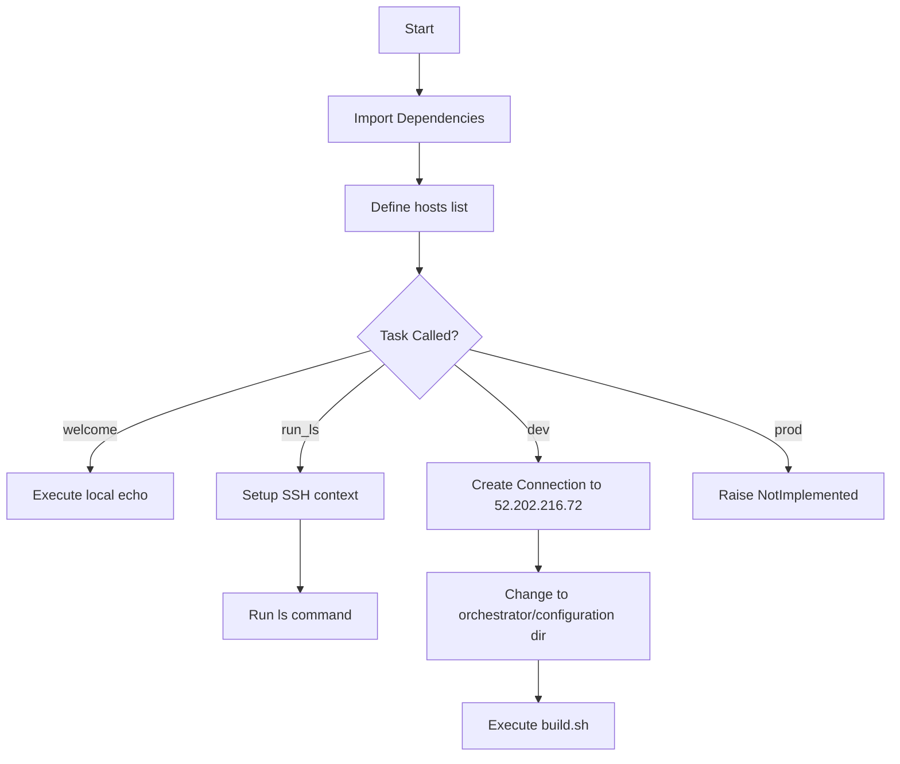
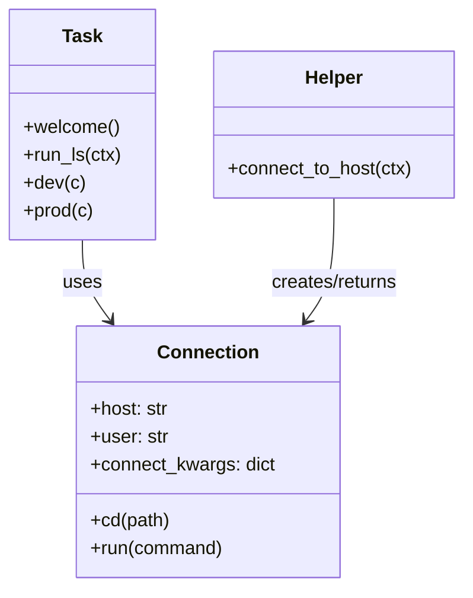
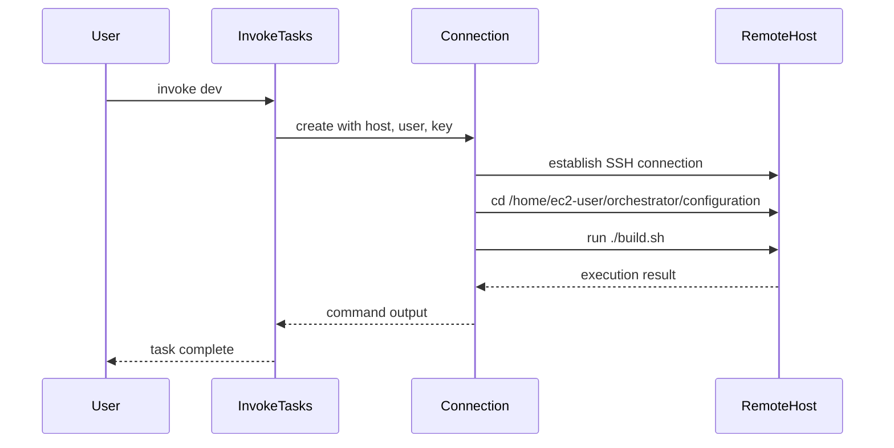

# Diagram: research/orchestrator/fabfile.py

> Auto-generated by Obscura crawlers

## Diagram 1

### SVG

<svg id="container" width="1038.671875" xmlns="http://www.w3.org/2000/svg" class="flowchart" height="878.203125" viewBox="0 0 1038.671875 878.203125" role="graphics-document document" aria-roledescription="flowchart-v2"><g><marker id="container_flowchart-v2-pointEnd" class="marker flowchart-v2" viewBox="0 0 10 10" refX="5" refY="5" markerUnits="userSpaceOnUse" markerWidth="8" markerHeight="8" orient="auto"><path d="M 0 0 L 10 5 L 0 10 z" class="arrowMarkerPath" style="stroke-width: 1; stroke-dasharray: 1, 0;"></path></marker><marker id="container_flowchart-v2-pointStart" class="marker flowchart-v2" viewBox="0 0 10 10" refX="4.5" refY="5" markerUnits="userSpaceOnUse" markerWidth="8" markerHeight="8" orient="auto"><path d="M 0 5 L 10 10 L 10 0 z" class="arrowMarkerPath" style="stroke-width: 1; stroke-dasharray: 1, 0;"></path></marker><marker id="container_flowchart-v2-circleEnd" class="marker flowchart-v2" viewBox="0 0 10 10" refX="11" refY="5" markerUnits="userSpaceOnUse" markerWidth="11" markerHeight="11" orient="auto"><circle cx="5" cy="5" r="5" class="arrowMarkerPath" style="stroke-width: 1; stroke-dasharray: 1, 0;"></circle></marker><marker id="container_flowchart-v2-circleStart" class="marker flowchart-v2" viewBox="0 0 10 10" refX="-1" refY="5" markerUnits="userSpaceOnUse" markerWidth="11" markerHeight="11" orient="auto"><circle cx="5" cy="5" r="5" class="arrowMarkerPath" style="stroke-width: 1; stroke-dasharray: 1, 0;"></circle></marker><marker id="container_flowchart-v2-crossEnd" class="marker cross flowchart-v2" viewBox="0 0 11 11" refX="12" refY="5.2" markerUnits="userSpaceOnUse" markerWidth="11" markerHeight="11" orient="auto"><path d="M 1,1 l 9,9 M 10,1 l -9,9" class="arrowMarkerPath" style="stroke-width: 2; stroke-dasharray: 1, 0;"></path></marker><marker id="container_flowchart-v2-crossStart" class="marker cross flowchart-v2" viewBox="0 0 11 11" refX="-1" refY="5.2" markerUnits="userSpaceOnUse" markerWidth="11" markerHeight="11" orient="auto"><path d="M 1,1 l 9,9 M 10,1 l -9,9" class="arrowMarkerPath" style="stroke-width: 2; stroke-dasharray: 1, 0;"></path></marker><g class="root"><g class="clusters"></g><g class="edgePaths"><path d="M486.461,62L486.461,66.167C486.461,70.333,486.461,78.667,486.461,86.333C486.461,94,486.461,101,486.461,104.5L486.461,108" id="L_A_B_0" class="edge-thickness-normal edge-pattern-solid edge-thickness-normal edge-pattern-solid flowchart-link" style=";" data-edge="true" data-et="edge" data-id="L_A_B_0" data-points="W3sieCI6NDg2LjQ2MDkzNzUsInkiOjYyfSx7IngiOjQ4Ni40NjA5Mzc1LCJ5Ijo4N30seyJ4Ijo0ODYuNDYwOTM3NSwieSI6MTEyfV0=" marker-end="url(#container_flowchart-v2-pointEnd)"></path><path d="M486.461,166L486.461,170.167C486.461,174.333,486.461,182.667,486.461,190.333C486.461,198,486.461,205,486.461,208.5L486.461,212" id="L_B_C_0" class="edge-thickness-normal edge-pattern-solid edge-thickness-normal edge-pattern-solid flowchart-link" style=";" data-edge="true" data-et="edge" data-id="L_B_C_0" data-points="W3sieCI6NDg2LjQ2MDkzNzUsInkiOjE2Nn0seyJ4Ijo0ODYuNDYwOTM3NSwieSI6MTkxfSx7IngiOjQ4Ni40NjA5Mzc1LCJ5IjoyMTZ9XQ==" marker-end="url(#container_flowchart-v2-pointEnd)"></path><path d="M486.461,270L486.461,274.167C486.461,278.333,486.461,286.667,486.461,294.333C486.461,302,486.461,309,486.461,312.5L486.461,316" id="L_C_D_0" class="edge-thickness-normal edge-pattern-solid edge-thickness-normal edge-pattern-solid flowchart-link" style=";" data-edge="true" data-et="edge" data-id="L_C_D_0" data-points="W3sieCI6NDg2LjQ2MDkzNzUsInkiOjI3MH0seyJ4Ijo0ODYuNDYwOTM3NSwieSI6Mjk1fSx7IngiOjQ4Ni40NjA5Mzc1LCJ5IjozMjB9XQ==" marker-end="url(#container_flowchart-v2-pointEnd)"></path><path d="M431.063,406.805L376.736,422.205C322.409,437.604,213.755,468.404,159.428,491.303C105.102,514.203,105.102,529.203,105.102,536.703L105.102,544.203" id="L_D_E_0" class="edge-thickness-normal edge-pattern-solid edge-thickness-normal edge-pattern-solid flowchart-link" style=";" data-edge="true" data-et="edge" data-id="L_D_E_0" data-points="W3sieCI6NDMxLjA2Mjc1Mjc2NDMyMTQsInkiOjQwNi44MDQ5NDAyNjQzMjE0fSx7IngiOjEwNS4xMDE1NjI1LCJ5Ijo0OTkuMjAzMTI1fSx7IngiOjEwNS4xMDE1NjI1LCJ5Ijo1NDguMjAzMTI1fV0=" marker-end="url(#container_flowchart-v2-pointEnd)"></path><path d="M446.58,422.322L430.213,435.136C413.845,447.949,381.11,473.576,364.743,493.89C348.375,514.203,348.375,529.203,348.375,536.703L348.375,544.203" id="L_D_F_0" class="edge-thickness-normal edge-pattern-solid edge-thickness-normal edge-pattern-solid flowchart-link" style=";" data-edge="true" data-et="edge" data-id="L_D_F_0" data-points="W3sieCI6NDQ2LjU4MDI1MzQwNTQ0ODczLCJ5Ijo0MjIuMzIyNDQwOTA1NDQ4NzN9LHsieCI6MzQ4LjM3NSwieSI6NDk5LjIwMzEyNX0seyJ4IjozNDguMzc1LCJ5Ijo1NDguMjAzMTI1fV0=" marker-end="url(#container_flowchart-v2-pointEnd)"></path><path d="M348.375,602.203L348.375,608.37C348.375,614.536,348.375,626.87,348.375,640.536C348.375,654.203,348.375,669.203,348.375,676.703L348.375,684.203" id="L_F_G_0" class="edge-thickness-normal edge-pattern-solid edge-thickness-normal edge-pattern-solid flowchart-link" style=";" data-edge="true" data-et="edge" data-id="L_F_G_0" data-points="W3sieCI6MzQ4LjM3NSwieSI6NjAyLjIwMzEyNX0seyJ4IjozNDguMzc1LCJ5Ijo2MzkuMjAzMTI1fSx7IngiOjM0OC4zNzUsInkiOjY4OC4yMDMxMjV9XQ==" marker-end="url(#container_flowchart-v2-pointEnd)"></path><path d="M526.342,422.322L542.709,435.136C559.077,447.949,591.812,473.576,608.179,491.89C624.547,510.203,624.547,521.203,624.547,526.703L624.547,532.203" id="L_D_H_0" class="edge-thickness-normal edge-pattern-solid edge-thickness-normal edge-pattern-solid flowchart-link" style=";" data-edge="true" data-et="edge" data-id="L_D_H_0" data-points="W3sieCI6NTI2LjM0MTYyMTU5NDU1MTMsInkiOjQyMi4zMjI0NDA5MDU0NDg3M30seyJ4Ijo2MjQuNTQ2ODc1LCJ5Ijo0OTkuMjAzMTI1fSx7IngiOjYyNC41NDY4NzUsInkiOjUzNi4yMDMxMjV9XQ==" marker-end="url(#container_flowchart-v2-pointEnd)"></path><path d="M624.547,614.203L624.547,618.37C624.547,622.536,624.547,630.87,624.547,638.536C624.547,646.203,624.547,653.203,624.547,656.703L624.547,660.203" id="L_H_I_0" class="edge-thickness-normal edge-pattern-solid edge-thickness-normal edge-pattern-solid flowchart-link" style=";" data-edge="true" data-et="edge" data-id="L_H_I_0" data-points="W3sieCI6NjI0LjU0Njg3NSwieSI6NjE0LjIwMzEyNX0seyJ4Ijo2MjQuNTQ2ODc1LCJ5Ijo2MzkuMjAzMTI1fSx7IngiOjYyNC41NDY4NzUsInkiOjY2NC4yMDMxMjV9XQ==" marker-end="url(#container_flowchart-v2-pointEnd)"></path><path d="M624.547,766.203L624.547,770.37C624.547,774.536,624.547,782.87,624.547,790.536C624.547,798.203,624.547,805.203,624.547,808.703L624.547,812.203" id="L_I_J_0" class="edge-thickness-normal edge-pattern-solid edge-thickness-normal edge-pattern-solid flowchart-link" style=";" data-edge="true" data-et="edge" data-id="L_I_J_0" data-points="W3sieCI6NjI0LjU0Njg3NSwieSI6NzY2LjIwMzEyNX0seyJ4Ijo2MjQuNTQ2ODc1LCJ5Ijo3OTEuMjAzMTI1fSx7IngiOjYyNC41NDY4NzUsInkiOjgxNi4yMDMxMjV9XQ==" marker-end="url(#container_flowchart-v2-pointEnd)"></path><path d="M543.309,405.355L605.692,420.996C668.076,436.638,792.843,467.92,855.226,491.062C917.609,514.203,917.609,529.203,917.609,536.703L917.609,544.203" id="L_D_K_0" class="edge-thickness-normal edge-pattern-solid edge-thickness-normal edge-pattern-solid flowchart-link" style=";" data-edge="true" data-et="edge" data-id="L_D_K_0" data-points="W3sieCI6NTQzLjMwOTAxODMwNzk0MzYsInkiOjQwNS4zNTUwNDQxOTIwNTYzN30seyJ4Ijo5MTcuNjA5Mzc1LCJ5Ijo0OTkuMjAzMTI1fSx7IngiOjkxNy42MDkzNzUsInkiOjU0OC4yMDMxMjV9XQ==" marker-end="url(#container_flowchart-v2-pointEnd)"></path></g><g class="edgeLabels"><g class="edgeLabel"><g class="label" data-id="L_A_B_0" transform="translate(0, 0)"><foreignObject width="0" height="0">

</foreignObject></g></g><g class="edgeLabel"><g class="label" data-id="L_B_C_0" transform="translate(0, 0)"><foreignObject width="0" height="0">

</foreignObject></g></g><g class="edgeLabel"><g class="label" data-id="L_C_D_0" transform="translate(0, 0)"><foreignObject width="0" height="0">

</foreignObject></g></g><g class="edgeLabel" transform="translate(105.1015625, 499.203125)"><g class="label" data-id="L_D_E_0" transform="translate(-31.953125, -12)"><foreignObject width="63.90625" height="24">

welcome

</foreignObject></g></g><g class="edgeLabel" transform="translate(348.375, 499.203125)"><g class="label" data-id="L_D_F_0" transform="translate(-22.59375, -12)"><foreignObject width="45.1875" height="24">

run_ls

</foreignObject></g></g><g class="edgeLabel"><g class="label" data-id="L_F_G_0" transform="translate(0, 0)"><foreignObject width="0" height="0">

</foreignObject></g></g><g class="edgeLabel" transform="translate(624.546875, 499.203125)"><g class="label" data-id="L_D_H_0" transform="translate(-13.0546875, -12)"><foreignObject width="26.109375" height="24">

dev

</foreignObject></g></g><g class="edgeLabel"><g class="label" data-id="L_H_I_0" transform="translate(0, 0)"><foreignObject width="0" height="0">

</foreignObject></g></g><g class="edgeLabel"><g class="label" data-id="L_I_J_0" transform="translate(0, 0)"><foreignObject width="0" height="0">

</foreignObject></g></g><g class="edgeLabel" transform="translate(917.609375, 499.203125)"><g class="label" data-id="L_D_K_0" transform="translate(-17.0625, -12)"><foreignObject width="34.125" height="24">

prod

</foreignObject></g></g></g><g class="nodes"><g class="node default" id="flowchart-A-0" transform="translate(486.4609375, 35)"><rect class="basic label-container" style="" x="-47.5234375" y="-27" width="95.046875" height="54"></rect><g class="label" style="" transform="translate(-17.5234375, -12)"><rect></rect><foreignObject width="35.046875" height="24">

Start

</foreignObject></g></g><g class="node default" id="flowchart-B-1" transform="translate(486.4609375, 139)"><rect class="basic label-container" style="" x="-108.0625" y="-27" width="216.125" height="54"></rect><g class="label" style="" transform="translate(-78.0625, -12)"><rect></rect><foreignObject width="156.125" height="24">

Import Dependencies

</foreignObject></g></g><g class="node default" id="flowchart-C-3" transform="translate(486.4609375, 243)"><rect class="basic label-container" style="" x="-88.3515625" y="-27" width="176.703125" height="54"></rect><g class="label" style="" transform="translate(-58.3515625, -12)"><rect></rect><foreignObject width="116.703125" height="24">

Define hosts list

</foreignObject></g></g><g class="node default" id="flowchart-D-5" transform="translate(486.4609375, 391.1015625)"><polygon points="71.1015625,0 142.203125,-71.1015625 71.1015625,-142.203125 0,-71.1015625" class="label-container" transform="translate(-70.6015625, 71.1015625)"></polygon><g class="label" style="" transform="translate(-44.1015625, -12)"><rect></rect><foreignObject width="88.203125" height="24">

Task Called?

</foreignObject></g></g><g class="node default" id="flowchart-E-7" transform="translate(105.1015625, 575.203125)"><rect class="basic label-container" style="" x="-97.1015625" y="-27" width="194.203125" height="54"></rect><g class="label" style="" transform="translate(-67.1015625, -12)"><rect></rect><foreignObject width="134.203125" height="24">

Execute local echo

</foreignObject></g></g><g class="node default" id="flowchart-F-9" transform="translate(348.375, 575.203125)"><rect class="basic label-container" style="" x="-96.171875" y="-27" width="192.34375" height="54"></rect><g class="label" style="" transform="translate(-66.171875, -12)"><rect></rect><foreignObject width="132.34375" height="24">

Setup SSH context

</foreignObject></g></g><g class="node default" id="flowchart-G-11" transform="translate(348.375, 715.203125)"><rect class="basic label-container" style="" x="-90.3828125" y="-27" width="180.765625" height="54"></rect><g class="label" style="" transform="translate(-60.3828125, -12)"><rect></rect><foreignObject width="120.765625" height="24">

Run ls command

</foreignObject></g></g><g class="node default" id="flowchart-H-13" transform="translate(624.546875, 575.203125)"><rect class="basic label-container" style="" x="-130" y="-39" width="260" height="78"></rect><g class="label" style="" transform="translate(-100, -24)"><rect></rect><foreignObject width="200" height="48">

Create Connection to 52.202.216.72

</foreignObject></g></g><g class="node default" id="flowchart-I-15" transform="translate(624.546875, 715.203125)"><rect class="basic label-container" style="" x="-130" y="-51" width="260" height="102"></rect><g class="label" style="" transform="translate(-100, -36)"><rect></rect><foreignObject width="200" height="72">

Change to orchestrator/configuration dir

</foreignObject></g></g><g class="node default" id="flowchart-J-17" transform="translate(624.546875, 843.203125)"><rect class="basic label-container" style="" x="-89.2265625" y="-27" width="178.453125" height="54"></rect><g class="label" style="" transform="translate(-59.2265625, -12)"><rect></rect><foreignObject width="118.453125" height="24">

Execute build.sh

</foreignObject></g></g><g class="node default" id="flowchart-K-19" transform="translate(917.609375, 575.203125)"><rect class="basic label-container" style="" x="-113.0625" y="-27" width="226.125" height="54"></rect><g class="label" style="" transform="translate(-83.0625, -12)"><rect></rect><foreignObject width="166.125" height="24">

Raise NotImplemented

</foreignObject></g></g></g></g></g></svg>

## Diagram 2

### SVG

<svg id="container" width="399.71875" xmlns="http://www.w3.org/2000/svg" class="classDiagram" height="504" viewBox="0 0 399.71875 504" role="graphics-document document" aria-roledescription="class"><g><defs><marker id="container_class-aggregationStart" class="marker aggregation class" refX="18" refY="7" markerWidth="190" markerHeight="240" orient="auto"><path d="M 18,7 L9,13 L1,7 L9,1 Z"></path></marker></defs><defs><marker id="container_class-aggregationEnd" class="marker aggregation class" refX="1" refY="7" markerWidth="20" markerHeight="28" orient="auto"><path d="M 18,7 L9,13 L1,7 L9,1 Z"></path></marker></defs><defs><marker id="container_class-extensionStart" class="marker extension class" refX="18" refY="7" markerWidth="190" markerHeight="240" orient="auto"><path d="M 1,7 L18,13 V 1 Z"></path></marker></defs><defs><marker id="container_class-extensionEnd" class="marker extension class" refX="1" refY="7" markerWidth="20" markerHeight="28" orient="auto"><path d="M 1,1 V 13 L18,7 Z"></path></marker></defs><defs><marker id="container_class-compositionStart" class="marker composition class" refX="18" refY="7" markerWidth="190" markerHeight="240" orient="auto"><path d="M 18,7 L9,13 L1,7 L9,1 Z"></path></marker></defs><defs><marker id="container_class-compositionEnd" class="marker composition class" refX="1" refY="7" markerWidth="20" markerHeight="28" orient="auto"><path d="M 18,7 L9,13 L1,7 L9,1 Z"></path></marker></defs><defs><marker id="container_class-dependencyStart" class="marker dependency class" refX="6" refY="7" markerWidth="190" markerHeight="240" orient="auto"><path d="M 5,7 L9,13 L1,7 L9,1 Z"></path></marker></defs><defs><marker id="container_class-dependencyEnd" class="marker dependency class" refX="13" refY="7" markerWidth="20" markerHeight="28" orient="auto"><path d="M 18,7 L9,13 L14,7 L9,1 Z"></path></marker></defs><defs><marker id="container_class-lollipopStart" class="marker lollipop class" refX="13" refY="7" markerWidth="190" markerHeight="240" orient="auto"><circle stroke="black" fill="transparent" cx="7" cy="7" r="6"></circle></marker></defs><defs><marker id="container_class-lollipopEnd" class="marker lollipop class" refX="1" refY="7" markerWidth="190" markerHeight="240" orient="auto"><circle stroke="black" fill="transparent" cx="7" cy="7" r="6"></circle></marker></defs><g class="root"><g class="clusters"></g><g class="edgePaths"><path d="M70.621,206L70.621,212.167C70.621,218.333,70.621,230.667,74.634,242.199C78.646,253.732,86.671,264.463,90.684,269.829L94.696,275.195" id="id_Task_Connection_1" class="edge-thickness-normal edge-pattern-solid relation" style=";;;" data-edge="true" data-et="edge" data-id="id_Task_Connection_1" data-points="W3sieCI6NzAuNjIxMDkzNzUsInkiOjIwNn0seyJ4Ijo3MC42MjEwOTM3NSwieSI6MjQzfSx7IngiOjk4LjI4OTM1ODgzNjIwNjksInkiOjI4MH1d" marker-end="url(#container_class-dependencyEnd)"></path><path d="M287.48,170L287.48,182.167C287.48,194.333,287.48,218.667,283.468,236.199C279.455,253.732,271.43,264.463,267.418,269.829L263.405,275.195" id="id_Helper_Connection_2" class="edge-thickness-normal edge-pattern-solid relation" style=";;;" data-edge="true" data-et="edge" data-id="id_Helper_Connection_2" data-points="W3sieCI6Mjg3LjQ4MDQ2ODc1LCJ5IjoxNzB9LHsieCI6Mjg3LjQ4MDQ2ODc1LCJ5IjoyNDN9LHsieCI6MjU5LjgxMjIwMzY2Mzc5MzA3LCJ5IjoyODB9XQ==" marker-end="url(#container_class-dependencyEnd)"></path></g><g class="edgeLabels"><g class="edgeLabel" transform="translate(70.62109375, 243)"><g class="label" data-id="id_Task_Connection_1" transform="translate(-16.4921875, -12)"><foreignObject width="32.984375" height="24">

uses

</foreignObject></g></g><g class="edgeLabel" transform="translate(287.48046875, 243)"><g class="label" data-id="id_Helper_Connection_2" transform="translate(-56.359375, -12)"><foreignObject width="112.71875" height="24">

creates/returns

</foreignObject></g></g></g><g class="nodes"><g class="node default" id="classId-Connection-0" transform="translate(179.05078125, 388)"><g class="basic label-container"><path d="M-112.23828125 -108 L112.23828125 -108 L112.23828125 108 L-112.23828125 108" stroke="none" stroke-width="0" fill="#ECECFF" style=""></path><path d="M-112.23828125 -108 C-26.755908677739853 -108, 58.72646389452029 -108, 112.23828125 -108 M-112.23828125 -108 C-41.39138033393773 -108, 29.455520582124535 -108, 112.23828125 -108 M112.23828125 -108 C112.23828125 -51.18436316886805, 112.23828125 5.631273662263894, 112.23828125 108 M112.23828125 -108 C112.23828125 -30.42468056138462, 112.23828125 47.15063887723076, 112.23828125 108 M112.23828125 108 C52.82510513836792 108, -6.588070973264166 108, -112.23828125 108 M112.23828125 108 C46.72127136355519 108, -18.79573852288962 108, -112.23828125 108 M-112.23828125 108 C-112.23828125 36.91499807251499, -112.23828125 -34.17000385497002, -112.23828125 -108 M-112.23828125 108 C-112.23828125 29.578231576824038, -112.23828125 -48.843536846351924, -112.23828125 -108" stroke="#9370DB" stroke-width="1.3" fill="none" stroke-dasharray="0 0" style=""></path></g><g class="annotation-group text" transform="translate(0, -84)"></g><g class="label-group text" transform="translate(-41.2265625, -84)"><g class="label" style="font-weight: bolder" transform="translate(0,-12)"><foreignObject width="82.453125" height="24">

Connection

</foreignObject></g></g><g class="members-group text" transform="translate(-100.23828125, -36)"><g class="label" style="" transform="translate(0,-12)"><foreignObject width="67.53125" height="24">

+host: str

</foreignObject></g><g class="label" style="" transform="translate(0,12)"><foreignObject width="67.328125" height="24">

+user: str

</foreignObject></g><g class="label" style="" transform="translate(0,36)"><foreignObject width="159.25" height="24">

+connect_kwargs: dict

</foreignObject></g></g><g class="methods-group text" transform="translate(-100.23828125, 60)"><g class="label" style="" transform="translate(0,-12)"><foreignObject width="68.453125" height="24">

+cd(path)

</foreignObject></g><g class="label" style="" transform="translate(0,12)"><foreignObject width="114.96875" height="24">

+run(command)

</foreignObject></g></g><g class="divider" style=""><path d="M-112.23828125 -60 C-30.025335534613745 -60, 52.18761018077251 -60, 112.23828125 -60 M-112.23828125 -60 C-49.66208709119566 -60, 12.914107067608683 -60, 112.23828125 -60" stroke="#9370DB" stroke-width="1.3" fill="none" stroke-dasharray="0 0" style=""></path></g><g class="divider" style=""><path d="M-112.23828125 36 C-57.40430219013381 36, -2.5703231302676244 36, 112.23828125 36 M-112.23828125 36 C-41.84466220704324 36, 28.548956835913515 36, 112.23828125 36" stroke="#9370DB" stroke-width="1.3" fill="none" stroke-dasharray="0 0" style=""></path></g></g><g class="node default" id="classId-Task-1" transform="translate(70.62109375, 107)"><g class="basic label-container"><path d="M-62.62109375 -99 L62.62109375 -99 L62.62109375 99 L-62.62109375 99" stroke="none" stroke-width="0" fill="#ECECFF" style=""></path><path d="M-62.62109375 -99 C-28.667398111506294 -99, 5.286297526987411 -99, 62.62109375 -99 M-62.62109375 -99 C-23.03639203315484 -99, 16.54830968369032 -99, 62.62109375 -99 M62.62109375 -99 C62.62109375 -24.247634647727267, 62.62109375 50.504730704545466, 62.62109375 99 M62.62109375 -99 C62.62109375 -21.514625158067687, 62.62109375 55.970749683864625, 62.62109375 99 M62.62109375 99 C27.398670091715537 99, -7.823753566568925 99, -62.62109375 99 M62.62109375 99 C26.804783582543315 99, -9.01152658491337 99, -62.62109375 99 M-62.62109375 99 C-62.62109375 37.88628069044582, -62.62109375 -23.227438619108355, -62.62109375 -99 M-62.62109375 99 C-62.62109375 22.530379478021615, -62.62109375 -53.93924104395677, -62.62109375 -99" stroke="#9370DB" stroke-width="1.3" fill="none" stroke-dasharray="0 0" style=""></path></g><g class="annotation-group text" transform="translate(0, -75)"></g><g class="label-group text" transform="translate(-16.5078125, -75)"><g class="label" style="font-weight: bolder" transform="translate(0,-12)"><foreignObject width="33.015625" height="24">

Task

</foreignObject></g></g><g class="members-group text" transform="translate(-50.62109375, -27)"></g><g class="methods-group text" transform="translate(-50.62109375, 3)"><g class="label" style="" transform="translate(0,-12)"><foreignObject width="82.265625" height="24">

+welcome()

</foreignObject></g><g class="label" style="" transform="translate(0,12)"><foreignObject width="84.734375" height="24">

+run_ls(ctx)

</foreignObject></g><g class="label" style="" transform="translate(0,36)"><foreignObject width="52.109375" height="24">

+dev(c)

</foreignObject></g><g class="label" style="" transform="translate(0,60)"><foreignObject width="60.125" height="24">

+prod(c)

</foreignObject></g></g><g class="divider" style=""><path d="M-62.62109375 -51 C-27.188131413860575 -51, 8.244830922278851 -51, 62.62109375 -51 M-62.62109375 -51 C-15.113468485375812 -51, 32.39415677924838 -51, 62.62109375 -51" stroke="#9370DB" stroke-width="1.3" fill="none" stroke-dasharray="0 0" style=""></path></g><g class="divider" style=""><path d="M-62.62109375 -27 C-19.402801737599262 -27, 23.815490274801476 -27, 62.62109375 -27 M-62.62109375 -27 C-35.367917517861706 -27, -8.114741285723412 -27, 62.62109375 -27" stroke="#9370DB" stroke-width="1.3" fill="none" stroke-dasharray="0 0" style=""></path></g></g><g class="node default" id="classId-Helper-2" transform="translate(287.48046875, 107)"><g class="basic label-container"><path d="M-104.23828125 -63 L104.23828125 -63 L104.23828125 63 L-104.23828125 63" stroke="none" stroke-width="0" fill="#ECECFF" style=""></path><path d="M-104.23828125 -63 C-61.85166498744227 -63, -19.46504872488454 -63, 104.23828125 -63 M-104.23828125 -63 C-44.234510469878025 -63, 15.76926031024395 -63, 104.23828125 -63 M104.23828125 -63 C104.23828125 -27.76168806872832, 104.23828125 7.476623862543363, 104.23828125 63 M104.23828125 -63 C104.23828125 -37.40550927054773, 104.23828125 -11.811018541095464, 104.23828125 63 M104.23828125 63 C22.59571677325799 63, -59.04684770348402 63, -104.23828125 63 M104.23828125 63 C36.81053526840145 63, -30.617210713197096 63, -104.23828125 63 M-104.23828125 63 C-104.23828125 17.544455174594646, -104.23828125 -27.91108965081071, -104.23828125 -63 M-104.23828125 63 C-104.23828125 19.74519819261443, -104.23828125 -23.509603614771137, -104.23828125 -63" stroke="#9370DB" stroke-width="1.3" fill="none" stroke-dasharray="0 0" style=""></path></g><g class="annotation-group text" transform="translate(0, -39)"></g><g class="label-group text" transform="translate(-24.5234375, -39)"><g class="label" style="font-weight: bolder" transform="translate(0,-12)"><foreignObject width="49.046875" height="24">

Helper

</foreignObject></g></g><g class="members-group text" transform="translate(-92.23828125, 9)"></g><g class="methods-group text" transform="translate(-92.23828125, 39)"><g class="label" style="" transform="translate(0,-12)"><foreignObject width="159.953125" height="24">

+connect_to_host(ctx)

</foreignObject></g></g><g class="divider" style=""><path d="M-104.23828125 -15 C-62.082035626844586 -15, -19.925790003689173 -15, 104.23828125 -15 M-104.23828125 -15 C-59.82133925376575 -15, -15.4043972575315 -15, 104.23828125 -15" stroke="#9370DB" stroke-width="1.3" fill="none" stroke-dasharray="0 0" style=""></path></g><g class="divider" style=""><path d="M-104.23828125 9 C-31.146239743669156 9, 41.94580176266169 9, 104.23828125 9 M-104.23828125 9 C-51.79516168753618 9, 0.6479578749276413 9, 104.23828125 9" stroke="#9370DB" stroke-width="1.3" fill="none" stroke-dasharray="0 0" style=""></path></g></g></g></g></g></svg>

## Diagram 3

### SVG

<svg id="container" width="1117" xmlns="http://www.w3.org/2000/svg" height="555" viewBox="-50 -10 1117 555" role="graphics-document document" aria-roledescription="sequence"><g><rect x="867" y="469" fill="#eaeaea" stroke="#666" width="150" height="65" name="RemoteHost" rx="3" ry="3" class="actor actor-bottom"></rect><text x="942" y="501.5" dominant-baseline="central" alignment-baseline="central" class="actor actor-box" style="text-anchor: middle; font-size: 16px; font-weight: 400;"><tspan x="942" dy="0">RemoteHost</tspan></text></g><g><rect x="458" y="469" fill="#eaeaea" stroke="#666" width="150" height="65" name="Connection" rx="3" ry="3" class="actor actor-bottom"></rect><text x="533" y="501.5" dominant-baseline="central" alignment-baseline="central" class="actor actor-box" style="text-anchor: middle; font-size: 16px; font-weight: 400;"><tspan x="533" dy="0">Connection</tspan></text></g><g><rect x="200" y="469" fill="#eaeaea" stroke="#666" width="150" height="65" name="InvokeTasks" rx="3" ry="3" class="actor actor-bottom"></rect><text x="275" y="501.5" dominant-baseline="central" alignment-baseline="central" class="actor actor-box" style="text-anchor: middle; font-size: 16px; font-weight: 400;"><tspan x="275" dy="0">InvokeTasks</tspan></text></g><g><rect x="0" y="469" fill="#eaeaea" stroke="#666" width="150" height="65" name="User" rx="3" ry="3" class="actor actor-bottom"></rect><text x="75" y="501.5" dominant-baseline="central" alignment-baseline="central" class="actor actor-box" style="text-anchor: middle; font-size: 16px; font-weight: 400;"><tspan x="75" dy="0">User</tspan></text></g><g><line id="actor3" x1="942" y1="65" x2="942" y2="469" class="actor-line 200" stroke-width="0.5px" stroke="#999" name="RemoteHost"></line><g id="root-3"><rect x="867" y="0" fill="#eaeaea" stroke="#666" width="150" height="65" name="RemoteHost" rx="3" ry="3" class="actor actor-top"></rect><text x="942" y="32.5" dominant-baseline="central" alignment-baseline="central" class="actor actor-box" style="text-anchor: middle; font-size: 16px; font-weight: 400;"><tspan x="942" dy="0">RemoteHost</tspan></text></g></g><g><line id="actor2" x1="533" y1="65" x2="533" y2="469" class="actor-line 200" stroke-width="0.5px" stroke="#999" name="Connection"></line><g id="root-2"><rect x="458" y="0" fill="#eaeaea" stroke="#666" width="150" height="65" name="Connection" rx="3" ry="3" class="actor actor-top"></rect><text x="533" y="32.5" dominant-baseline="central" alignment-baseline="central" class="actor actor-box" style="text-anchor: middle; font-size: 16px; font-weight: 400;"><tspan x="533" dy="0">Connection</tspan></text></g></g><g><line id="actor1" x1="275" y1="65" x2="275" y2="469" class="actor-line 200" stroke-width="0.5px" stroke="#999" name="InvokeTasks"></line><g id="root-1"><rect x="200" y="0" fill="#eaeaea" stroke="#666" width="150" height="65" name="InvokeTasks" rx="3" ry="3" class="actor actor-top"></rect><text x="275" y="32.5" dominant-baseline="central" alignment-baseline="central" class="actor actor-box" style="text-anchor: middle; font-size: 16px; font-weight: 400;"><tspan x="275" dy="0">InvokeTasks</tspan></text></g></g><g><line id="actor0" x1="75" y1="65" x2="75" y2="469" class="actor-line 200" stroke-width="0.5px" stroke="#999" name="User"></line><g id="root-0"><rect x="0" y="0" fill="#eaeaea" stroke="#666" width="150" height="65" name="User" rx="3" ry="3" class="actor actor-top"></rect><text x="75" y="32.5" dominant-baseline="central" alignment-baseline="central" class="actor actor-box" style="text-anchor: middle; font-size: 16px; font-weight: 400;"><tspan x="75" dy="0">User</tspan></text></g></g><g></g><defs><symbol id="computer" width="24" height="24"><path transform="scale(.5)" d="M2 2v13h20v-13h-20zm18 11h-16v-9h16v9zm-10.228 6l.466-1h3.524l.467 1h-4.457zm14.228 3h-24l2-6h2.104l-1.33 4h18.45l-1.297-4h2.073l2 6zm-5-10h-14v-7h14v7z"></path></symbol></defs><defs><symbol id="database" fill-rule="evenodd" clip-rule="evenodd"><path transform="scale(.5)" d="M12.258.001l.256.004.255.005.253.008.251.01.249.012.247.015.246.016.242.019.241.02.239.023.236.024.233.027.231.028.229.031.225.032.223.034.22.036.217.038.214.04.211.041.208.043.205.045.201.046.198.048.194.05.191.051.187.053.183.054.18.056.175.057.172.059.168.06.163.061.16.063.155.064.15.066.074.033.073.033.071.034.07.034.069.035.068.035.067.035.066.035.064.036.064.036.062.036.06.036.06.037.058.037.058.037.055.038.055.038.053.038.052.038.051.039.05.039.048.039.047.039.045.04.044.04.043.04.041.04.04.041.039.041.037.041.036.041.034.041.033.042.032.042.03.042.029.042.027.042.026.043.024.043.023.043.021.043.02.043.018.044.017.043.015.044.013.044.012.044.011.045.009.044.007.045.006.045.004.045.002.045.001.045v17l-.001.045-.002.045-.004.045-.006.045-.007.045-.009.044-.011.045-.012.044-.013.044-.015.044-.017.043-.018.044-.02.043-.021.043-.023.043-.024.043-.026.043-.027.042-.029.042-.03.042-.032.042-.033.042-.034.041-.036.041-.037.041-.039.041-.04.041-.041.04-.043.04-.044.04-.045.04-.047.039-.048.039-.05.039-.051.039-.052.038-.053.038-.055.038-.055.038-.058.037-.058.037-.06.037-.06.036-.062.036-.064.036-.064.036-.066.035-.067.035-.068.035-.069.035-.07.034-.071.034-.073.033-.074.033-.15.066-.155.064-.16.063-.163.061-.168.06-.172.059-.175.057-.18.056-.183.054-.187.053-.191.051-.194.05-.198.048-.201.046-.205.045-.208.043-.211.041-.214.04-.217.038-.22.036-.223.034-.225.032-.229.031-.231.028-.233.027-.236.024-.239.023-.241.02-.242.019-.246.016-.247.015-.249.012-.251.01-.253.008-.255.005-.256.004-.258.001-.258-.001-.256-.004-.255-.005-.253-.008-.251-.01-.249-.012-.247-.015-.245-.016-.243-.019-.241-.02-.238-.023-.236-.024-.234-.027-.231-.028-.228-.031-.226-.032-.223-.034-.22-.036-.217-.038-.214-.04-.211-.041-.208-.043-.204-.045-.201-.046-.198-.048-.195-.05-.19-.051-.187-.053-.184-.054-.179-.056-.176-.057-.172-.059-.167-.06-.164-.061-.159-.063-.155-.064-.151-.066-.074-.033-.072-.033-.072-.034-.07-.034-.069-.035-.068-.035-.067-.035-.066-.035-.064-.036-.063-.036-.062-.036-.061-.036-.06-.037-.058-.037-.057-.037-.056-.038-.055-.038-.053-.038-.052-.038-.051-.039-.049-.039-.049-.039-.046-.039-.046-.04-.044-.04-.043-.04-.041-.04-.04-.041-.039-.041-.037-.041-.036-.041-.034-.041-.033-.042-.032-.042-.03-.042-.029-.042-.027-.042-.026-.043-.024-.043-.023-.043-.021-.043-.02-.043-.018-.044-.017-.043-.015-.044-.013-.044-.012-.044-.011-.045-.009-.044-.007-.045-.006-.045-.004-.045-.002-.045-.001-.045v-17l.001-.045.002-.045.004-.045.006-.045.007-.045.009-.044.011-.045.012-.044.013-.044.015-.044.017-.043.018-.044.02-.043.021-.043.023-.043.024-.043.026-.043.027-.042.029-.042.03-.042.032-.042.033-.042.034-.041.036-.041.037-.041.039-.041.04-.041.041-.04.043-.04.044-.04.046-.04.046-.039.049-.039.049-.039.051-.039.052-.038.053-.038.055-.038.056-.038.057-.037.058-.037.06-.037.061-.036.062-.036.063-.036.064-.036.066-.035.067-.035.068-.035.069-.035.07-.034.072-.034.072-.033.074-.033.151-.066.155-.064.159-.063.164-.061.167-.06.172-.059.176-.057.179-.056.184-.054.187-.053.19-.051.195-.05.198-.048.201-.046.204-.045.208-.043.211-.041.214-.04.217-.038.22-.036.223-.034.226-.032.228-.031.231-.028.234-.027.236-.024.238-.023.241-.02.243-.019.245-.016.247-.015.249-.012.251-.01.253-.008.255-.005.256-.004.258-.001.258.001zm-9.258 20.499v.01l.001.021.003.021.004.022.005.021.006.022.007.022.009.023.01.022.011.023.012.023.013.023.015.023.016.024.017.023.018.024.019.024.021.024.022.025.023.024.024.025.052.049.056.05.061.051.066.051.07.051.075.051.079.052.084.052.088.052.092.052.097.052.102.051.105.052.11.052.114.051.119.051.123.051.127.05.131.05.135.05.139.048.144.049.147.047.152.047.155.047.16.045.163.045.167.043.171.043.176.041.178.041.183.039.187.039.19.037.194.035.197.035.202.033.204.031.209.03.212.029.216.027.219.025.222.024.226.021.23.02.233.018.236.016.24.015.243.012.246.01.249.008.253.005.256.004.259.001.26-.001.257-.004.254-.005.25-.008.247-.011.244-.012.241-.014.237-.016.233-.018.231-.021.226-.021.224-.024.22-.026.216-.027.212-.028.21-.031.205-.031.202-.034.198-.034.194-.036.191-.037.187-.039.183-.04.179-.04.175-.042.172-.043.168-.044.163-.045.16-.046.155-.046.152-.047.148-.048.143-.049.139-.049.136-.05.131-.05.126-.05.123-.051.118-.052.114-.051.11-.052.106-.052.101-.052.096-.052.092-.052.088-.053.083-.051.079-.052.074-.052.07-.051.065-.051.06-.051.056-.05.051-.05.023-.024.023-.025.021-.024.02-.024.019-.024.018-.024.017-.024.015-.023.014-.024.013-.023.012-.023.01-.023.01-.022.008-.022.006-.022.006-.022.004-.022.004-.021.001-.021.001-.021v-4.127l-.077.055-.08.053-.083.054-.085.053-.087.052-.09.052-.093.051-.095.05-.097.05-.1.049-.102.049-.105.048-.106.047-.109.047-.111.046-.114.045-.115.045-.118.044-.12.043-.122.042-.124.042-.126.041-.128.04-.13.04-.132.038-.134.038-.135.037-.138.037-.139.035-.142.035-.143.034-.144.033-.147.032-.148.031-.15.03-.151.03-.153.029-.154.027-.156.027-.158.026-.159.025-.161.024-.162.023-.163.022-.165.021-.166.02-.167.019-.169.018-.169.017-.171.016-.173.015-.173.014-.175.013-.175.012-.177.011-.178.01-.179.008-.179.008-.181.006-.182.005-.182.004-.184.003-.184.002h-.37l-.184-.002-.184-.003-.182-.004-.182-.005-.181-.006-.179-.008-.179-.008-.178-.01-.176-.011-.176-.012-.175-.013-.173-.014-.172-.015-.171-.016-.17-.017-.169-.018-.167-.019-.166-.02-.165-.021-.163-.022-.162-.023-.161-.024-.159-.025-.157-.026-.156-.027-.155-.027-.153-.029-.151-.03-.15-.03-.148-.031-.146-.032-.145-.033-.143-.034-.141-.035-.14-.035-.137-.037-.136-.037-.134-.038-.132-.038-.13-.04-.128-.04-.126-.041-.124-.042-.122-.042-.12-.044-.117-.043-.116-.045-.113-.045-.112-.046-.109-.047-.106-.047-.105-.048-.102-.049-.1-.049-.097-.05-.095-.05-.093-.052-.09-.051-.087-.052-.085-.053-.083-.054-.08-.054-.077-.054v4.127zm0-5.654v.011l.001.021.003.021.004.021.005.022.006.022.007.022.009.022.01.022.011.023.012.023.013.023.015.024.016.023.017.024.018.024.019.024.021.024.022.024.023.025.024.024.052.05.056.05.061.05.066.051.07.051.075.052.079.051.084.052.088.052.092.052.097.052.102.052.105.052.11.051.114.051.119.052.123.05.127.051.131.05.135.049.139.049.144.048.147.048.152.047.155.046.16.045.163.045.167.044.171.042.176.042.178.04.183.04.187.038.19.037.194.036.197.034.202.033.204.032.209.03.212.028.216.027.219.025.222.024.226.022.23.02.233.018.236.016.24.014.243.012.246.01.249.008.253.006.256.003.259.001.26-.001.257-.003.254-.006.25-.008.247-.01.244-.012.241-.015.237-.016.233-.018.231-.02.226-.022.224-.024.22-.025.216-.027.212-.029.21-.03.205-.032.202-.033.198-.035.194-.036.191-.037.187-.039.183-.039.179-.041.175-.042.172-.043.168-.044.163-.045.16-.045.155-.047.152-.047.148-.048.143-.048.139-.05.136-.049.131-.05.126-.051.123-.051.118-.051.114-.052.11-.052.106-.052.101-.052.096-.052.092-.052.088-.052.083-.052.079-.052.074-.051.07-.052.065-.051.06-.05.056-.051.051-.049.023-.025.023-.024.021-.025.02-.024.019-.024.018-.024.017-.024.015-.023.014-.023.013-.024.012-.022.01-.023.01-.023.008-.022.006-.022.006-.022.004-.021.004-.022.001-.021.001-.021v-4.139l-.077.054-.08.054-.083.054-.085.052-.087.053-.09.051-.093.051-.095.051-.097.05-.1.049-.102.049-.105.048-.106.047-.109.047-.111.046-.114.045-.115.044-.118.044-.12.044-.122.042-.124.042-.126.041-.128.04-.13.039-.132.039-.134.038-.135.037-.138.036-.139.036-.142.035-.143.033-.144.033-.147.033-.148.031-.15.03-.151.03-.153.028-.154.028-.156.027-.158.026-.159.025-.161.024-.162.023-.163.022-.165.021-.166.02-.167.019-.169.018-.169.017-.171.016-.173.015-.173.014-.175.013-.175.012-.177.011-.178.009-.179.009-.179.007-.181.007-.182.005-.182.004-.184.003-.184.002h-.37l-.184-.002-.184-.003-.182-.004-.182-.005-.181-.007-.179-.007-.179-.009-.178-.009-.176-.011-.176-.012-.175-.013-.173-.014-.172-.015-.171-.016-.17-.017-.169-.018-.167-.019-.166-.02-.165-.021-.163-.022-.162-.023-.161-.024-.159-.025-.157-.026-.156-.027-.155-.028-.153-.028-.151-.03-.15-.03-.148-.031-.146-.033-.145-.033-.143-.033-.141-.035-.14-.036-.137-.036-.136-.037-.134-.038-.132-.039-.13-.039-.128-.04-.126-.041-.124-.042-.122-.043-.12-.043-.117-.044-.116-.044-.113-.046-.112-.046-.109-.046-.106-.047-.105-.048-.102-.049-.1-.049-.097-.05-.095-.051-.093-.051-.09-.051-.087-.053-.085-.052-.083-.054-.08-.054-.077-.054v4.139zm0-5.666v.011l.001.02.003.022.004.021.005.022.006.021.007.022.009.023.01.022.011.023.012.023.013.023.015.023.016.024.017.024.018.023.019.024.021.025.022.024.023.024.024.025.052.05.056.05.061.05.066.051.07.051.075.052.079.051.084.052.088.052.092.052.097.052.102.052.105.051.11.052.114.051.119.051.123.051.127.05.131.05.135.05.139.049.144.048.147.048.152.047.155.046.16.045.163.045.167.043.171.043.176.042.178.04.183.04.187.038.19.037.194.036.197.034.202.033.204.032.209.03.212.028.216.027.219.025.222.024.226.021.23.02.233.018.236.017.24.014.243.012.246.01.249.008.253.006.256.003.259.001.26-.001.257-.003.254-.006.25-.008.247-.01.244-.013.241-.014.237-.016.233-.018.231-.02.226-.022.224-.024.22-.025.216-.027.212-.029.21-.03.205-.032.202-.033.198-.035.194-.036.191-.037.187-.039.183-.039.179-.041.175-.042.172-.043.168-.044.163-.045.16-.045.155-.047.152-.047.148-.048.143-.049.139-.049.136-.049.131-.051.126-.05.123-.051.118-.052.114-.051.11-.052.106-.052.101-.052.096-.052.092-.052.088-.052.083-.052.079-.052.074-.052.07-.051.065-.051.06-.051.056-.05.051-.049.023-.025.023-.025.021-.024.02-.024.019-.024.018-.024.017-.024.015-.023.014-.024.013-.023.012-.023.01-.022.01-.023.008-.022.006-.022.006-.022.004-.022.004-.021.001-.021.001-.021v-4.153l-.077.054-.08.054-.083.053-.085.053-.087.053-.09.051-.093.051-.095.051-.097.05-.1.049-.102.048-.105.048-.106.048-.109.046-.111.046-.114.046-.115.044-.118.044-.12.043-.122.043-.124.042-.126.041-.128.04-.13.039-.132.039-.134.038-.135.037-.138.036-.139.036-.142.034-.143.034-.144.033-.147.032-.148.032-.15.03-.151.03-.153.028-.154.028-.156.027-.158.026-.159.024-.161.024-.162.023-.163.023-.165.021-.166.02-.167.019-.169.018-.169.017-.171.016-.173.015-.173.014-.175.013-.175.012-.177.01-.178.01-.179.009-.179.007-.181.006-.182.006-.182.004-.184.003-.184.001-.185.001-.185-.001-.184-.001-.184-.003-.182-.004-.182-.006-.181-.006-.179-.007-.179-.009-.178-.01-.176-.01-.176-.012-.175-.013-.173-.014-.172-.015-.171-.016-.17-.017-.169-.018-.167-.019-.166-.02-.165-.021-.163-.023-.162-.023-.161-.024-.159-.024-.157-.026-.156-.027-.155-.028-.153-.028-.151-.03-.15-.03-.148-.032-.146-.032-.145-.033-.143-.034-.141-.034-.14-.036-.137-.036-.136-.037-.134-.038-.132-.039-.13-.039-.128-.041-.126-.041-.124-.041-.122-.043-.12-.043-.117-.044-.116-.044-.113-.046-.112-.046-.109-.046-.106-.048-.105-.048-.102-.048-.1-.05-.097-.049-.095-.051-.093-.051-.09-.052-.087-.052-.085-.053-.083-.053-.08-.054-.077-.054v4.153zm8.74-8.179l-.257.004-.254.005-.25.008-.247.011-.244.012-.241.014-.237.016-.233.018-.231.021-.226.022-.224.023-.22.026-.216.027-.212.028-.21.031-.205.032-.202.033-.198.034-.194.036-.191.038-.187.038-.183.04-.179.041-.175.042-.172.043-.168.043-.163.045-.16.046-.155.046-.152.048-.148.048-.143.048-.139.049-.136.05-.131.05-.126.051-.123.051-.118.051-.114.052-.11.052-.106.052-.101.052-.096.052-.092.052-.088.052-.083.052-.079.052-.074.051-.07.052-.065.051-.06.05-.056.05-.051.05-.023.025-.023.024-.021.024-.02.025-.019.024-.018.024-.017.023-.015.024-.014.023-.013.023-.012.023-.01.023-.01.022-.008.022-.006.023-.006.021-.004.022-.004.021-.001.021-.001.021.001.021.001.021.004.021.004.022.006.021.006.023.008.022.01.022.01.023.012.023.013.023.014.023.015.024.017.023.018.024.019.024.02.025.021.024.023.024.023.025.051.05.056.05.06.05.065.051.07.052.074.051.079.052.083.052.088.052.092.052.096.052.101.052.106.052.11.052.114.052.118.051.123.051.126.051.131.05.136.05.139.049.143.048.148.048.152.048.155.046.16.046.163.045.168.043.172.043.175.042.179.041.183.04.187.038.191.038.194.036.198.034.202.033.205.032.21.031.212.028.216.027.22.026.224.023.226.022.231.021.233.018.237.016.241.014.244.012.247.011.25.008.254.005.257.004.26.001.26-.001.257-.004.254-.005.25-.008.247-.011.244-.012.241-.014.237-.016.233-.018.231-.021.226-.022.224-.023.22-.026.216-.027.212-.028.21-.031.205-.032.202-.033.198-.034.194-.036.191-.038.187-.038.183-.04.179-.041.175-.042.172-.043.168-.043.163-.045.16-.046.155-.046.152-.048.148-.048.143-.048.139-.049.136-.05.131-.05.126-.051.123-.051.118-.051.114-.052.11-.052.106-.052.101-.052.096-.052.092-.052.088-.052.083-.052.079-.052.074-.051.07-.052.065-.051.06-.05.056-.05.051-.05.023-.025.023-.024.021-.024.02-.025.019-.024.018-.024.017-.023.015-.024.014-.023.013-.023.012-.023.01-.023.01-.022.008-.022.006-.023.006-.021.004-.022.004-.021.001-.021.001-.021-.001-.021-.001-.021-.004-.021-.004-.022-.006-.021-.006-.023-.008-.022-.01-.022-.01-.023-.012-.023-.013-.023-.014-.023-.015-.024-.017-.023-.018-.024-.019-.024-.02-.025-.021-.024-.023-.024-.023-.025-.051-.05-.056-.05-.06-.05-.065-.051-.07-.052-.074-.051-.079-.052-.083-.052-.088-.052-.092-.052-.096-.052-.101-.052-.106-.052-.11-.052-.114-.052-.118-.051-.123-.051-.126-.051-.131-.05-.136-.05-.139-.049-.143-.048-.148-.048-.152-.048-.155-.046-.16-.046-.163-.045-.168-.043-.172-.043-.175-.042-.179-.041-.183-.04-.187-.038-.191-.038-.194-.036-.198-.034-.202-.033-.205-.032-.21-.031-.212-.028-.216-.027-.22-.026-.224-.023-.226-.022-.231-.021-.233-.018-.237-.016-.241-.014-.244-.012-.247-.011-.25-.008-.254-.005-.257-.004-.26-.001-.26.001z"></path></symbol></defs><defs><symbol id="clock" width="24" height="24"><path transform="scale(.5)" d="M12 2c5.514 0 10 4.486 10 10s-4.486 10-10 10-10-4.486-10-10 4.486-10 10-10zm0-2c-6.627 0-12 5.373-12 12s5.373 12 12 12 12-5.373 12-12-5.373-12-12-12zm5.848 12.459c.202.038.202.333.001.372-1.907.361-6.045 1.111-6.547 1.111-.719 0-1.301-.582-1.301-1.301 0-.512.77-5.447 1.125-7.445.034-.192.312-.181.343.014l.985 6.238 5.394 1.011z"></path></symbol></defs><defs><marker id="arrowhead" refX="7.9" refY="5" markerUnits="userSpaceOnUse" markerWidth="12" markerHeight="12" orient="auto-start-reverse"><path d="M -1 0 L 10 5 L 0 10 z"></path></marker></defs><defs><marker id="crosshead" markerWidth="15" markerHeight="8" orient="auto" refX="4" refY="4.5"><path fill="none" stroke="#000000" stroke-width="1pt" d="M 1,2 L 6,7 M 6,2 L 1,7" style="stroke-dasharray: 0, 0;"></path></marker></defs><defs><marker id="filled-head" refX="15.5" refY="7" markerWidth="20" markerHeight="28" orient="auto"><path d="M 18,7 L9,13 L14,7 L9,1 Z"></path></marker></defs><defs><marker id="sequencenumber" refX="15" refY="15" markerWidth="60" markerHeight="40" orient="auto"><circle cx="15" cy="15" r="6"></circle></marker></defs><text x="174" y="80" text-anchor="middle" dominant-baseline="middle" alignment-baseline="middle" class="messageText" dy="1em" style="font-size: 16px; font-weight: 400;">invoke dev</text><line x1="76" y1="113" x2="271" y2="113" class="messageLine0" stroke-width="2" stroke="none" marker-end="url(#arrowhead)" style="fill: none;"></line><text x="403" y="128" text-anchor="middle" dominant-baseline="middle" alignment-baseline="middle" class="messageText" dy="1em" style="font-size: 16px; font-weight: 400;">create with host, user, key</text><line x1="276" y1="161" x2="529" y2="161" class="messageLine0" stroke-width="2" stroke="none" marker-end="url(#arrowhead)" style="fill: none;"></line><text x="736" y="176" text-anchor="middle" dominant-baseline="middle" alignment-baseline="middle" class="messageText" dy="1em" style="font-size: 16px; font-weight: 400;">establish SSH connection</text><line x1="534" y1="209" x2="938" y2="209" class="messageLine0" stroke-width="2" stroke="none" marker-end="url(#arrowhead)" style="fill: none;"></line><text x="736" y="224" text-anchor="middle" dominant-baseline="middle" alignment-baseline="middle" class="messageText" dy="1em" style="font-size: 16px; font-weight: 400;">cd /home/ec2-user/orchestrator/configuration</text><line x1="534" y1="257" x2="938" y2="257" class="messageLine0" stroke-width="2" stroke="none" marker-end="url(#arrowhead)" style="fill: none;"></line><text x="736" y="272" text-anchor="middle" dominant-baseline="middle" alignment-baseline="middle" class="messageText" dy="1em" style="font-size: 16px; font-weight: 400;">run ./build.sh</text><line x1="534" y1="305" x2="938" y2="305" class="messageLine0" stroke-width="2" stroke="none" marker-end="url(#arrowhead)" style="fill: none;"></line><text x="739" y="320" text-anchor="middle" dominant-baseline="middle" alignment-baseline="middle" class="messageText" dy="1em" style="font-size: 16px; font-weight: 400;">execution result</text><line x1="941" y1="353" x2="537" y2="353" class="messageLine1" stroke-width="2" stroke="none" marker-end="url(#arrowhead)" style="stroke-dasharray: 3, 3; fill: none;"></line><text x="406" y="368" text-anchor="middle" dominant-baseline="middle" alignment-baseline="middle" class="messageText" dy="1em" style="font-size: 16px; font-weight: 400;">command output</text><line x1="532" y1="401" x2="279" y2="401" class="messageLine1" stroke-width="2" stroke="none" marker-end="url(#arrowhead)" style="stroke-dasharray: 3, 3; fill: none;"></line><text x="177" y="416" text-anchor="middle" dominant-baseline="middle" alignment-baseline="middle" class="messageText" dy="1em" style="font-size: 16px; font-weight: 400;">task complete</text><line x1="274" y1="449" x2="79" y2="449" class="messageLine1" stroke-width="2" stroke="none" marker-end="url(#arrowhead)" style="stroke-dasharray: 3, 3; fill: none;"></line></svg>
