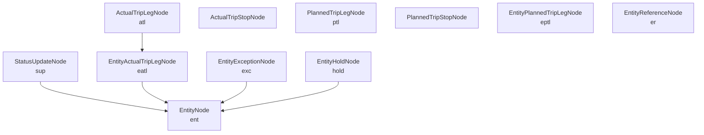
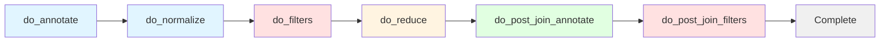

# Diagram: research/orchestrator/feature_repo/entity/entity_features.py

> Auto-generated by Obscura crawlers

## Diagram 1

```mermaid
classDiagram
    GraphReduceNode <|-- StatusUpdateNode
    GraphReduceNode <|-- EntityHoldNode
    GraphReduceNode <|-- EntityExceptionNode
    GraphReduceNode <|-- ActualTripLegNode
    GraphReduceNode <|-- EntityActualTripLegNode
    GraphReduceNode <|-- ActualTripStopNode
    GraphReduceNode <|-- PlannedTripLegNode
    GraphReduceNode <|-- PlannedTripStopNode
    GraphReduceNode <|-- EntityPlannedTripLegNode
    GraphReduceNode <|-- EntityReferenceNode
    GraphReduceNode <|-- EntityNode
    
    class GraphReduceNode {
        +do_annotate()
        +do_normalize()
        +do_filters()
        +do_labels(reduce_key)
        +do_reduce(reduce_key)
        +do_post_join_annotate()
        +do_post_join_filters()
    }
    
    class StatusUpdateNode {
        +String prefix = "sup"
        +String pk = "id"
        +String date_key = "status_update_ts"
    }
    
    class EntityHoldNode {
        +String prefix = "hold"
        +String pk = "id"
        +String date_key = "cleared_event_date"
        +do_filters()
        +do_reduce(reduce_key)
    }
    
    class EntityExceptionNode {
        +String prefix = "exc"
        +String pk = "id"
        +String date_key = "cleared_receive_date"
        +do_filters()
        +do_reduce(reduce_key)
    }
    
    class ActualTripLegNode {
        +String prefix = "atl"
        +String pk = "id"
        +String date_key = "ts"
        +do_filters()
    }
    
    class EntityActualTripLegNode {
        +String prefix = "eatl"
        +String pk = "id"
        +String date_key = "ts"
        +do_reduce(reduce_key)
        +do_post_join_filters()
        +do_post_join_annotate()
    }
    
    class ActualTripStopNode {
        +String pk = "id"
        +String date_key = "arrived"
    }
    
    class PlannedTripLegNode {
        +String prefix = "ptl"
        +String pk = "id"
        +String date_key = "ts"
    }
    
    class PlannedTripStopNode {
        +String pk = "id"
        +String date_key = "ts"
    }
    
    class EntityPlannedTripLegNode {
        +String prefix = "eptl"
        +String pk = "id"
        +String date_key = "ts"
    }
    
    class EntityReferenceNode {
        +String prefix = "er"
        +String pk = "id"
        +String date_key = "ts"
        +do_annotate()
        +do_reduce(reduce_key)
    }
    
    class EntityNode {
        +String prefix = "ent"
        +String pk = "id"
        +String date_key = "trip_plan_complete_ts"
        +do_annotate()
        +do_post_join_annotate()
        +do_post_join_filters()
    }
```

### SVG

<svg id="container" width="3976.4296875" xmlns="http://www.w3.org/2000/svg" class="classDiagram" height="576" viewBox="0 0 3976.4296875 576" role="graphics-document document" aria-roledescription="class"><g><defs><marker id="container_class-aggregationStart" class="marker aggregation class" refX="18" refY="7" markerWidth="190" markerHeight="240" orient="auto"><path d="M 18,7 L9,13 L1,7 L9,1 Z"></path></marker></defs><defs><marker id="container_class-aggregationEnd" class="marker aggregation class" refX="1" refY="7" markerWidth="20" markerHeight="28" orient="auto"><path d="M 18,7 L9,13 L1,7 L9,1 Z"></path></marker></defs><defs><marker id="container_class-extensionStart" class="marker extension class" refX="18" refY="7" markerWidth="190" markerHeight="240" orient="auto"><path d="M 1,7 L18,13 V 1 Z"></path></marker></defs><defs><marker id="container_class-extensionEnd" class="marker extension class" refX="1" refY="7" markerWidth="20" markerHeight="28" orient="auto"><path d="M 1,1 V 13 L18,7 Z"></path></marker></defs><defs><marker id="container_class-compositionStart" class="marker composition class" refX="18" refY="7" markerWidth="190" markerHeight="240" orient="auto"><path d="M 18,7 L9,13 L1,7 L9,1 Z"></path></marker></defs><defs><marker id="container_class-compositionEnd" class="marker composition class" refX="1" refY="7" markerWidth="20" markerHeight="28" orient="auto"><path d="M 18,7 L9,13 L1,7 L9,1 Z"></path></marker></defs><defs><marker id="container_class-dependencyStart" class="marker dependency class" refX="6" refY="7" markerWidth="190" markerHeight="240" orient="auto"><path d="M 5,7 L9,13 L1,7 L9,1 Z"></path></marker></defs><defs><marker id="container_class-dependencyEnd" class="marker dependency class" refX="13" refY="7" markerWidth="20" markerHeight="28" orient="auto"><path d="M 18,7 L9,13 L14,7 L9,1 Z"></path></marker></defs><defs><marker id="container_class-lollipopStart" class="marker lollipop class" refX="13" refY="7" markerWidth="190" markerHeight="240" orient="auto"><circle stroke="black" fill="transparent" cx="7" cy="7" r="6"></circle></marker></defs><defs><marker id="container_class-lollipopEnd" class="marker lollipop class" refX="1" refY="7" markerWidth="190" markerHeight="240" orient="auto"><circle stroke="black" fill="transparent" cx="7" cy="7" r="6"></circle></marker></defs><g class="root"><g class="clusters"></g><g class="edgePaths"><path d="M1947.685,156.109L1654.903,180.591C1362.121,205.073,776.556,254.036,483.774,288.685C190.992,323.333,190.992,343.667,190.992,353.833L190.992,364" id="id_GraphReduceNode_StatusUpdateNode_1" class="edge-thickness-normal edge-pattern-solid relation" style=";;;" data-edge="true" data-et="edge" data-id="id_GraphReduceNode_StatusUpdateNode_1" data-points="W3sieCI6MTk2NC44NzUsInkiOjE1NC42NzE1NjI3NTMyNjc4Nn0seyJ4IjoxOTAuOTkyMTg3NSwieSI6MzAzfSx7IngiOjE5MC45OTIxODc1LCJ5IjozNjR9XQ==" marker-start="url(#container_class-extensionStart)"></path><path d="M1947.723,159.783L1724.807,183.652C1501.891,207.522,1056.059,255.261,833.143,285.297C610.227,315.333,610.227,327.667,610.227,333.833L610.227,340" id="id_GraphReduceNode_EntityHoldNode_2" class="edge-thickness-normal edge-pattern-solid relation" style=";;;" data-edge="true" data-et="edge" data-id="id_GraphReduceNode_EntityHoldNode_2" data-points="W3sieCI6MTk2NC44NzUsInkiOjE1Ny45NDYyMzg1MjY4MzM2N30seyJ4Ijo2MTAuMjI2NTYyNSwieSI6MzAzfSx7IngiOjYxMC4yMjY1NjI1LCJ5IjozNDB9XQ==" marker-start="url(#container_class-extensionStart)"></path><path d="M1947.819,166.713L1797.779,189.428C1647.739,212.142,1347.659,257.571,1197.618,286.452C1047.578,315.333,1047.578,327.667,1047.578,333.833L1047.578,340" id="id_GraphReduceNode_EntityExceptionNode_3" class="edge-thickness-normal edge-pattern-solid relation" style=";;;" data-edge="true" data-et="edge" data-id="id_GraphReduceNode_EntityExceptionNode_3" data-points="W3sieCI6MTk2NC44NzUsInkiOjE2NC4xMzEyMDUxNjI2MDY2fSx7IngiOjEwNDcuNTc4MTI1LCJ5IjozMDN9LHsieCI6MTA0Ny41NzgxMjUsInkiOjM0MH1d" marker-start="url(#container_class-extensionStart)"></path><path d="M1948.086,179.89L1861.113,200.409C1774.141,220.927,1600.195,261.963,1513.223,290.648C1426.25,319.333,1426.25,335.667,1426.25,343.833L1426.25,352" id="id_GraphReduceNode_ActualTripLegNode_4" class="edge-thickness-normal edge-pattern-solid relation" style=";;;" data-edge="true" data-et="edge" data-id="id_GraphReduceNode_ActualTripLegNode_4" data-points="W3sieCI6MTk2NC44NzUsInkiOjE3NS45Mjk2NTcxMjY3MzAwNn0seyJ4IjoxNDI2LjI1LCJ5IjozMDN9LHsieCI6MTQyNi4yNSwieSI6MzUyfV0=" marker-start="url(#container_class-extensionStart)"></path><path d="M1949.189,214.035L1916.778,228.862C1884.368,243.69,1819.547,273.345,1787.137,292.339C1754.727,311.333,1754.727,319.667,1754.727,323.833L1754.727,328" id="id_GraphReduceNode_EntityActualTripLegNode_5" class="edge-thickness-normal edge-pattern-solid relation" style=";;;" data-edge="true" data-et="edge" data-id="id_GraphReduceNode_EntityActualTripLegNode_5" data-points="W3sieCI6MTk2NC44NzUsInkiOjIwNi44NTgxMDUwMTM5MDU4fSx7IngiOjE3NTQuNzI2NTYyNSwieSI6MzAzfSx7IngiOjE3NTQuNzI2NTYyNSwieSI6MzI4fV0=" marker-start="url(#container_class-extensionStart)"></path><path d="M2104.457,295.25L2104.457,296.542C2104.457,297.833,2104.457,300.417,2104.457,313.875C2104.457,327.333,2104.457,351.667,2104.457,363.833L2104.457,376" id="id_GraphReduceNode_ActualTripStopNode_6" class="edge-thickness-normal edge-pattern-solid relation" style=";;;" data-edge="true" data-et="edge" data-id="id_GraphReduceNode_ActualTripStopNode_6" data-points="W3sieCI6MjEwNC40NTcwMzEyNSwieSI6Mjc4fSx7IngiOjIxMDQuNDU3MDMxMjUsInkiOjMwM30seyJ4IjoyMTA0LjQ1NzAzMTI1LCJ5IjozNzZ9XQ==" marker-start="url(#container_class-extensionStart)"></path><path d="M2259.56,218.23L2288.688,232.358C2317.817,246.487,2376.075,274.743,2405.203,299.038C2434.332,323.333,2434.332,343.667,2434.332,353.833L2434.332,364" id="id_GraphReduceNode_PlannedTripLegNode_7" class="edge-thickness-normal edge-pattern-solid relation" style=";;;" data-edge="true" data-et="edge" data-id="id_GraphReduceNode_PlannedTripLegNode_7" data-points="W3sieCI6MjI0NC4wMzkwNjI1LCJ5IjoyMTAuNzAxNzgwOTc3NjQzMDR9LHsieCI6MjQzNC4zMzIwMzEyNSwieSI6MzAzfSx7IngiOjI0MzQuMzMyMDMxMjUsInkiOjM2NH1d" marker-start="url(#container_class-extensionStart)"></path><path d="M2260.78,181.831L2342.079,202.026C2423.377,222.221,2585.974,262.61,2667.272,294.972C2748.57,327.333,2748.57,351.667,2748.57,363.833L2748.57,376" id="id_GraphReduceNode_PlannedTripStopNode_8" class="edge-thickness-normal edge-pattern-solid relation" style=";;;" data-edge="true" data-et="edge" data-id="id_GraphReduceNode_PlannedTripStopNode_8" data-points="W3sieCI6MjI0NC4wMzkwNjI1LCJ5IjoxNzcuNjcyNjY2NTE3MDc0N30seyJ4IjoyNzQ4LjU3MDMxMjUsInkiOjMwM30seyJ4IjoyNzQ4LjU3MDMxMjUsInkiOjM3Nn1d" marker-start="url(#container_class-extensionStart)"></path><path d="M2261.059,168.858L2396.457,191.215C2531.855,213.572,2802.652,258.286,2938.051,290.81C3073.449,323.333,3073.449,343.667,3073.449,353.833L3073.449,364" id="id_GraphReduceNode_EntityPlannedTripLegNode_9" class="edge-thickness-normal edge-pattern-solid relation" style=";;;" data-edge="true" data-et="edge" data-id="id_GraphReduceNode_EntityPlannedTripLegNode_9" data-points="W3sieCI6MjI0NC4wMzkwNjI1LCJ5IjoxNjYuMDQ3Nzg2NDQwNDg2NjV9LHsieCI6MzA3My40NDkyMTg3NSwieSI6MzAzfSx7IngiOjMwNzMuNDQ5MjE4NzUsInkiOjM2NH1d" marker-start="url(#container_class-extensionStart)"></path><path d="M2261.16,162.295L2451.617,185.746C2642.074,209.196,3022.988,256.098,3213.445,285.716C3403.902,315.333,3403.902,327.667,3403.902,333.833L3403.902,340" id="id_GraphReduceNode_EntityReferenceNode_10" class="edge-thickness-normal edge-pattern-solid relation" style=";;;" data-edge="true" data-et="edge" data-id="id_GraphReduceNode_EntityReferenceNode_10" data-points="W3sieCI6MjI0NC4wMzkwNjI1LCJ5IjoxNjAuMTg2NjYwMTczNTExNTR9LHsieCI6MzQwMy45MDIzNDM3NSwieSI6MzAzfSx7IngiOjM0MDMuOTAyMzQzNzUsInkiOjM0MH1d" marker-start="url(#container_class-extensionStart)"></path><path d="M2261.211,157.964L2514.433,182.137C2767.655,206.309,3274.099,254.655,3527.321,282.994C3780.543,311.333,3780.543,319.667,3780.543,323.833L3780.543,328" id="id_GraphReduceNode_EntityNode_11" class="edge-thickness-normal edge-pattern-solid relation" style=";;;" data-edge="true" data-et="edge" data-id="id_GraphReduceNode_EntityNode_11" data-points="W3sieCI6MjI0NC4wMzkwNjI1LCJ5IjoxNTYuMzI0NTcwMzU3ODM3MDV9LHsieCI6Mzc4MC41NDI5Njg3NSwieSI6MzAzfSx7IngiOjM3ODAuNTQyOTY4NzUsInkiOjMyOH1d" marker-start="url(#container_class-extensionStart)"></path></g><g class="edgeLabels"><g class="edgeLabel"><g class="label" data-id="id_GraphReduceNode_StatusUpdateNode_1" transform="translate(0, 0)"><foreignObject width="0" height="0">

</foreignObject></g></g><g class="edgeLabel"><g class="label" data-id="id_GraphReduceNode_EntityHoldNode_2" transform="translate(0, 0)"><foreignObject width="0" height="0">

</foreignObject></g></g><g class="edgeLabel"><g class="label" data-id="id_GraphReduceNode_EntityExceptionNode_3" transform="translate(0, 0)"><foreignObject width="0" height="0">

</foreignObject></g></g><g class="edgeLabel"><g class="label" data-id="id_GraphReduceNode_ActualTripLegNode_4" transform="translate(0, 0)"><foreignObject width="0" height="0">

</foreignObject></g></g><g class="edgeLabel"><g class="label" data-id="id_GraphReduceNode_EntityActualTripLegNode_5" transform="translate(0, 0)"><foreignObject width="0" height="0">

</foreignObject></g></g><g class="edgeLabel"><g class="label" data-id="id_GraphReduceNode_ActualTripStopNode_6" transform="translate(0, 0)"><foreignObject width="0" height="0">

</foreignObject></g></g><g class="edgeLabel"><g class="label" data-id="id_GraphReduceNode_PlannedTripLegNode_7" transform="translate(0, 0)"><foreignObject width="0" height="0">

</foreignObject></g></g><g class="edgeLabel"><g class="label" data-id="id_GraphReduceNode_PlannedTripStopNode_8" transform="translate(0, 0)"><foreignObject width="0" height="0">

</foreignObject></g></g><g class="edgeLabel"><g class="label" data-id="id_GraphReduceNode_EntityPlannedTripLegNode_9" transform="translate(0, 0)"><foreignObject width="0" height="0">

</foreignObject></g></g><g class="edgeLabel"><g class="label" data-id="id_GraphReduceNode_EntityReferenceNode_10" transform="translate(0, 0)"><foreignObject width="0" height="0">

</foreignObject></g></g><g class="edgeLabel"><g class="label" data-id="id_GraphReduceNode_EntityNode_11" transform="translate(0, 0)"><foreignObject width="0" height="0">

</foreignObject></g></g></g><g class="nodes"><g class="node default" id="classId-GraphReduceNode-0" transform="translate(2104.45703125, 143)"><g class="basic label-container"><path d="M-139.58203125 -135 L139.58203125 -135 L139.58203125 135 L-139.58203125 135" stroke="none" stroke-width="0" fill="#ECECFF" style=""></path><path d="M-139.58203125 -135 C-50.30699044742627 -135, 38.968050355147454 -135, 139.58203125 -135 M-139.58203125 -135 C-30.455610701667922 -135, 78.67080984666416 -135, 139.58203125 -135 M139.58203125 -135 C139.58203125 -28.176411938351137, 139.58203125 78.64717612329773, 139.58203125 135 M139.58203125 -135 C139.58203125 -75.2077986408913, 139.58203125 -15.415597281782581, 139.58203125 135 M139.58203125 135 C77.53200300865322 135, 15.481974767306454 135, -139.58203125 135 M139.58203125 135 C47.867330555392755 135, -43.84737013921449 135, -139.58203125 135 M-139.58203125 135 C-139.58203125 34.500025205040814, -139.58203125 -65.99994958991837, -139.58203125 -135 M-139.58203125 135 C-139.58203125 34.51984731797572, -139.58203125 -65.96030536404857, -139.58203125 -135" stroke="#9370DB" stroke-width="1.3" fill="none" stroke-dasharray="0 0" style=""></path></g><g class="annotation-group text" transform="translate(0, -111)"></g><g class="label-group text" transform="translate(-67.7578125, -111)"><g class="label" style="font-weight: bolder" transform="translate(0,-12)"><foreignObject width="135.515625" height="24">

GraphReduceNode

</foreignObject></g></g><g class="members-group text" transform="translate(-127.58203125, -63)"></g><g class="methods-group text" transform="translate(-127.58203125, -33)"><g class="label" style="" transform="translate(0,-12)"><foreignObject width="110.375" height="24">

+do_annotate()

</foreignObject></g><g class="label" style="" transform="translate(0,12)"><foreignObject width="117.21875" height="24">

+do_normalize()

</foreignObject></g><g class="label" style="" transform="translate(0,36)"><foreignObject width="86.5" height="24">

+do_filters()

</foreignObject></g><g class="label" style="" transform="translate(0,60)"><foreignObject width="170.734375" height="24">

+do_labels(reduce_key)

</foreignObject></g><g class="label" style="" transform="translate(0,84)"><foreignObject width="176.53125" height="24">

+do_reduce(reduce_key)

</foreignObject></g><g class="label" style="" transform="translate(0,108)"><foreignObject width="187.40625" height="24">

+do_post_join_annotate()

</foreignObject></g><g class="label" style="" transform="translate(0,132)"><foreignObject width="163.53125" height="24">

+do_post_join_filters()

</foreignObject></g></g><g class="divider" style=""><path d="M-139.58203125 -87 C-67.3298279102949 -87, 4.922375429410209 -87, 139.58203125 -87 M-139.58203125 -87 C-71.91801678158444 -87, -4.254002313168883 -87, 139.58203125 -87" stroke="#9370DB" stroke-width="1.3" fill="none" stroke-dasharray="0 0" style=""></path></g><g class="divider" style=""><path d="M-139.58203125 -63 C-60.34156234721608 -63, 18.898906555567834 -63, 139.58203125 -63 M-139.58203125 -63 C-67.57556109788105 -63, 4.430909054237901 -63, 139.58203125 -63" stroke="#9370DB" stroke-width="1.3" fill="none" stroke-dasharray="0 0" style=""></path></g></g><g class="node default" id="classId-StatusUpdateNode-1" transform="translate(190.9921875, 448)"><g class="basic label-container"><path d="M-182.9921875 -84 L182.9921875 -84 L182.9921875 84 L-182.9921875 84" stroke="none" stroke-width="0" fill="#ECECFF" style=""></path><path d="M-182.9921875 -84 C-107.8559435243818 -84, -32.7196995487636 -84, 182.9921875 -84 M-182.9921875 -84 C-103.91662488431405 -84, -24.841062268628093 -84, 182.9921875 -84 M182.9921875 -84 C182.9921875 -28.650744941841843, 182.9921875 26.698510116316314, 182.9921875 84 M182.9921875 -84 C182.9921875 -27.51040492683203, 182.9921875 28.979190146335938, 182.9921875 84 M182.9921875 84 C67.60543587985278 84, -47.781315740294446 84, -182.9921875 84 M182.9921875 84 C84.43725514679238 84, -14.117677206415237 84, -182.9921875 84 M-182.9921875 84 C-182.9921875 35.05450054321605, -182.9921875 -13.890998913567898, -182.9921875 -84 M-182.9921875 84 C-182.9921875 22.696088382321832, -182.9921875 -38.607823235356335, -182.9921875 -84" stroke="#9370DB" stroke-width="1.3" fill="none" stroke-dasharray="0 0" style=""></path></g><g class="annotation-group text" transform="translate(0, -60)"></g><g class="label-group text" transform="translate(-69.203125, -60)"><g class="label" style="font-weight: bolder" transform="translate(0,-12)"><foreignObject width="138.40625" height="24">

StatusUpdateNode

</foreignObject></g></g><g class="members-group text" transform="translate(-170.9921875, -12)"><g class="label" style="" transform="translate(0,-12)"><foreignObject width="150.5625" height="24">

+String prefix = "sup"

</foreignObject></g><g class="label" style="" transform="translate(0,12)"><foreignObject width="115.5" height="24">

+String pk = "id"

</foreignObject></g><g class="label" style="" transform="translate(0,36)"><foreignObject width="272.78125" height="24">

+String date_key = "status_update_ts"

</foreignObject></g></g><g class="methods-group text" transform="translate(-170.9921875, 84)"></g><g class="divider" style=""><path d="M-182.9921875 -36 C-48.9936460214856 -36, 85.0048954570288 -36, 182.9921875 -36 M-182.9921875 -36 C-47.544378454896304 -36, 87.90343059020739 -36, 182.9921875 -36" stroke="#9370DB" stroke-width="1.3" fill="none" stroke-dasharray="0 0" style=""></path></g><g class="divider" style=""><path d="M-182.9921875 60 C-47.88680138425366 60, 87.21858473149268 60, 182.9921875 60 M-182.9921875 60 C-64.50997084212959 60, 53.97224581574082 60, 182.9921875 60" stroke="#9370DB" stroke-width="1.3" fill="none" stroke-dasharray="0 0" style=""></path></g></g><g class="node default" id="classId-EntityHoldNode-2" transform="translate(610.2265625, 448)"><g class="basic label-container"><path d="M-186.2421875 -108 L186.2421875 -108 L186.2421875 108 L-186.2421875 108" stroke="none" stroke-width="0" fill="#ECECFF" style=""></path><path d="M-186.2421875 -108 C-52.89262932054592 -108, 80.45692885890816 -108, 186.2421875 -108 M-186.2421875 -108 C-38.99620144650876 -108, 108.24978460698247 -108, 186.2421875 -108 M186.2421875 -108 C186.2421875 -49.28654715951619, 186.2421875 9.426905680967621, 186.2421875 108 M186.2421875 -108 C186.2421875 -33.01543196918654, 186.2421875 41.96913606162693, 186.2421875 108 M186.2421875 108 C38.22793510824539 108, -109.78631728350922 108, -186.2421875 108 M186.2421875 108 C88.66033745664922 108, -8.921512586701567 108, -186.2421875 108 M-186.2421875 108 C-186.2421875 56.9533528332489, -186.2421875 5.9067056664978, -186.2421875 -108 M-186.2421875 108 C-186.2421875 22.35088621427252, -186.2421875 -63.29822757145496, -186.2421875 -108" stroke="#9370DB" stroke-width="1.3" fill="none" stroke-dasharray="0 0" style=""></path></g><g class="annotation-group text" transform="translate(0, -84)"></g><g class="label-group text" transform="translate(-57.609375, -84)"><g class="label" style="font-weight: bolder" transform="translate(0,-12)"><foreignObject width="115.21875" height="24">

EntityHoldNode

</foreignObject></g></g><g class="members-group text" transform="translate(-174.2421875, -36)"><g class="label" style="" transform="translate(0,-12)"><foreignObject width="157.5" height="24">

+String prefix = "hold"

</foreignObject></g><g class="label" style="" transform="translate(0,12)"><foreignObject width="115.5" height="24">

+String pk = "id"

</foreignObject></g><g class="label" style="" transform="translate(0,36)"><foreignObject width="290.875" height="24">

+String date_key = "cleared_event_date"

</foreignObject></g></g><g class="methods-group text" transform="translate(-174.2421875, 60)"><g class="label" style="" transform="translate(0,-12)"><foreignObject width="86.5" height="24">

+do_filters()

</foreignObject></g><g class="label" style="" transform="translate(0,12)"><foreignObject width="176.53125" height="24">

+do_reduce(reduce_key)

</foreignObject></g></g><g class="divider" style=""><path d="M-186.2421875 -60 C-61.180209320324806 -60, 63.88176885935039 -60, 186.2421875 -60 M-186.2421875 -60 C-64.08313962404232 -60, 58.075908251915365 -60, 186.2421875 -60" stroke="#9370DB" stroke-width="1.3" fill="none" stroke-dasharray="0 0" style=""></path></g><g class="divider" style=""><path d="M-186.2421875 36 C-95.52332925810046 36, -4.804471016200921 36, 186.2421875 36 M-186.2421875 36 C-69.75377780348381 36, 46.73463189303237 36, 186.2421875 36" stroke="#9370DB" stroke-width="1.3" fill="none" stroke-dasharray="0 0" style=""></path></g></g><g class="node default" id="classId-EntityExceptionNode-3" transform="translate(1047.578125, 448)"><g class="basic label-container"><path d="M-201.109375 -108 L201.109375 -108 L201.109375 108 L-201.109375 108" stroke="none" stroke-width="0" fill="#ECECFF" style=""></path><path d="M-201.109375 -108 C-79.93013865946541 -108, 41.24909768106917 -108, 201.109375 -108 M-201.109375 -108 C-75.33201700672527 -108, 50.44534098654947 -108, 201.109375 -108 M201.109375 -108 C201.109375 -46.40695425723483, 201.109375 15.18609148553034, 201.109375 108 M201.109375 -108 C201.109375 -36.73129658396634, 201.109375 34.53740683206732, 201.109375 108 M201.109375 108 C62.56230722280506 108, -75.98476055438988 108, -201.109375 108 M201.109375 108 C113.56970343193622 108, 26.030031863872438 108, -201.109375 108 M-201.109375 108 C-201.109375 27.699695962503938, -201.109375 -52.600608074992124, -201.109375 -108 M-201.109375 108 C-201.109375 59.05021433219869, -201.109375 10.100428664397384, -201.109375 -108" stroke="#9370DB" stroke-width="1.3" fill="none" stroke-dasharray="0 0" style=""></path></g><g class="annotation-group text" transform="translate(0, -84)"></g><g class="label-group text" transform="translate(-76.171875, -84)"><g class="label" style="font-weight: bolder" transform="translate(0,-12)"><foreignObject width="152.34375" height="24">

EntityExceptionNode

</foreignObject></g></g><g class="members-group text" transform="translate(-189.109375, -36)"><g class="label" style="" transform="translate(0,-12)"><foreignObject width="148.28125" height="24">

+String prefix = "exc"

</foreignObject></g><g class="label" style="" transform="translate(0,12)"><foreignObject width="115.5" height="24">

+String pk = "id"

</foreignObject></g><g class="label" style="" transform="translate(0,36)"><foreignObject width="302.046875" height="24">

+String date_key = "cleared_receive_date"

</foreignObject></g></g><g class="methods-group text" transform="translate(-189.109375, 60)"><g class="label" style="" transform="translate(0,-12)"><foreignObject width="86.5" height="24">

+do_filters()

</foreignObject></g><g class="label" style="" transform="translate(0,12)"><foreignObject width="176.53125" height="24">

+do_reduce(reduce_key)

</foreignObject></g></g><g class="divider" style=""><path d="M-201.109375 -60 C-118.60900318376878 -60, -36.108631367537555 -60, 201.109375 -60 M-201.109375 -60 C-58.62296268508305 -60, 83.8634496298339 -60, 201.109375 -60" stroke="#9370DB" stroke-width="1.3" fill="none" stroke-dasharray="0 0" style=""></path></g><g class="divider" style=""><path d="M-201.109375 36 C-83.77661092651681 36, 33.55615314696638 36, 201.109375 36 M-201.109375 36 C-82.06634411069335 36, 36.9766867786133 36, 201.109375 36" stroke="#9370DB" stroke-width="1.3" fill="none" stroke-dasharray="0 0" style=""></path></g></g><g class="node default" id="classId-ActualTripLegNode-4" transform="translate(1426.25, 448)"><g class="basic label-container"><path d="M-127.5625 -96 L127.5625 -96 L127.5625 96 L-127.5625 96" stroke="none" stroke-width="0" fill="#ECECFF" style=""></path><path d="M-127.5625 -96 C-44.130568551826144 -96, 39.30136289634771 -96, 127.5625 -96 M-127.5625 -96 C-28.171657678867646 -96, 71.21918464226471 -96, 127.5625 -96 M127.5625 -96 C127.5625 -26.743968175723865, 127.5625 42.51206364855227, 127.5625 96 M127.5625 -96 C127.5625 -50.61431891101646, 127.5625 -5.228637822032923, 127.5625 96 M127.5625 96 C54.84802771505869 96, -17.866444569882617 96, -127.5625 96 M127.5625 96 C71.5167032057845 96, 15.470906411569004 96, -127.5625 96 M-127.5625 96 C-127.5625 44.486046036481646, -127.5625 -7.027907927036708, -127.5625 -96 M-127.5625 96 C-127.5625 24.711720339135127, -127.5625 -46.576559321729746, -127.5625 -96" stroke="#9370DB" stroke-width="1.3" fill="none" stroke-dasharray="0 0" style=""></path></g><g class="annotation-group text" transform="translate(0, -72)"></g><g class="label-group text" transform="translate(-69.140625, -72)"><g class="label" style="font-weight: bolder" transform="translate(0,-12)"><foreignObject width="138.28125" height="24">

ActualTripLegNode

</foreignObject></g></g><g class="members-group text" transform="translate(-115.5625, -24)"><g class="label" style="" transform="translate(0,-12)"><foreignObject width="143.125" height="24">

+String prefix = "atl"

</foreignObject></g><g class="label" style="" transform="translate(0,12)"><foreignObject width="115.5" height="24">

+String pk = "id"

</foreignObject></g><g class="label" style="" transform="translate(0,36)"><foreignObject width="161.984375" height="24">

+String date_key = "ts"

</foreignObject></g></g><g class="methods-group text" transform="translate(-115.5625, 72)"><g class="label" style="" transform="translate(0,-12)"><foreignObject width="86.5" height="24">

+do_filters()

</foreignObject></g></g><g class="divider" style=""><path d="M-127.5625 -48 C-36.06022647362704 -48, 55.44204705274592 -48, 127.5625 -48 M-127.5625 -48 C-47.715436343362626 -48, 32.13162731327475 -48, 127.5625 -48" stroke="#9370DB" stroke-width="1.3" fill="none" stroke-dasharray="0 0" style=""></path></g><g class="divider" style=""><path d="M-127.5625 48 C-48.15373607518825 48, 31.255027849623502 48, 127.5625 48 M-127.5625 48 C-48.91330124583624 48, 29.735897508327525 48, 127.5625 48" stroke="#9370DB" stroke-width="1.3" fill="none" stroke-dasharray="0 0" style=""></path></g></g><g class="node default" id="classId-EntityActualTripLegNode-5" transform="translate(1754.7265625, 448)"><g class="basic label-container"><path d="M-150.9140625 -120 L150.9140625 -120 L150.9140625 120 L-150.9140625 120" stroke="none" stroke-width="0" fill="#ECECFF" style=""></path><path d="M-150.9140625 -120 C-90.51307023141943 -120, -30.112077962838868 -120, 150.9140625 -120 M-150.9140625 -120 C-78.95294646120423 -120, -6.991830422408469 -120, 150.9140625 -120 M150.9140625 -120 C150.9140625 -30.94405100480968, 150.9140625 58.11189799038064, 150.9140625 120 M150.9140625 -120 C150.9140625 -40.50329391217964, 150.9140625 38.993412175640714, 150.9140625 120 M150.9140625 120 C49.75990375720477 120, -51.394254985590464 120, -150.9140625 120 M150.9140625 120 C89.99460405568962 120, 29.075145611379227 120, -150.9140625 120 M-150.9140625 120 C-150.9140625 63.993923518961765, -150.9140625 7.98784703792353, -150.9140625 -120 M-150.9140625 120 C-150.9140625 63.068314096524894, -150.9140625 6.136628193049788, -150.9140625 -120" stroke="#9370DB" stroke-width="1.3" fill="none" stroke-dasharray="0 0" style=""></path></g><g class="annotation-group text" transform="translate(0, -96)"></g><g class="label-group text" transform="translate(-90.421875, -96)"><g class="label" style="font-weight: bolder" transform="translate(0,-12)"><foreignObject width="180.84375" height="24">

EntityActualTripLegNode

</foreignObject></g></g><g class="members-group text" transform="translate(-138.9140625, -48)"><g class="label" style="" transform="translate(0,-12)"><foreignObject width="151.765625" height="24">

+String prefix = "eatl"

</foreignObject></g><g class="label" style="" transform="translate(0,12)"><foreignObject width="115.5" height="24">

+String pk = "id"

</foreignObject></g><g class="label" style="" transform="translate(0,36)"><foreignObject width="161.984375" height="24">

+String date_key = "ts"

</foreignObject></g></g><g class="methods-group text" transform="translate(-138.9140625, 48)"><g class="label" style="" transform="translate(0,-12)"><foreignObject width="176.53125" height="24">

+do_reduce(reduce_key)

</foreignObject></g><g class="label" style="" transform="translate(0,12)"><foreignObject width="163.53125" height="24">

+do_post_join_filters()

</foreignObject></g><g class="label" style="" transform="translate(0,36)"><foreignObject width="187.40625" height="24">

+do_post_join_annotate()

</foreignObject></g></g><g class="divider" style=""><path d="M-150.9140625 -72 C-40.75195870083462 -72, 69.41014509833076 -72, 150.9140625 -72 M-150.9140625 -72 C-59.84473198226351 -72, 31.22459853547298 -72, 150.9140625 -72" stroke="#9370DB" stroke-width="1.3" fill="none" stroke-dasharray="0 0" style=""></path></g><g class="divider" style=""><path d="M-150.9140625 24 C-42.64763899792372 24, 65.61878450415256 24, 150.9140625 24 M-150.9140625 24 C-58.86084768933334 24, 33.19236712133332 24, 150.9140625 24" stroke="#9370DB" stroke-width="1.3" fill="none" stroke-dasharray="0 0" style=""></path></g></g><g class="node default" id="classId-ActualTripStopNode-6" transform="translate(2104.45703125, 448)"><g class="basic label-container"><path d="M-148.81640625 -72 L148.81640625 -72 L148.81640625 72 L-148.81640625 72" stroke="none" stroke-width="0" fill="#ECECFF" style=""></path><path d="M-148.81640625 -72 C-34.34700940888999 -72, 80.12238743222002 -72, 148.81640625 -72 M-148.81640625 -72 C-76.9450868559933 -72, -5.073767461986591 -72, 148.81640625 -72 M148.81640625 -72 C148.81640625 -18.4972023089257, 148.81640625 35.0055953821486, 148.81640625 72 M148.81640625 -72 C148.81640625 -26.738697687455293, 148.81640625 18.522604625089414, 148.81640625 72 M148.81640625 72 C37.53645832283934 72, -73.74348960432133 72, -148.81640625 72 M148.81640625 72 C31.883903309577917 72, -85.04859963084417 72, -148.81640625 72 M-148.81640625 72 C-148.81640625 42.92626981975452, -148.81640625 13.852539639509047, -148.81640625 -72 M-148.81640625 72 C-148.81640625 40.043390444828816, -148.81640625 8.08678088965764, -148.81640625 -72" stroke="#9370DB" stroke-width="1.3" fill="none" stroke-dasharray="0 0" style=""></path></g><g class="annotation-group text" transform="translate(0, -48)"></g><g class="label-group text" transform="translate(-73.3828125, -48)"><g class="label" style="font-weight: bolder" transform="translate(0,-12)"><foreignObject width="146.765625" height="24">

ActualTripStopNode

</foreignObject></g></g><g class="members-group text" transform="translate(-136.81640625, 0)"><g class="label" style="" transform="translate(0,-12)"><foreignObject width="115.5" height="24">

+String pk = "id"

</foreignObject></g><g class="label" style="" transform="translate(0,12)"><foreignObject width="200.25" height="24">

+String date_key = "arrived"

</foreignObject></g></g><g class="methods-group text" transform="translate(-136.81640625, 72)"></g><g class="divider" style=""><path d="M-148.81640625 -24 C-69.86657611952464 -24, 9.083254010950725 -24, 148.81640625 -24 M-148.81640625 -24 C-74.57050795795213 -24, -0.3246096659042621 -24, 148.81640625 -24" stroke="#9370DB" stroke-width="1.3" fill="none" stroke-dasharray="0 0" style=""></path></g><g class="divider" style=""><path d="M-148.81640625 48 C-48.2844908386282 48, 52.2474245727436 48, 148.81640625 48 M-148.81640625 48 C-58.09767359569007 48, 32.62105905861986 48, 148.81640625 48" stroke="#9370DB" stroke-width="1.3" fill="none" stroke-dasharray="0 0" style=""></path></g></g><g class="node default" id="classId-PlannedTripLegNode-7" transform="translate(2434.33203125, 448)"><g class="basic label-container"><path d="M-131.05859375 -84 L131.05859375 -84 L131.05859375 84 L-131.05859375 84" stroke="none" stroke-width="0" fill="#ECECFF" style=""></path><path d="M-131.05859375 -84 C-42.7754311316763 -84, 45.5077314866474 -84, 131.05859375 -84 M-131.05859375 -84 C-39.98540340191434 -84, 51.08778694617132 -84, 131.05859375 -84 M131.05859375 -84 C131.05859375 -30.67952112666414, 131.05859375 22.640957746671717, 131.05859375 84 M131.05859375 -84 C131.05859375 -40.19569991830827, 131.05859375 3.608600163383457, 131.05859375 84 M131.05859375 84 C65.5200173638464 84, -0.01855902230718698 84, -131.05859375 84 M131.05859375 84 C54.680249690142304 84, -21.698094369715392 84, -131.05859375 84 M-131.05859375 84 C-131.05859375 25.02588795428143, -131.05859375 -33.94822409143714, -131.05859375 -84 M-131.05859375 84 C-131.05859375 45.00096560905361, -131.05859375 6.001931218107217, -131.05859375 -84" stroke="#9370DB" stroke-width="1.3" fill="none" stroke-dasharray="0 0" style=""></path></g><g class="annotation-group text" transform="translate(0, -60)"></g><g class="label-group text" transform="translate(-76.1328125, -60)"><g class="label" style="font-weight: bolder" transform="translate(0,-12)"><foreignObject width="152.265625" height="24">

PlannedTripLegNode

</foreignObject></g></g><g class="members-group text" transform="translate(-119.05859375, -12)"><g class="label" style="" transform="translate(0,-12)"><foreignObject width="144.171875" height="24">

+String prefix = "ptl"

</foreignObject></g><g class="label" style="" transform="translate(0,12)"><foreignObject width="115.5" height="24">

+String pk = "id"

</foreignObject></g><g class="label" style="" transform="translate(0,36)"><foreignObject width="161.984375" height="24">

+String date_key = "ts"

</foreignObject></g></g><g class="methods-group text" transform="translate(-119.05859375, 84)"></g><g class="divider" style=""><path d="M-131.05859375 -36 C-38.28318158861045 -36, 54.49223057277911 -36, 131.05859375 -36 M-131.05859375 -36 C-48.954734185596365 -36, 33.14912537880727 -36, 131.05859375 -36" stroke="#9370DB" stroke-width="1.3" fill="none" stroke-dasharray="0 0" style=""></path></g><g class="divider" style=""><path d="M-131.05859375 60 C-71.57674701013636 60, -12.094900270272731 60, 131.05859375 60 M-131.05859375 60 C-73.44703363018967 60, -15.83547351037933 60, 131.05859375 60" stroke="#9370DB" stroke-width="1.3" fill="none" stroke-dasharray="0 0" style=""></path></g></g><g class="node default" id="classId-PlannedTripStopNode-8" transform="translate(2748.5703125, 448)"><g class="basic label-container"><path d="M-133.1796875 -72 L133.1796875 -72 L133.1796875 72 L-133.1796875 72" stroke="none" stroke-width="0" fill="#ECECFF" style=""></path><path d="M-133.1796875 -72 C-53.22764985625949 -72, 26.72438778748102 -72, 133.1796875 -72 M-133.1796875 -72 C-67.27755678126917 -72, -1.375426062538338 -72, 133.1796875 -72 M133.1796875 -72 C133.1796875 -23.64473083435484, 133.1796875 24.710538331290323, 133.1796875 72 M133.1796875 -72 C133.1796875 -19.6079960631451, 133.1796875 32.7840078737098, 133.1796875 72 M133.1796875 72 C46.999381382112446 72, -39.18092473577511 72, -133.1796875 72 M133.1796875 72 C50.97317279964011 72, -31.23334190071978 72, -133.1796875 72 M-133.1796875 72 C-133.1796875 34.49857139684204, -133.1796875 -3.002857206315923, -133.1796875 -72 M-133.1796875 72 C-133.1796875 24.765606292506874, -133.1796875 -22.468787414986252, -133.1796875 -72" stroke="#9370DB" stroke-width="1.3" fill="none" stroke-dasharray="0 0" style=""></path></g><g class="annotation-group text" transform="translate(0, -48)"></g><g class="label-group text" transform="translate(-80.375, -48)"><g class="label" style="font-weight: bolder" transform="translate(0,-12)"><foreignObject width="160.75" height="24">

PlannedTripStopNode

</foreignObject></g></g><g class="members-group text" transform="translate(-121.1796875, 0)"><g class="label" style="" transform="translate(0,-12)"><foreignObject width="115.5" height="24">

+String pk = "id"

</foreignObject></g><g class="label" style="" transform="translate(0,12)"><foreignObject width="161.984375" height="24">

+String date_key = "ts"

</foreignObject></g></g><g class="methods-group text" transform="translate(-121.1796875, 72)"></g><g class="divider" style=""><path d="M-133.1796875 -24 C-29.306527775888526 -24, 74.56663194822295 -24, 133.1796875 -24 M-133.1796875 -24 C-53.046781683222164 -24, 27.08612413355567 -24, 133.1796875 -24" stroke="#9370DB" stroke-width="1.3" fill="none" stroke-dasharray="0 0" style=""></path></g><g class="divider" style=""><path d="M-133.1796875 48 C-65.71489984043893 48, 1.7498878191221365 48, 133.1796875 48 M-133.1796875 48 C-69.70954831519317 48, -6.239409130386349 48, 133.1796875 48" stroke="#9370DB" stroke-width="1.3" fill="none" stroke-dasharray="0 0" style=""></path></g></g><g class="node default" id="classId-EntityPlannedTripLegNode-9" transform="translate(3073.44921875, 448)"><g class="basic label-container"><path d="M-141.69921875 -84 L141.69921875 -84 L141.69921875 84 L-141.69921875 84" stroke="none" stroke-width="0" fill="#ECECFF" style=""></path><path d="M-141.69921875 -84 C-36.723003727439774 -84, 68.25321129512045 -84, 141.69921875 -84 M-141.69921875 -84 C-39.797257417106735 -84, 62.10470391578653 -84, 141.69921875 -84 M141.69921875 -84 C141.69921875 -27.62863560196623, 141.69921875 28.74272879606754, 141.69921875 84 M141.69921875 -84 C141.69921875 -19.140220049402515, 141.69921875 45.71955990119497, 141.69921875 84 M141.69921875 84 C40.84660998299701 84, -60.00599878400598 84, -141.69921875 84 M141.69921875 84 C76.26486542432711 84, 10.830512098654225 84, -141.69921875 84 M-141.69921875 84 C-141.69921875 36.65007257489847, -141.69921875 -10.699854850203053, -141.69921875 -84 M-141.69921875 84 C-141.69921875 31.972804639978662, -141.69921875 -20.054390720042676, -141.69921875 -84" stroke="#9370DB" stroke-width="1.3" fill="none" stroke-dasharray="0 0" style=""></path></g><g class="annotation-group text" transform="translate(0, -60)"></g><g class="label-group text" transform="translate(-97.4140625, -60)"><g class="label" style="font-weight: bolder" transform="translate(0,-12)"><foreignObject width="194.828125" height="24">

EntityPlannedTripLegNode

</foreignObject></g></g><g class="members-group text" transform="translate(-129.69921875, -12)"><g class="label" style="" transform="translate(0,-12)"><foreignObject width="152.734375" height="24">

+String prefix = "eptl"

</foreignObject></g><g class="label" style="" transform="translate(0,12)"><foreignObject width="115.5" height="24">

+String pk = "id"

</foreignObject></g><g class="label" style="" transform="translate(0,36)"><foreignObject width="161.984375" height="24">

+String date_key = "ts"

</foreignObject></g></g><g class="methods-group text" transform="translate(-129.69921875, 84)"></g><g class="divider" style=""><path d="M-141.69921875 -36 C-46.43436138137308 -36, 48.83049598725384 -36, 141.69921875 -36 M-141.69921875 -36 C-74.18409202204924 -36, -6.668965294098484 -36, 141.69921875 -36" stroke="#9370DB" stroke-width="1.3" fill="none" stroke-dasharray="0 0" style=""></path></g><g class="divider" style=""><path d="M-141.69921875 60 C-46.05308198437385 60, 49.593054781252306 60, 141.69921875 60 M-141.69921875 60 C-76.2890815021757 60, -10.87894425435141 60, 141.69921875 60" stroke="#9370DB" stroke-width="1.3" fill="none" stroke-dasharray="0 0" style=""></path></g></g><g class="node default" id="classId-EntityReferenceNode-10" transform="translate(3403.90234375, 448)"><g class="basic label-container"><path d="M-138.75390625 -108 L138.75390625 -108 L138.75390625 108 L-138.75390625 108" stroke="none" stroke-width="0" fill="#ECECFF" style=""></path><path d="M-138.75390625 -108 C-36.33736919147199 -108, 66.07916786705601 -108, 138.75390625 -108 M-138.75390625 -108 C-33.100643209656226 -108, 72.55261983068755 -108, 138.75390625 -108 M138.75390625 -108 C138.75390625 -25.626737175253268, 138.75390625 56.746525649493464, 138.75390625 108 M138.75390625 -108 C138.75390625 -62.07952208547441, 138.75390625 -16.159044170948818, 138.75390625 108 M138.75390625 108 C70.57289951221739 108, 2.3918927744347798 108, -138.75390625 108 M138.75390625 108 C50.46696263321104 108, -37.81998098357792 108, -138.75390625 108 M-138.75390625 108 C-138.75390625 54.3455907820786, -138.75390625 0.6911815641572048, -138.75390625 -108 M-138.75390625 108 C-138.75390625 62.46199160810722, -138.75390625 16.923983216214438, -138.75390625 -108" stroke="#9370DB" stroke-width="1.3" fill="none" stroke-dasharray="0 0" style=""></path></g><g class="annotation-group text" transform="translate(0, -84)"></g><g class="label-group text" transform="translate(-76.9765625, -84)"><g class="label" style="font-weight: bolder" transform="translate(0,-12)"><foreignObject width="153.953125" height="24">

EntityReferenceNode

</foreignObject></g></g><g class="members-group text" transform="translate(-126.75390625, -36)"><g class="label" style="" transform="translate(0,-12)"><foreignObject width="139.40625" height="24">

+String prefix = "er"

</foreignObject></g><g class="label" style="" transform="translate(0,12)"><foreignObject width="115.5" height="24">

+String pk = "id"

</foreignObject></g><g class="label" style="" transform="translate(0,36)"><foreignObject width="161.984375" height="24">

+String date_key = "ts"

</foreignObject></g></g><g class="methods-group text" transform="translate(-126.75390625, 60)"><g class="label" style="" transform="translate(0,-12)"><foreignObject width="110.375" height="24">

+do_annotate()

</foreignObject></g><g class="label" style="" transform="translate(0,12)"><foreignObject width="176.53125" height="24">

+do_reduce(reduce_key)

</foreignObject></g></g><g class="divider" style=""><path d="M-138.75390625 -60 C-78.42026782369891 -60, -18.0866293973978 -60, 138.75390625 -60 M-138.75390625 -60 C-34.104787100312066 -60, 70.54433204937587 -60, 138.75390625 -60" stroke="#9370DB" stroke-width="1.3" fill="none" stroke-dasharray="0 0" style=""></path></g><g class="divider" style=""><path d="M-138.75390625 36 C-74.28873412719716 36, -9.823562004394319 36, 138.75390625 36 M-138.75390625 36 C-53.6323433724358 36, 31.489219505128403 36, 138.75390625 36" stroke="#9370DB" stroke-width="1.3" fill="none" stroke-dasharray="0 0" style=""></path></g></g><g class="node default" id="classId-EntityNode-11" transform="translate(3780.54296875, 448)"><g class="basic label-container"><path d="M-187.88671875 -120 L187.88671875 -120 L187.88671875 120 L-187.88671875 120" stroke="none" stroke-width="0" fill="#ECECFF" style=""></path><path d="M-187.88671875 -120 C-75.89507703551521 -120, 36.09656467896957 -120, 187.88671875 -120 M-187.88671875 -120 C-83.71823428878069 -120, 20.450250172438615 -120, 187.88671875 -120 M187.88671875 -120 C187.88671875 -27.255258226787603, 187.88671875 65.4894835464248, 187.88671875 120 M187.88671875 -120 C187.88671875 -70.40370330306175, 187.88671875 -20.807406606123507, 187.88671875 120 M187.88671875 120 C50.58992902547891 120, -86.70686069904218 120, -187.88671875 120 M187.88671875 120 C94.30388760934608 120, 0.7210564686921543 120, -187.88671875 120 M-187.88671875 120 C-187.88671875 34.31911057218815, -187.88671875 -51.3617788556237, -187.88671875 -120 M-187.88671875 120 C-187.88671875 71.31629747761752, -187.88671875 22.632594955235035, -187.88671875 -120" stroke="#9370DB" stroke-width="1.3" fill="none" stroke-dasharray="0 0" style=""></path></g><g class="annotation-group text" transform="translate(0, -96)"></g><g class="label-group text" transform="translate(-40.4765625, -96)"><g class="label" style="font-weight: bolder" transform="translate(0,-12)"><foreignObject width="80.953125" height="24">

EntityNode

</foreignObject></g></g><g class="members-group text" transform="translate(-175.88671875, -48)"><g class="label" style="" transform="translate(0,-12)"><foreignObject width="148.078125" height="24">

+String prefix = "ent"

</foreignObject></g><g class="label" style="" transform="translate(0,12)"><foreignObject width="115.5" height="24">

+String pk = "id"

</foreignObject></g><g class="label" style="" transform="translate(0,36)"><foreignObject width="311.296875" height="24">

+String date_key = "trip_plan_complete_ts"

</foreignObject></g></g><g class="methods-group text" transform="translate(-175.88671875, 48)"><g class="label" style="" transform="translate(0,-12)"><foreignObject width="110.375" height="24">

+do_annotate()

</foreignObject></g><g class="label" style="" transform="translate(0,12)"><foreignObject width="187.40625" height="24">

+do_post_join_annotate()

</foreignObject></g><g class="label" style="" transform="translate(0,36)"><foreignObject width="163.53125" height="24">

+do_post_join_filters()

</foreignObject></g></g><g class="divider" style=""><path d="M-187.88671875 -72 C-68.08665538552656 -72, 51.71340797894689 -72, 187.88671875 -72 M-187.88671875 -72 C-98.80020751201151 -72, -9.713696274023022 -72, 187.88671875 -72" stroke="#9370DB" stroke-width="1.3" fill="none" stroke-dasharray="0 0" style=""></path></g><g class="divider" style=""><path d="M-187.88671875 24 C-97.41565150552331 24, -6.944584261046629 24, 187.88671875 24 M-187.88671875 24 C-75.16291061433273 24, 37.56089752133454 24, 187.88671875 24" stroke="#9370DB" stroke-width="1.3" fill="none" stroke-dasharray="0 0" style=""></path></g></g></g></g></g></svg>

## Diagram 2

### SVG

<svg id="container" width="1828.9375" xmlns="http://www.w3.org/2000/svg" class="flowchart" height="350" viewBox="0 0 1828.9375 350" role="graphics-document document" aria-roledescription="flowchart-v2"><g><marker id="container_flowchart-v2-pointEnd" class="marker flowchart-v2" viewBox="0 0 10 10" refX="5" refY="5" markerUnits="userSpaceOnUse" markerWidth="8" markerHeight="8" orient="auto"><path d="M 0 0 L 10 5 L 0 10 z" class="arrowMarkerPath" style="stroke-width: 1; stroke-dasharray: 1, 0;"></path></marker><marker id="container_flowchart-v2-pointStart" class="marker flowchart-v2" viewBox="0 0 10 10" refX="4.5" refY="5" markerUnits="userSpaceOnUse" markerWidth="8" markerHeight="8" orient="auto"><path d="M 0 5 L 10 10 L 10 0 z" class="arrowMarkerPath" style="stroke-width: 1; stroke-dasharray: 1, 0;"></path></marker><marker id="container_flowchart-v2-circleEnd" class="marker flowchart-v2" viewBox="0 0 10 10" refX="11" refY="5" markerUnits="userSpaceOnUse" markerWidth="11" markerHeight="11" orient="auto"><circle cx="5" cy="5" r="5" class="arrowMarkerPath" style="stroke-width: 1; stroke-dasharray: 1, 0;"></circle></marker><marker id="container_flowchart-v2-circleStart" class="marker flowchart-v2" viewBox="0 0 10 10" refX="-1" refY="5" markerUnits="userSpaceOnUse" markerWidth="11" markerHeight="11" orient="auto"><circle cx="5" cy="5" r="5" class="arrowMarkerPath" style="stroke-width: 1; stroke-dasharray: 1, 0;"></circle></marker><marker id="container_flowchart-v2-crossEnd" class="marker cross flowchart-v2" viewBox="0 0 11 11" refX="12" refY="5.2" markerUnits="userSpaceOnUse" markerWidth="11" markerHeight="11" orient="auto"><path d="M 1,1 l 9,9 M 10,1 l -9,9" class="arrowMarkerPath" style="stroke-width: 2; stroke-dasharray: 1, 0;"></path></marker><marker id="container_flowchart-v2-crossStart" class="marker cross flowchart-v2" viewBox="0 0 11 11" refX="-1" refY="5.2" markerUnits="userSpaceOnUse" markerWidth="11" markerHeight="11" orient="auto"><path d="M 1,1 l 9,9 M 10,1 l -9,9" class="arrowMarkerPath" style="stroke-width: 2; stroke-dasharray: 1, 0;"></path></marker><g class="root"><g class="clusters"></g><g class="edgePaths"><path d="M373.805,86L373.805,90.167C373.805,94.333,373.805,102.667,373.805,110.333C373.805,118,373.805,125,373.805,128.5L373.805,132" id="L_ActualTripLegNode_EntityActualTripLegNode_0" class="edge-thickness-normal edge-pattern-solid edge-thickness-normal edge-pattern-solid flowchart-link" style=";" data-edge="true" data-et="edge" data-id="L_ActualTripLegNode_EntityActualTripLegNode_0" data-points="W3sieCI6MzczLjgwNDY4NzUsInkiOjg2fSx7IngiOjM3My44MDQ2ODc1LCJ5IjoxMTF9LHsieCI6MzczLjgwNDY4NzUsInkiOjEzNn1d" marker-end="url(#container_flowchart-v2-pointEnd)"></path><path d="M106.422,214L106.422,218.167C106.422,222.333,106.422,230.667,161.513,243.548C216.604,256.429,326.785,273.857,381.876,282.572L436.967,291.286" id="L_StatusUpdateNode_EntityNode_0" class="edge-thickness-normal edge-pattern-solid edge-thickness-normal edge-pattern-solid flowchart-link" style=";" data-edge="true" data-et="edge" data-id="L_StatusUpdateNode_EntityNode_0" data-points="W3sieCI6MTA2LjQyMTg3NSwieSI6MjE0fSx7IngiOjEwNi40MjE4NzUsInkiOjIzOX0seyJ4Ijo0NDAuOTE3OTY4NzUsInkiOjI5MS45MTEyMDYxNTU4MDY4fV0=" marker-end="url(#container_flowchart-v2-pointEnd)"></path><path d="M373.805,214L373.805,218.167C373.805,222.333,373.805,230.667,384.386,239.769C394.967,248.871,416.13,258.742,426.712,263.677L437.293,268.612" id="L_EntityActualTripLegNode_EntityNode_0" class="edge-thickness-normal edge-pattern-solid edge-thickness-normal edge-pattern-solid flowchart-link" style=";" data-edge="true" data-et="edge" data-id="L_EntityActualTripLegNode_EntityNode_0" data-points="W3sieCI6MzczLjgwNDY4NzUsInkiOjIxNH0seyJ4IjozNzMuODA0Njg3NSwieSI6MjM5fSx7IngiOjQ0MC45MTc5Njg3NSwieSI6MjcwLjMwMzEwMDE3OTM0OTJ9XQ==" marker-end="url(#container_flowchart-v2-pointEnd)"></path><path d="M648.234,214L648.234,218.167C648.234,222.333,648.234,230.667,637.653,239.769C627.072,248.871,605.909,258.742,595.328,263.677L584.746,268.612" id="L_EntityExceptionNode_EntityNode_0" class="edge-thickness-normal edge-pattern-solid edge-thickness-normal edge-pattern-solid flowchart-link" style=";" data-edge="true" data-et="edge" data-id="L_EntityExceptionNode_EntityNode_0" data-points="W3sieCI6NjQ4LjIzNDM3NSwieSI6MjE0fSx7IngiOjY0OC4yMzQzNzUsInkiOjIzOX0seyJ4Ijo1ODEuMTIxMDkzNzUsInkiOjI3MC4zMDMxMDAxNzkzNDkyfV0=" marker-end="url(#container_flowchart-v2-pointEnd)"></path><path d="M891,214L891,218.167C891,222.333,891,230.667,840.011,243.421C789.022,256.176,687.044,273.352,636.055,281.94L585.066,290.528" id="L_EntityHoldNode_EntityNode_0" class="edge-thickness-normal edge-pattern-solid edge-thickness-normal edge-pattern-solid flowchart-link" style=";" data-edge="true" data-et="edge" data-id="L_EntityHoldNode_EntityNode_0" data-points="W3sieCI6ODkxLCJ5IjoyMTR9LHsieCI6ODkxLCJ5IjoyMzl9LHsieCI6NTgxLjEyMTA5Mzc1LCJ5IjoyOTEuMTkyODE0MTg2NTg0NH1d" marker-end="url(#container_flowchart-v2-pointEnd)"></path></g><g class="edgeLabels"><g class="edgeLabel"><g class="label" data-id="L_ActualTripLegNode_EntityActualTripLegNode_0" transform="translate(0, 0)"><foreignObject width="0" height="0">

</foreignObject></g></g><g class="edgeLabel"><g class="label" data-id="L_StatusUpdateNode_EntityNode_0" transform="translate(0, 0)"><foreignObject width="0" height="0">

</foreignObject></g></g><g class="edgeLabel"><g class="label" data-id="L_EntityActualTripLegNode_EntityNode_0" transform="translate(0, 0)"><foreignObject width="0" height="0">

</foreignObject></g></g><g class="edgeLabel"><g class="label" data-id="L_EntityExceptionNode_EntityNode_0" transform="translate(0, 0)"><foreignObject width="0" height="0">

</foreignObject></g></g><g class="edgeLabel"><g class="label" data-id="L_EntityHoldNode_EntityNode_0" transform="translate(0, 0)"><foreignObject width="0" height="0">

</foreignObject></g></g></g><g class="nodes"><g class="node default" id="flowchart-ActualTripLegNode-0" transform="translate(373.8046875, 47)"><rect class="basic label-container" style="" x="-98.1484375" y="-39" width="196.296875" height="78"></rect><g class="label" style="" transform="translate(-68.1484375, -24)"><rect></rect><foreignObject width="136.296875" height="48">

ActualTripLegNode atl

</foreignObject></g></g><g class="node default" id="flowchart-EntityActualTripLegNode-1" transform="translate(373.8046875, 175)"><rect class="basic label-container" style="" x="-118.9609375" y="-39" width="237.921875" height="78"></rect><g class="label" style="" transform="translate(-88.9609375, -24)"><rect></rect><foreignObject width="177.921875" height="48">

EntityActualTripLegNode eatl

</foreignObject></g></g><g class="node default" id="flowchart-StatusUpdateNode-2" transform="translate(106.421875, 175)"><rect class="basic label-container" style="" x="-98.421875" y="-39" width="196.84375" height="78"></rect><g class="label" style="" transform="translate(-68.421875, -24)"><rect></rect><foreignObject width="136.84375" height="48">

StatusUpdateNode sup

</foreignObject></g></g><g class="node default" id="flowchart-EntityNode-3" transform="translate(511.01953125, 303)"><rect class="basic label-container" style="" x="-70.1015625" y="-39" width="140.203125" height="78"></rect><g class="label" style="" transform="translate(-40.1015625, -24)"><rect></rect><foreignObject width="80.203125" height="48">

EntityNode ent

</foreignObject></g></g><g class="node default" id="flowchart-EntityExceptionNode-6" transform="translate(648.234375, 175)"><rect class="basic label-container" style="" x="-105.46875" y="-39" width="210.9375" height="78"></rect><g class="label" style="" transform="translate(-75.46875, -24)"><rect></rect><foreignObject width="150.9375" height="48">

EntityExceptionNode exc

</foreignObject></g></g><g class="node default" id="flowchart-EntityHoldNode-8" transform="translate(891, 175)"><rect class="basic label-container" style="" x="-87.296875" y="-39" width="174.59375" height="78"></rect><g class="label" style="" transform="translate(-57.296875, -24)"><rect></rect><foreignObject width="114.59375" height="48">

EntityHoldNode hold

</foreignObject></g></g><g class="node default" id="flowchart-ActualTripStopNode-15" transform="translate(624.3515625, 47)"><rect class="basic label-container" style="" x="-102.3984375" y="-27" width="204.796875" height="54"></rect><g class="label" style="" transform="translate(-72.3984375, -12)"><rect></rect><foreignObject width="144.796875" height="24">

ActualTripStopNode

</foreignObject></g></g><g class="node default" id="flowchart-PlannedTripLegNode-16" transform="translate(882.0703125, 47)"><rect class="basic label-container" style="" x="-105.3203125" y="-39" width="210.640625" height="78"></rect><g class="label" style="" transform="translate(-75.3203125, -24)"><rect></rect><foreignObject width="150.640625" height="48">

PlannedTripLegNode ptl

</foreignObject></g></g><g class="node default" id="flowchart-PlannedTripStopNode-17" transform="translate(1146.9609375, 47)"><rect class="basic label-container" style="" x="-109.5703125" y="-27" width="219.140625" height="54"></rect><g class="label" style="" transform="translate(-79.5703125, -12)"><rect></rect><foreignObject width="159.140625" height="24">

PlannedTripStopNode

</foreignObject></g></g><g class="node default" id="flowchart-EntityPlannedTripLegNode-18" transform="translate(1432.671875, 47)"><rect class="basic label-container" style="" x="-126.140625" y="-39" width="252.28125" height="78"></rect><g class="label" style="" transform="translate(-96.140625, -24)"><rect></rect><foreignObject width="192.28125" height="48">

EntityPlannedTripLegNode eptl

</foreignObject></g></g><g class="node default" id="flowchart-EntityReferenceNode-19" transform="translate(1714.875, 47)"><rect class="basic label-container" style="" x="-106.0625" y="-39" width="212.125" height="78"></rect><g class="label" style="" transform="translate(-76.0625, -24)"><rect></rect><foreignObject width="152.125" height="48">

EntityReferenceNode er

</foreignObject></g></g></g></g></g></svg>

## Diagram 3

### SVG

<svg id="container" width="1454.34375" xmlns="http://www.w3.org/2000/svg" class="flowchart" height="70" viewBox="0 0 1454.34375 70" role="graphics-document document" aria-roledescription="flowchart-v2"><g><marker id="container_flowchart-v2-pointEnd" class="marker flowchart-v2" viewBox="0 0 10 10" refX="5" refY="5" markerUnits="userSpaceOnUse" markerWidth="8" markerHeight="8" orient="auto"><path d="M 0 0 L 10 5 L 0 10 z" class="arrowMarkerPath" style="stroke-width: 1; stroke-dasharray: 1, 0;"></path></marker><marker id="container_flowchart-v2-pointStart" class="marker flowchart-v2" viewBox="0 0 10 10" refX="4.5" refY="5" markerUnits="userSpaceOnUse" markerWidth="8" markerHeight="8" orient="auto"><path d="M 0 5 L 10 10 L 10 0 z" class="arrowMarkerPath" style="stroke-width: 1; stroke-dasharray: 1, 0;"></path></marker><marker id="container_flowchart-v2-circleEnd" class="marker flowchart-v2" viewBox="0 0 10 10" refX="11" refY="5" markerUnits="userSpaceOnUse" markerWidth="11" markerHeight="11" orient="auto"><circle cx="5" cy="5" r="5" class="arrowMarkerPath" style="stroke-width: 1; stroke-dasharray: 1, 0;"></circle></marker><marker id="container_flowchart-v2-circleStart" class="marker flowchart-v2" viewBox="0 0 10 10" refX="-1" refY="5" markerUnits="userSpaceOnUse" markerWidth="11" markerHeight="11" orient="auto"><circle cx="5" cy="5" r="5" class="arrowMarkerPath" style="stroke-width: 1; stroke-dasharray: 1, 0;"></circle></marker><marker id="container_flowchart-v2-crossEnd" class="marker cross flowchart-v2" viewBox="0 0 11 11" refX="12" refY="5.2" markerUnits="userSpaceOnUse" markerWidth="11" markerHeight="11" orient="auto"><path d="M 1,1 l 9,9 M 10,1 l -9,9" class="arrowMarkerPath" style="stroke-width: 2; stroke-dasharray: 1, 0;"></path></marker><marker id="container_flowchart-v2-crossStart" class="marker cross flowchart-v2" viewBox="0 0 11 11" refX="-1" refY="5.2" markerUnits="userSpaceOnUse" markerWidth="11" markerHeight="11" orient="auto"><path d="M 1,1 l 9,9 M 10,1 l -9,9" class="arrowMarkerPath" style="stroke-width: 2; stroke-dasharray: 1, 0;"></path></marker><g class="root"><g class="clusters"></g><g class="edgePaths"><path d="M160.031,35L164.198,35C168.365,35,176.698,35,184.365,35C192.031,35,199.031,35,202.531,35L206.031,35" id="L_A_B_0" class="edge-thickness-normal edge-pattern-solid edge-thickness-normal edge-pattern-solid flowchart-link" style=";" data-edge="true" data-et="edge" data-id="L_A_B_0" data-points="W3sieCI6MTYwLjAzMTI1LCJ5IjozNX0seyJ4IjoxODUuMDMxMjUsInkiOjM1fSx7IngiOjIxMC4wMzEyNSwieSI6MzV9XQ==" marker-end="url(#container_flowchart-v2-pointEnd)"></path><path d="M368.906,35L373.073,35C377.24,35,385.573,35,393.24,35C400.906,35,407.906,35,411.406,35L414.906,35" id="L_B_C_0" class="edge-thickness-normal edge-pattern-solid edge-thickness-normal edge-pattern-solid flowchart-link" style=";" data-edge="true" data-et="edge" data-id="L_B_C_0" data-points="W3sieCI6MzY4LjkwNjI1LCJ5IjozNX0seyJ4IjozOTMuOTA2MjUsInkiOjM1fSx7IngiOjQxOC45MDYyNSwieSI6MzV9XQ==" marker-end="url(#container_flowchart-v2-pointEnd)"></path><path d="M547.063,35L551.229,35C555.396,35,563.729,35,571.396,35C579.063,35,586.063,35,589.563,35L593.063,35" id="L_C_D_0" class="edge-thickness-normal edge-pattern-solid edge-thickness-normal edge-pattern-solid flowchart-link" style=";" data-edge="true" data-et="edge" data-id="L_C_D_0" data-points="W3sieCI6NTQ3LjA2MjUsInkiOjM1fSx7IngiOjU3Mi4wNjI1LCJ5IjozNX0seyJ4Ijo1OTcuMDYyNSwieSI6MzV9XQ==" marker-end="url(#container_flowchart-v2-pointEnd)"></path><path d="M733.328,35L737.495,35C741.661,35,749.995,35,757.661,35C765.328,35,772.328,35,775.828,35L779.328,35" id="L_D_E_0" class="edge-thickness-normal edge-pattern-solid edge-thickness-normal edge-pattern-solid flowchart-link" style=";" data-edge="true" data-et="edge" data-id="L_D_E_0" data-points="W3sieCI6NzMzLjMyODEyNSwieSI6MzV9LHsieCI6NzU4LjMyODEyNSwieSI6MzV9LHsieCI6NzgzLjMyODEyNSwieSI6MzV9XQ==" marker-end="url(#container_flowchart-v2-pointEnd)"></path><path d="M1012.375,35L1016.542,35C1020.708,35,1029.042,35,1036.708,35C1044.375,35,1051.375,35,1054.875,35L1058.375,35" id="L_E_F_0" class="edge-thickness-normal edge-pattern-solid edge-thickness-normal edge-pattern-solid flowchart-link" style=";" data-edge="true" data-et="edge" data-id="L_E_F_0" data-points="W3sieCI6MTAxMi4zNzUsInkiOjM1fSx7IngiOjEwMzcuMzc1LCJ5IjozNX0seyJ4IjoxMDYyLjM3NSwieSI6MzV9XQ==" marker-end="url(#container_flowchart-v2-pointEnd)"></path><path d="M1267.547,35L1271.714,35C1275.88,35,1284.214,35,1291.88,35C1299.547,35,1306.547,35,1310.047,35L1313.547,35" id="L_F_G_0" class="edge-thickness-normal edge-pattern-solid edge-thickness-normal edge-pattern-solid flowchart-link" style=";" data-edge="true" data-et="edge" data-id="L_F_G_0" data-points="W3sieCI6MTI2Ny41NDY4NzUsInkiOjM1fSx7IngiOjEyOTIuNTQ2ODc1LCJ5IjozNX0seyJ4IjoxMzE3LjU0Njg3NSwieSI6MzV9XQ==" marker-end="url(#container_flowchart-v2-pointEnd)"></path></g><g class="edgeLabels"><g class="edgeLabel"><g class="label" data-id="L_A_B_0" transform="translate(0, 0)"><foreignObject width="0" height="0">

</foreignObject></g></g><g class="edgeLabel"><g class="label" data-id="L_B_C_0" transform="translate(0, 0)"><foreignObject width="0" height="0">

</foreignObject></g></g><g class="edgeLabel"><g class="label" data-id="L_C_D_0" transform="translate(0, 0)"><foreignObject width="0" height="0">

</foreignObject></g></g><g class="edgeLabel"><g class="label" data-id="L_D_E_0" transform="translate(0, 0)"><foreignObject width="0" height="0">

</foreignObject></g></g><g class="edgeLabel"><g class="label" data-id="L_E_F_0" transform="translate(0, 0)"><foreignObject width="0" height="0">

</foreignObject></g></g><g class="edgeLabel"><g class="label" data-id="L_F_G_0" transform="translate(0, 0)"><foreignObject width="0" height="0">

</foreignObject></g></g></g><g class="nodes"><g class="node default" id="flowchart-A-0" transform="translate(84.015625, 35)"><rect class="basic label-container" style="fill:#e1f5ff !important" x="-76.015625" y="-27" width="152.03125" height="54"></rect><g class="label" style="" transform="translate(-46.015625, -12)"><rect></rect><foreignObject width="92.03125" height="24">

do_annotate

</foreignObject></g></g><g class="node default" id="flowchart-B-1" transform="translate(289.46875, 35)"><rect class="basic label-container" style="fill:#e1f5ff !important" x="-79.4375" y="-27" width="158.875" height="54"></rect><g class="label" style="" transform="translate(-49.4375, -12)"><rect></rect><foreignObject width="98.875" height="24">

do_normalize

</foreignObject></g></g><g class="node default" id="flowchart-C-3" transform="translate(482.984375, 35)"><rect class="basic label-container" style="fill:#ffe1e1 !important" x="-64.078125" y="-27" width="128.15625" height="54"></rect><g class="label" style="" transform="translate(-34.078125, -12)"><rect></rect><foreignObject width="68.15625" height="24">

do_filters

</foreignObject></g></g><g class="node default" id="flowchart-D-5" transform="translate(665.1953125, 35)"><rect class="basic label-container" style="fill:#fff4e1 !important" x="-68.1328125" y="-27" width="136.265625" height="54"></rect><g class="label" style="" transform="translate(-38.1328125, -12)"><rect></rect><foreignObject width="76.265625" height="24">

do_reduce

</foreignObject></g></g><g class="node default" id="flowchart-E-7" transform="translate(897.8515625, 35)"><rect class="basic label-container" style="fill:#e1ffe1 !important" x="-114.5234375" y="-27" width="229.046875" height="54"></rect><g class="label" style="" transform="translate(-84.5234375, -12)"><rect></rect><foreignObject width="169.046875" height="24">

do_post_join_annotate

</foreignObject></g></g><g class="node default" id="flowchart-F-9" transform="translate(1164.9609375, 35)"><rect class="basic label-container" style="fill:#ffe1e1 !important" x="-102.5859375" y="-27" width="205.171875" height="54"></rect><g class="label" style="" transform="translate(-72.5859375, -12)"><rect></rect><foreignObject width="145.171875" height="24">

do_post_join_filters

</foreignObject></g></g><g class="node default" id="flowchart-G-11" transform="translate(1381.9453125, 35)"><rect class="basic label-container" style="fill:#f0f0f0 !important" x="-64.3984375" y="-27" width="128.796875" height="54"></rect><g class="label" style="" transform="translate(-34.3984375, -12)"><rect></rect><foreignObject width="68.796875" height="24">

Complete

</foreignObject></g></g></g></g></g></svg>
