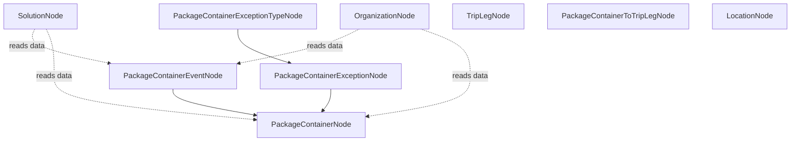
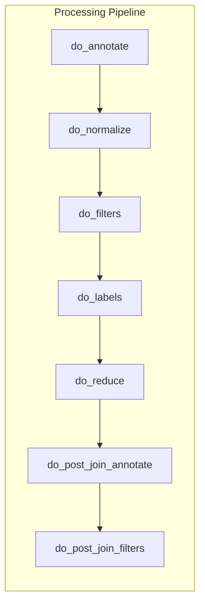

# Diagram: research/orchestrator/feature_repo/packages/package_features.py

> Auto-generated by Obscura crawlers

## Diagram 1

```mermaid
classDiagram
    GraphReduceNode <|-- PackageContainerExceptionTypeNode
    GraphReduceNode <|-- SolutionNode
    GraphReduceNode <|-- OrganizationNode
    GraphReduceNode <|-- PackageContainerExceptionNode
    GraphReduceNode <|-- PackageContainerEventNode
    GraphReduceNode <|-- TripLegNode
    GraphReduceNode <|-- PackageContainerToTripLegNode
    GraphReduceNode <|-- PackageContainerNode
    GraphReduceNode <|-- LocationNode
    
    class GraphReduceNode {
        +do_annotate()
        +do_normalize()
        +do_filters()
        +do_labels()
        +do_reduce()
        +do_post_join_annotate()
    }
    
    class PackageContainerExceptionTypeNode {
        +String prefix = "ext"
        +String pk = "id"
    }
    
    class SolutionNode {
        +String prefix = "sol"
        +String pk = "id"
    }
    
    class OrganizationNode {
        +String prefix = "org"
        +String pk = "id"
    }
    
    class PackageContainerExceptionNode {
        +String prefix = "ex"
        +String pk = "id"
        +String date_key = "resolved_ts"
        +do_post_join_filters()
    }
    
    class PackageContainerEventNode {
        +String prefix = "evt"
        +String pk = "id"
        +String date_key = "event_ts"
        +String env
    }
    
    class TripLegNode {
        +String prefix = "tl"
        +String pk = "id"
        +String date_key = "ts"
        +do_post_join_filters()
    }
    
    class PackageContainerToTripLegNode {
        +String prefix = "ptl"
        +String pk = "id"
        +String date_key = "modified"
        +do_post_join_filters()
    }
    
    class PackageContainerNode {
        +String prefix = "pc"
        +String pk = "id"
        +String date_key = "destination_arrived_ts"
        +String env
        +do_post_join_filters()
    }
    
    class LocationNode {
        +String pk = "id"
        +String date_key = "ts"
    }
```

### SVG

<svg id="container" width="3145.65625" xmlns="http://www.w3.org/2000/svg" class="classDiagram" height="528" viewBox="0 0 3145.65625 528" role="graphics-document document" aria-roledescription="class"><g><defs><marker id="container_class-aggregationStart" class="marker aggregation class" refX="18" refY="7" markerWidth="190" markerHeight="240" orient="auto"><path d="M 18,7 L9,13 L1,7 L9,1 Z"></path></marker></defs><defs><marker id="container_class-aggregationEnd" class="marker aggregation class" refX="1" refY="7" markerWidth="20" markerHeight="28" orient="auto"><path d="M 18,7 L9,13 L1,7 L9,1 Z"></path></marker></defs><defs><marker id="container_class-extensionStart" class="marker extension class" refX="18" refY="7" markerWidth="190" markerHeight="240" orient="auto"><path d="M 1,7 L18,13 V 1 Z"></path></marker></defs><defs><marker id="container_class-extensionEnd" class="marker extension class" refX="1" refY="7" markerWidth="20" markerHeight="28" orient="auto"><path d="M 1,1 V 13 L18,7 Z"></path></marker></defs><defs><marker id="container_class-compositionStart" class="marker composition class" refX="18" refY="7" markerWidth="190" markerHeight="240" orient="auto"><path d="M 18,7 L9,13 L1,7 L9,1 Z"></path></marker></defs><defs><marker id="container_class-compositionEnd" class="marker composition class" refX="1" refY="7" markerWidth="20" markerHeight="28" orient="auto"><path d="M 18,7 L9,13 L1,7 L9,1 Z"></path></marker></defs><defs><marker id="container_class-dependencyStart" class="marker dependency class" refX="6" refY="7" markerWidth="190" markerHeight="240" orient="auto"><path d="M 5,7 L9,13 L1,7 L9,1 Z"></path></marker></defs><defs><marker id="container_class-dependencyEnd" class="marker dependency class" refX="13" refY="7" markerWidth="20" markerHeight="28" orient="auto"><path d="M 18,7 L9,13 L14,7 L9,1 Z"></path></marker></defs><defs><marker id="container_class-lollipopStart" class="marker lollipop class" refX="13" refY="7" markerWidth="190" markerHeight="240" orient="auto"><circle stroke="black" fill="transparent" cx="7" cy="7" r="6"></circle></marker></defs><defs><marker id="container_class-lollipopEnd" class="marker lollipop class" refX="1" refY="7" markerWidth="190" markerHeight="240" orient="auto"><circle stroke="black" fill="transparent" cx="7" cy="7" r="6"></circle></marker></defs><g class="root"><g class="clusters"></g><g class="edgePaths"><path d="M1362.391,148.092L1162.325,169.91C962.259,191.728,562.128,235.364,362.062,267.349C161.996,299.333,161.996,319.667,161.996,329.833L161.996,340" id="id_GraphReduceNode_PackageContainerExceptionTypeNode_1" class="edge-thickness-normal edge-pattern-solid relation" style=";;;" data-edge="true" data-et="edge" data-id="id_GraphReduceNode_PackageContainerExceptionTypeNode_1" data-points="W3sieCI6MTM3OS41MzkwNjI1LCJ5IjoxNDYuMjIxOTg4MTE4MjY0N30seyJ4IjoxNjEuOTk2MDkzNzUsInkiOjI3OX0seyJ4IjoxNjEuOTk2MDkzNzUsInkiOjM0MH1d" marker-start="url(#container_class-extensionStart)"></path><path d="M1362.46,153.224L1214.693,174.187C1066.927,195.15,771.393,237.075,623.626,268.204C475.859,299.333,475.859,319.667,475.859,329.833L475.859,340" id="id_GraphReduceNode_SolutionNode_2" class="edge-thickness-normal edge-pattern-solid relation" style=";;;" data-edge="true" data-et="edge" data-id="id_GraphReduceNode_SolutionNode_2" data-points="W3sieCI6MTM3OS41MzkwNjI1LCJ5IjoxNTAuODAxNDkzOTYyMzcwMTN9LHsieCI6NDc1Ljg1OTM3NSwieSI6Mjc5fSx7IngiOjQ3NS44NTkzNzUsInkiOjM0MH1d" marker-start="url(#container_class-extensionStart)"></path><path d="M1362.604,161.303L1261.285,180.919C1159.966,200.535,957.329,239.768,856.01,269.551C754.691,299.333,754.691,319.667,754.691,329.833L754.691,340" id="id_GraphReduceNode_OrganizationNode_3" class="edge-thickness-normal edge-pattern-solid relation" style=";;;" data-edge="true" data-et="edge" data-id="id_GraphReduceNode_OrganizationNode_3" data-points="W3sieCI6MTM3OS41MzkwNjI1LCJ5IjoxNTguMDI0MjUyMTQ4NzYyODZ9LHsieCI6NzU0LjY5MTQwNjI1LCJ5IjoyNzl9LHsieCI6NzU0LjY5MTQwNjI1LCJ5IjozNDB9XQ==" marker-start="url(#container_class-extensionStart)"></path><path d="M1363.326,187.59L1321.383,202.825C1279.441,218.06,1195.556,248.53,1153.614,269.932C1111.672,291.333,1111.672,303.667,1111.672,309.833L1111.672,316" id="id_GraphReduceNode_PackageContainerExceptionNode_4" class="edge-thickness-normal edge-pattern-solid relation" style=";;;" data-edge="true" data-et="edge" data-id="id_GraphReduceNode_PackageContainerExceptionNode_4" data-points="W3sieCI6MTM3OS41MzkwNjI1LCJ5IjoxODEuNzAxMTQxODIxNzM3NzZ9LHsieCI6MTExMS42NzE4NzUsInkiOjI3OX0seyJ4IjoxMTExLjY3MTg3NSwieSI6MzE2fV0=" marker-start="url(#container_class-extensionStart)"></path><path d="M1519.121,271.25L1519.121,272.542C1519.121,273.833,1519.121,276.417,1519.121,283.875C1519.121,291.333,1519.121,303.667,1519.121,309.833L1519.121,316" id="id_GraphReduceNode_PackageContainerEventNode_5" class="edge-thickness-normal edge-pattern-solid relation" style=";;;" data-edge="true" data-et="edge" data-id="id_GraphReduceNode_PackageContainerEventNode_5" data-points="W3sieCI6MTUxOS4xMjEwOTM3NSwieSI6MjU0fSx7IngiOjE1MTkuMTIxMDkzNzUsInkiOjI3OX0seyJ4IjoxNTE5LjEyMTA5Mzc1LCJ5IjozMTZ9XQ==" marker-start="url(#container_class-extensionStart)"></path><path d="M1674.492,199.372L1704.65,212.643C1734.808,225.915,1795.125,252.457,1825.283,271.895C1855.441,291.333,1855.441,303.667,1855.441,309.833L1855.441,316" id="id_GraphReduceNode_TripLegNode_6" class="edge-thickness-normal edge-pattern-solid relation" style=";;;" data-edge="true" data-et="edge" data-id="id_GraphReduceNode_TripLegNode_6" data-points="W3sieCI6MTY1OC43MDMxMjUsInkiOjE5Mi40MjQwMDUyMDMzNzI5fSx7IngiOjE4NTUuNDQxNDA2MjUsInkiOjI3OX0seyJ4IjoxODU1LjQ0MTQwNjI1LCJ5IjozMTZ9XQ==" marker-start="url(#container_class-extensionStart)"></path><path d="M1675.561,164.946L1763.163,183.955C1850.766,202.964,2025.971,240.982,2113.573,266.158C2201.176,291.333,2201.176,303.667,2201.176,309.833L2201.176,316" id="id_GraphReduceNode_PackageContainerToTripLegNode_7" class="edge-thickness-normal edge-pattern-solid relation" style=";;;" data-edge="true" data-et="edge" data-id="id_GraphReduceNode_PackageContainerToTripLegNode_7" data-points="W3sieCI6MTY1OC43MDMxMjUsInkiOjE2MS4yODgxMDAwNjUyODk4NX0seyJ4IjoyMjAxLjE3NTc4MTI1LCJ5IjoyNzl9LHsieCI6MjIwMS4xNzU3ODEyNSwieSI6MzE2fV0=" marker-start="url(#container_class-extensionStart)"></path><path d="M1675.805,151.678L1836.6,172.898C1997.396,194.118,2318.987,236.559,2479.783,261.946C2640.578,287.333,2640.578,295.667,2640.578,299.833L2640.578,304" id="id_GraphReduceNode_PackageContainerNode_8" class="edge-thickness-normal edge-pattern-solid relation" style=";;;" data-edge="true" data-et="edge" data-id="id_GraphReduceNode_PackageContainerNode_8" data-points="W3sieCI6MTY1OC43MDMxMjUsInkiOjE0OS40MjA4MDQ0MDgzMjc2M30seyJ4IjoyNjQwLjU3ODEyNSwieSI6Mjc5fSx7IngiOjI2NDAuNTc4MTI1LCJ5IjozMDR9XQ==" marker-start="url(#container_class-extensionStart)"></path><path d="M1675.87,146.463L1899.791,168.553C2123.711,190.642,2571.553,234.821,2795.474,267.077C3019.395,299.333,3019.395,319.667,3019.395,329.833L3019.395,340" id="id_GraphReduceNode_LocationNode_9" class="edge-thickness-normal edge-pattern-solid relation" style=";;;" data-edge="true" data-et="edge" data-id="id_GraphReduceNode_LocationNode_9" data-points="W3sieCI6MTY1OC43MDMxMjUsInkiOjE0NC43Njk1ODM2Njk2NDM1N30seyJ4IjozMDE5LjM5NDUzMTI1LCJ5IjoyNzl9LHsieCI6MzAxOS4zOTQ1MzEyNSwieSI6MzQwfV0=" marker-start="url(#container_class-extensionStart)"></path></g><g class="edgeLabels"><g class="edgeLabel"><g class="label" data-id="id_GraphReduceNode_PackageContainerExceptionTypeNode_1" transform="translate(0, 0)"><foreignObject width="0" height="0">

</foreignObject></g></g><g class="edgeLabel"><g class="label" data-id="id_GraphReduceNode_SolutionNode_2" transform="translate(0, 0)"><foreignObject width="0" height="0">

</foreignObject></g></g><g class="edgeLabel"><g class="label" data-id="id_GraphReduceNode_OrganizationNode_3" transform="translate(0, 0)"><foreignObject width="0" height="0">

</foreignObject></g></g><g class="edgeLabel"><g class="label" data-id="id_GraphReduceNode_PackageContainerExceptionNode_4" transform="translate(0, 0)"><foreignObject width="0" height="0">

</foreignObject></g></g><g class="edgeLabel"><g class="label" data-id="id_GraphReduceNode_PackageContainerEventNode_5" transform="translate(0, 0)"><foreignObject width="0" height="0">

</foreignObject></g></g><g class="edgeLabel"><g class="label" data-id="id_GraphReduceNode_TripLegNode_6" transform="translate(0, 0)"><foreignObject width="0" height="0">

</foreignObject></g></g><g class="edgeLabel"><g class="label" data-id="id_GraphReduceNode_PackageContainerToTripLegNode_7" transform="translate(0, 0)"><foreignObject width="0" height="0">

</foreignObject></g></g><g class="edgeLabel"><g class="label" data-id="id_GraphReduceNode_PackageContainerNode_8" transform="translate(0, 0)"><foreignObject width="0" height="0">

</foreignObject></g></g><g class="edgeLabel"><g class="label" data-id="id_GraphReduceNode_LocationNode_9" transform="translate(0, 0)"><foreignObject width="0" height="0">

</foreignObject></g></g></g><g class="nodes"><g class="node default" id="classId-GraphReduceNode-0" transform="translate(1519.12109375, 131)"><g class="basic label-container"><path d="M-139.58203125 -123 L139.58203125 -123 L139.58203125 123 L-139.58203125 123" stroke="none" stroke-width="0" fill="#ECECFF" style=""></path><path d="M-139.58203125 -123 C-43.422365682833075 -123, 52.73729988433385 -123, 139.58203125 -123 M-139.58203125 -123 C-75.1653539584132 -123, -10.748676666826412 -123, 139.58203125 -123 M139.58203125 -123 C139.58203125 -43.15888334993522, 139.58203125 36.68223330012955, 139.58203125 123 M139.58203125 -123 C139.58203125 -55.55274433916462, 139.58203125 11.894511321670763, 139.58203125 123 M139.58203125 123 C60.188411375209455 123, -19.20520849958109 123, -139.58203125 123 M139.58203125 123 C60.71176640082177 123, -18.158498448356454 123, -139.58203125 123 M-139.58203125 123 C-139.58203125 33.05957106950635, -139.58203125 -56.880857860987305, -139.58203125 -123 M-139.58203125 123 C-139.58203125 52.43710948654645, -139.58203125 -18.125781026907106, -139.58203125 -123" stroke="#9370DB" stroke-width="1.3" fill="none" stroke-dasharray="0 0" style=""></path></g><g class="annotation-group text" transform="translate(0, -99)"></g><g class="label-group text" transform="translate(-67.7578125, -99)"><g class="label" style="font-weight: bolder" transform="translate(0,-12)"><foreignObject width="135.515625" height="24">

GraphReduceNode

</foreignObject></g></g><g class="members-group text" transform="translate(-127.58203125, -51)"></g><g class="methods-group text" transform="translate(-127.58203125, -21)"><g class="label" style="" transform="translate(0,-12)"><foreignObject width="110.375" height="24">

+do_annotate()

</foreignObject></g><g class="label" style="" transform="translate(0,12)"><foreignObject width="117.21875" height="24">

+do_normalize()

</foreignObject></g><g class="label" style="" transform="translate(0,36)"><foreignObject width="86.5" height="24">

+do_filters()

</foreignObject></g><g class="label" style="" transform="translate(0,60)"><foreignObject width="88.8125" height="24">

+do_labels()

</foreignObject></g><g class="label" style="" transform="translate(0,84)"><foreignObject width="94.609375" height="24">

+do_reduce()

</foreignObject></g><g class="label" style="" transform="translate(0,108)"><foreignObject width="187.40625" height="24">

+do_post_join_annotate()

</foreignObject></g></g><g class="divider" style=""><path d="M-139.58203125 -75 C-46.86390913552137 -75, 45.854212978957264 -75, 139.58203125 -75 M-139.58203125 -75 C-44.981626378613356 -75, 49.61877849277329 -75, 139.58203125 -75" stroke="#9370DB" stroke-width="1.3" fill="none" stroke-dasharray="0 0" style=""></path></g><g class="divider" style=""><path d="M-139.58203125 -51 C-67.29896113492431 -51, 4.984108980151376 -51, 139.58203125 -51 M-139.58203125 -51 C-60.43635738926652 -51, 18.709316471466963 -51, 139.58203125 -51" stroke="#9370DB" stroke-width="1.3" fill="none" stroke-dasharray="0 0" style=""></path></g></g><g class="node default" id="classId-PackageContainerExceptionTypeNode-1" transform="translate(161.99609375, 412)"><g class="basic label-container"><path d="M-153.99609375 -72 L153.99609375 -72 L153.99609375 72 L-153.99609375 72" stroke="none" stroke-width="0" fill="#ECECFF" style=""></path><path d="M-153.99609375 -72 C-53.99343991632689 -72, 46.009213917346216 -72, 153.99609375 -72 M-153.99609375 -72 C-64.49949592385966 -72, 24.99710190228069 -72, 153.99609375 -72 M153.99609375 -72 C153.99609375 -24.035425886093257, 153.99609375 23.929148227813485, 153.99609375 72 M153.99609375 -72 C153.99609375 -26.091752743766378, 153.99609375 19.816494512467244, 153.99609375 72 M153.99609375 72 C73.91025569864038 72, -6.175582352719232 72, -153.99609375 72 M153.99609375 72 C39.21518421962895 72, -75.5657253107421 72, -153.99609375 72 M-153.99609375 72 C-153.99609375 35.49184857880363, -153.99609375 -1.016302842392733, -153.99609375 -72 M-153.99609375 72 C-153.99609375 35.543792282513216, -153.99609375 -0.9124154349735676, -153.99609375 -72" stroke="#9370DB" stroke-width="1.3" fill="none" stroke-dasharray="0 0" style=""></path></g><g class="annotation-group text" transform="translate(0, -48)"></g><g class="label-group text" transform="translate(-137.6796875, -48)"><g class="label" style="font-weight: bolder" transform="translate(0,-12)"><foreignObject width="275.359375" height="24">

PackageContainerExceptionTypeNode

</foreignObject></g></g><g class="members-group text" transform="translate(-141.99609375, 0)"><g class="label" style="" transform="translate(0,-12)"><foreignObject width="146.3125" height="24">

+String prefix = "ext"

</foreignObject></g><g class="label" style="" transform="translate(0,12)"><foreignObject width="115.5" height="24">

+String pk = "id"

</foreignObject></g></g><g class="methods-group text" transform="translate(-141.99609375, 72)"></g><g class="divider" style=""><path d="M-153.99609375 -24 C-75.76430812800562 -24, 2.4674774939887527 -24, 153.99609375 -24 M-153.99609375 -24 C-55.982555037677116 -24, 42.03098367464577 -24, 153.99609375 -24" stroke="#9370DB" stroke-width="1.3" fill="none" stroke-dasharray="0 0" style=""></path></g><g class="divider" style=""><path d="M-153.99609375 48 C-71.110249431319 48, 11.77559488736199 48, 153.99609375 48 M-153.99609375 48 C-81.83605572886604 48, -9.676017707732086 48, 153.99609375 48" stroke="#9370DB" stroke-width="1.3" fill="none" stroke-dasharray="0 0" style=""></path></g></g><g class="node default" id="classId-SolutionNode-2" transform="translate(475.859375, 412)"><g class="basic label-container"><path d="M-109.8671875 -72 L109.8671875 -72 L109.8671875 72 L-109.8671875 72" stroke="none" stroke-width="0" fill="#ECECFF" style=""></path><path d="M-109.8671875 -72 C-64.25916173813526 -72, -18.651135976270524 -72, 109.8671875 -72 M-109.8671875 -72 C-51.34396190484988 -72, 7.179263690300246 -72, 109.8671875 -72 M109.8671875 -72 C109.8671875 -17.960964873194207, 109.8671875 36.078070253611585, 109.8671875 72 M109.8671875 -72 C109.8671875 -27.292165185580757, 109.8671875 17.415669628838486, 109.8671875 72 M109.8671875 72 C29.033256936121163 72, -51.800673627757675 72, -109.8671875 72 M109.8671875 72 C54.29064440039042 72, -1.2858986992191603 72, -109.8671875 72 M-109.8671875 72 C-109.8671875 38.134684849248536, -109.8671875 4.269369698497073, -109.8671875 -72 M-109.8671875 72 C-109.8671875 17.987001672201743, -109.8671875 -36.025996655596515, -109.8671875 -72" stroke="#9370DB" stroke-width="1.3" fill="none" stroke-dasharray="0 0" style=""></path></g><g class="annotation-group text" transform="translate(0, -48)"></g><g class="label-group text" transform="translate(-50.03125, -48)"><g class="label" style="font-weight: bolder" transform="translate(0,-12)"><foreignObject width="100.0625" height="24">

SolutionNode

</foreignObject></g></g><g class="members-group text" transform="translate(-97.8671875, 0)"><g class="label" style="" transform="translate(0,-12)"><foreignObject width="145.703125" height="24">

+String prefix = "sol"

</foreignObject></g><g class="label" style="" transform="translate(0,12)"><foreignObject width="115.5" height="24">

+String pk = "id"

</foreignObject></g></g><g class="methods-group text" transform="translate(-97.8671875, 72)"></g><g class="divider" style=""><path d="M-109.8671875 -24 C-57.65878768083502 -24, -5.450387861670038 -24, 109.8671875 -24 M-109.8671875 -24 C-62.89134206707395 -24, -15.9154966341479 -24, 109.8671875 -24" stroke="#9370DB" stroke-width="1.3" fill="none" stroke-dasharray="0 0" style=""></path></g><g class="divider" style=""><path d="M-109.8671875 48 C-37.77347422063524 48, 34.32023905872953 48, 109.8671875 48 M-109.8671875 48 C-64.78017594079074 48, -19.693164381581482 48, 109.8671875 48" stroke="#9370DB" stroke-width="1.3" fill="none" stroke-dasharray="0 0" style=""></path></g></g><g class="node default" id="classId-OrganizationNode-3" transform="translate(754.69140625, 412)"><g class="basic label-container"><path d="M-118.96484375 -72 L118.96484375 -72 L118.96484375 72 L-118.96484375 72" stroke="none" stroke-width="0" fill="#ECECFF" style=""></path><path d="M-118.96484375 -72 C-44.27822113315855 -72, 30.408401483682894 -72, 118.96484375 -72 M-118.96484375 -72 C-48.9709250245991 -72, 21.022993700801806 -72, 118.96484375 -72 M118.96484375 -72 C118.96484375 -21.9445921309077, 118.96484375 28.1108157381846, 118.96484375 72 M118.96484375 -72 C118.96484375 -28.12409861616124, 118.96484375 15.751802767677518, 118.96484375 72 M118.96484375 72 C43.261775249562916 72, -32.44129325087417 72, -118.96484375 72 M118.96484375 72 C32.65798794733497 72, -53.64886785533005 72, -118.96484375 72 M-118.96484375 72 C-118.96484375 25.41757500714356, -118.96484375 -21.164849985712877, -118.96484375 -72 M-118.96484375 72 C-118.96484375 34.98125128302559, -118.96484375 -2.0374974339488148, -118.96484375 -72" stroke="#9370DB" stroke-width="1.3" fill="none" stroke-dasharray="0 0" style=""></path></g><g class="annotation-group text" transform="translate(0, -48)"></g><g class="label-group text" transform="translate(-65.8828125, -48)"><g class="label" style="font-weight: bolder" transform="translate(0,-12)"><foreignObject width="131.765625" height="24">

OrganizationNode

</foreignObject></g></g><g class="members-group text" transform="translate(-106.96484375, 0)"><g class="label" style="" transform="translate(0,-12)"><foreignObject width="148.046875" height="24">

+String prefix = "org"

</foreignObject></g><g class="label" style="" transform="translate(0,12)"><foreignObject width="115.5" height="24">

+String pk = "id"

</foreignObject></g></g><g class="methods-group text" transform="translate(-106.96484375, 72)"></g><g class="divider" style=""><path d="M-118.96484375 -24 C-38.685168960270246 -24, 41.59450582945951 -24, 118.96484375 -24 M-118.96484375 -24 C-33.01694635801958 -24, 52.93095103396084 -24, 118.96484375 -24" stroke="#9370DB" stroke-width="1.3" fill="none" stroke-dasharray="0 0" style=""></path></g><g class="divider" style=""><path d="M-118.96484375 48 C-29.717974767890695 48, 59.52889421421861 48, 118.96484375 48 M-118.96484375 48 C-54.55780881334424 48, 9.849226123311524 48, 118.96484375 48" stroke="#9370DB" stroke-width="1.3" fill="none" stroke-dasharray="0 0" style=""></path></g></g><g class="node default" id="classId-PackageContainerExceptionNode-4" transform="translate(1111.671875, 412)"><g class="basic label-container"><path d="M-188.015625 -96 L188.015625 -96 L188.015625 96 L-188.015625 96" stroke="none" stroke-width="0" fill="#ECECFF" style=""></path><path d="M-188.015625 -96 C-41.33843084637198 -96, 105.33876330725604 -96, 188.015625 -96 M-188.015625 -96 C-42.90982238393403 -96, 102.19598023213194 -96, 188.015625 -96 M188.015625 -96 C188.015625 -30.128326480359448, 188.015625 35.743347039281105, 188.015625 96 M188.015625 -96 C188.015625 -40.11611748998853, 188.015625 15.767765020022935, 188.015625 96 M188.015625 96 C69.78253859746584 96, -48.45054780506831 96, -188.015625 96 M188.015625 96 C67.52507986756969 96, -52.965465264860626 96, -188.015625 96 M-188.015625 96 C-188.015625 54.68989736213203, -188.015625 13.379794724264059, -188.015625 -96 M-188.015625 96 C-188.015625 30.381999693880374, -188.015625 -35.23600061223925, -188.015625 -96" stroke="#9370DB" stroke-width="1.3" fill="none" stroke-dasharray="0 0" style=""></path></g><g class="annotation-group text" transform="translate(0, -72)"></g><g class="label-group text" transform="translate(-120.34375, -72)"><g class="label" style="font-weight: bolder" transform="translate(0,-12)"><foreignObject width="240.6875" height="24">

PackageContainerExceptionNode

</foreignObject></g></g><g class="members-group text" transform="translate(-176.015625, -24)"><g class="label" style="" transform="translate(0,-12)"><foreignObject width="140.78125" height="24">

+String prefix = "ex"

</foreignObject></g><g class="label" style="" transform="translate(0,12)"><foreignObject width="115.5" height="24">

+String pk = "id"

</foreignObject></g><g class="label" style="" transform="translate(0,36)"><foreignObject width="231.6875" height="24">

+String date_key = "resolved_ts"

</foreignObject></g></g><g class="methods-group text" transform="translate(-176.015625, 72)"><g class="label" style="" transform="translate(0,-12)"><foreignObject width="163.53125" height="24">

+do_post_join_filters()

</foreignObject></g></g><g class="divider" style=""><path d="M-188.015625 -48 C-76.33184908321427 -48, 35.35192683357147 -48, 188.015625 -48 M-188.015625 -48 C-40.244422736329 -48, 107.526779527342 -48, 188.015625 -48" stroke="#9370DB" stroke-width="1.3" fill="none" stroke-dasharray="0 0" style=""></path></g><g class="divider" style=""><path d="M-188.015625 48 C-77.6360673343901 48, 32.74349033121979 48, 188.015625 48 M-188.015625 48 C-43.17829685759713 48, 101.65903128480574 48, 188.015625 48" stroke="#9370DB" stroke-width="1.3" fill="none" stroke-dasharray="0 0" style=""></path></g></g><g class="node default" id="classId-PackageContainerEventNode-5" transform="translate(1519.12109375, 412)"><g class="basic label-container"><path d="M-169.43359375 -96 L169.43359375 -96 L169.43359375 96 L-169.43359375 96" stroke="none" stroke-width="0" fill="#ECECFF" style=""></path><path d="M-169.43359375 -96 C-51.421969443417765 -96, 66.58965486316447 -96, 169.43359375 -96 M-169.43359375 -96 C-94.13924632930055 -96, -18.844898908601095 -96, 169.43359375 -96 M169.43359375 -96 C169.43359375 -40.73737028062064, 169.43359375 14.525259438758724, 169.43359375 96 M169.43359375 -96 C169.43359375 -47.76213654232826, 169.43359375 0.4757269153434862, 169.43359375 96 M169.43359375 96 C74.76111388905557 96, -19.91136597188887 96, -169.43359375 96 M169.43359375 96 C35.29148388649202 96, -98.85062597701597 96, -169.43359375 96 M-169.43359375 96 C-169.43359375 40.30234052119468, -169.43359375 -15.395318957610641, -169.43359375 -96 M-169.43359375 96 C-169.43359375 26.201208156560426, -169.43359375 -43.59758368687915, -169.43359375 -96" stroke="#9370DB" stroke-width="1.3" fill="none" stroke-dasharray="0 0" style=""></path></g><g class="annotation-group text" transform="translate(0, -72)"></g><g class="label-group text" transform="translate(-104.8515625, -72)"><g class="label" style="font-weight: bolder" transform="translate(0,-12)"><foreignObject width="209.703125" height="24">

PackageContainerEventNode

</foreignObject></g></g><g class="members-group text" transform="translate(-157.43359375, -24)"><g class="label" style="" transform="translate(0,-12)"><foreignObject width="146.5" height="24">

+String prefix = "evt"

</foreignObject></g><g class="label" style="" transform="translate(0,12)"><foreignObject width="115.5" height="24">

+String pk = "id"

</foreignObject></g><g class="label" style="" transform="translate(0,36)"><foreignObject width="210.015625" height="24">

+String date_key = "event_ts"

</foreignObject></g><g class="label" style="" transform="translate(0,60)"><foreignObject width="80.328125" height="24">

+String env

</foreignObject></g></g><g class="methods-group text" transform="translate(-157.43359375, 96)"></g><g class="divider" style=""><path d="M-169.43359375 -48 C-83.63361956149178 -48, 2.1663546270164318 -48, 169.43359375 -48 M-169.43359375 -48 C-90.6911440940062 -48, -11.94869443801241 -48, 169.43359375 -48" stroke="#9370DB" stroke-width="1.3" fill="none" stroke-dasharray="0 0" style=""></path></g><g class="divider" style=""><path d="M-169.43359375 72 C-91.49948189283387 72, -13.56537003566774 72, 169.43359375 72 M-169.43359375 72 C-74.12513006893273 72, 21.183333612134533 72, 169.43359375 72" stroke="#9370DB" stroke-width="1.3" fill="none" stroke-dasharray="0 0" style=""></path></g></g><g class="node default" id="classId-TripLegNode-6" transform="translate(1855.44140625, 412)"><g class="basic label-container"><path d="M-116.88671875 -96 L116.88671875 -96 L116.88671875 96 L-116.88671875 96" stroke="none" stroke-width="0" fill="#ECECFF" style=""></path><path d="M-116.88671875 -96 C-24.869880311965204 -96, 67.14695812606959 -96, 116.88671875 -96 M-116.88671875 -96 C-36.82764353163358 -96, 43.23143168673283 -96, 116.88671875 -96 M116.88671875 -96 C116.88671875 -30.06820580152555, 116.88671875 35.8635883969489, 116.88671875 96 M116.88671875 -96 C116.88671875 -57.26355921587026, 116.88671875 -18.52711843174052, 116.88671875 96 M116.88671875 96 C56.35576168711054 96, -4.175195375778927 96, -116.88671875 96 M116.88671875 96 C52.687997003382634 96, -11.510724743234732 96, -116.88671875 96 M-116.88671875 96 C-116.88671875 50.38278170635168, -116.88671875 4.765563412703358, -116.88671875 -96 M-116.88671875 96 C-116.88671875 47.57648025939459, -116.88671875 -0.847039481210814, -116.88671875 -96" stroke="#9370DB" stroke-width="1.3" fill="none" stroke-dasharray="0 0" style=""></path></g><g class="annotation-group text" transform="translate(0, -72)"></g><g class="label-group text" transform="translate(-46.2421875, -72)"><g class="label" style="font-weight: bolder" transform="translate(0,-12)"><foreignObject width="92.484375" height="24">

TripLegNode

</foreignObject></g></g><g class="members-group text" transform="translate(-104.88671875, -24)"><g class="label" style="" transform="translate(0,-12)"><foreignObject width="134.828125" height="24">

+String prefix = "tl"

</foreignObject></g><g class="label" style="" transform="translate(0,12)"><foreignObject width="115.5" height="24">

+String pk = "id"

</foreignObject></g><g class="label" style="" transform="translate(0,36)"><foreignObject width="161.984375" height="24">

+String date_key = "ts"

</foreignObject></g></g><g class="methods-group text" transform="translate(-104.88671875, 72)"><g class="label" style="" transform="translate(0,-12)"><foreignObject width="163.53125" height="24">

+do_post_join_filters()

</foreignObject></g></g><g class="divider" style=""><path d="M-116.88671875 -48 C-39.83422788199965 -48, 37.218262986000695 -48, 116.88671875 -48 M-116.88671875 -48 C-43.822748363414036 -48, 29.24122202317193 -48, 116.88671875 -48" stroke="#9370DB" stroke-width="1.3" fill="none" stroke-dasharray="0 0" style=""></path></g><g class="divider" style=""><path d="M-116.88671875 48 C-41.68810981848232 48, 33.510499113035365 48, 116.88671875 48 M-116.88671875 48 C-44.29888220395978 48, 28.288954342080444 48, 116.88671875 48" stroke="#9370DB" stroke-width="1.3" fill="none" stroke-dasharray="0 0" style=""></path></g></g><g class="node default" id="classId-PackageContainerToTripLegNode-7" transform="translate(2201.17578125, 412)"><g class="basic label-container"><path d="M-178.84765625 -96 L178.84765625 -96 L178.84765625 96 L-178.84765625 96" stroke="none" stroke-width="0" fill="#ECECFF" style=""></path><path d="M-178.84765625 -96 C-39.7131481367185 -96, 99.421359976563 -96, 178.84765625 -96 M-178.84765625 -96 C-84.95477584817078 -96, 8.938104553658434 -96, 178.84765625 -96 M178.84765625 -96 C178.84765625 -48.684281646959874, 178.84765625 -1.368563293919749, 178.84765625 96 M178.84765625 -96 C178.84765625 -34.29919419589418, 178.84765625 27.40161160821164, 178.84765625 96 M178.84765625 96 C38.46320681489166 96, -101.92124262021667 96, -178.84765625 96 M178.84765625 96 C75.53833912520642 96, -27.77097799958716 96, -178.84765625 96 M-178.84765625 96 C-178.84765625 55.31436058996726, -178.84765625 14.628721179934516, -178.84765625 -96 M-178.84765625 96 C-178.84765625 44.21185954632716, -178.84765625 -7.5762809073456765, -178.84765625 -96" stroke="#9370DB" stroke-width="1.3" fill="none" stroke-dasharray="0 0" style=""></path></g><g class="annotation-group text" transform="translate(0, -72)"></g><g class="label-group text" transform="translate(-120.2421875, -72)"><g class="label" style="font-weight: bolder" transform="translate(0,-12)"><foreignObject width="240.484375" height="24">

PackageContainerToTripLegNode

</foreignObject></g></g><g class="members-group text" transform="translate(-166.84765625, -24)"><g class="label" style="" transform="translate(0,-12)"><foreignObject width="144.171875" height="24">

+String prefix = "ptl"

</foreignObject></g><g class="label" style="" transform="translate(0,12)"><foreignObject width="115.5" height="24">

+String pk = "id"

</foreignObject></g><g class="label" style="" transform="translate(0,36)"><foreignObject width="213.453125" height="24">

+String date_key = "modified"

</foreignObject></g></g><g class="methods-group text" transform="translate(-166.84765625, 72)"><g class="label" style="" transform="translate(0,-12)"><foreignObject width="163.53125" height="24">

+do_post_join_filters()

</foreignObject></g></g><g class="divider" style=""><path d="M-178.84765625 -48 C-73.86240374477467 -48, 31.122848760450665 -48, 178.84765625 -48 M-178.84765625 -48 C-106.4993695968563 -48, -34.151082943712595 -48, 178.84765625 -48" stroke="#9370DB" stroke-width="1.3" fill="none" stroke-dasharray="0 0" style=""></path></g><g class="divider" style=""><path d="M-178.84765625 48 C-89.1534296891576 48, 0.5407968716847904 48, 178.84765625 48 M-178.84765625 48 C-49.81764836680773 48, 79.21235951638454 48, 178.84765625 48" stroke="#9370DB" stroke-width="1.3" fill="none" stroke-dasharray="0 0" style=""></path></g></g><g class="node default" id="classId-PackageContainerNode-8" transform="translate(2640.578125, 412)"><g class="basic label-container"><path d="M-210.5546875 -108 L210.5546875 -108 L210.5546875 108 L-210.5546875 108" stroke="none" stroke-width="0" fill="#ECECFF" style=""></path><path d="M-210.5546875 -108 C-105.95495071523331 -108, -1.3552139304666184 -108, 210.5546875 -108 M-210.5546875 -108 C-125.22818209352674 -108, -39.90167668705348 -108, 210.5546875 -108 M210.5546875 -108 C210.5546875 -58.48846397184787, 210.5546875 -8.976927943695742, 210.5546875 108 M210.5546875 -108 C210.5546875 -33.78812454341525, 210.5546875 40.4237509131695, 210.5546875 108 M210.5546875 108 C71.02646735241552 108, -68.50175279516895 108, -210.5546875 108 M210.5546875 108 C113.21896612590491 108, 15.883244751809826 108, -210.5546875 108 M-210.5546875 108 C-210.5546875 34.19888668604318, -210.5546875 -39.60222662791364, -210.5546875 -108 M-210.5546875 108 C-210.5546875 47.83484821591971, -210.5546875 -12.330303568160573, -210.5546875 -108" stroke="#9370DB" stroke-width="1.3" fill="none" stroke-dasharray="0 0" style=""></path></g><g class="annotation-group text" transform="translate(0, -84)"></g><g class="label-group text" transform="translate(-84.640625, -84)"><g class="label" style="font-weight: bolder" transform="translate(0,-12)"><foreignObject width="169.28125" height="24">

PackageContainerNode

</foreignObject></g></g><g class="members-group text" transform="translate(-198.5546875, -36)"><g class="label" style="" transform="translate(0,-12)"><foreignObject width="141.75" height="24">

+String prefix = "pc"

</foreignObject></g><g class="label" style="" transform="translate(0,12)"><foreignObject width="115.5" height="24">

+String pk = "id"

</foreignObject></g><g class="label" style="" transform="translate(0,36)"><foreignObject width="312.46875" height="24">

+String date_key = "destination_arrived_ts"

</foreignObject></g><g class="label" style="" transform="translate(0,60)"><foreignObject width="80.328125" height="24">

+String env

</foreignObject></g></g><g class="methods-group text" transform="translate(-198.5546875, 84)"><g class="label" style="" transform="translate(0,-12)"><foreignObject width="163.53125" height="24">

+do_post_join_filters()

</foreignObject></g></g><g class="divider" style=""><path d="M-210.5546875 -60 C-47.16165508590606 -60, 116.23137732818788 -60, 210.5546875 -60 M-210.5546875 -60 C-89.83606275792172 -60, 30.882561984156553 -60, 210.5546875 -60" stroke="#9370DB" stroke-width="1.3" fill="none" stroke-dasharray="0 0" style=""></path></g><g class="divider" style=""><path d="M-210.5546875 60 C-101.3352466000868 60, 7.88419429982639 60, 210.5546875 60 M-210.5546875 60 C-75.53220298122022 60, 59.490281537559554 60, 210.5546875 60" stroke="#9370DB" stroke-width="1.3" fill="none" stroke-dasharray="0 0" style=""></path></g></g><g class="node default" id="classId-LocationNode-9" transform="translate(3019.39453125, 412)"><g class="basic label-container"><path d="M-118.26171875 -72 L118.26171875 -72 L118.26171875 72 L-118.26171875 72" stroke="none" stroke-width="0" fill="#ECECFF" style=""></path><path d="M-118.26171875 -72 C-31.57977037675674 -72, 55.10217799648652 -72, 118.26171875 -72 M-118.26171875 -72 C-50.07275491373329 -72, 18.116208922533417 -72, 118.26171875 -72 M118.26171875 -72 C118.26171875 -27.402834830556202, 118.26171875 17.194330338887596, 118.26171875 72 M118.26171875 -72 C118.26171875 -41.43235968049826, 118.26171875 -10.864719360996517, 118.26171875 72 M118.26171875 72 C24.824736615442916 72, -68.61224551911417 72, -118.26171875 72 M118.26171875 72 C36.89390411832878 72, -44.473910513342446 72, -118.26171875 72 M-118.26171875 72 C-118.26171875 23.5014833949756, -118.26171875 -24.997033210048798, -118.26171875 -72 M-118.26171875 72 C-118.26171875 33.75478463561254, -118.26171875 -4.490430728774925, -118.26171875 -72" stroke="#9370DB" stroke-width="1.3" fill="none" stroke-dasharray="0 0" style=""></path></g><g class="annotation-group text" transform="translate(0, -48)"></g><g class="label-group text" transform="translate(-50.5390625, -48)"><g class="label" style="font-weight: bolder" transform="translate(0,-12)"><foreignObject width="101.078125" height="24">

LocationNode

</foreignObject></g></g><g class="members-group text" transform="translate(-106.26171875, 0)"><g class="label" style="" transform="translate(0,-12)"><foreignObject width="115.5" height="24">

+String pk = "id"

</foreignObject></g><g class="label" style="" transform="translate(0,12)"><foreignObject width="161.984375" height="24">

+String date_key = "ts"

</foreignObject></g></g><g class="methods-group text" transform="translate(-106.26171875, 72)"></g><g class="divider" style=""><path d="M-118.26171875 -24 C-37.553900646972195 -24, 43.15391745605561 -24, 118.26171875 -24 M-118.26171875 -24 C-50.29266081690412 -24, 17.676397116191765 -24, 118.26171875 -24" stroke="#9370DB" stroke-width="1.3" fill="none" stroke-dasharray="0 0" style=""></path></g><g class="divider" style=""><path d="M-118.26171875 48 C-63.46257969770983 48, -8.663440645419655 48, 118.26171875 48 M-118.26171875 48 C-40.51279484736531 48, 37.23612905526937 48, 118.26171875 48" stroke="#9370DB" stroke-width="1.3" fill="none" stroke-dasharray="0 0" style=""></path></g></g></g></g></g></svg>

## Diagram 2

### SVG

<svg id="container" width="1678.07421875" xmlns="http://www.w3.org/2000/svg" class="flowchart" height="302" viewBox="0 0 1678.07421875 302" role="graphics-document document" aria-roledescription="flowchart-v2"><g><marker id="container_flowchart-v2-pointEnd" class="marker flowchart-v2" viewBox="0 0 10 10" refX="5" refY="5" markerUnits="userSpaceOnUse" markerWidth="8" markerHeight="8" orient="auto"><path d="M 0 0 L 10 5 L 0 10 z" class="arrowMarkerPath" style="stroke-width: 1; stroke-dasharray: 1, 0;"></path></marker><marker id="container_flowchart-v2-pointStart" class="marker flowchart-v2" viewBox="0 0 10 10" refX="4.5" refY="5" markerUnits="userSpaceOnUse" markerWidth="8" markerHeight="8" orient="auto"><path d="M 0 5 L 10 10 L 10 0 z" class="arrowMarkerPath" style="stroke-width: 1; stroke-dasharray: 1, 0;"></path></marker><marker id="container_flowchart-v2-circleEnd" class="marker flowchart-v2" viewBox="0 0 10 10" refX="11" refY="5" markerUnits="userSpaceOnUse" markerWidth="11" markerHeight="11" orient="auto"><circle cx="5" cy="5" r="5" class="arrowMarkerPath" style="stroke-width: 1; stroke-dasharray: 1, 0;"></circle></marker><marker id="container_flowchart-v2-circleStart" class="marker flowchart-v2" viewBox="0 0 10 10" refX="-1" refY="5" markerUnits="userSpaceOnUse" markerWidth="11" markerHeight="11" orient="auto"><circle cx="5" cy="5" r="5" class="arrowMarkerPath" style="stroke-width: 1; stroke-dasharray: 1, 0;"></circle></marker><marker id="container_flowchart-v2-crossEnd" class="marker cross flowchart-v2" viewBox="0 0 11 11" refX="12" refY="5.2" markerUnits="userSpaceOnUse" markerWidth="11" markerHeight="11" orient="auto"><path d="M 1,1 l 9,9 M 10,1 l -9,9" class="arrowMarkerPath" style="stroke-width: 2; stroke-dasharray: 1, 0;"></path></marker><marker id="container_flowchart-v2-crossStart" class="marker cross flowchart-v2" viewBox="0 0 11 11" refX="-1" refY="5.2" markerUnits="userSpaceOnUse" markerWidth="11" markerHeight="11" orient="auto"><path d="M 1,1 l 9,9 M 10,1 l -9,9" class="arrowMarkerPath" style="stroke-width: 2; stroke-dasharray: 1, 0;"></path></marker><g class="root"><g class="clusters"></g><g class="edgePaths"><path d="M505.34,62L505.34,68.167C505.34,74.333,505.34,86.667,523.543,98.793C541.746,110.919,578.153,122.837,596.356,128.796L614.56,134.756" id="L_PackageContainerExceptionTypeNode_PackageContainerExceptionNode_0" class="edge-thickness-normal edge-pattern-solid edge-thickness-normal edge-pattern-solid flowchart-link" style=";" data-edge="true" data-et="edge" data-id="L_PackageContainerExceptionTypeNode_PackageContainerExceptionNode_0" data-points="W3sieCI6NTA1LjMzOTg0Mzc1LCJ5Ijo2Mn0seyJ4Ijo1MDUuMzM5ODQzNzUsInkiOjk5fSx7IngiOjYxOC4zNjEwMjI5NDkyMTg4LCJ5IjoxMzZ9XQ==" marker-end="url(#container_flowchart-v2-pointEnd)"></path><path d="M368.383,190L368.383,194.167C368.383,198.333,368.383,206.667,397.552,216.019C426.721,225.371,485.059,235.741,514.229,240.927L543.398,246.112" id="L_PackageContainerEventNode_PackageContainerNode_0" class="edge-thickness-normal edge-pattern-solid edge-thickness-normal edge-pattern-solid flowchart-link" style=";" data-edge="true" data-et="edge" data-id="L_PackageContainerEventNode_PackageContainerNode_0" data-points="W3sieCI6MzY4LjM4MjgxMjUsInkiOjE5MH0seyJ4IjozNjguMzgyODEyNSwieSI6MjE1fSx7IngiOjU0Ny4zMzU5Mzc1LCJ5IjoyNDYuODEyMTg5NTE5NzkwNjJ9XQ==" marker-end="url(#container_flowchart-v2-pointEnd)"></path><path d="M700.836,190L700.836,194.167C700.836,198.333,700.836,206.667,698.042,214.471C695.248,222.276,689.66,229.552,686.866,233.19L684.072,236.828" id="L_PackageContainerExceptionNode_PackageContainerNode_0" class="edge-thickness-normal edge-pattern-solid edge-thickness-normal edge-pattern-solid flowchart-link" style=";" data-edge="true" data-et="edge" data-id="L_PackageContainerExceptionNode_PackageContainerNode_0" data-points="W3sieCI6NzAwLjgzNTkzNzUsInkiOjE5MH0seyJ4Ijo3MDAuODM1OTM3NSwieSI6MjE1fSx7IngiOjY4MS42MzUyMTYzNDYxNTM4LCJ5IjoyNDB9XQ==" marker-end="url(#container_flowchart-v2-pointEnd)"></path><path d="M75.492,62L72.676,68.167C69.861,74.333,64.229,86.667,90.61,98.865C116.99,111.064,175.383,123.127,204.579,129.159L233.775,135.191" id="L_SolutionNode_PackageContainerEventNode_0" class="edge-thickness-normal edge-pattern-dotted edge-thickness-normal edge-pattern-solid flowchart-link" style=";" data-edge="true" data-et="edge" data-id="L_SolutionNode_PackageContainerEventNode_0" data-points="W3sieCI6NzUuNDkyMDA0Mzk0NTMxMjUsInkiOjYyfSx7IngiOjU4LjU5NzY1NjI1LCJ5Ijo5OX0seyJ4IjoyMzcuNjkyMTk5NzA3MDMxMjUsInkiOjEzNn1d" marker-end="url(#container_flowchart-v2-pointEnd)"></path><path d="M763.159,62L750.986,68.167C738.813,74.333,714.467,86.667,671.579,98.943C628.691,111.22,567.26,123.439,536.545,129.549L505.829,135.659" id="L_OrganizationNode_PackageContainerEventNode_0" class="edge-thickness-normal edge-pattern-dotted edge-thickness-normal edge-pattern-solid flowchart-link" style=";" data-edge="true" data-et="edge" data-id="L_OrganizationNode_PackageContainerEventNode_0" data-points="W3sieCI6NzYzLjE1OTA1NzYxNzE4NzUsInkiOjYyfSx7IngiOjY5MC4xMjEwOTM3NSwieSI6OTl9LHsieCI6NTAxLjkwNjI1LCJ5IjoxMzYuNDM5NTkyMDU5NzM0MX1d" marker-end="url(#container_flowchart-v2-pointEnd)"></path><path d="M100.149,62L102.964,68.167C105.78,74.333,111.412,86.667,114.227,103.5C117.043,120.333,117.043,141.667,117.043,161C117.043,180.333,117.043,197.667,188.095,213.127C259.147,228.587,401.25,242.174,472.302,248.968L543.354,255.761" id="L_SolutionNode_PackageContainerNode_0" class="edge-thickness-normal edge-pattern-dotted edge-thickness-normal edge-pattern-solid flowchart-link" style=";" data-edge="true" data-et="edge" data-id="L_SolutionNode_PackageContainerNode_0" data-points="W3sieCI6MTAwLjE0ODYyMDYwNTQ2ODc1LCJ5Ijo2Mn0seyJ4IjoxMTcuMDQyOTY4NzUsInkiOjk5fSx7IngiOjExNy4wNDI5Njg3NSwieSI6MTYzfSx7IngiOjExNy4wNDI5Njg3NSwieSI6MjE1fSx7IngiOjU0Ny4zMzU5Mzc1LCJ5IjoyNTYuMTQxODc2MjE2NTM4NDR9XQ==" marker-end="url(#container_flowchart-v2-pointEnd)"></path><path d="M892.541,62L909.918,68.167C927.296,74.333,962.05,86.667,979.427,103.5C996.805,120.333,996.805,141.667,996.805,161C996.805,180.333,996.805,197.667,960.406,211.968C924.008,226.269,851.211,237.539,814.812,243.173L778.414,248.808" id="L_OrganizationNode_PackageContainerNode_0" class="edge-thickness-normal edge-pattern-dotted edge-thickness-normal edge-pattern-solid flowchart-link" style=";" data-edge="true" data-et="edge" data-id="L_OrganizationNode_PackageContainerNode_0" data-points="W3sieCI6ODkyLjU0MTE5ODczMDQ2ODgsInkiOjYyfSx7IngiOjk5Ni44MDQ2ODc1LCJ5Ijo5OX0seyJ4Ijo5OTYuODA0Njg3NSwieSI6MTYzfSx7IngiOjk5Ni44MDQ2ODc1LCJ5IjoyMTV9LHsieCI6Nzc0LjQ2MDkzNzUsInkiOjI0OS40MTk5NDYwNDE0OTIyNH1d" marker-end="url(#container_flowchart-v2-pointEnd)"></path></g><g class="edgeLabels"><g class="edgeLabel"><g class="label" data-id="L_PackageContainerExceptionTypeNode_PackageContainerExceptionNode_0" transform="translate(0, 0)"><foreignObject width="0" height="0">

</foreignObject></g></g><g class="edgeLabel"><g class="label" data-id="L_PackageContainerEventNode_PackageContainerNode_0" transform="translate(0, 0)"><foreignObject width="0" height="0">

</foreignObject></g></g><g class="edgeLabel"><g class="label" data-id="L_PackageContainerExceptionNode_PackageContainerNode_0" transform="translate(0, 0)"><foreignObject width="0" height="0">

</foreignObject></g></g><g class="edgeLabel" transform="translate(58.59765625, 99)"><g class="label" data-id="L_SolutionNode_PackageContainerEventNode_0" transform="translate(-38.4453125, -12)"><foreignObject width="76.890625" height="24">

reads data

</foreignObject></g></g><g class="edgeLabel" transform="translate(690.12109375, 99)"><g class="label" data-id="L_OrganizationNode_PackageContainerEventNode_0" transform="translate(-38.4453125, -12)"><foreignObject width="76.890625" height="24">

reads data

</foreignObject></g></g><g class="edgeLabel" transform="translate(117.04296875, 163)"><g class="label" data-id="L_SolutionNode_PackageContainerNode_0" transform="translate(-38.4453125, -12)"><foreignObject width="76.890625" height="24">

reads data

</foreignObject></g></g><g class="edgeLabel" transform="translate(996.8046875, 163)"><g class="label" data-id="L_OrganizationNode_PackageContainerNode_0" transform="translate(-38.4453125, -12)"><foreignObject width="76.890625" height="24">

reads data

</foreignObject></g></g></g><g class="nodes"><g class="node default" id="flowchart-PackageContainerExceptionTypeNode-0" transform="translate(505.33984375, 35)"><rect class="basic label-container" style="" x="-165.796875" y="-27" width="331.59375" height="54"></rect><g class="label" style="" transform="translate(-135.796875, -12)"><rect></rect><foreignObject width="271.59375" height="24">

PackageContainerExceptionTypeNode

</foreignObject></g></g><g class="node default" id="flowchart-SolutionNode-1" transform="translate(87.8203125, 35)"><rect class="basic label-container" style="" x="-79.8203125" y="-27" width="159.640625" height="54"></rect><g class="label" style="" transform="translate(-49.8203125, -12)"><rect></rect><foreignObject width="99.640625" height="24">

SolutionNode

</foreignObject></g></g><g class="node default" id="flowchart-OrganizationNode-2" transform="translate(816.45703125, 35)"><rect class="basic label-container" style="" x="-95.3203125" y="-27" width="190.640625" height="54"></rect><g class="label" style="" transform="translate(-65.3203125, -12)"><rect></rect><foreignObject width="130.640625" height="24">

OrganizationNode

</foreignObject></g></g><g class="node default" id="flowchart-PackageContainerExceptionNode-3" transform="translate(700.8359375, 163)"><rect class="basic label-container" style="" x="-148.9296875" y="-27" width="297.859375" height="54"></rect><g class="label" style="" transform="translate(-118.9296875, -12)"><rect></rect><foreignObject width="237.859375" height="24">

PackageContainerExceptionNode

</foreignObject></g></g><g class="node default" id="flowchart-PackageContainerEventNode-4" transform="translate(368.3828125, 163)"><rect class="basic label-container" style="" x="-133.5234375" y="-27" width="267.046875" height="54"></rect><g class="label" style="" transform="translate(-103.5234375, -12)"><rect></rect><foreignObject width="207.046875" height="24">

PackageContainerEventNode

</foreignObject></g></g><g class="node default" id="flowchart-PackageContainerNode-5" transform="translate(660.8984375, 267)"><rect class="basic label-container" style="" x="-113.5625" y="-27" width="227.125" height="54"></rect><g class="label" style="" transform="translate(-83.5625, -12)"><rect></rect><foreignObject width="167.125" height="24">

PackageContainerNode

</foreignObject></g></g><g class="node default" id="flowchart-TripLegNode-6" transform="translate(1037.35546875, 35)"><rect class="basic label-container" style="" x="-75.578125" y="-27" width="151.15625" height="54"></rect><g class="label" style="" transform="translate(-45.578125, -12)"><rect></rect><foreignObject width="91.15625" height="24">

TripLegNode

</foreignObject></g></g><g class="node default" id="flowchart-PackageContainerToTripLegNode-7" transform="translate(1311.16015625, 35)"><rect class="basic label-container" style="" x="-148.2265625" y="-27" width="296.453125" height="54"></rect><g class="label" style="" transform="translate(-118.2265625, -12)"><rect></rect><foreignObject width="236.453125" height="24">

PackageContainerToTripLegNode

</foreignObject></g></g><g class="node default" id="flowchart-LocationNode-8" transform="translate(1589.73046875, 35)"><rect class="basic label-container" style="" x="-80.34375" y="-27" width="160.6875" height="54"></rect><g class="label" style="" transform="translate(-50.34375, -12)"><rect></rect><foreignObject width="100.6875" height="24">

LocationNode

</foreignObject></g></g></g></g></g></svg>

## Diagram 3

### SVG

<svg id="container" width="315.046875" xmlns="http://www.w3.org/2000/svg" class="flowchart" height="919" viewBox="0 0 315.046875 919" role="graphics-document document" aria-roledescription="flowchart-v2"><g><marker id="container_flowchart-v2-pointEnd" class="marker flowchart-v2" viewBox="0 0 10 10" refX="5" refY="5" markerUnits="userSpaceOnUse" markerWidth="8" markerHeight="8" orient="auto"><path d="M 0 0 L 10 5 L 0 10 z" class="arrowMarkerPath" style="stroke-width: 1; stroke-dasharray: 1, 0;"></path></marker><marker id="container_flowchart-v2-pointStart" class="marker flowchart-v2" viewBox="0 0 10 10" refX="4.5" refY="5" markerUnits="userSpaceOnUse" markerWidth="8" markerHeight="8" orient="auto"><path d="M 0 5 L 10 10 L 10 0 z" class="arrowMarkerPath" style="stroke-width: 1; stroke-dasharray: 1, 0;"></path></marker><marker id="container_flowchart-v2-circleEnd" class="marker flowchart-v2" viewBox="0 0 10 10" refX="11" refY="5" markerUnits="userSpaceOnUse" markerWidth="11" markerHeight="11" orient="auto"><circle cx="5" cy="5" r="5" class="arrowMarkerPath" style="stroke-width: 1; stroke-dasharray: 1, 0;"></circle></marker><marker id="container_flowchart-v2-circleStart" class="marker flowchart-v2" viewBox="0 0 10 10" refX="-1" refY="5" markerUnits="userSpaceOnUse" markerWidth="11" markerHeight="11" orient="auto"><circle cx="5" cy="5" r="5" class="arrowMarkerPath" style="stroke-width: 1; stroke-dasharray: 1, 0;"></circle></marker><marker id="container_flowchart-v2-crossEnd" class="marker cross flowchart-v2" viewBox="0 0 11 11" refX="12" refY="5.2" markerUnits="userSpaceOnUse" markerWidth="11" markerHeight="11" orient="auto"><path d="M 1,1 l 9,9 M 10,1 l -9,9" class="arrowMarkerPath" style="stroke-width: 2; stroke-dasharray: 1, 0;"></path></marker><marker id="container_flowchart-v2-crossStart" class="marker cross flowchart-v2" viewBox="0 0 11 11" refX="-1" refY="5.2" markerUnits="userSpaceOnUse" markerWidth="11" markerHeight="11" orient="auto"><path d="M 1,1 l 9,9 M 10,1 l -9,9" class="arrowMarkerPath" style="stroke-width: 2; stroke-dasharray: 1, 0;"></path></marker><g class="root"><g class="clusters"></g><g class="edgePaths"></g><g class="edgeLabels"></g><g class="nodes"><g class="root" transform="translate(0, 0)"><g class="clusters"><g class="cluster" id="subGraph0" data-look="classic"><rect style="" x="8" y="8" width="299.046875" height="903"></rect><g class="cluster-label" transform="translate(87.2109375, 8)"><foreignObject width="140.625" height="24">

Processing Pipeline

</foreignObject></g></g></g><g class="edgePaths"><path d="M157.523,99.5L157.523,105.75C157.523,112,157.523,124.5,157.523,136.333C157.523,148.167,157.523,159.333,157.523,164.917L157.523,170.5" id="L_A_B_0" class="edge-thickness-normal edge-pattern-solid edge-thickness-normal edge-pattern-solid flowchart-link" style=";" data-edge="true" data-et="edge" data-id="L_A_B_0" data-points="W3sieCI6MTU3LjUyMzQzNzUsInkiOjk5LjV9LHsieCI6MTU3LjUyMzQzNzUsInkiOjEzN30seyJ4IjoxNTcuNTIzNDM3NSwieSI6MTc0LjV9XQ==" marker-end="url(#container_flowchart-v2-pointEnd)"></path><path d="M157.523,228.5L157.523,234.75C157.523,241,157.523,253.5,157.523,265.333C157.523,277.167,157.523,288.333,157.523,293.917L157.523,299.5" id="L_B_C_0" class="edge-thickness-normal edge-pattern-solid edge-thickness-normal edge-pattern-solid flowchart-link" style=";" data-edge="true" data-et="edge" data-id="L_B_C_0" data-points="W3sieCI6MTU3LjUyMzQzNzUsInkiOjIyOC41fSx7IngiOjE1Ny41MjM0Mzc1LCJ5IjoyNjZ9LHsieCI6MTU3LjUyMzQzNzUsInkiOjMwMy41fV0=" marker-end="url(#container_flowchart-v2-pointEnd)"></path><path d="M157.523,357.5L157.523,363.75C157.523,370,157.523,382.5,157.523,394.333C157.523,406.167,157.523,417.333,157.523,422.917L157.523,428.5" id="L_C_D_0" class="edge-thickness-normal edge-pattern-solid edge-thickness-normal edge-pattern-solid flowchart-link" style=";" data-edge="true" data-et="edge" data-id="L_C_D_0" data-points="W3sieCI6MTU3LjUyMzQzNzUsInkiOjM1Ny41fSx7IngiOjE1Ny41MjM0Mzc1LCJ5IjozOTV9LHsieCI6MTU3LjUyMzQzNzUsInkiOjQzMi41fV0=" marker-end="url(#container_flowchart-v2-pointEnd)"></path><path d="M157.523,486.5L157.523,492.75C157.523,499,157.523,511.5,157.523,523.333C157.523,535.167,157.523,546.333,157.523,551.917L157.523,557.5" id="L_D_E_0" class="edge-thickness-normal edge-pattern-solid edge-thickness-normal edge-pattern-solid flowchart-link" style=";" data-edge="true" data-et="edge" data-id="L_D_E_0" data-points="W3sieCI6MTU3LjUyMzQzNzUsInkiOjQ4Ni41fSx7IngiOjE1Ny41MjM0Mzc1LCJ5Ijo1MjR9LHsieCI6MTU3LjUyMzQzNzUsInkiOjU2MS41fV0=" marker-end="url(#container_flowchart-v2-pointEnd)"></path><path d="M157.523,615.5L157.523,621.75C157.523,628,157.523,640.5,157.523,652.333C157.523,664.167,157.523,675.333,157.523,680.917L157.523,686.5" id="L_E_F_0" class="edge-thickness-normal edge-pattern-solid edge-thickness-normal edge-pattern-solid flowchart-link" style=";" data-edge="true" data-et="edge" data-id="L_E_F_0" data-points="W3sieCI6MTU3LjUyMzQzNzUsInkiOjYxNS41fSx7IngiOjE1Ny41MjM0Mzc1LCJ5Ijo2NTN9LHsieCI6MTU3LjUyMzQzNzUsInkiOjY5MC41fV0=" marker-end="url(#container_flowchart-v2-pointEnd)"></path><path d="M157.523,744.5L157.523,750.75C157.523,757,157.523,769.5,157.523,781.333C157.523,793.167,157.523,804.333,157.523,809.917L157.523,815.5" id="L_F_G_0" class="edge-thickness-normal edge-pattern-solid edge-thickness-normal edge-pattern-solid flowchart-link" style=";" data-edge="true" data-et="edge" data-id="L_F_G_0" data-points="W3sieCI6MTU3LjUyMzQzNzUsInkiOjc0NC41fSx7IngiOjE1Ny41MjM0Mzc1LCJ5Ijo3ODJ9LHsieCI6MTU3LjUyMzQzNzUsInkiOjgxOS41fV0=" marker-end="url(#container_flowchart-v2-pointEnd)"></path></g><g class="edgeLabels"><g class="edgeLabel"><g class="label" data-id="L_A_B_0" transform="translate(0, 0)"><foreignObject width="0" height="0">

</foreignObject></g></g><g class="edgeLabel"><g class="label" data-id="L_B_C_0" transform="translate(0, 0)"><foreignObject width="0" height="0">

</foreignObject></g></g><g class="edgeLabel"><g class="label" data-id="L_C_D_0" transform="translate(0, 0)"><foreignObject width="0" height="0">

</foreignObject></g></g><g class="edgeLabel"><g class="label" data-id="L_D_E_0" transform="translate(0, 0)"><foreignObject width="0" height="0">

</foreignObject></g></g><g class="edgeLabel"><g class="label" data-id="L_E_F_0" transform="translate(0, 0)"><foreignObject width="0" height="0">

</foreignObject></g></g><g class="edgeLabel"><g class="label" data-id="L_F_G_0" transform="translate(0, 0)"><foreignObject width="0" height="0">

</foreignObject></g></g></g><g class="nodes"><g class="node default" id="flowchart-A-0" transform="translate(157.5234375, 72.5)"><rect class="basic label-container" style="" x="-76.015625" y="-27" width="152.03125" height="54"></rect><g class="label" style="" transform="translate(-46.015625, -12)"><rect></rect><foreignObject width="92.03125" height="24">

do_annotate

</foreignObject></g></g><g class="node default" id="flowchart-B-1" transform="translate(157.5234375, 201.5)"><rect class="basic label-container" style="" x="-79.4375" y="-27" width="158.875" height="54"></rect><g class="label" style="" transform="translate(-49.4375, -12)"><rect></rect><foreignObject width="98.875" height="24">

do_normalize

</foreignObject></g></g><g class="node default" id="flowchart-C-3" transform="translate(157.5234375, 330.5)"><rect class="basic label-container" style="" x="-64.078125" y="-27" width="128.15625" height="54"></rect><g class="label" style="" transform="translate(-34.078125, -12)"><rect></rect><foreignObject width="68.15625" height="24">

do_filters

</foreignObject></g></g><g class="node default" id="flowchart-D-5" transform="translate(157.5234375, 459.5)"><rect class="basic label-container" style="" x="-65.2265625" y="-27" width="130.453125" height="54"></rect><g class="label" style="" transform="translate(-35.2265625, -12)"><rect></rect><foreignObject width="70.453125" height="24">

do_labels

</foreignObject></g></g><g class="node default" id="flowchart-E-7" transform="translate(157.5234375, 588.5)"><rect class="basic label-container" style="" x="-68.1328125" y="-27" width="136.265625" height="54"></rect><g class="label" style="" transform="translate(-38.1328125, -12)"><rect></rect><foreignObject width="76.265625" height="24">

do_reduce

</foreignObject></g></g><g class="node default" id="flowchart-F-9" transform="translate(157.5234375, 717.5)"><rect class="basic label-container" style="" x="-114.5234375" y="-27" width="229.046875" height="54"></rect><g class="label" style="" transform="translate(-84.5234375, -12)"><rect></rect><foreignObject width="169.046875" height="24">

do_post_join_annotate

</foreignObject></g></g><g class="node default" id="flowchart-G-11" transform="translate(157.5234375, 846.5)"><rect class="basic label-container" style="" x="-102.5859375" y="-27" width="205.171875" height="54"></rect><g class="label" style="" transform="translate(-72.5859375, -12)"><rect></rect><foreignObject width="145.171875" height="24">

do_post_join_filters

</foreignObject></g></g></g></g></g></g></g></svg>
