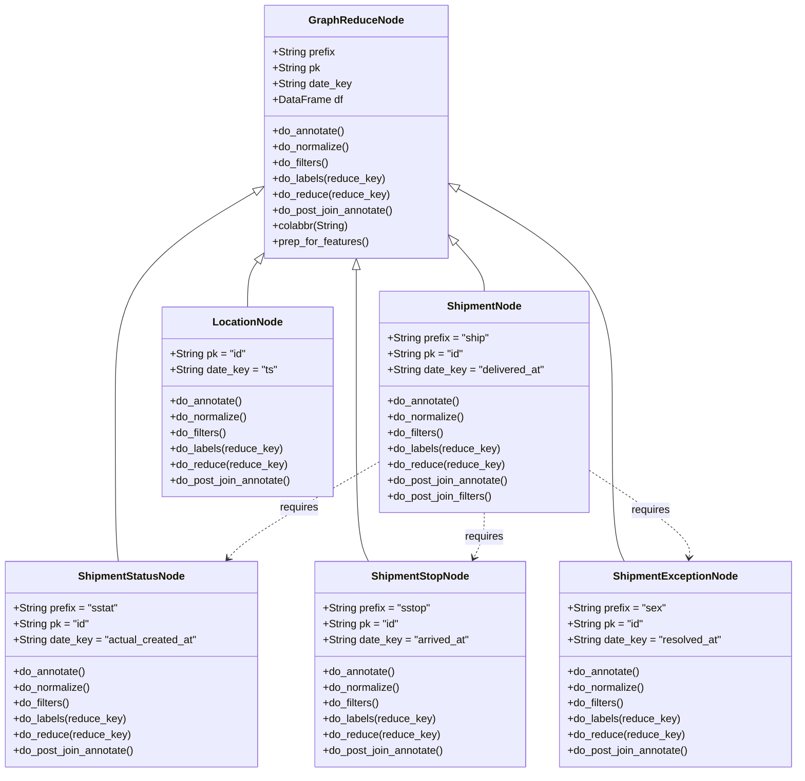
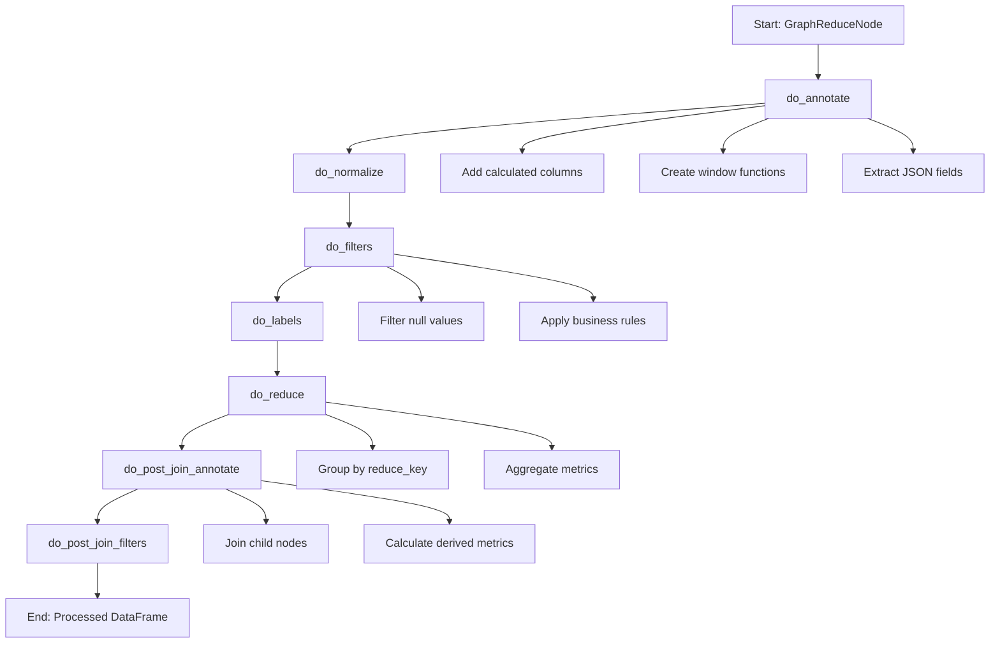
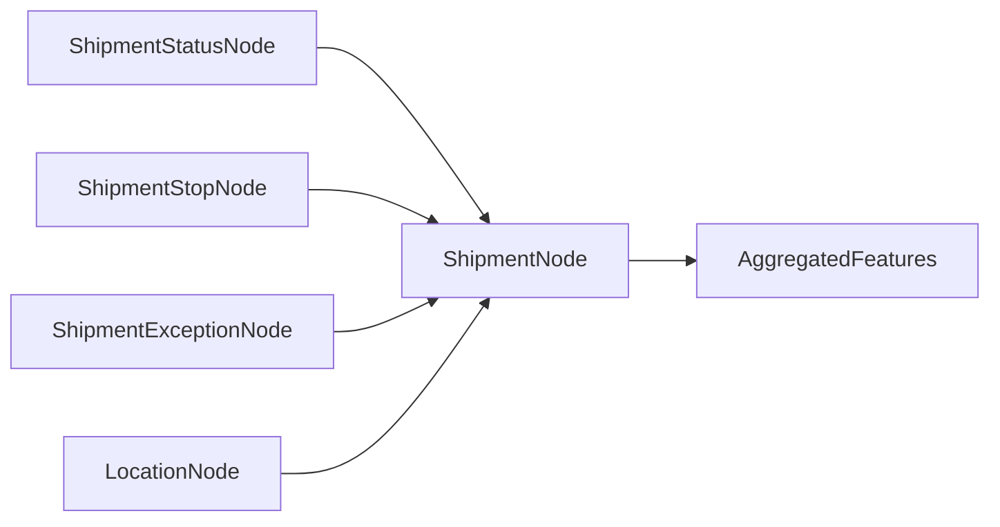

# Diagram: research/orchestrator/feature_repo/shipments/shipment_features.py


> Auto-generated by Obscura crawlers

## Diagram 1

```mermaid
classDiagram
      GraphReduceNode <|-- ShipmentStatusNode
      GraphReduceNode <|-- ShipmentStopNode
      GraphReduceNode <|-- ShipmentExceptionNode...
  └ 114 lines...

● stop_bash
  └ <command with id: 0 stopped>

● Generate three Mermaid diagrams
  $ cat << 'DIAGRAM1'
```

> SVG rendering failed for this diagram.

## Diagram 2

```mermaid
classDiagram
      GraphReduceNode <|-- ShipmentStatusNode
      GraphReduceNode <|-- ShipmentStopNode
      GraphReduceNode <|-- ShipmentExceptionNode...
  └ 118 lines...

✗ read_bash
  Invalid shell ID: 1. Please supply a valid shell ID to read output from.

  <no active shell sessions>
```

> SVG rendering failed for this diagram.

## Diagram 3



### SVG

<svg id="container" width="1201.29296875" xmlns="http://www.w3.org/2000/svg" class="classDiagram" height="1172" viewBox="0 0 1201.29296875 1172" role="graphics-document document" aria-roledescription="class"><style>#container{font-family:"trebuchet ms",verdana,arial,sans-serif;font-size:16px;fill:#333;}@keyframes edge-animation-frame{from{stroke-dashoffset:0;}}@keyframes dash{to{stroke-dashoffset:0;}}#container .edge-animation-slow{stroke-dasharray:9,5!important;stroke-dashoffset:900;animation:dash 50s linear infinite;stroke-linecap:round;}#container .edge-animation-fast{stroke-dasharray:9,5!important;stroke-dashoffset:900;animation:dash 20s linear infinite;stroke-linecap:round;}#container .error-icon{fill:#552222;}#container .error-text{fill:#552222;stroke:#552222;}#container .edge-thickness-normal{stroke-width:1px;}#container .edge-thickness-thick{stroke-width:3.5px;}#container .edge-pattern-solid{stroke-dasharray:0;}#container .edge-thickness-invisible{stroke-width:0;fill:none;}#container .edge-pattern-dashed{stroke-dasharray:3;}#container .edge-pattern-dotted{stroke-dasharray:2;}#container .marker{fill:#333333;stroke:#333333;}#container .marker.cross{stroke:#333333;}#container svg{font-family:"trebuchet ms",verdana,arial,sans-serif;font-size:16px;}#container p{margin:0;}#container g.classGroup text{fill:#9370DB;stroke:none;font-family:"trebuchet ms",verdana,arial,sans-serif;font-size:10px;}#container g.classGroup text .title{font-weight:bolder;}#container .nodeLabel,#container .edgeLabel{color:#131300;}#container .edgeLabel .label rect{fill:#ECECFF;}#container .label text{fill:#131300;}#container .labelBkg{background:#ECECFF;}#container .edgeLabel .label span{background:#ECECFF;}#container .classTitle{font-weight:bolder;}#container .node rect,#container .node circle,#container .node ellipse,#container .node polygon,#container .node path{fill:#ECECFF;stroke:#9370DB;stroke-width:1px;}#container .divider{stroke:#9370DB;stroke-width:1;}#container g.clickable{cursor:pointer;}#container g.classGroup rect{fill:#ECECFF;stroke:#9370DB;}#container g.classGroup line{stroke:#9370DB;stroke-width:1;}#container .classLabel .box{stroke:none;stroke-width:0;fill:#ECECFF;opacity:0.5;}#container .classLabel .label{fill:#9370DB;font-size:10px;}#container .relation{stroke:#333333;stroke-width:1;fill:none;}#container .dashed-line{stroke-dasharray:3;}#container .dotted-line{stroke-dasharray:1 2;}#container #compositionStart,#container .composition{fill:#333333!important;stroke:#333333!important;stroke-width:1;}#container #compositionEnd,#container .composition{fill:#333333!important;stroke:#333333!important;stroke-width:1;}#container #dependencyStart,#container .dependency{fill:#333333!important;stroke:#333333!important;stroke-width:1;}#container #dependencyStart,#container .dependency{fill:#333333!important;stroke:#333333!important;stroke-width:1;}#container #extensionStart,#container .extension{fill:transparent!important;stroke:#333333!important;stroke-width:1;}#container #extensionEnd,#container .extension{fill:transparent!important;stroke:#333333!important;stroke-width:1;}#container #aggregationStart,#container .aggregation{fill:transparent!important;stroke:#333333!important;stroke-width:1;}#container #aggregationEnd,#container .aggregation{fill:transparent!important;stroke:#333333!important;stroke-width:1;}#container #lollipopStart,#container .lollipop{fill:#ECECFF!important;stroke:#333333!important;stroke-width:1;}#container #lollipopEnd,#container .lollipop{fill:#ECECFF!important;stroke:#333333!important;stroke-width:1;}#container .edgeTerminals{font-size:11px;line-height:initial;}#container .classTitleText{text-anchor:middle;font-size:18px;fill:#333;}#container .label-icon{display:inline-block;height:1em;overflow:visible;vertical-align:-0.125em;}#container .node .label-icon path{fill:currentColor;stroke:revert;stroke-width:revert;}#container :root{--mermaid-font-family:"trebuchet ms",verdana,arial,sans-serif;}</style><g><defs><marker id="container_class-aggregationStart" class="marker aggregation class" refX="18" refY="7" markerWidth="190" markerHeight="240" orient="auto"><path d="M 18,7 L9,13 L1,7 L9,1 Z"></path></marker></defs><defs><marker id="container_class-aggregationEnd" class="marker aggregation class" refX="1" refY="7" markerWidth="20" markerHeight="28" orient="auto"><path d="M 18,7 L9,13 L1,7 L9,1 Z"></path></marker></defs><defs><marker id="container_class-extensionStart" class="marker extension class" refX="18" refY="7" markerWidth="190" markerHeight="240" orient="auto"><path d="M 1,7 L18,13 V 1 Z"></path></marker></defs><defs><marker id="container_class-extensionEnd" class="marker extension class" refX="1" refY="7" markerWidth="20" markerHeight="28" orient="auto"><path d="M 1,1 V 13 L18,7 Z"></path></marker></defs><defs><marker id="container_class-compositionStart" class="marker composition class" refX="18" refY="7" markerWidth="190" markerHeight="240" orient="auto"><path d="M 18,7 L9,13 L1,7 L9,1 Z"></path></marker></defs><defs><marker id="container_class-compositionEnd" class="marker composition class" refX="1" refY="7" markerWidth="20" markerHeight="28" orient="auto"><path d="M 18,7 L9,13 L1,7 L9,1 Z"></path></marker></defs><defs><marker id="container_class-dependencyStart" class="marker dependency class" refX="6" refY="7" markerWidth="190" markerHeight="240" orient="auto"><path d="M 5,7 L9,13 L1,7 L9,1 Z"></path></marker></defs><defs><marker id="container_class-dependencyEnd" class="marker dependency class" refX="13" refY="7" markerWidth="20" markerHeight="28" orient="auto"><path d="M 18,7 L9,13 L14,7 L9,1 Z"></path></marker></defs><defs><marker id="container_class-lollipopStart" class="marker lollipop class" refX="13" refY="7" markerWidth="190" markerHeight="240" orient="auto"><circle stroke="black" fill="transparent" cx="7" cy="7" r="6"></circle></marker></defs><defs><marker id="container_class-lollipopEnd" class="marker lollipop class" refX="1" refY="7" markerWidth="190" markerHeight="240" orient="auto"><circle stroke="black" fill="transparent" cx="7" cy="7" r="6"></circle></marker></defs><g class="root"><g class="clusters"></g><g class="edgePaths"><path d="M383.849,291.717L348.695,312.598C313.541,333.478,243.233,375.239,208.08,428.286C172.926,481.333,172.926,545.667,172.926,612C172.926,678.333,172.926,746.667,173.722,787C174.519,827.333,176.111,839.667,176.908,845.833L177.704,852" id="id_GraphReduceNode_ShipmentStatusNode_1" class="edge-thickness-normal edge-pattern-solid relation" style=";;;" data-edge="true" data-et="edge" data-id="id_GraphReduceNode_ShipmentStatusNode_1" data-points="W3sieCI6Mzk4LjY3OTY4NzUsInkiOjI4Mi45MDgwNzkwMzY4NDU0fSx7IngiOjE3Mi45MjU3ODEyNSwieSI6NDE3fSx7IngiOjE3Mi45MjU3ODEyNSwieSI6NjEwfSx7IngiOjE3Mi45MjU3ODEyNSwieSI6ODE1fSx7IngiOjE3Ny43MDQyOTg4OTg5NjM3NCwieSI6ODUyfV0=" marker-start="url(#container_class-extensionStart)"></path><path d="M538.262,409.25L538.262,410.542C538.262,411.833,538.262,414.417,538.262,447.875C538.262,481.333,538.262,545.667,538.262,612C538.262,678.333,538.262,746.667,541.355,787C544.448,827.333,550.633,839.667,553.726,845.833L556.819,852" id="id_GraphReduceNode_ShipmentStopNode_2" class="edge-thickness-normal edge-pattern-solid relation" style=";;;" data-edge="true" data-et="edge" data-id="id_GraphReduceNode_ShipmentStopNode_2" data-points="W3sieCI6NTM4LjI2MTcxODc1LCJ5IjozOTJ9LHsieCI6NTM4LjI2MTcxODc1LCJ5Ijo0MTd9LHsieCI6NTM4LjI2MTcxODc1LCJ5Ijo2MTB9LHsieCI6NTM4LjI2MTcxODc1LCJ5Ijo4MTV9LHsieCI6NTU2LjgxOTM4MTQ3NjY4MzksInkiOjg1Mn1d" marker-start="url(#container_class-extensionStart)"></path><path d="M692.892,286.659L731.654,308.383C770.416,330.106,847.94,373.553,886.703,427.443C925.465,481.333,925.465,545.667,925.465,612C925.465,678.333,925.465,746.667,928.48,787C931.495,827.333,937.526,839.667,940.541,845.833L943.556,852" id="id_GraphReduceNode_ShipmentExceptionNode_3" class="edge-thickness-normal edge-pattern-solid relation" style=";;;" data-edge="true" data-et="edge" data-id="id_GraphReduceNode_ShipmentExceptionNode_3" data-points="W3sieCI6Njc3Ljg0Mzc1LCJ5IjoyNzguMjI1ODY4NjA5MDE1fSx7IngiOjkyNS40NjQ4NDM3NSwieSI6NDE3fSx7IngiOjkyNS40NjQ4NDM3NSwieSI6NjEwfSx7IngiOjkyNS40NjQ4NDM3NSwieSI6ODE1fSx7IngiOjk0My41NTU5NjI1OTcxNTAzLCJ5Ijo4NTJ9XQ==" marker-start="url(#container_class-extensionStart)"></path><path d="M689.328,369.324L696.417,377.27C703.506,385.216,717.685,401.108,724.774,413.221C731.863,425.333,731.863,433.667,731.863,437.833L731.863,442" id="id_GraphReduceNode_ShipmentNode_4" class="edge-thickness-normal edge-pattern-solid relation" style=";;;" data-edge="true" data-et="edge" data-id="id_GraphReduceNode_ShipmentNode_4" data-points="W3sieCI6Njc3Ljg0Mzc1LCJ5IjozNTYuNDUxNzM3MjE4MDI5OTZ9LHsieCI6NzMxLjg2MzI4MTI1LCJ5Ijo0MTd9LHsieCI6NzMxLjg2MzI4MTI1LCJ5Ijo0NDJ9XQ==" marker-start="url(#container_class-extensionStart)"></path><path d="M388.2,396.197L385.548,399.665C382.896,403.132,377.593,410.066,374.941,421.7C372.289,433.333,372.289,449.667,372.289,457.833L372.289,466" id="id_GraphReduceNode_LocationNode_5" class="edge-thickness-normal edge-pattern-solid relation" style=";;;" data-edge="true" data-et="edge" data-id="id_GraphReduceNode_LocationNode_5" data-points="W3sieCI6Mzk4LjY3OTY4NzUsInkiOjM4Mi40OTU3MjgzMDYxNDk4M30seyJ4IjozNzIuMjg5MDYyNSwieSI6NDE3fSx7IngiOjM3Mi4yODkwNjI1LCJ5Ijo0NjZ9XQ==" marker-start="url(#container_class-extensionStart)"></path><path d="M573.262,700.422L539.766,719.518C506.271,738.614,439.28,776.807,400.881,801.328C362.483,825.85,352.677,836.699,347.774,842.124L342.871,847.549" id="id_ShipmentNode_ShipmentStatusNode_6" class="edge-thickness-normal edge-pattern-dashed relation" style=";;;" data-edge="true" data-et="edge" data-id="id_ShipmentNode_ShipmentStatusNode_6" data-points="W3sieCI6NTczLjI2MTcxODc1LCJ5Ijo3MDAuNDIxNzIyNzQwNjU0N30seyJ4IjozNzIuMjg5MDYyNSwieSI6ODE1fSx7IngiOjMzOC44NDc2NzY0ODk2MzczLCJ5Ijo4NTJ9XQ==" marker-end="url(#container_class-dependencyEnd)"></path><path d="M890.465,713.911L916.18,730.76C941.896,747.608,993.327,781.304,1018.374,803.327C1043.421,825.35,1042.084,835.7,1041.416,840.875L1040.748,846.049" id="id_ShipmentNode_ShipmentExceptionNode_7" class="edge-thickness-normal edge-pattern-dashed relation" style=";;;" data-edge="true" data-et="edge" data-id="id_ShipmentNode_ShipmentExceptionNode_7" data-points="W3sieCI6ODkwLjQ2NDg0Mzc1LCJ5Ijo3MTMuOTExNDM2ODExMDI2MX0seyJ4IjoxMDQ0Ljc1NzgxMjUsInkiOjgxNX0seyJ4IjoxMDM5Ljk3OTI5NDg1MTAzNjIsInkiOjg1Mn1d" marker-end="url(#container_class-dependencyEnd)"></path><path d="M731.863,778L731.863,784.167C731.863,790.333,731.863,802.667,729.219,814.106C726.574,825.546,721.285,836.091,718.64,841.364L715.996,846.637" id="id_ShipmentNode_ShipmentStopNode_8" class="edge-thickness-normal edge-pattern-dashed relation" style=";;;" data-edge="true" data-et="edge" data-id="id_ShipmentNode_ShipmentStopNode_8" data-points="W3sieCI6NzMxLjg2MzI4MTI1LCJ5Ijo3Nzh9LHsieCI6NzMxLjg2MzI4MTI1LCJ5Ijo4MTV9LHsieCI6NzEzLjMwNTYxODUyMzMxNjEsInkiOjg1Mn1d" marker-end="url(#container_class-dependencyEnd)"></path></g><g class="edgeLabels"><g class="edgeLabel"><g class="label" data-id="id_GraphReduceNode_ShipmentStatusNode_1" transform="translate(0, 0)"><foreignObject width="0" height="0"><div xmlns="http://www.w3.org/1999/xhtml" class="labelBkg" style="display: table-cell; white-space: nowrap; line-height: 1.5; max-width: 200px; text-align: center;"><span class="edgeLabel"></span></div></foreignObject></g></g><g class="edgeLabel"><g class="label" data-id="id_GraphReduceNode_ShipmentStopNode_2" transform="translate(0, 0)"><foreignObject width="0" height="0"><div xmlns="http://www.w3.org/1999/xhtml" class="labelBkg" style="display: table-cell; white-space: nowrap; line-height: 1.5; max-width: 200px; text-align: center;"><span class="edgeLabel"></span></div></foreignObject></g></g><g class="edgeLabel"><g class="label" data-id="id_GraphReduceNode_ShipmentExceptionNode_3" transform="translate(0, 0)"><foreignObject width="0" height="0"><div xmlns="http://www.w3.org/1999/xhtml" class="labelBkg" style="display: table-cell; white-space: nowrap; line-height: 1.5; max-width: 200px; text-align: center;"><span class="edgeLabel"></span></div></foreignObject></g></g><g class="edgeLabel"><g class="label" data-id="id_GraphReduceNode_ShipmentNode_4" transform="translate(0, 0)"><foreignObject width="0" height="0"><div xmlns="http://www.w3.org/1999/xhtml" class="labelBkg" style="display: table-cell; white-space: nowrap; line-height: 1.5; max-width: 200px; text-align: center;"><span class="edgeLabel"></span></div></foreignObject></g></g><g class="edgeLabel"><g class="label" data-id="id_GraphReduceNode_LocationNode_5" transform="translate(0, 0)"><foreignObject width="0" height="0"><div xmlns="http://www.w3.org/1999/xhtml" class="labelBkg" style="display: table-cell; white-space: nowrap; line-height: 1.5; max-width: 200px; text-align: center;"><span class="edgeLabel"></span></div></foreignObject></g></g><g class="edgeLabel" transform="translate(451.11219, 770.06146)"><g class="label" data-id="id_ShipmentNode_ShipmentStatusNode_6" transform="translate(-29.8515625, -12)"><foreignObject width="59.703125" height="24"><div xmlns="http://www.w3.org/1999/xhtml" class="labelBkg" style="display: table-cell; white-space: nowrap; line-height: 1.5; max-width: 200px; text-align: center;"><span class="edgeLabel"><p>requires</p></span></div></foreignObject></g></g><g class="edgeLabel" transform="translate(983.21438, 774.67841)"><g class="label" data-id="id_ShipmentNode_ShipmentExceptionNode_7" transform="translate(-29.8515625, -12)"><foreignObject width="59.703125" height="24"><div xmlns="http://www.w3.org/1999/xhtml" class="labelBkg" style="display: table-cell; white-space: nowrap; line-height: 1.5; max-width: 200px; text-align: center;"><span class="edgeLabel"><p>requires</p></span></div></foreignObject></g></g><g class="edgeLabel" transform="translate(731.86328125, 815)"><g class="label" data-id="id_ShipmentNode_ShipmentStopNode_8" transform="translate(-29.8515625, -12)"><foreignObject width="59.703125" height="24"><div xmlns="http://www.w3.org/1999/xhtml" class="labelBkg" style="display: table-cell; white-space: nowrap; line-height: 1.5; max-width: 200px; text-align: center;"><span class="edgeLabel"><p>requires</p></span></div></foreignObject></g></g></g><g class="nodes"><g class="node default" id="classId-GraphReduceNode-0" transform="translate(538.26171875, 200)"><g class="basic label-container"><path d="M-139.58203125 -192 L139.58203125 -192 L139.58203125 192 L-139.58203125 192" stroke="none" stroke-width="0" fill="#ECECFF" style=""></path><path d="M-139.58203125 -192 C-46.98255944566927 -192, 45.616912358661466 -192, 139.58203125 -192 M-139.58203125 -192 C-50.00447124385987 -192, 39.573088762280264 -192, 139.58203125 -192 M139.58203125 -192 C139.58203125 -83.17346732036629, 139.58203125 25.65306535926743, 139.58203125 192 M139.58203125 -192 C139.58203125 -74.06048388882883, 139.58203125 43.879032222342346, 139.58203125 192 M139.58203125 192 C71.79220382100749 192, 4.00237639201498 192, -139.58203125 192 M139.58203125 192 C66.75885381631306 192, -6.064323617373873 192, -139.58203125 192 M-139.58203125 192 C-139.58203125 50.30063206221388, -139.58203125 -91.39873587557224, -139.58203125 -192 M-139.58203125 192 C-139.58203125 73.78108319453341, -139.58203125 -44.43783361093318, -139.58203125 -192" stroke="#9370DB" stroke-width="1.3" fill="none" stroke-dasharray="0 0" style=""></path></g><g class="annotation-group text" transform="translate(0, -168)"></g><g class="label-group text" transform="translate(-67.7578125, -168)"><g class="label" style="font-weight: bolder" transform="translate(0,-12)"><foreignObject width="135.515625" height="24"><div xmlns="http://www.w3.org/1999/xhtml" style="display: table-cell; white-space: nowrap; line-height: 1.5; max-width: 185px; text-align: center;"><span class="nodeLabel markdown-node-label" style=""><p>GraphReduceNode</p></span></div></foreignObject></g></g><g class="members-group text" transform="translate(-127.58203125, -120)"><g class="label" style="" transform="translate(0,-12)"><foreignObject width="95.359375" height="24"><div xmlns="http://www.w3.org/1999/xhtml" style="display: table-cell; white-space: nowrap; line-height: 1.5; max-width: 153px; text-align: center;"><span class="nodeLabel markdown-node-label" style=""><p>+String prefix</p></span></div></foreignObject></g><g class="label" style="" transform="translate(0,12)"><foreignObject width="72.171875" height="24"><div xmlns="http://www.w3.org/1999/xhtml" style="display: table-cell; white-space: nowrap; line-height: 1.5; max-width: 130px; text-align: center;"><span class="nodeLabel markdown-node-label" style=""><p>+String pk</p></span></div></foreignObject></g><g class="label" style="" transform="translate(0,36)"><foreignObject width="119.578125" height="24"><div xmlns="http://www.w3.org/1999/xhtml" style="display: table-cell; white-space: nowrap; line-height: 1.5; max-width: 177px; text-align: center;"><span class="nodeLabel markdown-node-label" style=""><p>+String date_key</p></span></div></foreignObject></g><g class="label" style="" transform="translate(0,60)"><foreignObject width="104.421875" height="24"><div xmlns="http://www.w3.org/1999/xhtml" style="display: table-cell; white-space: nowrap; line-height: 1.5; max-width: 163px; text-align: center;"><span class="nodeLabel markdown-node-label" style=""><p>+DataFrame df</p></span></div></foreignObject></g></g><g class="methods-group text" transform="translate(-127.58203125, 0)"><g class="label" style="" transform="translate(0,-12)"><foreignObject width="110.375" height="24"><div xmlns="http://www.w3.org/1999/xhtml" style="display: table-cell; white-space: nowrap; line-height: 1.5; max-width: 168px; text-align: center;"><span class="nodeLabel markdown-node-label" style=""><p>+do_annotate()</p></span></div></foreignObject></g><g class="label" style="" transform="translate(0,12)"><foreignObject width="117.21875" height="24"><div xmlns="http://www.w3.org/1999/xhtml" style="display: table-cell; white-space: nowrap; line-height: 1.5; max-width: 175px; text-align: center;"><span class="nodeLabel markdown-node-label" style=""><p>+do_normalize()</p></span></div></foreignObject></g><g class="label" style="" transform="translate(0,36)"><foreignObject width="86.5" height="24"><div xmlns="http://www.w3.org/1999/xhtml" style="display: table-cell; white-space: nowrap; line-height: 1.5; max-width: 144px; text-align: center;"><span class="nodeLabel markdown-node-label" style=""><p>+do_filters()</p></span></div></foreignObject></g><g class="label" style="" transform="translate(0,60)"><foreignObject width="170.734375" height="24"><div xmlns="http://www.w3.org/1999/xhtml" style="display: table-cell; white-space: nowrap; line-height: 1.5; max-width: 228px; text-align: center;"><span class="nodeLabel markdown-node-label" style=""><p>+do_labels(reduce_key)</p></span></div></foreignObject></g><g class="label" style="" transform="translate(0,84)"><foreignObject width="176.53125" height="24"><div xmlns="http://www.w3.org/1999/xhtml" style="display: table-cell; white-space: nowrap; line-height: 1.5; max-width: 234px; text-align: center;"><span class="nodeLabel markdown-node-label" style=""><p>+do_reduce(reduce_key)</p></span></div></foreignObject></g><g class="label" style="" transform="translate(0,108)"><foreignObject width="187.40625" height="24"><div xmlns="http://www.w3.org/1999/xhtml" style="display: table-cell; white-space: nowrap; line-height: 1.5; max-width: 245px; text-align: center;"><span class="nodeLabel markdown-node-label" style=""><p>+do_post_join_annotate()</p></span></div></foreignObject></g><g class="label" style="" transform="translate(0,132)"><foreignObject width="116.40625" height="24"><div xmlns="http://www.w3.org/1999/xhtml" style="display: table-cell; white-space: nowrap; line-height: 1.5; max-width: 174px; text-align: center;"><span class="nodeLabel markdown-node-label" style=""><p>+colabbr(String)</p></span></div></foreignObject></g><g class="label" style="" transform="translate(0,156)"><foreignObject width="146.34375" height="24"><div xmlns="http://www.w3.org/1999/xhtml" style="display: table-cell; white-space: nowrap; line-height: 1.5; max-width: 204px; text-align: center;"><span class="nodeLabel markdown-node-label" style=""><p>+prep_for_features()</p></span></div></foreignObject></g></g><g class="divider" style=""><path d="M-139.58203125 -144 C-76.2409626586618 -144, -12.899894067323586 -144, 139.58203125 -144 M-139.58203125 -144 C-38.526373941166895 -144, 62.52928336766621 -144, 139.58203125 -144" stroke="#9370DB" stroke-width="1.3" fill="none" stroke-dasharray="0 0" style=""></path></g><g class="divider" style=""><path d="M-139.58203125 -24 C-45.53425506014263 -24, 48.513521129714746 -24, 139.58203125 -24 M-139.58203125 -24 C-31.065921402893864 -24, 77.45018844421227 -24, 139.58203125 -24" stroke="#9370DB" stroke-width="1.3" fill="none" stroke-dasharray="0 0" style=""></path></g></g><g class="node default" id="classId-ShipmentStatusNode-1" transform="translate(197.8515625, 1008)"><g class="basic label-container"><path d="M-189.8515625 -156 L189.8515625 -156 L189.8515625 156 L-189.8515625 156" stroke="none" stroke-width="0" fill="#ECECFF" style=""></path><path d="M-189.8515625 -156 C-98.20381118115858 -156, -6.55605986231717 -156, 189.8515625 -156 M-189.8515625 -156 C-65.88736119559613 -156, 58.076840108807744 -156, 189.8515625 -156 M189.8515625 -156 C189.8515625 -34.201823698832484, 189.8515625 87.59635260233503, 189.8515625 156 M189.8515625 -156 C189.8515625 -55.03578809270235, 189.8515625 45.928423814595305, 189.8515625 156 M189.8515625 156 C100.6322568165668 156, 11.412951133133589 156, -189.8515625 156 M189.8515625 156 C64.02041151465899 156, -61.81073947068202 156, -189.8515625 156 M-189.8515625 156 C-189.8515625 63.37443987618232, -189.8515625 -29.251120247635356, -189.8515625 -156 M-189.8515625 156 C-189.8515625 41.52511427698211, -189.8515625 -72.94977144603578, -189.8515625 -156" stroke="#9370DB" stroke-width="1.3" fill="none" stroke-dasharray="0 0" style=""></path></g><g class="annotation-group text" transform="translate(0, -132)"></g><g class="label-group text" transform="translate(-77.78125, -132)"><g class="label" style="font-weight: bolder" transform="translate(0,-12)"><foreignObject width="155.5625" height="24"><div xmlns="http://www.w3.org/1999/xhtml" style="display: table-cell; white-space: nowrap; line-height: 1.5; max-width: 204px; text-align: center;"><span class="nodeLabel markdown-node-label" style=""><p>ShipmentStatusNode</p></span></div></foreignObject></g></g><g class="members-group text" transform="translate(-177.8515625, -84)"><g class="label" style="" transform="translate(0,-12)"><foreignObject width="159.125" height="24"><div xmlns="http://www.w3.org/1999/xhtml" style="display: table-cell; white-space: nowrap; line-height: 1.5; max-width: 216px; text-align: center;"><span class="nodeLabel markdown-node-label" style=""><p>+String prefix = "sstat"</p></span></div></foreignObject></g><g class="label" style="" transform="translate(0,12)"><foreignObject width="115.5" height="24"><div xmlns="http://www.w3.org/1999/xhtml" style="display: table-cell; white-space: nowrap; line-height: 1.5; max-width: 173px; text-align: center;"><span class="nodeLabel markdown-node-label" style=""><p>+String pk = "id"</p></span></div></foreignObject></g><g class="label" style="" transform="translate(0,36)"><foreignObject width="277.921875" height="24"><div xmlns="http://www.w3.org/1999/xhtml" style="display: table-cell; white-space: nowrap; line-height: 1.5; max-width: 335px; text-align: center;"><span class="nodeLabel markdown-node-label" style=""><p>+String date_key = "actual_created_at"</p></span></div></foreignObject></g></g><g class="methods-group text" transform="translate(-177.8515625, 12)"><g class="label" style="" transform="translate(0,-12)"><foreignObject width="110.375" height="24"><div xmlns="http://www.w3.org/1999/xhtml" style="display: table-cell; white-space: nowrap; line-height: 1.5; max-width: 168px; text-align: center;"><span class="nodeLabel markdown-node-label" style=""><p>+do_annotate()</p></span></div></foreignObject></g><g class="label" style="" transform="translate(0,12)"><foreignObject width="117.21875" height="24"><div xmlns="http://www.w3.org/1999/xhtml" style="display: table-cell; white-space: nowrap; line-height: 1.5; max-width: 175px; text-align: center;"><span class="nodeLabel markdown-node-label" style=""><p>+do_normalize()</p></span></div></foreignObject></g><g class="label" style="" transform="translate(0,36)"><foreignObject width="86.5" height="24"><div xmlns="http://www.w3.org/1999/xhtml" style="display: table-cell; white-space: nowrap; line-height: 1.5; max-width: 144px; text-align: center;"><span class="nodeLabel markdown-node-label" style=""><p>+do_filters()</p></span></div></foreignObject></g><g class="label" style="" transform="translate(0,60)"><foreignObject width="170.734375" height="24"><div xmlns="http://www.w3.org/1999/xhtml" style="display: table-cell; white-space: nowrap; line-height: 1.5; max-width: 228px; text-align: center;"><span class="nodeLabel markdown-node-label" style=""><p>+do_labels(reduce_key)</p></span></div></foreignObject></g><g class="label" style="" transform="translate(0,84)"><foreignObject width="176.53125" height="24"><div xmlns="http://www.w3.org/1999/xhtml" style="display: table-cell; white-space: nowrap; line-height: 1.5; max-width: 234px; text-align: center;"><span class="nodeLabel markdown-node-label" style=""><p>+do_reduce(reduce_key)</p></span></div></foreignObject></g><g class="label" style="" transform="translate(0,108)"><foreignObject width="187.40625" height="24"><div xmlns="http://www.w3.org/1999/xhtml" style="display: table-cell; white-space: nowrap; line-height: 1.5; max-width: 245px; text-align: center;"><span class="nodeLabel markdown-node-label" style=""><p>+do_post_join_annotate()</p></span></div></foreignObject></g></g><g class="divider" style=""><path d="M-189.8515625 -108 C-49.50666083505786 -108, 90.83824082988428 -108, 189.8515625 -108 M-189.8515625 -108 C-104.54749666372285 -108, -19.243430827445707 -108, 189.8515625 -108" stroke="#9370DB" stroke-width="1.3" fill="none" stroke-dasharray="0 0" style=""></path></g><g class="divider" style=""><path d="M-189.8515625 -12 C-73.91866388648651 -12, 42.014234727026974 -12, 189.8515625 -12 M-189.8515625 -12 C-66.65930495921586 -12, 56.53295258156828 -12, 189.8515625 -12" stroke="#9370DB" stroke-width="1.3" fill="none" stroke-dasharray="0 0" style=""></path></g></g><g class="node default" id="classId-ShipmentStopNode-2" transform="translate(635.0625, 1008)"><g class="basic label-container"><path d="M-158.875 -156 L158.875 -156 L158.875 156 L-158.875 156" stroke="none" stroke-width="0" fill="#ECECFF" style=""></path><path d="M-158.875 -156 C-89.56298075090005 -156, -20.250961501800106 -156, 158.875 -156 M-158.875 -156 C-35.39345735308483 -156, 88.08808529383035 -156, 158.875 -156 M158.875 -156 C158.875 -49.62413815601336, 158.875 56.75172368797328, 158.875 156 M158.875 -156 C158.875 -54.122480175349494, 158.875 47.75503964930101, 158.875 156 M158.875 156 C44.628828076468054 156, -69.61734384706389 156, -158.875 156 M158.875 156 C63.76339147680068 156, -31.348217046398645 156, -158.875 156 M-158.875 156 C-158.875 90.0142849664651, -158.875 24.028569932930196, -158.875 -156 M-158.875 156 C-158.875 73.43461281553003, -158.875 -9.130774368939939, -158.875 -156" stroke="#9370DB" stroke-width="1.3" fill="none" stroke-dasharray="0 0" style=""></path></g><g class="annotation-group text" transform="translate(0, -132)"></g><g class="label-group text" transform="translate(-71.265625, -132)"><g class="label" style="font-weight: bolder" transform="translate(0,-12)"><foreignObject width="142.53125" height="24"><div xmlns="http://www.w3.org/1999/xhtml" style="display: table-cell; white-space: nowrap; line-height: 1.5; max-width: 191px; text-align: center;"><span class="nodeLabel markdown-node-label" style=""><p>ShipmentStopNode</p></span></div></foreignObject></g></g><g class="members-group text" transform="translate(-146.875, -84)"><g class="label" style="" transform="translate(0,-12)"><foreignObject width="163.453125" height="24"><div xmlns="http://www.w3.org/1999/xhtml" style="display: table-cell; white-space: nowrap; line-height: 1.5; max-width: 221px; text-align: center;"><span class="nodeLabel markdown-node-label" style=""><p>+String prefix = "sstop"</p></span></div></foreignObject></g><g class="label" style="" transform="translate(0,12)"><foreignObject width="115.5" height="24"><div xmlns="http://www.w3.org/1999/xhtml" style="display: table-cell; white-space: nowrap; line-height: 1.5; max-width: 173px; text-align: center;"><span class="nodeLabel markdown-node-label" style=""><p>+String pk = "id"</p></span></div></foreignObject></g><g class="label" style="" transform="translate(0,36)"><foreignObject width="222.484375" height="24"><div xmlns="http://www.w3.org/1999/xhtml" style="display: table-cell; white-space: nowrap; line-height: 1.5; max-width: 280px; text-align: center;"><span class="nodeLabel markdown-node-label" style=""><p>+String date_key = "arrived_at"</p></span></div></foreignObject></g></g><g class="methods-group text" transform="translate(-146.875, 12)"><g class="label" style="" transform="translate(0,-12)"><foreignObject width="110.375" height="24"><div xmlns="http://www.w3.org/1999/xhtml" style="display: table-cell; white-space: nowrap; line-height: 1.5; max-width: 168px; text-align: center;"><span class="nodeLabel markdown-node-label" style=""><p>+do_annotate()</p></span></div></foreignObject></g><g class="label" style="" transform="translate(0,12)"><foreignObject width="117.21875" height="24"><div xmlns="http://www.w3.org/1999/xhtml" style="display: table-cell; white-space: nowrap; line-height: 1.5; max-width: 175px; text-align: center;"><span class="nodeLabel markdown-node-label" style=""><p>+do_normalize()</p></span></div></foreignObject></g><g class="label" style="" transform="translate(0,36)"><foreignObject width="86.5" height="24"><div xmlns="http://www.w3.org/1999/xhtml" style="display: table-cell; white-space: nowrap; line-height: 1.5; max-width: 144px; text-align: center;"><span class="nodeLabel markdown-node-label" style=""><p>+do_filters()</p></span></div></foreignObject></g><g class="label" style="" transform="translate(0,60)"><foreignObject width="170.734375" height="24"><div xmlns="http://www.w3.org/1999/xhtml" style="display: table-cell; white-space: nowrap; line-height: 1.5; max-width: 228px; text-align: center;"><span class="nodeLabel markdown-node-label" style=""><p>+do_labels(reduce_key)</p></span></div></foreignObject></g><g class="label" style="" transform="translate(0,84)"><foreignObject width="176.53125" height="24"><div xmlns="http://www.w3.org/1999/xhtml" style="display: table-cell; white-space: nowrap; line-height: 1.5; max-width: 234px; text-align: center;"><span class="nodeLabel markdown-node-label" style=""><p>+do_reduce(reduce_key)</p></span></div></foreignObject></g><g class="label" style="" transform="translate(0,108)"><foreignObject width="187.40625" height="24"><div xmlns="http://www.w3.org/1999/xhtml" style="display: table-cell; white-space: nowrap; line-height: 1.5; max-width: 245px; text-align: center;"><span class="nodeLabel markdown-node-label" style=""><p>+do_post_join_annotate()</p></span></div></foreignObject></g></g><g class="divider" style=""><path d="M-158.875 -108 C-59.40974167856831 -108, 40.05551664286338 -108, 158.875 -108 M-158.875 -108 C-81.14329210854345 -108, -3.4115842170868973 -108, 158.875 -108" stroke="#9370DB" stroke-width="1.3" fill="none" stroke-dasharray="0 0" style=""></path></g><g class="divider" style=""><path d="M-158.875 -12 C-45.58181821109517 -12, 67.71136357780966 -12, 158.875 -12 M-158.875 -12 C-63.185934246675444 -12, 32.50313150664911 -12, 158.875 -12" stroke="#9370DB" stroke-width="1.3" fill="none" stroke-dasharray="0 0" style=""></path></g></g><g class="node default" id="classId-ShipmentExceptionNode-3" transform="translate(1019.83203125, 1008)"><g class="basic label-container"><path d="M-173.4609375 -156 L173.4609375 -156 L173.4609375 156 L-173.4609375 156" stroke="none" stroke-width="0" fill="#ECECFF" style=""></path><path d="M-173.4609375 -156 C-56.52197052105612 -156, 60.41699645788776 -156, 173.4609375 -156 M-173.4609375 -156 C-56.39678865160565 -156, 60.66736019678871 -156, 173.4609375 -156 M173.4609375 -156 C173.4609375 -46.969504655591194, 173.4609375 62.06099068881761, 173.4609375 156 M173.4609375 -156 C173.4609375 -66.25180986157909, 173.4609375 23.49638027684182, 173.4609375 156 M173.4609375 156 C74.34381858875687 156, -24.77330032248625 156, -173.4609375 156 M173.4609375 156 C78.0239447356148 156, -17.41304802877039 156, -173.4609375 156 M-173.4609375 156 C-173.4609375 37.38624042571544, -173.4609375 -81.22751914856912, -173.4609375 -156 M-173.4609375 156 C-173.4609375 84.48167552620336, -173.4609375 12.963351052406722, -173.4609375 -156" stroke="#9370DB" stroke-width="1.3" fill="none" stroke-dasharray="0 0" style=""></path></g><g class="annotation-group text" transform="translate(0, -132)"></g><g class="label-group text" transform="translate(-90, -132)"><g class="label" style="font-weight: bolder" transform="translate(0,-12)"><foreignObject width="180" height="24"><div xmlns="http://www.w3.org/1999/xhtml" style="display: table-cell; white-space: nowrap; line-height: 1.5; max-width: 229px; text-align: center;"><span class="nodeLabel markdown-node-label" style=""><p>ShipmentExceptionNode</p></span></div></foreignObject></g></g><g class="members-group text" transform="translate(-161.4609375, -84)"><g class="label" style="" transform="translate(0,-12)"><foreignObject width="148.25" height="24"><div xmlns="http://www.w3.org/1999/xhtml" style="display: table-cell; white-space: nowrap; line-height: 1.5; max-width: 206px; text-align: center;"><span class="nodeLabel markdown-node-label" style=""><p>+String prefix = "sex"</p></span></div></foreignObject></g><g class="label" style="" transform="translate(0,12)"><foreignObject width="115.5" height="24"><div xmlns="http://www.w3.org/1999/xhtml" style="display: table-cell; white-space: nowrap; line-height: 1.5; max-width: 173px; text-align: center;"><span class="nodeLabel markdown-node-label" style=""><p>+String pk = "id"</p></span></div></foreignObject></g><g class="label" style="" transform="translate(0,36)"><foreignObject width="232.921875" height="24"><div xmlns="http://www.w3.org/1999/xhtml" style="display: table-cell; white-space: nowrap; line-height: 1.5; max-width: 290px; text-align: center;"><span class="nodeLabel markdown-node-label" style=""><p>+String date_key = "resolved_at"</p></span></div></foreignObject></g></g><g class="methods-group text" transform="translate(-161.4609375, 12)"><g class="label" style="" transform="translate(0,-12)"><foreignObject width="110.375" height="24"><div xmlns="http://www.w3.org/1999/xhtml" style="display: table-cell; white-space: nowrap; line-height: 1.5; max-width: 168px; text-align: center;"><span class="nodeLabel markdown-node-label" style=""><p>+do_annotate()</p></span></div></foreignObject></g><g class="label" style="" transform="translate(0,12)"><foreignObject width="117.21875" height="24"><div xmlns="http://www.w3.org/1999/xhtml" style="display: table-cell; white-space: nowrap; line-height: 1.5; max-width: 175px; text-align: center;"><span class="nodeLabel markdown-node-label" style=""><p>+do_normalize()</p></span></div></foreignObject></g><g class="label" style="" transform="translate(0,36)"><foreignObject width="86.5" height="24"><div xmlns="http://www.w3.org/1999/xhtml" style="display: table-cell; white-space: nowrap; line-height: 1.5; max-width: 144px; text-align: center;"><span class="nodeLabel markdown-node-label" style=""><p>+do_filters()</p></span></div></foreignObject></g><g class="label" style="" transform="translate(0,60)"><foreignObject width="170.734375" height="24"><div xmlns="http://www.w3.org/1999/xhtml" style="display: table-cell; white-space: nowrap; line-height: 1.5; max-width: 228px; text-align: center;"><span class="nodeLabel markdown-node-label" style=""><p>+do_labels(reduce_key)</p></span></div></foreignObject></g><g class="label" style="" transform="translate(0,84)"><foreignObject width="176.53125" height="24"><div xmlns="http://www.w3.org/1999/xhtml" style="display: table-cell; white-space: nowrap; line-height: 1.5; max-width: 234px; text-align: center;"><span class="nodeLabel markdown-node-label" style=""><p>+do_reduce(reduce_key)</p></span></div></foreignObject></g><g class="label" style="" transform="translate(0,108)"><foreignObject width="187.40625" height="24"><div xmlns="http://www.w3.org/1999/xhtml" style="display: table-cell; white-space: nowrap; line-height: 1.5; max-width: 245px; text-align: center;"><span class="nodeLabel markdown-node-label" style=""><p>+do_post_join_annotate()</p></span></div></foreignObject></g></g><g class="divider" style=""><path d="M-173.4609375 -108 C-46.57431672260775 -108, 80.3123040547845 -108, 173.4609375 -108 M-173.4609375 -108 C-91.4472697418698 -108, -9.433601983739607 -108, 173.4609375 -108" stroke="#9370DB" stroke-width="1.3" fill="none" stroke-dasharray="0 0" style=""></path></g><g class="divider" style=""><path d="M-173.4609375 -12 C-84.3504860796745 -12, 4.759965340651007 -12, 173.4609375 -12 M-173.4609375 -12 C-68.21233706547436 -12, 37.036263369051284 -12, 173.4609375 -12" stroke="#9370DB" stroke-width="1.3" fill="none" stroke-dasharray="0 0" style=""></path></g></g><g class="node default" id="classId-ShipmentNode-4" transform="translate(731.86328125, 610)"><g class="basic label-container"><path d="M-158.6015625 -168 L158.6015625 -168 L158.6015625 168 L-158.6015625 168" stroke="none" stroke-width="0" fill="#ECECFF" style=""></path><path d="M-158.6015625 -168 C-90.72954958256183 -168, -22.85753666512366 -168, 158.6015625 -168 M-158.6015625 -168 C-93.4561729757908 -168, -28.310783451581614 -168, 158.6015625 -168 M158.6015625 -168 C158.6015625 -91.78727388230321, 158.6015625 -15.574547764606422, 158.6015625 168 M158.6015625 -168 C158.6015625 -34.971238788991116, 158.6015625 98.05752242201777, 158.6015625 168 M158.6015625 168 C94.39578330385181 168, 30.19000410770363 168, -158.6015625 168 M158.6015625 168 C49.43287044710668 168, -59.73582160578664 168, -158.6015625 168 M-158.6015625 168 C-158.6015625 97.82816738432999, -158.6015625 27.656334768659974, -158.6015625 -168 M-158.6015625 168 C-158.6015625 81.27434622848047, -158.6015625 -5.451307543039064, -158.6015625 -168" stroke="#9370DB" stroke-width="1.3" fill="none" stroke-dasharray="0 0" style=""></path></g><g class="annotation-group text" transform="translate(0, -144)"></g><g class="label-group text" transform="translate(-54.296875, -144)"><g class="label" style="font-weight: bolder" transform="translate(0,-12)"><foreignObject width="108.59375" height="24"><div xmlns="http://www.w3.org/1999/xhtml" style="display: table-cell; white-space: nowrap; line-height: 1.5; max-width: 158px; text-align: center;"><span class="nodeLabel markdown-node-label" style=""><p>ShipmentNode</p></span></div></foreignObject></g></g><g class="members-group text" transform="translate(-146.6015625, -96)"><g class="label" style="" transform="translate(0,-12)"><foreignObject width="155.140625" height="24"><div xmlns="http://www.w3.org/1999/xhtml" style="display: table-cell; white-space: nowrap; line-height: 1.5; max-width: 213px; text-align: center;"><span class="nodeLabel markdown-node-label" style=""><p>+String prefix = "ship"</p></span></div></foreignObject></g><g class="label" style="" transform="translate(0,12)"><foreignObject width="115.5" height="24"><div xmlns="http://www.w3.org/1999/xhtml" style="display: table-cell; white-space: nowrap; line-height: 1.5; max-width: 173px; text-align: center;"><span class="nodeLabel markdown-node-label" style=""><p>+String pk = "id"</p></span></div></foreignObject></g><g class="label" style="" transform="translate(0,36)"><foreignObject width="238.90625" height="24"><div xmlns="http://www.w3.org/1999/xhtml" style="display: table-cell; white-space: nowrap; line-height: 1.5; max-width: 296px; text-align: center;"><span class="nodeLabel markdown-node-label" style=""><p>+String date_key = "delivered_at"</p></span></div></foreignObject></g></g><g class="methods-group text" transform="translate(-146.6015625, 0)"><g class="label" style="" transform="translate(0,-12)"><foreignObject width="110.375" height="24"><div xmlns="http://www.w3.org/1999/xhtml" style="display: table-cell; white-space: nowrap; line-height: 1.5; max-width: 168px; text-align: center;"><span class="nodeLabel markdown-node-label" style=""><p>+do_annotate()</p></span></div></foreignObject></g><g class="label" style="" transform="translate(0,12)"><foreignObject width="117.21875" height="24"><div xmlns="http://www.w3.org/1999/xhtml" style="display: table-cell; white-space: nowrap; line-height: 1.5; max-width: 175px; text-align: center;"><span class="nodeLabel markdown-node-label" style=""><p>+do_normalize()</p></span></div></foreignObject></g><g class="label" style="" transform="translate(0,36)"><foreignObject width="86.5" height="24"><div xmlns="http://www.w3.org/1999/xhtml" style="display: table-cell; white-space: nowrap; line-height: 1.5; max-width: 144px; text-align: center;"><span class="nodeLabel markdown-node-label" style=""><p>+do_filters()</p></span></div></foreignObject></g><g class="label" style="" transform="translate(0,60)"><foreignObject width="170.734375" height="24"><div xmlns="http://www.w3.org/1999/xhtml" style="display: table-cell; white-space: nowrap; line-height: 1.5; max-width: 228px; text-align: center;"><span class="nodeLabel markdown-node-label" style=""><p>+do_labels(reduce_key)</p></span></div></foreignObject></g><g class="label" style="" transform="translate(0,84)"><foreignObject width="176.53125" height="24"><div xmlns="http://www.w3.org/1999/xhtml" style="display: table-cell; white-space: nowrap; line-height: 1.5; max-width: 234px; text-align: center;"><span class="nodeLabel markdown-node-label" style=""><p>+do_reduce(reduce_key)</p></span></div></foreignObject></g><g class="label" style="" transform="translate(0,108)"><foreignObject width="187.40625" height="24"><div xmlns="http://www.w3.org/1999/xhtml" style="display: table-cell; white-space: nowrap; line-height: 1.5; max-width: 245px; text-align: center;"><span class="nodeLabel markdown-node-label" style=""><p>+do_post_join_annotate()</p></span></div></foreignObject></g><g class="label" style="" transform="translate(0,132)"><foreignObject width="163.53125" height="24"><div xmlns="http://www.w3.org/1999/xhtml" style="display: table-cell; white-space: nowrap; line-height: 1.5; max-width: 221px; text-align: center;"><span class="nodeLabel markdown-node-label" style=""><p>+do_post_join_filters()</p></span></div></foreignObject></g></g><g class="divider" style=""><path d="M-158.6015625 -120 C-45.61675456817136 -120, 67.36805336365728 -120, 158.6015625 -120 M-158.6015625 -120 C-32.545134084361635 -120, 93.51129433127673 -120, 158.6015625 -120" stroke="#9370DB" stroke-width="1.3" fill="none" stroke-dasharray="0 0" style=""></path></g><g class="divider" style=""><path d="M-158.6015625 -24 C-73.85376585910089 -24, 10.894030781798222 -24, 158.6015625 -24 M-158.6015625 -24 C-49.236258978575876 -24, 60.12904454284825 -24, 158.6015625 -24" stroke="#9370DB" stroke-width="1.3" fill="none" stroke-dasharray="0 0" style=""></path></g></g><g class="node default" id="classId-LocationNode-5" transform="translate(372.2890625, 610)"><g class="basic label-container"><path d="M-130.97265625 -144 L130.97265625 -144 L130.97265625 144 L-130.97265625 144" stroke="none" stroke-width="0" fill="#ECECFF" style=""></path><path d="M-130.97265625 -144 C-59.23539417697664 -144, 12.501867896046718 -144, 130.97265625 -144 M-130.97265625 -144 C-56.15067754335617 -144, 18.671301163287666 -144, 130.97265625 -144 M130.97265625 -144 C130.97265625 -78.83714621326146, 130.97265625 -13.674292426522925, 130.97265625 144 M130.97265625 -144 C130.97265625 -58.7301436694665, 130.97265625 26.539712661067, 130.97265625 144 M130.97265625 144 C36.02006396606086 144, -58.93252831787828 144, -130.97265625 144 M130.97265625 144 C40.26270334242322 144, -50.447249565153555 144, -130.97265625 144 M-130.97265625 144 C-130.97265625 69.55740252255384, -130.97265625 -4.885194954892313, -130.97265625 -144 M-130.97265625 144 C-130.97265625 53.05321680422739, -130.97265625 -37.89356639154522, -130.97265625 -144" stroke="#9370DB" stroke-width="1.3" fill="none" stroke-dasharray="0 0" style=""></path></g><g class="annotation-group text" transform="translate(0, -120)"></g><g class="label-group text" transform="translate(-50.5390625, -120)"><g class="label" style="font-weight: bolder" transform="translate(0,-12)"><foreignObject width="101.078125" height="24"><div xmlns="http://www.w3.org/1999/xhtml" style="display: table-cell; white-space: nowrap; line-height: 1.5; max-width: 151px; text-align: center;"><span class="nodeLabel markdown-node-label" style=""><p>LocationNode</p></span></div></foreignObject></g></g><g class="members-group text" transform="translate(-118.97265625, -72)"><g class="label" style="" transform="translate(0,-12)"><foreignObject width="115.5" height="24"><div xmlns="http://www.w3.org/1999/xhtml" style="display: table-cell; white-space: nowrap; line-height: 1.5; max-width: 173px; text-align: center;"><span class="nodeLabel markdown-node-label" style=""><p>+String pk = "id"</p></span></div></foreignObject></g><g class="label" style="" transform="translate(0,12)"><foreignObject width="161.984375" height="24"><div xmlns="http://www.w3.org/1999/xhtml" style="display: table-cell; white-space: nowrap; line-height: 1.5; max-width: 219px; text-align: center;"><span class="nodeLabel markdown-node-label" style=""><p>+String date_key = "ts"</p></span></div></foreignObject></g></g><g class="methods-group text" transform="translate(-118.97265625, 0)"><g class="label" style="" transform="translate(0,-12)"><foreignObject width="110.375" height="24"><div xmlns="http://www.w3.org/1999/xhtml" style="display: table-cell; white-space: nowrap; line-height: 1.5; max-width: 168px; text-align: center;"><span class="nodeLabel markdown-node-label" style=""><p>+do_annotate()</p></span></div></foreignObject></g><g class="label" style="" transform="translate(0,12)"><foreignObject width="117.21875" height="24"><div xmlns="http://www.w3.org/1999/xhtml" style="display: table-cell; white-space: nowrap; line-height: 1.5; max-width: 175px; text-align: center;"><span class="nodeLabel markdown-node-label" style=""><p>+do_normalize()</p></span></div></foreignObject></g><g class="label" style="" transform="translate(0,36)"><foreignObject width="86.5" height="24"><div xmlns="http://www.w3.org/1999/xhtml" style="display: table-cell; white-space: nowrap; line-height: 1.5; max-width: 144px; text-align: center;"><span class="nodeLabel markdown-node-label" style=""><p>+do_filters()</p></span></div></foreignObject></g><g class="label" style="" transform="translate(0,60)"><foreignObject width="170.734375" height="24"><div xmlns="http://www.w3.org/1999/xhtml" style="display: table-cell; white-space: nowrap; line-height: 1.5; max-width: 228px; text-align: center;"><span class="nodeLabel markdown-node-label" style=""><p>+do_labels(reduce_key)</p></span></div></foreignObject></g><g class="label" style="" transform="translate(0,84)"><foreignObject width="176.53125" height="24"><div xmlns="http://www.w3.org/1999/xhtml" style="display: table-cell; white-space: nowrap; line-height: 1.5; max-width: 234px; text-align: center;"><span class="nodeLabel markdown-node-label" style=""><p>+do_reduce(reduce_key)</p></span></div></foreignObject></g><g class="label" style="" transform="translate(0,108)"><foreignObject width="187.40625" height="24"><div xmlns="http://www.w3.org/1999/xhtml" style="display: table-cell; white-space: nowrap; line-height: 1.5; max-width: 245px; text-align: center;"><span class="nodeLabel markdown-node-label" style=""><p>+do_post_join_annotate()</p></span></div></foreignObject></g></g><g class="divider" style=""><path d="M-130.97265625 -96 C-64.62165055471476 -96, 1.7293551405704761 -96, 130.97265625 -96 M-130.97265625 -96 C-61.625432164481154 -96, 7.721791921037692 -96, 130.97265625 -96" stroke="#9370DB" stroke-width="1.3" fill="none" stroke-dasharray="0 0" style=""></path></g><g class="divider" style=""><path d="M-130.97265625 -24 C-34.246196734149706 -24, 62.48026278170059 -24, 130.97265625 -24 M-130.97265625 -24 C-39.157584096394714 -24, 52.65748805721057 -24, 130.97265625 -24" stroke="#9370DB" stroke-width="1.3" fill="none" stroke-dasharray="0 0" style=""></path></g></g></g></g></g></svg>

## Diagram 4



### SVG

<svg id="container" width="1393.15625" xmlns="http://www.w3.org/2000/svg" class="flowchart" height="902" viewBox="0 0 1393.15625 902" role="graphics-document document" aria-roledescription="flowchart-v2"><style>#container{font-family:"trebuchet ms",verdana,arial,sans-serif;font-size:16px;fill:#333;}@keyframes edge-animation-frame{from{stroke-dashoffset:0;}}@keyframes dash{to{stroke-dashoffset:0;}}#container .edge-animation-slow{stroke-dasharray:9,5!important;stroke-dashoffset:900;animation:dash 50s linear infinite;stroke-linecap:round;}#container .edge-animation-fast{stroke-dasharray:9,5!important;stroke-dashoffset:900;animation:dash 20s linear infinite;stroke-linecap:round;}#container .error-icon{fill:#552222;}#container .error-text{fill:#552222;stroke:#552222;}#container .edge-thickness-normal{stroke-width:1px;}#container .edge-thickness-thick{stroke-width:3.5px;}#container .edge-pattern-solid{stroke-dasharray:0;}#container .edge-thickness-invisible{stroke-width:0;fill:none;}#container .edge-pattern-dashed{stroke-dasharray:3;}#container .edge-pattern-dotted{stroke-dasharray:2;}#container .marker{fill:#333333;stroke:#333333;}#container .marker.cross{stroke:#333333;}#container svg{font-family:"trebuchet ms",verdana,arial,sans-serif;font-size:16px;}#container p{margin:0;}#container .label{font-family:"trebuchet ms",verdana,arial,sans-serif;color:#333;}#container .cluster-label text{fill:#333;}#container .cluster-label span{color:#333;}#container .cluster-label span p{background-color:transparent;}#container .label text,#container span{fill:#333;color:#333;}#container .node rect,#container .node circle,#container .node ellipse,#container .node polygon,#container .node path{fill:#ECECFF;stroke:#9370DB;stroke-width:1px;}#container .rough-node .label text,#container .node .label text,#container .image-shape .label,#container .icon-shape .label{text-anchor:middle;}#container .node .katex path{fill:#000;stroke:#000;stroke-width:1px;}#container .rough-node .label,#container .node .label,#container .image-shape .label,#container .icon-shape .label{text-align:center;}#container .node.clickable{cursor:pointer;}#container .root .anchor path{fill:#333333!important;stroke-width:0;stroke:#333333;}#container .arrowheadPath{fill:#333333;}#container .edgePath .path{stroke:#333333;stroke-width:2.0px;}#container .flowchart-link{stroke:#333333;fill:none;}#container .edgeLabel{background-color:rgba(232,232,232, 0.8);text-align:center;}#container .edgeLabel p{background-color:rgba(232,232,232, 0.8);}#container .edgeLabel rect{opacity:0.5;background-color:rgba(232,232,232, 0.8);fill:rgba(232,232,232, 0.8);}#container .labelBkg{background-color:rgba(232, 232, 232, 0.5);}#container .cluster rect{fill:#ffffde;stroke:#aaaa33;stroke-width:1px;}#container .cluster text{fill:#333;}#container .cluster span{color:#333;}#container div.mermaidTooltip{position:absolute;text-align:center;max-width:200px;padding:2px;font-family:"trebuchet ms",verdana,arial,sans-serif;font-size:12px;background:hsl(80, 100%, 96.2745098039%);border:1px solid #aaaa33;border-radius:2px;pointer-events:none;z-index:100;}#container .flowchartTitleText{text-anchor:middle;font-size:18px;fill:#333;}#container rect.text{fill:none;stroke-width:0;}#container .icon-shape,#container .image-shape{background-color:rgba(232,232,232, 0.8);text-align:center;}#container .icon-shape p,#container .image-shape p{background-color:rgba(232,232,232, 0.8);padding:2px;}#container .icon-shape rect,#container .image-shape rect{opacity:0.5;background-color:rgba(232,232,232, 0.8);fill:rgba(232,232,232, 0.8);}#container .label-icon{display:inline-block;height:1em;overflow:visible;vertical-align:-0.125em;}#container .node .label-icon path{fill:currentColor;stroke:revert;stroke-width:revert;}#container :root{--mermaid-font-family:"trebuchet ms",verdana,arial,sans-serif;}</style><g><marker id="container_flowchart-v2-pointEnd" class="marker flowchart-v2" viewBox="0 0 10 10" refX="5" refY="5" markerUnits="userSpaceOnUse" markerWidth="8" markerHeight="8" orient="auto"><path d="M 0 0 L 10 5 L 0 10 z" class="arrowMarkerPath" style="stroke-width: 1; stroke-dasharray: 1, 0;"></path></marker><marker id="container_flowchart-v2-pointStart" class="marker flowchart-v2" viewBox="0 0 10 10" refX="4.5" refY="5" markerUnits="userSpaceOnUse" markerWidth="8" markerHeight="8" orient="auto"><path d="M 0 5 L 10 10 L 10 0 z" class="arrowMarkerPath" style="stroke-width: 1; stroke-dasharray: 1, 0;"></path></marker><marker id="container_flowchart-v2-circleEnd" class="marker flowchart-v2" viewBox="0 0 10 10" refX="11" refY="5" markerUnits="userSpaceOnUse" markerWidth="11" markerHeight="11" orient="auto"><circle cx="5" cy="5" r="5" class="arrowMarkerPath" style="stroke-width: 1; stroke-dasharray: 1, 0;"></circle></marker><marker id="container_flowchart-v2-circleStart" class="marker flowchart-v2" viewBox="0 0 10 10" refX="-1" refY="5" markerUnits="userSpaceOnUse" markerWidth="11" markerHeight="11" orient="auto"><circle cx="5" cy="5" r="5" class="arrowMarkerPath" style="stroke-width: 1; stroke-dasharray: 1, 0;"></circle></marker><marker id="container_flowchart-v2-crossEnd" class="marker cross flowchart-v2" viewBox="0 0 11 11" refX="12" refY="5.2" markerUnits="userSpaceOnUse" markerWidth="11" markerHeight="11" orient="auto"><path d="M 1,1 l 9,9 M 10,1 l -9,9" class="arrowMarkerPath" style="stroke-width: 2; stroke-dasharray: 1, 0;"></path></marker><marker id="container_flowchart-v2-crossStart" class="marker cross flowchart-v2" viewBox="0 0 11 11" refX="-1" refY="5.2" markerUnits="userSpaceOnUse" markerWidth="11" markerHeight="11" orient="auto"><path d="M 1,1 l 9,9 M 10,1 l -9,9" class="arrowMarkerPath" style="stroke-width: 2; stroke-dasharray: 1, 0;"></path></marker><g class="root"><g class="clusters"></g><g class="edgePaths"><path d="M1155.445,62L1155.445,66.167C1155.445,70.333,1155.445,78.667,1155.445,86.333C1155.445,94,1155.445,101,1155.445,104.5L1155.445,108" id="L_A_B_0" class="edge-thickness-normal edge-pattern-solid edge-thickness-normal edge-pattern-solid flowchart-link" style=";" data-edge="true" data-et="edge" data-id="L_A_B_0" data-points="W3sieCI6MTE1NS40NDUzMTI1LCJ5Ijo2Mn0seyJ4IjoxMTU1LjQ0NTMxMjUsInkiOjg3fSx7IngiOjExNTUuNDQ1MzEyNSwieSI6MTEyfV0=" marker-end="url(#container_flowchart-v2-pointEnd)"></path><path d="M1079.43,144.952L981.405,152.626C883.38,160.301,687.331,175.651,589.306,186.825C491.281,198,491.281,205,491.281,208.5L491.281,212" id="L_B_C_0" class="edge-thickness-normal edge-pattern-solid edge-thickness-normal edge-pattern-solid flowchart-link" style=";" data-edge="true" data-et="edge" data-id="L_B_C_0" data-points="W3sieCI6MTA3OS40Mjk2ODc1LCJ5IjoxNDQuOTUxNTYwMzQ5NTkzNn0seyJ4Ijo0OTEuMjgxMjUsInkiOjE5MX0seyJ4Ijo0OTEuMjgxMjUsInkiOjIxNn1d" marker-end="url(#container_flowchart-v2-pointEnd)"></path><path d="M491.281,270L491.281,274.167C491.281,278.333,491.281,286.667,491.281,294.333C491.281,302,491.281,309,491.281,312.5L491.281,316" id="L_C_D_0" class="edge-thickness-normal edge-pattern-solid edge-thickness-normal edge-pattern-solid flowchart-link" style=";" data-edge="true" data-et="edge" data-id="L_C_D_0" data-points="W3sieCI6NDkxLjI4MTI1LCJ5IjoyNzB9LHsieCI6NDkxLjI4MTI1LCJ5IjoyOTV9LHsieCI6NDkxLjI4MTI1LCJ5IjozMjB9XQ==" marker-end="url(#container_flowchart-v2-pointEnd)"></path><path d="M438.024,374L429.805,378.167C421.586,382.333,405.148,390.667,396.93,398.333C388.711,406,388.711,413,388.711,416.5L388.711,420" id="L_D_E_0" class="edge-thickness-normal edge-pattern-solid edge-thickness-normal edge-pattern-solid flowchart-link" style=";" data-edge="true" data-et="edge" data-id="L_D_E_0" data-points="W3sieCI6NDM4LjAyMzU4Nzc0MDM4NDY0LCJ5IjozNzR9LHsieCI6Mzg4LjcxMDkzNzUsInkiOjM5OX0seyJ4IjozODguNzEwOTM3NSwieSI6NDI0fV0=" marker-end="url(#container_flowchart-v2-pointEnd)"></path><path d="M388.711,478L388.711,482.167C388.711,486.333,388.711,494.667,388.711,502.333C388.711,510,388.711,517,388.711,520.5L388.711,524" id="L_E_F_0" class="edge-thickness-normal edge-pattern-solid edge-thickness-normal edge-pattern-solid flowchart-link" style=";" data-edge="true" data-et="edge" data-id="L_E_F_0" data-points="W3sieCI6Mzg4LjcxMDkzNzUsInkiOjQ3OH0seyJ4IjozODguNzEwOTM3NSwieSI6NTAzfSx7IngiOjM4OC43MTA5Mzc1LCJ5Ijo1Mjh9XQ==" marker-end="url(#container_flowchart-v2-pointEnd)"></path><path d="M320.578,581.209L309.404,585.507C298.229,589.806,275.88,598.403,264.706,606.201C253.531,614,253.531,621,253.531,624.5L253.531,628" id="L_F_G_0" class="edge-thickness-normal edge-pattern-solid edge-thickness-normal edge-pattern-solid flowchart-link" style=";" data-edge="true" data-et="edge" data-id="L_F_G_0" data-points="W3sieCI6MzIwLjU3ODEyNSwieSI6NTgxLjIwODg2NTUxNDY1MDZ9LHsieCI6MjUzLjUzMTI1LCJ5Ijo2MDd9LHsieCI6MjUzLjUzMTI1LCJ5Ijo2MzJ9XQ==" marker-end="url(#container_flowchart-v2-pointEnd)"></path><path d="M190.968,686L181.313,690.167C171.658,694.333,152.349,702.667,142.694,710.333C133.039,718,133.039,725,133.039,728.5L133.039,732" id="L_G_H_0" class="edge-thickness-normal edge-pattern-solid edge-thickness-normal edge-pattern-solid flowchart-link" style=";" data-edge="true" data-et="edge" data-id="L_G_H_0" data-points="W3sieCI6MTkwLjk2Nzk5ODc5ODA3NjksInkiOjY4Nn0seyJ4IjoxMzMuMDM5MDYyNSwieSI6NzExfSx7IngiOjEzMy4wMzkwNjI1LCJ5Ijo3MzZ9XQ==" marker-end="url(#container_flowchart-v2-pointEnd)"></path><path d="M133.039,790L133.039,794.167C133.039,798.333,133.039,806.667,133.039,814.333C133.039,822,133.039,829,133.039,832.5L133.039,836" id="L_H_I_0" class="edge-thickness-normal edge-pattern-solid edge-thickness-normal edge-pattern-solid flowchart-link" style=";" data-edge="true" data-et="edge" data-id="L_H_I_0" data-points="W3sieCI6MTMzLjAzOTA2MjUsInkiOjc5MH0seyJ4IjoxMzMuMDM5MDYyNSwieSI6ODE1fSx7IngiOjEzMy4wMzkwNjI1LCJ5Ijo4NDB9XQ==" marker-end="url(#container_flowchart-v2-pointEnd)"></path><path d="M1079.43,148.447L1022.361,155.539C965.292,162.631,851.154,176.816,794.085,187.408C737.016,198,737.016,205,737.016,208.5L737.016,212" id="L_B_B1_0" class="edge-thickness-normal edge-pattern-solid edge-thickness-normal edge-pattern-solid flowchart-link" style=";" data-edge="true" data-et="edge" data-id="L_B_B1_0" data-points="W3sieCI6MTA3OS40Mjk2ODc1LCJ5IjoxNDguNDQ2Nzc4MzE5MjM2NzN9LHsieCI6NzM3LjAxNTYyNSwieSI6MTkxfSx7IngiOjczNy4wMTU2MjUsInkiOjIxNn1d" marker-end="url(#container_flowchart-v2-pointEnd)"></path><path d="M1086.408,166L1075.754,170.167C1065.1,174.333,1043.792,182.667,1033.138,190.333C1022.484,198,1022.484,205,1022.484,208.5L1022.484,212" id="L_B_B2_0" class="edge-thickness-normal edge-pattern-solid edge-thickness-normal edge-pattern-solid flowchart-link" style=";" data-edge="true" data-et="edge" data-id="L_B_B2_0" data-points="W3sieCI6MTA4Ni40MDc5MDI2NDQyMzA3LCJ5IjoxNjZ9LHsieCI6MTAyMi40ODQzNzUsInkiOjE5MX0seyJ4IjoxMDIyLjQ4NDM3NSwieSI6MjE2fV0=" marker-end="url(#container_flowchart-v2-pointEnd)"></path><path d="M1224.483,166L1235.137,170.167C1245.791,174.333,1267.098,182.667,1277.752,190.333C1288.406,198,1288.406,205,1288.406,208.5L1288.406,212" id="L_B_B3_0" class="edge-thickness-normal edge-pattern-solid edge-thickness-normal edge-pattern-solid flowchart-link" style=";" data-edge="true" data-et="edge" data-id="L_B_B3_0" data-points="W3sieCI6MTIyNC40ODI3MjIzNTU3NjkzLCJ5IjoxNjZ9LHsieCI6MTI4OC40MDYyNSwieSI6MTkxfSx7IngiOjEyODguNDA2MjUsInkiOjIxNn1d" marker-end="url(#container_flowchart-v2-pointEnd)"></path><path d="M544.539,374L552.758,378.167C560.976,382.333,577.414,390.667,585.633,398.333C593.852,406,593.852,413,593.852,416.5L593.852,420" id="L_D_D1_0" class="edge-thickness-normal edge-pattern-solid edge-thickness-normal edge-pattern-solid flowchart-link" style=";" data-edge="true" data-et="edge" data-id="L_D_D1_0" data-points="W3sieCI6NTQ0LjUzODkxMjI1OTYxNTQsInkiOjM3NH0seyJ4Ijo1OTMuODUxNTYyNSwieSI6Mzk5fSx7IngiOjU5My44NTE1NjI1LCJ5Ijo0MjR9XQ==" marker-end="url(#container_flowchart-v2-pointEnd)"></path><path d="M555.359,356.602L602.513,363.669C649.667,370.735,743.974,384.867,791.128,395.434C838.281,406,838.281,413,838.281,416.5L838.281,420" id="L_D_D2_0" class="edge-thickness-normal edge-pattern-solid edge-thickness-normal edge-pattern-solid flowchart-link" style=";" data-edge="true" data-et="edge" data-id="L_D_D2_0" data-points="W3sieCI6NTU1LjM1OTM3NSwieSI6MzU2LjYwMjQ4NTU5MDc3ODF9LHsieCI6ODM4LjI4MTI1LCJ5IjozOTl9LHsieCI6ODM4LjI4MTI1LCJ5Ijo0MjR9XQ==" marker-end="url(#container_flowchart-v2-pointEnd)"></path><path d="M456.844,581.209L468.018,585.507C479.193,589.806,501.542,598.403,512.716,606.201C523.891,614,523.891,621,523.891,624.5L523.891,628" id="L_F_F1_0" class="edge-thickness-normal edge-pattern-solid edge-thickness-normal edge-pattern-solid flowchart-link" style=";" data-edge="true" data-et="edge" data-id="L_F_F1_0" data-points="W3sieCI6NDU2Ljg0Mzc1LCJ5Ijo1ODEuMjA4ODY1NTE0NjUwNn0seyJ4Ijo1MjMuODkwNjI1LCJ5Ijo2MDd9LHsieCI6NTIzLjg5MDYyNSwieSI6NjMyfV0=" marker-end="url(#container_flowchart-v2-pointEnd)"></path><path d="M456.844,564.184L509.78,571.32C562.716,578.456,668.589,592.728,721.525,603.364C774.461,614,774.461,621,774.461,624.5L774.461,628" id="L_F_F2_0" class="edge-thickness-normal edge-pattern-solid edge-thickness-normal edge-pattern-solid flowchart-link" style=";" data-edge="true" data-et="edge" data-id="L_F_F2_0" data-points="W3sieCI6NDU2Ljg0Mzc1LCJ5Ijo1NjQuMTg0NDYyMDg2ODQzOH0seyJ4Ijo3NzQuNDYwOTM3NSwieSI6NjA3fSx7IngiOjc3NC40NjA5Mzc1LCJ5Ijo2MzJ9XQ==" marker-end="url(#container_flowchart-v2-pointEnd)"></path><path d="M316.095,686L325.749,690.167C335.404,694.333,354.714,702.667,364.369,710.333C374.023,718,374.023,725,374.023,728.5L374.023,732" id="L_G_G1_0" class="edge-thickness-normal edge-pattern-solid edge-thickness-normal edge-pattern-solid flowchart-link" style=";" data-edge="true" data-et="edge" data-id="L_G_G1_0" data-points="W3sieCI6MzE2LjA5NDUwMTIwMTkyMzEsInkiOjY4Nn0seyJ4IjozNzQuMDIzNDM3NSwieSI6NzExfSx7IngiOjM3NC4wMjM0Mzc1LCJ5Ijo3MzZ9XQ==" marker-end="url(#container_flowchart-v2-pointEnd)"></path><path d="M368.055,674.637L412.44,680.698C456.826,686.758,545.596,698.879,589.982,708.44C634.367,718,634.367,725,634.367,728.5L634.367,732" id="L_G_G2_0" class="edge-thickness-normal edge-pattern-solid edge-thickness-normal edge-pattern-solid flowchart-link" style=";" data-edge="true" data-et="edge" data-id="L_G_G2_0" data-points="W3sieCI6MzY4LjA1NDY4NzUsInkiOjY3NC42MzcyMjg5NTc2Nzk0fSx7IngiOjYzNC4zNjcxODc1LCJ5Ijo3MTF9LHsieCI6NjM0LjM2NzE4NzUsInkiOjczNn1d" marker-end="url(#container_flowchart-v2-pointEnd)"></path></g><g class="edgeLabels"><g class="edgeLabel"><g class="label" data-id="L_A_B_0" transform="translate(0, 0)"><foreignObject width="0" height="0"><div xmlns="http://www.w3.org/1999/xhtml" class="labelBkg" style="display: table-cell; white-space: nowrap; line-height: 1.5; max-width: 200px; text-align: center;"><span class="edgeLabel"></span></div></foreignObject></g></g><g class="edgeLabel"><g class="label" data-id="L_B_C_0" transform="translate(0, 0)"><foreignObject width="0" height="0"><div xmlns="http://www.w3.org/1999/xhtml" class="labelBkg" style="display: table-cell; white-space: nowrap; line-height: 1.5; max-width: 200px; text-align: center;"><span class="edgeLabel"></span></div></foreignObject></g></g><g class="edgeLabel"><g class="label" data-id="L_C_D_0" transform="translate(0, 0)"><foreignObject width="0" height="0"><div xmlns="http://www.w3.org/1999/xhtml" class="labelBkg" style="display: table-cell; white-space: nowrap; line-height: 1.5; max-width: 200px; text-align: center;"><span class="edgeLabel"></span></div></foreignObject></g></g><g class="edgeLabel"><g class="label" data-id="L_D_E_0" transform="translate(0, 0)"><foreignObject width="0" height="0"><div xmlns="http://www.w3.org/1999/xhtml" class="labelBkg" style="display: table-cell; white-space: nowrap; line-height: 1.5; max-width: 200px; text-align: center;"><span class="edgeLabel"></span></div></foreignObject></g></g><g class="edgeLabel"><g class="label" data-id="L_E_F_0" transform="translate(0, 0)"><foreignObject width="0" height="0"><div xmlns="http://www.w3.org/1999/xhtml" class="labelBkg" style="display: table-cell; white-space: nowrap; line-height: 1.5; max-width: 200px; text-align: center;"><span class="edgeLabel"></span></div></foreignObject></g></g><g class="edgeLabel"><g class="label" data-id="L_F_G_0" transform="translate(0, 0)"><foreignObject width="0" height="0"><div xmlns="http://www.w3.org/1999/xhtml" class="labelBkg" style="display: table-cell; white-space: nowrap; line-height: 1.5; max-width: 200px; text-align: center;"><span class="edgeLabel"></span></div></foreignObject></g></g><g class="edgeLabel"><g class="label" data-id="L_G_H_0" transform="translate(0, 0)"><foreignObject width="0" height="0"><div xmlns="http://www.w3.org/1999/xhtml" class="labelBkg" style="display: table-cell; white-space: nowrap; line-height: 1.5; max-width: 200px; text-align: center;"><span class="edgeLabel"></span></div></foreignObject></g></g><g class="edgeLabel"><g class="label" data-id="L_H_I_0" transform="translate(0, 0)"><foreignObject width="0" height="0"><div xmlns="http://www.w3.org/1999/xhtml" class="labelBkg" style="display: table-cell; white-space: nowrap; line-height: 1.5; max-width: 200px; text-align: center;"><span class="edgeLabel"></span></div></foreignObject></g></g><g class="edgeLabel"><g class="label" data-id="L_B_B1_0" transform="translate(0, 0)"><foreignObject width="0" height="0"><div xmlns="http://www.w3.org/1999/xhtml" class="labelBkg" style="display: table-cell; white-space: nowrap; line-height: 1.5; max-width: 200px; text-align: center;"><span class="edgeLabel"></span></div></foreignObject></g></g><g class="edgeLabel"><g class="label" data-id="L_B_B2_0" transform="translate(0, 0)"><foreignObject width="0" height="0"><div xmlns="http://www.w3.org/1999/xhtml" class="labelBkg" style="display: table-cell; white-space: nowrap; line-height: 1.5; max-width: 200px; text-align: center;"><span class="edgeLabel"></span></div></foreignObject></g></g><g class="edgeLabel"><g class="label" data-id="L_B_B3_0" transform="translate(0, 0)"><foreignObject width="0" height="0"><div xmlns="http://www.w3.org/1999/xhtml" class="labelBkg" style="display: table-cell; white-space: nowrap; line-height: 1.5; max-width: 200px; text-align: center;"><span class="edgeLabel"></span></div></foreignObject></g></g><g class="edgeLabel"><g class="label" data-id="L_D_D1_0" transform="translate(0, 0)"><foreignObject width="0" height="0"><div xmlns="http://www.w3.org/1999/xhtml" class="labelBkg" style="display: table-cell; white-space: nowrap; line-height: 1.5; max-width: 200px; text-align: center;"><span class="edgeLabel"></span></div></foreignObject></g></g><g class="edgeLabel"><g class="label" data-id="L_D_D2_0" transform="translate(0, 0)"><foreignObject width="0" height="0"><div xmlns="http://www.w3.org/1999/xhtml" class="labelBkg" style="display: table-cell; white-space: nowrap; line-height: 1.5; max-width: 200px; text-align: center;"><span class="edgeLabel"></span></div></foreignObject></g></g><g class="edgeLabel"><g class="label" data-id="L_F_F1_0" transform="translate(0, 0)"><foreignObject width="0" height="0"><div xmlns="http://www.w3.org/1999/xhtml" class="labelBkg" style="display: table-cell; white-space: nowrap; line-height: 1.5; max-width: 200px; text-align: center;"><span class="edgeLabel"></span></div></foreignObject></g></g><g class="edgeLabel"><g class="label" data-id="L_F_F2_0" transform="translate(0, 0)"><foreignObject width="0" height="0"><div xmlns="http://www.w3.org/1999/xhtml" class="labelBkg" style="display: table-cell; white-space: nowrap; line-height: 1.5; max-width: 200px; text-align: center;"><span class="edgeLabel"></span></div></foreignObject></g></g><g class="edgeLabel"><g class="label" data-id="L_G_G1_0" transform="translate(0, 0)"><foreignObject width="0" height="0"><div xmlns="http://www.w3.org/1999/xhtml" class="labelBkg" style="display: table-cell; white-space: nowrap; line-height: 1.5; max-width: 200px; text-align: center;"><span class="edgeLabel"></span></div></foreignObject></g></g><g class="edgeLabel"><g class="label" data-id="L_G_G2_0" transform="translate(0, 0)"><foreignObject width="0" height="0"><div xmlns="http://www.w3.org/1999/xhtml" class="labelBkg" style="display: table-cell; white-space: nowrap; line-height: 1.5; max-width: 200px; text-align: center;"><span class="edgeLabel"></span></div></foreignObject></g></g></g><g class="nodes"><g class="node default" id="flowchart-A-0" transform="translate(1155.4453125, 35)"><rect class="basic label-container" style="" x="-119.0703125" y="-27" width="238.140625" height="54"></rect><g class="label" style="" transform="translate(-89.0703125, -12)"><rect></rect><foreignObject width="178.140625" height="24"><div xmlns="http://www.w3.org/1999/xhtml" style="display: table-cell; white-space: nowrap; line-height: 1.5; max-width: 200px; text-align: center;"><span class="nodeLabel"><p>Start: GraphReduceNode</p></span></div></foreignObject></g></g><g class="node default" id="flowchart-B-1" transform="translate(1155.4453125, 139)"><rect class="basic label-container" style="" x="-76.015625" y="-27" width="152.03125" height="54"></rect><g class="label" style="" transform="translate(-46.015625, -12)"><rect></rect><foreignObject width="92.03125" height="24"><div xmlns="http://www.w3.org/1999/xhtml" style="display: table-cell; white-space: nowrap; line-height: 1.5; max-width: 200px; text-align: center;"><span class="nodeLabel"><p>do_annotate</p></span></div></foreignObject></g></g><g class="node default" id="flowchart-C-3" transform="translate(491.28125, 243)"><rect class="basic label-container" style="" x="-79.4375" y="-27" width="158.875" height="54"></rect><g class="label" style="" transform="translate(-49.4375, -12)"><rect></rect><foreignObject width="98.875" height="24"><div xmlns="http://www.w3.org/1999/xhtml" style="display: table-cell; white-space: nowrap; line-height: 1.5; max-width: 200px; text-align: center;"><span class="nodeLabel"><p>do_normalize</p></span></div></foreignObject></g></g><g class="node default" id="flowchart-D-5" transform="translate(491.28125, 347)"><rect class="basic label-container" style="" x="-64.078125" y="-27" width="128.15625" height="54"></rect><g class="label" style="" transform="translate(-34.078125, -12)"><rect></rect><foreignObject width="68.15625" height="24"><div xmlns="http://www.w3.org/1999/xhtml" style="display: table-cell; white-space: nowrap; line-height: 1.5; max-width: 200px; text-align: center;"><span class="nodeLabel"><p>do_filters</p></span></div></foreignObject></g></g><g class="node default" id="flowchart-E-7" transform="translate(388.7109375, 451)"><rect class="basic label-container" style="" x="-65.2265625" y="-27" width="130.453125" height="54"></rect><g class="label" style="" transform="translate(-35.2265625, -12)"><rect></rect><foreignObject width="70.453125" height="24"><div xmlns="http://www.w3.org/1999/xhtml" style="display: table-cell; white-space: nowrap; line-height: 1.5; max-width: 200px; text-align: center;"><span class="nodeLabel"><p>do_labels</p></span></div></foreignObject></g></g><g class="node default" id="flowchart-F-9" transform="translate(388.7109375, 555)"><rect class="basic label-container" style="" x="-68.1328125" y="-27" width="136.265625" height="54"></rect><g class="label" style="" transform="translate(-38.1328125, -12)"><rect></rect><foreignObject width="76.265625" height="24"><div xmlns="http://www.w3.org/1999/xhtml" style="display: table-cell; white-space: nowrap; line-height: 1.5; max-width: 200px; text-align: center;"><span class="nodeLabel"><p>do_reduce</p></span></div></foreignObject></g></g><g class="node default" id="flowchart-G-11" transform="translate(253.53125, 659)"><rect class="basic label-container" style="" x="-114.5234375" y="-27" width="229.046875" height="54"></rect><g class="label" style="" transform="translate(-84.5234375, -12)"><rect></rect><foreignObject width="169.046875" height="24"><div xmlns="http://www.w3.org/1999/xhtml" style="display: table-cell; white-space: nowrap; line-height: 1.5; max-width: 200px; text-align: center;"><span class="nodeLabel"><p>do_post_join_annotate</p></span></div></foreignObject></g></g><g class="node default" id="flowchart-H-13" transform="translate(133.0390625, 763)"><rect class="basic label-container" style="" x="-102.5859375" y="-27" width="205.171875" height="54"></rect><g class="label" style="" transform="translate(-72.5859375, -12)"><rect></rect><foreignObject width="145.171875" height="24"><div xmlns="http://www.w3.org/1999/xhtml" style="display: table-cell; white-space: nowrap; line-height: 1.5; max-width: 200px; text-align: center;"><span class="nodeLabel"><p>do_post_join_filters</p></span></div></foreignObject></g></g><g class="node default" id="flowchart-I-15" transform="translate(133.0390625, 867)"><rect class="basic label-container" style="" x="-125.0390625" y="-27" width="250.078125" height="54"></rect><g class="label" style="" transform="translate(-95.0390625, -12)"><rect></rect><foreignObject width="190.078125" height="24"><div xmlns="http://www.w3.org/1999/xhtml" style="display: table-cell; white-space: nowrap; line-height: 1.5; max-width: 200px; text-align: center;"><span class="nodeLabel"><p>End: Processed DataFrame</p></span></div></foreignObject></g></g><g class="node default" id="flowchart-B1-17" transform="translate(737.015625, 243)"><rect class="basic label-container" style="" x="-116.296875" y="-27" width="232.59375" height="54"></rect><g class="label" style="" transform="translate(-86.296875, -12)"><rect></rect><foreignObject width="172.59375" height="24"><div xmlns="http://www.w3.org/1999/xhtml" style="display: table-cell; white-space: nowrap; line-height: 1.5; max-width: 200px; text-align: center;"><span class="nodeLabel"><p>Add calculated columns</p></span></div></foreignObject></g></g><g class="node default" id="flowchart-B2-19" transform="translate(1022.484375, 243)"><rect class="basic label-container" style="" x="-119.171875" y="-27" width="238.34375" height="54"></rect><g class="label" style="" transform="translate(-89.171875, -12)"><rect></rect><foreignObject width="178.34375" height="24"><div xmlns="http://www.w3.org/1999/xhtml" style="display: table-cell; white-space: nowrap; line-height: 1.5; max-width: 200px; text-align: center;"><span class="nodeLabel"><p>Create window functions</p></span></div></foreignObject></g></g><g class="node default" id="flowchart-B3-21" transform="translate(1288.40625, 243)"><rect class="basic label-container" style="" x="-96.75" y="-27" width="193.5" height="54"></rect><g class="label" style="" transform="translate(-66.75, -12)"><rect></rect><foreignObject width="133.5" height="24"><div xmlns="http://www.w3.org/1999/xhtml" style="display: table-cell; white-space: nowrap; line-height: 1.5; max-width: 200px; text-align: center;"><span class="nodeLabel"><p>Extract JSON fields</p></span></div></foreignObject></g></g><g class="node default" id="flowchart-D1-23" transform="translate(593.8515625, 451)"><rect class="basic label-container" style="" x="-89.9140625" y="-27" width="179.828125" height="54"></rect><g class="label" style="" transform="translate(-59.9140625, -12)"><rect></rect><foreignObject width="119.828125" height="24"><div xmlns="http://www.w3.org/1999/xhtml" style="display: table-cell; white-space: nowrap; line-height: 1.5; max-width: 200px; text-align: center;"><span class="nodeLabel"><p>Filter null values</p></span></div></foreignObject></g></g><g class="node default" id="flowchart-D2-25" transform="translate(838.28125, 451)"><rect class="basic label-container" style="" x="-104.515625" y="-27" width="209.03125" height="54"></rect><g class="label" style="" transform="translate(-74.515625, -12)"><rect></rect><foreignObject width="149.03125" height="24"><div xmlns="http://www.w3.org/1999/xhtml" style="display: table-cell; white-space: nowrap; line-height: 1.5; max-width: 200px; text-align: center;"><span class="nodeLabel"><p>Apply business rules</p></span></div></foreignObject></g></g><g class="node default" id="flowchart-F1-27" transform="translate(523.890625, 659)"><rect class="basic label-container" style="" x="-105.8359375" y="-27" width="211.671875" height="54"></rect><g class="label" style="" transform="translate(-75.8359375, -12)"><rect></rect><foreignObject width="151.671875" height="24"><div xmlns="http://www.w3.org/1999/xhtml" style="display: table-cell; white-space: nowrap; line-height: 1.5; max-width: 200px; text-align: center;"><span class="nodeLabel"><p>Group by reduce_key</p></span></div></foreignObject></g></g><g class="node default" id="flowchart-F2-29" transform="translate(774.4609375, 659)"><rect class="basic label-container" style="" x="-94.734375" y="-27" width="189.46875" height="54"></rect><g class="label" style="" transform="translate(-64.734375, -12)"><rect></rect><foreignObject width="129.46875" height="24"><div xmlns="http://www.w3.org/1999/xhtml" style="display: table-cell; white-space: nowrap; line-height: 1.5; max-width: 200px; text-align: center;"><span class="nodeLabel"><p>Aggregate metrics</p></span></div></foreignObject></g></g><g class="node default" id="flowchart-G1-31" transform="translate(374.0234375, 763)"><rect class="basic label-container" style="" x="-88.3984375" y="-27" width="176.796875" height="54"></rect><g class="label" style="" transform="translate(-58.3984375, -12)"><rect></rect><foreignObject width="116.796875" height="24"><div xmlns="http://www.w3.org/1999/xhtml" style="display: table-cell; white-space: nowrap; line-height: 1.5; max-width: 200px; text-align: center;"><span class="nodeLabel"><p>Join child nodes</p></span></div></foreignObject></g></g><g class="node default" id="flowchart-G2-33" transform="translate(634.3671875, 763)"><rect class="basic label-container" style="" x="-121.9453125" y="-27" width="243.890625" height="54"></rect><g class="label" style="" transform="translate(-91.9453125, -12)"><rect></rect><foreignObject width="183.890625" height="24"><div xmlns="http://www.w3.org/1999/xhtml" style="display: table-cell; white-space: nowrap; line-height: 1.5; max-width: 200px; text-align: center;"><span class="nodeLabel"><p>Calculate derived metrics</p></span></div></foreignObject></g></g></g></g></g></svg>

## Diagram 5



### SVG

<svg id="container" width="725.578125" xmlns="http://www.w3.org/2000/svg" class="flowchart" height="382" viewBox="0 0 725.578125 382" role="graphics-document document" aria-roledescription="flowchart-v2"><style>#container{font-family:"trebuchet ms",verdana,arial,sans-serif;font-size:16px;fill:#333;}@keyframes edge-animation-frame{from{stroke-dashoffset:0;}}@keyframes dash{to{stroke-dashoffset:0;}}#container .edge-animation-slow{stroke-dasharray:9,5!important;stroke-dashoffset:900;animation:dash 50s linear infinite;stroke-linecap:round;}#container .edge-animation-fast{stroke-dasharray:9,5!important;stroke-dashoffset:900;animation:dash 20s linear infinite;stroke-linecap:round;}#container .error-icon{fill:#552222;}#container .error-text{fill:#552222;stroke:#552222;}#container .edge-thickness-normal{stroke-width:1px;}#container .edge-thickness-thick{stroke-width:3.5px;}#container .edge-pattern-solid{stroke-dasharray:0;}#container .edge-thickness-invisible{stroke-width:0;fill:none;}#container .edge-pattern-dashed{stroke-dasharray:3;}#container .edge-pattern-dotted{stroke-dasharray:2;}#container .marker{fill:#333333;stroke:#333333;}#container .marker.cross{stroke:#333333;}#container svg{font-family:"trebuchet ms",verdana,arial,sans-serif;font-size:16px;}#container p{margin:0;}#container .label{font-family:"trebuchet ms",verdana,arial,sans-serif;color:#333;}#container .cluster-label text{fill:#333;}#container .cluster-label span{color:#333;}#container .cluster-label span p{background-color:transparent;}#container .label text,#container span{fill:#333;color:#333;}#container .node rect,#container .node circle,#container .node ellipse,#container .node polygon,#container .node path{fill:#ECECFF;stroke:#9370DB;stroke-width:1px;}#container .rough-node .label text,#container .node .label text,#container .image-shape .label,#container .icon-shape .label{text-anchor:middle;}#container .node .katex path{fill:#000;stroke:#000;stroke-width:1px;}#container .rough-node .label,#container .node .label,#container .image-shape .label,#container .icon-shape .label{text-align:center;}#container .node.clickable{cursor:pointer;}#container .root .anchor path{fill:#333333!important;stroke-width:0;stroke:#333333;}#container .arrowheadPath{fill:#333333;}#container .edgePath .path{stroke:#333333;stroke-width:2.0px;}#container .flowchart-link{stroke:#333333;fill:none;}#container .edgeLabel{background-color:rgba(232,232,232, 0.8);text-align:center;}#container .edgeLabel p{background-color:rgba(232,232,232, 0.8);}#container .edgeLabel rect{opacity:0.5;background-color:rgba(232,232,232, 0.8);fill:rgba(232,232,232, 0.8);}#container .labelBkg{background-color:rgba(232, 232, 232, 0.5);}#container .cluster rect{fill:#ffffde;stroke:#aaaa33;stroke-width:1px;}#container .cluster text{fill:#333;}#container .cluster span{color:#333;}#container div.mermaidTooltip{position:absolute;text-align:center;max-width:200px;padding:2px;font-family:"trebuchet ms",verdana,arial,sans-serif;font-size:12px;background:hsl(80, 100%, 96.2745098039%);border:1px solid #aaaa33;border-radius:2px;pointer-events:none;z-index:100;}#container .flowchartTitleText{text-anchor:middle;font-size:18px;fill:#333;}#container rect.text{fill:none;stroke-width:0;}#container .icon-shape,#container .image-shape{background-color:rgba(232,232,232, 0.8);text-align:center;}#container .icon-shape p,#container .image-shape p{background-color:rgba(232,232,232, 0.8);padding:2px;}#container .icon-shape rect,#container .image-shape rect{opacity:0.5;background-color:rgba(232,232,232, 0.8);fill:rgba(232,232,232, 0.8);}#container .label-icon{display:inline-block;height:1em;overflow:visible;vertical-align:-0.125em;}#container .node .label-icon path{fill:currentColor;stroke:revert;stroke-width:revert;}#container :root{--mermaid-font-family:"trebuchet ms",verdana,arial,sans-serif;}</style><g><marker id="container_flowchart-v2-pointEnd" class="marker flowchart-v2" viewBox="0 0 10 10" refX="5" refY="5" markerUnits="userSpaceOnUse" markerWidth="8" markerHeight="8" orient="auto"><path d="M 0 0 L 10 5 L 0 10 z" class="arrowMarkerPath" style="stroke-width: 1; stroke-dasharray: 1, 0;"></path></marker><marker id="container_flowchart-v2-pointStart" class="marker flowchart-v2" viewBox="0 0 10 10" refX="4.5" refY="5" markerUnits="userSpaceOnUse" markerWidth="8" markerHeight="8" orient="auto"><path d="M 0 5 L 10 10 L 10 0 z" class="arrowMarkerPath" style="stroke-width: 1; stroke-dasharray: 1, 0;"></path></marker><marker id="container_flowchart-v2-circleEnd" class="marker flowchart-v2" viewBox="0 0 10 10" refX="11" refY="5" markerUnits="userSpaceOnUse" markerWidth="11" markerHeight="11" orient="auto"><circle cx="5" cy="5" r="5" class="arrowMarkerPath" style="stroke-width: 1; stroke-dasharray: 1, 0;"></circle></marker><marker id="container_flowchart-v2-circleStart" class="marker flowchart-v2" viewBox="0 0 10 10" refX="-1" refY="5" markerUnits="userSpaceOnUse" markerWidth="11" markerHeight="11" orient="auto"><circle cx="5" cy="5" r="5" class="arrowMarkerPath" style="stroke-width: 1; stroke-dasharray: 1, 0;"></circle></marker><marker id="container_flowchart-v2-crossEnd" class="marker cross flowchart-v2" viewBox="0 0 11 11" refX="12" refY="5.2" markerUnits="userSpaceOnUse" markerWidth="11" markerHeight="11" orient="auto"><path d="M 1,1 l 9,9 M 10,1 l -9,9" class="arrowMarkerPath" style="stroke-width: 2; stroke-dasharray: 1, 0;"></path></marker><marker id="container_flowchart-v2-crossStart" class="marker cross flowchart-v2" viewBox="0 0 11 11" refX="-1" refY="5.2" markerUnits="userSpaceOnUse" markerWidth="11" markerHeight="11" orient="auto"><path d="M 1,1 l 9,9 M 10,1 l -9,9" class="arrowMarkerPath" style="stroke-width: 2; stroke-dasharray: 1, 0;"></path></marker><g class="root"><g class="clusters"></g><g class="edgePaths"><path d="M234.453,35L240.711,35C246.969,35,259.484,35,280.401,55.954C301.317,76.907,330.634,118.815,345.293,139.769L359.952,160.722" id="L_ShipmentStatusNode_ShipmentNode_0" class="edge-thickness-normal edge-pattern-solid edge-thickness-normal edge-pattern-solid flowchart-link" style=";" data-edge="true" data-et="edge" data-id="L_ShipmentStatusNode_ShipmentNode_0" data-points="W3sieCI6MjM0LjQ1MzEyNSwieSI6MzV9LHsieCI6MjcyLCJ5IjozNX0seyJ4IjozNjIuMjQ0NDQxMTA1NzY5MiwieSI6MTY0fV0=" marker-end="url(#container_flowchart-v2-pointEnd)"></path><path d="M228.188,139L235.49,139C242.792,139,257.396,139,272.841,142.88C288.286,146.76,304.571,154.52,312.714,158.4L320.857,162.279" id="L_ShipmentStopNode_ShipmentNode_0" class="edge-thickness-normal edge-pattern-solid edge-thickness-normal edge-pattern-solid flowchart-link" style=";" data-edge="true" data-et="edge" data-id="L_ShipmentStopNode_ShipmentNode_0" data-points="W3sieCI6MjI4LjE4NzUsInkiOjEzOX0seyJ4IjoyNzIsInkiOjEzOX0seyJ4IjozMjQuNDY3Njk4MzE3MzA3NywieSI6MTY0fV0=" marker-end="url(#container_flowchart-v2-pointEnd)"></path><path d="M247,243L251.167,243C255.333,243,263.667,243,275.976,239.12C288.286,235.24,304.571,227.48,312.714,223.6L320.857,219.721" id="L_ShipmentExceptionNode_ShipmentNode_0" class="edge-thickness-normal edge-pattern-solid edge-thickness-normal edge-pattern-solid flowchart-link" style=";" data-edge="true" data-et="edge" data-id="L_ShipmentExceptionNode_ShipmentNode_0" data-points="W3sieCI6MjQ3LCJ5IjoyNDN9LHsieCI6MjcyLCJ5IjoyNDN9LHsieCI6MzI0LjQ2NzY5ODMxNzMwNzcsInkiOjIxOH1d" marker-end="url(#container_flowchart-v2-pointEnd)"></path><path d="M465.266,191L469.432,191C473.599,191,481.932,191,489.599,191C497.266,191,504.266,191,507.766,191L511.266,191" id="L_ShipmentNode_AggregatedFeatures_0" class="edge-thickness-normal edge-pattern-solid edge-thickness-normal edge-pattern-solid flowchart-link" style=";" data-edge="true" data-et="edge" data-id="L_ShipmentNode_AggregatedFeatures_0" data-points="W3sieCI6NDY1LjI2NTYyNSwieSI6MTkxfSx7IngiOjQ5MC4yNjU2MjUsInkiOjE5MX0seyJ4Ijo1MTUuMjY1NjI1LCJ5IjoxOTF9XQ==" marker-end="url(#container_flowchart-v2-pointEnd)"></path><path d="M207.844,347L218.536,347C229.229,347,250.615,347,275.966,326.046C301.317,305.093,330.634,263.185,345.293,242.231L359.952,221.278" id="L_LocationNode_ShipmentNode_0" class="edge-thickness-normal edge-pattern-solid edge-thickness-normal edge-pattern-solid flowchart-link" style=";" data-edge="true" data-et="edge" data-id="L_LocationNode_ShipmentNode_0" data-points="W3sieCI6MjA3Ljg0Mzc1LCJ5IjozNDd9LHsieCI6MjcyLCJ5IjozNDd9LHsieCI6MzYyLjI0NDQ0MTEwNTc2OTIsInkiOjIxOH1d" marker-end="url(#container_flowchart-v2-pointEnd)"></path></g><g class="edgeLabels"><g class="edgeLabel"><g class="label" data-id="L_ShipmentStatusNode_ShipmentNode_0" transform="translate(0, 0)"><foreignObject width="0" height="0"><div xmlns="http://www.w3.org/1999/xhtml" class="labelBkg" style="display: table-cell; white-space: nowrap; line-height: 1.5; max-width: 200px; text-align: center;"><span class="edgeLabel"></span></div></foreignObject></g></g><g class="edgeLabel"><g class="label" data-id="L_ShipmentStopNode_ShipmentNode_0" transform="translate(0, 0)"><foreignObject width="0" height="0"><div xmlns="http://www.w3.org/1999/xhtml" class="labelBkg" style="display: table-cell; white-space: nowrap; line-height: 1.5; max-width: 200px; text-align: center;"><span class="edgeLabel"></span></div></foreignObject></g></g><g class="edgeLabel"><g class="label" data-id="L_ShipmentExceptionNode_ShipmentNode_0" transform="translate(0, 0)"><foreignObject width="0" height="0"><div xmlns="http://www.w3.org/1999/xhtml" class="labelBkg" style="display: table-cell; white-space: nowrap; line-height: 1.5; max-width: 200px; text-align: center;"><span class="edgeLabel"></span></div></foreignObject></g></g><g class="edgeLabel"><g class="label" data-id="L_ShipmentNode_AggregatedFeatures_0" transform="translate(0, 0)"><foreignObject width="0" height="0"><div xmlns="http://www.w3.org/1999/xhtml" class="labelBkg" style="display: table-cell; white-space: nowrap; line-height: 1.5; max-width: 200px; text-align: center;"><span class="edgeLabel"></span></div></foreignObject></g></g><g class="edgeLabel"><g class="label" data-id="L_LocationNode_ShipmentNode_0" transform="translate(0, 0)"><foreignObject width="0" height="0"><div xmlns="http://www.w3.org/1999/xhtml" class="labelBkg" style="display: table-cell; white-space: nowrap; line-height: 1.5; max-width: 200px; text-align: center;"><span class="edgeLabel"></span></div></foreignObject></g></g></g><g class="nodes"><g class="node default" id="flowchart-ShipmentStatusNode-0" transform="translate(127.5, 35)"><rect class="basic label-container" style="" x="-106.953125" y="-27" width="213.90625" height="54"></rect><g class="label" style="" transform="translate(-76.953125, -12)"><rect></rect><foreignObject width="153.90625" height="24"><div xmlns="http://www.w3.org/1999/xhtml" style="display: table-cell; white-space: nowrap; line-height: 1.5; max-width: 200px; text-align: center;"><span class="nodeLabel"><p>ShipmentStatusNode</p></span></div></foreignObject></g></g><g class="node default" id="flowchart-ShipmentNode-1" transform="translate(381.1328125, 191)"><rect class="basic label-container" style="" x="-84.1328125" y="-27" width="168.265625" height="54"></rect><g class="label" style="" transform="translate(-54.1328125, -12)"><rect></rect><foreignObject width="108.265625" height="24"><div xmlns="http://www.w3.org/1999/xhtml" style="display: table-cell; white-space: nowrap; line-height: 1.5; max-width: 200px; text-align: center;"><span class="nodeLabel"><p>ShipmentNode</p></span></div></foreignObject></g></g><g class="node default" id="flowchart-ShipmentStopNode-2" transform="translate(127.5, 139)"><rect class="basic label-container" style="" x="-100.6875" y="-27" width="201.375" height="54"></rect><g class="label" style="" transform="translate(-70.6875, -12)"><rect></rect><foreignObject width="141.375" height="24"><div xmlns="http://www.w3.org/1999/xhtml" style="display: table-cell; white-space: nowrap; line-height: 1.5; max-width: 200px; text-align: center;"><span class="nodeLabel"><p>ShipmentStopNode</p></span></div></foreignObject></g></g><g class="node default" id="flowchart-ShipmentExceptionNode-4" transform="translate(127.5, 243)"><rect class="basic label-container" style="" x="-119.5" y="-27" width="239" height="54"></rect><g class="label" style="" transform="translate(-89.5, -12)"><rect></rect><foreignObject width="179" height="24"><div xmlns="http://www.w3.org/1999/xhtml" style="display: table-cell; white-space: nowrap; line-height: 1.5; max-width: 200px; text-align: center;"><span class="nodeLabel"><p>ShipmentExceptionNode</p></span></div></foreignObject></g></g><g class="node default" id="flowchart-AggregatedFeatures-7" transform="translate(616.421875, 191)"><rect class="basic label-container" style="" x="-101.15625" y="-27" width="202.3125" height="54"></rect><g class="label" style="" transform="translate(-71.15625, -12)"><rect></rect><foreignObject width="142.3125" height="24"><div xmlns="http://www.w3.org/1999/xhtml" style="display: table-cell; white-space: nowrap; line-height: 1.5; max-width: 200px; text-align: center;"><span class="nodeLabel"><p>AggregatedFeatures</p></span></div></foreignObject></g></g><g class="node default" id="flowchart-LocationNode-8" transform="translate(127.5, 347)"><rect class="basic label-container" style="" x="-80.34375" y="-27" width="160.6875" height="54"></rect><g class="label" style="" transform="translate(-50.34375, -12)"><rect></rect><foreignObject width="100.6875" height="24"><div xmlns="http://www.w3.org/1999/xhtml" style="display: table-cell; white-space: nowrap; line-height: 1.5; max-width: 200px; text-align: center;"><span class="nodeLabel"><p>LocationNode</p></span></div></foreignObject></g></g></g></g></g></svg>
