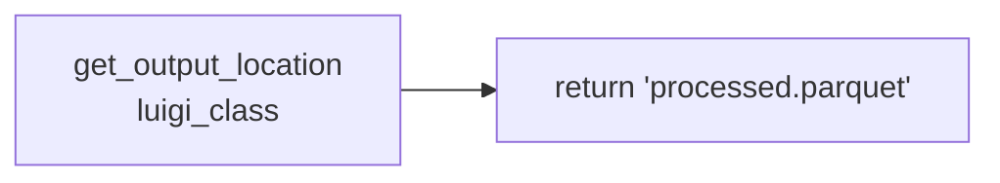

# Diagram: research/orchestrator/prototype/datanectar.py

> Auto-generated by Obscura crawlers

## Mermaid

```mermaid
flowchart LR
    A[get_output_location<br/>luigi_class] --> B[return 'processed.parquet']
```

> SVG rendering failed for this diagram.
