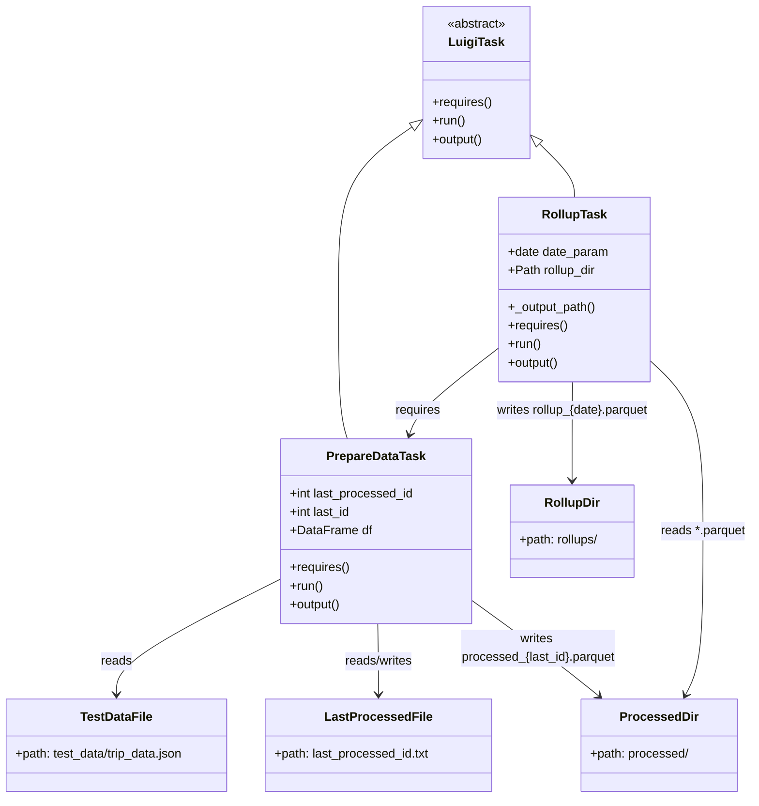
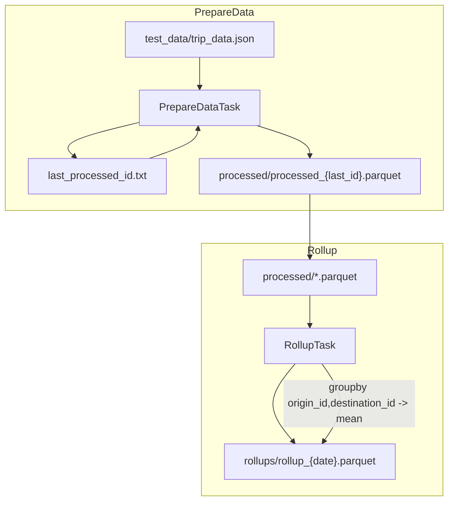

# Diagram: research/orchestrator/prototype/example_pipeline.py

> Auto-generated by Obscura crawlers

## Diagram 1

### SVG

<svg id="container" width="987.033203125" xmlns="http://www.w3.org/2000/svg" class="classDiagram" height="1060" viewBox="0 0 987.033203125 1060" role="graphics-document document" aria-roledescription="class"><g><defs><marker id="container_class-aggregationStart" class="marker aggregation class" refX="18" refY="7" markerWidth="190" markerHeight="240" orient="auto"><path d="M 18,7 L9,13 L1,7 L9,1 Z"></path></marker></defs><defs><marker id="container_class-aggregationEnd" class="marker aggregation class" refX="1" refY="7" markerWidth="20" markerHeight="28" orient="auto"><path d="M 18,7 L9,13 L1,7 L9,1 Z"></path></marker></defs><defs><marker id="container_class-extensionStart" class="marker extension class" refX="18" refY="7" markerWidth="190" markerHeight="240" orient="auto"><path d="M 1,7 L18,13 V 1 Z"></path></marker></defs><defs><marker id="container_class-extensionEnd" class="marker extension class" refX="1" refY="7" markerWidth="20" markerHeight="28" orient="auto"><path d="M 1,1 V 13 L18,7 Z"></path></marker></defs><defs><marker id="container_class-compositionStart" class="marker composition class" refX="18" refY="7" markerWidth="190" markerHeight="240" orient="auto"><path d="M 18,7 L9,13 L1,7 L9,1 Z"></path></marker></defs><defs><marker id="container_class-compositionEnd" class="marker composition class" refX="1" refY="7" markerWidth="20" markerHeight="28" orient="auto"><path d="M 18,7 L9,13 L1,7 L9,1 Z"></path></marker></defs><defs><marker id="container_class-dependencyStart" class="marker dependency class" refX="6" refY="7" markerWidth="190" markerHeight="240" orient="auto"><path d="M 5,7 L9,13 L1,7 L9,1 Z"></path></marker></defs><defs><marker id="container_class-dependencyEnd" class="marker dependency class" refX="13" refY="7" markerWidth="20" markerHeight="28" orient="auto"><path d="M 18,7 L9,13 L14,7 L9,1 Z"></path></marker></defs><defs><marker id="container_class-lollipopStart" class="marker lollipop class" refX="13" refY="7" markerWidth="190" markerHeight="240" orient="auto"><circle stroke="black" fill="transparent" cx="7" cy="7" r="6"></circle></marker></defs><defs><marker id="container_class-lollipopEnd" class="marker lollipop class" refX="1" refY="7" markerWidth="190" markerHeight="240" orient="auto"><circle stroke="black" fill="transparent" cx="7" cy="7" r="6"></circle></marker></defs><g class="root"><g class="clusters"></g><g class="edgePaths"><path d="M542.968,163.771L526.258,174.976C509.548,186.181,476.129,208.59,459.419,243.962C442.709,279.333,442.709,327.667,442.709,380C442.709,432.333,442.709,488.667,445.118,525C447.527,561.333,452.345,577.667,454.754,585.833L457.163,594" id="id_LuigiTask_PrepareDataTask_1" class="edge-thickness-normal edge-pattern-solid relation" style=";;;" data-edge="true" data-et="edge" data-id="id_LuigiTask_PrepareDataTask_1" data-points="W3sieCI6NTU3LjI5NDkyMTg3NSwieSI6MTU0LjE2NDAwNTA2OTcwODQ4fSx7IngiOjQ0Mi43MDg5ODQzNzUsInkiOjIzMX0seyJ4Ijo0NDIuNzA4OTg0Mzc1LCJ5IjozNzZ9LHsieCI6NDQyLjcwODk4NDM3NSwieSI6NTQ1fSx7IngiOjQ1Ny4xNjI5ODc3MDM0MDIzNCwieSI6NTk0fV0=" marker-start="url(#container_class-extensionStart)"></path><path d="M710.393,186.688L718.063,194.073C725.733,201.459,741.074,216.229,748.744,227.781C756.414,239.333,756.414,247.667,756.414,251.833L756.414,256" id="id_LuigiTask_RollupTask_2" class="edge-thickness-normal edge-pattern-solid relation" style=";;;" data-edge="true" data-et="edge" data-id="id_LuigiTask_RollupTask_2" data-points="W3sieCI6Njk3Ljk2Njc5Njg3NSwieSI6MTc0LjcyMzU1NDMwMTgzMzZ9LHsieCI6NzU2LjQxNDA2MjUsInkiOjIzMX0seyJ4Ijo3NTYuNDE0MDYyNSwieSI6MjU2fV0=" marker-start="url(#container_class-extensionStart)"></path><path d="M368.275,776.304L332.802,794.087C297.329,811.869,226.383,847.435,190.91,872.384C155.438,897.333,155.438,911.667,155.438,918.833L155.438,926" id="id_PrepareDataTask_TestDataFile_3" class="edge-thickness-normal edge-pattern-solid relation" style=";;;" data-edge="true" data-et="edge" data-id="id_PrepareDataTask_TestDataFile_3" data-points="W3sieCI6MzY4LjI3NTM5MDYyNSwieSI6Nzc2LjMwNDIyODY4MTMzOTd9LHsieCI6MTU1LjQzNzUsInkiOjg4M30seyJ4IjoxNTUuNDM3NSwieSI6OTMyfV0=" marker-end="url(#container_class-dependencyEnd)"></path><path d="M497.025,834L497.329,842.167C497.632,850.333,498.24,866.667,498.544,882C498.848,897.333,498.848,911.667,498.848,918.833L498.848,926" id="id_PrepareDataTask_LastProcessedFile_4" class="edge-thickness-normal edge-pattern-solid relation" style=";;;" data-edge="true" data-et="edge" data-id="id_PrepareDataTask_LastProcessedFile_4" data-points="W3sieCI6NDk3LjAyNDc2NjU0OTU1NjIsInkiOjgzNH0seyJ4Ijo0OTguODQ3NjU2MjUsInkiOjg4M30seyJ4Ijo0OTguODQ3NjU2MjUsInkiOjkzMn1d" marker-end="url(#container_class-dependencyEnd)"></path><path d="M616.846,802.048L635.89,815.54C654.935,829.032,693.024,856.016,721.651,877.056C750.278,898.096,769.444,913.192,779.026,920.739L788.609,928.287" id="id_PrepareDataTask_ProcessedDir_5" class="edge-thickness-normal edge-pattern-solid relation" style=";;;" data-edge="true" data-et="edge" data-id="id_PrepareDataTask_ProcessedDir_5" data-points="W3sieCI6NjE2Ljg0NTcwMzEyNSwieSI6ODAyLjA0ODQyMDI0MjUxMDZ9LHsieCI6NzMxLjExMzI4MTI1LCJ5Ijo4ODN9LHsieCI6NzkzLjMyMjA2ODUyMDY0MjIsInkiOjkzMn1d" marker-end="url(#container_class-dependencyEnd)"></path><path d="M854.152,474.728L865.747,486.44C877.342,498.152,900.531,521.576,912.126,561.455C923.721,601.333,923.721,657.667,923.721,714C923.721,770.333,923.721,826.667,920.103,862.105C916.486,897.543,909.252,912.085,905.634,919.357L902.017,926.628" id="id_RollupTask_ProcessedDir_6" class="edge-thickness-normal edge-pattern-solid relation" style=";;;" data-edge="true" data-et="edge" data-id="id_RollupTask_ProcessedDir_6" data-points="W3sieCI6ODU0LjE1MjM0Mzc1LCJ5Ijo0NzQuNzI3NTE4OTQwOTQxNjV9LHsieCI6OTIzLjcyMDcwMzEyNSwieSI6NTQ1fSx7IngiOjkyMy43MjA3MDMxMjUsInkiOjcxNH0seyJ4Ijo5MjMuNzIwNzAzMTI1LCJ5Ijo4ODN9LHsieCI6ODk5LjM0NDUwMjU4MDI3NTMsInkiOjkzMn1d" marker-end="url(#container_class-dependencyEnd)"></path><path d="M751.95,496L751.646,504.167C751.342,512.333,750.735,528.667,750.431,554C750.127,579.333,750.127,613.667,750.127,630.833L750.127,648" id="id_RollupTask_RollupDir_7" class="edge-thickness-normal edge-pattern-solid relation" style=";;;" data-edge="true" data-et="edge" data-id="id_RollupTask_RollupDir_7" data-points="W3sieCI6NzUxLjk0OTg0MjgyNTQ0MzcsInkiOjQ5Nn0seyJ4Ijo3NTAuMTI2OTUzMTI1LCJ5Ijo1NDV9LHsieCI6NzUwLjEyNjk1MzEyNSwieSI6NjU0fV0=" marker-end="url(#container_class-dependencyEnd)"></path><path d="M658.676,454.658L639.966,469.715C621.257,484.772,583.837,514.886,562.829,537.157C541.82,559.428,537.222,573.856,534.923,581.069L532.624,588.283" id="id_RollupTask_PrepareDataTask_8" class="edge-thickness-normal edge-pattern-solid relation" style=";;;" data-edge="true" data-et="edge" data-id="id_RollupTask_PrepareDataTask_8" data-points="W3sieCI6NjU4LjY3NTc4MTI1LCJ5Ijo0NTQuNjU3NTA4NTEwMjAyOTR9LHsieCI6NTQ2LjQxNzk2ODc1LCJ5Ijo1NDV9LHsieCI6NTMwLjgwMjUwMzIzNTk0NjcsInkiOjU5NH1d" marker-end="url(#container_class-dependencyEnd)"></path></g><g class="edgeLabels"><g class="edgeLabel"><g class="label" data-id="id_LuigiTask_PrepareDataTask_1" transform="translate(0, 0)"><foreignObject width="0" height="0">

</foreignObject></g></g><g class="edgeLabel"><g class="label" data-id="id_LuigiTask_RollupTask_2" transform="translate(0, 0)"><foreignObject width="0" height="0">

</foreignObject></g></g><g class="edgeLabel" transform="translate(155.4375, 883)"><g class="label" data-id="id_PrepareDataTask_TestDataFile_3" transform="translate(-20.0078125, -12)"><foreignObject width="40.015625" height="24">

reads

</foreignObject></g></g><g class="edgeLabel" transform="translate(498.84765625, 883)"><g class="label" data-id="id_PrepareDataTask_LastProcessedFile_4" transform="translate(-45.9453125, -12)"><foreignObject width="91.890625" height="24">

reads/writes

</foreignObject></g></g><g class="edgeLabel" transform="translate(706.28806, 865.41285)"><g class="label" data-id="id_PrepareDataTask_ProcessedDir_5" transform="translate(-101.0234375, -24)"><foreignObject width="202.046875" height="48">

writes processed_{last_id}.parquet

</foreignObject></g></g><g class="edgeLabel" transform="translate(923.720703125, 714)"><g class="label" data-id="id_RollupTask_ProcessedDir_6" transform="translate(-55.3125, -12)"><foreignObject width="110.625" height="24">

reads *.parquet

</foreignObject></g></g><g class="edgeLabel" transform="translate(750.126953125, 545)"><g class="label" data-id="id_RollupTask_RollupDir_7" transform="translate(-100, -24)"><foreignObject width="200" height="48">

writes rollup_{date}.parquet

</foreignObject></g></g><g class="edgeLabel" transform="translate(582.51437, 515.95046)"><g class="label" data-id="id_RollupTask_PrepareDataTask_8" transform="translate(-29.8515625, -12)"><foreignObject width="59.703125" height="24">

requires

</foreignObject></g></g></g><g class="nodes"><g class="node default" id="classId-LuigiTask-0" transform="translate(627.630859375, 107)"><g class="basic label-container"><path d="M-70.3359375 -99 L70.3359375 -99 L70.3359375 99 L-70.3359375 99" stroke="none" stroke-width="0" fill="#ECECFF" style=""></path><path d="M-70.3359375 -99 C-24.54137829819561 -99, 21.25318090360878 -99, 70.3359375 -99 M-70.3359375 -99 C-24.030266834025547 -99, 22.275403831948907 -99, 70.3359375 -99 M70.3359375 -99 C70.3359375 -38.41279628348703, 70.3359375 22.174407433025934, 70.3359375 99 M70.3359375 -99 C70.3359375 -39.95302393668744, 70.3359375 19.093952126625126, 70.3359375 99 M70.3359375 99 C27.477969381571732 99, -15.379998736856535 99, -70.3359375 99 M70.3359375 99 C24.45838462961661 99, -21.41916824076678 99, -70.3359375 99 M-70.3359375 99 C-70.3359375 45.853707550993924, -70.3359375 -7.2925848980121515, -70.3359375 -99 M-70.3359375 99 C-70.3359375 43.04161659227317, -70.3359375 -12.916766815453656, -70.3359375 -99" stroke="#9370DB" stroke-width="1.3" fill="none" stroke-dasharray="0 0" style=""></path></g><g class="annotation-group text" transform="translate(-38.609375, -75)"><g class="label" style="" transform="translate(0,-12)"><foreignObject width="77.21875" height="24">

«abstract»

</foreignObject></g></g><g class="label-group text" transform="translate(-33.984375, -51)"><g class="label" style="font-weight: bolder" transform="translate(0,-12)"><foreignObject width="67.96875" height="24">

LuigiTask

</foreignObject></g></g><g class="members-group text" transform="translate(-58.3359375, -3)"></g><g class="methods-group text" transform="translate(-58.3359375, 27)"><g class="label" style="" transform="translate(0,-12)"><foreignObject width="78.0625" height="24">

+requires()

</foreignObject></g><g class="label" style="" transform="translate(0,12)"><foreignObject width="43.21875" height="24">

+run()

</foreignObject></g><g class="label" style="" transform="translate(0,36)"><foreignObject width="67.390625" height="24">

+output()

</foreignObject></g></g><g class="divider" style=""><path d="M-70.3359375 -27 C-28.456989939846288 -27, 13.421957620307424 -27, 70.3359375 -27 M-70.3359375 -27 C-42.12071092790081 -27, -13.905484355801619 -27, 70.3359375 -27" stroke="#9370DB" stroke-width="1.3" fill="none" stroke-dasharray="0 0" style=""></path></g><g class="divider" style=""><path d="M-70.3359375 -3 C-24.62033323916036 -3, 21.09527102167928 -3, 70.3359375 -3 M-70.3359375 -3 C-20.314981199042165 -3, 29.70597510191567 -3, 70.3359375 -3" stroke="#9370DB" stroke-width="1.3" fill="none" stroke-dasharray="0 0" style=""></path></g></g><g class="node default" id="classId-PrepareDataTask-1" transform="translate(492.560546875, 714)"><g class="basic label-container"><path d="M-124.28515625 -120 L124.28515625 -120 L124.28515625 120 L-124.28515625 120" stroke="none" stroke-width="0" fill="#ECECFF" style=""></path><path d="M-124.28515625 -120 C-67.38220127927943 -120, -10.479246308558857 -120, 124.28515625 -120 M-124.28515625 -120 C-38.51908524134568 -120, 47.246985767308644 -120, 124.28515625 -120 M124.28515625 -120 C124.28515625 -31.028717580237412, 124.28515625 57.942564839525176, 124.28515625 120 M124.28515625 -120 C124.28515625 -52.89758268500924, 124.28515625 14.20483462998152, 124.28515625 120 M124.28515625 120 C42.103135699622186 120, -40.07888485075563 120, -124.28515625 120 M124.28515625 120 C63.95347150484146 120, 3.6217867596829194 120, -124.28515625 120 M-124.28515625 120 C-124.28515625 46.41573406868079, -124.28515625 -27.168531862638417, -124.28515625 -120 M-124.28515625 120 C-124.28515625 60.54320054046777, -124.28515625 1.0864010809355449, -124.28515625 -120" stroke="#9370DB" stroke-width="1.3" fill="none" stroke-dasharray="0 0" style=""></path></g><g class="annotation-group text" transform="translate(0, -96)"></g><g class="label-group text" transform="translate(-61.8828125, -96)"><g class="label" style="font-weight: bolder" transform="translate(0,-12)"><foreignObject width="123.765625" height="24">

PrepareDataTask

</foreignObject></g></g><g class="members-group text" transform="translate(-112.28515625, -48)"><g class="label" style="" transform="translate(0,-12)"><foreignObject width="162.6875" height="24">

+int last_processed_id

</foreignObject></g><g class="label" style="" transform="translate(0,12)"><foreignObject width="80.703125" height="24">

+int last_id

</foreignObject></g><g class="label" style="" transform="translate(0,36)"><foreignObject width="104.421875" height="24">

+DataFrame df

</foreignObject></g></g><g class="methods-group text" transform="translate(-112.28515625, 48)"><g class="label" style="" transform="translate(0,-12)"><foreignObject width="78.0625" height="24">

+requires()

</foreignObject></g><g class="label" style="" transform="translate(0,12)"><foreignObject width="43.21875" height="24">

+run()

</foreignObject></g><g class="label" style="" transform="translate(0,36)"><foreignObject width="67.390625" height="24">

+output()

</foreignObject></g></g><g class="divider" style=""><path d="M-124.28515625 -72 C-31.26460863442594 -72, 61.75593898114812 -72, 124.28515625 -72 M-124.28515625 -72 C-43.332610909519246 -72, 37.61993443096151 -72, 124.28515625 -72" stroke="#9370DB" stroke-width="1.3" fill="none" stroke-dasharray="0 0" style=""></path></g><g class="divider" style=""><path d="M-124.28515625 24 C-54.42301387267209 24, 15.439128504655827 24, 124.28515625 24 M-124.28515625 24 C-70.11788193624666 24, -15.950607622493322 24, 124.28515625 24" stroke="#9370DB" stroke-width="1.3" fill="none" stroke-dasharray="0 0" style=""></path></g></g><g class="node default" id="classId-RollupTask-2" transform="translate(756.4140625, 376)"><g class="basic label-container"><path d="M-97.73828125 -120 L97.73828125 -120 L97.73828125 120 L-97.73828125 120" stroke="none" stroke-width="0" fill="#ECECFF" style=""></path><path d="M-97.73828125 -120 C-55.462975986410164 -120, -13.187670722820329 -120, 97.73828125 -120 M-97.73828125 -120 C-19.56900031653302 -120, 58.60028061693396 -120, 97.73828125 -120 M97.73828125 -120 C97.73828125 -25.388210628350464, 97.73828125 69.22357874329907, 97.73828125 120 M97.73828125 -120 C97.73828125 -47.162232653020226, 97.73828125 25.67553469395955, 97.73828125 120 M97.73828125 120 C21.413540096047967 120, -54.911201057904066 120, -97.73828125 120 M97.73828125 120 C49.20373017033918 120, 0.6691790906783552 120, -97.73828125 120 M-97.73828125 120 C-97.73828125 50.6366908308063, -97.73828125 -18.726618338387397, -97.73828125 -120 M-97.73828125 120 C-97.73828125 69.05602473330947, -97.73828125 18.112049466618927, -97.73828125 -120" stroke="#9370DB" stroke-width="1.3" fill="none" stroke-dasharray="0 0" style=""></path></g><g class="annotation-group text" transform="translate(0, -96)"></g><g class="label-group text" transform="translate(-40.1015625, -96)"><g class="label" style="font-weight: bolder" transform="translate(0,-12)"><foreignObject width="80.203125" height="24">

RollupTask

</foreignObject></g></g><g class="members-group text" transform="translate(-85.73828125, -48)"><g class="label" style="" transform="translate(0,-12)"><foreignObject width="131.375" height="24">

+date date_param

</foreignObject></g><g class="label" style="" transform="translate(0,12)"><foreignObject width="115.671875" height="24">

+Path rollup_dir

</foreignObject></g></g><g class="methods-group text" transform="translate(-85.73828125, 24)"><g class="label" style="" transform="translate(0,-12)"><foreignObject width="115.625" height="24">

+_output_path()

</foreignObject></g><g class="label" style="" transform="translate(0,12)"><foreignObject width="78.0625" height="24">

+requires()

</foreignObject></g><g class="label" style="" transform="translate(0,36)"><foreignObject width="43.21875" height="24">

+run()

</foreignObject></g><g class="label" style="" transform="translate(0,60)"><foreignObject width="67.390625" height="24">

+output()

</foreignObject></g></g><g class="divider" style=""><path d="M-97.73828125 -72 C-56.08201875952521 -72, -14.425756269050424 -72, 97.73828125 -72 M-97.73828125 -72 C-28.066423376245112 -72, 41.605434497509776 -72, 97.73828125 -72" stroke="#9370DB" stroke-width="1.3" fill="none" stroke-dasharray="0 0" style=""></path></g><g class="divider" style=""><path d="M-97.73828125 0 C-30.774455610555094 0, 36.18937002888981 0, 97.73828125 0 M-97.73828125 0 C-39.54746444628144 0, 18.643352357437124 0, 97.73828125 0" stroke="#9370DB" stroke-width="1.3" fill="none" stroke-dasharray="0 0" style=""></path></g></g><g class="node default" id="classId-TestDataFile-3" transform="translate(155.4375, 992)"><g class="basic label-container"><path d="M-147.4375 -60 L147.4375 -60 L147.4375 60 L-147.4375 60" stroke="none" stroke-width="0" fill="#ECECFF" style=""></path><path d="M-147.4375 -60 C-69.91448860648667 -60, 7.608522787026658 -60, 147.4375 -60 M-147.4375 -60 C-68.13360556788344 -60, 11.170288864233129 -60, 147.4375 -60 M147.4375 -60 C147.4375 -29.528477023876018, 147.4375 0.9430459522479637, 147.4375 60 M147.4375 -60 C147.4375 -32.80574558331577, 147.4375 -5.611491166631531, 147.4375 60 M147.4375 60 C64.21446910189013 60, -19.008561796219738 60, -147.4375 60 M147.4375 60 C33.83156913819499 60, -79.77436172361001 60, -147.4375 60 M-147.4375 60 C-147.4375 27.402298803232604, -147.4375 -5.195402393534792, -147.4375 -60 M-147.4375 60 C-147.4375 17.145668804566647, -147.4375 -25.708662390866706, -147.4375 -60" stroke="#9370DB" stroke-width="1.3" fill="none" stroke-dasharray="0 0" style=""></path></g><g class="annotation-group text" transform="translate(0, -36)"></g><g class="label-group text" transform="translate(-44.8125, -36)"><g class="label" style="font-weight: bolder" transform="translate(0,-12)"><foreignObject width="89.625" height="24">

TestDataFile

</foreignObject></g></g><g class="members-group text" transform="translate(-135.4375, 12)"><g class="label" style="" transform="translate(0,-12)"><foreignObject width="226.0625" height="24">

+path: test_data/trip_data.json

</foreignObject></g></g><g class="methods-group text" transform="translate(-135.4375, 60)"></g><g class="divider" style=""><path d="M-147.4375 -12 C-54.539589307615145 -12, 38.35832138476971 -12, 147.4375 -12 M-147.4375 -12 C-81.18789828403024 -12, -14.93829656806048 -12, 147.4375 -12" stroke="#9370DB" stroke-width="1.3" fill="none" stroke-dasharray="0 0" style=""></path></g><g class="divider" style=""><path d="M-147.4375 36 C-85.8846374098722 36, -24.331774819744382 36, 147.4375 36 M-147.4375 36 C-76.72515798120081 36, -6.012815962401618 36, 147.4375 36" stroke="#9370DB" stroke-width="1.3" fill="none" stroke-dasharray="0 0" style=""></path></g></g><g class="node default" id="classId-LastProcessedFile-4" transform="translate(498.84765625, 992)"><g class="basic label-container"><path d="M-145.97265625 -60 L145.97265625 -60 L145.97265625 60 L-145.97265625 60" stroke="none" stroke-width="0" fill="#ECECFF" style=""></path><path d="M-145.97265625 -60 C-80.78393683836568 -60, -15.595217426731352 -60, 145.97265625 -60 M-145.97265625 -60 C-48.21281805243487 -60, 49.54702014513026 -60, 145.97265625 -60 M145.97265625 -60 C145.97265625 -35.78855065717593, 145.97265625 -11.577101314351872, 145.97265625 60 M145.97265625 -60 C145.97265625 -16.065739896226987, 145.97265625 27.868520207546027, 145.97265625 60 M145.97265625 60 C54.31326256378324 60, -37.34613112243352 60, -145.97265625 60 M145.97265625 60 C44.61589530178664 60, -56.74086564642673 60, -145.97265625 60 M-145.97265625 60 C-145.97265625 28.34037293908567, -145.97265625 -3.3192541218286635, -145.97265625 -60 M-145.97265625 60 C-145.97265625 34.87406603240608, -145.97265625 9.748132064812161, -145.97265625 -60" stroke="#9370DB" stroke-width="1.3" fill="none" stroke-dasharray="0 0" style=""></path></g><g class="annotation-group text" transform="translate(0, -36)"></g><g class="label-group text" transform="translate(-65.2109375, -36)"><g class="label" style="font-weight: bolder" transform="translate(0,-12)"><foreignObject width="130.421875" height="24">

LastProcessedFile

</foreignObject></g></g><g class="members-group text" transform="translate(-133.97265625, 12)"><g class="label" style="" transform="translate(0,-12)"><foreignObject width="202.734375" height="24">

+path: last_processed_id.txt

</foreignObject></g></g><g class="methods-group text" transform="translate(-133.97265625, 60)"></g><g class="divider" style=""><path d="M-145.97265625 -12 C-66.14541594225443 -12, 13.681824365491138 -12, 145.97265625 -12 M-145.97265625 -12 C-65.39678857997319 -12, 15.17907909005362 -12, 145.97265625 -12" stroke="#9370DB" stroke-width="1.3" fill="none" stroke-dasharray="0 0" style=""></path></g><g class="divider" style=""><path d="M-145.97265625 36 C-37.19506147025463 36, 71.58253330949074 36, 145.97265625 36 M-145.97265625 36 C-35.211275298566775 36, 75.55010565286645 36, 145.97265625 36" stroke="#9370DB" stroke-width="1.3" fill="none" stroke-dasharray="0 0" style=""></path></g></g><g class="node default" id="classId-ProcessedDir-5" transform="translate(869.49609375, 992)"><g class="basic label-container"><path d="M-101.58984375 -60 L101.58984375 -60 L101.58984375 60 L-101.58984375 60" stroke="none" stroke-width="0" fill="#ECECFF" style=""></path><path d="M-101.58984375 -60 C-57.50191099051141 -60, -13.413978231022824 -60, 101.58984375 -60 M-101.58984375 -60 C-38.89543483767415 -60, 23.798974074651696 -60, 101.58984375 -60 M101.58984375 -60 C101.58984375 -17.23528509037736, 101.58984375 25.52942981924528, 101.58984375 60 M101.58984375 -60 C101.58984375 -34.47659980139673, 101.58984375 -8.953199602793461, 101.58984375 60 M101.58984375 60 C32.92032994289076 60, -35.74918386421848 60, -101.58984375 60 M101.58984375 60 C49.235537769781516 60, -3.1187682104369685 60, -101.58984375 60 M-101.58984375 60 C-101.58984375 31.41603109809848, -101.58984375 2.832062196196958, -101.58984375 -60 M-101.58984375 60 C-101.58984375 34.233439817309716, -101.58984375 8.466879634619438, -101.58984375 -60" stroke="#9370DB" stroke-width="1.3" fill="none" stroke-dasharray="0 0" style=""></path></g><g class="annotation-group text" transform="translate(0, -36)"></g><g class="label-group text" transform="translate(-47.9296875, -36)"><g class="label" style="font-weight: bolder" transform="translate(0,-12)"><foreignObject width="95.859375" height="24">

ProcessedDir

</foreignObject></g></g><g class="members-group text" transform="translate(-89.58984375, 12)"><g class="label" style="" transform="translate(0,-12)"><foreignObject width="131.25" height="24">

+path: processed/

</foreignObject></g></g><g class="methods-group text" transform="translate(-89.58984375, 60)"></g><g class="divider" style=""><path d="M-101.58984375 -12 C-38.27830503560883 -12, 25.033233678782338 -12, 101.58984375 -12 M-101.58984375 -12 C-38.049841040319336 -12, 25.490161669361328 -12, 101.58984375 -12" stroke="#9370DB" stroke-width="1.3" fill="none" stroke-dasharray="0 0" style=""></path></g><g class="divider" style=""><path d="M-101.58984375 36 C-57.65104425411769 36, -13.712244758235386 36, 101.58984375 36 M-101.58984375 36 C-38.739072815335476 36, 24.11169811932905 36, 101.58984375 36" stroke="#9370DB" stroke-width="1.3" fill="none" stroke-dasharray="0 0" style=""></path></g></g><g class="node default" id="classId-RollupDir-6" transform="translate(750.126953125, 714)"><g class="basic label-container"><path d="M-83.28125 -60 L83.28125 -60 L83.28125 60 L-83.28125 60" stroke="none" stroke-width="0" fill="#ECECFF" style=""></path><path d="M-83.28125 -60 C-17.053669109589123 -60, 49.173911780821754 -60, 83.28125 -60 M-83.28125 -60 C-49.33901426013243 -60, -15.39677852026486 -60, 83.28125 -60 M83.28125 -60 C83.28125 -24.728414626287723, 83.28125 10.543170747424554, 83.28125 60 M83.28125 -60 C83.28125 -26.159169800800456, 83.28125 7.681660398399089, 83.28125 60 M83.28125 60 C40.69993126112047 60, -1.8813874777590627 60, -83.28125 60 M83.28125 60 C17.807056241521693 60, -47.667137516956615 60, -83.28125 60 M-83.28125 60 C-83.28125 21.150508006213528, -83.28125 -17.698983987572944, -83.28125 -60 M-83.28125 60 C-83.28125 33.41636959291167, -83.28125 6.832739185823343, -83.28125 -60" stroke="#9370DB" stroke-width="1.3" fill="none" stroke-dasharray="0 0" style=""></path></g><g class="annotation-group text" transform="translate(0, -36)"></g><g class="label-group text" transform="translate(-34.265625, -36)"><g class="label" style="font-weight: bolder" transform="translate(0,-12)"><foreignObject width="68.53125" height="24">

RollupDir

</foreignObject></g></g><g class="members-group text" transform="translate(-71.28125, 12)"><g class="label" style="" transform="translate(0,-12)"><foreignObject width="108.296875" height="24">

+path: rollups/

</foreignObject></g></g><g class="methods-group text" transform="translate(-71.28125, 60)"></g><g class="divider" style=""><path d="M-83.28125 -12 C-49.582404694585925 -12, -15.88355938917185 -12, 83.28125 -12 M-83.28125 -12 C-46.535628256119985 -12, -9.79000651223997 -12, 83.28125 -12" stroke="#9370DB" stroke-width="1.3" fill="none" stroke-dasharray="0 0" style=""></path></g><g class="divider" style=""><path d="M-83.28125 36 C-37.38444755676533 36, 8.512354886469339 36, 83.28125 36 M-83.28125 36 C-28.465120011256907 36, 26.351009977486186 36, 83.28125 36" stroke="#9370DB" stroke-width="1.3" fill="none" stroke-dasharray="0 0" style=""></path></g></g></g></g></g></svg>

## Diagram 2

### SVG

<svg id="container" width="693.03125" xmlns="http://www.w3.org/2000/svg" class="flowchart" height="762" viewBox="0 0 693.03125 762" role="graphics-document document" aria-roledescription="flowchart-v2"><g><marker id="container_flowchart-v2-pointEnd" class="marker flowchart-v2" viewBox="0 0 10 10" refX="5" refY="5" markerUnits="userSpaceOnUse" markerWidth="8" markerHeight="8" orient="auto"><path d="M 0 0 L 10 5 L 0 10 z" class="arrowMarkerPath" style="stroke-width: 1; stroke-dasharray: 1, 0;"></path></marker><marker id="container_flowchart-v2-pointStart" class="marker flowchart-v2" viewBox="0 0 10 10" refX="4.5" refY="5" markerUnits="userSpaceOnUse" markerWidth="8" markerHeight="8" orient="auto"><path d="M 0 5 L 10 10 L 10 0 z" class="arrowMarkerPath" style="stroke-width: 1; stroke-dasharray: 1, 0;"></path></marker><marker id="container_flowchart-v2-circleEnd" class="marker flowchart-v2" viewBox="0 0 10 10" refX="11" refY="5" markerUnits="userSpaceOnUse" markerWidth="11" markerHeight="11" orient="auto"><circle cx="5" cy="5" r="5" class="arrowMarkerPath" style="stroke-width: 1; stroke-dasharray: 1, 0;"></circle></marker><marker id="container_flowchart-v2-circleStart" class="marker flowchart-v2" viewBox="0 0 10 10" refX="-1" refY="5" markerUnits="userSpaceOnUse" markerWidth="11" markerHeight="11" orient="auto"><circle cx="5" cy="5" r="5" class="arrowMarkerPath" style="stroke-width: 1; stroke-dasharray: 1, 0;"></circle></marker><marker id="container_flowchart-v2-crossEnd" class="marker cross flowchart-v2" viewBox="0 0 11 11" refX="12" refY="5.2" markerUnits="userSpaceOnUse" markerWidth="11" markerHeight="11" orient="auto"><path d="M 1,1 l 9,9 M 10,1 l -9,9" class="arrowMarkerPath" style="stroke-width: 2; stroke-dasharray: 1, 0;"></path></marker><marker id="container_flowchart-v2-crossStart" class="marker cross flowchart-v2" viewBox="0 0 11 11" refX="-1" refY="5.2" markerUnits="userSpaceOnUse" markerWidth="11" markerHeight="11" orient="auto"><path d="M 1,1 l 9,9 M 10,1 l -9,9" class="arrowMarkerPath" style="stroke-width: 2; stroke-dasharray: 1, 0;"></path></marker><g class="root"><g class="clusters"><g class="cluster" id="Rollup" data-look="classic"><rect style="" x="306.4609375" y="370" width="377.68359375" height="384"></rect><g class="cluster-label" transform="translate(471.810546875, 370)"><foreignObject width="46.984375" height="24">

Rollup

</foreignObject></g></g><g class="cluster" id="PrepareData" data-look="classic"><rect style="" x="8" y="8" width="677.03125" height="312"></rect><g class="cluster-label" transform="translate(301.9765625, 8)"><foreignObject width="89.078125" height="24">

PrepareData

</foreignObject></g></g></g><g class="edgePaths"><path d="M309.824,87L309.824,91.167C309.824,95.333,309.824,103.667,309.824,111.333C309.824,119,309.824,126,309.824,129.5L309.824,133" id="L_A_C_0" class="edge-thickness-normal edge-pattern-solid edge-thickness-normal edge-pattern-solid flowchart-link" style=";" data-edge="true" data-et="edge" data-id="L_A_C_0" data-points="W3sieCI6MzA5LjgyNDIxODc1LCJ5Ijo4N30seyJ4IjozMDkuODI0MjE4NzUsInkiOjExMn0seyJ4IjozMDkuODI0MjE4NzUsInkiOjEzN31d" marker-end="url(#container_flowchart-v2-pointEnd)"></path><path d="M229.83,241L242.19,236.833C254.551,232.667,279.271,224.333,292.025,216.663C304.778,208.992,305.564,201.983,305.957,198.479L306.35,194.975" id="L_B_C_0" class="edge-thickness-normal edge-pattern-solid edge-thickness-normal edge-pattern-solid flowchart-link" style=";" data-edge="true" data-et="edge" data-id="L_B_C_0" data-points="W3sieCI6MjI5LjgyOTc3NzY0NDIzMDc3LCJ5IjoyNDF9LHsieCI6MzAzLjk5MjE4NzUsInkiOjIxNn0seyJ4IjozMDYuNzk2MDQ4Njc3ODg0NjQsInkiOjE5MX1d" marker-end="url(#container_flowchart-v2-pointEnd)"></path><path d="M397.276,191L410.772,195.167C424.267,199.333,451.259,207.667,464.754,215.333C478.25,223,478.25,230,478.25,233.5L478.25,237" id="L_C_D_0" class="edge-thickness-normal edge-pattern-solid edge-thickness-normal edge-pattern-solid flowchart-link" style=";" data-edge="true" data-et="edge" data-id="L_C_D_0" data-points="W3sieCI6Mzk3LjI3NjA2NjcwNjczMDgsInkiOjE5MX0seyJ4Ijo0NzguMjUsInkiOjIxNn0seyJ4Ijo0NzguMjUsInkiOjI0MX1d" marker-end="url(#container_flowchart-v2-pointEnd)"></path><path d="M219.441,185.271L197.679,190.392C175.917,195.514,132.392,205.757,115,214.612C97.608,223.467,106.348,230.935,110.719,234.668L115.089,238.402" id="L_C_B_0" class="edge-thickness-normal edge-pattern-solid edge-thickness-normal edge-pattern-solid flowchart-link" style=";" data-edge="true" data-et="edge" data-id="L_C_B_0" data-points="W3sieCI6MjE5LjQ0MTQwNjI1LCJ5IjoxODUuMjcwNjc5NzQ4OTYxMzZ9LHsieCI6ODguODY3MTg3NSwieSI6MjE2fSx7IngiOjExOC4xMzAyNTg0MTM0NjE1NSwieSI6MjQxfV0=" marker-end="url(#container_flowchart-v2-pointEnd)"></path><path d="M478.25,295L478.25,299.167C478.25,303.333,478.25,311.667,478.25,320C478.25,328.333,478.25,336.667,478.25,345C478.25,353.333,478.25,361.667,478.25,369.333C478.25,377,478.25,384,478.25,387.5L478.25,391" id="L_D_E_0" class="edge-thickness-normal edge-pattern-solid edge-thickness-normal edge-pattern-solid flowchart-link" style=";" data-edge="true" data-et="edge" data-id="L_D_E_0" data-points="W3sieCI6NDc4LjI1LCJ5IjoyOTV9LHsieCI6NDc4LjI1LCJ5IjozMjB9LHsieCI6NDc4LjI1LCJ5IjozNDV9LHsieCI6NDc4LjI1LCJ5IjozNzB9LHsieCI6NDc4LjI1LCJ5IjozOTV9XQ==" marker-end="url(#container_flowchart-v2-pointEnd)"></path><path d="M478.25,449L478.25,453.167C478.25,457.333,478.25,465.667,478.25,473.333C478.25,481,478.25,488,478.25,491.5L478.25,495" id="L_E_F_0" class="edge-thickness-normal edge-pattern-solid edge-thickness-normal edge-pattern-solid flowchart-link" style=";" data-edge="true" data-et="edge" data-id="L_E_F_0" data-points="W3sieCI6NDc4LjI1LCJ5Ijo0NDl9LHsieCI6NDc4LjI1LCJ5Ijo0NzR9LHsieCI6NDc4LjI1LCJ5Ijo0OTl9XQ==" marker-end="url(#container_flowchart-v2-pointEnd)"></path><path d="M454.964,553L446.196,563.167C437.428,573.333,419.892,593.667,419.456,613.495C419.021,633.324,435.686,652.647,444.019,662.309L452.352,671.971" id="L_F_G_0" class="edge-thickness-normal edge-pattern-solid edge-thickness-normal edge-pattern-solid flowchart-link" style=";" data-edge="true" data-et="edge" data-id="L_F_G_0" data-points="W3sieCI6NDU0Ljk2NDE3NzkxMTkzMTgsInkiOjU1M30seyJ4Ijo0MDIuMzU1NDY4NzUsInkiOjYxNH0seyJ4Ijo0NTQuOTY0MTc3OTExOTMxOCwieSI6Njc1fV0=" marker-end="url(#container_flowchart-v2-pointEnd)"></path><path d="M496.659,553L503.591,563.167C510.523,573.333,524.386,593.667,524.762,613.449C525.137,633.232,512.025,652.463,505.469,662.079L498.912,671.695" id="L_F_G_2" class="edge-thickness-normal edge-pattern-solid edge-thickness-normal edge-pattern-solid flowchart-link" style=";" data-edge="true" data-et="edge" data-id="L_F_G_2" data-points="W3sieCI6NDk2LjY1OTA5MDkwOTA5MDkzLCJ5Ijo1NTN9LHsieCI6NTM4LjI1LCJ5Ijo2MTR9LHsieCI6NDk2LjY1OTA5MDkwOTA5MDkzLCJ5Ijo2NzV9XQ==" marker-end="url(#container_flowchart-v2-pointEnd)"></path></g><g class="edgeLabels"><g class="edgeLabel"><g class="label" data-id="L_A_C_0" transform="translate(0, 0)"><foreignObject width="0" height="0">

</foreignObject></g></g><g class="edgeLabel"><g class="label" data-id="L_B_C_0" transform="translate(0, 0)"><foreignObject width="0" height="0">

</foreignObject></g></g><g class="edgeLabel"><g class="label" data-id="L_C_D_0" transform="translate(0, 0)"><foreignObject width="0" height="0">

</foreignObject></g></g><g class="edgeLabel"><g class="label" data-id="L_C_B_0" transform="translate(0, 0)"><foreignObject width="0" height="0">

</foreignObject></g></g><g class="edgeLabel"><g class="label" data-id="L_D_E_0" transform="translate(0, 0)"><foreignObject width="0" height="0">

</foreignObject></g></g><g class="edgeLabel"><g class="label" data-id="L_E_F_0" transform="translate(0, 0)"><foreignObject width="0" height="0">

</foreignObject></g></g><g class="edgeLabel"><g class="label" data-id="L_F_G_0" transform="translate(0, 0)"><foreignObject width="0" height="0">

</foreignObject></g></g><g class="edgeLabel" transform="translate(538.25, 614)"><g class="label" data-id="L_F_G_2" transform="translate(-100, -36)"><foreignObject width="200" height="72">

groupby origin_id,destination_id -&gt; mean

</foreignObject></g></g></g><g class="nodes"><g class="node default" id="flowchart-A-0" transform="translate(309.82421875, 60)"><rect class="basic label-container" style="" x="-118.3984375" y="-27" width="236.796875" height="54"></rect><g class="label" style="" transform="translate(-88.3984375, -12)"><rect></rect><foreignObject width="176.796875" height="24">

test_data/trip_data.json

</foreignObject></g></g><g class="node default" id="flowchart-B-1" transform="translate(149.734375, 268)"><rect class="basic label-container" style="" x="-106.734375" y="-27" width="213.46875" height="54"></rect><g class="label" style="" transform="translate(-76.734375, -12)"><rect></rect><foreignObject width="153.46875" height="24">

last_processed_id.txt

</foreignObject></g></g><g class="node default" id="flowchart-C-2" transform="translate(309.82421875, 164)"><rect class="basic label-container" style="" x="-90.3828125" y="-27" width="180.765625" height="54"></rect><g class="label" style="" transform="translate(-60.3828125, -12)"><rect></rect><foreignObject width="120.765625" height="24">

PrepareDataTask

</foreignObject></g></g><g class="node default" id="flowchart-D-3" transform="translate(478.25, 268)"><rect class="basic label-container" style="" x="-171.78125" y="-27" width="343.5625" height="54"></rect><g class="label" style="" transform="translate(-141.78125, -12)"><rect></rect><foreignObject width="283.5625" height="24">

processed/processed_{last_id}.parquet

</foreignObject></g></g><g class="node default" id="flowchart-E-4" transform="translate(478.25, 422)"><rect class="basic label-container" style="" x="-104.1875" y="-27" width="208.375" height="54"></rect><g class="label" style="" transform="translate(-74.1875, -12)"><rect></rect><foreignObject width="148.375" height="24">

processed/*.parquet

</foreignObject></g></g><g class="node default" id="flowchart-F-5" transform="translate(478.25, 526)"><rect class="basic label-container" style="" x="-69.328125" y="-27" width="138.65625" height="54"></rect><g class="label" style="" transform="translate(-39.328125, -12)"><rect></rect><foreignObject width="78.65625" height="24">

RollupTask

</foreignObject></g></g><g class="node default" id="flowchart-G-6" transform="translate(478.25, 702)"><rect class="basic label-container" style="" x="-136.7890625" y="-27" width="273.578125" height="54"></rect><g class="label" style="" transform="translate(-106.7890625, -12)"><rect></rect><foreignObject width="213.578125" height="24">

rollups/rollup_{date}.parquet

</foreignObject></g></g></g></g></g></svg>
