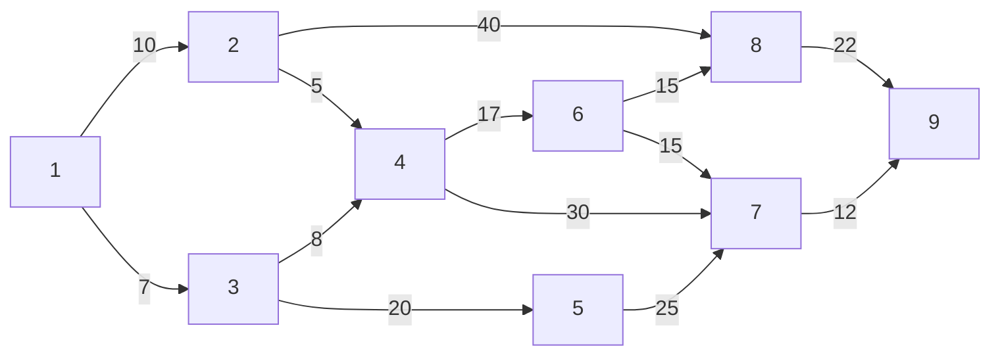
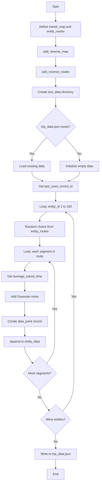

# Diagram: research/orchestrator/prototype/gen_test_data.py

> Auto-generated by Obscura crawlers

## Diagram 1

### SVG

<svg id="container" width="749.125" xmlns="http://www.w3.org/2000/svg" class="flowchart" height="273" viewBox="0 0 749.125 273" role="graphics-document document" aria-roledescription="flowchart-v2"><g><marker id="container_flowchart-v2-pointEnd" class="marker flowchart-v2" viewBox="0 0 10 10" refX="5" refY="5" markerUnits="userSpaceOnUse" markerWidth="8" markerHeight="8" orient="auto"><path d="M 0 0 L 10 5 L 0 10 z" class="arrowMarkerPath" style="stroke-width: 1; stroke-dasharray: 1, 0;"></path></marker><marker id="container_flowchart-v2-pointStart" class="marker flowchart-v2" viewBox="0 0 10 10" refX="4.5" refY="5" markerUnits="userSpaceOnUse" markerWidth="8" markerHeight="8" orient="auto"><path d="M 0 5 L 10 10 L 10 0 z" class="arrowMarkerPath" style="stroke-width: 1; stroke-dasharray: 1, 0;"></path></marker><marker id="container_flowchart-v2-circleEnd" class="marker flowchart-v2" viewBox="0 0 10 10" refX="11" refY="5" markerUnits="userSpaceOnUse" markerWidth="11" markerHeight="11" orient="auto"><circle cx="5" cy="5" r="5" class="arrowMarkerPath" style="stroke-width: 1; stroke-dasharray: 1, 0;"></circle></marker><marker id="container_flowchart-v2-circleStart" class="marker flowchart-v2" viewBox="0 0 10 10" refX="-1" refY="5" markerUnits="userSpaceOnUse" markerWidth="11" markerHeight="11" orient="auto"><circle cx="5" cy="5" r="5" class="arrowMarkerPath" style="stroke-width: 1; stroke-dasharray: 1, 0;"></circle></marker><marker id="container_flowchart-v2-crossEnd" class="marker cross flowchart-v2" viewBox="0 0 11 11" refX="12" refY="5.2" markerUnits="userSpaceOnUse" markerWidth="11" markerHeight="11" orient="auto"><path d="M 1,1 l 9,9 M 10,1 l -9,9" class="arrowMarkerPath" style="stroke-width: 2; stroke-dasharray: 1, 0;"></path></marker><marker id="container_flowchart-v2-crossStart" class="marker cross flowchart-v2" viewBox="0 0 11 11" refX="-1" refY="5.2" markerUnits="userSpaceOnUse" markerWidth="11" markerHeight="11" orient="auto"><path d="M 1,1 l 9,9 M 10,1 l -9,9" class="arrowMarkerPath" style="stroke-width: 2; stroke-dasharray: 1, 0;"></path></marker><g class="root"><g class="clusters"></g><g class="edgePaths"><path d="M60.143,105L68.097,93.5C76.051,82,91.959,59,104.74,47.5C117.521,36,127.174,36,132.001,36L136.828,36" id="L_1_2_0" class="edge-thickness-normal edge-pattern-solid edge-thickness-normal edge-pattern-solid flowchart-link" style=";" data-edge="true" data-et="edge" data-id="L_1_2_0" data-points="W3sieCI6NjAuMTQzMzEwNTQ2ODc1LCJ5IjoxMDV9LHsieCI6MTA3Ljg2NzE4NzUsInkiOjM2fSx7IngiOjE0MC44MjgxMjUsInkiOjM2fV0=" marker-end="url(#container_flowchart-v2-pointEnd)"></path><path d="M61.388,159L69.135,169.5C76.881,180,92.374,201,104.942,211.5C117.51,222,127.154,222,131.975,222L136.797,222" id="L_1_3_0" class="edge-thickness-normal edge-pattern-solid edge-thickness-normal edge-pattern-solid flowchart-link" style=";" data-edge="true" data-et="edge" data-id="L_1_3_0" data-points="W3sieCI6NjEuMzg4MjgxMjUsInkiOjE1OX0seyJ4IjoxMDcuODY3MTg3NSwieSI6MjIyfSx7IngiOjE0MC43OTY4NzUsInkiOjIyMn1d" marker-end="url(#container_flowchart-v2-pointEnd)"></path><path d="M208.75,27.43L213.658,26.192C218.565,24.954,228.38,22.477,243.9,21.238C259.419,20,280.643,20,302.586,20C324.529,20,347.19,20,369.853,20C392.516,20,415.18,20,437.717,20C460.255,20,482.667,20,498.719,21.151C514.77,22.301,524.463,24.603,529.309,25.754L534.155,26.904" id="L_2_8_0" class="edge-thickness-normal edge-pattern-solid edge-thickness-normal edge-pattern-solid flowchart-link" style=";" data-edge="true" data-et="edge" data-id="L_2_8_0" data-points="W3sieCI6MjA4Ljc1LCJ5IjoyNy40MzAyNjEyMTI0MTk5MX0seyJ4IjoyMzguMTk1MzEyNSwieSI6MjB9LHsieCI6MzAxLjg2NzE4NzUsInkiOjIwfSx7IngiOjM2OS44NTE1NjI1LCJ5IjoyMH0seyJ4Ijo0MzcuODQzNzUsInkiOjIwfSx7IngiOjUwNS4wNzgxMjUsInkiOjIwfSx7IngiOjUzOC4wNDY4NzUsInkiOjI3LjgyODQwNTc5NzEwMTQ1fV0=" marker-end="url(#container_flowchart-v2-pointEnd)"></path><path d="M208.75,52.604L213.658,55.003C218.565,57.403,228.38,62.201,238.554,69.481C248.729,76.76,259.262,86.521,264.529,91.401L269.795,96.281" id="L_2_4_0" class="edge-thickness-normal edge-pattern-solid edge-thickness-normal edge-pattern-solid flowchart-link" style=";" data-edge="true" data-et="edge" data-id="L_2_4_0" data-points="W3sieCI6MjA4Ljc1LCJ5Ijo1Mi42MDM4Njg5MDA5MzY0Mn0seyJ4IjoyMzguMTk1MzEyNSwieSI6Njd9LHsieCI6MjcyLjcyOTIxMDgwNTA4NDczLCJ5Ijo5OX1d" marker-end="url(#container_flowchart-v2-pointEnd)"></path><path d="M208.781,202.164L213.684,199.304C218.586,196.443,228.391,190.721,238.56,182.98C248.729,175.24,259.262,165.479,264.529,160.599L269.795,155.719" id="L_3_4_0" class="edge-thickness-normal edge-pattern-solid edge-thickness-normal edge-pattern-solid flowchart-link" style=";" data-edge="true" data-et="edge" data-id="L_3_4_0" data-points="W3sieCI6MjA4Ljc4MTI1LCJ5IjoyMDIuMTY0MjQzNDY5Njg5NX0seyJ4IjoyMzguMTk1MzEyNSwieSI6MTg1fSx7IngiOjI3Mi43MjkyMTA4MDUwODQ3MywieSI6MTUzfV0=" marker-end="url(#container_flowchart-v2-pointEnd)"></path><path d="M208.781,230.578L213.684,231.815C218.586,233.052,228.391,235.526,243.905,236.763C259.419,238,280.643,238,302.586,238C324.529,238,347.19,238,363.517,238C379.844,238,389.836,238,394.832,238L399.828,238" id="L_3_5_0" class="edge-thickness-normal edge-pattern-solid edge-thickness-normal edge-pattern-solid flowchart-link" style=";" data-edge="true" data-et="edge" data-id="L_3_5_0" data-points="W3sieCI6MjA4Ljc4MTI1LCJ5IjoyMzAuNTc3NjI0NDQ1NTM5Njd9LHsieCI6MjM4LjE5NTMxMjUsInkiOjIzOH0seyJ4IjozMDEuODY3MTg3NSwieSI6MjM4fSx7IngiOjM2OS44NTE1NjI1LCJ5IjoyMzh9LHsieCI6NDAzLjgyODEyNSwieSI6MjM4fV0=" marker-end="url(#container_flowchart-v2-pointEnd)"></path><path d="M336.125,107.355L341.746,104.296C347.367,101.237,358.609,95.118,369.185,92.059C379.76,89,389.669,89,394.624,89L399.578,89" id="L_4_6_0" class="edge-thickness-normal edge-pattern-solid edge-thickness-normal edge-pattern-solid flowchart-link" style=";" data-edge="true" data-et="edge" data-id="L_4_6_0" data-points="W3sieCI6MzM2LjEyNSwieSI6MTA3LjM1NTQzNTUzMjA2MTU5fSx7IngiOjM2OS44NTE1NjI1LCJ5Ijo4OX0seyJ4Ijo0MDMuNTc4MTI1LCJ5Ijo4OX1d" marker-end="url(#container_flowchart-v2-pointEnd)"></path><path d="M336.125,145.148L341.746,148.29C347.367,151.432,358.609,157.716,375.563,160.858C392.516,164,415.18,164,437.717,164C460.255,164,482.667,164,498.844,164C515.021,164,524.964,164,529.935,164L534.906,164" id="L_4_7_0" class="edge-thickness-normal edge-pattern-solid edge-thickness-normal edge-pattern-solid flowchart-link" style=";" data-edge="true" data-et="edge" data-id="L_4_7_0" data-points="W3sieCI6MzM2LjEyNSwieSI6MTQ1LjE0ODQ3MTYxNTcyMDUyfSx7IngiOjM2OS44NTE1NjI1LCJ5IjoxNjR9LHsieCI6NDM3Ljg0Mzc1LCJ5IjoxNjR9LHsieCI6NTA1LjA3ODEyNSwieSI6MTY0fSx7IngiOjUzOC45MDYyNSwieSI6MTY0fV0=" marker-end="url(#container_flowchart-v2-pointEnd)"></path><path d="M471.859,238L477.396,238C482.932,238,494.005,238,506.226,230.66C518.446,223.319,531.814,208.638,538.498,201.298L545.182,193.958" id="L_5_7_0" class="edge-thickness-normal edge-pattern-solid edge-thickness-normal edge-pattern-solid flowchart-link" style=";" data-edge="true" data-et="edge" data-id="L_5_7_0" data-points="W3sieCI6NDcxLjg1OTM3NSwieSI6MjM4fSx7IngiOjUwNS4wNzgxMjUsInkiOjIzOH0seyJ4Ijo1NDcuODc1MzE2NzIyOTczLCJ5IjoxOTF9XQ==" marker-end="url(#container_flowchart-v2-pointEnd)"></path><path d="M472.109,77.788L477.604,75.99C483.099,74.192,494.089,70.596,504.472,66.549C514.856,62.501,524.635,58.003,529.524,55.754L534.413,53.504" id="L_6_8_0" class="edge-thickness-normal edge-pattern-solid edge-thickness-normal edge-pattern-solid flowchart-link" style=";" data-edge="true" data-et="edge" data-id="L_6_8_0" data-points="W3sieCI6NDcyLjEwOTM3NSwieSI6NzcuNzg3ODIyNDQ5NDUzODd9LHsieCI6NTA1LjA3ODEyNSwieSI6Njd9LHsieCI6NTM4LjA0Njg3NSwieSI6NTEuODMyNDYzNzY4MTE1OTR9XQ==" marker-end="url(#container_flowchart-v2-pointEnd)"></path><path d="M472.109,100.212L477.604,102.01C483.099,103.808,494.089,107.404,504.697,113.224C515.306,119.045,525.534,127.09,530.648,131.112L535.762,135.135" id="L_6_7_0" class="edge-thickness-normal edge-pattern-solid edge-thickness-normal edge-pattern-solid flowchart-link" style=";" data-edge="true" data-et="edge" data-id="L_6_7_0" data-points="W3sieCI6NDcyLjEwOTM3NSwieSI6MTAwLjIxMjE3NzU1MDU0NjEzfSx7IngiOjUwNS4wNzgxMjUsInkiOjExMX0seyJ4Ijo1MzguOTA2MjUsInkiOjEzNy42MDc1MzYyMzE4ODQwN31d" marker-end="url(#container_flowchart-v2-pointEnd)"></path><path d="M606.016,164L611.646,164C617.276,164,628.536,164,640.512,157.478C652.487,150.956,665.177,137.911,671.521,131.389L677.866,124.867" id="L_7_9_0" class="edge-thickness-normal edge-pattern-solid edge-thickness-normal edge-pattern-solid flowchart-link" style=";" data-edge="true" data-et="edge" data-id="L_7_9_0" data-points="W3sieCI6NjA2LjAxNTYyNSwieSI6MTY0fSx7IngiOjYzOS43OTY4NzUsInkiOjE2NH0seyJ4Ijo2ODAuNjU1NTcwNjUyMTczOSwieSI6MTIyfV0=" marker-end="url(#container_flowchart-v2-pointEnd)"></path><path d="M606.875,36L612.362,36C617.849,36,628.823,36,639.877,40.893C650.931,45.786,662.065,55.573,667.632,60.466L673.199,65.359" id="L_8_9_0" class="edge-thickness-normal edge-pattern-solid edge-thickness-normal edge-pattern-solid flowchart-link" style=";" data-edge="true" data-et="edge" data-id="L_8_9_0" data-points="W3sieCI6NjA2Ljg3NSwieSI6MzZ9LHsieCI6NjM5Ljc5Njg3NSwieSI6MzZ9LHsieCI6Njc2LjIwMzY1NDY2MTAxNjksInkiOjY4fV0=" marker-end="url(#container_flowchart-v2-pointEnd)"></path></g><g class="edgeLabels"><g class="edgeLabel" transform="translate(107.8671875, 36)"><g class="label" data-id="L_1_2_0" transform="translate(-7.9296875, -12)"><foreignObject width="15.859375" height="24">

10

</foreignObject></g></g><g class="edgeLabel" transform="translate(107.8671875, 222)"><g class="label" data-id="L_1_3_0" transform="translate(-3.5546875, -12)"><foreignObject width="7.109375" height="24">

7

</foreignObject></g></g><g class="edgeLabel" transform="translate(369.8515625, 20)"><g class="label" data-id="L_2_8_0" transform="translate(-8.7265625, -12)"><foreignObject width="17.453125" height="24">

40

</foreignObject></g></g><g class="edgeLabel" transform="translate(243.44154, 71.86129)"><g class="label" data-id="L_2_4_0" transform="translate(-4.015625, -12)"><foreignObject width="8.03125" height="24">

5

</foreignObject></g></g><g class="edgeLabel" transform="translate(242.97221, 180.5736)"><g class="label" data-id="L_3_4_0" transform="translate(-4.4140625, -12)"><foreignObject width="8.828125" height="24">

8

</foreignObject></g></g><g class="edgeLabel" transform="translate(301.8671875, 238)"><g class="label" data-id="L_3_5_0" transform="translate(-8.4296875, -12)"><foreignObject width="16.859375" height="24">

20

</foreignObject></g></g><g class="edgeLabel" transform="translate(369.8515625, 89)"><g class="label" data-id="L_4_6_0" transform="translate(-7.0234375, -12)"><foreignObject width="14.046875" height="24">

17

</foreignObject></g></g><g class="edgeLabel" transform="translate(437.84375, 164)"><g class="label" data-id="L_4_7_0" transform="translate(-8.4609375, -12)"><foreignObject width="16.921875" height="24">

30

</foreignObject></g></g><g class="edgeLabel" transform="translate(505.078125, 238)"><g class="label" data-id="L_5_7_0" transform="translate(-7.96875, -12)"><foreignObject width="15.9375" height="24">

25

</foreignObject></g></g><g class="edgeLabel" transform="translate(505.078125, 67)"><g class="label" data-id="L_6_8_0" transform="translate(-7.4765625, -12)"><foreignObject width="14.953125" height="24">

15

</foreignObject></g></g><g class="edgeLabel" transform="translate(505.078125, 111)"><g class="label" data-id="L_6_7_0" transform="translate(-7.4765625, -12)"><foreignObject width="14.953125" height="24">

15

</foreignObject></g></g><g class="edgeLabel" transform="translate(639.796875, 164)"><g class="label" data-id="L_7_9_0" transform="translate(-7.4296875, -12)"><foreignObject width="14.859375" height="24">

12

</foreignObject></g></g><g class="edgeLabel" transform="translate(639.796875, 36)"><g class="label" data-id="L_8_9_0" transform="translate(-7.921875, -12)"><foreignObject width="15.84375" height="24">

22

</foreignObject></g></g></g><g class="nodes"><g class="node default" id="flowchart-1-0" transform="translate(41.46875, 132)"><rect class="basic label-container" style="" x="-33.46875" y="-27" width="66.9375" height="54"></rect><g class="label" style="" transform="translate(-3.46875, -12)"><rect></rect><foreignObject width="6.9375" height="24">

1

</foreignObject></g></g><g class="node default" id="flowchart-2-1" transform="translate(174.7890625, 36)"><rect class="basic label-container" style="" x="-33.9609375" y="-27" width="67.921875" height="54"></rect><g class="label" style="" transform="translate(-3.9609375, -12)"><rect></rect><foreignObject width="7.921875" height="24">

2

</foreignObject></g></g><g class="node default" id="flowchart-3-3" transform="translate(174.7890625, 222)"><rect class="basic label-container" style="" x="-33.9921875" y="-27" width="67.984375" height="54"></rect><g class="label" style="" transform="translate(-3.9921875, -12)"><rect></rect><foreignObject width="7.984375" height="24">

3

</foreignObject></g></g><g class="node default" id="flowchart-4-7" transform="translate(301.8671875, 126)"><rect class="basic label-container" style="" x="-34.2578125" y="-27" width="68.515625" height="54"></rect><g class="label" style="" transform="translate(-4.2578125, -12)"><rect></rect><foreignObject width="8.515625" height="24">

4

</foreignObject></g></g><g class="node default" id="flowchart-5-11" transform="translate(437.84375, 238)"><rect class="basic label-container" style="" x="-34.015625" y="-27" width="68.03125" height="54"></rect><g class="label" style="" transform="translate(-4.015625, -12)"><rect></rect><foreignObject width="8.03125" height="24">

5

</foreignObject></g></g><g class="node default" id="flowchart-6-13" transform="translate(437.84375, 89)"><rect class="basic label-container" style="" x="-34.265625" y="-27" width="68.53125" height="54"></rect><g class="label" style="" transform="translate(-4.265625, -12)"><rect></rect><foreignObject width="8.53125" height="24">

6

</foreignObject></g></g><g class="node default" id="flowchart-7-15" transform="translate(572.4609375, 164)"><rect class="basic label-container" style="" x="-33.5546875" y="-27" width="67.109375" height="54"></rect><g class="label" style="" transform="translate(-3.5546875, -12)"><rect></rect><foreignObject width="7.109375" height="24">

7

</foreignObject></g></g><g class="node default" id="flowchart-8-5" transform="translate(572.4609375, 36)"><rect class="basic label-container" style="" x="-34.4140625" y="-27" width="68.828125" height="54"></rect><g class="label" style="" transform="translate(-4.4140625, -12)"><rect></rect><foreignObject width="8.828125" height="24">

8

</foreignObject></g></g><g class="node default" id="flowchart-9-23" transform="translate(706.921875, 95)"><rect class="basic label-container" style="" x="-34.203125" y="-27" width="68.40625" height="54"></rect><g class="label" style="" transform="translate(-4.203125, -12)"><rect></rect><foreignObject width="8.40625" height="24">

9

</foreignObject></g></g></g></g></g></svg>

## Diagram 2

### SVG

<svg id="container" width="526.07421875" xmlns="http://www.w3.org/2000/svg" class="flowchart" height="2482.5625" viewBox="0 0 526.07421875 2482.5625" role="graphics-document document" aria-roledescription="flowchart-v2"><g><marker id="container_flowchart-v2-pointEnd" class="marker flowchart-v2" viewBox="0 0 10 10" refX="5" refY="5" markerUnits="userSpaceOnUse" markerWidth="8" markerHeight="8" orient="auto"><path d="M 0 0 L 10 5 L 0 10 z" class="arrowMarkerPath" style="stroke-width: 1; stroke-dasharray: 1, 0;"></path></marker><marker id="container_flowchart-v2-pointStart" class="marker flowchart-v2" viewBox="0 0 10 10" refX="4.5" refY="5" markerUnits="userSpaceOnUse" markerWidth="8" markerHeight="8" orient="auto"><path d="M 0 5 L 10 10 L 10 0 z" class="arrowMarkerPath" style="stroke-width: 1; stroke-dasharray: 1, 0;"></path></marker><marker id="container_flowchart-v2-circleEnd" class="marker flowchart-v2" viewBox="0 0 10 10" refX="11" refY="5" markerUnits="userSpaceOnUse" markerWidth="11" markerHeight="11" orient="auto"><circle cx="5" cy="5" r="5" class="arrowMarkerPath" style="stroke-width: 1; stroke-dasharray: 1, 0;"></circle></marker><marker id="container_flowchart-v2-circleStart" class="marker flowchart-v2" viewBox="0 0 10 10" refX="-1" refY="5" markerUnits="userSpaceOnUse" markerWidth="11" markerHeight="11" orient="auto"><circle cx="5" cy="5" r="5" class="arrowMarkerPath" style="stroke-width: 1; stroke-dasharray: 1, 0;"></circle></marker><marker id="container_flowchart-v2-crossEnd" class="marker cross flowchart-v2" viewBox="0 0 11 11" refX="12" refY="5.2" markerUnits="userSpaceOnUse" markerWidth="11" markerHeight="11" orient="auto"><path d="M 1,1 l 9,9 M 10,1 l -9,9" class="arrowMarkerPath" style="stroke-width: 2; stroke-dasharray: 1, 0;"></path></marker><marker id="container_flowchart-v2-crossStart" class="marker cross flowchart-v2" viewBox="0 0 11 11" refX="-1" refY="5.2" markerUnits="userSpaceOnUse" markerWidth="11" markerHeight="11" orient="auto"><path d="M 1,1 l 9,9 M 10,1 l -9,9" class="arrowMarkerPath" style="stroke-width: 2; stroke-dasharray: 1, 0;"></path></marker><g class="root"><g class="clusters"></g><g class="edgePaths"><path d="M288.305,62L288.305,66.167C288.305,70.333,288.305,78.667,288.305,86.333C288.305,94,288.305,101,288.305,104.5L288.305,108" id="L_A_B_0" class="edge-thickness-normal edge-pattern-solid edge-thickness-normal edge-pattern-solid flowchart-link" style=";" data-edge="true" data-et="edge" data-id="L_A_B_0" data-points="W3sieCI6Mjg4LjMwNDY4NzUsInkiOjYyfSx7IngiOjI4OC4zMDQ2ODc1LCJ5Ijo4N30seyJ4IjoyODguMzA0Njg3NSwieSI6MTEyfV0=" marker-end="url(#container_flowchart-v2-pointEnd)"></path><path d="M288.305,190L288.305,194.167C288.305,198.333,288.305,206.667,288.305,214.333C288.305,222,288.305,229,288.305,232.5L288.305,236" id="L_B_C_0" class="edge-thickness-normal edge-pattern-solid edge-thickness-normal edge-pattern-solid flowchart-link" style=";" data-edge="true" data-et="edge" data-id="L_B_C_0" data-points="W3sieCI6Mjg4LjMwNDY4NzUsInkiOjE5MH0seyJ4IjoyODguMzA0Njg3NSwieSI6MjE1fSx7IngiOjI4OC4zMDQ2ODc1LCJ5IjoyNDB9XQ==" marker-end="url(#container_flowchart-v2-pointEnd)"></path><path d="M288.305,294L288.305,298.167C288.305,302.333,288.305,310.667,288.305,318.333C288.305,326,288.305,333,288.305,336.5L288.305,340" id="L_C_D_0" class="edge-thickness-normal edge-pattern-solid edge-thickness-normal edge-pattern-solid flowchart-link" style=";" data-edge="true" data-et="edge" data-id="L_C_D_0" data-points="W3sieCI6Mjg4LjMwNDY4NzUsInkiOjI5NH0seyJ4IjoyODguMzA0Njg3NSwieSI6MzE5fSx7IngiOjI4OC4zMDQ2ODc1LCJ5IjozNDR9XQ==" marker-end="url(#container_flowchart-v2-pointEnd)"></path><path d="M288.305,398L288.305,402.167C288.305,406.333,288.305,414.667,288.305,422.333C288.305,430,288.305,437,288.305,440.5L288.305,444" id="L_D_E_0" class="edge-thickness-normal edge-pattern-solid edge-thickness-normal edge-pattern-solid flowchart-link" style=";" data-edge="true" data-et="edge" data-id="L_D_E_0" data-points="W3sieCI6Mjg4LjMwNDY4NzUsInkiOjM5OH0seyJ4IjoyODguMzA0Njg3NSwieSI6NDIzfSx7IngiOjI4OC4zMDQ2ODc1LCJ5Ijo0NDh9XQ==" marker-end="url(#container_flowchart-v2-pointEnd)"></path><path d="M288.305,502L288.305,506.167C288.305,510.333,288.305,518.667,288.305,526.333C288.305,534,288.305,541,288.305,544.5L288.305,548" id="L_E_F_0" class="edge-thickness-normal edge-pattern-solid edge-thickness-normal edge-pattern-solid flowchart-link" style=";" data-edge="true" data-et="edge" data-id="L_E_F_0" data-points="W3sieCI6Mjg4LjMwNDY4NzUsInkiOjUwMn0seyJ4IjoyODguMzA0Njg3NSwieSI6NTI3fSx7IngiOjI4OC4zMDQ2ODc1LCJ5Ijo1NTJ9XQ==" marker-end="url(#container_flowchart-v2-pointEnd)"></path><path d="M239.438,710.617L226.694,724.929C213.949,739.24,188.461,767.862,175.717,787.673C162.973,807.484,162.973,818.484,162.973,823.984L162.973,829.484" id="L_F_G_0" class="edge-thickness-normal edge-pattern-solid edge-thickness-normal edge-pattern-solid flowchart-link" style=";" data-edge="true" data-et="edge" data-id="L_F_G_0" data-points="W3sieCI6MjM5LjQzNzc5OTM1NTg2ODc1LCJ5Ijo3MTAuNjE3NDg2ODU1ODY4N30seyJ4IjoxNjIuOTcyNjU2MjUsInkiOjc5Ni40ODQzNzV9LHsieCI6MTYyLjk3MjY1NjI1LCJ5Ijo4MzMuNDg0Mzc1fV0=" marker-end="url(#container_flowchart-v2-pointEnd)"></path><path d="M337.172,710.617L349.916,724.929C362.66,739.24,388.148,767.862,400.893,787.673C413.637,807.484,413.637,818.484,413.637,823.984L413.637,829.484" id="L_F_H_0" class="edge-thickness-normal edge-pattern-solid edge-thickness-normal edge-pattern-solid flowchart-link" style=";" data-edge="true" data-et="edge" data-id="L_F_H_0" data-points="W3sieCI6MzM3LjE3MTU3NTY0NDEzMTIsInkiOjcxMC42MTc0ODY4NTU4Njg3fSx7IngiOjQxMy42MzY3MTg3NSwieSI6Nzk2LjQ4NDM3NX0seyJ4Ijo0MTMuNjM2NzE4NzUsInkiOjgzMy40ODQzNzV9XQ==" marker-end="url(#container_flowchart-v2-pointEnd)"></path><path d="M162.973,887.484L162.973,891.651C162.973,895.818,162.973,904.151,172.4,912.229C181.826,920.307,200.68,928.129,210.107,932.04L219.534,935.951" id="L_G_I_0" class="edge-thickness-normal edge-pattern-solid edge-thickness-normal edge-pattern-solid flowchart-link" style=";" data-edge="true" data-et="edge" data-id="L_G_I_0" data-points="W3sieCI6MTYyLjk3MjY1NjI1LCJ5Ijo4ODcuNDg0Mzc1fSx7IngiOjE2Mi45NzI2NTYyNSwieSI6OTEyLjQ4NDM3NX0seyJ4IjoyMjMuMjI4NDQwNTA0ODA3NjgsInkiOjkzNy40ODQzNzV9XQ==" marker-end="url(#container_flowchart-v2-pointEnd)"></path><path d="M413.637,887.484L413.637,891.651C413.637,895.818,413.637,904.151,404.21,912.229C394.783,920.307,375.929,928.129,366.502,932.04L357.076,935.951" id="L_H_I_0" class="edge-thickness-normal edge-pattern-solid edge-thickness-normal edge-pattern-solid flowchart-link" style=";" data-edge="true" data-et="edge" data-id="L_H_I_0" data-points="W3sieCI6NDEzLjYzNjcxODc1LCJ5Ijo4ODcuNDg0Mzc1fSx7IngiOjQxMy42MzY3MTg3NSwieSI6OTEyLjQ4NDM3NX0seyJ4IjozNTMuMzgwOTM0NDk1MTkyMywieSI6OTM3LjQ4NDM3NX1d" marker-end="url(#container_flowchart-v2-pointEnd)"></path><path d="M288.305,991.484L288.305,995.651C288.305,999.818,288.305,1008.151,288.305,1015.818C288.305,1023.484,288.305,1030.484,288.305,1033.984L288.305,1037.484" id="L_I_J_0" class="edge-thickness-normal edge-pattern-solid edge-thickness-normal edge-pattern-solid flowchart-link" style=";" data-edge="true" data-et="edge" data-id="L_I_J_0" data-points="W3sieCI6Mjg4LjMwNDY4NzUsInkiOjk5MS40ODQzNzV9LHsieCI6Mjg4LjMwNDY4NzUsInkiOjEwMTYuNDg0Mzc1fSx7IngiOjI4OC4zMDQ2ODc1LCJ5IjoxMDQxLjQ4NDM3NX1d" marker-end="url(#container_flowchart-v2-pointEnd)"></path><path d="M245.468,1095.484L238.858,1099.651C232.247,1103.818,219.026,1112.151,212.415,1119.818C205.805,1127.484,205.805,1134.484,205.805,1137.984L205.805,1141.484" id="L_J_K_0" class="edge-thickness-normal edge-pattern-solid edge-thickness-normal edge-pattern-solid flowchart-link" style=";" data-edge="true" data-et="edge" data-id="L_J_K_0" data-points="W3sieCI6MjQ1LjQ2ODE0OTAzODQ2MTU1LCJ5IjoxMDk1LjQ4NDM3NX0seyJ4IjoyMDUuODA0Njg3NSwieSI6MTEyMC40ODQzNzV9LHsieCI6MjA1LjgwNDY4NzUsInkiOjExNDUuNDg0Mzc1fV0=" marker-end="url(#container_flowchart-v2-pointEnd)"></path><path d="M205.805,1223.484L205.805,1227.651C205.805,1231.818,205.805,1240.151,205.805,1247.818C205.805,1255.484,205.805,1262.484,205.805,1265.984L205.805,1269.484" id="L_K_L_0" class="edge-thickness-normal edge-pattern-solid edge-thickness-normal edge-pattern-solid flowchart-link" style=";" data-edge="true" data-et="edge" data-id="L_K_L_0" data-points="W3sieCI6MjA1LjgwNDY4NzUsInkiOjEyMjMuNDg0Mzc1fSx7IngiOjIwNS44MDQ2ODc1LCJ5IjoxMjQ4LjQ4NDM3NX0seyJ4IjoyMDUuODA0Njg3NSwieSI6MTI3My40ODQzNzV9XQ==" marker-end="url(#container_flowchart-v2-pointEnd)"></path><path d="M158.516,1351.484L153.464,1355.651C148.412,1359.818,138.307,1368.151,133.255,1375.818C128.203,1383.484,128.203,1390.484,128.203,1393.984L128.203,1397.484" id="L_L_M_0" class="edge-thickness-normal edge-pattern-solid edge-thickness-normal edge-pattern-solid flowchart-link" style=";" data-edge="true" data-et="edge" data-id="L_L_M_0" data-points="W3sieCI6MTU4LjUxNjIzNTM1MTU2MjUsInkiOjEzNTEuNDg0Mzc1fSx7IngiOjEyOC4yMDMxMjUsInkiOjEzNzYuNDg0Mzc1fSx7IngiOjEyOC4yMDMxMjUsInkiOjE0MDEuNDg0Mzc1fV0=" marker-end="url(#container_flowchart-v2-pointEnd)"></path><path d="M128.203,1455.484L128.203,1459.651C128.203,1463.818,128.203,1472.151,128.203,1479.818C128.203,1487.484,128.203,1494.484,128.203,1497.984L128.203,1501.484" id="L_M_N_0" class="edge-thickness-normal edge-pattern-solid edge-thickness-normal edge-pattern-solid flowchart-link" style=";" data-edge="true" data-et="edge" data-id="L_M_N_0" data-points="W3sieCI6MTI4LjIwMzEyNSwieSI6MTQ1NS40ODQzNzV9LHsieCI6MTI4LjIwMzEyNSwieSI6MTQ4MC40ODQzNzV9LHsieCI6MTI4LjIwMzEyNSwieSI6MTUwNS40ODQzNzV9XQ==" marker-end="url(#container_flowchart-v2-pointEnd)"></path><path d="M128.203,1559.484L128.203,1565.651C128.203,1571.818,128.203,1584.151,128.203,1595.818C128.203,1607.484,128.203,1618.484,128.203,1623.984L128.203,1629.484" id="L_N_O_0" class="edge-thickness-normal edge-pattern-solid edge-thickness-normal edge-pattern-solid flowchart-link" style=";" data-edge="true" data-et="edge" data-id="L_N_O_0" data-points="W3sieCI6MTI4LjIwMzEyNSwieSI6MTU1OS40ODQzNzV9LHsieCI6MTI4LjIwMzEyNSwieSI6MTU5Ni40ODQzNzV9LHsieCI6MTI4LjIwMzEyNSwieSI6MTYzMy40ODQzNzV9XQ==" marker-end="url(#container_flowchart-v2-pointEnd)"></path><path d="M128.203,1687.484L128.203,1691.651C128.203,1695.818,128.203,1704.151,128.203,1711.818C128.203,1719.484,128.203,1726.484,128.203,1729.984L128.203,1733.484" id="L_O_P_0" class="edge-thickness-normal edge-pattern-solid edge-thickness-normal edge-pattern-solid flowchart-link" style=";" data-edge="true" data-et="edge" data-id="L_O_P_0" data-points="W3sieCI6MTI4LjIwMzEyNSwieSI6MTY4Ny40ODQzNzV9LHsieCI6MTI4LjIwMzEyNSwieSI6MTcxMi40ODQzNzV9LHsieCI6MTI4LjIwMzEyNSwieSI6MTczNy40ODQzNzV9XQ==" marker-end="url(#container_flowchart-v2-pointEnd)"></path><path d="M128.203,1791.484L128.203,1795.651C128.203,1799.818,128.203,1808.151,134.877,1821.816C141.55,1835.48,154.897,1854.476,161.571,1863.974L168.244,1873.472" id="L_P_Q_0" class="edge-thickness-normal edge-pattern-solid edge-thickness-normal edge-pattern-solid flowchart-link" style=";" data-edge="true" data-et="edge" data-id="L_P_Q_0" data-points="W3sieCI6MTI4LjIwMzEyNSwieSI6MTc5MS40ODQzNzV9LHsieCI6MTI4LjIwMzEyNSwieSI6MTgxNi40ODQzNzV9LHsieCI6MTcwLjU0Mzg1Mjg5MDAwODMsInkiOjE4NzYuNzQ1MjA5NjA5OTkxN31d" marker-end="url(#container_flowchart-v2-pointEnd)"></path><path d="M241.066,1876.745L248.122,1866.702C255.179,1856.658,269.293,1836.571,276.349,1817.861C283.406,1799.151,283.406,1781.818,283.406,1764.484C283.406,1747.151,283.406,1729.818,283.406,1712.484C283.406,1695.151,283.406,1677.818,283.406,1658.484C283.406,1639.151,283.406,1617.818,283.406,1596.484C283.406,1575.151,283.406,1553.818,283.406,1534.484C283.406,1515.151,283.406,1497.818,283.406,1480.484C283.406,1463.151,283.406,1445.818,283.406,1428.484C283.406,1411.151,283.406,1393.818,278.868,1381.409C274.331,1368.999,265.255,1361.514,260.717,1357.772L256.179,1354.029" id="L_Q_L_0" class="edge-thickness-normal edge-pattern-solid edge-thickness-normal edge-pattern-solid flowchart-link" style=";" data-edge="true" data-et="edge" data-id="L_Q_L_0" data-points="W3sieCI6MjQxLjA2NTUyMjEwOTk5MTcsInkiOjE4NzYuNzQ1MjA5NjA5OTkxN30seyJ4IjoyODMuNDA2MjUsInkiOjE4MTYuNDg0Mzc1fSx7IngiOjI4My40MDYyNSwieSI6MTc2NC40ODQzNzV9LHsieCI6MjgzLjQwNjI1LCJ5IjoxNzEyLjQ4NDM3NX0seyJ4IjoyODMuNDA2MjUsInkiOjE2NjAuNDg0Mzc1fSx7IngiOjI4My40MDYyNSwieSI6MTU5Ni40ODQzNzV9LHsieCI6MjgzLjQwNjI1LCJ5IjoxNTMyLjQ4NDM3NX0seyJ4IjoyODMuNDA2MjUsInkiOjE0ODAuNDg0Mzc1fSx7IngiOjI4My40MDYyNSwieSI6MTQyOC40ODQzNzV9LHsieCI6MjgzLjQwNjI1LCJ5IjoxMzc2LjQ4NDM3NX0seyJ4IjoyNTMuMDkzMTM5NjQ4NDM3NSwieSI6MTM1MS40ODQzNzV9XQ==" marker-end="url(#container_flowchart-v2-pointEnd)"></path><path d="M205.805,2012.375L205.805,2018.542C205.805,2024.708,205.805,2037.042,213.732,2054.267C221.659,2071.493,237.514,2093.612,245.441,2104.671L253.368,2115.73" id="L_Q_R_0" class="edge-thickness-normal edge-pattern-solid edge-thickness-normal edge-pattern-solid flowchart-link" style=";" data-edge="true" data-et="edge" data-id="L_Q_R_0" data-points="W3sieCI6MjA1LjgwNDY4NzUsInkiOjIwMTIuMzc1fSx7IngiOjIwNS44MDQ2ODc1LCJ5IjoyMDQ5LjM3NX0seyJ4IjoyNTUuNjk4NzI1MTQwMzYwNTgsInkiOjIxMTguOTgwOTYyMzU5NjM5M31d" marker-end="url(#container_flowchart-v2-pointEnd)"></path><path d="M323.334,2121.404L333.098,2109.399C342.863,2097.394,362.392,2073.385,372.157,2040.972C381.922,2008.56,381.922,1967.745,381.922,1928.93C381.922,1890.115,381.922,1853.299,381.922,1826.225C381.922,1799.151,381.922,1781.818,381.922,1764.484C381.922,1747.151,381.922,1729.818,381.922,1712.484C381.922,1695.151,381.922,1677.818,381.922,1658.484C381.922,1639.151,381.922,1617.818,381.922,1596.484C381.922,1575.151,381.922,1553.818,381.922,1534.484C381.922,1515.151,381.922,1497.818,381.922,1480.484C381.922,1463.151,381.922,1445.818,381.922,1428.484C381.922,1411.151,381.922,1393.818,381.922,1374.484C381.922,1355.151,381.922,1333.818,381.922,1312.484C381.922,1291.151,381.922,1269.818,381.922,1248.484C381.922,1227.151,381.922,1205.818,381.922,1184.484C381.922,1163.151,381.922,1141.818,375.003,1127.308C368.085,1112.798,354.248,1105.113,347.329,1101.27L340.41,1097.427" id="L_R_J_0" class="edge-thickness-normal edge-pattern-solid edge-thickness-normal edge-pattern-solid flowchart-link" style=";" data-edge="true" data-et="edge" data-id="L_R_J_0" data-points="W3sieCI6MzIzLjMzMzYwMDMyOTg3MDksInkiOjIxMjEuNDAzOTEyODI5ODcxfSx7IngiOjM4MS45MjE4NzUsInkiOjIwNDkuMzc1fSx7IngiOjM4MS45MjE4NzUsInkiOjE5MjYuOTI5Njg3NX0seyJ4IjozODEuOTIxODc1LCJ5IjoxODE2LjQ4NDM3NX0seyJ4IjozODEuOTIxODc1LCJ5IjoxNzY0LjQ4NDM3NX0seyJ4IjozODEuOTIxODc1LCJ5IjoxNzEyLjQ4NDM3NX0seyJ4IjozODEuOTIxODc1LCJ5IjoxNjYwLjQ4NDM3NX0seyJ4IjozODEuOTIxODc1LCJ5IjoxNTk2LjQ4NDM3NX0seyJ4IjozODEuOTIxODc1LCJ5IjoxNTMyLjQ4NDM3NX0seyJ4IjozODEuOTIxODc1LCJ5IjoxNDgwLjQ4NDM3NX0seyJ4IjozODEuOTIxODc1LCJ5IjoxNDI4LjQ4NDM3NX0seyJ4IjozODEuOTIxODc1LCJ5IjoxMzc2LjQ4NDM3NX0seyJ4IjozODEuOTIxODc1LCJ5IjoxMzEyLjQ4NDM3NX0seyJ4IjozODEuOTIxODc1LCJ5IjoxMjQ4LjQ4NDM3NX0seyJ4IjozODEuOTIxODc1LCJ5IjoxMTg0LjQ4NDM3NX0seyJ4IjozODEuOTIxODc1LCJ5IjoxMTIwLjQ4NDM3NX0seyJ4IjozMzYuOTEzNjExNzc4ODQ2MTMsInkiOjEwOTUuNDg0Mzc1fV0=" marker-end="url(#container_flowchart-v2-pointEnd)"></path><path d="M288.305,2242.563L288.305,2248.729C288.305,2254.896,288.305,2267.229,288.305,2278.896C288.305,2290.563,288.305,2301.563,288.305,2307.063L288.305,2312.563" id="L_R_S_0" class="edge-thickness-normal edge-pattern-solid edge-thickness-normal edge-pattern-solid flowchart-link" style=";" data-edge="true" data-et="edge" data-id="L_R_S_0" data-points="W3sieCI6Mjg4LjMwNDY4NzUsInkiOjIyNDIuNTYyNX0seyJ4IjoyODguMzA0Njg3NSwieSI6MjI3OS41NjI1fSx7IngiOjI4OC4zMDQ2ODc1LCJ5IjoyMzE2LjU2MjV9XQ==" marker-end="url(#container_flowchart-v2-pointEnd)"></path><path d="M288.305,2370.563L288.305,2374.729C288.305,2378.896,288.305,2387.229,288.305,2394.896C288.305,2402.563,288.305,2409.563,288.305,2413.063L288.305,2416.563" id="L_S_T_0" class="edge-thickness-normal edge-pattern-solid edge-thickness-normal edge-pattern-solid flowchart-link" style=";" data-edge="true" data-et="edge" data-id="L_S_T_0" data-points="W3sieCI6Mjg4LjMwNDY4NzUsInkiOjIzNzAuNTYyNX0seyJ4IjoyODguMzA0Njg3NSwieSI6MjM5NS41NjI1fSx7IngiOjI4OC4zMDQ2ODc1LCJ5IjoyNDIwLjU2MjV9XQ==" marker-end="url(#container_flowchart-v2-pointEnd)"></path></g><g class="edgeLabels"><g class="edgeLabel"><g class="label" data-id="L_A_B_0" transform="translate(0, 0)"><foreignObject width="0" height="0">

</foreignObject></g></g><g class="edgeLabel"><g class="label" data-id="L_B_C_0" transform="translate(0, 0)"><foreignObject width="0" height="0">

</foreignObject></g></g><g class="edgeLabel"><g class="label" data-id="L_C_D_0" transform="translate(0, 0)"><foreignObject width="0" height="0">

</foreignObject></g></g><g class="edgeLabel"><g class="label" data-id="L_D_E_0" transform="translate(0, 0)"><foreignObject width="0" height="0">

</foreignObject></g></g><g class="edgeLabel"><g class="label" data-id="L_E_F_0" transform="translate(0, 0)"><foreignObject width="0" height="0">

</foreignObject></g></g><g class="edgeLabel" transform="translate(162.97265625, 796.484375)"><g class="label" data-id="L_F_G_0" transform="translate(-12.03125, -12)"><foreignObject width="24.0625" height="24">

Yes

</foreignObject></g></g><g class="edgeLabel" transform="translate(413.63671875, 796.484375)"><g class="label" data-id="L_F_H_0" transform="translate(-10.140625, -12)"><foreignObject width="20.28125" height="24">

No

</foreignObject></g></g><g class="edgeLabel"><g class="label" data-id="L_G_I_0" transform="translate(0, 0)"><foreignObject width="0" height="0">

</foreignObject></g></g><g class="edgeLabel"><g class="label" data-id="L_H_I_0" transform="translate(0, 0)"><foreignObject width="0" height="0">

</foreignObject></g></g><g class="edgeLabel"><g class="label" data-id="L_I_J_0" transform="translate(0, 0)"><foreignObject width="0" height="0">

</foreignObject></g></g><g class="edgeLabel"><g class="label" data-id="L_J_K_0" transform="translate(0, 0)"><foreignObject width="0" height="0">

</foreignObject></g></g><g class="edgeLabel"><g class="label" data-id="L_K_L_0" transform="translate(0, 0)"><foreignObject width="0" height="0">

</foreignObject></g></g><g class="edgeLabel"><g class="label" data-id="L_L_M_0" transform="translate(0, 0)"><foreignObject width="0" height="0">

</foreignObject></g></g><g class="edgeLabel"><g class="label" data-id="L_M_N_0" transform="translate(0, 0)"><foreignObject width="0" height="0">

</foreignObject></g></g><g class="edgeLabel"><g class="label" data-id="L_N_O_0" transform="translate(0, 0)"><foreignObject width="0" height="0">

</foreignObject></g></g><g class="edgeLabel"><g class="label" data-id="L_O_P_0" transform="translate(0, 0)"><foreignObject width="0" height="0">

</foreignObject></g></g><g class="edgeLabel"><g class="label" data-id="L_P_Q_0" transform="translate(0, 0)"><foreignObject width="0" height="0">

</foreignObject></g></g><g class="edgeLabel" transform="translate(283.40625, 1596.484375)"><g class="label" data-id="L_Q_L_0" transform="translate(-12.03125, -12)"><foreignObject width="24.0625" height="24">

Yes

</foreignObject></g></g><g class="edgeLabel" transform="translate(205.8046875, 2049.375)"><g class="label" data-id="L_Q_R_0" transform="translate(-10.140625, -12)"><foreignObject width="20.28125" height="24">

No

</foreignObject></g></g><g class="edgeLabel" transform="translate(381.921875, 1532.484375)"><g class="label" data-id="L_R_J_0" transform="translate(-12.03125, -12)"><foreignObject width="24.0625" height="24">

Yes

</foreignObject></g></g><g class="edgeLabel" transform="translate(288.3046875, 2279.5625)"><g class="label" data-id="L_R_S_0" transform="translate(-10.140625, -12)"><foreignObject width="20.28125" height="24">

No

</foreignObject></g></g><g class="edgeLabel"><g class="label" data-id="L_S_T_0" transform="translate(0, 0)"><foreignObject width="0" height="0">

</foreignObject></g></g></g><g class="nodes"><g class="node default" id="flowchart-A-0" transform="translate(288.3046875, 35)"><rect class="basic label-container" style="" x="-47.5234375" y="-27" width="95.046875" height="54"></rect><g class="label" style="" transform="translate(-17.5234375, -12)"><rect></rect><foreignObject width="35.046875" height="24">

Start

</foreignObject></g></g><g class="node default" id="flowchart-B-1" transform="translate(288.3046875, 151)"><rect class="basic label-container" style="" x="-130" y="-39" width="260" height="78"></rect><g class="label" style="" transform="translate(-100, -24)"><rect></rect><foreignObject width="200" height="48">

Define transit_map and entity_routes

</foreignObject></g></g><g class="node default" id="flowchart-C-3" transform="translate(288.3046875, 267)"><rect class="basic label-container" style="" x="-94.546875" y="-27" width="189.09375" height="54"></rect><g class="label" style="" transform="translate(-64.546875, -12)"><rect></rect><foreignObject width="129.09375" height="24">

add_reverse_map

</foreignObject></g></g><g class="node default" id="flowchart-D-5" transform="translate(288.3046875, 371)"><rect class="basic label-container" style="" x="-101.625" y="-27" width="203.25" height="54"></rect><g class="label" style="" transform="translate(-71.625, -12)"><rect></rect><foreignObject width="143.25" height="24">

add_reverse_routes

</foreignObject></g></g><g class="node default" id="flowchart-E-7" transform="translate(288.3046875, 475)"><rect class="basic label-container" style="" x="-123.8203125" y="-27" width="247.640625" height="54"></rect><g class="label" style="" transform="translate(-93.8203125, -12)"><rect></rect><foreignObject width="187.640625" height="24">

Create test_data directory

</foreignObject></g></g><g class="node default" id="flowchart-F-9" transform="translate(288.3046875, 655.7421875)"><polygon points="103.7421875,0 207.484375,-103.7421875 103.7421875,-207.484375 0,-103.7421875" class="label-container" transform="translate(-103.2421875, 103.7421875)"></polygon><g class="label" style="" transform="translate(-76.7421875, -12)"><rect></rect><foreignObject width="153.484375" height="24">

trip_data.json exists?

</foreignObject></g></g><g class="node default" id="flowchart-G-11" transform="translate(162.97265625, 860.484375)"><rect class="basic label-container" style="" x="-96.2265625" y="-27" width="192.453125" height="54"></rect><g class="label" style="" transform="translate(-66.2265625, -12)"><rect></rect><foreignObject width="132.453125" height="24">

Load existing data

</foreignObject></g></g><g class="node default" id="flowchart-H-13" transform="translate(413.63671875, 860.484375)"><rect class="basic label-container" style="" x="-104.4375" y="-27" width="208.875" height="54"></rect><g class="label" style="" transform="translate(-74.4375, -12)"><rect></rect><foreignObject width="148.875" height="24">

Initialize empty data

</foreignObject></g></g><g class="node default" id="flowchart-I-15" transform="translate(288.3046875, 964.484375)"><rect class="basic label-container" style="" x="-117.6953125" y="-27" width="235.390625" height="54"></rect><g class="label" style="" transform="translate(-87.6953125, -12)"><rect></rect><foreignObject width="175.390625" height="24">

Get last_used_record_id

</foreignObject></g></g><g class="node default" id="flowchart-J-19" transform="translate(288.3046875, 1068.484375)"><rect class="basic label-container" style="" x="-113.515625" y="-27" width="227.03125" height="54"></rect><g class="label" style="" transform="translate(-83.515625, -12)"><rect></rect><foreignObject width="167.03125" height="24">

Loop: entity_id 1 to 100

</foreignObject></g></g><g class="node default" id="flowchart-K-21" transform="translate(205.8046875, 1184.484375)"><rect class="basic label-container" style="" x="-130" y="-39" width="260" height="78"></rect><g class="label" style="" transform="translate(-100, -24)"><rect></rect><foreignObject width="200" height="48">

Random choice from entity_routes

</foreignObject></g></g><g class="node default" id="flowchart-L-23" transform="translate(205.8046875, 1312.484375)"><rect class="basic label-container" style="" x="-130" y="-39" width="260" height="78"></rect><g class="label" style="" transform="translate(-100, -24)"><rect></rect><foreignObject width="200" height="48">

Loop: each segment in route

</foreignObject></g></g><g class="node default" id="flowchart-M-25" transform="translate(128.203125, 1428.484375)"><rect class="basic label-container" style="" x="-120.203125" y="-27" width="240.40625" height="54"></rect><g class="label" style="" transform="translate(-90.203125, -12)"><rect></rect><foreignObject width="180.40625" height="24">

Get average_transit_time

</foreignObject></g></g><g class="node default" id="flowchart-N-27" transform="translate(128.203125, 1532.484375)"><rect class="basic label-container" style="" x="-100.8515625" y="-27" width="201.703125" height="54"></rect><g class="label" style="" transform="translate(-70.8515625, -12)"><rect></rect><foreignObject width="141.703125" height="24">

Add Gaussian noise

</foreignObject></g></g><g class="node default" id="flowchart-O-29" transform="translate(128.203125, 1660.484375)"><rect class="basic label-container" style="" x="-120.125" y="-27" width="240.25" height="54"></rect><g class="label" style="" transform="translate(-90.125, -12)"><rect></rect><foreignObject width="180.25" height="24">

Create data_point record

</foreignObject></g></g><g class="node default" id="flowchart-P-31" transform="translate(128.203125, 1764.484375)"><rect class="basic label-container" style="" x="-110.65625" y="-27" width="221.3125" height="54"></rect><g class="label" style="" transform="translate(-80.65625, -12)"><rect></rect><foreignObject width="161.3125" height="24">

Append to entity_data

</foreignObject></g></g><g class="node default" id="flowchart-Q-33" transform="translate(205.8046875, 1926.9296875)"><polygon points="85.4453125,0 170.890625,-85.4453125 85.4453125,-170.890625 0,-85.4453125" class="label-container" transform="translate(-84.9453125, 85.4453125)"></polygon><g class="label" style="" transform="translate(-58.4453125, -12)"><rect></rect><foreignObject width="116.890625" height="24">

More segments?

</foreignObject></g></g><g class="node default" id="flowchart-R-37" transform="translate(288.3046875, 2164.46875)"><polygon points="78.09375,0 156.1875,-78.09375 78.09375,-156.1875 0,-78.09375" class="label-container" transform="translate(-77.59375, 78.09375)"></polygon><g class="label" style="" transform="translate(-51.09375, -12)"><rect></rect><foreignObject width="102.1875" height="24">

More entities?

</foreignObject></g></g><g class="node default" id="flowchart-S-41" transform="translate(288.3046875, 2343.5625)"><rect class="basic label-container" style="" x="-111.125" y="-27" width="222.25" height="54"></rect><g class="label" style="" transform="translate(-81.125, -12)"><rect></rect><foreignObject width="162.25" height="24">

Write to trip_data.json

</foreignObject></g></g><g class="node default" id="flowchart-T-43" transform="translate(288.3046875, 2447.5625)"><rect class="basic label-container" style="" x="-43.6796875" y="-27" width="87.359375" height="54"></rect><g class="label" style="" transform="translate(-13.6796875, -12)"><rect></rect><foreignObject width="27.359375" height="24">

End

</foreignObject></g></g></g></g></g></svg>
