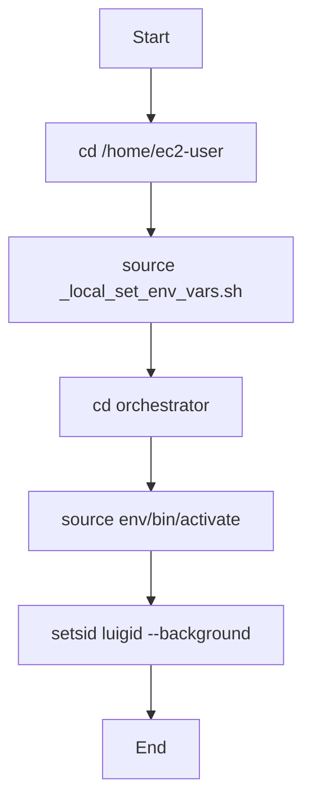
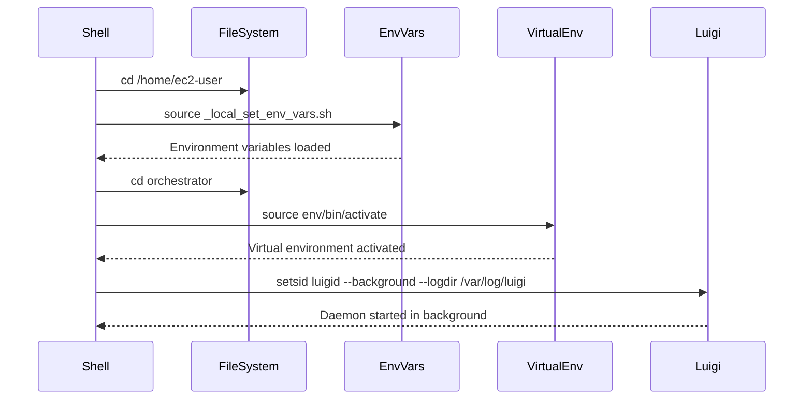
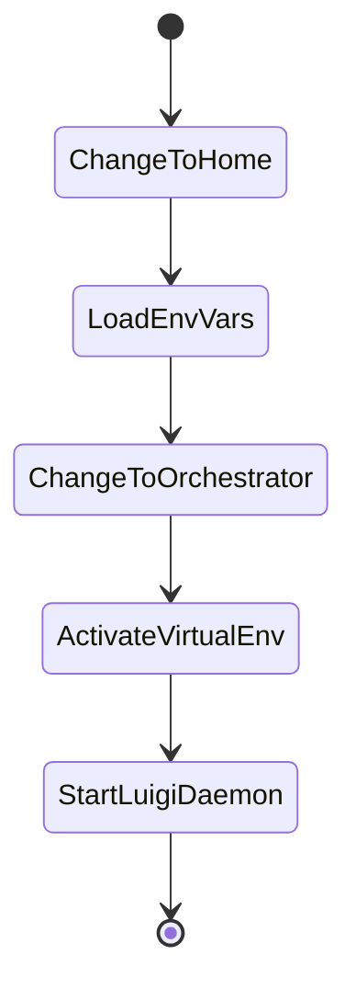

# Diagram: research/orchestrator/run_luigid.sh

> Auto-generated by Obscura crawlers

## Diagram 1

### SVG

<svg id="container" width="276" xmlns="http://www.w3.org/2000/svg" class="flowchart" height="718" viewBox="0 0 276 718" role="graphics-document document" aria-roledescription="flowchart-v2"><g><marker id="container_flowchart-v2-pointEnd" class="marker flowchart-v2" viewBox="0 0 10 10" refX="5" refY="5" markerUnits="userSpaceOnUse" markerWidth="8" markerHeight="8" orient="auto"><path d="M 0 0 L 10 5 L 0 10 z" class="arrowMarkerPath" style="stroke-width: 1; stroke-dasharray: 1, 0;"></path></marker><marker id="container_flowchart-v2-pointStart" class="marker flowchart-v2" viewBox="0 0 10 10" refX="4.5" refY="5" markerUnits="userSpaceOnUse" markerWidth="8" markerHeight="8" orient="auto"><path d="M 0 5 L 10 10 L 10 0 z" class="arrowMarkerPath" style="stroke-width: 1; stroke-dasharray: 1, 0;"></path></marker><marker id="container_flowchart-v2-circleEnd" class="marker flowchart-v2" viewBox="0 0 10 10" refX="11" refY="5" markerUnits="userSpaceOnUse" markerWidth="11" markerHeight="11" orient="auto"><circle cx="5" cy="5" r="5" class="arrowMarkerPath" style="stroke-width: 1; stroke-dasharray: 1, 0;"></circle></marker><marker id="container_flowchart-v2-circleStart" class="marker flowchart-v2" viewBox="0 0 10 10" refX="-1" refY="5" markerUnits="userSpaceOnUse" markerWidth="11" markerHeight="11" orient="auto"><circle cx="5" cy="5" r="5" class="arrowMarkerPath" style="stroke-width: 1; stroke-dasharray: 1, 0;"></circle></marker><marker id="container_flowchart-v2-crossEnd" class="marker cross flowchart-v2" viewBox="0 0 11 11" refX="12" refY="5.2" markerUnits="userSpaceOnUse" markerWidth="11" markerHeight="11" orient="auto"><path d="M 1,1 l 9,9 M 10,1 l -9,9" class="arrowMarkerPath" style="stroke-width: 2; stroke-dasharray: 1, 0;"></path></marker><marker id="container_flowchart-v2-crossStart" class="marker cross flowchart-v2" viewBox="0 0 11 11" refX="-1" refY="5.2" markerUnits="userSpaceOnUse" markerWidth="11" markerHeight="11" orient="auto"><path d="M 1,1 l 9,9 M 10,1 l -9,9" class="arrowMarkerPath" style="stroke-width: 2; stroke-dasharray: 1, 0;"></path></marker><g class="root"><g class="clusters"></g><g class="edgePaths"><path d="M138,62L138,66.167C138,70.333,138,78.667,138,86.333C138,94,138,101,138,104.5L138,108" id="L_A_B_0" class="edge-thickness-normal edge-pattern-solid edge-thickness-normal edge-pattern-solid flowchart-link" style=";" data-edge="true" data-et="edge" data-id="L_A_B_0" data-points="W3sieCI6MTM4LCJ5Ijo2Mn0seyJ4IjoxMzgsInkiOjg3fSx7IngiOjEzOCwieSI6MTEyfV0=" marker-end="url(#container_flowchart-v2-pointEnd)"></path><path d="M138,166L138,170.167C138,174.333,138,182.667,138,190.333C138,198,138,205,138,208.5L138,212" id="L_B_C_0" class="edge-thickness-normal edge-pattern-solid edge-thickness-normal edge-pattern-solid flowchart-link" style=";" data-edge="true" data-et="edge" data-id="L_B_C_0" data-points="W3sieCI6MTM4LCJ5IjoxNjZ9LHsieCI6MTM4LCJ5IjoxOTF9LHsieCI6MTM4LCJ5IjoyMTZ9XQ==" marker-end="url(#container_flowchart-v2-pointEnd)"></path><path d="M138,294L138,298.167C138,302.333,138,310.667,138,318.333C138,326,138,333,138,336.5L138,340" id="L_C_D_0" class="edge-thickness-normal edge-pattern-solid edge-thickness-normal edge-pattern-solid flowchart-link" style=";" data-edge="true" data-et="edge" data-id="L_C_D_0" data-points="W3sieCI6MTM4LCJ5IjoyOTR9LHsieCI6MTM4LCJ5IjozMTl9LHsieCI6MTM4LCJ5IjozNDR9XQ==" marker-end="url(#container_flowchart-v2-pointEnd)"></path><path d="M138,398L138,402.167C138,406.333,138,414.667,138,422.333C138,430,138,437,138,440.5L138,444" id="L_D_E_0" class="edge-thickness-normal edge-pattern-solid edge-thickness-normal edge-pattern-solid flowchart-link" style=";" data-edge="true" data-et="edge" data-id="L_D_E_0" data-points="W3sieCI6MTM4LCJ5IjozOTh9LHsieCI6MTM4LCJ5Ijo0MjN9LHsieCI6MTM4LCJ5Ijo0NDh9XQ==" marker-end="url(#container_flowchart-v2-pointEnd)"></path><path d="M138,502L138,506.167C138,510.333,138,518.667,138,526.333C138,534,138,541,138,544.5L138,548" id="L_E_F_0" class="edge-thickness-normal edge-pattern-solid edge-thickness-normal edge-pattern-solid flowchart-link" style=";" data-edge="true" data-et="edge" data-id="L_E_F_0" data-points="W3sieCI6MTM4LCJ5Ijo1MDJ9LHsieCI6MTM4LCJ5Ijo1Mjd9LHsieCI6MTM4LCJ5Ijo1NTJ9XQ==" marker-end="url(#container_flowchart-v2-pointEnd)"></path><path d="M138,606L138,610.167C138,614.333,138,622.667,138,630.333C138,638,138,645,138,648.5L138,652" id="L_F_G_0" class="edge-thickness-normal edge-pattern-solid edge-thickness-normal edge-pattern-solid flowchart-link" style=";" data-edge="true" data-et="edge" data-id="L_F_G_0" data-points="W3sieCI6MTM4LCJ5Ijo2MDZ9LHsieCI6MTM4LCJ5Ijo2MzF9LHsieCI6MTM4LCJ5Ijo2NTZ9XQ==" marker-end="url(#container_flowchart-v2-pointEnd)"></path></g><g class="edgeLabels"><g class="edgeLabel"><g class="label" data-id="L_A_B_0" transform="translate(0, 0)"><foreignObject width="0" height="0">

</foreignObject></g></g><g class="edgeLabel"><g class="label" data-id="L_B_C_0" transform="translate(0, 0)"><foreignObject width="0" height="0">

</foreignObject></g></g><g class="edgeLabel"><g class="label" data-id="L_C_D_0" transform="translate(0, 0)"><foreignObject width="0" height="0">

</foreignObject></g></g><g class="edgeLabel"><g class="label" data-id="L_D_E_0" transform="translate(0, 0)"><foreignObject width="0" height="0">

</foreignObject></g></g><g class="edgeLabel"><g class="label" data-id="L_E_F_0" transform="translate(0, 0)"><foreignObject width="0" height="0">

</foreignObject></g></g><g class="edgeLabel"><g class="label" data-id="L_F_G_0" transform="translate(0, 0)"><foreignObject width="0" height="0">

</foreignObject></g></g></g><g class="nodes"><g class="node default" id="flowchart-A-0" transform="translate(138, 35)"><rect class="basic label-container" style="" x="-47.5234375" y="-27" width="95.046875" height="54"></rect><g class="label" style="" transform="translate(-17.5234375, -12)"><rect></rect><foreignObject width="35.046875" height="24">

Start

</foreignObject></g></g><g class="node default" id="flowchart-B-1" transform="translate(138, 139)"><rect class="basic label-container" style="" x="-100.0703125" y="-27" width="200.140625" height="54"></rect><g class="label" style="" transform="translate(-70.0703125, -12)"><rect></rect><foreignObject width="140.140625" height="24">

cd /home/ec2-user

</foreignObject></g></g><g class="node default" id="flowchart-C-3" transform="translate(138, 255)"><rect class="basic label-container" style="" x="-130" y="-39" width="260" height="78"></rect><g class="label" style="" transform="translate(-100, -24)"><rect></rect><foreignObject width="200" height="48">

source _local_set_env_vars.sh

</foreignObject></g></g><g class="node default" id="flowchart-D-5" transform="translate(138, 371)"><rect class="basic label-container" style="" x="-85.2734375" y="-27" width="170.546875" height="54"></rect><g class="label" style="" transform="translate(-55.2734375, -12)"><rect></rect><foreignObject width="110.546875" height="24">

cd orchestrator

</foreignObject></g></g><g class="node default" id="flowchart-E-7" transform="translate(138, 475)"><rect class="basic label-container" style="" x="-117.2109375" y="-27" width="234.421875" height="54"></rect><g class="label" style="" transform="translate(-87.2109375, -12)"><rect></rect><foreignObject width="174.421875" height="24">

source env/bin/activate

</foreignObject></g></g><g class="node default" id="flowchart-F-9" transform="translate(138, 579)"><rect class="basic label-container" style="" x="-125.6015625" y="-27" width="251.203125" height="54"></rect><g class="label" style="" transform="translate(-95.6015625, -12)"><rect></rect><foreignObject width="191.203125" height="24">

setsid luigid --background

</foreignObject></g></g><g class="node default" id="flowchart-G-11" transform="translate(138, 683)"><rect class="basic label-container" style="" x="-43.6796875" y="-27" width="87.359375" height="54"></rect><g class="label" style="" transform="translate(-13.6796875, -12)"><rect></rect><foreignObject width="27.359375" height="24">

End

</foreignObject></g></g></g></g></g></svg>

## Diagram 2

### SVG

<svg id="container" width="1061" xmlns="http://www.w3.org/2000/svg" height="555" viewBox="-50 -10 1061 555" role="graphics-document document" aria-roledescription="sequence"><g><rect x="811" y="469" fill="#eaeaea" stroke="#666" width="150" height="65" name="Luigi" rx="3" ry="3" class="actor actor-bottom"></rect><text x="886" y="501.5" dominant-baseline="central" alignment-baseline="central" class="actor actor-box" style="text-anchor: middle; font-size: 16px; font-weight: 400;"><tspan x="886" dy="0">Luigi</tspan></text></g><g><rect x="611" y="469" fill="#eaeaea" stroke="#666" width="150" height="65" name="VirtualEnv" rx="3" ry="3" class="actor actor-bottom"></rect><text x="686" y="501.5" dominant-baseline="central" alignment-baseline="central" class="actor actor-box" style="text-anchor: middle; font-size: 16px; font-weight: 400;"><tspan x="686" dy="0">VirtualEnv</tspan></text></g><g><rect x="411" y="469" fill="#eaeaea" stroke="#666" width="150" height="65" name="EnvVars" rx="3" ry="3" class="actor actor-bottom"></rect><text x="486" y="501.5" dominant-baseline="central" alignment-baseline="central" class="actor actor-box" style="text-anchor: middle; font-size: 16px; font-weight: 400;"><tspan x="486" dy="0">EnvVars</tspan></text></g><g><rect x="211" y="469" fill="#eaeaea" stroke="#666" width="150" height="65" name="FileSystem" rx="3" ry="3" class="actor actor-bottom"></rect><text x="286" y="501.5" dominant-baseline="central" alignment-baseline="central" class="actor actor-box" style="text-anchor: middle; font-size: 16px; font-weight: 400;"><tspan x="286" dy="0">FileSystem</tspan></text></g><g><rect x="0" y="469" fill="#eaeaea" stroke="#666" width="150" height="65" name="Shell" rx="3" ry="3" class="actor actor-bottom"></rect><text x="75" y="501.5" dominant-baseline="central" alignment-baseline="central" class="actor actor-box" style="text-anchor: middle; font-size: 16px; font-weight: 400;"><tspan x="75" dy="0">Shell</tspan></text></g><g><line id="actor4" x1="886" y1="65" x2="886" y2="469" class="actor-line 200" stroke-width="0.5px" stroke="#999" name="Luigi"></line><g id="root-4"><rect x="811" y="0" fill="#eaeaea" stroke="#666" width="150" height="65" name="Luigi" rx="3" ry="3" class="actor actor-top"></rect><text x="886" y="32.5" dominant-baseline="central" alignment-baseline="central" class="actor actor-box" style="text-anchor: middle; font-size: 16px; font-weight: 400;"><tspan x="886" dy="0">Luigi</tspan></text></g></g><g><line id="actor3" x1="686" y1="65" x2="686" y2="469" class="actor-line 200" stroke-width="0.5px" stroke="#999" name="VirtualEnv"></line><g id="root-3"><rect x="611" y="0" fill="#eaeaea" stroke="#666" width="150" height="65" name="VirtualEnv" rx="3" ry="3" class="actor actor-top"></rect><text x="686" y="32.5" dominant-baseline="central" alignment-baseline="central" class="actor actor-box" style="text-anchor: middle; font-size: 16px; font-weight: 400;"><tspan x="686" dy="0">VirtualEnv</tspan></text></g></g><g><line id="actor2" x1="486" y1="65" x2="486" y2="469" class="actor-line 200" stroke-width="0.5px" stroke="#999" name="EnvVars"></line><g id="root-2"><rect x="411" y="0" fill="#eaeaea" stroke="#666" width="150" height="65" name="EnvVars" rx="3" ry="3" class="actor actor-top"></rect><text x="486" y="32.5" dominant-baseline="central" alignment-baseline="central" class="actor actor-box" style="text-anchor: middle; font-size: 16px; font-weight: 400;"><tspan x="486" dy="0">EnvVars</tspan></text></g></g><g><line id="actor1" x1="286" y1="65" x2="286" y2="469" class="actor-line 200" stroke-width="0.5px" stroke="#999" name="FileSystem"></line><g id="root-1"><rect x="211" y="0" fill="#eaeaea" stroke="#666" width="150" height="65" name="FileSystem" rx="3" ry="3" class="actor actor-top"></rect><text x="286" y="32.5" dominant-baseline="central" alignment-baseline="central" class="actor actor-box" style="text-anchor: middle; font-size: 16px; font-weight: 400;"><tspan x="286" dy="0">FileSystem</tspan></text></g></g><g><line id="actor0" x1="75" y1="65" x2="75" y2="469" class="actor-line 200" stroke-width="0.5px" stroke="#999" name="Shell"></line><g id="root-0"><rect x="0" y="0" fill="#eaeaea" stroke="#666" width="150" height="65" name="Shell" rx="3" ry="3" class="actor actor-top"></rect><text x="75" y="32.5" dominant-baseline="central" alignment-baseline="central" class="actor actor-box" style="text-anchor: middle; font-size: 16px; font-weight: 400;"><tspan x="75" dy="0">Shell</tspan></text></g></g><g></g><defs><symbol id="computer" width="24" height="24"><path transform="scale(.5)" d="M2 2v13h20v-13h-20zm18 11h-16v-9h16v9zm-10.228 6l.466-1h3.524l.467 1h-4.457zm14.228 3h-24l2-6h2.104l-1.33 4h18.45l-1.297-4h2.073l2 6zm-5-10h-14v-7h14v7z"></path></symbol></defs><defs><symbol id="database" fill-rule="evenodd" clip-rule="evenodd"><path transform="scale(.5)" d="M12.258.001l.256.004.255.005.253.008.251.01.249.012.247.015.246.016.242.019.241.02.239.023.236.024.233.027.231.028.229.031.225.032.223.034.22.036.217.038.214.04.211.041.208.043.205.045.201.046.198.048.194.05.191.051.187.053.183.054.18.056.175.057.172.059.168.06.163.061.16.063.155.064.15.066.074.033.073.033.071.034.07.034.069.035.068.035.067.035.066.035.064.036.064.036.062.036.06.036.06.037.058.037.058.037.055.038.055.038.053.038.052.038.051.039.05.039.048.039.047.039.045.04.044.04.043.04.041.04.04.041.039.041.037.041.036.041.034.041.033.042.032.042.03.042.029.042.027.042.026.043.024.043.023.043.021.043.02.043.018.044.017.043.015.044.013.044.012.044.011.045.009.044.007.045.006.045.004.045.002.045.001.045v17l-.001.045-.002.045-.004.045-.006.045-.007.045-.009.044-.011.045-.012.044-.013.044-.015.044-.017.043-.018.044-.02.043-.021.043-.023.043-.024.043-.026.043-.027.042-.029.042-.03.042-.032.042-.033.042-.034.041-.036.041-.037.041-.039.041-.04.041-.041.04-.043.04-.044.04-.045.04-.047.039-.048.039-.05.039-.051.039-.052.038-.053.038-.055.038-.055.038-.058.037-.058.037-.06.037-.06.036-.062.036-.064.036-.064.036-.066.035-.067.035-.068.035-.069.035-.07.034-.071.034-.073.033-.074.033-.15.066-.155.064-.16.063-.163.061-.168.06-.172.059-.175.057-.18.056-.183.054-.187.053-.191.051-.194.05-.198.048-.201.046-.205.045-.208.043-.211.041-.214.04-.217.038-.22.036-.223.034-.225.032-.229.031-.231.028-.233.027-.236.024-.239.023-.241.02-.242.019-.246.016-.247.015-.249.012-.251.01-.253.008-.255.005-.256.004-.258.001-.258-.001-.256-.004-.255-.005-.253-.008-.251-.01-.249-.012-.247-.015-.245-.016-.243-.019-.241-.02-.238-.023-.236-.024-.234-.027-.231-.028-.228-.031-.226-.032-.223-.034-.22-.036-.217-.038-.214-.04-.211-.041-.208-.043-.204-.045-.201-.046-.198-.048-.195-.05-.19-.051-.187-.053-.184-.054-.179-.056-.176-.057-.172-.059-.167-.06-.164-.061-.159-.063-.155-.064-.151-.066-.074-.033-.072-.033-.072-.034-.07-.034-.069-.035-.068-.035-.067-.035-.066-.035-.064-.036-.063-.036-.062-.036-.061-.036-.06-.037-.058-.037-.057-.037-.056-.038-.055-.038-.053-.038-.052-.038-.051-.039-.049-.039-.049-.039-.046-.039-.046-.04-.044-.04-.043-.04-.041-.04-.04-.041-.039-.041-.037-.041-.036-.041-.034-.041-.033-.042-.032-.042-.03-.042-.029-.042-.027-.042-.026-.043-.024-.043-.023-.043-.021-.043-.02-.043-.018-.044-.017-.043-.015-.044-.013-.044-.012-.044-.011-.045-.009-.044-.007-.045-.006-.045-.004-.045-.002-.045-.001-.045v-17l.001-.045.002-.045.004-.045.006-.045.007-.045.009-.044.011-.045.012-.044.013-.044.015-.044.017-.043.018-.044.02-.043.021-.043.023-.043.024-.043.026-.043.027-.042.029-.042.03-.042.032-.042.033-.042.034-.041.036-.041.037-.041.039-.041.04-.041.041-.04.043-.04.044-.04.046-.04.046-.039.049-.039.049-.039.051-.039.052-.038.053-.038.055-.038.056-.038.057-.037.058-.037.06-.037.061-.036.062-.036.063-.036.064-.036.066-.035.067-.035.068-.035.069-.035.07-.034.072-.034.072-.033.074-.033.151-.066.155-.064.159-.063.164-.061.167-.06.172-.059.176-.057.179-.056.184-.054.187-.053.19-.051.195-.05.198-.048.201-.046.204-.045.208-.043.211-.041.214-.04.217-.038.22-.036.223-.034.226-.032.228-.031.231-.028.234-.027.236-.024.238-.023.241-.02.243-.019.245-.016.247-.015.249-.012.251-.01.253-.008.255-.005.256-.004.258-.001.258.001zm-9.258 20.499v.01l.001.021.003.021.004.022.005.021.006.022.007.022.009.023.01.022.011.023.012.023.013.023.015.023.016.024.017.023.018.024.019.024.021.024.022.025.023.024.024.025.052.049.056.05.061.051.066.051.07.051.075.051.079.052.084.052.088.052.092.052.097.052.102.051.105.052.11.052.114.051.119.051.123.051.127.05.131.05.135.05.139.048.144.049.147.047.152.047.155.047.16.045.163.045.167.043.171.043.176.041.178.041.183.039.187.039.19.037.194.035.197.035.202.033.204.031.209.03.212.029.216.027.219.025.222.024.226.021.23.02.233.018.236.016.24.015.243.012.246.01.249.008.253.005.256.004.259.001.26-.001.257-.004.254-.005.25-.008.247-.011.244-.012.241-.014.237-.016.233-.018.231-.021.226-.021.224-.024.22-.026.216-.027.212-.028.21-.031.205-.031.202-.034.198-.034.194-.036.191-.037.187-.039.183-.04.179-.04.175-.042.172-.043.168-.044.163-.045.16-.046.155-.046.152-.047.148-.048.143-.049.139-.049.136-.05.131-.05.126-.05.123-.051.118-.052.114-.051.11-.052.106-.052.101-.052.096-.052.092-.052.088-.053.083-.051.079-.052.074-.052.07-.051.065-.051.06-.051.056-.05.051-.05.023-.024.023-.025.021-.024.02-.024.019-.024.018-.024.017-.024.015-.023.014-.024.013-.023.012-.023.01-.023.01-.022.008-.022.006-.022.006-.022.004-.022.004-.021.001-.021.001-.021v-4.127l-.077.055-.08.053-.083.054-.085.053-.087.052-.09.052-.093.051-.095.05-.097.05-.1.049-.102.049-.105.048-.106.047-.109.047-.111.046-.114.045-.115.045-.118.044-.12.043-.122.042-.124.042-.126.041-.128.04-.13.04-.132.038-.134.038-.135.037-.138.037-.139.035-.142.035-.143.034-.144.033-.147.032-.148.031-.15.03-.151.03-.153.029-.154.027-.156.027-.158.026-.159.025-.161.024-.162.023-.163.022-.165.021-.166.02-.167.019-.169.018-.169.017-.171.016-.173.015-.173.014-.175.013-.175.012-.177.011-.178.01-.179.008-.179.008-.181.006-.182.005-.182.004-.184.003-.184.002h-.37l-.184-.002-.184-.003-.182-.004-.182-.005-.181-.006-.179-.008-.179-.008-.178-.01-.176-.011-.176-.012-.175-.013-.173-.014-.172-.015-.171-.016-.17-.017-.169-.018-.167-.019-.166-.02-.165-.021-.163-.022-.162-.023-.161-.024-.159-.025-.157-.026-.156-.027-.155-.027-.153-.029-.151-.03-.15-.03-.148-.031-.146-.032-.145-.033-.143-.034-.141-.035-.14-.035-.137-.037-.136-.037-.134-.038-.132-.038-.13-.04-.128-.04-.126-.041-.124-.042-.122-.042-.12-.044-.117-.043-.116-.045-.113-.045-.112-.046-.109-.047-.106-.047-.105-.048-.102-.049-.1-.049-.097-.05-.095-.05-.093-.052-.09-.051-.087-.052-.085-.053-.083-.054-.08-.054-.077-.054v4.127zm0-5.654v.011l.001.021.003.021.004.021.005.022.006.022.007.022.009.022.01.022.011.023.012.023.013.023.015.024.016.023.017.024.018.024.019.024.021.024.022.024.023.025.024.024.052.05.056.05.061.05.066.051.07.051.075.052.079.051.084.052.088.052.092.052.097.052.102.052.105.052.11.051.114.051.119.052.123.05.127.051.131.05.135.049.139.049.144.048.147.048.152.047.155.046.16.045.163.045.167.044.171.042.176.042.178.04.183.04.187.038.19.037.194.036.197.034.202.033.204.032.209.03.212.028.216.027.219.025.222.024.226.022.23.02.233.018.236.016.24.014.243.012.246.01.249.008.253.006.256.003.259.001.26-.001.257-.003.254-.006.25-.008.247-.01.244-.012.241-.015.237-.016.233-.018.231-.02.226-.022.224-.024.22-.025.216-.027.212-.029.21-.03.205-.032.202-.033.198-.035.194-.036.191-.037.187-.039.183-.039.179-.041.175-.042.172-.043.168-.044.163-.045.16-.045.155-.047.152-.047.148-.048.143-.048.139-.05.136-.049.131-.05.126-.051.123-.051.118-.051.114-.052.11-.052.106-.052.101-.052.096-.052.092-.052.088-.052.083-.052.079-.052.074-.051.07-.052.065-.051.06-.05.056-.051.051-.049.023-.025.023-.024.021-.025.02-.024.019-.024.018-.024.017-.024.015-.023.014-.023.013-.024.012-.022.01-.023.01-.023.008-.022.006-.022.006-.022.004-.021.004-.022.001-.021.001-.021v-4.139l-.077.054-.08.054-.083.054-.085.052-.087.053-.09.051-.093.051-.095.051-.097.05-.1.049-.102.049-.105.048-.106.047-.109.047-.111.046-.114.045-.115.044-.118.044-.12.044-.122.042-.124.042-.126.041-.128.04-.13.039-.132.039-.134.038-.135.037-.138.036-.139.036-.142.035-.143.033-.144.033-.147.033-.148.031-.15.03-.151.03-.153.028-.154.028-.156.027-.158.026-.159.025-.161.024-.162.023-.163.022-.165.021-.166.02-.167.019-.169.018-.169.017-.171.016-.173.015-.173.014-.175.013-.175.012-.177.011-.178.009-.179.009-.179.007-.181.007-.182.005-.182.004-.184.003-.184.002h-.37l-.184-.002-.184-.003-.182-.004-.182-.005-.181-.007-.179-.007-.179-.009-.178-.009-.176-.011-.176-.012-.175-.013-.173-.014-.172-.015-.171-.016-.17-.017-.169-.018-.167-.019-.166-.02-.165-.021-.163-.022-.162-.023-.161-.024-.159-.025-.157-.026-.156-.027-.155-.028-.153-.028-.151-.03-.15-.03-.148-.031-.146-.033-.145-.033-.143-.033-.141-.035-.14-.036-.137-.036-.136-.037-.134-.038-.132-.039-.13-.039-.128-.04-.126-.041-.124-.042-.122-.043-.12-.043-.117-.044-.116-.044-.113-.046-.112-.046-.109-.046-.106-.047-.105-.048-.102-.049-.1-.049-.097-.05-.095-.051-.093-.051-.09-.051-.087-.053-.085-.052-.083-.054-.08-.054-.077-.054v4.139zm0-5.666v.011l.001.02.003.022.004.021.005.022.006.021.007.022.009.023.01.022.011.023.012.023.013.023.015.023.016.024.017.024.018.023.019.024.021.025.022.024.023.024.024.025.052.05.056.05.061.05.066.051.07.051.075.052.079.051.084.052.088.052.092.052.097.052.102.052.105.051.11.052.114.051.119.051.123.051.127.05.131.05.135.05.139.049.144.048.147.048.152.047.155.046.16.045.163.045.167.043.171.043.176.042.178.04.183.04.187.038.19.037.194.036.197.034.202.033.204.032.209.03.212.028.216.027.219.025.222.024.226.021.23.02.233.018.236.017.24.014.243.012.246.01.249.008.253.006.256.003.259.001.26-.001.257-.003.254-.006.25-.008.247-.01.244-.013.241-.014.237-.016.233-.018.231-.02.226-.022.224-.024.22-.025.216-.027.212-.029.21-.03.205-.032.202-.033.198-.035.194-.036.191-.037.187-.039.183-.039.179-.041.175-.042.172-.043.168-.044.163-.045.16-.045.155-.047.152-.047.148-.048.143-.049.139-.049.136-.049.131-.051.126-.05.123-.051.118-.052.114-.051.11-.052.106-.052.101-.052.096-.052.092-.052.088-.052.083-.052.079-.052.074-.052.07-.051.065-.051.06-.051.056-.05.051-.049.023-.025.023-.025.021-.024.02-.024.019-.024.018-.024.017-.024.015-.023.014-.024.013-.023.012-.023.01-.022.01-.023.008-.022.006-.022.006-.022.004-.022.004-.021.001-.021.001-.021v-4.153l-.077.054-.08.054-.083.053-.085.053-.087.053-.09.051-.093.051-.095.051-.097.05-.1.049-.102.048-.105.048-.106.048-.109.046-.111.046-.114.046-.115.044-.118.044-.12.043-.122.043-.124.042-.126.041-.128.04-.13.039-.132.039-.134.038-.135.037-.138.036-.139.036-.142.034-.143.034-.144.033-.147.032-.148.032-.15.03-.151.03-.153.028-.154.028-.156.027-.158.026-.159.024-.161.024-.162.023-.163.023-.165.021-.166.02-.167.019-.169.018-.169.017-.171.016-.173.015-.173.014-.175.013-.175.012-.177.01-.178.01-.179.009-.179.007-.181.006-.182.006-.182.004-.184.003-.184.001-.185.001-.185-.001-.184-.001-.184-.003-.182-.004-.182-.006-.181-.006-.179-.007-.179-.009-.178-.01-.176-.01-.176-.012-.175-.013-.173-.014-.172-.015-.171-.016-.17-.017-.169-.018-.167-.019-.166-.02-.165-.021-.163-.023-.162-.023-.161-.024-.159-.024-.157-.026-.156-.027-.155-.028-.153-.028-.151-.03-.15-.03-.148-.032-.146-.032-.145-.033-.143-.034-.141-.034-.14-.036-.137-.036-.136-.037-.134-.038-.132-.039-.13-.039-.128-.041-.126-.041-.124-.041-.122-.043-.12-.043-.117-.044-.116-.044-.113-.046-.112-.046-.109-.046-.106-.048-.105-.048-.102-.048-.1-.05-.097-.049-.095-.051-.093-.051-.09-.052-.087-.052-.085-.053-.083-.053-.08-.054-.077-.054v4.153zm8.74-8.179l-.257.004-.254.005-.25.008-.247.011-.244.012-.241.014-.237.016-.233.018-.231.021-.226.022-.224.023-.22.026-.216.027-.212.028-.21.031-.205.032-.202.033-.198.034-.194.036-.191.038-.187.038-.183.04-.179.041-.175.042-.172.043-.168.043-.163.045-.16.046-.155.046-.152.048-.148.048-.143.048-.139.049-.136.05-.131.05-.126.051-.123.051-.118.051-.114.052-.11.052-.106.052-.101.052-.096.052-.092.052-.088.052-.083.052-.079.052-.074.051-.07.052-.065.051-.06.05-.056.05-.051.05-.023.025-.023.024-.021.024-.02.025-.019.024-.018.024-.017.023-.015.024-.014.023-.013.023-.012.023-.01.023-.01.022-.008.022-.006.023-.006.021-.004.022-.004.021-.001.021-.001.021.001.021.001.021.004.021.004.022.006.021.006.023.008.022.01.022.01.023.012.023.013.023.014.023.015.024.017.023.018.024.019.024.02.025.021.024.023.024.023.025.051.05.056.05.06.05.065.051.07.052.074.051.079.052.083.052.088.052.092.052.096.052.101.052.106.052.11.052.114.052.118.051.123.051.126.051.131.05.136.05.139.049.143.048.148.048.152.048.155.046.16.046.163.045.168.043.172.043.175.042.179.041.183.04.187.038.191.038.194.036.198.034.202.033.205.032.21.031.212.028.216.027.22.026.224.023.226.022.231.021.233.018.237.016.241.014.244.012.247.011.25.008.254.005.257.004.26.001.26-.001.257-.004.254-.005.25-.008.247-.011.244-.012.241-.014.237-.016.233-.018.231-.021.226-.022.224-.023.22-.026.216-.027.212-.028.21-.031.205-.032.202-.033.198-.034.194-.036.191-.038.187-.038.183-.04.179-.041.175-.042.172-.043.168-.043.163-.045.16-.046.155-.046.152-.048.148-.048.143-.048.139-.049.136-.05.131-.05.126-.051.123-.051.118-.051.114-.052.11-.052.106-.052.101-.052.096-.052.092-.052.088-.052.083-.052.079-.052.074-.051.07-.052.065-.051.06-.05.056-.05.051-.05.023-.025.023-.024.021-.024.02-.025.019-.024.018-.024.017-.023.015-.024.014-.023.013-.023.012-.023.01-.023.01-.022.008-.022.006-.023.006-.021.004-.022.004-.021.001-.021.001-.021-.001-.021-.001-.021-.004-.021-.004-.022-.006-.021-.006-.023-.008-.022-.01-.022-.01-.023-.012-.023-.013-.023-.014-.023-.015-.024-.017-.023-.018-.024-.019-.024-.02-.025-.021-.024-.023-.024-.023-.025-.051-.05-.056-.05-.06-.05-.065-.051-.07-.052-.074-.051-.079-.052-.083-.052-.088-.052-.092-.052-.096-.052-.101-.052-.106-.052-.11-.052-.114-.052-.118-.051-.123-.051-.126-.051-.131-.05-.136-.05-.139-.049-.143-.048-.148-.048-.152-.048-.155-.046-.16-.046-.163-.045-.168-.043-.172-.043-.175-.042-.179-.041-.183-.04-.187-.038-.191-.038-.194-.036-.198-.034-.202-.033-.205-.032-.21-.031-.212-.028-.216-.027-.22-.026-.224-.023-.226-.022-.231-.021-.233-.018-.237-.016-.241-.014-.244-.012-.247-.011-.25-.008-.254-.005-.257-.004-.26-.001-.26.001z"></path></symbol></defs><defs><symbol id="clock" width="24" height="24"><path transform="scale(.5)" d="M12 2c5.514 0 10 4.486 10 10s-4.486 10-10 10-10-4.486-10-10 4.486-10 10-10zm0-2c-6.627 0-12 5.373-12 12s5.373 12 12 12 12-5.373 12-12-5.373-12-12-12zm5.848 12.459c.202.038.202.333.001.372-1.907.361-6.045 1.111-6.547 1.111-.719 0-1.301-.582-1.301-1.301 0-.512.77-5.447 1.125-7.445.034-.192.312-.181.343.014l.985 6.238 5.394 1.011z"></path></symbol></defs><defs><marker id="arrowhead" refX="7.9" refY="5" markerUnits="userSpaceOnUse" markerWidth="12" markerHeight="12" orient="auto-start-reverse"><path d="M -1 0 L 10 5 L 0 10 z"></path></marker></defs><defs><marker id="crosshead" markerWidth="15" markerHeight="8" orient="auto" refX="4" refY="4.5"><path fill="none" stroke="#000000" stroke-width="1pt" d="M 1,2 L 6,7 M 6,2 L 1,7" style="stroke-dasharray: 0, 0;"></path></marker></defs><defs><marker id="filled-head" refX="15.5" refY="7" markerWidth="20" markerHeight="28" orient="auto"><path d="M 18,7 L9,13 L14,7 L9,1 Z"></path></marker></defs><defs><marker id="sequencenumber" refX="15" refY="15" markerWidth="60" markerHeight="40" orient="auto"><circle cx="15" cy="15" r="6"></circle></marker></defs><text x="179" y="80" text-anchor="middle" dominant-baseline="middle" alignment-baseline="middle" class="messageText" dy="1em" style="font-size: 16px; font-weight: 400;">cd /home/ec2-user</text><line x1="76" y1="113" x2="282" y2="113" class="messageLine0" stroke-width="2" stroke="none" marker-end="url(#arrowhead)" style="fill: none;"></line><text x="279" y="128" text-anchor="middle" dominant-baseline="middle" alignment-baseline="middle" class="messageText" dy="1em" style="font-size: 16px; font-weight: 400;">source _local_set_env_vars.sh</text><line x1="76" y1="161" x2="482" y2="161" class="messageLine0" stroke-width="2" stroke="none" marker-end="url(#arrowhead)" style="fill: none;"></line><text x="282" y="176" text-anchor="middle" dominant-baseline="middle" alignment-baseline="middle" class="messageText" dy="1em" style="font-size: 16px; font-weight: 400;">Environment variables loaded</text><line x1="485" y1="209" x2="79" y2="209" class="messageLine1" stroke-width="2" stroke="none" marker-end="url(#arrowhead)" style="stroke-dasharray: 3, 3; fill: none;"></line><text x="179" y="224" text-anchor="middle" dominant-baseline="middle" alignment-baseline="middle" class="messageText" dy="1em" style="font-size: 16px; font-weight: 400;">cd orchestrator</text><line x1="76" y1="257" x2="282" y2="257" class="messageLine0" stroke-width="2" stroke="none" marker-end="url(#arrowhead)" style="fill: none;"></line><text x="379" y="272" text-anchor="middle" dominant-baseline="middle" alignment-baseline="middle" class="messageText" dy="1em" style="font-size: 16px; font-weight: 400;">source env/bin/activate</text><line x1="76" y1="305" x2="682" y2="305" class="messageLine0" stroke-width="2" stroke="none" marker-end="url(#arrowhead)" style="fill: none;"></line><text x="382" y="320" text-anchor="middle" dominant-baseline="middle" alignment-baseline="middle" class="messageText" dy="1em" style="font-size: 16px; font-weight: 400;">Virtual environment activated</text><line x1="685" y1="353" x2="79" y2="353" class="messageLine1" stroke-width="2" stroke="none" marker-end="url(#arrowhead)" style="stroke-dasharray: 3, 3; fill: none;"></line><text x="479" y="368" text-anchor="middle" dominant-baseline="middle" alignment-baseline="middle" class="messageText" dy="1em" style="font-size: 16px; font-weight: 400;">setsid luigid --background --logdir /var/log/luigi</text><line x1="76" y1="401" x2="882" y2="401" class="messageLine0" stroke-width="2" stroke="none" marker-end="url(#arrowhead)" style="fill: none;"></line><text x="482" y="416" text-anchor="middle" dominant-baseline="middle" alignment-baseline="middle" class="messageText" dy="1em" style="font-size: 16px; font-weight: 400;">Daemon started in background</text><line x1="885" y1="449" x2="79" y2="449" class="messageLine1" stroke-width="2" stroke="none" marker-end="url(#arrowhead)" style="stroke-dasharray: 3, 3; fill: none;"></line></svg>

## Diagram 3

### SVG

<svg id="container" width="192.921875" xmlns="http://www.w3.org/2000/svg" class="statediagram" height="544" viewBox="0 0 192.921875 544" role="graphics-document document" aria-roledescription="stateDiagram"><g><defs><marker id="container_stateDiagram-barbEnd" refX="19" refY="7" markerWidth="20" markerHeight="14" markerUnits="userSpaceOnUse" orient="auto"><path d="M 19,7 L9,13 L14,7 L9,1 Z"></path></marker></defs><g class="root"><g class="clusters"></g><g class="edgePaths"><path d="M96.461,22L96.461,26.167C96.461,30.333,96.461,38.667,96.544,47.083C96.628,55.5,96.794,64,96.878,68.25L96.961,72.5" id="edge0" class="edge-thickness-normal edge-pattern-solid transition" style="fill:none;;;fill:none" data-edge="true" data-et="edge" data-id="edge0" data-points="W3sieCI6OTYuNDYwOTM3NSwieSI6MjJ9LHsieCI6OTYuNDYwOTM3NSwieSI6NDd9LHsieCI6OTYuOTYwOTM3NSwieSI6NzIuNX1d" marker-end="url(#container_stateDiagram-barbEnd)"></path><path d="M96.961,112.5L96.878,116.583C96.794,120.667,96.628,128.833,96.628,137.167C96.628,145.5,96.794,154,96.878,158.25L96.961,162.5" id="edge1" class="edge-thickness-normal edge-pattern-solid transition" style="fill:none;;;fill:none" data-edge="true" data-et="edge" data-id="edge1" data-points="W3sieCI6OTYuOTYwOTM3NSwieSI6MTEyLjV9LHsieCI6OTYuNDYwOTM3NSwieSI6MTM3fSx7IngiOjk2Ljk2MDkzNzUsInkiOjE2Mi41fV0=" marker-end="url(#container_stateDiagram-barbEnd)"></path><path d="M96.961,202.5L96.878,206.583C96.794,210.667,96.628,218.833,96.628,227.167C96.628,235.5,96.794,244,96.878,248.25L96.961,252.5" id="edge2" class="edge-thickness-normal edge-pattern-solid transition" style="fill:none;;;fill:none" data-edge="true" data-et="edge" data-id="edge2" data-points="W3sieCI6OTYuOTYwOTM3NSwieSI6MjAyLjV9LHsieCI6OTYuNDYwOTM3NSwieSI6MjI3fSx7IngiOjk2Ljk2MDkzNzUsInkiOjI1Mi41fV0=" marker-end="url(#container_stateDiagram-barbEnd)"></path><path d="M96.961,292.5L96.878,296.583C96.794,300.667,96.628,308.833,96.628,317.167C96.628,325.5,96.794,334,96.878,338.25L96.961,342.5" id="edge3" class="edge-thickness-normal edge-pattern-solid transition" style="fill:none;;;fill:none" data-edge="true" data-et="edge" data-id="edge3" data-points="W3sieCI6OTYuOTYwOTM3NSwieSI6MjkyLjV9LHsieCI6OTYuNDYwOTM3NSwieSI6MzE3fSx7IngiOjk2Ljk2MDkzNzUsInkiOjM0Mi41fV0=" marker-end="url(#container_stateDiagram-barbEnd)"></path><path d="M96.961,382.5L96.878,386.583C96.794,390.667,96.628,398.833,96.628,407.167C96.628,415.5,96.794,424,96.878,428.25L96.961,432.5" id="edge4" class="edge-thickness-normal edge-pattern-solid transition" style="fill:none;;;fill:none" data-edge="true" data-et="edge" data-id="edge4" data-points="W3sieCI6OTYuOTYwOTM3NSwieSI6MzgyLjV9LHsieCI6OTYuNDYwOTM3NSwieSI6NDA3fSx7IngiOjk2Ljk2MDkzNzUsInkiOjQzMi41fV0=" marker-end="url(#container_stateDiagram-barbEnd)"></path><path d="M96.961,472.5L96.878,476.583C96.794,480.667,96.628,488.833,96.544,497.083C96.461,505.333,96.461,513.667,96.461,517.833L96.461,522" id="edge5" class="edge-thickness-normal edge-pattern-solid transition" style="fill:none;;;fill:none" data-edge="true" data-et="edge" data-id="edge5" data-points="W3sieCI6OTYuOTYwOTM3NSwieSI6NDcyLjV9LHsieCI6OTYuNDYwOTM3NSwieSI6NDk3fSx7IngiOjk2LjQ2MDkzNzUsInkiOjUyMn1d" marker-end="url(#container_stateDiagram-barbEnd)"></path></g><g class="edgeLabels"><g class="edgeLabel"><g class="label" data-id="edge0" transform="translate(0, 0)"><foreignObject width="0" height="0">

</foreignObject></g></g><g class="edgeLabel"><g class="label" data-id="edge1" transform="translate(0, 0)"><foreignObject width="0" height="0">

</foreignObject></g></g><g class="edgeLabel"><g class="label" data-id="edge2" transform="translate(0, 0)"><foreignObject width="0" height="0">

</foreignObject></g></g><g class="edgeLabel"><g class="label" data-id="edge3" transform="translate(0, 0)"><foreignObject width="0" height="0">

</foreignObject></g></g><g class="edgeLabel"><g class="label" data-id="edge4" transform="translate(0, 0)"><foreignObject width="0" height="0">

</foreignObject></g></g><g class="edgeLabel"><g class="label" data-id="edge5" transform="translate(0, 0)"><foreignObject width="0" height="0">

</foreignObject></g></g></g><g class="nodes"><g class="node default" id="state-root_start-0" transform="translate(96.4609375, 15)"><circle class="state-start" r="7" width="14" height="14"></circle></g><g class="node  statediagram-state" id="state-ChangeToHome-1" transform="translate(96.4609375, 92)"><g class="basic label-container outer-path"><path d="M-59.21875 -20 C-30.059999165478626 -20, -0.9012483309572517 -20, 59.21875 -20 C59.21875 -20, 59.21875 -20, 59.21875 -20 C59.33940367638067 -19.995009727031714, 59.46005735276134 -19.990019454063432, 59.63164672736166 -19.982922465033347 C59.73766795343737 -19.969706932985044, 59.84368917951307 -19.95649140093674, 60.04172295140367 -19.931806517013612 C60.19587914881999 -19.89948336149074, 60.35003534623631 -19.867160205967874, 60.446177435703994 -19.847001329696653 C60.52990710406139 -19.822073927400705, 60.61363677241878 -19.79714652510476, 60.84224734602342 -19.729086208503173 C60.976262100760735 -19.676793488934468, 61.11027685549805 -19.62450076936576, 61.227227123264846 -19.578866633275286 C61.33951440634327 -19.523972725507953, 61.45180168942169 -19.46907881774062, 61.598486965185366 -19.397368756032446 C61.700630296347896 -19.336504541601748, 61.802773627510426 -19.27564032717105, 61.953490790612136 -19.185832391312644 C62.07943385735976 -19.095910770015344, 62.20537692410739 -19.005989148718044, 62.28981356344834 -18.94570254698197 C62.37114229623895 -18.87682062399442, 62.45247102902955 -18.80793870100687, 62.605157858128706 -18.678619553365657 C62.70910974461587 -18.574667666878494, 62.81306163110303 -18.470715780391327, 62.89736955336566 -18.386407858128706 C62.97196760125634 -18.298330109418078, 63.04656564914703 -18.21025236070745, 63.16445254698197 -18.07106356344834 C63.248194102885925 -17.953776216839092, 63.33193565878988 -17.836488870229847, 63.404582391312644 -17.734740790612136 C63.465374933043826 -17.632717741759176, 63.52616747477501 -17.530694692906216, 63.61611875603245 -17.37973696518537 C63.68507835753023 -17.23867784570755, 63.75403795902801 -17.09761872622973, 63.79761663327529 -17.008477123264846 C63.846532350574066 -16.88311688362417, 63.89544806787285 -16.757756643983495, 63.947836208503176 -16.623497346023417 C63.977894101006356 -16.522534664836897, 64.00795199350954 -16.42157198365038, 64.06575132969665 -16.227427435703994 C64.08325773764577 -16.143935547730837, 64.10076414559488 -16.060443659757684, 64.15055651701361 -15.82297295140367 C64.16755122010348 -15.686633434251169, 64.18454592319333 -15.550293917098665, 64.20167246503335 -15.412896727361662 C64.20581751473432 -15.312678665467832, 64.20996256443529 -15.212460603574002, 64.21875 -15 C64.21875 -15, 64.21875 -15, 64.21875 -15 C64.21875 -5.58443927177346, 64.21875 3.8311214564530793, 64.21875 15 C64.21875 15, 64.21875 15, 64.21875 15 C64.21309536219182 15.136716537250374, 64.20744072438364 15.273433074500746, 64.20167246503335 15.412896727361662 C64.18804007866314 15.522262155255522, 64.17440769229293 15.63162758314938, 64.15055651701361 15.822972951403669 C64.12775122373088 15.931736382342287, 64.10494593044815 16.040499813280906, 64.06575132969665 16.227427435703994 C64.02795449448212 16.354384767234155, 63.99015765926758 16.48134209876432, 63.947836208503176 16.623497346023417 C63.90467075809024 16.73412091461817, 63.86150530767731 16.844744483212924, 63.79761663327529 17.008477123264846 C63.737494779712186 17.13145834039468, 63.67737292614909 17.254439557524513, 63.61611875603245 17.379736965185366 C63.54738742716444 17.49508301789422, 63.478656098296426 17.61042907060307, 63.404582391312644 17.734740790612133 C63.314722571784756 17.86059729859605, 63.22486275225687 17.98645380657997, 63.16445254698197 18.07106356344834 C63.0953525083094 18.15264982494162, 63.02625246963683 18.234236086434898, 62.89736955336566 18.386407858128706 C62.784561584413204 18.499215827081155, 62.67175361546076 18.612023796033608, 62.605157858128706 18.678619553365657 C62.539615399015716 18.734131184570575, 62.474072939902726 18.789642815775498, 62.28981356344834 18.94570254698197 C62.19871096911993 19.010748549099873, 62.10760837479152 19.075794551217772, 61.953490790612136 19.185832391312644 C61.878280777977174 19.23064783138348, 61.80307076534221 19.275463271454313, 61.598486965185366 19.397368756032446 C61.52005008744721 19.4357142089998, 61.44161320970906 19.474059661967157, 61.227227123264846 19.578866633275286 C61.144561216643496 19.611122970133987, 61.06189531002214 19.643379306992692, 60.84224734602342 19.729086208503173 C60.75613738457533 19.754722254755535, 60.670027423127245 19.780358301007894, 60.446177435703994 19.847001329696653 C60.30159623542428 19.87731681944439, 60.15701503514455 19.907632309192124, 60.04172295140367 19.931806517013612 C59.95648829057878 19.942431006405513, 59.871253629753895 19.95305549579741, 59.63164672736166 19.982922465033347 C59.48422514275257 19.98901986687542, 59.33680355814348 19.995117268717493, 59.21875 20 C59.21875 20, 59.21875 20, 59.21875 20 C21.991201586980736 20, -15.236346826038528 20, -59.21875 20 C-59.21875 20, -59.21875 20, -59.21875 20 C-59.311021920030406 19.99618360515757, -59.40329384006082 19.992367210315138, -59.63164672736166 19.982922465033347 C-59.76897655582269 19.965804319767617, -59.90630638428372 19.948686174501887, -60.04172295140367 19.931806517013612 C-60.16080985251598 19.906836619663366, -60.27989675362829 19.88186672231312, -60.446177435703994 19.847001329696653 C-60.55475332941254 19.81467688562311, -60.66332922312109 19.782352441549566, -60.84224734602342 19.729086208503173 C-60.94413317412921 19.689330235009024, -61.046019002235 19.649574261514875, -61.227227123264846 19.578866633275286 C-61.37312666867248 19.507540691732032, -61.51902621408011 19.43621475018878, -61.598486965185366 19.397368756032446 C-61.68458342392477 19.346066402106857, -61.770679882664176 19.294764048181268, -61.953490790612136 19.185832391312644 C-62.06978209877713 19.102801993188898, -62.186073406942135 19.019771595065155, -62.28981356344834 18.94570254698197 C-62.40699625414318 18.846453870666085, -62.52417894483803 18.7472051943502, -62.605157858128706 18.67861955336566 C-62.677667321366286 18.606110090128084, -62.75017678460386 18.533600626890504, -62.89736955336566 18.386407858128706 C-62.95597032598471 18.317218056640158, -63.01457109860376 18.248028255151613, -63.16445254698197 18.07106356344834 C-63.235891298186964 17.971007366934362, -63.307330049391965 17.870951170420387, -63.404582391312644 17.734740790612133 C-63.484983821746425 17.599809780468394, -63.56538525218021 17.46487877032466, -63.61611875603244 17.37973696518537 C-63.67880623183837 17.251507683875555, -63.7414937076443 17.12327840256574, -63.79761663327528 17.00847712326485 C-63.82826866702625 16.929922693141197, -63.85892070077722 16.851368263017545, -63.947836208503176 16.623497346023417 C-63.98381102751651 16.502660059031278, -64.01978584652984 16.38182277203914, -64.06575132969665 16.227427435703994 C-64.08490523626953 16.136078266503787, -64.10405914284242 16.04472909730358, -64.15055651701361 15.82297295140367 C-64.16081359463834 15.74068584092239, -64.17107067226307 15.658398730441109, -64.20167246503335 15.412896727361664 C-64.20712161630813 15.281148396431904, -64.21257076758289 15.149400065502142, -64.21875 15 C-64.21875 15, -64.21875 15, -64.21875 15 C-64.21875 6.372738745275591, -64.21875 -2.254522509448819, -64.21875 -15 C-64.21875 -15, -64.21875 -15, -64.21875 -15 C-64.21435692488635 -15.106214763490286, -64.2099638497727 -15.212429526980571, -64.20167246503335 -15.41289672736166 C-64.19043530645784 -15.503046509105472, -64.17919814788233 -15.593196290849283, -64.15055651701361 -15.822972951403669 C-64.13251265307454 -15.909028084528776, -64.11446878913547 -15.995083217653884, -64.06575132969665 -16.227427435703994 C-64.02900950714579 -16.350841042164298, -63.992267684594935 -16.474254648624605, -63.947836208503176 -16.623497346023417 C-63.88949562948809 -16.7730114361764, -63.831155050473 -16.922525526329384, -63.79761663327529 -17.008477123264846 C-63.741193981846735 -17.123891501484128, -63.68477133041818 -17.23930587970341, -63.61611875603245 -17.379736965185366 C-63.560071589587785 -17.473796246758727, -63.50402442314313 -17.56785552833209, -63.404582391312644 -17.734740790612133 C-63.34834226555996 -17.81350998771266, -63.29210213980726 -17.892279184813187, -63.16445254698197 -18.07106356344834 C-63.09729331732947 -18.15035831606171, -63.03013408767698 -18.229653068675077, -62.89736955336566 -18.386407858128706 C-62.824117608533626 -18.45965980296074, -62.75086566370159 -18.53291174779277, -62.605157858128706 -18.678619553365657 C-62.5287530213005 -18.7433311492026, -62.45234818447231 -18.80804274503954, -62.28981356344834 -18.945702546981966 C-62.18114070864562 -19.02329347395573, -62.0724678538429 -19.100884400929495, -61.953490790612136 -19.185832391312644 C-61.87310861348892 -19.233729772464713, -61.7927264363657 -19.281627153616782, -61.598486965185366 -19.397368756032446 C-61.489157227704624 -19.450816807859496, -61.37982749022389 -19.50426485968655, -61.227227123264846 -19.578866633275286 C-61.07901346730627 -19.636699781293103, -60.9307998113477 -19.69453292931092, -60.84224734602342 -19.729086208503173 C-60.718424382997014 -19.765949901784037, -60.59460141997061 -19.8028135950649, -60.446177435703994 -19.847001329696653 C-60.312150473779 -19.875103828377647, -60.178123511854004 -19.903206327058644, -60.04172295140367 -19.931806517013612 C-59.92992548439779 -19.94574205674299, -59.818128017391906 -19.959677596472368, -59.63164672736166 -19.982922465033347 C-59.51715423174875 -19.987657909680106, -59.40266173613583 -19.992393354326865, -59.21875 -20 C-59.21875 -20, -59.21875 -20, -59.21875 -20" stroke="none" stroke-width="0" fill="#ECECFF" style=""></path><path d="M-59.21875 -20 C-34.90042025234368 -20, -10.58209050468735 -20, 59.21875 -20 M-59.21875 -20 C-13.750062795666338 -20, 31.718624408667324 -20, 59.21875 -20 M59.21875 -20 C59.21875 -20, 59.21875 -20, 59.21875 -20 M59.21875 -20 C59.21875 -20, 59.21875 -20, 59.21875 -20 M59.21875 -20 C59.32822941321468 -19.99547189797495, 59.43770882642936 -19.990943795949903, 59.63164672736166 -19.982922465033347 M59.21875 -20 C59.32698700044816 -19.995523284547083, 59.43522400089632 -19.991046569094166, 59.63164672736166 -19.982922465033347 M59.63164672736166 -19.982922465033347 C59.744928652600166 -19.96880188777824, 59.858210577838676 -19.95468131052314, 60.04172295140367 -19.931806517013612 M59.63164672736166 -19.982922465033347 C59.720959642847646 -19.971789621728085, 59.81027255833363 -19.960656778422827, 60.04172295140367 -19.931806517013612 M60.04172295140367 -19.931806517013612 C60.17887645262406 -19.903048451981167, 60.316029953844456 -19.874290386948726, 60.446177435703994 -19.847001329696653 M60.04172295140367 -19.931806517013612 C60.169821374081494 -19.904947102291107, 60.297919796759324 -19.8780876875686, 60.446177435703994 -19.847001329696653 M60.446177435703994 -19.847001329696653 C60.529462654367606 -19.822206245807486, 60.612747873031225 -19.797411161918316, 60.84224734602342 -19.729086208503173 M60.446177435703994 -19.847001329696653 C60.58691779971051 -19.80510110792707, 60.72765816371703 -19.763200886157485, 60.84224734602342 -19.729086208503173 M60.84224734602342 -19.729086208503173 C60.97325249156191 -19.677967842088, 61.10425763710039 -19.626849475672827, 61.227227123264846 -19.578866633275286 M60.84224734602342 -19.729086208503173 C60.95564338263943 -19.684838937711334, 61.069039419255446 -19.640591666919494, 61.227227123264846 -19.578866633275286 M61.227227123264846 -19.578866633275286 C61.345116086342586 -19.521234231024923, 61.46300504942032 -19.463601828774564, 61.598486965185366 -19.397368756032446 M61.227227123264846 -19.578866633275286 C61.336263384325676 -19.525562053327548, 61.445299645386505 -19.47225747337981, 61.598486965185366 -19.397368756032446 M61.598486965185366 -19.397368756032446 C61.71096591998781 -19.33034584669397, 61.82344487479025 -19.26332293735549, 61.953490790612136 -19.185832391312644 M61.598486965185366 -19.397368756032446 C61.71533193202259 -19.327744268209425, 61.832176898859814 -19.2581197803864, 61.953490790612136 -19.185832391312644 M61.953490790612136 -19.185832391312644 C62.085950224707034 -19.091258173155765, 62.21840965880193 -18.996683954998886, 62.28981356344834 -18.94570254698197 M61.953490790612136 -19.185832391312644 C62.05353631642546 -19.114401258841475, 62.15358184223878 -19.042970126370307, 62.28981356344834 -18.94570254698197 M62.28981356344834 -18.94570254698197 C62.37683295488233 -18.872000881979858, 62.463852346316315 -18.798299216977746, 62.605157858128706 -18.678619553365657 M62.28981356344834 -18.94570254698197 C62.35446194137355 -18.890948163915663, 62.41911031929875 -18.836193780849356, 62.605157858128706 -18.678619553365657 M62.605157858128706 -18.678619553365657 C62.69638303910825 -18.587394372386118, 62.78760822008778 -18.49616919140658, 62.89736955336566 -18.386407858128706 M62.605157858128706 -18.678619553365657 C62.673383699594645 -18.61039371189972, 62.741609541060576 -18.542167870433786, 62.89736955336566 -18.386407858128706 M62.89736955336566 -18.386407858128706 C62.95775115408213 -18.315115436878695, 63.01813275479861 -18.243823015628685, 63.16445254698197 -18.07106356344834 M62.89736955336566 -18.386407858128706 C62.98587320205097 -18.28191179758431, 63.074376850736286 -18.17741573703991, 63.16445254698197 -18.07106356344834 M63.16445254698197 -18.07106356344834 C63.25878576273361 -17.938941674223862, 63.353118978485256 -17.806819784999387, 63.404582391312644 -17.734740790612136 M63.16445254698197 -18.07106356344834 C63.243925936003755 -17.95975415650228, 63.32339932502554 -17.848444749556222, 63.404582391312644 -17.734740790612136 M63.404582391312644 -17.734740790612136 C63.48519342302874 -17.599458024130264, 63.56580445474484 -17.464175257648392, 63.61611875603245 -17.37973696518537 M63.404582391312644 -17.734740790612136 C63.48845178128673 -17.593989793418594, 63.57232117126081 -17.453238796225055, 63.61611875603245 -17.37973696518537 M63.61611875603245 -17.37973696518537 C63.65572881849851 -17.298713287371573, 63.69533888096457 -17.217689609557773, 63.79761663327529 -17.008477123264846 M63.61611875603245 -17.37973696518537 C63.67059666310209 -17.268300625135105, 63.72507457017172 -17.15686428508484, 63.79761663327529 -17.008477123264846 M63.79761663327529 -17.008477123264846 C63.85349086860106 -16.86528373028249, 63.909365103926824 -16.72209033730013, 63.947836208503176 -16.623497346023417 M63.79761663327529 -17.008477123264846 C63.83328504918975 -16.917066807449007, 63.868953465104205 -16.825656491633172, 63.947836208503176 -16.623497346023417 M63.947836208503176 -16.623497346023417 C63.98948458186223 -16.483602925915903, 64.03113295522128 -16.34370850580839, 64.06575132969665 -16.227427435703994 M63.947836208503176 -16.623497346023417 C63.975260790170516 -16.531379800015827, 64.00268537183786 -16.439262254008234, 64.06575132969665 -16.227427435703994 M64.06575132969665 -16.227427435703994 C64.09427873445644 -16.091374003766866, 64.12280613921621 -15.955320571829736, 64.15055651701361 -15.82297295140367 M64.06575132969665 -16.227427435703994 C64.08420441706487 -16.1394206265525, 64.10265750443308 -16.051413817401006, 64.15055651701361 -15.82297295140367 M64.15055651701361 -15.82297295140367 C64.163702585249 -15.71750899677084, 64.1768486534844 -15.61204504213801, 64.20167246503335 -15.412896727361662 M64.15055651701361 -15.82297295140367 C64.16097366260254 -15.739401700279542, 64.17139080819148 -15.655830449155413, 64.20167246503335 -15.412896727361662 M64.20167246503335 -15.412896727361662 C64.20639826294838 -15.29863746821815, 64.2111240608634 -15.184378209074636, 64.21875 -15 M64.20167246503335 -15.412896727361662 C64.20834347411095 -15.251606598445628, 64.21501448318854 -15.090316469529593, 64.21875 -15 M64.21875 -15 C64.21875 -15, 64.21875 -15, 64.21875 -15 M64.21875 -15 C64.21875 -15, 64.21875 -15, 64.21875 -15 M64.21875 -15 C64.21875 -6.141868699767926, 64.21875 2.716262600464148, 64.21875 15 M64.21875 -15 C64.21875 -5.635826118525637, 64.21875 3.728347762948726, 64.21875 15 M64.21875 15 C64.21875 15, 64.21875 15, 64.21875 15 M64.21875 15 C64.21875 15, 64.21875 15, 64.21875 15 M64.21875 15 C64.21451071829165 15.102496381776572, 64.21027143658328 15.204992763553143, 64.20167246503335 15.412896727361662 M64.21875 15 C64.21293709919247 15.140542983785018, 64.20712419838495 15.281085967570036, 64.20167246503335 15.412896727361662 M64.20167246503335 15.412896727361662 C64.18933054917112 15.511909392690185, 64.17698863330888 15.61092205801871, 64.15055651701361 15.822972951403669 M64.20167246503335 15.412896727361662 C64.1876358501236 15.525505067097416, 64.17359923521386 15.63811340683317, 64.15055651701361 15.822972951403669 M64.15055651701361 15.822972951403669 C64.1172681614447 15.981732398918462, 64.0839798058758 16.140491846433253, 64.06575132969665 16.227427435703994 M64.15055651701361 15.822972951403669 C64.13349375904326 15.904348975606597, 64.11643100107291 15.985724999809527, 64.06575132969665 16.227427435703994 M64.06575132969665 16.227427435703994 C64.03510396782936 16.330370109582024, 64.00445660596205 16.433312783460053, 63.947836208503176 16.623497346023417 M64.06575132969665 16.227427435703994 C64.03211525283282 16.340409026293155, 63.998479175969 16.453390616882313, 63.947836208503176 16.623497346023417 M63.947836208503176 16.623497346023417 C63.88968984079229 16.77251371526009, 63.8315434730814 16.921530084496762, 63.79761663327529 17.008477123264846 M63.947836208503176 16.623497346023417 C63.89887278252344 16.748979852534703, 63.849909356543705 16.87446235904599, 63.79761663327529 17.008477123264846 M63.79761663327529 17.008477123264846 C63.756822155259556 17.091923561809622, 63.716027677243815 17.175370000354402, 63.61611875603245 17.379736965185366 M63.79761663327529 17.008477123264846 C63.73286424651566 17.14093024744211, 63.66811185975603 17.273383371619378, 63.61611875603245 17.379736965185366 M63.61611875603245 17.379736965185366 C63.539412298056796 17.508467011446513, 63.462705840081135 17.63719705770766, 63.404582391312644 17.734740790612133 M63.61611875603245 17.379736965185366 C63.55771462177009 17.477751749127307, 63.499310487507735 17.57576653306925, 63.404582391312644 17.734740790612133 M63.404582391312644 17.734740790612133 C63.31199652967075 17.864415358134654, 63.21941066802886 17.99408992565718, 63.16445254698197 18.07106356344834 M63.404582391312644 17.734740790612133 C63.354691721437405 17.804617021439938, 63.30480105156217 17.874493252267747, 63.16445254698197 18.07106356344834 M63.16445254698197 18.07106356344834 C63.06425079935451 18.18937154331438, 62.96404905172705 18.307679523180422, 62.89736955336566 18.386407858128706 M63.16445254698197 18.07106356344834 C63.07991095372172 18.170881633992007, 62.99536936046148 18.270699704535673, 62.89736955336566 18.386407858128706 M62.89736955336566 18.386407858128706 C62.80313111015944 18.480646301334918, 62.70889266695323 18.57488474454113, 62.605157858128706 18.678619553365657 M62.89736955336566 18.386407858128706 C62.81858332751557 18.46519408397879, 62.73979710166549 18.543980309828875, 62.605157858128706 18.678619553365657 M62.605157858128706 18.678619553365657 C62.521642050180624 18.749353834522285, 62.43812624223254 18.82008811567891, 62.28981356344834 18.94570254698197 M62.605157858128706 18.678619553365657 C62.48924832300826 18.77678992191481, 62.37333878788781 18.87496029046396, 62.28981356344834 18.94570254698197 M62.28981356344834 18.94570254698197 C62.22148671308335 18.994486980469446, 62.153159862718354 19.04327141395692, 61.953490790612136 19.185832391312644 M62.28981356344834 18.94570254698197 C62.18165965227129 19.022922955328646, 62.073505741094245 19.100143363675322, 61.953490790612136 19.185832391312644 M61.953490790612136 19.185832391312644 C61.8760105262288 19.23200060779729, 61.79853026184546 19.278168824281934, 61.598486965185366 19.397368756032446 M61.953490790612136 19.185832391312644 C61.87293606898221 19.233832586674268, 61.79238134735229 19.281832782035895, 61.598486965185366 19.397368756032446 M61.598486965185366 19.397368756032446 C61.47427787012145 19.458090882540223, 61.35006877505753 19.518813009048003, 61.227227123264846 19.578866633275286 M61.598486965185366 19.397368756032446 C61.45688811899233 19.466592213843356, 61.3152892727993 19.53581567165427, 61.227227123264846 19.578866633275286 M61.227227123264846 19.578866633275286 C61.11618290309329 19.622196222442827, 61.00513868292173 19.665525811610372, 60.84224734602342 19.729086208503173 M61.227227123264846 19.578866633275286 C61.145863707050495 19.61061473680007, 61.06450029083614 19.642362840324857, 60.84224734602342 19.729086208503173 M60.84224734602342 19.729086208503173 C60.69177302192047 19.773884355751463, 60.54129869781751 19.818682502999753, 60.446177435703994 19.847001329696653 M60.84224734602342 19.729086208503173 C60.701142109771915 19.771095057446562, 60.56003687352041 19.81310390638995, 60.446177435703994 19.847001329696653 M60.446177435703994 19.847001329696653 C60.31947229857971 19.873568603159907, 60.19276716145542 19.90013587662316, 60.04172295140367 19.931806517013612 M60.446177435703994 19.847001329696653 C60.287360917795056 19.880301651668837, 60.12854439988612 19.913601973641022, 60.04172295140367 19.931806517013612 M60.04172295140367 19.931806517013612 C59.90570231603322 19.948761471530787, 59.769681680662764 19.965716426047965, 59.63164672736166 19.982922465033347 M60.04172295140367 19.931806517013612 C59.93005859378052 19.945725464675736, 59.818394236157374 19.95964441233786, 59.63164672736166 19.982922465033347 M59.63164672736166 19.982922465033347 C59.54723257152539 19.98641386034468, 59.46281841568913 19.98990525565601, 59.21875 20 M59.63164672736166 19.982922465033347 C59.54431718665624 19.98653444155481, 59.45698764595081 19.99014641807627, 59.21875 20 M59.21875 20 C59.21875 20, 59.21875 20, 59.21875 20 M59.21875 20 C59.21875 20, 59.21875 20, 59.21875 20 M59.21875 20 C28.25843970222004 20, -2.7018705955599174 20, -59.21875 20 M59.21875 20 C20.0013336588001 20, -19.2160826823998 20, -59.21875 20 M-59.21875 20 C-59.21875 20, -59.21875 20, -59.21875 20 M-59.21875 20 C-59.21875 20, -59.21875 20, -59.21875 20 M-59.21875 20 C-59.35055118780113 19.99454866254886, -59.48235237560227 19.989097325097717, -59.63164672736166 19.982922465033347 M-59.21875 20 C-59.33749470705748 19.99508868258696, -59.45623941411496 19.990177365173917, -59.63164672736166 19.982922465033347 M-59.63164672736166 19.982922465033347 C-59.73776729108854 19.96969455055974, -59.84388785481541 19.95646663608613, -60.04172295140367 19.931806517013612 M-59.63164672736166 19.982922465033347 C-59.76727943100932 19.96601586615499, -59.90291213465697 19.949109267276633, -60.04172295140367 19.931806517013612 M-60.04172295140367 19.931806517013612 C-60.190596854903305 19.90059094205285, -60.33947075840294 19.869375367092086, -60.446177435703994 19.847001329696653 M-60.04172295140367 19.931806517013612 C-60.16626409753068 19.90569298474745, -60.290805243657694 19.87957945248129, -60.446177435703994 19.847001329696653 M-60.446177435703994 19.847001329696653 C-60.585534737006 19.80551286353428, -60.724892038308 19.764024397371905, -60.84224734602342 19.729086208503173 M-60.446177435703994 19.847001329696653 C-60.59742396779883 19.801973286168497, -60.74867049989367 19.756945242640338, -60.84224734602342 19.729086208503173 M-60.84224734602342 19.729086208503173 C-60.939494500479945 19.691140251083652, -61.03674165493647 19.65319429366413, -61.227227123264846 19.578866633275286 M-60.84224734602342 19.729086208503173 C-60.930893326224165 19.694496439692887, -61.01953930642492 19.659906670882602, -61.227227123264846 19.578866633275286 M-61.227227123264846 19.578866633275286 C-61.36620411568195 19.510924921672935, -61.50518110809906 19.44298321007058, -61.598486965185366 19.397368756032446 M-61.227227123264846 19.578866633275286 C-61.35823179303522 19.51482235272713, -61.4892364628056 19.45077807217897, -61.598486965185366 19.397368756032446 M-61.598486965185366 19.397368756032446 C-61.721071709724754 19.32432410306626, -61.843656454264135 19.25127945010007, -61.953490790612136 19.185832391312644 M-61.598486965185366 19.397368756032446 C-61.72590043763885 19.321446805764065, -61.853313910092325 19.245524855495685, -61.953490790612136 19.185832391312644 M-61.953490790612136 19.185832391312644 C-62.044952345518254 19.1205300962684, -62.13641390042437 19.055227801224156, -62.28981356344834 18.94570254698197 M-61.953490790612136 19.185832391312644 C-62.06339566144966 19.107361821797415, -62.17330053228719 19.028891252282182, -62.28981356344834 18.94570254698197 M-62.28981356344834 18.94570254698197 C-62.38578576463263 18.864418238914087, -62.481757965816925 18.78313393084621, -62.605157858128706 18.67861955336566 M-62.28981356344834 18.94570254698197 C-62.412083299625984 18.842145362920338, -62.53435303580362 18.738588178858706, -62.605157858128706 18.67861955336566 M-62.605157858128706 18.67861955336566 C-62.66931320873731 18.61446420275706, -62.73346855934591 18.550308852148454, -62.89736955336566 18.386407858128706 M-62.605157858128706 18.67861955336566 C-62.70002783926249 18.583749572231874, -62.79489782039628 18.488879591098087, -62.89736955336566 18.386407858128706 M-62.89736955336566 18.386407858128706 C-62.9830751544766 18.285215446112712, -63.06878075558754 18.18402303409672, -63.16445254698197 18.07106356344834 M-62.89736955336566 18.386407858128706 C-62.958258775739786 18.314516089120048, -63.019147998113915 18.242624320111386, -63.16445254698197 18.07106356344834 M-63.16445254698197 18.07106356344834 C-63.218575439008596 17.995259736685174, -63.272698331035215 17.919455909922007, -63.404582391312644 17.734740790612133 M-63.16445254698197 18.07106356344834 C-63.223944026702014 17.987740561780868, -63.28343550642206 17.904417560113394, -63.404582391312644 17.734740790612133 M-63.404582391312644 17.734740790612133 C-63.45105708724771 17.65674618734688, -63.49753178318278 17.578751584081626, -63.61611875603244 17.37973696518537 M-63.404582391312644 17.734740790612133 C-63.48381956479179 17.601763655742857, -63.56305673827094 17.468786520873582, -63.61611875603244 17.37973696518537 M-63.61611875603244 17.37973696518537 C-63.68174029205044 17.245505967783515, -63.74736182806845 17.111274970381665, -63.79761663327528 17.00847712326485 M-63.61611875603244 17.37973696518537 C-63.66371796659988 17.282371223727328, -63.711317177167324 17.185005482269283, -63.79761663327528 17.00847712326485 M-63.79761663327528 17.00847712326485 C-63.85721775535274 16.855732538107354, -63.9168188774302 16.702987952949858, -63.947836208503176 16.623497346023417 M-63.79761663327528 17.00847712326485 C-63.85589503508139 16.859122379641963, -63.914173436887495 16.709767636019077, -63.947836208503176 16.623497346023417 M-63.947836208503176 16.623497346023417 C-63.99397742729908 16.46851172411546, -64.04011864609498 16.3135261022075, -64.06575132969665 16.227427435703994 M-63.947836208503176 16.623497346023417 C-63.98462025687835 16.49994190551942, -64.02140430525353 16.376386465015422, -64.06575132969665 16.227427435703994 M-64.06575132969665 16.227427435703994 C-64.0949479775566 16.088182237065865, -64.12414462541655 15.948937038427733, -64.15055651701361 15.82297295140367 M-64.06575132969665 16.227427435703994 C-64.0870012680576 16.1260818325268, -64.10825120641856 16.024736229349607, -64.15055651701361 15.82297295140367 M-64.15055651701361 15.82297295140367 C-64.16895226840526 15.675393564512744, -64.1873480197969 15.527814177621815, -64.20167246503335 15.412896727361664 M-64.15055651701361 15.82297295140367 C-64.16412982122684 15.714081508416447, -64.17770312544005 15.605190065429221, -64.20167246503335 15.412896727361664 M-64.20167246503335 15.412896727361664 C-64.20668411105419 15.291726298213767, -64.21169575707502 15.17055586906587, -64.21875 15 M-64.20167246503335 15.412896727361664 C-64.20528755407211 15.325491932926028, -64.20890264311089 15.238087138490389, -64.21875 15 M-64.21875 15 C-64.21875 15, -64.21875 15, -64.21875 15 M-64.21875 15 C-64.21875 15, -64.21875 15, -64.21875 15 M-64.21875 15 C-64.21875 7.494744623489176, -64.21875 -0.010510753021648611, -64.21875 -15 M-64.21875 15 C-64.21875 7.061167410916446, -64.21875 -0.8776651781671081, -64.21875 -15 M-64.21875 -15 C-64.21875 -15, -64.21875 -15, -64.21875 -15 M-64.21875 -15 C-64.21875 -15, -64.21875 -15, -64.21875 -15 M-64.21875 -15 C-64.21237686329881 -15.154088238852317, -64.20600372659763 -15.308176477704633, -64.20167246503335 -15.41289672736166 M-64.21875 -15 C-64.21219653281871 -15.15844822788031, -64.2056430656374 -15.316896455760622, -64.20167246503335 -15.41289672736166 M-64.20167246503335 -15.41289672736166 C-64.18776773768802 -15.524447002902017, -64.17386301034269 -15.635997278442373, -64.15055651701361 -15.822972951403669 M-64.20167246503335 -15.41289672736166 C-64.18814043772149 -15.521457027594035, -64.1746084104096 -15.630017327826412, -64.15055651701361 -15.822972951403669 M-64.15055651701361 -15.822972951403669 C-64.12206654689743 -15.95884784933893, -64.09357657678125 -16.09472274727419, -64.06575132969665 -16.227427435703994 M-64.15055651701361 -15.822972951403669 C-64.12676209826533 -15.936453737998624, -64.10296767951705 -16.04993452459358, -64.06575132969665 -16.227427435703994 M-64.06575132969665 -16.227427435703994 C-64.02251775543424 -16.37264645178595, -63.97928418117183 -16.517865467867907, -63.947836208503176 -16.623497346023417 M-64.06575132969665 -16.227427435703994 C-64.02959219642462 -16.34888382337786, -63.993433063152565 -16.470340211051727, -63.947836208503176 -16.623497346023417 M-63.947836208503176 -16.623497346023417 C-63.895216066206146 -16.758351213298653, -63.84259592390911 -16.893205080573892, -63.79761663327529 -17.008477123264846 M-63.947836208503176 -16.623497346023417 C-63.91628219669908 -16.704363347787748, -63.88472818489498 -16.78522934955208, -63.79761663327529 -17.008477123264846 M-63.79761663327529 -17.008477123264846 C-63.74360877944535 -17.11895195404505, -63.689600925615416 -17.229426784825254, -63.61611875603245 -17.379736965185366 M-63.79761663327529 -17.008477123264846 C-63.758778122694196 -17.087922566472272, -63.7199396121131 -17.167368009679702, -63.61611875603245 -17.379736965185366 M-63.61611875603245 -17.379736965185366 C-63.56170963985246 -17.471047243716292, -63.50730052367248 -17.56235752224722, -63.404582391312644 -17.734740790612133 M-63.61611875603245 -17.379736965185366 C-63.54469764474055 -17.499597055238628, -63.47327653344865 -17.61945714529189, -63.404582391312644 -17.734740790612133 M-63.404582391312644 -17.734740790612133 C-63.31468797930112 -17.860645748383906, -63.2247935672896 -17.986550706155676, -63.16445254698197 -18.07106356344834 M-63.404582391312644 -17.734740790612133 C-63.32096478479639 -17.85185453530248, -63.237347178280125 -17.968968279992822, -63.16445254698197 -18.07106356344834 M-63.16445254698197 -18.07106356344834 C-63.06618075878963 -18.187092844515227, -62.967908970597286 -18.303122125582114, -62.89736955336566 -18.386407858128706 M-63.16445254698197 -18.07106356344834 C-63.05934920216332 -18.195158848182185, -62.954245857344674 -18.31925413291603, -62.89736955336566 -18.386407858128706 M-62.89736955336566 -18.386407858128706 C-62.819476559383176 -18.46430085211119, -62.74158356540069 -18.542193846093674, -62.605157858128706 -18.678619553365657 M-62.89736955336566 -18.386407858128706 C-62.834317644943035 -18.449459766551332, -62.771265736520405 -18.512511674973954, -62.605157858128706 -18.678619553365657 M-62.605157858128706 -18.678619553365657 C-62.49508147605774 -18.77184949329454, -62.38500509398678 -18.86507943322342, -62.28981356344834 -18.945702546981966 M-62.605157858128706 -18.678619553365657 C-62.53351232831244 -18.739300221782223, -62.461866798496175 -18.79998089019879, -62.28981356344834 -18.945702546981966 M-62.28981356344834 -18.945702546981966 C-62.17037659621514 -19.030978902511432, -62.05093962898194 -19.1162552580409, -61.953490790612136 -19.185832391312644 M-62.28981356344834 -18.945702546981966 C-62.16641553622414 -19.033807044986002, -62.043017508999945 -19.121911542990038, -61.953490790612136 -19.185832391312644 M-61.953490790612136 -19.185832391312644 C-61.85426930403436 -19.244955564274303, -61.755047817456585 -19.30407873723596, -61.598486965185366 -19.397368756032446 M-61.953490790612136 -19.185832391312644 C-61.82767540320488 -19.26080208958547, -61.70186001579762 -19.335771787858302, -61.598486965185366 -19.397368756032446 M-61.598486965185366 -19.397368756032446 C-61.51261055546602 -19.439351174568934, -61.42673414574667 -19.481333593105422, -61.227227123264846 -19.578866633275286 M-61.598486965185366 -19.397368756032446 C-61.45753117899333 -19.46627784096501, -61.31657539280128 -19.535186925897573, -61.227227123264846 -19.578866633275286 M-61.227227123264846 -19.578866633275286 C-61.15011608982347 -19.608955451893106, -61.0730050563821 -19.63904427051093, -60.84224734602342 -19.729086208503173 M-61.227227123264846 -19.578866633275286 C-61.139061188530086 -19.613269087763488, -61.05089525379532 -19.647671542251686, -60.84224734602342 -19.729086208503173 M-60.84224734602342 -19.729086208503173 C-60.710005775367655 -19.76845622986661, -60.5777642047119 -19.807826251230047, -60.446177435703994 -19.847001329696653 M-60.84224734602342 -19.729086208503173 C-60.70594378297809 -19.769665537396477, -60.56964021993275 -19.810244866289782, -60.446177435703994 -19.847001329696653 M-60.446177435703994 -19.847001329696653 C-60.29873462413926 -19.877916836233606, -60.15129181257453 -19.90883234277056, -60.04172295140367 -19.931806517013612 M-60.446177435703994 -19.847001329696653 C-60.36301676327216 -19.864438289049907, -60.27985609084032 -19.881875248403162, -60.04172295140367 -19.931806517013612 M-60.04172295140367 -19.931806517013612 C-59.90054652289352 -19.949404140475433, -59.75937009438337 -19.967001763937255, -59.63164672736166 -19.982922465033347 M-60.04172295140367 -19.931806517013612 C-59.9243844857449 -19.94643274150478, -59.80704602008613 -19.96105896599595, -59.63164672736166 -19.982922465033347 M-59.63164672736166 -19.982922465033347 C-59.503258196939306 -19.988232653931224, -59.37486966651694 -19.993542842829097, -59.21875 -20 M-59.63164672736166 -19.982922465033347 C-59.512005886328296 -19.987870846821796, -59.39236504529493 -19.992819228610248, -59.21875 -20 M-59.21875 -20 C-59.21875 -20, -59.21875 -20, -59.21875 -20 M-59.21875 -20 C-59.21875 -20, -59.21875 -20, -59.21875 -20" stroke="#9370DB" stroke-width="1.3" fill="none" stroke-dasharray="0 0" style=""></path></g><g class="label" style="" transform="translate(-56.21875, -12)"><rect></rect><foreignObject width="112.4375" height="24">

ChangeToHome

</foreignObject></g></g><g class="node  statediagram-state" id="state-LoadEnvVars-2" transform="translate(96.4609375, 182)"><g class="basic label-container outer-path"><path d="M-48.46875 -20 C-20.961395079101045 -20, 6.5459598417979095 -20, 48.46875 -20 C48.46875 -20, 48.46875 -20, 48.46875 -20 C48.55709407210482 -19.99634606214947, 48.645438144209635 -19.99269212429894, 48.88164672736166 -19.982922465033347 C48.974970954912635 -19.97128961220063, 49.06829518246361 -19.95965675936791, 49.29172295140367 -19.931806517013612 C49.45119715311536 -19.898368293249625, 49.61067135482704 -19.864930069485638, 49.696177435703994 -19.847001329696653 C49.785423515649164 -19.820431620515034, 49.874669595594334 -19.793861911333412, 50.09224734602342 -19.729086208503173 C50.20491431330116 -19.685123421449912, 50.31758128057889 -19.641160634396655, 50.477227123264846 -19.578866633275286 C50.578975443780244 -19.5291249103595, 50.68072376429564 -19.479383187443712, 50.848486965185366 -19.397368756032446 C50.95481256938291 -19.334012447796763, 51.06113817358045 -19.27065613956108, 51.203490790612136 -19.185832391312644 C51.294722880473095 -19.120693931161618, 51.38595497033405 -19.055555471010592, 51.53981356344834 -18.94570254698197 C51.65166683050621 -18.850967662236833, 51.76352009756408 -18.756232777491697, 51.855157858128706 -18.678619553365657 C51.9417305145731 -18.59204689692126, 52.0283031710175 -18.50547424047686, 52.14736955336566 -18.386407858128706 C52.22789245772008 -18.291334644610142, 52.308415362074506 -18.19626143109158, 52.41445254698197 -18.07106356344834 C52.47055929043926 -17.99248117987597, 52.526666033896554 -17.913898796303602, 52.654582391312644 -17.734740790612136 C52.72032454542111 -17.624411220416423, 52.78606669952956 -17.51408165022071, 52.86611875603245 -17.37973696518537 C52.90647250469597 -17.297192052940062, 52.9468262533595 -17.214647140694755, 53.04761663327529 -17.008477123264846 C53.10316556612402 -16.866117409082044, 53.158714498972756 -16.723757694899238, 53.197836208503176 -16.623497346023417 C53.23642840084232 -16.493868457004893, 53.275020593181466 -16.364239567986374, 53.31575132969665 -16.227427435703994 C53.33371881853659 -16.141736552129057, 53.351686307376525 -16.05604566855412, 53.40055651701361 -15.82297295140367 C53.412580912647115 -15.726507582985395, 53.42460530828061 -15.630042214567121, 53.45167246503335 -15.412896727361662 C53.45639976193316 -15.298601226107449, 53.46112705883297 -15.184305724853237, 53.46875 -15 C53.46875 -15, 53.46875 -15, 53.46875 -15 C53.46875 -5.342009853454384, 53.46875 4.315980293091233, 53.46875 15 C53.46875 15, 53.46875 15, 53.46875 15 C53.464194483454506 15.110142235208404, 53.45963896690901 15.220284470416807, 53.45167246503335 15.412896727361662 C53.43410712300473 15.553814179001645, 53.416541780976104 15.694731630641627, 53.40055651701361 15.822972951403669 C53.37137937536932 15.962125120633504, 53.34220223372504 16.10127728986334, 53.31575132969665 16.227427435703994 C53.276348192357915 16.359780240959985, 53.236945055019184 16.49213304621598, 53.197836208503176 16.623497346023417 C53.14359393481271 16.762508379776808, 53.089351661122244 16.9015194135302, 53.04761663327529 17.008477123264846 C52.9884827571272 17.129437400290644, 52.929348880979106 17.250397677316442, 52.86611875603245 17.379736965185366 C52.78857250683854 17.50987636295652, 52.71102625764463 17.640015760727675, 52.654582391312644 17.734740790612133 C52.56315863444151 17.862787729132865, 52.47173487757038 17.9908346676536, 52.41445254698197 18.07106356344834 C52.31353777449278 18.19021341017781, 52.212623002003596 18.309363256907286, 52.14736955336566 18.386407858128706 C52.06163580659402 18.47214160490034, 51.97590205982239 18.557875351671974, 51.855157858128706 18.678619553365657 C51.744846547326006 18.772048467780575, 51.634535236523305 18.865477382195493, 51.53981356344834 18.94570254698197 C51.41939151872794 19.031682234318737, 51.29896947400754 19.117661921655504, 51.203490790612136 19.185832391312644 C51.08176118627683 19.25836749131872, 50.96003158194153 19.330902591324794, 50.848486965185366 19.397368756032446 C50.70353610412767 19.468230914057404, 50.55858524306998 19.539093072082363, 50.477227123264846 19.578866633275286 C50.32729015975354 19.637372217986826, 50.17735319624223 19.695877802698366, 50.09224734602342 19.729086208503173 C49.981231065804515 19.762137187119308, 49.87021478558561 19.795188165735443, 49.696177435703994 19.847001329696653 C49.53716380990732 19.880342980846756, 49.378150184110645 19.91368463199686, 49.29172295140367 19.931806517013612 C49.16007096682866 19.948216919777032, 49.02841898225365 19.964627322540448, 48.88164672736166 19.982922465033347 C48.775240107291474 19.98732347539384, 48.668833487221285 19.991724485754332, 48.46875 20 C48.46875 20, 48.46875 20, 48.46875 20 C18.511540910320065 20, -11.44566817935987 20, -48.46875 20 C-48.46875 20, -48.46875 20, -48.46875 20 C-48.630209706836084 19.99332197712775, -48.79166941367216 19.9866439542555, -48.88164672736166 19.982922465033347 C-49.02427080402317 19.965144392417645, -49.16689488068467 19.94736631980194, -49.29172295140367 19.931806517013612 C-49.43048015617896 19.902712190706655, -49.56923736095424 19.873617864399698, -49.696177435703994 19.847001329696653 C-49.819879133687444 19.81017373858327, -49.9435808316709 19.773346147469887, -50.09224734602342 19.729086208503173 C-50.24555031786944 19.66926720326374, -50.398853289715454 19.609448198024303, -50.477227123264846 19.578866633275286 C-50.5574540373184 19.539646084876782, -50.637680951371955 19.500425536478282, -50.848486965185366 19.397368756032446 C-50.98997336514939 19.31306116112216, -51.13145976511342 19.228753566211875, -51.203490790612136 19.185832391312644 C-51.29986526220233 19.117022341177634, -51.396239733792534 19.04821229104262, -51.53981356344834 18.94570254698197 C-51.62474301603396 18.87377096989175, -51.70967246861958 18.80183939280153, -51.855157858128706 18.67861955336566 C-51.9443434644457 18.589433947048665, -52.0335290707627 18.500248340731666, -52.14736955336566 18.386407858128706 C-52.24929928751848 18.26605964842743, -52.351229021671315 18.145711438726153, -52.41445254698197 18.07106356344834 C-52.509802454261475 17.937517709140625, -52.60515236154098 17.80397185483291, -52.654582391312644 17.734740790612133 C-52.72693569460392 17.613316280529965, -52.79928899789519 17.491891770447797, -52.86611875603244 17.37973696518537 C-52.93841142413261 17.23185994899873, -53.01070409223278 17.083982932812088, -53.04761663327528 17.00847712326485 C-53.0846973938516 16.913447278286554, -53.12177815442791 16.818417433308262, -53.197836208503176 16.623497346023417 C-53.23935449966212 16.484039864323886, -53.28087279082106 16.344582382624353, -53.31575132969665 16.227427435703994 C-53.34187934493843 16.102817217099023, -53.368007360180194 15.978206998494056, -53.40055651701361 15.82297295140367 C-53.41855998562224 15.678540641866284, -53.43656345423086 15.534108332328898, -53.45167246503335 15.412896727361664 C-53.4581057585831 15.257354030008806, -53.46453905213286 15.101811332655947, -53.46875 15 C-53.46875 15, -53.46875 15, -53.46875 15 C-53.46875 8.113521307713183, -53.46875 1.2270426154263667, -53.46875 -15 C-53.46875 -15, -53.46875 -15, -53.46875 -15 C-53.46467295681733 -15.098573815877007, -53.46059591363466 -15.197147631754016, -53.45167246503335 -15.41289672736166 C-53.439777277205216 -15.508325529874492, -53.42788208937708 -15.603754332387323, -53.40055651701361 -15.822972951403669 C-53.36875818795688 -15.974626136629066, -53.336959858900144 -16.126279321854465, -53.31575132969665 -16.227427435703994 C-53.273364561410304 -16.369802080651844, -53.230977793123955 -16.51217672559969, -53.197836208503176 -16.623497346023417 C-53.1516375680399 -16.741894314510564, -53.10543892757663 -16.860291282997707, -53.04761663327529 -17.008477123264846 C-52.992669224440974 -17.12087384452499, -52.93772181560665 -17.233270565785137, -52.86611875603245 -17.379736965185366 C-52.792833807664174 -17.50272497744227, -52.719548859295905 -17.625712989699174, -52.654582391312644 -17.734740790612133 C-52.602630130284474 -17.80750445950471, -52.55067786925631 -17.88026812839729, -52.41445254698197 -18.07106356344834 C-52.345813992726 -18.152104951320545, -52.277175438470024 -18.23314633919275, -52.14736955336566 -18.386407858128706 C-52.05258832711648 -18.481189084377878, -51.95780710086731 -18.57597031062705, -51.855157858128706 -18.678619553365657 C-51.7360364635582 -18.779510228105433, -51.616915068987694 -18.880400902845206, -51.53981356344834 -18.945702546981966 C-51.45513023177379 -19.00616528365878, -51.37044690009925 -19.066628020335596, -51.203490790612136 -19.185832391312644 C-51.11951984517669 -19.235868214217216, -51.03554889974124 -19.28590403712179, -50.848486965185366 -19.397368756032446 C-50.760882679725114 -19.440195881546913, -50.67327839426487 -19.483023007061377, -50.477227123264846 -19.578866633275286 C-50.34502821528475 -19.63045080724063, -50.212829307304645 -19.682034981205973, -50.09224734602342 -19.729086208503173 C-49.98321290576708 -19.761547167798767, -49.87417846551075 -19.794008127094365, -49.696177435703994 -19.847001329696653 C-49.56887093246518 -19.87369469637427, -49.44156442922637 -19.900388063051885, -49.29172295140367 -19.931806517013612 C-49.182592534814624 -19.94540960925523, -49.07346211822557 -19.95901270149685, -48.88164672736166 -19.982922465033347 C-48.72727829659202 -19.989307190557962, -48.57290986582237 -19.995691916082578, -48.46875 -20 C-48.46875 -20, -48.46875 -20, -48.46875 -20" stroke="none" stroke-width="0" fill="#ECECFF" style=""></path><path d="M-48.46875 -20 C-14.771739509408704 -20, 18.925270981182592 -20, 48.46875 -20 M-48.46875 -20 C-29.0758898064999 -20, -9.683029612999803 -20, 48.46875 -20 M48.46875 -20 C48.46875 -20, 48.46875 -20, 48.46875 -20 M48.46875 -20 C48.46875 -20, 48.46875 -20, 48.46875 -20 M48.46875 -20 C48.577439754828795 -19.995504558487383, 48.68612950965759 -19.991009116974766, 48.88164672736166 -19.982922465033347 M48.46875 -20 C48.6105452416185 -19.99413530542536, 48.752340483237006 -19.98827061085072, 48.88164672736166 -19.982922465033347 M48.88164672736166 -19.982922465033347 C49.036819138619606 -19.963580244141397, 49.19199154987755 -19.944238023249444, 49.29172295140367 -19.931806517013612 M48.88164672736166 -19.982922465033347 C49.02745151184366 -19.96474791760129, 49.173256296325654 -19.946573370169233, 49.29172295140367 -19.931806517013612 M49.29172295140367 -19.931806517013612 C49.37393061559382 -19.914569382475232, 49.45613827978397 -19.897332247936856, 49.696177435703994 -19.847001329696653 M49.29172295140367 -19.931806517013612 C49.420821233456515 -19.904737453826616, 49.549919515509366 -19.87766839063962, 49.696177435703994 -19.847001329696653 M49.696177435703994 -19.847001329696653 C49.831673026023346 -19.806662544705883, 49.9671686163427 -19.766323759715114, 50.09224734602342 -19.729086208503173 M49.696177435703994 -19.847001329696653 C49.80704711311255 -19.81399399662818, 49.91791679052111 -19.780986663559712, 50.09224734602342 -19.729086208503173 M50.09224734602342 -19.729086208503173 C50.21009509074654 -19.68310187581764, 50.32794283546966 -19.63711754313211, 50.477227123264846 -19.578866633275286 M50.09224734602342 -19.729086208503173 C50.217629514289726 -19.68016193462812, 50.343011682556025 -19.631237660753072, 50.477227123264846 -19.578866633275286 M50.477227123264846 -19.578866633275286 C50.611406333570365 -19.513270414425996, 50.745585543875876 -19.447674195576703, 50.848486965185366 -19.397368756032446 M50.477227123264846 -19.578866633275286 C50.587894559315366 -19.524764620466218, 50.698561995365885 -19.470662607657147, 50.848486965185366 -19.397368756032446 M50.848486965185366 -19.397368756032446 C50.9465570212021 -19.33893168676225, 51.04462707721885 -19.280494617492057, 51.203490790612136 -19.185832391312644 M50.848486965185366 -19.397368756032446 C50.92494356773423 -19.351810509603492, 51.001400170283105 -19.306252263174535, 51.203490790612136 -19.185832391312644 M51.203490790612136 -19.185832391312644 C51.337059976903056 -19.090465825317324, 51.47062916319397 -18.995099259322004, 51.53981356344834 -18.94570254698197 M51.203490790612136 -19.185832391312644 C51.291813091599934 -19.12277148048501, 51.38013539258773 -19.059710569657376, 51.53981356344834 -18.94570254698197 M51.53981356344834 -18.94570254698197 C51.63442725062143 -18.865568841589013, 51.72904093779452 -18.785435136196053, 51.855157858128706 -18.678619553365657 M51.53981356344834 -18.94570254698197 C51.64735767217648 -18.854617333171383, 51.75490178090462 -18.763532119360796, 51.855157858128706 -18.678619553365657 M51.855157858128706 -18.678619553365657 C51.91479132998521 -18.618986081509153, 51.974424801841714 -18.559352609652645, 52.14736955336566 -18.386407858128706 M51.855157858128706 -18.678619553365657 C51.95576738676839 -18.57801002472597, 52.05637691540808 -18.477400496086283, 52.14736955336566 -18.386407858128706 M52.14736955336566 -18.386407858128706 C52.247000635652526 -18.268773661557102, 52.34663171793939 -18.1511394649855, 52.41445254698197 -18.07106356344834 M52.14736955336566 -18.386407858128706 C52.21386837688693 -18.307892845561064, 52.28036720040819 -18.229377832993418, 52.41445254698197 -18.07106356344834 M52.41445254698197 -18.07106356344834 C52.486855088859826 -17.969657494108546, 52.55925763073768 -17.86825142476875, 52.654582391312644 -17.734740790612136 M52.41445254698197 -18.07106356344834 C52.46298169734696 -18.003094259342756, 52.511510847711946 -17.93512495523717, 52.654582391312644 -17.734740790612136 M52.654582391312644 -17.734740790612136 C52.72378298769823 -17.61860720539507, 52.792983584083814 -17.502473620178, 52.86611875603245 -17.37973696518537 M52.654582391312644 -17.734740790612136 C52.71355289620724 -17.63577551410916, 52.77252340110184 -17.536810237606183, 52.86611875603245 -17.37973696518537 M52.86611875603245 -17.37973696518537 C52.922513530996035 -17.264379609186587, 52.97890830595963 -17.14902225318781, 53.04761663327529 -17.008477123264846 M52.86611875603245 -17.37973696518537 C52.911272338848015 -17.287373835252883, 52.95642592166357 -17.195010705320396, 53.04761663327529 -17.008477123264846 M53.04761663327529 -17.008477123264846 C53.081555415976815 -16.921499477478953, 53.11549419867834 -16.83452183169306, 53.197836208503176 -16.623497346023417 M53.04761663327529 -17.008477123264846 C53.099930624474375 -16.874407854010947, 53.15224461567346 -16.740338584757048, 53.197836208503176 -16.623497346023417 M53.197836208503176 -16.623497346023417 C53.23567945529377 -16.49638412075732, 53.273522702084364 -16.369270895491223, 53.31575132969665 -16.227427435703994 M53.197836208503176 -16.623497346023417 C53.233911178910716 -16.50232365642811, 53.269986149318264 -16.381149966832805, 53.31575132969665 -16.227427435703994 M53.31575132969665 -16.227427435703994 C53.34146727051109 -16.10478249015925, 53.367183211325525 -15.982137544614499, 53.40055651701361 -15.82297295140367 M53.31575132969665 -16.227427435703994 C53.3450186931957 -16.08784497871828, 53.374286056694736 -15.948262521732563, 53.40055651701361 -15.82297295140367 M53.40055651701361 -15.82297295140367 C53.41400484051945 -15.715084162549742, 53.42745316402529 -15.607195373695813, 53.45167246503335 -15.412896727361662 M53.40055651701361 -15.82297295140367 C53.4179136709983 -15.683725682363312, 53.43527082498299 -15.544478413322954, 53.45167246503335 -15.412896727361662 M53.45167246503335 -15.412896727361662 C53.457561032397074 -15.270524294918697, 53.46344959976081 -15.128151862475733, 53.46875 -15 M53.45167246503335 -15.412896727361662 C53.4565631827588 -15.294650074830633, 53.46145390048425 -15.176403422299606, 53.46875 -15 M53.46875 -15 C53.46875 -15, 53.46875 -15, 53.46875 -15 M53.46875 -15 C53.46875 -15, 53.46875 -15, 53.46875 -15 M53.46875 -15 C53.46875 -6.374011173491606, 53.46875 2.2519776530167874, 53.46875 15 M53.46875 -15 C53.46875 -5.204646305444372, 53.46875 4.590707389111255, 53.46875 15 M53.46875 15 C53.46875 15, 53.46875 15, 53.46875 15 M53.46875 15 C53.46875 15, 53.46875 15, 53.46875 15 M53.46875 15 C53.46335932059587 15.130334611439318, 53.45796864119175 15.260669222878638, 53.45167246503335 15.412896727361662 M53.46875 15 C53.46261384191822 15.148358624092284, 53.45647768383644 15.296717248184565, 53.45167246503335 15.412896727361662 M53.45167246503335 15.412896727361662 C53.43484316010881 15.547909342485989, 53.418013855184284 15.682921957610313, 53.40055651701361 15.822972951403669 M53.45167246503335 15.412896727361662 C53.44071228272512 15.50082447496076, 53.429752100416906 15.588752222559858, 53.40055651701361 15.822972951403669 M53.40055651701361 15.822972951403669 C53.37864969143682 15.92745139336739, 53.356742865860035 16.031929835331113, 53.31575132969665 16.227427435703994 M53.40055651701361 15.822972951403669 C53.37042060289378 15.966697716242653, 53.34028468877395 16.11042248108164, 53.31575132969665 16.227427435703994 M53.31575132969665 16.227427435703994 C53.28934006265813 16.31614131787188, 53.26292879561961 16.40485520003977, 53.197836208503176 16.623497346023417 M53.31575132969665 16.227427435703994 C53.275115344135436 16.36392130514221, 53.23447935857421 16.500415174580425, 53.197836208503176 16.623497346023417 M53.197836208503176 16.623497346023417 C53.15112877760002 16.743198232657786, 53.10442134669687 16.86289911929216, 53.04761663327529 17.008477123264846 M53.197836208503176 16.623497346023417 C53.14182296385045 16.7670469893789, 53.08580971919773 16.910596632734382, 53.04761663327529 17.008477123264846 M53.04761663327529 17.008477123264846 C52.997166947967855 17.111673603998984, 52.94671726266042 17.214870084733118, 52.86611875603245 17.379736965185366 M53.04761663327529 17.008477123264846 C53.00725861638625 17.091030766304996, 52.966900599497215 17.173584409345143, 52.86611875603245 17.379736965185366 M52.86611875603245 17.379736965185366 C52.78308564922127 17.5190844981454, 52.700052542410084 17.65843203110543, 52.654582391312644 17.734740790612133 M52.86611875603245 17.379736965185366 C52.7866771028819 17.51305726122064, 52.70723544973136 17.646377557255914, 52.654582391312644 17.734740790612133 M52.654582391312644 17.734740790612133 C52.57899283942742 17.840610545195727, 52.50340328754219 17.94648029977932, 52.41445254698197 18.07106356344834 M52.654582391312644 17.734740790612133 C52.56969876839374 17.853627701599986, 52.48481514547484 17.972514612587837, 52.41445254698197 18.07106356344834 M52.41445254698197 18.07106356344834 C52.3481813345972 18.149309836054936, 52.28191012221243 18.22755610866153, 52.14736955336566 18.386407858128706 M52.41445254698197 18.07106356344834 C52.340871664335 18.157940347425097, 52.26729078168802 18.24481713140185, 52.14736955336566 18.386407858128706 M52.14736955336566 18.386407858128706 C52.06420146196086 18.4695759495335, 51.98103337055607 18.55274404093829, 51.855157858128706 18.678619553365657 M52.14736955336566 18.386407858128706 C52.06119959308456 18.472577818409807, 51.975029632803455 18.558747778690908, 51.855157858128706 18.678619553365657 M51.855157858128706 18.678619553365657 C51.784827620871894 18.738186225809613, 51.714497383615075 18.79775289825357, 51.53981356344834 18.94570254698197 M51.855157858128706 18.678619553365657 C51.742019802364446 18.774442598637734, 51.628881746600186 18.870265643909814, 51.53981356344834 18.94570254698197 M51.53981356344834 18.94570254698197 C51.42974915396718 19.02428702489935, 51.31968474448602 19.10287150281673, 51.203490790612136 19.185832391312644 M51.53981356344834 18.94570254698197 C51.41949526771964 19.031608158962445, 51.29917697199094 19.117513770942924, 51.203490790612136 19.185832391312644 M51.203490790612136 19.185832391312644 C51.086682569898564 19.255434983198615, 50.969874349184984 19.325037575084586, 50.848486965185366 19.397368756032446 M51.203490790612136 19.185832391312644 C51.0646120278873 19.268586171693123, 50.92573326516246 19.351339952073598, 50.848486965185366 19.397368756032446 M50.848486965185366 19.397368756032446 C50.773407984012486 19.434072633397534, 50.69832900283961 19.470776510762622, 50.477227123264846 19.578866633275286 M50.848486965185366 19.397368756032446 C50.768561953571776 19.436441713321432, 50.68863694195818 19.47551467061042, 50.477227123264846 19.578866633275286 M50.477227123264846 19.578866633275286 C50.39228384951868 19.612011601543614, 50.307340575772514 19.645156569811945, 50.09224734602342 19.729086208503173 M50.477227123264846 19.578866633275286 C50.372006407347584 19.619923884031483, 50.26678569143032 19.660981134787676, 50.09224734602342 19.729086208503173 M50.09224734602342 19.729086208503173 C50.0127776629487 19.752745358231074, 49.93330797987398 19.776404507958972, 49.696177435703994 19.847001329696653 M50.09224734602342 19.729086208503173 C50.01005304966099 19.753556510751512, 49.92785875329855 19.77802681299985, 49.696177435703994 19.847001329696653 M49.696177435703994 19.847001329696653 C49.53445621247988 19.880910704325974, 49.372734989255775 19.914820078955294, 49.29172295140367 19.931806517013612 M49.696177435703994 19.847001329696653 C49.55676470378819 19.876233105590895, 49.417351971872385 19.90546488148514, 49.29172295140367 19.931806517013612 M49.29172295140367 19.931806517013612 C49.17672332174973 19.946141205900812, 49.061723692095796 19.96047589478801, 48.88164672736166 19.982922465033347 M49.29172295140367 19.931806517013612 C49.16339168054935 19.947802993243418, 49.03506040969504 19.96379946947322, 48.88164672736166 19.982922465033347 M48.88164672736166 19.982922465033347 C48.74174937752334 19.988708662223313, 48.60185202768502 19.99449485941328, 48.46875 20 M48.88164672736166 19.982922465033347 C48.784702749382745 19.986932097621914, 48.68775877140383 19.99094173021048, 48.46875 20 M48.46875 20 C48.46875 20, 48.46875 20, 48.46875 20 M48.46875 20 C48.46875 20, 48.46875 20, 48.46875 20 M48.46875 20 C20.508443159696558 20, -7.451863680606884 20, -48.46875 20 M48.46875 20 C14.292566546350066 20, -19.883616907299867 20, -48.46875 20 M-48.46875 20 C-48.46875 20, -48.46875 20, -48.46875 20 M-48.46875 20 C-48.46875 20, -48.46875 20, -48.46875 20 M-48.46875 20 C-48.574231916933726 19.99563723564414, -48.67971383386746 19.99127447128828, -48.88164672736166 19.982922465033347 M-48.46875 20 C-48.62386847468655 19.99358425242951, -48.77898694937311 19.98716850485902, -48.88164672736166 19.982922465033347 M-48.88164672736166 19.982922465033347 C-48.969610042829665 19.97195784919489, -49.057573358297674 19.96099323335643, -49.29172295140367 19.931806517013612 M-48.88164672736166 19.982922465033347 C-49.02238146639523 19.965379898107365, -49.1631162054288 19.947837331181383, -49.29172295140367 19.931806517013612 M-49.29172295140367 19.931806517013612 C-49.44650020940821 19.899353138779503, -49.60127746741275 19.866899760545394, -49.696177435703994 19.847001329696653 M-49.29172295140367 19.931806517013612 C-49.43881080683118 19.90096543695201, -49.58589866225869 19.87012435689041, -49.696177435703994 19.847001329696653 M-49.696177435703994 19.847001329696653 C-49.82096831817281 19.809849474312625, -49.945759200641625 19.7726976189286, -50.09224734602342 19.729086208503173 M-49.696177435703994 19.847001329696653 C-49.7845379978548 19.820695250584677, -49.8728985600056 19.7943891714727, -50.09224734602342 19.729086208503173 M-50.09224734602342 19.729086208503173 C-50.240853206796345 19.671100021691903, -50.38945906756927 19.61311383488063, -50.477227123264846 19.578866633275286 M-50.09224734602342 19.729086208503173 C-50.218627173971434 19.679772646612314, -50.34500700191945 19.630459084721455, -50.477227123264846 19.578866633275286 M-50.477227123264846 19.578866633275286 C-50.60970105792774 19.51410407288916, -50.74217499259063 19.449341512503032, -50.848486965185366 19.397368756032446 M-50.477227123264846 19.578866633275286 C-50.55402214220196 19.541323836166374, -50.63081716113907 19.503781039057458, -50.848486965185366 19.397368756032446 M-50.848486965185366 19.397368756032446 C-50.92755542943729 19.3502541778396, -51.006623893689216 19.303139599646748, -51.203490790612136 19.185832391312644 M-50.848486965185366 19.397368756032446 C-50.941199126783715 19.34212429886004, -51.03391128838207 19.28687984168763, -51.203490790612136 19.185832391312644 M-51.203490790612136 19.185832391312644 C-51.33136186376215 19.094534199902743, -51.459232936912166 19.003236008492838, -51.53981356344834 18.94570254698197 M-51.203490790612136 19.185832391312644 C-51.32315274418339 19.100395398625373, -51.44281469775465 19.0149584059381, -51.53981356344834 18.94570254698197 M-51.53981356344834 18.94570254698197 C-51.6283737230686 18.87069591789267, -51.716933882688856 18.795689288803374, -51.855157858128706 18.67861955336566 M-51.53981356344834 18.94570254698197 C-51.624171142494454 18.87425532207277, -51.708528721540574 18.80280809716357, -51.855157858128706 18.67861955336566 M-51.855157858128706 18.67861955336566 C-51.9238725604589 18.60990485103546, -51.99258726278911 18.541190148705258, -52.14736955336566 18.386407858128706 M-51.855157858128706 18.67861955336566 C-51.93850613525037 18.59527127624399, -52.02185441237204 18.51192299912232, -52.14736955336566 18.386407858128706 M-52.14736955336566 18.386407858128706 C-52.227651409527965 18.29161924967278, -52.30793326569027 18.196830641216856, -52.41445254698197 18.07106356344834 M-52.14736955336566 18.386407858128706 C-52.22094664450347 18.299535550778362, -52.29452373564128 18.21266324342802, -52.41445254698197 18.07106356344834 M-52.41445254698197 18.07106356344834 C-52.49856161973866 17.95326147745999, -52.58267069249534 17.83545939147164, -52.654582391312644 17.734740790612133 M-52.41445254698197 18.07106356344834 C-52.50907513787308 17.93853637912376, -52.60369772876419 17.806009194799177, -52.654582391312644 17.734740790612133 M-52.654582391312644 17.734740790612133 C-52.71667349063625 17.630538480933456, -52.77876458995986 17.52633617125478, -52.86611875603244 17.37973696518537 M-52.654582391312644 17.734740790612133 C-52.732012608217254 17.60479612014769, -52.80944282512186 17.47485144968325, -52.86611875603244 17.37973696518537 M-52.86611875603244 17.37973696518537 C-52.9342831681481 17.240304431587173, -53.002447580263755 17.100871897988974, -53.04761663327528 17.00847712326485 M-52.86611875603244 17.37973696518537 C-52.90315607143229 17.303975925610725, -52.94019338683214 17.22821488603608, -53.04761663327528 17.00847712326485 M-53.04761663327528 17.00847712326485 C-53.089734659525305 16.90053787274451, -53.13185268577533 16.79259862222417, -53.197836208503176 16.623497346023417 M-53.04761663327528 17.00847712326485 C-53.0996426587667 16.875145846871238, -53.151668684258105 16.741814570477626, -53.197836208503176 16.623497346023417 M-53.197836208503176 16.623497346023417 C-53.22954514236647 16.51698891466665, -53.26125407622977 16.41048048330989, -53.31575132969665 16.227427435703994 M-53.197836208503176 16.623497346023417 C-53.22407828928475 16.5353517504751, -53.25032037006631 16.447206154926786, -53.31575132969665 16.227427435703994 M-53.31575132969665 16.227427435703994 C-53.3375941798096 16.123254106718075, -53.35943702992255 16.019080777732157, -53.40055651701361 15.82297295140367 M-53.31575132969665 16.227427435703994 C-53.34009681019476 16.11131851511282, -53.364442290692864 15.995209594521649, -53.40055651701361 15.82297295140367 M-53.40055651701361 15.82297295140367 C-53.41741241895887 15.68774696244493, -53.434268320904124 15.552520973486187, -53.45167246503335 15.412896727361664 M-53.40055651701361 15.82297295140367 C-53.41811832281313 15.68208386906002, -53.43568012861265 15.541194786716373, -53.45167246503335 15.412896727361664 M-53.45167246503335 15.412896727361664 C-53.45653649064804 15.29529543056835, -53.46140051626274 15.177694133775034, -53.46875 15 M-53.45167246503335 15.412896727361664 C-53.45508856482753 15.330303049286197, -53.45850466462171 15.24770937121073, -53.46875 15 M-53.46875 15 C-53.46875 15, -53.46875 15, -53.46875 15 M-53.46875 15 C-53.46875 15, -53.46875 15, -53.46875 15 M-53.46875 15 C-53.46875 7.309474014797711, -53.46875 -0.3810519704045774, -53.46875 -15 M-53.46875 15 C-53.46875 4.91959718479832, -53.46875 -5.16080563040336, -53.46875 -15 M-53.46875 -15 C-53.46875 -15, -53.46875 -15, -53.46875 -15 M-53.46875 -15 C-53.46875 -15, -53.46875 -15, -53.46875 -15 M-53.46875 -15 C-53.46241039524598 -15.153277511116949, -53.456070790491964 -15.306555022233898, -53.45167246503335 -15.41289672736166 M-53.46875 -15 C-53.463271116640456 -15.132467186462701, -53.45779223328092 -15.264934372925403, -53.45167246503335 -15.41289672736166 M-53.45167246503335 -15.41289672736166 C-53.43832768106694 -15.519954873235976, -53.424982897100534 -15.627013019110292, -53.40055651701361 -15.822972951403669 M-53.45167246503335 -15.41289672736166 C-53.43405744554768 -15.554212714973206, -53.41644242606201 -15.695528702584753, -53.40055651701361 -15.822972951403669 M-53.40055651701361 -15.822972951403669 C-53.375791884629415 -15.941080899003646, -53.35102725224522 -16.05918884660362, -53.31575132969665 -16.227427435703994 M-53.40055651701361 -15.822972951403669 C-53.37237415931102 -15.957380778466977, -53.344191801608424 -16.091788605530287, -53.31575132969665 -16.227427435703994 M-53.31575132969665 -16.227427435703994 C-53.278238382141325 -16.353431205395907, -53.240725434586 -16.479434975087816, -53.197836208503176 -16.623497346023417 M-53.31575132969665 -16.227427435703994 C-53.287502676295766 -16.322312989871172, -53.259254022894886 -16.41719854403835, -53.197836208503176 -16.623497346023417 M-53.197836208503176 -16.623497346023417 C-53.1456818157733 -16.75715759945476, -53.09352742304343 -16.89081785288611, -53.04761663327529 -17.008477123264846 M-53.197836208503176 -16.623497346023417 C-53.14252210022758 -16.7652552564019, -53.08720799195198 -16.90701316678038, -53.04761663327529 -17.008477123264846 M-53.04761663327529 -17.008477123264846 C-53.00476673641263 -17.096127988262335, -52.961916839549964 -17.183778853259827, -52.86611875603245 -17.379736965185366 M-53.04761663327529 -17.008477123264846 C-52.986716926657735 -17.133049464249247, -52.92581722004018 -17.257621805233647, -52.86611875603245 -17.379736965185366 M-52.86611875603245 -17.379736965185366 C-52.80718800473065 -17.478635526551507, -52.748257253428854 -17.57753408791765, -52.654582391312644 -17.734740790612133 M-52.86611875603245 -17.379736965185366 C-52.78846729718758 -17.5100529275326, -52.71081583834272 -17.64036888987983, -52.654582391312644 -17.734740790612133 M-52.654582391312644 -17.734740790612133 C-52.595048275143974 -17.81812350834141, -52.5355141589753 -17.901506226070694, -52.41445254698197 -18.07106356344834 M-52.654582391312644 -17.734740790612133 C-52.578943202387386 -17.84068006619586, -52.50330401346213 -17.946619341779584, -52.41445254698197 -18.07106356344834 M-52.41445254698197 -18.07106356344834 C-52.34492103329086 -18.153159266533354, -52.27538951959975 -18.235254969618364, -52.14736955336566 -18.386407858128706 M-52.41445254698197 -18.07106356344834 C-52.345294580828245 -18.152718219789374, -52.27613661467452 -18.234372876130408, -52.14736955336566 -18.386407858128706 M-52.14736955336566 -18.386407858128706 C-52.074679373209435 -18.459098038284925, -52.00198919305322 -18.531788218441143, -51.855157858128706 -18.678619553365657 M-52.14736955336566 -18.386407858128706 C-52.05754778732338 -18.476229624170983, -51.9677260212811 -18.566051390213257, -51.855157858128706 -18.678619553365657 M-51.855157858128706 -18.678619553365657 C-51.76548393783806 -18.75456948962441, -51.67581001754742 -18.830519425883164, -51.53981356344834 -18.945702546981966 M-51.855157858128706 -18.678619553365657 C-51.77931789831398 -18.742852722776856, -51.70347793849924 -18.807085892188056, -51.53981356344834 -18.945702546981966 M-51.53981356344834 -18.945702546981966 C-51.41391035558767 -19.035595709580978, -51.288007147727 -19.125488872179993, -51.203490790612136 -19.185832391312644 M-51.53981356344834 -18.945702546981966 C-51.44762351377168 -19.01152497729499, -51.35543346409502 -19.077347407608013, -51.203490790612136 -19.185832391312644 M-51.203490790612136 -19.185832391312644 C-51.089413143973786 -19.253807914214846, -50.975335497335436 -19.321783437117045, -50.848486965185366 -19.397368756032446 M-51.203490790612136 -19.185832391312644 C-51.06242710581824 -19.26988810265437, -50.92136342102434 -19.353943813996096, -50.848486965185366 -19.397368756032446 M-50.848486965185366 -19.397368756032446 C-50.72146329659741 -19.459466843692695, -50.59443962800947 -19.521564931352945, -50.477227123264846 -19.578866633275286 M-50.848486965185366 -19.397368756032446 C-50.7123807579948 -19.463907026255463, -50.576274550804236 -19.53044529647848, -50.477227123264846 -19.578866633275286 M-50.477227123264846 -19.578866633275286 C-50.36652123998856 -19.622064202976624, -50.255815356712276 -19.66526177267796, -50.09224734602342 -19.729086208503173 M-50.477227123264846 -19.578866633275286 C-50.33649960904661 -19.633778679721516, -50.19577209482837 -19.688690726167742, -50.09224734602342 -19.729086208503173 M-50.09224734602342 -19.729086208503173 C-49.97857758352926 -19.76292716301982, -49.864907821035096 -19.796768117536473, -49.696177435703994 -19.847001329696653 M-50.09224734602342 -19.729086208503173 C-49.971066306000594 -19.765163367227803, -49.84988526597776 -19.801240525952434, -49.696177435703994 -19.847001329696653 M-49.696177435703994 -19.847001329696653 C-49.56088325548662 -19.87536953611196, -49.42558907526926 -19.90373774252727, -49.29172295140367 -19.931806517013612 M-49.696177435703994 -19.847001329696653 C-49.53773108043627 -19.880224036724897, -49.37928472516854 -19.91344674375314, -49.29172295140367 -19.931806517013612 M-49.29172295140367 -19.931806517013612 C-49.192337682266185 -19.944194877892194, -49.0929524131287 -19.95658323877078, -48.88164672736166 -19.982922465033347 M-49.29172295140367 -19.931806517013612 C-49.13613448567888 -19.95120059904077, -48.98054601995409 -19.970594681067933, -48.88164672736166 -19.982922465033347 M-48.88164672736166 -19.982922465033347 C-48.768860654078864 -19.987587331530463, -48.65607458079606 -19.99225219802758, -48.46875 -20 M-48.88164672736166 -19.982922465033347 C-48.73997894009506 -19.988781888057, -48.59831115282845 -19.994641311080652, -48.46875 -20 M-48.46875 -20 C-48.46875 -20, -48.46875 -20, -48.46875 -20 M-48.46875 -20 C-48.46875 -20, -48.46875 -20, -48.46875 -20" stroke="#9370DB" stroke-width="1.3" fill="none" stroke-dasharray="0 0" style=""></path></g><g class="label" style="" transform="translate(-45.46875, -12)"><rect></rect><foreignObject width="90.9375" height="24">

LoadEnvVars

</foreignObject></g></g><g class="node  statediagram-state" id="state-ChangeToOrchestrator-3" transform="translate(96.4609375, 272)"><g class="basic label-container outer-path"><path d="M-83.4609375 -20 C-23.96294811617456 -20, 35.53504126765088 -20, 83.4609375 -20 C83.4609375 -20, 83.4609375 -20, 83.4609375 -20 C83.61299032396329 -19.99371104868134, 83.76504314792659 -19.98742209736268, 83.87383422736166 -19.982922465033347 C84.02408642171666 -19.964193548538752, 84.17433861607168 -19.945464632044157, 84.28391045140367 -19.931806517013612 C84.41234627364165 -19.904876357042852, 84.54078209587962 -19.87794619707209, 84.688364935704 -19.847001329696653 C84.82038958436607 -19.807695888808805, 84.95241423302814 -19.76839044792096, 85.08443484602341 -19.729086208503173 C85.19963231290139 -19.684136017441876, 85.31482977977936 -19.639185826380583, 85.46941462326485 -19.578866633275286 C85.56690752067333 -19.53120525995153, 85.6644004180818 -19.483543886627775, 85.84067446518537 -19.397368756032446 C85.93664949380552 -19.340180052125444, 86.03262452242566 -19.28299134821844, 86.19567829061214 -19.185832391312644 C86.30443756725211 -19.10817976033308, 86.41319684389208 -19.030527129353516, 86.53200106344833 -18.94570254698197 C86.64113980995627 -18.853266743865834, 86.75027855646421 -18.7608309407497, 86.8473453581287 -18.678619553365657 C86.90725598786385 -18.618708923630507, 86.967166617599 -18.55879829389536, 87.13955705336566 -18.386407858128706 C87.23308265118382 -18.27598239344751, 87.32660824900196 -18.165556928766314, 87.40664004698196 -18.07106356344834 C87.4733829969728 -17.977584245745224, 87.54012594696364 -17.884104928042106, 87.64676989131264 -17.734740790612136 C87.73136695157545 -17.592768605106656, 87.81596401183826 -17.45079641960118, 87.85830625603245 -17.37973696518537 C87.90449943734217 -17.28524730254371, 87.95069261865189 -17.19075763990205, 88.03980413327528 -17.008477123264846 C88.08104331908054 -16.90279014777687, 88.12228250488579 -16.797103172288892, 88.19002370850318 -16.623497346023417 C88.23049958653603 -16.48754126829301, 88.27097546456888 -16.35158519056261, 88.30793882969665 -16.227427435703994 C88.32815839423867 -16.130995910601033, 88.34837795878067 -16.03456438549807, 88.39274401701361 -15.82297295140367 C88.41147363251704 -15.672715149270388, 88.43020324802048 -15.522457347137106, 88.44385996503335 -15.412896727361662 C88.45000631482276 -15.264291690497613, 88.45615266461216 -15.115686653633563, 88.4609375 -15 C88.4609375 -15, 88.4609375 -15, 88.4609375 -15 C88.4609375 -5.746598125085068, 88.4609375 3.5068037498298636, 88.4609375 15 C88.4609375 15, 88.4609375 15, 88.4609375 15 C88.45502893666816 15.142855890378307, 88.44912037333631 15.285711780756614, 88.44385996503335 15.412896727361662 C88.42843715957765 15.536625740916607, 88.41301435412196 15.660354754471552, 88.39274401701361 15.822972951403669 C88.37570395271976 15.904240744500532, 88.35866388842591 15.985508537597397, 88.30793882969665 16.227427435703994 C88.27845087480534 16.326475730198304, 88.24896291991404 16.425524024692617, 88.19002370850318 16.623497346023417 C88.13776189828452 16.757432886885454, 88.08550008806586 16.891368427747487, 88.03980413327528 17.008477123264846 C87.96972142491212 17.151833594555463, 87.89963871654895 17.29519006584608, 87.85830625603245 17.379736965185366 C87.78550029070225 17.501921140186887, 87.71269432537204 17.62410531518841, 87.64676989131264 17.734740790612133 C87.5520592609147 17.86739128193814, 87.45734863051675 18.000041773264144, 87.40664004698196 18.07106356344834 C87.30539830785 18.190599458963455, 87.20415656871805 18.310135354478565, 87.13955705336566 18.386407858128706 C87.04286786229015 18.483097049204222, 86.94617867121462 18.579786240279734, 86.8473453581287 18.678619553365657 C86.72605321580451 18.781348757668898, 86.60476107348032 18.884077961972142, 86.53200106344833 18.94570254698197 C86.4183391571223 19.026855588276888, 86.30467725079627 19.108008629571806, 86.19567829061214 19.185832391312644 C86.05903000028832 19.267257098625382, 85.9223817099645 19.34868180593812, 85.84067446518537 19.397368756032446 C85.69807450113046 19.467081630543692, 85.55547453707555 19.536794505054942, 85.46941462326485 19.578866633275286 C85.34480886430025 19.627487951300708, 85.22020310533563 19.676109269326133, 85.08443484602341 19.729086208503173 C84.95435709402324 19.767812033141826, 84.82427934202305 19.80653785778048, 84.688364935704 19.847001329696653 C84.58286191598745 19.86912298663673, 84.47735889627091 19.8912446435768, 84.28391045140367 19.931806517013612 C84.17594670535877 19.945264183923562, 84.06798295931387 19.95872185083351, 83.87383422736166 19.982922465033347 C83.75138458038921 19.987987019894774, 83.62893493341677 19.993051574756198, 83.4609375 20 C83.4609375 20, 83.4609375 20, 83.4609375 20 C18.37992553178647 20, -46.70108643642706 20, -83.4609375 20 C-83.4609375 20, -83.4609375 20, -83.4609375 20 C-83.58269141354046 19.994964220886175, -83.70444532708093 19.989928441772353, -83.87383422736166 19.982922465033347 C-84.02035840537972 19.964658245290536, -84.1668825833978 19.946394025547722, -84.28391045140367 19.931806517013612 C-84.4272144103722 19.901758836606234, -84.57051836934073 19.871711156198852, -84.688364935704 19.847001329696653 C-84.80071162841263 19.813554270121383, -84.91305832112127 19.780107210546113, -85.08443484602341 19.729086208503173 C-85.22676765710533 19.673547773276987, -85.36910046818723 19.6180093380508, -85.46941462326485 19.578866633275286 C-85.54459982099146 19.542110829801164, -85.61978501871809 19.50535502632704, -85.84067446518537 19.397368756032446 C-85.96506312097574 19.323249205273676, -86.0894517767661 19.249129654514906, -86.19567829061214 19.185832391312644 C-86.28997989275277 19.118502341517914, -86.3842814948934 19.051172291723184, -86.53200106344833 18.94570254698197 C-86.60727820497284 18.881946060346873, -86.68255534649734 18.818189573711773, -86.8473453581287 18.67861955336566 C-86.91521547554287 18.610749435951497, -86.98308559295704 18.542879318537334, -87.13955705336566 18.386407858128706 C-87.19752441345797 18.317965925397285, -87.25549177355029 18.249523992665868, -87.40664004698196 18.07106356344834 C-87.45524258762778 18.002991469858944, -87.5038451282736 17.93491937626955, -87.64676989131264 17.734740790612133 C-87.72277495131097 17.60718784203549, -87.79878001130929 17.47963489345885, -87.85830625603245 17.37973696518537 C-87.89984355209371 17.29477106804223, -87.94138084815499 17.20980517089909, -88.03980413327528 17.00847712326485 C-88.09343342068273 16.871037038719184, -88.14706270809017 16.733596954173517, -88.19002370850318 16.623497346023417 C-88.22436453949832 16.508148528035747, -88.25870537049346 16.392799710048077, -88.30793882969665 16.227427435703994 C-88.32550278841603 16.143661075521692, -88.34306674713542 16.05989471533939, -88.39274401701361 15.82297295140367 C-88.40805277381301 15.700158889916452, -88.42336153061241 15.577344828429233, -88.44385996503335 15.412896727361664 C-88.44887769437148 15.29157921716209, -88.45389542370961 15.170261706962513, -88.4609375 15 C-88.4609375 15, -88.4609375 15, -88.4609375 15 C-88.4609375 3.3574551306788205, -88.4609375 -8.285089738642359, -88.4609375 -15 C-88.4609375 -15, -88.4609375 -15, -88.4609375 -15 C-88.45426906821467 -15.161227815734346, -88.44760063642933 -15.32245563146869, -88.44385996503335 -15.41289672736166 C-88.4278423648904 -15.5413974642022, -88.41182476474744 -15.669898201042741, -88.39274401701361 -15.822972951403669 C-88.369911727605 -15.931865132770366, -88.34707943819639 -16.040757314137064, -88.30793882969665 -16.227427435703994 C-88.27164662731114 -16.34933079465096, -88.23535442492563 -16.471234153597923, -88.19002370850318 -16.623497346023417 C-88.14826278295669 -16.730521425873793, -88.10650185741022 -16.83754550572417, -88.03980413327528 -17.008477123264846 C-87.97456572129596 -17.141924427919445, -87.90932730931665 -17.275371732574044, -87.85830625603245 -17.379736965185366 C-87.80944889745622 -17.461730192296844, -87.76059153887999 -17.54372341940832, -87.64676989131264 -17.734740790612133 C-87.57125635120791 -17.84050408407318, -87.49574281110317 -17.946267377534234, -87.40664004698196 -18.07106356344834 C-87.305771676121 -18.190158623878904, -87.20490330526003 -18.309253684309464, -87.13955705336566 -18.386407858128706 C-87.0719530162908 -18.454011895203568, -87.00434897921593 -18.52161593227843, -86.8473453581287 -18.678619553365657 C-86.74206879614644 -18.76778425304845, -86.63679223416416 -18.856948952731248, -86.53200106344833 -18.945702546981966 C-86.43445596974735 -19.015348405239227, -86.33691087604636 -19.084994263496487, -86.19567829061214 -19.185832391312644 C-86.11043826646717 -19.236624420988882, -86.0251982423222 -19.287416450665123, -85.84067446518537 -19.397368756032446 C-85.69640177278357 -19.467899377603526, -85.55212908038177 -19.538429999174607, -85.46941462326485 -19.578866633275286 C-85.3226912845827 -19.636118257687304, -85.17596794590057 -19.693369882099322, -85.08443484602341 -19.729086208503173 C-85.00147354807572 -19.75378485701697, -84.91851225012803 -19.77848350553077, -84.688364935704 -19.847001329696653 C-84.58400955519929 -19.868882351998938, -84.47965417469459 -19.89076337430122, -84.28391045140367 -19.931806517013612 C-84.14851800503006 -19.948683167853993, -84.01312555865643 -19.965559818694373, -83.87383422736167 -19.982922465033347 C-83.77179243314214 -19.98714294486127, -83.66975063892261 -19.991363424689187, -83.4609375 -20 C-83.4609375 -20, -83.4609375 -20, -83.4609375 -20" stroke="none" stroke-width="0" fill="#ECECFF" style=""></path><path d="M-83.4609375 -20 C-24.688913000815795 -20, 34.08311149836841 -20, 83.4609375 -20 M-83.4609375 -20 C-38.12531698434015 -20, 7.2103035313196955 -20, 83.4609375 -20 M83.4609375 -20 C83.4609375 -20, 83.4609375 -20, 83.4609375 -20 M83.4609375 -20 C83.4609375 -20, 83.4609375 -20, 83.4609375 -20 M83.4609375 -20 C83.56374081821363 -19.9957480233067, 83.66654413642725 -19.991496046613403, 83.87383422736166 -19.982922465033347 M83.4609375 -20 C83.62053302071958 -19.993399080435864, 83.78012854143917 -19.986798160871725, 83.87383422736166 -19.982922465033347 M83.87383422736166 -19.982922465033347 C83.98893961362499 -19.968574593598532, 84.10404499988834 -19.95422672216372, 84.28391045140367 -19.931806517013612 M83.87383422736166 -19.982922465033347 C84.01840310435392 -19.964901973309225, 84.1629719813462 -19.946881481585102, 84.28391045140367 -19.931806517013612 M84.28391045140367 -19.931806517013612 C84.42779846761864 -19.901636372679853, 84.57168648383362 -19.871466228346097, 84.688364935704 -19.847001329696653 M84.28391045140367 -19.931806517013612 C84.42360395705361 -19.902515869058256, 84.56329746270356 -19.8732252211029, 84.688364935704 -19.847001329696653 M84.688364935704 -19.847001329696653 C84.79676036266297 -19.81473061290229, 84.90515578962193 -19.782459896107934, 85.08443484602341 -19.729086208503173 M84.688364935704 -19.847001329696653 C84.77014246556902 -19.822655104210448, 84.85191999543405 -19.798308878724242, 85.08443484602341 -19.729086208503173 M85.08443484602341 -19.729086208503173 C85.22989284369396 -19.672328321686006, 85.3753508413645 -19.61557043486884, 85.46941462326485 -19.578866633275286 M85.08443484602341 -19.729086208503173 C85.21997901178433 -19.676196710901188, 85.35552317754525 -19.623307213299206, 85.46941462326485 -19.578866633275286 M85.46941462326485 -19.578866633275286 C85.56224634097023 -19.53348397185633, 85.65507805867563 -19.488101310437372, 85.84067446518537 -19.397368756032446 M85.46941462326485 -19.578866633275286 C85.6168006277479 -19.50681400617024, 85.76418663223095 -19.434761379065197, 85.84067446518537 -19.397368756032446 M85.84067446518537 -19.397368756032446 C85.92648698827898 -19.34623559102828, 86.0122995113726 -19.295102426024112, 86.19567829061214 -19.185832391312644 M85.84067446518537 -19.397368756032446 C85.9163393870244 -19.352282248912715, 85.99200430886343 -19.307195741792984, 86.19567829061214 -19.185832391312644 M86.19567829061214 -19.185832391312644 C86.26480474805429 -19.136477049345363, 86.33393120549644 -19.087121707378085, 86.53200106344833 -18.94570254698197 M86.19567829061214 -19.185832391312644 C86.29840694103248 -19.11248554469351, 86.40113559145283 -19.039138698074378, 86.53200106344833 -18.94570254698197 M86.53200106344833 -18.94570254698197 C86.63066073918223 -18.86214206407889, 86.72932041491613 -18.778581581175803, 86.8473453581287 -18.678619553365657 M86.53200106344833 -18.94570254698197 C86.65409280205557 -18.842296119172346, 86.77618454066283 -18.73888969136272, 86.8473453581287 -18.678619553365657 M86.8473453581287 -18.678619553365657 C86.91303027585263 -18.612934635641725, 86.97871519357658 -18.547249717917797, 87.13955705336566 -18.386407858128706 M86.8473453581287 -18.678619553365657 C86.91301802267844 -18.612946888815923, 86.97869068722818 -18.54727422426619, 87.13955705336566 -18.386407858128706 M87.13955705336566 -18.386407858128706 C87.2099687025167 -18.303272981069792, 87.28038035166776 -18.22013810401088, 87.40664004698196 -18.07106356344834 M87.13955705336566 -18.386407858128706 C87.20851100426866 -18.30499408213903, 87.27746495517165 -18.223580306149355, 87.40664004698196 -18.07106356344834 M87.40664004698196 -18.07106356344834 C87.46205626776057 -17.993448317062313, 87.51747248853917 -17.915833070676285, 87.64676989131264 -17.734740790612136 M87.40664004698196 -18.07106356344834 C87.46801820086202 -17.98509811020763, 87.52939635474208 -17.899132656966923, 87.64676989131264 -17.734740790612136 M87.64676989131264 -17.734740790612136 C87.71542016434839 -17.619530767141416, 87.78407043738413 -17.504320743670693, 87.85830625603245 -17.37973696518537 M87.64676989131264 -17.734740790612136 C87.6940998139896 -17.655310931685857, 87.74142973666655 -17.57588107275958, 87.85830625603245 -17.37973696518537 M87.85830625603245 -17.37973696518537 C87.91630198638799 -17.26110480258958, 87.97429771674354 -17.142472639993784, 88.03980413327528 -17.008477123264846 M87.85830625603245 -17.37973696518537 C87.89481000849268 -17.305067346048386, 87.93131376095292 -17.230397726911402, 88.03980413327528 -17.008477123264846 M88.03980413327528 -17.008477123264846 C88.09775033607704 -16.859973732726274, 88.15569653887879 -16.711470342187702, 88.19002370850318 -16.623497346023417 M88.03980413327528 -17.008477123264846 C88.09276515668046 -16.872749652580218, 88.14572618008563 -16.737022181895586, 88.19002370850318 -16.623497346023417 M88.19002370850318 -16.623497346023417 C88.22967320774643 -16.49031702571728, 88.26932270698967 -16.357136705411147, 88.30793882969665 -16.227427435703994 M88.19002370850318 -16.623497346023417 C88.22807957032683 -16.49566995945024, 88.26613543215048 -16.367842572877063, 88.30793882969665 -16.227427435703994 M88.30793882969665 -16.227427435703994 C88.34104188900157 -16.06955170659444, 88.37414494830651 -15.91167597748488, 88.39274401701361 -15.82297295140367 M88.30793882969665 -16.227427435703994 C88.33494024450566 -16.098651783559767, 88.36194165931467 -15.969876131415539, 88.39274401701361 -15.82297295140367 M88.39274401701361 -15.82297295140367 C88.40909775711796 -15.691775541382668, 88.42545149722233 -15.560578131361664, 88.44385996503335 -15.412896727361662 M88.39274401701361 -15.82297295140367 C88.41019479409334 -15.682974593773903, 88.42764557117306 -15.542976236144137, 88.44385996503335 -15.412896727361662 M88.44385996503335 -15.412896727361662 C88.45050117378574 -15.252327103880262, 88.45714238253812 -15.09175748039886, 88.4609375 -15 M88.44385996503335 -15.412896727361662 C88.44854440239254 -15.29963747426007, 88.45322883975173 -15.18637822115848, 88.4609375 -15 M88.4609375 -15 C88.4609375 -15, 88.4609375 -15, 88.4609375 -15 M88.4609375 -15 C88.4609375 -15, 88.4609375 -15, 88.4609375 -15 M88.4609375 -15 C88.4609375 -3.2250055934771265, 88.4609375 8.549988813045747, 88.4609375 15 M88.4609375 -15 C88.4609375 -3.9849843083981753, 88.4609375 7.030031383203649, 88.4609375 15 M88.4609375 15 C88.4609375 15, 88.4609375 15, 88.4609375 15 M88.4609375 15 C88.4609375 15, 88.4609375 15, 88.4609375 15 M88.4609375 15 C88.45674763061352 15.10130170198039, 88.45255776122704 15.20260340396078, 88.44385996503335 15.412896727361662 M88.4609375 15 C88.45638171172038 15.110148805133845, 88.45182592344077 15.220297610267687, 88.44385996503335 15.412896727361662 M88.44385996503335 15.412896727361662 C88.42518624348601 15.562706121838465, 88.40651252193868 15.712515516315268, 88.39274401701361 15.822972951403669 M88.44385996503335 15.412896727361662 C88.42400021741828 15.572220981883381, 88.40414046980321 15.7315452364051, 88.39274401701361 15.822972951403669 M88.39274401701361 15.822972951403669 C88.36360372555295 15.961949374049038, 88.3344634340923 16.100925796694405, 88.30793882969665 16.227427435703994 M88.39274401701361 15.822972951403669 C88.3634744722013 15.96256581154935, 88.33420492738901 16.10215867169503, 88.30793882969665 16.227427435703994 M88.30793882969665 16.227427435703994 C88.26335432952078 16.37718413194078, 88.21876982934491 16.52694082817757, 88.19002370850318 16.623497346023417 M88.30793882969665 16.227427435703994 C88.2685315096834 16.359794290316046, 88.22912418967015 16.4921611449281, 88.19002370850318 16.623497346023417 M88.19002370850318 16.623497346023417 C88.14305313406626 16.743872611738215, 88.09608255962937 16.864247877453014, 88.03980413327528 17.008477123264846 M88.19002370850318 16.623497346023417 C88.15840445689642 16.70453054307277, 88.12678520528965 16.785563740122125, 88.03980413327528 17.008477123264846 M88.03980413327528 17.008477123264846 C87.98468747374554 17.121220052356083, 87.9295708142158 17.233962981447323, 87.85830625603245 17.379736965185366 M88.03980413327528 17.008477123264846 C87.97444715163121 17.142166966045313, 87.90909016998712 17.275856808825782, 87.85830625603245 17.379736965185366 M87.85830625603245 17.379736965185366 C87.81168744882437 17.457973418372127, 87.7650686416163 17.536209871558892, 87.64676989131264 17.734740790612133 M87.85830625603245 17.379736965185366 C87.78913052874292 17.495828814674187, 87.71995480145337 17.611920664163012, 87.64676989131264 17.734740790612133 M87.64676989131264 17.734740790612133 C87.5581110568231 17.858915214391335, 87.46945222233354 17.98308963817054, 87.40664004698196 18.07106356344834 M87.64676989131264 17.734740790612133 C87.56303834395852 17.85201411937514, 87.47930679660442 17.969287448138154, 87.40664004698196 18.07106356344834 M87.40664004698196 18.07106356344834 C87.34106562802144 18.148487133613532, 87.27549120906092 18.225910703778723, 87.13955705336566 18.386407858128706 M87.40664004698196 18.07106356344834 C87.32031850943801 18.1729832102366, 87.23399697189404 18.274902857024856, 87.13955705336566 18.386407858128706 M87.13955705336566 18.386407858128706 C87.05417977500572 18.47178513648865, 86.96880249664576 18.557162414848595, 86.8473453581287 18.678619553365657 M87.13955705336566 18.386407858128706 C87.08088479579062 18.445080115703746, 87.02221253821558 18.50375237327879, 86.8473453581287 18.678619553365657 M86.8473453581287 18.678619553365657 C86.7242341853591 18.782889397867685, 86.60112301258947 18.887159242369716, 86.53200106344833 18.94570254698197 M86.8473453581287 18.678619553365657 C86.75355792138548 18.758053460341433, 86.65977048464225 18.83748736731721, 86.53200106344833 18.94570254698197 M86.53200106344833 18.94570254698197 C86.45368112857956 19.001621905666575, 86.37536119371079 19.057541264351176, 86.19567829061214 19.185832391312644 M86.53200106344833 18.94570254698197 C86.42666749242218 19.02090927116542, 86.32133392139602 19.096115995348868, 86.19567829061214 19.185832391312644 M86.19567829061214 19.185832391312644 C86.08916352363394 19.24930141609979, 85.98264875665575 19.31277044088694, 85.84067446518537 19.397368756032446 M86.19567829061214 19.185832391312644 C86.0820990424813 19.25351093316588, 85.96851979435047 19.321189475019118, 85.84067446518537 19.397368756032446 M85.84067446518537 19.397368756032446 C85.73977487236345 19.44669556126167, 85.63887527954152 19.496022366490894, 85.46941462326485 19.578866633275286 M85.84067446518537 19.397368756032446 C85.74002243035677 19.446574537533245, 85.63937039552819 19.495780319034044, 85.46941462326485 19.578866633275286 M85.46941462326485 19.578866633275286 C85.33099859918018 19.632876733472557, 85.1925825750955 19.686886833669828, 85.08443484602341 19.729086208503173 M85.46941462326485 19.578866633275286 C85.38262518746413 19.612731976212704, 85.2958357516634 19.646597319150125, 85.08443484602341 19.729086208503173 M85.08443484602341 19.729086208503173 C85.00304312781637 19.753317572882224, 84.92165140960934 19.77754893726128, 84.688364935704 19.847001329696653 M85.08443484602341 19.729086208503173 C84.98527046622098 19.75860872348809, 84.88610608641855 19.78813123847301, 84.688364935704 19.847001329696653 M84.688364935704 19.847001329696653 C84.57684082026532 19.870385477647186, 84.46531670482663 19.89376962559772, 84.28391045140367 19.931806517013612 M84.688364935704 19.847001329696653 C84.57154045220487 19.871496847958714, 84.45471596870574 19.89599236622077, 84.28391045140367 19.931806517013612 M84.28391045140367 19.931806517013612 C84.18903079010973 19.943633254460195, 84.0941511288158 19.95545999190678, 83.87383422736166 19.982922465033347 M84.28391045140367 19.931806517013612 C84.16360410664561 19.946802687248702, 84.04329776188754 19.961798857483796, 83.87383422736166 19.982922465033347 M83.87383422736166 19.982922465033347 C83.7381173579891 19.98853575627226, 83.60240048861655 19.99414904751117, 83.4609375 20 M83.87383422736166 19.982922465033347 C83.75837932693238 19.98769771503775, 83.64292442650313 19.992472965042154, 83.4609375 20 M83.4609375 20 C83.4609375 20, 83.4609375 20, 83.4609375 20 M83.4609375 20 C83.4609375 20, 83.4609375 20, 83.4609375 20 M83.4609375 20 C25.52893255272693 20, -32.40307239454614 20, -83.4609375 20 M83.4609375 20 C46.640328213442324 20, 9.819718926884647 20, -83.4609375 20 M-83.4609375 20 C-83.4609375 20, -83.4609375 20, -83.4609375 20 M-83.4609375 20 C-83.4609375 20, -83.4609375 20, -83.4609375 20 M-83.4609375 20 C-83.61616750477096 19.993579639511097, -83.77139750954193 19.987159279022197, -83.87383422736166 19.982922465033347 M-83.4609375 20 C-83.59648389806513 19.99439375950652, -83.73203029613028 19.988787519013037, -83.87383422736166 19.982922465033347 M-83.87383422736166 19.982922465033347 C-83.96338936435977 19.971759428848088, -84.05294450135789 19.960596392662826, -84.28391045140367 19.931806517013612 M-83.87383422736166 19.982922465033347 C-84.0113119129275 19.965785889398724, -84.14878959849332 19.9486493137641, -84.28391045140367 19.931806517013612 M-84.28391045140367 19.931806517013612 C-84.38477036297752 19.9106584174726, -84.48563027455137 19.889510317931588, -84.688364935704 19.847001329696653 M-84.28391045140367 19.931806517013612 C-84.37448539517209 19.91281494844245, -84.4650603389405 19.893823379871286, -84.688364935704 19.847001329696653 M-84.688364935704 19.847001329696653 C-84.8108958598593 19.810522293053676, -84.93342678401461 19.7740432564107, -85.08443484602341 19.729086208503173 M-84.688364935704 19.847001329696653 C-84.83575040278923 19.803122775025592, -84.98313586987445 19.759244220354535, -85.08443484602341 19.729086208503173 M-85.08443484602341 19.729086208503173 C-85.21468153511454 19.67826379271213, -85.34492822420566 19.627441376921087, -85.46941462326485 19.578866633275286 M-85.08443484602341 19.729086208503173 C-85.2077792925913 19.6809570561022, -85.33112373915917 19.632827903701227, -85.46941462326485 19.578866633275286 M-85.46941462326485 19.578866633275286 C-85.59632924555406 19.516821855102105, -85.72324386784328 19.454777076928924, -85.84067446518537 19.397368756032446 M-85.46941462326485 19.578866633275286 C-85.54828791341308 19.540307831280955, -85.62716120356129 19.501749029286625, -85.84067446518537 19.397368756032446 M-85.84067446518537 19.397368756032446 C-85.912953756712 19.354299646690638, -85.98523304823863 19.311230537348834, -86.19567829061214 19.185832391312644 M-85.84067446518537 19.397368756032446 C-85.93823228864638 19.339236911114696, -86.03579011210738 19.281105066196947, -86.19567829061214 19.185832391312644 M-86.19567829061214 19.185832391312644 C-86.30286491562919 19.109302612009802, -86.41005154064622 19.032772832706964, -86.53200106344833 18.94570254698197 M-86.19567829061214 19.185832391312644 C-86.27549287180271 19.128845875665828, -86.35530745299329 19.07185936001901, -86.53200106344833 18.94570254698197 M-86.53200106344833 18.94570254698197 C-86.62045537379262 18.870785567656355, -86.70890968413693 18.79586858833074, -86.8473453581287 18.67861955336566 M-86.53200106344833 18.94570254698197 C-86.6429052720613 18.851771473737017, -86.75380948067428 18.757840400492068, -86.8473453581287 18.67861955336566 M-86.8473453581287 18.67861955336566 C-86.94955714999574 18.576407761498622, -87.05176894186279 18.474195969631584, -87.13955705336566 18.386407858128706 M-86.8473453581287 18.67861955336566 C-86.92197193438422 18.60399297711015, -86.99659851063973 18.529366400854638, -87.13955705336566 18.386407858128706 M-87.13955705336566 18.386407858128706 C-87.21023808819184 18.302954918004186, -87.28091912301801 18.219501977879666, -87.40664004698196 18.07106356344834 M-87.13955705336566 18.386407858128706 C-87.22614004958668 18.284179507663783, -87.31272304580769 18.181951157198856, -87.40664004698196 18.07106356344834 M-87.40664004698196 18.07106356344834 C-87.49059819791182 17.953472856630388, -87.57455634884167 17.835882149812438, -87.64676989131264 17.734740790612133 M-87.40664004698196 18.07106356344834 C-87.48516815186939 17.9610781093082, -87.56369625675681 17.85109265516806, -87.64676989131264 17.734740790612133 M-87.64676989131264 17.734740790612133 C-87.69688770239159 17.650632251266615, -87.74700551347054 17.5665237119211, -87.85830625603245 17.37973696518537 M-87.64676989131264 17.734740790612133 C-87.70271711536792 17.640849234009373, -87.7586643394232 17.54695767740661, -87.85830625603245 17.37973696518537 M-87.85830625603245 17.37973696518537 C-87.9248444952013 17.243630821517122, -87.99138273437013 17.107524677848872, -88.03980413327528 17.00847712326485 M-87.85830625603245 17.37973696518537 C-87.92581997788966 17.24163543978495, -87.99333369974687 17.10353391438453, -88.03980413327528 17.00847712326485 M-88.03980413327528 17.00847712326485 C-88.08569327976345 16.890873319859, -88.1315824262516 16.773269516453155, -88.19002370850318 16.623497346023417 M-88.03980413327528 17.00847712326485 C-88.09944909733888 16.855620180726287, -88.15909406140248 16.70276323818773, -88.19002370850318 16.623497346023417 M-88.19002370850318 16.623497346023417 C-88.21781099062757 16.530161510656118, -88.24559827275196 16.436825675288816, -88.30793882969665 16.227427435703994 M-88.19002370850318 16.623497346023417 C-88.2358624136743 16.46952784946924, -88.28170111884542 16.315558352915065, -88.30793882969665 16.227427435703994 M-88.30793882969665 16.227427435703994 C-88.33550090464891 16.09597787272622, -88.36306297960117 15.964528309748442, -88.39274401701361 15.82297295140367 M-88.30793882969665 16.227427435703994 C-88.33148826752517 16.11511501669007, -88.3550377053537 16.00280259767614, -88.39274401701361 15.82297295140367 M-88.39274401701361 15.82297295140367 C-88.40354997118325 15.736282494614208, -88.4143559253529 15.649592037824744, -88.44385996503335 15.412896727361664 M-88.39274401701361 15.82297295140367 C-88.41290521527769 15.661230317713308, -88.43306641354175 15.499487684022947, -88.44385996503335 15.412896727361664 M-88.44385996503335 15.412896727361664 C-88.45018244552023 15.260033242852124, -88.45650492600709 15.107169758342584, -88.4609375 15 M-88.44385996503335 15.412896727361664 C-88.4476896046222 15.32030457888715, -88.45151924421106 15.227712430412634, -88.4609375 15 M-88.4609375 15 C-88.4609375 15, -88.4609375 15, -88.4609375 15 M-88.4609375 15 C-88.4609375 15, -88.4609375 15, -88.4609375 15 M-88.4609375 15 C-88.4609375 4.106549807228859, -88.4609375 -6.786900385542282, -88.4609375 -15 M-88.4609375 15 C-88.4609375 8.657363363796115, -88.4609375 2.3147267275922285, -88.4609375 -15 M-88.4609375 -15 C-88.4609375 -15, -88.4609375 -15, -88.4609375 -15 M-88.4609375 -15 C-88.4609375 -15, -88.4609375 -15, -88.4609375 -15 M-88.4609375 -15 C-88.45616458172745 -15.115398524350748, -88.45139166345491 -15.230797048701495, -88.44385996503335 -15.41289672736166 M-88.4609375 -15 C-88.45580523932378 -15.124086622648832, -88.45067297864756 -15.248173245297663, -88.44385996503335 -15.41289672736166 M-88.44385996503335 -15.41289672736166 C-88.42343919919422 -15.576721734463593, -88.4030184333551 -15.740546741565524, -88.39274401701361 -15.822972951403669 M-88.44385996503335 -15.41289672736166 C-88.42356916291611 -15.575679104239645, -88.40327836079885 -15.73846148111763, -88.39274401701361 -15.822972951403669 M-88.39274401701361 -15.822972951403669 C-88.37399814939566 -15.91237609359407, -88.35525228177771 -16.00177923578447, -88.30793882969665 -16.227427435703994 M-88.39274401701361 -15.822972951403669 C-88.36316517705706 -15.964040907731833, -88.3335863371005 -16.10510886406, -88.30793882969665 -16.227427435703994 M-88.30793882969665 -16.227427435703994 C-88.26817794030276 -16.360981908930682, -88.22841705090889 -16.49453638215737, -88.19002370850318 -16.623497346023417 M-88.30793882969665 -16.227427435703994 C-88.27774053078781 -16.328861733693632, -88.24754223187897 -16.430296031683266, -88.19002370850318 -16.623497346023417 M-88.19002370850318 -16.623497346023417 C-88.14709172013353 -16.733522602678576, -88.10415973176389 -16.84354785933374, -88.03980413327528 -17.008477123264846 M-88.19002370850318 -16.623497346023417 C-88.13085486608631 -16.77513409335625, -88.07168602366944 -16.926770840689088, -88.03980413327528 -17.008477123264846 M-88.03980413327528 -17.008477123264846 C-87.99953742745492 -17.090843986528633, -87.95927072163455 -17.17321084979242, -87.85830625603245 -17.379736965185366 M-88.03980413327528 -17.008477123264846 C-87.99086303989861 -17.108587729881624, -87.94192194652196 -17.208698336498397, -87.85830625603245 -17.379736965185366 M-87.85830625603245 -17.379736965185366 C-87.77372490459639 -17.521682787878017, -87.68914355316033 -17.66362861057067, -87.64676989131264 -17.734740790612133 M-87.85830625603245 -17.379736965185366 C-87.8041648109014 -17.470598033735527, -87.75002336577033 -17.56145910228569, -87.64676989131264 -17.734740790612133 M-87.64676989131264 -17.734740790612133 C-87.5698192611383 -17.842516853949295, -87.49286863096397 -17.950292917286454, -87.40664004698196 -18.07106356344834 M-87.64676989131264 -17.734740790612133 C-87.59810955723442 -17.80289382893996, -87.54944922315619 -17.871046867267793, -87.40664004698196 -18.07106356344834 M-87.40664004698196 -18.07106356344834 C-87.30559889049576 -18.19036263148112, -87.20455773400957 -18.309661699513896, -87.13955705336566 -18.386407858128706 M-87.40664004698196 -18.07106356344834 C-87.33583709303389 -18.15466045320808, -87.26503413908581 -18.238257342967817, -87.13955705336566 -18.386407858128706 M-87.13955705336566 -18.386407858128706 C-87.08036914500934 -18.44559576648502, -87.02118123665304 -18.504783674841335, -86.8473453581287 -18.678619553365657 M-87.13955705336566 -18.386407858128706 C-87.06087803343044 -18.46508687806392, -86.98219901349523 -18.54376589799914, -86.8473453581287 -18.678619553365657 M-86.8473453581287 -18.678619553365657 C-86.73877005737528 -18.770578142270555, -86.63019475662185 -18.862536731175453, -86.53200106344833 -18.945702546981966 M-86.8473453581287 -18.678619553365657 C-86.72410092908876 -18.783002260171507, -86.60085650004883 -18.88738496697736, -86.53200106344833 -18.945702546981966 M-86.53200106344833 -18.945702546981966 C-86.45768853993609 -18.998760668953107, -86.38337601642384 -19.051818790924248, -86.19567829061214 -19.185832391312644 M-86.53200106344833 -18.945702546981966 C-86.43008653823212 -19.01846811937788, -86.32817201301589 -19.09123369177379, -86.19567829061214 -19.185832391312644 M-86.19567829061214 -19.185832391312644 C-86.0956262818523 -19.245450448077314, -85.99557427309247 -19.305068504841987, -85.84067446518537 -19.397368756032446 M-86.19567829061214 -19.185832391312644 C-86.06946639156872 -19.261038359236878, -85.94325449252531 -19.336244327161115, -85.84067446518537 -19.397368756032446 M-85.84067446518537 -19.397368756032446 C-85.71991770711904 -19.45640313782389, -85.5991609490527 -19.515437519615336, -85.46941462326485 -19.578866633275286 M-85.84067446518537 -19.397368756032446 C-85.73051658562504 -19.45122166185266, -85.6203587060647 -19.505074567672875, -85.46941462326485 -19.578866633275286 M-85.46941462326485 -19.578866633275286 C-85.36132092378216 -19.62104492569743, -85.25322722429945 -19.663223218119576, -85.08443484602341 -19.729086208503173 M-85.46941462326485 -19.578866633275286 C-85.35872352326803 -19.622058434523076, -85.2480324232712 -19.665250235770866, -85.08443484602341 -19.729086208503173 M-85.08443484602341 -19.729086208503173 C-84.9330271034115 -19.774162246481712, -84.78161936079958 -19.819238284460255, -84.688364935704 -19.847001329696653 M-85.08443484602341 -19.729086208503173 C-84.95619009046952 -19.76726632645601, -84.82794533491563 -19.80544644440885, -84.688364935704 -19.847001329696653 M-84.688364935704 -19.847001329696653 C-84.54953559236966 -19.876110781868817, -84.41070624903534 -19.905220234040986, -84.28391045140367 -19.931806517013612 M-84.688364935704 -19.847001329696653 C-84.55474284169124 -19.87501893650361, -84.42112074767846 -19.903036543310566, -84.28391045140367 -19.931806517013612 M-84.28391045140367 -19.931806517013612 C-84.14407696826605 -19.94923674250932, -84.00424348512844 -19.96666696800503, -83.87383422736167 -19.982922465033347 M-84.28391045140367 -19.931806517013612 C-84.19517561105302 -19.9428673033284, -84.10644077070236 -19.95392808964319, -83.87383422736167 -19.982922465033347 M-83.87383422736167 -19.982922465033347 C-83.7432781232474 -19.988322305442274, -83.61272201913314 -19.9937221458512, -83.4609375 -20 M-83.87383422736167 -19.982922465033347 C-83.78942783575559 -19.986413539213743, -83.70502144414951 -19.98990461339414, -83.4609375 -20 M-83.4609375 -20 C-83.4609375 -20, -83.4609375 -20, -83.4609375 -20 M-83.4609375 -20 C-83.4609375 -20, -83.4609375 -20, -83.4609375 -20" stroke="#9370DB" stroke-width="1.3" fill="none" stroke-dasharray="0 0" style=""></path></g><g class="label" style="" transform="translate(-80.4609375, -12)"><rect></rect><foreignObject width="160.921875" height="24">

ChangeToOrchestrator

</foreignObject></g></g><g class="node  statediagram-state" id="state-ActivateVirtualEnv-4" transform="translate(96.4609375, 362)"><g class="basic label-container outer-path"><path d="M-68.5625 -20 C-31.09799028086151 -20, 6.366519438276981 -20, 68.5625 -20 C68.5625 -20, 68.5625 -20, 68.5625 -20 C68.66892620332816 -19.995598179669965, 68.77535240665631 -19.991196359339934, 68.97539672736166 -19.982922465033347 C69.06522858248579 -19.97172493596965, 69.15506043760993 -19.960527406905953, 69.38547295140367 -19.931806517013612 C69.48217758748707 -19.91152968712098, 69.57888222357046 -19.891252857228345, 69.789927435704 -19.847001329696653 C69.92831323242699 -19.805802092978855, 70.06669902914996 -19.764602856261057, 70.18599734602341 -19.729086208503173 C70.30283603911253 -19.68349560898703, 70.41967473220164 -19.637905009470888, 70.57097712326485 -19.578866633275286 C70.67639968226608 -19.527328684615792, 70.7818222412673 -19.475790735956302, 70.94223696518537 -19.397368756032446 C71.01982359044653 -19.351137162221043, 71.0974102157077 -19.30490556840964, 71.29724079061214 -19.185832391312644 C71.36812661531553 -19.135220885265237, 71.43901244001894 -19.084609379217834, 71.63356356344833 -18.94570254698197 C71.70226400049565 -18.887516244902383, 71.77096443754297 -18.829329942822795, 71.9489078581287 -18.678619553365657 C72.00814832275745 -18.619379088736917, 72.0673887873862 -18.560138624108177, 72.24111955336566 -18.386407858128706 C72.33042427555394 -18.28096597188662, 72.4197289977422 -18.175524085644536, 72.50820254698196 -18.07106356344834 C72.57400109876056 -17.97890695774002, 72.63979965053915 -17.886750352031697, 72.74833239131264 -17.734740790612136 C72.81592585142083 -17.62130432807285, 72.883519311529 -17.507867865533562, 72.95986875603245 -17.37973696518537 C73.01394294303873 -17.2691264477242, 73.06801713004502 -17.158515930263032, 73.14136663327528 -17.008477123264846 C73.19349043179 -16.87489527608727, 73.24561423030471 -16.741313428909695, 73.29158620850318 -16.623497346023417 C73.3278483572316 -16.5016949355311, 73.36411050596004 -16.37989252503878, 73.40950132969665 -16.227427435703994 C73.43528778797425 -16.104446176956046, 73.46107424625184 -15.981464918208095, 73.49430651701361 -15.82297295140367 C73.51091903274737 -15.689699521332424, 73.52753154848111 -15.556426091261176, 73.54542246503335 -15.412896727361662 C73.55215418997787 -15.250138624127182, 73.5588859149224 -15.087380520892701, 73.5625 -15 C73.5625 -15, 73.5625 -15, 73.5625 -15 C73.5625 -4.350295802212093, 73.5625 6.299408395575814, 73.5625 15 C73.5625 15, 73.5625 15, 73.5625 15 C73.55799469393828 15.108928257636622, 73.55348938787657 15.217856515273244, 73.54542246503335 15.412896727361662 C73.53246486330691 15.516848714842487, 73.51950726158047 15.62080070232331, 73.49430651701361 15.822972951403669 C73.46203225494239 15.976895965256645, 73.42975799287116 16.130818979109623, 73.40950132969665 16.227427435703994 C73.37093568803104 16.356967142582192, 73.33237004636543 16.48650684946039, 73.29158620850318 16.623497346023417 C73.25928960386706 16.706266450113915, 73.22699299923093 16.789035554204418, 73.14136663327528 17.008477123264846 C73.10203177904998 17.08893785362431, 73.06269692482469 17.16939858398377, 72.95986875603245 17.379736965185366 C72.91444307489033 17.455971094477658, 72.8690173937482 17.53220522376995, 72.74833239131264 17.734740790612133 C72.67160730462967 17.842200960634894, 72.5948822179467 17.949661130657656, 72.50820254698196 18.07106356344834 C72.40643452007299 18.191220845767585, 72.30466649316402 18.311378128086826, 72.24111955336566 18.386407858128706 C72.17832173345816 18.4492056780362, 72.11552391355067 18.51200349794369, 71.9489078581287 18.678619553365657 C71.88557046087766 18.732263592439903, 71.82223306362663 18.785907631514146, 71.63356356344833 18.94570254698197 C71.52211082769752 19.025278270803405, 71.41065809194669 19.10485399462484, 71.29724079061214 19.185832391312644 C71.20357429235209 19.2416455097041, 71.10990779409204 19.29745862809556, 70.94223696518537 19.397368756032446 C70.8065679227832 19.46369330941313, 70.67089888038103 19.530017862793816, 70.57097712326485 19.578866633275286 C70.47381211977056 19.616780535289873, 70.37664711627626 19.65469443730446, 70.18599734602341 19.729086208503173 C70.06074418517665 19.76637569012323, 69.93549102432988 19.803665171743287, 69.789927435704 19.847001329696653 C69.67057590265001 19.87202671453005, 69.55122436959601 19.897052099363453, 69.38547295140367 19.931806517013612 C69.23567220981158 19.950479159979995, 69.0858714682195 19.969151802946378, 68.97539672736166 19.982922465033347 C68.8621715277149 19.987605493931223, 68.74894632806816 19.992288522829103, 68.5625 20 C68.5625 20, 68.5625 20, 68.5625 20 C32.07816024967402 20, -4.406179500651959 20, -68.5625 20 C-68.5625 20, -68.5625 20, -68.5625 20 C-68.69176144159121 19.99465370722912, -68.82102288318242 19.98930741445824, -68.97539672736166 19.982922465033347 C-69.05939898406159 19.972451594655418, -69.14340124076152 19.961980724277492, -69.38547295140367 19.931806517013612 C-69.49626557763219 19.90857574622144, -69.6070582038607 19.885344975429266, -69.789927435704 19.847001329696653 C-69.93480524489127 19.803869337128006, -70.07968305407853 19.760737344559356, -70.18599734602341 19.729086208503173 C-70.33386753923631 19.671387080064605, -70.48173773244919 19.613687951626034, -70.57097712326485 19.578866633275286 C-70.69154973373094 19.519922275760027, -70.81212234419702 19.460977918244765, -70.94223696518537 19.397368756032446 C-71.04799908239013 19.33434821316458, -71.15376119959488 19.271327670296714, -71.29724079061214 19.185832391312644 C-71.43152584443908 19.0899547057207, -71.56581089826602 18.994077020128753, -71.63356356344833 18.94570254698197 C-71.73428229742905 18.86039813070236, -71.83500103140977 18.77509371442275, -71.9489078581287 18.67861955336566 C-72.04956518232628 18.577962229168094, -72.15022250652385 18.477304904970527, -72.24111955336566 18.386407858128706 C-72.3092644587904 18.30594932033017, -72.37740936421513 18.22549078253164, -72.50820254698196 18.07106356344834 C-72.57363681720584 17.979417165802317, -72.63907108742971 17.887770768156297, -72.74833239131264 17.734740790612133 C-72.8060837898322 17.63782143858798, -72.86383518835176 17.540902086563833, -72.95986875603245 17.37973696518537 C-73.00909639499797 17.279040220198063, -73.05832403396349 17.178343475210756, -73.14136663327528 17.00847712326485 C-73.17445831657444 16.92367040719122, -73.20754999987359 16.83886369111759, -73.29158620850318 16.623497346023417 C-73.32530443931745 16.510239805179054, -73.35902267013172 16.396982264334696, -73.40950132969665 16.227427435703994 C-73.42683806162579 16.14474476977642, -73.44417479355494 16.06206210384884, -73.49430651701361 15.82297295140367 C-73.51396938848916 15.665228130053578, -73.5336322599647 15.507483308703483, -73.54542246503335 15.412896727361664 C-73.55146895161216 15.266706160321323, -73.55751543819096 15.120515593280984, -73.5625 15 C-73.5625 15, -73.5625 15, -73.5625 15 C-73.5625 4.119189941636792, -73.5625 -6.761620116726416, -73.5625 -15 C-73.5625 -15, -73.5625 -15, -73.5625 -15 C-73.55907552688592 -15.082796126285475, -73.55565105377184 -15.165592252570947, -73.54542246503335 -15.41289672736166 C-73.52769596868772 -15.555107034878699, -73.50996947234208 -15.697317342395738, -73.49430651701361 -15.822972951403669 C-73.4675033426437 -15.950803151540853, -73.44070016827376 -16.07863335167804, -73.40950132969665 -16.227427435703994 C-73.37808345759416 -16.332958207840026, -73.34666558549166 -16.438488979976054, -73.29158620850318 -16.623497346023417 C-73.25512669061598 -16.716935082438575, -73.21866717272879 -16.810372818853732, -73.14136663327528 -17.008477123264846 C-73.06965143286493 -17.155172910411835, -72.99793623245458 -17.30186869755882, -72.95986875603245 -17.379736965185366 C-72.88798819713152 -17.500368107813944, -72.81610763823058 -17.620999250442523, -72.74833239131264 -17.734740790612133 C-72.67174478773534 -17.842008403564613, -72.59515718415801 -17.94927601651709, -72.50820254698196 -18.07106356344834 C-72.44913991030631 -18.140798686798057, -72.39007727363067 -18.210533810147773, -72.24111955336566 -18.386407858128706 C-72.13644383913608 -18.49108357235829, -72.03176812490649 -18.595759286587867, -71.9489078581287 -18.678619553365657 C-71.84871731817236 -18.76347661212645, -71.74852677821603 -18.848333670887246, -71.63356356344833 -18.945702546981966 C-71.55102534427363 -19.004633702772022, -71.46848712509892 -19.063564858562078, -71.29724079061214 -19.185832391312644 C-71.17011352708906 -19.261583798075993, -71.042986263566 -19.33733520483934, -70.94223696518537 -19.397368756032446 C-70.84260786102575 -19.4460744572013, -70.74297875686614 -19.494780158370148, -70.57097712326485 -19.578866633275286 C-70.4728329100211 -19.61716262411978, -70.37468869677734 -19.655458614964267, -70.18599734602341 -19.729086208503173 C-70.09610985663467 -19.755846873549665, -70.00622236724593 -19.782607538596153, -69.789927435704 -19.847001329696653 C-69.64533459450057 -19.877319260289415, -69.50074175329713 -19.907637190882177, -69.38547295140367 -19.931806517013612 C-69.28531085842452 -19.94429170888308, -69.18514876544538 -19.95677690075254, -68.97539672736167 -19.982922465033347 C-68.8158850998674 -19.98951991474802, -68.65637347237313 -19.99611736446269, -68.5625 -20 C-68.5625 -20, -68.5625 -20, -68.5625 -20" stroke="none" stroke-width="0" fill="#ECECFF" style=""></path><path d="M-68.5625 -20 C-25.013216914713418 -20, 18.536066170573164 -20, 68.5625 -20 M-68.5625 -20 C-36.961494643201 -20, -5.360489286402 -20, 68.5625 -20 M68.5625 -20 C68.5625 -20, 68.5625 -20, 68.5625 -20 M68.5625 -20 C68.5625 -20, 68.5625 -20, 68.5625 -20 M68.5625 -20 C68.68069582096652 -19.99511138468361, 68.79889164193303 -19.990222769367218, 68.97539672736166 -19.982922465033347 M68.5625 -20 C68.68290698725275 -19.99501993016952, 68.80331397450551 -19.99003986033904, 68.97539672736166 -19.982922465033347 M68.97539672736166 -19.982922465033347 C69.10663067646315 -19.96656417033736, 69.23786462556464 -19.950205875641377, 69.38547295140367 -19.931806517013612 M68.97539672736166 -19.982922465033347 C69.05836015375624 -19.97258108471794, 69.14132358015083 -19.962239704402535, 69.38547295140367 -19.931806517013612 M69.38547295140367 -19.931806517013612 C69.47307910640525 -19.91343743798639, 69.56068526140683 -19.895068358959165, 69.789927435704 -19.847001329696653 M69.38547295140367 -19.931806517013612 C69.47075893564516 -19.913923926636052, 69.55604491988666 -19.896041336258488, 69.789927435704 -19.847001329696653 M69.789927435704 -19.847001329696653 C69.87901341656611 -19.82047928407717, 69.96809939742822 -19.79395723845769, 70.18599734602341 -19.729086208503173 M69.789927435704 -19.847001329696653 C69.92782620509422 -19.805947087297966, 70.06572497448443 -19.764892844899283, 70.18599734602341 -19.729086208503173 M70.18599734602341 -19.729086208503173 C70.33168220096971 -19.672239801702318, 70.477367055916 -19.615393394901467, 70.57097712326485 -19.578866633275286 M70.18599734602341 -19.729086208503173 C70.33633546771384 -19.670424091384408, 70.48667358940425 -19.611761974265644, 70.57097712326485 -19.578866633275286 M70.57097712326485 -19.578866633275286 C70.69441613297067 -19.518520978558982, 70.81785514267649 -19.458175323842678, 70.94223696518537 -19.397368756032446 M70.57097712326485 -19.578866633275286 C70.64878631391667 -19.540828037826248, 70.7265955045685 -19.50278944237721, 70.94223696518537 -19.397368756032446 M70.94223696518537 -19.397368756032446 C71.07682549158216 -19.31717140161593, 71.21141401797892 -19.236974047199414, 71.29724079061214 -19.185832391312644 M70.94223696518537 -19.397368756032446 C71.05090235301095 -19.332618239375737, 71.15956774083654 -19.26786772271903, 71.29724079061214 -19.185832391312644 M71.29724079061214 -19.185832391312644 C71.37647444946319 -19.129260646244045, 71.45570810831424 -19.072688901175447, 71.63356356344833 -18.94570254698197 M71.29724079061214 -19.185832391312644 C71.42042889563486 -19.097877774879628, 71.54361700065758 -19.00992315844661, 71.63356356344833 -18.94570254698197 M71.63356356344833 -18.94570254698197 C71.71650063311172 -18.875458432148964, 71.79943770277511 -18.805214317315954, 71.9489078581287 -18.678619553365657 M71.63356356344833 -18.94570254698197 C71.75377533674694 -18.843888368567676, 71.87398711004555 -18.742074190153378, 71.9489078581287 -18.678619553365657 M71.9489078581287 -18.678619553365657 C72.05391818600658 -18.573609225487786, 72.15892851388445 -18.468598897609915, 72.24111955336566 -18.386407858128706 M71.9489078581287 -18.678619553365657 C72.01010432690211 -18.61742308459226, 72.0713007956755 -18.556226615818865, 72.24111955336566 -18.386407858128706 M72.24111955336566 -18.386407858128706 C72.31191002376627 -18.302825707665612, 72.38270049416688 -18.21924355720252, 72.50820254698196 -18.07106356344834 M72.24111955336566 -18.386407858128706 C72.32979812476708 -18.28170526672366, 72.41847669616851 -18.17700267531861, 72.50820254698196 -18.07106356344834 M72.50820254698196 -18.07106356344834 C72.57736009060704 -17.974202396943365, 72.64651763423213 -17.877341230438386, 72.74833239131264 -17.734740790612136 M72.50820254698196 -18.07106356344834 C72.58381954079955 -17.96515537404708, 72.65943653461714 -17.859247184645817, 72.74833239131264 -17.734740790612136 M72.74833239131264 -17.734740790612136 C72.82364927004384 -17.608342759218345, 72.89896614877506 -17.48194472782455, 72.95986875603245 -17.37973696518537 M72.74833239131264 -17.734740790612136 C72.81695567603239 -17.619576059379618, 72.88557896075214 -17.5044113281471, 72.95986875603245 -17.37973696518537 M72.95986875603245 -17.37973696518537 C73.01184382390416 -17.273420264544068, 73.06381889177587 -17.167103563902767, 73.14136663327528 -17.008477123264846 M72.95986875603245 -17.37973696518537 C73.01758947462721 -17.26166734813767, 73.07531019322198 -17.143597731089972, 73.14136663327528 -17.008477123264846 M73.14136663327528 -17.008477123264846 C73.18144189602761 -16.9057730269187, 73.22151715877993 -16.80306893057255, 73.29158620850318 -16.623497346023417 M73.14136663327528 -17.008477123264846 C73.1752520081465 -16.92163635001758, 73.20913738301773 -16.834795576770308, 73.29158620850318 -16.623497346023417 M73.29158620850318 -16.623497346023417 C73.33028537290204 -16.493509144190146, 73.36898453730089 -16.36352094235687, 73.40950132969665 -16.227427435703994 M73.29158620850318 -16.623497346023417 C73.33190650444726 -16.488063859317148, 73.37222680039135 -16.35263037261088, 73.40950132969665 -16.227427435703994 M73.40950132969665 -16.227427435703994 C73.43057651276568 -16.126915278731108, 73.4516516958347 -16.02640312175822, 73.49430651701361 -15.82297295140367 M73.40950132969665 -16.227427435703994 C73.44164281639588 -16.074137656636655, 73.4737843030951 -15.920847877569319, 73.49430651701361 -15.82297295140367 M73.49430651701361 -15.82297295140367 C73.51448826308956 -15.661065473482973, 73.53467000916552 -15.499157995562275, 73.54542246503335 -15.412896727361662 M73.49430651701361 -15.82297295140367 C73.50669313541334 -15.723601661252694, 73.51907975381307 -15.624230371101719, 73.54542246503335 -15.412896727361662 M73.54542246503335 -15.412896727361662 C73.55047177606728 -15.290815642157561, 73.55552108710121 -15.16873455695346, 73.5625 -15 M73.54542246503335 -15.412896727361662 C73.5507191634703 -15.284834366212456, 73.55601586190724 -15.15677200506325, 73.5625 -15 M73.5625 -15 C73.5625 -15, 73.5625 -15, 73.5625 -15 M73.5625 -15 C73.5625 -15, 73.5625 -15, 73.5625 -15 M73.5625 -15 C73.5625 -5.181519618650356, 73.5625 4.636960762699289, 73.5625 15 M73.5625 -15 C73.5625 -4.482265779880137, 73.5625 6.035468440239725, 73.5625 15 M73.5625 15 C73.5625 15, 73.5625 15, 73.5625 15 M73.5625 15 C73.5625 15, 73.5625 15, 73.5625 15 M73.5625 15 C73.55653674030827 15.144178326434877, 73.55057348061653 15.288356652869753, 73.54542246503335 15.412896727361662 M73.5625 15 C73.55899760662952 15.084680064390508, 73.55549521325902 15.169360128781017, 73.54542246503335 15.412896727361662 M73.54542246503335 15.412896727361662 C73.53297976103663 15.512717962602803, 73.52053705703989 15.612539197843944, 73.49430651701361 15.822972951403669 M73.54542246503335 15.412896727361662 C73.52561869589567 15.57177189615721, 73.50581492675799 15.73064706495276, 73.49430651701361 15.822972951403669 M73.49430651701361 15.822972951403669 C73.46289852379783 15.972764539641302, 73.43149053058205 16.122556127878937, 73.40950132969665 16.227427435703994 M73.49430651701361 15.822972951403669 C73.46996778313486 15.939049695891748, 73.4456290492561 16.05512644037983, 73.40950132969665 16.227427435703994 M73.40950132969665 16.227427435703994 C73.36471857789779 16.37785004740388, 73.31993582609893 16.528272659103763, 73.29158620850318 16.623497346023417 M73.40950132969665 16.227427435703994 C73.3679300971369 16.367062744434183, 73.32635886457714 16.50669805316437, 73.29158620850318 16.623497346023417 M73.29158620850318 16.623497346023417 C73.25449903444827 16.718543627338693, 73.21741186039337 16.813589908653974, 73.14136663327528 17.008477123264846 M73.29158620850318 16.623497346023417 C73.2430784887262 16.747811977627855, 73.19457076894922 16.872126609232293, 73.14136663327528 17.008477123264846 M73.14136663327528 17.008477123264846 C73.08174619377326 17.130432681539176, 73.02212575427123 17.252388239813502, 72.95986875603245 17.379736965185366 M73.14136663327528 17.008477123264846 C73.08147086557898 17.130995874362334, 73.02157509788267 17.253514625459825, 72.95986875603245 17.379736965185366 M72.95986875603245 17.379736965185366 C72.89259781072597 17.492632178051032, 72.82532686541951 17.6055273909167, 72.74833239131264 17.734740790612133 M72.95986875603245 17.379736965185366 C72.90308657516118 17.475029760124315, 72.84630439428992 17.57032255506326, 72.74833239131264 17.734740790612133 M72.74833239131264 17.734740790612133 C72.65550724370863 17.864750498976925, 72.5626820961046 17.994760207341717, 72.50820254698196 18.07106356344834 M72.74833239131264 17.734740790612133 C72.69566037583297 17.808512538336256, 72.6429883603533 17.88228428606038, 72.50820254698196 18.07106356344834 M72.50820254698196 18.07106356344834 C72.44311170241595 18.14791617840483, 72.37802085784993 18.224768793361317, 72.24111955336566 18.386407858128706 M72.50820254698196 18.07106356344834 C72.42866787642264 18.164969971529857, 72.34913320586331 18.258876379611372, 72.24111955336566 18.386407858128706 M72.24111955336566 18.386407858128706 C72.15889351958984 18.468633891904524, 72.07666748581403 18.550859925680346, 71.9489078581287 18.678619553365657 M72.24111955336566 18.386407858128706 C72.14341562087348 18.48411179062089, 72.04571168838129 18.581815723113078, 71.9489078581287 18.678619553365657 M71.9489078581287 18.678619553365657 C71.87168487680405 18.74402408224439, 71.79446189547939 18.809428611123128, 71.63356356344833 18.94570254698197 M71.9489078581287 18.678619553365657 C71.85091252898468 18.761617363409226, 71.75291719984064 18.84461517345279, 71.63356356344833 18.94570254698197 M71.63356356344833 18.94570254698197 C71.50113559662854 19.040254297936254, 71.36870762980877 19.13480604889054, 71.29724079061214 19.185832391312644 M71.63356356344833 18.94570254698197 C71.56237092230927 18.996533115753888, 71.4911782811702 19.047363684525806, 71.29724079061214 19.185832391312644 M71.29724079061214 19.185832391312644 C71.19068907917261 19.249323430220443, 71.0841373677331 19.312814469128245, 70.94223696518537 19.397368756032446 M71.29724079061214 19.185832391312644 C71.19413245304317 19.24727162475026, 71.09102411547418 19.308710858187883, 70.94223696518537 19.397368756032446 M70.94223696518537 19.397368756032446 C70.86450452279617 19.43536983154215, 70.78677208040696 19.473370907051855, 70.57097712326485 19.578866633275286 M70.94223696518537 19.397368756032446 C70.84430062886163 19.445246913432253, 70.7463642925379 19.493125070832065, 70.57097712326485 19.578866633275286 M70.57097712326485 19.578866633275286 C70.48803540441664 19.611230592398872, 70.40509368556843 19.643594551522458, 70.18599734602341 19.729086208503173 M70.57097712326485 19.578866633275286 C70.45418312205709 19.624439793965212, 70.33738912084931 19.670012954655142, 70.18599734602341 19.729086208503173 M70.18599734602341 19.729086208503173 C70.04943762157238 19.769741799951174, 69.91287789712135 19.81039739139917, 69.789927435704 19.847001329696653 M70.18599734602341 19.729086208503173 C70.06101890536408 19.76629390237982, 69.93604046470476 19.80350159625647, 69.789927435704 19.847001329696653 M69.789927435704 19.847001329696653 C69.69948447645255 19.865965224024805, 69.6090415172011 19.884929118352957, 69.38547295140367 19.931806517013612 M69.789927435704 19.847001329696653 C69.65589877425074 19.87510418473125, 69.52187011279749 19.903207039765846, 69.38547295140367 19.931806517013612 M69.38547295140367 19.931806517013612 C69.24564662278978 19.94923585069887, 69.10582029417589 19.966665184384123, 68.97539672736166 19.982922465033347 M69.38547295140367 19.931806517013612 C69.25841009437251 19.947644885625245, 69.13134723734133 19.96348325423688, 68.97539672736166 19.982922465033347 M68.97539672736166 19.982922465033347 C68.81919281676097 19.989383106565327, 68.6629889061603 19.995843748097307, 68.5625 20 M68.97539672736166 19.982922465033347 C68.86939913063465 19.987306558063228, 68.76340153390763 19.99169065109311, 68.5625 20 M68.5625 20 C68.5625 20, 68.5625 20, 68.5625 20 M68.5625 20 C68.5625 20, 68.5625 20, 68.5625 20 M68.5625 20 C35.42666654222979 20, 2.290833084459578 20, -68.5625 20 M68.5625 20 C40.07803037523609 20, 11.593560750472179 20, -68.5625 20 M-68.5625 20 C-68.5625 20, -68.5625 20, -68.5625 20 M-68.5625 20 C-68.5625 20, -68.5625 20, -68.5625 20 M-68.5625 20 C-68.65687983051465 19.99609642133504, -68.75125966102931 19.99219284267008, -68.97539672736166 19.982922465033347 M-68.5625 20 C-68.69841045306636 19.994378702080287, -68.83432090613272 19.988757404160573, -68.97539672736166 19.982922465033347 M-68.97539672736166 19.982922465033347 C-69.11292641695668 19.965779407103245, -69.25045610655171 19.948636349173142, -69.38547295140367 19.931806517013612 M-68.97539672736166 19.982922465033347 C-69.13004122564398 19.963646048425183, -69.2846857239263 19.94436963181702, -69.38547295140367 19.931806517013612 M-69.38547295140367 19.931806517013612 C-69.49188484093703 19.909494290113127, -69.5982967304704 19.887182063212638, -69.789927435704 19.847001329696653 M-69.38547295140367 19.931806517013612 C-69.54465897341436 19.898428718178693, -69.70384499542503 19.865050919343773, -69.789927435704 19.847001329696653 M-69.789927435704 19.847001329696653 C-69.91976056842165 19.808348331373743, -70.0495937011393 19.769695333050834, -70.18599734602341 19.729086208503173 M-69.789927435704 19.847001329696653 C-69.93342368523331 19.804280645258867, -70.0769199347626 19.76155996082108, -70.18599734602341 19.729086208503173 M-70.18599734602341 19.729086208503173 C-70.29212617317346 19.687674611644375, -70.39825500032349 19.646263014785575, -70.57097712326485 19.578866633275286 M-70.18599734602341 19.729086208503173 C-70.31022113234586 19.68061393666523, -70.4344449186683 19.63214166482729, -70.57097712326485 19.578866633275286 M-70.57097712326485 19.578866633275286 C-70.71537683629056 19.508273915104997, -70.85977654931627 19.437681196934708, -70.94223696518537 19.397368756032446 M-70.57097712326485 19.578866633275286 C-70.67057664900065 19.53017539211673, -70.77017617473643 19.48148415095817, -70.94223696518537 19.397368756032446 M-70.94223696518537 19.397368756032446 C-71.07274894712516 19.319600494863064, -71.20326092906494 19.24183223369368, -71.29724079061214 19.185832391312644 M-70.94223696518537 19.397368756032446 C-71.06792017814675 19.322477816634276, -71.19360339110813 19.247586877236103, -71.29724079061214 19.185832391312644 M-71.29724079061214 19.185832391312644 C-71.39625276938925 19.1151391972416, -71.49526474816638 19.044446003170552, -71.63356356344833 18.94570254698197 M-71.29724079061214 19.185832391312644 C-71.36557448692741 19.137043069910614, -71.43390818324269 19.08825374850859, -71.63356356344833 18.94570254698197 M-71.63356356344833 18.94570254698197 C-71.71073236781737 18.880343903644018, -71.7879011721864 18.814985260306063, -71.9489078581287 18.67861955336566 M-71.63356356344833 18.94570254698197 C-71.72476009494007 18.868463024818027, -71.81595662643181 18.791223502654084, -71.9489078581287 18.67861955336566 M-71.9489078581287 18.67861955336566 C-72.04736984499357 18.580157566500798, -72.14583183185843 18.48169557963594, -72.24111955336566 18.386407858128706 M-71.9489078581287 18.67861955336566 C-72.0541078575102 18.573419553984166, -72.1593078568917 18.468219554602676, -72.24111955336566 18.386407858128706 M-72.24111955336566 18.386407858128706 C-72.34093356913311 18.268557672404718, -72.44074758490055 18.15070748668073, -72.50820254698196 18.07106356344834 M-72.24111955336566 18.386407858128706 C-72.3037542873756 18.312455167426023, -72.36638902138552 18.23850247672334, -72.50820254698196 18.07106356344834 M-72.50820254698196 18.07106356344834 C-72.56803790386728 17.98725893184411, -72.6278732607526 17.903454300239883, -72.74833239131264 17.734740790612133 M-72.50820254698196 18.07106356344834 C-72.5903921399188 17.95594987621865, -72.67258173285563 17.840836188988963, -72.74833239131264 17.734740790612133 M-72.74833239131264 17.734740790612133 C-72.81938257873772 17.61550319112612, -72.89043276616277 17.496265591640103, -72.95986875603245 17.37973696518537 M-72.74833239131264 17.734740790612133 C-72.8183532728127 17.617230589351, -72.88837415431274 17.499720388089866, -72.95986875603245 17.37973696518537 M-72.95986875603245 17.37973696518537 C-73.01860787902525 17.259584168645034, -73.07734700201807 17.1394313721047, -73.14136663327528 17.00847712326485 M-72.95986875603245 17.37973696518537 C-73.00374080454121 17.289995255576844, -73.04761285304996 17.200253545968323, -73.14136663327528 17.00847712326485 M-73.14136663327528 17.00847712326485 C-73.17788749459356 16.914882177109224, -73.21440835591184 16.821287230953597, -73.29158620850318 16.623497346023417 M-73.14136663327528 17.00847712326485 C-73.18096637425757 16.906991684772226, -73.22056611523985 16.805506246279606, -73.29158620850318 16.623497346023417 M-73.29158620850318 16.623497346023417 C-73.32118374051566 16.524080988467123, -73.35078127252817 16.42466463091083, -73.40950132969665 16.227427435703994 M-73.29158620850318 16.623497346023417 C-73.32636442960822 16.50667936055451, -73.36114265071326 16.389861375085605, -73.40950132969665 16.227427435703994 M-73.40950132969665 16.227427435703994 C-73.44212711918445 16.07182791072614, -73.47475290867224 15.91622838574828, -73.49430651701361 15.82297295140367 M-73.40950132969665 16.227427435703994 C-73.43834053519916 16.089886957837297, -73.46717974070168 15.952346479970602, -73.49430651701361 15.82297295140367 M-73.49430651701361 15.82297295140367 C-73.51113103502142 15.687998739181213, -73.52795555302923 15.553024526958755, -73.54542246503335 15.412896727361664 M-73.49430651701361 15.82297295140367 C-73.5119908174692 15.681101159201987, -73.52967511792477 15.539229367000301, -73.54542246503335 15.412896727361664 M-73.54542246503335 15.412896727361664 C-73.55195595256399 15.254931562897095, -73.55848944009462 15.096966398432524, -73.5625 15 M-73.54542246503335 15.412896727361664 C-73.55109149731393 15.275832163855679, -73.55676052959453 15.138767600349693, -73.5625 15 M-73.5625 15 C-73.5625 15, -73.5625 15, -73.5625 15 M-73.5625 15 C-73.5625 15, -73.5625 15, -73.5625 15 M-73.5625 15 C-73.5625 4.112779369293165, -73.5625 -6.774441261413671, -73.5625 -15 M-73.5625 15 C-73.5625 7.22387637519531, -73.5625 -0.5522472496093798, -73.5625 -15 M-73.5625 -15 C-73.5625 -15, -73.5625 -15, -73.5625 -15 M-73.5625 -15 C-73.5625 -15, -73.5625 -15, -73.5625 -15 M-73.5625 -15 C-73.55666062289596 -15.141183121615537, -73.55082124579192 -15.282366243231074, -73.54542246503335 -15.41289672736166 M-73.5625 -15 C-73.55819252727173 -15.104145088631164, -73.55388505454346 -15.20829017726233, -73.54542246503335 -15.41289672736166 M-73.54542246503335 -15.41289672736166 C-73.53486728488076 -15.497575356805974, -73.52431210472817 -15.582253986250286, -73.49430651701361 -15.822972951403669 M-73.54542246503335 -15.41289672736166 C-73.53280200888096 -15.514143974163396, -73.52018155272857 -15.615391220965131, -73.49430651701361 -15.822972951403669 M-73.49430651701361 -15.822972951403669 C-73.46592614286092 -15.958325162221591, -73.43754576870822 -16.093677373039515, -73.40950132969665 -16.227427435703994 M-73.49430651701361 -15.822972951403669 C-73.47548838115536 -15.91272075663638, -73.45667024529709 -16.002468561869094, -73.40950132969665 -16.227427435703994 M-73.40950132969665 -16.227427435703994 C-73.3780779042404 -16.332976861226516, -73.34665447878413 -16.438526286749042, -73.29158620850318 -16.623497346023417 M-73.40950132969665 -16.227427435703994 C-73.36560282291369 -16.374879920751763, -73.32170431613072 -16.522332405799535, -73.29158620850318 -16.623497346023417 M-73.29158620850318 -16.623497346023417 C-73.23641925693639 -16.76487812607856, -73.1812523053696 -16.906258906133704, -73.14136663327528 -17.008477123264846 M-73.29158620850318 -16.623497346023417 C-73.2382586288052 -16.760164219976474, -73.18493104910722 -16.896831093929528, -73.14136663327528 -17.008477123264846 M-73.14136663327528 -17.008477123264846 C-73.08567301378889 -17.122400242810958, -73.02997939430249 -17.23632336235707, -72.95986875603245 -17.379736965185366 M-73.14136663327528 -17.008477123264846 C-73.10497033251524 -17.082926946435986, -73.06857403175519 -17.157376769607126, -72.95986875603245 -17.379736965185366 M-72.95986875603245 -17.379736965185366 C-72.900281467809 -17.479737337670507, -72.84069417958554 -17.579737710155648, -72.74833239131264 -17.734740790612133 M-72.95986875603245 -17.379736965185366 C-72.91714777718305 -17.45143201836265, -72.87442679833363 -17.52312707153993, -72.74833239131264 -17.734740790612133 M-72.74833239131264 -17.734740790612133 C-72.65542688320866 -17.864863050860052, -72.56252137510467 -17.99498531110797, -72.50820254698196 -18.07106356344834 M-72.74833239131264 -17.734740790612133 C-72.67289787562105 -17.840393403496083, -72.59746335992946 -17.946046016380034, -72.50820254698196 -18.07106356344834 M-72.50820254698196 -18.07106356344834 C-72.41594840863348 -18.17998781877041, -72.32369427028502 -18.288912074092476, -72.24111955336566 -18.386407858128706 M-72.50820254698196 -18.07106356344834 C-72.42825918510131 -18.16545251246113, -72.34831582322066 -18.25984146147392, -72.24111955336566 -18.386407858128706 M-72.24111955336566 -18.386407858128706 C-72.13367862763084 -18.49384878386352, -72.02623770189604 -18.601289709598333, -71.9489078581287 -18.678619553365657 M-72.24111955336566 -18.386407858128706 C-72.12889544895923 -18.49863196253514, -72.01667134455279 -18.610856066941572, -71.9489078581287 -18.678619553365657 M-71.9489078581287 -18.678619553365657 C-71.85091474578097 -18.761615485878533, -71.75292163343323 -18.844611418391413, -71.63356356344833 -18.945702546981966 M-71.9489078581287 -18.678619553365657 C-71.85909255607714 -18.754689233867715, -71.7692772540256 -18.83075891436977, -71.63356356344833 -18.945702546981966 M-71.63356356344833 -18.945702546981966 C-71.53983091070381 -19.012626374715765, -71.44609825795929 -19.079550202449564, -71.29724079061214 -19.185832391312644 M-71.63356356344833 -18.945702546981966 C-71.53540608073364 -19.015785642590995, -71.43724859801893 -19.085868738200023, -71.29724079061214 -19.185832391312644 M-71.29724079061214 -19.185832391312644 C-71.1729899657705 -19.259869812652656, -71.04873914092884 -19.333907233992672, -70.94223696518537 -19.397368756032446 M-71.29724079061214 -19.185832391312644 C-71.22436485460949 -19.22925702359378, -71.15148891860683 -19.272681655874916, -70.94223696518537 -19.397368756032446 M-70.94223696518537 -19.397368756032446 C-70.80872005526936 -19.462641195950596, -70.67520314535336 -19.527913635868742, -70.57097712326485 -19.578866633275286 M-70.94223696518537 -19.397368756032446 C-70.84789082385976 -19.44349177404612, -70.75354468253413 -19.48961479205979, -70.57097712326485 -19.578866633275286 M-70.57097712326485 -19.578866633275286 C-70.41705693981149 -19.638926475231248, -70.26313675635814 -19.69898631718721, -70.18599734602341 -19.729086208503173 M-70.57097712326485 -19.578866633275286 C-70.46089497077911 -19.621820822466912, -70.35081281829338 -19.66477501165854, -70.18599734602341 -19.729086208503173 M-70.18599734602341 -19.729086208503173 C-70.03281606411772 -19.774690252006287, -69.87963478221205 -19.820294295509402, -69.789927435704 -19.847001329696653 M-70.18599734602341 -19.729086208503173 C-70.08912377032263 -19.757926721558032, -69.99225019462185 -19.786767234612892, -69.789927435704 -19.847001329696653 M-69.789927435704 -19.847001329696653 C-69.6733185518902 -19.871451641458577, -69.55670966807641 -19.8959019532205, -69.38547295140367 -19.931806517013612 M-69.789927435704 -19.847001329696653 C-69.70379344950867 -19.86506172738587, -69.61765946331334 -19.883122125075086, -69.38547295140367 -19.931806517013612 M-69.38547295140367 -19.931806517013612 C-69.30036051437898 -19.942415771224706, -69.2152480773543 -19.9530250254358, -68.97539672736167 -19.982922465033347 M-69.38547295140367 -19.931806517013612 C-69.29767269939971 -19.942750807012473, -69.20987244739575 -19.953695097011337, -68.97539672736167 -19.982922465033347 M-68.97539672736167 -19.982922465033347 C-68.83190930175245 -19.988857148855555, -68.68842187614324 -19.994791832677766, -68.5625 -20 M-68.97539672736167 -19.982922465033347 C-68.84321949821864 -19.988389355669437, -68.7110422690756 -19.993856246305526, -68.5625 -20 M-68.5625 -20 C-68.5625 -20, -68.5625 -20, -68.5625 -20 M-68.5625 -20 C-68.5625 -20, -68.5625 -20, -68.5625 -20" stroke="#9370DB" stroke-width="1.3" fill="none" stroke-dasharray="0 0" style=""></path></g><g class="label" style="" transform="translate(-65.5625, -12)"><rect></rect><foreignObject width="131.125" height="24">

ActivateVirtualEnv

</foreignObject></g></g><g class="node  statediagram-state" id="state-StartLuigiDaemon-5" transform="translate(96.4609375, 452)"><g class="basic label-container outer-path"><path d="M-67.71875 -20 C-27.15903583356814 -20, 13.40067833286372 -20, 67.71875 -20 C67.71875 -20, 67.71875 -20, 67.71875 -20 C67.81847797374088 -19.995875220494973, 67.91820594748178 -19.99175044098995, 68.13164672736166 -19.982922465033347 C68.22387616785964 -19.971426077264468, 68.31610560835763 -19.959929689495592, 68.54172295140367 -19.931806517013612 C68.64060469733897 -19.911073195189335, 68.73948644327427 -19.890339873365054, 68.946177435704 -19.847001329696653 C69.03220100967476 -19.821391002110598, 69.11822458364554 -19.795780674524543, 69.34224734602341 -19.729086208503173 C69.4470612902805 -19.68818768054131, 69.5518752345376 -19.64728915257945, 69.72722712326485 -19.578866633275286 C69.84586807660325 -19.520866605387553, 69.96450902994165 -19.462866577499817, 70.09848696518537 -19.397368756032446 C70.20694379381113 -19.332742513684348, 70.31540062243688 -19.26811627133625, 70.45349079061214 -19.185832391312644 C70.58772953654973 -19.089987768918196, 70.72196828248732 -18.994143146523747, 70.78981356344833 -18.94570254698197 C70.8650516619502 -18.881979128100248, 70.94028976045207 -18.818255709218526, 71.1051578581287 -18.678619553365657 C71.16911081260295 -18.614666598891414, 71.2330637670772 -18.550713644417172, 71.39736955336566 -18.386407858128706 C71.48186907440456 -18.286639462162913, 71.56636859544346 -18.186871066197117, 71.66445254698196 -18.07106356344834 C71.71336786945342 -18.002553391655105, 71.76228319192488 -17.93404321986187, 71.90458239131264 -17.734740790612136 C71.98725691068238 -17.595995045026267, 72.06993143005211 -17.4572492994404, 72.11611875603245 -17.37973696518537 C72.1814455061767 -17.24610896192622, 72.24677225632094 -17.112480958667064, 72.29761663327528 -17.008477123264846 C72.34750377483732 -16.880627336600046, 72.39739091639935 -16.752777549935242, 72.44783620850318 -16.623497346023417 C72.49381792565393 -16.46904748069741, 72.53979964280468 -16.314597615371397, 72.56575132969665 -16.227427435703994 C72.59243230842797 -16.100180013290164, 72.6191132871593 -15.972932590876336, 72.65055651701361 -15.82297295140367 C72.66860656815548 -15.678166934831973, 72.68665661929737 -15.533360918260273, 72.70167246503335 -15.412896727361662 C72.70667221376843 -15.292013948062577, 72.71167196250352 -15.17113116876349, 72.71875 -15 C72.71875 -15, 72.71875 -15, 72.71875 -15 C72.71875 -8.363077766611509, 72.71875 -1.726155533223018, 72.71875 15 C72.71875 15, 72.71875 15, 72.71875 15 C72.71203805320035 15.162279911779617, 72.7053261064007 15.324559823559232, 72.70167246503335 15.412896727361662 C72.68435408351634 15.55183294539433, 72.66703570199932 15.690769163426994, 72.65055651701361 15.822972951403669 C72.62469162964317 15.946328255647028, 72.59882674227272 16.06968355989039, 72.56575132969665 16.227427435703994 C72.52584642598278 16.36146564450443, 72.4859415222689 16.49550385330487, 72.44783620850318 16.623497346023417 C72.40012624567434 16.74576750178824, 72.35241628284551 16.868037657553064, 72.29761663327528 17.008477123264846 C72.24016920119867 17.12598772380464, 72.18272176912205 17.243498324344436, 72.11611875603245 17.379736965185366 C72.06914746347935 17.458564965107158, 72.02217617092626 17.53739296502895, 71.90458239131264 17.734740790612133 C71.84476481645353 17.81852051693906, 71.78494724159444 17.902300243265987, 71.66445254698196 18.07106356344834 C71.5947688464427 18.153338953205424, 71.52508514590345 18.235614342962503, 71.39736955336566 18.386407858128706 C71.28911830255667 18.494659108937697, 71.18086705174767 18.60291035974669, 71.1051578581287 18.678619553365657 C71.03054091574947 18.74181687984763, 70.95592397337023 18.8050142063296, 70.78981356344833 18.94570254698197 C70.6608545896606 19.03777748451757, 70.53189561587286 19.129852422053172, 70.45349079061214 19.185832391312644 C70.37456642141304 19.232861107490873, 70.29564205221394 19.2798898236691, 70.09848696518537 19.397368756032446 C69.9786336337557 19.455961479453432, 69.85878030232602 19.514554202874418, 69.72722712326485 19.578866633275286 C69.64383498339036 19.611406347228716, 69.56044284351586 19.643946061182145, 69.34224734602341 19.729086208503173 C69.18720610652878 19.775243985372047, 69.03216486703413 19.82140176224092, 68.946177435704 19.847001329696653 C68.83528683434278 19.870252643713844, 68.72439623298156 19.89350395773104, 68.54172295140367 19.931806517013612 C68.38626167428568 19.951184744997466, 68.2308003971677 19.970562972981323, 68.13164672736166 19.982922465033347 C68.04365039606058 19.986562020217846, 67.95565406475953 19.99020157540234, 67.71875 20 C67.71875 20, 67.71875 20, 67.71875 20 C29.310850790941522 20, -9.097048418116955 20, -67.71875 20 C-67.71875 20, -67.71875 20, -67.71875 20 C-67.83120685049212 19.99534875025823, -67.94366370098423 19.990697500516458, -68.13164672736166 19.982922465033347 C-68.22388416697771 19.971425080175443, -68.31612160659377 19.959927695317536, -68.54172295140367 19.931806517013612 C-68.65308541199487 19.90845626452018, -68.76444787258608 19.885106012026746, -68.946177435704 19.847001329696653 C-69.0392764595145 19.81928454942734, -69.13237548332499 19.791567769158032, -69.34224734602341 19.729086208503173 C-69.45719937823397 19.684231786346285, -69.57215141044452 19.639377364189397, -69.72722712326485 19.578866633275286 C-69.81288871372615 19.536989233474795, -69.89855030418747 19.495111833674304, -70.09848696518537 19.397368756032446 C-70.17633912744239 19.350978936515354, -70.2541912896994 19.30458911699826, -70.45349079061214 19.185832391312644 C-70.54076296891976 19.123521253667448, -70.6280351472274 19.061210116022252, -70.78981356344833 18.94570254698197 C-70.8834326024905 18.866411265583622, -70.97705164153267 18.787119984185274, -71.1051578581287 18.67861955336566 C-71.19427172402877 18.589505687465604, -71.28338558992883 18.500391821565547, -71.39736955336566 18.386407858128706 C-71.48304466014243 18.285251450705037, -71.56871976691919 18.184095043281367, -71.66445254698196 18.07106356344834 C-71.7232852038133 17.988663300648902, -71.78211786064463 17.906263037849463, -71.90458239131264 17.734740790612133 C-71.96224564052969 17.637969372205184, -72.01990888974672 17.54119795379824, -72.11611875603245 17.37973696518537 C-72.15837258846553 17.293305369466754, -72.2006264208986 17.20687377374814, -72.29761663327528 17.00847712326485 C-72.3386724709419 16.903260028785805, -72.37972830860852 16.798042934306764, -72.44783620850318 16.623497346023417 C-72.48733595609953 16.490820032632413, -72.52683570369587 16.358142719241407, -72.56575132969665 16.227427435703994 C-72.59127223031825 16.105712679492093, -72.61679313093985 15.983997923280192, -72.65055651701361 15.82297295140367 C-72.66631087140729 15.696584096021741, -72.68206522580095 15.57019524063981, -72.70167246503335 15.412896727361664 C-72.70813171936032 15.256726356285908, -72.71459097368728 15.100555985210152, -72.71875 15 C-72.71875 15, -72.71875 15, -72.71875 15 C-72.71875 7.949571145712262, -72.71875 0.8991422914245248, -72.71875 -15 C-72.71875 -15, -72.71875 -15, -72.71875 -15 C-72.71229503081707 -15.156066765844995, -72.70584006163415 -15.312133531689991, -72.70167246503335 -15.41289672736166 C-72.68149854293995 -15.574741437607235, -72.66132462084653 -15.736586147852812, -72.65055651701361 -15.822972951403669 C-72.61724731934324 -15.981831799458329, -72.58393812167284 -16.140690647512987, -72.56575132969665 -16.227427435703994 C-72.51914949733391 -16.383960231309977, -72.47254766497116 -16.54049302691596, -72.44783620850318 -16.623497346023417 C-72.41355431914496 -16.711354298810825, -72.37927242978674 -16.799211251598233, -72.29761663327528 -17.008477123264846 C-72.22549387494611 -17.15600658345978, -72.15337111661692 -17.30353604365472, -72.11611875603245 -17.379736965185366 C-72.06528380148954 -17.46504902655143, -72.01444884694662 -17.55036108791749, -71.90458239131264 -17.734740790612133 C-71.8280063571293 -17.84199219962016, -71.75143032294595 -17.94924360862819, -71.66445254698196 -18.07106356344834 C-71.56631877316258 -18.186929891252998, -71.4681849993432 -18.302796219057655, -71.39736955336566 -18.386407858128706 C-71.31597783772915 -18.467799573765213, -71.23458612209264 -18.549191289401723, -71.1051578581287 -18.678619553365657 C-70.99236300162664 -18.774151923690063, -70.87956814512458 -18.869684294014466, -70.78981356344833 -18.945702546981966 C-70.67686971121915 -19.026342907505843, -70.56392585898998 -19.106983268029715, -70.45349079061214 -19.185832391312644 C-70.36802563718967 -19.236758568920656, -70.28256048376723 -19.287684746528665, -70.09848696518537 -19.397368756032446 C-69.99902730842416 -19.44599161941589, -69.89956765166296 -19.494614482799335, -69.72722712326485 -19.578866633275286 C-69.62726447128757 -19.617872181115434, -69.52730181931028 -19.656877728955585, -69.34224734602341 -19.729086208503173 C-69.25805494490017 -19.75415137231229, -69.17386254377692 -19.779216536121403, -68.946177435704 -19.847001329696653 C-68.82471075993513 -19.87247021331941, -68.70324408416626 -19.897939096942167, -68.54172295140367 -19.931806517013612 C-68.38526222278887 -19.951309326496624, -68.22880149417406 -19.970812135979635, -68.13164672736167 -19.982922465033347 C-68.03413064566298 -19.986955760006794, -67.93661456396428 -19.99098905498024, -67.71875 -20 C-67.71875 -20, -67.71875 -20, -67.71875 -20" stroke="none" stroke-width="0" fill="#ECECFF" style=""></path><path d="M-67.71875 -20 C-16.942663047875364 -20, 33.83342390424927 -20, 67.71875 -20 M-67.71875 -20 C-36.00019445817472 -20, -4.281638916349436 -20, 67.71875 -20 M67.71875 -20 C67.71875 -20, 67.71875 -20, 67.71875 -20 M67.71875 -20 C67.71875 -20, 67.71875 -20, 67.71875 -20 M67.71875 -20 C67.81465814754078 -19.99603320967526, 67.91056629508157 -19.99206641935052, 68.13164672736166 -19.982922465033347 M67.71875 -20 C67.87627345892676 -19.993484781545547, 68.03379691785352 -19.986969563091094, 68.13164672736166 -19.982922465033347 M68.13164672736166 -19.982922465033347 C68.2444188622582 -19.968865433078097, 68.35719099715476 -19.954808401122847, 68.54172295140367 -19.931806517013612 M68.13164672736166 -19.982922465033347 C68.28436593828953 -19.96388603524364, 68.4370851492174 -19.944849605453932, 68.54172295140367 -19.931806517013612 M68.54172295140367 -19.931806517013612 C68.68659720556295 -19.90142958032904, 68.83147145972222 -19.87105264364447, 68.946177435704 -19.847001329696653 M68.54172295140367 -19.931806517013612 C68.69135101286975 -19.900432811756133, 68.84097907433582 -19.869059106498657, 68.946177435704 -19.847001329696653 M68.946177435704 -19.847001329696653 C69.09258211611757 -19.803414767868876, 69.23898679653114 -19.7598282060411, 69.34224734602341 -19.729086208503173 M68.946177435704 -19.847001329696653 C69.07267283797769 -19.809342016780175, 69.19916824025137 -19.7716827038637, 69.34224734602341 -19.729086208503173 M69.34224734602341 -19.729086208503173 C69.47059977159243 -19.679002936632102, 69.59895219716145 -19.62891966476103, 69.72722712326485 -19.578866633275286 M69.34224734602341 -19.729086208503173 C69.48121424375148 -19.674861156743233, 69.62018114147953 -19.620636104983298, 69.72722712326485 -19.578866633275286 M69.72722712326485 -19.578866633275286 C69.82836671599354 -19.529422499241015, 69.92950630872221 -19.47997836520674, 70.09848696518537 -19.397368756032446 M69.72722712326485 -19.578866633275286 C69.82367398042769 -19.5317166378671, 69.92012083759052 -19.484566642458912, 70.09848696518537 -19.397368756032446 M70.09848696518537 -19.397368756032446 C70.20857272757961 -19.331771879840225, 70.31865848997384 -19.266175003648005, 70.45349079061214 -19.185832391312644 M70.09848696518537 -19.397368756032446 C70.20998256867395 -19.33093179689303, 70.32147817216253 -19.264494837753617, 70.45349079061214 -19.185832391312644 M70.45349079061214 -19.185832391312644 C70.53111458698645 -19.130410065959733, 70.60873838336077 -19.074987740606822, 70.78981356344833 -18.94570254698197 M70.45349079061214 -19.185832391312644 C70.54035280988782 -19.123814101587502, 70.6272148291635 -19.061795811862364, 70.78981356344833 -18.94570254698197 M70.78981356344833 -18.94570254698197 C70.85592551984892 -18.889708576178727, 70.92203747624953 -18.833714605375484, 71.1051578581287 -18.678619553365657 M70.78981356344833 -18.94570254698197 C70.90812936739303 -18.845494172697926, 71.02644517133771 -18.745285798413878, 71.1051578581287 -18.678619553365657 M71.1051578581287 -18.678619553365657 C71.20631376185024 -18.57746364964413, 71.30746966557176 -18.476307745922604, 71.39736955336566 -18.386407858128706 M71.1051578581287 -18.678619553365657 C71.17466993527422 -18.609107476220135, 71.24418201241976 -18.539595399074614, 71.39736955336566 -18.386407858128706 M71.39736955336566 -18.386407858128706 C71.4602599996119 -18.31215324855911, 71.52315044585816 -18.237898638989517, 71.66445254698196 -18.07106356344834 M71.39736955336566 -18.386407858128706 C71.47787735120019 -18.291352480844473, 71.55838514903472 -18.196297103560244, 71.66445254698196 -18.07106356344834 M71.66445254698196 -18.07106356344834 C71.75737692135476 -17.940914879346877, 71.85030129572755 -17.810766195245414, 71.90458239131264 -17.734740790612136 M71.66445254698196 -18.07106356344834 C71.7500626538676 -17.95115914835643, 71.83567276075324 -17.831254733264522, 71.90458239131264 -17.734740790612136 M71.90458239131264 -17.734740790612136 C71.96666743691829 -17.630548640383065, 72.02875248252393 -17.526356490153997, 72.11611875603245 -17.37973696518537 M71.90458239131264 -17.734740790612136 C71.9560068058213 -17.648439487783723, 72.00743122032996 -17.562138184955312, 72.11611875603245 -17.37973696518537 M72.11611875603245 -17.37973696518537 C72.16675555316671 -17.276157741091875, 72.21739235030098 -17.17257851699838, 72.29761663327528 -17.008477123264846 M72.11611875603245 -17.37973696518537 C72.17781848847994 -17.253528145209206, 72.23951822092744 -17.127319325233046, 72.29761663327528 -17.008477123264846 M72.29761663327528 -17.008477123264846 C72.35396519595461 -16.864068133456062, 72.41031375863395 -16.71965914364728, 72.44783620850318 -16.623497346023417 M72.29761663327528 -17.008477123264846 C72.35752556597475 -16.854943687090316, 72.41743449867424 -16.70141025091579, 72.44783620850318 -16.623497346023417 M72.44783620850318 -16.623497346023417 C72.49324157475037 -16.470983409256633, 72.53864694099758 -16.31846947248985, 72.56575132969665 -16.227427435703994 M72.44783620850318 -16.623497346023417 C72.47147641763141 -16.544091283301487, 72.49511662675965 -16.464685220579558, 72.56575132969665 -16.227427435703994 M72.56575132969665 -16.227427435703994 C72.59832573094985 -16.072072992455002, 72.63090013220304 -15.91671854920601, 72.65055651701361 -15.82297295140367 M72.56575132969665 -16.227427435703994 C72.5828455683573 -16.145901273204572, 72.59993980701793 -16.064375110705154, 72.65055651701361 -15.82297295140367 M72.65055651701361 -15.82297295140367 C72.66170085303929 -15.733567835898459, 72.67284518906496 -15.644162720393247, 72.70167246503335 -15.412896727361662 M72.65055651701361 -15.82297295140367 C72.6696735736047 -15.669606914278816, 72.68879063019577 -15.516240877153962, 72.70167246503335 -15.412896727361662 M72.70167246503335 -15.412896727361662 C72.70513034045621 -15.329293007708255, 72.70858821587908 -15.245689288054846, 72.71875 -15 M72.70167246503335 -15.412896727361662 C72.70693927789418 -15.285556932824228, 72.71220609075499 -15.158217138286794, 72.71875 -15 M72.71875 -15 C72.71875 -15, 72.71875 -15, 72.71875 -15 M72.71875 -15 C72.71875 -15, 72.71875 -15, 72.71875 -15 M72.71875 -15 C72.71875 -6.029037172609746, 72.71875 2.9419256547805084, 72.71875 15 M72.71875 -15 C72.71875 -4.89901154874069, 72.71875 5.20197690251862, 72.71875 15 M72.71875 15 C72.71875 15, 72.71875 15, 72.71875 15 M72.71875 15 C72.71875 15, 72.71875 15, 72.71875 15 M72.71875 15 C72.71278022550489 15.144335839858151, 72.70681045100979 15.288671679716302, 72.70167246503335 15.412896727361662 M72.71875 15 C72.71443897402929 15.104230998112456, 72.7101279480586 15.208461996224912, 72.70167246503335 15.412896727361662 M72.70167246503335 15.412896727361662 C72.68280309953575 15.564275669807207, 72.66393373403812 15.715654612252752, 72.65055651701361 15.822972951403669 M72.70167246503335 15.412896727361662 C72.68282766627735 15.564078583828673, 72.66398286752134 15.715260440295685, 72.65055651701361 15.822972951403669 M72.65055651701361 15.822972951403669 C72.62629799904362 15.938667128680548, 72.6020394810736 16.054361305957425, 72.56575132969665 16.227427435703994 M72.65055651701361 15.822972951403669 C72.62350519108405 15.951986640596868, 72.59645386515449 16.08100032979007, 72.56575132969665 16.227427435703994 M72.56575132969665 16.227427435703994 C72.53064169334142 16.345358625375113, 72.4955320569862 16.463289815046235, 72.44783620850318 16.623497346023417 M72.56575132969665 16.227427435703994 C72.53229327323095 16.339811066316454, 72.49883521676526 16.452194696928917, 72.44783620850318 16.623497346023417 M72.44783620850318 16.623497346023417 C72.4103036539852 16.71968503964265, 72.37277109946723 16.81587273326188, 72.29761663327528 17.008477123264846 M72.44783620850318 16.623497346023417 C72.41179690469485 16.715858166049824, 72.37575760088652 16.808218986076227, 72.29761663327528 17.008477123264846 M72.29761663327528 17.008477123264846 C72.24247597955366 17.12126913326005, 72.18733532583205 17.234061143255254, 72.11611875603245 17.379736965185366 M72.29761663327528 17.008477123264846 C72.25629803083986 17.092995675446193, 72.21497942840443 17.17751422762754, 72.11611875603245 17.379736965185366 M72.11611875603245 17.379736965185366 C72.03158598851998 17.521601253534023, 71.94705322100751 17.663465541882683, 71.90458239131264 17.734740790612133 M72.11611875603245 17.379736965185366 C72.0682304805133 17.460103861084853, 72.02034220499414 17.540470756984337, 71.90458239131264 17.734740790612133 M71.90458239131264 17.734740790612133 C71.83510540560458 17.832049363591754, 71.76562841989652 17.929357936571375, 71.66445254698196 18.07106356344834 M71.90458239131264 17.734740790612133 C71.8559291997411 17.80288382523694, 71.80727600816954 17.87102685986175, 71.66445254698196 18.07106356344834 M71.66445254698196 18.07106356344834 C71.61049862746043 18.134766835852123, 71.55654470793891 18.198470108255908, 71.39736955336566 18.386407858128706 M71.66445254698196 18.07106356344834 C71.60555244483916 18.140606782637754, 71.54665234269636 18.210150001827163, 71.39736955336566 18.386407858128706 M71.39736955336566 18.386407858128706 C71.30701293731993 18.476764474174434, 71.2166563212742 18.567121090220166, 71.1051578581287 18.678619553365657 M71.39736955336566 18.386407858128706 C71.28348568021534 18.500291731279038, 71.16960180706499 18.614175604429366, 71.1051578581287 18.678619553365657 M71.1051578581287 18.678619553365657 C71.03627045486529 18.73696420775268, 70.96738305160189 18.795308862139702, 70.78981356344833 18.94570254698197 M71.1051578581287 18.678619553365657 C70.98445209358582 18.780852121021706, 70.86374632904293 18.883084688677755, 70.78981356344833 18.94570254698197 M70.78981356344833 18.94570254698197 C70.65834051182057 19.03957250159378, 70.52686746019282 19.133442456205593, 70.45349079061214 19.185832391312644 M70.78981356344833 18.94570254698197 C70.69597985876527 19.01269852441312, 70.60214615408219 19.079694501844273, 70.45349079061214 19.185832391312644 M70.45349079061214 19.185832391312644 C70.31650737464162 19.267456790166573, 70.17952395867108 19.349081189020506, 70.09848696518537 19.397368756032446 M70.45349079061214 19.185832391312644 C70.33843538980138 19.254390529241523, 70.22337998899063 19.322948667170397, 70.09848696518537 19.397368756032446 M70.09848696518537 19.397368756032446 C69.9801217245499 19.45523399619293, 69.86175648391445 19.51309923635342, 69.72722712326485 19.578866633275286 M70.09848696518537 19.397368756032446 C70.00370429238806 19.443705181278773, 69.90892161959077 19.4900416065251, 69.72722712326485 19.578866633275286 M69.72722712326485 19.578866633275286 C69.6500783856442 19.608970164109515, 69.57292964802356 19.63907369494374, 69.34224734602341 19.729086208503173 M69.72722712326485 19.578866633275286 C69.5779631935427 19.637109599387358, 69.42869926382056 19.69535256549943, 69.34224734602341 19.729086208503173 M69.34224734602341 19.729086208503173 C69.24536930331348 19.757928051444274, 69.14849126060354 19.78676989438538, 68.946177435704 19.847001329696653 M69.34224734602341 19.729086208503173 C69.22732801336271 19.763299176176563, 69.112408680702 19.797512143849957, 68.946177435704 19.847001329696653 M68.946177435704 19.847001329696653 C68.84241881141176 19.86875722537939, 68.73866018711952 19.89051312106213, 68.54172295140367 19.931806517013612 M68.946177435704 19.847001329696653 C68.83406433438225 19.87050897499999, 68.7219512330605 19.89401662030333, 68.54172295140367 19.931806517013612 M68.54172295140367 19.931806517013612 C68.41196525045258 19.947980797569553, 68.28220754950148 19.964155078125494, 68.13164672736166 19.982922465033347 M68.54172295140367 19.931806517013612 C68.41285707102826 19.947869632250725, 68.28399119065284 19.96393274748784, 68.13164672736166 19.982922465033347 M68.13164672736166 19.982922465033347 C68.02815513925076 19.98720290878017, 67.92466355113984 19.99148335252699, 67.71875 20 M68.13164672736166 19.982922465033347 C68.00453617121575 19.98817979652416, 67.87742561506984 19.993437128014975, 67.71875 20 M67.71875 20 C67.71875 20, 67.71875 20, 67.71875 20 M67.71875 20 C67.71875 20, 67.71875 20, 67.71875 20 M67.71875 20 C23.261171865301485 20, -21.19640626939703 20, -67.71875 20 M67.71875 20 C26.024111004426302 20, -15.670527991147395 20, -67.71875 20 M-67.71875 20 C-67.71875 20, -67.71875 20, -67.71875 20 M-67.71875 20 C-67.71875 20, -67.71875 20, -67.71875 20 M-67.71875 20 C-67.8661141294759 19.99390497451981, -68.0134782589518 19.987809949039626, -68.13164672736166 19.982922465033347 M-67.71875 20 C-67.8597333306343 19.994168886312064, -68.00071666126858 19.988337772624128, -68.13164672736166 19.982922465033347 M-68.13164672736166 19.982922465033347 C-68.28807272763932 19.963423984433046, -68.44449872791698 19.943925503832745, -68.54172295140367 19.931806517013612 M-68.13164672736166 19.982922465033347 C-68.2663682492353 19.966129444844675, -68.40108977110893 19.949336424656, -68.54172295140367 19.931806517013612 M-68.54172295140367 19.931806517013612 C-68.6880244362272 19.901130321528544, -68.83432592105073 19.870454126043477, -68.946177435704 19.847001329696653 M-68.54172295140367 19.931806517013612 C-68.69696810225793 19.899255031965744, -68.85221325311218 19.86670354691788, -68.946177435704 19.847001329696653 M-68.946177435704 19.847001329696653 C-69.0487903633284 19.81645213754244, -69.15140329095279 19.785902945388234, -69.34224734602341 19.729086208503173 M-68.946177435704 19.847001329696653 C-69.0431948740715 19.81811798687023, -69.140212312439 19.789234644043812, -69.34224734602341 19.729086208503173 M-69.34224734602341 19.729086208503173 C-69.43243790088312 19.693893744790735, -69.52262845574282 19.658701281078297, -69.72722712326485 19.578866633275286 M-69.34224734602341 19.729086208503173 C-69.48999456558947 19.671435064530495, -69.63774178515553 19.61378392055782, -69.72722712326485 19.578866633275286 M-69.72722712326485 19.578866633275286 C-69.87405296197777 19.50708785452846, -70.0208788006907 19.435309075781632, -70.09848696518537 19.397368756032446 M-69.72722712326485 19.578866633275286 C-69.84036957450012 19.523554659270705, -69.95351202573539 19.468242685266123, -70.09848696518537 19.397368756032446 M-70.09848696518537 19.397368756032446 C-70.17887607319304 19.34946724496967, -70.2592651812007 19.30156573390689, -70.45349079061214 19.185832391312644 M-70.09848696518537 19.397368756032446 C-70.22375506867165 19.322725168192296, -70.34902317215794 19.248081580352146, -70.45349079061214 19.185832391312644 M-70.45349079061214 19.185832391312644 C-70.58336302426505 19.093105398766287, -70.71323525791797 19.000378406219934, -70.78981356344833 18.94570254698197 M-70.45349079061214 19.185832391312644 C-70.55262475571813 19.11505210067685, -70.6517587208241 19.04427181004105, -70.78981356344833 18.94570254698197 M-70.78981356344833 18.94570254698197 C-70.87649242979595 18.87228929201614, -70.96317129614357 18.79887603705031, -71.1051578581287 18.67861955336566 M-70.78981356344833 18.94570254698197 C-70.89054902844342 18.860383960256033, -70.99128449343849 18.7750653735301, -71.1051578581287 18.67861955336566 M-71.1051578581287 18.67861955336566 C-71.1672074238748 18.616569987619567, -71.2292569896209 18.554520421873477, -71.39736955336566 18.386407858128706 M-71.1051578581287 18.67861955336566 C-71.1861650011568 18.597612410337568, -71.2671721441849 18.516605267309476, -71.39736955336566 18.386407858128706 M-71.39736955336566 18.386407858128706 C-71.46389417989135 18.307862380011297, -71.53041880641706 18.229316901893892, -71.66445254698196 18.07106356344834 M-71.39736955336566 18.386407858128706 C-71.50383955214156 18.260698968116646, -71.61030955091745 18.134990078104586, -71.66445254698196 18.07106356344834 M-71.66445254698196 18.07106356344834 C-71.73410216432154 17.97351320482499, -71.80375178166112 17.87596284620164, -71.90458239131264 17.734740790612133 M-71.66445254698196 18.07106356344834 C-71.72938792812836 17.980115903430473, -71.79432330927474 17.889168243412602, -71.90458239131264 17.734740790612133 M-71.90458239131264 17.734740790612133 C-71.98719187258469 17.59610419303733, -72.06980135385673 17.45746759546253, -72.11611875603245 17.37973696518537 M-71.90458239131264 17.734740790612133 C-71.960937677872 17.640164416766957, -72.01729296443133 17.545588042921782, -72.11611875603245 17.37973696518537 M-72.11611875603245 17.37973696518537 C-72.18831964685221 17.232047682426423, -72.26052053767198 17.084358399667472, -72.29761663327528 17.00847712326485 M-72.11611875603245 17.37973696518537 C-72.16498934196703 17.279770583846595, -72.21385992790161 17.17980420250782, -72.29761663327528 17.00847712326485 M-72.29761663327528 17.00847712326485 C-72.35351025444736 16.865234048616312, -72.40940387561942 16.721990973967774, -72.44783620850318 16.623497346023417 M-72.29761663327528 17.00847712326485 C-72.33581253796075 16.910589408863867, -72.37400844264621 16.812701694462884, -72.44783620850318 16.623497346023417 M-72.44783620850318 16.623497346023417 C-72.48245019866837 16.50723100255733, -72.51706418883356 16.390964659091246, -72.56575132969665 16.227427435703994 M-72.44783620850318 16.623497346023417 C-72.47853191421015 16.52039228805038, -72.50922761991711 16.417287230077342, -72.56575132969665 16.227427435703994 M-72.56575132969665 16.227427435703994 C-72.59927219264202 16.06755910966401, -72.63279305558738 15.907690783624027, -72.65055651701361 15.82297295140367 M-72.56575132969665 16.227427435703994 C-72.58341837410433 16.143169437330503, -72.601085418512 16.058911438957015, -72.65055651701361 15.82297295140367 M-72.65055651701361 15.82297295140367 C-72.66927653747948 15.672792125183486, -72.68799655794535 15.522611298963302, -72.70167246503335 15.412896727361664 M-72.65055651701361 15.82297295140367 C-72.66636419042382 15.696156345743837, -72.68217186383403 15.569339740084002, -72.70167246503335 15.412896727361664 M-72.70167246503335 15.412896727361664 C-72.7065406073052 15.295195898974972, -72.71140874957705 15.17749507058828, -72.71875 15 M-72.70167246503335 15.412896727361664 C-72.7082940561605 15.252801414328312, -72.71491564728764 15.092706101294958, -72.71875 15 M-72.71875 15 C-72.71875 15, -72.71875 15, -72.71875 15 M-72.71875 15 C-72.71875 15, -72.71875 15, -72.71875 15 M-72.71875 15 C-72.71875 5.4508793008135665, -72.71875 -4.098241398372867, -72.71875 -15 M-72.71875 15 C-72.71875 7.483805002912646, -72.71875 -0.032389994174707226, -72.71875 -15 M-72.71875 -15 C-72.71875 -15, -72.71875 -15, -72.71875 -15 M-72.71875 -15 C-72.71875 -15, -72.71875 -15, -72.71875 -15 M-72.71875 -15 C-72.71440267761267 -15.105108564557119, -72.71005535522532 -15.21021712911424, -72.70167246503335 -15.41289672736166 M-72.71875 -15 C-72.71439440258754 -15.105308636218265, -72.71003880517509 -15.21061727243653, -72.70167246503335 -15.41289672736166 M-72.70167246503335 -15.41289672736166 C-72.68181750365106 -15.572182584468477, -72.66196254226877 -15.731468441575291, -72.65055651701361 -15.822972951403669 M-72.70167246503335 -15.41289672736166 C-72.68167927371807 -15.573291530133474, -72.66168608240278 -15.73368633290529, -72.65055651701361 -15.822972951403669 M-72.65055651701361 -15.822972951403669 C-72.62330386684364 -15.952946799926831, -72.59605121667367 -16.082920648449992, -72.56575132969665 -16.227427435703994 M-72.65055651701361 -15.822972951403669 C-72.62028861967667 -15.96732717306833, -72.59002072233974 -16.111681394732994, -72.56575132969665 -16.227427435703994 M-72.56575132969665 -16.227427435703994 C-72.52012487435128 -16.380683997660796, -72.47449841900593 -16.5339405596176, -72.44783620850318 -16.623497346023417 M-72.56575132969665 -16.227427435703994 C-72.53854299291042 -16.318818627959832, -72.51133465612419 -16.410209820215666, -72.44783620850318 -16.623497346023417 M-72.44783620850318 -16.623497346023417 C-72.3929211969498 -16.764232459160013, -72.33800618539642 -16.904967572296606, -72.29761663327528 -17.008477123264846 M-72.44783620850318 -16.623497346023417 C-72.41359792610355 -16.711242543753734, -72.37935964370394 -16.798987741484048, -72.29761663327528 -17.008477123264846 M-72.29761663327528 -17.008477123264846 C-72.25314119617099 -17.09945308397316, -72.20866575906669 -17.19042904468147, -72.11611875603245 -17.379736965185366 M-72.29761663327528 -17.008477123264846 C-72.24390871634344 -17.118338423313645, -72.1902007994116 -17.228199723362447, -72.11611875603245 -17.379736965185366 M-72.11611875603245 -17.379736965185366 C-72.04603755914277 -17.497348388730796, -71.9759563622531 -17.61495981227623, -71.90458239131264 -17.734740790612133 M-72.11611875603245 -17.379736965185366 C-72.07284506265486 -17.45235959302402, -72.02957136927728 -17.52498222086267, -71.90458239131264 -17.734740790612133 M-71.90458239131264 -17.734740790612133 C-71.80866654162766 -17.869079296577148, -71.71275069194267 -18.00341780254216, -71.66445254698196 -18.07106356344834 M-71.90458239131264 -17.734740790612133 C-71.8492537148883 -17.81223342350106, -71.79392503846395 -17.88972605638999, -71.66445254698196 -18.07106356344834 M-71.66445254698196 -18.07106356344834 C-71.57980300429134 -18.171009089643615, -71.49515346160071 -18.270954615838892, -71.39736955336566 -18.386407858128706 M-71.66445254698196 -18.07106356344834 C-71.59950427660979 -18.147747841372258, -71.53455600623761 -18.22443211929617, -71.39736955336566 -18.386407858128706 M-71.39736955336566 -18.386407858128706 C-71.29521829455267 -18.4885591169417, -71.19306703573967 -18.590710375754696, -71.1051578581287 -18.678619553365657 M-71.39736955336566 -18.386407858128706 C-71.33355066123862 -18.450226750255748, -71.26973176911157 -18.514045642382786, -71.1051578581287 -18.678619553365657 M-71.1051578581287 -18.678619553365657 C-71.02580328334213 -18.745829449814337, -70.94644870855554 -18.813039346263018, -70.78981356344833 -18.945702546981966 M-71.1051578581287 -18.678619553365657 C-71.0090005647676 -18.760060626510658, -70.91284327140652 -18.84150169965566, -70.78981356344833 -18.945702546981966 M-70.78981356344833 -18.945702546981966 C-70.71811540345742 -18.9968940492767, -70.64641724346649 -19.048085551571436, -70.45349079061214 -19.185832391312644 M-70.78981356344833 -18.945702546981966 C-70.70626563547732 -19.005354620996, -70.62271770750631 -19.06500669501003, -70.45349079061214 -19.185832391312644 M-70.45349079061214 -19.185832391312644 C-70.3247157260211 -19.262565674390366, -70.19594066143006 -19.339298957468092, -70.09848696518537 -19.397368756032446 M-70.45349079061214 -19.185832391312644 C-70.32860706747476 -19.26024693817956, -70.20372334433739 -19.334661485046475, -70.09848696518537 -19.397368756032446 M-70.09848696518537 -19.397368756032446 C-69.95911562546222 -19.4655032522855, -69.81974428573906 -19.533637748538556, -69.72722712326485 -19.578866633275286 M-70.09848696518537 -19.397368756032446 C-69.95431204707326 -19.467851578665904, -69.81013712896114 -19.53833440129936, -69.72722712326485 -19.578866633275286 M-69.72722712326485 -19.578866633275286 C-69.58037392098355 -19.63616893062094, -69.43352071870225 -19.69347122796659, -69.34224734602341 -19.729086208503173 M-69.72722712326485 -19.578866633275286 C-69.64791191625396 -19.609815523088827, -69.56859670924308 -19.64076441290237, -69.34224734602341 -19.729086208503173 M-69.34224734602341 -19.729086208503173 C-69.24682600434653 -19.757494372756803, -69.15140466266965 -19.785902537010433, -68.946177435704 -19.847001329696653 M-69.34224734602341 -19.729086208503173 C-69.26213487705331 -19.7529367238834, -69.18202240808321 -19.77678723926363, -68.946177435704 -19.847001329696653 M-68.946177435704 -19.847001329696653 C-68.80554886255044 -19.876488040689697, -68.66492028939687 -19.90597475168274, -68.54172295140367 -19.931806517013612 M-68.946177435704 -19.847001329696653 C-68.84288121039441 -19.868660270508418, -68.73958498508483 -19.890319211320186, -68.54172295140367 -19.931806517013612 M-68.54172295140367 -19.931806517013612 C-68.42425939023278 -19.946448334644106, -68.3067958290619 -19.961090152274597, -68.13164672736167 -19.982922465033347 M-68.54172295140367 -19.931806517013612 C-68.45902777209909 -19.94211446036412, -68.37633259279453 -19.95242240371463, -68.13164672736167 -19.982922465033347 M-68.13164672736167 -19.982922465033347 C-67.97989268816214 -19.989199058522765, -67.82813864896262 -19.995475652012185, -67.71875 -20 M-68.13164672736167 -19.982922465033347 C-67.98675158544253 -19.988915372432817, -67.84185644352341 -19.994908279832284, -67.71875 -20 M-67.71875 -20 C-67.71875 -20, -67.71875 -20, -67.71875 -20 M-67.71875 -20 C-67.71875 -20, -67.71875 -20, -67.71875 -20" stroke="#9370DB" stroke-width="1.3" fill="none" stroke-dasharray="0 0" style=""></path></g><g class="label" style="" transform="translate(-64.71875, -12)"><rect></rect><foreignObject width="129.4375" height="24">

StartLuigiDaemon

</foreignObject></g></g><g class="node default" id="state-root_end-5" transform="translate(96.4609375, 529)"><g><path d="M7 0 C7 0.40517908122283747, 6.964012880168563 0.816513743121899, 6.893654271085456 1.2155372436685123 C6.823295662002349 1.6145607442151257, 6.716427752933756 2.013397210557766, 6.5778483455013586 2.394141003279681 C6.439268938068961 2.7748847960015954, 6.26476736710249 3.149104622578984, 6.062177826491071 3.4999999999999996 C5.859588285879653 3.8508953774210153, 5.622755194947063 4.189128084166967, 5.362311101832846 4.499513267805774 C5.10186700871863 4.809898451444582, 4.809898451444583 5.10186700871863, 4.499513267805775 5.362311101832846 C4.189128084166968 5.622755194947063, 3.8508953774210166 5.859588285879652, 3.500000000000001 6.06217782649107 C3.149104622578985 6.264767367102489, 2.7748847960015963 6.439268938068961, 2.3941410032796817 6.5778483455013586 C2.013397210557767 6.716427752933756, 1.6145607442151264 6.823295662002349, 1.2155372436685128 6.893654271085456 C0.8165137431218992 6.964012880168563, 0.4051790812228379 7, 4.286263797015736e-16 7 C-0.405179081222837 7, -0.8165137431218985 6.964012880168563, -1.2155372436685121 6.893654271085456 C-1.6145607442151257 6.823295662002349, -2.0133972105577667 6.716427752933756, -2.394141003279681 6.5778483455013586 C-2.774884796001595 6.439268938068961, -3.149104622578983 6.26476736710249, -3.4999999999999982 6.062177826491071 C-3.8508953774210135 5.859588285879653, -4.189128084166966 5.6227551949470636, -4.499513267805773 5.362311101832848 C-4.809898451444581 5.101867008718632, -5.101867008718628 4.809898451444586, -5.3623111018328435 4.499513267805779 C-5.622755194947059 4.189128084166971, -5.859588285879649 3.8508953774210206, -6.062177826491068 3.5000000000000053 C-6.264767367102486 3.14910462257899, -6.439268938068958 2.774884796001602, -6.577848345501356 2.394141003279688 C-6.716427752933754 2.0133972105577738, -6.823295662002347 1.614560744215134, -6.893654271085454 1.215537243668521 C-6.9640128801685615 0.816513743121908, -6.999999999999999 0.4051790812228472, -7 1.0183126166254463e-14 C-7.000000000000001 -0.40517908122282686, -6.964012880168565 -0.8165137431218878, -6.893654271085459 -1.215537243668501 C-6.823295662002352 -1.6145607442151142, -6.716427752933759 -2.0133972105577542, -6.577848345501363 -2.394141003279669 C-6.439268938068967 -2.7748847960015834, -6.264767367102496 -3.149104622578972, -6.062177826491078 -3.4999999999999876 C-5.859588285879661 -3.8508953774210033, -5.6227551949470715 -4.1891280841669545, -5.362311101832856 -4.499513267805763 C-5.10186700871864 -4.809898451444571, -4.809898451444594 -5.10186700871862, -4.499513267805787 -5.362311101832836 C-4.189128084166979 -5.622755194947053, -3.850895377421028 -5.859588285879643, -3.5000000000000133 -6.062177826491062 C-3.1491046225789985 -6.264767367102482, -2.774884796001611 -6.439268938068954, -2.3941410032796973 -6.577848345501353 C-2.0133972105577835 -6.716427752933752, -1.6145607442151435 -6.823295662002345, -1.2155372436685306 -6.893654271085453 C-0.8165137431219176 -6.9640128801685615, -0.40517908122285695 -6.999999999999999, -1.9937625952807352e-14 -7 C0.4051790812228171 -7.000000000000001, 0.8165137431218781 -6.964012880168565, 1.2155372436684913 -6.89365427108546 C1.6145607442151044 -6.823295662002354, 2.013397210557745 -6.716427752933763, 2.3941410032796595 -6.5778483455013665 C2.774884796001574 -6.43926893806897, 3.149104622578963 -6.2647673671025, 3.499999999999979 -6.062177826491083 C3.8508953774209953 -5.859588285879665, 4.189128084166947 -5.622755194947077, 4.499513267805756 -5.362311101832862 C4.809898451444564 -5.1018670087186475, 5.101867008718613 -4.809898451444602, 5.362311101832829 -4.499513267805796 C5.622755194947046 -4.189128084166989, 5.859588285879637 -3.8508953774210393, 6.062177826491056 -3.500000000000025 C6.2647673671024755 -3.1491046225790105, 6.439268938068949 -2.774884796001623, 6.577848345501348 -2.3941410032797092 C6.716427752933747 -2.0133972105577955, 6.823295662002342 -1.6145607442151562, 6.893654271085451 -1.2155372436685434 C6.96401288016856 -0.8165137431219307, 6.982275711847575 -0.2025895406114567, 7 -3.2800750208310675e-14 C7.017724288152425 0.2025895406113911, 7.017724288152424 -0.2025895406114242, 7 0" stroke="none" stroke-width="0" fill="#ECECFF" style=""></path><path d="M7 0 C7 0.40517908122283747, 6.964012880168563 0.816513743121899, 6.893654271085456 1.2155372436685123 C6.823295662002349 1.6145607442151257, 6.716427752933756 2.013397210557766, 6.5778483455013586 2.394141003279681 C6.439268938068961 2.7748847960015954, 6.26476736710249 3.149104622578984, 6.062177826491071 3.4999999999999996 C5.859588285879653 3.8508953774210153, 5.622755194947063 4.189128084166967, 5.362311101832846 4.499513267805774 C5.10186700871863 4.809898451444582, 4.809898451444583 5.10186700871863, 4.499513267805775 5.362311101832846 C4.189128084166968 5.622755194947063, 3.8508953774210166 5.859588285879652, 3.500000000000001 6.06217782649107 C3.149104622578985 6.264767367102489, 2.7748847960015963 6.439268938068961, 2.3941410032796817 6.5778483455013586 C2.013397210557767 6.716427752933756, 1.6145607442151264 6.823295662002349, 1.2155372436685128 6.893654271085456 C0.8165137431218992 6.964012880168563, 0.4051790812228379 7, 4.286263797015736e-16 7 C-0.405179081222837 7, -0.8165137431218985 6.964012880168563, -1.2155372436685121 6.893654271085456 C-1.6145607442151257 6.823295662002349, -2.0133972105577667 6.716427752933756, -2.394141003279681 6.5778483455013586 C-2.774884796001595 6.439268938068961, -3.149104622578983 6.26476736710249, -3.4999999999999982 6.062177826491071 C-3.8508953774210135 5.859588285879653, -4.189128084166966 5.6227551949470636, -4.499513267805773 5.362311101832848 C-4.809898451444581 5.101867008718632, -5.101867008718628 4.809898451444586, -5.3623111018328435 4.499513267805779 C-5.622755194947059 4.189128084166971, -5.859588285879649 3.8508953774210206, -6.062177826491068 3.5000000000000053 C-6.264767367102486 3.14910462257899, -6.439268938068958 2.774884796001602, -6.577848345501356 2.394141003279688 C-6.716427752933754 2.0133972105577738, -6.823295662002347 1.614560744215134, -6.893654271085454 1.215537243668521 C-6.9640128801685615 0.816513743121908, -6.999999999999999 0.4051790812228472, -7 1.0183126166254463e-14 C-7.000000000000001 -0.40517908122282686, -6.964012880168565 -0.8165137431218878, -6.893654271085459 -1.215537243668501 C-6.823295662002352 -1.6145607442151142, -6.716427752933759 -2.0133972105577542, -6.577848345501363 -2.394141003279669 C-6.439268938068967 -2.7748847960015834, -6.264767367102496 -3.149104622578972, -6.062177826491078 -3.4999999999999876 C-5.859588285879661 -3.8508953774210033, -5.6227551949470715 -4.1891280841669545, -5.362311101832856 -4.499513267805763 C-5.10186700871864 -4.809898451444571, -4.809898451444594 -5.10186700871862, -4.499513267805787 -5.362311101832836 C-4.189128084166979 -5.622755194947053, -3.850895377421028 -5.859588285879643, -3.5000000000000133 -6.062177826491062 C-3.1491046225789985 -6.264767367102482, -2.774884796001611 -6.439268938068954, -2.3941410032796973 -6.577848345501353 C-2.0133972105577835 -6.716427752933752, -1.6145607442151435 -6.823295662002345, -1.2155372436685306 -6.893654271085453 C-0.8165137431219176 -6.9640128801685615, -0.40517908122285695 -6.999999999999999, -1.9937625952807352e-14 -7 C0.4051790812228171 -7.000000000000001, 0.8165137431218781 -6.964012880168565, 1.2155372436684913 -6.89365427108546 C1.6145607442151044 -6.823295662002354, 2.013397210557745 -6.716427752933763, 2.3941410032796595 -6.5778483455013665 C2.774884796001574 -6.43926893806897, 3.149104622578963 -6.2647673671025, 3.499999999999979 -6.062177826491083 C3.8508953774209953 -5.859588285879665, 4.189128084166947 -5.622755194947077, 4.499513267805756 -5.362311101832862 C4.809898451444564 -5.1018670087186475, 5.101867008718613 -4.809898451444602, 5.362311101832829 -4.499513267805796 C5.622755194947046 -4.189128084166989, 5.859588285879637 -3.8508953774210393, 6.062177826491056 -3.500000000000025 C6.2647673671024755 -3.1491046225790105, 6.439268938068949 -2.774884796001623, 6.577848345501348 -2.3941410032797092 C6.716427752933747 -2.0133972105577955, 6.823295662002342 -1.6145607442151562, 6.893654271085451 -1.2155372436685434 C6.96401288016856 -0.8165137431219307, 6.982275711847575 -0.2025895406114567, 7 -3.2800750208310675e-14 C7.017724288152425 0.2025895406113911, 7.017724288152424 -0.2025895406114242, 7 0" stroke="#333333" stroke-width="2" fill="none" stroke-dasharray="0 0" style=""></path><g><path d="M2.5 0 C2.5 0.14470681472244193, 2.487147457203058 0.29161205111496386, 2.46201938253052 0.4341204441673258 C2.436891307857982 0.5766288372196877, 2.3987241974763416 0.7190704323420595, 2.3492315519647713 0.8550503583141718 C2.299738906453201 0.991030284286284, 2.2374169168223177 1.124680222349637, 2.165063509461097 1.2499999999999998 C2.092710102099876 1.3753197776503625, 2.0081268553382365 1.496117172916774, 1.915111107797445 1.6069690242163481 C1.8220953602566536 1.7178208755159223, 1.7178208755159226 1.8220953602566536, 1.6069690242163484 1.915111107797445 C1.4961171729167742 2.0081268553382365, 1.375319777650363 2.0927101020998755, 1.2500000000000002 2.1650635094610964 C1.1246802223496375 2.2374169168223172, 0.9910302842862845 2.2997389064532, 0.8550503583141721 2.349231551964771 C0.7190704323420597 2.3987241974763416, 0.576628837219688 2.436891307857982, 0.43412044416732604 2.46201938253052 C0.291612051114964 2.487147457203058, 0.14470681472244212 2.5, 1.5308084989341916e-16 2.5 C-0.1447068147224418 2.5, -0.2916120511149638 2.487147457203058, -0.43412044416732576 2.46201938253052 C-0.5766288372196877 2.436891307857982, -0.7190704323420595 2.3987241974763416, -0.8550503583141718 2.3492315519647713 C-0.991030284286284 2.299738906453201, -1.124680222349637 2.2374169168223177, -1.2499999999999996 2.165063509461097 C-1.375319777650362 2.092710102099876, -1.4961171729167733 2.008126855338237, -1.6069690242163475 1.9151111077974459 C-1.7178208755159217 1.8220953602566548, -1.822095360256653 1.7178208755159234, -1.9151111077974443 1.6069690242163495 C-2.0081268553382357 1.4961171729167755, -2.0927101020998746 1.3753197776503645, -2.1650635094610955 1.250000000000002 C-2.2374169168223164 1.1246802223496395, -2.2997389064531992 0.9910302842862865, -2.34923155196477 0.8550503583141743 C-2.3987241974763407 0.7190704323420621, -2.436891307857981 0.5766288372196907, -2.4620193825305194 0.434120444167329 C-2.487147457203058 0.29161205111496724, -2.5 0.14470681472244545, -2.5 3.636830773662308e-15 C-2.5 -0.14470681472243818, -2.4871474572030587 -0.2916120511149599, -2.4620193825305208 -0.4341204441673218 C-2.436891307857983 -0.5766288372196837, -2.398724197476343 -0.7190704323420553, -2.3492315519647726 -0.8550503583141675 C-2.2997389064532023 -0.9910302842862798, -2.23741691682232 -1.1246802223496328, -2.165063509461099 -1.2499999999999956 C-2.092710102099878 -1.3753197776503583, -2.00812685533824 -1.4961171729167695, -1.9151111077974488 -1.606969024216344 C-1.8220953602566576 -1.7178208755159183, -1.7178208755159263 -1.82209536025665, -1.6069690242163523 -1.9151111077974416 C-1.4961171729167784 -2.0081268553382334, -1.3753197776503672 -2.0927101020998724, -1.2500000000000047 -2.1650635094610937 C-1.1246802223496422 -2.237416916822315, -0.9910302842862897 -2.299738906453198, -0.8550503583141776 -2.3492315519647686 C-0.7190704323420656 -2.3987241974763394, -0.5766288372196942 -2.4368913078579806, -0.43412044416733236 -2.462019382530519 C-0.29161205111497057 -2.4871474572030574, -0.1447068147224489 -2.4999999999999996, -7.120580697431198e-15 -2.5 C0.14470681472243463 -2.5000000000000004, 0.29161205111495647 -2.487147457203059, 0.4341204441673183 -2.4620193825305217 C0.5766288372196802 -2.436891307857984, 0.7190704323420518 -2.3987241974763442, 0.8550503583141642 -2.349231551964774 C0.9910302842862766 -2.2997389064532037, 1.1246802223496295 -2.2374169168223212, 1.2499999999999925 -2.165063509461101 C1.3753197776503554 -2.0927101020998804, 1.4961171729167668 -2.008126855338242, 1.6069690242163412 -1.915111107797451 C1.7178208755159157 -1.82209536025666, 1.8220953602566472 -1.7178208755159294, 1.915111107797439 -1.6069690242163557 C2.0081268553382308 -1.496117172916782, 2.09271010209987 -1.3753197776503712, 2.1650635094610915 -1.2500000000000089 C2.237416916822313 -1.1246802223496466, 2.299738906453196 -0.9910302842862939, 2.3492315519647673 -0.855050358314182 C2.3987241974763385 -0.71907043234207, 2.4368913078579792 -0.5766288372196986, 2.462019382530518 -0.4341204441673369 C2.487147457203057 -0.29161205111497523, 2.4936698970884197 -0.07235340736123454, 2.5 -1.1714553645825241e-14 C2.5063301029115803 0.07235340736121111, 2.50633010291158 -0.07235340736122292, 2.5 0" stroke="none" stroke-width="0" fill="#9370DB" style=""></path><path d="M2.5 0 C2.5 0.14470681472244193, 2.487147457203058 0.29161205111496386, 2.46201938253052 0.4341204441673258 C2.436891307857982 0.5766288372196877, 2.3987241974763416 0.7190704323420595, 2.3492315519647713 0.8550503583141718 C2.299738906453201 0.991030284286284, 2.2374169168223177 1.124680222349637, 2.165063509461097 1.2499999999999998 C2.092710102099876 1.3753197776503625, 2.0081268553382365 1.496117172916774, 1.915111107797445 1.6069690242163481 C1.8220953602566536 1.7178208755159223, 1.7178208755159226 1.8220953602566536, 1.6069690242163484 1.915111107797445 C1.4961171729167742 2.0081268553382365, 1.375319777650363 2.0927101020998755, 1.2500000000000002 2.1650635094610964 C1.1246802223496375 2.2374169168223172, 0.9910302842862845 2.2997389064532, 0.8550503583141721 2.349231551964771 C0.7190704323420597 2.3987241974763416, 0.576628837219688 2.436891307857982, 0.43412044416732604 2.46201938253052 C0.291612051114964 2.487147457203058, 0.14470681472244212 2.5, 1.5308084989341916e-16 2.5 C-0.1447068147224418 2.5, -0.2916120511149638 2.487147457203058, -0.43412044416732576 2.46201938253052 C-0.5766288372196877 2.436891307857982, -0.7190704323420595 2.3987241974763416, -0.8550503583141718 2.3492315519647713 C-0.991030284286284 2.299738906453201, -1.124680222349637 2.2374169168223177, -1.2499999999999996 2.165063509461097 C-1.375319777650362 2.092710102099876, -1.4961171729167733 2.008126855338237, -1.6069690242163475 1.9151111077974459 C-1.7178208755159217 1.8220953602566548, -1.822095360256653 1.7178208755159234, -1.9151111077974443 1.6069690242163495 C-2.0081268553382357 1.4961171729167755, -2.0927101020998746 1.3753197776503645, -2.1650635094610955 1.250000000000002 C-2.2374169168223164 1.1246802223496395, -2.2997389064531992 0.9910302842862865, -2.34923155196477 0.8550503583141743 C-2.3987241974763407 0.7190704323420621, -2.436891307857981 0.5766288372196907, -2.4620193825305194 0.434120444167329 C-2.487147457203058 0.29161205111496724, -2.5 0.14470681472244545, -2.5 3.636830773662308e-15 C-2.5 -0.14470681472243818, -2.4871474572030587 -0.2916120511149599, -2.4620193825305208 -0.4341204441673218 C-2.436891307857983 -0.5766288372196837, -2.398724197476343 -0.7190704323420553, -2.3492315519647726 -0.8550503583141675 C-2.2997389064532023 -0.9910302842862798, -2.23741691682232 -1.1246802223496328, -2.165063509461099 -1.2499999999999956 C-2.092710102099878 -1.3753197776503583, -2.00812685533824 -1.4961171729167695, -1.9151111077974488 -1.606969024216344 C-1.8220953602566576 -1.7178208755159183, -1.7178208755159263 -1.82209536025665, -1.6069690242163523 -1.9151111077974416 C-1.4961171729167784 -2.0081268553382334, -1.3753197776503672 -2.0927101020998724, -1.2500000000000047 -2.1650635094610937 C-1.1246802223496422 -2.237416916822315, -0.9910302842862897 -2.299738906453198, -0.8550503583141776 -2.3492315519647686 C-0.7190704323420656 -2.3987241974763394, -0.5766288372196942 -2.4368913078579806, -0.43412044416733236 -2.462019382530519 C-0.29161205111497057 -2.4871474572030574, -0.1447068147224489 -2.4999999999999996, -7.120580697431198e-15 -2.5 C0.14470681472243463 -2.5000000000000004, 0.29161205111495647 -2.487147457203059, 0.4341204441673183 -2.4620193825305217 C0.5766288372196802 -2.436891307857984, 0.7190704323420518 -2.3987241974763442, 0.8550503583141642 -2.349231551964774 C0.9910302842862766 -2.2997389064532037, 1.1246802223496295 -2.2374169168223212, 1.2499999999999925 -2.165063509461101 C1.3753197776503554 -2.0927101020998804, 1.4961171729167668 -2.008126855338242, 1.6069690242163412 -1.915111107797451 C1.7178208755159157 -1.82209536025666, 1.8220953602566472 -1.7178208755159294, 1.915111107797439 -1.6069690242163557 C2.0081268553382308 -1.496117172916782, 2.09271010209987 -1.3753197776503712, 2.1650635094610915 -1.2500000000000089 C2.237416916822313 -1.1246802223496466, 2.299738906453196 -0.9910302842862939, 2.3492315519647673 -0.855050358314182 C2.3987241974763385 -0.71907043234207, 2.4368913078579792 -0.5766288372196986, 2.462019382530518 -0.4341204441673369 C2.487147457203057 -0.29161205111497523, 2.4936698970884197 -0.07235340736123454, 2.5 -1.1714553645825241e-14 C2.5063301029115803 0.07235340736121111, 2.50633010291158 -0.07235340736122292, 2.5 0" stroke="#9370DB" stroke-width="2" fill="none" stroke-dasharray="0 0" style=""></path></g></g></g></g></g></g></svg>
