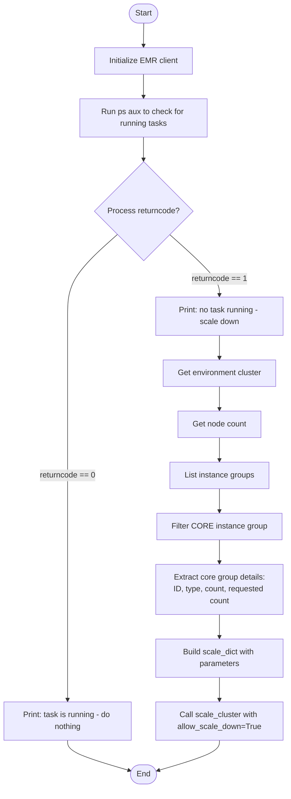
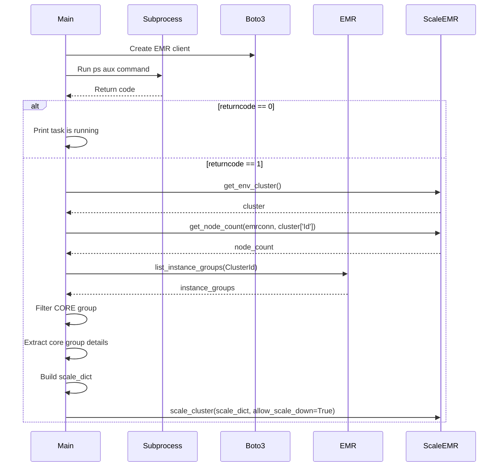

# Diagram: research/orchestrator/scripts/check_cluster_count.py

> Auto-generated by Obscura crawlers

## Diagram 1

### SVG

<svg id="container" width="586" xmlns="http://www.w3.org/2000/svg" class="flowchart" height="1601.8125" viewBox="0 0 586 1601.8125" role="graphics-document document" aria-roledescription="flowchart-v2"><g><marker id="container_flowchart-v2-pointEnd" class="marker flowchart-v2" viewBox="0 0 10 10" refX="5" refY="5" markerUnits="userSpaceOnUse" markerWidth="8" markerHeight="8" orient="auto"><path d="M 0 0 L 10 5 L 0 10 z" class="arrowMarkerPath" style="stroke-width: 1; stroke-dasharray: 1, 0;"></path></marker><marker id="container_flowchart-v2-pointStart" class="marker flowchart-v2" viewBox="0 0 10 10" refX="4.5" refY="5" markerUnits="userSpaceOnUse" markerWidth="8" markerHeight="8" orient="auto"><path d="M 0 5 L 10 10 L 10 0 z" class="arrowMarkerPath" style="stroke-width: 1; stroke-dasharray: 1, 0;"></path></marker><marker id="container_flowchart-v2-circleEnd" class="marker flowchart-v2" viewBox="0 0 10 10" refX="11" refY="5" markerUnits="userSpaceOnUse" markerWidth="11" markerHeight="11" orient="auto"><circle cx="5" cy="5" r="5" class="arrowMarkerPath" style="stroke-width: 1; stroke-dasharray: 1, 0;"></circle></marker><marker id="container_flowchart-v2-circleStart" class="marker flowchart-v2" viewBox="0 0 10 10" refX="-1" refY="5" markerUnits="userSpaceOnUse" markerWidth="11" markerHeight="11" orient="auto"><circle cx="5" cy="5" r="5" class="arrowMarkerPath" style="stroke-width: 1; stroke-dasharray: 1, 0;"></circle></marker><marker id="container_flowchart-v2-crossEnd" class="marker cross flowchart-v2" viewBox="0 0 11 11" refX="12" refY="5.2" markerUnits="userSpaceOnUse" markerWidth="11" markerHeight="11" orient="auto"><path d="M 1,1 l 9,9 M 10,1 l -9,9" class="arrowMarkerPath" style="stroke-width: 2; stroke-dasharray: 1, 0;"></path></marker><marker id="container_flowchart-v2-crossStart" class="marker cross flowchart-v2" viewBox="0 0 11 11" refX="-1" refY="5.2" markerUnits="userSpaceOnUse" markerWidth="11" markerHeight="11" orient="auto"><path d="M 1,1 l 9,9 M 10,1 l -9,9" class="arrowMarkerPath" style="stroke-width: 2; stroke-dasharray: 1, 0;"></path></marker><g class="root"><g class="clusters"></g><g class="edgePaths"><path d="M293.5,47.5L293.417,51.583C293.333,55.667,293.167,63.833,293.083,71.417C293,79,293,86,293,89.5L293,93" id="L_Start_InitEMR_0" class="edge-thickness-normal edge-pattern-solid edge-thickness-normal edge-pattern-solid flowchart-link" style=";" data-edge="true" data-et="edge" data-id="L_Start_InitEMR_0" data-points="W3sieCI6MjkzLjUsInkiOjQ3LjV9LHsieCI6MjkzLCJ5Ijo3Mn0seyJ4IjoyOTMsInkiOjk3fV0=" marker-end="url(#container_flowchart-v2-pointEnd)"></path><path d="M293,151L293,155.167C293,159.333,293,167.667,293,175.333C293,183,293,190,293,193.5L293,197" id="L_InitEMR_CheckProcess_0" class="edge-thickness-normal edge-pattern-solid edge-thickness-normal edge-pattern-solid flowchart-link" style=";" data-edge="true" data-et="edge" data-id="L_InitEMR_CheckProcess_0" data-points="W3sieCI6MjkzLCJ5IjoxNTF9LHsieCI6MjkzLCJ5IjoxNzZ9LHsieCI6MjkzLCJ5IjoyMDF9XQ==" marker-end="url(#container_flowchart-v2-pointEnd)"></path><path d="M293,279L293,283.167C293,287.333,293,295.667,293,303.333C293,311,293,318,293,321.5L293,325" id="L_CheckProcess_Decision_0" class="edge-thickness-normal edge-pattern-solid edge-thickness-normal edge-pattern-solid flowchart-link" style=";" data-edge="true" data-et="edge" data-id="L_CheckProcess_Decision_0" data-points="W3sieCI6MjkzLCJ5IjoyNzl9LHsieCI6MjkzLCJ5IjozMDR9LHsieCI6MjkzLCJ5IjozMjl9XQ==" marker-end="url(#container_flowchart-v2-pointEnd)"></path><path d="M239.951,475.763L222.959,490.771C205.967,505.78,171.984,535.796,154.992,563.471C138,591.146,138,616.479,138,639.813C138,663.146,138,684.479,138,703.813C138,723.146,138,740.479,138,757.813C138,775.146,138,792.479,138,809.813C138,827.146,138,844.479,138,861.813C138,879.146,138,896.479,138,913.813C138,931.146,138,948.479,138,965.813C138,983.146,138,1000.479,138,1017.813C138,1035.146,138,1052.479,138,1069.813C138,1087.146,138,1104.479,138,1125.813C138,1147.146,138,1172.479,138,1197.813C138,1223.146,138,1248.479,138,1271.813C138,1295.146,138,1316.479,138,1337.813C138,1359.146,138,1380.479,138,1394.646C138,1408.813,138,1415.813,138,1419.313L138,1422.813" id="L_Decision_TaskRunning_0" class="edge-thickness-normal edge-pattern-solid edge-thickness-normal edge-pattern-solid flowchart-link" style=";" data-edge="true" data-et="edge" data-id="L_Decision_TaskRunning_0" data-points="W3sieCI6MjM5Ljk1MDU0MDYyNzM0MTg0LCJ5Ijo0NzUuNzYzMDQwNjI3MzQxOH0seyJ4IjoxMzgsInkiOjU2NS44MTI1fSx7IngiOjEzOCwieSI6NjQxLjgxMjV9LHsieCI6MTM4LCJ5Ijo3MDUuODEyNX0seyJ4IjoxMzgsInkiOjc1Ny44MTI1fSx7IngiOjEzOCwieSI6ODA5LjgxMjV9LHsieCI6MTM4LCJ5Ijo4NjEuODEyNX0seyJ4IjoxMzgsInkiOjkxMy44MTI1fSx7IngiOjEzOCwieSI6OTY1LjgxMjV9LHsieCI6MTM4LCJ5IjoxMDE3LjgxMjV9LHsieCI6MTM4LCJ5IjoxMDY5LjgxMjV9LHsieCI6MTM4LCJ5IjoxMTIxLjgxMjV9LHsieCI6MTM4LCJ5IjoxMTk3LjgxMjV9LHsieCI6MTM4LCJ5IjoxMjczLjgxMjV9LHsieCI6MTM4LCJ5IjoxMzM3LjgxMjV9LHsieCI6MTM4LCJ5IjoxNDAxLjgxMjV9LHsieCI6MTM4LCJ5IjoxNDI2LjgxMjV9XQ==" marker-end="url(#container_flowchart-v2-pointEnd)"></path><path d="M346.049,475.763L363.041,490.771C380.033,505.78,414.016,535.796,431.008,556.304C448,576.813,448,587.813,448,593.313L448,598.813" id="L_Decision_NoTask_0" class="edge-thickness-normal edge-pattern-solid edge-thickness-normal edge-pattern-solid flowchart-link" style=";" data-edge="true" data-et="edge" data-id="L_Decision_NoTask_0" data-points="W3sieCI6MzQ2LjA0OTQ1OTM3MjY1ODIsInkiOjQ3NS43NjMwNDA2MjczNDE4fSx7IngiOjQ0OCwieSI6NTY1LjgxMjV9LHsieCI6NDQ4LCJ5Ijo2MDIuODEyNX1d" marker-end="url(#container_flowchart-v2-pointEnd)"></path><path d="M138,1504.813L138,1508.979C138,1513.146,138,1521.479,159.158,1531.778C180.316,1542.077,222.633,1554.341,243.791,1560.473L264.949,1566.605" id="L_TaskRunning_End_0" class="edge-thickness-normal edge-pattern-solid edge-thickness-normal edge-pattern-solid flowchart-link" style=";" data-edge="true" data-et="edge" data-id="L_TaskRunning_End_0" data-points="W3sieCI6MTM4LCJ5IjoxNTA0LjgxMjV9LHsieCI6MTM4LCJ5IjoxNTI5LjgxMjV9LHsieCI6MjY4Ljc5MDY2NDI5NDI2MjM0LCJ5IjoxNTY3LjcxODUyOTQyNjQxNzN9XQ==" marker-end="url(#container_flowchart-v2-pointEnd)"></path><path d="M448,680.813L448,684.979C448,689.146,448,697.479,448,705.146C448,712.813,448,719.813,448,723.313L448,726.813" id="L_NoTask_GetCluster_0" class="edge-thickness-normal edge-pattern-solid edge-thickness-normal edge-pattern-solid flowchart-link" style=";" data-edge="true" data-et="edge" data-id="L_NoTask_GetCluster_0" data-points="W3sieCI6NDQ4LCJ5Ijo2ODAuODEyNX0seyJ4Ijo0NDgsInkiOjcwNS44MTI1fSx7IngiOjQ0OCwieSI6NzMwLjgxMjV9XQ==" marker-end="url(#container_flowchart-v2-pointEnd)"></path><path d="M448,784.813L448,788.979C448,793.146,448,801.479,448,809.146C448,816.813,448,823.813,448,827.313L448,830.813" id="L_GetCluster_GetNodeCount_0" class="edge-thickness-normal edge-pattern-solid edge-thickness-normal edge-pattern-solid flowchart-link" style=";" data-edge="true" data-et="edge" data-id="L_GetCluster_GetNodeCount_0" data-points="W3sieCI6NDQ4LCJ5Ijo3ODQuODEyNX0seyJ4Ijo0NDgsInkiOjgwOS44MTI1fSx7IngiOjQ0OCwieSI6ODM0LjgxMjV9XQ==" marker-end="url(#container_flowchart-v2-pointEnd)"></path><path d="M448,888.813L448,892.979C448,897.146,448,905.479,448,913.146C448,920.813,448,927.813,448,931.313L448,934.813" id="L_GetNodeCount_ListGroups_0" class="edge-thickness-normal edge-pattern-solid edge-thickness-normal edge-pattern-solid flowchart-link" style=";" data-edge="true" data-et="edge" data-id="L_GetNodeCount_ListGroups_0" data-points="W3sieCI6NDQ4LCJ5Ijo4ODguODEyNX0seyJ4Ijo0NDgsInkiOjkxMy44MTI1fSx7IngiOjQ0OCwieSI6OTM4LjgxMjV9XQ==" marker-end="url(#container_flowchart-v2-pointEnd)"></path><path d="M448,992.813L448,996.979C448,1001.146,448,1009.479,448,1017.146C448,1024.813,448,1031.813,448,1035.313L448,1038.813" id="L_ListGroups_FilterCore_0" class="edge-thickness-normal edge-pattern-solid edge-thickness-normal edge-pattern-solid flowchart-link" style=";" data-edge="true" data-et="edge" data-id="L_ListGroups_FilterCore_0" data-points="W3sieCI6NDQ4LCJ5Ijo5OTIuODEyNX0seyJ4Ijo0NDgsInkiOjEwMTcuODEyNX0seyJ4Ijo0NDgsInkiOjEwNDIuODEyNX1d" marker-end="url(#container_flowchart-v2-pointEnd)"></path><path d="M448,1096.813L448,1100.979C448,1105.146,448,1113.479,448,1121.146C448,1128.813,448,1135.813,448,1139.313L448,1142.813" id="L_FilterCore_ExtractInfo_0" class="edge-thickness-normal edge-pattern-solid edge-thickness-normal edge-pattern-solid flowchart-link" style=";" data-edge="true" data-et="edge" data-id="L_FilterCore_ExtractInfo_0" data-points="W3sieCI6NDQ4LCJ5IjoxMDk2LjgxMjV9LHsieCI6NDQ4LCJ5IjoxMTIxLjgxMjV9LHsieCI6NDQ4LCJ5IjoxMTQ2LjgxMjV9XQ==" marker-end="url(#container_flowchart-v2-pointEnd)"></path><path d="M448,1248.813L448,1252.979C448,1257.146,448,1265.479,448,1273.146C448,1280.813,448,1287.813,448,1291.313L448,1294.813" id="L_ExtractInfo_BuildDict_0" class="edge-thickness-normal edge-pattern-solid edge-thickness-normal edge-pattern-solid flowchart-link" style=";" data-edge="true" data-et="edge" data-id="L_ExtractInfo_BuildDict_0" data-points="W3sieCI6NDQ4LCJ5IjoxMjQ4LjgxMjV9LHsieCI6NDQ4LCJ5IjoxMjczLjgxMjV9LHsieCI6NDQ4LCJ5IjoxMjk4LjgxMjV9XQ==" marker-end="url(#container_flowchart-v2-pointEnd)"></path><path d="M448,1376.813L448,1380.979C448,1385.146,448,1393.479,448,1401.146C448,1408.813,448,1415.813,448,1419.313L448,1422.813" id="L_BuildDict_ScaleDown_0" class="edge-thickness-normal edge-pattern-solid edge-thickness-normal edge-pattern-solid flowchart-link" style=";" data-edge="true" data-et="edge" data-id="L_BuildDict_ScaleDown_0" data-points="W3sieCI6NDQ4LCJ5IjoxMzc2LjgxMjV9LHsieCI6NDQ4LCJ5IjoxNDAxLjgxMjV9LHsieCI6NDQ4LCJ5IjoxNDI2LjgxMjV9XQ==" marker-end="url(#container_flowchart-v2-pointEnd)"></path><path d="M448,1504.813L448,1508.979C448,1513.146,448,1521.479,427.008,1531.777C406.016,1542.074,364.033,1554.336,343.041,1560.466L322.049,1566.597" id="L_ScaleDown_End_0" class="edge-thickness-normal edge-pattern-solid edge-thickness-normal edge-pattern-solid flowchart-link" style=";" data-edge="true" data-et="edge" data-id="L_ScaleDown_End_0" data-points="W3sieCI6NDQ4LCJ5IjoxNTA0LjgxMjV9LHsieCI6NDQ4LCJ5IjoxNTI5LjgxMjV9LHsieCI6MzE4LjIwOTMzNjYzNDQxNDIsInkiOjE1NjcuNzE4NTI5MTU5Nzk3M31d" marker-end="url(#container_flowchart-v2-pointEnd)"></path></g><g class="edgeLabels"><g class="edgeLabel"><g class="label" data-id="L_Start_InitEMR_0" transform="translate(0, 0)"><foreignObject width="0" height="0">

</foreignObject></g></g><g class="edgeLabel"><g class="label" data-id="L_InitEMR_CheckProcess_0" transform="translate(0, 0)"><foreignObject width="0" height="0">

</foreignObject></g></g><g class="edgeLabel"><g class="label" data-id="L_CheckProcess_Decision_0" transform="translate(0, 0)"><foreignObject width="0" height="0">

</foreignObject></g></g><g class="edgeLabel" transform="translate(138, 965.8125)"><g class="label" data-id="L_Decision_TaskRunning_0" transform="translate(-56.71875, -12)"><foreignObject width="113.4375" height="24">

returncode == 0

</foreignObject></g></g><g class="edgeLabel" transform="translate(448, 565.8125)"><g class="label" data-id="L_Decision_NoTask_0" transform="translate(-55.71875, -12)"><foreignObject width="111.4375" height="24">

returncode == 1

</foreignObject></g></g><g class="edgeLabel"><g class="label" data-id="L_TaskRunning_End_0" transform="translate(0, 0)"><foreignObject width="0" height="0">

</foreignObject></g></g><g class="edgeLabel"><g class="label" data-id="L_NoTask_GetCluster_0" transform="translate(0, 0)"><foreignObject width="0" height="0">

</foreignObject></g></g><g class="edgeLabel"><g class="label" data-id="L_GetCluster_GetNodeCount_0" transform="translate(0, 0)"><foreignObject width="0" height="0">

</foreignObject></g></g><g class="edgeLabel"><g class="label" data-id="L_GetNodeCount_ListGroups_0" transform="translate(0, 0)"><foreignObject width="0" height="0">

</foreignObject></g></g><g class="edgeLabel"><g class="label" data-id="L_ListGroups_FilterCore_0" transform="translate(0, 0)"><foreignObject width="0" height="0">

</foreignObject></g></g><g class="edgeLabel"><g class="label" data-id="L_FilterCore_ExtractInfo_0" transform="translate(0, 0)"><foreignObject width="0" height="0">

</foreignObject></g></g><g class="edgeLabel"><g class="label" data-id="L_ExtractInfo_BuildDict_0" transform="translate(0, 0)"><foreignObject width="0" height="0">

</foreignObject></g></g><g class="edgeLabel"><g class="label" data-id="L_BuildDict_ScaleDown_0" transform="translate(0, 0)"><foreignObject width="0" height="0">

</foreignObject></g></g><g class="edgeLabel"><g class="label" data-id="L_ScaleDown_End_0" transform="translate(0, 0)"><foreignObject width="0" height="0">

</foreignObject></g></g></g><g class="nodes"><g class="node default" id="flowchart-Start-0" transform="translate(293, 27.5)"><g class="basic label-container outer-path"><path d="M-10.3984375 -19.5 C-2.940581381540179 -19.5, 4.517274736919642 -19.5, 10.3984375 -19.5 C10.3984375 -19.5, 10.3984375 -19.5, 10.398437499999998 -19.5 C10.669880476272324 -19.49129535208265, 10.94132345254465 -19.482590704165297, 11.6478067896239 -19.45993515863156 C12.133967442486925 -19.41303582514359, 12.620128095349951 -19.366136491655624, 12.892042152847864 -19.3399052695533 C13.377058357600456 -19.261491610925745, 13.862074562353047 -19.18307795229819, 14.126030759676757 -19.140403561325776 C14.542330079301637 -19.045385958228337, 14.958629398926515 -18.950368355130898, 15.34470188623539 -18.862249829261074 C15.634535537353926 -18.776228722976974, 15.924369188472461 -18.690207616692874, 16.543047751460602 -18.50658706670804 C16.78412382873049 -18.417868841789893, 17.025199906000374 -18.329150616871743, 17.716144095147794 -18.074876768247425 C17.962863674697697 -17.965661329056978, 18.2095832542476 -17.856445889866528, 18.85917041279238 -17.568892924097174 C19.237894792532984 -17.371312657771043, 19.616619172273587 -17.173732391444915, 19.967429764076783 -16.990714730406097 C20.225397392817523 -16.834333237877402, 20.48336502155826 -16.677951745348707, 21.036368073605697 -16.342718045390892 C21.275891090206127 -16.175637157794707, 21.515414106806553 -16.008556270198522, 22.061592844578712 -15.627565626425154 C22.283109383783742 -15.450912081211815, 22.504625922988776 -15.274258535998477, 23.03889120850187 -14.848196188198123 C23.273308774427615 -14.635304357173279, 23.507726340353358 -14.422412526148435, 23.964247236767985 -14.007812326905688 C24.218385725000147 -13.745393472648058, 24.472524213232308 -13.482974618390427, 24.833858442968648 -13.10986736009568 C25.021367383913766 -12.889608688500552, 25.208876324858885 -12.66935001690542, 25.644151408126582 -12.158051136245305 C25.894581120200318 -11.822498136682606, 26.145010832274057 -11.486945137119909, 26.391796464640635 -11.156274872382312 C26.645120491192657 -10.767101140572597, 26.89844451774468 -10.377927408762883, 27.073721378604247 -10.108655082055241 C27.313119184611157 -9.683580035833442, 27.552516990618063 -9.258504989611643, 27.6871239742735 -9.019496659696287 C27.85208128421559 -8.67695927608052, 28.017038594157682 -8.334421892464755, 28.22948364880834 -7.893275190886684 C28.34354863018501 -7.611532481589923, 28.45761361156168 -7.329789772293162, 28.698571729970325 -6.734618561215508 C28.804639703910713 -6.415158723343688, 28.910707677851104 -6.095698885471868, 29.09246063421488 -5.548287939305138 C29.19478049718591 -5.15809795608747, 29.297100360156943 -4.767907972869803, 29.40953178754556 -4.339158212148133 C29.468080101818718 -4.0385249925460736, 29.526628416091874 -3.7378917729440144, 29.648482276581777 -3.1121979531509023 C29.69805121795799 -2.727751032331635, 29.7476201593342 -2.343304111512368, 29.808330202509367 -1.872449005199798 C29.829016627609366 -1.5502412364854898, 29.849703052709366 -1.2280334677711817, 29.888418715913414 -0.6250057626472757 C29.888418715913414 -0.2580525866858733, 29.888418715913414 0.10890058927552915, 29.888418715913414 0.625005762647271 C29.872271657219514 0.876509235475938, 29.856124598525614 1.1280127083046048, 29.808330202509367 1.8724490051997846 C29.761417767314423 2.2362925886636162, 29.71450533211948 2.600136172127448, 29.648482276581777 3.1121979531508885 C29.57428338881638 3.4931935598857327, 29.500084501050978 3.8741891666205768, 29.40953178754556 4.339158212148129 C29.28997698906362 4.795072474137198, 29.17042219058168 5.250986736126267, 29.092460634214884 5.548287939305125 C28.9701741549516 5.916595331141608, 28.847887675688312 6.284902722978092, 28.69857172997033 6.734618561215495 C28.52466023524391 7.164183315539761, 28.350748740517492 7.593748069864027, 28.229483648808344 7.893275190886679 C28.08560576434533 8.192040696467688, 27.94172787988232 8.490806202048697, 27.687123974273504 9.019496659696284 C27.462951957450176 9.417536775444294, 27.23877994062685 9.815576891192304, 27.07372137860425 10.108655082055236 C26.920447037267195 10.344125630272535, 26.76717269593014 10.579596178489833, 26.39179646464064 11.156274872382301 C26.196378025148398 11.418117778315827, 26.000959585656158 11.679960684249354, 25.644151408126582 12.158051136245302 C25.477176834778238 12.354188971222646, 25.310202261429893 12.55032680619999, 24.83385844296866 13.10986736009567 C24.587188365223852 13.364574467357201, 24.340518287479046 13.619281574618732, 23.96424723676799 14.007812326905684 C23.735763356656346 14.215315341470886, 23.507279476544703 14.422818356036087, 23.038891208501887 14.848196188198111 C22.7850878908303 15.050597580051269, 22.53128457315871 15.252998971904429, 22.061592844578715 15.627565626425152 C21.826767999703073 15.791369272806705, 21.59194315482743 15.955172919188255, 21.036368073605708 16.34271804539089 C20.706003845208613 16.54298678208091, 20.37563961681152 16.74325551877093, 19.967429764076787 16.990714730406093 C19.551237075153782 17.207842189633084, 19.135044386230778 17.424969648860074, 18.859170412792388 17.56889292409717 C18.479280828867577 17.737058773876566, 18.099391244942762 17.905224623655965, 17.716144095147804 18.07487676824742 C17.294797502033592 18.229936209398662, 16.873450908919377 18.3849956505499, 16.543047751460616 18.506587066708033 C16.102660965588893 18.63729155311735, 15.66227417971717 18.76799603952667, 15.344701886235413 18.86224982926107 C15.05826527266696 18.927627117134485, 14.771828659098507 18.993004405007895, 14.126030759676766 19.140403561325773 C13.795775420014543 19.193796683473952, 13.46552008035232 19.247189805622128, 12.892042152847878 19.3399052695533 C12.538754266621815 19.37398652704668, 12.185466380395752 19.408067784540062, 11.6478067896239 19.45993515863156 C11.16609872868787 19.475382598557918, 10.68439066775184 19.490830038484276, 10.398437500000004 19.5 C10.398437500000002 19.5, 10.398437500000002 19.5, 10.3984375 19.5 C4.376103924190813 19.5, -1.6462296516183734 19.5, -10.398437499999996 19.5 C-10.840998939553371 19.48580791602711, -11.283560379106747 19.471615832054216, -11.647806789623893 19.45993515863156 C-11.974571734486405 19.428412537393015, -12.301336679348916 19.39688991615447, -12.892042152847871 19.3399052695533 C-13.171080755962658 19.294792472178386, -13.450119359077444 19.249679674803474, -14.126030759676759 19.140403561325773 C-14.60043713553108 19.032123401827942, -15.074843511385401 18.923843242330115, -15.344701886235388 18.862249829261074 C-15.680654599353547 18.762540827459382, -16.016607312471706 18.66283182565769, -16.54304775146059 18.506587066708043 C-16.828930396811575 18.401379610548677, -17.11481304216256 18.29617215438931, -17.716144095147797 18.074876768247425 C-17.95237004592351 17.970306547232873, -18.188595996699224 17.86573632621832, -18.85917041279238 17.568892924097174 C-19.2323491987354 17.374205790503122, -19.605527984678417 17.17951865690907, -19.96742976407678 16.990714730406097 C-20.38857876922465 16.735411728539187, -20.809727774372522 16.48010872667228, -21.036368073605686 16.3427180453909 C-21.275971577806175 16.175581013129165, -21.51557508200666 16.008443980867433, -22.061592844578712 15.627565626425156 C-22.340643981376758 15.40502977069133, -22.619695118174803 15.182493914957504, -23.03889120850187 14.848196188198125 C-23.32593721107995 14.587508603477758, -23.612983213658026 14.326821018757391, -23.964247236767974 14.007812326905697 C-24.267193059631193 13.694995892484805, -24.570138882494415 13.382179458063913, -24.833858442968655 13.109867360095677 C-25.147614503679815 12.741311637958733, -25.461370564390975 12.372755915821788, -25.64415140812658 12.158051136245307 C-25.828712227859587 11.910756451639648, -26.013273047592595 11.663461767033986, -26.391796464640635 11.156274872382316 C-26.62779008573134 10.793725297226649, -26.863783706822048 10.431175722070982, -27.073721378604244 10.108655082055249 C-27.22427877930963 9.841325171512839, -27.374836180015016 9.573995260970431, -27.6871239742735 9.019496659696289 C-27.798612661030223 8.787988016170202, -27.91010134778695 8.556479372644116, -28.22948364880834 7.893275190886686 C-28.342409837558883 7.614345321393512, -28.45533602630943 7.335415451900338, -28.698571729970325 6.73461856121551 C-28.787784721317536 6.465923245437559, -28.876997712664746 6.197227929659609, -29.09246063421488 5.5482879393051325 C-29.167036904911615 5.263896297578301, -29.241613175608354 4.9795046558514695, -29.409531787545557 4.339158212148136 C-29.471652481499 4.020181577910523, -29.533773175452446 3.70120494367291, -29.648482276581777 3.112197953150904 C-29.692861622167275 2.768000512482802, -29.737240967752776 2.4238030718147003, -29.808330202509364 1.872449005199809 C-29.828359506196175 1.5604764329147858, -29.848388809882987 1.2485038606297625, -29.888418715913414 0.6250057626472781 C-29.888418715913414 0.2711131113525538, -29.888418715913414 -0.08277953994217058, -29.888418715913414 -0.6250057626472687 C-29.861926019435078 -1.0376508948170298, -29.835433322956746 -1.4502960269867908, -29.808330202509367 -1.8724490051997822 C-29.764467779119716 -2.212637299394714, -29.72060535573007 -2.5528255935896453, -29.648482276581777 -3.112197953150895 C-29.580025173633622 -3.4637107083758387, -29.511568070685467 -3.8152234636007822, -29.40953178754556 -4.339158212148126 C-29.297760675739706 -4.765389903370131, -29.185989563933852 -5.191621594592136, -29.092460634214884 -5.548287939305123 C-28.947860880981473 -5.983799357202217, -28.803261127748062 -6.419310775099311, -28.698571729970332 -6.734618561215485 C-28.603350443049663 -6.969816980887878, -28.508129156128994 -7.2050154005602725, -28.229483648808344 -7.893275190886676 C-28.10046569117166 -8.161183740461311, -27.97144773353498 -8.429092290035946, -27.687123974273504 -9.019496659696282 C-27.476160446842428 -9.394083765023767, -27.265196919411352 -9.768670870351253, -27.073721378604247 -10.108655082055243 C-26.831187035314482 -10.4812529629385, -26.588652692024716 -10.853850843821757, -26.39179646464064 -11.156274872382308 C-26.119754653953287 -11.520786115184567, -25.847712843265928 -11.885297357986826, -25.644151408126586 -12.158051136245302 C-25.4496613312162 -12.386510247383129, -25.25517125430581 -12.614969358520954, -24.833858442968662 -13.10986736009567 C-24.642607119741673 -13.307350053353192, -24.451355796514683 -13.504832746610711, -23.964247236767996 -14.007812326905677 C-23.72240258742797 -14.227449238577515, -23.48055793808794 -14.447086150249353, -23.038891208501887 -14.848196188198107 C-22.77203082417171 -15.061010243248354, -22.505170439841535 -15.273824298298603, -22.06159284457872 -15.627565626425149 C-21.778658430392575 -15.824928425728018, -21.495724016206427 -16.022291225030887, -21.03636807360571 -16.342718045390885 C-20.685724062434105 -16.555280505576047, -20.335080051262498 -16.767842965761208, -19.96742976407679 -16.99071473040609 C-19.581916853467746 -17.191836568938026, -19.196403942858698 -17.392958407469962, -18.859170412792388 -17.56889292409717 C-18.621371918860227 -17.674159263319247, -18.38357342492807 -17.77942560254132, -17.716144095147804 -18.07487676824742 C-17.344694478157315 -18.21157366094254, -16.973244861166826 -18.348270553637658, -16.54304775146062 -18.506587066708033 C-16.268363873543162 -18.588111799828837, -15.993679995625703 -18.66963653294964, -15.344701886235413 -18.862249829261067 C-15.077164006637735 -18.923313604431414, -14.809626127040058 -18.984377379601764, -14.126030759676768 -19.140403561325773 C-13.668633822996428 -19.21435195088203, -13.211236886316089 -19.288300340438287, -12.89204215284788 -19.3399052695533 C-12.428087440889254 -19.38466242262877, -11.964132728930625 -19.42941957570424, -11.647806789623903 -19.45993515863156 C-11.276059114120836 -19.471856383021986, -10.904311438617768 -19.483777607412417, -10.398437500000005 -19.5 C-10.398437500000004 -19.5, -10.398437500000002 -19.5, -10.3984375 -19.5" stroke="none" stroke-width="0" fill="#ECECFF" style=""></path><path d="M-10.3984375 -19.5 C-2.7171861531901023 -19.5, 4.9640651936197955 -19.5, 10.3984375 -19.5 M-10.3984375 -19.5 C-3.2761949946254507 -19.5, 3.8460475107490986 -19.5, 10.3984375 -19.5 M10.3984375 -19.5 C10.3984375 -19.5, 10.398437499999998 -19.5, 10.398437499999998 -19.5 M10.3984375 -19.5 C10.3984375 -19.5, 10.398437499999998 -19.5, 10.398437499999998 -19.5 M10.398437499999998 -19.5 C10.666138386488985 -19.491415353618464, 10.933839272977972 -19.48283070723693, 11.6478067896239 -19.45993515863156 M10.398437499999998 -19.5 C10.70873440029413 -19.490049382363843, 11.01903130058826 -19.48009876472769, 11.6478067896239 -19.45993515863156 M11.6478067896239 -19.45993515863156 C12.107699630963417 -19.4155698493296, 12.567592472302934 -19.371204540027637, 12.892042152847864 -19.3399052695533 M11.6478067896239 -19.45993515863156 C11.971798252896647 -19.42868009182638, 12.295789716169395 -19.3974250250212, 12.892042152847864 -19.3399052695533 M12.892042152847864 -19.3399052695533 C13.356179707559878 -19.264867109147957, 13.820317262271892 -19.189828948742612, 14.126030759676757 -19.140403561325776 M12.892042152847864 -19.3399052695533 C13.213093811897588 -19.28800012711094, 13.534145470947314 -19.236094984668583, 14.126030759676757 -19.140403561325776 M14.126030759676757 -19.140403561325776 C14.470369166976104 -19.061810566877803, 14.814707574275449 -18.98321757242983, 15.34470188623539 -18.862249829261074 M14.126030759676757 -19.140403561325776 C14.409638299907124 -19.075671990980354, 14.693245840137491 -19.010940420634928, 15.34470188623539 -18.862249829261074 M15.34470188623539 -18.862249829261074 C15.68713313827938 -18.760618031112738, 16.029564390323372 -18.658986232964406, 16.543047751460602 -18.50658706670804 M15.34470188623539 -18.862249829261074 C15.664477924289873 -18.76734197970518, 15.984253962344356 -18.672434130149288, 16.543047751460602 -18.50658706670804 M16.543047751460602 -18.50658706670804 C16.836784923263245 -18.398489072208015, 17.13052209506589 -18.29039107770799, 17.716144095147794 -18.074876768247425 M16.543047751460602 -18.50658706670804 C16.869303514168138 -18.386521930156455, 17.195559276875677 -18.26645679360487, 17.716144095147794 -18.074876768247425 M17.716144095147794 -18.074876768247425 C17.945188181014505 -17.973485745785634, 18.17423226688122 -17.872094723323844, 18.85917041279238 -17.568892924097174 M17.716144095147794 -18.074876768247425 C17.965263581730316 -17.96459896140435, 18.214383068312834 -17.854321154561276, 18.85917041279238 -17.568892924097174 M18.85917041279238 -17.568892924097174 C19.232770162195173 -17.373986174135798, 19.60636991159797 -17.17907942417442, 19.967429764076783 -16.990714730406097 M18.85917041279238 -17.568892924097174 C19.106429253804855 -17.439898145117812, 19.353688094817333 -17.31090336613845, 19.967429764076783 -16.990714730406097 M19.967429764076783 -16.990714730406097 C20.3236314530645 -16.77478317326827, 20.679833142052217 -16.558851616130436, 21.036368073605697 -16.342718045390892 M19.967429764076783 -16.990714730406097 C20.316189475953188 -16.779294543527058, 20.66494918782959 -16.56787435664802, 21.036368073605697 -16.342718045390892 M21.036368073605697 -16.342718045390892 C21.32428901741522 -16.141876858886143, 21.612209961224746 -15.941035672381394, 22.061592844578712 -15.627565626425154 M21.036368073605697 -16.342718045390892 C21.373415216222433 -16.107608549237103, 21.71046235883917 -15.872499053083315, 22.061592844578712 -15.627565626425154 M22.061592844578712 -15.627565626425154 C22.37869728724841 -15.374683271899684, 22.695801729918106 -15.121800917374214, 23.03889120850187 -14.848196188198123 M22.061592844578712 -15.627565626425154 C22.424349594033533 -15.338276772097451, 22.787106343488357 -15.048987917769749, 23.03889120850187 -14.848196188198123 M23.03889120850187 -14.848196188198123 C23.392679386658045 -14.526895125518928, 23.746467564814218 -14.205594062839733, 23.964247236767985 -14.007812326905688 M23.03889120850187 -14.848196188198123 C23.271773589884052 -14.636698571156984, 23.504655971266235 -14.425200954115846, 23.964247236767985 -14.007812326905688 M23.964247236767985 -14.007812326905688 C24.140103966548047 -13.826225815301745, 24.31596069632811 -13.644639303697804, 24.833858442968648 -13.10986736009568 M23.964247236767985 -14.007812326905688 C24.24757810267608 -13.715249945958877, 24.53090896858417 -13.422687565012067, 24.833858442968648 -13.10986736009568 M24.833858442968648 -13.10986736009568 C25.13694909056625 -12.75383983908112, 25.440039738163858 -12.39781231806656, 25.644151408126582 -12.158051136245305 M24.833858442968648 -13.10986736009568 C25.115365122785523 -12.779193595798926, 25.396871802602394 -12.448519831502171, 25.644151408126582 -12.158051136245305 M25.644151408126582 -12.158051136245305 C25.843514388623547 -11.890922904720531, 26.042877369120507 -11.623794673195757, 26.391796464640635 -11.156274872382312 M25.644151408126582 -12.158051136245305 C25.88138366134834 -11.840181529231021, 26.1186159145701 -11.522311922216739, 26.391796464640635 -11.156274872382312 M26.391796464640635 -11.156274872382312 C26.538888716514915 -10.9303016737033, 26.68598096838919 -10.704328475024285, 27.073721378604247 -10.108655082055241 M26.391796464640635 -11.156274872382312 C26.601649890318768 -10.833883657005668, 26.811503315996898 -10.511492441629025, 27.073721378604247 -10.108655082055241 M27.073721378604247 -10.108655082055241 C27.278156695720288 -9.745659475195081, 27.482592012836328 -9.38266386833492, 27.6871239742735 -9.019496659696287 M27.073721378604247 -10.108655082055241 C27.277336608745316 -9.747115622661955, 27.480951838886384 -9.385576163268667, 27.6871239742735 -9.019496659696287 M27.6871239742735 -9.019496659696287 C27.81616798648339 -8.75153400724291, 27.94521199869328 -8.483571354789532, 28.22948364880834 -7.893275190886684 M27.6871239742735 -9.019496659696287 C27.875667163724028 -8.627982692624277, 28.064210353174555 -8.236468725552268, 28.22948364880834 -7.893275190886684 M28.22948364880834 -7.893275190886684 C28.403804950598225 -7.46269820519258, 28.57812625238811 -7.032121219498475, 28.698571729970325 -6.734618561215508 M28.22948364880834 -7.893275190886684 C28.372643493019115 -7.53966760787878, 28.515803337229887 -7.1860600248708755, 28.698571729970325 -6.734618561215508 M28.698571729970325 -6.734618561215508 C28.808140737526088 -6.404614167908133, 28.917709745081854 -6.0746097746007575, 29.09246063421488 -5.548287939305138 M28.698571729970325 -6.734618561215508 C28.81650553385838 -6.379420734104581, 28.934439337746433 -6.0242229069936535, 29.09246063421488 -5.548287939305138 M29.09246063421488 -5.548287939305138 C29.19657739554522 -5.151245603862757, 29.300694156875558 -4.754203268420376, 29.40953178754556 -4.339158212148133 M29.09246063421488 -5.548287939305138 C29.162475238970732 -5.281291906849422, 29.232489843726587 -5.0142958743937065, 29.40953178754556 -4.339158212148133 M29.40953178754556 -4.339158212148133 C29.45962795907033 -4.08192495919806, 29.509724130595092 -3.8246917062479877, 29.648482276581777 -3.1121979531509023 M29.40953178754556 -4.339158212148133 C29.49834865088995 -3.883102390325406, 29.58716551423434 -3.4270465685026785, 29.648482276581777 -3.1121979531509023 M29.648482276581777 -3.1121979531509023 C29.703355973988234 -2.6866083921036092, 29.758229671394695 -2.261018831056316, 29.808330202509367 -1.872449005199798 M29.648482276581777 -3.1121979531509023 C29.69167694909692 -2.7771886028763437, 29.734871621612058 -2.442179252601785, 29.808330202509367 -1.872449005199798 M29.808330202509367 -1.872449005199798 C29.83165531912746 -1.5091414861777128, 29.854980435745556 -1.1458339671556275, 29.888418715913414 -0.6250057626472757 M29.808330202509367 -1.872449005199798 C29.835965935004104 -1.4420001644324976, 29.86360166749884 -1.0115513236651972, 29.888418715913414 -0.6250057626472757 M29.888418715913414 -0.6250057626472757 C29.888418715913414 -0.1410525960295041, 29.888418715913414 0.3429005705882675, 29.888418715913414 0.625005762647271 M29.888418715913414 -0.6250057626472757 C29.888418715913414 -0.16453616150963607, 29.888418715913414 0.29593343962800356, 29.888418715913414 0.625005762647271 M29.888418715913414 0.625005762647271 C29.872350077455444 0.8752877770016823, 29.85628143899747 1.1255697913560934, 29.808330202509367 1.8724490051997846 M29.888418715913414 0.625005762647271 C29.86659951982699 0.96485735383141, 29.844780323740565 1.3047089450155491, 29.808330202509367 1.8724490051997846 M29.808330202509367 1.8724490051997846 C29.750671825700163 2.319635989797647, 29.693013448890955 2.766822974395509, 29.648482276581777 3.1121979531508885 M29.808330202509367 1.8724490051997846 C29.75620412185769 2.276728593275302, 29.70407804120601 2.681008181350819, 29.648482276581777 3.1121979531508885 M29.648482276581777 3.1121979531508885 C29.55999384171727 3.5665673641428057, 29.471505406852764 4.020936775134723, 29.40953178754556 4.339158212148129 M29.648482276581777 3.1121979531508885 C29.553219486351644 3.6013522471847814, 29.45795669612151 4.090506541218674, 29.40953178754556 4.339158212148129 M29.40953178754556 4.339158212148129 C29.287751613190206 4.803558796826536, 29.16597143883485 5.267959381504944, 29.092460634214884 5.548287939305125 M29.40953178754556 4.339158212148129 C29.313660742724867 4.704756056823099, 29.217789697904173 5.070353901498069, 29.092460634214884 5.548287939305125 M29.092460634214884 5.548287939305125 C28.972717542808883 5.9089350521492925, 28.852974451402883 6.269582164993459, 28.69857172997033 6.734618561215495 M29.092460634214884 5.548287939305125 C28.9857714434346 5.869618783321241, 28.87908225265432 6.190949627337357, 28.69857172997033 6.734618561215495 M28.69857172997033 6.734618561215495 C28.60137657519471 6.974692472651753, 28.504181420419094 7.214766384088011, 28.229483648808344 7.893275190886679 M28.69857172997033 6.734618561215495 C28.54363042864273 7.117326571080938, 28.388689127315132 7.500034580946381, 28.229483648808344 7.893275190886679 M28.229483648808344 7.893275190886679 C28.07072647071769 8.222937868051364, 27.911969292627038 8.552600545216048, 27.687123974273504 9.019496659696284 M28.229483648808344 7.893275190886679 C28.039667968976733 8.287431511461946, 27.84985228914512 8.681587832037215, 27.687123974273504 9.019496659696284 M27.687123974273504 9.019496659696284 C27.45509740978311 9.431483320186365, 27.22307084529272 9.843469980676447, 27.07372137860425 10.108655082055236 M27.687123974273504 9.019496659696284 C27.525166082432257 9.307069296675325, 27.36320819059101 9.594641933654366, 27.07372137860425 10.108655082055236 M27.07372137860425 10.108655082055236 C26.86145904307498 10.434747029846097, 26.64919670754571 10.760838977636956, 26.39179646464064 11.156274872382301 M27.07372137860425 10.108655082055236 C26.91236685659846 10.356538957612026, 26.75101233459267 10.604422833168815, 26.39179646464064 11.156274872382301 M26.39179646464064 11.156274872382301 C26.1590798346703 11.468093955621425, 25.92636320469996 11.779913038860549, 25.644151408126582 12.158051136245302 M26.39179646464064 11.156274872382301 C26.134401453034155 11.501160738767043, 25.877006441427667 11.846046605151784, 25.644151408126582 12.158051136245302 M25.644151408126582 12.158051136245302 C25.430531192615295 12.40898159671947, 25.216910977104007 12.659912057193637, 24.83385844296866 13.10986736009567 M25.644151408126582 12.158051136245302 C25.473774453220102 12.358185602201825, 25.303397498313625 12.55832006815835, 24.83385844296866 13.10986736009567 M24.83385844296866 13.10986736009567 C24.6119809891112 13.33897404768124, 24.390103535253736 13.56808073526681, 23.96424723676799 14.007812326905684 M24.83385844296866 13.10986736009567 C24.56812575448069 13.384258178018964, 24.302393065992725 13.658648995942258, 23.96424723676799 14.007812326905684 M23.96424723676799 14.007812326905684 C23.75632323093392 14.19664340763646, 23.548399225099846 14.385474488367233, 23.038891208501887 14.848196188198111 M23.96424723676799 14.007812326905684 C23.772409652399688 14.182034145284634, 23.58057206803139 14.356255963663584, 23.038891208501887 14.848196188198111 M23.038891208501887 14.848196188198111 C22.823059611904235 15.020316142964742, 22.607228015306582 15.192436097731372, 22.061592844578715 15.627565626425152 M23.038891208501887 14.848196188198111 C22.717909329061026 15.104170695365658, 22.396927449620165 15.360145202533205, 22.061592844578715 15.627565626425152 M22.061592844578715 15.627565626425152 C21.779527589854307 15.824322137712821, 21.497462335129896 16.02107864900049, 21.036368073605708 16.34271804539089 M22.061592844578715 15.627565626425152 C21.6979742763732 15.881210198811202, 21.33435570816768 16.13485477119725, 21.036368073605708 16.34271804539089 M21.036368073605708 16.34271804539089 C20.691709120493268 16.55165232820848, 20.34705016738083 16.76058661102607, 19.967429764076787 16.990714730406093 M21.036368073605708 16.34271804539089 C20.748350915028034 16.51731573949737, 20.460333756450364 16.69191343360385, 19.967429764076787 16.990714730406093 M19.967429764076787 16.990714730406093 C19.662006448445368 17.150053878538035, 19.35658313281395 17.309393026669976, 18.859170412792388 17.56889292409717 M19.967429764076787 16.990714730406093 C19.659011786471144 17.151616191771815, 19.350593808865504 17.312517653137533, 18.859170412792388 17.56889292409717 M18.859170412792388 17.56889292409717 C18.48404320811182 17.7349506098561, 18.108916003431258 17.90100829561503, 17.716144095147804 18.07487676824742 M18.859170412792388 17.56889292409717 C18.40926782394223 17.768051454295016, 17.959365235092072 17.967209984492865, 17.716144095147804 18.07487676824742 M17.716144095147804 18.07487676824742 C17.433665543609102 18.17883148641677, 17.151186992070397 18.282786204586117, 16.543047751460616 18.506587066708033 M17.716144095147804 18.07487676824742 C17.295706405092613 18.229601724671134, 16.875268715037425 18.384326681094844, 16.543047751460616 18.506587066708033 M16.543047751460616 18.506587066708033 C16.067580045046796 18.647703386190734, 15.59211233863298 18.78881970567344, 15.344701886235413 18.86224982926107 M16.543047751460616 18.506587066708033 C16.08784391581695 18.64168917571338, 15.632640080173285 18.776791284718733, 15.344701886235413 18.86224982926107 M15.344701886235413 18.86224982926107 C15.001104701939713 18.940673644395392, 14.657507517644014 19.019097459529714, 14.126030759676766 19.140403561325773 M15.344701886235413 18.86224982926107 C15.034366863432396 18.933081773090578, 14.724031840629381 19.003913716920085, 14.126030759676766 19.140403561325773 M14.126030759676766 19.140403561325773 C13.741528469494806 19.202566909742597, 13.357026179312847 19.264730258159425, 12.892042152847878 19.3399052695533 M14.126030759676766 19.140403561325773 C13.786552781225257 19.19528772819077, 13.44707480277375 19.250171895055768, 12.892042152847878 19.3399052695533 M12.892042152847878 19.3399052695533 C12.507211622499065 19.37702940798962, 12.122381092150253 19.414153546425947, 11.6478067896239 19.45993515863156 M12.892042152847878 19.3399052695533 C12.49986368750311 19.377738254441496, 12.10768522215834 19.415571239329697, 11.6478067896239 19.45993515863156 M11.6478067896239 19.45993515863156 C11.309386614339239 19.47078763495803, 10.970966439054576 19.481640111284495, 10.398437500000004 19.5 M11.6478067896239 19.45993515863156 C11.377722641792946 19.468596231565595, 11.107638493961993 19.47725730449963, 10.398437500000004 19.5 M10.398437500000004 19.5 C10.398437500000004 19.5, 10.398437500000002 19.5, 10.3984375 19.5 M10.398437500000004 19.5 C10.398437500000002 19.5, 10.398437500000002 19.5, 10.3984375 19.5 M10.3984375 19.5 C4.465117356515518 19.5, -1.4682027869689644 19.5, -10.398437499999996 19.5 M10.3984375 19.5 C4.3384266846654755 19.5, -1.721584130669049 19.5, -10.398437499999996 19.5 M-10.398437499999996 19.5 C-10.784710373694686 19.48761298077515, -11.170983247389376 19.475225961550297, -11.647806789623893 19.45993515863156 M-10.398437499999996 19.5 C-10.809447009992795 19.48681972499601, -11.220456519985593 19.47363944999202, -11.647806789623893 19.45993515863156 M-11.647806789623893 19.45993515863156 C-12.068772513561065 19.419325101528695, -12.489738237498235 19.37871504442583, -12.892042152847871 19.3399052695533 M-11.647806789623893 19.45993515863156 C-12.038625287377435 19.422233368181285, -12.42944378513098 19.384531577731014, -12.892042152847871 19.3399052695533 M-12.892042152847871 19.3399052695533 C-13.384142453857235 19.260346309180935, -13.876242754866597 19.180787348808572, -14.126030759676759 19.140403561325773 M-12.892042152847871 19.3399052695533 C-13.366674404182282 19.263170407985633, -13.841306655516695 19.186435546417968, -14.126030759676759 19.140403561325773 M-14.126030759676759 19.140403561325773 C-14.479724278313656 19.05967532376281, -14.833417796950554 18.97894708619985, -15.344701886235388 18.862249829261074 M-14.126030759676759 19.140403561325773 C-14.57210831895503 19.038589269348623, -15.018185878233298 18.936774977371474, -15.344701886235388 18.862249829261074 M-15.344701886235388 18.862249829261074 C-15.645368254519019 18.773013629384465, -15.94603462280265 18.68377742950786, -16.54304775146059 18.506587066708043 M-15.344701886235388 18.862249829261074 C-15.77491910245182 18.73456361774429, -16.205136318668252 18.606877406227504, -16.54304775146059 18.506587066708043 M-16.54304775146059 18.506587066708043 C-16.960439779528247 18.352982942049533, -17.377831807595907 18.199378817391025, -17.716144095147797 18.074876768247425 M-16.54304775146059 18.506587066708043 C-16.99445136910314 18.340466362686286, -17.445854986745687 18.17434565866453, -17.716144095147797 18.074876768247425 M-17.716144095147797 18.074876768247425 C-18.13723348052561 17.88847298851347, -18.55832286590342 17.70206920877952, -18.85917041279238 17.568892924097174 M-17.716144095147797 18.074876768247425 C-18.15685012498005 17.879789281920573, -18.597556154812306 17.68470179559372, -18.85917041279238 17.568892924097174 M-18.85917041279238 17.568892924097174 C-19.22772822667331 17.37661654866804, -19.596286040554244 17.184340173238905, -19.96742976407678 16.990714730406097 M-18.85917041279238 17.568892924097174 C-19.135103826765604 17.424938638771128, -19.411037240738832 17.280984353445085, -19.96742976407678 16.990714730406097 M-19.96742976407678 16.990714730406097 C-20.256635712441415 16.815396384944652, -20.54584166080605 16.64007803948321, -21.036368073605686 16.3427180453909 M-19.96742976407678 16.990714730406097 C-20.1841832791328 16.859317475794096, -20.400936794188816 16.727920221182096, -21.036368073605686 16.3427180453909 M-21.036368073605686 16.3427180453909 C-21.311926205625653 16.15050062121305, -21.58748433764562 15.9582831970352, -22.061592844578712 15.627565626425156 M-21.036368073605686 16.3427180453909 C-21.429736330793286 16.068321377814232, -21.823104587980886 15.793924710237564, -22.061592844578712 15.627565626425156 M-22.061592844578712 15.627565626425156 C-22.285624549834857 15.448906303217434, -22.509656255091002 15.270246980009713, -23.03889120850187 14.848196188198125 M-22.061592844578712 15.627565626425156 C-22.294334284616234 15.441960521505061, -22.52707572465376 15.256355416584967, -23.03889120850187 14.848196188198125 M-23.03889120850187 14.848196188198125 C-23.30549190490155 14.60607648959582, -23.572092601301236 14.363956790993514, -23.964247236767974 14.007812326905697 M-23.03889120850187 14.848196188198125 C-23.259438825322977 14.647900677971368, -23.479986442144085 14.44760516774461, -23.964247236767974 14.007812326905697 M-23.964247236767974 14.007812326905697 C-24.274665158389713 13.68728033704592, -24.585083080011447 13.36674834718614, -24.833858442968655 13.109867360095677 M-23.964247236767974 14.007812326905697 C-24.199936252540912 13.764444067692077, -24.43562526831385 13.521075808478455, -24.833858442968655 13.109867360095677 M-24.833858442968655 13.109867360095677 C-25.07461914437867 12.827056140547468, -25.315379845788687 12.544244920999258, -25.64415140812658 12.158051136245307 M-24.833858442968655 13.109867360095677 C-25.026872651326663 12.883141888138775, -25.21988685968467 12.656416416181875, -25.64415140812658 12.158051136245307 M-25.64415140812658 12.158051136245307 C-25.832319974852698 11.905922399341392, -26.020488541578814 11.653793662437478, -26.391796464640635 11.156274872382316 M-25.64415140812658 12.158051136245307 C-25.8841145904754 11.836522332993525, -26.124077772824222 11.51499352974174, -26.391796464640635 11.156274872382316 M-26.391796464640635 11.156274872382316 C-26.59341495201741 10.846534733627113, -26.795033439394185 10.53679459487191, -27.073721378604244 10.108655082055249 M-26.391796464640635 11.156274872382316 C-26.577926157589307 10.870329681192347, -26.764055850537975 10.584384490002378, -27.073721378604244 10.108655082055249 M-27.073721378604244 10.108655082055249 C-27.249742425553087 9.796111889133797, -27.42576347250193 9.483568696212346, -27.6871239742735 9.019496659696289 M-27.073721378604244 10.108655082055249 C-27.31402275565544 9.681975653947825, -27.55432413270664 9.2552962258404, -27.6871239742735 9.019496659696289 M-27.6871239742735 9.019496659696289 C-27.83069910498691 8.721359828754224, -27.97427423570032 8.423222997812159, -28.22948364880834 7.893275190886686 M-27.6871239742735 9.019496659696289 C-27.874202557655693 8.631023978462727, -28.061281141037885 8.242551297229166, -28.22948364880834 7.893275190886686 M-28.22948364880834 7.893275190886686 C-28.33886369420356 7.623104364041176, -28.448243739598784 7.352933537195667, -28.698571729970325 6.73461856121551 M-28.22948364880834 7.893275190886686 C-28.335126046519758 7.632336426082676, -28.44076844423117 7.3713976612786665, -28.698571729970325 6.73461856121551 M-28.698571729970325 6.73461856121551 C-28.82138533595968 6.364723547666344, -28.944198941949033 5.994828534117178, -29.09246063421488 5.5482879393051325 M-28.698571729970325 6.73461856121551 C-28.80870812490753 6.402905287516138, -28.918844519844733 6.071192013816766, -29.09246063421488 5.5482879393051325 M-29.09246063421488 5.5482879393051325 C-29.172434955241144 5.243311192142002, -29.252409276267407 4.938334444978873, -29.409531787545557 4.339158212148136 M-29.09246063421488 5.5482879393051325 C-29.161928262159556 5.283377766491681, -29.23139589010423 5.018467593678229, -29.409531787545557 4.339158212148136 M-29.409531787545557 4.339158212148136 C-29.498156316958102 3.8840899844156387, -29.58678084637065 3.4290217566831416, -29.648482276581777 3.112197953150904 M-29.409531787545557 4.339158212148136 C-29.50157140874522 3.8665542098686903, -29.59361102994489 3.3939502075892443, -29.648482276581777 3.112197953150904 M-29.648482276581777 3.112197953150904 C-29.685665475138926 2.8238124077947324, -29.72284867369607 2.5354268624385607, -29.808330202509364 1.872449005199809 M-29.648482276581777 3.112197953150904 C-29.703856957785135 2.6827228607052946, -29.759231638988492 2.253247768259685, -29.808330202509364 1.872449005199809 M-29.808330202509364 1.872449005199809 C-29.828837354717404 1.5530335564842759, -29.84934450692544 1.2336181077687427, -29.888418715913414 0.6250057626472781 M-29.808330202509364 1.872449005199809 C-29.834021812346155 1.472281444097579, -29.859713422182946 1.0721138829953492, -29.888418715913414 0.6250057626472781 M-29.888418715913414 0.6250057626472781 C-29.888418715913414 0.30637194913715726, -29.888418715913414 -0.012261864372963616, -29.888418715913414 -0.6250057626472687 M-29.888418715913414 0.6250057626472781 C-29.888418715913414 0.16167757741211725, -29.888418715913414 -0.30165060782304365, -29.888418715913414 -0.6250057626472687 M-29.888418715913414 -0.6250057626472687 C-29.86787327885362 -0.9450175288318896, -29.847327841793824 -1.2650292950165105, -29.808330202509367 -1.8724490051997822 M-29.888418715913414 -0.6250057626472687 C-29.856869516259938 -1.116410013305759, -29.82532031660646 -1.6078142639642494, -29.808330202509367 -1.8724490051997822 M-29.808330202509367 -1.8724490051997822 C-29.76044417318371 -2.2438435924835156, -29.712558143858054 -2.615238179767249, -29.648482276581777 -3.112197953150895 M-29.808330202509367 -1.8724490051997822 C-29.77292691757092 -2.147029892013015, -29.737523632632474 -2.4216107788262478, -29.648482276581777 -3.112197953150895 M-29.648482276581777 -3.112197953150895 C-29.597976379102978 -3.3715350622793125, -29.54747048162418 -3.63087217140773, -29.40953178754556 -4.339158212148126 M-29.648482276581777 -3.112197953150895 C-29.58365994960092 -3.4450469019939365, -29.518837622620065 -3.7778958508369778, -29.40953178754556 -4.339158212148126 M-29.40953178754556 -4.339158212148126 C-29.327224677458734 -4.653030895036359, -29.244917567371907 -4.966903577924593, -29.092460634214884 -5.548287939305123 M-29.40953178754556 -4.339158212148126 C-29.314939724722553 -4.699878744151616, -29.220347661899545 -5.060599276155107, -29.092460634214884 -5.548287939305123 M-29.092460634214884 -5.548287939305123 C-28.949161771801716 -5.97988128132045, -28.805862909388548 -6.411474623335779, -28.698571729970332 -6.734618561215485 M-29.092460634214884 -5.548287939305123 C-28.940717652489553 -6.0053136233009825, -28.78897467076422 -6.462339307296843, -28.698571729970332 -6.734618561215485 M-28.698571729970332 -6.734618561215485 C-28.545207018404568 -7.113432363887908, -28.391842306838804 -7.492246166560331, -28.229483648808344 -7.893275190886676 M-28.698571729970332 -6.734618561215485 C-28.574116133092776 -7.042026291688326, -28.44966053621522 -7.349434022161167, -28.229483648808344 -7.893275190886676 M-28.229483648808344 -7.893275190886676 C-28.09182549597683 -8.179125290653937, -27.95416734314532 -8.464975390421198, -27.687123974273504 -9.019496659696282 M-28.229483648808344 -7.893275190886676 C-28.073451496708834 -8.21727929327454, -27.91741934460932 -8.541283395662406, -27.687123974273504 -9.019496659696282 M-27.687123974273504 -9.019496659696282 C-27.45481931637368 -9.431977103194821, -27.222514658473855 -9.844457546693361, -27.073721378604247 -10.108655082055243 M-27.687123974273504 -9.019496659696282 C-27.481216050092748 -9.385107029517483, -27.27530812591199 -9.750717399338685, -27.073721378604247 -10.108655082055243 M-27.073721378604247 -10.108655082055243 C-26.859758650664993 -10.437359289207134, -26.64579592272574 -10.766063496359024, -26.39179646464064 -11.156274872382308 M-27.073721378604247 -10.108655082055243 C-26.87365596269584 -10.416009285976951, -26.673590546787434 -10.723363489898658, -26.39179646464064 -11.156274872382308 M-26.39179646464064 -11.156274872382308 C-26.143424741621757 -11.489070354098162, -25.895053018602873 -11.821865835814016, -25.644151408126586 -12.158051136245302 M-26.39179646464064 -11.156274872382308 C-26.226619611049273 -11.377596808273815, -26.061442757457904 -11.598918744165323, -25.644151408126586 -12.158051136245302 M-25.644151408126586 -12.158051136245302 C-25.34789665880373 -12.506048822172712, -25.051641909480878 -12.85404650810012, -24.833858442968662 -13.10986736009567 M-25.644151408126586 -12.158051136245302 C-25.381159340390866 -12.466976583680264, -25.118167272655143 -12.775902031115228, -24.833858442968662 -13.10986736009567 M-24.833858442968662 -13.10986736009567 C-24.53816534882163 -13.415194756656996, -24.2424722546746 -13.720522153218324, -23.964247236767996 -14.007812326905677 M-24.833858442968662 -13.10986736009567 C-24.544971940568256 -13.408166391847033, -24.256085438167847 -13.706465423598393, -23.964247236767996 -14.007812326905677 M-23.964247236767996 -14.007812326905677 C-23.674530179069833 -14.270925693213858, -23.38481312137167 -14.534039059522037, -23.038891208501887 -14.848196188198107 M-23.964247236767996 -14.007812326905677 C-23.76555198689466 -14.188262095652412, -23.566856737021325 -14.368711864399149, -23.038891208501887 -14.848196188198107 M-23.038891208501887 -14.848196188198107 C-22.743396450210103 -15.083845394490044, -22.447901691918318 -15.319494600781981, -22.06159284457872 -15.627565626425149 M-23.038891208501887 -14.848196188198107 C-22.832166542230894 -15.013053608374822, -22.6254418759599 -15.177911028551534, -22.06159284457872 -15.627565626425149 M-22.06159284457872 -15.627565626425149 C-21.697382316751494 -15.881623124217782, -21.33317178892427 -16.135680622010415, -21.03636807360571 -16.342718045390885 M-22.06159284457872 -15.627565626425149 C-21.754333787977604 -15.841896243279901, -21.447074731376492 -16.056226860134654, -21.03636807360571 -16.342718045390885 M-21.03636807360571 -16.342718045390885 C-20.727355665263808 -16.530043183286228, -20.418343256921904 -16.71736832118157, -19.96742976407679 -16.99071473040609 M-21.03636807360571 -16.342718045390885 C-20.663388833532064 -16.56882025259284, -20.290409593458417 -16.79492245979479, -19.96742976407679 -16.99071473040609 M-19.96742976407679 -16.99071473040609 C-19.74449974151054 -17.10701718038541, -19.521569718944292 -17.223319630364724, -18.859170412792388 -17.56889292409717 M-19.96742976407679 -16.99071473040609 C-19.701428690627896 -17.129487320042557, -19.435427617179005 -17.268259909679028, -18.859170412792388 -17.56889292409717 M-18.859170412792388 -17.56889292409717 C-18.61683324026099 -17.67616840170001, -18.374496067729595 -17.78344387930285, -17.716144095147804 -18.07487676824742 M-18.859170412792388 -17.56889292409717 C-18.519296974850537 -17.719344813086707, -18.179423536908683 -17.86979670207624, -17.716144095147804 -18.07487676824742 M-17.716144095147804 -18.07487676824742 C-17.457475533423988 -18.170069190067757, -17.198806971700172 -18.265261611888096, -16.54304775146062 -18.506587066708033 M-17.716144095147804 -18.07487676824742 C-17.31312985711662 -18.223189733265674, -16.910115619085435 -18.37150269828393, -16.54304775146062 -18.506587066708033 M-16.54304775146062 -18.506587066708033 C-16.25989155421153 -18.590626339734353, -15.976735356962447 -18.67466561276067, -15.344701886235413 -18.862249829261067 M-16.54304775146062 -18.506587066708033 C-16.14576379517935 -18.62449885954627, -15.748479838898076 -18.742410652384514, -15.344701886235413 -18.862249829261067 M-15.344701886235413 -18.862249829261067 C-14.976057842287751 -18.946390426664916, -14.60741379834009 -19.030531024068768, -14.126030759676768 -19.140403561325773 M-15.344701886235413 -18.862249829261067 C-15.043869464384272 -18.930912866433577, -14.743037042533132 -18.999575903606083, -14.126030759676768 -19.140403561325773 M-14.126030759676768 -19.140403561325773 C-13.808465723371913 -19.191745013641903, -13.49090068706706 -19.243086465958037, -12.89204215284788 -19.3399052695533 M-14.126030759676768 -19.140403561325773 C-13.780242620125618 -19.19630790610133, -13.434454480574466 -19.252212250876887, -12.89204215284788 -19.3399052695533 M-12.89204215284788 -19.3399052695533 C-12.630101280175646 -19.36517439051, -12.368160407503412 -19.3904435114667, -11.647806789623903 -19.45993515863156 M-12.89204215284788 -19.3399052695533 C-12.487077508113137 -19.37897172178962, -12.082112863378393 -19.418038174025938, -11.647806789623903 -19.45993515863156 M-11.647806789623903 -19.45993515863156 C-11.211459468923639 -19.47392796790788, -10.775112148223375 -19.4879207771842, -10.398437500000005 -19.5 M-11.647806789623903 -19.45993515863156 C-11.19890139222052 -19.474330680984934, -10.749995994817137 -19.488726203338313, -10.398437500000005 -19.5 M-10.398437500000005 -19.5 C-10.398437500000004 -19.5, -10.398437500000002 -19.5, -10.3984375 -19.5 M-10.398437500000005 -19.5 C-10.398437500000004 -19.5, -10.398437500000004 -19.5, -10.3984375 -19.5" stroke="#9370DB" stroke-width="1.3" fill="none" stroke-dasharray="0 0" style=""></path></g><g class="label" style="" transform="translate(-17.5234375, -12)"><rect></rect><foreignObject width="35.046875" height="24">

Start

</foreignObject></g></g><g class="node default" id="flowchart-InitEMR-1" transform="translate(293, 124)"><rect class="basic label-container" style="" x="-101.0703125" y="-27" width="202.140625" height="54"></rect><g class="label" style="" transform="translate(-71.0703125, -12)"><rect></rect><foreignObject width="142.140625" height="24">

Initialize EMR client

</foreignObject></g></g><g class="node default" id="flowchart-CheckProcess-3" transform="translate(293, 240)"><rect class="basic label-container" style="" x="-130" y="-39" width="260" height="78"></rect><g class="label" style="" transform="translate(-100, -24)"><rect></rect><foreignObject width="200" height="48">

Run ps aux to check for running tasks

</foreignObject></g></g><g class="node default" id="flowchart-Decision-5" transform="translate(293, 428.90625)"><polygon points="99.90625,0 199.8125,-99.90625 99.90625,-199.8125 0,-99.90625" class="label-container" transform="translate(-99.40625, 99.90625)"></polygon><g class="label" style="" transform="translate(-72.90625, -12)"><rect></rect><foreignObject width="145.8125" height="24">

Process returncode?

</foreignObject></g></g><g class="node default" id="flowchart-TaskRunning-7" transform="translate(138, 1465.8125)"><rect class="basic label-container" style="" x="-130" y="-39" width="260" height="78"></rect><g class="label" style="" transform="translate(-100, -24)"><rect></rect><foreignObject width="200" height="48">

Print: task is running - do nothing

</foreignObject></g></g><g class="node default" id="flowchart-NoTask-9" transform="translate(448, 641.8125)"><rect class="basic label-container" style="" x="-130" y="-39" width="260" height="78"></rect><g class="label" style="" transform="translate(-100, -24)"><rect></rect><foreignObject width="200" height="48">

Print: no task running - scale down

</foreignObject></g></g><g class="node default" id="flowchart-End-11" transform="translate(293, 1574.3125)"><g class="basic label-container outer-path"><path d="M-6.5546875 -19.5 C-1.8274763468335093 -19.5, 2.8997348063329813 -19.5, 6.5546875 -19.5 C6.5546875 -19.5, 6.5546875 -19.5, 6.554687499999999 -19.5 C6.8776782193453725 -19.489642316293892, 7.200668938690745 -19.47928463258778, 7.8040567896239 -19.45993515863156 C8.110897932435767 -19.430334562614963, 8.417739075247635 -19.400733966598366, 9.048292152847864 -19.3399052695533 C9.376787121134978 -19.286796750597166, 9.705282089422093 -19.233688231641032, 10.282280759676757 -19.140403561325776 C10.652251228940948 -19.055960215999164, 11.022221698205138 -18.97151687067255, 11.50095188623539 -18.862249829261074 C11.815357676887766 -18.768935840945122, 12.129763467540142 -18.67562185262917, 12.699297751460602 -18.50658706670804 C12.938953389149571 -18.41839157668607, 13.17860902683854 -18.3301960866641, 13.872394095147794 -18.074876768247425 C14.23992644436062 -17.912181099710683, 14.607458793573446 -17.749485431173937, 15.015420412792382 -17.568892924097174 C15.372769687721856 -17.382464036259602, 15.730118962651328 -17.19603514842203, 16.123679764076783 -16.990714730406097 C16.519416547186946 -16.75081676687724, 16.91515333029711 -16.510918803348382, 17.192618073605697 -16.342718045390892 C17.511777379695157 -16.12008632964657, 17.83093668578462 -15.897454613902243, 18.217842844578712 -15.627565626425154 C18.468603147651397 -15.427590957736601, 18.71936345072408 -15.227616289048049, 19.19514120850187 -14.848196188198123 C19.484286132556512 -14.585602418527161, 19.773431056611155 -14.323008648856199, 20.120497236767985 -14.007812326905688 C20.446883194848198 -13.670792028402357, 20.773269152928414 -13.333771729899023, 20.990108442968648 -13.10986736009568 C21.191145128557963 -12.873718229891002, 21.392181814147275 -12.637569099686324, 21.800401408126582 -12.158051136245305 C21.970417808678718 -11.930244648318169, 22.140434209230854 -11.702438160391031, 22.548046464640635 -11.156274872382312 C22.773483901379972 -10.809942431122746, 22.998921338119313 -10.463609989863178, 23.229971378604247 -10.108655082055241 C23.37926661421493 -9.84356627344655, 23.528561849825614 -9.578477464837858, 23.8433739742735 -9.019496659696287 C24.025424835447826 -8.64146415120338, 24.207475696622154 -8.26343164271047, 24.38573364880834 -7.893275190886684 C24.53309362555792 -7.529293199303884, 24.680453602307505 -7.165311207721084, 24.854821729970325 -6.734618561215508 C24.935627883680368 -6.491243300953031, 25.01643403739041 -6.247868040690554, 25.24871063421488 -5.548287939305138 C25.375163779676427 -5.066067290520342, 25.501616925137974 -4.583846641735547, 25.56578178754556 -4.339158212148133 C25.614681102287552 -4.0880705658218375, 25.663580417029543 -3.836982919495542, 25.804732276581777 -3.1121979531509023 C25.845883414235537 -2.793037855719601, 25.8870345518893 -2.473877758288299, 25.964580202509367 -1.872449005199798 C25.984905762502642 -1.5558620018078346, 26.005231322495913 -1.2392749984158713, 26.044668715913414 -0.6250057626472757 C26.044668715913414 -0.148818970248142, 26.044668715913414 0.3273678221509917, 26.044668715913414 0.625005762647271 C26.024543156342222 0.9384775980278952, 26.004417596771027 1.2519494334085193, 25.964580202509367 1.8724490051997846 C25.91287846623287 2.2734374620977027, 25.861176729956366 2.6744259189956208, 25.804732276581777 3.1121979531508885 C25.75128918848036 3.3866169153510075, 25.69784610037894 3.661035877551126, 25.56578178754556 4.339158212148129 C25.49507688229116 4.608786659582947, 25.424371977036756 4.878415107017765, 25.248710634214884 5.548287939305125 C25.15973744133486 5.816261020306608, 25.070764248454836 6.084234101308089, 24.85482172997033 6.734618561215495 C24.682945390436128 7.159156442867938, 24.511069050901924 7.5836943245203825, 24.385733648808344 7.893275190886679 C24.20336394550028 8.271969781892427, 24.020994242192213 8.650664372898175, 23.843373974273504 9.019496659696284 C23.661404609240954 9.342601693707879, 23.4794352442084 9.665706727719472, 23.22997137860425 10.108655082055236 C22.957627698169468 10.527048109721058, 22.685284017734684 10.945441137386878, 22.54804646464064 11.156274872382301 C22.33678555109021 11.439345250274727, 22.125524637539772 11.722415628167152, 21.800401408126582 12.158051136245302 C21.553102278090122 12.44854276610526, 21.305803148053663 12.739034395965222, 20.99010844296866 13.10986736009567 C20.768391873329087 13.33880792151743, 20.546675303689515 13.56774848293919, 20.12049723676799 14.007812326905684 C19.770769763115812 14.325425565194703, 19.421042289463635 14.643038803483721, 19.195141208501887 14.848196188198111 C18.846787812806646 15.125998751191888, 18.498434417111408 15.403801314185664, 18.217842844578715 15.627565626425152 C17.869520025591296 15.870540546298969, 17.521197206603873 16.113515466172785, 17.192618073605708 16.34271804539089 C16.78983644773607 16.586886634000628, 16.38705482186644 16.83105522261037, 16.123679764076787 16.990714730406093 C15.896631185623555 17.10916582835359, 15.669582607170323 17.227616926301085, 15.015420412792386 17.56889292409717 C14.762832531721276 17.680706086294077, 14.510244650650167 17.792519248490983, 13.872394095147804 18.07487676824742 C13.442986790315874 18.232902625823183, 13.013579485483943 18.390928483398945, 12.699297751460616 18.506587066708033 C12.365403890136077 18.605685012104516, 12.031510028811537 18.704782957500996, 11.500951886235413 18.86224982926107 C11.025904682791396 18.97067625347446, 10.550857479347378 19.079102677687843, 10.282280759676766 19.140403561325773 C9.903419793933232 19.201654864156517, 9.524558828189697 19.262906166987264, 9.048292152847878 19.3399052695533 C8.628819780051675 19.380371264867613, 8.209347407255471 19.420837260181923, 7.804056789623901 19.45993515863156 C7.440606074840389 19.471590315640768, 7.077155360056878 19.483245472649973, 6.5546875000000036 19.5 C6.554687500000003 19.5, 6.554687500000002 19.5, 6.5546875 19.5 C1.7422853316058458 19.5, -3.0701168367883085 19.5, -6.5546874999999964 19.5 C-6.994513290313987 19.485895642973595, -7.434339080627976 19.471791285947194, -7.8040567896238935 19.45993515863156 C-8.28049440215384 19.413973795150856, -8.756932014683787 19.368012431670156, -9.048292152847871 19.3399052695533 C-9.46086843193345 19.27320313632757, -9.87344471101903 19.206501003101845, -10.282280759676759 19.140403561325773 C-10.541043182023852 19.081342727007662, -10.799805604370944 19.02228189268955, -11.500951886235388 18.862249829261074 C-11.791636591106643 18.77597613469044, -12.082321295977899 18.689702440119802, -12.699297751460593 18.506587066708043 C-12.972621487468528 18.406001405280204, -13.245945223476461 18.305415743852365, -13.872394095147797 18.074876768247425 C-14.287779496476995 17.890997973049117, -14.703164897806191 17.707119177850814, -15.01542041279238 17.568892924097174 C-15.307754766245251 17.4163822791499, -15.600089119698122 17.26387163420263, -16.12367976407678 16.990714730406097 C-16.478997365241757 16.77531911250189, -16.83431496640673 16.559923494597687, -17.192618073605686 16.3427180453909 C-17.50780506373988 16.122857245298185, -17.82299205387407 15.902996445205469, -18.217842844578712 15.627565626425156 C-18.515342027355025 15.390317944946784, -18.81284121013134 15.15307026346841, -19.19514120850187 14.848196188198125 C-19.380667487864244 14.679706130037578, -19.566193767226615 14.511216071877032, -20.120497236767974 14.007812326905697 C-20.404724647755522 13.714324189556633, -20.688952058743066 13.42083605220757, -20.990108442968655 13.109867360095677 C-21.163038402500934 12.906733989635608, -21.335968362033217 12.703600619175539, -21.80040140812658 12.158051136245307 C-22.0459490929779 11.829039608398821, -22.291496777829217 11.500028080552335, -22.548046464640635 11.156274872382316 C-22.687813397241396 10.941555331231072, -22.827580329842156 10.726835790079829, -23.229971378604244 10.108655082055249 C-23.422827603184704 9.766219326502268, -23.615683827765167 9.42378357094929, -23.8433739742735 9.019496659696289 C-24.032118072623256 8.627565500996269, -24.22086217097301 8.235634342296251, -24.38573364880834 7.893275190886686 C-24.51790868869043 7.56680028694738, -24.650083728572515 7.240325383008074, -24.854821729970325 6.73461856121551 C-24.98771339874819 6.334370028268587, -25.120605067526057 5.934121495321665, -25.24871063421488 5.5482879393051325 C-25.330359479834826 5.236925504122741, -25.41200832545477 4.925563068940351, -25.565781787545557 4.339158212148136 C-25.644771496923834 3.93356274897168, -25.72376120630211 3.5279672857952242, -25.804732276581777 3.112197953150904 C-25.846945537279506 2.7848002391304965, -25.889158797977235 2.4574025251100893, -25.964580202509364 1.872449005199809 C-25.98306025853176 1.5846072158182143, -26.001540314554163 1.2967654264366195, -26.044668715913414 0.6250057626472781 C-26.044668715913414 0.26488279388771785, -26.044668715913414 -0.09524017487184244, -26.044668715913414 -0.6250057626472687 C-26.01668704171823 -1.0608429246381255, -25.98870536752305 -1.4966800866289822, -25.964580202509367 -1.8724490051997822 C-25.90149027035078 -2.3617620605055167, -25.838400338192194 -2.851075115811251, -25.804732276581777 -3.112197953150895 C-25.739737757666546 -3.445931071184172, -25.674743238751315 -3.779664189217449, -25.56578178754556 -4.339158212148126 C-25.48291909265335 -4.655149580691264, -25.40005639776114 -4.971140949234401, -25.248710634214884 -5.548287939305123 C-25.136398664892532 -5.886553696421853, -25.024086695570183 -6.224819453538583, -24.854821729970332 -6.734618561215485 C-24.671170737857228 -7.188240062385234, -24.487519745744127 -7.641861563554984, -24.385733648808344 -7.893275190886676 C-24.180015028325894 -8.320454307991826, -23.974296407843447 -8.747633425096977, -23.843373974273504 -9.019496659696282 C-23.601853541518903 -9.448340644647878, -23.360333108764298 -9.877184629599473, -23.229971378604247 -10.108655082055243 C-23.047370298938755 -10.389179375676912, -22.864769219273263 -10.669703669298581, -22.54804646464064 -11.156274872382308 C-22.36020962653214 -11.407959123159717, -22.172372788423637 -11.659643373937124, -21.800401408126586 -12.158051136245302 C-21.567449550864 -12.431689643122118, -21.334497693601417 -12.705328149998934, -20.990108442968662 -13.10986736009567 C-20.644424576521264 -13.46681433337586, -20.29874071007387 -13.82376130665605, -20.120497236767996 -14.007812326905677 C-19.877263578590878 -14.228710699652202, -19.634029920413756 -14.449609072398728, -19.195141208501887 -14.848196188198107 C-18.8207797494226 -15.146739489637032, -18.446418290343306 -15.445282791075956, -18.21784284457872 -15.627565626425149 C-17.997817132046947 -15.78104603872773, -17.777791419515175 -15.93452645103031, -17.19261807360571 -16.342718045390885 C-16.86172491035219 -16.543307425499236, -16.530831747098674 -16.743896805607587, -16.12367976407679 -16.99071473040609 C-15.68683389296632 -17.21861694155129, -15.249988021855849 -17.44651915269649, -15.01542041279239 -17.56889292409717 C-14.59453241106961 -17.755207557260874, -14.173644409346831 -17.94152219042458, -13.872394095147806 -18.07487676824742 C-13.422684587627131 -18.240374024084147, -12.972975080106457 -18.40587127992087, -12.699297751460618 -18.506587066708033 C-12.335810999828158 -18.614468026611654, -11.972324248195699 -18.72234898651527, -11.500951886235413 -18.862249829261067 C-11.182541118013038 -18.93492500928338, -10.864130349790663 -19.00760018930569, -10.282280759676768 -19.140403561325773 C-9.876174407547802 -19.206059686936186, -9.470068055418837 -19.271715812546603, -9.04829215284788 -19.3399052695533 C-8.592628456183599 -19.383862598354728, -8.136964759519316 -19.42781992715616, -7.804056789623903 -19.45993515863156 C-7.512207123460946 -19.469294209374493, -7.220357457297989 -19.478653260117422, -6.554687500000006 -19.5 C-6.554687500000004 -19.5, -6.5546875000000036 -19.5, -6.5546875 -19.5" stroke="none" stroke-width="0" fill="#ECECFF" style=""></path><path d="M-6.5546875 -19.5 C-1.4708163065565758 -19.5, 3.6130548868868484 -19.5, 6.5546875 -19.5 M-6.5546875 -19.5 C-2.110165370507862 -19.5, 2.334356758984276 -19.5, 6.5546875 -19.5 M6.5546875 -19.5 C6.5546875 -19.5, 6.554687499999999 -19.5, 6.554687499999999 -19.5 M6.5546875 -19.5 C6.5546875 -19.5, 6.5546875 -19.5, 6.554687499999999 -19.5 M6.554687499999999 -19.5 C6.998618251121837 -19.485764004870312, 7.442549002243674 -19.47152800974062, 7.8040567896239 -19.45993515863156 M6.554687499999999 -19.5 C6.818088027573679 -19.49155325775874, 7.081488555147359 -19.483106515517473, 7.8040567896239 -19.45993515863156 M7.8040567896239 -19.45993515863156 C8.219380630359918 -19.419869367215753, 8.634704471095937 -19.379803575799947, 9.048292152847864 -19.3399052695533 M7.8040567896239 -19.45993515863156 C8.170464469509204 -19.42458825042273, 8.536872149394508 -19.389241342213904, 9.048292152847864 -19.3399052695533 M9.048292152847864 -19.3399052695533 C9.498892107280176 -19.26705576337552, 9.949492061712485 -19.19420625719774, 10.282280759676757 -19.140403561325776 M9.048292152847864 -19.3399052695533 C9.465225668899123 -19.27249869204584, 9.882159184950382 -19.20509211453838, 10.282280759676757 -19.140403561325776 M10.282280759676757 -19.140403561325776 C10.607309734494757 -19.066217818835845, 10.932338709312758 -18.992032076345918, 11.50095188623539 -18.862249829261074 M10.282280759676757 -19.140403561325776 C10.724512413001912 -19.039467072285543, 11.166744066327068 -18.938530583245306, 11.50095188623539 -18.862249829261074 M11.50095188623539 -18.862249829261074 C11.905265830311835 -18.742251572946387, 12.309579774388283 -18.622253316631696, 12.699297751460602 -18.50658706670804 M11.50095188623539 -18.862249829261074 C11.953564956020854 -18.727916645963234, 12.40617802580632 -18.593583462665393, 12.699297751460602 -18.50658706670804 M12.699297751460602 -18.50658706670804 C13.166047795333869 -18.33481873597257, 13.632797839207134 -18.163050405237097, 13.872394095147794 -18.074876768247425 M12.699297751460602 -18.50658706670804 C12.985852317809748 -18.40113233741018, 13.272406884158892 -18.29567760811232, 13.872394095147794 -18.074876768247425 M13.872394095147794 -18.074876768247425 C14.303850524660586 -17.883883805602355, 14.735306954173378 -17.692890842957286, 15.015420412792382 -17.568892924097174 M13.872394095147794 -18.074876768247425 C14.21329366598691 -17.923970640663423, 14.554193236826027 -17.77306451307942, 15.015420412792382 -17.568892924097174 M15.015420412792382 -17.568892924097174 C15.42783557164264 -17.35373619988951, 15.8402507304929 -17.138579475681848, 16.123679764076783 -16.990714730406097 M15.015420412792382 -17.568892924097174 C15.282232899806019 -17.429697020523715, 15.549045386819655 -17.290501116950256, 16.123679764076783 -16.990714730406097 M16.123679764076783 -16.990714730406097 C16.548504274568895 -16.73318361559984, 16.973328785061007 -16.475652500793586, 17.192618073605697 -16.342718045390892 M16.123679764076783 -16.990714730406097 C16.34127274827656 -16.85880858466588, 16.558865732476335 -16.726902438925666, 17.192618073605697 -16.342718045390892 M17.192618073605697 -16.342718045390892 C17.436629747851963 -16.172506064531827, 17.680641422098233 -16.002294083672762, 18.217842844578712 -15.627565626425154 M17.192618073605697 -16.342718045390892 C17.491480654955296 -16.134244446194042, 17.790343236304892 -15.925770846997194, 18.217842844578712 -15.627565626425154 M18.217842844578712 -15.627565626425154 C18.563368292496744 -15.35201827652885, 18.908893740414776 -15.076470926632547, 19.19514120850187 -14.848196188198123 M18.217842844578712 -15.627565626425154 C18.436105267778963 -15.453507152129966, 18.65436769097921 -15.279448677834775, 19.19514120850187 -14.848196188198123 M19.19514120850187 -14.848196188198123 C19.527873675329126 -14.54601736544426, 19.860606142156378 -14.243838542690398, 20.120497236767985 -14.007812326905688 M19.19514120850187 -14.848196188198123 C19.44114392273137 -14.624783032010034, 19.687146636960872 -14.401369875821945, 20.120497236767985 -14.007812326905688 M20.120497236767985 -14.007812326905688 C20.44721328495371 -13.670451183267515, 20.77392933313943 -13.333090039629344, 20.990108442968648 -13.10986736009568 M20.120497236767985 -14.007812326905688 C20.467593849823785 -13.649406576763665, 20.81469046287959 -13.29100082662164, 20.990108442968648 -13.10986736009568 M20.990108442968648 -13.10986736009568 C21.15393669781188 -12.917425369865038, 21.31776495265511 -12.724983379634397, 21.800401408126582 -12.158051136245305 M20.990108442968648 -13.10986736009568 C21.205736100469146 -12.856578844034305, 21.42136375796964 -12.60329032797293, 21.800401408126582 -12.158051136245305 M21.800401408126582 -12.158051136245305 C22.089817054140063 -11.770260536894996, 22.379232700153544 -11.382469937544686, 22.548046464640635 -11.156274872382312 M21.800401408126582 -12.158051136245305 C21.97442403688548 -11.924876667496003, 22.14844666564438 -11.6917021987467, 22.548046464640635 -11.156274872382312 M22.548046464640635 -11.156274872382312 C22.706114464485946 -10.913439977418788, 22.864182464331257 -10.670605082455264, 23.229971378604247 -10.108655082055241 M22.548046464640635 -11.156274872382312 C22.718428179054147 -10.89452280514669, 22.88880989346766 -10.632770737911065, 23.229971378604247 -10.108655082055241 M23.229971378604247 -10.108655082055241 C23.454469733272017 -9.710035520419135, 23.678968087939783 -9.311415958783028, 23.8433739742735 -9.019496659696287 M23.229971378604247 -10.108655082055241 C23.437040201716027 -9.740983418628248, 23.644109024827802 -9.373311755201255, 23.8433739742735 -9.019496659696287 M23.8433739742735 -9.019496659696287 C24.047362822095327 -8.59590945253213, 24.25135166991715 -8.172322245367974, 24.38573364880834 -7.893275190886684 M23.8433739742735 -9.019496659696287 C24.031816183498268 -8.628192380223698, 24.220258392723036 -8.236888100751107, 24.38573364880834 -7.893275190886684 M24.38573364880834 -7.893275190886684 C24.484591189531855 -7.649095154019075, 24.583448730255373 -7.404915117151465, 24.854821729970325 -6.734618561215508 M24.38573364880834 -7.893275190886684 C24.53167500586853 -7.532797217363829, 24.67761636292872 -7.172319243840973, 24.854821729970325 -6.734618561215508 M24.854821729970325 -6.734618561215508 C24.963733743669643 -6.406592928725989, 25.072645757368964 -6.078567296236471, 25.24871063421488 -5.548287939305138 M24.854821729970325 -6.734618561215508 C24.983672902240812 -6.346539359983118, 25.112524074511303 -5.958460158750727, 25.24871063421488 -5.548287939305138 M25.24871063421488 -5.548287939305138 C25.31866016522871 -5.281540061230889, 25.388609696242543 -5.014792183156641, 25.56578178754556 -4.339158212148133 M25.24871063421488 -5.548287939305138 C25.35672890969452 -5.136367439484541, 25.46474718517416 -4.724446939663944, 25.56578178754556 -4.339158212148133 M25.56578178754556 -4.339158212148133 C25.661101458552277 -3.8497118473482366, 25.756421129558998 -3.36026548254834, 25.804732276581777 -3.1121979531509023 M25.56578178754556 -4.339158212148133 C25.658535159386805 -3.862889251175427, 25.75128853122805 -3.3866202902027216, 25.804732276581777 -3.1121979531509023 M25.804732276581777 -3.1121979531509023 C25.867853035392898 -2.6226458124155227, 25.930973794204018 -2.133093671680143, 25.964580202509367 -1.872449005199798 M25.804732276581777 -3.1121979531509023 C25.866165125683565 -2.635736906805636, 25.927597974785353 -2.1592758604603697, 25.964580202509367 -1.872449005199798 M25.964580202509367 -1.872449005199798 C25.994038124813702 -1.4136180873028634, 26.023496047118037 -0.9547871694059289, 26.044668715913414 -0.6250057626472757 M25.964580202509367 -1.872449005199798 C25.985067277733997 -1.5533462717067184, 26.005554352958626 -1.2342435382136387, 26.044668715913414 -0.6250057626472757 M26.044668715913414 -0.6250057626472757 C26.044668715913414 -0.2032704029693631, 26.044668715913414 0.21846495670854948, 26.044668715913414 0.625005762647271 M26.044668715913414 -0.6250057626472757 C26.044668715913414 -0.33098886821238166, 26.044668715913414 -0.03697197377748762, 26.044668715913414 0.625005762647271 M26.044668715913414 0.625005762647271 C26.016168600627974 1.0689180630969677, 25.98766848534254 1.5128303635466644, 25.964580202509367 1.8724490051997846 M26.044668715913414 0.625005762647271 C26.025193913102182 0.92834153621009, 26.00571911029095 1.231677309772909, 25.964580202509367 1.8724490051997846 M25.964580202509367 1.8724490051997846 C25.906107197992196 2.325954081434192, 25.847634193475024 2.779459157668599, 25.804732276581777 3.1121979531508885 M25.964580202509367 1.8724490051997846 C25.92478456467082 2.1810961137380054, 25.88498892683227 2.489743222276226, 25.804732276581777 3.1121979531508885 M25.804732276581777 3.1121979531508885 C25.712647187562123 3.58503542307637, 25.620562098542464 4.057872893001852, 25.56578178754556 4.339158212148129 M25.804732276581777 3.1121979531508885 C25.723610317485434 3.528742067978485, 25.64248835838909 3.9452861828060812, 25.56578178754556 4.339158212148129 M25.56578178754556 4.339158212148129 C25.451452177212047 4.775146567116375, 25.337122566878534 5.21113492208462, 25.248710634214884 5.548287939305125 M25.56578178754556 4.339158212148129 C25.439636761499134 4.820203868063276, 25.313491735452708 5.301249523978422, 25.248710634214884 5.548287939305125 M25.248710634214884 5.548287939305125 C25.12951506692564 5.907285996745738, 25.0103194996364 6.266284054186352, 24.85482172997033 6.734618561215495 M25.248710634214884 5.548287939305125 C25.14313454749889 5.866266291228657, 25.037558460782893 6.184244643152189, 24.85482172997033 6.734618561215495 M24.85482172997033 6.734618561215495 C24.75408925397814 6.983429724446134, 24.65335677798595 7.232240887676774, 24.385733648808344 7.893275190886679 M24.85482172997033 6.734618561215495 C24.692159718841094 7.136396873560755, 24.529497707711855 7.538175185906015, 24.385733648808344 7.893275190886679 M24.385733648808344 7.893275190886679 C24.178455264519666 8.323693190909061, 23.97117688023099 8.754111190931443, 23.843373974273504 9.019496659696284 M24.385733648808344 7.893275190886679 C24.24428993151377 8.186986096259592, 24.102846214219195 8.480697001632505, 23.843373974273504 9.019496659696284 M23.843373974273504 9.019496659696284 C23.62433466786256 9.408423128363824, 23.40529536145161 9.797349597031362, 23.22997137860425 10.108655082055236 M23.843373974273504 9.019496659696284 C23.68620794204561 9.298560864703415, 23.529041909817714 9.577625069710548, 23.22997137860425 10.108655082055236 M23.22997137860425 10.108655082055236 C22.967957798986266 10.511178300845987, 22.70594421936828 10.913701519636739, 22.54804646464064 11.156274872382301 M23.22997137860425 10.108655082055236 C23.00826086428899 10.449261969652621, 22.78655034997373 10.789868857250006, 22.54804646464064 11.156274872382301 M22.54804646464064 11.156274872382301 C22.289738716462765 11.502383722620696, 22.031430968284884 11.848492572859088, 21.800401408126582 12.158051136245302 M22.54804646464064 11.156274872382301 C22.29347927377287 11.497371716596934, 22.038912082905096 11.838468560811567, 21.800401408126582 12.158051136245302 M21.800401408126582 12.158051136245302 C21.47875813798048 12.535871623379458, 21.157114867834377 12.913692110513615, 20.99010844296866 13.10986736009567 M21.800401408126582 12.158051136245302 C21.49721145116616 12.514195311688294, 21.194021494205735 12.870339487131286, 20.99010844296866 13.10986736009567 M20.99010844296866 13.10986736009567 C20.812259041919223 13.293511468386594, 20.634409640869787 13.477155576677516, 20.12049723676799 14.007812326905684 M20.99010844296866 13.10986736009567 C20.704183246652015 13.405108600187797, 20.41825805033537 13.700349840279923, 20.12049723676799 14.007812326905684 M20.12049723676799 14.007812326905684 C19.92003270906596 14.189868906963914, 19.71956818136393 14.371925487022146, 19.195141208501887 14.848196188198111 M20.12049723676799 14.007812326905684 C19.802203401469296 14.296878366530567, 19.4839095661706 14.585944406155448, 19.195141208501887 14.848196188198111 M19.195141208501887 14.848196188198111 C18.969984265515546 15.027752858551832, 18.7448273225292 15.207309528905554, 18.217842844578715 15.627565626425152 M19.195141208501887 14.848196188198111 C18.91895391184231 15.068448207631494, 18.64276661518273 15.28870022706488, 18.217842844578715 15.627565626425152 M18.217842844578715 15.627565626425152 C17.951293559725418 15.813498868806242, 17.684744274872124 15.999432111187332, 17.192618073605708 16.34271804539089 M18.217842844578715 15.627565626425152 C17.968502952931026 15.801494341088636, 17.719163061283336 15.97542305575212, 17.192618073605708 16.34271804539089 M17.192618073605708 16.34271804539089 C16.834947923675244 16.559539792181845, 16.477277773744785 16.776361538972797, 16.123679764076787 16.990714730406093 M17.192618073605708 16.34271804539089 C16.878348026052098 16.533230395073684, 16.56407797849849 16.72374274475648, 16.123679764076787 16.990714730406093 M16.123679764076787 16.990714730406093 C15.803962770771669 17.157510881024866, 15.48424577746655 17.324307031643638, 15.015420412792386 17.56889292409717 M16.123679764076787 16.990714730406093 C15.730870954650587 17.19564283467769, 15.338062145224388 17.400570938949286, 15.015420412792386 17.56889292409717 M15.015420412792386 17.56889292409717 C14.784102577911789 17.67129046779904, 14.552784743031193 17.77368801150091, 13.872394095147804 18.07487676824742 M15.015420412792386 17.56889292409717 C14.676939940615398 17.718728188463462, 14.33845946843841 17.868563452829754, 13.872394095147804 18.07487676824742 M13.872394095147804 18.07487676824742 C13.579116141270859 18.182805766305822, 13.285838187393914 18.290734764364224, 12.699297751460616 18.506587066708033 M13.872394095147804 18.07487676824742 C13.61193206489054 18.17072920306671, 13.351470034633275 18.266581637885995, 12.699297751460616 18.506587066708033 M12.699297751460616 18.506587066708033 C12.41261154359355 18.591674028356366, 12.125925335726487 18.6767609900047, 11.500951886235413 18.86224982926107 M12.699297751460616 18.506587066708033 C12.23626961072368 18.64401138839445, 11.773241469986743 18.781435710080867, 11.500951886235413 18.86224982926107 M11.500951886235413 18.86224982926107 C11.086623775542385 18.956817516783154, 10.672295664849358 19.051385204305237, 10.282280759676766 19.140403561325773 M11.500951886235413 18.86224982926107 C11.066084617954843 18.961505445471982, 10.631217349674273 19.06076106168289, 10.282280759676766 19.140403561325773 M10.282280759676766 19.140403561325773 C9.956255271800432 19.1931128338402, 9.630229783924095 19.245822106354627, 9.048292152847878 19.3399052695533 M10.282280759676766 19.140403561325773 C9.9604644725021 19.192432322913593, 9.638648185327433 19.244461084501413, 9.048292152847878 19.3399052695533 M9.048292152847878 19.3399052695533 C8.596127472997729 19.383525052410853, 8.143962793147578 19.427144835268408, 7.804056789623901 19.45993515863156 M9.048292152847878 19.3399052695533 C8.5829327554836 19.384797930940472, 8.117573358119323 19.429690592327646, 7.804056789623901 19.45993515863156 M7.804056789623901 19.45993515863156 C7.481949935938715 19.470264498486287, 7.159843082253531 19.480593838341015, 6.5546875000000036 19.5 M7.804056789623901 19.45993515863156 C7.509032309765506 19.469396019470302, 7.214007829907112 19.47885688030905, 6.5546875000000036 19.5 M6.5546875000000036 19.5 C6.554687500000003 19.5, 6.554687500000001 19.5, 6.5546875 19.5 M6.5546875000000036 19.5 C6.554687500000003 19.5, 6.554687500000002 19.5, 6.5546875 19.5 M6.5546875 19.5 C3.848587354918042 19.5, 1.1424872098360837 19.5, -6.5546874999999964 19.5 M6.5546875 19.5 C3.383473621312291 19.5, 0.2122597426245818 19.5, -6.5546874999999964 19.5 M-6.5546874999999964 19.5 C-7.032110132052061 19.48468998543687, -7.509532764104126 19.46937997087374, -7.8040567896238935 19.45993515863156 M-6.5546874999999964 19.5 C-6.907104454228284 19.488698674215886, -7.259521408456571 19.477397348431776, -7.8040567896238935 19.45993515863156 M-7.8040567896238935 19.45993515863156 C-8.25594026348149 19.416342503377905, -8.707823737339085 19.372749848124254, -9.048292152847871 19.3399052695533 M-7.8040567896238935 19.45993515863156 C-8.104651150965397 19.430937182110554, -8.4052455123069 19.401939205589553, -9.048292152847871 19.3399052695533 M-9.048292152847871 19.3399052695533 C-9.303223889118785 19.29868988345816, -9.558155625389698 19.25747449736302, -10.282280759676759 19.140403561325773 M-9.048292152847871 19.3399052695533 C-9.431507110743164 19.27795004703717, -9.814722068638456 19.215994824521044, -10.282280759676759 19.140403561325773 M-10.282280759676759 19.140403561325773 C-10.632332271135638 19.060506588134874, -10.982383782594518 18.980609614943976, -11.500951886235388 18.862249829261074 M-10.282280759676759 19.140403561325773 C-10.65716072348623 19.054839655906644, -11.0320406872957 18.96927575048752, -11.500951886235388 18.862249829261074 M-11.500951886235388 18.862249829261074 C-11.755537675498044 18.786690103355998, -12.010123464760698 18.711130377450917, -12.699297751460593 18.506587066708043 M-11.500951886235388 18.862249829261074 C-11.782094516696333 18.77880817228805, -12.063237147157277 18.695366515315023, -12.699297751460593 18.506587066708043 M-12.699297751460593 18.506587066708043 C-13.127797470404907 18.348895209128553, -13.556297189349221 18.191203351549067, -13.872394095147797 18.074876768247425 M-12.699297751460593 18.506587066708043 C-13.011916657325095 18.39154041953242, -13.324535563189597 18.276493772356794, -13.872394095147797 18.074876768247425 M-13.872394095147797 18.074876768247425 C-14.108221993344847 17.97048275330164, -14.344049891541896 17.86608873835585, -15.01542041279238 17.568892924097174 M-13.872394095147797 18.074876768247425 C-14.164050250322195 17.945769240024166, -14.455706405496592 17.81666171180091, -15.01542041279238 17.568892924097174 M-15.01542041279238 17.568892924097174 C-15.25392873227143 17.444463286596825, -15.49243705175048 17.320033649096473, -16.12367976407678 16.990714730406097 M-15.01542041279238 17.568892924097174 C-15.270004291889883 17.436076677440763, -15.524588170987387 17.303260430784352, -16.12367976407678 16.990714730406097 M-16.12367976407678 16.990714730406097 C-16.428470585843417 16.805948743101478, -16.73326140761006 16.621182755796855, -17.192618073605686 16.3427180453909 M-16.12367976407678 16.990714730406097 C-16.48621023386099 16.77094662915739, -16.848740703645205 16.55117852790868, -17.192618073605686 16.3427180453909 M-17.192618073605686 16.3427180453909 C-17.47162539744406 16.148094614313635, -17.750632721282436 15.953471183236372, -18.217842844578712 15.627565626425156 M-17.192618073605686 16.3427180453909 C-17.530009555598653 16.107368352994463, -17.86740103759162 15.872018660598028, -18.217842844578712 15.627565626425156 M-18.217842844578712 15.627565626425156 C-18.51811385154952 15.388107488913013, -18.81838485852033 15.14864935140087, -19.19514120850187 14.848196188198125 M-18.217842844578712 15.627565626425156 C-18.426531730196373 15.461141793589547, -18.635220615814035 15.294717960753939, -19.19514120850187 14.848196188198125 M-19.19514120850187 14.848196188198125 C-19.48031279119749 14.589210902020575, -19.76548437389311 14.330225615843025, -20.120497236767974 14.007812326905697 M-19.19514120850187 14.848196188198125 C-19.452778109514217 14.614217171397568, -19.710415010526564 14.380238154597011, -20.120497236767974 14.007812326905697 M-20.120497236767974 14.007812326905697 C-20.467296751665103 13.649713355004717, -20.814096266562235 13.291614383103738, -20.990108442968655 13.109867360095677 M-20.120497236767974 14.007812326905697 C-20.389939963176708 13.729590590229437, -20.65938268958544 13.451368853553177, -20.990108442968655 13.109867360095677 M-20.990108442968655 13.109867360095677 C-21.178813913014803 12.88820317733404, -21.367519383060955 12.6665389945724, -21.80040140812658 12.158051136245307 M-20.990108442968655 13.109867360095677 C-21.22777064913805 12.830695809366471, -21.46543285530745 12.551524258637265, -21.80040140812658 12.158051136245307 M-21.80040140812658 12.158051136245307 C-22.03923798155955 11.838031886304583, -22.278074554992518 11.518012636363858, -22.548046464640635 11.156274872382316 M-21.80040140812658 12.158051136245307 C-21.96205506274085 11.941449966013083, -22.123708717355118 11.724848795780858, -22.548046464640635 11.156274872382316 M-22.548046464640635 11.156274872382316 C-22.78789298504724 10.787806209229096, -23.027739505453848 10.419337546075877, -23.229971378604244 10.108655082055249 M-22.548046464640635 11.156274872382316 C-22.715228297412615 10.899438682636616, -22.882410130184596 10.642602492890916, -23.229971378604244 10.108655082055249 M-23.229971378604244 10.108655082055249 C-23.436454567153906 9.742023272095226, -23.642937755703564 9.375391462135203, -23.8433739742735 9.019496659696289 M-23.229971378604244 10.108655082055249 C-23.405673512338463 9.796678151839831, -23.58137564607268 9.484701221624414, -23.8433739742735 9.019496659696289 M-23.8433739742735 9.019496659696289 C-24.01733045240143 8.658272310791277, -24.19128693052936 8.297047961886264, -24.38573364880834 7.893275190886686 M-23.8433739742735 9.019496659696289 C-23.9698253140609 8.756917747002516, -24.0962766538483 8.494338834308742, -24.38573364880834 7.893275190886686 M-24.38573364880834 7.893275190886686 C-24.553327336926277 7.479315541031854, -24.720921025044213 7.065355891177021, -24.854821729970325 6.73461856121551 M-24.38573364880834 7.893275190886686 C-24.535436374656186 7.5235065637372, -24.685139100504035 7.153737936587714, -24.854821729970325 6.73461856121551 M-24.854821729970325 6.73461856121551 C-24.95679512777088 6.427490934294748, -25.05876852557144 6.120363307373987, -25.24871063421488 5.5482879393051325 M-24.854821729970325 6.73461856121551 C-24.93896898170121 6.481180446045941, -25.02311623343209 6.227742330876372, -25.24871063421488 5.5482879393051325 M-25.24871063421488 5.5482879393051325 C-25.342644888831636 5.190075915087972, -25.436579143448387 4.831863890870811, -25.565781787545557 4.339158212148136 M-25.24871063421488 5.5482879393051325 C-25.359697136381723 5.125048304688646, -25.470683638548564 4.70180867007216, -25.565781787545557 4.339158212148136 M-25.565781787545557 4.339158212148136 C-25.61732699386989 4.074484471755888, -25.66887220019423 3.8098107313636405, -25.804732276581777 3.112197953150904 M-25.565781787545557 4.339158212148136 C-25.616942994414885 4.076456227799036, -25.668104201284216 3.813754243449936, -25.804732276581777 3.112197953150904 M-25.804732276581777 3.112197953150904 C-25.865461223984877 2.6411962293795326, -25.92619017138798 2.1701945056081606, -25.964580202509364 1.872449005199809 M-25.804732276581777 3.112197953150904 C-25.857724353202897 2.701201871346647, -25.910716429824014 2.29020578954239, -25.964580202509364 1.872449005199809 M-25.964580202509364 1.872449005199809 C-25.995223548759956 1.3951541524829563, -26.025866895010548 0.9178592997661035, -26.044668715913414 0.6250057626472781 M-25.964580202509364 1.872449005199809 C-25.98267083547607 1.5906727942472327, -26.00076146844278 1.3088965832946564, -26.044668715913414 0.6250057626472781 M-26.044668715913414 0.6250057626472781 C-26.044668715913414 0.2831002770208706, -26.044668715913414 -0.05880520860553695, -26.044668715913414 -0.6250057626472687 M-26.044668715913414 0.6250057626472781 C-26.044668715913414 0.3687304374744587, -26.044668715913414 0.11245511230163929, -26.044668715913414 -0.6250057626472687 M-26.044668715913414 -0.6250057626472687 C-26.014242588072495 -1.098917263297956, -25.983816460231573 -1.5728287639486436, -25.964580202509367 -1.8724490051997822 M-26.044668715913414 -0.6250057626472687 C-26.02415176171556 -0.9445738852661955, -26.003634807517706 -1.2641420078851222, -25.964580202509367 -1.8724490051997822 M-25.964580202509367 -1.8724490051997822 C-25.915910309075986 -2.2499230877115486, -25.867240415642605 -2.6273971702233148, -25.804732276581777 -3.112197953150895 M-25.964580202509367 -1.8724490051997822 C-25.92474179389284 -2.181427835445975, -25.884903385276314 -2.4904066656921673, -25.804732276581777 -3.112197953150895 M-25.804732276581777 -3.112197953150895 C-25.731606316441383 -3.48768430329468, -25.658480356300984 -3.8631706534384644, -25.56578178754556 -4.339158212148126 M-25.804732276581777 -3.112197953150895 C-25.743858905164235 -3.4247698497883787, -25.682985533746688 -3.7373417464258623, -25.56578178754556 -4.339158212148126 M-25.56578178754556 -4.339158212148126 C-25.4823685510363 -4.657249034483329, -25.398955314527036 -4.975339856818533, -25.248710634214884 -5.548287939305123 M-25.56578178754556 -4.339158212148126 C-25.487197608740885 -4.63883374452889, -25.40861342993621 -4.938509276909655, -25.248710634214884 -5.548287939305123 M-25.248710634214884 -5.548287939305123 C-25.126483868517287 -5.916415483395823, -25.00425710281969 -6.284543027486523, -24.854821729970332 -6.734618561215485 M-25.248710634214884 -5.548287939305123 C-25.16121075013783 -5.811823648931935, -25.073710866060775 -6.075359358558749, -24.854821729970332 -6.734618561215485 M-24.854821729970332 -6.734618561215485 C-24.748506528474334 -6.997219164375194, -24.642191326978335 -7.2598197675349025, -24.385733648808344 -7.893275190886676 M-24.854821729970332 -6.734618561215485 C-24.67304847272058 -7.183602020969223, -24.49127521547083 -7.6325854807229625, -24.385733648808344 -7.893275190886676 M-24.385733648808344 -7.893275190886676 C-24.188439840098354 -8.302960006084223, -23.99114603138836 -8.71264482128177, -23.843373974273504 -9.019496659696282 M-24.385733648808344 -7.893275190886676 C-24.192675571117363 -8.294164419993125, -23.99961749342638 -8.695053649099576, -23.843373974273504 -9.019496659696282 M-23.843373974273504 -9.019496659696282 C-23.69971051182329 -9.274585684779684, -23.55604704937308 -9.529674709863084, -23.229971378604247 -10.108655082055243 M-23.843373974273504 -9.019496659696282 C-23.638454000701486 -9.383352823170819, -23.43353402712947 -9.747208986645356, -23.229971378604247 -10.108655082055243 M-23.229971378604247 -10.108655082055243 C-23.01075407184818 -10.445431733321737, -22.791536765092115 -10.78220838458823, -22.54804646464064 -11.156274872382308 M-23.229971378604247 -10.108655082055243 C-22.982489130508096 -10.488854273419586, -22.73500688241194 -10.86905346478393, -22.54804646464064 -11.156274872382308 M-22.54804646464064 -11.156274872382308 C-22.287423402232363 -11.50548603275997, -22.026800339824085 -11.854697193137632, -21.800401408126586 -12.158051136245302 M-22.54804646464064 -11.156274872382308 C-22.39464741444836 -11.361815624698998, -22.241248364256084 -11.56735637701569, -21.800401408126586 -12.158051136245302 M-21.800401408126586 -12.158051136245302 C-21.55162806740131 -12.450274457865309, -21.302854726676035 -12.742497779485316, -20.990108442968662 -13.10986736009567 M-21.800401408126586 -12.158051136245302 C-21.61383413525033 -12.377203670944319, -21.42726686237407 -12.596356205643335, -20.990108442968662 -13.10986736009567 M-20.990108442968662 -13.10986736009567 C-20.753134098859892 -13.354562826343455, -20.516159754751126 -13.59925829259124, -20.120497236767996 -14.007812326905677 M-20.990108442968662 -13.10986736009567 C-20.7002565880522 -13.409163197576774, -20.41040473313574 -13.708459035057878, -20.120497236767996 -14.007812326905677 M-20.120497236767996 -14.007812326905677 C-19.908003578778505 -14.200793444817633, -19.695509920789018 -14.393774562729588, -19.195141208501887 -14.848196188198107 M-20.120497236767996 -14.007812326905677 C-19.798490673129997 -14.300250168174907, -19.476484109492 -14.592688009444135, -19.195141208501887 -14.848196188198107 M-19.195141208501887 -14.848196188198107 C-18.84892117311388 -15.124297453117968, -18.502701137725875 -15.40039871803783, -18.21784284457872 -15.627565626425149 M-19.195141208501887 -14.848196188198107 C-18.894466097839125 -15.087976587650934, -18.593790987176366 -15.327756987103758, -18.21784284457872 -15.627565626425149 M-18.21784284457872 -15.627565626425149 C-18.008289782361096 -15.773740771222306, -17.798736720143474 -15.91991591601946, -17.19261807360571 -16.342718045390885 M-18.21784284457872 -15.627565626425149 C-17.898211462323875 -15.850526642066598, -17.57858008006903 -16.073487657708046, -17.19261807360571 -16.342718045390885 M-17.19261807360571 -16.342718045390885 C-16.828581125970402 -16.563399382365972, -16.464544178335096 -16.784080719341063, -16.12367976407679 -16.99071473040609 M-17.19261807360571 -16.342718045390885 C-16.785841973654506 -16.58930810766301, -16.379065873703304 -16.83589816993513, -16.12367976407679 -16.99071473040609 M-16.12367976407679 -16.99071473040609 C-15.874195288824353 -17.120870621342853, -15.624710813571914 -17.25102651227962, -15.01542041279239 -17.56889292409717 M-16.12367976407679 -16.99071473040609 C-15.797189837235425 -17.161044316112452, -15.470699910394059 -17.331373901818814, -15.01542041279239 -17.56889292409717 M-15.01542041279239 -17.56889292409717 C-14.749254499001571 -17.686716678601062, -14.483088585210755 -17.804540433104954, -13.872394095147806 -18.07487676824742 M-15.01542041279239 -17.56889292409717 C-14.723476373762017 -17.698127889963697, -14.431532334731642 -17.827362855830224, -13.872394095147806 -18.07487676824742 M-13.872394095147806 -18.07487676824742 C-13.430402930888919 -18.237533602416224, -12.988411766630032 -18.400190436585028, -12.699297751460618 -18.506587066708033 M-13.872394095147806 -18.07487676824742 C-13.50428444620902 -18.21034452182519, -13.136174797270234 -18.345812275402952, -12.699297751460618 -18.506587066708033 M-12.699297751460618 -18.506587066708033 C-12.430344593143175 -18.586410952332713, -12.161391434825731 -18.666234837957393, -11.500951886235413 -18.862249829261067 M-12.699297751460618 -18.506587066708033 C-12.289912498782405 -18.628090460795885, -11.880527246104192 -18.749593854883734, -11.500951886235413 -18.862249829261067 M-11.500951886235413 -18.862249829261067 C-11.133000704394494 -18.9462322854104, -10.765049522553575 -19.030214741559735, -10.282280759676768 -19.140403561325773 M-11.500951886235413 -18.862249829261067 C-11.128830710647712 -18.94718405927135, -10.75670953506001 -19.032118289281637, -10.282280759676768 -19.140403561325773 M-10.282280759676768 -19.140403561325773 C-9.99934212636988 -19.18614688533696, -9.716403493062993 -19.231890209348144, -9.04829215284788 -19.3399052695533 M-10.282280759676768 -19.140403561325773 C-9.844298291678973 -19.211213170146888, -9.40631582368118 -19.282022778968006, -9.04829215284788 -19.3399052695533 M-9.04829215284788 -19.3399052695533 C-8.714474056761405 -19.372108299807763, -8.380655960674932 -19.404311330062228, -7.804056789623903 -19.45993515863156 M-9.04829215284788 -19.3399052695533 C-8.780618283484985 -19.36572744580581, -8.51294441412209 -19.39154962205832, -7.804056789623903 -19.45993515863156 M-7.804056789623903 -19.45993515863156 C-7.52623105493387 -19.468844489188083, -7.248405320243838 -19.477753819744603, -6.554687500000006 -19.5 M-7.804056789623903 -19.45993515863156 C-7.476078671478141 -19.470452778509813, -7.1481005533323785 -19.48097039838807, -6.554687500000006 -19.5 M-6.554687500000006 -19.5 C-6.554687500000004 -19.5, -6.554687500000003 -19.5, -6.5546875 -19.5 M-6.554687500000006 -19.5 C-6.554687500000004 -19.5, -6.554687500000002 -19.5, -6.5546875 -19.5" stroke="#9370DB" stroke-width="1.3" fill="none" stroke-dasharray="0 0" style=""></path></g><g class="label" style="" transform="translate(-13.6796875, -12)"><rect></rect><foreignObject width="27.359375" height="24">

End

</foreignObject></g></g><g class="node default" id="flowchart-GetCluster-13" transform="translate(448, 757.8125)"><rect class="basic label-container" style="" x="-117.5" y="-27" width="235" height="54"></rect><g class="label" style="" transform="translate(-87.5, -12)"><rect></rect><foreignObject width="175" height="24">

Get environment cluster

</foreignObject></g></g><g class="node default" id="flowchart-GetNodeCount-15" transform="translate(448, 861.8125)"><rect class="basic label-container" style="" x="-85.609375" y="-27" width="171.21875" height="54"></rect><g class="label" style="" transform="translate(-55.609375, -12)"><rect></rect><foreignObject width="111.21875" height="24">

Get node count

</foreignObject></g></g><g class="node default" id="flowchart-ListGroups-17" transform="translate(448, 965.8125)"><rect class="basic label-container" style="" x="-102.5078125" y="-27" width="205.015625" height="54"></rect><g class="label" style="" transform="translate(-72.5078125, -12)"><rect></rect><foreignObject width="145.015625" height="24">

List instance groups

</foreignObject></g></g><g class="node default" id="flowchart-FilterCore-19" transform="translate(448, 1069.8125)"><rect class="basic label-container" style="" x="-125.46875" y="-27" width="250.9375" height="54"></rect><g class="label" style="" transform="translate(-95.46875, -12)"><rect></rect><foreignObject width="190.9375" height="24">

Filter CORE instance group

</foreignObject></g></g><g class="node default" id="flowchart-ExtractInfo-21" transform="translate(448, 1197.8125)"><rect class="basic label-container" style="" x="-130" y="-51" width="260" height="102"></rect><g class="label" style="" transform="translate(-100, -36)"><rect></rect><foreignObject width="200" height="72">

Extract core group details: ID, type, count, requested count

</foreignObject></g></g><g class="node default" id="flowchart-BuildDict-23" transform="translate(448, 1337.8125)"><rect class="basic label-container" style="" x="-130" y="-39" width="260" height="78"></rect><g class="label" style="" transform="translate(-100, -24)"><rect></rect><foreignObject width="200" height="48">

Build scale_dict with parameters

</foreignObject></g></g><g class="node default" id="flowchart-ScaleDown-25" transform="translate(448, 1465.8125)"><rect class="basic label-container" style="" x="-130" y="-39" width="260" height="78"></rect><g class="label" style="" transform="translate(-100, -24)"><rect></rect><foreignObject width="200" height="48">

Call scale_cluster with allow_scale_down=True

</foreignObject></g></g></g></g></g></svg>

## Diagram 2

### SVG

<svg id="container" width="1102.5" xmlns="http://www.w3.org/2000/svg" height="1063" viewBox="-76.5 -10 1102.5 1063" role="graphics-document document" aria-roledescription="sequence"><g><rect x="826" y="977" fill="#eaeaea" stroke="#666" width="150" height="65" name="ScaleEMR" rx="3" ry="3" class="actor actor-bottom"></rect><text x="901" y="1009.5" dominant-baseline="central" alignment-baseline="central" class="actor actor-box" style="text-anchor: middle; font-size: 16px; font-weight: 400;"><tspan x="901" dy="0">ScaleEMR</tspan></text></g><g><rect x="626" y="977" fill="#eaeaea" stroke="#666" width="150" height="65" name="EMR" rx="3" ry="3" class="actor actor-bottom"></rect><text x="701" y="1009.5" dominant-baseline="central" alignment-baseline="central" class="actor actor-box" style="text-anchor: middle; font-size: 16px; font-weight: 400;"><tspan x="701" dy="0">EMR</tspan></text></g><g><rect x="426" y="977" fill="#eaeaea" stroke="#666" width="150" height="65" name="Boto3" rx="3" ry="3" class="actor actor-bottom"></rect><text x="501" y="1009.5" dominant-baseline="central" alignment-baseline="central" class="actor actor-box" style="text-anchor: middle; font-size: 16px; font-weight: 400;"><tspan x="501" dy="0">Boto3</tspan></text></g><g><rect x="226" y="977" fill="#eaeaea" stroke="#666" width="150" height="65" name="Subprocess" rx="3" ry="3" class="actor actor-bottom"></rect><text x="301" y="1009.5" dominant-baseline="central" alignment-baseline="central" class="actor actor-box" style="text-anchor: middle; font-size: 16px; font-weight: 400;"><tspan x="301" dy="0">Subprocess</tspan></text></g><g><rect x="0" y="977" fill="#eaeaea" stroke="#666" width="150" height="65" name="Main" rx="3" ry="3" class="actor actor-bottom"></rect><text x="75" y="1009.5" dominant-baseline="central" alignment-baseline="central" class="actor actor-box" style="text-anchor: middle; font-size: 16px; font-weight: 400;"><tspan x="75" dy="0">Main</tspan></text></g><g><line id="actor4" x1="901" y1="65" x2="901" y2="977" class="actor-line 200" stroke-width="0.5px" stroke="#999" name="ScaleEMR"></line><g id="root-4"><rect x="826" y="0" fill="#eaeaea" stroke="#666" width="150" height="65" name="ScaleEMR" rx="3" ry="3" class="actor actor-top"></rect><text x="901" y="32.5" dominant-baseline="central" alignment-baseline="central" class="actor actor-box" style="text-anchor: middle; font-size: 16px; font-weight: 400;"><tspan x="901" dy="0">ScaleEMR</tspan></text></g></g><g><line id="actor3" x1="701" y1="65" x2="701" y2="977" class="actor-line 200" stroke-width="0.5px" stroke="#999" name="EMR"></line><g id="root-3"><rect x="626" y="0" fill="#eaeaea" stroke="#666" width="150" height="65" name="EMR" rx="3" ry="3" class="actor actor-top"></rect><text x="701" y="32.5" dominant-baseline="central" alignment-baseline="central" class="actor actor-box" style="text-anchor: middle; font-size: 16px; font-weight: 400;"><tspan x="701" dy="0">EMR</tspan></text></g></g><g><line id="actor2" x1="501" y1="65" x2="501" y2="977" class="actor-line 200" stroke-width="0.5px" stroke="#999" name="Boto3"></line><g id="root-2"><rect x="426" y="0" fill="#eaeaea" stroke="#666" width="150" height="65" name="Boto3" rx="3" ry="3" class="actor actor-top"></rect><text x="501" y="32.5" dominant-baseline="central" alignment-baseline="central" class="actor actor-box" style="text-anchor: middle; font-size: 16px; font-weight: 400;"><tspan x="501" dy="0">Boto3</tspan></text></g></g><g><line id="actor1" x1="301" y1="65" x2="301" y2="977" class="actor-line 200" stroke-width="0.5px" stroke="#999" name="Subprocess"></line><g id="root-1"><rect x="226" y="0" fill="#eaeaea" stroke="#666" width="150" height="65" name="Subprocess" rx="3" ry="3" class="actor actor-top"></rect><text x="301" y="32.5" dominant-baseline="central" alignment-baseline="central" class="actor actor-box" style="text-anchor: middle; font-size: 16px; font-weight: 400;"><tspan x="301" dy="0">Subprocess</tspan></text></g></g><g><line id="actor0" x1="75" y1="65" x2="75" y2="977" class="actor-line 200" stroke-width="0.5px" stroke="#999" name="Main"></line><g id="root-0"><rect x="0" y="0" fill="#eaeaea" stroke="#666" width="150" height="65" name="Main" rx="3" ry="3" class="actor actor-top"></rect><text x="75" y="32.5" dominant-baseline="central" alignment-baseline="central" class="actor actor-box" style="text-anchor: middle; font-size: 16px; font-weight: 400;"><tspan x="75" dy="0">Main</tspan></text></g></g><g></g><defs><symbol id="computer" width="24" height="24"><path transform="scale(.5)" d="M2 2v13h20v-13h-20zm18 11h-16v-9h16v9zm-10.228 6l.466-1h3.524l.467 1h-4.457zm14.228 3h-24l2-6h2.104l-1.33 4h18.45l-1.297-4h2.073l2 6zm-5-10h-14v-7h14v7z"></path></symbol></defs><defs><symbol id="database" fill-rule="evenodd" clip-rule="evenodd"><path transform="scale(.5)" d="M12.258.001l.256.004.255.005.253.008.251.01.249.012.247.015.246.016.242.019.241.02.239.023.236.024.233.027.231.028.229.031.225.032.223.034.22.036.217.038.214.04.211.041.208.043.205.045.201.046.198.048.194.05.191.051.187.053.183.054.18.056.175.057.172.059.168.06.163.061.16.063.155.064.15.066.074.033.073.033.071.034.07.034.069.035.068.035.067.035.066.035.064.036.064.036.062.036.06.036.06.037.058.037.058.037.055.038.055.038.053.038.052.038.051.039.05.039.048.039.047.039.045.04.044.04.043.04.041.04.04.041.039.041.037.041.036.041.034.041.033.042.032.042.03.042.029.042.027.042.026.043.024.043.023.043.021.043.02.043.018.044.017.043.015.044.013.044.012.044.011.045.009.044.007.045.006.045.004.045.002.045.001.045v17l-.001.045-.002.045-.004.045-.006.045-.007.045-.009.044-.011.045-.012.044-.013.044-.015.044-.017.043-.018.044-.02.043-.021.043-.023.043-.024.043-.026.043-.027.042-.029.042-.03.042-.032.042-.033.042-.034.041-.036.041-.037.041-.039.041-.04.041-.041.04-.043.04-.044.04-.045.04-.047.039-.048.039-.05.039-.051.039-.052.038-.053.038-.055.038-.055.038-.058.037-.058.037-.06.037-.06.036-.062.036-.064.036-.064.036-.066.035-.067.035-.068.035-.069.035-.07.034-.071.034-.073.033-.074.033-.15.066-.155.064-.16.063-.163.061-.168.06-.172.059-.175.057-.18.056-.183.054-.187.053-.191.051-.194.05-.198.048-.201.046-.205.045-.208.043-.211.041-.214.04-.217.038-.22.036-.223.034-.225.032-.229.031-.231.028-.233.027-.236.024-.239.023-.241.02-.242.019-.246.016-.247.015-.249.012-.251.01-.253.008-.255.005-.256.004-.258.001-.258-.001-.256-.004-.255-.005-.253-.008-.251-.01-.249-.012-.247-.015-.245-.016-.243-.019-.241-.02-.238-.023-.236-.024-.234-.027-.231-.028-.228-.031-.226-.032-.223-.034-.22-.036-.217-.038-.214-.04-.211-.041-.208-.043-.204-.045-.201-.046-.198-.048-.195-.05-.19-.051-.187-.053-.184-.054-.179-.056-.176-.057-.172-.059-.167-.06-.164-.061-.159-.063-.155-.064-.151-.066-.074-.033-.072-.033-.072-.034-.07-.034-.069-.035-.068-.035-.067-.035-.066-.035-.064-.036-.063-.036-.062-.036-.061-.036-.06-.037-.058-.037-.057-.037-.056-.038-.055-.038-.053-.038-.052-.038-.051-.039-.049-.039-.049-.039-.046-.039-.046-.04-.044-.04-.043-.04-.041-.04-.04-.041-.039-.041-.037-.041-.036-.041-.034-.041-.033-.042-.032-.042-.03-.042-.029-.042-.027-.042-.026-.043-.024-.043-.023-.043-.021-.043-.02-.043-.018-.044-.017-.043-.015-.044-.013-.044-.012-.044-.011-.045-.009-.044-.007-.045-.006-.045-.004-.045-.002-.045-.001-.045v-17l.001-.045.002-.045.004-.045.006-.045.007-.045.009-.044.011-.045.012-.044.013-.044.015-.044.017-.043.018-.044.02-.043.021-.043.023-.043.024-.043.026-.043.027-.042.029-.042.03-.042.032-.042.033-.042.034-.041.036-.041.037-.041.039-.041.04-.041.041-.04.043-.04.044-.04.046-.04.046-.039.049-.039.049-.039.051-.039.052-.038.053-.038.055-.038.056-.038.057-.037.058-.037.06-.037.061-.036.062-.036.063-.036.064-.036.066-.035.067-.035.068-.035.069-.035.07-.034.072-.034.072-.033.074-.033.151-.066.155-.064.159-.063.164-.061.167-.06.172-.059.176-.057.179-.056.184-.054.187-.053.19-.051.195-.05.198-.048.201-.046.204-.045.208-.043.211-.041.214-.04.217-.038.22-.036.223-.034.226-.032.228-.031.231-.028.234-.027.236-.024.238-.023.241-.02.243-.019.245-.016.247-.015.249-.012.251-.01.253-.008.255-.005.256-.004.258-.001.258.001zm-9.258 20.499v.01l.001.021.003.021.004.022.005.021.006.022.007.022.009.023.01.022.011.023.012.023.013.023.015.023.016.024.017.023.018.024.019.024.021.024.022.025.023.024.024.025.052.049.056.05.061.051.066.051.07.051.075.051.079.052.084.052.088.052.092.052.097.052.102.051.105.052.11.052.114.051.119.051.123.051.127.05.131.05.135.05.139.048.144.049.147.047.152.047.155.047.16.045.163.045.167.043.171.043.176.041.178.041.183.039.187.039.19.037.194.035.197.035.202.033.204.031.209.03.212.029.216.027.219.025.222.024.226.021.23.02.233.018.236.016.24.015.243.012.246.01.249.008.253.005.256.004.259.001.26-.001.257-.004.254-.005.25-.008.247-.011.244-.012.241-.014.237-.016.233-.018.231-.021.226-.021.224-.024.22-.026.216-.027.212-.028.21-.031.205-.031.202-.034.198-.034.194-.036.191-.037.187-.039.183-.04.179-.04.175-.042.172-.043.168-.044.163-.045.16-.046.155-.046.152-.047.148-.048.143-.049.139-.049.136-.05.131-.05.126-.05.123-.051.118-.052.114-.051.11-.052.106-.052.101-.052.096-.052.092-.052.088-.053.083-.051.079-.052.074-.052.07-.051.065-.051.06-.051.056-.05.051-.05.023-.024.023-.025.021-.024.02-.024.019-.024.018-.024.017-.024.015-.023.014-.024.013-.023.012-.023.01-.023.01-.022.008-.022.006-.022.006-.022.004-.022.004-.021.001-.021.001-.021v-4.127l-.077.055-.08.053-.083.054-.085.053-.087.052-.09.052-.093.051-.095.05-.097.05-.1.049-.102.049-.105.048-.106.047-.109.047-.111.046-.114.045-.115.045-.118.044-.12.043-.122.042-.124.042-.126.041-.128.04-.13.04-.132.038-.134.038-.135.037-.138.037-.139.035-.142.035-.143.034-.144.033-.147.032-.148.031-.15.03-.151.03-.153.029-.154.027-.156.027-.158.026-.159.025-.161.024-.162.023-.163.022-.165.021-.166.02-.167.019-.169.018-.169.017-.171.016-.173.015-.173.014-.175.013-.175.012-.177.011-.178.01-.179.008-.179.008-.181.006-.182.005-.182.004-.184.003-.184.002h-.37l-.184-.002-.184-.003-.182-.004-.182-.005-.181-.006-.179-.008-.179-.008-.178-.01-.176-.011-.176-.012-.175-.013-.173-.014-.172-.015-.171-.016-.17-.017-.169-.018-.167-.019-.166-.02-.165-.021-.163-.022-.162-.023-.161-.024-.159-.025-.157-.026-.156-.027-.155-.027-.153-.029-.151-.03-.15-.03-.148-.031-.146-.032-.145-.033-.143-.034-.141-.035-.14-.035-.137-.037-.136-.037-.134-.038-.132-.038-.13-.04-.128-.04-.126-.041-.124-.042-.122-.042-.12-.044-.117-.043-.116-.045-.113-.045-.112-.046-.109-.047-.106-.047-.105-.048-.102-.049-.1-.049-.097-.05-.095-.05-.093-.052-.09-.051-.087-.052-.085-.053-.083-.054-.08-.054-.077-.054v4.127zm0-5.654v.011l.001.021.003.021.004.021.005.022.006.022.007.022.009.022.01.022.011.023.012.023.013.023.015.024.016.023.017.024.018.024.019.024.021.024.022.024.023.025.024.024.052.05.056.05.061.05.066.051.07.051.075.052.079.051.084.052.088.052.092.052.097.052.102.052.105.052.11.051.114.051.119.052.123.05.127.051.131.05.135.049.139.049.144.048.147.048.152.047.155.046.16.045.163.045.167.044.171.042.176.042.178.04.183.04.187.038.19.037.194.036.197.034.202.033.204.032.209.03.212.028.216.027.219.025.222.024.226.022.23.02.233.018.236.016.24.014.243.012.246.01.249.008.253.006.256.003.259.001.26-.001.257-.003.254-.006.25-.008.247-.01.244-.012.241-.015.237-.016.233-.018.231-.02.226-.022.224-.024.22-.025.216-.027.212-.029.21-.03.205-.032.202-.033.198-.035.194-.036.191-.037.187-.039.183-.039.179-.041.175-.042.172-.043.168-.044.163-.045.16-.045.155-.047.152-.047.148-.048.143-.048.139-.05.136-.049.131-.05.126-.051.123-.051.118-.051.114-.052.11-.052.106-.052.101-.052.096-.052.092-.052.088-.052.083-.052.079-.052.074-.051.07-.052.065-.051.06-.05.056-.051.051-.049.023-.025.023-.024.021-.025.02-.024.019-.024.018-.024.017-.024.015-.023.014-.023.013-.024.012-.022.01-.023.01-.023.008-.022.006-.022.006-.022.004-.021.004-.022.001-.021.001-.021v-4.139l-.077.054-.08.054-.083.054-.085.052-.087.053-.09.051-.093.051-.095.051-.097.05-.1.049-.102.049-.105.048-.106.047-.109.047-.111.046-.114.045-.115.044-.118.044-.12.044-.122.042-.124.042-.126.041-.128.04-.13.039-.132.039-.134.038-.135.037-.138.036-.139.036-.142.035-.143.033-.144.033-.147.033-.148.031-.15.03-.151.03-.153.028-.154.028-.156.027-.158.026-.159.025-.161.024-.162.023-.163.022-.165.021-.166.02-.167.019-.169.018-.169.017-.171.016-.173.015-.173.014-.175.013-.175.012-.177.011-.178.009-.179.009-.179.007-.181.007-.182.005-.182.004-.184.003-.184.002h-.37l-.184-.002-.184-.003-.182-.004-.182-.005-.181-.007-.179-.007-.179-.009-.178-.009-.176-.011-.176-.012-.175-.013-.173-.014-.172-.015-.171-.016-.17-.017-.169-.018-.167-.019-.166-.02-.165-.021-.163-.022-.162-.023-.161-.024-.159-.025-.157-.026-.156-.027-.155-.028-.153-.028-.151-.03-.15-.03-.148-.031-.146-.033-.145-.033-.143-.033-.141-.035-.14-.036-.137-.036-.136-.037-.134-.038-.132-.039-.13-.039-.128-.04-.126-.041-.124-.042-.122-.043-.12-.043-.117-.044-.116-.044-.113-.046-.112-.046-.109-.046-.106-.047-.105-.048-.102-.049-.1-.049-.097-.05-.095-.051-.093-.051-.09-.051-.087-.053-.085-.052-.083-.054-.08-.054-.077-.054v4.139zm0-5.666v.011l.001.02.003.022.004.021.005.022.006.021.007.022.009.023.01.022.011.023.012.023.013.023.015.023.016.024.017.024.018.023.019.024.021.025.022.024.023.024.024.025.052.05.056.05.061.05.066.051.07.051.075.052.079.051.084.052.088.052.092.052.097.052.102.052.105.051.11.052.114.051.119.051.123.051.127.05.131.05.135.05.139.049.144.048.147.048.152.047.155.046.16.045.163.045.167.043.171.043.176.042.178.04.183.04.187.038.19.037.194.036.197.034.202.033.204.032.209.03.212.028.216.027.219.025.222.024.226.021.23.02.233.018.236.017.24.014.243.012.246.01.249.008.253.006.256.003.259.001.26-.001.257-.003.254-.006.25-.008.247-.01.244-.013.241-.014.237-.016.233-.018.231-.02.226-.022.224-.024.22-.025.216-.027.212-.029.21-.03.205-.032.202-.033.198-.035.194-.036.191-.037.187-.039.183-.039.179-.041.175-.042.172-.043.168-.044.163-.045.16-.045.155-.047.152-.047.148-.048.143-.049.139-.049.136-.049.131-.051.126-.05.123-.051.118-.052.114-.051.11-.052.106-.052.101-.052.096-.052.092-.052.088-.052.083-.052.079-.052.074-.052.07-.051.065-.051.06-.051.056-.05.051-.049.023-.025.023-.025.021-.024.02-.024.019-.024.018-.024.017-.024.015-.023.014-.024.013-.023.012-.023.01-.022.01-.023.008-.022.006-.022.006-.022.004-.022.004-.021.001-.021.001-.021v-4.153l-.077.054-.08.054-.083.053-.085.053-.087.053-.09.051-.093.051-.095.051-.097.05-.1.049-.102.048-.105.048-.106.048-.109.046-.111.046-.114.046-.115.044-.118.044-.12.043-.122.043-.124.042-.126.041-.128.04-.13.039-.132.039-.134.038-.135.037-.138.036-.139.036-.142.034-.143.034-.144.033-.147.032-.148.032-.15.03-.151.03-.153.028-.154.028-.156.027-.158.026-.159.024-.161.024-.162.023-.163.023-.165.021-.166.02-.167.019-.169.018-.169.017-.171.016-.173.015-.173.014-.175.013-.175.012-.177.01-.178.01-.179.009-.179.007-.181.006-.182.006-.182.004-.184.003-.184.001-.185.001-.185-.001-.184-.001-.184-.003-.182-.004-.182-.006-.181-.006-.179-.007-.179-.009-.178-.01-.176-.01-.176-.012-.175-.013-.173-.014-.172-.015-.171-.016-.17-.017-.169-.018-.167-.019-.166-.02-.165-.021-.163-.023-.162-.023-.161-.024-.159-.024-.157-.026-.156-.027-.155-.028-.153-.028-.151-.03-.15-.03-.148-.032-.146-.032-.145-.033-.143-.034-.141-.034-.14-.036-.137-.036-.136-.037-.134-.038-.132-.039-.13-.039-.128-.041-.126-.041-.124-.041-.122-.043-.12-.043-.117-.044-.116-.044-.113-.046-.112-.046-.109-.046-.106-.048-.105-.048-.102-.048-.1-.05-.097-.049-.095-.051-.093-.051-.09-.052-.087-.052-.085-.053-.083-.053-.08-.054-.077-.054v4.153zm8.74-8.179l-.257.004-.254.005-.25.008-.247.011-.244.012-.241.014-.237.016-.233.018-.231.021-.226.022-.224.023-.22.026-.216.027-.212.028-.21.031-.205.032-.202.033-.198.034-.194.036-.191.038-.187.038-.183.04-.179.041-.175.042-.172.043-.168.043-.163.045-.16.046-.155.046-.152.048-.148.048-.143.048-.139.049-.136.05-.131.05-.126.051-.123.051-.118.051-.114.052-.11.052-.106.052-.101.052-.096.052-.092.052-.088.052-.083.052-.079.052-.074.051-.07.052-.065.051-.06.05-.056.05-.051.05-.023.025-.023.024-.021.024-.02.025-.019.024-.018.024-.017.023-.015.024-.014.023-.013.023-.012.023-.01.023-.01.022-.008.022-.006.023-.006.021-.004.022-.004.021-.001.021-.001.021.001.021.001.021.004.021.004.022.006.021.006.023.008.022.01.022.01.023.012.023.013.023.014.023.015.024.017.023.018.024.019.024.02.025.021.024.023.024.023.025.051.05.056.05.06.05.065.051.07.052.074.051.079.052.083.052.088.052.092.052.096.052.101.052.106.052.11.052.114.052.118.051.123.051.126.051.131.05.136.05.139.049.143.048.148.048.152.048.155.046.16.046.163.045.168.043.172.043.175.042.179.041.183.04.187.038.191.038.194.036.198.034.202.033.205.032.21.031.212.028.216.027.22.026.224.023.226.022.231.021.233.018.237.016.241.014.244.012.247.011.25.008.254.005.257.004.26.001.26-.001.257-.004.254-.005.25-.008.247-.011.244-.012.241-.014.237-.016.233-.018.231-.021.226-.022.224-.023.22-.026.216-.027.212-.028.21-.031.205-.032.202-.033.198-.034.194-.036.191-.038.187-.038.183-.04.179-.041.175-.042.172-.043.168-.043.163-.045.16-.046.155-.046.152-.048.148-.048.143-.048.139-.049.136-.05.131-.05.126-.051.123-.051.118-.051.114-.052.11-.052.106-.052.101-.052.096-.052.092-.052.088-.052.083-.052.079-.052.074-.051.07-.052.065-.051.06-.05.056-.05.051-.05.023-.025.023-.024.021-.024.02-.025.019-.024.018-.024.017-.023.015-.024.014-.023.013-.023.012-.023.01-.023.01-.022.008-.022.006-.023.006-.021.004-.022.004-.021.001-.021.001-.021-.001-.021-.001-.021-.004-.021-.004-.022-.006-.021-.006-.023-.008-.022-.01-.022-.01-.023-.012-.023-.013-.023-.014-.023-.015-.024-.017-.023-.018-.024-.019-.024-.02-.025-.021-.024-.023-.024-.023-.025-.051-.05-.056-.05-.06-.05-.065-.051-.07-.052-.074-.051-.079-.052-.083-.052-.088-.052-.092-.052-.096-.052-.101-.052-.106-.052-.11-.052-.114-.052-.118-.051-.123-.051-.126-.051-.131-.05-.136-.05-.139-.049-.143-.048-.148-.048-.152-.048-.155-.046-.16-.046-.163-.045-.168-.043-.172-.043-.175-.042-.179-.041-.183-.04-.187-.038-.191-.038-.194-.036-.198-.034-.202-.033-.205-.032-.21-.031-.212-.028-.216-.027-.22-.026-.224-.023-.226-.022-.231-.021-.233-.018-.237-.016-.241-.014-.244-.012-.247-.011-.25-.008-.254-.005-.257-.004-.26-.001-.26.001z"></path></symbol></defs><defs><symbol id="clock" width="24" height="24"><path transform="scale(.5)" d="M12 2c5.514 0 10 4.486 10 10s-4.486 10-10 10-10-4.486-10-10 4.486-10 10-10zm0-2c-6.627 0-12 5.373-12 12s5.373 12 12 12 12-5.373 12-12-5.373-12-12-12zm5.848 12.459c.202.038.202.333.001.372-1.907.361-6.045 1.111-6.547 1.111-.719 0-1.301-.582-1.301-1.301 0-.512.77-5.447 1.125-7.445.034-.192.312-.181.343.014l.985 6.238 5.394 1.011z"></path></symbol></defs><defs><marker id="arrowhead" refX="7.9" refY="5" markerUnits="userSpaceOnUse" markerWidth="12" markerHeight="12" orient="auto-start-reverse"><path d="M -1 0 L 10 5 L 0 10 z"></path></marker></defs><defs><marker id="crosshead" markerWidth="15" markerHeight="8" orient="auto" refX="4" refY="4.5"><path fill="none" stroke="#000000" stroke-width="1pt" d="M 1,2 L 6,7 M 6,2 L 1,7" style="stroke-dasharray: 0, 0;"></path></marker></defs><defs><marker id="filled-head" refX="15.5" refY="7" markerWidth="20" markerHeight="28" orient="auto"><path d="M 18,7 L9,13 L14,7 L9,1 Z"></path></marker></defs><defs><marker id="sequencenumber" refX="15" refY="15" markerWidth="60" markerHeight="40" orient="auto"><circle cx="15" cy="15" r="6"></circle></marker></defs><g><line x1="-26.5" y1="219" x2="912" y2="219" class="loopLine"></line><line x1="912" y1="219" x2="912" y2="957" class="loopLine"></line><line x1="-26.5" y1="957" x2="912" y2="957" class="loopLine"></line><line x1="-26.5" y1="219" x2="-26.5" y2="957" class="loopLine"></line><line x1="-26.5" y1="347" x2="912" y2="347" class="loopLine" style="stroke-dasharray: 3, 3;"></line><polygon points="-26.5,219 23.5,219 23.5,232 15.1,239 -26.5,239" class="labelBox"></polygon><text x="-1" y="232" text-anchor="middle" dominant-baseline="middle" alignment-baseline="middle" class="labelText" style="font-size: 16px; font-weight: 400;">alt</text><text x="467.75" y="237" text-anchor="middle" class="loopText" style="font-size: 16px; font-weight: 400;"><tspan x="467.75">[returncode == 0]</tspan></text><text x="442.75" y="365" text-anchor="middle" class="loopText" style="font-size: 16px; font-weight: 400;">[returncode == 1]</text></g><text x="287" y="80" text-anchor="middle" dominant-baseline="middle" alignment-baseline="middle" class="messageText" dy="1em" style="font-size: 16px; font-weight: 400;">Create EMR client</text><line x1="76" y1="113" x2="497" y2="113" class="messageLine0" stroke-width="2" stroke="none" marker-end="url(#arrowhead)" style="fill: none;"></line><text x="187" y="128" text-anchor="middle" dominant-baseline="middle" alignment-baseline="middle" class="messageText" dy="1em" style="font-size: 16px; font-weight: 400;">Run ps aux command</text><line x1="76" y1="161" x2="297" y2="161" class="messageLine0" stroke-width="2" stroke="none" marker-end="url(#arrowhead)" style="fill: none;"></line><text x="190" y="176" text-anchor="middle" dominant-baseline="middle" alignment-baseline="middle" class="messageText" dy="1em" style="font-size: 16px; font-weight: 400;">Return code</text><line x1="300" y1="209" x2="79" y2="209" class="messageLine1" stroke-width="2" stroke="none" marker-end="url(#arrowhead)" style="stroke-dasharray: 3, 3; fill: none;"></line><text x="76" y="269" text-anchor="middle" dominant-baseline="middle" alignment-baseline="middle" class="messageText" dy="1em" style="font-size: 16px; font-weight: 400;">Print task is running</text><path d="M 76,302 C 136,292 136,332 76,322" class="messageLine0" stroke-width="2" stroke="none" marker-end="url(#arrowhead)" style="fill: none;"></path><text x="487" y="392" text-anchor="middle" dominant-baseline="middle" alignment-baseline="middle" class="messageText" dy="1em" style="font-size: 16px; font-weight: 400;">get_env_cluster()</text><line x1="76" y1="425" x2="897" y2="425" class="messageLine0" stroke-width="2" stroke="none" marker-end="url(#arrowhead)" style="fill: none;"></line><text x="490" y="440" text-anchor="middle" dominant-baseline="middle" alignment-baseline="middle" class="messageText" dy="1em" style="font-size: 16px; font-weight: 400;">cluster</text><line x1="900" y1="473" x2="79" y2="473" class="messageLine1" stroke-width="2" stroke="none" marker-end="url(#arrowhead)" style="stroke-dasharray: 3, 3; fill: none;"></line><text x="487" y="488" text-anchor="middle" dominant-baseline="middle" alignment-baseline="middle" class="messageText" dy="1em" style="font-size: 16px; font-weight: 400;">get_node_count(emrconn, cluster['Id'])</text><line x1="76" y1="521" x2="897" y2="521" class="messageLine0" stroke-width="2" stroke="none" marker-end="url(#arrowhead)" style="fill: none;"></line><text x="490" y="536" text-anchor="middle" dominant-baseline="middle" alignment-baseline="middle" class="messageText" dy="1em" style="font-size: 16px; font-weight: 400;">node_count</text><line x1="900" y1="569" x2="79" y2="569" class="messageLine1" stroke-width="2" stroke="none" marker-end="url(#arrowhead)" style="stroke-dasharray: 3, 3; fill: none;"></line><text x="387" y="584" text-anchor="middle" dominant-baseline="middle" alignment-baseline="middle" class="messageText" dy="1em" style="font-size: 16px; font-weight: 400;">list_instance_groups(ClusterId)</text><line x1="76" y1="617" x2="697" y2="617" class="messageLine0" stroke-width="2" stroke="none" marker-end="url(#arrowhead)" style="fill: none;"></line><text x="390" y="632" text-anchor="middle" dominant-baseline="middle" alignment-baseline="middle" class="messageText" dy="1em" style="font-size: 16px; font-weight: 400;">instance_groups</text><line x1="700" y1="665" x2="79" y2="665" class="messageLine1" stroke-width="2" stroke="none" marker-end="url(#arrowhead)" style="stroke-dasharray: 3, 3; fill: none;"></line><text x="76" y="680" text-anchor="middle" dominant-baseline="middle" alignment-baseline="middle" class="messageText" dy="1em" style="font-size: 16px; font-weight: 400;">Filter CORE group</text><path d="M 76,713 C 136,703 136,743 76,733" class="messageLine0" stroke-width="2" stroke="none" marker-end="url(#arrowhead)" style="fill: none;"></path><text x="76" y="758" text-anchor="middle" dominant-baseline="middle" alignment-baseline="middle" class="messageText" dy="1em" style="font-size: 16px; font-weight: 400;">Extract core group details</text><path d="M 76,791 C 136,781 136,821 76,811" class="messageLine0" stroke-width="2" stroke="none" marker-end="url(#arrowhead)" style="fill: none;"></path><text x="76" y="836" text-anchor="middle" dominant-baseline="middle" alignment-baseline="middle" class="messageText" dy="1em" style="font-size: 16px; font-weight: 400;">Build scale_dict</text><path d="M 76,869 C 136,859 136,899 76,889" class="messageLine0" stroke-width="2" stroke="none" marker-end="url(#arrowhead)" style="fill: none;"></path><text x="487" y="914" text-anchor="middle" dominant-baseline="middle" alignment-baseline="middle" class="messageText" dy="1em" style="font-size: 16px; font-weight: 400;">scale_cluster(scale_dict, allow_scale_down=True)</text><line x1="76" y1="947" x2="897" y2="947" class="messageLine0" stroke-width="2" stroke="none" marker-end="url(#arrowhead)" style="fill: none;"></line></svg>
