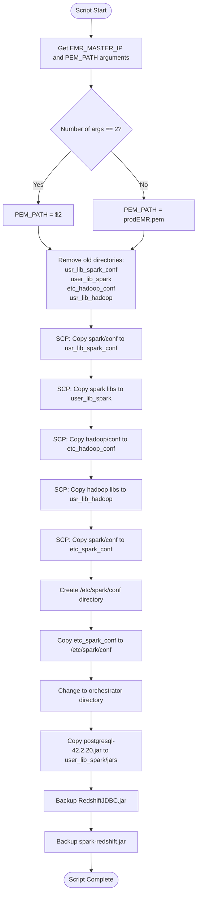

# Diagram: research/orchestrator/scripts/copy_emr_master_configs.sh

> Auto-generated by Obscura crawlers

## Mermaid

### SVG

<svg id="container" width="484.765625" xmlns="http://www.w3.org/2000/svg" class="flowchart" height="2215.453125" viewBox="0 0 484.765625 2215.453125" role="graphics-document document" aria-roledescription="flowchart-v2"><g><marker id="container_flowchart-v2-pointEnd" class="marker flowchart-v2" viewBox="0 0 10 10" refX="5" refY="5" markerUnits="userSpaceOnUse" markerWidth="8" markerHeight="8" orient="auto"><path d="M 0 0 L 10 5 L 0 10 z" class="arrowMarkerPath" style="stroke-width: 1; stroke-dasharray: 1, 0;"></path></marker><marker id="container_flowchart-v2-pointStart" class="marker flowchart-v2" viewBox="0 0 10 10" refX="4.5" refY="5" markerUnits="userSpaceOnUse" markerWidth="8" markerHeight="8" orient="auto"><path d="M 0 5 L 10 10 L 10 0 z" class="arrowMarkerPath" style="stroke-width: 1; stroke-dasharray: 1, 0;"></path></marker><marker id="container_flowchart-v2-circleEnd" class="marker flowchart-v2" viewBox="0 0 10 10" refX="11" refY="5" markerUnits="userSpaceOnUse" markerWidth="11" markerHeight="11" orient="auto"><circle cx="5" cy="5" r="5" class="arrowMarkerPath" style="stroke-width: 1; stroke-dasharray: 1, 0;"></circle></marker><marker id="container_flowchart-v2-circleStart" class="marker flowchart-v2" viewBox="0 0 10 10" refX="-1" refY="5" markerUnits="userSpaceOnUse" markerWidth="11" markerHeight="11" orient="auto"><circle cx="5" cy="5" r="5" class="arrowMarkerPath" style="stroke-width: 1; stroke-dasharray: 1, 0;"></circle></marker><marker id="container_flowchart-v2-crossEnd" class="marker cross flowchart-v2" viewBox="0 0 11 11" refX="12" refY="5.2" markerUnits="userSpaceOnUse" markerWidth="11" markerHeight="11" orient="auto"><path d="M 1,1 l 9,9 M 10,1 l -9,9" class="arrowMarkerPath" style="stroke-width: 2; stroke-dasharray: 1, 0;"></path></marker><marker id="container_flowchart-v2-crossStart" class="marker cross flowchart-v2" viewBox="0 0 11 11" refX="-1" refY="5.2" markerUnits="userSpaceOnUse" markerWidth="11" markerHeight="11" orient="auto"><path d="M 1,1 l 9,9 M 10,1 l -9,9" class="arrowMarkerPath" style="stroke-width: 2; stroke-dasharray: 1, 0;"></path></marker><g class="root"><g class="clusters"></g><g class="edgePaths"><path d="M221.801,47.5L221.717,51.583C221.634,55.667,221.467,63.833,221.384,71.417C221.301,79,221.301,86,221.301,89.5L221.301,93" id="L_Start_GetArgs_0" class="edge-thickness-normal edge-pattern-solid edge-thickness-normal edge-pattern-solid flowchart-link" style=";" data-edge="true" data-et="edge" data-id="L_Start_GetArgs_0" data-points="W3sieCI6MjIxLjgwMDc4MTI1LCJ5Ijo0Ny41fSx7IngiOjIyMS4zMDA3ODEyNSwieSI6NzJ9LHsieCI6MjIxLjMwMDc4MTI1LCJ5Ijo5N31d" marker-end="url(#container_flowchart-v2-pointEnd)"></path><path d="M221.301,175L221.301,179.167C221.301,183.333,221.301,191.667,221.301,199.333C221.301,207,221.301,214,221.301,217.5L221.301,221" id="L_GetArgs_CheckArgs_0" class="edge-thickness-normal edge-pattern-solid edge-thickness-normal edge-pattern-solid flowchart-link" style=";" data-edge="true" data-et="edge" data-id="L_GetArgs_CheckArgs_0" data-points="W3sieCI6MjIxLjMwMDc4MTI1LCJ5IjoxNzV9LHsieCI6MjIxLjMwMDc4MTI1LCJ5IjoyMDB9LHsieCI6MjIxLjMwMDc4MTI1LCJ5IjoyMjV9XQ==" marker-end="url(#container_flowchart-v2-pointEnd)"></path><path d="M171.851,381.003L158.477,395.411C145.104,409.82,118.356,438.636,104.983,458.545C91.609,478.453,91.609,489.453,91.609,494.953L91.609,500.453" id="L_CheckArgs_SetPemFromArg_0" class="edge-thickness-normal edge-pattern-solid edge-thickness-normal edge-pattern-solid flowchart-link" style=";" data-edge="true" data-et="edge" data-id="L_CheckArgs_SetPemFromArg_0" data-points="W3sieCI6MTcxLjg1MDY1NTgxMjMxNjAzLCJ5IjozODEuMDAyOTk5NTYyMzE2MDZ9LHsieCI6OTEuNjA5Mzc1LCJ5Ijo0NjcuNDUzMTI1fSx7IngiOjkxLjYwOTM3NSwieSI6NTA0LjQ1MzEyNX1d" marker-end="url(#container_flowchart-v2-pointEnd)"></path><path d="M270.751,381.003L284.124,395.411C297.498,409.82,324.245,438.636,337.619,458.545C350.992,478.453,350.992,489.453,350.992,494.953L350.992,500.453" id="L_CheckArgs_SetPemDefault_0" class="edge-thickness-normal edge-pattern-solid edge-thickness-normal edge-pattern-solid flowchart-link" style=";" data-edge="true" data-et="edge" data-id="L_CheckArgs_SetPemDefault_0" data-points="W3sieCI6MjcwLjc1MDkwNjY4NzY4Mzk0LCJ5IjozODEuMDAyOTk5NTYyMzE2MDZ9LHsieCI6MzUwLjk5MjE4NzUsInkiOjQ2Ny40NTMxMjV9LHsieCI6MzUwLjk5MjE4NzUsInkiOjUwNC40NTMxMjV9XQ==" marker-end="url(#container_flowchart-v2-pointEnd)"></path><path d="M91.609,558.453L91.609,562.62C91.609,566.786,91.609,575.12,96.485,583.046C101.361,590.972,111.113,598.491,115.989,602.251L120.865,606.011" id="L_SetPemFromArg_RemoveOld_0" class="edge-thickness-normal edge-pattern-solid edge-thickness-normal edge-pattern-solid flowchart-link" style=";" data-edge="true" data-et="edge" data-id="L_SetPemFromArg_RemoveOld_0" data-points="W3sieCI6OTEuNjA5Mzc1LCJ5Ijo1NTguNDUzMTI1fSx7IngiOjkxLjYwOTM3NSwieSI6NTgzLjQ1MzEyNX0seyJ4IjoxMjQuMDMyMjI2NTYyNSwieSI6NjA4LjQ1MzEyNX1d" marker-end="url(#container_flowchart-v2-pointEnd)"></path><path d="M350.992,558.453L350.992,562.62C350.992,566.786,350.992,575.12,346.116,583.046C341.24,590.972,331.489,598.491,326.613,602.251L321.737,606.011" id="L_SetPemDefault_RemoveOld_0" class="edge-thickness-normal edge-pattern-solid edge-thickness-normal edge-pattern-solid flowchart-link" style=";" data-edge="true" data-et="edge" data-id="L_SetPemDefault_RemoveOld_0" data-points="W3sieCI6MzUwLjk5MjE4NzUsInkiOjU1OC40NTMxMjV9LHsieCI6MzUwLjk5MjE4NzUsInkiOjU4My40NTMxMjV9LHsieCI6MzE4LjU2OTMzNTkzNzUsInkiOjYwOC40NTMxMjV9XQ==" marker-end="url(#container_flowchart-v2-pointEnd)"></path><path d="M221.301,758.453L221.301,762.62C221.301,766.786,221.301,775.12,221.301,782.786C221.301,790.453,221.301,797.453,221.301,800.953L221.301,804.453" id="L_RemoveOld_CopySpark1_0" class="edge-thickness-normal edge-pattern-solid edge-thickness-normal edge-pattern-solid flowchart-link" style=";" data-edge="true" data-et="edge" data-id="L_RemoveOld_CopySpark1_0" data-points="W3sieCI6MjIxLjMwMDc4MTI1LCJ5Ijo3NTguNDUzMTI1fSx7IngiOjIyMS4zMDA3ODEyNSwieSI6NzgzLjQ1MzEyNX0seyJ4IjoyMjEuMzAwNzgxMjUsInkiOjgwOC40NTMxMjV9XQ==" marker-end="url(#container_flowchart-v2-pointEnd)"></path><path d="M221.301,886.453L221.301,890.62C221.301,894.786,221.301,903.12,221.301,910.786C221.301,918.453,221.301,925.453,221.301,928.953L221.301,932.453" id="L_CopySpark1_CopySpark2_0" class="edge-thickness-normal edge-pattern-solid edge-thickness-normal edge-pattern-solid flowchart-link" style=";" data-edge="true" data-et="edge" data-id="L_CopySpark1_CopySpark2_0" data-points="W3sieCI6MjIxLjMwMDc4MTI1LCJ5Ijo4ODYuNDUzMTI1fSx7IngiOjIyMS4zMDA3ODEyNSwieSI6OTExLjQ1MzEyNX0seyJ4IjoyMjEuMzAwNzgxMjUsInkiOjkzNi40NTMxMjV9XQ==" marker-end="url(#container_flowchart-v2-pointEnd)"></path><path d="M221.301,1014.453L221.301,1018.62C221.301,1022.786,221.301,1031.12,221.301,1038.786C221.301,1046.453,221.301,1053.453,221.301,1056.953L221.301,1060.453" id="L_CopySpark2_CopyHadoop1_0" class="edge-thickness-normal edge-pattern-solid edge-thickness-normal edge-pattern-solid flowchart-link" style=";" data-edge="true" data-et="edge" data-id="L_CopySpark2_CopyHadoop1_0" data-points="W3sieCI6MjIxLjMwMDc4MTI1LCJ5IjoxMDE0LjQ1MzEyNX0seyJ4IjoyMjEuMzAwNzgxMjUsInkiOjEwMzkuNDUzMTI1fSx7IngiOjIyMS4zMDA3ODEyNSwieSI6MTA2NC40NTMxMjV9XQ==" marker-end="url(#container_flowchart-v2-pointEnd)"></path><path d="M221.301,1142.453L221.301,1146.62C221.301,1150.786,221.301,1159.12,221.301,1166.786C221.301,1174.453,221.301,1181.453,221.301,1184.953L221.301,1188.453" id="L_CopyHadoop1_CopyHadoop2_0" class="edge-thickness-normal edge-pattern-solid edge-thickness-normal edge-pattern-solid flowchart-link" style=";" data-edge="true" data-et="edge" data-id="L_CopyHadoop1_CopyHadoop2_0" data-points="W3sieCI6MjIxLjMwMDc4MTI1LCJ5IjoxMTQyLjQ1MzEyNX0seyJ4IjoyMjEuMzAwNzgxMjUsInkiOjExNjcuNDUzMTI1fSx7IngiOjIyMS4zMDA3ODEyNSwieSI6MTE5Mi40NTMxMjV9XQ==" marker-end="url(#container_flowchart-v2-pointEnd)"></path><path d="M221.301,1270.453L221.301,1274.62C221.301,1278.786,221.301,1287.12,221.301,1294.786C221.301,1302.453,221.301,1309.453,221.301,1312.953L221.301,1316.453" id="L_CopyHadoop2_CopySpark3_0" class="edge-thickness-normal edge-pattern-solid edge-thickness-normal edge-pattern-solid flowchart-link" style=";" data-edge="true" data-et="edge" data-id="L_CopyHadoop2_CopySpark3_0" data-points="W3sieCI6MjIxLjMwMDc4MTI1LCJ5IjoxMjcwLjQ1MzEyNX0seyJ4IjoyMjEuMzAwNzgxMjUsInkiOjEyOTUuNDUzMTI1fSx7IngiOjIyMS4zMDA3ODEyNSwieSI6MTMyMC40NTMxMjV9XQ==" marker-end="url(#container_flowchart-v2-pointEnd)"></path><path d="M221.301,1398.453L221.301,1402.62C221.301,1406.786,221.301,1415.12,221.301,1422.786C221.301,1430.453,221.301,1437.453,221.301,1440.953L221.301,1444.453" id="L_CopySpark3_MkdirSpark_0" class="edge-thickness-normal edge-pattern-solid edge-thickness-normal edge-pattern-solid flowchart-link" style=";" data-edge="true" data-et="edge" data-id="L_CopySpark3_MkdirSpark_0" data-points="W3sieCI6MjIxLjMwMDc4MTI1LCJ5IjoxMzk4LjQ1MzEyNX0seyJ4IjoyMjEuMzAwNzgxMjUsInkiOjE0MjMuNDUzMTI1fSx7IngiOjIyMS4zMDA3ODEyNSwieSI6MTQ0OC40NTMxMjV9XQ==" marker-end="url(#container_flowchart-v2-pointEnd)"></path><path d="M221.301,1526.453L221.301,1530.62C221.301,1534.786,221.301,1543.12,221.301,1550.786C221.301,1558.453,221.301,1565.453,221.301,1568.953L221.301,1572.453" id="L_MkdirSpark_CopyLocal_0" class="edge-thickness-normal edge-pattern-solid edge-thickness-normal edge-pattern-solid flowchart-link" style=";" data-edge="true" data-et="edge" data-id="L_MkdirSpark_CopyLocal_0" data-points="W3sieCI6MjIxLjMwMDc4MTI1LCJ5IjoxNTI2LjQ1MzEyNX0seyJ4IjoyMjEuMzAwNzgxMjUsInkiOjE1NTEuNDUzMTI1fSx7IngiOjIyMS4zMDA3ODEyNSwieSI6MTU3Ni40NTMxMjV9XQ==" marker-end="url(#container_flowchart-v2-pointEnd)"></path><path d="M221.301,1654.453L221.301,1658.62C221.301,1662.786,221.301,1671.12,221.301,1678.786C221.301,1686.453,221.301,1693.453,221.301,1696.953L221.301,1700.453" id="L_CopyLocal_ChangeDir_0" class="edge-thickness-normal edge-pattern-solid edge-thickness-normal edge-pattern-solid flowchart-link" style=";" data-edge="true" data-et="edge" data-id="L_CopyLocal_ChangeDir_0" data-points="W3sieCI6MjIxLjMwMDc4MTI1LCJ5IjoxNjU0LjQ1MzEyNX0seyJ4IjoyMjEuMzAwNzgxMjUsInkiOjE2NzkuNDUzMTI1fSx7IngiOjIyMS4zMDA3ODEyNSwieSI6MTcwNC40NTMxMjV9XQ==" marker-end="url(#container_flowchart-v2-pointEnd)"></path><path d="M221.301,1782.453L221.301,1786.62C221.301,1790.786,221.301,1799.12,221.301,1806.786C221.301,1814.453,221.301,1821.453,221.301,1824.953L221.301,1828.453" id="L_ChangeDir_FixDriver1_0" class="edge-thickness-normal edge-pattern-solid edge-thickness-normal edge-pattern-solid flowchart-link" style=";" data-edge="true" data-et="edge" data-id="L_ChangeDir_FixDriver1_0" data-points="W3sieCI6MjIxLjMwMDc4MTI1LCJ5IjoxNzgyLjQ1MzEyNX0seyJ4IjoyMjEuMzAwNzgxMjUsInkiOjE4MDcuNDUzMTI1fSx7IngiOjIyMS4zMDA3ODEyNSwieSI6MTgzMi40NTMxMjV9XQ==" marker-end="url(#container_flowchart-v2-pointEnd)"></path><path d="M221.301,1910.453L221.301,1914.62C221.301,1918.786,221.301,1927.12,221.301,1934.786C221.301,1942.453,221.301,1949.453,221.301,1952.953L221.301,1956.453" id="L_FixDriver1_FixDriver2_0" class="edge-thickness-normal edge-pattern-solid edge-thickness-normal edge-pattern-solid flowchart-link" style=";" data-edge="true" data-et="edge" data-id="L_FixDriver1_FixDriver2_0" data-points="W3sieCI6MjIxLjMwMDc4MTI1LCJ5IjoxOTEwLjQ1MzEyNX0seyJ4IjoyMjEuMzAwNzgxMjUsInkiOjE5MzUuNDUzMTI1fSx7IngiOjIyMS4zMDA3ODEyNSwieSI6MTk2MC40NTMxMjV9XQ==" marker-end="url(#container_flowchart-v2-pointEnd)"></path><path d="M221.301,2014.453L221.301,2018.62C221.301,2022.786,221.301,2031.12,221.301,2038.786C221.301,2046.453,221.301,2053.453,221.301,2056.953L221.301,2060.453" id="L_FixDriver2_FixDriver3_0" class="edge-thickness-normal edge-pattern-solid edge-thickness-normal edge-pattern-solid flowchart-link" style=";" data-edge="true" data-et="edge" data-id="L_FixDriver2_FixDriver3_0" data-points="W3sieCI6MjIxLjMwMDc4MTI1LCJ5IjoyMDE0LjQ1MzEyNX0seyJ4IjoyMjEuMzAwNzgxMjUsInkiOjIwMzkuNDUzMTI1fSx7IngiOjIyMS4zMDA3ODEyNSwieSI6MjA2NC40NTMxMjV9XQ==" marker-end="url(#container_flowchart-v2-pointEnd)"></path><path d="M221.301,2118.453L221.301,2122.62C221.301,2126.786,221.301,2135.12,221.371,2142.87C221.441,2150.62,221.582,2157.787,221.652,2161.37L221.722,2164.954" id="L_FixDriver3_End_0" class="edge-thickness-normal edge-pattern-solid edge-thickness-normal edge-pattern-solid flowchart-link" style=";" data-edge="true" data-et="edge" data-id="L_FixDriver3_End_0" data-points="W3sieCI6MjIxLjMwMDc4MTI1LCJ5IjoyMTE4LjQ1MzEyNX0seyJ4IjoyMjEuMzAwNzgxMjUsInkiOjIxNDMuNDUzMTI1fSx7IngiOjIyMS44MDA3ODEyNSwieSI6MjE2OC45NTMxMjV9XQ==" marker-end="url(#container_flowchart-v2-pointEnd)"></path></g><g class="edgeLabels"><g class="edgeLabel"><g class="label" data-id="L_Start_GetArgs_0" transform="translate(0, 0)"><foreignObject width="0" height="0">

</foreignObject></g></g><g class="edgeLabel"><g class="label" data-id="L_GetArgs_CheckArgs_0" transform="translate(0, 0)"><foreignObject width="0" height="0">

</foreignObject></g></g><g class="edgeLabel" transform="translate(91.609375, 467.453125)"><g class="label" data-id="L_CheckArgs_SetPemFromArg_0" transform="translate(-12.03125, -12)"><foreignObject width="24.0625" height="24">

Yes

</foreignObject></g></g><g class="edgeLabel" transform="translate(350.9921875, 467.453125)"><g class="label" data-id="L_CheckArgs_SetPemDefault_0" transform="translate(-10.140625, -12)"><foreignObject width="20.28125" height="24">

No

</foreignObject></g></g><g class="edgeLabel"><g class="label" data-id="L_SetPemFromArg_RemoveOld_0" transform="translate(0, 0)"><foreignObject width="0" height="0">

</foreignObject></g></g><g class="edgeLabel"><g class="label" data-id="L_SetPemDefault_RemoveOld_0" transform="translate(0, 0)"><foreignObject width="0" height="0">

</foreignObject></g></g><g class="edgeLabel"><g class="label" data-id="L_RemoveOld_CopySpark1_0" transform="translate(0, 0)"><foreignObject width="0" height="0">

</foreignObject></g></g><g class="edgeLabel"><g class="label" data-id="L_CopySpark1_CopySpark2_0" transform="translate(0, 0)"><foreignObject width="0" height="0">

</foreignObject></g></g><g class="edgeLabel"><g class="label" data-id="L_CopySpark2_CopyHadoop1_0" transform="translate(0, 0)"><foreignObject width="0" height="0">

</foreignObject></g></g><g class="edgeLabel"><g class="label" data-id="L_CopyHadoop1_CopyHadoop2_0" transform="translate(0, 0)"><foreignObject width="0" height="0">

</foreignObject></g></g><g class="edgeLabel"><g class="label" data-id="L_CopyHadoop2_CopySpark3_0" transform="translate(0, 0)"><foreignObject width="0" height="0">

</foreignObject></g></g><g class="edgeLabel"><g class="label" data-id="L_CopySpark3_MkdirSpark_0" transform="translate(0, 0)"><foreignObject width="0" height="0">

</foreignObject></g></g><g class="edgeLabel"><g class="label" data-id="L_MkdirSpark_CopyLocal_0" transform="translate(0, 0)"><foreignObject width="0" height="0">

</foreignObject></g></g><g class="edgeLabel"><g class="label" data-id="L_CopyLocal_ChangeDir_0" transform="translate(0, 0)"><foreignObject width="0" height="0">

</foreignObject></g></g><g class="edgeLabel"><g class="label" data-id="L_ChangeDir_FixDriver1_0" transform="translate(0, 0)"><foreignObject width="0" height="0">

</foreignObject></g></g><g class="edgeLabel"><g class="label" data-id="L_FixDriver1_FixDriver2_0" transform="translate(0, 0)"><foreignObject width="0" height="0">

</foreignObject></g></g><g class="edgeLabel"><g class="label" data-id="L_FixDriver2_FixDriver3_0" transform="translate(0, 0)"><foreignObject width="0" height="0">

</foreignObject></g></g><g class="edgeLabel"><g class="label" data-id="L_FixDriver3_End_0" transform="translate(0, 0)"><foreignObject width="0" height="0">

</foreignObject></g></g></g><g class="nodes"><g class="node default" id="flowchart-Start-0" transform="translate(221.30078125, 27.5)"><g class="basic label-container outer-path"><path d="M-33.6875 -19.5 C-12.71762597346046 -19.5, 8.252248053079079 -19.5, 33.6875 -19.5 C33.6875 -19.5, 33.6875 -19.5, 33.6875 -19.5 C33.98710627654164 -19.49039220985955, 34.286712553083284 -19.4807844197191, 34.9368692896239 -19.45993515863156 C35.21472411691789 -19.433130837611827, 35.49257894421188 -19.406326516592095, 36.181104652847864 -19.3399052695533 C36.498385270615266 -19.288609799820605, 36.81566588838267 -19.237314330087912, 37.41509325967676 -19.140403561325776 C37.78503394039215 -19.055967015041038, 38.154974621107534 -18.971530468756303, 38.63376438623539 -18.862249829261074 C39.110949090151806 -18.720623913932307, 39.58813379406822 -18.57899799860354, 39.832110251460605 -18.50658706670804 C40.08722772681428 -18.412701477497798, 40.342345202167955 -18.318815888287556, 41.0052065951478 -18.074876768247425 C41.35404582544146 -17.920455988944525, 41.702885055735116 -17.766035209641625, 42.14823291279238 -17.568892924097174 C42.57296829829917 -17.34730874553428, 42.99770368380596 -17.125724566971385, 43.25649226407678 -16.990714730406097 C43.502508291220025 -16.841578369001212, 43.74852431836327 -16.692442007596323, 44.3254305736057 -16.342718045390892 C44.67396502912786 -16.09959549703204, 45.02249948465001 -15.856472948673192, 45.35065534457871 -15.627565626425154 C45.71516809212171 -15.336876410351202, 46.07968083966471 -15.04618719427725, 46.327953708501866 -14.848196188198123 C46.60383479889942 -14.597648281312726, 46.87971588929697 -14.34710037442733, 47.25330973676799 -14.007812326905688 C47.55288873720752 -13.698472413058514, 47.852467737647046 -13.38913249921134, 48.12292094296865 -13.10986736009568 C48.37478813608965 -12.814009823406469, 48.62665532921065 -12.518152286717259, 48.93321390812658 -12.158051136245305 C49.17941362295606 -11.828165947629238, 49.42561333778554 -11.498280759013168, 49.680858964640635 -11.156274872382312 C49.865447075318954 -10.872697965532405, 50.050035185997274 -10.5891210586825, 50.36278387860425 -10.108655082055241 C50.54105627814669 -9.792114384629684, 50.719328677689134 -9.475573687204127, 50.976186474273504 -9.019496659696287 C51.16880911447896 -8.6195116258454, 51.36143175468442 -8.219526591994512, 51.51854614880834 -7.893275190886684 C51.675623790318454 -7.5052903794671, 51.83270143182857 -7.117305568047517, 51.987634229970325 -6.734618561215508 C52.10109688465805 -6.392887123115084, 52.21455953934578 -6.05115568501466, 52.38152313421488 -5.548287939305138 C52.488927177493544 -5.138709773076776, 52.596331220772214 -4.729131606848416, 52.69859428754556 -4.339158212148133 C52.75581641539754 -4.045334679529224, 52.81303854324952 -3.751511146910315, 52.937544776581774 -3.1121979531509023 C52.98305325473887 -2.759243183229967, 53.02856173289596 -2.4062884133090314, 53.09739270250937 -1.872449005199798 C53.120025442078216 -1.5199258175964276, 53.142658181647064 -1.1674026299930576, 53.17748121591342 -0.6250057626472757 C53.17748121591342 -0.27150208762070716, 53.17748121591342 0.08200158740586139, 53.17748121591342 0.625005762647271 C53.14704023945539 1.0991485424949383, 53.11659926299737 1.5732913223426055, 53.09739270250937 1.8724490051997846 C53.04698887665393 2.2633711251733635, 52.99658505079849 2.654293245146942, 52.937544776581774 3.1121979531508885 C52.88643703922715 3.374625382842795, 52.83532930187252 3.637052812534701, 52.69859428754556 4.339158212148129 C52.62987720741125 4.601206220871203, 52.56116012727693 4.863254229594277, 52.38152313421489 5.548287939305125 C52.2614681366983 5.909874463658886, 52.14141313918171 6.271460988012646, 51.987634229970325 6.734618561215495 C51.81829234131669 7.152896300192652, 51.648950452663065 7.571174039169809, 51.51854614880834 7.893275190886679 C51.36651167848145 8.208978021537016, 51.214477208154555 8.524680852187352, 50.976186474273504 9.019496659696284 C50.837194955146124 9.26629017632443, 50.69820343601875 9.513083692952575, 50.36278387860425 10.108655082055236 C50.1239297017504 10.47559923902987, 49.88507552489654 10.842543396004505, 49.68085896464064 11.156274872382301 C49.434159760908045 11.486829330624175, 49.18746055717544 11.81738378886605, 48.93321390812658 12.158051136245302 C48.70991490989087 12.42035084564592, 48.48661591165515 12.68265055504654, 48.12292094296866 13.10986736009567 C47.89100184390741 13.34934287078856, 47.65908274484615 13.588818381481449, 47.25330973676799 14.007812326905684 C46.94767687963821 14.285380001148681, 46.642044022508436 14.562947675391678, 46.32795370850189 14.848196188198111 C45.97609808625336 15.128791683669974, 45.62424246400482 15.409387179141836, 45.35065534457871 15.627565626425152 C45.107720279783486 15.797026611136845, 44.86478521498826 15.966487595848537, 44.32543057360571 16.34271804539089 C43.90406669015648 16.59815130774684, 43.48270280670726 16.853584570102793, 43.25649226407678 16.990714730406093 C42.85277058180161 17.201336073452975, 42.449048899526424 17.411957416499856, 42.14823291279239 17.56889292409717 C41.853087584602164 17.699545005711894, 41.55794225641194 17.830197087326617, 41.005206595147804 18.07487676824742 C40.56644913174047 18.236343570610853, 40.127691668333135 18.39781037297428, 39.83211025146062 18.506587066708033 C39.489351702809266 18.60831600477142, 39.14659315415791 18.710044942834806, 38.63376438623541 18.86224982926107 C38.33050074032617 18.93146777745962, 38.027237094416925 19.00068572565817, 37.415093259676766 19.140403561325773 C37.11582735185256 19.188786552461014, 36.81656144402835 19.237169543596256, 36.18110465284788 19.3399052695533 C35.81244229452985 19.375469683878883, 35.44377993621182 19.41103409820447, 34.9368692896239 19.45993515863156 C34.6181160044764 19.470156956070607, 34.299362719328904 19.480378753509658, 33.68750000000001 19.5 C33.68750000000001 19.5, 33.6875 19.5, 33.6875 19.5 C17.40901921314775 19.5, 1.1305384262955016 19.5, -33.68749999999999 19.5 C-34.07153988695597 19.487684588313616, -34.45557977391195 19.47536917662723, -34.93686928962389 19.45993515863156 C-35.242335019571954 19.430467247039758, -35.54780074952002 19.40099933544796, -36.18110465284787 19.3399052695533 C-36.47765739443035 19.2919609220951, -36.774210136012826 19.244016574636905, -37.41509325967676 19.140403561325773 C-37.857817267372425 19.039354695613383, -38.3005412750681 18.93830582990099, -38.633764386235384 18.862249829261074 C-39.01834972542351 18.74810691931968, -39.40293506461163 18.633964009378285, -39.83211025146059 18.506587066708043 C-40.066998710525795 18.420145942486936, -40.301887169591 18.333704818265826, -41.0052065951478 18.074876768247425 C-41.436816006117034 17.88381608524962, -41.868425417086264 17.692755402251816, -42.14823291279238 17.568892924097174 C-42.39956340492498 17.437773967336458, -42.650893897057585 17.306655010575746, -43.25649226407678 16.990714730406097 C-43.47549279364548 16.85795532239159, -43.69449332321417 16.725195914377082, -44.325430573605686 16.3427180453909 C-44.69712459019334 16.083440389794003, -45.068818606780994 15.824162734197103, -45.35065534457871 15.627565626425156 C-45.644187549578845 15.393481504157574, -45.93771975457898 15.15939738188999, -46.327953708501866 14.848196188198125 C-46.61949380482983 14.58342718644132, -46.91103390115779 14.318658184684512, -47.253309736767974 14.007812326905697 C-47.51055864995643 13.742181703510054, -47.76780756314489 13.476551080114413, -48.122920942968655 13.109867360095677 C-48.36193942855567 12.829102646388048, -48.60095791414269 12.548337932680418, -48.933213908126575 12.158051136245307 C-49.19152622899922 11.811936159012506, -49.44983854987187 11.465821181779704, -49.680858964640635 11.156274872382316 C-49.94186140688185 10.755305032130694, -50.202863849123055 10.354335191879073, -50.36278387860425 10.108655082055249 C-50.597878111793754 9.691221465154749, -50.83297234498326 9.273787848254248, -50.976186474273504 9.019496659696289 C-51.15091435722663 8.656670472166335, -51.325642240179754 8.293844284636378, -51.51854614880834 7.893275190886686 C-51.66340163244663 7.535479345709862, -51.80825711608492 7.177683500533038, -51.987634229970325 6.73461856121551 C-52.075438811205665 6.470165152294832, -52.16324339244101 6.205711743374152, -52.38152313421488 5.5482879393051325 C-52.49970347666633 5.097615073853335, -52.617883819117786 4.646942208401538, -52.69859428754556 4.339158212148136 C-52.76260661385167 4.01046844557619, -52.826618940157786 3.681778679004244, -52.937544776581774 3.112197953150904 C-52.98686494689535 2.7296804515680178, -53.03618511720893 2.347162949985131, -53.09739270250937 1.872449005199809 C-53.127213018146215 1.4079735186303572, -53.15703333378306 0.9434980320609053, -53.17748121591342 0.6250057626472781 C-53.17748121591342 0.3607934686254624, -53.17748121591342 0.09658117460364668, -53.17748121591342 -0.6250057626472687 C-53.148530166551815 -1.0759417253206478, -53.11957911719021 -1.526877687994027, -53.09739270250937 -1.8724490051997822 C-53.06368601726064 -2.133871399851028, -53.02997933201192 -2.3952937945022734, -52.937544776581774 -3.112197953150895 C-52.88090741412805 -3.403018839039968, -52.82427005167433 -3.6938397249290413, -52.69859428754556 -4.339158212148126 C-52.62283030194484 -4.628079125562758, -52.547066316344115 -4.917000038977391, -52.38152313421489 -5.548287939305123 C-52.22951051860152 -6.006125717611406, -52.077497902988156 -6.463963495917689, -51.98763422997033 -6.734618561215485 C-51.87688992768951 -7.008159128944546, -51.76614562540868 -7.281699696673606, -51.51854614880834 -7.893275190886676 C-51.33093971202663 -8.282843970998597, -51.14333327524492 -8.67241275111052, -50.976186474273504 -9.019496659696282 C-50.79435186616787 -9.342362419138507, -50.61251725806225 -9.665228178580731, -50.36278387860425 -10.108655082055243 C-50.184119361574325 -10.3831317583536, -50.0054548445444 -10.657608434651953, -49.68085896464064 -11.156274872382308 C-49.452414298141946 -11.46236991375331, -49.22396963164324 -11.768464955124314, -48.93321390812659 -12.158051136245302 C-48.68626118231319 -12.448135859993892, -48.439308456499795 -12.738220583742482, -48.12292094296866 -13.10986736009567 C-47.79213119174545 -13.451434936577291, -47.46134144052223 -13.793002513058914, -47.253309736767996 -14.007812326905677 C-46.89366534286338 -14.334431849780627, -46.53402094895877 -14.661051372655578, -46.32795370850189 -14.848196188198107 C-45.98411851111718 -15.122395608273541, -45.640283313732475 -15.396595028348973, -45.35065534457872 -15.627565626425149 C-45.0733748152032 -15.820984520436852, -44.79609428582769 -16.014403414448555, -44.325430573605715 -16.342718045390885 C-43.96295457647357 -16.56245312499779, -43.60047857934143 -16.782188204604697, -43.25649226407679 -16.99071473040609 C-42.86746364078693 -17.193670713991686, -42.47843501749707 -17.39662669757728, -42.14823291279239 -17.56889292409717 C-41.73649510023484 -17.751157039948144, -41.32475728767729 -17.933421155799117, -41.005206595147804 -18.07487676824742 C-40.58049782112676 -18.231173523052036, -40.15578904710572 -18.387470277856647, -39.83211025146062 -18.506587066708033 C-39.44181912575081 -18.622423424138777, -39.051528000041 -18.738259781569525, -38.63376438623541 -18.862249829261067 C-38.16416021713983 -18.969433916403542, -37.69455604804425 -19.07661800354602, -37.415093259676766 -19.140403561325773 C-37.04062416359319 -19.200944820729354, -36.666155067509614 -19.261486080132933, -36.18110465284788 -19.3399052695533 C-35.75107282308975 -19.38138992298112, -35.32104099333163 -19.422874576408947, -34.9368692896239 -19.45993515863156 C-34.47676918612715 -19.474689673420176, -34.01666908263041 -19.489444188208793, -33.68750000000001 -19.5 C-33.68750000000001 -19.5, -33.6875 -19.5, -33.6875 -19.5" stroke="none" stroke-width="0" fill="#ECECFF" style=""></path><path d="M-33.6875 -19.5 C-15.295921454133481 -19.5, 3.095657091733038 -19.5, 33.6875 -19.5 M-33.6875 -19.5 C-12.094713084056902 -19.5, 9.498073831886195 -19.5, 33.6875 -19.5 M33.6875 -19.5 C33.6875 -19.5, 33.6875 -19.5, 33.6875 -19.5 M33.6875 -19.5 C33.6875 -19.5, 33.6875 -19.5, 33.6875 -19.5 M33.6875 -19.5 C34.01070993802925 -19.489635286377382, 34.3339198760585 -19.479270572754764, 34.9368692896239 -19.45993515863156 M33.6875 -19.5 C34.1583757192955 -19.48489993218618, 34.629251438591 -19.469799864372362, 34.9368692896239 -19.45993515863156 M34.9368692896239 -19.45993515863156 C35.32132509195748 -19.42284716975619, 35.705780894291074 -19.385759180880818, 36.181104652847864 -19.3399052695533 M34.9368692896239 -19.45993515863156 C35.23850840843092 -19.43083639561436, 35.54014752723794 -19.401737632597165, 36.181104652847864 -19.3399052695533 M36.181104652847864 -19.3399052695533 C36.57943555733134 -19.275506218018712, 36.97776646181481 -19.211107166484126, 37.41509325967676 -19.140403561325776 M36.181104652847864 -19.3399052695533 C36.54693383147448 -19.2807608450006, 36.912763010101095 -19.2216164204479, 37.41509325967676 -19.140403561325776 M37.41509325967676 -19.140403561325776 C37.69729308472306 -19.075993292784915, 37.979492909769355 -19.011583024244057, 38.63376438623539 -18.862249829261074 M37.41509325967676 -19.140403561325776 C37.869631334383264 -19.036658211912155, 38.32416940908977 -18.93291286249853, 38.63376438623539 -18.862249829261074 M38.63376438623539 -18.862249829261074 C38.89411138772058 -18.784980205809568, 39.154458389205764 -18.707710582358064, 39.832110251460605 -18.50658706670804 M38.63376438623539 -18.862249829261074 C39.074754735605886 -18.731366208373494, 39.51574508497637 -18.600482587485914, 39.832110251460605 -18.50658706670804 M39.832110251460605 -18.50658706670804 C40.233934027179544 -18.358712202825206, 40.63575780289848 -18.21083733894237, 41.0052065951478 -18.074876768247425 M39.832110251460605 -18.50658706670804 C40.27609981038708 -18.343194804828602, 40.720089369313555 -18.17980254294917, 41.0052065951478 -18.074876768247425 M41.0052065951478 -18.074876768247425 C41.38001199498589 -17.908961535946254, 41.754817394823995 -17.743046303645084, 42.14823291279238 -17.568892924097174 M41.0052065951478 -18.074876768247425 C41.388534913449476 -17.90518869276582, 41.771863231751155 -17.735500617284213, 42.14823291279238 -17.568892924097174 M42.14823291279238 -17.568892924097174 C42.47276375679487 -17.399585390653, 42.797294600797365 -17.23027785720883, 43.25649226407678 -16.990714730406097 M42.14823291279238 -17.568892924097174 C42.53170093936025 -17.36883790025971, 42.915168965928125 -17.168782876422245, 43.25649226407678 -16.990714730406097 M43.25649226407678 -16.990714730406097 C43.60126034734324 -16.781714292247823, 43.946028430609694 -16.572713854089546, 44.3254305736057 -16.342718045390892 M43.25649226407678 -16.990714730406097 C43.57436782371844 -16.798016698107187, 43.892243383360096 -16.605318665808273, 44.3254305736057 -16.342718045390892 M44.3254305736057 -16.342718045390892 C44.55513075452954 -16.182489142738987, 44.78483093545339 -16.022260240087085, 45.35065534457871 -15.627565626425154 M44.3254305736057 -16.342718045390892 C44.56078856645786 -16.17854249806053, 44.79614655931001 -16.014366950730167, 45.35065534457871 -15.627565626425154 M45.35065534457871 -15.627565626425154 C45.62284929204796 -15.410498196703571, 45.895043239517214 -15.193430766981987, 46.327953708501866 -14.848196188198123 M45.35065534457871 -15.627565626425154 C45.65915796733411 -15.381542994377297, 45.96766059008951 -15.135520362329437, 46.327953708501866 -14.848196188198123 M46.327953708501866 -14.848196188198123 C46.56962683159899 -14.628715052121759, 46.81129995469611 -14.409233916045396, 47.25330973676799 -14.007812326905688 M46.327953708501866 -14.848196188198123 C46.54778009250753 -14.64855568253158, 46.767606476513194 -14.448915176865034, 47.25330973676799 -14.007812326905688 M47.25330973676799 -14.007812326905688 C47.42868839883269 -13.826719459467942, 47.60406706089739 -13.645626592030197, 48.12292094296865 -13.10986736009568 M47.25330973676799 -14.007812326905688 C47.46800642851299 -13.786120365752764, 47.68270312025799 -13.56442840459984, 48.12292094296865 -13.10986736009568 M48.12292094296865 -13.10986736009568 C48.29730875960362 -12.905021507728376, 48.471696576238585 -12.700175655361072, 48.93321390812658 -12.158051136245305 M48.12292094296865 -13.10986736009568 C48.3476355515906 -12.84590479418488, 48.57235016021255 -12.581942228274078, 48.93321390812658 -12.158051136245305 M48.93321390812658 -12.158051136245305 C49.1298503897446 -11.89457616482917, 49.326486871362604 -11.631101193413032, 49.680858964640635 -11.156274872382312 M48.93321390812658 -12.158051136245305 C49.15774904373222 -11.857194510105423, 49.382284179337844 -11.556337883965538, 49.680858964640635 -11.156274872382312 M49.680858964640635 -11.156274872382312 C49.87694025309498 -10.85504135811807, 50.07302154154932 -10.553807843853827, 50.36278387860425 -10.108655082055241 M49.680858964640635 -11.156274872382312 C49.86995163500198 -10.865777752215632, 50.05904430536333 -10.57528063204895, 50.36278387860425 -10.108655082055241 M50.36278387860425 -10.108655082055241 C50.54840251282693 -9.77907040106799, 50.73402114704962 -9.449485720080737, 50.976186474273504 -9.019496659696287 M50.36278387860425 -10.108655082055241 C50.53743340440689 -9.798547163810444, 50.71208293020954 -9.488439245565644, 50.976186474273504 -9.019496659696287 M50.976186474273504 -9.019496659696287 C51.12875636360291 -8.702682020031101, 51.28132625293232 -8.385867380365916, 51.51854614880834 -7.893275190886684 M50.976186474273504 -9.019496659696287 C51.10518283218954 -8.75163296240373, 51.23417919010558 -8.483769265111176, 51.51854614880834 -7.893275190886684 M51.51854614880834 -7.893275190886684 C51.65347139930262 -7.560007213563559, 51.7883966497969 -7.2267392362404355, 51.987634229970325 -6.734618561215508 M51.51854614880834 -7.893275190886684 C51.65422405724569 -7.558148133892515, 51.78990196568304 -7.2230210768983465, 51.987634229970325 -6.734618561215508 M51.987634229970325 -6.734618561215508 C52.09732747283586 -6.404239990949309, 52.2070207157014 -6.073861420683109, 52.38152313421488 -5.548287939305138 M51.987634229970325 -6.734618561215508 C52.069547917928354 -6.487907584259722, 52.15146160588638 -6.241196607303937, 52.38152313421488 -5.548287939305138 M52.38152313421488 -5.548287939305138 C52.50019421599941 -5.095743672088551, 52.618865297783934 -4.6431994048719645, 52.69859428754556 -4.339158212148133 M52.38152313421488 -5.548287939305138 C52.45075597274308 -5.2842731202950946, 52.519988811271276 -5.020258301285052, 52.69859428754556 -4.339158212148133 M52.69859428754556 -4.339158212148133 C52.77499302214417 -3.9468668568625165, 52.85139175674279 -3.5545755015769, 52.937544776581774 -3.1121979531509023 M52.69859428754556 -4.339158212148133 C52.78131592624456 -3.9144000806532904, 52.86403756494356 -3.4896419491584476, 52.937544776581774 -3.1121979531509023 M52.937544776581774 -3.1121979531509023 C52.993878873949264 -2.6752818183944522, 53.05021297131675 -2.238365683638002, 53.09739270250937 -1.872449005199798 M52.937544776581774 -3.1121979531509023 C52.99287564754141 -2.683062644304279, 53.048206518501054 -2.2539273354576554, 53.09739270250937 -1.872449005199798 M53.09739270250937 -1.872449005199798 C53.12323869251621 -1.4698768483355888, 53.14908468252305 -1.0673046914713797, 53.17748121591342 -0.6250057626472757 M53.09739270250937 -1.872449005199798 C53.11655434222986 -1.5739909995559278, 53.135715981950355 -1.2755329939120577, 53.17748121591342 -0.6250057626472757 M53.17748121591342 -0.6250057626472757 C53.17748121591342 -0.2774738922392762, 53.17748121591342 0.07005797816872328, 53.17748121591342 0.625005762647271 M53.17748121591342 -0.6250057626472757 C53.17748121591342 -0.21954881840888996, 53.17748121591342 0.18590812582949579, 53.17748121591342 0.625005762647271 M53.17748121591342 0.625005762647271 C53.16007314508606 0.8961505173251796, 53.14266507425871 1.1672952720030882, 53.09739270250937 1.8724490051997846 M53.17748121591342 0.625005762647271 C53.146572177829135 1.1064389801364864, 53.115663139744846 1.587872197625702, 53.09739270250937 1.8724490051997846 M53.09739270250937 1.8724490051997846 C53.06355088179595 2.1349194838296994, 53.02970906108252 2.3973899624596147, 52.937544776581774 3.1121979531508885 M53.09739270250937 1.8724490051997846 C53.048641599128445 2.2505529360279453, 52.99989049574753 2.6286568668561054, 52.937544776581774 3.1121979531508885 M52.937544776581774 3.1121979531508885 C52.860842918719385 3.506045782330875, 52.78414106085699 3.8998936115108616, 52.69859428754556 4.339158212148129 M52.937544776581774 3.1121979531508885 C52.86315220378407 3.4941880915912904, 52.78875963098636 3.8761782300316923, 52.69859428754556 4.339158212148129 M52.69859428754556 4.339158212148129 C52.59884019789753 4.719563789671998, 52.49908610824951 5.099969367195868, 52.38152313421489 5.548287939305125 M52.69859428754556 4.339158212148129 C52.608228723590386 4.683761272192361, 52.51786315963522 5.028364332236594, 52.38152313421489 5.548287939305125 M52.38152313421489 5.548287939305125 C52.24137499275344 5.97039181181307, 52.10122685129199 6.392495684321015, 51.987634229970325 6.734618561215495 M52.38152313421489 5.548287939305125 C52.257254505158066 5.922565250507057, 52.132985876101245 6.2968425617089885, 51.987634229970325 6.734618561215495 M51.987634229970325 6.734618561215495 C51.82934849920751 7.125587376446068, 51.67106276844469 7.516556191676642, 51.51854614880834 7.893275190886679 M51.987634229970325 6.734618561215495 C51.859247143976106 7.051737145816669, 51.73086005798188 7.3688557304178435, 51.51854614880834 7.893275190886679 M51.51854614880834 7.893275190886679 C51.35457638982917 8.233761903797735, 51.19060663085 8.574248616708791, 50.976186474273504 9.019496659696284 M51.51854614880834 7.893275190886679 C51.370780875176884 8.200112943252762, 51.223015601545434 8.506950695618844, 50.976186474273504 9.019496659696284 M50.976186474273504 9.019496659696284 C50.823146818205345 9.291234065990912, 50.67010716213718 9.562971472285541, 50.36278387860425 10.108655082055236 M50.976186474273504 9.019496659696284 C50.77283250650179 9.380572221297088, 50.56947853873009 9.741647782897891, 50.36278387860425 10.108655082055236 M50.36278387860425 10.108655082055236 C50.1803255519503 10.38896006871663, 49.997867225296346 10.669265055378023, 49.68085896464064 11.156274872382301 M50.36278387860425 10.108655082055236 C50.211855006196245 10.34052236015092, 50.060926133788236 10.572389638246605, 49.68085896464064 11.156274872382301 M49.68085896464064 11.156274872382301 C49.42363595197913 11.500930275850202, 49.16641293931762 11.845585679318102, 48.93321390812658 12.158051136245302 M49.68085896464064 11.156274872382301 C49.51920559859841 11.37287565595428, 49.35755223255619 11.589476439526257, 48.93321390812658 12.158051136245302 M48.93321390812658 12.158051136245302 C48.70017579223922 12.43179096741104, 48.467137676351854 12.705530798576778, 48.12292094296866 13.10986736009567 M48.93321390812658 12.158051136245302 C48.63864898829673 12.504063852296214, 48.34408406846687 12.850076568347127, 48.12292094296866 13.10986736009567 M48.12292094296866 13.10986736009567 C47.85847027982358 13.382934381596197, 47.594019616678494 13.656001403096724, 47.25330973676799 14.007812326905684 M48.12292094296866 13.10986736009567 C47.92933926499587 13.309756335953915, 47.73575758702307 13.50964531181216, 47.25330973676799 14.007812326905684 M47.25330973676799 14.007812326905684 C47.042337246350094 14.199411960677004, 46.831364755932206 14.391011594448324, 46.32795370850189 14.848196188198111 M47.25330973676799 14.007812326905684 C47.01974969805012 14.21992537440926, 46.78618965933226 14.432038421912837, 46.32795370850189 14.848196188198111 M46.32795370850189 14.848196188198111 C46.009088698032265 15.10248254869334, 45.69022368756265 15.35676890918857, 45.35065534457871 15.627565626425152 M46.32795370850189 14.848196188198111 C45.990414585308905 15.117374656651215, 45.65287546211592 15.386553125104317, 45.35065534457871 15.627565626425152 M45.35065534457871 15.627565626425152 C45.06994358838838 15.823377995727459, 44.78923183219804 16.019190365029765, 44.32543057360571 16.34271804539089 M45.35065534457871 15.627565626425152 C45.03550523537893 15.847400699974578, 44.720355126179136 16.067235773524004, 44.32543057360571 16.34271804539089 M44.32543057360571 16.34271804539089 C43.914493842361935 16.59183030680315, 43.503557111118155 16.84094256821541, 43.25649226407678 16.990714730406093 M44.32543057360571 16.34271804539089 C44.11085806927383 16.47279315848487, 43.89628556494196 16.602868271578853, 43.25649226407678 16.990714730406093 M43.25649226407678 16.990714730406093 C42.921190096212484 17.16564165660961, 42.585887928348185 17.340568582813127, 42.14823291279239 17.56889292409717 M43.25649226407678 16.990714730406093 C42.852007321250795 17.20173426599344, 42.44752237842481 17.41275380158079, 42.14823291279239 17.56889292409717 M42.14823291279239 17.56889292409717 C41.88598779525841 17.68498105840445, 41.62374267772443 17.801069192711726, 41.005206595147804 18.07487676824742 M42.14823291279239 17.56889292409717 C41.814001094895225 17.716847435245636, 41.479769276998056 17.8648019463941, 41.005206595147804 18.07487676824742 M41.005206595147804 18.07487676824742 C40.6698907402594 18.19827610247214, 40.33457488537099 18.321675436696857, 39.83211025146062 18.506587066708033 M41.005206595147804 18.07487676824742 C40.708247573781975 18.184160433169147, 40.411288552416146 18.293444098090877, 39.83211025146062 18.506587066708033 M39.83211025146062 18.506587066708033 C39.55519166926705 18.588775048327783, 39.27827308707349 18.670963029947536, 38.63376438623541 18.86224982926107 M39.83211025146062 18.506587066708033 C39.56635878413086 18.585460707253585, 39.30060731680111 18.66433434779914, 38.63376438623541 18.86224982926107 M38.63376438623541 18.86224982926107 C38.29684534100423 18.93914940273285, 37.959926295773045 19.016048976204626, 37.415093259676766 19.140403561325773 M38.63376438623541 18.86224982926107 C38.319765327608785 18.933918065357247, 38.005766268982164 19.005586301453423, 37.415093259676766 19.140403561325773 M37.415093259676766 19.140403561325773 C36.9438846652791 19.21658491259076, 36.47267607088143 19.29276626385575, 36.18110465284788 19.3399052695533 M37.415093259676766 19.140403561325773 C36.99498247129221 19.208323815583967, 36.574871682907656 19.276244069842157, 36.18110465284788 19.3399052695533 M36.18110465284788 19.3399052695533 C35.77852750287899 19.378741403040937, 35.375950352910095 19.41757753652858, 34.9368692896239 19.45993515863156 M36.18110465284788 19.3399052695533 C35.70230415346135 19.386094577887267, 35.22350365407482 19.43228388622124, 34.9368692896239 19.45993515863156 M34.9368692896239 19.45993515863156 C34.62537069003203 19.469924312425228, 34.313872090440164 19.479913466218896, 33.68750000000001 19.5 M34.9368692896239 19.45993515863156 C34.64453703802411 19.469309684950154, 34.35220478642432 19.47868421126875, 33.68750000000001 19.5 M33.68750000000001 19.5 C33.68750000000001 19.5, 33.6875 19.5, 33.6875 19.5 M33.68750000000001 19.5 C33.68750000000001 19.5, 33.6875 19.5, 33.6875 19.5 M33.6875 19.5 C14.927492363227081 19.5, -3.8325152735458374 19.5, -33.68749999999999 19.5 M33.6875 19.5 C12.535086116614714 19.5, -8.617327766770572 19.5, -33.68749999999999 19.5 M-33.68749999999999 19.5 C-34.029992154729584 19.48901694321836, -34.372484309459175 19.47803388643672, -34.93686928962389 19.45993515863156 M-33.68749999999999 19.5 C-34.0641236079547 19.487922413946276, -34.4407472159094 19.475844827892548, -34.93686928962389 19.45993515863156 M-34.93686928962389 19.45993515863156 C-35.3078674286273 19.42414541435244, -35.67886556763071 19.388355670073327, -36.18110465284787 19.3399052695533 M-34.93686928962389 19.45993515863156 C-35.21870640463951 19.432746671104724, -35.500543519655125 19.40555818357789, -36.18110465284787 19.3399052695533 M-36.18110465284787 19.3399052695533 C-36.605537555120954 19.271286249440102, -37.02997045739403 19.202667229326906, -37.41509325967676 19.140403561325773 M-36.18110465284787 19.3399052695533 C-36.643390862005106 19.265166420339852, -37.10567707116234 19.190427571126406, -37.41509325967676 19.140403561325773 M-37.41509325967676 19.140403561325773 C-37.85697216273379 19.039547585232327, -38.29885106579083 18.938691609138882, -38.633764386235384 18.862249829261074 M-37.41509325967676 19.140403561325773 C-37.66210362883966 19.084025056457637, -37.90911399800256 19.027646551589505, -38.633764386235384 18.862249829261074 M-38.633764386235384 18.862249829261074 C-38.943139358441634 18.770428961452627, -39.252514330647884 18.678608093644183, -39.83211025146059 18.506587066708043 M-38.633764386235384 18.862249829261074 C-38.97711366906342 18.76034556439488, -39.32046295189146 18.65844129952868, -39.83211025146059 18.506587066708043 M-39.83211025146059 18.506587066708043 C-40.24194710452344 18.355763316290574, -40.65178395758629 18.204939565873108, -41.0052065951478 18.074876768247425 M-39.83211025146059 18.506587066708043 C-40.08407836491271 18.413860471789956, -40.336046478364835 18.321133876871865, -41.0052065951478 18.074876768247425 M-41.0052065951478 18.074876768247425 C-41.27633777023954 17.954855039854856, -41.54746894533129 17.834833311462287, -42.14823291279238 17.568892924097174 M-41.0052065951478 18.074876768247425 C-41.43013144631848 17.88677514158202, -41.855056297489156 17.698673514916614, -42.14823291279238 17.568892924097174 M-42.14823291279238 17.568892924097174 C-42.578473755577605 17.344436551998534, -43.00871459836283 17.119980179899894, -43.25649226407678 16.990714730406097 M-42.14823291279238 17.568892924097174 C-42.487275012222604 17.392014877991254, -42.826317111652834 17.215136831885335, -43.25649226407678 16.990714730406097 M-43.25649226407678 16.990714730406097 C-43.66262678137069 16.744513599311187, -44.06876129866459 16.498312468216277, -44.325430573605686 16.3427180453909 M-43.25649226407678 16.990714730406097 C-43.567581267142096 16.802130748586, -43.87867027020741 16.613546766765904, -44.325430573605686 16.3427180453909 M-44.325430573605686 16.3427180453909 C-44.70079636114827 16.080879121324244, -45.076162148690855 15.81904019725759, -45.35065534457871 15.627565626425156 M-44.325430573605686 16.3427180453909 C-44.559826423217345 16.1792136475346, -44.794222272829 16.0157092496783, -45.35065534457871 15.627565626425156 M-45.35065534457871 15.627565626425156 C-45.54814842979544 15.47007014647653, -45.74564151501217 15.312574666527905, -46.327953708501866 14.848196188198125 M-45.35065534457871 15.627565626425156 C-45.71148726481363 15.339811772178468, -46.07231918504855 15.052057917931782, -46.327953708501866 14.848196188198125 M-46.327953708501866 14.848196188198125 C-46.52846175973175 14.666100081223469, -46.72896981096163 14.484003974248811, -47.253309736767974 14.007812326905697 M-46.327953708501866 14.848196188198125 C-46.66599366819117 14.541197240855515, -47.004033627880474 14.234198293512906, -47.253309736767974 14.007812326905697 M-47.253309736767974 14.007812326905697 C-47.44005908795255 13.81497828940075, -47.62680843913712 13.622144251895804, -48.122920942968655 13.109867360095677 M-47.253309736767974 14.007812326905697 C-47.54717705449263 13.704370194399507, -47.84104437221728 13.400928061893318, -48.122920942968655 13.109867360095677 M-48.122920942968655 13.109867360095677 C-48.43859271910344 12.73906132961485, -48.75426449523822 12.368255299134022, -48.933213908126575 12.158051136245307 M-48.122920942968655 13.109867360095677 C-48.396899681376844 12.788036344129557, -48.67087841978504 12.466205328163436, -48.933213908126575 12.158051136245307 M-48.933213908126575 12.158051136245307 C-49.19585020869003 11.806142420149476, -49.45848650925349 11.454233704053646, -49.680858964640635 11.156274872382316 M-48.933213908126575 12.158051136245307 C-49.170247064773385 11.840448300503393, -49.40728022142019 11.52284546476148, -49.680858964640635 11.156274872382316 M-49.680858964640635 11.156274872382316 C-49.853322479655006 10.891324600382044, -50.02578599466937 10.626374328381772, -50.36278387860425 10.108655082055249 M-49.680858964640635 11.156274872382316 C-49.844557885372375 10.90478937082326, -50.00825680610412 10.653303869264201, -50.36278387860425 10.108655082055249 M-50.36278387860425 10.108655082055249 C-50.57822027347368 9.726125947664022, -50.79365666834311 9.343596813272795, -50.976186474273504 9.019496659696289 M-50.36278387860425 10.108655082055249 C-50.55279020539379 9.771279608613483, -50.74279653218334 9.43390413517172, -50.976186474273504 9.019496659696289 M-50.976186474273504 9.019496659696289 C-51.09856772335411 8.76536937744116, -51.22094897243471 8.511242095186034, -51.51854614880834 7.893275190886686 M-50.976186474273504 9.019496659696289 C-51.10202496806737 8.75819033482089, -51.22786346186123 8.496884009945493, -51.51854614880834 7.893275190886686 M-51.51854614880834 7.893275190886686 C-51.6386712679855 7.596563824057914, -51.75879638716266 7.299852457229142, -51.987634229970325 6.73461856121551 M-51.51854614880834 7.893275190886686 C-51.68906081170886 7.472100676845656, -51.859575474609386 7.050926162804626, -51.987634229970325 6.73461856121551 M-51.987634229970325 6.73461856121551 C-52.12209784923486 6.329635563859028, -52.256561468499406 5.9246525665025445, -52.38152313421488 5.5482879393051325 M-51.987634229970325 6.73461856121551 C-52.092705515067586 6.418160591338389, -52.197776800164846 6.101702621461269, -52.38152313421488 5.5482879393051325 M-52.38152313421488 5.5482879393051325 C-52.49172143309475 5.128054065431332, -52.601919731974625 4.707820191557531, -52.69859428754556 4.339158212148136 M-52.38152313421488 5.5482879393051325 C-52.495963965261964 5.111875451552674, -52.610404796309055 4.675462963800216, -52.69859428754556 4.339158212148136 M-52.69859428754556 4.339158212148136 C-52.77400635436913 3.9519331873550727, -52.849418421192695 3.5647081625620096, -52.937544776581774 3.112197953150904 M-52.69859428754556 4.339158212148136 C-52.75450314551172 4.05207804283322, -52.81041200347788 3.7649978735183054, -52.937544776581774 3.112197953150904 M-52.937544776581774 3.112197953150904 C-52.98803854813013 2.720578232144912, -53.038532319678474 2.3289585111389193, -53.09739270250937 1.872449005199809 M-52.937544776581774 3.112197953150904 C-53.00041684596498 2.624574598509152, -53.06328891534819 2.1369512438674, -53.09739270250937 1.872449005199809 M-53.09739270250937 1.872449005199809 C-53.11395371701255 1.6144978365024645, -53.13051473151573 1.35654666780512, -53.17748121591342 0.6250057626472781 M-53.09739270250937 1.872449005199809 C-53.114324608119 1.608720908141549, -53.13125651372864 1.3449928110832887, -53.17748121591342 0.6250057626472781 M-53.17748121591342 0.6250057626472781 C-53.17748121591342 0.1424272950825085, -53.17748121591342 -0.3401511724822611, -53.17748121591342 -0.6250057626472687 M-53.17748121591342 0.6250057626472781 C-53.17748121591342 0.14395084875838088, -53.17748121591342 -0.3371040651305164, -53.17748121591342 -0.6250057626472687 M-53.17748121591342 -0.6250057626472687 C-53.14684516338703 -1.10218700972226, -53.11620911086064 -1.5793682567972511, -53.09739270250937 -1.8724490051997822 M-53.17748121591342 -0.6250057626472687 C-53.16011751090342 -0.8954594839084513, -53.14275380589341 -1.165913205169634, -53.09739270250937 -1.8724490051997822 M-53.09739270250937 -1.8724490051997822 C-53.03390123435875 -2.3648762943674595, -52.97040976620813 -2.857303583535137, -52.937544776581774 -3.112197953150895 M-53.09739270250937 -1.8724490051997822 C-53.04919287857253 -2.2462773215220713, -53.00099305463569 -2.62010563784436, -52.937544776581774 -3.112197953150895 M-52.937544776581774 -3.112197953150895 C-52.85943021623263 -3.5132997110255757, -52.78131565588349 -3.914401468900256, -52.69859428754556 -4.339158212148126 M-52.937544776581774 -3.112197953150895 C-52.87965090707253 -3.4094707372072226, -52.82175703756328 -3.7067435212635504, -52.69859428754556 -4.339158212148126 M-52.69859428754556 -4.339158212148126 C-52.59409194282519 -4.7376709441696185, -52.489589598104814 -5.136183676191111, -52.38152313421489 -5.548287939305123 M-52.69859428754556 -4.339158212148126 C-52.62044493229831 -4.6371755738507066, -52.542295577051064 -4.935192935553287, -52.38152313421489 -5.548287939305123 M-52.38152313421489 -5.548287939305123 C-52.24488142388493 -5.95983099991896, -52.10823971355497 -6.371374060532798, -51.98763422997033 -6.734618561215485 M-52.38152313421489 -5.548287939305123 C-52.25025392187664 -5.9436498919592236, -52.1189847095384 -6.3390118446133235, -51.98763422997033 -6.734618561215485 M-51.98763422997033 -6.734618561215485 C-51.84237179032661 -7.093419595593692, -51.69710935068289 -7.452220629971897, -51.51854614880834 -7.893275190886676 M-51.98763422997033 -6.734618561215485 C-51.87059072822144 -7.023718273417425, -51.753547226472534 -7.312817985619365, -51.51854614880834 -7.893275190886676 M-51.51854614880834 -7.893275190886676 C-51.393957713022374 -8.15198574356171, -51.269369277236414 -8.410696296236743, -50.976186474273504 -9.019496659696282 M-51.51854614880834 -7.893275190886676 C-51.34654693715872 -8.250435234070693, -51.1745477255091 -8.607595277254708, -50.976186474273504 -9.019496659696282 M-50.976186474273504 -9.019496659696282 C-50.85158721849951 -9.240735255365806, -50.72698796272551 -9.461973851035332, -50.36278387860425 -10.108655082055243 M-50.976186474273504 -9.019496659696282 C-50.812371954324824 -9.310365927884053, -50.648557434376144 -9.601235196071825, -50.36278387860425 -10.108655082055243 M-50.36278387860425 -10.108655082055243 C-50.143930162253874 -10.444873160820901, -49.92507644590349 -10.781091239586559, -49.68085896464064 -11.156274872382308 M-50.36278387860425 -10.108655082055243 C-50.161163960271196 -10.418397419143558, -49.95954404193814 -10.728139756231872, -49.68085896464064 -11.156274872382308 M-49.68085896464064 -11.156274872382308 C-49.51018552460845 -11.384961733355194, -49.339512084576256 -11.613648594328078, -48.93321390812659 -12.158051136245302 M-49.68085896464064 -11.156274872382308 C-49.4755760354575 -11.431335295828138, -49.270293106274366 -11.706395719273969, -48.93321390812659 -12.158051136245302 M-48.93321390812659 -12.158051136245302 C-48.711053367721064 -12.419013548298496, -48.48889282731553 -12.679975960351689, -48.12292094296866 -13.10986736009567 M-48.93321390812659 -12.158051136245302 C-48.65245508451777 -12.487846426085856, -48.37169626090895 -12.817641715926408, -48.12292094296866 -13.10986736009567 M-48.12292094296866 -13.10986736009567 C-47.895583991713295 -13.344611426977648, -47.668247040457935 -13.579355493859627, -47.253309736767996 -14.007812326905677 M-48.12292094296866 -13.10986736009567 C-47.94820932160724 -13.290271453242218, -47.77349770024581 -13.470675546388767, -47.253309736767996 -14.007812326905677 M-47.253309736767996 -14.007812326905677 C-47.033255982293745 -14.207659324415898, -46.8132022278195 -14.407506321926117, -46.32795370850189 -14.848196188198107 M-47.253309736767996 -14.007812326905677 C-46.978904141054116 -14.257020228558819, -46.70449854534023 -14.506228130211959, -46.32795370850189 -14.848196188198107 M-46.32795370850189 -14.848196188198107 C-46.03314203808687 -15.083300650086052, -45.73833036767186 -15.318405111973997, -45.35065534457872 -15.627565626425149 M-46.32795370850189 -14.848196188198107 C-46.026944665020345 -15.088242890187587, -45.725935621538795 -15.328289592177068, -45.35065534457872 -15.627565626425149 M-45.35065534457872 -15.627565626425149 C-44.988743831651576 -15.880019430946238, -44.62683231872443 -16.132473235467327, -44.325430573605715 -16.342718045390885 M-45.35065534457872 -15.627565626425149 C-45.12826452982759 -15.782695831652331, -44.90587371507645 -15.937826036879514, -44.325430573605715 -16.342718045390885 M-44.325430573605715 -16.342718045390885 C-43.96511553516118 -16.56114313914216, -43.60480049671665 -16.779568232893432, -43.25649226407679 -16.99071473040609 M-44.325430573605715 -16.342718045390885 C-44.06903119593877 -16.498148854902578, -43.81263181827183 -16.65357966441427, -43.25649226407679 -16.99071473040609 M-43.25649226407679 -16.99071473040609 C-42.88965778466305 -17.18209204334754, -42.522823305249304 -17.373469356288993, -42.14823291279239 -17.56889292409717 M-43.25649226407679 -16.99071473040609 C-42.85462336768566 -17.20036947624403, -42.45275447129453 -17.41002422208197, -42.14823291279239 -17.56889292409717 M-42.14823291279239 -17.56889292409717 C-41.88217365263249 -17.68666946620242, -41.61611439247258 -17.804446008307675, -41.005206595147804 -18.07487676824742 M-42.14823291279239 -17.56889292409717 C-41.839851081986325 -17.705404412773024, -41.53146925118027 -17.84191590144888, -41.005206595147804 -18.07487676824742 M-41.005206595147804 -18.07487676824742 C-40.54989928604978 -18.24243406681012, -40.094591976951754 -18.40999136537282, -39.83211025146062 -18.506587066708033 M-41.005206595147804 -18.07487676824742 C-40.60016899261159 -18.223934350107303, -40.195131390075375 -18.37299193196718, -39.83211025146062 -18.506587066708033 M-39.83211025146062 -18.506587066708033 C-39.43064663649214 -18.625739360305158, -39.029183021523664 -18.744891653902286, -38.63376438623541 -18.862249829261067 M-39.83211025146062 -18.506587066708033 C-39.40559330461356 -18.6331750576991, -38.9790763577665 -18.759763048690164, -38.63376438623541 -18.862249829261067 M-38.63376438623541 -18.862249829261067 C-38.22423807154992 -18.95572153817908, -37.81471175686442 -19.04919324709709, -37.415093259676766 -19.140403561325773 M-38.63376438623541 -18.862249829261067 C-38.28149219943306 -18.942653657107854, -37.92922001263071 -19.023057484954638, -37.415093259676766 -19.140403561325773 M-37.415093259676766 -19.140403561325773 C-37.050152419231445 -19.199404366250487, -36.685211578786124 -19.2584051711752, -36.18110465284788 -19.3399052695533 M-37.415093259676766 -19.140403561325773 C-37.121211340517355 -19.187916110927144, -36.82732942135794 -19.23542866052852, -36.18110465284788 -19.3399052695533 M-36.18110465284788 -19.3399052695533 C-35.73497046134542 -19.382943298452673, -35.28883626984297 -19.42598132735205, -34.9368692896239 -19.45993515863156 M-36.18110465284788 -19.3399052695533 C-35.76403694017906 -19.38013929019715, -35.34696922751024 -19.420373310840997, -34.9368692896239 -19.45993515863156 M-34.9368692896239 -19.45993515863156 C-34.43944614487861 -19.475886550708125, -33.942023000133325 -19.49183794278469, -33.68750000000001 -19.5 M-34.9368692896239 -19.45993515863156 C-34.448738609242 -19.475588559462675, -33.96060792886009 -19.49124196029379, -33.68750000000001 -19.5 M-33.68750000000001 -19.5 C-33.68750000000001 -19.5, -33.68750000000001 -19.5, -33.6875 -19.5 M-33.68750000000001 -19.5 C-33.68750000000001 -19.5, -33.6875 -19.5, -33.6875 -19.5" stroke="#9370DB" stroke-width="1.3" fill="none" stroke-dasharray="0 0" style=""></path></g><g class="label" style="" transform="translate(-40.8125, -12)"><rect></rect><foreignObject width="81.625" height="24">

Script Start

</foreignObject></g></g><g class="node default" id="flowchart-GetArgs-1" transform="translate(221.30078125, 136)"><rect class="basic label-container" style="" x="-130" y="-39" width="260" height="78"></rect><g class="label" style="" transform="translate(-100, -24)"><rect></rect><foreignObject width="200" height="48">

Get EMR_MASTER_IP and PEM_PATH arguments

</foreignObject></g></g><g class="node default" id="flowchart-CheckArgs-3" transform="translate(221.30078125, 327.7265625)"><polygon points="102.7265625,0 205.453125,-102.7265625 102.7265625,-205.453125 0,-102.7265625" class="label-container" transform="translate(-102.2265625, 102.7265625)"></polygon><g class="label" style="" transform="translate(-75.7265625, -12)"><rect></rect><foreignObject width="151.453125" height="24">

Number of args == 2?

</foreignObject></g></g><g class="node default" id="flowchart-SetPemFromArg-5" transform="translate(91.609375, 531.453125)"><rect class="basic label-container" style="" x="-83.609375" y="-27" width="167.21875" height="54"></rect><g class="label" style="" transform="translate(-53.609375, -12)"><rect></rect><foreignObject width="107.21875" height="24">

PEM_PATH = $2

</foreignObject></g></g><g class="node default" id="flowchart-SetPemDefault-7" transform="translate(350.9921875, 531.453125)"><rect class="basic label-container" style="" x="-125.7734375" y="-27" width="251.546875" height="54"></rect><g class="label" style="" transform="translate(-95.7734375, -12)"><rect></rect><foreignObject width="191.546875" height="24">

PEM_PATH = prodEMR.pem

</foreignObject></g></g><g class="node default" id="flowchart-RemoveOld-9" transform="translate(221.30078125, 683.453125)"><rect class="basic label-container" style="" x="-115.71875" y="-75" width="231.4375" height="150"></rect><g class="label" style="" transform="translate(-85.71875, -60)"><rect></rect><foreignObject width="171.4375" height="120">

Remove old directories: usr_lib_spark_conf user_lib_spark etc_hadoop_conf usr_lib_hadoop

</foreignObject></g></g><g class="node default" id="flowchart-CopySpark1-13" transform="translate(221.30078125, 847.453125)"><rect class="basic label-container" style="" x="-130" y="-39" width="260" height="78"></rect><g class="label" style="" transform="translate(-100, -24)"><rect></rect><foreignObject width="200" height="48">

SCP: Copy spark/conf to usr_lib_spark_conf

</foreignObject></g></g><g class="node default" id="flowchart-CopySpark2-15" transform="translate(221.30078125, 975.453125)"><rect class="basic label-container" style="" x="-130" y="-39" width="260" height="78"></rect><g class="label" style="" transform="translate(-100, -24)"><rect></rect><foreignObject width="200" height="48">

SCP: Copy spark libs to user_lib_spark

</foreignObject></g></g><g class="node default" id="flowchart-CopyHadoop1-17" transform="translate(221.30078125, 1103.453125)"><rect class="basic label-container" style="" x="-130" y="-39" width="260" height="78"></rect><g class="label" style="" transform="translate(-100, -24)"><rect></rect><foreignObject width="200" height="48">

SCP: Copy hadoop/conf to etc_hadoop_conf

</foreignObject></g></g><g class="node default" id="flowchart-CopyHadoop2-19" transform="translate(221.30078125, 1231.453125)"><rect class="basic label-container" style="" x="-130" y="-39" width="260" height="78"></rect><g class="label" style="" transform="translate(-100, -24)"><rect></rect><foreignObject width="200" height="48">

SCP: Copy hadoop libs to usr_lib_hadoop

</foreignObject></g></g><g class="node default" id="flowchart-CopySpark3-21" transform="translate(221.30078125, 1359.453125)"><rect class="basic label-container" style="" x="-130" y="-39" width="260" height="78"></rect><g class="label" style="" transform="translate(-100, -24)"><rect></rect><foreignObject width="200" height="48">

SCP: Copy spark/conf to etc_spark_conf

</foreignObject></g></g><g class="node default" id="flowchart-MkdirSpark-23" transform="translate(221.30078125, 1487.453125)"><rect class="basic label-container" style="" x="-130" y="-39" width="260" height="78"></rect><g class="label" style="" transform="translate(-100, -24)"><rect></rect><foreignObject width="200" height="48">

Create /etc/spark/conf directory

</foreignObject></g></g><g class="node default" id="flowchart-CopyLocal-25" transform="translate(221.30078125, 1615.453125)"><rect class="basic label-container" style="" x="-130" y="-39" width="260" height="78"></rect><g class="label" style="" transform="translate(-100, -24)"><rect></rect><foreignObject width="200" height="48">

Copy etc_spark_conf to /etc/spark/conf

</foreignObject></g></g><g class="node default" id="flowchart-ChangeDir-27" transform="translate(221.30078125, 1743.453125)"><rect class="basic label-container" style="" x="-130" y="-39" width="260" height="78"></rect><g class="label" style="" transform="translate(-100, -24)"><rect></rect><foreignObject width="200" height="48">

Change to orchestrator directory

</foreignObject></g></g><g class="node default" id="flowchart-FixDriver1-29" transform="translate(221.30078125, 1871.453125)"><rect class="basic label-container" style="" x="-130" y="-39" width="260" height="78"></rect><g class="label" style="" transform="translate(-100, -24)"><rect></rect><foreignObject width="200" height="48">

Copy postgresql-42.2.20.jar to user_lib_spark/jars

</foreignObject></g></g><g class="node default" id="flowchart-FixDriver2-31" transform="translate(221.30078125, 1987.453125)"><rect class="basic label-container" style="" x="-117.2578125" y="-27" width="234.515625" height="54"></rect><g class="label" style="" transform="translate(-87.2578125, -12)"><rect></rect><foreignObject width="174.515625" height="24">

Backup RedshiftJDBC.jar

</foreignObject></g></g><g class="node default" id="flowchart-FixDriver3-33" transform="translate(221.30078125, 2091.453125)"><rect class="basic label-container" style="" x="-121.375" y="-27" width="242.75" height="54"></rect><g class="label" style="" transform="translate(-91.375, -12)"><rect></rect><foreignObject width="182.75" height="24">

Backup spark-redshift.jar

</foreignObject></g></g><g class="node default" id="flowchart-End-35" transform="translate(221.30078125, 2187.953125)"><g class="basic label-container outer-path"><path d="M-50.5625 -19.5 C-20.597920418586934 -19.5, 9.366659162826132 -19.5, 50.5625 -19.5 C50.5625 -19.5, 50.5625 -19.5, 50.5625 -19.5 C51.010533583046765 -19.485632435036155, 51.45856716609352 -19.47126487007231, 51.8118692896239 -19.45993515863156 C52.094243112870124 -19.432694895507204, 52.37661693611635 -19.40545463238285, 53.056104652847864 -19.3399052695533 C53.38926821346964 -19.28604196879397, 53.72243177409142 -19.232178668034642, 54.29009325967676 -19.140403561325776 C54.582037351909804 -19.073769227386826, 54.87398144414285 -19.007134893447876, 55.50876438623539 -18.862249829261074 C55.87450618970034 -18.75369958181058, 56.24024799316529 -18.645149334360088, 56.707110251460605 -18.50658706670804 C57.02980396104854 -18.387832798631724, 57.35249767063649 -18.26907853055541, 57.8802065951478 -18.074876768247425 C58.193661050609165 -17.93611977911073, 58.50711550607053 -17.797362789974034, 59.02323291279238 -17.568892924097174 C59.35147831379304 -17.397647508646344, 59.679723714793695 -17.226402093195517, 60.13149226407678 -16.990714730406097 C60.41606321032415 -16.81820615046644, 60.70063415657151 -16.645697570526785, 61.2004305736057 -16.342718045390892 C61.56618069423027 -16.08758659431073, 61.931930814854844 -15.832455143230565, 62.22565534457871 -15.627565626425154 C62.58090688652157 -15.344261975366283, 62.936158428464424 -15.060958324307412, 63.202953708501866 -14.848196188198123 C63.56822305816498 -14.516468229331478, 63.9334924078281 -14.184740270464832, 64.12830973676799 -14.007812326905688 C64.42994972927512 -13.696344269538113, 64.73158972178227 -13.38487621217054, 64.99792094296865 -13.10986736009568 C65.25234614081421 -12.811005045502402, 65.50677133865977 -12.512142730909122, 65.80821390812658 -12.158051136245305 C65.96263208826053 -11.951144842651418, 66.11705026839448 -11.744238549057533, 66.55585896464063 -11.156274872382312 C66.7305570972397 -10.887891627693115, 66.90525522983874 -10.61950838300392, 67.23778387860425 -10.108655082055241 C67.46816289749277 -9.699593805613368, 67.69854191638129 -9.290532529171493, 67.8511864742735 -9.019496659696287 C67.96700084709148 -8.779005636509158, 68.08281521990945 -8.53851461332203, 68.39354614880834 -7.893275190886684 C68.53593149100554 -7.541580642826291, 68.67831683320273 -7.189886094765898, 68.86263422997033 -6.734618561215508 C68.97521071903476 -6.395556112781123, 69.0877872080992 -6.056493664346737, 69.25652313421489 -5.548287939305138 C69.34574879710604 -5.208031816054238, 69.4349744599972 -4.867775692803336, 69.57359428754556 -4.339158212148133 C69.63362204616588 -4.030928358504071, 69.69364980478619 -3.72269850486001, 69.81254477658177 -3.1121979531509023 C69.86193876288883 -2.729107949299226, 69.91133274919589 -2.346017945447549, 69.97239270250937 -1.872449005199798 C69.9969763378548 -1.4895390411414016, 70.02155997320023 -1.106629077083005, 70.05248121591342 -0.6250057626472757 C70.05248121591342 -0.16256572307529477, 70.05248121591342 0.29987431649668617, 70.05248121591342 0.625005762647271 C70.02916283176296 0.9882084180515168, 70.0058444476125 1.3514110734557625, 69.97239270250937 1.8724490051997846 C69.93340915938016 2.1747976675386074, 69.89442561625096 2.4771463298774306, 69.81254477658177 3.1121979531508885 C69.74290760964094 3.4697700875716824, 69.67327044270009 3.827342221992476, 69.57359428754556 4.339158212148129 C69.4873882889528 4.667899046698464, 69.40118229036004 4.9966398812488, 69.25652313421489 5.548287939305125 C69.13036227388115 5.928264349627034, 69.00420141354739 6.308240759948944, 68.86263422997033 6.734618561215495 C68.7378192565706 7.042913958646173, 68.61300428317087 7.351209356076851, 68.39354614880834 7.893275190886679 C68.21570073024873 8.262575007808087, 68.03785531168911 8.631874824729495, 67.8511864742735 9.019496659696284 C67.7274010369474 9.239290238303525, 67.60361559962129 9.459083816910766, 67.23778387860425 10.108655082055236 C67.04328171358476 10.407462638669525, 66.84877954856528 10.706270195283814, 66.55585896464065 11.156274872382301 C66.31548884977776 11.478348928130622, 66.07511873491487 11.800422983878944, 65.80821390812659 12.158051136245302 C65.63980202923074 12.355877312103758, 65.47139015033487 12.553703487962215, 64.99792094296866 13.10986736009567 C64.78556107534803 13.32914635848336, 64.57320120772738 13.54842535687105, 64.12830973676799 14.007812326905684 C63.773764635646984 14.329800806994452, 63.419219534525986 14.65178928708322, 63.20295370850189 14.848196188198111 C62.977725706661374 15.02780952609708, 62.752497704820854 15.207422863996047, 62.22565534457871 15.627565626425152 C61.94324419921396 15.82456341605016, 61.66083305384921 16.021561205675166, 61.20043057360571 16.34271804539089 C60.90535845158003 16.52159249979912, 60.610286329554356 16.700466954207347, 60.13149226407678 16.990714730406093 C59.73272294848708 17.198752426925306, 59.33395363289738 17.40679012344452, 59.02323291279239 17.56889292409717 C58.585741234506955 17.762557512344596, 58.148249556221515 17.956222100592022, 57.880206595147804 18.07487676824742 C57.41635118064771 18.245579848615904, 56.952495766147614 18.416282928984387, 56.70711025146062 18.506587066708033 C56.36936490561201 18.6068281124944, 56.031619559763406 18.707069158280774, 55.50876438623541 18.86224982926107 C55.14042998081025 18.94631975369274, 54.77209557538508 19.030389678124408, 54.290093259676766 19.140403561325773 C54.02017709058968 19.184041514312618, 53.750260921502594 19.227679467299467, 53.05610465284788 19.3399052695533 C52.62986892683571 19.381023717418234, 52.203633200823546 19.422142165283166, 51.8118692896239 19.45993515863156 C51.433197959516846 19.472078411149063, 51.0545266294098 19.484221663666563, 50.56250000000001 19.5 C50.56250000000001 19.5, 50.5625 19.5, 50.5625 19.5 C16.565611293271388 19.5, -17.431277413457224 19.5, -50.56249999999999 19.5 C-50.92985752188076 19.488219559291323, -51.29721504376153 19.476439118582647, -51.81186928962389 19.45993515863156 C-52.16939613372918 19.42544497396966, -52.52692297783446 19.390954789307767, -53.05610465284787 19.3399052695533 C-53.326260049089946 19.29622864017527, -53.59641544533201 19.25255201079724, -54.29009325967676 19.140403561325773 C-54.608410748258244 19.067749671772788, -54.92672823683972 18.995095782219803, -55.508764386235384 18.862249829261074 C-55.938086405167375 18.734829307599323, -56.367408424099374 18.607408785937572, -56.70711025146059 18.506587066708043 C-56.95914094523534 18.413837441652742, -57.21117163901009 18.321087816597437, -57.8802065951478 18.074876768247425 C-58.3188581588846 17.880698733117455, -58.757509722621414 17.686520697987486, -59.02323291279238 17.568892924097174 C-59.35497281546092 17.39582442936455, -59.686712718129456 17.22275593463192, -60.13149226407678 16.990714730406097 C-60.465947454583606 16.787966028443996, -60.80040264509043 16.585217326481896, -61.200430573605686 16.3427180453909 C-61.463333645146875 16.159328243574308, -61.726236716688064 15.975938441757714, -62.22565534457871 15.627565626425156 C-62.614635801720894 15.317364063058951, -63.003616258863076 15.007162499692745, -63.202953708501866 14.848196188198125 C-63.53763228315754 14.54424996180568, -63.87231085781322 14.240303735413233, -64.12830973676797 14.007812326905697 C-64.30936270527187 13.820860272200271, -64.49041567377576 13.633908217494845, -64.99792094296865 13.109867360095677 C-65.21712156547916 12.852381836026074, -65.43632218798966 12.594896311956473, -65.80821390812658 12.158051136245307 C-66.03577928731744 11.85313425976208, -66.26334466650832 11.548217383278851, -66.55585896464063 11.156274872382316 C-66.69436738219267 10.943488748304532, -66.8328757997447 10.73070262422675, -67.23778387860425 10.108655082055249 C-67.42336937775792 9.779129235738324, -67.60895487691158 9.4496033894214, -67.8511864742735 9.019496659696289 C-67.97945264132463 8.753149219358312, -68.10771880837575 8.486801779020336, -68.39354614880834 7.893275190886686 C-68.50033856049308 7.629495869334581, -68.6071309721778 7.365716547782474, -68.86263422997033 6.73461856121551 C-69.0114178014807 6.286506149269115, -69.16020137299108 5.838393737322722, -69.25652313421489 5.5482879393051325 C-69.33068785484897 5.265465716334126, -69.40485257548305 4.98264349336312, -69.57359428754556 4.339158212148136 C-69.62704427607154 4.064703817726255, -69.68049426459754 3.790249423304374, -69.81254477658177 3.112197953150904 C-69.87547733085006 2.6241054896845872, -69.93840988511835 2.1360130262182704, -69.97239270250937 1.872449005199809 C-69.99068317987023 1.5875600564967205, -70.0089736572311 1.3026711077936322, -70.05248121591342 0.6250057626472781 C-70.05248121591342 0.2705048809965641, -70.05248121591342 -0.08399600065414992, -70.05248121591342 -0.6250057626472687 C-70.02647618687276 -1.0300550808371778, -70.0004711578321 -1.4351043990270866, -69.97239270250937 -1.8724490051997822 C-69.939966733953 -2.123938414091219, -69.90754076539663 -2.375427822982656, -69.81254477658177 -3.112197953150895 C-69.72918153519473 -3.5402505788460945, -69.64581829380768 -3.968303204541294, -69.57359428754556 -4.339158212148126 C-69.50779465997931 -4.590080709797244, -69.44199503241305 -4.841003207446361, -69.25652313421489 -5.548287939305123 C-69.09959044091066 -6.020944207708361, -68.94265774760643 -6.493600476111599, -68.86263422997033 -6.734618561215485 C-68.75003467538214 -7.0127416380126135, -68.63743512079394 -7.290864714809742, -68.39354614880834 -7.893275190886676 C-68.20004861291366 -8.295076964356015, -68.00655107701897 -8.696878737825353, -67.8511864742735 -9.019496659696282 C-67.70629863210102 -9.27675969495846, -67.56141078992854 -9.534022730220638, -67.23778387860425 -10.108655082055243 C-67.06579099907273 -10.372882331570521, -66.89379811954123 -10.637109581085799, -66.55585896464063 -11.156274872382308 C-66.26374639482654 -11.547679103930623, -65.97163382501246 -11.939083335478937, -65.80821390812659 -12.158051136245302 C-65.57212767862227 -12.435371455108104, -65.33604144911793 -12.712691773970905, -64.99792094296866 -13.10986736009567 C-64.82117778102209 -13.292369185688967, -64.64443461907551 -13.474871011282263, -64.12830973676799 -14.007812326905677 C-63.89874846599092 -14.216293799167026, -63.669187195213844 -14.424775271428377, -63.20295370850189 -14.848196188198107 C-62.81753792580093 -15.155555018557406, -62.43212214309997 -15.462913848916706, -62.22565534457872 -15.627565626425149 C-61.87037583584641 -15.875393231914753, -61.51509632711411 -16.123220837404357, -61.200430573605715 -16.342718045390885 C-60.89307788249858 -16.52903705294493, -60.58572519139144 -16.715356060498973, -60.13149226407679 -16.99071473040609 C-59.793769803033555 -17.166904322010783, -59.45604734199033 -17.34309391361548, -59.02323291279239 -17.56889292409717 C-58.70016752709987 -17.71190438694908, -58.377102141407356 -17.85491584980099, -57.880206595147804 -18.07487676824742 C-57.53618234192918 -18.201480873557212, -57.19215808871055 -18.328084978867004, -56.70711025146062 -18.506587066708033 C-56.413424116558005 -18.59375156995715, -56.11973798165538 -18.680916073206266, -55.50876438623541 -18.862249829261067 C-55.084288143846564 -18.959133761619974, -54.659811901457715 -19.05601769397888, -54.290093259676766 -19.140403561325773 C-54.03045766566845 -19.182379430660934, -53.77082207166014 -19.224355299996095, -53.05610465284788 -19.3399052695533 C-52.714963259204 -19.37281476951557, -52.37382186556012 -19.405724269477844, -51.8118692896239 -19.45993515863156 C-51.5552578443173 -19.468164188218665, -51.29864639901071 -19.476393217805768, -50.56250000000001 -19.5 C-50.56250000000001 -19.5, -50.5625 -19.5, -50.5625 -19.5" stroke="none" stroke-width="0" fill="#ECECFF" style=""></path><path d="M-50.5625 -19.5 C-15.266555126225064 -19.5, 20.02938974754987 -19.5, 50.5625 -19.5 M-50.5625 -19.5 C-16.285412636227072 -19.5, 17.991674727545856 -19.5, 50.5625 -19.5 M50.5625 -19.5 C50.5625 -19.5, 50.5625 -19.5, 50.5625 -19.5 M50.5625 -19.5 C50.5625 -19.5, 50.5625 -19.5, 50.5625 -19.5 M50.5625 -19.5 C50.95597622907173 -19.487381983188687, 51.34945245814346 -19.474763966377377, 51.8118692896239 -19.45993515863156 M50.5625 -19.5 C51.00715626065653 -19.48574073919165, 51.45181252131305 -19.471481478383303, 51.8118692896239 -19.45993515863156 M51.8118692896239 -19.45993515863156 C52.105983595026196 -19.4315623053136, 52.4000979004285 -19.403189451995647, 53.056104652847864 -19.3399052695533 M51.8118692896239 -19.45993515863156 C52.062403296147046 -19.435766444333495, 52.31293730267019 -19.411597730035435, 53.056104652847864 -19.3399052695533 M53.056104652847864 -19.3399052695533 C53.368110044826004 -19.289462657416227, 53.68011543680415 -19.23902004527915, 54.29009325967676 -19.140403561325776 M53.056104652847864 -19.3399052695533 C53.53078043540911 -19.26316337019447, 54.00545621797037 -19.18642147083564, 54.29009325967676 -19.140403561325776 M54.29009325967676 -19.140403561325776 C54.665786998734184 -19.054653917016683, 55.04148073779161 -18.96890427270759, 55.50876438623539 -18.862249829261074 M54.29009325967676 -19.140403561325776 C54.54365125569991 -19.082530603354048, 54.79720925172307 -19.02465764538232, 55.50876438623539 -18.862249829261074 M55.50876438623539 -18.862249829261074 C55.8593836400831 -18.758187875157095, 56.210002893930806 -18.654125921053115, 56.707110251460605 -18.50658706670804 M55.50876438623539 -18.862249829261074 C55.81180095352988 -18.77231016675947, 56.11483752082437 -18.682370504257868, 56.707110251460605 -18.50658706670804 M56.707110251460605 -18.50658706670804 C57.00093219868579 -18.398457874068868, 57.294754145910964 -18.290328681429695, 57.8802065951478 -18.074876768247425 M56.707110251460605 -18.50658706670804 C56.96798387155413 -18.410583163024313, 57.22885749164766 -18.314579259340583, 57.8802065951478 -18.074876768247425 M57.8802065951478 -18.074876768247425 C58.15379209767728 -17.953768581903205, 58.42737760020677 -17.832660395558985, 59.02323291279238 -17.568892924097174 M57.8802065951478 -18.074876768247425 C58.28362754146517 -17.896294282369904, 58.68704848778254 -17.717711796492388, 59.02323291279238 -17.568892924097174 M59.02323291279238 -17.568892924097174 C59.32221455159246 -17.41291439464205, 59.621196190392546 -17.25693586518693, 60.13149226407678 -16.990714730406097 M59.02323291279238 -17.568892924097174 C59.25732838611986 -17.446765465607537, 59.49142385944733 -17.3246380071179, 60.13149226407678 -16.990714730406097 M60.13149226407678 -16.990714730406097 C60.38725121345896 -16.835672152284204, 60.643010162841136 -16.68062957416231, 61.2004305736057 -16.342718045390892 M60.13149226407678 -16.990714730406097 C60.37629040312184 -16.842316659923437, 60.621088542166895 -16.693918589440777, 61.2004305736057 -16.342718045390892 M61.2004305736057 -16.342718045390892 C61.474554566964194 -16.151501014260422, 61.74867856032269 -15.960283983129953, 62.22565534457871 -15.627565626425154 M61.2004305736057 -16.342718045390892 C61.51990258032908 -16.11986820322094, 61.83937458705246 -15.897018361050982, 62.22565534457871 -15.627565626425154 M62.22565534457871 -15.627565626425154 C62.52863270449388 -15.385949244458962, 62.83161006440904 -15.144332862492769, 63.202953708501866 -14.848196188198123 M62.22565534457871 -15.627565626425154 C62.50973765644933 -15.401017542456142, 62.79381996831995 -15.17446945848713, 63.202953708501866 -14.848196188198123 M63.202953708501866 -14.848196188198123 C63.57230200272861 -14.512763839801746, 63.941650296955366 -14.177331491405369, 64.12830973676799 -14.007812326905688 M63.202953708501866 -14.848196188198123 C63.51130420631911 -14.568160424587603, 63.819654704136354 -14.288124660977083, 64.12830973676799 -14.007812326905688 M64.12830973676799 -14.007812326905688 C64.43750953856053 -13.688538145779045, 64.74670934035308 -13.369263964652403, 64.99792094296865 -13.10986736009568 M64.12830973676799 -14.007812326905688 C64.41597497986619 -13.710774345651098, 64.70364022296441 -13.413736364396508, 64.99792094296865 -13.10986736009568 M64.99792094296865 -13.10986736009568 C65.2301523618054 -12.837075121187967, 65.46238378064213 -12.564282882280253, 65.80821390812658 -12.158051136245305 M64.99792094296865 -13.10986736009568 C65.25654811879943 -12.806069163061641, 65.51517529463021 -12.5022709660276, 65.80821390812658 -12.158051136245305 M65.80821390812658 -12.158051136245305 C66.00093218776858 -11.899826198521477, 66.19365046741058 -11.64160126079765, 66.55585896464063 -11.156274872382312 M65.80821390812658 -12.158051136245305 C66.08795444198076 -11.783224305767616, 66.36769497583494 -11.408397475289927, 66.55585896464063 -11.156274872382312 M66.55585896464063 -11.156274872382312 C66.6969929265697 -10.939455207084011, 66.83812688849878 -10.72263554178571, 67.23778387860425 -10.108655082055241 M66.55585896464063 -11.156274872382312 C66.78035587395244 -10.811387333818402, 67.00485278326425 -10.466499795254494, 67.23778387860425 -10.108655082055241 M67.23778387860425 -10.108655082055241 C67.41152289747205 -9.800163861072068, 67.58526191633987 -9.491672640088895, 67.8511864742735 -9.019496659696287 M67.23778387860425 -10.108655082055241 C67.38864435433968 -9.840787031107313, 67.53950483007512 -9.572918980159383, 67.8511864742735 -9.019496659696287 M67.8511864742735 -9.019496659696287 C68.05026916417144 -8.606097194436057, 68.24935185406936 -8.192697729175825, 68.39354614880834 -7.893275190886684 M67.8511864742735 -9.019496659696287 C67.97071879119653 -8.771285246023764, 68.09025110811955 -8.52307383235124, 68.39354614880834 -7.893275190886684 M68.39354614880834 -7.893275190886684 C68.5282383665557 -7.56058280895384, 68.66293058430306 -7.227890427020996, 68.86263422997033 -6.734618561215508 M68.39354614880834 -7.893275190886684 C68.57806846451973 -7.43750150358327, 68.76259078023112 -6.981727816279856, 68.86263422997033 -6.734618561215508 M68.86263422997033 -6.734618561215508 C69.01776677812232 -6.267384043196631, 69.1728993262743 -5.800149525177754, 69.25652313421489 -5.548287939305138 M68.86263422997033 -6.734618561215508 C68.98201063295105 -6.375075855484435, 69.10138703593177 -6.015533149753362, 69.25652313421489 -5.548287939305138 M69.25652313421489 -5.548287939305138 C69.3536421685877 -5.177930969585835, 69.45076120296052 -4.8075739998665314, 69.57359428754556 -4.339158212148133 M69.25652313421489 -5.548287939305138 C69.34532518634765 -5.209647227470055, 69.43412723848041 -4.871006515634971, 69.57359428754556 -4.339158212148133 M69.57359428754556 -4.339158212148133 C69.63693044555536 -4.0139404268695085, 69.70026660356517 -3.688722641590884, 69.81254477658177 -3.1121979531509023 M69.57359428754556 -4.339158212148133 C69.63236599577601 -4.0373779117897035, 69.69113770400647 -3.735597611431274, 69.81254477658177 -3.1121979531509023 M69.81254477658177 -3.1121979531509023 C69.87111476762047 -2.657940668607671, 69.92968475865918 -2.20368338406444, 69.97239270250937 -1.872449005199798 M69.81254477658177 -3.1121979531509023 C69.8537425775555 -2.792675944224682, 69.89494037852923 -2.4731539352984617, 69.97239270250937 -1.872449005199798 M69.97239270250937 -1.872449005199798 C69.9906194355058 -1.5885529264261238, 70.00884616850226 -1.3046568476524498, 70.05248121591342 -0.6250057626472757 M69.97239270250937 -1.872449005199798 C69.98925513879456 -1.609802948944329, 70.00611757507976 -1.3471568926888604, 70.05248121591342 -0.6250057626472757 M70.05248121591342 -0.6250057626472757 C70.05248121591342 -0.20774769483869637, 70.05248121591342 0.20951037296988295, 70.05248121591342 0.625005762647271 M70.05248121591342 -0.6250057626472757 C70.05248121591342 -0.2512927916511074, 70.05248121591342 0.12242017934506089, 70.05248121591342 0.625005762647271 M70.05248121591342 0.625005762647271 C70.03233420846904 0.9388116659652186, 70.01218720102466 1.2526175692831663, 69.97239270250937 1.8724490051997846 M70.05248121591342 0.625005762647271 C70.02621886482386 1.0340630794553487, 69.9999565137343 1.4431203962634265, 69.97239270250937 1.8724490051997846 M69.97239270250937 1.8724490051997846 C69.92455146733684 2.243496177877398, 69.87671023216433 2.614543350555012, 69.81254477658177 3.1121979531508885 M69.97239270250937 1.8724490051997846 C69.9294064343263 2.2058420126288834, 69.88642016614322 2.5392350200579816, 69.81254477658177 3.1121979531508885 M69.81254477658177 3.1121979531508885 C69.74895562569715 3.4387148033716355, 69.68536647481253 3.7652316535923824, 69.57359428754556 4.339158212148129 M69.81254477658177 3.1121979531508885 C69.73561601656901 3.507210876917264, 69.65868725655625 3.902223800683639, 69.57359428754556 4.339158212148129 M69.57359428754556 4.339158212148129 C69.50754534797193 4.591031444533865, 69.44149640839831 4.8429046769196, 69.25652313421489 5.548287939305125 M69.57359428754556 4.339158212148129 C69.45710030502552 4.783400256308433, 69.3406063225055 5.227642300468737, 69.25652313421489 5.548287939305125 M69.25652313421489 5.548287939305125 C69.14379152059628 5.8878175981809235, 69.03105990697767 6.227347257056722, 68.86263422997033 6.734618561215495 M69.25652313421489 5.548287939305125 C69.12342138483271 5.949169201560433, 68.99031963545053 6.350050463815741, 68.86263422997033 6.734618561215495 M68.86263422997033 6.734618561215495 C68.68986231871476 7.161368522334403, 68.5170904074592 7.588118483453311, 68.39354614880834 7.893275190886679 M68.86263422997033 6.734618561215495 C68.70972049292408 7.112318448105697, 68.55680675587784 7.490018334995899, 68.39354614880834 7.893275190886679 M68.39354614880834 7.893275190886679 C68.19468322493005 8.30621830730491, 67.99582030105174 8.719161423723142, 67.8511864742735 9.019496659696284 M68.39354614880834 7.893275190886679 C68.27010291812637 8.14960770065982, 68.14665968744438 8.405940210432961, 67.8511864742735 9.019496659696284 M67.8511864742735 9.019496659696284 C67.67478270361966 9.332719417310955, 67.49837893296579 9.645942174925624, 67.23778387860425 10.108655082055236 M67.8511864742735 9.019496659696284 C67.68104057445059 9.321607933972494, 67.51089467462766 9.623719208248703, 67.23778387860425 10.108655082055236 M67.23778387860425 10.108655082055236 C67.01041980639759 10.457947352766672, 66.78305573419094 10.807239623478107, 66.55585896464065 11.156274872382301 M67.23778387860425 10.108655082055236 C67.00654614751423 10.463898333034564, 66.77530841642422 10.81914158401389, 66.55585896464065 11.156274872382301 M66.55585896464065 11.156274872382301 C66.2923562752367 11.509344470594746, 66.02885358583275 11.86241406880719, 65.80821390812659 12.158051136245302 M66.55585896464065 11.156274872382301 C66.31840360564861 11.474443420803405, 66.08094824665658 11.792611969224508, 65.80821390812659 12.158051136245302 M65.80821390812659 12.158051136245302 C65.48432011919674 12.538515210800991, 65.16042633026689 12.91897928535668, 64.99792094296866 13.10986736009567 M65.80821390812659 12.158051136245302 C65.51850903423316 12.498354965794835, 65.22880416033973 12.838658795344369, 64.99792094296866 13.10986736009567 M64.99792094296866 13.10986736009567 C64.75441869040654 13.361303427772794, 64.51091643784441 13.612739495449917, 64.12830973676799 14.007812326905684 M64.99792094296866 13.10986736009567 C64.71971453769548 13.397138314710885, 64.44150813242231 13.684409269326101, 64.12830973676799 14.007812326905684 M64.12830973676799 14.007812326905684 C63.81685150731019 14.290670450166088, 63.505393277852384 14.57352857342649, 63.20295370850189 14.848196188198111 M64.12830973676799 14.007812326905684 C63.7737467782669 14.329817024594567, 63.41918381976581 14.65182172228345, 63.20295370850189 14.848196188198111 M63.20295370850189 14.848196188198111 C62.82595668244864 15.148841284163378, 62.4489596563954 15.449486380128647, 62.22565534457871 15.627565626425152 M63.20295370850189 14.848196188198111 C62.87716018035834 15.108007857162702, 62.55136665221479 15.367819526127294, 62.22565534457871 15.627565626425152 M62.22565534457871 15.627565626425152 C61.98830289486122 15.793132420526128, 61.75095044514373 15.958699214627105, 61.20043057360571 16.34271804539089 M62.22565534457871 15.627565626425152 C61.83993090549734 15.896630297386473, 61.45420646641596 16.165694968347793, 61.20043057360571 16.34271804539089 M61.20043057360571 16.34271804539089 C60.84233229490817 16.55979932635641, 60.48423401621063 16.776880607321928, 60.13149226407678 16.990714730406093 M61.20043057360571 16.34271804539089 C60.92753491080902 16.508148999891162, 60.65463924801234 16.67357995439144, 60.13149226407678 16.990714730406093 M60.13149226407678 16.990714730406093 C59.86532709757723 17.129572927281984, 59.59916193107768 17.268431124157875, 59.02323291279239 17.56889292409717 M60.13149226407678 16.990714730406093 C59.77487749878136 17.176760425038058, 59.41826273348593 17.362806119670022, 59.02323291279239 17.56889292409717 M59.02323291279239 17.56889292409717 C58.57084837055314 17.769150141435833, 58.11846382831389 17.9694073587745, 57.880206595147804 18.07487676824742 M59.02323291279239 17.56889292409717 C58.644703564512575 17.736456637906482, 58.26617421623276 17.904020351715793, 57.880206595147804 18.07487676824742 M57.880206595147804 18.07487676824742 C57.5830236044983 18.18424285593589, 57.285840613848805 18.293608943624356, 56.70711025146062 18.506587066708033 M57.880206595147804 18.07487676824742 C57.43937952530142 18.237105204911654, 56.99855245545504 18.399333641575886, 56.70711025146062 18.506587066708033 M56.70711025146062 18.506587066708033 C56.30247127464696 18.626681791032993, 55.89783229783331 18.746776515357958, 55.50876438623541 18.86224982926107 M56.70711025146062 18.506587066708033 C56.41926653877553 18.59201756971049, 56.13142282609044 18.67744807271294, 55.50876438623541 18.86224982926107 M55.50876438623541 18.86224982926107 C55.04924866119051 18.967131294882225, 54.589732936145616 19.072012760503384, 54.290093259676766 19.140403561325773 M55.50876438623541 18.86224982926107 C55.11441690024546 18.952257069580437, 54.72006941425551 19.042264309899803, 54.290093259676766 19.140403561325773 M54.290093259676766 19.140403561325773 C53.800672083771474 19.219529381528236, 53.311250907866174 19.2986552017307, 53.05610465284788 19.3399052695533 M54.290093259676766 19.140403561325773 C54.02709442632426 19.182923173115793, 53.76409559297176 19.22544278490581, 53.05610465284788 19.3399052695533 M53.05610465284788 19.3399052695533 C52.6818675758169 19.376007470288542, 52.307630498785926 19.412109671023785, 51.8118692896239 19.45993515863156 M53.05610465284788 19.3399052695533 C52.75922724487838 19.368544676052796, 52.462349836908885 19.397184082552293, 51.8118692896239 19.45993515863156 M51.8118692896239 19.45993515863156 C51.43233555738127 19.472106066706985, 51.052801825138644 19.48427697478241, 50.56250000000001 19.5 M51.8118692896239 19.45993515863156 C51.44226284073288 19.471787718052184, 51.07265639184186 19.48364027747281, 50.56250000000001 19.5 M50.56250000000001 19.5 C50.56250000000001 19.5, 50.56250000000001 19.5, 50.5625 19.5 M50.56250000000001 19.5 C50.56250000000001 19.5, 50.5625 19.5, 50.5625 19.5 M50.5625 19.5 C26.299262570231573 19.5, 2.0360251404631455 19.5, -50.56249999999999 19.5 M50.5625 19.5 C28.916140021573565 19.5, 7.269780043147129 19.5, -50.56249999999999 19.5 M-50.56249999999999 19.5 C-50.818133293075384 19.49180233785109, -51.07376658615078 19.483604675702185, -51.81186928962389 19.45993515863156 M-50.56249999999999 19.5 C-50.864181909533954 19.49032564834946, -51.165863819067916 19.48065129669892, -51.81186928962389 19.45993515863156 M-51.81186928962389 19.45993515863156 C-52.16993959874702 19.425392546553002, -52.52800990787016 19.390849934474446, -53.05610465284787 19.3399052695533 M-51.81186928962389 19.45993515863156 C-52.17134472132578 19.425256996067738, -52.530820153027676 19.390578833503913, -53.05610465284787 19.3399052695533 M-53.05610465284787 19.3399052695533 C-53.49563702971193 19.268845083486408, -53.93516940657598 19.197784897419517, -54.29009325967676 19.140403561325773 M-53.05610465284787 19.3399052695533 C-53.45554745645981 19.275326454790527, -53.85499026007176 19.21074764002775, -54.29009325967676 19.140403561325773 M-54.29009325967676 19.140403561325773 C-54.63976054074575 19.06059428621403, -54.98942782181474 18.980785011102284, -55.508764386235384 18.862249829261074 M-54.29009325967676 19.140403561325773 C-54.708162253788274 19.044982041574965, -55.12623124789979 18.949560521824157, -55.508764386235384 18.862249829261074 M-55.508764386235384 18.862249829261074 C-55.85252847462702 18.76022245228096, -56.19629256301865 18.658195075300846, -56.70711025146059 18.506587066708043 M-55.508764386235384 18.862249829261074 C-55.92828111635976 18.737739465848414, -56.34779784648415 18.61322910243575, -56.70711025146059 18.506587066708043 M-56.70711025146059 18.506587066708043 C-57.04932547836012 18.380648699806137, -57.391540705259644 18.25471033290423, -57.8802065951478 18.074876768247425 M-56.70711025146059 18.506587066708043 C-57.032424237757624 18.386868512581213, -57.35773822405466 18.26714995845438, -57.8802065951478 18.074876768247425 M-57.8802065951478 18.074876768247425 C-58.27588768408811 17.899720487636017, -58.671568773028426 17.72456420702461, -59.02323291279238 17.568892924097174 M-57.8802065951478 18.074876768247425 C-58.13482417826754 17.96216511716256, -58.38944176138729 17.849453466077694, -59.02323291279238 17.568892924097174 M-59.02323291279238 17.568892924097174 C-59.34246865356018 17.402347842618862, -59.661704394327984 17.23580276114055, -60.13149226407678 16.990714730406097 M-59.02323291279238 17.568892924097174 C-59.31173709701096 17.41838047598609, -59.60024128122955 17.267868027875004, -60.13149226407678 16.990714730406097 M-60.13149226407678 16.990714730406097 C-60.36635594410212 16.848338987362553, -60.60121962412745 16.70596324431901, -61.200430573605686 16.3427180453909 M-60.13149226407678 16.990714730406097 C-60.540098615820796 16.743015158741418, -60.94870496756481 16.49531558707674, -61.200430573605686 16.3427180453909 M-61.200430573605686 16.3427180453909 C-61.41877167759655 16.190412743080927, -61.637112781587426 16.03810744077095, -62.22565534457871 15.627565626425156 M-61.200430573605686 16.3427180453909 C-61.54929217501957 16.0993672942199, -61.89815377643345 15.856016543048899, -62.22565534457871 15.627565626425156 M-62.22565534457871 15.627565626425156 C-62.55766087614973 15.362800050035512, -62.889666407720746 15.098034473645866, -63.202953708501866 14.848196188198125 M-62.22565534457871 15.627565626425156 C-62.45569034373504 15.444118836086396, -62.685725342891374 15.260672045747636, -63.202953708501866 14.848196188198125 M-63.202953708501866 14.848196188198125 C-63.4960857272246 14.581981444642341, -63.78921774594735 14.31576670108656, -64.12830973676797 14.007812326905697 M-63.202953708501866 14.848196188198125 C-63.41577007867395 14.654921991620435, -63.62858644884603 14.461647795042747, -64.12830973676797 14.007812326905697 M-64.12830973676797 14.007812326905697 C-64.41183696838155 13.715047182246057, -64.69536419999511 13.422282037586417, -64.99792094296865 13.109867360095677 M-64.12830973676797 14.007812326905697 C-64.42830657811062 13.698040958020684, -64.72830341945325 13.38826958913567, -64.99792094296865 13.109867360095677 M-64.99792094296865 13.109867360095677 C-65.28203243694266 12.77613383287182, -65.56614393091668 12.442400305647961, -65.80821390812658 12.158051136245307 M-64.99792094296865 13.109867360095677 C-65.32055468154758 12.730883412381065, -65.64318842012652 12.351899464666452, -65.80821390812658 12.158051136245307 M-65.80821390812658 12.158051136245307 C-66.04869328238422 11.835830682861744, -66.28917265664188 11.51361022947818, -66.55585896464063 11.156274872382316 M-65.80821390812658 12.158051136245307 C-66.09030745506081 11.780071482604253, -66.37240100199503 11.402091828963199, -66.55585896464063 11.156274872382316 M-66.55585896464063 11.156274872382316 C-66.73258389304264 10.8847779250689, -66.90930882144467 10.613280977755482, -67.23778387860425 10.108655082055249 M-66.55585896464063 11.156274872382316 C-66.78915093143435 10.797875763722582, -67.02244289822808 10.439476655062846, -67.23778387860425 10.108655082055249 M-67.23778387860425 10.108655082055249 C-67.40921778424368 9.804256823027075, -67.58065168988313 9.499858563998899, -67.8511864742735 9.019496659696289 M-67.23778387860425 10.108655082055249 C-67.36638260840951 9.880315015252561, -67.49498133821476 9.651974948449872, -67.8511864742735 9.019496659696289 M-67.8511864742735 9.019496659696289 C-68.04363481676725 8.619873558773136, -68.236083159261 8.220250457849984, -68.39354614880834 7.893275190886686 M-67.8511864742735 9.019496659696289 C-68.0510788114087 8.604415944624197, -68.2509711485439 8.189335229552103, -68.39354614880834 7.893275190886686 M-68.39354614880834 7.893275190886686 C-68.51206006398812 7.600543529081985, -68.63057397916788 7.307811867277284, -68.86263422997033 6.73461856121551 M-68.39354614880834 7.893275190886686 C-68.49745878371185 7.636608973660887, -68.60137141861537 7.379942756435089, -68.86263422997033 6.73461856121551 M-68.86263422997033 6.73461856121551 C-68.99903691225425 6.323795414992348, -69.1354395945382 5.912972268769185, -69.25652313421489 5.5482879393051325 M-68.86263422997033 6.73461856121551 C-68.9506769367873 6.469447955983101, -69.03871964360428 6.204277350750694, -69.25652313421489 5.5482879393051325 M-69.25652313421489 5.5482879393051325 C-69.3498546061813 5.192374586581369, -69.44318607814772 4.836461233857607, -69.57359428754556 4.339158212148136 M-69.25652313421489 5.5482879393051325 C-69.35515086615068 5.1721776519045095, -69.45377859808649 4.796067364503886, -69.57359428754556 4.339158212148136 M-69.57359428754556 4.339158212148136 C-69.65043279460431 3.9446087182256755, -69.72727130166305 3.550059224303215, -69.81254477658177 3.112197953150904 M-69.57359428754556 4.339158212148136 C-69.62968172852223 4.051161056817762, -69.68576916949891 3.763163901487388, -69.81254477658177 3.112197953150904 M-69.81254477658177 3.112197953150904 C-69.86612393011072 2.696648618780976, -69.91970308363967 2.281099284411048, -69.97239270250937 1.872449005199809 M-69.81254477658177 3.112197953150904 C-69.87217493813498 2.6497181954515265, -69.93180509968819 2.187238437752149, -69.97239270250937 1.872449005199809 M-69.97239270250937 1.872449005199809 C-69.99841613203192 1.4671130846518883, -70.02443956155446 1.0617771641039675, -70.05248121591342 0.6250057626472781 M-69.97239270250937 1.872449005199809 C-69.99223916848815 1.5633242778011192, -70.01208563446696 1.2541995504024293, -70.05248121591342 0.6250057626472781 M-70.05248121591342 0.6250057626472781 C-70.05248121591342 0.21150551808212265, -70.05248121591342 -0.20199472648303285, -70.05248121591342 -0.6250057626472687 M-70.05248121591342 0.6250057626472781 C-70.05248121591342 0.2920068067335735, -70.05248121591342 -0.040992149180131165, -70.05248121591342 -0.6250057626472687 M-70.05248121591342 -0.6250057626472687 C-70.03424303620207 -0.9090801332450735, -70.01600485649074 -1.1931545038428784, -69.97239270250937 -1.8724490051997822 M-70.05248121591342 -0.6250057626472687 C-70.03461720779839 -0.9032521086065828, -70.01675319968336 -1.1814984545658969, -69.97239270250937 -1.8724490051997822 M-69.97239270250937 -1.8724490051997822 C-69.91798948378921 -2.2943896264626, -69.86358626506906 -2.716330247725417, -69.81254477658177 -3.112197953150895 M-69.97239270250937 -1.8724490051997822 C-69.90895143931459 -2.3644869146440435, -69.84551017611982 -2.8565248240883054, -69.81254477658177 -3.112197953150895 M-69.81254477658177 -3.112197953150895 C-69.75388684076135 -3.413394056229651, -69.69522890494093 -3.7145901593084067, -69.57359428754556 -4.339158212148126 M-69.81254477658177 -3.112197953150895 C-69.74044918463782 -3.4823935803743615, -69.66835359269386 -3.852589207597828, -69.57359428754556 -4.339158212148126 M-69.57359428754556 -4.339158212148126 C-69.45208548156009 -4.802523951620389, -69.3305766755746 -5.26588969109265, -69.25652313421489 -5.548287939305123 M-69.57359428754556 -4.339158212148126 C-69.48835236522896 -4.664222606024151, -69.40311044291236 -4.989286999900177, -69.25652313421489 -5.548287939305123 M-69.25652313421489 -5.548287939305123 C-69.13344079400228 -5.9189923375177145, -69.01035845378969 -6.289696735730306, -68.86263422997033 -6.734618561215485 M-69.25652313421489 -5.548287939305123 C-69.17111280105186 -5.805530254503595, -69.08570246788884 -6.062772569702068, -68.86263422997033 -6.734618561215485 M-68.86263422997033 -6.734618561215485 C-68.71849554604 -7.090643897255249, -68.5743568621097 -7.446669233295012, -68.39354614880834 -7.893275190886676 M-68.86263422997033 -6.734618561215485 C-68.67922551320524 -7.187641637591567, -68.49581679644015 -7.64066471396765, -68.39354614880834 -7.893275190886676 M-68.39354614880834 -7.893275190886676 C-68.22603764063741 -8.241110192211504, -68.0585291324665 -8.588945193536333, -67.8511864742735 -9.019496659696282 M-68.39354614880834 -7.893275190886676 C-68.22158438025852 -8.250357482672808, -68.0496226117087 -8.607439774458937, -67.8511864742735 -9.019496659696282 M-67.8511864742735 -9.019496659696282 C-67.67074541128774 -9.339888038666441, -67.49030434830198 -9.6602794176366, -67.23778387860425 -10.108655082055243 M-67.8511864742735 -9.019496659696282 C-67.65760129054938 -9.363226756023954, -67.46401610682526 -9.706956852351626, -67.23778387860425 -10.108655082055243 M-67.23778387860425 -10.108655082055243 C-67.07250161238161 -10.362573027476106, -66.90721934615898 -10.616490972896967, -66.55585896464063 -11.156274872382308 M-67.23778387860425 -10.108655082055243 C-67.07858075561779 -10.3532338309868, -66.91937763263134 -10.597812579918356, -66.55585896464063 -11.156274872382308 M-66.55585896464063 -11.156274872382308 C-66.30766896385457 -11.488826862861428, -66.0594789630685 -11.821378853340548, -65.80821390812659 -12.158051136245302 M-66.55585896464063 -11.156274872382308 C-66.25977651925261 -11.552998375536596, -65.96369407386457 -11.949721878690882, -65.80821390812659 -12.158051136245302 M-65.80821390812659 -12.158051136245302 C-65.53381520031859 -12.480375472165372, -65.25941649251058 -12.802699808085444, -64.99792094296866 -13.10986736009567 M-65.80821390812659 -12.158051136245302 C-65.63565240050572 -12.36075170212472, -65.46309089288485 -12.563452268004136, -64.99792094296866 -13.10986736009567 M-64.99792094296866 -13.10986736009567 C-64.72687242300638 -13.389747210454074, -64.45582390304409 -13.669627060812477, -64.12830973676799 -14.007812326905677 M-64.99792094296866 -13.10986736009567 C-64.69741173907069 -13.420167785384812, -64.3969025351727 -13.730468210673957, -64.12830973676799 -14.007812326905677 M-64.12830973676799 -14.007812326905677 C-63.91260501558331 -14.203709647451426, -63.69690029439864 -14.399606967997174, -63.20295370850189 -14.848196188198107 M-64.12830973676799 -14.007812326905677 C-63.773623131755976 -14.329929317084277, -63.41893652674396 -14.652046307262875, -63.20295370850189 -14.848196188198107 M-63.20295370850189 -14.848196188198107 C-62.903905361945775 -15.08667928656589, -62.60485701538967 -15.325162384933671, -62.22565534457872 -15.627565626425149 M-63.20295370850189 -14.848196188198107 C-62.85535138010127 -15.125399795011166, -62.50774905170064 -15.402603401824226, -62.22565534457872 -15.627565626425149 M-62.22565534457872 -15.627565626425149 C-61.89308995110172 -15.85954884839085, -61.560524557624724 -16.09153207035655, -61.200430573605715 -16.342718045390885 M-62.22565534457872 -15.627565626425149 C-61.84638597276928 -15.89212752189292, -61.467116600959855 -16.156689417360692, -61.200430573605715 -16.342718045390885 M-61.200430573605715 -16.342718045390885 C-60.97686641462612 -16.47824395237314, -60.75330225564653 -16.6137698593554, -60.13149226407679 -16.99071473040609 M-61.200430573605715 -16.342718045390885 C-60.89107432079194 -16.530251623825734, -60.58171806797815 -16.71778520226058, -60.13149226407679 -16.99071473040609 M-60.13149226407679 -16.99071473040609 C-59.89896396501783 -17.112024595083668, -59.66643566595886 -17.23333445976125, -59.02323291279239 -17.56889292409717 M-60.13149226407679 -16.99071473040609 C-59.84266302967337 -17.141396756990403, -59.55383379526994 -17.292078783574716, -59.02323291279239 -17.56889292409717 M-59.02323291279239 -17.56889292409717 C-58.776397792200385 -17.678159509879553, -58.52956267160838 -17.787426095661935, -57.880206595147804 -18.07487676824742 M-59.02323291279239 -17.56889292409717 C-58.72798543013059 -17.699590226466157, -58.43273794746879 -17.83028752883514, -57.880206595147804 -18.07487676824742 M-57.880206595147804 -18.07487676824742 C-57.637970289341666 -18.164021967991943, -57.39573398353553 -18.253167167736464, -56.70711025146062 -18.506587066708033 M-57.880206595147804 -18.07487676824742 C-57.52484320881495 -18.205653779361047, -57.16947982248209 -18.33643079047467, -56.70711025146062 -18.506587066708033 M-56.70711025146062 -18.506587066708033 C-56.36774497462591 -18.607308899507885, -56.028379697791195 -18.708030732307737, -55.50876438623541 -18.862249829261067 M-56.70711025146062 -18.506587066708033 C-56.36850921777899 -18.607082076151645, -56.029908184097366 -18.707577085595258, -55.50876438623541 -18.862249829261067 M-55.50876438623541 -18.862249829261067 C-55.036647041569864 -18.970007532327386, -54.564529696904316 -19.077765235393702, -54.290093259676766 -19.140403561325773 M-55.50876438623541 -18.862249829261067 C-55.19702597175179 -18.933402088083685, -54.88528755726817 -19.004554346906303, -54.290093259676766 -19.140403561325773 M-54.290093259676766 -19.140403561325773 C-53.914694847805706 -19.201095065298922, -53.53929643593465 -19.261786569272072, -53.05610465284788 -19.3399052695533 M-54.290093259676766 -19.140403561325773 C-53.83291831808424 -19.21431606043783, -53.375743376491705 -19.28822855954989, -53.05610465284788 -19.3399052695533 M-53.05610465284788 -19.3399052695533 C-52.56788017191651 -19.387003698052904, -52.079655690985135 -19.434102126552506, -51.8118692896239 -19.45993515863156 M-53.05610465284788 -19.3399052695533 C-52.80640352502521 -19.363993637044807, -52.55670239720255 -19.38808200453632, -51.8118692896239 -19.45993515863156 M-51.8118692896239 -19.45993515863156 C-51.423385816645705 -19.472393067472762, -51.03490234366752 -19.484850976313965, -50.56250000000001 -19.5 M-51.8118692896239 -19.45993515863156 C-51.47423846802214 -19.4707623219218, -51.136607646420394 -19.48158948521204, -50.56250000000001 -19.5 M-50.56250000000001 -19.5 C-50.56250000000001 -19.5, -50.5625 -19.5, -50.5625 -19.5 M-50.56250000000001 -19.5 C-50.56250000000001 -19.5, -50.5625 -19.5, -50.5625 -19.5" stroke="#9370DB" stroke-width="1.3" fill="none" stroke-dasharray="0 0" style=""></path></g><g class="label" style="" transform="translate(-57.6875, -12)"><rect></rect><foreignObject width="115.375" height="24">

Script Complete

</foreignObject></g></g></g></g></g></svg>
