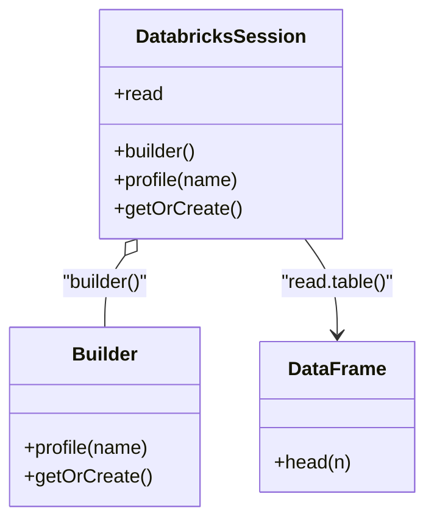

# Diagram: research/orchestrator/scripts/databricks_integration/databricks_connect_example.py


> Auto-generated by Obscura crawlers

## Diagram 1

```mermaid
flowchart LR
    I[import databricks.connect.DatabricksSession]
    B[DatabricksSession.builder]
    P[profile(adb-3670867781558309)]
    G[getOrCreate()]
    S[spark : DatabricksSession]
    R[spark.read]
    T[read.table(fv_prod.bronze.public_entity)]
    D[df : DataFrame]
    H[df.head(1)]
    O[print(df.head(1))]
    I --> B --> P --> G --> S --> R --> T --> D --> H --> O
```

> SVG rendering failed for this diagram.

## Diagram 2



### SVG

<svg id="container" width="349.3984375" xmlns="http://www.w3.org/2000/svg" class="classDiagram" height="432" viewBox="0 0 349.3984375 432" role="graphics-document document" aria-roledescription="class"><style>#container{font-family:"trebuchet ms",verdana,arial,sans-serif;font-size:16px;fill:#333;}@keyframes edge-animation-frame{from{stroke-dashoffset:0;}}@keyframes dash{to{stroke-dashoffset:0;}}#container .edge-animation-slow{stroke-dasharray:9,5!important;stroke-dashoffset:900;animation:dash 50s linear infinite;stroke-linecap:round;}#container .edge-animation-fast{stroke-dasharray:9,5!important;stroke-dashoffset:900;animation:dash 20s linear infinite;stroke-linecap:round;}#container .error-icon{fill:#552222;}#container .error-text{fill:#552222;stroke:#552222;}#container .edge-thickness-normal{stroke-width:1px;}#container .edge-thickness-thick{stroke-width:3.5px;}#container .edge-pattern-solid{stroke-dasharray:0;}#container .edge-thickness-invisible{stroke-width:0;fill:none;}#container .edge-pattern-dashed{stroke-dasharray:3;}#container .edge-pattern-dotted{stroke-dasharray:2;}#container .marker{fill:#333333;stroke:#333333;}#container .marker.cross{stroke:#333333;}#container svg{font-family:"trebuchet ms",verdana,arial,sans-serif;font-size:16px;}#container p{margin:0;}#container g.classGroup text{fill:#9370DB;stroke:none;font-family:"trebuchet ms",verdana,arial,sans-serif;font-size:10px;}#container g.classGroup text .title{font-weight:bolder;}#container .nodeLabel,#container .edgeLabel{color:#131300;}#container .edgeLabel .label rect{fill:#ECECFF;}#container .label text{fill:#131300;}#container .labelBkg{background:#ECECFF;}#container .edgeLabel .label span{background:#ECECFF;}#container .classTitle{font-weight:bolder;}#container .node rect,#container .node circle,#container .node ellipse,#container .node polygon,#container .node path{fill:#ECECFF;stroke:#9370DB;stroke-width:1px;}#container .divider{stroke:#9370DB;stroke-width:1;}#container g.clickable{cursor:pointer;}#container g.classGroup rect{fill:#ECECFF;stroke:#9370DB;}#container g.classGroup line{stroke:#9370DB;stroke-width:1;}#container .classLabel .box{stroke:none;stroke-width:0;fill:#ECECFF;opacity:0.5;}#container .classLabel .label{fill:#9370DB;font-size:10px;}#container .relation{stroke:#333333;stroke-width:1;fill:none;}#container .dashed-line{stroke-dasharray:3;}#container .dotted-line{stroke-dasharray:1 2;}#container #compositionStart,#container .composition{fill:#333333!important;stroke:#333333!important;stroke-width:1;}#container #compositionEnd,#container .composition{fill:#333333!important;stroke:#333333!important;stroke-width:1;}#container #dependencyStart,#container .dependency{fill:#333333!important;stroke:#333333!important;stroke-width:1;}#container #dependencyStart,#container .dependency{fill:#333333!important;stroke:#333333!important;stroke-width:1;}#container #extensionStart,#container .extension{fill:transparent!important;stroke:#333333!important;stroke-width:1;}#container #extensionEnd,#container .extension{fill:transparent!important;stroke:#333333!important;stroke-width:1;}#container #aggregationStart,#container .aggregation{fill:transparent!important;stroke:#333333!important;stroke-width:1;}#container #aggregationEnd,#container .aggregation{fill:transparent!important;stroke:#333333!important;stroke-width:1;}#container #lollipopStart,#container .lollipop{fill:#ECECFF!important;stroke:#333333!important;stroke-width:1;}#container #lollipopEnd,#container .lollipop{fill:#ECECFF!important;stroke:#333333!important;stroke-width:1;}#container .edgeTerminals{font-size:11px;line-height:initial;}#container .classTitleText{text-anchor:middle;font-size:18px;fill:#333;}#container .label-icon{display:inline-block;height:1em;overflow:visible;vertical-align:-0.125em;}#container .node .label-icon path{fill:currentColor;stroke:revert;stroke-width:revert;}#container :root{--mermaid-font-family:"trebuchet ms",verdana,arial,sans-serif;}</style><g><defs><marker id="container_class-aggregationStart" class="marker aggregation class" refX="18" refY="7" markerWidth="190" markerHeight="240" orient="auto"><path d="M 18,7 L9,13 L1,7 L9,1 Z"></path></marker></defs><defs><marker id="container_class-aggregationEnd" class="marker aggregation class" refX="1" refY="7" markerWidth="20" markerHeight="28" orient="auto"><path d="M 18,7 L9,13 L1,7 L9,1 Z"></path></marker></defs><defs><marker id="container_class-extensionStart" class="marker extension class" refX="18" refY="7" markerWidth="190" markerHeight="240" orient="auto"><path d="M 1,7 L18,13 V 1 Z"></path></marker></defs><defs><marker id="container_class-extensionEnd" class="marker extension class" refX="1" refY="7" markerWidth="20" markerHeight="28" orient="auto"><path d="M 1,1 V 13 L18,7 Z"></path></marker></defs><defs><marker id="container_class-compositionStart" class="marker composition class" refX="18" refY="7" markerWidth="190" markerHeight="240" orient="auto"><path d="M 18,7 L9,13 L1,7 L9,1 Z"></path></marker></defs><defs><marker id="container_class-compositionEnd" class="marker composition class" refX="1" refY="7" markerWidth="20" markerHeight="28" orient="auto"><path d="M 18,7 L9,13 L1,7 L9,1 Z"></path></marker></defs><defs><marker id="container_class-dependencyStart" class="marker dependency class" refX="6" refY="7" markerWidth="190" markerHeight="240" orient="auto"><path d="M 5,7 L9,13 L1,7 L9,1 Z"></path></marker></defs><defs><marker id="container_class-dependencyEnd" class="marker dependency class" refX="13" refY="7" markerWidth="20" markerHeight="28" orient="auto"><path d="M 18,7 L9,13 L14,7 L9,1 Z"></path></marker></defs><defs><marker id="container_class-lollipopStart" class="marker lollipop class" refX="13" refY="7" markerWidth="190" markerHeight="240" orient="auto"><circle stroke="black" fill="transparent" cx="7" cy="7" r="6"></circle></marker></defs><defs><marker id="container_class-lollipopEnd" class="marker lollipop class" refX="1" refY="7" markerWidth="190" markerHeight="240" orient="auto"><circle stroke="black" fill="transparent" cx="7" cy="7" r="6"></circle></marker></defs><g class="root"><g class="clusters"></g><g class="edgePaths"><path d="M102.814,213.994L100.051,217.829C97.287,221.663,91.761,229.331,88.998,239.332C86.234,249.333,86.234,261.667,86.234,267.833L86.234,274" id="id_DatabricksSession_Builder_1" class="edge-thickness-normal edge-pattern-solid relation" style=";;;" data-edge="true" data-et="edge" data-id="id_DatabricksSession_Builder_1" data-points="W3sieCI6MTEyLjg5OTMwMzkyMzg3MjE4LCJ5IjoyMDB9LHsieCI6ODYuMjM0Mzc1LCJ5IjoyMzd9LHsieCI6ODYuMjM0Mzc1LCJ5IjoyNzR9XQ==" marker-start="url(#container_class-aggregationStart)"></path><path d="M251.269,200L255.713,206.167C260.157,212.333,269.045,224.667,273.489,238C277.934,251.333,277.934,265.667,277.934,272.833L277.934,280" id="id_DatabricksSession_DataFrame_2" class="edge-thickness-normal edge-pattern-solid relation" style=";;;" data-edge="true" data-et="edge" data-id="id_DatabricksSession_DataFrame_2" data-points="W3sieCI6MjUxLjI2ODY2NDgyNjEyNzgsInkiOjIwMH0seyJ4IjoyNzcuOTMzNTkzNzUsInkiOjIzN30seyJ4IjoyNzcuOTMzNTkzNzUsInkiOjI4Nn1d" marker-end="url(#container_class-dependencyEnd)"></path></g><g class="edgeLabels"><g class="edgeLabel" transform="translate(86.234375, 237)"><g class="label" data-id="id_DatabricksSession_Builder_1" transform="translate(-37.7734375, -12)"><foreignObject width="75.546875" height="24"><div xmlns="http://www.w3.org/1999/xhtml" class="labelBkg" style="display: table-cell; white-space: nowrap; line-height: 1.5; max-width: 200px; text-align: center;"><span class="edgeLabel"><p>"builder()"</p></span></div></foreignObject></g></g><g class="edgeLabel" transform="translate(277.93359375, 237)"><g class="label" data-id="id_DatabricksSession_DataFrame_2" transform="translate(-48.1171875, -12)"><foreignObject width="96.234375" height="24"><div xmlns="http://www.w3.org/1999/xhtml" class="labelBkg" style="display: table-cell; white-space: nowrap; line-height: 1.5; max-width: 200px; text-align: center;"><span class="edgeLabel"><p>"read.table()"</p></span></div></foreignObject></g></g></g><g class="nodes"><g class="node default" id="classId-DatabricksSession-0" transform="translate(182.083984375, 104)"><g class="basic label-container"><path d="M-98.67578125 -96 L98.67578125 -96 L98.67578125 96 L-98.67578125 96" stroke="none" stroke-width="0" fill="#ECECFF" style=""></path><path d="M-98.67578125 -96 C-43.54377739620049 -96, 11.58822645759902 -96, 98.67578125 -96 M-98.67578125 -96 C-42.46666871590519 -96, 13.742443818189614 -96, 98.67578125 -96 M98.67578125 -96 C98.67578125 -48.141426757127064, 98.67578125 -0.2828535142541284, 98.67578125 96 M98.67578125 -96 C98.67578125 -44.659338544669396, 98.67578125 6.681322910661208, 98.67578125 96 M98.67578125 96 C36.47300112612361 96, -25.729778997752774 96, -98.67578125 96 M98.67578125 96 C35.14199870853033 96, -28.39178383293934 96, -98.67578125 96 M-98.67578125 96 C-98.67578125 34.40985670597033, -98.67578125 -27.180286588059346, -98.67578125 -96 M-98.67578125 96 C-98.67578125 40.96951709480174, -98.67578125 -14.060965810396524, -98.67578125 -96" stroke="#9370DB" stroke-width="1.3" fill="none" stroke-dasharray="0 0" style=""></path></g><g class="annotation-group text" transform="translate(0, -72)"></g><g class="label-group text" transform="translate(-67.4140625, -72)"><g class="label" style="font-weight: bolder" transform="translate(0,-12)"><foreignObject width="134.828125" height="24"><div xmlns="http://www.w3.org/1999/xhtml" style="display: table-cell; white-space: nowrap; line-height: 1.5; max-width: 182px; text-align: center;"><span class="nodeLabel markdown-node-label" style=""><p>DatabricksSession</p></span></div></foreignObject></g></g><g class="members-group text" transform="translate(-86.67578125, -24)"><g class="label" style="" transform="translate(0,-12)"><foreignObject width="40.515625" height="24"><div xmlns="http://www.w3.org/1999/xhtml" style="display: table-cell; white-space: nowrap; line-height: 1.5; max-width: 98px; text-align: center;"><span class="nodeLabel markdown-node-label" style=""><p>+read</p></span></div></foreignObject></g></g><g class="methods-group text" transform="translate(-86.67578125, 24)"><g class="label" style="" transform="translate(0,-12)"><foreignObject width="70.765625" height="24"><div xmlns="http://www.w3.org/1999/xhtml" style="display: table-cell; white-space: nowrap; line-height: 1.5; max-width: 128px; text-align: center;"><span class="nodeLabel markdown-node-label" style=""><p>+builder()</p></span></div></foreignObject></g><g class="label" style="" transform="translate(0,12)"><foreignObject width="105.9375" height="24"><div xmlns="http://www.w3.org/1999/xhtml" style="display: table-cell; white-space: nowrap; line-height: 1.5; max-width: 163px; text-align: center;"><span class="nodeLabel markdown-node-label" style=""><p>+profile(name)</p></span></div></foreignObject></g><g class="label" style="" transform="translate(0,36)"><foreignObject width="104.109375" height="24"><div xmlns="http://www.w3.org/1999/xhtml" style="display: table-cell; white-space: nowrap; line-height: 1.5; max-width: 161px; text-align: center;"><span class="nodeLabel markdown-node-label" style=""><p>+getOrCreate()</p></span></div></foreignObject></g></g><g class="divider" style=""><path d="M-98.67578125 -48 C-28.61407239863027 -48, 41.44763645273946 -48, 98.67578125 -48 M-98.67578125 -48 C-23.47564573504242 -48, 51.72448977991516 -48, 98.67578125 -48" stroke="#9370DB" stroke-width="1.3" fill="none" stroke-dasharray="0 0" style=""></path></g><g class="divider" style=""><path d="M-98.67578125 0 C-41.036783217540346 0, 16.602214814919307 0, 98.67578125 0 M-98.67578125 0 C-45.15811946784481 0, 8.359542314310374 0, 98.67578125 0" stroke="#9370DB" stroke-width="1.3" fill="none" stroke-dasharray="0 0" style=""></path></g></g><g class="node default" id="classId-Builder-1" transform="translate(86.234375, 349)"><g class="basic label-container"><path d="M-78.234375 -75 L78.234375 -75 L78.234375 75 L-78.234375 75" stroke="none" stroke-width="0" fill="#ECECFF" style=""></path><path d="M-78.234375 -75 C-39.614260108244146 -75, -0.9941452164882918 -75, 78.234375 -75 M-78.234375 -75 C-33.765902446179986 -75, 10.702570107640028 -75, 78.234375 -75 M78.234375 -75 C78.234375 -38.55582563048806, 78.234375 -2.1116512609761173, 78.234375 75 M78.234375 -75 C78.234375 -27.28444784171895, 78.234375 20.4311043165621, 78.234375 75 M78.234375 75 C37.659786514556835 75, -2.91480197088633 75, -78.234375 75 M78.234375 75 C27.498154556373443 75, -23.238065887253114 75, -78.234375 75 M-78.234375 75 C-78.234375 37.53493917342668, -78.234375 0.0698783468533577, -78.234375 -75 M-78.234375 75 C-78.234375 19.088786905820577, -78.234375 -36.82242618835885, -78.234375 -75" stroke="#9370DB" stroke-width="1.3" fill="none" stroke-dasharray="0 0" style=""></path></g><g class="annotation-group text" transform="translate(0, -51)"></g><g class="label-group text" transform="translate(-26.53125, -51)"><g class="label" style="font-weight: bolder" transform="translate(0,-12)"><foreignObject width="53.0625" height="24"><div xmlns="http://www.w3.org/1999/xhtml" style="display: table-cell; white-space: nowrap; line-height: 1.5; max-width: 103px; text-align: center;"><span class="nodeLabel markdown-node-label" style=""><p>Builder</p></span></div></foreignObject></g></g><g class="members-group text" transform="translate(-66.234375, -3)"></g><g class="methods-group text" transform="translate(-66.234375, 27)"><g class="label" style="" transform="translate(0,-12)"><foreignObject width="105.9375" height="24"><div xmlns="http://www.w3.org/1999/xhtml" style="display: table-cell; white-space: nowrap; line-height: 1.5; max-width: 163px; text-align: center;"><span class="nodeLabel markdown-node-label" style=""><p>+profile(name)</p></span></div></foreignObject></g><g class="label" style="" transform="translate(0,12)"><foreignObject width="104.109375" height="24"><div xmlns="http://www.w3.org/1999/xhtml" style="display: table-cell; white-space: nowrap; line-height: 1.5; max-width: 161px; text-align: center;"><span class="nodeLabel markdown-node-label" style=""><p>+getOrCreate()</p></span></div></foreignObject></g></g><g class="divider" style=""><path d="M-78.234375 -27 C-40.73094736225658 -27, -3.227519724513158 -27, 78.234375 -27 M-78.234375 -27 C-42.102635125476695 -27, -5.97089525095339 -27, 78.234375 -27" stroke="#9370DB" stroke-width="1.3" fill="none" stroke-dasharray="0 0" style=""></path></g><g class="divider" style=""><path d="M-78.234375 -3 C-43.99721085160171 -3, -9.760046703203415 -3, 78.234375 -3 M-78.234375 -3 C-33.46046901387558 -3, 11.313436972248837 -3, 78.234375 -3" stroke="#9370DB" stroke-width="1.3" fill="none" stroke-dasharray="0 0" style=""></path></g></g><g class="node default" id="classId-DataFrame-2" transform="translate(277.93359375, 349)"><g class="basic label-container"><path d="M-63.46484375 -63 L63.46484375 -63 L63.46484375 63 L-63.46484375 63" stroke="none" stroke-width="0" fill="#ECECFF" style=""></path><path d="M-63.46484375 -63 C-35.18400546288103 -63, -6.903167175762064 -63, 63.46484375 -63 M-63.46484375 -63 C-37.38429954120733 -63, -11.303755332414653 -63, 63.46484375 -63 M63.46484375 -63 C63.46484375 -36.62359414672004, 63.46484375 -10.247188293440075, 63.46484375 63 M63.46484375 -63 C63.46484375 -18.204234268283038, 63.46484375 26.591531463433924, 63.46484375 63 M63.46484375 63 C22.21844149249992 63, -19.02796076500016 63, -63.46484375 63 M63.46484375 63 C34.08892055035665 63, 4.7129973507132945 63, -63.46484375 63 M-63.46484375 63 C-63.46484375 29.965238482394724, -63.46484375 -3.069523035210551, -63.46484375 -63 M-63.46484375 63 C-63.46484375 25.48282811933779, -63.46484375 -12.034343761324422, -63.46484375 -63" stroke="#9370DB" stroke-width="1.3" fill="none" stroke-dasharray="0 0" style=""></path></g><g class="annotation-group text" transform="translate(0, -39)"></g><g class="label-group text" transform="translate(-38.9921875, -39)"><g class="label" style="font-weight: bolder" transform="translate(0,-12)"><foreignObject width="77.984375" height="24"><div xmlns="http://www.w3.org/1999/xhtml" style="display: table-cell; white-space: nowrap; line-height: 1.5; max-width: 127px; text-align: center;"><span class="nodeLabel markdown-node-label" style=""><p>DataFrame</p></span></div></foreignObject></g></g><g class="members-group text" transform="translate(-51.46484375, 9)"></g><g class="methods-group text" transform="translate(-51.46484375, 39)"><g class="label" style="" transform="translate(0,-12)"><foreignObject width="63.9375" height="24"><div xmlns="http://www.w3.org/1999/xhtml" style="display: table-cell; white-space: nowrap; line-height: 1.5; max-width: 121px; text-align: center;"><span class="nodeLabel markdown-node-label" style=""><p>+head(n)</p></span></div></foreignObject></g></g><g class="divider" style=""><path d="M-63.46484375 -15 C-18.22968028150879 -15, 27.005483186982417 -15, 63.46484375 -15 M-63.46484375 -15 C-26.418604934504458 -15, 10.627633880991084 -15, 63.46484375 -15" stroke="#9370DB" stroke-width="1.3" fill="none" stroke-dasharray="0 0" style=""></path></g><g class="divider" style=""><path d="M-63.46484375 9 C-27.439914469616 9, 8.585014810768001 9, 63.46484375 9 M-63.46484375 9 C-23.913621378834783 9, 15.637600992330434 9, 63.46484375 9" stroke="#9370DB" stroke-width="1.3" fill="none" stroke-dasharray="0 0" style=""></path></g></g></g></g></g></svg>
