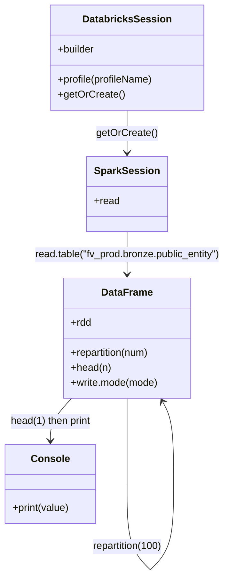

# Diagram: research/orchestrator/scripts/databricks_integration/databricks_connect_stresstest2.py


> Auto-generated by Obscura crawlers

## Diagram 1

```mermaid
flowchart TD
  A[DatabricksSession.builder] --> B[profile("adb-3670867781558309")]
  B --> C[getOrCreate() → spark]
  C --> D[spark.read.table("fv_prod.bronze.public_entity")]
  D --> E[df]
  E --> F[df.repartition(100)]
  F --> G[df.head(1)]
  G --> H[print(df.head(1))]
```

> SVG rendering failed for this diagram.

## Diagram 2



### SVG

<svg id="container" width="363.44061279296875" xmlns="http://www.w3.org/2000/svg" class="classDiagram" height="918.1499633789062" viewBox="0 0 363.44061279296875 918.1499633789062" role="graphics-document document" aria-roledescription="class"><style>#container{font-family:"trebuchet ms",verdana,arial,sans-serif;font-size:16px;fill:#333;}@keyframes edge-animation-frame{from{stroke-dashoffset:0;}}@keyframes dash{to{stroke-dashoffset:0;}}#container .edge-animation-slow{stroke-dasharray:9,5!important;stroke-dashoffset:900;animation:dash 50s linear infinite;stroke-linecap:round;}#container .edge-animation-fast{stroke-dasharray:9,5!important;stroke-dashoffset:900;animation:dash 20s linear infinite;stroke-linecap:round;}#container .error-icon{fill:#552222;}#container .error-text{fill:#552222;stroke:#552222;}#container .edge-thickness-normal{stroke-width:1px;}#container .edge-thickness-thick{stroke-width:3.5px;}#container .edge-pattern-solid{stroke-dasharray:0;}#container .edge-thickness-invisible{stroke-width:0;fill:none;}#container .edge-pattern-dashed{stroke-dasharray:3;}#container .edge-pattern-dotted{stroke-dasharray:2;}#container .marker{fill:#333333;stroke:#333333;}#container .marker.cross{stroke:#333333;}#container svg{font-family:"trebuchet ms",verdana,arial,sans-serif;font-size:16px;}#container p{margin:0;}#container g.classGroup text{fill:#9370DB;stroke:none;font-family:"trebuchet ms",verdana,arial,sans-serif;font-size:10px;}#container g.classGroup text .title{font-weight:bolder;}#container .nodeLabel,#container .edgeLabel{color:#131300;}#container .edgeLabel .label rect{fill:#ECECFF;}#container .label text{fill:#131300;}#container .labelBkg{background:#ECECFF;}#container .edgeLabel .label span{background:#ECECFF;}#container .classTitle{font-weight:bolder;}#container .node rect,#container .node circle,#container .node ellipse,#container .node polygon,#container .node path{fill:#ECECFF;stroke:#9370DB;stroke-width:1px;}#container .divider{stroke:#9370DB;stroke-width:1;}#container g.clickable{cursor:pointer;}#container g.classGroup rect{fill:#ECECFF;stroke:#9370DB;}#container g.classGroup line{stroke:#9370DB;stroke-width:1;}#container .classLabel .box{stroke:none;stroke-width:0;fill:#ECECFF;opacity:0.5;}#container .classLabel .label{fill:#9370DB;font-size:10px;}#container .relation{stroke:#333333;stroke-width:1;fill:none;}#container .dashed-line{stroke-dasharray:3;}#container .dotted-line{stroke-dasharray:1 2;}#container #compositionStart,#container .composition{fill:#333333!important;stroke:#333333!important;stroke-width:1;}#container #compositionEnd,#container .composition{fill:#333333!important;stroke:#333333!important;stroke-width:1;}#container #dependencyStart,#container .dependency{fill:#333333!important;stroke:#333333!important;stroke-width:1;}#container #dependencyStart,#container .dependency{fill:#333333!important;stroke:#333333!important;stroke-width:1;}#container #extensionStart,#container .extension{fill:transparent!important;stroke:#333333!important;stroke-width:1;}#container #extensionEnd,#container .extension{fill:transparent!important;stroke:#333333!important;stroke-width:1;}#container #aggregationStart,#container .aggregation{fill:transparent!important;stroke:#333333!important;stroke-width:1;}#container #aggregationEnd,#container .aggregation{fill:transparent!important;stroke:#333333!important;stroke-width:1;}#container #lollipopStart,#container .lollipop{fill:#ECECFF!important;stroke:#333333!important;stroke-width:1;}#container #lollipopEnd,#container .lollipop{fill:#ECECFF!important;stroke:#333333!important;stroke-width:1;}#container .edgeTerminals{font-size:11px;line-height:initial;}#container .classTitleText{text-anchor:middle;font-size:18px;fill:#333;}#container .label-icon{display:inline-block;height:1em;overflow:visible;vertical-align:-0.125em;}#container .node .label-icon path{fill:currentColor;stroke:revert;stroke-width:revert;}#container :root{--mermaid-font-family:"trebuchet ms",verdana,arial,sans-serif;}</style><g><defs><marker id="container_class-aggregationStart" class="marker aggregation class" refX="18" refY="7" markerWidth="190" markerHeight="240" orient="auto"><path d="M 18,7 L9,13 L1,7 L9,1 Z"></path></marker></defs><defs><marker id="container_class-aggregationEnd" class="marker aggregation class" refX="1" refY="7" markerWidth="20" markerHeight="28" orient="auto"><path d="M 18,7 L9,13 L1,7 L9,1 Z"></path></marker></defs><defs><marker id="container_class-extensionStart" class="marker extension class" refX="18" refY="7" markerWidth="190" markerHeight="240" orient="auto"><path d="M 1,7 L18,13 V 1 Z"></path></marker></defs><defs><marker id="container_class-extensionEnd" class="marker extension class" refX="1" refY="7" markerWidth="20" markerHeight="28" orient="auto"><path d="M 1,1 V 13 L18,7 Z"></path></marker></defs><defs><marker id="container_class-compositionStart" class="marker composition class" refX="18" refY="7" markerWidth="190" markerHeight="240" orient="auto"><path d="M 18,7 L9,13 L1,7 L9,1 Z"></path></marker></defs><defs><marker id="container_class-compositionEnd" class="marker composition class" refX="1" refY="7" markerWidth="20" markerHeight="28" orient="auto"><path d="M 18,7 L9,13 L1,7 L9,1 Z"></path></marker></defs><defs><marker id="container_class-dependencyStart" class="marker dependency class" refX="6" refY="7" markerWidth="190" markerHeight="240" orient="auto"><path d="M 5,7 L9,13 L1,7 L9,1 Z"></path></marker></defs><defs><marker id="container_class-dependencyEnd" class="marker dependency class" refX="13" refY="7" markerWidth="20" markerHeight="28" orient="auto"><path d="M 18,7 L9,13 L14,7 L9,1 Z"></path></marker></defs><defs><marker id="container_class-lollipopStart" class="marker lollipop class" refX="13" refY="7" markerWidth="190" markerHeight="240" orient="auto"><circle stroke="black" fill="transparent" cx="7" cy="7" r="6"></circle></marker></defs><defs><marker id="container_class-lollipopEnd" class="marker lollipop class" refX="1" refY="7" markerWidth="190" markerHeight="240" orient="auto"><circle stroke="black" fill="transparent" cx="7" cy="7" r="6"></circle></marker></defs><g class="root"><g class="clusters"></g><g class="edgePaths"><path d="M203.652,176L203.652,182.167C203.652,188.333,203.652,200.667,203.652,212C203.652,223.333,203.652,233.667,203.652,238.833L203.652,244" id="id_DatabricksSession_SparkSession_1" class="edge-thickness-normal edge-pattern-solid relation" style=";;;" data-edge="true" data-et="edge" data-id="id_DatabricksSession_SparkSession_1" data-points="W3sieCI6MjAzLjY1MTU2MjUwMDc0NTA2LCJ5IjoxNzZ9LHsieCI6MjAzLjY1MTU2MjUwMDc0NTA2LCJ5IjoyMTN9LHsieCI6MjAzLjY1MTU2MjUwMDc0NTA2LCJ5IjoyNTB9XQ==" marker-end="url(#container_class-dependencyEnd)"></path><path d="M203.652,370L203.652,376.167C203.652,382.333,203.652,394.667,203.652,406C203.652,417.333,203.652,427.667,203.652,432.833L203.652,438" id="id_SparkSession_DataFrame_2" class="edge-thickness-normal edge-pattern-solid relation" style=";;;" data-edge="true" data-et="edge" data-id="id_SparkSession_DataFrame_2" data-points="W3sieCI6MjAzLjY1MTU2MjUwMDc0NTA2LCJ5IjozNzB9LHsieCI6MjAzLjY1MTU2MjUwMDc0NTA2LCJ5Ijo0MDd9LHsieCI6MjAzLjY1MTU2MjUwMDc0NTA2LCJ5Ijo0NDR9XQ==" marker-end="url(#container_class-dependencyEnd)"></path><path d="M203.652,636L203.652,642.167C203.652,648.333,203.652,660.667,203.652,683.492C203.652,706.317,203.652,739.633,203.652,756.292L203.652,772.95" id="DataFrame-cyclic-special-1" class="edge-thickness-normal edge-pattern-solid relation" style=";;;" data-edge="true" data-et="edge" data-id="DataFrame-cyclic-special-1" data-points="W3sieCI6MjAzLjY1MTU2MjUwMDc0NTA2LCJ5Ijo2MzZ9LHsieCI6MjAzLjY1MTU2MjUwMDc0NTA2LCJ5Ijo2NzN9LHsieCI6MjAzLjY1MTU2MjUwMDc0NTA2LCJ5Ijo3NzIuOTQ5OTk5OTk5MjU0OX1d"></path><path d="M203.652,773.05L203.652,789.708C203.652,806.367,203.652,839.683,210.009,862.509C216.367,885.334,229.082,897.668,235.439,903.835L241.797,910.001" id="DataFrame-cyclic-special-mid" class="edge-thickness-normal edge-pattern-solid relation" style=";;;" data-edge="true" data-et="edge" data-id="DataFrame-cyclic-special-mid" data-points="W3sieCI6MjAzLjY1MTU2MjUwMDc0NTA2LCJ5Ijo3NzMuMDUwMDAwMDAwNzQ1MX0seyJ4IjoyMDMuNjUxNTYyNTAwNzQ1MDYsInkiOjg3M30seyJ4IjoyNDEuNzk2ODc1LCJ5Ijo5MTAuMDAxNDk5Mjg0MTI4NX1d"></path><path d="M241.897,910.001L248.254,903.835C254.612,897.668,267.327,885.334,273.685,862.5C280.042,839.667,280.042,806.333,280.042,773C280.042,739.667,280.042,706.333,276.998,684.367C273.954,662.401,267.867,651.802,264.823,646.502L261.779,641.203" id="DataFrame-cyclic-special-2" class="edge-thickness-normal edge-pattern-solid relation" style=";;;" data-edge="true" data-et="edge" data-id="DataFrame-cyclic-special-2" data-points="W3sieCI6MjQxLjg5Njg3NTAwMTQ5MDEyLCJ5Ijo5MTAuMDAxNDk5Mjg0MTI4NX0seyJ4IjoyODAuMDQyMTg3NTAwNzQ1MDYsInkiOjg3M30seyJ4IjoyODAuMDQyMTg3NTAwNzQ1MDYsInkiOjc3M30seyJ4IjoyODAuMDQyMTg3NTAwNzQ1MDYsInkiOjY3M30seyJ4IjoyNTguNzkwNjYwMjQ1MTA2LCJ5Ijo2MzZ9XQ==" marker-end="url(#container_class-dependencyEnd)"></path><path d="M114.977,636L109.281,642.167C103.585,648.333,92.193,660.667,86.497,672C80.801,683.333,80.801,693.667,80.801,698.833L80.801,704" id="id_DataFrame_Console_4" class="edge-thickness-normal edge-pattern-solid relation" style=";;;" data-edge="true" data-et="edge" data-id="id_DataFrame_Console_4" data-points="W3sieCI6MTE0Ljk3NzMxNDM3OTkwNjUyLCJ5Ijo2MzZ9LHsieCI6ODAuODAwNzgxMjUsInkiOjY3M30seyJ4Ijo4MC44MDA3ODEyNSwieSI6NzEwfV0=" marker-end="url(#container_class-dependencyEnd)"></path></g><g class="edgeLabels"><g class="edgeLabel" transform="translate(203.65156250074506, 213)"><g class="label" data-id="id_DatabricksSession_SparkSession_1" transform="translate(-48.0625, -12)"><foreignObject width="96.125" height="24"><div xmlns="http://www.w3.org/1999/xhtml" class="labelBkg" style="display: table-cell; white-space: nowrap; line-height: 1.5; max-width: 200px; text-align: center;"><span class="edgeLabel"><p>getOrCreate()</p></span></div></foreignObject></g></g><g class="edgeLabel" transform="translate(203.65156250074506, 407)"><g class="label" data-id="id_SparkSession_DataFrame_2" transform="translate(-151.7890625, -12)"><foreignObject width="303.578125" height="24"><div xmlns="http://www.w3.org/1999/xhtml" class="labelBkg" style="display: table; white-space: break-spaces; line-height: 1.5; max-width: 200px; text-align: center; width: 200px;"><span class="edgeLabel"><p>read.table("fv_prod.bronze.public_entity")</p></span></div></foreignObject></g></g><g class="edgeLabel"><g class="label" data-id="DataFrame-cyclic-special-1" transform="translate(0, 0)"><foreignObject width="0" height="0"><div xmlns="http://www.w3.org/1999/xhtml" class="labelBkg" style="display: table-cell; white-space: nowrap; line-height: 1.5; max-width: 200px; text-align: center;"><span class="edgeLabel"></span></div></foreignObject></g></g><g class="edgeLabel" transform="translate(203.65156250074506, 873)"><g class="label" data-id="DataFrame-cyclic-special-mid" transform="translate(-56.390625, -12)"><foreignObject width="112.78125" height="24"><div xmlns="http://www.w3.org/1999/xhtml" class="labelBkg" style="display: table-cell; white-space: nowrap; line-height: 1.5; max-width: 200px; text-align: center;"><span class="edgeLabel"><p>repartition(100)</p></span></div></foreignObject></g></g><g class="edgeLabel"><g class="label" data-id="DataFrame-cyclic-special-2" transform="translate(0, 0)"><foreignObject width="0" height="0"><div xmlns="http://www.w3.org/1999/xhtml" class="labelBkg" style="display: table-cell; white-space: nowrap; line-height: 1.5; max-width: 200px; text-align: center;"><span class="edgeLabel"></span></div></foreignObject></g></g><g class="edgeLabel" transform="translate(80.80078125, 673)"><g class="label" data-id="id_DataFrame_Console_4" transform="translate(-65.1328125, -12)"><foreignObject width="130.265625" height="24"><div xmlns="http://www.w3.org/1999/xhtml" class="labelBkg" style="display: table-cell; white-space: nowrap; line-height: 1.5; max-width: 200px; text-align: center;"><span class="edgeLabel"><p>head(1) then print</p></span></div></foreignObject></g></g></g><g class="nodes"><g class="node default" id="classId-DatabricksSession-0" transform="translate(203.65156250074506, 92)"><g class="basic label-container"><path d="M-122.98828125 -84 L122.98828125 -84 L122.98828125 84 L-122.98828125 84" stroke="none" stroke-width="0" fill="#ECECFF" style=""></path><path d="M-122.98828125 -84 C-66.99636182582123 -84, -11.00444240164245 -84, 122.98828125 -84 M-122.98828125 -84 C-42.238843390339824 -84, 38.51059446932035 -84, 122.98828125 -84 M122.98828125 -84 C122.98828125 -39.74784567148875, 122.98828125 4.504308657022506, 122.98828125 84 M122.98828125 -84 C122.98828125 -31.6485341270999, 122.98828125 20.7029317458002, 122.98828125 84 M122.98828125 84 C44.45306677134131 84, -34.082147707317375 84, -122.98828125 84 M122.98828125 84 C47.956029372765116 84, -27.07622250446977 84, -122.98828125 84 M-122.98828125 84 C-122.98828125 26.1181150801486, -122.98828125 -31.763769839702803, -122.98828125 -84 M-122.98828125 84 C-122.98828125 18.445029371521514, -122.98828125 -47.10994125695697, -122.98828125 -84" stroke="#9370DB" stroke-width="1.3" fill="none" stroke-dasharray="0 0" style=""></path></g><g class="annotation-group text" transform="translate(0, -60)"></g><g class="label-group text" transform="translate(-67.4140625, -60)"><g class="label" style="font-weight: bolder" transform="translate(0,-12)"><foreignObject width="134.828125" height="24"><div xmlns="http://www.w3.org/1999/xhtml" style="display: table-cell; white-space: nowrap; line-height: 1.5; max-width: 182px; text-align: center;"><span class="nodeLabel markdown-node-label" style=""><p>DatabricksSession</p></span></div></foreignObject></g></g><g class="members-group text" transform="translate(-110.98828125, -12)"><g class="label" style="" transform="translate(0,-12)"><foreignObject width="60.390625" height="24"><div xmlns="http://www.w3.org/1999/xhtml" style="display: table-cell; white-space: nowrap; line-height: 1.5; max-width: 119px; text-align: center;"><span class="nodeLabel markdown-node-label" style=""><p>+builder</p></span></div></foreignObject></g></g><g class="methods-group text" transform="translate(-110.98828125, 36)"><g class="label" style="" transform="translate(0,-12)"><foreignObject width="154.5625" height="24"><div xmlns="http://www.w3.org/1999/xhtml" style="display: table-cell; white-space: nowrap; line-height: 1.5; max-width: 212px; text-align: center;"><span class="nodeLabel markdown-node-label" style=""><p>+profile(profileName)</p></span></div></foreignObject></g><g class="label" style="" transform="translate(0,12)"><foreignObject width="104.109375" height="24"><div xmlns="http://www.w3.org/1999/xhtml" style="display: table-cell; white-space: nowrap; line-height: 1.5; max-width: 161px; text-align: center;"><span class="nodeLabel markdown-node-label" style=""><p>+getOrCreate()</p></span></div></foreignObject></g></g><g class="divider" style=""><path d="M-122.98828125 -36 C-47.12065311577682 -36, 28.746975018446363 -36, 122.98828125 -36 M-122.98828125 -36 C-53.20416749609562 -36, 16.579946257808757 -36, 122.98828125 -36" stroke="#9370DB" stroke-width="1.3" fill="none" stroke-dasharray="0 0" style=""></path></g><g class="divider" style=""><path d="M-122.98828125 12 C-64.55401516686536 12, -6.119749083730696 12, 122.98828125 12 M-122.98828125 12 C-46.01232070346133 12, 30.963639843077345 12, 122.98828125 12" stroke="#9370DB" stroke-width="1.3" fill="none" stroke-dasharray="0 0" style=""></path></g></g><g class="node default" id="classId-SparkSession-1" transform="translate(203.65156250074506, 310)"><g class="basic label-container"><path d="M-61.4921875 -60 L61.4921875 -60 L61.4921875 60 L-61.4921875 60" stroke="none" stroke-width="0" fill="#ECECFF" style=""></path><path d="M-61.4921875 -60 C-19.972785128873106 -60, 21.546617242253788 -60, 61.4921875 -60 M-61.4921875 -60 C-23.607515084662104 -60, 14.277157330675792 -60, 61.4921875 -60 M61.4921875 -60 C61.4921875 -21.01557081570013, 61.4921875 17.96885836859974, 61.4921875 60 M61.4921875 -60 C61.4921875 -16.79551411434352, 61.4921875 26.408971771312963, 61.4921875 60 M61.4921875 60 C18.75944613509416 60, -23.973295229811683 60, -61.4921875 60 M61.4921875 60 C28.624096182586506 60, -4.243995134826989 60, -61.4921875 60 M-61.4921875 60 C-61.4921875 28.976121869788912, -61.4921875 -2.047756260422176, -61.4921875 -60 M-61.4921875 60 C-61.4921875 14.938842683475102, -61.4921875 -30.122314633049797, -61.4921875 -60" stroke="#9370DB" stroke-width="1.3" fill="none" stroke-dasharray="0 0" style=""></path></g><g class="annotation-group text" transform="translate(0, -36)"></g><g class="label-group text" transform="translate(-49.4921875, -36)"><g class="label" style="font-weight: bolder" transform="translate(0,-12)"><foreignObject width="98.984375" height="24"><div xmlns="http://www.w3.org/1999/xhtml" style="display: table-cell; white-space: nowrap; line-height: 1.5; max-width: 147px; text-align: center;"><span class="nodeLabel markdown-node-label" style=""><p>SparkSession</p></span></div></foreignObject></g></g><g class="members-group text" transform="translate(-49.4921875, 12)"><g class="label" style="" transform="translate(0,-12)"><foreignObject width="40.515625" height="24"><div xmlns="http://www.w3.org/1999/xhtml" style="display: table-cell; white-space: nowrap; line-height: 1.5; max-width: 98px; text-align: center;"><span class="nodeLabel markdown-node-label" style=""><p>+read</p></span></div></foreignObject></g></g><g class="methods-group text" transform="translate(-49.4921875, 60)"></g><g class="divider" style=""><path d="M-61.4921875 -12 C-32.253708498010226 -12, -3.015229496020453 -12, 61.4921875 -12 M-61.4921875 -12 C-32.66728555257329 -12, -3.8423836051465727 -12, 61.4921875 -12" stroke="#9370DB" stroke-width="1.3" fill="none" stroke-dasharray="0 0" style=""></path></g><g class="divider" style=""><path d="M-61.4921875 36 C-16.237177208180157 36, 29.017833083639687 36, 61.4921875 36 M-61.4921875 36 C-36.21870238948739 36, -10.945217278974773 36, 61.4921875 36" stroke="#9370DB" stroke-width="1.3" fill="none" stroke-dasharray="0 0" style=""></path></g></g><g class="node default" id="classId-DataFrame-2" transform="translate(203.65156250074506, 540)"><g class="basic label-container"><path d="M-102.06640625 -96 L102.06640625 -96 L102.06640625 96 L-102.06640625 96" stroke="none" stroke-width="0" fill="#ECECFF" style=""></path><path d="M-102.06640625 -96 C-26.948091350121743 -96, 48.170223549756514 -96, 102.06640625 -96 M-102.06640625 -96 C-49.291413778431014 -96, 3.4835786931379715 -96, 102.06640625 -96 M102.06640625 -96 C102.06640625 -49.74741213199299, 102.06640625 -3.4948242639859757, 102.06640625 96 M102.06640625 -96 C102.06640625 -34.917333813667106, 102.06640625 26.165332372665787, 102.06640625 96 M102.06640625 96 C32.48901340986859 96, -37.08837943026282 96, -102.06640625 96 M102.06640625 96 C28.806087755331973 96, -44.454230739336055 96, -102.06640625 96 M-102.06640625 96 C-102.06640625 20.62733206189364, -102.06640625 -54.74533587621272, -102.06640625 -96 M-102.06640625 96 C-102.06640625 56.29407347370314, -102.06640625 16.588146947406287, -102.06640625 -96" stroke="#9370DB" stroke-width="1.3" fill="none" stroke-dasharray="0 0" style=""></path></g><g class="annotation-group text" transform="translate(0, -72)"></g><g class="label-group text" transform="translate(-38.9921875, -72)"><g class="label" style="font-weight: bolder" transform="translate(0,-12)"><foreignObject width="77.984375" height="24"><div xmlns="http://www.w3.org/1999/xhtml" style="display: table-cell; white-space: nowrap; line-height: 1.5; max-width: 127px; text-align: center;"><span class="nodeLabel markdown-node-label" style=""><p>DataFrame</p></span></div></foreignObject></g></g><g class="members-group text" transform="translate(-90.06640625, -24)"><g class="label" style="" transform="translate(0,-12)"><foreignObject width="32.828125" height="24"><div xmlns="http://www.w3.org/1999/xhtml" style="display: table-cell; white-space: nowrap; line-height: 1.5; max-width: 90px; text-align: center;"><span class="nodeLabel markdown-node-label" style=""><p>+rdd</p></span></div></foreignObject></g></g><g class="methods-group text" transform="translate(-90.06640625, 24)"><g class="label" style="" transform="translate(0,-12)"><foreignObject width="128.703125" height="24"><div xmlns="http://www.w3.org/1999/xhtml" style="display: table-cell; white-space: nowrap; line-height: 1.5; max-width: 186px; text-align: center;"><span class="nodeLabel markdown-node-label" style=""><p>+repartition(num)</p></span></div></foreignObject></g><g class="label" style="" transform="translate(0,12)"><foreignObject width="63.9375" height="24"><div xmlns="http://www.w3.org/1999/xhtml" style="display: table-cell; white-space: nowrap; line-height: 1.5; max-width: 121px; text-align: center;"><span class="nodeLabel markdown-node-label" style=""><p>+head(n)</p></span></div></foreignObject></g><g class="label" style="" transform="translate(0,36)"><foreignObject width="141.140625" height="24"><div xmlns="http://www.w3.org/1999/xhtml" style="display: table-cell; white-space: nowrap; line-height: 1.5; max-width: 199px; text-align: center;"><span class="nodeLabel markdown-node-label" style=""><p>+write.mode(mode)</p></span></div></foreignObject></g></g><g class="divider" style=""><path d="M-102.06640625 -48 C-52.91593750264285 -48, -3.7654687552856956 -48, 102.06640625 -48 M-102.06640625 -48 C-21.2911082608542 -48, 59.4841897282916 -48, 102.06640625 -48" stroke="#9370DB" stroke-width="1.3" fill="none" stroke-dasharray="0 0" style=""></path></g><g class="divider" style=""><path d="M-102.06640625 0 C-33.45159075298734 0, 35.163224744025314 0, 102.06640625 0 M-102.06640625 0 C-50.04621964018623 0, 1.97396696962754 0, 102.06640625 0" stroke="#9370DB" stroke-width="1.3" fill="none" stroke-dasharray="0 0" style=""></path></g></g><g class="node default" id="classId-Console-3" transform="translate(80.80078125, 773)"><g class="basic label-container"><path d="M-72.80078125 -63 L72.80078125 -63 L72.80078125 63 L-72.80078125 63" stroke="none" stroke-width="0" fill="#ECECFF" style=""></path><path d="M-72.80078125 -63 C-26.744605562723727 -63, 19.311570124552546 -63, 72.80078125 -63 M-72.80078125 -63 C-36.917931935315224 -63, -1.0350826206304475 -63, 72.80078125 -63 M72.80078125 -63 C72.80078125 -34.33987939584853, 72.80078125 -5.679758791697054, 72.80078125 63 M72.80078125 -63 C72.80078125 -24.73823044447056, 72.80078125 13.52353911105888, 72.80078125 63 M72.80078125 63 C28.689839270898794 63, -15.421102708202412 63, -72.80078125 63 M72.80078125 63 C16.283088816406128 63, -40.234603617187744 63, -72.80078125 63 M-72.80078125 63 C-72.80078125 23.742668089760542, -72.80078125 -15.514663820478916, -72.80078125 -63 M-72.80078125 63 C-72.80078125 35.646414519153964, -72.80078125 8.292829038307936, -72.80078125 -63" stroke="#9370DB" stroke-width="1.3" fill="none" stroke-dasharray="0 0" style=""></path></g><g class="annotation-group text" transform="translate(0, -39)"></g><g class="label-group text" transform="translate(-29.0234375, -39)"><g class="label" style="font-weight: bolder" transform="translate(0,-12)"><foreignObject width="58.046875" height="24"><div xmlns="http://www.w3.org/1999/xhtml" style="display: table-cell; white-space: nowrap; line-height: 1.5; max-width: 108px; text-align: center;"><span class="nodeLabel markdown-node-label" style=""><p>Console</p></span></div></foreignObject></g></g><g class="members-group text" transform="translate(-60.80078125, 9)"></g><g class="methods-group text" transform="translate(-60.80078125, 39)"><g class="label" style="" transform="translate(0,-12)"><foreignObject width="92.578125" height="24"><div xmlns="http://www.w3.org/1999/xhtml" style="display: table-cell; white-space: nowrap; line-height: 1.5; max-width: 150px; text-align: center;"><span class="nodeLabel markdown-node-label" style=""><p>+print(value)</p></span></div></foreignObject></g></g><g class="divider" style=""><path d="M-72.80078125 -15 C-22.641507905956466 -15, 27.517765438087068 -15, 72.80078125 -15 M-72.80078125 -15 C-29.898577970305894 -15, 13.003625309388212 -15, 72.80078125 -15" stroke="#9370DB" stroke-width="1.3" fill="none" stroke-dasharray="0 0" style=""></path></g><g class="divider" style=""><path d="M-72.80078125 9 C-41.8822765448406 9, -10.9637718396812 9, 72.80078125 9 M-72.80078125 9 C-26.703021658590238 9, 19.394737932819524 9, 72.80078125 9" stroke="#9370DB" stroke-width="1.3" fill="none" stroke-dasharray="0 0" style=""></path></g></g><g class="label edgeLabel" id="DataFrame---DataFrame---1" transform="translate(203.65156250074506, 773)"><rect width="0.1" height="0.1"></rect><g class="label" style="" transform="translate(0, 0)"><rect></rect><foreignObject width="0" height="0"><div xmlns="http://www.w3.org/1999/xhtml" style="display: table-cell; white-space: nowrap; line-height: 1.5; max-width: 10px; text-align: center;"><span class="nodeLabel"></span></div></foreignObject></g></g><g class="label edgeLabel" id="DataFrame---DataFrame---2" transform="translate(241.84687500074506, 910.0500000007451)"><rect width="0.1" height="0.1"></rect><g class="label" style="" transform="translate(0, 0)"><rect></rect><foreignObject width="0" height="0"><div xmlns="http://www.w3.org/1999/xhtml" style="display: table-cell; white-space: nowrap; line-height: 1.5; max-width: 10px; text-align: center;"><span class="nodeLabel"></span></div></foreignObject></g></g></g></g></g></svg>
