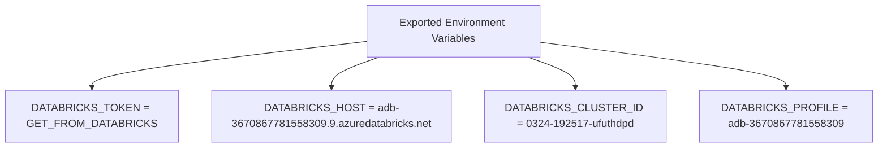

# Diagram: research/orchestrator/scripts/databricks_integration/databricks_env.sh

> Auto-generated by Obscura crawlers

## Mermaid

### SVG

<svg id="container" width="1290.9375" xmlns="http://www.w3.org/2000/svg" class="flowchart" height="222" viewBox="0 0 1290.9375 222" role="graphics-document document" aria-roledescription="flowchart-v2"><g><marker id="container_flowchart-v2-pointEnd" class="marker flowchart-v2" viewBox="0 0 10 10" refX="5" refY="5" markerUnits="userSpaceOnUse" markerWidth="8" markerHeight="8" orient="auto"><path d="M 0 0 L 10 5 L 0 10 z" class="arrowMarkerPath" style="stroke-width: 1; stroke-dasharray: 1, 0;"></path></marker><marker id="container_flowchart-v2-pointStart" class="marker flowchart-v2" viewBox="0 0 10 10" refX="4.5" refY="5" markerUnits="userSpaceOnUse" markerWidth="8" markerHeight="8" orient="auto"><path d="M 0 5 L 10 10 L 10 0 z" class="arrowMarkerPath" style="stroke-width: 1; stroke-dasharray: 1, 0;"></path></marker><marker id="container_flowchart-v2-circleEnd" class="marker flowchart-v2" viewBox="0 0 10 10" refX="11" refY="5" markerUnits="userSpaceOnUse" markerWidth="11" markerHeight="11" orient="auto"><circle cx="5" cy="5" r="5" class="arrowMarkerPath" style="stroke-width: 1; stroke-dasharray: 1, 0;"></circle></marker><marker id="container_flowchart-v2-circleStart" class="marker flowchart-v2" viewBox="0 0 10 10" refX="-1" refY="5" markerUnits="userSpaceOnUse" markerWidth="11" markerHeight="11" orient="auto"><circle cx="5" cy="5" r="5" class="arrowMarkerPath" style="stroke-width: 1; stroke-dasharray: 1, 0;"></circle></marker><marker id="container_flowchart-v2-crossEnd" class="marker cross flowchart-v2" viewBox="0 0 11 11" refX="12" refY="5.2" markerUnits="userSpaceOnUse" markerWidth="11" markerHeight="11" orient="auto"><path d="M 1,1 l 9,9 M 10,1 l -9,9" class="arrowMarkerPath" style="stroke-width: 2; stroke-dasharray: 1, 0;"></path></marker><marker id="container_flowchart-v2-crossStart" class="marker cross flowchart-v2" viewBox="0 0 11 11" refX="-1" refY="5.2" markerUnits="userSpaceOnUse" markerWidth="11" markerHeight="11" orient="auto"><path d="M 1,1 l 9,9 M 10,1 l -9,9" class="arrowMarkerPath" style="stroke-width: 2; stroke-dasharray: 1, 0;"></path></marker><g class="root"><g class="clusters"></g><g class="edgePaths"><path d="M536.703,62.737L470.253,70.781C403.802,78.824,270.901,94.912,204.451,106.456C138,118,138,125,138,128.5L138,132" id="L_Env_Token_0" class="edge-thickness-normal edge-pattern-solid edge-thickness-normal edge-pattern-solid flowchart-link" style=";" data-edge="true" data-et="edge" data-id="L_Env_Token_0" data-points="W3sieCI6NTM2LjcwMzEyNSwieSI6NjIuNzM2NjE5Njc2Njg1Mjl9LHsieCI6MTM4LCJ5IjoxMTF9LHsieCI6MTM4LCJ5IjoxMzZ9XQ==" marker-end="url(#container_flowchart-v2-pointEnd)"></path><path d="M559.31,86L547.837,90.167C536.363,94.333,513.416,102.667,501.942,110.333C490.469,118,490.469,125,490.469,128.5L490.469,132" id="L_Env_Host_0" class="edge-thickness-normal edge-pattern-solid edge-thickness-normal edge-pattern-solid flowchart-link" style=";" data-edge="true" data-et="edge" data-id="L_Env_Host_0" data-points="W3sieCI6NTU5LjMxMDMwMjczNDM3NSwieSI6ODZ9LHsieCI6NDkwLjQ2ODc1LCJ5IjoxMTF9LHsieCI6NDkwLjQ2ODc1LCJ5IjoxMzZ9XQ==" marker-end="url(#container_flowchart-v2-pointEnd)"></path><path d="M774.096,86L785.57,90.167C797.043,94.333,819.99,102.667,831.464,110.333C842.938,118,842.938,125,842.938,128.5L842.938,132" id="L_Env_Cluster_0" class="edge-thickness-normal edge-pattern-solid edge-thickness-normal edge-pattern-solid flowchart-link" style=";" data-edge="true" data-et="edge" data-id="L_Env_Cluster_0" data-points="W3sieCI6Nzc0LjA5NTk0NzI2NTYyNSwieSI6ODZ9LHsieCI6ODQyLjkzNzUsInkiOjExMX0seyJ4Ijo4NDIuOTM3NSwieSI6MTM2fV0=" marker-end="url(#container_flowchart-v2-pointEnd)"></path><path d="M796.703,64.111L856.076,71.926C915.448,79.741,1034.193,95.37,1093.565,106.685C1152.938,118,1152.938,125,1152.938,128.5L1152.938,132" id="L_Env_Profile_0" class="edge-thickness-normal edge-pattern-solid edge-thickness-normal edge-pattern-solid flowchart-link" style=";" data-edge="true" data-et="edge" data-id="L_Env_Profile_0" data-points="W3sieCI6Nzk2LjcwMzEyNSwieSI6NjQuMTExMDg5Njg3OTcxOTh9LHsieCI6MTE1Mi45Mzc1LCJ5IjoxMTF9LHsieCI6MTE1Mi45Mzc1LCJ5IjoxMzZ9XQ==" marker-end="url(#container_flowchart-v2-pointEnd)"></path></g><g class="edgeLabels"><g class="edgeLabel"><g class="label" data-id="L_Env_Token_0" transform="translate(0, 0)"><foreignObject width="0" height="0">

</foreignObject></g></g><g class="edgeLabel"><g class="label" data-id="L_Env_Host_0" transform="translate(0, 0)"><foreignObject width="0" height="0">

</foreignObject></g></g><g class="edgeLabel"><g class="label" data-id="L_Env_Cluster_0" transform="translate(0, 0)"><foreignObject width="0" height="0">

</foreignObject></g></g><g class="edgeLabel"><g class="label" data-id="L_Env_Profile_0" transform="translate(0, 0)"><foreignObject width="0" height="0">

</foreignObject></g></g></g><g class="nodes"><g class="node default" id="flowchart-Env-0" transform="translate(666.703125, 47)"><rect class="basic label-container" style="" x="-130" y="-39" width="260" height="78"></rect><g class="label" style="" transform="translate(-100, -24)"><rect></rect><foreignObject width="200" height="48">

Exported Environment Variables

</foreignObject></g></g><g class="node default" id="flowchart-Token-1" transform="translate(138, 175)"><rect class="basic label-container" style="" x="-130" y="-39" width="260" height="78"></rect><g class="label" style="" transform="translate(-100, -24)"><rect></rect><foreignObject width="200" height="48">

DATABRICKS_TOKEN = GET_FROM_DATABRICKS

</foreignObject></g></g><g class="node default" id="flowchart-Host-2" transform="translate(490.46875, 175)"><rect class="basic label-container" style="" x="-172.46875" y="-39" width="344.9375" height="78"></rect><g class="label" style="" transform="translate(-142.46875, -24)"><rect></rect><foreignObject width="284.9375" height="48">

DATABRICKS_HOST = adb-3670867781558309.9.azuredatabricks.net

</foreignObject></g></g><g class="node default" id="flowchart-Cluster-3" transform="translate(842.9375, 175)"><rect class="basic label-container" style="" x="-130" y="-39" width="260" height="78"></rect><g class="label" style="" transform="translate(-100, -24)"><rect></rect><foreignObject width="200" height="48">

DATABRICKS_CLUSTER_ID = 0324-192517-ufuthdpd

</foreignObject></g></g><g class="node default" id="flowchart-Profile-4" transform="translate(1152.9375, 175)"><rect class="basic label-container" style="" x="-130" y="-39" width="260" height="78"></rect><g class="label" style="" transform="translate(-100, -24)"><rect></rect><foreignObject width="200" height="48">

DATABRICKS_PROFILE = adb-3670867781558309

</foreignObject></g></g></g></g></g></svg>
