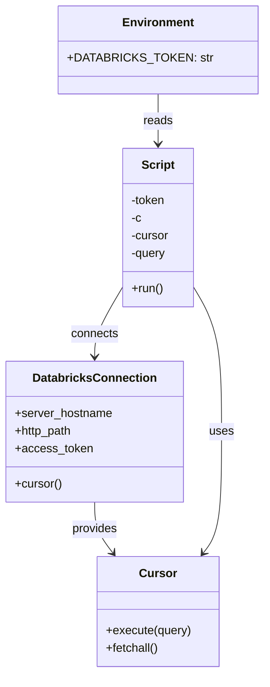

# Diagram: research/orchestrator/scripts/databricks_integration/databricks_sql_example.py


> Auto-generated by Obscura crawlers

## Diagram 1

```mermaid
flowchart TD
    Start([Start]) --> GetToken[Read DATABRICKS_TOKEN from env]
    GetToken --> Connect[sql.connect(server_hostname=adb-3670867781558309.9.azuredatabricks.net, http_path=/sql/1.0/warehouses/2fb281f4abc35fd1, access_token=token)]
    Connect --> cNode[c = Connection]
    cNode --> CursorNode[c.cursor()]
    CursorNode --> Execute[cursor.execute("select * from fv_prod.bronze.public_entity limit 100;")]
    Execute --> Fetch[cursor.fetchall()]
    Fetch --> Print[print(results)]
    Print --> End([End])
```

> SVG rendering failed for this diagram.

## Diagram 2



### SVG

<svg id="container" width="342.826171875" xmlns="http://www.w3.org/2000/svg" class="classDiagram" height="916" viewBox="0 0 342.826171875 916" role="graphics-document document" aria-roledescription="class"><style>#container{font-family:"trebuchet ms",verdana,arial,sans-serif;font-size:16px;fill:#333;}@keyframes edge-animation-frame{from{stroke-dashoffset:0;}}@keyframes dash{to{stroke-dashoffset:0;}}#container .edge-animation-slow{stroke-dasharray:9,5!important;stroke-dashoffset:900;animation:dash 50s linear infinite;stroke-linecap:round;}#container .edge-animation-fast{stroke-dasharray:9,5!important;stroke-dashoffset:900;animation:dash 20s linear infinite;stroke-linecap:round;}#container .error-icon{fill:#552222;}#container .error-text{fill:#552222;stroke:#552222;}#container .edge-thickness-normal{stroke-width:1px;}#container .edge-thickness-thick{stroke-width:3.5px;}#container .edge-pattern-solid{stroke-dasharray:0;}#container .edge-thickness-invisible{stroke-width:0;fill:none;}#container .edge-pattern-dashed{stroke-dasharray:3;}#container .edge-pattern-dotted{stroke-dasharray:2;}#container .marker{fill:#333333;stroke:#333333;}#container .marker.cross{stroke:#333333;}#container svg{font-family:"trebuchet ms",verdana,arial,sans-serif;font-size:16px;}#container p{margin:0;}#container g.classGroup text{fill:#9370DB;stroke:none;font-family:"trebuchet ms",verdana,arial,sans-serif;font-size:10px;}#container g.classGroup text .title{font-weight:bolder;}#container .nodeLabel,#container .edgeLabel{color:#131300;}#container .edgeLabel .label rect{fill:#ECECFF;}#container .label text{fill:#131300;}#container .labelBkg{background:#ECECFF;}#container .edgeLabel .label span{background:#ECECFF;}#container .classTitle{font-weight:bolder;}#container .node rect,#container .node circle,#container .node ellipse,#container .node polygon,#container .node path{fill:#ECECFF;stroke:#9370DB;stroke-width:1px;}#container .divider{stroke:#9370DB;stroke-width:1;}#container g.clickable{cursor:pointer;}#container g.classGroup rect{fill:#ECECFF;stroke:#9370DB;}#container g.classGroup line{stroke:#9370DB;stroke-width:1;}#container .classLabel .box{stroke:none;stroke-width:0;fill:#ECECFF;opacity:0.5;}#container .classLabel .label{fill:#9370DB;font-size:10px;}#container .relation{stroke:#333333;stroke-width:1;fill:none;}#container .dashed-line{stroke-dasharray:3;}#container .dotted-line{stroke-dasharray:1 2;}#container #compositionStart,#container .composition{fill:#333333!important;stroke:#333333!important;stroke-width:1;}#container #compositionEnd,#container .composition{fill:#333333!important;stroke:#333333!important;stroke-width:1;}#container #dependencyStart,#container .dependency{fill:#333333!important;stroke:#333333!important;stroke-width:1;}#container #dependencyStart,#container .dependency{fill:#333333!important;stroke:#333333!important;stroke-width:1;}#container #extensionStart,#container .extension{fill:transparent!important;stroke:#333333!important;stroke-width:1;}#container #extensionEnd,#container .extension{fill:transparent!important;stroke:#333333!important;stroke-width:1;}#container #aggregationStart,#container .aggregation{fill:transparent!important;stroke:#333333!important;stroke-width:1;}#container #aggregationEnd,#container .aggregation{fill:transparent!important;stroke:#333333!important;stroke-width:1;}#container #lollipopStart,#container .lollipop{fill:#ECECFF!important;stroke:#333333!important;stroke-width:1;}#container #lollipopEnd,#container .lollipop{fill:#ECECFF!important;stroke:#333333!important;stroke-width:1;}#container .edgeTerminals{font-size:11px;line-height:initial;}#container .classTitleText{text-anchor:middle;font-size:18px;fill:#333;}#container .label-icon{display:inline-block;height:1em;overflow:visible;vertical-align:-0.125em;}#container .node .label-icon path{fill:currentColor;stroke:revert;stroke-width:revert;}#container :root{--mermaid-font-family:"trebuchet ms",verdana,arial,sans-serif;}</style><g><defs><marker id="container_class-aggregationStart" class="marker aggregation class" refX="18" refY="7" markerWidth="190" markerHeight="240" orient="auto"><path d="M 18,7 L9,13 L1,7 L9,1 Z"></path></marker></defs><defs><marker id="container_class-aggregationEnd" class="marker aggregation class" refX="1" refY="7" markerWidth="20" markerHeight="28" orient="auto"><path d="M 18,7 L9,13 L1,7 L9,1 Z"></path></marker></defs><defs><marker id="container_class-extensionStart" class="marker extension class" refX="18" refY="7" markerWidth="190" markerHeight="240" orient="auto"><path d="M 1,7 L18,13 V 1 Z"></path></marker></defs><defs><marker id="container_class-extensionEnd" class="marker extension class" refX="1" refY="7" markerWidth="20" markerHeight="28" orient="auto"><path d="M 1,1 V 13 L18,7 Z"></path></marker></defs><defs><marker id="container_class-compositionStart" class="marker composition class" refX="18" refY="7" markerWidth="190" markerHeight="240" orient="auto"><path d="M 18,7 L9,13 L1,7 L9,1 Z"></path></marker></defs><defs><marker id="container_class-compositionEnd" class="marker composition class" refX="1" refY="7" markerWidth="20" markerHeight="28" orient="auto"><path d="M 18,7 L9,13 L1,7 L9,1 Z"></path></marker></defs><defs><marker id="container_class-dependencyStart" class="marker dependency class" refX="6" refY="7" markerWidth="190" markerHeight="240" orient="auto"><path d="M 5,7 L9,13 L1,7 L9,1 Z"></path></marker></defs><defs><marker id="container_class-dependencyEnd" class="marker dependency class" refX="13" refY="7" markerWidth="20" markerHeight="28" orient="auto"><path d="M 18,7 L9,13 L14,7 L9,1 Z"></path></marker></defs><defs><marker id="container_class-lollipopStart" class="marker lollipop class" refX="13" refY="7" markerWidth="190" markerHeight="240" orient="auto"><circle stroke="black" fill="transparent" cx="7" cy="7" r="6"></circle></marker></defs><defs><marker id="container_class-lollipopEnd" class="marker lollipop class" refX="1" refY="7" markerWidth="190" markerHeight="240" orient="auto"><circle stroke="black" fill="transparent" cx="7" cy="7" r="6"></circle></marker></defs><g class="root"><g class="clusters"></g><g class="edgePaths"><path d="M211.502,128L211.502,134.167C211.502,140.333,211.502,152.667,211.502,164C211.502,175.333,211.502,185.667,211.502,190.833L211.502,196" id="id_Environment_Script_1" class="edge-thickness-normal edge-pattern-solid relation" style=";;;" data-edge="true" data-et="edge" data-id="id_Environment_Script_1" data-points="W3sieCI6MjExLjUwMTk1MzEyNSwieSI6MTI4fSx7IngiOjIxMS41MDE5NTMxMjUsInkiOjE2NX0seyJ4IjoyMTEuNTAxOTUzMTI1LCJ5IjoyMDJ9XQ==" marker-end="url(#container_class-dependencyEnd)"></path><path d="M162.537,393.53L156.532,403.775C150.526,414.02,138.515,434.51,132.509,449.922C126.504,465.333,126.504,475.667,126.504,480.833L126.504,486" id="id_Script_DatabricksConnection_2" class="edge-thickness-normal edge-pattern-solid relation" style=";;;" data-edge="true" data-et="edge" data-id="id_Script_DatabricksConnection_2" data-points="W3sieCI6MTYyLjUzNzEwOTM3NSwieSI6MzkzLjUzMDE4MjIxOTI2MDU1fSx7IngiOjEyNi41MDM5MDYyNSwieSI6NDU1fSx7IngiOjEyNi41MDM5MDYyNSwieSI6NDkyfV0=" marker-end="url(#container_class-dependencyEnd)"></path><path d="M126.504,684L126.504,690.167C126.504,696.333,126.504,708.667,130.579,720.203C134.655,731.74,142.806,742.48,146.881,747.85L150.956,753.221" id="id_DatabricksConnection_Cursor_3" class="edge-thickness-normal edge-pattern-solid relation" style=";;;" data-edge="true" data-et="edge" data-id="id_DatabricksConnection_Cursor_3" data-points="W3sieCI6MTI2LjUwMzkwNjI1LCJ5Ijo2ODR9LHsieCI6MTI2LjUwMzkwNjI1LCJ5Ijo3MjF9LHsieCI6MTU0LjU4MzYxODE2NDA2MjUsInkiOjc1OH1d" marker-end="url(#container_class-dependencyEnd)"></path><path d="M260.467,393.53L266.472,403.775C272.478,414.02,284.489,434.51,290.494,466.922C296.5,499.333,296.5,543.667,296.5,588C296.5,632.333,296.5,676.667,292.425,704.203C288.349,731.74,280.198,742.48,276.123,747.85L272.047,753.221" id="id_Script_Cursor_4" class="edge-thickness-normal edge-pattern-solid relation" style=";;;" data-edge="true" data-et="edge" data-id="id_Script_Cursor_4" data-points="W3sieCI6MjYwLjQ2Njc5Njg3NSwieSI6MzkzLjUzMDE4MjIxOTI2MDU1fSx7IngiOjI5Ni41LCJ5Ijo0NTV9LHsieCI6Mjk2LjUsInkiOjU4OH0seyJ4IjoyOTYuNSwieSI6NzIxfSx7IngiOjI2OC40MjAyODgwODU5Mzc1LCJ5Ijo3NTh9XQ==" marker-end="url(#container_class-dependencyEnd)"></path></g><g class="edgeLabels"><g class="edgeLabel" transform="translate(211.501953125, 165)"><g class="label" data-id="id_Environment_Script_1" transform="translate(-20.0078125, -12)"><foreignObject width="40.015625" height="24"><div xmlns="http://www.w3.org/1999/xhtml" class="labelBkg" style="display: table-cell; white-space: nowrap; line-height: 1.5; max-width: 200px; text-align: center;"><span class="edgeLabel"><p>reads</p></span></div></foreignObject></g></g><g class="edgeLabel" transform="translate(126.50390625, 455)"><g class="label" data-id="id_Script_DatabricksConnection_2" transform="translate(-32.5234375, -12)"><foreignObject width="65.046875" height="24"><div xmlns="http://www.w3.org/1999/xhtml" class="labelBkg" style="display: table-cell; white-space: nowrap; line-height: 1.5; max-width: 200px; text-align: center;"><span class="edgeLabel"><p>connects</p></span></div></foreignObject></g></g><g class="edgeLabel" transform="translate(126.50390625, 721)"><g class="label" data-id="id_DatabricksConnection_Cursor_3" transform="translate(-31.3125, -12)"><foreignObject width="62.625" height="24"><div xmlns="http://www.w3.org/1999/xhtml" class="labelBkg" style="display: table-cell; white-space: nowrap; line-height: 1.5; max-width: 200px; text-align: center;"><span class="edgeLabel"><p>provides</p></span></div></foreignObject></g></g><g class="edgeLabel" transform="translate(296.5, 588)"><g class="label" data-id="id_Script_Cursor_4" transform="translate(-16.4921875, -12)"><foreignObject width="32.984375" height="24"><div xmlns="http://www.w3.org/1999/xhtml" class="labelBkg" style="display: table-cell; white-space: nowrap; line-height: 1.5; max-width: 200px; text-align: center;"><span class="edgeLabel"><p>uses</p></span></div></foreignObject></g></g></g><g class="nodes"><g class="node default" id="classId-Environment-0" transform="translate(211.501953125, 68)"><g class="basic label-container"><path d="M-123.32421875 -60 L123.32421875 -60 L123.32421875 60 L-123.32421875 60" stroke="none" stroke-width="0" fill="#ECECFF" style=""></path><path d="M-123.32421875 -60 C-52.72818329272002 -60, 17.867852164559963 -60, 123.32421875 -60 M-123.32421875 -60 C-54.614522920938555 -60, 14.09517290812289 -60, 123.32421875 -60 M123.32421875 -60 C123.32421875 -12.452486259066816, 123.32421875 35.09502748186637, 123.32421875 60 M123.32421875 -60 C123.32421875 -29.434464795633218, 123.32421875 1.1310704087335637, 123.32421875 60 M123.32421875 60 C30.206565522579822 60, -62.911087704840355 60, -123.32421875 60 M123.32421875 60 C67.80707401620128 60, 12.289929282402568 60, -123.32421875 60 M-123.32421875 60 C-123.32421875 13.450910241880969, -123.32421875 -33.09817951623806, -123.32421875 -60 M-123.32421875 60 C-123.32421875 31.255969142021392, -123.32421875 2.5119382840427846, -123.32421875 -60" stroke="#9370DB" stroke-width="1.3" fill="none" stroke-dasharray="0 0" style=""></path></g><g class="annotation-group text" transform="translate(0, -36)"></g><g class="label-group text" transform="translate(-46.1953125, -36)"><g class="label" style="font-weight: bolder" transform="translate(0,-12)"><foreignObject width="92.390625" height="24"><div xmlns="http://www.w3.org/1999/xhtml" style="display: table-cell; white-space: nowrap; line-height: 1.5; max-width: 142px; text-align: center;"><span class="nodeLabel markdown-node-label" style=""><p>Environment</p></span></div></foreignObject></g></g><g class="members-group text" transform="translate(-111.32421875, 12)"><g class="label" style="" transform="translate(0,-12)"><foreignObject width="176.453125" height="24"><div xmlns="http://www.w3.org/1999/xhtml" style="display: table-cell; white-space: nowrap; line-height: 1.5; max-width: 235px; text-align: center;"><span class="nodeLabel markdown-node-label" style=""><p>+DATABRICKS_TOKEN: str</p></span></div></foreignObject></g></g><g class="methods-group text" transform="translate(-111.32421875, 60)"></g><g class="divider" style=""><path d="M-123.32421875 -12 C-36.74599763525259 -12, 49.832223479494814 -12, 123.32421875 -12 M-123.32421875 -12 C-36.780069022991526 -12, 49.76408070401695 -12, 123.32421875 -12" stroke="#9370DB" stroke-width="1.3" fill="none" stroke-dasharray="0 0" style=""></path></g><g class="divider" style=""><path d="M-123.32421875 36 C-44.417197426164634 36, 34.48982389767073 36, 123.32421875 36 M-123.32421875 36 C-71.41355201191695 36, -19.502885273833883 36, 123.32421875 36" stroke="#9370DB" stroke-width="1.3" fill="none" stroke-dasharray="0 0" style=""></path></g></g><g class="node default" id="classId-DatabricksConnection-1" transform="translate(126.50390625, 588)"><g class="basic label-container"><path d="M-118.50390625 -96 L118.50390625 -96 L118.50390625 96 L-118.50390625 96" stroke="none" stroke-width="0" fill="#ECECFF" style=""></path><path d="M-118.50390625 -96 C-63.76001348877426 -96, -9.016120727548525 -96, 118.50390625 -96 M-118.50390625 -96 C-49.544571531238105 -96, 19.41476318752379 -96, 118.50390625 -96 M118.50390625 -96 C118.50390625 -53.66170782090118, 118.50390625 -11.323415641802356, 118.50390625 96 M118.50390625 -96 C118.50390625 -28.05852654883158, 118.50390625 39.88294690233684, 118.50390625 96 M118.50390625 96 C48.20511593003121 96, -22.093674389937576 96, -118.50390625 96 M118.50390625 96 C48.46119041770879 96, -21.581525414582416 96, -118.50390625 96 M-118.50390625 96 C-118.50390625 42.73204010046109, -118.50390625 -10.535919799077817, -118.50390625 -96 M-118.50390625 96 C-118.50390625 29.399111147067856, -118.50390625 -37.20177770586429, -118.50390625 -96" stroke="#9370DB" stroke-width="1.3" fill="none" stroke-dasharray="0 0" style=""></path></g><g class="annotation-group text" transform="translate(0, -72)"></g><g class="label-group text" transform="translate(-80.4296875, -72)"><g class="label" style="font-weight: bolder" transform="translate(0,-12)"><foreignObject width="160.859375" height="24"><div xmlns="http://www.w3.org/1999/xhtml" style="display: table-cell; white-space: nowrap; line-height: 1.5; max-width: 209px; text-align: center;"><span class="nodeLabel markdown-node-label" style=""><p>DatabricksConnection</p></span></div></foreignObject></g></g><g class="members-group text" transform="translate(-106.50390625, -24)"><g class="label" style="" transform="translate(0,-12)"><foreignObject width="132.578125" height="24"><div xmlns="http://www.w3.org/1999/xhtml" style="display: table-cell; white-space: nowrap; line-height: 1.5; max-width: 190px; text-align: center;"><span class="nodeLabel markdown-node-label" style=""><p>+server_hostname</p></span></div></foreignObject></g><g class="label" style="" transform="translate(0,12)"><foreignObject width="79.625" height="24"><div xmlns="http://www.w3.org/1999/xhtml" style="display: table-cell; white-space: nowrap; line-height: 1.5; max-width: 137px; text-align: center;"><span class="nodeLabel markdown-node-label" style=""><p>+http_path</p></span></div></foreignObject></g><g class="label" style="" transform="translate(0,36)"><foreignObject width="103.3125" height="24"><div xmlns="http://www.w3.org/1999/xhtml" style="display: table-cell; white-space: nowrap; line-height: 1.5; max-width: 161px; text-align: center;"><span class="nodeLabel markdown-node-label" style=""><p>+access_token</p></span></div></foreignObject></g></g><g class="methods-group text" transform="translate(-106.50390625, 72)"><g class="label" style="" transform="translate(0,-12)"><foreignObject width="64.09375" height="24"><div xmlns="http://www.w3.org/1999/xhtml" style="display: table-cell; white-space: nowrap; line-height: 1.5; max-width: 121px; text-align: center;"><span class="nodeLabel markdown-node-label" style=""><p>+cursor()</p></span></div></foreignObject></g></g><g class="divider" style=""><path d="M-118.50390625 -48 C-34.07872232625775 -48, 50.346461597484506 -48, 118.50390625 -48 M-118.50390625 -48 C-41.08571943953906 -48, 36.332467370921876 -48, 118.50390625 -48" stroke="#9370DB" stroke-width="1.3" fill="none" stroke-dasharray="0 0" style=""></path></g><g class="divider" style=""><path d="M-118.50390625 48 C-32.22664321030126 48, 54.050619829397476 48, 118.50390625 48 M-118.50390625 48 C-28.39325830723837 48, 61.71738963552326 48, 118.50390625 48" stroke="#9370DB" stroke-width="1.3" fill="none" stroke-dasharray="0 0" style=""></path></g></g><g class="node default" id="classId-Cursor-2" transform="translate(211.501953125, 833)"><g class="basic label-container"><path d="M-81.9375 -75 L81.9375 -75 L81.9375 75 L-81.9375 75" stroke="none" stroke-width="0" fill="#ECECFF" style=""></path><path d="M-81.9375 -75 C-35.31864175971858 -75, 11.300216480562838 -75, 81.9375 -75 M-81.9375 -75 C-31.81935210181782 -75, 18.29879579636436 -75, 81.9375 -75 M81.9375 -75 C81.9375 -31.37047562684255, 81.9375 12.259048746314903, 81.9375 75 M81.9375 -75 C81.9375 -28.494753486059942, 81.9375 18.010493027880116, 81.9375 75 M81.9375 75 C45.60657219164687 75, 9.275644383293738 75, -81.9375 75 M81.9375 75 C25.03910380613329 75, -31.85929238773342 75, -81.9375 75 M-81.9375 75 C-81.9375 44.26296780289661, -81.9375 13.52593560579323, -81.9375 -75 M-81.9375 75 C-81.9375 35.828259802990374, -81.9375 -3.3434803940192523, -81.9375 -75" stroke="#9370DB" stroke-width="1.3" fill="none" stroke-dasharray="0 0" style=""></path></g><g class="annotation-group text" transform="translate(0, -51)"></g><g class="label-group text" transform="translate(-23.90625, -51)"><g class="label" style="font-weight: bolder" transform="translate(0,-12)"><foreignObject width="47.8125" height="24"><div xmlns="http://www.w3.org/1999/xhtml" style="display: table-cell; white-space: nowrap; line-height: 1.5; max-width: 98px; text-align: center;"><span class="nodeLabel markdown-node-label" style=""><p>Cursor</p></span></div></foreignObject></g></g><g class="members-group text" transform="translate(-69.9375, -3)"></g><g class="methods-group text" transform="translate(-69.9375, 27)"><g class="label" style="" transform="translate(0,-12)"><foreignObject width="115.96875" height="24"><div xmlns="http://www.w3.org/1999/xhtml" style="display: table-cell; white-space: nowrap; line-height: 1.5; max-width: 173px; text-align: center;"><span class="nodeLabel markdown-node-label" style=""><p>+execute(query)</p></span></div></foreignObject></g><g class="label" style="" transform="translate(0,12)"><foreignObject width="72.515625" height="24"><div xmlns="http://www.w3.org/1999/xhtml" style="display: table-cell; white-space: nowrap; line-height: 1.5; max-width: 130px; text-align: center;"><span class="nodeLabel markdown-node-label" style=""><p>+fetchall()</p></span></div></foreignObject></g></g><g class="divider" style=""><path d="M-81.9375 -27 C-20.87011692503183 -27, 40.19726614993634 -27, 81.9375 -27 M-81.9375 -27 C-42.59412193599048 -27, -3.2507438719809585 -27, 81.9375 -27" stroke="#9370DB" stroke-width="1.3" fill="none" stroke-dasharray="0 0" style=""></path></g><g class="divider" style=""><path d="M-81.9375 -3 C-40.590168021028404 -3, 0.7571639579431917 -3, 81.9375 -3 M-81.9375 -3 C-48.195208767847085 -3, -14.45291753569417 -3, 81.9375 -3" stroke="#9370DB" stroke-width="1.3" fill="none" stroke-dasharray="0 0" style=""></path></g></g><g class="node default" id="classId-Script-3" transform="translate(211.501953125, 310)"><g class="basic label-container"><path d="M-48.96484375 -108 L48.96484375 -108 L48.96484375 108 L-48.96484375 108" stroke="none" stroke-width="0" fill="#ECECFF" style=""></path><path d="M-48.96484375 -108 C-21.563030210748412 -108, 5.838783328503176 -108, 48.96484375 -108 M-48.96484375 -108 C-15.224937932791747 -108, 18.514967884416507 -108, 48.96484375 -108 M48.96484375 -108 C48.96484375 -61.196224435267695, 48.96484375 -14.39244887053539, 48.96484375 108 M48.96484375 -108 C48.96484375 -63.251016314523994, 48.96484375 -18.50203262904799, 48.96484375 108 M48.96484375 108 C14.561283311979253 108, -19.842277126041495 108, -48.96484375 108 M48.96484375 108 C22.24336696745024 108, -4.478109815099522 108, -48.96484375 108 M-48.96484375 108 C-48.96484375 36.20744722874264, -48.96484375 -35.585105542514725, -48.96484375 -108 M-48.96484375 108 C-48.96484375 32.468893854328186, -48.96484375 -43.06221229134363, -48.96484375 -108" stroke="#9370DB" stroke-width="1.3" fill="none" stroke-dasharray="0 0" style=""></path></g><g class="annotation-group text" transform="translate(0, -84)"></g><g class="label-group text" transform="translate(-21.7421875, -84)"><g class="label" style="font-weight: bolder" transform="translate(0,-12)"><foreignObject width="43.484375" height="24"><div xmlns="http://www.w3.org/1999/xhtml" style="display: table-cell; white-space: nowrap; line-height: 1.5; max-width: 93px; text-align: center;"><span class="nodeLabel markdown-node-label" style=""><p>Script</p></span></div></foreignObject></g></g><g class="members-group text" transform="translate(-36.96484375, -36)"><g class="label" style="" transform="translate(0,-12)"><foreignObject width="47.40625" height="24"><div xmlns="http://www.w3.org/1999/xhtml" style="display: table-cell; white-space: nowrap; line-height: 1.5; max-width: 105px; text-align: center;"><span class="nodeLabel markdown-node-label" style=""><p>-token</p></span></div></foreignObject></g><g class="label" style="" transform="translate(0,12)"><foreignObject width="14.109375" height="24"><div xmlns="http://www.w3.org/1999/xhtml" style="display: table-cell; white-space: nowrap; line-height: 1.5; max-width: 72px; text-align: center;"><span class="nodeLabel markdown-node-label" style=""><p>-c</p></span></div></foreignObject></g><g class="label" style="" transform="translate(0,36)"><foreignObject width="52.1875" height="24"><div xmlns="http://www.w3.org/1999/xhtml" style="display: table-cell; white-space: nowrap; line-height: 1.5; max-width: 110px; text-align: center;"><span class="nodeLabel markdown-node-label" style=""><p>-cursor</p></span></div></foreignObject></g><g class="label" style="" transform="translate(0,60)"><foreignObject width="48.109375" height="24"><div xmlns="http://www.w3.org/1999/xhtml" style="display: table-cell; white-space: nowrap; line-height: 1.5; max-width: 106px; text-align: center;"><span class="nodeLabel markdown-node-label" style=""><p>-query</p></span></div></foreignObject></g></g><g class="methods-group text" transform="translate(-36.96484375, 84)"><g class="label" style="" transform="translate(0,-12)"><foreignObject width="43.21875" height="24"><div xmlns="http://www.w3.org/1999/xhtml" style="display: table-cell; white-space: nowrap; line-height: 1.5; max-width: 101px; text-align: center;"><span class="nodeLabel markdown-node-label" style=""><p>+run()</p></span></div></foreignObject></g></g><g class="divider" style=""><path d="M-48.96484375 -60 C-23.07732296447393 -60, 2.8101978210521423 -60, 48.96484375 -60 M-48.96484375 -60 C-24.057439498803763 -60, 0.8499647523924736 -60, 48.96484375 -60" stroke="#9370DB" stroke-width="1.3" fill="none" stroke-dasharray="0 0" style=""></path></g><g class="divider" style=""><path d="M-48.96484375 60 C-21.932623395640015 60, 5.099596958719971 60, 48.96484375 60 M-48.96484375 60 C-19.941164814659697 60, 9.082514120680607 60, 48.96484375 60" stroke="#9370DB" stroke-width="1.3" fill="none" stroke-dasharray="0 0" style=""></path></g></g></g></g></g></svg>

## Diagram 3

```mermaid
sequenceDiagram
    participant Main
    participant OS
    participant SQL
    participant Connection
    participant Cursor

    Main->>OS: getenv("DATABRICKS_TOKEN")
    OS-->>Main: token
    Main->>SQL: connect(server_hostname, http_path, access_token=token)
    SQL-->>Connection: Connection
    Main->>Connection: cursor()
    Connection-->>Cursor: Cursor
    Main->>Cursor: execute("select * from fv_prod.bronze.public_entity limit 100;")
    Cursor-->>Main: ok
    Main->>Cursor: fetchall()
    Cursor-->>Main: results
    Main->>Main: print(results)
```

> SVG rendering failed for this diagram.
