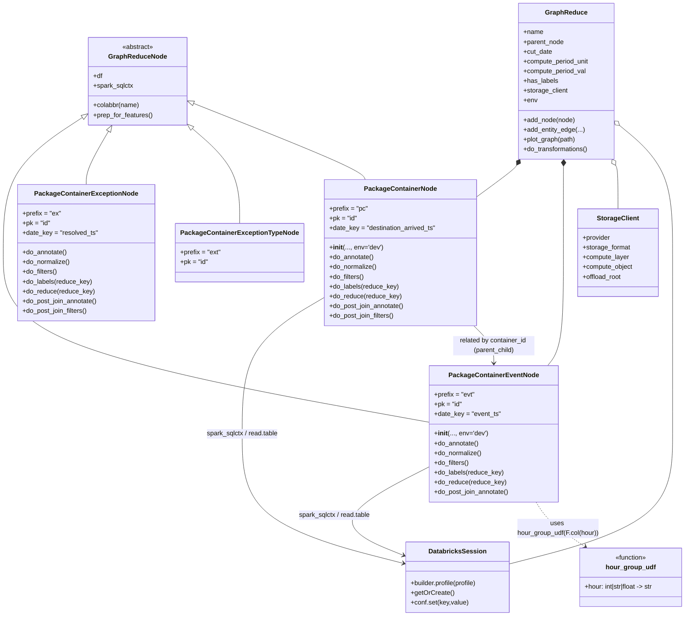
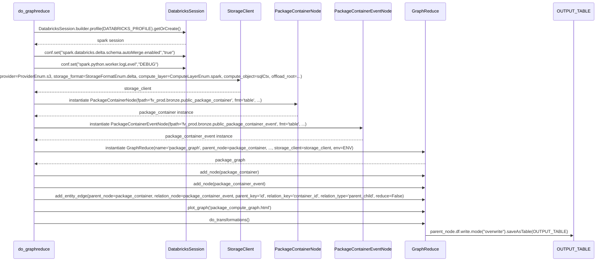

# Diagram: research/orchestrator/scripts/databricks_integration/graphreduce_databricks_test.py

> Auto-generated by Obscura crawlers

## Diagram 1

### SVG

<svg id="container" width="1619.830078125" xmlns="http://www.w3.org/2000/svg" class="classDiagram" height="1516" viewBox="-35 0 1619.830078125 1516" role="graphics-document document" aria-roledescription="class"><g><defs><marker id="container_class-aggregationStart" class="marker aggregation class" refX="18" refY="7" markerWidth="190" markerHeight="240" orient="auto"><path d="M 18,7 L9,13 L1,7 L9,1 Z"></path></marker></defs><defs><marker id="container_class-aggregationEnd" class="marker aggregation class" refX="1" refY="7" markerWidth="20" markerHeight="28" orient="auto"><path d="M 18,7 L9,13 L1,7 L9,1 Z"></path></marker></defs><defs><marker id="container_class-extensionStart" class="marker extension class" refX="18" refY="7" markerWidth="190" markerHeight="240" orient="auto"><path d="M 1,7 L18,13 V 1 Z"></path></marker></defs><defs><marker id="container_class-extensionEnd" class="marker extension class" refX="1" refY="7" markerWidth="20" markerHeight="28" orient="auto"><path d="M 1,1 V 13 L18,7 Z"></path></marker></defs><defs><marker id="container_class-compositionStart" class="marker composition class" refX="18" refY="7" markerWidth="190" markerHeight="240" orient="auto"><path d="M 18,7 L9,13 L1,7 L9,1 Z"></path></marker></defs><defs><marker id="container_class-compositionEnd" class="marker composition class" refX="1" refY="7" markerWidth="20" markerHeight="28" orient="auto"><path d="M 18,7 L9,13 L1,7 L9,1 Z"></path></marker></defs><defs><marker id="container_class-dependencyStart" class="marker dependency class" refX="6" refY="7" markerWidth="190" markerHeight="240" orient="auto"><path d="M 5,7 L9,13 L1,7 L9,1 Z"></path></marker></defs><defs><marker id="container_class-dependencyEnd" class="marker dependency class" refX="13" refY="7" markerWidth="20" markerHeight="28" orient="auto"><path d="M 18,7 L9,13 L14,7 L9,1 Z"></path></marker></defs><defs><marker id="container_class-lollipopStart" class="marker lollipop class" refX="13" refY="7" markerWidth="190" markerHeight="240" orient="auto"><circle stroke="black" fill="transparent" cx="7" cy="7" r="6"></circle></marker></defs><defs><marker id="container_class-lollipopEnd" class="marker lollipop class" refX="1" refY="7" markerWidth="190" markerHeight="240" orient="auto"><circle stroke="black" fill="transparent" cx="7" cy="7" r="6"></circle></marker></defs><g class="root"><g class="clusters"></g><g class="edgePaths"><path d="M75.472,319.867L58.393,336.056C41.315,352.245,7.157,384.622,-9.921,434.978C-27,485.333,-27,553.667,-27,626C-27,698.333,-27,774.667,129.183,843.778C285.367,912.89,597.733,974.78,753.916,1005.725L910.1,1036.67" id="id_GraphReduceNode_PackageContainerEventNode_1" class="edge-thickness-normal edge-pattern-solid relation" style=";;;" data-edge="true" data-et="edge" data-id="id_GraphReduceNode_PackageContainerEventNode_1" data-points="W3sieCI6ODcuOTkxMzUwNDQ2NDI4NTcsInkiOjMwOH0seyJ4IjotMjcsInkiOjQxN30seyJ4IjotMjcsInkiOjYyMn0seyJ4IjotMjcsInkiOjg1MX0seyJ4Ijo5MTAuMDk5NjA5Mzc1LCJ5IjoxMDM2LjY2OTU3NzAxODIwOTN9XQ==" marker-start="url(#container_class-extensionStart)"></path><path d="M185.754,325.108L183.775,340.423C181.795,355.738,177.835,386.369,175.855,407.851C173.875,429.333,173.875,441.667,173.875,447.833L173.875,454" id="id_GraphReduceNode_PackageContainerExceptionNode_2" class="edge-thickness-normal edge-pattern-solid relation" style=";;;" data-edge="true" data-et="edge" data-id="id_GraphReduceNode_PackageContainerExceptionNode_2" data-points="W3sieCI6MTg3Ljk2NjAwNDgyNDMwODc1LCJ5IjozMDh9LHsieCI6MTczLjg3NSwieSI6NDE3fSx7IngiOjE3My44NzUsInkiOjQ1NH1d" marker-start="url(#container_class-extensionStart)"></path><path d="M335.488,285.874L369.478,307.728C403.469,329.583,471.449,373.291,505.439,417.312C539.43,461.333,539.43,505.667,539.43,527.833L539.43,550" id="id_GraphReduceNode_PackageContainerExceptionTypeNode_3" class="edge-thickness-normal edge-pattern-solid relation" style=";;;" data-edge="true" data-et="edge" data-id="id_GraphReduceNode_PackageContainerExceptionTypeNode_3" data-points="W3sieCI6MzIwLjk3ODUxNTYyNSwieSI6Mjc2LjU0NDgwMDA4Nzk2MjQ3fSx7IngiOjUzOS40Mjk2ODc1LCJ5Ijo0MTd9LHsieCI6NTM5LjQyOTY4NzUsInkiOjU1MH1d" marker-start="url(#container_class-extensionStart)"></path><path d="M336.989,254.174L404.645,281.312C472.302,308.449,607.616,362.725,679.003,394.029C750.389,425.333,757.848,433.667,761.578,437.833L765.308,442" id="id_GraphReduceNode_PackageContainerNode_4" class="edge-thickness-normal edge-pattern-solid relation" style=";;;" data-edge="true" data-et="edge" data-id="id_GraphReduceNode_PackageContainerNode_4" data-points="W3sieCI6MzIwLjk3ODUxNTYyNSwieSI6MjQ3Ljc1MjE3NDI0MjY3MDM4fSx7IngiOjc0Mi45Mjk2ODc1LCJ5Ijo0MTd9LHsieCI6NzY1LjMwNzczNjI4MDQ4NzgsInkiOjQ0Mn1d" marker-start="url(#container_class-extensionStart)"></path><path d="M1210.52,327.217L1195.138,342.18C1179.756,357.144,1148.992,387.072,1129.712,406.203C1110.432,425.333,1102.635,433.667,1098.737,437.833L1094.838,442" id="id_GraphReduce_PackageContainerNode_5" class="edge-thickness-normal edge-pattern-solid relation" style=";;;" data-edge="true" data-et="edge" data-id="id_GraphReduce_PackageContainerNode_5" data-points="W3sieCI6MTIyMi44ODQ3NjU2MjUsInkiOjMxNS4xODgxNDc5NDA1OTk2fSx7IngiOjExMTguMjI4NTE1NjI1LCJ5Ijo0MTd9LHsieCI6MTA5NC44Mzg0MTQ2MzQxNDY0LCJ5Ijo0NDJ9XQ==" marker-start="url(#container_class-compositionStart)"></path><path d="M1243.796,407.614L1243.062,409.178C1242.327,410.743,1240.858,413.871,1240.123,449.602C1239.389,485.333,1239.389,553.667,1239.389,626C1239.389,698.333,1239.389,774.667,1232.947,821C1226.506,867.333,1213.623,883.667,1207.181,891.833L1200.74,900" id="id_GraphReduce_PackageContainerEventNode_6" class="edge-thickness-normal edge-pattern-solid relation" style=";;;" data-edge="true" data-et="edge" data-id="id_GraphReduce_PackageContainerEventNode_6" data-points="W3sieCI6MTI1MS4xMjg1NzMyMjg2ODY3LCJ5IjozOTJ9LHsieCI6MTIzOS4zODg2NzE4NzUsInkiOjQxN30seyJ4IjoxMjM5LjM4ODY3MTg3NSwieSI6NjIyfSx7IngiOjEyMzkuMzg4NjcxODc1LCJ5Ijo4NTF9LHsieCI6MTIwMC43Mzk2MDQzMzQ2NzczLCJ5Ijo5MDB9XQ==" marker-start="url(#container_class-compositionStart)"></path><path d="M1372.189,409.065L1372.384,410.387C1372.579,411.71,1372.97,414.355,1373.166,431.844C1373.361,449.333,1373.361,481.667,1373.361,497.833L1373.361,514" id="id_GraphReduce_StorageClient_7" class="edge-thickness-normal edge-pattern-solid relation" style=";;;" data-edge="true" data-et="edge" data-id="id_GraphReduce_StorageClient_7" data-points="W3sieCI6MTM2OS42NjY1OTE2NjE4NjYzLCJ5IjozOTJ9LHsieCI6MTM3My4zNjEzMjgxMjUsInkiOjQxN30seyJ4IjoxMzczLjM2MTMyODEyNSwieSI6NTE0fV0=" marker-start="url(#container_class-aggregationStart)"></path><path d="M1470.18,368.444L1476.372,376.536C1482.565,384.629,1494.949,400.815,1501.142,443.074C1507.334,485.333,1507.334,553.667,1507.334,626C1507.334,698.333,1507.334,774.667,1507.334,849C1507.334,923.333,1507.334,995.667,1507.334,1068C1507.334,1140.333,1507.334,1212.667,1447.158,1265.518C1386.982,1318.37,1266.631,1351.74,1206.455,1368.425L1146.279,1385.11" id="id_GraphReduce_DatabricksSession_8" class="edge-thickness-normal edge-pattern-solid relation" style=";;;" data-edge="true" data-et="edge" data-id="id_GraphReduce_DatabricksSession_8" data-points="W3sieCI6MTQ1OS42OTcyNjU2MjUsInkiOjM1NC43NDQwMTg2MzIyMjUzfSx7IngiOjE1MDcuMzMzOTg0Mzc1LCJ5Ijo0MTd9LHsieCI6MTUwNy4zMzM5ODQzNzUsInkiOjYyMn0seyJ4IjoxNTA3LjMzMzk4NDM3NSwieSI6ODUxfSx7IngiOjE1MDcuMzMzOTg0Mzc1LCJ5IjoxMDY4fSx7IngiOjE1MDcuMzMzOTg0Mzc1LCJ5IjoxMjg1fSx7IngiOjExNDYuMjc5Mjk2ODc1LCJ5IjoxMzg1LjEwOTc0MjIwOTMzODV9XQ==" marker-start="url(#container_class-aggregationStart)"></path><path d="M739.109,713.911L692.544,736.759C645.978,759.608,552.846,805.304,506.281,864.319C459.715,923.333,459.715,995.667,459.715,1068C459.715,1140.333,459.715,1212.667,530.024,1265.997C600.332,1319.326,740.95,1353.653,811.259,1370.816L881.568,1387.979" id="id_PackageContainerNode_DatabricksSession_9" class="edge-thickness-normal edge-pattern-solid relation" style=";;;" data-edge="true" data-et="edge" data-id="id_PackageContainerNode_DatabricksSession_9" data-points="W3sieCI6NzM5LjEwOTM3NSwieSI6NzEzLjkxMTI2NDc0MTA4NDJ9LHsieCI6NDU5LjcxNDg0Mzc1LCJ5Ijo4NTF9LHsieCI6NDU5LjcxNDg0Mzc1LCJ5IjoxMDY4fSx7IngiOjQ1OS43MTQ4NDM3NSwieSI6MTI4NX0seyJ4Ijo4ODcuMzk2NDg0Mzc1LCJ5IjoxMzg5LjQwMTg5NzMwMzAzOX1d" marker-end="url(#container_class-dependencyEnd)"></path><path d="M910.1,1151.391L867.874,1173.66C825.649,1195.928,741.199,1240.464,736.479,1276.897C731.76,1313.331,806.772,1341.661,844.278,1355.827L881.783,1369.992" id="id_PackageContainerEventNode_DatabricksSession_10" class="edge-thickness-normal edge-pattern-solid relation" style=";;;" data-edge="true" data-et="edge" data-id="id_PackageContainerEventNode_DatabricksSession_10" data-points="W3sieCI6OTEwLjA5OTYwOTM3NSwieSI6MTE1MS4zOTE0OTc5MjU3NDQ1fSx7IngiOjY1Ni43NDgwNDY4NzUsInkiOjEyODV9LHsieCI6ODg3LjM5NjQ4NDM3NSwieSI6MTM3Mi4xMTIxMTM5NDcyNTd9XQ==" marker-end="url(#container_class-dependencyEnd)"></path><path d="M1171.553,1236L1176.576,1244.167C1181.599,1252.333,1191.644,1268.667,1215.018,1287.015C1238.393,1305.363,1275.096,1325.726,1293.448,1335.908L1311.799,1346.089" id="id_PackageContainerEventNode_hour_group_udf_11" class="edge-thickness-normal edge-pattern-dashed relation" style=";;;" data-edge="true" data-et="edge" data-id="id_PackageContainerEventNode_hour_group_udf_11" data-points="W3sieCI6MTE3MS41NTMxMTIzOTkxOTM3LCJ5IjoxMjM2fSx7IngiOjEyMDEuNjg5NDUzMTI1LCJ5IjoxMjg1fSx7IngiOjEzMTcuMDQ2MDcwNzcyMDU4OCwieSI6MTM0OX1d" marker-end="url(#container_class-dependencyEnd)"></path><path d="M1037.887,802L1042.944,810.167C1048.001,818.333,1058.115,834.667,1063.172,850C1068.229,865.333,1068.229,879.667,1068.229,886.833L1068.229,894" id="id_PackageContainerNode_PackageContainerEventNode_12" class="edge-thickness-normal edge-pattern-solid relation" style=";;;" data-edge="true" data-et="edge" data-id="id_PackageContainerNode_PackageContainerEventNode_12" data-points="W3sieCI6MTAzNy44ODcyODE2NTkzODg3LCJ5Ijo4MDJ9LHsieCI6MTA2OC4yMjg1MTU2MjUsInkiOjg1MX0seyJ4IjoxMDY4LjIyODUxNTYyNSwieSI6OTAwfV0=" marker-end="url(#container_class-dependencyEnd)"></path></g><g class="edgeLabels"><g class="edgeLabel"><g class="label" data-id="id_GraphReduceNode_PackageContainerEventNode_1" transform="translate(0, 0)"><foreignObject width="0" height="0">

</foreignObject></g></g><g class="edgeLabel"><g class="label" data-id="id_GraphReduceNode_PackageContainerExceptionNode_2" transform="translate(0, 0)"><foreignObject width="0" height="0">

</foreignObject></g></g><g class="edgeLabel"><g class="label" data-id="id_GraphReduceNode_PackageContainerExceptionTypeNode_3" transform="translate(0, 0)"><foreignObject width="0" height="0">

</foreignObject></g></g><g class="edgeLabel"><g class="label" data-id="id_GraphReduceNode_PackageContainerNode_4" transform="translate(0, 0)"><foreignObject width="0" height="0">

</foreignObject></g></g><g class="edgeLabel"><g class="label" data-id="id_GraphReduce_PackageContainerNode_5" transform="translate(0, 0)"><foreignObject width="0" height="0">

</foreignObject></g></g><g class="edgeLabel"><g class="label" data-id="id_GraphReduce_PackageContainerEventNode_6" transform="translate(0, 0)"><foreignObject width="0" height="0">

</foreignObject></g></g><g class="edgeLabel"><g class="label" data-id="id_GraphReduce_StorageClient_7" transform="translate(0, 0)"><foreignObject width="0" height="0">

</foreignObject></g></g><g class="edgeLabel"><g class="label" data-id="id_GraphReduce_DatabricksSession_8" transform="translate(0, 0)"><foreignObject width="0" height="0">

</foreignObject></g></g><g class="edgeLabel" transform="translate(459.71484375, 1068)"><g class="label" data-id="id_PackageContainerNode_DatabricksSession_9" transform="translate(-90.46875, -12)"><foreignObject width="180.9375" height="24">

spark_sqlctx / read.table

</foreignObject></g></g><g class="edgeLabel" transform="translate(674.38239, 1275.70028)"><g class="label" data-id="id_PackageContainerEventNode_DatabricksSession_10" transform="translate(-90.46875, -12)"><foreignObject width="180.9375" height="24">

spark_sqlctx / read.table

</foreignObject></g></g><g class="edgeLabel" transform="translate(1234.21648, 1303.04604)"><g class="label" data-id="id_PackageContainerEventNode_hour_group_udf_11" transform="translate(-101.0234375, -24)"><foreignObject width="202.046875" height="48">

uses hour_group_udf(F.col(hour))

</foreignObject></g></g><g class="edgeLabel" transform="translate(1068.228515625, 851)"><g class="label" data-id="id_PackageContainerNode_PackageContainerEventNode_12" transform="translate(-100, -24)"><foreignObject width="200" height="48">

related by container_id (parent_child)

</foreignObject></g></g></g><g class="nodes"><g class="node default" id="classId-GraphReduceNode-0" transform="translate(201.927734375, 200)"><g class="basic label-container"><path d="M-119.05078125 -108 L119.05078125 -108 L119.05078125 108 L-119.05078125 108" stroke="none" stroke-width="0" fill="#ECECFF" style=""></path><path d="M-119.05078125 -108 C-61.925448841775996 -108, -4.800116433551992 -108, 119.05078125 -108 M-119.05078125 -108 C-28.59101970045603 -108, 61.86874184908794 -108, 119.05078125 -108 M119.05078125 -108 C119.05078125 -30.23430294618069, 119.05078125 47.53139410763862, 119.05078125 108 M119.05078125 -108 C119.05078125 -28.94872785366138, 119.05078125 50.10254429267724, 119.05078125 108 M119.05078125 108 C67.79330647622831 108, 16.535831702456633 108, -119.05078125 108 M119.05078125 108 C27.1797031981112 108, -64.6913748537776 108, -119.05078125 108 M-119.05078125 108 C-119.05078125 53.59003913870399, -119.05078125 -0.8199217225920137, -119.05078125 -108 M-119.05078125 108 C-119.05078125 39.12058765751826, -119.05078125 -29.758824684963486, -119.05078125 -108" stroke="#9370DB" stroke-width="1.3" fill="none" stroke-dasharray="0 0" style=""></path></g><g class="annotation-group text" transform="translate(-38.609375, -84)"><g class="label" style="" transform="translate(0,-12)"><foreignObject width="77.21875" height="24">

«abstract»

</foreignObject></g></g><g class="label-group text" transform="translate(-67.7578125, -60)"><g class="label" style="font-weight: bolder" transform="translate(0,-12)"><foreignObject width="135.515625" height="24">

GraphReduceNode

</foreignObject></g></g><g class="members-group text" transform="translate(-107.05078125, -12)"><g class="label" style="" transform="translate(0,-12)"><foreignObject width="22.921875" height="24">

+df

</foreignObject></g><g class="label" style="" transform="translate(0,12)"><foreignObject width="99.03125" height="24">

+spark_sqlctx

</foreignObject></g></g><g class="methods-group text" transform="translate(-107.05078125, 60)"><g class="label" style="" transform="translate(0,-12)"><foreignObject width="114.046875" height="24">

+colabbr(name)

</foreignObject></g><g class="label" style="" transform="translate(0,12)"><foreignObject width="146.34375" height="24">

+prep_for_features()

</foreignObject></g></g><g class="divider" style=""><path d="M-119.05078125 -36 C-29.512029209058696 -36, 60.02672283188261 -36, 119.05078125 -36 M-119.05078125 -36 C-66.73308206911318 -36, -14.415382888226347 -36, 119.05078125 -36" stroke="#9370DB" stroke-width="1.3" fill="none" stroke-dasharray="0 0" style=""></path></g><g class="divider" style=""><path d="M-119.05078125 36 C-34.77019229924743 36, 49.51039665150515 36, 119.05078125 36 M-119.05078125 36 C-70.5126346442689 36, -21.974488038537814 36, 119.05078125 36" stroke="#9370DB" stroke-width="1.3" fill="none" stroke-dasharray="0 0" style=""></path></g></g><g class="node default" id="classId-PackageContainerEventNode-1" transform="translate(1068.228515625, 1068)"><g class="basic label-container"><path d="M-158.12890625 -168 L158.12890625 -168 L158.12890625 168 L-158.12890625 168" stroke="none" stroke-width="0" fill="#ECECFF" style=""></path><path d="M-158.12890625 -168 C-40.17978615724097 -168, 77.76933393551806 -168, 158.12890625 -168 M-158.12890625 -168 C-39.529965796554464 -168, 79.06897465689107 -168, 158.12890625 -168 M158.12890625 -168 C158.12890625 -63.427630110656125, 158.12890625 41.14473977868775, 158.12890625 168 M158.12890625 -168 C158.12890625 -61.45583045809656, 158.12890625 45.088339083806886, 158.12890625 168 M158.12890625 168 C46.50548610917518 168, -65.11793403164964 168, -158.12890625 168 M158.12890625 168 C64.72085461942754 168, -28.687197011144917 168, -158.12890625 168 M-158.12890625 168 C-158.12890625 36.428521331181116, -158.12890625 -95.14295733763777, -158.12890625 -168 M-158.12890625 168 C-158.12890625 82.10007211654212, -158.12890625 -3.799855766915755, -158.12890625 -168" stroke="#9370DB" stroke-width="1.3" fill="none" stroke-dasharray="0 0" style=""></path></g><g class="annotation-group text" transform="translate(0, -144)"></g><g class="label-group text" transform="translate(-104.8515625, -144)"><g class="label" style="font-weight: bolder" transform="translate(0,-12)"><foreignObject width="209.703125" height="24">

PackageContainerEventNode

</foreignObject></g></g><g class="members-group text" transform="translate(-146.12890625, -96)"><g class="label" style="" transform="translate(0,-12)"><foreignObject width="100.03125" height="24">

+prefix = "evt"

</foreignObject></g><g class="label" style="" transform="translate(0,12)"><foreignObject width="69.015625" height="24">

+pk = "id"

</foreignObject></g><g class="label" style="" transform="translate(0,36)"><foreignObject width="163.53125" height="24">

+date_key = "event_ts"

</foreignObject></g></g><g class="methods-group text" transform="translate(-146.12890625, 0)"><g class="label" style="" transform="translate(0,-12)"><foreignObject width="129.203125" height="24">

+<strong>init</strong>(..., env='dev')

</foreignObject></g><g class="label" style="" transform="translate(0,12)"><foreignObject width="110.375" height="24">

+do_annotate()

</foreignObject></g><g class="label" style="" transform="translate(0,36)"><foreignObject width="117.21875" height="24">

+do_normalize()

</foreignObject></g><g class="label" style="" transform="translate(0,60)"><foreignObject width="86.5" height="24">

+do_filters()

</foreignObject></g><g class="label" style="" transform="translate(0,84)"><foreignObject width="170.734375" height="24">

+do_labels(reduce_key)

</foreignObject></g><g class="label" style="" transform="translate(0,108)"><foreignObject width="176.53125" height="24">

+do_reduce(reduce_key)

</foreignObject></g><g class="label" style="" transform="translate(0,132)"><foreignObject width="187.40625" height="24">

+do_post_join_annotate()

</foreignObject></g></g><g class="divider" style=""><path d="M-158.12890625 -120 C-61.50649031048302 -120, 35.11592562903397 -120, 158.12890625 -120 M-158.12890625 -120 C-49.844127625096675 -120, 58.44065099980665 -120, 158.12890625 -120" stroke="#9370DB" stroke-width="1.3" fill="none" stroke-dasharray="0 0" style=""></path></g><g class="divider" style=""><path d="M-158.12890625 -24 C-73.59965104866737 -24, 10.929604152665263 -24, 158.12890625 -24 M-158.12890625 -24 C-78.26020425251757 -24, 1.6084977449648648 -24, 158.12890625 -24" stroke="#9370DB" stroke-width="1.3" fill="none" stroke-dasharray="0 0" style=""></path></g></g><g class="node default" id="classId-PackageContainerExceptionTypeNode-2" transform="translate(539.4296875, 622)"><g class="basic label-container"><path d="M-149.6796875 -72 L149.6796875 -72 L149.6796875 72 L-149.6796875 72" stroke="none" stroke-width="0" fill="#ECECFF" style=""></path><path d="M-149.6796875 -72 C-82.88384013218933 -72, -16.08799276437867 -72, 149.6796875 -72 M-149.6796875 -72 C-87.20815311581279 -72, -24.736618731625597 -72, 149.6796875 -72 M149.6796875 -72 C149.6796875 -33.54986440766185, 149.6796875 4.900271184676299, 149.6796875 72 M149.6796875 -72 C149.6796875 -32.318152859669276, 149.6796875 7.3636942806614485, 149.6796875 72 M149.6796875 72 C89.76925757154663 72, 29.858827643093278 72, -149.6796875 72 M149.6796875 72 C80.80728991448196 72, 11.934892328963912 72, -149.6796875 72 M-149.6796875 72 C-149.6796875 42.56328807933028, -149.6796875 13.126576158660555, -149.6796875 -72 M-149.6796875 72 C-149.6796875 19.293697187176235, -149.6796875 -33.41260562564753, -149.6796875 -72" stroke="#9370DB" stroke-width="1.3" fill="none" stroke-dasharray="0 0" style=""></path></g><g class="annotation-group text" transform="translate(0, -48)"></g><g class="label-group text" transform="translate(-137.6796875, -48)"><g class="label" style="font-weight: bolder" transform="translate(0,-12)"><foreignObject width="275.359375" height="24">

PackageContainerExceptionTypeNode

</foreignObject></g></g><g class="members-group text" transform="translate(-137.6796875, 0)"><g class="label" style="" transform="translate(0,-12)"><foreignObject width="99.828125" height="24">

+prefix = "ext"

</foreignObject></g><g class="label" style="" transform="translate(0,12)"><foreignObject width="69.015625" height="24">

+pk = "id"

</foreignObject></g></g><g class="methods-group text" transform="translate(-137.6796875, 72)"></g><g class="divider" style=""><path d="M-149.6796875 -24 C-31.132269703942484 -24, 87.41514809211503 -24, 149.6796875 -24 M-149.6796875 -24 C-55.398340283480806 -24, 38.88300693303839 -24, 149.6796875 -24" stroke="#9370DB" stroke-width="1.3" fill="none" stroke-dasharray="0 0" style=""></path></g><g class="divider" style=""><path d="M-149.6796875 48 C-82.11519031133734 48, -14.550693122674687 48, 149.6796875 48 M-149.6796875 48 C-84.23247270713061 48, -18.785257914261223 48, 149.6796875 48" stroke="#9370DB" stroke-width="1.3" fill="none" stroke-dasharray="0 0" style=""></path></g></g><g class="node default" id="classId-PackageContainerExceptionNode-3" transform="translate(173.875, 622)"><g class="basic label-container"><path d="M-165.875 -168 L165.875 -168 L165.875 168 L-165.875 168" stroke="none" stroke-width="0" fill="#ECECFF" style=""></path><path d="M-165.875 -168 C-88.05734216014454 -168, -10.239684320289086 -168, 165.875 -168 M-165.875 -168 C-61.59516286373203 -168, 42.68467427253594 -168, 165.875 -168 M165.875 -168 C165.875 -65.76071823710095, 165.875 36.47856352579811, 165.875 168 M165.875 -168 C165.875 -74.24728912021205, 165.875 19.50542175957591, 165.875 168 M165.875 168 C52.68765154326067 168, -60.49969691347866 168, -165.875 168 M165.875 168 C47.77369695815432 168, -70.32760608369136 168, -165.875 168 M-165.875 168 C-165.875 67.90510500469355, -165.875 -32.189789990612894, -165.875 -168 M-165.875 168 C-165.875 60.95033973355541, -165.875 -46.09932053288918, -165.875 -168" stroke="#9370DB" stroke-width="1.3" fill="none" stroke-dasharray="0 0" style=""></path></g><g class="annotation-group text" transform="translate(0, -144)"></g><g class="label-group text" transform="translate(-120.34375, -144)"><g class="label" style="font-weight: bolder" transform="translate(0,-12)"><foreignObject width="240.6875" height="24">

PackageContainerExceptionNode

</foreignObject></g></g><g class="members-group text" transform="translate(-153.875, -96)"><g class="label" style="" transform="translate(0,-12)"><foreignObject width="94.296875" height="24">

+prefix = "ex"

</foreignObject></g><g class="label" style="" transform="translate(0,12)"><foreignObject width="69.015625" height="24">

+pk = "id"

</foreignObject></g><g class="label" style="" transform="translate(0,36)"><foreignObject width="185.203125" height="24">

+date_key = "resolved_ts"

</foreignObject></g></g><g class="methods-group text" transform="translate(-153.875, 0)"><g class="label" style="" transform="translate(0,-12)"><foreignObject width="110.375" height="24">

+do_annotate()

</foreignObject></g><g class="label" style="" transform="translate(0,12)"><foreignObject width="117.21875" height="24">

+do_normalize()

</foreignObject></g><g class="label" style="" transform="translate(0,36)"><foreignObject width="86.5" height="24">

+do_filters()

</foreignObject></g><g class="label" style="" transform="translate(0,60)"><foreignObject width="170.734375" height="24">

+do_labels(reduce_key)

</foreignObject></g><g class="label" style="" transform="translate(0,84)"><foreignObject width="176.53125" height="24">

+do_reduce(reduce_key)

</foreignObject></g><g class="label" style="" transform="translate(0,108)"><foreignObject width="187.40625" height="24">

+do_post_join_annotate()

</foreignObject></g><g class="label" style="" transform="translate(0,132)"><foreignObject width="163.53125" height="24">

+do_post_join_filters()

</foreignObject></g></g><g class="divider" style=""><path d="M-165.875 -120 C-37.84271807579768 -120, 90.18956384840465 -120, 165.875 -120 M-165.875 -120 C-50.44228418735118 -120, 64.99043162529765 -120, 165.875 -120" stroke="#9370DB" stroke-width="1.3" fill="none" stroke-dasharray="0 0" style=""></path></g><g class="divider" style=""><path d="M-165.875 -24 C-47.22048922966938 -24, 71.43402154066123 -24, 165.875 -24 M-165.875 -24 C-46.29209838555917 -24, 73.29080322888166 -24, 165.875 -24" stroke="#9370DB" stroke-width="1.3" fill="none" stroke-dasharray="0 0" style=""></path></g></g><g class="node default" id="classId-PackageContainerNode-4" transform="translate(926.4296875, 622)"><g class="basic label-container"><path d="M-187.3203125 -180 L187.3203125 -180 L187.3203125 180 L-187.3203125 180" stroke="none" stroke-width="0" fill="#ECECFF" style=""></path><path d="M-187.3203125 -180 C-93.29275184366149 -180, 0.7348088126770165 -180, 187.3203125 -180 M-187.3203125 -180 C-54.46369172538192 -180, 78.39292904923616 -180, 187.3203125 -180 M187.3203125 -180 C187.3203125 -87.83998648543252, 187.3203125 4.3200270291349625, 187.3203125 180 M187.3203125 -180 C187.3203125 -54.719508749027554, 187.3203125 70.56098250194489, 187.3203125 180 M187.3203125 180 C86.86827177453401 180, -13.583768950931983 180, -187.3203125 180 M187.3203125 180 C58.58983447081138 180, -70.14064355837723 180, -187.3203125 180 M-187.3203125 180 C-187.3203125 75.65223438701229, -187.3203125 -28.69553122597543, -187.3203125 -180 M-187.3203125 180 C-187.3203125 81.49896965413177, -187.3203125 -17.00206069173646, -187.3203125 -180" stroke="#9370DB" stroke-width="1.3" fill="none" stroke-dasharray="0 0" style=""></path></g><g class="annotation-group text" transform="translate(0, -156)"></g><g class="label-group text" transform="translate(-84.640625, -156)"><g class="label" style="font-weight: bolder" transform="translate(0,-12)"><foreignObject width="169.28125" height="24">

PackageContainerNode

</foreignObject></g></g><g class="members-group text" transform="translate(-175.3203125, -108)"><g class="label" style="" transform="translate(0,-12)"><foreignObject width="95.265625" height="24">

+prefix = "pc"

</foreignObject></g><g class="label" style="" transform="translate(0,12)"><foreignObject width="69.015625" height="24">

+pk = "id"

</foreignObject></g><g class="label" style="" transform="translate(0,36)"><foreignObject width="266" height="24">

+date_key = "destination_arrived_ts"

</foreignObject></g></g><g class="methods-group text" transform="translate(-175.3203125, -12)"><g class="label" style="" transform="translate(0,-12)"><foreignObject width="129.203125" height="24">

+<strong>init</strong>(..., env='dev')

</foreignObject></g><g class="label" style="" transform="translate(0,12)"><foreignObject width="110.375" height="24">

+do_annotate()

</foreignObject></g><g class="label" style="" transform="translate(0,36)"><foreignObject width="117.21875" height="24">

+do_normalize()

</foreignObject></g><g class="label" style="" transform="translate(0,60)"><foreignObject width="86.5" height="24">

+do_filters()

</foreignObject></g><g class="label" style="" transform="translate(0,84)"><foreignObject width="170.734375" height="24">

+do_labels(reduce_key)

</foreignObject></g><g class="label" style="" transform="translate(0,108)"><foreignObject width="176.53125" height="24">

+do_reduce(reduce_key)

</foreignObject></g><g class="label" style="" transform="translate(0,132)"><foreignObject width="187.40625" height="24">

+do_post_join_annotate()

</foreignObject></g><g class="label" style="" transform="translate(0,156)"><foreignObject width="163.53125" height="24">

+do_post_join_filters()

</foreignObject></g></g><g class="divider" style=""><path d="M-187.3203125 -132 C-93.01299073736452 -132, 1.2943310252709637 -132, 187.3203125 -132 M-187.3203125 -132 C-97.4269962288626 -132, -7.533679957725212 -132, 187.3203125 -132" stroke="#9370DB" stroke-width="1.3" fill="none" stroke-dasharray="0 0" style=""></path></g><g class="divider" style=""><path d="M-187.3203125 -36 C-49.109489717237636 -36, 89.10133306552473 -36, 187.3203125 -36 M-187.3203125 -36 C-80.89002099331296 -36, 25.540270513374082 -36, 187.3203125 -36" stroke="#9370DB" stroke-width="1.3" fill="none" stroke-dasharray="0 0" style=""></path></g></g><g class="node default" id="classId-GraphReduce-5" transform="translate(1341.291015625, 200)"><g class="basic label-container"><path d="M-118.40625 -192 L118.40625 -192 L118.40625 192 L-118.40625 192" stroke="none" stroke-width="0" fill="#ECECFF" style=""></path><path d="M-118.40625 -192 C-43.36469558046613 -192, 31.676858839067734 -192, 118.40625 -192 M-118.40625 -192 C-47.70565755442021 -192, 22.994934891159573 -192, 118.40625 -192 M118.40625 -192 C118.40625 -46.70620875500214, 118.40625 98.58758248999573, 118.40625 192 M118.40625 -192 C118.40625 -68.0479511771677, 118.40625 55.90409764566459, 118.40625 192 M118.40625 192 C59.003003689690175 192, -0.4002426206196503 192, -118.40625 192 M118.40625 192 C28.246046368420366 192, -61.91415726315927 192, -118.40625 192 M-118.40625 192 C-118.40625 111.32423371040959, -118.40625 30.648467420819173, -118.40625 -192 M-118.40625 192 C-118.40625 67.75808075874603, -118.40625 -56.483838482507934, -118.40625 -192" stroke="#9370DB" stroke-width="1.3" fill="none" stroke-dasharray="0 0" style=""></path></g><g class="annotation-group text" transform="translate(0, -168)"></g><g class="label-group text" transform="translate(-48.5625, -168)"><g class="label" style="font-weight: bolder" transform="translate(0,-12)"><foreignObject width="97.125" height="24">

GraphReduce

</foreignObject></g></g><g class="members-group text" transform="translate(-106.40625, -120)"><g class="label" style="" transform="translate(0,-12)"><foreignObject width="48.5" height="24">

+name

</foreignObject></g><g class="label" style="" transform="translate(0,12)"><foreignObject width="100.9375" height="24">

+parent_node

</foreignObject></g><g class="label" style="" transform="translate(0,36)"><foreignObject width="71.09375" height="24">

+cut_date

</foreignObject></g><g class="label" style="" transform="translate(0,60)"><foreignObject width="164.25" height="24">

+compute_period_unit

</foreignObject></g><g class="label" style="" transform="translate(0,84)"><foreignObject width="155.953125" height="24">

+compute_period_val

</foreignObject></g><g class="label" style="" transform="translate(0,108)"><foreignObject width="84.921875" height="24">

+has_labels

</foreignObject></g><g class="label" style="" transform="translate(0,132)"><foreignObject width="109.6875" height="24">

+storage_client

</foreignObject></g><g class="label" style="" transform="translate(0,156)"><foreignObject width="33.84375" height="24">

+env

</foreignObject></g></g><g class="methods-group text" transform="translate(-106.40625, 96)"><g class="label" style="" transform="translate(0,-12)"><foreignObject width="128.296875" height="24">

+add_node(node)

</foreignObject></g><g class="label" style="" transform="translate(0,12)"><foreignObject width="150.03125" height="24">

+add_entity_edge(...)

</foreignObject></g><g class="label" style="" transform="translate(0,36)"><foreignObject width="130.78125" height="24">

+plot_graph(path)

</foreignObject></g><g class="label" style="" transform="translate(0,60)"><foreignObject width="161.515625" height="24">

+do_transformations()

</foreignObject></g></g><g class="divider" style=""><path d="M-118.40625 -144 C-69.5286872183296 -144, -20.651124436659202 -144, 118.40625 -144 M-118.40625 -144 C-32.80808101537082 -144, 52.790087969258366 -144, 118.40625 -144" stroke="#9370DB" stroke-width="1.3" fill="none" stroke-dasharray="0 0" style=""></path></g><g class="divider" style=""><path d="M-118.40625 72 C-63.11191500336586 72, -7.817580006731717 72, 118.40625 72 M-118.40625 72 C-39.051846974382116 72, 40.30255605123577 72, 118.40625 72" stroke="#9370DB" stroke-width="1.3" fill="none" stroke-dasharray="0 0" style=""></path></g></g><g class="node default" id="classId-StorageClient-6" transform="translate(1373.361328125, 622)"><g class="basic label-container"><path d="M-98.97265625 -108 L98.97265625 -108 L98.97265625 108 L-98.97265625 108" stroke="none" stroke-width="0" fill="#ECECFF" style=""></path><path d="M-98.97265625 -108 C-29.399335204339593 -108, 40.173985841320814 -108, 98.97265625 -108 M-98.97265625 -108 C-45.67253352148726 -108, 7.62758920702548 -108, 98.97265625 -108 M98.97265625 -108 C98.97265625 -31.134874853352926, 98.97265625 45.73025029329415, 98.97265625 108 M98.97265625 -108 C98.97265625 -30.388751727618256, 98.97265625 47.22249654476349, 98.97265625 108 M98.97265625 108 C20.663770800523835 108, -57.64511464895233 108, -98.97265625 108 M98.97265625 108 C43.302894318029715 108, -12.36686761394057 108, -98.97265625 108 M-98.97265625 108 C-98.97265625 27.695747465526566, -98.97265625 -52.60850506894687, -98.97265625 -108 M-98.97265625 108 C-98.97265625 52.804772246259, -98.97265625 -2.3904555074820024, -98.97265625 -108" stroke="#9370DB" stroke-width="1.3" fill="none" stroke-dasharray="0 0" style=""></path></g><g class="annotation-group text" transform="translate(0, -84)"></g><g class="label-group text" transform="translate(-49.3515625, -84)"><g class="label" style="font-weight: bolder" transform="translate(0,-12)"><foreignObject width="98.703125" height="24">

StorageClient

</foreignObject></g></g><g class="members-group text" transform="translate(-86.97265625, -36)"><g class="label" style="" transform="translate(0,-12)"><foreignObject width="69.3125" height="24">

+provider

</foreignObject></g><g class="label" style="" transform="translate(0,12)"><foreignObject width="117.875" height="24">

+storage_format

</foreignObject></g><g class="label" style="" transform="translate(0,36)"><foreignObject width="115.0625" height="24">

+compute_layer

</foreignObject></g><g class="label" style="" transform="translate(0,60)"><foreignObject width="124.59375" height="24">

+compute_object

</foreignObject></g><g class="label" style="" transform="translate(0,84)"><foreignObject width="98.03125" height="24">

+offload_root

</foreignObject></g></g><g class="methods-group text" transform="translate(-86.97265625, 108)"></g><g class="divider" style=""><path d="M-98.97265625 -60 C-40.056655869620975 -60, 18.85934451075805 -60, 98.97265625 -60 M-98.97265625 -60 C-24.879852476486903 -60, 49.212951297026194 -60, 98.97265625 -60" stroke="#9370DB" stroke-width="1.3" fill="none" stroke-dasharray="0 0" style=""></path></g><g class="divider" style=""><path d="M-98.97265625 84 C-52.4973556479024 84, -6.022055045804805 84, 98.97265625 84 M-98.97265625 84 C-33.441569331075215 84, 32.08951758784957 84, 98.97265625 84" stroke="#9370DB" stroke-width="1.3" fill="none" stroke-dasharray="0 0" style=""></path></g></g><g class="node default" id="classId-DatabricksSession-7" transform="translate(1016.837890625, 1421)"><g class="basic label-container"><path d="M-129.44140625 -87 L129.44140625 -87 L129.44140625 87 L-129.44140625 87" stroke="none" stroke-width="0" fill="#ECECFF" style=""></path><path d="M-129.44140625 -87 C-58.80903613399863 -87, 11.823333982002737 -87, 129.44140625 -87 M-129.44140625 -87 C-47.53792805318983 -87, 34.36555014362034 -87, 129.44140625 -87 M129.44140625 -87 C129.44140625 -20.781128637506768, 129.44140625 45.437742724986464, 129.44140625 87 M129.44140625 -87 C129.44140625 -27.111977692429953, 129.44140625 32.776044615140094, 129.44140625 87 M129.44140625 87 C64.05608173477926 87, -1.32924278044149 87, -129.44140625 87 M129.44140625 87 C38.367580596327485 87, -52.70624505734503 87, -129.44140625 87 M-129.44140625 87 C-129.44140625 22.007942784685582, -129.44140625 -42.984114430628836, -129.44140625 -87 M-129.44140625 87 C-129.44140625 25.817985160154016, -129.44140625 -35.36402967969197, -129.44140625 -87" stroke="#9370DB" stroke-width="1.3" fill="none" stroke-dasharray="0 0" style=""></path></g><g class="annotation-group text" transform="translate(0, -63)"></g><g class="label-group text" transform="translate(-67.4140625, -63)"><g class="label" style="font-weight: bolder" transform="translate(0,-12)"><foreignObject width="134.828125" height="24">

DatabricksSession

</foreignObject></g></g><g class="members-group text" transform="translate(-117.44140625, -15)"></g><g class="methods-group text" transform="translate(-117.44140625, 15)"><g class="label" style="" transform="translate(0,-12)"><foreignObject width="167.46875" height="24">

+builder.profile(profile)

</foreignObject></g><g class="label" style="" transform="translate(0,12)"><foreignObject width="104.109375" height="24">

+getOrCreate()

</foreignObject></g><g class="label" style="" transform="translate(0,36)"><foreignObject width="140.859375" height="24">

+conf.set(key,value)

</foreignObject></g></g><g class="divider" style=""><path d="M-129.44140625 -39 C-72.3514602268067 -39, -15.261514203613402 -39, 129.44140625 -39 M-129.44140625 -39 C-61.513781452811656 -39, 6.413843344376687 -39, 129.44140625 -39" stroke="#9370DB" stroke-width="1.3" fill="none" stroke-dasharray="0 0" style=""></path></g><g class="divider" style=""><path d="M-129.44140625 -15 C-31.437066406781142 -15, 66.56727343643772 -15, 129.44140625 -15 M-129.44140625 -15 C-67.2441910924818 -15, -5.046975934963598 -15, 129.44140625 -15" stroke="#9370DB" stroke-width="1.3" fill="none" stroke-dasharray="0 0" style=""></path></g></g><g class="node default" id="classId-hour_group_udf-8" transform="translate(1446.822265625, 1421)"><g class="basic label-container"><path d="M-130.0078125 -72 L130.0078125 -72 L130.0078125 72 L-130.0078125 72" stroke="none" stroke-width="0" fill="#ECECFF" style=""></path><path d="M-130.0078125 -72 C-69.19335577014651 -72, -8.378899040293021 -72, 130.0078125 -72 M-130.0078125 -72 C-77.15271526354402 -72, -24.297618027088063 -72, 130.0078125 -72 M130.0078125 -72 C130.0078125 -29.395503719566754, 130.0078125 13.208992560866491, 130.0078125 72 M130.0078125 -72 C130.0078125 -16.874851606761034, 130.0078125 38.25029678647793, 130.0078125 72 M130.0078125 72 C54.24540471107703 72, -21.517003077845942 72, -130.0078125 72 M130.0078125 72 C66.9298690097379 72, 3.851925519475813 72, -130.0078125 72 M-130.0078125 72 C-130.0078125 31.550997121957792, -130.0078125 -8.898005756084416, -130.0078125 -72 M-130.0078125 72 C-130.0078125 33.6629730140149, -130.0078125 -4.674053971970196, -130.0078125 -72" stroke="#9370DB" stroke-width="1.3" fill="none" stroke-dasharray="0 0" style=""></path></g><g class="annotation-group text" transform="translate(-39.484375, -48)"><g class="label" style="" transform="translate(0,-12)"><foreignObject width="78.96875" height="24">

«function»

</foreignObject></g></g><g class="label-group text" transform="translate(-58.1875, -24)"><g class="label" style="font-weight: bolder" transform="translate(0,-12)"><foreignObject width="116.375" height="24">

hour_group_udf

</foreignObject></g></g><g class="members-group text" transform="translate(-118.0078125, 24)"><g class="label" style="" transform="translate(0,-12)"><foreignObject width="177.828125" height="24">

+hour: int|str|float -&gt; str

</foreignObject></g></g><g class="methods-group text" transform="translate(-118.0078125, 72)"></g><g class="divider" style=""><path d="M-130.0078125 0 C-47.24454892900545 0, 35.518714641989106 0, 130.0078125 0 M-130.0078125 0 C-44.16841305558603 0, 41.67098638882794 0, 130.0078125 0" stroke="#9370DB" stroke-width="1.3" fill="none" stroke-dasharray="0 0" style=""></path></g><g class="divider" style=""><path d="M-130.0078125 48 C-66.18044255252508 48, -2.3530726050501443 48, 130.0078125 48 M-130.0078125 48 C-34.72263979417325 48, 60.562532911653506 48, 130.0078125 48" stroke="#9370DB" stroke-width="1.3" fill="none" stroke-dasharray="0 0" style=""></path></g></g></g></g></g></svg>

## Diagram 2

### SVG

<svg id="container" width="2303" xmlns="http://www.w3.org/2000/svg" height="1035" viewBox="-50 -10 2303 1035" role="graphics-document document" aria-roledescription="sequence"><g><rect x="2053" y="949" fill="#eaeaea" stroke="#666" width="150" height="65" name="Table" rx="3" ry="3" class="actor actor-bottom"></rect><text x="2128" y="981.5" dominant-baseline="central" alignment-baseline="central" class="actor actor-box" style="text-anchor: middle; font-size: 16px; font-weight: 400;"><tspan x="2128" dy="0">OUTPUT_TABLE</tspan></text></g><g><rect x="1486" y="949" fill="#eaeaea" stroke="#666" width="150" height="65" name="GR" rx="3" ry="3" class="actor actor-bottom"></rect><text x="1561" y="981.5" dominant-baseline="central" alignment-baseline="central" class="actor actor-box" style="text-anchor: middle; font-size: 16px; font-weight: 400;"><tspan x="1561" dy="0">GraphReduce</tspan></text></g><g><rect x="1209" y="949" fill="#eaeaea" stroke="#666" width="227" height="65" name="PCE" rx="3" ry="3" class="actor actor-bottom"></rect><text x="1322.5" y="981.5" dominant-baseline="central" alignment-baseline="central" class="actor actor-box" style="text-anchor: middle; font-size: 16px; font-weight: 400;"><tspan x="1322.5" dy="0">PackageContainerEventNode</tspan></text></g><g><rect x="972" y="949" fill="#eaeaea" stroke="#666" width="187" height="65" name="PC" rx="3" ry="3" class="actor actor-bottom"></rect><text x="1065.5" y="981.5" dominant-baseline="central" alignment-baseline="central" class="actor actor-box" style="text-anchor: middle; font-size: 16px; font-weight: 400;"><tspan x="1065.5" dy="0">PackageContainerNode</tspan></text></g><g><rect x="772" y="949" fill="#eaeaea" stroke="#666" width="150" height="65" name="Storage" rx="3" ry="3" class="actor actor-bottom"></rect><text x="847" y="981.5" dominant-baseline="central" alignment-baseline="central" class="actor actor-box" style="text-anchor: middle; font-size: 16px; font-weight: 400;"><tspan x="847" dy="0">StorageClient</tspan></text></g><g><rect x="570" y="949" fill="#eaeaea" stroke="#666" width="152" height="65" name="DB" rx="3" ry="3" class="actor actor-bottom"></rect><text x="646" y="981.5" dominant-baseline="central" alignment-baseline="central" class="actor actor-box" style="text-anchor: middle; font-size: 16px; font-weight: 400;"><tspan x="646" dy="0">DatabricksSession</tspan></text></g><g><rect x="0" y="949" fill="#eaeaea" stroke="#666" width="150" height="65" name="Script" rx="3" ry="3" class="actor actor-bottom"></rect><text x="75" y="981.5" dominant-baseline="central" alignment-baseline="central" class="actor actor-box" style="text-anchor: middle; font-size: 16px; font-weight: 400;"><tspan x="75" dy="0">do_graphreduce</tspan></text></g><g><line id="actor6" x1="2128" y1="65" x2="2128" y2="949" class="actor-line 200" stroke-width="0.5px" stroke="#999" name="Table"></line><g id="root-6"><rect x="2053" y="0" fill="#eaeaea" stroke="#666" width="150" height="65" name="Table" rx="3" ry="3" class="actor actor-top"></rect><text x="2128" y="32.5" dominant-baseline="central" alignment-baseline="central" class="actor actor-box" style="text-anchor: middle; font-size: 16px; font-weight: 400;"><tspan x="2128" dy="0">OUTPUT_TABLE</tspan></text></g></g><g><line id="actor5" x1="1561" y1="65" x2="1561" y2="949" class="actor-line 200" stroke-width="0.5px" stroke="#999" name="GR"></line><g id="root-5"><rect x="1486" y="0" fill="#eaeaea" stroke="#666" width="150" height="65" name="GR" rx="3" ry="3" class="actor actor-top"></rect><text x="1561" y="32.5" dominant-baseline="central" alignment-baseline="central" class="actor actor-box" style="text-anchor: middle; font-size: 16px; font-weight: 400;"><tspan x="1561" dy="0">GraphReduce</tspan></text></g></g><g><line id="actor4" x1="1322.5" y1="65" x2="1322.5" y2="949" class="actor-line 200" stroke-width="0.5px" stroke="#999" name="PCE"></line><g id="root-4"><rect x="1209" y="0" fill="#eaeaea" stroke="#666" width="227" height="65" name="PCE" rx="3" ry="3" class="actor actor-top"></rect><text x="1322.5" y="32.5" dominant-baseline="central" alignment-baseline="central" class="actor actor-box" style="text-anchor: middle; font-size: 16px; font-weight: 400;"><tspan x="1322.5" dy="0">PackageContainerEventNode</tspan></text></g></g><g><line id="actor3" x1="1065.5" y1="65" x2="1065.5" y2="949" class="actor-line 200" stroke-width="0.5px" stroke="#999" name="PC"></line><g id="root-3"><rect x="972" y="0" fill="#eaeaea" stroke="#666" width="187" height="65" name="PC" rx="3" ry="3" class="actor actor-top"></rect><text x="1065.5" y="32.5" dominant-baseline="central" alignment-baseline="central" class="actor actor-box" style="text-anchor: middle; font-size: 16px; font-weight: 400;"><tspan x="1065.5" dy="0">PackageContainerNode</tspan></text></g></g><g><line id="actor2" x1="847" y1="65" x2="847" y2="949" class="actor-line 200" stroke-width="0.5px" stroke="#999" name="Storage"></line><g id="root-2"><rect x="772" y="0" fill="#eaeaea" stroke="#666" width="150" height="65" name="Storage" rx="3" ry="3" class="actor actor-top"></rect><text x="847" y="32.5" dominant-baseline="central" alignment-baseline="central" class="actor actor-box" style="text-anchor: middle; font-size: 16px; font-weight: 400;"><tspan x="847" dy="0">StorageClient</tspan></text></g></g><g><line id="actor1" x1="646" y1="65" x2="646" y2="949" class="actor-line 200" stroke-width="0.5px" stroke="#999" name="DB"></line><g id="root-1"><rect x="570" y="0" fill="#eaeaea" stroke="#666" width="152" height="65" name="DB" rx="3" ry="3" class="actor actor-top"></rect><text x="646" y="32.5" dominant-baseline="central" alignment-baseline="central" class="actor actor-box" style="text-anchor: middle; font-size: 16px; font-weight: 400;"><tspan x="646" dy="0">DatabricksSession</tspan></text></g></g><g><line id="actor0" x1="75" y1="65" x2="75" y2="949" class="actor-line 200" stroke-width="0.5px" stroke="#999" name="Script"></line><g id="root-0"><rect x="0" y="0" fill="#eaeaea" stroke="#666" width="150" height="65" name="Script" rx="3" ry="3" class="actor actor-top"></rect><text x="75" y="32.5" dominant-baseline="central" alignment-baseline="central" class="actor actor-box" style="text-anchor: middle; font-size: 16px; font-weight: 400;"><tspan x="75" dy="0">do_graphreduce</tspan></text></g></g><g></g><defs><symbol id="computer" width="24" height="24"><path transform="scale(.5)" d="M2 2v13h20v-13h-20zm18 11h-16v-9h16v9zm-10.228 6l.466-1h3.524l.467 1h-4.457zm14.228 3h-24l2-6h2.104l-1.33 4h18.45l-1.297-4h2.073l2 6zm-5-10h-14v-7h14v7z"></path></symbol></defs><defs><symbol id="database" fill-rule="evenodd" clip-rule="evenodd"><path transform="scale(.5)" d="M12.258.001l.256.004.255.005.253.008.251.01.249.012.247.015.246.016.242.019.241.02.239.023.236.024.233.027.231.028.229.031.225.032.223.034.22.036.217.038.214.04.211.041.208.043.205.045.201.046.198.048.194.05.191.051.187.053.183.054.18.056.175.057.172.059.168.06.163.061.16.063.155.064.15.066.074.033.073.033.071.034.07.034.069.035.068.035.067.035.066.035.064.036.064.036.062.036.06.036.06.037.058.037.058.037.055.038.055.038.053.038.052.038.051.039.05.039.048.039.047.039.045.04.044.04.043.04.041.04.04.041.039.041.037.041.036.041.034.041.033.042.032.042.03.042.029.042.027.042.026.043.024.043.023.043.021.043.02.043.018.044.017.043.015.044.013.044.012.044.011.045.009.044.007.045.006.045.004.045.002.045.001.045v17l-.001.045-.002.045-.004.045-.006.045-.007.045-.009.044-.011.045-.012.044-.013.044-.015.044-.017.043-.018.044-.02.043-.021.043-.023.043-.024.043-.026.043-.027.042-.029.042-.03.042-.032.042-.033.042-.034.041-.036.041-.037.041-.039.041-.04.041-.041.04-.043.04-.044.04-.045.04-.047.039-.048.039-.05.039-.051.039-.052.038-.053.038-.055.038-.055.038-.058.037-.058.037-.06.037-.06.036-.062.036-.064.036-.064.036-.066.035-.067.035-.068.035-.069.035-.07.034-.071.034-.073.033-.074.033-.15.066-.155.064-.16.063-.163.061-.168.06-.172.059-.175.057-.18.056-.183.054-.187.053-.191.051-.194.05-.198.048-.201.046-.205.045-.208.043-.211.041-.214.04-.217.038-.22.036-.223.034-.225.032-.229.031-.231.028-.233.027-.236.024-.239.023-.241.02-.242.019-.246.016-.247.015-.249.012-.251.01-.253.008-.255.005-.256.004-.258.001-.258-.001-.256-.004-.255-.005-.253-.008-.251-.01-.249-.012-.247-.015-.245-.016-.243-.019-.241-.02-.238-.023-.236-.024-.234-.027-.231-.028-.228-.031-.226-.032-.223-.034-.22-.036-.217-.038-.214-.04-.211-.041-.208-.043-.204-.045-.201-.046-.198-.048-.195-.05-.19-.051-.187-.053-.184-.054-.179-.056-.176-.057-.172-.059-.167-.06-.164-.061-.159-.063-.155-.064-.151-.066-.074-.033-.072-.033-.072-.034-.07-.034-.069-.035-.068-.035-.067-.035-.066-.035-.064-.036-.063-.036-.062-.036-.061-.036-.06-.037-.058-.037-.057-.037-.056-.038-.055-.038-.053-.038-.052-.038-.051-.039-.049-.039-.049-.039-.046-.039-.046-.04-.044-.04-.043-.04-.041-.04-.04-.041-.039-.041-.037-.041-.036-.041-.034-.041-.033-.042-.032-.042-.03-.042-.029-.042-.027-.042-.026-.043-.024-.043-.023-.043-.021-.043-.02-.043-.018-.044-.017-.043-.015-.044-.013-.044-.012-.044-.011-.045-.009-.044-.007-.045-.006-.045-.004-.045-.002-.045-.001-.045v-17l.001-.045.002-.045.004-.045.006-.045.007-.045.009-.044.011-.045.012-.044.013-.044.015-.044.017-.043.018-.044.02-.043.021-.043.023-.043.024-.043.026-.043.027-.042.029-.042.03-.042.032-.042.033-.042.034-.041.036-.041.037-.041.039-.041.04-.041.041-.04.043-.04.044-.04.046-.04.046-.039.049-.039.049-.039.051-.039.052-.038.053-.038.055-.038.056-.038.057-.037.058-.037.06-.037.061-.036.062-.036.063-.036.064-.036.066-.035.067-.035.068-.035.069-.035.07-.034.072-.034.072-.033.074-.033.151-.066.155-.064.159-.063.164-.061.167-.06.172-.059.176-.057.179-.056.184-.054.187-.053.19-.051.195-.05.198-.048.201-.046.204-.045.208-.043.211-.041.214-.04.217-.038.22-.036.223-.034.226-.032.228-.031.231-.028.234-.027.236-.024.238-.023.241-.02.243-.019.245-.016.247-.015.249-.012.251-.01.253-.008.255-.005.256-.004.258-.001.258.001zm-9.258 20.499v.01l.001.021.003.021.004.022.005.021.006.022.007.022.009.023.01.022.011.023.012.023.013.023.015.023.016.024.017.023.018.024.019.024.021.024.022.025.023.024.024.025.052.049.056.05.061.051.066.051.07.051.075.051.079.052.084.052.088.052.092.052.097.052.102.051.105.052.11.052.114.051.119.051.123.051.127.05.131.05.135.05.139.048.144.049.147.047.152.047.155.047.16.045.163.045.167.043.171.043.176.041.178.041.183.039.187.039.19.037.194.035.197.035.202.033.204.031.209.03.212.029.216.027.219.025.222.024.226.021.23.02.233.018.236.016.24.015.243.012.246.01.249.008.253.005.256.004.259.001.26-.001.257-.004.254-.005.25-.008.247-.011.244-.012.241-.014.237-.016.233-.018.231-.021.226-.021.224-.024.22-.026.216-.027.212-.028.21-.031.205-.031.202-.034.198-.034.194-.036.191-.037.187-.039.183-.04.179-.04.175-.042.172-.043.168-.044.163-.045.16-.046.155-.046.152-.047.148-.048.143-.049.139-.049.136-.05.131-.05.126-.05.123-.051.118-.052.114-.051.11-.052.106-.052.101-.052.096-.052.092-.052.088-.053.083-.051.079-.052.074-.052.07-.051.065-.051.06-.051.056-.05.051-.05.023-.024.023-.025.021-.024.02-.024.019-.024.018-.024.017-.024.015-.023.014-.024.013-.023.012-.023.01-.023.01-.022.008-.022.006-.022.006-.022.004-.022.004-.021.001-.021.001-.021v-4.127l-.077.055-.08.053-.083.054-.085.053-.087.052-.09.052-.093.051-.095.05-.097.05-.1.049-.102.049-.105.048-.106.047-.109.047-.111.046-.114.045-.115.045-.118.044-.12.043-.122.042-.124.042-.126.041-.128.04-.13.04-.132.038-.134.038-.135.037-.138.037-.139.035-.142.035-.143.034-.144.033-.147.032-.148.031-.15.03-.151.03-.153.029-.154.027-.156.027-.158.026-.159.025-.161.024-.162.023-.163.022-.165.021-.166.02-.167.019-.169.018-.169.017-.171.016-.173.015-.173.014-.175.013-.175.012-.177.011-.178.01-.179.008-.179.008-.181.006-.182.005-.182.004-.184.003-.184.002h-.37l-.184-.002-.184-.003-.182-.004-.182-.005-.181-.006-.179-.008-.179-.008-.178-.01-.176-.011-.176-.012-.175-.013-.173-.014-.172-.015-.171-.016-.17-.017-.169-.018-.167-.019-.166-.02-.165-.021-.163-.022-.162-.023-.161-.024-.159-.025-.157-.026-.156-.027-.155-.027-.153-.029-.151-.03-.15-.03-.148-.031-.146-.032-.145-.033-.143-.034-.141-.035-.14-.035-.137-.037-.136-.037-.134-.038-.132-.038-.13-.04-.128-.04-.126-.041-.124-.042-.122-.042-.12-.044-.117-.043-.116-.045-.113-.045-.112-.046-.109-.047-.106-.047-.105-.048-.102-.049-.1-.049-.097-.05-.095-.05-.093-.052-.09-.051-.087-.052-.085-.053-.083-.054-.08-.054-.077-.054v4.127zm0-5.654v.011l.001.021.003.021.004.021.005.022.006.022.007.022.009.022.01.022.011.023.012.023.013.023.015.024.016.023.017.024.018.024.019.024.021.024.022.024.023.025.024.024.052.05.056.05.061.05.066.051.07.051.075.052.079.051.084.052.088.052.092.052.097.052.102.052.105.052.11.051.114.051.119.052.123.05.127.051.131.05.135.049.139.049.144.048.147.048.152.047.155.046.16.045.163.045.167.044.171.042.176.042.178.04.183.04.187.038.19.037.194.036.197.034.202.033.204.032.209.03.212.028.216.027.219.025.222.024.226.022.23.02.233.018.236.016.24.014.243.012.246.01.249.008.253.006.256.003.259.001.26-.001.257-.003.254-.006.25-.008.247-.01.244-.012.241-.015.237-.016.233-.018.231-.02.226-.022.224-.024.22-.025.216-.027.212-.029.21-.03.205-.032.202-.033.198-.035.194-.036.191-.037.187-.039.183-.039.179-.041.175-.042.172-.043.168-.044.163-.045.16-.045.155-.047.152-.047.148-.048.143-.048.139-.05.136-.049.131-.05.126-.051.123-.051.118-.051.114-.052.11-.052.106-.052.101-.052.096-.052.092-.052.088-.052.083-.052.079-.052.074-.051.07-.052.065-.051.06-.05.056-.051.051-.049.023-.025.023-.024.021-.025.02-.024.019-.024.018-.024.017-.024.015-.023.014-.023.013-.024.012-.022.01-.023.01-.023.008-.022.006-.022.006-.022.004-.021.004-.022.001-.021.001-.021v-4.139l-.077.054-.08.054-.083.054-.085.052-.087.053-.09.051-.093.051-.095.051-.097.05-.1.049-.102.049-.105.048-.106.047-.109.047-.111.046-.114.045-.115.044-.118.044-.12.044-.122.042-.124.042-.126.041-.128.04-.13.039-.132.039-.134.038-.135.037-.138.036-.139.036-.142.035-.143.033-.144.033-.147.033-.148.031-.15.03-.151.03-.153.028-.154.028-.156.027-.158.026-.159.025-.161.024-.162.023-.163.022-.165.021-.166.02-.167.019-.169.018-.169.017-.171.016-.173.015-.173.014-.175.013-.175.012-.177.011-.178.009-.179.009-.179.007-.181.007-.182.005-.182.004-.184.003-.184.002h-.37l-.184-.002-.184-.003-.182-.004-.182-.005-.181-.007-.179-.007-.179-.009-.178-.009-.176-.011-.176-.012-.175-.013-.173-.014-.172-.015-.171-.016-.17-.017-.169-.018-.167-.019-.166-.02-.165-.021-.163-.022-.162-.023-.161-.024-.159-.025-.157-.026-.156-.027-.155-.028-.153-.028-.151-.03-.15-.03-.148-.031-.146-.033-.145-.033-.143-.033-.141-.035-.14-.036-.137-.036-.136-.037-.134-.038-.132-.039-.13-.039-.128-.04-.126-.041-.124-.042-.122-.043-.12-.043-.117-.044-.116-.044-.113-.046-.112-.046-.109-.046-.106-.047-.105-.048-.102-.049-.1-.049-.097-.05-.095-.051-.093-.051-.09-.051-.087-.053-.085-.052-.083-.054-.08-.054-.077-.054v4.139zm0-5.666v.011l.001.02.003.022.004.021.005.022.006.021.007.022.009.023.01.022.011.023.012.023.013.023.015.023.016.024.017.024.018.023.019.024.021.025.022.024.023.024.024.025.052.05.056.05.061.05.066.051.07.051.075.052.079.051.084.052.088.052.092.052.097.052.102.052.105.051.11.052.114.051.119.051.123.051.127.05.131.05.135.05.139.049.144.048.147.048.152.047.155.046.16.045.163.045.167.043.171.043.176.042.178.04.183.04.187.038.19.037.194.036.197.034.202.033.204.032.209.03.212.028.216.027.219.025.222.024.226.021.23.02.233.018.236.017.24.014.243.012.246.01.249.008.253.006.256.003.259.001.26-.001.257-.003.254-.006.25-.008.247-.01.244-.013.241-.014.237-.016.233-.018.231-.02.226-.022.224-.024.22-.025.216-.027.212-.029.21-.03.205-.032.202-.033.198-.035.194-.036.191-.037.187-.039.183-.039.179-.041.175-.042.172-.043.168-.044.163-.045.16-.045.155-.047.152-.047.148-.048.143-.049.139-.049.136-.049.131-.051.126-.05.123-.051.118-.052.114-.051.11-.052.106-.052.101-.052.096-.052.092-.052.088-.052.083-.052.079-.052.074-.052.07-.051.065-.051.06-.051.056-.05.051-.049.023-.025.023-.025.021-.024.02-.024.019-.024.018-.024.017-.024.015-.023.014-.024.013-.023.012-.023.01-.022.01-.023.008-.022.006-.022.006-.022.004-.022.004-.021.001-.021.001-.021v-4.153l-.077.054-.08.054-.083.053-.085.053-.087.053-.09.051-.093.051-.095.051-.097.05-.1.049-.102.048-.105.048-.106.048-.109.046-.111.046-.114.046-.115.044-.118.044-.12.043-.122.043-.124.042-.126.041-.128.04-.13.039-.132.039-.134.038-.135.037-.138.036-.139.036-.142.034-.143.034-.144.033-.147.032-.148.032-.15.03-.151.03-.153.028-.154.028-.156.027-.158.026-.159.024-.161.024-.162.023-.163.023-.165.021-.166.02-.167.019-.169.018-.169.017-.171.016-.173.015-.173.014-.175.013-.175.012-.177.01-.178.01-.179.009-.179.007-.181.006-.182.006-.182.004-.184.003-.184.001-.185.001-.185-.001-.184-.001-.184-.003-.182-.004-.182-.006-.181-.006-.179-.007-.179-.009-.178-.01-.176-.01-.176-.012-.175-.013-.173-.014-.172-.015-.171-.016-.17-.017-.169-.018-.167-.019-.166-.02-.165-.021-.163-.023-.162-.023-.161-.024-.159-.024-.157-.026-.156-.027-.155-.028-.153-.028-.151-.03-.15-.03-.148-.032-.146-.032-.145-.033-.143-.034-.141-.034-.14-.036-.137-.036-.136-.037-.134-.038-.132-.039-.13-.039-.128-.041-.126-.041-.124-.041-.122-.043-.12-.043-.117-.044-.116-.044-.113-.046-.112-.046-.109-.046-.106-.048-.105-.048-.102-.048-.1-.05-.097-.049-.095-.051-.093-.051-.09-.052-.087-.052-.085-.053-.083-.053-.08-.054-.077-.054v4.153zm8.74-8.179l-.257.004-.254.005-.25.008-.247.011-.244.012-.241.014-.237.016-.233.018-.231.021-.226.022-.224.023-.22.026-.216.027-.212.028-.21.031-.205.032-.202.033-.198.034-.194.036-.191.038-.187.038-.183.04-.179.041-.175.042-.172.043-.168.043-.163.045-.16.046-.155.046-.152.048-.148.048-.143.048-.139.049-.136.05-.131.05-.126.051-.123.051-.118.051-.114.052-.11.052-.106.052-.101.052-.096.052-.092.052-.088.052-.083.052-.079.052-.074.051-.07.052-.065.051-.06.05-.056.05-.051.05-.023.025-.023.024-.021.024-.02.025-.019.024-.018.024-.017.023-.015.024-.014.023-.013.023-.012.023-.01.023-.01.022-.008.022-.006.023-.006.021-.004.022-.004.021-.001.021-.001.021.001.021.001.021.004.021.004.022.006.021.006.023.008.022.01.022.01.023.012.023.013.023.014.023.015.024.017.023.018.024.019.024.02.025.021.024.023.024.023.025.051.05.056.05.06.05.065.051.07.052.074.051.079.052.083.052.088.052.092.052.096.052.101.052.106.052.11.052.114.052.118.051.123.051.126.051.131.05.136.05.139.049.143.048.148.048.152.048.155.046.16.046.163.045.168.043.172.043.175.042.179.041.183.04.187.038.191.038.194.036.198.034.202.033.205.032.21.031.212.028.216.027.22.026.224.023.226.022.231.021.233.018.237.016.241.014.244.012.247.011.25.008.254.005.257.004.26.001.26-.001.257-.004.254-.005.25-.008.247-.011.244-.012.241-.014.237-.016.233-.018.231-.021.226-.022.224-.023.22-.026.216-.027.212-.028.21-.031.205-.032.202-.033.198-.034.194-.036.191-.038.187-.038.183-.04.179-.041.175-.042.172-.043.168-.043.163-.045.16-.046.155-.046.152-.048.148-.048.143-.048.139-.049.136-.05.131-.05.126-.051.123-.051.118-.051.114-.052.11-.052.106-.052.101-.052.096-.052.092-.052.088-.052.083-.052.079-.052.074-.051.07-.052.065-.051.06-.05.056-.05.051-.05.023-.025.023-.024.021-.024.02-.025.019-.024.018-.024.017-.023.015-.024.014-.023.013-.023.012-.023.01-.023.01-.022.008-.022.006-.023.006-.021.004-.022.004-.021.001-.021.001-.021-.001-.021-.001-.021-.004-.021-.004-.022-.006-.021-.006-.023-.008-.022-.01-.022-.01-.023-.012-.023-.013-.023-.014-.023-.015-.024-.017-.023-.018-.024-.019-.024-.02-.025-.021-.024-.023-.024-.023-.025-.051-.05-.056-.05-.06-.05-.065-.051-.07-.052-.074-.051-.079-.052-.083-.052-.088-.052-.092-.052-.096-.052-.101-.052-.106-.052-.11-.052-.114-.052-.118-.051-.123-.051-.126-.051-.131-.05-.136-.05-.139-.049-.143-.048-.148-.048-.152-.048-.155-.046-.16-.046-.163-.045-.168-.043-.172-.043-.175-.042-.179-.041-.183-.04-.187-.038-.191-.038-.194-.036-.198-.034-.202-.033-.205-.032-.21-.031-.212-.028-.216-.027-.22-.026-.224-.023-.226-.022-.231-.021-.233-.018-.237-.016-.241-.014-.244-.012-.247-.011-.25-.008-.254-.005-.257-.004-.26-.001-.26.001z"></path></symbol></defs><defs><symbol id="clock" width="24" height="24"><path transform="scale(.5)" d="M12 2c5.514 0 10 4.486 10 10s-4.486 10-10 10-10-4.486-10-10 4.486-10 10-10zm0-2c-6.627 0-12 5.373-12 12s5.373 12 12 12 12-5.373 12-12-5.373-12-12-12zm5.848 12.459c.202.038.202.333.001.372-1.907.361-6.045 1.111-6.547 1.111-.719 0-1.301-.582-1.301-1.301 0-.512.77-5.447 1.125-7.445.034-.192.312-.181.343.014l.985 6.238 5.394 1.011z"></path></symbol></defs><defs><marker id="arrowhead" refX="7.9" refY="5" markerUnits="userSpaceOnUse" markerWidth="12" markerHeight="12" orient="auto-start-reverse"><path d="M -1 0 L 10 5 L 0 10 z"></path></marker></defs><defs><marker id="crosshead" markerWidth="15" markerHeight="8" orient="auto" refX="4" refY="4.5"><path fill="none" stroke="#000000" stroke-width="1pt" d="M 1,2 L 6,7 M 6,2 L 1,7" style="stroke-dasharray: 0, 0;"></path></marker></defs><defs><marker id="filled-head" refX="15.5" refY="7" markerWidth="20" markerHeight="28" orient="auto"><path d="M 18,7 L9,13 L14,7 L9,1 Z"></path></marker></defs><defs><marker id="sequencenumber" refX="15" refY="15" markerWidth="60" markerHeight="40" orient="auto"><circle cx="15" cy="15" r="6"></circle></marker></defs><text x="359" y="80" text-anchor="middle" dominant-baseline="middle" alignment-baseline="middle" class="messageText" dy="1em" style="font-size: 16px; font-weight: 400;">DatabricksSession.builder.profile(DATABRICKS_PROFILE).getOrCreate()</text><line x1="76" y1="113" x2="642" y2="113" class="messageLine0" stroke-width="2" stroke="none" marker-end="url(#arrowhead)" style="fill: none;"></line><text x="362" y="128" text-anchor="middle" dominant-baseline="middle" alignment-baseline="middle" class="messageText" dy="1em" style="font-size: 16px; font-weight: 400;">spark session</text><line x1="645" y1="161" x2="79" y2="161" class="messageLine1" stroke-width="2" stroke="none" marker-end="url(#arrowhead)" style="stroke-dasharray: 3, 3; fill: none;"></line><text x="359" y="176" text-anchor="middle" dominant-baseline="middle" alignment-baseline="middle" class="messageText" dy="1em" style="font-size: 16px; font-weight: 400;">conf.set("spark.databricks.delta.schema.autoMerge.enabled","true")</text><line x1="76" y1="209" x2="642" y2="209" class="messageLine0" stroke-width="2" stroke="none" marker-end="url(#arrowhead)" style="fill: none;"></line><text x="359" y="224" text-anchor="middle" dominant-baseline="middle" alignment-baseline="middle" class="messageText" dy="1em" style="font-size: 16px; font-weight: 400;">conf.set("spark.python.worker.logLevel","DEBUG")</text><line x1="76" y1="257" x2="642" y2="257" class="messageLine0" stroke-width="2" stroke="none" marker-end="url(#arrowhead)" style="fill: none;"></line><text x="460" y="272" text-anchor="middle" dominant-baseline="middle" alignment-baseline="middle" class="messageText" dy="1em" style="font-size: 16px; font-weight: 400;">StorageClient(provider=ProviderEnum.s3, storage_format=StorageFormatEnum.delta, compute_layer=ComputeLayerEnum.spark, compute_object=sqlCtx, offload_root=...)</text><line x1="76" y1="305" x2="843" y2="305" class="messageLine0" stroke-width="2" stroke="none" marker-end="url(#arrowhead)" style="fill: none;"></line><text x="463" y="320" text-anchor="middle" dominant-baseline="middle" alignment-baseline="middle" class="messageText" dy="1em" style="font-size: 16px; font-weight: 400;">storage_client</text><line x1="846" y1="353" x2="79" y2="353" class="messageLine1" stroke-width="2" stroke="none" marker-end="url(#arrowhead)" style="stroke-dasharray: 3, 3; fill: none;"></line><text x="569" y="368" text-anchor="middle" dominant-baseline="middle" alignment-baseline="middle" class="messageText" dy="1em" style="font-size: 16px; font-weight: 400;">instantiate PackageContainerNode(fpath='fv_prod.bronze.public_package_container', fmt='table', ...)</text><line x1="76" y1="401" x2="1061.5" y2="401" class="messageLine0" stroke-width="2" stroke="none" marker-end="url(#arrowhead)" style="fill: none;"></line><text x="572" y="416" text-anchor="middle" dominant-baseline="middle" alignment-baseline="middle" class="messageText" dy="1em" style="font-size: 16px; font-weight: 400;">package_container instance</text><line x1="1064.5" y1="449" x2="79" y2="449" class="messageLine1" stroke-width="2" stroke="none" marker-end="url(#arrowhead)" style="stroke-dasharray: 3, 3; fill: none;"></line><text x="697" y="464" text-anchor="middle" dominant-baseline="middle" alignment-baseline="middle" class="messageText" dy="1em" style="font-size: 16px; font-weight: 400;">instantiate PackageContainerEventNode(fpath='fv_prod.bronze.public_package_container_event', fmt='table', ...)</text><line x1="76" y1="497" x2="1318.5" y2="497" class="messageLine0" stroke-width="2" stroke="none" marker-end="url(#arrowhead)" style="fill: none;"></line><text x="700" y="512" text-anchor="middle" dominant-baseline="middle" alignment-baseline="middle" class="messageText" dy="1em" style="font-size: 16px; font-weight: 400;">package_container_event instance</text><line x1="1321.5" y1="545" x2="79" y2="545" class="messageLine1" stroke-width="2" stroke="none" marker-end="url(#arrowhead)" style="stroke-dasharray: 3, 3; fill: none;"></line><text x="817" y="560" text-anchor="middle" dominant-baseline="middle" alignment-baseline="middle" class="messageText" dy="1em" style="font-size: 16px; font-weight: 400;">instantiate GraphReduce(name='package_graph', parent_node=package_container, ..., storage_client=storage_client, env=ENV)</text><line x1="76" y1="593" x2="1557" y2="593" class="messageLine0" stroke-width="2" stroke="none" marker-end="url(#arrowhead)" style="fill: none;"></line><text x="820" y="608" text-anchor="middle" dominant-baseline="middle" alignment-baseline="middle" class="messageText" dy="1em" style="font-size: 16px; font-weight: 400;">package_graph</text><line x1="1560" y1="641" x2="79" y2="641" class="messageLine1" stroke-width="2" stroke="none" marker-end="url(#arrowhead)" style="stroke-dasharray: 3, 3; fill: none;"></line><text x="817" y="656" text-anchor="middle" dominant-baseline="middle" alignment-baseline="middle" class="messageText" dy="1em" style="font-size: 16px; font-weight: 400;">add_node(package_container)</text><line x1="76" y1="689" x2="1557" y2="689" class="messageLine0" stroke-width="2" stroke="none" marker-end="url(#arrowhead)" style="fill: none;"></line><text x="817" y="704" text-anchor="middle" dominant-baseline="middle" alignment-baseline="middle" class="messageText" dy="1em" style="font-size: 16px; font-weight: 400;">add_node(package_container_event)</text><line x1="76" y1="737" x2="1557" y2="737" class="messageLine0" stroke-width="2" stroke="none" marker-end="url(#arrowhead)" style="fill: none;"></line><text x="817" y="752" text-anchor="middle" dominant-baseline="middle" alignment-baseline="middle" class="messageText" dy="1em" style="font-size: 16px; font-weight: 400;">add_entity_edge(parent_node=package_container, relation_node=package_container_event, parent_key='id', relation_key='container_id', relation_type='parent_child', reduce=False)</text><line x1="76" y1="785" x2="1557" y2="785" class="messageLine0" stroke-width="2" stroke="none" marker-end="url(#arrowhead)" style="fill: none;"></line><text x="817" y="800" text-anchor="middle" dominant-baseline="middle" alignment-baseline="middle" class="messageText" dy="1em" style="font-size: 16px; font-weight: 400;">plot_graph('package_compute_graph.html')</text><line x1="76" y1="833" x2="1557" y2="833" class="messageLine0" stroke-width="2" stroke="none" marker-end="url(#arrowhead)" style="fill: none;"></line><text x="817" y="848" text-anchor="middle" dominant-baseline="middle" alignment-baseline="middle" class="messageText" dy="1em" style="font-size: 16px; font-weight: 400;">do_transformations()</text><line x1="76" y1="881" x2="1557" y2="881" class="messageLine0" stroke-width="2" stroke="none" marker-end="url(#arrowhead)" style="fill: none;"></line><text x="1843" y="896" text-anchor="middle" dominant-baseline="middle" alignment-baseline="middle" class="messageText" dy="1em" style="font-size: 16px; font-weight: 400;">parent_node.df.write.mode("overwrite").saveAsTable(OUTPUT_TABLE)</text><line x1="1562" y1="929" x2="2124" y2="929" class="messageLine0" stroke-width="2" stroke="none" marker-end="url(#arrowhead)" style="fill: none;"></line></svg>
