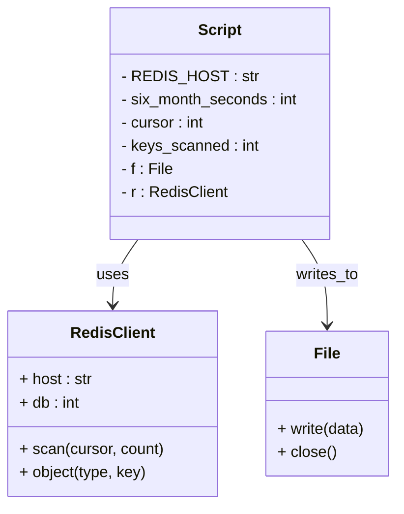

# Diagram: research/orchestrator/scripts/find_old_keys.py


> Auto-generated by Obscura crawlers

## Diagram 1

```mermaid
flowchart TD
    Start([Start])
    SetEnv[Set REDIS_HOST (env default)]
    CreateClient[Create Redis client r (db=1)]
    SetConst[Set six_month_seconds = 60*60*24*30*6]
    OpenFile[Open old_keys.txt for writing as f]
    InitVars[Set cursor = 0, keys_scanned = 0]
    Scan[Call r.scan(cursor, count=100) -> returns (cursor, keys)]
    KeysExist{keys list non-empty?}
    ProcessKey[For each key in keys]
    IncCount[keys_scanned += 1]
    ProgressCheck{keys_scanned % 10000 == 0?}
    PrintProgress[print keys_scanned]
    GetIdle[idle_time = r.object(idletime, key)]
    IdleCheck{idle_time >= six_month_seconds?}
    SaveOld[print and f.write(key)]
    EndBatch[Finished keys batch]
    CursorCheck{cursor == 0?}
    CloseFile[Close f]
    End([End])

    Start --> SetEnv --> CreateClient --> SetConst --> OpenFile --> InitVars --> Scan
    Scan --> KeysExist
    KeysExist -- Yes --> ProcessKey
    KeysExist -- No --> CursorCheck
    ProcessKey --> IncCount --> ProgressCheck
    ProgressCheck -- Yes --> PrintProgress --> GetIdle
    ProgressCheck -- No --> GetIdle
    GetIdle --> IdleCheck
    IdleCheck -- Yes --> SaveOld --> ProcessKey
    IdleCheck -- No --> ProcessKey
    ProcessKey --> EndBatch
    EndBatch --> CursorCheck
    CursorCheck -- No --> Scan
    CursorCheck -- Yes --> CloseFile --> End
```

> SVG rendering failed for this diagram.

## Diagram 2



### SVG

<svg id="container" width="409.0625" xmlns="http://www.w3.org/2000/svg" class="classDiagram" height="522" viewBox="0 0 409.0625 522" role="graphics-document document" aria-roledescription="class"><style>#container{font-family:"trebuchet ms",verdana,arial,sans-serif;font-size:16px;fill:#333;}@keyframes edge-animation-frame{from{stroke-dashoffset:0;}}@keyframes dash{to{stroke-dashoffset:0;}}#container .edge-animation-slow{stroke-dasharray:9,5!important;stroke-dashoffset:900;animation:dash 50s linear infinite;stroke-linecap:round;}#container .edge-animation-fast{stroke-dasharray:9,5!important;stroke-dashoffset:900;animation:dash 20s linear infinite;stroke-linecap:round;}#container .error-icon{fill:#552222;}#container .error-text{fill:#552222;stroke:#552222;}#container .edge-thickness-normal{stroke-width:1px;}#container .edge-thickness-thick{stroke-width:3.5px;}#container .edge-pattern-solid{stroke-dasharray:0;}#container .edge-thickness-invisible{stroke-width:0;fill:none;}#container .edge-pattern-dashed{stroke-dasharray:3;}#container .edge-pattern-dotted{stroke-dasharray:2;}#container .marker{fill:#333333;stroke:#333333;}#container .marker.cross{stroke:#333333;}#container svg{font-family:"trebuchet ms",verdana,arial,sans-serif;font-size:16px;}#container p{margin:0;}#container g.classGroup text{fill:#9370DB;stroke:none;font-family:"trebuchet ms",verdana,arial,sans-serif;font-size:10px;}#container g.classGroup text .title{font-weight:bolder;}#container .nodeLabel,#container .edgeLabel{color:#131300;}#container .edgeLabel .label rect{fill:#ECECFF;}#container .label text{fill:#131300;}#container .labelBkg{background:#ECECFF;}#container .edgeLabel .label span{background:#ECECFF;}#container .classTitle{font-weight:bolder;}#container .node rect,#container .node circle,#container .node ellipse,#container .node polygon,#container .node path{fill:#ECECFF;stroke:#9370DB;stroke-width:1px;}#container .divider{stroke:#9370DB;stroke-width:1;}#container g.clickable{cursor:pointer;}#container g.classGroup rect{fill:#ECECFF;stroke:#9370DB;}#container g.classGroup line{stroke:#9370DB;stroke-width:1;}#container .classLabel .box{stroke:none;stroke-width:0;fill:#ECECFF;opacity:0.5;}#container .classLabel .label{fill:#9370DB;font-size:10px;}#container .relation{stroke:#333333;stroke-width:1;fill:none;}#container .dashed-line{stroke-dasharray:3;}#container .dotted-line{stroke-dasharray:1 2;}#container #compositionStart,#container .composition{fill:#333333!important;stroke:#333333!important;stroke-width:1;}#container #compositionEnd,#container .composition{fill:#333333!important;stroke:#333333!important;stroke-width:1;}#container #dependencyStart,#container .dependency{fill:#333333!important;stroke:#333333!important;stroke-width:1;}#container #dependencyStart,#container .dependency{fill:#333333!important;stroke:#333333!important;stroke-width:1;}#container #extensionStart,#container .extension{fill:transparent!important;stroke:#333333!important;stroke-width:1;}#container #extensionEnd,#container .extension{fill:transparent!important;stroke:#333333!important;stroke-width:1;}#container #aggregationStart,#container .aggregation{fill:transparent!important;stroke:#333333!important;stroke-width:1;}#container #aggregationEnd,#container .aggregation{fill:transparent!important;stroke:#333333!important;stroke-width:1;}#container #lollipopStart,#container .lollipop{fill:#ECECFF!important;stroke:#333333!important;stroke-width:1;}#container #lollipopEnd,#container .lollipop{fill:#ECECFF!important;stroke:#333333!important;stroke-width:1;}#container .edgeTerminals{font-size:11px;line-height:initial;}#container .classTitleText{text-anchor:middle;font-size:18px;fill:#333;}#container .label-icon{display:inline-block;height:1em;overflow:visible;vertical-align:-0.125em;}#container .node .label-icon path{fill:currentColor;stroke:revert;stroke-width:revert;}#container :root{--mermaid-font-family:"trebuchet ms",verdana,arial,sans-serif;}</style><g><defs><marker id="container_class-aggregationStart" class="marker aggregation class" refX="18" refY="7" markerWidth="190" markerHeight="240" orient="auto"><path d="M 18,7 L9,13 L1,7 L9,1 Z"></path></marker></defs><defs><marker id="container_class-aggregationEnd" class="marker aggregation class" refX="1" refY="7" markerWidth="20" markerHeight="28" orient="auto"><path d="M 18,7 L9,13 L1,7 L9,1 Z"></path></marker></defs><defs><marker id="container_class-extensionStart" class="marker extension class" refX="18" refY="7" markerWidth="190" markerHeight="240" orient="auto"><path d="M 1,7 L18,13 V 1 Z"></path></marker></defs><defs><marker id="container_class-extensionEnd" class="marker extension class" refX="1" refY="7" markerWidth="20" markerHeight="28" orient="auto"><path d="M 1,1 V 13 L18,7 Z"></path></marker></defs><defs><marker id="container_class-compositionStart" class="marker composition class" refX="18" refY="7" markerWidth="190" markerHeight="240" orient="auto"><path d="M 18,7 L9,13 L1,7 L9,1 Z"></path></marker></defs><defs><marker id="container_class-compositionEnd" class="marker composition class" refX="1" refY="7" markerWidth="20" markerHeight="28" orient="auto"><path d="M 18,7 L9,13 L1,7 L9,1 Z"></path></marker></defs><defs><marker id="container_class-dependencyStart" class="marker dependency class" refX="6" refY="7" markerWidth="190" markerHeight="240" orient="auto"><path d="M 5,7 L9,13 L1,7 L9,1 Z"></path></marker></defs><defs><marker id="container_class-dependencyEnd" class="marker dependency class" refX="13" refY="7" markerWidth="20" markerHeight="28" orient="auto"><path d="M 18,7 L9,13 L14,7 L9,1 Z"></path></marker></defs><defs><marker id="container_class-lollipopStart" class="marker lollipop class" refX="13" refY="7" markerWidth="190" markerHeight="240" orient="auto"><circle stroke="black" fill="transparent" cx="7" cy="7" r="6"></circle></marker></defs><defs><marker id="container_class-lollipopEnd" class="marker lollipop class" refX="1" refY="7" markerWidth="190" markerHeight="240" orient="auto"><circle stroke="black" fill="transparent" cx="7" cy="7" r="6"></circle></marker></defs><g class="root"><g class="clusters"></g><g class="edgePaths"><path d="M141.467,248L137.117,254.167C132.766,260.333,124.065,272.667,119.714,284C115.363,295.333,115.363,305.667,115.363,310.833L115.363,316" id="id_Script_RedisClient_1" class="edge-thickness-normal edge-pattern-solid relation" style=";;;" data-edge="true" data-et="edge" data-id="id_Script_RedisClient_1" data-points="W3sieCI6MTQxLjQ2NzI4MjA0NjE3ODM1LCJ5IjoyNDh9LHsieCI6MTE1LjM2MzI4MTI1LCJ5IjoyODV9LHsieCI6MTE1LjM2MzI4MTI1LCJ5IjozMjJ9XQ==" marker-end="url(#container_class-dependencyEnd)"></path><path d="M310.791,248L315.141,254.167C319.492,260.333,328.193,272.667,332.544,287.5C336.895,302.333,336.895,319.667,336.895,328.333L336.895,337" id="id_Script_File_2" class="edge-thickness-normal edge-pattern-solid relation" style=";;;" data-edge="true" data-et="edge" data-id="id_Script_File_2" data-points="W3sieCI6MzEwLjc5MDUzMDQ1MzgyMTY1LCJ5IjoyNDh9LHsieCI6MzM2Ljg5NDUzMTI1LCJ5IjoyODV9LHsieCI6MzM2Ljg5NDUzMTI1LCJ5IjozNDN9XQ==" marker-end="url(#container_class-dependencyEnd)"></path></g><g class="edgeLabels"><g class="edgeLabel" transform="translate(115.36328125, 285)"><g class="label" data-id="id_Script_RedisClient_1" transform="translate(-16.4921875, -12)"><foreignObject width="32.984375" height="24"><div xmlns="http://www.w3.org/1999/xhtml" class="labelBkg" style="display: table-cell; white-space: nowrap; line-height: 1.5; max-width: 200px; text-align: center;"><span class="edgeLabel"><p>uses</p></span></div></foreignObject></g></g><g class="edgeLabel" transform="translate(336.89453125, 285)"><g class="label" data-id="id_Script_File_2" transform="translate(-33.2265625, -12)"><foreignObject width="66.453125" height="24"><div xmlns="http://www.w3.org/1999/xhtml" class="labelBkg" style="display: table-cell; white-space: nowrap; line-height: 1.5; max-width: 200px; text-align: center;"><span class="edgeLabel"><p>writes_to</p></span></div></foreignObject></g></g></g><g class="nodes"><g class="node default" id="classId-Script-0" transform="translate(226.12890625, 128)"><g class="basic label-container"><path d="M-115.83203125 -120 L115.83203125 -120 L115.83203125 120 L-115.83203125 120" stroke="none" stroke-width="0" fill="#ECECFF" style=""></path><path d="M-115.83203125 -120 C-57.5675083233417 -120, 0.6970146033166031 -120, 115.83203125 -120 M-115.83203125 -120 C-61.45346259184578 -120, -7.0748939336915555 -120, 115.83203125 -120 M115.83203125 -120 C115.83203125 -70.73105285303015, 115.83203125 -21.462105706060314, 115.83203125 120 M115.83203125 -120 C115.83203125 -40.66110287138842, 115.83203125 38.677794257223155, 115.83203125 120 M115.83203125 120 C32.891678786341586 120, -50.04867367731683 120, -115.83203125 120 M115.83203125 120 C39.21507989944766 120, -37.40187145110468 120, -115.83203125 120 M-115.83203125 120 C-115.83203125 71.73310926253797, -115.83203125 23.466218525075917, -115.83203125 -120 M-115.83203125 120 C-115.83203125 65.85540833629406, -115.83203125 11.710816672588123, -115.83203125 -120" stroke="#9370DB" stroke-width="1.3" fill="none" stroke-dasharray="0 0" style=""></path></g><g class="annotation-group text" transform="translate(0, -96)"></g><g class="label-group text" transform="translate(-21.7421875, -96)"><g class="label" style="font-weight: bolder" transform="translate(0,-12)"><foreignObject width="43.484375" height="24"><div xmlns="http://www.w3.org/1999/xhtml" style="display: table-cell; white-space: nowrap; line-height: 1.5; max-width: 93px; text-align: center;"><span class="nodeLabel markdown-node-label" style=""><p>Script</p></span></div></foreignObject></g></g><g class="members-group text" transform="translate(-103.83203125, -48)"><g class="label" style="" transform="translate(0,-12)"><foreignObject width="130.859375" height="24"><div xmlns="http://www.w3.org/1999/xhtml" style="display: table-cell; white-space: nowrap; line-height: 1.5; max-width: 189px; text-align: center;"><span class="nodeLabel markdown-node-label" style=""><p>- REDIS_HOST : str</p></span></div></foreignObject></g><g class="label" style="" transform="translate(0,12)"><foreignObject width="185.921875" height="24"><div xmlns="http://www.w3.org/1999/xhtml" style="display: table-cell; white-space: nowrap; line-height: 1.5; max-width: 244px; text-align: center;"><span class="nodeLabel markdown-node-label" style=""><p>- six_month_seconds : int</p></span></div></foreignObject></g><g class="label" style="" transform="translate(0,36)"><foreignObject width="88.40625" height="24"><div xmlns="http://www.w3.org/1999/xhtml" style="display: table-cell; white-space: nowrap; line-height: 1.5; max-width: 146px; text-align: center;"><span class="nodeLabel markdown-node-label" style=""><p>- cursor : int</p></span></div></foreignObject></g><g class="label" style="" transform="translate(0,60)"><foreignObject width="143.3125" height="24"><div xmlns="http://www.w3.org/1999/xhtml" style="display: table-cell; white-space: nowrap; line-height: 1.5; max-width: 201px; text-align: center;"><span class="nodeLabel markdown-node-label" style=""><p>- keys_scanned : int</p></span></div></foreignObject></g><g class="label" style="" transform="translate(0,84)"><foreignObject width="53.515625" height="24"><div xmlns="http://www.w3.org/1999/xhtml" style="display: table-cell; white-space: nowrap; line-height: 1.5; max-width: 111px; text-align: center;"><span class="nodeLabel markdown-node-label" style=""><p>- f : File</p></span></div></foreignObject></g><g class="label" style="" transform="translate(0,108)"><foreignObject width="110.78125" height="24"><div xmlns="http://www.w3.org/1999/xhtml" style="display: table-cell; white-space: nowrap; line-height: 1.5; max-width: 168px; text-align: center;"><span class="nodeLabel markdown-node-label" style=""><p>- r : RedisClient</p></span></div></foreignObject></g></g><g class="methods-group text" transform="translate(-103.83203125, 120)"></g><g class="divider" style=""><path d="M-115.83203125 -72 C-56.00275641971592 -72, 3.8265184105681556 -72, 115.83203125 -72 M-115.83203125 -72 C-56.64251467001271 -72, 2.5470019099745826 -72, 115.83203125 -72" stroke="#9370DB" stroke-width="1.3" fill="none" stroke-dasharray="0 0" style=""></path></g><g class="divider" style=""><path d="M-115.83203125 96 C-59.59031639082438 96, -3.348601531648754 96, 115.83203125 96 M-115.83203125 96 C-59.927974812424594 96, -4.023918374849188 96, 115.83203125 96" stroke="#9370DB" stroke-width="1.3" fill="none" stroke-dasharray="0 0" style=""></path></g></g><g class="node default" id="classId-RedisClient-1" transform="translate(115.36328125, 418)"><g class="basic label-container"><path d="M-107.36328125 -96 L107.36328125 -96 L107.36328125 96 L-107.36328125 96" stroke="none" stroke-width="0" fill="#ECECFF" style=""></path><path d="M-107.36328125 -96 C-46.816903946524604 -96, 13.729473356950791 -96, 107.36328125 -96 M-107.36328125 -96 C-36.918562524802 -96, 33.526156200396 -96, 107.36328125 -96 M107.36328125 -96 C107.36328125 -39.24685958347847, 107.36328125 17.506280833043064, 107.36328125 96 M107.36328125 -96 C107.36328125 -30.607376554344413, 107.36328125 34.785246891311175, 107.36328125 96 M107.36328125 96 C39.87594697318531 96, -27.611387303629385 96, -107.36328125 96 M107.36328125 96 C23.280724495831834 96, -60.80183225833633 96, -107.36328125 96 M-107.36328125 96 C-107.36328125 54.416449325873, -107.36328125 12.832898651746007, -107.36328125 -96 M-107.36328125 96 C-107.36328125 26.91875958371898, -107.36328125 -42.16248083256204, -107.36328125 -96" stroke="#9370DB" stroke-width="1.3" fill="none" stroke-dasharray="0 0" style=""></path></g><g class="annotation-group text" transform="translate(0, -72)"></g><g class="label-group text" transform="translate(-41.4296875, -72)"><g class="label" style="font-weight: bolder" transform="translate(0,-12)"><foreignObject width="82.859375" height="24"><div xmlns="http://www.w3.org/1999/xhtml" style="display: table-cell; white-space: nowrap; line-height: 1.5; max-width: 132px; text-align: center;"><span class="nodeLabel markdown-node-label" style=""><p>RedisClient</p></span></div></foreignObject></g></g><g class="members-group text" transform="translate(-95.36328125, -24)"><g class="label" style="" transform="translate(0,-12)"><foreignObject width="75.9375" height="24"><div xmlns="http://www.w3.org/1999/xhtml" style="display: table-cell; white-space: nowrap; line-height: 1.5; max-width: 134px; text-align: center;"><span class="nodeLabel markdown-node-label" style=""><p>+ host : str</p></span></div></foreignObject></g><g class="label" style="" transform="translate(0,12)"><foreignObject width="63.28125" height="24"><div xmlns="http://www.w3.org/1999/xhtml" style="display: table-cell; white-space: nowrap; line-height: 1.5; max-width: 121px; text-align: center;"><span class="nodeLabel markdown-node-label" style=""><p>+ db : int</p></span></div></foreignObject></g></g><g class="methods-group text" transform="translate(-95.36328125, 48)"><g class="label" style="" transform="translate(0,-12)"><foreignObject width="149.296875" height="24"><div xmlns="http://www.w3.org/1999/xhtml" style="display: table-cell; white-space: nowrap; line-height: 1.5; max-width: 207px; text-align: center;"><span class="nodeLabel markdown-node-label" style=""><p>+ scan(cursor, count)</p></span></div></foreignObject></g><g class="label" style="" transform="translate(0,12)"><foreignObject width="132.359375" height="24"><div xmlns="http://www.w3.org/1999/xhtml" style="display: table-cell; white-space: nowrap; line-height: 1.5; max-width: 190px; text-align: center;"><span class="nodeLabel markdown-node-label" style=""><p>+ object(type, key)</p></span></div></foreignObject></g></g><g class="divider" style=""><path d="M-107.36328125 -48 C-47.953738965342936 -48, 11.455803319314128 -48, 107.36328125 -48 M-107.36328125 -48 C-57.74848482539506 -48, -8.13368840079012 -48, 107.36328125 -48" stroke="#9370DB" stroke-width="1.3" fill="none" stroke-dasharray="0 0" style=""></path></g><g class="divider" style=""><path d="M-107.36328125 24 C-41.70391955679851 24, 23.95544213640298 24, 107.36328125 24 M-107.36328125 24 C-59.10523388699413 24, -10.847186523988256 24, 107.36328125 24" stroke="#9370DB" stroke-width="1.3" fill="none" stroke-dasharray="0 0" style=""></path></g></g><g class="node default" id="classId-File-2" transform="translate(336.89453125, 418)"><g class="basic label-container"><path d="M-64.16796875 -75 L64.16796875 -75 L64.16796875 75 L-64.16796875 75" stroke="none" stroke-width="0" fill="#ECECFF" style=""></path><path d="M-64.16796875 -75 C-14.107853244607021 -75, 35.95226226078596 -75, 64.16796875 -75 M-64.16796875 -75 C-20.159179292996882 -75, 23.849610164006236 -75, 64.16796875 -75 M64.16796875 -75 C64.16796875 -20.754718188439696, 64.16796875 33.49056362312061, 64.16796875 75 M64.16796875 -75 C64.16796875 -30.18902874146375, 64.16796875 14.621942517072497, 64.16796875 75 M64.16796875 75 C33.75113683515187 75, 3.3343049203037296 75, -64.16796875 75 M64.16796875 75 C37.95541970224225 75, 11.742870654484513 75, -64.16796875 75 M-64.16796875 75 C-64.16796875 39.33888375350591, -64.16796875 3.677767507011822, -64.16796875 -75 M-64.16796875 75 C-64.16796875 36.01733404586433, -64.16796875 -2.965331908271338, -64.16796875 -75" stroke="#9370DB" stroke-width="1.3" fill="none" stroke-dasharray="0 0" style=""></path></g><g class="annotation-group text" transform="translate(0, -51)"></g><g class="label-group text" transform="translate(-12.6796875, -51)"><g class="label" style="font-weight: bolder" transform="translate(0,-12)"><foreignObject width="25.359375" height="24"><div xmlns="http://www.w3.org/1999/xhtml" style="display: table-cell; white-space: nowrap; line-height: 1.5; max-width: 75px; text-align: center;"><span class="nodeLabel markdown-node-label" style=""><p>File</p></span></div></foreignObject></g></g><g class="members-group text" transform="translate(-52.16796875, -3)"></g><g class="methods-group text" transform="translate(-52.16796875, 27)"><g class="label" style="" transform="translate(0,-12)"><foreignObject width="91.65625" height="24"><div xmlns="http://www.w3.org/1999/xhtml" style="display: table-cell; white-space: nowrap; line-height: 1.5; max-width: 149px; text-align: center;"><span class="nodeLabel markdown-node-label" style=""><p>+ write(data)</p></span></div></foreignObject></g><g class="label" style="" transform="translate(0,12)"><foreignObject width="60.390625" height="24"><div xmlns="http://www.w3.org/1999/xhtml" style="display: table-cell; white-space: nowrap; line-height: 1.5; max-width: 118px; text-align: center;"><span class="nodeLabel markdown-node-label" style=""><p>+ close()</p></span></div></foreignObject></g></g><g class="divider" style=""><path d="M-64.16796875 -27 C-21.113307513888742 -27, 21.941353722222516 -27, 64.16796875 -27 M-64.16796875 -27 C-38.343578272698764 -27, -12.519187795397535 -27, 64.16796875 -27" stroke="#9370DB" stroke-width="1.3" fill="none" stroke-dasharray="0 0" style=""></path></g><g class="divider" style=""><path d="M-64.16796875 -3 C-38.218761282764696 -3, -12.269553815529392 -3, 64.16796875 -3 M-64.16796875 -3 C-30.53051236231296 -3, 3.1069440253740765 -3, 64.16796875 -3" stroke="#9370DB" stroke-width="1.3" fill="none" stroke-dasharray="0 0" style=""></path></g></g></g></g></g></svg>
