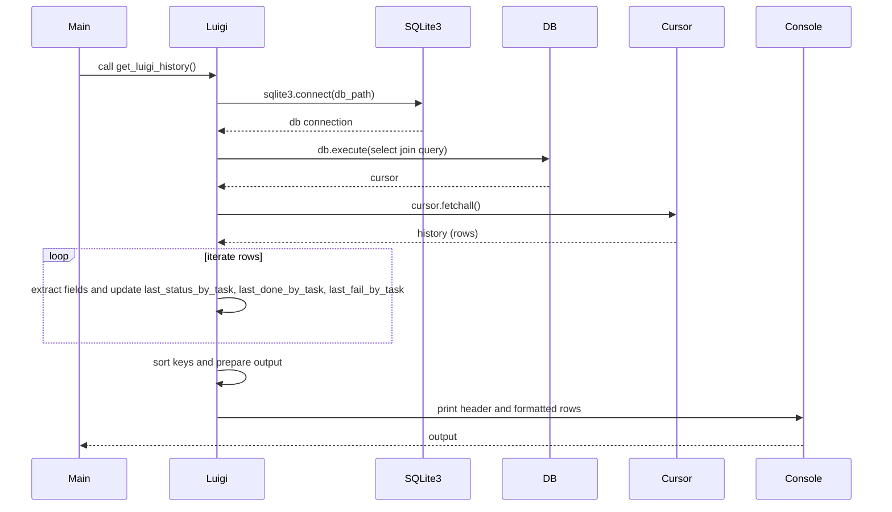
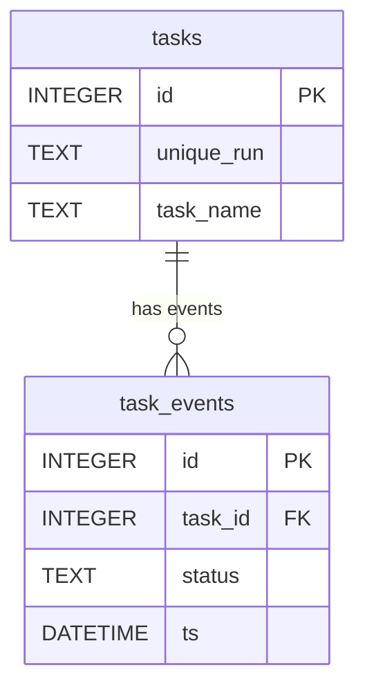

# Diagram: research/orchestrator/scripts/luigi_history.py


> Auto-generated by Obscura crawlers

## Diagram 1

```mermaid
flowchart TD
    Start([Start]) --> GL[get_luigi_history()]
    GL --> Connect[connect sqlite3 to db_path]
    Connect --> Exec[execute select join query]
    Exec --> Fetch[fetchall() -> history]
    Fetch --> Init[initialize last_status_by_task, last_done_by_task, last_fail_by_task]
    Init --> Loop{rows remaining?}
    Loop --> Extract[extract unique_run=row[1], task_name=row[2], status=row[6], ts=row[7]]
    Extract --> Update[last_status_by_task[task_name] = {status, ts}]
    Update --> CheckDone{status == DONE?}
    CheckDone -- yes --> MarkDone[last_done_by_task[task_name] = ts]
    CheckDone -- no --> CheckFail{status == FAILED?}
    CheckFail -- yes --> MarkFail[last_fail_by_task[task_name] = ts]
    CheckFail -- no --> Continue[continue]
    MarkDone --> Loop
    MarkFail --> Loop
    Continue --> Loop
    Loop --> Sort[sort keys by last_status ts]
    Sort --> PrintHeader[print header]
    PrintHeader --> PrintRows[print formatted rows]
    PrintRows --> End([End])
```

> SVG rendering failed for this diagram.

## Diagram 2



### SVG

<svg id="container" width="1443" xmlns="http://www.w3.org/2000/svg" height="844" viewBox="-52.5 -10 1443 844" role="graphics-document document" aria-roledescription="sequence"><g><rect x="1190.5" y="758" fill="#eaeaea" stroke="#666" width="150" height="65" name="Console" rx="3" ry="3" class="actor actor-bottom"></rect><text x="1265.5" y="790.5" dominant-baseline="central" alignment-baseline="central" class="actor actor-box" style="text-anchor: middle; font-size: 16px; font-weight: 400;"><tspan x="1265.5" dy="0">Console</tspan></text></g><g><rect x="990.5" y="758" fill="#eaeaea" stroke="#666" width="150" height="65" name="Cursor" rx="3" ry="3" class="actor actor-bottom"></rect><text x="1065.5" y="790.5" dominant-baseline="central" alignment-baseline="central" class="actor actor-box" style="text-anchor: middle; font-size: 16px; font-weight: 400;"><tspan x="1065.5" dy="0">Cursor</tspan></text></g><g><rect x="790.5" y="758" fill="#eaeaea" stroke="#666" width="150" height="65" name="DB" rx="3" ry="3" class="actor actor-bottom"></rect><text x="865.5" y="790.5" dominant-baseline="central" alignment-baseline="central" class="actor actor-box" style="text-anchor: middle; font-size: 16px; font-weight: 400;"><tspan x="865.5" dy="0">DB</tspan></text></g><g><rect x="590.5" y="758" fill="#eaeaea" stroke="#666" width="150" height="65" name="SQLite3" rx="3" ry="3" class="actor actor-bottom"></rect><text x="665.5" y="790.5" dominant-baseline="central" alignment-baseline="central" class="actor actor-box" style="text-anchor: middle; font-size: 16px; font-weight: 400;"><tspan x="665.5" dy="0">SQLite3</tspan></text></g><g><rect x="231" y="758" fill="#eaeaea" stroke="#666" width="150" height="65" name="Luigi" rx="3" ry="3" class="actor actor-bottom"></rect><text x="306" y="790.5" dominant-baseline="central" alignment-baseline="central" class="actor actor-box" style="text-anchor: middle; font-size: 16px; font-weight: 400;"><tspan x="306" dy="0">Luigi</tspan></text></g><g><rect x="0" y="758" fill="#eaeaea" stroke="#666" width="150" height="65" name="Main" rx="3" ry="3" class="actor actor-bottom"></rect><text x="75" y="790.5" dominant-baseline="central" alignment-baseline="central" class="actor actor-box" style="text-anchor: middle; font-size: 16px; font-weight: 400;"><tspan x="75" dy="0">Main</tspan></text></g><g><line id="actor5" x1="1265.5" y1="65" x2="1265.5" y2="758" class="actor-line 200" stroke-width="0.5px" stroke="#999" name="Console"></line><g id="root-5"><rect x="1190.5" y="0" fill="#eaeaea" stroke="#666" width="150" height="65" name="Console" rx="3" ry="3" class="actor actor-top"></rect><text x="1265.5" y="32.5" dominant-baseline="central" alignment-baseline="central" class="actor actor-box" style="text-anchor: middle; font-size: 16px; font-weight: 400;"><tspan x="1265.5" dy="0">Console</tspan></text></g></g><g><line id="actor4" x1="1065.5" y1="65" x2="1065.5" y2="758" class="actor-line 200" stroke-width="0.5px" stroke="#999" name="Cursor"></line><g id="root-4"><rect x="990.5" y="0" fill="#eaeaea" stroke="#666" width="150" height="65" name="Cursor" rx="3" ry="3" class="actor actor-top"></rect><text x="1065.5" y="32.5" dominant-baseline="central" alignment-baseline="central" class="actor actor-box" style="text-anchor: middle; font-size: 16px; font-weight: 400;"><tspan x="1065.5" dy="0">Cursor</tspan></text></g></g><g><line id="actor3" x1="865.5" y1="65" x2="865.5" y2="758" class="actor-line 200" stroke-width="0.5px" stroke="#999" name="DB"></line><g id="root-3"><rect x="790.5" y="0" fill="#eaeaea" stroke="#666" width="150" height="65" name="DB" rx="3" ry="3" class="actor actor-top"></rect><text x="865.5" y="32.5" dominant-baseline="central" alignment-baseline="central" class="actor actor-box" style="text-anchor: middle; font-size: 16px; font-weight: 400;"><tspan x="865.5" dy="0">DB</tspan></text></g></g><g><line id="actor2" x1="665.5" y1="65" x2="665.5" y2="758" class="actor-line 200" stroke-width="0.5px" stroke="#999" name="SQLite3"></line><g id="root-2"><rect x="590.5" y="0" fill="#eaeaea" stroke="#666" width="150" height="65" name="SQLite3" rx="3" ry="3" class="actor actor-top"></rect><text x="665.5" y="32.5" dominant-baseline="central" alignment-baseline="central" class="actor actor-box" style="text-anchor: middle; font-size: 16px; font-weight: 400;"><tspan x="665.5" dy="0">SQLite3</tspan></text></g></g><g><line id="actor1" x1="306" y1="65" x2="306" y2="758" class="actor-line 200" stroke-width="0.5px" stroke="#999" name="Luigi"></line><g id="root-1"><rect x="231" y="0" fill="#eaeaea" stroke="#666" width="150" height="65" name="Luigi" rx="3" ry="3" class="actor actor-top"></rect><text x="306" y="32.5" dominant-baseline="central" alignment-baseline="central" class="actor actor-box" style="text-anchor: middle; font-size: 16px; font-weight: 400;"><tspan x="306" dy="0">Luigi</tspan></text></g></g><g><line id="actor0" x1="75" y1="65" x2="75" y2="758" class="actor-line 200" stroke-width="0.5px" stroke="#999" name="Main"></line><g id="root-0"><rect x="0" y="0" fill="#eaeaea" stroke="#666" width="150" height="65" name="Main" rx="3" ry="3" class="actor actor-top"></rect><text x="75" y="32.5" dominant-baseline="central" alignment-baseline="central" class="actor actor-box" style="text-anchor: middle; font-size: 16px; font-weight: 400;"><tspan x="75" dy="0">Main</tspan></text></g></g><style>#container{font-family:"trebuchet ms",verdana,arial,sans-serif;font-size:16px;fill:#333;}@keyframes edge-animation-frame{from{stroke-dashoffset:0;}}@keyframes dash{to{stroke-dashoffset:0;}}#container .edge-animation-slow{stroke-dasharray:9,5!important;stroke-dashoffset:900;animation:dash 50s linear infinite;stroke-linecap:round;}#container .edge-animation-fast{stroke-dasharray:9,5!important;stroke-dashoffset:900;animation:dash 20s linear infinite;stroke-linecap:round;}#container .error-icon{fill:#552222;}#container .error-text{fill:#552222;stroke:#552222;}#container .edge-thickness-normal{stroke-width:1px;}#container .edge-thickness-thick{stroke-width:3.5px;}#container .edge-pattern-solid{stroke-dasharray:0;}#container .edge-thickness-invisible{stroke-width:0;fill:none;}#container .edge-pattern-dashed{stroke-dasharray:3;}#container .edge-pattern-dotted{stroke-dasharray:2;}#container .marker{fill:#333333;stroke:#333333;}#container .marker.cross{stroke:#333333;}#container svg{font-family:"trebuchet ms",verdana,arial,sans-serif;font-size:16px;}#container p{margin:0;}#container .actor{stroke:hsl(259.6261682243, 59.7765363128%, 87.9019607843%);fill:#ECECFF;}#container text.actor&gt;tspan{fill:black;stroke:none;}#container .actor-line{stroke:hsl(259.6261682243, 59.7765363128%, 87.9019607843%);}#container .innerArc{stroke-width:1.5;stroke-dasharray:none;}#container .messageLine0{stroke-width:1.5;stroke-dasharray:none;stroke:#333;}#container .messageLine1{stroke-width:1.5;stroke-dasharray:2,2;stroke:#333;}#container #arrowhead path{fill:#333;stroke:#333;}#container .sequenceNumber{fill:white;}#container #sequencenumber{fill:#333;}#container #crosshead path{fill:#333;stroke:#333;}#container .messageText{fill:#333;stroke:none;}#container .labelBox{stroke:hsl(259.6261682243, 59.7765363128%, 87.9019607843%);fill:#ECECFF;}#container .labelText,#container .labelText&gt;tspan{fill:black;stroke:none;}#container .loopText,#container .loopText&gt;tspan{fill:black;stroke:none;}#container .loopLine{stroke-width:2px;stroke-dasharray:2,2;stroke:hsl(259.6261682243, 59.7765363128%, 87.9019607843%);fill:hsl(259.6261682243, 59.7765363128%, 87.9019607843%);}#container .note{stroke:#aaaa33;fill:#fff5ad;}#container .noteText,#container .noteText&gt;tspan{fill:black;stroke:none;}#container .activation0{fill:#f4f4f4;stroke:#666;}#container .activation1{fill:#f4f4f4;stroke:#666;}#container .activation2{fill:#f4f4f4;stroke:#666;}#container .actorPopupMenu{position:absolute;}#container .actorPopupMenuPanel{position:absolute;fill:#ECECFF;box-shadow:0px 8px 16px 0px rgba(0,0,0,0.2);filter:drop-shadow(3px 5px 2px rgb(0 0 0 / 0.4));}#container .actor-man line{stroke:hsl(259.6261682243, 59.7765363128%, 87.9019607843%);fill:#ECECFF;}#container .actor-man circle,#container line{stroke:hsl(259.6261682243, 59.7765363128%, 87.9019607843%);fill:#ECECFF;stroke-width:2px;}#container :root{--mermaid-font-family:"trebuchet ms",verdana,arial,sans-serif;}</style><g></g><defs><symbol id="computer" width="24" height="24"><path transform="scale(.5)" d="M2 2v13h20v-13h-20zm18 11h-16v-9h16v9zm-10.228 6l.466-1h3.524l.467 1h-4.457zm14.228 3h-24l2-6h2.104l-1.33 4h18.45l-1.297-4h2.073l2 6zm-5-10h-14v-7h14v7z"></path></symbol></defs><defs><symbol id="database" fill-rule="evenodd" clip-rule="evenodd"><path transform="scale(.5)" d="M12.258.001l.256.004.255.005.253.008.251.01.249.012.247.015.246.016.242.019.241.02.239.023.236.024.233.027.231.028.229.031.225.032.223.034.22.036.217.038.214.04.211.041.208.043.205.045.201.046.198.048.194.05.191.051.187.053.183.054.18.056.175.057.172.059.168.06.163.061.16.063.155.064.15.066.074.033.073.033.071.034.07.034.069.035.068.035.067.035.066.035.064.036.064.036.062.036.06.036.06.037.058.037.058.037.055.038.055.038.053.038.052.038.051.039.05.039.048.039.047.039.045.04.044.04.043.04.041.04.04.041.039.041.037.041.036.041.034.041.033.042.032.042.03.042.029.042.027.042.026.043.024.043.023.043.021.043.02.043.018.044.017.043.015.044.013.044.012.044.011.045.009.044.007.045.006.045.004.045.002.045.001.045v17l-.001.045-.002.045-.004.045-.006.045-.007.045-.009.044-.011.045-.012.044-.013.044-.015.044-.017.043-.018.044-.02.043-.021.043-.023.043-.024.043-.026.043-.027.042-.029.042-.03.042-.032.042-.033.042-.034.041-.036.041-.037.041-.039.041-.04.041-.041.04-.043.04-.044.04-.045.04-.047.039-.048.039-.05.039-.051.039-.052.038-.053.038-.055.038-.055.038-.058.037-.058.037-.06.037-.06.036-.062.036-.064.036-.064.036-.066.035-.067.035-.068.035-.069.035-.07.034-.071.034-.073.033-.074.033-.15.066-.155.064-.16.063-.163.061-.168.06-.172.059-.175.057-.18.056-.183.054-.187.053-.191.051-.194.05-.198.048-.201.046-.205.045-.208.043-.211.041-.214.04-.217.038-.22.036-.223.034-.225.032-.229.031-.231.028-.233.027-.236.024-.239.023-.241.02-.242.019-.246.016-.247.015-.249.012-.251.01-.253.008-.255.005-.256.004-.258.001-.258-.001-.256-.004-.255-.005-.253-.008-.251-.01-.249-.012-.247-.015-.245-.016-.243-.019-.241-.02-.238-.023-.236-.024-.234-.027-.231-.028-.228-.031-.226-.032-.223-.034-.22-.036-.217-.038-.214-.04-.211-.041-.208-.043-.204-.045-.201-.046-.198-.048-.195-.05-.19-.051-.187-.053-.184-.054-.179-.056-.176-.057-.172-.059-.167-.06-.164-.061-.159-.063-.155-.064-.151-.066-.074-.033-.072-.033-.072-.034-.07-.034-.069-.035-.068-.035-.067-.035-.066-.035-.064-.036-.063-.036-.062-.036-.061-.036-.06-.037-.058-.037-.057-.037-.056-.038-.055-.038-.053-.038-.052-.038-.051-.039-.049-.039-.049-.039-.046-.039-.046-.04-.044-.04-.043-.04-.041-.04-.04-.041-.039-.041-.037-.041-.036-.041-.034-.041-.033-.042-.032-.042-.03-.042-.029-.042-.027-.042-.026-.043-.024-.043-.023-.043-.021-.043-.02-.043-.018-.044-.017-.043-.015-.044-.013-.044-.012-.044-.011-.045-.009-.044-.007-.045-.006-.045-.004-.045-.002-.045-.001-.045v-17l.001-.045.002-.045.004-.045.006-.045.007-.045.009-.044.011-.045.012-.044.013-.044.015-.044.017-.043.018-.044.02-.043.021-.043.023-.043.024-.043.026-.043.027-.042.029-.042.03-.042.032-.042.033-.042.034-.041.036-.041.037-.041.039-.041.04-.041.041-.04.043-.04.044-.04.046-.04.046-.039.049-.039.049-.039.051-.039.052-.038.053-.038.055-.038.056-.038.057-.037.058-.037.06-.037.061-.036.062-.036.063-.036.064-.036.066-.035.067-.035.068-.035.069-.035.07-.034.072-.034.072-.033.074-.033.151-.066.155-.064.159-.063.164-.061.167-.06.172-.059.176-.057.179-.056.184-.054.187-.053.19-.051.195-.05.198-.048.201-.046.204-.045.208-.043.211-.041.214-.04.217-.038.22-.036.223-.034.226-.032.228-.031.231-.028.234-.027.236-.024.238-.023.241-.02.243-.019.245-.016.247-.015.249-.012.251-.01.253-.008.255-.005.256-.004.258-.001.258.001zm-9.258 20.499v.01l.001.021.003.021.004.022.005.021.006.022.007.022.009.023.01.022.011.023.012.023.013.023.015.023.016.024.017.023.018.024.019.024.021.024.022.025.023.024.024.025.052.049.056.05.061.051.066.051.07.051.075.051.079.052.084.052.088.052.092.052.097.052.102.051.105.052.11.052.114.051.119.051.123.051.127.05.131.05.135.05.139.048.144.049.147.047.152.047.155.047.16.045.163.045.167.043.171.043.176.041.178.041.183.039.187.039.19.037.194.035.197.035.202.033.204.031.209.03.212.029.216.027.219.025.222.024.226.021.23.02.233.018.236.016.24.015.243.012.246.01.249.008.253.005.256.004.259.001.26-.001.257-.004.254-.005.25-.008.247-.011.244-.012.241-.014.237-.016.233-.018.231-.021.226-.021.224-.024.22-.026.216-.027.212-.028.21-.031.205-.031.202-.034.198-.034.194-.036.191-.037.187-.039.183-.04.179-.04.175-.042.172-.043.168-.044.163-.045.16-.046.155-.046.152-.047.148-.048.143-.049.139-.049.136-.05.131-.05.126-.05.123-.051.118-.052.114-.051.11-.052.106-.052.101-.052.096-.052.092-.052.088-.053.083-.051.079-.052.074-.052.07-.051.065-.051.06-.051.056-.05.051-.05.023-.024.023-.025.021-.024.02-.024.019-.024.018-.024.017-.024.015-.023.014-.024.013-.023.012-.023.01-.023.01-.022.008-.022.006-.022.006-.022.004-.022.004-.021.001-.021.001-.021v-4.127l-.077.055-.08.053-.083.054-.085.053-.087.052-.09.052-.093.051-.095.05-.097.05-.1.049-.102.049-.105.048-.106.047-.109.047-.111.046-.114.045-.115.045-.118.044-.12.043-.122.042-.124.042-.126.041-.128.04-.13.04-.132.038-.134.038-.135.037-.138.037-.139.035-.142.035-.143.034-.144.033-.147.032-.148.031-.15.03-.151.03-.153.029-.154.027-.156.027-.158.026-.159.025-.161.024-.162.023-.163.022-.165.021-.166.02-.167.019-.169.018-.169.017-.171.016-.173.015-.173.014-.175.013-.175.012-.177.011-.178.01-.179.008-.179.008-.181.006-.182.005-.182.004-.184.003-.184.002h-.37l-.184-.002-.184-.003-.182-.004-.182-.005-.181-.006-.179-.008-.179-.008-.178-.01-.176-.011-.176-.012-.175-.013-.173-.014-.172-.015-.171-.016-.17-.017-.169-.018-.167-.019-.166-.02-.165-.021-.163-.022-.162-.023-.161-.024-.159-.025-.157-.026-.156-.027-.155-.027-.153-.029-.151-.03-.15-.03-.148-.031-.146-.032-.145-.033-.143-.034-.141-.035-.14-.035-.137-.037-.136-.037-.134-.038-.132-.038-.13-.04-.128-.04-.126-.041-.124-.042-.122-.042-.12-.044-.117-.043-.116-.045-.113-.045-.112-.046-.109-.047-.106-.047-.105-.048-.102-.049-.1-.049-.097-.05-.095-.05-.093-.052-.09-.051-.087-.052-.085-.053-.083-.054-.08-.054-.077-.054v4.127zm0-5.654v.011l.001.021.003.021.004.021.005.022.006.022.007.022.009.022.01.022.011.023.012.023.013.023.015.024.016.023.017.024.018.024.019.024.021.024.022.024.023.025.024.024.052.05.056.05.061.05.066.051.07.051.075.052.079.051.084.052.088.052.092.052.097.052.102.052.105.052.11.051.114.051.119.052.123.05.127.051.131.05.135.049.139.049.144.048.147.048.152.047.155.046.16.045.163.045.167.044.171.042.176.042.178.04.183.04.187.038.19.037.194.036.197.034.202.033.204.032.209.03.212.028.216.027.219.025.222.024.226.022.23.02.233.018.236.016.24.014.243.012.246.01.249.008.253.006.256.003.259.001.26-.001.257-.003.254-.006.25-.008.247-.01.244-.012.241-.015.237-.016.233-.018.231-.02.226-.022.224-.024.22-.025.216-.027.212-.029.21-.03.205-.032.202-.033.198-.035.194-.036.191-.037.187-.039.183-.039.179-.041.175-.042.172-.043.168-.044.163-.045.16-.045.155-.047.152-.047.148-.048.143-.048.139-.05.136-.049.131-.05.126-.051.123-.051.118-.051.114-.052.11-.052.106-.052.101-.052.096-.052.092-.052.088-.052.083-.052.079-.052.074-.051.07-.052.065-.051.06-.05.056-.051.051-.049.023-.025.023-.024.021-.025.02-.024.019-.024.018-.024.017-.024.015-.023.014-.023.013-.024.012-.022.01-.023.01-.023.008-.022.006-.022.006-.022.004-.021.004-.022.001-.021.001-.021v-4.139l-.077.054-.08.054-.083.054-.085.052-.087.053-.09.051-.093.051-.095.051-.097.05-.1.049-.102.049-.105.048-.106.047-.109.047-.111.046-.114.045-.115.044-.118.044-.12.044-.122.042-.124.042-.126.041-.128.04-.13.039-.132.039-.134.038-.135.037-.138.036-.139.036-.142.035-.143.033-.144.033-.147.033-.148.031-.15.03-.151.03-.153.028-.154.028-.156.027-.158.026-.159.025-.161.024-.162.023-.163.022-.165.021-.166.02-.167.019-.169.018-.169.017-.171.016-.173.015-.173.014-.175.013-.175.012-.177.011-.178.009-.179.009-.179.007-.181.007-.182.005-.182.004-.184.003-.184.002h-.37l-.184-.002-.184-.003-.182-.004-.182-.005-.181-.007-.179-.007-.179-.009-.178-.009-.176-.011-.176-.012-.175-.013-.173-.014-.172-.015-.171-.016-.17-.017-.169-.018-.167-.019-.166-.02-.165-.021-.163-.022-.162-.023-.161-.024-.159-.025-.157-.026-.156-.027-.155-.028-.153-.028-.151-.03-.15-.03-.148-.031-.146-.033-.145-.033-.143-.033-.141-.035-.14-.036-.137-.036-.136-.037-.134-.038-.132-.039-.13-.039-.128-.04-.126-.041-.124-.042-.122-.043-.12-.043-.117-.044-.116-.044-.113-.046-.112-.046-.109-.046-.106-.047-.105-.048-.102-.049-.1-.049-.097-.05-.095-.051-.093-.051-.09-.051-.087-.053-.085-.052-.083-.054-.08-.054-.077-.054v4.139zm0-5.666v.011l.001.02.003.022.004.021.005.022.006.021.007.022.009.023.01.022.011.023.012.023.013.023.015.023.016.024.017.024.018.023.019.024.021.025.022.024.023.024.024.025.052.05.056.05.061.05.066.051.07.051.075.052.079.051.084.052.088.052.092.052.097.052.102.052.105.051.11.052.114.051.119.051.123.051.127.05.131.05.135.05.139.049.144.048.147.048.152.047.155.046.16.045.163.045.167.043.171.043.176.042.178.04.183.04.187.038.19.037.194.036.197.034.202.033.204.032.209.03.212.028.216.027.219.025.222.024.226.021.23.02.233.018.236.017.24.014.243.012.246.01.249.008.253.006.256.003.259.001.26-.001.257-.003.254-.006.25-.008.247-.01.244-.013.241-.014.237-.016.233-.018.231-.02.226-.022.224-.024.22-.025.216-.027.212-.029.21-.03.205-.032.202-.033.198-.035.194-.036.191-.037.187-.039.183-.039.179-.041.175-.042.172-.043.168-.044.163-.045.16-.045.155-.047.152-.047.148-.048.143-.049.139-.049.136-.049.131-.051.126-.05.123-.051.118-.052.114-.051.11-.052.106-.052.101-.052.096-.052.092-.052.088-.052.083-.052.079-.052.074-.052.07-.051.065-.051.06-.051.056-.05.051-.049.023-.025.023-.025.021-.024.02-.024.019-.024.018-.024.017-.024.015-.023.014-.024.013-.023.012-.023.01-.022.01-.023.008-.022.006-.022.006-.022.004-.022.004-.021.001-.021.001-.021v-4.153l-.077.054-.08.054-.083.053-.085.053-.087.053-.09.051-.093.051-.095.051-.097.05-.1.049-.102.048-.105.048-.106.048-.109.046-.111.046-.114.046-.115.044-.118.044-.12.043-.122.043-.124.042-.126.041-.128.04-.13.039-.132.039-.134.038-.135.037-.138.036-.139.036-.142.034-.143.034-.144.033-.147.032-.148.032-.15.03-.151.03-.153.028-.154.028-.156.027-.158.026-.159.024-.161.024-.162.023-.163.023-.165.021-.166.02-.167.019-.169.018-.169.017-.171.016-.173.015-.173.014-.175.013-.175.012-.177.01-.178.01-.179.009-.179.007-.181.006-.182.006-.182.004-.184.003-.184.001-.185.001-.185-.001-.184-.001-.184-.003-.182-.004-.182-.006-.181-.006-.179-.007-.179-.009-.178-.01-.176-.01-.176-.012-.175-.013-.173-.014-.172-.015-.171-.016-.17-.017-.169-.018-.167-.019-.166-.02-.165-.021-.163-.023-.162-.023-.161-.024-.159-.024-.157-.026-.156-.027-.155-.028-.153-.028-.151-.03-.15-.03-.148-.032-.146-.032-.145-.033-.143-.034-.141-.034-.14-.036-.137-.036-.136-.037-.134-.038-.132-.039-.13-.039-.128-.041-.126-.041-.124-.041-.122-.043-.12-.043-.117-.044-.116-.044-.113-.046-.112-.046-.109-.046-.106-.048-.105-.048-.102-.048-.1-.05-.097-.049-.095-.051-.093-.051-.09-.052-.087-.052-.085-.053-.083-.053-.08-.054-.077-.054v4.153zm8.74-8.179l-.257.004-.254.005-.25.008-.247.011-.244.012-.241.014-.237.016-.233.018-.231.021-.226.022-.224.023-.22.026-.216.027-.212.028-.21.031-.205.032-.202.033-.198.034-.194.036-.191.038-.187.038-.183.04-.179.041-.175.042-.172.043-.168.043-.163.045-.16.046-.155.046-.152.048-.148.048-.143.048-.139.049-.136.05-.131.05-.126.051-.123.051-.118.051-.114.052-.11.052-.106.052-.101.052-.096.052-.092.052-.088.052-.083.052-.079.052-.074.051-.07.052-.065.051-.06.05-.056.05-.051.05-.023.025-.023.024-.021.024-.02.025-.019.024-.018.024-.017.023-.015.024-.014.023-.013.023-.012.023-.01.023-.01.022-.008.022-.006.023-.006.021-.004.022-.004.021-.001.021-.001.021.001.021.001.021.004.021.004.022.006.021.006.023.008.022.01.022.01.023.012.023.013.023.014.023.015.024.017.023.018.024.019.024.02.025.021.024.023.024.023.025.051.05.056.05.06.05.065.051.07.052.074.051.079.052.083.052.088.052.092.052.096.052.101.052.106.052.11.052.114.052.118.051.123.051.126.051.131.05.136.05.139.049.143.048.148.048.152.048.155.046.16.046.163.045.168.043.172.043.175.042.179.041.183.04.187.038.191.038.194.036.198.034.202.033.205.032.21.031.212.028.216.027.22.026.224.023.226.022.231.021.233.018.237.016.241.014.244.012.247.011.25.008.254.005.257.004.26.001.26-.001.257-.004.254-.005.25-.008.247-.011.244-.012.241-.014.237-.016.233-.018.231-.021.226-.022.224-.023.22-.026.216-.027.212-.028.21-.031.205-.032.202-.033.198-.034.194-.036.191-.038.187-.038.183-.04.179-.041.175-.042.172-.043.168-.043.163-.045.16-.046.155-.046.152-.048.148-.048.143-.048.139-.049.136-.05.131-.05.126-.051.123-.051.118-.051.114-.052.11-.052.106-.052.101-.052.096-.052.092-.052.088-.052.083-.052.079-.052.074-.051.07-.052.065-.051.06-.05.056-.05.051-.05.023-.025.023-.024.021-.024.02-.025.019-.024.018-.024.017-.023.015-.024.014-.023.013-.023.012-.023.01-.023.01-.022.008-.022.006-.023.006-.021.004-.022.004-.021.001-.021.001-.021-.001-.021-.001-.021-.004-.021-.004-.022-.006-.021-.006-.023-.008-.022-.01-.022-.01-.023-.012-.023-.013-.023-.014-.023-.015-.024-.017-.023-.018-.024-.019-.024-.02-.025-.021-.024-.023-.024-.023-.025-.051-.05-.056-.05-.06-.05-.065-.051-.07-.052-.074-.051-.079-.052-.083-.052-.088-.052-.092-.052-.096-.052-.101-.052-.106-.052-.11-.052-.114-.052-.118-.051-.123-.051-.126-.051-.131-.05-.136-.05-.139-.049-.143-.048-.148-.048-.152-.048-.155-.046-.16-.046-.163-.045-.168-.043-.172-.043-.175-.042-.179-.041-.183-.04-.187-.038-.191-.038-.194-.036-.198-.034-.202-.033-.205-.032-.21-.031-.212-.028-.216-.027-.22-.026-.224-.023-.226-.022-.231-.021-.233-.018-.237-.016-.241-.014-.244-.012-.247-.011-.25-.008-.254-.005-.257-.004-.26-.001-.26.001z"></path></symbol></defs><defs><symbol id="clock" width="24" height="24"><path transform="scale(.5)" d="M12 2c5.514 0 10 4.486 10 10s-4.486 10-10 10-10-4.486-10-10 4.486-10 10-10zm0-2c-6.627 0-12 5.373-12 12s5.373 12 12 12 12-5.373 12-12-5.373-12-12-12zm5.848 12.459c.202.038.202.333.001.372-1.907.361-6.045 1.111-6.547 1.111-.719 0-1.301-.582-1.301-1.301 0-.512.77-5.447 1.125-7.445.034-.192.312-.181.343.014l.985 6.238 5.394 1.011z"></path></symbol></defs><defs><marker id="arrowhead" refX="7.9" refY="5" markerUnits="userSpaceOnUse" markerWidth="12" markerHeight="12" orient="auto-start-reverse"><path d="M -1 0 L 10 5 L 0 10 z"></path></marker></defs><defs><marker id="crosshead" markerWidth="15" markerHeight="8" orient="auto" refX="4" refY="4.5"><path fill="none" stroke="#000000" stroke-width="1pt" d="M 1,2 L 6,7 M 6,2 L 1,7" style="stroke-dasharray: 0, 0;"></path></marker></defs><defs><marker id="filled-head" refX="15.5" refY="7" markerWidth="20" markerHeight="28" orient="auto"><path d="M 18,7 L9,13 L14,7 L9,1 Z"></path></marker></defs><defs><marker id="sequencenumber" refX="15" refY="15" markerWidth="60" markerHeight="40" orient="auto"><circle cx="15" cy="15" r="6"></circle></marker></defs><g><line x1="-2.5" y1="411" x2="616.5" y2="411" class="loopLine"></line><line x1="616.5" y1="411" x2="616.5" y2="564" class="loopLine"></line><line x1="-2.5" y1="564" x2="616.5" y2="564" class="loopLine"></line><line x1="-2.5" y1="411" x2="-2.5" y2="564" class="loopLine"></line><polygon points="-2.5,411 47.5,411 47.5,424 39.1,431 -2.5,431" class="labelBox"></polygon><text x="23" y="424" text-anchor="middle" dominant-baseline="middle" alignment-baseline="middle" class="labelText" style="font-size: 16px; font-weight: 400;">loop</text><text x="332" y="429" text-anchor="middle" class="loopText" style="font-size: 16px; font-weight: 400;"><tspan x="332">[iterate rows]</tspan></text></g><text x="189" y="80" text-anchor="middle" dominant-baseline="middle" alignment-baseline="middle" class="messageText" dy="1em" style="font-size: 16px; font-weight: 400;">call get_luigi_history()</text><line x1="76" y1="113" x2="302" y2="113" class="messageLine0" stroke-width="2" stroke="none" marker-end="url(#arrowhead)" style="fill: none;"></line><text x="484" y="128" text-anchor="middle" dominant-baseline="middle" alignment-baseline="middle" class="messageText" dy="1em" style="font-size: 16px; font-weight: 400;">sqlite3.connect(db_path)</text><line x1="307" y1="161" x2="661.5" y2="161" class="messageLine0" stroke-width="2" stroke="none" marker-end="url(#arrowhead)" style="fill: none;"></line><text x="487" y="176" text-anchor="middle" dominant-baseline="middle" alignment-baseline="middle" class="messageText" dy="1em" style="font-size: 16px; font-weight: 400;">db connection</text><line x1="664.5" y1="209" x2="310" y2="209" class="messageLine1" stroke-width="2" stroke="none" marker-end="url(#arrowhead)" style="stroke-dasharray: 3, 3; fill: none;"></line><text x="584" y="224" text-anchor="middle" dominant-baseline="middle" alignment-baseline="middle" class="messageText" dy="1em" style="font-size: 16px; font-weight: 400;">db.execute(select join query)</text><line x1="307" y1="257" x2="861.5" y2="257" class="messageLine0" stroke-width="2" stroke="none" marker-end="url(#arrowhead)" style="fill: none;"></line><text x="587" y="272" text-anchor="middle" dominant-baseline="middle" alignment-baseline="middle" class="messageText" dy="1em" style="font-size: 16px; font-weight: 400;">cursor</text><line x1="864.5" y1="305" x2="310" y2="305" class="messageLine1" stroke-width="2" stroke="none" marker-end="url(#arrowhead)" style="stroke-dasharray: 3, 3; fill: none;"></line><text x="684" y="320" text-anchor="middle" dominant-baseline="middle" alignment-baseline="middle" class="messageText" dy="1em" style="font-size: 16px; font-weight: 400;">cursor.fetchall()</text><line x1="307" y1="353" x2="1061.5" y2="353" class="messageLine0" stroke-width="2" stroke="none" marker-end="url(#arrowhead)" style="fill: none;"></line><text x="687" y="368" text-anchor="middle" dominant-baseline="middle" alignment-baseline="middle" class="messageText" dy="1em" style="font-size: 16px; font-weight: 400;">history (rows)</text><line x1="1064.5" y1="401" x2="310" y2="401" class="messageLine1" stroke-width="2" stroke="none" marker-end="url(#arrowhead)" style="stroke-dasharray: 3, 3; fill: none;"></line><text x="307" y="461" text-anchor="middle" dominant-baseline="middle" alignment-baseline="middle" class="messageText" dy="1em" style="font-size: 16px; font-weight: 400;">extract fields and update last_status_by_task, last_done_by_task, last_fail_by_task</text><path d="M 307,494 C 367,484 367,524 307,514" class="messageLine0" stroke-width="2" stroke="none" marker-end="url(#arrowhead)" style="fill: none;"></path><text x="307" y="579" text-anchor="middle" dominant-baseline="middle" alignment-baseline="middle" class="messageText" dy="1em" style="font-size: 16px; font-weight: 400;">sort keys and prepare output</text><path d="M 307,612 C 367,602 367,642 307,632" class="messageLine0" stroke-width="2" stroke="none" marker-end="url(#arrowhead)" style="fill: none;"></path><text x="784" y="657" text-anchor="middle" dominant-baseline="middle" alignment-baseline="middle" class="messageText" dy="1em" style="font-size: 16px; font-weight: 400;">print header and formatted rows</text><line x1="307" y1="690" x2="1261.5" y2="690" class="messageLine0" stroke-width="2" stroke="none" marker-end="url(#arrowhead)" style="fill: none;"></line><text x="672" y="705" text-anchor="middle" dominant-baseline="middle" alignment-baseline="middle" class="messageText" dy="1em" style="font-size: 16px; font-weight: 400;">output</text><line x1="1264.5" y1="738" x2="79" y2="738" class="messageLine1" stroke-width="2" stroke="none" marker-end="url(#arrowhead)" style="stroke-dasharray: 3, 3; fill: none;"></line></svg>

## Diagram 3



### SVG

<svg id="container" width="254.03125" xmlns="http://www.w3.org/2000/svg" class="erDiagram" height="501.75" viewBox="0 0 254.03125 501.75" role="graphics-document document" aria-roledescription="er"><style>#container{font-family:"trebuchet ms",verdana,arial,sans-serif;font-size:16px;fill:#333;}@keyframes edge-animation-frame{from{stroke-dashoffset:0;}}@keyframes dash{to{stroke-dashoffset:0;}}#container .edge-animation-slow{stroke-dasharray:9,5!important;stroke-dashoffset:900;animation:dash 50s linear infinite;stroke-linecap:round;}#container .edge-animation-fast{stroke-dasharray:9,5!important;stroke-dashoffset:900;animation:dash 20s linear infinite;stroke-linecap:round;}#container .error-icon{fill:#552222;}#container .error-text{fill:#552222;stroke:#552222;}#container .edge-thickness-normal{stroke-width:1px;}#container .edge-thickness-thick{stroke-width:3.5px;}#container .edge-pattern-solid{stroke-dasharray:0;}#container .edge-thickness-invisible{stroke-width:0;fill:none;}#container .edge-pattern-dashed{stroke-dasharray:3;}#container .edge-pattern-dotted{stroke-dasharray:2;}#container .marker{fill:#333333;stroke:#333333;}#container .marker.cross{stroke:#333333;}#container svg{font-family:"trebuchet ms",verdana,arial,sans-serif;font-size:16px;}#container p{margin:0;}#container .entityBox{fill:#ECECFF;stroke:#9370DB;}#container .relationshipLabelBox{fill:hsl(80, 100%, 96.2745098039%);opacity:0.7;background-color:hsl(80, 100%, 96.2745098039%);}#container .relationshipLabelBox rect{opacity:0.5;}#container .labelBkg{background-color:rgba(248.6666666666, 255, 235.9999999999, 0.5);}#container .edgeLabel .label{fill:#9370DB;font-size:14px;}#container .label{font-family:"trebuchet ms",verdana,arial,sans-serif;color:#333;}#container .edge-pattern-dashed{stroke-dasharray:8,8;}#container .node rect,#container .node circle,#container .node ellipse,#container .node polygon{fill:#ECECFF;stroke:#9370DB;stroke-width:1px;}#container .relationshipLine{stroke:#333333;stroke-width:1;fill:none;}#container .marker{fill:none!important;stroke:#333333!important;stroke-width:1;}#container :root{--mermaid-font-family:"trebuchet ms",verdana,arial,sans-serif;}</style><g><defs><marker id="container_er-onlyOneStart" class="marker onlyOne er" refX="0" refY="9" markerWidth="18" markerHeight="18" orient="auto"><path d="M9,0 L9,18 M15,0 L15,18"></path></marker></defs><defs><marker id="container_er-onlyOneEnd" class="marker onlyOne er" refX="18" refY="9" markerWidth="18" markerHeight="18" orient="auto"><path d="M3,0 L3,18 M9,0 L9,18"></path></marker></defs><defs><marker id="container_er-zeroOrOneStart" class="marker zeroOrOne er" refX="0" refY="9" markerWidth="30" markerHeight="18" orient="auto"><circle fill="white" cx="21" cy="9" r="6"></circle><path d="M9,0 L9,18"></path></marker></defs><defs><marker id="container_er-zeroOrOneEnd" class="marker zeroOrOne er" refX="30" refY="9" markerWidth="30" markerHeight="18" orient="auto"><circle fill="white" cx="9" cy="9" r="6"></circle><path d="M21,0 L21,18"></path></marker></defs><defs><marker id="container_er-oneOrMoreStart" class="marker oneOrMore er" refX="18" refY="18" markerWidth="45" markerHeight="36" orient="auto"><path d="M0,18 Q 18,0 36,18 Q 18,36 0,18 M42,9 L42,27"></path></marker></defs><defs><marker id="container_er-oneOrMoreEnd" class="marker oneOrMore er" refX="27" refY="18" markerWidth="45" markerHeight="36" orient="auto"><path d="M3,9 L3,27 M9,18 Q27,0 45,18 Q27,36 9,18"></path></marker></defs><defs><marker id="container_er-zeroOrMoreStart" class="marker zeroOrMore er" refX="18" refY="18" markerWidth="57" markerHeight="36" orient="auto"><circle fill="white" cx="48" cy="18" r="6"></circle><path d="M0,18 Q18,0 36,18 Q18,36 0,18"></path></marker></defs><defs><marker id="container_er-zeroOrMoreEnd" class="marker zeroOrMore er" refX="39" refY="18" markerWidth="57" markerHeight="36" orient="auto"><circle fill="white" cx="9" cy="18" r="6"></circle><path d="M21,18 Q39,0 57,18 Q39,36 21,18"></path></marker></defs><g class="root"><g class="clusters"></g><g class="edgePaths"><path d="M127.016,179L127.016,187.417C127.016,195.833,127.016,212.667,127.016,229.5C127.016,246.333,127.016,263.167,127.016,271.583L127.016,280" id="id_entity-tasks-0_entity-task_events-1_0" class="edge-thickness-normal edge-pattern-solid relationshipLine" style="undefined;;;undefined" data-edge="true" data-et="edge" data-id="id_entity-tasks-0_entity-task_events-1_0" data-points="W3sieCI6MTI3LjAxNTYyNSwieSI6MTc5fSx7IngiOjEyNy4wMTU2MjUsInkiOjIyOS41fSx7IngiOjEyNy4wMTU2MjUsInkiOjI4MH1d" marker-start="url(#container_er-onlyOneStart)" marker-end="url(#container_er-zeroOrMoreEnd)"></path></g><g class="edgeLabels"><g class="edgeLabel" transform="translate(127.015625, 229.5)"><g class="label" data-id="id_entity-tasks-0_entity-task_events-1_0" transform="translate(-33.8828125, -10.5)"><foreignObject width="67.765625" height="21"><div xmlns="http://www.w3.org/1999/xhtml" class="labelBkg" style="display: table-cell; white-space: nowrap; line-height: 1.5; max-width: 200px; text-align: center;"><span class="edgeLabel"><p>has events</p></span></div></foreignObject></g></g></g><g class="nodes"><g class="node default" id="entity-tasks-0" transform="translate(127.015625, 93.5)"><g style=""><path d="M-119.015625 -85.5 L119.015625 -85.5 L119.015625 85.5 L-119.015625 85.5" stroke="none" stroke-width="0" fill="#ECECFF"></path><path d="M-119.015625 -85.5 C-69.78291054697966 -85.5, -20.55019609395933 -85.5, 119.015625 -85.5 M-119.015625 -85.5 C-37.233805967735705 -85.5, 44.54801306452859 -85.5, 119.015625 -85.5 M119.015625 -85.5 C119.015625 -22.671028654493874, 119.015625 40.15794269101225, 119.015625 85.5 M119.015625 -85.5 C119.015625 -20.34094745888092, 119.015625 44.81810508223816, 119.015625 85.5 M119.015625 85.5 C59.16115206791156 85.5, -0.6933208641768829 85.5, -119.015625 85.5 M119.015625 85.5 C41.70909588409393 85.5, -35.59743323181215 85.5, -119.015625 85.5 M-119.015625 85.5 C-119.015625 30.22453384062498, -119.015625 -25.050932318750043, -119.015625 -85.5 M-119.015625 85.5 C-119.015625 36.819597136946925, -119.015625 -11.86080572610615, -119.015625 -85.5" stroke="#9370DB" stroke-width="1.3" fill="none" stroke-dasharray="0 0"></path></g><g style="" class="row-rect-odd"><path d="M-119.015625 -42.75 L119.015625 -42.75 L119.015625 0 L-119.015625 0" stroke="none" stroke-width="0" fill="hsl(240, 100%, 100%)"></path><path d="M-119.015625 -42.75 C-43.563855957458486 -42.75, 31.887913085083028 -42.75, 119.015625 -42.75 M-119.015625 -42.75 C-36.49136132091593 -42.75, 46.032902358168144 -42.75, 119.015625 -42.75 M119.015625 -42.75 C119.015625 -30.04378351364217, 119.015625 -17.337567027284333, 119.015625 0 M119.015625 -42.75 C119.015625 -26.11496672012138, 119.015625 -9.47993344024276, 119.015625 0 M119.015625 0 C26.499187435989015 0, -66.01725012802197 0, -119.015625 0 M119.015625 0 C37.97358548936464 0, -43.068454021270725 0, -119.015625 0 M-119.015625 0 C-119.015625 -14.453895811031336, -119.015625 -28.90779162206267, -119.015625 -42.75 M-119.015625 0 C-119.015625 -13.208276240228948, -119.015625 -26.416552480457895, -119.015625 -42.75" stroke="#9370DB" stroke-width="1.3" fill="none" stroke-dasharray="0 0"></path></g><g style="" class="row-rect-even"><path d="M-119.015625 0 L119.015625 0 L119.015625 42.75 L-119.015625 42.75" stroke="none" stroke-width="0" fill="hsl(240, 100%, 97.2745098039%)"></path><path d="M-119.015625 0 C-42.44364650784357 0, 34.128331984312865 0, 119.015625 0 M-119.015625 0 C-47.67104323515457 0, 23.67353852969086 0, 119.015625 0 M119.015625 0 C119.015625 15.309657268332083, 119.015625 30.619314536664167, 119.015625 42.75 M119.015625 0 C119.015625 12.600914911923615, 119.015625 25.20182982384723, 119.015625 42.75 M119.015625 42.75 C42.56876491477766 42.75, -33.87809517044468 42.75, -119.015625 42.75 M119.015625 42.75 C49.91045197393676 42.75, -19.194721052126482 42.75, -119.015625 42.75 M-119.015625 42.75 C-119.015625 28.477194345519926, -119.015625 14.20438869103985, -119.015625 0 M-119.015625 42.75 C-119.015625 30.993203891570793, -119.015625 19.236407783141587, -119.015625 0" stroke="#9370DB" stroke-width="1.3" fill="none" stroke-dasharray="0 0"></path></g><g style="" class="row-rect-odd"><path d="M-119.015625 42.75 L119.015625 42.75 L119.015625 85.5 L-119.015625 85.5" stroke="none" stroke-width="0" fill="hsl(240, 100%, 100%)"></path><path d="M-119.015625 42.75 C-56.03089212595028 42.75, 6.953840748099438 42.75, 119.015625 42.75 M-119.015625 42.75 C-52.3606443102086 42.75, 14.294336379582802 42.75, 119.015625 42.75 M119.015625 42.75 C119.015625 56.57281806843994, 119.015625 70.39563613687989, 119.015625 85.5 M119.015625 42.75 C119.015625 55.973864949119445, 119.015625 69.19772989823889, 119.015625 85.5 M119.015625 85.5 C33.55405891143626 85.5, -51.907507177127485 85.5, -119.015625 85.5 M119.015625 85.5 C54.64757996136278 85.5, -9.72046507727444 85.5, -119.015625 85.5 M-119.015625 85.5 C-119.015625 73.37947348122454, -119.015625 61.25894696244907, -119.015625 42.75 M-119.015625 85.5 C-119.015625 68.54100781158336, -119.015625 51.582015623166704, -119.015625 42.75" stroke="#9370DB" stroke-width="1.3" fill="none" stroke-dasharray="0 0"></path></g><g class="label name" transform="translate(-18.6328125, -76.125)" style=""><foreignObject width="37.265625" height="24"><div xmlns="http://www.w3.org/1999/xhtml" style="display: table-cell; white-space: nowrap; line-height: 1.5; max-width: 137px; text-align: start;"><span class="nodeLabel"><p>tasks</p></span></div></foreignObject></g><g class="label attribute-type" transform="translate(-106.515625, -33.375)" style=""><foreignObject width="60.625" height="24"><div xmlns="http://www.w3.org/1999/xhtml" style="display: table-cell; white-space: nowrap; line-height: 1.5; max-width: 161px; text-align: start;"><span class="nodeLabel"><p>INTEGER</p></span></div></foreignObject></g><g class="label attribute-name" transform="translate(-20.890625, -33.375)" style=""><foreignObject width="14.09375" height="24"><div xmlns="http://www.w3.org/1999/xhtml" style="display: table-cell; white-space: nowrap; line-height: 1.5; max-width: 114px; text-align: start;"><span class="nodeLabel"><p>id</p></span></div></foreignObject></g><g class="label attribute-keys" transform="translate(87.78125, -33.375)" style=""><foreignObject width="18.734375" height="24"><div xmlns="http://www.w3.org/1999/xhtml" style="display: table-cell; white-space: nowrap; line-height: 1.5; max-width: 119px; text-align: start;"><span class="nodeLabel"><p>PK</p></span></div></foreignObject></g><g class="label attribute-comment" transform="translate(131.515625, -33.375)" style=""><foreignObject width="0" height="0"><div xmlns="http://www.w3.org/1999/xhtml" style="display: table-cell; white-space: nowrap; line-height: 1.5; max-width: 100px; text-align: start;"><span class="nodeLabel"></span></div></foreignObject></g><g class="label attribute-type" transform="translate(-106.515625, 9.375)" style=""><foreignObject width="33.75" height="24"><div xmlns="http://www.w3.org/1999/xhtml" style="display: table-cell; white-space: nowrap; line-height: 1.5; max-width: 134px; text-align: start;"><span class="nodeLabel"><p>TEXT</p></span></div></foreignObject></g><g class="label attribute-name" transform="translate(-20.890625, 9.375)" style=""><foreignObject width="83.671875" height="24"><div xmlns="http://www.w3.org/1999/xhtml" style="display: table-cell; white-space: nowrap; line-height: 1.5; max-width: 184px; text-align: start;"><span class="nodeLabel"><p>unique_run</p></span></div></foreignObject></g><g class="label attribute-keys" transform="translate(87.78125, 9.375)" style=""><foreignObject width="0" height="0"><div xmlns="http://www.w3.org/1999/xhtml" style="display: table-cell; white-space: nowrap; line-height: 1.5; max-width: 100px; text-align: start;"><span class="nodeLabel"></span></div></foreignObject></g><g class="label attribute-comment" transform="translate(131.515625, 9.375)" style=""><foreignObject width="0" height="0"><div xmlns="http://www.w3.org/1999/xhtml" style="display: table-cell; white-space: nowrap; line-height: 1.5; max-width: 100px; text-align: start;"><span class="nodeLabel"></span></div></foreignObject></g><g class="label attribute-type" transform="translate(-106.515625, 52.125)" style=""><foreignObject width="33.75" height="24"><div xmlns="http://www.w3.org/1999/xhtml" style="display: table-cell; white-space: nowrap; line-height: 1.5; max-width: 134px; text-align: start;"><span class="nodeLabel"><p>TEXT</p></span></div></foreignObject></g><g class="label attribute-name" transform="translate(-20.890625, 52.125)" style=""><foreignObject width="78.71875" height="24"><div xmlns="http://www.w3.org/1999/xhtml" style="display: table-cell; white-space: nowrap; line-height: 1.5; max-width: 179px; text-align: start;"><span class="nodeLabel"><p>task_name</p></span></div></foreignObject></g><g class="label attribute-keys" transform="translate(87.78125, 52.125)" style=""><foreignObject width="0" height="0"><div xmlns="http://www.w3.org/1999/xhtml" style="display: table-cell; white-space: nowrap; line-height: 1.5; max-width: 100px; text-align: start;"><span class="nodeLabel"></span></div></foreignObject></g><g class="label attribute-comment" transform="translate(131.515625, 52.125)" style=""><foreignObject width="0" height="0"><div xmlns="http://www.w3.org/1999/xhtml" style="display: table-cell; white-space: nowrap; line-height: 1.5; max-width: 100px; text-align: start;"><span class="nodeLabel"></span></div></foreignObject></g><g class="divider"><path d="M-119.015625 -42.75 C-58.43037873818232 -42.75, 2.1548675236353603 -42.75, 119.015625 -42.75 M-119.015625 -42.75 C-24.42487123808621 -42.75, 70.16588252382758 -42.75, 119.015625 -42.75" stroke="#9370DB" stroke-width="1.3" fill="none" stroke-dasharray="0 0"></path></g><g class="divider"><path d="M-33.390625 -42.75 C-33.390625 -8.59693174213114, -33.390625 25.55613651573772, -33.390625 85.5 M-33.390625 -42.75 C-33.390625 1.679805880519467, -33.390625 46.109611761038934, -33.390625 85.5" stroke="#9370DB" stroke-width="1.3" fill="none" stroke-dasharray="0 0"></path></g><g class="divider"><path d="M75.28125 -42.75 C75.28125 -11.1250499541176, 75.28125 20.4999000917648, 75.28125 85.5 M75.28125 -42.75 C75.28125 5.325559331575349, 75.28125 53.4011186631507, 75.28125 85.5" stroke="#9370DB" stroke-width="1.3" fill="none" stroke-dasharray="0 0"></path></g><g class="divider"><path d="M-119.015625 -42.75 C-65.11449411359767 -42.75, -11.213363227195345 -42.75, 119.015625 -42.75 M-119.015625 -42.75 C-47.015943871263744 -42.75, 24.983737257472512 -42.75, 119.015625 -42.75" stroke="#9370DB" stroke-width="1.3" fill="none" stroke-dasharray="0 0"></path></g></g><g class="node default" id="entity-task_events-1" transform="translate(127.015625, 386.875)"><g style=""><path d="M-107.6875 -106.875 L107.6875 -106.875 L107.6875 106.875 L-107.6875 106.875" stroke="none" stroke-width="0" fill="#ECECFF"></path><path d="M-107.6875 -106.875 C-55.006645025948835 -106.875, -2.3257900518976697 -106.875, 107.6875 -106.875 M-107.6875 -106.875 C-23.631146099809072 -106.875, 60.425207800381855 -106.875, 107.6875 -106.875 M107.6875 -106.875 C107.6875 -29.918166143356856, 107.6875 47.03866771328629, 107.6875 106.875 M107.6875 -106.875 C107.6875 -46.64407668023252, 107.6875 13.586846639534954, 107.6875 106.875 M107.6875 106.875 C21.99535837215079 106.875, -63.69678325569842 106.875, -107.6875 106.875 M107.6875 106.875 C32.54588307495473 106.875, -42.59573385009054 106.875, -107.6875 106.875 M-107.6875 106.875 C-107.6875 35.947852692590885, -107.6875 -34.97929461481823, -107.6875 -106.875 M-107.6875 106.875 C-107.6875 40.49970799723026, -107.6875 -25.87558400553948, -107.6875 -106.875" stroke="#9370DB" stroke-width="1.3" fill="none" stroke-dasharray="0 0"></path></g><g style="" class="row-rect-odd"><path d="M-107.6875 -64.125 L107.6875 -64.125 L107.6875 -21.375 L-107.6875 -21.375" stroke="none" stroke-width="0" fill="hsl(240, 100%, 100%)"></path><path d="M-107.6875 -64.125 C-27.72143154183695 -64.125, 52.2446369163261 -64.125, 107.6875 -64.125 M-107.6875 -64.125 C-42.47071705473472 -64.125, 22.74606589053056 -64.125, 107.6875 -64.125 M107.6875 -64.125 C107.6875 -53.03479851739482, 107.6875 -41.94459703478964, 107.6875 -21.375 M107.6875 -64.125 C107.6875 -48.02189256831285, 107.6875 -31.918785136625708, 107.6875 -21.375 M107.6875 -21.375 C34.25222440766146 -21.375, -39.18305118467708 -21.375, -107.6875 -21.375 M107.6875 -21.375 C56.6109714151747 -21.375, 5.5344428303494055 -21.375, -107.6875 -21.375 M-107.6875 -21.375 C-107.6875 -31.497491185213903, -107.6875 -41.619982370427806, -107.6875 -64.125 M-107.6875 -21.375 C-107.6875 -35.01752450090663, -107.6875 -48.66004900181326, -107.6875 -64.125" stroke="#9370DB" stroke-width="1.3" fill="none" stroke-dasharray="0 0"></path></g><g style="" class="row-rect-even"><path d="M-107.6875 -21.375 L107.6875 -21.375 L107.6875 21.375 L-107.6875 21.375" stroke="none" stroke-width="0" fill="hsl(240, 100%, 97.2745098039%)"></path><path d="M-107.6875 -21.375 C-30.549534074294755 -21.375, 46.58843185141049 -21.375, 107.6875 -21.375 M-107.6875 -21.375 C-38.07746347475042 -21.375, 31.532573050499167 -21.375, 107.6875 -21.375 M107.6875 -21.375 C107.6875 -11.854636301217042, 107.6875 -2.3342726024340834, 107.6875 21.375 M107.6875 -21.375 C107.6875 -8.427252536668421, 107.6875 4.520494926663158, 107.6875 21.375 M107.6875 21.375 C34.82491499557429 21.375, -38.03767000885142 21.375, -107.6875 21.375 M107.6875 21.375 C60.48449722875198 21.375, 13.281494457503953 21.375, -107.6875 21.375 M-107.6875 21.375 C-107.6875 10.260933585142777, -107.6875 -0.8531328297144469, -107.6875 -21.375 M-107.6875 21.375 C-107.6875 5.513107253742978, -107.6875 -10.348785492514043, -107.6875 -21.375" stroke="#9370DB" stroke-width="1.3" fill="none" stroke-dasharray="0 0"></path></g><g style="" class="row-rect-odd"><path d="M-107.6875 21.375 L107.6875 21.375 L107.6875 64.125 L-107.6875 64.125" stroke="none" stroke-width="0" fill="hsl(240, 100%, 100%)"></path><path d="M-107.6875 21.375 C-45.82215365049819 21.375, 16.043192699003626 21.375, 107.6875 21.375 M-107.6875 21.375 C-36.280083911823 21.375, 35.127332176354 21.375, 107.6875 21.375 M107.6875 21.375 C107.6875 32.81172428158915, 107.6875 44.2484485631783, 107.6875 64.125 M107.6875 21.375 C107.6875 36.25050335193068, 107.6875 51.126006703861364, 107.6875 64.125 M107.6875 64.125 C21.71948676526236 64.125, -64.24852646947528 64.125, -107.6875 64.125 M107.6875 64.125 C24.90309512231569 64.125, -57.88130975536862 64.125, -107.6875 64.125 M-107.6875 64.125 C-107.6875 50.14512302510184, -107.6875 36.16524605020368, -107.6875 21.375 M-107.6875 64.125 C-107.6875 52.842475908227826, -107.6875 41.55995181645566, -107.6875 21.375" stroke="#9370DB" stroke-width="1.3" fill="none" stroke-dasharray="0 0"></path></g><g style="" class="row-rect-even"><path d="M-107.6875 64.125 L107.6875 64.125 L107.6875 106.875 L-107.6875 106.875" stroke="none" stroke-width="0" fill="hsl(240, 100%, 97.2745098039%)"></path><path d="M-107.6875 64.125 C-47.156340228340916 64.125, 13.374819543318168 64.125, 107.6875 64.125 M-107.6875 64.125 C-32.645015444105795 64.125, 42.39746911178841 64.125, 107.6875 64.125 M107.6875 64.125 C107.6875 76.46961233212583, 107.6875 88.81422466425165, 107.6875 106.875 M107.6875 64.125 C107.6875 75.30615956262277, 107.6875 86.48731912524552, 107.6875 106.875 M107.6875 106.875 C35.60241966900665 106.875, -36.4826606619867 106.875, -107.6875 106.875 M107.6875 106.875 C52.67130282695122 106.875, -2.3448943460975613 106.875, -107.6875 106.875 M-107.6875 106.875 C-107.6875 92.23311950587865, -107.6875 77.59123901175728, -107.6875 64.125 M-107.6875 106.875 C-107.6875 93.04797922828209, -107.6875 79.22095845656419, -107.6875 64.125" stroke="#9370DB" stroke-width="1.3" fill="none" stroke-dasharray="0 0"></path></g><g class="label name" transform="translate(-42.84375, -97.5)" style=""><foreignObject width="85.6875" height="24"><div xmlns="http://www.w3.org/1999/xhtml" style="display: table-cell; white-space: nowrap; line-height: 1.5; max-width: 186px; text-align: start;"><span class="nodeLabel"><p>task_events</p></span></div></foreignObject></g><g class="label attribute-type" transform="translate(-95.1875, -54.75)" style=""><foreignObject width="60.625" height="24"><div xmlns="http://www.w3.org/1999/xhtml" style="display: table-cell; white-space: nowrap; line-height: 1.5; max-width: 161px; text-align: start;"><span class="nodeLabel"><p>INTEGER</p></span></div></foreignObject></g><g class="label attribute-name" transform="translate(-0.828125, -54.75)" style=""><foreignObject width="14.09375" height="24"><div xmlns="http://www.w3.org/1999/xhtml" style="display: table-cell; white-space: nowrap; line-height: 1.5; max-width: 114px; text-align: start;"><span class="nodeLabel"><p>id</p></span></div></foreignObject></g><g class="label attribute-keys" transform="translate(76.453125, -54.75)" style=""><foreignObject width="18.734375" height="24"><div xmlns="http://www.w3.org/1999/xhtml" style="display: table-cell; white-space: nowrap; line-height: 1.5; max-width: 119px; text-align: start;"><span class="nodeLabel"><p>PK</p></span></div></foreignObject></g><g class="label attribute-comment" transform="translate(120.1875, -54.75)" style=""><foreignObject width="0" height="0"><div xmlns="http://www.w3.org/1999/xhtml" style="display: table-cell; white-space: nowrap; line-height: 1.5; max-width: 100px; text-align: start;"><span class="nodeLabel"></span></div></foreignObject></g><g class="label attribute-type" transform="translate(-95.1875, -12)" style=""><foreignObject width="60.625" height="24"><div xmlns="http://www.w3.org/1999/xhtml" style="display: table-cell; white-space: nowrap; line-height: 1.5; max-width: 161px; text-align: start;"><span class="nodeLabel"><p>INTEGER</p></span></div></foreignObject></g><g class="label attribute-name" transform="translate(-0.828125, -12)" style=""><foreignObject width="52.28125" height="24"><div xmlns="http://www.w3.org/1999/xhtml" style="display: table-cell; white-space: nowrap; line-height: 1.5; max-width: 152px; text-align: start;"><span class="nodeLabel"><p>task_id</p></span></div></foreignObject></g><g class="label attribute-keys" transform="translate(76.453125, -12)" style=""><foreignObject width="17.28125" height="24"><div xmlns="http://www.w3.org/1999/xhtml" style="display: table-cell; white-space: nowrap; line-height: 1.5; max-width: 118px; text-align: start;"><span class="nodeLabel"><p>FK</p></span></div></foreignObject></g><g class="label attribute-comment" transform="translate(120.1875, -12)" style=""><foreignObject width="0" height="0"><div xmlns="http://www.w3.org/1999/xhtml" style="display: table-cell; white-space: nowrap; line-height: 1.5; max-width: 100px; text-align: start;"><span class="nodeLabel"></span></div></foreignObject></g><g class="label attribute-type" transform="translate(-95.1875, 30.75)" style=""><foreignObject width="33.75" height="24"><div xmlns="http://www.w3.org/1999/xhtml" style="display: table-cell; white-space: nowrap; line-height: 1.5; max-width: 134px; text-align: start;"><span class="nodeLabel"><p>TEXT</p></span></div></foreignObject></g><g class="label attribute-name" transform="translate(-0.828125, 30.75)" style=""><foreignObject width="44.40625" height="24"><div xmlns="http://www.w3.org/1999/xhtml" style="display: table-cell; white-space: nowrap; line-height: 1.5; max-width: 144px; text-align: start;"><span class="nodeLabel"><p>status</p></span></div></foreignObject></g><g class="label attribute-keys" transform="translate(76.453125, 30.75)" style=""><foreignObject width="0" height="0"><div xmlns="http://www.w3.org/1999/xhtml" style="display: table-cell; white-space: nowrap; line-height: 1.5; max-width: 100px; text-align: start;"><span class="nodeLabel"></span></div></foreignObject></g><g class="label attribute-comment" transform="translate(120.1875, 30.75)" style=""><foreignObject width="0" height="0"><div xmlns="http://www.w3.org/1999/xhtml" style="display: table-cell; white-space: nowrap; line-height: 1.5; max-width: 100px; text-align: start;"><span class="nodeLabel"></span></div></foreignObject></g><g class="label attribute-type" transform="translate(-95.1875, 73.5)" style=""><foreignObject width="69.359375" height="24"><div xmlns="http://www.w3.org/1999/xhtml" style="display: table-cell; white-space: nowrap; line-height: 1.5; max-width: 169px; text-align: start;"><span class="nodeLabel"><p>DATETIME</p></span></div></foreignObject></g><g class="label attribute-name" transform="translate(-0.828125, 73.5)" style=""><foreignObject width="13.25" height="24"><div xmlns="http://www.w3.org/1999/xhtml" style="display: table-cell; white-space: nowrap; line-height: 1.5; max-width: 113px; text-align: start;"><span class="nodeLabel"><p>ts</p></span></div></foreignObject></g><g class="label attribute-keys" transform="translate(76.453125, 73.5)" style=""><foreignObject width="0" height="0"><div xmlns="http://www.w3.org/1999/xhtml" style="display: table-cell; white-space: nowrap; line-height: 1.5; max-width: 100px; text-align: start;"><span class="nodeLabel"></span></div></foreignObject></g><g class="label attribute-comment" transform="translate(120.1875, 73.5)" style=""><foreignObject width="0" height="0"><div xmlns="http://www.w3.org/1999/xhtml" style="display: table-cell; white-space: nowrap; line-height: 1.5; max-width: 100px; text-align: start;"><span class="nodeLabel"></span></div></foreignObject></g><g class="divider"><path d="M-107.6875 -64.125 C-23.987591123640257 -64.125, 59.712317752719485 -64.125, 107.6875 -64.125 M-107.6875 -64.125 C-50.14268237944317 -64.125, 7.402135241113655 -64.125, 107.6875 -64.125" stroke="#9370DB" stroke-width="1.3" fill="none" stroke-dasharray="0 0"></path></g><g class="divider"><path d="M-13.328125 -64.125 C-13.328125 -17.631038665218973, -13.328125 28.862922669562053, -13.328125 106.875 M-13.328125 -64.125 C-13.328125 -7.934054147427744, -13.328125 48.25689170514451, -13.328125 106.875" stroke="#9370DB" stroke-width="1.3" fill="none" stroke-dasharray="0 0"></path></g><g class="divider"><path d="M63.953125 -64.125 C63.953125 -23.191155838101437, 63.953125 17.742688323797125, 63.953125 106.875 M63.953125 -64.125 C63.953125 -6.040046526818998, 63.953125 52.044906946362005, 63.953125 106.875" stroke="#9370DB" stroke-width="1.3" fill="none" stroke-dasharray="0 0"></path></g><g class="divider"><path d="M-107.6875 -64.125 C-22.9278656146612 -64.125, 61.8317687706776 -64.125, 107.6875 -64.125 M-107.6875 -64.125 C-32.85739203630115 -64.125, 41.9727159273977 -64.125, 107.6875 -64.125" stroke="#9370DB" stroke-width="1.3" fill="none" stroke-dasharray="0 0"></path></g></g></g></g></g></svg>
