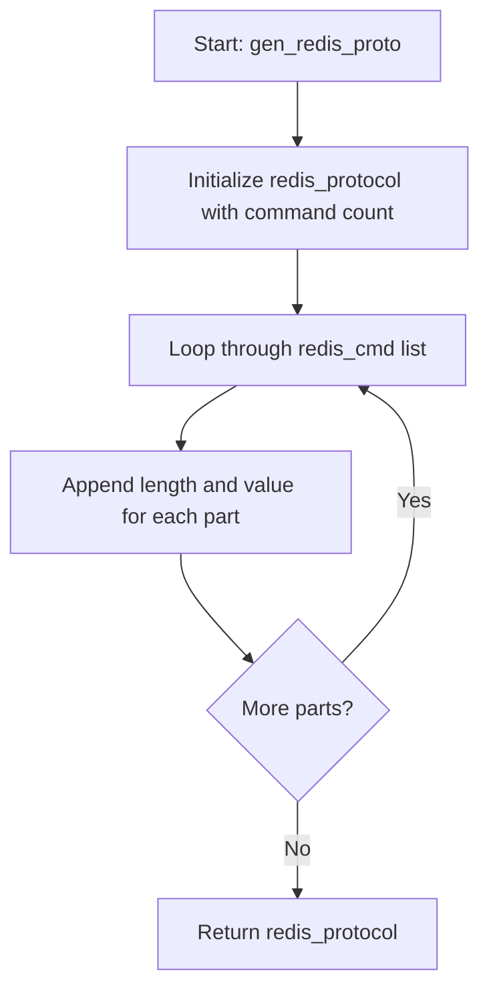
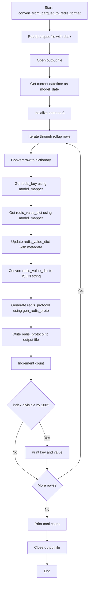
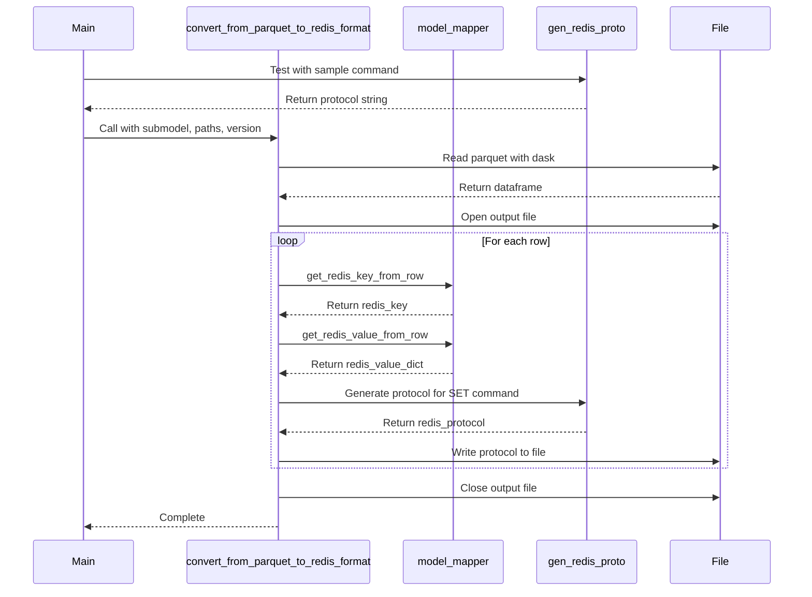

# Diagram: research/orchestrator/scripts/parquet_to_redis_format.py

> Auto-generated by Obscura crawlers

## Diagram 1

### SVG

<svg id="container" width="364.515625" xmlns="http://www.w3.org/2000/svg" class="flowchart" height="770.796875" viewBox="0 0 364.515625 770.796875" role="graphics-document document" aria-roledescription="flowchart-v2"><g><marker id="container_flowchart-v2-pointEnd" class="marker flowchart-v2" viewBox="0 0 10 10" refX="5" refY="5" markerUnits="userSpaceOnUse" markerWidth="8" markerHeight="8" orient="auto"><path d="M 0 0 L 10 5 L 0 10 z" class="arrowMarkerPath" style="stroke-width: 1; stroke-dasharray: 1, 0;"></path></marker><marker id="container_flowchart-v2-pointStart" class="marker flowchart-v2" viewBox="0 0 10 10" refX="4.5" refY="5" markerUnits="userSpaceOnUse" markerWidth="8" markerHeight="8" orient="auto"><path d="M 0 5 L 10 10 L 10 0 z" class="arrowMarkerPath" style="stroke-width: 1; stroke-dasharray: 1, 0;"></path></marker><marker id="container_flowchart-v2-circleEnd" class="marker flowchart-v2" viewBox="0 0 10 10" refX="11" refY="5" markerUnits="userSpaceOnUse" markerWidth="11" markerHeight="11" orient="auto"><circle cx="5" cy="5" r="5" class="arrowMarkerPath" style="stroke-width: 1; stroke-dasharray: 1, 0;"></circle></marker><marker id="container_flowchart-v2-circleStart" class="marker flowchart-v2" viewBox="0 0 10 10" refX="-1" refY="5" markerUnits="userSpaceOnUse" markerWidth="11" markerHeight="11" orient="auto"><circle cx="5" cy="5" r="5" class="arrowMarkerPath" style="stroke-width: 1; stroke-dasharray: 1, 0;"></circle></marker><marker id="container_flowchart-v2-crossEnd" class="marker cross flowchart-v2" viewBox="0 0 11 11" refX="12" refY="5.2" markerUnits="userSpaceOnUse" markerWidth="11" markerHeight="11" orient="auto"><path d="M 1,1 l 9,9 M 10,1 l -9,9" class="arrowMarkerPath" style="stroke-width: 2; stroke-dasharray: 1, 0;"></path></marker><marker id="container_flowchart-v2-crossStart" class="marker cross flowchart-v2" viewBox="0 0 11 11" refX="-1" refY="5.2" markerUnits="userSpaceOnUse" markerWidth="11" markerHeight="11" orient="auto"><path d="M 1,1 l 9,9 M 10,1 l -9,9" class="arrowMarkerPath" style="stroke-width: 2; stroke-dasharray: 1, 0;"></path></marker><g class="root"><g class="clusters"></g><g class="edgePaths"><path d="M226.516,62L226.516,66.167C226.516,70.333,226.516,78.667,226.516,86.333C226.516,94,226.516,101,226.516,104.5L226.516,108" id="L_A_B_0" class="edge-thickness-normal edge-pattern-solid edge-thickness-normal edge-pattern-solid flowchart-link" style=";" data-edge="true" data-et="edge" data-id="L_A_B_0" data-points="W3sieCI6MjI2LjUxNTYyNSwieSI6NjJ9LHsieCI6MjI2LjUxNTYyNSwieSI6ODd9LHsieCI6MjI2LjUxNTYyNSwieSI6MTEyfV0=" marker-end="url(#container_flowchart-v2-pointEnd)"></path><path d="M226.516,190L226.516,194.167C226.516,198.333,226.516,206.667,226.516,214.333C226.516,222,226.516,229,226.516,232.5L226.516,236" id="L_B_C_0" class="edge-thickness-normal edge-pattern-solid edge-thickness-normal edge-pattern-solid flowchart-link" style=";" data-edge="true" data-et="edge" data-id="L_B_C_0" data-points="W3sieCI6MjI2LjUxNTYyNSwieSI6MTkwfSx7IngiOjIyNi41MTU2MjUsInkiOjIxNX0seyJ4IjoyMjYuNTE1NjI1LCJ5IjoyNDB9XQ==" marker-end="url(#container_flowchart-v2-pointEnd)"></path><path d="M172.576,318L166.814,322.167C161.051,326.333,149.525,334.667,143.763,342.333C138,350,138,357,138,360.5L138,364" id="L_C_D_0" class="edge-thickness-normal edge-pattern-solid edge-thickness-normal edge-pattern-solid flowchart-link" style=";" data-edge="true" data-et="edge" data-id="L_C_D_0" data-points="W3sieCI6MTcyLjU3NjQxNjAxNTYyNSwieSI6MzE4fSx7IngiOjEzOCwieSI6MzQzfSx7IngiOjEzOCwieSI6MzY4fV0=" marker-end="url(#container_flowchart-v2-pointEnd)"></path><path d="M138,446L138,450.167C138,454.333,138,462.667,146.699,476.111C155.399,489.555,172.798,508.11,181.497,517.388L190.196,526.665" id="L_D_E_0" class="edge-thickness-normal edge-pattern-solid edge-thickness-normal edge-pattern-solid flowchart-link" style=";" data-edge="true" data-et="edge" data-id="L_D_E_0" data-points="W3sieCI6MTM4LCJ5Ijo0NDZ9LHsieCI6MTM4LCJ5Ijo0NzF9LHsieCI6MTkyLjkzMjM4OTMyNDMwNywieSI6NTI5LjU4MzIzNTY3NTY5M31d" marker-end="url(#container_flowchart-v2-pointEnd)"></path><path d="M260.099,529.583L269.254,519.819C278.41,510.055,296.72,490.528,305.876,470.097C315.031,449.667,315.031,428.333,315.031,407C315.031,385.667,315.031,364.333,309.809,349.891C304.586,335.448,294.141,327.896,288.919,324.12L283.696,320.344" id="L_E_C_0" class="edge-thickness-normal edge-pattern-solid edge-thickness-normal edge-pattern-solid flowchart-link" style=";" data-edge="true" data-et="edge" data-id="L_E_C_0" data-points="W3sieCI6MjYwLjA5ODg2MDY3NTY5MywieSI6NTI5LjU4MzIzNTY3NTY5M30seyJ4IjozMTUuMDMxMjUsInkiOjQ3MX0seyJ4IjozMTUuMDMxMjUsInkiOjQwN30seyJ4IjozMTUuMDMxMjUsInkiOjM0M30seyJ4IjoyODAuNDU0ODMzOTg0Mzc1LCJ5IjozMTh9XQ==" marker-end="url(#container_flowchart-v2-pointEnd)"></path><path d="M226.516,634.797L226.516,640.964C226.516,647.13,226.516,659.464,226.516,671.13C226.516,682.797,226.516,693.797,226.516,699.297L226.516,704.797" id="L_E_F_0" class="edge-thickness-normal edge-pattern-solid edge-thickness-normal edge-pattern-solid flowchart-link" style=";" data-edge="true" data-et="edge" data-id="L_E_F_0" data-points="W3sieCI6MjI2LjUxNTYyNSwieSI6NjM0Ljc5Njg3NX0seyJ4IjoyMjYuNTE1NjI1LCJ5Ijo2NzEuNzk2ODc1fSx7IngiOjIyNi41MTU2MjUsInkiOjcwOC43OTY4NzV9XQ==" marker-end="url(#container_flowchart-v2-pointEnd)"></path></g><g class="edgeLabels"><g class="edgeLabel"><g class="label" data-id="L_A_B_0" transform="translate(0, 0)"><foreignObject width="0" height="0">

</foreignObject></g></g><g class="edgeLabel"><g class="label" data-id="L_B_C_0" transform="translate(0, 0)"><foreignObject width="0" height="0">

</foreignObject></g></g><g class="edgeLabel"><g class="label" data-id="L_C_D_0" transform="translate(0, 0)"><foreignObject width="0" height="0">

</foreignObject></g></g><g class="edgeLabel"><g class="label" data-id="L_D_E_0" transform="translate(0, 0)"><foreignObject width="0" height="0">

</foreignObject></g></g><g class="edgeLabel" transform="translate(315.03125, 407)"><g class="label" data-id="L_E_C_0" transform="translate(-12.03125, -12)"><foreignObject width="24.0625" height="24">

Yes

</foreignObject></g></g><g class="edgeLabel" transform="translate(226.515625, 671.796875)"><g class="label" data-id="L_E_F_0" transform="translate(-10.140625, -12)"><foreignObject width="20.28125" height="24">

No

</foreignObject></g></g></g><g class="nodes"><g class="node default" id="flowchart-A-0" transform="translate(226.515625, 35)"><rect class="basic label-container" style="" x="-110.53125" y="-27" width="221.0625" height="54"></rect><g class="label" style="" transform="translate(-80.53125, -12)"><rect></rect><foreignObject width="161.0625" height="24">

Start: gen_redis_proto

</foreignObject></g></g><g class="node default" id="flowchart-B-1" transform="translate(226.515625, 151)"><rect class="basic label-container" style="" x="-130" y="-39" width="260" height="78"></rect><g class="label" style="" transform="translate(-100, -24)"><rect></rect><foreignObject width="200" height="48">

Initialize redis_protocol with command count

</foreignObject></g></g><g class="node default" id="flowchart-C-3" transform="translate(226.515625, 279)"><rect class="basic label-container" style="" x="-130" y="-39" width="260" height="78"></rect><g class="label" style="" transform="translate(-100, -24)"><rect></rect><foreignObject width="200" height="48">

Loop through redis_cmd list

</foreignObject></g></g><g class="node default" id="flowchart-D-5" transform="translate(138, 407)"><rect class="basic label-container" style="" x="-130" y="-39" width="260" height="78"></rect><g class="label" style="" transform="translate(-100, -24)"><rect></rect><foreignObject width="200" height="48">

Append length and value for each part

</foreignObject></g></g><g class="node default" id="flowchart-E-7" transform="translate(226.515625, 565.3984375)"><polygon points="69.3984375,0 138.796875,-69.3984375 69.3984375,-138.796875 0,-69.3984375" class="label-container" transform="translate(-68.8984375, 69.3984375)"></polygon><g class="label" style="" transform="translate(-42.3984375, -12)"><rect></rect><foreignObject width="84.796875" height="24">

More parts?

</foreignObject></g></g><g class="node default" id="flowchart-F-11" transform="translate(226.515625, 735.796875)"><rect class="basic label-container" style="" x="-108.8984375" y="-27" width="217.796875" height="54"></rect><g class="label" style="" transform="translate(-78.8984375, -12)"><rect></rect><foreignObject width="157.796875" height="24">

Return redis_protocol

</foreignObject></g></g></g></g></g></svg>

## Diagram 2

### SVG

<svg id="container" width="401.203125" xmlns="http://www.w3.org/2000/svg" class="flowchart" height="2554.21875" viewBox="0 0 401.203125 2554.21875" role="graphics-document document" aria-roledescription="flowchart-v2"><g><marker id="container_flowchart-v2-pointEnd" class="marker flowchart-v2" viewBox="0 0 10 10" refX="5" refY="5" markerUnits="userSpaceOnUse" markerWidth="8" markerHeight="8" orient="auto"><path d="M 0 0 L 10 5 L 0 10 z" class="arrowMarkerPath" style="stroke-width: 1; stroke-dasharray: 1, 0;"></path></marker><marker id="container_flowchart-v2-pointStart" class="marker flowchart-v2" viewBox="0 0 10 10" refX="4.5" refY="5" markerUnits="userSpaceOnUse" markerWidth="8" markerHeight="8" orient="auto"><path d="M 0 5 L 10 10 L 10 0 z" class="arrowMarkerPath" style="stroke-width: 1; stroke-dasharray: 1, 0;"></path></marker><marker id="container_flowchart-v2-circleEnd" class="marker flowchart-v2" viewBox="0 0 10 10" refX="11" refY="5" markerUnits="userSpaceOnUse" markerWidth="11" markerHeight="11" orient="auto"><circle cx="5" cy="5" r="5" class="arrowMarkerPath" style="stroke-width: 1; stroke-dasharray: 1, 0;"></circle></marker><marker id="container_flowchart-v2-circleStart" class="marker flowchart-v2" viewBox="0 0 10 10" refX="-1" refY="5" markerUnits="userSpaceOnUse" markerWidth="11" markerHeight="11" orient="auto"><circle cx="5" cy="5" r="5" class="arrowMarkerPath" style="stroke-width: 1; stroke-dasharray: 1, 0;"></circle></marker><marker id="container_flowchart-v2-crossEnd" class="marker cross flowchart-v2" viewBox="0 0 11 11" refX="12" refY="5.2" markerUnits="userSpaceOnUse" markerWidth="11" markerHeight="11" orient="auto"><path d="M 1,1 l 9,9 M 10,1 l -9,9" class="arrowMarkerPath" style="stroke-width: 2; stroke-dasharray: 1, 0;"></path></marker><marker id="container_flowchart-v2-crossStart" class="marker cross flowchart-v2" viewBox="0 0 11 11" refX="-1" refY="5.2" markerUnits="userSpaceOnUse" markerWidth="11" markerHeight="11" orient="auto"><path d="M 1,1 l 9,9 M 10,1 l -9,9" class="arrowMarkerPath" style="stroke-width: 2; stroke-dasharray: 1, 0;"></path></marker><g class="root"><g class="clusters"></g><g class="edgePaths"><path d="M220.5,86L220.5,90.167C220.5,94.333,220.5,102.667,220.5,110.333C220.5,118,220.5,125,220.5,128.5L220.5,132" id="L_A_B_0" class="edge-thickness-normal edge-pattern-solid edge-thickness-normal edge-pattern-solid flowchart-link" style=";" data-edge="true" data-et="edge" data-id="L_A_B_0" data-points="W3sieCI6MjIwLjUsInkiOjg2fSx7IngiOjIyMC41LCJ5IjoxMTF9LHsieCI6MjIwLjUsInkiOjEzNn1d" marker-end="url(#container_flowchart-v2-pointEnd)"></path><path d="M220.5,190L220.5,194.167C220.5,198.333,220.5,206.667,220.5,214.333C220.5,222,220.5,229,220.5,232.5L220.5,236" id="L_B_C_0" class="edge-thickness-normal edge-pattern-solid edge-thickness-normal edge-pattern-solid flowchart-link" style=";" data-edge="true" data-et="edge" data-id="L_B_C_0" data-points="W3sieCI6MjIwLjUsInkiOjE5MH0seyJ4IjoyMjAuNSwieSI6MjE1fSx7IngiOjIyMC41LCJ5IjoyNDB9XQ==" marker-end="url(#container_flowchart-v2-pointEnd)"></path><path d="M220.5,294L220.5,298.167C220.5,302.333,220.5,310.667,220.5,318.333C220.5,326,220.5,333,220.5,336.5L220.5,340" id="L_C_D_0" class="edge-thickness-normal edge-pattern-solid edge-thickness-normal edge-pattern-solid flowchart-link" style=";" data-edge="true" data-et="edge" data-id="L_C_D_0" data-points="W3sieCI6MjIwLjUsInkiOjI5NH0seyJ4IjoyMjAuNSwieSI6MzE5fSx7IngiOjIyMC41LCJ5IjozNDR9XQ==" marker-end="url(#container_flowchart-v2-pointEnd)"></path><path d="M220.5,422L220.5,426.167C220.5,430.333,220.5,438.667,220.5,446.333C220.5,454,220.5,461,220.5,464.5L220.5,468" id="L_D_E_0" class="edge-thickness-normal edge-pattern-solid edge-thickness-normal edge-pattern-solid flowchart-link" style=";" data-edge="true" data-et="edge" data-id="L_D_E_0" data-points="W3sieCI6MjIwLjUsInkiOjQyMn0seyJ4IjoyMjAuNSwieSI6NDQ3fSx7IngiOjIyMC41LCJ5Ijo0NzJ9XQ==" marker-end="url(#container_flowchart-v2-pointEnd)"></path><path d="M220.5,526L220.5,530.167C220.5,534.333,220.5,542.667,220.5,550.333C220.5,558,220.5,565,220.5,568.5L220.5,572" id="L_E_F_0" class="edge-thickness-normal edge-pattern-solid edge-thickness-normal edge-pattern-solid flowchart-link" style=";" data-edge="true" data-et="edge" data-id="L_E_F_0" data-points="W3sieCI6MjIwLjUsInkiOjUyNn0seyJ4IjoyMjAuNSwieSI6NTUxfSx7IngiOjIyMC41LCJ5Ijo1NzZ9XQ==" marker-end="url(#container_flowchart-v2-pointEnd)"></path><path d="M177.663,630L171.053,634.167C164.442,638.333,151.221,646.667,144.611,654.333C138,662,138,669,138,672.5L138,676" id="L_F_G_0" class="edge-thickness-normal edge-pattern-solid edge-thickness-normal edge-pattern-solid flowchart-link" style=";" data-edge="true" data-et="edge" data-id="L_F_G_0" data-points="W3sieCI6MTc3LjY2MzQ2MTUzODQ2MTU1LCJ5Ijo2MzB9LHsieCI6MTM4LCJ5Ijo2NTV9LHsieCI6MTM4LCJ5Ijo2ODB9XQ==" marker-end="url(#container_flowchart-v2-pointEnd)"></path><path d="M138,734L138,738.167C138,742.333,138,750.667,138,758.333C138,766,138,773,138,776.5L138,780" id="L_G_H_0" class="edge-thickness-normal edge-pattern-solid edge-thickness-normal edge-pattern-solid flowchart-link" style=";" data-edge="true" data-et="edge" data-id="L_G_H_0" data-points="W3sieCI6MTM4LCJ5Ijo3MzR9LHsieCI6MTM4LCJ5Ijo3NTl9LHsieCI6MTM4LCJ5Ijo3ODR9XQ==" marker-end="url(#container_flowchart-v2-pointEnd)"></path><path d="M138,862L138,866.167C138,870.333,138,878.667,138,886.333C138,894,138,901,138,904.5L138,908" id="L_H_I_0" class="edge-thickness-normal edge-pattern-solid edge-thickness-normal edge-pattern-solid flowchart-link" style=";" data-edge="true" data-et="edge" data-id="L_H_I_0" data-points="W3sieCI6MTM4LCJ5Ijo4NjJ9LHsieCI6MTM4LCJ5Ijo4ODd9LHsieCI6MTM4LCJ5Ijo5MTJ9XQ==" marker-end="url(#container_flowchart-v2-pointEnd)"></path><path d="M138,990L138,994.167C138,998.333,138,1006.667,138,1014.333C138,1022,138,1029,138,1032.5L138,1036" id="L_I_J_0" class="edge-thickness-normal edge-pattern-solid edge-thickness-normal edge-pattern-solid flowchart-link" style=";" data-edge="true" data-et="edge" data-id="L_I_J_0" data-points="W3sieCI6MTM4LCJ5Ijo5OTB9LHsieCI6MTM4LCJ5IjoxMDE1fSx7IngiOjEzOCwieSI6MTA0MH1d" marker-end="url(#container_flowchart-v2-pointEnd)"></path><path d="M138,1118L138,1122.167C138,1126.333,138,1134.667,138,1142.333C138,1150,138,1157,138,1160.5L138,1164" id="L_J_K_0" class="edge-thickness-normal edge-pattern-solid edge-thickness-normal edge-pattern-solid flowchart-link" style=";" data-edge="true" data-et="edge" data-id="L_J_K_0" data-points="W3sieCI6MTM4LCJ5IjoxMTE4fSx7IngiOjEzOCwieSI6MTE0M30seyJ4IjoxMzgsInkiOjExNjh9XQ==" marker-end="url(#container_flowchart-v2-pointEnd)"></path><path d="M138,1246L138,1252.167C138,1258.333,138,1270.667,138,1282.333C138,1294,138,1305,138,1310.5L138,1316" id="L_K_L_0" class="edge-thickness-normal edge-pattern-solid edge-thickness-normal edge-pattern-solid flowchart-link" style=";" data-edge="true" data-et="edge" data-id="L_K_L_0" data-points="W3sieCI6MTM4LCJ5IjoxMjQ2fSx7IngiOjEzOCwieSI6MTI4M30seyJ4IjoxMzgsInkiOjEzMjB9XQ==" marker-end="url(#container_flowchart-v2-pointEnd)"></path><path d="M138,1398L138,1402.167C138,1406.333,138,1414.667,138,1422.333C138,1430,138,1437,138,1440.5L138,1444" id="L_L_M_0" class="edge-thickness-normal edge-pattern-solid edge-thickness-normal edge-pattern-solid flowchart-link" style=";" data-edge="true" data-et="edge" data-id="L_L_M_0" data-points="W3sieCI6MTM4LCJ5IjoxMzk4fSx7IngiOjEzOCwieSI6MTQyM30seyJ4IjoxMzgsInkiOjE0NDh9XQ==" marker-end="url(#container_flowchart-v2-pointEnd)"></path><path d="M138,1526L138,1530.167C138,1534.333,138,1542.667,138,1550.333C138,1558,138,1565,138,1568.5L138,1572" id="L_M_N_0" class="edge-thickness-normal edge-pattern-solid edge-thickness-normal edge-pattern-solid flowchart-link" style=";" data-edge="true" data-et="edge" data-id="L_M_N_0" data-points="W3sieCI6MTM4LCJ5IjoxNTI2fSx7IngiOjEzOCwieSI6MTU1MX0seyJ4IjoxMzgsInkiOjE1NzZ9XQ==" marker-end="url(#container_flowchart-v2-pointEnd)"></path><path d="M138,1630L138,1634.167C138,1638.333,138,1646.667,138,1654.333C138,1662,138,1669,138,1672.5L138,1676" id="L_N_O_0" class="edge-thickness-normal edge-pattern-solid edge-thickness-normal edge-pattern-solid flowchart-link" style=";" data-edge="true" data-et="edge" data-id="L_N_O_0" data-points="W3sieCI6MTM4LCJ5IjoxNjMwfSx7IngiOjEzOCwieSI6MTY1NX0seyJ4IjoxMzgsInkiOjE2ODB9XQ==" marker-end="url(#container_flowchart-v2-pointEnd)"></path><path d="M173.988,1860.934L180.028,1873.099C186.069,1885.263,198.15,1909.593,204.19,1927.257C210.23,1944.922,210.23,1955.922,210.23,1961.422L210.23,1966.922" id="L_O_P_0" class="edge-thickness-normal edge-pattern-solid edge-thickness-normal edge-pattern-solid flowchart-link" style=";" data-edge="true" data-et="edge" data-id="L_O_P_0" data-points="W3sieCI6MTczLjk4NzU2ODMyNzMwNzE0LCJ5IjoxODYwLjkzNDMwNjY3MjY5Mjl9LHsieCI6MjEwLjIzMDQ2ODc1LCJ5IjoxOTMzLjkyMTg3NX0seyJ4IjoyMTAuMjMwNDY4NzUsInkiOjE5NzAuOTIxODc1fV0=" marker-end="url(#container_flowchart-v2-pointEnd)"></path><path d="M102.012,1860.934L95.972,1873.099C89.931,1885.263,77.85,1909.593,71.81,1932.424C65.77,1955.255,65.77,1976.589,65.77,1995.922C65.77,2015.255,65.77,2032.589,82.416,2051.931C99.062,2071.274,132.355,2092.626,149.002,2103.302L165.648,2113.978" id="L_O_Q_0" class="edge-thickness-normal edge-pattern-solid edge-thickness-normal edge-pattern-solid flowchart-link" style=";" data-edge="true" data-et="edge" data-id="L_O_Q_0" data-points="W3sieCI6MTAyLjAxMjQzMTY3MjY5Mjg2LCJ5IjoxODYwLjkzNDMwNjY3MjY5Mjl9LHsieCI6NjUuNzY5NTMxMjUsInkiOjE5MzMuOTIxODc1fSx7IngiOjY1Ljc2OTUzMTI1LCJ5IjoxOTk3LjkyMTg3NX0seyJ4Ijo2NS43Njk1MzEyNSwieSI6MjA0OS45MjE4NzV9LHsieCI6MTY5LjAxNTA3MzEwNTQzNjU4LCJ5IjoyMTE2LjEzNzI3MDY0NDU2MzZ9XQ==" marker-end="url(#container_flowchart-v2-pointEnd)"></path><path d="M210.23,2024.922L210.23,2029.089C210.23,2033.255,210.23,2041.589,210.23,2049.255C210.23,2056.922,210.23,2063.922,210.23,2067.422L210.23,2070.922" id="L_P_Q_0" class="edge-thickness-normal edge-pattern-solid edge-thickness-normal edge-pattern-solid flowchart-link" style=";" data-edge="true" data-et="edge" data-id="L_P_Q_0" data-points="W3sieCI6MjEwLjIzMDQ2ODc1LCJ5IjoyMDI0LjkyMTg3NX0seyJ4IjoyMTAuMjMwNDY4NzUsInkiOjIwNDkuOTIxODc1fSx7IngiOjIxMC4yMzA0Njg3NSwieSI6MjA3NC45MjE4NzV9XQ==" marker-end="url(#container_flowchart-v2-pointEnd)"></path><path d="M252.013,2116.704L269.993,2105.574C287.972,2094.444,323.931,2072.183,341.911,2052.386C359.891,2032.589,359.891,2015.255,359.891,1995.922C359.891,1976.589,359.891,1955.255,359.891,1920.345C359.891,1885.435,359.891,1836.948,359.891,1790.461C359.891,1743.974,359.891,1699.487,359.891,1668.577C359.891,1637.667,359.891,1620.333,359.891,1603C359.891,1585.667,359.891,1568.333,359.891,1549C359.891,1529.667,359.891,1508.333,359.891,1487C359.891,1465.667,359.891,1444.333,359.891,1423C359.891,1401.667,359.891,1380.333,359.891,1357C359.891,1333.667,359.891,1308.333,359.891,1283C359.891,1257.667,359.891,1232.333,359.891,1209C359.891,1185.667,359.891,1164.333,359.891,1143C359.891,1121.667,359.891,1100.333,359.891,1079C359.891,1057.667,359.891,1036.333,359.891,1015C359.891,993.667,359.891,972.333,359.891,951C359.891,929.667,359.891,908.333,359.891,887C359.891,865.667,359.891,844.333,359.891,823C359.891,801.667,359.891,780.333,359.891,761C359.891,741.667,359.891,724.333,359.891,707C359.891,689.667,359.891,672.333,349.346,659.733C338.802,647.133,317.713,639.265,307.168,635.332L296.624,631.398" id="L_Q_F_0" class="edge-thickness-normal edge-pattern-solid edge-thickness-normal edge-pattern-solid flowchart-link" style=";" data-edge="true" data-et="edge" data-id="L_Q_F_0" data-points="W3sieCI6MjUyLjAxMzAzODUyODYxODc1LCJ5IjoyMTE2LjcwNDQ0NDc3ODYxOX0seyJ4IjozNTkuODkwNjI1LCJ5IjoyMDQ5LjkyMTg3NX0seyJ4IjozNTkuODkwNjI1LCJ5IjoxOTk3LjkyMTg3NX0seyJ4IjozNTkuODkwNjI1LCJ5IjoxOTMzLjkyMTg3NX0seyJ4IjozNTkuODkwNjI1LCJ5IjoxNzg4LjQ2MDkzNzV9LHsieCI6MzU5Ljg5MDYyNSwieSI6MTY1NX0seyJ4IjozNTkuODkwNjI1LCJ5IjoxNjAzfSx7IngiOjM1OS44OTA2MjUsInkiOjE1NTF9LHsieCI6MzU5Ljg5MDYyNSwieSI6MTQ4N30seyJ4IjozNTkuODkwNjI1LCJ5IjoxNDIzfSx7IngiOjM1OS44OTA2MjUsInkiOjEzNTl9LHsieCI6MzU5Ljg5MDYyNSwieSI6MTI4M30seyJ4IjozNTkuODkwNjI1LCJ5IjoxMjA3fSx7IngiOjM1OS44OTA2MjUsInkiOjExNDN9LHsieCI6MzU5Ljg5MDYyNSwieSI6MTA3OX0seyJ4IjozNTkuODkwNjI1LCJ5IjoxMDE1fSx7IngiOjM1OS44OTA2MjUsInkiOjk1MX0seyJ4IjozNTkuODkwNjI1LCJ5Ijo4ODd9LHsieCI6MzU5Ljg5MDYyNSwieSI6ODIzfSx7IngiOjM1OS44OTA2MjUsInkiOjc1OX0seyJ4IjozNTkuODkwNjI1LCJ5Ijo3MDd9LHsieCI6MzU5Ljg5MDYyNSwieSI6NjU1fSx7IngiOjI5Mi44NzU5MDE0NDIzMDc3LCJ5Ijo2MzB9XQ==" marker-end="url(#container_flowchart-v2-pointEnd)"></path><path d="M210.23,2210.219L210.23,2216.385C210.23,2222.552,210.23,2234.885,210.23,2246.552C210.23,2258.219,210.23,2269.219,210.23,2274.719L210.23,2280.219" id="L_Q_R_0" class="edge-thickness-normal edge-pattern-solid edge-thickness-normal edge-pattern-solid flowchart-link" style=";" data-edge="true" data-et="edge" data-id="L_Q_R_0" data-points="W3sieCI6MjEwLjIzMDQ2ODc1LCJ5IjoyMjEwLjIxODc1fSx7IngiOjIxMC4yMzA0Njg3NSwieSI6MjI0Ny4yMTg3NX0seyJ4IjoyMTAuMjMwNDY4NzUsInkiOjIyODQuMjE4NzV9XQ==" marker-end="url(#container_flowchart-v2-pointEnd)"></path><path d="M210.23,2338.219L210.23,2342.385C210.23,2346.552,210.23,2354.885,210.23,2362.552C210.23,2370.219,210.23,2377.219,210.23,2380.719L210.23,2384.219" id="L_R_S_0" class="edge-thickness-normal edge-pattern-solid edge-thickness-normal edge-pattern-solid flowchart-link" style=";" data-edge="true" data-et="edge" data-id="L_R_S_0" data-points="W3sieCI6MjEwLjIzMDQ2ODc1LCJ5IjoyMzM4LjIxODc1fSx7IngiOjIxMC4yMzA0Njg3NSwieSI6MjM2My4yMTg3NX0seyJ4IjoyMTAuMjMwNDY4NzUsInkiOjIzODguMjE4NzV9XQ==" marker-end="url(#container_flowchart-v2-pointEnd)"></path><path d="M210.23,2442.219L210.23,2446.385C210.23,2450.552,210.23,2458.885,210.23,2466.552C210.23,2474.219,210.23,2481.219,210.23,2484.719L210.23,2488.219" id="L_S_T_0" class="edge-thickness-normal edge-pattern-solid edge-thickness-normal edge-pattern-solid flowchart-link" style=";" data-edge="true" data-et="edge" data-id="L_S_T_0" data-points="W3sieCI6MjEwLjIzMDQ2ODc1LCJ5IjoyNDQyLjIxODc1fSx7IngiOjIxMC4yMzA0Njg3NSwieSI6MjQ2Ny4yMTg3NX0seyJ4IjoyMTAuMjMwNDY4NzUsInkiOjI0OTIuMjE4NzV9XQ==" marker-end="url(#container_flowchart-v2-pointEnd)"></path></g><g class="edgeLabels"><g class="edgeLabel"><g class="label" data-id="L_A_B_0" transform="translate(0, 0)"><foreignObject width="0" height="0">

</foreignObject></g></g><g class="edgeLabel"><g class="label" data-id="L_B_C_0" transform="translate(0, 0)"><foreignObject width="0" height="0">

</foreignObject></g></g><g class="edgeLabel"><g class="label" data-id="L_C_D_0" transform="translate(0, 0)"><foreignObject width="0" height="0">

</foreignObject></g></g><g class="edgeLabel"><g class="label" data-id="L_D_E_0" transform="translate(0, 0)"><foreignObject width="0" height="0">

</foreignObject></g></g><g class="edgeLabel"><g class="label" data-id="L_E_F_0" transform="translate(0, 0)"><foreignObject width="0" height="0">

</foreignObject></g></g><g class="edgeLabel"><g class="label" data-id="L_F_G_0" transform="translate(0, 0)"><foreignObject width="0" height="0">

</foreignObject></g></g><g class="edgeLabel"><g class="label" data-id="L_G_H_0" transform="translate(0, 0)"><foreignObject width="0" height="0">

</foreignObject></g></g><g class="edgeLabel"><g class="label" data-id="L_H_I_0" transform="translate(0, 0)"><foreignObject width="0" height="0">

</foreignObject></g></g><g class="edgeLabel"><g class="label" data-id="L_I_J_0" transform="translate(0, 0)"><foreignObject width="0" height="0">

</foreignObject></g></g><g class="edgeLabel"><g class="label" data-id="L_J_K_0" transform="translate(0, 0)"><foreignObject width="0" height="0">

</foreignObject></g></g><g class="edgeLabel"><g class="label" data-id="L_K_L_0" transform="translate(0, 0)"><foreignObject width="0" height="0">

</foreignObject></g></g><g class="edgeLabel"><g class="label" data-id="L_L_M_0" transform="translate(0, 0)"><foreignObject width="0" height="0">

</foreignObject></g></g><g class="edgeLabel"><g class="label" data-id="L_M_N_0" transform="translate(0, 0)"><foreignObject width="0" height="0">

</foreignObject></g></g><g class="edgeLabel"><g class="label" data-id="L_N_O_0" transform="translate(0, 0)"><foreignObject width="0" height="0">

</foreignObject></g></g><g class="edgeLabel" transform="translate(210.23046875, 1933.921875)"><g class="label" data-id="L_O_P_0" transform="translate(-12.03125, -12)"><foreignObject width="24.0625" height="24">

Yes

</foreignObject></g></g><g class="edgeLabel" transform="translate(65.76953125, 1997.921875)"><g class="label" data-id="L_O_Q_0" transform="translate(-10.140625, -12)"><foreignObject width="20.28125" height="24">

No

</foreignObject></g></g><g class="edgeLabel"><g class="label" data-id="L_P_Q_0" transform="translate(0, 0)"><foreignObject width="0" height="0">

</foreignObject></g></g><g class="edgeLabel" transform="translate(359.890625, 1283)"><g class="label" data-id="L_Q_F_0" transform="translate(-12.03125, -12)"><foreignObject width="24.0625" height="24">

Yes

</foreignObject></g></g><g class="edgeLabel" transform="translate(210.23046875, 2247.21875)"><g class="label" data-id="L_Q_R_0" transform="translate(-10.140625, -12)"><foreignObject width="20.28125" height="24">

No

</foreignObject></g></g><g class="edgeLabel"><g class="label" data-id="L_R_S_0" transform="translate(0, 0)"><foreignObject width="0" height="0">

</foreignObject></g></g><g class="edgeLabel"><g class="label" data-id="L_S_T_0" transform="translate(0, 0)"><foreignObject width="0" height="0">

</foreignObject></g></g></g><g class="nodes"><g class="node default" id="flowchart-A-0" transform="translate(220.5, 47)"><rect class="basic label-container" style="" x="-172.703125" y="-39" width="345.40625" height="78"></rect><g class="label" style="" transform="translate(-142.703125, -24)"><rect></rect><foreignObject width="285.40625" height="48">

Start: convert_from_parquet_to_redis_format

</foreignObject></g></g><g class="node default" id="flowchart-B-1" transform="translate(220.5, 163)"><rect class="basic label-container" style="" x="-128.8984375" y="-27" width="257.796875" height="54"></rect><g class="label" style="" transform="translate(-98.8984375, -12)"><rect></rect><foreignObject width="197.796875" height="24">

Read parquet file with dask

</foreignObject></g></g><g class="node default" id="flowchart-C-3" transform="translate(220.5, 267)"><rect class="basic label-container" style="" x="-89.359375" y="-27" width="178.71875" height="54"></rect><g class="label" style="" transform="translate(-59.359375, -12)"><rect></rect><foreignObject width="118.71875" height="24">

Open output file

</foreignObject></g></g><g class="node default" id="flowchart-D-5" transform="translate(220.5, 383)"><rect class="basic label-container" style="" x="-130" y="-39" width="260" height="78"></rect><g class="label" style="" transform="translate(-100, -24)"><rect></rect><foreignObject width="200" height="48">

Get current datetime as model_date

</foreignObject></g></g><g class="node default" id="flowchart-E-7" transform="translate(220.5, 499)"><rect class="basic label-container" style="" x="-99.953125" y="-27" width="199.90625" height="54"></rect><g class="label" style="" transform="translate(-69.953125, -12)"><rect></rect><foreignObject width="139.90625" height="24">

Initialize count to 0

</foreignObject></g></g><g class="node default" id="flowchart-F-9" transform="translate(220.5, 603)"><rect class="basic label-container" style="" x="-127.3515625" y="-27" width="254.703125" height="54"></rect><g class="label" style="" transform="translate(-97.3515625, -12)"><rect></rect><foreignObject width="194.703125" height="24">

Iterate through rollup rows

</foreignObject></g></g><g class="node default" id="flowchart-G-11" transform="translate(138, 707)"><rect class="basic label-container" style="" x="-121.671875" y="-27" width="243.34375" height="54"></rect><g class="label" style="" transform="translate(-91.671875, -12)"><rect></rect><foreignObject width="183.34375" height="24">

Convert row to dictionary

</foreignObject></g></g><g class="node default" id="flowchart-H-13" transform="translate(138, 823)"><rect class="basic label-container" style="" x="-130" y="-39" width="260" height="78"></rect><g class="label" style="" transform="translate(-100, -24)"><rect></rect><foreignObject width="200" height="48">

Get redis_key using model_mapper

</foreignObject></g></g><g class="node default" id="flowchart-I-15" transform="translate(138, 951)"><rect class="basic label-container" style="" x="-130" y="-39" width="260" height="78"></rect><g class="label" style="" transform="translate(-100, -24)"><rect></rect><foreignObject width="200" height="48">

Get redis_value_dict using model_mapper

</foreignObject></g></g><g class="node default" id="flowchart-J-17" transform="translate(138, 1079)"><rect class="basic label-container" style="" x="-130" y="-39" width="260" height="78"></rect><g class="label" style="" transform="translate(-100, -24)"><rect></rect><foreignObject width="200" height="48">

Update redis_value_dict with metadata

</foreignObject></g></g><g class="node default" id="flowchart-K-19" transform="translate(138, 1207)"><rect class="basic label-container" style="" x="-130" y="-39" width="260" height="78"></rect><g class="label" style="" transform="translate(-100, -24)"><rect></rect><foreignObject width="200" height="48">

Convert redis_value_dict to JSON string

</foreignObject></g></g><g class="node default" id="flowchart-L-21" transform="translate(138, 1359)"><rect class="basic label-container" style="" x="-130" y="-39" width="260" height="78"></rect><g class="label" style="" transform="translate(-100, -24)"><rect></rect><foreignObject width="200" height="48">

Generate redis_protocol using gen_redis_proto

</foreignObject></g></g><g class="node default" id="flowchart-M-23" transform="translate(138, 1487)"><rect class="basic label-container" style="" x="-130" y="-39" width="260" height="78"></rect><g class="label" style="" transform="translate(-100, -24)"><rect></rect><foreignObject width="200" height="48">

Write redis_protocol to output file

</foreignObject></g></g><g class="node default" id="flowchart-N-25" transform="translate(138, 1603)"><rect class="basic label-container" style="" x="-89.5625" y="-27" width="179.125" height="54"></rect><g class="label" style="" transform="translate(-59.5625, -12)"><rect></rect><foreignObject width="119.125" height="24">

Increment count

</foreignObject></g></g><g class="node default" id="flowchart-O-27" transform="translate(138, 1788.4609375)"><polygon points="108.4609375,0 216.921875,-108.4609375 108.4609375,-216.921875 0,-108.4609375" class="label-container" transform="translate(-107.9609375, 108.4609375)"></polygon><g class="label" style="" transform="translate(-81.4609375, -12)"><rect></rect><foreignObject width="162.921875" height="24">

index divisible by 100?

</foreignObject></g></g><g class="node default" id="flowchart-P-29" transform="translate(210.23046875, 1997.921875)"><rect class="basic label-container" style="" x="-99.3203125" y="-27" width="198.640625" height="54"></rect><g class="label" style="" transform="translate(-69.3203125, -12)"><rect></rect><foreignObject width="138.640625" height="24">

Print key and value

</foreignObject></g></g><g class="node default" id="flowchart-Q-31" transform="translate(210.23046875, 2142.5703125)"><polygon points="67.6484375,0 135.296875,-67.6484375 67.6484375,-135.296875 0,-67.6484375" class="label-container" transform="translate(-67.1484375, 67.6484375)"></polygon><g class="label" style="" transform="translate(-40.6484375, -12)"><rect></rect><foreignObject width="81.296875" height="24">

More rows?

</foreignObject></g></g><g class="node default" id="flowchart-R-37" transform="translate(210.23046875, 2311.21875)"><rect class="basic label-container" style="" x="-89.109375" y="-27" width="178.21875" height="54"></rect><g class="label" style="" transform="translate(-59.109375, -12)"><rect></rect><foreignObject width="118.21875" height="24">

Print total count

</foreignObject></g></g><g class="node default" id="flowchart-S-39" transform="translate(210.23046875, 2415.21875)"><rect class="basic label-container" style="" x="-89.4921875" y="-27" width="178.984375" height="54"></rect><g class="label" style="" transform="translate(-59.4921875, -12)"><rect></rect><foreignObject width="118.984375" height="24">

Close output file

</foreignObject></g></g><g class="node default" id="flowchart-T-41" transform="translate(210.23046875, 2519.21875)"><rect class="basic label-container" style="" x="-43.6796875" y="-27" width="87.359375" height="54"></rect><g class="label" style="" transform="translate(-13.6796875, -12)"><rect></rect><foreignObject width="27.359375" height="24">

End

</foreignObject></g></g></g></g></g></svg>

## Diagram 3

### SVG

<svg id="container" width="1247" xmlns="http://www.w3.org/2000/svg" height="946" viewBox="-50 -10 1247 946" role="graphics-document document" aria-roledescription="sequence"><g><rect x="997" y="860" fill="#eaeaea" stroke="#666" width="150" height="65" name="File" rx="3" ry="3" class="actor actor-bottom"></rect><text x="1072" y="892.5" dominant-baseline="central" alignment-baseline="central" class="actor actor-box" style="text-anchor: middle; font-size: 16px; font-weight: 400;"><tspan x="1072" dy="0">File</tspan></text></g><g><rect x="797" y="860" fill="#eaeaea" stroke="#666" width="150" height="65" name="gen_redis_proto" rx="3" ry="3" class="actor actor-bottom"></rect><text x="872" y="892.5" dominant-baseline="central" alignment-baseline="central" class="actor actor-box" style="text-anchor: middle; font-size: 16px; font-weight: 400;"><tspan x="872" dy="0">gen_redis_proto</tspan></text></g><g><rect x="597" y="860" fill="#eaeaea" stroke="#666" width="150" height="65" name="model_mapper" rx="3" ry="3" class="actor actor-bottom"></rect><text x="672" y="892.5" dominant-baseline="central" alignment-baseline="central" class="actor actor-box" style="text-anchor: middle; font-size: 16px; font-weight: 400;"><tspan x="672" dy="0">model_mapper</tspan></text></g><g><rect x="241" y="860" fill="#eaeaea" stroke="#666" width="306" height="65" name="convert_from_parquet_to_redis_format" rx="3" ry="3" class="actor actor-bottom"></rect><text x="394" y="892.5" dominant-baseline="central" alignment-baseline="central" class="actor actor-box" style="text-anchor: middle; font-size: 16px; font-weight: 400;"><tspan x="394" dy="0">convert_from_parquet_to_redis_format</tspan></text></g><g><rect x="0" y="860" fill="#eaeaea" stroke="#666" width="150" height="65" name="Main" rx="3" ry="3" class="actor actor-bottom"></rect><text x="75" y="892.5" dominant-baseline="central" alignment-baseline="central" class="actor actor-box" style="text-anchor: middle; font-size: 16px; font-weight: 400;"><tspan x="75" dy="0">Main</tspan></text></g><g><line id="actor4" x1="1072" y1="65" x2="1072" y2="860" class="actor-line 200" stroke-width="0.5px" stroke="#999" name="File"></line><g id="root-4"><rect x="997" y="0" fill="#eaeaea" stroke="#666" width="150" height="65" name="File" rx="3" ry="3" class="actor actor-top"></rect><text x="1072" y="32.5" dominant-baseline="central" alignment-baseline="central" class="actor actor-box" style="text-anchor: middle; font-size: 16px; font-weight: 400;"><tspan x="1072" dy="0">File</tspan></text></g></g><g><line id="actor3" x1="872" y1="65" x2="872" y2="860" class="actor-line 200" stroke-width="0.5px" stroke="#999" name="gen_redis_proto"></line><g id="root-3"><rect x="797" y="0" fill="#eaeaea" stroke="#666" width="150" height="65" name="gen_redis_proto" rx="3" ry="3" class="actor actor-top"></rect><text x="872" y="32.5" dominant-baseline="central" alignment-baseline="central" class="actor actor-box" style="text-anchor: middle; font-size: 16px; font-weight: 400;"><tspan x="872" dy="0">gen_redis_proto</tspan></text></g></g><g><line id="actor2" x1="672" y1="65" x2="672" y2="860" class="actor-line 200" stroke-width="0.5px" stroke="#999" name="model_mapper"></line><g id="root-2"><rect x="597" y="0" fill="#eaeaea" stroke="#666" width="150" height="65" name="model_mapper" rx="3" ry="3" class="actor actor-top"></rect><text x="672" y="32.5" dominant-baseline="central" alignment-baseline="central" class="actor actor-box" style="text-anchor: middle; font-size: 16px; font-weight: 400;"><tspan x="672" dy="0">model_mapper</tspan></text></g></g><g><line id="actor1" x1="394" y1="65" x2="394" y2="860" class="actor-line 200" stroke-width="0.5px" stroke="#999" name="convert_from_parquet_to_redis_format"></line><g id="root-1"><rect x="241" y="0" fill="#eaeaea" stroke="#666" width="306" height="65" name="convert_from_parquet_to_redis_format" rx="3" ry="3" class="actor actor-top"></rect><text x="394" y="32.5" dominant-baseline="central" alignment-baseline="central" class="actor actor-box" style="text-anchor: middle; font-size: 16px; font-weight: 400;"><tspan x="394" dy="0">convert_from_parquet_to_redis_format</tspan></text></g></g><g><line id="actor0" x1="75" y1="65" x2="75" y2="860" class="actor-line 200" stroke-width="0.5px" stroke="#999" name="Main"></line><g id="root-0"><rect x="0" y="0" fill="#eaeaea" stroke="#666" width="150" height="65" name="Main" rx="3" ry="3" class="actor actor-top"></rect><text x="75" y="32.5" dominant-baseline="central" alignment-baseline="central" class="actor actor-box" style="text-anchor: middle; font-size: 16px; font-weight: 400;"><tspan x="75" dy="0">Main</tspan></text></g></g><g></g><defs><symbol id="computer" width="24" height="24"><path transform="scale(.5)" d="M2 2v13h20v-13h-20zm18 11h-16v-9h16v9zm-10.228 6l.466-1h3.524l.467 1h-4.457zm14.228 3h-24l2-6h2.104l-1.33 4h18.45l-1.297-4h2.073l2 6zm-5-10h-14v-7h14v7z"></path></symbol></defs><defs><symbol id="database" fill-rule="evenodd" clip-rule="evenodd"><path transform="scale(.5)" d="M12.258.001l.256.004.255.005.253.008.251.01.249.012.247.015.246.016.242.019.241.02.239.023.236.024.233.027.231.028.229.031.225.032.223.034.22.036.217.038.214.04.211.041.208.043.205.045.201.046.198.048.194.05.191.051.187.053.183.054.18.056.175.057.172.059.168.06.163.061.16.063.155.064.15.066.074.033.073.033.071.034.07.034.069.035.068.035.067.035.066.035.064.036.064.036.062.036.06.036.06.037.058.037.058.037.055.038.055.038.053.038.052.038.051.039.05.039.048.039.047.039.045.04.044.04.043.04.041.04.04.041.039.041.037.041.036.041.034.041.033.042.032.042.03.042.029.042.027.042.026.043.024.043.023.043.021.043.02.043.018.044.017.043.015.044.013.044.012.044.011.045.009.044.007.045.006.045.004.045.002.045.001.045v17l-.001.045-.002.045-.004.045-.006.045-.007.045-.009.044-.011.045-.012.044-.013.044-.015.044-.017.043-.018.044-.02.043-.021.043-.023.043-.024.043-.026.043-.027.042-.029.042-.03.042-.032.042-.033.042-.034.041-.036.041-.037.041-.039.041-.04.041-.041.04-.043.04-.044.04-.045.04-.047.039-.048.039-.05.039-.051.039-.052.038-.053.038-.055.038-.055.038-.058.037-.058.037-.06.037-.06.036-.062.036-.064.036-.064.036-.066.035-.067.035-.068.035-.069.035-.07.034-.071.034-.073.033-.074.033-.15.066-.155.064-.16.063-.163.061-.168.06-.172.059-.175.057-.18.056-.183.054-.187.053-.191.051-.194.05-.198.048-.201.046-.205.045-.208.043-.211.041-.214.04-.217.038-.22.036-.223.034-.225.032-.229.031-.231.028-.233.027-.236.024-.239.023-.241.02-.242.019-.246.016-.247.015-.249.012-.251.01-.253.008-.255.005-.256.004-.258.001-.258-.001-.256-.004-.255-.005-.253-.008-.251-.01-.249-.012-.247-.015-.245-.016-.243-.019-.241-.02-.238-.023-.236-.024-.234-.027-.231-.028-.228-.031-.226-.032-.223-.034-.22-.036-.217-.038-.214-.04-.211-.041-.208-.043-.204-.045-.201-.046-.198-.048-.195-.05-.19-.051-.187-.053-.184-.054-.179-.056-.176-.057-.172-.059-.167-.06-.164-.061-.159-.063-.155-.064-.151-.066-.074-.033-.072-.033-.072-.034-.07-.034-.069-.035-.068-.035-.067-.035-.066-.035-.064-.036-.063-.036-.062-.036-.061-.036-.06-.037-.058-.037-.057-.037-.056-.038-.055-.038-.053-.038-.052-.038-.051-.039-.049-.039-.049-.039-.046-.039-.046-.04-.044-.04-.043-.04-.041-.04-.04-.041-.039-.041-.037-.041-.036-.041-.034-.041-.033-.042-.032-.042-.03-.042-.029-.042-.027-.042-.026-.043-.024-.043-.023-.043-.021-.043-.02-.043-.018-.044-.017-.043-.015-.044-.013-.044-.012-.044-.011-.045-.009-.044-.007-.045-.006-.045-.004-.045-.002-.045-.001-.045v-17l.001-.045.002-.045.004-.045.006-.045.007-.045.009-.044.011-.045.012-.044.013-.044.015-.044.017-.043.018-.044.02-.043.021-.043.023-.043.024-.043.026-.043.027-.042.029-.042.03-.042.032-.042.033-.042.034-.041.036-.041.037-.041.039-.041.04-.041.041-.04.043-.04.044-.04.046-.04.046-.039.049-.039.049-.039.051-.039.052-.038.053-.038.055-.038.056-.038.057-.037.058-.037.06-.037.061-.036.062-.036.063-.036.064-.036.066-.035.067-.035.068-.035.069-.035.07-.034.072-.034.072-.033.074-.033.151-.066.155-.064.159-.063.164-.061.167-.06.172-.059.176-.057.179-.056.184-.054.187-.053.19-.051.195-.05.198-.048.201-.046.204-.045.208-.043.211-.041.214-.04.217-.038.22-.036.223-.034.226-.032.228-.031.231-.028.234-.027.236-.024.238-.023.241-.02.243-.019.245-.016.247-.015.249-.012.251-.01.253-.008.255-.005.256-.004.258-.001.258.001zm-9.258 20.499v.01l.001.021.003.021.004.022.005.021.006.022.007.022.009.023.01.022.011.023.012.023.013.023.015.023.016.024.017.023.018.024.019.024.021.024.022.025.023.024.024.025.052.049.056.05.061.051.066.051.07.051.075.051.079.052.084.052.088.052.092.052.097.052.102.051.105.052.11.052.114.051.119.051.123.051.127.05.131.05.135.05.139.048.144.049.147.047.152.047.155.047.16.045.163.045.167.043.171.043.176.041.178.041.183.039.187.039.19.037.194.035.197.035.202.033.204.031.209.03.212.029.216.027.219.025.222.024.226.021.23.02.233.018.236.016.24.015.243.012.246.01.249.008.253.005.256.004.259.001.26-.001.257-.004.254-.005.25-.008.247-.011.244-.012.241-.014.237-.016.233-.018.231-.021.226-.021.224-.024.22-.026.216-.027.212-.028.21-.031.205-.031.202-.034.198-.034.194-.036.191-.037.187-.039.183-.04.179-.04.175-.042.172-.043.168-.044.163-.045.16-.046.155-.046.152-.047.148-.048.143-.049.139-.049.136-.05.131-.05.126-.05.123-.051.118-.052.114-.051.11-.052.106-.052.101-.052.096-.052.092-.052.088-.053.083-.051.079-.052.074-.052.07-.051.065-.051.06-.051.056-.05.051-.05.023-.024.023-.025.021-.024.02-.024.019-.024.018-.024.017-.024.015-.023.014-.024.013-.023.012-.023.01-.023.01-.022.008-.022.006-.022.006-.022.004-.022.004-.021.001-.021.001-.021v-4.127l-.077.055-.08.053-.083.054-.085.053-.087.052-.09.052-.093.051-.095.05-.097.05-.1.049-.102.049-.105.048-.106.047-.109.047-.111.046-.114.045-.115.045-.118.044-.12.043-.122.042-.124.042-.126.041-.128.04-.13.04-.132.038-.134.038-.135.037-.138.037-.139.035-.142.035-.143.034-.144.033-.147.032-.148.031-.15.03-.151.03-.153.029-.154.027-.156.027-.158.026-.159.025-.161.024-.162.023-.163.022-.165.021-.166.02-.167.019-.169.018-.169.017-.171.016-.173.015-.173.014-.175.013-.175.012-.177.011-.178.01-.179.008-.179.008-.181.006-.182.005-.182.004-.184.003-.184.002h-.37l-.184-.002-.184-.003-.182-.004-.182-.005-.181-.006-.179-.008-.179-.008-.178-.01-.176-.011-.176-.012-.175-.013-.173-.014-.172-.015-.171-.016-.17-.017-.169-.018-.167-.019-.166-.02-.165-.021-.163-.022-.162-.023-.161-.024-.159-.025-.157-.026-.156-.027-.155-.027-.153-.029-.151-.03-.15-.03-.148-.031-.146-.032-.145-.033-.143-.034-.141-.035-.14-.035-.137-.037-.136-.037-.134-.038-.132-.038-.13-.04-.128-.04-.126-.041-.124-.042-.122-.042-.12-.044-.117-.043-.116-.045-.113-.045-.112-.046-.109-.047-.106-.047-.105-.048-.102-.049-.1-.049-.097-.05-.095-.05-.093-.052-.09-.051-.087-.052-.085-.053-.083-.054-.08-.054-.077-.054v4.127zm0-5.654v.011l.001.021.003.021.004.021.005.022.006.022.007.022.009.022.01.022.011.023.012.023.013.023.015.024.016.023.017.024.018.024.019.024.021.024.022.024.023.025.024.024.052.05.056.05.061.05.066.051.07.051.075.052.079.051.084.052.088.052.092.052.097.052.102.052.105.052.11.051.114.051.119.052.123.05.127.051.131.05.135.049.139.049.144.048.147.048.152.047.155.046.16.045.163.045.167.044.171.042.176.042.178.04.183.04.187.038.19.037.194.036.197.034.202.033.204.032.209.03.212.028.216.027.219.025.222.024.226.022.23.02.233.018.236.016.24.014.243.012.246.01.249.008.253.006.256.003.259.001.26-.001.257-.003.254-.006.25-.008.247-.01.244-.012.241-.015.237-.016.233-.018.231-.02.226-.022.224-.024.22-.025.216-.027.212-.029.21-.03.205-.032.202-.033.198-.035.194-.036.191-.037.187-.039.183-.039.179-.041.175-.042.172-.043.168-.044.163-.045.16-.045.155-.047.152-.047.148-.048.143-.048.139-.05.136-.049.131-.05.126-.051.123-.051.118-.051.114-.052.11-.052.106-.052.101-.052.096-.052.092-.052.088-.052.083-.052.079-.052.074-.051.07-.052.065-.051.06-.05.056-.051.051-.049.023-.025.023-.024.021-.025.02-.024.019-.024.018-.024.017-.024.015-.023.014-.023.013-.024.012-.022.01-.023.01-.023.008-.022.006-.022.006-.022.004-.021.004-.022.001-.021.001-.021v-4.139l-.077.054-.08.054-.083.054-.085.052-.087.053-.09.051-.093.051-.095.051-.097.05-.1.049-.102.049-.105.048-.106.047-.109.047-.111.046-.114.045-.115.044-.118.044-.12.044-.122.042-.124.042-.126.041-.128.04-.13.039-.132.039-.134.038-.135.037-.138.036-.139.036-.142.035-.143.033-.144.033-.147.033-.148.031-.15.03-.151.03-.153.028-.154.028-.156.027-.158.026-.159.025-.161.024-.162.023-.163.022-.165.021-.166.02-.167.019-.169.018-.169.017-.171.016-.173.015-.173.014-.175.013-.175.012-.177.011-.178.009-.179.009-.179.007-.181.007-.182.005-.182.004-.184.003-.184.002h-.37l-.184-.002-.184-.003-.182-.004-.182-.005-.181-.007-.179-.007-.179-.009-.178-.009-.176-.011-.176-.012-.175-.013-.173-.014-.172-.015-.171-.016-.17-.017-.169-.018-.167-.019-.166-.02-.165-.021-.163-.022-.162-.023-.161-.024-.159-.025-.157-.026-.156-.027-.155-.028-.153-.028-.151-.03-.15-.03-.148-.031-.146-.033-.145-.033-.143-.033-.141-.035-.14-.036-.137-.036-.136-.037-.134-.038-.132-.039-.13-.039-.128-.04-.126-.041-.124-.042-.122-.043-.12-.043-.117-.044-.116-.044-.113-.046-.112-.046-.109-.046-.106-.047-.105-.048-.102-.049-.1-.049-.097-.05-.095-.051-.093-.051-.09-.051-.087-.053-.085-.052-.083-.054-.08-.054-.077-.054v4.139zm0-5.666v.011l.001.02.003.022.004.021.005.022.006.021.007.022.009.023.01.022.011.023.012.023.013.023.015.023.016.024.017.024.018.023.019.024.021.025.022.024.023.024.024.025.052.05.056.05.061.05.066.051.07.051.075.052.079.051.084.052.088.052.092.052.097.052.102.052.105.051.11.052.114.051.119.051.123.051.127.05.131.05.135.05.139.049.144.048.147.048.152.047.155.046.16.045.163.045.167.043.171.043.176.042.178.04.183.04.187.038.19.037.194.036.197.034.202.033.204.032.209.03.212.028.216.027.219.025.222.024.226.021.23.02.233.018.236.017.24.014.243.012.246.01.249.008.253.006.256.003.259.001.26-.001.257-.003.254-.006.25-.008.247-.01.244-.013.241-.014.237-.016.233-.018.231-.02.226-.022.224-.024.22-.025.216-.027.212-.029.21-.03.205-.032.202-.033.198-.035.194-.036.191-.037.187-.039.183-.039.179-.041.175-.042.172-.043.168-.044.163-.045.16-.045.155-.047.152-.047.148-.048.143-.049.139-.049.136-.049.131-.051.126-.05.123-.051.118-.052.114-.051.11-.052.106-.052.101-.052.096-.052.092-.052.088-.052.083-.052.079-.052.074-.052.07-.051.065-.051.06-.051.056-.05.051-.049.023-.025.023-.025.021-.024.02-.024.019-.024.018-.024.017-.024.015-.023.014-.024.013-.023.012-.023.01-.022.01-.023.008-.022.006-.022.006-.022.004-.022.004-.021.001-.021.001-.021v-4.153l-.077.054-.08.054-.083.053-.085.053-.087.053-.09.051-.093.051-.095.051-.097.05-.1.049-.102.048-.105.048-.106.048-.109.046-.111.046-.114.046-.115.044-.118.044-.12.043-.122.043-.124.042-.126.041-.128.04-.13.039-.132.039-.134.038-.135.037-.138.036-.139.036-.142.034-.143.034-.144.033-.147.032-.148.032-.15.03-.151.03-.153.028-.154.028-.156.027-.158.026-.159.024-.161.024-.162.023-.163.023-.165.021-.166.02-.167.019-.169.018-.169.017-.171.016-.173.015-.173.014-.175.013-.175.012-.177.01-.178.01-.179.009-.179.007-.181.006-.182.006-.182.004-.184.003-.184.001-.185.001-.185-.001-.184-.001-.184-.003-.182-.004-.182-.006-.181-.006-.179-.007-.179-.009-.178-.01-.176-.01-.176-.012-.175-.013-.173-.014-.172-.015-.171-.016-.17-.017-.169-.018-.167-.019-.166-.02-.165-.021-.163-.023-.162-.023-.161-.024-.159-.024-.157-.026-.156-.027-.155-.028-.153-.028-.151-.03-.15-.03-.148-.032-.146-.032-.145-.033-.143-.034-.141-.034-.14-.036-.137-.036-.136-.037-.134-.038-.132-.039-.13-.039-.128-.041-.126-.041-.124-.041-.122-.043-.12-.043-.117-.044-.116-.044-.113-.046-.112-.046-.109-.046-.106-.048-.105-.048-.102-.048-.1-.05-.097-.049-.095-.051-.093-.051-.09-.052-.087-.052-.085-.053-.083-.053-.08-.054-.077-.054v4.153zm8.74-8.179l-.257.004-.254.005-.25.008-.247.011-.244.012-.241.014-.237.016-.233.018-.231.021-.226.022-.224.023-.22.026-.216.027-.212.028-.21.031-.205.032-.202.033-.198.034-.194.036-.191.038-.187.038-.183.04-.179.041-.175.042-.172.043-.168.043-.163.045-.16.046-.155.046-.152.048-.148.048-.143.048-.139.049-.136.05-.131.05-.126.051-.123.051-.118.051-.114.052-.11.052-.106.052-.101.052-.096.052-.092.052-.088.052-.083.052-.079.052-.074.051-.07.052-.065.051-.06.05-.056.05-.051.05-.023.025-.023.024-.021.024-.02.025-.019.024-.018.024-.017.023-.015.024-.014.023-.013.023-.012.023-.01.023-.01.022-.008.022-.006.023-.006.021-.004.022-.004.021-.001.021-.001.021.001.021.001.021.004.021.004.022.006.021.006.023.008.022.01.022.01.023.012.023.013.023.014.023.015.024.017.023.018.024.019.024.02.025.021.024.023.024.023.025.051.05.056.05.06.05.065.051.07.052.074.051.079.052.083.052.088.052.092.052.096.052.101.052.106.052.11.052.114.052.118.051.123.051.126.051.131.05.136.05.139.049.143.048.148.048.152.048.155.046.16.046.163.045.168.043.172.043.175.042.179.041.183.04.187.038.191.038.194.036.198.034.202.033.205.032.21.031.212.028.216.027.22.026.224.023.226.022.231.021.233.018.237.016.241.014.244.012.247.011.25.008.254.005.257.004.26.001.26-.001.257-.004.254-.005.25-.008.247-.011.244-.012.241-.014.237-.016.233-.018.231-.021.226-.022.224-.023.22-.026.216-.027.212-.028.21-.031.205-.032.202-.033.198-.034.194-.036.191-.038.187-.038.183-.04.179-.041.175-.042.172-.043.168-.043.163-.045.16-.046.155-.046.152-.048.148-.048.143-.048.139-.049.136-.05.131-.05.126-.051.123-.051.118-.051.114-.052.11-.052.106-.052.101-.052.096-.052.092-.052.088-.052.083-.052.079-.052.074-.051.07-.052.065-.051.06-.05.056-.05.051-.05.023-.025.023-.024.021-.024.02-.025.019-.024.018-.024.017-.023.015-.024.014-.023.013-.023.012-.023.01-.023.01-.022.008-.022.006-.023.006-.021.004-.022.004-.021.001-.021.001-.021-.001-.021-.001-.021-.004-.021-.004-.022-.006-.021-.006-.023-.008-.022-.01-.022-.01-.023-.012-.023-.013-.023-.014-.023-.015-.024-.017-.023-.018-.024-.019-.024-.02-.025-.021-.024-.023-.024-.023-.025-.051-.05-.056-.05-.06-.05-.065-.051-.07-.052-.074-.051-.079-.052-.083-.052-.088-.052-.092-.052-.096-.052-.101-.052-.106-.052-.11-.052-.114-.052-.118-.051-.123-.051-.126-.051-.131-.05-.136-.05-.139-.049-.143-.048-.148-.048-.152-.048-.155-.046-.16-.046-.163-.045-.168-.043-.172-.043-.175-.042-.179-.041-.183-.04-.187-.038-.191-.038-.194-.036-.198-.034-.202-.033-.205-.032-.21-.031-.212-.028-.216-.027-.22-.026-.224-.023-.226-.022-.231-.021-.233-.018-.237-.016-.241-.014-.244-.012-.247-.011-.25-.008-.254-.005-.257-.004-.26-.001-.26.001z"></path></symbol></defs><defs><symbol id="clock" width="24" height="24"><path transform="scale(.5)" d="M12 2c5.514 0 10 4.486 10 10s-4.486 10-10 10-10-4.486-10-10 4.486-10 10-10zm0-2c-6.627 0-12 5.373-12 12s5.373 12 12 12 12-5.373 12-12-5.373-12-12-12zm5.848 12.459c.202.038.202.333.001.372-1.907.361-6.045 1.111-6.547 1.111-.719 0-1.301-.582-1.301-1.301 0-.512.77-5.447 1.125-7.445.034-.192.312-.181.343.014l.985 6.238 5.394 1.011z"></path></symbol></defs><defs><marker id="arrowhead" refX="7.9" refY="5" markerUnits="userSpaceOnUse" markerWidth="12" markerHeight="12" orient="auto-start-reverse"><path d="M -1 0 L 10 5 L 0 10 z"></path></marker></defs><defs><marker id="crosshead" markerWidth="15" markerHeight="8" orient="auto" refX="4" refY="4.5"><path fill="none" stroke="#000000" stroke-width="1pt" d="M 1,2 L 6,7 M 6,2 L 1,7" style="stroke-dasharray: 0, 0;"></path></marker></defs><defs><marker id="filled-head" refX="15.5" refY="7" markerWidth="20" markerHeight="28" orient="auto"><path d="M 18,7 L9,13 L14,7 L9,1 Z"></path></marker></defs><defs><marker id="sequencenumber" refX="15" refY="15" markerWidth="60" markerHeight="40" orient="auto"><circle cx="15" cy="15" r="6"></circle></marker></defs><g><line x1="383" y1="363" x2="1083" y2="363" class="loopLine"></line><line x1="1083" y1="363" x2="1083" y2="744" class="loopLine"></line><line x1="383" y1="744" x2="1083" y2="744" class="loopLine"></line><line x1="383" y1="363" x2="383" y2="744" class="loopLine"></line><polygon points="383,363 433,363 433,376 424.6,383 383,383" class="labelBox"></polygon><text x="408" y="376" text-anchor="middle" dominant-baseline="middle" alignment-baseline="middle" class="labelText" style="font-size: 16px; font-weight: 400;">loop</text><text x="758" y="381" text-anchor="middle" class="loopText" style="font-size: 16px; font-weight: 400;"><tspan x="758">[For each row]</tspan></text></g><text x="472" y="80" text-anchor="middle" dominant-baseline="middle" alignment-baseline="middle" class="messageText" dy="1em" style="font-size: 16px; font-weight: 400;">Test with sample command</text><line x1="76" y1="113" x2="868" y2="113" class="messageLine0" stroke-width="2" stroke="none" marker-end="url(#arrowhead)" style="fill: none;"></line><text x="475" y="128" text-anchor="middle" dominant-baseline="middle" alignment-baseline="middle" class="messageText" dy="1em" style="font-size: 16px; font-weight: 400;">Return protocol string</text><line x1="871" y1="161" x2="79" y2="161" class="messageLine1" stroke-width="2" stroke="none" marker-end="url(#arrowhead)" style="stroke-dasharray: 3, 3; fill: none;"></line><text x="233" y="176" text-anchor="middle" dominant-baseline="middle" alignment-baseline="middle" class="messageText" dy="1em" style="font-size: 16px; font-weight: 400;">Call with submodel, paths, version</text><line x1="76" y1="209" x2="390" y2="209" class="messageLine0" stroke-width="2" stroke="none" marker-end="url(#arrowhead)" style="fill: none;"></line><text x="732" y="224" text-anchor="middle" dominant-baseline="middle" alignment-baseline="middle" class="messageText" dy="1em" style="font-size: 16px; font-weight: 400;">Read parquet with dask</text><line x1="395" y1="257" x2="1068" y2="257" class="messageLine0" stroke-width="2" stroke="none" marker-end="url(#arrowhead)" style="fill: none;"></line><text x="735" y="272" text-anchor="middle" dominant-baseline="middle" alignment-baseline="middle" class="messageText" dy="1em" style="font-size: 16px; font-weight: 400;">Return dataframe</text><line x1="1071" y1="305" x2="398" y2="305" class="messageLine1" stroke-width="2" stroke="none" marker-end="url(#arrowhead)" style="stroke-dasharray: 3, 3; fill: none;"></line><text x="732" y="320" text-anchor="middle" dominant-baseline="middle" alignment-baseline="middle" class="messageText" dy="1em" style="font-size: 16px; font-weight: 400;">Open output file</text><line x1="395" y1="353" x2="1068" y2="353" class="messageLine0" stroke-width="2" stroke="none" marker-end="url(#arrowhead)" style="fill: none;"></line><text x="532" y="413" text-anchor="middle" dominant-baseline="middle" alignment-baseline="middle" class="messageText" dy="1em" style="font-size: 16px; font-weight: 400;">get_redis_key_from_row</text><line x1="395" y1="446" x2="668" y2="446" class="messageLine0" stroke-width="2" stroke="none" marker-end="url(#arrowhead)" style="fill: none;"></line><text x="535" y="461" text-anchor="middle" dominant-baseline="middle" alignment-baseline="middle" class="messageText" dy="1em" style="font-size: 16px; font-weight: 400;">Return redis_key</text><line x1="671" y1="494" x2="398" y2="494" class="messageLine1" stroke-width="2" stroke="none" marker-end="url(#arrowhead)" style="stroke-dasharray: 3, 3; fill: none;"></line><text x="532" y="509" text-anchor="middle" dominant-baseline="middle" alignment-baseline="middle" class="messageText" dy="1em" style="font-size: 16px; font-weight: 400;">get_redis_value_from_row</text><line x1="395" y1="542" x2="668" y2="542" class="messageLine0" stroke-width="2" stroke="none" marker-end="url(#arrowhead)" style="fill: none;"></line><text x="535" y="557" text-anchor="middle" dominant-baseline="middle" alignment-baseline="middle" class="messageText" dy="1em" style="font-size: 16px; font-weight: 400;">Return redis_value_dict</text><line x1="671" y1="590" x2="398" y2="590" class="messageLine1" stroke-width="2" stroke="none" marker-end="url(#arrowhead)" style="stroke-dasharray: 3, 3; fill: none;"></line><text x="632" y="605" text-anchor="middle" dominant-baseline="middle" alignment-baseline="middle" class="messageText" dy="1em" style="font-size: 16px; font-weight: 400;">Generate protocol for SET command</text><line x1="395" y1="638" x2="868" y2="638" class="messageLine0" stroke-width="2" stroke="none" marker-end="url(#arrowhead)" style="fill: none;"></line><text x="635" y="653" text-anchor="middle" dominant-baseline="middle" alignment-baseline="middle" class="messageText" dy="1em" style="font-size: 16px; font-weight: 400;">Return redis_protocol</text><line x1="871" y1="686" x2="398" y2="686" class="messageLine1" stroke-width="2" stroke="none" marker-end="url(#arrowhead)" style="stroke-dasharray: 3, 3; fill: none;"></line><text x="732" y="701" text-anchor="middle" dominant-baseline="middle" alignment-baseline="middle" class="messageText" dy="1em" style="font-size: 16px; font-weight: 400;">Write protocol to file</text><line x1="395" y1="734" x2="1068" y2="734" class="messageLine0" stroke-width="2" stroke="none" marker-end="url(#arrowhead)" style="fill: none;"></line><text x="732" y="759" text-anchor="middle" dominant-baseline="middle" alignment-baseline="middle" class="messageText" dy="1em" style="font-size: 16px; font-weight: 400;">Close output file</text><line x1="395" y1="792" x2="1068" y2="792" class="messageLine0" stroke-width="2" stroke="none" marker-end="url(#arrowhead)" style="fill: none;"></line><text x="236" y="807" text-anchor="middle" dominant-baseline="middle" alignment-baseline="middle" class="messageText" dy="1em" style="font-size: 16px; font-weight: 400;">Complete</text><line x1="393" y1="840" x2="79" y2="840" class="messageLine1" stroke-width="2" stroke="none" marker-end="url(#arrowhead)" style="stroke-dasharray: 3, 3; fill: none;"></line></svg>
