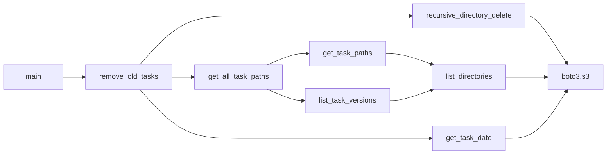

# Diagram: research/orchestrator/scripts/remove_old_s3_files.py

> Auto-generated by Obscura crawlers

## Diagram 1

```mermaid
flowchart TD
    Start([Start Main]) --> SetParams[Set days_ago_to_delete = 180]
    SetParams --> CalcDate[Calculate delete_before_date]
    CalcDate --> GetBucket[Get S3_BUCKET from env or default]
    GetBucket --> RemoveOld[Call remove_old_tasks]
    RemoveOld --> GetAllTasks[Call get_all_task_paths]
    GetAllTasks --> GetTaskPaths[Call get_task_paths]
    GetTaskPaths --> ListDirs1[List directories for tasks/etl]
    ListDirs1 --> ListDirs2[List directories for tasks/transforms]
    ListDirs2 --> ListDirs3[List directories for tasks/models]
    ListDirs3 --> ReturnPaths[Return all task_paths]
    ReturnPaths --> LoopVersions[For each task_path]
    LoopVersions --> ListVersions[Call list_task_versions]
    ListVersions --> FilterPattern[Filter by MD5 pattern]
    FilterPattern --> CollectVersions[Collect task_paths_with_versions]
    CollectVersions --> LoopTasks[For each task version path]
    LoopTasks --> GetDate[Call get_task_date]
    GetDate --> CheckDate{task_date < delete_before_date?}
    CheckDate -->|Yes| DeleteTask[Call recursive_directory_delete]
    CheckDate -->|No| NextTask[Next task]
    DeleteTask --> AddToDeleted[Add to deleted_task_paths]
    AddToDeleted --> NextTask
    NextTask --> MoreTasks{More tasks?}
    MoreTasks -->|Yes| LoopTasks
    MoreTasks -->|No| PrintCount[Print removed count]
    PrintCount --> WriteJSON[Write removed_tasks.json]
    WriteJSON --> End([End])
```

### SVG

<svg id="container" width="426.0625" xmlns="http://www.w3.org/2000/svg" class="flowchart" height="3108.578125" viewBox="0.5 0 426.0625 3108.578125" role="graphics-document document" aria-roledescription="flowchart-v2"><g><marker id="container_flowchart-v2-pointEnd" class="marker flowchart-v2" viewBox="0 0 10 10" refX="5" refY="5" markerUnits="userSpaceOnUse" markerWidth="8" markerHeight="8" orient="auto"><path d="M 0 0 L 10 5 L 0 10 z" class="arrowMarkerPath" style="stroke-width: 1; stroke-dasharray: 1, 0;"></path></marker><marker id="container_flowchart-v2-pointStart" class="marker flowchart-v2" viewBox="0 0 10 10" refX="4.5" refY="5" markerUnits="userSpaceOnUse" markerWidth="8" markerHeight="8" orient="auto"><path d="M 0 5 L 10 10 L 10 0 z" class="arrowMarkerPath" style="stroke-width: 1; stroke-dasharray: 1, 0;"></path></marker><marker id="container_flowchart-v2-circleEnd" class="marker flowchart-v2" viewBox="0 0 10 10" refX="11" refY="5" markerUnits="userSpaceOnUse" markerWidth="11" markerHeight="11" orient="auto"><circle cx="5" cy="5" r="5" class="arrowMarkerPath" style="stroke-width: 1; stroke-dasharray: 1, 0;"></circle></marker><marker id="container_flowchart-v2-circleStart" class="marker flowchart-v2" viewBox="0 0 10 10" refX="-1" refY="5" markerUnits="userSpaceOnUse" markerWidth="11" markerHeight="11" orient="auto"><circle cx="5" cy="5" r="5" class="arrowMarkerPath" style="stroke-width: 1; stroke-dasharray: 1, 0;"></circle></marker><marker id="container_flowchart-v2-crossEnd" class="marker cross flowchart-v2" viewBox="0 0 11 11" refX="12" refY="5.2" markerUnits="userSpaceOnUse" markerWidth="11" markerHeight="11" orient="auto"><path d="M 1,1 l 9,9 M 10,1 l -9,9" class="arrowMarkerPath" style="stroke-width: 2; stroke-dasharray: 1, 0;"></path></marker><marker id="container_flowchart-v2-crossStart" class="marker cross flowchart-v2" viewBox="0 0 11 11" refX="-1" refY="5.2" markerUnits="userSpaceOnUse" markerWidth="11" markerHeight="11" orient="auto"><path d="M 1,1 l 9,9 M 10,1 l -9,9" class="arrowMarkerPath" style="stroke-width: 2; stroke-dasharray: 1, 0;"></path></marker><g class="root"><g class="clusters"></g><g class="edgePaths"><path d="M236.016,47.5L235.932,51.583C235.849,55.667,235.682,63.833,235.599,71.417C235.516,79,235.516,86,235.516,89.5L235.516,93" id="L_Start_SetParams_0" class="edge-thickness-normal edge-pattern-solid edge-thickness-normal edge-pattern-solid flowchart-link" style=";" data-edge="true" data-et="edge" data-id="L_Start_SetParams_0" data-points="W3sieCI6MjM2LjAxNTYyNSwieSI6NDcuNX0seyJ4IjoyMzUuNTE1NjI1LCJ5Ijo3Mn0seyJ4IjoyMzUuNTE1NjI1LCJ5Ijo5N31d" marker-end="url(#container_flowchart-v2-pointEnd)"></path><path d="M235.516,175L235.516,179.167C235.516,183.333,235.516,191.667,235.516,199.333C235.516,207,235.516,214,235.516,217.5L235.516,221" id="L_SetParams_CalcDate_0" class="edge-thickness-normal edge-pattern-solid edge-thickness-normal edge-pattern-solid flowchart-link" style=";" data-edge="true" data-et="edge" data-id="L_SetParams_CalcDate_0" data-points="W3sieCI6MjM1LjUxNTYyNSwieSI6MTc1fSx7IngiOjIzNS41MTU2MjUsInkiOjIwMH0seyJ4IjoyMzUuNTE1NjI1LCJ5IjoyMjV9XQ==" marker-end="url(#container_flowchart-v2-pointEnd)"></path><path d="M235.516,303L235.516,307.167C235.516,311.333,235.516,319.667,235.516,327.333C235.516,335,235.516,342,235.516,345.5L235.516,349" id="L_CalcDate_GetBucket_0" class="edge-thickness-normal edge-pattern-solid edge-thickness-normal edge-pattern-solid flowchart-link" style=";" data-edge="true" data-et="edge" data-id="L_CalcDate_GetBucket_0" data-points="W3sieCI6MjM1LjUxNTYyNSwieSI6MzAzfSx7IngiOjIzNS41MTU2MjUsInkiOjMyOH0seyJ4IjoyMzUuNTE1NjI1LCJ5IjozNTN9XQ==" marker-end="url(#container_flowchart-v2-pointEnd)"></path><path d="M235.516,431L235.516,435.167C235.516,439.333,235.516,447.667,235.516,455.333C235.516,463,235.516,470,235.516,473.5L235.516,477" id="L_GetBucket_RemoveOld_0" class="edge-thickness-normal edge-pattern-solid edge-thickness-normal edge-pattern-solid flowchart-link" style=";" data-edge="true" data-et="edge" data-id="L_GetBucket_RemoveOld_0" data-points="W3sieCI6MjM1LjUxNTYyNSwieSI6NDMxfSx7IngiOjIzNS41MTU2MjUsInkiOjQ1Nn0seyJ4IjoyMzUuNTE1NjI1LCJ5Ijo0ODF9XQ==" marker-end="url(#container_flowchart-v2-pointEnd)"></path><path d="M235.516,535L235.516,539.167C235.516,543.333,235.516,551.667,235.516,559.333C235.516,567,235.516,574,235.516,577.5L235.516,581" id="L_RemoveOld_GetAllTasks_0" class="edge-thickness-normal edge-pattern-solid edge-thickness-normal edge-pattern-solid flowchart-link" style=";" data-edge="true" data-et="edge" data-id="L_RemoveOld_GetAllTasks_0" data-points="W3sieCI6MjM1LjUxNTYyNSwieSI6NTM1fSx7IngiOjIzNS41MTU2MjUsInkiOjU2MH0seyJ4IjoyMzUuNTE1NjI1LCJ5Ijo1ODV9XQ==" marker-end="url(#container_flowchart-v2-pointEnd)"></path><path d="M235.516,639L235.516,643.167C235.516,647.333,235.516,655.667,235.516,663.333C235.516,671,235.516,678,235.516,681.5L235.516,685" id="L_GetAllTasks_GetTaskPaths_0" class="edge-thickness-normal edge-pattern-solid edge-thickness-normal edge-pattern-solid flowchart-link" style=";" data-edge="true" data-et="edge" data-id="L_GetAllTasks_GetTaskPaths_0" data-points="W3sieCI6MjM1LjUxNTYyNSwieSI6NjM5fSx7IngiOjIzNS41MTU2MjUsInkiOjY2NH0seyJ4IjoyMzUuNTE1NjI1LCJ5Ijo2ODl9XQ==" marker-end="url(#container_flowchart-v2-pointEnd)"></path><path d="M235.516,743L235.516,747.167C235.516,751.333,235.516,759.667,235.516,767.333C235.516,775,235.516,782,235.516,785.5L235.516,789" id="L_GetTaskPaths_ListDirs1_0" class="edge-thickness-normal edge-pattern-solid edge-thickness-normal edge-pattern-solid flowchart-link" style=";" data-edge="true" data-et="edge" data-id="L_GetTaskPaths_ListDirs1_0" data-points="W3sieCI6MjM1LjUxNTYyNSwieSI6NzQzfSx7IngiOjIzNS41MTU2MjUsInkiOjc2OH0seyJ4IjoyMzUuNTE1NjI1LCJ5Ijo3OTN9XQ==" marker-end="url(#container_flowchart-v2-pointEnd)"></path><path d="M235.516,871L235.516,875.167C235.516,879.333,235.516,887.667,235.516,895.333C235.516,903,235.516,910,235.516,913.5L235.516,917" id="L_ListDirs1_ListDirs2_0" class="edge-thickness-normal edge-pattern-solid edge-thickness-normal edge-pattern-solid flowchart-link" style=";" data-edge="true" data-et="edge" data-id="L_ListDirs1_ListDirs2_0" data-points="W3sieCI6MjM1LjUxNTYyNSwieSI6ODcxfSx7IngiOjIzNS41MTU2MjUsInkiOjg5Nn0seyJ4IjoyMzUuNTE1NjI1LCJ5Ijo5MjF9XQ==" marker-end="url(#container_flowchart-v2-pointEnd)"></path><path d="M235.516,999L235.516,1003.167C235.516,1007.333,235.516,1015.667,235.516,1023.333C235.516,1031,235.516,1038,235.516,1041.5L235.516,1045" id="L_ListDirs2_ListDirs3_0" class="edge-thickness-normal edge-pattern-solid edge-thickness-normal edge-pattern-solid flowchart-link" style=";" data-edge="true" data-et="edge" data-id="L_ListDirs2_ListDirs3_0" data-points="W3sieCI6MjM1LjUxNTYyNSwieSI6OTk5fSx7IngiOjIzNS41MTU2MjUsInkiOjEwMjR9LHsieCI6MjM1LjUxNTYyNSwieSI6MTA0OX1d" marker-end="url(#container_flowchart-v2-pointEnd)"></path><path d="M235.516,1127L235.516,1131.167C235.516,1135.333,235.516,1143.667,235.516,1151.333C235.516,1159,235.516,1166,235.516,1169.5L235.516,1173" id="L_ListDirs3_ReturnPaths_0" class="edge-thickness-normal edge-pattern-solid edge-thickness-normal edge-pattern-solid flowchart-link" style=";" data-edge="true" data-et="edge" data-id="L_ListDirs3_ReturnPaths_0" data-points="W3sieCI6MjM1LjUxNTYyNSwieSI6MTEyN30seyJ4IjoyMzUuNTE1NjI1LCJ5IjoxMTUyfSx7IngiOjIzNS41MTU2MjUsInkiOjExNzd9XQ==" marker-end="url(#container_flowchart-v2-pointEnd)"></path><path d="M235.516,1231L235.516,1235.167C235.516,1239.333,235.516,1247.667,235.516,1255.333C235.516,1263,235.516,1270,235.516,1273.5L235.516,1277" id="L_ReturnPaths_LoopVersions_0" class="edge-thickness-normal edge-pattern-solid edge-thickness-normal edge-pattern-solid flowchart-link" style=";" data-edge="true" data-et="edge" data-id="L_ReturnPaths_LoopVersions_0" data-points="W3sieCI6MjM1LjUxNTYyNSwieSI6MTIzMX0seyJ4IjoyMzUuNTE1NjI1LCJ5IjoxMjU2fSx7IngiOjIzNS41MTU2MjUsInkiOjEyODF9XQ==" marker-end="url(#container_flowchart-v2-pointEnd)"></path><path d="M235.516,1335L235.516,1339.167C235.516,1343.333,235.516,1351.667,235.516,1359.333C235.516,1367,235.516,1374,235.516,1377.5L235.516,1381" id="L_LoopVersions_ListVersions_0" class="edge-thickness-normal edge-pattern-solid edge-thickness-normal edge-pattern-solid flowchart-link" style=";" data-edge="true" data-et="edge" data-id="L_LoopVersions_ListVersions_0" data-points="W3sieCI6MjM1LjUxNTYyNSwieSI6MTMzNX0seyJ4IjoyMzUuNTE1NjI1LCJ5IjoxMzYwfSx7IngiOjIzNS41MTU2MjUsInkiOjEzODV9XQ==" marker-end="url(#container_flowchart-v2-pointEnd)"></path><path d="M235.516,1439L235.516,1443.167C235.516,1447.333,235.516,1455.667,235.516,1463.333C235.516,1471,235.516,1478,235.516,1481.5L235.516,1485" id="L_ListVersions_FilterPattern_0" class="edge-thickness-normal edge-pattern-solid edge-thickness-normal edge-pattern-solid flowchart-link" style=";" data-edge="true" data-et="edge" data-id="L_ListVersions_FilterPattern_0" data-points="W3sieCI6MjM1LjUxNTYyNSwieSI6MTQzOX0seyJ4IjoyMzUuNTE1NjI1LCJ5IjoxNDY0fSx7IngiOjIzNS41MTU2MjUsInkiOjE0ODl9XQ==" marker-end="url(#container_flowchart-v2-pointEnd)"></path><path d="M235.516,1543L235.516,1547.167C235.516,1551.333,235.516,1559.667,235.516,1567.333C235.516,1575,235.516,1582,235.516,1585.5L235.516,1589" id="L_FilterPattern_CollectVersions_0" class="edge-thickness-normal edge-pattern-solid edge-thickness-normal edge-pattern-solid flowchart-link" style=";" data-edge="true" data-et="edge" data-id="L_FilterPattern_CollectVersions_0" data-points="W3sieCI6MjM1LjUxNTYyNSwieSI6MTU0M30seyJ4IjoyMzUuNTE1NjI1LCJ5IjoxNTY4fSx7IngiOjIzNS41MTU2MjUsInkiOjE1OTN9XQ==" marker-end="url(#container_flowchart-v2-pointEnd)"></path><path d="M235.516,1671L235.516,1675.167C235.516,1679.333,235.516,1687.667,235.516,1695.333C235.516,1703,235.516,1710,235.516,1713.5L235.516,1717" id="L_CollectVersions_LoopTasks_0" class="edge-thickness-normal edge-pattern-solid edge-thickness-normal edge-pattern-solid flowchart-link" style=";" data-edge="true" data-et="edge" data-id="L_CollectVersions_LoopTasks_0" data-points="W3sieCI6MjM1LjUxNTYyNSwieSI6MTY3MX0seyJ4IjoyMzUuNTE1NjI1LCJ5IjoxNjk2fSx7IngiOjIzNS41MTU2MjUsInkiOjE3MjF9XQ==" marker-end="url(#container_flowchart-v2-pointEnd)"></path><path d="M189.556,1775L182.463,1779.167C175.37,1783.333,161.185,1791.667,154.093,1799.333C147,1807,147,1814,147,1817.5L147,1821" id="L_LoopTasks_GetDate_0" class="edge-thickness-normal edge-pattern-solid edge-thickness-normal edge-pattern-solid flowchart-link" style=";" data-edge="true" data-et="edge" data-id="L_LoopTasks_GetDate_0" data-points="W3sieCI6MTg5LjU1NTU4ODk0MjMwNzY4LCJ5IjoxNzc1fSx7IngiOjE0NywieSI6MTgwMH0seyJ4IjoxNDcsInkiOjE4MjV9XQ==" marker-end="url(#container_flowchart-v2-pointEnd)"></path><path d="M147,1879L147,1883.167C147,1887.333,147,1895.667,147,1903.333C147,1911,147,1918,147,1921.5L147,1925" id="L_GetDate_CheckDate_0" class="edge-thickness-normal edge-pattern-solid edge-thickness-normal edge-pattern-solid flowchart-link" style=";" data-edge="true" data-et="edge" data-id="L_GetDate_CheckDate_0" data-points="W3sieCI6MTQ3LCJ5IjoxODc5fSx7IngiOjE0NywieSI6MTkwNH0seyJ4IjoxNDcsInkiOjE5Mjl9XQ==" marker-end="url(#container_flowchart-v2-pointEnd)"></path><path d="M191.362,2162.638L197.718,2176.199C204.074,2189.759,216.787,2216.879,223.144,2235.94C229.5,2255,229.5,2266,229.5,2271.5L229.5,2277" id="L_CheckDate_DeleteTask_0" class="edge-thickness-normal edge-pattern-solid edge-thickness-normal edge-pattern-solid flowchart-link" style=";" data-edge="true" data-et="edge" data-id="L_CheckDate_DeleteTask_0" data-points="W3sieCI6MTkxLjM2MTcwMjEyNzY1OTU4LCJ5IjoyMTYyLjYzODI5Nzg3MjM0MDR9LHsieCI6MjI5LjUsInkiOjIyNDR9LHsieCI6MjI5LjUsInkiOjIyODF9XQ==" marker-end="url(#container_flowchart-v2-pointEnd)"></path><path d="M102.638,2162.638L96.282,2176.199C89.926,2189.759,77.213,2216.879,70.856,2243.106C64.5,2269.333,64.5,2294.667,64.5,2320C64.5,2345.333,64.5,2370.667,64.5,2394C64.5,2417.333,64.5,2438.667,64.5,2458C64.5,2477.333,64.5,2494.667,70.547,2507.145C76.593,2519.622,88.686,2527.245,94.733,2531.056L100.78,2534.867" id="L_CheckDate_NextTask_0" class="edge-thickness-normal edge-pattern-solid edge-thickness-normal edge-pattern-solid flowchart-link" style=";" data-edge="true" data-et="edge" data-id="L_CheckDate_NextTask_0" data-points="W3sieCI6MTAyLjYzODI5Nzg3MjM0MDQzLCJ5IjoyMTYyLjYzODI5Nzg3MjM0MDR9LHsieCI6NjQuNSwieSI6MjI0NH0seyJ4Ijo2NC41LCJ5IjoyMzIwfSx7IngiOjY0LjUsInkiOjIzOTZ9LHsieCI6NjQuNSwieSI6MjQ2MH0seyJ4Ijo2NC41LCJ5IjoyNTEyfSx7IngiOjEwNC4xNjM0NjE1Mzg0NjE1NSwieSI6MjUzN31d" marker-end="url(#container_flowchart-v2-pointEnd)"></path><path d="M229.5,2359L229.5,2365.167C229.5,2371.333,229.5,2383.667,229.5,2395.333C229.5,2407,229.5,2418,229.5,2423.5L229.5,2429" id="L_DeleteTask_AddToDeleted_0" class="edge-thickness-normal edge-pattern-solid edge-thickness-normal edge-pattern-solid flowchart-link" style=";" data-edge="true" data-et="edge" data-id="L_DeleteTask_AddToDeleted_0" data-points="W3sieCI6MjI5LjUsInkiOjIzNTl9LHsieCI6MjI5LjUsInkiOjIzOTZ9LHsieCI6MjI5LjUsInkiOjI0MzN9XQ==" marker-end="url(#container_flowchart-v2-pointEnd)"></path><path d="M229.5,2487L229.5,2491.167C229.5,2495.333,229.5,2503.667,223.453,2511.645C217.407,2519.622,205.314,2527.245,199.267,2531.056L193.22,2534.867" id="L_AddToDeleted_NextTask_0" class="edge-thickness-normal edge-pattern-solid edge-thickness-normal edge-pattern-solid flowchart-link" style=";" data-edge="true" data-et="edge" data-id="L_AddToDeleted_NextTask_0" data-points="W3sieCI6MjI5LjUsInkiOjI0ODd9LHsieCI6MjI5LjUsInkiOjI1MTJ9LHsieCI6MTg5LjgzNjUzODQ2MTUzODQ1LCJ5IjoyNTM3fV0=" marker-end="url(#container_flowchart-v2-pointEnd)"></path><path d="M147,2591L147,2595.167C147,2599.333,147,2607.667,155.705,2621.106C164.409,2634.545,181.818,2653.089,190.523,2662.362L199.228,2671.634" id="L_NextTask_MoreTasks_0" class="edge-thickness-normal edge-pattern-solid edge-thickness-normal edge-pattern-solid flowchart-link" style=";" data-edge="true" data-et="edge" data-id="L_NextTask_MoreTasks_0" data-points="W3sieCI6MTQ3LCJ5IjoyNTkxfSx7IngiOjE0NywieSI6MjYxNn0seyJ4IjoyMDEuOTY1MjU2MjYwOTUxMzIsInkiOjI2NzQuNTUwMzY4NzM5MDQ4N31d" marker-end="url(#container_flowchart-v2-pointEnd)"></path><path d="M280.179,2685.664L301.238,2674.053C322.297,2662.443,364.414,2639.221,385.473,2618.944C406.531,2598.667,406.531,2581.333,406.531,2564C406.531,2546.667,406.531,2529.333,406.531,2512C406.531,2494.667,406.531,2477.333,406.531,2458C406.531,2438.667,406.531,2417.333,406.531,2394C406.531,2370.667,406.531,2345.333,406.531,2320C406.531,2294.667,406.531,2269.333,406.531,2227.333C406.531,2185.333,406.531,2126.667,406.531,2070C406.531,2013.333,406.531,1958.667,406.531,1922.667C406.531,1886.667,406.531,1869.333,406.531,1852C406.531,1834.667,406.531,1817.333,393.466,1804.694C380.401,1792.055,354.27,1784.109,341.205,1780.136L328.139,1776.164" id="L_MoreTasks_LoopTasks_0" class="edge-thickness-normal edge-pattern-solid edge-thickness-normal edge-pattern-solid flowchart-link" style=";" data-edge="true" data-et="edge" data-id="L_MoreTasks_LoopTasks_0" data-points="W3sieCI6MjgwLjE3OTQxMzA0MjE5Nzk1LCJ5IjoyNjg1LjY2Mzc4ODA0MjE5OH0seyJ4Ijo0MDYuNTMxMjUsInkiOjI2MTZ9LHsieCI6NDA2LjUzMTI1LCJ5IjoyNTY0fSx7IngiOjQwNi41MzEyNSwieSI6MjUxMn0seyJ4Ijo0MDYuNTMxMjUsInkiOjI0NjB9LHsieCI6NDA2LjUzMTI1LCJ5IjoyMzk2fSx7IngiOjQwNi41MzEyNSwieSI6MjMyMH0seyJ4Ijo0MDYuNTMxMjUsInkiOjIyNDR9LHsieCI6NDA2LjUzMTI1LCJ5IjoyMDY4fSx7IngiOjQwNi41MzEyNSwieSI6MTkwNH0seyJ4Ijo0MDYuNTMxMjUsInkiOjE4NTJ9LHsieCI6NDA2LjUzMTI1LCJ5IjoxODAwfSx7IngiOjMyNC4zMTIxOTk1MTkyMzA4LCJ5IjoxNzc1fV0=" marker-end="url(#container_flowchart-v2-pointEnd)"></path><path d="M235.516,2779.578L235.516,2785.745C235.516,2791.911,235.516,2804.245,235.516,2815.911C235.516,2827.578,235.516,2838.578,235.516,2844.078L235.516,2849.578" id="L_MoreTasks_PrintCount_0" class="edge-thickness-normal edge-pattern-solid edge-thickness-normal edge-pattern-solid flowchart-link" style=";" data-edge="true" data-et="edge" data-id="L_MoreTasks_PrintCount_0" data-points="W3sieCI6MjM1LjUxNTYyNSwieSI6Mjc3OS41NzgxMjV9LHsieCI6MjM1LjUxNTYyNSwieSI6MjgxNi41NzgxMjV9LHsieCI6MjM1LjUxNTYyNSwieSI6Mjg1My41NzgxMjV9XQ==" marker-end="url(#container_flowchart-v2-pointEnd)"></path><path d="M235.516,2907.578L235.516,2911.745C235.516,2915.911,235.516,2924.245,235.516,2931.911C235.516,2939.578,235.516,2946.578,235.516,2950.078L235.516,2953.578" id="L_PrintCount_WriteJSON_0" class="edge-thickness-normal edge-pattern-solid edge-thickness-normal edge-pattern-solid flowchart-link" style=";" data-edge="true" data-et="edge" data-id="L_PrintCount_WriteJSON_0" data-points="W3sieCI6MjM1LjUxNTYyNSwieSI6MjkwNy41NzgxMjV9LHsieCI6MjM1LjUxNTYyNSwieSI6MjkzMi41NzgxMjV9LHsieCI6MjM1LjUxNTYyNSwieSI6Mjk1Ny41NzgxMjV9XQ==" marker-end="url(#container_flowchart-v2-pointEnd)"></path><path d="M235.516,3011.578L235.516,3015.745C235.516,3019.911,235.516,3028.245,235.586,3035.995C235.656,3043.745,235.797,3050.912,235.867,3054.495L235.937,3058.079" id="L_WriteJSON_End_0" class="edge-thickness-normal edge-pattern-solid edge-thickness-normal edge-pattern-solid flowchart-link" style=";" data-edge="true" data-et="edge" data-id="L_WriteJSON_End_0" data-points="W3sieCI6MjM1LjUxNTYyNSwieSI6MzAxMS41NzgxMjV9LHsieCI6MjM1LjUxNTYyNSwieSI6MzAzNi41NzgxMjV9LHsieCI6MjM2LjAxNTYyNSwieSI6MzA2Mi4wNzgxMjV9XQ==" marker-end="url(#container_flowchart-v2-pointEnd)"></path></g><g class="edgeLabels"><g class="edgeLabel"><g class="label" data-id="L_Start_SetParams_0" transform="translate(0, 0)"><foreignObject width="0" height="0">

</foreignObject></g></g><g class="edgeLabel"><g class="label" data-id="L_SetParams_CalcDate_0" transform="translate(0, 0)"><foreignObject width="0" height="0">

</foreignObject></g></g><g class="edgeLabel"><g class="label" data-id="L_CalcDate_GetBucket_0" transform="translate(0, 0)"><foreignObject width="0" height="0">

</foreignObject></g></g><g class="edgeLabel"><g class="label" data-id="L_GetBucket_RemoveOld_0" transform="translate(0, 0)"><foreignObject width="0" height="0">

</foreignObject></g></g><g class="edgeLabel"><g class="label" data-id="L_RemoveOld_GetAllTasks_0" transform="translate(0, 0)"><foreignObject width="0" height="0">

</foreignObject></g></g><g class="edgeLabel"><g class="label" data-id="L_GetAllTasks_GetTaskPaths_0" transform="translate(0, 0)"><foreignObject width="0" height="0">

</foreignObject></g></g><g class="edgeLabel"><g class="label" data-id="L_GetTaskPaths_ListDirs1_0" transform="translate(0, 0)"><foreignObject width="0" height="0">

</foreignObject></g></g><g class="edgeLabel"><g class="label" data-id="L_ListDirs1_ListDirs2_0" transform="translate(0, 0)"><foreignObject width="0" height="0">

</foreignObject></g></g><g class="edgeLabel"><g class="label" data-id="L_ListDirs2_ListDirs3_0" transform="translate(0, 0)"><foreignObject width="0" height="0">

</foreignObject></g></g><g class="edgeLabel"><g class="label" data-id="L_ListDirs3_ReturnPaths_0" transform="translate(0, 0)"><foreignObject width="0" height="0">

</foreignObject></g></g><g class="edgeLabel"><g class="label" data-id="L_ReturnPaths_LoopVersions_0" transform="translate(0, 0)"><foreignObject width="0" height="0">

</foreignObject></g></g><g class="edgeLabel"><g class="label" data-id="L_LoopVersions_ListVersions_0" transform="translate(0, 0)"><foreignObject width="0" height="0">

</foreignObject></g></g><g class="edgeLabel"><g class="label" data-id="L_ListVersions_FilterPattern_0" transform="translate(0, 0)"><foreignObject width="0" height="0">

</foreignObject></g></g><g class="edgeLabel"><g class="label" data-id="L_FilterPattern_CollectVersions_0" transform="translate(0, 0)"><foreignObject width="0" height="0">

</foreignObject></g></g><g class="edgeLabel"><g class="label" data-id="L_CollectVersions_LoopTasks_0" transform="translate(0, 0)"><foreignObject width="0" height="0">

</foreignObject></g></g><g class="edgeLabel"><g class="label" data-id="L_LoopTasks_GetDate_0" transform="translate(0, 0)"><foreignObject width="0" height="0">

</foreignObject></g></g><g class="edgeLabel"><g class="label" data-id="L_GetDate_CheckDate_0" transform="translate(0, 0)"><foreignObject width="0" height="0">

</foreignObject></g></g><g class="edgeLabel" transform="translate(229.5, 2244)"><g class="label" data-id="L_CheckDate_DeleteTask_0" transform="translate(-12.03125, -12)"><foreignObject width="24.0625" height="24">

Yes

</foreignObject></g></g><g class="edgeLabel" transform="translate(64.5, 2396)"><g class="label" data-id="L_CheckDate_NextTask_0" transform="translate(-10.140625, -12)"><foreignObject width="20.28125" height="24">

No

</foreignObject></g></g><g class="edgeLabel"><g class="label" data-id="L_DeleteTask_AddToDeleted_0" transform="translate(0, 0)"><foreignObject width="0" height="0">

</foreignObject></g></g><g class="edgeLabel"><g class="label" data-id="L_AddToDeleted_NextTask_0" transform="translate(0, 0)"><foreignObject width="0" height="0">

</foreignObject></g></g><g class="edgeLabel"><g class="label" data-id="L_NextTask_MoreTasks_0" transform="translate(0, 0)"><foreignObject width="0" height="0">

</foreignObject></g></g><g class="edgeLabel" transform="translate(406.53125, 2320)"><g class="label" data-id="L_MoreTasks_LoopTasks_0" transform="translate(-12.03125, -12)"><foreignObject width="24.0625" height="24">

Yes

</foreignObject></g></g><g class="edgeLabel" transform="translate(235.515625, 2816.578125)"><g class="label" data-id="L_MoreTasks_PrintCount_0" transform="translate(-10.140625, -12)"><foreignObject width="20.28125" height="24">

No

</foreignObject></g></g><g class="edgeLabel"><g class="label" data-id="L_PrintCount_WriteJSON_0" transform="translate(0, 0)"><foreignObject width="0" height="0">

</foreignObject></g></g><g class="edgeLabel"><g class="label" data-id="L_WriteJSON_End_0" transform="translate(0, 0)"><foreignObject width="0" height="0">

</foreignObject></g></g></g><g class="nodes"><g class="node default" id="flowchart-Start-0" transform="translate(235.515625, 27.5)"><g class="basic label-container outer-path"><path d="M-30.0390625 -19.5 C-17.77374355996909 -19.5, -5.508424619938179 -19.5, 30.0390625 -19.5 C30.0390625 -19.5, 30.0390625 -19.5, 30.0390625 -19.5 C30.48013443789829 -19.485855681446047, 30.921206375796583 -19.471711362892094, 31.2884317896239 -19.45993515863156 C31.684370420007625 -19.42173943514431, 32.08030905039135 -19.383543711657065, 32.532667152847864 -19.3399052695533 C32.99071877074242 -19.26585103621546, 33.448770388636966 -19.19179680287762, 33.76665575967676 -19.140403561325776 C34.0360965213262 -19.07890546574458, 34.30553728297564 -19.017407370163383, 34.98532688623539 -18.862249829261074 C35.22835662588539 -18.79011987822209, 35.47138636553539 -18.717989927183105, 36.183672751460605 -18.50658706670804 C36.525836014258594 -18.38066782307585, 36.867999277056576 -18.254748579443664, 37.3567690951478 -18.074876768247425 C37.72760875593866 -17.910717050982996, 38.09844841672953 -17.746557333718563, 38.49979541279238 -17.568892924097174 C38.9062113675074 -17.35686598084419, 39.31262732222243 -17.144839037591204, 39.60805476407678 -16.990714730406097 C39.94872739868475 -16.784196977292126, 40.289400033292715 -16.577679224178155, 40.6769930736057 -16.342718045390892 C40.91132613935485 -16.17925744283921, 41.14565920510399 -16.01579684028753, 41.70221784457871 -15.627565626425154 C41.92882825658853 -15.446849853203647, 42.15543866859834 -15.266134079982141, 42.679516208501866 -14.848196188198123 C42.915607328920885 -14.63378447926231, 43.15169844933991 -14.419372770326499, 43.60487223676799 -14.007812326905688 C43.831359826344816 -13.77394529569069, 44.05784741592164 -13.540078264475692, 44.47448344296865 -13.10986736009568 C44.73303085006076 -12.806162863961061, 44.99157825715287 -12.50245836782644, 45.28477640812658 -12.158051136245305 C45.46172391723367 -11.920957594291506, 45.638671426340764 -11.683864052337709, 46.032421464640635 -11.156274872382312 C46.26712160783646 -10.795712426620634, 46.50182175103228 -10.435149980858954, 46.71434637860425 -10.108655082055241 C46.87772801889636 -9.818554435531517, 47.041109659188486 -9.528453789007791, 47.327748974273504 -9.019496659696287 C47.53378686300589 -8.591654575238895, 47.739824751738276 -8.1638124907815, 47.87010864880834 -7.893275190886684 C47.981134940454254 -7.619038103973963, 48.09216123210016 -7.3448010170612426, 48.339196729970325 -6.734618561215508 C48.48848636776464 -6.284981958252621, 48.63777600555894 -5.835345355289734, 48.73308563421488 -5.548287939305138 C48.803101782158365 -5.281286022006163, 48.87311793010185 -5.014284104707188, 49.05015678754556 -4.339158212148133 C49.1076049211515 -4.044174187748962, 49.16505305475744 -3.749190163349791, 49.289107276581774 -3.1121979531509023 C49.345027598495285 -2.678490979106307, 49.4009479204088 -2.244784005061712, 49.44895520250937 -1.872449005199798 C49.46550017908061 -1.6147476402380208, 49.482045155651846 -1.3570462752762436, 49.52904371591342 -0.6250057626472757 C49.52904371591342 -0.3431258476919487, 49.52904371591342 -0.06124593273662171, 49.52904371591342 0.625005762647271 C49.50428912486923 1.0105784997066807, 49.479534533825046 1.3961512367660902, 49.44895520250937 1.8724490051997846 C49.387697227639755 2.3475537615330935, 49.32643925277015 2.8226585178664023, 49.289107276581774 3.1121979531508885 C49.22193428843489 3.457117050269079, 49.154761300288 3.8020361473872692, 49.05015678754556 4.339158212148129 C48.935577511864636 4.776098649291699, 48.82099823618371 5.213039086435269, 48.73308563421489 5.548287939305125 C48.64499267373583 5.813609900560882, 48.55689971325677 6.078931861816638, 48.339196729970325 6.734618561215495 C48.21659096163702 7.0374571794200325, 48.093985193303716 7.340295797624569, 47.87010864880834 7.893275190886679 C47.70314051783487 8.239988087398784, 47.5361723868614 8.586700983910887, 47.327748974273504 9.019496659696284 C47.103625668541206 9.41745028396964, 46.87950236280891 9.815403908242995, 46.71434637860425 10.108655082055236 C46.480303353000814 10.468208018734229, 46.24626032739737 10.82776095541322, 46.03242146464064 11.156274872382301 C45.79018185664156 11.480853878618795, 45.54794224864247 11.805432884855287, 45.28477640812658 12.158051136245302 C45.01123373643964 12.479369923427736, 44.73769106475271 12.800688710610173, 44.47448344296866 13.10986736009567 C44.152183169889625 13.442668853394306, 43.829882896810595 13.775470346692943, 43.60487223676799 14.007812326905684 C43.39352263093505 14.199754446919023, 43.18217302510211 14.39169656693236, 42.67951620850189 14.848196188198111 C42.36027960727314 15.1027788824353, 42.04104300604439 15.35736157667249, 41.70221784457871 15.627565626425152 C41.399146526691474 15.838975058037393, 41.09607520880424 16.050384489649634, 40.67699307360571 16.34271804539089 C40.32735796809031 16.554668901038266, 39.97772286257492 16.766619756685643, 39.60805476407678 16.990714730406093 C39.3579782792665 17.121179472349986, 39.10790179445621 17.25164421429388, 38.49979541279239 17.56889292409717 C38.13662766622386 17.729656512514623, 37.77345991965533 17.890420100932072, 37.356769095147804 18.07487676824742 C37.10280648878075 18.168337354995096, 36.84884388241369 18.26179794174277, 36.18367275146062 18.506587066708033 C35.86642839000489 18.60074352793846, 35.54918402854916 18.694899989168885, 34.98532688623541 18.86224982926107 C34.507057497224245 18.971411696303434, 34.02878810821308 19.080573563345794, 33.766655759676766 19.140403561325773 C33.466282326176334 19.188965608623356, 33.1659088926759 19.23752765592094, 32.53266715284788 19.3399052695533 C32.178932943245584 19.374029583326003, 31.82519873364329 19.408153897098707, 31.2884317896239 19.45993515863156 C30.98258636820942 19.469743026004323, 30.676740946794943 19.479550893377088, 30.039062500000004 19.5 C30.039062500000004 19.5, 30.039062500000004 19.5, 30.0390625 19.5 C15.218377155325664 19.5, 0.3976918106513274 19.5, -30.039062499999996 19.5 C-30.378508948216698 19.48911461309812, -30.717955396433403 19.47822922619624, -31.288431789623893 19.45993515863156 C-31.676853981045177 19.42246453697118, -32.06527617246646 19.384993915310798, -32.53266715284787 19.3399052695533 C-32.97326746834429 19.268672427450316, -33.413867783840715 19.197439585347333, -33.76665575967676 19.140403561325773 C-34.053935449310984 19.074833846841933, -34.34121513894521 19.009264132358094, -34.985326886235384 18.862249829261074 C-35.38611623032042 18.743297655722834, -35.78690557440545 18.624345482184594, -36.18367275146059 18.506587066708043 C-36.61547318026549 18.347680517388433, -37.047273609070395 18.18877396806882, -37.3567690951478 18.074876768247425 C-37.78949143113955 17.8833234263559, -38.22221376713131 17.691770084464373, -38.49979541279238 17.568892924097174 C-38.78797243145854 17.41855115804523, -39.076149450124696 17.268209391993285, -39.60805476407678 16.990714730406097 C-39.85474955250366 16.841166899922225, -40.10144434093055 16.691619069438353, -40.676993073605686 16.3427180453909 C-40.95923992364999 16.14583486106921, -41.24148677369429 15.948951676747521, -41.70221784457871 15.627565626425156 C-41.9069225496124 15.464319071581766, -42.11162725464609 15.301072516738378, -42.679516208501866 14.848196188198125 C-43.022020039212705 14.537143271301312, -43.364523869923545 14.2260903544045, -43.604872236767974 14.007812326905697 C-43.92280115944971 13.679524611786816, -44.24073008213144 13.351236896667935, -44.474483442968655 13.109867360095677 C-44.76711487665843 12.766125826883375, -45.05974631034822 12.42238429367107, -45.284776408126575 12.158051136245307 C-45.43690796220491 11.95420871325003, -45.58903951628325 11.75036629025475, -46.032421464640635 11.156274872382316 C-46.17471352972779 10.937676049638963, -46.31700559481494 10.719077226895612, -46.71434637860425 10.108655082055249 C-46.857328869265345 9.854775191339296, -47.000311359926435 9.600895300623346, -47.327748974273504 9.019496659696289 C-47.45548772254868 8.754244415731518, -47.58322647082385 8.488992171766748, -47.87010864880834 7.893275190886686 C-47.986545086647524 7.6056749382785185, -48.10298152448671 7.318074685670352, -48.339196729970325 6.73461856121551 C-48.44360943574567 6.420144127325629, -48.54802214152102 6.105669693435747, -48.73308563421488 5.5482879393051325 C-48.81537086593826 5.234498688098859, -48.897656097661645 4.9207094368925866, -49.05015678754556 4.339158212148136 C-49.10907521609652 4.036624533953229, -49.16799364464748 3.7340908557583226, -49.289107276581774 3.112197953150904 C-49.33284753698583 2.772957130948417, -49.376587797389895 2.4337163087459297, -49.44895520250937 1.872449005199809 C-49.465036373053564 1.6219717934866968, -49.48111754359776 1.3714945817735846, -49.52904371591342 0.6250057626472781 C-49.52904371591342 0.31341086324067446, -49.52904371591342 0.0018159638340707884, -49.52904371591342 -0.6250057626472687 C-49.49963991013642 -1.082993771948825, -49.47023610435942 -1.5409817812503812, -49.44895520250937 -1.8724490051997822 C-49.40938521208278 -2.179346036969965, -49.36981522165619 -2.486243068740148, -49.289107276581774 -3.112197953150895 C-49.239953232073105 -3.364593582991926, -49.19079918756444 -3.616989212832957, -49.05015678754556 -4.339158212148126 C-48.97639393526379 -4.620447936920924, -48.90263108298202 -4.901737661693723, -48.73308563421489 -5.548287939305123 C-48.61053150214024 -5.91740145876475, -48.487977370065586 -6.2865149782243765, -48.33919672997033 -6.734618561215485 C-48.204282183054275 -7.067860100493461, -48.06936763613822 -7.401101639771436, -47.87010864880834 -7.893275190886676 C-47.66703505834133 -8.31496184657021, -47.463961467874306 -8.736648502253741, -47.327748974273504 -9.019496659696282 C-47.164727548690166 -9.308957708528874, -47.00170612310683 -9.598418757361465, -46.71434637860425 -10.108655082055243 C-46.5511393467035 -10.35938491027925, -46.38793231480275 -10.610114738503258, -46.03242146464064 -11.156274872382308 C-45.75567520357659 -11.5270896501051, -45.47892894251253 -11.897904427827893, -45.28477640812659 -12.158051136245302 C-45.12233326157305 -12.348866099463978, -44.95989011501951 -12.539681062682655, -44.47448344296866 -13.10986736009567 C-44.28074186407684 -13.309921446780926, -44.08700028518501 -13.50997553346618, -43.604872236767996 -14.007812326905677 C-43.33373568597997 -14.25405136845135, -43.06259913519193 -14.500290409997023, -42.67951620850189 -14.848196188198107 C-42.469603830410634 -15.015595723722905, -42.25969145231938 -15.1829952592477, -41.70221784457872 -15.627565626425149 C-41.349712210310926 -15.873458297167401, -40.997206576043126 -16.119350967909654, -40.676993073605715 -16.342718045390885 C-40.30027282552672 -16.571088073630282, -39.92355257744772 -16.799458101869682, -39.60805476407679 -16.99071473040609 C-39.30832610937905 -17.147082977576535, -39.00859745468132 -17.303451224746976, -38.49979541279239 -17.56889292409717 C-38.19361437851464 -17.70443018543425, -37.88743334423688 -17.839967446771336, -37.356769095147804 -18.07487676824742 C-36.88989502348646 -18.246690742355405, -36.423020951825116 -18.41850471646339, -36.18367275146062 -18.506587066708033 C-35.723889390748184 -18.643048354715372, -35.26410603003575 -18.779509642722715, -34.98532688623541 -18.862249829261067 C-34.60025550746348 -18.950139858640178, -34.21518412869155 -19.03802988801929, -33.766655759676766 -19.140403561325773 C-33.3357968376854 -19.210061490472494, -32.90493791569404 -19.279719419619216, -32.53266715284788 -19.3399052695533 C-32.08320474911204 -19.383264367084067, -31.63374234537621 -19.42662346461484, -31.288431789623903 -19.45993515863156 C-30.905058138877216 -19.472229205419463, -30.52168448813053 -19.484523252207367, -30.039062500000007 -19.5 C-30.039062500000004 -19.5, -30.039062500000004 -19.5, -30.0390625 -19.5" stroke="none" stroke-width="0" fill="#ECECFF" style=""></path><path d="M-30.0390625 -19.5 C-13.819607212299658 -19.5, 2.3998480754006835 -19.5, 30.0390625 -19.5 M-30.0390625 -19.5 C-8.569077482986824 -19.5, 12.900907534026352 -19.5, 30.0390625 -19.5 M30.0390625 -19.5 C30.0390625 -19.5, 30.0390625 -19.5, 30.0390625 -19.5 M30.0390625 -19.5 C30.0390625 -19.5, 30.0390625 -19.5, 30.0390625 -19.5 M30.0390625 -19.5 C30.377261122047766 -19.48915462845461, 30.71545974409553 -19.478309256909224, 31.2884317896239 -19.45993515863156 M30.0390625 -19.5 C30.502722475744534 -19.485131327037266, 30.966382451489064 -19.470262654074535, 31.2884317896239 -19.45993515863156 M31.2884317896239 -19.45993515863156 C31.718858252519514 -19.418412435419576, 32.14928471541513 -19.376889712207596, 32.532667152847864 -19.3399052695533 M31.2884317896239 -19.45993515863156 C31.78512622116271 -19.41201964418346, 32.28182065270152 -19.364104129735363, 32.532667152847864 -19.3399052695533 M32.532667152847864 -19.3399052695533 C32.882916040877404 -19.283279745557376, 33.23316492890694 -19.226654221561457, 33.76665575967676 -19.140403561325776 M32.532667152847864 -19.3399052695533 C32.88690158700472 -19.282635393367883, 33.24113602116157 -19.22536551718247, 33.76665575967676 -19.140403561325776 M33.76665575967676 -19.140403561325776 C34.18530105790739 -19.044850503920514, 34.60394635613802 -18.949297446515256, 34.98532688623539 -18.862249829261074 M33.76665575967676 -19.140403561325776 C34.012716100058576 -19.08424189432741, 34.258776440440386 -19.02808022732904, 34.98532688623539 -18.862249829261074 M34.98532688623539 -18.862249829261074 C35.28434647258681 -18.77350238561781, 35.58336605893823 -18.68475494197455, 36.183672751460605 -18.50658706670804 M34.98532688623539 -18.862249829261074 C35.34062739455807 -18.75679850340133, 35.69592790288075 -18.651347177541584, 36.183672751460605 -18.50658706670804 M36.183672751460605 -18.50658706670804 C36.46366879221984 -18.40354593545361, 36.74366483297908 -18.300504804199186, 37.3567690951478 -18.074876768247425 M36.183672751460605 -18.50658706670804 C36.612524330590865 -18.348765721327563, 37.04137590972112 -18.190944375947087, 37.3567690951478 -18.074876768247425 M37.3567690951478 -18.074876768247425 C37.76206388691187 -17.895464786576305, 38.16735867867594 -17.716052804905182, 38.49979541279238 -17.568892924097174 M37.3567690951478 -18.074876768247425 C37.636048893627986 -17.951247886001116, 37.915328692108176 -17.82761900375481, 38.49979541279238 -17.568892924097174 M38.49979541279238 -17.568892924097174 C38.745301976149776 -17.44081230724808, 38.990808539507164 -17.31273169039899, 39.60805476407678 -16.990714730406097 M38.49979541279238 -17.568892924097174 C38.7714379390399 -17.427177192149184, 39.04308046528742 -17.285461460201198, 39.60805476407678 -16.990714730406097 M39.60805476407678 -16.990714730406097 C39.88771665354808 -16.82118204953291, 40.16737854301938 -16.651649368659722, 40.6769930736057 -16.342718045390892 M39.60805476407678 -16.990714730406097 C39.87173879510156 -16.83086792121951, 40.13542282612633 -16.67102111203293, 40.6769930736057 -16.342718045390892 M40.6769930736057 -16.342718045390892 C40.97757996663906 -16.1330416410077, 41.278166859672424 -15.923365236624507, 41.70221784457871 -15.627565626425154 M40.6769930736057 -16.342718045390892 C40.937532191600916 -16.16097723523407, 41.19807130959612 -15.979236425077252, 41.70221784457871 -15.627565626425154 M41.70221784457871 -15.627565626425154 C41.99442301708248 -15.394539777259604, 42.28662818958625 -15.161513928094054, 42.679516208501866 -14.848196188198123 M41.70221784457871 -15.627565626425154 C41.99044381458983 -15.39771308535647, 42.27866978460094 -15.167860544287784, 42.679516208501866 -14.848196188198123 M42.679516208501866 -14.848196188198123 C42.874452747715885 -14.671159981022143, 43.069389286929905 -14.494123773846164, 43.60487223676799 -14.007812326905688 M42.679516208501866 -14.848196188198123 C42.9541019353872 -14.598824696181081, 43.228687662272534 -14.349453204164037, 43.60487223676799 -14.007812326905688 M43.60487223676799 -14.007812326905688 C43.784533463084045 -13.822297360273353, 43.96419468940011 -13.63678239364102, 44.47448344296865 -13.10986736009568 M43.60487223676799 -14.007812326905688 C43.90453941931963 -13.69838135778787, 44.20420660187128 -13.388950388670054, 44.47448344296865 -13.10986736009568 M44.47448344296865 -13.10986736009568 C44.69688159358693 -12.848625837566184, 44.91927974420521 -12.587384315036687, 45.28477640812658 -12.158051136245305 M44.47448344296865 -13.10986736009568 C44.785434452503786 -12.744606610682032, 45.09638546203892 -12.379345861268384, 45.28477640812658 -12.158051136245305 M45.28477640812658 -12.158051136245305 C45.51745956407858 -11.846276905141217, 45.750142720030574 -11.534502674037128, 46.032421464640635 -11.156274872382312 M45.28477640812658 -12.158051136245305 C45.57467386112197 -11.769614959432761, 45.864571314117356 -11.381178782620218, 46.032421464640635 -11.156274872382312 M46.032421464640635 -11.156274872382312 C46.207902967594535 -10.886688160463681, 46.383384470548435 -10.617101448545052, 46.71434637860425 -10.108655082055241 M46.032421464640635 -11.156274872382312 C46.26877370575668 -10.793174360564764, 46.505125946872724 -10.430073848747215, 46.71434637860425 -10.108655082055241 M46.71434637860425 -10.108655082055241 C46.95561385610535 -9.680260244770732, 47.196881333606456 -9.251865407486221, 47.327748974273504 -9.019496659696287 M46.71434637860425 -10.108655082055241 C46.86283861891977 -9.844992072905207, 47.01133085923529 -9.581329063755172, 47.327748974273504 -9.019496659696287 M47.327748974273504 -9.019496659696287 C47.43745796640311 -8.791683590142771, 47.54716695853272 -8.563870520589255, 47.87010864880834 -7.893275190886684 M47.327748974273504 -9.019496659696287 C47.50750508575054 -8.646229248049588, 47.68726119722756 -8.27296183640289, 47.87010864880834 -7.893275190886684 M47.87010864880834 -7.893275190886684 C48.048904952422305 -7.451644864168829, 48.22770125603627 -7.010014537450973, 48.339196729970325 -6.734618561215508 M47.87010864880834 -7.893275190886684 C48.00949069085732 -7.548998852257252, 48.1488727329063 -7.204722513627821, 48.339196729970325 -6.734618561215508 M48.339196729970325 -6.734618561215508 C48.49346064008253 -6.2700002425737775, 48.64772455019474 -5.805381923932046, 48.73308563421488 -5.548287939305138 M48.339196729970325 -6.734618561215508 C48.428779772997224 -6.464808708738058, 48.51836281602413 -6.194998856260607, 48.73308563421488 -5.548287939305138 M48.73308563421488 -5.548287939305138 C48.83622212147008 -5.154983813764742, 48.93935860872527 -4.761679688224348, 49.05015678754556 -4.339158212148133 M48.73308563421488 -5.548287939305138 C48.82962450086455 -5.180143400560476, 48.92616336751422 -4.8119988618158125, 49.05015678754556 -4.339158212148133 M49.05015678754556 -4.339158212148133 C49.13150908420593 -3.921431362611109, 49.2128613808663 -3.503704513074085, 49.289107276581774 -3.1121979531509023 M49.05015678754556 -4.339158212148133 C49.140143625793776 -3.877094816468543, 49.23013046404199 -3.4150314207889525, 49.289107276581774 -3.1121979531509023 M49.289107276581774 -3.1121979531509023 C49.32493162699878 -2.8343513656347517, 49.360755977415785 -2.556504778118601, 49.44895520250937 -1.872449005199798 M49.289107276581774 -3.1121979531509023 C49.32668329885312 -2.8207657446392425, 49.364259321124464 -2.529333536127582, 49.44895520250937 -1.872449005199798 M49.44895520250937 -1.872449005199798 C49.4780056371637 -1.4199650363697993, 49.50705607181803 -0.9674810675398008, 49.52904371591342 -0.6250057626472757 M49.44895520250937 -1.872449005199798 C49.46629817077519 -1.6023182754675656, 49.48364113904102 -1.3321875457353332, 49.52904371591342 -0.6250057626472757 M49.52904371591342 -0.6250057626472757 C49.52904371591342 -0.2638461781709688, 49.52904371591342 0.09731340630533813, 49.52904371591342 0.625005762647271 M49.52904371591342 -0.6250057626472757 C49.52904371591342 -0.23162866088042533, 49.52904371591342 0.16174844088642504, 49.52904371591342 0.625005762647271 M49.52904371591342 0.625005762647271 C49.5076857738492 0.957672950118069, 49.48632783178497 1.290340137588867, 49.44895520250937 1.8724490051997846 M49.52904371591342 0.625005762647271 C49.501924251263475 1.0474133150079328, 49.47480478661354 1.4698208673685944, 49.44895520250937 1.8724490051997846 M49.44895520250937 1.8724490051997846 C49.404011394251135 2.2210243068918576, 49.3590675859929 2.56959960858393, 49.289107276581774 3.1121979531508885 M49.44895520250937 1.8724490051997846 C49.395044972186355 2.2905661058059517, 49.34113474186334 2.7086832064121182, 49.289107276581774 3.1121979531508885 M49.289107276581774 3.1121979531508885 C49.2166846613916 3.484072775627311, 49.14426204620142 3.855947598103734, 49.05015678754556 4.339158212148129 M49.289107276581774 3.1121979531508885 C49.21285660673152 3.5037290272471835, 49.13660593688126 3.895260101343479, 49.05015678754556 4.339158212148129 M49.05015678754556 4.339158212148129 C48.96435189377314 4.66636946017857, 48.87854700000072 4.993580708209011, 48.73308563421489 5.548287939305125 M49.05015678754556 4.339158212148129 C48.94254918141282 4.74951265176379, 48.83494157528008 5.15986709137945, 48.73308563421489 5.548287939305125 M48.73308563421489 5.548287939305125 C48.62602244927757 5.8707451941343445, 48.51895926434025 6.193202448963564, 48.339196729970325 6.734618561215495 M48.73308563421489 5.548287939305125 C48.615580148307394 5.902195740901806, 48.498074662399894 6.256103542498488, 48.339196729970325 6.734618561215495 M48.339196729970325 6.734618561215495 C48.24343284780145 6.971157201641324, 48.147668965632576 7.207695842067152, 47.87010864880834 7.893275190886679 M48.339196729970325 6.734618561215495 C48.23178728290735 6.999921972081434, 48.12437783584437 7.265225382947372, 47.87010864880834 7.893275190886679 M47.87010864880834 7.893275190886679 C47.73901188235327 8.165500431452092, 47.60791511589819 8.437725672017503, 47.327748974273504 9.019496659696284 M47.87010864880834 7.893275190886679 C47.71479858875664 8.215779853686971, 47.55948852870494 8.538284516487263, 47.327748974273504 9.019496659696284 M47.327748974273504 9.019496659696284 C47.18011142016736 9.281642086935213, 47.03247386606121 9.543787514174142, 46.71434637860425 10.108655082055236 M47.327748974273504 9.019496659696284 C47.10559356611255 9.41395608256047, 46.88343815795161 9.808415505424655, 46.71434637860425 10.108655082055236 M46.71434637860425 10.108655082055236 C46.53132735252532 10.389821453602279, 46.34830832644638 10.670987825149322, 46.03242146464064 11.156274872382301 M46.71434637860425 10.108655082055236 C46.54874469754086 10.363063734446392, 46.38314301647747 10.617472386837548, 46.03242146464064 11.156274872382301 M46.03242146464064 11.156274872382301 C45.74222969571853 11.545105405723922, 45.45203792679642 11.93393593906554, 45.28477640812658 12.158051136245302 M46.03242146464064 11.156274872382301 C45.88218379013409 11.357579669287363, 45.731946115627544 11.558884466192424, 45.28477640812658 12.158051136245302 M45.28477640812658 12.158051136245302 C44.97983265156692 12.51625542449158, 44.674888895007264 12.874459712737861, 44.47448344296866 13.10986736009567 M45.28477640812658 12.158051136245302 C45.03781600955311 12.44814487285447, 44.79085561097964 12.73823860946364, 44.47448344296866 13.10986736009567 M44.47448344296866 13.10986736009567 C44.288515683483 13.301894340001624, 44.102547923997335 13.493921319907576, 43.60487223676799 14.007812326905684 M44.47448344296866 13.10986736009567 C44.18492592855818 13.408859266838542, 43.895368414147704 13.707851173581414, 43.60487223676799 14.007812326905684 M43.60487223676799 14.007812326905684 C43.26769796935661 14.314025075426448, 42.930523701945226 14.620237823947212, 42.67951620850189 14.848196188198111 M43.60487223676799 14.007812326905684 C43.33485758083079 14.253032493231538, 43.064842924893604 14.498252659557393, 42.67951620850189 14.848196188198111 M42.67951620850189 14.848196188198111 C42.46924343340522 15.015883130744157, 42.25897065830855 15.183570073290204, 41.70221784457871 15.627565626425152 M42.67951620850189 14.848196188198111 C42.38229834962081 15.085219521356375, 42.085080490739735 15.32224285451464, 41.70221784457871 15.627565626425152 M41.70221784457871 15.627565626425152 C41.38788812850618 15.846828429243255, 41.073558412433634 16.066091232061357, 40.67699307360571 16.34271804539089 M41.70221784457871 15.627565626425152 C41.373108675571544 15.857137935818248, 41.043999506564376 16.086710245211343, 40.67699307360571 16.34271804539089 M40.67699307360571 16.34271804539089 C40.3016308090625 16.57026485603049, 39.9262685445193 16.797811666670096, 39.60805476407678 16.990714730406093 M40.67699307360571 16.34271804539089 C40.34828918767841 16.54198027271846, 40.019585301751114 16.741242500046035, 39.60805476407678 16.990714730406093 M39.60805476407678 16.990714730406093 C39.18835792216909 17.20967030400068, 38.768661080261396 17.428625877595266, 38.49979541279239 17.56889292409717 M39.60805476407678 16.990714730406093 C39.20841227845094 17.199207959173865, 38.8087697928251 17.40770118794164, 38.49979541279239 17.56889292409717 M38.49979541279239 17.56889292409717 C38.10795293248516 17.742349966534988, 37.71611045217793 17.915807008972806, 37.356769095147804 18.07487676824742 M38.49979541279239 17.56889292409717 C38.15480424415023 17.721610280655643, 37.809813075508075 17.874327637214115, 37.356769095147804 18.07487676824742 M37.356769095147804 18.07487676824742 C37.09346620158885 18.171774667022383, 36.8301633080299 18.268672565797342, 36.18367275146062 18.506587066708033 M37.356769095147804 18.07487676824742 C36.90825486536626 18.23993415082712, 36.459740635584716 18.404991533406818, 36.18367275146062 18.506587066708033 M36.18367275146062 18.506587066708033 C35.782515582758 18.625648408662023, 35.381358414055384 18.744709750616014, 34.98532688623541 18.86224982926107 M36.18367275146062 18.506587066708033 C35.9107796440395 18.58758030854547, 35.63788653661839 18.668573550382906, 34.98532688623541 18.86224982926107 M34.98532688623541 18.86224982926107 C34.55550301991832 18.96035432188509, 34.12567915360122 19.058458814509112, 33.766655759676766 19.140403561325773 M34.98532688623541 18.86224982926107 C34.59392975892497 18.95158366946473, 34.20253263161453 19.040917509668386, 33.766655759676766 19.140403561325773 M33.766655759676766 19.140403561325773 C33.33528573369302 19.210144121802312, 32.90391570770928 19.279884682278848, 32.53266715284788 19.3399052695533 M33.766655759676766 19.140403561325773 C33.27509703131667 19.21987496443216, 32.78353830295657 19.29934636753855, 32.53266715284788 19.3399052695533 M32.53266715284788 19.3399052695533 C32.192115034414094 19.372757922844762, 31.851562915980306 19.405610576136223, 31.2884317896239 19.45993515863156 M32.53266715284788 19.3399052695533 C32.173467399771894 19.37455683773163, 31.814267646695907 19.409208405909965, 31.2884317896239 19.45993515863156 M31.2884317896239 19.45993515863156 C30.862800562075847 19.4735843236581, 30.437169334527795 19.487233488684637, 30.039062500000004 19.5 M31.2884317896239 19.45993515863156 C30.974860961824017 19.469990764750513, 30.66129013402414 19.480046370869463, 30.039062500000004 19.5 M30.039062500000004 19.5 C30.039062500000004 19.5, 30.0390625 19.5, 30.0390625 19.5 M30.039062500000004 19.5 C30.039062500000004 19.5, 30.039062500000004 19.5, 30.0390625 19.5 M30.0390625 19.5 C14.778741114239676 19.5, -0.48158027152064875 19.5, -30.039062499999996 19.5 M30.0390625 19.5 C9.385910534660361 19.5, -11.267241430679277 19.5, -30.039062499999996 19.5 M-30.039062499999996 19.5 C-30.409299561298354 19.488127218066886, -30.779536622596712 19.476254436133768, -31.288431789623893 19.45993515863156 M-30.039062499999996 19.5 C-30.53683772242829 19.48403731747742, -31.03461294485659 19.468074634954835, -31.288431789623893 19.45993515863156 M-31.288431789623893 19.45993515863156 C-31.696583956626213 19.420561209955643, -32.104736123628534 19.381187261279727, -32.53266715284787 19.3399052695533 M-31.288431789623893 19.45993515863156 C-31.69217289390944 19.420986739870852, -32.09591399819499 19.382038321110144, -32.53266715284787 19.3399052695533 M-32.53266715284787 19.3399052695533 C-32.830348818813206 19.29177840635582, -33.12803048477854 19.243651543158343, -33.76665575967676 19.140403561325773 M-32.53266715284787 19.3399052695533 C-33.00856711748774 19.26296545392967, -33.48446708212762 19.186025638306038, -33.76665575967676 19.140403561325773 M-33.76665575967676 19.140403561325773 C-34.091229464434655 19.066321731256146, -34.41580316919256 18.992239901186522, -34.985326886235384 18.862249829261074 M-33.76665575967676 19.140403561325773 C-34.1770880402142 19.046725071614034, -34.587520320751636 18.953046581902296, -34.985326886235384 18.862249829261074 M-34.985326886235384 18.862249829261074 C-35.39136757284031 18.741739084827792, -35.797408259445234 18.62122834039451, -36.18367275146059 18.506587066708043 M-34.985326886235384 18.862249829261074 C-35.24440769277556 18.785356005822855, -35.50348849931573 18.70846218238464, -36.18367275146059 18.506587066708043 M-36.18367275146059 18.506587066708043 C-36.47519196525511 18.399305301257588, -36.76671117904963 18.292023535807136, -37.3567690951478 18.074876768247425 M-36.18367275146059 18.506587066708043 C-36.52592100932746 18.38063654410482, -36.868169267194325 18.2546860215016, -37.3567690951478 18.074876768247425 M-37.3567690951478 18.074876768247425 C-37.74149482193233 17.90457010148311, -38.12622054871686 17.734263434718798, -38.49979541279238 17.568892924097174 M-37.3567690951478 18.074876768247425 C-37.615084529909716 17.96052818793344, -37.87339996467163 17.846179607619458, -38.49979541279238 17.568892924097174 M-38.49979541279238 17.568892924097174 C-38.73749113847282 17.444887216261066, -38.975186864153265 17.32088150842496, -39.60805476407678 16.990714730406097 M-38.49979541279238 17.568892924097174 C-38.9288551925387 17.345052711829425, -39.357914972285016 17.121212499561675, -39.60805476407678 16.990714730406097 M-39.60805476407678 16.990714730406097 C-39.976713522368236 16.767231624650478, -40.345372280659696 16.54374851889486, -40.676993073605686 16.3427180453909 M-39.60805476407678 16.990714730406097 C-39.98380826009814 16.762930752945305, -40.3595617561195 16.53514677548451, -40.676993073605686 16.3427180453909 M-40.676993073605686 16.3427180453909 C-40.9871947052989 16.126334815533923, -41.29739633699211 15.909951585676948, -41.70221784457871 15.627565626425156 M-40.676993073605686 16.3427180453909 C-40.91493257662519 16.17674174831957, -41.152872079644695 16.01076545124824, -41.70221784457871 15.627565626425156 M-41.70221784457871 15.627565626425156 C-42.022621903596054 15.37205191566892, -42.343025962613396 15.11653820491268, -42.679516208501866 14.848196188198125 M-41.70221784457871 15.627565626425156 C-42.062378493265925 15.340347093374476, -42.42253914195314 15.053128560323797, -42.679516208501866 14.848196188198125 M-42.679516208501866 14.848196188198125 C-42.90583131549509 14.642662795996477, -43.13214642248832 14.437129403794827, -43.604872236767974 14.007812326905697 M-42.679516208501866 14.848196188198125 C-42.90207485562707 14.646074313458136, -43.12463350275227 14.443952438718146, -43.604872236767974 14.007812326905697 M-43.604872236767974 14.007812326905697 C-43.852361489713886 13.752259353993495, -44.09985074265979 13.49670638108129, -44.474483442968655 13.109867360095677 M-43.604872236767974 14.007812326905697 C-43.88971594337132 13.71368781373451, -44.17455964997467 13.41956330056332, -44.474483442968655 13.109867360095677 M-44.474483442968655 13.109867360095677 C-44.69298630228381 12.853201468379183, -44.911489161598965 12.596535576662689, -45.284776408126575 12.158051136245307 M-44.474483442968655 13.109867360095677 C-44.63846487401757 12.917245440377863, -44.80244630506648 12.72462352066005, -45.284776408126575 12.158051136245307 M-45.284776408126575 12.158051136245307 C-45.579661350655385 11.76293217782762, -45.8745462931842 11.367813219409934, -46.032421464640635 11.156274872382316 M-45.284776408126575 12.158051136245307 C-45.44272843098468 11.94640981534076, -45.60068045384278 11.734768494436212, -46.032421464640635 11.156274872382316 M-46.032421464640635 11.156274872382316 C-46.289018138129826 10.762073476048355, -46.545614811619025 10.367872079714394, -46.71434637860425 10.108655082055249 M-46.032421464640635 11.156274872382316 C-46.22925772802755 10.853881513882492, -46.42609399141446 10.551488155382668, -46.71434637860425 10.108655082055249 M-46.71434637860425 10.108655082055249 C-46.92646958026493 9.732008857703349, -47.13859278192562 9.355362633351447, -47.327748974273504 9.019496659696289 M-46.71434637860425 10.108655082055249 C-46.87481165167936 9.823732740839521, -47.03527692475447 9.538810399623792, -47.327748974273504 9.019496659696289 M-47.327748974273504 9.019496659696289 C-47.43737060012535 8.791865008087884, -47.54699222597719 8.564233356479479, -47.87010864880834 7.893275190886686 M-47.327748974273504 9.019496659696289 C-47.49157350119374 8.679311524263072, -47.65539802811398 8.339126388829857, -47.87010864880834 7.893275190886686 M-47.87010864880834 7.893275190886686 C-47.9812373385465 7.618785178706379, -48.09236602828466 7.344295166526073, -48.339196729970325 6.73461856121551 M-47.87010864880834 7.893275190886686 C-47.99880388641718 7.57539546583971, -48.12749912402601 7.257515740792734, -48.339196729970325 6.73461856121551 M-48.339196729970325 6.73461856121551 C-48.49582498190567 6.262879221709204, -48.65245323384101 5.791139882202898, -48.73308563421488 5.5482879393051325 M-48.339196729970325 6.73461856121551 C-48.493576056628626 6.269652626326079, -48.64795538328692 5.804686691436648, -48.73308563421488 5.5482879393051325 M-48.73308563421488 5.5482879393051325 C-48.81092540938023 5.251451140627683, -48.88876518454559 4.954614341950234, -49.05015678754556 4.339158212148136 M-48.73308563421488 5.5482879393051325 C-48.82162515310541 5.210648380505321, -48.91016467199594 4.87300882170551, -49.05015678754556 4.339158212148136 M-49.05015678754556 4.339158212148136 C-49.13185974105832 3.9196308137854405, -49.21356269457108 3.5001034154227457, -49.289107276581774 3.112197953150904 M-49.05015678754556 4.339158212148136 C-49.1374904822921 3.8907181476075583, -49.22482417703864 3.442278083066981, -49.289107276581774 3.112197953150904 M-49.289107276581774 3.112197953150904 C-49.344037284759885 2.686171656878479, -49.398967292938 2.260145360606054, -49.44895520250937 1.872449005199809 M-49.289107276581774 3.112197953150904 C-49.33184538638227 2.7807296131326424, -49.374583496182765 2.4492612731143804, -49.44895520250937 1.872449005199809 M-49.44895520250937 1.872449005199809 C-49.48063781245951 1.3789667814838964, -49.51232042240965 0.8854845577679836, -49.52904371591342 0.6250057626472781 M-49.44895520250937 1.872449005199809 C-49.4669017389048 1.5929172146574466, -49.48484827530024 1.3133854241150842, -49.52904371591342 0.6250057626472781 M-49.52904371591342 0.6250057626472781 C-49.52904371591342 0.24755559649358083, -49.52904371591342 -0.12989456966011648, -49.52904371591342 -0.6250057626472687 M-49.52904371591342 0.6250057626472781 C-49.52904371591342 0.24148398284383243, -49.52904371591342 -0.14203779695961327, -49.52904371591342 -0.6250057626472687 M-49.52904371591342 -0.6250057626472687 C-49.50052073601422 -1.06927419791234, -49.47199775611501 -1.5135426331774111, -49.44895520250937 -1.8724490051997822 M-49.52904371591342 -0.6250057626472687 C-49.49776573788788 -1.1121855175244364, -49.466487759862346 -1.5993652724016039, -49.44895520250937 -1.8724490051997822 M-49.44895520250937 -1.8724490051997822 C-49.416530164261495 -2.123931198802216, -49.38410512601363 -2.375413392404649, -49.289107276581774 -3.112197953150895 M-49.44895520250937 -1.8724490051997822 C-49.40221805485307 -2.234933093128306, -49.35548090719677 -2.597417181056829, -49.289107276581774 -3.112197953150895 M-49.289107276581774 -3.112197953150895 C-49.23495671499103 -3.3902496421941377, -49.18080615340028 -3.6683013312373802, -49.05015678754556 -4.339158212148126 M-49.289107276581774 -3.112197953150895 C-49.19603438129136 -3.590107599503769, -49.10296148600096 -4.068017245856643, -49.05015678754556 -4.339158212148126 M-49.05015678754556 -4.339158212148126 C-48.966200921892714 -4.659318314584776, -48.88224505623987 -4.979478417021426, -48.73308563421489 -5.548287939305123 M-49.05015678754556 -4.339158212148126 C-48.93503659887234 -4.778161384964516, -48.81991641019911 -5.217164557780906, -48.73308563421489 -5.548287939305123 M-48.73308563421489 -5.548287939305123 C-48.62617361360312 -5.870289911270557, -48.519261592991356 -6.192291883235992, -48.33919672997033 -6.734618561215485 M-48.73308563421489 -5.548287939305123 C-48.65428807122447 -5.785613644345555, -48.575490508234054 -6.022939349385988, -48.33919672997033 -6.734618561215485 M-48.33919672997033 -6.734618561215485 C-48.20909077423783 -7.055982787302301, -48.078984818505326 -7.377347013389117, -47.87010864880834 -7.893275190886676 M-48.33919672997033 -6.734618561215485 C-48.199505350926984 -7.07965896820164, -48.059813971883635 -7.424699375187796, -47.87010864880834 -7.893275190886676 M-47.87010864880834 -7.893275190886676 C-47.75265619448131 -8.137167725376683, -47.63520374015429 -8.38106025986669, -47.327748974273504 -9.019496659696282 M-47.87010864880834 -7.893275190886676 C-47.691581315251355 -8.263991018890763, -47.51305398169437 -8.634706846894852, -47.327748974273504 -9.019496659696282 M-47.327748974273504 -9.019496659696282 C-47.090228887081004 -9.44123762602345, -46.852708799888504 -9.862978592350617, -46.71434637860425 -10.108655082055243 M-47.327748974273504 -9.019496659696282 C-47.1259844969934 -9.37774991997588, -46.924220019713296 -9.73600318025548, -46.71434637860425 -10.108655082055243 M-46.71434637860425 -10.108655082055243 C-46.47363937995798 -10.47844567085534, -46.23293238131172 -10.848236259655438, -46.03242146464064 -11.156274872382308 M-46.71434637860425 -10.108655082055243 C-46.51395904954439 -10.416503831023363, -46.31357172048453 -10.724352579991482, -46.03242146464064 -11.156274872382308 M-46.03242146464064 -11.156274872382308 C-45.75017860129205 -11.534454596415612, -45.467935737943456 -11.912634320448916, -45.28477640812659 -12.158051136245302 M-46.03242146464064 -11.156274872382308 C-45.81393974003831 -11.44902047925486, -45.59545801543597 -11.741766086127415, -45.28477640812659 -12.158051136245302 M-45.28477640812659 -12.158051136245302 C-45.03718036114093 -12.448891541648837, -44.78958431415528 -12.739731947052372, -44.47448344296866 -13.10986736009567 M-45.28477640812659 -12.158051136245302 C-45.09599350466904 -12.379806276698053, -44.90721060121149 -12.601561417150807, -44.47448344296866 -13.10986736009567 M-44.47448344296866 -13.10986736009567 C-44.126861114154266 -13.468815954920505, -43.77923878533987 -13.827764549745341, -43.604872236767996 -14.007812326905677 M-44.47448344296866 -13.10986736009567 C-44.28789483660155 -13.302535415379195, -44.101306230234435 -13.49520347066272, -43.604872236767996 -14.007812326905677 M-43.604872236767996 -14.007812326905677 C-43.33068968730269 -14.256817663857348, -43.05650713783737 -14.505823000809018, -42.67951620850189 -14.848196188198107 M-43.604872236767996 -14.007812326905677 C-43.38430719927754 -14.208123658123409, -43.16374216178709 -14.408434989341139, -42.67951620850189 -14.848196188198107 M-42.67951620850189 -14.848196188198107 C-42.372409298556526 -15.093105776421437, -42.06530238861117 -15.338015364644765, -41.70221784457872 -15.627565626425149 M-42.67951620850189 -14.848196188198107 C-42.46990607815688 -15.015354689188424, -42.260295947811876 -15.182513190178739, -41.70221784457872 -15.627565626425149 M-41.70221784457872 -15.627565626425149 C-41.301791165925536 -15.906885943262068, -40.90136448727236 -16.186206260098988, -40.676993073605715 -16.342718045390885 M-41.70221784457872 -15.627565626425149 C-41.357005866995294 -15.868370558001692, -41.01179388941187 -16.109175489578234, -40.676993073605715 -16.342718045390885 M-40.676993073605715 -16.342718045390885 C-40.379349835019944 -16.523151125767402, -40.081706596434174 -16.70358420614392, -39.60805476407679 -16.99071473040609 M-40.676993073605715 -16.342718045390885 C-40.3503229838439 -16.54074737353103, -40.02365289408209 -16.738776701671174, -39.60805476407679 -16.99071473040609 M-39.60805476407679 -16.99071473040609 C-39.3240435729372 -17.138883186905765, -39.04003238179761 -17.28705164340544, -38.49979541279239 -17.56889292409717 M-39.60805476407679 -16.99071473040609 C-39.37307601943669 -17.113302990973764, -39.13809727479658 -17.23589125154144, -38.49979541279239 -17.56889292409717 M-38.49979541279239 -17.56889292409717 C-38.22407029978217 -17.69094825253192, -37.948345186771945 -17.813003580966672, -37.356769095147804 -18.07487676824742 M-38.49979541279239 -17.56889292409717 C-38.214863892968744 -17.69502365572987, -37.92993237314509 -17.82115438736257, -37.356769095147804 -18.07487676824742 M-37.356769095147804 -18.07487676824742 C-36.979821106417454 -18.2135971125692, -36.6028731176871 -18.35231745689098, -36.18367275146062 -18.506587066708033 M-37.356769095147804 -18.07487676824742 C-37.08244322251454 -18.175831225217028, -36.808117349881286 -18.276785682186638, -36.18367275146062 -18.506587066708033 M-36.18367275146062 -18.506587066708033 C-35.73277481242434 -18.640411208202423, -35.28187687338806 -18.77423534969681, -34.98532688623541 -18.862249829261067 M-36.18367275146062 -18.506587066708033 C-35.89378992691597 -18.592622767406887, -35.603907102371316 -18.678658468105745, -34.98532688623541 -18.862249829261067 M-34.98532688623541 -18.862249829261067 C-34.73852372995268 -18.918581039141493, -34.491720573669944 -18.97491224902192, -33.766655759676766 -19.140403561325773 M-34.98532688623541 -18.862249829261067 C-34.64920457459673 -18.93896755348953, -34.31308226295805 -19.015685277717992, -33.766655759676766 -19.140403561325773 M-33.766655759676766 -19.140403561325773 C-33.48777700638678 -19.185490515420664, -33.20889825309679 -19.23057746951556, -32.53266715284788 -19.3399052695533 M-33.766655759676766 -19.140403561325773 C-33.44528953740532 -19.192359559910344, -33.12392331513389 -19.244315558494915, -32.53266715284788 -19.3399052695533 M-32.53266715284788 -19.3399052695533 C-32.25934291210669 -19.36627253033711, -31.9860186713655 -19.392639791120917, -31.288431789623903 -19.45993515863156 M-32.53266715284788 -19.3399052695533 C-32.16634105869058 -19.37524430728507, -31.800014964533283 -19.410583345016835, -31.288431789623903 -19.45993515863156 M-31.288431789623903 -19.45993515863156 C-30.865927319203514 -19.473484054642878, -30.443422848783122 -19.487032950654196, -30.039062500000007 -19.5 M-31.288431789623903 -19.45993515863156 C-30.991578098582263 -19.46945467871261, -30.694724407540622 -19.478974198793654, -30.039062500000007 -19.5 M-30.039062500000007 -19.5 C-30.039062500000004 -19.5, -30.039062500000004 -19.5, -30.0390625 -19.5 M-30.039062500000007 -19.5 C-30.039062500000004 -19.5, -30.039062500000004 -19.5, -30.0390625 -19.5" stroke="#9370DB" stroke-width="1.3" fill="none" stroke-dasharray="0 0" style=""></path></g><g class="label" style="" transform="translate(-37.1640625, -12)"><rect></rect><foreignObject width="74.328125" height="24">

Start Main

</foreignObject></g></g><g class="node default" id="flowchart-SetParams-1" transform="translate(235.515625, 136)"><rect class="basic label-container" style="" x="-130" y="-39" width="260" height="78"></rect><g class="label" style="" transform="translate(-100, -24)"><rect></rect><foreignObject width="200" height="48">

Set days_ago_to_delete = 180

</foreignObject></g></g><g class="node default" id="flowchart-CalcDate-3" transform="translate(235.515625, 264)"><rect class="basic label-container" style="" x="-130" y="-39" width="260" height="78"></rect><g class="label" style="" transform="translate(-100, -24)"><rect></rect><foreignObject width="200" height="48">

Calculate delete_before_date

</foreignObject></g></g><g class="node default" id="flowchart-GetBucket-5" transform="translate(235.515625, 392)"><rect class="basic label-container" style="" x="-130" y="-39" width="260" height="78"></rect><g class="label" style="" transform="translate(-100, -24)"><rect></rect><foreignObject width="200" height="48">

Get S3_BUCKET from env or default

</foreignObject></g></g><g class="node default" id="flowchart-RemoveOld-7" transform="translate(235.515625, 508)"><rect class="basic label-container" style="" x="-110.6875" y="-27" width="221.375" height="54"></rect><g class="label" style="" transform="translate(-80.6875, -12)"><rect></rect><foreignObject width="161.375" height="24">

Call remove_old_tasks

</foreignObject></g></g><g class="node default" id="flowchart-GetAllTasks-9" transform="translate(235.515625, 612)"><rect class="basic label-container" style="" x="-113.15625" y="-27" width="226.3125" height="54"></rect><g class="label" style="" transform="translate(-83.15625, -12)"><rect></rect><foreignObject width="166.3125" height="24">

Call get_all_task_paths

</foreignObject></g></g><g class="node default" id="flowchart-GetTaskPaths-11" transform="translate(235.515625, 716)"><rect class="basic label-container" style="" x="-100.1953125" y="-27" width="200.390625" height="54"></rect><g class="label" style="" transform="translate(-70.1953125, -12)"><rect></rect><foreignObject width="140.390625" height="24">

Call get_task_paths

</foreignObject></g></g><g class="node default" id="flowchart-ListDirs1-13" transform="translate(235.515625, 832)"><rect class="basic label-container" style="" x="-130" y="-39" width="260" height="78"></rect><g class="label" style="" transform="translate(-100, -24)"><rect></rect><foreignObject width="200" height="48">

List directories for tasks/etl

</foreignObject></g></g><g class="node default" id="flowchart-ListDirs2-15" transform="translate(235.515625, 960)"><rect class="basic label-container" style="" x="-130" y="-39" width="260" height="78"></rect><g class="label" style="" transform="translate(-100, -24)"><rect></rect><foreignObject width="200" height="48">

List directories for tasks/transforms

</foreignObject></g></g><g class="node default" id="flowchart-ListDirs3-17" transform="translate(235.515625, 1088)"><rect class="basic label-container" style="" x="-130" y="-39" width="260" height="78"></rect><g class="label" style="" transform="translate(-100, -24)"><rect></rect><foreignObject width="200" height="48">

List directories for tasks/models

</foreignObject></g></g><g class="node default" id="flowchart-ReturnPaths-19" transform="translate(235.515625, 1204)"><rect class="basic label-container" style="" x="-107.0390625" y="-27" width="214.078125" height="54"></rect><g class="label" style="" transform="translate(-77.0390625, -12)"><rect></rect><foreignObject width="154.078125" height="24">

Return all task_paths

</foreignObject></g></g><g class="node default" id="flowchart-LoopVersions-21" transform="translate(235.515625, 1308)"><rect class="basic label-container" style="" x="-98.4921875" y="-27" width="196.984375" height="54"></rect><g class="label" style="" transform="translate(-68.4921875, -12)"><rect></rect><foreignObject width="136.984375" height="24">

For each task_path

</foreignObject></g></g><g class="node default" id="flowchart-ListVersions-23" transform="translate(235.515625, 1412)"><rect class="basic label-container" style="" x="-109.8828125" y="-27" width="219.765625" height="54"></rect><g class="label" style="" transform="translate(-79.8828125, -12)"><rect></rect><foreignObject width="159.765625" height="24">

Call list_task_versions

</foreignObject></g></g><g class="node default" id="flowchart-FilterPattern-25" transform="translate(235.515625, 1516)"><rect class="basic label-container" style="" x="-105.6875" y="-27" width="211.375" height="54"></rect><g class="label" style="" transform="translate(-75.6875, -12)"><rect></rect><foreignObject width="151.375" height="24">

Filter by MD5 pattern

</foreignObject></g></g><g class="node default" id="flowchart-CollectVersions-27" transform="translate(235.515625, 1632)"><rect class="basic label-container" style="" x="-130" y="-39" width="260" height="78"></rect><g class="label" style="" transform="translate(-100, -24)"><rect></rect><foreignObject width="200" height="48">

Collect task_paths_with_versions

</foreignObject></g></g><g class="node default" id="flowchart-LoopTasks-29" transform="translate(235.515625, 1748)"><rect class="basic label-container" style="" x="-125.15625" y="-27" width="250.3125" height="54"></rect><g class="label" style="" transform="translate(-95.15625, -12)"><rect></rect><foreignObject width="190.3125" height="24">

For each task version path

</foreignObject></g></g><g class="node default" id="flowchart-GetDate-31" transform="translate(147, 1852)"><rect class="basic label-container" style="" x="-95.9609375" y="-27" width="191.921875" height="54"></rect><g class="label" style="" transform="translate(-65.9609375, -12)"><rect></rect><foreignObject width="131.921875" height="24">

Call get_task_date

</foreignObject></g></g><g class="node default" id="flowchart-CheckDate-33" transform="translate(147, 2068)"><polygon points="139,0 278,-139 139,-278 0,-139" class="label-container" transform="translate(-138.5, 139)"></polygon><g class="label" style="" transform="translate(-100, -24)"><rect></rect><foreignObject width="200" height="48">

task_date &lt; delete_before_date?

</foreignObject></g></g><g class="node default" id="flowchart-DeleteTask-35" transform="translate(229.5, 2320)"><rect class="basic label-container" style="" x="-130" y="-39" width="260" height="78"></rect><g class="label" style="" transform="translate(-100, -24)"><rect></rect><foreignObject width="200" height="48">

Call recursive_directory_delete

</foreignObject></g></g><g class="node default" id="flowchart-NextTask-37" transform="translate(147, 2564)"><rect class="basic label-container" style="" x="-63.578125" y="-27" width="127.15625" height="54"></rect><g class="label" style="" transform="translate(-33.578125, -12)"><rect></rect><foreignObject width="67.15625" height="24">

Next task

</foreignObject></g></g><g class="node default" id="flowchart-AddToDeleted-39" transform="translate(229.5, 2460)"><rect class="basic label-container" style="" x="-126.984375" y="-27" width="253.96875" height="54"></rect><g class="label" style="" transform="translate(-96.984375, -12)"><rect></rect><foreignObject width="193.96875" height="24">

Add to deleted_task_paths

</foreignObject></g></g><g class="node default" id="flowchart-MoreTasks-43" transform="translate(235.515625, 2710.2890625)"><polygon points="69.2890625,0 138.578125,-69.2890625 69.2890625,-138.578125 0,-69.2890625" class="label-container" transform="translate(-68.7890625, 69.2890625)"></polygon><g class="label" style="" transform="translate(-42.2890625, -12)"><rect></rect><foreignObject width="84.578125" height="24">

More tasks?

</foreignObject></g></g><g class="node default" id="flowchart-PrintCount-47" transform="translate(235.515625, 2880.578125)"><rect class="basic label-container" style="" x="-103.96875" y="-27" width="207.9375" height="54"></rect><g class="label" style="" transform="translate(-73.96875, -12)"><rect></rect><foreignObject width="147.9375" height="24">

Print removed count

</foreignObject></g></g><g class="node default" id="flowchart-WriteJSON-49" transform="translate(235.515625, 2984.578125)"><rect class="basic label-container" style="" x="-122.8046875" y="-27" width="245.609375" height="54"></rect><g class="label" style="" transform="translate(-92.8046875, -12)"><rect></rect><foreignObject width="185.609375" height="24">

Write removed_tasks.json

</foreignObject></g></g><g class="node default" id="flowchart-End-51" transform="translate(235.515625, 3081.078125)"><g class="basic label-container outer-path"><path d="M-6.5546875 -19.5 C-2.9431666051979817 -19.5, 0.6683542896040366 -19.5, 6.5546875 -19.5 C6.5546875 -19.5, 6.554687499999999 -19.5, 6.554687499999999 -19.5 C6.868810309261042 -19.489926692909954, 7.182933118522086 -19.47985338581991, 7.8040567896239 -19.45993515863156 C8.064650045384012 -19.434796040657623, 8.325243301144125 -19.409656922683688, 9.048292152847864 -19.3399052695533 C9.457473185267972 -19.273752053477917, 9.866654217688081 -19.207598837402532, 10.282280759676757 -19.140403561325776 C10.625660813321476 -19.06202930484563, 10.969040866966195 -18.98365504836548, 11.50095188623539 -18.862249829261074 C11.957078080672535 -18.726873969007382, 12.413204275109681 -18.59149810875369, 12.699297751460602 -18.50658706670804 C12.997475490811974 -18.39685490230193, 13.295653230163346 -18.287122737895814, 13.872394095147794 -18.074876768247425 C14.252430468014113 -17.90664593935796, 14.632466840880433 -17.7384151104685, 15.015420412792382 -17.568892924097174 C15.317550720431655 -17.411271736125464, 15.619681028070927 -17.253650548153754, 16.123679764076783 -16.990714730406097 C16.521378963943075 -16.749627138307233, 16.919078163809363 -16.50853954620837, 17.192618073605697 -16.342718045390892 C17.443103502099795 -16.167990253812846, 17.69358893059389 -15.9932624622348, 18.217842844578712 -15.627565626425154 C18.546128422921864 -15.365766613742622, 18.874414001265013 -15.103967601060088, 19.19514120850187 -14.848196188198123 C19.501502476046404 -14.569966990889128, 19.807863743590943 -14.29173779358013, 20.120497236767985 -14.007812326905688 C20.371368220957237 -13.748767438839431, 20.622239205146492 -13.489722550773175, 20.990108442968648 -13.10986736009568 C21.248476431277442 -12.806373619473163, 21.506844419586233 -12.502879878850644, 21.800401408126582 -12.158051136245305 C21.952504255993524 -11.954247176958107, 22.104607103860463 -11.75044321767091, 22.548046464640635 -11.156274872382312 C22.794203443260972 -10.778111650817504, 23.040360421881314 -10.399948429252694, 23.229971378604247 -10.108655082055241 C23.391611190992503 -9.821647227354026, 23.55325100338076 -9.534639372652812, 23.8433739742735 -9.019496659696287 C23.979543545226804 -8.736737632049678, 24.115713116180107 -8.453978604403071, 24.38573364880834 -7.893275190886684 C24.498671829639576 -7.614315700722346, 24.611610010470812 -7.335356210558009, 24.854821729970325 -6.734618561215508 C24.99209877056635 -6.321161987066408, 25.129375811162372 -5.907705412917308, 25.24871063421488 -5.548287939305138 C25.335649407270292 -5.216752718142264, 25.422588180325704 -4.88521749697939, 25.56578178754556 -4.339158212148133 C25.62647241852162 -4.027524649055482, 25.687163049497673 -3.71589108596283, 25.804732276581777 -3.1121979531509023 C25.845844133478803 -2.7933425095119775, 25.886955990375828 -2.4744870658730522, 25.964580202509367 -1.872449005199798 C25.991362042432524 -1.4553002304845424, 26.01814388235568 -1.0381514557692868, 26.044668715913414 -0.6250057626472757 C26.044668715913414 -0.33258844170743307, 26.044668715913414 -0.04017112076759044, 26.044668715913414 0.625005762647271 C26.01280930123443 1.1212418627291207, 25.980949886555447 1.6174779628109706, 25.964580202509367 1.8724490051997846 C25.922432693620966 2.1993367611712076, 25.880285184732564 2.526224517142631, 25.804732276581777 3.1121979531508885 C25.712035553169436 3.588176036413839, 25.619338829757094 4.06415411967679, 25.56578178754556 4.339158212148129 C25.45291065017708 4.769584777594527, 25.3400395128086 5.200011343040925, 25.248710634214884 5.548287939305125 C25.098763160106238 5.999905840434819, 24.94881568599759 6.451523741564512, 24.85482172997033 6.734618561215495 C24.72098467753953 7.065198668282945, 24.587147625108734 7.3957787753503945, 24.385733648808344 7.893275190886679 C24.229804654173535 8.217065084591875, 24.073875659538725 8.540854978297071, 23.843373974273504 9.019496659696284 C23.666062567182163 9.33433101771387, 23.488751160090825 9.649165375731457, 23.22997137860425 10.108655082055236 C23.009043381625613 10.44805981288824, 22.78811538464698 10.787464543721242, 22.54804646464064 11.156274872382301 C22.38900215441377 11.369379758851577, 22.229957844186895 11.582484645320855, 21.800401408126582 12.158051136245302 C21.538027267545232 12.466250731283688, 21.275653126963885 12.774450326322073, 20.99010844296866 13.10986736009567 C20.73883667023692 13.369326095237394, 20.48756489750518 13.628784830379118, 20.12049723676799 14.007812326905684 C19.91974794836019 14.19012751910254, 19.71899865995239 14.372442711299396, 19.195141208501887 14.848196188198111 C18.831152908151918 15.138467171591747, 18.467164607801948 15.428738154985384, 18.217842844578715 15.627565626425152 C17.84696675504949 15.886272731513586, 17.476090665520264 16.14497983660202, 17.192618073605708 16.34271804539089 C16.811784396475375 16.5735816584944, 16.43095071934504 16.80444527159791, 16.123679764076787 16.990714730406093 C15.768675147132218 17.175920411674767, 15.413670530187646 17.361126092943437, 15.015420412792386 17.56889292409717 C14.636842187126115 17.736478274475573, 14.258263961459843 17.904063624853972, 13.872394095147804 18.07487676824742 C13.539988909587612 18.197204949253422, 13.20758372402742 18.319533130259426, 12.699297751460616 18.506587066708033 C12.27724756138834 18.631849347734832, 11.855197371316065 18.757111628761628, 11.500951886235413 18.86224982926107 C11.179490466794753 18.935621300516594, 10.858029047354094 19.00899277177212, 10.282280759676766 19.140403561325773 C9.939335587675833 19.195848277155353, 9.5963904156749 19.251292992984936, 9.048292152847878 19.3399052695533 C8.595590642404762 19.383576839812523, 8.142889131961645 19.427248410071748, 7.804056789623901 19.45993515863156 C7.517381685954003 19.469128271227014, 7.230706582284105 19.47832138382247, 6.5546875000000036 19.5 C6.554687500000003 19.5, 6.554687500000002 19.5, 6.5546875 19.5 C3.646247953841338 19.5, 0.7378084076826763 19.5, -6.5546874999999964 19.5 C-7.016058421718781 19.4852047325445, -7.477429343437565 19.470409465089, -7.8040567896238935 19.45993515863156 C-8.283787906270694 19.413656074769722, -8.763519022917496 19.367376990907886, -9.048292152847871 19.3399052695533 C-9.499814421804547 19.266906650715875, -9.951336690761224 19.19390803187845, -10.282280759676759 19.140403561325773 C-10.529387133184795 19.08400314409235, -10.776493506692828 19.027602726858927, -11.500951886235388 18.862249829261074 C-11.896351335367283 18.744897348252792, -12.291750784499177 18.627544867244506, -12.699297751460593 18.506587066708043 C-13.021138501357749 18.38814669568261, -13.342979251254903 18.26970632465718, -13.872394095147797 18.074876768247425 C-14.256577976147819 17.90480996053863, -14.640761857147838 17.734743152829836, -15.01542041279238 17.568892924097174 C-15.439948870899471 17.34741669942616, -15.864477329006561 17.125940474755147, -16.12367976407678 16.990714730406097 C-16.410433348543897 16.816883022351018, -16.697186933011015 16.643051314295942, -17.192618073605686 16.3427180453909 C-17.59041423422333 16.065232664062282, -17.988210394840976 15.787747282733664, -18.217842844578712 15.627565626425156 C-18.495346596111506 15.406263769262717, -18.772850347644304 15.184961912100276, -19.19514120850187 14.848196188198125 C-19.502970614096572 14.56863366675677, -19.810800019691275 14.289071145315416, -20.120497236767974 14.007812326905697 C-20.295261901316692 13.827353462313344, -20.47002656586541 13.646894597720989, -20.990108442968655 13.109867360095677 C-21.296502422933813 12.74995955691725, -21.602896402898967 12.390051753738824, -21.80040140812658 12.158051136245307 C-21.984314518213257 11.911624323558165, -22.168227628299938 11.665197510871025, -22.548046464640635 11.156274872382316 C-22.69577358697928 10.929326342183447, -22.843500709317922 10.70237781198458, -23.229971378604244 10.108655082055249 C-23.355800942255506 9.88523195016746, -23.481630505906768 9.66180881827967, -23.8433739742735 9.019496659696289 C-23.96945749357296 8.757681534115818, -24.095541012872424 8.495866408535347, -24.38573364880834 7.893275190886686 C-24.565880940217 7.448307898196358, -24.74602823162566 7.003340605506031, -24.854821729970325 6.73461856121551 C-24.968299263080684 6.392842311676667, -25.081776796191043 6.051066062137824, -25.24871063421488 5.5482879393051325 C-25.319624982303726 5.277860795569493, -25.390539330392567 5.007433651833853, -25.565781787545557 4.339158212148136 C-25.643136392912613 3.9419586624899483, -25.72049099827967 3.5447591128317604, -25.804732276581777 3.112197953150904 C-25.847727717965125 2.7787338001918935, -25.89072315934847 2.445269647232883, -25.964580202509364 1.872449005199809 C-25.994336892841822 1.4089645341036463, -26.02409358317428 0.9454800630074833, -26.044668715913414 0.6250057626472781 C-26.044668715913414 0.17594102774136922, -26.044668715913414 -0.2731237071645397, -26.044668715913414 -0.6250057626472687 C-26.024380595831232 -0.9410096092030376, -26.00409247574905 -1.2570134557588064, -25.964580202509367 -1.8724490051997822 C-25.919761790682998 -2.220051756928649, -25.874943378856628 -2.5676545086575153, -25.804732276581777 -3.112197953150895 C-25.732061179617883 -3.4853486770187083, -25.65939008265399 -3.8584994008865214, -25.56578178754556 -4.339158212148126 C-25.478499582135296 -4.6720030897245834, -25.39121737672503 -5.00484796730104, -25.248710634214884 -5.548287939305123 C-25.098216993249824 -6.001550807986459, -24.947723352284765 -6.454813676667795, -24.854821729970332 -6.734618561215485 C-24.737111604774576 -7.025364846219456, -24.61940147957882 -7.316111131223428, -24.385733648808344 -7.893275190886676 C-24.175985428179445 -8.32882185891556, -23.966237207550545 -8.764368526944445, -23.843373974273504 -9.019496659696282 C-23.69043494430071 -9.29105539416909, -23.537495914327913 -9.562614128641899, -23.229971378604247 -10.108655082055243 C-23.06651952164834 -10.35976102730871, -22.903067664692426 -10.610866972562178, -22.54804646464064 -11.156274872382308 C-22.263144918467344 -11.538016989189726, -21.978243372294045 -11.919759105997144, -21.800401408126586 -12.158051136245302 C-21.616022596207383 -12.374632980177205, -21.43164378428818 -12.591214824109107, -20.990108442968662 -13.10986736009567 C-20.67335708711552 -13.436939140783998, -20.356605731262373 -13.764010921472325, -20.120497236767996 -14.007812326905677 C-19.75828784877549 -14.336761309545228, -19.396078460782977 -14.66571029218478, -19.195141208501887 -14.848196188198107 C-18.852605261759894 -15.12135949046049, -18.510069315017898 -15.394522792722872, -18.21784284457872 -15.627565626425149 C-17.86332736499056 -15.874860278258083, -17.508811885402398 -16.122154930091018, -17.19261807360571 -16.342718045390885 C-16.828566977023645 -16.563407959540648, -16.464515880441578 -16.78409787369041, -16.12367976407679 -16.99071473040609 C-15.691907624955087 -17.215969978822628, -15.260135485833384 -17.44122522723917, -15.01542041279239 -17.56889292409717 C-14.685885840453953 -17.714768103975626, -14.356351268115514 -17.86064328385408, -13.872394095147806 -18.07487676824742 C-13.49191736441271 -18.21489572224628, -13.111440633677617 -18.354914676245137, -12.699297751460618 -18.506587066708033 C-12.365475651024159 -18.605663713849612, -12.031653550587698 -18.70474036099119, -11.500951886235413 -18.862249829261067 C-11.178930149774082 -18.93574918922015, -10.856908413312754 -19.009248549179233, -10.282280759676768 -19.140403561325773 C-9.841633338663426 -19.211644019083423, -9.400985917650084 -19.282884476841073, -9.04829215284788 -19.3399052695533 C-8.717141213809867 -19.371851002375024, -8.385990274771856 -19.403796735196746, -7.804056789623903 -19.45993515863156 C-7.448509102055774 -19.471336880940278, -7.092961414487644 -19.482738603248997, -6.554687500000006 -19.5 C-6.554687500000004 -19.5, -6.5546875000000036 -19.5, -6.5546875 -19.5" stroke="none" stroke-width="0" fill="#ECECFF" style=""></path><path d="M-6.5546875 -19.5 C-1.4138994761774555 -19.5, 3.726888547645089 -19.5, 6.5546875 -19.5 M-6.5546875 -19.5 C-1.3553771039822529 -19.5, 3.8439332920354943 -19.5, 6.5546875 -19.5 M6.5546875 -19.5 C6.5546875 -19.5, 6.5546875 -19.5, 6.554687499999999 -19.5 M6.5546875 -19.5 C6.5546875 -19.5, 6.554687499999999 -19.5, 6.554687499999999 -19.5 M6.554687499999999 -19.5 C6.935363747192975 -19.487792453693885, 7.31603999438595 -19.475584907387773, 7.8040567896239 -19.45993515863156 M6.554687499999999 -19.5 C7.0021313752154555 -19.48565134581851, 7.449575250430912 -19.471302691637018, 7.8040567896239 -19.45993515863156 M7.8040567896239 -19.45993515863156 C8.173167013042216 -19.424327539298385, 8.542277236460531 -19.38871991996521, 9.048292152847864 -19.3399052695533 M7.8040567896239 -19.45993515863156 C8.09714312946166 -19.431661471915305, 8.390229469299419 -19.40338778519905, 9.048292152847864 -19.3399052695533 M9.048292152847864 -19.3399052695533 C9.396505783962649 -19.2836087901117, 9.744719415077435 -19.227312310670104, 10.282280759676757 -19.140403561325776 M9.048292152847864 -19.3399052695533 C9.487960845064753 -19.268823045077305, 9.927629537281645 -19.19774082060131, 10.282280759676757 -19.140403561325776 M10.282280759676757 -19.140403561325776 C10.766593635724453 -19.029862307804763, 11.250906511772149 -18.91932105428375, 11.50095188623539 -18.862249829261074 M10.282280759676757 -19.140403561325776 C10.75344049622318 -19.03286442606367, 11.224600232769602 -18.92532529080157, 11.50095188623539 -18.862249829261074 M11.50095188623539 -18.862249829261074 C11.762136333457804 -18.7847316563106, 12.023320780680217 -18.707213483360132, 12.699297751460602 -18.50658706670804 M11.50095188623539 -18.862249829261074 C11.872248172884257 -18.75205104035767, 12.243544459533124 -18.641852251454267, 12.699297751460602 -18.50658706670804 M12.699297751460602 -18.50658706670804 C13.125434501985817 -18.34976480334982, 13.551571252511032 -18.192942539991602, 13.872394095147794 -18.074876768247425 M12.699297751460602 -18.50658706670804 C13.133506506953983 -18.346794230904738, 13.567715262447365 -18.187001395101436, 13.872394095147794 -18.074876768247425 M13.872394095147794 -18.074876768247425 C14.121867195186097 -17.964442427217048, 14.371340295224398 -17.854008086186667, 15.015420412792382 -17.568892924097174 M13.872394095147794 -18.074876768247425 C14.182721150698237 -17.93750418628027, 14.493048206248682 -17.800131604313123, 15.015420412792382 -17.568892924097174 M15.015420412792382 -17.568892924097174 C15.420258235241304 -17.35768929143657, 15.825096057690226 -17.146485658775973, 16.123679764076783 -16.990714730406097 M15.015420412792382 -17.568892924097174 C15.387912046817071 -17.374564277218774, 15.76040368084176 -17.180235630340373, 16.123679764076783 -16.990714730406097 M16.123679764076783 -16.990714730406097 C16.52677274193981 -16.746357398388255, 16.929865719802834 -16.502000066370414, 17.192618073605697 -16.342718045390892 M16.123679764076783 -16.990714730406097 C16.519054685136087 -16.751036129779006, 16.91442960619539 -16.511357529151915, 17.192618073605697 -16.342718045390892 M17.192618073605697 -16.342718045390892 C17.60171026025034 -16.05735304530293, 18.010802446894978 -15.771988045214963, 18.217842844578712 -15.627565626425154 M17.192618073605697 -16.342718045390892 C17.566601584196878 -16.08184333788773, 17.94058509478806 -15.820968630384566, 18.217842844578712 -15.627565626425154 M18.217842844578712 -15.627565626425154 C18.47503062096873 -15.422465218808277, 18.732218397358746 -15.217364811191398, 19.19514120850187 -14.848196188198123 M18.217842844578712 -15.627565626425154 C18.425374381537633 -15.462064748346549, 18.632905918496554 -15.296563870267944, 19.19514120850187 -14.848196188198123 M19.19514120850187 -14.848196188198123 C19.401755171985673 -14.660554853268039, 19.60836913546948 -14.472913518337956, 20.120497236767985 -14.007812326905688 M19.19514120850187 -14.848196188198123 C19.47206095590999 -14.596705000497083, 19.74898070331811 -14.345213812796043, 20.120497236767985 -14.007812326905688 M20.120497236767985 -14.007812326905688 C20.335051955966062 -13.786266964063628, 20.549606675164135 -13.56472160122157, 20.990108442968648 -13.10986736009568 M20.120497236767985 -14.007812326905688 C20.321567395089 -13.80019088027223, 20.522637553410018 -13.592569433638772, 20.990108442968648 -13.10986736009568 M20.990108442968648 -13.10986736009568 C21.24903523384031 -12.80571721818605, 21.507962024711972 -12.501567076276418, 21.800401408126582 -12.158051136245305 M20.990108442968648 -13.10986736009568 C21.16731186635913 -12.901714135820786, 21.344515289749612 -12.693560911545893, 21.800401408126582 -12.158051136245305 M21.800401408126582 -12.158051136245305 C22.035940571084403 -11.842450115941002, 22.271479734042227 -11.526849095636699, 22.548046464640635 -11.156274872382312 M21.800401408126582 -12.158051136245305 C21.967570663262954 -11.934059563795008, 22.134739918399326 -11.71006799134471, 22.548046464640635 -11.156274872382312 M22.548046464640635 -11.156274872382312 C22.697576164896887 -10.926557098442053, 22.847105865153136 -10.696839324501795, 23.229971378604247 -10.108655082055241 M22.548046464640635 -11.156274872382312 C22.707966615018083 -10.910594576829366, 22.867886765395532 -10.664914281276422, 23.229971378604247 -10.108655082055241 M23.229971378604247 -10.108655082055241 C23.370581997152566 -9.858986690453618, 23.511192615700885 -9.609318298851994, 23.8433739742735 -9.019496659696287 M23.229971378604247 -10.108655082055241 C23.39643559738778 -9.813081005275095, 23.562899816171306 -9.517506928494948, 23.8433739742735 -9.019496659696287 M23.8433739742735 -9.019496659696287 C23.964466145146424 -8.76804617592127, 24.085558316019345 -8.516595692146254, 24.38573364880834 -7.893275190886684 M23.8433739742735 -9.019496659696287 C24.01417040679126 -8.664834213114942, 24.184966839309016 -8.310171766533596, 24.38573364880834 -7.893275190886684 M24.38573364880834 -7.893275190886684 C24.52746216202265 -7.543203023112948, 24.66919067523696 -7.193130855339212, 24.854821729970325 -6.734618561215508 M24.38573364880834 -7.893275190886684 C24.522361557960277 -7.555801613760476, 24.658989467112217 -7.218328036634268, 24.854821729970325 -6.734618561215508 M24.854821729970325 -6.734618561215508 C24.977344222997388 -6.36560033352621, 25.09986671602445 -5.996582105836913, 25.24871063421488 -5.548287939305138 M24.854821729970325 -6.734618561215508 C24.99798505646015 -6.303433431806577, 25.141148382949975 -5.872248302397647, 25.24871063421488 -5.548287939305138 M25.24871063421488 -5.548287939305138 C25.371421307213193 -5.0803389600204705, 25.49413198021151 -4.612389980735802, 25.56578178754556 -4.339158212148133 M25.24871063421488 -5.548287939305138 C25.343381595463697 -5.18726653340925, 25.438052556712513 -4.826245127513363, 25.56578178754556 -4.339158212148133 M25.56578178754556 -4.339158212148133 C25.631035899071854 -4.004092140921976, 25.696290010598144 -3.6690260696958203, 25.804732276581777 -3.1121979531509023 M25.56578178754556 -4.339158212148133 C25.642971517980087 -3.942805260422156, 25.72016124841461 -3.5464523086961792, 25.804732276581777 -3.1121979531509023 M25.804732276581777 -3.1121979531509023 C25.84790968623583 -2.7773224902180127, 25.89108709588988 -2.4424470272851226, 25.964580202509367 -1.872449005199798 M25.804732276581777 -3.1121979531509023 C25.837144078506565 -2.8608184178564744, 25.869555880431353 -2.6094388825620465, 25.964580202509367 -1.872449005199798 M25.964580202509367 -1.872449005199798 C25.98895450800666 -1.4927995224941684, 26.013328813503954 -1.1131500397885388, 26.044668715913414 -0.6250057626472757 M25.964580202509367 -1.872449005199798 C25.988319528324407 -1.5026898435916225, 26.01205885413945 -1.1329306819834473, 26.044668715913414 -0.6250057626472757 M26.044668715913414 -0.6250057626472757 C26.044668715913414 -0.32019920952017245, 26.044668715913414 -0.015392656393069193, 26.044668715913414 0.625005762647271 M26.044668715913414 -0.6250057626472757 C26.044668715913414 -0.21344225183914017, 26.044668715913414 0.19812125896899535, 26.044668715913414 0.625005762647271 M26.044668715913414 0.625005762647271 C26.025114195740272 0.9295831984685466, 26.00555967556713 1.2341606342898221, 25.964580202509367 1.8724490051997846 M26.044668715913414 0.625005762647271 C26.022323795271692 0.9730459381373803, 25.999978874629974 1.3210861136274894, 25.964580202509367 1.8724490051997846 M25.964580202509367 1.8724490051997846 C25.920473123865612 2.2145347972329037, 25.876366045221857 2.556620589266023, 25.804732276581777 3.1121979531508885 M25.964580202509367 1.8724490051997846 C25.915204063649792 2.2554005877731775, 25.865827924790217 2.638352170346571, 25.804732276581777 3.1121979531508885 M25.804732276581777 3.1121979531508885 C25.73582445608138 3.466025047747407, 25.666916635580986 3.819852142343926, 25.56578178754556 4.339158212148129 M25.804732276581777 3.1121979531508885 C25.731837970774702 3.4864948072532322, 25.658943664967627 3.8607916613555755, 25.56578178754556 4.339158212148129 M25.56578178754556 4.339158212148129 C25.50213742791141 4.581861739073091, 25.438493068277264 4.824565265998052, 25.248710634214884 5.548287939305125 M25.56578178754556 4.339158212148129 C25.449977811034216 4.780768964346792, 25.334173834522872 5.222379716545455, 25.248710634214884 5.548287939305125 M25.248710634214884 5.548287939305125 C25.145463982481807 5.859250404205164, 25.042217330748734 6.170212869105203, 24.85482172997033 6.734618561215495 M25.248710634214884 5.548287939305125 C25.1354118495285 5.889525827070649, 25.022113064842113 6.230763714836173, 24.85482172997033 6.734618561215495 M24.85482172997033 6.734618561215495 C24.680874711437664 7.164271060027998, 24.506927692905 7.593923558840501, 24.385733648808344 7.893275190886679 M24.85482172997033 6.734618561215495 C24.73540181596919 7.029588057625275, 24.615981901968055 7.324557554035055, 24.385733648808344 7.893275190886679 M24.385733648808344 7.893275190886679 C24.20897609569491 8.260316031932494, 24.03221854258148 8.627356872978307, 23.843373974273504 9.019496659696284 M24.385733648808344 7.893275190886679 C24.18911195578345 8.30156434348315, 23.992490262758555 8.70985349607962, 23.843373974273504 9.019496659696284 M23.843373974273504 9.019496659696284 C23.720353189170524 9.23793252085193, 23.597332404067544 9.456368382007575, 23.22997137860425 10.108655082055236 M23.843373974273504 9.019496659696284 C23.604871848366052 9.442981335204054, 23.3663697224586 9.866466010711823, 23.22997137860425 10.108655082055236 M23.22997137860425 10.108655082055236 C23.003696122390316 10.456274639013815, 22.777420866176378 10.803894195972394, 22.54804646464064 11.156274872382301 M23.22997137860425 10.108655082055236 C22.992565679203167 10.47337398869176, 22.755159979802084 10.838092895328284, 22.54804646464064 11.156274872382301 M22.54804646464064 11.156274872382301 C22.318214967512922 11.464228140453319, 22.088383470385207 11.772181408524336, 21.800401408126582 12.158051136245302 M22.54804646464064 11.156274872382301 C22.26470405370559 11.535927890010612, 21.981361642770537 11.915580907638923, 21.800401408126582 12.158051136245302 M21.800401408126582 12.158051136245302 C21.487701526951625 12.525366209800701, 21.175001645776668 12.892681283356103, 20.99010844296866 13.10986736009567 M21.800401408126582 12.158051136245302 C21.556301232321413 12.444785092439535, 21.312201056516244 12.731519048633766, 20.99010844296866 13.10986736009567 M20.99010844296866 13.10986736009567 C20.69817148481194 13.411316237862499, 20.406234526655226 13.712765115629326, 20.12049723676799 14.007812326905684 M20.99010844296866 13.10986736009567 C20.754898327343753 13.352741115588014, 20.51968821171885 13.59561487108036, 20.12049723676799 14.007812326905684 M20.12049723676799 14.007812326905684 C19.870901332548325 14.234488723172243, 19.621305428328665 14.4611651194388, 19.195141208501887 14.848196188198111 M20.12049723676799 14.007812326905684 C19.751313589804386 14.343095147014004, 19.38212994284078 14.678377967122325, 19.195141208501887 14.848196188198111 M19.195141208501887 14.848196188198111 C18.834007196276257 15.136190952768384, 18.472873184050627 15.424185717338657, 18.217842844578715 15.627565626425152 M19.195141208501887 14.848196188198111 C18.922186752301297 15.065870103394948, 18.64923229610071 15.283544018591787, 18.217842844578715 15.627565626425152 M18.217842844578715 15.627565626425152 C18.00829396410397 15.773737854219503, 17.798745083629225 15.919910082013851, 17.192618073605708 16.34271804539089 M18.217842844578715 15.627565626425152 C17.897087465819915 15.851310693370738, 17.57633208706111 16.075055760316324, 17.192618073605708 16.34271804539089 M17.192618073605708 16.34271804539089 C16.971080653057463 16.477015331625626, 16.74954323250922 16.611312617860364, 16.123679764076787 16.990714730406093 M17.192618073605708 16.34271804539089 C16.8275105861146 16.564048349917755, 16.46240309862349 16.78537865444462, 16.123679764076787 16.990714730406093 M16.123679764076787 16.990714730406093 C15.795406068336394 17.161974907204517, 15.467132372596003 17.333235084002943, 15.015420412792386 17.56889292409717 M16.123679764076787 16.990714730406093 C15.740915450956036 17.190402627388945, 15.358151137835286 17.390090524371796, 15.015420412792386 17.56889292409717 M15.015420412792386 17.56889292409717 C14.734873872516188 17.69308255536001, 14.454327332239991 17.81727218662285, 13.872394095147804 18.07487676824742 M15.015420412792386 17.56889292409717 C14.653329223122407 17.72917995271056, 14.291238033452428 17.88946698132395, 13.872394095147804 18.07487676824742 M13.872394095147804 18.07487676824742 C13.542104868200004 18.196426256924354, 13.211815641252203 18.31797574560129, 12.699297751460616 18.506587066708033 M13.872394095147804 18.07487676824742 C13.452290441925761 18.229478796028733, 13.032186788703719 18.384080823810045, 12.699297751460616 18.506587066708033 M12.699297751460616 18.506587066708033 C12.439062198989813 18.58382361267708, 12.178826646519008 18.661060158646123, 11.500951886235413 18.86224982926107 M12.699297751460616 18.506587066708033 C12.35809049477399 18.607855589459184, 12.016883238087363 18.70912411221034, 11.500951886235413 18.86224982926107 M11.500951886235413 18.86224982926107 C11.05999433081092 18.962895513769745, 10.619036775386427 19.063541198278415, 10.282280759676766 19.140403561325773 M11.500951886235413 18.86224982926107 C11.251136816980319 18.91926848862287, 11.001321747725227 18.976287147984667, 10.282280759676766 19.140403561325773 M10.282280759676766 19.140403561325773 C9.923619740882964 19.198389093386613, 9.56495872208916 19.256374625447453, 9.048292152847878 19.3399052695533 M10.282280759676766 19.140403561325773 C9.89978025608054 19.202243276411505, 9.517279752484315 19.264082991497233, 9.048292152847878 19.3399052695533 M9.048292152847878 19.3399052695533 C8.71393864194326 19.37215995063134, 8.379585131038642 19.40441463170938, 7.804056789623901 19.45993515863156 M9.048292152847878 19.3399052695533 C8.770047723688696 19.3667471749964, 8.491803294529513 19.3935890804395, 7.804056789623901 19.45993515863156 M7.804056789623901 19.45993515863156 C7.528756730026297 19.468763495703797, 7.253456670428693 19.47759183277603, 6.5546875000000036 19.5 M7.804056789623901 19.45993515863156 C7.362671862332967 19.474089514146137, 6.921286935042035 19.488243869660714, 6.5546875000000036 19.5 M6.5546875000000036 19.5 C6.554687500000003 19.5, 6.554687500000001 19.5, 6.5546875 19.5 M6.5546875000000036 19.5 C6.554687500000003 19.5, 6.554687500000001 19.5, 6.5546875 19.5 M6.5546875 19.5 C1.6086076194041414 19.5, -3.337472261191717 19.5, -6.5546874999999964 19.5 M6.5546875 19.5 C3.4318618572447077 19.5, 0.30903621448941543 19.5, -6.5546874999999964 19.5 M-6.5546874999999964 19.5 C-6.995252778582187 19.485871929024164, -7.4358180571643775 19.471743858048324, -7.8040567896238935 19.45993515863156 M-6.5546874999999964 19.5 C-6.934033959370527 19.487835097401078, -7.313380418741058 19.475670194802156, -7.8040567896238935 19.45993515863156 M-7.8040567896238935 19.45993515863156 C-8.230537168577857 19.41879310939157, -8.65701754753182 19.377651060151578, -9.048292152847871 19.3399052695533 M-7.8040567896238935 19.45993515863156 C-8.219140649025267 19.41989251792649, -8.634224508426637 19.379849877221414, -9.048292152847871 19.3399052695533 M-9.048292152847871 19.3399052695533 C-9.393597135945724 19.284079037766176, -9.738902119043578 19.228252805979054, -10.282280759676759 19.140403561325773 M-9.048292152847871 19.3399052695533 C-9.336156776665659 19.293365549597937, -9.624021400483445 19.246825829642578, -10.282280759676759 19.140403561325773 M-10.282280759676759 19.140403561325773 C-10.657230665659082 19.054823692062108, -11.032180571641405 18.969243822798443, -11.500951886235388 18.862249829261074 M-10.282280759676759 19.140403561325773 C-10.769257108975982 19.029254387415886, -11.256233458275204 18.918105213506003, -11.500951886235388 18.862249829261074 M-11.500951886235388 18.862249829261074 C-11.84857521617948 18.759077049645764, -12.19619854612357 18.65590427003045, -12.699297751460593 18.506587066708043 M-11.500951886235388 18.862249829261074 C-11.895011817130154 18.745294910234296, -12.289071748024918 18.62833999120752, -12.699297751460593 18.506587066708043 M-12.699297751460593 18.506587066708043 C-13.120795323397381 18.35147206395446, -13.542292895334171 18.19635706120088, -13.872394095147797 18.074876768247425 M-12.699297751460593 18.506587066708043 C-13.066910181447842 18.371302294300683, -13.43452261143509 18.236017521893324, -13.872394095147797 18.074876768247425 M-13.872394095147797 18.074876768247425 C-14.123515115125493 17.963712941943683, -14.374636135103188 17.852549115639945, -15.01542041279238 17.568892924097174 M-13.872394095147797 18.074876768247425 C-14.226270164407078 17.918226329746965, -14.580146233666358 17.7615758912465, -15.01542041279238 17.568892924097174 M-15.01542041279238 17.568892924097174 C-15.374670991359222 17.38147212736983, -15.733921569926064 17.194051330642488, -16.12367976407678 16.990714730406097 M-15.01542041279238 17.568892924097174 C-15.312654340343729 17.413826174481052, -15.609888267895078 17.25875942486493, -16.12367976407678 16.990714730406097 M-16.12367976407678 16.990714730406097 C-16.519607723919233 16.750700874418648, -16.915535683761686 16.510687018431195, -17.192618073605686 16.3427180453909 M-16.12367976407678 16.990714730406097 C-16.508887240457383 16.757199694493774, -16.894094716837987 16.52368465858145, -17.192618073605686 16.3427180453909 M-17.192618073605686 16.3427180453909 C-17.573502601523593 16.077029486940837, -17.9543871294415 15.811340928490779, -18.217842844578712 15.627565626425156 M-17.192618073605686 16.3427180453909 C-17.451810648476773 16.16191652542656, -17.711003223347863 15.981115005462215, -18.217842844578712 15.627565626425156 M-18.217842844578712 15.627565626425156 C-18.489512477482695 15.410916323616778, -18.761182110386677 15.194267020808399, -19.19514120850187 14.848196188198125 M-18.217842844578712 15.627565626425156 C-18.522098964716506 15.38492946721066, -18.826355084854296 15.14229330799616, -19.19514120850187 14.848196188198125 M-19.19514120850187 14.848196188198125 C-19.392218051251213 14.669216213980691, -19.589294894000556 14.490236239763258, -20.120497236767974 14.007812326905697 M-19.19514120850187 14.848196188198125 C-19.460662933709322 14.607056382684588, -19.72618465891678 14.365916577171053, -20.120497236767974 14.007812326905697 M-20.120497236767974 14.007812326905697 C-20.33648262834786 13.784789677369034, -20.552468019927744 13.56176702783237, -20.990108442968655 13.109867360095677 M-20.120497236767974 14.007812326905697 C-20.319587170015023 13.802235625240614, -20.51867710326207 13.596658923575532, -20.990108442968655 13.109867360095677 M-20.990108442968655 13.109867360095677 C-21.221291454472265 12.838306640097526, -21.452474465975875 12.566745920099375, -21.80040140812658 12.158051136245307 M-20.990108442968655 13.109867360095677 C-21.18208873007155 12.884356390876817, -21.374069017174445 12.658845421657958, -21.80040140812658 12.158051136245307 M-21.80040140812658 12.158051136245307 C-22.02996693146887 11.85045424881605, -22.259532454811165 11.542857361386794, -22.548046464640635 11.156274872382316 M-21.80040140812658 12.158051136245307 C-21.995180232426378 11.897065256399513, -22.189959056726178 11.63607937655372, -22.548046464640635 11.156274872382316 M-22.548046464640635 11.156274872382316 C-22.73438878108482 10.870003034405832, -22.920731097529007 10.583731196429348, -23.229971378604244 10.108655082055249 M-22.548046464640635 11.156274872382316 C-22.76001846390844 10.830628959055266, -22.971990463176247 10.504983045728217, -23.229971378604244 10.108655082055249 M-23.229971378604244 10.108655082055249 C-23.36860704752117 9.8624934135095, -23.507242716438096 9.61633174496375, -23.8433739742735 9.019496659696289 M-23.229971378604244 10.108655082055249 C-23.391145438972828 9.822474217227464, -23.552319499341415 9.536293352399678, -23.8433739742735 9.019496659696289 M-23.8433739742735 9.019496659696289 C-23.980549974023926 8.734647761118326, -24.117725973774355 8.449798862540364, -24.38573364880834 7.893275190886686 M-23.8433739742735 9.019496659696289 C-24.049716400312423 8.59102219700582, -24.256058826351346 8.162547734315352, -24.38573364880834 7.893275190886686 M-24.38573364880834 7.893275190886686 C-24.513219772915214 7.578381999566175, -24.64070589702209 7.263488808245664, -24.854821729970325 6.73461856121551 M-24.38573364880834 7.893275190886686 C-24.563165911360436 7.455014071963586, -24.74059817391253 7.016752953040485, -24.854821729970325 6.73461856121551 M-24.854821729970325 6.73461856121551 C-24.991210429240397 6.32383752960221, -25.127599128510468 5.91305649798891, -25.24871063421488 5.5482879393051325 M-24.854821729970325 6.73461856121551 C-24.993133173031143 6.318046531652102, -25.13144461609196 5.9014745020886945, -25.24871063421488 5.5482879393051325 M-25.24871063421488 5.5482879393051325 C-25.370126948195413 5.085274911934017, -25.49154326217594 4.622261884562902, -25.565781787545557 4.339158212148136 M-25.24871063421488 5.5482879393051325 C-25.371638047928016 5.0795124337388335, -25.494565461641148 4.610736928172534, -25.565781787545557 4.339158212148136 M-25.565781787545557 4.339158212148136 C-25.633581363266433 3.991021720266839, -25.701380938987313 3.642885228385542, -25.804732276581777 3.112197953150904 M-25.565781787545557 4.339158212148136 C-25.631695653514576 4.000704441297727, -25.6976095194836 3.662250670447319, -25.804732276581777 3.112197953150904 M-25.804732276581777 3.112197953150904 C-25.85999687691884 2.683576626166359, -25.9152614772559 2.2549552991818143, -25.964580202509364 1.872449005199809 M-25.804732276581777 3.112197953150904 C-25.854175119600196 2.728729026293734, -25.903617962618615 2.3452600994365636, -25.964580202509364 1.872449005199809 M-25.964580202509364 1.872449005199809 C-25.9935999677234 1.420442737658322, -26.022619732937436 0.9684364701168349, -26.044668715913414 0.6250057626472781 M-25.964580202509364 1.872449005199809 C-25.98513974278926 1.5522175699781995, -26.00569928306916 1.23198613475659, -26.044668715913414 0.6250057626472781 M-26.044668715913414 0.6250057626472781 C-26.044668715913414 0.33332572956658346, -26.044668715913414 0.041645696485888783, -26.044668715913414 -0.6250057626472687 M-26.044668715913414 0.6250057626472781 C-26.044668715913414 0.36214920864819355, -26.044668715913414 0.09929265464910897, -26.044668715913414 -0.6250057626472687 M-26.044668715913414 -0.6250057626472687 C-26.026958508474976 -0.9008565389230792, -26.00924830103654 -1.1767073151988896, -25.964580202509367 -1.8724490051997822 M-26.044668715913414 -0.6250057626472687 C-26.021573611276892 -0.9847306593940233, -25.99847850664037 -1.3444555561407778, -25.964580202509367 -1.8724490051997822 M-25.964580202509367 -1.8724490051997822 C-25.911325655610813 -2.285480754645199, -25.858071108712263 -2.6985125040906155, -25.804732276581777 -3.112197953150895 M-25.964580202509367 -1.8724490051997822 C-25.93115932411579 -2.1316547383214637, -25.89773844572221 -2.3908604714431454, -25.804732276581777 -3.112197953150895 M-25.804732276581777 -3.112197953150895 C-25.738068116358694 -3.4545043264211874, -25.671403956135606 -3.7968106996914797, -25.56578178754556 -4.339158212148126 M-25.804732276581777 -3.112197953150895 C-25.73569009949726 -3.4667149404106086, -25.66664792241274 -3.8212319276703224, -25.56578178754556 -4.339158212148126 M-25.56578178754556 -4.339158212148126 C-25.458347423622868 -4.7488520041332185, -25.350913059700176 -5.158545796118312, -25.248710634214884 -5.548287939305123 M-25.56578178754556 -4.339158212148126 C-25.45776098436564 -4.7510883511854205, -25.349740181185712 -5.163018490222716, -25.248710634214884 -5.548287939305123 M-25.248710634214884 -5.548287939305123 C-25.142354169580454 -5.868616665182649, -25.035997704946023 -6.188945391060174, -24.854821729970332 -6.734618561215485 M-25.248710634214884 -5.548287939305123 C-25.110196695813865 -5.965469852569962, -24.97168275741285 -6.3826517658348, -24.854821729970332 -6.734618561215485 M-24.854821729970332 -6.734618561215485 C-24.757866445067066 -6.974099989429463, -24.660911160163803 -7.21358141764344, -24.385733648808344 -7.893275190886676 M-24.854821729970332 -6.734618561215485 C-24.699123899882757 -7.119195211744561, -24.54342606979518 -7.503771862273637, -24.385733648808344 -7.893275190886676 M-24.385733648808344 -7.893275190886676 C-24.24460967361194 -8.186322144951356, -24.103485698415533 -8.479369099016036, -23.843373974273504 -9.019496659696282 M-24.385733648808344 -7.893275190886676 C-24.269426436778687 -8.134789605241938, -24.153119224749027 -8.376304019597198, -23.843373974273504 -9.019496659696282 M-23.843373974273504 -9.019496659696282 C-23.631623456453426 -9.39548114615086, -23.419872938633347 -9.77146563260544, -23.229971378604247 -10.108655082055243 M-23.843373974273504 -9.019496659696282 C-23.698168281338994 -9.277324071172323, -23.552962588404487 -9.535151482648365, -23.229971378604247 -10.108655082055243 M-23.229971378604247 -10.108655082055243 C-22.986626601126407 -10.482498007483436, -22.743281823648562 -10.85634093291163, -22.54804646464064 -11.156274872382308 M-23.229971378604247 -10.108655082055243 C-23.09284312500467 -10.319320903676145, -22.955714871405092 -10.529986725297048, -22.54804646464064 -11.156274872382308 M-22.54804646464064 -11.156274872382308 C-22.307218330891384 -11.478962631711982, -22.066390197142127 -11.801650391041655, -21.800401408126586 -12.158051136245302 M-22.54804646464064 -11.156274872382308 C-22.30682443371643 -11.479490418041655, -22.065602402792212 -11.802705963701, -21.800401408126586 -12.158051136245302 M-21.800401408126586 -12.158051136245302 C-21.53857001385667 -12.465613190583138, -21.276738619586755 -12.773175244920974, -20.990108442968662 -13.10986736009567 M-21.800401408126586 -12.158051136245302 C-21.624375907394988 -12.364820705539374, -21.44835040666339 -12.571590274833445, -20.990108442968662 -13.10986736009567 M-20.990108442968662 -13.10986736009567 C-20.653967992891076 -13.456959972444977, -20.317827542813486 -13.804052584794283, -20.120497236767996 -14.007812326905677 M-20.990108442968662 -13.10986736009567 C-20.712169972280513 -13.396861650254007, -20.434231501592365 -13.683855940412343, -20.120497236767996 -14.007812326905677 M-20.120497236767996 -14.007812326905677 C-19.793792413127136 -14.304517003600356, -19.467087589486276 -14.601221680295035, -19.195141208501887 -14.848196188198107 M-20.120497236767996 -14.007812326905677 C-19.828245246199877 -14.273227852175703, -19.53599325563176 -14.538643377445728, -19.195141208501887 -14.848196188198107 M-19.195141208501887 -14.848196188198107 C-18.86145886548725 -15.114298977092213, -18.527776522472614 -15.380401765986317, -18.21784284457872 -15.627565626425149 M-19.195141208501887 -14.848196188198107 C-18.862907101117916 -15.113144047715926, -18.530672993733944 -15.378091907233744, -18.21784284457872 -15.627565626425149 M-18.21784284457872 -15.627565626425149 C-17.881000399771125 -15.862532334248506, -17.544157954963534 -16.097499042071863, -17.19261807360571 -16.342718045390885 M-18.21784284457872 -15.627565626425149 C-17.95534062046505 -15.81067581442871, -17.692838396351384 -15.99378600243227, -17.19261807360571 -16.342718045390885 M-17.19261807360571 -16.342718045390885 C-16.949523175928125 -16.490083600947226, -16.706428278250538 -16.637449156503568, -16.12367976407679 -16.99071473040609 M-17.19261807360571 -16.342718045390885 C-16.88535033480666 -16.528985554356534, -16.578082596007604 -16.715253063322184, -16.12367976407679 -16.99071473040609 M-16.12367976407679 -16.99071473040609 C-15.867665291179623 -17.124277316931448, -15.611650818282456 -17.2578399034568, -15.01542041279239 -17.56889292409717 M-16.12367976407679 -16.99071473040609 C-15.889652023341542 -17.112806852845747, -15.655624282606293 -17.234898975285404, -15.01542041279239 -17.56889292409717 M-15.01542041279239 -17.56889292409717 C-14.59186272800531 -17.756389346760105, -14.16830504321823 -17.94388576942304, -13.872394095147806 -18.07487676824742 M-15.01542041279239 -17.56889292409717 C-14.661109246439219 -17.7257359671744, -14.306798080086049 -17.88257901025163, -13.872394095147806 -18.07487676824742 M-13.872394095147806 -18.07487676824742 C-13.470876895048479 -18.222638809468283, -13.069359694949151 -18.370400850689148, -12.699297751460618 -18.506587066708033 M-13.872394095147806 -18.07487676824742 C-13.605369683568274 -18.173144220055292, -13.338345271988741 -18.27141167186316, -12.699297751460618 -18.506587066708033 M-12.699297751460618 -18.506587066708033 C-12.446698708803412 -18.58155713664926, -12.194099666146204 -18.656527206590486, -11.500951886235413 -18.862249829261067 M-12.699297751460618 -18.506587066708033 C-12.222425119571245 -18.648120360697273, -11.745552487681872 -18.789653654686514, -11.500951886235413 -18.862249829261067 M-11.500951886235413 -18.862249829261067 C-11.11499428928198 -18.950342132156994, -10.729036692328549 -19.038434435052917, -10.282280759676768 -19.140403561325773 M-11.500951886235413 -18.862249829261067 C-11.182816336048887 -18.93486219256266, -10.864680785862362 -19.007474555864256, -10.282280759676768 -19.140403561325773 M-10.282280759676768 -19.140403561325773 C-9.953454448365441 -19.19356564925246, -9.624628137054115 -19.246727737179143, -9.04829215284788 -19.3399052695533 M-10.282280759676768 -19.140403561325773 C-9.898027296202526 -19.202526681370173, -9.513773832728285 -19.264649801414574, -9.04829215284788 -19.3399052695533 M-9.04829215284788 -19.3399052695533 C-8.619615163388037 -19.381259223166982, -8.190938173928194 -19.422613176780665, -7.804056789623903 -19.45993515863156 M-9.04829215284788 -19.3399052695533 C-8.792675906541065 -19.364564261411005, -8.537059660234252 -19.389223253268707, -7.804056789623903 -19.45993515863156 M-7.804056789623903 -19.45993515863156 C-7.390085686916201 -19.473210406149526, -6.976114584208498 -19.48648565366749, -6.554687500000006 -19.5 M-7.804056789623903 -19.45993515863156 C-7.400905691051801 -19.472863429676757, -6.9977545924797 -19.485791700721954, -6.554687500000006 -19.5 M-6.554687500000006 -19.5 C-6.554687500000004 -19.5, -6.554687500000003 -19.5, -6.5546875 -19.5 M-6.554687500000006 -19.5 C-6.554687500000004 -19.5, -6.554687500000003 -19.5, -6.5546875 -19.5" stroke="#9370DB" stroke-width="1.3" fill="none" stroke-dasharray="0 0" style=""></path></g><g class="label" style="" transform="translate(-13.6796875, -12)"><rect></rect><foreignObject width="27.359375" height="24">

End

</foreignObject></g></g></g></g></g></svg>

## Diagram 2

### SVG

<svg id="container" width="1309.203125" xmlns="http://www.w3.org/2000/svg" class="flowchart" height="340" viewBox="0 0 1309.203125 340" role="graphics-document document" aria-roledescription="flowchart-v2"><g><marker id="container_flowchart-v2-pointEnd" class="marker flowchart-v2" viewBox="0 0 10 10" refX="5" refY="5" markerUnits="userSpaceOnUse" markerWidth="8" markerHeight="8" orient="auto"><path d="M 0 0 L 10 5 L 0 10 z" class="arrowMarkerPath" style="stroke-width: 1; stroke-dasharray: 1, 0;"></path></marker><marker id="container_flowchart-v2-pointStart" class="marker flowchart-v2" viewBox="0 0 10 10" refX="4.5" refY="5" markerUnits="userSpaceOnUse" markerWidth="8" markerHeight="8" orient="auto"><path d="M 0 5 L 10 10 L 10 0 z" class="arrowMarkerPath" style="stroke-width: 1; stroke-dasharray: 1, 0;"></path></marker><marker id="container_flowchart-v2-circleEnd" class="marker flowchart-v2" viewBox="0 0 10 10" refX="11" refY="5" markerUnits="userSpaceOnUse" markerWidth="11" markerHeight="11" orient="auto"><circle cx="5" cy="5" r="5" class="arrowMarkerPath" style="stroke-width: 1; stroke-dasharray: 1, 0;"></circle></marker><marker id="container_flowchart-v2-circleStart" class="marker flowchart-v2" viewBox="0 0 10 10" refX="-1" refY="5" markerUnits="userSpaceOnUse" markerWidth="11" markerHeight="11" orient="auto"><circle cx="5" cy="5" r="5" class="arrowMarkerPath" style="stroke-width: 1; stroke-dasharray: 1, 0;"></circle></marker><marker id="container_flowchart-v2-crossEnd" class="marker cross flowchart-v2" viewBox="0 0 11 11" refX="12" refY="5.2" markerUnits="userSpaceOnUse" markerWidth="11" markerHeight="11" orient="auto"><path d="M 1,1 l 9,9 M 10,1 l -9,9" class="arrowMarkerPath" style="stroke-width: 2; stroke-dasharray: 1, 0;"></path></marker><marker id="container_flowchart-v2-crossStart" class="marker cross flowchart-v2" viewBox="0 0 11 11" refX="-1" refY="5.2" markerUnits="userSpaceOnUse" markerWidth="11" markerHeight="11" orient="auto"><path d="M 1,1 l 9,9 M 10,1 l -9,9" class="arrowMarkerPath" style="stroke-width: 2; stroke-dasharray: 1, 0;"></path></marker><g class="root"><g class="clusters"></g><g class="edgePaths"><path d="M104.047,170L108.214,170C112.38,170,120.714,170,128.38,170C136.047,170,143.047,170,146.547,170L150.047,170" id="L_Main_remove_old_tasks_0" class="edge-thickness-normal edge-pattern-solid edge-thickness-normal edge-pattern-solid flowchart-link" style=";" data-edge="true" data-et="edge" data-id="L_Main_remove_old_tasks_0" data-points="W3sieCI6MTA0LjA0Njg3NSwieSI6MTcwfSx7IngiOjEyOS4wNDY4NzUsInkiOjE3MH0seyJ4IjoxNTQuMDQ2ODc1LCJ5IjoxNzB9XQ==" marker-end="url(#container_flowchart-v2-pointEnd)"></path><path d="M344.453,170L348.62,170C352.786,170,361.12,170,368.786,170C376.453,170,383.453,170,386.953,170L390.453,170" id="L_remove_old_tasks_get_all_task_paths_0" class="edge-thickness-normal edge-pattern-solid edge-thickness-normal edge-pattern-solid flowchart-link" style=";" data-edge="true" data-et="edge" data-id="L_remove_old_tasks_get_all_task_paths_0" data-points="W3sieCI6MzQ0LjQ1MzEyNSwieSI6MTcwfSx7IngiOjM2OS40NTMxMjUsInkiOjE3MH0seyJ4IjozOTQuNDUzMTI1LCJ5IjoxNzB9XQ==" marker-end="url(#container_flowchart-v2-pointEnd)"></path><path d="M273.291,197L289.318,215C305.345,233,337.399,269,373.873,287C410.346,305,451.24,305,492.133,305C533.026,305,573.919,305,614.267,305C654.615,305,694.417,305,734.219,305C774.021,305,813.823,305,844.794,305C875.766,305,897.906,305,908.977,305L920.047,305" id="L_remove_old_tasks_get_task_date_0" class="edge-thickness-normal edge-pattern-solid edge-thickness-normal edge-pattern-solid flowchart-link" style=";" data-edge="true" data-et="edge" data-id="L_remove_old_tasks_get_task_date_0" data-points="W3sieCI6MjczLjI5MDYyNSwieSI6MTk3fSx7IngiOjM2OS40NTMxMjUsInkiOjMwNX0seyJ4Ijo0OTIuMTMyODEyNSwieSI6MzA1fSx7IngiOjYxNC44MTI1LCJ5IjozMDV9LHsieCI6NzM0LjIxODc1LCJ5IjozMDV9LHsieCI6ODUzLjYyNSwieSI6MzA1fSx7IngiOjkyNC4wNDY4NzUsInkiOjMwNX1d" marker-end="url(#container_flowchart-v2-pointEnd)"></path><path d="M273.291,143L289.318,125C305.345,107,337.399,71,373.873,53C410.346,35,451.24,35,492.133,35C533.026,35,573.919,35,614.267,35C654.615,35,694.417,35,734.219,35C774.021,35,813.823,35,837.224,35C860.625,35,867.625,35,871.125,35L874.625,35" id="L_remove_old_tasks_recursive_directory_delete_0" class="edge-thickness-normal edge-pattern-solid edge-thickness-normal edge-pattern-solid flowchart-link" style=";" data-edge="true" data-et="edge" data-id="L_remove_old_tasks_recursive_directory_delete_0" data-points="W3sieCI6MjczLjI5MDYyNSwieSI6MTQzfSx7IngiOjM2OS40NTMxMjUsInkiOjM1fSx7IngiOjQ5Mi4xMzI4MTI1LCJ5IjozNX0seyJ4Ijo2MTQuODEyNSwieSI6MzV9LHsieCI6NzM0LjIxODc1LCJ5IjozNX0seyJ4Ijo4NTMuNjI1LCJ5IjozNX0seyJ4Ijo4NzguNjI1LCJ5IjozNX1d" marker-end="url(#container_flowchart-v2-pointEnd)"></path><path d="M555.832,143L565.662,138.833C575.492,134.667,595.152,126.333,610.097,122.167C625.042,118,635.271,118,640.385,118L645.5,118" id="L_get_all_task_paths_get_task_paths_0" class="edge-thickness-normal edge-pattern-solid edge-thickness-normal edge-pattern-solid flowchart-link" style=";" data-edge="true" data-et="edge" data-id="L_get_all_task_paths_get_task_paths_0" data-points="W3sieCI6NTU1LjgzMTg4MTAwOTYxNTQsInkiOjE0M30seyJ4Ijo2MTQuODEyNSwieSI6MTE4fSx7IngiOjY0OS41LCJ5IjoxMTh9XQ==" marker-end="url(#container_flowchart-v2-pointEnd)"></path><path d="M555.832,197L565.662,201.167C575.492,205.333,595.152,213.667,608.482,217.833C621.813,222,628.813,222,632.313,222L635.813,222" id="L_get_all_task_paths_list_task_versions_0" class="edge-thickness-normal edge-pattern-solid edge-thickness-normal edge-pattern-solid flowchart-link" style=";" data-edge="true" data-et="edge" data-id="L_get_all_task_paths_list_task_versions_0" data-points="W3sieCI6NTU1LjgzMTg4MTAwOTYxNTQsInkiOjE5N30seyJ4Ijo2MTQuODEyNSwieSI6MjIyfSx7IngiOjYzOS44MTI1LCJ5IjoyMjJ9XQ==" marker-end="url(#container_flowchart-v2-pointEnd)"></path><path d="M818.938,118L824.719,118C830.5,118,842.063,118,859.305,121.949C876.548,125.899,899.471,133.798,910.933,137.747L922.394,141.697" id="L_get_task_paths_list_directories_0" class="edge-thickness-normal edge-pattern-solid edge-thickness-normal edge-pattern-solid flowchart-link" style=";" data-edge="true" data-et="edge" data-id="L_get_task_paths_list_directories_0" data-points="W3sieCI6ODE4LjkzNzUsInkiOjExOH0seyJ4Ijo4NTMuNjI1LCJ5IjoxMTh9LHsieCI6OTI2LjE3NjA4MTczMDc2OTMsInkiOjE0M31d" marker-end="url(#container_flowchart-v2-pointEnd)"></path><path d="M828.625,222L832.792,222C836.958,222,845.292,222,860.92,218.051C876.548,214.101,899.471,206.202,910.933,202.253L922.394,198.303" id="L_list_task_versions_list_directories_0" class="edge-thickness-normal edge-pattern-solid edge-thickness-normal edge-pattern-solid flowchart-link" style=";" data-edge="true" data-et="edge" data-id="L_list_task_versions_list_directories_0" data-points="W3sieCI6ODI4LjYyNSwieSI6MjIyfSx7IngiOjg1My42MjUsInkiOjIyMn0seyJ4Ijo5MjYuMTc2MDgxNzMwNzY5MywieSI6MTk3fV0=" marker-end="url(#container_flowchart-v2-pointEnd)"></path><path d="M1130.438,35L1134.604,35C1138.771,35,1147.104,35,1162.299,52.437C1177.494,69.873,1199.55,104.746,1210.578,122.183L1221.606,139.619" id="L_recursive_directory_delete_S3_0" class="edge-thickness-normal edge-pattern-solid edge-thickness-normal edge-pattern-solid flowchart-link" style=";" data-edge="true" data-et="edge" data-id="L_recursive_directory_delete_S3_0" data-points="W3sieCI6MTEzMC40Mzc1LCJ5IjozNX0seyJ4IjoxMTU1LjQzNzUsInkiOjM1fSx7IngiOjEyMjMuNzQzNzUsInkiOjE0M31d" marker-end="url(#container_flowchart-v2-pointEnd)"></path><path d="M1088.711,170L1099.832,170C1110.953,170,1133.195,170,1147.816,170C1162.438,170,1169.438,170,1172.938,170L1176.438,170" id="L_list_directories_S3_0" class="edge-thickness-normal edge-pattern-solid edge-thickness-normal edge-pattern-solid flowchart-link" style=";" data-edge="true" data-et="edge" data-id="L_list_directories_S3_0" data-points="W3sieCI6MTA4OC43MTA5Mzc1LCJ5IjoxNzB9LHsieCI6MTE1NS40Mzc1LCJ5IjoxNzB9LHsieCI6MTE4MC40Mzc1LCJ5IjoxNzB9XQ==" marker-end="url(#container_flowchart-v2-pointEnd)"></path><path d="M1085.016,305L1096.753,305C1108.49,305,1131.964,305,1154.729,287.563C1177.494,270.127,1199.55,235.254,1210.578,217.817L1221.606,200.381" id="L_get_task_date_S3_0" class="edge-thickness-normal edge-pattern-solid edge-thickness-normal edge-pattern-solid flowchart-link" style=";" data-edge="true" data-et="edge" data-id="L_get_task_date_S3_0" data-points="W3sieCI6MTA4NS4wMTU2MjUsInkiOjMwNX0seyJ4IjoxMTU1LjQzNzUsInkiOjMwNX0seyJ4IjoxMjIzLjc0Mzc1LCJ5IjoxOTd9XQ==" marker-end="url(#container_flowchart-v2-pointEnd)"></path></g><g class="edgeLabels"><g class="edgeLabel"><g class="label" data-id="L_Main_remove_old_tasks_0" transform="translate(0, 0)"><foreignObject width="0" height="0">

</foreignObject></g></g><g class="edgeLabel"><g class="label" data-id="L_remove_old_tasks_get_all_task_paths_0" transform="translate(0, 0)"><foreignObject width="0" height="0">

</foreignObject></g></g><g class="edgeLabel"><g class="label" data-id="L_remove_old_tasks_get_task_date_0" transform="translate(0, 0)"><foreignObject width="0" height="0">

</foreignObject></g></g><g class="edgeLabel"><g class="label" data-id="L_remove_old_tasks_recursive_directory_delete_0" transform="translate(0, 0)"><foreignObject width="0" height="0">

</foreignObject></g></g><g class="edgeLabel"><g class="label" data-id="L_get_all_task_paths_get_task_paths_0" transform="translate(0, 0)"><foreignObject width="0" height="0">

</foreignObject></g></g><g class="edgeLabel"><g class="label" data-id="L_get_all_task_paths_list_task_versions_0" transform="translate(0, 0)"><foreignObject width="0" height="0">

</foreignObject></g></g><g class="edgeLabel"><g class="label" data-id="L_get_task_paths_list_directories_0" transform="translate(0, 0)"><foreignObject width="0" height="0">

</foreignObject></g></g><g class="edgeLabel"><g class="label" data-id="L_list_task_versions_list_directories_0" transform="translate(0, 0)"><foreignObject width="0" height="0">

</foreignObject></g></g><g class="edgeLabel"><g class="label" data-id="L_recursive_directory_delete_S3_0" transform="translate(0, 0)"><foreignObject width="0" height="0">

</foreignObject></g></g><g class="edgeLabel"><g class="label" data-id="L_list_directories_S3_0" transform="translate(0, 0)"><foreignObject width="0" height="0">

</foreignObject></g></g><g class="edgeLabel"><g class="label" data-id="L_get_task_date_S3_0" transform="translate(0, 0)"><foreignObject width="0" height="0">

</foreignObject></g></g></g><g class="nodes"><g class="node default" id="flowchart-Main-0" transform="translate(56.0234375, 170)"><rect class="basic label-container" style="" x="-48.0234375" y="-27" width="96.046875" height="54"></rect><g class="label" style="" transform="translate(-18.0234375, -12)"><rect></rect><foreignObject width="36.046875" height="24">

<strong>main</strong>

</foreignObject></g></g><g class="node default" id="flowchart-remove_old_tasks-1" transform="translate(249.25, 170)"><rect class="basic label-container" style="" x="-95.203125" y="-27" width="190.40625" height="54"></rect><g class="label" style="" transform="translate(-65.203125, -12)"><rect></rect><foreignObject width="130.40625" height="24">

remove_old_tasks

</foreignObject></g></g><g class="node default" id="flowchart-get_all_task_paths-3" transform="translate(492.1328125, 170)"><rect class="basic label-container" style="" x="-97.6796875" y="-27" width="195.359375" height="54"></rect><g class="label" style="" transform="translate(-67.6796875, -12)"><rect></rect><foreignObject width="135.359375" height="24">

get_all_task_paths

</foreignObject></g></g><g class="node default" id="flowchart-get_task_date-5" transform="translate(1004.53125, 305)"><rect class="basic label-container" style="" x="-80.484375" y="-27" width="160.96875" height="54"></rect><g class="label" style="" transform="translate(-50.484375, -12)"><rect></rect><foreignObject width="100.96875" height="24">

get_task_date

</foreignObject></g></g><g class="node default" id="flowchart-recursive_directory_delete-7" transform="translate(1004.53125, 35)"><rect class="basic label-container" style="" x="-125.90625" y="-27" width="251.8125" height="54"></rect><g class="label" style="" transform="translate(-95.90625, -12)"><rect></rect><foreignObject width="191.8125" height="24">

recursive_directory_delete

</foreignObject></g></g><g class="node default" id="flowchart-get_task_paths-9" transform="translate(734.21875, 118)"><rect class="basic label-container" style="" x="-84.71875" y="-27" width="169.4375" height="54"></rect><g class="label" style="" transform="translate(-54.71875, -12)"><rect></rect><foreignObject width="109.4375" height="24">

get_task_paths

</foreignObject></g></g><g class="node default" id="flowchart-list_task_versions-11" transform="translate(734.21875, 222)"><rect class="basic label-container" style="" x="-94.40625" y="-27" width="188.8125" height="54"></rect><g class="label" style="" transform="translate(-64.40625, -12)"><rect></rect><foreignObject width="128.8125" height="24">

list_task_versions

</foreignObject></g></g><g class="node default" id="flowchart-list_directories-13" transform="translate(1004.53125, 170)"><rect class="basic label-container" style="" x="-84.1796875" y="-27" width="168.359375" height="54"></rect><g class="label" style="" transform="translate(-54.1796875, -12)"><rect></rect><foreignObject width="108.359375" height="24">

list_directories

</foreignObject></g></g><g class="node default" id="flowchart-S3-17" transform="translate(1240.8203125, 170)"><rect class="basic label-container" style="" x="-60.3828125" y="-27" width="120.765625" height="54"></rect><g class="label" style="" transform="translate(-30.3828125, -12)"><rect></rect><foreignObject width="60.765625" height="24">

boto3.s3

</foreignObject></g></g></g></g></g></svg>
