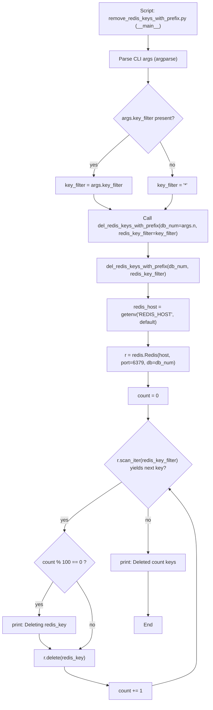

# Diagram: research/orchestrator/scripts/remove_redis_keys_with_prefix.py

> Auto-generated by Obscura crawlers

## Mermaid

### SVG

<svg id="container" width="669.296875" xmlns="http://www.w3.org/2000/svg" class="flowchart" height="2209.671875" viewBox="0 0 669.296875 2209.671875" role="graphics-document document" aria-roledescription="flowchart-v2"><g><marker id="container_flowchart-v2-pointEnd" class="marker flowchart-v2" viewBox="0 0 10 10" refX="5" refY="5" markerUnits="userSpaceOnUse" markerWidth="8" markerHeight="8" orient="auto"><path d="M 0 0 L 10 5 L 0 10 z" class="arrowMarkerPath" style="stroke-width: 1; stroke-dasharray: 1, 0;"></path></marker><marker id="container_flowchart-v2-pointStart" class="marker flowchart-v2" viewBox="0 0 10 10" refX="4.5" refY="5" markerUnits="userSpaceOnUse" markerWidth="8" markerHeight="8" orient="auto"><path d="M 0 5 L 10 10 L 10 0 z" class="arrowMarkerPath" style="stroke-width: 1; stroke-dasharray: 1, 0;"></path></marker><marker id="container_flowchart-v2-circleEnd" class="marker flowchart-v2" viewBox="0 0 10 10" refX="11" refY="5" markerUnits="userSpaceOnUse" markerWidth="11" markerHeight="11" orient="auto"><circle cx="5" cy="5" r="5" class="arrowMarkerPath" style="stroke-width: 1; stroke-dasharray: 1, 0;"></circle></marker><marker id="container_flowchart-v2-circleStart" class="marker flowchart-v2" viewBox="0 0 10 10" refX="-1" refY="5" markerUnits="userSpaceOnUse" markerWidth="11" markerHeight="11" orient="auto"><circle cx="5" cy="5" r="5" class="arrowMarkerPath" style="stroke-width: 1; stroke-dasharray: 1, 0;"></circle></marker><marker id="container_flowchart-v2-crossEnd" class="marker cross flowchart-v2" viewBox="0 0 11 11" refX="12" refY="5.2" markerUnits="userSpaceOnUse" markerWidth="11" markerHeight="11" orient="auto"><path d="M 1,1 l 9,9 M 10,1 l -9,9" class="arrowMarkerPath" style="stroke-width: 2; stroke-dasharray: 1, 0;"></path></marker><marker id="container_flowchart-v2-crossStart" class="marker cross flowchart-v2" viewBox="0 0 11 11" refX="-1" refY="5.2" markerUnits="userSpaceOnUse" markerWidth="11" markerHeight="11" orient="auto"><path d="M 1,1 l 9,9 M 10,1 l -9,9" class="arrowMarkerPath" style="stroke-width: 2; stroke-dasharray: 1, 0;"></path></marker><g class="root"><g class="clusters"></g><g class="edgePaths"><path d="M471.555,110L471.555,114.167C471.555,118.333,471.555,126.667,471.555,134.333C471.555,142,471.555,149,471.555,152.5L471.555,156" id="L_Start_ParseArgs_0" class="edge-thickness-normal edge-pattern-solid edge-thickness-normal edge-pattern-solid flowchart-link" style=";" data-edge="true" data-et="edge" data-id="L_Start_ParseArgs_0" data-points="W3sieCI6NDcxLjU1NDY4NzUsInkiOjExMH0seyJ4Ijo0NzEuNTU0Njg3NSwieSI6MTM1fSx7IngiOjQ3MS41NTQ2ODc1LCJ5IjoxNjB9XQ==" marker-end="url(#container_flowchart-v2-pointEnd)"></path><path d="M471.555,214L471.555,218.167C471.555,222.333,471.555,230.667,471.555,238.333C471.555,246,471.555,253,471.555,256.5L471.555,260" id="L_ParseArgs_CheckKF_0" class="edge-thickness-normal edge-pattern-solid edge-thickness-normal edge-pattern-solid flowchart-link" style=";" data-edge="true" data-et="edge" data-id="L_ParseArgs_CheckKF_0" data-points="W3sieCI6NDcxLjU1NDY4NzUsInkiOjIxNH0seyJ4Ijo0NzEuNTU0Njg3NSwieSI6MjM5fSx7IngiOjQ3MS41NTQ2ODc1LCJ5IjoyNjR9XQ==" marker-end="url(#container_flowchart-v2-pointEnd)"></path><path d="M411.987,425.385L393.154,441.48C374.322,457.574,336.657,489.764,317.825,511.358C298.992,532.953,298.992,543.953,298.992,549.453L298.992,554.953" id="L_CheckKF_SetFromArgs_0" class="edge-thickness-normal edge-pattern-solid edge-thickness-normal edge-pattern-solid flowchart-link" style=";" data-edge="true" data-et="edge" data-id="L_CheckKF_SetFromArgs_0" data-points="W3sieCI6NDExLjk4NjYwOTU2NzYxODcsInkiOjQyNS4zODUwNDcwNjc2MTg3fSx7IngiOjI5OC45OTIxODc1LCJ5Ijo1MjEuOTUzMTI1fSx7IngiOjI5OC45OTIxODc1LCJ5Ijo1NTguOTUzMTI1fV0=" marker-end="url(#container_flowchart-v2-pointEnd)"></path><path d="M509.71,446.798L516.318,459.324C522.926,471.85,536.143,496.901,542.751,514.927C549.359,532.953,549.359,543.953,549.359,549.453L549.359,554.953" id="L_CheckKF_SetDefault_0" class="edge-thickness-normal edge-pattern-solid edge-thickness-normal edge-pattern-solid flowchart-link" style=";" data-edge="true" data-et="edge" data-id="L_CheckKF_SetDefault_0" data-points="W3sieCI6NTA5LjcwOTYzNTY4NzU5NTQsInkiOjQ0Ni43OTgxNzY4MTI0MDQ2fSx7IngiOjU0OS4zNTkzNzUsInkiOjUyMS45NTMxMjV9LHsieCI6NTQ5LjM1OTM3NSwieSI6NTU4Ljk1MzEyNX1d" marker-end="url(#container_flowchart-v2-pointEnd)"></path><path d="M298.992,612.953L298.992,617.12C298.992,621.286,298.992,629.62,307.843,637.684C316.693,645.749,334.394,653.545,343.245,657.443L352.095,661.341" id="L_SetFromArgs_CallDel_0" class="edge-thickness-normal edge-pattern-solid edge-thickness-normal edge-pattern-solid flowchart-link" style=";" data-edge="true" data-et="edge" data-id="L_SetFromArgs_CallDel_0" data-points="W3sieCI6Mjk4Ljk5MjE4NzUsInkiOjYxMi45NTMxMjV9LHsieCI6Mjk4Ljk5MjE4NzUsInkiOjYzNy45NTMxMjV9LHsieCI6MzU1Ljc1NjE2Nzc2MzE1NzksInkiOjY2Mi45NTMxMjV9XQ==" marker-end="url(#container_flowchart-v2-pointEnd)"></path><path d="M549.359,612.953L549.359,617.12C549.359,621.286,549.359,629.62,545.571,637.487C541.782,645.355,534.205,652.756,530.416,656.457L526.627,660.158" id="L_SetDefault_CallDel_0" class="edge-thickness-normal edge-pattern-solid edge-thickness-normal edge-pattern-solid flowchart-link" style=";" data-edge="true" data-et="edge" data-id="L_SetDefault_CallDel_0" data-points="W3sieCI6NTQ5LjM1OTM3NSwieSI6NjEyLjk1MzEyNX0seyJ4Ijo1NDkuMzU5Mzc1LCJ5Ijo2MzcuOTUzMTI1fSx7IngiOjUyMy43NjU3Mjc3OTYwNTI2LCJ5Ijo2NjIuOTUzMTI1fV0=" marker-end="url(#container_flowchart-v2-pointEnd)"></path><path d="M471.555,764.953L471.555,769.12C471.555,773.286,471.555,781.62,471.555,789.286C471.555,796.953,471.555,803.953,471.555,807.453L471.555,810.953" id="L_CallDel_FuncStart_0" class="edge-thickness-normal edge-pattern-solid edge-thickness-normal edge-pattern-solid flowchart-link" style=";" data-edge="true" data-et="edge" data-id="L_CallDel_FuncStart_0" data-points="W3sieCI6NDcxLjU1NDY4NzUsInkiOjc2NC45NTMxMjV9LHsieCI6NDcxLjU1NDY4NzUsInkiOjc4OS45NTMxMjV9LHsieCI6NDcxLjU1NDY4NzUsInkiOjgxNC45NTMxMjV9XQ==" marker-end="url(#container_flowchart-v2-pointEnd)"></path><path d="M471.555,892.953L471.555,897.12C471.555,901.286,471.555,909.62,471.555,917.286C471.555,924.953,471.555,931.953,471.555,935.453L471.555,938.953" id="L_FuncStart_GetHost_0" class="edge-thickness-normal edge-pattern-solid edge-thickness-normal edge-pattern-solid flowchart-link" style=";" data-edge="true" data-et="edge" data-id="L_FuncStart_GetHost_0" data-points="W3sieCI6NDcxLjU1NDY4NzUsInkiOjg5Mi45NTMxMjV9LHsieCI6NDcxLjU1NDY4NzUsInkiOjkxNy45NTMxMjV9LHsieCI6NDcxLjU1NDY4NzUsInkiOjk0Mi45NTMxMjV9XQ==" marker-end="url(#container_flowchart-v2-pointEnd)"></path><path d="M471.555,1044.953L471.555,1049.12C471.555,1053.286,471.555,1061.62,471.555,1069.286C471.555,1076.953,471.555,1083.953,471.555,1087.453L471.555,1090.953" id="L_GetHost_Connect_0" class="edge-thickness-normal edge-pattern-solid edge-thickness-normal edge-pattern-solid flowchart-link" style=";" data-edge="true" data-et="edge" data-id="L_GetHost_Connect_0" data-points="W3sieCI6NDcxLjU1NDY4NzUsInkiOjEwNDQuOTUzMTI1fSx7IngiOjQ3MS41NTQ2ODc1LCJ5IjoxMDY5Ljk1MzEyNX0seyJ4Ijo0NzEuNTU0Njg3NSwieSI6MTA5NC45NTMxMjV9XQ==" marker-end="url(#container_flowchart-v2-pointEnd)"></path><path d="M471.555,1172.953L471.555,1177.12C471.555,1181.286,471.555,1189.62,471.555,1197.286C471.555,1204.953,471.555,1211.953,471.555,1215.453L471.555,1218.953" id="L_Connect_Count0_0" class="edge-thickness-normal edge-pattern-solid edge-thickness-normal edge-pattern-solid flowchart-link" style=";" data-edge="true" data-et="edge" data-id="L_Connect_Count0_0" data-points="W3sieCI6NDcxLjU1NDY4NzUsInkiOjExNzIuOTUzMTI1fSx7IngiOjQ3MS41NTQ2ODc1LCJ5IjoxMTk3Ljk1MzEyNX0seyJ4Ijo0NzEuNTU0Njg3NSwieSI6MTIyMi45NTMxMjV9XQ==" marker-end="url(#container_flowchart-v2-pointEnd)"></path><path d="M471.555,1276.953L471.555,1281.12C471.555,1285.286,471.555,1293.62,471.555,1301.286C471.555,1308.953,471.555,1315.953,471.555,1319.453L471.555,1322.953" id="L_Count0_HasKey_0" class="edge-thickness-normal edge-pattern-solid edge-thickness-normal edge-pattern-solid flowchart-link" style=";" data-edge="true" data-et="edge" data-id="L_Count0_HasKey_0" data-points="W3sieCI6NDcxLjU1NDY4NzUsInkiOjEyNzYuOTUzMTI1fSx7IngiOjQ3MS41NTQ2ODc1LCJ5IjoxMzAxLjk1MzEyNX0seyJ4Ijo0NzEuNTU0Njg3NSwieSI6MTMyNi45NTMxMjV9XQ==" marker-end="url(#container_flowchart-v2-pointEnd)"></path><path d="M388.143,1521.651L358.059,1541.72C327.976,1561.788,267.808,1601.925,237.724,1627.494C207.641,1653.063,207.641,1664.063,207.641,1669.563L207.641,1675.063" id="L_HasKey_CheckPrint_0" class="edge-thickness-normal edge-pattern-solid edge-thickness-normal edge-pattern-solid flowchart-link" style=";" data-edge="true" data-et="edge" data-id="L_HasKey_CheckPrint_0" data-points="W3sieCI6Mzg4LjE0MzExMDAwMDkzMjI3LCJ5IjoxNTIxLjY1MDkyMjUwMDkzMjJ9LHsieCI6MjA3LjY0MDYyNSwieSI6MTY0Mi4wNjI1fSx7IngiOjIwNy42NDA2MjUsInkiOjE2NzkuMDYyNX1d" marker-end="url(#container_flowchart-v2-pointEnd)"></path><path d="M471.555,1605.063L471.555,1611.229C471.555,1617.396,471.555,1629.729,471.555,1652.447C471.555,1675.164,471.555,1708.266,471.555,1724.816L471.555,1741.367" id="L_HasKey_EndPrint_0" class="edge-thickness-normal edge-pattern-solid edge-thickness-normal edge-pattern-solid flowchart-link" style=";" data-edge="true" data-et="edge" data-id="L_HasKey_EndPrint_0" data-points="W3sieCI6NDcxLjU1NDY4NzUsInkiOjE2MDUuMDYyNX0seyJ4Ijo0NzEuNTU0Njg3NSwieSI6MTY0Mi4wNjI1fSx7IngiOjQ3MS41NTQ2ODc1LCJ5IjoxNzQ1LjM2NzE4NzV9XQ==" marker-end="url(#container_flowchart-v2-pointEnd)"></path><path d="M171.783,1829.814L164.203,1841.957C156.623,1854.1,141.464,1878.386,133.884,1896.029C126.305,1913.672,126.305,1924.672,126.305,1930.172L126.305,1935.672" id="L_CheckPrint_PrintDeleting_0" class="edge-thickness-normal edge-pattern-solid edge-thickness-normal edge-pattern-solid flowchart-link" style=";" data-edge="true" data-et="edge" data-id="L_CheckPrint_PrintDeleting_0" data-points="W3sieCI6MTcxLjc4MjU1NTU0NDAxOTk0LCJ5IjoxODI5LjgxMzgwNTU0NDAyfSx7IngiOjEyNi4zMDQ2ODc1LCJ5IjoxOTAyLjY3MTg3NX0seyJ4IjoxMjYuMzA0Njg3NSwieSI6MTkzOS42NzE4NzV9XQ==" marker-end="url(#container_flowchart-v2-pointEnd)"></path><path d="M245.235,1828.077L253.625,1840.51C262.015,1852.942,278.795,1877.807,287.184,1900.906C295.574,1924.005,295.574,1945.339,295.574,1964.672C295.574,1984.005,295.574,2001.339,289.102,2013.833C282.63,2026.327,269.686,2033.981,263.214,2037.808L256.741,2041.636" id="L_CheckPrint_DeleteKey_0" class="edge-thickness-normal edge-pattern-solid edge-thickness-normal edge-pattern-solid flowchart-link" style=";" data-edge="true" data-et="edge" data-id="L_CheckPrint_DeleteKey_0" data-points="W3sieCI6MjQ1LjIzNTM4ODExMjE0NjI3LCJ5IjoxODI4LjA3NzExMTg4Nzg1Mzh9LHsieCI6Mjk1LjU3NDIxODc1LCJ5IjoxOTAyLjY3MTg3NX0seyJ4IjoyOTUuNTc0MjE4NzUsInkiOjE5NjYuNjcxODc1fSx7IngiOjI5NS41NzQyMTg3NSwieSI6MjAxOC42NzE4NzV9LHsieCI6MjUzLjI5ODQ1MjUyNDAzODQ1LCJ5IjoyMDQzLjY3MTg3NX1d" marker-end="url(#container_flowchart-v2-pointEnd)"></path><path d="M126.305,1993.672L126.305,1997.839C126.305,2002.005,126.305,2010.339,132.26,2018.313C138.216,2026.287,150.127,2033.902,156.083,2037.71L162.038,2041.517" id="L_PrintDeleting_DeleteKey_0" class="edge-thickness-normal edge-pattern-solid edge-thickness-normal edge-pattern-solid flowchart-link" style=";" data-edge="true" data-et="edge" data-id="L_PrintDeleting_DeleteKey_0" data-points="W3sieCI6MTI2LjMwNDY4NzUsInkiOjE5OTMuNjcxODc1fSx7IngiOjEyNi4zMDQ2ODc1LCJ5IjoyMDE4LjY3MTg3NX0seyJ4IjoxNjUuNDA4NTAzNjA1NzY5MjMsInkiOjIwNDMuNjcxODc1fV0=" marker-end="url(#container_flowchart-v2-pointEnd)"></path><path d="M207.641,2097.672L207.641,2101.839C207.641,2106.005,207.641,2114.339,230.91,2124.274C254.178,2134.209,300.716,2145.745,323.985,2151.514L347.254,2157.282" id="L_DeleteKey_IncCount_0" class="edge-thickness-normal edge-pattern-solid edge-thickness-normal edge-pattern-solid flowchart-link" style=";" data-edge="true" data-et="edge" data-id="L_DeleteKey_IncCount_0" data-points="W3sieCI6MjA3LjY0MDYyNSwieSI6MjA5Ny42NzE4NzV9LHsieCI6MjA3LjY0MDYyNSwieSI6MjEyMi42NzE4NzV9LHsieCI6MzUxLjEzNjcxODc1LCJ5IjoyMTU4LjI0NDYwNDQ3MzU0N31d" marker-end="url(#container_flowchart-v2-pointEnd)"></path><path d="M483.668,2158.245L507.584,2152.316C531.5,2146.387,579.332,2134.529,603.248,2119.934C627.164,2105.339,627.164,2088.005,627.164,2070.672C627.164,2053.339,627.164,2036.005,627.164,2018.672C627.164,2001.339,627.164,1984.005,627.164,1964.672C627.164,1945.339,627.164,1924.005,627.164,1891.621C627.164,1859.237,627.164,1815.802,627.164,1772.367C627.164,1728.932,627.164,1685.497,612.544,1647.239C597.924,1608.981,568.685,1575.9,554.065,1559.359L539.445,1542.818" id="L_IncCount_HasKey_0" class="edge-thickness-normal edge-pattern-solid edge-thickness-normal edge-pattern-solid flowchart-link" style=";" data-edge="true" data-et="edge" data-id="L_IncCount_HasKey_0" data-points="W3sieCI6NDgzLjY2Nzk2ODc1LCJ5IjoyMTU4LjI0NDYwNDQ3MzU0N30seyJ4Ijo2MjcuMTY0MDYyNSwieSI6MjEyMi42NzE4NzV9LHsieCI6NjI3LjE2NDA2MjUsInkiOjIwNzAuNjcxODc1fSx7IngiOjYyNy4xNjQwNjI1LCJ5IjoyMDE4LjY3MTg3NX0seyJ4Ijo2MjcuMTY0MDYyNSwieSI6MTk2Ni42NzE4NzV9LHsieCI6NjI3LjE2NDA2MjUsInkiOjE5MDIuNjcxODc1fSx7IngiOjYyNy4xNjQwNjI1LCJ5IjoxNzcyLjM2NzE4NzV9LHsieCI6NjI3LjE2NDA2MjUsInkiOjE2NDIuMDYyNX0seyJ4Ijo1MzYuNzk2MDQzMDEzNzQ0NiwieSI6MTUzOS44MjExNDQ0ODYyNTU0fV0=" marker-end="url(#container_flowchart-v2-pointEnd)"></path><path d="M471.555,1799.367L471.555,1816.585C471.555,1833.802,471.555,1868.237,471.555,1890.954C471.555,1913.672,471.555,1924.672,471.555,1930.172L471.555,1935.672" id="L_EndPrint_End_0" class="edge-thickness-normal edge-pattern-solid edge-thickness-normal edge-pattern-solid flowchart-link" style=";" data-edge="true" data-et="edge" data-id="L_EndPrint_End_0" data-points="W3sieCI6NDcxLjU1NDY4NzUsInkiOjE3OTkuMzY3MTg3NX0seyJ4Ijo0NzEuNTU0Njg3NSwieSI6MTkwMi42NzE4NzV9LHsieCI6NDcxLjU1NDY4NzUsInkiOjE5MzkuNjcxODc1fV0=" marker-end="url(#container_flowchart-v2-pointEnd)"></path></g><g class="edgeLabels"><g class="edgeLabel"><g class="label" data-id="L_Start_ParseArgs_0" transform="translate(0, 0)"><foreignObject width="0" height="0">

</foreignObject></g></g><g class="edgeLabel"><g class="label" data-id="L_ParseArgs_CheckKF_0" transform="translate(0, 0)"><foreignObject width="0" height="0">

</foreignObject></g></g><g class="edgeLabel" transform="translate(298.9921875, 521.953125)"><g class="label" data-id="L_CheckKF_SetFromArgs_0" transform="translate(-12.0078125, -12)"><foreignObject width="24.015625" height="24">

yes

</foreignObject></g></g><g class="edgeLabel" transform="translate(549.359375, 521.953125)"><g class="label" data-id="L_CheckKF_SetDefault_0" transform="translate(-9.3671875, -12)"><foreignObject width="18.734375" height="24">

no

</foreignObject></g></g><g class="edgeLabel"><g class="label" data-id="L_SetFromArgs_CallDel_0" transform="translate(0, 0)"><foreignObject width="0" height="0">

</foreignObject></g></g><g class="edgeLabel"><g class="label" data-id="L_SetDefault_CallDel_0" transform="translate(0, 0)"><foreignObject width="0" height="0">

</foreignObject></g></g><g class="edgeLabel"><g class="label" data-id="L_CallDel_FuncStart_0" transform="translate(0, 0)"><foreignObject width="0" height="0">

</foreignObject></g></g><g class="edgeLabel"><g class="label" data-id="L_FuncStart_GetHost_0" transform="translate(0, 0)"><foreignObject width="0" height="0">

</foreignObject></g></g><g class="edgeLabel"><g class="label" data-id="L_GetHost_Connect_0" transform="translate(0, 0)"><foreignObject width="0" height="0">

</foreignObject></g></g><g class="edgeLabel"><g class="label" data-id="L_Connect_Count0_0" transform="translate(0, 0)"><foreignObject width="0" height="0">

</foreignObject></g></g><g class="edgeLabel"><g class="label" data-id="L_Count0_HasKey_0" transform="translate(0, 0)"><foreignObject width="0" height="0">

</foreignObject></g></g><g class="edgeLabel" transform="translate(207.640625, 1642.0625)"><g class="label" data-id="L_HasKey_CheckPrint_0" transform="translate(-12.0078125, -12)"><foreignObject width="24.015625" height="24">

yes

</foreignObject></g></g><g class="edgeLabel" transform="translate(471.5546875, 1642.0625)"><g class="label" data-id="L_HasKey_EndPrint_0" transform="translate(-9.3671875, -12)"><foreignObject width="18.734375" height="24">

no

</foreignObject></g></g><g class="edgeLabel" transform="translate(126.3046875, 1902.671875)"><g class="label" data-id="L_CheckPrint_PrintDeleting_0" transform="translate(-12.0078125, -12)"><foreignObject width="24.015625" height="24">

yes

</foreignObject></g></g><g class="edgeLabel" transform="translate(295.57421875, 1966.671875)"><g class="label" data-id="L_CheckPrint_DeleteKey_0" transform="translate(-9.3671875, -12)"><foreignObject width="18.734375" height="24">

no

</foreignObject></g></g><g class="edgeLabel"><g class="label" data-id="L_PrintDeleting_DeleteKey_0" transform="translate(0, 0)"><foreignObject width="0" height="0">

</foreignObject></g></g><g class="edgeLabel"><g class="label" data-id="L_DeleteKey_IncCount_0" transform="translate(0, 0)"><foreignObject width="0" height="0">

</foreignObject></g></g><g class="edgeLabel"><g class="label" data-id="L_IncCount_HasKey_0" transform="translate(0, 0)"><foreignObject width="0" height="0">

</foreignObject></g></g><g class="edgeLabel"><g class="label" data-id="L_EndPrint_End_0" transform="translate(0, 0)"><foreignObject width="0" height="0">

</foreignObject></g></g></g><g class="nodes"><g class="node default" id="flowchart-Start-0" transform="translate(471.5546875, 59)"><rect class="basic label-container" style="" x="-155.65625" y="-51" width="311.3125" height="102"></rect><g class="label" style="" transform="translate(-125.65625, -36)"><rect></rect><foreignObject width="251.3125" height="72">

Script: remove_redis_keys_with_prefix.py (<strong>main</strong>)

</foreignObject></g></g><g class="node default" id="flowchart-ParseArgs-1" transform="translate(471.5546875, 187)"><rect class="basic label-container" style="" x="-118.7265625" y="-27" width="237.453125" height="54"></rect><g class="label" style="" transform="translate(-88.7265625, -12)"><rect></rect><foreignObject width="177.453125" height="24">

Parse CLI args (argparse)

</foreignObject></g></g><g class="node default" id="flowchart-CheckKF-2" transform="translate(471.5546875, 374.4765625)"><polygon points="110.4765625,0 220.953125,-110.4765625 110.4765625,-220.953125 0,-110.4765625" class="label-container" transform="translate(-109.9765625, 110.4765625)"></polygon><g class="label" style="" transform="translate(-83.4765625, -12)"><rect></rect><foreignObject width="166.953125" height="24">

args.key_filter present?

</foreignObject></g></g><g class="node default" id="flowchart-SetDefault-3" transform="translate(549.359375, 585.953125)"><rect class="basic label-container" style="" x="-78.625" y="-27" width="157.25" height="54"></rect><g class="label" style="" transform="translate(-48.625, -12)"><rect></rect><foreignObject width="97.25" height="24">

key_filter = '*'

</foreignObject></g></g><g class="node default" id="flowchart-SetFromArgs-4" transform="translate(298.9921875, 585.953125)"><rect class="basic label-container" style="" x="-121.7421875" y="-27" width="243.484375" height="54"></rect><g class="label" style="" transform="translate(-91.7421875, -12)"><rect></rect><foreignObject width="183.484375" height="24">

key_filter = args.key_filter

</foreignObject></g></g><g class="node default" id="flowchart-CallDel-5" transform="translate(471.5546875, 713.953125)"><rect class="basic label-container" style="" x="-189.7421875" y="-51" width="379.484375" height="102"></rect><g class="label" style="" transform="translate(-159.7421875, -36)"><rect></rect><foreignObject width="319.484375" height="72">

Call del_redis_keys_with_prefix(db_num=args.n, redis_key_filter=key_filter)

</foreignObject></g></g><g class="node default" id="flowchart-FuncStart-6" transform="translate(471.5546875, 853.953125)"><rect class="basic label-container" style="" x="-163.9765625" y="-39" width="327.953125" height="78"></rect><g class="label" style="" transform="translate(-133.9765625, -24)"><rect></rect><foreignObject width="267.953125" height="48">

del_redis_keys_with_prefix(db_num, redis_key_filter)

</foreignObject></g></g><g class="node default" id="flowchart-GetHost-7" transform="translate(471.5546875, 993.953125)"><rect class="basic label-container" style="" x="-130" y="-51" width="260" height="102"></rect><g class="label" style="" transform="translate(-100, -36)"><rect></rect><foreignObject width="200" height="72">

redis_host = getenv('REDIS_HOST', default)

</foreignObject></g></g><g class="node default" id="flowchart-Connect-8" transform="translate(471.5546875, 1133.953125)"><rect class="basic label-container" style="" x="-130" y="-39" width="260" height="78"></rect><g class="label" style="" transform="translate(-100, -24)"><rect></rect><foreignObject width="200" height="48">

r = redis.Redis(host, port=6379, db=db_num)

</foreignObject></g></g><g class="node default" id="flowchart-Count0-9" transform="translate(471.5546875, 1249.953125)"><rect class="basic label-container" style="" x="-63.2734375" y="-27" width="126.546875" height="54"></rect><g class="label" style="" transform="translate(-33.2734375, -12)"><rect></rect><foreignObject width="66.546875" height="24">

count = 0

</foreignObject></g></g><g class="node default" id="flowchart-HasKey-10" transform="translate(471.5546875, 1466.0078125)"><polygon points="139.0546875,0 278.109375,-139.0546875 139.0546875,-278.109375 0,-139.0546875" class="label-container" transform="translate(-138.5546875, 139.0546875)"></polygon><g class="label" style="" transform="translate(-100.0546875, -24)"><rect></rect><foreignObject width="200.109375" height="48">

r.scan_iter(redis_key_filter) yields next key?

</foreignObject></g></g><g class="node default" id="flowchart-CheckPrint-11" transform="translate(207.640625, 1772.3671875)"><polygon points="93.3046875,0 186.609375,-93.3046875 93.3046875,-186.609375 0,-93.3046875" class="label-container" transform="translate(-92.8046875, 93.3046875)"></polygon><g class="label" style="" transform="translate(-66.3046875, -12)"><rect></rect><foreignObject width="132.609375" height="24">

count % 100 == 0 ?

</foreignObject></g></g><g class="node default" id="flowchart-PrintDeleting-12" transform="translate(126.3046875, 1966.671875)"><rect class="basic label-container" style="" x="-118.3046875" y="-27" width="236.609375" height="54"></rect><g class="label" style="" transform="translate(-88.3046875, -12)"><rect></rect><foreignObject width="176.609375" height="24">

print: Deleting redis_key

</foreignObject></g></g><g class="node default" id="flowchart-DeleteKey-13" transform="translate(207.640625, 2070.671875)"><rect class="basic label-container" style="" x="-96.6875" y="-27" width="193.375" height="54"></rect><g class="label" style="" transform="translate(-66.6875, -12)"><rect></rect><foreignObject width="133.375" height="24">

r.delete(redis_key)

</foreignObject></g></g><g class="node default" id="flowchart-IncCount-14" transform="translate(417.40234375, 2174.671875)"><rect class="basic label-container" style="" x="-66.265625" y="-27" width="132.53125" height="54"></rect><g class="label" style="" transform="translate(-36.265625, -12)"><rect></rect><foreignObject width="72.53125" height="24">

count += 1

</foreignObject></g></g><g class="node default" id="flowchart-EndPrint-15" transform="translate(471.5546875, 1772.3671875)"><rect class="basic label-container" style="" x="-120.609375" y="-27" width="241.21875" height="54"></rect><g class="label" style="" transform="translate(-90.609375, -12)"><rect></rect><foreignObject width="181.21875" height="24">

print: Deleted count keys

</foreignObject></g></g><g class="node default" id="flowchart-End-16" transform="translate(471.5546875, 1966.671875)"><rect class="basic label-container" style="" x="-43.6796875" y="-27" width="87.359375" height="54"></rect><g class="label" style="" transform="translate(-13.6796875, -12)"><rect></rect><foreignObject width="27.359375" height="24">

End

</foreignObject></g></g></g></g></g></svg>
