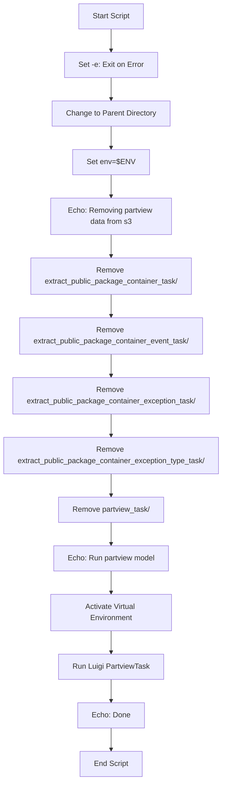

# Diagram: research/orchestrator/scripts/rerun_partview.sh

> Auto-generated by Obscura crawlers

## Mermaid

### SVG

<svg id="container" width="486.65625" xmlns="http://www.w3.org/2000/svg" class="flowchart" height="1670" viewBox="0 0 486.65625 1670" role="graphics-document document" aria-roledescription="flowchart-v2"><g><marker id="container_flowchart-v2-pointEnd" class="marker flowchart-v2" viewBox="0 0 10 10" refX="5" refY="5" markerUnits="userSpaceOnUse" markerWidth="8" markerHeight="8" orient="auto"><path d="M 0 0 L 10 5 L 0 10 z" class="arrowMarkerPath" style="stroke-width: 1; stroke-dasharray: 1, 0;"></path></marker><marker id="container_flowchart-v2-pointStart" class="marker flowchart-v2" viewBox="0 0 10 10" refX="4.5" refY="5" markerUnits="userSpaceOnUse" markerWidth="8" markerHeight="8" orient="auto"><path d="M 0 5 L 10 10 L 10 0 z" class="arrowMarkerPath" style="stroke-width: 1; stroke-dasharray: 1, 0;"></path></marker><marker id="container_flowchart-v2-circleEnd" class="marker flowchart-v2" viewBox="0 0 10 10" refX="11" refY="5" markerUnits="userSpaceOnUse" markerWidth="11" markerHeight="11" orient="auto"><circle cx="5" cy="5" r="5" class="arrowMarkerPath" style="stroke-width: 1; stroke-dasharray: 1, 0;"></circle></marker><marker id="container_flowchart-v2-circleStart" class="marker flowchart-v2" viewBox="0 0 10 10" refX="-1" refY="5" markerUnits="userSpaceOnUse" markerWidth="11" markerHeight="11" orient="auto"><circle cx="5" cy="5" r="5" class="arrowMarkerPath" style="stroke-width: 1; stroke-dasharray: 1, 0;"></circle></marker><marker id="container_flowchart-v2-crossEnd" class="marker cross flowchart-v2" viewBox="0 0 11 11" refX="12" refY="5.2" markerUnits="userSpaceOnUse" markerWidth="11" markerHeight="11" orient="auto"><path d="M 1,1 l 9,9 M 10,1 l -9,9" class="arrowMarkerPath" style="stroke-width: 2; stroke-dasharray: 1, 0;"></path></marker><marker id="container_flowchart-v2-crossStart" class="marker cross flowchart-v2" viewBox="0 0 11 11" refX="-1" refY="5.2" markerUnits="userSpaceOnUse" markerWidth="11" markerHeight="11" orient="auto"><path d="M 1,1 l 9,9 M 10,1 l -9,9" class="arrowMarkerPath" style="stroke-width: 2; stroke-dasharray: 1, 0;"></path></marker><g class="root"><g class="clusters"></g><g class="edgePaths"><path d="M243.328,62L243.328,66.167C243.328,70.333,243.328,78.667,243.328,86.333C243.328,94,243.328,101,243.328,104.5L243.328,108" id="L_A_B_0" class="edge-thickness-normal edge-pattern-solid edge-thickness-normal edge-pattern-solid flowchart-link" style=";" data-edge="true" data-et="edge" data-id="L_A_B_0" data-points="W3sieCI6MjQzLjMyODEyNSwieSI6NjJ9LHsieCI6MjQzLjMyODEyNSwieSI6ODd9LHsieCI6MjQzLjMyODEyNSwieSI6MTEyfV0=" marker-end="url(#container_flowchart-v2-pointEnd)"></path><path d="M243.328,166L243.328,170.167C243.328,174.333,243.328,182.667,243.328,190.333C243.328,198,243.328,205,243.328,208.5L243.328,212" id="L_B_C_0" class="edge-thickness-normal edge-pattern-solid edge-thickness-normal edge-pattern-solid flowchart-link" style=";" data-edge="true" data-et="edge" data-id="L_B_C_0" data-points="W3sieCI6MjQzLjMyODEyNSwieSI6MTY2fSx7IngiOjI0My4zMjgxMjUsInkiOjE5MX0seyJ4IjoyNDMuMzI4MTI1LCJ5IjoyMTZ9XQ==" marker-end="url(#container_flowchart-v2-pointEnd)"></path><path d="M243.328,270L243.328,274.167C243.328,278.333,243.328,286.667,243.328,294.333C243.328,302,243.328,309,243.328,312.5L243.328,316" id="L_C_D_0" class="edge-thickness-normal edge-pattern-solid edge-thickness-normal edge-pattern-solid flowchart-link" style=";" data-edge="true" data-et="edge" data-id="L_C_D_0" data-points="W3sieCI6MjQzLjMyODEyNSwieSI6MjcwfSx7IngiOjI0My4zMjgxMjUsInkiOjI5NX0seyJ4IjoyNDMuMzI4MTI1LCJ5IjozMjB9XQ==" marker-end="url(#container_flowchart-v2-pointEnd)"></path><path d="M243.328,374L243.328,378.167C243.328,382.333,243.328,390.667,243.328,398.333C243.328,406,243.328,413,243.328,416.5L243.328,420" id="L_D_E_0" class="edge-thickness-normal edge-pattern-solid edge-thickness-normal edge-pattern-solid flowchart-link" style=";" data-edge="true" data-et="edge" data-id="L_D_E_0" data-points="W3sieCI6MjQzLjMyODEyNSwieSI6Mzc0fSx7IngiOjI0My4zMjgxMjUsInkiOjM5OX0seyJ4IjoyNDMuMzI4MTI1LCJ5Ijo0MjR9XQ==" marker-end="url(#container_flowchart-v2-pointEnd)"></path><path d="M243.328,502L243.328,506.167C243.328,510.333,243.328,518.667,243.328,526.333C243.328,534,243.328,541,243.328,544.5L243.328,548" id="L_E_F_0" class="edge-thickness-normal edge-pattern-solid edge-thickness-normal edge-pattern-solid flowchart-link" style=";" data-edge="true" data-et="edge" data-id="L_E_F_0" data-points="W3sieCI6MjQzLjMyODEyNSwieSI6NTAyfSx7IngiOjI0My4zMjgxMjUsInkiOjUyN30seyJ4IjoyNDMuMzI4MTI1LCJ5Ijo1NTJ9XQ==" marker-end="url(#container_flowchart-v2-pointEnd)"></path><path d="M243.328,630L243.328,634.167C243.328,638.333,243.328,646.667,243.328,654.333C243.328,662,243.328,669,243.328,672.5L243.328,676" id="L_F_G_0" class="edge-thickness-normal edge-pattern-solid edge-thickness-normal edge-pattern-solid flowchart-link" style=";" data-edge="true" data-et="edge" data-id="L_F_G_0" data-points="W3sieCI6MjQzLjMyODEyNSwieSI6NjMwfSx7IngiOjI0My4zMjgxMjUsInkiOjY1NX0seyJ4IjoyNDMuMzI4MTI1LCJ5Ijo2ODB9XQ==" marker-end="url(#container_flowchart-v2-pointEnd)"></path><path d="M243.328,758L243.328,762.167C243.328,766.333,243.328,774.667,243.328,782.333C243.328,790,243.328,797,243.328,800.5L243.328,804" id="L_G_H_0" class="edge-thickness-normal edge-pattern-solid edge-thickness-normal edge-pattern-solid flowchart-link" style=";" data-edge="true" data-et="edge" data-id="L_G_H_0" data-points="W3sieCI6MjQzLjMyODEyNSwieSI6NzU4fSx7IngiOjI0My4zMjgxMjUsInkiOjc4M30seyJ4IjoyNDMuMzI4MTI1LCJ5Ijo4MDh9XQ==" marker-end="url(#container_flowchart-v2-pointEnd)"></path><path d="M243.328,886L243.328,890.167C243.328,894.333,243.328,902.667,243.328,910.333C243.328,918,243.328,925,243.328,928.5L243.328,932" id="L_H_I_0" class="edge-thickness-normal edge-pattern-solid edge-thickness-normal edge-pattern-solid flowchart-link" style=";" data-edge="true" data-et="edge" data-id="L_H_I_0" data-points="W3sieCI6MjQzLjMyODEyNSwieSI6ODg2fSx7IngiOjI0My4zMjgxMjUsInkiOjkxMX0seyJ4IjoyNDMuMzI4MTI1LCJ5Ijo5MzZ9XQ==" marker-end="url(#container_flowchart-v2-pointEnd)"></path><path d="M243.328,1014L243.328,1018.167C243.328,1022.333,243.328,1030.667,243.328,1038.333C243.328,1046,243.328,1053,243.328,1056.5L243.328,1060" id="L_I_J_0" class="edge-thickness-normal edge-pattern-solid edge-thickness-normal edge-pattern-solid flowchart-link" style=";" data-edge="true" data-et="edge" data-id="L_I_J_0" data-points="W3sieCI6MjQzLjMyODEyNSwieSI6MTAxNH0seyJ4IjoyNDMuMzI4MTI1LCJ5IjoxMDM5fSx7IngiOjI0My4zMjgxMjUsInkiOjEwNjR9XQ==" marker-end="url(#container_flowchart-v2-pointEnd)"></path><path d="M243.328,1118L243.328,1122.167C243.328,1126.333,243.328,1134.667,243.328,1142.333C243.328,1150,243.328,1157,243.328,1160.5L243.328,1164" id="L_J_K_0" class="edge-thickness-normal edge-pattern-solid edge-thickness-normal edge-pattern-solid flowchart-link" style=";" data-edge="true" data-et="edge" data-id="L_J_K_0" data-points="W3sieCI6MjQzLjMyODEyNSwieSI6MTExOH0seyJ4IjoyNDMuMzI4MTI1LCJ5IjoxMTQzfSx7IngiOjI0My4zMjgxMjUsInkiOjExNjh9XQ==" marker-end="url(#container_flowchart-v2-pointEnd)"></path><path d="M243.328,1222L243.328,1226.167C243.328,1230.333,243.328,1238.667,243.328,1246.333C243.328,1254,243.328,1261,243.328,1264.5L243.328,1268" id="L_K_L_0" class="edge-thickness-normal edge-pattern-solid edge-thickness-normal edge-pattern-solid flowchart-link" style=";" data-edge="true" data-et="edge" data-id="L_K_L_0" data-points="W3sieCI6MjQzLjMyODEyNSwieSI6MTIyMn0seyJ4IjoyNDMuMzI4MTI1LCJ5IjoxMjQ3fSx7IngiOjI0My4zMjgxMjUsInkiOjEyNzJ9XQ==" marker-end="url(#container_flowchart-v2-pointEnd)"></path><path d="M243.328,1350L243.328,1354.167C243.328,1358.333,243.328,1366.667,243.328,1374.333C243.328,1382,243.328,1389,243.328,1392.5L243.328,1396" id="L_L_M_0" class="edge-thickness-normal edge-pattern-solid edge-thickness-normal edge-pattern-solid flowchart-link" style=";" data-edge="true" data-et="edge" data-id="L_L_M_0" data-points="W3sieCI6MjQzLjMyODEyNSwieSI6MTM1MH0seyJ4IjoyNDMuMzI4MTI1LCJ5IjoxMzc1fSx7IngiOjI0My4zMjgxMjUsInkiOjE0MDB9XQ==" marker-end="url(#container_flowchart-v2-pointEnd)"></path><path d="M243.328,1454L243.328,1458.167C243.328,1462.333,243.328,1470.667,243.328,1478.333C243.328,1486,243.328,1493,243.328,1496.5L243.328,1500" id="L_M_N_0" class="edge-thickness-normal edge-pattern-solid edge-thickness-normal edge-pattern-solid flowchart-link" style=";" data-edge="true" data-et="edge" data-id="L_M_N_0" data-points="W3sieCI6MjQzLjMyODEyNSwieSI6MTQ1NH0seyJ4IjoyNDMuMzI4MTI1LCJ5IjoxNDc5fSx7IngiOjI0My4zMjgxMjUsInkiOjE1MDR9XQ==" marker-end="url(#container_flowchart-v2-pointEnd)"></path><path d="M243.328,1558L243.328,1562.167C243.328,1566.333,243.328,1574.667,243.328,1582.333C243.328,1590,243.328,1597,243.328,1600.5L243.328,1604" id="L_N_O_0" class="edge-thickness-normal edge-pattern-solid edge-thickness-normal edge-pattern-solid flowchart-link" style=";" data-edge="true" data-et="edge" data-id="L_N_O_0" data-points="W3sieCI6MjQzLjMyODEyNSwieSI6MTU1OH0seyJ4IjoyNDMuMzI4MTI1LCJ5IjoxNTgzfSx7IngiOjI0My4zMjgxMjUsInkiOjE2MDh9XQ==" marker-end="url(#container_flowchart-v2-pointEnd)"></path></g><g class="edgeLabels"><g class="edgeLabel"><g class="label" data-id="L_A_B_0" transform="translate(0, 0)"><foreignObject width="0" height="0">

</foreignObject></g></g><g class="edgeLabel"><g class="label" data-id="L_B_C_0" transform="translate(0, 0)"><foreignObject width="0" height="0">

</foreignObject></g></g><g class="edgeLabel"><g class="label" data-id="L_C_D_0" transform="translate(0, 0)"><foreignObject width="0" height="0">

</foreignObject></g></g><g class="edgeLabel"><g class="label" data-id="L_D_E_0" transform="translate(0, 0)"><foreignObject width="0" height="0">

</foreignObject></g></g><g class="edgeLabel"><g class="label" data-id="L_E_F_0" transform="translate(0, 0)"><foreignObject width="0" height="0">

</foreignObject></g></g><g class="edgeLabel"><g class="label" data-id="L_F_G_0" transform="translate(0, 0)"><foreignObject width="0" height="0">

</foreignObject></g></g><g class="edgeLabel"><g class="label" data-id="L_G_H_0" transform="translate(0, 0)"><foreignObject width="0" height="0">

</foreignObject></g></g><g class="edgeLabel"><g class="label" data-id="L_H_I_0" transform="translate(0, 0)"><foreignObject width="0" height="0">

</foreignObject></g></g><g class="edgeLabel"><g class="label" data-id="L_I_J_0" transform="translate(0, 0)"><foreignObject width="0" height="0">

</foreignObject></g></g><g class="edgeLabel"><g class="label" data-id="L_J_K_0" transform="translate(0, 0)"><foreignObject width="0" height="0">

</foreignObject></g></g><g class="edgeLabel"><g class="label" data-id="L_K_L_0" transform="translate(0, 0)"><foreignObject width="0" height="0">

</foreignObject></g></g><g class="edgeLabel"><g class="label" data-id="L_L_M_0" transform="translate(0, 0)"><foreignObject width="0" height="0">

</foreignObject></g></g><g class="edgeLabel"><g class="label" data-id="L_M_N_0" transform="translate(0, 0)"><foreignObject width="0" height="0">

</foreignObject></g></g><g class="edgeLabel"><g class="label" data-id="L_N_O_0" transform="translate(0, 0)"><foreignObject width="0" height="0">

</foreignObject></g></g></g><g class="nodes"><g class="node default" id="flowchart-A-0" transform="translate(243.328125, 35)"><rect class="basic label-container" style="" x="-70.8125" y="-27" width="141.625" height="54"></rect><g class="label" style="" transform="translate(-40.8125, -12)"><rect></rect><foreignObject width="81.625" height="24">

Start Script

</foreignObject></g></g><g class="node default" id="flowchart-B-1" transform="translate(243.328125, 139)"><rect class="basic label-container" style="" x="-100.15625" y="-27" width="200.3125" height="54"></rect><g class="label" style="" transform="translate(-70.15625, -12)"><rect></rect><foreignObject width="140.3125" height="24">

Set -e: Exit on Error

</foreignObject></g></g><g class="node default" id="flowchart-C-3" transform="translate(243.328125, 243)"><rect class="basic label-container" style="" x="-126.5703125" y="-27" width="253.140625" height="54"></rect><g class="label" style="" transform="translate(-96.5703125, -12)"><rect></rect><foreignObject width="193.140625" height="24">

Change to Parent Directory

</foreignObject></g></g><g class="node default" id="flowchart-D-5" transform="translate(243.328125, 347)"><rect class="basic label-container" style="" x="-79.1015625" y="-27" width="158.203125" height="54"></rect><g class="label" style="" transform="translate(-49.1015625, -12)"><rect></rect><foreignObject width="98.203125" height="24">

Set env=$ENV

</foreignObject></g></g><g class="node default" id="flowchart-E-7" transform="translate(243.328125, 463)"><rect class="basic label-container" style="" x="-130" y="-39" width="260" height="78"></rect><g class="label" style="" transform="translate(-100, -24)"><rect></rect><foreignObject width="200" height="48">

Echo: Removing partview data from s3

</foreignObject></g></g><g class="node default" id="flowchart-F-9" transform="translate(243.328125, 591)"><rect class="basic label-container" style="" x="-176.21875" y="-39" width="352.4375" height="78"></rect><g class="label" style="" transform="translate(-146.21875, -24)"><rect></rect><foreignObject width="292.4375" height="48">

Remove extract_public_package_container_task/

</foreignObject></g></g><g class="node default" id="flowchart-G-11" transform="translate(243.328125, 719)"><rect class="basic label-container" style="" x="-200.390625" y="-39" width="400.78125" height="78"></rect><g class="label" style="" transform="translate(-170.390625, -24)"><rect></rect><foreignObject width="340.78125" height="48">

Remove extract_public_package_container_event_task/

</foreignObject></g></g><g class="node default" id="flowchart-H-13" transform="translate(243.328125, 847)"><rect class="basic label-container" style="" x="-215.59375" y="-39" width="431.1875" height="78"></rect><g class="label" style="" transform="translate(-185.59375, -24)"><rect></rect><foreignObject width="371.1875" height="48">

Remove extract_public_package_container_exception_task/

</foreignObject></g></g><g class="node default" id="flowchart-I-15" transform="translate(243.328125, 975)"><rect class="basic label-container" style="" x="-235.328125" y="-39" width="470.65625" height="78"></rect><g class="label" style="" transform="translate(-205.328125, -24)"><rect></rect><foreignObject width="410.65625" height="48">

Remove extract_public_package_container_exception_type_task/

</foreignObject></g></g><g class="node default" id="flowchart-J-17" transform="translate(243.328125, 1091)"><rect class="basic label-container" style="" x="-115.1484375" y="-27" width="230.296875" height="54"></rect><g class="label" style="" transform="translate(-85.1484375, -12)"><rect></rect><foreignObject width="170.296875" height="24">

Remove partview_task/

</foreignObject></g></g><g class="node default" id="flowchart-K-19" transform="translate(243.328125, 1195)"><rect class="basic label-container" style="" x="-124.0390625" y="-27" width="248.078125" height="54"></rect><g class="label" style="" transform="translate(-94.0390625, -12)"><rect></rect><foreignObject width="188.078125" height="24">

Echo: Run partview model

</foreignObject></g></g><g class="node default" id="flowchart-L-21" transform="translate(243.328125, 1311)"><rect class="basic label-container" style="" x="-130" y="-39" width="260" height="78"></rect><g class="label" style="" transform="translate(-100, -24)"><rect></rect><foreignObject width="200" height="48">

Activate Virtual Environment

</foreignObject></g></g><g class="node default" id="flowchart-M-23" transform="translate(243.328125, 1427)"><rect class="basic label-container" style="" x="-112.2421875" y="-27" width="224.484375" height="54"></rect><g class="label" style="" transform="translate(-82.2421875, -12)"><rect></rect><foreignObject width="164.484375" height="24">

Run Luigi PartviewTask

</foreignObject></g></g><g class="node default" id="flowchart-N-25" transform="translate(243.328125, 1531)"><rect class="basic label-container" style="" x="-70.21875" y="-27" width="140.4375" height="54"></rect><g class="label" style="" transform="translate(-40.21875, -12)"><rect></rect><foreignObject width="80.4375" height="24">

Echo: Done

</foreignObject></g></g><g class="node default" id="flowchart-O-27" transform="translate(243.328125, 1635)"><rect class="basic label-container" style="" x="-66.9609375" y="-27" width="133.921875" height="54"></rect><g class="label" style="" transform="translate(-36.9609375, -12)"><rect></rect><foreignObject width="73.921875" height="24">

End Script

</foreignObject></g></g></g></g></g></svg>
