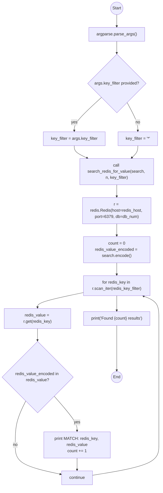
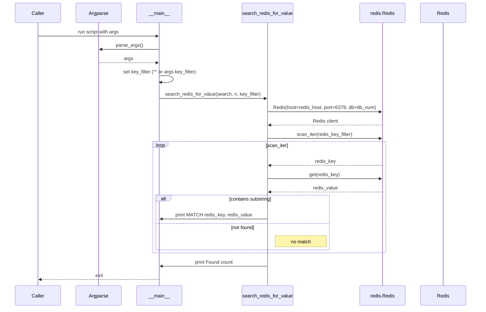
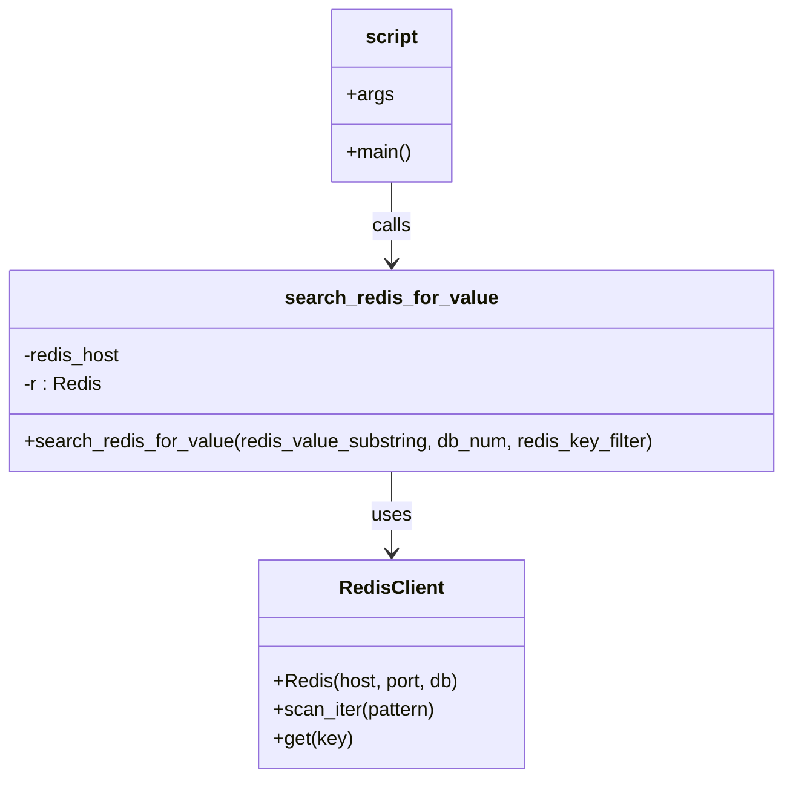

# Diagram: research/orchestrator/scripts/search_redis_values.py

> Auto-generated by Obscura crawlers

## Diagram 1

### SVG

<svg id="container" width="629.5" xmlns="http://www.w3.org/2000/svg" class="flowchart" height="1898.9375" viewBox="0.5 0 629.5 1898.9375" role="graphics-document document" aria-roledescription="flowchart-v2"><g><marker id="container_flowchart-v2-pointEnd" class="marker flowchart-v2" viewBox="0 0 10 10" refX="5" refY="5" markerUnits="userSpaceOnUse" markerWidth="8" markerHeight="8" orient="auto"><path d="M 0 0 L 10 5 L 0 10 z" class="arrowMarkerPath" style="stroke-width: 1; stroke-dasharray: 1, 0;"></path></marker><marker id="container_flowchart-v2-pointStart" class="marker flowchart-v2" viewBox="0 0 10 10" refX="4.5" refY="5" markerUnits="userSpaceOnUse" markerWidth="8" markerHeight="8" orient="auto"><path d="M 0 5 L 10 10 L 10 0 z" class="arrowMarkerPath" style="stroke-width: 1; stroke-dasharray: 1, 0;"></path></marker><marker id="container_flowchart-v2-circleEnd" class="marker flowchart-v2" viewBox="0 0 10 10" refX="11" refY="5" markerUnits="userSpaceOnUse" markerWidth="11" markerHeight="11" orient="auto"><circle cx="5" cy="5" r="5" class="arrowMarkerPath" style="stroke-width: 1; stroke-dasharray: 1, 0;"></circle></marker><marker id="container_flowchart-v2-circleStart" class="marker flowchart-v2" viewBox="0 0 10 10" refX="-1" refY="5" markerUnits="userSpaceOnUse" markerWidth="11" markerHeight="11" orient="auto"><circle cx="5" cy="5" r="5" class="arrowMarkerPath" style="stroke-width: 1; stroke-dasharray: 1, 0;"></circle></marker><marker id="container_flowchart-v2-crossEnd" class="marker cross flowchart-v2" viewBox="0 0 11 11" refX="12" refY="5.2" markerUnits="userSpaceOnUse" markerWidth="11" markerHeight="11" orient="auto"><path d="M 1,1 l 9,9 M 10,1 l -9,9" class="arrowMarkerPath" style="stroke-width: 2; stroke-dasharray: 1, 0;"></path></marker><marker id="container_flowchart-v2-crossStart" class="marker cross flowchart-v2" viewBox="0 0 11 11" refX="-1" refY="5.2" markerUnits="userSpaceOnUse" markerWidth="11" markerHeight="11" orient="auto"><path d="M 1,1 l 9,9 M 10,1 l -9,9" class="arrowMarkerPath" style="stroke-width: 2; stroke-dasharray: 1, 0;"></path></marker><g class="root"><g class="clusters"></g><g class="edgePaths"><path d="M457,58.047L457,62.214C457,66.38,457,74.714,457,82.38C457,90.047,457,97.047,457,100.547L457,104.047" id="L_Start_ParseArgs_0" class="edge-thickness-normal edge-pattern-solid edge-thickness-normal edge-pattern-solid flowchart-link" style=";" data-edge="true" data-et="edge" data-id="L_Start_ParseArgs_0" data-points="W3sieCI6NDU3LCJ5Ijo1OC4wNDY4NzV9LHsieCI6NDU3LCJ5Ijo4My4wNDY4NzV9LHsieCI6NDU3LCJ5IjoxMDguMDQ2ODc1fV0=" marker-end="url(#container_flowchart-v2-pointEnd)"></path><path d="M457,162.047L457,166.214C457,170.38,457,178.714,457,186.38C457,194.047,457,201.047,457,204.547L457,208.047" id="L_ParseArgs_SetFilter_0" class="edge-thickness-normal edge-pattern-solid edge-thickness-normal edge-pattern-solid flowchart-link" style=";" data-edge="true" data-et="edge" data-id="L_ParseArgs_SetFilter_0" data-points="W3sieCI6NDU3LCJ5IjoxNjIuMDQ2ODc1fSx7IngiOjQ1NywieSI6MTg3LjA0Njg3NX0seyJ4Ijo0NTcsInkiOjIxMi4wNDY4NzV9XQ==" marker-end="url(#container_flowchart-v2-pointEnd)"></path><path d="M396.498,382.436L378.604,398.686C360.71,414.936,324.921,447.437,307.027,469.187C289.133,490.938,289.133,501.938,289.133,507.438L289.133,512.938" id="L_SetFilter_UseArgFilter_0" class="edge-thickness-normal edge-pattern-solid edge-thickness-normal edge-pattern-solid flowchart-link" style=";" data-edge="true" data-et="edge" data-id="L_SetFilter_UseArgFilter_0" data-points="W3sieCI6Mzk2LjQ5ODIwOTAzMjAxMjIsInkiOjM4Mi40MzU3MDkwMzIwMTIyfSx7IngiOjI4OS4xMzI4MTI1LCJ5Ijo0NzkuOTM3NX0seyJ4IjoyODkuMTMyODEyNSwieSI6NTE2LjkzNzV9XQ==" marker-end="url(#container_flowchart-v2-pointEnd)"></path><path d="M497.538,402.399L504.532,415.322C511.525,428.245,525.513,454.091,532.506,472.514C539.5,490.938,539.5,501.938,539.5,507.438L539.5,512.938" id="L_SetFilter_DefaultFilter_0" class="edge-thickness-normal edge-pattern-solid edge-thickness-normal edge-pattern-solid flowchart-link" style=";" data-edge="true" data-et="edge" data-id="L_SetFilter_DefaultFilter_0" data-points="W3sieCI6NDk3LjUzODEwNzI3MjMwNDA1LCJ5Ijo0MDIuMzk5MzkyNzI3Njk1OTV9LHsieCI6NTM5LjUsInkiOjQ3OS45Mzc1fSx7IngiOjUzOS41LCJ5Ijo1MTYuOTM3NX1d" marker-end="url(#container_flowchart-v2-pointEnd)"></path><path d="M289.133,570.938L289.133,575.104C289.133,579.271,289.133,587.604,297.729,595.663C306.325,603.721,323.516,611.504,332.112,615.396L340.708,619.288" id="L_UseArgFilter_CallSearch_0" class="edge-thickness-normal edge-pattern-solid edge-thickness-normal edge-pattern-solid flowchart-link" style=";" data-edge="true" data-et="edge" data-id="L_UseArgFilter_CallSearch_0" data-points="W3sieCI6Mjg5LjEzMjgxMjUsInkiOjU3MC45Mzc1fSx7IngiOjI4OS4xMzI4MTI1LCJ5Ijo1OTUuOTM3NX0seyJ4IjozNDQuMzUyMjgyMDcyMzY4NDQsInkiOjYyMC45Mzc1fV0=" marker-end="url(#container_flowchart-v2-pointEnd)"></path><path d="M539.5,570.938L539.5,575.104C539.5,579.271,539.5,587.604,535.467,595.486C531.435,603.367,523.369,610.797,519.336,614.512L515.304,618.227" id="L_DefaultFilter_CallSearch_0" class="edge-thickness-normal edge-pattern-solid edge-thickness-normal edge-pattern-solid flowchart-link" style=";" data-edge="true" data-et="edge" data-id="L_DefaultFilter_CallSearch_0" data-points="W3sieCI6NTM5LjUsInkiOjU3MC45Mzc1fSx7IngiOjUzOS41LCJ5Ijo1OTUuOTM3NX0seyJ4Ijo1MTIuMzYxODQyMTA1MjYzMSwieSI6NjIwLjkzNzV9XQ==" marker-end="url(#container_flowchart-v2-pointEnd)"></path><path d="M457,722.938L457,727.104C457,731.271,457,739.604,457,747.271C457,754.938,457,761.938,457,765.438L457,768.938" id="L_CallSearch_ConnectRedis_0" class="edge-thickness-normal edge-pattern-solid edge-thickness-normal edge-pattern-solid flowchart-link" style=";" data-edge="true" data-et="edge" data-id="L_CallSearch_ConnectRedis_0" data-points="W3sieCI6NDU3LCJ5Ijo3MjIuOTM3NX0seyJ4Ijo0NTcsInkiOjc0Ny45Mzc1fSx7IngiOjQ1NywieSI6NzcyLjkzNzV9XQ==" marker-end="url(#container_flowchart-v2-pointEnd)"></path><path d="M457,874.938L457,879.104C457,883.271,457,891.604,457,899.271C457,906.938,457,913.938,457,917.438L457,920.938" id="L_ConnectRedis_Init_0" class="edge-thickness-normal edge-pattern-solid edge-thickness-normal edge-pattern-solid flowchart-link" style=";" data-edge="true" data-et="edge" data-id="L_ConnectRedis_Init_0" data-points="W3sieCI6NDU3LCJ5Ijo4NzQuOTM3NX0seyJ4Ijo0NTcsInkiOjg5OS45Mzc1fSx7IngiOjQ1NywieSI6OTI0LjkzNzV9XQ==" marker-end="url(#container_flowchart-v2-pointEnd)"></path><path d="M457,1026.938L457,1031.104C457,1035.271,457,1043.604,457,1051.271C457,1058.938,457,1065.938,457,1069.438L457,1072.938" id="L_Init_LoopStart_0" class="edge-thickness-normal edge-pattern-solid edge-thickness-normal edge-pattern-solid flowchart-link" style=";" data-edge="true" data-et="edge" data-id="L_Init_LoopStart_0" data-points="W3sieCI6NDU3LCJ5IjoxMDI2LjkzNzV9LHsieCI6NDU3LCJ5IjoxMDUxLjkzNzV9LHsieCI6NDU3LCJ5IjoxMDc2LjkzNzV9XQ==" marker-end="url(#container_flowchart-v2-pointEnd)"></path><path d="M327,1142.776L297,1148.97C267,1155.163,207,1167.55,177,1177.244C147,1186.938,147,1193.938,147,1197.438L147,1200.938" id="L_LoopStart_GetValue_0" class="edge-thickness-normal edge-pattern-solid edge-thickness-normal edge-pattern-solid flowchart-link" style=";" data-edge="true" data-et="edge" data-id="L_LoopStart_GetValue_0" data-points="W3sieCI6MzI3LCJ5IjoxMTQyLjc3NjIwOTY3NzQxOTN9LHsieCI6MTQ3LCJ5IjoxMTc5LjkzNzV9LHsieCI6MTQ3LCJ5IjoxMjA0LjkzNzV9XQ==" marker-end="url(#container_flowchart-v2-pointEnd)"></path><path d="M147,1282.938L147,1287.104C147,1291.271,147,1299.604,147,1307.271C147,1314.938,147,1321.938,147,1325.438L147,1328.938" id="L_GetValue_Contains_0" class="edge-thickness-normal edge-pattern-solid edge-thickness-normal edge-pattern-solid flowchart-link" style=";" data-edge="true" data-et="edge" data-id="L_GetValue_Contains_0" data-points="W3sieCI6MTQ3LCJ5IjoxMjgyLjkzNzV9LHsieCI6MTQ3LCJ5IjoxMzA3LjkzNzV9LHsieCI6MTQ3LCJ5IjoxMzMyLjkzNzV9XQ==" marker-end="url(#container_flowchart-v2-pointEnd)"></path><path d="M212.091,1545.847L227.076,1562.862C242.06,1579.877,272.03,1613.907,287.015,1636.422C302,1658.938,302,1669.938,302,1675.438L302,1680.938" id="L_Contains_Match_0" class="edge-thickness-normal edge-pattern-solid edge-thickness-normal edge-pattern-solid flowchart-link" style=";" data-edge="true" data-et="edge" data-id="L_Contains_Match_0" data-points="W3sieCI6MjEyLjA5MDYzNDQ0MTA4NzYyLCJ5IjoxNTQ1Ljg0Njg2NTU1ODkxMjR9LHsieCI6MzAyLCJ5IjoxNjQ3LjkzNzV9LHsieCI6MzAyLCJ5IjoxNjg0LjkzNzV9XQ==" marker-end="url(#container_flowchart-v2-pointEnd)"></path><path d="M100.954,1564.892L94.098,1578.733C87.242,1592.574,73.529,1620.256,66.673,1648.763C59.816,1677.271,59.816,1706.604,59.816,1733.938C59.816,1761.271,59.816,1786.604,89.216,1805.583C118.616,1824.562,177.415,1837.187,206.815,1843.5L236.214,1849.812" id="L_Contains_LoopContinue_0" class="edge-thickness-normal edge-pattern-solid edge-thickness-normal edge-pattern-solid flowchart-link" style=";" data-edge="true" data-et="edge" data-id="L_Contains_LoopContinue_0" data-points="W3sieCI6MTAwLjk1NDEyMjQ0ODk3OTU5LCJ5IjoxNTY0Ljg5MTYyMjQ0ODk3OTd9LHsieCI6NTkuODE2NDA2MjUsInkiOjE2NDcuOTM3NX0seyJ4Ijo1OS44MTY0MDYyNSwieSI6MTczNS45Mzc1fSx7IngiOjU5LjgxNjQwNjI1LCJ5IjoxODExLjkzNzV9LHsieCI6MjQwLjEyNSwieSI6MTg1MC42NTIxMjQ0Mjk0MjYzfV0=" marker-end="url(#container_flowchart-v2-pointEnd)"></path><path d="M302,1786.938L302,1791.104C302,1795.271,302,1803.604,302,1811.271C302,1818.938,302,1825.938,302,1829.438L302,1832.938" id="L_Match_LoopContinue_0" class="edge-thickness-normal edge-pattern-solid edge-thickness-normal edge-pattern-solid flowchart-link" style=";" data-edge="true" data-et="edge" data-id="L_Match_LoopContinue_0" data-points="W3sieCI6MzAyLCJ5IjoxNzg2LjkzNzV9LHsieCI6MzAyLCJ5IjoxODExLjkzNzV9LHsieCI6MzAyLCJ5IjoxODM2LjkzNzV9XQ==" marker-end="url(#container_flowchart-v2-pointEnd)"></path><path d="M363.875,1853.883L406.896,1846.892C449.917,1839.901,535.958,1825.919,578.979,1806.262C622,1786.604,622,1761.271,622,1733.938C622,1706.604,622,1677.271,622,1633.271C622,1589.271,622,1530.604,622,1473.938C622,1417.271,622,1362.604,622,1324.604C622,1286.604,622,1265.271,622,1243.938C622,1222.604,622,1201.271,611.879,1186.679C601.759,1172.086,581.517,1164.235,571.397,1160.31L561.276,1156.384" id="L_LoopContinue_LoopStart_0" class="edge-thickness-normal edge-pattern-solid edge-thickness-normal edge-pattern-solid flowchart-link" style=";" data-edge="true" data-et="edge" data-id="L_LoopContinue_LoopStart_0" data-points="W3sieCI6MzYzLjg3NSwieSI6MTg1My44ODI4MTI1fSx7IngiOjYyMiwieSI6MTgxMS45Mzc1fSx7IngiOjYyMiwieSI6MTczNS45Mzc1fSx7IngiOjYyMiwieSI6MTY0Ny45Mzc1fSx7IngiOjYyMiwieSI6MTQ3MS45Mzc1fSx7IngiOjYyMiwieSI6MTMwNy45Mzc1fSx7IngiOjYyMiwieSI6MTI0My45Mzc1fSx7IngiOjYyMiwieSI6MTE3OS45Mzc1fSx7IngiOjU1Ny41NDY4NzUsInkiOjExNTQuOTM3NX1d" marker-end="url(#container_flowchart-v2-pointEnd)"></path><path d="M457,1154.938L457,1159.104C457,1163.271,457,1171.604,457,1179.271C457,1186.938,457,1193.938,457,1197.438L457,1200.938" id="L_LoopStart_PrintFound_0" class="edge-thickness-normal edge-pattern-solid edge-thickness-normal edge-pattern-solid flowchart-link" style=";" data-edge="true" data-et="edge" data-id="L_LoopStart_PrintFound_0" data-points="W3sieCI6NDU3LCJ5IjoxMTU0LjkzNzV9LHsieCI6NDU3LCJ5IjoxMTc5LjkzNzV9LHsieCI6NDU3LCJ5IjoxMjA0LjkzNzV9XQ==" marker-end="url(#container_flowchart-v2-pointEnd)"></path><path d="M457,1282.938L457,1287.104C457,1291.271,457,1299.604,457,1326.908C457,1354.211,457,1400.484,457,1423.621L457,1446.758" id="L_PrintFound_End_0" class="edge-thickness-normal edge-pattern-solid edge-thickness-normal edge-pattern-solid flowchart-link" style=";" data-edge="true" data-et="edge" data-id="L_PrintFound_End_0" data-points="W3sieCI6NDU3LCJ5IjoxMjgyLjkzNzV9LHsieCI6NDU3LCJ5IjoxMzA3LjkzNzV9LHsieCI6NDU3LCJ5IjoxNDUwLjc1NzgxMjV9XQ==" marker-end="url(#container_flowchart-v2-pointEnd)"></path></g><g class="edgeLabels"><g class="edgeLabel"><g class="label" data-id="L_Start_ParseArgs_0" transform="translate(0, 0)"><foreignObject width="0" height="0">

</foreignObject></g></g><g class="edgeLabel"><g class="label" data-id="L_ParseArgs_SetFilter_0" transform="translate(0, 0)"><foreignObject width="0" height="0">

</foreignObject></g></g><g class="edgeLabel" transform="translate(289.1328125, 479.9375)"><g class="label" data-id="L_SetFilter_UseArgFilter_0" transform="translate(-12.0078125, -12)"><foreignObject width="24.015625" height="24">

yes

</foreignObject></g></g><g class="edgeLabel" transform="translate(539.5, 479.9375)"><g class="label" data-id="L_SetFilter_DefaultFilter_0" transform="translate(-9.3671875, -12)"><foreignObject width="18.734375" height="24">

no

</foreignObject></g></g><g class="edgeLabel"><g class="label" data-id="L_UseArgFilter_CallSearch_0" transform="translate(0, 0)"><foreignObject width="0" height="0">

</foreignObject></g></g><g class="edgeLabel"><g class="label" data-id="L_DefaultFilter_CallSearch_0" transform="translate(0, 0)"><foreignObject width="0" height="0">

</foreignObject></g></g><g class="edgeLabel"><g class="label" data-id="L_CallSearch_ConnectRedis_0" transform="translate(0, 0)"><foreignObject width="0" height="0">

</foreignObject></g></g><g class="edgeLabel"><g class="label" data-id="L_ConnectRedis_Init_0" transform="translate(0, 0)"><foreignObject width="0" height="0">

</foreignObject></g></g><g class="edgeLabel"><g class="label" data-id="L_Init_LoopStart_0" transform="translate(0, 0)"><foreignObject width="0" height="0">

</foreignObject></g></g><g class="edgeLabel"><g class="label" data-id="L_LoopStart_GetValue_0" transform="translate(0, 0)"><foreignObject width="0" height="0">

</foreignObject></g></g><g class="edgeLabel"><g class="label" data-id="L_GetValue_Contains_0" transform="translate(0, 0)"><foreignObject width="0" height="0">

</foreignObject></g></g><g class="edgeLabel" transform="translate(302, 1647.9375)"><g class="label" data-id="L_Contains_Match_0" transform="translate(-12.0078125, -12)"><foreignObject width="24.015625" height="24">

yes

</foreignObject></g></g><g class="edgeLabel" transform="translate(59.81640625, 1735.9375)"><g class="label" data-id="L_Contains_LoopContinue_0" transform="translate(-9.3671875, -12)"><foreignObject width="18.734375" height="24">

no

</foreignObject></g></g><g class="edgeLabel"><g class="label" data-id="L_Match_LoopContinue_0" transform="translate(0, 0)"><foreignObject width="0" height="0">

</foreignObject></g></g><g class="edgeLabel"><g class="label" data-id="L_LoopContinue_LoopStart_0" transform="translate(0, 0)"><foreignObject width="0" height="0">

</foreignObject></g></g><g class="edgeLabel"><g class="label" data-id="L_LoopStart_PrintFound_0" transform="translate(0, 0)"><foreignObject width="0" height="0">

</foreignObject></g></g><g class="edgeLabel"><g class="label" data-id="L_PrintFound_End_0" transform="translate(0, 0)"><foreignObject width="0" height="0">

</foreignObject></g></g></g><g class="nodes"><g class="node default" id="flowchart-Start-0" transform="translate(457, 33.0234375)"><circle class="basic label-container" style="" r="25.0234375" cx="0" cy="0"></circle><g class="label" style="" transform="translate(-17.5234375, -12)"><rect></rect><foreignObject width="35.046875" height="24">

Start

</foreignObject></g></g><g class="node default" id="flowchart-ParseArgs-1" transform="translate(457, 135.046875)"><rect class="basic label-container" style="" x="-107.6875" y="-27" width="215.375" height="54"></rect><g class="label" style="" transform="translate(-77.6875, -12)"><rect></rect><foreignObject width="155.375" height="24">

argparse.parse_args()

</foreignObject></g></g><g class="node default" id="flowchart-SetFilter-3" transform="translate(457, 327.4921875)"><polygon points="115.4453125,0 230.890625,-115.4453125 115.4453125,-230.890625 0,-115.4453125" class="label-container" transform="translate(-114.9453125, 115.4453125)"></polygon><g class="label" style="" transform="translate(-88.4453125, -12)"><rect></rect><foreignObject width="176.890625" height="24">

args.key_filter provided?

</foreignObject></g></g><g class="node default" id="flowchart-UseArgFilter-5" transform="translate(289.1328125, 543.9375)"><rect class="basic label-container" style="" x="-121.7421875" y="-27" width="243.484375" height="54"></rect><g class="label" style="" transform="translate(-91.7421875, -12)"><rect></rect><foreignObject width="183.484375" height="24">

key_filter = args.key_filter

</foreignObject></g></g><g class="node default" id="flowchart-DefaultFilter-7" transform="translate(539.5, 543.9375)"><rect class="basic label-container" style="" x="-78.625" y="-27" width="157.25" height="54"></rect><g class="label" style="" transform="translate(-48.625, -12)"><rect></rect><foreignObject width="97.25" height="24">

key_filter = '*'

</foreignObject></g></g><g class="node default" id="flowchart-CallSearch-9" transform="translate(457, 671.9375)"><rect class="basic label-container" style="" x="-143.1484375" y="-51" width="286.296875" height="102"></rect><g class="label" style="" transform="translate(-113.1484375, -36)"><rect></rect><foreignObject width="226.296875" height="72">

call search_redis_for_value(search, n, key_filter)

</foreignObject></g></g><g class="node default" id="flowchart-ConnectRedis-13" transform="translate(457, 823.9375)"><rect class="basic label-container" style="" x="-134.3828125" y="-51" width="268.765625" height="102"></rect><g class="label" style="" transform="translate(-104.3828125, -36)"><rect></rect><foreignObject width="208.765625" height="72">

r = redis.Redis(host=redis_host, port=6379, db=db_num)

</foreignObject></g></g><g class="node default" id="flowchart-Init-15" transform="translate(457, 975.9375)"><rect class="basic label-container" style="" x="-130" y="-51" width="260" height="102"></rect><g class="label" style="" transform="translate(-100, -36)"><rect></rect><foreignObject width="200" height="72">

count = 0 redis_value_encoded = search.encode()

</foreignObject></g></g><g class="node default" id="flowchart-LoopStart-17" transform="translate(457, 1115.9375)"><rect class="basic label-container" style="" x="-130" y="-39" width="260" height="78"></rect><g class="label" style="" transform="translate(-100, -24)"><rect></rect><foreignObject width="200" height="48">

for redis_key in r.scan_iter(redis_key_filter)

</foreignObject></g></g><g class="node default" id="flowchart-GetValue-19" transform="translate(147, 1243.9375)"><rect class="basic label-container" style="" x="-130" y="-39" width="260" height="78"></rect><g class="label" style="" transform="translate(-100, -24)"><rect></rect><foreignObject width="200" height="48">

redis_value = r.get(redis_key)

</foreignObject></g></g><g class="node default" id="flowchart-Contains-21" transform="translate(147, 1471.9375)"><polygon points="139,0 278,-139 139,-278 0,-139" class="label-container" transform="translate(-138.5, 139)"></polygon><g class="label" style="" transform="translate(-100, -24)"><rect></rect><foreignObject width="200" height="48">

redis_value_encoded in redis_value?

</foreignObject></g></g><g class="node default" id="flowchart-Match-23" transform="translate(302, 1735.9375)"><rect class="basic label-container" style="" x="-130" y="-51" width="260" height="102"></rect><g class="label" style="" transform="translate(-100, -36)"><rect></rect><foreignObject width="200" height="72">

print MATCH: redis_key, redis_value count += 1

</foreignObject></g></g><g class="node default" id="flowchart-LoopContinue-25" transform="translate(302, 1863.9375)"><rect class="basic label-container" style="" x="-61.875" y="-27" width="123.75" height="54"></rect><g class="label" style="" transform="translate(-31.875, -12)"><rect></rect><foreignObject width="63.75" height="24">

continue

</foreignObject></g></g><g class="node default" id="flowchart-PrintFound-31" transform="translate(457, 1243.9375)"><rect class="basic label-container" style="" x="-130" y="-39" width="260" height="78"></rect><g class="label" style="" transform="translate(-100, -24)"><rect></rect><foreignObject width="200" height="48">

print('Found {count} results')

</foreignObject></g></g><g class="node default" id="flowchart-End-33" transform="translate(457, 1471.9375)"><circle class="basic label-container" style="" r="21.1796875" cx="0" cy="0"></circle><g class="label" style="" transform="translate(-13.6796875, -12)"><rect></rect><foreignObject width="27.359375" height="24">

End

</foreignObject></g></g></g></g></g></svg>

## Diagram 2

### SVG

<svg id="container" width="1643" xmlns="http://www.w3.org/2000/svg" height="1077" viewBox="-50 -10 1643 1077" role="graphics-document document" aria-roledescription="sequence"><g><rect x="1393" y="991" fill="#eaeaea" stroke="#666" width="150" height="65" name="RedisServer" rx="3" ry="3" class="actor actor-bottom"></rect><text x="1468" y="1023.5" dominant-baseline="central" alignment-baseline="central" class="actor actor-box" style="text-anchor: middle; font-size: 16px; font-weight: 400;"><tspan x="1468" dy="0">Redis</tspan></text></g><g><rect x="1193" y="991" fill="#eaeaea" stroke="#666" width="150" height="65" name="RedisClient" rx="3" ry="3" class="actor actor-bottom"></rect><text x="1268" y="1023.5" dominant-baseline="central" alignment-baseline="central" class="actor actor-box" style="text-anchor: middle; font-size: 16px; font-weight: 400;"><tspan x="1268" dy="0">redis.Redis</tspan></text></g><g><rect x="767" y="991" fill="#eaeaea" stroke="#666" width="186" height="65" name="Search" rx="3" ry="3" class="actor actor-bottom"></rect><text x="860" y="1023.5" dominant-baseline="central" alignment-baseline="central" class="actor actor-box" style="text-anchor: middle; font-size: 16px; font-weight: 400;"><tspan x="860" dy="0">search_redis_for_value</tspan></text></g><g><rect x="400" y="991" fill="#eaeaea" stroke="#666" width="150" height="65" name="Main" rx="3" ry="3" class="actor actor-bottom"></rect><text x="475" y="1023.5" dominant-baseline="central" alignment-baseline="central" class="actor actor-box" style="text-anchor: middle; font-size: 16px; font-weight: 400;"><tspan x="475" dy="0">__main__</tspan></text></g><g><rect x="200" y="991" fill="#eaeaea" stroke="#666" width="150" height="65" name="Argparse" rx="3" ry="3" class="actor actor-bottom"></rect><text x="275" y="1023.5" dominant-baseline="central" alignment-baseline="central" class="actor actor-box" style="text-anchor: middle; font-size: 16px; font-weight: 400;"><tspan x="275" dy="0">Argparse</tspan></text></g><g><rect x="0" y="991" fill="#eaeaea" stroke="#666" width="150" height="65" name="Caller" rx="3" ry="3" class="actor actor-bottom"></rect><text x="75" y="1023.5" dominant-baseline="central" alignment-baseline="central" class="actor actor-box" style="text-anchor: middle; font-size: 16px; font-weight: 400;"><tspan x="75" dy="0">Caller</tspan></text></g><g><line id="actor5" x1="1468" y1="65" x2="1468" y2="991" class="actor-line 200" stroke-width="0.5px" stroke="#999" name="RedisServer"></line><g id="root-5"><rect x="1393" y="0" fill="#eaeaea" stroke="#666" width="150" height="65" name="RedisServer" rx="3" ry="3" class="actor actor-top"></rect><text x="1468" y="32.5" dominant-baseline="central" alignment-baseline="central" class="actor actor-box" style="text-anchor: middle; font-size: 16px; font-weight: 400;"><tspan x="1468" dy="0">Redis</tspan></text></g></g><g><line id="actor4" x1="1268" y1="65" x2="1268" y2="991" class="actor-line 200" stroke-width="0.5px" stroke="#999" name="RedisClient"></line><g id="root-4"><rect x="1193" y="0" fill="#eaeaea" stroke="#666" width="150" height="65" name="RedisClient" rx="3" ry="3" class="actor actor-top"></rect><text x="1268" y="32.5" dominant-baseline="central" alignment-baseline="central" class="actor actor-box" style="text-anchor: middle; font-size: 16px; font-weight: 400;"><tspan x="1268" dy="0">redis.Redis</tspan></text></g></g><g><line id="actor3" x1="860" y1="65" x2="860" y2="991" class="actor-line 200" stroke-width="0.5px" stroke="#999" name="Search"></line><g id="root-3"><rect x="767" y="0" fill="#eaeaea" stroke="#666" width="186" height="65" name="Search" rx="3" ry="3" class="actor actor-top"></rect><text x="860" y="32.5" dominant-baseline="central" alignment-baseline="central" class="actor actor-box" style="text-anchor: middle; font-size: 16px; font-weight: 400;"><tspan x="860" dy="0">search_redis_for_value</tspan></text></g></g><g><line id="actor2" x1="475" y1="65" x2="475" y2="991" class="actor-line 200" stroke-width="0.5px" stroke="#999" name="Main"></line><g id="root-2"><rect x="400" y="0" fill="#eaeaea" stroke="#666" width="150" height="65" name="Main" rx="3" ry="3" class="actor actor-top"></rect><text x="475" y="32.5" dominant-baseline="central" alignment-baseline="central" class="actor actor-box" style="text-anchor: middle; font-size: 16px; font-weight: 400;"><tspan x="475" dy="0">__main__</tspan></text></g></g><g><line id="actor1" x1="275" y1="65" x2="275" y2="991" class="actor-line 200" stroke-width="0.5px" stroke="#999" name="Argparse"></line><g id="root-1"><rect x="200" y="0" fill="#eaeaea" stroke="#666" width="150" height="65" name="Argparse" rx="3" ry="3" class="actor actor-top"></rect><text x="275" y="32.5" dominant-baseline="central" alignment-baseline="central" class="actor actor-box" style="text-anchor: middle; font-size: 16px; font-weight: 400;"><tspan x="275" dy="0">Argparse</tspan></text></g></g><g><line id="actor0" x1="75" y1="65" x2="75" y2="991" class="actor-line 200" stroke-width="0.5px" stroke="#999" name="Caller"></line><g id="root-0"><rect x="0" y="0" fill="#eaeaea" stroke="#666" width="150" height="65" name="Caller" rx="3" ry="3" class="actor actor-top"></rect><text x="75" y="32.5" dominant-baseline="central" alignment-baseline="central" class="actor actor-box" style="text-anchor: middle; font-size: 16px; font-weight: 400;"><tspan x="75" dy="0">Caller</tspan></text></g></g><g></g><defs><symbol id="computer" width="24" height="24"><path transform="scale(.5)" d="M2 2v13h20v-13h-20zm18 11h-16v-9h16v9zm-10.228 6l.466-1h3.524l.467 1h-4.457zm14.228 3h-24l2-6h2.104l-1.33 4h18.45l-1.297-4h2.073l2 6zm-5-10h-14v-7h14v7z"></path></symbol></defs><defs><symbol id="database" fill-rule="evenodd" clip-rule="evenodd"><path transform="scale(.5)" d="M12.258.001l.256.004.255.005.253.008.251.01.249.012.247.015.246.016.242.019.241.02.239.023.236.024.233.027.231.028.229.031.225.032.223.034.22.036.217.038.214.04.211.041.208.043.205.045.201.046.198.048.194.05.191.051.187.053.183.054.18.056.175.057.172.059.168.06.163.061.16.063.155.064.15.066.074.033.073.033.071.034.07.034.069.035.068.035.067.035.066.035.064.036.064.036.062.036.06.036.06.037.058.037.058.037.055.038.055.038.053.038.052.038.051.039.05.039.048.039.047.039.045.04.044.04.043.04.041.04.04.041.039.041.037.041.036.041.034.041.033.042.032.042.03.042.029.042.027.042.026.043.024.043.023.043.021.043.02.043.018.044.017.043.015.044.013.044.012.044.011.045.009.044.007.045.006.045.004.045.002.045.001.045v17l-.001.045-.002.045-.004.045-.006.045-.007.045-.009.044-.011.045-.012.044-.013.044-.015.044-.017.043-.018.044-.02.043-.021.043-.023.043-.024.043-.026.043-.027.042-.029.042-.03.042-.032.042-.033.042-.034.041-.036.041-.037.041-.039.041-.04.041-.041.04-.043.04-.044.04-.045.04-.047.039-.048.039-.05.039-.051.039-.052.038-.053.038-.055.038-.055.038-.058.037-.058.037-.06.037-.06.036-.062.036-.064.036-.064.036-.066.035-.067.035-.068.035-.069.035-.07.034-.071.034-.073.033-.074.033-.15.066-.155.064-.16.063-.163.061-.168.06-.172.059-.175.057-.18.056-.183.054-.187.053-.191.051-.194.05-.198.048-.201.046-.205.045-.208.043-.211.041-.214.04-.217.038-.22.036-.223.034-.225.032-.229.031-.231.028-.233.027-.236.024-.239.023-.241.02-.242.019-.246.016-.247.015-.249.012-.251.01-.253.008-.255.005-.256.004-.258.001-.258-.001-.256-.004-.255-.005-.253-.008-.251-.01-.249-.012-.247-.015-.245-.016-.243-.019-.241-.02-.238-.023-.236-.024-.234-.027-.231-.028-.228-.031-.226-.032-.223-.034-.22-.036-.217-.038-.214-.04-.211-.041-.208-.043-.204-.045-.201-.046-.198-.048-.195-.05-.19-.051-.187-.053-.184-.054-.179-.056-.176-.057-.172-.059-.167-.06-.164-.061-.159-.063-.155-.064-.151-.066-.074-.033-.072-.033-.072-.034-.07-.034-.069-.035-.068-.035-.067-.035-.066-.035-.064-.036-.063-.036-.062-.036-.061-.036-.06-.037-.058-.037-.057-.037-.056-.038-.055-.038-.053-.038-.052-.038-.051-.039-.049-.039-.049-.039-.046-.039-.046-.04-.044-.04-.043-.04-.041-.04-.04-.041-.039-.041-.037-.041-.036-.041-.034-.041-.033-.042-.032-.042-.03-.042-.029-.042-.027-.042-.026-.043-.024-.043-.023-.043-.021-.043-.02-.043-.018-.044-.017-.043-.015-.044-.013-.044-.012-.044-.011-.045-.009-.044-.007-.045-.006-.045-.004-.045-.002-.045-.001-.045v-17l.001-.045.002-.045.004-.045.006-.045.007-.045.009-.044.011-.045.012-.044.013-.044.015-.044.017-.043.018-.044.02-.043.021-.043.023-.043.024-.043.026-.043.027-.042.029-.042.03-.042.032-.042.033-.042.034-.041.036-.041.037-.041.039-.041.04-.041.041-.04.043-.04.044-.04.046-.04.046-.039.049-.039.049-.039.051-.039.052-.038.053-.038.055-.038.056-.038.057-.037.058-.037.06-.037.061-.036.062-.036.063-.036.064-.036.066-.035.067-.035.068-.035.069-.035.07-.034.072-.034.072-.033.074-.033.151-.066.155-.064.159-.063.164-.061.167-.06.172-.059.176-.057.179-.056.184-.054.187-.053.19-.051.195-.05.198-.048.201-.046.204-.045.208-.043.211-.041.214-.04.217-.038.22-.036.223-.034.226-.032.228-.031.231-.028.234-.027.236-.024.238-.023.241-.02.243-.019.245-.016.247-.015.249-.012.251-.01.253-.008.255-.005.256-.004.258-.001.258.001zm-9.258 20.499v.01l.001.021.003.021.004.022.005.021.006.022.007.022.009.023.01.022.011.023.012.023.013.023.015.023.016.024.017.023.018.024.019.024.021.024.022.025.023.024.024.025.052.049.056.05.061.051.066.051.07.051.075.051.079.052.084.052.088.052.092.052.097.052.102.051.105.052.11.052.114.051.119.051.123.051.127.05.131.05.135.05.139.048.144.049.147.047.152.047.155.047.16.045.163.045.167.043.171.043.176.041.178.041.183.039.187.039.19.037.194.035.197.035.202.033.204.031.209.03.212.029.216.027.219.025.222.024.226.021.23.02.233.018.236.016.24.015.243.012.246.01.249.008.253.005.256.004.259.001.26-.001.257-.004.254-.005.25-.008.247-.011.244-.012.241-.014.237-.016.233-.018.231-.021.226-.021.224-.024.22-.026.216-.027.212-.028.21-.031.205-.031.202-.034.198-.034.194-.036.191-.037.187-.039.183-.04.179-.04.175-.042.172-.043.168-.044.163-.045.16-.046.155-.046.152-.047.148-.048.143-.049.139-.049.136-.05.131-.05.126-.05.123-.051.118-.052.114-.051.11-.052.106-.052.101-.052.096-.052.092-.052.088-.053.083-.051.079-.052.074-.052.07-.051.065-.051.06-.051.056-.05.051-.05.023-.024.023-.025.021-.024.02-.024.019-.024.018-.024.017-.024.015-.023.014-.024.013-.023.012-.023.01-.023.01-.022.008-.022.006-.022.006-.022.004-.022.004-.021.001-.021.001-.021v-4.127l-.077.055-.08.053-.083.054-.085.053-.087.052-.09.052-.093.051-.095.05-.097.05-.1.049-.102.049-.105.048-.106.047-.109.047-.111.046-.114.045-.115.045-.118.044-.12.043-.122.042-.124.042-.126.041-.128.04-.13.04-.132.038-.134.038-.135.037-.138.037-.139.035-.142.035-.143.034-.144.033-.147.032-.148.031-.15.03-.151.03-.153.029-.154.027-.156.027-.158.026-.159.025-.161.024-.162.023-.163.022-.165.021-.166.02-.167.019-.169.018-.169.017-.171.016-.173.015-.173.014-.175.013-.175.012-.177.011-.178.01-.179.008-.179.008-.181.006-.182.005-.182.004-.184.003-.184.002h-.37l-.184-.002-.184-.003-.182-.004-.182-.005-.181-.006-.179-.008-.179-.008-.178-.01-.176-.011-.176-.012-.175-.013-.173-.014-.172-.015-.171-.016-.17-.017-.169-.018-.167-.019-.166-.02-.165-.021-.163-.022-.162-.023-.161-.024-.159-.025-.157-.026-.156-.027-.155-.027-.153-.029-.151-.03-.15-.03-.148-.031-.146-.032-.145-.033-.143-.034-.141-.035-.14-.035-.137-.037-.136-.037-.134-.038-.132-.038-.13-.04-.128-.04-.126-.041-.124-.042-.122-.042-.12-.044-.117-.043-.116-.045-.113-.045-.112-.046-.109-.047-.106-.047-.105-.048-.102-.049-.1-.049-.097-.05-.095-.05-.093-.052-.09-.051-.087-.052-.085-.053-.083-.054-.08-.054-.077-.054v4.127zm0-5.654v.011l.001.021.003.021.004.021.005.022.006.022.007.022.009.022.01.022.011.023.012.023.013.023.015.024.016.023.017.024.018.024.019.024.021.024.022.024.023.025.024.024.052.05.056.05.061.05.066.051.07.051.075.052.079.051.084.052.088.052.092.052.097.052.102.052.105.052.11.051.114.051.119.052.123.05.127.051.131.05.135.049.139.049.144.048.147.048.152.047.155.046.16.045.163.045.167.044.171.042.176.042.178.04.183.04.187.038.19.037.194.036.197.034.202.033.204.032.209.03.212.028.216.027.219.025.222.024.226.022.23.02.233.018.236.016.24.014.243.012.246.01.249.008.253.006.256.003.259.001.26-.001.257-.003.254-.006.25-.008.247-.01.244-.012.241-.015.237-.016.233-.018.231-.02.226-.022.224-.024.22-.025.216-.027.212-.029.21-.03.205-.032.202-.033.198-.035.194-.036.191-.037.187-.039.183-.039.179-.041.175-.042.172-.043.168-.044.163-.045.16-.045.155-.047.152-.047.148-.048.143-.048.139-.05.136-.049.131-.05.126-.051.123-.051.118-.051.114-.052.11-.052.106-.052.101-.052.096-.052.092-.052.088-.052.083-.052.079-.052.074-.051.07-.052.065-.051.06-.05.056-.051.051-.049.023-.025.023-.024.021-.025.02-.024.019-.024.018-.024.017-.024.015-.023.014-.023.013-.024.012-.022.01-.023.01-.023.008-.022.006-.022.006-.022.004-.021.004-.022.001-.021.001-.021v-4.139l-.077.054-.08.054-.083.054-.085.052-.087.053-.09.051-.093.051-.095.051-.097.05-.1.049-.102.049-.105.048-.106.047-.109.047-.111.046-.114.045-.115.044-.118.044-.12.044-.122.042-.124.042-.126.041-.128.04-.13.039-.132.039-.134.038-.135.037-.138.036-.139.036-.142.035-.143.033-.144.033-.147.033-.148.031-.15.03-.151.03-.153.028-.154.028-.156.027-.158.026-.159.025-.161.024-.162.023-.163.022-.165.021-.166.02-.167.019-.169.018-.169.017-.171.016-.173.015-.173.014-.175.013-.175.012-.177.011-.178.009-.179.009-.179.007-.181.007-.182.005-.182.004-.184.003-.184.002h-.37l-.184-.002-.184-.003-.182-.004-.182-.005-.181-.007-.179-.007-.179-.009-.178-.009-.176-.011-.176-.012-.175-.013-.173-.014-.172-.015-.171-.016-.17-.017-.169-.018-.167-.019-.166-.02-.165-.021-.163-.022-.162-.023-.161-.024-.159-.025-.157-.026-.156-.027-.155-.028-.153-.028-.151-.03-.15-.03-.148-.031-.146-.033-.145-.033-.143-.033-.141-.035-.14-.036-.137-.036-.136-.037-.134-.038-.132-.039-.13-.039-.128-.04-.126-.041-.124-.042-.122-.043-.12-.043-.117-.044-.116-.044-.113-.046-.112-.046-.109-.046-.106-.047-.105-.048-.102-.049-.1-.049-.097-.05-.095-.051-.093-.051-.09-.051-.087-.053-.085-.052-.083-.054-.08-.054-.077-.054v4.139zm0-5.666v.011l.001.02.003.022.004.021.005.022.006.021.007.022.009.023.01.022.011.023.012.023.013.023.015.023.016.024.017.024.018.023.019.024.021.025.022.024.023.024.024.025.052.05.056.05.061.05.066.051.07.051.075.052.079.051.084.052.088.052.092.052.097.052.102.052.105.051.11.052.114.051.119.051.123.051.127.05.131.05.135.05.139.049.144.048.147.048.152.047.155.046.16.045.163.045.167.043.171.043.176.042.178.04.183.04.187.038.19.037.194.036.197.034.202.033.204.032.209.03.212.028.216.027.219.025.222.024.226.021.23.02.233.018.236.017.24.014.243.012.246.01.249.008.253.006.256.003.259.001.26-.001.257-.003.254-.006.25-.008.247-.01.244-.013.241-.014.237-.016.233-.018.231-.02.226-.022.224-.024.22-.025.216-.027.212-.029.21-.03.205-.032.202-.033.198-.035.194-.036.191-.037.187-.039.183-.039.179-.041.175-.042.172-.043.168-.044.163-.045.16-.045.155-.047.152-.047.148-.048.143-.049.139-.049.136-.049.131-.051.126-.05.123-.051.118-.052.114-.051.11-.052.106-.052.101-.052.096-.052.092-.052.088-.052.083-.052.079-.052.074-.052.07-.051.065-.051.06-.051.056-.05.051-.049.023-.025.023-.025.021-.024.02-.024.019-.024.018-.024.017-.024.015-.023.014-.024.013-.023.012-.023.01-.022.01-.023.008-.022.006-.022.006-.022.004-.022.004-.021.001-.021.001-.021v-4.153l-.077.054-.08.054-.083.053-.085.053-.087.053-.09.051-.093.051-.095.051-.097.05-.1.049-.102.048-.105.048-.106.048-.109.046-.111.046-.114.046-.115.044-.118.044-.12.043-.122.043-.124.042-.126.041-.128.04-.13.039-.132.039-.134.038-.135.037-.138.036-.139.036-.142.034-.143.034-.144.033-.147.032-.148.032-.15.03-.151.03-.153.028-.154.028-.156.027-.158.026-.159.024-.161.024-.162.023-.163.023-.165.021-.166.02-.167.019-.169.018-.169.017-.171.016-.173.015-.173.014-.175.013-.175.012-.177.01-.178.01-.179.009-.179.007-.181.006-.182.006-.182.004-.184.003-.184.001-.185.001-.185-.001-.184-.001-.184-.003-.182-.004-.182-.006-.181-.006-.179-.007-.179-.009-.178-.01-.176-.01-.176-.012-.175-.013-.173-.014-.172-.015-.171-.016-.17-.017-.169-.018-.167-.019-.166-.02-.165-.021-.163-.023-.162-.023-.161-.024-.159-.024-.157-.026-.156-.027-.155-.028-.153-.028-.151-.03-.15-.03-.148-.032-.146-.032-.145-.033-.143-.034-.141-.034-.14-.036-.137-.036-.136-.037-.134-.038-.132-.039-.13-.039-.128-.041-.126-.041-.124-.041-.122-.043-.12-.043-.117-.044-.116-.044-.113-.046-.112-.046-.109-.046-.106-.048-.105-.048-.102-.048-.1-.05-.097-.049-.095-.051-.093-.051-.09-.052-.087-.052-.085-.053-.083-.053-.08-.054-.077-.054v4.153zm8.74-8.179l-.257.004-.254.005-.25.008-.247.011-.244.012-.241.014-.237.016-.233.018-.231.021-.226.022-.224.023-.22.026-.216.027-.212.028-.21.031-.205.032-.202.033-.198.034-.194.036-.191.038-.187.038-.183.04-.179.041-.175.042-.172.043-.168.043-.163.045-.16.046-.155.046-.152.048-.148.048-.143.048-.139.049-.136.05-.131.05-.126.051-.123.051-.118.051-.114.052-.11.052-.106.052-.101.052-.096.052-.092.052-.088.052-.083.052-.079.052-.074.051-.07.052-.065.051-.06.05-.056.05-.051.05-.023.025-.023.024-.021.024-.02.025-.019.024-.018.024-.017.023-.015.024-.014.023-.013.023-.012.023-.01.023-.01.022-.008.022-.006.023-.006.021-.004.022-.004.021-.001.021-.001.021.001.021.001.021.004.021.004.022.006.021.006.023.008.022.01.022.01.023.012.023.013.023.014.023.015.024.017.023.018.024.019.024.02.025.021.024.023.024.023.025.051.05.056.05.06.05.065.051.07.052.074.051.079.052.083.052.088.052.092.052.096.052.101.052.106.052.11.052.114.052.118.051.123.051.126.051.131.05.136.05.139.049.143.048.148.048.152.048.155.046.16.046.163.045.168.043.172.043.175.042.179.041.183.04.187.038.191.038.194.036.198.034.202.033.205.032.21.031.212.028.216.027.22.026.224.023.226.022.231.021.233.018.237.016.241.014.244.012.247.011.25.008.254.005.257.004.26.001.26-.001.257-.004.254-.005.25-.008.247-.011.244-.012.241-.014.237-.016.233-.018.231-.021.226-.022.224-.023.22-.026.216-.027.212-.028.21-.031.205-.032.202-.033.198-.034.194-.036.191-.038.187-.038.183-.04.179-.041.175-.042.172-.043.168-.043.163-.045.16-.046.155-.046.152-.048.148-.048.143-.048.139-.049.136-.05.131-.05.126-.051.123-.051.118-.051.114-.052.11-.052.106-.052.101-.052.096-.052.092-.052.088-.052.083-.052.079-.052.074-.051.07-.052.065-.051.06-.05.056-.05.051-.05.023-.025.023-.024.021-.024.02-.025.019-.024.018-.024.017-.023.015-.024.014-.023.013-.023.012-.023.01-.023.01-.022.008-.022.006-.023.006-.021.004-.022.004-.021.001-.021.001-.021-.001-.021-.001-.021-.004-.021-.004-.022-.006-.021-.006-.023-.008-.022-.01-.022-.01-.023-.012-.023-.013-.023-.014-.023-.015-.024-.017-.023-.018-.024-.019-.024-.02-.025-.021-.024-.023-.024-.023-.025-.051-.05-.056-.05-.06-.05-.065-.051-.07-.052-.074-.051-.079-.052-.083-.052-.088-.052-.092-.052-.096-.052-.101-.052-.106-.052-.11-.052-.114-.052-.118-.051-.123-.051-.126-.051-.131-.05-.136-.05-.139-.049-.143-.048-.148-.048-.152-.048-.155-.046-.16-.046-.163-.045-.168-.043-.172-.043-.175-.042-.179-.041-.183-.04-.187-.038-.191-.038-.194-.036-.198-.034-.202-.033-.205-.032-.21-.031-.212-.028-.216-.027-.22-.026-.224-.023-.226-.022-.231-.021-.233-.018-.237-.016-.241-.014-.244-.012-.247-.011-.25-.008-.254-.005-.257-.004-.26-.001-.26.001z"></path></symbol></defs><defs><symbol id="clock" width="24" height="24"><path transform="scale(.5)" d="M12 2c5.514 0 10 4.486 10 10s-4.486 10-10 10-10-4.486-10-10 4.486-10 10-10zm0-2c-6.627 0-12 5.373-12 12s5.373 12 12 12 12-5.373 12-12-5.373-12-12-12zm5.848 12.459c.202.038.202.333.001.372-1.907.361-6.045 1.111-6.547 1.111-.719 0-1.301-.582-1.301-1.301 0-.512.77-5.447 1.125-7.445.034-.192.312-.181.343.014l.985 6.238 5.394 1.011z"></path></symbol></defs><defs><marker id="arrowhead" refX="7.9" refY="5" markerUnits="userSpaceOnUse" markerWidth="12" markerHeight="12" orient="auto-start-reverse"><path d="M -1 0 L 10 5 L 0 10 z"></path></marker></defs><defs><marker id="crosshead" markerWidth="15" markerHeight="8" orient="auto" refX="4" refY="4.5"><path fill="none" stroke="#000000" stroke-width="1pt" d="M 1,2 L 6,7 M 6,2 L 1,7" style="stroke-dasharray: 0, 0;"></path></marker></defs><defs><marker id="filled-head" refX="15.5" refY="7" markerWidth="20" markerHeight="28" orient="auto"><path d="M 18,7 L9,13 L14,7 L9,1 Z"></path></marker></defs><defs><marker id="sequencenumber" refX="15" refY="15" markerWidth="60" markerHeight="40" orient="auto"><circle cx="15" cy="15" r="6"></circle></marker></defs><g><rect x="885" y="816" fill="#EDF2AE" stroke="#666" width="186" height="39" class="note"></rect><text x="978" y="821" text-anchor="middle" dominant-baseline="middle" alignment-baseline="middle" class="noteText" dy="1em" style="font-size: 16px; font-weight: 400;"><tspan x="978">no match</tspan></text></g><g><line x1="464" y1="678" x2="1081" y2="678" class="loopLine"></line><line x1="1081" y1="678" x2="1081" y2="865" class="loopLine"></line><line x1="464" y1="865" x2="1081" y2="865" class="loopLine"></line><line x1="464" y1="678" x2="464" y2="865" class="loopLine"></line><line x1="464" y1="776" x2="1081" y2="776" class="loopLine" style="stroke-dasharray: 3, 3;"></line><polygon points="464,678 514,678 514,691 505.6,698 464,698" class="labelBox"></polygon><text x="489" y="691" text-anchor="middle" dominant-baseline="middle" alignment-baseline="middle" class="labelText" style="font-size: 16px; font-weight: 400;">alt</text><text x="797.5" y="696" text-anchor="middle" class="loopText" style="font-size: 16px; font-weight: 400;"><tspan x="797.5">[contains substring]</tspan></text><text x="772.5" y="794" text-anchor="middle" class="loopText" style="font-size: 16px; font-weight: 400;">[not found]</text></g><g><line x1="454" y1="489" x2="1279" y2="489" class="loopLine"></line><line x1="1279" y1="489" x2="1279" y2="875" class="loopLine"></line><line x1="454" y1="875" x2="1279" y2="875" class="loopLine"></line><line x1="454" y1="489" x2="454" y2="875" class="loopLine"></line><polygon points="454,489 504,489 504,502 495.6,509 454,509" class="labelBox"></polygon><text x="479" y="502" text-anchor="middle" dominant-baseline="middle" alignment-baseline="middle" class="labelText" style="font-size: 16px; font-weight: 400;">loop</text><text x="891.5" y="507" text-anchor="middle" class="loopText" style="font-size: 16px; font-weight: 400;"><tspan x="891.5">[scan_iter]</tspan></text></g><text x="274" y="80" text-anchor="middle" dominant-baseline="middle" alignment-baseline="middle" class="messageText" dy="1em" style="font-size: 16px; font-weight: 400;">run script with args</text><line x1="76" y1="113" x2="471" y2="113" class="messageLine0" stroke-width="2" stroke="none" marker-end="url(#arrowhead)" style="fill: none;"></line><text x="377" y="128" text-anchor="middle" dominant-baseline="middle" alignment-baseline="middle" class="messageText" dy="1em" style="font-size: 16px; font-weight: 400;">parse_args()</text><line x1="474" y1="161" x2="279" y2="161" class="messageLine0" stroke-width="2" stroke="none" marker-end="url(#arrowhead)" style="fill: none;"></line><text x="374" y="176" text-anchor="middle" dominant-baseline="middle" alignment-baseline="middle" class="messageText" dy="1em" style="font-size: 16px; font-weight: 400;">args</text><line x1="276" y1="209" x2="471" y2="209" class="messageLine1" stroke-width="2" stroke="none" marker-end="url(#arrowhead)" style="stroke-dasharray: 3, 3; fill: none;"></line><text x="476" y="224" text-anchor="middle" dominant-baseline="middle" alignment-baseline="middle" class="messageText" dy="1em" style="font-size: 16px; font-weight: 400;">set key_filter ('*' or args.key_filter)</text><path d="M 476,257 C 536,247 536,287 476,277" class="messageLine0" stroke-width="2" stroke="none" marker-end="url(#arrowhead)" style="fill: none;"></path><text x="666" y="302" text-anchor="middle" dominant-baseline="middle" alignment-baseline="middle" class="messageText" dy="1em" style="font-size: 16px; font-weight: 400;">search_redis_for_value(search, n, key_filter)</text><line x1="476" y1="335" x2="856" y2="335" class="messageLine0" stroke-width="2" stroke="none" marker-end="url(#arrowhead)" style="fill: none;"></line><text x="1063" y="350" text-anchor="middle" dominant-baseline="middle" alignment-baseline="middle" class="messageText" dy="1em" style="font-size: 16px; font-weight: 400;">Redis(host=redis_host, port=6379, db=db_num)</text><line x1="861" y1="383" x2="1264" y2="383" class="messageLine0" stroke-width="2" stroke="none" marker-end="url(#arrowhead)" style="fill: none;"></line><text x="1066" y="398" text-anchor="middle" dominant-baseline="middle" alignment-baseline="middle" class="messageText" dy="1em" style="font-size: 16px; font-weight: 400;">Redis client</text><line x1="1267" y1="431" x2="864" y2="431" class="messageLine1" stroke-width="2" stroke="none" marker-end="url(#arrowhead)" style="stroke-dasharray: 3, 3; fill: none;"></line><text x="1063" y="446" text-anchor="middle" dominant-baseline="middle" alignment-baseline="middle" class="messageText" dy="1em" style="font-size: 16px; font-weight: 400;">scan_iter(redis_key_filter)</text><line x1="861" y1="479" x2="1264" y2="479" class="messageLine0" stroke-width="2" stroke="none" marker-end="url(#arrowhead)" style="fill: none;"></line><text x="1066" y="539" text-anchor="middle" dominant-baseline="middle" alignment-baseline="middle" class="messageText" dy="1em" style="font-size: 16px; font-weight: 400;">redis_key</text><line x1="1267" y1="572" x2="864" y2="572" class="messageLine1" stroke-width="2" stroke="none" marker-end="url(#arrowhead)" style="stroke-dasharray: 3, 3; fill: none;"></line><text x="1063" y="587" text-anchor="middle" dominant-baseline="middle" alignment-baseline="middle" class="messageText" dy="1em" style="font-size: 16px; font-weight: 400;">get(redis_key)</text><line x1="861" y1="620" x2="1264" y2="620" class="messageLine0" stroke-width="2" stroke="none" marker-end="url(#arrowhead)" style="fill: none;"></line><text x="1066" y="635" text-anchor="middle" dominant-baseline="middle" alignment-baseline="middle" class="messageText" dy="1em" style="font-size: 16px; font-weight: 400;">redis_value</text><line x1="1267" y1="668" x2="864" y2="668" class="messageLine1" stroke-width="2" stroke="none" marker-end="url(#arrowhead)" style="stroke-dasharray: 3, 3; fill: none;"></line><text x="669" y="728" text-anchor="middle" dominant-baseline="middle" alignment-baseline="middle" class="messageText" dy="1em" style="font-size: 16px; font-weight: 400;">print MATCH redis_key, redis_value</text><line x1="859" y1="761" x2="479" y2="761" class="messageLine0" stroke-width="2" stroke="none" marker-end="url(#arrowhead)" style="fill: none;"></line><text x="669" y="890" text-anchor="middle" dominant-baseline="middle" alignment-baseline="middle" class="messageText" dy="1em" style="font-size: 16px; font-weight: 400;">print Found count</text><line x1="859" y1="923" x2="479" y2="923" class="messageLine0" stroke-width="2" stroke="none" marker-end="url(#arrowhead)" style="fill: none;"></line><text x="277" y="938" text-anchor="middle" dominant-baseline="middle" alignment-baseline="middle" class="messageText" dy="1em" style="font-size: 16px; font-weight: 400;">exit</text><line x1="474" y1="971" x2="79" y2="971" class="messageLine1" stroke-width="2" stroke="none" marker-end="url(#arrowhead)" style="stroke-dasharray: 3, 3; fill: none;"></line></svg>

## Diagram 3

### SVG

<svg id="container" width="652.0859375" xmlns="http://www.w3.org/2000/svg" class="classDiagram" height="650" viewBox="0 0 652.0859375 650" role="graphics-document document" aria-roledescription="class"><g><defs><marker id="container_class-aggregationStart" class="marker aggregation class" refX="18" refY="7" markerWidth="190" markerHeight="240" orient="auto"><path d="M 18,7 L9,13 L1,7 L9,1 Z"></path></marker></defs><defs><marker id="container_class-aggregationEnd" class="marker aggregation class" refX="1" refY="7" markerWidth="20" markerHeight="28" orient="auto"><path d="M 18,7 L9,13 L1,7 L9,1 Z"></path></marker></defs><defs><marker id="container_class-extensionStart" class="marker extension class" refX="18" refY="7" markerWidth="190" markerHeight="240" orient="auto"><path d="M 1,7 L18,13 V 1 Z"></path></marker></defs><defs><marker id="container_class-extensionEnd" class="marker extension class" refX="1" refY="7" markerWidth="20" markerHeight="28" orient="auto"><path d="M 1,1 V 13 L18,7 Z"></path></marker></defs><defs><marker id="container_class-compositionStart" class="marker composition class" refX="18" refY="7" markerWidth="190" markerHeight="240" orient="auto"><path d="M 18,7 L9,13 L1,7 L9,1 Z"></path></marker></defs><defs><marker id="container_class-compositionEnd" class="marker composition class" refX="1" refY="7" markerWidth="20" markerHeight="28" orient="auto"><path d="M 18,7 L9,13 L1,7 L9,1 Z"></path></marker></defs><defs><marker id="container_class-dependencyStart" class="marker dependency class" refX="6" refY="7" markerWidth="190" markerHeight="240" orient="auto"><path d="M 5,7 L9,13 L1,7 L9,1 Z"></path></marker></defs><defs><marker id="container_class-dependencyEnd" class="marker dependency class" refX="13" refY="7" markerWidth="20" markerHeight="28" orient="auto"><path d="M 18,7 L9,13 L14,7 L9,1 Z"></path></marker></defs><defs><marker id="container_class-lollipopStart" class="marker lollipop class" refX="13" refY="7" markerWidth="190" markerHeight="240" orient="auto"><circle stroke="black" fill="transparent" cx="7" cy="7" r="6"></circle></marker></defs><defs><marker id="container_class-lollipopEnd" class="marker lollipop class" refX="1" refY="7" markerWidth="190" markerHeight="240" orient="auto"><circle stroke="black" fill="transparent" cx="7" cy="7" r="6"></circle></marker></defs><g class="root"><g class="clusters"></g><g class="edgePaths"><path d="M326.043,152L326.043,158.167C326.043,164.333,326.043,176.667,326.043,188C326.043,199.333,326.043,209.667,326.043,214.833L326.043,220" id="id_script_search_redis_for_value_1" class="edge-thickness-normal edge-pattern-solid relation" style=";;;" data-edge="true" data-et="edge" data-id="id_script_search_redis_for_value_1" data-points="W3sieCI6MzI2LjA0Mjk2ODc1LCJ5IjoxNTJ9LHsieCI6MzI2LjA0Mjk2ODc1LCJ5IjoxODl9LHsieCI6MzI2LjA0Mjk2ODc1LCJ5IjoyMjZ9XQ==" marker-end="url(#container_class-dependencyEnd)"></path><path d="M326.043,394L326.043,400.167C326.043,406.333,326.043,418.667,326.043,430C326.043,441.333,326.043,451.667,326.043,456.833L326.043,462" id="id_search_redis_for_value_RedisClient_2" class="edge-thickness-normal edge-pattern-solid relation" style=";;;" data-edge="true" data-et="edge" data-id="id_search_redis_for_value_RedisClient_2" data-points="W3sieCI6MzI2LjA0Mjk2ODc1LCJ5IjozOTR9LHsieCI6MzI2LjA0Mjk2ODc1LCJ5Ijo0MzF9LHsieCI6MzI2LjA0Mjk2ODc1LCJ5Ijo0Njh9XQ==" marker-end="url(#container_class-dependencyEnd)"></path></g><g class="edgeLabels"><g class="edgeLabel" transform="translate(326.04296875, 189)"><g class="label" data-id="id_script_search_redis_for_value_1" transform="translate(-16.4453125, -12)"><foreignObject width="32.890625" height="24">

calls

</foreignObject></g></g><g class="edgeLabel" transform="translate(326.04296875, 431)"><g class="label" data-id="id_search_redis_for_value_RedisClient_2" transform="translate(-16.4921875, -12)"><foreignObject width="32.984375" height="24">

uses

</foreignObject></g></g></g><g class="nodes"><g class="node default" id="classId-script-0" transform="translate(326.04296875, 80)"><g class="basic label-container"><path d="M-49.84375 -72 L49.84375 -72 L49.84375 72 L-49.84375 72" stroke="none" stroke-width="0" fill="#ECECFF" style=""></path><path d="M-49.84375 -72 C-18.579176814306457 -72, 12.685396371387085 -72, 49.84375 -72 M-49.84375 -72 C-13.189259064351702 -72, 23.465231871296595 -72, 49.84375 -72 M49.84375 -72 C49.84375 -34.82950876183765, 49.84375 2.3409824763246974, 49.84375 72 M49.84375 -72 C49.84375 -29.191370286543645, 49.84375 13.61725942691271, 49.84375 72 M49.84375 72 C29.887073468987133 72, 9.930396937974265 72, -49.84375 72 M49.84375 72 C15.827579034109512 72, -18.188591931780977 72, -49.84375 72 M-49.84375 72 C-49.84375 25.128600819107625, -49.84375 -21.74279836178475, -49.84375 -72 M-49.84375 72 C-49.84375 26.52221714511969, -49.84375 -18.95556570976062, -49.84375 -72" stroke="#9370DB" stroke-width="1.3" fill="none" stroke-dasharray="0 0" style=""></path></g><g class="annotation-group text" transform="translate(0, -48)"></g><g class="label-group text" transform="translate(-21.03125, -48)"><g class="label" style="font-weight: bolder" transform="translate(0,-12)"><foreignObject width="42.0625" height="24">

script

</foreignObject></g></g><g class="members-group text" transform="translate(-37.84375, 0)"><g class="label" style="" transform="translate(0,-12)"><foreignObject width="38.078125" height="24">

+args

</foreignObject></g></g><g class="methods-group text" transform="translate(-37.84375, 48)"><g class="label" style="" transform="translate(0,-12)"><foreignObject width="54.65625" height="24">

+main()

</foreignObject></g></g><g class="divider" style=""><path d="M-49.84375 -24 C-22.242719038380923 -24, 5.358311923238155 -24, 49.84375 -24 M-49.84375 -24 C-27.364358284059797 -24, -4.884966568119594 -24, 49.84375 -24" stroke="#9370DB" stroke-width="1.3" fill="none" stroke-dasharray="0 0" style=""></path></g><g class="divider" style=""><path d="M-49.84375 24 C-11.210327962970794 24, 27.42309407405841 24, 49.84375 24 M-49.84375 24 C-27.654050214311948 24, -5.464350428623895 24, 49.84375 24" stroke="#9370DB" stroke-width="1.3" fill="none" stroke-dasharray="0 0" style=""></path></g></g><g class="node default" id="classId-search_redis_for_value-1" transform="translate(326.04296875, 310)"><g class="basic label-container"><path d="M-318.04296875 -84 L318.04296875 -84 L318.04296875 84 L-318.04296875 84" stroke="none" stroke-width="0" fill="#ECECFF" style=""></path><path d="M-318.04296875 -84 C-114.87721591012237 -84, 88.28853692975525 -84, 318.04296875 -84 M-318.04296875 -84 C-92.0302068293301 -84, 133.9825550913398 -84, 318.04296875 -84 M318.04296875 -84 C318.04296875 -27.80494702348153, 318.04296875 28.390105953036937, 318.04296875 84 M318.04296875 -84 C318.04296875 -25.834335824500997, 318.04296875 32.33132835099801, 318.04296875 84 M318.04296875 84 C121.17314964791524 84, -75.69666945416952 84, -318.04296875 84 M318.04296875 84 C170.09016766392773 84, 22.13736657785546 84, -318.04296875 84 M-318.04296875 84 C-318.04296875 31.164966289746516, -318.04296875 -21.670067420506967, -318.04296875 -84 M-318.04296875 84 C-318.04296875 21.293781217464783, -318.04296875 -41.412437565070434, -318.04296875 -84" stroke="#9370DB" stroke-width="1.3" fill="none" stroke-dasharray="0 0" style=""></path></g><g class="annotation-group text" transform="translate(0, -60)"></g><g class="label-group text" transform="translate(-83.8359375, -60)"><g class="label" style="font-weight: bolder" transform="translate(0,-12)"><foreignObject width="167.671875" height="24">

search_redis_for_value

</foreignObject></g></g><g class="members-group text" transform="translate(-306.04296875, -12)"><g class="label" style="" transform="translate(0,-12)"><foreignObject width="82.390625" height="24">

-redis_host

</foreignObject></g><g class="label" style="" transform="translate(0,12)"><foreignObject width="64.65625" height="24">

-r : Redis

</foreignObject></g></g><g class="methods-group text" transform="translate(-306.04296875, 60)"><g class="label" style="" transform="translate(0,-12)"><foreignObject width="528.25" height="24">

+search_redis_for_value(redis_value_substring, db_num, redis_key_filter)

</foreignObject></g></g><g class="divider" style=""><path d="M-318.04296875 -36 C-122.56752701358218 -36, 72.90791472283564 -36, 318.04296875 -36 M-318.04296875 -36 C-130.08974812516695 -36, 57.8634724996661 -36, 318.04296875 -36" stroke="#9370DB" stroke-width="1.3" fill="none" stroke-dasharray="0 0" style=""></path></g><g class="divider" style=""><path d="M-318.04296875 36 C-108.63723014444017 36, 100.76850846111967 36, 318.04296875 36 M-318.04296875 36 C-161.50068726438553 36, -4.958405778771066 36, 318.04296875 36" stroke="#9370DB" stroke-width="1.3" fill="none" stroke-dasharray="0 0" style=""></path></g></g><g class="node default" id="classId-RedisClient-2" transform="translate(326.04296875, 555)"><g class="basic label-container"><path d="M-110.81640625 -87 L110.81640625 -87 L110.81640625 87 L-110.81640625 87" stroke="none" stroke-width="0" fill="#ECECFF" style=""></path><path d="M-110.81640625 -87 C-50.68953674589361 -87, 9.437332758212776 -87, 110.81640625 -87 M-110.81640625 -87 C-52.15763515263038 -87, 6.5011359447392465 -87, 110.81640625 -87 M110.81640625 -87 C110.81640625 -41.56697502169899, 110.81640625 3.8660499566020263, 110.81640625 87 M110.81640625 -87 C110.81640625 -45.05965555626711, 110.81640625 -3.11931111253422, 110.81640625 87 M110.81640625 87 C62.67413651469217 87, 14.531866779384345 87, -110.81640625 87 M110.81640625 87 C51.35667946993134 87, -8.103047310137313 87, -110.81640625 87 M-110.81640625 87 C-110.81640625 31.944288659809345, -110.81640625 -23.11142268038131, -110.81640625 -87 M-110.81640625 87 C-110.81640625 47.41014557935236, -110.81640625 7.82029115870472, -110.81640625 -87" stroke="#9370DB" stroke-width="1.3" fill="none" stroke-dasharray="0 0" style=""></path></g><g class="annotation-group text" transform="translate(0, -63)"></g><g class="label-group text" transform="translate(-41.4296875, -63)"><g class="label" style="font-weight: bolder" transform="translate(0,-12)"><foreignObject width="82.859375" height="24">

RedisClient

</foreignObject></g></g><g class="members-group text" transform="translate(-98.81640625, -15)"></g><g class="methods-group text" transform="translate(-98.81640625, 15)"><g class="label" style="" transform="translate(0,-12)"><foreignObject width="156.203125" height="24">

+Redis(host, port, db)

</foreignObject></g><g class="label" style="" transform="translate(0,12)"><foreignObject width="138.296875" height="24">

+scan_iter(pattern)

</foreignObject></g><g class="label" style="" transform="translate(0,36)"><foreignObject width="65.5" height="24">

+get(key)

</foreignObject></g></g><g class="divider" style=""><path d="M-110.81640625 -39 C-55.79896228856701 -39, -0.7815183271340231 -39, 110.81640625 -39 M-110.81640625 -39 C-25.76982607310707 -39, 59.27675410378586 -39, 110.81640625 -39" stroke="#9370DB" stroke-width="1.3" fill="none" stroke-dasharray="0 0" style=""></path></g><g class="divider" style=""><path d="M-110.81640625 -15 C-52.17522991487962 -15, 6.465946420240755 -15, 110.81640625 -15 M-110.81640625 -15 C-45.62752883764462 -15, 19.561348574710763 -15, 110.81640625 -15" stroke="#9370DB" stroke-width="1.3" fill="none" stroke-dasharray="0 0" style=""></path></g></g></g></g></g></svg>
