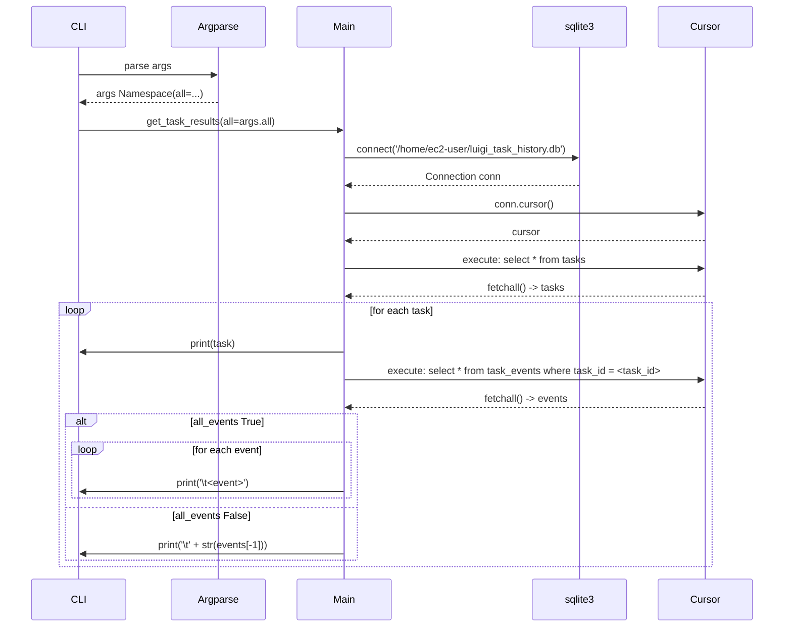
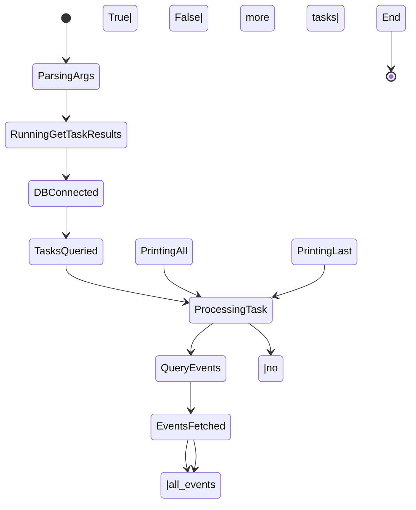

# Diagram: research/orchestrator/scripts/show_task_results.py


> Auto-generated by Obscura crawlers

## Diagram 1

```mermaid
flowchart TD
    Start([Start]) --> ParseArgs[Parse command-line args]
    ParseArgs --> CallGet[get_task_results(all_events)]
    CallGet --> Connect[connect to /home/ec2-user/luigi_task_history.db]
    Connect --> Cursor[cursor = conn.cursor()]
    Cursor --> ExecTasks[execute: select * from tasks]
    ExecTasks --> TasksFetched[tasks = cursor.fetchall()]
    TasksFetched --> HasTasks{tasks non-empty?}
    HasTasks -->|yes| ForEach[for task in tasks]
    ForEach --> PrintTask[print(task)]
    PrintTask --> ExecEvents[execute: select * from task_events where task_id = <task_id>]
    ExecEvents --> EventsFetched[events = cursor.fetchall()]
    EventsFetched --> AllEvents{all_events == True?}
    AllEvents -->|yes| LoopEvents[for event in events; print('\\t<event>')]
    LoopEvents --> NextTask[continue next task]
    AllEvents -->|no| PrintLast[print('\\t' + str(events[-1]))]
    PrintLast --> NextTask
    NextTask --> HasTasks
    HasTasks -->|no| End([End])
```

> SVG rendering failed for this diagram.

## Diagram 2



### SVG

<svg id="container" width="1305" xmlns="http://www.w3.org/2000/svg" height="1053" viewBox="-50 -10 1305 1053" role="graphics-document document" aria-roledescription="sequence"><g><rect x="1055" y="967" fill="#eaeaea" stroke="#666" width="150" height="65" name="Cursor" rx="3" ry="3" class="actor actor-bottom"></rect><text x="1130" y="999.5" dominant-baseline="central" alignment-baseline="central" class="actor actor-box" style="text-anchor: middle; font-size: 16px; font-weight: 400;"><tspan x="1130" dy="0">Cursor</tspan></text></g><g><rect x="855" y="967" fill="#eaeaea" stroke="#666" width="150" height="65" name="sqlite3" rx="3" ry="3" class="actor actor-bottom"></rect><text x="930" y="999.5" dominant-baseline="central" alignment-baseline="central" class="actor actor-box" style="text-anchor: middle; font-size: 16px; font-weight: 400;"><tspan x="930" dy="0">sqlite3</tspan></text></g><g><rect x="436" y="967" fill="#eaeaea" stroke="#666" width="150" height="65" name="Main" rx="3" ry="3" class="actor actor-bottom"></rect><text x="511" y="999.5" dominant-baseline="central" alignment-baseline="central" class="actor actor-box" style="text-anchor: middle; font-size: 16px; font-weight: 400;"><tspan x="511" dy="0">Main</tspan></text></g><g><rect x="236" y="967" fill="#eaeaea" stroke="#666" width="150" height="65" name="Argparse" rx="3" ry="3" class="actor actor-bottom"></rect><text x="311" y="999.5" dominant-baseline="central" alignment-baseline="central" class="actor actor-box" style="text-anchor: middle; font-size: 16px; font-weight: 400;"><tspan x="311" dy="0">Argparse</tspan></text></g><g><rect x="0" y="967" fill="#eaeaea" stroke="#666" width="150" height="65" name="CLI" rx="3" ry="3" class="actor actor-bottom"></rect><text x="75" y="999.5" dominant-baseline="central" alignment-baseline="central" class="actor actor-box" style="text-anchor: middle; font-size: 16px; font-weight: 400;"><tspan x="75" dy="0">CLI</tspan></text></g><g><line id="actor4" x1="1130" y1="65" x2="1130" y2="967" class="actor-line 200" stroke-width="0.5px" stroke="#999" name="Cursor"></line><g id="root-4"><rect x="1055" y="0" fill="#eaeaea" stroke="#666" width="150" height="65" name="Cursor" rx="3" ry="3" class="actor actor-top"></rect><text x="1130" y="32.5" dominant-baseline="central" alignment-baseline="central" class="actor actor-box" style="text-anchor: middle; font-size: 16px; font-weight: 400;"><tspan x="1130" dy="0">Cursor</tspan></text></g></g><g><line id="actor3" x1="930" y1="65" x2="930" y2="967" class="actor-line 200" stroke-width="0.5px" stroke="#999" name="sqlite3"></line><g id="root-3"><rect x="855" y="0" fill="#eaeaea" stroke="#666" width="150" height="65" name="sqlite3" rx="3" ry="3" class="actor actor-top"></rect><text x="930" y="32.5" dominant-baseline="central" alignment-baseline="central" class="actor actor-box" style="text-anchor: middle; font-size: 16px; font-weight: 400;"><tspan x="930" dy="0">sqlite3</tspan></text></g></g><g><line id="actor2" x1="511" y1="65" x2="511" y2="967" class="actor-line 200" stroke-width="0.5px" stroke="#999" name="Main"></line><g id="root-2"><rect x="436" y="0" fill="#eaeaea" stroke="#666" width="150" height="65" name="Main" rx="3" ry="3" class="actor actor-top"></rect><text x="511" y="32.5" dominant-baseline="central" alignment-baseline="central" class="actor actor-box" style="text-anchor: middle; font-size: 16px; font-weight: 400;"><tspan x="511" dy="0">Main</tspan></text></g></g><g><line id="actor1" x1="311" y1="65" x2="311" y2="967" class="actor-line 200" stroke-width="0.5px" stroke="#999" name="Argparse"></line><g id="root-1"><rect x="236" y="0" fill="#eaeaea" stroke="#666" width="150" height="65" name="Argparse" rx="3" ry="3" class="actor actor-top"></rect><text x="311" y="32.5" dominant-baseline="central" alignment-baseline="central" class="actor actor-box" style="text-anchor: middle; font-size: 16px; font-weight: 400;"><tspan x="311" dy="0">Argparse</tspan></text></g></g><g><line id="actor0" x1="75" y1="65" x2="75" y2="967" class="actor-line 200" stroke-width="0.5px" stroke="#999" name="CLI"></line><g id="root-0"><rect x="0" y="0" fill="#eaeaea" stroke="#666" width="150" height="65" name="CLI" rx="3" ry="3" class="actor actor-top"></rect><text x="75" y="32.5" dominant-baseline="central" alignment-baseline="central" class="actor actor-box" style="text-anchor: middle; font-size: 16px; font-weight: 400;"><tspan x="75" dy="0">CLI</tspan></text></g></g><style>#container{font-family:"trebuchet ms",verdana,arial,sans-serif;font-size:16px;fill:#333;}@keyframes edge-animation-frame{from{stroke-dashoffset:0;}}@keyframes dash{to{stroke-dashoffset:0;}}#container .edge-animation-slow{stroke-dasharray:9,5!important;stroke-dashoffset:900;animation:dash 50s linear infinite;stroke-linecap:round;}#container .edge-animation-fast{stroke-dasharray:9,5!important;stroke-dashoffset:900;animation:dash 20s linear infinite;stroke-linecap:round;}#container .error-icon{fill:#552222;}#container .error-text{fill:#552222;stroke:#552222;}#container .edge-thickness-normal{stroke-width:1px;}#container .edge-thickness-thick{stroke-width:3.5px;}#container .edge-pattern-solid{stroke-dasharray:0;}#container .edge-thickness-invisible{stroke-width:0;fill:none;}#container .edge-pattern-dashed{stroke-dasharray:3;}#container .edge-pattern-dotted{stroke-dasharray:2;}#container .marker{fill:#333333;stroke:#333333;}#container .marker.cross{stroke:#333333;}#container svg{font-family:"trebuchet ms",verdana,arial,sans-serif;font-size:16px;}#container p{margin:0;}#container .actor{stroke:hsl(259.6261682243, 59.7765363128%, 87.9019607843%);fill:#ECECFF;}#container text.actor&gt;tspan{fill:black;stroke:none;}#container .actor-line{stroke:hsl(259.6261682243, 59.7765363128%, 87.9019607843%);}#container .innerArc{stroke-width:1.5;stroke-dasharray:none;}#container .messageLine0{stroke-width:1.5;stroke-dasharray:none;stroke:#333;}#container .messageLine1{stroke-width:1.5;stroke-dasharray:2,2;stroke:#333;}#container #arrowhead path{fill:#333;stroke:#333;}#container .sequenceNumber{fill:white;}#container #sequencenumber{fill:#333;}#container #crosshead path{fill:#333;stroke:#333;}#container .messageText{fill:#333;stroke:none;}#container .labelBox{stroke:hsl(259.6261682243, 59.7765363128%, 87.9019607843%);fill:#ECECFF;}#container .labelText,#container .labelText&gt;tspan{fill:black;stroke:none;}#container .loopText,#container .loopText&gt;tspan{fill:black;stroke:none;}#container .loopLine{stroke-width:2px;stroke-dasharray:2,2;stroke:hsl(259.6261682243, 59.7765363128%, 87.9019607843%);fill:hsl(259.6261682243, 59.7765363128%, 87.9019607843%);}#container .note{stroke:#aaaa33;fill:#fff5ad;}#container .noteText,#container .noteText&gt;tspan{fill:black;stroke:none;}#container .activation0{fill:#f4f4f4;stroke:#666;}#container .activation1{fill:#f4f4f4;stroke:#666;}#container .activation2{fill:#f4f4f4;stroke:#666;}#container .actorPopupMenu{position:absolute;}#container .actorPopupMenuPanel{position:absolute;fill:#ECECFF;box-shadow:0px 8px 16px 0px rgba(0,0,0,0.2);filter:drop-shadow(3px 5px 2px rgb(0 0 0 / 0.4));}#container .actor-man line{stroke:hsl(259.6261682243, 59.7765363128%, 87.9019607843%);fill:#ECECFF;}#container .actor-man circle,#container line{stroke:hsl(259.6261682243, 59.7765363128%, 87.9019607843%);fill:#ECECFF;stroke-width:2px;}#container :root{--mermaid-font-family:"trebuchet ms",verdana,arial,sans-serif;}</style><g></g><defs><symbol id="computer" width="24" height="24"><path transform="scale(.5)" d="M2 2v13h20v-13h-20zm18 11h-16v-9h16v9zm-10.228 6l.466-1h3.524l.467 1h-4.457zm14.228 3h-24l2-6h2.104l-1.33 4h18.45l-1.297-4h2.073l2 6zm-5-10h-14v-7h14v7z"></path></symbol></defs><defs><symbol id="database" fill-rule="evenodd" clip-rule="evenodd"><path transform="scale(.5)" d="M12.258.001l.256.004.255.005.253.008.251.01.249.012.247.015.246.016.242.019.241.02.239.023.236.024.233.027.231.028.229.031.225.032.223.034.22.036.217.038.214.04.211.041.208.043.205.045.201.046.198.048.194.05.191.051.187.053.183.054.18.056.175.057.172.059.168.06.163.061.16.063.155.064.15.066.074.033.073.033.071.034.07.034.069.035.068.035.067.035.066.035.064.036.064.036.062.036.06.036.06.037.058.037.058.037.055.038.055.038.053.038.052.038.051.039.05.039.048.039.047.039.045.04.044.04.043.04.041.04.04.041.039.041.037.041.036.041.034.041.033.042.032.042.03.042.029.042.027.042.026.043.024.043.023.043.021.043.02.043.018.044.017.043.015.044.013.044.012.044.011.045.009.044.007.045.006.045.004.045.002.045.001.045v17l-.001.045-.002.045-.004.045-.006.045-.007.045-.009.044-.011.045-.012.044-.013.044-.015.044-.017.043-.018.044-.02.043-.021.043-.023.043-.024.043-.026.043-.027.042-.029.042-.03.042-.032.042-.033.042-.034.041-.036.041-.037.041-.039.041-.04.041-.041.04-.043.04-.044.04-.045.04-.047.039-.048.039-.05.039-.051.039-.052.038-.053.038-.055.038-.055.038-.058.037-.058.037-.06.037-.06.036-.062.036-.064.036-.064.036-.066.035-.067.035-.068.035-.069.035-.07.034-.071.034-.073.033-.074.033-.15.066-.155.064-.16.063-.163.061-.168.06-.172.059-.175.057-.18.056-.183.054-.187.053-.191.051-.194.05-.198.048-.201.046-.205.045-.208.043-.211.041-.214.04-.217.038-.22.036-.223.034-.225.032-.229.031-.231.028-.233.027-.236.024-.239.023-.241.02-.242.019-.246.016-.247.015-.249.012-.251.01-.253.008-.255.005-.256.004-.258.001-.258-.001-.256-.004-.255-.005-.253-.008-.251-.01-.249-.012-.247-.015-.245-.016-.243-.019-.241-.02-.238-.023-.236-.024-.234-.027-.231-.028-.228-.031-.226-.032-.223-.034-.22-.036-.217-.038-.214-.04-.211-.041-.208-.043-.204-.045-.201-.046-.198-.048-.195-.05-.19-.051-.187-.053-.184-.054-.179-.056-.176-.057-.172-.059-.167-.06-.164-.061-.159-.063-.155-.064-.151-.066-.074-.033-.072-.033-.072-.034-.07-.034-.069-.035-.068-.035-.067-.035-.066-.035-.064-.036-.063-.036-.062-.036-.061-.036-.06-.037-.058-.037-.057-.037-.056-.038-.055-.038-.053-.038-.052-.038-.051-.039-.049-.039-.049-.039-.046-.039-.046-.04-.044-.04-.043-.04-.041-.04-.04-.041-.039-.041-.037-.041-.036-.041-.034-.041-.033-.042-.032-.042-.03-.042-.029-.042-.027-.042-.026-.043-.024-.043-.023-.043-.021-.043-.02-.043-.018-.044-.017-.043-.015-.044-.013-.044-.012-.044-.011-.045-.009-.044-.007-.045-.006-.045-.004-.045-.002-.045-.001-.045v-17l.001-.045.002-.045.004-.045.006-.045.007-.045.009-.044.011-.045.012-.044.013-.044.015-.044.017-.043.018-.044.02-.043.021-.043.023-.043.024-.043.026-.043.027-.042.029-.042.03-.042.032-.042.033-.042.034-.041.036-.041.037-.041.039-.041.04-.041.041-.04.043-.04.044-.04.046-.04.046-.039.049-.039.049-.039.051-.039.052-.038.053-.038.055-.038.056-.038.057-.037.058-.037.06-.037.061-.036.062-.036.063-.036.064-.036.066-.035.067-.035.068-.035.069-.035.07-.034.072-.034.072-.033.074-.033.151-.066.155-.064.159-.063.164-.061.167-.06.172-.059.176-.057.179-.056.184-.054.187-.053.19-.051.195-.05.198-.048.201-.046.204-.045.208-.043.211-.041.214-.04.217-.038.22-.036.223-.034.226-.032.228-.031.231-.028.234-.027.236-.024.238-.023.241-.02.243-.019.245-.016.247-.015.249-.012.251-.01.253-.008.255-.005.256-.004.258-.001.258.001zm-9.258 20.499v.01l.001.021.003.021.004.022.005.021.006.022.007.022.009.023.01.022.011.023.012.023.013.023.015.023.016.024.017.023.018.024.019.024.021.024.022.025.023.024.024.025.052.049.056.05.061.051.066.051.07.051.075.051.079.052.084.052.088.052.092.052.097.052.102.051.105.052.11.052.114.051.119.051.123.051.127.05.131.05.135.05.139.048.144.049.147.047.152.047.155.047.16.045.163.045.167.043.171.043.176.041.178.041.183.039.187.039.19.037.194.035.197.035.202.033.204.031.209.03.212.029.216.027.219.025.222.024.226.021.23.02.233.018.236.016.24.015.243.012.246.01.249.008.253.005.256.004.259.001.26-.001.257-.004.254-.005.25-.008.247-.011.244-.012.241-.014.237-.016.233-.018.231-.021.226-.021.224-.024.22-.026.216-.027.212-.028.21-.031.205-.031.202-.034.198-.034.194-.036.191-.037.187-.039.183-.04.179-.04.175-.042.172-.043.168-.044.163-.045.16-.046.155-.046.152-.047.148-.048.143-.049.139-.049.136-.05.131-.05.126-.05.123-.051.118-.052.114-.051.11-.052.106-.052.101-.052.096-.052.092-.052.088-.053.083-.051.079-.052.074-.052.07-.051.065-.051.06-.051.056-.05.051-.05.023-.024.023-.025.021-.024.02-.024.019-.024.018-.024.017-.024.015-.023.014-.024.013-.023.012-.023.01-.023.01-.022.008-.022.006-.022.006-.022.004-.022.004-.021.001-.021.001-.021v-4.127l-.077.055-.08.053-.083.054-.085.053-.087.052-.09.052-.093.051-.095.05-.097.05-.1.049-.102.049-.105.048-.106.047-.109.047-.111.046-.114.045-.115.045-.118.044-.12.043-.122.042-.124.042-.126.041-.128.04-.13.04-.132.038-.134.038-.135.037-.138.037-.139.035-.142.035-.143.034-.144.033-.147.032-.148.031-.15.03-.151.03-.153.029-.154.027-.156.027-.158.026-.159.025-.161.024-.162.023-.163.022-.165.021-.166.02-.167.019-.169.018-.169.017-.171.016-.173.015-.173.014-.175.013-.175.012-.177.011-.178.01-.179.008-.179.008-.181.006-.182.005-.182.004-.184.003-.184.002h-.37l-.184-.002-.184-.003-.182-.004-.182-.005-.181-.006-.179-.008-.179-.008-.178-.01-.176-.011-.176-.012-.175-.013-.173-.014-.172-.015-.171-.016-.17-.017-.169-.018-.167-.019-.166-.02-.165-.021-.163-.022-.162-.023-.161-.024-.159-.025-.157-.026-.156-.027-.155-.027-.153-.029-.151-.03-.15-.03-.148-.031-.146-.032-.145-.033-.143-.034-.141-.035-.14-.035-.137-.037-.136-.037-.134-.038-.132-.038-.13-.04-.128-.04-.126-.041-.124-.042-.122-.042-.12-.044-.117-.043-.116-.045-.113-.045-.112-.046-.109-.047-.106-.047-.105-.048-.102-.049-.1-.049-.097-.05-.095-.05-.093-.052-.09-.051-.087-.052-.085-.053-.083-.054-.08-.054-.077-.054v4.127zm0-5.654v.011l.001.021.003.021.004.021.005.022.006.022.007.022.009.022.01.022.011.023.012.023.013.023.015.024.016.023.017.024.018.024.019.024.021.024.022.024.023.025.024.024.052.05.056.05.061.05.066.051.07.051.075.052.079.051.084.052.088.052.092.052.097.052.102.052.105.052.11.051.114.051.119.052.123.05.127.051.131.05.135.049.139.049.144.048.147.048.152.047.155.046.16.045.163.045.167.044.171.042.176.042.178.04.183.04.187.038.19.037.194.036.197.034.202.033.204.032.209.03.212.028.216.027.219.025.222.024.226.022.23.02.233.018.236.016.24.014.243.012.246.01.249.008.253.006.256.003.259.001.26-.001.257-.003.254-.006.25-.008.247-.01.244-.012.241-.015.237-.016.233-.018.231-.02.226-.022.224-.024.22-.025.216-.027.212-.029.21-.03.205-.032.202-.033.198-.035.194-.036.191-.037.187-.039.183-.039.179-.041.175-.042.172-.043.168-.044.163-.045.16-.045.155-.047.152-.047.148-.048.143-.048.139-.05.136-.049.131-.05.126-.051.123-.051.118-.051.114-.052.11-.052.106-.052.101-.052.096-.052.092-.052.088-.052.083-.052.079-.052.074-.051.07-.052.065-.051.06-.05.056-.051.051-.049.023-.025.023-.024.021-.025.02-.024.019-.024.018-.024.017-.024.015-.023.014-.023.013-.024.012-.022.01-.023.01-.023.008-.022.006-.022.006-.022.004-.021.004-.022.001-.021.001-.021v-4.139l-.077.054-.08.054-.083.054-.085.052-.087.053-.09.051-.093.051-.095.051-.097.05-.1.049-.102.049-.105.048-.106.047-.109.047-.111.046-.114.045-.115.044-.118.044-.12.044-.122.042-.124.042-.126.041-.128.04-.13.039-.132.039-.134.038-.135.037-.138.036-.139.036-.142.035-.143.033-.144.033-.147.033-.148.031-.15.03-.151.03-.153.028-.154.028-.156.027-.158.026-.159.025-.161.024-.162.023-.163.022-.165.021-.166.02-.167.019-.169.018-.169.017-.171.016-.173.015-.173.014-.175.013-.175.012-.177.011-.178.009-.179.009-.179.007-.181.007-.182.005-.182.004-.184.003-.184.002h-.37l-.184-.002-.184-.003-.182-.004-.182-.005-.181-.007-.179-.007-.179-.009-.178-.009-.176-.011-.176-.012-.175-.013-.173-.014-.172-.015-.171-.016-.17-.017-.169-.018-.167-.019-.166-.02-.165-.021-.163-.022-.162-.023-.161-.024-.159-.025-.157-.026-.156-.027-.155-.028-.153-.028-.151-.03-.15-.03-.148-.031-.146-.033-.145-.033-.143-.033-.141-.035-.14-.036-.137-.036-.136-.037-.134-.038-.132-.039-.13-.039-.128-.04-.126-.041-.124-.042-.122-.043-.12-.043-.117-.044-.116-.044-.113-.046-.112-.046-.109-.046-.106-.047-.105-.048-.102-.049-.1-.049-.097-.05-.095-.051-.093-.051-.09-.051-.087-.053-.085-.052-.083-.054-.08-.054-.077-.054v4.139zm0-5.666v.011l.001.02.003.022.004.021.005.022.006.021.007.022.009.023.01.022.011.023.012.023.013.023.015.023.016.024.017.024.018.023.019.024.021.025.022.024.023.024.024.025.052.05.056.05.061.05.066.051.07.051.075.052.079.051.084.052.088.052.092.052.097.052.102.052.105.051.11.052.114.051.119.051.123.051.127.05.131.05.135.05.139.049.144.048.147.048.152.047.155.046.16.045.163.045.167.043.171.043.176.042.178.04.183.04.187.038.19.037.194.036.197.034.202.033.204.032.209.03.212.028.216.027.219.025.222.024.226.021.23.02.233.018.236.017.24.014.243.012.246.01.249.008.253.006.256.003.259.001.26-.001.257-.003.254-.006.25-.008.247-.01.244-.013.241-.014.237-.016.233-.018.231-.02.226-.022.224-.024.22-.025.216-.027.212-.029.21-.03.205-.032.202-.033.198-.035.194-.036.191-.037.187-.039.183-.039.179-.041.175-.042.172-.043.168-.044.163-.045.16-.045.155-.047.152-.047.148-.048.143-.049.139-.049.136-.049.131-.051.126-.05.123-.051.118-.052.114-.051.11-.052.106-.052.101-.052.096-.052.092-.052.088-.052.083-.052.079-.052.074-.052.07-.051.065-.051.06-.051.056-.05.051-.049.023-.025.023-.025.021-.024.02-.024.019-.024.018-.024.017-.024.015-.023.014-.024.013-.023.012-.023.01-.022.01-.023.008-.022.006-.022.006-.022.004-.022.004-.021.001-.021.001-.021v-4.153l-.077.054-.08.054-.083.053-.085.053-.087.053-.09.051-.093.051-.095.051-.097.05-.1.049-.102.048-.105.048-.106.048-.109.046-.111.046-.114.046-.115.044-.118.044-.12.043-.122.043-.124.042-.126.041-.128.04-.13.039-.132.039-.134.038-.135.037-.138.036-.139.036-.142.034-.143.034-.144.033-.147.032-.148.032-.15.03-.151.03-.153.028-.154.028-.156.027-.158.026-.159.024-.161.024-.162.023-.163.023-.165.021-.166.02-.167.019-.169.018-.169.017-.171.016-.173.015-.173.014-.175.013-.175.012-.177.01-.178.01-.179.009-.179.007-.181.006-.182.006-.182.004-.184.003-.184.001-.185.001-.185-.001-.184-.001-.184-.003-.182-.004-.182-.006-.181-.006-.179-.007-.179-.009-.178-.01-.176-.01-.176-.012-.175-.013-.173-.014-.172-.015-.171-.016-.17-.017-.169-.018-.167-.019-.166-.02-.165-.021-.163-.023-.162-.023-.161-.024-.159-.024-.157-.026-.156-.027-.155-.028-.153-.028-.151-.03-.15-.03-.148-.032-.146-.032-.145-.033-.143-.034-.141-.034-.14-.036-.137-.036-.136-.037-.134-.038-.132-.039-.13-.039-.128-.041-.126-.041-.124-.041-.122-.043-.12-.043-.117-.044-.116-.044-.113-.046-.112-.046-.109-.046-.106-.048-.105-.048-.102-.048-.1-.05-.097-.049-.095-.051-.093-.051-.09-.052-.087-.052-.085-.053-.083-.053-.08-.054-.077-.054v4.153zm8.74-8.179l-.257.004-.254.005-.25.008-.247.011-.244.012-.241.014-.237.016-.233.018-.231.021-.226.022-.224.023-.22.026-.216.027-.212.028-.21.031-.205.032-.202.033-.198.034-.194.036-.191.038-.187.038-.183.04-.179.041-.175.042-.172.043-.168.043-.163.045-.16.046-.155.046-.152.048-.148.048-.143.048-.139.049-.136.05-.131.05-.126.051-.123.051-.118.051-.114.052-.11.052-.106.052-.101.052-.096.052-.092.052-.088.052-.083.052-.079.052-.074.051-.07.052-.065.051-.06.05-.056.05-.051.05-.023.025-.023.024-.021.024-.02.025-.019.024-.018.024-.017.023-.015.024-.014.023-.013.023-.012.023-.01.023-.01.022-.008.022-.006.023-.006.021-.004.022-.004.021-.001.021-.001.021.001.021.001.021.004.021.004.022.006.021.006.023.008.022.01.022.01.023.012.023.013.023.014.023.015.024.017.023.018.024.019.024.02.025.021.024.023.024.023.025.051.05.056.05.06.05.065.051.07.052.074.051.079.052.083.052.088.052.092.052.096.052.101.052.106.052.11.052.114.052.118.051.123.051.126.051.131.05.136.05.139.049.143.048.148.048.152.048.155.046.16.046.163.045.168.043.172.043.175.042.179.041.183.04.187.038.191.038.194.036.198.034.202.033.205.032.21.031.212.028.216.027.22.026.224.023.226.022.231.021.233.018.237.016.241.014.244.012.247.011.25.008.254.005.257.004.26.001.26-.001.257-.004.254-.005.25-.008.247-.011.244-.012.241-.014.237-.016.233-.018.231-.021.226-.022.224-.023.22-.026.216-.027.212-.028.21-.031.205-.032.202-.033.198-.034.194-.036.191-.038.187-.038.183-.04.179-.041.175-.042.172-.043.168-.043.163-.045.16-.046.155-.046.152-.048.148-.048.143-.048.139-.049.136-.05.131-.05.126-.051.123-.051.118-.051.114-.052.11-.052.106-.052.101-.052.096-.052.092-.052.088-.052.083-.052.079-.052.074-.051.07-.052.065-.051.06-.05.056-.05.051-.05.023-.025.023-.024.021-.024.02-.025.019-.024.018-.024.017-.023.015-.024.014-.023.013-.023.012-.023.01-.023.01-.022.008-.022.006-.023.006-.021.004-.022.004-.021.001-.021.001-.021-.001-.021-.001-.021-.004-.021-.004-.022-.006-.021-.006-.023-.008-.022-.01-.022-.01-.023-.012-.023-.013-.023-.014-.023-.015-.024-.017-.023-.018-.024-.019-.024-.02-.025-.021-.024-.023-.024-.023-.025-.051-.05-.056-.05-.06-.05-.065-.051-.07-.052-.074-.051-.079-.052-.083-.052-.088-.052-.092-.052-.096-.052-.101-.052-.106-.052-.11-.052-.114-.052-.118-.051-.123-.051-.126-.051-.131-.05-.136-.05-.139-.049-.143-.048-.148-.048-.152-.048-.155-.046-.16-.046-.163-.045-.168-.043-.172-.043-.175-.042-.179-.041-.183-.04-.187-.038-.191-.038-.194-.036-.198-.034-.202-.033-.205-.032-.21-.031-.212-.028-.216-.027-.22-.026-.224-.023-.226-.022-.231-.021-.233-.018-.237-.016-.241-.014-.244-.012-.247-.011-.25-.008-.254-.005-.257-.004-.26-.001-.26.001z"></path></symbol></defs><defs><symbol id="clock" width="24" height="24"><path transform="scale(.5)" d="M12 2c5.514 0 10 4.486 10 10s-4.486 10-10 10-10-4.486-10-10 4.486-10 10-10zm0-2c-6.627 0-12 5.373-12 12s5.373 12 12 12 12-5.373 12-12-5.373-12-12-12zm5.848 12.459c.202.038.202.333.001.372-1.907.361-6.045 1.111-6.547 1.111-.719 0-1.301-.582-1.301-1.301 0-.512.77-5.447 1.125-7.445.034-.192.312-.181.343.014l.985 6.238 5.394 1.011z"></path></symbol></defs><defs><marker id="arrowhead" refX="7.9" refY="5" markerUnits="userSpaceOnUse" markerWidth="12" markerHeight="12" orient="auto-start-reverse"><path d="M -1 0 L 10 5 L 0 10 z"></path></marker></defs><defs><marker id="crosshead" markerWidth="15" markerHeight="8" orient="auto" refX="4" refY="4.5"><path fill="none" stroke="#000000" stroke-width="1pt" d="M 1,2 L 6,7 M 6,2 L 1,7" style="stroke-dasharray: 0, 0;"></path></marker></defs><defs><marker id="filled-head" refX="15.5" refY="7" markerWidth="20" markerHeight="28" orient="auto"><path d="M 18,7 L9,13 L14,7 L9,1 Z"></path></marker></defs><defs><marker id="sequencenumber" refX="15" refY="15" markerWidth="60" markerHeight="40" orient="auto"><circle cx="15" cy="15" r="6"></circle></marker></defs><g><line x1="64" y1="741" x2="522" y2="741" class="loopLine"></line><line x1="522" y1="741" x2="522" y2="834" class="loopLine"></line><line x1="64" y1="834" x2="522" y2="834" class="loopLine"></line><line x1="64" y1="741" x2="64" y2="834" class="loopLine"></line><polygon points="64,741 114,741 114,754 105.6,761 64,761" class="labelBox"></polygon><text x="89" y="754" text-anchor="middle" dominant-baseline="middle" alignment-baseline="middle" class="labelText" style="font-size: 16px; font-weight: 400;">loop</text><text x="318" y="759" text-anchor="middle" class="loopText" style="font-size: 16px; font-weight: 400;"><tspan x="318">[for each event]</tspan></text></g><g><line x1="54" y1="696" x2="532" y2="696" class="loopLine"></line><line x1="532" y1="696" x2="532" y2="937" class="loopLine"></line><line x1="54" y1="937" x2="532" y2="937" class="loopLine"></line><line x1="54" y1="696" x2="54" y2="937" class="loopLine"></line><line x1="54" y1="849" x2="532" y2="849" class="loopLine" style="stroke-dasharray: 3, 3;"></line><polygon points="54,696 104,696 104,709 95.6,716 54,716" class="labelBox"></polygon><text x="79" y="709" text-anchor="middle" dominant-baseline="middle" alignment-baseline="middle" class="labelText" style="font-size: 16px; font-weight: 400;">alt</text><text x="318" y="714" text-anchor="middle" class="loopText" style="font-size: 16px; font-weight: 400;"><tspan x="318">[all_events True]</tspan></text><text x="293" y="867" text-anchor="middle" class="loopText" style="font-size: 16px; font-weight: 400;">[all_events False]</text></g><g><line x1="44" y1="507" x2="1141" y2="507" class="loopLine"></line><line x1="1141" y1="507" x2="1141" y2="947" class="loopLine"></line><line x1="44" y1="947" x2="1141" y2="947" class="loopLine"></line><line x1="44" y1="507" x2="44" y2="947" class="loopLine"></line><polygon points="44,507 94,507 94,520 85.6,527 44,527" class="labelBox"></polygon><text x="69" y="520" text-anchor="middle" dominant-baseline="middle" alignment-baseline="middle" class="labelText" style="font-size: 16px; font-weight: 400;">loop</text><text x="617.5" y="525" text-anchor="middle" class="loopText" style="font-size: 16px; font-weight: 400;"><tspan x="617.5">[for each task]</tspan></text></g><text x="192" y="80" text-anchor="middle" dominant-baseline="middle" alignment-baseline="middle" class="messageText" dy="1em" style="font-size: 16px; font-weight: 400;">parse args</text><line x1="76" y1="113" x2="307" y2="113" class="messageLine0" stroke-width="2" stroke="none" marker-end="url(#arrowhead)" style="fill: none;"></line><text x="195" y="128" text-anchor="middle" dominant-baseline="middle" alignment-baseline="middle" class="messageText" dy="1em" style="font-size: 16px; font-weight: 400;">args Namespace(all=...)</text><line x1="310" y1="161" x2="79" y2="161" class="messageLine1" stroke-width="2" stroke="none" marker-end="url(#arrowhead)" style="stroke-dasharray: 3, 3; fill: none;"></line><text x="292" y="176" text-anchor="middle" dominant-baseline="middle" alignment-baseline="middle" class="messageText" dy="1em" style="font-size: 16px; font-weight: 400;">get_task_results(all=args.all)</text><line x1="76" y1="209" x2="507" y2="209" class="messageLine0" stroke-width="2" stroke="none" marker-end="url(#arrowhead)" style="fill: none;"></line><text x="719" y="224" text-anchor="middle" dominant-baseline="middle" alignment-baseline="middle" class="messageText" dy="1em" style="font-size: 16px; font-weight: 400;">connect('/home/ec2-user/luigi_task_history.db')</text><line x1="512" y1="257" x2="926" y2="257" class="messageLine0" stroke-width="2" stroke="none" marker-end="url(#arrowhead)" style="fill: none;"></line><text x="722" y="272" text-anchor="middle" dominant-baseline="middle" alignment-baseline="middle" class="messageText" dy="1em" style="font-size: 16px; font-weight: 400;">Connection conn</text><line x1="929" y1="305" x2="515" y2="305" class="messageLine1" stroke-width="2" stroke="none" marker-end="url(#arrowhead)" style="stroke-dasharray: 3, 3; fill: none;"></line><text x="819" y="320" text-anchor="middle" dominant-baseline="middle" alignment-baseline="middle" class="messageText" dy="1em" style="font-size: 16px; font-weight: 400;">conn.cursor()</text><line x1="512" y1="353" x2="1126" y2="353" class="messageLine0" stroke-width="2" stroke="none" marker-end="url(#arrowhead)" style="fill: none;"></line><text x="822" y="368" text-anchor="middle" dominant-baseline="middle" alignment-baseline="middle" class="messageText" dy="1em" style="font-size: 16px; font-weight: 400;">cursor</text><line x1="1129" y1="401" x2="515" y2="401" class="messageLine1" stroke-width="2" stroke="none" marker-end="url(#arrowhead)" style="stroke-dasharray: 3, 3; fill: none;"></line><text x="819" y="416" text-anchor="middle" dominant-baseline="middle" alignment-baseline="middle" class="messageText" dy="1em" style="font-size: 16px; font-weight: 400;">execute: select * from tasks</text><line x1="512" y1="449" x2="1126" y2="449" class="messageLine0" stroke-width="2" stroke="none" marker-end="url(#arrowhead)" style="fill: none;"></line><text x="822" y="464" text-anchor="middle" dominant-baseline="middle" alignment-baseline="middle" class="messageText" dy="1em" style="font-size: 16px; font-weight: 400;">fetchall() -&gt; tasks</text><line x1="1129" y1="497" x2="515" y2="497" class="messageLine1" stroke-width="2" stroke="none" marker-end="url(#arrowhead)" style="stroke-dasharray: 3, 3; fill: none;"></line><text x="295" y="557" text-anchor="middle" dominant-baseline="middle" alignment-baseline="middle" class="messageText" dy="1em" style="font-size: 16px; font-weight: 400;">print(task)</text><line x1="510" y1="590" x2="79" y2="590" class="messageLine0" stroke-width="2" stroke="none" marker-end="url(#arrowhead)" style="fill: none;"></line><text x="819" y="605" text-anchor="middle" dominant-baseline="middle" alignment-baseline="middle" class="messageText" dy="1em" style="font-size: 16px; font-weight: 400;">execute: select * from task_events where task_id = &lt;task_id&gt;</text><line x1="512" y1="638" x2="1126" y2="638" class="messageLine0" stroke-width="2" stroke="none" marker-end="url(#arrowhead)" style="fill: none;"></line><text x="822" y="653" text-anchor="middle" dominant-baseline="middle" alignment-baseline="middle" class="messageText" dy="1em" style="font-size: 16px; font-weight: 400;">fetchall() -&gt; events</text><line x1="1129" y1="686" x2="515" y2="686" class="messageLine1" stroke-width="2" stroke="none" marker-end="url(#arrowhead)" style="stroke-dasharray: 3, 3; fill: none;"></line><text x="295" y="791" text-anchor="middle" dominant-baseline="middle" alignment-baseline="middle" class="messageText" dy="1em" style="font-size: 16px; font-weight: 400;">print('\t&lt;event&gt;')</text><line x1="510" y1="824" x2="79" y2="824" class="messageLine0" stroke-width="2" stroke="none" marker-end="url(#arrowhead)" style="fill: none;"></line><text x="295" y="894" text-anchor="middle" dominant-baseline="middle" alignment-baseline="middle" class="messageText" dy="1em" style="font-size: 16px; font-weight: 400;">print('\t' + str(events[-1]))</text><line x1="510" y1="927" x2="79" y2="927" class="messageLine0" stroke-width="2" stroke="none" marker-end="url(#arrowhead)" style="fill: none;"></line></svg>

## Diagram 3



### SVG

<svg id="container" width="635.3515625" xmlns="http://www.w3.org/2000/svg" class="statediagram" height="776" viewBox="0 0 635.3515625 776" role="graphics-document document" aria-roledescription="stateDiagram"><style>#container{font-family:"trebuchet ms",verdana,arial,sans-serif;font-size:16px;fill:#333;}@keyframes edge-animation-frame{from{stroke-dashoffset:0;}}@keyframes dash{to{stroke-dashoffset:0;}}#container .edge-animation-slow{stroke-dasharray:9,5!important;stroke-dashoffset:900;animation:dash 50s linear infinite;stroke-linecap:round;}#container .edge-animation-fast{stroke-dasharray:9,5!important;stroke-dashoffset:900;animation:dash 20s linear infinite;stroke-linecap:round;}#container .error-icon{fill:#552222;}#container .error-text{fill:#552222;stroke:#552222;}#container .edge-thickness-normal{stroke-width:1px;}#container .edge-thickness-thick{stroke-width:3.5px;}#container .edge-pattern-solid{stroke-dasharray:0;}#container .edge-thickness-invisible{stroke-width:0;fill:none;}#container .edge-pattern-dashed{stroke-dasharray:3;}#container .edge-pattern-dotted{stroke-dasharray:2;}#container .marker{fill:#333333;stroke:#333333;}#container .marker.cross{stroke:#333333;}#container svg{font-family:"trebuchet ms",verdana,arial,sans-serif;font-size:16px;}#container p{margin:0;}#container defs #statediagram-barbEnd{fill:#333333;stroke:#333333;}#container g.stateGroup text{fill:#9370DB;stroke:none;font-size:10px;}#container g.stateGroup text{fill:#333;stroke:none;font-size:10px;}#container g.stateGroup .state-title{font-weight:bolder;fill:#131300;}#container g.stateGroup rect{fill:#ECECFF;stroke:#9370DB;}#container g.stateGroup line{stroke:#333333;stroke-width:1;}#container .transition{stroke:#333333;stroke-width:1;fill:none;}#container .stateGroup .composit{fill:white;border-bottom:1px;}#container .stateGroup .alt-composit{fill:#e0e0e0;border-bottom:1px;}#container .state-note{stroke:#aaaa33;fill:#fff5ad;}#container .state-note text{fill:black;stroke:none;font-size:10px;}#container .stateLabel .box{stroke:none;stroke-width:0;fill:#ECECFF;opacity:0.5;}#container .edgeLabel .label rect{fill:#ECECFF;opacity:0.5;}#container .edgeLabel{background-color:rgba(232,232,232, 0.8);text-align:center;}#container .edgeLabel p{background-color:rgba(232,232,232, 0.8);}#container .edgeLabel rect{opacity:0.5;background-color:rgba(232,232,232, 0.8);fill:rgba(232,232,232, 0.8);}#container .edgeLabel .label text{fill:#333;}#container .label div .edgeLabel{color:#333;}#container .stateLabel text{fill:#131300;font-size:10px;font-weight:bold;}#container .node circle.state-start{fill:#333333;stroke:#333333;}#container .node .fork-join{fill:#333333;stroke:#333333;}#container .node circle.state-end{fill:#9370DB;stroke:white;stroke-width:1.5;}#container .end-state-inner{fill:white;stroke-width:1.5;}#container .node rect{fill:#ECECFF;stroke:#9370DB;stroke-width:1px;}#container .node polygon{fill:#ECECFF;stroke:#9370DB;stroke-width:1px;}#container #statediagram-barbEnd{fill:#333333;}#container .statediagram-cluster rect{fill:#ECECFF;stroke:#9370DB;stroke-width:1px;}#container .cluster-label,#container .nodeLabel{color:#131300;}#container .statediagram-cluster rect.outer{rx:5px;ry:5px;}#container .statediagram-state .divider{stroke:#9370DB;}#container .statediagram-state .title-state{rx:5px;ry:5px;}#container .statediagram-cluster.statediagram-cluster .inner{fill:white;}#container .statediagram-cluster.statediagram-cluster-alt .inner{fill:#f0f0f0;}#container .statediagram-cluster .inner{rx:0;ry:0;}#container .statediagram-state rect.basic{rx:5px;ry:5px;}#container .statediagram-state rect.divider{stroke-dasharray:10,10;fill:#f0f0f0;}#container .note-edge{stroke-dasharray:5;}#container .statediagram-note rect{fill:#fff5ad;stroke:#aaaa33;stroke-width:1px;rx:0;ry:0;}#container .statediagram-note rect{fill:#fff5ad;stroke:#aaaa33;stroke-width:1px;rx:0;ry:0;}#container .statediagram-note text{fill:black;}#container .statediagram-note .nodeLabel{color:black;}#container .statediagram .edgeLabel{color:red;}#container #dependencyStart,#container #dependencyEnd{fill:#333333;stroke:#333333;stroke-width:1;}#container .statediagramTitleText{text-anchor:middle;font-size:18px;fill:#333;}#container :root{--mermaid-font-family:"trebuchet ms",verdana,arial,sans-serif;}</style><g><defs><marker id="container_stateDiagram-barbEnd" refX="19" refY="7" markerWidth="20" markerHeight="14" markerUnits="userSpaceOnUse" orient="auto"><path d="M 19,7 L9,13 L14,7 L9,1 Z"></path></marker></defs><g class="root"><g class="clusters"></g><g class="edgePaths"><path d="M100.555,35L100.555,41.333C100.555,47.667,100.555,60.333,100.638,70.917C100.721,81.5,100.888,90,100.971,94.25L101.055,98.5" id="edge0" class="edge-thickness-normal edge-pattern-solid transition" style="fill:none;;;fill:none" data-edge="true" data-et="edge" data-id="edge0" data-points="W3sieCI6MTAwLjU1NDY4NzUsInkiOjM1fSx7IngiOjEwMC41NTQ2ODc1LCJ5Ijo3M30seyJ4IjoxMDEuMDU0Njg3NSwieSI6OTguNX1d" marker-end="url(#container_stateDiagram-barbEnd)"></path><path d="M101.055,138.5L100.971,142.583C100.888,146.667,100.721,154.833,100.721,163.167C100.721,171.5,100.888,180,100.971,184.25L101.055,188.5" id="edge1" class="edge-thickness-normal edge-pattern-solid transition" style="fill:none;;;fill:none" data-edge="true" data-et="edge" data-id="edge1" data-points="W3sieCI6MTAxLjA1NDY4NzUsInkiOjEzOC41fSx7IngiOjEwMC41NTQ2ODc1LCJ5IjoxNjN9LHsieCI6MTAxLjA1NDY4NzUsInkiOjE4OC41fV0=" marker-end="url(#container_stateDiagram-barbEnd)"></path><path d="M101.055,228.5L100.971,232.583C100.888,236.667,100.721,244.833,100.721,253.167C100.721,261.5,100.888,270,100.971,274.25L101.055,278.5" id="edge2" class="edge-thickness-normal edge-pattern-solid transition" style="fill:none;;;fill:none" data-edge="true" data-et="edge" data-id="edge2" data-points="W3sieCI6MTAxLjA1NDY4NzUsInkiOjIyOC41fSx7IngiOjEwMC41NTQ2ODc1LCJ5IjoyNTN9LHsieCI6MTAxLjA1NDY4NzUsInkiOjI3OC41fV0=" marker-end="url(#container_stateDiagram-barbEnd)"></path><path d="M101.055,318.5L100.971,322.583C100.888,326.667,100.721,334.833,100.721,343.167C100.721,351.5,100.888,360,100.971,364.25L101.055,368.5" id="edge3" class="edge-thickness-normal edge-pattern-solid transition" style="fill:none;;;fill:none" data-edge="true" data-et="edge" data-id="edge3" data-points="W3sieCI6MTAxLjA1NDY4NzUsInkiOjMxOC41fSx7IngiOjEwMC41NTQ2ODc1LCJ5IjozNDN9LHsieCI6MTAxLjA1NDY4NzUsInkiOjM2OC41fV0=" marker-end="url(#container_stateDiagram-barbEnd)"></path><path d="M101.055,408.5L100.971,412.583C100.888,416.667,100.721,424.833,132.857,434.667C164.992,444.5,229.43,456,261.648,461.751L293.867,467.501" id="edge4" class="edge-thickness-normal edge-pattern-solid transition" style="fill:none;;;fill:none" data-edge="true" data-et="edge" data-id="edge4" data-points="W3sieCI6MTAxLjA1NDY4NzUsInkiOjQwOC41fSx7IngiOjEwMC41NTQ2ODc1LCJ5Ijo0MzN9LHsieCI6MjkzLjg2NzE4NzUsInkiOjQ2Ny41MDA3MzQ3NTM4NTc0NH1d" marker-end="url(#container_stateDiagram-barbEnd)"></path><path d="M328.72,498.5L322.902,502.583C317.085,506.667,305.451,514.833,299.717,523.167C293.983,531.5,294.15,540,294.233,544.25L294.316,548.5" id="edge5" class="edge-thickness-normal edge-pattern-solid transition" style="fill:none;;;fill:none" data-edge="true" data-et="edge" data-id="edge5" data-points="W3sieCI6MzI4LjcxOTYxODA1NTU1NTU0LCJ5Ijo0OTguNX0seyJ4IjoyOTMuODE2NDA2MjUsInkiOjUyM30seyJ4IjoyOTQuMzE2NDA2MjUsInkiOjU0OC41fV0=" marker-end="url(#container_stateDiagram-barbEnd)"></path><path d="M294.316,588.5L294.233,592.583C294.15,596.667,293.983,604.833,293.983,613.167C293.983,621.5,294.15,630,294.233,634.25L294.316,638.5" id="edge6" class="edge-thickness-normal edge-pattern-solid transition" style="fill:none;;;fill:none" data-edge="true" data-et="edge" data-id="edge6" data-points="W3sieCI6Mjk0LjMxNjQwNjI1LCJ5Ijo1ODguNX0seyJ4IjoyOTMuODE2NDA2MjUsInkiOjYxM30seyJ4IjoyOTQuMzE2NDA2MjUsInkiOjYzOC41fV0=" marker-end="url(#container_stateDiagram-barbEnd)"></path><path d="M289.872,678.5L288.863,682.583C287.853,686.667,285.835,694.833,285.835,703.167C285.835,711.5,287.853,720,288.863,724.25L289.872,728.5" id="edge7" class="edge-thickness-normal edge-pattern-solid transition" style="fill:none;;;fill:none" data-edge="true" data-et="edge" data-id="edge7" data-points="W3sieCI6Mjg5Ljg3MTk2MTgwNTU1NTU0LCJ5Ijo2NzguNX0seyJ4IjoyODMuODE2NDA2MjUsInkiOjcwM30seyJ4IjoyODkuODcxOTYxODA1NTU1NTQsInkiOjcyOC41fV0=" marker-end="url(#container_stateDiagram-barbEnd)"></path><path d="M298.761,678.5L299.603,682.583C300.446,686.667,302.131,694.833,302.131,703.167C302.131,711.5,300.446,720,299.603,724.25L298.761,728.5" id="edge8" class="edge-thickness-normal edge-pattern-solid transition" style="fill:none;;;fill:none" data-edge="true" data-et="edge" data-id="edge8" data-points="W3sieCI6Mjk4Ljc2MDg1MDY5NDQ0NDQ2LCJ5Ijo2NzguNX0seyJ4IjozMDMuODE2NDA2MjUsInkiOjcwM30seyJ4IjoyOTguNzYwODUwNjk0NDQ0NDYsInkiOjcyOC41fV0=" marker-end="url(#container_stateDiagram-barbEnd)"></path><path d="M253.414,408.5L253.331,412.583C253.247,416.667,253.081,424.833,262.602,433.167C272.123,441.5,291.332,450,300.936,454.25L310.541,458.5" id="edge9" class="edge-thickness-normal edge-pattern-solid transition" style="fill:none;;;fill:none" data-edge="true" data-et="edge" data-id="edge9" data-points="W3sieCI6MjUzLjQxNDA2MjUsInkiOjQwOC41fSx7IngiOjI1Mi45MTQwNjI1LCJ5Ijo0MzN9LHsieCI6MzEwLjU0MDc5ODYxMTExMTEsInkiOjQ1OC41fV0=" marker-end="url(#container_stateDiagram-barbEnd)"></path><path d="M503.344,408.5L503.26,412.583C503.177,416.667,503.01,424.833,488.632,433.399C474.254,441.964,445.663,450.927,431.368,455.409L417.073,459.891" id="edge10" class="edge-thickness-normal edge-pattern-solid transition" style="fill:none;;;fill:none" data-edge="true" data-et="edge" data-id="edge10" data-points="W3sieCI6NTAzLjM0Mzc1LCJ5Ijo0MDguNX0seyJ4Ijo1MDIuODQzNzUsInkiOjQzM30seyJ4Ijo0MTcuMDczMzAyMDY4NzQ4MiwieSI6NDU5Ljg5MTA4NzE1NzI1OH1d" marker-end="url(#container_stateDiagram-barbEnd)"></path><path d="M383.765,498.5L389.415,502.583C395.066,506.667,406.367,514.833,412.101,523.167C417.835,531.5,418.001,540,418.085,544.25L418.168,548.5" id="edge11" class="edge-thickness-normal edge-pattern-solid transition" style="fill:none;;;fill:none" data-edge="true" data-et="edge" data-id="edge11" data-points="W3sieCI6MzgzLjc2NDc1Njk0NDQ0NDQ2LCJ5Ijo0OTguNX0seyJ4Ijo0MTcuNjY3OTY4NzUsInkiOjUyM30seyJ4Ijo0MTguMTY3OTY4NzUsInkiOjU0OC41fV0=" marker-end="url(#container_stateDiagram-barbEnd)"></path><path d="M606.172,48.5L606.089,52.583C606.005,56.667,605.839,64.833,605.755,75.25C605.672,85.667,605.672,98.333,605.672,104.667L605.672,111" id="edge12" class="edge-thickness-normal edge-pattern-solid transition" style="fill:none;;;fill:none" data-edge="true" data-et="edge" data-id="edge12" data-points="W3sieCI6NjA2LjE3MTg3NSwieSI6NDguNX0seyJ4Ijo2MDUuNjcxODc1LCJ5Ijo3M30seyJ4Ijo2MDUuNjcxODc1LCJ5IjoxMTF9XQ==" marker-end="url(#container_stateDiagram-barbEnd)"></path></g><g class="edgeLabels"><g class="edgeLabel"><g class="label" data-id="edge0" transform="translate(0, 0)"><foreignObject width="0" height="0"><div xmlns="http://www.w3.org/1999/xhtml" class="labelBkg" style="display: table-cell; white-space: nowrap; line-height: 1.5; max-width: 200px; text-align: center;"><span class="edgeLabel"></span></div></foreignObject></g></g><g class="edgeLabel"><g class="label" data-id="edge1" transform="translate(0, 0)"><foreignObject width="0" height="0"><div xmlns="http://www.w3.org/1999/xhtml" class="labelBkg" style="display: table-cell; white-space: nowrap; line-height: 1.5; max-width: 200px; text-align: center;"><span class="edgeLabel"></span></div></foreignObject></g></g><g class="edgeLabel"><g class="label" data-id="edge2" transform="translate(0, 0)"><foreignObject width="0" height="0"><div xmlns="http://www.w3.org/1999/xhtml" class="labelBkg" style="display: table-cell; white-space: nowrap; line-height: 1.5; max-width: 200px; text-align: center;"><span class="edgeLabel"></span></div></foreignObject></g></g><g class="edgeLabel"><g class="label" data-id="edge3" transform="translate(0, 0)"><foreignObject width="0" height="0"><div xmlns="http://www.w3.org/1999/xhtml" class="labelBkg" style="display: table-cell; white-space: nowrap; line-height: 1.5; max-width: 200px; text-align: center;"><span class="edgeLabel"></span></div></foreignObject></g></g><g class="edgeLabel"><g class="label" data-id="edge4" transform="translate(0, 0)"><foreignObject width="0" height="0"><div xmlns="http://www.w3.org/1999/xhtml" class="labelBkg" style="display: table-cell; white-space: nowrap; line-height: 1.5; max-width: 200px; text-align: center;"><span class="edgeLabel"></span></div></foreignObject></g></g><g class="edgeLabel"><g class="label" data-id="edge5" transform="translate(0, 0)"><foreignObject width="0" height="0"><div xmlns="http://www.w3.org/1999/xhtml" class="labelBkg" style="display: table-cell; white-space: nowrap; line-height: 1.5; max-width: 200px; text-align: center;"><span class="edgeLabel"></span></div></foreignObject></g></g><g class="edgeLabel"><g class="label" data-id="edge6" transform="translate(0, 0)"><foreignObject width="0" height="0"><div xmlns="http://www.w3.org/1999/xhtml" class="labelBkg" style="display: table-cell; white-space: nowrap; line-height: 1.5; max-width: 200px; text-align: center;"><span class="edgeLabel"></span></div></foreignObject></g></g><g class="edgeLabel"><g class="label" data-id="edge7" transform="translate(0, 0)"><foreignObject width="0" height="0"><div xmlns="http://www.w3.org/1999/xhtml" class="labelBkg" style="display: table-cell; white-space: nowrap; line-height: 1.5; max-width: 200px; text-align: center;"><span class="edgeLabel"></span></div></foreignObject></g></g><g class="edgeLabel"><g class="label" data-id="edge8" transform="translate(0, 0)"><foreignObject width="0" height="0"><div xmlns="http://www.w3.org/1999/xhtml" class="labelBkg" style="display: table-cell; white-space: nowrap; line-height: 1.5; max-width: 200px; text-align: center;"><span class="edgeLabel"></span></div></foreignObject></g></g><g class="edgeLabel"><g class="label" data-id="edge9" transform="translate(0, 0)"><foreignObject width="0" height="0"><div xmlns="http://www.w3.org/1999/xhtml" class="labelBkg" style="display: table-cell; white-space: nowrap; line-height: 1.5; max-width: 200px; text-align: center;"><span class="edgeLabel"></span></div></foreignObject></g></g><g class="edgeLabel"><g class="label" data-id="edge10" transform="translate(0, 0)"><foreignObject width="0" height="0"><div xmlns="http://www.w3.org/1999/xhtml" class="labelBkg" style="display: table-cell; white-space: nowrap; line-height: 1.5; max-width: 200px; text-align: center;"><span class="edgeLabel"></span></div></foreignObject></g></g><g class="edgeLabel"><g class="label" data-id="edge11" transform="translate(0, 0)"><foreignObject width="0" height="0"><div xmlns="http://www.w3.org/1999/xhtml" class="labelBkg" style="display: table-cell; white-space: nowrap; line-height: 1.5; max-width: 200px; text-align: center;"><span class="edgeLabel"></span></div></foreignObject></g></g><g class="edgeLabel"><g class="label" data-id="edge12" transform="translate(0, 0)"><foreignObject width="0" height="0"><div xmlns="http://www.w3.org/1999/xhtml" class="labelBkg" style="display: table-cell; white-space: nowrap; line-height: 1.5; max-width: 200px; text-align: center;"><span class="edgeLabel"></span></div></foreignObject></g></g></g><g class="nodes"><g class="node default" id="state-root_start-0" transform="translate(100.5546875, 28)"><circle class="state-start" r="7" width="14" height="14"></circle></g><g class="node  statediagram-state" id="state-ParsingArgs-1" transform="translate(100.5546875, 118)"><g class="basic label-container outer-path"><path d="M-44.765625 -20 C-22.01636635981721 -20, 0.7328922803655828 -20, 44.765625 -20 C44.765625 -20, 44.765625 -20, 44.765625 -20 C44.86170387925456 -19.996026148159345, 44.95778275850913 -19.99205229631869, 45.17852172736166 -19.982922465033347 C45.294115840417206 -19.968513673867417, 45.40970995347275 -19.954104882701486, 45.58859795140367 -19.931806517013612 C45.74141883808092 -19.899763346709722, 45.894239724758165 -19.86772017640583, 45.993052435703994 -19.847001329696653 C46.12780039311373 -19.806885124666767, 46.26254835052347 -19.766768919636878, 46.38912234602342 -19.729086208503173 C46.513001276591275 -19.680748499798234, 46.63688020715914 -19.632410791093292, 46.774102123264846 -19.578866633275286 C46.89678307910263 -19.51889156851337, 47.01946403494042 -19.45891650375146, 47.145361965185366 -19.397368756032446 C47.21785634684138 -19.3541714807927, 47.290350728497394 -19.310974205552956, 47.500365790612136 -19.185832391312644 C47.58331327296795 -19.12660902722774, 47.66626075532377 -19.067385663142833, 47.83668856344834 -18.94570254698197 C47.94485448394533 -18.854090685467614, 48.05302040444232 -18.76247882395326, 48.152032858128706 -18.678619553365657 C48.262208692065194 -18.568443719429172, 48.372384526001674 -18.45826788549269, 48.44424455336566 -18.386407858128706 C48.499511483013904 -18.32115431759773, 48.55477841266215 -18.255900777066756, 48.71132754698197 -18.07106356344834 C48.7993277365321 -17.947811629303683, 48.88732792608223 -17.824559695159028, 48.951457391312644 -17.734740790612136 C49.00520993933048 -17.644532375628536, 49.05896248734831 -17.554323960644936, 49.16299375603245 -17.37973696518537 C49.208099021166376 -17.28747267065041, 49.253204286300296 -17.195208376115446, 49.34449163327529 -17.008477123264846 C49.389588532769366 -16.892903674896548, 49.434685432263436 -16.77733022652825, 49.494711208503176 -16.623497346023417 C49.54010006262518 -16.471038872507496, 49.58548891674718 -16.31858039899157, 49.61262632969665 -16.227427435703994 C49.64020786639649 -16.09588505539597, 49.667789403096315 -15.964342675087947, 49.69743151701361 -15.82297295140367 C49.714107721145034 -15.689188582992317, 49.73078392527646 -15.555404214580962, 49.74854746503335 -15.412896727361662 C49.75232195885848 -15.321637880526424, 49.756096452683614 -15.230379033691186, 49.765625 -15 C49.765625 -15, 49.765625 -15, 49.765625 -15 C49.765625 -4.754666048799169, 49.765625 5.490667902401661, 49.765625 15 C49.765625 15, 49.765625 15, 49.765625 15 C49.76167388760668 15.095529090107137, 49.757722775213374 15.191058180214274, 49.74854746503335 15.412896727361662 C49.73720825390391 15.503865222786619, 49.72586904277447 15.594833718211575, 49.69743151701361 15.822972951403669 C49.664589404038566 15.979604170399842, 49.631747291063526 16.136235389396013, 49.61262632969665 16.227427435703994 C49.573787778948095 16.357883828032822, 49.53494922819954 16.488340220361646, 49.494711208503176 16.623497346023417 C49.46138916508514 16.708894424485692, 49.4280671216671 16.794291502947967, 49.34449163327529 17.008477123264846 C49.284730720918695 17.130720023355906, 49.22496980856209 17.25296292344697, 49.16299375603245 17.379736965185366 C49.10059048573614 17.48446316535276, 49.038187215439834 17.58918936552016, 48.951457391312644 17.734740790612133 C48.90072706015312 17.805793040239937, 48.8499967289936 17.876845289867738, 48.71132754698197 18.07106356344834 C48.63550672500702 18.16058503879216, 48.55968590303207 18.25010651413598, 48.44424455336566 18.386407858128706 C48.3649757716155 18.465676639878865, 48.28570698986534 18.544945421629027, 48.152032858128706 18.678619553365657 C48.03792347769059 18.77526526867186, 47.923814097252475 18.871910983978065, 47.83668856344834 18.94570254698197 C47.74752479918109 19.00936425104344, 47.658361034913845 19.07302595510491, 47.500365790612136 19.185832391312644 C47.3819020399614 19.2564214649194, 47.26343828931067 19.327010538526153, 47.145361965185366 19.397368756032446 C47.044344667822344 19.446753103505507, 46.94332737045933 19.49613745097857, 46.774102123264846 19.578866633275286 C46.68481715262587 19.613705736928285, 46.59553218198688 19.648544840581284, 46.38912234602342 19.729086208503173 C46.271026969882094 19.764244725288414, 46.15293159374076 19.799403242073655, 45.993052435703994 19.847001329696653 C45.8675585730149 19.87331462561891, 45.7420647103258 19.899627921541164, 45.58859795140367 19.931806517013612 C45.490875249055435 19.94398763915804, 45.393152546707206 19.95616876130246, 45.17852172736166 19.982922465033347 C45.08413719559671 19.986826238143458, 44.98975266383176 19.990730011253568, 44.765625 20 C44.765625 20, 44.765625 20, 44.765625 20 C18.83320016007055 20, -7.099224679858899 20, -44.765625 20 C-44.765625 20, -44.765625 20, -44.765625 20 C-44.927569049416356 19.993301944570447, -45.089513098832704 19.986603889140895, -45.17852172736166 19.982922465033347 C-45.310835662747266 19.96642955018744, -45.44314959813287 19.949936635341526, -45.58859795140367 19.931806517013612 C-45.67871234694482 19.912911515250823, -45.76882674248598 19.894016513488037, -45.993052435703994 19.847001329696653 C-46.096098874832464 19.81632307557583, -46.19914531396094 19.78564482145501, -46.38912234602342 19.729086208503173 C-46.52480964860634 19.676140858739927, -46.66049695118926 19.62319550897668, -46.774102123264846 19.578866633275286 C-46.89779426691952 19.518397228912004, -47.02148641057419 19.457927824548722, -47.145361965185366 19.397368756032446 C-47.23288058198489 19.345218979841103, -47.320399198784415 19.29306920364976, -47.500365790612136 19.185832391312644 C-47.57088963252879 19.13547933600736, -47.64141347444544 19.08512628070208, -47.83668856344834 18.94570254698197 C-47.918529396131206 18.876386897510184, -48.00037022881407 18.8070712480384, -48.152032858128706 18.67861955336566 C-48.21398098937298 18.61667142212139, -48.27592912061725 18.554723290877117, -48.44424455336566 18.386407858128706 C-48.52671373341102 18.289036681244138, -48.60918291345639 18.191665504359573, -48.71132754698197 18.07106356344834 C-48.790457355327234 17.96023537118071, -48.8695871636725 17.849407178913072, -48.951457391312644 17.734740790612133 C-49.024140429578544 17.61276291384275, -49.096823467844445 17.49078503707337, -49.16299375603244 17.37973696518537 C-49.21851337531703 17.26616976874094, -49.274032994601626 17.152602572296512, -49.34449163327528 17.00847712326485 C-49.39898453133651 16.868823794296073, -49.453477429397736 16.729170465327297, -49.494711208503176 16.623497346023417 C-49.54148576139235 16.466384392395966, -49.58826031428152 16.309271438768512, -49.61262632969665 16.227427435703994 C-49.64614744909044 16.067557886605403, -49.679668568484225 15.907688337506812, -49.69743151701361 15.82297295140367 C-49.716363349543386 15.671092868987774, -49.73529518207315 15.519212786571876, -49.74854746503335 15.412896727361664 C-49.75200497969602 15.329301730085435, -49.75546249435869 15.245706732809206, -49.765625 15 C-49.765625 15, -49.765625 15, -49.765625 15 C-49.765625 6.810809005824762, -49.765625 -1.3783819883504762, -49.765625 -15 C-49.765625 -15, -49.765625 -15, -49.765625 -15 C-49.76161344585382 -15.096990436958661, -49.75760189170764 -15.193980873917322, -49.74854746503335 -15.41289672736166 C-49.733304984789896 -15.535179087083437, -49.718062504546445 -15.657461446805215, -49.69743151701361 -15.822972951403669 C-49.67649820627238 -15.92280848821938, -49.655564895531136 -16.02264402503509, -49.61262632969665 -16.227427435703994 C-49.58049735496244 -16.33534675947549, -49.548368380228226 -16.44326608324699, -49.494711208503176 -16.623497346023417 C-49.45217992912534 -16.73249567354387, -49.4096486497475 -16.841494001064323, -49.34449163327529 -17.008477123264846 C-49.27793592952575 -17.14461899130389, -49.21138022577622 -17.280760859342937, -49.16299375603245 -17.379736965185366 C-49.101506042327244 -17.482926663141118, -49.04001832862203 -17.58611636109687, -48.951457391312644 -17.734740790612133 C-48.89978843978578 -17.80710765985944, -48.84811948825892 -17.879474529106748, -48.71132754698197 -18.07106356344834 C-48.643193511691 -18.151509266904185, -48.575059476400035 -18.23195497036003, -48.44424455336566 -18.386407858128706 C-48.3341425074178 -18.49650990407656, -48.22404046146995 -18.606611950024416, -48.152032858128706 -18.678619553365657 C-48.07369033265641 -18.744972287769208, -47.995347807184125 -18.81132502217276, -47.83668856344834 -18.945702546981966 C-47.70960415706688 -19.036439069114827, -47.58251975068541 -19.127175591247692, -47.500365790612136 -19.185832391312644 C-47.4072035703261 -19.241345025253544, -47.31404135004005 -19.29685765919444, -47.145361965185366 -19.397368756032446 C-47.030880364258 -19.453335400429516, -46.91639876333064 -19.509302044826587, -46.774102123264846 -19.578866633275286 C-46.68651702482395 -19.61304244473832, -46.59893192638306 -19.647218256201352, -46.38912234602342 -19.729086208503173 C-46.259597805732305 -19.767647334880177, -46.13007326544119 -19.80620846125718, -45.993052435703994 -19.847001329696653 C-45.83441074232806 -19.88026499481907, -45.67576904895213 -19.913528659941488, -45.58859795140367 -19.931806517013612 C-45.503303602147554 -19.942438446560704, -45.418009252891444 -19.9530703761078, -45.17852172736166 -19.982922465033347 C-45.039023847000195 -19.988692140043536, -44.89952596663873 -19.99446181505372, -44.765625 -20 C-44.765625 -20, -44.765625 -20, -44.765625 -20" stroke="none" stroke-width="0" fill="#ECECFF" style=""></path><path d="M-44.765625 -20 C-16.259345329555632 -20, 12.246934340888735 -20, 44.765625 -20 M-44.765625 -20 C-17.397533595535958 -20, 9.970557808928085 -20, 44.765625 -20 M44.765625 -20 C44.765625 -20, 44.765625 -20, 44.765625 -20 M44.765625 -20 C44.765625 -20, 44.765625 -20, 44.765625 -20 M44.765625 -20 C44.884349728457494 -19.995089508907967, 45.00307445691499 -19.990179017815933, 45.17852172736166 -19.982922465033347 M44.765625 -20 C44.86328406575108 -19.9959607911624, 44.96094313150216 -19.991921582324803, 45.17852172736166 -19.982922465033347 M45.17852172736166 -19.982922465033347 C45.3131410454619 -19.966142184531744, 45.44776036356213 -19.949361904030138, 45.58859795140367 -19.931806517013612 M45.17852172736166 -19.982922465033347 C45.33109471274118 -19.963904262239236, 45.483667698120684 -19.94488605944512, 45.58859795140367 -19.931806517013612 M45.58859795140367 -19.931806517013612 C45.717776267395536 -19.904720672474316, 45.8469545833874 -19.877634827935022, 45.993052435703994 -19.847001329696653 M45.58859795140367 -19.931806517013612 C45.704898872697996 -19.907420778201587, 45.821199793992314 -19.88303503938956, 45.993052435703994 -19.847001329696653 M45.993052435703994 -19.847001329696653 C46.12811060388188 -19.80679277091969, 46.26316877205977 -19.766584212142728, 46.38912234602342 -19.729086208503173 M45.993052435703994 -19.847001329696653 C46.12607359761409 -19.80739921396088, 46.25909475952418 -19.767797098225113, 46.38912234602342 -19.729086208503173 M46.38912234602342 -19.729086208503173 C46.503166866214976 -19.68458589863495, 46.61721138640653 -19.640085588766723, 46.774102123264846 -19.578866633275286 M46.38912234602342 -19.729086208503173 C46.49688259787877 -19.68703802774897, 46.60464284973413 -19.64498984699476, 46.774102123264846 -19.578866633275286 M46.774102123264846 -19.578866633275286 C46.87976965246621 -19.527208925982375, 46.98543718166757 -19.47555121868946, 47.145361965185366 -19.397368756032446 M46.774102123264846 -19.578866633275286 C46.875241279602974 -19.529422712579358, 46.9763804359411 -19.479978791883426, 47.145361965185366 -19.397368756032446 M47.145361965185366 -19.397368756032446 C47.2460515526225 -19.337370784838804, 47.346741140059635 -19.27737281364516, 47.500365790612136 -19.185832391312644 M47.145361965185366 -19.397368756032446 C47.271716241490154 -19.322077949675123, 47.39807051779494 -19.246787143317796, 47.500365790612136 -19.185832391312644 M47.500365790612136 -19.185832391312644 C47.62179284695901 -19.0991351394667, 47.743219903305885 -19.012437887620756, 47.83668856344834 -18.94570254698197 M47.500365790612136 -19.185832391312644 C47.59377741806241 -19.1191377712334, 47.687189045512675 -19.052443151154158, 47.83668856344834 -18.94570254698197 M47.83668856344834 -18.94570254698197 C47.908940457627345 -18.884508314147226, 47.98119235180636 -18.823314081312482, 48.152032858128706 -18.678619553365657 M47.83668856344834 -18.94570254698197 C47.9140960470564 -18.88014175264034, 47.99150353066445 -18.814580958298713, 48.152032858128706 -18.678619553365657 M48.152032858128706 -18.678619553365657 C48.26325854059569 -18.567393870898666, 48.37448422306269 -18.456168188431676, 48.44424455336566 -18.386407858128706 M48.152032858128706 -18.678619553365657 C48.26540091855175 -18.565251492942615, 48.37876897897479 -18.451883432519573, 48.44424455336566 -18.386407858128706 M48.44424455336566 -18.386407858128706 C48.53677489257414 -18.277157493067463, 48.62930523178261 -18.167907128006217, 48.71132754698197 -18.07106356344834 M48.44424455336566 -18.386407858128706 C48.503017940082295 -18.317014251560256, 48.56179132679893 -18.2476206449918, 48.71132754698197 -18.07106356344834 M48.71132754698197 -18.07106356344834 C48.80483488646529 -17.940098385907728, 48.89834222594861 -17.809133208367115, 48.951457391312644 -17.734740790612136 M48.71132754698197 -18.07106356344834 C48.77043894059291 -17.988272905498857, 48.82955033420385 -17.905482247549372, 48.951457391312644 -17.734740790612136 M48.951457391312644 -17.734740790612136 C49.001948588228416 -17.650005628980626, 49.05243978514419 -17.565270467349116, 49.16299375603245 -17.37973696518537 M48.951457391312644 -17.734740790612136 C49.00297701755872 -17.648279701871488, 49.05449664380479 -17.56181861313084, 49.16299375603245 -17.37973696518537 M49.16299375603245 -17.37973696518537 C49.20361425962076 -17.29664639701994, 49.244234763209064 -17.213555828854517, 49.34449163327529 -17.008477123264846 M49.16299375603245 -17.37973696518537 C49.225629828757974 -17.251612830557136, 49.2882659014835 -17.123488695928906, 49.34449163327529 -17.008477123264846 M49.34449163327529 -17.008477123264846 C49.39494124862004 -16.879185839836076, 49.44539086396479 -16.749894556407305, 49.494711208503176 -16.623497346023417 M49.34449163327529 -17.008477123264846 C49.379561160165665 -16.91860162847838, 49.41463068705604 -16.828726133691916, 49.494711208503176 -16.623497346023417 M49.494711208503176 -16.623497346023417 C49.52817514992511 -16.511093948191395, 49.561639091347054 -16.398690550359373, 49.61262632969665 -16.227427435703994 M49.494711208503176 -16.623497346023417 C49.53228006764927 -16.49730577260867, 49.56984892679536 -16.371114199193922, 49.61262632969665 -16.227427435703994 M49.61262632969665 -16.227427435703994 C49.63377080059021 -16.126584829943393, 49.65491527148377 -16.02574222418279, 49.69743151701361 -15.82297295140367 M49.61262632969665 -16.227427435703994 C49.63659674714794 -16.113107272805358, 49.66056716459923 -15.99878710990672, 49.69743151701361 -15.82297295140367 M49.69743151701361 -15.82297295140367 C49.70901923189607 -15.730010841761523, 49.720606946778524 -15.637048732119373, 49.74854746503335 -15.412896727361662 M49.69743151701361 -15.82297295140367 C49.712872791040176 -15.699095774269706, 49.72831406506674 -15.575218597135741, 49.74854746503335 -15.412896727361662 M49.74854746503335 -15.412896727361662 C49.75246521688195 -15.318174220860394, 49.756382968730556 -15.223451714359125, 49.765625 -15 M49.74854746503335 -15.412896727361662 C49.7547167720049 -15.263736637008039, 49.76088607897645 -15.114576546654416, 49.765625 -15 M49.765625 -15 C49.765625 -15, 49.765625 -15, 49.765625 -15 M49.765625 -15 C49.765625 -15, 49.765625 -15, 49.765625 -15 M49.765625 -15 C49.765625 -8.13246681137726, 49.765625 -1.2649336227545191, 49.765625 15 M49.765625 -15 C49.765625 -6.486974216403798, 49.765625 2.026051567192404, 49.765625 15 M49.765625 15 C49.765625 15, 49.765625 15, 49.765625 15 M49.765625 15 C49.765625 15, 49.765625 15, 49.765625 15 M49.765625 15 C49.762034444513 15.086811627842517, 49.758443889026 15.173623255685033, 49.74854746503335 15.412896727361662 M49.765625 15 C49.76209740148453 15.0852894686104, 49.75856980296907 15.170578937220801, 49.74854746503335 15.412896727361662 M49.74854746503335 15.412896727361662 C49.73098666471617 15.553777743252137, 49.713425864398985 15.694658759142612, 49.69743151701361 15.822972951403669 M49.74854746503335 15.412896727361662 C49.73619715992411 15.511976695183224, 49.723846854814866 15.611056663004785, 49.69743151701361 15.822972951403669 M49.69743151701361 15.822972951403669 C49.675528879679106 15.927431418724026, 49.65362624234459 16.031889886044386, 49.61262632969665 16.227427435703994 M49.69743151701361 15.822972951403669 C49.67116834227143 15.948227775224021, 49.64490516752925 16.073482599044375, 49.61262632969665 16.227427435703994 M49.61262632969665 16.227427435703994 C49.56895775117847 16.37410760532443, 49.52528917266029 16.520787774944864, 49.494711208503176 16.623497346023417 M49.61262632969665 16.227427435703994 C49.57526529155444 16.352920950671823, 49.53790425341223 16.478414465639656, 49.494711208503176 16.623497346023417 M49.494711208503176 16.623497346023417 C49.45999685056645 16.712462620790625, 49.42528249262971 16.80142789555783, 49.34449163327529 17.008477123264846 M49.494711208503176 16.623497346023417 C49.449533389923054 16.73927817223627, 49.40435557134294 16.855058998449117, 49.34449163327529 17.008477123264846 M49.34449163327529 17.008477123264846 C49.300422769497736 17.098621424940514, 49.25635390572018 17.188765726616182, 49.16299375603245 17.379736965185366 M49.34449163327529 17.008477123264846 C49.29961898443766 17.100265593560415, 49.25474633560003 17.192054063855984, 49.16299375603245 17.379736965185366 M49.16299375603245 17.379736965185366 C49.09022953361111 17.501851086546942, 49.01746531118977 17.623965207908515, 48.951457391312644 17.734740790612133 M49.16299375603245 17.379736965185366 C49.115439268907444 17.459543691881958, 49.06788478178244 17.53935041857855, 48.951457391312644 17.734740790612133 M48.951457391312644 17.734740790612133 C48.862504722193236 17.859326755396356, 48.77355205307382 17.983912720180577, 48.71132754698197 18.07106356344834 M48.951457391312644 17.734740790612133 C48.88348099390162 17.829947658914637, 48.8155045964906 17.92515452721714, 48.71132754698197 18.07106356344834 M48.71132754698197 18.07106356344834 C48.612584332726996 18.18764945621559, 48.51384111847202 18.304235348982832, 48.44424455336566 18.386407858128706 M48.71132754698197 18.07106356344834 C48.642378054957234 18.152472074850404, 48.57342856293249 18.233880586252468, 48.44424455336566 18.386407858128706 M48.44424455336566 18.386407858128706 C48.351454317296565 18.479198094197802, 48.258664081227465 18.571988330266898, 48.152032858128706 18.678619553365657 M48.44424455336566 18.386407858128706 C48.36787842442319 18.462773987071177, 48.291512295480715 18.539140116013648, 48.152032858128706 18.678619553365657 M48.152032858128706 18.678619553365657 C48.07547483168556 18.743460894188132, 47.99891680524241 18.808302235010608, 47.83668856344834 18.94570254698197 M48.152032858128706 18.678619553365657 C48.0336888552882 18.77885181089617, 47.91534485244769 18.879084068426682, 47.83668856344834 18.94570254698197 M47.83668856344834 18.94570254698197 C47.72934254809764 19.022346128795668, 47.62199653274694 19.09898971060937, 47.500365790612136 19.185832391312644 M47.83668856344834 18.94570254698197 C47.73326861153702 19.019542973378684, 47.62984865962571 19.093383399775398, 47.500365790612136 19.185832391312644 M47.500365790612136 19.185832391312644 C47.391814155616736 19.250515125995044, 47.28326252062134 19.315197860677447, 47.145361965185366 19.397368756032446 M47.500365790612136 19.185832391312644 C47.395383952434585 19.248387988799475, 47.29040211425703 19.310943586286307, 47.145361965185366 19.397368756032446 M47.145361965185366 19.397368756032446 C47.02130482447259 19.458016596584525, 46.89724768375981 19.518664437136604, 46.774102123264846 19.578866633275286 M47.145361965185366 19.397368756032446 C47.047095089143966 19.445408504453763, 46.94882821310256 19.49344825287508, 46.774102123264846 19.578866633275286 M46.774102123264846 19.578866633275286 C46.6463275647344 19.628724420728204, 46.51855300620395 19.67858220818112, 46.38912234602342 19.729086208503173 M46.774102123264846 19.578866633275286 C46.64671198488187 19.62857441952119, 46.51932184649888 19.678282205767097, 46.38912234602342 19.729086208503173 M46.38912234602342 19.729086208503173 C46.24845120661144 19.770965821218038, 46.107780067199464 19.8128454339329, 45.993052435703994 19.847001329696653 M46.38912234602342 19.729086208503173 C46.30774444322994 19.753313459855406, 46.22636654043646 19.777540711207635, 45.993052435703994 19.847001329696653 M45.993052435703994 19.847001329696653 C45.900366371297075 19.866435553716443, 45.80768030689015 19.885869777736232, 45.58859795140367 19.931806517013612 M45.993052435703994 19.847001329696653 C45.85209622848035 19.87655673833001, 45.71114002125671 19.906112146963363, 45.58859795140367 19.931806517013612 M45.58859795140367 19.931806517013612 C45.50295729783372 19.94248161334841, 45.41731664426376 19.953156709683206, 45.17852172736166 19.982922465033347 M45.58859795140367 19.931806517013612 C45.46440087238593 19.947287666768403, 45.34020379336819 19.962768816523194, 45.17852172736166 19.982922465033347 M45.17852172736166 19.982922465033347 C45.028478482349996 19.98912829955175, 44.87843523733833 19.995334134070156, 44.765625 20 M45.17852172736166 19.982922465033347 C45.02511339385479 19.989267480641438, 44.871705060347914 19.99561249624953, 44.765625 20 M44.765625 20 C44.765625 20, 44.765625 20, 44.765625 20 M44.765625 20 C44.765625 20, 44.765625 20, 44.765625 20 M44.765625 20 C14.79974907442935 20, -15.1661268511413 20, -44.765625 20 M44.765625 20 C16.819586373670337 20, -11.126452252659327 20, -44.765625 20 M-44.765625 20 C-44.765625 20, -44.765625 20, -44.765625 20 M-44.765625 20 C-44.765625 20, -44.765625 20, -44.765625 20 M-44.765625 20 C-44.92675920447788 19.99333544000487, -45.08789340895576 19.98667088000974, -45.17852172736166 19.982922465033347 M-44.765625 20 C-44.8836012204909 19.995120467426467, -45.0015774409818 19.99024093485293, -45.17852172736166 19.982922465033347 M-45.17852172736166 19.982922465033347 C-45.27877897235319 19.97042541247791, -45.379036217344705 19.957928359922473, -45.58859795140367 19.931806517013612 M-45.17852172736166 19.982922465033347 C-45.28142826028952 19.970095179081035, -45.38433479321739 19.95726789312872, -45.58859795140367 19.931806517013612 M-45.58859795140367 19.931806517013612 C-45.678986335986714 19.912854065790075, -45.769374720569765 19.893901614566538, -45.993052435703994 19.847001329696653 M-45.58859795140367 19.931806517013612 C-45.686026264221454 19.911377948066526, -45.78345457703924 19.89094937911944, -45.993052435703994 19.847001329696653 M-45.993052435703994 19.847001329696653 C-46.133674346338154 19.805136373023945, -46.274296256972306 19.76327141635124, -46.38912234602342 19.729086208503173 M-45.993052435703994 19.847001329696653 C-46.11392046487867 19.811017358339033, -46.23478849405334 19.775033386981416, -46.38912234602342 19.729086208503173 M-46.38912234602342 19.729086208503173 C-46.500485609380796 19.685632128298213, -46.61184887273818 19.642178048093253, -46.774102123264846 19.578866633275286 M-46.38912234602342 19.729086208503173 C-46.519250432529 19.67831007158462, -46.64937851903458 19.62753393466606, -46.774102123264846 19.578866633275286 M-46.774102123264846 19.578866633275286 C-46.85828754099426 19.537710890349658, -46.94247295872367 19.49655514742403, -47.145361965185366 19.397368756032446 M-46.774102123264846 19.578866633275286 C-46.87240716637896 19.530808226109077, -46.97071220949308 19.48274981894287, -47.145361965185366 19.397368756032446 M-47.145361965185366 19.397368756032446 C-47.230285840991435 19.34676510987642, -47.315209716797504 19.296161463720395, -47.500365790612136 19.185832391312644 M-47.145361965185366 19.397368756032446 C-47.27294861089836 19.321343616899156, -47.400535256611356 19.245318477765867, -47.500365790612136 19.185832391312644 M-47.500365790612136 19.185832391312644 C-47.582864293022155 19.12692959274753, -47.66536279543217 19.068026794182416, -47.83668856344834 18.94570254698197 M-47.500365790612136 19.185832391312644 C-47.57723290707452 19.130950325032675, -47.654100023536905 19.076068258752702, -47.83668856344834 18.94570254698197 M-47.83668856344834 18.94570254698197 C-47.93259502730499 18.86447391559052, -48.02850149116164 18.78324528419907, -48.152032858128706 18.67861955336566 M-47.83668856344834 18.94570254698197 C-47.953148291753635 18.84706618857553, -48.06960802005892 18.748429830169083, -48.152032858128706 18.67861955336566 M-48.152032858128706 18.67861955336566 C-48.24396479010706 18.586687621387306, -48.335896722085415 18.49475568940895, -48.44424455336566 18.386407858128706 M-48.152032858128706 18.67861955336566 C-48.25254225250759 18.578110158986778, -48.35305164688647 18.477600764607896, -48.44424455336566 18.386407858128706 M-48.44424455336566 18.386407858128706 C-48.53633142544215 18.277681093720783, -48.62841829751865 18.16895432931286, -48.71132754698197 18.07106356344834 M-48.44424455336566 18.386407858128706 C-48.51384230956908 18.3042339426572, -48.58344006577251 18.222060027185687, -48.71132754698197 18.07106356344834 M-48.71132754698197 18.07106356344834 C-48.78604697141047 17.966412498194185, -48.86076639583897 17.861761432940032, -48.951457391312644 17.734740790612133 M-48.71132754698197 18.07106356344834 C-48.768488563723196 17.991004578268342, -48.825649580464415 17.91094559308834, -48.951457391312644 17.734740790612133 M-48.951457391312644 17.734740790612133 C-49.030795183059034 17.60159479650285, -49.110132974805424 17.46844880239357, -49.16299375603244 17.37973696518537 M-48.951457391312644 17.734740790612133 C-49.03067027882051 17.601804412861476, -49.10988316632837 17.468868035110823, -49.16299375603244 17.37973696518537 M-49.16299375603244 17.37973696518537 C-49.21218617022564 17.279112273621504, -49.26137858441885 17.178487582057638, -49.34449163327528 17.00847712326485 M-49.16299375603244 17.37973696518537 C-49.233374001234765 17.235771872562374, -49.303754246437094 17.09180677993938, -49.34449163327528 17.00847712326485 M-49.34449163327528 17.00847712326485 C-49.38120140595959 16.914398038770397, -49.417911178643884 16.820318954275944, -49.494711208503176 16.623497346023417 M-49.34449163327528 17.00847712326485 C-49.393513611021206 16.882844561437086, -49.44253558876712 16.757211999609325, -49.494711208503176 16.623497346023417 M-49.494711208503176 16.623497346023417 C-49.53724920417585 16.48061473723908, -49.57978719984853 16.33773212845474, -49.61262632969665 16.227427435703994 M-49.494711208503176 16.623497346023417 C-49.53949186037171 16.47308178786515, -49.58427251224025 16.322666229706883, -49.61262632969665 16.227427435703994 M-49.61262632969665 16.227427435703994 C-49.64139832425642 16.090207501521565, -49.67017031881618 15.952987567339134, -49.69743151701361 15.82297295140367 M-49.61262632969665 16.227427435703994 C-49.6339800797085 16.125586732061183, -49.65533382972035 16.02374602841837, -49.69743151701361 15.82297295140367 M-49.69743151701361 15.82297295140367 C-49.7174093282806 15.662701534627296, -49.737387139547586 15.502430117850919, -49.74854746503335 15.412896727361664 M-49.69743151701361 15.82297295140367 C-49.71542664316869 15.678607568960103, -49.73342176932377 15.534242186516535, -49.74854746503335 15.412896727361664 M-49.74854746503335 15.412896727361664 C-49.752353958218535 15.320864207331269, -49.75616045140372 15.228831687300872, -49.765625 15 M-49.74854746503335 15.412896727361664 C-49.754859759077945 15.260279528319295, -49.76117205312254 15.107662329276925, -49.765625 15 M-49.765625 15 C-49.765625 15, -49.765625 15, -49.765625 15 M-49.765625 15 C-49.765625 15, -49.765625 15, -49.765625 15 M-49.765625 15 C-49.765625 8.923290278580046, -49.765625 2.8465805571600917, -49.765625 -15 M-49.765625 15 C-49.765625 8.619993355748884, -49.765625 2.2399867114977674, -49.765625 -15 M-49.765625 -15 C-49.765625 -15, -49.765625 -15, -49.765625 -15 M-49.765625 -15 C-49.765625 -15, -49.765625 -15, -49.765625 -15 M-49.765625 -15 C-49.75884067012644 -15.164029973155161, -49.75205634025287 -15.32805994631032, -49.74854746503335 -15.41289672736166 M-49.765625 -15 C-49.759296841900536 -15.153000756525907, -49.75296868380107 -15.306001513051816, -49.74854746503335 -15.41289672736166 M-49.74854746503335 -15.41289672736166 C-49.733479388718955 -15.533779936574518, -49.71841131240456 -15.654663145787376, -49.69743151701361 -15.822972951403669 M-49.74854746503335 -15.41289672736166 C-49.73723384653901 -15.503659906606984, -49.72592022804467 -15.594423085852307, -49.69743151701361 -15.822972951403669 M-49.69743151701361 -15.822972951403669 C-49.663565850238925 -15.984485722310595, -49.62970018346424 -16.14599849321752, -49.61262632969665 -16.227427435703994 M-49.69743151701361 -15.822972951403669 C-49.6678949469408 -15.963839313412286, -49.63835837686799 -16.104705675420906, -49.61262632969665 -16.227427435703994 M-49.61262632969665 -16.227427435703994 C-49.56814003438529 -16.376854267615606, -49.52365373907393 -16.526281099527218, -49.494711208503176 -16.623497346023417 M-49.61262632969665 -16.227427435703994 C-49.56880102593734 -16.374634036129663, -49.52497572217803 -16.52184063655533, -49.494711208503176 -16.623497346023417 M-49.494711208503176 -16.623497346023417 C-49.44701759326143 -16.745725606513112, -49.39932397801969 -16.867953867002804, -49.34449163327529 -17.008477123264846 M-49.494711208503176 -16.623497346023417 C-49.463394993194456 -16.703753927599465, -49.432078777885735 -16.784010509175516, -49.34449163327529 -17.008477123264846 M-49.34449163327529 -17.008477123264846 C-49.29182214709217 -17.11621427926595, -49.23915266090904 -17.223951435267058, -49.16299375603245 -17.379736965185366 M-49.34449163327529 -17.008477123264846 C-49.27479261954616 -17.151048734636753, -49.205093605817034 -17.29362034600866, -49.16299375603245 -17.379736965185366 M-49.16299375603245 -17.379736965185366 C-49.08622810567736 -17.50856634907654, -49.00946245532227 -17.637395732967708, -48.951457391312644 -17.734740790612133 M-49.16299375603245 -17.379736965185366 C-49.10734245724481 -17.473131895110296, -49.05169115845717 -17.566526825035222, -48.951457391312644 -17.734740790612133 M-48.951457391312644 -17.734740790612133 C-48.86325511517587 -17.85827576463201, -48.775052839039084 -17.981810738651884, -48.71132754698197 -18.07106356344834 M-48.951457391312644 -17.734740790612133 C-48.866680487401545 -17.853478232329646, -48.78190358349045 -17.972215674047163, -48.71132754698197 -18.07106356344834 M-48.71132754698197 -18.07106356344834 C-48.62138532761219 -18.177258141190325, -48.531443108242414 -18.28345271893231, -48.44424455336566 -18.386407858128706 M-48.71132754698197 -18.07106356344834 C-48.64428636576954 -18.1502189365319, -48.57724518455711 -18.22937430961546, -48.44424455336566 -18.386407858128706 M-48.44424455336566 -18.386407858128706 C-48.34799039897198 -18.482662012522386, -48.2517362445783 -18.578916166916066, -48.152032858128706 -18.678619553365657 M-48.44424455336566 -18.386407858128706 C-48.354061534575074 -18.47659087691929, -48.26387851578449 -18.566773895709872, -48.152032858128706 -18.678619553365657 M-48.152032858128706 -18.678619553365657 C-48.08885580364025 -18.732127789047357, -48.0256787491518 -18.785636024729058, -47.83668856344834 -18.945702546981966 M-48.152032858128706 -18.678619553365657 C-48.039841438051965 -18.773640839108385, -47.92765001797522 -18.86866212485111, -47.83668856344834 -18.945702546981966 M-47.83668856344834 -18.945702546981966 C-47.73602402212624 -19.01757564803144, -47.635359480804134 -19.089448749080912, -47.500365790612136 -19.185832391312644 M-47.83668856344834 -18.945702546981966 C-47.73043939875881 -19.021562992476053, -47.62419023406928 -19.097423437970143, -47.500365790612136 -19.185832391312644 M-47.500365790612136 -19.185832391312644 C-47.4182488823161 -19.234763447878276, -47.33613197402006 -19.283694504443908, -47.145361965185366 -19.397368756032446 M-47.500365790612136 -19.185832391312644 C-47.364941571828965 -19.266527710305255, -47.2295173530458 -19.34722302929787, -47.145361965185366 -19.397368756032446 M-47.145361965185366 -19.397368756032446 C-47.02980003925938 -19.45386353913951, -46.91423811333338 -19.510358322246567, -46.774102123264846 -19.578866633275286 M-47.145361965185366 -19.397368756032446 C-47.003137025079255 -19.46689829250673, -46.860912084973144 -19.53642782898101, -46.774102123264846 -19.578866633275286 M-46.774102123264846 -19.578866633275286 C-46.621574467151845 -19.638383109376917, -46.469046811038844 -19.697899585478545, -46.38912234602342 -19.729086208503173 M-46.774102123264846 -19.578866633275286 C-46.629111771270004 -19.635442044183552, -46.48412141927516 -19.69201745509182, -46.38912234602342 -19.729086208503173 M-46.38912234602342 -19.729086208503173 C-46.30481863735156 -19.75418451000526, -46.2205149286797 -19.77928281150735, -45.993052435703994 -19.847001329696653 M-46.38912234602342 -19.729086208503173 C-46.24074167636246 -19.77326104781811, -46.0923610067015 -19.817435887133044, -45.993052435703994 -19.847001329696653 M-45.993052435703994 -19.847001329696653 C-45.83573314168946 -19.879987716831298, -45.67841384767493 -19.912974103965944, -45.58859795140367 -19.931806517013612 M-45.993052435703994 -19.847001329696653 C-45.84897203141873 -19.877211813566678, -45.70489162713347 -19.907422297436707, -45.58859795140367 -19.931806517013612 M-45.58859795140367 -19.931806517013612 C-45.493550347008885 -19.943654188545885, -45.398502742614106 -19.955501860078154, -45.17852172736166 -19.982922465033347 M-45.58859795140367 -19.931806517013612 C-45.43895478335168 -19.950459518458704, -45.2893116152997 -19.9691125199038, -45.17852172736166 -19.982922465033347 M-45.17852172736166 -19.982922465033347 C-45.0318747270304 -19.988987829832713, -44.88522772669913 -19.995053194632074, -44.765625 -20 M-45.17852172736166 -19.982922465033347 C-45.07999795103692 -19.986997438564824, -44.98147417471218 -19.9910724120963, -44.765625 -20 M-44.765625 -20 C-44.765625 -20, -44.765625 -20, -44.765625 -20 M-44.765625 -20 C-44.765625 -20, -44.765625 -20, -44.765625 -20" stroke="#9370DB" stroke-width="1.3" fill="none" stroke-dasharray="0 0" style=""></path></g><g class="label" style="" transform="translate(-41.765625, -12)"><rect></rect><foreignObject width="83.53125" height="24"><div xmlns="http://www.w3.org/1999/xhtml" style="display: table-cell; white-space: nowrap; line-height: 1.5; max-width: 200px; text-align: center;"><span class="nodeLabel"><p>ParsingArgs</p></span></div></foreignObject></g></g><g class="node  statediagram-state" id="state-RunningGetTaskResults-2" transform="translate(100.5546875, 208)"><g class="basic label-container outer-path"><path d="M-87.5546875 -20 C-50.246061205765905 -20, -12.93743491153181 -20, 87.5546875 -20 C87.5546875 -20, 87.5546875 -20, 87.5546875 -20 C87.68073168972221 -19.994786773750718, 87.80677587944442 -19.989573547501436, 87.96758422736166 -19.982922465033347 C88.09335855424358 -19.967244711537315, 88.2191328811255 -19.951566958041287, 88.37766045140367 -19.931806517013612 C88.53683675118252 -19.898430756716337, 88.69601305096138 -19.86505499641906, 88.782114935704 -19.847001329696653 C88.88824876520339 -19.81540391963827, 88.99438259470277 -19.783806509579893, 89.17818484602341 -19.729086208503173 C89.29897444536513 -19.681953960583353, 89.41976404470685 -19.634821712663538, 89.56316462326485 -19.578866633275286 C89.70555928876708 -19.5092541231108, 89.8479539542693 -19.439641612946314, 89.93442446518537 -19.397368756032446 C90.02397637169528 -19.344007402153903, 90.1135282782052 -19.29064604827536, 90.28942829061214 -19.185832391312644 C90.40602379353771 -19.102584802304413, 90.52261929646329 -19.019337213296186, 90.62575106344833 -18.94570254698197 C90.74685505653592 -18.843132696953433, 90.8679590496235 -18.740562846924895, 90.9410953581287 -18.678619553365657 C91.00724057738088 -18.612474334113475, 91.07338579663308 -18.546329114861297, 91.23330705336566 -18.386407858128706 C91.29972462292903 -18.307988781927865, 91.3661421924924 -18.229569705727023, 91.50039004698196 -18.07106356344834 C91.55165766034438 -17.999258803274518, 91.60292527370679 -17.9274540431007, 91.74051989131264 -17.734740790612136 C91.80230019640534 -17.631060060951345, 91.86408050149804 -17.527379331290554, 91.95205625603245 -17.37973696518537 C91.99937891626931 -17.28293691647026, 92.04670157650617 -17.186136867755152, 92.13355413327528 -17.008477123264846 C92.18467487434079 -16.87746589201914, 92.23579561540629 -16.74645466077343, 92.28377370850318 -16.623497346023417 C92.32612519402814 -16.481241213781974, 92.3684766795531 -16.33898508154053, 92.40168882969665 -16.227427435703994 C92.43373273398446 -16.074603048496922, 92.46577663827227 -15.921778661289848, 92.48649401701361 -15.82297295140367 C92.50269528582896 -15.692998737917103, 92.5188965546443 -15.563024524430535, 92.53760996503335 -15.412896727361662 C92.54217769705349 -15.302459149206456, 92.54674542907361 -15.192021571051251, 92.5546875 -15 C92.5546875 -15, 92.5546875 -15, 92.5546875 -15 C92.5546875 -8.827602248888706, 92.5546875 -2.6552044977774116, 92.5546875 15 C92.5546875 15, 92.5546875 15, 92.5546875 15 C92.54979885177464 15.118196616632215, 92.54491020354926 15.236393233264428, 92.53760996503335 15.412896727361662 C92.52531699942185 15.51151669071044, 92.51302403381034 15.61013665405922, 92.48649401701361 15.822972951403669 C92.45598077992862 15.96849725197998, 92.42546754284363 16.11402155255629, 92.40168882969665 16.227427435703994 C92.36769270289876 16.341618412703063, 92.33369657610088 16.455809389702132, 92.28377370850318 16.623497346023417 C92.23310712294123 16.753344676463726, 92.18244053737929 16.88319200690404, 92.13355413327528 17.008477123264846 C92.0711700259085 17.136085854513833, 92.00878591854173 17.26369458576282, 91.95205625603245 17.379736965185366 C91.87258662794542 17.51310420922167, 91.79311699985838 17.646471453257973, 91.74051989131264 17.734740790612133 C91.65804775451734 17.850250205137577, 91.57557561772204 17.965759619663025, 91.50039004698196 18.07106356344834 C91.43515106957341 18.148091078521514, 91.36991209216487 18.225118593594683, 91.23330705336566 18.386407858128706 C91.13749187352686 18.482223037967508, 91.04167669368805 18.578038217806313, 90.9410953581287 18.678619553365657 C90.87443748429058 18.735075892652944, 90.80777961045246 18.791532231940227, 90.62575106344833 18.94570254698197 C90.52687613002563 19.01629789255069, 90.42800119660292 19.086893238119405, 90.28942829061214 19.185832391312644 C90.16988287487335 19.257065997412244, 90.05033745913455 19.328299603511844, 89.93442446518537 19.397368756032446 C89.79542458787587 19.465321655376975, 89.65642471056636 19.5332745547215, 89.56316462326485 19.578866633275286 C89.42906674751009 19.631191786765644, 89.29496887175533 19.683516940256006, 89.17818484602341 19.729086208503173 C89.09824198022324 19.752886230832008, 89.01829911442307 19.776686253160843, 88.782114935704 19.847001329696653 C88.65815357739908 19.872993293240583, 88.53419221909417 19.898985256784513, 88.37766045140367 19.931806517013612 C88.26316049226703 19.946078922035785, 88.1486605331304 19.960351327057953, 87.96758422736166 19.982922465033347 C87.82668542024807 19.988750082802607, 87.68578661313447 19.994577700571867, 87.5546875 20 C87.5546875 20, 87.5546875 20, 87.5546875 20 C27.125637097422143 20, -33.303413305155715 20, -87.5546875 20 C-87.5546875 20, -87.5546875 20, -87.5546875 20 C-87.67812695367734 19.994894506430434, -87.80156640735468 19.98978901286087, -87.96758422736166 19.982922465033347 C-88.08542068813044 19.96823416551645, -88.20325714889924 19.953545865999555, -88.37766045140367 19.931806517013612 C-88.5150126732985 19.903006784637444, -88.65236489519332 19.874207052261273, -88.782114935704 19.847001329696653 C-88.8754245572051 19.819221851778355, -88.9687341787062 19.79144237386006, -89.17818484602341 19.729086208503173 C-89.27826170457759 19.690036097118437, -89.37833856313176 19.650985985733698, -89.56316462326485 19.578866633275286 C-89.70076565859897 19.51159758610238, -89.83836669393307 19.44432853892947, -89.93442446518537 19.397368756032446 C-90.07510467904345 19.313541543771372, -90.21578489290152 19.229714331510298, -90.28942829061214 19.185832391312644 C-90.3868910357448 19.11624532880307, -90.48435378087746 19.0466582662935, -90.62575106344833 18.94570254698197 C-90.7182877628384 18.86732796050809, -90.81082446222847 18.78895337403421, -90.9410953581287 18.67861955336566 C-91.0443889971394 18.575325914354977, -91.14768263615008 18.472032275344297, -91.23330705336566 18.386407858128706 C-91.29135364079234 18.317872381860365, -91.34940022821901 18.249336905592024, -91.50039004698196 18.07106356344834 C-91.57549311751569 17.965875168391406, -91.65059618804942 17.860686773334468, -91.74051989131264 17.734740790612133 C-91.79483445803652 17.64358918654201, -91.8491490247604 17.55243758247189, -91.95205625603245 17.37973696518537 C-92.01537362530502 17.250219216195354, -92.0786909945776 17.120701467205336, -92.13355413327528 17.00847712326485 C-92.16514924147556 16.92750580046348, -92.19674434967584 16.846534477662107, -92.28377370850318 16.623497346023417 C-92.32790041938826 16.475278336908644, -92.37202713027334 16.327059327793876, -92.40168882969665 16.227427435703994 C-92.4218700408677 16.13117882621461, -92.44205125203875 16.03493021672523, -92.48649401701361 15.82297295140367 C-92.49778485303166 15.732392543919726, -92.5090756890497 15.641812136435782, -92.53760996503335 15.412896727361664 C-92.5439811264518 15.25885624644283, -92.55035228787025 15.104815765523995, -92.5546875 15 C-92.5546875 15, -92.5546875 15, -92.5546875 15 C-92.5546875 8.67874021561763, -92.5546875 2.3574804312352615, -92.5546875 -15 C-92.5546875 -15, -92.5546875 -15, -92.5546875 -15 C-92.55046765087506 -15.10202654522743, -92.54624780175013 -15.204053090454861, -92.53760996503335 -15.41289672736166 C-92.52033833982964 -15.551457844214594, -92.5030667146259 -15.690018961067526, -92.48649401701361 -15.822972951403669 C-92.45863266590776 -15.955849827806425, -92.4307713148019 -16.08872670420918, -92.40168882969665 -16.227427435703994 C-92.36346400908191 -16.355822344852367, -92.32523918846718 -16.484217254000743, -92.28377370850318 -16.623497346023417 C-92.23567750594225 -16.7467573493883, -92.18758130338134 -16.870017352753187, -92.13355413327528 -17.008477123264846 C-92.07384785925474 -17.13060825885312, -92.01414158523421 -17.25273939444139, -91.95205625603245 -17.379736965185366 C-91.90474426564768 -17.459136729842363, -91.8574322752629 -17.53853649449936, -91.74051989131264 -17.734740790612133 C-91.66098427569518 -17.8461373513281, -91.58144866007773 -17.957533912044067, -91.50039004698196 -18.07106356344834 C-91.41501005068089 -18.171871534591766, -91.32963005437983 -18.272679505735194, -91.23330705336566 -18.386407858128706 C-91.16640405503098 -18.45331085646339, -91.0995010566963 -18.520213854798072, -90.9410953581287 -18.678619553365657 C-90.85731004006178 -18.749582097949165, -90.77352472199485 -18.820544642532674, -90.62575106344833 -18.945702546981966 C-90.54637232385848 -19.002377877707076, -90.46699358426862 -19.059053208432186, -90.28942829061214 -19.185832391312644 C-90.21592046048089 -19.22963355076695, -90.14241263034964 -19.27343471022125, -89.93442446518537 -19.397368756032446 C-89.84297587701569 -19.44207524662349, -89.751527288846 -19.48678173721453, -89.56316462326485 -19.578866633275286 C-89.47802863883975 -19.612086797483876, -89.39289265441464 -19.64530696169247, -89.17818484602341 -19.729086208503173 C-89.03056971655967 -19.773033136626726, -88.88295458709592 -19.816980064750275, -88.782114935704 -19.847001329696653 C-88.65951409936777 -19.872708021782653, -88.53691326303152 -19.898414713868654, -88.37766045140367 -19.931806517013612 C-88.2178550652188 -19.951726237627952, -88.05804967903391 -19.97164595824229, -87.96758422736167 -19.982922465033347 C-87.84317782034327 -19.98806795208893, -87.71877141332487 -19.993213439144515, -87.5546875 -20 C-87.5546875 -20, -87.5546875 -20, -87.5546875 -20" stroke="none" stroke-width="0" fill="#ECECFF" style=""></path><path d="M-87.5546875 -20 C-35.66074576041109 -20, 16.23319597917782 -20, 87.5546875 -20 M-87.5546875 -20 C-30.120483872329515 -20, 27.31371975534097 -20, 87.5546875 -20 M87.5546875 -20 C87.5546875 -20, 87.5546875 -20, 87.5546875 -20 M87.5546875 -20 C87.5546875 -20, 87.5546875 -20, 87.5546875 -20 M87.5546875 -20 C87.66200152282109 -19.995561459184117, 87.76931554564216 -19.991122918368234, 87.96758422736166 -19.982922465033347 M87.5546875 -20 C87.6694124881171 -19.99525493939214, 87.7841374762342 -19.990509878784277, 87.96758422736166 -19.982922465033347 M87.96758422736166 -19.982922465033347 C88.06452628879423 -19.97083864967758, 88.16146835022678 -19.958754834321816, 88.37766045140367 -19.931806517013612 M87.96758422736166 -19.982922465033347 C88.1195232841757 -19.963983281352515, 88.27146234098976 -19.94504409767168, 88.37766045140367 -19.931806517013612 M88.37766045140367 -19.931806517013612 C88.48051900239751 -19.910239346855334, 88.58337755339137 -19.888672176697053, 88.782114935704 -19.847001329696653 M88.37766045140367 -19.931806517013612 C88.48466676328121 -19.9093696528543, 88.59167307515875 -19.886932788694985, 88.782114935704 -19.847001329696653 M88.782114935704 -19.847001329696653 C88.91563072462164 -19.80725195712056, 89.04914651353927 -19.767502584544467, 89.17818484602341 -19.729086208503173 M88.782114935704 -19.847001329696653 C88.8919373334321 -19.81430578529788, 89.00175973116019 -19.781610240899102, 89.17818484602341 -19.729086208503173 M89.17818484602341 -19.729086208503173 C89.27111978135449 -19.692822884207807, 89.36405471668554 -19.65655955991244, 89.56316462326485 -19.578866633275286 M89.17818484602341 -19.729086208503173 C89.2557253920743 -19.698829793545052, 89.33326593812517 -19.668573378586935, 89.56316462326485 -19.578866633275286 M89.56316462326485 -19.578866633275286 C89.66889407050991 -19.52717865609529, 89.77462351775496 -19.4754906789153, 89.93442446518537 -19.397368756032446 M89.56316462326485 -19.578866633275286 C89.70160208505982 -19.511188682122, 89.8400395468548 -19.443510730968715, 89.93442446518537 -19.397368756032446 M89.93442446518537 -19.397368756032446 C90.01020465725448 -19.35221356276433, 90.08598484932358 -19.307058369496215, 90.28942829061214 -19.185832391312644 M89.93442446518537 -19.397368756032446 C90.02657490475274 -19.3424590125389, 90.1187253443201 -19.287549269045353, 90.28942829061214 -19.185832391312644 M90.28942829061214 -19.185832391312644 C90.36474984135351 -19.13205383774714, 90.44007139209488 -19.078275284181633, 90.62575106344833 -18.94570254698197 M90.28942829061214 -19.185832391312644 C90.38134057736102 -19.12020827991822, 90.4732528641099 -19.054584168523792, 90.62575106344833 -18.94570254698197 M90.62575106344833 -18.94570254698197 C90.72458178501753 -18.861997195646165, 90.82341250658673 -18.77829184431036, 90.9410953581287 -18.678619553365657 M90.62575106344833 -18.94570254698197 C90.6923215695955 -18.889320204354327, 90.7588920757427 -18.83293786172668, 90.9410953581287 -18.678619553365657 M90.9410953581287 -18.678619553365657 C91.0077147882319 -18.61200012326247, 91.07433421833508 -18.545380693159277, 91.23330705336566 -18.386407858128706 M90.9410953581287 -18.678619553365657 C91.02750334714918 -18.59221156434519, 91.11391133616964 -18.50580357532473, 91.23330705336566 -18.386407858128706 M91.23330705336566 -18.386407858128706 C91.28725643888035 -18.32270993901669, 91.34120582439503 -18.259012019904674, 91.50039004698196 -18.07106356344834 M91.23330705336566 -18.386407858128706 C91.30292594652688 -18.304208986298285, 91.3725448396881 -18.22201011446786, 91.50039004698196 -18.07106356344834 M91.50039004698196 -18.07106356344834 C91.59564640489967 -17.937648733174083, 91.69090276281739 -17.804233902899824, 91.74051989131264 -17.734740790612136 M91.50039004698196 -18.07106356344834 C91.57622501558122 -17.96485008137018, 91.65205998418048 -17.858636599292016, 91.74051989131264 -17.734740790612136 M91.74051989131264 -17.734740790612136 C91.80417806316166 -17.627908593906824, 91.86783623501066 -17.52107639720151, 91.95205625603245 -17.37973696518537 M91.74051989131264 -17.734740790612136 C91.81825010085663 -17.604292667539344, 91.89598031040062 -17.47384454446655, 91.95205625603245 -17.37973696518537 M91.95205625603245 -17.37973696518537 C91.99865975968957 -17.284407974766737, 92.04526326334668 -17.1890789843481, 92.13355413327528 -17.008477123264846 M91.95205625603245 -17.37973696518537 C92.00161620951717 -17.278360459984114, 92.05117616300188 -17.17698395478286, 92.13355413327528 -17.008477123264846 M92.13355413327528 -17.008477123264846 C92.18490164396015 -16.87688473129216, 92.236249154645 -16.74529233931948, 92.28377370850318 -16.623497346023417 M92.13355413327528 -17.008477123264846 C92.18172693343556 -16.88502081707663, 92.22989973359583 -16.761564510888412, 92.28377370850318 -16.623497346023417 M92.28377370850318 -16.623497346023417 C92.30988996671292 -16.5357743810439, 92.33600622492266 -16.44805141606438, 92.40168882969665 -16.227427435703994 M92.28377370850318 -16.623497346023417 C92.30756379427805 -16.543587856519633, 92.33135388005293 -16.46367836701585, 92.40168882969665 -16.227427435703994 M92.40168882969665 -16.227427435703994 C92.43266482788451 -16.07969612622722, 92.46364082607236 -15.931964816750446, 92.48649401701361 -15.82297295140367 M92.40168882969665 -16.227427435703994 C92.4291414347294 -16.096499958712247, 92.45659403976215 -15.965572481720503, 92.48649401701361 -15.82297295140367 M92.48649401701361 -15.82297295140367 C92.50554655859591 -15.670124484082761, 92.52459910017821 -15.517276016761851, 92.53760996503335 -15.412896727361662 M92.48649401701361 -15.82297295140367 C92.49777312941352 -15.732486596309334, 92.50905224181342 -15.642000241214996, 92.53760996503335 -15.412896727361662 M92.53760996503335 -15.412896727361662 C92.5442075945311 -15.253380753113364, 92.55080522402885 -15.093864778865063, 92.5546875 -15 M92.53760996503335 -15.412896727361662 C92.54307860729261 -15.280677147874856, 92.54854724955187 -15.148457568388048, 92.5546875 -15 M92.5546875 -15 C92.5546875 -15, 92.5546875 -15, 92.5546875 -15 M92.5546875 -15 C92.5546875 -15, 92.5546875 -15, 92.5546875 -15 M92.5546875 -15 C92.5546875 -8.066418992930359, 92.5546875 -1.1328379858607196, 92.5546875 15 M92.5546875 -15 C92.5546875 -5.629020667614725, 92.5546875 3.74195866477055, 92.5546875 15 M92.5546875 15 C92.5546875 15, 92.5546875 15, 92.5546875 15 M92.5546875 15 C92.5546875 15, 92.5546875 15, 92.5546875 15 M92.5546875 15 C92.55012681111779 15.11026729078027, 92.54556612223558 15.220534581560539, 92.53760996503335 15.412896727361662 M92.5546875 15 C92.55101771817742 15.088727144030578, 92.54734793635485 15.177454288061154, 92.53760996503335 15.412896727361662 M92.53760996503335 15.412896727361662 C92.52485601844987 15.515214897310733, 92.51210207186637 15.617533067259803, 92.48649401701361 15.822972951403669 M92.53760996503335 15.412896727361662 C92.52113283439658 15.545084034383049, 92.50465570375981 15.677271341404436, 92.48649401701361 15.822972951403669 M92.48649401701361 15.822972951403669 C92.46383912353366 15.93101909279199, 92.44118423005372 16.039065234180313, 92.40168882969665 16.227427435703994 M92.48649401701361 15.822972951403669 C92.45881646336571 15.954973257534931, 92.4311389097178 16.086973563666195, 92.40168882969665 16.227427435703994 M92.40168882969665 16.227427435703994 C92.37032937374939 16.33276199143347, 92.3389699178021 16.438096547162946, 92.28377370850318 16.623497346023417 M92.40168882969665 16.227427435703994 C92.37664049937963 16.311563294123992, 92.35159216906263 16.395699152543994, 92.28377370850318 16.623497346023417 M92.28377370850318 16.623497346023417 C92.24458905424967 16.723919008399378, 92.20540439999617 16.82434067077534, 92.13355413327528 17.008477123264846 M92.28377370850318 16.623497346023417 C92.22996325483022 16.761401719916403, 92.17615280115727 16.89930609380939, 92.13355413327528 17.008477123264846 M92.13355413327528 17.008477123264846 C92.06645719145936 17.1457261114643, 91.99936024964344 17.28297509966375, 91.95205625603245 17.379736965185366 M92.13355413327528 17.008477123264846 C92.08826962386793 17.101108067821443, 92.04298511446058 17.19373901237804, 91.95205625603245 17.379736965185366 M91.95205625603245 17.379736965185366 C91.88362399528471 17.494581116829114, 91.81519173453698 17.60942526847286, 91.74051989131264 17.734740790612133 M91.95205625603245 17.379736965185366 C91.88153735215984 17.498082955827865, 91.81101844828723 17.616428946470368, 91.74051989131264 17.734740790612133 M91.74051989131264 17.734740790612133 C91.65001736027847 17.86149747206898, 91.5595148292443 17.98825415352583, 91.50039004698196 18.07106356344834 M91.74051989131264 17.734740790612133 C91.67659542298095 17.82427257913814, 91.61267095464925 17.91380436766414, 91.50039004698196 18.07106356344834 M91.50039004698196 18.07106356344834 C91.44505094311023 18.136402319923953, 91.38971183923852 18.201741076399564, 91.23330705336566 18.386407858128706 M91.50039004698196 18.07106356344834 C91.39533147549035 18.195105984414845, 91.29027290399875 18.31914840538135, 91.23330705336566 18.386407858128706 M91.23330705336566 18.386407858128706 C91.13313563292535 18.486579278569018, 91.03296421248504 18.586750699009333, 90.9410953581287 18.678619553365657 M91.23330705336566 18.386407858128706 C91.15049070328253 18.46922420821184, 91.0676743531994 18.552040558294976, 90.9410953581287 18.678619553365657 M90.9410953581287 18.678619553365657 C90.83688226849208 18.76688353791742, 90.73266917885546 18.85514752246918, 90.62575106344833 18.94570254698197 M90.9410953581287 18.678619553365657 C90.83998532088516 18.764255386603207, 90.73887528364163 18.849891219840757, 90.62575106344833 18.94570254698197 M90.62575106344833 18.94570254698197 C90.52614602581009 19.016819176941105, 90.42654098817185 19.08793580690024, 90.28942829061214 19.185832391312644 M90.62575106344833 18.94570254698197 C90.55144398990687 18.998756777748767, 90.4771369163654 19.05181100851556, 90.28942829061214 19.185832391312644 M90.28942829061214 19.185832391312644 C90.18075955515346 19.250584902725706, 90.07209081969478 19.315337414138767, 89.93442446518537 19.397368756032446 M90.28942829061214 19.185832391312644 C90.19146989644997 19.24420292455956, 90.0935115022878 19.30257345780647, 89.93442446518537 19.397368756032446 M89.93442446518537 19.397368756032446 C89.84391816660418 19.441614589313573, 89.75341186802298 19.485860422594705, 89.56316462326485 19.578866633275286 M89.93442446518537 19.397368756032446 C89.83308201392543 19.446912061559694, 89.73173956266548 19.49645536708694, 89.56316462326485 19.578866633275286 M89.56316462326485 19.578866633275286 C89.42011812628026 19.63468354960486, 89.27707162929566 19.69050046593443, 89.17818484602341 19.729086208503173 M89.56316462326485 19.578866633275286 C89.41904485482978 19.635102341424393, 89.2749250863947 19.6913380495735, 89.17818484602341 19.729086208503173 M89.17818484602341 19.729086208503173 C89.05266316660355 19.76645563156605, 88.92714148718369 19.803825054628927, 88.782114935704 19.847001329696653 M89.17818484602341 19.729086208503173 C89.08023086914669 19.758248370924164, 88.98227689226998 19.787410533345152, 88.782114935704 19.847001329696653 M88.782114935704 19.847001329696653 C88.70023773432133 19.86416917347086, 88.61836053293868 19.881337017245063, 88.37766045140367 19.931806517013612 M88.782114935704 19.847001329696653 C88.63892835396997 19.877024398686075, 88.49574177223595 19.907047467675493, 88.37766045140367 19.931806517013612 M88.37766045140367 19.931806517013612 C88.29297574103961 19.94236245515206, 88.20829103067554 19.952918393290506, 87.96758422736166 19.982922465033347 M88.37766045140367 19.931806517013612 C88.25539866400351 19.947046432919848, 88.13313687660336 19.96228634882608, 87.96758422736166 19.982922465033347 M87.96758422736166 19.982922465033347 C87.84047588583233 19.988179704926942, 87.713367544303 19.993436944820537, 87.5546875 20 M87.96758422736166 19.982922465033347 C87.817666752886 19.9891230976439, 87.66774927841034 19.99532373025446, 87.5546875 20 M87.5546875 20 C87.5546875 20, 87.5546875 20, 87.5546875 20 M87.5546875 20 C87.5546875 20, 87.5546875 20, 87.5546875 20 M87.5546875 20 C33.20762929504417 20, -21.139428909911658 20, -87.5546875 20 M87.5546875 20 C50.633577319248175 20, 13.71246713849635 20, -87.5546875 20 M-87.5546875 20 C-87.5546875 20, -87.5546875 20, -87.5546875 20 M-87.5546875 20 C-87.5546875 20, -87.5546875 20, -87.5546875 20 M-87.5546875 20 C-87.6592903044987 19.99567359600341, -87.76389310899738 19.99134719200682, -87.96758422736166 19.982922465033347 M-87.5546875 20 C-87.7119273148338 19.99349651315201, -87.86916712966762 19.98699302630402, -87.96758422736166 19.982922465033347 M-87.96758422736166 19.982922465033347 C-88.09976740227579 19.96644584946321, -88.23195057718992 19.949969233893068, -88.37766045140367 19.931806517013612 M-87.96758422736166 19.982922465033347 C-88.1268804563844 19.96306621079308, -88.28617668540714 19.943209956552817, -88.37766045140367 19.931806517013612 M-88.37766045140367 19.931806517013612 C-88.4792506041529 19.910505301999617, -88.58084075690212 19.88920408698562, -88.782114935704 19.847001329696653 M-88.37766045140367 19.931806517013612 C-88.5249323530022 19.900926846528083, -88.67220425460073 19.870047176042558, -88.782114935704 19.847001329696653 M-88.782114935704 19.847001329696653 C-88.92143203464148 19.805524832296765, -89.06074913357897 19.764048334896877, -89.17818484602341 19.729086208503173 M-88.782114935704 19.847001329696653 C-88.92948656931219 19.803126893430143, -89.07685820292038 19.759252457163637, -89.17818484602341 19.729086208503173 M-89.17818484602341 19.729086208503173 C-89.30959340248613 19.6778104306569, -89.44100195894886 19.626534652810626, -89.56316462326485 19.578866633275286 M-89.17818484602341 19.729086208503173 C-89.2932292224417 19.684195753524616, -89.40827359885998 19.63930529854606, -89.56316462326485 19.578866633275286 M-89.56316462326485 19.578866633275286 C-89.67080789493178 19.52624304434642, -89.77845116659871 19.473619455417552, -89.93442446518537 19.397368756032446 M-89.56316462326485 19.578866633275286 C-89.66007486719722 19.531490101879317, -89.75698511112958 19.48411357048335, -89.93442446518537 19.397368756032446 M-89.93442446518537 19.397368756032446 C-90.07488567020931 19.31367204471051, -90.21534687523325 19.229975333388577, -90.28942829061214 19.185832391312644 M-89.93442446518537 19.397368756032446 C-90.05956713088442 19.322799912889703, -90.18470979658348 19.248231069746957, -90.28942829061214 19.185832391312644 M-90.28942829061214 19.185832391312644 C-90.40833928338373 19.10093157433063, -90.52725027615533 19.016030757348616, -90.62575106344833 18.94570254698197 M-90.28942829061214 19.185832391312644 C-90.36921669386848 19.12886456635162, -90.44900509712483 19.071896741390596, -90.62575106344833 18.94570254698197 M-90.62575106344833 18.94570254698197 C-90.7302805602214 18.857170579255538, -90.83481005699447 18.768638611529102, -90.9410953581287 18.67861955336566 M-90.62575106344833 18.94570254698197 C-90.68894756342011 18.89217784181601, -90.75214406339188 18.83865313665005, -90.9410953581287 18.67861955336566 M-90.9410953581287 18.67861955336566 C-91.04202540583984 18.577689505654526, -91.14295545355097 18.476759457943395, -91.23330705336566 18.386407858128706 M-90.9410953581287 18.67861955336566 C-91.0042279838667 18.61548692762767, -91.06736060960469 18.55235430188968, -91.23330705336566 18.386407858128706 M-91.23330705336566 18.386407858128706 C-91.32177969285951 18.281948410067496, -91.41025233235334 18.177488962006286, -91.50039004698196 18.07106356344834 M-91.23330705336566 18.386407858128706 C-91.33543425981074 18.26582649333255, -91.4375614662558 18.145245128536395, -91.50039004698196 18.07106356344834 M-91.50039004698196 18.07106356344834 C-91.58769550877898 17.948784656063214, -91.67500097057598 17.826505748678084, -91.74051989131264 17.734740790612133 M-91.50039004698196 18.07106356344834 C-91.58638155603497 17.950624961384168, -91.67237306508795 17.83018635932, -91.74051989131264 17.734740790612133 M-91.74051989131264 17.734740790612133 C-91.80961234632184 17.618788690041242, -91.87870480133104 17.502836589470352, -91.95205625603245 17.37973696518537 M-91.74051989131264 17.734740790612133 C-91.80871831411595 17.620289069673692, -91.87691673691924 17.505837348735255, -91.95205625603245 17.37973696518537 M-91.95205625603245 17.37973696518537 C-92.00793089261653 17.265443569247644, -92.06380552920061 17.15115017330992, -92.13355413327528 17.00847712326485 M-91.95205625603245 17.37973696518537 C-92.01881249128486 17.24318490340088, -92.08556872653726 17.10663284161639, -92.13355413327528 17.00847712326485 M-92.13355413327528 17.00847712326485 C-92.19315004433693 16.855745892796318, -92.2527459553986 16.703014662327785, -92.28377370850318 16.623497346023417 M-92.13355413327528 17.00847712326485 C-92.17906493261097 16.891842940511037, -92.22457573194664 16.775208757757223, -92.28377370850318 16.623497346023417 M-92.28377370850318 16.623497346023417 C-92.31559000131814 16.516628302304742, -92.3474062941331 16.409759258586067, -92.40168882969665 16.227427435703994 M-92.28377370850318 16.623497346023417 C-92.32783381118341 16.475502069924858, -92.37189391386364 16.3275067938263, -92.40168882969665 16.227427435703994 M-92.40168882969665 16.227427435703994 C-92.43492190606258 16.068931626797163, -92.46815498242852 15.910435817890333, -92.48649401701361 15.82297295140367 M-92.40168882969665 16.227427435703994 C-92.42853496467205 16.09939234704423, -92.45538109964747 15.971357258384467, -92.48649401701361 15.82297295140367 M-92.48649401701361 15.82297295140367 C-92.50477934792444 15.676279409646925, -92.52306467883527 15.52958586789018, -92.53760996503335 15.412896727361664 M-92.48649401701361 15.82297295140367 C-92.49781031646954 15.73218826422104, -92.50912661592547 15.641403577038409, -92.53760996503335 15.412896727361664 M-92.53760996503335 15.412896727361664 C-92.54329909009193 15.275346365273412, -92.5489882151505 15.137796003185162, -92.5546875 15 M-92.53760996503335 15.412896727361664 C-92.54261656002589 15.291848420818425, -92.54762315501844 15.170800114275185, -92.5546875 15 M-92.5546875 15 C-92.5546875 15, -92.5546875 15, -92.5546875 15 M-92.5546875 15 C-92.5546875 15, -92.5546875 15, -92.5546875 15 M-92.5546875 15 C-92.5546875 7.504419155605218, -92.5546875 0.00883831121043599, -92.5546875 -15 M-92.5546875 15 C-92.5546875 8.12317662983169, -92.5546875 1.2463532596633797, -92.5546875 -15 M-92.5546875 -15 C-92.5546875 -15, -92.5546875 -15, -92.5546875 -15 M-92.5546875 -15 C-92.5546875 -15, -92.5546875 -15, -92.5546875 -15 M-92.5546875 -15 C-92.54998482748906 -15.113700138422672, -92.5452821549781 -15.227400276845344, -92.53760996503335 -15.41289672736166 M-92.5546875 -15 C-92.54895054661084 -15.138706744506097, -92.54321359322167 -15.277413489012194, -92.53760996503335 -15.41289672736166 M-92.53760996503335 -15.41289672736166 C-92.52247403764495 -15.534324269865898, -92.50733811025654 -15.655751812370136, -92.48649401701361 -15.822972951403669 M-92.53760996503335 -15.41289672736166 C-92.52557426784314 -15.509452762193897, -92.51353857065293 -15.606008797026133, -92.48649401701361 -15.822972951403669 M-92.48649401701361 -15.822972951403669 C-92.4642098365697 -15.929251081252197, -92.44192565612578 -16.035529211100727, -92.40168882969665 -16.227427435703994 M-92.48649401701361 -15.822972951403669 C-92.45914110522862 -15.95342496949501, -92.43178819344362 -16.08387698758635, -92.40168882969665 -16.227427435703994 M-92.40168882969665 -16.227427435703994 C-92.35743742294656 -16.3760652908461, -92.31318601619645 -16.5247031459882, -92.28377370850318 -16.623497346023417 M-92.40168882969665 -16.227427435703994 C-92.37359167457078 -16.32180411613563, -92.34549451944491 -16.416180796567268, -92.28377370850318 -16.623497346023417 M-92.28377370850318 -16.623497346023417 C-92.24507122586209 -16.722683308460425, -92.20636874322099 -16.821869270897434, -92.13355413327528 -17.008477123264846 M-92.28377370850318 -16.623497346023417 C-92.2363249852256 -16.74509800219675, -92.18887626194802 -16.866698658370083, -92.13355413327528 -17.008477123264846 M-92.13355413327528 -17.008477123264846 C-92.08524892157287 -17.10728701312697, -92.03694370987046 -17.2060969029891, -91.95205625603245 -17.379736965185366 M-92.13355413327528 -17.008477123264846 C-92.08274089898481 -17.112417255329923, -92.03192766469434 -17.216357387394996, -91.95205625603245 -17.379736965185366 M-91.95205625603245 -17.379736965185366 C-91.87618446842617 -17.507066253829752, -91.80031268081991 -17.63439554247414, -91.74051989131264 -17.734740790612133 M-91.95205625603245 -17.379736965185366 C-91.89068725340938 -17.48272744023996, -91.82931825078632 -17.58571791529455, -91.74051989131264 -17.734740790612133 M-91.74051989131264 -17.734740790612133 C-91.65640403931876 -17.852552371512942, -91.57228818732487 -17.97036395241375, -91.50039004698196 -18.07106356344834 M-91.74051989131264 -17.734740790612133 C-91.66874372393647 -17.835269567877603, -91.59696755656029 -17.935798345143073, -91.50039004698196 -18.07106356344834 M-91.50039004698196 -18.07106356344834 C-91.43956568210349 -18.142878755356588, -91.378741317225 -18.214693947264834, -91.23330705336566 -18.386407858128706 M-91.50039004698196 -18.07106356344834 C-91.42313735541263 -18.162275644027634, -91.34588466384331 -18.25348772460693, -91.23330705336566 -18.386407858128706 M-91.23330705336566 -18.386407858128706 C-91.15174274998428 -18.467972161510094, -91.07017844660288 -18.54953646489148, -90.9410953581287 -18.678619553365657 M-91.23330705336566 -18.386407858128706 C-91.13103130482736 -18.488683606667006, -91.02875555628906 -18.59095935520531, -90.9410953581287 -18.678619553365657 M-90.9410953581287 -18.678619553365657 C-90.8280118608531 -18.77439638995496, -90.7149283635775 -18.87017322654426, -90.62575106344833 -18.945702546981966 M-90.9410953581287 -18.678619553365657 C-90.86968166840512 -18.739103863240025, -90.79826797868154 -18.799588173114397, -90.62575106344833 -18.945702546981966 M-90.62575106344833 -18.945702546981966 C-90.51606995096571 -19.024013356102504, -90.40638883848311 -19.102324165223038, -90.28942829061214 -19.185832391312644 M-90.62575106344833 -18.945702546981966 C-90.52112889877937 -19.020401336789256, -90.41650673411041 -19.09510012659655, -90.28942829061214 -19.185832391312644 M-90.28942829061214 -19.185832391312644 C-90.16359515233403 -19.260812666808658, -90.0377620140559 -19.335792942304668, -89.93442446518537 -19.397368756032446 M-90.28942829061214 -19.185832391312644 C-90.20799148081342 -19.234358197135975, -90.1265546710147 -19.282884002959303, -89.93442446518537 -19.397368756032446 M-89.93442446518537 -19.397368756032446 C-89.84791553734601 -19.4396603938357, -89.76140660950666 -19.48195203163896, -89.56316462326485 -19.578866633275286 M-89.93442446518537 -19.397368756032446 C-89.85982544082951 -19.433837996807146, -89.78522641647365 -19.470307237581842, -89.56316462326485 -19.578866633275286 M-89.56316462326485 -19.578866633275286 C-89.45685792247286 -19.62034763664455, -89.35055122168089 -19.66182864001381, -89.17818484602341 -19.729086208503173 M-89.56316462326485 -19.578866633275286 C-89.43105607047809 -19.630415550534785, -89.29894751769132 -19.68196446779428, -89.17818484602341 -19.729086208503173 M-89.17818484602341 -19.729086208503173 C-89.06300357038972 -19.763377159978415, -88.94782229475604 -19.797668111453653, -88.782114935704 -19.847001329696653 M-89.17818484602341 -19.729086208503173 C-89.04719438621939 -19.768083758028016, -88.91620392641536 -19.80708130755286, -88.782114935704 -19.847001329696653 M-88.782114935704 -19.847001329696653 C-88.64362520377362 -19.876039572845688, -88.50513547184325 -19.905077815994726, -88.37766045140367 -19.931806517013612 M-88.782114935704 -19.847001329696653 C-88.66301122183928 -19.87197475231036, -88.54390750797458 -19.896948174924074, -88.37766045140367 -19.931806517013612 M-88.37766045140367 -19.931806517013612 C-88.27478679186386 -19.94462970530238, -88.17191313232405 -19.957452893591146, -87.96758422736167 -19.982922465033347 M-88.37766045140367 -19.931806517013612 C-88.26607804112383 -19.945715249950045, -88.154495630844 -19.959623982886477, -87.96758422736167 -19.982922465033347 M-87.96758422736167 -19.982922465033347 C-87.86515928023728 -19.987158792182637, -87.76273433311289 -19.991395119331923, -87.5546875 -20 M-87.96758422736167 -19.982922465033347 C-87.83097027499834 -19.988572859899215, -87.694356322635 -19.994223254765082, -87.5546875 -20 M-87.5546875 -20 C-87.5546875 -20, -87.5546875 -20, -87.5546875 -20 M-87.5546875 -20 C-87.5546875 -20, -87.5546875 -20, -87.5546875 -20" stroke="#9370DB" stroke-width="1.3" fill="none" stroke-dasharray="0 0" style=""></path></g><g class="label" style="" transform="translate(-84.5546875, -12)"><rect></rect><foreignObject width="169.109375" height="24"><div xmlns="http://www.w3.org/1999/xhtml" style="display: table-cell; white-space: nowrap; line-height: 1.5; max-width: 200px; text-align: center;"><span class="nodeLabel"><p>RunningGetTaskResults</p></span></div></foreignObject></g></g><g class="node  statediagram-state" id="state-DBConnected-3" transform="translate(100.5546875, 298)"><g class="basic label-container outer-path"><path d="M-51.484375 -20 C-29.11818471417395 -20, -6.751994428347899 -20, 51.484375 -20 C51.484375 -20, 51.484375 -20, 51.484375 -20 C51.56979555539466 -19.996466979695033, 51.65521611078933 -19.992933959390065, 51.89727172736166 -19.982922465033347 C51.994724265752325 -19.970775018791112, 52.09217680414299 -19.95862757254888, 52.30734795140367 -19.931806517013612 C52.41964654065319 -19.908259978981746, 52.53194512990272 -19.88471344094988, 52.711802435703994 -19.847001329696653 C52.81417688219181 -19.816523136452965, 52.916551328679624 -19.786044943209276, 53.10787234602342 -19.729086208503173 C53.19725372250515 -19.6942094871736, 53.286635098986885 -19.65933276584403, 53.492852123264846 -19.578866633275286 C53.5795789882306 -19.53646845250307, 53.66630585319636 -19.49407027173085, 53.864111965185366 -19.397368756032446 C53.99874796673203 -19.317143112566903, 54.1333839682787 -19.236917469101364, 54.219115790612136 -19.185832391312644 C54.33071880661016 -19.106149369457057, 54.44232182260818 -19.02646634760147, 54.55543856344834 -18.94570254698197 C54.68084727691617 -18.839486784770358, 54.806255990384 -18.733271022558743, 54.870782858128706 -18.678619553365657 C54.96949236218675 -18.57991004930761, 55.0682018662448 -18.481200545249564, 55.16299455336566 -18.386407858128706 C55.25457271607504 -18.278281725735564, 55.34615087878443 -18.170155593342418, 55.43007754698197 -18.07106356344834 C55.49000210717556 -17.987133994837347, 55.54992666736915 -17.903204426226353, 55.670207391312644 -17.734740790612136 C55.720717058446695 -17.649974631954862, 55.77122672558075 -17.565208473297588, 55.88174375603245 -17.37973696518537 C55.92396744980215 -17.29336701908807, 55.96619114357184 -17.20699707299077, 56.06324163327529 -17.008477123264846 C56.10755328752088 -16.894916085997977, 56.151864941766476 -16.781355048731108, 56.213461208503176 -16.623497346023417 C56.25655979241591 -16.478731754533232, 56.299658376328644 -16.333966163043044, 56.33137632969665 -16.227427435703994 C56.35634694210165 -16.108337124339176, 56.38131755450666 -15.989246812974358, 56.41618151701361 -15.82297295140367 C56.43400465184702 -15.679987364395625, 56.451827786680425 -15.53700177738758, 56.46729746503335 -15.412896727361662 C56.47401669326164 -15.25044076686889, 56.480735921489924 -15.087984806376117, 56.484375 -15 C56.484375 -15, 56.484375 -15, 56.484375 -15 C56.484375 -8.377973595802871, 56.484375 -1.7559471916057436, 56.484375 15 C56.484375 15, 56.484375 15, 56.484375 15 C56.48092622087183 15.083383791524682, 56.47747744174366 15.166767583049365, 56.46729746503335 15.412896727361662 C56.45629914797361 15.501130409908919, 56.445300830913865 15.589364092456176, 56.41618151701361 15.822972951403669 C56.38428312285985 15.975103368959973, 56.352384728706085 16.127233786516275, 56.33137632969665 16.227427435703994 C56.2846582488502 16.384350703083655, 56.23794016800375 16.541273970463315, 56.213461208503176 16.623497346023417 C56.178822982001044 16.712267512645173, 56.14418475549891 16.80103767926693, 56.06324163327529 17.008477123264846 C56.008058539245226 17.121355946298547, 55.95287544521516 17.234234769332243, 55.88174375603245 17.379736965185366 C55.797205541201194 17.5216103953145, 55.71266732636993 17.66348382544363, 55.670207391312644 17.734740790612133 C55.57678553706899 17.865586238625074, 55.48336368282534 17.996431686638015, 55.43007754698197 18.07106356344834 C55.37319013100449 18.138230408572813, 55.31630271502701 18.20539725369728, 55.16299455336566 18.386407858128706 C55.05864914383283 18.490753267661535, 54.9543037343 18.595098677194365, 54.870782858128706 18.678619553365657 C54.765846259715744 18.767496318592865, 54.66090966130278 18.856373083820074, 54.55543856344834 18.94570254698197 C54.46844216912136 19.00781677864966, 54.381445774794386 19.069931010317347, 54.219115790612136 19.185832391312644 C54.10413739967663 19.25434464131612, 53.989159008741126 19.322856891319592, 53.864111965185366 19.397368756032446 C53.74363659989652 19.456265573277395, 53.623161234607664 19.515162390522345, 53.492852123264846 19.578866633275286 C53.33937402630256 19.63875397254714, 53.18589592934027 19.69864131181899, 53.10787234602342 19.729086208503173 C52.99950372775243 19.761348944005316, 52.891135109481446 19.79361167950746, 52.711802435703994 19.847001329696653 C52.55645791140437 19.879573651164872, 52.40111338710475 19.91214597263309, 52.30734795140367 19.931806517013612 C52.19668050293443 19.94560120007929, 52.08601305446518 19.959395883144975, 51.89727172736166 19.982922465033347 C51.793188186268026 19.98722739213664, 51.689104645174396 19.99153231923993, 51.484375 20 C51.484375 20, 51.484375 20, 51.484375 20 C27.308524748854467 20, 3.1326744977089334 20, -51.484375 20 C-51.484375 20, -51.484375 20, -51.484375 20 C-51.57094608917244 19.996419393265985, -51.65751717834487 19.992838786531973, -51.89727172736166 19.982922465033347 C-52.02393053207915 19.96713446149009, -52.150589336796635 19.951346457946833, -52.30734795140367 19.931806517013612 C-52.46091074982458 19.8996077841759, -52.61447354824548 19.867409051338186, -52.711802435703994 19.847001329696653 C-52.79308894226566 19.822801288181548, -52.87437544882732 19.798601246666447, -53.10787234602342 19.729086208503173 C-53.195934894557084 19.694724095435827, -53.28399744309074 19.660361982368478, -53.492852123264846 19.578866633275286 C-53.63456228517265 19.509588756527414, -53.776272447080444 19.44031087977954, -53.864111965185366 19.397368756032446 C-53.946340062803344 19.34837144501186, -54.02856816042133 19.299374133991275, -54.219115790612136 19.185832391312644 C-54.318151642449806 19.115122152203984, -54.417187494287475 19.044411913095324, -54.55543856344834 18.94570254698197 C-54.6288635231081 18.883514778365566, -54.70228848276786 18.82132700974916, -54.870782858128706 18.67861955336566 C-54.98202476472998 18.567377646764385, -55.09326667133125 18.456135740163113, -55.16299455336566 18.386407858128706 C-55.25199597939799 18.28132407298126, -55.34099740543032 18.176240287833817, -55.43007754698197 18.07106356344834 C-55.50421785327561 17.96722360360867, -55.578358159569255 17.863383643768994, -55.670207391312644 17.734740790612133 C-55.73594450683562 17.6244196762539, -55.80168162235859 17.51409856189567, -55.88174375603244 17.37973696518537 C-55.93827985248194 17.264090531466696, -55.99481594893144 17.148444097748023, -56.06324163327528 17.00847712326485 C-56.096840397349105 16.922370870540426, -56.130439161422935 16.836264617816003, -56.213461208503176 16.623497346023417 C-56.25913190759482 16.470092171942532, -56.30480260668647 16.31668699786165, -56.33137632969665 16.227427435703994 C-56.35806452089828 16.100145615441978, -56.38475271209992 15.97286379517996, -56.41618151701361 15.82297295140367 C-56.43284209627122 15.689313933093462, -56.449502675528834 15.555654914783254, -56.46729746503335 15.412896727361664 C-56.471541659712095 15.310281560912788, -56.475785854390836 15.207666394463912, -56.484375 15 C-56.484375 15, -56.484375 15, -56.484375 15 C-56.484375 8.91938323600547, -56.484375 2.8387664720109402, -56.484375 -15 C-56.484375 -15, -56.484375 -15, -56.484375 -15 C-56.48086244163961 -15.08492583118718, -56.477349883279224 -15.16985166237436, -56.46729746503335 -15.41289672736166 C-56.453841777455395 -15.52084459427249, -56.44038608987744 -15.628792461183318, -56.41618151701361 -15.822972951403669 C-56.38993390272012 -15.948153564041352, -56.363686288426614 -16.073334176679037, -56.33137632969665 -16.227427435703994 C-56.29938168035324 -16.33489556844122, -56.26738703100983 -16.442363701178444, -56.213461208503176 -16.623497346023417 C-56.17095723457906 -16.73242569566331, -56.12845326065496 -16.841354045303202, -56.06324163327529 -17.008477123264846 C-55.99952169331129 -17.13881834376611, -55.935801753347285 -17.269159564267376, -55.88174375603245 -17.379736965185366 C-55.81188873083648 -17.496968823654242, -55.74203370564051 -17.61420068212312, -55.670207391312644 -17.734740790612133 C-55.60597461719229 -17.824704388262123, -55.54174184307193 -17.914667985912114, -55.43007754698197 -18.07106356344834 C-55.34046869681521 -18.176864532916095, -55.250859846648446 -18.28266550238385, -55.16299455336566 -18.386407858128706 C-55.0710746394874 -18.478327772006963, -54.97915472560914 -18.57024768588522, -54.870782858128706 -18.678619553365657 C-54.76435226533828 -18.768761667284785, -54.65792167254786 -18.858903781203917, -54.55543856344834 -18.945702546981966 C-54.477737908655655 -19.00117974819084, -54.40003725386296 -19.056656949399713, -54.219115790612136 -19.185832391312644 C-54.14759337722623 -19.228450499175157, -54.076070963840316 -19.271068607037666, -53.864111965185366 -19.397368756032446 C-53.74400290200239 -19.45608649908962, -53.62389383881943 -19.514804242146788, -53.492852123264846 -19.578866633275286 C-53.373549497754524 -19.625418662205607, -53.2542468722442 -19.671970691135932, -53.10787234602342 -19.729086208503173 C-52.968564147035345 -19.77056005627332, -52.82925594804726 -19.81203390404347, -52.711802435703994 -19.847001329696653 C-52.60078285815968 -19.87027968717557, -52.489763280615364 -19.893558044654494, -52.30734795140367 -19.931806517013612 C-52.149117842602124 -19.951529879506893, -51.99088773380058 -19.971253242000177, -51.89727172736166 -19.982922465033347 C-51.80344292515696 -19.986803252998826, -51.709614122952246 -19.9906840409643, -51.484375 -20 C-51.484375 -20, -51.484375 -20, -51.484375 -20" stroke="none" stroke-width="0" fill="#ECECFF" style=""></path><path d="M-51.484375 -20 C-18.977775368587942 -20, 13.528824262824116 -20, 51.484375 -20 M-51.484375 -20 C-30.11218114231939 -20, -8.73998728463878 -20, 51.484375 -20 M51.484375 -20 C51.484375 -20, 51.484375 -20, 51.484375 -20 M51.484375 -20 C51.484375 -20, 51.484375 -20, 51.484375 -20 M51.484375 -20 C51.60710070569905 -19.994924027265185, 51.7298264113981 -19.989848054530366, 51.89727172736166 -19.982922465033347 M51.484375 -20 C51.61902855263443 -19.994430687866693, 51.753682105268865 -19.988861375733382, 51.89727172736166 -19.982922465033347 M51.89727172736166 -19.982922465033347 C51.990155222268015 -19.97134454946749, 52.08303871717436 -19.95976663390163, 52.30734795140367 -19.931806517013612 M51.89727172736166 -19.982922465033347 C51.97997090691698 -19.972614023052103, 52.0626700864723 -19.96230558107086, 52.30734795140367 -19.931806517013612 M52.30734795140367 -19.931806517013612 C52.425644785247925 -19.90700227934885, 52.54394161909217 -19.882198041684084, 52.711802435703994 -19.847001329696653 M52.30734795140367 -19.931806517013612 C52.46216103600516 -19.89934562673208, 52.616974120606656 -19.86688473645055, 52.711802435703994 -19.847001329696653 M52.711802435703994 -19.847001329696653 C52.83226378413531 -19.811138432442092, 52.95272513256663 -19.775275535187532, 53.10787234602342 -19.729086208503173 M52.711802435703994 -19.847001329696653 C52.80628619463234 -19.81887229592111, 52.90076995356068 -19.79074326214557, 53.10787234602342 -19.729086208503173 M53.10787234602342 -19.729086208503173 C53.21465544034039 -19.687419315803623, 53.32143853465736 -19.645752423104078, 53.492852123264846 -19.578866633275286 M53.10787234602342 -19.729086208503173 C53.209711498971444 -19.6893484477121, 53.31155065191947 -19.64961068692103, 53.492852123264846 -19.578866633275286 M53.492852123264846 -19.578866633275286 C53.59665964779557 -19.528118226858105, 53.7004671723263 -19.477369820440924, 53.864111965185366 -19.397368756032446 M53.492852123264846 -19.578866633275286 C53.57793365801943 -19.53727280543051, 53.66301519277402 -19.495678977585737, 53.864111965185366 -19.397368756032446 M53.864111965185366 -19.397368756032446 C53.93545533653094 -19.35485733406916, 54.00679870787651 -19.312345912105876, 54.219115790612136 -19.185832391312644 M53.864111965185366 -19.397368756032446 C53.99343833661998 -19.32030696538049, 54.122764708054596 -19.243245174728532, 54.219115790612136 -19.185832391312644 M54.219115790612136 -19.185832391312644 C54.349926184045934 -19.092435565557434, 54.48073657747973 -18.99903873980222, 54.55543856344834 -18.94570254698197 M54.219115790612136 -19.185832391312644 C54.29198801224924 -19.133802625114594, 54.36486023388635 -19.08177285891654, 54.55543856344834 -18.94570254698197 M54.55543856344834 -18.94570254698197 C54.62540312899843 -18.88644558267531, 54.69536769454852 -18.827188618368655, 54.870782858128706 -18.678619553365657 M54.55543856344834 -18.94570254698197 C54.66078096262244 -18.85648208604209, 54.766123361796545 -18.76726162510221, 54.870782858128706 -18.678619553365657 M54.870782858128706 -18.678619553365657 C54.94509466740908 -18.604307744085283, 55.019406476689454 -18.529995934804905, 55.16299455336566 -18.386407858128706 M54.870782858128706 -18.678619553365657 C54.945319159899654 -18.60408325159471, 55.0198554616706 -18.529546949823757, 55.16299455336566 -18.386407858128706 M55.16299455336566 -18.386407858128706 C55.250605237287694 -18.28296611908804, 55.33821592120972 -18.179524380047376, 55.43007754698197 -18.07106356344834 M55.16299455336566 -18.386407858128706 C55.22139093067066 -18.317459385731436, 55.27978730797566 -18.248510913334165, 55.43007754698197 -18.07106356344834 M55.43007754698197 -18.07106356344834 C55.52479456635669 -17.938404123803597, 55.61951158573141 -17.805744684158856, 55.670207391312644 -17.734740790612136 M55.43007754698197 -18.07106356344834 C55.51825307568693 -17.94756605153761, 55.60642860439188 -17.82406853962688, 55.670207391312644 -17.734740790612136 M55.670207391312644 -17.734740790612136 C55.75110131910438 -17.59898326325791, 55.83199524689611 -17.463225735903684, 55.88174375603245 -17.37973696518537 M55.670207391312644 -17.734740790612136 C55.73723238306452 -17.622258341069095, 55.8042573748164 -17.509775891526054, 55.88174375603245 -17.37973696518537 M55.88174375603245 -17.37973696518537 C55.945619727903534 -17.249076576316753, 56.00949569977461 -17.118416187448137, 56.06324163327529 -17.008477123264846 M55.88174375603245 -17.37973696518537 C55.94255536174968 -17.255344837473015, 56.00336696746692 -17.130952709760656, 56.06324163327529 -17.008477123264846 M56.06324163327529 -17.008477123264846 C56.104229697787 -16.903433716496206, 56.14521776229871 -16.798390309727566, 56.213461208503176 -16.623497346023417 M56.06324163327529 -17.008477123264846 C56.09622703085656 -16.923942794141663, 56.12921242843784 -16.839408465018483, 56.213461208503176 -16.623497346023417 M56.213461208503176 -16.623497346023417 C56.25718236364918 -16.476640574623197, 56.30090351879519 -16.329783803222977, 56.33137632969665 -16.227427435703994 M56.213461208503176 -16.623497346023417 C56.24757978116722 -16.50889508060996, 56.28169835383127 -16.394292815196504, 56.33137632969665 -16.227427435703994 M56.33137632969665 -16.227427435703994 C56.360744091994526 -16.087366154890507, 56.3901118542924 -15.94730487407702, 56.41618151701361 -15.82297295140367 M56.33137632969665 -16.227427435703994 C56.359431481792434 -16.093626279998084, 56.38748663388821 -15.959825124292172, 56.41618151701361 -15.82297295140367 M56.41618151701361 -15.82297295140367 C56.427102434651616 -15.73536020349301, 56.438023352289626 -15.647747455582348, 56.46729746503335 -15.412896727361662 M56.41618151701361 -15.82297295140367 C56.43292851662898 -15.688620628256903, 56.44967551624434 -15.554268305110137, 56.46729746503335 -15.412896727361662 M56.46729746503335 -15.412896727361662 C56.471544832761346 -15.310204843654974, 56.475792200489344 -15.207512959948287, 56.484375 -15 M56.46729746503335 -15.412896727361662 C56.47093261658269 -15.325006866142333, 56.47456776813203 -15.237117004923004, 56.484375 -15 M56.484375 -15 C56.484375 -15, 56.484375 -15, 56.484375 -15 M56.484375 -15 C56.484375 -15, 56.484375 -15, 56.484375 -15 M56.484375 -15 C56.484375 -4.850345463072275, 56.484375 5.299309073855451, 56.484375 15 M56.484375 -15 C56.484375 -5.928242014535591, 56.484375 3.143515970928817, 56.484375 15 M56.484375 15 C56.484375 15, 56.484375 15, 56.484375 15 M56.484375 15 C56.484375 15, 56.484375 15, 56.484375 15 M56.484375 15 C56.477957226682044 15.155167452744692, 56.47153945336408 15.310334905489384, 56.46729746503335 15.412896727361662 M56.484375 15 C56.479603870863926 15.115355267019075, 56.474832741727845 15.23071053403815, 56.46729746503335 15.412896727361662 M56.46729746503335 15.412896727361662 C56.448259559764566 15.565627775278, 56.429221654495784 15.718358823194334, 56.41618151701361 15.822972951403669 M56.46729746503335 15.412896727361662 C56.45647936163629 15.499684650978939, 56.445661258239234 15.586472574596215, 56.41618151701361 15.822972951403669 M56.41618151701361 15.822972951403669 C56.38334870588124 15.97955980787794, 56.35051589474887 16.13614666435221, 56.33137632969665 16.227427435703994 M56.41618151701361 15.822972951403669 C56.39357969881573 15.930765965164845, 56.370977880617836 16.038558978926023, 56.33137632969665 16.227427435703994 M56.33137632969665 16.227427435703994 C56.29461188455503 16.350917030107173, 56.25784743941342 16.474406624510355, 56.213461208503176 16.623497346023417 M56.33137632969665 16.227427435703994 C56.28544907265353 16.381694372753067, 56.2395218156104 16.535961309802136, 56.213461208503176 16.623497346023417 M56.213461208503176 16.623497346023417 C56.164801945166495 16.74820035048651, 56.116142681829814 16.8729033549496, 56.06324163327529 17.008477123264846 M56.213461208503176 16.623497346023417 C56.17779624404403 16.714898816517355, 56.142131279584895 16.806300287011293, 56.06324163327529 17.008477123264846 M56.06324163327529 17.008477123264846 C56.02162330115722 17.093608782311616, 55.98000496903915 17.178740441358386, 55.88174375603245 17.379736965185366 M56.06324163327529 17.008477123264846 C56.0263131589522 17.08401552485845, 55.98938468462911 17.15955392645206, 55.88174375603245 17.379736965185366 M55.88174375603245 17.379736965185366 C55.83645525840902 17.455740870827995, 55.791166760785586 17.531744776470624, 55.670207391312644 17.734740790612133 M55.88174375603245 17.379736965185366 C55.819288273614525 17.484550788598686, 55.7568327911966 17.58936461201201, 55.670207391312644 17.734740790612133 M55.670207391312644 17.734740790612133 C55.610074055976554 17.818962767003676, 55.549940720640464 17.90318474339522, 55.43007754698197 18.07106356344834 M55.670207391312644 17.734740790612133 C55.58671139005451 17.85168421654132, 55.50321538879638 17.96862764247051, 55.43007754698197 18.07106356344834 M55.43007754698197 18.07106356344834 C55.36507241456599 18.147814978260513, 55.300067282149996 18.22456639307269, 55.16299455336566 18.386407858128706 M55.43007754698197 18.07106356344834 C55.33372969915261 18.184821252421102, 55.23738185132326 18.298578941393863, 55.16299455336566 18.386407858128706 M55.16299455336566 18.386407858128706 C55.08145703180531 18.467945379689056, 54.99991951024496 18.549482901249405, 54.870782858128706 18.678619553365657 M55.16299455336566 18.386407858128706 C55.06864980203385 18.48075260946051, 54.97430505070205 18.575097360792313, 54.870782858128706 18.678619553365657 M54.870782858128706 18.678619553365657 C54.782816906364445 18.75312291407279, 54.694850954600184 18.82762627477992, 54.55543856344834 18.94570254698197 M54.870782858128706 18.678619553365657 C54.80017153490648 18.738424293478413, 54.72956021168426 18.798229033591173, 54.55543856344834 18.94570254698197 M54.55543856344834 18.94570254698197 C54.48248657648822 18.997789264526006, 54.4095345895281 19.049875982070045, 54.219115790612136 19.185832391312644 M54.55543856344834 18.94570254698197 C54.42621851009191 19.037963891746735, 54.296998456735466 19.130225236511496, 54.219115790612136 19.185832391312644 M54.219115790612136 19.185832391312644 C54.09284731412306 19.261072072076917, 53.96657883763399 19.33631175284119, 53.864111965185366 19.397368756032446 M54.219115790612136 19.185832391312644 C54.139437117798906 19.233310574885305, 54.059758444985675 19.280788758457966, 53.864111965185366 19.397368756032446 M53.864111965185366 19.397368756032446 C53.73434180708459 19.460809520600247, 53.60457164898381 19.52425028516805, 53.492852123264846 19.578866633275286 M53.864111965185366 19.397368756032446 C53.78783269251834 19.434659420153498, 53.71155341985132 19.471950084274546, 53.492852123264846 19.578866633275286 M53.492852123264846 19.578866633275286 C53.40250834531034 19.614118884824848, 53.31216456735583 19.64937113637441, 53.10787234602342 19.729086208503173 M53.492852123264846 19.578866633275286 C53.362913240183794 19.629568942788495, 53.23297435710275 19.680271252301704, 53.10787234602342 19.729086208503173 M53.10787234602342 19.729086208503173 C53.008690621621405 19.75861388719911, 52.909508897219396 19.788141565895053, 52.711802435703994 19.847001329696653 M53.10787234602342 19.729086208503173 C52.96840044617919 19.77060879212977, 52.82892854633495 19.81213137575637, 52.711802435703994 19.847001329696653 M52.711802435703994 19.847001329696653 C52.5722980254748 19.876252328511747, 52.4327936152456 19.905503327326844, 52.30734795140367 19.931806517013612 M52.711802435703994 19.847001329696653 C52.58611619560628 19.87335496291966, 52.460429955508566 19.899708596142666, 52.30734795140367 19.931806517013612 M52.30734795140367 19.931806517013612 C52.14843000025972 19.95161561896546, 51.989512049115774 19.97142472091731, 51.89727172736166 19.982922465033347 M52.30734795140367 19.931806517013612 C52.223209418014704 19.942294374263113, 52.13907088462574 19.952782231512614, 51.89727172736166 19.982922465033347 M51.89727172736166 19.982922465033347 C51.80248407655359 19.98684291127041, 51.70769642574552 19.99076335750748, 51.484375 20 M51.89727172736166 19.982922465033347 C51.77385630876504 19.98802696450462, 51.65044089016842 19.993131463975892, 51.484375 20 M51.484375 20 C51.484375 20, 51.484375 20, 51.484375 20 M51.484375 20 C51.484375 20, 51.484375 20, 51.484375 20 M51.484375 20 C16.967614873626403 20, -17.549145252747195 20, -51.484375 20 M51.484375 20 C25.073568040472654 20, -1.3372389190546912 20, -51.484375 20 M-51.484375 20 C-51.484375 20, -51.484375 20, -51.484375 20 M-51.484375 20 C-51.484375 20, -51.484375 20, -51.484375 20 M-51.484375 20 C-51.587920731110465 19.995717316882153, -51.69146646222092 19.991434633764303, -51.89727172736166 19.982922465033347 M-51.484375 20 C-51.59723374121019 19.995332127935175, -51.71009248242038 19.99066425587035, -51.89727172736166 19.982922465033347 M-51.89727172736166 19.982922465033347 C-51.983857908807764 19.9721295087717, -52.07044409025387 19.961336552510055, -52.30734795140367 19.931806517013612 M-51.89727172736166 19.982922465033347 C-52.04569543265011 19.964421469463208, -52.194119137938564 19.945920473893068, -52.30734795140367 19.931806517013612 M-52.30734795140367 19.931806517013612 C-52.388803195053946 19.914727148471908, -52.47025843870422 19.897647779930203, -52.711802435703994 19.847001329696653 M-52.30734795140367 19.931806517013612 C-52.3915266217538 19.91415610594329, -52.47570529210392 19.89650569487297, -52.711802435703994 19.847001329696653 M-52.711802435703994 19.847001329696653 C-52.79677714559404 19.82170326247669, -52.88175185548409 19.796405195256725, -53.10787234602342 19.729086208503173 M-52.711802435703994 19.847001329696653 C-52.86076225408269 19.80265407033803, -53.009722072461386 19.758306810979406, -53.10787234602342 19.729086208503173 M-53.10787234602342 19.729086208503173 C-53.18877252086309 19.6975188623237, -53.26967269570275 19.665951516144226, -53.492852123264846 19.578866633275286 M-53.10787234602342 19.729086208503173 C-53.19718153602729 19.694237654424672, -53.28649072603115 19.65938910034617, -53.492852123264846 19.578866633275286 M-53.492852123264846 19.578866633275286 C-53.64041426473273 19.506727898045305, -53.78797640620062 19.43458916281532, -53.864111965185366 19.397368756032446 M-53.492852123264846 19.578866633275286 C-53.61189141711747 19.520671868576326, -53.7309307109701 19.462477103877365, -53.864111965185366 19.397368756032446 M-53.864111965185366 19.397368756032446 C-53.98808940975615 19.3234942339756, -54.112066854326926 19.24961971191876, -54.219115790612136 19.185832391312644 M-53.864111965185366 19.397368756032446 C-53.98789429559647 19.323610496779235, -54.111676626007565 19.249852237526024, -54.219115790612136 19.185832391312644 M-54.219115790612136 19.185832391312644 C-54.33353175620265 19.1041409620511, -54.44794772179317 19.02244953278956, -54.55543856344834 18.94570254698197 M-54.219115790612136 19.185832391312644 C-54.32265710602124 19.111905313044026, -54.42619842143034 19.03797823477541, -54.55543856344834 18.94570254698197 M-54.55543856344834 18.94570254698197 C-54.67309273728951 18.846054544810872, -54.790746911130675 18.74640654263977, -54.870782858128706 18.67861955336566 M-54.55543856344834 18.94570254698197 C-54.67722691707726 18.84255307314169, -54.799015270706185 18.739403599301408, -54.870782858128706 18.67861955336566 M-54.870782858128706 18.67861955336566 C-54.93779089863076 18.61161151286361, -55.004798939132804 18.54460347236156, -55.16299455336566 18.386407858128706 M-54.870782858128706 18.67861955336566 C-54.97354428316332 18.575858128331046, -55.076305708197935 18.47309670329643, -55.16299455336566 18.386407858128706 M-55.16299455336566 18.386407858128706 C-55.22728719647672 18.31049767784923, -55.29157983958779 18.234587497569755, -55.43007754698197 18.07106356344834 M-55.16299455336566 18.386407858128706 C-55.254061373215144 18.278885467109397, -55.34512819306464 18.171363076090085, -55.43007754698197 18.07106356344834 M-55.43007754698197 18.07106356344834 C-55.498936536577766 17.97462054787854, -55.567795526173555 17.87817753230874, -55.670207391312644 17.734740790612133 M-55.43007754698197 18.07106356344834 C-55.484544922288634 17.99477725783186, -55.5390122975953 17.918490952215382, -55.670207391312644 17.734740790612133 M-55.670207391312644 17.734740790612133 C-55.715323304519345 17.65902651899167, -55.760439217726045 17.583312247371207, -55.88174375603244 17.37973696518537 M-55.670207391312644 17.734740790612133 C-55.75053237326506 17.59993807757405, -55.83085735521747 17.465135364535964, -55.88174375603244 17.37973696518537 M-55.88174375603244 17.37973696518537 C-55.95060383525499 17.2388814217754, -56.019463914477534 17.09802587836543, -56.06324163327528 17.00847712326485 M-55.88174375603244 17.37973696518537 C-55.93351366672785 17.273839920255753, -55.985283577423246 17.16794287532614, -56.06324163327528 17.00847712326485 M-56.06324163327528 17.00847712326485 C-56.11712724602727 16.870380133160147, -56.171012858779264 16.73228314305544, -56.213461208503176 16.623497346023417 M-56.06324163327528 17.00847712326485 C-56.109582853368316 16.88971475450268, -56.15592407346134 16.77095238574051, -56.213461208503176 16.623497346023417 M-56.213461208503176 16.623497346023417 C-56.24777274060587 16.508246941280706, -56.28208427270855 16.392996536537996, -56.33137632969665 16.227427435703994 M-56.213461208503176 16.623497346023417 C-56.254705180216405 16.484961287099548, -56.295949151929634 16.34642522817568, -56.33137632969665 16.227427435703994 M-56.33137632969665 16.227427435703994 C-56.356767012892945 16.10633371487054, -56.38215769608924 15.985239994037086, -56.41618151701361 15.82297295140367 M-56.33137632969665 16.227427435703994 C-56.36344806370901 16.074470322454506, -56.39551979772136 15.921513209205017, -56.41618151701361 15.82297295140367 M-56.41618151701361 15.82297295140367 C-56.43068563607831 15.70661407301979, -56.445189755143 15.590255194635908, -56.46729746503335 15.412896727361664 M-56.41618151701361 15.82297295140367 C-56.43539608712014 15.668824614903427, -56.45461065722667 15.514676278403183, -56.46729746503335 15.412896727361664 M-56.46729746503335 15.412896727361664 C-56.47170165132927 15.306413320252357, -56.47610583762519 15.199929913143048, -56.484375 15 M-56.46729746503335 15.412896727361664 C-56.47356981858903 15.26124520030855, -56.47984217214471 15.109593673255436, -56.484375 15 M-56.484375 15 C-56.484375 15, -56.484375 15, -56.484375 15 M-56.484375 15 C-56.484375 15, -56.484375 15, -56.484375 15 M-56.484375 15 C-56.484375 6.871105575689814, -56.484375 -1.2577888486203719, -56.484375 -15 M-56.484375 15 C-56.484375 6.4546410010601, -56.484375 -2.0907179978798, -56.484375 -15 M-56.484375 -15 C-56.484375 -15, -56.484375 -15, -56.484375 -15 M-56.484375 -15 C-56.484375 -15, -56.484375 -15, -56.484375 -15 M-56.484375 -15 C-56.47808997910738 -15.151957795023016, -56.47180495821477 -15.303915590046032, -56.46729746503335 -15.41289672736166 M-56.484375 -15 C-56.478490150282155 -15.142282548052554, -56.47260530056432 -15.284565096105107, -56.46729746503335 -15.41289672736166 M-56.46729746503335 -15.41289672736166 C-56.44759099826014 -15.570991290734467, -56.42788453148693 -15.729085854107275, -56.41618151701361 -15.822972951403669 M-56.46729746503335 -15.41289672736166 C-56.44693988557657 -15.57621482352702, -56.42658230611979 -15.73953291969238, -56.41618151701361 -15.822972951403669 M-56.41618151701361 -15.822972951403669 C-56.392244308168905 -15.937134735195162, -56.3683070993242 -16.051296518986657, -56.33137632969665 -16.227427435703994 M-56.41618151701361 -15.822972951403669 C-56.391139712665115 -15.942402792715919, -56.366097908316625 -16.061832634028168, -56.33137632969665 -16.227427435703994 M-56.33137632969665 -16.227427435703994 C-56.29067228198091 -16.364149921889293, -56.24996823426516 -16.50087240807459, -56.213461208503176 -16.623497346023417 M-56.33137632969665 -16.227427435703994 C-56.293790166070494 -16.35367713384268, -56.25620400244434 -16.479926831981366, -56.213461208503176 -16.623497346023417 M-56.213461208503176 -16.623497346023417 C-56.17341085941209 -16.72613759412782, -56.133360510321 -16.828777842232228, -56.06324163327529 -17.008477123264846 M-56.213461208503176 -16.623497346023417 C-56.15878728241054 -16.763614610075898, -56.1041133563179 -16.903731874128383, -56.06324163327529 -17.008477123264846 M-56.06324163327529 -17.008477123264846 C-56.016999900377286 -17.10306609976771, -55.97075816747929 -17.19765507627057, -55.88174375603245 -17.379736965185366 M-56.06324163327529 -17.008477123264846 C-56.006854921721505 -17.123817985295236, -55.95046821016773 -17.239158847325623, -55.88174375603245 -17.379736965185366 M-55.88174375603245 -17.379736965185366 C-55.82840793406338 -17.469246023622574, -55.775072112094314 -17.558755082059786, -55.670207391312644 -17.734740790612133 M-55.88174375603245 -17.379736965185366 C-55.829688080136144 -17.467097661313623, -55.777632404239846 -17.554458357441884, -55.670207391312644 -17.734740790612133 M-55.670207391312644 -17.734740790612133 C-55.607289053976665 -17.82286340500046, -55.54437071664068 -17.91098601938879, -55.43007754698197 -18.07106356344834 M-55.670207391312644 -17.734740790612133 C-55.57679146225115 -17.865577939891118, -55.48337553318966 -17.996415089170107, -55.43007754698197 -18.07106356344834 M-55.43007754698197 -18.07106356344834 C-55.330319262632756 -18.18884794721116, -55.23056097828354 -18.306632330973976, -55.16299455336566 -18.386407858128706 M-55.43007754698197 -18.07106356344834 C-55.3320761072096 -18.18677364473893, -55.23407466743723 -18.302483726029525, -55.16299455336566 -18.386407858128706 M-55.16299455336566 -18.386407858128706 C-55.05721891497166 -18.4921834965227, -54.95144327657767 -18.597959134916692, -54.870782858128706 -18.678619553365657 M-55.16299455336566 -18.386407858128706 C-55.09558588039698 -18.453816531097385, -55.0281772074283 -18.521225204066063, -54.870782858128706 -18.678619553365657 M-54.870782858128706 -18.678619553365657 C-54.7488260457191 -18.781911704515167, -54.6268692333095 -18.885203855664678, -54.55543856344834 -18.945702546981966 M-54.870782858128706 -18.678619553365657 C-54.79813908524724 -18.74014569053085, -54.72549531236578 -18.80167182769604, -54.55543856344834 -18.945702546981966 M-54.55543856344834 -18.945702546981966 C-54.460218220738504 -19.013688564934917, -54.36499787802866 -19.081674582887864, -54.219115790612136 -19.185832391312644 M-54.55543856344834 -18.945702546981966 C-54.48455611260665 -18.996311644138416, -54.413673661764946 -19.046920741294862, -54.219115790612136 -19.185832391312644 M-54.219115790612136 -19.185832391312644 C-54.132618423703384 -19.237373634654784, -54.04612105679463 -19.288914877996923, -53.864111965185366 -19.397368756032446 M-54.219115790612136 -19.185832391312644 C-54.10421941878234 -19.254295768537244, -53.989323046952556 -19.322759145761843, -53.864111965185366 -19.397368756032446 M-53.864111965185366 -19.397368756032446 C-53.75839132282647 -19.449052428765885, -53.65267068046758 -19.500736101499328, -53.492852123264846 -19.578866633275286 M-53.864111965185366 -19.397368756032446 C-53.73164367796015 -19.462128555554525, -53.599175390734935 -19.5268883550766, -53.492852123264846 -19.578866633275286 M-53.492852123264846 -19.578866633275286 C-53.37738008846539 -19.623923961072006, -53.26190805366593 -19.66898128886872, -53.10787234602342 -19.729086208503173 M-53.492852123264846 -19.578866633275286 C-53.38989513916811 -19.6190405731341, -53.28693815507137 -19.65921451299291, -53.10787234602342 -19.729086208503173 M-53.10787234602342 -19.729086208503173 C-53.01553635944196 -19.75657582274701, -52.92320037286049 -19.78406543699085, -52.711802435703994 -19.847001329696653 M-53.10787234602342 -19.729086208503173 C-52.98815123234758 -19.764728728322766, -52.868430118671746 -19.80037124814236, -52.711802435703994 -19.847001329696653 M-52.711802435703994 -19.847001329696653 C-52.6153069566777 -19.86723430396623, -52.518811477651404 -19.88746727823581, -52.30734795140367 -19.931806517013612 M-52.711802435703994 -19.847001329696653 C-52.60089172478216 -19.870256860245302, -52.489981013860316 -19.893512390793948, -52.30734795140367 -19.931806517013612 M-52.30734795140367 -19.931806517013612 C-52.200921054606596 -19.9450726158646, -52.09449415780953 -19.958338714715588, -51.89727172736166 -19.982922465033347 M-52.30734795140367 -19.931806517013612 C-52.222569590635956 -19.942374128662703, -52.13779122986824 -19.95294174031179, -51.89727172736166 -19.982922465033347 M-51.89727172736166 -19.982922465033347 C-51.745548582303734 -19.98919778073162, -51.59382543724581 -19.99547309642989, -51.484375 -20 M-51.89727172736166 -19.982922465033347 C-51.77831293453174 -19.987842637099433, -51.659354141701826 -19.992762809165523, -51.484375 -20 M-51.484375 -20 C-51.484375 -20, -51.484375 -20, -51.484375 -20 M-51.484375 -20 C-51.484375 -20, -51.484375 -20, -51.484375 -20" stroke="#9370DB" stroke-width="1.3" fill="none" stroke-dasharray="0 0" style=""></path></g><g class="label" style="" transform="translate(-48.484375, -12)"><rect></rect><foreignObject width="96.96875" height="24"><div xmlns="http://www.w3.org/1999/xhtml" style="display: table-cell; white-space: nowrap; line-height: 1.5; max-width: 200px; text-align: center;"><span class="nodeLabel"><p>DBConnected</p></span></div></foreignObject></g></g><g class="node  statediagram-state" id="state-TasksQueried-4" transform="translate(100.5546875, 388)"><g class="basic label-container outer-path"><path d="M-51.5703125 -20 C-14.20422726027396 -20, 23.16185797945208 -20, 51.5703125 -20 C51.5703125 -20, 51.5703125 -20, 51.5703125 -20 C51.73509678761073 -19.993184471449776, 51.89988107522146 -19.986368942899553, 51.98320922736166 -19.982922465033347 C52.08415591365613 -19.97033947370912, 52.1851025999506 -19.95775648238489, 52.39328545140367 -19.931806517013612 C52.50402798296052 -19.908586249969524, 52.614770514517375 -19.885365982925432, 52.797739935703994 -19.847001329696653 C52.91482522070262 -19.812143530073726, 53.03191050570124 -19.777285730450796, 53.19380984602342 -19.729086208503173 C53.301289967171236 -19.68714733509024, 53.40877008831906 -19.645208461677306, 53.578789623264846 -19.578866633275286 C53.724294891434916 -19.507733442128337, 53.86980015960499 -19.43660025098139, 53.950049465185366 -19.397368756032446 C54.08922392629041 -19.314438777662197, 54.22839838739545 -19.231508799291944, 54.305053290612136 -19.185832391312644 C54.41761550727382 -19.105464513346647, 54.53017772393551 -19.02509663538065, 54.64137606344834 -18.94570254698197 C54.76304813615012 -18.84265155806324, 54.88472020885189 -18.739600569144507, 54.956720358128706 -18.678619553365657 C55.03688666926301 -18.598453242231354, 55.11705298039731 -18.518286931097048, 55.24893205336566 -18.386407858128706 C55.33771670262022 -18.281580020839126, 55.42650135187478 -18.17675218354955, 55.51601504698197 -18.07106356344834 C55.58098331461546 -17.980069843039438, 55.64595158224894 -17.889076122630534, 55.756144891312644 -17.734740790612136 C55.81953916279121 -17.6283514758726, 55.88293343426977 -17.521962161133057, 55.96768125603245 -17.37973696518537 C56.02801303223561 -17.256326344431923, 56.088344808438784 -17.13291572367848, 56.14917913327529 -17.008477123264846 C56.181225011246845 -16.926350576546284, 56.2132708892184 -16.844224029827725, 56.299398708503176 -16.623497346023417 C56.342899128718365 -16.477382010186066, 56.386399548933554 -16.331266674348715, 56.41731382969665 -16.227427435703994 C56.43802039233947 -16.128673310157033, 56.45872695498228 -16.02991918461007, 56.50211901701361 -15.82297295140367 C56.51757410999582 -15.698984912095163, 56.53302920297803 -15.574996872786656, 56.55323496503335 -15.412896727361662 C56.557336223736925 -15.313737434168793, 56.561437482440496 -15.214578140975924, 56.5703125 -15 C56.5703125 -15, 56.5703125 -15, 56.5703125 -15 C56.5703125 -6.588132720335873, 56.5703125 1.8237345593282548, 56.5703125 15 C56.5703125 15, 56.5703125 15, 56.5703125 15 C56.564862322854474 15.13177313419777, 56.559412145708954 15.26354626839554, 56.55323496503335 15.412896727361662 C56.53392378726037 15.567820096089719, 56.51461260948739 15.722743464817775, 56.50211901701361 15.822972951403669 C56.480694247823465 15.92515236103892, 56.459269478633324 16.02733177067417, 56.41731382969665 16.227427435703994 C56.38368010821745 16.340401114695673, 56.35004638673824 16.453374793687356, 56.299398708503176 16.623497346023417 C56.242679580248364 16.76885601401153, 56.18596045199355 16.914214681999646, 56.14917913327529 17.008477123264846 C56.111420519344875 17.0857136025664, 56.07366190541447 17.16295008186795, 55.96768125603245 17.379736965185366 C55.918039572176475 17.463046459951617, 55.8683978883205 17.546355954717868, 55.756144891312644 17.734740790612133 C55.69335710842182 17.82268055212299, 55.630569325531006 17.910620313633846, 55.51601504698197 18.07106356344834 C55.43029499985227 18.172273031846444, 55.34457495272258 18.27348250024455, 55.24893205336566 18.386407858128706 C55.16409326408631 18.471246647408055, 55.07925447480696 18.556085436687404, 54.956720358128706 18.678619553365657 C54.872858922613844 18.74964656613902, 54.78899748709899 18.820673578912384, 54.64137606344834 18.94570254698197 C54.55121466014052 19.01007655162746, 54.461053256832706 19.074450556272946, 54.305053290612136 19.185832391312644 C54.20010644956345 19.248367135037107, 54.095159608514756 19.310901878761566, 53.950049465185366 19.397368756032446 C53.86744660736318 19.43775083256236, 53.78484374954099 19.478132909092277, 53.578789623264846 19.578866633275286 C53.43763397757965 19.63394573713832, 53.29647833189446 19.689024841001352, 53.19380984602342 19.729086208503173 C53.10458207563879 19.755650466692448, 53.015354305254164 19.78221472488172, 52.797739935703994 19.847001329696653 C52.65603808713524 19.87671308287902, 52.51433623856648 19.906424836061387, 52.39328545140367 19.931806517013612 C52.255758448355806 19.94894924006596, 52.11823144530795 19.966091963118306, 51.98320922736166 19.982922465033347 C51.88140180105644 19.98713325133263, 51.77959437475123 19.991344037631908, 51.5703125 20 C51.5703125 20, 51.5703125 20, 51.5703125 20 C29.747298266223115 20, 7.924284032446231 20, -51.5703125 20 C-51.5703125 20, -51.5703125 20, -51.5703125 20 C-51.70069891084502 19.994607178156606, -51.83108532169003 19.989214356313212, -51.98320922736166 19.982922465033347 C-52.117866442445376 19.96613746067768, -52.25252365752909 19.94935245632201, -52.39328545140367 19.931806517013612 C-52.49061032125679 19.911399637775347, -52.5879351911099 19.89099275853708, -52.797739935703994 19.847001329696653 C-52.90020789407081 19.81649529676038, -53.002675852437626 19.785989263824103, -53.19380984602342 19.729086208503173 C-53.30226359232636 19.68676742537581, -53.4107173386293 19.644448642248445, -53.578789623264846 19.578866633275286 C-53.695882908162474 19.521623214384697, -53.8129761930601 19.464379795494104, -53.950049465185366 19.397368756032446 C-54.04544350034925 19.340526249081254, -54.140837535513135 19.283683742130062, -54.305053290612136 19.185832391312644 C-54.392521545034235 19.12338125801254, -54.47998979945634 19.060930124712435, -54.64137606344834 18.94570254698197 C-54.75457198718751 18.849830490035245, -54.86776791092668 18.753958433088517, -54.956720358128706 18.67861955336566 C-55.0218600188367 18.613479892657665, -55.0869996795447 18.54834023194967, -55.24893205336566 18.386407858128706 C-55.30453756454245 18.320754555142383, -55.360143075719236 18.25510125215606, -55.51601504698197 18.07106356344834 C-55.59050339866702 17.96673613570797, -55.66499175035207 17.8624087079676, -55.756144891312644 17.734740790612133 C-55.79890031688872 17.66298792836851, -55.8416557424648 17.59123506612488, -55.96768125603244 17.37973696518537 C-56.03478637758358 17.242471245070092, -56.101891499134716 17.105205524954815, -56.14917913327528 17.00847712326485 C-56.20300787739753 16.870525874967615, -56.256836621519774 16.732574626670377, -56.299398708503176 16.623497346023417 C-56.3418838838804 16.480792157484014, -56.38436905925762 16.338086968944612, -56.41731382969665 16.227427435703994 C-56.4393250439673 16.12245114123057, -56.46133625823795 16.01747484675715, -56.50211901701361 15.82297295140367 C-56.516809830865014 15.70511631945856, -56.53150064471642 15.587259687513448, -56.55323496503335 15.412896727361664 C-56.55719195994725 15.317225411019715, -56.561148954861146 15.221554094677767, -56.5703125 15 C-56.5703125 15, -56.5703125 15, -56.5703125 15 C-56.5703125 3.0877031608676315, -56.5703125 -8.824593678264737, -56.5703125 -15 C-56.5703125 -15, -56.5703125 -15, -56.5703125 -15 C-56.566479166615395 -15.092681456221925, -56.56264583323079 -15.18536291244385, -56.55323496503335 -15.41289672736166 C-56.5398001359213 -15.52067725782924, -56.52636530680924 -15.628457788296817, -56.50211901701361 -15.822972951403669 C-56.47143747889392 -15.969299916420125, -56.44075594077422 -16.11562688143658, -56.41731382969665 -16.227427435703994 C-56.38642469523022 -16.331182209427137, -56.35553556076378 -16.434936983150283, -56.299398708503176 -16.623497346023417 C-56.25602051095438 -16.73466613879984, -56.212642313405574 -16.845834931576267, -56.14917913327529 -17.008477123264846 C-56.10566992597264 -17.097476629323292, -56.062160718669986 -17.18647613538174, -55.96768125603245 -17.379736965185366 C-55.89897490969095 -17.495041091805085, -55.830268563349456 -17.610345218424808, -55.756144891312644 -17.734740790612133 C-55.66464660692497 -17.862892111414403, -55.573148322537286 -17.991043432216674, -55.51601504698197 -18.07106356344834 C-55.42844987100884 -18.17445157135527, -55.340884695035705 -18.277839579262196, -55.24893205336566 -18.386407858128706 C-55.164924402163955 -18.470415509330408, -55.08091675096225 -18.554423160532114, -54.956720358128706 -18.678619553365657 C-54.85514425522277 -18.76465012408359, -54.753568152316824 -18.85068069480153, -54.64137606344834 -18.945702546981966 C-54.56128861787725 -19.002883884051855, -54.481201172306164 -19.060065221121743, -54.305053290612136 -19.185832391312644 C-54.16667020755773 -19.26829081071941, -54.02828712450333 -19.350749230126176, -53.950049465185366 -19.397368756032446 C-53.840378770192565 -19.45098349183035, -53.730708075199765 -19.504598227628254, -53.578789623264846 -19.578866633275286 C-53.469144368179506 -19.621650344572267, -53.35949911309416 -19.664434055869247, -53.19380984602342 -19.729086208503173 C-53.050198618178996 -19.77184112346847, -52.90658739033457 -19.814596038433766, -52.797739935703994 -19.847001329696653 C-52.6813935530078 -19.871396600762246, -52.5650471703116 -19.895791871827843, -52.39328545140367 -19.931806517013612 C-52.25124782572863 -19.949511488590087, -52.10921020005359 -19.96721646016656, -51.98320922736166 -19.982922465033347 C-51.83912575543661 -19.988881801513536, -51.69504228351157 -19.994841137993724, -51.5703125 -20 C-51.5703125 -20, -51.5703125 -20, -51.5703125 -20" stroke="none" stroke-width="0" fill="#ECECFF" style=""></path><path d="M-51.5703125 -20 C-28.04138963108727 -20, -4.51246676217454 -20, 51.5703125 -20 M-51.5703125 -20 C-17.715354750141955 -20, 16.13960299971609 -20, 51.5703125 -20 M51.5703125 -20 C51.5703125 -20, 51.5703125 -20, 51.5703125 -20 M51.5703125 -20 C51.5703125 -20, 51.5703125 -20, 51.5703125 -20 M51.5703125 -20 C51.694804435006766 -19.994850975480652, 51.81929637001353 -19.9897019509613, 51.98320922736166 -19.982922465033347 M51.5703125 -20 C51.72866323764642 -19.9934505650446, 51.88701397529284 -19.986901130089205, 51.98320922736166 -19.982922465033347 M51.98320922736166 -19.982922465033347 C52.097474578126246 -19.968679303914257, 52.21173992889082 -19.954436142795164, 52.39328545140367 -19.931806517013612 M51.98320922736166 -19.982922465033347 C52.07487814707951 -19.97149594610685, 52.16654706679736 -19.96006942718035, 52.39328545140367 -19.931806517013612 M52.39328545140367 -19.931806517013612 C52.490078868877546 -19.911511071620986, 52.58687228635142 -19.891215626228355, 52.797739935703994 -19.847001329696653 M52.39328545140367 -19.931806517013612 C52.50454707708273 -19.90847740737789, 52.61580870276178 -19.885148297742166, 52.797739935703994 -19.847001329696653 M52.797739935703994 -19.847001329696653 C52.88090924742165 -19.822240752800376, 52.964078559139296 -19.797480175904102, 53.19380984602342 -19.729086208503173 M52.797739935703994 -19.847001329696653 C52.900110684795614 -19.816524237215503, 53.00248143388724 -19.786047144734354, 53.19380984602342 -19.729086208503173 M53.19380984602342 -19.729086208503173 C53.28871825123712 -19.692052833870047, 53.38362665645082 -19.655019459236925, 53.578789623264846 -19.578866633275286 M53.19380984602342 -19.729086208503173 C53.33246035910164 -19.67498461041669, 53.47111087217986 -19.62088301233021, 53.578789623264846 -19.578866633275286 M53.578789623264846 -19.578866633275286 C53.7268817811551 -19.506468788805087, 53.874973939045354 -19.434070944334888, 53.950049465185366 -19.397368756032446 M53.578789623264846 -19.578866633275286 C53.65543550445661 -19.5413967451674, 53.73208138564838 -19.50392685705952, 53.950049465185366 -19.397368756032446 M53.950049465185366 -19.397368756032446 C54.08903258820001 -19.314552790416922, 54.22801571121466 -19.231736824801395, 54.305053290612136 -19.185832391312644 M53.950049465185366 -19.397368756032446 C54.02947919546681 -19.350038910011172, 54.10890892574826 -19.3027090639899, 54.305053290612136 -19.185832391312644 M54.305053290612136 -19.185832391312644 C54.43081445031169 -19.09604064915129, 54.556575610011244 -19.006248906989942, 54.64137606344834 -18.94570254698197 M54.305053290612136 -19.185832391312644 C54.43060500958403 -19.09619018695662, 54.55615672855592 -19.00654798260059, 54.64137606344834 -18.94570254698197 M54.64137606344834 -18.94570254698197 C54.711724412537485 -18.886120534598522, 54.78207276162664 -18.826538522215074, 54.956720358128706 -18.678619553365657 M54.64137606344834 -18.94570254698197 C54.72967145745849 -18.870920162925632, 54.81796685146863 -18.796137778869294, 54.956720358128706 -18.678619553365657 M54.956720358128706 -18.678619553365657 C55.04790673030519 -18.58743318118917, 55.13909310248168 -18.49624680901268, 55.24893205336566 -18.386407858128706 M54.956720358128706 -18.678619553365657 C55.037309232608955 -18.598030678885408, 55.117898107089204 -18.517441804405163, 55.24893205336566 -18.386407858128706 M55.24893205336566 -18.386407858128706 C55.354494911054836 -18.26177002757383, 55.460057768744015 -18.13713219701896, 55.51601504698197 -18.07106356344834 M55.24893205336566 -18.386407858128706 C55.34987347835666 -18.267226542849798, 55.45081490334767 -18.14804522757089, 55.51601504698197 -18.07106356344834 M55.51601504698197 -18.07106356344834 C55.59930609512237 -17.954407192220955, 55.682597143262775 -17.83775082099357, 55.756144891312644 -17.734740790612136 M55.51601504698197 -18.07106356344834 C55.58973363081256 -17.967814262668714, 55.66345221464315 -17.864564961889087, 55.756144891312644 -17.734740790612136 M55.756144891312644 -17.734740790612136 C55.83379922627104 -17.604420001523618, 55.911453561229436 -17.4740992124351, 55.96768125603245 -17.37973696518537 M55.756144891312644 -17.734740790612136 C55.82532096397848 -17.6186483615071, 55.89449703664432 -17.502555932402057, 55.96768125603245 -17.37973696518537 M55.96768125603245 -17.37973696518537 C56.02888288819263 -17.254547025632156, 56.09008452035282 -17.129357086078944, 56.14917913327529 -17.008477123264846 M55.96768125603245 -17.37973696518537 C56.00672368643465 -17.299874397316774, 56.04576611683684 -17.220011829448183, 56.14917913327529 -17.008477123264846 M56.14917913327529 -17.008477123264846 C56.20832771993659 -16.85689228698456, 56.26747630659789 -16.705307450704275, 56.299398708503176 -16.623497346023417 M56.14917913327529 -17.008477123264846 C56.196265840895244 -16.88780423370926, 56.2433525485152 -16.767131344153675, 56.299398708503176 -16.623497346023417 M56.299398708503176 -16.623497346023417 C56.33788337467059 -16.494229631049105, 56.376368040838 -16.364961916074797, 56.41731382969665 -16.227427435703994 M56.299398708503176 -16.623497346023417 C56.34455660566675 -16.47181464325584, 56.38971450283034 -16.320131940488263, 56.41731382969665 -16.227427435703994 M56.41731382969665 -16.227427435703994 C56.438773782159565 -16.125080229346704, 56.460233734622484 -16.022733022989414, 56.50211901701361 -15.82297295140367 M56.41731382969665 -16.227427435703994 C56.44854127661088 -16.078496912261993, 56.47976872352512 -15.929566388819994, 56.50211901701361 -15.82297295140367 M56.50211901701361 -15.82297295140367 C56.51245820340317 -15.740027125716168, 56.52279738979273 -15.657081300028663, 56.55323496503335 -15.412896727361662 M56.50211901701361 -15.82297295140367 C56.519265867723554 -15.685412834341355, 56.5364127184335 -15.547852717279039, 56.55323496503335 -15.412896727361662 M56.55323496503335 -15.412896727361662 C56.55970134235381 -15.256554138181237, 56.566167719674276 -15.10021154900081, 56.5703125 -15 M56.55323496503335 -15.412896727361662 C56.55926226085142 -15.267170150137083, 56.5652895566695 -15.121443572912504, 56.5703125 -15 M56.5703125 -15 C56.5703125 -15, 56.5703125 -15, 56.5703125 -15 M56.5703125 -15 C56.5703125 -15, 56.5703125 -15, 56.5703125 -15 M56.5703125 -15 C56.5703125 -7.9763753621526226, 56.5703125 -0.9527507243052451, 56.5703125 15 M56.5703125 -15 C56.5703125 -8.729774485984933, 56.5703125 -2.459548971969868, 56.5703125 15 M56.5703125 15 C56.5703125 15, 56.5703125 15, 56.5703125 15 M56.5703125 15 C56.5703125 15, 56.5703125 15, 56.5703125 15 M56.5703125 15 C56.56674077740734 15.08635629043845, 56.56316905481468 15.172712580876903, 56.55323496503335 15.412896727361662 M56.5703125 15 C56.56663974186671 15.088799104589045, 56.56296698373342 15.17759820917809, 56.55323496503335 15.412896727361662 M56.55323496503335 15.412896727361662 C56.53999988087833 15.519074809651633, 56.526764796723306 15.625252891941601, 56.50211901701361 15.822972951403669 M56.55323496503335 15.412896727361662 C56.53552307034808 15.55498989347804, 56.517811175662814 15.69708305959442, 56.50211901701361 15.822972951403669 M56.50211901701361 15.822972951403669 C56.46932158468289 15.979391078635919, 56.436524152352156 16.13580920586817, 56.41731382969665 16.227427435703994 M56.50211901701361 15.822972951403669 C56.47307622616931 15.961484372287304, 56.444033435325004 16.09999579317094, 56.41731382969665 16.227427435703994 M56.41731382969665 16.227427435703994 C56.37660740473607 16.364157906913935, 56.33590097977549 16.50088837812388, 56.299398708503176 16.623497346023417 M56.41731382969665 16.227427435703994 C56.37643410456055 16.364740011942374, 56.33555437942446 16.50205258818075, 56.299398708503176 16.623497346023417 M56.299398708503176 16.623497346023417 C56.26293808750694 16.71693790946477, 56.22647746651071 16.81037847290613, 56.14917913327529 17.008477123264846 M56.299398708503176 16.623497346023417 C56.248346886370946 16.754331953180444, 56.19729506423871 16.88516656033747, 56.14917913327529 17.008477123264846 M56.14917913327529 17.008477123264846 C56.08510307453488 17.139546796366457, 56.021027015794466 17.270616469468067, 55.96768125603245 17.379736965185366 M56.14917913327529 17.008477123264846 C56.10321899945875 17.102490079639782, 56.05725886564221 17.196503036014718, 55.96768125603245 17.379736965185366 M55.96768125603245 17.379736965185366 C55.90855109835159 17.478970173634412, 55.849420940670726 17.57820338208346, 55.756144891312644 17.734740790612133 M55.96768125603245 17.379736965185366 C55.90157580168036 17.490676231857794, 55.83547034732827 17.601615498530222, 55.756144891312644 17.734740790612133 M55.756144891312644 17.734740790612133 C55.699606960307186 17.81392708992107, 55.64306902930173 17.89311338923001, 55.51601504698197 18.07106356344834 M55.756144891312644 17.734740790612133 C55.66073647047826 17.86836859825255, 55.56532804964388 18.00199640589297, 55.51601504698197 18.07106356344834 M55.51601504698197 18.07106356344834 C55.43507430822511 18.166630113113634, 55.35413356946825 18.26219666277893, 55.24893205336566 18.386407858128706 M55.51601504698197 18.07106356344834 C55.4197826900335 18.18468489259571, 55.32355033308503 18.29830622174308, 55.24893205336566 18.386407858128706 M55.24893205336566 18.386407858128706 C55.154424820541216 18.480915090953147, 55.059917587716775 18.57542232377759, 54.956720358128706 18.678619553365657 M55.24893205336566 18.386407858128706 C55.145972283438645 18.489367628055717, 55.043012513511634 18.59232739798273, 54.956720358128706 18.678619553365657 M54.956720358128706 18.678619553365657 C54.84838604188968 18.770374038798234, 54.74005172565065 18.86212852423081, 54.64137606344834 18.94570254698197 M54.956720358128706 18.678619553365657 C54.83442797374124 18.78219591948253, 54.71213558935378 18.8857722855994, 54.64137606344834 18.94570254698197 M54.64137606344834 18.94570254698197 C54.54981480817183 19.01107602672245, 54.45825355289532 19.07644950646293, 54.305053290612136 19.185832391312644 M54.64137606344834 18.94570254698197 C54.544583229466106 19.01481130212356, 54.44779039548387 19.083920057265157, 54.305053290612136 19.185832391312644 M54.305053290612136 19.185832391312644 C54.19995317411927 19.248458467377603, 54.09485305762641 19.31108454344256, 53.950049465185366 19.397368756032446 M54.305053290612136 19.185832391312644 C54.23171933235311 19.22952994561922, 54.15838537409409 19.27322749992579, 53.950049465185366 19.397368756032446 M53.950049465185366 19.397368756032446 C53.83611259579431 19.45306909740844, 53.722175726403265 19.508769438784434, 53.578789623264846 19.578866633275286 M53.950049465185366 19.397368756032446 C53.857897997796776 19.44241886333552, 53.76574653040819 19.487468970638595, 53.578789623264846 19.578866633275286 M53.578789623264846 19.578866633275286 C53.48839325677287 19.614139404935845, 53.39799689028089 19.6494121765964, 53.19380984602342 19.729086208503173 M53.578789623264846 19.578866633275286 C53.49251346190226 19.612531695905453, 53.40623730053968 19.64619675853562, 53.19380984602342 19.729086208503173 M53.19380984602342 19.729086208503173 C53.07559182965494 19.76428123686597, 52.95737381328646 19.799476265228765, 52.797739935703994 19.847001329696653 M53.19380984602342 19.729086208503173 C53.07175408939123 19.76542378164535, 52.94969833275903 19.801761354787526, 52.797739935703994 19.847001329696653 M52.797739935703994 19.847001329696653 C52.677722606407166 19.872166317321664, 52.55770527711034 19.89733130494668, 52.39328545140367 19.931806517013612 M52.797739935703994 19.847001329696653 C52.70709216977367 19.86600816746947, 52.61644440384334 19.88501500524229, 52.39328545140367 19.931806517013612 M52.39328545140367 19.931806517013612 C52.26103078372872 19.948292044147095, 52.128776116053764 19.964777571280575, 51.98320922736166 19.982922465033347 M52.39328545140367 19.931806517013612 C52.25266849851504 19.94933440191194, 52.11205154562641 19.966862286810265, 51.98320922736166 19.982922465033347 M51.98320922736166 19.982922465033347 C51.88341046542612 19.987050172359762, 51.78361170349057 19.991177879686173, 51.5703125 20 M51.98320922736166 19.982922465033347 C51.8524625097599 19.988330189274436, 51.72171579215814 19.99373791351552, 51.5703125 20 M51.5703125 20 C51.5703125 20, 51.5703125 20, 51.5703125 20 M51.5703125 20 C51.5703125 20, 51.5703125 20, 51.5703125 20 M51.5703125 20 C23.18977811007342 20, -5.1907562798531615 20, -51.5703125 20 M51.5703125 20 C21.957029932277848 20, -7.656252635444304 20, -51.5703125 20 M-51.5703125 20 C-51.5703125 20, -51.5703125 20, -51.5703125 20 M-51.5703125 20 C-51.5703125 20, -51.5703125 20, -51.5703125 20 M-51.5703125 20 C-51.72792262624406 19.99348119695879, -51.88553275248812 19.986962393917576, -51.98320922736166 19.982922465033347 M-51.5703125 20 C-51.73281136834174 19.993278997089952, -51.895310236683486 19.9865579941799, -51.98320922736166 19.982922465033347 M-51.98320922736166 19.982922465033347 C-52.08220647256371 19.970582471287877, -52.18120371776576 19.958242477542406, -52.39328545140367 19.931806517013612 M-51.98320922736166 19.982922465033347 C-52.144080831100744 19.96286984053948, -52.30495243483982 19.942817216045608, -52.39328545140367 19.931806517013612 M-52.39328545140367 19.931806517013612 C-52.50832130587078 19.907686034821094, -52.623357160337896 19.88356555262858, -52.797739935703994 19.847001329696653 M-52.39328545140367 19.931806517013612 C-52.54557222980755 19.8998753374378, -52.697859008211424 19.867944157861984, -52.797739935703994 19.847001329696653 M-52.797739935703994 19.847001329696653 C-52.907758570030104 19.8142473631314, -53.017777204356214 19.78149339656615, -53.19380984602342 19.729086208503173 M-52.797739935703994 19.847001329696653 C-52.902321498613155 19.815866049424812, -53.00690306152232 19.784730769152976, -53.19380984602342 19.729086208503173 M-53.19380984602342 19.729086208503173 C-53.31655994109279 19.68118897277658, -53.43931003616216 19.633291737049987, -53.578789623264846 19.578866633275286 M-53.19380984602342 19.729086208503173 C-53.310778053426056 19.68344507234507, -53.4277462608287 19.63780393618697, -53.578789623264846 19.578866633275286 M-53.578789623264846 19.578866633275286 C-53.70404229591102 19.51763433277471, -53.82929496855721 19.45640203227413, -53.950049465185366 19.397368756032446 M-53.578789623264846 19.578866633275286 C-53.65762309441491 19.540327297602982, -53.73645656556497 19.50178796193068, -53.950049465185366 19.397368756032446 M-53.950049465185366 19.397368756032446 C-54.021197337190706 19.354973826390584, -54.092345209196054 19.312578896748718, -54.305053290612136 19.185832391312644 M-53.950049465185366 19.397368756032446 C-54.072862406067976 19.324188127559996, -54.19567534695058 19.25100749908755, -54.305053290612136 19.185832391312644 M-54.305053290612136 19.185832391312644 C-54.43110075759887 19.095836229677342, -54.5571482245856 19.005840068042037, -54.64137606344834 18.94570254698197 M-54.305053290612136 19.185832391312644 C-54.42314664466703 19.10151535715362, -54.54123999872192 19.017198322994595, -54.64137606344834 18.94570254698197 M-54.64137606344834 18.94570254698197 C-54.73408760243939 18.86717987891974, -54.82679914143044 18.788657210857508, -54.956720358128706 18.67861955336566 M-54.64137606344834 18.94570254698197 C-54.71110794321711 18.886642657479253, -54.78083982298587 18.827582767976537, -54.956720358128706 18.67861955336566 M-54.956720358128706 18.67861955336566 C-55.02082662314327 18.61451328835109, -55.084932888157844 18.550407023336522, -55.24893205336566 18.386407858128706 M-54.956720358128706 18.67861955336566 C-55.06620799324386 18.569131918250513, -55.175695628359 18.45964428313536, -55.24893205336566 18.386407858128706 M-55.24893205336566 18.386407858128706 C-55.31778968975252 18.305107800473344, -55.38664732613938 18.223807742817986, -55.51601504698197 18.07106356344834 M-55.24893205336566 18.386407858128706 C-55.30282741928311 18.322773719834615, -55.35672278520057 18.259139581540527, -55.51601504698197 18.07106356344834 M-55.51601504698197 18.07106356344834 C-55.57880731909226 17.983117514394408, -55.64159959120255 17.89517146534048, -55.756144891312644 17.734740790612133 M-55.51601504698197 18.07106356344834 C-55.56899141459254 17.996865544042464, -55.62196778220311 17.92266752463659, -55.756144891312644 17.734740790612133 M-55.756144891312644 17.734740790612133 C-55.820304427686565 17.6270671956701, -55.88446396406049 17.519393600728073, -55.96768125603244 17.37973696518537 M-55.756144891312644 17.734740790612133 C-55.81935148979966 17.628666431790542, -55.88255808828667 17.52259207296895, -55.96768125603244 17.37973696518537 M-55.96768125603244 17.37973696518537 C-56.00400597988271 17.305433554923358, -56.04033070373299 17.231130144661346, -56.14917913327528 17.00847712326485 M-55.96768125603244 17.37973696518537 C-56.01470500810014 17.283548342903014, -56.061728760167824 17.18735972062066, -56.14917913327528 17.00847712326485 M-56.14917913327528 17.00847712326485 C-56.18161273801264 16.92535691800544, -56.214046342749995 16.842236712746036, -56.299398708503176 16.623497346023417 M-56.14917913327528 17.00847712326485 C-56.18151682291394 16.925602727336702, -56.21385451255261 16.842728331408555, -56.299398708503176 16.623497346023417 M-56.299398708503176 16.623497346023417 C-56.330529311334345 16.518931494360512, -56.361659914165514 16.414365642697607, -56.41731382969665 16.227427435703994 M-56.299398708503176 16.623497346023417 C-56.323179254459866 16.543619900204078, -56.346959800416556 16.463742454384743, -56.41731382969665 16.227427435703994 M-56.41731382969665 16.227427435703994 C-56.44261949249073 16.106739195761744, -56.46792515528481 15.986050955819493, -56.50211901701361 15.82297295140367 M-56.41731382969665 16.227427435703994 C-56.44220949614916 16.108694557976506, -56.46710516260166 15.989961680249017, -56.50211901701361 15.82297295140367 M-56.50211901701361 15.82297295140367 C-56.52255099731517 15.659057976599172, -56.542982977616724 15.495143001794673, -56.55323496503335 15.412896727361664 M-56.50211901701361 15.82297295140367 C-56.51436793183647 15.724706384240926, -56.52661684665932 15.626439817078184, -56.55323496503335 15.412896727361664 M-56.55323496503335 15.412896727361664 C-56.55746318051108 15.31066790237347, -56.56169139598881 15.208439077385277, -56.5703125 15 M-56.55323496503335 15.412896727361664 C-56.559260378095445 15.267215670979674, -56.56528579115754 15.121534614597685, -56.5703125 15 M-56.5703125 15 C-56.5703125 15, -56.5703125 15, -56.5703125 15 M-56.5703125 15 C-56.5703125 15, -56.5703125 15, -56.5703125 15 M-56.5703125 15 C-56.5703125 8.662942456119335, -56.5703125 2.325884912238669, -56.5703125 -15 M-56.5703125 15 C-56.5703125 6.097958788010423, -56.5703125 -2.8040824239791533, -56.5703125 -15 M-56.5703125 -15 C-56.5703125 -15, -56.5703125 -15, -56.5703125 -15 M-56.5703125 -15 C-56.5703125 -15, -56.5703125 -15, -56.5703125 -15 M-56.5703125 -15 C-56.56440426437632 -15.142847967125356, -56.55849602875264 -15.28569593425071, -56.55323496503335 -15.41289672736166 M-56.5703125 -15 C-56.5645981118365 -15.138161167650253, -56.55888372367301 -15.276322335300506, -56.55323496503335 -15.41289672736166 M-56.55323496503335 -15.41289672736166 C-56.54021486464121 -15.517350108592032, -56.52719476424907 -15.621803489822403, -56.50211901701361 -15.822972951403669 M-56.55323496503335 -15.41289672736166 C-56.53435005500027 -15.564400375396318, -56.51546514496718 -15.715904023430975, -56.50211901701361 -15.822972951403669 M-56.50211901701361 -15.822972951403669 C-56.48329627960686 -15.912742702427444, -56.46447354220011 -16.00251245345122, -56.41731382969665 -16.227427435703994 M-56.50211901701361 -15.822972951403669 C-56.47816416426694 -15.937218882822132, -56.45420931152028 -16.051464814240596, -56.41731382969665 -16.227427435703994 M-56.41731382969665 -16.227427435703994 C-56.3743787139056 -16.37164394745243, -56.33144359811454 -16.515860459200866, -56.299398708503176 -16.623497346023417 M-56.41731382969665 -16.227427435703994 C-56.39158992655745 -16.313832503232966, -56.36586602341825 -16.400237570761938, -56.299398708503176 -16.623497346023417 M-56.299398708503176 -16.623497346023417 C-56.25042144298741 -16.749015320225844, -56.20144417747164 -16.87453329442827, -56.14917913327529 -17.008477123264846 M-56.299398708503176 -16.623497346023417 C-56.265104168215416 -16.711386720364615, -56.230809627927655 -16.799276094705814, -56.14917913327529 -17.008477123264846 M-56.14917913327529 -17.008477123264846 C-56.07960162448971 -17.150800192302146, -56.01002411570414 -17.293123261339446, -55.96768125603245 -17.379736965185366 M-56.14917913327529 -17.008477123264846 C-56.09623601082351 -17.11677401119995, -56.043292888371724 -17.22507089913505, -55.96768125603245 -17.379736965185366 M-55.96768125603245 -17.379736965185366 C-55.90115788500031 -17.491377586541297, -55.83463451396817 -17.60301820789723, -55.756144891312644 -17.734740790612133 M-55.96768125603245 -17.379736965185366 C-55.91765190085844 -17.463697056368424, -55.86762254568443 -17.54765714755148, -55.756144891312644 -17.734740790612133 M-55.756144891312644 -17.734740790612133 C-55.70635536758274 -17.80447535744914, -55.656565843852825 -17.874209924286145, -55.51601504698197 -18.07106356344834 M-55.756144891312644 -17.734740790612133 C-55.705875799696194 -17.80514703406565, -55.65560670807975 -17.875553277519167, -55.51601504698197 -18.07106356344834 M-55.51601504698197 -18.07106356344834 C-55.41467895388338 -18.190710862481332, -55.31334286078479 -18.310358161514326, -55.24893205336566 -18.386407858128706 M-55.51601504698197 -18.07106356344834 C-55.429771023762214 -18.172891689246946, -55.343527000542466 -18.27471981504555, -55.24893205336566 -18.386407858128706 M-55.24893205336566 -18.386407858128706 C-55.16750221765023 -18.46783769384413, -55.086072381934805 -18.54926752955956, -54.956720358128706 -18.678619553365657 M-55.24893205336566 -18.386407858128706 C-55.13621294687089 -18.499126964623468, -55.02349384037613 -18.611846071118233, -54.956720358128706 -18.678619553365657 M-54.956720358128706 -18.678619553365657 C-54.859114077659136 -18.76128785599022, -54.761507797189566 -18.84395615861478, -54.64137606344834 -18.945702546981966 M-54.956720358128706 -18.678619553365657 C-54.83845391498968 -18.778786121179863, -54.72018747185066 -18.87895268899407, -54.64137606344834 -18.945702546981966 M-54.64137606344834 -18.945702546981966 C-54.56616276758935 -18.999403808047074, -54.49094947173035 -19.05310506911218, -54.305053290612136 -19.185832391312644 M-54.64137606344834 -18.945702546981966 C-54.54518775852173 -19.01437967667401, -54.44899945359511 -19.083056806366056, -54.305053290612136 -19.185832391312644 M-54.305053290612136 -19.185832391312644 C-54.20199616820393 -19.24724110713848, -54.09893904579571 -19.308649822964313, -53.950049465185366 -19.397368756032446 M-54.305053290612136 -19.185832391312644 C-54.190636371483514 -19.254010076738464, -54.076219452354884 -19.322187762164283, -53.950049465185366 -19.397368756032446 M-53.950049465185366 -19.397368756032446 C-53.84928242284634 -19.44663076127913, -53.74851538050733 -19.495892766525813, -53.578789623264846 -19.578866633275286 M-53.950049465185366 -19.397368756032446 C-53.802005341003174 -19.469743118253653, -53.65396121682098 -19.542117480474857, -53.578789623264846 -19.578866633275286 M-53.578789623264846 -19.578866633275286 C-53.45114211783302 -19.62867484445528, -53.323494612401205 -19.678483055635272, -53.19380984602342 -19.729086208503173 M-53.578789623264846 -19.578866633275286 C-53.45236776729976 -19.628196594549294, -53.32594591133468 -19.677526555823302, -53.19380984602342 -19.729086208503173 M-53.19380984602342 -19.729086208503173 C-53.10624164232777 -19.755156392282448, -53.01867343863212 -19.78122657606172, -52.797739935703994 -19.847001329696653 M-53.19380984602342 -19.729086208503173 C-53.063097778849 -19.768000876951206, -52.932385711674584 -19.806915545399235, -52.797739935703994 -19.847001329696653 M-52.797739935703994 -19.847001329696653 C-52.644625493788645 -19.87910605206121, -52.4915110518733 -19.911210774425772, -52.39328545140367 -19.931806517013612 M-52.797739935703994 -19.847001329696653 C-52.64877988935384 -19.87823496691376, -52.49981984300369 -19.90946860413086, -52.39328545140367 -19.931806517013612 M-52.39328545140367 -19.931806517013612 C-52.275977857802225 -19.946428893306848, -52.15867026420078 -19.961051269600084, -51.98320922736166 -19.982922465033347 M-52.39328545140367 -19.931806517013612 C-52.26720522232824 -19.947522401178297, -52.141124993252824 -19.96323828534298, -51.98320922736166 -19.982922465033347 M-51.98320922736166 -19.982922465033347 C-51.842551525852244 -19.988740110601054, -51.70189382434282 -19.99455775616876, -51.5703125 -20 M-51.98320922736166 -19.982922465033347 C-51.856434501818796 -19.988165906467675, -51.72965977627593 -19.993409347902002, -51.5703125 -20 M-51.5703125 -20 C-51.5703125 -20, -51.5703125 -20, -51.5703125 -20 M-51.5703125 -20 C-51.5703125 -20, -51.5703125 -20, -51.5703125 -20" stroke="#9370DB" stroke-width="1.3" fill="none" stroke-dasharray="0 0" style=""></path></g><g class="label" style="" transform="translate(-48.5703125, -12)"><rect></rect><foreignObject width="97.140625" height="24"><div xmlns="http://www.w3.org/1999/xhtml" style="display: table-cell; white-space: nowrap; line-height: 1.5; max-width: 200px; text-align: center;"><span class="nodeLabel"><p>TasksQueried</p></span></div></foreignObject></g></g><g class="node  statediagram-state" id="state-ProcessingTask-11" transform="translate(355.7421875, 478)"><g class="basic label-container outer-path"><path d="M-57.375 -20 C-15.8630581095615 -20, 25.648883780877 -20, 57.375 -20 C57.375 -20, 57.375 -20, 57.375 -20 C57.50601266850488 -19.994581275948192, 57.63702533700975 -19.98916255189639, 57.78789672736166 -19.982922465033347 C57.931823819295815 -19.96498197173329, 58.07575091122997 -19.947041478433235, 58.19797295140367 -19.931806517013612 C58.326115432729985 -19.90493786416399, 58.4542579140563 -19.87806921131437, 58.602427435703994 -19.847001329696653 C58.70999726512973 -19.814976403937287, 58.81756709455547 -19.782951478177925, 58.99849734602342 -19.729086208503173 C59.09636403805287 -19.690898506772538, 59.19423073008231 -19.652710805041902, 59.383477123264846 -19.578866633275286 C59.52267576372423 -19.510816564547746, 59.66187440418361 -19.442766495820205, 59.754736965185366 -19.397368756032446 C59.827952556849745 -19.353741732907068, 59.90116814851412 -19.31011470978169, 60.109740790612136 -19.185832391312644 C60.1990915630759 -19.12203716596524, 60.28844233553966 -19.058241940617837, 60.44606356344834 -18.94570254698197 C60.53941457111113 -18.866638276582062, 60.63276557877391 -18.787574006182155, 60.761407858128706 -18.678619553365657 C60.834457106708726 -18.60557030478564, 60.90750635528874 -18.532521056205624, 61.05361955336566 -18.386407858128706 C61.12440949376988 -18.302826333431163, 61.19519943417411 -18.219244808733617, 61.32070254698197 -18.07106356344834 C61.40727372942594 -17.94981307828511, 61.493844911869914 -17.828562593121877, 61.560832391312644 -17.734740790612136 C61.60638198586741 -17.65829870778161, 61.65193158042217 -17.581856624951087, 61.77236875603245 -17.37973696518537 C61.8304838700799 -17.26086059934456, 61.888598984127356 -17.141984233503752, 61.95386663327529 -17.008477123264846 C61.997975517299885 -16.89543574153816, 62.04208440132447 -16.78239435981148, 62.104086208503176 -16.623497346023417 C62.13973635079543 -16.503750628913238, 62.175386493087686 -16.38400391180306, 62.22200132969665 -16.227427435703994 C62.24204834229478 -16.13181884855667, 62.262095354892914 -16.03621026140934, 62.30680651701361 -15.82297295140367 C62.319230478435266 -15.72330207793247, 62.33165443985692 -15.623631204461267, 62.35792246503335 -15.412896727361662 C62.36403039311075 -15.265220641846643, 62.37013832118816 -15.117544556331623, 62.375 -15 C62.375 -15, 62.375 -15, 62.375 -15 C62.375 -3.633978178926011, 62.375 7.732043642147978, 62.375 15 C62.375 15, 62.375 15, 62.375 15 C62.369943955235414 15.12224389180098, 62.364887910470834 15.244487783601961, 62.35792246503335 15.412896727361662 C62.33800610712176 15.572675136360365, 62.318089749210166 15.732453545359068, 62.30680651701361 15.822972951403669 C62.27479626479469 15.975636844534893, 62.242786012575756 16.12830073766612, 62.22200132969665 16.227427435703994 C62.18288207423677 16.358826698537598, 62.14376281877689 16.490225961371202, 62.104086208503176 16.623497346023417 C62.06161832478597 16.732333204389843, 62.01915044106875 16.84116906275627, 61.95386663327529 17.008477123264846 C61.88711698127714 17.145015718787512, 61.82036732927899 17.28155431431018, 61.77236875603245 17.379736965185366 C61.69163423355675 17.51522697590216, 61.610899711081046 17.650716986618953, 61.560832391312644 17.734740790612133 C61.468343251908514 17.86427989021191, 61.37585411250439 17.99381898981169, 61.32070254698197 18.07106356344834 C61.223240615048475 18.186136649037255, 61.12577868311498 18.30120973462617, 61.05361955336566 18.386407858128706 C60.94677918621114 18.493248225283224, 60.83993881905662 18.60008859243774, 60.761407858128706 18.678619553365657 C60.652452797698956 18.770899782309456, 60.5434977372692 18.863180011253252, 60.44606356344834 18.94570254698197 C60.36763759047857 19.00169761541548, 60.28921161750881 19.05769268384899, 60.109740790612136 19.185832391312644 C60.032223068191016 19.232022927943085, 59.954705345769895 19.27821346457353, 59.754736965185366 19.397368756032446 C59.670457162473014 19.438570640964596, 59.586177359760654 19.47977252589675, 59.383477123264846 19.578866633275286 C59.263039438782904 19.625861563590707, 59.14260175430096 19.672856493906128, 58.99849734602342 19.729086208503173 C58.880736012081535 19.76414527661684, 58.76297467813965 19.79920434473051, 58.602427435703994 19.847001329696653 C58.51868739838797 19.864559769091386, 58.43494736107194 19.882118208486116, 58.19797295140367 19.931806517013612 C58.11144009625828 19.942592826158805, 58.02490724111289 19.953379135304, 57.78789672736166 19.982922465033347 C57.66661774424781 19.987938600879424, 57.545338761133955 19.9929547367255, 57.375 20 C57.375 20, 57.375 20, 57.375 20 C24.849409191973045 20, -7.67618161605391 20, -57.375 20 C-57.375 20, -57.375 20, -57.375 20 C-57.52831846357278 19.993658701439877, -57.68163692714556 19.987317402879757, -57.78789672736166 19.982922465033347 C-57.915726419612625 19.96698851051125, -58.04355611186359 19.951054555989153, -58.19797295140367 19.931806517013612 C-58.34884712222907 19.900171530099637, -58.49972129305446 19.868536543185666, -58.602427435703994 19.847001329696653 C-58.744803507900365 19.80461413650001, -58.887179580096735 19.762226943303368, -58.99849734602342 19.729086208503173 C-59.10697239170942 19.68675911433075, -59.21544743739541 19.644432020158327, -59.383477123264846 19.578866633275286 C-59.49221110245814 19.5257098299279, -59.60094508165143 19.47255302658052, -59.754736965185366 19.397368756032446 C-59.83443123440102 19.349881279021133, -59.91412550361668 19.30239380200982, -60.109740790612136 19.185832391312644 C-60.23088066648085 19.099340182387028, -60.352020542349564 19.01284797346141, -60.44606356344834 18.94570254698197 C-60.56442655221273 18.845454209194187, -60.68278954097712 18.745205871406405, -60.761407858128706 18.67861955336566 C-60.87073581853969 18.569291592954674, -60.98006377895068 18.459963632543683, -61.05361955336566 18.386407858128706 C-61.134250465963575 18.291207119518024, -61.21488137856149 18.196006380907342, -61.32070254698197 18.07106356344834 C-61.38656364095365 17.97881936194842, -61.45242473492534 17.8865751604485, -61.560832391312644 17.734740790612133 C-61.6403182007431 17.6013463907777, -61.719804010173554 17.46795199094327, -61.77236875603244 17.37973696518537 C-61.81349525264686 17.29561137174174, -61.85462174926128 17.211485778298112, -61.95386663327528 17.00847712326485 C-61.98696186810729 16.92366130539258, -62.0200571029393 16.838845487520313, -62.104086208503176 16.623497346023417 C-62.130756870406714 16.533912171862738, -62.15742753231026 16.44432699770206, -62.22200132969665 16.227427435703994 C-62.24973934579943 16.09513877090293, -62.277477361902214 15.962850106101872, -62.30680651701361 15.82297295140367 C-62.32008995821471 15.71640692610123, -62.333373399415805 15.60984090079879, -62.35792246503335 15.412896727361664 C-62.36445552342181 15.254941938598177, -62.37098858181027 15.09698714983469, -62.375 15 C-62.375 15, -62.375 15, -62.375 15 C-62.375 6.249341742109838, -62.375 -2.5013165157803243, -62.375 -15 C-62.375 -15, -62.375 -15, -62.375 -15 C-62.370959022359955 -15.09770183145126, -62.36691804471992 -15.195403662902523, -62.35792246503335 -15.41289672736166 C-62.34590114096146 -15.509337454265157, -62.33387981688957 -15.605778181168654, -62.30680651701361 -15.822972951403669 C-62.273837463404696 -15.980209578043326, -62.24086840979579 -16.137446204682984, -62.22200132969665 -16.227427435703994 C-62.18183459892091 -16.362345106102435, -62.14166786814516 -16.497262776500875, -62.104086208503176 -16.623497346023417 C-62.061585042714846 -16.732418499028075, -62.01908387692652 -16.84133965203273, -61.95386663327529 -17.008477123264846 C-61.91739831338592 -17.08307426391966, -61.88092999349655 -17.157671404574476, -61.77236875603245 -17.379736965185366 C-61.72327931792624 -17.462119672001936, -61.67418987982003 -17.54450237881851, -61.560832391312644 -17.734740790612133 C-61.49121205429593 -17.83225013959171, -61.42159171727922 -17.929759488571293, -61.32070254698197 -18.07106356344834 C-61.22704133537798 -18.1816491470239, -61.133380123773996 -18.292234730599457, -61.05361955336566 -18.386407858128706 C-60.99222896124834 -18.447798450246026, -60.93083836913102 -18.509189042363346, -60.761407858128706 -18.678619553365657 C-60.65842330911237 -18.765843017089292, -60.55543876009604 -18.853066480812924, -60.44606356344834 -18.945702546981966 C-60.342113313552694 -19.01992159886203, -60.23816306365705 -19.09414065074209, -60.109740790612136 -19.185832391312644 C-59.99926584449373 -19.251661170668502, -59.88879089837532 -19.31748995002436, -59.754736965185366 -19.397368756032446 C-59.662723537158044 -19.442351380003856, -59.57071010913072 -19.487334003975263, -59.383477123264846 -19.578866633275286 C-59.30055856389575 -19.61122155554208, -59.21764000452664 -19.643576477808878, -58.99849734602342 -19.729086208503173 C-58.860150960479274 -19.770273712004666, -58.72180457493513 -19.81146121550616, -58.602427435703994 -19.847001329696653 C-58.45215175980112 -19.87851082542192, -58.301876083898236 -19.910020321147186, -58.19797295140367 -19.931806517013612 C-58.08069857858497 -19.946424752340597, -57.963424205766266 -19.961042987667582, -57.78789672736166 -19.982922465033347 C-57.65694161107546 -19.98833880870778, -57.525986494789265 -19.993755152382214, -57.375 -20 C-57.375 -20, -57.375 -20, -57.375 -20" stroke="none" stroke-width="0" fill="#ECECFF" style=""></path><path d="M-57.375 -20 C-23.808094357245352 -20, 9.758811285509296 -20, 57.375 -20 M-57.375 -20 C-31.440969153711432 -20, -5.506938307422864 -20, 57.375 -20 M57.375 -20 C57.375 -20, 57.375 -20, 57.375 -20 M57.375 -20 C57.375 -20, 57.375 -20, 57.375 -20 M57.375 -20 C57.528385705807835 -19.993655920280464, 57.68177141161567 -19.987311840560928, 57.78789672736166 -19.982922465033347 M57.375 -20 C57.485612599928686 -19.995425029025768, 57.59622519985737 -19.99085005805154, 57.78789672736166 -19.982922465033347 M57.78789672736166 -19.982922465033347 C57.89339334442115 -19.96977232543072, 57.99888996148063 -19.956622185828095, 58.19797295140367 -19.931806517013612 M57.78789672736166 -19.982922465033347 C57.90785937383658 -19.96796913674457, 58.0278220203115 -19.953015808455795, 58.19797295140367 -19.931806517013612 M58.19797295140367 -19.931806517013612 C58.31867397574605 -19.906498173612718, 58.43937500008843 -19.881189830211824, 58.602427435703994 -19.847001329696653 M58.19797295140367 -19.931806517013612 C58.31477374627294 -19.90731596573491, 58.43157454114221 -19.882825414456207, 58.602427435703994 -19.847001329696653 M58.602427435703994 -19.847001329696653 C58.69806140886215 -19.81852986230832, 58.79369538202032 -19.790058394919992, 58.99849734602342 -19.729086208503173 M58.602427435703994 -19.847001329696653 C58.759230489900055 -19.800319037865584, 58.91603354409612 -19.753636746034516, 58.99849734602342 -19.729086208503173 M58.99849734602342 -19.729086208503173 C59.13622518376415 -19.675344639450593, 59.273953021504866 -19.621603070398013, 59.383477123264846 -19.578866633275286 M58.99849734602342 -19.729086208503173 C59.151662892181605 -19.669320826933532, 59.30482843833979 -19.60955544536389, 59.383477123264846 -19.578866633275286 M59.383477123264846 -19.578866633275286 C59.481732881639 -19.530832319950303, 59.57998864001315 -19.48279800662532, 59.754736965185366 -19.397368756032446 M59.383477123264846 -19.578866633275286 C59.45986398725624 -19.54152337096079, 59.536250851247644 -19.504180108646295, 59.754736965185366 -19.397368756032446 M59.754736965185366 -19.397368756032446 C59.868095229132635 -19.32982189217112, 59.981453493079904 -19.26227502830979, 60.109740790612136 -19.185832391312644 M59.754736965185366 -19.397368756032446 C59.88600567787106 -19.31914958121201, 60.017274390556764 -19.24093040639157, 60.109740790612136 -19.185832391312644 M60.109740790612136 -19.185832391312644 C60.23820140712849 -19.09411327402968, 60.36666202364486 -19.002394156746714, 60.44606356344834 -18.94570254698197 M60.109740790612136 -19.185832391312644 C60.19999858996857 -19.12138956121132, 60.29025638932501 -19.056946731109992, 60.44606356344834 -18.94570254698197 M60.44606356344834 -18.94570254698197 C60.57188543250539 -18.839136859836053, 60.697707301562446 -18.73257117269014, 60.761407858128706 -18.678619553365657 M60.44606356344834 -18.94570254698197 C60.55663526301214 -18.852053094536103, 60.667206962575946 -18.758403642090236, 60.761407858128706 -18.678619553365657 M60.761407858128706 -18.678619553365657 C60.82428015932319 -18.61574725217118, 60.88715246051766 -18.552874950976697, 61.05361955336566 -18.386407858128706 M60.761407858128706 -18.678619553365657 C60.828896854146166 -18.611130557348197, 60.896385850163625 -18.543641561330737, 61.05361955336566 -18.386407858128706 M61.05361955336566 -18.386407858128706 C61.11336104821504 -18.315871208447845, 61.173102543064424 -18.245334558766988, 61.32070254698197 -18.07106356344834 M61.05361955336566 -18.386407858128706 C61.15613840427669 -18.265364079585385, 61.258657255187714 -18.144320301042065, 61.32070254698197 -18.07106356344834 M61.32070254698197 -18.07106356344834 C61.40429929045469 -17.953979039268557, 61.48789603392741 -17.836894515088776, 61.560832391312644 -17.734740790612136 M61.32070254698197 -18.07106356344834 C61.37191058894026 -17.999342238217274, 61.42311863089856 -17.927620912986207, 61.560832391312644 -17.734740790612136 M61.560832391312644 -17.734740790612136 C61.64091966608652 -17.600337001692022, 61.721006940860384 -17.46593321277191, 61.77236875603245 -17.37973696518537 M61.560832391312644 -17.734740790612136 C61.64117680381215 -17.599905468908606, 61.72152121631165 -17.46507014720508, 61.77236875603245 -17.37973696518537 M61.77236875603245 -17.37973696518537 C61.821066076327334 -17.28012500437746, 61.86976339662222 -17.18051304356955, 61.95386663327529 -17.008477123264846 M61.77236875603245 -17.37973696518537 C61.84154396160823 -17.238236820516892, 61.910719167184006 -17.096736675848415, 61.95386663327529 -17.008477123264846 M61.95386663327529 -17.008477123264846 C61.99356277935068 -16.906744619692894, 62.033258925426075 -16.805012116120942, 62.104086208503176 -16.623497346023417 M61.95386663327529 -17.008477123264846 C61.98672306361145 -16.92427330886467, 62.0195794939476 -16.840069494464494, 62.104086208503176 -16.623497346023417 M62.104086208503176 -16.623497346023417 C62.14163013011873 -16.49738953629719, 62.179174051734286 -16.37128172657097, 62.22200132969665 -16.227427435703994 M62.104086208503176 -16.623497346023417 C62.1349269354968 -16.51990517013523, 62.16576766249043 -16.416312994247047, 62.22200132969665 -16.227427435703994 M62.22200132969665 -16.227427435703994 C62.25513549823835 -16.06940333984101, 62.28826966678005 -15.911379243978024, 62.30680651701361 -15.82297295140367 M62.22200132969665 -16.227427435703994 C62.25418668085751 -16.073928457426444, 62.28637203201837 -15.920429479148893, 62.30680651701361 -15.82297295140367 M62.30680651701361 -15.82297295140367 C62.31890809611695 -15.725888380816686, 62.33100967522029 -15.628803810229702, 62.35792246503335 -15.412896727361662 M62.30680651701361 -15.82297295140367 C62.32501730555703 -15.676877423647229, 62.34322809410045 -15.530781895890785, 62.35792246503335 -15.412896727361662 M62.35792246503335 -15.412896727361662 C62.362871060277016 -15.293250725456941, 62.367819655520684 -15.173604723552218, 62.375 -15 M62.35792246503335 -15.412896727361662 C62.363578404353056 -15.276148722463736, 62.369234343672765 -15.13940071756581, 62.375 -15 M62.375 -15 C62.375 -15, 62.375 -15, 62.375 -15 M62.375 -15 C62.375 -15, 62.375 -15, 62.375 -15 M62.375 -15 C62.375 -5.25452495575432, 62.375 4.49095008849136, 62.375 15 M62.375 -15 C62.375 -3.941230563817209, 62.375 7.117538872365582, 62.375 15 M62.375 15 C62.375 15, 62.375 15, 62.375 15 M62.375 15 C62.375 15, 62.375 15, 62.375 15 M62.375 15 C62.37011147113986 15.118193730647082, 62.36522294227972 15.236387461294164, 62.35792246503335 15.412896727361662 M62.375 15 C62.370329393199334 15.112924861026642, 62.365658786398676 15.225849722053285, 62.35792246503335 15.412896727361662 M62.35792246503335 15.412896727361662 C62.34282504426107 15.534015351644605, 62.32772762348879 15.655133975927546, 62.30680651701361 15.822972951403669 M62.35792246503335 15.412896727361662 C62.339536887698664 15.560394493173, 62.32115131036398 15.707892258984339, 62.30680651701361 15.822972951403669 M62.30680651701361 15.822972951403669 C62.27364484639686 15.981128210676955, 62.24048317578012 16.13928346995024, 62.22200132969665 16.227427435703994 M62.30680651701361 15.822972951403669 C62.275421668958764 15.972654155307222, 62.24403682090391 16.122335359210776, 62.22200132969665 16.227427435703994 M62.22200132969665 16.227427435703994 C62.19279004347331 16.325546416524194, 62.163578757249965 16.42366539734439, 62.104086208503176 16.623497346023417 M62.22200132969665 16.227427435703994 C62.18128124472481 16.364203790082968, 62.140561159752956 16.500980144461945, 62.104086208503176 16.623497346023417 M62.104086208503176 16.623497346023417 C62.04993297974529 16.76228017717233, 61.99577975098742 16.901063008321245, 61.95386663327529 17.008477123264846 M62.104086208503176 16.623497346023417 C62.064065859656125 16.72606071009158, 62.02404551080907 16.828624074159748, 61.95386663327529 17.008477123264846 M61.95386663327529 17.008477123264846 C61.888061626000486 17.14308341712102, 61.82225661872569 17.277689710977192, 61.77236875603245 17.379736965185366 M61.95386663327529 17.008477123264846 C61.8893279422887 17.14049312575164, 61.824789251302114 17.27250912823843, 61.77236875603245 17.379736965185366 M61.77236875603245 17.379736965185366 C61.699001390896115 17.502863290625342, 61.62563402575979 17.62598961606532, 61.560832391312644 17.734740790612133 M61.77236875603245 17.379736965185366 C61.69868177351248 17.50339967780403, 61.624994790992524 17.627062390422694, 61.560832391312644 17.734740790612133 M61.560832391312644 17.734740790612133 C61.47574051758218 17.85391937500937, 61.39064864385172 17.9730979594066, 61.32070254698197 18.07106356344834 M61.560832391312644 17.734740790612133 C61.50977209871753 17.806255179984614, 61.458711806122416 17.877769569357095, 61.32070254698197 18.07106356344834 M61.32070254698197 18.07106356344834 C61.25727480468947 18.14595255726099, 61.193847062396976 18.220841551073637, 61.05361955336566 18.386407858128706 M61.32070254698197 18.07106356344834 C61.23127200365526 18.17665400642786, 61.14184146032856 18.282244449407376, 61.05361955336566 18.386407858128706 M61.05361955336566 18.386407858128706 C60.970389223104995 18.469638188389368, 60.88715889284433 18.552868518650026, 60.761407858128706 18.678619553365657 M61.05361955336566 18.386407858128706 C60.947909537076306 18.492117874418057, 60.842199520786956 18.59782789070741, 60.761407858128706 18.678619553365657 M60.761407858128706 18.678619553365657 C60.67133003162362 18.754911580737883, 60.58125220511853 18.83120360811011, 60.44606356344834 18.94570254698197 M60.761407858128706 18.678619553365657 C60.67848991652635 18.748847467557372, 60.59557197492399 18.81907538174909, 60.44606356344834 18.94570254698197 M60.44606356344834 18.94570254698197 C60.33968034333007 19.021658706212484, 60.233297123211806 19.097614865443003, 60.109740790612136 19.185832391312644 M60.44606356344834 18.94570254698197 C60.33039541550523 19.02828801725913, 60.21472726756212 19.110873487536292, 60.109740790612136 19.185832391312644 M60.109740790612136 19.185832391312644 C59.98446415950657 19.260481060510948, 59.859187528401 19.335129729709248, 59.754736965185366 19.397368756032446 M60.109740790612136 19.185832391312644 C59.99475047008211 19.254351749811512, 59.879760149552084 19.32287110831038, 59.754736965185366 19.397368756032446 M59.754736965185366 19.397368756032446 C59.64130572516588 19.45282191027089, 59.52787448514639 19.50827506450934, 59.383477123264846 19.578866633275286 M59.754736965185366 19.397368756032446 C59.65376517656109 19.446730855638798, 59.55279338793681 19.49609295524515, 59.383477123264846 19.578866633275286 M59.383477123264846 19.578866633275286 C59.257094840712334 19.628181152955793, 59.13071255815982 19.677495672636297, 58.99849734602342 19.729086208503173 M59.383477123264846 19.578866633275286 C59.30633787962941 19.608966459544988, 59.22919863599397 19.639066285814692, 58.99849734602342 19.729086208503173 M58.99849734602342 19.729086208503173 C58.8454613602403 19.774646995476427, 58.69242537445719 19.820207782449685, 58.602427435703994 19.847001329696653 M58.99849734602342 19.729086208503173 C58.84370829343522 19.775168906077045, 58.68891924084702 19.82125160365092, 58.602427435703994 19.847001329696653 M58.602427435703994 19.847001329696653 C58.475855734615386 19.87354062456543, 58.34928403352678 19.90007991943421, 58.19797295140367 19.931806517013612 M58.602427435703994 19.847001329696653 C58.47373361838788 19.87398558554662, 58.34503980107177 19.90096984139659, 58.19797295140367 19.931806517013612 M58.19797295140367 19.931806517013612 C58.091531005970566 19.945074491675125, 57.985089060537454 19.95834246633664, 57.78789672736166 19.982922465033347 M58.19797295140367 19.931806517013612 C58.05050605836003 19.950188246061817, 57.903039165316386 19.968569975110018, 57.78789672736166 19.982922465033347 M57.78789672736166 19.982922465033347 C57.69963881126658 19.986572839444953, 57.6113808951715 19.990223213856563, 57.375 20 M57.78789672736166 19.982922465033347 C57.68609028679869 19.98713321056203, 57.58428384623572 19.991343956090706, 57.375 20 M57.375 20 C57.375 20, 57.375 20, 57.375 20 M57.375 20 C57.375 20, 57.375 20, 57.375 20 M57.375 20 C13.830669872828757 20, -29.713660254342486 20, -57.375 20 M57.375 20 C22.082393471849677 20, -13.210213056300645 20, -57.375 20 M-57.375 20 C-57.375 20, -57.375 20, -57.375 20 M-57.375 20 C-57.375 20, -57.375 20, -57.375 20 M-57.375 20 C-57.52380137972448 19.993845529409814, -57.67260275944896 19.98769105881963, -57.78789672736166 19.982922465033347 M-57.375 20 C-57.530540899473 19.993566780811104, -57.686081798946006 19.987133561622212, -57.78789672736166 19.982922465033347 M-57.78789672736166 19.982922465033347 C-57.87175318687554 19.97246976825571, -57.95560964638941 19.96201707147807, -58.19797295140367 19.931806517013612 M-57.78789672736166 19.982922465033347 C-57.88298926815966 19.971069192184256, -57.97808180895766 19.959215919335165, -58.19797295140367 19.931806517013612 M-58.19797295140367 19.931806517013612 C-58.29459911913628 19.911546140203946, -58.39122528686888 19.89128576339428, -58.602427435703994 19.847001329696653 M-58.19797295140367 19.931806517013612 C-58.30918066677595 19.90848871118052, -58.42038838214823 19.885170905347433, -58.602427435703994 19.847001329696653 M-58.602427435703994 19.847001329696653 C-58.72029782916344 19.811909793157852, -58.8381682226229 19.77681825661905, -58.99849734602342 19.729086208503173 M-58.602427435703994 19.847001329696653 C-58.745329663505004 19.804457493189645, -58.88823189130601 19.76191365668264, -58.99849734602342 19.729086208503173 M-58.99849734602342 19.729086208503173 C-59.099763552807836 19.689572011998887, -59.20102975959225 19.6500578154946, -59.383477123264846 19.578866633275286 M-58.99849734602342 19.729086208503173 C-59.09415259467661 19.691761414655655, -59.189807843329795 19.654436620808138, -59.383477123264846 19.578866633275286 M-59.383477123264846 19.578866633275286 C-59.519840661398916 19.51220256161963, -59.65620419953298 19.445538489963976, -59.754736965185366 19.397368756032446 M-59.383477123264846 19.578866633275286 C-59.503029097521235 19.52042123439918, -59.622581071777624 19.46197583552307, -59.754736965185366 19.397368756032446 M-59.754736965185366 19.397368756032446 C-59.833389068597064 19.350502275049386, -59.91204117200876 19.303635794066327, -60.109740790612136 19.185832391312644 M-59.754736965185366 19.397368756032446 C-59.87768849847181 19.324105544412475, -60.00064003175826 19.250842332792505, -60.109740790612136 19.185832391312644 M-60.109740790612136 19.185832391312644 C-60.191327899801486 19.12758031499972, -60.27291500899084 19.069328238686797, -60.44606356344834 18.94570254698197 M-60.109740790612136 19.185832391312644 C-60.21099016124574 19.11354173016058, -60.312239531879335 19.041251069008513, -60.44606356344834 18.94570254698197 M-60.44606356344834 18.94570254698197 C-60.55953291698717 18.849598906808055, -60.67300227052601 18.753495266634136, -60.761407858128706 18.67861955336566 M-60.44606356344834 18.94570254698197 C-60.53573985229718 18.869750604656755, -60.62541614114602 18.793798662331536, -60.761407858128706 18.67861955336566 M-60.761407858128706 18.67861955336566 C-60.82257068173093 18.61745672976344, -60.88373350533315 18.556293906161216, -61.05361955336566 18.386407858128706 M-60.761407858128706 18.67861955336566 C-60.8710344192253 18.568992992269063, -60.98066098032189 18.45936643117247, -61.05361955336566 18.386407858128706 M-61.05361955336566 18.386407858128706 C-61.11319020529727 18.31607292229969, -61.17276085722889 18.245737986470672, -61.32070254698197 18.07106356344834 M-61.05361955336566 18.386407858128706 C-61.12533110377934 18.301738190549177, -61.19704265419303 18.217068522969647, -61.32070254698197 18.07106356344834 M-61.32070254698197 18.07106356344834 C-61.40024482439346 17.959657672309294, -61.47978710180495 17.848251781170248, -61.560832391312644 17.734740790612133 M-61.32070254698197 18.07106356344834 C-61.40326723018449 17.95542452961473, -61.485831913387 17.839785495781122, -61.560832391312644 17.734740790612133 M-61.560832391312644 17.734740790612133 C-61.61093247055075 17.650662009135146, -61.66103254978886 17.566583227658164, -61.77236875603244 17.37973696518537 M-61.560832391312644 17.734740790612133 C-61.63602947931425 17.608543794001722, -61.711226567315855 17.48234679739131, -61.77236875603244 17.37973696518537 M-61.77236875603244 17.37973696518537 C-61.84265757586917 17.235958886136835, -61.912946395705895 17.092180807088297, -61.95386663327528 17.00847712326485 M-61.77236875603244 17.37973696518537 C-61.82488003924354 17.272323418535947, -61.877391322454635 17.164909871886522, -61.95386663327528 17.00847712326485 M-61.95386663327528 17.00847712326485 C-62.00100554758511 16.88767043942974, -62.04814446189494 16.766863755594628, -62.104086208503176 16.623497346023417 M-61.95386663327528 17.00847712326485 C-61.98948388219879 16.917197937208563, -62.02510113112229 16.825918751152273, -62.104086208503176 16.623497346023417 M-62.104086208503176 16.623497346023417 C-62.132137173204605 16.529275816492543, -62.16018813790603 16.43505428696167, -62.22200132969665 16.227427435703994 M-62.104086208503176 16.623497346023417 C-62.137171361124715 16.5123662773438, -62.17025651374625 16.401235208664186, -62.22200132969665 16.227427435703994 M-62.22200132969665 16.227427435703994 C-62.242173820580085 16.1312204151733, -62.26234631146352 16.035013394642604, -62.30680651701361 15.82297295140367 M-62.22200132969665 16.227427435703994 C-62.24887171824364 16.09927667645735, -62.27574210679063 15.971125917210708, -62.30680651701361 15.82297295140367 M-62.30680651701361 15.82297295140367 C-62.31868016029877 15.727716989367728, -62.330553803583925 15.632461027331786, -62.35792246503335 15.412896727361664 M-62.30680651701361 15.82297295140367 C-62.31958211976654 15.720481045457669, -62.33235772251946 15.617989139511666, -62.35792246503335 15.412896727361664 M-62.35792246503335 15.412896727361664 C-62.36208019112216 15.312372178667099, -62.36623791721098 15.211847629972533, -62.375 15 M-62.35792246503335 15.412896727361664 C-62.36351817790968 15.277604863611579, -62.369113890786025 15.142312999861495, -62.375 15 M-62.375 15 C-62.375 15, -62.375 15, -62.375 15 M-62.375 15 C-62.375 15, -62.375 15, -62.375 15 M-62.375 15 C-62.375 7.384792049644058, -62.375 -0.23041590071188445, -62.375 -15 M-62.375 15 C-62.375 5.85867014282427, -62.375 -3.2826597143514604, -62.375 -15 M-62.375 -15 C-62.375 -15, -62.375 -15, -62.375 -15 M-62.375 -15 C-62.375 -15, -62.375 -15, -62.375 -15 M-62.375 -15 C-62.369960706820564 -15.121838875813685, -62.36492141364113 -15.243677751627372, -62.35792246503335 -15.41289672736166 M-62.375 -15 C-62.36940944369155 -15.135167189433151, -62.363818887383104 -15.270334378866302, -62.35792246503335 -15.41289672736166 M-62.35792246503335 -15.41289672736166 C-62.34363444946706 -15.52752192163983, -62.32934643390078 -15.642147115917997, -62.30680651701361 -15.822972951403669 M-62.35792246503335 -15.41289672736166 C-62.34566766652089 -15.511210496255192, -62.33341286800842 -15.609524265148721, -62.30680651701361 -15.822972951403669 M-62.30680651701361 -15.822972951403669 C-62.28335043032249 -15.934840158428448, -62.259894343631366 -16.04670736545323, -62.22200132969665 -16.227427435703994 M-62.30680651701361 -15.822972951403669 C-62.275775453876356 -15.970966877666235, -62.2447443907391 -16.1189608039288, -62.22200132969665 -16.227427435703994 M-62.22200132969665 -16.227427435703994 C-62.19574670169442 -16.315615176623613, -62.169492073692176 -16.40380291754323, -62.104086208503176 -16.623497346023417 M-62.22200132969665 -16.227427435703994 C-62.18760752491449 -16.34295418950569, -62.15321372013232 -16.458480943307386, -62.104086208503176 -16.623497346023417 M-62.104086208503176 -16.623497346023417 C-62.05419535658807 -16.751356641508213, -62.00430450467296 -16.879215936993013, -61.95386663327529 -17.008477123264846 M-62.104086208503176 -16.623497346023417 C-62.062201561226644 -16.730838497493814, -62.02031691395011 -16.83817964896421, -61.95386663327529 -17.008477123264846 M-61.95386663327529 -17.008477123264846 C-61.88132671249317 -17.156859902896272, -61.80878679171106 -17.305242682527698, -61.77236875603245 -17.379736965185366 M-61.95386663327529 -17.008477123264846 C-61.886062996378605 -17.1471716793572, -61.818259359481914 -17.285866235449557, -61.77236875603245 -17.379736965185366 M-61.77236875603245 -17.379736965185366 C-61.70426167615689 -17.494035392911943, -61.63615459628133 -17.60833382063852, -61.560832391312644 -17.734740790612133 M-61.77236875603245 -17.379736965185366 C-61.71642644989017 -17.473620268465197, -61.6604841437479 -17.567503571745032, -61.560832391312644 -17.734740790612133 M-61.560832391312644 -17.734740790612133 C-61.483572559110925 -17.842949918333716, -61.406312726909206 -17.951159046055302, -61.32070254698197 -18.07106356344834 M-61.560832391312644 -17.734740790612133 C-61.50014374365285 -17.819740530305108, -61.439455095993054 -17.904740269998083, -61.32070254698197 -18.07106356344834 M-61.32070254698197 -18.07106356344834 C-61.266643672783594 -18.134890755604918, -61.21258479858521 -18.19871794776149, -61.05361955336566 -18.386407858128706 M-61.32070254698197 -18.07106356344834 C-61.21986421134395 -18.190123161358176, -61.11902587570593 -18.30918275926801, -61.05361955336566 -18.386407858128706 M-61.05361955336566 -18.386407858128706 C-60.95808610524995 -18.481941306244416, -60.86255265713424 -18.57747475436012, -60.761407858128706 -18.678619553365657 M-61.05361955336566 -18.386407858128706 C-60.9947635122066 -18.44526389928776, -60.93590747104755 -18.504119940446813, -60.761407858128706 -18.678619553365657 M-60.761407858128706 -18.678619553365657 C-60.689676461376195 -18.73937294736747, -60.617945064623676 -18.800126341369285, -60.44606356344834 -18.945702546981966 M-60.761407858128706 -18.678619553365657 C-60.6808156423897 -18.746877678230614, -60.60022342665069 -18.815135803095576, -60.44606356344834 -18.945702546981966 M-60.44606356344834 -18.945702546981966 C-60.37696822993838 -18.99503566688879, -60.30787289642842 -19.04436878679561, -60.109740790612136 -19.185832391312644 M-60.44606356344834 -18.945702546981966 C-60.369967329876175 -19.000034213457415, -60.29387109630401 -19.054365879932863, -60.109740790612136 -19.185832391312644 M-60.109740790612136 -19.185832391312644 C-59.99817236410215 -19.252312743554086, -59.88660393759217 -19.318793095795524, -59.754736965185366 -19.397368756032446 M-60.109740790612136 -19.185832391312644 C-60.000756358709474 -19.250773016974996, -59.891771926806804 -19.315713642637345, -59.754736965185366 -19.397368756032446 M-59.754736965185366 -19.397368756032446 C-59.63806551702755 -19.45440595150705, -59.52139406886974 -19.511443146981655, -59.383477123264846 -19.578866633275286 M-59.754736965185366 -19.397368756032446 C-59.657641785306794 -19.444835697103453, -59.56054660542822 -19.49230263817446, -59.383477123264846 -19.578866633275286 M-59.383477123264846 -19.578866633275286 C-59.2611412093563 -19.626602255011417, -59.13880529544776 -19.674337876747547, -58.99849734602342 -19.729086208503173 M-59.383477123264846 -19.578866633275286 C-59.27615753780078 -19.620742865470035, -59.16883795233671 -19.662619097664784, -58.99849734602342 -19.729086208503173 M-58.99849734602342 -19.729086208503173 C-58.87179540026577 -19.766807012079024, -58.745093454508115 -19.804527815654872, -58.602427435703994 -19.847001329696653 M-58.99849734602342 -19.729086208503173 C-58.912733606486356 -19.75461918002672, -58.826969866949284 -19.780152151550265, -58.602427435703994 -19.847001329696653 M-58.602427435703994 -19.847001329696653 C-58.521479391390265 -19.863974349721, -58.44053134707653 -19.880947369745353, -58.19797295140367 -19.931806517013612 M-58.602427435703994 -19.847001329696653 C-58.455076671387744 -19.8778975359552, -58.30772590707149 -19.908793742213746, -58.19797295140367 -19.931806517013612 M-58.19797295140367 -19.931806517013612 C-58.04318146184067 -19.951101256065808, -57.88838997227767 -19.970395995118, -57.78789672736166 -19.982922465033347 M-58.19797295140367 -19.931806517013612 C-58.092283413117286 -19.944980704222093, -57.98659387483091 -19.958154891430574, -57.78789672736166 -19.982922465033347 M-57.78789672736166 -19.982922465033347 C-57.62586936904176 -19.989623966144638, -57.463842010721855 -19.99632546725593, -57.375 -20 M-57.78789672736166 -19.982922465033347 C-57.63254017387664 -19.98934805961578, -57.47718362039163 -19.99577365419821, -57.375 -20 M-57.375 -20 C-57.375 -20, -57.375 -20, -57.375 -20 M-57.375 -20 C-57.375 -20, -57.375 -20, -57.375 -20" stroke="#9370DB" stroke-width="1.3" fill="none" stroke-dasharray="0 0" style=""></path></g><g class="label" style="" transform="translate(-54.375, -12)"><rect></rect><foreignObject width="108.75" height="24"><div xmlns="http://www.w3.org/1999/xhtml" style="display: table-cell; white-space: nowrap; line-height: 1.5; max-width: 200px; text-align: center;"><span class="nodeLabel"><p>ProcessingTask</p></span></div></foreignObject></g></g><g class="node  statediagram-state" id="state-QueryEvents-6" transform="translate(293.81640625, 568)"><g class="basic label-container outer-path"><path d="M-48.265625 -20 C-13.29618935581118 -20, 21.67324628837764 -20, 48.265625 -20 C48.265625 -20, 48.265625 -20, 48.265625 -20 C48.37576430586295 -19.99544460461313, 48.4859036117259 -19.990889209226257, 48.67852172736166 -19.982922465033347 C48.83043278612163 -19.963986771306317, 48.98234384488159 -19.945051077579283, 49.08859795140367 -19.931806517013612 C49.24103669424016 -19.899843473847028, 49.393475437076646 -19.86788043068044, 49.493052435703994 -19.847001329696653 C49.57621676788414 -19.822242235272924, 49.65938110006429 -19.79748314084919, 49.88912234602342 -19.729086208503173 C49.96682421498144 -19.698766845151347, 50.04452608393947 -19.66844748179952, 50.274102123264846 -19.578866633275286 C50.387939254434045 -19.52321505094485, 50.50177638560325 -19.46756346861441, 50.645361965185366 -19.397368756032446 C50.75199610938984 -19.33382859785836, 50.85863025359432 -19.270288439684276, 51.000365790612136 -19.185832391312644 C51.082940032862304 -19.126875515541066, 51.16551427511248 -19.067918639769488, 51.33668856344834 -18.94570254698197 C51.43877121744828 -18.859242949372195, 51.54085387144822 -18.772783351762424, 51.652032858128706 -18.678619553365657 C51.76062500494697 -18.570027406547396, 51.86921715176523 -18.46143525972914, 51.94424455336566 -18.386407858128706 C52.00585266775775 -18.31366729491834, 52.06746078214984 -18.240926731707972, 52.21132754698197 -18.07106356344834 C52.267561050946746 -17.992303640738836, 52.32379455491152 -17.91354371802933, 52.451457391312644 -17.734740790612136 C52.49783884778517 -17.65690266335482, 52.544220304257685 -17.579064536097505, 52.66299375603245 -17.37973696518537 C52.69941849654101 -17.305228967578824, 52.735843237049565 -17.230720969972275, 52.84449163327529 -17.008477123264846 C52.88144892162595 -16.91376371048159, 52.91840620997661 -16.819050297698332, 52.994711208503176 -16.623497346023417 C53.03372891225253 -16.492439189372583, 53.072746616001886 -16.361381032721752, 53.11262632969665 -16.227427435703994 C53.146182501485576 -16.06739071406743, 53.17973867327449 -15.90735399243086, 53.19743151701361 -15.82297295140367 C53.210630149853834 -15.717087298739129, 53.22382878269406 -15.611201646074585, 53.24854746503335 -15.412896727361662 C53.253698115222676 -15.288365487278583, 53.25884876541201 -15.163834247195505, 53.265625 -15 C53.265625 -15, 53.265625 -15, 53.265625 -15 C53.265625 -7.702255506494849, 53.265625 -0.4045110129896976, 53.265625 15 C53.265625 15, 53.265625 15, 53.265625 15 C53.26043726636739 15.125427835077566, 53.25524953273478 15.250855670155133, 53.24854746503335 15.412896727361662 C53.23294189615299 15.538091955238794, 53.217336327272626 15.663287183115925, 53.19743151701361 15.822972951403669 C53.16483589084776 15.978428620902791, 53.132240264681904 16.133884290401916, 53.11262632969665 16.227427435703994 C53.08455932383154 16.321702846553894, 53.05649231796642 16.415978257403793, 52.994711208503176 16.623497346023417 C52.94590277797981 16.74858263322307, 52.89709434745644 16.873667920422722, 52.84449163327529 17.008477123264846 C52.777840016865035 17.144815183787223, 52.71118840045479 17.281153244309603, 52.66299375603245 17.379736965185366 C52.60461299764974 17.47771251933952, 52.54623223926703 17.575688073493676, 52.451457391312644 17.734740790612133 C52.3769306266974 17.83912201900869, 52.30240386208216 17.94350324740525, 52.21132754698197 18.07106356344834 C52.12400638958471 18.17416345916717, 52.03668523218744 18.277263354885996, 51.94424455336566 18.386407858128706 C51.84525821100551 18.48539420048886, 51.74627186864535 18.584380542849008, 51.652032858128706 18.678619553365657 C51.56001981507971 18.756550625542438, 51.46800677203072 18.83448169771922, 51.33668856344834 18.94570254698197 C51.23871005478697 19.01565785757304, 51.1407315461256 19.08561316816411, 51.000365790612136 19.185832391312644 C50.86267721754686 19.267876972591935, 50.724988644481584 19.349921553871223, 50.645361965185366 19.397368756032446 C50.53445482224517 19.45158795439924, 50.42354767930498 19.505807152766035, 50.274102123264846 19.578866633275286 C50.136858909267666 19.632419101556334, 49.999615695270485 19.68597156983738, 49.88912234602342 19.729086208503173 C49.794404397224284 19.75728496362406, 49.69968644842514 19.785483718744942, 49.493052435703994 19.847001329696653 C49.384402960334434 19.869782729009223, 49.27575348496487 19.89256412832179, 49.08859795140367 19.931806517013612 C48.989697102247774 19.944134495004462, 48.890796253091885 19.95646247299531, 48.67852172736166 19.982922465033347 C48.56041215400646 19.987807513122146, 48.44230258065125 19.992692561210948, 48.265625 20 C48.265625 20, 48.265625 20, 48.265625 20 C18.661421734812954 20, -10.942781530374091 20, -48.265625 20 C-48.265625 20, -48.265625 20, -48.265625 20 C-48.419583323160346 19.993632236651575, -48.57354164632069 19.98726447330315, -48.67852172736166 19.982922465033347 C-48.78721436915491 19.969373941363116, -48.895907010948164 19.95582541769289, -49.08859795140367 19.931806517013612 C-49.18811096283752 19.91094083273341, -49.28762397427137 19.89007514845321, -49.493052435703994 19.847001329696653 C-49.64090627624893 19.80298333420511, -49.78876011679385 19.758965338713566, -49.88912234602342 19.729086208503173 C-50.01042874875528 19.681752303274756, -50.13173515148714 19.634418398046336, -50.274102123264846 19.578866633275286 C-50.378428334365005 19.52786465644548, -50.48275454546516 19.476862679615678, -50.645361965185366 19.397368756032446 C-50.72876112555674 19.34767364307293, -50.81216028592811 19.29797853011341, -51.000365790612136 19.185832391312644 C-51.09083453119038 19.121238952073767, -51.18130327176863 19.056645512834887, -51.33668856344834 18.94570254698197 C-51.42045239825784 18.874758197789358, -51.50421623306733 18.803813848596747, -51.652032858128706 18.67861955336566 C-51.7672021233304 18.563450288163963, -51.8823713885321 18.448281022962266, -51.94424455336566 18.386407858128706 C-52.039089266704686 18.27442491669506, -52.13393398004372 18.162441975261416, -52.21132754698197 18.07106356344834 C-52.27511136721614 17.98172876483954, -52.33889518745031 17.892393966230742, -52.451457391312644 17.734740790612133 C-52.51973465098927 17.62015676432915, -52.588011910665905 17.50557273804617, -52.66299375603244 17.37973696518537 C-52.72399140767904 17.254964274441786, -52.78498905932563 17.1301915836982, -52.84449163327528 17.00847712326485 C-52.88751226668835 16.898224688833317, -52.93053290010141 16.78797225440178, -52.994711208503176 16.623497346023417 C-53.01865916680221 16.543057572058647, -53.04260712510124 16.46261779809388, -53.11262632969665 16.227427435703994 C-53.132753744857524 16.13143539115179, -53.15288116001839 16.035443346599585, -53.19743151701361 15.82297295140367 C-53.214605132275906 15.68519811648925, -53.23177874753821 15.547423281574831, -53.24854746503335 15.412896727361664 C-53.25285337808981 15.308789348118125, -53.25715929114627 15.204681968874588, -53.265625 15 C-53.265625 15, -53.265625 15, -53.265625 15 C-53.265625 6.101177721895537, -53.265625 -2.797644556208926, -53.265625 -15 C-53.265625 -15, -53.265625 -15, -53.265625 -15 C-53.26170202688372 -15.094848745114788, -53.257779053767436 -15.189697490229577, -53.24854746503335 -15.41289672736166 C-53.235251423368396 -15.519563839523297, -53.22195538170344 -15.626230951684931, -53.19743151701361 -15.822972951403669 C-53.17219831629572 -15.943315603857926, -53.14696511557782 -16.06365825631218, -53.11262632969665 -16.227427435703994 C-53.066558049136546 -16.382168062396598, -53.02048976857643 -16.5369086890892, -52.994711208503176 -16.623497346023417 C-52.94251636126032 -16.75726127548616, -52.89032151401746 -16.891025204948907, -52.84449163327529 -17.008477123264846 C-52.788162299417955 -17.1237006173412, -52.73183296556063 -17.238924111417553, -52.66299375603245 -17.379736965185366 C-52.58150282134999 -17.516496399376244, -52.50001188666753 -17.653255833567123, -52.451457391312644 -17.734740790612133 C-52.356690871489654 -17.86746955994834, -52.261924351666664 -18.000198329284544, -52.21132754698197 -18.07106356344834 C-52.14257647402174 -18.15223780190363, -52.0738254010615 -18.233412040358925, -51.94424455336566 -18.386407858128706 C-51.83244270935105 -18.498209702143317, -51.720640865336435 -18.610011546157928, -51.652032858128706 -18.678619553365657 C-51.554577311609606 -18.761160190846407, -51.457121765090506 -18.843700828327158, -51.33668856344834 -18.945702546981966 C-51.22249488927797 -19.027235263220106, -51.1083012151076 -19.10876797945825, -51.000365790612136 -19.185832391312644 C-50.925360209484666 -19.230526016645634, -50.85035462835719 -19.275219641978623, -50.645361965185366 -19.397368756032446 C-50.49900183390204 -19.468919864289916, -50.35264170261872 -19.540470972547386, -50.274102123264846 -19.578866633275286 C-50.13456061062386 -19.633315900470016, -49.99501909798287 -19.687765167664747, -49.88912234602342 -19.729086208503173 C-49.764385291735884 -19.766222038543305, -49.63964823744835 -19.803357868583436, -49.493052435703994 -19.847001329696653 C-49.36807676459705 -19.873205972270025, -49.2431010934901 -19.899410614843397, -49.08859795140367 -19.931806517013612 C-48.93294033489852 -19.951209218676556, -48.777282718393366 -19.970611920339497, -48.67852172736166 -19.982922465033347 C-48.526708734080486 -19.98920149688162, -48.37489574079931 -19.995480528729892, -48.265625 -20 C-48.265625 -20, -48.265625 -20, -48.265625 -20" stroke="none" stroke-width="0" fill="#ECECFF" style=""></path><path d="M-48.265625 -20 C-18.5318160892266 -20, 11.201992821546803 -20, 48.265625 -20 M-48.265625 -20 C-11.610375897894656 -20, 25.04487320421069 -20, 48.265625 -20 M48.265625 -20 C48.265625 -20, 48.265625 -20, 48.265625 -20 M48.265625 -20 C48.265625 -20, 48.265625 -20, 48.265625 -20 M48.265625 -20 C48.394423262597634 -19.994672864454, 48.52322152519527 -19.989345728908, 48.67852172736166 -19.982922465033347 M48.265625 -20 C48.38423569620904 -19.99509422531665, 48.50284639241807 -19.9901884506333, 48.67852172736166 -19.982922465033347 M48.67852172736166 -19.982922465033347 C48.79493994462267 -19.968410949385333, 48.911358161883676 -19.95389943373732, 49.08859795140367 -19.931806517013612 M48.67852172736166 -19.982922465033347 C48.766124956406074 -19.97200273392078, 48.85372818545049 -19.961083002808216, 49.08859795140367 -19.931806517013612 M49.08859795140367 -19.931806517013612 C49.23896952954959 -19.90027691270258, 49.389341107695515 -19.868747308391548, 49.493052435703994 -19.847001329696653 M49.08859795140367 -19.931806517013612 C49.18344817328666 -19.911918516889795, 49.278298395169664 -19.89203051676598, 49.493052435703994 -19.847001329696653 M49.493052435703994 -19.847001329696653 C49.62538887556423 -19.80760306454733, 49.75772531542446 -19.76820479939801, 49.88912234602342 -19.729086208503173 M49.493052435703994 -19.847001329696653 C49.61375551007457 -19.81106646751196, 49.73445858444515 -19.775131605327267, 49.88912234602342 -19.729086208503173 M49.88912234602342 -19.729086208503173 C50.02473281307848 -19.676170840055935, 50.16034328013353 -19.623255471608697, 50.274102123264846 -19.578866633275286 M49.88912234602342 -19.729086208503173 C50.04309330636532 -19.669006553343817, 50.19706426670723 -19.60892689818446, 50.274102123264846 -19.578866633275286 M50.274102123264846 -19.578866633275286 C50.404956773354904 -19.514895692879893, 50.53581142344497 -19.4509247524845, 50.645361965185366 -19.397368756032446 M50.274102123264846 -19.578866633275286 C50.42147827584089 -19.5068188224741, 50.568854428416934 -19.434771011672908, 50.645361965185366 -19.397368756032446 M50.645361965185366 -19.397368756032446 C50.7811029470309 -19.31648468722394, 50.91684392887644 -19.235600618415436, 51.000365790612136 -19.185832391312644 M50.645361965185366 -19.397368756032446 C50.784722061218936 -19.314328163254313, 50.924082157252506 -19.23128757047618, 51.000365790612136 -19.185832391312644 M51.000365790612136 -19.185832391312644 C51.081770857058615 -19.1277102910199, 51.16317592350509 -19.069588190727153, 51.33668856344834 -18.94570254698197 M51.000365790612136 -19.185832391312644 C51.13361477264162 -19.090694446765713, 51.2668637546711 -18.995556502218786, 51.33668856344834 -18.94570254698197 M51.33668856344834 -18.94570254698197 C51.40835202448482 -18.885006691596576, 51.48001548552129 -18.824310836211183, 51.652032858128706 -18.678619553365657 M51.33668856344834 -18.94570254698197 C51.462431254115806 -18.839203920511252, 51.588173944783264 -18.732705294040535, 51.652032858128706 -18.678619553365657 M51.652032858128706 -18.678619553365657 C51.75477103161406 -18.575881379880297, 51.857509205099426 -18.473143206394937, 51.94424455336566 -18.386407858128706 M51.652032858128706 -18.678619553365657 C51.756610161686055 -18.574042249808308, 51.861187465243404 -18.46946494625096, 51.94424455336566 -18.386407858128706 M51.94424455336566 -18.386407858128706 C52.02196560147219 -18.294642790030878, 52.09968664957872 -18.20287772193305, 52.21132754698197 -18.07106356344834 M51.94424455336566 -18.386407858128706 C52.05095463759987 -18.26041549975166, 52.15766472183409 -18.134423141374608, 52.21132754698197 -18.07106356344834 M52.21132754698197 -18.07106356344834 C52.291634155137196 -17.95858716049593, 52.37194076329242 -17.846110757543524, 52.451457391312644 -17.734740790612136 M52.21132754698197 -18.07106356344834 C52.26400627679273 -17.997282411718427, 52.31668500660348 -17.92350125998851, 52.451457391312644 -17.734740790612136 M52.451457391312644 -17.734740790612136 C52.50586676917051 -17.64343007292907, 52.56027614702837 -17.552119355246006, 52.66299375603245 -17.37973696518537 M52.451457391312644 -17.734740790612136 C52.50157437840932 -17.650633634087296, 52.551691365506 -17.566526477562455, 52.66299375603245 -17.37973696518537 M52.66299375603245 -17.37973696518537 C52.71101486035341 -17.281508226260804, 52.759035964674375 -17.183279487336243, 52.84449163327529 -17.008477123264846 M52.66299375603245 -17.37973696518537 C52.72012118416261 -17.262880943180484, 52.77724861229277 -17.146024921175595, 52.84449163327529 -17.008477123264846 M52.84449163327529 -17.008477123264846 C52.87822552593554 -16.922024565652908, 52.91195941859579 -16.835572008040973, 52.994711208503176 -16.623497346023417 M52.84449163327529 -17.008477123264846 C52.88533629914414 -16.90380121572192, 52.926180965012996 -16.799125308178997, 52.994711208503176 -16.623497346023417 M52.994711208503176 -16.623497346023417 C53.03354510556108 -16.49305658516594, 53.07237900261899 -16.362615824308467, 53.11262632969665 -16.227427435703994 M52.994711208503176 -16.623497346023417 C53.02143404175487 -16.53373693139335, 53.048156875006576 -16.443976516763282, 53.11262632969665 -16.227427435703994 M53.11262632969665 -16.227427435703994 C53.14271816888969 -16.083912873829618, 53.17281000808273 -15.94039831195524, 53.19743151701361 -15.82297295140367 M53.11262632969665 -16.227427435703994 C53.13127142726076 -16.13850488793773, 53.14991652482486 -16.049582340171472, 53.19743151701361 -15.82297295140367 M53.19743151701361 -15.82297295140367 C53.21551302259935 -15.677914592459938, 53.2335945281851 -15.532856233516204, 53.24854746503335 -15.412896727361662 M53.19743151701361 -15.82297295140367 C53.21177793687169 -15.707879210372978, 53.22612435672977 -15.592785469342285, 53.24854746503335 -15.412896727361662 M53.24854746503335 -15.412896727361662 C53.254817405944095 -15.261303532684822, 53.26108734685485 -15.109710338007982, 53.265625 -15 M53.24854746503335 -15.412896727361662 C53.2530929526489 -15.302996969323505, 53.257638440264444 -15.193097211285348, 53.265625 -15 M53.265625 -15 C53.265625 -15, 53.265625 -15, 53.265625 -15 M53.265625 -15 C53.265625 -15, 53.265625 -15, 53.265625 -15 M53.265625 -15 C53.265625 -4.372287429128402, 53.265625 6.255425141743196, 53.265625 15 M53.265625 -15 C53.265625 -4.826085229106969, 53.265625 5.347829541786062, 53.265625 15 M53.265625 15 C53.265625 15, 53.265625 15, 53.265625 15 M53.265625 15 C53.265625 15, 53.265625 15, 53.265625 15 M53.265625 15 C53.259171453731426 15.156032362947832, 53.25271790746285 15.312064725895665, 53.24854746503335 15.412896727361662 M53.265625 15 C53.262039893463445 15.086679884367198, 53.25845478692689 15.173359768734395, 53.24854746503335 15.412896727361662 M53.24854746503335 15.412896727361662 C53.236681779006915 15.508088852518181, 53.224816092980475 15.603280977674702, 53.19743151701361 15.822972951403669 M53.24854746503335 15.412896727361662 C53.23421554678377 15.527874129654878, 53.2198836285342 15.642851531948093, 53.19743151701361 15.822972951403669 M53.19743151701361 15.822972951403669 C53.17084079413498 15.949789923918033, 53.144250071256344 16.076606896432395, 53.11262632969665 16.227427435703994 M53.19743151701361 15.822972951403669 C53.168057753356216 15.963062854013161, 53.13868398969882 16.103152756622652, 53.11262632969665 16.227427435703994 M53.11262632969665 16.227427435703994 C53.07643195096317 16.349002210795955, 53.040237572229685 16.47057698588792, 52.994711208503176 16.623497346023417 M53.11262632969665 16.227427435703994 C53.085255612180475 16.319364055217132, 53.0578848946643 16.411300674730274, 52.994711208503176 16.623497346023417 M52.994711208503176 16.623497346023417 C52.95260876643842 16.731396657699804, 52.91050632437367 16.839295969376188, 52.84449163327529 17.008477123264846 M52.994711208503176 16.623497346023417 C52.96061474085087 16.710879103704396, 52.926518273198575 16.798260861385376, 52.84449163327529 17.008477123264846 M52.84449163327529 17.008477123264846 C52.78297169747169 17.134318163327517, 52.721451761668085 17.260159203390188, 52.66299375603245 17.379736965185366 M52.84449163327529 17.008477123264846 C52.78992050238257 17.12010415569314, 52.73534937148986 17.23173118812144, 52.66299375603245 17.379736965185366 M52.66299375603245 17.379736965185366 C52.599004045008385 17.487125556416885, 52.53501433398432 17.594514147648404, 52.451457391312644 17.734740790612133 M52.66299375603245 17.379736965185366 C52.61752676008262 17.456040429671162, 52.572059764132796 17.532343894156956, 52.451457391312644 17.734740790612133 M52.451457391312644 17.734740790612133 C52.37149849340008 17.846730195068865, 52.29153959548752 17.9587195995256, 52.21132754698197 18.07106356344834 M52.451457391312644 17.734740790612133 C52.39308702317196 17.816493577814672, 52.33471665503128 17.898246365017215, 52.21132754698197 18.07106356344834 M52.21132754698197 18.07106356344834 C52.12495624699309 18.173041964644298, 52.038584947004196 18.275020365840255, 51.94424455336566 18.386407858128706 M52.21132754698197 18.07106356344834 C52.147139125851886 18.146850689067396, 52.082950704721796 18.222637814686454, 51.94424455336566 18.386407858128706 M51.94424455336566 18.386407858128706 C51.86621708400383 18.464435327490534, 51.788189614642 18.542462796852366, 51.652032858128706 18.678619553365657 M51.94424455336566 18.386407858128706 C51.837170953364755 18.49348145812961, 51.730097353363846 18.600555058130517, 51.652032858128706 18.678619553365657 M51.652032858128706 18.678619553365657 C51.579801988070805 18.739795979678142, 51.5075711180129 18.800972405990624, 51.33668856344834 18.94570254698197 M51.652032858128706 18.678619553365657 C51.57115533488342 18.747119321362153, 51.49027781163814 18.815619089358645, 51.33668856344834 18.94570254698197 M51.33668856344834 18.94570254698197 C51.226461626440276 19.02440306732314, 51.11623468943221 19.103103587664304, 51.000365790612136 19.185832391312644 M51.33668856344834 18.94570254698197 C51.244977728688134 19.011182824421077, 51.15326689392793 19.076663101860184, 51.000365790612136 19.185832391312644 M51.000365790612136 19.185832391312644 C50.85903525253491 19.270047112697153, 50.717704714457675 19.354261834081665, 50.645361965185366 19.397368756032446 M51.000365790612136 19.185832391312644 C50.919089514460914 19.23426253984505, 50.83781323830969 19.282692688377463, 50.645361965185366 19.397368756032446 M50.645361965185366 19.397368756032446 C50.5525907642712 19.44272183259491, 50.459819563357044 19.488074909157373, 50.274102123264846 19.578866633275286 M50.645361965185366 19.397368756032446 C50.521489508945564 19.45792630984726, 50.397617052705755 19.518483863662073, 50.274102123264846 19.578866633275286 M50.274102123264846 19.578866633275286 C50.14609596961089 19.62881478942582, 50.018089815956934 19.678762945576356, 49.88912234602342 19.729086208503173 M50.274102123264846 19.578866633275286 C50.12935618355526 19.635346674213903, 49.98461024384567 19.69182671515252, 49.88912234602342 19.729086208503173 M49.88912234602342 19.729086208503173 C49.7708801338359 19.764288440273397, 49.652637921648385 19.79949067204362, 49.493052435703994 19.847001329696653 M49.88912234602342 19.729086208503173 C49.76636737642607 19.7656319463642, 49.643612406828716 19.802177684225224, 49.493052435703994 19.847001329696653 M49.493052435703994 19.847001329696653 C49.36697390148899 19.873437218346144, 49.240895367273986 19.89987310699564, 49.08859795140367 19.931806517013612 M49.493052435703994 19.847001329696653 C49.41035546462753 19.864341061100095, 49.32765849355106 19.881680792503534, 49.08859795140367 19.931806517013612 M49.08859795140367 19.931806517013612 C49.005127134939634 19.94221114343522, 48.9216563184756 19.952615769856827, 48.67852172736166 19.982922465033347 M49.08859795140367 19.931806517013612 C48.98038112460031 19.945295730407206, 48.87216429779694 19.958784943800797, 48.67852172736166 19.982922465033347 M48.67852172736166 19.982922465033347 C48.516343514438326 19.98963020553719, 48.35416530151498 19.99633794604103, 48.265625 20 M48.67852172736166 19.982922465033347 C48.56067445234258 19.987796664382717, 48.44282717732351 19.992670863732087, 48.265625 20 M48.265625 20 C48.265625 20, 48.265625 20, 48.265625 20 M48.265625 20 C48.265625 20, 48.265625 20, 48.265625 20 M48.265625 20 C16.670299961053708 20, -14.925025077892585 20, -48.265625 20 M48.265625 20 C28.908624878443344 20, 9.551624756886689 20, -48.265625 20 M-48.265625 20 C-48.265625 20, -48.265625 20, -48.265625 20 M-48.265625 20 C-48.265625 20, -48.265625 20, -48.265625 20 M-48.265625 20 C-48.41145311809176 19.993968504420593, -48.55728123618351 19.987937008841186, -48.67852172736166 19.982922465033347 M-48.265625 20 C-48.372895880249004 19.995563243574097, -48.480166760498 19.991126487148197, -48.67852172736166 19.982922465033347 M-48.67852172736166 19.982922465033347 C-48.782744033110454 19.969931168169946, -48.886966338859246 19.956939871306545, -49.08859795140367 19.931806517013612 M-48.67852172736166 19.982922465033347 C-48.78564390924189 19.969569698987126, -48.89276609112211 19.956216932940908, -49.08859795140367 19.931806517013612 M-49.08859795140367 19.931806517013612 C-49.20780642895329 19.90681112776517, -49.3270149065029 19.88181573851673, -49.493052435703994 19.847001329696653 M-49.08859795140367 19.931806517013612 C-49.2044671773611 19.907511295195043, -49.32033640331853 19.883216073376477, -49.493052435703994 19.847001329696653 M-49.493052435703994 19.847001329696653 C-49.616462421160584 19.810260585165306, -49.739872406617174 19.77351984063396, -49.88912234602342 19.729086208503173 M-49.493052435703994 19.847001329696653 C-49.619563889079565 19.809337238160104, -49.746075342455136 19.771673146623556, -49.88912234602342 19.729086208503173 M-49.88912234602342 19.729086208503173 C-49.969560838605005 19.697699011299825, -50.0499993311866 19.666311814096478, -50.274102123264846 19.578866633275286 M-49.88912234602342 19.729086208503173 C-50.03518895614926 19.672090840369016, -50.1812555662751 19.61509547223486, -50.274102123264846 19.578866633275286 M-50.274102123264846 19.578866633275286 C-50.3675445474801 19.533185415636012, -50.460986971695355 19.48750419799674, -50.645361965185366 19.397368756032446 M-50.274102123264846 19.578866633275286 C-50.376888217457065 19.528617573723178, -50.47967431164929 19.47836851417107, -50.645361965185366 19.397368756032446 M-50.645361965185366 19.397368756032446 C-50.746997216916746 19.336807291229093, -50.84863246864813 19.276245826425743, -51.000365790612136 19.185832391312644 M-50.645361965185366 19.397368756032446 C-50.7344607487621 19.34427740481638, -50.823559532338834 19.29118605360032, -51.000365790612136 19.185832391312644 M-51.000365790612136 19.185832391312644 C-51.11648701247016 19.102923432477926, -51.23260823432819 19.020014473643208, -51.33668856344834 18.94570254698197 M-51.000365790612136 19.185832391312644 C-51.08843325578248 19.12295342976147, -51.17650072095282 19.060074468210296, -51.33668856344834 18.94570254698197 M-51.33668856344834 18.94570254698197 C-51.40790447407717 18.885385747456112, -51.47912038470599 18.825068947930255, -51.652032858128706 18.67861955336566 M-51.33668856344834 18.94570254698197 C-51.413540740941734 18.880612072928294, -51.49039291843512 18.81552159887462, -51.652032858128706 18.67861955336566 M-51.652032858128706 18.67861955336566 C-51.76730107790825 18.563351333586116, -51.88256929768779 18.44808311380657, -51.94424455336566 18.386407858128706 M-51.652032858128706 18.67861955336566 C-51.74761945597703 18.583032955517336, -51.843206053825355 18.48744635766901, -51.94424455336566 18.386407858128706 M-51.94424455336566 18.386407858128706 C-52.03350827428095 18.281014381998155, -52.12277199519624 18.175620905867603, -52.21132754698197 18.07106356344834 M-51.94424455336566 18.386407858128706 C-52.02102062099147 18.29575852637614, -52.09779668861728 18.20510919462357, -52.21132754698197 18.07106356344834 M-52.21132754698197 18.07106356344834 C-52.26834627187365 17.991203870403496, -52.32536499676532 17.911344177358654, -52.451457391312644 17.734740790612133 M-52.21132754698197 18.07106356344834 C-52.29731626106507 17.950628875983075, -52.38330497514817 17.830194188517805, -52.451457391312644 17.734740790612133 M-52.451457391312644 17.734740790612133 C-52.52238046969643 17.615716507621187, -52.593303548080215 17.496692224630237, -52.66299375603244 17.37973696518537 M-52.451457391312644 17.734740790612133 C-52.524960679226226 17.61138635731964, -52.5984639671398 17.488031924027144, -52.66299375603244 17.37973696518537 M-52.66299375603244 17.37973696518537 C-52.7171370745347 17.268985036988962, -52.77128039303695 17.158233108792558, -52.84449163327528 17.00847712326485 M-52.66299375603244 17.37973696518537 C-52.72109966034588 17.260879438156604, -52.779205564659314 17.142021911127834, -52.84449163327528 17.00847712326485 M-52.84449163327528 17.00847712326485 C-52.88274345624939 16.9104461025719, -52.920995279223504 16.812415081878953, -52.994711208503176 16.623497346023417 M-52.84449163327528 17.00847712326485 C-52.88018690893151 16.91699797183029, -52.915882184587744 16.825518820395732, -52.994711208503176 16.623497346023417 M-52.994711208503176 16.623497346023417 C-53.018982284748205 16.541972238009915, -53.043253360993226 16.460447129996417, -53.11262632969665 16.227427435703994 M-52.994711208503176 16.623497346023417 C-53.02709483034039 16.51472267771062, -53.05947845217761 16.405948009397825, -53.11262632969665 16.227427435703994 M-53.11262632969665 16.227427435703994 C-53.13292879552009 16.130600536260314, -53.15323126134352 16.033773636816633, -53.19743151701361 15.82297295140367 M-53.11262632969665 16.227427435703994 C-53.14474717517254 16.074236099144784, -53.17686802064842 15.921044762585574, -53.19743151701361 15.82297295140367 M-53.19743151701361 15.82297295140367 C-53.21564412907934 15.676862794491942, -53.23385674114507 15.530752637580216, -53.24854746503335 15.412896727361664 M-53.19743151701361 15.82297295140367 C-53.211469482869255 15.710353773743295, -53.2255074487249 15.597734596082919, -53.24854746503335 15.412896727361664 M-53.24854746503335 15.412896727361664 C-53.253311889531744 15.297703563536162, -53.25807631403014 15.18251039971066, -53.265625 15 M-53.24854746503335 15.412896727361664 C-53.25428150877527 15.274260331639967, -53.26001555251719 15.135623935918272, -53.265625 15 M-53.265625 15 C-53.265625 15, -53.265625 15, -53.265625 15 M-53.265625 15 C-53.265625 15, -53.265625 15, -53.265625 15 M-53.265625 15 C-53.265625 7.265182124622869, -53.265625 -0.46963575075426256, -53.265625 -15 M-53.265625 15 C-53.265625 5.064371639363046, -53.265625 -4.871256721273909, -53.265625 -15 M-53.265625 -15 C-53.265625 -15, -53.265625 -15, -53.265625 -15 M-53.265625 -15 C-53.265625 -15, -53.265625 -15, -53.265625 -15 M-53.265625 -15 C-53.25999126955868 -15.136211043724998, -53.254357539117365 -15.272422087449996, -53.24854746503335 -15.41289672736166 M-53.265625 -15 C-53.26107684248864 -15.109964310167312, -53.256528684977276 -15.219928620334626, -53.24854746503335 -15.41289672736166 M-53.24854746503335 -15.41289672736166 C-53.228108686638144 -15.576866239677091, -53.20766990824294 -15.740835751992522, -53.19743151701361 -15.822972951403669 M-53.24854746503335 -15.41289672736166 C-53.23068472977205 -15.55620000766442, -53.21282199451076 -15.69950328796718, -53.19743151701361 -15.822972951403669 M-53.19743151701361 -15.822972951403669 C-53.17780867099818 -15.91655859535743, -53.158185824982745 -16.010144239311188, -53.11262632969665 -16.227427435703994 M-53.19743151701361 -15.822972951403669 C-53.16619661693555 -15.971939020613888, -53.13496171685749 -16.12090508982411, -53.11262632969665 -16.227427435703994 M-53.11262632969665 -16.227427435703994 C-53.06785179692909 -16.377822440164408, -53.02307726416152 -16.52821744462482, -52.994711208503176 -16.623497346023417 M-53.11262632969665 -16.227427435703994 C-53.071071159637526 -16.367008791445656, -53.02951598957839 -16.506590147187318, -52.994711208503176 -16.623497346023417 M-52.994711208503176 -16.623497346023417 C-52.934778762284395 -16.77709104218344, -52.874846316065614 -16.930684738343462, -52.84449163327529 -17.008477123264846 M-52.994711208503176 -16.623497346023417 C-52.96221826472049 -16.706769624222847, -52.929725320937806 -16.79004190242228, -52.84449163327529 -17.008477123264846 M-52.84449163327529 -17.008477123264846 C-52.79509103167663 -17.109527668973207, -52.745690430077964 -17.21057821468157, -52.66299375603245 -17.379736965185366 M-52.84449163327529 -17.008477123264846 C-52.77707931349745 -17.146371227396592, -52.709666993719615 -17.284265331528335, -52.66299375603245 -17.379736965185366 M-52.66299375603245 -17.379736965185366 C-52.600436778948605 -17.48472111862544, -52.53787980186476 -17.589705272065515, -52.451457391312644 -17.734740790612133 M-52.66299375603245 -17.379736965185366 C-52.61857886307546 -17.45427477303006, -52.57416397011848 -17.52881258087476, -52.451457391312644 -17.734740790612133 M-52.451457391312644 -17.734740790612133 C-52.390804388294285 -17.819690606878567, -52.33015138527592 -17.904640423145, -52.21132754698197 -18.07106356344834 M-52.451457391312644 -17.734740790612133 C-52.39254347517982 -17.81725486414456, -52.333629559047 -17.89976893767698, -52.21132754698197 -18.07106356344834 M-52.21132754698197 -18.07106356344834 C-52.14319738758743 -18.151504690641925, -52.075067228192886 -18.231945817835506, -51.94424455336566 -18.386407858128706 M-52.21132754698197 -18.07106356344834 C-52.13866044643984 -18.156861446932616, -52.065993345897716 -18.242659330416892, -51.94424455336566 -18.386407858128706 M-51.94424455336566 -18.386407858128706 C-51.844290016294416 -18.48636239519995, -51.74433547922317 -18.586316932271192, -51.652032858128706 -18.678619553365657 M-51.94424455336566 -18.386407858128706 C-51.875504328680265 -18.455148082814098, -51.80676410399487 -18.52388830749949, -51.652032858128706 -18.678619553365657 M-51.652032858128706 -18.678619553365657 C-51.58537744982752 -18.73507380444968, -51.518722041526324 -18.791528055533703, -51.33668856344834 -18.945702546981966 M-51.652032858128706 -18.678619553365657 C-51.530717665721426 -18.781368280093428, -51.409402473314145 -18.8841170068212, -51.33668856344834 -18.945702546981966 M-51.33668856344834 -18.945702546981966 C-51.23121540160074 -19.021008937096273, -51.125742239753144 -19.096315327210576, -51.000365790612136 -19.185832391312644 M-51.33668856344834 -18.945702546981966 C-51.20821911707976 -19.037427968658246, -51.07974967071117 -19.129153390334523, -51.000365790612136 -19.185832391312644 M-51.000365790612136 -19.185832391312644 C-50.86932709607803 -19.26391450506466, -50.738288401543926 -19.34199661881667, -50.645361965185366 -19.397368756032446 M-51.000365790612136 -19.185832391312644 C-50.92683408620572 -19.229647776747107, -50.85330238179932 -19.273463162181574, -50.645361965185366 -19.397368756032446 M-50.645361965185366 -19.397368756032446 C-50.525520896285485 -19.455955484667907, -50.405679827385605 -19.514542213303365, -50.274102123264846 -19.578866633275286 M-50.645361965185366 -19.397368756032446 C-50.57064497473285 -19.433895666917703, -50.495927984280335 -19.470422577802957, -50.274102123264846 -19.578866633275286 M-50.274102123264846 -19.578866633275286 C-50.183051326050865 -19.614394764595982, -50.09200052883688 -19.649922895916674, -49.88912234602342 -19.729086208503173 M-50.274102123264846 -19.578866633275286 C-50.15419125401944 -19.625655999647524, -50.03428038477403 -19.672445366019765, -49.88912234602342 -19.729086208503173 M-49.88912234602342 -19.729086208503173 C-49.74455072609082 -19.772127044581183, -49.59997910615822 -19.81516788065919, -49.493052435703994 -19.847001329696653 M-49.88912234602342 -19.729086208503173 C-49.79494468467723 -19.757124113080167, -49.700767023331046 -19.785162017657157, -49.493052435703994 -19.847001329696653 M-49.493052435703994 -19.847001329696653 C-49.40398192793504 -19.86567745121087, -49.31491142016609 -19.884353572725086, -49.08859795140367 -19.931806517013612 M-49.493052435703994 -19.847001329696653 C-49.406301103713616 -19.865191171186893, -49.31954977172324 -19.883381012677134, -49.08859795140367 -19.931806517013612 M-49.08859795140367 -19.931806517013612 C-48.97164121749918 -19.946385158691232, -48.854684483594696 -19.96096380036885, -48.67852172736166 -19.982922465033347 M-49.08859795140367 -19.931806517013612 C-48.94424969562793 -19.949799508331772, -48.7999014398522 -19.967792499649935, -48.67852172736166 -19.982922465033347 M-48.67852172736166 -19.982922465033347 C-48.51406711723004 -19.989724358022173, -48.34961250709842 -19.996526251010998, -48.265625 -20 M-48.67852172736166 -19.982922465033347 C-48.565796043911256 -19.98758483378852, -48.45307036046085 -19.992247202543695, -48.265625 -20 M-48.265625 -20 C-48.265625 -20, -48.265625 -20, -48.265625 -20 M-48.265625 -20 C-48.265625 -20, -48.265625 -20, -48.265625 -20" stroke="#9370DB" stroke-width="1.3" fill="none" stroke-dasharray="0 0" style=""></path></g><g class="label" style="" transform="translate(-45.265625, -12)"><rect></rect><foreignObject width="90.53125" height="24"><div xmlns="http://www.w3.org/1999/xhtml" style="display: table-cell; white-space: nowrap; line-height: 1.5; max-width: 200px; text-align: center;"><span class="nodeLabel"><p>QueryEvents</p></span></div></foreignObject></g></g><g class="node  statediagram-state" id="state-EventsFetched-8" transform="translate(293.81640625, 658)"><g class="basic label-container outer-path"><path d="M-55.1328125 -20 C-30.506354903087896 -20, -5.879897306175792 -20, 55.1328125 -20 C55.1328125 -20, 55.1328125 -20, 55.1328125 -20 C55.25921705372638 -19.994771868985254, 55.385621607452755 -19.98954373797051, 55.54570922736166 -19.982922465033347 C55.64383558294373 -19.970691027565795, 55.741961938525804 -19.958459590098247, 55.95578545140367 -19.931806517013612 C56.05536677252989 -19.91092650969712, 56.15494809365611 -19.890046502380624, 56.360239935703994 -19.847001329696653 C56.46100345937504 -19.81700272895475, 56.56176698304609 -19.787004128212846, 56.75630984602342 -19.729086208503173 C56.835353182907006 -19.698243402742495, 56.914396519790586 -19.667400596981814, 57.141289623264846 -19.578866633275286 C57.22152408419303 -19.53964239543459, 57.30175854512122 -19.5004181575939, 57.512549465185366 -19.397368756032446 C57.59035785185573 -19.351005021103184, 57.66816623852609 -19.30464128617392, 57.867553290612136 -19.185832391312644 C57.96570622227483 -19.1157525450923, 58.06385915393752 -19.04567269887195, 58.20387606344834 -18.94570254698197 C58.295109426424375 -18.86843183014207, 58.386342789400416 -18.791161113302177, 58.519220358128706 -18.678619553365657 C58.57768604053835 -18.62015387095601, 58.636151722948 -18.561688188546363, 58.81143205336566 -18.386407858128706 C58.880639232714074 -18.304695095878493, 58.94984641206249 -18.222982333628284, 59.07851504698197 -18.07106356344834 C59.151090276934596 -17.969415629411124, 59.223665506887215 -17.867767695373907, 59.318644891312644 -17.734740790612136 C59.39035057975879 -17.614403118472605, 59.462056268204925 -17.49406544633307, 59.53018125603245 -17.37973696518537 C59.588517210456075 -17.260408863134785, 59.6468531648797 -17.141080761084204, 59.71167913327529 -17.008477123264846 C59.74403504421063 -16.92555603015542, 59.77639095514597 -16.84263493704599, 59.861898708503176 -16.623497346023417 C59.90014806648164 -16.495020017323156, 59.9383974244601 -16.3665426886229, 59.97981382969665 -16.227427435703994 C60.00215849149098 -16.12086085706875, 60.02450315328531 -16.0142942784335, 60.06461901701361 -15.82297295140367 C60.08106844703534 -15.69100787177041, 60.09751787705707 -15.559042792137149, 60.11573496503335 -15.412896727361662 C60.120050326820675 -15.308560898868446, 60.124365688607995 -15.204225070375232, 60.1328125 -15 C60.1328125 -15, 60.1328125 -15, 60.1328125 -15 C60.1328125 -3.3328356115903777, 60.1328125 8.334328776819245, 60.1328125 15 C60.1328125 15, 60.1328125 15, 60.1328125 15 C60.126183236976765 15.160280802379233, 60.11955397395352 15.320561604758469, 60.11573496503335 15.412896727361662 C60.10291221569314 15.515766865449265, 60.090089466352936 15.618637003536868, 60.06461901701361 15.822972951403669 C60.04352040807277 15.923596831482214, 60.02242179913194 16.02422071156076, 59.97981382969665 16.227427435703994 C59.94054113043342 16.35934210718765, 59.90126843117017 16.491256778671303, 59.861898708503176 16.623497346023417 C59.819190172466456 16.73294994342812, 59.776481636429736 16.842402540832826, 59.71167913327529 17.008477123264846 C59.65756220678359 17.11917506574079, 59.603445280291886 17.229873008216735, 59.53018125603245 17.379736965185366 C59.4621208493033 17.49395706526582, 59.39406044257414 17.608177165346277, 59.318644891312644 17.734740790612133 C59.2523338471057 17.827615186626947, 59.18602280289876 17.92048958264176, 59.07851504698197 18.07106356344834 C58.9937135799224 18.17118846640707, 58.90891211286283 18.2713133693658, 58.81143205336566 18.386407858128706 C58.70303560379649 18.494804307697866, 58.59463915422734 18.60320075726703, 58.519220358128706 18.678619553365657 C58.40043019429037 18.77922968998561, 58.28164003045204 18.879839826605565, 58.20387606344834 18.94570254698197 C58.11852060449222 19.006645173313995, 58.03316514553609 19.067587799646024, 57.867553290612136 19.185832391312644 C57.74093264957539 19.26128191659932, 57.61431200853865 19.336731441885995, 57.512549465185366 19.397368756032446 C57.383140801976076 19.460632796516382, 57.253732138766786 19.52389683700032, 57.141289623264846 19.578866633275286 C57.05440120458358 19.61277059945255, 56.96751278590231 19.64667456562981, 56.75630984602342 19.729086208503173 C56.67098143494352 19.754489577129732, 56.58565302386363 19.779892945756295, 56.360239935703994 19.847001329696653 C56.20942572508656 19.87862374427711, 56.05861151446913 19.91024615885757, 55.95578545140367 19.931806517013612 C55.82662916461904 19.947905831371884, 55.69747287783442 19.964005145730155, 55.54570922736166 19.982922465033347 C55.40263545569638 19.988840040001882, 55.259561684031084 19.994757614970414, 55.1328125 20 C55.1328125 20, 55.1328125 20, 55.1328125 20 C20.3354704301602 20, -14.4618716396796 20, -55.1328125 20 C-55.1328125 20, -55.1328125 20, -55.1328125 20 C-55.24306252064306 19.995440025415952, -55.35331254128611 19.990880050831905, -55.54570922736166 19.982922465033347 C-55.63135853207379 19.9722462903348, -55.717007836785925 19.96157011563626, -55.95578545140367 19.931806517013612 C-56.06534014277331 19.908835313865435, -56.17489483414295 19.885864110717257, -56.360239935703994 19.847001329696653 C-56.44224022782775 19.82258878501262, -56.524240519951505 19.79817624032859, -56.75630984602342 19.729086208503173 C-56.86561924104493 19.68643355020977, -56.97492863606645 19.643780891916364, -57.141289623264846 19.578866633275286 C-57.26756772877473 19.517133029194298, -57.39384583428462 19.45539942511331, -57.512549465185366 19.397368756032446 C-57.6178915295691 19.334598510317416, -57.72323359395283 19.271828264602387, -57.867553290612136 19.185832391312644 C-57.9851658548288 19.101858634500065, -58.102778419045464 19.01788487768749, -58.20387606344834 18.94570254698197 C-58.278826626690886 18.882222658042366, -58.35377718993343 18.818742769102762, -58.519220358128706 18.67861955336566 C-58.62976721439371 18.568072697100654, -58.74031407065872 18.457525840835647, -58.81143205336566 18.386407858128706 C-58.89195428167238 18.291335442818152, -58.97247650997911 18.196263027507598, -59.07851504698197 18.07106356344834 C-59.17050306451443 17.942226328699544, -59.26249108204689 17.813389093950747, -59.318644891312644 17.734740790612133 C-59.39117959751203 17.613011847169727, -59.46371430371142 17.49128290372732, -59.53018125603244 17.37973696518537 C-59.56873365806129 17.300876766375787, -59.607286060090146 17.2220165675662, -59.71167913327528 17.00847712326485 C-59.757803311400785 16.89027098539459, -59.80392748952629 16.77206484752433, -59.861898708503176 16.623497346023417 C-59.88738727889103 16.537882747272132, -59.91287584927889 16.452268148520844, -59.97981382969665 16.227427435703994 C-60.009942914021934 16.083735243648842, -60.04007199834721 15.94004305159369, -60.06461901701361 15.82297295140367 C-60.081830538268804 15.684894016750572, -60.099042059523995 15.546815082097474, -60.11573496503335 15.412896727361664 C-60.12150122820789 15.273481337580595, -60.12726749138244 15.134065947799526, -60.1328125 15 C-60.1328125 15, -60.1328125 15, -60.1328125 15 C-60.1328125 5.76129707894016, -60.1328125 -3.47740584211968, -60.1328125 -15 C-60.1328125 -15, -60.1328125 -15, -60.1328125 -15 C-60.12884768427775 -15.095860406054214, -60.1248828685555 -15.191720812108429, -60.11573496503335 -15.41289672736166 C-60.09787552640754 -15.556173560500953, -60.080016087781736 -15.699450393640246, -60.06461901701361 -15.822972951403669 C-60.03677569446613 -15.955763845668914, -60.00893237191864 -16.08855473993416, -59.97981382969665 -16.227427435703994 C-59.95251056420744 -16.31913748785241, -59.92520729871823 -16.410847540000823, -59.861898708503176 -16.623497346023417 C-59.80458262921951 -16.77038586838479, -59.74726654993585 -16.917274390746158, -59.71167913327529 -17.008477123264846 C-59.667607470876405 -17.09862714961195, -59.62353580847751 -17.188777175959054, -59.53018125603245 -17.379736965185366 C-59.46520719646741 -17.488777506416405, -59.40023313690238 -17.597818047647447, -59.318644891312644 -17.734740790612133 C-59.2663582640719 -17.807972768523406, -59.21407163683114 -17.881204746434683, -59.07851504698197 -18.07106356344834 C-58.973382779721504 -18.195192996844707, -58.868250512461046 -18.319322430241073, -58.81143205336566 -18.386407858128706 C-58.72800480989575 -18.469835101598612, -58.644577566425845 -18.553262345068518, -58.519220358128706 -18.678619553365657 C-58.43537428359647 -18.74963355605039, -58.35152820906423 -18.820647558735125, -58.20387606344834 -18.945702546981966 C-58.12241568344104 -19.003864140398058, -58.04095530343374 -19.062025733814146, -57.867553290612136 -19.185832391312644 C-57.78295542240488 -19.23624177910472, -57.69835755419762 -19.286651166896792, -57.512549465185366 -19.397368756032446 C-57.390341655850634 -19.457112513563594, -57.2681338465159 -19.516856271094742, -57.141289623264846 -19.578866633275286 C-57.057849197881474 -19.611425188292746, -56.97440877249811 -19.643983743310205, -56.75630984602342 -19.729086208503173 C-56.63916432483982 -19.763961941215353, -56.52201880365622 -19.798837673927533, -56.360239935703994 -19.847001329696653 C-56.21418536141033 -19.877625753487873, -56.068130787116665 -19.908250177279097, -55.95578545140367 -19.931806517013612 C-55.8176546847042 -19.949024499126647, -55.67952391800473 -19.966242481239682, -55.54570922736166 -19.982922465033347 C-55.42712497328669 -19.987827146061942, -55.308540719211706 -19.992731827090537, -55.1328125 -20 C-55.1328125 -20, -55.1328125 -20, -55.1328125 -20" stroke="none" stroke-width="0" fill="#ECECFF" style=""></path><path d="M-55.1328125 -20 C-25.88242680480193 -20, 3.367958890396139 -20, 55.1328125 -20 M-55.1328125 -20 C-20.159615032087466 -20, 14.813582435825069 -20, 55.1328125 -20 M55.1328125 -20 C55.1328125 -20, 55.1328125 -20, 55.1328125 -20 M55.1328125 -20 C55.1328125 -20, 55.1328125 -20, 55.1328125 -20 M55.1328125 -20 C55.29097085132212 -19.993458522201834, 55.449129202644244 -19.98691704440367, 55.54570922736166 -19.982922465033347 M55.1328125 -20 C55.28576791068946 -19.993673717418204, 55.43872332137892 -19.987347434836412, 55.54570922736166 -19.982922465033347 M55.54570922736166 -19.982922465033347 C55.6432928819795 -19.97075867517044, 55.74087653659734 -19.958594885307534, 55.95578545140367 -19.931806517013612 M55.54570922736166 -19.982922465033347 C55.638645536217695 -19.971337966215525, 55.73158184507373 -19.959753467397707, 55.95578545140367 -19.931806517013612 M55.95578545140367 -19.931806517013612 C56.075063411282095 -19.90679655885287, 56.19434137116052 -19.881786600692134, 56.360239935703994 -19.847001329696653 M55.95578545140367 -19.931806517013612 C56.06140637051375 -19.90966013917034, 56.16702728962383 -19.887513761327074, 56.360239935703994 -19.847001329696653 M56.360239935703994 -19.847001329696653 C56.51767550638165 -19.800130729550204, 56.67511107705931 -19.75326012940376, 56.75630984602342 -19.729086208503173 M56.360239935703994 -19.847001329696653 C56.49501491633287 -19.806877079505856, 56.629789896961746 -19.76675282931506, 56.75630984602342 -19.729086208503173 M56.75630984602342 -19.729086208503173 C56.90080829589557 -19.672702738398794, 57.045306745767725 -19.61631926829441, 57.141289623264846 -19.578866633275286 M56.75630984602342 -19.729086208503173 C56.87071354346124 -19.68444574723855, 56.985117240899065 -19.639805285973924, 57.141289623264846 -19.578866633275286 M57.141289623264846 -19.578866633275286 C57.227148858824386 -19.536892610673927, 57.313008094383925 -19.49491858807257, 57.512549465185366 -19.397368756032446 M57.141289623264846 -19.578866633275286 C57.2166019259802 -19.542048691958506, 57.29191422869555 -19.505230750641726, 57.512549465185366 -19.397368756032446 M57.512549465185366 -19.397368756032446 C57.615588241678786 -19.335970971999014, 57.71862701817221 -19.274573187965583, 57.867553290612136 -19.185832391312644 M57.512549465185366 -19.397368756032446 C57.64311246235484 -19.31957009638434, 57.77367545952432 -19.241771436736236, 57.867553290612136 -19.185832391312644 M57.867553290612136 -19.185832391312644 C57.9452717833259 -19.130342454072917, 58.02299027603967 -19.074852516833193, 58.20387606344834 -18.94570254698197 M57.867553290612136 -19.185832391312644 C57.989267741925296 -19.09892994340479, 58.11098219323846 -19.012027495496937, 58.20387606344834 -18.94570254698197 M58.20387606344834 -18.94570254698197 C58.30103343100528 -18.863414454199795, 58.39819079856222 -18.78112636141762, 58.519220358128706 -18.678619553365657 M58.20387606344834 -18.94570254698197 C58.30128952827712 -18.863197550874848, 58.39870299310589 -18.78069255476772, 58.519220358128706 -18.678619553365657 M58.519220358128706 -18.678619553365657 C58.62735648974655 -18.570483421747813, 58.73549262136439 -18.46234729012997, 58.81143205336566 -18.386407858128706 M58.519220358128706 -18.678619553365657 C58.61351421560424 -18.584325695890122, 58.707808073079775 -18.490031838414588, 58.81143205336566 -18.386407858128706 M58.81143205336566 -18.386407858128706 C58.89124649873612 -18.292171120551878, 58.97106094410659 -18.19793438297505, 59.07851504698197 -18.07106356344834 M58.81143205336566 -18.386407858128706 C58.87297150373875 -18.31374836637237, 58.93451095411185 -18.241088874616032, 59.07851504698197 -18.07106356344834 M59.07851504698197 -18.07106356344834 C59.15012244334506 -17.970771164694057, 59.22172983970815 -17.870478765939772, 59.318644891312644 -17.734740790612136 M59.07851504698197 -18.07106356344834 C59.17215620520695 -17.939910961098548, 59.26579736343193 -17.80875835874875, 59.318644891312644 -17.734740790612136 M59.318644891312644 -17.734740790612136 C59.362431206105505 -17.66125787303721, 59.40621752089836 -17.587774955462283, 59.53018125603245 -17.37973696518537 M59.318644891312644 -17.734740790612136 C59.37874975499351 -17.63387181443528, 59.43885461867437 -17.53300283825843, 59.53018125603245 -17.37973696518537 M59.53018125603245 -17.37973696518537 C59.578494191751226 -17.280911275595237, 59.626807127469995 -17.18208558600511, 59.71167913327529 -17.008477123264846 M59.53018125603245 -17.37973696518537 C59.56820466602481 -17.301958836881663, 59.606228076017175 -17.22418070857796, 59.71167913327529 -17.008477123264846 M59.71167913327529 -17.008477123264846 C59.76318852817691 -16.87646985760068, 59.814697923078526 -16.744462591936507, 59.861898708503176 -16.623497346023417 M59.71167913327529 -17.008477123264846 C59.76207864631145 -16.879314241048572, 59.81247815934761 -16.750151358832298, 59.861898708503176 -16.623497346023417 M59.861898708503176 -16.623497346023417 C59.897754585147354 -16.503059579406678, 59.93361046179154 -16.382621812789935, 59.97981382969665 -16.227427435703994 M59.861898708503176 -16.623497346023417 C59.886273045821994 -16.541625390177146, 59.91064738314081 -16.45975343433087, 59.97981382969665 -16.227427435703994 M59.97981382969665 -16.227427435703994 C60.002361394428966 -16.119893168584777, 60.02490895916129 -16.01235890146556, 60.06461901701361 -15.82297295140367 M59.97981382969665 -16.227427435703994 C60.01293084766287 -16.069485134686115, 60.0460478656291 -15.911542833668237, 60.06461901701361 -15.82297295140367 M60.06461901701361 -15.82297295140367 C60.07697196039412 -15.723871818126675, 60.08932490377463 -15.624770684849677, 60.11573496503335 -15.412896727361662 M60.06461901701361 -15.82297295140367 C60.08408910685457 -15.666774715176958, 60.10355919669553 -15.510576478950247, 60.11573496503335 -15.412896727361662 M60.11573496503335 -15.412896727361662 C60.12022751908543 -15.30427678489197, 60.12472007313752 -15.195656842422277, 60.1328125 -15 M60.11573496503335 -15.412896727361662 C60.122359685498395 -15.252725753913545, 60.128984405963436 -15.092554780465429, 60.1328125 -15 M60.1328125 -15 C60.1328125 -15, 60.1328125 -15, 60.1328125 -15 M60.1328125 -15 C60.1328125 -15, 60.1328125 -15, 60.1328125 -15 M60.1328125 -15 C60.1328125 -3.188118221086162, 60.1328125 8.623763557827676, 60.1328125 15 M60.1328125 -15 C60.1328125 -6.884251722288894, 60.1328125 1.2314965554222113, 60.1328125 15 M60.1328125 15 C60.1328125 15, 60.1328125 15, 60.1328125 15 M60.1328125 15 C60.1328125 15, 60.1328125 15, 60.1328125 15 M60.1328125 15 C60.126191505911656 15.160080877966012, 60.11957051182332 15.320161755932022, 60.11573496503335 15.412896727361662 M60.1328125 15 C60.12738951035034 15.131115801152347, 60.12196652070068 15.262231602304693, 60.11573496503335 15.412896727361662 M60.11573496503335 15.412896727361662 C60.096818304218445 15.564655095131036, 60.07790164340354 15.716413462900409, 60.06461901701361 15.822972951403669 M60.11573496503335 15.412896727361662 C60.09944043303362 15.543619142064793, 60.083145901033895 15.674341556767924, 60.06461901701361 15.822972951403669 M60.06461901701361 15.822972951403669 C60.04642985309706 15.909721051896954, 60.02824068918051 15.996469152390238, 59.97981382969665 16.227427435703994 M60.06461901701361 15.822972951403669 C60.030785328942095 15.984333208881768, 59.99695164087058 16.145693466359866, 59.97981382969665 16.227427435703994 M59.97981382969665 16.227427435703994 C59.938412464051844 16.366492171524722, 59.89701109840704 16.505556907345454, 59.861898708503176 16.623497346023417 M59.97981382969665 16.227427435703994 C59.94013164173621 16.360717555475677, 59.900449453775764 16.494007675247364, 59.861898708503176 16.623497346023417 M59.861898708503176 16.623497346023417 C59.80676934093576 16.76478180654308, 59.75163997336834 16.906066267062744, 59.71167913327529 17.008477123264846 M59.861898708503176 16.623497346023417 C59.81983570889514 16.73129557534634, 59.777772709287106 16.839093804669268, 59.71167913327529 17.008477123264846 M59.71167913327529 17.008477123264846 C59.664858246104465 17.104250778768044, 59.61803735893365 17.200024434271242, 59.53018125603245 17.379736965185366 M59.71167913327529 17.008477123264846 C59.66578014710005 17.102365000140303, 59.619881160924805 17.196252877015755, 59.53018125603245 17.379736965185366 M59.53018125603245 17.379736965185366 C59.48145434885189 17.461511266607374, 59.43272744167133 17.54328556802938, 59.318644891312644 17.734740790612133 M59.53018125603245 17.379736965185366 C59.484528012653925 17.45635299318596, 59.438874769275394 17.532969021186553, 59.318644891312644 17.734740790612133 M59.318644891312644 17.734740790612133 C59.22481069665917 17.86616375730198, 59.130976502005694 17.99758672399183, 59.07851504698197 18.07106356344834 M59.318644891312644 17.734740790612133 C59.2466243140076 17.835611885281825, 59.17460373670255 17.936482979951517, 59.07851504698197 18.07106356344834 M59.07851504698197 18.07106356344834 C59.023961760585244 18.135474506984433, 58.969408474188526 18.199885450520522, 58.81143205336566 18.386407858128706 M59.07851504698197 18.07106356344834 C58.98693386200726 18.179193264223407, 58.895352677032555 18.287322964998474, 58.81143205336566 18.386407858128706 M58.81143205336566 18.386407858128706 C58.71320883521618 18.484631076278184, 58.6149856170667 18.582854294427662, 58.519220358128706 18.678619553365657 M58.81143205336566 18.386407858128706 C58.697659801987825 18.500180109506534, 58.58388755061 18.613952360884362, 58.519220358128706 18.678619553365657 M58.519220358128706 18.678619553365657 C58.40872326829848 18.772205814590585, 58.298226178468255 18.865792075815513, 58.20387606344834 18.94570254698197 M58.519220358128706 18.678619553365657 C58.44996573637426 18.737275225949464, 58.380711114619814 18.795930898533268, 58.20387606344834 18.94570254698197 M58.20387606344834 18.94570254698197 C58.10118021409838 19.019025974086986, 57.998484364748414 19.092349401192006, 57.867553290612136 19.185832391312644 M58.20387606344834 18.94570254698197 C58.07466745734642 19.037955718564103, 57.9454588512445 19.130208890146235, 57.867553290612136 19.185832391312644 M57.867553290612136 19.185832391312644 C57.77442779516161 19.241323142001466, 57.681302299711085 19.296813892690288, 57.512549465185366 19.397368756032446 M57.867553290612136 19.185832391312644 C57.789277284171966 19.232474767144033, 57.7110012777318 19.279117142975426, 57.512549465185366 19.397368756032446 M57.512549465185366 19.397368756032446 C57.37074169032095 19.466694352847018, 57.22893391545652 19.536019949661586, 57.141289623264846 19.578866633275286 M57.512549465185366 19.397368756032446 C57.37179741963589 19.466178238234097, 57.23104537408642 19.534987720435744, 57.141289623264846 19.578866633275286 M57.141289623264846 19.578866633275286 C57.01297434087533 19.628935411832742, 56.88465905848581 19.6790041903902, 56.75630984602342 19.729086208503173 M57.141289623264846 19.578866633275286 C57.00862254122372 19.630633489326126, 56.8759554591826 19.682400345376962, 56.75630984602342 19.729086208503173 M56.75630984602342 19.729086208503173 C56.612298098822514 19.771960363247178, 56.4682863516216 19.814834517991187, 56.360239935703994 19.847001329696653 M56.75630984602342 19.729086208503173 C56.600238117894335 19.775550775130753, 56.44416638976525 19.822015341758334, 56.360239935703994 19.847001329696653 M56.360239935703994 19.847001329696653 C56.233885939937394 19.87349497655971, 56.1075319441708 19.899988623422768, 55.95578545140367 19.931806517013612 M56.360239935703994 19.847001329696653 C56.2041426453811 19.8797314896018, 56.04804535505821 19.912461649506945, 55.95578545140367 19.931806517013612 M55.95578545140367 19.931806517013612 C55.87291569799811 19.942136221003114, 55.79004594459255 19.95246592499262, 55.54570922736166 19.982922465033347 M55.95578545140367 19.931806517013612 C55.85007503631247 19.9449833065131, 55.74436462122127 19.958160096012588, 55.54570922736166 19.982922465033347 M55.54570922736166 19.982922465033347 C55.44467722686937 19.98710117948377, 55.34364522637708 19.99127989393419, 55.1328125 20 M55.54570922736166 19.982922465033347 C55.45671276303935 19.98660338602559, 55.36771629871704 19.990284307017827, 55.1328125 20 M55.1328125 20 C55.1328125 20, 55.1328125 20, 55.1328125 20 M55.1328125 20 C55.1328125 20, 55.1328125 20, 55.1328125 20 M55.1328125 20 C11.391816601555988 20, -32.349179296888025 20, -55.1328125 20 M55.1328125 20 C27.842342581858514 20, 0.5518726637170275 20, -55.1328125 20 M-55.1328125 20 C-55.1328125 20, -55.1328125 20, -55.1328125 20 M-55.1328125 20 C-55.1328125 20, -55.1328125 20, -55.1328125 20 M-55.1328125 20 C-55.285331208305436 19.993691779562415, -55.43784991661088 19.98738355912483, -55.54570922736166 19.982922465033347 M-55.1328125 20 C-55.276397890837416 19.99406126430598, -55.419983281674824 19.98812252861196, -55.54570922736166 19.982922465033347 M-55.54570922736166 19.982922465033347 C-55.70875368893909 19.962598994092385, -55.871798150516526 19.94227552315142, -55.95578545140367 19.931806517013612 M-55.54570922736166 19.982922465033347 C-55.64697813718229 19.970299308588473, -55.748247047002906 19.957676152143595, -55.95578545140367 19.931806517013612 M-55.95578545140367 19.931806517013612 C-56.111742564416545 19.89910574919953, -56.26769967742942 19.86640498138545, -56.360239935703994 19.847001329696653 M-55.95578545140367 19.931806517013612 C-56.0938773000944 19.90285170120678, -56.23196914878513 19.87389688539995, -56.360239935703994 19.847001329696653 M-56.360239935703994 19.847001329696653 C-56.439505841360926 19.823402847134545, -56.518771747017865 19.799804364572438, -56.75630984602342 19.729086208503173 M-56.360239935703994 19.847001329696653 C-56.492656436031076 19.807579229513653, -56.62507293635816 19.768157129330653, -56.75630984602342 19.729086208503173 M-56.75630984602342 19.729086208503173 C-56.896350637137424 19.674442122243725, -57.03639142825143 19.61979803598428, -57.141289623264846 19.578866633275286 M-56.75630984602342 19.729086208503173 C-56.887110913914505 19.67804747343312, -57.01791198180559 19.627008738363067, -57.141289623264846 19.578866633275286 M-57.141289623264846 19.578866633275286 C-57.26338931389916 19.51917573175602, -57.385489004533476 19.459484830236757, -57.512549465185366 19.397368756032446 M-57.141289623264846 19.578866633275286 C-57.228612225159104 19.53617721446515, -57.31593482705337 19.493487795655014, -57.512549465185366 19.397368756032446 M-57.512549465185366 19.397368756032446 C-57.61236072626383 19.337894153748216, -57.71217198734229 19.27841955146399, -57.867553290612136 19.185832391312644 M-57.512549465185366 19.397368756032446 C-57.625556611828124 19.330031112672042, -57.73856375847088 19.262693469311643, -57.867553290612136 19.185832391312644 M-57.867553290612136 19.185832391312644 C-57.955685583585364 19.122907143599868, -58.04381787655859 19.059981895887088, -58.20387606344834 18.94570254698197 M-57.867553290612136 19.185832391312644 C-57.94535649427667 19.130281971616586, -58.02315969794122 19.074731551920525, -58.20387606344834 18.94570254698197 M-58.20387606344834 18.94570254698197 C-58.2744751125125 18.885908202550805, -58.34507416157666 18.82611385811964, -58.519220358128706 18.67861955336566 M-58.20387606344834 18.94570254698197 C-58.28847940919915 18.874047168291877, -58.37308275494996 18.80239178960178, -58.519220358128706 18.67861955336566 M-58.519220358128706 18.67861955336566 C-58.62768604049472 18.570153870999643, -58.73615172286074 18.461688188633623, -58.81143205336566 18.386407858128706 M-58.519220358128706 18.67861955336566 C-58.58411237956024 18.613727531934128, -58.64900440099177 18.54883551050259, -58.81143205336566 18.386407858128706 M-58.81143205336566 18.386407858128706 C-58.89516021880116 18.287550200002897, -58.978888384236654 18.18869254187709, -59.07851504698197 18.07106356344834 M-58.81143205336566 18.386407858128706 C-58.913777247941425 18.265569115232985, -59.0161224425172 18.144730372337264, -59.07851504698197 18.07106356344834 M-59.07851504698197 18.07106356344834 C-59.17414674717145 17.937123033613673, -59.26977844736093 17.803182503779002, -59.318644891312644 17.734740790612133 M-59.07851504698197 18.07106356344834 C-59.15082038947314 17.96979363031993, -59.223125731964316 17.86852369719152, -59.318644891312644 17.734740790612133 M-59.318644891312644 17.734740790612133 C-59.38012881249205 17.631557457335887, -59.44161273367146 17.528374124059642, -59.53018125603244 17.37973696518537 M-59.318644891312644 17.734740790612133 C-59.37158849756439 17.645889955077763, -59.424532103816134 17.557039119543393, -59.53018125603244 17.37973696518537 M-59.53018125603244 17.37973696518537 C-59.593321835322605 17.250580845884468, -59.656462414612776 17.121424726583566, -59.71167913327528 17.00847712326485 M-59.53018125603244 17.37973696518537 C-59.60157477070914 17.23369919672399, -59.67296828538584 17.087661428262614, -59.71167913327528 17.00847712326485 M-59.71167913327528 17.00847712326485 C-59.74512414287933 16.922764909476, -59.77856915248338 16.83705269568715, -59.861898708503176 16.623497346023417 M-59.71167913327528 17.00847712326485 C-59.7453036924561 16.92230476334682, -59.77892825163691 16.83613240342879, -59.861898708503176 16.623497346023417 M-59.861898708503176 16.623497346023417 C-59.897115200564734 16.50520723436167, -59.932331692626285 16.386917122699924, -59.97981382969665 16.227427435703994 M-59.861898708503176 16.623497346023417 C-59.90519520740951 16.478066969788284, -59.948491706315856 16.33263659355315, -59.97981382969665 16.227427435703994 M-59.97981382969665 16.227427435703994 C-60.00450803329629 16.109655378379625, -60.02920223689592 15.991883321055251, -60.06461901701361 15.82297295140367 M-59.97981382969665 16.227427435703994 C-60.00836466154018 16.091262274881224, -60.03691549338371 15.955097114058455, -60.06461901701361 15.82297295140367 M-60.06461901701361 15.82297295140367 C-60.07700188390852 15.723631757592313, -60.08938475080343 15.624290563780955, -60.11573496503335 15.412896727361664 M-60.06461901701361 15.82297295140367 C-60.078711322390745 15.709917836493759, -60.09280362776787 15.596862721583847, -60.11573496503335 15.412896727361664 M-60.11573496503335 15.412896727361664 C-60.121262575315725 15.279251432523726, -60.1267901855981 15.145606137685787, -60.1328125 15 M-60.11573496503335 15.412896727361664 C-60.11930952305599 15.326471882546803, -60.12288408107863 15.24004703773194, -60.1328125 15 M-60.1328125 15 C-60.1328125 15, -60.1328125 15, -60.1328125 15 M-60.1328125 15 C-60.1328125 15, -60.1328125 15, -60.1328125 15 M-60.1328125 15 C-60.1328125 7.95506486586683, -60.1328125 0.9101297317336599, -60.1328125 -15 M-60.1328125 15 C-60.1328125 5.986776325514061, -60.1328125 -3.026447348971878, -60.1328125 -15 M-60.1328125 -15 C-60.1328125 -15, -60.1328125 -15, -60.1328125 -15 M-60.1328125 -15 C-60.1328125 -15, -60.1328125 -15, -60.1328125 -15 M-60.1328125 -15 C-60.127596978507086 -15.126099683596824, -60.12238145701417 -15.252199367193647, -60.11573496503335 -15.41289672736166 M-60.1328125 -15 C-60.127154858929494 -15.136789149438675, -60.121497217858995 -15.273578298877352, -60.11573496503335 -15.41289672736166 M-60.11573496503335 -15.41289672736166 C-60.10445466427658 -15.503392616014802, -60.09317436351981 -15.593888504667945, -60.06461901701361 -15.822972951403669 M-60.11573496503335 -15.41289672736166 C-60.10502610836591 -15.498808222230025, -60.09431725169848 -15.584719717098391, -60.06461901701361 -15.822972951403669 M-60.06461901701361 -15.822972951403669 C-60.041834680756864 -15.931636433702298, -60.019050344500116 -16.040299916000926, -59.97981382969665 -16.227427435703994 M-60.06461901701361 -15.822972951403669 C-60.03891596170666 -15.945556443145326, -60.013212906399694 -16.068139934886982, -59.97981382969665 -16.227427435703994 M-59.97981382969665 -16.227427435703994 C-59.94386863447443 -16.34816521813582, -59.90792343925221 -16.46890300056764, -59.861898708503176 -16.623497346023417 M-59.97981382969665 -16.227427435703994 C-59.9536419689241 -16.315337166399747, -59.92747010815155 -16.4032468970955, -59.861898708503176 -16.623497346023417 M-59.861898708503176 -16.623497346023417 C-59.81363719749318 -16.747180998635113, -59.76537568648319 -16.870864651246805, -59.71167913327529 -17.008477123264846 M-59.861898708503176 -16.623497346023417 C-59.80764575870061 -16.762535740307232, -59.75339280889804 -16.90157413459105, -59.71167913327529 -17.008477123264846 M-59.71167913327529 -17.008477123264846 C-59.65211758281562 -17.13031222207766, -59.59255603235596 -17.252147320890472, -59.53018125603245 -17.379736965185366 M-59.71167913327529 -17.008477123264846 C-59.66807439040029 -17.09767205046003, -59.624469647525295 -17.186866977655217, -59.53018125603245 -17.379736965185366 M-59.53018125603245 -17.379736965185366 C-59.44970273454327 -17.514797350813105, -59.3692242130541 -17.649857736440843, -59.318644891312644 -17.734740790612133 M-59.53018125603245 -17.379736965185366 C-59.45756978101627 -17.50159474332563, -59.38495830600009 -17.623452521465897, -59.318644891312644 -17.734740790612133 M-59.318644891312644 -17.734740790612133 C-59.26710747565097 -17.806923432417697, -59.2155700599893 -17.87910607422326, -59.07851504698197 -18.07106356344834 M-59.318644891312644 -17.734740790612133 C-59.23173416092523 -17.856466842259692, -59.14482343053781 -17.978192893907252, -59.07851504698197 -18.07106356344834 M-59.07851504698197 -18.07106356344834 C-59.00869916345208 -18.153495021367547, -58.938883279922194 -18.235926479286757, -58.81143205336566 -18.386407858128706 M-59.07851504698197 -18.07106356344834 C-58.99940411527399 -18.164469664013463, -58.92029318356601 -18.25787576457859, -58.81143205336566 -18.386407858128706 M-58.81143205336566 -18.386407858128706 C-58.70499395246317 -18.492845959031193, -58.59855585156068 -18.59928405993368, -58.519220358128706 -18.678619553365657 M-58.81143205336566 -18.386407858128706 C-58.70792597987947 -18.48991393161489, -58.60441990639329 -18.593420005101073, -58.519220358128706 -18.678619553365657 M-58.519220358128706 -18.678619553365657 C-58.397914494530795 -18.781360378994933, -58.276608630932884 -18.884101204624205, -58.20387606344834 -18.945702546981966 M-58.519220358128706 -18.678619553365657 C-58.455371836143975 -18.73269649300696, -58.391523314159244 -18.78677343264826, -58.20387606344834 -18.945702546981966 M-58.20387606344834 -18.945702546981966 C-58.083829193975504 -19.03141436434063, -57.963782324502674 -19.117126181699298, -57.867553290612136 -19.185832391312644 M-58.20387606344834 -18.945702546981966 C-58.1005010667903 -19.01951087594478, -57.99712607013225 -19.093319204907594, -57.867553290612136 -19.185832391312644 M-57.867553290612136 -19.185832391312644 C-57.75387821490524 -19.25356803400713, -57.640203139198356 -19.32130367670162, -57.512549465185366 -19.397368756032446 M-57.867553290612136 -19.185832391312644 C-57.765999840028705 -19.246345113211756, -57.664446389445274 -19.30685783511087, -57.512549465185366 -19.397368756032446 M-57.512549465185366 -19.397368756032446 C-57.394944104568054 -19.45486251348815, -57.277338743950736 -19.512356270943854, -57.141289623264846 -19.578866633275286 M-57.512549465185366 -19.397368756032446 C-57.38956282616849 -19.457493260194607, -57.26657618715162 -19.51761776435677, -57.141289623264846 -19.578866633275286 M-57.141289623264846 -19.578866633275286 C-57.06061962495915 -19.610344164292496, -56.97994962665346 -19.64182169530971, -56.75630984602342 -19.729086208503173 M-57.141289623264846 -19.578866633275286 C-57.06282984560073 -19.609481733521932, -56.984370067936624 -19.640096833768578, -56.75630984602342 -19.729086208503173 M-56.75630984602342 -19.729086208503173 C-56.64206495211272 -19.763098387061124, -56.52782005820202 -19.79711056561908, -56.360239935703994 -19.847001329696653 M-56.75630984602342 -19.729086208503173 C-56.610976767507964 -19.772353740623323, -56.46564368899251 -19.815621272743478, -56.360239935703994 -19.847001329696653 M-56.360239935703994 -19.847001329696653 C-56.25977067372521 -19.86806751863123, -56.159301411746426 -19.889133707565808, -55.95578545140367 -19.931806517013612 M-56.360239935703994 -19.847001329696653 C-56.27590750796625 -19.864683980300875, -56.19157508022852 -19.882366630905093, -55.95578545140367 -19.931806517013612 M-55.95578545140367 -19.931806517013612 C-55.79568028207484 -19.951763605557876, -55.63557511274601 -19.97172069410214, -55.54570922736166 -19.982922465033347 M-55.95578545140367 -19.931806517013612 C-55.86924872557397 -19.942593308639104, -55.782711999744265 -19.953380100264592, -55.54570922736166 -19.982922465033347 M-55.54570922736166 -19.982922465033347 C-55.43742448771772 -19.987401154994007, -55.329139748073786 -19.991879844954667, -55.1328125 -20 M-55.54570922736166 -19.982922465033347 C-55.39463083585212 -19.9891711135276, -55.24355244434257 -19.99541976202185, -55.1328125 -20 M-55.1328125 -20 C-55.1328125 -20, -55.1328125 -20, -55.1328125 -20 M-55.1328125 -20 C-55.1328125 -20, -55.1328125 -20, -55.1328125 -20" stroke="#9370DB" stroke-width="1.3" fill="none" stroke-dasharray="0 0" style=""></path></g><g class="label" style="" transform="translate(-52.1328125, -12)"><rect></rect><foreignObject width="104.265625" height="24"><div xmlns="http://www.w3.org/1999/xhtml" style="display: table-cell; white-space: nowrap; line-height: 1.5; max-width: 200px; text-align: center;"><span class="nodeLabel"><p>EventsFetched</p></span></div></foreignObject></g></g><g class="node  statediagram-state" id="state-|all_events-8" transform="translate(293.81640625, 748)"><g class="basic label-container outer-path"><path d="M-43.09375 -20 C-22.43371426080787 -20, -1.773678521615743 -20, 43.09375 -20 C43.09375 -20, 43.09375 -20, 43.09375 -20 C43.2124855372891 -19.995089061851385, 43.331221074578195 -19.99017812370277, 43.50664672736166 -19.982922465033347 C43.65086492628246 -19.964945685285247, 43.795083125203256 -19.94696890553715, 43.91672295140367 -19.931806517013612 C44.02937538882957 -19.908185784821352, 44.14202782625548 -19.884565052629096, 44.321177435703994 -19.847001329696653 C44.431915792655836 -19.814033092422047, 44.54265414960767 -19.781064855147438, 44.71724734602342 -19.729086208503173 C44.81437654123218 -19.69118627892496, 44.911505736440944 -19.653286349346743, 45.102227123264846 -19.578866633275286 C45.24918197898287 -19.507024781957956, 45.39613683470089 -19.43518293064063, 45.473486965185366 -19.397368756032446 C45.60433353646644 -19.319401122890536, 45.73518010774752 -19.241433489748626, 45.828490790612136 -19.185832391312644 C45.956378226612 -19.0945225170525, 46.08426566261186 -19.00321264279236, 46.16481356344834 -18.94570254698197 C46.25334907488757 -18.87071679383711, 46.3418845863268 -18.795731040692257, 46.480157858128706 -18.678619553365657 C46.582376308306884 -18.57640110318748, 46.68459475848506 -18.474182653009297, 46.77236955336566 -18.386407858128706 C46.857363626537115 -18.286055545563393, 46.942357699708566 -18.185703232998076, 47.03945254698197 -18.07106356344834 C47.119033449792575 -17.959603574071867, 47.19861435260318 -17.848143584695393, 47.279582391312644 -17.734740790612136 C47.34612887433308 -17.62306138233524, 47.41267535735352 -17.51138197405835, 47.49111875603245 -17.37973696518537 C47.533106955304454 -17.293848730782525, 47.57509515457646 -17.207960496379677, 47.67261663327529 -17.008477123264846 C47.716131431593006 -16.896958252720538, 47.75964622991072 -16.785439382176225, 47.822836208503176 -16.623497346023417 C47.865201697464926 -16.48119417706694, 47.907567186426675 -16.338891008110465, 47.94075132969665 -16.227427435703994 C47.95922494096291 -16.13932274359438, 47.97769855222917 -16.051218051484767, 48.02555651701361 -15.82297295140367 C48.04356808153505 -15.67847569263841, 48.06157964605649 -15.533978433873148, 48.07667246503335 -15.412896727361662 C48.08192064584721 -15.286007414186315, 48.08716882666108 -15.159118101010966, 48.09375 -15 C48.09375 -15, 48.09375 -15, 48.09375 -15 C48.09375 -8.95812608325909, 48.09375 -2.9162521665181806, 48.09375 15 C48.09375 15, 48.09375 15, 48.09375 15 C48.08967025417336 15.098639159783643, 48.085590508346726 15.197278319567284, 48.07667246503335 15.412896727361662 C48.061285768841145 15.536336055387865, 48.04589907264895 15.65977538341407, 48.02555651701361 15.822972951403669 C47.99655320623932 15.961296083199542, 47.967549895465034 16.099619214995418, 47.94075132969665 16.227427435703994 C47.90967476769561 16.331811767418262, 47.87859820569457 16.43619609913253, 47.822836208503176 16.623497346023417 C47.76299582591579 16.77685510331695, 47.70315544332839 16.930212860610485, 47.67261663327529 17.008477123264846 C47.62386360218868 17.108203042318685, 47.57511057110206 17.207928961372524, 47.49111875603245 17.379736965185366 C47.42625623982916 17.488590312502144, 47.361393723625866 17.59744365981892, 47.279582391312644 17.734740790612133 C47.194475737023694 17.85394007646956, 47.10936908273475 17.973139362326986, 47.03945254698197 18.07106356344834 C46.96670041333887 18.15696184532522, 46.89394827969577 18.2428601272021, 46.77236955336566 18.386407858128706 C46.67014346127612 18.488633950218244, 46.56791736918658 18.590860042307785, 46.480157858128706 18.678619553365657 C46.4038866565952 18.743217965881506, 46.3276154550617 18.80781637839736, 46.16481356344834 18.94570254698197 C46.04479320312902 19.031395437168822, 45.9247728428097 19.11708832735567, 45.828490790612136 19.185832391312644 C45.75554723649405 19.22929731524503, 45.68260368237598 19.272762239177418, 45.473486965185366 19.397368756032446 C45.360511964131895 19.452598868631327, 45.247536963078424 19.507828981230208, 45.102227123264846 19.578866633275286 C45.01810550292647 19.611690991389004, 44.933983882588095 19.644515349502726, 44.71724734602342 19.729086208503173 C44.61417096631191 19.759773376321768, 44.5110945866004 19.790460544140362, 44.321177435703994 19.847001329696653 C44.2358793028978 19.864886467360364, 44.15058117009161 19.88277160502407, 43.91672295140367 19.931806517013612 C43.80025333978748 19.94632443896132, 43.6837837281713 19.960842360909023, 43.50664672736166 19.982922465033347 C43.35389336443081 19.98924039085803, 43.20114000149995 19.995558316682715, 43.09375 20 C43.09375 20, 43.09375 20, 43.09375 20 C25.33281262622582 20, 7.57187525245164 20, -43.09375 20 C-43.09375 20, -43.09375 20, -43.09375 20 C-43.22621847544396 19.9945210633278, -43.35868695088791 19.9890421266556, -43.50664672736166 19.982922465033347 C-43.61567450723087 19.969332166445515, -43.72470228710009 19.955741867857682, -43.91672295140367 19.931806517013612 C-44.071551820515076 19.899342317068395, -44.22638068962648 19.86687811712318, -44.321177435703994 19.847001329696653 C-44.46556660500494 19.80401481152511, -44.609955774305874 19.761028293353572, -44.71724734602342 19.729086208503173 C-44.80902324659434 19.693275140974617, -44.900799147165266 19.657464073446064, -45.102227123264846 19.578866633275286 C-45.18453366788067 19.538629415445076, -45.266840212496504 19.498392197614862, -45.473486965185366 19.397368756032446 C-45.59946173945544 19.322304083804042, -45.725436513725526 19.247239411575638, -45.828490790612136 19.185832391312644 C-45.94351368717458 19.10370762166627, -46.05853658373703 19.021582852019893, -46.16481356344834 18.94570254698197 C-46.24071473354719 18.88141753510462, -46.316615903646046 18.81713252322727, -46.480157858128706 18.67861955336566 C-46.548948821035566 18.609828590458797, -46.61773978394243 18.541037627551933, -46.77236955336566 18.386407858128706 C-46.87887719990847 18.260654517482237, -46.985384846451296 18.13490117683577, -47.03945254698197 18.07106356344834 C-47.129960639058275 17.94429909326737, -47.220468731134574 17.8175346230864, -47.279582391312644 17.734740790612133 C-47.32553004027773 17.65763068628763, -47.37147768924281 17.580520581963125, -47.49111875603244 17.37973696518537 C-47.557450898610035 17.2440523988328, -47.62378304118763 17.108367832480234, -47.67261663327528 17.00847712326485 C-47.72573515129503 16.872346028475025, -47.77885366931477 16.7362149336852, -47.822836208503176 16.623497346023417 C-47.8698087959377 16.465719206083776, -47.91678138337223 16.30794106614413, -47.94075132969665 16.227427435703994 C-47.96069832299679 16.13229586246195, -47.98064531629692 16.037164289219906, -48.02555651701361 15.82297295140367 C-48.04496847839087 15.667241049106499, -48.06438043976814 15.51150914680933, -48.07667246503335 15.412896727361664 C-48.0830750552909 15.258096367172495, -48.08947764554845 15.103296006983324, -48.09375 15 C-48.09375 15, -48.09375 15, -48.09375 15 C-48.09375 6.958720711072878, -48.09375 -1.0825585778542433, -48.09375 -15 C-48.09375 -15, -48.09375 -15, -48.09375 -15 C-48.08727533362076 -15.15654300014417, -48.08080066724152 -15.31308600028834, -48.07667246503335 -15.41289672736166 C-48.06154270113102 -15.534274823476004, -48.04641293722869 -15.655652919590345, -48.02555651701361 -15.822972951403669 C-48.000856151438825 -15.940774396535122, -47.97615578586403 -16.058575841666578, -47.94075132969665 -16.227427435703994 C-47.91640644636558 -16.309200457349405, -47.8920615630345 -16.39097347899482, -47.822836208503176 -16.623497346023417 C-47.784256530161144 -16.72236858801454, -47.74567685181912 -16.821239830005663, -47.67261663327529 -17.008477123264846 C-47.608491723984706 -17.13964672176399, -47.544366814694115 -17.270816320263137, -47.49111875603245 -17.379736965185366 C-47.424108033807705 -17.492195467372003, -47.357097311582955 -17.60465396955864, -47.279582391312644 -17.734740790612133 C-47.19085392929224 -17.85901273381592, -47.102125467271826 -17.983284677019707, -47.03945254698197 -18.07106356344834 C-46.982481149786615 -18.13832956500939, -46.92550975259126 -18.205595566570434, -46.77236955336566 -18.386407858128706 C-46.67073007634466 -18.4880473351497, -46.569090599323665 -18.5896868121707, -46.480157858128706 -18.678619553365657 C-46.41010092546518 -18.737954748626812, -46.340043992801654 -18.797289943887964, -46.16481356344834 -18.945702546981966 C-46.080919049032715 -19.005602078961125, -45.9970245346171 -19.06550161094028, -45.828490790612136 -19.185832391312644 C-45.7450982252187 -19.23552357451829, -45.66170565982526 -19.28521475772393, -45.473486965185366 -19.397368756032446 C-45.33619111409201 -19.464488607721194, -45.19889526299865 -19.53160845940994, -45.102227123264846 -19.578866633275286 C-44.97408052364611 -19.628869591611338, -44.84593392402737 -19.678872549947386, -44.71724734602342 -19.729086208503173 C-44.58822568854295 -19.76749762018078, -44.459204031062484 -19.80590903185839, -44.321177435703994 -19.847001329696653 C-44.21218407474156 -19.869854834235525, -44.103190713779114 -19.892708338774398, -43.91672295140367 -19.931806517013612 C-43.819074102031166 -19.943978433394214, -43.72142525265866 -19.956150349774813, -43.50664672736166 -19.982922465033347 C-43.413911132029845 -19.986758037628103, -43.321175536698036 -19.990593610222856, -43.09375 -20 C-43.09375 -20, -43.09375 -20, -43.09375 -20" stroke="none" stroke-width="0" fill="#ECECFF" style=""></path><path d="M-43.09375 -20 C-20.800267525680788 -20, 1.4932149486384247 -20, 43.09375 -20 M-43.09375 -20 C-11.716011386419638 -20, 19.661727227160725 -20, 43.09375 -20 M43.09375 -20 C43.09375 -20, 43.09375 -20, 43.09375 -20 M43.09375 -20 C43.09375 -20, 43.09375 -20, 43.09375 -20 M43.09375 -20 C43.23858294289809 -19.99400966517107, 43.38341588579618 -19.98801933034214, 43.50664672736166 -19.982922465033347 M43.09375 -20 C43.256174520634495 -19.99328207213387, 43.418599041269 -19.986564144267735, 43.50664672736166 -19.982922465033347 M43.50664672736166 -19.982922465033347 C43.629122854668594 -19.967655831685597, 43.751598981975526 -19.952389198337844, 43.91672295140367 -19.931806517013612 M43.50664672736166 -19.982922465033347 C43.64470078283688 -19.965714044964443, 43.782754838312094 -19.94850562489554, 43.91672295140367 -19.931806517013612 M43.91672295140367 -19.931806517013612 C44.03325162221304 -19.907373024150058, 44.14978029302241 -19.882939531286503, 44.321177435703994 -19.847001329696653 M43.91672295140367 -19.931806517013612 C44.02623070563807 -19.908845155547752, 44.13573845987247 -19.88588379408189, 44.321177435703994 -19.847001329696653 M44.321177435703994 -19.847001329696653 C44.41678076658862 -19.818538984908407, 44.51238409747325 -19.79007664012016, 44.71724734602342 -19.729086208503173 M44.321177435703994 -19.847001329696653 C44.43400736331083 -19.81341040485896, 44.54683729091767 -19.779819480021267, 44.71724734602342 -19.729086208503173 M44.71724734602342 -19.729086208503173 C44.82070664256925 -19.688716265718504, 44.92416593911508 -19.648346322933836, 45.102227123264846 -19.578866633275286 M44.71724734602342 -19.729086208503173 C44.802063122801506 -19.695990989706168, 44.8868788995796 -19.66289577090916, 45.102227123264846 -19.578866633275286 M45.102227123264846 -19.578866633275286 C45.18526715193458 -19.5382708369409, 45.268307180604324 -19.497675040606513, 45.473486965185366 -19.397368756032446 M45.102227123264846 -19.578866633275286 C45.21014689201212 -19.52610787316042, 45.31806666075939 -19.473349113045554, 45.473486965185366 -19.397368756032446 M45.473486965185366 -19.397368756032446 C45.61472948169514 -19.313206484117668, 45.75597199820491 -19.22904421220289, 45.828490790612136 -19.185832391312644 M45.473486965185366 -19.397368756032446 C45.61173520232462 -19.314990687350505, 45.74998343946387 -19.23261261866856, 45.828490790612136 -19.185832391312644 M45.828490790612136 -19.185832391312644 C45.91612576715003 -19.12326222070985, 46.00376074368791 -19.06069205010706, 46.16481356344834 -18.94570254698197 M45.828490790612136 -19.185832391312644 C45.91041096946108 -19.1273425078336, 45.992331148310036 -19.068852624354555, 46.16481356344834 -18.94570254698197 M46.16481356344834 -18.94570254698197 C46.23095064137175 -18.889687299334238, 46.29708771929516 -18.833672051686506, 46.480157858128706 -18.678619553365657 M46.16481356344834 -18.94570254698197 C46.23365729918198 -18.887394877106072, 46.302501034915615 -18.829087207230177, 46.480157858128706 -18.678619553365657 M46.480157858128706 -18.678619553365657 C46.54934889135358 -18.609428520140778, 46.618539924578464 -18.5402374869159, 46.77236955336566 -18.386407858128706 M46.480157858128706 -18.678619553365657 C46.57690022399072 -18.581877187503643, 46.67364258985273 -18.485134821641633, 46.77236955336566 -18.386407858128706 M46.77236955336566 -18.386407858128706 C46.85816838947361 -18.28510536375975, 46.943967225581574 -18.1838028693908, 47.03945254698197 -18.07106356344834 M46.77236955336566 -18.386407858128706 C46.8309960040819 -18.317187738568087, 46.88962245479816 -18.247967619007472, 47.03945254698197 -18.07106356344834 M47.03945254698197 -18.07106356344834 C47.100767680038494 -17.98518637636286, 47.162082813095026 -17.899309189277382, 47.279582391312644 -17.734740790612136 M47.03945254698197 -18.07106356344834 C47.09677406832442 -17.990779777587328, 47.154095589666866 -17.910495991726314, 47.279582391312644 -17.734740790612136 M47.279582391312644 -17.734740790612136 C47.3336085692419 -17.644073165386192, 47.38763474717116 -17.55340554016025, 47.49111875603245 -17.37973696518537 M47.279582391312644 -17.734740790612136 C47.35410830503921 -17.609670169769227, 47.42863421876579 -17.48459954892632, 47.49111875603245 -17.37973696518537 M47.49111875603245 -17.37973696518537 C47.52927421739072 -17.301688721495314, 47.567429678748994 -17.223640477805258, 47.67261663327529 -17.008477123264846 M47.49111875603245 -17.37973696518537 C47.538938550979154 -17.281920011167603, 47.58675834592586 -17.184103057149837, 47.67261663327529 -17.008477123264846 M47.67261663327529 -17.008477123264846 C47.70293645805644 -16.930774071764805, 47.733256282837594 -16.853071020264764, 47.822836208503176 -16.623497346023417 M47.67261663327529 -17.008477123264846 C47.70420625207751 -16.927519868584998, 47.73579587087974 -16.846562613905153, 47.822836208503176 -16.623497346023417 M47.822836208503176 -16.623497346023417 C47.867280470679454 -16.474211700923778, 47.911724732855724 -16.324926055824136, 47.94075132969665 -16.227427435703994 M47.822836208503176 -16.623497346023417 C47.85904101856157 -16.501887532728727, 47.89524582861996 -16.38027771943404, 47.94075132969665 -16.227427435703994 M47.94075132969665 -16.227427435703994 C47.95947420777282 -16.138133935665934, 47.97819708584899 -16.04884043562787, 48.02555651701361 -15.82297295140367 M47.94075132969665 -16.227427435703994 C47.958943472735946 -16.140665127122865, 47.97713561577524 -16.053902818541737, 48.02555651701361 -15.82297295140367 M48.02555651701361 -15.82297295140367 C48.03719001471862 -15.729643550383324, 48.04882351242362 -15.636314149362976, 48.07667246503335 -15.412896727361662 M48.02555651701361 -15.82297295140367 C48.03999896434613 -15.707108832718848, 48.05444141167865 -15.591244714034026, 48.07667246503335 -15.412896727361662 M48.07667246503335 -15.412896727361662 C48.08075430986919 -15.314206818214387, 48.08483615470504 -15.215516909067114, 48.09375 -15 M48.07667246503335 -15.412896727361662 C48.08259323369653 -15.26974573927896, 48.08851400235971 -15.126594751196258, 48.09375 -15 M48.09375 -15 C48.09375 -15, 48.09375 -15, 48.09375 -15 M48.09375 -15 C48.09375 -15, 48.09375 -15, 48.09375 -15 M48.09375 -15 C48.09375 -8.713219998785796, 48.09375 -2.42643999757159, 48.09375 15 M48.09375 -15 C48.09375 -7.339740469350653, 48.09375 0.32051906129869323, 48.09375 15 M48.09375 15 C48.09375 15, 48.09375 15, 48.09375 15 M48.09375 15 C48.09375 15, 48.09375 15, 48.09375 15 M48.09375 15 C48.087593039641185 15.14886157677993, 48.08143607928237 15.29772315355986, 48.07667246503335 15.412896727361662 M48.09375 15 C48.08819890443406 15.134213116642766, 48.08264780886811 15.26842623328553, 48.07667246503335 15.412896727361662 M48.07667246503335 15.412896727361662 C48.064926154251346 15.50713116805028, 48.05317984346934 15.601365608738899, 48.02555651701361 15.822972951403669 M48.07667246503335 15.412896727361662 C48.06527572457929 15.504326750140157, 48.05387898412522 15.595756772918651, 48.02555651701361 15.822972951403669 M48.02555651701361 15.822972951403669 C48.008367089706674 15.904953089374024, 47.991177662399735 15.986933227344378, 47.94075132969665 16.227427435703994 M48.02555651701361 15.822972951403669 C47.993590267044134 15.975426988184445, 47.961624017074655 16.12788102496522, 47.94075132969665 16.227427435703994 M47.94075132969665 16.227427435703994 C47.9036392515547 16.352084708771894, 47.86652717341275 16.476741981839798, 47.822836208503176 16.623497346023417 M47.94075132969665 16.227427435703994 C47.89471455570319 16.382062233704747, 47.84867778170972 16.5366970317055, 47.822836208503176 16.623497346023417 M47.822836208503176 16.623497346023417 C47.77399896906442 16.748656464145647, 47.72516172962567 16.87381558226788, 47.67261663327529 17.008477123264846 M47.822836208503176 16.623497346023417 C47.776868155763125 16.74130336882198, 47.730900103023075 16.859109391620546, 47.67261663327529 17.008477123264846 M47.67261663327529 17.008477123264846 C47.631513065122974 17.092555815789616, 47.59040949697065 17.176634508314386, 47.49111875603245 17.379736965185366 M47.67261663327529 17.008477123264846 C47.62127862819315 17.1134906911415, 47.56994062311101 17.218504259018157, 47.49111875603245 17.379736965185366 M47.49111875603245 17.379736965185366 C47.43594519943934 17.47233014025906, 47.38077164284623 17.56492331533276, 47.279582391312644 17.734740790612133 M47.49111875603245 17.379736965185366 C47.43568500218615 17.472766807592215, 47.38025124833985 17.56579664999907, 47.279582391312644 17.734740790612133 M47.279582391312644 17.734740790612133 C47.185274319181325 17.866827464005233, 47.090966247050005 17.998914137398337, 47.03945254698197 18.07106356344834 M47.279582391312644 17.734740790612133 C47.21349397054553 17.8273033830992, 47.147405549778405 17.91986597558627, 47.03945254698197 18.07106356344834 M47.03945254698197 18.07106356344834 C46.942020590627244 18.186101256938283, 46.84458863427252 18.30113895042822, 46.77236955336566 18.386407858128706 M47.03945254698197 18.07106356344834 C46.97244385654183 18.150180574749545, 46.90543516610169 18.22929758605075, 46.77236955336566 18.386407858128706 M46.77236955336566 18.386407858128706 C46.705785499816585 18.452991911677774, 46.63920144626752 18.519575965226846, 46.480157858128706 18.678619553365657 M46.77236955336566 18.386407858128706 C46.685822878488196 18.472954533006163, 46.59927620361074 18.55950120788362, 46.480157858128706 18.678619553365657 M46.480157858128706 18.678619553365657 C46.37774400676289 18.76535966083544, 46.27533015539708 18.852099768305223, 46.16481356344834 18.94570254698197 M46.480157858128706 18.678619553365657 C46.395828467566744 18.75004290384662, 46.31149907700478 18.821466254327582, 46.16481356344834 18.94570254698197 M46.16481356344834 18.94570254698197 C46.06148374767614 19.01947861741232, 45.95815393190395 19.09325468784267, 45.828490790612136 19.185832391312644 M46.16481356344834 18.94570254698197 C46.09136149070494 18.998146318912422, 46.01790941796153 19.05059009084287, 45.828490790612136 19.185832391312644 M45.828490790612136 19.185832391312644 C45.70603726791233 19.25879885303432, 45.58358374521252 19.331765314755998, 45.473486965185366 19.397368756032446 M45.828490790612136 19.185832391312644 C45.72067588889274 19.250076128249635, 45.612860987173356 19.314319865186626, 45.473486965185366 19.397368756032446 M45.473486965185366 19.397368756032446 C45.33164559362689 19.466710777269927, 45.18980422206842 19.536052798507406, 45.102227123264846 19.578866633275286 M45.473486965185366 19.397368756032446 C45.350305383246514 19.457588561982, 45.22712380130767 19.517808367931558, 45.102227123264846 19.578866633275286 M45.102227123264846 19.578866633275286 C44.98232444059986 19.62565280523393, 44.862421757934875 19.672438977192577, 44.71724734602342 19.729086208503173 M45.102227123264846 19.578866633275286 C45.02306635319447 19.609755261607642, 44.943905583124106 19.640643889939998, 44.71724734602342 19.729086208503173 M44.71724734602342 19.729086208503173 C44.57162965965535 19.772438472052194, 44.42601197328728 19.815790735601215, 44.321177435703994 19.847001329696653 M44.71724734602342 19.729086208503173 C44.61646894953079 19.759089237075905, 44.51569055303816 19.789092265648634, 44.321177435703994 19.847001329696653 M44.321177435703994 19.847001329696653 C44.23630037306644 19.86479817823041, 44.151423310428896 19.88259502676416, 43.91672295140367 19.931806517013612 M44.321177435703994 19.847001329696653 C44.229450846808476 19.866234372857708, 44.137724257912964 19.88546741601876, 43.91672295140367 19.931806517013612 M43.91672295140367 19.931806517013612 C43.794899530737965 19.94699179056338, 43.67307611007226 19.962177064113153, 43.50664672736166 19.982922465033347 M43.91672295140367 19.931806517013612 C43.76391670529543 19.95085379572724, 43.61111045918718 19.969901074440866, 43.50664672736166 19.982922465033347 M43.50664672736166 19.982922465033347 C43.358116034112406 19.989065739948103, 43.20958534086315 19.99520901486286, 43.09375 20 M43.50664672736166 19.982922465033347 C43.35548648582366 19.98917449886982, 43.20432624428565 19.995426532706286, 43.09375 20 M43.09375 20 C43.09375 20, 43.09375 20, 43.09375 20 M43.09375 20 C43.09375 20, 43.09375 20, 43.09375 20 M43.09375 20 C20.047034772417494 20, -2.999680455165013 20, -43.09375 20 M43.09375 20 C25.286209505189497 20, 7.478669010378994 20, -43.09375 20 M-43.09375 20 C-43.09375 20, -43.09375 20, -43.09375 20 M-43.09375 20 C-43.09375 20, -43.09375 20, -43.09375 20 M-43.09375 20 C-43.2475635050306 19.99363822637373, -43.401377010061196 19.987276452747455, -43.50664672736166 19.982922465033347 M-43.09375 20 C-43.21042402669908 19.995174326560093, -43.32709805339816 19.990348653120186, -43.50664672736166 19.982922465033347 M-43.50664672736166 19.982922465033347 C-43.641995013763754 19.96605131872768, -43.77734330016584 19.949180172422007, -43.91672295140367 19.931806517013612 M-43.50664672736166 19.982922465033347 C-43.65005853856298 19.965046201409656, -43.79347034976429 19.947169937785965, -43.91672295140367 19.931806517013612 M-43.91672295140367 19.931806517013612 C-44.01380186616278 19.911451209135357, -44.11088078092189 19.891095901257106, -44.321177435703994 19.847001329696653 M-43.91672295140367 19.931806517013612 C-44.019362063307874 19.9102853583939, -44.12200117521207 19.888764199774183, -44.321177435703994 19.847001329696653 M-44.321177435703994 19.847001329696653 C-44.456109042503805 19.806830449874454, -44.59104064930361 19.76665957005226, -44.71724734602342 19.729086208503173 M-44.321177435703994 19.847001329696653 C-44.402244163075665 19.822866719281333, -44.48331089044734 19.798732108866016, -44.71724734602342 19.729086208503173 M-44.71724734602342 19.729086208503173 C-44.84831450599657 19.677943643980505, -44.979381665969726 19.626801079457834, -45.102227123264846 19.578866633275286 M-44.71724734602342 19.729086208503173 C-44.81241042105617 19.691953461398292, -44.90757349608892 19.65482071429341, -45.102227123264846 19.578866633275286 M-45.102227123264846 19.578866633275286 C-45.23375706578236 19.514565562528418, -45.36528700829989 19.45026449178155, -45.473486965185366 19.397368756032446 M-45.102227123264846 19.578866633275286 C-45.249378500312396 19.506928708534133, -45.396529877359946 19.43499078379298, -45.473486965185366 19.397368756032446 M-45.473486965185366 19.397368756032446 C-45.5704861895848 19.3395697639077, -45.66748541398423 19.281770771782956, -45.828490790612136 19.185832391312644 M-45.473486965185366 19.397368756032446 C-45.609587943008954 19.31627017618193, -45.74568892083254 19.235171596331412, -45.828490790612136 19.185832391312644 M-45.828490790612136 19.185832391312644 C-45.901747003454155 19.13352846066393, -45.97500321629617 19.081224530015213, -46.16481356344834 18.94570254698197 M-45.828490790612136 19.185832391312644 C-45.933847429932825 19.110609196683477, -46.03920406925351 19.035386002054306, -46.16481356344834 18.94570254698197 M-46.16481356344834 18.94570254698197 C-46.253360922594354 18.87070675934133, -46.341908281740366 18.79571097170069, -46.480157858128706 18.67861955336566 M-46.16481356344834 18.94570254698197 C-46.28031886277097 18.847874548689166, -46.395824162093604 18.750046550396362, -46.480157858128706 18.67861955336566 M-46.480157858128706 18.67861955336566 C-46.543569326269186 18.61520808522518, -46.606980794409665 18.551796617084698, -46.77236955336566 18.386407858128706 M-46.480157858128706 18.67861955336566 C-46.585932581809125 18.57284482968524, -46.691707305489544 18.46707010600482, -46.77236955336566 18.386407858128706 M-46.77236955336566 18.386407858128706 C-46.865126783834626 18.276889603062415, -46.95788401430359 18.167371347996124, -47.03945254698197 18.07106356344834 M-46.77236955336566 18.386407858128706 C-46.874265545895376 18.266099487086557, -46.97616153842509 18.145791116044407, -47.03945254698197 18.07106356344834 M-47.03945254698197 18.07106356344834 C-47.09510825579754 17.993112893196617, -47.15076396461312 17.915162222944893, -47.279582391312644 17.734740790612133 M-47.03945254698197 18.07106356344834 C-47.10056201414884 17.985474429363848, -47.16167148131572 17.899885295279354, -47.279582391312644 17.734740790612133 M-47.279582391312644 17.734740790612133 C-47.32603532432158 17.656782710249406, -47.37248825733052 17.578824629886682, -47.49111875603244 17.37973696518537 M-47.279582391312644 17.734740790612133 C-47.34327832567622 17.627845220230387, -47.40697426003981 17.520949649848642, -47.49111875603244 17.37973696518537 M-47.49111875603244 17.37973696518537 C-47.527729085558654 17.30484933917543, -47.564339415084866 17.229961713165487, -47.67261663327528 17.00847712326485 M-47.49111875603244 17.37973696518537 C-47.55307703816941 17.252999273366193, -47.615035320306376 17.12626158154702, -47.67261663327528 17.00847712326485 M-47.67261663327528 17.00847712326485 C-47.731279881307785 16.858136103290928, -47.78994312934028 16.707795083317006, -47.822836208503176 16.623497346023417 M-47.67261663327528 17.00847712326485 C-47.730255793660014 16.86076061500263, -47.78789495404475 16.71304410674041, -47.822836208503176 16.623497346023417 M-47.822836208503176 16.623497346023417 C-47.86186577239255 16.492399351864496, -47.90089533628193 16.36130135770557, -47.94075132969665 16.227427435703994 M-47.822836208503176 16.623497346023417 C-47.85378713047809 16.519535031717755, -47.884738052452995 16.415572717412093, -47.94075132969665 16.227427435703994 M-47.94075132969665 16.227427435703994 C-47.96502500053437 16.11166099108723, -47.989298671372076 15.995894546470469, -48.02555651701361 15.82297295140367 M-47.94075132969665 16.227427435703994 C-47.97335703266738 16.071923707718724, -48.005962735638114 15.916419979733458, -48.02555651701361 15.82297295140367 M-48.02555651701361 15.82297295140367 C-48.03954127021505 15.710780670732518, -48.053526023416474 15.598588390061366, -48.07667246503335 15.412896727361664 M-48.02555651701361 15.82297295140367 C-48.04100543576023 15.69903444472273, -48.056454354506855 15.575095938041791, -48.07667246503335 15.412896727361664 M-48.07667246503335 15.412896727361664 C-48.081943977225926 15.285443313457769, -48.087215489418504 15.157989899553874, -48.09375 15 M-48.07667246503335 15.412896727361664 C-48.080781367006544 15.313552636947184, -48.08489026897974 15.214208546532706, -48.09375 15 M-48.09375 15 C-48.09375 15, -48.09375 15, -48.09375 15 M-48.09375 15 C-48.09375 15, -48.09375 15, -48.09375 15 M-48.09375 15 C-48.09375 8.155869025421337, -48.09375 1.3117380508426741, -48.09375 -15 M-48.09375 15 C-48.09375 7.930497290000429, -48.09375 0.8609945800008578, -48.09375 -15 M-48.09375 -15 C-48.09375 -15, -48.09375 -15, -48.09375 -15 M-48.09375 -15 C-48.09375 -15, -48.09375 -15, -48.09375 -15 M-48.09375 -15 C-48.08940650847928 -15.105015942741778, -48.08506301695856 -15.210031885483554, -48.07667246503335 -15.41289672736166 M-48.09375 -15 C-48.087816468210036 -15.143459572037516, -48.08188293642007 -15.28691914407503, -48.07667246503335 -15.41289672736166 M-48.07667246503335 -15.41289672736166 C-48.056324070870645 -15.576141134769248, -48.03597567670795 -15.739385542176834, -48.02555651701361 -15.822972951403669 M-48.07667246503335 -15.41289672736166 C-48.06520520359965 -15.504892502672673, -48.05373794216595 -15.596888277983684, -48.02555651701361 -15.822972951403669 M-48.02555651701361 -15.822972951403669 C-48.00852723943735 -15.904189300285402, -47.991497961861086 -15.985405649167136, -47.94075132969665 -16.227427435703994 M-48.02555651701361 -15.822972951403669 C-47.99807748856803 -15.954026447429742, -47.97059846012244 -16.085079943455813, -47.94075132969665 -16.227427435703994 M-47.94075132969665 -16.227427435703994 C-47.9036842594486 -16.351933529921215, -47.86661718920055 -16.476439624138436, -47.822836208503176 -16.623497346023417 M-47.94075132969665 -16.227427435703994 C-47.90790287620277 -16.337763446028802, -47.875054422708885 -16.44809945635361, -47.822836208503176 -16.623497346023417 M-47.822836208503176 -16.623497346023417 C-47.79097320691491 -16.705155220738366, -47.75911020532666 -16.786813095453315, -47.67261663327529 -17.008477123264846 M-47.822836208503176 -16.623497346023417 C-47.782634112442736 -16.726526488280737, -47.74243201638229 -16.829555630538053, -47.67261663327529 -17.008477123264846 M-47.67261663327529 -17.008477123264846 C-47.62085002322372 -17.114367416619597, -47.56908341317214 -17.220257709974348, -47.49111875603245 -17.379736965185366 M-47.67261663327529 -17.008477123264846 C-47.6024384100705 -17.152028973286832, -47.53226018686571 -17.295580823308818, -47.49111875603245 -17.379736965185366 M-47.49111875603245 -17.379736965185366 C-47.434622605433354 -17.474549739391495, -47.378126454834266 -17.569362513597625, -47.279582391312644 -17.734740790612133 M-47.49111875603245 -17.379736965185366 C-47.43885379535429 -17.46744888649545, -47.38658883467614 -17.55516080780554, -47.279582391312644 -17.734740790612133 M-47.279582391312644 -17.734740790612133 C-47.197875297118216 -17.849178696306257, -47.11616820292379 -17.963616602000386, -47.03945254698197 -18.07106356344834 M-47.279582391312644 -17.734740790612133 C-47.22519406285402 -17.810916384229483, -47.170805734395394 -17.887091977846833, -47.03945254698197 -18.07106356344834 M-47.03945254698197 -18.07106356344834 C-46.940245093662796 -18.18819758224294, -46.84103764034362 -18.305331601037537, -46.77236955336566 -18.386407858128706 M-47.03945254698197 -18.07106356344834 C-46.970898204253274 -18.152005522958174, -46.90234386152458 -18.232947482468003, -46.77236955336566 -18.386407858128706 M-46.77236955336566 -18.386407858128706 C-46.677138345208874 -18.481639066285492, -46.581907137052085 -18.576870274442275, -46.480157858128706 -18.678619553365657 M-46.77236955336566 -18.386407858128706 C-46.66237118558732 -18.496406225907048, -46.55237281780897 -18.606404593685387, -46.480157858128706 -18.678619553365657 M-46.480157858128706 -18.678619553365657 C-46.3857645375454 -18.758566617777674, -46.29137121696209 -18.838513682189692, -46.16481356344834 -18.945702546981966 M-46.480157858128706 -18.678619553365657 C-46.386148013213344 -18.758241830454416, -46.29213816829798 -18.83786410754318, -46.16481356344834 -18.945702546981966 M-46.16481356344834 -18.945702546981966 C-46.04234055184847 -19.033146596524546, -45.919867540248596 -19.12059064606712, -45.828490790612136 -19.185832391312644 M-46.16481356344834 -18.945702546981966 C-46.04260654966742 -19.032956677732194, -45.920399535886496 -19.120210808482426, -45.828490790612136 -19.185832391312644 M-45.828490790612136 -19.185832391312644 C-45.696564052245414 -19.26444366433171, -45.56463731387869 -19.34305493735078, -45.473486965185366 -19.397368756032446 M-45.828490790612136 -19.185832391312644 C-45.694106900133974 -19.26590780918872, -45.559723009655805 -19.3459832270648, -45.473486965185366 -19.397368756032446 M-45.473486965185366 -19.397368756032446 C-45.37393775500731 -19.446035399413677, -45.27438854482926 -19.494702042794906, -45.102227123264846 -19.578866633275286 M-45.473486965185366 -19.397368756032446 C-45.37836798793423 -19.443869590508065, -45.28324901068311 -19.49037042498368, -45.102227123264846 -19.578866633275286 M-45.102227123264846 -19.578866633275286 C-44.96290537054326 -19.63323014988337, -44.82358361782167 -19.68759366649146, -44.71724734602342 -19.729086208503173 M-45.102227123264846 -19.578866633275286 C-45.00633421298041 -19.61628416297909, -44.91044130269598 -19.653701692682887, -44.71724734602342 -19.729086208503173 M-44.71724734602342 -19.729086208503173 C-44.569831976817945 -19.772973665421134, -44.42241660761247 -19.8168611223391, -44.321177435703994 -19.847001329696653 M-44.71724734602342 -19.729086208503173 C-44.61147319571542 -19.76057653742679, -44.50569904540741 -19.792066866350403, -44.321177435703994 -19.847001329696653 M-44.321177435703994 -19.847001329696653 C-44.2197688004133 -19.868264484501974, -44.1183601651226 -19.889527639307296, -43.91672295140367 -19.931806517013612 M-44.321177435703994 -19.847001329696653 C-44.23044597886349 -19.86602571560799, -44.139714522022985 -19.885050101519322, -43.91672295140367 -19.931806517013612 M-43.91672295140367 -19.931806517013612 C-43.82276933900024 -19.943517822586372, -43.72881572659681 -19.955229128159136, -43.50664672736166 -19.982922465033347 M-43.91672295140367 -19.931806517013612 C-43.762532562758494 -19.951026328914537, -43.60834217411332 -19.970246140815465, -43.50664672736166 -19.982922465033347 M-43.50664672736166 -19.982922465033347 C-43.357696890532516 -19.9890830758548, -43.20874705370337 -19.995243686676254, -43.09375 -20 M-43.50664672736166 -19.982922465033347 C-43.41495684427077 -19.986714786649888, -43.32326696117987 -19.99050710826643, -43.09375 -20 M-43.09375 -20 C-43.09375 -20, -43.09375 -20, -43.09375 -20 M-43.09375 -20 C-43.09375 -20, -43.09375 -20, -43.09375 -20" stroke="#9370DB" stroke-width="1.3" fill="none" stroke-dasharray="0 0" style=""></path></g><g class="label" style="" transform="translate(-40.09375, -12)"><rect></rect><foreignObject width="80.1875" height="24"><div xmlns="http://www.w3.org/1999/xhtml" style="display: table-cell; white-space: nowrap; line-height: 1.5; max-width: 200px; text-align: center;"><span class="nodeLabel"><p>|all_events</p></span></div></foreignObject></g></g><g class="node  statediagram-state" id="state-True|-8" transform="translate(184.78125, 28)"><g class="basic label-container outer-path"><path d="M-22.2265625 -20 C-5.02292021786273 -20, 12.18072206427454 -20, 22.2265625 -20 C22.2265625 -20, 22.2265625 -20, 22.2265625 -20 C22.341009921588075 -19.9952664196287, 22.455457343176153 -19.990532839257398, 22.639459227361662 -19.982922465033347 C22.775531723059828 -19.965961046133064, 22.91160421875799 -19.94899962723278, 23.04953545140367 -19.931806517013612 C23.193488598687395 -19.90162271613085, 23.337441745971116 -19.871438915248085, 23.453989935703998 -19.847001329696653 C23.558697093288245 -19.81582865827, 23.663404250872492 -19.784655986843347, 23.850059846023417 -19.729086208503173 C23.929046558906727 -19.698265497495964, 24.008033271790033 -19.667444786488755, 24.235039623264846 -19.578866633275286 C24.382712635324673 -19.506673696715634, 24.530385647384495 -19.43448076015598, 24.60629946518537 -19.397368756032446 C24.73526953326496 -19.32051927609677, 24.864239601344554 -19.243669796161093, 24.961303290612136 -19.185832391312644 C25.045310962432463 -19.125852066499426, 25.12931863425279 -19.06587174168621, 25.29762606344834 -18.94570254698197 C25.365822369959037 -18.887943221686694, 25.434018676469734 -18.83018389639142, 25.612970358128706 -18.678619553365657 C25.68551469945679 -18.606075212037574, 25.758059040784868 -18.533530870709495, 25.905182053365657 -18.386407858128706 C25.973145061177856 -18.306164086435466, 26.041108068990056 -18.225920314742226, 26.17226504698197 -18.07106356344834 C26.253869959010107 -17.956768772782656, 26.335474871038244 -17.842473982116974, 26.412394891312644 -17.734740790612136 C26.463258180387342 -17.649381177766266, 26.51412146946204 -17.56402156492039, 26.623931256032446 -17.37973696518537 C26.68489430293459 -17.25503505957795, 26.745857349836736 -17.130333153970525, 26.805429133275286 -17.008477123264846 C26.85707443885522 -16.87612154838343, 26.908719744435157 -16.74376597350202, 26.955648708503173 -16.623497346023417 C26.98816697070952 -16.514270428682774, 27.02068523291587 -16.40504351134213, 27.073563829696653 -16.227427435703994 C27.101708752746546 -16.093198142685974, 27.129853675796436 -15.95896884966795, 27.158369017013612 -15.82297295140367 C27.17858118590155 -15.660821407348104, 27.198793354789483 -15.498669863292537, 27.209484965033347 -15.412896727361662 C27.21621638141991 -15.250146084370895, 27.22294779780647 -15.087395441380128, 27.2265625 -15 C27.2265625 -15, 27.2265625 -15, 27.2265625 -15 C27.2265625 -5.702238890968989, 27.2265625 3.5955222180620225, 27.2265625 15 C27.2265625 15, 27.2265625 15, 27.2265625 15 C27.220362683553596 15.149897741445859, 27.214162867107188 15.299795482891719, 27.209484965033347 15.412896727361662 C27.190114650655854 15.568294517800012, 27.170744336278364 15.723692308238363, 27.158369017013612 15.822972951403669 C27.135980580404585 15.929748301703306, 27.113592143795557 16.03652365200294, 27.073563829696653 16.227427435703994 C27.039722861575594 16.34109724389456, 27.005881893454536 16.454767052085124, 26.955648708503173 16.623497346023417 C26.92149066647976 16.711036905293422, 26.88733262445635 16.79857646456343, 26.805429133275286 17.008477123264846 C26.738918767683067 17.144526250620785, 26.672408402090845 17.28057537797672, 26.623931256032446 17.379736965185366 C26.580436986500413 17.45272976757406, 26.53694271696838 17.52572256996275, 26.412394891312644 17.734740790612133 C26.354814217065115 17.815387542700304, 26.297233542817587 17.89603429478848, 26.17226504698197 18.07106356344834 C26.08303018188421 18.176422969579512, 25.993795316786453 18.28178237571068, 25.905182053365657 18.386407858128706 C25.803248095774318 18.488341815720045, 25.70131413818298 18.590275773311383, 25.612970358128706 18.678619553365657 C25.487391796485845 18.784979169643485, 25.36181323484298 18.891338785921317, 25.29762606344834 18.94570254698197 C25.213892042794658 19.005487488617614, 25.13015802214097 19.06527243025326, 24.961303290612136 19.185832391312644 C24.833008598679207 19.262279434416232, 24.704713906746278 19.33872647751982, 24.60629946518537 19.397368756032446 C24.501083891728374 19.448805515625263, 24.39586831827138 19.500242275218078, 24.235039623264846 19.578866633275286 C24.081826384904097 19.638650624400118, 23.928613146543345 19.69843461552495, 23.850059846023417 19.729086208503173 C23.762855888180027 19.755047951593834, 23.675651930336635 19.7810096946845, 23.453989935703998 19.847001329696653 C23.322844249735255 19.87449968834047, 23.191698563766515 19.901998046984286, 23.04953545140367 19.931806517013612 C22.912098512758615 19.948938013549856, 22.774661574113555 19.966069510086104, 22.639459227361662 19.982922465033347 C22.520488174558192 19.98784314417569, 22.401517121754726 19.992763823318036, 22.2265625 20 C22.2265625 20, 22.2265625 20, 22.2265625 20 C7.154492041868545 20, -7.917578416262909 20, -22.2265625 20 C-22.2265625 20, -22.2265625 20, -22.2265625 20 C-22.32520171953977 19.99592025170183, -22.423840939079536 19.991840503403658, -22.639459227361662 19.982922465033347 C-22.736454480042884 19.970832019395353, -22.8334497327241 19.958741573757358, -23.04953545140367 19.931806517013612 C-23.160266573104128 19.908588642364826, -23.270997694804585 19.88537076771604, -23.453989935703994 19.847001329696653 C-23.576480999195596 19.810534160087425, -23.6989720626872 19.774066990478193, -23.850059846023417 19.729086208503173 C-23.93115377321871 19.697443259919933, -24.012247700414004 19.66580031133669, -24.235039623264846 19.578866633275286 C-24.33185096225253 19.53153845356049, -24.428662301240216 19.48421027384569, -24.60629946518537 19.397368756032446 C-24.682617076023444 19.351893330686313, -24.75893468686152 19.306417905340176, -24.961303290612133 19.185832391312644 C-25.042358721449755 19.127959926046447, -25.123414152287378 19.070087460780254, -25.29762606344834 18.94570254698197 C-25.363907053208717 18.889565412225828, -25.43018804296909 18.833428277469682, -25.612970358128706 18.67861955336566 C-25.678733546217543 18.612856365276823, -25.744496734306377 18.547093177187985, -25.905182053365657 18.386407858128706 C-25.97419824066397 18.304920599765936, -26.043214427962283 18.223433341403165, -26.172265046981966 18.07106356344834 C-26.22647303571061 17.995140551338334, -26.280681024439257 17.919217539228327, -26.412394891312644 17.734740790612133 C-26.486693171594197 17.610052187981, -26.56099145187575 17.48536358534987, -26.623931256032446 17.37973696518537 C-26.67746333356386 17.270235350379163, -26.730995411095275 17.160733735572954, -26.805429133275286 17.00847712326485 C-26.85993406524044 16.86879295404341, -26.914438997205597 16.729108784821968, -26.955648708503173 16.623497346023417 C-26.998557046614472 16.479370778915772, -27.04146538472577 16.33524421180813, -27.073563829696653 16.227427435703994 C-27.095403156233893 16.123270911421194, -27.117242482771136 16.019114387138398, -27.158369017013612 15.82297295140367 C-27.16898157366629 15.73783402063627, -27.179594130318968 15.652695089868871, -27.209484965033347 15.412896727361664 C-27.215334640409814 15.271464616475162, -27.22118431578628 15.130032505588662, -27.2265625 15 C-27.2265625 15, -27.2265625 15, -27.2265625 15 C-27.2265625 5.504389545373277, -27.2265625 -3.991220909253446, -27.2265625 -15 C-27.2265625 -15, -27.2265625 -15, -27.2265625 -15 C-27.222543973082736 -15.097159023020144, -27.218525446165476 -15.194318046040287, -27.209484965033347 -15.41289672736166 C-27.19160974061796 -15.55630020154423, -27.173734516202572 -15.6997036757268, -27.158369017013612 -15.822972951403669 C-27.137772033291125 -15.921204471115846, -27.117175049568637 -16.019435990828022, -27.073563829696653 -16.227427435703994 C-27.046792005763034 -16.31735240713388, -27.02002018182942 -16.407277378563766, -26.955648708503173 -16.623497346023417 C-26.900690515213782 -16.764343124465043, -26.845732321924388 -16.90518890290667, -26.80542913327529 -17.008477123264846 C-26.735335035835053 -17.15185689128497, -26.665240938394817 -17.295236659305093, -26.623931256032446 -17.379736965185366 C-26.572145111571842 -17.466645329201025, -26.520358967111235 -17.553553693216685, -26.412394891312644 -17.734740790612133 C-26.31977493429345 -17.864463111681772, -26.227154977274253 -17.994185432751408, -26.17226504698197 -18.07106356344834 C-26.10033676427309 -18.15598912636526, -26.028408481564213 -18.24091468928218, -25.90518205336566 -18.386407858128706 C-25.812044974598813 -18.479544936895554, -25.718907895831965 -18.572682015662398, -25.612970358128706 -18.678619553365657 C-25.543542108059007 -18.73742228163113, -25.47411385798931 -18.796225009896602, -25.29762606344834 -18.945702546981966 C-25.19669334970023 -19.017767119463386, -25.095760635952118 -19.089831691944806, -24.961303290612136 -19.185832391312644 C-24.869803162342375 -19.240354633382324, -24.778303034072614 -19.294876875452005, -24.606299465185366 -19.397368756032446 C-24.459497925133714 -19.469135655887612, -24.312696385082067 -19.54090255574278, -24.23503962326485 -19.578866633275286 C-24.122264205539025 -19.622871737824703, -24.0094887878132 -19.666876842374123, -23.85005984602342 -19.729086208503173 C-23.728480724070582 -19.76528188135321, -23.606901602117745 -19.80147755420325, -23.453989935703994 -19.847001329696653 C-23.342596938121723 -19.87035798512379, -23.23120394053945 -19.89371464055092, -23.049535451403674 -19.931806517013612 C-22.939536594341668 -19.945517860247293, -22.82953773727966 -19.959229203480973, -22.639459227361662 -19.982922465033347 C-22.494008067539987 -19.988938369503376, -22.34855690771831 -19.994954273973402, -22.2265625 -20 C-22.2265625 -20, -22.2265625 -20, -22.2265625 -20" stroke="none" stroke-width="0" fill="#ECECFF" style=""></path><path d="M-22.2265625 -20 C-8.359610606672693 -20, 5.507341286654615 -20, 22.2265625 -20 M-22.2265625 -20 C-9.261472711745489 -20, 3.7036170765090226 -20, 22.2265625 -20 M22.2265625 -20 C22.2265625 -20, 22.2265625 -20, 22.2265625 -20 M22.2265625 -20 C22.2265625 -20, 22.2265625 -20, 22.2265625 -20 M22.2265625 -20 C22.348071909366265 -19.994974333653627, 22.469581318732534 -19.98994866730725, 22.639459227361662 -19.982922465033347 M22.2265625 -20 C22.373005999326637 -19.99394305206445, 22.519449498653273 -19.987886104128894, 22.639459227361662 -19.982922465033347 M22.639459227361662 -19.982922465033347 C22.76536124226669 -19.967228795241834, 22.89126325717172 -19.951535125450324, 23.04953545140367 -19.931806517013612 M22.639459227361662 -19.982922465033347 C22.770034316617 -19.966646297131536, 22.900609405872338 -19.950370129229725, 23.04953545140367 -19.931806517013612 M23.04953545140367 -19.931806517013612 C23.132827551210113 -19.91434200023782, 23.21611965101655 -19.896877483462024, 23.453989935703998 -19.847001329696653 M23.04953545140367 -19.931806517013612 C23.152266959615798 -19.910265984925424, 23.254998467827924 -19.888725452837235, 23.453989935703998 -19.847001329696653 M23.453989935703998 -19.847001329696653 C23.584957861373923 -19.8080104888742, 23.715925787043844 -19.769019648051746, 23.850059846023417 -19.729086208503173 M23.453989935703998 -19.847001329696653 C23.55360746134121 -19.81734390735161, 23.65322498697842 -19.787686485006567, 23.850059846023417 -19.729086208503173 M23.850059846023417 -19.729086208503173 C23.985461037243734 -19.67625249974005, 24.120862228464052 -19.623418790976924, 24.235039623264846 -19.578866633275286 M23.850059846023417 -19.729086208503173 C24.002916592054678 -19.669441321116963, 24.15577333808594 -19.609796433730754, 24.235039623264846 -19.578866633275286 M24.235039623264846 -19.578866633275286 C24.32668493043115 -19.534063972626864, 24.418330237597452 -19.489261311978442, 24.60629946518537 -19.397368756032446 M24.235039623264846 -19.578866633275286 C24.328693669236728 -19.533081960063203, 24.42234771520861 -19.487297286851124, 24.60629946518537 -19.397368756032446 M24.60629946518537 -19.397368756032446 C24.72165124703727 -19.32863401333617, 24.837003028889168 -19.259899270639895, 24.961303290612136 -19.185832391312644 M24.60629946518537 -19.397368756032446 C24.735682434839845 -19.320273240161715, 24.865065404494317 -19.243177724290984, 24.961303290612136 -19.185832391312644 M24.961303290612136 -19.185832391312644 C25.059881933887425 -19.115448592843094, 25.158460577162714 -19.04506479437354, 25.29762606344834 -18.94570254698197 M24.961303290612136 -19.185832391312644 C25.06419480239809 -19.11236926391347, 25.167086314184047 -19.0389061365143, 25.29762606344834 -18.94570254698197 M25.29762606344834 -18.94570254698197 C25.38557203696136 -18.87121610699051, 25.47351801047438 -18.796729666999052, 25.612970358128706 -18.678619553365657 M25.29762606344834 -18.94570254698197 C25.374882775999232 -18.880269449211923, 25.452139488550124 -18.814836351441873, 25.612970358128706 -18.678619553365657 M25.612970358128706 -18.678619553365657 C25.698348006124217 -18.593241905370146, 25.783725654119724 -18.50786425737464, 25.905182053365657 -18.386407858128706 M25.612970358128706 -18.678619553365657 C25.695572661273243 -18.59601725022112, 25.77817496441778 -18.513414947076583, 25.905182053365657 -18.386407858128706 M25.905182053365657 -18.386407858128706 C26.011049362973054 -18.261410561873248, 26.11691667258045 -18.136413265617794, 26.17226504698197 -18.07106356344834 M25.905182053365657 -18.386407858128706 C25.971912585293833 -18.307619267961986, 26.03864311722201 -18.22883067779527, 26.17226504698197 -18.07106356344834 M26.17226504698197 -18.07106356344834 C26.247841868005835 -17.9652116395455, 26.323418689029698 -17.859359715642658, 26.412394891312644 -17.734740790612136 M26.17226504698197 -18.07106356344834 C26.25548174370173 -17.954511327864836, 26.33869844042149 -17.83795909228133, 26.412394891312644 -17.734740790612136 M26.412394891312644 -17.734740790612136 C26.48541741702505 -17.612193180395963, 26.558439942737454 -17.48964557017979, 26.623931256032446 -17.37973696518537 M26.412394891312644 -17.734740790612136 C26.49435426182327 -17.59719521966796, 26.57631363233389 -17.45964964872378, 26.623931256032446 -17.37973696518537 M26.623931256032446 -17.37973696518537 C26.668958816485045 -17.287631618116592, 26.71398637693764 -17.195526271047815, 26.805429133275286 -17.008477123264846 M26.623931256032446 -17.37973696518537 C26.69473584444571 -17.23490386465062, 26.765540432858973 -17.09007076411587, 26.805429133275286 -17.008477123264846 M26.805429133275286 -17.008477123264846 C26.845743337695623 -16.90516067190448, 26.88605754211596 -16.801844220544115, 26.955648708503173 -16.623497346023417 M26.805429133275286 -17.008477123264846 C26.859840158495196 -16.86903361640589, 26.91425118371511 -16.729590109546937, 26.955648708503173 -16.623497346023417 M26.955648708503173 -16.623497346023417 C26.979458175759124 -16.543522755272292, 27.003267643015075 -16.463548164521168, 27.073563829696653 -16.227427435703994 M26.955648708503173 -16.623497346023417 C26.996158983496052 -16.487425730940917, 27.036669258488935 -16.35135411585842, 27.073563829696653 -16.227427435703994 M27.073563829696653 -16.227427435703994 C27.091870652287632 -16.140118195261675, 27.11017747487861 -16.052808954819355, 27.158369017013612 -15.82297295140367 M27.073563829696653 -16.227427435703994 C27.104147183389014 -16.08156873369338, 27.134730537081378 -15.935710031682767, 27.158369017013612 -15.82297295140367 M27.158369017013612 -15.82297295140367 C27.17263865482791 -15.708495192112675, 27.186908292642208 -15.594017432821682, 27.209484965033347 -15.412896727361662 M27.158369017013612 -15.82297295140367 C27.1688743745949 -15.73869402210588, 27.179379732176184 -15.65441509280809, 27.209484965033347 -15.412896727361662 M27.209484965033347 -15.412896727361662 C27.21343814981513 -15.31731753152101, 27.217391334596908 -15.221738335680357, 27.2265625 -15 M27.209484965033347 -15.412896727361662 C27.214014988671348 -15.303370853829303, 27.218545012309352 -15.193844980296943, 27.2265625 -15 M27.2265625 -15 C27.2265625 -15, 27.2265625 -15, 27.2265625 -15 M27.2265625 -15 C27.2265625 -15, 27.2265625 -15, 27.2265625 -15 M27.2265625 -15 C27.2265625 -6.6107032438307165, 27.2265625 1.778593512338567, 27.2265625 15 M27.2265625 -15 C27.2265625 -7.360245387224401, 27.2265625 0.27950922555119817, 27.2265625 15 M27.2265625 15 C27.2265625 15, 27.2265625 15, 27.2265625 15 M27.2265625 15 C27.2265625 15, 27.2265625 15, 27.2265625 15 M27.2265625 15 C27.22051329598285 15.146256268641835, 27.214464091965706 15.29251253728367, 27.209484965033347 15.412896727361662 M27.2265625 15 C27.222087698446472 15.108190726627281, 27.21761289689294 15.216381453254561, 27.209484965033347 15.412896727361662 M27.209484965033347 15.412896727361662 C27.198579369152203 15.500386556918194, 27.18767377327106 15.587876386474726, 27.158369017013612 15.822972951403669 M27.209484965033347 15.412896727361662 C27.192200177340013 15.551563439909266, 27.174915389646674 15.69023015245687, 27.158369017013612 15.822972951403669 M27.158369017013612 15.822972951403669 C27.126425874804518 15.975316782221759, 27.094482732595424 16.127660613039847, 27.073563829696653 16.227427435703994 M27.158369017013612 15.822972951403669 C27.138175221268636 15.91928157947821, 27.11798142552366 16.015590207552748, 27.073563829696653 16.227427435703994 M27.073563829696653 16.227427435703994 C27.044397308022614 16.32539605505359, 27.015230786348578 16.42336467440319, 26.955648708503173 16.623497346023417 M27.073563829696653 16.227427435703994 C27.032260716299557 16.36616214804219, 26.99095760290246 16.504896860380384, 26.955648708503173 16.623497346023417 M26.955648708503173 16.623497346023417 C26.907606441871433 16.746619123448248, 26.859564175239694 16.869740900873076, 26.805429133275286 17.008477123264846 M26.955648708503173 16.623497346023417 C26.908136593330127 16.74526046170152, 26.860624478157078 16.867023577379626, 26.805429133275286 17.008477123264846 M26.805429133275286 17.008477123264846 C26.76120548975239 17.098938031970093, 26.71698184622949 17.18939894067534, 26.623931256032446 17.379736965185366 M26.805429133275286 17.008477123264846 C26.740411294979474 17.141473237238234, 26.675393456683665 17.27446935121162, 26.623931256032446 17.379736965185366 M26.623931256032446 17.379736965185366 C26.551179400463433 17.501830332290854, 26.47842754489442 17.623923699396343, 26.412394891312644 17.734740790612133 M26.623931256032446 17.379736965185366 C26.547872861898217 17.507379419990873, 26.471814467763984 17.63502187479638, 26.412394891312644 17.734740790612133 M26.412394891312644 17.734740790612133 C26.35244476760205 17.818706163156396, 26.292494643891455 17.90267153570066, 26.17226504698197 18.07106356344834 M26.412394891312644 17.734740790612133 C26.35078485251972 17.82103101888067, 26.289174813726795 17.90732124714921, 26.17226504698197 18.07106356344834 M26.17226504698197 18.07106356344834 C26.09515399750276 18.162108407527846, 26.018042948023545 18.25315325160735, 25.905182053365657 18.386407858128706 M26.17226504698197 18.07106356344834 C26.11448914598484 18.139279440853237, 26.05671324498771 18.20749531825813, 25.905182053365657 18.386407858128706 M25.905182053365657 18.386407858128706 C25.788551448025434 18.50303846346893, 25.671920842685214 18.61966906880915, 25.612970358128706 18.678619553365657 M25.905182053365657 18.386407858128706 C25.80815204785048 18.483437863643882, 25.7111220423353 18.58046786915906, 25.612970358128706 18.678619553365657 M25.612970358128706 18.678619553365657 C25.545394110029402 18.73585371597518, 25.4778178619301 18.793087878584696, 25.29762606344834 18.94570254698197 M25.612970358128706 18.678619553365657 C25.51610333939001 18.760661733242866, 25.41923632065131 18.84270391312008, 25.29762606344834 18.94570254698197 M25.29762606344834 18.94570254698197 C25.16510982189957 19.040317324881322, 25.0325935803508 19.134932102780677, 24.961303290612136 19.185832391312644 M25.29762606344834 18.94570254698197 C25.221053539566675 19.000374278202106, 25.14448101568501 19.055046009422238, 24.961303290612136 19.185832391312644 M24.961303290612136 19.185832391312644 C24.833917164671977 19.261738046596008, 24.706531038731818 19.337643701879376, 24.60629946518537 19.397368756032446 M24.961303290612136 19.185832391312644 C24.842864208324297 19.25640676576565, 24.724425126036458 19.32698114021866, 24.60629946518537 19.397368756032446 M24.60629946518537 19.397368756032446 C24.505777577368935 19.446510912535953, 24.405255689552497 19.495653069039463, 24.235039623264846 19.578866633275286 M24.60629946518537 19.397368756032446 C24.52526582482829 19.436983688889143, 24.444232184471208 19.476598621745843, 24.235039623264846 19.578866633275286 M24.235039623264846 19.578866633275286 C24.12046194820212 19.623574980819807, 24.00588427313939 19.668283328364325, 23.850059846023417 19.729086208503173 M24.235039623264846 19.578866633275286 C24.12183744231454 19.62303826135164, 24.008635261364237 19.66720988942799, 23.850059846023417 19.729086208503173 M23.850059846023417 19.729086208503173 C23.75930169425977 19.756106080969314, 23.668543542496117 19.783125953435455, 23.453989935703998 19.847001329696653 M23.850059846023417 19.729086208503173 C23.72119680036052 19.767450399396765, 23.592333754697624 19.805814590290353, 23.453989935703998 19.847001329696653 M23.453989935703998 19.847001329696653 C23.36174925331414 19.86634216692794, 23.26950857092428 19.885683004159223, 23.04953545140367 19.931806517013612 M23.453989935703998 19.847001329696653 C23.317746147042417 19.87556864806427, 23.181502358380836 19.904135966431884, 23.04953545140367 19.931806517013612 M23.04953545140367 19.931806517013612 C22.952382558774893 19.94391661245058, 22.855229666146116 19.956026707887546, 22.639459227361662 19.982922465033347 M23.04953545140367 19.931806517013612 C22.963516007851617 19.942528829470437, 22.87749656429956 19.95325114192726, 22.639459227361662 19.982922465033347 M22.639459227361662 19.982922465033347 C22.5484056437288 19.986688469109634, 22.457352060095932 19.99045447318592, 22.2265625 20 M22.639459227361662 19.982922465033347 C22.489821565295156 19.989111524517053, 22.34018390322865 19.99530058400076, 22.2265625 20 M22.2265625 20 C22.2265625 20, 22.2265625 20, 22.2265625 20 M22.2265625 20 C22.2265625 20, 22.2265625 20, 22.2265625 20 M22.2265625 20 C5.766154518894272 20, -10.694253462211456 20, -22.2265625 20 M22.2265625 20 C9.411654881699016 20, -3.403252736601967 20, -22.2265625 20 M-22.2265625 20 C-22.2265625 20, -22.2265625 20, -22.2265625 20 M-22.2265625 20 C-22.2265625 20, -22.2265625 20, -22.2265625 20 M-22.2265625 20 C-22.387973604742502 19.99332398732521, -22.549384709485004 19.986647974650417, -22.639459227361662 19.982922465033347 M-22.2265625 20 C-22.362435084688872 19.994380268327966, -22.49830766937775 19.98876053665593, -22.639459227361662 19.982922465033347 M-22.639459227361662 19.982922465033347 C-22.740146476457454 19.97037181252221, -22.84083372555325 19.957821160011072, -23.04953545140367 19.931806517013612 M-22.639459227361662 19.982922465033347 C-22.77911704642906 19.965514136041158, -22.918774865496463 19.948105807048965, -23.04953545140367 19.931806517013612 M-23.04953545140367 19.931806517013612 C-23.208690549077406 19.898435202330283, -23.367845646751142 19.86506388764695, -23.453989935703994 19.847001329696653 M-23.04953545140367 19.931806517013612 C-23.19790946712235 19.900695757498212, -23.34628348284103 19.869584997982813, -23.453989935703994 19.847001329696653 M-23.453989935703994 19.847001329696653 C-23.556094448547665 19.81660349918069, -23.658198961391335 19.786205668664724, -23.850059846023417 19.729086208503173 M-23.453989935703994 19.847001329696653 C-23.590147311843456 19.806465522530885, -23.726304687982918 19.765929715365118, -23.850059846023417 19.729086208503173 M-23.850059846023417 19.729086208503173 C-23.96050759104707 19.68598936466058, -24.07095533607072 19.642892520817984, -24.235039623264846 19.578866633275286 M-23.850059846023417 19.729086208503173 C-23.996418862100708 19.671976743212703, -24.142777878178 19.614867277922233, -24.235039623264846 19.578866633275286 M-24.235039623264846 19.578866633275286 C-24.38095463398029 19.50753313120374, -24.526869644695736 19.436199629132194, -24.60629946518537 19.397368756032446 M-24.235039623264846 19.578866633275286 C-24.321020950776326 19.536832923555625, -24.407002278287806 19.49479921383596, -24.60629946518537 19.397368756032446 M-24.60629946518537 19.397368756032446 C-24.693696901264353 19.345291187877358, -24.781094337343337 19.293213619722266, -24.961303290612133 19.185832391312644 M-24.60629946518537 19.397368756032446 C-24.734966270238264 19.32069998163746, -24.86363307529116 19.24403120724248, -24.961303290612133 19.185832391312644 M-24.961303290612133 19.185832391312644 C-25.078311724517157 19.10228997525189, -25.195320158422177 19.018747559191134, -25.29762606344834 18.94570254698197 M-24.961303290612133 19.185832391312644 C-25.051288375765722 19.1215842754096, -25.141273460919308 19.05733615950656, -25.29762606344834 18.94570254698197 M-25.29762606344834 18.94570254698197 C-25.403177871714604 18.856304725588235, -25.508729679980867 18.766906904194503, -25.612970358128706 18.67861955336566 M-25.29762606344834 18.94570254698197 C-25.384243247965856 18.872341533861366, -25.470860432483374 18.79898052074076, -25.612970358128706 18.67861955336566 M-25.612970358128706 18.67861955336566 C-25.715282657624197 18.576307253870166, -25.81759495711969 18.473994954374675, -25.905182053365657 18.386407858128706 M-25.612970358128706 18.67861955336566 C-25.674929553097996 18.61666035839637, -25.73688874806729 18.554701163427076, -25.905182053365657 18.386407858128706 M-25.905182053365657 18.386407858128706 C-25.975137575881806 18.303811528769963, -26.045093098397956 18.221215199411223, -26.172265046981966 18.07106356344834 M-25.905182053365657 18.386407858128706 C-25.99248510244677 18.283329342858355, -26.07978815152789 18.180250827588004, -26.172265046981966 18.07106356344834 M-26.172265046981966 18.07106356344834 C-26.26136339405913 17.94627356398934, -26.3504617411363 17.821483564530336, -26.412394891312644 17.734740790612133 M-26.172265046981966 18.07106356344834 C-26.26752570806227 17.937642706219872, -26.362786369142572 17.804221848991403, -26.412394891312644 17.734740790612133 M-26.412394891312644 17.734740790612133 C-26.48915021630951 17.605928734907877, -26.56590554130638 17.477116679203625, -26.623931256032446 17.37973696518537 M-26.412394891312644 17.734740790612133 C-26.479755983323603 17.621694292056247, -26.54711707533456 17.50864779350036, -26.623931256032446 17.37973696518537 M-26.623931256032446 17.37973696518537 C-26.67692001156862 17.271346733284187, -26.72990876710479 17.162956501383, -26.805429133275286 17.00847712326485 M-26.623931256032446 17.37973696518537 C-26.688305058381975 17.24805824779667, -26.752678860731503 17.11637953040797, -26.805429133275286 17.00847712326485 M-26.805429133275286 17.00847712326485 C-26.84382709177784 16.91007158930955, -26.882225050280393 16.811666055354248, -26.955648708503173 16.623497346023417 M-26.805429133275286 17.00847712326485 C-26.856953791644216 16.876430740686413, -26.90847845001315 16.744384358107972, -26.955648708503173 16.623497346023417 M-26.955648708503173 16.623497346023417 C-26.98883352421872 16.512031514912092, -27.02201833993427 16.400565683800767, -27.073563829696653 16.227427435703994 M-26.955648708503173 16.623497346023417 C-26.982189490930015 16.534348429334795, -27.008730273356854 16.445199512646177, -27.073563829696653 16.227427435703994 M-27.073563829696653 16.227427435703994 C-27.091912980096495 16.139916324684577, -27.110262130496334 16.05240521366516, -27.158369017013612 15.82297295140367 M-27.073563829696653 16.227427435703994 C-27.092659452903423 16.13635623262273, -27.111755076110192 16.045285029541468, -27.158369017013612 15.82297295140367 M-27.158369017013612 15.82297295140367 C-27.177936165433703 15.665996065515099, -27.197503313853794 15.509019179626527, -27.209484965033347 15.412896727361664 M-27.158369017013612 15.82297295140367 C-27.17564662085274 15.684363871120025, -27.19292422469186 15.545754790836382, -27.209484965033347 15.412896727361664 M-27.209484965033347 15.412896727361664 C-27.213778833982417 15.309080547786984, -27.218072702931487 15.205264368212303, -27.2265625 15 M-27.209484965033347 15.412896727361664 C-27.214103655701273 15.30122708269658, -27.218722346369194 15.189557438031493, -27.2265625 15 M-27.2265625 15 C-27.2265625 15, -27.2265625 15, -27.2265625 15 M-27.2265625 15 C-27.2265625 15, -27.2265625 15, -27.2265625 15 M-27.2265625 15 C-27.2265625 6.481907683156091, -27.2265625 -2.0361846336878173, -27.2265625 -15 M-27.2265625 15 C-27.2265625 4.870898355151974, -27.2265625 -5.258203289696052, -27.2265625 -15 M-27.2265625 -15 C-27.2265625 -15, -27.2265625 -15, -27.2265625 -15 M-27.2265625 -15 C-27.2265625 -15, -27.2265625 -15, -27.2265625 -15 M-27.2265625 -15 C-27.221702708774636 -15.117498918698313, -27.21684291754927 -15.234997837396628, -27.209484965033347 -15.41289672736166 M-27.2265625 -15 C-27.220046412565324 -15.157544468931464, -27.213530325130648 -15.315088937862928, -27.209484965033347 -15.41289672736166 M-27.209484965033347 -15.41289672736166 C-27.189339888282802 -15.574510026673066, -27.169194811532257 -15.736123325984469, -27.158369017013612 -15.822972951403669 M-27.209484965033347 -15.41289672736166 C-27.194915183655286 -15.529782379767566, -27.180345402277226 -15.646668032173473, -27.158369017013612 -15.822972951403669 M-27.158369017013612 -15.822972951403669 C-27.129619835105274 -15.960084087062564, -27.100870653196935 -16.097195222721457, -27.073563829696653 -16.227427435703994 M-27.158369017013612 -15.822972951403669 C-27.135225120982277 -15.933351252899175, -27.11208122495094 -16.04372955439468, -27.073563829696653 -16.227427435703994 M-27.073563829696653 -16.227427435703994 C-27.045919222351664 -16.320284034935057, -27.018274615006675 -16.413140634166123, -26.955648708503173 -16.623497346023417 M-27.073563829696653 -16.227427435703994 C-27.04597810021304 -16.320086267684857, -27.01839237072943 -16.412745099665717, -26.955648708503173 -16.623497346023417 M-26.955648708503173 -16.623497346023417 C-26.916632162689783 -16.723488183390533, -26.877615616876394 -16.82347902075765, -26.80542913327529 -17.008477123264846 M-26.955648708503173 -16.623497346023417 C-26.907576992243854 -16.74669459637545, -26.85950527598454 -16.86989184672748, -26.80542913327529 -17.008477123264846 M-26.80542913327529 -17.008477123264846 C-26.767015012187684 -17.08705446388805, -26.728600891100083 -17.165631804511253, -26.623931256032446 -17.379736965185366 M-26.80542913327529 -17.008477123264846 C-26.75450986253351 -17.112634156357892, -26.703590591791734 -17.21679118945094, -26.623931256032446 -17.379736965185366 M-26.623931256032446 -17.379736965185366 C-26.559144129598568 -17.488463792144405, -26.49435700316469 -17.597190619103444, -26.412394891312644 -17.734740790612133 M-26.623931256032446 -17.379736965185366 C-26.54649986993142 -17.509683597814565, -26.469068483830398 -17.639630230443768, -26.412394891312644 -17.734740790612133 M-26.412394891312644 -17.734740790612133 C-26.334321542132724 -17.84408931975473, -26.256248192952807 -17.953437848897327, -26.17226504698197 -18.07106356344834 M-26.412394891312644 -17.734740790612133 C-26.319835065986503 -17.86437889200554, -26.22727524066036 -17.994016993398944, -26.17226504698197 -18.07106356344834 M-26.17226504698197 -18.07106356344834 C-26.112411569448074 -18.141732430834967, -26.052558091914175 -18.212401298221593, -25.90518205336566 -18.386407858128706 M-26.17226504698197 -18.07106356344834 C-26.100094183923826 -18.156275540442422, -26.027923320865682 -18.241487517436507, -25.90518205336566 -18.386407858128706 M-25.90518205336566 -18.386407858128706 C-25.801647147439475 -18.489942764054888, -25.69811224151329 -18.593477669981073, -25.612970358128706 -18.678619553365657 M-25.90518205336566 -18.386407858128706 C-25.833183858575612 -18.45840605291875, -25.761185663785568 -18.5304042477088, -25.612970358128706 -18.678619553365657 M-25.612970358128706 -18.678619553365657 C-25.513168941907086 -18.76314704113465, -25.41336752568547 -18.84767452890365, -25.29762606344834 -18.945702546981966 M-25.612970358128706 -18.678619553365657 C-25.518474999010607 -18.758653040008223, -25.423979639892508 -18.838686526650786, -25.29762606344834 -18.945702546981966 M-25.29762606344834 -18.945702546981966 C-25.16436270973513 -19.04085075271385, -25.031099356021922 -19.135998958445736, -24.961303290612136 -19.185832391312644 M-25.29762606344834 -18.945702546981966 C-25.215925554476193 -19.004035589183584, -25.134225045504042 -19.0623686313852, -24.961303290612136 -19.185832391312644 M-24.961303290612136 -19.185832391312644 C-24.847811118756116 -19.253459046968302, -24.734318946900093 -19.32108570262396, -24.606299465185366 -19.397368756032446 M-24.961303290612136 -19.185832391312644 C-24.86497487050584 -19.243231670838693, -24.768646450399544 -19.30063095036474, -24.606299465185366 -19.397368756032446 M-24.606299465185366 -19.397368756032446 C-24.50802005797667 -19.445414630568163, -24.409740650767972 -19.49346050510388, -24.23503962326485 -19.578866633275286 M-24.606299465185366 -19.397368756032446 C-24.496393933583203 -19.45109829645311, -24.38648840198104 -19.504827836873776, -24.23503962326485 -19.578866633275286 M-24.23503962326485 -19.578866633275286 C-24.083992556157167 -19.637805381754287, -23.932945489049484 -19.696744130233288, -23.85005984602342 -19.729086208503173 M-24.23503962326485 -19.578866633275286 C-24.151701401309264 -19.611385308391473, -24.068363179353675 -19.64390398350766, -23.85005984602342 -19.729086208503173 M-23.85005984602342 -19.729086208503173 C-23.735655225073486 -19.76314593986102, -23.62125060412355 -19.797205671218865, -23.453989935703994 -19.847001329696653 M-23.85005984602342 -19.729086208503173 C-23.725332799734357 -19.766219059033066, -23.600605753445297 -19.80335190956296, -23.453989935703994 -19.847001329696653 M-23.453989935703994 -19.847001329696653 C-23.342186407985988 -19.870444064241244, -23.23038288026798 -19.893886798785836, -23.049535451403674 -19.931806517013612 M-23.453989935703994 -19.847001329696653 C-23.366421449214904 -19.86536251046738, -23.278852962725814 -19.88372369123811, -23.049535451403674 -19.931806517013612 M-23.049535451403674 -19.931806517013612 C-22.908950978433758 -19.949330353294293, -22.76836650546384 -19.966854189574974, -22.639459227361662 -19.982922465033347 M-23.049535451403674 -19.931806517013612 C-22.935178647139832 -19.9460610777995, -22.820821842875986 -19.960315638585385, -22.639459227361662 -19.982922465033347 M-22.639459227361662 -19.982922465033347 C-22.547048339634134 -19.986744607622246, -22.454637451906606 -19.990566750211148, -22.2265625 -20 M-22.639459227361662 -19.982922465033347 C-22.536125314926696 -19.98719638726597, -22.43279140249173 -19.9914703094986, -22.2265625 -20 M-22.2265625 -20 C-22.2265625 -20, -22.2265625 -20, -22.2265625 -20 M-22.2265625 -20 C-22.2265625 -20, -22.2265625 -20, -22.2265625 -20" stroke="#9370DB" stroke-width="1.3" fill="none" stroke-dasharray="0 0" style=""></path></g><g class="label" style="" transform="translate(-19.2265625, -12)"><rect></rect><foreignObject width="38.453125" height="24"><div xmlns="http://www.w3.org/1999/xhtml" style="display: table-cell; white-space: nowrap; line-height: 1.5; max-width: 200px; text-align: center;"><span class="nodeLabel"><p>True|</p></span></div></foreignObject></g></g><g class="node  statediagram-state" id="state-PrintingAll-9" transform="translate(252.9140625, 388)"><g class="basic label-container outer-path"><path d="M-40.7890625 -20 C-13.91161895631437 -20, 12.965824587371259 -20, 40.7890625 -20 C40.7890625 -20, 40.7890625 -20, 40.7890625 -20 C40.88036553239158 -19.996223678646736, 40.97166856478316 -19.99244735729347, 41.20195922736166 -19.982922465033347 C41.34274699726471 -19.96537328781638, 41.483534767167754 -19.94782411059941, 41.61203545140367 -19.931806517013612 C41.76220020698091 -19.900320278834887, 41.91236496255815 -19.868834040656164, 42.016489935703994 -19.847001329696653 C42.14772870578051 -19.807929855000744, 42.27896747585703 -19.768858380304838, 42.41255984602342 -19.729086208503173 C42.54379399969123 -19.677878482838647, 42.67502815335904 -19.62667075717412, 42.797539623264846 -19.578866633275286 C42.92678603865283 -19.515681910917984, 43.0560324540408 -19.452497188560677, 43.168799465185366 -19.397368756032446 C43.274435803772704 -19.3344231609527, 43.380072142360035 -19.27147756587295, 43.523803290612136 -19.185832391312644 C43.60178998433253 -19.130150962234804, 43.67977667805292 -19.074469533156964, 43.86012606344834 -18.94570254698197 C43.963308358029124 -18.858311601308547, 44.06649065260991 -18.77092065563512, 44.175470358128706 -18.678619553365657 C44.24802751247266 -18.606062399021706, 44.32058466681661 -18.53350524467775, 44.46768205336566 -18.386407858128706 C44.54149913493538 -18.299252194610844, 44.6153162165051 -18.212096531092982, 44.73476504698197 -18.07106356344834 C44.81917594452598 -17.952838745543154, 44.90358684206999 -17.834613927637967, 44.974894891312644 -17.734740790612136 C45.04111678364715 -17.6236061157921, 45.10733867598165 -17.512471440972064, 45.18643125603245 -17.37973696518537 C45.22341547395113 -17.304084538244464, 45.26039969186981 -17.228432111303558, 45.36792913327529 -17.008477123264846 C45.41382430347187 -16.890857882417347, 45.45971947366846 -16.773238641569844, 45.518148708503176 -16.623497346023417 C45.546971321349645 -16.52668389606273, 45.57579393419612 -16.42987044610204, 45.63606382969665 -16.227427435703994 C45.66469453537226 -16.090881339108478, 45.693325241047866 -15.95433524251296, 45.72086901701361 -15.82297295140367 C45.740050728833914 -15.669088219560424, 45.75923244065421 -15.515203487717177, 45.77198496503335 -15.412896727361662 C45.7764457851898 -15.30504403974929, 45.78090660534625 -15.197191352136917, 45.7890625 -15 C45.7890625 -15, 45.7890625 -15, 45.7890625 -15 C45.7890625 -4.074374858240045, 45.7890625 6.85125028351991, 45.7890625 15 C45.7890625 15, 45.7890625 15, 45.7890625 15 C45.78485494493171 15.101729302342742, 45.78064738986342 15.203458604685482, 45.77198496503335 15.412896727361662 C45.76005608739282 15.508595805426268, 45.74812720975229 15.604294883490873, 45.72086901701361 15.822972951403669 C45.69972082873033 15.923833286208815, 45.678572640447044 16.024693621013963, 45.63606382969665 16.227427435703994 C45.59494704610066 16.365536277272906, 45.55383026250466 16.503645118841817, 45.518148708503176 16.623497346023417 C45.48666091310873 16.70419364967352, 45.455173117714274 16.78488995332362, 45.36792913327529 17.008477123264846 C45.3251809479023 17.095919934084783, 45.28243276252931 17.183362744904716, 45.18643125603245 17.379736965185366 C45.10571409975728 17.515197831657236, 45.024996943482115 17.650658698129106, 44.974894891312644 17.734740790612133 C44.908400208901675 17.827872387934633, 44.84190552649071 17.921003985257133, 44.73476504698197 18.07106356344834 C44.66437228988686 18.154176134698954, 44.59397953279176 18.237288705949563, 44.46768205336566 18.386407858128706 C44.39452040888446 18.459569502609906, 44.32135876440326 18.532731147091106, 44.175470358128706 18.678619553365657 C44.057858223328296 18.778231950285473, 43.94024608852788 18.877844347205286, 43.86012606344834 18.94570254698197 C43.7651316403067 19.013527261463594, 43.67013721716506 19.081351975945218, 43.523803290612136 19.185832391312644 C43.383679697513934 19.269327929592652, 43.24355610441573 19.352823467872664, 43.168799465185366 19.397368756032446 C43.051614272826626 19.45465710574294, 42.93442908046788 19.511945455453436, 42.797539623264846 19.578866633275286 C42.69061777789935 19.620587666801974, 42.58369593253385 19.662308700328666, 42.41255984602342 19.729086208503173 C42.32617419729665 19.754804330414476, 42.23978854856988 19.780522452325783, 42.016489935703994 19.847001329696653 C41.90212902658985 19.8709802907309, 41.7877681174757 19.894959251765144, 41.61203545140367 19.931806517013612 C41.47653861045239 19.948696180624527, 41.3410417695011 19.965585844235445, 41.20195922736166 19.982922465033347 C41.08162650379654 19.987899463294987, 40.96129378023142 19.992876461556627, 40.7890625 20 C40.7890625 20, 40.7890625 20, 40.7890625 20 C15.711362826699713 20, -9.366336846600575 20, -40.7890625 20 C-40.7890625 20, -40.7890625 20, -40.7890625 20 C-40.902734089832656 19.995298508267464, -41.01640567966531 19.990597016534927, -41.20195922736166 19.982922465033347 C-41.324402490292904 19.967659928225753, -41.44684575322414 19.95239739141816, -41.61203545140367 19.931806517013612 C-41.74940436863407 19.903003283993698, -41.886773285864464 19.874200050973784, -42.016489935703994 19.847001329696653 C-42.11233919944056 19.818465767526106, -42.20818846317713 19.789930205355557, -42.41255984602342 19.729086208503173 C-42.51317415655812 19.689826382704865, -42.613788467092824 19.650566556906558, -42.797539623264846 19.578866633275286 C-42.909523267985925 19.524121165255764, -43.021506912707004 19.46937569723624, -43.168799465185366 19.397368756032446 C-43.28831224514948 19.326154596633533, -43.40782502511359 19.25494043723462, -43.523803290612136 19.185832391312644 C-43.60205312944984 19.129963080232272, -43.68030296828755 19.0740937691519, -43.86012606344834 18.94570254698197 C-43.96834485869415 18.854045902839736, -44.076563653939964 18.7623892586975, -44.175470358128706 18.67861955336566 C-44.27106363221042 18.583026279283942, -44.36665690629214 18.487433005202224, -44.46768205336566 18.386407858128706 C-44.53345366801792 18.30875145945024, -44.59922528267019 18.231095060771768, -44.73476504698197 18.07106356344834 C-44.82684533578673 17.94209709474181, -44.91892562459149 17.813130626035285, -44.974894891312644 17.734740790612133 C-45.05647716501215 17.597828069772383, -45.13805943871165 17.460915348932637, -45.18643125603244 17.37973696518537 C-45.25737772519897 17.234613642931066, -45.3283241943655 17.08949032067676, -45.36792913327528 17.00847712326485 C-45.41818427781613 16.879684225793135, -45.46843942235697 16.750891328321416, -45.518148708503176 16.623497346023417 C-45.55678662854971 16.493714860343317, -45.59542454859624 16.363932374663218, -45.63606382969665 16.227427435703994 C-45.654488701745976 16.139555191578697, -45.67291357379529 16.051682947453404, -45.72086901701361 15.82297295140367 C-45.73891154039019 15.678227326112701, -45.75695406376677 15.533481700821731, -45.77198496503335 15.412896727361664 C-45.77818884678287 15.262900695948602, -45.78439272853239 15.112904664535542, -45.7890625 15 C-45.7890625 15, -45.7890625 15, -45.7890625 15 C-45.7890625 5.012635157702464, -45.7890625 -4.974729684595072, -45.7890625 -15 C-45.7890625 -15, -45.7890625 -15, -45.7890625 -15 C-45.783111082187894 -15.14389201618267, -45.77715966437578 -15.287784032365341, -45.77198496503335 -15.41289672736166 C-45.7616587367898 -15.495738596695187, -45.75133250854625 -15.578580466028713, -45.72086901701361 -15.822972951403669 C-45.699714857804885 -15.923861762858044, -45.67856069859615 -16.024750574312417, -45.63606382969665 -16.227427435703994 C-45.5962183320609 -16.36126610300545, -45.556372834425154 -16.495104770306906, -45.518148708503176 -16.623497346023417 C-45.4645165742214 -16.760944726482712, -45.41088443993962 -16.898392106942012, -45.36792913327529 -17.008477123264846 C-45.323393794013015 -17.099575615795793, -45.27885845475073 -17.190674108326743, -45.18643125603245 -17.379736965185366 C-45.11277853013013 -17.503342187781804, -45.03912580422781 -17.62694741037824, -44.974894891312644 -17.734740790612133 C-44.91799800603653 -17.8144298366578, -44.86110112076042 -17.89411888270347, -44.73476504698197 -18.07106356344834 C-44.64412028254025 -18.17808763458934, -44.55347551809852 -18.285111705730333, -44.46768205336566 -18.386407858128706 C-44.38665477877712 -18.467435132717245, -44.30562750418858 -18.54846240730578, -44.175470358128706 -18.678619553365657 C-44.07109047948218 -18.76702480100294, -43.96671060083565 -18.855430048640223, -43.86012606344834 -18.945702546981966 C-43.7800131043791 -19.00290210033941, -43.699900145309854 -19.06010165369685, -43.523803290612136 -19.185832391312644 C-43.41356129593051 -19.251522361741483, -43.3033193012489 -19.317212332170325, -43.168799465185366 -19.397368756032446 C-43.09331600653794 -19.434270370385846, -43.017832547890514 -19.471171984739247, -42.797539623264846 -19.578866633275286 C-42.66899394223805 -19.629025313659984, -42.54044826121126 -19.679183994044678, -42.41255984602342 -19.729086208503173 C-42.316765975548535 -19.757605279385203, -42.220972105073656 -19.78612435026723, -42.016489935703994 -19.847001329696653 C-41.90591136249749 -19.87018721828988, -41.79533278929098 -19.893373106883114, -41.61203545140367 -19.931806517013612 C-41.511974155446474 -19.944279144547394, -41.411912859489284 -19.956751772081173, -41.20195922736166 -19.982922465033347 C-41.06630856609773 -19.98853301788463, -40.93065790483381 -19.99414357073591, -40.7890625 -20 C-40.7890625 -20, -40.7890625 -20, -40.7890625 -20" stroke="none" stroke-width="0" fill="#ECECFF" style=""></path><path d="M-40.7890625 -20 C-21.051665329998198 -20, -1.314268159996395 -20, 40.7890625 -20 M-40.7890625 -20 C-20.40745444527766 -20, -0.025846390555322785 -20, 40.7890625 -20 M40.7890625 -20 C40.7890625 -20, 40.7890625 -20, 40.7890625 -20 M40.7890625 -20 C40.7890625 -20, 40.7890625 -20, 40.7890625 -20 M40.7890625 -20 C40.883661036104336 -19.99608737560494, 40.97825957220867 -19.99217475120988, 41.20195922736166 -19.982922465033347 M40.7890625 -20 C40.95196294131041 -19.99326238790911, 41.114863382620825 -19.986524775818214, 41.20195922736166 -19.982922465033347 M41.20195922736166 -19.982922465033347 C41.332335206802384 -19.966671116144045, 41.462711186243105 -19.950419767254743, 41.61203545140367 -19.931806517013612 M41.20195922736166 -19.982922465033347 C41.3287041980455 -19.967123720913584, 41.45544916872934 -19.951324976793824, 41.61203545140367 -19.931806517013612 M41.61203545140367 -19.931806517013612 C41.70853318476977 -19.911573070058683, 41.80503091813588 -19.89133962310375, 42.016489935703994 -19.847001329696653 M41.61203545140367 -19.931806517013612 C41.73895810580202 -19.905193634974147, 41.86588076020037 -19.878580752934678, 42.016489935703994 -19.847001329696653 M42.016489935703994 -19.847001329696653 C42.119892940212324 -19.816216921462924, 42.223295944720654 -19.785432513229196, 42.41255984602342 -19.729086208503173 M42.016489935703994 -19.847001329696653 C42.170839083528094 -19.801049597445367, 42.32518823135219 -19.75509786519408, 42.41255984602342 -19.729086208503173 M42.41255984602342 -19.729086208503173 C42.56314326803577 -19.670328374901768, 42.71372669004813 -19.611570541300363, 42.797539623264846 -19.578866633275286 M42.41255984602342 -19.729086208503173 C42.54301976571619 -19.67818058987318, 42.67347968540896 -19.627274971243185, 42.797539623264846 -19.578866633275286 M42.797539623264846 -19.578866633275286 C42.90950539057215 -19.52412990499081, 43.021471157879446 -19.469393176706333, 43.168799465185366 -19.397368756032446 M42.797539623264846 -19.578866633275286 C42.87988434668004 -19.538610750967372, 42.96222907009524 -19.498354868659458, 43.168799465185366 -19.397368756032446 M43.168799465185366 -19.397368756032446 C43.274321824933885 -19.334491077598916, 43.379844184682405 -19.27161339916539, 43.523803290612136 -19.185832391312644 M43.168799465185366 -19.397368756032446 C43.25836824000851 -19.34399735082092, 43.34793701483164 -19.290625945609396, 43.523803290612136 -19.185832391312644 M43.523803290612136 -19.185832391312644 C43.63663615902063 -19.105271271713672, 43.74946902742913 -19.0247101521147, 43.86012606344834 -18.94570254698197 M43.523803290612136 -19.185832391312644 C43.64252181176092 -19.101068996427962, 43.761240332909715 -19.01630560154328, 43.86012606344834 -18.94570254698197 M43.86012606344834 -18.94570254698197 C43.949694210257746 -18.86984219629204, 44.03926235706715 -18.79398184560211, 44.175470358128706 -18.678619553365657 M43.86012606344834 -18.94570254698197 C43.979153687316106 -18.844891291976193, 44.09818131118387 -18.744080036970416, 44.175470358128706 -18.678619553365657 M44.175470358128706 -18.678619553365657 C44.2377664262337 -18.616323485260665, 44.30006249433869 -18.55402741715567, 44.46768205336566 -18.386407858128706 M44.175470358128706 -18.678619553365657 C44.274098508052106 -18.579991403442254, 44.37272665797551 -18.48136325351885, 44.46768205336566 -18.386407858128706 M44.46768205336566 -18.386407858128706 C44.52458399146276 -18.319223866769995, 44.58148592955987 -18.252039875411285, 44.73476504698197 -18.07106356344834 M44.46768205336566 -18.386407858128706 C44.523472400297095 -18.32053631997925, 44.57926274722854 -18.254664781829792, 44.73476504698197 -18.07106356344834 M44.73476504698197 -18.07106356344834 C44.8233414977699 -17.947004525222486, 44.91191794855784 -17.822945486996627, 44.974894891312644 -17.734740790612136 M44.73476504698197 -18.07106356344834 C44.81014520325087 -17.965487085672965, 44.88552535951976 -17.859910607897593, 44.974894891312644 -17.734740790612136 M44.974894891312644 -17.734740790612136 C45.0414193227943 -17.6230983895923, 45.107943754275944 -17.51145598857246, 45.18643125603245 -17.37973696518537 M44.974894891312644 -17.734740790612136 C45.057894459183025 -17.595449543257185, 45.140894027053406 -17.45615829590223, 45.18643125603245 -17.37973696518537 M45.18643125603245 -17.37973696518537 C45.229556642131385 -17.291522577948047, 45.27268202823032 -17.203308190710725, 45.36792913327529 -17.008477123264846 M45.18643125603245 -17.37973696518537 C45.25093425412859 -17.24779397367297, 45.31543725222472 -17.115850982160566, 45.36792913327529 -17.008477123264846 M45.36792913327529 -17.008477123264846 C45.42066394988002 -16.873329370925923, 45.47339876648475 -16.738181618587, 45.518148708503176 -16.623497346023417 M45.36792913327529 -17.008477123264846 C45.41513598485407 -16.887496331131086, 45.462342836432846 -16.766515538997325, 45.518148708503176 -16.623497346023417 M45.518148708503176 -16.623497346023417 C45.555012168393674 -16.499675166941437, 45.591875628284164 -16.375852987859457, 45.63606382969665 -16.227427435703994 M45.518148708503176 -16.623497346023417 C45.54491105879859 -16.53360419598332, 45.571673409094004 -16.44371104594322, 45.63606382969665 -16.227427435703994 M45.63606382969665 -16.227427435703994 C45.65361103894616 -16.14374095740647, 45.67115824819566 -16.060054479108953, 45.72086901701361 -15.82297295140367 M45.63606382969665 -16.227427435703994 C45.66969438508659 -16.06703596240728, 45.70332494047653 -15.906644489110569, 45.72086901701361 -15.82297295140367 M45.72086901701361 -15.82297295140367 C45.73620179377936 -15.699966190426657, 45.75153457054511 -15.576959429449644, 45.77198496503335 -15.412896727361662 M45.72086901701361 -15.82297295140367 C45.73467042650683 -15.712251540362821, 45.74847183600004 -15.60153012932197, 45.77198496503335 -15.412896727361662 M45.77198496503335 -15.412896727361662 C45.775511599059094 -15.327630577962632, 45.77903823308485 -15.2423644285636, 45.7890625 -15 M45.77198496503335 -15.412896727361662 C45.778362228043456 -15.258708723557893, 45.78473949105356 -15.104520719754124, 45.7890625 -15 M45.7890625 -15 C45.7890625 -15, 45.7890625 -15, 45.7890625 -15 M45.7890625 -15 C45.7890625 -15, 45.7890625 -15, 45.7890625 -15 M45.7890625 -15 C45.7890625 -8.896117772457139, 45.7890625 -2.792235544914279, 45.7890625 15 M45.7890625 -15 C45.7890625 -7.596710595813166, 45.7890625 -0.19342119162633153, 45.7890625 15 M45.7890625 15 C45.7890625 15, 45.7890625 15, 45.7890625 15 M45.7890625 15 C45.7890625 15, 45.7890625 15, 45.7890625 15 M45.7890625 15 C45.78559815218874 15.083760207577148, 45.78213380437747 15.167520415154298, 45.77198496503335 15.412896727361662 M45.7890625 15 C45.785051819086014 15.096969324150765, 45.78104113817202 15.193938648301529, 45.77198496503335 15.412896727361662 M45.77198496503335 15.412896727361662 C45.75719127621652 15.531578670760554, 45.74239758739969 15.650260614159446, 45.72086901701361 15.822972951403669 M45.77198496503335 15.412896727361662 C45.75733060335838 15.53046092276881, 45.74267624168343 15.648025118175957, 45.72086901701361 15.822972951403669 M45.72086901701361 15.822972951403669 C45.693348704666114 15.954223339386303, 45.665828392318616 16.08547372736894, 45.63606382969665 16.227427435703994 M45.72086901701361 15.822972951403669 C45.69993744146513 15.92280021270564, 45.67900586591666 16.022627474007614, 45.63606382969665 16.227427435703994 M45.63606382969665 16.227427435703994 C45.59843983038093 16.35380422168367, 45.56081583106521 16.480181007663347, 45.518148708503176 16.623497346023417 M45.63606382969665 16.227427435703994 C45.59523783458934 16.36455953595704, 45.55441183948203 16.501691636210087, 45.518148708503176 16.623497346023417 M45.518148708503176 16.623497346023417 C45.48722134036348 16.702757397711224, 45.45629397222379 16.78201744939903, 45.36792913327529 17.008477123264846 M45.518148708503176 16.623497346023417 C45.47858676913153 16.724885907290687, 45.43902482975988 16.826274468557955, 45.36792913327529 17.008477123264846 M45.36792913327529 17.008477123264846 C45.31318197466538 17.12046422614383, 45.25843481605548 17.232451329022815, 45.18643125603245 17.379736965185366 M45.36792913327529 17.008477123264846 C45.319731257214585 17.10706745456255, 45.27153338115389 17.20565778586025, 45.18643125603245 17.379736965185366 M45.18643125603245 17.379736965185366 C45.13533277013435 17.4654912892297, 45.08423428423624 17.551245613274034, 44.974894891312644 17.734740790612133 M45.18643125603245 17.379736965185366 C45.11428318630401 17.50081704890846, 45.04213511657557 17.621897132631553, 44.974894891312644 17.734740790612133 M44.974894891312644 17.734740790612133 C44.91278275381945 17.82173425186524, 44.850670616326255 17.908727713118346, 44.73476504698197 18.07106356344834 M44.974894891312644 17.734740790612133 C44.90800842971304 17.82842110882948, 44.84112196811344 17.922101427046833, 44.73476504698197 18.07106356344834 M44.73476504698197 18.07106356344834 C44.66782535856987 18.15009910420898, 44.60088567015778 18.22913464496962, 44.46768205336566 18.386407858128706 M44.73476504698197 18.07106356344834 C44.65674644956012 18.163179947358913, 44.578727852138265 18.255296331269484, 44.46768205336566 18.386407858128706 M44.46768205336566 18.386407858128706 C44.40694300704327 18.4471469044511, 44.34620396072087 18.507885950773492, 44.175470358128706 18.678619553365657 M44.46768205336566 18.386407858128706 C44.377154871770806 18.47693503972356, 44.28662769017595 18.56746222131841, 44.175470358128706 18.678619553365657 M44.175470358128706 18.678619553365657 C44.08502211382753 18.755225308607823, 43.994573869526356 18.83183106384999, 43.86012606344834 18.94570254698197 M44.175470358128706 18.678619553365657 C44.10286618748567 18.740112149145858, 44.03026201684263 18.80160474492606, 43.86012606344834 18.94570254698197 M43.86012606344834 18.94570254698197 C43.74096241105712 19.03078375946506, 43.621798758665896 19.11586497194815, 43.523803290612136 19.185832391312644 M43.86012606344834 18.94570254698197 C43.76965166943092 19.010300022698836, 43.679177275413494 19.0748974984157, 43.523803290612136 19.185832391312644 M43.523803290612136 19.185832391312644 C43.447983615085384 19.231011111614837, 43.372163939558625 19.27618983191703, 43.168799465185366 19.397368756032446 M43.523803290612136 19.185832391312644 C43.431496118278375 19.24083552726357, 43.33918894594461 19.2958386632145, 43.168799465185366 19.397368756032446 M43.168799465185366 19.397368756032446 C43.05556254002822 19.452726915523147, 42.94232561487107 19.50808507501385, 42.797539623264846 19.578866633275286 M43.168799465185366 19.397368756032446 C43.064440594721326 19.448386699052364, 42.96008172425728 19.499404642072278, 42.797539623264846 19.578866633275286 M42.797539623264846 19.578866633275286 C42.69955922669965 19.61709870265345, 42.60157883013444 19.655330772031615, 42.41255984602342 19.729086208503173 M42.797539623264846 19.578866633275286 C42.654506984290094 19.63467814219264, 42.51147434531535 19.690489651109992, 42.41255984602342 19.729086208503173 M42.41255984602342 19.729086208503173 C42.32775239102846 19.754334481783452, 42.242944936033496 19.779582755063736, 42.016489935703994 19.847001329696653 M42.41255984602342 19.729086208503173 C42.31668549720024 19.757629238827576, 42.22081114837706 19.78617226915198, 42.016489935703994 19.847001329696653 M42.016489935703994 19.847001329696653 C41.91329045671979 19.8686399849372, 41.81009097773559 19.890278640177748, 41.61203545140367 19.931806517013612 M42.016489935703994 19.847001329696653 C41.92916852830411 19.86531070343036, 41.84184712090422 19.883620077164064, 41.61203545140367 19.931806517013612 M41.61203545140367 19.931806517013612 C41.48904603910852 19.94713713126842, 41.366056626813375 19.96246774552323, 41.20195922736166 19.982922465033347 M41.61203545140367 19.931806517013612 C41.525095638810626 19.942643553351754, 41.43815582621758 19.953480589689896, 41.20195922736166 19.982922465033347 M41.20195922736166 19.982922465033347 C41.10600673209554 19.986891089593573, 41.01005423682942 19.9908597141538, 40.7890625 20 M41.20195922736166 19.982922465033347 C41.10495432798108 19.986934617349725, 41.00794942860051 19.9909467696661, 40.7890625 20 M40.7890625 20 C40.7890625 20, 40.7890625 20, 40.7890625 20 M40.7890625 20 C40.7890625 20, 40.7890625 20, 40.7890625 20 M40.7890625 20 C21.79272371924484 20, 2.7963849384896804 20, -40.7890625 20 M40.7890625 20 C16.66118052535059 20, -7.466701449298817 20, -40.7890625 20 M-40.7890625 20 C-40.7890625 20, -40.7890625 20, -40.7890625 20 M-40.7890625 20 C-40.7890625 20, -40.7890625 20, -40.7890625 20 M-40.7890625 20 C-40.93043265143722 19.99415288728531, -41.071802802874444 19.98830577457062, -41.20195922736166 19.982922465033347 M-40.7890625 20 C-40.88353726104632 19.996092494979205, -40.97801202209265 19.992184989958414, -41.20195922736166 19.982922465033347 M-41.20195922736166 19.982922465033347 C-41.33126887389744 19.96680403440203, -41.460578520433224 19.950685603770715, -41.61203545140367 19.931806517013612 M-41.20195922736166 19.982922465033347 C-41.353110453553114 19.964081484337207, -41.50426167974457 19.945240503641067, -41.61203545140367 19.931806517013612 M-41.61203545140367 19.931806517013612 C-41.73044863462842 19.90697788344921, -41.84886181785317 19.882149249884808, -42.016489935703994 19.847001329696653 M-41.61203545140367 19.931806517013612 C-41.73208342778811 19.906635103370082, -41.85213140417256 19.881463689726548, -42.016489935703994 19.847001329696653 M-42.016489935703994 19.847001329696653 C-42.10633692036193 19.820252723430993, -42.19618390501987 19.793504117165334, -42.41255984602342 19.729086208503173 M-42.016489935703994 19.847001329696653 C-42.15700861955483 19.80516710496886, -42.297527303405666 19.763332880241066, -42.41255984602342 19.729086208503173 M-42.41255984602342 19.729086208503173 C-42.54878289525182 19.675931809750157, -42.68500594448022 19.62277741099714, -42.797539623264846 19.578866633275286 M-42.41255984602342 19.729086208503173 C-42.52998936794671 19.683265066860532, -42.64741888987001 19.637443925217895, -42.797539623264846 19.578866633275286 M-42.797539623264846 19.578866633275286 C-42.921035653173924 19.518493103080186, -43.04453168308301 19.45811957288509, -43.168799465185366 19.397368756032446 M-42.797539623264846 19.578866633275286 C-42.900991445186826 19.528292119267487, -43.0044432671088 19.477717605259684, -43.168799465185366 19.397368756032446 M-43.168799465185366 19.397368756032446 C-43.29381785567733 19.322873964839705, -43.4188362461693 19.248379173646967, -43.523803290612136 19.185832391312644 M-43.168799465185366 19.397368756032446 C-43.26524312857701 19.339900806413585, -43.36168679196866 19.28243285679472, -43.523803290612136 19.185832391312644 M-43.523803290612136 19.185832391312644 C-43.61564048700815 19.12026189339967, -43.70747768340417 19.0546913954867, -43.86012606344834 18.94570254698197 M-43.523803290612136 19.185832391312644 C-43.59451229857225 19.135347129993434, -43.66522130653236 19.08486186867422, -43.86012606344834 18.94570254698197 M-43.86012606344834 18.94570254698197 C-43.96599756313081 18.8560339607705, -44.07186906281328 18.766365374559026, -44.175470358128706 18.67861955336566 M-43.86012606344834 18.94570254698197 C-43.9584901224683 18.862392438663914, -44.05685418148826 18.779082330345858, -44.175470358128706 18.67861955336566 M-44.175470358128706 18.67861955336566 C-44.278180075615765 18.575909835878598, -44.38088979310283 18.473200118391535, -44.46768205336566 18.386407858128706 M-44.175470358128706 18.67861955336566 C-44.27016529313699 18.583924618357376, -44.36486022814527 18.489229683349095, -44.46768205336566 18.386407858128706 M-44.46768205336566 18.386407858128706 C-44.53690262465079 18.30467928404869, -44.60612319593593 18.222950709968675, -44.73476504698197 18.07106356344834 M-44.46768205336566 18.386407858128706 C-44.52560893757491 18.318013715182115, -44.58353582178416 18.249619572235527, -44.73476504698197 18.07106356344834 M-44.73476504698197 18.07106356344834 C-44.81384954962376 17.96029882576654, -44.892934052265545 17.849534088084738, -44.974894891312644 17.734740790612133 M-44.73476504698197 18.07106356344834 C-44.80554313714081 17.97193268030209, -44.87632122729965 17.87280179715584, -44.974894891312644 17.734740790612133 M-44.974894891312644 17.734740790612133 C-45.052539979864946 17.60443551899522, -45.13018506841725 17.47413024737831, -45.18643125603244 17.37973696518537 M-44.974894891312644 17.734740790612133 C-45.03820494674098 17.62849280864075, -45.10151500216932 17.522244826669368, -45.18643125603244 17.37973696518537 M-45.18643125603244 17.37973696518537 C-45.25681279464479 17.23576922684989, -45.32719433325713 17.091801488514406, -45.36792913327528 17.00847712326485 M-45.18643125603244 17.37973696518537 C-45.255193048193384 17.239082471173372, -45.32395484035433 17.098427977161375, -45.36792913327528 17.00847712326485 M-45.36792913327528 17.00847712326485 C-45.42327162284054 16.866646477874617, -45.47861411240579 16.724815832484385, -45.518148708503176 16.623497346023417 M-45.36792913327528 17.00847712326485 C-45.3993096708487 16.92805569785206, -45.43069020842212 16.84763427243927, -45.518148708503176 16.623497346023417 M-45.518148708503176 16.623497346023417 C-45.56009805342686 16.48259198025086, -45.60204739835054 16.341686614478306, -45.63606382969665 16.227427435703994 M-45.518148708503176 16.623497346023417 C-45.5492643192349 16.51898185193485, -45.58037992996663 16.414466357846283, -45.63606382969665 16.227427435703994 M-45.63606382969665 16.227427435703994 C-45.65692115808709 16.12795427533579, -45.67777848647752 16.02848111496758, -45.72086901701361 15.82297295140367 M-45.63606382969665 16.227427435703994 C-45.663276944042934 16.097642142170063, -45.69049005838922 15.967856848636128, -45.72086901701361 15.82297295140367 M-45.72086901701361 15.82297295140367 C-45.734485732168274 15.713733245386234, -45.748102447322935 15.604493539368795, -45.77198496503335 15.412896727361664 M-45.72086901701361 15.82297295140367 C-45.73572202070005 15.70381515616793, -45.750575024386485 15.58465736093219, -45.77198496503335 15.412896727361664 M-45.77198496503335 15.412896727361664 C-45.77593602960629 15.317368793444516, -45.77988709417923 15.221840859527369, -45.7890625 15 M-45.77198496503335 15.412896727361664 C-45.77561684135193 15.325086053921119, -45.77924871767052 15.237275380480574, -45.7890625 15 M-45.7890625 15 C-45.7890625 15, -45.7890625 15, -45.7890625 15 M-45.7890625 15 C-45.7890625 15, -45.7890625 15, -45.7890625 15 M-45.7890625 15 C-45.7890625 4.753518323001057, -45.7890625 -5.492963353997887, -45.7890625 -15 M-45.7890625 15 C-45.7890625 8.575118564426859, -45.7890625 2.1502371288537194, -45.7890625 -15 M-45.7890625 -15 C-45.7890625 -15, -45.7890625 -15, -45.7890625 -15 M-45.7890625 -15 C-45.7890625 -15, -45.7890625 -15, -45.7890625 -15 M-45.7890625 -15 C-45.78456943830135 -15.108632216232111, -45.780076376602686 -15.217264432464225, -45.77198496503335 -15.41289672736166 M-45.7890625 -15 C-45.78468797128363 -15.105766352946501, -45.780313442567255 -15.211532705893003, -45.77198496503335 -15.41289672736166 M-45.77198496503335 -15.41289672736166 C-45.75778915590535 -15.526782198138443, -45.74359334677736 -15.640667668915226, -45.72086901701361 -15.822972951403669 M-45.77198496503335 -15.41289672736166 C-45.75992662140271 -15.509634442611382, -45.74786827777207 -15.606372157861102, -45.72086901701361 -15.822972951403669 M-45.72086901701361 -15.822972951403669 C-45.697997781004545 -15.93205087762516, -45.67512654499547 -16.041128803846654, -45.63606382969665 -16.227427435703994 M-45.72086901701361 -15.822972951403669 C-45.702333860119246 -15.911371168073105, -45.68379870322488 -15.999769384742542, -45.63606382969665 -16.227427435703994 M-45.63606382969665 -16.227427435703994 C-45.599313325689074 -16.35087020266339, -45.562562821681496 -16.47431296962279, -45.518148708503176 -16.623497346023417 M-45.63606382969665 -16.227427435703994 C-45.59638909434134 -16.360692522616326, -45.55671435898602 -16.493957609528657, -45.518148708503176 -16.623497346023417 M-45.518148708503176 -16.623497346023417 C-45.45836962340276 -16.776698011321155, -45.39859053830234 -16.929898676618894, -45.36792913327529 -17.008477123264846 M-45.518148708503176 -16.623497346023417 C-45.4767347005653 -16.729632352239562, -45.43532069262742 -16.835767358455712, -45.36792913327529 -17.008477123264846 M-45.36792913327529 -17.008477123264846 C-45.318805641457246 -17.10896083185693, -45.2696821496392 -17.209444540449013, -45.18643125603245 -17.379736965185366 M-45.36792913327529 -17.008477123264846 C-45.31210532905574 -17.122666539938976, -45.25628152483618 -17.23685595661311, -45.18643125603245 -17.379736965185366 M-45.18643125603245 -17.379736965185366 C-45.131770050896144 -17.47147030357155, -45.07710884575984 -17.563203641957735, -44.974894891312644 -17.734740790612133 M-45.18643125603245 -17.379736965185366 C-45.108795405653865 -17.510026733146372, -45.03115955527527 -17.64031650110738, -44.974894891312644 -17.734740790612133 M-44.974894891312644 -17.734740790612133 C-44.91146856728719 -17.823574884627014, -44.84804224326173 -17.912408978641892, -44.73476504698197 -18.07106356344834 M-44.974894891312644 -17.734740790612133 C-44.918247842407034 -17.814079919049195, -44.861600793501424 -17.893419047486258, -44.73476504698197 -18.07106356344834 M-44.73476504698197 -18.07106356344834 C-44.65384091923256 -18.166610500534205, -44.572916791483145 -18.26215743762007, -44.46768205336566 -18.386407858128706 M-44.73476504698197 -18.07106356344834 C-44.634426087618124 -18.189533548905406, -44.53408712825428 -18.30800353436247, -44.46768205336566 -18.386407858128706 M-44.46768205336566 -18.386407858128706 C-44.37175284743508 -18.482337064059283, -44.2758236415045 -18.57826626998986, -44.175470358128706 -18.678619553365657 M-44.46768205336566 -18.386407858128706 C-44.40865280628501 -18.445437105209347, -44.349623559204375 -18.50446635228999, -44.175470358128706 -18.678619553365657 M-44.175470358128706 -18.678619553365657 C-44.06638436197603 -18.771010679209887, -43.957298365823355 -18.86340180505412, -43.86012606344834 -18.945702546981966 M-44.175470358128706 -18.678619553365657 C-44.068237367813055 -18.76944126332227, -43.9610043774974 -18.860262973278882, -43.86012606344834 -18.945702546981966 M-43.86012606344834 -18.945702546981966 C-43.77799492050294 -19.004343055930743, -43.69586377755754 -19.062983564879524, -43.523803290612136 -19.185832391312644 M-43.86012606344834 -18.945702546981966 C-43.74633706896683 -19.02694632747582, -43.63254807448533 -19.108190107969673, -43.523803290612136 -19.185832391312644 M-43.523803290612136 -19.185832391312644 C-43.385905277189465 -19.26800177195649, -43.24800726376679 -19.350171152600343, -43.168799465185366 -19.397368756032446 M-43.523803290612136 -19.185832391312644 C-43.39883757761304 -19.260295793532798, -43.273871864613945 -19.33475919575295, -43.168799465185366 -19.397368756032446 M-43.168799465185366 -19.397368756032446 C-43.08993404145919 -19.435923712367373, -43.01106861773302 -19.474478668702304, -42.797539623264846 -19.578866633275286 M-43.168799465185366 -19.397368756032446 C-43.05215441785019 -19.45439304493132, -42.93550937051501 -19.51141733383019, -42.797539623264846 -19.578866633275286 M-42.797539623264846 -19.578866633275286 C-42.66550029142679 -19.630388540436787, -42.53346095958872 -19.681910447598284, -42.41255984602342 -19.729086208503173 M-42.797539623264846 -19.578866633275286 C-42.67108099617453 -19.628210942686884, -42.544622369084216 -19.677555252098482, -42.41255984602342 -19.729086208503173 M-42.41255984602342 -19.729086208503173 C-42.31252268234904 -19.758868562504777, -42.21248551867466 -19.78865091650638, -42.016489935703994 -19.847001329696653 M-42.41255984602342 -19.729086208503173 C-42.308870677421424 -19.759955811478804, -42.205181508819436 -19.79082541445444, -42.016489935703994 -19.847001329696653 M-42.016489935703994 -19.847001329696653 C-41.90010820776414 -19.871404011880493, -41.78372647982429 -19.895806694064337, -41.61203545140367 -19.931806517013612 M-42.016489935703994 -19.847001329696653 C-41.92819661363002 -19.86551449250723, -41.839903291556055 -19.884027655317805, -41.61203545140367 -19.931806517013612 M-41.61203545140367 -19.931806517013612 C-41.499974026773074 -19.945774959026597, -41.38791260214247 -19.959743401039585, -41.20195922736166 -19.982922465033347 M-41.61203545140367 -19.931806517013612 C-41.48475536066108 -19.947671963779136, -41.357475269918496 -19.96353741054466, -41.20195922736166 -19.982922465033347 M-41.20195922736166 -19.982922465033347 C-41.07905076611634 -19.98800599659347, -40.95614230487102 -19.993089528153593, -40.7890625 -20 M-41.20195922736166 -19.982922465033347 C-41.10448531160432 -19.98695401601056, -41.00701139584697 -19.99098556698777, -40.7890625 -20 M-40.7890625 -20 C-40.7890625 -20, -40.7890625 -20, -40.7890625 -20 M-40.7890625 -20 C-40.7890625 -20, -40.7890625 -20, -40.7890625 -20" stroke="#9370DB" stroke-width="1.3" fill="none" stroke-dasharray="0 0" style=""></path></g><g class="label" style="" transform="translate(-37.7890625, -12)"><rect></rect><foreignObject width="75.578125" height="24"><div xmlns="http://www.w3.org/1999/xhtml" style="display: table-cell; white-space: nowrap; line-height: 1.5; max-width: 200px; text-align: center;"><span class="nodeLabel"><p>PrintingAll</p></span></div></foreignObject></g></g><g class="node  statediagram-state" id="state-False|-9" transform="translate(291.3984375, 28)"><g class="basic label-container outer-path"><path d="M-24.390625 -20 C-7.331928414164903 -20, 9.726768171670194 -20, 24.390625 -20 C24.390625 -20, 24.390625 -20, 24.390625 -20 C24.55508333176326 -19.993197953083353, 24.719541663526517 -19.986395906166702, 24.803521727361662 -19.982922465033347 C24.90224017193915 -19.970617223749485, 25.000958616516645 -19.958311982465624, 25.21359795140367 -19.931806517013612 C25.3703172670111 -19.89894593212168, 25.527036582618525 -19.86608534722975, 25.618052435703998 -19.847001329696653 C25.71891548761985 -19.81697309811246, 25.819778539535697 -19.78694486652827, 26.014122346023417 -19.729086208503173 C26.138371570878892 -19.680604010518838, 26.26262079573437 -19.632121812534503, 26.399102123264846 -19.578866633275286 C26.521827434011897 -19.518869884719525, 26.644552744758943 -19.458873136163763, 26.77036196518537 -19.397368756032446 C26.879143509766088 -19.332549024973076, 26.987925054346807 -19.267729293913707, 27.125365790612136 -19.185832391312644 C27.23567038645501 -19.107076423629163, 27.345974982297882 -19.028320455945682, 27.46168856344834 -18.94570254698197 C27.583034593366328 -18.842927702214915, 27.70438062328432 -18.74015285744786, 27.777032858128706 -18.678619553365657 C27.872047867942214 -18.58360454355215, 27.967062877755723 -18.48858953373864, 28.069244553365657 -18.386407858128706 C28.14858170837846 -18.292734656212296, 28.22791886339127 -18.199061454295887, 28.33632754698197 -18.07106356344834 C28.396785663788275 -17.986386702305037, 28.45724378059458 -17.901709841161733, 28.576457391312644 -17.734740790612136 C28.652666703877518 -17.606845062000602, 28.728876016442392 -17.478949333389064, 28.787993756032446 -17.37973696518537 C28.859442634746344 -17.23358594777579, 28.93089151346024 -17.08743493036621, 28.969491633275286 -17.008477123264846 C29.011453486809632 -16.900938109113177, 29.053415340343975 -16.793399094961504, 29.119711208503173 -16.623497346023417 C29.15785988877483 -16.495358187779185, 29.196008569046484 -16.36721902953495, 29.237626329696653 -16.227427435703994 C29.261750268010626 -16.11237509823784, 29.2858742063246 -15.997322760771684, 29.322431517013612 -15.82297295140367 C29.339110104877648 -15.689169459565937, 29.355788692741683 -15.555365967728203, 29.373547465033347 -15.412896727361662 C29.377151503513883 -15.32575911079085, 29.380755541994418 -15.238621494220038, 29.390625 -15 C29.390625 -15, 29.390625 -15, 29.390625 -15 C29.390625 -4.250755339662732, 29.390625 6.498489320674537, 29.390625 15 C29.390625 15, 29.390625 15, 29.390625 15 C29.385033560568154 15.135188541388331, 29.379442121136307 15.27037708277666, 29.373547465033347 15.412896727361662 C29.355989511771188 15.553754902835047, 29.33843155850903 15.694613078308432, 29.322431517013612 15.822972951403669 C29.296484559927766 15.946719664067544, 29.270537602841923 16.07046637673142, 29.237626329696653 16.227427435703994 C29.19455069449024 16.372115943848442, 29.151475059283825 16.516804451992886, 29.119711208503173 16.623497346023417 C29.076759800961398 16.733572369751542, 29.033808393419623 16.843647393479667, 28.969491633275286 17.008477123264846 C28.92219274355396 17.105228548613255, 28.87489385383264 17.20197997396166, 28.787993756032446 17.379736965185366 C28.70386607559218 17.520921429710576, 28.619738395151913 17.662105894235786, 28.576457391312644 17.734740790612133 C28.48208755211046 17.866913974170604, 28.387717712908277 17.999087157729075, 28.33632754698197 18.07106356344834 C28.271608792215048 18.147476852809195, 28.206890037448126 18.22389014217005, 28.069244553365657 18.386407858128706 C27.959596430465215 18.496055981029148, 27.849948307564773 18.60570410392959, 27.777032858128706 18.678619553365657 C27.656977966670425 18.78030085963904, 27.536923075212147 18.88198216591243, 27.46168856344834 18.94570254698197 C27.33742178323255 19.034427322699802, 27.21315500301676 19.123152098417638, 27.125365790612136 19.185832391312644 C27.025513568470128 19.245331401092955, 26.925661346328116 19.304830410873265, 26.77036196518537 19.397368756032446 C26.64199933451432 19.460121422368736, 26.51363670384327 19.522874088705024, 26.399102123264846 19.578866633275286 C26.28070282275305 19.625066183697403, 26.162303522241253 19.671265734119523, 26.014122346023417 19.729086208503173 C25.901016564172778 19.76275925870748, 25.787910782322136 19.79643230891179, 25.618052435703998 19.847001329696653 C25.49343297689566 19.87313128240533, 25.368813518087325 19.899261235114004, 25.21359795140367 19.931806517013612 C25.06334365752235 19.95053569521389, 24.91308936364103 19.969264873414165, 24.803521727361662 19.982922465033347 C24.687122099714205 19.98773678924453, 24.57072247206675 19.99255111345571, 24.390625 20 C24.390625 20, 24.390625 20, 24.390625 20 C7.951995808772136 20, -8.486633382455729 20, -24.390625 20 C-24.390625 20, -24.390625 20, -24.390625 20 C-24.493623831251806 19.995739936827626, -24.596622662503613 19.99147987365525, -24.803521727361662 19.982922465033347 C-24.933654994066806 19.966701370254984, -25.063788260771947 19.95048027547662, -25.21359795140367 19.931806517013612 C-25.36253364770032 19.90057798546582, -25.51146934399697 19.869349453918026, -25.618052435703994 19.847001329696653 C-25.720148263807733 19.816606084739792, -25.822244091911468 19.78621083978293, -26.014122346023417 19.729086208503173 C-26.098870091045992 19.696017535779543, -26.18361783606857 19.662948863055913, -26.399102123264846 19.578866633275286 C-26.47628582873873 19.54113381889714, -26.553469534212617 19.503401004518995, -26.77036196518537 19.397368756032446 C-26.85475472982766 19.34708158343755, -26.939147494469953 19.29679441084265, -27.125365790612133 19.185832391312644 C-27.200961410838225 19.1318581558962, -27.276557031064314 19.07788392047976, -27.46168856344834 18.94570254698197 C-27.56022399662216 18.86224729215956, -27.658759429795975 18.77879203733715, -27.777032858128706 18.67861955336566 C-27.89052634497091 18.565126066523455, -28.004019831813114 18.45163257968125, -28.069244553365657 18.386407858128706 C-28.154134261074933 18.28617876963174, -28.239023968784206 18.185949681134773, -28.336327546981966 18.07106356344834 C-28.407649767569964 17.971170578218402, -28.478971988157966 17.871277592988466, -28.576457391312644 17.734740790612133 C-28.660312509216226 17.59401374504332, -28.74416762711981 17.45328669947451, -28.787993756032446 17.37973696518537 C-28.83369527020687 17.28625302374387, -28.8793967843813 17.192769082302373, -28.969491633275286 17.00847712326485 C-29.0136695600738 16.89525880007308, -29.05784748687232 16.782040476881313, -29.119711208503173 16.623497346023417 C-29.145336725647155 16.537422751226938, -29.17096224279114 16.45134815643046, -29.237626329696653 16.227427435703994 C-29.255941323881867 16.140079223141733, -29.27425631806708 16.05273101057947, -29.322431517013612 15.82297295140367 C-29.33538316826885 15.719068701407036, -29.34833481952409 15.6151644514104, -29.373547465033347 15.412896727361664 C-29.38033646960007 15.24875373054641, -29.387125474166794 15.084610733731157, -29.390625 15 C-29.390625 15, -29.390625 15, -29.390625 15 C-29.390625 6.504187065340453, -29.390625 -1.991625869319094, -29.390625 -15 C-29.390625 -15, -29.390625 -15, -29.390625 -15 C-29.384899371685123 -15.138432929454872, -29.37917374337025 -15.276865858909746, -29.373547465033347 -15.41289672736166 C-29.363287484389915 -15.495207127227067, -29.35302750374648 -15.577517527092471, -29.322431517013612 -15.822972951403669 C-29.305009353357544 -15.906063059919965, -29.287587189701476 -15.989153168436262, -29.237626329696653 -16.227427435703994 C-29.194809839425517 -16.37124549135485, -29.15199334915438 -16.515063547005703, -29.119711208503173 -16.623497346023417 C-29.069604225384882 -16.75191053831115, -29.01949724226659 -16.88032373059889, -28.96949163327529 -17.008477123264846 C-28.931435791310104 -17.086321592229314, -28.893379949344915 -17.164166061193782, -28.787993756032446 -17.379736965185366 C-28.733079039513843 -17.471895750565615, -28.67816432299524 -17.564054535945868, -28.576457391312644 -17.734740790612133 C-28.514542310785657 -17.821458256411752, -28.45262723025867 -17.90817572221137, -28.33632754698197 -18.07106356344834 C-28.230620081552797 -18.195872132039195, -28.124912616123623 -18.32068070063005, -28.06924455336566 -18.386407858128706 C-28.004539225425848 -18.451113186068515, -27.93983389748604 -18.515818514008327, -27.777032858128706 -18.678619553365657 C-27.673169121339914 -18.766587651148573, -27.569305384551118 -18.854555748931492, -27.46168856344834 -18.945702546981966 C-27.35059928216459 -19.025018769301724, -27.23951000088084 -19.10433499162148, -27.125365790612136 -19.185832391312644 C-27.0076546485265 -19.255973007554957, -26.889943506440865 -19.326113623797266, -26.770361965185366 -19.397368756032446 C-26.645887561148204 -19.458220584193946, -26.521413157111045 -19.51907241235544, -26.39910212326485 -19.578866633275286 C-26.26277788044539 -19.63206051789006, -26.126453637625932 -19.685254402504835, -26.01412234602342 -19.729086208503173 C-25.88075395394647 -19.768791699138525, -25.747385561869518 -19.80849718977388, -25.618052435703994 -19.847001329696653 C-25.536927512166947 -19.864011437394023, -25.455802588629897 -19.881021545091397, -25.213597951403674 -19.931806517013612 C-25.06451142270933 -19.950390133435135, -24.915424894014983 -19.968973749856655, -24.803521727361662 -19.982922465033347 C-24.715762977713762 -19.986552193767984, -24.62800422806586 -19.990181922502618, -24.390625 -20 C-24.390625 -20, -24.390625 -20, -24.390625 -20" stroke="none" stroke-width="0" fill="#ECECFF" style=""></path><path d="M-24.390625 -20 C-9.922701508283692 -20, 4.545221983432615 -20, 24.390625 -20 M-24.390625 -20 C-14.470118608634024 -20, -4.549612217268049 -20, 24.390625 -20 M24.390625 -20 C24.390625 -20, 24.390625 -20, 24.390625 -20 M24.390625 -20 C24.390625 -20, 24.390625 -20, 24.390625 -20 M24.390625 -20 C24.513623351395648 -19.99491275055576, 24.6366217027913 -19.98982550111152, 24.803521727361662 -19.982922465033347 M24.390625 -20 C24.516467440457653 -19.994795118162024, 24.642309880915303 -19.989590236324048, 24.803521727361662 -19.982922465033347 M24.803521727361662 -19.982922465033347 C24.904482662219632 -19.97033769762753, 25.005443597077598 -19.957752930221716, 25.21359795140367 -19.931806517013612 M24.803521727361662 -19.982922465033347 C24.941142438232543 -19.965768061313042, 25.078763149103423 -19.948613657592738, 25.21359795140367 -19.931806517013612 M25.21359795140367 -19.931806517013612 C25.3053800903869 -19.91256182622402, 25.39716222937013 -19.893317135434426, 25.618052435703998 -19.847001329696653 M25.21359795140367 -19.931806517013612 C25.302925312802426 -19.913076538956734, 25.39225267420118 -19.894346560899855, 25.618052435703998 -19.847001329696653 M25.618052435703998 -19.847001329696653 C25.73326580469651 -19.81270082361452, 25.84847917368902 -19.778400317532387, 26.014122346023417 -19.729086208503173 M25.618052435703998 -19.847001329696653 C25.719046876050164 -19.81693398208198, 25.820041316396328 -19.78686663446731, 26.014122346023417 -19.729086208503173 M26.014122346023417 -19.729086208503173 C26.098170421203694 -19.696290547799194, 26.18221849638397 -19.66349488709522, 26.399102123264846 -19.578866633275286 M26.014122346023417 -19.729086208503173 C26.093642295015 -19.69805742812085, 26.173162244006587 -19.66702864773853, 26.399102123264846 -19.578866633275286 M26.399102123264846 -19.578866633275286 C26.493279663916436 -19.5328260391087, 26.58745720456802 -19.486785444942107, 26.77036196518537 -19.397368756032446 M26.399102123264846 -19.578866633275286 C26.525576642260116 -19.517037008492263, 26.652051161255386 -19.45520738370924, 26.77036196518537 -19.397368756032446 M26.77036196518537 -19.397368756032446 C26.849273341514824 -19.35034778192406, 26.928184717844278 -19.30332680781568, 27.125365790612136 -19.185832391312644 M26.77036196518537 -19.397368756032446 C26.84950375604271 -19.350210484666633, 26.928645546900054 -19.30305221330082, 27.125365790612136 -19.185832391312644 M27.125365790612136 -19.185832391312644 C27.233842806383215 -19.108381290719905, 27.3423198221543 -19.030930190127165, 27.46168856344834 -18.94570254698197 M27.125365790612136 -19.185832391312644 C27.205110476184032 -19.128895780178365, 27.284855161755928 -19.071959169044085, 27.46168856344834 -18.94570254698197 M27.46168856344834 -18.94570254698197 C27.53658533934796 -18.882268213598024, 27.611482115247576 -18.818833880214076, 27.777032858128706 -18.678619553365657 M27.46168856344834 -18.94570254698197 C27.573219042730845 -18.851241049537006, 27.684749522013348 -18.75677955209204, 27.777032858128706 -18.678619553365657 M27.777032858128706 -18.678619553365657 C27.88909425681791 -18.566558154676454, 28.001155655507112 -18.45449675598725, 28.069244553365657 -18.386407858128706 M27.777032858128706 -18.678619553365657 C27.83643265047439 -18.619219761019973, 27.895832442820076 -18.559819968674287, 28.069244553365657 -18.386407858128706 M28.069244553365657 -18.386407858128706 C28.143148278323952 -18.299149894955264, 28.217052003282248 -18.211891931781818, 28.33632754698197 -18.07106356344834 M28.069244553365657 -18.386407858128706 C28.157947874233326 -18.281676045084087, 28.246651195100995 -18.176944232039464, 28.33632754698197 -18.07106356344834 M28.33632754698197 -18.07106356344834 C28.418080777076987 -17.956561040404978, 28.499834007172005 -17.84205851736161, 28.576457391312644 -17.734740790612136 M28.33632754698197 -18.07106356344834 C28.395600096276784 -17.988047192919858, 28.454872645571594 -17.905030822391375, 28.576457391312644 -17.734740790612136 M28.576457391312644 -17.734740790612136 C28.631359973338945 -17.642602369537535, 28.686262555365243 -17.550463948462934, 28.787993756032446 -17.37973696518537 M28.576457391312644 -17.734740790612136 C28.623873560656556 -17.65516619110312, 28.671289730000463 -17.5755915915941, 28.787993756032446 -17.37973696518537 M28.787993756032446 -17.37973696518537 C28.858126781743614 -17.236277568114303, 28.92825980745478 -17.09281817104324, 28.969491633275286 -17.008477123264846 M28.787993756032446 -17.37973696518537 C28.84154047281108 -17.27020540532035, 28.89508718958971 -17.160673845455328, 28.969491633275286 -17.008477123264846 M28.969491633275286 -17.008477123264846 C29.010108058527067 -16.904386146292957, 29.050724483778843 -16.800295169321064, 29.119711208503173 -16.623497346023417 M28.969491633275286 -17.008477123264846 C29.01579685116656 -16.889807020238297, 29.06210206905783 -16.771136917211745, 29.119711208503173 -16.623497346023417 M29.119711208503173 -16.623497346023417 C29.143799399706385 -16.54258653803672, 29.1678875909096 -16.461675730050022, 29.237626329696653 -16.227427435703994 M29.119711208503173 -16.623497346023417 C29.14830673330881 -16.52744667134598, 29.176902258114445 -16.43139599666854, 29.237626329696653 -16.227427435703994 M29.237626329696653 -16.227427435703994 C29.268801359389734 -16.078746901452746, 29.299976389082815 -15.930066367201498, 29.322431517013612 -15.82297295140367 M29.237626329696653 -16.227427435703994 C29.265890895213296 -16.092627541597512, 29.29415546072994 -15.957827647491026, 29.322431517013612 -15.82297295140367 M29.322431517013612 -15.82297295140367 C29.340784269538624 -15.675738521684613, 29.35913702206364 -15.528504091965557, 29.373547465033347 -15.412896727361662 M29.322431517013612 -15.82297295140367 C29.332949691685574 -15.738591197364252, 29.34346786635754 -15.654209443324834, 29.373547465033347 -15.412896727361662 M29.373547465033347 -15.412896727361662 C29.37950586374262 -15.268835928646967, 29.38546426245189 -15.12477512993227, 29.390625 -15 M29.373547465033347 -15.412896727361662 C29.377534174111066 -15.316506988775451, 29.38152088318878 -15.220117250189238, 29.390625 -15 M29.390625 -15 C29.390625 -15, 29.390625 -15, 29.390625 -15 M29.390625 -15 C29.390625 -15, 29.390625 -15, 29.390625 -15 M29.390625 -15 C29.390625 -8.741678052145598, 29.390625 -2.483356104291195, 29.390625 15 M29.390625 -15 C29.390625 -4.7320192038344615, 29.390625 5.535961592331077, 29.390625 15 M29.390625 15 C29.390625 15, 29.390625 15, 29.390625 15 M29.390625 15 C29.390625 15, 29.390625 15, 29.390625 15 M29.390625 15 C29.385672730312145 15.119734841774308, 29.380720460624293 15.239469683548618, 29.373547465033347 15.412896727361662 M29.390625 15 C29.385252665707817 15.129891067526238, 29.379880331415634 15.259782135052475, 29.373547465033347 15.412896727361662 M29.373547465033347 15.412896727361662 C29.353506605791324 15.573673944705924, 29.333465746549297 15.734451162050185, 29.322431517013612 15.822972951403669 M29.373547465033347 15.412896727361662 C29.355624340073003 15.556684482289604, 29.33770121511266 15.700472237217548, 29.322431517013612 15.822972951403669 M29.322431517013612 15.822972951403669 C29.29514799589882 15.953094030213823, 29.26786447478403 16.083215109023975, 29.237626329696653 16.227427435703994 M29.322431517013612 15.822972951403669 C29.299118274086062 15.934158905281569, 29.275805031158512 16.04534485915947, 29.237626329696653 16.227427435703994 M29.237626329696653 16.227427435703994 C29.199320667098025 16.356093888289582, 29.161015004499397 16.484760340875166, 29.119711208503173 16.623497346023417 M29.237626329696653 16.227427435703994 C29.193798690177783 16.374641881807715, 29.14997105065891 16.521856327911436, 29.119711208503173 16.623497346023417 M29.119711208503173 16.623497346023417 C29.088489368614525 16.70351206412633, 29.05726752872588 16.78352678222924, 28.969491633275286 17.008477123264846 M29.119711208503173 16.623497346023417 C29.072750126744037 16.743848284090056, 29.025789044984904 16.864199222156696, 28.969491633275286 17.008477123264846 M28.969491633275286 17.008477123264846 C28.927735605561466 17.093890443154642, 28.885979577847646 17.179303763044437, 28.787993756032446 17.379736965185366 M28.969491633275286 17.008477123264846 C28.925146340473265 17.099186869547825, 28.880801047671245 17.189896615830808, 28.787993756032446 17.379736965185366 M28.787993756032446 17.379736965185366 C28.727267504950333 17.481648763974817, 28.66654125386822 17.583560562764266, 28.576457391312644 17.734740790612133 M28.787993756032446 17.379736965185366 C28.7381961705984 17.46330809655807, 28.68839858516435 17.546879227930777, 28.576457391312644 17.734740790612133 M28.576457391312644 17.734740790612133 C28.527299901260108 17.803590139206097, 28.47814241120757 17.87243948780006, 28.33632754698197 18.07106356344834 M28.576457391312644 17.734740790612133 C28.519436264799204 17.81460384733754, 28.462415138285767 17.89446690406295, 28.33632754698197 18.07106356344834 M28.33632754698197 18.07106356344834 C28.269421197690203 18.15005974078399, 28.202514848398437 18.229055918119638, 28.069244553365657 18.386407858128706 M28.33632754698197 18.07106356344834 C28.275157367496703 18.143287057891282, 28.21398718801144 18.215510552334226, 28.069244553365657 18.386407858128706 M28.069244553365657 18.386407858128706 C27.988446494259865 18.467205917234498, 27.90764843515407 18.548003976340294, 27.777032858128706 18.678619553365657 M28.069244553365657 18.386407858128706 C27.967846200206754 18.48780621128761, 27.86644784704785 18.58920456444651, 27.777032858128706 18.678619553365657 M27.777032858128706 18.678619553365657 C27.66065652434497 18.777185280215278, 27.54428019056123 18.875751007064903, 27.46168856344834 18.94570254698197 M27.777032858128706 18.678619553365657 C27.69701777775094 18.746388869513915, 27.617002697373174 18.814158185662176, 27.46168856344834 18.94570254698197 M27.46168856344834 18.94570254698197 C27.357315938027682 19.020223169190484, 27.252943312607027 19.094743791398994, 27.125365790612136 19.185832391312644 M27.46168856344834 18.94570254698197 C27.329949049854736 19.039762751780643, 27.19820953626113 19.13382295657932, 27.125365790612136 19.185832391312644 M27.125365790612136 19.185832391312644 C27.02722488935716 19.244311675181898, 26.92908398810219 19.302790959051148, 26.77036196518537 19.397368756032446 M27.125365790612136 19.185832391312644 C26.99123236682242 19.265758563437092, 26.857098943032703 19.34568473556154, 26.77036196518537 19.397368756032446 M26.77036196518537 19.397368756032446 C26.69122346531692 19.43605721115866, 26.61208496544847 19.474745666284868, 26.399102123264846 19.578866633275286 M26.77036196518537 19.397368756032446 C26.649948279353676 19.456235420028165, 26.52953459352198 19.51510208402388, 26.399102123264846 19.578866633275286 M26.399102123264846 19.578866633275286 C26.256089947418474 19.63467015745517, 26.113077771572097 19.69047368163505, 26.014122346023417 19.729086208503173 M26.399102123264846 19.578866633275286 C26.259631429549128 19.633288266839624, 26.120160735833405 19.687709900403966, 26.014122346023417 19.729086208503173 M26.014122346023417 19.729086208503173 C25.908784818644335 19.760446549148863, 25.803447291265257 19.791806889794557, 25.618052435703998 19.847001329696653 M26.014122346023417 19.729086208503173 C25.917365363703876 19.7578920102045, 25.820608381384336 19.786697811905828, 25.618052435703998 19.847001329696653 M25.618052435703998 19.847001329696653 C25.498791647694073 19.8720076872952, 25.379530859684145 19.897014044893748, 25.21359795140367 19.931806517013612 M25.618052435703998 19.847001329696653 C25.50372654383647 19.870972948386395, 25.389400651968945 19.894944567076138, 25.21359795140367 19.931806517013612 M25.21359795140367 19.931806517013612 C25.097870478191776 19.946231931505697, 24.982143004979882 19.96065734599778, 24.803521727361662 19.982922465033347 M25.21359795140367 19.931806517013612 C25.072629774468908 19.949378181943633, 24.93166159753414 19.966949846873653, 24.803521727361662 19.982922465033347 M24.803521727361662 19.982922465033347 C24.675534762543155 19.98821604505499, 24.547547797724647 19.993509625076634, 24.390625 20 M24.803521727361662 19.982922465033347 C24.67660819599966 19.988171647518822, 24.549694664637652 19.993420830004293, 24.390625 20 M24.390625 20 C24.390625 20, 24.390625 20, 24.390625 20 M24.390625 20 C24.390625 20, 24.390625 20, 24.390625 20 M24.390625 20 C6.169376442576748 20, -12.051872114846503 20, -24.390625 20 M24.390625 20 C10.009986926857842 20, -4.370651146284317 20, -24.390625 20 M-24.390625 20 C-24.390625 20, -24.390625 20, -24.390625 20 M-24.390625 20 C-24.390625 20, -24.390625 20, -24.390625 20 M-24.390625 20 C-24.4819246074079 19.996223820305108, -24.573224214815802 19.99244764061022, -24.803521727361662 19.982922465033347 M-24.390625 20 C-24.474834885503977 19.99651705337211, -24.559044771007958 19.993034106744215, -24.803521727361662 19.982922465033347 M-24.803521727361662 19.982922465033347 C-24.89396144710902 19.971649165723385, -24.984401166856383 19.96037586641342, -25.21359795140367 19.931806517013612 M-24.803521727361662 19.982922465033347 C-24.92552861368023 19.9677143225138, -25.047535499998794 19.95250617999425, -25.21359795140367 19.931806517013612 M-25.21359795140367 19.931806517013612 C-25.301205516816992 19.913437142254146, -25.388813082230314 19.895067767494677, -25.618052435703994 19.847001329696653 M-25.21359795140367 19.931806517013612 C-25.37432642561944 19.898105299961667, -25.535054899835206 19.864404082909726, -25.618052435703994 19.847001329696653 M-25.618052435703994 19.847001329696653 C-25.700731818974035 19.8223866108188, -25.78341120224407 19.797771891940947, -26.014122346023417 19.729086208503173 M-25.618052435703994 19.847001329696653 C-25.774860543452377 19.800317533357873, -25.93166865120076 19.753633737019094, -26.014122346023417 19.729086208503173 M-26.014122346023417 19.729086208503173 C-26.110122044018173 19.691627010105503, -26.20612174201293 19.654167811707833, -26.399102123264846 19.578866633275286 M-26.014122346023417 19.729086208503173 C-26.12949883823731 19.68406616153903, -26.244875330451208 19.639046114574885, -26.399102123264846 19.578866633275286 M-26.399102123264846 19.578866633275286 C-26.502146617687874 19.52849124954783, -26.6051911121109 19.478115865820374, -26.77036196518537 19.397368756032446 M-26.399102123264846 19.578866633275286 C-26.528273538686488 19.515718576167348, -26.65744495410813 19.45257051905941, -26.77036196518537 19.397368756032446 M-26.77036196518537 19.397368756032446 C-26.904832296094803 19.3172418308393, -27.03930262700424 19.237114905646155, -27.125365790612133 19.185832391312644 M-26.77036196518537 19.397368756032446 C-26.907267643549503 19.315790678737553, -27.044173321913636 19.23421260144266, -27.125365790612133 19.185832391312644 M-27.125365790612133 19.185832391312644 C-27.249089752842934 19.097495180186815, -27.372813715073733 19.009157969060986, -27.46168856344834 18.94570254698197 M-27.125365790612133 19.185832391312644 C-27.25210813861062 19.095340094171046, -27.378850486609103 19.004847797029445, -27.46168856344834 18.94570254698197 M-27.46168856344834 18.94570254698197 C-27.525369816990885 18.891767276484618, -27.589051070533433 18.837832005987266, -27.777032858128706 18.67861955336566 M-27.46168856344834 18.94570254698197 C-27.53137673711845 18.88667967465656, -27.60106491078856 18.82765680233115, -27.777032858128706 18.67861955336566 M-27.777032858128706 18.67861955336566 C-27.877987572491048 18.57766483900332, -27.97894228685339 18.476710124640974, -28.069244553365657 18.386407858128706 M-27.777032858128706 18.67861955336566 C-27.875983261350743 18.579669150143623, -27.97493366457278 18.480718746921585, -28.069244553365657 18.386407858128706 M-28.069244553365657 18.386407858128706 C-28.15039077794512 18.290598691811116, -28.23153700252458 18.194789525493526, -28.336327546981966 18.07106356344834 M-28.069244553365657 18.386407858128706 C-28.13846427103272 18.304680291913645, -28.20768398869978 18.222952725698583, -28.336327546981966 18.07106356344834 M-28.336327546981966 18.07106356344834 C-28.426487224493822 17.944787078227083, -28.516646902005675 17.81851059300583, -28.576457391312644 17.734740790612133 M-28.336327546981966 18.07106356344834 C-28.42126935591688 17.952095157874506, -28.506211164851795 17.83312675230067, -28.576457391312644 17.734740790612133 M-28.576457391312644 17.734740790612133 C-28.62996788451675 17.644938596019763, -28.683478377720853 17.555136401427394, -28.787993756032446 17.37973696518537 M-28.576457391312644 17.734740790612133 C-28.633123835691165 17.639642226569233, -28.689790280069687 17.544543662526337, -28.787993756032446 17.37973696518537 M-28.787993756032446 17.37973696518537 C-28.83060555582363 17.292573135532102, -28.873217355614816 17.205409305878835, -28.969491633275286 17.00847712326485 M-28.787993756032446 17.37973696518537 C-28.839668528703967 17.274034528194115, -28.89134330137549 17.168332091202863, -28.969491633275286 17.00847712326485 M-28.969491633275286 17.00847712326485 C-29.00148561304639 16.926483580235175, -29.033479592817496 16.8444900372055, -29.119711208503173 16.623497346023417 M-28.969491633275286 17.00847712326485 C-29.00293849830113 16.922760154437448, -29.03638536332698 16.837043185610042, -29.119711208503173 16.623497346023417 M-29.119711208503173 16.623497346023417 C-29.153013716438682 16.51163619371382, -29.18631622437419 16.39977504140422, -29.237626329696653 16.227427435703994 M-29.119711208503173 16.623497346023417 C-29.157781612760335 16.495621112277142, -29.195852017017494 16.367744878530864, -29.237626329696653 16.227427435703994 M-29.237626329696653 16.227427435703994 C-29.259810544755727 16.121626062637148, -29.2819947598148 16.0158246895703, -29.322431517013612 15.82297295140367 M-29.237626329696653 16.227427435703994 C-29.265813568376846 16.0929963301911, -29.294000807057035 15.958565224678203, -29.322431517013612 15.82297295140367 M-29.322431517013612 15.82297295140367 C-29.334725891367647 15.724341686458445, -29.347020265721678 15.62571042151322, -29.373547465033347 15.412896727361664 M-29.322431517013612 15.82297295140367 C-29.334224424382363 15.728364690936937, -29.346017331751117 15.633756430470203, -29.373547465033347 15.412896727361664 M-29.373547465033347 15.412896727361664 C-29.377843026516686 15.30903962608122, -29.38213858800003 15.205182524800772, -29.390625 15 M-29.373547465033347 15.412896727361664 C-29.379432939049206 15.270599085174736, -29.38531841306506 15.128301442987807, -29.390625 15 M-29.390625 15 C-29.390625 15, -29.390625 15, -29.390625 15 M-29.390625 15 C-29.390625 15, -29.390625 15, -29.390625 15 M-29.390625 15 C-29.390625 3.3483324430929358, -29.390625 -8.303335113814128, -29.390625 -15 M-29.390625 15 C-29.390625 4.156669481609983, -29.390625 -6.686661036780034, -29.390625 -15 M-29.390625 -15 C-29.390625 -15, -29.390625 -15, -29.390625 -15 M-29.390625 -15 C-29.390625 -15, -29.390625 -15, -29.390625 -15 M-29.390625 -15 C-29.38407789107526 -15.15829449941009, -29.377530782150526 -15.31658899882018, -29.373547465033347 -15.41289672736166 M-29.390625 -15 C-29.384676733087684 -15.143815834449464, -29.378728466175367 -15.28763166889893, -29.373547465033347 -15.41289672736166 M-29.373547465033347 -15.41289672736166 C-29.361147345711224 -15.512376328274552, -29.348747226389097 -15.611855929187444, -29.322431517013612 -15.822972951403669 M-29.373547465033347 -15.41289672736166 C-29.35322078919 -15.575966900176358, -29.332894113346654 -15.739037072991053, -29.322431517013612 -15.822972951403669 M-29.322431517013612 -15.822972951403669 C-29.293349496411132 -15.961671467583175, -29.26426747580865 -16.10036998376268, -29.237626329696653 -16.227427435703994 M-29.322431517013612 -15.822972951403669 C-29.29047785154543 -15.975366969945677, -29.258524186077246 -16.127760988487687, -29.237626329696653 -16.227427435703994 M-29.237626329696653 -16.227427435703994 C-29.21202279158378 -16.313428204236345, -29.186419253470913 -16.399428972768696, -29.119711208503173 -16.623497346023417 M-29.237626329696653 -16.227427435703994 C-29.200425527964377 -16.352382726058455, -29.163224726232105 -16.477338016412915, -29.119711208503173 -16.623497346023417 M-29.119711208503173 -16.623497346023417 C-29.080056846774184 -16.72512276549301, -29.040402485045195 -16.826748184962597, -28.96949163327529 -17.008477123264846 M-29.119711208503173 -16.623497346023417 C-29.089203823646944 -16.701681072800383, -29.05869643879072 -16.77986479957735, -28.96949163327529 -17.008477123264846 M-28.96949163327529 -17.008477123264846 C-28.921734005139577 -17.106166913038205, -28.873976377003864 -17.20385670281156, -28.787993756032446 -17.379736965185366 M-28.96949163327529 -17.008477123264846 C-28.92331299807696 -17.102937031360074, -28.877134362878625 -17.197396939455302, -28.787993756032446 -17.379736965185366 M-28.787993756032446 -17.379736965185366 C-28.738322764553622 -17.46309564448894, -28.688651773074803 -17.546454323792517, -28.576457391312644 -17.734740790612133 M-28.787993756032446 -17.379736965185366 C-28.71002467736103 -17.510585962377963, -28.632055598689615 -17.641434959570557, -28.576457391312644 -17.734740790612133 M-28.576457391312644 -17.734740790612133 C-28.524908794739748 -17.806939092258208, -28.47336019816685 -17.879137393904283, -28.33632754698197 -18.07106356344834 M-28.576457391312644 -17.734740790612133 C-28.495013298355538 -17.84881034015444, -28.41356920539843 -17.962879889696744, -28.33632754698197 -18.07106356344834 M-28.33632754698197 -18.07106356344834 C-28.257442114693635 -18.164203417351796, -28.1785566824053 -18.25734327125525, -28.06924455336566 -18.386407858128706 M-28.33632754698197 -18.07106356344834 C-28.27628184230766 -18.141959392990778, -28.21623613763335 -18.212855222533218, -28.06924455336566 -18.386407858128706 M-28.06924455336566 -18.386407858128706 C-27.986507214518024 -18.469145196976342, -27.90376987567039 -18.551882535823978, -27.777032858128706 -18.678619553365657 M-28.06924455336566 -18.386407858128706 C-27.966435273094547 -18.489217138399816, -27.863625992823437 -18.592026418670926, -27.777032858128706 -18.678619553365657 M-27.777032858128706 -18.678619553365657 C-27.66056069109342 -18.777266446839008, -27.544088524058132 -18.875913340312362, -27.46168856344834 -18.945702546981966 M-27.777032858128706 -18.678619553365657 C-27.69307695916502 -18.749726572599023, -27.609121060201335 -18.820833591832393, -27.46168856344834 -18.945702546981966 M-27.46168856344834 -18.945702546981966 C-27.38144154540059 -19.002997816610325, -27.30119452735284 -19.06029308623868, -27.125365790612136 -19.185832391312644 M-27.46168856344834 -18.945702546981966 C-27.331939672495885 -19.038341474532867, -27.20219078154343 -19.130980402083768, -27.125365790612136 -19.185832391312644 M-27.125365790612136 -19.185832391312644 C-27.007138452747125 -19.2562805934761, -26.888911114882113 -19.32672879563955, -26.770361965185366 -19.397368756032446 M-27.125365790612136 -19.185832391312644 C-27.024815942474333 -19.245747095957388, -26.92426609433653 -19.30566180060213, -26.770361965185366 -19.397368756032446 M-26.770361965185366 -19.397368756032446 C-26.64203986063201 -19.46010161035703, -26.51371775607866 -19.522834464681612, -26.39910212326485 -19.578866633275286 M-26.770361965185366 -19.397368756032446 C-26.637143432708214 -19.462495328109114, -26.503924900231066 -19.527621900185782, -26.39910212326485 -19.578866633275286 M-26.39910212326485 -19.578866633275286 C-26.31358760479466 -19.612234501926615, -26.228073086324468 -19.64560237057794, -26.01412234602342 -19.729086208503173 M-26.39910212326485 -19.578866633275286 C-26.281022190569043 -19.6249415659889, -26.162942257873237 -19.671016498702517, -26.01412234602342 -19.729086208503173 M-26.01412234602342 -19.729086208503173 C-25.92684072157521 -19.75507107394391, -25.839559097127 -19.781055939384643, -25.618052435703994 -19.847001329696653 M-26.01412234602342 -19.729086208503173 C-25.887153124784934 -19.76688658343724, -25.76018390354645 -19.804686958371313, -25.618052435703994 -19.847001329696653 M-25.618052435703994 -19.847001329696653 C-25.46875243598669 -19.87830624763903, -25.319452436269387 -19.909611165581406, -25.213597951403674 -19.931806517013612 M-25.618052435703994 -19.847001329696653 C-25.47798221644604 -19.876370966189242, -25.337911997188087 -19.90574060268183, -25.213597951403674 -19.931806517013612 M-25.213597951403674 -19.931806517013612 C-25.067764731683074 -19.949984608894464, -24.921931511962477 -19.968162700775316, -24.803521727361662 -19.982922465033347 M-25.213597951403674 -19.931806517013612 C-25.08914594553474 -19.947319443367267, -24.9646939396658 -19.96283236972092, -24.803521727361662 -19.982922465033347 M-24.803521727361662 -19.982922465033347 C-24.69831447188479 -19.987273869307323, -24.593107216407912 -19.9916252735813, -24.390625 -20 M-24.803521727361662 -19.982922465033347 C-24.651096021154636 -19.989226838875688, -24.498670314947613 -19.99553121271803, -24.390625 -20 M-24.390625 -20 C-24.390625 -20, -24.390625 -20, -24.390625 -20 M-24.390625 -20 C-24.390625 -20, -24.390625 -20, -24.390625 -20" stroke="#9370DB" stroke-width="1.3" fill="none" stroke-dasharray="0 0" style=""></path></g><g class="label" style="" transform="translate(-21.390625, -12)"><rect></rect><foreignObject width="42.78125" height="24"><div xmlns="http://www.w3.org/1999/xhtml" style="display: table-cell; white-space: nowrap; line-height: 1.5; max-width: 200px; text-align: center;"><span class="nodeLabel"><p>False|</p></span></div></foreignObject></g></g><g class="node  statediagram-state" id="state-PrintingLast-10" transform="translate(502.84375, 388)"><g class="basic label-container outer-path"><path d="M-46.3125 -20 C-17.219293601506173 -20, 11.873912796987653 -20, 46.3125 -20 C46.3125 -20, 46.3125 -20, 46.3125 -20 C46.40098129380389 -19.996340386618016, 46.48946258760778 -19.992680773236028, 46.72539672736166 -19.982922465033347 C46.82896220073247 -19.970013042240478, 46.932527674103284 -19.957103619447608, 47.13547295140367 -19.931806517013612 C47.29477771214326 -19.898403821285378, 47.454082472882845 -19.865001125557143, 47.539927435703994 -19.847001329696653 C47.635646880151846 -19.81850441640289, 47.7313663245997 -19.790007503109127, 47.93599734602342 -19.729086208503173 C48.072596851836664 -19.675784915934923, 48.20919635764991 -19.622483623366676, 48.320977123264846 -19.578866633275286 C48.44060677793847 -19.520383258757217, 48.56023643261209 -19.46189988423915, 48.692236965185366 -19.397368756032446 C48.79712237995869 -19.334870614423398, 48.902007794732 -19.272372472814347, 49.047240790612136 -19.185832391312644 C49.16354992308149 -19.102789266880198, 49.27985905555085 -19.01974614244775, 49.38356356344834 -18.94570254698197 C49.45681612679026 -18.883660790598654, 49.530068690132175 -18.821619034215338, 49.698907858128706 -18.678619553365657 C49.79350988007077 -18.58401753142359, 49.88811190201284 -18.489415509481525, 49.99111955336566 -18.386407858128706 C50.09309337362901 -18.266007596055093, 50.19506719389236 -18.145607333981477, 50.25820254698197 -18.07106356344834 C50.3298732457274 -17.97068250419118, 50.40154394447282 -17.870301444934018, 50.498332391312644 -17.734740790612136 C50.558844009588796 -17.63318919214701, 50.61935562786495 -17.53163759368189, 50.70986875603245 -17.37973696518537 C50.748400815044604 -17.300918378681555, 50.78693287405675 -17.222099792177737, 50.89136663327529 -17.008477123264846 C50.948018394242425 -16.863291102838573, 51.00467015520956 -16.718105082412297, 51.041586208503176 -16.623497346023417 C51.08641050386504 -16.4729351919552, 51.1312347992269 -16.32237303788699, 51.15950132969665 -16.227427435703994 C51.190016560919645 -16.081893624647464, 51.22053179214264 -15.936359813590931, 51.24430651701361 -15.82297295140367 C51.2561279887761 -15.728135533909086, 51.26794946053858 -15.6332981164145, 51.29542246503335 -15.412896727361662 C51.30209716557818 -15.251517346996621, 51.30877186612302 -15.09013796663158, 51.3125 -15 C51.3125 -15, 51.3125 -15, 51.3125 -15 C51.3125 -8.061688545843257, 51.3125 -1.1233770916865122, 51.3125 15 C51.3125 15, 51.3125 15, 51.3125 15 C51.30741351088728 15.122979968274334, 51.30232702177456 15.245959936548669, 51.29542246503335 15.412896727361662 C51.276160936318504 15.567421787947646, 51.25689940760366 15.72194684853363, 51.24430651701361 15.822972951403669 C51.22150406943402 15.931722810561705, 51.198701621854426 16.040472669719744, 51.15950132969665 16.227427435703994 C51.121951275141235 16.353555845612085, 51.08440122058582 16.479684255520176, 51.041586208503176 16.623497346023417 C50.98294213139726 16.7737892351232, 50.92429805429134 16.92408112422298, 50.89136663327529 17.008477123264846 C50.84436447620681 17.10462157227027, 50.79736231913834 17.20076602127569, 50.70986875603245 17.379736965185366 C50.66203613206789 17.460010465725627, 50.61420350810332 17.540283966265886, 50.498332391312644 17.734740790612133 C50.40968227220134 17.85890300774462, 50.32103215309002 17.98306522487711, 50.25820254698197 18.07106356344834 C50.18356133020623 18.159192281565243, 50.108920113430486 18.247320999682145, 49.99111955336566 18.386407858128706 C49.87956009230021 18.497967319194156, 49.768000631234756 18.609526780259603, 49.698907858128706 18.678619553365657 C49.611804015501455 18.752392744879874, 49.52470017287421 18.826165936394087, 49.38356356344834 18.94570254698197 C49.25614552217122 19.036677279851745, 49.128727480894085 19.127652012721523, 49.047240790612136 19.185832391312644 C48.97517413289504 19.228774798405453, 48.90310747517794 19.271717205498263, 48.692236965185366 19.397368756032446 C48.57874621018289 19.452851005373184, 48.46525545518041 19.508333254713918, 48.320977123264846 19.578866633275286 C48.23716280064813 19.611571083445927, 48.153348478031404 19.644275533616568, 47.93599734602342 19.729086208503173 C47.78590752693028 19.773769883650324, 47.63581770783714 19.818453558797476, 47.539927435703994 19.847001329696653 C47.44069532528142 19.86780811522853, 47.34146321485885 19.88861490076041, 47.13547295140367 19.931806517013612 C47.007427680094544 19.947767343437288, 46.87938240878542 19.96372816986096, 46.72539672736166 19.982922465033347 C46.63259333836836 19.986760841594684, 46.53978994937505 19.990599218156017, 46.3125 20 C46.3125 20, 46.3125 20, 46.3125 20 C22.949134250578638 20, -0.4142314988427245 20, -46.3125 20 C-46.3125 20, -46.3125 20, -46.3125 20 C-46.400279114716156 19.99636942895991, -46.48805822943231 19.99273885791982, -46.72539672736166 19.982922465033347 C-46.875079853197654 19.964264482855672, -47.02476297903365 19.945606500677997, -47.13547295140367 19.931806517013612 C-47.27469683624625 19.90261433818663, -47.41392072108883 19.87342215935965, -47.539927435703994 19.847001329696653 C-47.65957623846438 19.811380337769325, -47.77922504122477 19.775759345841998, -47.93599734602342 19.729086208503173 C-48.01352402518445 19.698835204422263, -48.09105070434548 19.66858420034135, -48.320977123264846 19.578866633275286 C-48.40215870979331 19.539179373942574, -48.48334029632177 19.499492114609858, -48.692236965185366 19.397368756032446 C-48.79663221092323 19.335162691771394, -48.90102745666108 19.27295662751034, -49.047240790612136 19.185832391312644 C-49.15661085020174 19.107743669689036, -49.26598090979133 19.029654948065424, -49.38356356344834 18.94570254698197 C-49.492351418731 18.853563933573913, -49.601139274013654 18.76142532016586, -49.698907858128706 18.67861955336566 C-49.783587873901155 18.593939537593208, -49.86826788967361 18.509259521820752, -49.99111955336566 18.386407858128706 C-50.076727892103186 18.285330283580002, -50.162336230840715 18.1842527090313, -50.25820254698197 18.07106356344834 C-50.33047085130995 17.96984550549514, -50.40273915563792 17.868627447541936, -50.498332391312644 17.734740790612133 C-50.54330688690939 17.659263848363295, -50.58828138250614 17.583786906114458, -50.70986875603244 17.37973696518537 C-50.771198707768754 17.254284543743818, -50.83252865950506 17.12883212230227, -50.89136663327528 17.00847712326485 C-50.93883677647378 16.88682157253885, -50.98630691967227 16.76516602181285, -51.041586208503176 16.623497346023417 C-51.07225681872776 16.520476582289813, -51.10292742895234 16.417455818556213, -51.15950132969665 16.227427435703994 C-51.17751082851348 16.141536197362132, -51.19552032733031 16.05564495902027, -51.24430651701361 15.82297295140367 C-51.26288943138085 15.673892054919683, -51.28147234574808 15.524811158435696, -51.29542246503335 15.412896727361664 C-51.30179618938617 15.258794280402912, -51.308169913738986 15.104691833444157, -51.3125 15 C-51.3125 15, -51.3125 15, -51.3125 15 C-51.3125 4.599741906159693, -51.3125 -5.800516187680614, -51.3125 -15 C-51.3125 -15, -51.3125 -15, -51.3125 -15 C-51.30665541028927 -15.141309150825737, -51.300810820578526 -15.282618301651475, -51.29542246503335 -15.41289672736166 C-51.2756423677248 -15.571581989588273, -51.25586227041625 -15.730267251814883, -51.24430651701361 -15.822972951403669 C-51.223264126141885 -15.923328715216355, -51.20222173527015 -16.02368447902904, -51.15950132969665 -16.227427435703994 C-51.117269578006216 -16.369281389084726, -51.07503782631578 -16.51113534246546, -51.041586208503176 -16.623497346023417 C-50.989068042030816 -16.758089871657873, -50.93654987555846 -16.89268239729233, -50.89136663327529 -17.008477123264846 C-50.83990233374027 -17.113749030574034, -50.78843803420524 -17.219020937883222, -50.70986875603245 -17.379736965185366 C-50.63498422286846 -17.505409427098602, -50.56009968970447 -17.631081889011835, -50.498332391312644 -17.734740790612133 C-50.41784782547954 -17.847466438800332, -50.337363259646445 -17.960192086988535, -50.25820254698197 -18.07106356344834 C-50.15753091428194 -18.18992633557121, -50.05685928158192 -18.308789107694086, -49.99111955336566 -18.386407858128706 C-49.9060794546626 -18.47144795683176, -49.82103935595955 -18.556488055534818, -49.698907858128706 -18.678619553365657 C-49.59921051749929 -18.76305889360449, -49.49951317686987 -18.847498233843325, -49.38356356344834 -18.945702546981966 C-49.30704891234615 -19.00033295783177, -49.230534261243946 -19.05496336868157, -49.047240790612136 -19.185832391312644 C-48.91289647107918 -19.265884230023378, -48.77855215154622 -19.34593606873411, -48.692236965185366 -19.397368756032446 C-48.55651389332628 -19.463719722805134, -48.42079082146719 -19.53007068957782, -48.320977123264846 -19.578866633275286 C-48.1886955360604 -19.630483068774083, -48.05641394885595 -19.682099504272877, -47.93599734602342 -19.729086208503173 C-47.82372771464048 -19.762510325927774, -47.71145808325753 -19.795934443352373, -47.539927435703994 -19.847001329696653 C-47.37854000428514 -19.88084071554437, -47.21715257286629 -19.91468010139209, -47.13547295140367 -19.931806517013612 C-47.04441786141271 -19.94315652214445, -46.953362771421745 -19.95450652727528, -46.72539672736166 -19.982922465033347 C-46.63957642445569 -19.986472019017683, -46.55375612154971 -19.990021573002018, -46.3125 -20 C-46.3125 -20, -46.3125 -20, -46.3125 -20" stroke="none" stroke-width="0" fill="#ECECFF" style=""></path><path d="M-46.3125 -20 C-26.270572708765563 -20, -6.228645417531126 -20, 46.3125 -20 M-46.3125 -20 C-9.948358798879141 -20, 26.415782402241717 -20, 46.3125 -20 M46.3125 -20 C46.3125 -20, 46.3125 -20, 46.3125 -20 M46.3125 -20 C46.3125 -20, 46.3125 -20, 46.3125 -20 M46.3125 -20 C46.43392640806717 -19.99497776661275, 46.555352816134345 -19.989955533225498, 46.72539672736166 -19.982922465033347 M46.3125 -20 C46.39959662473924 -19.99639765695416, 46.48669324947847 -19.992795313908317, 46.72539672736166 -19.982922465033347 M46.72539672736166 -19.982922465033347 C46.853134829485626 -19.966999927208672, 46.98087293160959 -19.951077389384, 47.13547295140367 -19.931806517013612 M46.72539672736166 -19.982922465033347 C46.884665479822594 -19.96306963574294, 47.043934232283526 -19.943216806452533, 47.13547295140367 -19.931806517013612 M47.13547295140367 -19.931806517013612 C47.266081879383194 -19.90442070468486, 47.39669080736271 -19.87703489235611, 47.539927435703994 -19.847001329696653 M47.13547295140367 -19.931806517013612 C47.23704890453108 -19.910508279347216, 47.33862485765849 -19.889210041680816, 47.539927435703994 -19.847001329696653 M47.539927435703994 -19.847001329696653 C47.6684844324601 -19.80872825351033, 47.7970414292162 -19.770455177324006, 47.93599734602342 -19.729086208503173 M47.539927435703994 -19.847001329696653 C47.689132562977235 -19.802581038715893, 47.838337690250476 -19.75816074773513, 47.93599734602342 -19.729086208503173 M47.93599734602342 -19.729086208503173 C48.07782699507 -19.67374410771242, 48.219656644116576 -19.618402006921663, 48.320977123264846 -19.578866633275286 M47.93599734602342 -19.729086208503173 C48.087427265700015 -19.66999807048821, 48.23885718537661 -19.61090993247325, 48.320977123264846 -19.578866633275286 M48.320977123264846 -19.578866633275286 C48.44805728510789 -19.5167409277455, 48.57513744695095 -19.454615222215708, 48.692236965185366 -19.397368756032446 M48.320977123264846 -19.578866633275286 C48.43251761419341 -19.524337809943802, 48.54405810512197 -19.46980898661232, 48.692236965185366 -19.397368756032446 M48.692236965185366 -19.397368756032446 C48.82975136060507 -19.315427962102248, 48.96726575602479 -19.23348716817205, 49.047240790612136 -19.185832391312644 M48.692236965185366 -19.397368756032446 C48.807194220025316 -19.328869100408234, 48.92215147486527 -19.260369444784025, 49.047240790612136 -19.185832391312644 M49.047240790612136 -19.185832391312644 C49.1208752335137 -19.133258409591992, 49.19450967641527 -19.080684427871343, 49.38356356344834 -18.94570254698197 M49.047240790612136 -19.185832391312644 C49.141183426408524 -19.118758638561484, 49.23512606220492 -19.05168488581032, 49.38356356344834 -18.94570254698197 M49.38356356344834 -18.94570254698197 C49.475690708810504 -18.86767483507555, 49.567817854172674 -18.789647123169132, 49.698907858128706 -18.678619553365657 M49.38356356344834 -18.94570254698197 C49.449173379008826 -18.89013386777605, 49.51478319456932 -18.834565188570135, 49.698907858128706 -18.678619553365657 M49.698907858128706 -18.678619553365657 C49.767903715688625 -18.609623695805737, 49.836899573248544 -18.540627838245822, 49.99111955336566 -18.386407858128706 M49.698907858128706 -18.678619553365657 C49.77380014306057 -18.603727268433794, 49.84869242799243 -18.52883498350193, 49.99111955336566 -18.386407858128706 M49.99111955336566 -18.386407858128706 C50.08613990190224 -18.27421754460916, 50.18116025043883 -18.162027231089617, 50.25820254698197 -18.07106356344834 M49.99111955336566 -18.386407858128706 C50.069600135302395 -18.293746010132132, 50.148080717239125 -18.20108416213556, 50.25820254698197 -18.07106356344834 M50.25820254698197 -18.07106356344834 C50.32808731724715 -17.973183852660537, 50.397972087512336 -17.87530414187273, 50.498332391312644 -17.734740790612136 M50.25820254698197 -18.07106356344834 C50.35236219248592 -17.93918477448134, 50.44652183798988 -17.807305985514343, 50.498332391312644 -17.734740790612136 M50.498332391312644 -17.734740790612136 C50.55985985960374 -17.631484375852924, 50.62138732789484 -17.528227961093716, 50.70986875603245 -17.37973696518537 M50.498332391312644 -17.734740790612136 C50.57704222172108 -17.602648651604746, 50.655752052129515 -17.470556512597355, 50.70986875603245 -17.37973696518537 M50.70986875603245 -17.37973696518537 C50.762678637590476 -17.271712625854715, 50.8154885191485 -17.16368828652406, 50.89136663327529 -17.008477123264846 M50.70986875603245 -17.37973696518537 C50.764737421406096 -17.26750131624852, 50.81960608677975 -17.155265667311667, 50.89136663327529 -17.008477123264846 M50.89136663327529 -17.008477123264846 C50.93817256437444 -16.888523802262622, 50.98497849547359 -16.768570481260397, 51.041586208503176 -16.623497346023417 M50.89136663327529 -17.008477123264846 C50.934233455959415 -16.89861887194875, 50.97710027864354 -16.78876062063265, 51.041586208503176 -16.623497346023417 M51.041586208503176 -16.623497346023417 C51.087380965853356 -16.469675467597618, 51.133175723203536 -16.315853589171823, 51.15950132969665 -16.227427435703994 M51.041586208503176 -16.623497346023417 C51.06800425941983 -16.53476067721056, 51.09442231033648 -16.446024008397703, 51.15950132969665 -16.227427435703994 M51.15950132969665 -16.227427435703994 C51.183787137658776 -16.111603106486648, 51.208072945620906 -15.995778777269301, 51.24430651701361 -15.82297295140367 M51.15950132969665 -16.227427435703994 C51.18851957434937 -16.08903308097601, 51.2175378190021 -15.950638726248023, 51.24430651701361 -15.82297295140367 M51.24430651701361 -15.82297295140367 C51.25751349976108 -15.717020311848197, 51.27072048250856 -15.611067672292723, 51.29542246503335 -15.412896727361662 M51.24430651701361 -15.82297295140367 C51.257325161878875 -15.718531247095846, 51.27034380674414 -15.61408954278802, 51.29542246503335 -15.412896727361662 M51.29542246503335 -15.412896727361662 C51.30032277202677 -15.294418227706888, 51.30522307902019 -15.175939728052112, 51.3125 -15 M51.29542246503335 -15.412896727361662 C51.30040677461197 -15.29238723244983, 51.30539108419059 -15.171877737537997, 51.3125 -15 M51.3125 -15 C51.3125 -15, 51.3125 -15, 51.3125 -15 M51.3125 -15 C51.3125 -15, 51.3125 -15, 51.3125 -15 M51.3125 -15 C51.3125 -6.871867861979396, 51.3125 1.2562642760412075, 51.3125 15 M51.3125 -15 C51.3125 -8.424118522719567, 51.3125 -1.8482370454391326, 51.3125 15 M51.3125 15 C51.3125 15, 51.3125 15, 51.3125 15 M51.3125 15 C51.3125 15, 51.3125 15, 51.3125 15 M51.3125 15 C51.3059451753507 15.15848104843052, 51.29939035070141 15.31696209686104, 51.29542246503335 15.412896727361662 M51.3125 15 C51.3085076507894 15.096526104426616, 51.3045153015788 15.19305220885323, 51.29542246503335 15.412896727361662 M51.29542246503335 15.412896727361662 C51.27984179625721 15.537892194868212, 51.26426112748108 15.662887662374759, 51.24430651701361 15.822972951403669 M51.29542246503335 15.412896727361662 C51.28434289564043 15.501782254416868, 51.2732633262475 15.590667781472074, 51.24430651701361 15.822972951403669 M51.24430651701361 15.822972951403669 C51.21556626613814 15.960041493013698, 51.18682601526267 16.09711003462373, 51.15950132969665 16.227427435703994 M51.24430651701361 15.822972951403669 C51.215005447890825 15.962716157880099, 51.18570437876803 16.10245936435653, 51.15950132969665 16.227427435703994 M51.15950132969665 16.227427435703994 C51.117385443113854 16.368892205048557, 51.07526955653106 16.51035697439312, 51.041586208503176 16.623497346023417 M51.15950132969665 16.227427435703994 C51.135513525362086 16.308001050142824, 51.11152572102752 16.388574664581657, 51.041586208503176 16.623497346023417 M51.041586208503176 16.623497346023417 C50.997135832843455 16.73741389580607, 50.95268545718373 16.851330445588726, 50.89136663327529 17.008477123264846 M51.041586208503176 16.623497346023417 C50.99835736629371 16.734283373869385, 50.95512852408424 16.845069401715353, 50.89136663327529 17.008477123264846 M50.89136663327529 17.008477123264846 C50.830294541332115 17.133402084068884, 50.76922244938894 17.25832704487292, 50.70986875603245 17.379736965185366 M50.89136663327529 17.008477123264846 C50.84037002104774 17.112792360895693, 50.7893734088202 17.21710759852654, 50.70986875603245 17.379736965185366 M50.70986875603245 17.379736965185366 C50.63147195516122 17.511303772846887, 50.553075154289985 17.64287058050841, 50.498332391312644 17.734740790612133 M50.70986875603245 17.379736965185366 C50.65729262955522 17.467971090085165, 50.604716503078 17.556205214984963, 50.498332391312644 17.734740790612133 M50.498332391312644 17.734740790612133 C50.44436250076225 17.81033032547469, 50.39039261021186 17.88591986033725, 50.25820254698197 18.07106356344834 M50.498332391312644 17.734740790612133 C50.431021064353864 17.829016169789433, 50.36370973739509 17.923291548966734, 50.25820254698197 18.07106356344834 M50.25820254698197 18.07106356344834 C50.1666016586124 18.179216527977765, 50.07500077024282 18.287369492507192, 49.99111955336566 18.386407858128706 M50.25820254698197 18.07106356344834 C50.196586735279965 18.143813214855346, 50.13497092357797 18.21656286626235, 49.99111955336566 18.386407858128706 M49.99111955336566 18.386407858128706 C49.87519038457628 18.502337026918088, 49.75926121578689 18.618266195707466, 49.698907858128706 18.678619553365657 M49.99111955336566 18.386407858128706 C49.90824718502035 18.469280226474012, 49.825374816675044 18.552152594819322, 49.698907858128706 18.678619553365657 M49.698907858128706 18.678619553365657 C49.59130813247316 18.76975187231091, 49.48370840681761 18.860884191256165, 49.38356356344834 18.94570254698197 M49.698907858128706 18.678619553365657 C49.60770356695736 18.755865647642985, 49.51649927578602 18.83311174192031, 49.38356356344834 18.94570254698197 M49.38356356344834 18.94570254698197 C49.31143921799748 18.99719833984641, 49.23931487254662 19.048694132710846, 49.047240790612136 19.185832391312644 M49.38356356344834 18.94570254698197 C49.30345955376857 19.002895710598143, 49.223355544088804 19.060088874214316, 49.047240790612136 19.185832391312644 M49.047240790612136 19.185832391312644 C48.95960475868027 19.238052131736705, 48.871968726748406 19.29027187216077, 48.692236965185366 19.397368756032446 M49.047240790612136 19.185832391312644 C48.90652112553739 19.269683111396336, 48.76580146046264 19.35353383148003, 48.692236965185366 19.397368756032446 M48.692236965185366 19.397368756032446 C48.609480355125385 19.437825997451288, 48.526723745065404 19.478283238870134, 48.320977123264846 19.578866633275286 M48.692236965185366 19.397368756032446 C48.58392922129354 19.45031718563808, 48.4756214774017 19.50326561524372, 48.320977123264846 19.578866633275286 M48.320977123264846 19.578866633275286 C48.17958006488431 19.63403993666435, 48.03818300650378 19.68921324005342, 47.93599734602342 19.729086208503173 M48.320977123264846 19.578866633275286 C48.242429199280345 19.609516128322877, 48.16388127529584 19.640165623370468, 47.93599734602342 19.729086208503173 M47.93599734602342 19.729086208503173 C47.85586698302975 19.75294205116503, 47.775736620036085 19.77679789382689, 47.539927435703994 19.847001329696653 M47.93599734602342 19.729086208503173 C47.786151462458136 19.773697260897166, 47.63630557889286 19.818308313291162, 47.539927435703994 19.847001329696653 M47.539927435703994 19.847001329696653 C47.457957992739345 19.864188514496714, 47.375988549774696 19.88137569929678, 47.13547295140367 19.931806517013612 M47.539927435703994 19.847001329696653 C47.41239549666836 19.873741965290105, 47.284863557632725 19.900482600883553, 47.13547295140367 19.931806517013612 M47.13547295140367 19.931806517013612 C46.975949569601674 19.951691085818283, 46.81642618779967 19.971575654622956, 46.72539672736166 19.982922465033347 M47.13547295140367 19.931806517013612 C47.02112520163307 19.946059949158094, 46.90677745186247 19.960313381302573, 46.72539672736166 19.982922465033347 M46.72539672736166 19.982922465033347 C46.605437849018884 19.987884000942216, 46.48547897067611 19.992845536851085, 46.3125 20 M46.72539672736166 19.982922465033347 C46.57959530784555 19.988952856351496, 46.43379388832945 19.994983247669644, 46.3125 20 M46.3125 20 C46.3125 20, 46.3125 20, 46.3125 20 M46.3125 20 C46.3125 20, 46.3125 20, 46.3125 20 M46.3125 20 C24.28622123154437 20, 2.2599424630887412 20, -46.3125 20 M46.3125 20 C25.324231226505574 20, 4.335962453011149 20, -46.3125 20 M-46.3125 20 C-46.3125 20, -46.3125 20, -46.3125 20 M-46.3125 20 C-46.3125 20, -46.3125 20, -46.3125 20 M-46.3125 20 C-46.42963837040377 19.995155121162405, -46.54677674080755 19.990310242324806, -46.72539672736166 19.982922465033347 M-46.3125 20 C-46.442093908114714 19.994639956311993, -46.57168781622943 19.98927991262398, -46.72539672736166 19.982922465033347 M-46.72539672736166 19.982922465033347 C-46.81031216554103 19.972337766702715, -46.8952276037204 19.961753068372083, -47.13547295140367 19.931806517013612 M-46.72539672736166 19.982922465033347 C-46.884785622097915 19.96305466002394, -47.044174516834175 19.943186855014527, -47.13547295140367 19.931806517013612 M-47.13547295140367 19.931806517013612 C-47.252956198320724 19.90717287058825, -47.37043944523778 19.882539224162894, -47.539927435703994 19.847001329696653 M-47.13547295140367 19.931806517013612 C-47.23635605145008 19.9106535553612, -47.33723915149648 19.889500593708785, -47.539927435703994 19.847001329696653 M-47.539927435703994 19.847001329696653 C-47.6197707049158 19.82323095855687, -47.69961397412761 19.799460587417084, -47.93599734602342 19.729086208503173 M-47.539927435703994 19.847001329696653 C-47.680374458767204 19.805188439309685, -47.82082148183041 19.76337554892272, -47.93599734602342 19.729086208503173 M-47.93599734602342 19.729086208503173 C-48.08172584600884 19.672222771355205, -48.22745434599426 19.615359334207234, -48.320977123264846 19.578866633275286 M-47.93599734602342 19.729086208503173 C-48.026678677839136 19.693702243028245, -48.11736000965485 19.658318277553317, -48.320977123264846 19.578866633275286 M-48.320977123264846 19.578866633275286 C-48.44349920809567 19.518969235816062, -48.56602129292649 19.459071838356838, -48.692236965185366 19.397368756032446 M-48.320977123264846 19.578866633275286 C-48.437820238400946 19.52174551492879, -48.55466335353705 19.464624396582295, -48.692236965185366 19.397368756032446 M-48.692236965185366 19.397368756032446 C-48.81546165322472 19.323942779508837, -48.93868634126408 19.250516802985228, -49.047240790612136 19.185832391312644 M-48.692236965185366 19.397368756032446 C-48.769658669499414 19.3512354337751, -48.847080373813455 19.30510211151775, -49.047240790612136 19.185832391312644 M-49.047240790612136 19.185832391312644 C-49.1380402385807 19.121002831535492, -49.228839686549264 19.05617327175834, -49.38356356344834 18.94570254698197 M-49.047240790612136 19.185832391312644 C-49.13785689704995 19.121133734872387, -49.228473003487764 19.05643507843213, -49.38356356344834 18.94570254698197 M-49.38356356344834 18.94570254698197 C-49.49609742437805 18.850391228631427, -49.60863128530775 18.755079910280887, -49.698907858128706 18.67861955336566 M-49.38356356344834 18.94570254698197 C-49.50686210414024 18.84127400994472, -49.63016064483214 18.73684547290747, -49.698907858128706 18.67861955336566 M-49.698907858128706 18.67861955336566 C-49.80455460200242 18.572972809491944, -49.91020134587613 18.46732606561823, -49.99111955336566 18.386407858128706 M-49.698907858128706 18.67861955336566 C-49.77802236181876 18.5995050496756, -49.85713686550882 18.520390545985542, -49.99111955336566 18.386407858128706 M-49.99111955336566 18.386407858128706 C-50.075706491661904 18.2865362488022, -50.16029342995815 18.186664639475698, -50.25820254698197 18.07106356344834 M-49.99111955336566 18.386407858128706 C-50.07832496498166 18.283444623195578, -50.165530376597665 18.18048138826245, -50.25820254698197 18.07106356344834 M-50.25820254698197 18.07106356344834 C-50.34848713215371 17.94461213416448, -50.43877171732544 17.81816070488062, -50.498332391312644 17.734740790612133 M-50.25820254698197 18.07106356344834 C-50.31351158164939 17.99359844055165, -50.368820616316796 17.91613331765496, -50.498332391312644 17.734740790612133 M-50.498332391312644 17.734740790612133 C-50.56692394413661 17.619629312371856, -50.63551549696058 17.504517834131576, -50.70986875603244 17.37973696518537 M-50.498332391312644 17.734740790612133 C-50.560836146549356 17.629845954956043, -50.62333990178607 17.52495111929995, -50.70986875603244 17.37973696518537 M-50.70986875603244 17.37973696518537 C-50.74859636326209 17.300518378409283, -50.78732397049173 17.221299791633196, -50.89136663327528 17.00847712326485 M-50.70986875603244 17.37973696518537 C-50.76272808849175 17.271611472419366, -50.81558742095105 17.163485979653366, -50.89136663327528 17.00847712326485 M-50.89136663327528 17.00847712326485 C-50.94410708952585 16.873314917752335, -50.99684754577642 16.738152712239817, -51.041586208503176 16.623497346023417 M-50.89136663327528 17.00847712326485 C-50.94423985592189 16.872974666639944, -50.99711307856851 16.737472210015035, -51.041586208503176 16.623497346023417 M-51.041586208503176 16.623497346023417 C-51.08140656359203 16.489743131048275, -51.1212269186809 16.355988916073137, -51.15950132969665 16.227427435703994 M-51.041586208503176 16.623497346023417 C-51.06734522515249 16.536974334293042, -51.09310424180181 16.450451322562667, -51.15950132969665 16.227427435703994 M-51.15950132969665 16.227427435703994 C-51.19025659350703 16.08074885674567, -51.22101185731741 15.934070277787347, -51.24430651701361 15.82297295140367 M-51.15950132969665 16.227427435703994 C-51.17839553719076 16.13731682820388, -51.197289744684866 16.047206220703764, -51.24430651701361 15.82297295140367 M-51.24430651701361 15.82297295140367 C-51.25572644350636 15.731356919296127, -51.26714636999911 15.639740887188582, -51.29542246503335 15.412896727361664 M-51.24430651701361 15.82297295140367 C-51.26212915873133 15.6799913204021, -51.27995180044904 15.53700968940053, -51.29542246503335 15.412896727361664 M-51.29542246503335 15.412896727361664 C-51.30093582139016 15.27959606066983, -51.30644917774698 15.146295393977994, -51.3125 15 M-51.29542246503335 15.412896727361664 C-51.30143509654187 15.267524700453166, -51.307447728050406 15.122152673544667, -51.3125 15 M-51.3125 15 C-51.3125 15, -51.3125 15, -51.3125 15 M-51.3125 15 C-51.3125 15, -51.3125 15, -51.3125 15 M-51.3125 15 C-51.3125 8.55457658496348, -51.3125 2.109153169926959, -51.3125 -15 M-51.3125 15 C-51.3125 4.009489635205771, -51.3125 -6.981020729588458, -51.3125 -15 M-51.3125 -15 C-51.3125 -15, -51.3125 -15, -51.3125 -15 M-51.3125 -15 C-51.3125 -15, -51.3125 -15, -51.3125 -15 M-51.3125 -15 C-51.305717467919116 -15.16398650653565, -51.29893493583823 -15.327973013071299, -51.29542246503335 -15.41289672736166 M-51.3125 -15 C-51.30844026691181 -15.098155296379145, -51.30438053382361 -15.196310592758293, -51.29542246503335 -15.41289672736166 M-51.29542246503335 -15.41289672736166 C-51.27941907426442 -15.541283469907397, -51.26341568349549 -15.669670212453134, -51.24430651701361 -15.822972951403669 M-51.29542246503335 -15.41289672736166 C-51.275264731746205 -15.574611563374187, -51.25510699845907 -15.736326399386714, -51.24430651701361 -15.822972951403669 M-51.24430651701361 -15.822972951403669 C-51.2134842355318 -15.969971152293107, -51.18266195404999 -16.116969353182547, -51.15950132969665 -16.227427435703994 M-51.24430651701361 -15.822972951403669 C-51.2272470643659 -15.904333211800106, -51.21018761171819 -15.985693472196543, -51.15950132969665 -16.227427435703994 M-51.15950132969665 -16.227427435703994 C-51.12112993537447 -16.356314677257014, -51.08275854105229 -16.485201918810034, -51.041586208503176 -16.623497346023417 M-51.15950132969665 -16.227427435703994 C-51.12515245842035 -16.342803260520018, -51.090803587144045 -16.458179085336038, -51.041586208503176 -16.623497346023417 M-51.041586208503176 -16.623497346023417 C-51.00267701267401 -16.7232130689592, -50.96376781684485 -16.82292879189498, -50.89136663327529 -17.008477123264846 M-51.041586208503176 -16.623497346023417 C-50.99158571337273 -16.751637632987205, -50.94158521824229 -16.879777919950993, -50.89136663327529 -17.008477123264846 M-50.89136663327529 -17.008477123264846 C-50.83085953408 -17.132246372930812, -50.770352434884714 -17.25601562259678, -50.70986875603245 -17.379736965185366 M-50.89136663327529 -17.008477123264846 C-50.82665715448094 -17.140842477796273, -50.76194767568659 -17.273207832327696, -50.70986875603245 -17.379736965185366 M-50.70986875603245 -17.379736965185366 C-50.636500774303386 -17.50286432540146, -50.56313279257432 -17.625991685617556, -50.498332391312644 -17.734740790612133 M-50.70986875603245 -17.379736965185366 C-50.64148273924243 -17.494503509454546, -50.573096722452405 -17.609270053723726, -50.498332391312644 -17.734740790612133 M-50.498332391312644 -17.734740790612133 C-50.40920306830443 -17.85957417456193, -50.32007374529621 -17.984407558511734, -50.25820254698197 -18.07106356344834 M-50.498332391312644 -17.734740790612133 C-50.40230731756245 -17.869232274398684, -50.30628224381226 -18.003723758185238, -50.25820254698197 -18.07106356344834 M-50.25820254698197 -18.07106356344834 C-50.189544028918434 -18.1521285225436, -50.12088551085489 -18.233193481638857, -49.99111955336566 -18.386407858128706 M-50.25820254698197 -18.07106356344834 C-50.15391757638989 -18.194192595558732, -50.04963260579781 -18.317321627669124, -49.99111955336566 -18.386407858128706 M-49.99111955336566 -18.386407858128706 C-49.89488890595103 -18.48263850554334, -49.79865825853639 -18.578869152957967, -49.698907858128706 -18.678619553365657 M-49.99111955336566 -18.386407858128706 C-49.893774050126176 -18.48375336136819, -49.79642854688669 -18.581098864607675, -49.698907858128706 -18.678619553365657 M-49.698907858128706 -18.678619553365657 C-49.575306460255234 -18.78330459735121, -49.451705062381755 -18.88798964133677, -49.38356356344834 -18.945702546981966 M-49.698907858128706 -18.678619553365657 C-49.62099311878084 -18.74460997140368, -49.54307837943298 -18.8106003894417, -49.38356356344834 -18.945702546981966 M-49.38356356344834 -18.945702546981966 C-49.28017227486444 -19.01952250815626, -49.17678098628055 -19.093342469330555, -49.047240790612136 -19.185832391312644 M-49.38356356344834 -18.945702546981966 C-49.26911197112788 -19.027419413239777, -49.15466037880741 -19.109136279497584, -49.047240790612136 -19.185832391312644 M-49.047240790612136 -19.185832391312644 C-48.952837195193574 -19.24208472427642, -48.85843359977502 -19.298337057240197, -48.692236965185366 -19.397368756032446 M-49.047240790612136 -19.185832391312644 C-48.93092147575984 -19.255143658539055, -48.81460216090755 -19.324454925765462, -48.692236965185366 -19.397368756032446 M-48.692236965185366 -19.397368756032446 C-48.57298847843068 -19.45566578890957, -48.453739991675995 -19.513962821786695, -48.320977123264846 -19.578866633275286 M-48.692236965185366 -19.397368756032446 C-48.550940748239 -19.466444267419693, -48.409644531292635 -19.535519778806943, -48.320977123264846 -19.578866633275286 M-48.320977123264846 -19.578866633275286 C-48.218193205560624 -19.618973042418183, -48.1154092878564 -19.659079451561084, -47.93599734602342 -19.729086208503173 M-48.320977123264846 -19.578866633275286 C-48.198507226408154 -19.626654535320018, -48.076037329551454 -19.67444243736475, -47.93599734602342 -19.729086208503173 M-47.93599734602342 -19.729086208503173 C-47.84770880249703 -19.755370846741695, -47.75942025897064 -19.781655484980217, -47.539927435703994 -19.847001329696653 M-47.93599734602342 -19.729086208503173 C-47.8481169628847 -19.75524933212944, -47.76023657974598 -19.781412455755707, -47.539927435703994 -19.847001329696653 M-47.539927435703994 -19.847001329696653 C-47.41714549086991 -19.87274599624129, -47.294363546035825 -19.898490662785928, -47.13547295140367 -19.931806517013612 M-47.539927435703994 -19.847001329696653 C-47.37866205243301 -19.88081512473887, -47.21739666916202 -19.91462891978109, -47.13547295140367 -19.931806517013612 M-47.13547295140367 -19.931806517013612 C-47.0278228687024 -19.945225085828554, -46.920172786001125 -19.95864365464349, -46.72539672736166 -19.982922465033347 M-47.13547295140367 -19.931806517013612 C-46.986681339181445 -19.950353372135222, -46.83788972695921 -19.96890022725683, -46.72539672736166 -19.982922465033347 M-46.72539672736166 -19.982922465033347 C-46.601456491971426 -19.988048671087768, -46.47751625658119 -19.993174877142188, -46.3125 -20 M-46.72539672736166 -19.982922465033347 C-46.590294541367776 -19.988510332779658, -46.45519235537388 -19.994098200525972, -46.3125 -20 M-46.3125 -20 C-46.3125 -20, -46.3125 -20, -46.3125 -20 M-46.3125 -20 C-46.3125 -20, -46.3125 -20, -46.3125 -20" stroke="#9370DB" stroke-width="1.3" fill="none" stroke-dasharray="0 0" style=""></path></g><g class="label" style="" transform="translate(-43.3125, -12)"><rect></rect><foreignObject width="86.625" height="24"><div xmlns="http://www.w3.org/1999/xhtml" style="display: table-cell; white-space: nowrap; line-height: 1.5; max-width: 200px; text-align: center;"><span class="nodeLabel"><p>PrintingLast</p></span></div></foreignObject></g></g><g class="node  statediagram-state" id="state-|no-11" transform="translate(417.66796875, 568)"><g class="basic label-container outer-path"><path d="M-15.5859375 -20 C-4.074683622444473 -20, 7.436570255111054 -20, 15.5859375 -20 C15.5859375 -20, 15.5859375 -20, 15.5859375 -20 C15.714099410691126 -19.99469918416354, 15.842261321382255 -19.989398368327084, 15.998834227361662 -19.982922465033347 C16.08182902901811 -19.972577173795628, 16.164823830674557 -19.962231882557905, 16.40891045140367 -19.931806517013612 C16.554748810994433 -19.90122742867815, 16.70058717058519 -19.870648340342694, 16.813364935703998 -19.847001329696653 C16.896453499567535 -19.82226479247811, 16.979542063431072 -19.797528255259568, 17.209434846023417 -19.729086208503173 C17.297516234342897 -19.694716744128588, 17.385597622662377 -19.660347279754003, 17.594414623264846 -19.578866633275286 C17.741344629176783 -19.5070369302879, 17.88827463508872 -19.435207227300516, 17.96567446518537 -19.397368756032446 C18.07111244752385 -19.334541355622154, 18.176550429862328 -19.27171395521186, 18.320678290612136 -19.185832391312644 C18.424755347512374 -19.11152280097152, 18.528832404412615 -19.037213210630398, 18.65700106344834 -18.94570254698197 C18.762023230808563 -18.856753308553312, 18.86704539816878 -18.76780407012465, 18.972345358128706 -18.678619553365657 C19.076506445063867 -18.574458466430496, 19.180667531999028 -18.470297379495335, 19.264557053365657 -18.386407858128706 C19.337894796232693 -18.299818148747665, 19.41123253909973 -18.21322843936662, 19.53164004698197 -18.07106356344834 C19.624953714241006 -17.94036964073519, 19.718267381500038 -17.809675718022046, 19.771769891312644 -17.734740790612136 C19.82103952011718 -17.652055684785843, 19.87030914892171 -17.56937057895955, 19.983306256032446 -17.37973696518537 C20.031641099686343 -17.280866462197668, 20.07997594334024 -17.18199595920997, 20.164804133275286 -17.008477123264846 C20.199941352390837 -16.918428148173106, 20.235078571506385 -16.828379173081366, 20.315023708503173 -16.623497346023417 C20.34687171547804 -16.516521776319415, 20.37871972245291 -16.409546206615413, 20.432938829696653 -16.227427435703994 C20.461918374699163 -16.089217648071067, 20.49089791970167 -15.951007860438137, 20.517744017013612 -15.82297295140367 C20.5328010588434 -15.702178266026442, 20.547858100673192 -15.581383580649213, 20.568859965033347 -15.412896727361662 C20.57352240429326 -15.300169339263778, 20.578184843553174 -15.187441951165894, 20.5859375 -15 C20.5859375 -15, 20.5859375 -15, 20.5859375 -15 C20.5859375 -7.175553919090165, 20.5859375 0.6488921618196706, 20.5859375 15 C20.5859375 15, 20.5859375 15, 20.5859375 15 C20.57962477884246 15.152627525681185, 20.573312057684923 15.30525505136237, 20.568859965033347 15.412896727361662 C20.554701718195226 15.526480855747392, 20.540543471357104 15.64006498413312, 20.517744017013612 15.822972951403669 C20.485005810193243 15.97910861922503, 20.452267603372878 16.13524428704639, 20.432938829696653 16.227427435703994 C20.3872879638382 16.380765991128897, 20.341637097979753 16.534104546553795, 20.315023708503173 16.623497346023417 C20.272398601022616 16.732736134362835, 20.22977349354206 16.841974922702256, 20.164804133275286 17.008477123264846 C20.114408504692697 17.11156302920094, 20.064012876110112 17.21464893513704, 19.983306256032446 17.379736965185366 C19.92719472390065 17.473904266319284, 19.871083191768857 17.5680715674532, 19.771769891312644 17.734740790612133 C19.71259053315577 17.817626638830895, 19.653411174998894 17.900512487049657, 19.53164004698197 18.07106356344834 C19.44112160570497 18.177938485110587, 19.35060316442797 18.284813406772834, 19.264557053365657 18.386407858128706 C19.187976902996894 18.46298800849747, 19.11139675262813 18.53956815886623, 18.972345358128706 18.678619553365657 C18.875745782437527 18.760435220536095, 18.779146206746347 18.842250887706534, 18.65700106344834 18.94570254698197 C18.54403082029546 19.02636175026319, 18.431060577142578 19.107020953544414, 18.320678290612136 19.185832391312644 C18.19169077574082 19.262692267279665, 18.062703260869508 19.339552143246685, 17.96567446518537 19.397368756032446 C17.862757917163954 19.447681590575552, 17.75984136914254 19.497994425118662, 17.594414623264846 19.578866633275286 C17.45106326843743 19.634802505504265, 17.30771191361001 19.69073837773324, 17.209434846023417 19.729086208503173 C17.079448509663095 19.76778481752667, 16.94946217330277 19.806483426550173, 16.813364935703998 19.847001329696653 C16.655448469560742 19.880112930659312, 16.497532003417483 19.913224531621974, 16.40891045140367 19.931806517013612 C16.265534013705956 19.949678371334677, 16.12215757600824 19.967550225655742, 15.998834227361662 19.982922465033347 C15.887796006171747 19.98751503983316, 15.776757784981834 19.99210761463297, 15.5859375 20 C15.5859375 20, 15.5859375 20, 15.5859375 20 C9.11847283565042 20, 2.651008171300841 20, -15.5859375 20 C-15.5859375 20, -15.5859375 20, -15.5859375 20 C-15.722652239509237 19.994345436546944, -15.859366979018475 19.988690873093887, -15.99883422736166 19.982922465033347 C-16.131325935634457 19.96640739082016, -16.263817643907252 19.94989231660697, -16.40891045140367 19.931806517013612 C-16.522370669431055 19.908016411040425, -16.63583088745844 19.884226305067237, -16.813364935703994 19.847001329696653 C-16.941291759689346 19.808915864072755, -17.0692185836747 19.77083039844886, -17.209434846023417 19.729086208503173 C-17.3078963161338 19.690666423645176, -17.406357786244183 19.65224663878718, -17.594414623264846 19.578866633275286 C-17.74017914571532 19.507606700433584, -17.885943668165794 19.436346767591882, -17.96567446518537 19.397368756032446 C-18.081355443070255 19.328437855077834, -18.19703642095514 19.25950695412322, -18.320678290612133 19.185832391312644 C-18.417031354379205 19.11703762606956, -18.513384418146273 19.048242860826473, -18.65700106344834 18.94570254698197 C-18.759392265397487 18.858981622589575, -18.86178346734663 18.772260698197176, -18.972345358128706 18.67861955336566 C-19.052344423226454 18.59862048826791, -19.132343488324207 18.51862142317016, -19.264557053365657 18.386407858128706 C-19.336751786199514 18.301167698143693, -19.408946519033375 18.215927538158677, -19.531640046981966 18.07106356344834 C-19.619222443176767 17.948396785305963, -19.706804839371568 17.825730007163585, -19.771769891312644 17.734740790612133 C-19.81667665507256 17.659377517051947, -19.86158341883247 17.584014243491765, -19.983306256032446 17.37973696518537 C-20.031098433917546 17.281976502770046, -20.078890611802645 17.184216040354723, -20.164804133275286 17.00847712326485 C-20.221623187156972 16.862862367842617, -20.278442241038658 16.717247612420383, -20.315023708503173 16.623497346023417 C-20.339341397785255 16.541815667578405, -20.36365908706734 16.460133989133396, -20.432938829696653 16.227427435703994 C-20.465930067377627 16.07008500837327, -20.498921305058598 15.912742581042542, -20.517744017013612 15.82297295140367 C-20.534439079103105 15.689037295565633, -20.5511341411926 15.555101639727596, -20.568859965033347 15.412896727361664 C-20.57291405378451 15.314877898469993, -20.57696814253567 15.216859069578321, -20.5859375 15 C-20.5859375 15, -20.5859375 15, -20.5859375 15 C-20.5859375 3.7524953255495603, -20.5859375 -7.495009348900879, -20.5859375 -15 C-20.5859375 -15, -20.5859375 -15, -20.5859375 -15 C-20.58146470290751 -15.10814226322758, -20.57699190581502 -15.216284526455158, -20.568859965033347 -15.41289672736166 C-20.556474624806174 -15.51225776341001, -20.544089284579 -15.611618799458363, -20.517744017013612 -15.822972951403669 C-20.4877986250677 -15.965789074330058, -20.457853233121792 -16.10860519725645, -20.432938829696653 -16.227427435703994 C-20.402758552736476 -16.32880119903515, -20.3725782757763 -16.430174962366312, -20.315023708503173 -16.623497346023417 C-20.280419724743776 -16.71217975601658, -20.245815740984384 -16.800862166009743, -20.16480413327529 -17.008477123264846 C-20.122458524614157 -17.095096450258545, -20.080112915953027 -17.18171577725224, -19.983306256032446 -17.379736965185366 C-19.914019661330194 -17.496014874199613, -19.84473306662794 -17.612292783213864, -19.771769891312644 -17.734740790612133 C-19.69981282920347 -17.835522926715043, -19.627855767094296 -17.936305062817954, -19.53164004698197 -18.07106356344834 C-19.442294474671645 -18.176553681338397, -19.352948902361316 -18.28204379922845, -19.26455705336566 -18.386407858128706 C-19.17277834777057 -18.478186563723796, -19.080999642175478 -18.569965269318885, -18.972345358128706 -18.678619553365657 C-18.888669552243325 -18.749489345862703, -18.804993746357944 -18.82035913835975, -18.65700106344834 -18.945702546981966 C-18.557199266960716 -19.01695966005937, -18.45739747047309 -19.088216773136775, -18.320678290612136 -19.185832391312644 C-18.243550522593797 -19.231790565554675, -18.16642275457546 -19.27774873979671, -17.965674465185366 -19.397368756032446 C-17.827868599495012 -19.464737938664822, -17.690062733804663 -19.5321071212972, -17.59441462326485 -19.578866633275286 C-17.48112736640342 -19.62307145807517, -17.367840109541994 -19.667276282875058, -17.20943484602342 -19.729086208503173 C-17.06262567213837 -19.772793193254955, -16.91581649825332 -19.816500178006734, -16.813364935703994 -19.847001329696653 C-16.696378086424133 -19.87153089248284, -16.579391237144268 -19.896060455269026, -16.408910451403674 -19.931806517013612 C-16.28203336294061 -19.94762172959738, -16.155156274477548 -19.963436942181147, -15.998834227361664 -19.982922465033347 C-15.895624856706469 -19.987191236179857, -15.792415486051272 -19.99146000732637, -15.585937500000002 -20 C-15.585937500000002 -20, -15.5859375 -20, -15.5859375 -20" stroke="none" stroke-width="0" fill="#ECECFF" style=""></path><path d="M-15.5859375 -20 C-6.540965527163332 -20, 2.504006445673337 -20, 15.5859375 -20 M-15.5859375 -20 C-7.56326784199271 -20, 0.4594018160145801 -20, 15.5859375 -20 M15.5859375 -20 C15.5859375 -20, 15.5859375 -20, 15.5859375 -20 M15.5859375 -20 C15.5859375 -20, 15.5859375 -20, 15.5859375 -20 M15.5859375 -20 C15.694355381525531 -19.995515803250385, 15.802773263051064 -19.991031606500766, 15.998834227361662 -19.982922465033347 M15.5859375 -20 C15.717243700079873 -19.99456913539245, 15.848549900159746 -19.989138270784895, 15.998834227361662 -19.982922465033347 M15.998834227361662 -19.982922465033347 C16.14215150446641 -19.965057985072505, 16.285468781571154 -19.947193505111663, 16.40891045140367 -19.931806517013612 M15.998834227361662 -19.982922465033347 C16.120778934026244 -19.967722073199585, 16.242723640690826 -19.95252168136582, 16.40891045140367 -19.931806517013612 M16.40891045140367 -19.931806517013612 C16.542530237270334 -19.903789394173998, 16.676150023136998 -19.875772271334387, 16.813364935703998 -19.847001329696653 M16.40891045140367 -19.931806517013612 C16.51178141204487 -19.910236744825912, 16.614652372686063 -19.88866697263821, 16.813364935703998 -19.847001329696653 M16.813364935703998 -19.847001329696653 C16.89640800616167 -19.822278336451852, 16.97945107661935 -19.797555343207055, 17.209434846023417 -19.729086208503173 M16.813364935703998 -19.847001329696653 C16.93704516473858 -19.810180130166273, 17.06072539377317 -19.773358930635897, 17.209434846023417 -19.729086208503173 M17.209434846023417 -19.729086208503173 C17.3507248402966 -19.673954681658433, 17.49201483456978 -19.618823154813693, 17.594414623264846 -19.578866633275286 M17.209434846023417 -19.729086208503173 C17.340515961877966 -19.677938198378687, 17.47159707773251 -19.626790188254198, 17.594414623264846 -19.578866633275286 M17.594414623264846 -19.578866633275286 C17.7420363201442 -19.506698783178734, 17.88965801702356 -19.434530933082186, 17.96567446518537 -19.397368756032446 M17.594414623264846 -19.578866633275286 C17.717577276910024 -19.518656080804654, 17.840739930555202 -19.458445528334018, 17.96567446518537 -19.397368756032446 M17.96567446518537 -19.397368756032446 C18.069381836570575 -19.335572575917766, 18.17308920795578 -19.273776395803086, 18.320678290612136 -19.185832391312644 M17.96567446518537 -19.397368756032446 C18.097143621844 -19.31903014252902, 18.228612778502633 -19.240691529025593, 18.320678290612136 -19.185832391312644 M18.320678290612136 -19.185832391312644 C18.453563370281326 -19.090954268057004, 18.58644844995052 -18.996076144801364, 18.65700106344834 -18.94570254698197 M18.320678290612136 -19.185832391312644 C18.415249875586575 -19.118309577479643, 18.509821460561017 -19.05078676364664, 18.65700106344834 -18.94570254698197 M18.65700106344834 -18.94570254698197 C18.781522391391245 -18.840238361971807, 18.90604371933415 -18.73477417696164, 18.972345358128706 -18.678619553365657 M18.65700106344834 -18.94570254698197 C18.749283047272186 -18.867543693588072, 18.84156503109603 -18.789384840194174, 18.972345358128706 -18.678619553365657 M18.972345358128706 -18.678619553365657 C19.043687526372263 -18.6072773851221, 19.11502969461582 -18.535935216878542, 19.264557053365657 -18.386407858128706 M18.972345358128706 -18.678619553365657 C19.062228182134746 -18.588736729359617, 19.152111006140785 -18.498853905353577, 19.264557053365657 -18.386407858128706 M19.264557053365657 -18.386407858128706 C19.370916489010717 -18.260829509758548, 19.477275924655782 -18.135251161388393, 19.53164004698197 -18.07106356344834 M19.264557053365657 -18.386407858128706 C19.325642642998346 -18.314284238735972, 19.38672823263104 -18.242160619343235, 19.53164004698197 -18.07106356344834 M19.53164004698197 -18.07106356344834 C19.612745530822362 -17.957468265481715, 19.693851014662755 -17.84387296751509, 19.771769891312644 -17.734740790612136 M19.53164004698197 -18.07106356344834 C19.618706131217227 -17.94911992519874, 19.705772215452487 -17.82717628694914, 19.771769891312644 -17.734740790612136 M19.771769891312644 -17.734740790612136 C19.838253716046857 -17.623166536507355, 19.904737540781074 -17.511592282402574, 19.983306256032446 -17.37973696518537 M19.771769891312644 -17.734740790612136 C19.837402196679793 -17.624595570390646, 19.903034502046943 -17.514450350169156, 19.983306256032446 -17.37973696518537 M19.983306256032446 -17.37973696518537 C20.05111754625463 -17.241026753965485, 20.118928836476815 -17.102316542745598, 20.164804133275286 -17.008477123264846 M19.983306256032446 -17.37973696518537 C20.037523191402602 -17.26883445127879, 20.091740126772756 -17.157931937372208, 20.164804133275286 -17.008477123264846 M20.164804133275286 -17.008477123264846 C20.194956823483853 -16.931202400965084, 20.225109513692416 -16.85392767866532, 20.315023708503173 -16.623497346023417 M20.164804133275286 -17.008477123264846 C20.215001175300856 -16.879833129778202, 20.265198217326425 -16.751189136291558, 20.315023708503173 -16.623497346023417 M20.315023708503173 -16.623497346023417 C20.353110046701445 -16.495567591112398, 20.391196384899718 -16.367637836201382, 20.432938829696653 -16.227427435703994 M20.315023708503173 -16.623497346023417 C20.357182645965175 -16.481887971324653, 20.39934158342718 -16.34027859662589, 20.432938829696653 -16.227427435703994 M20.432938829696653 -16.227427435703994 C20.460049439664125 -16.09813100796921, 20.4871600496316 -15.96883458023443, 20.517744017013612 -15.82297295140367 M20.432938829696653 -16.227427435703994 C20.4533168285159 -16.13024030288503, 20.47369482733514 -16.033053170066072, 20.517744017013612 -15.82297295140367 M20.517744017013612 -15.82297295140367 C20.53585352774562 -15.677689921978837, 20.553963038477626 -15.532406892554002, 20.568859965033347 -15.412896727361662 M20.517744017013612 -15.82297295140367 C20.53362162378236 -15.695595307384682, 20.549499230551103 -15.568217663365694, 20.568859965033347 -15.412896727361662 M20.568859965033347 -15.412896727361662 C20.574082118976293 -15.286636685907666, 20.57930427291924 -15.160376644453672, 20.5859375 -15 M20.568859965033347 -15.412896727361662 C20.573205670960686 -15.307827245204079, 20.577551376888024 -15.202757763046497, 20.5859375 -15 M20.5859375 -15 C20.5859375 -15, 20.5859375 -15, 20.5859375 -15 M20.5859375 -15 C20.5859375 -15, 20.5859375 -15, 20.5859375 -15 M20.5859375 -15 C20.5859375 -6.327440019310382, 20.5859375 2.345119961379236, 20.5859375 15 M20.5859375 -15 C20.5859375 -4.4661000747594475, 20.5859375 6.067799850481105, 20.5859375 15 M20.5859375 15 C20.5859375 15, 20.5859375 15, 20.5859375 15 M20.5859375 15 C20.5859375 15, 20.5859375 15, 20.5859375 15 M20.5859375 15 C20.58235092696814 15.086715340954699, 20.57876435393628 15.173430681909396, 20.568859965033347 15.412896727361662 M20.5859375 15 C20.58198707629274 15.095512439213488, 20.578036652585485 15.191024878426974, 20.568859965033347 15.412896727361662 M20.568859965033347 15.412896727361662 C20.55550324866278 15.520050600605428, 20.542146532292215 15.627204473849195, 20.517744017013612 15.822972951403669 M20.568859965033347 15.412896727361662 C20.549540301486125 15.56788817296974, 20.530220637938907 15.722879618577817, 20.517744017013612 15.822972951403669 M20.517744017013612 15.822972951403669 C20.48904947414079 15.959823501553222, 20.460354931267965 16.096674051702774, 20.432938829696653 16.227427435703994 M20.517744017013612 15.822972951403669 C20.495156121545214 15.930699564623158, 20.472568226076817 16.03842617784265, 20.432938829696653 16.227427435703994 M20.432938829696653 16.227427435703994 C20.4036886252427 16.325677140556458, 20.374438420788746 16.42392684540892, 20.315023708503173 16.623497346023417 M20.432938829696653 16.227427435703994 C20.3920954288646 16.364618000755843, 20.351252028032548 16.501808565807696, 20.315023708503173 16.623497346023417 M20.315023708503173 16.623497346023417 C20.261257096557816 16.761289363197935, 20.20749048461246 16.899081380372454, 20.164804133275286 17.008477123264846 M20.315023708503173 16.623497346023417 C20.277049138727794 16.720817827663616, 20.239074568952418 16.818138309303816, 20.164804133275286 17.008477123264846 M20.164804133275286 17.008477123264846 C20.105363762871463 17.13006434431148, 20.045923392467643 17.251651565358117, 19.983306256032446 17.379736965185366 M20.164804133275286 17.008477123264846 C20.107702071700274 17.125281257151823, 20.05060001012526 17.2420853910388, 19.983306256032446 17.379736965185366 M19.983306256032446 17.379736965185366 C19.902546017576046 17.51527013288623, 19.821785779119644 17.650803300587096, 19.771769891312644 17.734740790612133 M19.983306256032446 17.379736965185366 C19.920513428846945 17.485116926166267, 19.857720601661445 17.590496887147168, 19.771769891312644 17.734740790612133 M19.771769891312644 17.734740790612133 C19.71155072080924 17.819082986635514, 19.65133155030583 17.9034251826589, 19.53164004698197 18.07106356344834 M19.771769891312644 17.734740790612133 C19.71727647212437 17.811063572954374, 19.662783052936096 17.887386355296613, 19.53164004698197 18.07106356344834 M19.53164004698197 18.07106356344834 C19.47478631573754 18.138190637083653, 19.41793258449311 18.205317710718965, 19.264557053365657 18.386407858128706 M19.53164004698197 18.07106356344834 C19.44408631287327 18.17443806197146, 19.35653257876457 18.27781256049458, 19.264557053365657 18.386407858128706 M19.264557053365657 18.386407858128706 C19.154259059539708 18.496705851954655, 19.04396106571376 18.607003845780604, 18.972345358128706 18.678619553365657 M19.264557053365657 18.386407858128706 C19.17926148293332 18.471703428561042, 19.093965912500988 18.556998998993375, 18.972345358128706 18.678619553365657 M18.972345358128706 18.678619553365657 C18.855587004342752 18.777508834652554, 18.738828650556798 18.876398115939452, 18.65700106344834 18.94570254698197 M18.972345358128706 18.678619553365657 C18.863385109182808 18.77090417675847, 18.754424860236906 18.86318880015128, 18.65700106344834 18.94570254698197 M18.65700106344834 18.94570254698197 C18.549851717550528 19.02220570950527, 18.442702371652718 19.09870887202857, 18.320678290612136 19.185832391312644 M18.65700106344834 18.94570254698197 C18.573636919479473 19.0052234017406, 18.490272775510608 19.06474425649923, 18.320678290612136 19.185832391312644 M18.320678290612136 19.185832391312644 C18.240926106584112 19.23335437806158, 18.16117392255609 19.280876364810517, 17.96567446518537 19.397368756032446 M18.320678290612136 19.185832391312644 C18.229401392651003 19.240221616990386, 18.138124494689873 19.294610842668128, 17.96567446518537 19.397368756032446 M17.96567446518537 19.397368756032446 C17.869903810906713 19.44418817599399, 17.774133156628057 19.491007595955537, 17.594414623264846 19.578866633275286 M17.96567446518537 19.397368756032446 C17.860822557524642 19.448627730250717, 17.755970649863915 19.49988670446899, 17.594414623264846 19.578866633275286 M17.594414623264846 19.578866633275286 C17.469843785706235 19.627474324925803, 17.345272948147624 19.676082016576323, 17.209434846023417 19.729086208503173 M17.594414623264846 19.578866633275286 C17.49386314511335 19.618101941801587, 17.393311666961857 19.657337250327885, 17.209434846023417 19.729086208503173 M17.209434846023417 19.729086208503173 C17.085415951400226 19.766008233147716, 16.961397056777034 19.802930257792255, 16.813364935703998 19.847001329696653 M17.209434846023417 19.729086208503173 C17.09363790434838 19.763560451700375, 16.977840962673344 19.79803469489758, 16.813364935703998 19.847001329696653 M16.813364935703998 19.847001329696653 C16.65995391738647 19.879168237593372, 16.506542899068943 19.91133514549009, 16.40891045140367 19.931806517013612 M16.813364935703998 19.847001329696653 C16.66080243031341 19.878990323141924, 16.508239924922822 19.910979316587195, 16.40891045140367 19.931806517013612 M16.40891045140367 19.931806517013612 C16.315142905444727 19.943494629428255, 16.221375359485783 19.9551827418429, 15.998834227361662 19.982922465033347 M16.40891045140367 19.931806517013612 C16.273051307102328 19.948741341690017, 16.13719216280099 19.96567616636642, 15.998834227361662 19.982922465033347 M15.998834227361662 19.982922465033347 C15.846312987791453 19.989230790164818, 15.693791748221244 19.99553911529629, 15.5859375 20 M15.998834227361662 19.982922465033347 C15.849204044771406 19.98911121516363, 15.699573862181149 19.995299965293906, 15.5859375 20 M15.5859375 20 C15.5859375 20, 15.5859375 20, 15.5859375 20 M15.5859375 20 C15.5859375 20, 15.5859375 20, 15.5859375 20 M15.5859375 20 C7.070205217664796 20, -1.445527064670408 20, -15.5859375 20 M15.5859375 20 C6.10370524181582 20, -3.378527016368359 20, -15.5859375 20 M-15.5859375 20 C-15.5859375 20, -15.5859375 20, -15.5859375 20 M-15.5859375 20 C-15.5859375 20, -15.5859375 20, -15.5859375 20 M-15.5859375 20 C-15.706827068553602 19.994999970459272, -15.827716637107205 19.989999940918548, -15.99883422736166 19.982922465033347 M-15.5859375 20 C-15.745506426908898 19.99340018036401, -15.905075353817796 19.98680036072802, -15.99883422736166 19.982922465033347 M-15.99883422736166 19.982922465033347 C-16.086155830375343 19.9720378385689, -16.173477433389028 19.961153212104456, -16.40891045140367 19.931806517013612 M-15.99883422736166 19.982922465033347 C-16.101816341800532 19.97008575785551, -16.204798456239406 19.957249050677675, -16.40891045140367 19.931806517013612 M-16.40891045140367 19.931806517013612 C-16.53564785419833 19.905232478150726, -16.66238525699299 19.878658439287836, -16.813364935703994 19.847001329696653 M-16.40891045140367 19.931806517013612 C-16.52592428074388 19.90727129710367, -16.64293811008409 19.882736077193726, -16.813364935703994 19.847001329696653 M-16.813364935703994 19.847001329696653 C-16.922787832298468 19.814424721938508, -17.03221072889294 19.781848114180367, -17.209434846023417 19.729086208503173 M-16.813364935703994 19.847001329696653 C-16.95888815626973 19.803677189835497, -17.104411376835465 19.76035304997434, -17.209434846023417 19.729086208503173 M-17.209434846023417 19.729086208503173 C-17.32900667974927 19.682429134201183, -17.448578513475123 19.635772059899192, -17.594414623264846 19.578866633275286 M-17.209434846023417 19.729086208503173 C-17.306044758774565 19.691388903568686, -17.402654671525713 19.6536915986342, -17.594414623264846 19.578866633275286 M-17.594414623264846 19.578866633275286 C-17.704397393582934 19.52509933314727, -17.814380163901024 19.47133203301926, -17.96567446518537 19.397368756032446 M-17.594414623264846 19.578866633275286 C-17.692629266061733 19.530852420131236, -17.79084390885862 19.482838206987186, -17.96567446518537 19.397368756032446 M-17.96567446518537 19.397368756032446 C-18.039361925041828 19.353460560494742, -18.113049384898286 19.309552364957035, -18.320678290612133 19.185832391312644 M-17.96567446518537 19.397368756032446 C-18.086220340929064 19.325539005166714, -18.206766216672758 19.253709254300983, -18.320678290612133 19.185832391312644 M-18.320678290612133 19.185832391312644 C-18.394198362147954 19.133340069177578, -18.467718433683775 19.08084774704251, -18.65700106344834 18.94570254698197 M-18.320678290612133 19.185832391312644 C-18.411434740489394 19.121033531582604, -18.50219119036666 19.05623467185256, -18.65700106344834 18.94570254698197 M-18.65700106344834 18.94570254698197 C-18.77582040784113 18.845067695693093, -18.894639752233925 18.74443284440422, -18.972345358128706 18.67861955336566 M-18.65700106344834 18.94570254698197 C-18.729689440485487 18.884138632023973, -18.802377817522633 18.822574717065976, -18.972345358128706 18.67861955336566 M-18.972345358128706 18.67861955336566 C-19.04678208494756 18.604182826546808, -19.12121881176641 18.529746099727955, -19.264557053365657 18.386407858128706 M-18.972345358128706 18.67861955336566 C-19.035570984888672 18.615393926605694, -19.098796611648638 18.55216829984573, -19.264557053365657 18.386407858128706 M-19.264557053365657 18.386407858128706 C-19.35922253307462 18.274636537442195, -19.453888012783587 18.16286521675568, -19.531640046981966 18.07106356344834 M-19.264557053365657 18.386407858128706 C-19.351005912581677 18.284337882926312, -19.437454771797697 18.18226790772392, -19.531640046981966 18.07106356344834 M-19.531640046981966 18.07106356344834 C-19.620826963666612 17.94614951453576, -19.710013880351262 17.82123546562318, -19.771769891312644 17.734740790612133 M-19.531640046981966 18.07106356344834 C-19.624627161309316 17.940827006573116, -19.717614275636663 17.81059044969789, -19.771769891312644 17.734740790612133 M-19.771769891312644 17.734740790612133 C-19.836654566072202 17.625850256439794, -19.90153924083176 17.51695972226745, -19.983306256032446 17.37973696518537 M-19.771769891312644 17.734740790612133 C-19.823233434663553 17.648373821113587, -19.87469697801446 17.56200685161504, -19.983306256032446 17.37973696518537 M-19.983306256032446 17.37973696518537 C-20.035043625495096 17.273906484411278, -20.086780994957746 17.16807600363719, -20.164804133275286 17.00847712326485 M-19.983306256032446 17.37973696518537 C-20.027694365471298 17.288939636071873, -20.07208247491015 17.19814230695838, -20.164804133275286 17.00847712326485 M-20.164804133275286 17.00847712326485 C-20.195765298425545 16.9291304572621, -20.226726463575805 16.849783791259348, -20.315023708503173 16.623497346023417 M-20.164804133275286 17.00847712326485 C-20.221227267157523 16.86387702384176, -20.277650401039757 16.719276924418665, -20.315023708503173 16.623497346023417 M-20.315023708503173 16.623497346023417 C-20.36011483292685 16.47203892893556, -20.405205957350525 16.3205805118477, -20.432938829696653 16.227427435703994 M-20.315023708503173 16.623497346023417 C-20.34752595094938 16.51432423810856, -20.380028193395585 16.405151130193705, -20.432938829696653 16.227427435703994 M-20.432938829696653 16.227427435703994 C-20.459013922641695 16.10306961510566, -20.485089015586738 15.97871179450733, -20.517744017013612 15.82297295140367 M-20.432938829696653 16.227427435703994 C-20.450091560990263 16.145622309046228, -20.467244292283876 16.063817182388462, -20.517744017013612 15.82297295140367 M-20.517744017013612 15.82297295140367 C-20.537043374662687 15.668144409279929, -20.556342732311762 15.513315867156187, -20.568859965033347 15.412896727361664 M-20.517744017013612 15.82297295140367 C-20.532763989084646 15.70247565710076, -20.54778396115568 15.58197836279785, -20.568859965033347 15.412896727361664 M-20.568859965033347 15.412896727361664 C-20.573382779825057 15.303545147663208, -20.577905594616762 15.194193567964751, -20.5859375 15 M-20.568859965033347 15.412896727361664 C-20.57416005158239 15.28475244921458, -20.579460138131434 15.156608171067493, -20.5859375 15 M-20.5859375 15 C-20.5859375 15, -20.5859375 15, -20.5859375 15 M-20.5859375 15 C-20.5859375 15, -20.5859375 15, -20.5859375 15 M-20.5859375 15 C-20.5859375 6.944206982333824, -20.5859375 -1.1115860353323512, -20.5859375 -15 M-20.5859375 15 C-20.5859375 6.612224179646033, -20.5859375 -1.7755516407079348, -20.5859375 -15 M-20.5859375 -15 C-20.5859375 -15, -20.5859375 -15, -20.5859375 -15 M-20.5859375 -15 C-20.5859375 -15, -20.5859375 -15, -20.5859375 -15 M-20.5859375 -15 C-20.579225129488027 -15.16229015619902, -20.572512758976057 -15.324580312398039, -20.568859965033347 -15.41289672736166 M-20.5859375 -15 C-20.580810497847935 -15.123959483256657, -20.57568349569587 -15.247918966513314, -20.568859965033347 -15.41289672736166 M-20.568859965033347 -15.41289672736166 C-20.553254007993285 -15.538095069238826, -20.537648050953223 -15.663293411115994, -20.517744017013612 -15.822972951403669 M-20.568859965033347 -15.41289672736166 C-20.552065852722162 -15.547627010756758, -20.535271740410977 -15.682357294151853, -20.517744017013612 -15.822972951403669 M-20.517744017013612 -15.822972951403669 C-20.496479466960686 -15.924388240935304, -20.475214916907763 -16.02580353046694, -20.432938829696653 -16.227427435703994 M-20.517744017013612 -15.822972951403669 C-20.484953445287374 -15.979358358912775, -20.452162873561136 -16.13574376642188, -20.432938829696653 -16.227427435703994 M-20.432938829696653 -16.227427435703994 C-20.393213676768234 -16.360861872259147, -20.35348852383981 -16.494296308814302, -20.315023708503173 -16.623497346023417 M-20.432938829696653 -16.227427435703994 C-20.393138522391723 -16.361114311359945, -20.353338215086794 -16.49480118701589, -20.315023708503173 -16.623497346023417 M-20.315023708503173 -16.623497346023417 C-20.270685436292133 -16.737126599289386, -20.226347164081098 -16.850755852555352, -20.16480413327529 -17.008477123264846 M-20.315023708503173 -16.623497346023417 C-20.26173245146874 -16.760071132967692, -20.208441194434304 -16.896644919911967, -20.16480413327529 -17.008477123264846 M-20.16480413327529 -17.008477123264846 C-20.092430186428544 -17.156520397785, -20.0200562395818 -17.30456367230515, -19.983306256032446 -17.379736965185366 M-20.16480413327529 -17.008477123264846 C-20.120941779604514 -17.09819900176531, -20.07707942593374 -17.187920880265768, -19.983306256032446 -17.379736965185366 M-19.983306256032446 -17.379736965185366 C-19.910021926382157 -17.502723939099514, -19.836737596731872 -17.625710913013663, -19.771769891312644 -17.734740790612133 M-19.983306256032446 -17.379736965185366 C-19.91626484518847 -17.49224696952029, -19.849223434344495 -17.604756973855213, -19.771769891312644 -17.734740790612133 M-19.771769891312644 -17.734740790612133 C-19.67667703831383 -17.86792661799903, -19.581584185315013 -18.001112445385925, -19.53164004698197 -18.07106356344834 M-19.771769891312644 -17.734740790612133 C-19.71147327265816 -17.819191459520233, -19.651176654003677 -17.903642128428334, -19.53164004698197 -18.07106356344834 M-19.53164004698197 -18.07106356344834 C-19.439543847836028 -18.17980134030635, -19.347447648690082 -18.288539117164365, -19.26455705336566 -18.386407858128706 M-19.53164004698197 -18.07106356344834 C-19.47353355511774 -18.139669768752448, -19.41542706325351 -18.208275974056555, -19.26455705336566 -18.386407858128706 M-19.26455705336566 -18.386407858128706 C-19.197716764361715 -18.45324814713265, -19.13087647535777 -18.520088436136593, -18.972345358128706 -18.678619553365657 M-19.26455705336566 -18.386407858128706 C-19.195595916478133 -18.455368995016233, -19.126634779590603 -18.52433013190376, -18.972345358128706 -18.678619553365657 M-18.972345358128706 -18.678619553365657 C-18.857344347913642 -18.776020440571404, -18.742343337698582 -18.873421327777155, -18.65700106344834 -18.945702546981966 M-18.972345358128706 -18.678619553365657 C-18.89224167516137 -18.74646391207934, -18.81213799219403 -18.814308270793024, -18.65700106344834 -18.945702546981966 M-18.65700106344834 -18.945702546981966 C-18.569086447028265 -19.008472376623047, -18.481171830608186 -19.071242206264127, -18.320678290612136 -19.185832391312644 M-18.65700106344834 -18.945702546981966 C-18.529622696916576 -19.036648952628028, -18.402244330384807 -19.127595358274085, -18.320678290612136 -19.185832391312644 M-18.320678290612136 -19.185832391312644 C-18.224589499022983 -19.24308888323538, -18.12850070743383 -19.300345375158116, -17.965674465185366 -19.397368756032446 M-18.320678290612136 -19.185832391312644 C-18.18055490531808 -19.26932780576826, -18.040431520024026 -19.352823220223872, -17.965674465185366 -19.397368756032446 M-17.965674465185366 -19.397368756032446 C-17.874864705251806 -19.441762942528925, -17.78405494531825 -19.486157129025404, -17.59441462326485 -19.578866633275286 M-17.965674465185366 -19.397368756032446 C-17.829146652078567 -19.464113136828676, -17.692618838971768 -19.530857517624906, -17.59441462326485 -19.578866633275286 M-17.59441462326485 -19.578866633275286 C-17.464967475814454 -19.629377066950003, -17.335520328364062 -19.679887500624716, -17.20943484602342 -19.729086208503173 M-17.59441462326485 -19.578866633275286 C-17.483834004214806 -19.62201532472387, -17.373253385164766 -19.66516401617245, -17.20943484602342 -19.729086208503173 M-17.20943484602342 -19.729086208503173 C-17.056991750411367 -19.774470484424835, -16.904548654799314 -19.819854760346495, -16.813364935703994 -19.847001329696653 M-17.20943484602342 -19.729086208503173 C-17.118015647938407 -19.756302882985995, -17.02659644985339 -19.78351955746882, -16.813364935703994 -19.847001329696653 M-16.813364935703994 -19.847001329696653 C-16.686802142331167 -19.873538756813844, -16.56023934895834 -19.90007618393103, -16.408910451403674 -19.931806517013612 M-16.813364935703994 -19.847001329696653 C-16.669414905963936 -19.877184476899252, -16.52546487622388 -19.90736762410185, -16.408910451403674 -19.931806517013612 M-16.408910451403674 -19.931806517013612 C-16.24916502637964 -19.951718763477047, -16.0894196013556 -19.97163100994048, -15.998834227361664 -19.982922465033347 M-16.408910451403674 -19.931806517013612 C-16.32021335566007 -19.942862598468036, -16.231516259916468 -19.953918679922463, -15.998834227361664 -19.982922465033347 M-15.998834227361664 -19.982922465033347 C-15.840988634001004 -19.989451007066542, -15.683143040640344 -19.995979549099733, -15.585937500000002 -20 M-15.998834227361664 -19.982922465033347 C-15.834499234365136 -19.989719410620868, -15.670164241368608 -19.99651635620839, -15.585937500000002 -20 M-15.585937500000002 -20 C-15.585937500000002 -20, -15.5859375 -20, -15.5859375 -20 M-15.585937500000002 -20 C-15.585937500000002 -20, -15.5859375 -20, -15.5859375 -20" stroke="#9370DB" stroke-width="1.3" fill="none" stroke-dasharray="0 0" style=""></path></g><g class="label" style="" transform="translate(-12.5859375, -12)"><rect></rect><foreignObject width="25.171875" height="24"><div xmlns="http://www.w3.org/1999/xhtml" style="display: table-cell; white-space: nowrap; line-height: 1.5; max-width: 200px; text-align: center;"><span class="nodeLabel"><p>|no</p></span></div></foreignObject></g></g><g class="node  statediagram-state" id="state-more-12" transform="translate(397.53125, 28)"><g class="basic label-container outer-path"><path d="M-21.7421875 -20 C-10.106637385125069 -20, 1.5289127297498624 -20, 21.7421875 -20 C21.7421875 -20, 21.7421875 -20, 21.7421875 -20 C21.87415964076519 -19.994541591881962, 22.006131781530375 -19.989083183763928, 22.155084227361662 -19.982922465033347 C22.283693972024302 -19.966891277079537, 22.412303716686946 -19.950860089125722, 22.56516045140367 -19.931806517013612 C22.716381148369837 -19.900098871208666, 22.867601845336004 -19.86839122540372, 22.969614935703998 -19.847001329696653 C23.107934238015066 -19.80582188922299, 23.246253540326133 -19.764642448749328, 23.365684846023417 -19.729086208503173 C23.48530543109347 -19.682410111367645, 23.604926016163517 -19.63573401423212, 23.750664623264846 -19.578866633275286 C23.895169431453454 -19.50822253721054, 24.03967423964206 -19.437578441145792, 24.12192446518537 -19.397368756032446 C24.227852845550107 -19.33424914182526, 24.333781225914844 -19.271129527618072, 24.476928290612136 -19.185832391312644 C24.57996435276799 -19.112266056933077, 24.68300041492385 -19.03869972255351, 24.81325106344834 -18.94570254698197 C24.888318763964577 -18.88212344783229, 24.963386464480816 -18.818544348682607, 25.128595358128706 -18.678619553365657 C25.22559859920742 -18.581616312286943, 25.322601840286133 -18.48461307120823, 25.420807053365657 -18.386407858128706 C25.494116404779604 -18.299851670472982, 25.56742575619355 -18.21329548281726, 25.68789004698197 -18.07106356344834 C25.749808587490175 -17.98434125164351, 25.811727127998378 -17.89761893983868, 25.928019891312644 -17.734740790612136 C25.98883181055518 -17.63268522209918, 26.04964372979771 -17.530629653586224, 26.139556256032446 -17.37973696518537 C26.206474016401817 -17.242854498493116, 26.273391776771188 -17.10597203180086, 26.321054133275286 -17.008477123264846 C26.377221257856718 -16.864533119450112, 26.433388382438146 -16.720589115635377, 26.471273708503173 -16.623497346023417 C26.50275235178535 -16.517762447093094, 26.534230995067528 -16.412027548162772, 26.589188829696653 -16.227427435703994 C26.61730001904246 -16.093359026097946, 26.64541120838827 -15.959290616491899, 26.673994017013612 -15.82297295140367 C26.692735142115183 -15.672622813850063, 26.71147626721675 -15.522272676296456, 26.725109965033347 -15.412896727361662 C26.728758803455314 -15.324675948072178, 26.73240764187728 -15.236455168782696, 26.7421875 -15 C26.7421875 -15, 26.7421875 -15, 26.7421875 -15 C26.7421875 -4.974306510079142, 26.7421875 5.051386979841716, 26.7421875 15 C26.7421875 15, 26.7421875 15, 26.7421875 15 C26.736696083629052 15.132770206740695, 26.73120466725811 15.265540413481387, 26.725109965033347 15.412896727361662 C26.714202725617078 15.500399742131512, 26.70329548620081 15.58790275690136, 26.673994017013612 15.822972951403669 C26.6409626453134 15.98050678664902, 26.60793127361319 16.13804062189437, 26.589188829696653 16.227427435703994 C26.548272437686588 16.364863173800966, 26.507356045676527 16.50229891189794, 26.471273708503173 16.623497346023417 C26.42484716386465 16.742478382855086, 26.37842061922613 16.86145941968676, 26.321054133275286 17.008477123264846 C26.26202642693359 17.12922022648047, 26.202998720591896 17.24996332969609, 26.139556256032446 17.379736965185366 C26.080743393415155 17.478437683811652, 26.021930530797867 17.577138402437942, 25.928019891312644 17.734740790612133 C25.879771624834323 17.80231669235712, 25.831523358356 17.86989259410211, 25.68789004698197 18.07106356344834 C25.591581341555067 18.18477503707386, 25.495272636128167 18.298486510699377, 25.420807053365657 18.386407858128706 C25.337062707310086 18.470152204184277, 25.25331836125451 18.553896550239852, 25.128595358128706 18.678619553365657 C25.04512245525263 18.74931749577994, 24.961649552376556 18.820015438194226, 24.81325106344834 18.94570254698197 C24.706506862791294 19.021916441363313, 24.59976266213425 19.098130335744653, 24.476928290612136 19.185832391312644 C24.3677276624786 19.250901841966357, 24.258527034345068 19.315971292620073, 24.12192446518537 19.397368756032446 C24.01296562545332 19.45063548699885, 23.90400678572127 19.503902217965255, 23.750664623264846 19.578866633275286 C23.64430371330114 19.620368789128992, 23.537942803337437 19.6618709449827, 23.365684846023417 19.729086208503173 C23.220276123233667 19.772376260899517, 23.074867400443917 19.81566631329586, 22.969614935703998 19.847001329696653 C22.860689616577368 19.869840567362846, 22.751764297450737 19.892679805029044, 22.56516045140367 19.931806517013612 C22.40833649121365 19.95135460326526, 22.251512531023625 19.9709026895169, 22.155084227361662 19.982922465033347 C22.038704165058586 19.9877359800159, 21.922324102755507 19.99254949499845, 21.7421875 20 C21.7421875 20, 21.7421875 20, 21.7421875 20 C8.90292772438462 20, -3.9363320512307602 20, -21.7421875 20 C-21.7421875 20, -21.7421875 20, -21.7421875 20 C-21.83826973798007 19.99602600924143, -21.934351975960137 19.992052018482863, -22.155084227361662 19.982922465033347 C-22.259534509140245 19.96990275098747, -22.363984790918828 19.95688303694159, -22.56516045140367 19.931806517013612 C-22.65933061628828 19.912061109847404, -22.753500781172892 19.8923157026812, -22.969614935703994 19.847001329696653 C-23.10340382533426 19.807170651515694, -23.23719271496453 19.767339973334735, -23.365684846023417 19.729086208503173 C-23.50096168021615 19.67630102400279, -23.636238514408884 19.623515839502403, -23.750664623264846 19.578866633275286 C-23.889421739578214 19.511032412550154, -24.02817885589158 19.443198191825026, -24.12192446518537 19.397368756032446 C-24.246252365061554 19.32328540794052, -24.37058026493774 19.249202059848596, -24.476928290612133 19.185832391312644 C-24.558572205718402 19.12753975635461, -24.640216120824668 19.069247121396575, -24.81325106344834 18.94570254698197 C-24.881165746143598 18.888181744891238, -24.94908042883885 18.830660942800506, -25.128595358128706 18.67861955336566 C-25.23565312558038 18.571561785913982, -25.34271089303206 18.464504018462303, -25.420807053365657 18.386407858128706 C-25.50289690882386 18.289484548937896, -25.584986764282064 18.192561239747086, -25.687890046981966 18.07106356344834 C-25.76506218329831 17.96297726145639, -25.84223431961465 17.854890959464438, -25.928019891312644 17.734740790612133 C-26.004706898432914 17.60604338709815, -26.08139390555318 17.477345983584172, -26.139556256032446 17.37973696518537 C-26.193015437894537 17.270384460854064, -26.246474619756626 17.161031956522763, -26.321054133275286 17.00847712326485 C-26.372062420630954 16.87775408617823, -26.42307070798662 16.747031049091603, -26.471273708503173 16.623497346023417 C-26.505951051127685 16.507018205397596, -26.540628393752193 16.39053906477178, -26.589188829696653 16.227427435703994 C-26.615365714158102 16.102584149103198, -26.641542598619555 15.977740862502404, -26.673994017013612 15.82297295140367 C-26.69122122641841 15.684768159021194, -26.70844843582321 15.54656336663872, -26.725109965033347 15.412896727361664 C-26.73072248417007 15.277198525698909, -26.73633500330679 15.141500324036153, -26.7421875 15 C-26.7421875 15, -26.7421875 15, -26.7421875 15 C-26.7421875 3.139313978631458, -26.7421875 -8.721372042737084, -26.7421875 -15 C-26.7421875 -15, -26.7421875 -15, -26.7421875 -15 C-26.737799039522404 -15.106103191877152, -26.733410579044808 -15.212206383754303, -26.725109965033347 -15.41289672736166 C-26.708690568521472 -15.544620864025191, -26.6922711720096 -15.676345000688723, -26.673994017013612 -15.822972951403669 C-26.644039477530775 -15.965832700934122, -26.61408493804794 -16.108692450464574, -26.589188829696653 -16.227427435703994 C-26.543377603755243 -16.38130463115262, -26.49756637781383 -16.53518182660125, -26.471273708503173 -16.623497346023417 C-26.419146631737277 -16.757087594638737, -26.367019554971385 -16.89067784325406, -26.32105413327529 -17.008477123264846 C-26.28066471483515 -17.091094999204433, -26.240275296395012 -17.17371287514402, -26.139556256032446 -17.379736965185366 C-26.059084331059882 -17.514786280429846, -25.978612406087322 -17.649835595674322, -25.928019891312644 -17.734740790612133 C-25.861163288877805 -17.828379288467193, -25.79430668644296 -17.922017786322254, -25.68789004698197 -18.07106356344834 C-25.600862829691703 -18.173816404738638, -25.51383561240144 -18.27656924602893, -25.42080705336566 -18.386407858128706 C-25.362026555262236 -18.445188356232126, -25.303246057158816 -18.50396885433555, -25.128595358128706 -18.678619553365657 C-25.01649966293449 -18.773559764268533, -24.904403967740272 -18.86849997517141, -24.81325106344834 -18.945702546981966 C-24.688996377239075 -19.034418687745113, -24.56474169102981 -19.123134828508256, -24.476928290612136 -19.185832391312644 C-24.353078433037222 -19.259630888021707, -24.229228575462308 -19.33342938473077, -24.121924465185366 -19.397368756032446 C-23.981560671044157 -19.46598843368623, -23.841196876902945 -19.534608111340013, -23.75066462326485 -19.578866633275286 C-23.62085496531301 -19.629518518986607, -23.491045307361173 -19.680170404697925, -23.36568484602342 -19.729086208503173 C-23.253370027699585 -19.762523778662942, -23.14105520937575 -19.795961348822708, -22.969614935703994 -19.847001329696653 C-22.865234612272697 -19.868887581980662, -22.760854288841404 -19.89077383426467, -22.565160451403674 -19.931806517013612 C-22.41520314291221 -19.95049867602365, -22.265245834420742 -19.96919083503369, -22.155084227361662 -19.982922465033347 C-22.007175082379074 -19.989040032521633, -21.85926593739649 -19.99515760000992, -21.7421875 -20 C-21.7421875 -20, -21.7421875 -20, -21.7421875 -20" stroke="none" stroke-width="0" fill="#ECECFF" style=""></path><path d="M-21.7421875 -20 C-6.185298130112276 -20, 9.371591239775448 -20, 21.7421875 -20 M-21.7421875 -20 C-5.7763421164198405 -20, 10.189503267160319 -20, 21.7421875 -20 M21.7421875 -20 C21.7421875 -20, 21.7421875 -20, 21.7421875 -20 M21.7421875 -20 C21.7421875 -20, 21.7421875 -20, 21.7421875 -20 M21.7421875 -20 C21.88089586710203 -19.99426297949977, 22.01960423420406 -19.98852595899954, 22.155084227361662 -19.982922465033347 M21.7421875 -20 C21.870302034404755 -19.99470114366124, 21.998416568809514 -19.98940228732248, 22.155084227361662 -19.982922465033347 M22.155084227361662 -19.982922465033347 C22.3070930757662 -19.96397458183983, 22.45910192417074 -19.945026698646316, 22.56516045140367 -19.931806517013612 M22.155084227361662 -19.982922465033347 C22.29855272531315 -19.965039135413615, 22.44202122326464 -19.947155805793887, 22.56516045140367 -19.931806517013612 M22.56516045140367 -19.931806517013612 C22.657959795438966 -19.91234854075352, 22.75075913947426 -19.892890564493424, 22.969614935703998 -19.847001329696653 M22.56516045140367 -19.931806517013612 C22.720650354237822 -19.899203712872232, 22.87614025707197 -19.866600908730856, 22.969614935703998 -19.847001329696653 M22.969614935703998 -19.847001329696653 C23.115879153692926 -19.803456585344513, 23.262143371681855 -19.759911840992373, 23.365684846023417 -19.729086208503173 M22.969614935703998 -19.847001329696653 C23.087066846193615 -19.812034380935966, 23.204518756683232 -19.77706743217528, 23.365684846023417 -19.729086208503173 M23.365684846023417 -19.729086208503173 C23.515942199116523 -19.670455607388877, 23.66619955220963 -19.61182500627458, 23.750664623264846 -19.578866633275286 M23.365684846023417 -19.729086208503173 C23.492451283789812 -19.67962179099306, 23.619217721556208 -19.630157373482948, 23.750664623264846 -19.578866633275286 M23.750664623264846 -19.578866633275286 C23.846305063651005 -19.532110871006836, 23.941945504037164 -19.485355108738386, 24.12192446518537 -19.397368756032446 M23.750664623264846 -19.578866633275286 C23.88337286019681 -19.513989529489447, 24.016081097128776 -19.44911242570361, 24.12192446518537 -19.397368756032446 M24.12192446518537 -19.397368756032446 C24.240366893936375 -19.326792387520214, 24.35880932268738 -19.25621601900798, 24.476928290612136 -19.185832391312644 M24.12192446518537 -19.397368756032446 C24.21924292408315 -19.339379541435612, 24.31656138298093 -19.28139032683878, 24.476928290612136 -19.185832391312644 M24.476928290612136 -19.185832391312644 C24.55131123637183 -19.132723988823255, 24.62569418213152 -19.07961558633387, 24.81325106344834 -18.94570254698197 M24.476928290612136 -19.185832391312644 C24.571764590569735 -19.118120574614444, 24.66660089052733 -19.050408757916248, 24.81325106344834 -18.94570254698197 M24.81325106344834 -18.94570254698197 C24.877599642468372 -18.891202080635985, 24.941948221488406 -18.836701614289996, 25.128595358128706 -18.678619553365657 M24.81325106344834 -18.94570254698197 C24.936596948606176 -18.841233911227516, 25.059942833764012 -18.736765275473058, 25.128595358128706 -18.678619553365657 M25.128595358128706 -18.678619553365657 C25.190050647868606 -18.617164263625757, 25.251505937608506 -18.555708973885856, 25.420807053365657 -18.386407858128706 M25.128595358128706 -18.678619553365657 C25.21598837087354 -18.591226540620823, 25.303381383618373 -18.50383352787599, 25.420807053365657 -18.386407858128706 M25.420807053365657 -18.386407858128706 C25.483467363391878 -18.312424969880652, 25.5461276734181 -18.2384420816326, 25.68789004698197 -18.07106356344834 M25.420807053365657 -18.386407858128706 C25.48142961659538 -18.314830932976907, 25.542052179825106 -18.243254007825108, 25.68789004698197 -18.07106356344834 M25.68789004698197 -18.07106356344834 C25.772900749203785 -17.951998666822572, 25.857911451425597 -17.832933770196806, 25.928019891312644 -17.734740790612136 M25.68789004698197 -18.07106356344834 C25.756607726749703 -17.97481846460703, 25.82532540651744 -17.878573365765714, 25.928019891312644 -17.734740790612136 M25.928019891312644 -17.734740790612136 C25.99890077644919 -17.61578731702645, 26.069781661585736 -17.496833843440765, 26.139556256032446 -17.37973696518537 M25.928019891312644 -17.734740790612136 C25.993125664713308 -17.62547920504401, 26.058231438113967 -17.51621761947588, 26.139556256032446 -17.37973696518537 M26.139556256032446 -17.37973696518537 C26.17809218749364 -17.30091045746043, 26.216628118954834 -17.22208394973549, 26.321054133275286 -17.008477123264846 M26.139556256032446 -17.37973696518537 C26.17849096818207 -17.300094738524226, 26.217425680331694 -17.220452511863083, 26.321054133275286 -17.008477123264846 M26.321054133275286 -17.008477123264846 C26.365988425436647 -16.893320401775394, 26.410922717598005 -16.77816368028594, 26.471273708503173 -16.623497346023417 M26.321054133275286 -17.008477123264846 C26.365560298074083 -16.894417598172204, 26.41006646287288 -16.78035807307956, 26.471273708503173 -16.623497346023417 M26.471273708503173 -16.623497346023417 C26.51606276325906 -16.473053563064074, 26.56085181801495 -16.32260978010473, 26.589188829696653 -16.227427435703994 M26.471273708503173 -16.623497346023417 C26.508656941080115 -16.497929281263467, 26.54604017365706 -16.372361216503517, 26.589188829696653 -16.227427435703994 M26.589188829696653 -16.227427435703994 C26.607911273582424 -16.138136006414896, 26.626633717468195 -16.048844577125795, 26.673994017013612 -15.82297295140367 M26.589188829696653 -16.227427435703994 C26.609130019802784 -16.132323539163266, 26.62907120990891 -16.037219642622535, 26.673994017013612 -15.82297295140367 M26.673994017013612 -15.82297295140367 C26.691272976596313 -15.684352994706137, 26.708551936179017 -15.545733038008605, 26.725109965033347 -15.412896727361662 M26.673994017013612 -15.82297295140367 C26.691313739194907 -15.684025977930338, 26.708633461376206 -15.545079004457005, 26.725109965033347 -15.412896727361662 M26.725109965033347 -15.412896727361662 C26.730822770367485 -15.274773828996922, 26.73653557570162 -15.136650930632182, 26.7421875 -15 M26.725109965033347 -15.412896727361662 C26.72911264466073 -15.316120856485018, 26.733115324288114 -15.219344985608373, 26.7421875 -15 M26.7421875 -15 C26.7421875 -15, 26.7421875 -15, 26.7421875 -15 M26.7421875 -15 C26.7421875 -15, 26.7421875 -15, 26.7421875 -15 M26.7421875 -15 C26.7421875 -5.044366968732502, 26.7421875 4.911266062534995, 26.7421875 15 M26.7421875 -15 C26.7421875 -6.739105774354131, 26.7421875 1.5217884512917372, 26.7421875 15 M26.7421875 15 C26.7421875 15, 26.7421875 15, 26.7421875 15 M26.7421875 15 C26.7421875 15, 26.7421875 15, 26.7421875 15 M26.7421875 15 C26.735818103041815 15.153997820202827, 26.72944870608363 15.307995640405656, 26.725109965033347 15.412896727361662 M26.7421875 15 C26.737167899381387 15.121362753590324, 26.732148298762773 15.242725507180646, 26.725109965033347 15.412896727361662 M26.725109965033347 15.412896727361662 C26.708337494401366 15.547453391007268, 26.69156502376939 15.682010054652874, 26.673994017013612 15.822972951403669 M26.725109965033347 15.412896727361662 C26.707874711444965 15.55116605397577, 26.69063945785658 15.689435380589877, 26.673994017013612 15.822972951403669 M26.673994017013612 15.822972951403669 C26.650670968340574 15.934205671026211, 26.62734791966754 16.04543839064875, 26.589188829696653 16.227427435703994 M26.673994017013612 15.822972951403669 C26.654150383783964 15.917611577865818, 26.634306750554316 16.012250204327966, 26.589188829696653 16.227427435703994 M26.589188829696653 16.227427435703994 C26.556381447910738 16.33762548859359, 26.523574066124823 16.44782354148319, 26.471273708503173 16.623497346023417 M26.589188829696653 16.227427435703994 C26.54292198434795 16.38283502976443, 26.496655138999245 16.538242623824868, 26.471273708503173 16.623497346023417 M26.471273708503173 16.623497346023417 C26.42950048085049 16.730552953469978, 26.387727253197806 16.83760856091654, 26.321054133275286 17.008477123264846 M26.471273708503173 16.623497346023417 C26.436101552499334 16.713635856686345, 26.400929396495492 16.80377436734927, 26.321054133275286 17.008477123264846 M26.321054133275286 17.008477123264846 C26.267281048129025 17.118471727026893, 26.213507962982767 17.228466330788944, 26.139556256032446 17.379736965185366 M26.321054133275286 17.008477123264846 C26.278408532280775 17.095710094384632, 26.235762931286267 17.18294306550442, 26.139556256032446 17.379736965185366 M26.139556256032446 17.379736965185366 C26.073486346157974 17.49061658052766, 26.007416436283503 17.60149619586996, 25.928019891312644 17.734740790612133 M26.139556256032446 17.379736965185366 C26.060885105476984 17.51176419102385, 25.982213954921523 17.64379141686234, 25.928019891312644 17.734740790612133 M25.928019891312644 17.734740790612133 C25.87255470471863 17.812424617889715, 25.817089518124618 17.890108445167293, 25.68789004698197 18.07106356344834 M25.928019891312644 17.734740790612133 C25.84492149417391 17.851127337323327, 25.761823097035176 17.967513884034517, 25.68789004698197 18.07106356344834 M25.68789004698197 18.07106356344834 C25.608412265018956 18.16490280329111, 25.52893448305594 18.258742043133882, 25.420807053365657 18.386407858128706 M25.68789004698197 18.07106356344834 C25.624870968392933 18.145470048938073, 25.561851889803894 18.219876534427804, 25.420807053365657 18.386407858128706 M25.420807053365657 18.386407858128706 C25.350807475046235 18.456407436448128, 25.28080789672681 18.526407014767553, 25.128595358128706 18.678619553365657 M25.420807053365657 18.386407858128706 C25.319196406133372 18.48801850536099, 25.217585758901084 18.58962915259328, 25.128595358128706 18.678619553365657 M25.128595358128706 18.678619553365657 C25.06268311642825 18.73444437444626, 24.99677087472779 18.79026919552686, 24.81325106344834 18.94570254698197 M25.128595358128706 18.678619553365657 C25.020915025443884 18.7698201429822, 24.91323469275906 18.861020732598746, 24.81325106344834 18.94570254698197 M24.81325106344834 18.94570254698197 C24.71527119649504 19.01565882737484, 24.617291329541736 19.08561510776771, 24.476928290612136 19.185832391312644 M24.81325106344834 18.94570254698197 C24.724684153093 19.00893810554117, 24.636117242737665 19.07217366410037, 24.476928290612136 19.185832391312644 M24.476928290612136 19.185832391312644 C24.35308599225481 19.259626383705715, 24.229243693897487 19.333420376098783, 24.12192446518537 19.397368756032446 M24.476928290612136 19.185832391312644 C24.405760083096013 19.228239438288792, 24.33459187557989 19.27064648526494, 24.12192446518537 19.397368756032446 M24.12192446518537 19.397368756032446 C24.01479709162549 19.449740137744882, 23.907669718065605 19.502111519457323, 23.750664623264846 19.578866633275286 M24.12192446518537 19.397368756032446 C24.033620617650232 19.440537876606047, 23.94531677011509 19.483706997179645, 23.750664623264846 19.578866633275286 M23.750664623264846 19.578866633275286 C23.602501046710238 19.636680240249035, 23.45433747015563 19.694493847222788, 23.365684846023417 19.729086208503173 M23.750664623264846 19.578866633275286 C23.64566417862125 19.619837933913782, 23.540663733977652 19.66080923455228, 23.365684846023417 19.729086208503173 M23.365684846023417 19.729086208503173 C23.24079638933035 19.766267112992367, 23.11590793263728 19.80344801748156, 22.969614935703998 19.847001329696653 M23.365684846023417 19.729086208503173 C23.23175774456419 19.768958034128403, 23.097830643104963 19.808829859753633, 22.969614935703998 19.847001329696653 M22.969614935703998 19.847001329696653 C22.835554676991965 19.87511080997971, 22.701494418279935 19.903220290262766, 22.56516045140367 19.931806517013612 M22.969614935703998 19.847001329696653 C22.855885343625996 19.870847917468677, 22.742155751547994 19.8946945052407, 22.56516045140367 19.931806517013612 M22.56516045140367 19.931806517013612 C22.45867066142706 19.945080455491254, 22.352180871450447 19.958354393968893, 22.155084227361662 19.982922465033347 M22.56516045140367 19.931806517013612 C22.42661800982879 19.94907581434635, 22.288075568253905 19.966345111679093, 22.155084227361662 19.982922465033347 M22.155084227361662 19.982922465033347 C21.991477415233774 19.989689292837358, 21.82787060310589 19.996456120641373, 21.7421875 20 M22.155084227361662 19.982922465033347 C22.00408252815656 19.989167941510424, 21.853080828951455 19.9954134179875, 21.7421875 20 M21.7421875 20 C21.7421875 20, 21.7421875 20, 21.7421875 20 M21.7421875 20 C21.7421875 20, 21.7421875 20, 21.7421875 20 M21.7421875 20 C10.866092548352057 20, -0.010002403295885642 20, -21.7421875 20 M21.7421875 20 C5.643264735437825 20, -10.45565802912435 20, -21.7421875 20 M-21.7421875 20 C-21.7421875 20, -21.7421875 20, -21.7421875 20 M-21.7421875 20 C-21.7421875 20, -21.7421875 20, -21.7421875 20 M-21.7421875 20 C-21.86207322079853 19.995041489909543, -21.981958941597057 19.990082979819086, -22.155084227361662 19.982922465033347 M-21.7421875 20 C-21.86021368481178 19.995118400886867, -21.97823986962356 19.990236801773737, -22.155084227361662 19.982922465033347 M-22.155084227361662 19.982922465033347 C-22.3103281323022 19.963571332463154, -22.465572037242737 19.94422019989296, -22.56516045140367 19.931806517013612 M-22.155084227361662 19.982922465033347 C-22.254150091713818 19.970573917919737, -22.353215956065977 19.958225370806122, -22.56516045140367 19.931806517013612 M-22.56516045140367 19.931806517013612 C-22.658585171456092 19.91221741319199, -22.75200989150851 19.892628309370366, -22.969614935703994 19.847001329696653 M-22.56516045140367 19.931806517013612 C-22.66269680296795 19.91135529472359, -22.760233154532227 19.89090407243357, -22.969614935703994 19.847001329696653 M-22.969614935703994 19.847001329696653 C-23.048950215814628 19.82338219346482, -23.128285495925265 19.799763057232987, -23.365684846023417 19.729086208503173 M-22.969614935703994 19.847001329696653 C-23.09232983386523 19.81046752161904, -23.21504473202646 19.773933713541425, -23.365684846023417 19.729086208503173 M-23.365684846023417 19.729086208503173 C-23.48666662456285 19.681878972027707, -23.60764840310229 19.634671735552242, -23.750664623264846 19.578866633275286 M-23.365684846023417 19.729086208503173 C-23.4884461180294 19.68118461152238, -23.61120739003539 19.633283014541586, -23.750664623264846 19.578866633275286 M-23.750664623264846 19.578866633275286 C-23.84304958747839 19.533702376330137, -23.93543455169193 19.488538119384987, -24.12192446518537 19.397368756032446 M-23.750664623264846 19.578866633275286 C-23.85607892774957 19.52733272000302, -23.961493232234293 19.47579880673075, -24.12192446518537 19.397368756032446 M-24.12192446518537 19.397368756032446 C-24.212217920117386 19.343565535204196, -24.302511375049402 19.289762314375942, -24.476928290612133 19.185832391312644 M-24.12192446518537 19.397368756032446 C-24.25057346026398 19.32071059407864, -24.379222455342585 19.24405243212484, -24.476928290612133 19.185832391312644 M-24.476928290612133 19.185832391312644 C-24.558814744876116 19.127366586724452, -24.6407011991401 19.068900782136257, -24.81325106344834 18.94570254698197 M-24.476928290612133 19.185832391312644 C-24.611080720705306 19.09004939724657, -24.74523315079848 18.9942664031805, -24.81325106344834 18.94570254698197 M-24.81325106344834 18.94570254698197 C-24.894074231949737 18.877248815105233, -24.974897400451137 18.808795083228492, -25.128595358128706 18.67861955336566 M-24.81325106344834 18.94570254698197 C-24.934948427307887 18.84263013754527, -25.056645791167433 18.739557728108576, -25.128595358128706 18.67861955336566 M-25.128595358128706 18.67861955336566 C-25.18904303360914 18.618171877885228, -25.249490709089567 18.557724202404795, -25.420807053365657 18.386407858128706 M-25.128595358128706 18.67861955336566 C-25.2233754213777 18.583839490116667, -25.31815548462669 18.489059426867673, -25.420807053365657 18.386407858128706 M-25.420807053365657 18.386407858128706 C-25.504022590747912 18.28815545880165, -25.587238128130167 18.1899030594746, -25.687890046981966 18.07106356344834 M-25.420807053365657 18.386407858128706 C-25.49971485725225 18.2932415901291, -25.578622661138844 18.200075322129493, -25.687890046981966 18.07106356344834 M-25.687890046981966 18.07106356344834 C-25.73609140394519 18.003553362567125, -25.784292760908414 17.93604316168591, -25.928019891312644 17.734740790612133 M-25.687890046981966 18.07106356344834 C-25.77458879763893 17.949634407886023, -25.861287548295895 17.828205252323702, -25.928019891312644 17.734740790612133 M-25.928019891312644 17.734740790612133 C-25.99152171352501 17.62817098245257, -26.055023535737377 17.521601174293007, -26.139556256032446 17.37973696518537 M-25.928019891312644 17.734740790612133 C-26.008541929255887 17.599607374951546, -26.08906396719913 17.46447395929096, -26.139556256032446 17.37973696518537 M-26.139556256032446 17.37973696518537 C-26.211083650554794 17.233425341122555, -26.28261104507714 17.08711371705974, -26.321054133275286 17.00847712326485 M-26.139556256032446 17.37973696518537 C-26.19385317282481 17.26867084666469, -26.248150089617173 17.157604728144015, -26.321054133275286 17.00847712326485 M-26.321054133275286 17.00847712326485 C-26.37765108887477 16.863431556958464, -26.43424804447426 16.718385990652077, -26.471273708503173 16.623497346023417 M-26.321054133275286 17.00847712326485 C-26.380361557743928 16.85648522057131, -26.439668982212574 16.704493317877773, -26.471273708503173 16.623497346023417 M-26.471273708503173 16.623497346023417 C-26.518196169040547 16.465887579363294, -26.56511862957792 16.30827781270317, -26.589188829696653 16.227427435703994 M-26.471273708503173 16.623497346023417 C-26.500044369818756 16.526858398178927, -26.52881503113434 16.430219450334437, -26.589188829696653 16.227427435703994 M-26.589188829696653 16.227427435703994 C-26.613208211094513 16.112873753036265, -26.637227592492373 15.998320070368537, -26.673994017013612 15.82297295140367 M-26.589188829696653 16.227427435703994 C-26.614869173754382 16.104952258876605, -26.640549517812115 15.982477082049215, -26.673994017013612 15.82297295140367 M-26.673994017013612 15.82297295140367 C-26.68646300905845 15.722940821052045, -26.698932001103287 15.622908690700422, -26.725109965033347 15.412896727361664 M-26.673994017013612 15.82297295140367 C-26.690353713710806 15.691727754787772, -26.706713410408003 15.560482558171872, -26.725109965033347 15.412896727361664 M-26.725109965033347 15.412896727361664 C-26.730523563584395 15.282007982039659, -26.735937162135446 15.151119236717655, -26.7421875 15 M-26.725109965033347 15.412896727361664 C-26.730830168824063 15.274594950808975, -26.73655037261478 15.136293174256286, -26.7421875 15 M-26.7421875 15 C-26.7421875 15, -26.7421875 15, -26.7421875 15 M-26.7421875 15 C-26.7421875 15, -26.7421875 15, -26.7421875 15 M-26.7421875 15 C-26.7421875 4.424713837950309, -26.7421875 -6.150572324099382, -26.7421875 -15 M-26.7421875 15 C-26.7421875 8.255271300073801, -26.7421875 1.5105426001476037, -26.7421875 -15 M-26.7421875 -15 C-26.7421875 -15, -26.7421875 -15, -26.7421875 -15 M-26.7421875 -15 C-26.7421875 -15, -26.7421875 -15, -26.7421875 -15 M-26.7421875 -15 C-26.736424417833895 -15.139338480087854, -26.730661335667794 -15.278676960175709, -26.725109965033347 -15.41289672736166 M-26.7421875 -15 C-26.738107051181633 -15.098656156556583, -26.734026602363265 -15.197312313113168, -26.725109965033347 -15.41289672736166 M-26.725109965033347 -15.41289672736166 C-26.705053465088877 -15.573799421791827, -26.684996965144403 -15.734702116221994, -26.673994017013612 -15.822972951403669 M-26.725109965033347 -15.41289672736166 C-26.713102396370985 -15.50922710188755, -26.701094827708623 -15.60555747641344, -26.673994017013612 -15.822972951403669 M-26.673994017013612 -15.822972951403669 C-26.656287353767 -15.907419900684289, -26.638580690520385 -15.991866849964909, -26.589188829696653 -16.227427435703994 M-26.673994017013612 -15.822972951403669 C-26.656597370337636 -15.905941363861615, -26.63920072366166 -15.98890977631956, -26.589188829696653 -16.227427435703994 M-26.589188829696653 -16.227427435703994 C-26.56507639383393 -16.308419680066454, -26.540963957971208 -16.38941192442891, -26.471273708503173 -16.623497346023417 M-26.589188829696653 -16.227427435703994 C-26.565024724082203 -16.308593235703132, -26.540860618467754 -16.38975903570227, -26.471273708503173 -16.623497346023417 M-26.471273708503173 -16.623497346023417 C-26.44074890410628 -16.701725715257105, -26.410224099709385 -16.779954084490793, -26.32105413327529 -17.008477123264846 M-26.471273708503173 -16.623497346023417 C-26.438066553296807 -16.7085999912331, -26.404859398090444 -16.793702636442784, -26.32105413327529 -17.008477123264846 M-26.32105413327529 -17.008477123264846 C-26.25101126557775 -17.151752099171347, -26.180968397880207 -17.295027075077847, -26.139556256032446 -17.379736965185366 M-26.32105413327529 -17.008477123264846 C-26.270832373581158 -17.111207374705014, -26.220610613887025 -17.21393762614518, -26.139556256032446 -17.379736965185366 M-26.139556256032446 -17.379736965185366 C-26.083682327224032 -17.473505516492764, -26.02780839841562 -17.567274067800167, -25.928019891312644 -17.734740790612133 M-26.139556256032446 -17.379736965185366 C-26.061286603495297 -17.511090390409993, -25.983016950958145 -17.64244381563462, -25.928019891312644 -17.734740790612133 M-25.928019891312644 -17.734740790612133 C-25.868660532125173 -17.81787874596024, -25.809301172937698 -17.901016701308343, -25.68789004698197 -18.07106356344834 M-25.928019891312644 -17.734740790612133 C-25.85624381063664 -17.835269446446457, -25.78446772996064 -17.93579810228078, -25.68789004698197 -18.07106356344834 M-25.68789004698197 -18.07106356344834 C-25.620892928761236 -18.150166911455912, -25.5538958105405 -18.229270259463483, -25.42080705336566 -18.386407858128706 M-25.68789004698197 -18.07106356344834 C-25.633805081362567 -18.134921561687513, -25.57972011574316 -18.19877955992668, -25.42080705336566 -18.386407858128706 M-25.42080705336566 -18.386407858128706 C-25.320119310730405 -18.487095600763958, -25.219431568095153 -18.587783343399213, -25.128595358128706 -18.678619553365657 M-25.42080705336566 -18.386407858128706 C-25.314767327325686 -18.49244758416868, -25.20872760128571 -18.598487310208654, -25.128595358128706 -18.678619553365657 M-25.128595358128706 -18.678619553365657 C-25.014692034081396 -18.775090747811205, -24.900788710034085 -18.871561942256758, -24.81325106344834 -18.945702546981966 M-25.128595358128706 -18.678619553365657 C-25.022744030517003 -18.768271054704694, -24.9168927029053 -18.85792255604373, -24.81325106344834 -18.945702546981966 M-24.81325106344834 -18.945702546981966 C-24.6974835082587 -19.028358992668952, -24.581715953069054 -19.11101543835594, -24.476928290612136 -19.185832391312644 M-24.81325106344834 -18.945702546981966 C-24.73591239035652 -19.00092129822402, -24.658573717264698 -19.056140049466073, -24.476928290612136 -19.185832391312644 M-24.476928290612136 -19.185832391312644 C-24.369551034728676 -19.24981534793535, -24.262173778845217 -19.313798304558052, -24.121924465185366 -19.397368756032446 M-24.476928290612136 -19.185832391312644 C-24.392183552400855 -19.236329294631346, -24.307438814189574 -19.286826197950052, -24.121924465185366 -19.397368756032446 M-24.121924465185366 -19.397368756032446 C-24.020284578260128 -19.447057468996135, -23.91864469133489 -19.496746181959825, -23.75066462326485 -19.578866633275286 M-24.121924465185366 -19.397368756032446 C-24.02337102299851 -19.44554859810575, -23.924817580811652 -19.493728440179048, -23.75066462326485 -19.578866633275286 M-23.75066462326485 -19.578866633275286 C-23.632227006963063 -19.62508113456505, -23.513789390661273 -19.67129563585482, -23.36568484602342 -19.729086208503173 M-23.75066462326485 -19.578866633275286 C-23.64618614791189 -19.619634260864558, -23.54170767255893 -19.660401888453826, -23.36568484602342 -19.729086208503173 M-23.36568484602342 -19.729086208503173 C-23.22311927761463 -19.77152981716656, -23.080553709205837 -19.813973425829946, -22.969614935703994 -19.847001329696653 M-23.36568484602342 -19.729086208503173 C-23.23751729950259 -19.767243340330953, -23.109349752981753 -19.80540047215873, -22.969614935703994 -19.847001329696653 M-22.969614935703994 -19.847001329696653 C-22.832751396716354 -19.875698596042426, -22.695887857728714 -19.9043958623882, -22.565160451403674 -19.931806517013612 M-22.969614935703994 -19.847001329696653 C-22.81115129640389 -19.88022766080538, -22.65268765710378 -19.91345399191411, -22.565160451403674 -19.931806517013612 M-22.565160451403674 -19.931806517013612 C-22.445576665734183 -19.94671262035224, -22.32599288006469 -19.96161872369087, -22.155084227361662 -19.982922465033347 M-22.565160451403674 -19.931806517013612 C-22.458263693346318 -19.945131184009615, -22.351366935288958 -19.958455851005617, -22.155084227361662 -19.982922465033347 M-22.155084227361662 -19.982922465033347 C-22.008795545915177 -19.98897300965401, -21.862506864468692 -19.995023554274674, -21.7421875 -20 M-22.155084227361662 -19.982922465033347 C-22.05669504650623 -19.986991871655036, -21.958305865650804 -19.991061278276725, -21.7421875 -20 M-21.7421875 -20 C-21.7421875 -20, -21.7421875 -20, -21.7421875 -20 M-21.7421875 -20 C-21.7421875 -20, -21.7421875 -20, -21.7421875 -20" stroke="#9370DB" stroke-width="1.3" fill="none" stroke-dasharray="0 0" style=""></path></g><g class="label" style="" transform="translate(-18.7421875, -12)"><rect></rect><foreignObject width="37.484375" height="24"><div xmlns="http://www.w3.org/1999/xhtml" style="display: table-cell; white-space: nowrap; line-height: 1.5; max-width: 200px; text-align: center;"><span class="nodeLabel"><p>more</p></span></div></foreignObject></g></g><g class="node  statediagram-state" id="state-tasks|-12" transform="translate(504.1328125, 28)"><g class="basic label-container outer-path"><path d="M-24.859375 -20 C-8.178418247992155 -20, 8.50253850401569 -20, 24.859375 -20 C24.859375 -20, 24.859375 -20, 24.859375 -20 C25.007565125144733 -19.993870811086243, 25.155755250289467 -19.987741622172486, 25.272271727361662 -19.982922465033347 C25.411459953571576 -19.9655726707298, 25.55064817978149 -19.94822287642625, 25.68234795140367 -19.931806517013612 C25.827895369906773 -19.901288432609114, 25.97344278840988 -19.870770348204612, 26.086802435703998 -19.847001329696653 C26.211668363941115 -19.80982713221939, 26.336534292178236 -19.772652934742126, 26.482872346023417 -19.729086208503173 C26.614052967198738 -19.677899371282034, 26.74523358837406 -19.626712534060896, 26.867852123264846 -19.578866633275286 C26.972256998881146 -19.52782619970688, 27.076661874497447 -19.476785766138473, 27.23911196518537 -19.397368756032446 C27.3171728707523 -19.350854552500937, 27.395233776319234 -19.30434034896943, 27.594115790612136 -19.185832391312644 C27.692320309776672 -19.115715712323937, 27.79052482894121 -19.045599033335225, 27.93043856344834 -18.94570254698197 C28.022855778289212 -18.867429158759105, 28.11527299313008 -18.78915577053624, 28.245782858128706 -18.678619553365657 C28.316296760510394 -18.60810565098397, 28.38681066289208 -18.53759174860228, 28.537994553365657 -18.386407858128706 C28.592666339866543 -18.32185700178401, 28.647338126367433 -18.257306145439312, 28.80507754698197 -18.07106356344834 C28.87633724409828 -17.97125814778904, 28.94759694121459 -17.871452732129743, 29.045207391312644 -17.734740790612136 C29.11960710578748 -17.60988195944043, 29.194006820262317 -17.485023128268722, 29.256743756032446 -17.37973696518537 C29.31613790179141 -17.25824429816109, 29.375532047550376 -17.13675163113681, 29.438241633275286 -17.008477123264846 C29.47427926261611 -16.916120594530874, 29.510316891956933 -16.8237640657969, 29.588461208503173 -16.623497346023417 C29.62431972583154 -16.503050709504848, 29.66017824315991 -16.382604072986283, 29.706376329696653 -16.227427435703994 C29.727460648581918 -16.126871708025547, 29.748544967467183 -16.026315980347103, 29.791181517013612 -15.82297295140367 C29.80699481128884 -15.696111252515768, 29.82280810556406 -15.569249553627865, 29.842297465033347 -15.412896727361662 C29.84744328044736 -15.288482381368397, 29.852589095861372 -15.16406803537513, 29.859375 -15 C29.859375 -15, 29.859375 -15, 29.859375 -15 C29.859375 -6.435771425892421, 29.859375 2.1284571482151584, 29.859375 15 C29.859375 15, 29.859375 15, 29.859375 15 C29.85357312276722 15.140276458320619, 29.847771245534442 15.280552916641236, 29.842297465033347 15.412896727361662 C29.825524731981094 15.54745549626636, 29.808751998928845 15.682014265171057, 29.791181517013612 15.822972951403669 C29.769490464937927 15.926422322353279, 29.74779941286224 16.029871693302887, 29.706376329696653 16.227427435703994 C29.66016839742734 16.382637144219004, 29.61396046515803 16.53784685273401, 29.588461208503173 16.623497346023417 C29.55211355754679 16.716648392065252, 29.515765906590406 16.80979943810709, 29.438241633275286 17.008477123264846 C29.37283178878448 17.14227509872662, 29.307421944293676 17.276073074188396, 29.256743756032446 17.379736965185366 C29.183079307585672 17.50336186074976, 29.1094148591389 17.626986756314157, 29.045207391312644 17.734740790612133 C28.956292202340176 17.859274261184396, 28.867377013367708 17.983807731756656, 28.80507754698197 18.07106356344834 C28.742607971666743 18.14482125164867, 28.680138396351513 18.218578939849, 28.537994553365657 18.386407858128706 C28.45993815783337 18.464464253660992, 28.38188176230108 18.542520649193282, 28.245782858128706 18.678619553365657 C28.170024109588503 18.742783940335944, 28.094265361048297 18.80694832730623, 27.93043856344834 18.94570254698197 C27.86231192041292 18.994344035183644, 27.794185277377505 19.04298552338532, 27.594115790612136 19.185832391312644 C27.49772653781041 19.24326791925723, 27.401337285008687 19.300703447201823, 27.23911196518537 19.397368756032446 C27.103312948383774 19.4637568500252, 26.967513931582182 19.53014494401795, 26.867852123264846 19.578866633275286 C26.760212887930997 19.62086759323627, 26.65257365259715 19.66286855319725, 26.482872346023417 19.729086208503173 C26.349162129260147 19.76889346475683, 26.21545191249688 19.80870072101048, 26.086802435703998 19.847001329696653 C25.933553641540616 19.879134222765217, 25.780304847377238 19.91126711583378, 25.68234795140367 19.931806517013612 C25.555197860395506 19.947655759329137, 25.42804776938734 19.963505001644666, 25.272271727361662 19.982922465033347 C25.125410691822875 19.988996682394376, 24.978549656284088 19.995070899755405, 24.859375 20 C24.859375 20, 24.859375 20, 24.859375 20 C12.23861557763737 20, -0.38214384472525964 20, -24.859375 20 C-24.859375 20, -24.859375 20, -24.859375 20 C-24.98358120230092 19.994862793472784, -25.107787404601837 19.989725586945564, -25.272271727361662 19.982922465033347 C-25.376411565477113 19.969941447749722, -25.480551403592564 19.956960430466097, -25.68234795140367 19.931806517013612 C-25.815830710045404 19.903818125761678, -25.949313468687134 19.875829734509743, -26.086802435703994 19.847001329696653 C-26.22736185518129 19.805154977447415, -26.367921274658585 19.763308625198178, -26.482872346023417 19.729086208503173 C-26.57921622026259 19.691492712118187, -26.67556009450177 19.653899215733205, -26.867852123264846 19.578866633275286 C-26.94477139785052 19.541263091281248, -27.02169067243619 19.50365954928721, -27.23911196518537 19.397368756032446 C-27.36633055649046 19.321562929723104, -27.493549147795548 19.245757103413762, -27.594115790612133 19.185832391312644 C-27.710278815959065 19.102893585360533, -27.826441841305993 19.01995477940842, -27.93043856344834 18.94570254698197 C-27.997922157856785 18.888546858045643, -28.065405752265228 18.83139116910932, -28.245782858128706 18.67861955336566 C-28.316536949422584 18.607865462071782, -28.387291040716462 18.537111370777904, -28.537994553365657 18.386407858128706 C-28.613551166026447 18.29719833413264, -28.68910777868724 18.207988810136577, -28.805077546981966 18.07106356344834 C-28.895180924444375 17.94486593135254, -28.985284301906788 17.818668299256736, -29.045207391312644 17.734740790612133 C-29.108086933010412 17.629215303902757, -29.170966474708177 17.523689817193386, -29.256743756032446 17.37973696518537 C-29.325430061277647 17.239236882127543, -29.39411636652285 17.098736799069716, -29.438241633275286 17.00847712326485 C-29.481400925690615 16.89786933626542, -29.524560218105943 16.78726154926599, -29.588461208503173 16.623497346023417 C-29.618661747328513 16.522055524286888, -29.64886228615385 16.42061370255036, -29.706376329696653 16.227427435703994 C-29.731373461834515 16.10821064593359, -29.756370593972377 15.98899385616318, -29.791181517013612 15.82297295140367 C-29.802717781023166 15.730423604910808, -29.81425404503272 15.637874258417945, -29.842297465033347 15.412896727361664 C-29.847352727043404 15.29067176082029, -29.85240798905346 15.168446794278916, -29.859375 15 C-29.859375 15, -29.859375 15, -29.859375 15 C-29.859375 7.121810791293657, -29.859375 -0.7563784174126855, -29.859375 -15 C-29.859375 -15, -29.859375 -15, -29.859375 -15 C-29.852548148830454 -15.165058043306274, -29.845721297660912 -15.330116086612547, -29.842297465033347 -15.41289672736166 C-29.822190222438056 -15.574206503249805, -29.802082979842766 -15.735516279137947, -29.791181517013612 -15.822972951403669 C-29.770444816828068 -15.921870809482664, -29.74970811664252 -16.020768667561658, -29.706376329696653 -16.227427435703994 C-29.67811405643638 -16.322358738172408, -29.649851783176114 -16.41729004064082, -29.588461208503173 -16.623497346023417 C-29.537836147159123 -16.753238259013624, -29.48721108581507 -16.882979172003832, -29.43824163327529 -17.008477123264846 C-29.372568561333296 -17.142813539084173, -29.306895489391298 -17.277149954903503, -29.256743756032446 -17.379736965185366 C-29.17221476796427 -17.521594910808112, -29.0876857798961 -17.66345285643086, -29.045207391312644 -17.734740790612133 C-28.97459273909063 -17.83364276468524, -28.903978086868616 -17.932544738758352, -28.80507754698197 -18.07106356344834 C-28.732022175521838 -18.157319877539244, -28.658966804061706 -18.24357619163015, -28.53799455336566 -18.386407858128706 C-28.430569053473167 -18.4938333580212, -28.32314355358067 -18.60125885791369, -28.245782858128706 -18.678619553365657 C-28.132584905963846 -18.774493328301308, -28.019386953798985 -18.87036710323696, -27.93043856344834 -18.945702546981966 C-27.83648606046365 -19.012783344770163, -27.742533557478957 -19.07986414255836, -27.594115790612136 -19.185832391312644 C-27.471106976556953 -19.259129734862242, -27.348098162501774 -19.33242707841184, -27.239111965185366 -19.397368756032446 C-27.133793947293956 -19.448855597657527, -27.028475929402546 -19.50034243928261, -26.86785212326485 -19.578866633275286 C-26.764183558542705 -19.61931823275574, -26.66051499382056 -19.659769832236197, -26.48287234602342 -19.729086208503173 C-26.339481487443994 -19.771775516695744, -26.196090628864564 -19.814464824888315, -26.086802435703994 -19.847001329696653 C-26.002800924902292 -19.864614594315956, -25.918799414100587 -19.882227858935263, -25.682347951403674 -19.931806517013612 C-25.58384419747026 -19.9440849971366, -25.485340443536845 -19.956363477259586, -25.272271727361662 -19.982922465033347 C-25.17525241648683 -19.986935213413535, -25.078233105612004 -19.990947961793722, -24.859375 -20 C-24.859375 -20, -24.859375 -20, -24.859375 -20" stroke="none" stroke-width="0" fill="#ECECFF" style=""></path><path d="M-24.859375 -20 C-9.603901552117309 -20, 5.651571895765382 -20, 24.859375 -20 M-24.859375 -20 C-11.22127858022339 -20, 2.4168178395532216 -20, 24.859375 -20 M24.859375 -20 C24.859375 -20, 24.859375 -20, 24.859375 -20 M24.859375 -20 C24.859375 -20, 24.859375 -20, 24.859375 -20 M24.859375 -20 C25.00968454727889 -19.993783151138352, 25.159994094557778 -19.9875663022767, 25.272271727361662 -19.982922465033347 M24.859375 -20 C24.994740680409635 -19.994401234044037, 25.13010636081927 -19.98880246808808, 25.272271727361662 -19.982922465033347 M25.272271727361662 -19.982922465033347 C25.388279719289415 -19.968462083919796, 25.504287711217163 -19.95400170280625, 25.68234795140367 -19.931806517013612 M25.272271727361662 -19.982922465033347 C25.405835222103953 -19.96627379277606, 25.539398716846247 -19.949625120518775, 25.68234795140367 -19.931806517013612 M25.68234795140367 -19.931806517013612 C25.79944950181245 -19.907252903929802, 25.91655105222123 -19.882699290845988, 26.086802435703998 -19.847001329696653 M25.68234795140367 -19.931806517013612 C25.83759305410059 -19.899255042063277, 25.992838156797507 -19.866703567112943, 26.086802435703998 -19.847001329696653 M26.086802435703998 -19.847001329696653 C26.175688467327134 -19.82053881154475, 26.264574498950275 -19.79407629339285, 26.482872346023417 -19.729086208503173 M26.086802435703998 -19.847001329696653 C26.22673470473704 -19.80534168822426, 26.366666973770087 -19.763682046751867, 26.482872346023417 -19.729086208503173 M26.482872346023417 -19.729086208503173 C26.598073796558115 -19.6841344630142, 26.71327524709281 -19.639182717525223, 26.867852123264846 -19.578866633275286 M26.482872346023417 -19.729086208503173 C26.60804382348949 -19.680244146433484, 26.73321530095556 -19.6314020843638, 26.867852123264846 -19.578866633275286 M26.867852123264846 -19.578866633275286 C27.00401259806642 -19.512301833233828, 27.14017307286799 -19.445737033192373, 27.23911196518537 -19.397368756032446 M26.867852123264846 -19.578866633275286 C26.98001773118373 -19.524032208868867, 27.092183339102615 -19.469197784462448, 27.23911196518537 -19.397368756032446 M27.23911196518537 -19.397368756032446 C27.353159774581552 -19.329411012267506, 27.467207583977732 -19.261453268502567, 27.594115790612136 -19.185832391312644 M27.23911196518537 -19.397368756032446 C27.333868504222952 -19.340906114320504, 27.428625043260535 -19.28444347260856, 27.594115790612136 -19.185832391312644 M27.594115790612136 -19.185832391312644 C27.72584636902061 -19.091778566113536, 27.857576947429077 -18.99772474091443, 27.93043856344834 -18.94570254698197 M27.594115790612136 -19.185832391312644 C27.689186370307585 -19.117953302096723, 27.784256950003034 -19.0500742128808, 27.93043856344834 -18.94570254698197 M27.93043856344834 -18.94570254698197 C28.008512668490898 -18.879577153085698, 28.086586773533455 -18.81345175918943, 28.245782858128706 -18.678619553365657 M27.93043856344834 -18.94570254698197 C28.04068891450027 -18.85232526284228, 28.150939265552193 -18.758947978702594, 28.245782858128706 -18.678619553365657 M28.245782858128706 -18.678619553365657 C28.321323947517826 -18.603078463976537, 28.396865036906945 -18.527537374587418, 28.537994553365657 -18.386407858128706 M28.245782858128706 -18.678619553365657 C28.327322250468853 -18.59708016102551, 28.408861642809 -18.515540768685362, 28.537994553365657 -18.386407858128706 M28.537994553365657 -18.386407858128706 C28.623313462960834 -18.28567201192264, 28.708632372556007 -18.184936165716575, 28.80507754698197 -18.07106356344834 M28.537994553365657 -18.386407858128706 C28.601531640231908 -18.311389761421786, 28.665068727098156 -18.236371664714863, 28.80507754698197 -18.07106356344834 M28.80507754698197 -18.07106356344834 C28.871402543975112 -17.978169625340552, 28.937727540968254 -17.885275687232763, 29.045207391312644 -17.734740790612136 M28.80507754698197 -18.07106356344834 C28.873433014172758 -17.975325774885658, 28.94178848136355 -17.87958798632297, 29.045207391312644 -17.734740790612136 M29.045207391312644 -17.734740790612136 C29.1104006454395 -17.62533239344265, 29.175593899566355 -17.515923996273166, 29.256743756032446 -17.37973696518537 M29.045207391312644 -17.734740790612136 C29.125092520959715 -17.60067624498667, 29.204977650606782 -17.466611699361206, 29.256743756032446 -17.37973696518537 M29.256743756032446 -17.37973696518537 C29.303431193386352 -17.284236285645772, 29.35011863074026 -17.188735606106174, 29.438241633275286 -17.008477123264846 M29.256743756032446 -17.37973696518537 C29.32081018256657 -17.248686995076643, 29.384876609100694 -17.117637024967916, 29.438241633275286 -17.008477123264846 M29.438241633275286 -17.008477123264846 C29.4959515423217 -16.860579301721906, 29.553661451368107 -16.712681480178965, 29.588461208503173 -16.623497346023417 M29.438241633275286 -17.008477123264846 C29.48742948593547 -16.882419460464416, 29.536617338595647 -16.756361797663985, 29.588461208503173 -16.623497346023417 M29.588461208503173 -16.623497346023417 C29.616461900177615 -16.529444680613512, 29.644462591852058 -16.43539201520361, 29.706376329696653 -16.227427435703994 M29.588461208503173 -16.623497346023417 C29.61474481344033 -16.535212273295137, 29.641028418377484 -16.44692720056686, 29.706376329696653 -16.227427435703994 M29.706376329696653 -16.227427435703994 C29.727508713591753 -16.126642475482345, 29.748641097486853 -16.025857515260693, 29.791181517013612 -15.82297295140367 M29.706376329696653 -16.227427435703994 C29.731308345603278 -16.108521199480585, 29.7562403615099 -15.989614963257177, 29.791181517013612 -15.82297295140367 M29.791181517013612 -15.82297295140367 C29.805715295796663 -15.706376128781603, 29.820249074579717 -15.589779306159537, 29.842297465033347 -15.412896727361662 M29.791181517013612 -15.82297295140367 C29.81057636169803 -15.66737836728295, 29.829971206382446 -15.51178378316223, 29.842297465033347 -15.412896727361662 M29.842297465033347 -15.412896727361662 C29.845898589463495 -15.325829566033411, 29.849499713893643 -15.238762404705158, 29.859375 -15 M29.842297465033347 -15.412896727361662 C29.84810044309751 -15.272593653392049, 29.853903421161675 -15.132290579422435, 29.859375 -15 M29.859375 -15 C29.859375 -15, 29.859375 -15, 29.859375 -15 M29.859375 -15 C29.859375 -15, 29.859375 -15, 29.859375 -15 M29.859375 -15 C29.859375 -4.856772732528906, 29.859375 5.286454534942187, 29.859375 15 M29.859375 -15 C29.859375 -6.331196757052043, 29.859375 2.3376064858959147, 29.859375 15 M29.859375 15 C29.859375 15, 29.859375 15, 29.859375 15 M29.859375 15 C29.859375 15, 29.859375 15, 29.859375 15 M29.859375 15 C29.852650777062344 15.16257672143143, 29.845926554124684 15.325153442862858, 29.842297465033347 15.412896727361662 M29.859375 15 C29.85329398723496 15.147025333259933, 29.847212974469915 15.294050666519867, 29.842297465033347 15.412896727361662 M29.842297465033347 15.412896727361662 C29.822859308114527 15.568838782638187, 29.803421151195707 15.724780837914711, 29.791181517013612 15.822972951403669 M29.842297465033347 15.412896727361662 C29.829246515551016 15.517597594531537, 29.81619556606869 15.622298461701414, 29.791181517013612 15.822972951403669 M29.791181517013612 15.822972951403669 C29.767288393436974 15.936924482910763, 29.743395269860333 16.050876014417856, 29.706376329696653 16.227427435703994 M29.791181517013612 15.822972951403669 C29.758099616388463 15.98074777014218, 29.725017715763315 16.138522588880694, 29.706376329696653 16.227427435703994 M29.706376329696653 16.227427435703994 C29.682605003522323 16.307273912820296, 29.65883367734799 16.387120389936598, 29.588461208503173 16.623497346023417 M29.706376329696653 16.227427435703994 C29.663207625504963 16.372428557059358, 29.620038921313274 16.51742967841472, 29.588461208503173 16.623497346023417 M29.588461208503173 16.623497346023417 C29.551083749428674 16.71928756408602, 29.51370629035418 16.81507778214862, 29.438241633275286 17.008477123264846 M29.588461208503173 16.623497346023417 C29.55344992333363 16.713223580071535, 29.51843863816409 16.802949814119657, 29.438241633275286 17.008477123264846 M29.438241633275286 17.008477123264846 C29.374564900993875 17.13872996103871, 29.310888168712463 17.268982798812573, 29.256743756032446 17.379736965185366 M29.438241633275286 17.008477123264846 C29.38548739692754 17.11638763849857, 29.332733160579796 17.224298153732292, 29.256743756032446 17.379736965185366 M29.256743756032446 17.379736965185366 C29.174718372601756 17.51739332010365, 29.092692989171066 17.65504967502193, 29.045207391312644 17.734740790612133 M29.256743756032446 17.379736965185366 C29.20729364634152 17.462724957019798, 29.15784353665059 17.545712948854234, 29.045207391312644 17.734740790612133 M29.045207391312644 17.734740790612133 C28.973151438513273 17.83566143174438, 28.901095485713906 17.936582072876632, 28.80507754698197 18.07106356344834 M29.045207391312644 17.734740790612133 C28.972117011494337 17.83711023692841, 28.899026631676026 17.939479683244688, 28.80507754698197 18.07106356344834 M28.80507754698197 18.07106356344834 C28.708047133856088 18.185627155743862, 28.611016720730202 18.30019074803938, 28.537994553365657 18.386407858128706 M28.80507754698197 18.07106356344834 C28.73158665680786 18.157834093513163, 28.65809576663375 18.244604623577985, 28.537994553365657 18.386407858128706 M28.537994553365657 18.386407858128706 C28.46909431331474 18.45530809817962, 28.40019407326383 18.524208338230533, 28.245782858128706 18.678619553365657 M28.537994553365657 18.386407858128706 C28.423902646608738 18.500499764885625, 28.309810739851823 18.61459167164254, 28.245782858128706 18.678619553365657 M28.245782858128706 18.678619553365657 C28.158076130118836 18.752903362752193, 28.07036940210897 18.827187172138725, 27.93043856344834 18.94570254698197 M28.245782858128706 18.678619553365657 C28.179868727719306 18.734445974101135, 28.113954597309906 18.790272394836613, 27.93043856344834 18.94570254698197 M27.93043856344834 18.94570254698197 C27.810929299285643 19.03103052152694, 27.691420035122945 19.116358496071914, 27.594115790612136 19.185832391312644 M27.93043856344834 18.94570254698197 C27.855013163440276 18.999555247498733, 27.77958776343221 19.053407948015497, 27.594115790612136 19.185832391312644 M27.594115790612136 19.185832391312644 C27.514110321289273 19.23350530333807, 27.434104851966406 19.281178215363497, 27.23911196518537 19.397368756032446 M27.594115790612136 19.185832391312644 C27.504669449739936 19.239130841724684, 27.415223108867735 19.292429292136728, 27.23911196518537 19.397368756032446 M27.23911196518537 19.397368756032446 C27.10747371768955 19.461722773856902, 26.975835470193736 19.52607679168136, 26.867852123264846 19.578866633275286 M27.23911196518537 19.397368756032446 C27.118878821836997 19.456147158186255, 26.998645678488625 19.514925560340064, 26.867852123264846 19.578866633275286 M26.867852123264846 19.578866633275286 C26.786923219243818 19.61044518961611, 26.70599431522279 19.642023745956937, 26.482872346023417 19.729086208503173 M26.867852123264846 19.578866633275286 C26.78435460560469 19.611447465768276, 26.700857087944534 19.644028298261265, 26.482872346023417 19.729086208503173 M26.482872346023417 19.729086208503173 C26.380814905310174 19.759470025038727, 26.27875746459693 19.78985384157428, 26.086802435703998 19.847001329696653 M26.482872346023417 19.729086208503173 C26.334979037713833 19.77311595405735, 26.187085729404245 19.817145699611526, 26.086802435703998 19.847001329696653 M26.086802435703998 19.847001329696653 C26.00222762492087 19.864734802681053, 25.91765281413774 19.882468275665456, 25.68234795140367 19.931806517013612 M26.086802435703998 19.847001329696653 C25.994695724633438 19.86631407609629, 25.902589013562874 19.885626822495926, 25.68234795140367 19.931806517013612 M25.68234795140367 19.931806517013612 C25.583654746069488 19.944108612229076, 25.48496154073531 19.95641070744454, 25.272271727361662 19.982922465033347 M25.68234795140367 19.931806517013612 C25.534583790037786 19.95022530051954, 25.3868196286719 19.96864408402547, 25.272271727361662 19.982922465033347 M25.272271727361662 19.982922465033347 C25.11703002541078 19.98934330932119, 24.961788323459896 19.99576415360903, 24.859375 20 M25.272271727361662 19.982922465033347 C25.17752637078468 19.986841161968076, 25.082781014207697 19.990759858902802, 24.859375 20 M24.859375 20 C24.859375 20, 24.859375 20, 24.859375 20 M24.859375 20 C24.859375 20, 24.859375 20, 24.859375 20 M24.859375 20 C9.212092268873528 20, -6.435190462252944 20, -24.859375 20 M24.859375 20 C9.728768652957923 20, -5.401837694084154 20, -24.859375 20 M-24.859375 20 C-24.859375 20, -24.859375 20, -24.859375 20 M-24.859375 20 C-24.859375 20, -24.859375 20, -24.859375 20 M-24.859375 20 C-25.02445047503229 19.993172427848933, -25.189525950064574 19.98634485569787, -25.272271727361662 19.982922465033347 M-24.859375 20 C-24.97081754682842 19.99539070216808, -25.082260093656842 19.990781404336158, -25.272271727361662 19.982922465033347 M-25.272271727361662 19.982922465033347 C-25.42748040726848 19.963575723259027, -25.582689087175297 19.94422898148471, -25.68234795140367 19.931806517013612 M-25.272271727361662 19.982922465033347 C-25.384098681066828 19.968983249790735, -25.495925634771993 19.955044034548127, -25.68234795140367 19.931806517013612 M-25.68234795140367 19.931806517013612 C-25.816704110542517 19.903634992935526, -25.951060269681367 19.875463468857436, -26.086802435703994 19.847001329696653 M-25.68234795140367 19.931806517013612 C-25.77343661641539 19.912707232425053, -25.864525281427106 19.893607947836497, -26.086802435703994 19.847001329696653 M-26.086802435703994 19.847001329696653 C-26.195198025604327 19.814730564392548, -26.30359361550466 19.78245979908844, -26.482872346023417 19.729086208503173 M-26.086802435703994 19.847001329696653 C-26.22830500184722 19.804874190519353, -26.369807567990453 19.76274705134205, -26.482872346023417 19.729086208503173 M-26.482872346023417 19.729086208503173 C-26.586104057166988 19.688805069818034, -26.689335768310563 19.648523931132896, -26.867852123264846 19.578866633275286 M-26.482872346023417 19.729086208503173 C-26.63056126287595 19.671457814319908, -26.778250179728484 19.613829420136646, -26.867852123264846 19.578866633275286 M-26.867852123264846 19.578866633275286 C-26.973012659390943 19.52745677979404, -27.078173195517035 19.47604692631279, -27.23911196518537 19.397368756032446 M-26.867852123264846 19.578866633275286 C-26.96262459699622 19.53253519404847, -27.057397070727596 19.486203754821656, -27.23911196518537 19.397368756032446 M-27.23911196518537 19.397368756032446 C-27.3212896890007 19.34840146128303, -27.403467412816035 19.29943416653361, -27.594115790612133 19.185832391312644 M-27.23911196518537 19.397368756032446 C-27.34056994880541 19.336912920096076, -27.442027932425447 19.276457084159706, -27.594115790612133 19.185832391312644 M-27.594115790612133 19.185832391312644 C-27.6871698000481 19.119393105587896, -27.780223809484067 19.052953819863152, -27.93043856344834 18.94570254698197 M-27.594115790612133 19.185832391312644 C-27.663622901227285 19.13620526820368, -27.733130011842437 19.08657814509471, -27.93043856344834 18.94570254698197 M-27.93043856344834 18.94570254698197 C-28.037269173998457 18.85522163530255, -28.144099784548576 18.764740723623127, -28.245782858128706 18.67861955336566 M-27.93043856344834 18.94570254698197 C-28.02163542161556 18.868462748138008, -28.11283227978278 18.791222949294045, -28.245782858128706 18.67861955336566 M-28.245782858128706 18.67861955336566 C-28.323425929134714 18.600976482359652, -28.40106900014072 18.523333411353644, -28.537994553365657 18.386407858128706 M-28.245782858128706 18.67861955336566 C-28.334981535073652 18.58942087642071, -28.4241802120186 18.500222199475765, -28.537994553365657 18.386407858128706 M-28.537994553365657 18.386407858128706 C-28.617803641834477 18.292177445433698, -28.697612730303298 18.19794703273869, -28.805077546981966 18.07106356344834 M-28.537994553365657 18.386407858128706 C-28.638574654942527 18.267653156598726, -28.739154756519397 18.14889845506875, -28.805077546981966 18.07106356344834 M-28.805077546981966 18.07106356344834 C-28.87291134533452 17.976056417553863, -28.94074514368707 17.88104927165939, -29.045207391312644 17.734740790612133 M-28.805077546981966 18.07106356344834 C-28.864129754217995 17.988355801174656, -28.92318196145402 17.905648038900967, -29.045207391312644 17.734740790612133 M-29.045207391312644 17.734740790612133 C-29.09509700087438 17.651015222826548, -29.144986610436113 17.567289655040966, -29.256743756032446 17.37973696518537 M-29.045207391312644 17.734740790612133 C-29.11463043720311 17.618233886957345, -29.18405348309358 17.501726983302557, -29.256743756032446 17.37973696518537 M-29.256743756032446 17.37973696518537 C-29.305436529197667 17.28013430567986, -29.354129302362885 17.180531646174348, -29.438241633275286 17.00847712326485 M-29.256743756032446 17.37973696518537 C-29.31013929820796 17.27051463791364, -29.363534840383473 17.161292310641908, -29.438241633275286 17.00847712326485 M-29.438241633275286 17.00847712326485 C-29.487403275742643 16.882486631431846, -29.536564918210004 16.756496139598838, -29.588461208503173 16.623497346023417 M-29.438241633275286 17.00847712326485 C-29.488316014123214 16.880147483435334, -29.53839039497114 16.751817843605817, -29.588461208503173 16.623497346023417 M-29.588461208503173 16.623497346023417 C-29.614001339972933 16.537709556650963, -29.63954147144269 16.451921767278506, -29.706376329696653 16.227427435703994 M-29.588461208503173 16.623497346023417 C-29.62276665599178 16.50826737913915, -29.65707210348038 16.39303741225488, -29.706376329696653 16.227427435703994 M-29.706376329696653 16.227427435703994 C-29.736393613587808 16.084268444368732, -29.766410897478966 15.941109453033468, -29.791181517013612 15.82297295140367 M-29.706376329696653 16.227427435703994 C-29.723393618460566 16.14626826409019, -29.74041090722448 16.065109092476384, -29.791181517013612 15.82297295140367 M-29.791181517013612 15.82297295140367 C-29.81051484973801 15.667871845214504, -29.829848182462406 15.512770739025338, -29.842297465033347 15.412896727361664 M-29.791181517013612 15.82297295140367 C-29.804902788481833 15.712894445365388, -29.818624059950054 15.602815939327105, -29.842297465033347 15.412896727361664 M-29.842297465033347 15.412896727361664 C-29.846670830933984 15.30715848870757, -29.851044196834618 15.201420250053474, -29.859375 15 M-29.842297465033347 15.412896727361664 C-29.846983310087857 15.299603439325146, -29.851669155142364 15.186310151288628, -29.859375 15 M-29.859375 15 C-29.859375 15, -29.859375 15, -29.859375 15 M-29.859375 15 C-29.859375 15, -29.859375 15, -29.859375 15 M-29.859375 15 C-29.859375 3.95578879715735, -29.859375 -7.0884224056853, -29.859375 -15 M-29.859375 15 C-29.859375 3.0642740609607184, -29.859375 -8.871451878078563, -29.859375 -15 M-29.859375 -15 C-29.859375 -15, -29.859375 -15, -29.859375 -15 M-29.859375 -15 C-29.859375 -15, -29.859375 -15, -29.859375 -15 M-29.859375 -15 C-29.852685739161487 -15.161731415809383, -29.84599647832297 -15.323462831618768, -29.842297465033347 -15.41289672736166 M-29.859375 -15 C-29.853283513915468 -15.147278554778794, -29.847192027830932 -15.294557109557585, -29.842297465033347 -15.41289672736166 M-29.842297465033347 -15.41289672736166 C-29.827422801274007 -15.532228289909796, -29.812548137514668 -15.65155985245793, -29.791181517013612 -15.822972951403669 M-29.842297465033347 -15.41289672736166 C-29.826503979777545 -15.539599508960515, -29.81071049452174 -15.66630229055937, -29.791181517013612 -15.822972951403669 M-29.791181517013612 -15.822972951403669 C-29.763541249122238 -15.954795433608052, -29.73590098123086 -16.086617915812432, -29.706376329696653 -16.227427435703994 M-29.791181517013612 -15.822972951403669 C-29.77048558863773 -15.921676359806018, -29.74978966026185 -16.020379768208368, -29.706376329696653 -16.227427435703994 M-29.706376329696653 -16.227427435703994 C-29.680456802350452 -16.314489593361333, -29.654537275004255 -16.40155175101867, -29.588461208503173 -16.623497346023417 M-29.706376329696653 -16.227427435703994 C-29.67932540870395 -16.31828987762998, -29.652274487711246 -16.409152319555965, -29.588461208503173 -16.623497346023417 M-29.588461208503173 -16.623497346023417 C-29.557816131486724 -16.702033947564473, -29.527171054470273 -16.78057054910553, -29.43824163327529 -17.008477123264846 M-29.588461208503173 -16.623497346023417 C-29.54422904019266 -16.736854678296883, -29.49999687188215 -16.85021201057035, -29.43824163327529 -17.008477123264846 M-29.43824163327529 -17.008477123264846 C-29.371132036372195 -17.14575199785887, -29.3040224394691 -17.28302687245289, -29.256743756032446 -17.379736965185366 M-29.43824163327529 -17.008477123264846 C-29.366240382596533 -17.15575803558818, -29.294239131917777 -17.303038947911514, -29.256743756032446 -17.379736965185366 M-29.256743756032446 -17.379736965185366 C-29.196430812035832 -17.48095514518912, -29.136117868039214 -17.582173325192876, -29.045207391312644 -17.734740790612133 M-29.256743756032446 -17.379736965185366 C-29.19149298309566 -17.489241891372856, -29.126242210158875 -17.59874681756035, -29.045207391312644 -17.734740790612133 M-29.045207391312644 -17.734740790612133 C-28.995023601917634 -17.80502756087096, -28.94483981252262 -17.87531433112979, -28.80507754698197 -18.07106356344834 M-29.045207391312644 -17.734740790612133 C-28.98325371264011 -17.82151231647818, -28.92130003396758 -17.908283842344233, -28.80507754698197 -18.07106356344834 M-28.80507754698197 -18.07106356344834 C-28.72343037852822 -18.167464193080658, -28.641783210074475 -18.26386482271297, -28.53799455336566 -18.386407858128706 M-28.80507754698197 -18.07106356344834 C-28.74618288528211 -18.14060035911891, -28.687288223582247 -18.210137154789482, -28.53799455336566 -18.386407858128706 M-28.53799455336566 -18.386407858128706 C-28.453212699738867 -18.4711897117555, -28.368430846112073 -18.55597156538229, -28.245782858128706 -18.678619553365657 M-28.53799455336566 -18.386407858128706 C-28.42920543471019 -18.49519697678417, -28.32041631605472 -18.60398609543964, -28.245782858128706 -18.678619553365657 M-28.245782858128706 -18.678619553365657 C-28.14056028122976 -18.767738530015222, -28.035337704330814 -18.856857506664785, -27.93043856344834 -18.945702546981966 M-28.245782858128706 -18.678619553365657 C-28.15028372207305 -18.759503195707655, -28.054784586017394 -18.84038683804965, -27.93043856344834 -18.945702546981966 M-27.93043856344834 -18.945702546981966 C-27.82023172623648 -19.024388716344482, -27.710024889024616 -19.103074885707, -27.594115790612136 -19.185832391312644 M-27.93043856344834 -18.945702546981966 C-27.852977445801592 -19.001008721955888, -27.775516328154843 -19.056314896929813, -27.594115790612136 -19.185832391312644 M-27.594115790612136 -19.185832391312644 C-27.464885737354262 -19.262836788788796, -27.335655684096388 -19.339841186264948, -27.239111965185366 -19.397368756032446 M-27.594115790612136 -19.185832391312644 C-27.519533774483573 -19.230273626689034, -27.44495175835501 -19.274714862065423, -27.239111965185366 -19.397368756032446 M-27.239111965185366 -19.397368756032446 C-27.112569001342788 -19.459231841462415, -26.98602603750021 -19.52109492689238, -26.86785212326485 -19.578866633275286 M-27.239111965185366 -19.397368756032446 C-27.134222623559705 -19.448646030601054, -27.029333281934043 -19.499923305169663, -26.86785212326485 -19.578866633275286 M-26.86785212326485 -19.578866633275286 C-26.779847925636922 -19.61320597774856, -26.691843728008994 -19.647545322221838, -26.48287234602342 -19.729086208503173 M-26.86785212326485 -19.578866633275286 C-26.776898835055036 -19.614356716464485, -26.685945546845225 -19.649846799653684, -26.48287234602342 -19.729086208503173 M-26.48287234602342 -19.729086208503173 C-26.33168641224459 -19.774096211131, -26.18050047846576 -19.819106213758825, -26.086802435703994 -19.847001329696653 M-26.48287234602342 -19.729086208503173 C-26.35018394341802 -19.768589257501684, -26.21749554081262 -19.8080923065002, -26.086802435703994 -19.847001329696653 M-26.086802435703994 -19.847001329696653 C-26.001360880058538 -19.864916539967346, -25.915919324413082 -19.88283175023804, -25.682347951403674 -19.931806517013612 M-26.086802435703994 -19.847001329696653 C-25.945220100500684 -19.876688023561503, -25.803637765297378 -19.906374717426353, -25.682347951403674 -19.931806517013612 M-25.682347951403674 -19.931806517013612 C-25.596712858338698 -19.942480920232185, -25.511077765273726 -19.95315532345076, -25.272271727361662 -19.982922465033347 M-25.682347951403674 -19.931806517013612 C-25.559194432411736 -19.947157587146844, -25.4360409134198 -19.962508657280072, -25.272271727361662 -19.982922465033347 M-25.272271727361662 -19.982922465033347 C-25.171748222342835 -19.987080147955414, -25.07122471732401 -19.991237830877484, -24.859375 -20 M-25.272271727361662 -19.982922465033347 C-25.138131612078407 -19.988470541240726, -25.003991496795148 -19.99401861744811, -24.859375 -20 M-24.859375 -20 C-24.859375 -20, -24.859375 -20, -24.859375 -20 M-24.859375 -20 C-24.859375 -20, -24.859375 -20, -24.859375 -20" stroke="#9370DB" stroke-width="1.3" fill="none" stroke-dasharray="0 0" style=""></path></g><g class="label" style="" transform="translate(-21.859375, -12)"><rect></rect><foreignObject width="43.71875" height="24"><div xmlns="http://www.w3.org/1999/xhtml" style="display: table-cell; white-space: nowrap; line-height: 1.5; max-width: 200px; text-align: center;"><span class="nodeLabel"><p>tasks|</p></span></div></foreignObject></g></g><g class="node  statediagram-state" id="state-End-12" transform="translate(605.671875, 28)"><g class="basic label-container outer-path"><path d="M-16.6796875 -20 C-5.848158087205325 -20, 4.983371325589349 -20, 16.6796875 -20 C16.6796875 -20, 16.6796875 -20, 16.6796875 -20 C16.788589379300728 -19.995495784954326, 16.897491258601452 -19.99099156990865, 17.092584227361662 -19.982922465033347 C17.24575922331541 -19.963829221699413, 17.398934219269155 -19.94473597836548, 17.50266045140367 -19.931806517013612 C17.63927901494331 -19.903160616617686, 17.77589757848295 -19.874514716221757, 17.907114935703998 -19.847001329696653 C18.03434121394827 -19.80912442557619, 18.16156749219254 -19.771247521455727, 18.303184846023417 -19.729086208503173 C18.38545945335958 -19.69698255709935, 18.467734060695744 -19.66487890569553, 18.688164623264846 -19.578866633275286 C18.81014852791222 -19.519232336075884, 18.932132432559587 -19.459598038876486, 19.05942446518537 -19.397368756032446 C19.179970223673713 -19.32553907503574, 19.30051598216206 -19.253709394039028, 19.414428290612136 -19.185832391312644 C19.53712984954471 -19.098225162110953, 19.65983140847728 -19.010617932909263, 19.75075106344834 -18.94570254698197 C19.86565598431685 -18.848383043301354, 19.98056090518536 -18.751063539620738, 20.066095358128706 -18.678619553365657 C20.175367034801546 -18.569347876692817, 20.284638711474383 -18.46007620001998, 20.358307053365657 -18.386407858128706 C20.425960535039668 -18.30652954325625, 20.49361401671368 -18.226651228383794, 20.62539004698197 -18.07106356344834 C20.706935636333814 -17.956851859360416, 20.788481225685658 -17.84264015527249, 20.865519891312644 -17.734740790612136 C20.938210040055782 -17.61275098092227, 21.01090018879892 -17.490761171232403, 21.077056256032446 -17.37973696518537 C21.114604828501562 -17.302930132560135, 21.152153400970683 -17.2261232999349, 21.258554133275286 -17.008477123264846 C21.304555029952805 -16.89058692866836, 21.350555926630324 -16.772696734071875, 21.408773708503173 -16.623497346023417 C21.442412177259623 -16.510507721208555, 21.476050646016077 -16.397518096393693, 21.526688829696653 -16.227427435703994 C21.552620164772815 -16.103755227820667, 21.578551499848974 -15.98008301993734, 21.611494017013612 -15.82297295140367 C21.629251000044828 -15.680518065327666, 21.64700798307604 -15.538063179251662, 21.662609965033347 -15.412896727361662 C21.66905593958861 -15.257047431563281, 21.675501914143876 -15.1011981357649, 21.6796875 -15 C21.6796875 -15, 21.6796875 -15, 21.6796875 -15 C21.6796875 -4.142914666377582, 21.6796875 6.7141706672448365, 21.6796875 15 C21.6796875 15, 21.6796875 15, 21.6796875 15 C21.67403886311822 15.136571448226944, 21.668390226236436 15.273142896453887, 21.662609965033347 15.412896727361662 C21.642669416681656 15.57286920347091, 21.622728868329965 15.732841679580158, 21.611494017013612 15.822972951403669 C21.584186779490746 15.953207138950454, 21.55687954196788 16.083441326497237, 21.526688829696653 16.227427435703994 C21.496731607033873 16.328051972857267, 21.466774384371092 16.42867651001054, 21.408773708503173 16.623497346023417 C21.36538200958799 16.73470073983646, 21.321990310672806 16.8459041336495, 21.258554133275286 17.008477123264846 C21.22065949570493 17.085991843369165, 21.18276485813457 17.163506563473483, 21.077056256032446 17.379736965185366 C20.99646083512351 17.514993533352502, 20.915865414214576 17.650250101519642, 20.865519891312644 17.734740790612133 C20.771603217395644 17.866279276698116, 20.677686543478643 17.9978177627841, 20.62539004698197 18.07106356344834 C20.519565674364834 18.196010164095192, 20.4137413017477 18.320956764742043, 20.358307053365657 18.386407858128706 C20.244545702022364 18.500169209472, 20.130784350679072 18.61393056081529, 20.066095358128706 18.678619553365657 C19.973325912391324 18.757191265940257, 19.880556466653942 18.83576297851486, 19.75075106344834 18.94570254698197 C19.644456161360235 19.02159564835097, 19.53816125927213 19.097488749719968, 19.414428290612136 19.185832391312644 C19.300059610384775 19.2539813325924, 19.185690930157413 19.32213027387216, 19.05942446518537 19.397368756032446 C18.96336188223497 19.444330891225334, 18.867299299284575 19.49129302641822, 18.688164623264846 19.578866633275286 C18.56894091941005 19.62538786688006, 18.449717215555257 19.671909100484836, 18.303184846023417 19.729086208503173 C18.211693556487155 19.75632434554094, 18.120202266950894 19.783562482578706, 17.907114935703998 19.847001329696653 C17.78803610420711 19.871969535026476, 17.668957272710216 19.8969377403563, 17.50266045140367 19.931806517013612 C17.390282325083927 19.94581443585098, 17.27790419876418 19.959822354688352, 17.092584227361662 19.982922465033347 C16.94951597934045 19.98883981154227, 16.806447731319235 19.994757158051197, 16.6796875 20 C16.6796875 20, 16.6796875 20, 16.6796875 20 C9.288268437781689 20, 1.8968493755633755 20, -16.6796875 20 C-16.6796875 20, -16.6796875 20, -16.6796875 20 C-16.842062405752127 19.993284124220583, -17.004437311504255 19.986568248441166, -17.092584227361662 19.982922465033347 C-17.183673227588603 19.971568232996006, -17.27476222781554 19.960214000958665, -17.50266045140367 19.931806517013612 C-17.65597931316673 19.899658932314356, -17.809298174929786 19.867511347615096, -17.907114935703994 19.847001329696653 C-18.02228243394958 19.812714479927564, -18.137449932195164 19.77842763015848, -18.303184846023417 19.729086208503173 C-18.385544957236863 19.696949193382903, -18.467905068450314 19.664812178262633, -18.688164623264846 19.578866633275286 C-18.803160357618136 19.52264864436182, -18.91815609197143 19.46643065544835, -19.05942446518537 19.397368756032446 C-19.172827512230672 19.329795207236813, -19.28623055927597 19.26222165844118, -19.414428290612133 19.185832391312644 C-19.48402216988242 19.136143316574667, -19.55361604915271 19.08645424183669, -19.75075106344834 18.94570254698197 C-19.86210347174209 18.851391867971195, -19.973455880035836 18.757081188960417, -20.066095358128706 18.67861955336566 C-20.145034559238635 18.59968035225573, -20.223973760348564 18.5207411511458, -20.358307053365657 18.386407858128706 C-20.452412391683566 18.275297895132894, -20.546517730001476 18.164187932137086, -20.625390046981966 18.07106356344834 C-20.71228876640376 17.949354334204823, -20.799187485825552 17.827645104961306, -20.865519891312644 17.734740790612133 C-20.949229017038274 17.594258751530617, -21.032938142763907 17.453776712449102, -21.077056256032446 17.37973696518537 C-21.12140659797664 17.289016890716994, -21.165756939920833 17.198296816248618, -21.258554133275286 17.00847712326485 C-21.301808891223445 16.897624679072727, -21.3450636491716 16.786772234880605, -21.408773708503173 16.623497346023417 C-21.453522478022176 16.473188878789475, -21.49827124754118 16.322880411555534, -21.526688829696653 16.227427435703994 C-21.56001162463131 16.06850373932242, -21.59333441956597 15.909580042940847, -21.611494017013612 15.82297295140367 C-21.625749673969416 15.708607353148171, -21.64000533092522 15.594241754892673, -21.662609965033347 15.412896727361664 C-21.666976152132605 15.307332056122341, -21.671342339231867 15.201767384883018, -21.6796875 15 C-21.6796875 15, -21.6796875 15, -21.6796875 15 C-21.6796875 8.994902686194528, -21.6796875 2.9898053723890587, -21.6796875 -15 C-21.6796875 -15, -21.6796875 -15, -21.6796875 -15 C-21.67611501541049 -15.08637471382374, -21.672542530820976 -15.172749427647481, -21.662609965033347 -15.41289672736166 C-21.64776959504051 -15.531953169153535, -21.63292922504768 -15.65100961094541, -21.611494017013612 -15.822972951403669 C-21.5871572123834 -15.93904049488355, -21.562820407753186 -16.05510803836343, -21.526688829696653 -16.227427435703994 C-21.48443017321037 -16.369371760700936, -21.442171516724088 -16.511316085697878, -21.408773708503173 -16.623497346023417 C-21.363786934516412 -16.73878856690432, -21.318800160529655 -16.85407978778522, -21.25855413327529 -17.008477123264846 C-21.192806950557653 -17.14296513509878, -21.127059767840016 -17.277453146932714, -21.077056256032446 -17.379736965185366 C-21.03339097104898 -17.453016768532713, -20.989725686065515 -17.526296571880064, -20.865519891312644 -17.734740790612133 C-20.814877328074523 -17.805670113617577, -20.764234764836402 -17.876599436623025, -20.62539004698197 -18.07106356344834 C-20.539103288438984 -18.17294214674774, -20.452816529896 -18.274820730047143, -20.35830705336566 -18.386407858128706 C-20.287337971761453 -18.45737693973291, -20.21636889015725 -18.528346021337118, -20.066095358128706 -18.678619553365657 C-19.994375562601594 -18.73936312163077, -19.92265576707448 -18.800106689895884, -19.75075106344834 -18.945702546981966 C-19.648610533196713 -19.01862948387161, -19.54647000294509 -19.091556420761254, -19.414428290612136 -19.185832391312644 C-19.337880254715163 -19.231445120191328, -19.26133221881819 -19.27705784907001, -19.059424465185366 -19.397368756032446 C-18.9806664454072 -19.435871205776653, -18.90190842562903 -19.47437365552086, -18.68816462326485 -19.578866633275286 C-18.584886852098133 -19.619165744637225, -18.481609080931417 -19.659464855999165, -18.30318484602342 -19.729086208503173 C-18.204949699344734 -19.758332078801008, -18.10671455266605 -19.78757794909884, -17.907114935703994 -19.847001329696653 C-17.763847653318653 -19.877041319833243, -17.62058037093331 -19.90708130996983, -17.502660451403674 -19.931806517013612 C-17.419673612694417 -19.942150815671, -17.336686773985157 -19.95249511432839, -17.092584227361662 -19.982922465033347 C-16.94099483150308 -19.989192248823812, -16.7894054356445 -19.99546203261428, -16.6796875 -20 C-16.6796875 -20, -16.6796875 -20, -16.6796875 -20" stroke="none" stroke-width="0" fill="#ECECFF" style=""></path><path d="M-16.6796875 -20 C-8.380200860642724 -20, -0.08071422128544725 -20, 16.6796875 -20 M-16.6796875 -20 C-8.205852926672097 -20, 0.26798164665580515 -20, 16.6796875 -20 M16.6796875 -20 C16.6796875 -20, 16.6796875 -20, 16.6796875 -20 M16.6796875 -20 C16.6796875 -20, 16.6796875 -20, 16.6796875 -20 M16.6796875 -20 C16.77743871096802 -19.99595698000804, 16.87518992193604 -19.991913960016074, 17.092584227361662 -19.982922465033347 M16.6796875 -20 C16.841460083561394 -19.99330903645067, 17.003232667122788 -19.986618072901337, 17.092584227361662 -19.982922465033347 M17.092584227361662 -19.982922465033347 C17.23920926046251 -19.964645673717577, 17.38583429356336 -19.946368882401806, 17.50266045140367 -19.931806517013612 M17.092584227361662 -19.982922465033347 C17.18794309981561 -19.971035993977964, 17.28330197226956 -19.95914952292258, 17.50266045140367 -19.931806517013612 M17.50266045140367 -19.931806517013612 C17.646406263529446 -19.90166618974182, 17.79015207565522 -19.871525862470033, 17.907114935703998 -19.847001329696653 M17.50266045140367 -19.931806517013612 C17.66145840557571 -19.898510087447733, 17.820256359747752 -19.865213657881853, 17.907114935703998 -19.847001329696653 M17.907114935703998 -19.847001329696653 C18.0043843054853 -19.81804298363869, 18.1016536752666 -19.78908463758073, 18.303184846023417 -19.729086208503173 M17.907114935703998 -19.847001329696653 C18.002752486022608 -19.818528797341514, 18.098390036341215 -19.790056264986376, 18.303184846023417 -19.729086208503173 M18.303184846023417 -19.729086208503173 C18.395693821149216 -19.69298909439567, 18.488202796275015 -19.65689198028817, 18.688164623264846 -19.578866633275286 M18.303184846023417 -19.729086208503173 C18.41383678997319 -19.685909685992353, 18.524488733922965 -19.642733163481534, 18.688164623264846 -19.578866633275286 M18.688164623264846 -19.578866633275286 C18.815250193339434 -19.516738283822207, 18.942335763414018 -19.454609934369124, 19.05942446518537 -19.397368756032446 M18.688164623264846 -19.578866633275286 C18.823183085031456 -19.512860129387157, 18.958201546798065 -19.446853625499028, 19.05942446518537 -19.397368756032446 M19.05942446518537 -19.397368756032446 C19.18026441825862 -19.325363773113466, 19.301104371331874 -19.253358790194483, 19.414428290612136 -19.185832391312644 M19.05942446518537 -19.397368756032446 C19.174356524581896 -19.328884113633805, 19.289288583978422 -19.260399471235164, 19.414428290612136 -19.185832391312644 M19.414428290612136 -19.185832391312644 C19.484329230142247 -19.135924079763047, 19.554230169672355 -19.086015768213453, 19.75075106344834 -18.94570254698197 M19.414428290612136 -19.185832391312644 C19.52643966191978 -19.10585780936999, 19.638451033227426 -19.025883227427332, 19.75075106344834 -18.94570254698197 M19.75075106344834 -18.94570254698197 C19.873514932803797 -18.84172685346701, 19.996278802159253 -18.73775115995205, 20.066095358128706 -18.678619553365657 M19.75075106344834 -18.94570254698197 C19.85126778735452 -18.860569224507948, 19.951784511260694 -18.775435902033927, 20.066095358128706 -18.678619553365657 M20.066095358128706 -18.678619553365657 C20.16189586468338 -18.582819046810982, 20.25769637123805 -18.48701854025631, 20.358307053365657 -18.386407858128706 M20.066095358128706 -18.678619553365657 C20.174199538476753 -18.57051537301761, 20.282303718824803 -18.46241119266956, 20.358307053365657 -18.386407858128706 M20.358307053365657 -18.386407858128706 C20.453217586897008 -18.27434720294084, 20.548128120428355 -18.162286547752974, 20.62539004698197 -18.07106356344834 M20.358307053365657 -18.386407858128706 C20.451366024707887 -18.276533338286555, 20.544424996050118 -18.166658818444407, 20.62539004698197 -18.07106356344834 M20.62539004698197 -18.07106356344834 C20.678458045992468 -17.996737206281747, 20.73152604500297 -17.922410849115156, 20.865519891312644 -17.734740790612136 M20.62539004698197 -18.07106356344834 C20.69103973981743 -17.979115447662025, 20.75668943265289 -17.887167331875705, 20.865519891312644 -17.734740790612136 M20.865519891312644 -17.734740790612136 C20.920014753947466 -17.643286610962726, 20.974509616582285 -17.55183243131332, 21.077056256032446 -17.37973696518537 M20.865519891312644 -17.734740790612136 C20.921314963305587 -17.641104578116504, 20.977110035298534 -17.54746836562087, 21.077056256032446 -17.37973696518537 M21.077056256032446 -17.37973696518537 C21.120317405662586 -17.291244869206217, 21.163578555292723 -17.20275277322707, 21.258554133275286 -17.008477123264846 M21.077056256032446 -17.37973696518537 C21.129373025236024 -17.272721303297903, 21.1816897944396 -17.165705641410437, 21.258554133275286 -17.008477123264846 M21.258554133275286 -17.008477123264846 C21.29357152703834 -16.918735234233246, 21.32858892080139 -16.828993345201646, 21.408773708503173 -16.623497346023417 M21.258554133275286 -17.008477123264846 C21.306589146871847 -16.885373933776133, 21.354624160468404 -16.76227074428742, 21.408773708503173 -16.623497346023417 M21.408773708503173 -16.623497346023417 C21.444845785965693 -16.502333373659145, 21.480917863428218 -16.381169401294876, 21.526688829696653 -16.227427435703994 M21.408773708503173 -16.623497346023417 C21.438698084308147 -16.522983139520647, 21.468622460113117 -16.422468933017882, 21.526688829696653 -16.227427435703994 M21.526688829696653 -16.227427435703994 C21.546241945066264 -16.134174352449502, 21.565795060435878 -16.040921269195014, 21.611494017013612 -15.82297295140367 M21.526688829696653 -16.227427435703994 C21.547042276170586 -16.130357398389165, 21.567395722644516 -16.033287361074333, 21.611494017013612 -15.82297295140367 M21.611494017013612 -15.82297295140367 C21.629901006336734 -15.675303408530425, 21.648307995659852 -15.52763386565718, 21.662609965033347 -15.412896727361662 M21.611494017013612 -15.82297295140367 C21.6250226892719 -15.714439566992223, 21.638551361530194 -15.605906182580775, 21.662609965033347 -15.412896727361662 M21.662609965033347 -15.412896727361662 C21.667731682984293 -15.28906500430886, 21.67285340093524 -15.165233281256059, 21.6796875 -15 M21.662609965033347 -15.412896727361662 C21.6667286260984 -15.313316683860496, 21.67084728716345 -15.213736640359329, 21.6796875 -15 M21.6796875 -15 C21.6796875 -15, 21.6796875 -15, 21.6796875 -15 M21.6796875 -15 C21.6796875 -15, 21.6796875 -15, 21.6796875 -15 M21.6796875 -15 C21.6796875 -5.444483646751959, 21.6796875 4.111032706496083, 21.6796875 15 M21.6796875 -15 C21.6796875 -3.156665430732497, 21.6796875 8.686669138535006, 21.6796875 15 M21.6796875 15 C21.6796875 15, 21.6796875 15, 21.6796875 15 M21.6796875 15 C21.6796875 15, 21.6796875 15, 21.6796875 15 M21.6796875 15 C21.67607118610167 15.087434408809496, 21.672454872203343 15.174868817618993, 21.662609965033347 15.412896727361662 M21.6796875 15 C21.67409099842275 15.135310932780005, 21.6684944968455 15.270621865560011, 21.662609965033347 15.412896727361662 M21.662609965033347 15.412896727361662 C21.644691705716134 15.556645447807416, 21.62677344639892 15.700394168253167, 21.611494017013612 15.822972951403669 M21.662609965033347 15.412896727361662 C21.64557326135486 15.54957319302947, 21.628536557676373 15.686249658697276, 21.611494017013612 15.822972951403669 M21.611494017013612 15.822972951403669 C21.593084169113144 15.91077354207747, 21.574674321212676 15.998574132751271, 21.526688829696653 16.227427435703994 M21.611494017013612 15.822972951403669 C21.58287365506945 15.959469716481856, 21.55425329312529 16.095966481560044, 21.526688829696653 16.227427435703994 M21.526688829696653 16.227427435703994 C21.489598423926388 16.352011912558623, 21.452508018156124 16.476596389413253, 21.408773708503173 16.623497346023417 M21.526688829696653 16.227427435703994 C21.48244955757958 16.376024531332256, 21.438210285462507 16.524621626960517, 21.408773708503173 16.623497346023417 M21.408773708503173 16.623497346023417 C21.354843439439314 16.761708780447183, 21.300913170375456 16.89992021487095, 21.258554133275286 17.008477123264846 M21.408773708503173 16.623497346023417 C21.360901822365225 16.746182475664853, 21.313029936227277 16.868867605306285, 21.258554133275286 17.008477123264846 M21.258554133275286 17.008477123264846 C21.198234099744862 17.131863723997274, 21.13791406621444 17.2552503247297, 21.077056256032446 17.379736965185366 M21.258554133275286 17.008477123264846 C21.1977588463332 17.132835870389098, 21.136963559391116 17.25719461751335, 21.077056256032446 17.379736965185366 M21.077056256032446 17.379736965185366 C20.996027898238886 17.515720095191714, 20.914999540445322 17.651703225198062, 20.865519891312644 17.734740790612133 M21.077056256032446 17.379736965185366 C21.032908381345916 17.45382665855293, 20.988760506659386 17.527916351920496, 20.865519891312644 17.734740790612133 M20.865519891312644 17.734740790612133 C20.795999986616163 17.832109475375162, 20.726480081919682 17.929478160138196, 20.62539004698197 18.07106356344834 M20.865519891312644 17.734740790612133 C20.8007322909627 17.825481470746382, 20.735944690612758 17.916222150880632, 20.62539004698197 18.07106356344834 M20.62539004698197 18.07106356344834 C20.541714954544666 18.169858558403586, 20.458039862107366 18.26865355335883, 20.358307053365657 18.386407858128706 M20.62539004698197 18.07106356344834 C20.545935273753855 18.16487563692915, 20.46648050052574 18.258687710409962, 20.358307053365657 18.386407858128706 M20.358307053365657 18.386407858128706 C20.253582493918262 18.4911324175761, 20.148857934470872 18.59585697702349, 20.066095358128706 18.678619553365657 M20.358307053365657 18.386407858128706 C20.241981641796873 18.50273326969749, 20.12565623022809 18.619058681266274, 20.066095358128706 18.678619553365657 M20.066095358128706 18.678619553365657 C19.99605231279972 18.737942986654442, 19.92600926747073 18.797266419943224, 19.75075106344834 18.94570254698197 M20.066095358128706 18.678619553365657 C19.956948504170185 18.77106222314217, 19.847801650211665 18.86350489291868, 19.75075106344834 18.94570254698197 M19.75075106344834 18.94570254698197 C19.622021604381576 19.037613614156506, 19.49329214531481 19.129524681331038, 19.414428290612136 19.185832391312644 M19.75075106344834 18.94570254698197 C19.660532599754596 19.01011729195995, 19.57031413606085 19.07453203693793, 19.414428290612136 19.185832391312644 M19.414428290612136 19.185832391312644 C19.315643106301142 19.244695584553455, 19.21685792199015 19.303558777794265, 19.05942446518537 19.397368756032446 M19.414428290612136 19.185832391312644 C19.277096390475954 19.267664441657306, 19.13976449033977 19.34949649200197, 19.05942446518537 19.397368756032446 M19.05942446518537 19.397368756032446 C18.95181216123738 19.44997720576602, 18.844199857289393 19.502585655499598, 18.688164623264846 19.578866633275286 M19.05942446518537 19.397368756032446 C18.97948419482234 19.436449172869487, 18.899543924459312 19.47552958970653, 18.688164623264846 19.578866633275286 M18.688164623264846 19.578866633275286 C18.558717240716515 19.6293771586855, 18.429269858168183 19.679887684095718, 18.303184846023417 19.729086208503173 M18.688164623264846 19.578866633275286 C18.543907473974173 19.635155947600598, 18.3996503246835 19.691445261925907, 18.303184846023417 19.729086208503173 M18.303184846023417 19.729086208503173 C18.182742068714237 19.764943576895124, 18.06229929140506 19.80080094528708, 17.907114935703998 19.847001329696653 M18.303184846023417 19.729086208503173 C18.156879151904214 19.772643300834293, 18.01057345778501 19.816200393165417, 17.907114935703998 19.847001329696653 M17.907114935703998 19.847001329696653 C17.747407191497977 19.880488522172193, 17.587699447291953 19.913975714647734, 17.50266045140367 19.931806517013612 M17.907114935703998 19.847001329696653 C17.8261669321027 19.863974341184502, 17.7452189285014 19.880947352672354, 17.50266045140367 19.931806517013612 M17.50266045140367 19.931806517013612 C17.39968909652266 19.944641883013958, 17.296717741641654 19.957477249014307, 17.092584227361662 19.982922465033347 M17.50266045140367 19.931806517013612 C17.411610368563167 19.943155898003795, 17.320560285722664 19.954505278993974, 17.092584227361662 19.982922465033347 M17.092584227361662 19.982922465033347 C16.94574287521017 19.988995868283457, 16.798901523058674 19.995069271533566, 16.6796875 20 M17.092584227361662 19.982922465033347 C17.000309682346384 19.986738968445955, 16.908035137331105 19.990555471858563, 16.6796875 20 M16.6796875 20 C16.6796875 20, 16.6796875 20, 16.6796875 20 M16.6796875 20 C16.6796875 20, 16.6796875 20, 16.6796875 20 M16.6796875 20 C4.881765532912796 20, -6.9161564341744075 20, -16.6796875 20 M16.6796875 20 C3.9462991434382815 20, -8.787089213123437 20, -16.6796875 20 M-16.6796875 20 C-16.6796875 20, -16.6796875 20, -16.6796875 20 M-16.6796875 20 C-16.6796875 20, -16.6796875 20, -16.6796875 20 M-16.6796875 20 C-16.781742753775138 19.995778963480742, -16.88379800755028 19.991557926961484, -17.092584227361662 19.982922465033347 M-16.6796875 20 C-16.83206828700789 19.99369748402948, -16.984449074015775 19.987394968058954, -17.092584227361662 19.982922465033347 M-17.092584227361662 19.982922465033347 C-17.242715975600234 19.964208562131507, -17.392847723838806 19.94549465922967, -17.50266045140367 19.931806517013612 M-17.092584227361662 19.982922465033347 C-17.204908323775708 19.9689212810167, -17.317232420189754 19.954920097000052, -17.50266045140367 19.931806517013612 M-17.50266045140367 19.931806517013612 C-17.596325907771977 19.912166936094675, -17.689991364140283 19.89252735517574, -17.907114935703994 19.847001329696653 M-17.50266045140367 19.931806517013612 C-17.620788937969817 19.907037578061082, -17.738917424535963 19.882268639108556, -17.907114935703994 19.847001329696653 M-17.907114935703994 19.847001329696653 C-18.06057609225593 19.801313963901258, -18.21403724880786 19.755626598105863, -18.303184846023417 19.729086208503173 M-17.907114935703994 19.847001329696653 C-18.00114416573336 19.819007615037286, -18.09517339576273 19.791013900377923, -18.303184846023417 19.729086208503173 M-18.303184846023417 19.729086208503173 C-18.441872129526416 19.67497026255242, -18.580559413029416 19.620854316601665, -18.688164623264846 19.578866633275286 M-18.303184846023417 19.729086208503173 C-18.41584426893948 19.685126365268975, -18.528503691855548 19.641166522034773, -18.688164623264846 19.578866633275286 M-18.688164623264846 19.578866633275286 C-18.79832740199156 19.52501133239857, -18.908490180718275 19.471156031521854, -19.05942446518537 19.397368756032446 M-18.688164623264846 19.578866633275286 C-18.828848372832386 19.510090538944734, -18.969532122399926 19.441314444614182, -19.05942446518537 19.397368756032446 M-19.05942446518537 19.397368756032446 C-19.181197727465946 19.32480764153759, -19.30297098974652 19.25224652704273, -19.414428290612133 19.185832391312644 M-19.05942446518537 19.397368756032446 C-19.181604429563635 19.324565299689116, -19.303784393941896 19.251761843345783, -19.414428290612133 19.185832391312644 M-19.414428290612133 19.185832391312644 C-19.537397756008758 19.098033880572192, -19.660367221405387 19.01023536983174, -19.75075106344834 18.94570254698197 M-19.414428290612133 19.185832391312644 C-19.531762481575534 19.102057389182683, -19.64909667253894 19.018282387052725, -19.75075106344834 18.94570254698197 M-19.75075106344834 18.94570254698197 C-19.849140192027967 18.86237120582997, -19.947529320607597 18.779039864677966, -20.066095358128706 18.67861955336566 M-19.75075106344834 18.94570254698197 C-19.85818474383984 18.854710861201628, -19.965618424231337 18.76371917542129, -20.066095358128706 18.67861955336566 M-20.066095358128706 18.67861955336566 C-20.151408252229196 18.593306659265167, -20.23672114632969 18.507993765164677, -20.358307053365657 18.386407858128706 M-20.066095358128706 18.67861955336566 C-20.15018856544352 18.594526346050845, -20.234281772758337 18.510433138736026, -20.358307053365657 18.386407858128706 M-20.358307053365657 18.386407858128706 C-20.441281884038716 18.288439660676165, -20.524256714711775 18.19047146322362, -20.625390046981966 18.07106356344834 M-20.358307053365657 18.386407858128706 C-20.464090125424068 18.261510020959395, -20.569873197482476 18.136612183790085, -20.625390046981966 18.07106356344834 M-20.625390046981966 18.07106356344834 C-20.690723611656782 17.979558212699647, -20.7560571763316 17.888052861950957, -20.865519891312644 17.734740790612133 M-20.625390046981966 18.07106356344834 C-20.69490800770135 17.97369760139464, -20.764425968420735 17.876331639340936, -20.865519891312644 17.734740790612133 M-20.865519891312644 17.734740790612133 C-20.917869642883474 17.64688657182378, -20.970219394454308 17.55903235303543, -21.077056256032446 17.37973696518537 M-20.865519891312644 17.734740790612133 C-20.91534747437325 17.65111931672647, -20.965175057433857 17.567497842840805, -21.077056256032446 17.37973696518537 M-21.077056256032446 17.37973696518537 C-21.14008734771861 17.25080480635812, -21.203118439404772 17.121872647530864, -21.258554133275286 17.00847712326485 M-21.077056256032446 17.37973696518537 C-21.116651920159114 17.29874273964555, -21.156247584285783 17.217748514105732, -21.258554133275286 17.00847712326485 M-21.258554133275286 17.00847712326485 C-21.29155544034288 16.923902021622578, -21.32455674741047 16.8393269199803, -21.408773708503173 16.623497346023417 M-21.258554133275286 17.00847712326485 C-21.295994241539795 16.91252634908845, -21.333434349804303 16.816575574912047, -21.408773708503173 16.623497346023417 M-21.408773708503173 16.623497346023417 C-21.441419632420473 16.513841620554558, -21.47406555633777 16.4041858950857, -21.526688829696653 16.227427435703994 M-21.408773708503173 16.623497346023417 C-21.453338105837098 16.47380817404245, -21.497902503171026 16.324119002061483, -21.526688829696653 16.227427435703994 M-21.526688829696653 16.227427435703994 C-21.551526617997414 16.1089705915395, -21.57636440629818 15.990513747375008, -21.611494017013612 15.82297295140367 M-21.526688829696653 16.227427435703994 C-21.549208592833732 16.120025760472377, -21.57172835597081 16.01262408524076, -21.611494017013612 15.82297295140367 M-21.611494017013612 15.82297295140367 C-21.62981210698749 15.676016601004985, -21.648130196961365 15.529060250606298, -21.662609965033347 15.412896727361664 M-21.611494017013612 15.82297295140367 C-21.627024194142614 15.69838255168525, -21.642554371271615 15.573792151966833, -21.662609965033347 15.412896727361664 M-21.662609965033347 15.412896727361664 C-21.66899121904637 15.258612230003845, -21.675372473059394 15.104327732646025, -21.6796875 15 M-21.662609965033347 15.412896727361664 C-21.669201619639143 15.253525212681934, -21.67579327424494 15.094153698002202, -21.6796875 15 M-21.6796875 15 C-21.6796875 15, -21.6796875 15, -21.6796875 15 M-21.6796875 15 C-21.6796875 15, -21.6796875 15, -21.6796875 15 M-21.6796875 15 C-21.6796875 8.57618905837035, -21.6796875 2.1523781167407012, -21.6796875 -15 M-21.6796875 15 C-21.6796875 5.882786364584987, -21.6796875 -3.2344272708300252, -21.6796875 -15 M-21.6796875 -15 C-21.6796875 -15, -21.6796875 -15, -21.6796875 -15 M-21.6796875 -15 C-21.6796875 -15, -21.6796875 -15, -21.6796875 -15 M-21.6796875 -15 C-21.67623451106526 -15.083485575263314, -21.67278152213052 -15.16697115052663, -21.662609965033347 -15.41289672736166 M-21.6796875 -15 C-21.673509524000785 -15.149369688118082, -21.66733154800157 -15.298739376236162, -21.662609965033347 -15.41289672736166 M-21.662609965033347 -15.41289672736166 C-21.650203794975187 -15.512424870130504, -21.637797624917027 -15.611953012899349, -21.611494017013612 -15.822972951403669 M-21.662609965033347 -15.41289672736166 C-21.649211674102247 -15.520384131322551, -21.63581338317115 -15.62787153528344, -21.611494017013612 -15.822972951403669 M-21.611494017013612 -15.822972951403669 C-21.593989237891332 -15.90645707114545, -21.576484458769052 -15.98994119088723, -21.526688829696653 -16.227427435703994 M-21.611494017013612 -15.822972951403669 C-21.586051609942114 -15.944313354709454, -21.560609202870612 -16.065653758015237, -21.526688829696653 -16.227427435703994 M-21.526688829696653 -16.227427435703994 C-21.48659029346855 -16.36211604465471, -21.446491757240448 -16.496804653605423, -21.408773708503173 -16.623497346023417 M-21.526688829696653 -16.227427435703994 C-21.48413559834566 -16.37036122022969, -21.441582366994663 -16.513295004755385, -21.408773708503173 -16.623497346023417 M-21.408773708503173 -16.623497346023417 C-21.37631919366654 -16.70667113927461, -21.343864678829902 -16.789844932525806, -21.25855413327529 -17.008477123264846 M-21.408773708503173 -16.623497346023417 C-21.35919962296597 -16.750544838855873, -21.309625537428772 -16.87759233168833, -21.25855413327529 -17.008477123264846 M-21.25855413327529 -17.008477123264846 C-21.21778775310061 -17.091866086757094, -21.177021372925925 -17.175255050249344, -21.077056256032446 -17.379736965185366 M-21.25855413327529 -17.008477123264846 C-21.189080955197475 -17.150586780428352, -21.119607777119665 -17.29269643759186, -21.077056256032446 -17.379736965185366 M-21.077056256032446 -17.379736965185366 C-21.00346183794763 -17.50324433463824, -20.929867419862816 -17.626751704091113, -20.865519891312644 -17.734740790612133 M-21.077056256032446 -17.379736965185366 C-21.029496874032095 -17.459551906542714, -20.981937492031744 -17.539366847900062, -20.865519891312644 -17.734740790612133 M-20.865519891312644 -17.734740790612133 C-20.77532587574175 -17.86106536927743, -20.685131860170856 -17.987389947942724, -20.62539004698197 -18.07106356344834 M-20.865519891312644 -17.734740790612133 C-20.77925692058587 -17.855559598406664, -20.69299394985909 -17.976378406201192, -20.62539004698197 -18.07106356344834 M-20.62539004698197 -18.07106356344834 C-20.554267399918352 -18.155037914156335, -20.483144752854734 -18.239012264864332, -20.35830705336566 -18.386407858128706 M-20.62539004698197 -18.07106356344834 C-20.53186777391498 -18.181485102603254, -20.43834550084799 -18.291906641758164, -20.35830705336566 -18.386407858128706 M-20.35830705336566 -18.386407858128706 C-20.263101275919812 -18.481613635574554, -20.16789549847396 -18.576819413020402, -20.066095358128706 -18.678619553365657 M-20.35830705336566 -18.386407858128706 C-20.2905773312903 -18.454137580204065, -20.22284760921494 -18.52186730227942, -20.066095358128706 -18.678619553365657 M-20.066095358128706 -18.678619553365657 C-19.965491476050374 -18.763826695045953, -19.864887593972043 -18.84903383672625, -19.75075106344834 -18.945702546981966 M-20.066095358128706 -18.678619553365657 C-19.95213863395501 -18.775135975411185, -19.83818190978131 -18.871652397456714, -19.75075106344834 -18.945702546981966 M-19.75075106344834 -18.945702546981966 C-19.656747048710695 -19.012820123454862, -19.56274303397305 -19.079937699927754, -19.414428290612136 -19.185832391312644 M-19.75075106344834 -18.945702546981966 C-19.658076066973127 -19.011871222654065, -19.565401070497913 -19.07803989832616, -19.414428290612136 -19.185832391312644 M-19.414428290612136 -19.185832391312644 C-19.274371728220437 -19.269287987961146, -19.13431516582874 -19.35274358460965, -19.059424465185366 -19.397368756032446 M-19.414428290612136 -19.185832391312644 C-19.336918655720723 -19.2320181088214, -19.259409020829306 -19.27820382633016, -19.059424465185366 -19.397368756032446 M-19.059424465185366 -19.397368756032446 C-18.97657704663886 -19.437870391015256, -18.893729628092352 -19.478372025998063, -18.68816462326485 -19.578866633275286 M-19.059424465185366 -19.397368756032446 C-18.954366960934205 -19.448728240299257, -18.849309456683045 -19.50008772456607, -18.68816462326485 -19.578866633275286 M-18.68816462326485 -19.578866633275286 C-18.604182603495964 -19.611636519077756, -18.520200583727075 -19.644406404880225, -18.30318484602342 -19.729086208503173 M-18.68816462326485 -19.578866633275286 C-18.553961586911797 -19.63123282055843, -18.419758550558747 -19.683599007841575, -18.30318484602342 -19.729086208503173 M-18.30318484602342 -19.729086208503173 C-18.174669291305577 -19.767346946860147, -18.046153736587737 -19.80560768521712, -17.907114935703994 -19.847001329696653 M-18.30318484602342 -19.729086208503173 C-18.203756068611813 -19.758687438066797, -18.104327291200207 -19.788288667630418, -17.907114935703994 -19.847001329696653 M-17.907114935703994 -19.847001329696653 C-17.75890748806289 -19.878077163558938, -17.610700040421783 -19.90915299742122, -17.502660451403674 -19.931806517013612 M-17.907114935703994 -19.847001329696653 C-17.811946131724092 -19.866956129461595, -17.716777327744193 -19.88691092922654, -17.502660451403674 -19.931806517013612 M-17.502660451403674 -19.931806517013612 C-17.376525096306544 -19.947529272629737, -17.25038974120941 -19.96325202824586, -17.092584227361662 -19.982922465033347 M-17.502660451403674 -19.931806517013612 C-17.35052589845435 -19.950770069262294, -17.198391345505023 -19.96973362151098, -17.092584227361662 -19.982922465033347 M-17.092584227361662 -19.982922465033347 C-17.0075820345986 -19.986438181731877, -16.922579841835535 -19.989953898430404, -16.6796875 -20 M-17.092584227361662 -19.982922465033347 C-17.000486401345395 -19.98673165929409, -16.908388575329127 -19.990540853554833, -16.6796875 -20 M-16.6796875 -20 C-16.6796875 -20, -16.6796875 -20, -16.6796875 -20 M-16.6796875 -20 C-16.6796875 -20, -16.6796875 -20, -16.6796875 -20" stroke="#9370DB" stroke-width="1.3" fill="none" stroke-dasharray="0 0" style=""></path></g><g class="label" style="" transform="translate(-13.6796875, -12)"><rect></rect><foreignObject width="27.359375" height="24"><div xmlns="http://www.w3.org/1999/xhtml" style="display: table-cell; white-space: nowrap; line-height: 1.5; max-width: 200px; text-align: center;"><span class="nodeLabel"><p>End</p></span></div></foreignObject></g></g><g class="node default" id="state-root_end-12" transform="translate(605.671875, 118)"><g><path d="M7 0 C7 0.40517908122283747, 6.964012880168563 0.816513743121899, 6.893654271085456 1.2155372436685123 C6.823295662002349 1.6145607442151257, 6.716427752933756 2.013397210557766, 6.5778483455013586 2.394141003279681 C6.439268938068961 2.7748847960015954, 6.26476736710249 3.149104622578984, 6.062177826491071 3.4999999999999996 C5.859588285879653 3.8508953774210153, 5.622755194947063 4.189128084166967, 5.362311101832846 4.499513267805774 C5.10186700871863 4.809898451444582, 4.809898451444583 5.10186700871863, 4.499513267805775 5.362311101832846 C4.189128084166968 5.622755194947063, 3.8508953774210166 5.859588285879652, 3.500000000000001 6.06217782649107 C3.149104622578985 6.264767367102489, 2.7748847960015963 6.439268938068961, 2.3941410032796817 6.5778483455013586 C2.013397210557767 6.716427752933756, 1.6145607442151264 6.823295662002349, 1.2155372436685128 6.893654271085456 C0.8165137431218992 6.964012880168563, 0.4051790812228379 7, 4.286263797015736e-16 7 C-0.405179081222837 7, -0.8165137431218985 6.964012880168563, -1.2155372436685121 6.893654271085456 C-1.6145607442151257 6.823295662002349, -2.0133972105577667 6.716427752933756, -2.394141003279681 6.5778483455013586 C-2.774884796001595 6.439268938068961, -3.149104622578983 6.26476736710249, -3.4999999999999982 6.062177826491071 C-3.8508953774210135 5.859588285879653, -4.189128084166966 5.6227551949470636, -4.499513267805773 5.362311101832848 C-4.809898451444581 5.101867008718632, -5.101867008718628 4.809898451444586, -5.3623111018328435 4.499513267805779 C-5.622755194947059 4.189128084166971, -5.859588285879649 3.8508953774210206, -6.062177826491068 3.5000000000000053 C-6.264767367102486 3.14910462257899, -6.439268938068958 2.774884796001602, -6.577848345501356 2.394141003279688 C-6.716427752933754 2.0133972105577738, -6.823295662002347 1.614560744215134, -6.893654271085454 1.215537243668521 C-6.9640128801685615 0.816513743121908, -6.999999999999999 0.4051790812228472, -7 1.0183126166254463e-14 C-7.000000000000001 -0.40517908122282686, -6.964012880168565 -0.8165137431218878, -6.893654271085459 -1.215537243668501 C-6.823295662002352 -1.6145607442151142, -6.716427752933759 -2.0133972105577542, -6.577848345501363 -2.394141003279669 C-6.439268938068967 -2.7748847960015834, -6.264767367102496 -3.149104622578972, -6.062177826491078 -3.4999999999999876 C-5.859588285879661 -3.8508953774210033, -5.6227551949470715 -4.1891280841669545, -5.362311101832856 -4.499513267805763 C-5.10186700871864 -4.809898451444571, -4.809898451444594 -5.10186700871862, -4.499513267805787 -5.362311101832836 C-4.189128084166979 -5.622755194947053, -3.850895377421028 -5.859588285879643, -3.5000000000000133 -6.062177826491062 C-3.1491046225789985 -6.264767367102482, -2.774884796001611 -6.439268938068954, -2.3941410032796973 -6.577848345501353 C-2.0133972105577835 -6.716427752933752, -1.6145607442151435 -6.823295662002345, -1.2155372436685306 -6.893654271085453 C-0.8165137431219176 -6.9640128801685615, -0.40517908122285695 -6.999999999999999, -1.9937625952807352e-14 -7 C0.4051790812228171 -7.000000000000001, 0.8165137431218781 -6.964012880168565, 1.2155372436684913 -6.89365427108546 C1.6145607442151044 -6.823295662002354, 2.013397210557745 -6.716427752933763, 2.3941410032796595 -6.5778483455013665 C2.774884796001574 -6.43926893806897, 3.149104622578963 -6.2647673671025, 3.499999999999979 -6.062177826491083 C3.8508953774209953 -5.859588285879665, 4.189128084166947 -5.622755194947077, 4.499513267805756 -5.362311101832862 C4.809898451444564 -5.1018670087186475, 5.101867008718613 -4.809898451444602, 5.362311101832829 -4.499513267805796 C5.622755194947046 -4.189128084166989, 5.859588285879637 -3.8508953774210393, 6.062177826491056 -3.500000000000025 C6.2647673671024755 -3.1491046225790105, 6.439268938068949 -2.774884796001623, 6.577848345501348 -2.3941410032797092 C6.716427752933747 -2.0133972105577955, 6.823295662002342 -1.6145607442151562, 6.893654271085451 -1.2155372436685434 C6.96401288016856 -0.8165137431219307, 6.982275711847575 -0.2025895406114567, 7 -3.2800750208310675e-14 C7.017724288152425 0.2025895406113911, 7.017724288152424 -0.2025895406114242, 7 0" stroke="none" stroke-width="0" fill="#ECECFF" style=""></path><path d="M7 0 C7 0.40517908122283747, 6.964012880168563 0.816513743121899, 6.893654271085456 1.2155372436685123 C6.823295662002349 1.6145607442151257, 6.716427752933756 2.013397210557766, 6.5778483455013586 2.394141003279681 C6.439268938068961 2.7748847960015954, 6.26476736710249 3.149104622578984, 6.062177826491071 3.4999999999999996 C5.859588285879653 3.8508953774210153, 5.622755194947063 4.189128084166967, 5.362311101832846 4.499513267805774 C5.10186700871863 4.809898451444582, 4.809898451444583 5.10186700871863, 4.499513267805775 5.362311101832846 C4.189128084166968 5.622755194947063, 3.8508953774210166 5.859588285879652, 3.500000000000001 6.06217782649107 C3.149104622578985 6.264767367102489, 2.7748847960015963 6.439268938068961, 2.3941410032796817 6.5778483455013586 C2.013397210557767 6.716427752933756, 1.6145607442151264 6.823295662002349, 1.2155372436685128 6.893654271085456 C0.8165137431218992 6.964012880168563, 0.4051790812228379 7, 4.286263797015736e-16 7 C-0.405179081222837 7, -0.8165137431218985 6.964012880168563, -1.2155372436685121 6.893654271085456 C-1.6145607442151257 6.823295662002349, -2.0133972105577667 6.716427752933756, -2.394141003279681 6.5778483455013586 C-2.774884796001595 6.439268938068961, -3.149104622578983 6.26476736710249, -3.4999999999999982 6.062177826491071 C-3.8508953774210135 5.859588285879653, -4.189128084166966 5.6227551949470636, -4.499513267805773 5.362311101832848 C-4.809898451444581 5.101867008718632, -5.101867008718628 4.809898451444586, -5.3623111018328435 4.499513267805779 C-5.622755194947059 4.189128084166971, -5.859588285879649 3.8508953774210206, -6.062177826491068 3.5000000000000053 C-6.264767367102486 3.14910462257899, -6.439268938068958 2.774884796001602, -6.577848345501356 2.394141003279688 C-6.716427752933754 2.0133972105577738, -6.823295662002347 1.614560744215134, -6.893654271085454 1.215537243668521 C-6.9640128801685615 0.816513743121908, -6.999999999999999 0.4051790812228472, -7 1.0183126166254463e-14 C-7.000000000000001 -0.40517908122282686, -6.964012880168565 -0.8165137431218878, -6.893654271085459 -1.215537243668501 C-6.823295662002352 -1.6145607442151142, -6.716427752933759 -2.0133972105577542, -6.577848345501363 -2.394141003279669 C-6.439268938068967 -2.7748847960015834, -6.264767367102496 -3.149104622578972, -6.062177826491078 -3.4999999999999876 C-5.859588285879661 -3.8508953774210033, -5.6227551949470715 -4.1891280841669545, -5.362311101832856 -4.499513267805763 C-5.10186700871864 -4.809898451444571, -4.809898451444594 -5.10186700871862, -4.499513267805787 -5.362311101832836 C-4.189128084166979 -5.622755194947053, -3.850895377421028 -5.859588285879643, -3.5000000000000133 -6.062177826491062 C-3.1491046225789985 -6.264767367102482, -2.774884796001611 -6.439268938068954, -2.3941410032796973 -6.577848345501353 C-2.0133972105577835 -6.716427752933752, -1.6145607442151435 -6.823295662002345, -1.2155372436685306 -6.893654271085453 C-0.8165137431219176 -6.9640128801685615, -0.40517908122285695 -6.999999999999999, -1.9937625952807352e-14 -7 C0.4051790812228171 -7.000000000000001, 0.8165137431218781 -6.964012880168565, 1.2155372436684913 -6.89365427108546 C1.6145607442151044 -6.823295662002354, 2.013397210557745 -6.716427752933763, 2.3941410032796595 -6.5778483455013665 C2.774884796001574 -6.43926893806897, 3.149104622578963 -6.2647673671025, 3.499999999999979 -6.062177826491083 C3.8508953774209953 -5.859588285879665, 4.189128084166947 -5.622755194947077, 4.499513267805756 -5.362311101832862 C4.809898451444564 -5.1018670087186475, 5.101867008718613 -4.809898451444602, 5.362311101832829 -4.499513267805796 C5.622755194947046 -4.189128084166989, 5.859588285879637 -3.8508953774210393, 6.062177826491056 -3.500000000000025 C6.2647673671024755 -3.1491046225790105, 6.439268938068949 -2.774884796001623, 6.577848345501348 -2.3941410032797092 C6.716427752933747 -2.0133972105577955, 6.823295662002342 -1.6145607442151562, 6.893654271085451 -1.2155372436685434 C6.96401288016856 -0.8165137431219307, 6.982275711847575 -0.2025895406114567, 7 -3.2800750208310675e-14 C7.017724288152425 0.2025895406113911, 7.017724288152424 -0.2025895406114242, 7 0" stroke="#333333" stroke-width="2" fill="none" stroke-dasharray="0 0" style=""></path><g><path d="M2.5 0 C2.5 0.14470681472244193, 2.487147457203058 0.29161205111496386, 2.46201938253052 0.4341204441673258 C2.436891307857982 0.5766288372196877, 2.3987241974763416 0.7190704323420595, 2.3492315519647713 0.8550503583141718 C2.299738906453201 0.991030284286284, 2.2374169168223177 1.124680222349637, 2.165063509461097 1.2499999999999998 C2.092710102099876 1.3753197776503625, 2.0081268553382365 1.496117172916774, 1.915111107797445 1.6069690242163481 C1.8220953602566536 1.7178208755159223, 1.7178208755159226 1.8220953602566536, 1.6069690242163484 1.915111107797445 C1.4961171729167742 2.0081268553382365, 1.375319777650363 2.0927101020998755, 1.2500000000000002 2.1650635094610964 C1.1246802223496375 2.2374169168223172, 0.9910302842862845 2.2997389064532, 0.8550503583141721 2.349231551964771 C0.7190704323420597 2.3987241974763416, 0.576628837219688 2.436891307857982, 0.43412044416732604 2.46201938253052 C0.291612051114964 2.487147457203058, 0.14470681472244212 2.5, 1.5308084989341916e-16 2.5 C-0.1447068147224418 2.5, -0.2916120511149638 2.487147457203058, -0.43412044416732576 2.46201938253052 C-0.5766288372196877 2.436891307857982, -0.7190704323420595 2.3987241974763416, -0.8550503583141718 2.3492315519647713 C-0.991030284286284 2.299738906453201, -1.124680222349637 2.2374169168223177, -1.2499999999999996 2.165063509461097 C-1.375319777650362 2.092710102099876, -1.4961171729167733 2.008126855338237, -1.6069690242163475 1.9151111077974459 C-1.7178208755159217 1.8220953602566548, -1.822095360256653 1.7178208755159234, -1.9151111077974443 1.6069690242163495 C-2.0081268553382357 1.4961171729167755, -2.0927101020998746 1.3753197776503645, -2.1650635094610955 1.250000000000002 C-2.2374169168223164 1.1246802223496395, -2.2997389064531992 0.9910302842862865, -2.34923155196477 0.8550503583141743 C-2.3987241974763407 0.7190704323420621, -2.436891307857981 0.5766288372196907, -2.4620193825305194 0.434120444167329 C-2.487147457203058 0.29161205111496724, -2.5 0.14470681472244545, -2.5 3.636830773662308e-15 C-2.5 -0.14470681472243818, -2.4871474572030587 -0.2916120511149599, -2.4620193825305208 -0.4341204441673218 C-2.436891307857983 -0.5766288372196837, -2.398724197476343 -0.7190704323420553, -2.3492315519647726 -0.8550503583141675 C-2.2997389064532023 -0.9910302842862798, -2.23741691682232 -1.1246802223496328, -2.165063509461099 -1.2499999999999956 C-2.092710102099878 -1.3753197776503583, -2.00812685533824 -1.4961171729167695, -1.9151111077974488 -1.606969024216344 C-1.8220953602566576 -1.7178208755159183, -1.7178208755159263 -1.82209536025665, -1.6069690242163523 -1.9151111077974416 C-1.4961171729167784 -2.0081268553382334, -1.3753197776503672 -2.0927101020998724, -1.2500000000000047 -2.1650635094610937 C-1.1246802223496422 -2.237416916822315, -0.9910302842862897 -2.299738906453198, -0.8550503583141776 -2.3492315519647686 C-0.7190704323420656 -2.3987241974763394, -0.5766288372196942 -2.4368913078579806, -0.43412044416733236 -2.462019382530519 C-0.29161205111497057 -2.4871474572030574, -0.1447068147224489 -2.4999999999999996, -7.120580697431198e-15 -2.5 C0.14470681472243463 -2.5000000000000004, 0.29161205111495647 -2.487147457203059, 0.4341204441673183 -2.4620193825305217 C0.5766288372196802 -2.436891307857984, 0.7190704323420518 -2.3987241974763442, 0.8550503583141642 -2.349231551964774 C0.9910302842862766 -2.2997389064532037, 1.1246802223496295 -2.2374169168223212, 1.2499999999999925 -2.165063509461101 C1.3753197776503554 -2.0927101020998804, 1.4961171729167668 -2.008126855338242, 1.6069690242163412 -1.915111107797451 C1.7178208755159157 -1.82209536025666, 1.8220953602566472 -1.7178208755159294, 1.915111107797439 -1.6069690242163557 C2.0081268553382308 -1.496117172916782, 2.09271010209987 -1.3753197776503712, 2.1650635094610915 -1.2500000000000089 C2.237416916822313 -1.1246802223496466, 2.299738906453196 -0.9910302842862939, 2.3492315519647673 -0.855050358314182 C2.3987241974763385 -0.71907043234207, 2.4368913078579792 -0.5766288372196986, 2.462019382530518 -0.4341204441673369 C2.487147457203057 -0.29161205111497523, 2.4936698970884197 -0.07235340736123454, 2.5 -1.1714553645825241e-14 C2.5063301029115803 0.07235340736121111, 2.50633010291158 -0.07235340736122292, 2.5 0" stroke="none" stroke-width="0" fill="#9370DB" style=""></path><path d="M2.5 0 C2.5 0.14470681472244193, 2.487147457203058 0.29161205111496386, 2.46201938253052 0.4341204441673258 C2.436891307857982 0.5766288372196877, 2.3987241974763416 0.7190704323420595, 2.3492315519647713 0.8550503583141718 C2.299738906453201 0.991030284286284, 2.2374169168223177 1.124680222349637, 2.165063509461097 1.2499999999999998 C2.092710102099876 1.3753197776503625, 2.0081268553382365 1.496117172916774, 1.915111107797445 1.6069690242163481 C1.8220953602566536 1.7178208755159223, 1.7178208755159226 1.8220953602566536, 1.6069690242163484 1.915111107797445 C1.4961171729167742 2.0081268553382365, 1.375319777650363 2.0927101020998755, 1.2500000000000002 2.1650635094610964 C1.1246802223496375 2.2374169168223172, 0.9910302842862845 2.2997389064532, 0.8550503583141721 2.349231551964771 C0.7190704323420597 2.3987241974763416, 0.576628837219688 2.436891307857982, 0.43412044416732604 2.46201938253052 C0.291612051114964 2.487147457203058, 0.14470681472244212 2.5, 1.5308084989341916e-16 2.5 C-0.1447068147224418 2.5, -0.2916120511149638 2.487147457203058, -0.43412044416732576 2.46201938253052 C-0.5766288372196877 2.436891307857982, -0.7190704323420595 2.3987241974763416, -0.8550503583141718 2.3492315519647713 C-0.991030284286284 2.299738906453201, -1.124680222349637 2.2374169168223177, -1.2499999999999996 2.165063509461097 C-1.375319777650362 2.092710102099876, -1.4961171729167733 2.008126855338237, -1.6069690242163475 1.9151111077974459 C-1.7178208755159217 1.8220953602566548, -1.822095360256653 1.7178208755159234, -1.9151111077974443 1.6069690242163495 C-2.0081268553382357 1.4961171729167755, -2.0927101020998746 1.3753197776503645, -2.1650635094610955 1.250000000000002 C-2.2374169168223164 1.1246802223496395, -2.2997389064531992 0.9910302842862865, -2.34923155196477 0.8550503583141743 C-2.3987241974763407 0.7190704323420621, -2.436891307857981 0.5766288372196907, -2.4620193825305194 0.434120444167329 C-2.487147457203058 0.29161205111496724, -2.5 0.14470681472244545, -2.5 3.636830773662308e-15 C-2.5 -0.14470681472243818, -2.4871474572030587 -0.2916120511149599, -2.4620193825305208 -0.4341204441673218 C-2.436891307857983 -0.5766288372196837, -2.398724197476343 -0.7190704323420553, -2.3492315519647726 -0.8550503583141675 C-2.2997389064532023 -0.9910302842862798, -2.23741691682232 -1.1246802223496328, -2.165063509461099 -1.2499999999999956 C-2.092710102099878 -1.3753197776503583, -2.00812685533824 -1.4961171729167695, -1.9151111077974488 -1.606969024216344 C-1.8220953602566576 -1.7178208755159183, -1.7178208755159263 -1.82209536025665, -1.6069690242163523 -1.9151111077974416 C-1.4961171729167784 -2.0081268553382334, -1.3753197776503672 -2.0927101020998724, -1.2500000000000047 -2.1650635094610937 C-1.1246802223496422 -2.237416916822315, -0.9910302842862897 -2.299738906453198, -0.8550503583141776 -2.3492315519647686 C-0.7190704323420656 -2.3987241974763394, -0.5766288372196942 -2.4368913078579806, -0.43412044416733236 -2.462019382530519 C-0.29161205111497057 -2.4871474572030574, -0.1447068147224489 -2.4999999999999996, -7.120580697431198e-15 -2.5 C0.14470681472243463 -2.5000000000000004, 0.29161205111495647 -2.487147457203059, 0.4341204441673183 -2.4620193825305217 C0.5766288372196802 -2.436891307857984, 0.7190704323420518 -2.3987241974763442, 0.8550503583141642 -2.349231551964774 C0.9910302842862766 -2.2997389064532037, 1.1246802223496295 -2.2374169168223212, 1.2499999999999925 -2.165063509461101 C1.3753197776503554 -2.0927101020998804, 1.4961171729167668 -2.008126855338242, 1.6069690242163412 -1.915111107797451 C1.7178208755159157 -1.82209536025666, 1.8220953602566472 -1.7178208755159294, 1.915111107797439 -1.6069690242163557 C2.0081268553382308 -1.496117172916782, 2.09271010209987 -1.3753197776503712, 2.1650635094610915 -1.2500000000000089 C2.237416916822313 -1.1246802223496466, 2.299738906453196 -0.9910302842862939, 2.3492315519647673 -0.855050358314182 C2.3987241974763385 -0.71907043234207, 2.4368913078579792 -0.5766288372196986, 2.462019382530518 -0.4341204441673369 C2.487147457203057 -0.29161205111497523, 2.4936698970884197 -0.07235340736123454, 2.5 -1.1714553645825241e-14 C2.5063301029115803 0.07235340736121111, 2.50633010291158 -0.07235340736122292, 2.5 0" stroke="#9370DB" stroke-width="2" fill="none" stroke-dasharray="0 0" style=""></path></g></g></g></g></g></g></svg>
