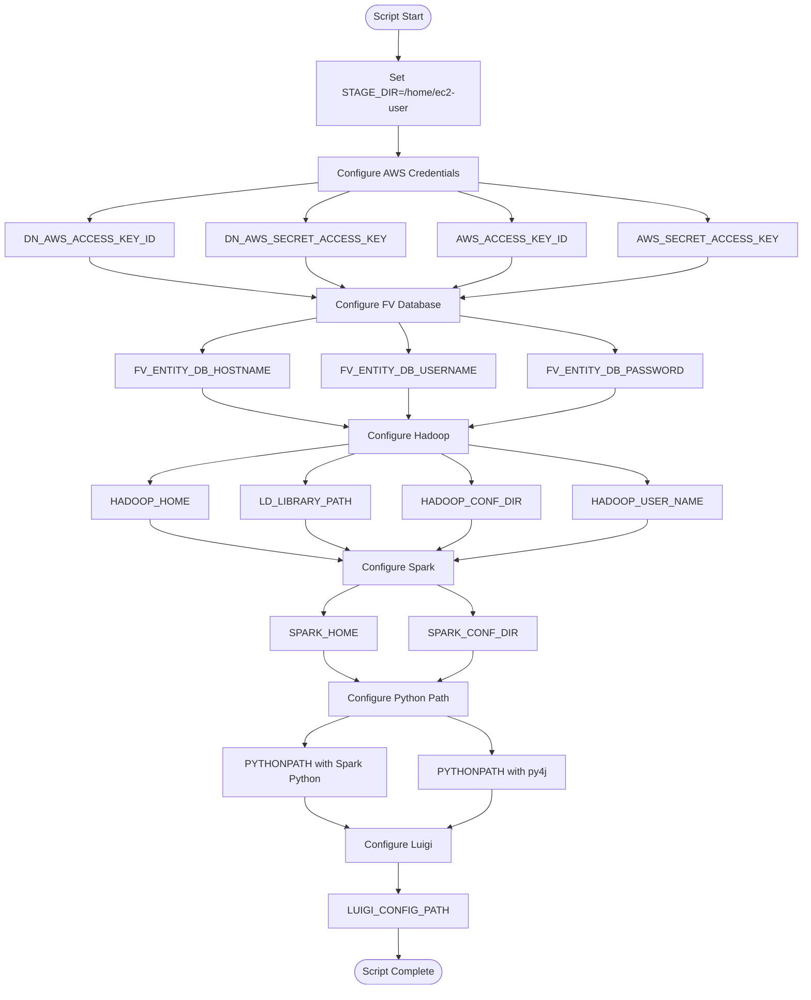
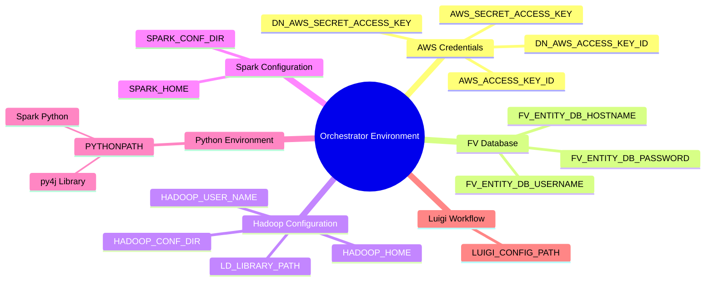
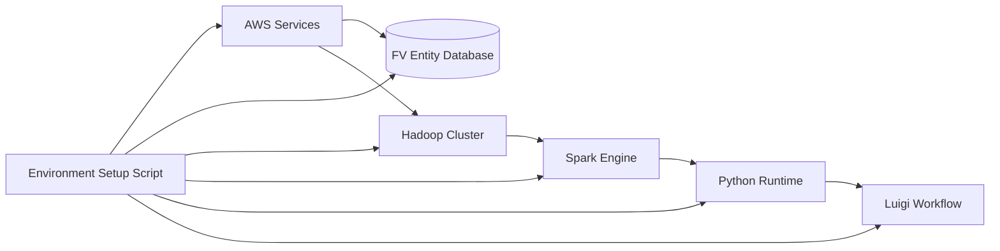

# Diagram: research/orchestrator/set_env_vars.sh

> Auto-generated by Obscura crawlers

## Diagram 1

### SVG

<svg id="container" width="1131.125" xmlns="http://www.w3.org/2000/svg" class="flowchart" height="1544" viewBox="0 0 1131.125 1544" role="graphics-document document" aria-roledescription="flowchart-v2"><g><marker id="container_flowchart-v2-pointEnd" class="marker flowchart-v2" viewBox="0 0 10 10" refX="5" refY="5" markerUnits="userSpaceOnUse" markerWidth="8" markerHeight="8" orient="auto"><path d="M 0 0 L 10 5 L 0 10 z" class="arrowMarkerPath" style="stroke-width: 1; stroke-dasharray: 1, 0;"></path></marker><marker id="container_flowchart-v2-pointStart" class="marker flowchart-v2" viewBox="0 0 10 10" refX="4.5" refY="5" markerUnits="userSpaceOnUse" markerWidth="8" markerHeight="8" orient="auto"><path d="M 0 5 L 10 10 L 10 0 z" class="arrowMarkerPath" style="stroke-width: 1; stroke-dasharray: 1, 0;"></path></marker><marker id="container_flowchart-v2-circleEnd" class="marker flowchart-v2" viewBox="0 0 10 10" refX="11" refY="5" markerUnits="userSpaceOnUse" markerWidth="11" markerHeight="11" orient="auto"><circle cx="5" cy="5" r="5" class="arrowMarkerPath" style="stroke-width: 1; stroke-dasharray: 1, 0;"></circle></marker><marker id="container_flowchart-v2-circleStart" class="marker flowchart-v2" viewBox="0 0 10 10" refX="-1" refY="5" markerUnits="userSpaceOnUse" markerWidth="11" markerHeight="11" orient="auto"><circle cx="5" cy="5" r="5" class="arrowMarkerPath" style="stroke-width: 1; stroke-dasharray: 1, 0;"></circle></marker><marker id="container_flowchart-v2-crossEnd" class="marker cross flowchart-v2" viewBox="0 0 11 11" refX="12" refY="5.2" markerUnits="userSpaceOnUse" markerWidth="11" markerHeight="11" orient="auto"><path d="M 1,1 l 9,9 M 10,1 l -9,9" class="arrowMarkerPath" style="stroke-width: 2; stroke-dasharray: 1, 0;"></path></marker><marker id="container_flowchart-v2-crossStart" class="marker cross flowchart-v2" viewBox="0 0 11 11" refX="-1" refY="5.2" markerUnits="userSpaceOnUse" markerWidth="11" markerHeight="11" orient="auto"><path d="M 1,1 l 9,9 M 10,1 l -9,9" class="arrowMarkerPath" style="stroke-width: 2; stroke-dasharray: 1, 0;"></path></marker><g class="root"><g class="clusters"></g><g class="edgePaths"><path d="M565.719,47.5L565.635,51.583C565.552,55.667,565.385,63.833,565.302,71.417C565.219,79,565.219,86,565.219,89.5L565.219,93" id="L_Start_StageDir_0" class="edge-thickness-normal edge-pattern-solid edge-thickness-normal edge-pattern-solid flowchart-link" style=";" data-edge="true" data-et="edge" data-id="L_Start_StageDir_0" data-points="W3sieCI6NTY1LjcxODc1LCJ5Ijo0Ny41fSx7IngiOjU2NS4yMTg3NSwieSI6NzJ9LHsieCI6NTY1LjIxODc1LCJ5Ijo5N31d" marker-end="url(#container_flowchart-v2-pointEnd)"></path><path d="M565.219,175L565.219,179.167C565.219,183.333,565.219,191.667,565.219,199.333C565.219,207,565.219,214,565.219,217.5L565.219,221" id="L_StageDir_AWS_0" class="edge-thickness-normal edge-pattern-solid edge-thickness-normal edge-pattern-solid flowchart-link" style=";" data-edge="true" data-et="edge" data-id="L_StageDir_AWS_0" data-points="W3sieCI6NTY1LjIxODc1LCJ5IjoxNzV9LHsieCI6NTY1LjIxODc1LCJ5IjoyMDB9LHsieCI6NTY1LjIxODc1LCJ5IjoyMjV9XQ==" marker-end="url(#container_flowchart-v2-pointEnd)"></path><path d="M440.383,266.8L388.086,273C335.789,279.2,231.195,291.6,178.898,301.3C126.602,311,126.602,318,126.602,321.5L126.602,325" id="L_AWS_AWS1_0" class="edge-thickness-normal edge-pattern-solid edge-thickness-normal edge-pattern-solid flowchart-link" style=";" data-edge="true" data-et="edge" data-id="L_AWS_AWS1_0" data-points="W3sieCI6NDQwLjM4MjgxMjUsInkiOjI2Ni43OTk4NTAzODIwNjAxfSx7IngiOjEyNi42MDE1NjI1LCJ5IjozMDR9LHsieCI6MTI2LjYwMTU2MjUsInkiOjMyOX1d" marker-end="url(#container_flowchart-v2-pointEnd)"></path><path d="M496.388,279L485.766,283.167C475.144,287.333,453.9,295.667,443.278,303.333C432.656,311,432.656,318,432.656,321.5L432.656,325" id="L_AWS_AWS2_0" class="edge-thickness-normal edge-pattern-solid edge-thickness-normal edge-pattern-solid flowchart-link" style=";" data-edge="true" data-et="edge" data-id="L_AWS_AWS2_0" data-points="W3sieCI6NDk2LjM4ODIyMTE1Mzg0NjIsInkiOjI3OX0seyJ4Ijo0MzIuNjU2MjUsInkiOjMwNH0seyJ4Ijo0MzIuNjU2MjUsInkiOjMyOX1d" marker-end="url(#container_flowchart-v2-pointEnd)"></path><path d="M647.63,279L660.348,283.167C673.066,287.333,698.502,295.667,711.22,303.333C723.938,311,723.938,318,723.938,321.5L723.938,325" id="L_AWS_AWS3_0" class="edge-thickness-normal edge-pattern-solid edge-thickness-normal edge-pattern-solid flowchart-link" style=";" data-edge="true" data-et="edge" data-id="L_AWS_AWS3_0" data-points="W3sieCI6NjQ3LjYzMDQwODY1Mzg0NjIsInkiOjI3OX0seyJ4Ijo3MjMuOTM3NSwieSI6MzA0fSx7IngiOjcyMy45Mzc1LCJ5IjozMjl9XQ==" marker-end="url(#container_flowchart-v2-pointEnd)"></path><path d="M690.055,266.915L741.786,273.096C793.518,279.277,896.982,291.638,948.714,301.319C1000.445,311,1000.445,318,1000.445,321.5L1000.445,325" id="L_AWS_AWS4_0" class="edge-thickness-normal edge-pattern-solid edge-thickness-normal edge-pattern-solid flowchart-link" style=";" data-edge="true" data-et="edge" data-id="L_AWS_AWS4_0" data-points="W3sieCI6NjkwLjA1NDY4NzUsInkiOjI2Ni45MTUxNDgzNjAyMjkwN30seyJ4IjoxMDAwLjQ0NTMxMjUsInkiOjMwNH0seyJ4IjoxMDAwLjQ0NTMxMjUsInkiOjMyOX1d" marker-end="url(#container_flowchart-v2-pointEnd)"></path><path d="M126.602,383L126.602,387.167C126.602,391.333,126.602,399.667,178.165,410.159C229.729,420.652,332.856,433.305,384.419,439.631L435.983,445.957" id="L_AWS1_FV_0" class="edge-thickness-normal edge-pattern-solid edge-thickness-normal edge-pattern-solid flowchart-link" style=";" data-edge="true" data-et="edge" data-id="L_AWS1_FV_0" data-points="W3sieCI6MTI2LjYwMTU2MjUsInkiOjM4M30seyJ4IjoxMjYuNjAxNTYyNSwieSI6NDA4fSx7IngiOjQzOS45NTMxMjUsInkiOjQ0Ni40NDQwNzU3OTQ0NDA4fV0=" marker-end="url(#container_flowchart-v2-pointEnd)"></path><path d="M432.656,383L432.656,387.167C432.656,391.333,432.656,399.667,441.485,407.731C450.313,415.795,467.97,423.59,476.798,427.487L485.626,431.385" id="L_AWS2_FV_0" class="edge-thickness-normal edge-pattern-solid edge-thickness-normal edge-pattern-solid flowchart-link" style=";" data-edge="true" data-et="edge" data-id="L_AWS2_FV_0" data-points="W3sieCI6NDMyLjY1NjI1LCJ5IjozODN9LHsieCI6NDMyLjY1NjI1LCJ5Ijo0MDh9LHsieCI6NDg5LjI4NTYwNjk3MTE1Mzg3LCJ5Ijo0MzN9XQ==" marker-end="url(#container_flowchart-v2-pointEnd)"></path><path d="M723.938,383L723.938,387.167C723.938,391.333,723.938,399.667,710.674,407.809C697.411,415.951,670.885,423.901,657.622,427.876L644.359,431.852" id="L_AWS3_FV_0" class="edge-thickness-normal edge-pattern-solid edge-thickness-normal edge-pattern-solid flowchart-link" style=";" data-edge="true" data-et="edge" data-id="L_AWS3_FV_0" data-points="W3sieCI6NzIzLjkzNzUsInkiOjM4M30seyJ4Ijo3MjMuOTM3NSwieSI6NDA4fSx7IngiOjY0MC41Mjc3OTQ0NzExNTM4LCJ5Ijo0MzN9XQ==" marker-end="url(#container_flowchart-v2-pointEnd)"></path><path d="M1000.445,383L1000.445,387.167C1000.445,391.333,1000.445,399.667,944.523,410.295C888.601,420.924,776.756,433.849,720.833,440.311L664.911,446.773" id="L_AWS4_FV_0" class="edge-thickness-normal edge-pattern-solid edge-thickness-normal edge-pattern-solid flowchart-link" style=";" data-edge="true" data-et="edge" data-id="L_AWS4_FV_0" data-points="W3sieCI6MTAwMC40NDUzMTI1LCJ5IjozODN9LHsieCI6MTAwMC40NDUzMTI1LCJ5Ijo0MDh9LHsieCI6NjYwLjkzNzUsInkiOjQ0Ny4yMzIwMTM4ODg4ODg5fV0=" marker-end="url(#container_flowchart-v2-pointEnd)"></path><path d="M439.953,481.302L413.415,486.418C386.876,491.535,333.799,501.767,307.261,510.384C280.723,519,280.723,526,280.723,529.5L280.723,533" id="L_FV_FV1_0" class="edge-thickness-normal edge-pattern-solid edge-thickness-normal edge-pattern-solid flowchart-link" style=";" data-edge="true" data-et="edge" data-id="L_FV_FV1_0" data-points="W3sieCI6NDM5Ljk1MzEyNSwieSI6NDgxLjMwMTg1ODEwMDc2OTA0fSx7IngiOjI4MC43MjI2NTYyNSwieSI6NTEyfSx7IngiOjI4MC43MjI2NTYyNSwieSI6NTM3fV0=" marker-end="url(#container_flowchart-v2-pointEnd)"></path><path d="M565.014,487L567.262,491.167C569.511,495.333,574.007,503.667,576.256,511.333C578.504,519,578.504,526,578.504,529.5L578.504,533" id="L_FV_FV2_0" class="edge-thickness-normal edge-pattern-solid edge-thickness-normal edge-pattern-solid flowchart-link" style=";" data-edge="true" data-et="edge" data-id="L_FV_FV2_0" data-points="W3sieCI6NTY1LjAxNDE5NzcxNjM0NjIsInkiOjQ4N30seyJ4Ijo1NzguNTAzOTA2MjUsInkiOjUxMn0seyJ4Ijo1NzguNTAzOTA2MjUsInkiOjUzN31d" marker-end="url(#container_flowchart-v2-pointEnd)"></path><path d="M660.938,477.656L696.76,483.38C732.582,489.104,804.227,500.552,840.049,509.776C875.871,519,875.871,526,875.871,529.5L875.871,533" id="L_FV_FV3_0" class="edge-thickness-normal edge-pattern-solid edge-thickness-normal edge-pattern-solid flowchart-link" style=";" data-edge="true" data-et="edge" data-id="L_FV_FV3_0" data-points="W3sieCI6NjYwLjkzNzUsInkiOjQ3Ny42NTU2MTk0NDA4NzY3Nn0seyJ4Ijo4NzUuODcxMDkzNzUsInkiOjUxMn0seyJ4Ijo4NzUuODcxMDkzNzUsInkiOjUzN31d" marker-end="url(#container_flowchart-v2-pointEnd)"></path><path d="M280.723,591L280.723,595.167C280.723,599.333,280.723,607.667,313.859,617.62C346.995,627.573,413.268,639.146,446.404,644.932L479.54,650.718" id="L_FV1_Hadoop_0" class="edge-thickness-normal edge-pattern-solid edge-thickness-normal edge-pattern-solid flowchart-link" style=";" data-edge="true" data-et="edge" data-id="L_FV1_Hadoop_0" data-points="W3sieCI6MjgwLjcyMjY1NjI1LCJ5Ijo1OTF9LHsieCI6MjgwLjcyMjY1NjI1LCJ5Ijo2MTZ9LHsieCI6NDgzLjQ4MDQ2ODc1LCJ5Ijo2NTEuNDA2NTQ4NDMxMTA1MX1d" marker-end="url(#container_flowchart-v2-pointEnd)"></path><path d="M578.504,591L578.504,595.167C578.504,599.333,578.504,607.667,578.504,615.333C578.504,623,578.504,630,578.504,633.5L578.504,637" id="L_FV2_Hadoop_0" class="edge-thickness-normal edge-pattern-solid edge-thickness-normal edge-pattern-solid flowchart-link" style=";" data-edge="true" data-et="edge" data-id="L_FV2_Hadoop_0" data-points="W3sieCI6NTc4LjUwMzkwNjI1LCJ5Ijo1OTF9LHsieCI6NTc4LjUwMzkwNjI1LCJ5Ijo2MTZ9LHsieCI6NTc4LjUwMzkwNjI1LCJ5Ijo2NDF9XQ==" marker-end="url(#container_flowchart-v2-pointEnd)"></path><path d="M875.871,591L875.871,595.167C875.871,599.333,875.871,607.667,842.804,617.616C809.737,627.565,743.602,639.13,710.535,644.912L677.468,650.694" id="L_FV3_Hadoop_0" class="edge-thickness-normal edge-pattern-solid edge-thickness-normal edge-pattern-solid flowchart-link" style=";" data-edge="true" data-et="edge" data-id="L_FV3_Hadoop_0" data-points="W3sieCI6ODc1Ljg3MTA5Mzc1LCJ5Ijo1OTF9LHsieCI6ODc1Ljg3MTA5Mzc1LCJ5Ijo2MTZ9LHsieCI6NjczLjUyNzM0Mzc1LCJ5Ijo2NTEuMzgzNDQzMjM4ODQwOX1d" marker-end="url(#container_flowchart-v2-pointEnd)"></path><path d="M483.48,681.019L436.061,687.516C388.641,694.013,293.801,707.006,246.381,717.003C198.961,727,198.961,734,198.961,737.5L198.961,741" id="L_Hadoop_H1_0" class="edge-thickness-normal edge-pattern-solid edge-thickness-normal edge-pattern-solid flowchart-link" style=";" data-edge="true" data-et="edge" data-id="L_Hadoop_H1_0" data-points="W3sieCI6NDgzLjQ4MDQ2ODc1LCJ5Ijo2ODEuMDE4ODY1MjA1ODkxMn0seyJ4IjoxOTguOTYwOTM3NSwieSI6NzIwfSx7IngiOjE5OC45NjA5Mzc1LCJ5Ijo3NDV9XQ==" marker-end="url(#container_flowchart-v2-pointEnd)"></path><path d="M500.743,695L488.743,699.167C476.743,703.333,452.742,711.667,440.742,719.333C428.742,727,428.742,734,428.742,737.5L428.742,741" id="L_Hadoop_H2_0" class="edge-thickness-normal edge-pattern-solid edge-thickness-normal edge-pattern-solid flowchart-link" style=";" data-edge="true" data-et="edge" data-id="L_Hadoop_H2_0" data-points="W3sieCI6NTAwLjc0MzAxMzgyMjExNTM2LCJ5Ijo2OTV9LHsieCI6NDI4Ljc0MjE4NzUsInkiOjcyMH0seyJ4Ijo0MjguNzQyMTg3NSwieSI6NzQ1fV0=" marker-end="url(#container_flowchart-v2-pointEnd)"></path><path d="M626.912,695L634.382,699.167C641.853,703.333,656.794,711.667,664.264,719.333C671.734,727,671.734,734,671.734,737.5L671.734,741" id="L_Hadoop_H3_0" class="edge-thickness-normal edge-pattern-solid edge-thickness-normal edge-pattern-solid flowchart-link" style=";" data-edge="true" data-et="edge" data-id="L_Hadoop_H3_0" data-points="W3sieCI6NjI2LjkxMjAzNDI1NDgwNzcsInkiOjY5NX0seyJ4Ijo2NzEuNzM0Mzc1LCJ5Ijo3MjB9LHsieCI6NjcxLjczNDM3NSwieSI6NzQ1fV0=" marker-end="url(#container_flowchart-v2-pointEnd)"></path><path d="M673.527,682.135L715.954,688.446C758.38,694.756,843.233,707.378,885.66,717.189C928.086,727,928.086,734,928.086,737.5L928.086,741" id="L_Hadoop_H4_0" class="edge-thickness-normal edge-pattern-solid edge-thickness-normal edge-pattern-solid flowchart-link" style=";" data-edge="true" data-et="edge" data-id="L_Hadoop_H4_0" data-points="W3sieCI6NjczLjUyNzM0Mzc1LCJ5Ijo2ODIuMTM0NjQ3NDAyNTkwMn0seyJ4Ijo5MjguMDg1OTM3NSwieSI6NzIwfSx7IngiOjkyOC4wODU5Mzc1LCJ5Ijo3NDV9XQ==" marker-end="url(#container_flowchart-v2-pointEnd)"></path><path d="M198.961,799L198.961,803.167C198.961,807.333,198.961,815.667,244.858,826.35C290.755,837.033,382.55,850.065,428.447,856.582L474.344,863.098" id="L_H1_Spark_0" class="edge-thickness-normal edge-pattern-solid edge-thickness-normal edge-pattern-solid flowchart-link" style=";" data-edge="true" data-et="edge" data-id="L_H1_Spark_0" data-points="W3sieCI6MTk4Ljk2MDkzNzUsInkiOjc5OX0seyJ4IjoxOTguOTYwOTM3NSwieSI6ODI0fSx7IngiOjQ3OC4zMDQ2ODc1LCJ5Ijo4NjMuNjYwMjQ2MTU1MTU4OH1d" marker-end="url(#container_flowchart-v2-pointEnd)"></path><path d="M428.742,799L428.742,803.167C428.742,807.333,428.742,815.667,439.055,823.763C449.367,831.859,469.993,839.717,480.305,843.647L490.618,847.576" id="L_H2_Spark_0" class="edge-thickness-normal edge-pattern-solid edge-thickness-normal edge-pattern-solid flowchart-link" style=";" data-edge="true" data-et="edge" data-id="L_H2_Spark_0" data-points="W3sieCI6NDI4Ljc0MjE4NzUsInkiOjc5OX0seyJ4Ijo0MjguNzQyMTg3NSwieSI6ODI0fSx7IngiOjQ5NC4zNTU5MTk0NzExNTM4LCJ5Ijo4NDl9XQ==" marker-end="url(#container_flowchart-v2-pointEnd)"></path><path d="M671.734,799L671.734,803.167C671.734,807.333,671.734,815.667,663.799,823.708C655.863,831.748,639.991,839.497,632.055,843.371L624.119,847.245" id="L_H3_Spark_0" class="edge-thickness-normal edge-pattern-solid edge-thickness-normal edge-pattern-solid flowchart-link" style=";" data-edge="true" data-et="edge" data-id="L_H3_Spark_0" data-points="W3sieCI6NjcxLjczNDM3NSwieSI6Nzk5fSx7IngiOjY3MS43MzQzNzUsInkiOjgyNH0seyJ4Ijo2MjAuNTI0OTM5OTAzODQ2MiwieSI6ODQ5fV0=" marker-end="url(#container_flowchart-v2-pointEnd)"></path><path d="M928.086,799L928.086,803.167C928.086,807.333,928.086,815.667,882.754,826.33C837.421,836.993,746.757,849.985,701.425,856.481L656.092,862.978" id="L_H4_Spark_0" class="edge-thickness-normal edge-pattern-solid edge-thickness-normal edge-pattern-solid flowchart-link" style=";" data-edge="true" data-et="edge" data-id="L_H4_Spark_0" data-points="W3sieCI6OTI4LjA4NTkzNzUsInkiOjc5OX0seyJ4Ijo5MjguMDg1OTM3NSwieSI6ODI0fSx7IngiOjY1Mi4xMzI4MTI1LCJ5Ijo4NjMuNTQ0OTQzNjk5MjcwMX1d" marker-end="url(#container_flowchart-v2-pointEnd)"></path><path d="M508.176,903L499.374,907.167C490.571,911.333,472.965,919.667,464.162,927.333C455.359,935,455.359,942,455.359,945.5L455.359,949" id="L_Spark_S1_0" class="edge-thickness-normal edge-pattern-solid edge-thickness-normal edge-pattern-solid flowchart-link" style=";" data-edge="true" data-et="edge" data-id="L_Spark_S1_0" data-points="W3sieCI6NTA4LjE3NjM4MjIxMTUzODQ1LCJ5Ijo5MDN9LHsieCI6NDU1LjM1OTM3NSwieSI6OTI4fSx7IngiOjQ1NS4zNTkzNzUsInkiOjk1M31d" marker-end="url(#container_flowchart-v2-pointEnd)"></path><path d="M622.261,903L631.064,907.167C639.867,911.333,657.472,919.667,666.275,927.333C675.078,935,675.078,942,675.078,945.5L675.078,949" id="L_Spark_S2_0" class="edge-thickness-normal edge-pattern-solid edge-thickness-normal edge-pattern-solid flowchart-link" style=";" data-edge="true" data-et="edge" data-id="L_Spark_S2_0" data-points="W3sieCI6NjIyLjI2MTExNzc4ODQ2MTUsInkiOjkwM30seyJ4Ijo2NzUuMDc4MTI1LCJ5Ijo5Mjh9LHsieCI6Njc1LjA3ODEyNSwieSI6OTUzfV0=" marker-end="url(#container_flowchart-v2-pointEnd)"></path><path d="M455.359,1007L455.359,1011.167C455.359,1015.333,455.359,1023.667,463.56,1031.715C471.76,1039.763,488.16,1047.526,496.361,1051.407L504.561,1055.289" id="L_S1_Python_0" class="edge-thickness-normal edge-pattern-solid edge-thickness-normal edge-pattern-solid flowchart-link" style=";" data-edge="true" data-et="edge" data-id="L_S1_Python_0" data-points="W3sieCI6NDU1LjM1OTM3NSwieSI6MTAwN30seyJ4Ijo0NTUuMzU5Mzc1LCJ5IjoxMDMyfSx7IngiOjUwOC4xNzYzODIyMTE1Mzg0NSwieSI6MTA1N31d" marker-end="url(#container_flowchart-v2-pointEnd)"></path><path d="M675.078,1007L675.078,1011.167C675.078,1015.333,675.078,1023.667,666.878,1031.715C658.678,1039.763,642.277,1047.526,634.077,1051.407L625.877,1055.289" id="L_S2_Python_0" class="edge-thickness-normal edge-pattern-solid edge-thickness-normal edge-pattern-solid flowchart-link" style=";" data-edge="true" data-et="edge" data-id="L_S2_Python_0" data-points="W3sieCI6Njc1LjA3ODEyNSwieSI6MTAwN30seyJ4Ijo2NzUuMDc4MTI1LCJ5IjoxMDMyfSx7IngiOjYyMi4yNjExMTc3ODg0NjE1LCJ5IjoxMDU3fV0=" marker-end="url(#container_flowchart-v2-pointEnd)"></path><path d="M489.375,1111L477.67,1115.167C465.966,1119.333,442.557,1127.667,430.853,1135.333C419.148,1143,419.148,1150,419.148,1153.5L419.148,1157" id="L_Python_P1_0" class="edge-thickness-normal edge-pattern-solid edge-thickness-normal edge-pattern-solid flowchart-link" style=";" data-edge="true" data-et="edge" data-id="L_Python_P1_0" data-points="W3sieCI6NDg5LjM3NDU0OTI3ODg0NjIsInkiOjExMTF9LHsieCI6NDE5LjE0ODQzNzUsInkiOjExMzZ9LHsieCI6NDE5LjE0ODQzNzUsInkiOjExNjF9XQ==" marker-end="url(#container_flowchart-v2-pointEnd)"></path><path d="M641.063,1111L652.767,1115.167C664.472,1119.333,687.88,1127.667,699.585,1137.333C711.289,1147,711.289,1158,711.289,1163.5L711.289,1169" id="L_Python_P2_0" class="edge-thickness-normal edge-pattern-solid edge-thickness-normal edge-pattern-solid flowchart-link" style=";" data-edge="true" data-et="edge" data-id="L_Python_P2_0" data-points="W3sieCI6NjQxLjA2Mjk1MDcyMTE1MzgsInkiOjExMTF9LHsieCI6NzExLjI4OTA2MjUsInkiOjExMzZ9LHsieCI6NzExLjI4OTA2MjUsInkiOjExNzN9XQ==" marker-end="url(#container_flowchart-v2-pointEnd)"></path><path d="M419.148,1239L419.148,1243.167C419.148,1247.333,419.148,1255.667,430.225,1263.776C441.301,1271.886,463.454,1279.772,474.53,1283.715L485.606,1287.658" id="L_P1_Luigi_0" class="edge-thickness-normal edge-pattern-solid edge-thickness-normal edge-pattern-solid flowchart-link" style=";" data-edge="true" data-et="edge" data-id="L_P1_Luigi_0" data-points="W3sieCI6NDE5LjE0ODQzNzUsInkiOjEyMzl9LHsieCI6NDE5LjE0ODQzNzUsInkiOjEyNjR9LHsieCI6NDg5LjM3NDU0OTI3ODg0NjIsInkiOjEyODl9XQ==" marker-end="url(#container_flowchart-v2-pointEnd)"></path><path d="M711.289,1227L711.289,1233.167C711.289,1239.333,711.289,1251.667,700.213,1261.776C689.136,1271.886,666.984,1279.772,655.908,1283.715L644.831,1287.658" id="L_P2_Luigi_0" class="edge-thickness-normal edge-pattern-solid edge-thickness-normal edge-pattern-solid flowchart-link" style=";" data-edge="true" data-et="edge" data-id="L_P2_Luigi_0" data-points="W3sieCI6NzExLjI4OTA2MjUsInkiOjEyMjd9LHsieCI6NzExLjI4OTA2MjUsInkiOjEyNjR9LHsieCI6NjQxLjA2Mjk1MDcyMTE1MzgsInkiOjEyODl9XQ==" marker-end="url(#container_flowchart-v2-pointEnd)"></path><path d="M565.219,1343L565.219,1347.167C565.219,1351.333,565.219,1359.667,565.219,1367.333C565.219,1375,565.219,1382,565.219,1385.5L565.219,1389" id="L_Luigi_L1_0" class="edge-thickness-normal edge-pattern-solid edge-thickness-normal edge-pattern-solid flowchart-link" style=";" data-edge="true" data-et="edge" data-id="L_Luigi_L1_0" data-points="W3sieCI6NTY1LjIxODc1LCJ5IjoxMzQzfSx7IngiOjU2NS4yMTg3NSwieSI6MTM2OH0seyJ4Ijo1NjUuMjE4NzUsInkiOjEzOTN9XQ==" marker-end="url(#container_flowchart-v2-pointEnd)"></path><path d="M565.219,1447L565.219,1451.167C565.219,1455.333,565.219,1463.667,565.289,1471.417C565.359,1479.167,565.5,1486.334,565.57,1489.917L565.64,1493.501" id="L_L1_End_0" class="edge-thickness-normal edge-pattern-solid edge-thickness-normal edge-pattern-solid flowchart-link" style=";" data-edge="true" data-et="edge" data-id="L_L1_End_0" data-points="W3sieCI6NTY1LjIxODc1LCJ5IjoxNDQ3fSx7IngiOjU2NS4yMTg3NSwieSI6MTQ3Mn0seyJ4Ijo1NjUuNzE4NzUsInkiOjE0OTcuNX1d" marker-end="url(#container_flowchart-v2-pointEnd)"></path></g><g class="edgeLabels"><g class="edgeLabel"><g class="label" data-id="L_Start_StageDir_0" transform="translate(0, 0)"><foreignObject width="0" height="0">

</foreignObject></g></g><g class="edgeLabel"><g class="label" data-id="L_StageDir_AWS_0" transform="translate(0, 0)"><foreignObject width="0" height="0">

</foreignObject></g></g><g class="edgeLabel"><g class="label" data-id="L_AWS_AWS1_0" transform="translate(0, 0)"><foreignObject width="0" height="0">

</foreignObject></g></g><g class="edgeLabel"><g class="label" data-id="L_AWS_AWS2_0" transform="translate(0, 0)"><foreignObject width="0" height="0">

</foreignObject></g></g><g class="edgeLabel"><g class="label" data-id="L_AWS_AWS3_0" transform="translate(0, 0)"><foreignObject width="0" height="0">

</foreignObject></g></g><g class="edgeLabel"><g class="label" data-id="L_AWS_AWS4_0" transform="translate(0, 0)"><foreignObject width="0" height="0">

</foreignObject></g></g><g class="edgeLabel"><g class="label" data-id="L_AWS1_FV_0" transform="translate(0, 0)"><foreignObject width="0" height="0">

</foreignObject></g></g><g class="edgeLabel"><g class="label" data-id="L_AWS2_FV_0" transform="translate(0, 0)"><foreignObject width="0" height="0">

</foreignObject></g></g><g class="edgeLabel"><g class="label" data-id="L_AWS3_FV_0" transform="translate(0, 0)"><foreignObject width="0" height="0">

</foreignObject></g></g><g class="edgeLabel"><g class="label" data-id="L_AWS4_FV_0" transform="translate(0, 0)"><foreignObject width="0" height="0">

</foreignObject></g></g><g class="edgeLabel"><g class="label" data-id="L_FV_FV1_0" transform="translate(0, 0)"><foreignObject width="0" height="0">

</foreignObject></g></g><g class="edgeLabel"><g class="label" data-id="L_FV_FV2_0" transform="translate(0, 0)"><foreignObject width="0" height="0">

</foreignObject></g></g><g class="edgeLabel"><g class="label" data-id="L_FV_FV3_0" transform="translate(0, 0)"><foreignObject width="0" height="0">

</foreignObject></g></g><g class="edgeLabel"><g class="label" data-id="L_FV1_Hadoop_0" transform="translate(0, 0)"><foreignObject width="0" height="0">

</foreignObject></g></g><g class="edgeLabel"><g class="label" data-id="L_FV2_Hadoop_0" transform="translate(0, 0)"><foreignObject width="0" height="0">

</foreignObject></g></g><g class="edgeLabel"><g class="label" data-id="L_FV3_Hadoop_0" transform="translate(0, 0)"><foreignObject width="0" height="0">

</foreignObject></g></g><g class="edgeLabel"><g class="label" data-id="L_Hadoop_H1_0" transform="translate(0, 0)"><foreignObject width="0" height="0">

</foreignObject></g></g><g class="edgeLabel"><g class="label" data-id="L_Hadoop_H2_0" transform="translate(0, 0)"><foreignObject width="0" height="0">

</foreignObject></g></g><g class="edgeLabel"><g class="label" data-id="L_Hadoop_H3_0" transform="translate(0, 0)"><foreignObject width="0" height="0">

</foreignObject></g></g><g class="edgeLabel"><g class="label" data-id="L_Hadoop_H4_0" transform="translate(0, 0)"><foreignObject width="0" height="0">

</foreignObject></g></g><g class="edgeLabel"><g class="label" data-id="L_H1_Spark_0" transform="translate(0, 0)"><foreignObject width="0" height="0">

</foreignObject></g></g><g class="edgeLabel"><g class="label" data-id="L_H2_Spark_0" transform="translate(0, 0)"><foreignObject width="0" height="0">

</foreignObject></g></g><g class="edgeLabel"><g class="label" data-id="L_H3_Spark_0" transform="translate(0, 0)"><foreignObject width="0" height="0">

</foreignObject></g></g><g class="edgeLabel"><g class="label" data-id="L_H4_Spark_0" transform="translate(0, 0)"><foreignObject width="0" height="0">

</foreignObject></g></g><g class="edgeLabel"><g class="label" data-id="L_Spark_S1_0" transform="translate(0, 0)"><foreignObject width="0" height="0">

</foreignObject></g></g><g class="edgeLabel"><g class="label" data-id="L_Spark_S2_0" transform="translate(0, 0)"><foreignObject width="0" height="0">

</foreignObject></g></g><g class="edgeLabel"><g class="label" data-id="L_S1_Python_0" transform="translate(0, 0)"><foreignObject width="0" height="0">

</foreignObject></g></g><g class="edgeLabel"><g class="label" data-id="L_S2_Python_0" transform="translate(0, 0)"><foreignObject width="0" height="0">

</foreignObject></g></g><g class="edgeLabel"><g class="label" data-id="L_Python_P1_0" transform="translate(0, 0)"><foreignObject width="0" height="0">

</foreignObject></g></g><g class="edgeLabel"><g class="label" data-id="L_Python_P2_0" transform="translate(0, 0)"><foreignObject width="0" height="0">

</foreignObject></g></g><g class="edgeLabel"><g class="label" data-id="L_P1_Luigi_0" transform="translate(0, 0)"><foreignObject width="0" height="0">

</foreignObject></g></g><g class="edgeLabel"><g class="label" data-id="L_P2_Luigi_0" transform="translate(0, 0)"><foreignObject width="0" height="0">

</foreignObject></g></g><g class="edgeLabel"><g class="label" data-id="L_Luigi_L1_0" transform="translate(0, 0)"><foreignObject width="0" height="0">

</foreignObject></g></g><g class="edgeLabel"><g class="label" data-id="L_L1_End_0" transform="translate(0, 0)"><foreignObject width="0" height="0">

</foreignObject></g></g></g><g class="nodes"><g class="node default" id="flowchart-Start-0" transform="translate(565.21875, 27.5)"><g class="basic label-container outer-path"><path d="M-33.6875 -19.5 C-17.09932259046526 -19.5, -0.5111451809305194 -19.5, 33.6875 -19.5 C33.6875 -19.5, 33.6875 -19.5, 33.6875 -19.5 C34.17138541813117 -19.48448273646636, 34.655270836262346 -19.468965472932727, 34.9368692896239 -19.45993515863156 C35.42178159814089 -19.4131562514213, 35.906693906657885 -19.36637734421104, 36.181104652847864 -19.3399052695533 C36.44180976252447 -19.297756489219108, 36.70251487220107 -19.255607708884916, 37.41509325967676 -19.140403561325776 C37.73951007018247 -19.066357541345383, 38.06392688068818 -18.992311521364986, 38.63376438623539 -18.862249829261074 C38.92558672506195 -18.77563849090407, 39.217409063888496 -18.689027152547062, 39.832110251460605 -18.50658706670804 C40.088341629090806 -18.412291551163236, 40.344573006721006 -18.31799603561843, 41.0052065951478 -18.074876768247425 C41.33608819295663 -17.928405300151315, 41.666969790765464 -17.781933832055206, 42.14823291279238 -17.568892924097174 C42.47935030891323 -17.396149190631743, 42.810467705034085 -17.223405457166308, 43.25649226407678 -16.990714730406097 C43.57971011683715 -16.79477816862383, 43.902927969597506 -16.598841606841557, 44.3254305736057 -16.342718045390892 C44.537948036011684 -16.194475063349152, 44.75046549841767 -16.046232081307412, 45.35065534457871 -15.627565626425154 C45.66482277811678 -15.377025458525061, 45.97899021165485 -15.126485290624968, 46.327953708501866 -14.848196188198123 C46.696367322810026 -14.513612691373531, 47.064780937118186 -14.17902919454894, 47.25330973676799 -14.007812326905688 C47.58068932604174 -13.669766022616388, 47.908068915315496 -13.331719718327086, 48.12292094296865 -13.10986736009568 C48.299688910496016 -12.902225647055745, 48.47645687802338 -12.694583934015808, 48.93321390812658 -12.158051136245305 C49.18099297012914 -11.826049766298798, 49.4287720321317 -11.49404839635229, 49.680858964640635 -11.156274872382312 C49.8759848852245 -10.856509059719324, 50.07111080580836 -10.556743247056334, 50.36278387860425 -10.108655082055241 C50.600448742066156 -9.686657050801546, 50.83811360552807 -9.264659019547853, 50.976186474273504 -9.019496659696287 C51.12286885864929 -8.71490755003971, 51.269551243025084 -8.410318440383133, 51.51854614880834 -7.893275190886684 C51.65531586347186 -7.555451351405239, 51.792085578135385 -7.2176275119237925, 51.987634229970325 -6.734618561215508 C52.096560831681 -6.406548991960055, 52.20548743339168 -6.078479422704603, 52.38152313421488 -5.548287939305138 C52.471474336010594 -5.205265021760622, 52.56142553780631 -4.862242104216104, 52.69859428754556 -4.339158212148133 C52.77764878383003 -3.9332300819010877, 52.856703280114495 -3.5273019516540423, 52.937544776581774 -3.1121979531509023 C52.97584918428237 -2.815116531085982, 53.014153591982954 -2.5180351090210618, 53.09739270250937 -1.872449005199798 C53.12719305406947 -1.4082844752402859, 53.156993405629585 -0.9441199452807738, 53.17748121591342 -0.6250057626472757 C53.17748121591342 -0.34320110035411283, 53.17748121591342 -0.061396438060949965, 53.17748121591342 0.625005762647271 C53.15561495312523 0.965590455702876, 53.13374869033705 1.3061751487584812, 53.09739270250937 1.8724490051997846 C53.044656215725404 2.2814627826989575, 52.99191972894145 2.6904765601981304, 52.937544776581774 3.1121979531508885 C52.85755436936919 3.522931788208983, 52.7775639621566 3.9336656232670775, 52.69859428754556 4.339158212148129 C52.6058904021898 4.6926783051277186, 52.51318651683404 5.046198398107308, 52.38152313421489 5.548287939305125 C52.23292446908761 5.995843442686458, 52.084325803960326 6.4433989460677905, 51.987634229970325 6.734618561215495 C51.87981278730766 7.000939609178074, 51.77199134464498 7.267260657140653, 51.51854614880834 7.893275190886679 C51.31879795415576 8.308056591009455, 51.119049759503184 8.722837991132232, 50.976186474273504 9.019496659696284 C50.84148667511728 9.258669792931876, 50.70678687596106 9.497842926167467, 50.36278387860425 10.108655082055236 C50.160151283745606 10.41995316222858, 49.95751868888696 10.731251242401925, 49.68085896464064 11.156274872382301 C49.48421555499069 11.41975912673008, 49.28757214534074 11.683243381077858, 48.93321390812658 12.158051136245302 C48.66143937228254 12.4772929704569, 48.389664836438484 12.796534804668497, 48.12292094296866 13.10986736009567 C47.77655477085912 13.467518869990359, 47.43018859874958 13.825170379885046, 47.25330973676799 14.007812326905684 C46.908822886408956 14.320666169779162, 46.56433603604993 14.633520012652639, 46.32795370850189 14.848196188198111 C45.96157346301946 15.140374684182548, 45.59519321753703 15.432553180166988, 45.35065534457871 15.627565626425152 C44.958118117886364 15.901382603103066, 44.56558089119402 16.17519957978098, 44.32543057360571 16.34271804539089 C44.103445571860206 16.477286657977682, 43.8814605701147 16.61185527056448, 43.25649226407678 16.990714730406093 C42.87083954592479 17.191909506443633, 42.4851868277728 17.393104282481172, 42.14823291279239 17.56889292409717 C41.697904526330575 17.76823994226686, 41.24757613986877 17.967586960436545, 41.005206595147804 18.07487676824742 C40.58735039155077 18.228651713791532, 40.16949418795373 18.382426659335646, 39.83211025146062 18.506587066708033 C39.537772834747415 18.593944866979886, 39.24343541803421 18.681302667251735, 38.63376438623541 18.86224982926107 C38.24543150738527 18.950884274749757, 37.85709862853513 19.03951872023844, 37.415093259676766 19.140403561325773 C36.98567064066233 19.20982928014588, 36.556248021647896 19.279254998965985, 36.18110465284788 19.3399052695533 C35.684503679045726 19.38781176824594, 35.18790270524357 19.435718266938583, 34.9368692896239 19.45993515863156 C34.66570246617805 19.468630950865265, 34.3945356427322 19.47732674309897, 33.68750000000001 19.5 C33.68750000000001 19.5, 33.6875 19.5, 33.6875 19.5 C10.106850590065456 19.5, -13.473798819869089 19.5, -33.68749999999999 19.5 C-34.17118127571314 19.48448928291637, -34.654862551426284 19.46897856583274, -34.93686928962389 19.45993515863156 C-35.32373301683561 19.422614880139147, -35.71059674404733 19.385294601646738, -36.18110465284787 19.3399052695533 C-36.67208636825789 19.260527153425876, -37.163068083667895 19.181149037298457, -37.41509325967676 19.140403561325773 C-37.69380942732421 19.07678841485321, -37.97252559497167 19.013173268380648, -38.633764386235384 18.862249829261074 C-38.91209010010582 18.779644218345815, -39.19041581397625 18.697038607430557, -39.83211025146059 18.506587066708043 C-40.28029994439526 18.34164911668798, -40.72848963732993 18.176711166667918, -41.0052065951478 18.074876768247425 C-41.4401449223389 17.882342472786988, -41.875083249530014 17.689808177326555, -42.14823291279238 17.568892924097174 C-42.4765851541139 17.397591770119384, -42.804937395435424 17.226290616141597, -43.25649226407678 16.990714730406097 C-43.60706787158936 16.778193736921022, -43.95764347910193 16.56567274343595, -44.325430573605686 16.3427180453909 C-44.63123205749435 16.12940416816305, -44.93703354138301 15.9160902909352, -45.35065534457871 15.627565626425156 C-45.61223860394809 15.418959938100949, -45.873821863317474 15.210354249776742, -46.327953708501866 14.848196188198125 C-46.66124466075794 14.545510163754527, -46.99453561301401 14.242824139310926, -47.253309736767974 14.007812326905697 C-47.463832974596365 13.790429799568615, -47.674356212424755 13.573047272231534, -48.122920942968655 13.109867360095677 C-48.39962643970257 12.784833338643212, -48.6763319364365 12.459799317190747, -48.933213908126575 12.158051136245307 C-49.172285413249824 11.837717099242326, -49.41135691837307 11.517383062239345, -49.680858964640635 11.156274872382316 C-49.93301502960853 10.768895443207418, -50.185171094576425 10.38151601403252, -50.36278387860425 10.108655082055249 C-50.60071005589015 9.686193061646167, -50.83863623317605 9.263731041237087, -50.976186474273504 9.019496659696289 C-51.0879191029211 8.787481465614285, -51.19965173156869 8.555466271532278, -51.51854614880834 7.893275190886686 C-51.698300372357245 7.449278783409403, -51.87805459590615 7.005282375932119, -51.987634229970325 6.73461856121551 C-52.14337247563539 6.2655597787920385, -52.29911072130045 5.796500996368567, -52.38152313421488 5.5482879393051325 C-52.491294547264935 5.129681966113918, -52.60106596031499 4.711075992922703, -52.69859428754556 4.339158212148136 C-52.781809983904346 3.9118631989894372, -52.86502568026312 3.4845681858307387, -52.937544776581774 3.112197953150904 C-52.992165472922345 2.6885706184099374, -53.046786169262916 2.2649432836689707, -53.09739270250937 1.872449005199809 C-53.119482865431216 1.5283768868334682, -53.14157302835306 1.184304768467127, -53.17748121591342 0.6250057626472781 C-53.17748121591342 0.2199335182146041, -53.17748121591342 -0.18513872621806993, -53.17748121591342 -0.6250057626472687 C-53.151774859431995 -1.025403014642907, -53.126068502950574 -1.4258002666385452, -53.09739270250937 -1.8724490051997822 C-53.05296412997148 -2.2170282403896473, -53.00853555743359 -2.561607475579512, -52.937544776581774 -3.112197953150895 C-52.86887142969851 -3.464821075279453, -52.80019808281525 -3.817444197408011, -52.69859428754556 -4.339158212148126 C-52.57545740478305 -4.80873251398416, -52.45232052202054 -5.278306815820194, -52.38152313421489 -5.548287939305123 C-52.28992032836338 -5.824180995604782, -52.19831752251187 -6.100074051904441, -51.98763422997033 -6.734618561215485 C-51.840063715938996 -7.0991205839546785, -51.69249320190766 -7.463622606693872, -51.51854614880834 -7.893275190886676 C-51.356740472611875 -8.229268139595497, -51.19493479641541 -8.565261088304318, -50.976186474273504 -9.019496659696282 C-50.73440761615072 -9.448799505057494, -50.492628758027934 -9.878102350418708, -50.36278387860425 -10.108655082055243 C-50.103291946948325 -10.507304372418975, -49.84380001529241 -10.905953662782705, -49.68085896464064 -11.156274872382308 C-49.52643012142126 -11.363195453539252, -49.372001278201864 -11.570116034696193, -48.93321390812659 -12.158051136245302 C-48.72578353326728 -12.401710657677736, -48.51835315840798 -12.64537017911017, -48.12292094296866 -13.10986736009567 C-47.86154897065781 -13.379755380544639, -47.60017699834695 -13.649643400993607, -47.253309736767996 -14.007812326905677 C-46.95503339931646 -14.278699004619737, -46.65675706186493 -14.549585682333799, -46.32795370850189 -14.848196188198107 C-46.05760080937337 -15.06379543086031, -45.78724791024485 -15.279394673522512, -45.35065534457872 -15.627565626425149 C-45.082190103741624 -15.814835356760138, -44.813724862904536 -16.002105087095128, -44.325430573605715 -16.342718045390885 C-43.954193784125614 -16.567763968803256, -43.582956994645514 -16.792809892215622, -43.25649226407679 -16.99071473040609 C-42.830058382517244 -17.21318501327177, -42.403624500957704 -17.435655296137444, -42.14823291279239 -17.56889292409717 C-41.71267074823619 -17.761703373853653, -41.277108583680004 -17.95451382361013, -41.005206595147804 -18.07487676824742 C-40.664802225522365 -18.20014872293308, -40.324397855896926 -18.32542067761874, -39.83211025146062 -18.506587066708033 C-39.58957815373167 -18.578569320237026, -39.34704605600272 -18.65055157376602, -38.63376438623541 -18.862249829261067 C-38.185209914019765 -18.964629460452805, -37.736655441804125 -19.067009091644547, -37.415093259676766 -19.140403561325773 C-36.98030724839209 -19.210696391814405, -36.54552123710741 -19.280989222303038, -36.18110465284788 -19.3399052695533 C-35.70064430784936 -19.3862547011972, -35.22018396285084 -19.432604132841103, -34.9368692896239 -19.45993515863156 C-34.56404095673605 -19.471891037600948, -34.191212623848195 -19.483846916570332, -33.68750000000001 -19.5 C-33.68750000000001 -19.5, -33.6875 -19.5, -33.6875 -19.5" stroke="none" stroke-width="0" fill="#ECECFF" style=""></path><path d="M-33.6875 -19.5 C-18.955946979257305 -19.5, -4.224393958514614 -19.5, 33.6875 -19.5 M-33.6875 -19.5 C-15.534705398521634 -19.5, 2.6180892029567318 -19.5, 33.6875 -19.5 M33.6875 -19.5 C33.6875 -19.5, 33.6875 -19.5, 33.6875 -19.5 M33.6875 -19.5 C33.6875 -19.5, 33.6875 -19.5, 33.6875 -19.5 M33.6875 -19.5 C34.051596358792395 -19.4883241384441, 34.41569271758479 -19.476648276888195, 34.9368692896239 -19.45993515863156 M33.6875 -19.5 C34.03488090934799 -19.488860170373133, 34.38226181869598 -19.477720340746263, 34.9368692896239 -19.45993515863156 M34.9368692896239 -19.45993515863156 C35.34762372650057 -19.42031017211055, 35.758378163377245 -19.380685185589545, 36.181104652847864 -19.3399052695533 M34.9368692896239 -19.45993515863156 C35.367821080001704 -19.41836175770917, 35.7987728703795 -19.37678835678678, 36.181104652847864 -19.3399052695533 M36.181104652847864 -19.3399052695533 C36.55613401111025 -19.279273431305548, 36.93116336937264 -19.218641593057797, 37.41509325967676 -19.140403561325776 M36.181104652847864 -19.3399052695533 C36.59452470752755 -19.273066721233096, 37.007944762207224 -19.206228172912894, 37.41509325967676 -19.140403561325776 M37.41509325967676 -19.140403561325776 C37.86082641997359 -19.038667876168724, 38.306559580270424 -18.936932191011675, 38.63376438623539 -18.862249829261074 M37.41509325967676 -19.140403561325776 C37.846080387487696 -19.042033561856776, 38.27706751529863 -18.943663562387776, 38.63376438623539 -18.862249829261074 M38.63376438623539 -18.862249829261074 C38.89333257193167 -18.78521135424763, 39.15290075762796 -18.70817287923418, 39.832110251460605 -18.50658706670804 M38.63376438623539 -18.862249829261074 C39.0271702438877 -18.745489035739354, 39.420576101540014 -18.628728242217637, 39.832110251460605 -18.50658706670804 M39.832110251460605 -18.50658706670804 C40.2221514061339 -18.363048316287358, 40.61219256080718 -18.21950956586668, 41.0052065951478 -18.074876768247425 M39.832110251460605 -18.50658706670804 C40.1207764315939 -18.40035524401807, 40.4094426117272 -18.294123421328095, 41.0052065951478 -18.074876768247425 M41.0052065951478 -18.074876768247425 C41.414890789876 -17.893521728091095, 41.82457498460419 -17.71216668793477, 42.14823291279238 -17.568892924097174 M41.0052065951478 -18.074876768247425 C41.24962182116319 -17.966681398010486, 41.49403704717857 -17.85848602777355, 42.14823291279238 -17.568892924097174 M42.14823291279238 -17.568892924097174 C42.56982421392656 -17.348949012337588, 42.99141551506074 -17.129005100578006, 43.25649226407678 -16.990714730406097 M42.14823291279238 -17.568892924097174 C42.5017873718512 -17.384443789268627, 42.855341830910014 -17.199994654440083, 43.25649226407678 -16.990714730406097 M43.25649226407678 -16.990714730406097 C43.505089570507536 -16.840013582327842, 43.75368687693828 -16.68931243424959, 44.3254305736057 -16.342718045390892 M43.25649226407678 -16.990714730406097 C43.6476828340127 -16.75357270801998, 44.038873403948614 -16.516430685633868, 44.3254305736057 -16.342718045390892 M44.3254305736057 -16.342718045390892 C44.59827499372262 -16.15239358916191, 44.87111941383954 -15.962069132932932, 45.35065534457871 -15.627565626425154 M44.3254305736057 -16.342718045390892 C44.59116590786103 -16.15735257971159, 44.85690124211637 -15.971987114032283, 45.35065534457871 -15.627565626425154 M45.35065534457871 -15.627565626425154 C45.56800302659716 -15.454236633880168, 45.7853507086156 -15.280907641335181, 46.327953708501866 -14.848196188198123 M45.35065534457871 -15.627565626425154 C45.72155853958926 -15.331780198552782, 46.0924617345998 -15.035994770680409, 46.327953708501866 -14.848196188198123 M46.327953708501866 -14.848196188198123 C46.54640794638923 -14.64980182933122, 46.764862184276595 -14.45140747046432, 47.25330973676799 -14.007812326905688 M46.327953708501866 -14.848196188198123 C46.55713065407925 -14.640063749914447, 46.78630759965663 -14.431931311630768, 47.25330973676799 -14.007812326905688 M47.25330973676799 -14.007812326905688 C47.547234342322405 -13.704311040011847, 47.84115894787682 -13.400809753118008, 48.12292094296865 -13.10986736009568 M47.25330973676799 -14.007812326905688 C47.54669561384338 -13.70486732139687, 47.84008149091877 -13.401922315888054, 48.12292094296865 -13.10986736009568 M48.12292094296865 -13.10986736009568 C48.44691765085402 -12.729282391078584, 48.77091435873938 -12.348697422061488, 48.93321390812658 -12.158051136245305 M48.12292094296865 -13.10986736009568 C48.35496592232064 -12.837294123615463, 48.58701090167263 -12.564720887135246, 48.93321390812658 -12.158051136245305 M48.93321390812658 -12.158051136245305 C49.11106956461177 -11.919740759538792, 49.288925221096946 -11.681430382832279, 49.680858964640635 -11.156274872382312 M48.93321390812658 -12.158051136245305 C49.172285807271166 -11.837716571289633, 49.41135770641574 -11.517382006333959, 49.680858964640635 -11.156274872382312 M49.680858964640635 -11.156274872382312 C49.86005713008162 -10.880978368819896, 50.03925529552261 -10.60568186525748, 50.36278387860425 -10.108655082055241 M49.680858964640635 -11.156274872382312 C49.90563019228822 -10.81096590718986, 50.130401419935815 -10.46565694199741, 50.36278387860425 -10.108655082055241 M50.36278387860425 -10.108655082055241 C50.55690142599544 -9.763979720129027, 50.75101897338663 -9.419304358202814, 50.976186474273504 -9.019496659696287 M50.36278387860425 -10.108655082055241 C50.51507669372041 -9.838243767496733, 50.66736950883657 -9.567832452938227, 50.976186474273504 -9.019496659696287 M50.976186474273504 -9.019496659696287 C51.172265799270484 -8.61233374591459, 51.36834512426747 -8.205170832132893, 51.51854614880834 -7.893275190886684 M50.976186474273504 -9.019496659696287 C51.14115644936009 -8.67693297663698, 51.30612642444668 -8.334369293577675, 51.51854614880834 -7.893275190886684 M51.51854614880834 -7.893275190886684 C51.63036702310362 -7.617075469467817, 51.7421878973989 -7.34087574804895, 51.987634229970325 -6.734618561215508 M51.51854614880834 -7.893275190886684 C51.674947162118094 -7.506961664203703, 51.831348175427856 -7.120648137520723, 51.987634229970325 -6.734618561215508 M51.987634229970325 -6.734618561215508 C52.14270467297659 -6.267571094000428, 52.29777511598286 -5.800523626785348, 52.38152313421488 -5.548287939305138 M51.987634229970325 -6.734618561215508 C52.09980643822866 -6.3967737421556805, 52.211978646487005 -6.058928923095854, 52.38152313421488 -5.548287939305138 M52.38152313421488 -5.548287939305138 C52.49563190227478 -5.1131417516398265, 52.60974067033468 -4.677995563974514, 52.69859428754556 -4.339158212148133 M52.38152313421488 -5.548287939305138 C52.445076964926336 -5.305929638397881, 52.5086307956378 -5.063571337490625, 52.69859428754556 -4.339158212148133 M52.69859428754556 -4.339158212148133 C52.76002163045991 -4.023741788956472, 52.82144897337426 -3.7083253657648103, 52.937544776581774 -3.1121979531509023 M52.69859428754556 -4.339158212148133 C52.760147559249425 -4.023095171237355, 52.8217008309533 -3.707032130326575, 52.937544776581774 -3.1121979531509023 M52.937544776581774 -3.1121979531509023 C52.99638221131895 -2.655866428095027, 53.05521964605613 -2.199534903039152, 53.09739270250937 -1.872449005199798 M52.937544776581774 -3.1121979531509023 C52.99597644110847 -2.65901350171912, 53.05440810563517 -2.205829050287338, 53.09739270250937 -1.872449005199798 M53.09739270250937 -1.872449005199798 C53.12725937032231 -1.4072515460728925, 53.15712603813525 -0.942054086945987, 53.17748121591342 -0.6250057626472757 M53.09739270250937 -1.872449005199798 C53.128006048251365 -1.3956214346202347, 53.15861939399337 -0.9187938640406713, 53.17748121591342 -0.6250057626472757 M53.17748121591342 -0.6250057626472757 C53.17748121591342 -0.3124740427869479, 53.17748121591342 0.000057677073379891475, 53.17748121591342 0.625005762647271 M53.17748121591342 -0.6250057626472757 C53.17748121591342 -0.33480335527945304, 53.17748121591342 -0.044600947911630384, 53.17748121591342 0.625005762647271 M53.17748121591342 0.625005762647271 C53.16143321894579 0.8749662691280676, 53.14538522197816 1.1249267756088643, 53.09739270250937 1.8724490051997846 M53.17748121591342 0.625005762647271 C53.1542286431217 0.9871833530172331, 53.13097607032998 1.3493609433871954, 53.09739270250937 1.8724490051997846 M53.09739270250937 1.8724490051997846 C53.05068216914443 2.2347266779401314, 53.003971635779486 2.597004350680478, 52.937544776581774 3.1121979531508885 M53.09739270250937 1.8724490051997846 C53.05945967550008 2.1666500719603974, 53.021526648490784 2.4608511387210106, 52.937544776581774 3.1121979531508885 M52.937544776581774 3.1121979531508885 C52.87322186031171 3.442482533544497, 52.80889894404165 3.772767113938106, 52.69859428754556 4.339158212148129 M52.937544776581774 3.1121979531508885 C52.88408058750988 3.386725264374711, 52.83061639843798 3.6612525755985343, 52.69859428754556 4.339158212148129 M52.69859428754556 4.339158212148129 C52.617761786467845 4.6474075717850285, 52.53692928539014 4.955656931421927, 52.38152313421489 5.548287939305125 M52.69859428754556 4.339158212148129 C52.62517500178933 4.6191377688563735, 52.5517557160331 4.899117325564617, 52.38152313421489 5.548287939305125 M52.38152313421489 5.548287939305125 C52.24964854345455 5.945473195312618, 52.117773952694215 6.34265845132011, 51.987634229970325 6.734618561215495 M52.38152313421489 5.548287939305125 C52.28104207651937 5.8509208756016164, 52.180561018823845 6.153553811898108, 51.987634229970325 6.734618561215495 M51.987634229970325 6.734618561215495 C51.87609641254077 7.010119126703502, 51.76455859511121 7.28561969219151, 51.51854614880834 7.893275190886679 M51.987634229970325 6.734618561215495 C51.88394124530873 6.99074223809711, 51.780248260647134 7.2468659149787245, 51.51854614880834 7.893275190886679 M51.51854614880834 7.893275190886679 C51.34398706605724 8.25575086118538, 51.16942798330614 8.61822653148408, 50.976186474273504 9.019496659696284 M51.51854614880834 7.893275190886679 C51.390100097833596 8.159996164040965, 51.261654046858844 8.42671713719525, 50.976186474273504 9.019496659696284 M50.976186474273504 9.019496659696284 C50.83452135910144 9.271037416832735, 50.69285624392937 9.522578173969189, 50.36278387860425 10.108655082055236 M50.976186474273504 9.019496659696284 C50.81384227098471 9.307755231768727, 50.651498067695904 9.59601380384117, 50.36278387860425 10.108655082055236 M50.36278387860425 10.108655082055236 C50.11945906371549 10.482467339585886, 49.87613424882674 10.856279597116536, 49.68085896464064 11.156274872382301 M50.36278387860425 10.108655082055236 C50.2250588062748 10.320237777513489, 50.08733373394535 10.531820472971742, 49.68085896464064 11.156274872382301 M49.68085896464064 11.156274872382301 C49.39441977579446 11.540077290289258, 49.10798058694827 11.923879708196212, 48.93321390812658 12.158051136245302 M49.68085896464064 11.156274872382301 C49.40181407342527 11.530169605098342, 49.12276918220989 11.904064337814384, 48.93321390812658 12.158051136245302 M48.93321390812658 12.158051136245302 C48.745000133906714 12.379137745111104, 48.556786359686846 12.600224353976907, 48.12292094296866 13.10986736009567 M48.93321390812658 12.158051136245302 C48.74696593883732 12.376828598782142, 48.560717969548065 12.59560606131898, 48.12292094296866 13.10986736009567 M48.12292094296866 13.10986736009567 C47.90531198823945 13.334566471881027, 47.68770303351024 13.559265583666386, 47.25330973676799 14.007812326905684 M48.12292094296866 13.10986736009567 C47.945828502252205 13.292729844695193, 47.76873606153575 13.475592329294718, 47.25330973676799 14.007812326905684 M47.25330973676799 14.007812326905684 C46.9660473194309 14.268696453784168, 46.6787849020938 14.52958058066265, 46.32795370850189 14.848196188198111 M47.25330973676799 14.007812326905684 C46.97197770597518 14.26331063363408, 46.69064567518237 14.518808940362476, 46.32795370850189 14.848196188198111 M46.32795370850189 14.848196188198111 C46.00949711972131 15.102156843264888, 45.69104053094073 15.356117498331665, 45.35065534457871 15.627565626425152 M46.32795370850189 14.848196188198111 C45.996552682093466 15.112479687807141, 45.665151655685044 15.376763187416172, 45.35065534457871 15.627565626425152 M45.35065534457871 15.627565626425152 C45.11835093446253 15.789611126626367, 44.88604652434635 15.95165662682758, 44.32543057360571 16.34271804539089 M45.35065534457871 15.627565626425152 C44.957404200671874 15.901880600846917, 44.56415305676503 16.176195575268682, 44.32543057360571 16.34271804539089 M44.32543057360571 16.34271804539089 C44.09461229343022 16.482641443272048, 43.863794013254726 16.622564841153206, 43.25649226407678 16.990714730406093 M44.32543057360571 16.34271804539089 C44.00300438659468 16.538174694743564, 43.68057819958366 16.73363134409624, 43.25649226407678 16.990714730406093 M43.25649226407678 16.990714730406093 C42.94036619478091 17.155637498269343, 42.62424012548503 17.32056026613259, 42.14823291279239 17.56889292409717 M43.25649226407678 16.990714730406093 C42.92005263849987 17.166235067569705, 42.583613012922946 17.34175540473332, 42.14823291279239 17.56889292409717 M42.14823291279239 17.56889292409717 C41.84483123432898 17.703199847061903, 41.54142955586558 17.837506770026636, 41.005206595147804 18.07487676824742 M42.14823291279239 17.56889292409717 C41.733926669757345 17.752294007930747, 41.31962042672231 17.935695091764323, 41.005206595147804 18.07487676824742 M41.005206595147804 18.07487676824742 C40.717216832122496 18.180859663188922, 40.42922706909718 18.286842558130424, 39.83211025146062 18.506587066708033 M41.005206595147804 18.07487676824742 C40.53835180717892 18.246683645778322, 40.071497019210035 18.418490523309224, 39.83211025146062 18.506587066708033 M39.83211025146062 18.506587066708033 C39.36929523924155 18.64394813296908, 38.906480227022485 18.781309199230126, 38.63376438623541 18.86224982926107 M39.83211025146062 18.506587066708033 C39.41313443654605 18.630936889325746, 38.994158621631485 18.75528671194346, 38.63376438623541 18.86224982926107 M38.63376438623541 18.86224982926107 C38.327586354968176 18.93213296689944, 38.02140832370094 19.00201610453781, 37.415093259676766 19.140403561325773 M38.63376438623541 18.86224982926107 C38.309121904762556 18.936347357167076, 37.9844794232897 19.01044488507308, 37.415093259676766 19.140403561325773 M37.415093259676766 19.140403561325773 C37.13760318263317 19.185266005014494, 36.860113105589576 19.230128448703216, 36.18110465284788 19.3399052695533 M37.415093259676766 19.140403561325773 C37.132008553049346 19.186170501338605, 36.848923846421926 19.23193744135144, 36.18110465284788 19.3399052695533 M36.18110465284788 19.3399052695533 C35.811197363196264 19.375589780907386, 35.44129007354464 19.411274292261474, 34.9368692896239 19.45993515863156 M36.18110465284788 19.3399052695533 C35.71364588547936 19.38500045463992, 35.246187118110846 19.430095639726538, 34.9368692896239 19.45993515863156 M34.9368692896239 19.45993515863156 C34.60216767871224 19.470668387836334, 34.26746606780058 19.481401617041104, 33.68750000000001 19.5 M34.9368692896239 19.45993515863156 C34.455415924285866 19.475374430965825, 33.97396255894783 19.490813703300088, 33.68750000000001 19.5 M33.68750000000001 19.5 C33.68750000000001 19.5, 33.6875 19.5, 33.6875 19.5 M33.68750000000001 19.5 C33.68750000000001 19.5, 33.68750000000001 19.5, 33.6875 19.5 M33.6875 19.5 C13.733884411602592 19.5, -6.2197311767948165 19.5, -33.68749999999999 19.5 M33.6875 19.5 C15.278001183554757 19.5, -3.131497632890486 19.5, -33.68749999999999 19.5 M-33.68749999999999 19.5 C-34.152829848738634 19.485077777460557, -34.618159697477275 19.470155554921114, -34.93686928962389 19.45993515863156 M-33.68749999999999 19.5 C-34.16349326522093 19.48473582244905, -34.639486530441864 19.4694716448981, -34.93686928962389 19.45993515863156 M-34.93686928962389 19.45993515863156 C-35.307117828766316 19.424217727349507, -35.67736636790873 19.388500296067452, -36.18110465284787 19.3399052695533 M-34.93686928962389 19.45993515863156 C-35.403641101037024 19.41490624335977, -35.870412912450156 19.36987732808798, -36.18110465284787 19.3399052695533 M-36.18110465284787 19.3399052695533 C-36.59884386704656 19.272368433017643, -37.01658308124526 19.204831596481988, -37.41509325967676 19.140403561325773 M-36.18110465284787 19.3399052695533 C-36.45375100864617 19.295825921151895, -36.72639736444447 19.251746572750495, -37.41509325967676 19.140403561325773 M-37.41509325967676 19.140403561325773 C-37.85377255535983 19.040277874736045, -38.29245185104291 18.940152188146314, -38.633764386235384 18.862249829261074 M-37.41509325967676 19.140403561325773 C-37.73668090439457 19.067003279974433, -38.058268549112384 18.993602998623096, -38.633764386235384 18.862249829261074 M-38.633764386235384 18.862249829261074 C-38.99549952083695 18.754888740097797, -39.357234655438525 18.647527650934524, -39.83211025146059 18.506587066708043 M-38.633764386235384 18.862249829261074 C-38.9097670825867 18.780333677751724, -39.18576977893801 18.69841752624237, -39.83211025146059 18.506587066708043 M-39.83211025146059 18.506587066708043 C-40.2795560536299 18.341922875366084, -40.72700185579921 18.177258684024125, -41.0052065951478 18.074876768247425 M-39.83211025146059 18.506587066708043 C-40.17230232783788 18.38139323790012, -40.512494404215175 18.256199409092194, -41.0052065951478 18.074876768247425 M-41.0052065951478 18.074876768247425 C-41.322705312165034 17.934329504488705, -41.640204029182264 17.793782240729982, -42.14823291279238 17.568892924097174 M-41.0052065951478 18.074876768247425 C-41.23679020500237 17.97236157384851, -41.46837381485695 17.869846379449594, -42.14823291279238 17.568892924097174 M-42.14823291279238 17.568892924097174 C-42.37997772196588 17.447991805590995, -42.61172253113938 17.327090687084816, -43.25649226407678 16.990714730406097 M-42.14823291279238 17.568892924097174 C-42.39362501194808 17.44087202314879, -42.639017111103776 17.3128511222004, -43.25649226407678 16.990714730406097 M-43.25649226407678 16.990714730406097 C-43.65436685589277 16.74952081467661, -44.05224144770875 16.50832689894713, -44.325430573605686 16.3427180453909 M-43.25649226407678 16.990714730406097 C-43.56858630167332 16.801521490746932, -43.88068033926986 16.612328251087767, -44.325430573605686 16.3427180453909 M-44.325430573605686 16.3427180453909 C-44.69362158670185 16.085883933387088, -45.06181259979802 15.829049821383272, -45.35065534457871 15.627565626425156 M-44.325430573605686 16.3427180453909 C-44.5962800322501 16.153785187924647, -44.86712949089452 15.964852330458399, -45.35065534457871 15.627565626425156 M-45.35065534457871 15.627565626425156 C-45.55030334726509 15.468351657139245, -45.74995134995147 15.309137687853335, -46.327953708501866 14.848196188198125 M-45.35065534457871 15.627565626425156 C-45.601661869736766 15.427394602175763, -45.85266839489483 15.22722357792637, -46.327953708501866 14.848196188198125 M-46.327953708501866 14.848196188198125 C-46.689240872234286 14.520084745230868, -47.05052803596671 14.191973302263612, -47.253309736767974 14.007812326905697 M-46.327953708501866 14.848196188198125 C-46.5858850678434 14.613949752133943, -46.84381642718493 14.379703316069758, -47.253309736767974 14.007812326905697 M-47.253309736767974 14.007812326905697 C-47.45490541587031 13.79964823691947, -47.65650109497264 13.591484146933245, -48.122920942968655 13.109867360095677 M-47.253309736767974 14.007812326905697 C-47.510802155946806 13.741930263582779, -47.768294575125644 13.476048200259859, -48.122920942968655 13.109867360095677 M-48.122920942968655 13.109867360095677 C-48.43172288499058 12.747131027668448, -48.7405248270125 12.384394695241221, -48.933213908126575 12.158051136245307 M-48.122920942968655 13.109867360095677 C-48.3966422261261 12.788338765716706, -48.67036350928354 12.466810171337734, -48.933213908126575 12.158051136245307 M-48.933213908126575 12.158051136245307 C-49.13648474505201 11.88568673311943, -49.33975558197744 11.613322329993554, -49.680858964640635 11.156274872382316 M-48.933213908126575 12.158051136245307 C-49.181406968293004 11.825495046475227, -49.429600028459426 11.49293895670515, -49.680858964640635 11.156274872382316 M-49.680858964640635 11.156274872382316 C-49.9219076712084 10.785959328453366, -50.162956377776176 10.415643784524415, -50.36278387860425 10.108655082055249 M-49.680858964640635 11.156274872382316 C-49.872592220252905 10.861721104173801, -50.06432547586517 10.567167335965287, -50.36278387860425 10.108655082055249 M-50.36278387860425 10.108655082055249 C-50.51462463738479 9.839046439296302, -50.666465396165336 9.569437796537354, -50.976186474273504 9.019496659696289 M-50.36278387860425 10.108655082055249 C-50.54154051806637 9.791254567617697, -50.720297157528485 9.473854053180144, -50.976186474273504 9.019496659696289 M-50.976186474273504 9.019496659696289 C-51.09427379307543 8.774285815540225, -51.212361111877364 8.529074971384158, -51.51854614880834 7.893275190886686 M-50.976186474273504 9.019496659696289 C-51.18263917368125 8.59079321199598, -51.389091873089 8.162089764295672, -51.51854614880834 7.893275190886686 M-51.51854614880834 7.893275190886686 C-51.698580240403096 7.448587503925275, -51.87861433199785 7.003899816963863, -51.987634229970325 6.73461856121551 M-51.51854614880834 7.893275190886686 C-51.638215539986696 7.59768948102586, -51.75788493116506 7.302103771165034, -51.987634229970325 6.73461856121551 M-51.987634229970325 6.73461856121551 C-52.10674413484555 6.375878505317472, -52.22585403972077 6.017138449419433, -52.38152313421488 5.5482879393051325 M-51.987634229970325 6.73461856121551 C-52.12207229818707 6.329712519543979, -52.256510366403816 5.924806477872449, -52.38152313421488 5.5482879393051325 M-52.38152313421488 5.5482879393051325 C-52.479510107870176 5.174621140934464, -52.57749708152548 4.800954342563796, -52.69859428754556 4.339158212148136 M-52.38152313421488 5.5482879393051325 C-52.5023745298115 5.087429190569072, -52.62322592540811 4.62657044183301, -52.69859428754556 4.339158212148136 M-52.69859428754556 4.339158212148136 C-52.78916576018487 3.874092842432797, -52.879737232824176 3.409027472717458, -52.937544776581774 3.112197953150904 M-52.69859428754556 4.339158212148136 C-52.77265547315958 3.9588696768572658, -52.8467166587736 3.5785811415663957, -52.937544776581774 3.112197953150904 M-52.937544776581774 3.112197953150904 C-52.9888897891498 2.7139761748928293, -53.04023480171784 2.3157543966347545, -53.09739270250937 1.872449005199809 M-52.937544776581774 3.112197953150904 C-53.00124393568811 2.618159853943924, -53.064943094794444 2.124121754736944, -53.09739270250937 1.872449005199809 M-53.09739270250937 1.872449005199809 C-53.12276808762837 1.4772068993291354, -53.14814347274737 1.0819647934584615, -53.17748121591342 0.6250057626472781 M-53.09739270250937 1.872449005199809 C-53.12688642917899 1.413060405412809, -53.15638015584861 0.953671805625809, -53.17748121591342 0.6250057626472781 M-53.17748121591342 0.6250057626472781 C-53.17748121591342 0.32343922324773433, -53.17748121591342 0.02187268384819052, -53.17748121591342 -0.6250057626472687 M-53.17748121591342 0.6250057626472781 C-53.17748121591342 0.2702460081497991, -53.17748121591342 -0.08451374634767994, -53.17748121591342 -0.6250057626472687 M-53.17748121591342 -0.6250057626472687 C-53.15610575286461 -0.9579458535955954, -53.13473028981581 -1.290885944543922, -53.09739270250937 -1.8724490051997822 M-53.17748121591342 -0.6250057626472687 C-53.15158101846222 -1.0284222442127506, -53.125680821011024 -1.4318387257782326, -53.09739270250937 -1.8724490051997822 M-53.09739270250937 -1.8724490051997822 C-53.05965071944075 -2.1651683728824547, -53.021908736372126 -2.457887740565127, -52.937544776581774 -3.112197953150895 M-53.09739270250937 -1.8724490051997822 C-53.03595663033466 -2.3489350490621366, -52.97452055815995 -2.8254210929244907, -52.937544776581774 -3.112197953150895 M-52.937544776581774 -3.112197953150895 C-52.868729028317574 -3.4655522762740176, -52.799913280053374 -3.81890659939714, -52.69859428754556 -4.339158212148126 M-52.937544776581774 -3.112197953150895 C-52.87005426307251 -3.4587474758958714, -52.802563749563255 -3.8052969986408476, -52.69859428754556 -4.339158212148126 M-52.69859428754556 -4.339158212148126 C-52.628704194503776 -4.605679427474383, -52.55881410146199 -4.872200642800641, -52.38152313421489 -5.548287939305123 M-52.69859428754556 -4.339158212148126 C-52.593633519575214 -4.739419110703671, -52.48867275160486 -5.139680009259215, -52.38152313421489 -5.548287939305123 M-52.38152313421489 -5.548287939305123 C-52.252889841137396 -5.935710923122533, -52.12425654805991 -6.323133906939943, -51.98763422997033 -6.734618561215485 M-52.38152313421489 -5.548287939305123 C-52.2366254726191 -5.984696609724423, -52.091727811023326 -6.421105280143725, -51.98763422997033 -6.734618561215485 M-51.98763422997033 -6.734618561215485 C-51.82636014148857 -7.132968677787809, -51.66508605300682 -7.531318794360133, -51.51854614880834 -7.893275190886676 M-51.98763422997033 -6.734618561215485 C-51.831265288480125 -7.12085286988411, -51.67489634698992 -7.507087178552734, -51.51854614880834 -7.893275190886676 M-51.51854614880834 -7.893275190886676 C-51.36056830968898 -8.221319554002296, -51.20259047056962 -8.549363917117915, -50.976186474273504 -9.019496659696282 M-51.51854614880834 -7.893275190886676 C-51.379772371525895 -8.18144190869684, -51.24099859424345 -8.469608626507005, -50.976186474273504 -9.019496659696282 M-50.976186474273504 -9.019496659696282 C-50.737364855880095 -9.443548626464997, -50.49854323748668 -9.86760059323371, -50.36278387860425 -10.108655082055243 M-50.976186474273504 -9.019496659696282 C-50.7334818467417 -9.450443302387535, -50.49077721920988 -9.881389945078789, -50.36278387860425 -10.108655082055243 M-50.36278387860425 -10.108655082055243 C-50.118686971706296 -10.483653480247753, -49.874590064808345 -10.858651878440261, -49.68085896464064 -11.156274872382308 M-50.36278387860425 -10.108655082055243 C-50.12113329858248 -10.479895265235195, -49.8794827185607 -10.851135448415148, -49.68085896464064 -11.156274872382308 M-49.68085896464064 -11.156274872382308 C-49.447531345408386 -11.468912625570136, -49.21420372617612 -11.781550378757963, -48.93321390812659 -12.158051136245302 M-49.68085896464064 -11.156274872382308 C-49.4485390605135 -11.46756237913402, -49.21621915638635 -11.77884988588573, -48.93321390812659 -12.158051136245302 M-48.93321390812659 -12.158051136245302 C-48.75702390840085 -12.365013935418144, -48.58083390867512 -12.571976734590985, -48.12292094296866 -13.10986736009567 M-48.93321390812659 -12.158051136245302 C-48.63738831143671 -12.505544715070544, -48.34156271474683 -12.853038293895786, -48.12292094296866 -13.10986736009567 M-48.12292094296866 -13.10986736009567 C-47.84153091433325 -13.400425667212732, -47.56014088569784 -13.690983974329791, -47.253309736767996 -14.007812326905677 M-48.12292094296866 -13.10986736009567 C-47.80309617743064 -13.440112688615265, -47.48327141189261 -13.770358017134859, -47.253309736767996 -14.007812326905677 M-47.253309736767996 -14.007812326905677 C-46.952704972413976 -14.280813620325773, -46.65210020805996 -14.553814913745867, -46.32795370850189 -14.848196188198107 M-47.253309736767996 -14.007812326905677 C-46.93213035196887 -14.29949894623939, -46.61095096716976 -14.591185565573102, -46.32795370850189 -14.848196188198107 M-46.32795370850189 -14.848196188198107 C-46.03114481430356 -15.084893382904891, -45.734335920105224 -15.321590577611673, -45.35065534457872 -15.627565626425149 M-46.32795370850189 -14.848196188198107 C-46.10615230938196 -15.025076901613135, -45.884350910262036 -15.20195761502816, -45.35065534457872 -15.627565626425149 M-45.35065534457872 -15.627565626425149 C-45.053455239447985 -15.834879554179153, -44.75625513431726 -16.04219348193316, -44.325430573605715 -16.342718045390885 M-45.35065534457872 -15.627565626425149 C-45.04248250119134 -15.842533661384811, -44.73430965780395 -16.057501696344474, -44.325430573605715 -16.342718045390885 M-44.325430573605715 -16.342718045390885 C-44.04657203033338 -16.511763733077274, -43.767713487061044 -16.680809420763662, -43.25649226407679 -16.99071473040609 M-44.325430573605715 -16.342718045390885 C-43.96466807807926 -16.56141439025477, -43.60390558255279 -16.78011073511866, -43.25649226407679 -16.99071473040609 M-43.25649226407679 -16.99071473040609 C-42.86412985924267 -17.19540994568794, -42.47176745440854 -17.400105160969787, -42.14823291279239 -17.56889292409717 M-43.25649226407679 -16.99071473040609 C-42.90817729668611 -17.172430425787425, -42.55986232929543 -17.354146121168757, -42.14823291279239 -17.56889292409717 M-42.14823291279239 -17.56889292409717 C-41.7807718576503 -17.731557032863662, -41.413310802508214 -17.89422114163015, -41.005206595147804 -18.07487676824742 M-42.14823291279239 -17.56889292409717 C-41.73126943920802 -17.75347028507099, -41.314305965623646 -17.93804764604481, -41.005206595147804 -18.07487676824742 M-41.005206595147804 -18.07487676824742 C-40.73557481487663 -18.174103755836068, -40.46594303460545 -18.273330743424715, -39.83211025146062 -18.506587066708033 M-41.005206595147804 -18.07487676824742 C-40.577721190998865 -18.232195348605988, -40.15023578684992 -18.389513928964558, -39.83211025146062 -18.506587066708033 M-39.83211025146062 -18.506587066708033 C-39.42698589825992 -18.626825848196876, -39.021861545059224 -18.747064629685717, -38.63376438623541 -18.862249829261067 M-39.83211025146062 -18.506587066708033 C-39.58038064697956 -18.581299091962354, -39.3286510424985 -18.656011117216675, -38.63376438623541 -18.862249829261067 M-38.63376438623541 -18.862249829261067 C-38.148090059270565 -18.973101825069623, -37.662415732305725 -19.083953820878175, -37.415093259676766 -19.140403561325773 M-38.63376438623541 -18.862249829261067 C-38.15734130255888 -18.97099028915907, -37.680918218882354 -19.079730749057067, -37.415093259676766 -19.140403561325773 M-37.415093259676766 -19.140403561325773 C-36.94373788217205 -19.21660864334519, -36.472382504667344 -19.292813725364606, -36.18110465284788 -19.3399052695533 M-37.415093259676766 -19.140403561325773 C-37.15532309827665 -19.182401186473257, -36.89555293687653 -19.224398811620738, -36.18110465284788 -19.3399052695533 M-36.18110465284788 -19.3399052695533 C-35.7760276531065 -19.37898256054198, -35.37095065336513 -19.418059851530664, -34.9368692896239 -19.45993515863156 M-36.18110465284788 -19.3399052695533 C-35.738066645590926 -19.382644613282217, -35.29502863833397 -19.425383957011135, -34.9368692896239 -19.45993515863156 M-34.9368692896239 -19.45993515863156 C-34.56272699768155 -19.471933173710358, -34.18858470573921 -19.483931188789157, -33.68750000000001 -19.5 M-34.9368692896239 -19.45993515863156 C-34.501327147083956 -19.473902147411465, -34.065785004544004 -19.487869136191367, -33.68750000000001 -19.5 M-33.68750000000001 -19.5 C-33.68750000000001 -19.5, -33.6875 -19.5, -33.6875 -19.5 M-33.68750000000001 -19.5 C-33.68750000000001 -19.5, -33.68750000000001 -19.5, -33.6875 -19.5" stroke="#9370DB" stroke-width="1.3" fill="none" stroke-dasharray="0 0" style=""></path></g><g class="label" style="" transform="translate(-40.8125, -12)"><rect></rect><foreignObject width="81.625" height="24">

Script Start

</foreignObject></g></g><g class="node default" id="flowchart-StageDir-1" transform="translate(565.21875, 136)"><rect class="basic label-container" style="" x="-130" y="-39" width="260" height="78"></rect><g class="label" style="" transform="translate(-100, -24)"><rect></rect><foreignObject width="200" height="48">

Set STAGE_DIR=/home/ec2-user

</foreignObject></g></g><g class="node default" id="flowchart-AWS-3" transform="translate(565.21875, 252)"><rect class="basic label-container" style="" x="-124.8359375" y="-27" width="249.671875" height="54"></rect><g class="label" style="" transform="translate(-94.8359375, -12)"><rect></rect><foreignObject width="189.671875" height="24">

Configure AWS Credentials

</foreignObject></g></g><g class="node default" id="flowchart-AWS1-5" transform="translate(126.6015625, 356)"><rect class="basic label-container" style="" x="-118.6015625" y="-27" width="237.203125" height="54"></rect><g class="label" style="" transform="translate(-88.6015625, -12)"><rect></rect><foreignObject width="177.203125" height="24">

DN_AWS_ACCESS_KEY_ID

</foreignObject></g></g><g class="node default" id="flowchart-AWS2-7" transform="translate(432.65625, 356)"><rect class="basic label-container" style="" x="-137.453125" y="-27" width="274.90625" height="54"></rect><g class="label" style="" transform="translate(-107.453125, -12)"><rect></rect><foreignObject width="214.90625" height="24">

DN_AWS_SECRET_ACCESS_KEY

</foreignObject></g></g><g class="node default" id="flowchart-AWS3-9" transform="translate(723.9375, 356)"><rect class="basic label-container" style="" x="-103.828125" y="-27" width="207.65625" height="54"></rect><g class="label" style="" transform="translate(-73.828125, -12)"><rect></rect><foreignObject width="147.65625" height="24">

AWS_ACCESS_KEY_ID

</foreignObject></g></g><g class="node default" id="flowchart-AWS4-11" transform="translate(1000.4453125, 356)"><rect class="basic label-container" style="" x="-122.6796875" y="-27" width="245.359375" height="54"></rect><g class="label" style="" transform="translate(-92.6796875, -12)"><rect></rect><foreignObject width="185.359375" height="24">

AWS_SECRET_ACCESS_KEY

</foreignObject></g></g><g class="node default" id="flowchart-FV-13" transform="translate(550.4453125, 460)"><rect class="basic label-container" style="" x="-110.4921875" y="-27" width="220.984375" height="54"></rect><g class="label" style="" transform="translate(-80.4921875, -12)"><rect></rect><foreignObject width="160.984375" height="24">

Configure FV Database

</foreignObject></g></g><g class="node default" id="flowchart-FV1-21" transform="translate(280.72265625, 564)"><rect class="basic label-container" style="" x="-124.296875" y="-27" width="248.59375" height="54"></rect><g class="label" style="" transform="translate(-94.296875, -12)"><rect></rect><foreignObject width="188.59375" height="24">

FV_ENTITY_DB_HOSTNAME

</foreignObject></g></g><g class="node default" id="flowchart-FV2-23" transform="translate(578.50390625, 564)"><rect class="basic label-container" style="" x="-123.484375" y="-27" width="246.96875" height="54"></rect><g class="label" style="" transform="translate(-93.484375, -12)"><rect></rect><foreignObject width="186.96875" height="24">

FV_ENTITY_DB_USERNAME

</foreignObject></g></g><g class="node default" id="flowchart-FV3-25" transform="translate(875.87109375, 564)"><rect class="basic label-container" style="" x="-123.8828125" y="-27" width="247.765625" height="54"></rect><g class="label" style="" transform="translate(-93.8828125, -12)"><rect></rect><foreignObject width="187.765625" height="24">

FV_ENTITY_DB_PASSWORD

</foreignObject></g></g><g class="node default" id="flowchart-Hadoop-27" transform="translate(578.50390625, 668)"><rect class="basic label-container" style="" x="-95.0234375" y="-27" width="190.046875" height="54"></rect><g class="label" style="" transform="translate(-65.0234375, -12)"><rect></rect><foreignObject width="130.046875" height="24">

Configure Hadoop

</foreignObject></g></g><g class="node default" id="flowchart-H1-33" transform="translate(198.9609375, 772)"><rect class="basic label-container" style="" x="-85.6875" y="-27" width="171.375" height="54"></rect><g class="label" style="" transform="translate(-55.6875, -12)"><rect></rect><foreignObject width="111.375" height="24">

HADOOP_HOME

</foreignObject></g></g><g class="node default" id="flowchart-H2-35" transform="translate(428.7421875, 772)"><rect class="basic label-container" style="" x="-94.09375" y="-27" width="188.1875" height="54"></rect><g class="label" style="" transform="translate(-64.09375, -12)"><rect></rect><foreignObject width="128.1875" height="24">

LD_LIBRARY_PATH

</foreignObject></g></g><g class="node default" id="flowchart-H3-37" transform="translate(671.734375, 772)"><rect class="basic label-container" style="" x="-98.8984375" y="-27" width="197.796875" height="54"></rect><g class="label" style="" transform="translate(-68.8984375, -12)"><rect></rect><foreignObject width="137.796875" height="24">

HADOOP_CONF_DIR

</foreignObject></g></g><g class="node default" id="flowchart-H4-39" transform="translate(928.0859375, 772)"><rect class="basic label-container" style="" x="-107.453125" y="-27" width="214.90625" height="54"></rect><g class="label" style="" transform="translate(-77.453125, -12)"><rect></rect><foreignObject width="154.90625" height="24">

HADOOP_USER_NAME

</foreignObject></g></g><g class="node default" id="flowchart-Spark-41" transform="translate(565.21875, 876)"><rect class="basic label-container" style="" x="-86.9140625" y="-27" width="173.828125" height="54"></rect><g class="label" style="" transform="translate(-56.9140625, -12)"><rect></rect><foreignObject width="113.828125" height="24">

Configure Spark

</foreignObject></g></g><g class="node default" id="flowchart-S1-49" transform="translate(455.359375, 980)"><rect class="basic label-container" style="" x="-78.25" y="-27" width="156.5" height="54"></rect><g class="label" style="" transform="translate(-48.25, -12)"><rect></rect><foreignObject width="96.5" height="24">

SPARK_HOME

</foreignObject></g></g><g class="node default" id="flowchart-S2-51" transform="translate(675.078125, 980)"><rect class="basic label-container" style="" x="-91.46875" y="-27" width="182.9375" height="54"></rect><g class="label" style="" transform="translate(-61.46875, -12)"><rect></rect><foreignObject width="122.9375" height="24">

SPARK_CONF_DIR

</foreignObject></g></g><g class="node default" id="flowchart-Python-53" transform="translate(565.21875, 1084)"><rect class="basic label-container" style="" x="-110.0859375" y="-27" width="220.171875" height="54"></rect><g class="label" style="" transform="translate(-80.0859375, -12)"><rect></rect><foreignObject width="160.171875" height="24">

Configure Python Path

</foreignObject></g></g><g class="node default" id="flowchart-P1-57" transform="translate(419.1484375, 1200)"><rect class="basic label-container" style="" x="-130" y="-39" width="260" height="78"></rect><g class="label" style="" transform="translate(-100, -24)"><rect></rect><foreignObject width="200" height="48">

PYTHONPATH with Spark Python

</foreignObject></g></g><g class="node default" id="flowchart-P2-59" transform="translate(711.2890625, 1200)"><rect class="basic label-container" style="" x="-112.140625" y="-27" width="224.28125" height="54"></rect><g class="label" style="" transform="translate(-82.140625, -12)"><rect></rect><foreignObject width="164.28125" height="24">

PYTHONPATH with py4j

</foreignObject></g></g><g class="node default" id="flowchart-Luigi-61" transform="translate(565.21875, 1316)"><rect class="basic label-container" style="" x="-83.5390625" y="-27" width="167.078125" height="54"></rect><g class="label" style="" transform="translate(-53.5390625, -12)"><rect></rect><foreignObject width="107.078125" height="24">

Configure Luigi

</foreignObject></g></g><g class="node default" id="flowchart-L1-65" transform="translate(565.21875, 1420)"><rect class="basic label-container" style="" x="-101.4375" y="-27" width="202.875" height="54"></rect><g class="label" style="" transform="translate(-71.4375, -12)"><rect></rect><foreignObject width="142.875" height="24">

LUIGI_CONFIG_PATH

</foreignObject></g></g><g class="node default" id="flowchart-End-67" transform="translate(565.21875, 1516.5)"><g class="basic label-container outer-path"><path d="M-50.5625 -19.5 C-27.70468495439049 -19.5, -4.846869908780981 -19.5, 50.5625 -19.5 C50.5625 -19.5, 50.5625 -19.5, 50.5625 -19.5 C50.823838922113524 -19.491619369433174, 51.08517784422704 -19.483238738866344, 51.8118692896239 -19.45993515863156 C52.249352402269786 -19.417731688905032, 52.686835514915664 -19.375528219178506, 53.056104652847864 -19.3399052695533 C53.39455762043727 -19.285186818495408, 53.73301058802668 -19.230468367437517, 54.29009325967676 -19.140403561325776 C54.63289038738528 -19.06216235388662, 54.9756875150938 -18.98392114644746, 55.50876438623539 -18.862249829261074 C55.82933849111916 -18.767105117659387, 56.149912596002935 -18.6719604060577, 56.707110251460605 -18.50658706670804 C57.169589214707024 -18.336390533124685, 57.632068177953435 -18.166193999541335, 57.8802065951478 -18.074876768247425 C58.2043596756442 -17.931383815171156, 58.52851275614061 -17.787890862094883, 59.02323291279238 -17.568892924097174 C59.36368889600788 -17.391277255726113, 59.704144879223385 -17.213661587355052, 60.13149226407678 -16.990714730406097 C60.39889731741735 -16.828612215624524, 60.66630237075792 -16.666509700842948, 61.2004305736057 -16.342718045390892 C61.608214879960045 -16.05826536597621, 62.01599918631439 -15.773812686561534, 62.22565534457871 -15.627565626425154 C62.428313481164324 -15.465951155457631, 62.63097161774994 -15.304336684490107, 63.202953708501866 -14.848196188198123 C63.51491074232262 -14.56488506401293, 63.826867776143374 -14.281573939827737, 64.12830973676799 -14.007812326905688 C64.46585525794063 -13.659268863292256, 64.80340077911326 -13.310725399678825, 64.99792094296865 -13.10986736009568 C65.22535457242444 -12.842710877596785, 65.45278820188022 -12.575554395097887, 65.80821390812658 -12.158051136245305 C66.04270152136135 -11.843859096771741, 66.27718913459611 -11.529667057298179, 66.55585896464063 -11.156274872382312 C66.7645096412082 -10.835731402622843, 66.97316031777578 -10.515187932863372, 67.23778387860425 -10.108655082055241 C67.42262008088002 -9.780459688219548, 67.60745628315581 -9.452264294383856, 67.8511864742735 -9.019496659696287 C68.00854040688711 -8.692747851789337, 68.16589433950071 -8.365999043882388, 68.39354614880834 -7.893275190886684 C68.4926043734132 -7.648599460952188, 68.59166259801806 -7.403923731017692, 68.86263422997033 -6.734618561215508 C69.01709224216322 -6.269415638032733, 69.1715502543561 -5.804212714849958, 69.25652313421489 -5.548287939305138 C69.37473470179023 -5.097495998922859, 69.49294626936558 -4.646704058540581, 69.57359428754556 -4.339158212148133 C69.62275435075223 -4.0867316775649165, 69.6719144139589 -3.8343051429816994, 69.81254477658177 -3.1121979531509023 C69.86250851291862 -2.7246890805780106, 69.91247224925547 -2.337180208005119, 69.97239270250937 -1.872449005199798 C69.99333590593078 -1.546241706861831, 70.01427910935219 -1.2200344085238641, 70.05248121591342 -0.6250057626472757 C70.05248121591342 -0.30706863408671925, 70.05248121591342 0.010868494473837198, 70.05248121591342 0.625005762647271 C70.03619871884845 0.8786187974291564, 70.01991622178349 1.1322318322110418, 69.97239270250937 1.8724490051997846 C69.94008821498859 2.122996231168331, 69.90778372746782 2.373543457136877, 69.81254477658177 3.1121979531508885 C69.75866043795679 3.388882643531149, 69.70477609933182 3.66556733391141, 69.57359428754556 4.339158212148129 C69.47779975915647 4.70446426650698, 69.38200523076738 5.06977032086583, 69.25652313421489 5.548287939305125 C69.16767759910755 5.815876535434762, 69.07883206400022 6.083465131564398, 68.86263422997033 6.734618561215495 C68.68773255582784 7.16662907784128, 68.51283088168535 7.5986395944670635, 68.39354614880834 7.893275190886679 C68.19306060382472 8.309587714748641, 67.9925750588411 8.725900238610604, 67.8511864742735 9.019496659696284 C67.72827425740881 9.237739746951119, 67.60536204054412 9.455982834205953, 67.23778387860425 10.108655082055236 C66.99920921440453 10.475169832533462, 66.76063455020483 10.841684583011686, 66.55585896464065 11.156274872382301 C66.38799810916744 11.381193126277873, 66.22013725369423 11.606111380173445, 65.80821390812659 12.158051136245302 C65.49535037361483 12.525558446322254, 65.18248683910306 12.893065756399206, 64.99792094296866 13.10986736009567 C64.79758822114397 13.316727343002007, 64.59725549931929 13.523587325908347, 64.12830973676799 14.007812326905684 C63.87645270351631 14.236542220732924, 63.62459567026463 14.465272114560161, 63.20295370850189 14.848196188198111 C62.90376613984374 15.086790312487409, 62.60457857118559 15.325384436776709, 62.22565534457871 15.627565626425152 C61.9349138329619 15.830374318931854, 61.64417232134509 16.033183011438556, 61.20043057360571 16.34271804539089 C60.859219573661576 16.549562158735426, 60.518008573717445 16.756406272079968, 60.13149226407678 16.990714730406093 C59.79591409583614 17.165785645829164, 59.46033592759549 17.340856561252235, 59.02323291279239 17.56889292409717 C58.629087340790605 17.74336947690938, 58.23494176878882 17.91784602972159, 57.880206595147804 18.07487676824742 C57.62630888028516 18.16831347432162, 57.37241116542251 18.261750180395826, 56.70711025146062 18.506587066708033 C56.25070823170218 18.64204479046925, 55.79430621194374 18.777502514230466, 55.50876438623541 18.86224982926107 C55.035465745715406 18.97027715539749, 54.56216710519539 19.078304481533912, 54.290093259676766 19.140403561325773 C54.00140982706955 19.18707565993625, 53.712726394462344 19.23374775854673, 53.05610465284788 19.3399052695533 C52.75689833433859 19.368769343251646, 52.457692015829295 19.39763341694999, 51.8118692896239 19.45993515863156 C51.386839453146564 19.473565038216996, 50.96180961666922 19.487194917802437, 50.56250000000001 19.5 C50.56250000000001 19.5, 50.5625 19.5, 50.5625 19.5 C25.254381748355765 19.5, -0.05373650328846935 19.5, -50.56249999999999 19.5 C-51.03829644987748 19.484742133934038, -51.51409289975496 19.469484267868076, -51.81186928962389 19.45993515863156 C-52.19038685179485 19.423420024642898, -52.56890441396581 19.386904890654236, -53.05610465284787 19.3399052695533 C-53.40963818095917 19.28274871042172, -53.76317170907046 19.225592151290144, -54.29009325967676 19.140403561325773 C-54.67217260044284 19.053196445096624, -55.05425194120893 18.965989328867476, -55.508764386235384 18.862249829261074 C-55.94670715583191 18.732270714053335, -56.384649925428434 18.602291598845596, -56.70711025146059 18.506587066708043 C-57.13474857988931 18.3492122088009, -57.56238690831804 18.191837350893756, -57.8802065951478 18.074876768247425 C-58.29623423355742 17.890713673744898, -58.712261871967044 17.706550579242375, -59.02323291279238 17.568892924097174 C-59.44033164625216 17.351292782015694, -59.85743037971194 17.133692639934218, -60.13149226407678 16.990714730406097 C-60.44843994925068 16.79857918106234, -60.76538763442456 16.606443631718584, -61.200430573605686 16.3427180453909 C-61.40608691659283 16.19926108324267, -61.61174325957997 16.055804121094447, -62.22565534457871 15.627565626425156 C-62.56728349636787 15.35512626648022, -62.90891164815704 15.082686906535283, -63.202953708501866 14.848196188198125 C-63.49010016535771 14.587417373560568, -63.77724662221355 14.326638558923012, -64.12830973676797 14.007812326905697 C-64.31594066350237 13.814067990266848, -64.50357159023679 13.620323653627999, -64.99792094296865 13.109867360095677 C-65.29556205374726 12.760241175116134, -65.59320316452587 12.410614990136592, -65.80821390812658 12.158051136245307 C-65.96178455411001 11.95228046120117, -66.11535520009345 11.74650978615703, -66.55585896464063 11.156274872382316 C-66.80423858402558 10.77469707774045, -67.05261820341053 10.393119283098583, -67.23778387860425 10.108655082055249 C-67.3785014685849 9.858796751843474, -67.51921905856557 9.6089384216317, -67.8511864742735 9.019496659696289 C-68.06787967638792 8.569528589013938, -68.28457287850233 8.119560518331586, -68.39354614880834 7.893275190886686 C-68.50762981671332 7.611486325503706, -68.62171348461831 7.329697460120726, -68.86263422997033 6.73461856121551 C-68.94242923382383 6.494288723216085, -69.02222423767734 6.253958885216662, -69.25652313421489 5.5482879393051325 C-69.32924342086145 5.270973969150193, -69.401963707508 4.993659998995253, -69.57359428754556 4.339158212148136 C-69.66728227386716 3.8580902033496716, -69.76097026018874 3.3770221945512073, -69.81254477658177 3.112197953150904 C-69.87465903965307 2.630451994618567, -69.93677330272436 2.1487060360862293, -69.97239270250937 1.872449005199809 C-69.9963737687233 1.498924541749598, -70.02035483493722 1.125400078299387, -70.05248121591342 0.6250057626472781 C-70.05248121591342 0.16059200777501254, -70.05248121591342 -0.30382174709725307, -70.05248121591342 -0.6250057626472687 C-70.02730621621892 -1.017126703783091, -70.00213121652442 -1.409247644918913, -69.97239270250937 -1.8724490051997822 C-69.91603967941234 -2.3095119241772553, -69.8596866563153 -2.746574843154728, -69.81254477658177 -3.112197953150895 C-69.7613953391486 -3.374839503932815, -69.71024590171542 -3.6374810547147347, -69.57359428754556 -4.339158212148126 C-69.47166369597828 -4.727863734792016, -69.369733104411 -5.116569257435905, -69.25652313421489 -5.548287939305123 C-69.17318556415117 -5.799287422298427, -69.08984799408746 -6.050286905291732, -68.86263422997033 -6.734618561215485 C-68.74516396753822 -7.024772380555829, -68.6276937051061 -7.314926199896172, -68.39354614880834 -7.893275190886676 C-68.21733144809647 -8.259188787305456, -68.0411167473846 -8.625102383724235, -67.8511864742735 -9.019496659696282 C-67.60709195327783 -9.452911198974604, -67.36299743228216 -9.886325738252927, -67.23778387860425 -10.108655082055243 C-67.08469160398398 -10.343845926903796, -66.9315993293637 -10.57903677175235, -66.55585896464063 -11.156274872382308 C-66.28684992687012 -11.51672247576731, -66.01784088909959 -11.877170079152311, -65.80821390812659 -12.158051136245302 C-65.58112654165775 -12.424800878536796, -65.35403917518893 -12.691550620828291, -64.99792094296866 -13.10986736009567 C-64.7221044880146 -13.394670494787832, -64.44628803306053 -13.679473629479991, -64.12830973676799 -14.007812326905677 C-63.916571866727345 -14.200107058199546, -63.7048339966867 -14.392401789493414, -63.20295370850189 -14.848196188198107 C-62.851356353019355 -15.128585722796855, -62.49975899753682 -15.4089752573956, -62.22565534457872 -15.627565626425149 C-61.91782340870735 -15.842295859059288, -61.60999147283598 -16.057026091693427, -61.200430573605715 -16.342718045390885 C-60.88359628569667 -16.534784852646293, -60.56676199778762 -16.726851659901705, -60.13149226407679 -16.99071473040609 C-59.88477221166171 -17.119428423719302, -59.638052159246634 -17.248142117032515, -59.02323291279239 -17.56889292409717 C-58.58708296221221 -17.761963569290415, -58.150933011632034 -17.95503421448366, -57.880206595147804 -18.07487676824742 C-57.53523731863732 -18.201828650864314, -57.190268042126846 -18.328780533481204, -56.70711025146062 -18.506587066708033 C-56.30918364635464 -18.62468959434411, -55.91125704124866 -18.742792121980195, -55.50876438623541 -18.862249829261067 C-55.26088784480966 -18.918826032295897, -55.0130113033839 -18.975402235330726, -54.290093259676766 -19.140403561325773 C-53.97963234733588 -19.190596473972715, -53.669171434994986 -19.240789386619657, -53.05610465284788 -19.3399052695533 C-52.72523807521654 -19.371823570372115, -52.39437149758519 -19.403741871190935, -51.8118692896239 -19.45993515863156 C-51.434407629017606 -19.47203961940265, -51.056945968411306 -19.484144080173742, -50.56250000000001 -19.5 C-50.56250000000001 -19.5, -50.5625 -19.5, -50.5625 -19.5" stroke="none" stroke-width="0" fill="#ECECFF" style=""></path><path d="M-50.5625 -19.5 C-17.521210066034975 -19.5, 15.52007986793005 -19.5, 50.5625 -19.5 M-50.5625 -19.5 C-29.88851471588435 -19.5, -9.214529431768703 -19.5, 50.5625 -19.5 M50.5625 -19.5 C50.5625 -19.5, 50.5625 -19.5, 50.5625 -19.5 M50.5625 -19.5 C50.5625 -19.5, 50.5625 -19.5, 50.5625 -19.5 M50.5625 -19.5 C50.92172461826489 -19.488480365680548, 51.28094923652977 -19.476960731361096, 51.8118692896239 -19.45993515863156 M50.5625 -19.5 C50.98689327981627 -19.4863905335477, 51.41128655963254 -19.472781067095397, 51.8118692896239 -19.45993515863156 M51.8118692896239 -19.45993515863156 C52.25930010957857 -19.41677204554482, 52.70673092953324 -19.373608932458083, 53.056104652847864 -19.3399052695533 M51.8118692896239 -19.45993515863156 C52.24813064997353 -19.41784954987968, 52.68439201032317 -19.375763941127797, 53.056104652847864 -19.3399052695533 M53.056104652847864 -19.3399052695533 C53.37984571679093 -19.28756532498443, 53.703586780734 -19.235225380415564, 54.29009325967676 -19.140403561325776 M53.056104652847864 -19.3399052695533 C53.491585890987395 -19.26950004017834, 53.927067129126925 -19.199094810803384, 54.29009325967676 -19.140403561325776 M54.29009325967676 -19.140403561325776 C54.653701840619995 -19.05741227549322, 55.01731042156323 -18.974420989660665, 55.50876438623539 -18.862249829261074 M54.29009325967676 -19.140403561325776 C54.5506163276125 -19.08094087114134, 54.81113939554825 -19.021478180956905, 55.50876438623539 -18.862249829261074 M55.50876438623539 -18.862249829261074 C55.787724624239665 -18.77945589491358, 56.06668486224393 -18.69666196056608, 56.707110251460605 -18.50658706670804 M55.50876438623539 -18.862249829261074 C55.922445684220385 -18.739471391476574, 56.33612698220538 -18.616692953692073, 56.707110251460605 -18.50658706670804 M56.707110251460605 -18.50658706670804 C57.01037573841484 -18.39498256415345, 57.31364122536906 -18.283378061598867, 57.8802065951478 -18.074876768247425 M56.707110251460605 -18.50658706670804 C56.96617201034374 -18.411249944698397, 57.225233769226875 -18.31591282268876, 57.8802065951478 -18.074876768247425 M57.8802065951478 -18.074876768247425 C58.22783201750376 -17.920993305712212, 58.57545743985972 -17.767109843176996, 59.02323291279238 -17.568892924097174 M57.8802065951478 -18.074876768247425 C58.11206006399247 -17.972242115278675, 58.34391353283714 -17.86960746230993, 59.02323291279238 -17.568892924097174 M59.02323291279238 -17.568892924097174 C59.36238509231517 -17.391957449277474, 59.701537271837964 -17.215021974457773, 60.13149226407678 -16.990714730406097 M59.02323291279238 -17.568892924097174 C59.25852728504048 -17.44614000080858, 59.49382165728858 -17.323387077519985, 60.13149226407678 -16.990714730406097 M60.13149226407678 -16.990714730406097 C60.34671021039052 -16.86024834658967, 60.561928156704255 -16.729781962773245, 61.2004305736057 -16.342718045390892 M60.13149226407678 -16.990714730406097 C60.45738741018083 -16.793155177665362, 60.78328255628488 -16.59559562492463, 61.2004305736057 -16.342718045390892 M61.2004305736057 -16.342718045390892 C61.411761086579894 -16.195303027890553, 61.623091599554094 -16.047888010390217, 62.22565534457871 -15.627565626425154 M61.2004305736057 -16.342718045390892 C61.472636238161 -16.152839157390414, 61.7448419027163 -15.962960269389937, 62.22565534457871 -15.627565626425154 M62.22565534457871 -15.627565626425154 C62.550363358640354 -15.368619626054143, 62.87507137270199 -15.109673625683131, 63.202953708501866 -14.848196188198123 M62.22565534457871 -15.627565626425154 C62.591212869610104 -15.336043228106904, 62.956770394641495 -15.044520829788654, 63.202953708501866 -14.848196188198123 M63.202953708501866 -14.848196188198123 C63.44913557721022 -14.62462032865251, 63.695317445918576 -14.401044469106896, 64.12830973676799 -14.007812326905688 M63.202953708501866 -14.848196188198123 C63.47471153254692 -14.601392922718416, 63.746469356591966 -14.35458965723871, 64.12830973676799 -14.007812326905688 M64.12830973676799 -14.007812326905688 C64.3585725804677 -13.770047035854683, 64.58883542416741 -13.532281744803676, 64.99792094296865 -13.10986736009568 M64.12830973676799 -14.007812326905688 C64.41024322614041 -13.71669285195871, 64.69217671551282 -13.425573377011732, 64.99792094296865 -13.10986736009568 M64.99792094296865 -13.10986736009568 C65.25760714434725 -12.804825171392912, 65.51729334572586 -12.499782982690142, 65.80821390812658 -12.158051136245305 M64.99792094296865 -13.10986736009568 C65.19676164905337 -12.876297752371867, 65.3956023551381 -12.642728144648055, 65.80821390812658 -12.158051136245305 M65.80821390812658 -12.158051136245305 C66.04190074681344 -11.844932061713884, 66.27558758550029 -11.531812987182462, 66.55585896464063 -11.156274872382312 M65.80821390812658 -12.158051136245305 C65.99815389010799 -11.903548864278557, 66.18809387208938 -11.649046592311809, 66.55585896464063 -11.156274872382312 M66.55585896464063 -11.156274872382312 C66.71473741964535 -10.912194900656274, 66.87361587465004 -10.668114928930237, 67.23778387860425 -10.108655082055241 M66.55585896464063 -11.156274872382312 C66.82164875230019 -10.747950383985868, 67.08743853995975 -10.339625895589426, 67.23778387860425 -10.108655082055241 M67.23778387860425 -10.108655082055241 C67.44753007530677 -9.736229470704403, 67.6572762720093 -9.363803859353567, 67.8511864742735 -9.019496659696287 M67.23778387860425 -10.108655082055241 C67.44200747123308 -9.74603541346154, 67.64623106386192 -9.383415744867838, 67.8511864742735 -9.019496659696287 M67.8511864742735 -9.019496659696287 C68.01880240299978 -8.671438597289825, 68.18641833172606 -8.323380534883363, 68.39354614880834 -7.893275190886684 M67.8511864742735 -9.019496659696287 C67.98580293578597 -8.739962697034805, 68.12041939729842 -8.460428734373323, 68.39354614880834 -7.893275190886684 M68.39354614880834 -7.893275190886684 C68.54986562779582 -7.507163055556068, 68.70618510678331 -7.121050920225453, 68.86263422997033 -6.734618561215508 M68.39354614880834 -7.893275190886684 C68.53264281189317 -7.549703743816143, 68.67173947497798 -7.206132296745602, 68.86263422997033 -6.734618561215508 M68.86263422997033 -6.734618561215508 C68.94187669531047 -6.495952881183264, 69.02111916065061 -6.25728720115102, 69.25652313421489 -5.548287939305138 M68.86263422997033 -6.734618561215508 C68.96100925893565 -6.438328647904287, 69.05938428790095 -6.142038734593067, 69.25652313421489 -5.548287939305138 M69.25652313421489 -5.548287939305138 C69.32889426132928 -5.272305465773037, 69.40126538844368 -4.996322992240936, 69.57359428754556 -4.339158212148133 M69.25652313421489 -5.548287939305138 C69.35036344612705 -5.190434159335607, 69.44420375803921 -4.832580379366076, 69.57359428754556 -4.339158212148133 M69.57359428754556 -4.339158212148133 C69.6668976698755 -3.860065063560766, 69.76020105220542 -3.3809719149733986, 69.81254477658177 -3.1121979531509023 M69.57359428754556 -4.339158212148133 C69.6234623084793 -4.083096464263287, 69.67333032941306 -3.8270347163784413, 69.81254477658177 -3.1121979531509023 M69.81254477658177 -3.1121979531509023 C69.8675272857145 -2.6857644698419327, 69.92250979484724 -2.2593309865329636, 69.97239270250937 -1.872449005199798 M69.81254477658177 -3.1121979531509023 C69.8508875036001 -2.8148193340245844, 69.88923023061844 -2.517440714898267, 69.97239270250937 -1.872449005199798 M69.97239270250937 -1.872449005199798 C69.99881260905677 -1.4609376349593663, 70.02523251560416 -1.0494262647189345, 70.05248121591342 -0.6250057626472757 M69.97239270250937 -1.872449005199798 C69.99567116840524 -1.5098681088320527, 70.01894963430112 -1.1472872124643074, 70.05248121591342 -0.6250057626472757 M70.05248121591342 -0.6250057626472757 C70.05248121591342 -0.21548842457565842, 70.05248121591342 0.19402891349595885, 70.05248121591342 0.625005762647271 M70.05248121591342 -0.6250057626472757 C70.05248121591342 -0.2819369853317162, 70.05248121591342 0.06113179198384333, 70.05248121591342 0.625005762647271 M70.05248121591342 0.625005762647271 C70.03253575946236 0.9356723465550452, 70.01259030301132 1.2463389304628192, 69.97239270250937 1.8724490051997846 M70.05248121591342 0.625005762647271 C70.0230358186434 1.0836415930248722, 69.99359042137336 1.5422774234024732, 69.97239270250937 1.8724490051997846 M69.97239270250937 1.8724490051997846 C69.92506486908756 2.23951433528146, 69.87773703566576 2.6065796653631352, 69.81254477658177 3.1121979531508885 M69.97239270250937 1.8724490051997846 C69.9092245733883 2.3623685407048254, 69.84605644426722 2.852288076209866, 69.81254477658177 3.1121979531508885 M69.81254477658177 3.1121979531508885 C69.75934977720766 3.385343032169881, 69.70615477783355 3.6584881111888743, 69.57359428754556 4.339158212148129 M69.81254477658177 3.1121979531508885 C69.74266144755222 3.4710340778708395, 69.67277811852266 3.82987020259079, 69.57359428754556 4.339158212148129 M69.57359428754556 4.339158212148129 C69.50862173564065 4.586926711843707, 69.44364918373573 4.834695211539285, 69.25652313421489 5.548287939305125 M69.57359428754556 4.339158212148129 C69.44717343995403 4.821255695156561, 69.32075259236251 5.303353178164993, 69.25652313421489 5.548287939305125 M69.25652313421489 5.548287939305125 C69.10309903434839 6.010376883292384, 68.94967493448188 6.472465827279644, 68.86263422997033 6.734618561215495 M69.25652313421489 5.548287939305125 C69.11419468308516 5.9769585571487704, 68.97186623195543 6.4056291749924155, 68.86263422997033 6.734618561215495 M68.86263422997033 6.734618561215495 C68.68665873828516 7.169281427932516, 68.51068324660001 7.603944294649536, 68.39354614880834 7.893275190886679 M68.86263422997033 6.734618561215495 C68.7301231461497 7.061923500179975, 68.59761206232906 7.389228439144455, 68.39354614880834 7.893275190886679 M68.39354614880834 7.893275190886679 C68.27605645464776 8.137245054687869, 68.15856676048718 8.381214918489059, 67.8511864742735 9.019496659696284 M68.39354614880834 7.893275190886679 C68.20392644271854 8.287024567793923, 68.01430673662873 8.680773944701166, 67.8511864742735 9.019496659696284 M67.8511864742735 9.019496659696284 C67.71913349933615 9.253970088511252, 67.5870805243988 9.48844351732622, 67.23778387860425 10.108655082055236 M67.8511864742735 9.019496659696284 C67.71521563901082 9.260926646245244, 67.57924480374815 9.502356632794204, 67.23778387860425 10.108655082055236 M67.23778387860425 10.108655082055236 C66.98681252485693 10.494214476655834, 66.7358411711096 10.879773871256432, 66.55585896464065 11.156274872382301 M67.23778387860425 10.108655082055236 C67.0688324813763 10.368209797999892, 66.89988108414836 10.627764513944548, 66.55585896464065 11.156274872382301 M66.55585896464065 11.156274872382301 C66.34722901398219 11.435819999685139, 66.13859906332371 11.715365126987978, 65.80821390812659 12.158051136245302 M66.55585896464065 11.156274872382301 C66.33386859356177 11.453721745889144, 66.1118782224829 11.751168619395987, 65.80821390812659 12.158051136245302 M65.80821390812659 12.158051136245302 C65.50752060568809 12.511262599223182, 65.20682730324958 12.86447406220106, 64.99792094296866 13.10986736009567 M65.80821390812659 12.158051136245302 C65.50250274128888 12.517156868271067, 65.19679157445115 12.876262600296833, 64.99792094296866 13.10986736009567 M64.99792094296866 13.10986736009567 C64.80589100043125 13.308154041717046, 64.61386105789381 13.506440723338422, 64.12830973676799 14.007812326905684 M64.99792094296866 13.10986736009567 C64.67494507818668 13.443366457294713, 64.35196921340469 13.776865554493755, 64.12830973676799 14.007812326905684 M64.12830973676799 14.007812326905684 C63.877123082381296 14.235933400384999, 63.625936427994596 14.464054473864314, 63.20295370850189 14.848196188198111 M64.12830973676799 14.007812326905684 C63.942307564584574 14.176734578334868, 63.75630539240116 14.34565682976405, 63.20295370850189 14.848196188198111 M63.20295370850189 14.848196188198111 C63.00372870378797 15.007072827857431, 62.804503699074054 15.165949467516752, 62.22565534457871 15.627565626425152 M63.20295370850189 14.848196188198111 C62.95675050999058 15.044536687268614, 62.71054731147926 15.240877186339116, 62.22565534457871 15.627565626425152 M62.22565534457871 15.627565626425152 C61.83723258352446 15.898512529986276, 61.44880982247021 16.1694594335474, 61.20043057360571 16.34271804539089 M62.22565534457871 15.627565626425152 C61.96465749754155 15.809626426103575, 61.70365965050439 15.991687225782, 61.20043057360571 16.34271804539089 M61.20043057360571 16.34271804539089 C60.963648167537755 16.48625693143715, 60.72686576146981 16.629795817483412, 60.13149226407678 16.990714730406093 M61.20043057360571 16.34271804539089 C60.972906295853676 16.48064459964524, 60.745382018101644 16.61857115389959, 60.13149226407678 16.990714730406093 M60.13149226407678 16.990714730406093 C59.769452307640734 17.179590743781123, 59.40741235120468 17.368466757156153, 59.02323291279239 17.56889292409717 M60.13149226407678 16.990714730406093 C59.85903852085862 17.13285367372806, 59.58658477764045 17.274992617050028, 59.02323291279239 17.56889292409717 M59.02323291279239 17.56889292409717 C58.63545110593511 17.740552426854293, 58.24766929907783 17.91221192961142, 57.880206595147804 18.07487676824742 M59.02323291279239 17.56889292409717 C58.58633679878263 17.76229387370654, 58.149440684772884 17.955694823315905, 57.880206595147804 18.07487676824742 M57.880206595147804 18.07487676824742 C57.432738520177 18.239549156186218, 56.9852704452062 18.40422154412502, 56.70711025146062 18.506587066708033 M57.880206595147804 18.07487676824742 C57.625075893125405 18.16876722499402, 57.369945191103014 18.262657681740617, 56.70711025146062 18.506587066708033 M56.70711025146062 18.506587066708033 C56.34638100772011 18.613649612743774, 55.98565176397961 18.72071215877952, 55.50876438623541 18.86224982926107 M56.70711025146062 18.506587066708033 C56.432351903044896 18.588133902281818, 56.15759355462917 18.669680737855604, 55.50876438623541 18.86224982926107 M55.50876438623541 18.86224982926107 C55.0879645112008 18.95829465476191, 54.667164636166184 19.05433948026275, 54.290093259676766 19.140403561325773 M55.50876438623541 18.86224982926107 C55.10449612999419 18.954521420651215, 54.700227873752965 19.04679301204136, 54.290093259676766 19.140403561325773 M54.290093259676766 19.140403561325773 C53.84443064981615 19.21245483592288, 53.398768039955534 19.284506110519988, 53.05610465284788 19.3399052695533 M54.290093259676766 19.140403561325773 C53.96838761757561 19.192414434676174, 53.64668197547444 19.244425308026575, 53.05610465284788 19.3399052695533 M53.05610465284788 19.3399052695533 C52.80349519445047 19.364274200197574, 52.55088573605307 19.38864313084185, 51.8118692896239 19.45993515863156 M53.05610465284788 19.3399052695533 C52.72025622062537 19.37230416389297, 52.384407788402875 19.404703058232638, 51.8118692896239 19.45993515863156 M51.8118692896239 19.45993515863156 C51.34189288703102 19.47500638710914, 50.871916484438145 19.49007761558672, 50.56250000000001 19.5 M51.8118692896239 19.45993515863156 C51.405548493111816 19.47296507572025, 50.99922769659973 19.48599499280894, 50.56250000000001 19.5 M50.56250000000001 19.5 C50.56250000000001 19.5, 50.56250000000001 19.5, 50.5625 19.5 M50.56250000000001 19.5 C50.56250000000001 19.5, 50.5625 19.5, 50.5625 19.5 M50.5625 19.5 C17.767569249082527 19.5, -15.027361501834946 19.5, -50.56249999999999 19.5 M50.5625 19.5 C20.65844839348869 19.5, -9.24560321302262 19.5, -50.56249999999999 19.5 M-50.56249999999999 19.5 C-51.05065585507663 19.484345791865422, -51.538811710153254 19.468691583730845, -51.81186928962389 19.45993515863156 M-50.56249999999999 19.5 C-50.94319448952473 19.487791868697812, -51.32388897904947 19.475583737395628, -51.81186928962389 19.45993515863156 M-51.81186928962389 19.45993515863156 C-52.30461970619049 19.41240011856446, -52.797370122757094 19.364865078497356, -53.05610465284787 19.3399052695533 M-51.81186928962389 19.45993515863156 C-52.18112215586463 19.42431377871686, -52.55037502210537 19.38869239880216, -53.05610465284787 19.3399052695533 M-53.05610465284787 19.3399052695533 C-53.390309491520085 19.285873623034007, -53.7245143301923 19.231841976514715, -54.29009325967676 19.140403561325773 M-53.05610465284787 19.3399052695533 C-53.52000613202107 19.26490527601028, -53.98390761119426 19.189905282467254, -54.29009325967676 19.140403561325773 M-54.29009325967676 19.140403561325773 C-54.73100402144083 19.039768557164734, -55.1719147832049 18.939133553003696, -55.508764386235384 18.862249829261074 M-54.29009325967676 19.140403561325773 C-54.772210788737425 19.03036338142857, -55.25432831779809 18.92032320153137, -55.508764386235384 18.862249829261074 M-55.508764386235384 18.862249829261074 C-55.888153387585085 18.74964916511399, -56.267542388934785 18.637048500966905, -56.70711025146059 18.506587066708043 M-55.508764386235384 18.862249829261074 C-55.87967708108839 18.75216488838917, -56.250589775941386 18.642079947517267, -56.70711025146059 18.506587066708043 M-56.70711025146059 18.506587066708043 C-57.13202420775725 18.35021480292932, -57.5569381640539 18.193842539150598, -57.8802065951478 18.074876768247425 M-56.70711025146059 18.506587066708043 C-56.96555020455674 18.411478774975922, -57.22399015765289 18.3163704832438, -57.8802065951478 18.074876768247425 M-57.8802065951478 18.074876768247425 C-58.319823088568356 17.880271587370082, -58.759439581988914 17.68566640649274, -59.02323291279238 17.568892924097174 M-57.8802065951478 18.074876768247425 C-58.305671479994146 17.886536084693333, -58.73113636484049 17.69819540113924, -59.02323291279238 17.568892924097174 M-59.02323291279238 17.568892924097174 C-59.28466033611389 17.4325064048026, -59.546087759435395 17.296119885508027, -60.13149226407678 16.990714730406097 M-59.02323291279238 17.568892924097174 C-59.341735645536595 17.402730252435255, -59.66023837828081 17.236567580773336, -60.13149226407678 16.990714730406097 M-60.13149226407678 16.990714730406097 C-60.35441638991286 16.855576815276688, -60.57734051574894 16.72043890014728, -61.200430573605686 16.3427180453909 M-60.13149226407678 16.990714730406097 C-60.404979877532234 16.82492493193779, -60.678467490987686 16.65913513346948, -61.200430573605686 16.3427180453909 M-61.200430573605686 16.3427180453909 C-61.59863278994028 16.064949417172006, -61.99683500627488 15.787180788953112, -62.22565534457871 15.627565626425156 M-61.200430573605686 16.3427180453909 C-61.60078854423927 16.063445656294128, -62.00114651487286 15.78417326719736, -62.22565534457871 15.627565626425156 M-62.22565534457871 15.627565626425156 C-62.422377417677716 15.47068500812292, -62.61909949077672 15.313804389820685, -63.202953708501866 14.848196188198125 M-62.22565534457871 15.627565626425156 C-62.58794336474738 15.338650571229747, -62.95023138491605 15.04973551603434, -63.202953708501866 14.848196188198125 M-63.202953708501866 14.848196188198125 C-63.45220472994329 14.621833005345666, -63.701455751384714 14.395469822493206, -64.12830973676797 14.007812326905697 M-63.202953708501866 14.848196188198125 C-63.44154099594368 14.63151752641717, -63.6801282833855 14.414838864636215, -64.12830973676797 14.007812326905697 M-64.12830973676797 14.007812326905697 C-64.38365369882865 13.744148721948878, -64.63899766088933 13.48048511699206, -64.99792094296865 13.109867360095677 M-64.12830973676797 14.007812326905697 C-64.42568443404497 13.700748537050496, -64.72305913132196 13.393684747195294, -64.99792094296865 13.109867360095677 M-64.99792094296865 13.109867360095677 C-65.30518669414379 12.748935524848815, -65.61245244531894 12.388003689601952, -65.80821390812658 12.158051136245307 M-64.99792094296865 13.109867360095677 C-65.2671488926195 12.793616890931462, -65.53637684227037 12.477366421767247, -65.80821390812658 12.158051136245307 M-65.80821390812658 12.158051136245307 C-65.9596640746226 11.955121710534641, -66.11111424111863 11.752192284823977, -66.55585896464063 11.156274872382316 M-65.80821390812658 12.158051136245307 C-66.0839616324143 11.788574306834224, -66.35970935670204 11.419097477423144, -66.55585896464063 11.156274872382316 M-66.55585896464063 11.156274872382316 C-66.79303351914191 10.791911066382978, -67.03020807364321 10.42754726038364, -67.23778387860425 10.108655082055249 M-66.55585896464063 11.156274872382316 C-66.79494984009992 10.788967082787268, -67.0340407155592 10.421659293192219, -67.23778387860425 10.108655082055249 M-67.23778387860425 10.108655082055249 C-67.45066006298087 9.73067186064343, -67.6635362473575 9.352688639231612, -67.8511864742735 9.019496659696289 M-67.23778387860425 10.108655082055249 C-67.40475297405311 9.8121845456315, -67.57172206950197 9.51571400920775, -67.8511864742735 9.019496659696289 M-67.8511864742735 9.019496659696289 C-68.04426018965513 8.618574958590617, -68.23733390503676 8.217653257484947, -68.39354614880834 7.893275190886686 M-67.8511864742735 9.019496659696289 C-68.01733129046877 8.674493393937222, -68.18347610666405 8.329490128178156, -68.39354614880834 7.893275190886686 M-68.39354614880834 7.893275190886686 C-68.55375600012924 7.497553760677322, -68.71396585145013 7.101832330467959, -68.86263422997033 6.73461856121551 M-68.39354614880834 7.893275190886686 C-68.57224282976935 7.45189093404771, -68.75093951073035 7.010506677208735, -68.86263422997033 6.73461856121551 M-68.86263422997033 6.73461856121551 C-68.96034798057984 6.440320312951573, -69.05806173118934 6.146022064687636, -69.25652313421489 5.5482879393051325 M-68.86263422997033 6.73461856121551 C-68.96792376545564 6.417503255943044, -69.07321330094096 6.1003879506705765, -69.25652313421489 5.5482879393051325 M-69.25652313421489 5.5482879393051325 C-69.33164687424946 5.261808559718411, -69.40677061428403 4.975329180131691, -69.57359428754556 4.339158212148136 M-69.25652313421489 5.5482879393051325 C-69.37819300961674 5.0843079723402935, -69.4998628850186 4.620328005375455, -69.57359428754556 4.339158212148136 M-69.57359428754556 4.339158212148136 C-69.64059674304184 3.9951147641487244, -69.70759919853812 3.651071316149313, -69.81254477658177 3.112197953150904 M-69.57359428754556 4.339158212148136 C-69.6244975228506 4.077780857259307, -69.67540075815566 3.8164035023704788, -69.81254477658177 3.112197953150904 M-69.81254477658177 3.112197953150904 C-69.863921443193 2.713730672384686, -69.9152981098042 2.3152633916184686, -69.97239270250937 1.872449005199809 M-69.81254477658177 3.112197953150904 C-69.84519296258983 2.8589850695859638, -69.8778411485979 2.6057721860210235, -69.97239270250937 1.872449005199809 M-69.97239270250937 1.872449005199809 C-70.00072231313446 1.431192452463878, -70.02905192375955 0.9899358997279469, -70.05248121591342 0.6250057626472781 M-69.97239270250937 1.872449005199809 C-69.99770891095122 1.4781286238422724, -70.02302511939308 1.083808242484736, -70.05248121591342 0.6250057626472781 M-70.05248121591342 0.6250057626472781 C-70.05248121591342 0.170683359395637, -70.05248121591342 -0.28363904385600414, -70.05248121591342 -0.6250057626472687 M-70.05248121591342 0.6250057626472781 C-70.05248121591342 0.36807856058987715, -70.05248121591342 0.11115135853247615, -70.05248121591342 -0.6250057626472687 M-70.05248121591342 -0.6250057626472687 C-70.0213902426832 -1.109272766889832, -69.99029926945298 -1.5935397711323949, -69.97239270250937 -1.8724490051997822 M-70.05248121591342 -0.6250057626472687 C-70.03021492595919 -0.9718212017101899, -70.00794863600495 -1.3186366407731112, -69.97239270250937 -1.8724490051997822 M-69.97239270250937 -1.8724490051997822 C-69.91234151787151 -2.338194134803341, -69.85229033323364 -2.8039392644069, -69.81254477658177 -3.112197953150895 M-69.97239270250937 -1.8724490051997822 C-69.91999036395161 -2.27887119504153, -69.86758802539386 -2.685293384883278, -69.81254477658177 -3.112197953150895 M-69.81254477658177 -3.112197953150895 C-69.7174238640498 -3.600623735190583, -69.62230295151784 -4.089049517230271, -69.57359428754556 -4.339158212148126 M-69.81254477658177 -3.112197953150895 C-69.75781011596567 -3.3932488672400014, -69.70307545534956 -3.6742997813291076, -69.57359428754556 -4.339158212148126 M-69.57359428754556 -4.339158212148126 C-69.47086567023156 -4.730906952830798, -69.36813705291756 -5.12265569351347, -69.25652313421489 -5.548287939305123 M-69.57359428754556 -4.339158212148126 C-69.50981928444583 -4.582359939228622, -69.44604428134608 -4.8255616663091185, -69.25652313421489 -5.548287939305123 M-69.25652313421489 -5.548287939305123 C-69.10539169620424 -6.0034717510685915, -68.9542602581936 -6.45865556283206, -68.86263422997033 -6.734618561215485 M-69.25652313421489 -5.548287939305123 C-69.1738303845628 -5.797345325956785, -69.09113763491071 -6.046402712608447, -68.86263422997033 -6.734618561215485 M-68.86263422997033 -6.734618561215485 C-68.7017037775567 -7.1321198900557885, -68.54077332514306 -7.529621218896092, -68.39354614880834 -7.893275190886676 M-68.86263422997033 -6.734618561215485 C-68.73914829862977 -7.039631199064706, -68.61566236728923 -7.344643836913926, -68.39354614880834 -7.893275190886676 M-68.39354614880834 -7.893275190886676 C-68.18630867993345 -8.323608229176903, -67.97907121105854 -8.753941267467132, -67.8511864742735 -9.019496659696282 M-68.39354614880834 -7.893275190886676 C-68.19367168285599 -8.308318796065212, -67.99379721690363 -8.723362401243747, -67.8511864742735 -9.019496659696282 M-67.8511864742735 -9.019496659696282 C-67.70079189655505 -9.286537461537787, -67.55039731883659 -9.553578263379292, -67.23778387860425 -10.108655082055243 M-67.8511864742735 -9.019496659696282 C-67.66795117693884 -9.344849484699825, -67.48471587960418 -9.670202309703368, -67.23778387860425 -10.108655082055243 M-67.23778387860425 -10.108655082055243 C-67.06844443656234 -10.368805939038754, -66.89910499452044 -10.628956796022266, -66.55585896464063 -11.156274872382308 M-67.23778387860425 -10.108655082055243 C-67.06109504820584 -10.380096573141445, -66.88440621780744 -10.65153806422765, -66.55585896464063 -11.156274872382308 M-66.55585896464063 -11.156274872382308 C-66.37382131334364 -11.400188741149085, -66.19178366204665 -11.644102609915862, -65.80821390812659 -12.158051136245302 M-66.55585896464063 -11.156274872382308 C-66.36886047684595 -11.406835810114494, -66.18186198905126 -11.65739674784668, -65.80821390812659 -12.158051136245302 M-65.80821390812659 -12.158051136245302 C-65.57966771239404 -12.426514502399694, -65.3511215166615 -12.694977868554089, -64.99792094296866 -13.10986736009567 M-65.80821390812659 -12.158051136245302 C-65.53226281720363 -12.482198989705303, -65.25631172628067 -12.806346843165306, -64.99792094296866 -13.10986736009567 M-64.99792094296866 -13.10986736009567 C-64.6549174627638 -13.464046614516633, -64.31191398255895 -13.818225868937596, -64.12830973676799 -14.007812326905677 M-64.99792094296866 -13.10986736009567 C-64.71579410960277 -13.401186478589747, -64.43366727623687 -13.692505597083823, -64.12830973676799 -14.007812326905677 M-64.12830973676799 -14.007812326905677 C-63.79977225451232 -14.30618137566484, -63.47123477225665 -14.604550424424001, -63.20295370850189 -14.848196188198107 M-64.12830973676799 -14.007812326905677 C-63.81851316828337 -14.289161373635379, -63.508716599798746 -14.57051042036508, -63.20295370850189 -14.848196188198107 M-63.20295370850189 -14.848196188198107 C-62.91995237438809 -15.073882221172079, -62.6369510402743 -15.29956825414605, -62.22565534457872 -15.627565626425149 M-63.20295370850189 -14.848196188198107 C-62.961858284984885 -15.040463372634251, -62.72076286146788 -15.232730557070393, -62.22565534457872 -15.627565626425149 M-62.22565534457872 -15.627565626425149 C-62.0045773570868 -15.781780060187678, -61.783499369594885 -15.935994493950208, -61.200430573605715 -16.342718045390885 M-62.22565534457872 -15.627565626425149 C-61.99330345096534 -15.789644249058476, -61.76095155735197 -15.951722871691803, -61.200430573605715 -16.342718045390885 M-61.200430573605715 -16.342718045390885 C-60.871668959751304 -16.54201526772712, -60.5429073458969 -16.741312490063354, -60.13149226407679 -16.99071473040609 M-61.200430573605715 -16.342718045390885 C-60.89753787736375 -16.52633337784782, -60.59464518112179 -16.709948710304758, -60.13149226407679 -16.99071473040609 M-60.13149226407679 -16.99071473040609 C-59.85909453909988 -17.132824449047476, -59.58669681412296 -17.274934167688865, -59.02323291279239 -17.56889292409717 M-60.13149226407679 -16.99071473040609 C-59.75863756743164 -17.185232786821032, -59.3857828707865 -17.379750843235975, -59.02323291279239 -17.56889292409717 M-59.02323291279239 -17.56889292409717 C-58.71216242581022 -17.706594601106037, -58.401091938828046 -17.844296278114903, -57.880206595147804 -18.07487676824742 M-59.02323291279239 -17.56889292409717 C-58.73240525495794 -17.697633701124534, -58.44157759712349 -17.826374478151894, -57.880206595147804 -18.07487676824742 M-57.880206595147804 -18.07487676824742 C-57.54119673180731 -18.199635531729548, -57.20218686846682 -18.324394295211672, -56.70711025146062 -18.506587066708033 M-57.880206595147804 -18.07487676824742 C-57.54092345343198 -18.199736100697823, -57.20164031171616 -18.32459543314823, -56.70711025146062 -18.506587066708033 M-56.70711025146062 -18.506587066708033 C-56.30042829525319 -18.627288136593247, -55.89374633904577 -18.74798920647846, -55.50876438623541 -18.862249829261067 M-56.70711025146062 -18.506587066708033 C-56.26314772154004 -18.638352815181587, -55.81918519161946 -18.770118563655142, -55.50876438623541 -18.862249829261067 M-55.50876438623541 -18.862249829261067 C-55.254954479382775 -18.920180284235755, -55.00114457253013 -18.978110739210443, -54.290093259676766 -19.140403561325773 M-55.50876438623541 -18.862249829261067 C-55.2113204156612 -18.930139474541328, -54.91387644508698 -18.998029119821588, -54.290093259676766 -19.140403561325773 M-54.290093259676766 -19.140403561325773 C-53.84560299617001 -19.21226530005607, -53.40111273266326 -19.284127038786366, -53.05610465284788 -19.3399052695533 M-54.290093259676766 -19.140403561325773 C-54.02191484441235 -19.18376056775105, -53.75373642914794 -19.22711757417633, -53.05610465284788 -19.3399052695533 M-53.05610465284788 -19.3399052695533 C-52.68002948726778 -19.376184788480252, -52.303954321687684 -19.412464307407202, -51.8118692896239 -19.45993515863156 M-53.05610465284788 -19.3399052695533 C-52.69734225801111 -19.374514646308295, -52.33857986317435 -19.409124023063292, -51.8118692896239 -19.45993515863156 M-51.8118692896239 -19.45993515863156 C-51.538926543766806 -19.46868790124037, -51.26598379790971 -19.47744064384918, -50.56250000000001 -19.5 M-51.8118692896239 -19.45993515863156 C-51.38463946495134 -19.4736355875564, -50.95740964027878 -19.487336016481244, -50.56250000000001 -19.5 M-50.56250000000001 -19.5 C-50.56250000000001 -19.5, -50.56250000000001 -19.5, -50.5625 -19.5 M-50.56250000000001 -19.5 C-50.56250000000001 -19.5, -50.5625 -19.5, -50.5625 -19.5" stroke="#9370DB" stroke-width="1.3" fill="none" stroke-dasharray="0 0" style=""></path></g><g class="label" style="" transform="translate(-57.6875, -12)"><rect></rect><foreignObject width="115.375" height="24">

Script Complete

</foreignObject></g></g></g></g></g></svg>

## Diagram 2

### SVG

<svg id="container" width="100%" xmlns="http://www.w3.org/2000/svg" class="mindmapDiagram" style="max-width: 1220.1490478515625px;" viewBox="5 5 1220.1490478515625 556.6575927734375" role="graphics-document document" aria-roledescription="mindmap"><g><marker id="container_mindmap-pointEnd" class="marker mindmap" viewBox="0 0 10 10" refX="5" refY="5" markerUnits="userSpaceOnUse" markerWidth="8" markerHeight="8" orient="auto"><path d="M 0 0 L 10 5 L 0 10 z" class="arrowMarkerPath" style="stroke-width: 1; stroke-dasharray: 1, 0;"></path></marker><marker id="container_mindmap-pointStart" class="marker mindmap" viewBox="0 0 10 10" refX="4.5" refY="5" markerUnits="userSpaceOnUse" markerWidth="8" markerHeight="8" orient="auto"><path d="M 0 5 L 10 10 L 10 0 z" class="arrowMarkerPath" style="stroke-width: 1; stroke-dasharray: 1, 0;"></path></marker><g class="subgraphs"></g><g class="edgePaths"><path d="M648.538,272.595L644.132,259.505C639.726,246.416,630.915,220.236,622.103,194.057C613.291,167.878,604.48,141.699,600.074,128.609L595.668,115.519" id="edge_0_1" class="edge-thickness-normal edge-pattern-solid edge section-edge-0 edge-depth-1" style="undefined;;;undefined" data-edge="true" data-et="edge" data-id="edge_0_1" data-points="W3sieCI6NjQ4LjUzODEwNTQ1NzQyNDQsInkiOjI3Mi41OTQ3NDcyMTgwMjU1fSx7IngiOjYyMi4xMDMxNTA1NzQwOTc2LCJ5IjoxOTQuMDU3MDc0MjE0NTg0NTN9LHsieCI6NTk1LjY2ODE5NTY5MDc3MDksInkiOjExNS41MTk0MDEyMTExNDM1OX1d"></path><path d="M575.887,101.651L557.766,102.07C539.644,102.49,503.401,103.33,467.157,104.17C430.914,105.009,394.671,105.849,376.549,106.269L358.428,106.689" id="edge_1_2" class="edge-thickness-normal edge-pattern-solid edge section-edge-0 edge-depth-3" style="undefined;;;undefined" data-edge="true" data-et="edge" data-id="edge_1_2" data-points="W3sieCI6NTc1Ljg4NzE2MjcxMDA2OTksInkiOjEwMS42NTA1NDg4NTY0MDk3OH0seyJ4Ijo0NjcuMTU3NDIwODk1NzIzOCwieSI6MTA0LjE2OTc2MDc5MTE4NDg0fSx7IngiOjM1OC40Mjc2NzkwODEzNzc3MywieSI6MTA2LjY4ODk3MjcyNTk1OTl9XQ=="></path><path d="M603.135,92.648L609.268,88.316C615.401,83.983,627.668,75.317,639.935,66.652C652.202,57.986,664.469,49.32,670.602,44.987L676.736,40.655" id="edge_1_3" class="edge-thickness-normal edge-pattern-solid edge section-edge-0 edge-depth-3" style="undefined;;;undefined" data-edge="true" data-et="edge" data-id="edge_1_3" data-points="W3sieCI6NjAzLjEzNDUzMjUyNTg4MzYsInkiOjkyLjY0ODQyODUzMzA2Njc1fSx7IngiOjYzOS45MzUyMzgyNTk4MTUyLCJ5Ijo2Ni42NTE1NDk5MjcxODgyNn0seyJ4Ijo2NzYuNzM1OTQzOTkzNzQ2NywieSI6NDAuNjU0NjcxMzIxMzA5Nzd9XQ=="></path><path d="M605.812,99.848L622.398,98.231C638.983,96.613,672.153,93.379,705.324,90.145C738.494,86.911,771.665,83.677,788.25,82.06L804.835,80.443" id="edge_1_4" class="edge-thickness-normal edge-pattern-solid edge section-edge-0 edge-depth-3" style="undefined;;;undefined" data-edge="true" data-et="edge" data-id="edge_1_4" data-points="W3sieCI6NjA1LjgxMjM0ODU2NDk0MTgsInkiOjk5Ljg0NzUzMjU0ODAzMTI4fSx7IngiOjcwNS4zMjM4OTI4OTY2NjYsInkiOjkwLjE0NTM2MTY3MzUyNzM2fSx7IngiOjgwNC44MzU0MzcyMjgzOTAzLCJ5Ijo4MC40NDMxOTA3OTkwMjM0NH1d"></path><path d="M576.551,96.879L564.871,93.273C553.191,89.668,529.832,82.457,506.473,75.246C483.114,68.035,459.755,60.824,448.075,57.219L436.396,53.613" id="edge_1_5" class="edge-thickness-normal edge-pattern-solid edge section-edge-0 edge-depth-3" style="undefined;;;undefined" data-edge="true" data-et="edge" data-id="edge_1_5" data-points="W3sieCI6NTc2LjU1MDUwNzEyODg0ODcsInkiOjk2Ljg3ODY1NzcxOTMxNX0seyJ4Ijo1MDYuNDczMDYwOTM0NDE3OTYsInkiOjc1LjI0NTk1MDgzMTgxMjgyfSx7IngiOjQzNi4zOTU2MTQ3Mzk5ODczLCJ5Ijo1My42MTMyNDM5NDQzMTA2NH1d"></path><path d="M667.5,281.911L682.797,276.623C698.094,271.336,728.687,260.761,759.281,250.186C789.875,239.611,820.468,229.036,835.765,223.748L851.062,218.461" id="edge_0_6" class="edge-thickness-normal edge-pattern-solid edge section-edge-1 edge-depth-1" style="undefined;;;undefined" data-edge="true" data-et="edge" data-id="edge_0_6" data-points="W3sieCI6NjY3LjUwMDExNDM2NzAwMTksInkiOjI4MS45MTA2MzUzMTg4MTU4fSx7IngiOjc1OS4yODA5NjIwODQ2MTc3LCJ5IjoyNTAuMTg1NjE0MDk4NDE1Mjd9LHsieCI6ODUxLjA2MTgwOTgwMjIzMzYsInkiOjIxOC40NjA1OTI4NzgwMTQ3Mn1d"></path><path d="M875.458,202.58L879.466,198.272C883.475,193.965,891.492,185.35,899.509,176.736C907.526,168.121,915.543,159.507,919.552,155.199L923.56,150.892" id="edge_6_7" class="edge-thickness-normal edge-pattern-solid edge section-edge-1 edge-depth-3" style="undefined;;;undefined" data-edge="true" data-et="edge" data-id="edge_6_7" data-points="W3sieCI6ODc1LjQ1NzcwNDU2NjM4MTgsInkiOjIwMi41Nzk1OTY5NTMzNTQ3NX0seyJ4Ijo4OTkuNTA4OTA4ODExMzEwNCwieSI6MTc2LjczNTgwNjA1NDQ0MTd9LHsieCI6OTIzLjU2MDExMzA1NjIzOTMsInkiOjE1MC44OTIwMTUxNTU1Mjg2NH1d"></path><path d="M879.308,218.762L888.787,222.267C898.265,225.772,917.223,232.781,936.181,239.791C955.138,246.8,974.096,253.81,983.575,257.314L993.053,260.819" id="edge_6_8" class="edge-thickness-normal edge-pattern-solid edge section-edge-1 edge-depth-3" style="undefined;;;undefined" data-edge="true" data-et="edge" data-id="edge_6_8" data-points="W3sieCI6ODc5LjMwNzg1NDYwODkxMDcsInkiOjIxOC43NjIxNjA5NDEyMTYwMn0seyJ4Ijo5MzYuMTgwNjI5MjcxMDA3MSwieSI6MjM5Ljc5MDYwMjY0NzUzNDk3fSx7IngiOjk5My4wNTM0MDM5MzMxMDM1LCJ5IjoyNjAuODE5MDQ0MzUzODUzOTR9XQ=="></path><path d="M880.17,212.126L897.35,210.475C914.531,208.824,948.892,205.523,983.252,202.222C1017.613,198.92,1051.974,195.619,1069.155,193.968L1086.335,192.317" id="edge_6_9" class="edge-thickness-normal edge-pattern-solid edge section-edge-1 edge-depth-3" style="undefined;;;undefined" data-edge="true" data-et="edge" data-id="edge_6_9" data-points="W3sieCI6ODgwLjE3MDAwMzExNDMzOTgsInkiOjIxMi4xMjU2MDE2OTU0MjI5Mn0seyJ4Ijo5ODMuMjUyNDk1MTY5MDkwNywieSI6MjAyLjIyMTU0NDkzODY5NjM1fSx7IngiOjEwODYuMzM0OTg3MjIzODQxNiwieSI6MTkyLjMxNzQ4ODE4MTk2OTh9XQ=="></path><path d="M665.889,295.003L678.953,303.521C692.017,312.038,718.146,329.073,744.274,346.108C770.403,363.143,796.531,380.177,809.596,388.695L822.66,397.212" id="edge_0_10" class="edge-thickness-normal edge-pattern-solid edge section-edge-2 edge-depth-1" style="undefined;;;undefined" data-edge="true" data-et="edge" data-id="edge_0_10" data-points="W3sieCI6NjY1Ljg4ODUzNzg0MjI1NjUsInkiOjI5NS4wMDMyMDA2MjQxMTIxfSx7IngiOjc0NC4yNzQyNzc0ODY0MDczLCJ5IjozNDYuMTA3NzU2Mjc2NDU0MDR9LHsieCI6ODIyLjY2MDAxNzEzMDU1ODMsInkiOjM5Ny4yMTIzMTE5Mjg3OTZ9XQ=="></path><path d="M828.426,418.775L825.99,423.566C823.553,428.358,818.68,437.941,813.807,447.524C808.934,457.107,804.061,466.689,801.624,471.481L799.188,476.272" id="edge_10_11" class="edge-thickness-normal edge-pattern-solid edge section-edge-2 edge-depth-3" style="undefined;;;undefined" data-edge="true" data-et="edge" data-id="edge_10_11" data-points="W3sieCI6ODI4LjQyNjIyNTk5MjI1MjIsInkiOjQxOC43NzUwMDQwNTgzMzMzN30seyJ4Ijo4MTMuODA3MDE2OTM5OTIyNCwieSI6NDQ3LjUyMzYzNjA2Mzc0NjZ9LHsieCI6Nzk5LjE4NzgwNzg4NzU5MjYsInkiOjQ3Ni4yNzIyNjgwNjkxNTk4NX1d"></path><path d="M850.16,404.003L867.863,402.342C885.566,400.681,920.972,397.359,956.379,394.037C991.785,390.715,1027.191,387.393,1044.895,385.732L1062.598,384.071" id="edge_10_12" class="edge-thickness-normal edge-pattern-solid edge section-edge-2 edge-depth-3" style="undefined;;;undefined" data-edge="true" data-et="edge" data-id="edge_10_12" data-points="W3sieCI6ODUwLjE1OTc5NzQ5NjQ1MjksInkiOjQwNC4wMDMyMDMyOTM0OTI1Nn0seyJ4Ijo5NTYuMzc4NzM3NTM5MTM3MywieSI6Mzk0LjAzNjkyNjEzODQ1MjV9LHsieCI6MTA2Mi41OTc2Nzc1ODE4MjE3LCJ5IjozODQuMDcwNjQ4OTgzNDEyNH1d"></path><path d="M844.489,393.607L847.774,389.423C851.059,385.24,857.628,376.873,864.198,368.506C870.767,360.139,877.337,351.773,880.622,347.589L883.907,343.406" id="edge_10_13" class="edge-thickness-normal edge-pattern-solid edge section-edge-2 edge-depth-3" style="undefined;;;undefined" data-edge="true" data-et="edge" data-id="edge_10_13" data-points="W3sieCI6ODQ0LjQ4ODk1NDE1NDY4MiwieSI6MzkzLjYwNjczNDcyMTU5Nzd9LHsieCI6ODY0LjE5Nzc5ODYyODgyNywieSI6MzY4LjUwNjI4MTMxMzQ1OTU3fSx7IngiOjg4My45MDY2NDMxMDI5NzE5LCJ5IjozNDMuNDA1ODI3OTA1MzIxNH1d"></path><path d="M849.553,409.846L861.156,413.444C872.759,417.041,895.966,424.235,919.172,431.43C942.378,438.624,965.585,445.819,977.188,449.416L988.791,453.013" id="edge_10_14" class="edge-thickness-normal edge-pattern-solid edge section-edge-2 edge-depth-3" style="undefined;;;undefined" data-edge="true" data-et="edge" data-id="edge_10_14" data-points="W3sieCI6ODQ5LjU1MjY1NzQyNjMzOTcsInkiOjQwOS44NDYyNTAxNTk0ODkxNn0seyJ4Ijo5MTkuMTcxOTc5MTgyODEzLCJ5Ijo0MzEuNDI5ODYyMzQ0OTIzNH0seyJ4Ijo5ODguNzkxMzAwOTM5Mjg2MiwieSI6NDUzLjAxMzQ3NDUzMDM1NzZ9XQ=="></path><path d="M640.377,294.387L626.297,302.625C612.217,310.864,584.056,327.342,555.896,343.819C527.736,360.297,499.576,376.775,485.496,385.013L471.416,393.252" id="edge_0_15" class="edge-thickness-normal edge-pattern-solid edge section-edge-3 edge-depth-1" style="undefined;;;undefined" data-edge="true" data-et="edge" data-id="edge_0_15" data-points="W3sieCI6NjQwLjM3NjY2OTkzMTYzNjgsInkiOjI5NC4zODY1NTYyODcyNDU0N30seyJ4Ijo1NTUuODk2MjIwOTA3NjM2MiwieSI6MzQzLjgxOTQyNTA1NzY4MzM2fSx7IngiOjQ3MS40MTU3NzE4ODM2MzU1NiwieSI6MzkzLjI1MjI5MzgyODEyMTI1fV0="></path><path d="M443.644,398.547L428.201,396.171C412.758,393.795,381.873,389.043,350.988,384.291C320.102,379.539,289.217,374.788,273.774,372.412L258.331,370.036" id="edge_15_16" class="edge-thickness-normal edge-pattern-solid edge section-edge-3 edge-depth-3" style="undefined;;;undefined" data-edge="true" data-et="edge" data-id="edge_15_16" data-points="W3sieCI6NDQzLjY0MzcyMTc2MjI1Njc1LCJ5IjozOTguNTQ2ODI0MDcxMTY1Nn0seyJ4IjozNTAuOTg3NTc1MDM1NDQ5NiwieSI6Mzg0LjI5MTI2NjQyODI3MDAzfSx7IngiOjI1OC4zMzE0MjgzMDg2NDI1NiwieSI6MzcwLjAzNTcwODc4NTM3NDV9XQ=="></path><path d="M445.345,408.091L438.126,412.087C430.906,416.083,416.467,424.074,402.027,432.066C387.588,440.057,373.149,448.048,365.929,452.044L358.709,456.04" id="edge_15_17" class="edge-thickness-normal edge-pattern-solid edge section-edge-3 edge-depth-3" style="undefined;;;undefined" data-edge="true" data-et="edge" data-id="edge_15_17" data-points="W3sieCI6NDQ1LjM0NTE5MTE0NzI0MTQsInkiOjQwOC4wOTEyOTQwMjA5ODYzfSx7IngiOjQwMi4wMjcyMTg1MjA4MTM1NiwieSI6NDMyLjA2NTUxNDI4ODEyMDh9LHsieCI6MzU4LjcwOTI0NTg5NDM4NTg0LCJ5Ijo0NTYuMDM5NzM0NTU1MjU1MzR9XQ=="></path><path d="M640.789,278.571L626.36,269.086C611.931,259.601,583.073,240.631,554.216,221.661C525.358,202.691,496.5,183.721,482.071,174.236L467.642,164.751" id="edge_0_18" class="edge-thickness-normal edge-pattern-solid edge section-edge-4 edge-depth-1" style="undefined;;;undefined" data-edge="true" data-et="edge" data-id="edge_0_18" data-points="W3sieCI6NjQwLjc4ODg2MjAzNjM3NTYsInkiOjI3OC41NzE0MzA5MTIwNjAxfSx7IngiOjU1NC4yMTU2MzY2MDE1MjY5LCJ5IjoyMjEuNjYxMTc0ODcxNTc5MzZ9LHsieCI6NDY3LjY0MjQxMTE2NjY3ODEzLCJ5IjoxNjQuNzUwOTE4ODMxMDk4NjN9XQ=="></path><path d="M440.334,159.107L425.003,161.801C409.671,164.495,379.008,169.883,348.344,175.271C317.681,180.659,287.018,186.047,271.686,188.741L256.354,191.435" id="edge_18_19" class="edge-thickness-normal edge-pattern-solid edge section-edge-4 edge-depth-3" style="undefined;;;undefined" data-edge="true" data-et="edge" data-id="edge_18_19" data-points="W3sieCI6NDQwLjMzNDQ0OTY5Njk2NDI3LCJ5IjoxNTkuMTA3MjUwOTc0OTgxMDd9LHsieCI6MzQ4LjM0NDMxMzEyNDYwNzUsInkiOjE3NS4yNzEyNzMyMzc5NjkzfSx7IngiOjI1Ni4zNTQxNzY1NTIyNTA3LCJ5IjoxOTEuNDM1Mjk1NTAwOTU3NTJ9XQ=="></path><path d="M227.3,189.443L216.479,185.966C205.658,182.489,184.017,175.535,162.376,168.581C140.735,161.628,119.094,154.674,108.273,151.197L97.453,147.72" id="edge_19_20" class="edge-thickness-normal edge-pattern-solid edge section-edge-4 edge-depth-5" style="undefined;;;undefined" data-edge="true" data-et="edge" data-id="edge_19_20" data-points="W3sieCI6MjI3LjI5OTYzMTY5OTM0OTI1LCJ5IjoxODkuNDQyNTI2MzAwMDIyMTd9LHsieCI6MTYyLjM3NjE5NTUyNTU3OTIsInkiOjE2OC41ODEzOTQ4NTU1NzM4OH0seyJ4Ijo5Ny40NTI3NTkzNTE4MDkxNCwieSI6MTQ3LjcyMDI2MzQxMTEyNTZ9XQ=="></path><path d="M229.699,203.187L224.453,207.229C219.207,211.272,208.715,219.357,198.224,227.442C187.732,235.526,177.24,243.611,171.994,247.654L166.749,251.696" id="edge_19_21" class="edge-thickness-normal edge-pattern-solid edge section-edge-4 edge-depth-5" style="undefined;;;undefined" data-edge="true" data-et="edge" data-id="edge_19_21" data-points="W3sieCI6MjI5LjY5ODk3NzU1MDUyMDY4LCJ5IjoyMDMuMTg3MDY1NDcwNjA4ODR9LHsieCI6MTk4LjIyMzc0MDg1MDQ5MDYzLCJ5IjoyMjcuNDQxNjM1NDMyMTUxNDN9LHsieCI6MTY2Ljc0ODUwNDE1MDQ2MDU4LCJ5IjoyNTEuNjk2MjA1MzkzNjk0MDJ9XQ=="></path><path d="M648.322,300.953L644.224,312.538C640.127,324.122,631.932,347.292,623.738,370.462C615.543,393.632,607.348,416.802,603.251,428.387L599.153,439.972" id="edge_0_22" class="edge-thickness-normal edge-pattern-solid edge section-edge-5 edge-depth-1" style="undefined;;;undefined" data-edge="true" data-et="edge" data-id="edge_0_22" data-points="W3sieCI6NjQ4LjMyMTU4MDg2NjA2MDYsInkiOjMwMC45NTI2MjQ3MjgzNzE0Nn0seyJ4Ijo2MjMuNzM3NTMzODA3MzU5OCwieSI6MzcwLjQ2MjA2NDczODgyODh9LHsieCI6NTk5LjE1MzQ4Njc0ODY1OSwieSI6NDM5Ljk3MTUwNDc0OTI4NjE3fV0="></path><path d="M586.382,466.944L583.613,471.518C580.844,476.091,575.305,485.238,569.766,494.385C564.227,503.532,558.688,512.679,555.919,517.253L553.149,521.827" id="edge_22_23" class="edge-thickness-normal edge-pattern-solid edge section-edge-5 edge-depth-3" style="undefined;;;undefined" data-edge="true" data-et="edge" data-id="edge_22_23" data-points="W3sieCI6NTg2LjM4MjM3OTMxNDI5MTQsInkiOjQ2Ni45NDQwNzc2MTcyMTQ5M30seyJ4Ijo1NjkuNzY1OTM5MzgyODc4NSwieSI6NDk0LjM4NTMyNzYzNjYzNzR9LHsieCI6NTUzLjE0OTQ5OTQ1MTQ2NTcsInkiOjUyMS44MjY1Nzc2NTYwNTk4fV0="></path></g><g class="edgeLabels"><g class="edgeLabel"><g class="label" data-id="edge_0_1" transform="translate(0, 0)"><foreignObject width="0" height="0">

</foreignObject></g></g><g class="edgeLabel"><g class="label" data-id="edge_1_2" transform="translate(0, 0)"><foreignObject width="0" height="0">

</foreignObject></g></g><g class="edgeLabel"><g class="label" data-id="edge_1_3" transform="translate(0, 0)"><foreignObject width="0" height="0">

</foreignObject></g></g><g class="edgeLabel"><g class="label" data-id="edge_1_4" transform="translate(0, 0)"><foreignObject width="0" height="0">

</foreignObject></g></g><g class="edgeLabel"><g class="label" data-id="edge_1_5" transform="translate(0, 0)"><foreignObject width="0" height="0">

</foreignObject></g></g><g class="edgeLabel"><g class="label" data-id="edge_0_6" transform="translate(0, 0)"><foreignObject width="0" height="0">

</foreignObject></g></g><g class="edgeLabel"><g class="label" data-id="edge_6_7" transform="translate(0, 0)"><foreignObject width="0" height="0">

</foreignObject></g></g><g class="edgeLabel"><g class="label" data-id="edge_6_8" transform="translate(0, 0)"><foreignObject width="0" height="0">

</foreignObject></g></g><g class="edgeLabel"><g class="label" data-id="edge_6_9" transform="translate(0, 0)"><foreignObject width="0" height="0">

</foreignObject></g></g><g class="edgeLabel"><g class="label" data-id="edge_0_10" transform="translate(0, 0)"><foreignObject width="0" height="0">

</foreignObject></g></g><g class="edgeLabel"><g class="label" data-id="edge_10_11" transform="translate(0, 0)"><foreignObject width="0" height="0">

</foreignObject></g></g><g class="edgeLabel"><g class="label" data-id="edge_10_12" transform="translate(0, 0)"><foreignObject width="0" height="0">

</foreignObject></g></g><g class="edgeLabel"><g class="label" data-id="edge_10_13" transform="translate(0, 0)"><foreignObject width="0" height="0">

</foreignObject></g></g><g class="edgeLabel"><g class="label" data-id="edge_10_14" transform="translate(0, 0)"><foreignObject width="0" height="0">

</foreignObject></g></g><g class="edgeLabel"><g class="label" data-id="edge_0_15" transform="translate(0, 0)"><foreignObject width="0" height="0">

</foreignObject></g></g><g class="edgeLabel"><g class="label" data-id="edge_15_16" transform="translate(0, 0)"><foreignObject width="0" height="0">

</foreignObject></g></g><g class="edgeLabel"><g class="label" data-id="edge_15_17" transform="translate(0, 0)"><foreignObject width="0" height="0">

</foreignObject></g></g><g class="edgeLabel"><g class="label" data-id="edge_0_18" transform="translate(0, 0)"><foreignObject width="0" height="0">

</foreignObject></g></g><g class="edgeLabel"><g class="label" data-id="edge_18_19" transform="translate(0, 0)"><foreignObject width="0" height="0">

</foreignObject></g></g><g class="edgeLabel"><g class="label" data-id="edge_19_20" transform="translate(0, 0)"><foreignObject width="0" height="0">

</foreignObject></g></g><g class="edgeLabel"><g class="label" data-id="edge_19_21" transform="translate(0, 0)"><foreignObject width="0" height="0">

</foreignObject></g></g><g class="edgeLabel"><g class="label" data-id="edge_0_22" transform="translate(0, 0)"><foreignObject width="0" height="0">

</foreignObject></g></g><g class="edgeLabel"><g class="label" data-id="edge_22_23" transform="translate(0, 0)"><foreignObject width="0" height="0">

</foreignObject></g></g></g><g class="nodes"><g class="node mindmap-node section-root section--1" id="node_0" transform="translate(653.3231630049971, 286.81104857479255)"><circle class="basic label-container" style="" r="103.71875" cx="0" cy="0"></circle><g class="label" style="" transform="translate(-93.71875, -12)"><rect></rect><foreignObject width="187.4375" height="24">

Orchestrator Environment

</foreignObject></g></g><g class="node mindmap-node section-0" id="node_1" transform="translate(590.8831381431982, 101.30309985437651)"><path id="node-1" class="node-bkg node-0" style="" d="M-78.4921875 12
    v-24
    q0,-5 5,-5
    h146.984375
    q5,0 5,5
    v24
    q0,5 -5,5
    h-146.984375
    q-5,0 -5,-5
    Z"></path><line class="node-line-" x1="-78.4921875" y1="17" x2="78.4921875" y2="17"></line><g class="label" style="" transform="translate(-58.4921875, -12)"><rect></rect><foreignObject width="116.984375" height="24">

AWS Credentials

</foreignObject></g></g><g class="node mindmap-node section-0" id="node_2" transform="translate(343.4317036482495, 107.03642172799317)"><path id="node-2" class="node-bkg node-0" style="" d="M-108.6015625 12
    v-24
    q0,-5 5,-5
    h207.203125
    q5,0 5,5
    v24
    q0,5 -5,5
    h-207.203125
    q-5,0 -5,-5
    Z"></path><line class="node-line-" x1="-108.6015625" y1="17" x2="108.6015625" y2="17"></line><g class="label" style="" transform="translate(-88.6015625, -12)"><rect></rect><foreignObject width="177.203125" height="24">

DN_AWS_ACCESS_KEY_ID

</foreignObject></g></g><g class="node mindmap-node section-0" id="node_3" transform="translate(688.9873383764321, 32)"><path id="node-3" class="node-bkg node-0" style="" d="M-127.453125 12
    v-24
    q0,-5 5,-5
    h244.90625
    q5,0 5,5
    v24
    q0,5 -5,5
    h-244.90625
    q-5,0 -5,-5
    Z"></path><line class="node-line-" x1="-127.453125" y1="17" x2="127.453125" y2="17"></line><g class="label" style="" transform="translate(-107.453125, -12)"><rect></rect><foreignObject width="214.90625" height="24">

DN_AWS_SECRET_ACCESS_KEY

</foreignObject></g></g><g class="node mindmap-node section-0" id="node_4" transform="translate(819.764647650134, 78.98762349267821)"><path id="node-4" class="node-bkg node-0" style="" d="M-93.828125 12
    v-24
    q0,-5 5,-5
    h177.65625
    q5,0 5,5
    v24
    q0,5 -5,5
    h-177.65625
    q-5,0 -5,-5
    Z"></path><line class="node-line-" x1="-93.828125" y1="17" x2="93.828125" y2="17"></line><g class="label" style="" transform="translate(-73.828125, -12)"><rect></rect><foreignObject width="147.65625" height="24">

AWS_ACCESS_KEY_ID

</foreignObject></g></g><g class="node mindmap-node section-0" id="node_5" transform="translate(422.0629837256379, 49.18880180924913)"><path id="node-5" class="node-bkg node-0" style="" d="M-112.6796875 12
    v-24
    q0,-5 5,-5
    h215.359375
    q5,0 5,5
    v24
    q0,5 -5,5
    h-215.359375
    q-5,0 -5,-5
    Z"></path><line class="node-line-" x1="-112.6796875" y1="17" x2="112.6796875" y2="17"></line><g class="label" style="" transform="translate(-92.6796875, -12)"><rect></rect><foreignObject width="185.359375" height="24">

AWS_SECRET_ACCESS_KEY

</foreignObject></g></g><g class="node mindmap-node section-1" id="node_6" transform="translate(865.2387611642383, 213.560179622038)"><path id="node-6" class="node-bkg node-0" style="" d="M-64.1484375 12
    v-24
    q0,-5 5,-5
    h118.296875
    q5,0 5,5
    v24
    q0,5 -5,5
    h-118.296875
    q-5,0 -5,-5
    Z"></path><line class="node-line-" x1="-64.1484375" y1="17" x2="64.1484375" y2="17"></line><g class="label" style="" transform="translate(-44.1484375, -12)"><rect></rect><foreignObject width="88.296875" height="24">

FV Database

</foreignObject></g></g><g class="node mindmap-node section-1" id="node_7" transform="translate(933.7790564583828, 139.9114324868454)"><path id="node-7" class="node-bkg node-0" style="" d="M-114.296875 12
    v-24
    q0,-5 5,-5
    h218.59375
    q5,0 5,5
    v24
    q0,5 -5,5
    h-218.59375
    q-5,0 -5,-5
    Z"></path><line class="node-line-" x1="-114.296875" y1="17" x2="114.296875" y2="17"></line><g class="label" style="" transform="translate(-94.296875, -12)"><rect></rect><foreignObject width="188.59375" height="24">

FV_ENTITY_DB_HOSTNAME

</foreignObject></g></g><g class="node mindmap-node section-1" id="node_8" transform="translate(1007.1224973777759, 266.02102567303194)"><path id="node-8" class="node-bkg node-0" style="" d="M-113.484375 12
    v-24
    q0,-5 5,-5
    h216.96875
    q5,0 5,5
    v24
    q0,5 -5,5
    h-216.96875
    q-5,0 -5,-5
    Z"></path><line class="node-line-" x1="-113.484375" y1="17" x2="113.484375" y2="17"></line><g class="label" style="" transform="translate(-93.484375, -12)"><rect></rect><foreignObject width="186.96875" height="24">

FV_ENTITY_DB_USERNAME

</foreignObject></g></g><g class="node mindmap-node section-1" id="node_9" transform="translate(1101.266229173943, 190.88291025535472)"><path id="node-9" class="node-bkg node-0" style="" d="M-113.8828125 12
    v-24
    q0,-5 5,-5
    h217.765625
    q5,0 5,5
    v24
    q0,5 -5,5
    h-217.765625
    q-5,0 -5,-5
    Z"></path><line class="node-line-" x1="-113.8828125" y1="17" x2="113.8828125" y2="17"></line><g class="label" style="" transform="translate(-93.8828125, -12)"><rect></rect><foreignObject width="187.765625" height="24">

FV_ENTITY_DB_PASSWORD

</foreignObject></g></g><g class="node mindmap-node section-2" id="node_10" transform="translate(835.2253919678177, 405.40446397811553)"><path id="node-10" class="node-bkg node-0" style="" d="M-99.4765625 12
    v-24
    q0,-5 5,-5
    h188.953125
    q5,0 5,5
    v24
    q0,5 -5,5
    h-188.953125
    q-5,0 -5,-5
    Z"></path><line class="node-line-" x1="-99.4765625" y1="17" x2="99.4765625" y2="17"></line><g class="label" style="" transform="translate(-79.4765625, -12)"><rect></rect><foreignObject width="158.953125" height="24">

Hadoop Configuration

</foreignObject></g></g><g class="node mindmap-node section-2" id="node_11" transform="translate(792.3886419120271, 489.6428081493777)"><path id="node-11" class="node-bkg node-0" style="" d="M-75.6875 12
    v-24
    q0,-5 5,-5
    h141.375
    q5,0 5,5
    v24
    q0,5 -5,5
    h-141.375
    q-5,0 -5,-5
    Z"></path><line class="node-line-" x1="-75.6875" y1="17" x2="75.6875" y2="17"></line><g class="label" style="" transform="translate(-55.6875, -12)"><rect></rect><foreignObject width="111.375" height="24">

HADOOP_HOME

</foreignObject></g></g><g class="node mindmap-node section-2" id="node_12" transform="translate(1077.5320831104568, 382.66938829878944)"><path id="node-12" class="node-bkg node-0" style="" d="M-84.09375 12
    v-24
    q0,-5 5,-5
    h158.1875
    q5,0 5,5
    v24
    q0,5 -5,5
    h-158.1875
    q-5,0 -5,-5
    Z"></path><line class="node-line-" x1="-84.09375" y1="17" x2="84.09375" y2="17"></line><g class="label" style="" transform="translate(-64.09375, -12)"><rect></rect><foreignObject width="128.1875" height="24">

LD_LIBRARY_PATH

</foreignObject></g></g><g class="node mindmap-node section-2" id="node_13" transform="translate(893.1702052898362, 331.6080986488036)"><path id="node-13" class="node-bkg node-0" style="" d="M-88.8984375 12
    v-24
    q0,-5 5,-5
    h167.796875
    q5,0 5,5
    v24
    q0,5 -5,5
    h-167.796875
    q-5,0 -5,-5
    Z"></path><line class="node-line-" x1="-88.8984375" y1="17" x2="88.8984375" y2="17"></line><g class="label" style="" transform="translate(-68.8984375, -12)"><rect></rect><foreignObject width="137.796875" height="24">

HADOOP_CONF_DIR

</foreignObject></g></g><g class="node mindmap-node section-2" id="node_14" transform="translate(1003.1185663978082, 457.4552607117312)"><path id="node-14" class="node-bkg node-0" style="" d="M-97.453125 12
    v-24
    q0,-5 5,-5
    h184.90625
    q5,0 5,5
    v24
    q0,5 -5,5
    h-184.90625
    q-5,0 -5,-5
    Z"></path><line class="node-line-" x1="-97.453125" y1="17" x2="97.453125" y2="17"></line><g class="label" style="" transform="translate(-77.453125, -12)"><rect></rect><foreignObject width="154.90625" height="24">

HADOOP_USER_NAME

</foreignObject></g></g><g class="node mindmap-node section-3" id="node_15" transform="translate(458.4692788102752, 400.82780154057417)"><path id="node-15" class="node-bkg node-0" style="" d="M-91.375 12
    v-24
    q0,-5 5,-5
    h172.75
    q5,0 5,5
    v24
    q0,5 -5,5
    h-172.75
    q-5,0 -5,-5
    Z"></path><line class="node-line-" x1="-91.375" y1="17" x2="91.375" y2="17"></line><g class="label" style="" transform="translate(-71.375, -12)"><rect></rect><foreignObject width="142.75" height="24">

Spark Configuration

</foreignObject></g></g><g class="node mindmap-node section-3" id="node_16" transform="translate(243.50587126062408, 367.7547313159659)"><path id="node-16" class="node-bkg node-0" style="" d="M-68.25 12
    v-24
    q0,-5 5,-5
    h126.5
    q5,0 5,5
    v24
    q0,5 -5,5
    h-126.5
    q-5,0 -5,-5
    Z"></path><line class="node-line-" x1="-68.25" y1="17" x2="68.25" y2="17"></line><g class="label" style="" transform="translate(-48.25, -12)"><rect></rect><foreignObject width="96.5" height="24">

SPARK_HOME

</foreignObject></g></g><g class="node mindmap-node section-3" id="node_17" transform="translate(345.585158231352, 463.3032270356675)"><path id="node-17" class="node-bkg node-0" style="" d="M-81.46875 12
    v-24
    q0,-5 5,-5
    h152.9375
    q5,0 5,5
    v24
    q0,5 -5,5
    h-152.9375
    q-5,0 -5,-5
    Z"></path><line class="node-line-" x1="-81.46875" y1="17" x2="81.46875" y2="17"></line><g class="label" style="" transform="translate(-61.46875, -12)"><rect></rect><foreignObject width="122.9375" height="24">

SPARK_CONF_DIR

</foreignObject></g></g><g class="node mindmap-node section-4" id="node_18" transform="translate(455.1081101980566, 156.51130116836617)"><path id="node-18" class="node-bkg node-0" style="" d="M-93.625 12
    v-24
    q0,-5 5,-5
    h177.25
    q5,0 5,5
    v24
    q0,5 -5,5
    h-177.25
    q-5,0 -5,-5
    Z"></path><line class="node-line-" x1="-93.625" y1="17" x2="93.625" y2="17"></line><g class="label" style="" transform="translate(-73.625, -12)"><rect></rect><foreignObject width="147.25" height="24">

Python Environment

</foreignObject></g></g><g class="node mindmap-node section-4" id="node_19" transform="translate(241.58051605115838, 194.03124530757242)"><path id="node-19" class="node-bkg node-0" style="" d="M-67.2578125 12
    v-24
    q0,-5 5,-5
    h124.515625
    q5,0 5,5
    v24
    q0,5 -5,5
    h-124.515625
    q-5,0 -5,-5
    Z"></path><line class="node-line-" x1="-67.2578125" y1="17" x2="67.2578125" y2="17"></line><g class="label" style="" transform="translate(-47.2578125, -12)"><rect></rect><foreignObject width="94.515625" height="24">

PYTHONPATH

</foreignObject></g></g><g class="node mindmap-node section-4" id="node_20" transform="translate(83.171875, 143.13154440357533)"><path id="node-20" class="node-bkg node-0" style="" d="M-68.171875 12
    v-24
    q0,-5 5,-5
    h126.34375
    q5,0 5,5
    v24
    q0,5 -5,5
    h-126.34375
    q-5,0 -5,-5
    Z"></path><line class="node-line-" x1="-68.171875" y1="17" x2="68.171875" y2="17"></line><g class="label" style="" transform="translate(-48.171875, -12)"><rect></rect><foreignObject width="96.34375" height="24">

Spark Python

</foreignObject></g></g><g class="node mindmap-node section-4" id="node_21" transform="translate(154.86696564982287, 260.85202555673044)"><path id="node-21" class="node-bkg node-0" style="" d="M-62.375 12
    v-24
    q0,-5 5,-5
    h114.75
    q5,0 5,5
    v24
    q0,5 -5,5
    h-114.75
    q-5,0 -5,-5
    Z"></path><line class="node-line-" x1="-62.375" y1="17" x2="62.375" y2="17"></line><g class="label" style="" transform="translate(-42.375, -12)"><rect></rect><foreignObject width="84.75" height="24">

py4j Library

</foreignObject></g></g><g class="node mindmap-node section-5" id="node_22" transform="translate(594.1519046097225, 454.1130809028651)"><path id="node-22" class="node-bkg node-0" style="" d="M-72.8046875 12
    v-24
    q0,-5 5,-5
    h135.609375
    q5,0 5,5
    v24
    q0,5 -5,5
    h-135.609375
    q-5,0 -5,-5
    Z"></path><line class="node-line-" x1="-72.8046875" y1="17" x2="72.8046875" y2="17"></line><g class="label" style="" transform="translate(-52.8046875, -12)"><rect></rect><foreignObject width="105.609375" height="24">

Luigi Workflow

</foreignObject></g></g><g class="node mindmap-node section-5" id="node_23" transform="translate(545.3799741560346, 534.6575743704097)"><path id="node-23" class="node-bkg node-0" style="" d="M-91.4375 12
    v-24
    q0,-5 5,-5
    h172.875
    q5,0 5,5
    v24
    q0,5 -5,5
    h-172.875
    q-5,0 -5,-5
    Z"></path><line class="node-line-" x1="-91.4375" y1="17" x2="91.4375" y2="17"></line><g class="label" style="" transform="translate(-71.4375, -12)"><rect></rect><foreignObject width="142.875" height="24">

LUIGI_CONFIG_PATH

</foreignObject></g></g></g></g></svg>

## Diagram 3

### SVG

<svg id="container" width="1333.921875" xmlns="http://www.w3.org/2000/svg" class="flowchart" height="334.90301513671875" viewBox="0 0 1333.921875 334.90301513671875" role="graphics-document document" aria-roledescription="flowchart-v2"><g><marker id="container_flowchart-v2-pointEnd" class="marker flowchart-v2" viewBox="0 0 10 10" refX="5" refY="5" markerUnits="userSpaceOnUse" markerWidth="8" markerHeight="8" orient="auto"><path d="M 0 0 L 10 5 L 0 10 z" class="arrowMarkerPath" style="stroke-width: 1; stroke-dasharray: 1, 0;"></path></marker><marker id="container_flowchart-v2-pointStart" class="marker flowchart-v2" viewBox="0 0 10 10" refX="4.5" refY="5" markerUnits="userSpaceOnUse" markerWidth="8" markerHeight="8" orient="auto"><path d="M 0 5 L 10 10 L 10 0 z" class="arrowMarkerPath" style="stroke-width: 1; stroke-dasharray: 1, 0;"></path></marker><marker id="container_flowchart-v2-circleEnd" class="marker flowchart-v2" viewBox="0 0 10 10" refX="11" refY="5" markerUnits="userSpaceOnUse" markerWidth="11" markerHeight="11" orient="auto"><circle cx="5" cy="5" r="5" class="arrowMarkerPath" style="stroke-width: 1; stroke-dasharray: 1, 0;"></circle></marker><marker id="container_flowchart-v2-circleStart" class="marker flowchart-v2" viewBox="0 0 10 10" refX="-1" refY="5" markerUnits="userSpaceOnUse" markerWidth="11" markerHeight="11" orient="auto"><circle cx="5" cy="5" r="5" class="arrowMarkerPath" style="stroke-width: 1; stroke-dasharray: 1, 0;"></circle></marker><marker id="container_flowchart-v2-crossEnd" class="marker cross flowchart-v2" viewBox="0 0 11 11" refX="12" refY="5.2" markerUnits="userSpaceOnUse" markerWidth="11" markerHeight="11" orient="auto"><path d="M 1,1 l 9,9 M 10,1 l -9,9" class="arrowMarkerPath" style="stroke-width: 2; stroke-dasharray: 1, 0;"></path></marker><marker id="container_flowchart-v2-crossStart" class="marker cross flowchart-v2" viewBox="0 0 11 11" refX="-1" refY="5.2" markerUnits="userSpaceOnUse" markerWidth="11" markerHeight="11" orient="auto"><path d="M 1,1 l 9,9 M 10,1 l -9,9" class="arrowMarkerPath" style="stroke-width: 2; stroke-dasharray: 1, 0;"></path></marker><g class="root"><g class="clusters"></g><g class="edgePaths"><path d="M150.369,207.903L171.625,179.086C192.881,150.269,235.394,92.634,260.15,63.817C284.906,35,291.906,35,295.406,35L298.906,35" id="L_Script_AWS_0" class="edge-thickness-normal edge-pattern-solid edge-thickness-normal edge-pattern-solid flowchart-link" style=";" data-edge="true" data-et="edge" data-id="L_Script_AWS_0" data-points="W3sieCI6MTUwLjM2ODk1MDM2NDQ5NDA4LCJ5IjoyMDcuOTAzMDU3MDk4Mzg4Njd9LHsieCI6Mjc3LjkwNjI1LCJ5IjozNX0seyJ4IjozMDIuOTA2MjUsInkiOjM1fV0=" marker-end="url(#container_flowchart-v2-pointEnd)"></path><path d="M170.485,207.903L188.389,195.828C206.292,183.753,242.099,159.602,277.063,147.527C312.026,135.452,346.146,135.452,380.266,135.452C414.385,135.452,448.505,135.452,472.917,129.836C497.328,124.22,512.032,112.988,519.383,107.373L526.735,101.757" id="L_Script_DB_0" class="edge-thickness-normal edge-pattern-solid edge-thickness-normal edge-pattern-solid flowchart-link" style=";" data-edge="true" data-et="edge" data-id="L_Script_DB_0" data-points="W3sieCI6MTcwLjQ4NTAzMjMzMjkzNDEsInkiOjIwNy45MDMwNTcwOTgzODg2N30seyJ4IjoyNzcuOTA2MjUsInkiOjEzNS40NTE1Mjg1NDkxOTQzNH0seyJ4IjozODAuMjY1NjI1LCJ5IjoxMzUuNDUxNTI4NTQ5MTk0MzR9LHsieCI6NDgyLjYyNSwieSI6MTM1LjQ1MTUyODU0OTE5NDM0fSx7IngiOjUyOS45MTM2MTI2NjA5MDE3LCJ5Ijo5OS4zMjg2MzQzMTg5MjA1Mn1d" marker-end="url(#container_flowchart-v2-pointEnd)"></path><path d="M252.906,209.159L257.073,208.283C261.24,207.407,269.573,205.655,290.799,204.779C312.026,203.903,346.146,203.903,380.266,203.903C414.385,203.903,448.505,203.903,469.077,203.24C489.648,202.576,496.671,201.249,500.183,200.586L503.695,199.922" id="L_Script_Hadoop_0" class="edge-thickness-normal edge-pattern-solid edge-thickness-normal edge-pattern-solid flowchart-link" style=";" data-edge="true" data-et="edge" data-id="L_Script_Hadoop_0" data-points="W3sieCI6MjUyLjkwNjI1LCJ5IjoyMDkuMTU4OTY0Njk2MTQyMn0seyJ4IjoyNzcuOTA2MjUsInkiOjIwMy45MDMwNTcwOTgzODg2N30seyJ4IjozODAuMjY1NjI1LCJ5IjoyMDMuOTAzMDU3MDk4Mzg4Njd9LHsieCI6NDgyLjYyNSwieSI6MjAzLjkwMzA1NzA5ODM4ODY3fSx7IngiOjUwNy42MjUsInkiOjE5OS4xNzk2NDM4NzAwMjAwN31d" marker-end="url(#container_flowchart-v2-pointEnd)"></path><path d="M252.906,243.208L257.073,243.49C261.24,243.773,269.573,244.338,290.799,244.62C312.026,244.903,346.146,244.903,380.266,244.903C414.385,244.903,448.505,244.903,484.09,244.903C519.674,244.903,556.724,244.903,593.773,244.903C630.823,244.903,667.872,244.903,689.926,243.831C711.979,242.759,719.037,240.615,722.566,239.543L726.095,238.471" id="L_Script_Spark_0" class="edge-thickness-normal edge-pattern-solid edge-thickness-normal edge-pattern-solid flowchart-link" style=";" data-edge="true" data-et="edge" data-id="L_Script_Spark_0" data-points="W3sieCI6MjUyLjkwNjI1LCJ5IjoyNDMuMjA3NjAzMDM0NTk3Mn0seyJ4IjoyNzcuOTA2MjUsInkiOjI0NC45MDMwNTcwOTgzODg2N30seyJ4IjozODAuMjY1NjI1LCJ5IjoyNDQuOTAzMDU3MDk4Mzg4Njd9LHsieCI6NDgyLjYyNSwieSI6MjQ0LjkwMzA1NzA5ODM4ODY3fSx7IngiOjU5My43NzM0Mzc1LCJ5IjoyNDQuOTAzMDU3MDk4Mzg4Njd9LHsieCI6NzA0LjkyMTg3NSwieSI6MjQ0LjkwMzA1NzA5ODM4ODY3fSx7IngiOjcyOS45MjE4NzUsInkiOjIzNy4zMDg1MDgwMjQ3Mzk5Mn1d" marker-end="url(#container_flowchart-v2-pointEnd)"></path><path d="M208.517,261.903L220.081,265.903C231.646,269.903,254.776,277.903,283.401,281.903C312.026,285.903,346.146,285.903,380.266,285.903C414.385,285.903,448.505,285.903,484.09,285.903C519.674,285.903,556.724,285.903,593.773,285.903C630.823,285.903,667.872,285.903,703.405,285.903C738.938,285.903,772.953,285.903,806.969,285.903C840.984,285.903,875,285.903,897.82,283.797C920.641,281.691,932.266,277.478,938.078,275.372L943.891,273.266" id="L_Script_Python_0" class="edge-thickness-normal edge-pattern-solid edge-thickness-normal edge-pattern-solid flowchart-link" style=";" data-edge="true" data-et="edge" data-id="L_Script_Python_0" data-points="W3sieCI6MjA4LjUxNjU0NDExNzY0NzA3LCJ5IjoyNjEuOTAzMDU3MDk4Mzg4N30seyJ4IjoyNzcuOTA2MjUsInkiOjI4NS45MDMwNTcwOTgzODg3fSx7IngiOjM4MC4yNjU2MjUsInkiOjI4NS45MDMwNTcwOTgzODg3fSx7IngiOjQ4Mi42MjUsInkiOjI4NS45MDMwNTcwOTgzODg3fSx7IngiOjU5My43NzM0Mzc1LCJ5IjoyODUuOTAzMDU3MDk4Mzg4N30seyJ4Ijo3MDQuOTIxODc1LCJ5IjoyODUuOTAzMDU3MDk4Mzg4N30seyJ4Ijo4MDYuOTY4NzUsInkiOjI4NS45MDMwNTcwOTgzODg3fSx7IngiOjkwOS4wMTU2MjUsInkiOjI4NS45MDMwNTcwOTgzODg3fSx7IngiOjk0Ny42NTE2NzY4MjkyNjg0LCJ5IjoyNzEuOTAzMDU3MDk4Mzg4N31d" marker-end="url(#container_flowchart-v2-pointEnd)"></path><path d="M173.727,261.903L191.091,272.736C208.454,283.57,243.18,305.236,277.603,316.07C312.026,326.903,346.146,326.903,380.266,326.903C414.385,326.903,448.505,326.903,484.09,326.903C519.674,326.903,556.724,326.903,593.773,326.903C630.823,326.903,667.872,326.903,703.405,326.903C738.938,326.903,772.953,326.903,806.969,326.903C840.984,326.903,875,326.903,910.866,326.903C946.732,326.903,984.448,326.903,1022.164,326.903C1059.88,326.903,1097.596,326.903,1124.307,323.188C1151.018,319.473,1166.723,312.043,1174.576,308.329L1182.428,304.614" id="L_Script_Luigi_0" class="edge-thickness-normal edge-pattern-solid edge-thickness-normal edge-pattern-solid flowchart-link" style=";" data-edge="true" data-et="edge" data-id="L_Script_Luigi_0" data-points="W3sieCI6MTczLjcyNzQxMTY4NDc4MjYyLCJ5IjoyNjEuOTAzMDU3MDk4Mzg4N30seyJ4IjoyNzcuOTA2MjUsInkiOjMyNi45MDMwNTcwOTgzODg3fSx7IngiOjM4MC4yNjU2MjUsInkiOjMyNi45MDMwNTcwOTgzODg3fSx7IngiOjQ4Mi42MjUsInkiOjMyNi45MDMwNTcwOTgzODg3fSx7IngiOjU5My43NzM0Mzc1LCJ5IjozMjYuOTAzMDU3MDk4Mzg4N30seyJ4Ijo3MDQuOTIxODc1LCJ5IjozMjYuOTAzMDU3MDk4Mzg4N30seyJ4Ijo4MDYuOTY4NzUsInkiOjMyNi45MDMwNTcwOTgzODg3fSx7IngiOjkwOS4wMTU2MjUsInkiOjMyNi45MDMwNTcwOTgzODg3fSx7IngiOjEwMjIuMTY0MDYyNSwieSI6MzI2LjkwMzA1NzA5ODM4ODd9LHsieCI6MTEzNS4zMTI1LCJ5IjozMjYuOTAzMDU3MDk4Mzg4N30seyJ4IjoxMTg2LjA0NDExNzY0NzA1ODgsInkiOjMwMi45MDMwNTcwOTgzODg3fV0=" marker-end="url(#container_flowchart-v2-pointEnd)"></path><path d="M679.922,182.903L684.089,182.903C688.255,182.903,696.589,182.903,704.284,183.975C711.979,185.047,719.037,187.191,722.566,188.263L726.095,189.335" id="L_Hadoop_Spark_0" class="edge-thickness-normal edge-pattern-solid edge-thickness-normal edge-pattern-solid flowchart-link" style=";" data-edge="true" data-et="edge" data-id="L_Hadoop_Spark_0" data-points="W3sieCI6Njc5LjkyMTg3NSwieSI6MTgyLjkwMzA1NzA5ODM4ODY3fSx7IngiOjcwNC45MjE4NzUsInkiOjE4Mi45MDMwNTcwOTgzODg2N30seyJ4Ijo3MjkuOTIxODc1LCJ5IjoxOTAuNDk3NjA2MTcyMDM3NDJ9XQ==" marker-end="url(#container_flowchart-v2-pointEnd)"></path><path d="M884.016,213.903L888.182,213.903C892.349,213.903,900.682,213.903,908.373,214.868C916.063,215.834,923.11,217.765,926.634,218.73L930.158,219.696" id="L_Spark_Python_0" class="edge-thickness-normal edge-pattern-solid edge-thickness-normal edge-pattern-solid flowchart-link" style=";" data-edge="true" data-et="edge" data-id="L_Spark_Python_0" data-points="W3sieCI6ODg0LjAxNTYyNSwieSI6MjEzLjkwMzA1NzA5ODM4ODY3fSx7IngiOjkwOS4wMTU2MjUsInkiOjIxMy45MDMwNTcwOTgzODg2N30seyJ4Ijo5MzQuMDE1NjI1LCJ5IjoyMjAuNzUyNDY2NzUxMDg0OTR9XQ==" marker-end="url(#container_flowchart-v2-pointEnd)"></path><path d="M1110.313,244.903L1114.479,244.903C1118.646,244.903,1126.979,244.903,1134.672,245.917C1142.364,246.931,1149.416,248.959,1152.942,249.973L1156.468,250.987" id="L_Python_Luigi_0" class="edge-thickness-normal edge-pattern-solid edge-thickness-normal edge-pattern-solid flowchart-link" style=";" data-edge="true" data-et="edge" data-id="L_Python_Luigi_0" data-points="W3sieCI6MTExMC4zMTI1LCJ5IjoyNDQuOTAzMDU3MDk4Mzg4Njd9LHsieCI6MTEzNS4zMTI1LCJ5IjoyNDQuOTAzMDU3MDk4Mzg4Njd9LHsieCI6MTE2MC4zMTI1LCJ5IjoyNTIuMDkxOTgzODMyMjA5OTZ9XQ==" marker-end="url(#container_flowchart-v2-pointEnd)"></path><path d="M457.625,27.442L461.792,27.035C465.958,26.628,474.292,25.814,484.016,29.525C493.741,33.236,504.857,41.472,510.415,45.59L515.974,49.708" id="L_AWS_DB_0" class="edge-thickness-normal edge-pattern-solid edge-thickness-normal edge-pattern-solid flowchart-link" style=";" data-edge="true" data-et="edge" data-id="L_AWS_DB_0" data-points="W3sieCI6NDU3LjYyNSwieSI6MjcuNDQyMzc1MjA5ODkxNjJ9LHsieCI6NDgyLjYyNSwieSI6MjV9LHsieCI6NTE5LjE4NzUsInkiOjUyLjA4OTA3MTkzNTA4NjE1fV0=" marker-end="url(#container_flowchart-v2-pointEnd)"></path><path d="M427.548,62L436.727,67.242C445.907,72.484,464.266,82.968,485.859,98.2C507.453,113.433,532.281,133.414,544.694,143.405L557.108,153.395" id="L_AWS_Hadoop_0" class="edge-thickness-normal edge-pattern-solid edge-thickness-normal edge-pattern-solid flowchart-link" style=";" data-edge="true" data-et="edge" data-id="L_AWS_Hadoop_0" data-points="W3sieCI6NDI3LjU0NzU4OTk2NDc2NTU2LCJ5Ijo2Mn0seyJ4Ijo0ODIuNjI1LCJ5Ijo5My40NTE1Mjg1NDkxOTQzNH0seyJ4Ijo1NjAuMjI0NDU0NDc4OTkzNSwieSI6MTU1LjkwMzA1NzA5ODM4ODY3fV0=" marker-end="url(#container_flowchart-v2-pointEnd)"></path></g><g class="edgeLabels"><g class="edgeLabel"><g class="label" data-id="L_Script_AWS_0" transform="translate(0, 0)"><foreignObject width="0" height="0">

</foreignObject></g></g><g class="edgeLabel"><g class="label" data-id="L_Script_DB_0" transform="translate(0, 0)"><foreignObject width="0" height="0">

</foreignObject></g></g><g class="edgeLabel"><g class="label" data-id="L_Script_Hadoop_0" transform="translate(0, 0)"><foreignObject width="0" height="0">

</foreignObject></g></g><g class="edgeLabel"><g class="label" data-id="L_Script_Spark_0" transform="translate(0, 0)"><foreignObject width="0" height="0">

</foreignObject></g></g><g class="edgeLabel"><g class="label" data-id="L_Script_Python_0" transform="translate(0, 0)"><foreignObject width="0" height="0">

</foreignObject></g></g><g class="edgeLabel"><g class="label" data-id="L_Script_Luigi_0" transform="translate(0, 0)"><foreignObject width="0" height="0">

</foreignObject></g></g><g class="edgeLabel"><g class="label" data-id="L_Hadoop_Spark_0" transform="translate(0, 0)"><foreignObject width="0" height="0">

</foreignObject></g></g><g class="edgeLabel"><g class="label" data-id="L_Spark_Python_0" transform="translate(0, 0)"><foreignObject width="0" height="0">

</foreignObject></g></g><g class="edgeLabel"><g class="label" data-id="L_Python_Luigi_0" transform="translate(0, 0)"><foreignObject width="0" height="0">

</foreignObject></g></g><g class="edgeLabel"><g class="label" data-id="L_AWS_DB_0" transform="translate(0, 0)"><foreignObject width="0" height="0">

</foreignObject></g></g><g class="edgeLabel"><g class="label" data-id="L_AWS_Hadoop_0" transform="translate(0, 0)"><foreignObject width="0" height="0">

</foreignObject></g></g></g><g class="nodes"><g class="node default" id="flowchart-Script-0" transform="translate(130.453125, 234.90305709838867)"><rect class="basic label-container" style="" x="-122.453125" y="-27" width="244.90625" height="54"></rect><g class="label" style="" transform="translate(-92.453125, -12)"><rect></rect><foreignObject width="184.90625" height="24">

Environment Setup Script

</foreignObject></g></g><g class="node default" id="flowchart-AWS-1" transform="translate(380.265625, 35)"><rect class="basic label-container" style="" x="-77.359375" y="-27" width="154.71875" height="54"></rect><g class="label" style="" transform="translate(-47.359375, -12)"><rect></rect><foreignObject width="94.71875" height="24">

AWS Services

</foreignObject></g></g><g class="node default" id="flowchart-DB-3" transform="translate(593.7734375, 66)"><path d="M0,13.602040234797972 a74.5859375,13.602040234797972 0,0,0 149.171875,0 a74.5859375,13.602040234797972 0,0,0 -149.171875,0 l0,52.60204023479797 a74.5859375,13.602040234797972 0,0,0 149.171875,0 l0,-52.60204023479797" class="basic label-container" style="" transform="translate(-74.5859375, -39.90306035219696)"></path><g class="label" style="" transform="translate(-67.0859375, -2)"><rect></rect><foreignObject width="134.171875" height="24">

FV Entity Database

</foreignObject></g></g><g class="node default" id="flowchart-Hadoop-5" transform="translate(593.7734375, 182.90305709838867)"><rect class="basic label-container" style="" x="-86.1484375" y="-27" width="172.296875" height="54"></rect><g class="label" style="" transform="translate(-56.1484375, -12)"><rect></rect><foreignObject width="112.296875" height="24">

Hadoop Cluster

</foreignObject></g></g><g class="node default" id="flowchart-Spark-7" transform="translate(806.96875, 213.90305709838867)"><rect class="basic label-container" style="" x="-77.046875" y="-27" width="154.09375" height="54"></rect><g class="label" style="" transform="translate(-47.046875, -12)"><rect></rect><foreignObject width="94.09375" height="24">

Spark Engine

</foreignObject></g></g><g class="node default" id="flowchart-Python-9" transform="translate(1022.1640625, 244.90305709838867)"><rect class="basic label-container" style="" x="-88.1484375" y="-27" width="176.296875" height="54"></rect><g class="label" style="" transform="translate(-58.1484375, -12)"><rect></rect><foreignObject width="116.296875" height="24">

Python Runtime

</foreignObject></g></g><g class="node default" id="flowchart-Luigi-11" transform="translate(1243.1171875, 275.9030570983887)"><rect class="basic label-container" style="" x="-82.8046875" y="-27" width="165.609375" height="54"></rect><g class="label" style="" transform="translate(-52.8046875, -12)"><rect></rect><foreignObject width="105.609375" height="24">

Luigi Workflow

</foreignObject></g></g></g></g></g></svg>
