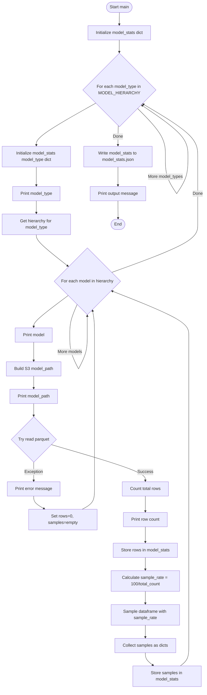
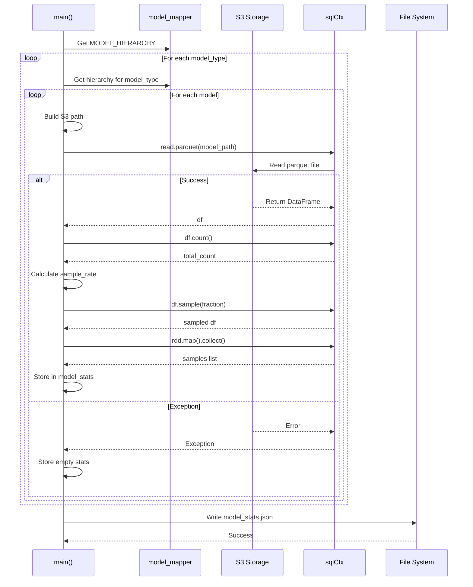

# Diagram: research/orchestrator/simulation/gather_model_stats.py

> Auto-generated by Obscura crawlers

## Diagram 1

### SVG

<svg id="container" width="778.7625122070312" xmlns="http://www.w3.org/2000/svg" class="flowchart" height="2606.96875" viewBox="0 0 778.7625122070312 2606.96875" role="graphics-document document" aria-roledescription="flowchart-v2"><g><marker id="container_flowchart-v2-pointEnd" class="marker flowchart-v2" viewBox="0 0 10 10" refX="5" refY="5" markerUnits="userSpaceOnUse" markerWidth="8" markerHeight="8" orient="auto"><path d="M 0 0 L 10 5 L 0 10 z" class="arrowMarkerPath" style="stroke-width: 1; stroke-dasharray: 1, 0;"></path></marker><marker id="container_flowchart-v2-pointStart" class="marker flowchart-v2" viewBox="0 0 10 10" refX="4.5" refY="5" markerUnits="userSpaceOnUse" markerWidth="8" markerHeight="8" orient="auto"><path d="M 0 5 L 10 10 L 10 0 z" class="arrowMarkerPath" style="stroke-width: 1; stroke-dasharray: 1, 0;"></path></marker><marker id="container_flowchart-v2-circleEnd" class="marker flowchart-v2" viewBox="0 0 10 10" refX="11" refY="5" markerUnits="userSpaceOnUse" markerWidth="11" markerHeight="11" orient="auto"><circle cx="5" cy="5" r="5" class="arrowMarkerPath" style="stroke-width: 1; stroke-dasharray: 1, 0;"></circle></marker><marker id="container_flowchart-v2-circleStart" class="marker flowchart-v2" viewBox="0 0 10 10" refX="-1" refY="5" markerUnits="userSpaceOnUse" markerWidth="11" markerHeight="11" orient="auto"><circle cx="5" cy="5" r="5" class="arrowMarkerPath" style="stroke-width: 1; stroke-dasharray: 1, 0;"></circle></marker><marker id="container_flowchart-v2-crossEnd" class="marker cross flowchart-v2" viewBox="0 0 11 11" refX="12" refY="5.2" markerUnits="userSpaceOnUse" markerWidth="11" markerHeight="11" orient="auto"><path d="M 1,1 l 9,9 M 10,1 l -9,9" class="arrowMarkerPath" style="stroke-width: 2; stroke-dasharray: 1, 0;"></path></marker><marker id="container_flowchart-v2-crossStart" class="marker cross flowchart-v2" viewBox="0 0 11 11" refX="-1" refY="5.2" markerUnits="userSpaceOnUse" markerWidth="11" markerHeight="11" orient="auto"><path d="M 1,1 l 9,9 M 10,1 l -9,9" class="arrowMarkerPath" style="stroke-width: 2; stroke-dasharray: 1, 0;"></path></marker><g class="root"><g class="clusters"></g><g class="edgePaths"><path d="M453.925,47.5L453.842,51.583C453.758,55.667,453.592,63.833,453.508,71.417C453.425,79,453.425,86,453.425,89.5L453.425,93" id="L_Start_InitDict_0" class="edge-thickness-normal edge-pattern-solid edge-thickness-normal edge-pattern-solid flowchart-link" style=";" data-edge="true" data-et="edge" data-id="L_Start_InitDict_0" data-points="W3sieCI6NDUzLjkyNTAwMDAwMDc0NTA2LCJ5Ijo0Ny41fSx7IngiOjQ1My40MjUwMDAwMDA3NDUwNiwieSI6NzJ9LHsieCI6NDUzLjQyNTAwMDAwMDc0NTA2LCJ5Ijo5N31d" marker-end="url(#container_flowchart-v2-pointEnd)"></path><path d="M453.425,151L453.425,155.167C453.425,159.333,453.425,167.667,453.425,175.333C453.425,183,453.425,190,453.425,193.5L453.425,197" id="L_InitDict_LoopModelType_0" class="edge-thickness-normal edge-pattern-solid edge-thickness-normal edge-pattern-solid flowchart-link" style=";" data-edge="true" data-et="edge" data-id="L_InitDict_LoopModelType_0" data-points="W3sieCI6NDUzLjQyNTAwMDAwMDc0NTA2LCJ5IjoxNTF9LHsieCI6NDUzLjQyNTAwMDAwMDc0NTA2LCJ5IjoxNzZ9LHsieCI6NDUzLjQyNTAwMDAwMDc0NTA2LCJ5IjoyMDF9XQ==" marker-end="url(#container_flowchart-v2-pointEnd)"></path><path d="M364.207,389.782L326.506,410.818C288.805,431.855,213.402,473.927,175.701,500.464C138,527,138,538,138,543.5L138,549" id="L_LoopModelType_InitModelTypeDict_0" class="edge-thickness-normal edge-pattern-solid edge-thickness-normal edge-pattern-solid flowchart-link" style=";" data-edge="true" data-et="edge" data-id="L_LoopModelType_InitModelTypeDict_0" data-points="W3sieCI6MzY0LjIwNjc1NzEzNTUzMjUsInkiOjM4OS43ODE3NTcxMzQ3ODc0fSx7IngiOjEzOCwieSI6NTE2fSx7IngiOjEzOCwieSI6NTUzfV0=" marker-end="url(#container_flowchart-v2-pointEnd)"></path><path d="M138,631L138,637.167C138,643.333,138,655.667,138,667.333C138,679,138,690,138,695.5L138,701" id="L_InitModelTypeDict_PrintModelType_0" class="edge-thickness-normal edge-pattern-solid edge-thickness-normal edge-pattern-solid flowchart-link" style=";" data-edge="true" data-et="edge" data-id="L_InitModelTypeDict_PrintModelType_0" data-points="W3sieCI6MTM4LCJ5Ijo2MzF9LHsieCI6MTM4LCJ5Ijo2Njh9LHsieCI6MTM4LCJ5Ijo3MDV9XQ==" marker-end="url(#container_flowchart-v2-pointEnd)"></path><path d="M138,759L138,763.167C138,767.333,138,775.667,138,783.333C138,791,138,798,138,801.5L138,805" id="L_PrintModelType_GetHierarchy_0" class="edge-thickness-normal edge-pattern-solid edge-thickness-normal edge-pattern-solid flowchart-link" style=";" data-edge="true" data-et="edge" data-id="L_PrintModelType_GetHierarchy_0" data-points="W3sieCI6MTM4LCJ5Ijo3NTl9LHsieCI6MTM4LCJ5Ijo3ODR9LHsieCI6MTM4LCJ5Ijo4MDl9XQ==" marker-end="url(#container_flowchart-v2-pointEnd)"></path><path d="M138,887L138,891.167C138,895.333,138,903.667,157.249,924.119C176.498,944.571,214.995,977.142,234.244,993.427L253.493,1009.713" id="L_GetHierarchy_LoopModel_0" class="edge-thickness-normal edge-pattern-solid edge-thickness-normal edge-pattern-solid flowchart-link" style=";" data-edge="true" data-et="edge" data-id="L_GetHierarchy_LoopModel_0" data-points="W3sieCI6MTM4LCJ5Ijo4ODd9LHsieCI6MTM4LCJ5Ijo5MTJ9LHsieCI6MjU2LjU0Njg4OTE1OTEzNjYsInkiOjEwMTIuMjk2MDc5NTkxNjA4NX1d" marker-end="url(#container_flowchart-v2-pointEnd)"></path><path d="M254.468,1137.625L233.044,1154.687C211.62,1171.75,168.773,1205.875,147.349,1226.437C125.926,1247,125.926,1254,125.926,1257.5L125.926,1261" id="L_LoopModel_PrintModel_0" class="edge-thickness-normal edge-pattern-solid edge-thickness-normal edge-pattern-solid flowchart-link" style=";" data-edge="true" data-et="edge" data-id="L_LoopModel_PrintModel_0" data-points="W3sieCI6MjU0LjQ2NzU3MjIzMDI4NDksInkiOjExMzcuNjI0NjAzNDc5NTR9LHsieCI6MTI1LjkyNTc4MTI1LCJ5IjoxMjQwfSx7IngiOjEyNS45MjU3ODEyNSwieSI6MTI2NX1d" marker-end="url(#container_flowchart-v2-pointEnd)"></path><path d="M125.926,1319L125.926,1325.167C125.926,1331.333,125.926,1343.667,125.926,1355.333C125.926,1367,125.926,1378,125.926,1383.5L125.926,1389" id="L_PrintModel_BuildPath_0" class="edge-thickness-normal edge-pattern-solid edge-thickness-normal edge-pattern-solid flowchart-link" style=";" data-edge="true" data-et="edge" data-id="L_PrintModel_BuildPath_0" data-points="W3sieCI6MTI1LjkyNTc4MTI1LCJ5IjoxMzE5fSx7IngiOjEyNS45MjU3ODEyNSwieSI6MTM1Nn0seyJ4IjoxMjUuOTI1NzgxMjUsInkiOjEzOTN9XQ==" marker-end="url(#container_flowchart-v2-pointEnd)"></path><path d="M125.926,1447L125.926,1451.167C125.926,1455.333,125.926,1463.667,125.926,1471.333C125.926,1479,125.926,1486,125.926,1489.5L125.926,1493" id="L_BuildPath_PrintPath_0" class="edge-thickness-normal edge-pattern-solid edge-thickness-normal edge-pattern-solid flowchart-link" style=";" data-edge="true" data-et="edge" data-id="L_BuildPath_PrintPath_0" data-points="W3sieCI6MTI1LjkyNTc4MTI1LCJ5IjoxNDQ3fSx7IngiOjEyNS45MjU3ODEyNSwieSI6MTQ3Mn0seyJ4IjoxMjUuOTI1NzgxMjUsInkiOjE0OTd9XQ==" marker-end="url(#container_flowchart-v2-pointEnd)"></path><path d="M125.926,1551L125.926,1555.167C125.926,1559.333,125.926,1567.667,125.926,1575.333C125.926,1583,125.926,1590,125.926,1593.5L125.926,1597" id="L_PrintPath_TryRead_0" class="edge-thickness-normal edge-pattern-solid edge-thickness-normal edge-pattern-solid flowchart-link" style=";" data-edge="true" data-et="edge" data-id="L_PrintPath_TryRead_0" data-points="W3sieCI6MTI1LjkyNTc4MTI1LCJ5IjoxNTUxfSx7IngiOjEyNS45MjU3ODEyNSwieSI6MTU3Nn0seyJ4IjoxMjUuOTI1NzgxMjUsInkiOjE2MDF9XQ==" marker-end="url(#container_flowchart-v2-pointEnd)"></path><path d="M125.926,1774.969L125.926,1781.135C125.926,1787.302,125.926,1799.635,125.926,1811.302C125.926,1822.969,125.926,1833.969,125.926,1839.469L125.926,1844.969" id="L_TryRead_HandleError_0" class="edge-thickness-normal edge-pattern-solid edge-thickness-normal edge-pattern-solid flowchart-link" style=";" data-edge="true" data-et="edge" data-id="L_TryRead_HandleError_0" data-points="W3sieCI6MTI1LjkyNTc4MTI1LCJ5IjoxNzc0Ljk2ODc1fSx7IngiOjEyNS45MjU3ODEyNSwieSI6MTgxMS45Njg3NX0seyJ4IjoxMjUuOTI1NzgxMjUsInkiOjE4NDguOTY4NzV9XQ==" marker-end="url(#container_flowchart-v2-pointEnd)"></path><path d="M125.926,1902.969L125.926,1907.135C125.926,1911.302,125.926,1919.635,134.32,1927.689C142.715,1935.742,159.503,1943.515,167.898,1947.402L176.292,1951.288" id="L_HandleError_SetEmpty_0" class="edge-thickness-normal edge-pattern-solid edge-thickness-normal edge-pattern-solid flowchart-link" style=";" data-edge="true" data-et="edge" data-id="L_HandleError_SetEmpty_0" data-points="W3sieCI6MTI1LjkyNTc4MTI1LCJ5IjoxOTAyLjk2ODc1fSx7IngiOjEyNS45MjU3ODEyNSwieSI6MTkyNy45Njg3NX0seyJ4IjoxNzkuOTIxNzk5ODgwMTY1OSwieSI6MTk1Mi45Njg3NX1d" marker-end="url(#container_flowchart-v2-pointEnd)"></path><path d="M301.132,1952.969L310.838,1948.802C320.544,1944.635,339.956,1936.302,349.662,1923.469C359.368,1910.635,359.368,1893.302,359.368,1873.969C359.368,1854.635,359.368,1833.302,359.368,1801.971C359.368,1770.641,359.368,1729.313,359.368,1689.984C359.368,1650.656,359.368,1613.328,359.368,1585.997C359.368,1558.667,359.368,1541.333,359.368,1524C359.368,1506.667,359.368,1489.333,359.368,1472C359.368,1454.667,359.368,1437.333,359.368,1418C359.368,1398.667,359.368,1377.333,359.368,1356C359.368,1334.667,359.368,1313.333,359.368,1294C359.368,1274.667,359.368,1257.333,358.22,1241.828C357.072,1226.323,354.777,1212.646,353.629,1205.807L352.481,1198.968" id="L_SetEmpty_LoopModel_0" class="edge-thickness-normal edge-pattern-solid edge-thickness-normal edge-pattern-solid flowchart-link" style=";" data-edge="true" data-et="edge" data-id="L_SetEmpty_LoopModel_0" data-points="W3sieCI6MzAxLjEzMjE2NjQ2NzI4NDY2LCJ5IjoxOTUyLjk2ODc1fSx7IngiOjM1OS4zNjc5Njg3NTExMTc2LCJ5IjoxOTI3Ljk2ODc1fSx7IngiOjM1OS4zNjc5Njg3NTExMTc2LCJ5IjoxODc1Ljk2ODc1fSx7IngiOjM1OS4zNjc5Njg3NTExMTc2LCJ5IjoxODExLjk2ODc1fSx7IngiOjM1OS4zNjc5Njg3NTExMTc2LCJ5IjoxNjg3Ljk4NDM3NX0seyJ4IjozNTkuMzY3OTY4NzUxMTE3NiwieSI6MTU3Nn0seyJ4IjozNTkuMzY3OTY4NzUxMTE3NiwieSI6MTUyNH0seyJ4IjozNTkuMzY3OTY4NzUxMTE3NiwieSI6MTQ3Mn0seyJ4IjozNTkuMzY3OTY4NzUxMTE3NiwieSI6MTQyMH0seyJ4IjozNTkuMzY3OTY4NzUxMTE3NiwieSI6MTM1Nn0seyJ4IjozNTkuMzY3OTY4NzUxMTE3NiwieSI6MTI5Mn0seyJ4IjozNTkuMzY3OTY4NzUxMTE3NiwieSI6MTI0MH0seyJ4IjozNTEuODE5MzQyNTkyNTExNjUsInkiOjExOTUuMDIzNjI2MTU4MjMzNn1d" marker-end="url(#container_flowchart-v2-pointEnd)"></path><path d="M193.383,1707.512L253.524,1724.921C313.666,1742.331,433.948,1777.15,494.09,1800.059C554.231,1822.969,554.231,1833.969,554.231,1839.469L554.231,1844.969" id="L_TryRead_CountRows_0" class="edge-thickness-normal edge-pattern-solid edge-thickness-normal edge-pattern-solid flowchart-link" style=";" data-edge="true" data-et="edge" data-id="L_TryRead_CountRows_0" data-points="W3sieCI6MTkzLjM4MjkwMzUwMTg5MzEsInkiOjE3MDcuNTExNjI3NzQ4MTA3fSx7IngiOjU1NC4yMzEyNTAwMDExMTc2LCJ5IjoxODExLjk2ODc1fSx7IngiOjU1NC4yMzEyNTAwMDExMTc2LCJ5IjoxODQ4Ljk2ODc1fV0=" marker-end="url(#container_flowchart-v2-pointEnd)"></path><path d="M554.231,1902.969L554.231,1907.135C554.231,1911.302,554.231,1919.635,554.231,1927.302C554.231,1934.969,554.231,1941.969,554.231,1945.469L554.231,1948.969" id="L_CountRows_PrintCount_0" class="edge-thickness-normal edge-pattern-solid edge-thickness-normal edge-pattern-solid flowchart-link" style=";" data-edge="true" data-et="edge" data-id="L_CountRows_PrintCount_0" data-points="W3sieCI6NTU0LjIzMTI1MDAwMTExNzYsInkiOjE5MDIuOTY4NzV9LHsieCI6NTU0LjIzMTI1MDAwMTExNzYsInkiOjE5MjcuOTY4NzV9LHsieCI6NTU0LjIzMTI1MDAwMTExNzYsInkiOjE5NTIuOTY4NzV9XQ==" marker-end="url(#container_flowchart-v2-pointEnd)"></path><path d="M554.231,2006.969L554.231,2011.135C554.231,2015.302,554.231,2023.635,554.231,2031.302C554.231,2038.969,554.231,2045.969,554.231,2049.469L554.231,2052.969" id="L_PrintCount_StoreCount_0" class="edge-thickness-normal edge-pattern-solid edge-thickness-normal edge-pattern-solid flowchart-link" style=";" data-edge="true" data-et="edge" data-id="L_PrintCount_StoreCount_0" data-points="W3sieCI6NTU0LjIzMTI1MDAwMTExNzYsInkiOjIwMDYuOTY4NzV9LHsieCI6NTU0LjIzMTI1MDAwMTExNzYsInkiOjIwMzEuOTY4NzV9LHsieCI6NTU0LjIzMTI1MDAwMTExNzYsInkiOjIwNTYuOTY4NzV9XQ==" marker-end="url(#container_flowchart-v2-pointEnd)"></path><path d="M554.231,2110.969L554.231,2115.135C554.231,2119.302,554.231,2127.635,554.231,2135.302C554.231,2142.969,554.231,2149.969,554.231,2153.469L554.231,2156.969" id="L_StoreCount_CalcRate_0" class="edge-thickness-normal edge-pattern-solid edge-thickness-normal edge-pattern-solid flowchart-link" style=";" data-edge="true" data-et="edge" data-id="L_StoreCount_CalcRate_0" data-points="W3sieCI6NTU0LjIzMTI1MDAwMTExNzYsInkiOjIxMTAuOTY4NzV9LHsieCI6NTU0LjIzMTI1MDAwMTExNzYsInkiOjIxMzUuOTY4NzV9LHsieCI6NTU0LjIzMTI1MDAwMTExNzYsInkiOjIxNjAuOTY4NzV9XQ==" marker-end="url(#container_flowchart-v2-pointEnd)"></path><path d="M554.231,2238.969L554.231,2243.135C554.231,2247.302,554.231,2255.635,554.231,2263.302C554.231,2270.969,554.231,2277.969,554.231,2281.469L554.231,2284.969" id="L_CalcRate_Sample_0" class="edge-thickness-normal edge-pattern-solid edge-thickness-normal edge-pattern-solid flowchart-link" style=";" data-edge="true" data-et="edge" data-id="L_CalcRate_Sample_0" data-points="W3sieCI6NTU0LjIzMTI1MDAwMTExNzYsInkiOjIyMzguOTY4NzV9LHsieCI6NTU0LjIzMTI1MDAwMTExNzYsInkiOjIyNjMuOTY4NzV9LHsieCI6NTU0LjIzMTI1MDAwMTExNzYsInkiOjIyODguOTY4NzV9XQ==" marker-end="url(#container_flowchart-v2-pointEnd)"></path><path d="M554.231,2366.969L554.231,2371.135C554.231,2375.302,554.231,2383.635,554.231,2391.302C554.231,2398.969,554.231,2405.969,554.231,2409.469L554.231,2412.969" id="L_Sample_Collect_0" class="edge-thickness-normal edge-pattern-solid edge-thickness-normal edge-pattern-solid flowchart-link" style=";" data-edge="true" data-et="edge" data-id="L_Sample_Collect_0" data-points="W3sieCI6NTU0LjIzMTI1MDAwMTExNzYsInkiOjIzNjYuOTY4NzV9LHsieCI6NTU0LjIzMTI1MDAwMTExNzYsInkiOjIzOTEuOTY4NzV9LHsieCI6NTU0LjIzMTI1MDAwMTExNzYsInkiOjI0MTYuOTY4NzV9XQ==" marker-end="url(#container_flowchart-v2-pointEnd)"></path><path d="M554.231,2470.969L554.231,2475.135C554.231,2479.302,554.231,2487.635,559.076,2495.56C563.92,2503.485,573.609,2511.001,578.453,2514.759L583.297,2518.517" id="L_Collect_StoreSamples_0" class="edge-thickness-normal edge-pattern-solid edge-thickness-normal edge-pattern-solid flowchart-link" style=";" data-edge="true" data-et="edge" data-id="L_Collect_StoreSamples_0" data-points="W3sieCI6NTU0LjIzMTI1MDAwMTExNzYsInkiOjI0NzAuOTY4NzV9LHsieCI6NTU0LjIzMTI1MDAwMTExNzYsInkiOjI0OTUuOTY4NzV9LHsieCI6NTg2LjQ1NzgxMjUwMTExNzYsInkiOjI1MjAuOTY4NzV9XQ==" marker-end="url(#container_flowchart-v2-pointEnd)"></path><path d="M687.005,2520.969L692.376,2516.802C697.747,2512.635,708.489,2504.302,713.86,2491.469C719.231,2478.635,719.231,2461.302,719.231,2443.969C719.231,2426.635,719.231,2409.302,719.231,2389.969C719.231,2370.635,719.231,2349.302,719.231,2327.969C719.231,2306.635,719.231,2285.302,719.231,2263.969C719.231,2242.635,719.231,2221.302,719.231,2199.969C719.231,2178.635,719.231,2157.302,719.231,2137.969C719.231,2118.635,719.231,2101.302,719.231,2083.969C719.231,2066.635,719.231,2049.302,719.231,2031.969C719.231,2014.635,719.231,1997.302,719.231,1979.969C719.231,1962.635,719.231,1945.302,719.231,1927.969C719.231,1910.635,719.231,1893.302,719.231,1873.969C719.231,1854.635,719.231,1833.302,719.231,1801.971C719.231,1770.641,719.231,1729.313,719.231,1689.984C719.231,1650.656,719.231,1613.328,719.231,1585.997C719.231,1558.667,719.231,1541.333,719.231,1524C719.231,1506.667,719.231,1489.333,719.231,1472C719.231,1454.667,719.231,1437.333,719.231,1418C719.231,1398.667,719.231,1377.333,719.231,1356C719.231,1334.667,719.231,1313.333,719.231,1294C719.231,1274.667,719.231,1257.333,671.557,1228.484C623.882,1199.634,528.533,1159.268,480.858,1139.085L433.184,1118.902" id="L_StoreSamples_LoopModel_0" class="edge-thickness-normal edge-pattern-solid edge-thickness-normal edge-pattern-solid flowchart-link" style=";" data-edge="true" data-et="edge" data-id="L_StoreSamples_LoopModel_0" data-points="W3sieCI6Njg3LjAwNDY4NzUwMTExNzYsInkiOjI1MjAuOTY4NzV9LHsieCI6NzE5LjIzMTI1MDAwMTExNzYsInkiOjI0OTUuOTY4NzV9LHsieCI6NzE5LjIzMTI1MDAwMTExNzYsInkiOjI0NDMuOTY4NzV9LHsieCI6NzE5LjIzMTI1MDAwMTExNzYsInkiOjIzOTEuOTY4NzV9LHsieCI6NzE5LjIzMTI1MDAwMTExNzYsInkiOjIzMjcuOTY4NzV9LHsieCI6NzE5LjIzMTI1MDAwMTExNzYsInkiOjIyNjMuOTY4NzV9LHsieCI6NzE5LjIzMTI1MDAwMTExNzYsInkiOjIxOTkuOTY4NzV9LHsieCI6NzE5LjIzMTI1MDAwMTExNzYsInkiOjIxMzUuOTY4NzV9LHsieCI6NzE5LjIzMTI1MDAwMTExNzYsInkiOjIwODMuOTY4NzV9LHsieCI6NzE5LjIzMTI1MDAwMTExNzYsInkiOjIwMzEuOTY4NzV9LHsieCI6NzE5LjIzMTI1MDAwMTExNzYsInkiOjE5NzkuOTY4NzV9LHsieCI6NzE5LjIzMTI1MDAwMTExNzYsInkiOjE5MjcuOTY4NzV9LHsieCI6NzE5LjIzMTI1MDAwMTExNzYsInkiOjE4NzUuOTY4NzV9LHsieCI6NzE5LjIzMTI1MDAwMTExNzYsInkiOjE4MTEuOTY4NzV9LHsieCI6NzE5LjIzMTI1MDAwMTExNzYsInkiOjE2ODcuOTg0Mzc1fSx7IngiOjcxOS4yMzEyNTAwMDExMTc2LCJ5IjoxNTc2fSx7IngiOjcxOS4yMzEyNTAwMDExMTc2LCJ5IjoxNTI0fSx7IngiOjcxOS4yMzEyNTAwMDExMTc2LCJ5IjoxNDcyfSx7IngiOjcxOS4yMzEyNTAwMDExMTc2LCJ5IjoxNDIwfSx7IngiOjcxOS4yMzEyNTAwMDExMTc2LCJ5IjoxMzU2fSx7IngiOjcxOS4yMzEyNTAwMDExMTc2LCJ5IjoxMjkyfSx7IngiOjcxOS4yMzEyNTAwMDExMTc2LCJ5IjoxMjQwfSx7IngiOjQyOS41MDAwNTE2NTM3Mjk1NCwieSI6MTExNy4zNDI5MTcwOTcwMTU1fV0=" marker-end="url(#container_flowchart-v2-pointEnd)"></path><path d="M291.537,1174.694L287.092,1185.578C282.647,1196.463,273.757,1218.231,269.311,1237.774C264.866,1257.317,264.866,1274.633,264.866,1283.292L264.866,1291.95" id="LoopModel-cyclic-special-1" class="edge-thickness-normal edge-pattern-solid edge-thickness-normal edge-pattern-solid flowchart-link" style=";" data-edge="true" data-et="edge" data-id="LoopModel-cyclic-special-1" data-points="W3sieCI6MjkxLjUzNjk2NTAzMDEyOTQ3LCJ5IjoxMTc0LjY5Mzk5NjI3OTM4NDV9LHsieCI6MjY0Ljg2NjQwNjI1MDc0NTA2LCJ5IjoxMjQwfSx7IngiOjI2NC44NjY0MDYyNTA3NDUwNiwieSI6MTI5MS45NDk5OTk5OTkyNTV9XQ=="></path><path d="M264.866,1292.05L264.866,1302.708C264.866,1313.367,264.866,1334.683,270.443,1356C276.02,1377.317,287.174,1398.633,292.752,1409.292L298.329,1419.95" id="LoopModel-cyclic-special-mid" class="edge-thickness-normal edge-pattern-solid edge-thickness-normal edge-pattern-solid flowchart-link" style=";" data-edge="true" data-et="edge" data-id="LoopModel-cyclic-special-mid" data-points="W3sieCI6MjY0Ljg2NjQwNjI1MDc0NTA2LCJ5IjoxMjkyLjA1MDAwMDAwMDc0NX0seyJ4IjoyNjQuODY2NDA2MjUwNzQ1MDYsInkiOjEzNTZ9LHsieCI6Mjk4LjMyODUyNDc4MDYyODY0LCJ5IjoxNDE5Ljk0OTk5OTk5OTI1NX1d"></path><path d="M298.381,1419.95L303.958,1409.292C309.535,1398.633,320.689,1377.317,326.266,1355.992C331.843,1334.667,331.843,1313.333,331.843,1294C331.843,1274.667,331.843,1257.333,331.843,1245.167C331.843,1233,331.843,1226,331.843,1222.5L331.843,1219" id="LoopModel-cyclic-special-2" class="edge-thickness-normal edge-pattern-solid edge-thickness-normal edge-pattern-solid flowchart-link" style=";" data-edge="true" data-et="edge" data-id="LoopModel-cyclic-special-2" data-points="W3sieCI6Mjk4LjM4MDg1MDIyMDg2MTUsInkiOjE0MTkuOTQ5OTk5OTk5MjU1fSx7IngiOjMzMS44NDI5Njg3NTA3NDUwNiwieSI6MTM1Nn0seyJ4IjozMzEuODQyOTY4NzUwNzQ1MDYsInkiOjEyOTJ9LHsieCI6MzMxLjg0Mjk2ODc1MDc0NTA2LCJ5IjoxMjQwfSx7IngiOjMzMS44NDI5Njg3NTA3NDUwNiwieSI6MTIxNX1d" marker-end="url(#container_flowchart-v2-pointEnd)"></path><path d="M431.812,1036.969L485.158,1016.141C538.504,995.312,645.196,953.656,698.542,922.161C751.888,890.667,751.888,869.333,751.888,848C751.888,826.667,751.888,805.333,751.888,786C751.888,766.667,751.888,749.333,751.888,730C751.888,710.667,751.888,689.333,751.888,666C751.888,642.667,751.888,617.333,751.888,592C751.888,566.667,751.888,541.333,717.291,508.266C682.695,475.198,613.502,434.396,578.905,413.994L544.309,393.593" id="L_LoopModel_LoopModelType_0" class="edge-thickness-normal edge-pattern-solid edge-thickness-normal edge-pattern-solid flowchart-link" style=";" data-edge="true" data-et="edge" data-id="L_LoopModel_LoopModelType_0" data-points="W3sieCI6NDMxLjgxMTY5ODM5MzMzNTIsInkiOjEwMzYuOTY4NzI5NjQyNTl9LHsieCI6NzUxLjg4NzUwMDAwMTExNzYsInkiOjkxMn0seyJ4Ijo3NTEuODg3NTAwMDAxMTE3NiwieSI6ODQ4fSx7IngiOjc1MS44ODc1MDAwMDExMTc2LCJ5Ijo3ODR9LHsieCI6NzUxLjg4NzUwMDAwMTExNzYsInkiOjczMn0seyJ4Ijo3NTEuODg3NTAwMDAxMTE3NiwieSI6NjY4fSx7IngiOjc1MS44ODc1MDAwMDExMTc2LCJ5Ijo1OTJ9LHsieCI6NzUxLjg4NzUwMDAwMTExNzYsInkiOjUxNn0seyJ4Ijo1NDAuODYzNDk2MTkzODQ2MSwieSI6MzkxLjU2MTUwMzgwNjg5ODk0fV0=" marker-end="url(#container_flowchart-v2-pointEnd)"></path><path d="M522.652,409.773L540.219,427.477C557.785,445.182,592.917,480.591,610.484,510.954C628.05,541.317,628.05,566.633,628.05,579.292L628.05,591.95" id="LoopModelType-cyclic-special-1" class="edge-thickness-normal edge-pattern-solid edge-thickness-normal edge-pattern-solid flowchart-link" style=";" data-edge="true" data-et="edge" data-id="LoopModelType-cyclic-special-1" data-points="W3sieCI6NTIyLjY1MjQ1MDk4MTEzNzIsInkiOjQwOS43NzI1NDkwMTk2MDc4fSx7IngiOjYyOC4wNTAwMDAwMDA3NDUxLCJ5Ijo1MTZ9LHsieCI6NjI4LjA1MDAwMDAwMDc0NTEsInkiOjU5MS45NDk5OTk5OTkyNTQ5fV0="></path><path d="M628.05,592.05L628.05,604.708C628.05,617.367,628.05,642.683,635.284,666C642.518,689.317,656.986,710.633,664.22,721.292L671.454,731.95" id="LoopModelType-cyclic-special-mid" class="edge-thickness-normal edge-pattern-solid edge-thickness-normal edge-pattern-solid flowchart-link" style=";" data-edge="true" data-et="edge" data-id="LoopModelType-cyclic-special-mid" data-points="W3sieCI6NjI4LjA1MDAwMDAwMDc0NTEsInkiOjU5Mi4wNTAwMDAwMDA3NDUxfSx7IngiOjYyOC4wNTAwMDAwMDA3NDUxLCJ5Ijo2Njh9LHsieCI6NjcxLjQ1MzU2NDQ1MzM2NDQsInkiOjczMS45NDk5OTk5OTkyNTQ5fV0="></path><path d="M671.521,731.95L678.755,721.292C685.989,710.633,700.457,689.317,707.691,665.992C714.925,642.667,714.925,617.333,714.925,592C714.925,566.667,714.925,541.333,685.742,509.025C656.559,476.717,598.192,437.434,569.009,417.793L539.826,398.151" id="LoopModelType-cyclic-special-2" class="edge-thickness-normal edge-pattern-solid edge-thickness-normal edge-pattern-solid flowchart-link" style=";" data-edge="true" data-et="edge" data-id="LoopModelType-cyclic-special-2" data-points="W3sieCI6NjcxLjUyMTQzNTU0ODEyNTcsInkiOjczMS45NDk5OTk5OTkyNTQ5fSx7IngiOjcxNC45MjUwMDAwMDA3NDUxLCJ5Ijo2Njh9LHsieCI6NzE0LjkyNTAwMDAwMDc0NTEsInkiOjU5Mn0seyJ4Ijo3MTQuOTI1MDAwMDAwNzQ1MSwieSI6NTE2fSx7IngiOjUzNi41MDcyODU3MTUwMzA4LCJ5IjozOTUuOTE3NzE0Mjg1NzE0M31d" marker-end="url(#container_flowchart-v2-pointEnd)"></path><path d="M449.269,474.844L449.057,481.703C448.846,488.562,448.423,502.281,448.211,514.641C448,527,448,538,448,543.5L448,549" id="L_LoopModelType_WriteJSON_0" class="edge-thickness-normal edge-pattern-solid edge-thickness-normal edge-pattern-solid flowchart-link" style=";" data-edge="true" data-et="edge" data-id="L_LoopModelType_WriteJSON_0" data-points="W3sieCI6NDQ5LjI2ODU5OTI4MzY0MTgsInkiOjQ3NC44NDM1OTkyODI4OTY3fSx7IngiOjQ0OCwieSI6NTE2fSx7IngiOjQ0OCwieSI6NTUzfV0=" marker-end="url(#container_flowchart-v2-pointEnd)"></path><path d="M448,631L448,637.167C448,643.333,448,655.667,448,667.333C448,679,448,690,448,695.5L448,701" id="L_WriteJSON_PrintOutput_0" class="edge-thickness-normal edge-pattern-solid edge-thickness-normal edge-pattern-solid flowchart-link" style=";" data-edge="true" data-et="edge" data-id="L_WriteJSON_PrintOutput_0" data-points="W3sieCI6NDQ4LCJ5Ijo2MzF9LHsieCI6NDQ4LCJ5Ijo2Njh9LHsieCI6NDQ4LCJ5Ijo3MDV9XQ==" marker-end="url(#container_flowchart-v2-pointEnd)"></path><path d="M448,759L448,763.167C448,767.333,448,775.667,448.076,786.667C448.152,797.667,448.304,811.333,448.38,818.167L448.456,825" id="L_PrintOutput_End_0" class="edge-thickness-normal edge-pattern-solid edge-thickness-normal edge-pattern-solid flowchart-link" style=";" data-edge="true" data-et="edge" data-id="L_PrintOutput_End_0" data-points="W3sieCI6NDQ4LCJ5Ijo3NTl9LHsieCI6NDQ4LCJ5Ijo3ODR9LHsieCI6NDQ4LjUsInkiOjgyOX1d" marker-end="url(#container_flowchart-v2-pointEnd)"></path></g><g class="edgeLabels"><g class="edgeLabel"><g class="label" data-id="L_Start_InitDict_0" transform="translate(0, 0)"><foreignObject width="0" height="0">

</foreignObject></g></g><g class="edgeLabel"><g class="label" data-id="L_InitDict_LoopModelType_0" transform="translate(0, 0)"><foreignObject width="0" height="0">

</foreignObject></g></g><g class="edgeLabel"><g class="label" data-id="L_LoopModelType_InitModelTypeDict_0" transform="translate(0, 0)"><foreignObject width="0" height="0">

</foreignObject></g></g><g class="edgeLabel"><g class="label" data-id="L_InitModelTypeDict_PrintModelType_0" transform="translate(0, 0)"><foreignObject width="0" height="0">

</foreignObject></g></g><g class="edgeLabel"><g class="label" data-id="L_PrintModelType_GetHierarchy_0" transform="translate(0, 0)"><foreignObject width="0" height="0">

</foreignObject></g></g><g class="edgeLabel"><g class="label" data-id="L_GetHierarchy_LoopModel_0" transform="translate(0, 0)"><foreignObject width="0" height="0">

</foreignObject></g></g><g class="edgeLabel"><g class="label" data-id="L_LoopModel_PrintModel_0" transform="translate(0, 0)"><foreignObject width="0" height="0">

</foreignObject></g></g><g class="edgeLabel"><g class="label" data-id="L_PrintModel_BuildPath_0" transform="translate(0, 0)"><foreignObject width="0" height="0">

</foreignObject></g></g><g class="edgeLabel"><g class="label" data-id="L_BuildPath_PrintPath_0" transform="translate(0, 0)"><foreignObject width="0" height="0">

</foreignObject></g></g><g class="edgeLabel"><g class="label" data-id="L_PrintPath_TryRead_0" transform="translate(0, 0)"><foreignObject width="0" height="0">

</foreignObject></g></g><g class="edgeLabel" transform="translate(125.92578125, 1811.96875)"><g class="label" data-id="L_TryRead_HandleError_0" transform="translate(-35.375, -12)"><foreignObject width="70.75" height="24">

Exception

</foreignObject></g></g><g class="edgeLabel"><g class="label" data-id="L_HandleError_SetEmpty_0" transform="translate(0, 0)"><foreignObject width="0" height="0">

</foreignObject></g></g><g class="edgeLabel"><g class="label" data-id="L_SetEmpty_LoopModel_0" transform="translate(0, 0)"><foreignObject width="0" height="0">

</foreignObject></g></g><g class="edgeLabel" transform="translate(554.2312500011176, 1811.96875)"><g class="label" data-id="L_TryRead_CountRows_0" transform="translate(-28.1015625, -12)"><foreignObject width="56.203125" height="24">

Success

</foreignObject></g></g><g class="edgeLabel"><g class="label" data-id="L_CountRows_PrintCount_0" transform="translate(0, 0)"><foreignObject width="0" height="0">

</foreignObject></g></g><g class="edgeLabel"><g class="label" data-id="L_PrintCount_StoreCount_0" transform="translate(0, 0)"><foreignObject width="0" height="0">

</foreignObject></g></g><g class="edgeLabel"><g class="label" data-id="L_StoreCount_CalcRate_0" transform="translate(0, 0)"><foreignObject width="0" height="0">

</foreignObject></g></g><g class="edgeLabel"><g class="label" data-id="L_CalcRate_Sample_0" transform="translate(0, 0)"><foreignObject width="0" height="0">

</foreignObject></g></g><g class="edgeLabel"><g class="label" data-id="L_Sample_Collect_0" transform="translate(0, 0)"><foreignObject width="0" height="0">

</foreignObject></g></g><g class="edgeLabel"><g class="label" data-id="L_Collect_StoreSamples_0" transform="translate(0, 0)"><foreignObject width="0" height="0">

</foreignObject></g></g><g class="edgeLabel"><g class="label" data-id="L_StoreSamples_LoopModel_0" transform="translate(0, 0)"><foreignObject width="0" height="0">

</foreignObject></g></g><g class="edgeLabel"><g class="label" data-id="LoopModel-cyclic-special-1" transform="translate(0, 0)"><foreignObject width="0" height="0">

</foreignObject></g></g><g class="edgeLabel" transform="translate(264.86640625074506, 1356)"><g class="label" data-id="LoopModel-cyclic-special-mid" transform="translate(-46.9765625, -12)"><foreignObject width="93.953125" height="24">

More models

</foreignObject></g></g><g class="edgeLabel"><g class="label" data-id="LoopModel-cyclic-special-2" transform="translate(0, 0)"><foreignObject width="0" height="0">

</foreignObject></g></g><g class="edgeLabel" transform="translate(751.8875000011176, 732)"><g class="label" data-id="L_LoopModel_LoopModelType_0" transform="translate(-18.875, -12)"><foreignObject width="37.75" height="24">

Done

</foreignObject></g></g><g class="edgeLabel"><g class="label" data-id="LoopModelType-cyclic-special-1" transform="translate(0, 0)"><foreignObject width="0" height="0">

</foreignObject></g></g><g class="edgeLabel" transform="translate(628.0500000007451, 668)"><g class="label" data-id="LoopModelType-cyclic-special-mid" transform="translate(-66.875, -12)"><foreignObject width="133.75" height="24">

More model_types

</foreignObject></g></g><g class="edgeLabel"><g class="label" data-id="LoopModelType-cyclic-special-2" transform="translate(0, 0)"><foreignObject width="0" height="0">

</foreignObject></g></g><g class="edgeLabel" transform="translate(448, 516)"><g class="label" data-id="L_LoopModelType_WriteJSON_0" transform="translate(-18.875, -12)"><foreignObject width="37.75" height="24">

Done

</foreignObject></g></g><g class="edgeLabel"><g class="label" data-id="L_WriteJSON_PrintOutput_0" transform="translate(0, 0)"><foreignObject width="0" height="0">

</foreignObject></g></g><g class="edgeLabel"><g class="label" data-id="L_PrintOutput_End_0" transform="translate(0, 0)"><foreignObject width="0" height="0">

</foreignObject></g></g></g><g class="nodes"><g class="node default" id="flowchart-Start-0" transform="translate(453.42500000074506, 27.5)"><g class="basic label-container outer-path"><path d="M-30.671875 -19.5 C-18.13547857859236 -19.5, -5.599082157184718 -19.5, 30.671875 -19.5 C30.671875 -19.5, 30.671875 -19.5, 30.671875 -19.5 C30.939904987429525 -19.491404799991855, 31.207934974859054 -19.482809599983714, 31.9212442896239 -19.45993515863156 C32.339345107300424 -19.419601475590106, 32.757445924976956 -19.379267792548653, 33.165479652847864 -19.3399052695533 C33.622697899680794 -19.26598576918581, 34.07991614651373 -19.192066268818326, 34.39946825967676 -19.140403561325776 C34.80094025121479 -19.0487701991068, 35.20241224275283 -18.957136836887827, 35.61813938623539 -18.862249829261074 C35.95471644089704 -18.76235552616651, 36.29129349555869 -18.662461223071947, 36.816485251460605 -18.50658706670804 C37.22140019228356 -18.35757462549251, 37.62631513310651 -18.208562184276982, 37.9895815951478 -18.074876768247425 C38.32490908053971 -17.926437237600855, 38.66023656593163 -17.777997706954284, 39.13260791279238 -17.568892924097174 C39.368120882929986 -17.446025958429644, 39.60363385306759 -17.32315899276211, 40.24086726407678 -16.990714730406097 C40.66826381938657 -16.731624426916355, 41.09566037469635 -16.472534123426612, 41.3098055736057 -16.342718045390892 C41.559744325825584 -16.168371591516504, 41.80968307804547 -15.994025137642113, 42.33503034457871 -15.627565626425154 C42.668972866532805 -15.361255351750486, 43.0029153884869 -15.09494507707582, 43.312328708501866 -14.848196188198123 C43.50869921067662 -14.66985769380179, 43.70506971285137 -14.491519199405454, 44.23768473676799 -14.007812326905688 C44.45578672123466 -13.782604121437908, 44.67388870570133 -13.557395915970128, 45.10729594296865 -13.10986736009568 C45.34244009374579 -12.833653660511626, 45.57758424452294 -12.55743996092757, 45.91758890812658 -12.158051136245305 C46.10814600639272 -11.902721984677456, 46.29870310465887 -11.647392833109604, 46.665233964640635 -11.156274872382312 C46.85813816134254 -10.85992222421841, 47.051042358044434 -10.563569576054508, 47.34715887860425 -10.108655082055241 C47.49909643442487 -9.838874566349867, 47.651033990245494 -9.569094050644491, 47.960561474273504 -9.019496659696287 C48.140135565355266 -8.646607217294985, 48.31970965643702 -8.273717774893681, 48.50292114880834 -7.893275190886684 C48.67697776001792 -7.463351996043371, 48.851034371227506 -7.033428801200058, 48.972009229970325 -6.734618561215508 C49.08234670683241 -6.402299660796447, 49.192684183694496 -6.069980760377387, 49.36589813421488 -5.548287939305138 C49.46033169895148 -5.188171829198643, 49.554765263688076 -4.828055719092147, 49.68296928754556 -4.339158212148133 C49.77376708572181 -3.872930708634523, 49.86456488389806 -3.406703205120913, 49.921919776581774 -3.1121979531509023 C49.95554051136487 -2.85144217333821, 49.98916124614797 -2.5906863935255173, 50.08176770250937 -1.872449005199798 C50.11316698233588 -1.3833798768592778, 50.14456626216241 -0.8943107485187576, 50.16185621591342 -0.6250057626472757 C50.16185621591342 -0.3235084352892728, 50.16185621591342 -0.022011107931269924, 50.16185621591342 0.625005762647271 C50.14107526937761 0.9486857790206012, 50.1202943228418 1.2723657953939314, 50.08176770250937 1.8724490051997846 C50.04000181654602 2.1963769691244455, 49.99823593058267 2.5203049330491067, 49.921919776581774 3.1121979531508885 C49.86048566649072 3.4276491243646907, 49.79905155639967 3.7431002955784924, 49.68296928754556 4.339158212148129 C49.602678381650804 4.645342234623566, 49.522387475756055 4.951526257099005, 49.36589813421489 5.548287939305125 C49.27857607414212 5.811288071363432, 49.19125401406935 6.074288203421739, 48.972009229970325 6.734618561215495 C48.84139585551726 7.0572361213523696, 48.7107824810642 7.379853681489244, 48.50292114880834 7.893275190886679 C48.38845883759393 8.130958629224532, 48.27399652637951 8.368642067562385, 47.960561474273504 9.019496659696284 C47.75432670224187 9.385687380973655, 47.54809193021023 9.751878102251025, 47.34715887860425 10.108655082055236 C47.20793186514182 10.3225451624214, 47.068704851679406 10.536435242787567, 46.66523396464064 11.156274872382301 C46.489015763632764 11.392391207924486, 46.31279756262489 11.628507543466673, 45.91758890812658 12.158051136245302 C45.71711853605664 12.393535042365981, 45.51664816398669 12.629018948486658, 45.10729594296866 13.10986736009567 C44.83478610087522 13.391256145531278, 44.56227625878177 13.672644930966884, 44.23768473676799 14.007812326905684 C43.999693484326286 14.223949685469757, 43.76170223188459 14.440087044033827, 43.31232870850189 14.848196188198111 C42.969667528341155 15.121459360779335, 42.627006348180416 15.39472253336056, 42.33503034457871 15.627565626425152 C42.09608781040816 15.794241594606941, 41.857145276237596 15.960917562788728, 41.30980557360571 16.34271804539089 C40.98105692262228 16.542007409558554, 40.65230827163886 16.741296773726223, 40.24086726407678 16.990714730406093 C39.9304024110572 17.152684045364182, 39.61993755803762 17.314653360322268, 39.13260791279239 17.56889292409717 C38.86872912234696 17.68570423694116, 38.604850331901545 17.802515549785145, 37.989581595147804 18.07487676824742 C37.707897974524485 18.17853894449165, 37.42621435390116 18.282201120735877, 36.81648525146062 18.506587066708033 C36.35625132268578 18.643182080951217, 35.89601739391093 18.7797770951944, 35.61813938623541 18.86224982926107 C35.36399471330251 18.920256692409023, 35.109850040369615 18.97826355555698, 34.399468259676766 19.140403561325773 C33.92653491428037 19.21686375695659, 33.45360156888397 19.293323952587414, 33.16547965284788 19.3399052695533 C32.9077874053837 19.364764530745898, 32.65009515791952 19.389623791938497, 31.9212442896239 19.45993515863156 C31.531688602183493 19.472427451303627, 31.142132914743083 19.48491974397569, 30.671875000000004 19.5 C30.671875000000004 19.5, 30.671875000000004 19.5, 30.671875 19.5 C9.63039640906932 19.5, -11.41108218186136 19.5, -30.671874999999996 19.5 C-31.057285698966403 19.487640629040563, -31.442696397932806 19.47528125808113, -31.921244289623893 19.45993515863156 C-32.20814022319195 19.43225865296309, -32.49503615676 19.404582147294622, -33.16547965284787 19.3399052695533 C-33.64409540404271 19.262526386620703, -34.122711155237546 19.185147503688103, -34.39946825967676 19.140403561325773 C-34.812309824369294 19.046175168227684, -35.22515138906183 18.951946775129592, -35.618139386235384 18.862249829261074 C-35.981638291740566 18.75436526215183, -36.34513719724574 18.646480695042584, -36.81648525146059 18.506587066708043 C-37.0858147164983 18.407471333919883, -37.355144181536005 18.308355601131726, -37.9895815951478 18.074876768247425 C-38.29034929379716 17.94173583001213, -38.59111699244654 17.80859489177684, -39.13260791279238 17.568892924097174 C-39.52021678779824 17.36667762228195, -39.90782566280409 17.164462320466733, -40.24086726407678 16.990714730406097 C-40.552141742707846 16.802018312208066, -40.86341622133891 16.613321894010035, -41.309805573605686 16.3427180453909 C-41.54236153358402 16.180497074895268, -41.774917493562356 16.018276104399636, -42.33503034457871 15.627565626425156 C-42.63873658243812 15.385367983694687, -42.94244282029753 15.14317034096422, -43.312328708501866 14.848196188198125 C-43.50346795770261 14.674608579341415, -43.69460720690335 14.501020970484705, -44.237684736767974 14.007812326905697 C-44.44598352636747 13.792726724995545, -44.65428231596697 13.577641123085394, -45.107295942968655 13.109867360095677 C-45.291264158891686 12.89376782558445, -45.475232374814716 12.67766829107322, -45.917588908126575 12.158051136245307 C-46.099981749202406 11.91366134553335, -46.28237459027823 11.669271554821394, -46.665233964640635 11.156274872382316 C-46.906759815244435 10.785226307082906, -47.14828566584824 10.414177741783497, -47.34715887860425 10.108655082055249 C-47.5579984976307 9.73428798864726, -47.76883811665715 9.359920895239272, -47.960561474273504 9.019496659696289 C-48.13658665207872 8.653976611648307, -48.312611829883934 8.288456563600327, -48.50292114880834 7.893275190886686 C-48.61576266669808 7.6145544600567, -48.728604184587816 7.335833729226715, -48.972009229970325 6.73461856121551 C-49.105055959703975 6.33390300937537, -49.23810268943763 5.93318745753523, -49.36589813421488 5.5482879393051325 C-49.46306807894522 5.1777368263279095, -49.56023802367556 4.807185713350687, -49.68296928754556 4.339158212148136 C-49.74982916329984 3.9958468809896486, -49.81668903905412 3.652535549831161, -49.921919776581774 3.112197953150904 C-49.97390265055179 2.7090290478189716, -50.02588552452182 2.305860142487039, -50.08176770250937 1.872449005199809 C-50.1126038851296 1.3921505703710528, -50.143440067749836 0.9118521355422966, -50.16185621591342 0.6250057626472781 C-50.16185621591342 0.21418951488240195, -50.16185621591342 -0.19662673288247423, -50.16185621591342 -0.6250057626472687 C-50.13433274379095 -1.0537060575015156, -50.10680927166848 -1.4824063523557625, -50.08176770250937 -1.8724490051997822 C-50.02312438272422 -2.3272750130200768, -49.964481062939065 -2.782101020840371, -49.921919776581774 -3.112197953150895 C-49.86287547557973 -3.4153779597789673, -49.80383117457768 -3.7185579664070394, -49.68296928754556 -4.339158212148126 C-49.59619785138209 -4.670055305217791, -49.509426415218606 -5.000952398287455, -49.36589813421489 -5.548287939305123 C-49.26860055256795 -5.841332752961311, -49.17130297092101 -6.134377566617498, -48.97200922997033 -6.734618561215485 C-48.86585637662255 -6.996818161310293, -48.75970352327478 -7.259017761405102, -48.50292114880834 -7.893275190886676 C-48.33744154685023 -8.236897125048976, -48.17196194489211 -8.580519059211278, -47.960561474273504 -9.019496659696282 C-47.836457690647144 -9.239855494395677, -47.71235390702079 -9.460214329095072, -47.34715887860425 -10.108655082055243 C-47.117763102459065 -10.461068595605145, -46.88836732631388 -10.813482109155048, -46.66523396464064 -11.156274872382308 C-46.463937786304356 -11.42599341289383, -46.26264160796807 -11.695711953405349, -45.91758890812659 -12.158051136245302 C-45.74092003630418 -12.365576445831485, -45.56425116448178 -12.573101755417667, -45.10729594296866 -13.10986736009567 C-44.79920211412961 -13.427999533345755, -44.49110828529057 -13.74613170659584, -44.237684736767996 -14.007812326905677 C-44.00535933429091 -14.218804110442063, -43.77303393181382 -14.429795893978449, -43.31232870850189 -14.848196188198107 C-42.983176742105066 -15.110686122297887, -42.65402477570825 -15.373176056397666, -42.33503034457872 -15.627565626425149 C-42.067615920597085 -15.814102352410899, -41.80020149661545 -16.00063907839665, -41.309805573605715 -16.342718045390885 C-40.90716833559508 -16.586799105231982, -40.50453109758444 -16.83088016507308, -40.24086726407679 -16.99071473040609 C-39.89098101284883 -17.173250163558876, -39.541094761620876 -17.355785596711662, -39.13260791279239 -17.56889292409717 C-38.68626975196265 -17.766473587745377, -38.23993159113291 -17.964054251393588, -37.989581595147804 -18.07487676824742 C-37.55287675703274 -18.235588185529036, -37.11617191891768 -18.396299602810647, -36.81648525146062 -18.506587066708033 C-36.337201622009786 -18.64883593211793, -35.85791799255896 -18.791084797527827, -35.61813938623541 -18.862249829261067 C-35.30618733851734 -18.933450848475363, -34.994235290799274 -19.004651867689656, -34.399468259676766 -19.140403561325773 C-34.032516517489974 -19.19972947324927, -33.66556477530319 -19.25905538517277, -33.16547965284788 -19.3399052695533 C-32.90790823137665 -19.36475287480767, -32.650336809905426 -19.389600480062047, -31.921244289623903 -19.45993515863156 C-31.569877095832442 -19.471202820641697, -31.218509902040978 -19.482470482651838, -30.671875000000007 -19.5 C-30.671875000000004 -19.5, -30.671875 -19.5, -30.671875 -19.5" stroke="none" stroke-width="0" fill="#ECECFF" style=""></path><path d="M-30.671875 -19.5 C-11.963135754220428 -19.5, 6.7456034915591445 -19.5, 30.671875 -19.5 M-30.671875 -19.5 C-11.101595663838971 -19.5, 8.468683672322058 -19.5, 30.671875 -19.5 M30.671875 -19.5 C30.671875 -19.5, 30.671875 -19.5, 30.671875 -19.5 M30.671875 -19.5 C30.671875 -19.5, 30.671875 -19.5, 30.671875 -19.5 M30.671875 -19.5 C31.104465375169926 -19.486127668654387, 31.537055750339853 -19.47225533730877, 31.9212442896239 -19.45993515863156 M30.671875 -19.5 C31.005784194486022 -19.489292182047652, 31.339693388972044 -19.478584364095305, 31.9212442896239 -19.45993515863156 M31.9212442896239 -19.45993515863156 C32.21434496701386 -19.431660088788888, 32.507445644403816 -19.403385018946217, 33.165479652847864 -19.3399052695533 M31.9212442896239 -19.45993515863156 C32.374837390196895 -19.416177577744797, 32.8284304907699 -19.37241999685804, 33.165479652847864 -19.3399052695533 M33.165479652847864 -19.3399052695533 C33.44110094452772 -19.295344956589542, 33.71672223620758 -19.25078464362578, 34.39946825967676 -19.140403561325776 M33.165479652847864 -19.3399052695533 C33.63241009358555 -19.26441557699448, 34.09934053432323 -19.188925884435662, 34.39946825967676 -19.140403561325776 M34.39946825967676 -19.140403561325776 C34.81655665077398 -19.045205857813947, 35.233645041871206 -18.950008154302118, 35.61813938623539 -18.862249829261074 M34.39946825967676 -19.140403561325776 C34.710378939535936 -19.069440227529714, 35.02128961939511 -18.998476893733653, 35.61813938623539 -18.862249829261074 M35.61813938623539 -18.862249829261074 C36.046750352167194 -18.735040344397387, 36.475361318099 -18.6078308595337, 36.816485251460605 -18.50658706670804 M35.61813938623539 -18.862249829261074 C36.0104989383443 -18.74579957373247, 36.402858490453205 -18.62934931820386, 36.816485251460605 -18.50658706670804 M36.816485251460605 -18.50658706670804 C37.06838557232319 -18.413885420089567, 37.32028589318577 -18.3211837734711, 37.9895815951478 -18.074876768247425 M36.816485251460605 -18.50658706670804 C37.229919567866425 -18.35443941652577, 37.643353884272244 -18.202291766343503, 37.9895815951478 -18.074876768247425 M37.9895815951478 -18.074876768247425 C38.24365562704633 -17.962405731164313, 38.49772965894487 -17.849934694081206, 39.13260791279238 -17.568892924097174 M37.9895815951478 -18.074876768247425 C38.241968436966026 -17.96315260016415, 38.494355278784255 -17.85142843208088, 39.13260791279238 -17.568892924097174 M39.13260791279238 -17.568892924097174 C39.415200097620705 -17.421464762281172, 39.69779228244903 -17.274036600465166, 40.24086726407678 -16.990714730406097 M39.13260791279238 -17.568892924097174 C39.41381028380791 -17.42218982725709, 39.69501265482344 -17.275486730417004, 40.24086726407678 -16.990714730406097 M40.24086726407678 -16.990714730406097 C40.631464634023644 -16.753932309339376, 41.022062003970504 -16.51714988827266, 41.3098055736057 -16.342718045390892 M40.24086726407678 -16.990714730406097 C40.60421904376319 -16.770448746268126, 40.96757082344959 -16.550182762130156, 41.3098055736057 -16.342718045390892 M41.3098055736057 -16.342718045390892 C41.528988015237346 -16.18982586236363, 41.74817045686899 -16.036933679336368, 42.33503034457871 -15.627565626425154 M41.3098055736057 -16.342718045390892 C41.71860881926388 -16.05755459802703, 42.12741206492206 -15.772391150663163, 42.33503034457871 -15.627565626425154 M42.33503034457871 -15.627565626425154 C42.57149302751341 -15.438992929320994, 42.807955710448105 -15.250420232216834, 43.312328708501866 -14.848196188198123 M42.33503034457871 -15.627565626425154 C42.55510023715407 -15.452065743402095, 42.77517012972943 -15.276565860379034, 43.312328708501866 -14.848196188198123 M43.312328708501866 -14.848196188198123 C43.54602879034869 -14.635955957230165, 43.77972887219552 -14.423715726262207, 44.23768473676799 -14.007812326905688 M43.312328708501866 -14.848196188198123 C43.58415335115001 -14.601332239831011, 43.855977993798156 -14.3544682914639, 44.23768473676799 -14.007812326905688 M44.23768473676799 -14.007812326905688 C44.57610531448299 -13.658365295568792, 44.914525892197986 -13.308918264231897, 45.10729594296865 -13.10986736009568 M44.23768473676799 -14.007812326905688 C44.43993676177235 -13.798970505888615, 44.642188786776714 -13.59012868487154, 45.10729594296865 -13.10986736009568 M45.10729594296865 -13.10986736009568 C45.41054121276972 -12.753658211042675, 45.71378648257079 -12.397449061989668, 45.91758890812658 -12.158051136245305 M45.10729594296865 -13.10986736009568 C45.40907146252669 -12.7553846633093, 45.710846982084725 -12.40090196652292, 45.91758890812658 -12.158051136245305 M45.91758890812658 -12.158051136245305 C46.17926283400767 -11.807431914549705, 46.440936759888764 -11.456812692854102, 46.665233964640635 -11.156274872382312 M45.91758890812658 -12.158051136245305 C46.20717511923481 -11.770031995206834, 46.49676133034304 -11.382012854168362, 46.665233964640635 -11.156274872382312 M46.665233964640635 -11.156274872382312 C46.93733964181956 -10.738247481630305, 47.20944531899849 -10.3202200908783, 47.34715887860425 -10.108655082055241 M46.665233964640635 -11.156274872382312 C46.82574953216368 -10.909679856201844, 46.98626509968672 -10.663084840021375, 47.34715887860425 -10.108655082055241 M47.34715887860425 -10.108655082055241 C47.504414449319604 -9.829431892396869, 47.66167002003496 -9.550208702738495, 47.960561474273504 -9.019496659696287 M47.34715887860425 -10.108655082055241 C47.48800947185855 -9.858560591063071, 47.62886006511285 -9.608466100070903, 47.960561474273504 -9.019496659696287 M47.960561474273504 -9.019496659696287 C48.07963969107515 -8.772228194641981, 48.198717907876805 -8.524959729587675, 48.50292114880834 -7.893275190886684 M47.960561474273504 -9.019496659696287 C48.13778861218753 -8.651480715764544, 48.315015750101544 -8.2834647718328, 48.50292114880834 -7.893275190886684 M48.50292114880834 -7.893275190886684 C48.66934968145155 -7.482193497581169, 48.835778214094766 -7.071111804275653, 48.972009229970325 -6.734618561215508 M48.50292114880834 -7.893275190886684 C48.67948393767922 -7.457161688766305, 48.85604672655011 -7.021048186645925, 48.972009229970325 -6.734618561215508 M48.972009229970325 -6.734618561215508 C49.09108314539624 -6.375986899804641, 49.21015706082216 -6.017355238393773, 49.36589813421488 -5.548287939305138 M48.972009229970325 -6.734618561215508 C49.124054130461424 -6.276683546001378, 49.27609903095253 -5.818748530787246, 49.36589813421488 -5.548287939305138 M49.36589813421488 -5.548287939305138 C49.48156335623495 -5.107206318118274, 49.59722857825503 -4.66612469693141, 49.68296928754556 -4.339158212148133 M49.36589813421488 -5.548287939305138 C49.4516323830513 -5.221346091033377, 49.53736663188772 -4.894404242761616, 49.68296928754556 -4.339158212148133 M49.68296928754556 -4.339158212148133 C49.73522085212807 -4.070857471389017, 49.787472416710585 -3.8025567306299006, 49.921919776581774 -3.1121979531509023 M49.68296928754556 -4.339158212148133 C49.77452672071689 -3.8690301434836867, 49.866084153888224 -3.39890207481924, 49.921919776581774 -3.1121979531509023 M49.921919776581774 -3.1121979531509023 C49.96996491310731 -2.739569361844155, 50.01801004963285 -2.366940770537408, 50.08176770250937 -1.872449005199798 M49.921919776581774 -3.1121979531509023 C49.955794445901084 -2.8494727072204, 49.989669115220394 -2.5867474612898973, 50.08176770250937 -1.872449005199798 M50.08176770250937 -1.872449005199798 C50.10197485264308 -1.5577063309491737, 50.122182002776796 -1.2429636566985494, 50.16185621591342 -0.6250057626472757 M50.08176770250937 -1.872449005199798 C50.09931755779804 -1.599095843090525, 50.11686741308671 -1.3257426809812523, 50.16185621591342 -0.6250057626472757 M50.16185621591342 -0.6250057626472757 C50.16185621591342 -0.21556536150122219, 50.16185621591342 0.19387503964483133, 50.16185621591342 0.625005762647271 M50.16185621591342 -0.6250057626472757 C50.16185621591342 -0.1992960528343023, 50.16185621591342 0.2264136569786711, 50.16185621591342 0.625005762647271 M50.16185621591342 0.625005762647271 C50.14139896201371 0.943644004933305, 50.12094170811401 1.2622822472193391, 50.08176770250937 1.8724490051997846 M50.16185621591342 0.625005762647271 C50.13374496547622 1.0628611791995592, 50.10563371503902 1.5007165957518476, 50.08176770250937 1.8724490051997846 M50.08176770250937 1.8724490051997846 C50.039954775974564 2.1967418065074558, 49.99814184943976 2.5210346078151273, 49.921919776581774 3.1121979531508885 M50.08176770250937 1.8724490051997846 C50.043681533512654 2.16783781097356, 50.00559536451593 2.4632266167473347, 49.921919776581774 3.1121979531508885 M49.921919776581774 3.1121979531508885 C49.831838325044735 3.5747471680720775, 49.74175687350769 4.037296382993267, 49.68296928754556 4.339158212148129 M49.921919776581774 3.1121979531508885 C49.82944469767337 3.587037938730706, 49.73696961876497 4.061877924310523, 49.68296928754556 4.339158212148129 M49.68296928754556 4.339158212148129 C49.585568481832475 4.71058969810835, 49.488167676119396 5.082021184068572, 49.36589813421489 5.548287939305125 M49.68296928754556 4.339158212148129 C49.600012539444 4.655508246341445, 49.517055791342436 4.971858280534761, 49.36589813421489 5.548287939305125 M49.36589813421489 5.548287939305125 C49.256389088898324 5.878111735901706, 49.14688004358176 6.207935532498288, 48.972009229970325 6.734618561215495 M49.36589813421489 5.548287939305125 C49.24964284071393 5.898430360564426, 49.13338754721297 6.248572781823726, 48.972009229970325 6.734618561215495 M48.972009229970325 6.734618561215495 C48.83440585428757 7.074501559532199, 48.6968024786048 7.414384557848902, 48.50292114880834 7.893275190886679 M48.972009229970325 6.734618561215495 C48.84887069527403 7.038773122636956, 48.725732160577735 7.342927684058417, 48.50292114880834 7.893275190886679 M48.50292114880834 7.893275190886679 C48.38682729641881 8.134346559384058, 48.270733444029275 8.375417927881438, 47.960561474273504 9.019496659696284 M48.50292114880834 7.893275190886679 C48.30920807654309 8.295524530241243, 48.11549500427783 8.697773869595808, 47.960561474273504 9.019496659696284 M47.960561474273504 9.019496659696284 C47.72710756465343 9.434017715998479, 47.493653655033356 9.848538772300675, 47.34715887860425 10.108655082055236 M47.960561474273504 9.019496659696284 C47.82905463457727 9.253000370088456, 47.69754779488104 9.486504080480628, 47.34715887860425 10.108655082055236 M47.34715887860425 10.108655082055236 C47.12624897847734 10.448032011264301, 46.90533907835043 10.787408940473368, 46.66523396464064 11.156274872382301 M47.34715887860425 10.108655082055236 C47.116766176254536 10.46260014196747, 46.88637347390482 10.816545201879705, 46.66523396464064 11.156274872382301 M46.66523396464064 11.156274872382301 C46.3701518300524 11.551658050195062, 46.07506969546415 11.947041228007825, 45.91758890812658 12.158051136245302 M46.66523396464064 11.156274872382301 C46.40517516306503 11.504729974649406, 46.14511636148943 11.85318507691651, 45.91758890812658 12.158051136245302 M45.91758890812658 12.158051136245302 C45.62650843488736 12.499970823060222, 45.33542796164815 12.841890509875144, 45.10729594296866 13.10986736009567 M45.91758890812658 12.158051136245302 C45.73358351761217 12.37419433814686, 45.54957812709775 12.59033754004842, 45.10729594296866 13.10986736009567 M45.10729594296866 13.10986736009567 C44.90808970371548 13.315564157260981, 44.70888346446231 13.521260954426292, 44.23768473676799 14.007812326905684 M45.10729594296866 13.10986736009567 C44.76156049949704 13.46686759088793, 44.415825056025405 13.823867821680189, 44.23768473676799 14.007812326905684 M44.23768473676799 14.007812326905684 C44.01464137443383 14.210374407173589, 43.79159801209967 14.412936487441492, 43.31232870850189 14.848196188198111 M44.23768473676799 14.007812326905684 C43.88678820671101 14.326487271290008, 43.53589167665403 14.645162215674329, 43.31232870850189 14.848196188198111 M43.31232870850189 14.848196188198111 C43.101699224364 15.016167596712105, 42.89106974022611 15.184139005226099, 42.33503034457871 15.627565626425152 M43.31232870850189 14.848196188198111 C43.00503045830702 15.093258365178643, 42.69773220811216 15.338320542159176, 42.33503034457871 15.627565626425152 M42.33503034457871 15.627565626425152 C42.065845550791146 15.815337285749445, 41.796660757003586 16.003108945073738, 41.30980557360571 16.34271804539089 M42.33503034457871 15.627565626425152 C42.07869908277748 15.806371218256208, 41.822367820976254 15.985176810087266, 41.30980557360571 16.34271804539089 M41.30980557360571 16.34271804539089 C41.00466777952996 16.527694369348325, 40.69952998545421 16.71267069330576, 40.24086726407678 16.990714730406093 M41.30980557360571 16.34271804539089 C41.00589108037435 16.526952797187544, 40.70197658714299 16.711187548984196, 40.24086726407678 16.990714730406093 M40.24086726407678 16.990714730406093 C39.967416904390696 17.133373607901014, 39.6939665447046 17.27603248539593, 39.13260791279239 17.56889292409717 M40.24086726407678 16.990714730406093 C39.99758763927602 17.117633554836615, 39.75430801447526 17.244552379267137, 39.13260791279239 17.56889292409717 M39.13260791279239 17.56889292409717 C38.77188703627291 17.72857335572773, 38.41116615975343 17.888253787358288, 37.989581595147804 18.07487676824742 M39.13260791279239 17.56889292409717 C38.84907416635708 17.69440490291433, 38.56554041992177 17.819916881731483, 37.989581595147804 18.07487676824742 M37.989581595147804 18.07487676824742 C37.55316510210367 18.235482071877502, 37.11674860905953 18.396087375507584, 36.81648525146062 18.506587066708033 M37.989581595147804 18.07487676824742 C37.568886651336676 18.229696396431347, 37.148191707525555 18.38451602461527, 36.81648525146062 18.506587066708033 M36.81648525146062 18.506587066708033 C36.433773621064 18.62017386971541, 36.05106199066738 18.733760672722784, 35.61813938623541 18.86224982926107 M36.81648525146062 18.506587066708033 C36.371898304886145 18.638538138766833, 35.92731135831166 18.770489210825637, 35.61813938623541 18.86224982926107 M35.61813938623541 18.86224982926107 C35.334970115524584 18.926881367448633, 35.051800844813755 18.9915129056362, 34.399468259676766 19.140403561325773 M35.61813938623541 18.86224982926107 C35.36190153554832 18.92073444657216, 35.10566368486123 18.979219063883242, 34.399468259676766 19.140403561325773 M34.399468259676766 19.140403561325773 C34.08995513275647 19.190443243376098, 33.78044200583618 19.240482925426424, 33.16547965284788 19.3399052695533 M34.399468259676766 19.140403561325773 C34.011019145488305 19.20320500163989, 33.62257003129984 19.266006441954012, 33.16547965284788 19.3399052695533 M33.16547965284788 19.3399052695533 C32.8922574886546 19.366262683135297, 32.61903532446132 19.392620096717295, 31.9212442896239 19.45993515863156 M33.16547965284788 19.3399052695533 C32.86732375153633 19.36866801076789, 32.56916785022479 19.39743075198248, 31.9212442896239 19.45993515863156 M31.9212442896239 19.45993515863156 C31.62856681803951 19.469320755483132, 31.335889346455115 19.478706352334704, 30.671875000000004 19.5 M31.9212442896239 19.45993515863156 C31.55155239343152 19.471790458180827, 31.181860497239143 19.48364575773009, 30.671875000000004 19.5 M30.671875000000004 19.5 C30.671875000000004 19.5, 30.671875 19.5, 30.671875 19.5 M30.671875000000004 19.5 C30.671875000000004 19.5, 30.671875 19.5, 30.671875 19.5 M30.671875 19.5 C12.042385684292434 19.5, -6.5871036314151326 19.5, -30.671874999999996 19.5 M30.671875 19.5 C14.706817626098406 19.5, -1.258239747803188 19.5, -30.671874999999996 19.5 M-30.671874999999996 19.5 C-30.960875066932232 19.49073233035799, -31.24987513386447 19.48146466071598, -31.921244289623893 19.45993515863156 M-30.671874999999996 19.5 C-30.99170817396201 19.489743572628544, -31.311541347924024 19.479487145257092, -31.921244289623893 19.45993515863156 M-31.921244289623893 19.45993515863156 C-32.34800019295898 19.41876652988589, -32.77475609629407 19.377597901140216, -33.16547965284787 19.3399052695533 M-31.921244289623893 19.45993515863156 C-32.31576418923043 19.421876298396114, -32.710284088836964 19.38381743816067, -33.16547965284787 19.3399052695533 M-33.16547965284787 19.3399052695533 C-33.55732497328232 19.276554756951302, -33.94917029371677 19.213204244349303, -34.39946825967676 19.140403561325773 M-33.16547965284787 19.3399052695533 C-33.64812191223832 19.261875412001675, -34.130764171628755 19.18384555445005, -34.39946825967676 19.140403561325773 M-34.39946825967676 19.140403561325773 C-34.68738599950123 19.074688216049676, -34.9753037393257 19.00897287077358, -35.618139386235384 18.862249829261074 M-34.39946825967676 19.140403561325773 C-34.81107942815127 19.04645599813536, -35.222690596625775 18.95250843494495, -35.618139386235384 18.862249829261074 M-35.618139386235384 18.862249829261074 C-35.904759209246876 18.777182570289416, -36.191379032258375 18.692115311317757, -36.81648525146059 18.506587066708043 M-35.618139386235384 18.862249829261074 C-35.96518453071084 18.759248652057895, -36.31222967518631 18.656247474854716, -36.81648525146059 18.506587066708043 M-36.81648525146059 18.506587066708043 C-37.092821904909954 18.404892623810653, -37.369158558359324 18.303198180913267, -37.9895815951478 18.074876768247425 M-36.81648525146059 18.506587066708043 C-37.220000930296315 18.35808956683845, -37.62351660913204 18.20959206696886, -37.9895815951478 18.074876768247425 M-37.9895815951478 18.074876768247425 C-38.26685540193892 17.95213587901624, -38.544129208730034 17.82939498978505, -39.13260791279238 17.568892924097174 M-37.9895815951478 18.074876768247425 C-38.427347311750495 17.881090871366006, -38.86511302835319 17.687304974484586, -39.13260791279238 17.568892924097174 M-39.13260791279238 17.568892924097174 C-39.436668439348885 17.41026474215271, -39.74072896590539 17.251636560208244, -40.24086726407678 16.990714730406097 M-39.13260791279238 17.568892924097174 C-39.46726294456995 17.394303608375594, -39.80191797634752 17.219714292654015, -40.24086726407678 16.990714730406097 M-40.24086726407678 16.990714730406097 C-40.61703854541716 16.762677489029738, -40.99320982675753 16.53464024765338, -41.309805573605686 16.3427180453909 M-40.24086726407678 16.990714730406097 C-40.65790324876501 16.737905065712617, -41.07493923345323 16.485095401019137, -41.309805573605686 16.3427180453909 M-41.309805573605686 16.3427180453909 C-41.60084299296938 16.139702940449613, -41.89188041233308 15.936687835508328, -42.33503034457871 15.627565626425156 M-41.309805573605686 16.3427180453909 C-41.55593424057058 16.17102934205446, -41.80206290753547 15.999340638718023, -42.33503034457871 15.627565626425156 M-42.33503034457871 15.627565626425156 C-42.63271105372007 15.390173182501275, -42.93039176286143 15.152780738577395, -43.312328708501866 14.848196188198125 M-42.33503034457871 15.627565626425156 C-42.72098234239844 15.319779178777916, -43.10693434021818 15.011992731130677, -43.312328708501866 14.848196188198125 M-43.312328708501866 14.848196188198125 C-43.574709845560065 14.609908581746332, -43.83709098261827 14.371620975294539, -44.237684736767974 14.007812326905697 M-43.312328708501866 14.848196188198125 C-43.55937046453829 14.623839401732527, -43.80641222057472 14.399482615266926, -44.237684736767974 14.007812326905697 M-44.237684736767974 14.007812326905697 C-44.41410952666508 13.825639246592308, -44.590534316562184 13.643466166278918, -45.107295942968655 13.109867360095677 M-44.237684736767974 14.007812326905697 C-44.51455871949925 13.721917207958919, -44.79143270223053 13.436022089012141, -45.107295942968655 13.109867360095677 M-45.107295942968655 13.109867360095677 C-45.308648800998206 12.873346835751976, -45.51000165902775 12.636826311408274, -45.917588908126575 12.158051136245307 M-45.107295942968655 13.109867360095677 C-45.35258023467834 12.82174247398189, -45.59786452638803 12.533617587868106, -45.917588908126575 12.158051136245307 M-45.917588908126575 12.158051136245307 C-46.19160201378168 11.79089853777493, -46.46561511943679 11.423745939304554, -46.665233964640635 11.156274872382316 M-45.917588908126575 12.158051136245307 C-46.11325572562795 11.89587542640725, -46.30892254312933 11.633699716569192, -46.665233964640635 11.156274872382316 M-46.665233964640635 11.156274872382316 C-46.80609693230651 10.93987152704443, -46.94695989997239 10.723468181706544, -47.34715887860425 10.108655082055249 M-46.665233964640635 11.156274872382316 C-46.85543812378221 10.864070206972684, -47.04564228292378 10.571865541563053, -47.34715887860425 10.108655082055249 M-47.34715887860425 10.108655082055249 C-47.479407432607516 9.87383438280421, -47.61165598661079 9.639013683553172, -47.960561474273504 9.019496659696289 M-47.34715887860425 10.108655082055249 C-47.5842025532423 9.687760034460505, -47.82124622788035 9.26686498686576, -47.960561474273504 9.019496659696289 M-47.960561474273504 9.019496659696289 C-48.09085798172556 8.748933174073434, -48.22115448917763 8.47836968845058, -48.50292114880834 7.893275190886686 M-47.960561474273504 9.019496659696289 C-48.12059185868975 8.687190142354256, -48.280622243105995 8.354883625012222, -48.50292114880834 7.893275190886686 M-48.50292114880834 7.893275190886686 C-48.6371961889539 7.561613245695861, -48.77147122909946 7.229951300505037, -48.972009229970325 6.73461856121551 M-48.50292114880834 7.893275190886686 C-48.646925673287726 7.537581231284535, -48.7909301977671 7.181887271682383, -48.972009229970325 6.73461856121551 M-48.972009229970325 6.73461856121551 C-49.064769209106004 6.455240283354453, -49.15752918824168 6.175862005493396, -49.36589813421488 5.5482879393051325 M-48.972009229970325 6.73461856121551 C-49.08082798859453 6.406873798154057, -49.18964674721873 6.079129035092604, -49.36589813421488 5.5482879393051325 M-49.36589813421488 5.5482879393051325 C-49.48068793431434 5.110544681311846, -49.59547773441379 4.672801423318559, -49.68296928754556 4.339158212148136 M-49.36589813421488 5.5482879393051325 C-49.44922653725416 5.230520623758024, -49.532554940293444 4.912753308210916, -49.68296928754556 4.339158212148136 M-49.68296928754556 4.339158212148136 C-49.74195097998553 4.036299687253992, -49.8009326724255 3.733441162359848, -49.921919776581774 3.112197953150904 M-49.68296928754556 4.339158212148136 C-49.742989665342385 4.030966257472761, -49.80301004313922 3.7227743027973856, -49.921919776581774 3.112197953150904 M-49.921919776581774 3.112197953150904 C-49.96450307360209 2.781930310484472, -50.0070863706224 2.45166266781804, -50.08176770250937 1.872449005199809 M-49.921919776581774 3.112197953150904 C-49.960275176419906 2.814721046136771, -49.99863057625803 2.5172441391226377, -50.08176770250937 1.872449005199809 M-50.08176770250937 1.872449005199809 C-50.11132313869426 1.4120992299014479, -50.140878574879146 0.9517494546030866, -50.16185621591342 0.6250057626472781 M-50.08176770250937 1.872449005199809 C-50.09806693688813 1.6185752732453684, -50.114366171266894 1.3647015412909276, -50.16185621591342 0.6250057626472781 M-50.16185621591342 0.6250057626472781 C-50.16185621591342 0.15906760703592454, -50.16185621591342 -0.30687054857542906, -50.16185621591342 -0.6250057626472687 M-50.16185621591342 0.6250057626472781 C-50.16185621591342 0.37100541359516337, -50.16185621591342 0.1170050645430486, -50.16185621591342 -0.6250057626472687 M-50.16185621591342 -0.6250057626472687 C-50.13466023074664 -1.0486051838238986, -50.10746424557987 -1.4722046050005284, -50.08176770250937 -1.8724490051997822 M-50.16185621591342 -0.6250057626472687 C-50.1371627203867 -1.0096268877067427, -50.11246922485998 -1.3942480127662167, -50.08176770250937 -1.8724490051997822 M-50.08176770250937 -1.8724490051997822 C-50.01958111906866 -2.354755866236014, -49.957394535627955 -2.8370627272722455, -49.921919776581774 -3.112197953150895 M-50.08176770250937 -1.8724490051997822 C-50.031928110320464 -2.258995040276244, -49.982088518131555 -2.645541075352706, -49.921919776581774 -3.112197953150895 M-49.921919776581774 -3.112197953150895 C-49.867512254635784 -3.391569079309723, -49.813104732689794 -3.6709402054685505, -49.68296928754556 -4.339158212148126 M-49.921919776581774 -3.112197953150895 C-49.86086934991728 -3.42567899106082, -49.79981892325279 -3.739160028970745, -49.68296928754556 -4.339158212148126 M-49.68296928754556 -4.339158212148126 C-49.59593711097336 -4.671049621401858, -49.50890493440116 -5.00294103065559, -49.36589813421489 -5.548287939305123 M-49.68296928754556 -4.339158212148126 C-49.601888579460066 -4.648354092679292, -49.52080787137457 -4.957549973210458, -49.36589813421489 -5.548287939305123 M-49.36589813421489 -5.548287939305123 C-49.220445574988695 -5.986367872976299, -49.074993015762495 -6.424447806647475, -48.97200922997033 -6.734618561215485 M-49.36589813421489 -5.548287939305123 C-49.23659162712402 -5.937738536468732, -49.10728512003316 -6.327189133632341, -48.97200922997033 -6.734618561215485 M-48.97200922997033 -6.734618561215485 C-48.85494348084286 -7.023773224872624, -48.73787773171539 -7.312927888529763, -48.50292114880834 -7.893275190886676 M-48.97200922997033 -6.734618561215485 C-48.831055958247084 -7.082775867518023, -48.690102686523836 -7.430933173820561, -48.50292114880834 -7.893275190886676 M-48.50292114880834 -7.893275190886676 C-48.28602698559445 -8.343660561591976, -48.06913282238056 -8.794045932297276, -47.960561474273504 -9.019496659696282 M-48.50292114880834 -7.893275190886676 C-48.29796152845454 -8.318878227984687, -48.093001908100746 -8.744481265082698, -47.960561474273504 -9.019496659696282 M-47.960561474273504 -9.019496659696282 C-47.79594205057643 -9.311795115994666, -47.63132262687936 -9.604093572293051, -47.34715887860425 -10.108655082055243 M-47.960561474273504 -9.019496659696282 C-47.73886354685975 -9.413143779168877, -47.517165619446 -9.80679089864147, -47.34715887860425 -10.108655082055243 M-47.34715887860425 -10.108655082055243 C-47.14401065935649 -10.420745299754802, -46.94086244010873 -10.73283551745436, -46.66523396464064 -11.156274872382308 M-47.34715887860425 -10.108655082055243 C-47.09215507609467 -10.500409400818764, -46.8371512735851 -10.892163719582284, -46.66523396464064 -11.156274872382308 M-46.66523396464064 -11.156274872382308 C-46.50558675748662 -11.37018758580893, -46.34593955033259 -11.584100299235553, -45.91758890812659 -12.158051136245302 M-46.66523396464064 -11.156274872382308 C-46.49536522941469 -11.383883502224952, -46.325496494188734 -11.611492132067594, -45.91758890812659 -12.158051136245302 M-45.91758890812659 -12.158051136245302 C-45.644801384836676 -12.478482883151427, -45.37201386154676 -12.798914630057553, -45.10729594296866 -13.10986736009567 M-45.91758890812659 -12.158051136245302 C-45.63146655465776 -12.494146733452913, -45.34534420118893 -12.830242330660527, -45.10729594296866 -13.10986736009567 M-45.10729594296866 -13.10986736009567 C-44.896172575056994 -13.327869571015334, -44.685049207145326 -13.545871781934997, -44.237684736767996 -14.007812326905677 M-45.10729594296866 -13.10986736009567 C-44.8570538834496 -13.368262831804275, -44.60681182393054 -13.626658303512878, -44.237684736767996 -14.007812326905677 M-44.237684736767996 -14.007812326905677 C-43.8750546495641 -14.337143377437922, -43.512424562360195 -14.666474427970169, -43.31232870850189 -14.848196188198107 M-44.237684736767996 -14.007812326905677 C-43.87988490806651 -14.33275666446767, -43.52208507936502 -14.657701002029663, -43.31232870850189 -14.848196188198107 M-43.31232870850189 -14.848196188198107 C-42.958511653425276 -15.130355874154445, -42.604694598348665 -15.412515560110782, -42.33503034457872 -15.627565626425149 M-43.31232870850189 -14.848196188198107 C-42.99747027343456 -15.099287411429465, -42.68261183836722 -15.35037863466082, -42.33503034457872 -15.627565626425149 M-42.33503034457872 -15.627565626425149 C-42.097887712611225 -15.792986060746593, -41.860745080643724 -15.958406495068035, -41.309805573605715 -16.342718045390885 M-42.33503034457872 -15.627565626425149 C-42.05929904820914 -15.819903842557126, -41.78356775183956 -16.012242058689104, -41.309805573605715 -16.342718045390885 M-41.309805573605715 -16.342718045390885 C-41.02214707556548 -16.517098317371847, -40.73448857752525 -16.691478589352812, -40.24086726407679 -16.99071473040609 M-41.309805573605715 -16.342718045390885 C-41.08767471933389 -16.47737507463626, -40.865543865062065 -16.612032103881635, -40.24086726407679 -16.99071473040609 M-40.24086726407679 -16.99071473040609 C-39.91385534212827 -17.161316640625497, -39.58684342017976 -17.331918550844907, -39.13260791279239 -17.56889292409717 M-40.24086726407679 -16.99071473040609 C-39.84202749424069 -17.19878918286052, -39.44318772440459 -17.40686363531495, -39.13260791279239 -17.56889292409717 M-39.13260791279239 -17.56889292409717 C-38.77592353990961 -17.726786515306387, -38.41923916702684 -17.8846801065156, -37.989581595147804 -18.07487676824742 M-39.13260791279239 -17.56889292409717 C-38.71998053572556 -17.751550823768405, -38.30735315865874 -17.934208723439642, -37.989581595147804 -18.07487676824742 M-37.989581595147804 -18.07487676824742 C-37.650249289943346 -18.199754193316107, -37.31091698473889 -18.32463161838479, -36.81648525146062 -18.506587066708033 M-37.989581595147804 -18.07487676824742 C-37.700562281957524 -18.18123854716669, -37.411542968767236 -18.287600326085958, -36.81648525146062 -18.506587066708033 M-36.81648525146062 -18.506587066708033 C-36.39704364951521 -18.631075132471533, -35.977602047569796 -18.755563198235034, -35.61813938623541 -18.862249829261067 M-36.81648525146062 -18.506587066708033 C-36.350728278272996 -18.644821291541877, -35.88497130508537 -18.783055516375722, -35.61813938623541 -18.862249829261067 M-35.61813938623541 -18.862249829261067 C-35.23878846315219 -18.948834201958693, -34.85943754006896 -19.03541857465632, -34.399468259676766 -19.140403561325773 M-35.61813938623541 -18.862249829261067 C-35.318061440947076 -18.930740662081536, -35.01798349565873 -18.999231494902002, -34.399468259676766 -19.140403561325773 M-34.399468259676766 -19.140403561325773 C-34.07900804804847 -19.19221308313578, -33.75854783642018 -19.244022604945783, -33.16547965284788 -19.3399052695533 M-34.399468259676766 -19.140403561325773 C-33.99709942368568 -19.205455434311887, -33.59473058769459 -19.270507307297997, -33.16547965284788 -19.3399052695533 M-33.16547965284788 -19.3399052695533 C-32.69143693342869 -19.38563560057589, -32.217394214009495 -19.431365931598474, -31.921244289623903 -19.45993515863156 M-33.16547965284788 -19.3399052695533 C-32.70459365208845 -19.38436638775005, -32.24370765132902 -19.4288275059468, -31.921244289623903 -19.45993515863156 M-31.921244289623903 -19.45993515863156 C-31.568295242641508 -19.471253547594642, -31.215346195659112 -19.482571936557722, -30.671875000000007 -19.5 M-31.921244289623903 -19.45993515863156 C-31.480328149982167 -19.474074481038667, -31.03941201034043 -19.488213803445774, -30.671875000000007 -19.5 M-30.671875000000007 -19.5 C-30.671875000000004 -19.5, -30.671875000000004 -19.5, -30.671875 -19.5 M-30.671875000000007 -19.5 C-30.671875000000004 -19.5, -30.671875000000004 -19.5, -30.671875 -19.5" stroke="#9370DB" stroke-width="1.3" fill="none" stroke-dasharray="0 0" style=""></path></g><g class="label" style="" transform="translate(-37.796875, -12)"><rect></rect><foreignObject width="75.59375" height="24">

Start main

</foreignObject></g></g><g class="node default" id="flowchart-InitDict-1" transform="translate(453.42500000074506, 124)"><rect class="basic label-container" style="" x="-123.8359375" y="-27" width="247.671875" height="54"></rect><g class="label" style="" transform="translate(-93.8359375, -12)"><rect></rect><foreignObject width="187.671875" height="24">

Initialize model_stats dict

</foreignObject></g></g><g class="node default" id="flowchart-LoopModelType-3" transform="translate(453.42500000074506, 340)"><polygon points="139,0 278,-139 139,-278 0,-139" class="label-container" transform="translate(-138.5, 139)"></polygon><g class="label" style="" transform="translate(-100, -24)"><rect></rect><foreignObject width="200" height="48">

For each model_type in MODEL_HIERARCHY

</foreignObject></g></g><g class="node default" id="flowchart-InitModelTypeDict-5" transform="translate(138, 592)"><rect class="basic label-container" style="" x="-130" y="-39" width="260" height="78"></rect><g class="label" style="" transform="translate(-100, -24)"><rect></rect><foreignObject width="200" height="48">

Initialize model_stats model_type dict

</foreignObject></g></g><g class="node default" id="flowchart-PrintModelType-7" transform="translate(138, 732)"><rect class="basic label-container" style="" x="-92.4453125" y="-27" width="184.890625" height="54"></rect><g class="label" style="" transform="translate(-62.4453125, -12)"><rect></rect><foreignObject width="124.890625" height="24">

Print model_type

</foreignObject></g></g><g class="node default" id="flowchart-GetHierarchy-9" transform="translate(138, 848)"><rect class="basic label-container" style="" x="-130" y="-39" width="260" height="78"></rect><g class="label" style="" transform="translate(-100, -24)"><rect></rect><foreignObject width="200" height="48">

Get hierarchy for model_type

</foreignObject></g></g><g class="node default" id="flowchart-LoopModel-11" transform="translate(331.84296875074506, 1076)"><polygon points="139,0 278,-139 139,-278 0,-139" class="label-container" transform="translate(-138.5, 139)"></polygon><g class="label" style="" transform="translate(-100, -24)"><rect></rect><foreignObject width="200" height="48">

For each model in hierarchy

</foreignObject></g></g><g class="node default" id="flowchart-PrintModel-13" transform="translate(125.92578125, 1292)"><rect class="basic label-container" style="" x="-72.546875" y="-27" width="145.09375" height="54"></rect><g class="label" style="" transform="translate(-42.546875, -12)"><rect></rect><foreignObject width="85.09375" height="24">

Print model

</foreignObject></g></g><g class="node default" id="flowchart-BuildPath-15" transform="translate(125.92578125, 1420)"><rect class="basic label-container" style="" x="-105.234375" y="-27" width="210.46875" height="54"></rect><g class="label" style="" transform="translate(-75.234375, -12)"><rect></rect><foreignObject width="150.46875" height="24">

Build S3 model_path

</foreignObject></g></g><g class="node default" id="flowchart-PrintPath-17" transform="translate(125.92578125, 1524)"><rect class="basic label-container" style="" x="-93.3046875" y="-27" width="186.609375" height="54"></rect><g class="label" style="" transform="translate(-63.3046875, -12)"><rect></rect><foreignObject width="126.609375" height="24">

Print model_path

</foreignObject></g></g><g class="node default" id="flowchart-TryRead-19" transform="translate(125.92578125, 1687.984375)"><polygon points="86.984375,0 173.96875,-86.984375 86.984375,-173.96875 0,-86.984375" class="label-container" transform="translate(-86.484375, 86.984375)"></polygon><g class="label" style="" transform="translate(-59.984375, -12)"><rect></rect><foreignObject width="119.96875" height="24">

Try read parquet

</foreignObject></g></g><g class="node default" id="flowchart-HandleError-21" transform="translate(125.92578125, 1875.96875)"><rect class="basic label-container" style="" x="-100.8984375" y="-27" width="201.796875" height="54"></rect><g class="label" style="" transform="translate(-70.8984375, -12)"><rect></rect><foreignObject width="141.796875" height="24">

Print error message

</foreignObject></g></g><g class="node default" id="flowchart-SetEmpty-23" transform="translate(238.23750000074506, 1979.96875)"><rect class="basic label-container" style="" x="-129.8984375" y="-27" width="259.796875" height="54"></rect><g class="label" style="" transform="translate(-99.8984375, -12)"><rect></rect><foreignObject width="199.796875" height="24">

Set rows=0, samples=empty

</foreignObject></g></g><g class="node default" id="flowchart-CountRows-27" transform="translate(554.2312500011176, 1875.96875)"><rect class="basic label-container" style="" x="-89.3515625" y="-27" width="178.703125" height="54"></rect><g class="label" style="" transform="translate(-59.3515625, -12)"><rect></rect><foreignObject width="118.703125" height="24">

Count total rows

</foreignObject></g></g><g class="node default" id="flowchart-PrintCount-29" transform="translate(554.2312500011176, 1979.96875)"><rect class="basic label-container" style="" x="-85.4765625" y="-27" width="170.953125" height="54"></rect><g class="label" style="" transform="translate(-55.4765625, -12)"><rect></rect><foreignObject width="110.953125" height="24">

Print row count

</foreignObject></g></g><g class="node default" id="flowchart-StoreCount-31" transform="translate(554.2312500011176, 2083.96875)"><rect class="basic label-container" style="" x="-124.03125" y="-27" width="248.0625" height="54"></rect><g class="label" style="" transform="translate(-94.03125, -12)"><rect></rect><foreignObject width="188.0625" height="24">

Store rows in model_stats

</foreignObject></g></g><g class="node default" id="flowchart-CalcRate-33" transform="translate(554.2312500011176, 2199.96875)"><rect class="basic label-container" style="" x="-130" y="-39" width="260" height="78"></rect><g class="label" style="" transform="translate(-100, -24)"><rect></rect><foreignObject width="200" height="48">

Calculate sample_rate = 100/total_count

</foreignObject></g></g><g class="node default" id="flowchart-Sample-35" transform="translate(554.2312500011176, 2327.96875)"><rect class="basic label-container" style="" x="-130" y="-39" width="260" height="78"></rect><g class="label" style="" transform="translate(-100, -24)"><rect></rect><foreignObject width="200" height="48">

Sample dataframe with sample_rate

</foreignObject></g></g><g class="node default" id="flowchart-Collect-37" transform="translate(554.2312500011176, 2443.96875)"><rect class="basic label-container" style="" x="-116.5859375" y="-27" width="233.171875" height="54"></rect><g class="label" style="" transform="translate(-86.5859375, -12)"><rect></rect><foreignObject width="173.171875" height="24">

Collect samples as dicts

</foreignObject></g></g><g class="node default" id="flowchart-StoreSamples-39" transform="translate(636.7312500011176, 2559.96875)"><rect class="basic label-container" style="" x="-130" y="-39" width="260" height="78"></rect><g class="label" style="" transform="translate(-100, -24)"><rect></rect><foreignObject width="200" height="48">

Store samples in model_stats

</foreignObject></g></g><g class="node default" id="flowchart-WriteJSON-49" transform="translate(448, 592)"><rect class="basic label-container" style="" x="-130" y="-39" width="260" height="78"></rect><g class="label" style="" transform="translate(-100, -24)"><rect></rect><foreignObject width="200" height="48">

Write model_stats to model_stats.json

</foreignObject></g></g><g class="node default" id="flowchart-PrintOutput-51" transform="translate(448, 732)"><rect class="basic label-container" style="" x="-107.359375" y="-27" width="214.71875" height="54"></rect><g class="label" style="" transform="translate(-77.359375, -12)"><rect></rect><foreignObject width="154.71875" height="24">

Print output message

</foreignObject></g></g><g class="node default" id="flowchart-End-53" transform="translate(448, 848)"><g class="basic label-container outer-path"><path d="M-6.5546875 -19.5 C-3.8611145925156993 -19.5, -1.1675416850313987 -19.5, 6.5546875 -19.5 C6.5546875 -19.5, 6.5546875 -19.5, 6.554687499999999 -19.5 C6.986843945685798 -19.48614158392835, 7.419000391371596 -19.4722831678567, 7.8040567896239 -19.45993515863156 C8.263733635304089 -19.415590686171083, 8.723410480984276 -19.371246213710602, 9.048292152847864 -19.3399052695533 C9.400172628785464 -19.283015963077556, 9.752053104723062 -19.22612665660181, 10.282280759676757 -19.140403561325776 C10.640785543020652 -19.058577183989875, 10.999290326364546 -18.97675080665398, 11.50095188623539 -18.862249829261074 C11.867049536902194 -18.75359396822895, 12.233147187569 -18.644938107196825, 12.699297751460602 -18.50658706670804 C12.987783503546103 -18.400421643207515, 13.276269255631606 -18.29425621970699, 13.872394095147794 -18.074876768247425 C14.19996072931622 -17.929872736220023, 14.527527363484646 -17.784868704192622, 15.015420412792382 -17.568892924097174 C15.293801320732111 -17.4236617827365, 15.572182228671842 -17.278430641375824, 16.123679764076783 -16.990714730406097 C16.51107328756733 -16.755874499889085, 16.898466811057883 -16.521034269372073, 17.192618073605697 -16.342718045390892 C17.450673791774065 -16.162709547448635, 17.70872950994243 -15.982701049506376, 18.217842844578712 -15.627565626425154 C18.53211332678704 -15.376943279952771, 18.84638380899537 -15.126320933480386, 19.19514120850187 -14.848196188198123 C19.452177388667412 -14.614762730176432, 19.709213568832958 -14.38132927215474, 20.120497236767985 -14.007812326905688 C20.321083808762594 -13.800690222857419, 20.521670380757207 -13.593568118809152, 20.990108442968648 -13.10986736009568 C21.175459635554386 -12.89214330250284, 21.360810828140124 -12.674419244909998, 21.800401408126582 -12.158051136245305 C22.027167457348515 -11.85420528909999, 22.253933506570448 -11.550359441954678, 22.548046464640635 -11.156274872382312 C22.793986565572187 -10.778444833187294, 23.03992666650374 -10.400614793992274, 23.229971378604247 -10.108655082055241 C23.472404989214372 -9.678189657351883, 23.714838599824496 -9.247724232648524, 23.8433739742735 -9.019496659696287 C24.036067762308605 -8.619363885854817, 24.228761550343712 -8.219231112013347, 24.38573364880834 -7.893275190886684 C24.55002829350302 -7.4874642420699615, 24.7143229381977 -7.08165329325324, 24.854821729970325 -6.734618561215508 C24.967695811723722 -6.394659811016926, 25.080569893477115 -6.054701060818345, 25.24871063421488 -5.548287939305138 C25.345194797684567 -5.180352007494263, 25.441678961154253 -4.812416075683389, 25.56578178754556 -4.339158212148133 C25.636341026747175 -3.976851431548321, 25.706900265948793 -3.614544650948509, 25.804732276581777 -3.1121979531509023 C25.844986855255364 -2.7999913901242466, 25.885241433928947 -2.487784827097591, 25.964580202509367 -1.872449005199798 C25.990077445827964 -1.4753088595082884, 26.015574689146558 -1.0781687138167788, 26.044668715913414 -0.6250057626472757 C26.044668715913414 -0.13203995075802505, 26.044668715913414 0.3609258611312256, 26.044668715913414 0.625005762647271 C26.014391944638877 1.096590914218063, 25.984115173364344 1.568176065788855, 25.964580202509367 1.8724490051997846 C25.92301441951715 2.1948250099951885, 25.88144863652493 2.5172010147905923, 25.804732276581777 3.1121979531508885 C25.747320238188472 3.406996636261897, 25.68990819979517 3.7017953193729047, 25.56578178754556 4.339158212148129 C25.491652548658074 4.621845127841482, 25.417523309770587 4.904532043534835, 25.248710634214884 5.548287939305125 C25.160442267463708 5.81413819630531, 25.07217390071253 6.079988453305493, 24.85482172997033 6.734618561215495 C24.73232042443454 7.037199154290511, 24.609819118898756 7.339779747365527, 24.385733648808344 7.893275190886679 C24.220871055384624 8.23561589362544, 24.056008461960904 8.577956596364201, 23.843373974273504 9.019496659696284 C23.676690963569612 9.315459223686117, 23.51000795286572 9.611421787675951, 23.22997137860425 10.108655082055236 C22.962924861007462 10.518910245114506, 22.695878343410676 10.929165408173777, 22.54804646464064 11.156274872382301 C22.265560421829345 11.534780434741522, 21.983074379018046 11.913285997100742, 21.800401408126582 12.158051136245302 C21.598991465794903 12.394638715058475, 21.397581523463224 12.631226293871649, 20.99010844296866 13.10986736009567 C20.644713073601253 13.466516436454718, 20.29931770423385 13.823165512813766, 20.12049723676799 14.007812326905684 C19.909588899613972 14.199353698380156, 19.698680562459955 14.390895069854626, 19.195141208501887 14.848196188198111 C18.870755839891945 15.106884887407348, 18.546370471282007 15.365573586616586, 18.217842844578715 15.627565626425152 C17.87031458608791 15.869986295292499, 17.522786327597107 16.112406964159845, 17.192618073605708 16.34271804539089 C16.79116706353681 16.586080006882653, 16.389716053467914 16.82944196837442, 16.123679764076787 16.990714730406093 C15.794985874313149 17.1621941221573, 15.46629198454951 17.333673513908504, 15.015420412792386 17.56889292409717 C14.736811589759077 17.692224785416926, 14.458202766725767 17.815556646736677, 13.872394095147804 18.07487676824742 C13.439371626604716 18.234233039487098, 13.006349158061628 18.39358931072677, 12.699297751460616 18.506587066708033 C12.403051786936377 18.59451131395203, 12.106805822412138 18.682435561196023, 11.500951886235413 18.86224982926107 C11.087662670940789 18.956580395687894, 10.674373455646167 19.050910962114717, 10.282280759676766 19.140403561325773 C10.015312511990004 19.183564917242087, 9.748344264303244 19.226726273158402, 9.048292152847878 19.3399052695533 C8.689718542479685 19.374496434497658, 8.33114493211149 19.409087599442017, 7.804056789623901 19.45993515863156 C7.481568331012339 19.470276735813528, 7.159079872400776 19.480618312995492, 6.5546875000000036 19.5 C6.554687500000003 19.5, 6.554687500000001 19.5, 6.5546875 19.5 C2.294696056196141 19.5, -1.9652953876077177 19.5, -6.5546874999999964 19.5 C-6.855071043955043 19.49036728440646, -7.155454587910089 19.48073456881292, -7.8040567896238935 19.45993515863156 C-8.053496017142045 19.435872056347446, -8.302935244660198 19.411808954063332, -9.048292152847871 19.3399052695533 C-9.476447500274995 19.27068443337559, -9.90460284770212 19.201463597197883, -10.282280759676759 19.140403561325773 C-10.56848257307605 19.075079865058758, -10.854684386475341 19.009756168791743, -11.500951886235388 18.862249829261074 C-11.829522873841823 18.764731684843795, -12.158093861448258 18.667213540426513, -12.699297751460593 18.506587066708043 C-13.119415351122942 18.35197990650778, -13.539532950785292 18.197372746307515, -13.872394095147797 18.074876768247425 C-14.234886735708274 17.91441202923343, -14.597379376268751 17.753947290219436, -15.01542041279238 17.568892924097174 C-15.439700008087438 17.347546530995793, -15.863979603382498 17.12620013789441, -16.12367976407678 16.990714730406097 C-16.46616450017363 16.783098470720475, -16.808649236270476 16.575482211034856, -17.192618073605686 16.3427180453909 C-17.587873045975904 16.067005286977423, -17.983128018346118 15.791292528563945, -18.217842844578712 15.627565626425156 C-18.43127858776517 15.457356300997615, -18.644714330951633 15.287146975570074, -19.19514120850187 14.848196188198125 C-19.412163892497812 14.651101928698571, -19.629186576493755 14.454007669199017, -20.120497236767974 14.007812326905697 C-20.374615534232216 13.745414321273637, -20.628733831696458 13.483016315641578, -20.990108442968655 13.109867360095677 C-21.24383320937319 12.81182781212871, -21.497557975777724 12.513788264161743, -21.80040140812658 12.158051136245307 C-22.012421636544786 11.873963345605075, -22.224441864962994 11.589875554964843, -22.548046464640635 11.156274872382316 C-22.717863031880118 10.895391022969264, -22.8876795991196 10.634507173556214, -23.229971378604244 10.108655082055249 C-23.43344044705447 9.747375147544526, -23.636909515504698 9.386095213033803, -23.8433739742735 9.019496659696289 C-23.97530570618889 8.745537595487137, -24.107237438104278 8.471578531277986, -24.38573364880834 7.893275190886686 C-24.558537787507014 7.4664456273602235, -24.731341926205687 7.039616063833761, -24.854821729970325 6.73461856121551 C-24.9774017965477 6.3654269311657705, -25.099981863125077 5.996235301116032, -25.24871063421488 5.5482879393051325 C-25.32023187354373 5.275546456243026, -25.39175311287258 5.00280497318092, -25.565781787545557 4.339158212148136 C-25.63701573060728 3.9733869698253854, -25.708249673669005 3.607615727502635, -25.804732276581777 3.112197953150904 C-25.862436575629957 2.6646548047359215, -25.92014087467814 2.2171116563209385, -25.964580202509364 1.872449005199809 C-25.994511368994143 1.4062469271966482, -26.024442535478922 0.9400448491934876, -26.044668715913414 0.6250057626472781 C-26.044668715913414 0.13857193989713062, -26.044668715913414 -0.3478618828530169, -26.044668715913414 -0.6250057626472687 C-26.014171689021065 -1.100021573252648, -25.983674662128717 -1.5750373838580274, -25.964580202509367 -1.8724490051997822 C-25.916015510230157 -2.2491071683341266, -25.867450817950946 -2.6257653314684717, -25.804732276581777 -3.112197953150895 C-25.72939814291026 -3.499022807679354, -25.65406400923874 -3.885847662207813, -25.56578178754556 -4.339158212148126 C-25.49112076412259 -4.623873052752153, -25.41645974069962 -4.908587893356181, -25.248710634214884 -5.548287939305123 C-25.134466131985008 -5.8923741776320195, -25.020221629755127 -6.236460415958916, -24.854821729970332 -6.734618561215485 C-24.72274717698868 -7.06084526056794, -24.590672624007023 -7.387071959920395, -24.385733648808344 -7.893275190886676 C-24.181045377418553 -8.318314766054986, -23.97635710602876 -8.743354341223295, -23.843373974273504 -9.019496659696282 C-23.6544764886469 -9.354903273370903, -23.46557900302029 -9.690309887045524, -23.229971378604247 -10.108655082055243 C-23.089856436390704 -10.323909259425387, -22.949741494177157 -10.539163436795532, -22.54804646464064 -11.156274872382308 C-22.28525702197251 -11.508388784946874, -22.022467579304376 -11.860502697511441, -21.800401408126586 -12.158051136245302 C-21.58000512508109 -12.416941151214317, -21.35960884203559 -12.67583116618333, -20.990108442968662 -13.10986736009567 C-20.741775156794358 -13.366291866612611, -20.49344187062005 -13.62271637312955, -20.120497236767996 -14.007812326905677 C-19.75077159567874 -14.343587371738534, -19.381045954589485 -14.679362416571394, -19.195141208501887 -14.848196188198107 C-18.94092027468415 -15.05093061781459, -18.68669934086641 -15.25366504743107, -18.21784284457872 -15.627565626425149 C-17.89034805742891 -15.856011812920014, -17.5628532702791 -16.08445799941488, -17.19261807360571 -16.342718045390885 C-16.943892579461366 -16.493496901614435, -16.695167085317017 -16.644275757837985, -16.12367976407679 -16.99071473040609 C-15.80505616284093 -17.156940459082684, -15.48643256160507 -17.323166187759274, -15.01542041279239 -17.56889292409717 C-14.665712914861263 -17.72369805972693, -14.316005416930135 -17.878503195356693, -13.872394095147806 -18.07487676824742 C-13.590302655639004 -18.17868902561134, -13.308211216130202 -18.28250128297526, -12.699297751460618 -18.506587066708033 C-12.458855253401255 -18.577949138023623, -12.218412755341895 -18.649311209339217, -11.500951886235413 -18.862249829261067 C-11.123996534717081 -18.948287428381573, -10.747041183198748 -19.034325027502078, -10.282280759676768 -19.140403561325773 C-9.796225798708639 -19.21898515800258, -9.31017083774051 -19.29756675467939, -9.04829215284788 -19.3399052695533 C-8.605377861660513 -19.382632678541775, -8.162463570473147 -19.42536008753025, -7.804056789623903 -19.45993515863156 C-7.494899731680919 -19.46984922374208, -7.185742673737934 -19.479763288852606, -6.554687500000006 -19.5 C-6.554687500000004 -19.5, -6.554687500000003 -19.5, -6.5546875 -19.5" stroke="none" stroke-width="0" fill="#ECECFF" style=""></path><path d="M-6.5546875 -19.5 C-3.175230909244294 -19.5, 0.20422568151141185 -19.5, 6.5546875 -19.5 M-6.5546875 -19.5 C-2.6484708949413602 -19.5, 1.2577457101172795 -19.5, 6.5546875 -19.5 M6.5546875 -19.5 C6.5546875 -19.5, 6.554687499999999 -19.5, 6.554687499999999 -19.5 M6.5546875 -19.5 C6.5546875 -19.5, 6.554687499999999 -19.5, 6.554687499999999 -19.5 M6.554687499999999 -19.5 C6.829609917637952 -19.491183773170373, 7.104532335275905 -19.482367546340747, 7.8040567896239 -19.45993515863156 M6.554687499999999 -19.5 C6.869230450378993 -19.48991321980206, 7.183773400757986 -19.479826439604114, 7.8040567896239 -19.45993515863156 M7.8040567896239 -19.45993515863156 C8.235110824326998 -19.418351894322075, 8.666164859030097 -19.37676863001259, 9.048292152847864 -19.3399052695533 M7.8040567896239 -19.45993515863156 C8.143947430253585 -19.427146317308313, 8.48383807088327 -19.39435747598507, 9.048292152847864 -19.3399052695533 M9.048292152847864 -19.3399052695533 C9.47454072843111 -19.270992705460074, 9.900789304014355 -19.20208014136685, 10.282280759676757 -19.140403561325776 M9.048292152847864 -19.3399052695533 C9.350581575541081 -19.291033459981744, 9.6528709982343 -19.242161650410193, 10.282280759676757 -19.140403561325776 M10.282280759676757 -19.140403561325776 C10.544992751597253 -19.080441263525884, 10.80770474351775 -19.020478965725992, 11.50095188623539 -18.862249829261074 M10.282280759676757 -19.140403561325776 C10.550351502113344 -19.079218163689703, 10.818422244549929 -19.01803276605363, 11.50095188623539 -18.862249829261074 M11.50095188623539 -18.862249829261074 C11.877189126875226 -18.750584591148748, 12.253426367515061 -18.63891935303642, 12.699297751460602 -18.50658706670804 M11.50095188623539 -18.862249829261074 C11.79561118737464 -18.774796495381178, 12.090270488513891 -18.687343161501285, 12.699297751460602 -18.50658706670804 M12.699297751460602 -18.50658706670804 C12.96325403399386 -18.409448714750674, 13.227210316527117 -18.312310362793305, 13.872394095147794 -18.074876768247425 M12.699297751460602 -18.50658706670804 C13.082520634722597 -18.365557503194125, 13.465743517984592 -18.22452793968021, 13.872394095147794 -18.074876768247425 M13.872394095147794 -18.074876768247425 C14.141146278930393 -17.955908148737144, 14.409898462712993 -17.836939529226868, 15.015420412792382 -17.568892924097174 M13.872394095147794 -18.074876768247425 C14.256135956694727 -17.90500562943847, 14.63987781824166 -17.73513449062952, 15.015420412792382 -17.568892924097174 M15.015420412792382 -17.568892924097174 C15.352539938693905 -17.393017883369712, 15.689659464595428 -17.21714284264225, 16.123679764076783 -16.990714730406097 M15.015420412792382 -17.568892924097174 C15.26007675548573 -17.44125586682392, 15.50473309817908 -17.31361880955067, 16.123679764076783 -16.990714730406097 M16.123679764076783 -16.990714730406097 C16.475350033411132 -16.777530146491717, 16.82702030274548 -16.564345562577337, 17.192618073605697 -16.342718045390892 M16.123679764076783 -16.990714730406097 C16.348371967260423 -16.854504996398223, 16.573064170444063 -16.718295262390345, 17.192618073605697 -16.342718045390892 M17.192618073605697 -16.342718045390892 C17.53218483575978 -16.10585097172042, 17.87175159791386 -15.868983898049954, 18.217842844578712 -15.627565626425154 M17.192618073605697 -16.342718045390892 C17.460569153951003 -16.155806971157325, 17.728520234296308 -15.96889589692376, 18.217842844578712 -15.627565626425154 M18.217842844578712 -15.627565626425154 C18.501141940212147 -15.401642136563037, 18.784441035845582 -15.175718646700922, 19.19514120850187 -14.848196188198123 M18.217842844578712 -15.627565626425154 C18.475733913519154 -15.421904361714715, 18.73362498245959 -15.216243097004275, 19.19514120850187 -14.848196188198123 M19.19514120850187 -14.848196188198123 C19.397498141023235 -14.664420976153261, 19.599855073544596 -14.4806457641084, 20.120497236767985 -14.007812326905688 M19.19514120850187 -14.848196188198123 C19.424431595832285 -14.639960725115847, 19.653721983162697 -14.431725262033568, 20.120497236767985 -14.007812326905688 M20.120497236767985 -14.007812326905688 C20.396106326199572 -13.723223314140508, 20.671715415631162 -13.438634301375327, 20.990108442968648 -13.10986736009568 M20.120497236767985 -14.007812326905688 C20.379079695870786 -13.740804707867328, 20.637662154973587 -13.473797088828968, 20.990108442968648 -13.10986736009568 M20.990108442968648 -13.10986736009568 C21.17131139235864 -12.897016065002289, 21.352514341748627 -12.684164769908897, 21.800401408126582 -12.158051136245305 M20.990108442968648 -13.10986736009568 C21.190306014319503 -12.874703901222448, 21.39050358567036 -12.639540442349217, 21.800401408126582 -12.158051136245305 M21.800401408126582 -12.158051136245305 C21.974518139243745 -11.924750578908828, 22.14863487036091 -11.69145002157235, 22.548046464640635 -11.156274872382312 M21.800401408126582 -12.158051136245305 C22.061535969180095 -11.808154614281513, 22.322670530233605 -11.458258092317722, 22.548046464640635 -11.156274872382312 M22.548046464640635 -11.156274872382312 C22.684824647499507 -10.946146853426287, 22.821602830358383 -10.736018834470263, 23.229971378604247 -10.108655082055241 M22.548046464640635 -11.156274872382312 C22.765381648096632 -10.822389667925599, 22.98271683155263 -10.488504463468885, 23.229971378604247 -10.108655082055241 M23.229971378604247 -10.108655082055241 C23.444530999190306 -9.727682749187169, 23.659090619776364 -9.346710416319095, 23.8433739742735 -9.019496659696287 M23.229971378604247 -10.108655082055241 C23.4284582715103 -9.756221504723179, 23.626945164416355 -9.403787927391116, 23.8433739742735 -9.019496659696287 M23.8433739742735 -9.019496659696287 C24.0484773858201 -8.593595037109793, 24.2535807973667 -8.167693414523297, 24.38573364880834 -7.893275190886684 M23.8433739742735 -9.019496659696287 C23.979219469495135 -8.737410582240596, 24.115064964716773 -8.455324504784903, 24.38573364880834 -7.893275190886684 M24.38573364880834 -7.893275190886684 C24.559229418757628 -7.464737284799423, 24.73272518870692 -7.036199378712161, 24.854821729970325 -6.734618561215508 M24.38573364880834 -7.893275190886684 C24.53928574147613 -7.513998553269494, 24.69283783414392 -7.134721915652304, 24.854821729970325 -6.734618561215508 M24.854821729970325 -6.734618561215508 C24.93605116579031 -6.489968442678734, 25.017280601610295 -6.24531832414196, 25.24871063421488 -5.548287939305138 M24.854821729970325 -6.734618561215508 C24.99353618044787 -6.3168327375234385, 25.13225063092541 -5.89904691383137, 25.24871063421488 -5.548287939305138 M25.24871063421488 -5.548287939305138 C25.31887800000571 -5.280709362816004, 25.38904536579654 -5.013130786326871, 25.56578178754556 -4.339158212148133 M25.24871063421488 -5.548287939305138 C25.331285622661827 -5.23339372013056, 25.41386061110877 -4.918499500955982, 25.56578178754556 -4.339158212148133 M25.56578178754556 -4.339158212148133 C25.645787810381115 -3.9283441941664776, 25.72579383321667 -3.5175301761848217, 25.804732276581777 -3.1121979531509023 M25.56578178754556 -4.339158212148133 C25.631636776518192 -4.001006762230519, 25.697491765490824 -3.662855312312905, 25.804732276581777 -3.1121979531509023 M25.804732276581777 -3.1121979531509023 C25.845575762456843 -2.795423942162461, 25.886419248331904 -2.4786499311740195, 25.964580202509367 -1.872449005199798 M25.804732276581777 -3.1121979531509023 C25.84235576546552 -2.820397602966819, 25.879979254349262 -2.5285972527827356, 25.964580202509367 -1.872449005199798 M25.964580202509367 -1.872449005199798 C25.9869687772247 -1.5237288822762574, 26.00935735194003 -1.1750087593527168, 26.044668715913414 -0.6250057626472757 M25.964580202509367 -1.872449005199798 C25.983416104787317 -1.5790646231540715, 26.002252007065266 -1.285680241108345, 26.044668715913414 -0.6250057626472757 M26.044668715913414 -0.6250057626472757 C26.044668715913414 -0.3515568945171114, 26.044668715913414 -0.07810802638694714, 26.044668715913414 0.625005762647271 M26.044668715913414 -0.6250057626472757 C26.044668715913414 -0.14473879800620698, 26.044668715913414 0.33552816663486174, 26.044668715913414 0.625005762647271 M26.044668715913414 0.625005762647271 C26.02204926662728 0.9773219433696518, 25.999429817341145 1.3296381240920327, 25.964580202509367 1.8724490051997846 M26.044668715913414 0.625005762647271 C26.016997776970808 1.05600297225828, 25.9893268380282 1.487000181869289, 25.964580202509367 1.8724490051997846 M25.964580202509367 1.8724490051997846 C25.90770820290114 2.3135370035145892, 25.850836203292914 2.754625001829394, 25.804732276581777 3.1121979531508885 M25.964580202509367 1.8724490051997846 C25.908750631766278 2.305452131087451, 25.85292106102319 2.738455256975117, 25.804732276581777 3.1121979531508885 M25.804732276581777 3.1121979531508885 C25.734225184674283 3.4742369684167183, 25.66371809276679 3.8362759836825484, 25.56578178754556 4.339158212148129 M25.804732276581777 3.1121979531508885 C25.75249894360889 3.3804050784478323, 25.700265610636002 3.6486122037447766, 25.56578178754556 4.339158212148129 M25.56578178754556 4.339158212148129 C25.451065715022015 4.77662031494074, 25.336349642498472 5.21408241773335, 25.248710634214884 5.548287939305125 M25.56578178754556 4.339158212148129 C25.44402276690946 4.803478128526933, 25.32226374627336 5.267798044905737, 25.248710634214884 5.548287939305125 M25.248710634214884 5.548287939305125 C25.15184772548454 5.840023587392258, 25.054984816754196 6.131759235479391, 24.85482172997033 6.734618561215495 M25.248710634214884 5.548287939305125 C25.099783137852242 5.996833829975239, 24.950855641489596 6.445379720645354, 24.85482172997033 6.734618561215495 M24.85482172997033 6.734618561215495 C24.75124323903111 6.990459436389257, 24.64766474809189 7.246300311563019, 24.385733648808344 7.893275190886679 M24.85482172997033 6.734618561215495 C24.709646873211675 7.093203264174286, 24.56447201645302 7.451787967133076, 24.385733648808344 7.893275190886679 M24.385733648808344 7.893275190886679 C24.202790318580192 8.273160930465636, 24.01984698835204 8.653046670044592, 23.843373974273504 9.019496659696284 M24.385733648808344 7.893275190886679 C24.205300439555852 8.267948610551692, 24.02486723030336 8.642622030216703, 23.843373974273504 9.019496659696284 M23.843373974273504 9.019496659696284 C23.604719605149768 9.443251658450862, 23.36606523602603 9.867006657205442, 23.22997137860425 10.108655082055236 M23.843373974273504 9.019496659696284 C23.700301727210093 9.273535921993371, 23.55722948014668 9.527575184290459, 23.22997137860425 10.108655082055236 M23.22997137860425 10.108655082055236 C22.99877773229456 10.46383060697356, 22.76758408598487 10.819006131891884, 22.54804646464064 11.156274872382301 M23.22997137860425 10.108655082055236 C23.09107890069364 10.322031225978444, 22.95218642278303 10.535407369901653, 22.54804646464064 11.156274872382301 M22.54804646464064 11.156274872382301 C22.266412693971184 11.533638467715049, 21.98477892330172 11.911002063047794, 21.800401408126582 12.158051136245302 M22.54804646464064 11.156274872382301 C22.287893032103252 11.504856771517137, 22.027739599565862 11.853438670651972, 21.800401408126582 12.158051136245302 M21.800401408126582 12.158051136245302 C21.608209598091765 12.383810572335992, 21.416017788056948 12.609570008426685, 20.99010844296866 13.10986736009567 M21.800401408126582 12.158051136245302 C21.58447811965154 12.411686917271261, 21.368554831176496 12.665322698297219, 20.99010844296866 13.10986736009567 M20.99010844296866 13.10986736009567 C20.81085772872057 13.294958439314156, 20.631607014472483 13.480049518532642, 20.12049723676799 14.007812326905684 M20.99010844296866 13.10986736009567 C20.81431571630213 13.291387783230133, 20.638522989635604 13.472908206364599, 20.12049723676799 14.007812326905684 M20.12049723676799 14.007812326905684 C19.93435580761242 14.176861047832439, 19.748214378456854 14.345909768759194, 19.195141208501887 14.848196188198111 M20.12049723676799 14.007812326905684 C19.803797475760767 14.295430670435945, 19.48709771475355 14.583049013966203, 19.195141208501887 14.848196188198111 M19.195141208501887 14.848196188198111 C18.953514726095786 15.040886877966239, 18.711888243689685 15.233577567734367, 18.217842844578715 15.627565626425152 M19.195141208501887 14.848196188198111 C18.828465050255424 15.140610666737299, 18.46178889200896 15.433025145276485, 18.217842844578715 15.627565626425152 M18.217842844578715 15.627565626425152 C17.939065771709746 15.822028444393565, 17.660288698840773 16.016491262361978, 17.192618073605708 16.34271804539089 M18.217842844578715 15.627565626425152 C17.945301414778655 15.817678729725332, 17.672759984978594 16.00779183302551, 17.192618073605708 16.34271804539089 M17.192618073605708 16.34271804539089 C16.832001648670644 16.561325841403868, 16.47138522373558 16.779933637416846, 16.123679764076787 16.990714730406093 M17.192618073605708 16.34271804539089 C16.793276128592048 16.58480147925193, 16.393934183578388 16.826884913112966, 16.123679764076787 16.990714730406093 M16.123679764076787 16.990714730406093 C15.796063187355502 17.161632088633155, 15.468446610634217 17.332549446860217, 15.015420412792386 17.56889292409717 M16.123679764076787 16.990714730406093 C15.871021567898422 17.12252634951705, 15.618363371720056 17.254337968628, 15.015420412792386 17.56889292409717 M15.015420412792386 17.56889292409717 C14.57144116655668 17.765429366229316, 14.127461920320973 17.96196580836146, 13.872394095147804 18.07487676824742 M15.015420412792386 17.56889292409717 C14.710982390027974 17.703658605941897, 14.406544367263562 17.838424287786623, 13.872394095147804 18.07487676824742 M13.872394095147804 18.07487676824742 C13.467518996833645 18.223874547051413, 13.062643898519486 18.372872325855404, 12.699297751460616 18.506587066708033 M13.872394095147804 18.07487676824742 C13.422287825475884 18.240520036223433, 12.972181555803962 18.406163304199445, 12.699297751460616 18.506587066708033 M12.699297751460616 18.506587066708033 C12.336859145032532 18.614156942616823, 11.974420538604448 18.72172681852561, 11.500951886235413 18.86224982926107 M12.699297751460616 18.506587066708033 C12.291062293910377 18.6277492076373, 11.882826836360136 18.74891134856657, 11.500951886235413 18.86224982926107 M11.500951886235413 18.86224982926107 C11.215514055305865 18.92739915151482, 10.930076224376318 18.992548473768565, 10.282280759676766 19.140403561325773 M11.500951886235413 18.86224982926107 C11.078295573362283 18.958718374584162, 10.655639260489155 19.055186919907257, 10.282280759676766 19.140403561325773 M10.282280759676766 19.140403561325773 C9.872816852244691 19.206602510439364, 9.463352944812616 19.272801459552955, 9.048292152847878 19.3399052695533 M10.282280759676766 19.140403561325773 C9.823177492076152 19.214627817232426, 9.364074224475537 19.28885207313908, 9.048292152847878 19.3399052695533 M9.048292152847878 19.3399052695533 C8.695714606951084 19.373918001369425, 8.34313706105429 19.40793073318555, 7.804056789623901 19.45993515863156 M9.048292152847878 19.3399052695533 C8.610450597349358 19.382143317830728, 8.172609041850835 19.42438136610816, 7.804056789623901 19.45993515863156 M7.804056789623901 19.45993515863156 C7.3685314098490915 19.473901609862214, 6.933006030074283 19.487868061092865, 6.5546875000000036 19.5 M7.804056789623901 19.45993515863156 C7.32604571857495 19.475264043287993, 6.848034647525999 19.490592927944427, 6.5546875000000036 19.5 M6.5546875000000036 19.5 C6.554687500000003 19.5, 6.554687500000002 19.5, 6.5546875 19.5 M6.5546875000000036 19.5 C6.554687500000003 19.5, 6.554687500000001 19.5, 6.5546875 19.5 M6.5546875 19.5 C3.889081556566708 19.5, 1.2234756131334157 19.5, -6.5546874999999964 19.5 M6.5546875 19.5 C2.0620797141589158 19.5, -2.4305280716821684 19.5, -6.5546874999999964 19.5 M-6.5546874999999964 19.5 C-6.952390764501618 19.487246430389877, -7.350094029003239 19.474492860779755, -7.8040567896238935 19.45993515863156 M-6.5546874999999964 19.5 C-6.850147106798484 19.49052518548721, -7.145606713596971 19.48105037097442, -7.8040567896238935 19.45993515863156 M-7.8040567896238935 19.45993515863156 C-8.160094919483313 19.42558858844252, -8.516133049342734 19.39124201825348, -9.048292152847871 19.3399052695533 M-7.8040567896238935 19.45993515863156 C-8.282304939637779 19.41379913477727, -8.760553089651664 19.367663110922983, -9.048292152847871 19.3399052695533 M-9.048292152847871 19.3399052695533 C-9.295508064585132 19.299937318131647, -9.54272397632239 19.259969366709996, -10.282280759676759 19.140403561325773 M-9.048292152847871 19.3399052695533 C-9.382934332278504 19.285802917171814, -9.717576511709135 19.23170056479033, -10.282280759676759 19.140403561325773 M-10.282280759676759 19.140403561325773 C-10.761273397057415 19.03107661756271, -11.240266034438072 18.92174967379965, -11.500951886235388 18.862249829261074 M-10.282280759676759 19.140403561325773 C-10.57997704713151 19.07245632636405, -10.87767333458626 19.00450909140233, -11.500951886235388 18.862249829261074 M-11.500951886235388 18.862249829261074 C-11.824414238712086 18.766247900934527, -12.147876591188783 18.67024597260798, -12.699297751460593 18.506587066708043 M-11.500951886235388 18.862249829261074 C-11.867284233455912 18.753524311523755, -12.233616580676436 18.644798793786432, -12.699297751460593 18.506587066708043 M-12.699297751460593 18.506587066708043 C-13.087786603157426 18.36361957813203, -13.47627545485426 18.22065208955602, -13.872394095147797 18.074876768247425 M-12.699297751460593 18.506587066708043 C-13.061854604125744 18.37316279348846, -13.424411456790896 18.23973852026888, -13.872394095147797 18.074876768247425 M-13.872394095147797 18.074876768247425 C-14.24287003567719 17.910878059153372, -14.613345976206581 17.746879350059316, -15.01542041279238 17.568892924097174 M-13.872394095147797 18.074876768247425 C-14.104382457041634 17.97218240212727, -14.33637081893547 17.86948803600712, -15.01542041279238 17.568892924097174 M-15.01542041279238 17.568892924097174 C-15.423953697979394 17.355761370893166, -15.832486983166408 17.14262981768916, -16.12367976407678 16.990714730406097 M-15.01542041279238 17.568892924097174 C-15.29905818894647 17.42091927795625, -15.582695965100559 17.27294563181533, -16.12367976407678 16.990714730406097 M-16.12367976407678 16.990714730406097 C-16.410407213474095 16.81689886558392, -16.697134662871413 16.64308300076174, -17.192618073605686 16.3427180453909 M-16.12367976407678 16.990714730406097 C-16.35783669273142 16.8487674241968, -16.591993621386063 16.706820117987505, -17.192618073605686 16.3427180453909 M-17.192618073605686 16.3427180453909 C-17.421713820090247 16.182910770038298, -17.650809566574804 16.023103494685696, -18.217842844578712 15.627565626425156 M-17.192618073605686 16.3427180453909 C-17.5716065443196 16.07835209436735, -17.950595015033514 15.813986143343802, -18.217842844578712 15.627565626425156 M-18.217842844578712 15.627565626425156 C-18.4633642557315 15.431768834629953, -18.708885666884285 15.23597204283475, -19.19514120850187 14.848196188198125 M-18.217842844578712 15.627565626425156 C-18.60312027237916 15.320317130417235, -18.98839770017961 15.013068634409315, -19.19514120850187 14.848196188198125 M-19.19514120850187 14.848196188198125 C-19.482357341891944 14.58735409517572, -19.76957347528202 14.326512002153313, -20.120497236767974 14.007812326905697 M-19.19514120850187 14.848196188198125 C-19.513341310015335 14.55921527511693, -19.831541411528796 14.270234362035735, -20.120497236767974 14.007812326905697 M-20.120497236767974 14.007812326905697 C-20.310309056175186 13.81181603952756, -20.500120875582393 13.615819752149424, -20.990108442968655 13.109867360095677 M-20.120497236767974 14.007812326905697 C-20.414412807013626 13.704320369709974, -20.708328377259274 13.40082841251425, -20.990108442968655 13.109867360095677 M-20.990108442968655 13.109867360095677 C-21.25454706974316 12.799242702102216, -21.518985696517667 12.488618044108756, -21.80040140812658 12.158051136245307 M-20.990108442968655 13.109867360095677 C-21.17890787048429 12.888092809544046, -21.36770729799993 12.666318258992415, -21.80040140812658 12.158051136245307 M-21.80040140812658 12.158051136245307 C-22.076528728518287 11.788065682636805, -22.35265604891 11.418080229028304, -22.548046464640635 11.156274872382316 M-21.80040140812658 12.158051136245307 C-22.088266434822074 11.772338225516776, -22.376131461517566 11.386625314788247, -22.548046464640635 11.156274872382316 M-22.548046464640635 11.156274872382316 C-22.72221998109196 10.888697578975194, -22.89639349754329 10.62112028556807, -23.229971378604244 10.108655082055249 M-22.548046464640635 11.156274872382316 C-22.75856653139597 10.83285951729289, -22.96908659815131 10.509444162203465, -23.229971378604244 10.108655082055249 M-23.229971378604244 10.108655082055249 C-23.35559114528608 9.88560446593092, -23.481210911967917 9.662553849806592, -23.8433739742735 9.019496659696289 M-23.229971378604244 10.108655082055249 C-23.35602697944197 9.884830598254144, -23.482082580279698 9.66100611445304, -23.8433739742735 9.019496659696289 M-23.8433739742735 9.019496659696289 C-24.04188360152618 8.607287171280499, -24.240393228778863 8.195077682864707, -24.38573364880834 7.893275190886686 M-23.8433739742735 9.019496659696289 C-23.964970091046425 8.766999721477202, -24.086566207819352 8.514502783258113, -24.38573364880834 7.893275190886686 M-24.38573364880834 7.893275190886686 C-24.552244180807943 7.48199095758554, -24.718754712807545 7.070706724284394, -24.854821729970325 6.73461856121551 M-24.38573364880834 7.893275190886686 C-24.524468666575473 7.550597014742775, -24.663203684342605 7.207918838598864, -24.854821729970325 6.73461856121551 M-24.854821729970325 6.73461856121551 C-24.955767756961343 6.430585211483774, -25.056713783952357 6.12655186175204, -25.24871063421488 5.5482879393051325 M-24.854821729970325 6.73461856121551 C-25.008761100266813 6.270977704790322, -25.1627004705633 5.807336848365135, -25.24871063421488 5.5482879393051325 M-25.24871063421488 5.5482879393051325 C-25.317178750075794 5.287189339258348, -25.385646865936707 5.026090739211565, -25.565781787545557 4.339158212148136 M-25.24871063421488 5.5482879393051325 C-25.358841103537703 5.12831272892988, -25.46897157286052 4.708337518554628, -25.565781787545557 4.339158212148136 M-25.565781787545557 4.339158212148136 C-25.63855820096852 3.9654667105216417, -25.711334614391486 3.591775208895148, -25.804732276581777 3.112197953150904 M-25.565781787545557 4.339158212148136 C-25.64311124813549 3.9420877756061157, -25.720440708725423 3.5450173390640956, -25.804732276581777 3.112197953150904 M-25.804732276581777 3.112197953150904 C-25.85056373126764 2.756738241051733, -25.89639518595351 2.401278528952562, -25.964580202509364 1.872449005199809 M-25.804732276581777 3.112197953150904 C-25.86015133923086 2.682378646976346, -25.915570401879943 2.252559340801788, -25.964580202509364 1.872449005199809 M-25.964580202509364 1.872449005199809 C-25.98478147857103 1.5577978243628074, -26.004982754632696 1.2431466435258058, -26.044668715913414 0.6250057626472781 M-25.964580202509364 1.872449005199809 C-25.993271718483676 1.4255554845250613, -26.021963234457985 0.9786619638503137, -26.044668715913414 0.6250057626472781 M-26.044668715913414 0.6250057626472781 C-26.044668715913414 0.360550215761905, -26.044668715913414 0.09609466887653184, -26.044668715913414 -0.6250057626472687 M-26.044668715913414 0.6250057626472781 C-26.044668715913414 0.26416068016588057, -26.044668715913414 -0.096684402315517, -26.044668715913414 -0.6250057626472687 M-26.044668715913414 -0.6250057626472687 C-26.017466422807864 -1.048703435061983, -25.990264129702318 -1.4724011074766974, -25.964580202509367 -1.8724490051997822 M-26.044668715913414 -0.6250057626472687 C-26.026382088264718 -0.9098347489758727, -26.008095460616023 -1.1946637353044767, -25.964580202509367 -1.8724490051997822 M-25.964580202509367 -1.8724490051997822 C-25.91425073852163 -2.262794389211858, -25.863921274533897 -2.6531397732239337, -25.804732276581777 -3.112197953150895 M-25.964580202509367 -1.8724490051997822 C-25.909698240277336 -2.2981026666021473, -25.854816278045305 -2.7237563280045123, -25.804732276581777 -3.112197953150895 M-25.804732276581777 -3.112197953150895 C-25.756611884391575 -3.359285996799089, -25.708491492201375 -3.6063740404472826, -25.56578178754556 -4.339158212148126 M-25.804732276581777 -3.112197953150895 C-25.75556883596986 -3.364641829996236, -25.706405395357944 -3.6170857068415763, -25.56578178754556 -4.339158212148126 M-25.56578178754556 -4.339158212148126 C-25.45944576699334 -4.7446635448365795, -25.35310974644112 -5.150168877525033, -25.248710634214884 -5.548287939305123 M-25.56578178754556 -4.339158212148126 C-25.491320969009653 -4.623109584748433, -25.416860150473745 -4.907060957348741, -25.248710634214884 -5.548287939305123 M-25.248710634214884 -5.548287939305123 C-25.160619398847356 -5.813604704799812, -25.072528163479827 -6.078921470294502, -24.854821729970332 -6.734618561215485 M-25.248710634214884 -5.548287939305123 C-25.139200119060487 -5.878116162819084, -25.02968960390609 -6.207944386333045, -24.854821729970332 -6.734618561215485 M-24.854821729970332 -6.734618561215485 C-24.732697962168015 -7.036266628789638, -24.610574194365697 -7.337914696363791, -24.385733648808344 -7.893275190886676 M-24.854821729970332 -6.734618561215485 C-24.738530171087792 -7.0218609599996995, -24.62223861220525 -7.309103358783913, -24.385733648808344 -7.893275190886676 M-24.385733648808344 -7.893275190886676 C-24.193586048510458 -8.292273794205263, -24.001438448212575 -8.691272397523852, -23.843373974273504 -9.019496659696282 M-24.385733648808344 -7.893275190886676 C-24.22542794352222 -8.226153417905934, -24.065122238236096 -8.55903164492519, -23.843373974273504 -9.019496659696282 M-23.843373974273504 -9.019496659696282 C-23.62202796939806 -9.412518905066085, -23.40068196452262 -9.805541150435886, -23.229971378604247 -10.108655082055243 M-23.843373974273504 -9.019496659696282 C-23.62816816901212 -9.401616358888692, -23.412962363750733 -9.783736058081104, -23.229971378604247 -10.108655082055243 M-23.229971378604247 -10.108655082055243 C-22.983169564361166 -10.487808944299193, -22.736367750118088 -10.866962806543144, -22.54804646464064 -11.156274872382308 M-23.229971378604247 -10.108655082055243 C-22.970226587761204 -10.507692832032596, -22.71048179691816 -10.90673058200995, -22.54804646464064 -11.156274872382308 M-22.54804646464064 -11.156274872382308 C-22.32098862979233 -11.460511685684756, -22.093930794944015 -11.764748498987203, -21.800401408126586 -12.158051136245302 M-22.54804646464064 -11.156274872382308 C-22.269460509625134 -11.529554672400476, -21.99087455460963 -11.902834472418643, -21.800401408126586 -12.158051136245302 M-21.800401408126586 -12.158051136245302 C-21.491438001676478 -12.52097713397746, -21.18247459522637 -12.883903131709618, -20.990108442968662 -13.10986736009567 M-21.800401408126586 -12.158051136245302 C-21.62412125924605 -12.365119829745009, -21.44784111036551 -12.572188523244714, -20.990108442968662 -13.10986736009567 M-20.990108442968662 -13.10986736009567 C-20.814011996680392 -13.291701398675427, -20.637915550392123 -13.473535437255185, -20.120497236767996 -14.007812326905677 M-20.990108442968662 -13.10986736009567 C-20.68118824368897 -13.428852828671998, -20.372268044409275 -13.747838297248325, -20.120497236767996 -14.007812326905677 M-20.120497236767996 -14.007812326905677 C-19.856382398162335 -14.247674435231644, -19.592267559556674 -14.487536543557612, -19.195141208501887 -14.848196188198107 M-20.120497236767996 -14.007812326905677 C-19.772046132078927 -14.324266400673272, -19.42359502738986 -14.640720474440865, -19.195141208501887 -14.848196188198107 M-19.195141208501887 -14.848196188198107 C-18.813522828782784 -15.152526690732515, -18.43190444906368 -15.456857193266922, -18.21784284457872 -15.627565626425149 M-19.195141208501887 -14.848196188198107 C-18.97168507103978 -15.026396511406588, -18.74822893357767 -15.204596834615069, -18.21784284457872 -15.627565626425149 M-18.21784284457872 -15.627565626425149 C-17.919852511567775 -15.835430782939975, -17.62186217855683 -16.0432959394548, -17.19261807360571 -16.342718045390885 M-18.21784284457872 -15.627565626425149 C-18.009656195342938 -15.772787620677237, -17.801469546107157 -15.918009614929325, -17.19261807360571 -16.342718045390885 M-17.19261807360571 -16.342718045390885 C-16.847814401445195 -16.55174005774588, -16.50301072928468 -16.76076207010088, -16.12367976407679 -16.99071473040609 M-17.19261807360571 -16.342718045390885 C-16.87187922474011 -16.537151820443906, -16.551140375874507 -16.731585595496927, -16.12367976407679 -16.99071473040609 M-16.12367976407679 -16.99071473040609 C-15.86584189566653 -17.125228581202684, -15.608004027256273 -17.259742431999282, -15.01542041279239 -17.56889292409717 M-16.12367976407679 -16.99071473040609 C-15.686766778267899 -17.218651955246465, -15.249853792459009 -17.446589180086843, -15.01542041279239 -17.56889292409717 M-15.01542041279239 -17.56889292409717 C-14.687541785358798 -17.714035066288112, -14.359663157925207 -17.85917720847905, -13.872394095147806 -18.07487676824742 M-15.01542041279239 -17.56889292409717 C-14.717492580248798 -17.700776737849072, -14.419564747705207 -17.83266055160097, -13.872394095147806 -18.07487676824742 M-13.872394095147806 -18.07487676824742 C-13.634831593896108 -18.162301964711734, -13.397269092644411 -18.249727161176047, -12.699297751460618 -18.506587066708033 M-13.872394095147806 -18.07487676824742 C-13.4798458319808 -18.219338157769243, -13.087297568813796 -18.36379954729107, -12.699297751460618 -18.506587066708033 M-12.699297751460618 -18.506587066708033 C-12.262585222272298 -18.636201053020283, -11.825872693083978 -18.76581503933253, -11.500951886235413 -18.862249829261067 M-12.699297751460618 -18.506587066708033 C-12.399669875003331 -18.59551504766174, -12.100041998546043 -18.68444302861544, -11.500951886235413 -18.862249829261067 M-11.500951886235413 -18.862249829261067 C-11.146677462195077 -18.943110654691605, -10.792403038154742 -19.02397148012214, -10.282280759676768 -19.140403561325773 M-11.500951886235413 -18.862249829261067 C-11.039640874013344 -18.96754105746507, -10.578329861791277 -19.072832285669072, -10.282280759676768 -19.140403561325773 M-10.282280759676768 -19.140403561325773 C-9.862344737839113 -19.208295560683997, -9.44240871600146 -19.276187560042224, -9.04829215284788 -19.3399052695533 M-10.282280759676768 -19.140403561325773 C-10.001870524234187 -19.185738113578275, -9.721460288791608 -19.23107266583078, -9.04829215284788 -19.3399052695533 M-9.04829215284788 -19.3399052695533 C-8.692410085163463 -19.37423678461201, -8.336528017479045 -19.408568299670716, -7.804056789623903 -19.45993515863156 M-9.04829215284788 -19.3399052695533 C-8.79867062050028 -19.363985958565056, -8.549049088152678 -19.388066647576814, -7.804056789623903 -19.45993515863156 M-7.804056789623903 -19.45993515863156 C-7.334207968276214 -19.47500229582693, -6.864359146928526 -19.4900694330223, -6.554687500000006 -19.5 M-7.804056789623903 -19.45993515863156 C-7.4434947214719624 -19.4714976823657, -7.082932653320022 -19.483060206099843, -6.554687500000006 -19.5 M-6.554687500000006 -19.5 C-6.554687500000004 -19.5, -6.554687500000002 -19.5, -6.5546875 -19.5 M-6.554687500000006 -19.5 C-6.554687500000004 -19.5, -6.554687500000002 -19.5, -6.5546875 -19.5" stroke="#9370DB" stroke-width="1.3" fill="none" stroke-dasharray="0 0" style=""></path></g><g class="label" style="" transform="translate(-13.6796875, -12)"><rect></rect><foreignObject width="27.359375" height="24">

End

</foreignObject></g></g><g class="label edgeLabel" id="LoopModel---LoopModel---1" transform="translate(264.86640625074506, 1292)"><rect width="0.1" height="0.1"></rect><g class="label" style="" transform="translate(0, 0)"><rect></rect><foreignObject width="0" height="0">

</foreignObject></g></g><g class="label edgeLabel" id="LoopModel---LoopModel---2" transform="translate(298.35468750074506, 1420)"><rect width="0.1" height="0.1"></rect><g class="label" style="" transform="translate(0, 0)"><rect></rect><foreignObject width="0" height="0">

</foreignObject></g></g><g class="label edgeLabel" id="LoopModelType---LoopModelType---1" transform="translate(628.0500000007451, 592)"><rect width="0.1" height="0.1"></rect><g class="label" style="" transform="translate(0, 0)"><rect></rect><foreignObject width="0" height="0">

</foreignObject></g></g><g class="label edgeLabel" id="LoopModelType---LoopModelType---2" transform="translate(671.4875000007451, 732)"><rect width="0.1" height="0.1"></rect><g class="label" style="" transform="translate(0, 0)"><rect></rect><foreignObject width="0" height="0">

</foreignObject></g></g></g></g></g></svg>

## Diagram 2

### SVG

<svg id="container" width="1165" xmlns="http://www.w3.org/2000/svg" height="1491" viewBox="-84 -10 1165 1491" role="graphics-document document" aria-roledescription="sequence"><g><rect x="881" y="1405" fill="#eaeaea" stroke="#666" width="150" height="65" name="FS" rx="3" ry="3" class="actor actor-bottom"></rect><text x="956" y="1437.5" dominant-baseline="central" alignment-baseline="central" class="actor actor-box" style="text-anchor: middle; font-size: 16px; font-weight: 400;"><tspan x="956" dy="0">File System</tspan></text></g><g><rect x="681" y="1405" fill="#eaeaea" stroke="#666" width="150" height="65" name="Spark" rx="3" ry="3" class="actor actor-bottom"></rect><text x="756" y="1437.5" dominant-baseline="central" alignment-baseline="central" class="actor actor-box" style="text-anchor: middle; font-size: 16px; font-weight: 400;"><tspan x="756" dy="0">sqlCtx</tspan></text></g><g><rect x="481" y="1405" fill="#eaeaea" stroke="#666" width="150" height="65" name="S3" rx="3" ry="3" class="actor actor-bottom"></rect><text x="556" y="1437.5" dominant-baseline="central" alignment-baseline="central" class="actor actor-box" style="text-anchor: middle; font-size: 16px; font-weight: 400;"><tspan x="556" dy="0">S3 Storage</tspan></text></g><g><rect x="281" y="1405" fill="#eaeaea" stroke="#666" width="150" height="65" name="ModelMapper" rx="3" ry="3" class="actor actor-bottom"></rect><text x="356" y="1437.5" dominant-baseline="central" alignment-baseline="central" class="actor actor-box" style="text-anchor: middle; font-size: 16px; font-weight: 400;"><tspan x="356" dy="0">model_mapper</tspan></text></g><g><rect x="0" y="1405" fill="#eaeaea" stroke="#666" width="150" height="65" name="Main" rx="3" ry="3" class="actor actor-bottom"></rect><text x="75" y="1437.5" dominant-baseline="central" alignment-baseline="central" class="actor actor-box" style="text-anchor: middle; font-size: 16px; font-weight: 400;"><tspan x="75" dy="0">main()</tspan></text></g><g><line id="actor4" x1="956" y1="65" x2="956" y2="1405" class="actor-line 200" stroke-width="0.5px" stroke="#999" name="FS"></line><g id="root-4"><rect x="881" y="0" fill="#eaeaea" stroke="#666" width="150" height="65" name="FS" rx="3" ry="3" class="actor actor-top"></rect><text x="956" y="32.5" dominant-baseline="central" alignment-baseline="central" class="actor actor-box" style="text-anchor: middle; font-size: 16px; font-weight: 400;"><tspan x="956" dy="0">File System</tspan></text></g></g><g><line id="actor3" x1="756" y1="65" x2="756" y2="1405" class="actor-line 200" stroke-width="0.5px" stroke="#999" name="Spark"></line><g id="root-3"><rect x="681" y="0" fill="#eaeaea" stroke="#666" width="150" height="65" name="Spark" rx="3" ry="3" class="actor actor-top"></rect><text x="756" y="32.5" dominant-baseline="central" alignment-baseline="central" class="actor actor-box" style="text-anchor: middle; font-size: 16px; font-weight: 400;"><tspan x="756" dy="0">sqlCtx</tspan></text></g></g><g><line id="actor2" x1="556" y1="65" x2="556" y2="1405" class="actor-line 200" stroke-width="0.5px" stroke="#999" name="S3"></line><g id="root-2"><rect x="481" y="0" fill="#eaeaea" stroke="#666" width="150" height="65" name="S3" rx="3" ry="3" class="actor actor-top"></rect><text x="556" y="32.5" dominant-baseline="central" alignment-baseline="central" class="actor actor-box" style="text-anchor: middle; font-size: 16px; font-weight: 400;"><tspan x="556" dy="0">S3 Storage</tspan></text></g></g><g><line id="actor1" x1="356" y1="65" x2="356" y2="1405" class="actor-line 200" stroke-width="0.5px" stroke="#999" name="ModelMapper"></line><g id="root-1"><rect x="281" y="0" fill="#eaeaea" stroke="#666" width="150" height="65" name="ModelMapper" rx="3" ry="3" class="actor actor-top"></rect><text x="356" y="32.5" dominant-baseline="central" alignment-baseline="central" class="actor actor-box" style="text-anchor: middle; font-size: 16px; font-weight: 400;"><tspan x="356" dy="0">model_mapper</tspan></text></g></g><g><line id="actor0" x1="75" y1="65" x2="75" y2="1405" class="actor-line 200" stroke-width="0.5px" stroke="#999" name="Main"></line><g id="root-0"><rect x="0" y="0" fill="#eaeaea" stroke="#666" width="150" height="65" name="Main" rx="3" ry="3" class="actor actor-top"></rect><text x="75" y="32.5" dominant-baseline="central" alignment-baseline="central" class="actor actor-box" style="text-anchor: middle; font-size: 16px; font-weight: 400;"><tspan x="75" dy="0">main()</tspan></text></g></g><g></g><defs><symbol id="computer" width="24" height="24"><path transform="scale(.5)" d="M2 2v13h20v-13h-20zm18 11h-16v-9h16v9zm-10.228 6l.466-1h3.524l.467 1h-4.457zm14.228 3h-24l2-6h2.104l-1.33 4h18.45l-1.297-4h2.073l2 6zm-5-10h-14v-7h14v7z"></path></symbol></defs><defs><symbol id="database" fill-rule="evenodd" clip-rule="evenodd"><path transform="scale(.5)" d="M12.258.001l.256.004.255.005.253.008.251.01.249.012.247.015.246.016.242.019.241.02.239.023.236.024.233.027.231.028.229.031.225.032.223.034.22.036.217.038.214.04.211.041.208.043.205.045.201.046.198.048.194.05.191.051.187.053.183.054.18.056.175.057.172.059.168.06.163.061.16.063.155.064.15.066.074.033.073.033.071.034.07.034.069.035.068.035.067.035.066.035.064.036.064.036.062.036.06.036.06.037.058.037.058.037.055.038.055.038.053.038.052.038.051.039.05.039.048.039.047.039.045.04.044.04.043.04.041.04.04.041.039.041.037.041.036.041.034.041.033.042.032.042.03.042.029.042.027.042.026.043.024.043.023.043.021.043.02.043.018.044.017.043.015.044.013.044.012.044.011.045.009.044.007.045.006.045.004.045.002.045.001.045v17l-.001.045-.002.045-.004.045-.006.045-.007.045-.009.044-.011.045-.012.044-.013.044-.015.044-.017.043-.018.044-.02.043-.021.043-.023.043-.024.043-.026.043-.027.042-.029.042-.03.042-.032.042-.033.042-.034.041-.036.041-.037.041-.039.041-.04.041-.041.04-.043.04-.044.04-.045.04-.047.039-.048.039-.05.039-.051.039-.052.038-.053.038-.055.038-.055.038-.058.037-.058.037-.06.037-.06.036-.062.036-.064.036-.064.036-.066.035-.067.035-.068.035-.069.035-.07.034-.071.034-.073.033-.074.033-.15.066-.155.064-.16.063-.163.061-.168.06-.172.059-.175.057-.18.056-.183.054-.187.053-.191.051-.194.05-.198.048-.201.046-.205.045-.208.043-.211.041-.214.04-.217.038-.22.036-.223.034-.225.032-.229.031-.231.028-.233.027-.236.024-.239.023-.241.02-.242.019-.246.016-.247.015-.249.012-.251.01-.253.008-.255.005-.256.004-.258.001-.258-.001-.256-.004-.255-.005-.253-.008-.251-.01-.249-.012-.247-.015-.245-.016-.243-.019-.241-.02-.238-.023-.236-.024-.234-.027-.231-.028-.228-.031-.226-.032-.223-.034-.22-.036-.217-.038-.214-.04-.211-.041-.208-.043-.204-.045-.201-.046-.198-.048-.195-.05-.19-.051-.187-.053-.184-.054-.179-.056-.176-.057-.172-.059-.167-.06-.164-.061-.159-.063-.155-.064-.151-.066-.074-.033-.072-.033-.072-.034-.07-.034-.069-.035-.068-.035-.067-.035-.066-.035-.064-.036-.063-.036-.062-.036-.061-.036-.06-.037-.058-.037-.057-.037-.056-.038-.055-.038-.053-.038-.052-.038-.051-.039-.049-.039-.049-.039-.046-.039-.046-.04-.044-.04-.043-.04-.041-.04-.04-.041-.039-.041-.037-.041-.036-.041-.034-.041-.033-.042-.032-.042-.03-.042-.029-.042-.027-.042-.026-.043-.024-.043-.023-.043-.021-.043-.02-.043-.018-.044-.017-.043-.015-.044-.013-.044-.012-.044-.011-.045-.009-.044-.007-.045-.006-.045-.004-.045-.002-.045-.001-.045v-17l.001-.045.002-.045.004-.045.006-.045.007-.045.009-.044.011-.045.012-.044.013-.044.015-.044.017-.043.018-.044.02-.043.021-.043.023-.043.024-.043.026-.043.027-.042.029-.042.03-.042.032-.042.033-.042.034-.041.036-.041.037-.041.039-.041.04-.041.041-.04.043-.04.044-.04.046-.04.046-.039.049-.039.049-.039.051-.039.052-.038.053-.038.055-.038.056-.038.057-.037.058-.037.06-.037.061-.036.062-.036.063-.036.064-.036.066-.035.067-.035.068-.035.069-.035.07-.034.072-.034.072-.033.074-.033.151-.066.155-.064.159-.063.164-.061.167-.06.172-.059.176-.057.179-.056.184-.054.187-.053.19-.051.195-.05.198-.048.201-.046.204-.045.208-.043.211-.041.214-.04.217-.038.22-.036.223-.034.226-.032.228-.031.231-.028.234-.027.236-.024.238-.023.241-.02.243-.019.245-.016.247-.015.249-.012.251-.01.253-.008.255-.005.256-.004.258-.001.258.001zm-9.258 20.499v.01l.001.021.003.021.004.022.005.021.006.022.007.022.009.023.01.022.011.023.012.023.013.023.015.023.016.024.017.023.018.024.019.024.021.024.022.025.023.024.024.025.052.049.056.05.061.051.066.051.07.051.075.051.079.052.084.052.088.052.092.052.097.052.102.051.105.052.11.052.114.051.119.051.123.051.127.05.131.05.135.05.139.048.144.049.147.047.152.047.155.047.16.045.163.045.167.043.171.043.176.041.178.041.183.039.187.039.19.037.194.035.197.035.202.033.204.031.209.03.212.029.216.027.219.025.222.024.226.021.23.02.233.018.236.016.24.015.243.012.246.01.249.008.253.005.256.004.259.001.26-.001.257-.004.254-.005.25-.008.247-.011.244-.012.241-.014.237-.016.233-.018.231-.021.226-.021.224-.024.22-.026.216-.027.212-.028.21-.031.205-.031.202-.034.198-.034.194-.036.191-.037.187-.039.183-.04.179-.04.175-.042.172-.043.168-.044.163-.045.16-.046.155-.046.152-.047.148-.048.143-.049.139-.049.136-.05.131-.05.126-.05.123-.051.118-.052.114-.051.11-.052.106-.052.101-.052.096-.052.092-.052.088-.053.083-.051.079-.052.074-.052.07-.051.065-.051.06-.051.056-.05.051-.05.023-.024.023-.025.021-.024.02-.024.019-.024.018-.024.017-.024.015-.023.014-.024.013-.023.012-.023.01-.023.01-.022.008-.022.006-.022.006-.022.004-.022.004-.021.001-.021.001-.021v-4.127l-.077.055-.08.053-.083.054-.085.053-.087.052-.09.052-.093.051-.095.05-.097.05-.1.049-.102.049-.105.048-.106.047-.109.047-.111.046-.114.045-.115.045-.118.044-.12.043-.122.042-.124.042-.126.041-.128.04-.13.04-.132.038-.134.038-.135.037-.138.037-.139.035-.142.035-.143.034-.144.033-.147.032-.148.031-.15.03-.151.03-.153.029-.154.027-.156.027-.158.026-.159.025-.161.024-.162.023-.163.022-.165.021-.166.02-.167.019-.169.018-.169.017-.171.016-.173.015-.173.014-.175.013-.175.012-.177.011-.178.01-.179.008-.179.008-.181.006-.182.005-.182.004-.184.003-.184.002h-.37l-.184-.002-.184-.003-.182-.004-.182-.005-.181-.006-.179-.008-.179-.008-.178-.01-.176-.011-.176-.012-.175-.013-.173-.014-.172-.015-.171-.016-.17-.017-.169-.018-.167-.019-.166-.02-.165-.021-.163-.022-.162-.023-.161-.024-.159-.025-.157-.026-.156-.027-.155-.027-.153-.029-.151-.03-.15-.03-.148-.031-.146-.032-.145-.033-.143-.034-.141-.035-.14-.035-.137-.037-.136-.037-.134-.038-.132-.038-.13-.04-.128-.04-.126-.041-.124-.042-.122-.042-.12-.044-.117-.043-.116-.045-.113-.045-.112-.046-.109-.047-.106-.047-.105-.048-.102-.049-.1-.049-.097-.05-.095-.05-.093-.052-.09-.051-.087-.052-.085-.053-.083-.054-.08-.054-.077-.054v4.127zm0-5.654v.011l.001.021.003.021.004.021.005.022.006.022.007.022.009.022.01.022.011.023.012.023.013.023.015.024.016.023.017.024.018.024.019.024.021.024.022.024.023.025.024.024.052.05.056.05.061.05.066.051.07.051.075.052.079.051.084.052.088.052.092.052.097.052.102.052.105.052.11.051.114.051.119.052.123.05.127.051.131.05.135.049.139.049.144.048.147.048.152.047.155.046.16.045.163.045.167.044.171.042.176.042.178.04.183.04.187.038.19.037.194.036.197.034.202.033.204.032.209.03.212.028.216.027.219.025.222.024.226.022.23.02.233.018.236.016.24.014.243.012.246.01.249.008.253.006.256.003.259.001.26-.001.257-.003.254-.006.25-.008.247-.01.244-.012.241-.015.237-.016.233-.018.231-.02.226-.022.224-.024.22-.025.216-.027.212-.029.21-.03.205-.032.202-.033.198-.035.194-.036.191-.037.187-.039.183-.039.179-.041.175-.042.172-.043.168-.044.163-.045.16-.045.155-.047.152-.047.148-.048.143-.048.139-.05.136-.049.131-.05.126-.051.123-.051.118-.051.114-.052.11-.052.106-.052.101-.052.096-.052.092-.052.088-.052.083-.052.079-.052.074-.051.07-.052.065-.051.06-.05.056-.051.051-.049.023-.025.023-.024.021-.025.02-.024.019-.024.018-.024.017-.024.015-.023.014-.023.013-.024.012-.022.01-.023.01-.023.008-.022.006-.022.006-.022.004-.021.004-.022.001-.021.001-.021v-4.139l-.077.054-.08.054-.083.054-.085.052-.087.053-.09.051-.093.051-.095.051-.097.05-.1.049-.102.049-.105.048-.106.047-.109.047-.111.046-.114.045-.115.044-.118.044-.12.044-.122.042-.124.042-.126.041-.128.04-.13.039-.132.039-.134.038-.135.037-.138.036-.139.036-.142.035-.143.033-.144.033-.147.033-.148.031-.15.03-.151.03-.153.028-.154.028-.156.027-.158.026-.159.025-.161.024-.162.023-.163.022-.165.021-.166.02-.167.019-.169.018-.169.017-.171.016-.173.015-.173.014-.175.013-.175.012-.177.011-.178.009-.179.009-.179.007-.181.007-.182.005-.182.004-.184.003-.184.002h-.37l-.184-.002-.184-.003-.182-.004-.182-.005-.181-.007-.179-.007-.179-.009-.178-.009-.176-.011-.176-.012-.175-.013-.173-.014-.172-.015-.171-.016-.17-.017-.169-.018-.167-.019-.166-.02-.165-.021-.163-.022-.162-.023-.161-.024-.159-.025-.157-.026-.156-.027-.155-.028-.153-.028-.151-.03-.15-.03-.148-.031-.146-.033-.145-.033-.143-.033-.141-.035-.14-.036-.137-.036-.136-.037-.134-.038-.132-.039-.13-.039-.128-.04-.126-.041-.124-.042-.122-.043-.12-.043-.117-.044-.116-.044-.113-.046-.112-.046-.109-.046-.106-.047-.105-.048-.102-.049-.1-.049-.097-.05-.095-.051-.093-.051-.09-.051-.087-.053-.085-.052-.083-.054-.08-.054-.077-.054v4.139zm0-5.666v.011l.001.02.003.022.004.021.005.022.006.021.007.022.009.023.01.022.011.023.012.023.013.023.015.023.016.024.017.024.018.023.019.024.021.025.022.024.023.024.024.025.052.05.056.05.061.05.066.051.07.051.075.052.079.051.084.052.088.052.092.052.097.052.102.052.105.051.11.052.114.051.119.051.123.051.127.05.131.05.135.05.139.049.144.048.147.048.152.047.155.046.16.045.163.045.167.043.171.043.176.042.178.04.183.04.187.038.19.037.194.036.197.034.202.033.204.032.209.03.212.028.216.027.219.025.222.024.226.021.23.02.233.018.236.017.24.014.243.012.246.01.249.008.253.006.256.003.259.001.26-.001.257-.003.254-.006.25-.008.247-.01.244-.013.241-.014.237-.016.233-.018.231-.02.226-.022.224-.024.22-.025.216-.027.212-.029.21-.03.205-.032.202-.033.198-.035.194-.036.191-.037.187-.039.183-.039.179-.041.175-.042.172-.043.168-.044.163-.045.16-.045.155-.047.152-.047.148-.048.143-.049.139-.049.136-.049.131-.051.126-.05.123-.051.118-.052.114-.051.11-.052.106-.052.101-.052.096-.052.092-.052.088-.052.083-.052.079-.052.074-.052.07-.051.065-.051.06-.051.056-.05.051-.049.023-.025.023-.025.021-.024.02-.024.019-.024.018-.024.017-.024.015-.023.014-.024.013-.023.012-.023.01-.022.01-.023.008-.022.006-.022.006-.022.004-.022.004-.021.001-.021.001-.021v-4.153l-.077.054-.08.054-.083.053-.085.053-.087.053-.09.051-.093.051-.095.051-.097.05-.1.049-.102.048-.105.048-.106.048-.109.046-.111.046-.114.046-.115.044-.118.044-.12.043-.122.043-.124.042-.126.041-.128.04-.13.039-.132.039-.134.038-.135.037-.138.036-.139.036-.142.034-.143.034-.144.033-.147.032-.148.032-.15.03-.151.03-.153.028-.154.028-.156.027-.158.026-.159.024-.161.024-.162.023-.163.023-.165.021-.166.02-.167.019-.169.018-.169.017-.171.016-.173.015-.173.014-.175.013-.175.012-.177.01-.178.01-.179.009-.179.007-.181.006-.182.006-.182.004-.184.003-.184.001-.185.001-.185-.001-.184-.001-.184-.003-.182-.004-.182-.006-.181-.006-.179-.007-.179-.009-.178-.01-.176-.01-.176-.012-.175-.013-.173-.014-.172-.015-.171-.016-.17-.017-.169-.018-.167-.019-.166-.02-.165-.021-.163-.023-.162-.023-.161-.024-.159-.024-.157-.026-.156-.027-.155-.028-.153-.028-.151-.03-.15-.03-.148-.032-.146-.032-.145-.033-.143-.034-.141-.034-.14-.036-.137-.036-.136-.037-.134-.038-.132-.039-.13-.039-.128-.041-.126-.041-.124-.041-.122-.043-.12-.043-.117-.044-.116-.044-.113-.046-.112-.046-.109-.046-.106-.048-.105-.048-.102-.048-.1-.05-.097-.049-.095-.051-.093-.051-.09-.052-.087-.052-.085-.053-.083-.053-.08-.054-.077-.054v4.153zm8.74-8.179l-.257.004-.254.005-.25.008-.247.011-.244.012-.241.014-.237.016-.233.018-.231.021-.226.022-.224.023-.22.026-.216.027-.212.028-.21.031-.205.032-.202.033-.198.034-.194.036-.191.038-.187.038-.183.04-.179.041-.175.042-.172.043-.168.043-.163.045-.16.046-.155.046-.152.048-.148.048-.143.048-.139.049-.136.05-.131.05-.126.051-.123.051-.118.051-.114.052-.11.052-.106.052-.101.052-.096.052-.092.052-.088.052-.083.052-.079.052-.074.051-.07.052-.065.051-.06.05-.056.05-.051.05-.023.025-.023.024-.021.024-.02.025-.019.024-.018.024-.017.023-.015.024-.014.023-.013.023-.012.023-.01.023-.01.022-.008.022-.006.023-.006.021-.004.022-.004.021-.001.021-.001.021.001.021.001.021.004.021.004.022.006.021.006.023.008.022.01.022.01.023.012.023.013.023.014.023.015.024.017.023.018.024.019.024.02.025.021.024.023.024.023.025.051.05.056.05.06.05.065.051.07.052.074.051.079.052.083.052.088.052.092.052.096.052.101.052.106.052.11.052.114.052.118.051.123.051.126.051.131.05.136.05.139.049.143.048.148.048.152.048.155.046.16.046.163.045.168.043.172.043.175.042.179.041.183.04.187.038.191.038.194.036.198.034.202.033.205.032.21.031.212.028.216.027.22.026.224.023.226.022.231.021.233.018.237.016.241.014.244.012.247.011.25.008.254.005.257.004.26.001.26-.001.257-.004.254-.005.25-.008.247-.011.244-.012.241-.014.237-.016.233-.018.231-.021.226-.022.224-.023.22-.026.216-.027.212-.028.21-.031.205-.032.202-.033.198-.034.194-.036.191-.038.187-.038.183-.04.179-.041.175-.042.172-.043.168-.043.163-.045.16-.046.155-.046.152-.048.148-.048.143-.048.139-.049.136-.05.131-.05.126-.051.123-.051.118-.051.114-.052.11-.052.106-.052.101-.052.096-.052.092-.052.088-.052.083-.052.079-.052.074-.051.07-.052.065-.051.06-.05.056-.05.051-.05.023-.025.023-.024.021-.024.02-.025.019-.024.018-.024.017-.023.015-.024.014-.023.013-.023.012-.023.01-.023.01-.022.008-.022.006-.023.006-.021.004-.022.004-.021.001-.021.001-.021-.001-.021-.001-.021-.004-.021-.004-.022-.006-.021-.006-.023-.008-.022-.01-.022-.01-.023-.012-.023-.013-.023-.014-.023-.015-.024-.017-.023-.018-.024-.019-.024-.02-.025-.021-.024-.023-.024-.023-.025-.051-.05-.056-.05-.06-.05-.065-.051-.07-.052-.074-.051-.079-.052-.083-.052-.088-.052-.092-.052-.096-.052-.101-.052-.106-.052-.11-.052-.114-.052-.118-.051-.123-.051-.126-.051-.131-.05-.136-.05-.139-.049-.143-.048-.148-.048-.152-.048-.155-.046-.16-.046-.163-.045-.168-.043-.172-.043-.175-.042-.179-.041-.183-.04-.187-.038-.191-.038-.194-.036-.198-.034-.202-.033-.205-.032-.21-.031-.212-.028-.216-.027-.22-.026-.224-.023-.226-.022-.231-.021-.233-.018-.237-.016-.241-.014-.244-.012-.247-.011-.25-.008-.254-.005-.257-.004-.26-.001-.26.001z"></path></symbol></defs><defs><symbol id="clock" width="24" height="24"><path transform="scale(.5)" d="M12 2c5.514 0 10 4.486 10 10s-4.486 10-10 10-10-4.486-10-10 4.486-10 10-10zm0-2c-6.627 0-12 5.373-12 12s5.373 12 12 12 12-5.373 12-12-5.373-12-12-12zm5.848 12.459c.202.038.202.333.001.372-1.907.361-6.045 1.111-6.547 1.111-.719 0-1.301-.582-1.301-1.301 0-.512.77-5.447 1.125-7.445.034-.192.312-.181.343.014l.985 6.238 5.394 1.011z"></path></symbol></defs><defs><marker id="arrowhead" refX="7.9" refY="5" markerUnits="userSpaceOnUse" markerWidth="12" markerHeight="12" orient="auto-start-reverse"><path d="M -1 0 L 10 5 L 0 10 z"></path></marker></defs><defs><marker id="crosshead" markerWidth="15" markerHeight="8" orient="auto" refX="4" refY="4.5"><path fill="none" stroke="#000000" stroke-width="1pt" d="M 1,2 L 6,7 M 6,2 L 1,7" style="stroke-dasharray: 0, 0;"></path></marker></defs><defs><marker id="filled-head" refX="15.5" refY="7" markerWidth="20" markerHeight="28" orient="auto"><path d="M 18,7 L9,13 L14,7 L9,1 Z"></path></marker></defs><defs><marker id="sequencenumber" refX="15" refY="15" markerWidth="60" markerHeight="40" orient="auto"><circle cx="15" cy="15" r="6"></circle></marker></defs><g><line x1="-14" y1="435" x2="767" y2="435" class="loopLine"></line><line x1="767" y1="435" x2="767" y2="1269" class="loopLine"></line><line x1="-14" y1="1269" x2="767" y2="1269" class="loopLine"></line><line x1="-14" y1="435" x2="-14" y2="1269" class="loopLine"></line><line x1="-14" y1="1025" x2="767" y2="1025" class="loopLine" style="stroke-dasharray: 3, 3;"></line><polygon points="-14,435 36,435 36,448 27.6,455 -14,455" class="labelBox"></polygon><text x="11" y="448" text-anchor="middle" dominant-baseline="middle" alignment-baseline="middle" class="labelText" style="font-size: 16px; font-weight: 400;">alt</text><text x="401.5" y="453" text-anchor="middle" class="loopText" style="font-size: 16px; font-weight: 400;"><tspan x="401.5">[Success]</tspan></text><text x="376.5" y="1043" text-anchor="middle" class="loopText" style="font-size: 16px; font-weight: 400;">[Exception]</text></g><g><line x1="-24" y1="216" x2="777" y2="216" class="loopLine"></line><line x1="777" y1="216" x2="777" y2="1279" class="loopLine"></line><line x1="-24" y1="1279" x2="777" y2="1279" class="loopLine"></line><line x1="-24" y1="216" x2="-24" y2="1279" class="loopLine"></line><polygon points="-24,216 26,216 26,229 17.6,236 -24,236" class="labelBox"></polygon><text x="1" y="229" text-anchor="middle" dominant-baseline="middle" alignment-baseline="middle" class="labelText" style="font-size: 16px; font-weight: 400;">loop</text><text x="401.5" y="234" text-anchor="middle" class="loopText" style="font-size: 16px; font-weight: 400;"><tspan x="401.5">[For each model]</tspan></text></g><g><line x1="-34" y1="123" x2="787" y2="123" class="loopLine"></line><line x1="787" y1="123" x2="787" y2="1289" class="loopLine"></line><line x1="-34" y1="1289" x2="787" y2="1289" class="loopLine"></line><line x1="-34" y1="123" x2="-34" y2="1289" class="loopLine"></line><polygon points="-34,123 16,123 16,136 7.6,143 -34,143" class="labelBox"></polygon><text x="-9" y="136" text-anchor="middle" dominant-baseline="middle" alignment-baseline="middle" class="labelText" style="font-size: 16px; font-weight: 400;">loop</text><text x="401.5" y="141" text-anchor="middle" class="loopText" style="font-size: 16px; font-weight: 400;"><tspan x="401.5">[For each model_type]</tspan></text></g><text x="214" y="80" text-anchor="middle" dominant-baseline="middle" alignment-baseline="middle" class="messageText" dy="1em" style="font-size: 16px; font-weight: 400;">Get MODEL_HIERARCHY</text><line x1="76" y1="113" x2="352" y2="113" class="messageLine0" stroke-width="2" stroke="none" marker-end="url(#arrowhead)" style="fill: none;"></line><text x="214" y="173" text-anchor="middle" dominant-baseline="middle" alignment-baseline="middle" class="messageText" dy="1em" style="font-size: 16px; font-weight: 400;">Get hierarchy for model_type</text><line x1="76" y1="206" x2="352" y2="206" class="messageLine0" stroke-width="2" stroke="none" marker-end="url(#arrowhead)" style="fill: none;"></line><text x="76" y="266" text-anchor="middle" dominant-baseline="middle" alignment-baseline="middle" class="messageText" dy="1em" style="font-size: 16px; font-weight: 400;">Build S3 path</text><path d="M 76,299 C 136,289 136,329 76,319" class="messageLine0" stroke-width="2" stroke="none" marker-end="url(#arrowhead)" style="fill: none;"></path><text x="414" y="344" text-anchor="middle" dominant-baseline="middle" alignment-baseline="middle" class="messageText" dy="1em" style="font-size: 16px; font-weight: 400;">read.parquet(model_path)</text><line x1="76" y1="377" x2="752" y2="377" class="messageLine0" stroke-width="2" stroke="none" marker-end="url(#arrowhead)" style="fill: none;"></line><text x="658" y="392" text-anchor="middle" dominant-baseline="middle" alignment-baseline="middle" class="messageText" dy="1em" style="font-size: 16px; font-weight: 400;">Read parquet file</text><line x1="755" y1="425" x2="560" y2="425" class="messageLine0" stroke-width="2" stroke="none" marker-end="url(#arrowhead)" style="fill: none;"></line><text x="655" y="485" text-anchor="middle" dominant-baseline="middle" alignment-baseline="middle" class="messageText" dy="1em" style="font-size: 16px; font-weight: 400;">Return DataFrame</text><line x1="557" y1="518" x2="752" y2="518" class="messageLine1" stroke-width="2" stroke="none" marker-end="url(#arrowhead)" style="stroke-dasharray: 3, 3; fill: none;"></line><text x="417" y="533" text-anchor="middle" dominant-baseline="middle" alignment-baseline="middle" class="messageText" dy="1em" style="font-size: 16px; font-weight: 400;">df</text><line x1="755" y1="566" x2="79" y2="566" class="messageLine1" stroke-width="2" stroke="none" marker-end="url(#arrowhead)" style="stroke-dasharray: 3, 3; fill: none;"></line><text x="414" y="581" text-anchor="middle" dominant-baseline="middle" alignment-baseline="middle" class="messageText" dy="1em" style="font-size: 16px; font-weight: 400;">df.count()</text><line x1="76" y1="614" x2="752" y2="614" class="messageLine0" stroke-width="2" stroke="none" marker-end="url(#arrowhead)" style="fill: none;"></line><text x="417" y="629" text-anchor="middle" dominant-baseline="middle" alignment-baseline="middle" class="messageText" dy="1em" style="font-size: 16px; font-weight: 400;">total_count</text><line x1="755" y1="662" x2="79" y2="662" class="messageLine1" stroke-width="2" stroke="none" marker-end="url(#arrowhead)" style="stroke-dasharray: 3, 3; fill: none;"></line><text x="76" y="677" text-anchor="middle" dominant-baseline="middle" alignment-baseline="middle" class="messageText" dy="1em" style="font-size: 16px; font-weight: 400;">Calculate sample_rate</text><path d="M 76,710 C 136,700 136,740 76,730" class="messageLine0" stroke-width="2" stroke="none" marker-end="url(#arrowhead)" style="fill: none;"></path><text x="414" y="755" text-anchor="middle" dominant-baseline="middle" alignment-baseline="middle" class="messageText" dy="1em" style="font-size: 16px; font-weight: 400;">df.sample(fraction)</text><line x1="76" y1="788" x2="752" y2="788" class="messageLine0" stroke-width="2" stroke="none" marker-end="url(#arrowhead)" style="fill: none;"></line><text x="417" y="803" text-anchor="middle" dominant-baseline="middle" alignment-baseline="middle" class="messageText" dy="1em" style="font-size: 16px; font-weight: 400;">sampled df</text><line x1="755" y1="836" x2="79" y2="836" class="messageLine1" stroke-width="2" stroke="none" marker-end="url(#arrowhead)" style="stroke-dasharray: 3, 3; fill: none;"></line><text x="414" y="851" text-anchor="middle" dominant-baseline="middle" alignment-baseline="middle" class="messageText" dy="1em" style="font-size: 16px; font-weight: 400;">rdd.map().collect()</text><line x1="76" y1="884" x2="752" y2="884" class="messageLine0" stroke-width="2" stroke="none" marker-end="url(#arrowhead)" style="fill: none;"></line><text x="417" y="899" text-anchor="middle" dominant-baseline="middle" alignment-baseline="middle" class="messageText" dy="1em" style="font-size: 16px; font-weight: 400;">samples list</text><line x1="755" y1="932" x2="79" y2="932" class="messageLine1" stroke-width="2" stroke="none" marker-end="url(#arrowhead)" style="stroke-dasharray: 3, 3; fill: none;"></line><text x="76" y="947" text-anchor="middle" dominant-baseline="middle" alignment-baseline="middle" class="messageText" dy="1em" style="font-size: 16px; font-weight: 400;">Store in model_stats</text><path d="M 76,980 C 136,970 136,1010 76,1000" class="messageLine0" stroke-width="2" stroke="none" marker-end="url(#arrowhead)" style="fill: none;"></path><text x="655" y="1070" text-anchor="middle" dominant-baseline="middle" alignment-baseline="middle" class="messageText" dy="1em" style="font-size: 16px; font-weight: 400;">Error</text><line x1="557" y1="1103" x2="752" y2="1103" class="messageLine1" stroke-width="2" stroke="none" marker-end="url(#arrowhead)" style="stroke-dasharray: 3, 3; fill: none;"></line><text x="417" y="1118" text-anchor="middle" dominant-baseline="middle" alignment-baseline="middle" class="messageText" dy="1em" style="font-size: 16px; font-weight: 400;">Exception</text><line x1="755" y1="1151" x2="79" y2="1151" class="messageLine1" stroke-width="2" stroke="none" marker-end="url(#arrowhead)" style="stroke-dasharray: 3, 3; fill: none;"></line><text x="76" y="1166" text-anchor="middle" dominant-baseline="middle" alignment-baseline="middle" class="messageText" dy="1em" style="font-size: 16px; font-weight: 400;">Store empty stats</text><path d="M 76,1199 C 136,1189 136,1229 76,1219" class="messageLine0" stroke-width="2" stroke="none" marker-end="url(#arrowhead)" style="fill: none;"></path><text x="514" y="1304" text-anchor="middle" dominant-baseline="middle" alignment-baseline="middle" class="messageText" dy="1em" style="font-size: 16px; font-weight: 400;">Write model_stats.json</text><line x1="76" y1="1337" x2="952" y2="1337" class="messageLine0" stroke-width="2" stroke="none" marker-end="url(#arrowhead)" style="fill: none;"></line><text x="517" y="1352" text-anchor="middle" dominant-baseline="middle" alignment-baseline="middle" class="messageText" dy="1em" style="font-size: 16px; font-weight: 400;">Success</text><line x1="955" y1="1385" x2="79" y2="1385" class="messageLine1" stroke-width="2" stroke="none" marker-end="url(#arrowhead)" style="stroke-dasharray: 3, 3; fill: none;"></line></svg>
