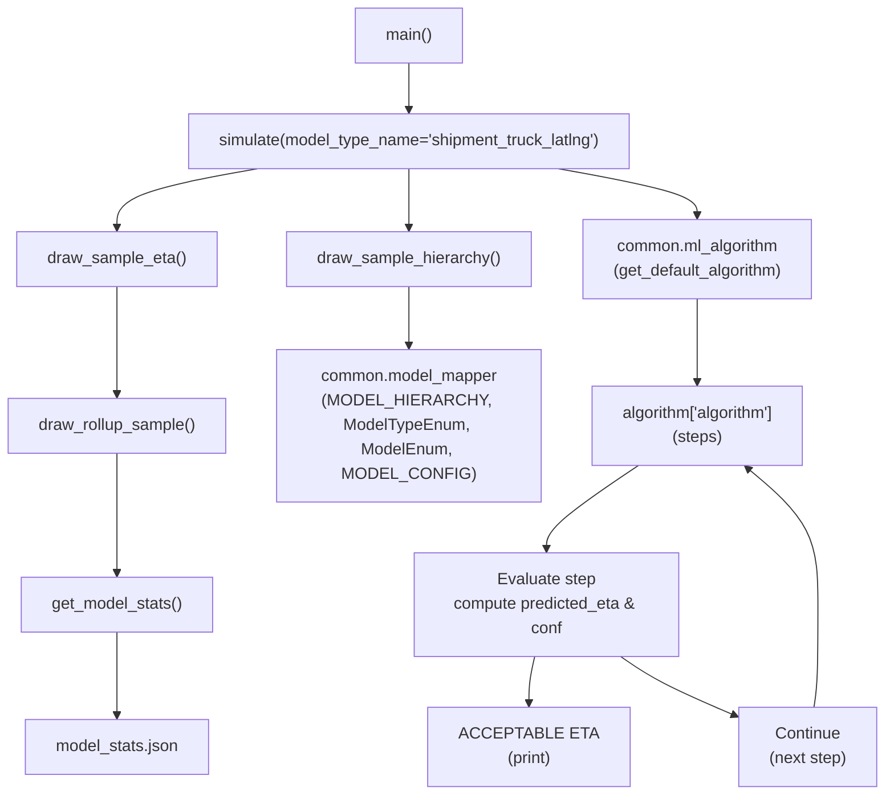
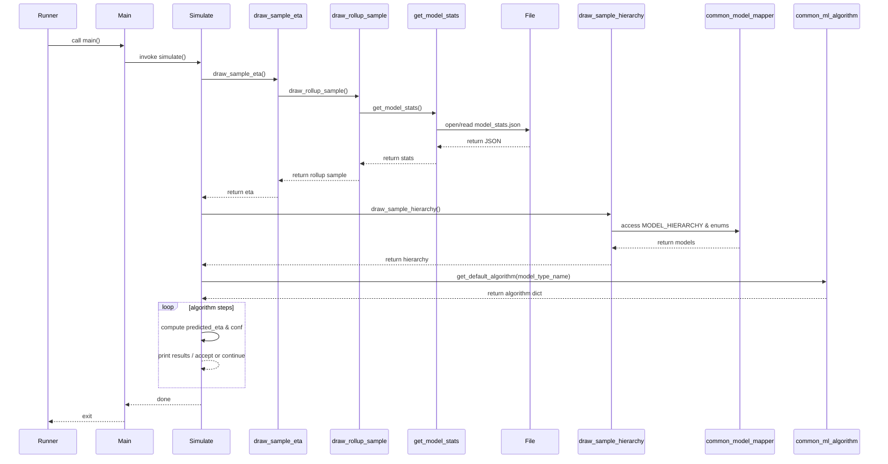
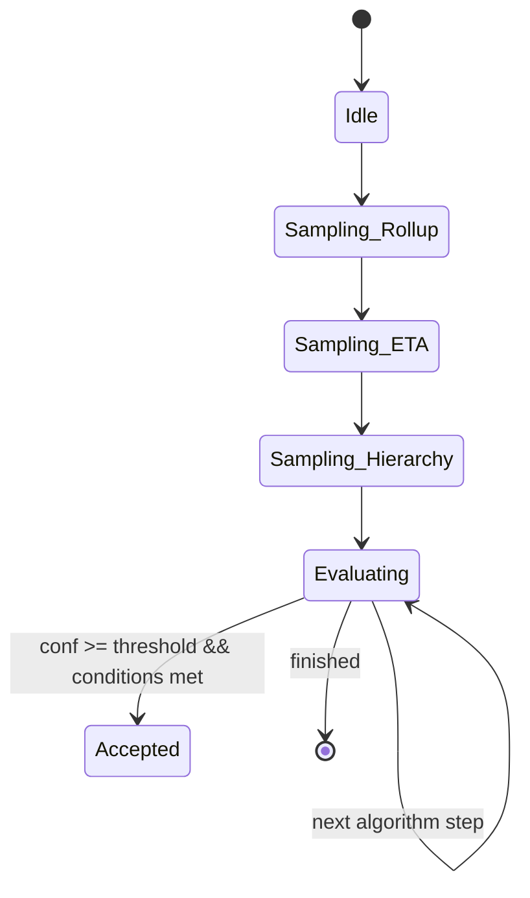

# Diagram: research/orchestrator/simulation/model_picker_sim.py

> Auto-generated by Obscura crawlers

## Diagram 1

### SVG

<svg id="container" width="1130.7109375" xmlns="http://www.w3.org/2000/svg" class="flowchart" height="638" viewBox="0 0 1130.7109375 638" role="graphics-document document" aria-roledescription="flowchart-v2"><g><marker id="container_flowchart-v2-pointEnd" class="marker flowchart-v2" viewBox="0 0 10 10" refX="5" refY="5" markerUnits="userSpaceOnUse" markerWidth="8" markerHeight="8" orient="auto"><path d="M 0 0 L 10 5 L 0 10 z" class="arrowMarkerPath" style="stroke-width: 1; stroke-dasharray: 1, 0;"></path></marker><marker id="container_flowchart-v2-pointStart" class="marker flowchart-v2" viewBox="0 0 10 10" refX="4.5" refY="5" markerUnits="userSpaceOnUse" markerWidth="8" markerHeight="8" orient="auto"><path d="M 0 5 L 10 10 L 10 0 z" class="arrowMarkerPath" style="stroke-width: 1; stroke-dasharray: 1, 0;"></path></marker><marker id="container_flowchart-v2-circleEnd" class="marker flowchart-v2" viewBox="0 0 10 10" refX="11" refY="5" markerUnits="userSpaceOnUse" markerWidth="11" markerHeight="11" orient="auto"><circle cx="5" cy="5" r="5" class="arrowMarkerPath" style="stroke-width: 1; stroke-dasharray: 1, 0;"></circle></marker><marker id="container_flowchart-v2-circleStart" class="marker flowchart-v2" viewBox="0 0 10 10" refX="-1" refY="5" markerUnits="userSpaceOnUse" markerWidth="11" markerHeight="11" orient="auto"><circle cx="5" cy="5" r="5" class="arrowMarkerPath" style="stroke-width: 1; stroke-dasharray: 1, 0;"></circle></marker><marker id="container_flowchart-v2-crossEnd" class="marker cross flowchart-v2" viewBox="0 0 11 11" refX="12" refY="5.2" markerUnits="userSpaceOnUse" markerWidth="11" markerHeight="11" orient="auto"><path d="M 1,1 l 9,9 M 10,1 l -9,9" class="arrowMarkerPath" style="stroke-width: 2; stroke-dasharray: 1, 0;"></path></marker><marker id="container_flowchart-v2-crossStart" class="marker cross flowchart-v2" viewBox="0 0 11 11" refX="-1" refY="5.2" markerUnits="userSpaceOnUse" markerWidth="11" markerHeight="11" orient="auto"><path d="M 1,1 l 9,9 M 10,1 l -9,9" class="arrowMarkerPath" style="stroke-width: 2; stroke-dasharray: 1, 0;"></path></marker><g class="root"><g class="clusters"></g><g class="edgePaths"><path d="M478.336,62L478.336,66.167C478.336,70.333,478.336,78.667,478.336,86.333C478.336,94,478.336,101,478.336,104.5L478.336,108" id="L_main_simulate_0" class="edge-thickness-normal edge-pattern-solid edge-thickness-normal edge-pattern-solid flowchart-link" style=";" data-edge="true" data-et="edge" data-id="L_main_simulate_0" data-points="W3sieCI6NDc4LjMzNTkzNzUsInkiOjYyfSx7IngiOjQ3OC4zMzU5Mzc1LCJ5Ijo4N30seyJ4Ijo0NzguMzM1OTM3NSwieSI6MTEyfV0=" marker-end="url(#container_flowchart-v2-pointEnd)"></path><path d="M290.577,166L261.602,170.167C232.627,174.333,174.677,182.667,145.702,190.333C116.727,198,116.727,205,116.727,208.5L116.727,212" id="L_simulate_draw_eta_0" class="edge-thickness-normal edge-pattern-solid edge-thickness-normal edge-pattern-solid flowchart-link" style=";" data-edge="true" data-et="edge" data-id="L_simulate_draw_eta_0" data-points="W3sieCI6MjkwLjU3NzIyMzU1NzY5MjMsInkiOjE2Nn0seyJ4IjoxMTYuNzI2NTYyNSwieSI6MTkxfSx7IngiOjExNi43MjY1NjI1LCJ5IjoyMTZ9XQ==" marker-end="url(#container_flowchart-v2-pointEnd)"></path><path d="M478.336,166L478.336,170.167C478.336,174.333,478.336,182.667,478.336,190.333C478.336,198,478.336,205,478.336,208.5L478.336,212" id="L_simulate_draw_hierarchy_0" class="edge-thickness-normal edge-pattern-solid edge-thickness-normal edge-pattern-solid flowchart-link" style=";" data-edge="true" data-et="edge" data-id="L_simulate_draw_hierarchy_0" data-points="W3sieCI6NDc4LjMzNTkzNzUsInkiOjE2Nn0seyJ4Ijo0NzguMzM1OTM3NSwieSI6MTkxfSx7IngiOjQ3OC4zMzU5Mzc1LCJ5IjoyMTZ9XQ==" marker-end="url(#container_flowchart-v2-pointEnd)"></path><path d="M116.727,270L116.727,274.167C116.727,278.333,116.727,286.667,116.727,296.333C116.727,306,116.727,317,116.727,322.5L116.727,328" id="L_draw_eta_draw_rollup_0" class="edge-thickness-normal edge-pattern-solid edge-thickness-normal edge-pattern-solid flowchart-link" style=";" data-edge="true" data-et="edge" data-id="L_draw_eta_draw_rollup_0" data-points="W3sieCI6MTE2LjcyNjU2MjUsInkiOjI3MH0seyJ4IjoxMTYuNzI2NTYyNSwieSI6Mjk1fSx7IngiOjExNi43MjY1NjI1LCJ5IjozMzJ9XQ==" marker-end="url(#container_flowchart-v2-pointEnd)"></path><path d="M116.727,386L116.727,392.167C116.727,398.333,116.727,410.667,116.727,422.333C116.727,434,116.727,445,116.727,450.5L116.727,456" id="L_draw_rollup_get_stats_0" class="edge-thickness-normal edge-pattern-solid edge-thickness-normal edge-pattern-solid flowchart-link" style=";" data-edge="true" data-et="edge" data-id="L_draw_rollup_get_stats_0" data-points="W3sieCI6MTE2LjcyNjU2MjUsInkiOjM4Nn0seyJ4IjoxMTYuNzI2NTYyNSwieSI6NDIzfSx7IngiOjExNi43MjY1NjI1LCJ5Ijo0NjB9XQ==" marker-end="url(#container_flowchart-v2-pointEnd)"></path><path d="M116.727,514L116.727,520.167C116.727,526.333,116.727,538.667,116.727,548.333C116.727,558,116.727,565,116.727,568.5L116.727,572" id="L_get_stats_model_file_0" class="edge-thickness-normal edge-pattern-solid edge-thickness-normal edge-pattern-solid flowchart-link" style=";" data-edge="true" data-et="edge" data-id="L_get_stats_model_file_0" data-points="W3sieCI6MTE2LjcyNjU2MjUsInkiOjUxNH0seyJ4IjoxMTYuNzI2NTYyNSwieSI6NTUxfSx7IngiOjExNi43MjY1NjI1LCJ5Ijo1NzZ9XQ==" marker-end="url(#container_flowchart-v2-pointEnd)"></path><path d="M478.336,270L478.336,274.167C478.336,278.333,478.336,286.667,478.336,294.333C478.336,302,478.336,309,478.336,312.5L478.336,316" id="L_draw_hierarchy_model_mapper_0" class="edge-thickness-normal edge-pattern-solid edge-thickness-normal edge-pattern-solid flowchart-link" style=";" data-edge="true" data-et="edge" data-id="L_draw_hierarchy_model_mapper_0" data-points="W3sieCI6NDc4LjMzNTkzNzUsInkiOjI3MH0seyJ4Ijo0NzguMzM1OTM3NSwieSI6Mjk1fSx7IngiOjQ3OC4zMzU5Mzc1LCJ5IjozMjB9XQ==" marker-end="url(#container_flowchart-v2-pointEnd)"></path><path d="M683.473,166L715.13,170.167C746.786,174.333,810.1,182.667,841.757,190.333C873.414,198,873.414,205,873.414,208.5L873.414,212" id="L_simulate_ml_algorithm_0" class="edge-thickness-normal edge-pattern-solid edge-thickness-normal edge-pattern-solid flowchart-link" style=";" data-edge="true" data-et="edge" data-id="L_simulate_ml_algorithm_0" data-points="W3sieCI6NjgzLjQ3MjY1NjI1LCJ5IjoxNjZ9LHsieCI6ODczLjQxNDA2MjUsInkiOjE5MX0seyJ4Ijo4NzMuNDE0MDYyNSwieSI6MjE2fV0=" marker-end="url(#container_flowchart-v2-pointEnd)"></path><path d="M873.414,270L873.414,274.167C873.414,278.333,873.414,286.667,873.414,296.333C873.414,306,873.414,317,873.414,322.5L873.414,328" id="L_ml_algorithm_algorithm_steps_0" class="edge-thickness-normal edge-pattern-solid edge-thickness-normal edge-pattern-solid flowchart-link" style=";" data-edge="true" data-et="edge" data-id="L_ml_algorithm_algorithm_steps_0" data-points="W3sieCI6ODczLjQxNDA2MjUsInkiOjI3MH0seyJ4Ijo4NzMuNDE0MDYyNSwieSI6Mjk1fSx7IngiOjg3My40MTQwNjI1LCJ5IjozMzJ9XQ==" marker-end="url(#container_flowchart-v2-pointEnd)"></path><path d="M773.211,386L750.325,392.167C727.439,398.333,681.667,410.667,658.781,420.333C635.895,430,635.895,437,635.895,440.5L635.895,444" id="L_algorithm_steps_evaluate_0" class="edge-thickness-normal edge-pattern-solid edge-thickness-normal edge-pattern-solid flowchart-link" style=";" data-edge="true" data-et="edge" data-id="L_algorithm_steps_evaluate_0" data-points="W3sieCI6NzczLjIxMDUxMDI1MzkwNjIsInkiOjM4Nn0seyJ4Ijo2MzUuODk0NTMxMjUsInkiOjQyM30seyJ4Ijo2MzUuODk0NTMxMjUsInkiOjQ0OH1d" marker-end="url(#container_flowchart-v2-pointEnd)"></path><path d="M629.801,526L629.15,530.167C628.499,534.333,627.197,542.667,626.546,550.333C625.895,558,625.895,565,625.895,568.5L625.895,572" id="L_evaluate_accept_0" class="edge-thickness-normal edge-pattern-solid edge-thickness-normal edge-pattern-solid flowchart-link" style=";" data-edge="true" data-et="edge" data-id="L_evaluate_accept_0" data-points="W3sieCI6NjI5LjgwMDc4MTI1LCJ5Ijo1MjZ9LHsieCI6NjI1Ljg5NDUzMTI1LCJ5Ijo1NTF9LHsieCI6NjI1Ljg5NDUzMTI1LCJ5Ijo1NzZ9XQ==" marker-end="url(#container_flowchart-v2-pointEnd)"></path><path d="M720.998,526L730.09,530.167C739.182,534.333,757.366,542.667,787.12,551.357C816.875,560.047,858.198,569.094,878.86,573.617L899.522,578.141" id="L_evaluate_reject_0" class="edge-thickness-normal edge-pattern-solid edge-thickness-normal edge-pattern-solid flowchart-link" style=";" data-edge="true" data-et="edge" data-id="L_evaluate_reject_0" data-points="W3sieCI6NzIwLjk5NzU1ODU5Mzc1LCJ5Ijo1MjZ9LHsieCI6Nzc1LjU1MDc4MTI1LCJ5Ijo1NTF9LHsieCI6OTAzLjQyOTY4NzUsInkiOjU3OC45OTY0NDc2NjA1NTQzfV0=" marker-end="url(#container_flowchart-v2-pointEnd)"></path><path d="M1018.263,576L1019.064,571.833C1019.865,567.667,1021.468,559.333,1022.269,544.5C1023.07,529.667,1023.07,508.333,1023.07,487C1023.07,465.667,1023.07,444.333,1009.263,427.762C995.456,411.191,967.842,399.382,954.035,393.477L940.228,387.573" id="L_reject_algorithm_steps_0" class="edge-thickness-normal edge-pattern-solid edge-thickness-normal edge-pattern-solid flowchart-link" style=";" data-edge="true" data-et="edge" data-id="L_reject_algorithm_steps_0" data-points="W3sieCI6MTAxOC4yNjI2MjAxOTIzMDc3LCJ5Ijo1NzZ9LHsieCI6MTAyMy4wNzAzMTI1LCJ5Ijo1NTF9LHsieCI6MTAyMy4wNzAzMTI1LCJ5Ijo0ODd9LHsieCI6MTAyMy4wNzAzMTI1LCJ5Ijo0MjN9LHsieCI6OTM2LjU1MDI5Mjk2ODc1LCJ5IjozODZ9XQ==" marker-end="url(#container_flowchart-v2-pointEnd)"></path></g><g class="edgeLabels"><g class="edgeLabel"><g class="label" data-id="L_main_simulate_0" transform="translate(0, 0)"><foreignObject width="0" height="0">

</foreignObject></g></g><g class="edgeLabel"><g class="label" data-id="L_simulate_draw_eta_0" transform="translate(0, 0)"><foreignObject width="0" height="0">

</foreignObject></g></g><g class="edgeLabel"><g class="label" data-id="L_simulate_draw_hierarchy_0" transform="translate(0, 0)"><foreignObject width="0" height="0">

</foreignObject></g></g><g class="edgeLabel"><g class="label" data-id="L_draw_eta_draw_rollup_0" transform="translate(0, 0)"><foreignObject width="0" height="0">

</foreignObject></g></g><g class="edgeLabel"><g class="label" data-id="L_draw_rollup_get_stats_0" transform="translate(0, 0)"><foreignObject width="0" height="0">

</foreignObject></g></g><g class="edgeLabel"><g class="label" data-id="L_get_stats_model_file_0" transform="translate(0, 0)"><foreignObject width="0" height="0">

</foreignObject></g></g><g class="edgeLabel"><g class="label" data-id="L_draw_hierarchy_model_mapper_0" transform="translate(0, 0)"><foreignObject width="0" height="0">

</foreignObject></g></g><g class="edgeLabel"><g class="label" data-id="L_simulate_ml_algorithm_0" transform="translate(0, 0)"><foreignObject width="0" height="0">

</foreignObject></g></g><g class="edgeLabel"><g class="label" data-id="L_ml_algorithm_algorithm_steps_0" transform="translate(0, 0)"><foreignObject width="0" height="0">

</foreignObject></g></g><g class="edgeLabel"><g class="label" data-id="L_algorithm_steps_evaluate_0" transform="translate(0, 0)"><foreignObject width="0" height="0">

</foreignObject></g></g><g class="edgeLabel"><g class="label" data-id="L_evaluate_accept_0" transform="translate(0, 0)"><foreignObject width="0" height="0">

</foreignObject></g></g><g class="edgeLabel"><g class="label" data-id="L_evaluate_reject_0" transform="translate(0, 0)"><foreignObject width="0" height="0">

</foreignObject></g></g><g class="edgeLabel"><g class="label" data-id="L_reject_algorithm_steps_0" transform="translate(0, 0)"><foreignObject width="0" height="0">

</foreignObject></g></g></g><g class="nodes"><g class="node default" id="flowchart-main-0" transform="translate(478.3359375, 35)"><rect class="basic label-container" style="" x="-53.34375" y="-27" width="106.6875" height="54"></rect><g class="label" style="" transform="translate(-23.34375, -12)"><rect></rect><foreignObject width="46.6875" height="24">

main()

</foreignObject></g></g><g class="node default" id="flowchart-simulate-1" transform="translate(478.3359375, 139)"><rect class="basic label-container" style="" x="-222.578125" y="-27" width="445.15625" height="54"></rect><g class="label" style="" transform="translate(-192.578125, -12)"><rect></rect><foreignObject width="385.15625" height="24">

simulate(model_type_name='shipment_truck_latlng')

</foreignObject></g></g><g class="node default" id="flowchart-draw_eta-2" transform="translate(116.7265625, 243)"><rect class="basic label-container" style="" x="-98.4921875" y="-27" width="196.984375" height="54"></rect><g class="label" style="" transform="translate(-68.4921875, -12)"><rect></rect><foreignObject width="136.984375" height="24">

draw_sample_eta()

</foreignObject></g></g><g class="node default" id="flowchart-draw_rollup-3" transform="translate(116.7265625, 359)"><rect class="basic label-container" style="" x="-108.7265625" y="-27" width="217.453125" height="54"></rect><g class="label" style="" transform="translate(-78.7265625, -12)"><rect></rect><foreignObject width="157.453125" height="24">

draw_rollup_sample()

</foreignObject></g></g><g class="node default" id="flowchart-get_stats-4" transform="translate(116.7265625, 487)"><rect class="basic label-container" style="" x="-95.3515625" y="-27" width="190.703125" height="54"></rect><g class="label" style="" transform="translate(-65.3515625, -12)"><rect></rect><foreignObject width="130.703125" height="24">

get_model_stats()

</foreignObject></g></g><g class="node default" id="flowchart-model_file-5" transform="translate(116.7265625, 603)"><rect class="basic label-container" style="" x="-91.9765625" y="-27" width="183.953125" height="54"></rect><g class="label" style="" transform="translate(-61.9765625, -12)"><rect></rect><foreignObject width="123.953125" height="24">

model_stats.json

</foreignObject></g></g><g class="node default" id="flowchart-draw_hierarchy-6" transform="translate(478.3359375, 243)"><rect class="basic label-container" style="" x="-120.8125" y="-27" width="241.625" height="54"></rect><g class="label" style="" transform="translate(-90.8125, -12)"><rect></rect><foreignObject width="181.625" height="24">

draw_sample_hierarchy()

</foreignObject></g></g><g class="node default" id="flowchart-model_mapper-7" transform="translate(478.3359375, 359)"><rect class="basic label-container" style="" x="-202.8828125" y="-39" width="405.765625" height="78"></rect><g class="label" style="" transform="translate(-172.8828125, -24)"><rect></rect><foreignObject width="345.765625" height="48">

common.model_mapper\n(MODEL_HIERARCHY, ModelTypeEnum, ModelEnum, MODEL_CONFIG)

</foreignObject></g></g><g class="node default" id="flowchart-ml_algorithm-8" transform="translate(873.4140625, 243)"><rect class="basic label-container" style="" x="-205.640625" y="-27" width="411.28125" height="54"></rect><g class="label" style="" transform="translate(-175.640625, -12)"><rect></rect><foreignObject width="351.28125" height="24">

common.ml_algorithm\n(get_default_algorithm)

</foreignObject></g></g><g class="node default" id="flowchart-algorithm_steps-9" transform="translate(873.4140625, 359)"><rect class="basic label-container" style="" x="-142.1953125" y="-27" width="284.390625" height="54"></rect><g class="label" style="" transform="translate(-112.1953125, -12)"><rect></rect><foreignObject width="224.390625" height="24">

algorithm['algorithm']\n(steps)

</foreignObject></g></g><g class="node default" id="flowchart-evaluate-10" transform="translate(635.89453125, 487)"><rect class="basic label-container" style="" x="-130" y="-39" width="260" height="78"></rect><g class="label" style="" transform="translate(-100, -24)"><rect></rect><foreignObject width="200" height="48">

Evaluate step\ncompute predicted_eta &amp; conf

</foreignObject></g></g><g class="node default" id="flowchart-accept-11" transform="translate(625.89453125, 603)"><rect class="basic label-container" style="" x="-119.671875" y="-27" width="239.34375" height="54"></rect><g class="label" style="" transform="translate(-89.671875, -12)"><rect></rect><foreignObject width="179.34375" height="24">

ACCEPTABLE ETA\n(print)

</foreignObject></g></g><g class="node default" id="flowchart-reject-12" transform="translate(1013.0703125, 603)"><rect class="basic label-container" style="" x="-109.640625" y="-27" width="219.28125" height="54"></rect><g class="label" style="" transform="translate(-79.640625, -12)"><rect></rect><foreignObject width="159.28125" height="24">

Continue\n(next step)

</foreignObject></g></g></g></g></g></svg>

## Diagram 2

### SVG

<svg id="container" width="2383.5" xmlns="http://www.w3.org/2000/svg" height="1276" viewBox="-50 -10 2383.5 1276" role="graphics-document document" aria-roledescription="sequence"><g><rect x="2095.5" y="1190" fill="#eaeaea" stroke="#666" width="188" height="65" name="ML" rx="3" ry="3" class="actor actor-bottom"></rect><text x="2189.5" y="1222.5" dominant-baseline="central" alignment-baseline="central" class="actor actor-box" style="text-anchor: middle; font-size: 16px; font-weight: 400;"><tspan x="2189.5" dy="0">common_ml_algorithm</tspan></text></g><g><rect x="1842.5" y="1190" fill="#eaeaea" stroke="#666" width="203" height="65" name="Mapper" rx="3" ry="3" class="actor actor-bottom"></rect><text x="1944" y="1222.5" dominant-baseline="central" alignment-baseline="central" class="actor actor-box" style="text-anchor: middle; font-size: 16px; font-weight: 400;"><tspan x="1944" dy="0">common_model_mapper</tspan></text></g><g><rect x="1518.5" y="1190" fill="#eaeaea" stroke="#666" width="191" height="65" name="DrawHierarchy" rx="3" ry="3" class="actor actor-bottom"></rect><text x="1614" y="1222.5" dominant-baseline="central" alignment-baseline="central" class="actor actor-box" style="text-anchor: middle; font-size: 16px; font-weight: 400;"><tspan x="1614" dy="0">draw_sample_hierarchy</tspan></text></g><g><rect x="1318.5" y="1190" fill="#eaeaea" stroke="#666" width="150" height="65" name="File" rx="3" ry="3" class="actor actor-bottom"></rect><text x="1393.5" y="1222.5" dominant-baseline="central" alignment-baseline="central" class="actor actor-box" style="text-anchor: middle; font-size: 16px; font-weight: 400;"><tspan x="1393.5" dy="0">File</tspan></text></g><g><rect x="1042.5" y="1190" fill="#eaeaea" stroke="#666" width="150" height="65" name="GetStats" rx="3" ry="3" class="actor actor-bottom"></rect><text x="1117.5" y="1222.5" dominant-baseline="central" alignment-baseline="central" class="actor actor-box" style="text-anchor: middle; font-size: 16px; font-weight: 400;"><tspan x="1117.5" dy="0">get_model_stats</tspan></text></g><g><rect x="825.5" y="1190" fill="#eaeaea" stroke="#666" width="167" height="65" name="DrawRollup" rx="3" ry="3" class="actor actor-bottom"></rect><text x="909" y="1222.5" dominant-baseline="central" alignment-baseline="central" class="actor actor-box" style="text-anchor: middle; font-size: 16px; font-weight: 400;"><tspan x="909" dy="0">draw_rollup_sample</tspan></text></g><g><rect x="607" y="1190" fill="#eaeaea" stroke="#666" width="150" height="65" name="DrawETA" rx="3" ry="3" class="actor actor-bottom"></rect><text x="682" y="1222.5" dominant-baseline="central" alignment-baseline="central" class="actor actor-box" style="text-anchor: middle; font-size: 16px; font-weight: 400;"><tspan x="682" dy="0">draw_sample_eta</tspan></text></g><g><rect x="400" y="1190" fill="#eaeaea" stroke="#666" width="150" height="65" name="Simulate" rx="3" ry="3" class="actor actor-bottom"></rect><text x="475" y="1222.5" dominant-baseline="central" alignment-baseline="central" class="actor actor-box" style="text-anchor: middle; font-size: 16px; font-weight: 400;"><tspan x="475" dy="0">Simulate</tspan></text></g><g><rect x="200" y="1190" fill="#eaeaea" stroke="#666" width="150" height="65" name="Main" rx="3" ry="3" class="actor actor-bottom"></rect><text x="275" y="1222.5" dominant-baseline="central" alignment-baseline="central" class="actor actor-box" style="text-anchor: middle; font-size: 16px; font-weight: 400;"><tspan x="275" dy="0">Main</tspan></text></g><g><rect x="0" y="1190" fill="#eaeaea" stroke="#666" width="150" height="65" name="Runner" rx="3" ry="3" class="actor actor-bottom"></rect><text x="75" y="1222.5" dominant-baseline="central" alignment-baseline="central" class="actor actor-box" style="text-anchor: middle; font-size: 16px; font-weight: 400;"><tspan x="75" dy="0">Runner</tspan></text></g><g><line id="actor9" x1="2189.5" y1="65" x2="2189.5" y2="1190" class="actor-line 200" stroke-width="0.5px" stroke="#999" name="ML"></line><g id="root-9"><rect x="2095.5" y="0" fill="#eaeaea" stroke="#666" width="188" height="65" name="ML" rx="3" ry="3" class="actor actor-top"></rect><text x="2189.5" y="32.5" dominant-baseline="central" alignment-baseline="central" class="actor actor-box" style="text-anchor: middle; font-size: 16px; font-weight: 400;"><tspan x="2189.5" dy="0">common_ml_algorithm</tspan></text></g></g><g><line id="actor8" x1="1944" y1="65" x2="1944" y2="1190" class="actor-line 200" stroke-width="0.5px" stroke="#999" name="Mapper"></line><g id="root-8"><rect x="1842.5" y="0" fill="#eaeaea" stroke="#666" width="203" height="65" name="Mapper" rx="3" ry="3" class="actor actor-top"></rect><text x="1944" y="32.5" dominant-baseline="central" alignment-baseline="central" class="actor actor-box" style="text-anchor: middle; font-size: 16px; font-weight: 400;"><tspan x="1944" dy="0">common_model_mapper</tspan></text></g></g><g><line id="actor7" x1="1614" y1="65" x2="1614" y2="1190" class="actor-line 200" stroke-width="0.5px" stroke="#999" name="DrawHierarchy"></line><g id="root-7"><rect x="1518.5" y="0" fill="#eaeaea" stroke="#666" width="191" height="65" name="DrawHierarchy" rx="3" ry="3" class="actor actor-top"></rect><text x="1614" y="32.5" dominant-baseline="central" alignment-baseline="central" class="actor actor-box" style="text-anchor: middle; font-size: 16px; font-weight: 400;"><tspan x="1614" dy="0">draw_sample_hierarchy</tspan></text></g></g><g><line id="actor6" x1="1393.5" y1="65" x2="1393.5" y2="1190" class="actor-line 200" stroke-width="0.5px" stroke="#999" name="File"></line><g id="root-6"><rect x="1318.5" y="0" fill="#eaeaea" stroke="#666" width="150" height="65" name="File" rx="3" ry="3" class="actor actor-top"></rect><text x="1393.5" y="32.5" dominant-baseline="central" alignment-baseline="central" class="actor actor-box" style="text-anchor: middle; font-size: 16px; font-weight: 400;"><tspan x="1393.5" dy="0">File</tspan></text></g></g><g><line id="actor5" x1="1117.5" y1="65" x2="1117.5" y2="1190" class="actor-line 200" stroke-width="0.5px" stroke="#999" name="GetStats"></line><g id="root-5"><rect x="1042.5" y="0" fill="#eaeaea" stroke="#666" width="150" height="65" name="GetStats" rx="3" ry="3" class="actor actor-top"></rect><text x="1117.5" y="32.5" dominant-baseline="central" alignment-baseline="central" class="actor actor-box" style="text-anchor: middle; font-size: 16px; font-weight: 400;"><tspan x="1117.5" dy="0">get_model_stats</tspan></text></g></g><g><line id="actor4" x1="909" y1="65" x2="909" y2="1190" class="actor-line 200" stroke-width="0.5px" stroke="#999" name="DrawRollup"></line><g id="root-4"><rect x="825.5" y="0" fill="#eaeaea" stroke="#666" width="167" height="65" name="DrawRollup" rx="3" ry="3" class="actor actor-top"></rect><text x="909" y="32.5" dominant-baseline="central" alignment-baseline="central" class="actor actor-box" style="text-anchor: middle; font-size: 16px; font-weight: 400;"><tspan x="909" dy="0">draw_rollup_sample</tspan></text></g></g><g><line id="actor3" x1="682" y1="65" x2="682" y2="1190" class="actor-line 200" stroke-width="0.5px" stroke="#999" name="DrawETA"></line><g id="root-3"><rect x="607" y="0" fill="#eaeaea" stroke="#666" width="150" height="65" name="DrawETA" rx="3" ry="3" class="actor actor-top"></rect><text x="682" y="32.5" dominant-baseline="central" alignment-baseline="central" class="actor actor-box" style="text-anchor: middle; font-size: 16px; font-weight: 400;"><tspan x="682" dy="0">draw_sample_eta</tspan></text></g></g><g><line id="actor2" x1="475" y1="65" x2="475" y2="1190" class="actor-line 200" stroke-width="0.5px" stroke="#999" name="Simulate"></line><g id="root-2"><rect x="400" y="0" fill="#eaeaea" stroke="#666" width="150" height="65" name="Simulate" rx="3" ry="3" class="actor actor-top"></rect><text x="475" y="32.5" dominant-baseline="central" alignment-baseline="central" class="actor actor-box" style="text-anchor: middle; font-size: 16px; font-weight: 400;"><tspan x="475" dy="0">Simulate</tspan></text></g></g><g><line id="actor1" x1="275" y1="65" x2="275" y2="1190" class="actor-line 200" stroke-width="0.5px" stroke="#999" name="Main"></line><g id="root-1"><rect x="200" y="0" fill="#eaeaea" stroke="#666" width="150" height="65" name="Main" rx="3" ry="3" class="actor actor-top"></rect><text x="275" y="32.5" dominant-baseline="central" alignment-baseline="central" class="actor actor-box" style="text-anchor: middle; font-size: 16px; font-weight: 400;"><tspan x="275" dy="0">Main</tspan></text></g></g><g><line id="actor0" x1="75" y1="65" x2="75" y2="1190" class="actor-line 200" stroke-width="0.5px" stroke="#999" name="Runner"></line><g id="root-0"><rect x="0" y="0" fill="#eaeaea" stroke="#666" width="150" height="65" name="Runner" rx="3" ry="3" class="actor actor-top"></rect><text x="75" y="32.5" dominant-baseline="central" alignment-baseline="central" class="actor actor-box" style="text-anchor: middle; font-size: 16px; font-weight: 400;"><tspan x="75" dy="0">Runner</tspan></text></g></g><g></g><defs><symbol id="computer" width="24" height="24"><path transform="scale(.5)" d="M2 2v13h20v-13h-20zm18 11h-16v-9h16v9zm-10.228 6l.466-1h3.524l.467 1h-4.457zm14.228 3h-24l2-6h2.104l-1.33 4h18.45l-1.297-4h2.073l2 6zm-5-10h-14v-7h14v7z"></path></symbol></defs><defs><symbol id="database" fill-rule="evenodd" clip-rule="evenodd"><path transform="scale(.5)" d="M12.258.001l.256.004.255.005.253.008.251.01.249.012.247.015.246.016.242.019.241.02.239.023.236.024.233.027.231.028.229.031.225.032.223.034.22.036.217.038.214.04.211.041.208.043.205.045.201.046.198.048.194.05.191.051.187.053.183.054.18.056.175.057.172.059.168.06.163.061.16.063.155.064.15.066.074.033.073.033.071.034.07.034.069.035.068.035.067.035.066.035.064.036.064.036.062.036.06.036.06.037.058.037.058.037.055.038.055.038.053.038.052.038.051.039.05.039.048.039.047.039.045.04.044.04.043.04.041.04.04.041.039.041.037.041.036.041.034.041.033.042.032.042.03.042.029.042.027.042.026.043.024.043.023.043.021.043.02.043.018.044.017.043.015.044.013.044.012.044.011.045.009.044.007.045.006.045.004.045.002.045.001.045v17l-.001.045-.002.045-.004.045-.006.045-.007.045-.009.044-.011.045-.012.044-.013.044-.015.044-.017.043-.018.044-.02.043-.021.043-.023.043-.024.043-.026.043-.027.042-.029.042-.03.042-.032.042-.033.042-.034.041-.036.041-.037.041-.039.041-.04.041-.041.04-.043.04-.044.04-.045.04-.047.039-.048.039-.05.039-.051.039-.052.038-.053.038-.055.038-.055.038-.058.037-.058.037-.06.037-.06.036-.062.036-.064.036-.064.036-.066.035-.067.035-.068.035-.069.035-.07.034-.071.034-.073.033-.074.033-.15.066-.155.064-.16.063-.163.061-.168.06-.172.059-.175.057-.18.056-.183.054-.187.053-.191.051-.194.05-.198.048-.201.046-.205.045-.208.043-.211.041-.214.04-.217.038-.22.036-.223.034-.225.032-.229.031-.231.028-.233.027-.236.024-.239.023-.241.02-.242.019-.246.016-.247.015-.249.012-.251.01-.253.008-.255.005-.256.004-.258.001-.258-.001-.256-.004-.255-.005-.253-.008-.251-.01-.249-.012-.247-.015-.245-.016-.243-.019-.241-.02-.238-.023-.236-.024-.234-.027-.231-.028-.228-.031-.226-.032-.223-.034-.22-.036-.217-.038-.214-.04-.211-.041-.208-.043-.204-.045-.201-.046-.198-.048-.195-.05-.19-.051-.187-.053-.184-.054-.179-.056-.176-.057-.172-.059-.167-.06-.164-.061-.159-.063-.155-.064-.151-.066-.074-.033-.072-.033-.072-.034-.07-.034-.069-.035-.068-.035-.067-.035-.066-.035-.064-.036-.063-.036-.062-.036-.061-.036-.06-.037-.058-.037-.057-.037-.056-.038-.055-.038-.053-.038-.052-.038-.051-.039-.049-.039-.049-.039-.046-.039-.046-.04-.044-.04-.043-.04-.041-.04-.04-.041-.039-.041-.037-.041-.036-.041-.034-.041-.033-.042-.032-.042-.03-.042-.029-.042-.027-.042-.026-.043-.024-.043-.023-.043-.021-.043-.02-.043-.018-.044-.017-.043-.015-.044-.013-.044-.012-.044-.011-.045-.009-.044-.007-.045-.006-.045-.004-.045-.002-.045-.001-.045v-17l.001-.045.002-.045.004-.045.006-.045.007-.045.009-.044.011-.045.012-.044.013-.044.015-.044.017-.043.018-.044.02-.043.021-.043.023-.043.024-.043.026-.043.027-.042.029-.042.03-.042.032-.042.033-.042.034-.041.036-.041.037-.041.039-.041.04-.041.041-.04.043-.04.044-.04.046-.04.046-.039.049-.039.049-.039.051-.039.052-.038.053-.038.055-.038.056-.038.057-.037.058-.037.06-.037.061-.036.062-.036.063-.036.064-.036.066-.035.067-.035.068-.035.069-.035.07-.034.072-.034.072-.033.074-.033.151-.066.155-.064.159-.063.164-.061.167-.06.172-.059.176-.057.179-.056.184-.054.187-.053.19-.051.195-.05.198-.048.201-.046.204-.045.208-.043.211-.041.214-.04.217-.038.22-.036.223-.034.226-.032.228-.031.231-.028.234-.027.236-.024.238-.023.241-.02.243-.019.245-.016.247-.015.249-.012.251-.01.253-.008.255-.005.256-.004.258-.001.258.001zm-9.258 20.499v.01l.001.021.003.021.004.022.005.021.006.022.007.022.009.023.01.022.011.023.012.023.013.023.015.023.016.024.017.023.018.024.019.024.021.024.022.025.023.024.024.025.052.049.056.05.061.051.066.051.07.051.075.051.079.052.084.052.088.052.092.052.097.052.102.051.105.052.11.052.114.051.119.051.123.051.127.05.131.05.135.05.139.048.144.049.147.047.152.047.155.047.16.045.163.045.167.043.171.043.176.041.178.041.183.039.187.039.19.037.194.035.197.035.202.033.204.031.209.03.212.029.216.027.219.025.222.024.226.021.23.02.233.018.236.016.24.015.243.012.246.01.249.008.253.005.256.004.259.001.26-.001.257-.004.254-.005.25-.008.247-.011.244-.012.241-.014.237-.016.233-.018.231-.021.226-.021.224-.024.22-.026.216-.027.212-.028.21-.031.205-.031.202-.034.198-.034.194-.036.191-.037.187-.039.183-.04.179-.04.175-.042.172-.043.168-.044.163-.045.16-.046.155-.046.152-.047.148-.048.143-.049.139-.049.136-.05.131-.05.126-.05.123-.051.118-.052.114-.051.11-.052.106-.052.101-.052.096-.052.092-.052.088-.053.083-.051.079-.052.074-.052.07-.051.065-.051.06-.051.056-.05.051-.05.023-.024.023-.025.021-.024.02-.024.019-.024.018-.024.017-.024.015-.023.014-.024.013-.023.012-.023.01-.023.01-.022.008-.022.006-.022.006-.022.004-.022.004-.021.001-.021.001-.021v-4.127l-.077.055-.08.053-.083.054-.085.053-.087.052-.09.052-.093.051-.095.05-.097.05-.1.049-.102.049-.105.048-.106.047-.109.047-.111.046-.114.045-.115.045-.118.044-.12.043-.122.042-.124.042-.126.041-.128.04-.13.04-.132.038-.134.038-.135.037-.138.037-.139.035-.142.035-.143.034-.144.033-.147.032-.148.031-.15.03-.151.03-.153.029-.154.027-.156.027-.158.026-.159.025-.161.024-.162.023-.163.022-.165.021-.166.02-.167.019-.169.018-.169.017-.171.016-.173.015-.173.014-.175.013-.175.012-.177.011-.178.01-.179.008-.179.008-.181.006-.182.005-.182.004-.184.003-.184.002h-.37l-.184-.002-.184-.003-.182-.004-.182-.005-.181-.006-.179-.008-.179-.008-.178-.01-.176-.011-.176-.012-.175-.013-.173-.014-.172-.015-.171-.016-.17-.017-.169-.018-.167-.019-.166-.02-.165-.021-.163-.022-.162-.023-.161-.024-.159-.025-.157-.026-.156-.027-.155-.027-.153-.029-.151-.03-.15-.03-.148-.031-.146-.032-.145-.033-.143-.034-.141-.035-.14-.035-.137-.037-.136-.037-.134-.038-.132-.038-.13-.04-.128-.04-.126-.041-.124-.042-.122-.042-.12-.044-.117-.043-.116-.045-.113-.045-.112-.046-.109-.047-.106-.047-.105-.048-.102-.049-.1-.049-.097-.05-.095-.05-.093-.052-.09-.051-.087-.052-.085-.053-.083-.054-.08-.054-.077-.054v4.127zm0-5.654v.011l.001.021.003.021.004.021.005.022.006.022.007.022.009.022.01.022.011.023.012.023.013.023.015.024.016.023.017.024.018.024.019.024.021.024.022.024.023.025.024.024.052.05.056.05.061.05.066.051.07.051.075.052.079.051.084.052.088.052.092.052.097.052.102.052.105.052.11.051.114.051.119.052.123.05.127.051.131.05.135.049.139.049.144.048.147.048.152.047.155.046.16.045.163.045.167.044.171.042.176.042.178.04.183.04.187.038.19.037.194.036.197.034.202.033.204.032.209.03.212.028.216.027.219.025.222.024.226.022.23.02.233.018.236.016.24.014.243.012.246.01.249.008.253.006.256.003.259.001.26-.001.257-.003.254-.006.25-.008.247-.01.244-.012.241-.015.237-.016.233-.018.231-.02.226-.022.224-.024.22-.025.216-.027.212-.029.21-.03.205-.032.202-.033.198-.035.194-.036.191-.037.187-.039.183-.039.179-.041.175-.042.172-.043.168-.044.163-.045.16-.045.155-.047.152-.047.148-.048.143-.048.139-.05.136-.049.131-.05.126-.051.123-.051.118-.051.114-.052.11-.052.106-.052.101-.052.096-.052.092-.052.088-.052.083-.052.079-.052.074-.051.07-.052.065-.051.06-.05.056-.051.051-.049.023-.025.023-.024.021-.025.02-.024.019-.024.018-.024.017-.024.015-.023.014-.023.013-.024.012-.022.01-.023.01-.023.008-.022.006-.022.006-.022.004-.021.004-.022.001-.021.001-.021v-4.139l-.077.054-.08.054-.083.054-.085.052-.087.053-.09.051-.093.051-.095.051-.097.05-.1.049-.102.049-.105.048-.106.047-.109.047-.111.046-.114.045-.115.044-.118.044-.12.044-.122.042-.124.042-.126.041-.128.04-.13.039-.132.039-.134.038-.135.037-.138.036-.139.036-.142.035-.143.033-.144.033-.147.033-.148.031-.15.03-.151.03-.153.028-.154.028-.156.027-.158.026-.159.025-.161.024-.162.023-.163.022-.165.021-.166.02-.167.019-.169.018-.169.017-.171.016-.173.015-.173.014-.175.013-.175.012-.177.011-.178.009-.179.009-.179.007-.181.007-.182.005-.182.004-.184.003-.184.002h-.37l-.184-.002-.184-.003-.182-.004-.182-.005-.181-.007-.179-.007-.179-.009-.178-.009-.176-.011-.176-.012-.175-.013-.173-.014-.172-.015-.171-.016-.17-.017-.169-.018-.167-.019-.166-.02-.165-.021-.163-.022-.162-.023-.161-.024-.159-.025-.157-.026-.156-.027-.155-.028-.153-.028-.151-.03-.15-.03-.148-.031-.146-.033-.145-.033-.143-.033-.141-.035-.14-.036-.137-.036-.136-.037-.134-.038-.132-.039-.13-.039-.128-.04-.126-.041-.124-.042-.122-.043-.12-.043-.117-.044-.116-.044-.113-.046-.112-.046-.109-.046-.106-.047-.105-.048-.102-.049-.1-.049-.097-.05-.095-.051-.093-.051-.09-.051-.087-.053-.085-.052-.083-.054-.08-.054-.077-.054v4.139zm0-5.666v.011l.001.02.003.022.004.021.005.022.006.021.007.022.009.023.01.022.011.023.012.023.013.023.015.023.016.024.017.024.018.023.019.024.021.025.022.024.023.024.024.025.052.05.056.05.061.05.066.051.07.051.075.052.079.051.084.052.088.052.092.052.097.052.102.052.105.051.11.052.114.051.119.051.123.051.127.05.131.05.135.05.139.049.144.048.147.048.152.047.155.046.16.045.163.045.167.043.171.043.176.042.178.04.183.04.187.038.19.037.194.036.197.034.202.033.204.032.209.03.212.028.216.027.219.025.222.024.226.021.23.02.233.018.236.017.24.014.243.012.246.01.249.008.253.006.256.003.259.001.26-.001.257-.003.254-.006.25-.008.247-.01.244-.013.241-.014.237-.016.233-.018.231-.02.226-.022.224-.024.22-.025.216-.027.212-.029.21-.03.205-.032.202-.033.198-.035.194-.036.191-.037.187-.039.183-.039.179-.041.175-.042.172-.043.168-.044.163-.045.16-.045.155-.047.152-.047.148-.048.143-.049.139-.049.136-.049.131-.051.126-.05.123-.051.118-.052.114-.051.11-.052.106-.052.101-.052.096-.052.092-.052.088-.052.083-.052.079-.052.074-.052.07-.051.065-.051.06-.051.056-.05.051-.049.023-.025.023-.025.021-.024.02-.024.019-.024.018-.024.017-.024.015-.023.014-.024.013-.023.012-.023.01-.022.01-.023.008-.022.006-.022.006-.022.004-.022.004-.021.001-.021.001-.021v-4.153l-.077.054-.08.054-.083.053-.085.053-.087.053-.09.051-.093.051-.095.051-.097.05-.1.049-.102.048-.105.048-.106.048-.109.046-.111.046-.114.046-.115.044-.118.044-.12.043-.122.043-.124.042-.126.041-.128.04-.13.039-.132.039-.134.038-.135.037-.138.036-.139.036-.142.034-.143.034-.144.033-.147.032-.148.032-.15.03-.151.03-.153.028-.154.028-.156.027-.158.026-.159.024-.161.024-.162.023-.163.023-.165.021-.166.02-.167.019-.169.018-.169.017-.171.016-.173.015-.173.014-.175.013-.175.012-.177.01-.178.01-.179.009-.179.007-.181.006-.182.006-.182.004-.184.003-.184.001-.185.001-.185-.001-.184-.001-.184-.003-.182-.004-.182-.006-.181-.006-.179-.007-.179-.009-.178-.01-.176-.01-.176-.012-.175-.013-.173-.014-.172-.015-.171-.016-.17-.017-.169-.018-.167-.019-.166-.02-.165-.021-.163-.023-.162-.023-.161-.024-.159-.024-.157-.026-.156-.027-.155-.028-.153-.028-.151-.03-.15-.03-.148-.032-.146-.032-.145-.033-.143-.034-.141-.034-.14-.036-.137-.036-.136-.037-.134-.038-.132-.039-.13-.039-.128-.041-.126-.041-.124-.041-.122-.043-.12-.043-.117-.044-.116-.044-.113-.046-.112-.046-.109-.046-.106-.048-.105-.048-.102-.048-.1-.05-.097-.049-.095-.051-.093-.051-.09-.052-.087-.052-.085-.053-.083-.053-.08-.054-.077-.054v4.153zm8.74-8.179l-.257.004-.254.005-.25.008-.247.011-.244.012-.241.014-.237.016-.233.018-.231.021-.226.022-.224.023-.22.026-.216.027-.212.028-.21.031-.205.032-.202.033-.198.034-.194.036-.191.038-.187.038-.183.04-.179.041-.175.042-.172.043-.168.043-.163.045-.16.046-.155.046-.152.048-.148.048-.143.048-.139.049-.136.05-.131.05-.126.051-.123.051-.118.051-.114.052-.11.052-.106.052-.101.052-.096.052-.092.052-.088.052-.083.052-.079.052-.074.051-.07.052-.065.051-.06.05-.056.05-.051.05-.023.025-.023.024-.021.024-.02.025-.019.024-.018.024-.017.023-.015.024-.014.023-.013.023-.012.023-.01.023-.01.022-.008.022-.006.023-.006.021-.004.022-.004.021-.001.021-.001.021.001.021.001.021.004.021.004.022.006.021.006.023.008.022.01.022.01.023.012.023.013.023.014.023.015.024.017.023.018.024.019.024.02.025.021.024.023.024.023.025.051.05.056.05.06.05.065.051.07.052.074.051.079.052.083.052.088.052.092.052.096.052.101.052.106.052.11.052.114.052.118.051.123.051.126.051.131.05.136.05.139.049.143.048.148.048.152.048.155.046.16.046.163.045.168.043.172.043.175.042.179.041.183.04.187.038.191.038.194.036.198.034.202.033.205.032.21.031.212.028.216.027.22.026.224.023.226.022.231.021.233.018.237.016.241.014.244.012.247.011.25.008.254.005.257.004.26.001.26-.001.257-.004.254-.005.25-.008.247-.011.244-.012.241-.014.237-.016.233-.018.231-.021.226-.022.224-.023.22-.026.216-.027.212-.028.21-.031.205-.032.202-.033.198-.034.194-.036.191-.038.187-.038.183-.04.179-.041.175-.042.172-.043.168-.043.163-.045.16-.046.155-.046.152-.048.148-.048.143-.048.139-.049.136-.05.131-.05.126-.051.123-.051.118-.051.114-.052.11-.052.106-.052.101-.052.096-.052.092-.052.088-.052.083-.052.079-.052.074-.051.07-.052.065-.051.06-.05.056-.05.051-.05.023-.025.023-.024.021-.024.02-.025.019-.024.018-.024.017-.023.015-.024.014-.023.013-.023.012-.023.01-.023.01-.022.008-.022.006-.023.006-.021.004-.022.004-.021.001-.021.001-.021-.001-.021-.001-.021-.004-.021-.004-.022-.006-.021-.006-.023-.008-.022-.01-.022-.01-.023-.012-.023-.013-.023-.014-.023-.015-.024-.017-.023-.018-.024-.019-.024-.02-.025-.021-.024-.023-.024-.023-.025-.051-.05-.056-.05-.06-.05-.065-.051-.07-.052-.074-.051-.079-.052-.083-.052-.088-.052-.092-.052-.096-.052-.101-.052-.106-.052-.11-.052-.114-.052-.118-.051-.123-.051-.126-.051-.131-.05-.136-.05-.139-.049-.143-.048-.148-.048-.152-.048-.155-.046-.16-.046-.163-.045-.168-.043-.172-.043-.175-.042-.179-.041-.183-.04-.187-.038-.191-.038-.194-.036-.198-.034-.202-.033-.205-.032-.21-.031-.212-.028-.216-.027-.22-.026-.224-.023-.226-.022-.231-.021-.233-.018-.237-.016-.241-.014-.244-.012-.247-.011-.25-.008-.254-.005-.257-.004-.26-.001-.26.001z"></path></symbol></defs><defs><symbol id="clock" width="24" height="24"><path transform="scale(.5)" d="M12 2c5.514 0 10 4.486 10 10s-4.486 10-10 10-10-4.486-10-10 4.486-10 10-10zm0-2c-6.627 0-12 5.373-12 12s5.373 12 12 12 12-5.373 12-12-5.373-12-12-12zm5.848 12.459c.202.038.202.333.001.372-1.907.361-6.045 1.111-6.547 1.111-.719 0-1.301-.582-1.301-1.301 0-.512.77-5.447 1.125-7.445.034-.192.312-.181.343.014l.985 6.238 5.394 1.011z"></path></symbol></defs><defs><marker id="arrowhead" refX="7.9" refY="5" markerUnits="userSpaceOnUse" markerWidth="12" markerHeight="12" orient="auto-start-reverse"><path d="M -1 0 L 10 5 L 0 10 z"></path></marker></defs><defs><marker id="crosshead" markerWidth="15" markerHeight="8" orient="auto" refX="4" refY="4.5"><path fill="none" stroke="#000000" stroke-width="1pt" d="M 1,2 L 6,7 M 6,2 L 1,7" style="stroke-dasharray: 0, 0;"></path></marker></defs><defs><marker id="filled-head" refX="15.5" refY="7" markerWidth="20" markerHeight="28" orient="auto"><path d="M 18,7 L9,13 L14,7 L9,1 Z"></path></marker></defs><defs><marker id="sequencenumber" refX="15" refY="15" markerWidth="60" markerHeight="40" orient="auto"><circle cx="15" cy="15" r="6"></circle></marker></defs><g><line x1="345.5" y1="843" x2="606.5" y2="843" class="loopLine"></line><line x1="606.5" y1="843" x2="606.5" y2="1074" class="loopLine"></line><line x1="345.5" y1="1074" x2="606.5" y2="1074" class="loopLine"></line><line x1="345.5" y1="843" x2="345.5" y2="1074" class="loopLine"></line><polygon points="345.5,843 395.5,843 395.5,856 387.1,863 345.5,863" class="labelBox"></polygon><text x="371" y="856" text-anchor="middle" dominant-baseline="middle" alignment-baseline="middle" class="labelText" style="font-size: 16px; font-weight: 400;">loop</text><text x="501" y="861" text-anchor="middle" class="loopText" style="font-size: 16px; font-weight: 400;"><tspan x="501">[algorithm steps]</tspan></text></g><text x="174" y="80" text-anchor="middle" dominant-baseline="middle" alignment-baseline="middle" class="messageText" dy="1em" style="font-size: 16px; font-weight: 400;">call main()</text><line x1="76" y1="113" x2="271" y2="113" class="messageLine0" stroke-width="2" stroke="none" marker-end="url(#arrowhead)" style="fill: none;"></line><text x="374" y="128" text-anchor="middle" dominant-baseline="middle" alignment-baseline="middle" class="messageText" dy="1em" style="font-size: 16px; font-weight: 400;">invoke simulate()</text><line x1="276" y1="161" x2="471" y2="161" class="messageLine0" stroke-width="2" stroke="none" marker-end="url(#arrowhead)" style="fill: none;"></line><text x="577" y="176" text-anchor="middle" dominant-baseline="middle" alignment-baseline="middle" class="messageText" dy="1em" style="font-size: 16px; font-weight: 400;">draw_sample_eta()</text><line x1="476" y1="209" x2="678" y2="209" class="messageLine0" stroke-width="2" stroke="none" marker-end="url(#arrowhead)" style="fill: none;"></line><text x="794" y="224" text-anchor="middle" dominant-baseline="middle" alignment-baseline="middle" class="messageText" dy="1em" style="font-size: 16px; font-weight: 400;">draw_rollup_sample()</text><line x1="683" y1="257" x2="905" y2="257" class="messageLine0" stroke-width="2" stroke="none" marker-end="url(#arrowhead)" style="fill: none;"></line><text x="1012" y="272" text-anchor="middle" dominant-baseline="middle" alignment-baseline="middle" class="messageText" dy="1em" style="font-size: 16px; font-weight: 400;">get_model_stats()</text><line x1="910" y1="305" x2="1113.5" y2="305" class="messageLine0" stroke-width="2" stroke="none" marker-end="url(#arrowhead)" style="fill: none;"></line><text x="1254" y="320" text-anchor="middle" dominant-baseline="middle" alignment-baseline="middle" class="messageText" dy="1em" style="font-size: 16px; font-weight: 400;">open/read model_stats.json</text><line x1="1118.5" y1="353" x2="1389.5" y2="353" class="messageLine0" stroke-width="2" stroke="none" marker-end="url(#arrowhead)" style="fill: none;"></line><text x="1257" y="368" text-anchor="middle" dominant-baseline="middle" alignment-baseline="middle" class="messageText" dy="1em" style="font-size: 16px; font-weight: 400;">return JSON</text><line x1="1392.5" y1="401" x2="1121.5" y2="401" class="messageLine1" stroke-width="2" stroke="none" marker-end="url(#arrowhead)" style="stroke-dasharray: 3, 3; fill: none;"></line><text x="1015" y="416" text-anchor="middle" dominant-baseline="middle" alignment-baseline="middle" class="messageText" dy="1em" style="font-size: 16px; font-weight: 400;">return stats</text><line x1="1116.5" y1="449" x2="913" y2="449" class="messageLine1" stroke-width="2" stroke="none" marker-end="url(#arrowhead)" style="stroke-dasharray: 3, 3; fill: none;"></line><text x="797" y="464" text-anchor="middle" dominant-baseline="middle" alignment-baseline="middle" class="messageText" dy="1em" style="font-size: 16px; font-weight: 400;">return rollup sample</text><line x1="908" y1="497" x2="686" y2="497" class="messageLine1" stroke-width="2" stroke="none" marker-end="url(#arrowhead)" style="stroke-dasharray: 3, 3; fill: none;"></line><text x="580" y="512" text-anchor="middle" dominant-baseline="middle" alignment-baseline="middle" class="messageText" dy="1em" style="font-size: 16px; font-weight: 400;">return eta</text><line x1="681" y1="545" x2="479" y2="545" class="messageLine1" stroke-width="2" stroke="none" marker-end="url(#arrowhead)" style="stroke-dasharray: 3, 3; fill: none;"></line><text x="1043" y="560" text-anchor="middle" dominant-baseline="middle" alignment-baseline="middle" class="messageText" dy="1em" style="font-size: 16px; font-weight: 400;">draw_sample_hierarchy()</text><line x1="476" y1="593" x2="1610" y2="593" class="messageLine0" stroke-width="2" stroke="none" marker-end="url(#arrowhead)" style="fill: none;"></line><text x="1778" y="608" text-anchor="middle" dominant-baseline="middle" alignment-baseline="middle" class="messageText" dy="1em" style="font-size: 16px; font-weight: 400;">access MODEL_HIERARCHY &amp; enums</text><line x1="1615" y1="641" x2="1940" y2="641" class="messageLine0" stroke-width="2" stroke="none" marker-end="url(#arrowhead)" style="fill: none;"></line><text x="1781" y="656" text-anchor="middle" dominant-baseline="middle" alignment-baseline="middle" class="messageText" dy="1em" style="font-size: 16px; font-weight: 400;">return models</text><line x1="1943" y1="689" x2="1618" y2="689" class="messageLine1" stroke-width="2" stroke="none" marker-end="url(#arrowhead)" style="stroke-dasharray: 3, 3; fill: none;"></line><text x="1046" y="704" text-anchor="middle" dominant-baseline="middle" alignment-baseline="middle" class="messageText" dy="1em" style="font-size: 16px; font-weight: 400;">return hierarchy</text><line x1="1613" y1="737" x2="479" y2="737" class="messageLine1" stroke-width="2" stroke="none" marker-end="url(#arrowhead)" style="stroke-dasharray: 3, 3; fill: none;"></line><text x="1331" y="752" text-anchor="middle" dominant-baseline="middle" alignment-baseline="middle" class="messageText" dy="1em" style="font-size: 16px; font-weight: 400;">get_default_algorithm(model_type_name)</text><line x1="476" y1="785" x2="2185.5" y2="785" class="messageLine0" stroke-width="2" stroke="none" marker-end="url(#arrowhead)" style="fill: none;"></line><text x="1334" y="800" text-anchor="middle" dominant-baseline="middle" alignment-baseline="middle" class="messageText" dy="1em" style="font-size: 16px; font-weight: 400;">return algorithm dict</text><line x1="2188.5" y1="833" x2="479" y2="833" class="messageLine1" stroke-width="2" stroke="none" marker-end="url(#arrowhead)" style="stroke-dasharray: 3, 3; fill: none;"></line><text x="476" y="893" text-anchor="middle" dominant-baseline="middle" alignment-baseline="middle" class="messageText" dy="1em" style="font-size: 16px; font-weight: 400;">compute predicted_eta &amp; conf</text><path d="M 476,926 C 536,916 536,956 476,946" class="messageLine0" stroke-width="2" stroke="none" marker-end="url(#arrowhead)" style="fill: none;"></path><text x="476" y="971" text-anchor="middle" dominant-baseline="middle" alignment-baseline="middle" class="messageText" dy="1em" style="font-size: 16px; font-weight: 400;">print results / accept or continue</text><path d="M 476,1004 C 536,994 536,1034 476,1024" class="messageLine1" stroke-width="2" stroke="none" marker-end="url(#arrowhead)" style="stroke-dasharray: 3, 3; fill: none;"></path><text x="377" y="1089" text-anchor="middle" dominant-baseline="middle" alignment-baseline="middle" class="messageText" dy="1em" style="font-size: 16px; font-weight: 400;">done</text><line x1="474" y1="1122" x2="279" y2="1122" class="messageLine1" stroke-width="2" stroke="none" marker-end="url(#arrowhead)" style="stroke-dasharray: 3, 3; fill: none;"></line><text x="177" y="1137" text-anchor="middle" dominant-baseline="middle" alignment-baseline="middle" class="messageText" dy="1em" style="font-size: 16px; font-weight: 400;">exit</text><line x1="274" y1="1170" x2="79" y2="1170" class="messageLine1" stroke-width="2" stroke="none" marker-end="url(#arrowhead)" style="stroke-dasharray: 3, 3; fill: none;"></line></svg>

## Diagram 3

### SVG

<svg id="container" width="412.87701416015625" xmlns="http://www.w3.org/2000/svg" class="statediagram" height="692.1499633789062" viewBox="0 0 412.87701416015625 692.1499633789062" role="graphics-document document" aria-roledescription="stateDiagram"><g><defs><marker id="container_stateDiagram-barbEnd" refX="19" refY="7" markerWidth="20" markerHeight="14" markerUnits="userSpaceOnUse" orient="auto"><path d="M 19,7 L9,13 L14,7 L9,1 Z"></path></marker></defs><g class="root"><g class="clusters"></g><g class="edgePaths"><path d="M285.646,22L285.646,26.167C285.646,30.333,285.646,38.667,285.729,47.083C285.812,55.5,285.979,64,286.062,68.25L286.146,72.5" id="edge0" class="edge-thickness-normal edge-pattern-solid transition" style="fill:none;;;fill:none" data-edge="true" data-et="edge" data-id="edge0" data-points="W3sieCI6Mjg1LjY0NTUxMDgxNjk0NjYsInkiOjIyfSx7IngiOjI4NS42NDU1MTA4MTY5NDY2LCJ5Ijo0N30seyJ4IjoyODYuMTQ1NTEwODE2OTQ2NiwieSI6NzIuNX1d" marker-end="url(#container_stateDiagram-barbEnd)"></path><path d="M286.146,112.5L286.062,116.583C285.979,120.667,285.812,128.833,285.812,137.167C285.812,145.5,285.979,154,286.062,158.25L286.146,162.5" id="edge1" class="edge-thickness-normal edge-pattern-solid transition" style="fill:none;;;fill:none" data-edge="true" data-et="edge" data-id="edge1" data-points="W3sieCI6Mjg2LjE0NTUxMDgxNjk0NjYsInkiOjExMi41fSx7IngiOjI4NS42NDU1MTA4MTY5NDY2LCJ5IjoxMzd9LHsieCI6Mjg2LjE0NTUxMDgxNjk0NjYsInkiOjE2Mi41fV0=" marker-end="url(#container_stateDiagram-barbEnd)"></path><path d="M286.146,202.5L286.062,206.583C285.979,210.667,285.812,218.833,285.812,227.167C285.812,235.5,285.979,244,286.062,248.25L286.146,252.5" id="edge2" class="edge-thickness-normal edge-pattern-solid transition" style="fill:none;;;fill:none" data-edge="true" data-et="edge" data-id="edge2" data-points="W3sieCI6Mjg2LjE0NTUxMDgxNjk0NjYsInkiOjIwMi41fSx7IngiOjI4NS42NDU1MTA4MTY5NDY2LCJ5IjoyMjd9LHsieCI6Mjg2LjE0NTUxMDgxNjk0NjYsInkiOjI1Mi41fV0=" marker-end="url(#container_stateDiagram-barbEnd)"></path><path d="M286.146,292.5L286.062,296.583C285.979,300.667,285.812,308.833,285.812,317.167C285.812,325.5,285.979,334,286.062,338.25L286.146,342.5" id="edge3" class="edge-thickness-normal edge-pattern-solid transition" style="fill:none;;;fill:none" data-edge="true" data-et="edge" data-id="edge3" data-points="W3sieCI6Mjg2LjE0NTUxMDgxNjk0NjYsInkiOjI5Mi41fSx7IngiOjI4NS42NDU1MTA4MTY5NDY2LCJ5IjozMTd9LHsieCI6Mjg2LjE0NTUxMDgxNjk0NjYsInkiOjM0Mi41fV0=" marker-end="url(#container_stateDiagram-barbEnd)"></path><path d="M286.146,382.5L286.062,386.583C285.979,390.667,285.812,398.833,285.812,407.167C285.812,415.5,285.979,424,286.062,428.25L286.146,432.5" id="edge4" class="edge-thickness-normal edge-pattern-solid transition" style="fill:none;;;fill:none" data-edge="true" data-et="edge" data-id="edge4" data-points="W3sieCI6Mjg2LjE0NTUxMDgxNjk0NjYsInkiOjM4Mi41fSx7IngiOjI4NS42NDU1MTA4MTY5NDY2LCJ5Ijo0MDd9LHsieCI6Mjg2LjE0NTUxMDgxNjk0NjYsInkiOjQzMi41fV0=" marker-end="url(#container_stateDiagram-barbEnd)"></path><path d="M241.239,469.942L219.032,478.452C196.826,486.962,152.413,503.981,130.29,520.74C108.167,537.5,108.333,554,108.417,562.25L108.5,570.5" id="edge5" class="edge-thickness-normal edge-pattern-solid transition" style="fill:none;;;fill:none" data-edge="true" data-et="edge" data-id="edge5" data-points="W3sieCI6MjQxLjIzODYzOTgwNzc1NzcyLCJ5Ijo0NjkuOTQyNDU2NTI2OTU5MX0seyJ4IjoxMDgsInkiOjUyMX0seyJ4IjoxMDguNSwieSI6NTcwLjV9XQ==" marker-end="url(#container_stateDiagram-barbEnd)"></path><path d="M294.415,472.5L297.708,480.583C301.001,488.667,307.587,504.833,310.881,524.408C314.174,543.983,314.174,566.967,314.174,578.458L314.174,589.95" id="Evaluating-cyclic-special-1" class="edge-thickness-normal edge-pattern-solid transition" style="fill:none;;;fill:none" data-edge="true" data-et="edge" data-id="Evaluating-cyclic-special-1" data-points="W3sieCI6Mjk0LjQxNDU5MDAzOTI1LCJ5Ijo0NzIuNX0seyJ4IjozMTQuMTczODM0MTMzODkzMjUsInkiOjUyMX0seyJ4IjozMTQuMTczODM0MTMzODkzMjUsInkiOjU4OS45NDk5OTk5OTkyNTQ5fV0="></path><path d="M314.174,590.05L314.174,599.542C314.174,609.033,314.174,628.017,321.724,643.677C329.274,659.336,344.375,671.673,351.925,677.841L359.475,684.009" id="Evaluating-cyclic-special-mid" class="edge-thickness-normal edge-pattern-solid transition" style="fill:none;;;fill:none" data-edge="true" data-et="edge" data-id="Evaluating-cyclic-special-mid" data-points="W3sieCI6MzE0LjE3MzgzNDEzMzg5MzI1LCJ5Ijo1OTAuMDUwMDAwMDAwNzQ1MX0seyJ4IjozMTQuMTczODM0MTMzODkzMjUsInkiOjY0N30seyJ4IjozNTkuNDc1Mzk2NjMzMTQ4MiwieSI6Njg0LjAwOTE1MjQ1NDkxNTl9XQ=="></path><path d="M359.575,684.009L367.126,677.841C374.676,671.673,389.776,659.336,397.327,643.668C404.877,628,404.877,609,404.877,588C404.877,567,404.877,544,390.848,524.417C376.82,504.833,348.763,488.667,334.734,480.583L320.705,472.5" id="Evaluating-cyclic-special-2" class="edge-thickness-normal edge-pattern-solid transition" style="fill:none;;;fill:none" data-edge="true" data-et="edge" data-id="Evaluating-cyclic-special-2" data-points="W3sieCI6MzU5LjU3NTM5NjYzNDYzODMsInkiOjY4NC4wMDkxNTI0NTQ5MTU5fSx7IngiOjQwNC44NzY5NTkxMzM4OTMyNSwieSI6NjQ3fSx7IngiOjQwNC44NzY5NTkxMzM4OTMyNSwieSI6NTkwfSx7IngiOjQwNC44NzY5NTkxMzM4OTMyNSwieSI6NTIxfSx7IngiOjMyMC43MDUzNTA5MDg4MTUxNSwieSI6NDcyLjV9XQ==" marker-end="url(#container_stateDiagram-barbEnd)"></path><path d="M277.876,472.5L274.417,480.583C270.957,488.667,264.037,504.833,260.577,523.25C257.117,541.667,257.117,562.333,257.117,572.667L257.117,583" id="edge7" class="edge-thickness-normal edge-pattern-solid transition" style="fill:none;;;fill:none" data-edge="true" data-et="edge" data-id="edge7" data-points="W3sieCI6Mjc3Ljg3NjQzMTU5NDY0MzMsInkiOjQ3Mi41fSx7IngiOjI1Ny4xMTcxODc1LCJ5Ijo1MjF9LHsieCI6MjU3LjExNzE4NzUsInkiOjU4M31d" marker-end="url(#container_stateDiagram-barbEnd)"></path></g><g class="edgeLabels"><g class="edgeLabel"><g class="label" data-id="edge0" transform="translate(0, 0)"><foreignObject width="0" height="0">

</foreignObject></g></g><g class="edgeLabel"><g class="label" data-id="edge1" transform="translate(0, 0)"><foreignObject width="0" height="0">

</foreignObject></g></g><g class="edgeLabel"><g class="label" data-id="edge2" transform="translate(0, 0)"><foreignObject width="0" height="0">

</foreignObject></g></g><g class="edgeLabel"><g class="label" data-id="edge3" transform="translate(0, 0)"><foreignObject width="0" height="0">

</foreignObject></g></g><g class="edgeLabel"><g class="label" data-id="edge4" transform="translate(0, 0)"><foreignObject width="0" height="0">

</foreignObject></g></g><g class="edgeLabel" transform="translate(108, 521)"><g class="label" data-id="edge5" transform="translate(-100, -24)"><foreignObject width="200" height="48">

conf &gt;= threshold &amp;&amp; conditions met

</foreignObject></g></g><g class="edgeLabel"><g class="label" data-id="Evaluating-cyclic-special-1" transform="translate(0, 0)"><foreignObject width="0" height="0">

</foreignObject></g></g><g class="edgeLabel" transform="translate(314.17383413389325, 647)"><g class="label" data-id="Evaluating-cyclic-special-mid" transform="translate(-70.703125, -12)"><foreignObject width="141.40625" height="24">

next algorithm step

</foreignObject></g></g><g class="edgeLabel"><g class="label" data-id="Evaluating-cyclic-special-2" transform="translate(0, 0)"><foreignObject width="0" height="0">

</foreignObject></g></g><g class="edgeLabel" transform="translate(257.1171875, 521)"><g class="label" data-id="edge7" transform="translate(-29.1171875, -12)"><foreignObject width="58.234375" height="24">

finished

</foreignObject></g></g></g><g class="nodes"><g class="node default" id="state-root_start-0" transform="translate(285.6455108169466, 15)"><circle class="state-start" r="7" width="14" height="14"></circle></g><g class="node  statediagram-state" id="state-Idle-1" transform="translate(285.6455108169466, 92)"><g class="basic label-container outer-path"><path d="M-16.8125 -20 C-6.509386865284581 -20, 3.793726269430838 -20, 16.8125 -20 C16.8125 -20, 16.8125 -20, 16.8125 -20 C16.97281776734781 -19.993369208094354, 17.133135534695615 -19.986738416188707, 17.225396727361662 -19.982922465033347 C17.372502905607124 -19.964585699037848, 17.519609083852586 -19.946248933042344, 17.63547295140367 -19.931806517013612 C17.76924438779481 -19.903757596402844, 17.90301582418595 -19.875708675792076, 18.039927435703998 -19.847001329696653 C18.12134026290249 -19.82276368089856, 18.20275309010098 -19.79852603210047, 18.435997346023417 -19.729086208503173 C18.53109954804048 -19.69197721412272, 18.626201750057543 -19.65486821974227, 18.820977123264846 -19.578866633275286 C18.96533572349623 -19.508294013925433, 19.109694323727613 -19.43772139457558, 19.19223696518537 -19.397368756032446 C19.325874930072363 -19.317737813332705, 19.45951289495936 -19.238106870632965, 19.547240790612136 -19.185832391312644 C19.655356153348997 -19.10863950602325, 19.763471516085858 -19.031446620733853, 19.88356356344834 -18.94570254698197 C20.001112047616544 -18.846144059397705, 20.118660531784748 -18.74658557181344, 20.198907858128706 -18.678619553365657 C20.302537046550878 -18.574990364943485, 20.406166234973053 -18.47136117652131, 20.491119553365657 -18.386407858128706 C20.576617224056747 -18.285460949095523, 20.662114894747837 -18.184514040062343, 20.75820254698197 -18.07106356344834 C20.826290009209387 -17.975701139191855, 20.894377471436805 -17.880338714935373, 20.998332391312644 -17.734740790612136 C21.061151335965896 -17.62931699886495, 21.12397028061915 -17.523893207117766, 21.209868756032446 -17.37973696518537 C21.255548711568306 -17.286297122643912, 21.301228667104166 -17.192857280102455, 21.391366633275286 -17.008477123264846 C21.42712373707814 -16.916839519870354, 21.462880840881 -16.825201916475862, 21.541586208503173 -16.623497346023417 C21.574646644410045 -16.512449299324896, 21.607707080316914 -16.40140125262637, 21.659501329696653 -16.227427435703994 C21.693000090667578 -16.067664518813583, 21.726498851638503 -15.90790160192317, 21.744306517013612 -15.82297295140367 C21.75492084568715 -15.737819804649853, 21.765535174360686 -15.652666657896035, 21.795422465033347 -15.412896727361662 C21.80182856293756 -15.258011560095328, 21.808234660841766 -15.103126392828992, 21.8125 -15 C21.8125 -15, 21.8125 -15, 21.8125 -15 C21.8125 -4.202142219844552, 21.8125 6.595715560310897, 21.8125 15 C21.8125 15, 21.8125 15, 21.8125 15 C21.808510719461434 15.096451910777418, 21.804521438922865 15.192903821554838, 21.795422465033347 15.412896727361662 C21.783627987471263 15.507517584659292, 21.771833509909175 15.60213844195692, 21.744306517013612 15.822972951403669 C21.716005047962895 15.957948846534565, 21.687703578912174 16.092924741665463, 21.659501329696653 16.227427435703994 C21.61835017665149 16.365651722217635, 21.577199023606326 16.50387600873128, 21.541586208503173 16.623497346023417 C21.485057618192688 16.768367707109775, 21.4285290278822 16.91323806819613, 21.391366633275286 17.008477123264846 C21.324359381048147 17.145542648478074, 21.257352128821008 17.2826081736913, 21.209868756032446 17.379736965185366 C21.164589437046796 17.455725467086285, 21.119310118061147 17.53171396898721, 20.998332391312644 17.734740790612133 C20.915810478500354 17.850319920787047, 20.83328856568807 17.96589905096196, 20.75820254698197 18.07106356344834 C20.691498564597765 18.149820806627726, 20.624794582213564 18.228578049807112, 20.491119553365657 18.386407858128706 C20.413281084916427 18.464246326577936, 20.335442616467198 18.542084795027165, 20.198907858128706 18.678619553365657 C20.077011867189277 18.78186019135763, 19.95511587624985 18.885100829349604, 19.88356356344834 18.94570254698197 C19.81507354439967 18.99460348067037, 19.746583525351003 19.043504414358768, 19.547240790612136 19.185832391312644 C19.46247438801126 19.236342203805535, 19.37770798541038 19.286852016298425, 19.19223696518537 19.397368756032446 C19.102438984876358 19.44126831361042, 19.01264100456735 19.485167871188395, 18.820977123264846 19.578866633275286 C18.68479640370623 19.632004514939897, 18.54861568414761 19.68514239660451, 18.435997346023417 19.729086208503173 C18.28670042102199 19.77353382885171, 18.137403496020568 19.817981449200246, 18.039927435703998 19.847001329696653 C17.95625649099658 19.86454528189482, 17.87258554628916 19.882089234092987, 17.63547295140367 19.931806517013612 C17.481823900679434 19.950958851213063, 17.328174849955197 19.970111185412517, 17.225396727361662 19.982922465033347 C17.098498643066055 19.98817100862343, 16.971600558770444 19.99341955221351, 16.8125 20 C16.8125 20, 16.8125 20, 16.8125 20 C8.362976207805705 20, -0.08654758438859034 20, -16.8125 20 C-16.8125 20, -16.8125 20, -16.8125 20 C-16.965994761784735 19.993651409691893, -17.119489523569474 19.98730281938379, -17.225396727361662 19.982922465033347 C-17.374432412282864 19.964345186281538, -17.52346809720407 19.945767907529728, -17.63547295140367 19.931806517013612 C-17.754901687368356 19.90676494443213, -17.874330423333042 19.881723371850647, -18.039927435703994 19.847001329696653 C-18.16249883110277 19.81051024424246, -18.285070226501542 19.774019158788267, -18.435997346023417 19.729086208503173 C-18.540727176847312 19.68822050170479, -18.645457007671208 19.647354794906413, -18.820977123264846 19.578866633275286 C-18.930126393835213 19.52550680634478, -19.039275664405583 19.472146979414273, -19.19223696518537 19.397368756032446 C-19.301714732466213 19.33213416629136, -19.411192499747056 19.26689957655028, -19.547240790612133 19.185832391312644 C-19.673099794541237 19.095970789714144, -19.798958798470345 19.006109188115648, -19.88356356344834 18.94570254698197 C-19.9713969775799 18.871311439923648, -20.05923039171146 18.796920332865326, -20.198907858128706 18.67861955336566 C-20.269494070507747 18.60803334098662, -20.340080282886788 18.537447128607575, -20.491119553365657 18.386407858128706 C-20.547658318699693 18.319652664041083, -20.60419708403373 18.252897469953457, -20.758202546981966 18.07106356344834 C-20.852405623832446 17.939123945095755, -20.946608700682923 17.80718432674317, -20.998332391312644 17.734740790612133 C-21.072730833540152 17.60988409454693, -21.14712927576766 17.48502739848173, -21.209868756032446 17.37973696518537 C-21.281693799954652 17.23281648954358, -21.35351884387686 17.085896013901795, -21.391366633275286 17.00847712326485 C-21.428676870050385 16.912859181190974, -21.46598710682548 16.8172412391171, -21.541586208503173 16.623497346023417 C-21.578890782108864 16.4981934920905, -21.616195355714552 16.372889638157584, -21.659501329696653 16.227427435703994 C-21.678896156424706 16.13492926559712, -21.698290983152763 16.042431095490244, -21.744306517013612 15.82297295140367 C-21.754702723929807 15.739569680179862, -21.765098930845998 15.656166408956054, -21.795422465033347 15.412896727361664 C-21.80029624538308 15.295059582819766, -21.805170025732814 15.17722243827787, -21.8125 15 C-21.8125 15, -21.8125 15, -21.8125 15 C-21.8125 4.000664672595468, -21.8125 -6.9986706548090645, -21.8125 -15 C-21.8125 -15, -21.8125 -15, -21.8125 -15 C-21.80580200812214 -15.161942512878104, -21.79910401624428 -15.323885025756207, -21.795422465033347 -15.41289672736166 C-21.782586171569047 -15.515875522795584, -21.769749878104747 -15.61885431822951, -21.744306517013612 -15.822972951403669 C-21.719162857767206 -15.942888560998632, -21.6940191985208 -16.062804170593594, -21.659501329696653 -16.227427435703994 C-21.6349393988278 -16.309929507177383, -21.61037746795895 -16.392431578650772, -21.541586208503173 -16.623497346023417 C-21.500311343982514 -16.72927575822255, -21.459036479461854 -16.83505417042168, -21.39136663327529 -17.008477123264846 C-21.343503069096247 -17.106383608678385, -21.2956395049172 -17.204290094091924, -21.209868756032446 -17.379736965185366 C-21.162710625341223 -17.458878519960287, -21.11555249465 -17.538020074735204, -20.998332391312644 -17.734740790612133 C-20.922273924789327 -17.841267301009424, -20.846215458266013 -17.94779381140672, -20.75820254698197 -18.07106356344834 C-20.695559421174792 -18.145026162327312, -20.63291629536761 -18.218988761206287, -20.49111955336566 -18.386407858128706 C-20.40050302013607 -18.47702439135829, -20.309886486906485 -18.56764092458788, -20.198907858128706 -18.678619553365657 C-20.121537253557126 -18.744149112756695, -20.044166648985545 -18.80967867214773, -19.88356356344834 -18.945702546981966 C-19.762890978679486 -19.03186111647508, -19.642218393910632 -19.1180196859682, -19.547240790612136 -19.185832391312644 C-19.444435079830686 -19.247091298325827, -19.341629369049237 -19.308350205339014, -19.192236965185366 -19.397368756032446 C-19.100456432319938 -19.442237524496928, -19.008675899454513 -19.48710629296141, -18.82097712326485 -19.578866633275286 C-18.67004492352756 -19.637760560367273, -18.519112723790272 -19.69665448745926, -18.43599734602342 -19.729086208503173 C-18.278618101832024 -19.775940039528106, -18.121238857640627 -19.82279387055304, -18.039927435703994 -19.847001329696653 C-17.87904727650967 -19.880734351744014, -17.718167117315343 -19.914467373791375, -17.635472951403674 -19.931806517013612 C-17.539625540952446 -19.94375388426685, -17.44377813050122 -19.95570125152009, -17.225396727361662 -19.982922465033347 C-17.12273687633125 -19.987168507880057, -17.02007702530084 -19.991414550726763, -16.8125 -20 C-16.8125 -20, -16.8125 -20, -16.8125 -20" stroke="none" stroke-width="0" fill="#ECECFF" style=""></path><path d="M-16.8125 -20 C-6.828088791868799 -20, 3.1563224162624017 -20, 16.8125 -20 M-16.8125 -20 C-9.125368862644335 -20, -1.4382377252886691 -20, 16.8125 -20 M16.8125 -20 C16.8125 -20, 16.8125 -20, 16.8125 -20 M16.8125 -20 C16.8125 -20, 16.8125 -20, 16.8125 -20 M16.8125 -20 C16.966974660489996 -19.993610880781652, 17.12144932097999 -19.9872217615633, 17.225396727361662 -19.982922465033347 M16.8125 -20 C16.931397570327956 -19.995082360115326, 17.050295140655912 -19.99016472023065, 17.225396727361662 -19.982922465033347 M17.225396727361662 -19.982922465033347 C17.388066728165253 -19.962645670579168, 17.55073672896884 -19.942368876124984, 17.63547295140367 -19.931806517013612 M17.225396727361662 -19.982922465033347 C17.36609885090538 -19.965383963623935, 17.506800974449103 -19.947845462214524, 17.63547295140367 -19.931806517013612 M17.63547295140367 -19.931806517013612 C17.791686372953922 -19.899052006950733, 17.947899794504174 -19.86629749688785, 18.039927435703998 -19.847001329696653 M17.63547295140367 -19.931806517013612 C17.740378472735554 -19.909810142310228, 17.84528399406744 -19.887813767606843, 18.039927435703998 -19.847001329696653 M18.039927435703998 -19.847001329696653 C18.175850065245314 -19.80653540962114, 18.31177269478663 -19.76606948954563, 18.435997346023417 -19.729086208503173 M18.039927435703998 -19.847001329696653 C18.153218163979904 -19.813273218555928, 18.26650889225581 -19.7795451074152, 18.435997346023417 -19.729086208503173 M18.435997346023417 -19.729086208503173 C18.558313282936318 -19.68135838181493, 18.68062921984922 -19.63363055512669, 18.820977123264846 -19.578866633275286 M18.435997346023417 -19.729086208503173 C18.522427809258083 -19.695360937095685, 18.60885827249275 -19.6616356656882, 18.820977123264846 -19.578866633275286 M18.820977123264846 -19.578866633275286 C18.906702236297782 -19.536958179181802, 18.992427349330722 -19.495049725088318, 19.19223696518537 -19.397368756032446 M18.820977123264846 -19.578866633275286 C18.90224538521846 -19.539137000909193, 18.98351364717207 -19.499407368543103, 19.19223696518537 -19.397368756032446 M19.19223696518537 -19.397368756032446 C19.30186567342749 -19.33204422500074, 19.41149438166961 -19.26671969396903, 19.547240790612136 -19.185832391312644 M19.19223696518537 -19.397368756032446 C19.32881447431145 -19.315986225158913, 19.465391983437527 -19.23460369428538, 19.547240790612136 -19.185832391312644 M19.547240790612136 -19.185832391312644 C19.668176034766667 -19.099486286622724, 19.789111278921197 -19.0131401819328, 19.88356356344834 -18.94570254698197 M19.547240790612136 -19.185832391312644 C19.64516733940607 -19.11591417935386, 19.7430938882 -19.04599596739508, 19.88356356344834 -18.94570254698197 M19.88356356344834 -18.94570254698197 C19.99985598378081 -18.847207891200213, 20.116148404113286 -18.748713235418457, 20.198907858128706 -18.678619553365657 M19.88356356344834 -18.94570254698197 C19.986775500279123 -18.858286495603448, 20.089987437109905 -18.770870444224922, 20.198907858128706 -18.678619553365657 M20.198907858128706 -18.678619553365657 C20.303754401707184 -18.57377300978718, 20.40860094528566 -18.468926466208703, 20.491119553365657 -18.386407858128706 M20.198907858128706 -18.678619553365657 C20.2712319417314 -18.606295469762962, 20.343556025334095 -18.533971386160268, 20.491119553365657 -18.386407858128706 M20.491119553365657 -18.386407858128706 C20.575715632129306 -18.28652545667273, 20.660311710892955 -18.18664305521676, 20.75820254698197 -18.07106356344834 M20.491119553365657 -18.386407858128706 C20.596729450574436 -18.261714488117992, 20.702339347783212 -18.137021118107278, 20.75820254698197 -18.07106356344834 M20.75820254698197 -18.07106356344834 C20.84379385217657 -17.951185481763176, 20.929385157371176 -17.83130740007801, 20.998332391312644 -17.734740790612136 M20.75820254698197 -18.07106356344834 C20.80814522867297 -18.001114485540047, 20.858087910363967 -17.931165407631752, 20.998332391312644 -17.734740790612136 M20.998332391312644 -17.734740790612136 C21.049268408901735 -17.649259123570705, 21.10020442649083 -17.563777456529273, 21.209868756032446 -17.37973696518537 M20.998332391312644 -17.734740790612136 C21.055794656116053 -17.638306667571793, 21.113256920919465 -17.54187254453145, 21.209868756032446 -17.37973696518537 M21.209868756032446 -17.37973696518537 C21.282209322708194 -17.231761970896343, 21.354549889383943 -17.08378697660732, 21.391366633275286 -17.008477123264846 M21.209868756032446 -17.37973696518537 C21.26157172549694 -17.273976850732208, 21.31327469496143 -17.168216736279042, 21.391366633275286 -17.008477123264846 M21.391366633275286 -17.008477123264846 C21.424940823223253 -16.922433848627563, 21.45851501317122 -16.836390573990275, 21.541586208503173 -16.623497346023417 M21.391366633275286 -17.008477123264846 C21.427690248138113 -16.91538767645154, 21.464013863000936 -16.822298229638232, 21.541586208503173 -16.623497346023417 M21.541586208503173 -16.623497346023417 C21.567453178641077 -16.536611724916813, 21.593320148778986 -16.44972610381021, 21.659501329696653 -16.227427435703994 M21.541586208503173 -16.623497346023417 C21.585402379664945 -16.476321421452152, 21.629218550826714 -16.329145496880887, 21.659501329696653 -16.227427435703994 M21.659501329696653 -16.227427435703994 C21.685251037913897 -16.104621446030688, 21.71100074613114 -15.981815456357378, 21.744306517013612 -15.82297295140367 M21.659501329696653 -16.227427435703994 C21.688084762954553 -16.091106791606506, 21.71666819621245 -15.954786147509019, 21.744306517013612 -15.82297295140367 M21.744306517013612 -15.82297295140367 C21.762607012805898 -15.67615774982119, 21.780907508598183 -15.52934254823871, 21.795422465033347 -15.412896727361662 M21.744306517013612 -15.82297295140367 C21.76181473280769 -15.682513793338629, 21.77932294860177 -15.542054635273587, 21.795422465033347 -15.412896727361662 M21.795422465033347 -15.412896727361662 C21.800557776814653 -15.288736335793253, 21.80569308859596 -15.164575944224843, 21.8125 -15 M21.795422465033347 -15.412896727361662 C21.80176160619035 -15.259630424987199, 21.80810074734735 -15.106364122612735, 21.8125 -15 M21.8125 -15 C21.8125 -15, 21.8125 -15, 21.8125 -15 M21.8125 -15 C21.8125 -15, 21.8125 -15, 21.8125 -15 M21.8125 -15 C21.8125 -5.798993235850627, 21.8125 3.4020135282987454, 21.8125 15 M21.8125 -15 C21.8125 -7.212304799783701, 21.8125 0.5753904004325978, 21.8125 15 M21.8125 15 C21.8125 15, 21.8125 15, 21.8125 15 M21.8125 15 C21.8125 15, 21.8125 15, 21.8125 15 M21.8125 15 C21.808730347526982 15.091141793733051, 21.804960695053964 15.1822835874661, 21.795422465033347 15.412896727361662 M21.8125 15 C21.807022574246744 15.132431944791891, 21.801545148493492 15.264863889583781, 21.795422465033347 15.412896727361662 M21.795422465033347 15.412896727361662 C21.777967098523302 15.552931903564302, 21.760511732013256 15.692967079766941, 21.744306517013612 15.822972951403669 M21.795422465033347 15.412896727361662 C21.78455366352642 15.500091375108413, 21.773684862019497 15.587286022855164, 21.744306517013612 15.822972951403669 M21.744306517013612 15.822972951403669 C21.724863432836244 15.9157012718397, 21.70542034865888 16.008429592275732, 21.659501329696653 16.227427435703994 M21.744306517013612 15.822972951403669 C21.718285248756033 15.947074070296607, 21.692263980498453 16.071175189189546, 21.659501329696653 16.227427435703994 M21.659501329696653 16.227427435703994 C21.620603831324594 16.35808182960986, 21.58170633295254 16.48873622351572, 21.541586208503173 16.623497346023417 M21.659501329696653 16.227427435703994 C21.620850125775334 16.35725454113295, 21.58219892185402 16.4870816465619, 21.541586208503173 16.623497346023417 M21.541586208503173 16.623497346023417 C21.50814769466923 16.709192912580214, 21.47470918083529 16.794888479137015, 21.391366633275286 17.008477123264846 M21.541586208503173 16.623497346023417 C21.48895486142102 16.758379928701903, 21.436323514338874 16.893262511380392, 21.391366633275286 17.008477123264846 M21.391366633275286 17.008477123264846 C21.321921235078282 17.150529955773905, 21.25247583688128 17.292582788282964, 21.209868756032446 17.379736965185366 M21.391366633275286 17.008477123264846 C21.35352351121864 17.08588646670158, 21.315680389161994 17.16329581013832, 21.209868756032446 17.379736965185366 M21.209868756032446 17.379736965185366 C21.127119337627878 17.518608407570095, 21.044369919223314 17.657479849954825, 20.998332391312644 17.734740790612133 M21.209868756032446 17.379736965185366 C21.147055914360553 17.485150514808307, 21.084243072688665 17.590564064431245, 20.998332391312644 17.734740790612133 M20.998332391312644 17.734740790612133 C20.928911748985712 17.831970449776502, 20.859491106658776 17.929200108940876, 20.75820254698197 18.07106356344834 M20.998332391312644 17.734740790612133 C20.93398951775442 17.82485859211935, 20.869646644196198 17.91497639362657, 20.75820254698197 18.07106356344834 M20.75820254698197 18.07106356344834 C20.692939313780492 18.1481197172821, 20.62767608057902 18.22517587111586, 20.491119553365657 18.386407858128706 M20.75820254698197 18.07106356344834 C20.69088497820526 18.1505452667124, 20.62356740942855 18.23002696997646, 20.491119553365657 18.386407858128706 M20.491119553365657 18.386407858128706 C20.388196824614628 18.489330586879735, 20.285274095863596 18.592253315630767, 20.198907858128706 18.678619553365657 M20.491119553365657 18.386407858128706 C20.402022583420727 18.475504828073635, 20.312925613475798 18.564601798018565, 20.198907858128706 18.678619553365657 M20.198907858128706 18.678619553365657 C20.105252928975844 18.757941232137185, 20.011597999822982 18.837262910908713, 19.88356356344834 18.94570254698197 M20.198907858128706 18.678619553365657 C20.090498192660885 18.770437856339672, 19.982088527193063 18.862256159313684, 19.88356356344834 18.94570254698197 M19.88356356344834 18.94570254698197 C19.78094890112053 19.01896800766733, 19.678334238792722 19.092233468352685, 19.547240790612136 19.185832391312644 M19.88356356344834 18.94570254698197 C19.800354854721036 19.005112423111218, 19.717146145993734 19.064522299240465, 19.547240790612136 19.185832391312644 M19.547240790612136 19.185832391312644 C19.47248458337203 19.23037742206211, 19.39772837613192 19.27492245281157, 19.19223696518537 19.397368756032446 M19.547240790612136 19.185832391312644 C19.472840787257347 19.230165170616907, 19.398440783902558 19.274497949921166, 19.19223696518537 19.397368756032446 M19.19223696518537 19.397368756032446 C19.06722194406691 19.458484875780528, 18.942206922948454 19.51960099552861, 18.820977123264846 19.578866633275286 M19.19223696518537 19.397368756032446 C19.063053159200635 19.460522870517575, 18.933869353215897 19.52367698500271, 18.820977123264846 19.578866633275286 M18.820977123264846 19.578866633275286 C18.73001700433989 19.614359381817806, 18.639056885414934 19.649852130360323, 18.435997346023417 19.729086208503173 M18.820977123264846 19.578866633275286 C18.69781450564831 19.62692483579928, 18.574651888031774 19.674983038323273, 18.435997346023417 19.729086208503173 M18.435997346023417 19.729086208503173 C18.297921382292877 19.770193203942597, 18.159845418562337 19.811300199382018, 18.039927435703998 19.847001329696653 M18.435997346023417 19.729086208503173 C18.354539068920364 19.75333738832411, 18.273080791817307 19.77758856814505, 18.039927435703998 19.847001329696653 M18.039927435703998 19.847001329696653 C17.937326957264823 19.868514387730603, 17.834726478825644 19.890027445764552, 17.63547295140367 19.931806517013612 M18.039927435703998 19.847001329696653 C17.95720326270099 19.864346764744298, 17.87447908969798 19.881692199791946, 17.63547295140367 19.931806517013612 M17.63547295140367 19.931806517013612 C17.54772188930543 19.94274467549712, 17.459970827207187 19.95368283398063, 17.225396727361662 19.982922465033347 M17.63547295140367 19.931806517013612 C17.495735830823502 19.94922473092906, 17.355998710243338 19.96664294484451, 17.225396727361662 19.982922465033347 M17.225396727361662 19.982922465033347 C17.125139052491384 19.987069153139142, 17.024881377621107 19.991215841244937, 16.8125 20 M17.225396727361662 19.982922465033347 C17.095696539785045 19.988286904472414, 16.965996352208425 19.993651343911484, 16.8125 20 M16.8125 20 C16.8125 20, 16.8125 20, 16.8125 20 M16.8125 20 C16.8125 20, 16.8125 20, 16.8125 20 M16.8125 20 C5.8055155730854064 20, -5.201468853829187 20, -16.8125 20 M16.8125 20 C4.264156618159669 20, -8.284186763680662 20, -16.8125 20 M-16.8125 20 C-16.8125 20, -16.8125 20, -16.8125 20 M-16.8125 20 C-16.8125 20, -16.8125 20, -16.8125 20 M-16.8125 20 C-16.971323644705862 19.99343100546394, -17.130147289411724 19.98686201092788, -17.225396727361662 19.982922465033347 M-16.8125 20 C-16.909746029622802 19.995977874463033, -17.006992059245604 19.991955748926067, -17.225396727361662 19.982922465033347 M-17.225396727361662 19.982922465033347 C-17.311737137581375 19.972160144123123, -17.398077547801087 19.9613978232129, -17.63547295140367 19.931806517013612 M-17.225396727361662 19.982922465033347 C-17.36515284538807 19.965501883088695, -17.504908963414476 19.94808130114404, -17.63547295140367 19.931806517013612 M-17.63547295140367 19.931806517013612 C-17.787556263442024 19.899917999848306, -17.93963957548038 19.868029482683, -18.039927435703994 19.847001329696653 M-17.63547295140367 19.931806517013612 C-17.761981889714182 19.90528038211551, -17.888490828024697 19.878754247217408, -18.039927435703994 19.847001329696653 M-18.039927435703994 19.847001329696653 C-18.184523669186586 19.80395316584732, -18.329119902669177 19.76090500199799, -18.435997346023417 19.729086208503173 M-18.039927435703994 19.847001329696653 C-18.157625032186353 19.811961237046834, -18.27532262866871 19.77692114439701, -18.435997346023417 19.729086208503173 M-18.435997346023417 19.729086208503173 C-18.57278951835313 19.67570973722691, -18.709581690682842 19.622333265950648, -18.820977123264846 19.578866633275286 M-18.435997346023417 19.729086208503173 C-18.58379050366214 19.67141713943892, -18.731583661300863 19.613748070374665, -18.820977123264846 19.578866633275286 M-18.820977123264846 19.578866633275286 C-18.90259933747296 19.538963964195865, -18.984221551681078 19.49906129511644, -19.19223696518537 19.397368756032446 M-18.820977123264846 19.578866633275286 C-18.951008745706428 19.515298046580035, -19.081040368148006 19.45172945988479, -19.19223696518537 19.397368756032446 M-19.19223696518537 19.397368756032446 C-19.330132782409148 19.315200684039088, -19.468028599632923 19.23303261204573, -19.547240790612133 19.185832391312644 M-19.19223696518537 19.397368756032446 C-19.31316464129916 19.325311501527164, -19.434092317412947 19.253254247021886, -19.547240790612133 19.185832391312644 M-19.547240790612133 19.185832391312644 C-19.63931287694649 19.120094185207172, -19.731384963280853 19.0543559791017, -19.88356356344834 18.94570254698197 M-19.547240790612133 19.185832391312644 C-19.61903662982107 19.134571147396734, -19.690832469030006 19.08330990348082, -19.88356356344834 18.94570254698197 M-19.88356356344834 18.94570254698197 C-19.9532536946105 18.886678016745364, -20.022943825772657 18.82765348650876, -20.198907858128706 18.67861955336566 M-19.88356356344834 18.94570254698197 C-19.986249702444994 18.858731823652647, -20.088935841441646 18.771761100323324, -20.198907858128706 18.67861955336566 M-20.198907858128706 18.67861955336566 C-20.267887964433413 18.609639447060953, -20.336868070738117 18.540659340756246, -20.491119553365657 18.386407858128706 M-20.198907858128706 18.67861955336566 C-20.301589544912588 18.575937866581775, -20.404271231696473 18.473256179797893, -20.491119553365657 18.386407858128706 M-20.491119553365657 18.386407858128706 C-20.59623897838947 18.2622935875325, -20.70135840341328 18.13817931693629, -20.758202546981966 18.07106356344834 M-20.491119553365657 18.386407858128706 C-20.545492566191125 18.32220976319599, -20.599865579016598 18.258011668263272, -20.758202546981966 18.07106356344834 M-20.758202546981966 18.07106356344834 C-20.81757568218642 17.98790631358796, -20.87694881739087 17.904749063727582, -20.998332391312644 17.734740790612133 M-20.758202546981966 18.07106356344834 C-20.85016452548656 17.942262798627223, -20.942126503991148 17.8134620338061, -20.998332391312644 17.734740790612133 M-20.998332391312644 17.734740790612133 C-21.076360864510423 17.603792116543197, -21.154389337708203 17.472843442474257, -21.209868756032446 17.37973696518537 M-20.998332391312644 17.734740790612133 C-21.043362402250345 17.659170681600063, -21.088392413188043 17.583600572587994, -21.209868756032446 17.37973696518537 M-21.209868756032446 17.37973696518537 C-21.250250471004296 17.29713484694203, -21.290632185976143 17.21453272869869, -21.391366633275286 17.00847712326485 M-21.209868756032446 17.37973696518537 C-21.25377861005151 17.28991792316948, -21.297688464070568 17.200098881153586, -21.391366633275286 17.00847712326485 M-21.391366633275286 17.00847712326485 C-21.42928368026916 16.9113040598794, -21.467200727263037 16.814130996493947, -21.541586208503173 16.623497346023417 M-21.391366633275286 17.00847712326485 C-21.432062266588943 16.904183153427542, -21.472757899902597 16.79988918359024, -21.541586208503173 16.623497346023417 M-21.541586208503173 16.623497346023417 C-21.566982211775347 16.538193674732803, -21.59237821504752 16.452890003442185, -21.659501329696653 16.227427435703994 M-21.541586208503173 16.623497346023417 C-21.575999925813278 16.507903707219402, -21.61041364312338 16.392310068415387, -21.659501329696653 16.227427435703994 M-21.659501329696653 16.227427435703994 C-21.685779567171625 16.10210077441689, -21.7120578046466 15.976774113129789, -21.744306517013612 15.82297295140367 M-21.659501329696653 16.227427435703994 C-21.683637522225577 16.112316655206882, -21.7077737147545 15.99720587470977, -21.744306517013612 15.82297295140367 M-21.744306517013612 15.82297295140367 C-21.758777488389995 15.706879999396678, -21.77324845976638 15.590787047389684, -21.795422465033347 15.412896727361664 M-21.744306517013612 15.82297295140367 C-21.75884720692124 15.706320684483325, -21.77338789682886 15.589668417562981, -21.795422465033347 15.412896727361664 M-21.795422465033347 15.412896727361664 C-21.800981624198045 15.278488650875904, -21.806540783362742 15.144080574390141, -21.8125 15 M-21.795422465033347 15.412896727361664 C-21.80022387204313 15.296809408849823, -21.805025279052913 15.180722090337982, -21.8125 15 M-21.8125 15 C-21.8125 15, -21.8125 15, -21.8125 15 M-21.8125 15 C-21.8125 15, -21.8125 15, -21.8125 15 M-21.8125 15 C-21.8125 3.075499677083913, -21.8125 -8.849000645832174, -21.8125 -15 M-21.8125 15 C-21.8125 3.5885635079538893, -21.8125 -7.822872984092221, -21.8125 -15 M-21.8125 -15 C-21.8125 -15, -21.8125 -15, -21.8125 -15 M-21.8125 -15 C-21.8125 -15, -21.8125 -15, -21.8125 -15 M-21.8125 -15 C-21.807087648578314 -15.130858592514068, -21.801675297156624 -15.261717185028136, -21.795422465033347 -15.41289672736166 M-21.8125 -15 C-21.80767525987424 -15.116651461243503, -21.80285051974848 -15.233302922487004, -21.795422465033347 -15.41289672736166 M-21.795422465033347 -15.41289672736166 C-21.780720952509135 -15.530839189101929, -21.766019439984923 -15.6487816508422, -21.744306517013612 -15.822972951403669 M-21.795422465033347 -15.41289672736166 C-21.77846614444696 -15.548928321983103, -21.761509823860575 -15.684959916604546, -21.744306517013612 -15.822972951403669 M-21.744306517013612 -15.822972951403669 C-21.71940761432491 -15.941721263449308, -21.694508711636207 -16.06046957549495, -21.659501329696653 -16.227427435703994 M-21.744306517013612 -15.822972951403669 C-21.72368994996971 -15.921297868258335, -21.70307338292581 -16.019622785113, -21.659501329696653 -16.227427435703994 M-21.659501329696653 -16.227427435703994 C-21.626062275033128 -16.339747240388053, -21.592623220369603 -16.452067045072113, -21.541586208503173 -16.623497346023417 M-21.659501329696653 -16.227427435703994 C-21.629542347162943 -16.328057884159524, -21.599583364629233 -16.42868833261505, -21.541586208503173 -16.623497346023417 M-21.541586208503173 -16.623497346023417 C-21.499730349868585 -16.730764718527617, -21.457874491233998 -16.83803209103182, -21.39136663327529 -17.008477123264846 M-21.541586208503173 -16.623497346023417 C-21.493250105961668 -16.747372160347172, -21.444914003420163 -16.871246974670925, -21.39136663327529 -17.008477123264846 M-21.39136663327529 -17.008477123264846 C-21.3456589198418 -17.101973745493442, -21.299951206408306 -17.195470367722038, -21.209868756032446 -17.379736965185366 M-21.39136663327529 -17.008477123264846 C-21.324135197399986 -17.146001223460015, -21.256903761524683 -17.28352532365518, -21.209868756032446 -17.379736965185366 M-21.209868756032446 -17.379736965185366 C-21.12582101763586 -17.520787269650878, -21.041773279239276 -17.661837574116394, -20.998332391312644 -17.734740790612133 M-21.209868756032446 -17.379736965185366 C-21.140706539377856 -17.4958061409032, -21.07154432272327 -17.611875316621028, -20.998332391312644 -17.734740790612133 M-20.998332391312644 -17.734740790612133 C-20.941509319339204 -17.814326454695028, -20.88468624736576 -17.893912118777923, -20.75820254698197 -18.07106356344834 M-20.998332391312644 -17.734740790612133 C-20.930912158292745 -17.829168702218535, -20.863491925272847 -17.923596613824934, -20.75820254698197 -18.07106356344834 M-20.75820254698197 -18.07106356344834 C-20.67771752138919 -18.166092053597538, -20.597232495796415 -18.261120543746735, -20.49111955336566 -18.386407858128706 M-20.75820254698197 -18.07106356344834 C-20.68257836809076 -18.160352862741917, -20.60695418919955 -18.249642162035492, -20.49111955336566 -18.386407858128706 M-20.49111955336566 -18.386407858128706 C-20.395832895086887 -18.481694516407476, -20.300546236808117 -18.57698117468625, -20.198907858128706 -18.678619553365657 M-20.49111955336566 -18.386407858128706 C-20.4081787071633 -18.469348704331065, -20.325237860960943 -18.55228955053342, -20.198907858128706 -18.678619553365657 M-20.198907858128706 -18.678619553365657 C-20.084284955749453 -18.775700199570057, -19.9696620533702 -18.872780845774457, -19.88356356344834 -18.945702546981966 M-20.198907858128706 -18.678619553365657 C-20.1353358883572 -18.732462265230378, -20.0717639185857 -18.7863049770951, -19.88356356344834 -18.945702546981966 M-19.88356356344834 -18.945702546981966 C-19.774742261407017 -19.0233994632469, -19.665920959365696 -19.10109637951183, -19.547240790612136 -19.185832391312644 M-19.88356356344834 -18.945702546981966 C-19.78297603762295 -19.0175206600237, -19.68238851179756 -19.08933877306543, -19.547240790612136 -19.185832391312644 M-19.547240790612136 -19.185832391312644 C-19.466419922099572 -19.233991175793605, -19.38559905358701 -19.282149960274566, -19.192236965185366 -19.397368756032446 M-19.547240790612136 -19.185832391312644 C-19.433481681182034 -19.25361810723747, -19.319722571751928 -19.3214038231623, -19.192236965185366 -19.397368756032446 M-19.192236965185366 -19.397368756032446 C-19.108466275764698 -19.438321750642285, -19.02469558634403 -19.479274745252123, -18.82097712326485 -19.578866633275286 M-19.192236965185366 -19.397368756032446 C-19.113815088863973 -19.435706875254024, -19.03539321254258 -19.474044994475605, -18.82097712326485 -19.578866633275286 M-18.82097712326485 -19.578866633275286 C-18.68900063602057 -19.630364018400197, -18.55702414877629 -19.681861403525108, -18.43599734602342 -19.729086208503173 M-18.82097712326485 -19.578866633275286 C-18.671912900948005 -19.637031673316, -18.52284867863116 -19.695196713356708, -18.43599734602342 -19.729086208503173 M-18.43599734602342 -19.729086208503173 C-18.331234762982 -19.760275380803357, -18.22647217994058 -19.79146455310354, -18.039927435703994 -19.847001329696653 M-18.43599734602342 -19.729086208503173 C-18.33158923457935 -19.760169850036508, -18.227181123135285 -19.791253491569844, -18.039927435703994 -19.847001329696653 M-18.039927435703994 -19.847001329696653 C-17.896388260457783 -19.87709832977105, -17.75284908521157 -19.907195329845447, -17.635472951403674 -19.931806517013612 M-18.039927435703994 -19.847001329696653 C-17.901359675731214 -19.8760559336057, -17.76279191575843 -19.905110537514744, -17.635472951403674 -19.931806517013612 M-17.635472951403674 -19.931806517013612 C-17.502811959606397 -19.94834269239612, -17.37015096780912 -19.964878867778634, -17.225396727361662 -19.982922465033347 M-17.635472951403674 -19.931806517013612 C-17.492353041188526 -19.94964639521732, -17.349233130973374 -19.96748627342103, -17.225396727361662 -19.982922465033347 M-17.225396727361662 -19.982922465033347 C-17.08785518008985 -19.98861122550842, -16.950313632818034 -19.994299985983492, -16.8125 -20 M-17.225396727361662 -19.982922465033347 C-17.073605128306987 -19.989200612009867, -16.921813529252315 -19.995478758986387, -16.8125 -20 M-16.8125 -20 C-16.8125 -20, -16.8125 -20, -16.8125 -20 M-16.8125 -20 C-16.8125 -20, -16.8125 -20, -16.8125 -20" stroke="#9370DB" stroke-width="1.3" fill="none" stroke-dasharray="0 0" style=""></path></g><g class="label" style="" transform="translate(-13.8125, -12)"><rect></rect><foreignObject width="27.625" height="24">

Idle

</foreignObject></g></g><g class="node  statediagram-state" id="state-Sampling_Rollup-2" transform="translate(285.6455108169466, 182)"><g class="basic label-container outer-path"><path d="M-64.453125 -20 C-33.99410815296807 -20, -3.5350913059361346 -20, 64.453125 -20 C64.453125 -20, 64.453125 -20, 64.453125 -20 C64.6039257627925 -19.993762834314424, 64.754726525585 -19.987525668628848, 64.86602172736166 -19.982922465033347 C64.98125269181803 -19.968558940293097, 65.0964836562744 -19.954195415552846, 65.27609795140367 -19.931806517013612 C65.38543710758648 -19.90888050684166, 65.4947762637693 -19.885954496669704, 65.680552435704 -19.847001329696653 C65.80363637557882 -19.81035765314065, 65.92672031545365 -19.77371397658464, 66.07662234602341 -19.729086208503173 C66.19665452787761 -19.682249505804094, 66.31668670973181 -19.63541280310502, 66.46160212326485 -19.578866633275286 C66.54187839415152 -19.539621955791365, 66.6221546650382 -19.500377278307447, 66.83286196518537 -19.397368756032446 C66.91686948389014 -19.347311140189646, 67.0008770025949 -19.29725352434685, 67.18786579061214 -19.185832391312644 C67.26247838457691 -19.132560023156373, 67.33709097854168 -19.0792876550001, 67.52418856344833 -18.94570254698197 C67.64096522838962 -18.846797756937615, 67.7577418933309 -18.747892966893257, 67.8395328581287 -18.678619553365657 C67.89962540144452 -18.618527010049835, 67.95971794476036 -18.558434466734017, 68.13174455336566 -18.386407858128706 C68.22813343792244 -18.272601717183434, 68.32452232247921 -18.15879557623816, 68.39882754698196 -18.07106356344834 C68.48489651929145 -17.950516467342997, 68.57096549160096 -17.82996937123765, 68.63895739131264 -17.734740790612136 C68.68960770257527 -17.64973860065247, 68.7402580138379 -17.564736410692806, 68.85049375603245 -17.37973696518537 C68.89026458247454 -17.29838443940246, 68.93003540891664 -17.217031913619554, 69.03199163327528 -17.008477123264846 C69.07068459919871 -16.90931555008496, 69.10937756512214 -16.810153976905074, 69.18221120850318 -16.623497346023417 C69.22480151570608 -16.480439025906417, 69.26739182290899 -16.337380705789418, 69.30012632969665 -16.227427435703994 C69.32949672586896 -16.0873535933673, 69.35886712204127 -15.947279751030608, 69.38493151701361 -15.82297295140367 C69.39614699712884 -15.732997084484493, 69.40736247724408 -15.643021217565318, 69.43604746503335 -15.412896727361662 C69.44239471276155 -15.259434426166345, 69.44874196048974 -15.105972124971029, 69.453125 -15 C69.453125 -15, 69.453125 -15, 69.453125 -15 C69.453125 -7.294223962564535, 69.453125 0.4115520748709294, 69.453125 15 C69.453125 15, 69.453125 15, 69.453125 15 C69.44690174105519 15.150464528800843, 69.44067848211039 15.300929057601685, 69.43604746503335 15.412896727361662 C69.42453354906678 15.505266787321974, 69.41301963310019 15.597636847282287, 69.38493151701361 15.822972951403669 C69.35518100985956 15.964859626138464, 69.32543050270552 16.10674630087326, 69.30012632969665 16.227427435703994 C69.26452094405226 16.347023817884043, 69.22891555840788 16.466620200064092, 69.18221120850318 16.623497346023417 C69.13331939900654 16.748796315218286, 69.0844275895099 16.87409528441316, 69.03199163327528 17.008477123264846 C68.96174815599602 17.152162452629643, 68.89150467871676 17.29584778199444, 68.85049375603245 17.379736965185366 C68.80584927447795 17.454660072411095, 68.76120479292345 17.52958317963682, 68.63895739131264 17.734740790612133 C68.57237881719662 17.82798988557822, 68.50580024308059 17.921238980544302, 68.39882754698196 18.07106356344834 C68.33350764386974 18.1481866273193, 68.2681877407575 18.225309691190258, 68.13174455336566 18.386407858128706 C68.04388960437244 18.47426280712193, 67.95603465537921 18.56211775611516, 67.8395328581287 18.678619553365657 C67.73863698465327 18.76407399914425, 67.63774111117783 18.849528444922843, 67.52418856344833 18.94570254698197 C67.40950587100727 19.027584415554422, 67.2948231785662 19.109466284126874, 67.18786579061214 19.185832391312644 C67.11305734259811 19.230408550806683, 67.03824889458409 19.27498471030072, 66.83286196518537 19.397368756032446 C66.69683881914445 19.463866420133716, 66.56081567310352 19.530364084234986, 66.46160212326485 19.578866633275286 C66.35323135076298 19.621153039925005, 66.2448605782611 19.663439446574724, 66.07662234602341 19.729086208503173 C65.97726554657388 19.75866600929905, 65.87790874712432 19.788245810094928, 65.680552435704 19.847001329696653 C65.57035596007378 19.870107100853215, 65.46015948444358 19.89321287200978, 65.27609795140367 19.931806517013612 C65.14110199812701 19.948633745040997, 65.00610604485036 19.96546097306838, 64.86602172736166 19.982922465033347 C64.76910621416557 19.986930920309785, 64.6721907009695 19.990939375586226, 64.453125 20 C64.453125 20, 64.453125 20, 64.453125 20 C15.178450565437771 20, -34.09622386912446 20, -64.453125 20 C-64.453125 20, -64.453125 20, -64.453125 20 C-64.59372456075828 19.994184759151548, -64.73432412151656 19.988369518303095, -64.86602172736166 19.982922465033347 C-64.9962686746731 19.966687199982186, -65.12651562198455 19.950451934931024, -65.27609795140367 19.931806517013612 C-65.37039193502625 19.9120351477882, -65.46468591864884 19.89226377856279, -65.680552435704 19.847001329696653 C-65.79912843433581 19.811699725396462, -65.91770443296762 19.776398121096268, -66.07662234602341 19.729086208503173 C-66.16330576801897 19.695262232280896, -66.24998919001452 19.66143825605862, -66.46160212326485 19.578866633275286 C-66.60395414762715 19.509274969093873, -66.74630617198945 19.43968330491246, -66.83286196518537 19.397368756032446 C-66.93767780334446 19.334912073086628, -67.04249364150354 19.272455390140813, -67.18786579061214 19.185832391312644 C-67.27393422598739 19.124380709601787, -67.36000266136263 19.062929027890927, -67.52418856344833 18.94570254698197 C-67.58886022062946 18.890928447391655, -67.65353187781056 18.83615434780134, -67.8395328581287 18.67861955336566 C-67.89880137954556 18.61935103194881, -67.95806990096241 18.56008251053196, -68.13174455336566 18.386407858128706 C-68.2013207907064 18.304259349930344, -68.27089702804716 18.222110841731983, -68.39882754698196 18.07106356344834 C-68.45663679157111 17.990096678678224, -68.51444603616025 17.90912979390811, -68.63895739131264 17.734740790612133 C-68.71077716537098 17.614211658111596, -68.78259693942931 17.49368252561106, -68.85049375603245 17.37973696518537 C-68.9140742066895 17.249681074622007, -68.97765465734658 17.11962518405864, -69.03199163327528 17.00847712326485 C-69.06339060242652 16.92800846176641, -69.09478957157775 16.84753980026797, -69.18221120850318 16.623497346023417 C-69.21882474296748 16.500514651649905, -69.25543827743178 16.37753195727639, -69.30012632969665 16.227427435703994 C-69.3200253556019 16.13252462945812, -69.33992438150715 16.037621823212245, -69.38493151701361 15.82297295140367 C-69.40135370897401 15.691226388334703, -69.4177759009344 15.559479825265734, -69.43604746503335 15.412896727361664 C-69.44126528528412 15.286741464924232, -69.44648310553488 15.160586202486797, -69.453125 15 C-69.453125 15, -69.453125 15, -69.453125 15 C-69.453125 6.024563024705856, -69.453125 -2.9508739505882886, -69.453125 -15 C-69.453125 -15, -69.453125 -15, -69.453125 -15 C-69.44798840326959 -15.124191458773472, -69.44285180653918 -15.248382917546945, -69.43604746503335 -15.41289672736166 C-69.42320808762136 -15.515900263677356, -69.41036871020935 -15.618903799993053, -69.38493151701361 -15.822972951403669 C-69.36297444757096 -15.927691017351442, -69.34101737812833 -16.032409083299218, -69.30012632969665 -16.227427435703994 C-69.26677669496915 -16.339446884117514, -69.23342706024165 -16.45146633253103, -69.18221120850318 -16.623497346023417 C-69.14272252014729 -16.724698181026064, -69.1032338317914 -16.82589901602871, -69.03199163327528 -17.008477123264846 C-68.96877922641457 -17.1377801682097, -68.90556681955384 -17.267083213154557, -68.85049375603245 -17.379736965185366 C-68.78925954897814 -17.482501224087365, -68.72802534192384 -17.585265482989367, -68.63895739131264 -17.734740790612133 C-68.55545129806052 -17.851698351258353, -68.47194520480839 -17.968655911904577, -68.39882754698196 -18.07106356344834 C-68.31167047956274 -18.173969718496206, -68.2245134121435 -18.27687587354407, -68.13174455336566 -18.386407858128706 C-68.05673424041245 -18.461418171081917, -67.98172392745924 -18.53642848403513, -67.8395328581287 -18.678619553365657 C-67.76061927759947 -18.745455946730857, -67.68170569707024 -18.812292340096057, -67.52418856344833 -18.945702546981966 C-67.41442140524684 -19.024074791564942, -67.30465424704536 -19.10244703614792, -67.18786579061214 -19.185832391312644 C-67.04610322709024 -19.270304543985173, -66.90434066356835 -19.3547766966577, -66.83286196518537 -19.397368756032446 C-66.73372870452711 -19.445832054084185, -66.63459544386885 -19.49429535213592, -66.46160212326485 -19.578866633275286 C-66.32780231698837 -19.631075479694307, -66.19400251071188 -19.683284326113327, -66.07662234602341 -19.729086208503173 C-65.95764462451673 -19.764507410885024, -65.83866690301005 -19.79992861326687, -65.680552435704 -19.847001329696653 C-65.56262849869422 -19.871727379117438, -65.44470456168445 -19.89645342853822, -65.27609795140367 -19.931806517013612 C-65.1784226483138 -19.943981730846644, -65.08074734522393 -19.956156944679677, -64.86602172736167 -19.982922465033347 C-64.7270258240757 -19.988671378118116, -64.58802992078974 -19.994420291202886, -64.453125 -20 C-64.453125 -20, -64.453125 -20, -64.453125 -20" stroke="none" stroke-width="0" fill="#ECECFF" style=""></path><path d="M-64.453125 -20 C-22.018414750567416 -20, 20.416295498865168 -20, 64.453125 -20 M-64.453125 -20 C-36.10206933666512 -20, -7.751013673330235 -20, 64.453125 -20 M64.453125 -20 C64.453125 -20, 64.453125 -20, 64.453125 -20 M64.453125 -20 C64.453125 -20, 64.453125 -20, 64.453125 -20 M64.453125 -20 C64.57364636225263 -19.995015199584532, 64.69416772450526 -19.99003039916906, 64.86602172736166 -19.982922465033347 M64.453125 -20 C64.59436836171527 -19.994158131347, 64.73561172343055 -19.988316262694, 64.86602172736166 -19.982922465033347 M64.86602172736166 -19.982922465033347 C64.98639407525003 -19.967918067516642, 65.10676642313841 -19.952913669999937, 65.27609795140367 -19.931806517013612 M64.86602172736166 -19.982922465033347 C65.00975728704236 -19.965005846203784, 65.15349284672308 -19.947089227374224, 65.27609795140367 -19.931806517013612 M65.27609795140367 -19.931806517013612 C65.42300881429783 -19.901002548383648, 65.56991967719199 -19.870198579753684, 65.680552435704 -19.847001329696653 M65.27609795140367 -19.931806517013612 C65.41336423937612 -19.903024803086158, 65.55063052734859 -19.874243089158707, 65.680552435704 -19.847001329696653 M65.680552435704 -19.847001329696653 C65.78589406353893 -19.815639768292364, 65.89123569137385 -19.78427820688807, 66.07662234602341 -19.729086208503173 M65.680552435704 -19.847001329696653 C65.80124500617194 -19.811069594659262, 65.92193757663988 -19.775137859621875, 66.07662234602341 -19.729086208503173 M66.07662234602341 -19.729086208503173 C66.18892191207584 -19.685266781852896, 66.30122147812826 -19.641447355202622, 66.46160212326485 -19.578866633275286 M66.07662234602341 -19.729086208503173 C66.1631095114113 -19.69533881184684, 66.2495966767992 -19.66159141519051, 66.46160212326485 -19.578866633275286 M66.46160212326485 -19.578866633275286 C66.58259929105758 -19.519714722330185, 66.70359645885028 -19.46056281138509, 66.83286196518537 -19.397368756032446 M66.46160212326485 -19.578866633275286 C66.57425641382171 -19.523793306484542, 66.68691070437858 -19.4687199796938, 66.83286196518537 -19.397368756032446 M66.83286196518537 -19.397368756032446 C66.97225154100757 -19.31431059711313, 67.11164111682976 -19.231252438193813, 67.18786579061214 -19.185832391312644 M66.83286196518537 -19.397368756032446 C66.93686284440955 -19.33539768320725, 67.04086372363372 -19.273426610382057, 67.18786579061214 -19.185832391312644 M67.18786579061214 -19.185832391312644 C67.3083443053521 -19.099812385156874, 67.42882282009205 -19.0137923790011, 67.52418856344833 -18.94570254698197 M67.18786579061214 -19.185832391312644 C67.31392000544491 -19.095831411807865, 67.4399742202777 -19.005830432303085, 67.52418856344833 -18.94570254698197 M67.52418856344833 -18.94570254698197 C67.60626661445504 -18.876185983838557, 67.68834466546174 -18.806669420695144, 67.8395328581287 -18.678619553365657 M67.52418856344833 -18.94570254698197 C67.63555210993047 -18.851382434406833, 67.74691565641261 -18.757062321831697, 67.8395328581287 -18.678619553365657 M67.8395328581287 -18.678619553365657 C67.92786597061487 -18.590286440879485, 68.01619908310106 -18.50195332839331, 68.13174455336566 -18.386407858128706 M67.8395328581287 -18.678619553365657 C67.92630394768001 -18.591848463814348, 68.01307503723133 -18.50507737426304, 68.13174455336566 -18.386407858128706 M68.13174455336566 -18.386407858128706 C68.2105975234615 -18.293306332263494, 68.28945049355735 -18.200204806398283, 68.39882754698196 -18.07106356344834 M68.13174455336566 -18.386407858128706 C68.1896029161661 -18.31809461825663, 68.24746127896653 -18.249781378384554, 68.39882754698196 -18.07106356344834 M68.39882754698196 -18.07106356344834 C68.47993940305311 -17.957459340617245, 68.56105125912426 -17.84385511778615, 68.63895739131264 -17.734740790612136 M68.39882754698196 -18.07106356344834 C68.4504072514984 -17.99882169241647, 68.50198695601483 -17.926579821384596, 68.63895739131264 -17.734740790612136 M68.63895739131264 -17.734740790612136 C68.69018068206816 -17.64877701699221, 68.74140397282368 -17.562813243372283, 68.85049375603245 -17.37973696518537 M68.63895739131264 -17.734740790612136 C68.70683093519033 -17.62083428685916, 68.774704479068 -17.506927783106185, 68.85049375603245 -17.37973696518537 M68.85049375603245 -17.37973696518537 C68.89225398177405 -17.29431505809251, 68.93401420751563 -17.208893150999653, 69.03199163327528 -17.008477123264846 M68.85049375603245 -17.37973696518537 C68.90639821826673 -17.26538255990501, 68.96230268050101 -17.15102815462465, 69.03199163327528 -17.008477123264846 M69.03199163327528 -17.008477123264846 C69.08205674431903 -16.880171239907437, 69.13212185536278 -16.751865356550027, 69.18221120850318 -16.623497346023417 M69.03199163327528 -17.008477123264846 C69.08638788934432 -16.869071466495708, 69.14078414541335 -16.729665809726573, 69.18221120850318 -16.623497346023417 M69.18221120850318 -16.623497346023417 C69.2198468055838 -16.49708160383812, 69.25748240266444 -16.37066586165282, 69.30012632969665 -16.227427435703994 M69.18221120850318 -16.623497346023417 C69.20586450109931 -16.54404733670748, 69.22951779369545 -16.46459732739154, 69.30012632969665 -16.227427435703994 M69.30012632969665 -16.227427435703994 C69.32857655524839 -16.091742088288264, 69.35702678080014 -15.956056740872535, 69.38493151701361 -15.82297295140367 M69.30012632969665 -16.227427435703994 C69.32627095351867 -16.10273800714768, 69.35241557734071 -15.978048578591364, 69.38493151701361 -15.82297295140367 M69.38493151701361 -15.82297295140367 C69.4001461861957 -15.700913705122446, 69.4153608553778 -15.57885445884122, 69.43604746503335 -15.412896727361662 M69.38493151701361 -15.82297295140367 C69.39943304779689 -15.706634837433027, 69.41393457858018 -15.590296723462385, 69.43604746503335 -15.412896727361662 M69.43604746503335 -15.412896727361662 C69.44155969940873 -15.279623187679846, 69.44707193378412 -15.14634964799803, 69.453125 -15 M69.43604746503335 -15.412896727361662 C69.44220134777859 -15.2641095604176, 69.44835523052383 -15.115322393473537, 69.453125 -15 M69.453125 -15 C69.453125 -15, 69.453125 -15, 69.453125 -15 M69.453125 -15 C69.453125 -15, 69.453125 -15, 69.453125 -15 M69.453125 -15 C69.453125 -6.144222464133378, 69.453125 2.711555071733244, 69.453125 15 M69.453125 -15 C69.453125 -4.841740011866667, 69.453125 5.316519976266665, 69.453125 15 M69.453125 15 C69.453125 15, 69.453125 15, 69.453125 15 M69.453125 15 C69.453125 15, 69.453125 15, 69.453125 15 M69.453125 15 C69.44645630296237 15.161234228943519, 69.43978760592475 15.322468457887036, 69.43604746503335 15.412896727361662 M69.453125 15 C69.4466299710225 15.157035322379137, 69.440134942045 15.314070644758276, 69.43604746503335 15.412896727361662 M69.43604746503335 15.412896727361662 C69.4204620730101 15.537930086982472, 69.40487668098685 15.662963446603282, 69.38493151701361 15.822972951403669 M69.43604746503335 15.412896727361662 C69.42387027468119 15.51058788701939, 69.41169308432904 15.60827904667712, 69.38493151701361 15.822972951403669 M69.38493151701361 15.822972951403669 C69.36561882046426 15.915079424727287, 69.34630612391493 16.007185898050903, 69.30012632969665 16.227427435703994 M69.38493151701361 15.822972951403669 C69.3642835384078 15.92144767686644, 69.343635559802 16.019922402329215, 69.30012632969665 16.227427435703994 M69.30012632969665 16.227427435703994 C69.26396363853088 16.348895774132217, 69.22780094736513 16.470364112560436, 69.18221120850318 16.623497346023417 M69.30012632969665 16.227427435703994 C69.2577419320207 16.369794117911844, 69.21535753434478 16.512160800119695, 69.18221120850318 16.623497346023417 M69.18221120850318 16.623497346023417 C69.13321468515868 16.74906467381111, 69.08421816181418 16.8746320015988, 69.03199163327528 17.008477123264846 M69.18221120850318 16.623497346023417 C69.12660987259895 16.765991357727685, 69.07100853669473 16.908485369431954, 69.03199163327528 17.008477123264846 M69.03199163327528 17.008477123264846 C68.98444678504798 17.105731664778794, 68.93690193682066 17.20298620629274, 68.85049375603245 17.379736965185366 M69.03199163327528 17.008477123264846 C68.97222361672779 17.130734555210648, 68.91245560018031 17.252991987156452, 68.85049375603245 17.379736965185366 M68.85049375603245 17.379736965185366 C68.7934849695551 17.475410053399806, 68.73647618307774 17.571083141614242, 68.63895739131264 17.734740790612133 M68.85049375603245 17.379736965185366 C68.78035967912538 17.49743713285045, 68.71022560221832 17.61513730051554, 68.63895739131264 17.734740790612133 M68.63895739131264 17.734740790612133 C68.54684916701639 17.86374638540891, 68.45474094272014 17.992751980205682, 68.39882754698196 18.07106356344834 M68.63895739131264 17.734740790612133 C68.58739660860799 17.806956159997682, 68.53583582590333 17.87917152938323, 68.39882754698196 18.07106356344834 M68.39882754698196 18.07106356344834 C68.29770743892061 18.19045584942975, 68.19658733085927 18.30984813541116, 68.13174455336566 18.386407858128706 M68.39882754698196 18.07106356344834 C68.30319072342552 18.18398174764843, 68.20755389986908 18.29689993184852, 68.13174455336566 18.386407858128706 M68.13174455336566 18.386407858128706 C68.06119209273194 18.456960318762427, 67.99063963209822 18.527512779396144, 67.8395328581287 18.678619553365657 M68.13174455336566 18.386407858128706 C68.03978225391835 18.47837015757602, 67.94781995447103 18.57033245702333, 67.8395328581287 18.678619553365657 M67.8395328581287 18.678619553365657 C67.7384425918112 18.76423864148304, 67.63735232549367 18.849857729600426, 67.52418856344833 18.94570254698197 M67.8395328581287 18.678619553365657 C67.7735807396789 18.73447814833014, 67.70762862122909 18.790336743294624, 67.52418856344833 18.94570254698197 M67.52418856344833 18.94570254698197 C67.43895620898265 19.006557278397235, 67.35372385451694 19.067412009812497, 67.18786579061214 19.185832391312644 M67.52418856344833 18.94570254698197 C67.4046947517396 19.031019488686873, 67.28520094003086 19.116336430391776, 67.18786579061214 19.185832391312644 M67.18786579061214 19.185832391312644 C67.09670032275659 19.240155219059524, 67.00553485490106 19.2944780468064, 66.83286196518537 19.397368756032446 M67.18786579061214 19.185832391312644 C67.0610351599228 19.26140704327278, 66.93420452923344 19.336981695232915, 66.83286196518537 19.397368756032446 M66.83286196518537 19.397368756032446 C66.7522460134958 19.436779493342137, 66.67163006180624 19.47619023065183, 66.46160212326485 19.578866633275286 M66.83286196518537 19.397368756032446 C66.73214427103579 19.446606636419347, 66.63142657688621 19.495844516806248, 66.46160212326485 19.578866633275286 M66.46160212326485 19.578866633275286 C66.34088320644939 19.62597130078777, 66.22016428963393 19.673075968300257, 66.07662234602341 19.729086208503173 M66.46160212326485 19.578866633275286 C66.30850048415958 19.6386070782355, 66.15539884505432 19.698347523195707, 66.07662234602341 19.729086208503173 M66.07662234602341 19.729086208503173 C65.95682772547163 19.7647506122679, 65.83703310491984 19.800415016032627, 65.680552435704 19.847001329696653 M66.07662234602341 19.729086208503173 C65.97476256769633 19.759411178396725, 65.87290278936926 19.789736148290277, 65.680552435704 19.847001329696653 M65.680552435704 19.847001329696653 C65.53953959794818 19.87656861250393, 65.39852676019234 19.906135895311206, 65.27609795140367 19.931806517013612 M65.680552435704 19.847001329696653 C65.54531434823741 19.875357774698944, 65.41007626077081 19.903714219701232, 65.27609795140367 19.931806517013612 M65.27609795140367 19.931806517013612 C65.17966601219437 19.94382674570056, 65.08323407298508 19.955846974387505, 64.86602172736166 19.982922465033347 M65.27609795140367 19.931806517013612 C65.1142780915357 19.95197734151068, 64.95245823166773 19.97214816600775, 64.86602172736166 19.982922465033347 M64.86602172736166 19.982922465033347 C64.7715792726817 19.986828633852944, 64.67713681800176 19.990734802672538, 64.453125 20 M64.86602172736166 19.982922465033347 C64.72076398046794 19.9889303698855, 64.57550623357423 19.994938274737656, 64.453125 20 M64.453125 20 C64.453125 20, 64.453125 20, 64.453125 20 M64.453125 20 C64.453125 20, 64.453125 20, 64.453125 20 M64.453125 20 C36.8979923924544 20, 9.342859784908796 20, -64.453125 20 M64.453125 20 C32.01317097524047 20, -0.42678304951905943 20, -64.453125 20 M-64.453125 20 C-64.453125 20, -64.453125 20, -64.453125 20 M-64.453125 20 C-64.453125 20, -64.453125 20, -64.453125 20 M-64.453125 20 C-64.57715891929212 19.994869919150734, -64.70119283858425 19.98973983830147, -64.86602172736166 19.982922465033347 M-64.453125 20 C-64.61479829203155 19.99331314317872, -64.77647158406309 19.98662628635744, -64.86602172736166 19.982922465033347 M-64.86602172736166 19.982922465033347 C-65.0285197310448 19.96266710999787, -65.19101773472794 19.942411754962396, -65.27609795140367 19.931806517013612 M-64.86602172736166 19.982922465033347 C-65.01730207996239 19.964065388747077, -65.16858243256313 19.945208312460807, -65.27609795140367 19.931806517013612 M-65.27609795140367 19.931806517013612 C-65.39410134748937 19.907063806776645, -65.51210474357507 19.88232109653968, -65.680552435704 19.847001329696653 M-65.27609795140367 19.931806517013612 C-65.40298008975202 19.90520213029647, -65.52986222810037 19.878597743579327, -65.680552435704 19.847001329696653 M-65.680552435704 19.847001329696653 C-65.78026867623588 19.817314518654147, -65.87998491676777 19.787627707611637, -66.07662234602341 19.729086208503173 M-65.680552435704 19.847001329696653 C-65.81821080460644 19.806018657624097, -65.95586917350887 19.765035985551542, -66.07662234602341 19.729086208503173 M-66.07662234602341 19.729086208503173 C-66.17118988938273 19.692185838578357, -66.26575743274206 19.655285468653542, -66.46160212326485 19.578866633275286 M-66.07662234602341 19.729086208503173 C-66.15603790994453 19.698098159301747, -66.23545347386563 19.667110110100317, -66.46160212326485 19.578866633275286 M-66.46160212326485 19.578866633275286 C-66.59743760284506 19.51246071371626, -66.73327308242528 19.446054794157227, -66.83286196518537 19.397368756032446 M-66.46160212326485 19.578866633275286 C-66.60661328202386 19.507974997500366, -66.75162444078286 19.43708336172545, -66.83286196518537 19.397368756032446 M-66.83286196518537 19.397368756032446 C-66.91433065182504 19.348823955734776, -66.9957993384647 19.300279155437103, -67.18786579061214 19.185832391312644 M-66.83286196518537 19.397368756032446 C-66.96197555073348 19.32043375824769, -67.09108913628161 19.243498760462938, -67.18786579061214 19.185832391312644 M-67.18786579061214 19.185832391312644 C-67.26239171757686 19.13262190220504, -67.33691764454159 19.07941141309744, -67.52418856344833 18.94570254698197 M-67.18786579061214 19.185832391312644 C-67.26059776238087 19.133902761595913, -67.3333297341496 19.081973131879177, -67.52418856344833 18.94570254698197 M-67.52418856344833 18.94570254698197 C-67.6003298354343 18.88121417917948, -67.67647110742027 18.816725811376987, -67.8395328581287 18.67861955336566 M-67.52418856344833 18.94570254698197 C-67.58753025798222 18.89205486829481, -67.65087195251613 18.838407189607647, -67.8395328581287 18.67861955336566 M-67.8395328581287 18.67861955336566 C-67.92981459646266 18.58833781503171, -68.0200963347966 18.49805607669776, -68.13174455336566 18.386407858128706 M-67.8395328581287 18.67861955336566 C-67.89813264413867 18.6200197673557, -67.95673243014862 18.561419981345743, -68.13174455336566 18.386407858128706 M-68.13174455336566 18.386407858128706 C-68.21716722251269 18.285549503251275, -68.3025898916597 18.18469114837384, -68.39882754698196 18.07106356344834 M-68.13174455336566 18.386407858128706 C-68.19994710876647 18.305881253132043, -68.26814966416728 18.22535464813538, -68.39882754698196 18.07106356344834 M-68.39882754698196 18.07106356344834 C-68.48630844760542 17.94853893869835, -68.57378934822889 17.826014313948356, -68.63895739131264 17.734740790612133 M-68.39882754698196 18.07106356344834 C-68.48656471189614 17.94818001822733, -68.57430187681031 17.825296473006322, -68.63895739131264 17.734740790612133 M-68.63895739131264 17.734740790612133 C-68.70772286065463 17.619337442795285, -68.77648832999661 17.503934094978433, -68.85049375603245 17.37973696518537 M-68.63895739131264 17.734740790612133 C-68.71664529499931 17.6043636659287, -68.79433319868599 17.47398654124527, -68.85049375603245 17.37973696518537 M-68.85049375603245 17.37973696518537 C-68.89566472515008 17.28733827100354, -68.94083569426773 17.19493957682171, -69.03199163327528 17.00847712326485 M-68.85049375603245 17.37973696518537 C-68.9088638866076 17.26033895469944, -68.96723401718278 17.140940944213508, -69.03199163327528 17.00847712326485 M-69.03199163327528 17.00847712326485 C-69.0815233485332 16.88153821615206, -69.13105506379111 16.754599309039264, -69.18221120850318 16.623497346023417 M-69.03199163327528 17.00847712326485 C-69.0777539905187 16.891198252845427, -69.12351634776212 16.773919382426, -69.18221120850318 16.623497346023417 M-69.18221120850318 16.623497346023417 C-69.22124187671395 16.492395642514317, -69.26027254492472 16.361293939005222, -69.30012632969665 16.227427435703994 M-69.18221120850318 16.623497346023417 C-69.22718670988274 16.47242729989464, -69.27216221126233 16.321357253765868, -69.30012632969665 16.227427435703994 M-69.30012632969665 16.227427435703994 C-69.3327783149361 16.071702977457726, -69.36543030017557 15.915978519211455, -69.38493151701361 15.82297295140367 M-69.30012632969665 16.227427435703994 C-69.33244835271252 16.073276639461266, -69.36477037572837 15.919125843218536, -69.38493151701361 15.82297295140367 M-69.38493151701361 15.82297295140367 C-69.39814108942522 15.716999536342021, -69.41135066183685 15.61102612128037, -69.43604746503335 15.412896727361664 M-69.38493151701361 15.82297295140367 C-69.39921270483205 15.708402532536368, -69.4134938926505 15.593832113669066, -69.43604746503335 15.412896727361664 M-69.43604746503335 15.412896727361664 C-69.43994427071198 15.318680652558564, -69.44384107639061 15.224464577755464, -69.453125 15 M-69.43604746503335 15.412896727361664 C-69.43960740195715 15.326825388124588, -69.44316733888094 15.240754048887512, -69.453125 15 M-69.453125 15 C-69.453125 15, -69.453125 15, -69.453125 15 M-69.453125 15 C-69.453125 15, -69.453125 15, -69.453125 15 M-69.453125 15 C-69.453125 7.422496518300755, -69.453125 -0.15500696339849007, -69.453125 -15 M-69.453125 15 C-69.453125 7.913728460319087, -69.453125 0.8274569206381734, -69.453125 -15 M-69.453125 -15 C-69.453125 -15, -69.453125 -15, -69.453125 -15 M-69.453125 -15 C-69.453125 -15, -69.453125 -15, -69.453125 -15 M-69.453125 -15 C-69.44847334441857 -15.11246666279025, -69.44382168883716 -15.2249333255805, -69.43604746503335 -15.41289672736166 M-69.453125 -15 C-69.44668891839771 -15.155610106248197, -69.44025283679542 -15.311220212496396, -69.43604746503335 -15.41289672736166 M-69.43604746503335 -15.41289672736166 C-69.41658858145594 -15.569005061661098, -69.39712969787853 -15.725113395960536, -69.38493151701361 -15.822972951403669 M-69.43604746503335 -15.41289672736166 C-69.41902335462252 -15.549472163901537, -69.40199924421171 -15.686047600441412, -69.38493151701361 -15.822972951403669 M-69.38493151701361 -15.822972951403669 C-69.36295719545618 -15.927773296459723, -69.34098287389875 -16.032573641515775, -69.30012632969665 -16.227427435703994 M-69.38493151701361 -15.822972951403669 C-69.36628378324039 -15.911908071827737, -69.34763604946716 -16.000843192251807, -69.30012632969665 -16.227427435703994 M-69.30012632969665 -16.227427435703994 C-69.27643803256801 -16.306995023172007, -69.25274973543935 -16.386562610640024, -69.18221120850318 -16.623497346023417 M-69.30012632969665 -16.227427435703994 C-69.2723567303384 -16.32070387570682, -69.24458713098015 -16.41398031570964, -69.18221120850318 -16.623497346023417 M-69.18221120850318 -16.623497346023417 C-69.14706621948477 -16.71356623366958, -69.11192123046638 -16.803635121315747, -69.03199163327528 -17.008477123264846 M-69.18221120850318 -16.623497346023417 C-69.13507849700133 -16.744288133424057, -69.08794578549947 -16.865078920824693, -69.03199163327528 -17.008477123264846 M-69.03199163327528 -17.008477123264846 C-68.98324461718285 -17.10819073845144, -68.93449760109041 -17.207904353638032, -68.85049375603245 -17.379736965185366 M-69.03199163327528 -17.008477123264846 C-68.98424665601162 -17.106141035265818, -68.93650167874796 -17.20380494726679, -68.85049375603245 -17.379736965185366 M-68.85049375603245 -17.379736965185366 C-68.79433725720203 -17.473979730176513, -68.73818075837163 -17.56822249516766, -68.63895739131264 -17.734740790612133 M-68.85049375603245 -17.379736965185366 C-68.78844114808952 -17.483874677992468, -68.72638854014657 -17.58801239079957, -68.63895739131264 -17.734740790612133 M-68.63895739131264 -17.734740790612133 C-68.56292554344277 -17.84123001926561, -68.48689369557292 -17.947719247919085, -68.39882754698196 -18.07106356344834 M-68.63895739131264 -17.734740790612133 C-68.58922165019871 -17.804400030208644, -68.53948590908476 -17.874059269805155, -68.39882754698196 -18.07106356344834 M-68.39882754698196 -18.07106356344834 C-68.29537317112108 -18.19321191421273, -68.19191879526021 -18.315360264977112, -68.13174455336566 -18.386407858128706 M-68.39882754698196 -18.07106356344834 C-68.33662816127836 -18.144502239377054, -68.27442877557473 -18.217940915305768, -68.13174455336566 -18.386407858128706 M-68.13174455336566 -18.386407858128706 C-68.06453642321016 -18.453615988284206, -67.99732829305466 -18.520824118439705, -67.8395328581287 -18.678619553365657 M-68.13174455336566 -18.386407858128706 C-68.06156960852294 -18.45658280297143, -67.99139466368021 -18.52675774781415, -67.8395328581287 -18.678619553365657 M-67.8395328581287 -18.678619553365657 C-67.76038842563382 -18.745651468372156, -67.68124399313892 -18.812683383378655, -67.52418856344833 -18.945702546981966 M-67.8395328581287 -18.678619553365657 C-67.74352693666381 -18.759932421054376, -67.6475210151989 -18.841245288743092, -67.52418856344833 -18.945702546981966 M-67.52418856344833 -18.945702546981966 C-67.39492562879464 -19.037994508404502, -67.26566269414094 -19.130286469827038, -67.18786579061214 -19.185832391312644 M-67.52418856344833 -18.945702546981966 C-67.43820481263546 -19.007093765077446, -67.35222106182258 -19.06848498317293, -67.18786579061214 -19.185832391312644 M-67.18786579061214 -19.185832391312644 C-67.08603421649025 -19.246510838868932, -66.98420264236836 -19.307189286425217, -66.83286196518537 -19.397368756032446 M-67.18786579061214 -19.185832391312644 C-67.11658557384612 -19.228306181314753, -67.04530535708011 -19.270779971316863, -66.83286196518537 -19.397368756032446 M-66.83286196518537 -19.397368756032446 C-66.73171971786476 -19.446814187817637, -66.63057747054414 -19.496259619602828, -66.46160212326485 -19.578866633275286 M-66.83286196518537 -19.397368756032446 C-66.7248266704277 -19.450183993372388, -66.61679137567003 -19.502999230712327, -66.46160212326485 -19.578866633275286 M-66.46160212326485 -19.578866633275286 C-66.37942284488503 -19.610933087204916, -66.2972435665052 -19.642999541134547, -66.07662234602341 -19.729086208503173 M-66.46160212326485 -19.578866633275286 C-66.32948939847637 -19.630417178454902, -66.1973766736879 -19.68196772363452, -66.07662234602341 -19.729086208503173 M-66.07662234602341 -19.729086208503173 C-65.93590660239062 -19.770979100469923, -65.79519085875783 -19.812871992436673, -65.680552435704 -19.847001329696653 M-66.07662234602341 -19.729086208503173 C-65.9365026226606 -19.770801657547505, -65.79638289929778 -19.81251710659184, -65.680552435704 -19.847001329696653 M-65.680552435704 -19.847001329696653 C-65.53956112859856 -19.876564098001282, -65.39856982149314 -19.90612686630591, -65.27609795140367 -19.931806517013612 M-65.680552435704 -19.847001329696653 C-65.52144390708573 -19.88036287987588, -65.36233537846745 -19.913724430055108, -65.27609795140367 -19.931806517013612 M-65.27609795140367 -19.931806517013612 C-65.17458352650316 -19.94446027688128, -65.07306910160264 -19.95711403674895, -64.86602172736167 -19.982922465033347 M-65.27609795140367 -19.931806517013612 C-65.18838373107276 -19.94274008317561, -65.10066951074187 -19.95367364933761, -64.86602172736167 -19.982922465033347 M-64.86602172736167 -19.982922465033347 C-64.74274693366134 -19.988021148215886, -64.619472139961 -19.993119831398424, -64.453125 -20 M-64.86602172736167 -19.982922465033347 C-64.73214265127594 -19.988459744579654, -64.59826357519022 -19.993997024125964, -64.453125 -20 M-64.453125 -20 C-64.453125 -20, -64.453125 -20, -64.453125 -20 M-64.453125 -20 C-64.453125 -20, -64.453125 -20, -64.453125 -20" stroke="#9370DB" stroke-width="1.3" fill="none" stroke-dasharray="0 0" style=""></path></g><g class="label" style="" transform="translate(-61.453125, -12)"><rect></rect><foreignObject width="122.90625" height="24">

Sampling_Rollup

</foreignObject></g></g><g class="node  statediagram-state" id="state-Sampling_ETA-3" transform="translate(285.6455108169466, 272)"><g class="basic label-container outer-path"><path d="M-53.5625 -20 C-28.94683496995991 -20, -4.331169939919818 -20, 53.5625 -20 C53.5625 -20, 53.5625 -20, 53.5625 -20 C53.673871454357574 -19.995393642574424, 53.78524290871515 -19.990787285148848, 53.97539672736166 -19.982922465033347 C54.09867459577614 -19.96755589476076, 54.221952464190615 -19.952189324488177, 54.38547295140367 -19.931806517013612 C54.48007078454839 -19.911971437243157, 54.5746686176931 -19.892136357472697, 54.789927435703994 -19.847001329696653 C54.91353512674014 -19.810201725664076, 55.037142817776285 -19.7734021216315, 55.18599734602342 -19.729086208503173 C55.264700423560384 -19.698376172351544, 55.343403501097356 -19.667666136199912, 55.570977123264846 -19.578866633275286 C55.660733748058675 -19.534987293176744, 55.7504903728525 -19.4911079530782, 55.942236965185366 -19.397368756032446 C56.07911499779295 -19.31580715203283, 56.21599303040054 -19.23424554803321, 56.297240790612136 -19.185832391312644 C56.390642826386284 -19.119144619558522, 56.48404486216043 -19.0524568478044, 56.63356356344834 -18.94570254698197 C56.71665057156705 -18.87533144075517, 56.799737579685754 -18.804960334528367, 56.948907858128706 -18.678619553365657 C57.06084696260125 -18.566680448893113, 57.172786067073794 -18.454741344420565, 57.24111955336566 -18.386407858128706 C57.33351684630628 -18.27731458049908, 57.425914139246906 -18.16822130286945, 57.50820254698197 -18.07106356344834 C57.56896963487883 -17.985953961367763, 57.629736722775704 -17.90084435928718, 57.748332391312644 -17.734740790612136 C57.8246413959385 -17.606677757135262, 57.90095040056436 -17.47861472365839, 57.95986875603245 -17.37973696518537 C58.01813264048046 -17.26055628462622, 58.07639652492846 -17.141375604067065, 58.14136663327529 -17.008477123264846 C58.17556958531989 -16.92082246947452, 58.20977253736449 -16.833167815684195, 58.291586208503176 -16.623497346023417 C58.32177887198393 -16.522081977103042, 58.351971535464685 -16.420666608182664, 58.40950132969665 -16.227427435703994 C58.43578345416919 -16.10208223647548, 58.46206557864172 -15.976737037246961, 58.49430651701361 -15.82297295140367 C58.50453709323689 -15.740898447653956, 58.51476766946017 -15.658823943904242, 58.54542246503335 -15.412896727361662 C58.551406103705496 -15.26822568260781, 58.55738974237765 -15.123554637853958, 58.5625 -15 C58.5625 -15, 58.5625 -15, 58.5625 -15 C58.5625 -6.815021071288177, 58.5625 1.3699578574236462, 58.5625 15 C58.5625 15, 58.5625 15, 58.5625 15 C58.55673711358876 15.139333747171682, 58.55097422717751 15.278667494343361, 58.54542246503335 15.412896727361662 C58.52564480568507 15.571562431122072, 58.50586714633679 15.730228134882479, 58.49430651701361 15.822972951403669 C58.469712848754895 15.940265533701224, 58.44511918049617 16.057558115998777, 58.40950132969665 16.227427435703994 C58.38402729896177 16.31299319662184, 58.358553268226885 16.398558957539684, 58.291586208503176 16.623497346023417 C58.24836618086661 16.734260784055063, 58.20514615323004 16.84502422208671, 58.14136663327529 17.008477123264846 C58.076605869590765 17.140947382715865, 58.01184510590624 17.273417642166883, 57.95986875603245 17.379736965185366 C57.90984198952482 17.46369271202569, 57.8598152230172 17.547648458866014, 57.748332391312644 17.734740790612133 C57.68112359039603 17.828872573132873, 57.6139147894794 17.923004355653614, 57.50820254698197 18.07106356344834 C57.42770675355843 18.166104767151293, 57.347210960134895 18.261145970854244, 57.24111955336566 18.386407858128706 C57.14963578784317 18.477891623651193, 57.058152022320684 18.56937538917368, 56.948907858128706 18.678619553365657 C56.87102405517074 18.744583769617993, 56.79314025221278 18.810547985870333, 56.63356356344834 18.94570254698197 C56.54805695178468 19.006753094272852, 56.46255034012103 19.067803641563735, 56.297240790612136 19.185832391312644 C56.2021158708668 19.242514540281043, 56.10699095112147 19.299196689249438, 55.942236965185366 19.397368756032446 C55.857950550186544 19.438573873514475, 55.77366413518773 19.479778990996504, 55.570977123264846 19.578866633275286 C55.432640448620475 19.632845771224872, 55.29430377397611 19.686824909174454, 55.18599734602342 19.729086208503173 C55.08173598689408 19.76012615997946, 54.97747462776474 19.791166111455748, 54.789927435703994 19.847001329696653 C54.708612736347135 19.864051229198967, 54.62729803699028 19.881101128701278, 54.38547295140367 19.931806517013612 C54.25655044611265 19.947876690539097, 54.127627940821625 19.963946864064578, 53.97539672736166 19.982922465033347 C53.818974437159916 19.989392138812438, 53.66255214695818 19.995861812591528, 53.5625 20 C53.5625 20, 53.5625 20, 53.5625 20 C28.430592526924695 20, 3.2986850538493897 20, -53.5625 20 C-53.5625 20, -53.5625 20, -53.5625 20 C-53.6696533857853 19.995568103181064, -53.77680677157061 19.991136206362125, -53.97539672736166 19.982922465033347 C-54.13827406707947 19.96261982581046, -54.301151406797274 19.942317186587577, -54.38547295140367 19.931806517013612 C-54.48454383451696 19.9110335372935, -54.583614717630255 19.890260557573388, -54.789927435703994 19.847001329696653 C-54.878059333983835 19.82076332676859, -54.96619123226367 19.794525323840528, -55.18599734602342 19.729086208503173 C-55.31194755416405 19.679940284781356, -55.43789776230468 19.63079436105954, -55.570977123264846 19.578866633275286 C-55.657046580275946 19.536789839668554, -55.743116037287045 19.49471304606182, -55.942236965185366 19.397368756032446 C-56.02806798208071 19.346224571114387, -56.11389899897605 19.295080386196332, -56.297240790612136 19.185832391312644 C-56.380448393302956 19.126423304878266, -56.46365599599378 19.067014218443887, -56.63356356344834 18.94570254698197 C-56.75519597307223 18.842685150976624, -56.876828382696125 18.739667754971276, -56.948907858128706 18.67861955336566 C-57.02146826398188 18.606059147512482, -57.09402866983506 18.533498741659304, -57.24111955336566 18.386407858128706 C-57.31217335822486 18.30251478925787, -57.383227163084065 18.218621720387038, -57.50820254698197 18.07106356344834 C-57.59993734265534 17.942580987979948, -57.691672138328705 17.81409841251155, -57.748332391312644 17.734740790612133 C-57.802528212826005 17.643788466717975, -57.85672403433936 17.552836142823818, -57.95986875603244 17.37973696518537 C-58.01039809900832 17.27637754208604, -58.060927441984205 17.173018118986707, -58.14136663327528 17.00847712326485 C-58.19385365703687 16.873964409557956, -58.246340680798454 16.73945169585106, -58.291586208503176 16.623497346023417 C-58.32639625990104 16.506572444485602, -58.36120631129891 16.38964754294779, -58.40950132969665 16.227427435703994 C-58.4432700342092 16.066377099029843, -58.47703873872174 15.905326762355688, -58.49430651701361 15.82297295140367 C-58.51020336399322 15.695440953345955, -58.52610021097283 15.567908955288239, -58.54542246503335 15.412896727361664 C-58.54966686757901 15.310276535153958, -58.55391127012468 15.207656342946251, -58.5625 15 C-58.5625 15, -58.5625 15, -58.5625 15 C-58.5625 6.6752399527807835, -58.5625 -1.649520094438433, -58.5625 -15 C-58.5625 -15, -58.5625 -15, -58.5625 -15 C-58.5557133274572 -15.164086613675293, -58.54892665491439 -15.328173227350584, -58.54542246503335 -15.41289672736166 C-58.528682003855735 -15.547196596079479, -58.51194154267812 -15.681496464797295, -58.49430651701361 -15.822972951403669 C-58.4709758274139 -15.934242112276491, -58.4476451378142 -16.045511273149316, -58.40950132969665 -16.227427435703994 C-58.37091365234599 -16.35704115914353, -58.332325974995335 -16.486654882583068, -58.291586208503176 -16.623497346023417 C-58.23471050223752 -16.769257289062704, -58.177834795971854 -16.915017232101995, -58.14136663327529 -17.008477123264846 C-58.1015669105414 -17.08988875735737, -58.06176718780751 -17.1713003914499, -57.95986875603245 -17.379736965185366 C-57.89660109515106 -17.485913799926976, -57.833333434269676 -17.592090634668587, -57.748332391312644 -17.734740790612133 C-57.6527558304241 -17.86860409305079, -57.557179269535546 -18.002467395489454, -57.50820254698197 -18.07106356344834 C-57.40569018505348 -18.19209968046445, -57.30317782312499 -18.313135797480562, -57.24111955336566 -18.386407858128706 C-57.13106963280835 -18.49645777868601, -57.02101971225105 -18.606507699243316, -56.948907858128706 -18.678619553365657 C-56.878148070517675 -18.738550036401552, -56.80738828290664 -18.798480519437447, -56.63356356344834 -18.945702546981966 C-56.559502270299554 -18.99858129392132, -56.48544097715076 -19.051460040860675, -56.297240790612136 -19.185832391312644 C-56.18926271495105 -19.250173358814408, -56.08128463928997 -19.31451432631617, -55.942236965185366 -19.397368756032446 C-55.8525316728898 -19.44122300120173, -55.76282638059425 -19.485077246371016, -55.570977123264846 -19.578866633275286 C-55.45025815504019 -19.625971320847704, -55.32953918681553 -19.67307600842012, -55.18599734602342 -19.729086208503173 C-55.03364954021567 -19.774442115420953, -54.88130173440791 -19.819798022338734, -54.789927435703994 -19.847001329696653 C-54.66790676960776 -19.87258637287582, -54.54588610351153 -19.898171416054986, -54.38547295140367 -19.931806517013612 C-54.260613293254806 -19.947370257170967, -54.13575363510594 -19.962933997328324, -53.97539672736166 -19.982922465033347 C-53.863736886363924 -19.98754075021859, -53.75207704536619 -19.992159035403834, -53.5625 -20 C-53.5625 -20, -53.5625 -20, -53.5625 -20" stroke="none" stroke-width="0" fill="#ECECFF" style=""></path><path d="M-53.5625 -20 C-19.366019363055635 -20, 14.83046127388873 -20, 53.5625 -20 M-53.5625 -20 C-21.478881456080607 -20, 10.604737087838785 -20, 53.5625 -20 M53.5625 -20 C53.5625 -20, 53.5625 -20, 53.5625 -20 M53.5625 -20 C53.5625 -20, 53.5625 -20, 53.5625 -20 M53.5625 -20 C53.66734315793389 -19.995663654911795, 53.772186315867785 -19.991327309823593, 53.97539672736166 -19.982922465033347 M53.5625 -20 C53.72391198319538 -19.993323950992128, 53.88532396639076 -19.98664790198426, 53.97539672736166 -19.982922465033347 M53.97539672736166 -19.982922465033347 C54.103980046867726 -19.966894570971867, 54.23256336637379 -19.950866676910387, 54.38547295140367 -19.931806517013612 M53.97539672736166 -19.982922465033347 C54.115699141333785 -19.965433787370074, 54.256001555305915 -19.947945109706804, 54.38547295140367 -19.931806517013612 M54.38547295140367 -19.931806517013612 C54.53424819178637 -19.900611629532992, 54.68302343216907 -19.869416742052373, 54.789927435703994 -19.847001329696653 M54.38547295140367 -19.931806517013612 C54.515979526957246 -19.90444216573176, 54.64648610251081 -19.8770778144499, 54.789927435703994 -19.847001329696653 M54.789927435703994 -19.847001329696653 C54.92196418622868 -19.807692285928205, 55.054000936753354 -19.76838324215976, 55.18599734602342 -19.729086208503173 M54.789927435703994 -19.847001329696653 C54.8911245053774 -19.816873656717554, 54.9923215750508 -19.786745983738456, 55.18599734602342 -19.729086208503173 M55.18599734602342 -19.729086208503173 C55.339971061158245 -19.66900547842028, 55.49394477629307 -19.608924748337394, 55.570977123264846 -19.578866633275286 M55.18599734602342 -19.729086208503173 C55.280109631647804 -19.69236348069777, 55.374221917272195 -19.65564075289237, 55.570977123264846 -19.578866633275286 M55.570977123264846 -19.578866633275286 C55.64580590964271 -19.54228506869242, 55.720634696020575 -19.50570350410955, 55.942236965185366 -19.397368756032446 M55.570977123264846 -19.578866633275286 C55.647011390546616 -19.541695744988612, 55.723045657828386 -19.504524856701938, 55.942236965185366 -19.397368756032446 M55.942236965185366 -19.397368756032446 C56.060575359153326 -19.326854378795332, 56.178913753121286 -19.25634000155822, 56.297240790612136 -19.185832391312644 M55.942236965185366 -19.397368756032446 C56.018187054909156 -19.35211232573624, 56.094137144632946 -19.306855895440034, 56.297240790612136 -19.185832391312644 M56.297240790612136 -19.185832391312644 C56.39838306596829 -19.113618194718974, 56.499525341324436 -19.0414039981253, 56.63356356344834 -18.94570254698197 M56.297240790612136 -19.185832391312644 C56.37112632812947 -19.133079131482194, 56.4450118656468 -19.08032587165175, 56.63356356344834 -18.94570254698197 M56.63356356344834 -18.94570254698197 C56.72772891779176 -18.8659485601262, 56.82189427213517 -18.78619457327043, 56.948907858128706 -18.678619553365657 M56.63356356344834 -18.94570254698197 C56.73344134605324 -18.86111038018563, 56.83331912865814 -18.776518213389284, 56.948907858128706 -18.678619553365657 M56.948907858128706 -18.678619553365657 C57.02092910359353 -18.606598307900835, 57.09295034905835 -18.534577062436014, 57.24111955336566 -18.386407858128706 M56.948907858128706 -18.678619553365657 C57.060797133352594 -18.566730278141772, 57.172686408576475 -18.454841002917885, 57.24111955336566 -18.386407858128706 M57.24111955336566 -18.386407858128706 C57.3372853287229 -18.27286514171755, 57.43345110408014 -18.159322425306392, 57.50820254698197 -18.07106356344834 M57.24111955336566 -18.386407858128706 C57.327595232603436 -18.28430621658646, 57.41407091184121 -18.18220457504422, 57.50820254698197 -18.07106356344834 M57.50820254698197 -18.07106356344834 C57.59334236550646 -17.951817828188975, 57.67848218403095 -17.832572092929613, 57.748332391312644 -17.734740790612136 M57.50820254698197 -18.07106356344834 C57.5952332167744 -17.949169526212074, 57.68226388656683 -17.827275488975804, 57.748332391312644 -17.734740790612136 M57.748332391312644 -17.734740790612136 C57.82535569113737 -17.605479015120302, 57.9023789909621 -17.476217239628465, 57.95986875603245 -17.37973696518537 M57.748332391312644 -17.734740790612136 C57.80543641892922 -17.63890786714287, 57.8625404465458 -17.5430749436736, 57.95986875603245 -17.37973696518537 M57.95986875603245 -17.37973696518537 C58.00822683441409 -17.280818934802426, 58.05658491279572 -17.181900904419486, 58.14136663327529 -17.008477123264846 M57.95986875603245 -17.37973696518537 C58.023518749445515 -17.249538822640922, 58.08716874285859 -17.11934068009647, 58.14136663327529 -17.008477123264846 M58.14136663327529 -17.008477123264846 C58.19949687540256 -16.859502080357178, 58.25762711752983 -16.71052703744951, 58.291586208503176 -16.623497346023417 M58.14136663327529 -17.008477123264846 C58.17696716095626 -16.91724079008054, 58.21256768863723 -16.826004456896232, 58.291586208503176 -16.623497346023417 M58.291586208503176 -16.623497346023417 C58.32011139344997 -16.527682938766993, 58.348636578396764 -16.431868531510574, 58.40950132969665 -16.227427435703994 M58.291586208503176 -16.623497346023417 C58.329663739637006 -16.49559717352039, 58.367741270770836 -16.367697001017365, 58.40950132969665 -16.227427435703994 M58.40950132969665 -16.227427435703994 C58.42652934345676 -16.146217114237917, 58.44355735721686 -16.065006792771836, 58.49430651701361 -15.82297295140367 M58.40950132969665 -16.227427435703994 C58.43206936700733 -16.119795530381438, 58.45463740431801 -16.01216362505888, 58.49430651701361 -15.82297295140367 M58.49430651701361 -15.82297295140367 C58.51058984630624 -15.692340410096332, 58.52687317559886 -15.561707868788993, 58.54542246503335 -15.412896727361662 M58.49430651701361 -15.82297295140367 C58.507776228698695 -15.714912576496367, 58.521245940383785 -15.606852201589064, 58.54542246503335 -15.412896727361662 M58.54542246503335 -15.412896727361662 C58.54888492330641 -15.329182204606138, 58.55234738157947 -15.245467681850613, 58.5625 -15 M58.54542246503335 -15.412896727361662 C58.54959375142067 -15.31204432087687, 58.553765037808 -15.211191914392078, 58.5625 -15 M58.5625 -15 C58.5625 -15, 58.5625 -15, 58.5625 -15 M58.5625 -15 C58.5625 -15, 58.5625 -15, 58.5625 -15 M58.5625 -15 C58.5625 -7.010616605275468, 58.5625 0.9787667894490646, 58.5625 15 M58.5625 -15 C58.5625 -8.364999456276825, 58.5625 -1.7299989125536506, 58.5625 15 M58.5625 15 C58.5625 15, 58.5625 15, 58.5625 15 M58.5625 15 C58.5625 15, 58.5625 15, 58.5625 15 M58.5625 15 C58.557286179326425 15.126058561576489, 58.55207235865286 15.252117123152976, 58.54542246503335 15.412896727361662 M58.5625 15 C58.55663595767912 15.141779471576516, 58.55077191535824 15.283558943153032, 58.54542246503335 15.412896727361662 M58.54542246503335 15.412896727361662 C58.5265747616115 15.564101886426904, 58.50772705818965 15.715307045492144, 58.49430651701361 15.822972951403669 M58.54542246503335 15.412896727361662 C58.530825460507785 15.530000776686073, 58.51622845598222 15.647104826010484, 58.49430651701361 15.822972951403669 M58.49430651701361 15.822972951403669 C58.47061426938122 15.935966461603236, 58.446922021748826 16.0489599718028, 58.40950132969665 16.227427435703994 M58.49430651701361 15.822972951403669 C58.46069098624554 15.983292768992976, 58.42707545547747 16.143612586582286, 58.40950132969665 16.227427435703994 M58.40950132969665 16.227427435703994 C58.36947564958332 16.36187132527901, 58.32944996946999 16.49631521485403, 58.291586208503176 16.623497346023417 M58.40950132969665 16.227427435703994 C58.367184726864195 16.369566399046736, 58.32486812403174 16.511705362389478, 58.291586208503176 16.623497346023417 M58.291586208503176 16.623497346023417 C58.26116600901869 16.701457635841912, 58.230745809534206 16.77941792566041, 58.14136663327529 17.008477123264846 M58.291586208503176 16.623497346023417 C58.258543579305844 16.708178347208268, 58.22550095010851 16.792859348393122, 58.14136663327529 17.008477123264846 M58.14136663327529 17.008477123264846 C58.08522416518699 17.123318377301114, 58.0290816970987 17.238159631337382, 57.95986875603245 17.379736965185366 M58.14136663327529 17.008477123264846 C58.10109719918589 17.090849567292153, 58.060827765096484 17.17322201131946, 57.95986875603245 17.379736965185366 M57.95986875603245 17.379736965185366 C57.91702768575277 17.451633557786863, 57.8741866154731 17.523530150388364, 57.748332391312644 17.734740790612133 M57.95986875603245 17.379736965185366 C57.887867043766256 17.500571429395023, 57.81586533150006 17.621405893604678, 57.748332391312644 17.734740790612133 M57.748332391312644 17.734740790612133 C57.68886140383438 17.818035091109216, 57.62939041635612 17.9013293916063, 57.50820254698197 18.07106356344834 M57.748332391312644 17.734740790612133 C57.65235607548701 17.86916398467638, 57.55637975966138 18.00358717874063, 57.50820254698197 18.07106356344834 M57.50820254698197 18.07106356344834 C57.44390350297587 18.1469813012503, 57.379604458969766 18.22289903905226, 57.24111955336566 18.386407858128706 M57.50820254698197 18.07106356344834 C57.4497841039682 18.14003808877872, 57.39136566095443 18.209012614109103, 57.24111955336566 18.386407858128706 M57.24111955336566 18.386407858128706 C57.15459458824315 18.47293282325121, 57.06806962312065 18.559457788373717, 56.948907858128706 18.678619553365657 M57.24111955336566 18.386407858128706 C57.14898893101995 18.478538480474416, 57.05685830867424 18.570669102820126, 56.948907858128706 18.678619553365657 M56.948907858128706 18.678619553365657 C56.83381986368361 18.776094112456224, 56.7187318692385 18.873568671546792, 56.63356356344834 18.94570254698197 M56.948907858128706 18.678619553365657 C56.84519022839847 18.76646390478231, 56.74147259866824 18.854308256198966, 56.63356356344834 18.94570254698197 M56.63356356344834 18.94570254698197 C56.50270142499827 19.039136317968683, 56.3718392865482 19.132570088955394, 56.297240790612136 19.185832391312644 M56.63356356344834 18.94570254698197 C56.56245591921414 18.99647242913026, 56.491348274979934 19.047242311278552, 56.297240790612136 19.185832391312644 M56.297240790612136 19.185832391312644 C56.15659708238857 19.269637850937084, 56.015953374165015 19.353443310561524, 55.942236965185366 19.397368756032446 M56.297240790612136 19.185832391312644 C56.21303930323025 19.23600558739962, 56.128837815848364 19.286178783486598, 55.942236965185366 19.397368756032446 M55.942236965185366 19.397368756032446 C55.83827039239516 19.448194916405793, 55.73430381960495 19.49902107677914, 55.570977123264846 19.578866633275286 M55.942236965185366 19.397368756032446 C55.797269738766616 19.468238914594917, 55.65230251234786 19.53910907315739, 55.570977123264846 19.578866633275286 M55.570977123264846 19.578866633275286 C55.44583878476417 19.62769576448055, 55.320700446263494 19.676524895685816, 55.18599734602342 19.729086208503173 M55.570977123264846 19.578866633275286 C55.47067282166068 19.61800549321353, 55.37036852005651 19.65714435315177, 55.18599734602342 19.729086208503173 M55.18599734602342 19.729086208503173 C55.06093161959118 19.766319888480314, 54.93586589315894 19.803553568457453, 54.789927435703994 19.847001329696653 M55.18599734602342 19.729086208503173 C55.0879099598245 19.75828808860022, 54.98982257362558 19.787489968697273, 54.789927435703994 19.847001329696653 M54.789927435703994 19.847001329696653 C54.63229667348632 19.88005302484576, 54.47466591126865 19.913104719994873, 54.38547295140367 19.931806517013612 M54.789927435703994 19.847001329696653 C54.69308407372731 19.867307247350265, 54.59624071175064 19.887613165003877, 54.38547295140367 19.931806517013612 M54.38547295140367 19.931806517013612 C54.29181576461468 19.943480873172067, 54.1981585778257 19.955155229330522, 53.97539672736166 19.982922465033347 M54.38547295140367 19.931806517013612 C54.28982193118919 19.94372940424937, 54.1941709109747 19.95565229148513, 53.97539672736166 19.982922465033347 M53.97539672736166 19.982922465033347 C53.839436278556626 19.98854583079211, 53.70347582975158 19.994169196550867, 53.5625 20 M53.97539672736166 19.982922465033347 C53.84772659649346 19.98820294070587, 53.720056465625255 19.9934834163784, 53.5625 20 M53.5625 20 C53.5625 20, 53.5625 20, 53.5625 20 M53.5625 20 C53.5625 20, 53.5625 20, 53.5625 20 M53.5625 20 C30.87348181898358 20, 8.184463637967163 20, -53.5625 20 M53.5625 20 C30.42988040570867 20, 7.297260811417338 20, -53.5625 20 M-53.5625 20 C-53.5625 20, -53.5625 20, -53.5625 20 M-53.5625 20 C-53.5625 20, -53.5625 20, -53.5625 20 M-53.5625 20 C-53.655242099660356 19.996164158384225, -53.747984199320705 19.992328316768454, -53.97539672736166 19.982922465033347 M-53.5625 20 C-53.68274053489231 19.99502681469007, -53.802981069784614 19.990053629380142, -53.97539672736166 19.982922465033347 M-53.97539672736166 19.982922465033347 C-54.12146204884426 19.964715441698033, -54.26752737032685 19.94650841836272, -54.38547295140367 19.931806517013612 M-53.97539672736166 19.982922465033347 C-54.13453058433218 19.963086450448284, -54.29366444130271 19.94325043586322, -54.38547295140367 19.931806517013612 M-54.38547295140367 19.931806517013612 C-54.54570933969968 19.898208479528765, -54.70594572799569 19.864610442043922, -54.789927435703994 19.847001329696653 M-54.38547295140367 19.931806517013612 C-54.47835654725011 19.912330875006436, -54.57124014309655 19.89285523299926, -54.789927435703994 19.847001329696653 M-54.789927435703994 19.847001329696653 C-54.938032433258726 19.802908561523626, -55.08613743081345 19.7588157933506, -55.18599734602342 19.729086208503173 M-54.789927435703994 19.847001329696653 C-54.880536117597806 19.820025956338768, -54.97114479949162 19.793050582980882, -55.18599734602342 19.729086208503173 M-55.18599734602342 19.729086208503173 C-55.33679019492175 19.670246656277282, -55.487583043820074 19.611407104051388, -55.570977123264846 19.578866633275286 M-55.18599734602342 19.729086208503173 C-55.268498141294906 19.696894298293113, -55.350998936566384 19.664702388083054, -55.570977123264846 19.578866633275286 M-55.570977123264846 19.578866633275286 C-55.67614794652337 19.527451750721436, -55.78131876978189 19.47603686816759, -55.942236965185366 19.397368756032446 M-55.570977123264846 19.578866633275286 C-55.68207985387552 19.524551817922763, -55.793182584486196 19.470237002570236, -55.942236965185366 19.397368756032446 M-55.942236965185366 19.397368756032446 C-56.06789773632386 19.32249118905815, -56.19355850746235 19.247613622083858, -56.297240790612136 19.185832391312644 M-55.942236965185366 19.397368756032446 C-56.02571158140111 19.347628681148937, -56.10918619761686 19.297888606265428, -56.297240790612136 19.185832391312644 M-56.297240790612136 19.185832391312644 C-56.41809074900403 19.09954717948684, -56.538940707395916 19.013261967661037, -56.63356356344834 18.94570254698197 M-56.297240790612136 19.185832391312644 C-56.40451869736654 19.10923743810202, -56.51179660412095 19.032642484891394, -56.63356356344834 18.94570254698197 M-56.63356356344834 18.94570254698197 C-56.71008870789848 18.88088905578696, -56.786613852348616 18.816075564591944, -56.948907858128706 18.67861955336566 M-56.63356356344834 18.94570254698197 C-56.7028436665086 18.88702529283302, -56.772123769568864 18.82834803868407, -56.948907858128706 18.67861955336566 M-56.948907858128706 18.67861955336566 C-57.04903770642159 18.578489705072773, -57.14916755471448 18.478359856779885, -57.24111955336566 18.386407858128706 M-56.948907858128706 18.67861955336566 C-57.02730025435726 18.60022715713711, -57.10569265058581 18.521834760908558, -57.24111955336566 18.386407858128706 M-57.24111955336566 18.386407858128706 C-57.324928686253266 18.287454601912835, -57.40873781914088 18.188501345696967, -57.50820254698197 18.07106356344834 M-57.24111955336566 18.386407858128706 C-57.325368103590954 18.286935782842605, -57.40961665381625 18.187463707556503, -57.50820254698197 18.07106356344834 M-57.50820254698197 18.07106356344834 C-57.58372228529044 17.96529158886281, -57.65924202359892 17.859519614277282, -57.748332391312644 17.734740790612133 M-57.50820254698197 18.07106356344834 C-57.556857550882675 18.002917990498613, -57.60551255478339 17.934772417548885, -57.748332391312644 17.734740790612133 M-57.748332391312644 17.734740790612133 C-57.82579959327798 17.60473405120717, -57.903266795243304 17.474727311802205, -57.95986875603244 17.37973696518537 M-57.748332391312644 17.734740790612133 C-57.79558448400782 17.655441547248344, -57.842836576702986 17.57614230388456, -57.95986875603244 17.37973696518537 M-57.95986875603244 17.37973696518537 C-58.00391005638575 17.289649045395183, -58.04795135673905 17.199561125604998, -58.14136663327528 17.00847712326485 M-57.95986875603244 17.37973696518537 C-58.03043043262068 17.235400748730633, -58.100992109208924 17.0910645322759, -58.14136663327528 17.00847712326485 M-58.14136663327528 17.00847712326485 C-58.19226678943195 16.878031202691446, -58.24316694558862 16.747585282118045, -58.291586208503176 16.623497346023417 M-58.14136663327528 17.00847712326485 C-58.196109922805725 16.86818209595618, -58.250853212336175 16.727887068647508, -58.291586208503176 16.623497346023417 M-58.291586208503176 16.623497346023417 C-58.33094261091797 16.49130152060975, -58.370299013332776 16.35910569519608, -58.40950132969665 16.227427435703994 M-58.291586208503176 16.623497346023417 C-58.33365199638311 16.482200855255407, -58.37571778426305 16.340904364487397, -58.40950132969665 16.227427435703994 M-58.40950132969665 16.227427435703994 C-58.43878451291449 16.087769531019735, -58.46806769613233 15.948111626335475, -58.49430651701361 15.82297295140367 M-58.40950132969665 16.227427435703994 C-58.43142581773483 16.122864757599338, -58.453350305773 16.01830207949468, -58.49430651701361 15.82297295140367 M-58.49430651701361 15.82297295140367 C-58.51153148427511 15.684786146551387, -58.52875645153661 15.546599341699103, -58.54542246503335 15.412896727361664 M-58.49430651701361 15.82297295140367 C-58.513200444896526 15.671396957927884, -58.53209437277944 15.519820964452096, -58.54542246503335 15.412896727361664 M-58.54542246503335 15.412896727361664 C-58.55157591018635 15.264120140422309, -58.55772935533936 15.115343553482953, -58.5625 15 M-58.54542246503335 15.412896727361664 C-58.54946494953072 15.315158463459047, -58.5535074340281 15.217420199556432, -58.5625 15 M-58.5625 15 C-58.5625 15, -58.5625 15, -58.5625 15 M-58.5625 15 C-58.5625 15, -58.5625 15, -58.5625 15 M-58.5625 15 C-58.5625 6.642995215538583, -58.5625 -1.7140095689228332, -58.5625 -15 M-58.5625 15 C-58.5625 7.690342459554951, -58.5625 0.38068491910990154, -58.5625 -15 M-58.5625 -15 C-58.5625 -15, -58.5625 -15, -58.5625 -15 M-58.5625 -15 C-58.5625 -15, -58.5625 -15, -58.5625 -15 M-58.5625 -15 C-58.55828843560144 -15.101826239011228, -58.55407687120289 -15.203652478022457, -58.54542246503335 -15.41289672736166 M-58.5625 -15 C-58.55628920637821 -15.150163145077071, -58.55007841275642 -15.300326290154144, -58.54542246503335 -15.41289672736166 M-58.54542246503335 -15.41289672736166 C-58.52696382807363 -15.560980611915264, -58.50850519111392 -15.709064496468867, -58.49430651701361 -15.822972951403669 M-58.54542246503335 -15.41289672736166 C-58.52923124272708 -15.542790343017886, -58.51304002042081 -15.67268395867411, -58.49430651701361 -15.822972951403669 M-58.49430651701361 -15.822972951403669 C-58.462387422685815 -15.975202092616833, -58.43046832835802 -16.127431233829995, -58.40950132969665 -16.227427435703994 M-58.49430651701361 -15.822972951403669 C-58.46429666028753 -15.966096520964445, -58.43428680356145 -16.109220090525223, -58.40950132969665 -16.227427435703994 M-58.40950132969665 -16.227427435703994 C-58.37954851225497 -16.328037175980437, -58.34959569481329 -16.428646916256877, -58.291586208503176 -16.623497346023417 M-58.40950132969665 -16.227427435703994 C-58.3721627635499 -16.352845468569637, -58.33482419740315 -16.478263501435276, -58.291586208503176 -16.623497346023417 M-58.291586208503176 -16.623497346023417 C-58.24809408613053 -16.734958103101043, -58.204601963757874 -16.84641886017867, -58.14136663327529 -17.008477123264846 M-58.291586208503176 -16.623497346023417 C-58.23942674791811 -16.757170587254517, -58.18726728733305 -16.890843828485618, -58.14136663327529 -17.008477123264846 M-58.14136663327529 -17.008477123264846 C-58.073200865704464 -17.14791242949091, -58.00503509813364 -17.28734773571697, -57.95986875603245 -17.379736965185366 M-58.14136663327529 -17.008477123264846 C-58.077986950801126 -17.138122335946022, -58.01460726832696 -17.267767548627198, -57.95986875603245 -17.379736965185366 M-57.95986875603245 -17.379736965185366 C-57.90867399597398 -17.465652858117704, -57.857479235915505 -17.55156875105004, -57.748332391312644 -17.734740790612133 M-57.95986875603245 -17.379736965185366 C-57.915880843808935 -17.453558206902215, -57.87189293158542 -17.52737944861906, -57.748332391312644 -17.734740790612133 M-57.748332391312644 -17.734740790612133 C-57.660334015300144 -17.857990184739297, -57.57233563928765 -17.981239578866465, -57.50820254698197 -18.07106356344834 M-57.748332391312644 -17.734740790612133 C-57.67891353245147 -17.83196795187729, -57.6094946735903 -17.929195113142445, -57.50820254698197 -18.07106356344834 M-57.50820254698197 -18.07106356344834 C-57.431201255698305 -18.161978816271244, -57.35419996441464 -18.252894069094143, -57.24111955336566 -18.386407858128706 M-57.50820254698197 -18.07106356344834 C-57.427241606718695 -18.166653964987194, -57.346280666455414 -18.262244366526048, -57.24111955336566 -18.386407858128706 M-57.24111955336566 -18.386407858128706 C-57.169222885106926 -18.458304526387437, -57.097326216848195 -18.53020119464617, -56.948907858128706 -18.678619553365657 M-57.24111955336566 -18.386407858128706 C-57.1243073103599 -18.50322010113446, -57.00749506735415 -18.620032344140217, -56.948907858128706 -18.678619553365657 M-56.948907858128706 -18.678619553365657 C-56.83522447285417 -18.77490446917279, -56.721541087579645 -18.87118938497992, -56.63356356344834 -18.945702546981966 M-56.948907858128706 -18.678619553365657 C-56.865623653469065 -18.74915767654305, -56.78233944880942 -18.81969579972044, -56.63356356344834 -18.945702546981966 M-56.63356356344834 -18.945702546981966 C-56.53369745426886 -19.01700557843877, -56.43383134508938 -19.08830860989557, -56.297240790612136 -19.185832391312644 M-56.63356356344834 -18.945702546981966 C-56.50038849593718 -19.04078771757717, -56.36721342842602 -19.135872888172376, -56.297240790612136 -19.185832391312644 M-56.297240790612136 -19.185832391312644 C-56.16754969939882 -19.263111507780835, -56.03785860818551 -19.340390624249025, -55.942236965185366 -19.397368756032446 M-56.297240790612136 -19.185832391312644 C-56.206335395924924 -19.240000249088357, -56.11543000123771 -19.29416810686407, -55.942236965185366 -19.397368756032446 M-55.942236965185366 -19.397368756032446 C-55.82691989985296 -19.453743834089465, -55.711602834520555 -19.510118912146485, -55.570977123264846 -19.578866633275286 M-55.942236965185366 -19.397368756032446 C-55.841912655585396 -19.44641432243159, -55.74158834598543 -19.49545988883073, -55.570977123264846 -19.578866633275286 M-55.570977123264846 -19.578866633275286 C-55.450802558432294 -19.625758893984923, -55.330627993599734 -19.67265115469456, -55.18599734602342 -19.729086208503173 M-55.570977123264846 -19.578866633275286 C-55.45149440525035 -19.6254889345188, -55.332011687235855 -19.672111235762316, -55.18599734602342 -19.729086208503173 M-55.18599734602342 -19.729086208503173 C-55.10503401717343 -19.753190035844852, -55.02407068832345 -19.77729386318653, -54.789927435703994 -19.847001329696653 M-55.18599734602342 -19.729086208503173 C-55.05387834618339 -19.768419738953728, -54.921759346343364 -19.807753269404284, -54.789927435703994 -19.847001329696653 M-54.789927435703994 -19.847001329696653 C-54.63863150388545 -19.878724750591246, -54.48733557206691 -19.910448171485843, -54.38547295140367 -19.931806517013612 M-54.789927435703994 -19.847001329696653 C-54.66945116601688 -19.87226254700208, -54.54897489632975 -19.897523764307508, -54.38547295140367 -19.931806517013612 M-54.38547295140367 -19.931806517013612 C-54.24346955721188 -19.94950722164015, -54.101466163020085 -19.96720792626669, -53.97539672736166 -19.982922465033347 M-54.38547295140367 -19.931806517013612 C-54.26295235758599 -19.947078693106146, -54.14043176376831 -19.962350869198684, -53.97539672736166 -19.982922465033347 M-53.97539672736166 -19.982922465033347 C-53.81302151157007 -19.989638353636092, -53.65064629577848 -19.996354242238837, -53.5625 -20 M-53.97539672736166 -19.982922465033347 C-53.88301990097536 -19.986743198834752, -53.790643074589056 -19.99056393263616, -53.5625 -20 M-53.5625 -20 C-53.5625 -20, -53.5625 -20, -53.5625 -20 M-53.5625 -20 C-53.5625 -20, -53.5625 -20, -53.5625 -20" stroke="#9370DB" stroke-width="1.3" fill="none" stroke-dasharray="0 0" style=""></path></g><g class="label" style="" transform="translate(-50.5625, -12)"><rect></rect><foreignObject width="101.125" height="24">

Sampling_ETA

</foreignObject></g></g><g class="node  statediagram-state" id="state-Sampling_Hierarchy-4" transform="translate(285.6455108169466, 362)"><g class="basic label-container outer-path"><path d="M-75.421875 -20 C-37.011727843110066 -20, 1.3984193137798684 -20, 75.421875 -20 C75.421875 -20, 75.421875 -20, 75.421875 -20 C75.58653949058953 -19.993189426291224, 75.75120398117906 -19.986378852582448, 75.83477172736166 -19.982922465033347 C75.97574098609759 -19.965350665256953, 76.11671024483351 -19.947778865480558, 76.24484795140367 -19.931806517013612 C76.37567313772077 -19.90437536007987, 76.50649832403786 -19.87694420314613, 76.649302435704 -19.847001329696653 C76.80147479125591 -19.80169765658316, 76.95364714680782 -19.756393983469668, 77.04537234602341 -19.729086208503173 C77.15123687546914 -19.68777774092862, 77.25710140491486 -19.646469273354068, 77.43035212326485 -19.578866633275286 C77.51882456619353 -19.535615091436075, 77.60729700912222 -19.492363549596863, 77.80161196518537 -19.397368756032446 C77.87564198057501 -19.35325644170217, 77.94967199596465 -19.309144127371898, 78.15661579061214 -19.185832391312644 C78.23324340474049 -19.131121326412398, 78.30987101886885 -19.07641026151215, 78.49293856344833 -18.94570254698197 C78.58934422630062 -18.864051115608355, 78.68574988915292 -18.782399684234743, 78.8082828581287 -18.678619553365657 C78.88412650093449 -18.60277591055988, 78.95997014374026 -18.526932267754102, 79.10049455336566 -18.386407858128706 C79.20191553112707 -18.266660335963707, 79.30333650888846 -18.146912813798707, 79.36757754698196 -18.07106356344834 C79.42216339879151 -17.994611321165067, 79.47674925060106 -17.918159078881793, 79.60770739131264 -17.734740790612136 C79.67115369939178 -17.62826414718899, 79.73460000747092 -17.521787503765847, 79.81924375603245 -17.37973696518537 C79.88649199535041 -17.24217849299885, 79.95374023466837 -17.10462002081233, 80.00074163327528 -17.008477123264846 C80.04024121110454 -16.907248380933698, 80.0797407889338 -16.80601963860255, 80.15096120850318 -16.623497346023417 C80.18041089366798 -16.52457759727449, 80.20986057883277 -16.425657848525564, 80.26887632969665 -16.227427435703994 C80.29202786677403 -16.1170126923889, 80.3151794038514 -16.006597949073807, 80.35368151701361 -15.82297295140367 C80.36762323792 -15.71112589608286, 80.38156495882639 -15.59927884076205, 80.40479746503335 -15.412896727361662 C80.41139943167005 -15.253275890761666, 80.41800139830674 -15.093655054161669, 80.421875 -15 C80.421875 -15, 80.421875 -15, 80.421875 -15 C80.421875 -7.7720516758529925, 80.421875 -0.544103351705985, 80.421875 15 C80.421875 15, 80.421875 15, 80.421875 15 C80.41679729424094 15.122767606362123, 80.41171958848189 15.245535212724247, 80.40479746503335 15.412896727361662 C80.38697162629057 15.555904006404903, 80.36914578754781 15.698911285448144, 80.35368151701361 15.822972951403669 C80.32292924770886 15.969637248909853, 80.29217697840409 16.116301546416036, 80.26887632969665 16.227427435703994 C80.23275836509362 16.348745540256296, 80.19664040049057 16.470063644808597, 80.15096120850318 16.623497346023417 C80.1148797179865 16.7159662813175, 80.0787982274698 16.808435216611578, 80.00074163327528 17.008477123264846 C79.93262643969966 17.14780897873022, 79.86451124612404 17.287140834195597, 79.81924375603245 17.379736965185366 C79.75016207246148 17.495670988950508, 79.68108038889049 17.61160501271565, 79.60770739131264 17.734740790612133 C79.52636870948261 17.848662702685033, 79.44503002765258 17.962584614757933, 79.36757754698196 18.07106356344834 C79.31160375152618 18.137151698861206, 79.2556299560704 18.20323983427407, 79.10049455336566 18.386407858128706 C79.04066337252738 18.446239038966997, 78.98083219168907 18.506070219805288, 78.8082828581287 18.678619553365657 C78.72608041415896 18.748241471974552, 78.64387797018922 18.817863390583447, 78.49293856344833 18.94570254698197 C78.38153465781402 19.025243406770333, 78.2701307521797 19.104784266558696, 78.15661579061214 19.185832391312644 C78.03706261260507 19.25707062272019, 77.91750943459799 19.328308854127734, 77.80161196518537 19.397368756032446 C77.67325533118041 19.460118490777315, 77.54489869717547 19.52286822552219, 77.43035212326485 19.578866633275286 C77.33277337935262 19.616941977301924, 77.2351946354404 19.65501732132856, 77.04537234602341 19.729086208503173 C76.92274825128732 19.765592983229855, 76.80012415655122 19.802099757956537, 76.649302435704 19.847001329696653 C76.5010148006025 19.87809397710128, 76.35272716550102 19.90918662450591, 76.24484795140367 19.931806517013612 C76.15283992646599 19.94327530536168, 76.0608319015283 19.95474409370975, 75.83477172736166 19.982922465033347 C75.72553997278223 19.987440323821474, 75.61630821820282 19.991958182609597, 75.421875 20 C75.421875 20, 75.421875 20, 75.421875 20 C44.03582504853293 20, 12.649775097065849 20, -75.421875 20 C-75.421875 20, -75.421875 20, -75.421875 20 C-75.5185665666597 19.99600080722082, -75.6152581333194 19.99200161444164, -75.83477172736166 19.982922465033347 C-75.95765573872613 19.967604988990846, -76.08053975009061 19.95228751294834, -76.24484795140367 19.931806517013612 C-76.3418778848718 19.91146147943206, -76.43890781833994 19.89111644185051, -76.649302435704 19.847001329696653 C-76.73915915013629 19.820249826751663, -76.82901586456858 19.793498323806674, -77.04537234602341 19.729086208503173 C-77.13602386137894 19.693713877447113, -77.22667537673446 19.658341546391057, -77.43035212326485 19.578866633275286 C-77.54371554150998 19.52344663508198, -77.6570789597551 19.468026636888673, -77.80161196518537 19.397368756032446 C-77.88033975727579 19.35045717438624, -77.95906754936621 19.30354559274003, -78.15661579061214 19.185832391312644 C-78.26680744926948 19.107157059229756, -78.37699910792682 19.028481727146865, -78.49293856344833 18.94570254698197 C-78.57748914230469 18.874091859571774, -78.66203972116102 18.802481172161578, -78.8082828581287 18.67861955336566 C-78.88169839545165 18.605204016042713, -78.95511393277461 18.531788478719765, -79.10049455336566 18.386407858128706 C-79.17415700683823 18.299434763660162, -79.2478194603108 18.21246166919162, -79.36757754698196 18.07106356344834 C-79.42394681760614 17.992113487701115, -79.48031608823031 17.91316341195389, -79.60770739131264 17.734740790612133 C-79.65631761810606 17.65316230414536, -79.70492784489947 17.571583817678594, -79.81924375603245 17.37973696518537 C-79.86791899440998 17.280170173661382, -79.9165942327875 17.180603382137395, -80.00074163327528 17.00847712326485 C-80.03480537201774 16.921179242591247, -80.0688691107602 16.83388136191764, -80.15096120850318 16.623497346023417 C-80.181582081891 16.520643645379582, -80.21220295527881 16.41778994473575, -80.26887632969665 16.227427435703994 C-80.29412736565239 16.1069997231001, -80.31937840160812 15.986572010496204, -80.35368151701361 15.82297295140367 C-80.37328909377136 15.665671730338081, -80.39289667052911 15.508370509272494, -80.40479746503335 15.412896727361664 C-80.41076169716406 15.268694889520134, -80.41672592929477 15.124493051678602, -80.421875 15 C-80.421875 15, -80.421875 15, -80.421875 15 C-80.421875 3.229072282945614, -80.421875 -8.541855434108772, -80.421875 -15 C-80.421875 -15, -80.421875 -15, -80.421875 -15 C-80.41671359290326 -15.124791318125576, -80.41155218580653 -15.249582636251152, -80.40479746503335 -15.41289672736166 C-80.3893090040407 -15.537152460575099, -80.37382054304803 -15.661408193788539, -80.35368151701361 -15.822972951403669 C-80.32145575000847 -15.97666468168113, -80.28922998300332 -16.130356411958594, -80.26887632969665 -16.227427435703994 C-80.23742239339751 -16.333079345341204, -80.20596845709836 -16.43873125497841, -80.15096120850318 -16.623497346023417 C-80.0999521569184 -16.754222341661386, -80.04894310533362 -16.88494733729935, -80.00074163327528 -17.008477123264846 C-79.93543679132137 -17.1420603126044, -79.87013194936745 -17.275643501943954, -79.81924375603245 -17.379736965185366 C-79.7594365137146 -17.48010646826907, -79.69962927139676 -17.580475971352776, -79.60770739131264 -17.734740790612133 C-79.51436590791148 -17.865473672256325, -79.42102442451034 -17.99620655390052, -79.36757754698196 -18.07106356344834 C-79.27143147107246 -18.184583020765515, -79.17528539516294 -18.298102478082686, -79.10049455336566 -18.386407858128706 C-79.00525309082788 -18.48164932066649, -78.91001162829009 -18.576890783204277, -78.8082828581287 -18.678619553365657 C-78.6940535249671 -18.77536686344627, -78.57982419180551 -18.87211417352688, -78.49293856344833 -18.945702546981966 C-78.41265110150391 -19.003026692997526, -78.33236363955947 -19.06035083901309, -78.15661579061214 -19.185832391312644 C-78.05318018962996 -19.24746663141717, -77.94974458864779 -19.309100871521693, -77.80161196518537 -19.397368756032446 C-77.72534072772928 -19.434655491978237, -77.64906949027316 -19.471942227924032, -77.43035212326485 -19.578866633275286 C-77.35318502298382 -19.608977329241828, -77.27601792270279 -19.639088025208373, -77.04537234602341 -19.729086208503173 C-76.92360656632563 -19.765337451771572, -76.80184078662785 -19.80158869503997, -76.649302435704 -19.847001329696653 C-76.50092335607664 -19.878113151002044, -76.35254427644928 -19.909224972307435, -76.24484795140367 -19.931806517013612 C-76.13830830804093 -19.945086669709355, -76.0317686646782 -19.958366822405097, -75.83477172736167 -19.982922465033347 C-75.72411810911157 -19.987499132537902, -75.61346449086147 -19.992075800042453, -75.421875 -20 C-75.421875 -20, -75.421875 -20, -75.421875 -20" stroke="none" stroke-width="0" fill="#ECECFF" style=""></path><path d="M-75.421875 -20 C-44.051550101998075 -20, -12.681225203996142 -20, 75.421875 -20 M-75.421875 -20 C-42.00344523462494 -20, -8.585015469249882 -20, 75.421875 -20 M75.421875 -20 C75.421875 -20, 75.421875 -20, 75.421875 -20 M75.421875 -20 C75.421875 -20, 75.421875 -20, 75.421875 -20 M75.421875 -20 C75.55643205137658 -19.99443467918824, 75.69098910275315 -19.98886935837648, 75.83477172736166 -19.982922465033347 M75.421875 -20 C75.51024174119492 -19.99634512454897, 75.59860848238984 -19.992690249097937, 75.83477172736166 -19.982922465033347 M75.83477172736166 -19.982922465033347 C75.99682431620957 -19.962722630899183, 76.1588769050575 -19.942522796765015, 76.24484795140367 -19.931806517013612 M75.83477172736166 -19.982922465033347 C75.93814729164755 -19.970036714383227, 76.04152285593347 -19.957150963733103, 76.24484795140367 -19.931806517013612 M76.24484795140367 -19.931806517013612 C76.347170320987 -19.91035177227456, 76.44949269057034 -19.888897027535503, 76.649302435704 -19.847001329696653 M76.24484795140367 -19.931806517013612 C76.33695153526938 -19.91249442631988, 76.42905511913509 -19.89318233562615, 76.649302435704 -19.847001329696653 M76.649302435704 -19.847001329696653 C76.80433590903907 -19.800845864913658, 76.95936938237415 -19.754690400130663, 77.04537234602341 -19.729086208503173 M76.649302435704 -19.847001329696653 C76.80362194291997 -19.801058421836736, 76.95794145013596 -19.75511551397682, 77.04537234602341 -19.729086208503173 M77.04537234602341 -19.729086208503173 C77.12236997594363 -19.699041640076626, 77.19936760586383 -19.66899707165008, 77.43035212326485 -19.578866633275286 M77.04537234602341 -19.729086208503173 C77.18192367089688 -19.675803716195965, 77.31847499577036 -19.622521223888757, 77.43035212326485 -19.578866633275286 M77.43035212326485 -19.578866633275286 C77.50809926925133 -19.54085836961488, 77.58584641523781 -19.502850105954476, 77.80161196518537 -19.397368756032446 M77.43035212326485 -19.578866633275286 C77.52533788914657 -19.532430921869935, 77.62032365502829 -19.485995210464587, 77.80161196518537 -19.397368756032446 M77.80161196518537 -19.397368756032446 C77.94121501974568 -19.31418339139597, 78.080818074306 -19.2309980267595, 78.15661579061214 -19.185832391312644 M77.80161196518537 -19.397368756032446 C77.9158950130888 -19.329270840542303, 78.03017806099221 -19.261172925052165, 78.15661579061214 -19.185832391312644 M78.15661579061214 -19.185832391312644 C78.28410291696315 -19.094808332648192, 78.41159004331415 -19.003784273983744, 78.49293856344833 -18.94570254698197 M78.15661579061214 -19.185832391312644 C78.27467073043996 -19.10154278438457, 78.39272567026778 -19.0172531774565, 78.49293856344833 -18.94570254698197 M78.49293856344833 -18.94570254698197 C78.55847236391294 -18.89019824927815, 78.62400616437753 -18.834693951574334, 78.8082828581287 -18.678619553365657 M78.49293856344833 -18.94570254698197 C78.57877446200014 -18.873003249320035, 78.66461036055193 -18.800303951658105, 78.8082828581287 -18.678619553365657 M78.8082828581287 -18.678619553365657 C78.88359811773468 -18.603304293759685, 78.95891337734065 -18.527989034153716, 79.10049455336566 -18.386407858128706 M78.8082828581287 -18.678619553365657 C78.91156945801875 -18.57533295347562, 79.01485605790879 -18.472046353585586, 79.10049455336566 -18.386407858128706 M79.10049455336566 -18.386407858128706 C79.20471728656887 -18.263352309564503, 79.30894001977207 -18.140296761000297, 79.36757754698196 -18.07106356344834 M79.10049455336566 -18.386407858128706 C79.19951415194352 -18.269495639008056, 79.29853375052139 -18.152583419887407, 79.36757754698196 -18.07106356344834 M79.36757754698196 -18.07106356344834 C79.46139354489752 -17.939666082875686, 79.55520954281307 -17.808268602303034, 79.60770739131264 -17.734740790612136 M79.36757754698196 -18.07106356344834 C79.44456931056006 -17.9632298891947, 79.52156107413813 -17.85539621494106, 79.60770739131264 -17.734740790612136 M79.60770739131264 -17.734740790612136 C79.66850543260534 -17.632708512304088, 79.72930347389806 -17.53067623399604, 79.81924375603245 -17.37973696518537 M79.60770739131264 -17.734740790612136 C79.69230373564615 -17.59276980659105, 79.77690007997965 -17.450798822569965, 79.81924375603245 -17.37973696518537 M79.81924375603245 -17.37973696518537 C79.88737475359369 -17.240372782150697, 79.95550575115493 -17.101008599116025, 80.00074163327528 -17.008477123264846 M79.81924375603245 -17.37973696518537 C79.88563097200947 -17.24393974439366, 79.95201818798648 -17.10814252360195, 80.00074163327528 -17.008477123264846 M80.00074163327528 -17.008477123264846 C80.04401813211838 -16.897568961934134, 80.08729463096148 -16.78666080060342, 80.15096120850318 -16.623497346023417 M80.00074163327528 -17.008477123264846 C80.05549052475739 -16.868167739384475, 80.1102394162395 -16.7278583555041, 80.15096120850318 -16.623497346023417 M80.15096120850318 -16.623497346023417 C80.18789964214706 -16.49942333454302, 80.22483807579094 -16.37534932306263, 80.26887632969665 -16.227427435703994 M80.15096120850318 -16.623497346023417 C80.17950431903084 -16.527622727802253, 80.20804742955849 -16.43174810958109, 80.26887632969665 -16.227427435703994 M80.26887632969665 -16.227427435703994 C80.30171519744822 -16.07081169388831, 80.33455406519977 -15.914195952072628, 80.35368151701361 -15.82297295140367 M80.26887632969665 -16.227427435703994 C80.28944097194338 -16.129350159562478, 80.3100056141901 -16.031272883420957, 80.35368151701361 -15.82297295140367 M80.35368151701361 -15.82297295140367 C80.36873506327719 -15.702206309106032, 80.38378860954074 -15.581439666808391, 80.40479746503335 -15.412896727361662 M80.35368151701361 -15.82297295140367 C80.3664170651555 -15.720802382423575, 80.3791526132974 -15.61863181344348, 80.40479746503335 -15.412896727361662 M80.40479746503335 -15.412896727361662 C80.41132343726329 -15.255113266115206, 80.41784940949323 -15.09732980486875, 80.421875 -15 M80.40479746503335 -15.412896727361662 C80.41159209481977 -15.248617725273736, 80.41838672460617 -15.084338723185809, 80.421875 -15 M80.421875 -15 C80.421875 -15, 80.421875 -15, 80.421875 -15 M80.421875 -15 C80.421875 -15, 80.421875 -15, 80.421875 -15 M80.421875 -15 C80.421875 -5.345360430367599, 80.421875 4.309279139264802, 80.421875 15 M80.421875 -15 C80.421875 -6.318174618538153, 80.421875 2.363650762923694, 80.421875 15 M80.421875 15 C80.421875 15, 80.421875 15, 80.421875 15 M80.421875 15 C80.421875 15, 80.421875 15, 80.421875 15 M80.421875 15 C80.41678203640882 15.123136506731237, 80.41168907281762 15.246273013462476, 80.40479746503335 15.412896727361662 M80.421875 15 C80.41536694991179 15.157350143810405, 80.40885889982357 15.31470028762081, 80.40479746503335 15.412896727361662 M80.40479746503335 15.412896727361662 C80.39185714820277 15.516710047262153, 80.3789168313722 15.620523367162642, 80.35368151701361 15.822972951403669 M80.40479746503335 15.412896727361662 C80.38617548582603 15.562291020402625, 80.3675535066187 15.711685313443587, 80.35368151701361 15.822972951403669 M80.35368151701361 15.822972951403669 C80.32750804242349 15.947799975582386, 80.30133456783336 16.072626999761102, 80.26887632969665 16.227427435703994 M80.35368151701361 15.822972951403669 C80.33132566698463 15.929592889176751, 80.30896981695564 16.036212826949836, 80.26887632969665 16.227427435703994 M80.26887632969665 16.227427435703994 C80.22940755543763 16.360000711488837, 80.18993878117863 16.492573987273676, 80.15096120850318 16.623497346023417 M80.26887632969665 16.227427435703994 C80.24339073224239 16.313032048547374, 80.21790513478813 16.398636661390753, 80.15096120850318 16.623497346023417 M80.15096120850318 16.623497346023417 C80.10436964853889 16.74290128089121, 80.05777808857462 16.862305215759005, 80.00074163327528 17.008477123264846 M80.15096120850318 16.623497346023417 C80.11906377528562 16.705243461441714, 80.08716634206807 16.786989576860012, 80.00074163327528 17.008477123264846 M80.00074163327528 17.008477123264846 C79.95085657312738 17.110518644774906, 79.90097151297948 17.21256016628497, 79.81924375603245 17.379736965185366 M80.00074163327528 17.008477123264846 C79.96119780457202 17.089365317751348, 79.92165397586875 17.170253512237853, 79.81924375603245 17.379736965185366 M79.81924375603245 17.379736965185366 C79.73906940119944 17.514286893300746, 79.65889504636644 17.648836821416126, 79.60770739131264 17.734740790612133 M79.81924375603245 17.379736965185366 C79.771919514544 17.459157289847152, 79.72459527305554 17.538577614508934, 79.60770739131264 17.734740790612133 M79.60770739131264 17.734740790612133 C79.51422629684188 17.865669209725564, 79.42074520237112 17.99659762883899, 79.36757754698196 18.07106356344834 M79.60770739131264 17.734740790612133 C79.55935943785344 17.80245631266096, 79.51101148439423 17.870171834709787, 79.36757754698196 18.07106356344834 M79.36757754698196 18.07106356344834 C79.29491492816757 18.156856155366686, 79.22225230935318 18.242648747285035, 79.10049455336566 18.386407858128706 M79.36757754698196 18.07106356344834 C79.30637437310679 18.14332601429384, 79.2451711992316 18.215588465139344, 79.10049455336566 18.386407858128706 M79.10049455336566 18.386407858128706 C79.03350744748094 18.453394964013423, 78.96652034159622 18.52038206989814, 78.8082828581287 18.678619553365657 M79.10049455336566 18.386407858128706 C79.0367269653006 18.450175446193764, 78.97295937723554 18.513943034258826, 78.8082828581287 18.678619553365657 M78.8082828581287 18.678619553365657 C78.7185614209759 18.75460973435376, 78.62883998382311 18.83059991534186, 78.49293856344833 18.94570254698197 M78.8082828581287 18.678619553365657 C78.69252283480121 18.776663291885615, 78.5767628114737 18.874707030405574, 78.49293856344833 18.94570254698197 M78.49293856344833 18.94570254698197 C78.39566522063348 19.015154378835874, 78.2983918778186 19.084606210689774, 78.15661579061214 19.185832391312644 M78.49293856344833 18.94570254698197 C78.40016924479181 19.01193856739711, 78.30739992613528 19.078174587812246, 78.15661579061214 19.185832391312644 M78.15661579061214 19.185832391312644 C78.08547907770915 19.228220671572785, 78.01434236480618 19.270608951832926, 77.80161196518537 19.397368756032446 M78.15661579061214 19.185832391312644 C78.08204752138822 19.230265435311853, 78.0074792521643 19.27469847931106, 77.80161196518537 19.397368756032446 M77.80161196518537 19.397368756032446 C77.68097829594842 19.456342963361905, 77.56034462671145 19.51531717069136, 77.43035212326485 19.578866633275286 M77.80161196518537 19.397368756032446 C77.69468612359486 19.449641614768503, 77.58776028200434 19.501914473504563, 77.43035212326485 19.578866633275286 M77.43035212326485 19.578866633275286 C77.30882448625061 19.626286864388565, 77.18729684923638 19.673707095501847, 77.04537234602341 19.729086208503173 M77.43035212326485 19.578866633275286 C77.28391066797744 19.636008266445366, 77.13746921269002 19.69314989961544, 77.04537234602341 19.729086208503173 M77.04537234602341 19.729086208503173 C76.93919644104996 19.760696144972915, 76.83302053607649 19.792306081442657, 76.649302435704 19.847001329696653 M77.04537234602341 19.729086208503173 C76.93380824723978 19.76230027977232, 76.82224414845616 19.79551435104146, 76.649302435704 19.847001329696653 M76.649302435704 19.847001329696653 C76.5624827053317 19.86520551281943, 76.4756629749594 19.883409695942202, 76.24484795140367 19.931806517013612 M76.649302435704 19.847001329696653 C76.52526648845681 19.873008932897125, 76.4012305412096 19.8990165360976, 76.24484795140367 19.931806517013612 M76.24484795140367 19.931806517013612 C76.14817277758978 19.943857064862403, 76.05149760377587 19.955907612711197, 75.83477172736166 19.982922465033347 M76.24484795140367 19.931806517013612 C76.1141427346277 19.948098905293953, 75.98343751785173 19.964391293574295, 75.83477172736166 19.982922465033347 M75.83477172736166 19.982922465033347 C75.74053028821169 19.986820319789125, 75.64628884906173 19.9907181745449, 75.421875 20 M75.83477172736166 19.982922465033347 C75.6719215667004 19.989657997501208, 75.50907140603917 19.996393529969065, 75.421875 20 M75.421875 20 C75.421875 20, 75.421875 20, 75.421875 20 M75.421875 20 C75.421875 20, 75.421875 20, 75.421875 20 M75.421875 20 C42.185281491830125 20, 8.94868798366025 20, -75.421875 20 M75.421875 20 C19.5877967761389 20, -36.2462814477222 20, -75.421875 20 M-75.421875 20 C-75.421875 20, -75.421875 20, -75.421875 20 M-75.421875 20 C-75.421875 20, -75.421875 20, -75.421875 20 M-75.421875 20 C-75.58424822564385 19.993284193710377, -75.7466214512877 19.98656838742075, -75.83477172736166 19.982922465033347 M-75.421875 20 C-75.55961819657531 19.99430289924804, -75.69736139315063 19.98860579849608, -75.83477172736166 19.982922465033347 M-75.83477172736166 19.982922465033347 C-75.95349486571045 19.968123641271365, -76.07221800405925 19.953324817509383, -76.24484795140367 19.931806517013612 M-75.83477172736166 19.982922465033347 C-75.94368955384316 19.969345872121, -76.05260738032466 19.955769279208653, -76.24484795140367 19.931806517013612 M-76.24484795140367 19.931806517013612 C-76.3810341579973 19.903251272335986, -76.51722036459094 19.87469602765836, -76.649302435704 19.847001329696653 M-76.24484795140367 19.931806517013612 C-76.3387703639334 19.912113058053393, -76.43269277646313 19.892419599093177, -76.649302435704 19.847001329696653 M-76.649302435704 19.847001329696653 C-76.73641397558222 19.821067100626315, -76.82352551546045 19.79513287155598, -77.04537234602341 19.729086208503173 M-76.649302435704 19.847001329696653 C-76.73608341146472 19.821165513828035, -76.82286438722542 19.795329697959414, -77.04537234602341 19.729086208503173 M-77.04537234602341 19.729086208503173 C-77.12449414009116 19.698212788654235, -77.20361593415892 19.667339368805294, -77.43035212326485 19.578866633275286 M-77.04537234602341 19.729086208503173 C-77.19579007628539 19.670393028023394, -77.34620780654737 19.611699847543616, -77.43035212326485 19.578866633275286 M-77.43035212326485 19.578866633275286 C-77.53743588897225 19.526516570142892, -77.64451965467966 19.474166507010494, -77.80161196518537 19.397368756032446 M-77.43035212326485 19.578866633275286 C-77.54864277179904 19.52103785897109, -77.66693342033322 19.463209084666897, -77.80161196518537 19.397368756032446 M-77.80161196518537 19.397368756032446 C-77.92957796788166 19.321117569202116, -78.05754397057795 19.24486638237179, -78.15661579061214 19.185832391312644 M-77.80161196518537 19.397368756032446 C-77.89732475080893 19.340336315033607, -77.9930375364325 19.283303874034768, -78.15661579061214 19.185832391312644 M-78.15661579061214 19.185832391312644 C-78.22957261657723 19.133742218785457, -78.30252944254234 19.081652046258274, -78.49293856344833 18.94570254698197 M-78.15661579061214 19.185832391312644 C-78.23913400640568 19.12691551766223, -78.32165222219922 19.067998644011816, -78.49293856344833 18.94570254698197 M-78.49293856344833 18.94570254698197 C-78.58101855025086 18.871102603524147, -78.66909853705339 18.79650266006632, -78.8082828581287 18.67861955336566 M-78.49293856344833 18.94570254698197 C-78.61791878462739 18.839849699226576, -78.74289900580646 18.733996851471186, -78.8082828581287 18.67861955336566 M-78.8082828581287 18.67861955336566 C-78.90177786507871 18.585124546415653, -78.99527287202872 18.491629539465645, -79.10049455336566 18.386407858128706 M-78.8082828581287 18.67861955336566 C-78.89614226041972 18.590760151074647, -78.98400166271072 18.502900748783638, -79.10049455336566 18.386407858128706 M-79.10049455336566 18.386407858128706 C-79.15691745404182 18.319789465184137, -79.21334035471797 18.25317107223957, -79.36757754698196 18.07106356344834 M-79.10049455336566 18.386407858128706 C-79.15805829329908 18.318442478818383, -79.2156220332325 18.25047709950806, -79.36757754698196 18.07106356344834 M-79.36757754698196 18.07106356344834 C-79.46256444244777 17.93802613881997, -79.5575513379136 17.8049887141916, -79.60770739131264 17.734740790612133 M-79.36757754698196 18.07106356344834 C-79.43593886163438 17.975317585006067, -79.5043001762868 17.879571606563797, -79.60770739131264 17.734740790612133 M-79.60770739131264 17.734740790612133 C-79.66997211985105 17.6302470935139, -79.73223684838945 17.52575339641567, -79.81924375603245 17.37973696518537 M-79.60770739131264 17.734740790612133 C-79.68947044525564 17.597524681378232, -79.77123349919862 17.46030857214433, -79.81924375603245 17.37973696518537 M-79.81924375603245 17.37973696518537 C-79.87548482784753 17.26469401400215, -79.9317258996626 17.149651062818933, -80.00074163327528 17.00847712326485 M-79.81924375603245 17.37973696518537 C-79.8617058264213 17.292879411919923, -79.90416789681016 17.20602185865448, -80.00074163327528 17.00847712326485 M-80.00074163327528 17.00847712326485 C-80.04527482968625 16.894348322087428, -80.0898080260972 16.780219520910006, -80.15096120850318 16.623497346023417 M-80.00074163327528 17.00847712326485 C-80.04080264391565 16.905809551951315, -80.08086365455604 16.80314198063778, -80.15096120850318 16.623497346023417 M-80.15096120850318 16.623497346023417 C-80.18430479338458 16.511498218684707, -80.21764837826599 16.399499091346, -80.26887632969665 16.227427435703994 M-80.15096120850318 16.623497346023417 C-80.1764044676389 16.538034945085144, -80.20184772677463 16.45257254414687, -80.26887632969665 16.227427435703994 M-80.26887632969665 16.227427435703994 C-80.29737229242187 16.091523957705707, -80.3258682551471 15.95562047970742, -80.35368151701361 15.82297295140367 M-80.26887632969665 16.227427435703994 C-80.29286288910436 16.11303028828511, -80.31684944851207 15.998633140866223, -80.35368151701361 15.82297295140367 M-80.35368151701361 15.82297295140367 C-80.36986851985297 15.693113186299435, -80.38605552269235 15.5632534211952, -80.40479746503335 15.412896727361664 M-80.35368151701361 15.82297295140367 C-80.36481443137824 15.73365946584603, -80.37594734574286 15.64434598028839, -80.40479746503335 15.412896727361664 M-80.40479746503335 15.412896727361664 C-80.41161883153711 15.247971291047929, -80.41844019804087 15.083045854734193, -80.421875 15 M-80.40479746503335 15.412896727361664 C-80.41159358804703 15.248581622367185, -80.4183897110607 15.084266517372706, -80.421875 15 M-80.421875 15 C-80.421875 15, -80.421875 15, -80.421875 15 M-80.421875 15 C-80.421875 15, -80.421875 15, -80.421875 15 M-80.421875 15 C-80.421875 4.6623664076197056, -80.421875 -5.675267184760589, -80.421875 -15 M-80.421875 15 C-80.421875 4.930450619709511, -80.421875 -5.139098760580978, -80.421875 -15 M-80.421875 -15 C-80.421875 -15, -80.421875 -15, -80.421875 -15 M-80.421875 -15 C-80.421875 -15, -80.421875 -15, -80.421875 -15 M-80.421875 -15 C-80.4177510055148 -15.099708993711403, -80.4136270110296 -15.199417987422805, -80.40479746503335 -15.41289672736166 M-80.421875 -15 C-80.4152409861229 -15.16039566743533, -80.4086069722458 -15.320791334870659, -80.40479746503335 -15.41289672736166 M-80.40479746503335 -15.41289672736166 C-80.38519805990549 -15.570132391761346, -80.36559865477763 -15.727368056161032, -80.35368151701361 -15.822972951403669 M-80.40479746503335 -15.41289672736166 C-80.39081767907638 -15.525049158456866, -80.37683789311941 -15.63720158955207, -80.35368151701361 -15.822972951403669 M-80.35368151701361 -15.822972951403669 C-80.3244914565658 -15.962186733232762, -80.29530139611798 -16.101400515061854, -80.26887632969665 -16.227427435703994 M-80.35368151701361 -15.822972951403669 C-80.33171778841252 -15.927722776334413, -80.30975405981141 -16.032472601265155, -80.26887632969665 -16.227427435703994 M-80.26887632969665 -16.227427435703994 C-80.23221198750325 -16.350580790231213, -80.19554764530986 -16.47373414475843, -80.15096120850318 -16.623497346023417 M-80.26887632969665 -16.227427435703994 C-80.24310148203966 -16.314003622851796, -80.21732663438267 -16.4005798099996, -80.15096120850318 -16.623497346023417 M-80.15096120850318 -16.623497346023417 C-80.11521394242995 -16.715109737477604, -80.07946667635673 -16.80672212893179, -80.00074163327528 -17.008477123264846 M-80.15096120850318 -16.623497346023417 C-80.11499585494578 -16.715668647799042, -80.07903050138839 -16.807839949574664, -80.00074163327528 -17.008477123264846 M-80.00074163327528 -17.008477123264846 C-79.93204151911497 -17.14900545291001, -79.86334140495467 -17.289533782555175, -79.81924375603245 -17.379736965185366 M-80.00074163327528 -17.008477123264846 C-79.93721115901094 -17.138430785482942, -79.87368068474659 -17.268384447701038, -79.81924375603245 -17.379736965185366 M-79.81924375603245 -17.379736965185366 C-79.76450683657612 -17.471597368595493, -79.7097699171198 -17.56345777200562, -79.60770739131264 -17.734740790612133 M-79.81924375603245 -17.379736965185366 C-79.75952060593411 -17.47996534331568, -79.69979745583576 -17.58019372144599, -79.60770739131264 -17.734740790612133 M-79.60770739131264 -17.734740790612133 C-79.55911611255782 -17.802797110941803, -79.51052483380298 -17.870853431271474, -79.36757754698196 -18.07106356344834 M-79.60770739131264 -17.734740790612133 C-79.53076892081755 -17.84249982325888, -79.45383045032244 -17.95025885590563, -79.36757754698196 -18.07106356344834 M-79.36757754698196 -18.07106356344834 C-79.28642428361246 -18.166881040449624, -79.20527102024298 -18.262698517450904, -79.10049455336566 -18.386407858128706 M-79.36757754698196 -18.07106356344834 C-79.26079831651062 -18.197137562633305, -79.15401908603927 -18.32321156181827, -79.10049455336566 -18.386407858128706 M-79.10049455336566 -18.386407858128706 C-78.99937754426455 -18.487524867229823, -78.89826053516343 -18.58864187633094, -78.8082828581287 -18.678619553365657 M-79.10049455336566 -18.386407858128706 C-79.00047930170403 -18.486423109790337, -78.9004640500424 -18.586438361451965, -78.8082828581287 -18.678619553365657 M-78.8082828581287 -18.678619553365657 C-78.69787694066987 -18.772128595530983, -78.58747102321102 -18.865637637696313, -78.49293856344833 -18.945702546981966 M-78.8082828581287 -18.678619553365657 C-78.69886032309519 -18.771295713102294, -78.58943778806169 -18.86397187283893, -78.49293856344833 -18.945702546981966 M-78.49293856344833 -18.945702546981966 C-78.37163369981856 -19.0323125549048, -78.25032883618879 -19.11892256282763, -78.15661579061214 -19.185832391312644 M-78.49293856344833 -18.945702546981966 C-78.39475203766257 -19.015806378945157, -78.29656551187682 -19.085910210908352, -78.15661579061214 -19.185832391312644 M-78.15661579061214 -19.185832391312644 C-78.04994227721853 -19.249396008431543, -77.94326876382493 -19.31295962555044, -77.80161196518537 -19.397368756032446 M-78.15661579061214 -19.185832391312644 C-78.01886886820685 -19.267911741251833, -77.88112194580157 -19.349991091191022, -77.80161196518537 -19.397368756032446 M-77.80161196518537 -19.397368756032446 C-77.67301512378532 -19.460235921017233, -77.54441828238527 -19.52310308600202, -77.43035212326485 -19.578866633275286 M-77.80161196518537 -19.397368756032446 C-77.66374738994188 -19.464766640016457, -77.52588281469836 -19.532164524000468, -77.43035212326485 -19.578866633275286 M-77.43035212326485 -19.578866633275286 C-77.29803681095379 -19.630496228351515, -77.16572149864274 -19.682125823427743, -77.04537234602341 -19.729086208503173 M-77.43035212326485 -19.578866633275286 C-77.35089041712153 -19.609872687227693, -77.27142871097821 -19.640878741180096, -77.04537234602341 -19.729086208503173 M-77.04537234602341 -19.729086208503173 C-76.9553580117626 -19.75588463690425, -76.86534367750178 -19.78268306530532, -76.649302435704 -19.847001329696653 M-77.04537234602341 -19.729086208503173 C-76.90779174434373 -19.7700457282704, -76.77021114266404 -19.811005248037628, -76.649302435704 -19.847001329696653 M-76.649302435704 -19.847001329696653 C-76.56646988678922 -19.864369488783357, -76.48363733787443 -19.881737647870064, -76.24484795140367 -19.931806517013612 M-76.649302435704 -19.847001329696653 C-76.48884712950758 -19.880645269438173, -76.32839182331115 -19.914289209179696, -76.24484795140367 -19.931806517013612 M-76.24484795140367 -19.931806517013612 C-76.0991466094671 -19.94996817034583, -75.95344526753053 -19.968129823678048, -75.83477172736167 -19.982922465033347 M-76.24484795140367 -19.931806517013612 C-76.08156344770374 -19.95215990917394, -75.91827894400382 -19.97251330133427, -75.83477172736167 -19.982922465033347 M-75.83477172736167 -19.982922465033347 C-75.70566030616625 -19.988262552914758, -75.57654888497085 -19.993602640796173, -75.421875 -20 M-75.83477172736167 -19.982922465033347 C-75.70354719095586 -19.988349952006356, -75.57232265455005 -19.993777438979365, -75.421875 -20 M-75.421875 -20 C-75.421875 -20, -75.421875 -20, -75.421875 -20 M-75.421875 -20 C-75.421875 -20, -75.421875 -20, -75.421875 -20" stroke="#9370DB" stroke-width="1.3" fill="none" stroke-dasharray="0 0" style=""></path></g><g class="label" style="" transform="translate(-72.421875, -12)"><rect></rect><foreignObject width="144.84375" height="24">

Sampling_Hierarchy

</foreignObject></g></g><g class="node  statediagram-state" id="state-Evaluating-7" transform="translate(285.6455108169466, 452)"><g class="basic label-container outer-path"><path d="M-40.546875 -20 C-16.317567841796787 -20, 7.911739316406425 -20, 40.546875 -20 C40.546875 -20, 40.546875 -20, 40.546875 -20 C40.66494774038637 -19.99511647533406, 40.783020480772734 -19.99023295066812, 40.95977172736166 -19.982922465033347 C41.10759645257532 -19.964496132251668, 41.25542117778898 -19.946069799469985, 41.36984795140367 -19.931806517013612 C41.49646063989397 -19.905258627990456, 41.623073328384265 -19.878710738967296, 41.774302435703994 -19.847001329696653 C41.86826407666492 -19.819027737174792, 41.96222571762585 -19.79105414465293, 42.17037234602342 -19.729086208503173 C42.279140129368244 -19.686644887741817, 42.38790791271307 -19.644203566980465, 42.555352123264846 -19.578866633275286 C42.67543219239702 -19.520163064545844, 42.79551226152919 -19.461459495816403, 42.926611965185366 -19.397368756032446 C43.052726088525056 -19.322221049781586, 43.178840211864745 -19.247073343530726, 43.281615790612136 -19.185832391312644 C43.41432511798367 -19.09107975278562, 43.54703444535521 -18.996327114258595, 43.61793856344834 -18.94570254698197 C43.71981638809319 -18.859416430986606, 43.82169421273805 -18.773130314991246, 43.933282858128706 -18.678619553365657 C44.00336749066125 -18.608534920833115, 44.07345212319379 -18.538450288300577, 44.22549455336566 -18.386407858128706 C44.30892466252672 -18.287902114381144, 44.39235477168778 -18.18939637063358, 44.49257754698197 -18.07106356344834 C44.54361933709957 -17.999575088408, 44.594661127217165 -17.92808661336766, 44.732707391312644 -17.734740790612136 C44.79371682941352 -17.63235374268477, 44.85472626751439 -17.52996669475741, 44.94424375603245 -17.37973696518537 C44.990879117514616 -17.284342808544018, 45.03751447899678 -17.188948651902667, 45.12574163327529 -17.008477123264846 C45.173114335376304 -16.887071292669827, 45.22048703747731 -16.76566546207481, 45.275961208503176 -16.623497346023417 C45.319909060954004 -16.475879111799077, 45.36385691340483 -16.328260877574735, 45.39387632969665 -16.227427435703994 C45.412678713615804 -16.13775475491367, 45.431481097534956 -16.048082074123343, 45.47868151701361 -15.82297295140367 C45.49601196494822 -15.683939930882662, 45.51334241288282 -15.544906910361656, 45.52979746503335 -15.412896727361662 C45.53459585658796 -15.296882315833953, 45.53939424814258 -15.180867904306243, 45.546875 -15 C45.546875 -15, 45.546875 -15, 45.546875 -15 C45.546875 -7.20325277233646, 45.546875 0.5934944553270807, 45.546875 15 C45.546875 15, 45.546875 15, 45.546875 15 C45.543344545864116 15.085358511146563, 45.53981409172823 15.170717022293127, 45.52979746503335 15.412896727361662 C45.515635199629024 15.526513094579274, 45.501472934224694 15.640129461796885, 45.47868151701361 15.822972951403669 C45.45562781278031 15.932921108490376, 45.43257410854701 16.04286926557708, 45.39387632969665 16.227427435703994 C45.366797768530716 16.31838271933529, 45.33971920736478 16.40933800296658, 45.275961208503176 16.623497346023417 C45.216387955440496 16.776170509017167, 45.15681470237781 16.928843672010917, 45.12574163327529 17.008477123264846 C45.08726714426271 17.087177948452304, 45.04879265525013 17.165878773639758, 44.94424375603245 17.379736965185366 C44.886106812911954 17.47730334453452, 44.82796986979147 17.574869723883673, 44.732707391312644 17.734740790612133 C44.64923043637392 17.85165754051122, 44.565753481435195 17.968574290410302, 44.49257754698197 18.07106356344834 C44.40004498957898 18.180316547526893, 44.307512432176 18.289569531605448, 44.22549455336566 18.386407858128706 C44.15955385198304 18.452348559511325, 44.09361315060042 18.51828926089394, 43.933282858128706 18.678619553365657 C43.84523777667999 18.753189933496845, 43.75719269523126 18.827760313628033, 43.61793856344834 18.94570254698197 C43.506616307164585 19.025185110254533, 43.395294050880835 19.104667673527096, 43.281615790612136 19.185832391312644 C43.15567926208786 19.260874274023152, 43.02974273356358 19.33591615673366, 42.926611965185366 19.397368756032446 C42.78930870803336 19.464492228322648, 42.652005450881354 19.53161570061285, 42.555352123264846 19.578866633275286 C42.41317887643849 19.634342806335752, 42.27100562961213 19.689818979396218, 42.17037234602342 19.729086208503173 C42.08490270986108 19.754531621658433, 41.999433073698754 19.77997703481369, 41.774302435703994 19.847001329696653 C41.63466524628364 19.87628016938041, 41.49502805686328 19.905559009064174, 41.36984795140367 19.931806517013612 C41.265427248950445 19.94482254400043, 41.16100654649721 19.95783857098725, 40.95977172736166 19.982922465033347 C40.85921493679577 19.987081524655824, 40.758658146229884 19.991240584278305, 40.546875 20 C40.546875 20, 40.546875 20, 40.546875 20 C11.777499542008776 20, -16.991875915982448 20, -40.546875 20 C-40.546875 20, -40.546875 20, -40.546875 20 C-40.70446053998025 19.993482213854183, -40.862046079960514 19.98696442770836, -40.95977172736166 19.982922465033347 C-41.05308981980836 19.97129037694058, -41.14640791225506 19.959658288847812, -41.36984795140367 19.931806517013612 C-41.53044722515537 19.898132390450172, -41.69104649890707 19.86445826388673, -41.774302435703994 19.847001329696653 C-41.88899184070829 19.812856814452402, -42.0036812457126 19.778712299208152, -42.17037234602342 19.729086208503173 C-42.312270132682826 19.673717520333387, -42.45416791934223 19.618348832163605, -42.555352123264846 19.578866633275286 C-42.69525119235371 19.510474145855884, -42.83515026144257 19.442081658436482, -42.926611965185366 19.397368756032446 C-43.009585494255475 19.347927264278482, -43.092559023325585 19.298485772524515, -43.281615790612136 19.185832391312644 C-43.41206059820709 19.092696588829305, -43.542505405802046 18.99956078634597, -43.61793856344834 18.94570254698197 C-43.68657807832527 18.88756784334865, -43.755217593202204 18.829433139715327, -43.933282858128706 18.67861955336566 C-44.03206119225184 18.579841219242525, -44.13083952637497 18.481062885119393, -44.22549455336566 18.386407858128706 C-44.282573939808465 18.319014353904127, -44.339653326251266 18.251620849679547, -44.49257754698197 18.07106356344834 C-44.54294377863204 18.00052126691257, -44.59331001028211 17.929978970376798, -44.732707391312644 17.734740790612133 C-44.81700958493075 17.593263455185966, -44.90131177854885 17.4517861197598, -44.94424375603244 17.37973696518537 C-45.00939299737648 17.24647206198065, -45.07454223872052 17.113207158775932, -45.12574163327528 17.00847712326485 C-45.157511663095384 16.927057514771473, -45.189281692915486 16.845637906278093, -45.275961208503176 16.623497346023417 C-45.30163334114209 16.53726617253957, -45.327305473781 16.451034999055725, -45.39387632969665 16.227427435703994 C-45.42133455085116 16.09647317419943, -45.44879277200566 15.96551891269487, -45.47868151701361 15.82297295140367 C-45.495277441198674 15.689832626554962, -45.511873365383735 15.556692301706251, -45.52979746503335 15.412896727361664 C-45.5338164103927 15.315727587344382, -45.537835355752065 15.218558447327101, -45.546875 15 C-45.546875 15, -45.546875 15, -45.546875 15 C-45.546875 8.478390163375654, -45.546875 1.956780326751307, -45.546875 -15 C-45.546875 -15, -45.546875 -15, -45.546875 -15 C-45.54157680464942 -15.128098553184053, -45.53627860929883 -15.256197106368106, -45.52979746503335 -15.41289672736166 C-45.515701816148116 -15.525978665469225, -45.501606167262885 -15.63906060357679, -45.47868151701361 -15.822972951403669 C-45.44995854632046 -15.959959080045229, -45.42123557562731 -16.096945208686787, -45.39387632969665 -16.227427435703994 C-45.364643173250876 -16.32561987730642, -45.33541001680509 -16.423812318908844, -45.275961208503176 -16.623497346023417 C-45.23512110236415 -16.728161567980305, -45.19428099622511 -16.832825789937193, -45.12574163327529 -17.008477123264846 C-45.08164746268557 -17.098673190852203, -45.03755329209584 -17.18886925843956, -44.94424375603245 -17.379736965185366 C-44.885015427342786 -17.47913492584482, -44.82578709865313 -17.578532886504274, -44.732707391312644 -17.734740790612133 C-44.66270973012369 -17.832778614976444, -44.59271206893473 -17.930816439340752, -44.49257754698197 -18.07106356344834 C-44.43827622375711 -18.135177014629566, -44.383974900532245 -18.199290465810787, -44.22549455336566 -18.386407858128706 C-44.15456425366651 -18.457338157827852, -44.083633953967365 -18.528268457527, -43.933282858128706 -18.678619553365657 C-43.820924794026936 -18.773781979397974, -43.70856672992517 -18.86894440543029, -43.61793856344834 -18.945702546981966 C-43.52317446403902 -19.013362813479525, -43.42841036462971 -19.081023079977083, -43.281615790612136 -19.185832391312644 C-43.142304001137525 -19.268844199629477, -43.00299221166292 -19.351856007946306, -42.926611965185366 -19.397368756032446 C-42.826969345046095 -19.446081064761124, -42.727326724906824 -19.4947933734898, -42.555352123264846 -19.578866633275286 C-42.47353893846242 -19.610790237047734, -42.39172575366 -19.642713840820182, -42.17037234602342 -19.729086208503173 C-42.02258175852971 -19.77308537274547, -41.87479117103601 -19.817084536987764, -41.774302435703994 -19.847001329696653 C-41.639315778412666 -19.87530505533511, -41.50432912112134 -19.903608780973574, -41.36984795140367 -19.931806517013612 C-41.21018758209727 -19.9517081612929, -41.05052721279087 -19.97160980557219, -40.95977172736166 -19.982922465033347 C-40.86702658917904 -19.98675843232333, -40.77428145099642 -19.990594399613315, -40.546875 -20 C-40.546875 -20, -40.546875 -20, -40.546875 -20" stroke="none" stroke-width="0" fill="#ECECFF" style=""></path><path d="M-40.546875 -20 C-22.413240467024295 -20, -4.27960593404859 -20, 40.546875 -20 M-40.546875 -20 C-13.202835462982378 -20, 14.141204074035244 -20, 40.546875 -20 M40.546875 -20 C40.546875 -20, 40.546875 -20, 40.546875 -20 M40.546875 -20 C40.546875 -20, 40.546875 -20, 40.546875 -20 M40.546875 -20 C40.67739414060701 -19.99460168841304, 40.80791328121401 -19.989203376826083, 40.95977172736166 -19.982922465033347 M40.546875 -20 C40.645317842321155 -19.99592837392367, 40.74376068464231 -19.991856747847343, 40.95977172736166 -19.982922465033347 M40.95977172736166 -19.982922465033347 C41.07053896952671 -19.96911534269646, 41.18130621169176 -19.955308220359566, 41.36984795140367 -19.931806517013612 M40.95977172736166 -19.982922465033347 C41.04739605463507 -19.97200010402928, 41.13502038190848 -19.96107774302521, 41.36984795140367 -19.931806517013612 M41.36984795140367 -19.931806517013612 C41.51300055610048 -19.901790572259717, 41.65615316079728 -19.871774627505825, 41.774302435703994 -19.847001329696653 M41.36984795140367 -19.931806517013612 C41.4818407152857 -19.908324103817996, 41.59383347916773 -19.884841690622384, 41.774302435703994 -19.847001329696653 M41.774302435703994 -19.847001329696653 C41.86780709897832 -19.81916378532663, 41.96131176225264 -19.79132624095661, 42.17037234602342 -19.729086208503173 M41.774302435703994 -19.847001329696653 C41.89353144875443 -19.81150531458083, 42.01276046180487 -19.776009299465006, 42.17037234602342 -19.729086208503173 M42.17037234602342 -19.729086208503173 C42.254204148682525 -19.696374937598826, 42.33803595134163 -19.663663666694482, 42.555352123264846 -19.578866633275286 M42.17037234602342 -19.729086208503173 C42.27851756764705 -19.68688781207925, 42.38666278927069 -19.644689415655325, 42.555352123264846 -19.578866633275286 M42.555352123264846 -19.578866633275286 C42.6816560925134 -19.517120385182917, 42.80796006176196 -19.45537413709055, 42.926611965185366 -19.397368756032446 M42.555352123264846 -19.578866633275286 C42.66173176218026 -19.526860796756235, 42.76811140109567 -19.47485496023718, 42.926611965185366 -19.397368756032446 M42.926611965185366 -19.397368756032446 C43.02064544818057 -19.341336962203652, 43.11467893117577 -19.285305168374855, 43.281615790612136 -19.185832391312644 M42.926611965185366 -19.397368756032446 C43.06008925811976 -19.31783355303558, 43.193566551054154 -19.238298350038715, 43.281615790612136 -19.185832391312644 M43.281615790612136 -19.185832391312644 C43.37545745474981 -19.11883073094014, 43.46929911888748 -19.051829070567635, 43.61793856344834 -18.94570254698197 M43.281615790612136 -19.185832391312644 C43.35831265632959 -19.131071881728143, 43.43500952204704 -19.076311372143646, 43.61793856344834 -18.94570254698197 M43.61793856344834 -18.94570254698197 C43.69142729495689 -18.88346076636481, 43.764916026465436 -18.821218985747652, 43.933282858128706 -18.678619553365657 M43.61793856344834 -18.94570254698197 C43.682644898672024 -18.890899076587814, 43.74735123389571 -18.836095606193656, 43.933282858128706 -18.678619553365657 M43.933282858128706 -18.678619553365657 C44.01049922550977 -18.601403185984598, 44.087715592890824 -18.524186818603535, 44.22549455336566 -18.386407858128706 M43.933282858128706 -18.678619553365657 C44.02388328595598 -18.588019125538384, 44.11448371378325 -18.49741869771111, 44.22549455336566 -18.386407858128706 M44.22549455336566 -18.386407858128706 C44.32181156187455 -18.272686581072808, 44.418128570383445 -18.15896530401691, 44.49257754698197 -18.07106356344834 M44.22549455336566 -18.386407858128706 C44.32759143102587 -18.26586230246117, 44.42968830868609 -18.14531674679363, 44.49257754698197 -18.07106356344834 M44.49257754698197 -18.07106356344834 C44.56089994880175 -17.97537208581921, 44.62922235062152 -17.879680608190075, 44.732707391312644 -17.734740790612136 M44.49257754698197 -18.07106356344834 C44.54934929054034 -17.991549789283706, 44.60612103409872 -17.91203601511907, 44.732707391312644 -17.734740790612136 M44.732707391312644 -17.734740790612136 C44.792779242188956 -17.633927217069807, 44.85285109306527 -17.53311364352748, 44.94424375603245 -17.37973696518537 M44.732707391312644 -17.734740790612136 C44.80170193210192 -17.61895301130431, 44.8706964728912 -17.503165231996483, 44.94424375603245 -17.37973696518537 M44.94424375603245 -17.37973696518537 C44.98706021333953 -17.29215450189211, 45.02987667064662 -17.204572038598855, 45.12574163327529 -17.008477123264846 M44.94424375603245 -17.37973696518537 C44.983145182834306 -17.30016282479134, 45.02204660963616 -17.22058868439731, 45.12574163327529 -17.008477123264846 M45.12574163327529 -17.008477123264846 C45.16695458982726 -16.902857367592055, 45.20816754637924 -16.797237611919268, 45.275961208503176 -16.623497346023417 M45.12574163327529 -17.008477123264846 C45.15850100814753 -16.924522040701532, 45.19126038301977 -16.84056695813822, 45.275961208503176 -16.623497346023417 M45.275961208503176 -16.623497346023417 C45.31693855392206 -16.48585686903527, 45.357915899340945 -16.348216392047124, 45.39387632969665 -16.227427435703994 M45.275961208503176 -16.623497346023417 C45.314753452861005 -16.493196494119235, 45.353545697218834 -16.36289564221505, 45.39387632969665 -16.227427435703994 M45.39387632969665 -16.227427435703994 C45.416554517325594 -16.119270199424953, 45.439232704954534 -16.011112963145912, 45.47868151701361 -15.82297295140367 M45.39387632969665 -16.227427435703994 C45.41487042759364 -16.12730199164902, 45.43586452549062 -16.027176547594042, 45.47868151701361 -15.82297295140367 M45.47868151701361 -15.82297295140367 C45.4892318916704 -15.738332873911363, 45.49978226632718 -15.653692796419055, 45.52979746503335 -15.412896727361662 M45.47868151701361 -15.82297295140367 C45.48902476379105 -15.73999455137106, 45.499368010568496 -15.65701615133845, 45.52979746503335 -15.412896727361662 M45.52979746503335 -15.412896727361662 C45.53335068106091 -15.326987884413693, 45.536903897088465 -15.241079041465724, 45.546875 -15 M45.52979746503335 -15.412896727361662 C45.53349423170411 -15.323517149854743, 45.53719099837488 -15.234137572347823, 45.546875 -15 M45.546875 -15 C45.546875 -15, 45.546875 -15, 45.546875 -15 M45.546875 -15 C45.546875 -15, 45.546875 -15, 45.546875 -15 M45.546875 -15 C45.546875 -3.012417565742645, 45.546875 8.97516486851471, 45.546875 15 M45.546875 -15 C45.546875 -3.082392670065122, 45.546875 8.835214659869756, 45.546875 15 M45.546875 15 C45.546875 15, 45.546875 15, 45.546875 15 M45.546875 15 C45.546875 15, 45.546875 15, 45.546875 15 M45.546875 15 C45.54108616791907 15.139961055628365, 45.53529733583814 15.279922111256731, 45.52979746503335 15.412896727361662 M45.546875 15 C45.54072980246046 15.148577178030779, 45.534584604920916 15.297154356061556, 45.52979746503335 15.412896727361662 M45.52979746503335 15.412896727361662 C45.51109102670574 15.562968591267952, 45.49238458837814 15.713040455174239, 45.47868151701361 15.822972951403669 M45.52979746503335 15.412896727361662 C45.518008768977566 15.507471202691091, 45.50622007292179 15.60204567802052, 45.47868151701361 15.822972951403669 M45.47868151701361 15.822972951403669 C45.4481754808713 15.968462909109597, 45.41766944472898 16.113952866815524, 45.39387632969665 16.227427435703994 M45.47868151701361 15.822972951403669 C45.45852464889952 15.919105463530846, 45.43836778078543 16.01523797565802, 45.39387632969665 16.227427435703994 M45.39387632969665 16.227427435703994 C45.368798935161216 16.311660919112786, 45.34372154062577 16.395894402521577, 45.275961208503176 16.623497346023417 M45.39387632969665 16.227427435703994 C45.34673938379242 16.385757646011697, 45.29960243788818 16.544087856319397, 45.275961208503176 16.623497346023417 M45.275961208503176 16.623497346023417 C45.22734294335525 16.74809528113354, 45.17872467820732 16.872693216243665, 45.12574163327529 17.008477123264846 M45.275961208503176 16.623497346023417 C45.222720010214715 16.75994284339661, 45.169478811926254 16.8963883407698, 45.12574163327529 17.008477123264846 M45.12574163327529 17.008477123264846 C45.078409839116794 17.105295855715294, 45.03107804495829 17.202114588165742, 44.94424375603245 17.379736965185366 M45.12574163327529 17.008477123264846 C45.075786052309034 17.1106628974145, 45.025830471342786 17.212848671564153, 44.94424375603245 17.379736965185366 M44.94424375603245 17.379736965185366 C44.8894892076193 17.471626953802357, 44.834734659206156 17.563516942419348, 44.732707391312644 17.734740790612133 M44.94424375603245 17.379736965185366 C44.86930267199074 17.505504331716764, 44.79436158794903 17.631271698248167, 44.732707391312644 17.734740790612133 M44.732707391312644 17.734740790612133 C44.67859767328436 17.810526166042596, 44.62448795525607 17.88631154147306, 44.49257754698197 18.07106356344834 M44.732707391312644 17.734740790612133 C44.67855971866871 17.810579324789327, 44.624412046024766 17.886417858966524, 44.49257754698197 18.07106356344834 M44.49257754698197 18.07106356344834 C44.413912854331386 18.16394279055399, 44.3352481616808 18.256822017659637, 44.22549455336566 18.386407858128706 M44.49257754698197 18.07106356344834 C44.39013593079561 18.192016151124562, 44.28769431460925 18.312968738800784, 44.22549455336566 18.386407858128706 M44.22549455336566 18.386407858128706 C44.1375984949731 18.474303916521265, 44.04970243658054 18.562199974913824, 43.933282858128706 18.678619553365657 M44.22549455336566 18.386407858128706 C44.15873035659716 18.453172054897205, 44.09196615982866 18.5199362516657, 43.933282858128706 18.678619553365657 M43.933282858128706 18.678619553365657 C43.811627890192455 18.781656055286973, 43.68997292225621 18.884692557208293, 43.61793856344834 18.94570254698197 M43.933282858128706 18.678619553365657 C43.8661895759064 18.735444664743177, 43.799096293684094 18.7922697761207, 43.61793856344834 18.94570254698197 M43.61793856344834 18.94570254698197 C43.503767747330905 19.027218942884005, 43.38959693121346 19.108735338786044, 43.281615790612136 19.185832391312644 M43.61793856344834 18.94570254698197 C43.53227274738872 19.006866764026757, 43.44660693132909 19.068030981071544, 43.281615790612136 19.185832391312644 M43.281615790612136 19.185832391312644 C43.16767122018682 19.253728618003596, 43.0537266497615 19.321624844694547, 42.926611965185366 19.397368756032446 M43.281615790612136 19.185832391312644 C43.197517624182005 19.23594402147563, 43.11341945775187 19.286055651638616, 42.926611965185366 19.397368756032446 M42.926611965185366 19.397368756032446 C42.80444415149152 19.457092960886193, 42.68227633779769 19.51681716573994, 42.555352123264846 19.578866633275286 M42.926611965185366 19.397368756032446 C42.850533654579785 19.434561175788122, 42.77445534397421 19.4717535955438, 42.555352123264846 19.578866633275286 M42.555352123264846 19.578866633275286 C42.419068844485125 19.632044533672154, 42.28278556570541 19.685222434069022, 42.17037234602342 19.729086208503173 M42.555352123264846 19.578866633275286 C42.42604462564615 19.62932257541658, 42.29673712802746 19.67977851755787, 42.17037234602342 19.729086208503173 M42.17037234602342 19.729086208503173 C42.06952067593015 19.759111051571967, 41.96866900583688 19.789135894640765, 41.774302435703994 19.847001329696653 M42.17037234602342 19.729086208503173 C42.02966400303814 19.770976897201695, 41.88895566005286 19.812867585900218, 41.774302435703994 19.847001329696653 M41.774302435703994 19.847001329696653 C41.647341564719596 19.873622224911557, 41.52038069373519 19.900243120126458, 41.36984795140367 19.931806517013612 M41.774302435703994 19.847001329696653 C41.66716155421208 19.8694664101369, 41.56002067272016 19.89193149057715, 41.36984795140367 19.931806517013612 M41.36984795140367 19.931806517013612 C41.27546976116089 19.943570746158855, 41.18109157091811 19.9553349753041, 40.95977172736166 19.982922465033347 M41.36984795140367 19.931806517013612 C41.235402662693105 19.948565104774417, 41.100957373982546 19.96532369253522, 40.95977172736166 19.982922465033347 M40.95977172736166 19.982922465033347 C40.83741098403781 19.98798334281267, 40.71505024071396 19.993044220591987, 40.546875 20 M40.95977172736166 19.982922465033347 C40.83020849113016 19.988281240122884, 40.70064525489865 19.993640015212417, 40.546875 20 M40.546875 20 C40.546875 20, 40.546875 20, 40.546875 20 M40.546875 20 C40.546875 20, 40.546875 20, 40.546875 20 M40.546875 20 C11.502928727842715 20, -17.54101754431457 20, -40.546875 20 M40.546875 20 C13.276757855011294 20, -13.993359289977413 20, -40.546875 20 M-40.546875 20 C-40.546875 20, -40.546875 20, -40.546875 20 M-40.546875 20 C-40.546875 20, -40.546875 20, -40.546875 20 M-40.546875 20 C-40.66021743787854 19.995312122092987, -40.77355987575708 19.990624244185977, -40.95977172736166 19.982922465033347 M-40.546875 20 C-40.702688869473526 19.99355549068837, -40.858502738947045 19.98711098137674, -40.95977172736166 19.982922465033347 M-40.95977172736166 19.982922465033347 C-41.108469536170126 19.96438730249507, -41.2571673449786 19.94585213995679, -41.36984795140367 19.931806517013612 M-40.95977172736166 19.982922465033347 C-41.04293778621265 19.97255582660859, -41.12610384506364 19.96218918818383, -41.36984795140367 19.931806517013612 M-41.36984795140367 19.931806517013612 C-41.51854422237447 19.900628187677427, -41.667240493345275 19.869449858341245, -41.774302435703994 19.847001329696653 M-41.36984795140367 19.931806517013612 C-41.517896713445666 19.900763956022516, -41.66594547548766 19.86972139503142, -41.774302435703994 19.847001329696653 M-41.774302435703994 19.847001329696653 C-41.89468249620977 19.811162632906058, -42.015062556715534 19.77532393611546, -42.17037234602342 19.729086208503173 M-41.774302435703994 19.847001329696653 C-41.871650134720376 19.818019664015043, -41.96899783373676 19.789037998333434, -42.17037234602342 19.729086208503173 M-42.17037234602342 19.729086208503173 C-42.28772896437948 19.68329351392074, -42.405085582735545 19.637500819338314, -42.555352123264846 19.578866633275286 M-42.17037234602342 19.729086208503173 C-42.2611243463453 19.69367466809157, -42.35187634666718 19.65826312767997, -42.555352123264846 19.578866633275286 M-42.555352123264846 19.578866633275286 C-42.660945545616634 19.52724515461356, -42.76653896796842 19.47562367595183, -42.926611965185366 19.397368756032446 M-42.555352123264846 19.578866633275286 C-42.693711547407986 19.511226832405313, -42.832070971551126 19.44358703153534, -42.926611965185366 19.397368756032446 M-42.926611965185366 19.397368756032446 C-43.01909737511436 19.342259413527525, -43.11158278504336 19.287150071022605, -43.281615790612136 19.185832391312644 M-42.926611965185366 19.397368756032446 C-43.00007091570388 19.353596722505376, -43.073529866222394 19.30982468897831, -43.281615790612136 19.185832391312644 M-43.281615790612136 19.185832391312644 C-43.36906212117662 19.12339691134601, -43.4565084517411 19.060961431379376, -43.61793856344834 18.94570254698197 M-43.281615790612136 19.185832391312644 C-43.37004250388258 19.122696931548084, -43.45846921715303 19.059561471783525, -43.61793856344834 18.94570254698197 M-43.61793856344834 18.94570254698197 C-43.69482892983804 18.88057972858302, -43.77171929622773 18.815456910184068, -43.933282858128706 18.67861955336566 M-43.61793856344834 18.94570254698197 C-43.72678530354114 18.85351406068375, -43.83563204363395 18.76132557438553, -43.933282858128706 18.67861955336566 M-43.933282858128706 18.67861955336566 C-44.02147249915715 18.590429912337218, -44.10966214018559 18.502240271308775, -44.22549455336566 18.386407858128706 M-43.933282858128706 18.67861955336566 C-44.04970429896768 18.56219811252668, -44.16612573980667 18.4457766716877, -44.22549455336566 18.386407858128706 M-44.22549455336566 18.386407858128706 C-44.28025114052267 18.32175687783852, -44.33500772767968 18.257105897548335, -44.49257754698197 18.07106356344834 M-44.22549455336566 18.386407858128706 C-44.32937552672622 18.263755824648218, -44.433256500086785 18.141103791167733, -44.49257754698197 18.07106356344834 M-44.49257754698197 18.07106356344834 C-44.55053235892146 17.989892798918763, -44.60848717086095 17.908722034389186, -44.732707391312644 17.734740790612133 M-44.49257754698197 18.07106356344834 C-44.5768335181858 17.95305573338346, -44.66108948938963 17.835047903318582, -44.732707391312644 17.734740790612133 M-44.732707391312644 17.734740790612133 C-44.79914496169858 17.623244161319533, -44.86558253208452 17.51174753202693, -44.94424375603244 17.37973696518537 M-44.732707391312644 17.734740790612133 C-44.80569084407378 17.61225875326893, -44.87867429683491 17.489776715925725, -44.94424375603244 17.37973696518537 M-44.94424375603244 17.37973696518537 C-44.98682183453652 17.292642113527396, -45.02939991304059 17.20554726186942, -45.12574163327528 17.00847712326485 M-44.94424375603244 17.37973696518537 C-45.00201344514763 17.261567177337067, -45.05978313426283 17.14339738948876, -45.12574163327528 17.00847712326485 M-45.12574163327528 17.00847712326485 C-45.16627555943913 16.904597573335316, -45.20680948560298 16.800718023405782, -45.275961208503176 16.623497346023417 M-45.12574163327528 17.00847712326485 C-45.173832509919 16.885230769055976, -45.22192338656272 16.7619844148471, -45.275961208503176 16.623497346023417 M-45.275961208503176 16.623497346023417 C-45.30461815114403 16.527240372474044, -45.333275093784884 16.43098339892467, -45.39387632969665 16.227427435703994 M-45.275961208503176 16.623497346023417 C-45.30826457971841 16.5149922347982, -45.34056795093365 16.40648712357298, -45.39387632969665 16.227427435703994 M-45.39387632969665 16.227427435703994 C-45.41798000684815 16.112471728152613, -45.44208368399964 15.997516020601234, -45.47868151701361 15.82297295140367 M-45.39387632969665 16.227427435703994 C-45.42256240095315 16.09061728854537, -45.45124847220964 15.953807141386745, -45.47868151701361 15.82297295140367 M-45.47868151701361 15.82297295140367 C-45.49266925751617 15.710756705195069, -45.50665699801873 15.598540458986466, -45.52979746503335 15.412896727361664 M-45.47868151701361 15.82297295140367 C-45.48988123802153 15.733123511470005, -45.50108095902945 15.64327407153634, -45.52979746503335 15.412896727361664 M-45.52979746503335 15.412896727361664 C-45.534024528205315 15.310695762558305, -45.538251591377275 15.208494797754948, -45.546875 15 M-45.52979746503335 15.412896727361664 C-45.536255931301 15.25674540980337, -45.54271439756866 15.100594092245077, -45.546875 15 M-45.546875 15 C-45.546875 15, -45.546875 15, -45.546875 15 M-45.546875 15 C-45.546875 15, -45.546875 15, -45.546875 15 M-45.546875 15 C-45.546875 6.005822693096132, -45.546875 -2.9883546138077364, -45.546875 -15 M-45.546875 15 C-45.546875 4.862296527817358, -45.546875 -5.275406944365283, -45.546875 -15 M-45.546875 -15 C-45.546875 -15, -45.546875 -15, -45.546875 -15 M-45.546875 -15 C-45.546875 -15, -45.546875 -15, -45.546875 -15 M-45.546875 -15 C-45.541650755496136 -15.126310586556784, -45.53642651099228 -15.252621173113567, -45.52979746503335 -15.41289672736166 M-45.546875 -15 C-45.54207961452997 -15.115941731103467, -45.537284229059935 -15.231883462206934, -45.52979746503335 -15.41289672736166 M-45.52979746503335 -15.41289672736166 C-45.51519105703203 -15.530076215800122, -45.5005846490307 -15.647255704238585, -45.47868151701361 -15.822972951403669 M-45.52979746503335 -15.41289672736166 C-45.512933534649484 -15.548187124238439, -45.496069604265614 -15.683477521115217, -45.47868151701361 -15.822972951403669 M-45.47868151701361 -15.822972951403669 C-45.45983535799787 -15.9128544052028, -45.440989198982116 -16.00273585900193, -45.39387632969665 -16.227427435703994 M-45.47868151701361 -15.822972951403669 C-45.45234579887732 -15.948573750535028, -45.426010080741015 -16.074174549666388, -45.39387632969665 -16.227427435703994 M-45.39387632969665 -16.227427435703994 C-45.35018925462887 -16.374169734139354, -45.306502179561086 -16.520912032574714, -45.275961208503176 -16.623497346023417 M-45.39387632969665 -16.227427435703994 C-45.35922483719222 -16.343819747307062, -45.324573344687785 -16.460212058910134, -45.275961208503176 -16.623497346023417 M-45.275961208503176 -16.623497346023417 C-45.235651596737796 -16.726802027417854, -45.195341984972416 -16.830106708812295, -45.12574163327529 -17.008477123264846 M-45.275961208503176 -16.623497346023417 C-45.237640146773735 -16.72170581043875, -45.1993190850443 -16.81991427485408, -45.12574163327529 -17.008477123264846 M-45.12574163327529 -17.008477123264846 C-45.06752936263299 -17.127552226096924, -45.00931709199069 -17.246627328929, -44.94424375603245 -17.379736965185366 M-45.12574163327529 -17.008477123264846 C-45.08048630145935 -17.101048384104253, -45.035230969643415 -17.193619644943656, -44.94424375603245 -17.379736965185366 M-44.94424375603245 -17.379736965185366 C-44.863991002410245 -17.514418463445264, -44.78373824878803 -17.649099961705158, -44.732707391312644 -17.734740790612133 M-44.94424375603245 -17.379736965185366 C-44.869105851857874 -17.505834638518536, -44.7939679476833 -17.631932311851703, -44.732707391312644 -17.734740790612133 M-44.732707391312644 -17.734740790612133 C-44.66580795912738 -17.828439275265016, -44.59890852694211 -17.922137759917902, -44.49257754698197 -18.07106356344834 M-44.732707391312644 -17.734740790612133 C-44.67185960964314 -17.819963411353264, -44.611011827973634 -17.90518603209439, -44.49257754698197 -18.07106356344834 M-44.49257754698197 -18.07106356344834 C-44.416574217648005 -18.160800524823763, -44.34057088831403 -18.250537486199185, -44.22549455336566 -18.386407858128706 M-44.49257754698197 -18.07106356344834 C-44.42651555641471 -18.149062808321798, -44.36045356584744 -18.22706205319525, -44.22549455336566 -18.386407858128706 M-44.22549455336566 -18.386407858128706 C-44.16119008699336 -18.45071232450101, -44.09688562062105 -18.515016790873307, -43.933282858128706 -18.678619553365657 M-44.22549455336566 -18.386407858128706 C-44.11691432926199 -18.494988082232375, -44.00833410515832 -18.60356830633604, -43.933282858128706 -18.678619553365657 M-43.933282858128706 -18.678619553365657 C-43.84667078575347 -18.751976236722616, -43.760058713378235 -18.82533292007957, -43.61793856344834 -18.945702546981966 M-43.933282858128706 -18.678619553365657 C-43.839928067839395 -18.757687027486806, -43.74657327755009 -18.836754501607953, -43.61793856344834 -18.945702546981966 M-43.61793856344834 -18.945702546981966 C-43.527827151168324 -19.010040858719652, -43.4377157388883 -19.074379170457338, -43.281615790612136 -19.185832391312644 M-43.61793856344834 -18.945702546981966 C-43.4856980974244 -19.040120424941158, -43.35345763140045 -19.13453830290035, -43.281615790612136 -19.185832391312644 M-43.281615790612136 -19.185832391312644 C-43.15453695568346 -19.26155494089735, -43.02745812075479 -19.33727749048206, -42.926611965185366 -19.397368756032446 M-43.281615790612136 -19.185832391312644 C-43.17518644911142 -19.24925051356391, -43.068757107610715 -19.312668635815182, -42.926611965185366 -19.397368756032446 M-42.926611965185366 -19.397368756032446 C-42.7782681254463 -19.46988964026117, -42.62992428570724 -19.542410524489892, -42.555352123264846 -19.578866633275286 M-42.926611965185366 -19.397368756032446 C-42.795619669062745 -19.461406987472817, -42.66462737294012 -19.525445218913188, -42.555352123264846 -19.578866633275286 M-42.555352123264846 -19.578866633275286 C-42.45331682034264 -19.61868093202379, -42.35128151742044 -19.658495230772292, -42.17037234602342 -19.729086208503173 M-42.555352123264846 -19.578866633275286 C-42.460131568999564 -19.6160218088463, -42.364911014734275 -19.653176984417314, -42.17037234602342 -19.729086208503173 M-42.17037234602342 -19.729086208503173 C-42.05038359933331 -19.764808406123304, -41.9303948526432 -19.800530603743436, -41.774302435703994 -19.847001329696653 M-42.17037234602342 -19.729086208503173 C-42.08899007394957 -19.753314760646532, -42.00760780187571 -19.777543312789888, -41.774302435703994 -19.847001329696653 M-41.774302435703994 -19.847001329696653 C-41.642221765860235 -19.874695733843083, -41.51014109601648 -19.902390137989514, -41.36984795140367 -19.931806517013612 M-41.774302435703994 -19.847001329696653 C-41.68645194542802 -19.865421640443433, -41.598601455152036 -19.883841951190217, -41.36984795140367 -19.931806517013612 M-41.36984795140367 -19.931806517013612 C-41.23470225799213 -19.948652410129345, -41.09955656458059 -19.96549830324508, -40.95977172736166 -19.982922465033347 M-41.36984795140367 -19.931806517013612 C-41.20800742823937 -19.95197991718788, -41.04616690507507 -19.972153317362153, -40.95977172736166 -19.982922465033347 M-40.95977172736166 -19.982922465033347 C-40.82040473252564 -19.98868672657816, -40.68103773768962 -19.99445098812297, -40.546875 -20 M-40.95977172736166 -19.982922465033347 C-40.8245959604438 -19.988513376109186, -40.68942019352594 -19.994104287185024, -40.546875 -20 M-40.546875 -20 C-40.546875 -20, -40.546875 -20, -40.546875 -20 M-40.546875 -20 C-40.546875 -20, -40.546875 -20, -40.546875 -20" stroke="#9370DB" stroke-width="1.3" fill="none" stroke-dasharray="0 0" style=""></path></g><g class="label" style="" transform="translate(-37.546875, -12)"><rect></rect><foreignObject width="75.09375" height="24">

Evaluating

</foreignObject></g></g><g class="node  statediagram-state" id="state-Accepted-5" transform="translate(108, 590)"><g class="basic label-container outer-path"><path d="M-35.9375 -20 C-15.526230127458295 -20, 4.885039745083411 -20, 35.9375 -20 C35.9375 -20, 35.9375 -20, 35.9375 -20 C36.09512111298708 -19.993480742543735, 36.25274222597416 -19.986961485087473, 36.35039672736166 -19.982922465033347 C36.440196597319726 -19.971728922916444, 36.52999646727778 -19.960535380799538, 36.76047295140367 -19.931806517013612 C36.8563217039675 -19.91170914702318, 36.952170456531334 -19.89161177703275, 37.164927435703994 -19.847001329696653 C37.31818469507167 -19.801374666723074, 37.47144195443935 -19.755748003749495, 37.56099734602342 -19.729086208503173 C37.672767794066054 -19.68547324434099, 37.78453824210869 -19.64186028017881, 37.945977123264846 -19.578866633275286 C38.05899013912139 -19.523617936371608, 38.172003154977936 -19.46836923946793, 38.317236965185366 -19.397368756032446 C38.42126632637854 -19.33538071163751, 38.52529568757172 -19.273392667242568, 38.672240790612136 -19.185832391312644 C38.77406644214982 -19.113130273503568, 38.8758920936875 -19.040428155694492, 39.00856356344834 -18.94570254698197 C39.091675764800414 -18.875310103174947, 39.17478796615248 -18.804917659367923, 39.323907858128706 -18.678619553365657 C39.405981043663125 -18.596546367831237, 39.488054229197544 -18.514473182296815, 39.61611955336566 -18.386407858128706 C39.704260328880906 -18.2823402411266, 39.79240110439616 -18.1782726241245, 39.88320254698197 -18.07106356344834 C39.94503796903641 -17.984457666281273, 40.00687339109085 -17.897851769114205, 40.123332391312644 -17.734740790612136 C40.19744529008888 -17.610363298288863, 40.271558188865114 -17.485985805965594, 40.33486875603245 -17.37973696518537 C40.38772101874948 -17.271625933808334, 40.440573281466506 -17.163514902431295, 40.51636663327529 -17.008477123264846 C40.550635645820755 -16.920653170920264, 40.58490465836622 -16.832829218575686, 40.666586208503176 -16.623497346023417 C40.69686864387145 -16.52178043864829, 40.72715107923971 -16.42006353127316, 40.78450132969665 -16.227427435703994 C40.81217393543581 -16.095450727231597, 40.83984654117497 -15.9634740187592, 40.86930651701361 -15.82297295140367 C40.88673007634339 -15.68319294739065, 40.90415363567317 -15.54341294337763, 40.92042246503335 -15.412896727361662 C40.92632988169935 -15.27006856080733, 40.93223729836535 -15.127240394252999, 40.9375 -15 C40.9375 -15, 40.9375 -15, 40.9375 -15 C40.9375 -4.013576940293358, 40.9375 6.972846119413283, 40.9375 15 C40.9375 15, 40.9375 15, 40.9375 15 C40.93250336826993 15.12080741706616, 40.927506736539854 15.241614834132323, 40.92042246503335 15.412896727361662 C40.90455895613057 15.540161271656032, 40.888695447227796 15.667425815950402, 40.86930651701361 15.822972951403669 C40.846970871578435 15.929496529050336, 40.824635226143265 16.036020106697002, 40.78450132969665 16.227427435703994 C40.757201534267736 16.319125832125344, 40.72990173883881 16.41082422854669, 40.666586208503176 16.623497346023417 C40.61392171463603 16.75846487663153, 40.56125722076888 16.893432407239644, 40.51636663327529 17.008477123264846 C40.45579378375744 17.132380867365292, 40.395220934239596 17.256284611465738, 40.33486875603245 17.379736965185366 C40.29017280749401 17.454746445154644, 40.24547685895557 17.529755925123926, 40.123332391312644 17.734740790612133 C40.03899168358401 17.85286730156427, 39.95465097585538 17.970993812516408, 39.88320254698197 18.07106356344834 C39.80319130219571 18.16553266165632, 39.72318005740945 18.260001759864306, 39.61611955336566 18.386407858128706 C39.524052407224865 18.478475004269498, 39.431985261084066 18.570542150410294, 39.323907858128706 18.678619553365657 C39.206543941916316 18.77802171986533, 39.089180025703925 18.877423886365, 39.00856356344834 18.94570254698197 C38.9285976172663 19.002797135155458, 38.848631671084256 19.059891723328946, 38.672240790612136 19.185832391312644 C38.58590612170016 19.237276687691622, 38.499571452788196 19.2887209840706, 38.317236965185366 19.397368756032446 C38.22297822747269 19.44344904502342, 38.12871948976001 19.489529334014392, 37.945977123264846 19.578866633275286 C37.82338239044732 19.626703246463087, 37.700787657629796 19.674539859650892, 37.56099734602342 19.729086208503173 C37.46477614827722 19.757732500225952, 37.36855495053102 19.78637879194873, 37.164927435703994 19.847001329696653 C37.01132338722789 19.879208711761397, 36.85771933875178 19.91141609382614, 36.76047295140367 19.931806517013612 C36.65733170978807 19.944663059373344, 36.554190468172465 19.957519601733072, 36.35039672736166 19.982922465033347 C36.25167081020465 19.98700579917149, 36.152944893047646 19.991089133309636, 35.9375 20 C35.9375 20, 35.9375 20, 35.9375 20 C18.314271963427647 20, 0.6910439268552935 20, -35.9375 20 C-35.9375 20, -35.9375 20, -35.9375 20 C-36.05261081411223 19.99523898151094, -36.16772162822445 19.990477963021878, -36.35039672736166 19.982922465033347 C-36.495429544253305 19.96484414326108, -36.64046236114495 19.946765821488807, -36.76047295140367 19.931806517013612 C-36.864404511709644 19.910014360461957, -36.96833607201561 19.888222203910303, -37.164927435703994 19.847001329696653 C-37.28495657542003 19.811267106551675, -37.40498571513608 19.775532883406694, -37.56099734602342 19.729086208503173 C-37.69366876750825 19.677317659196145, -37.826340188993086 19.625549109889118, -37.945977123264846 19.578866633275286 C-38.08556506639962 19.5106262460667, -38.22515300953439 19.442385858858113, -38.317236965185366 19.397368756032446 C-38.439805982625295 19.324333474383433, -38.562375000065224 19.25129819273442, -38.672240790612136 19.185832391312644 C-38.78288690548761 19.10683258372667, -38.89353302036308 19.027832776140702, -39.00856356344834 18.94570254698197 C-39.110823822503924 18.859092525563227, -39.21308408155951 18.772482504144484, -39.323907858128706 18.67861955336566 C-39.42288296225071 18.579644449243656, -39.521858066372715 18.480669345121647, -39.61611955336566 18.386407858128706 C-39.680896648817686 18.30992568605111, -39.745673744269716 18.233443513973512, -39.88320254698197 18.07106356344834 C-39.94443957337242 17.985295771555222, -40.00567659976287 17.899527979662107, -40.123332391312644 17.734740790612133 C-40.18574204336441 17.63000388047719, -40.248151695416176 17.52526697034225, -40.33486875603244 17.37973696518537 C-40.37708578343184 17.293380655366477, -40.41930281083123 17.207024345547588, -40.51636663327528 17.00847712326485 C-40.55070760732723 16.920468749384693, -40.58504858137919 16.832460375504535, -40.666586208503176 16.623497346023417 C-40.69390941296995 16.531720320029965, -40.721232617436726 16.439943294036514, -40.78450132969665 16.227427435703994 C-40.803007611659964 16.13916692989538, -40.82151389362328 16.05090642408677, -40.86930651701361 15.82297295140367 C-40.882833046844546 15.714456754554146, -40.89635957667547 15.605940557704619, -40.92042246503335 15.412896727361664 C-40.92421749567766 15.321141346018036, -40.92801252632197 15.229385964674409, -40.9375 15 C-40.9375 15, -40.9375 15, -40.9375 15 C-40.9375 3.016495050138932, -40.9375 -8.967009899722136, -40.9375 -15 C-40.9375 -15, -40.9375 -15, -40.9375 -15 C-40.931167308276564 -15.153110369447594, -40.92483461655312 -15.30622073889519, -40.92042246503335 -15.41289672736166 C-40.9050355593684 -15.536337735876966, -40.88964865370345 -15.659778744392272, -40.86930651701361 -15.822972951403669 C-40.84884363761333 -15.920564898276075, -40.828380758213044 -16.018156845148482, -40.78450132969665 -16.227427435703994 C-40.73821760379668 -16.382891730536656, -40.6919338778967 -16.538356025369314, -40.666586208503176 -16.623497346023417 C-40.62482196593765 -16.730529926665078, -40.583057723372114 -16.837562507306735, -40.51636663327529 -17.008477123264846 C-40.46434383659375 -17.114891454747134, -40.412321039912214 -17.22130578622942, -40.33486875603245 -17.379736965185366 C-40.29097734127907 -17.453396263252067, -40.24708592652569 -17.527055561318768, -40.123332391312644 -17.734740790612133 C-40.037298743412514 -17.855238411803857, -39.95126509551238 -17.97573603299558, -39.88320254698197 -18.07106356344834 C-39.797088383177545 -18.172738364525, -39.710974219373114 -18.274413165601654, -39.61611955336566 -18.386407858128706 C-39.50189479235227 -18.500632619142092, -39.387670031338885 -18.61485738015548, -39.323907858128706 -18.678619553365657 C-39.206325585766734 -18.77820665809027, -39.08874331340477 -18.877793762814882, -39.00856356344834 -18.945702546981966 C-38.931717831612985 -19.000569344931705, -38.85487209977764 -19.055436142881447, -38.672240790612136 -19.185832391312644 C-38.54630136672522 -19.260875999284806, -38.4203619428383 -19.33591960725697, -38.317236965185366 -19.397368756032446 C-38.1813048003859 -19.463821942115004, -38.045372635586446 -19.530275128197566, -37.945977123264846 -19.578866633275286 C-37.81964000436567 -19.628163530043576, -37.69330288546649 -19.677460426811866, -37.56099734602342 -19.729086208503173 C-37.459700862792275 -19.759243478180743, -37.35840437956113 -19.789400747858313, -37.164927435703994 -19.847001329696653 C-37.06921790534658 -19.867069507860187, -36.973508374989166 -19.88713768602372, -36.76047295140367 -19.931806517013612 C-36.65818828355572 -19.944556287564552, -36.55590361570777 -19.957306058115492, -36.35039672736166 -19.982922465033347 C-36.25810420692971 -19.986739711914687, -36.165811686497754 -19.99055695879603, -35.9375 -20 C-35.9375 -20, -35.9375 -20, -35.9375 -20" stroke="none" stroke-width="0" fill="#ECECFF" style=""></path><path d="M-35.9375 -20 C-12.460715436815633 -20, 11.016069126368734 -20, 35.9375 -20 M-35.9375 -20 C-20.553804562900336 -20, -5.170109125800671 -20, 35.9375 -20 M35.9375 -20 C35.9375 -20, 35.9375 -20, 35.9375 -20 M35.9375 -20 C35.9375 -20, 35.9375 -20, 35.9375 -20 M35.9375 -20 C36.03895731894445 -19.995803694248274, 36.14041463788889 -19.991607388496547, 36.35039672736166 -19.982922465033347 M35.9375 -20 C36.02969570438521 -19.996186757459974, 36.12189140877042 -19.992373514919944, 36.35039672736166 -19.982922465033347 M36.35039672736166 -19.982922465033347 C36.457851914865934 -19.96952818987938, 36.5653071023702 -19.95613391472541, 36.76047295140367 -19.931806517013612 M36.35039672736166 -19.982922465033347 C36.50719725186612 -19.96337730003686, 36.663997776370564 -19.943832135040378, 36.76047295140367 -19.931806517013612 M36.76047295140367 -19.931806517013612 C36.85156633676831 -19.912706242671128, 36.942659722132944 -19.893605968328643, 37.164927435703994 -19.847001329696653 M36.76047295140367 -19.931806517013612 C36.921444579410974 -19.898054315973017, 37.08241620741828 -19.86430211493242, 37.164927435703994 -19.847001329696653 M37.164927435703994 -19.847001329696653 C37.2767887401872 -19.813698776457098, 37.3886500446704 -19.780396223217547, 37.56099734602342 -19.729086208503173 M37.164927435703994 -19.847001329696653 C37.31406123616367 -19.80260227362833, 37.46319503662335 -19.758203217560013, 37.56099734602342 -19.729086208503173 M37.56099734602342 -19.729086208503173 C37.67135185450084 -19.686025745673813, 37.781706362978255 -19.64296528284445, 37.945977123264846 -19.578866633275286 M37.56099734602342 -19.729086208503173 C37.6390485021076 -19.698630552891792, 37.71709965819178 -19.668174897280412, 37.945977123264846 -19.578866633275286 M37.945977123264846 -19.578866633275286 C38.08803542281642 -19.509418562404058, 38.23009372236799 -19.43997049153283, 38.317236965185366 -19.397368756032446 M37.945977123264846 -19.578866633275286 C38.05534315373759 -19.525400838885577, 38.164709184210324 -19.47193504449587, 38.317236965185366 -19.397368756032446 M38.317236965185366 -19.397368756032446 C38.40126249019891 -19.347300410758503, 38.485288015212454 -19.29723206548456, 38.672240790612136 -19.185832391312644 M38.317236965185366 -19.397368756032446 C38.396348291792975 -19.35022863741931, 38.47545961840059 -19.303088518806174, 38.672240790612136 -19.185832391312644 M38.672240790612136 -19.185832391312644 C38.805384854706226 -19.090769356731762, 38.93852891880031 -18.99570632215088, 39.00856356344834 -18.94570254698197 M38.672240790612136 -19.185832391312644 C38.79719601892368 -19.096616073102258, 38.92215124723522 -19.00739975489187, 39.00856356344834 -18.94570254698197 M39.00856356344834 -18.94570254698197 C39.076851058006326 -18.88786598935028, 39.14513855256432 -18.830029431718593, 39.323907858128706 -18.678619553365657 M39.00856356344834 -18.94570254698197 C39.10544041472048 -18.86365203937373, 39.202317265992626 -18.781601531765492, 39.323907858128706 -18.678619553365657 M39.323907858128706 -18.678619553365657 C39.39414077817211 -18.608386633322255, 39.46437369821551 -18.538153713278852, 39.61611955336566 -18.386407858128706 M39.323907858128706 -18.678619553365657 C39.43399480573729 -18.568532605757067, 39.544081753345885 -18.458445658148477, 39.61611955336566 -18.386407858128706 M39.61611955336566 -18.386407858128706 C39.68652558145369 -18.303279617846353, 39.756931609541724 -18.220151377564, 39.88320254698197 -18.07106356344834 M39.61611955336566 -18.386407858128706 C39.701663618181115 -18.285406171656387, 39.78720768299658 -18.184404485184068, 39.88320254698197 -18.07106356344834 M39.88320254698197 -18.07106356344834 C39.94296979953028 -17.987354317902966, 40.00273705207859 -17.903645072357595, 40.123332391312644 -17.734740790612136 M39.88320254698197 -18.07106356344834 C39.96195034826843 -17.960770405356147, 40.04069814955489 -17.850477247263953, 40.123332391312644 -17.734740790612136 M40.123332391312644 -17.734740790612136 C40.2001031742461 -17.605902793143077, 40.27687395717955 -17.477064795674014, 40.33486875603245 -17.37973696518537 M40.123332391312644 -17.734740790612136 C40.168036174749425 -17.6597181619869, 40.212739958186205 -17.58469553336166, 40.33486875603245 -17.37973696518537 M40.33486875603245 -17.37973696518537 C40.39663527124228 -17.253391538885406, 40.45840178645212 -17.12704611258544, 40.51636663327529 -17.008477123264846 M40.33486875603245 -17.37973696518537 C40.37594741077782 -17.295709233849056, 40.41702606552318 -17.211681502512743, 40.51636663327529 -17.008477123264846 M40.51636663327529 -17.008477123264846 C40.56244187865948 -16.890396389263035, 40.608517124043665 -16.772315655261224, 40.666586208503176 -16.623497346023417 M40.51636663327529 -17.008477123264846 C40.56373929486574 -16.887071396489496, 40.61111195645619 -16.765665669714142, 40.666586208503176 -16.623497346023417 M40.666586208503176 -16.623497346023417 C40.69410627644787 -16.531059067263957, 40.72162634439256 -16.438620788504494, 40.78450132969665 -16.227427435703994 M40.666586208503176 -16.623497346023417 C40.70249553853008 -16.502880032659085, 40.738404868556984 -16.38226271929475, 40.78450132969665 -16.227427435703994 M40.78450132969665 -16.227427435703994 C40.818234514556316 -16.066546500022188, 40.85196769941599 -15.905665564340378, 40.86930651701361 -15.82297295140367 M40.78450132969665 -16.227427435703994 C40.81707401028079 -16.07208119870203, 40.84964669086493 -15.916734961700064, 40.86930651701361 -15.82297295140367 M40.86930651701361 -15.82297295140367 C40.88429119562282 -15.702758797883991, 40.89927587423203 -15.582544644364312, 40.92042246503335 -15.412896727361662 M40.86930651701361 -15.82297295140367 C40.88319990487816 -15.711513646522043, 40.89709329274271 -15.600054341640417, 40.92042246503335 -15.412896727361662 M40.92042246503335 -15.412896727361662 C40.92660811300308 -15.263341548098412, 40.93279376097281 -15.113786368835163, 40.9375 -15 M40.92042246503335 -15.412896727361662 C40.925082395735885 -15.30022999058918, 40.92974232643843 -15.187563253816696, 40.9375 -15 M40.9375 -15 C40.9375 -15, 40.9375 -15, 40.9375 -15 M40.9375 -15 C40.9375 -15, 40.9375 -15, 40.9375 -15 M40.9375 -15 C40.9375 -7.273949459987032, 40.9375 0.45210108002593685, 40.9375 15 M40.9375 -15 C40.9375 -8.146788992830318, 40.9375 -1.2935779856606366, 40.9375 15 M40.9375 15 C40.9375 15, 40.9375 15, 40.9375 15 M40.9375 15 C40.9375 15, 40.9375 15, 40.9375 15 M40.9375 15 C40.93184463213364 15.136734188429848, 40.92618926426727 15.273468376859697, 40.92042246503335 15.412896727361662 M40.9375 15 C40.93113652313873 15.153854685456004, 40.924773046277465 15.30770937091201, 40.92042246503335 15.412896727361662 M40.92042246503335 15.412896727361662 C40.90758547886483 15.515881079995227, 40.89474849269632 15.618865432628793, 40.86930651701361 15.822972951403669 M40.92042246503335 15.412896727361662 C40.907544173915696 15.516212447762681, 40.894665882798044 15.619528168163702, 40.86930651701361 15.822972951403669 M40.86930651701361 15.822972951403669 C40.837596154433704 15.974206605263747, 40.805885791853804 16.125440259123828, 40.78450132969665 16.227427435703994 M40.86930651701361 15.822972951403669 C40.84114548559202 15.95727906876905, 40.81298445417043 16.091585186134434, 40.78450132969665 16.227427435703994 M40.78450132969665 16.227427435703994 C40.74816022586974 16.349495051697176, 40.711819122042826 16.47156266769036, 40.666586208503176 16.623497346023417 M40.78450132969665 16.227427435703994 C40.73852136869534 16.38187140222803, 40.692541407694016 16.53631536875206, 40.666586208503176 16.623497346023417 M40.666586208503176 16.623497346023417 C40.62990744818412 16.717496952637283, 40.59322868786506 16.811496559251147, 40.51636663327529 17.008477123264846 M40.666586208503176 16.623497346023417 C40.62212739922758 16.737435509311215, 40.57766858995198 16.851373672599017, 40.51636663327529 17.008477123264846 M40.51636663327529 17.008477123264846 C40.45705618604522 17.12979858221176, 40.39774573881516 17.251120041158675, 40.33486875603245 17.379736965185366 M40.51636663327529 17.008477123264846 C40.47219145039321 17.098838904144888, 40.42801626751113 17.18920068502493, 40.33486875603245 17.379736965185366 M40.33486875603245 17.379736965185366 C40.2758934781241 17.478710251838955, 40.216918200215744 17.577683538492543, 40.123332391312644 17.734740790612133 M40.33486875603245 17.379736965185366 C40.251306011918444 17.51997334422555, 40.16774326780444 17.660209723265737, 40.123332391312644 17.734740790612133 M40.123332391312644 17.734740790612133 C40.0371451795297 17.855453491403896, 39.95095796774675 17.976166192195663, 39.88320254698197 18.07106356344834 M40.123332391312644 17.734740790612133 C40.05469749414321 17.830869945210527, 39.98606259697378 17.926999099808917, 39.88320254698197 18.07106356344834 M39.88320254698197 18.07106356344834 C39.78502835123619 18.186977617331305, 39.68685415549041 18.30289167121427, 39.61611955336566 18.386407858128706 M39.88320254698197 18.07106356344834 C39.82629209910725 18.138257602282494, 39.769381651232536 18.205451641116646, 39.61611955336566 18.386407858128706 M39.61611955336566 18.386407858128706 C39.55458681187479 18.44794059961957, 39.49305407038393 18.50947334111044, 39.323907858128706 18.678619553365657 M39.61611955336566 18.386407858128706 C39.52653273259858 18.47599467889578, 39.43694591183151 18.565581499662855, 39.323907858128706 18.678619553365657 M39.323907858128706 18.678619553365657 C39.20429082375661 18.779930013604005, 39.08467378938452 18.88124047384235, 39.00856356344834 18.94570254698197 M39.323907858128706 18.678619553365657 C39.251713697150585 18.73976488867353, 39.17951953617246 18.8009102239814, 39.00856356344834 18.94570254698197 M39.00856356344834 18.94570254698197 C38.92674142981447 19.004122427522955, 38.844919296180606 19.062542308063943, 38.672240790612136 19.185832391312644 M39.00856356344834 18.94570254698197 C38.93120534832841 19.00093525096391, 38.85384713320849 19.056167954945845, 38.672240790612136 19.185832391312644 M38.672240790612136 19.185832391312644 C38.55794042587241 19.25394062539751, 38.44364006113268 19.322048859482376, 38.317236965185366 19.397368756032446 M38.672240790612136 19.185832391312644 C38.53728262127765 19.266250005111416, 38.40232445194316 19.34666761891019, 38.317236965185366 19.397368756032446 M38.317236965185366 19.397368756032446 C38.17069651819991 19.46900801526526, 38.02415607121445 19.540647274498074, 37.945977123264846 19.578866633275286 M38.317236965185366 19.397368756032446 C38.18276100649376 19.46311004632785, 38.04828504780216 19.528851336623248, 37.945977123264846 19.578866633275286 M37.945977123264846 19.578866633275286 C37.850290081598274 19.616203832795122, 37.7546030399317 19.65354103231496, 37.56099734602342 19.729086208503173 M37.945977123264846 19.578866633275286 C37.8420351107341 19.619424932421758, 37.73809309820335 19.659983231568233, 37.56099734602342 19.729086208503173 M37.56099734602342 19.729086208503173 C37.43550375704172 19.76644726868027, 37.31001016806002 19.803808328857368, 37.164927435703994 19.847001329696653 M37.56099734602342 19.729086208503173 C37.41589974198301 19.772283636834725, 37.2708021379426 19.81548106516628, 37.164927435703994 19.847001329696653 M37.164927435703994 19.847001329696653 C37.00546983279637 19.880436073057425, 36.84601222988875 19.913870816418193, 36.76047295140367 19.931806517013612 M37.164927435703994 19.847001329696653 C37.05787846950803 19.86944713752603, 36.95082950331208 19.89189294535541, 36.76047295140367 19.931806517013612 M36.76047295140367 19.931806517013612 C36.65756909770992 19.944633468999744, 36.554665244016164 19.95746042098587, 36.35039672736166 19.982922465033347 M36.76047295140367 19.931806517013612 C36.64576315764276 19.946105077894423, 36.53105336388185 19.96040363877523, 36.35039672736166 19.982922465033347 M36.35039672736166 19.982922465033347 C36.214156878133764 19.988557386879076, 36.07791702890586 19.99419230872481, 35.9375 20 M36.35039672736166 19.982922465033347 C36.219721209647545 19.9883272444253, 36.08904569193342 19.99373202381725, 35.9375 20 M35.9375 20 C35.9375 20, 35.9375 20, 35.9375 20 M35.9375 20 C35.9375 20, 35.9375 20, 35.9375 20 M35.9375 20 C11.791692371982407 20, -12.354115256035186 20, -35.9375 20 M35.9375 20 C8.968133538202373 20, -18.001232923595254 20, -35.9375 20 M-35.9375 20 C-35.9375 20, -35.9375 20, -35.9375 20 M-35.9375 20 C-35.9375 20, -35.9375 20, -35.9375 20 M-35.9375 20 C-36.060105022064526 19.99492901877723, -36.18271004412905 19.98985803755446, -36.35039672736166 19.982922465033347 M-35.9375 20 C-36.09238114237897 19.993594068566363, -36.24726228475793 19.987188137132726, -36.35039672736166 19.982922465033347 M-36.35039672736166 19.982922465033347 C-36.44113692629191 19.971611711032295, -36.53187712522216 19.960300957031244, -36.76047295140367 19.931806517013612 M-36.35039672736166 19.982922465033347 C-36.488883340557344 19.965660126700815, -36.62736995375303 19.948397788368286, -36.76047295140367 19.931806517013612 M-36.76047295140367 19.931806517013612 C-36.90368553819931 19.90177799533617, -37.046898124994954 19.871749473658728, -37.164927435703994 19.847001329696653 M-36.76047295140367 19.931806517013612 C-36.85676251829023 19.911616717979463, -36.953052085176786 19.891426918945317, -37.164927435703994 19.847001329696653 M-37.164927435703994 19.847001329696653 C-37.280012248793284 19.812739096365146, -37.39509706188257 19.778476863033642, -37.56099734602342 19.729086208503173 M-37.164927435703994 19.847001329696653 C-37.25766262480278 19.81939286771411, -37.35039781390155 19.79178440573157, -37.56099734602342 19.729086208503173 M-37.56099734602342 19.729086208503173 C-37.70059336871128 19.67461567142215, -37.84018939139915 19.620145134341126, -37.945977123264846 19.578866633275286 M-37.56099734602342 19.729086208503173 C-37.67280482803266 19.68545879364238, -37.78461231004191 19.641831378781582, -37.945977123264846 19.578866633275286 M-37.945977123264846 19.578866633275286 C-38.0305828703308 19.53750540385823, -38.11518861739674 19.496144174441174, -38.317236965185366 19.397368756032446 M-37.945977123264846 19.578866633275286 C-38.025674855494294 19.539904786106774, -38.10537258772374 19.500942938938262, -38.317236965185366 19.397368756032446 M-38.317236965185366 19.397368756032446 C-38.39188400978032 19.35288877210069, -38.46653105437528 19.308408788168936, -38.672240790612136 19.185832391312644 M-38.317236965185366 19.397368756032446 C-38.43967818648835 19.32440962435225, -38.56211940779133 19.25145049267205, -38.672240790612136 19.185832391312644 M-38.672240790612136 19.185832391312644 C-38.75215533275103 19.12877450492053, -38.83206987488992 19.071716618528416, -39.00856356344834 18.94570254698197 M-38.672240790612136 19.185832391312644 C-38.74607024195243 19.133119176242907, -38.81989969329273 19.080405961173174, -39.00856356344834 18.94570254698197 M-39.00856356344834 18.94570254698197 C-39.07961879870928 18.885521832550975, -39.15067403397022 18.82534111811998, -39.323907858128706 18.67861955336566 M-39.00856356344834 18.94570254698197 C-39.083115407998775 18.88256035554854, -39.15766725254921 18.81941816411511, -39.323907858128706 18.67861955336566 M-39.323907858128706 18.67861955336566 C-39.38368493247886 18.618842479015505, -39.443462006829016 18.55906540466535, -39.61611955336566 18.386407858128706 M-39.323907858128706 18.67861955336566 C-39.40014248473013 18.602384926764234, -39.47637711133156 18.526150300162808, -39.61611955336566 18.386407858128706 M-39.61611955336566 18.386407858128706 C-39.7164431336282 18.267956030742244, -39.816766713890736 18.14950420335578, -39.88320254698197 18.07106356344834 M-39.61611955336566 18.386407858128706 C-39.69052100708179 18.298562227721348, -39.76492246079793 18.210716597313994, -39.88320254698197 18.07106356344834 M-39.88320254698197 18.07106356344834 C-39.941578845379446 17.98930247040438, -39.999955143776916 17.907541377360417, -40.123332391312644 17.734740790612133 M-39.88320254698197 18.07106356344834 C-39.97580468026666 17.9413662060721, -40.068406813551356 17.81166884869586, -40.123332391312644 17.734740790612133 M-40.123332391312644 17.734740790612133 C-40.1925878796901 17.618515084746562, -40.26184336806755 17.502289378880988, -40.33486875603244 17.37973696518537 M-40.123332391312644 17.734740790612133 C-40.19916459371042 17.60747793451925, -40.2749967961082 17.480215078426365, -40.33486875603244 17.37973696518537 M-40.33486875603244 17.37973696518537 C-40.405013359841725 17.236253884736076, -40.475157963651 17.092770804286783, -40.51636663327528 17.00847712326485 M-40.33486875603244 17.37973696518537 C-40.392876368603524 17.2610804971292, -40.45088398117461 17.142424029073034, -40.51636663327528 17.00847712326485 M-40.51636663327528 17.00847712326485 C-40.56471334028938 16.884575132006994, -40.613060047303485 16.760673140749137, -40.666586208503176 16.623497346023417 M-40.51636663327528 17.00847712326485 C-40.571837182941415 16.866318287963054, -40.62730773260755 16.724159452661258, -40.666586208503176 16.623497346023417 M-40.666586208503176 16.623497346023417 C-40.711965500560886 16.47107099091527, -40.7573447926186 16.318644635807118, -40.78450132969665 16.227427435703994 M-40.666586208503176 16.623497346023417 C-40.70969657782829 16.478692168030864, -40.7528069471534 16.333886990038316, -40.78450132969665 16.227427435703994 M-40.78450132969665 16.227427435703994 C-40.807495248550374 16.11776440816693, -40.830489167404096 16.00810138062987, -40.86930651701361 15.82297295140367 M-40.78450132969665 16.227427435703994 C-40.81438609781888 16.084900441050532, -40.844270865941105 15.942373446397069, -40.86930651701361 15.82297295140367 M-40.86930651701361 15.82297295140367 C-40.887154126114744 15.679791020286126, -40.905001735215876 15.536609089168582, -40.92042246503335 15.412896727361664 M-40.86930651701361 15.82297295140367 C-40.88617553093184 15.687641772018555, -40.90304454485007 15.55231059263344, -40.92042246503335 15.412896727361664 M-40.92042246503335 15.412896727361664 C-40.92678335740315 15.259104529147928, -40.933144249772965 15.105312330934192, -40.9375 15 M-40.92042246503335 15.412896727361664 C-40.92524074097571 15.296401555663188, -40.93005901691807 15.179906383964713, -40.9375 15 M-40.9375 15 C-40.9375 15, -40.9375 15, -40.9375 15 M-40.9375 15 C-40.9375 15, -40.9375 15, -40.9375 15 M-40.9375 15 C-40.9375 8.5870384499887, -40.9375 2.1740768999774005, -40.9375 -15 M-40.9375 15 C-40.9375 3.658778564963008, -40.9375 -7.682442870073984, -40.9375 -15 M-40.9375 -15 C-40.9375 -15, -40.9375 -15, -40.9375 -15 M-40.9375 -15 C-40.9375 -15, -40.9375 -15, -40.9375 -15 M-40.9375 -15 C-40.931320579687885 -15.149404608384488, -40.92514115937577 -15.298809216768976, -40.92042246503335 -15.41289672736166 M-40.9375 -15 C-40.93143360010551 -15.146672026624053, -40.92536720021102 -15.293344053248106, -40.92042246503335 -15.41289672736166 M-40.92042246503335 -15.41289672736166 C-40.90708812690217 -15.519871071823061, -40.89375378877099 -15.62684541628446, -40.86930651701361 -15.822972951403669 M-40.92042246503335 -15.41289672736166 C-40.905909490026914 -15.529326652283649, -40.89139651502048 -15.645756577205635, -40.86930651701361 -15.822972951403669 M-40.86930651701361 -15.822972951403669 C-40.841427540302846 -15.955933888170772, -40.813548563592086 -16.088894824937874, -40.78450132969665 -16.227427435703994 M-40.86930651701361 -15.822972951403669 C-40.84150114228875 -15.955582864204034, -40.81369576756389 -16.0881927770044, -40.78450132969665 -16.227427435703994 M-40.78450132969665 -16.227427435703994 C-40.74849568200096 -16.348368274414817, -40.71249003430526 -16.469309113125643, -40.666586208503176 -16.623497346023417 M-40.78450132969665 -16.227427435703994 C-40.75219901636857 -16.335928993548908, -40.71989670304048 -16.444430551393822, -40.666586208503176 -16.623497346023417 M-40.666586208503176 -16.623497346023417 C-40.62692750644363 -16.72513388880692, -40.58726880438408 -16.826770431590422, -40.51636663327529 -17.008477123264846 M-40.666586208503176 -16.623497346023417 C-40.61340318436287 -16.759793755832185, -40.56022016022257 -16.896090165640953, -40.51636663327529 -17.008477123264846 M-40.51636663327529 -17.008477123264846 C-40.448306797406325 -17.147695742731344, -40.38024696153736 -17.286914362197844, -40.33486875603245 -17.379736965185366 M-40.51636663327529 -17.008477123264846 C-40.471302989046585 -17.1006562808774, -40.42623934481788 -17.19283543848995, -40.33486875603245 -17.379736965185366 M-40.33486875603245 -17.379736965185366 C-40.26681205892962 -17.49395083970958, -40.198755361826784 -17.60816471423379, -40.123332391312644 -17.734740790612133 M-40.33486875603245 -17.379736965185366 C-40.26640286267915 -17.494637559623943, -40.19793696932586 -17.60953815406252, -40.123332391312644 -17.734740790612133 M-40.123332391312644 -17.734740790612133 C-40.04004233176746 -17.851395777225772, -39.956752272222275 -17.968050763839408, -39.88320254698197 -18.07106356344834 M-40.123332391312644 -17.734740790612133 C-40.041728730576 -17.84903382873504, -39.96012506983936 -17.963326866857944, -39.88320254698197 -18.07106356344834 M-39.88320254698197 -18.07106356344834 C-39.818947434194506 -18.14692943175847, -39.75469232140704 -18.2227953000686, -39.61611955336566 -18.386407858128706 M-39.88320254698197 -18.07106356344834 C-39.78860249718893 -18.182757631179093, -39.694002447395896 -18.29445169890985, -39.61611955336566 -18.386407858128706 M-39.61611955336566 -18.386407858128706 C-39.55269489760147 -18.44983251389289, -39.48927024183729 -18.513257169657074, -39.323907858128706 -18.678619553365657 M-39.61611955336566 -18.386407858128706 C-39.535255849845214 -18.467271561649145, -39.45439214632478 -18.548135265169584, -39.323907858128706 -18.678619553365657 M-39.323907858128706 -18.678619553365657 C-39.21881565264989 -18.767628111054876, -39.11372344717106 -18.8566366687441, -39.00856356344834 -18.945702546981966 M-39.323907858128706 -18.678619553365657 C-39.250503878674195 -18.740789552654636, -39.17709989921968 -18.802959551943616, -39.00856356344834 -18.945702546981966 M-39.00856356344834 -18.945702546981966 C-38.889540438963174 -19.030683424468645, -38.770517314478006 -19.115664301955327, -38.672240790612136 -19.185832391312644 M-39.00856356344834 -18.945702546981966 C-38.928960361940206 -19.002538140436357, -38.84935716043208 -19.059373733890745, -38.672240790612136 -19.185832391312644 M-38.672240790612136 -19.185832391312644 C-38.572255136649645 -19.24541090920025, -38.47226948268715 -19.304989427087857, -38.317236965185366 -19.397368756032446 M-38.672240790612136 -19.185832391312644 C-38.57563636010344 -19.243396137340085, -38.47903192959474 -19.300959883367526, -38.317236965185366 -19.397368756032446 M-38.317236965185366 -19.397368756032446 C-38.21613475401531 -19.44679461533627, -38.11503254284524 -19.496220474640094, -37.945977123264846 -19.578866633275286 M-38.317236965185366 -19.397368756032446 C-38.20199864095171 -19.453705339911906, -38.086760316718056 -19.510041923791366, -37.945977123264846 -19.578866633275286 M-37.945977123264846 -19.578866633275286 C-37.825577757024234 -19.625846611766544, -37.705178390783615 -19.672826590257806, -37.56099734602342 -19.729086208503173 M-37.945977123264846 -19.578866633275286 C-37.83372472902035 -19.622667653428994, -37.721472334775854 -19.6664686735827, -37.56099734602342 -19.729086208503173 M-37.56099734602342 -19.729086208503173 C-37.4325745564847 -19.767319329469746, -37.30415176694599 -19.80555245043632, -37.164927435703994 -19.847001329696653 M-37.56099734602342 -19.729086208503173 C-37.45007821859057 -19.76210826348173, -37.33915909115771 -19.795130318460284, -37.164927435703994 -19.847001329696653 M-37.164927435703994 -19.847001329696653 C-37.02560900793871 -19.876213332089897, -36.88629058017344 -19.905425334483137, -36.76047295140367 -19.931806517013612 M-37.164927435703994 -19.847001329696653 C-37.0494501172776 -19.87121437714735, -36.93397279885121 -19.895427424598044, -36.76047295140367 -19.931806517013612 M-36.76047295140367 -19.931806517013612 C-36.66261537897584 -19.944004450695925, -36.564757806548016 -19.95620238437824, -36.35039672736166 -19.982922465033347 M-36.76047295140367 -19.931806517013612 C-36.64631446317608 -19.94603635773136, -36.532155974948495 -19.960266198449105, -36.35039672736166 -19.982922465033347 M-36.35039672736166 -19.982922465033347 C-36.218089178581 -19.98839474572952, -36.085781629800344 -19.99386702642569, -35.9375 -20 M-36.35039672736166 -19.982922465033347 C-36.2523131979302 -19.98697922981863, -36.15422966849873 -19.99103599460391, -35.9375 -20 M-35.9375 -20 C-35.9375 -20, -35.9375 -20, -35.9375 -20 M-35.9375 -20 C-35.9375 -20, -35.9375 -20, -35.9375 -20" stroke="#9370DB" stroke-width="1.3" fill="none" stroke-dasharray="0 0" style=""></path></g><g class="label" style="" transform="translate(-32.9375, -12)"><rect></rect><foreignObject width="65.875" height="24">

Accepted

</foreignObject></g></g><g class="node default" id="state-root_end-7" transform="translate(257.1171875, 590)"><g><path d="M7 0 C7 0.40517908122283747, 6.964012880168563 0.816513743121899, 6.893654271085456 1.2155372436685123 C6.823295662002349 1.6145607442151257, 6.716427752933756 2.013397210557766, 6.5778483455013586 2.394141003279681 C6.439268938068961 2.7748847960015954, 6.26476736710249 3.149104622578984, 6.062177826491071 3.4999999999999996 C5.859588285879653 3.8508953774210153, 5.622755194947063 4.189128084166967, 5.362311101832846 4.499513267805774 C5.10186700871863 4.809898451444582, 4.809898451444583 5.10186700871863, 4.499513267805775 5.362311101832846 C4.189128084166968 5.622755194947063, 3.8508953774210166 5.859588285879652, 3.500000000000001 6.06217782649107 C3.149104622578985 6.264767367102489, 2.7748847960015963 6.439268938068961, 2.3941410032796817 6.5778483455013586 C2.013397210557767 6.716427752933756, 1.6145607442151264 6.823295662002349, 1.2155372436685128 6.893654271085456 C0.8165137431218992 6.964012880168563, 0.4051790812228379 7, 4.286263797015736e-16 7 C-0.405179081222837 7, -0.8165137431218985 6.964012880168563, -1.2155372436685121 6.893654271085456 C-1.6145607442151257 6.823295662002349, -2.0133972105577667 6.716427752933756, -2.394141003279681 6.5778483455013586 C-2.774884796001595 6.439268938068961, -3.149104622578983 6.26476736710249, -3.4999999999999982 6.062177826491071 C-3.8508953774210135 5.859588285879653, -4.189128084166966 5.6227551949470636, -4.499513267805773 5.362311101832848 C-4.809898451444581 5.101867008718632, -5.101867008718628 4.809898451444586, -5.3623111018328435 4.499513267805779 C-5.622755194947059 4.189128084166971, -5.859588285879649 3.8508953774210206, -6.062177826491068 3.5000000000000053 C-6.264767367102486 3.14910462257899, -6.439268938068958 2.774884796001602, -6.577848345501356 2.394141003279688 C-6.716427752933754 2.0133972105577738, -6.823295662002347 1.614560744215134, -6.893654271085454 1.215537243668521 C-6.9640128801685615 0.816513743121908, -6.999999999999999 0.4051790812228472, -7 1.0183126166254463e-14 C-7.000000000000001 -0.40517908122282686, -6.964012880168565 -0.8165137431218878, -6.893654271085459 -1.215537243668501 C-6.823295662002352 -1.6145607442151142, -6.716427752933759 -2.0133972105577542, -6.577848345501363 -2.394141003279669 C-6.439268938068967 -2.7748847960015834, -6.264767367102496 -3.149104622578972, -6.062177826491078 -3.4999999999999876 C-5.859588285879661 -3.8508953774210033, -5.6227551949470715 -4.1891280841669545, -5.362311101832856 -4.499513267805763 C-5.10186700871864 -4.809898451444571, -4.809898451444594 -5.10186700871862, -4.499513267805787 -5.362311101832836 C-4.189128084166979 -5.622755194947053, -3.850895377421028 -5.859588285879643, -3.5000000000000133 -6.062177826491062 C-3.1491046225789985 -6.264767367102482, -2.774884796001611 -6.439268938068954, -2.3941410032796973 -6.577848345501353 C-2.0133972105577835 -6.716427752933752, -1.6145607442151435 -6.823295662002345, -1.2155372436685306 -6.893654271085453 C-0.8165137431219176 -6.9640128801685615, -0.40517908122285695 -6.999999999999999, -1.9937625952807352e-14 -7 C0.4051790812228171 -7.000000000000001, 0.8165137431218781 -6.964012880168565, 1.2155372436684913 -6.89365427108546 C1.6145607442151044 -6.823295662002354, 2.013397210557745 -6.716427752933763, 2.3941410032796595 -6.5778483455013665 C2.774884796001574 -6.43926893806897, 3.149104622578963 -6.2647673671025, 3.499999999999979 -6.062177826491083 C3.8508953774209953 -5.859588285879665, 4.189128084166947 -5.622755194947077, 4.499513267805756 -5.362311101832862 C4.809898451444564 -5.1018670087186475, 5.101867008718613 -4.809898451444602, 5.362311101832829 -4.499513267805796 C5.622755194947046 -4.189128084166989, 5.859588285879637 -3.8508953774210393, 6.062177826491056 -3.500000000000025 C6.2647673671024755 -3.1491046225790105, 6.439268938068949 -2.774884796001623, 6.577848345501348 -2.3941410032797092 C6.716427752933747 -2.0133972105577955, 6.823295662002342 -1.6145607442151562, 6.893654271085451 -1.2155372436685434 C6.96401288016856 -0.8165137431219307, 6.982275711847575 -0.2025895406114567, 7 -3.2800750208310675e-14 C7.017724288152425 0.2025895406113911, 7.017724288152424 -0.2025895406114242, 7 0" stroke="none" stroke-width="0" fill="#ECECFF" style=""></path><path d="M7 0 C7 0.40517908122283747, 6.964012880168563 0.816513743121899, 6.893654271085456 1.2155372436685123 C6.823295662002349 1.6145607442151257, 6.716427752933756 2.013397210557766, 6.5778483455013586 2.394141003279681 C6.439268938068961 2.7748847960015954, 6.26476736710249 3.149104622578984, 6.062177826491071 3.4999999999999996 C5.859588285879653 3.8508953774210153, 5.622755194947063 4.189128084166967, 5.362311101832846 4.499513267805774 C5.10186700871863 4.809898451444582, 4.809898451444583 5.10186700871863, 4.499513267805775 5.362311101832846 C4.189128084166968 5.622755194947063, 3.8508953774210166 5.859588285879652, 3.500000000000001 6.06217782649107 C3.149104622578985 6.264767367102489, 2.7748847960015963 6.439268938068961, 2.3941410032796817 6.5778483455013586 C2.013397210557767 6.716427752933756, 1.6145607442151264 6.823295662002349, 1.2155372436685128 6.893654271085456 C0.8165137431218992 6.964012880168563, 0.4051790812228379 7, 4.286263797015736e-16 7 C-0.405179081222837 7, -0.8165137431218985 6.964012880168563, -1.2155372436685121 6.893654271085456 C-1.6145607442151257 6.823295662002349, -2.0133972105577667 6.716427752933756, -2.394141003279681 6.5778483455013586 C-2.774884796001595 6.439268938068961, -3.149104622578983 6.26476736710249, -3.4999999999999982 6.062177826491071 C-3.8508953774210135 5.859588285879653, -4.189128084166966 5.6227551949470636, -4.499513267805773 5.362311101832848 C-4.809898451444581 5.101867008718632, -5.101867008718628 4.809898451444586, -5.3623111018328435 4.499513267805779 C-5.622755194947059 4.189128084166971, -5.859588285879649 3.8508953774210206, -6.062177826491068 3.5000000000000053 C-6.264767367102486 3.14910462257899, -6.439268938068958 2.774884796001602, -6.577848345501356 2.394141003279688 C-6.716427752933754 2.0133972105577738, -6.823295662002347 1.614560744215134, -6.893654271085454 1.215537243668521 C-6.9640128801685615 0.816513743121908, -6.999999999999999 0.4051790812228472, -7 1.0183126166254463e-14 C-7.000000000000001 -0.40517908122282686, -6.964012880168565 -0.8165137431218878, -6.893654271085459 -1.215537243668501 C-6.823295662002352 -1.6145607442151142, -6.716427752933759 -2.0133972105577542, -6.577848345501363 -2.394141003279669 C-6.439268938068967 -2.7748847960015834, -6.264767367102496 -3.149104622578972, -6.062177826491078 -3.4999999999999876 C-5.859588285879661 -3.8508953774210033, -5.6227551949470715 -4.1891280841669545, -5.362311101832856 -4.499513267805763 C-5.10186700871864 -4.809898451444571, -4.809898451444594 -5.10186700871862, -4.499513267805787 -5.362311101832836 C-4.189128084166979 -5.622755194947053, -3.850895377421028 -5.859588285879643, -3.5000000000000133 -6.062177826491062 C-3.1491046225789985 -6.264767367102482, -2.774884796001611 -6.439268938068954, -2.3941410032796973 -6.577848345501353 C-2.0133972105577835 -6.716427752933752, -1.6145607442151435 -6.823295662002345, -1.2155372436685306 -6.893654271085453 C-0.8165137431219176 -6.9640128801685615, -0.40517908122285695 -6.999999999999999, -1.9937625952807352e-14 -7 C0.4051790812228171 -7.000000000000001, 0.8165137431218781 -6.964012880168565, 1.2155372436684913 -6.89365427108546 C1.6145607442151044 -6.823295662002354, 2.013397210557745 -6.716427752933763, 2.3941410032796595 -6.5778483455013665 C2.774884796001574 -6.43926893806897, 3.149104622578963 -6.2647673671025, 3.499999999999979 -6.062177826491083 C3.8508953774209953 -5.859588285879665, 4.189128084166947 -5.622755194947077, 4.499513267805756 -5.362311101832862 C4.809898451444564 -5.1018670087186475, 5.101867008718613 -4.809898451444602, 5.362311101832829 -4.499513267805796 C5.622755194947046 -4.189128084166989, 5.859588285879637 -3.8508953774210393, 6.062177826491056 -3.500000000000025 C6.2647673671024755 -3.1491046225790105, 6.439268938068949 -2.774884796001623, 6.577848345501348 -2.3941410032797092 C6.716427752933747 -2.0133972105577955, 6.823295662002342 -1.6145607442151562, 6.893654271085451 -1.2155372436685434 C6.96401288016856 -0.8165137431219307, 6.982275711847575 -0.2025895406114567, 7 -3.2800750208310675e-14 C7.017724288152425 0.2025895406113911, 7.017724288152424 -0.2025895406114242, 7 0" stroke="#333333" stroke-width="2" fill="none" stroke-dasharray="0 0" style=""></path><g><path d="M2.5 0 C2.5 0.14470681472244193, 2.487147457203058 0.29161205111496386, 2.46201938253052 0.4341204441673258 C2.436891307857982 0.5766288372196877, 2.3987241974763416 0.7190704323420595, 2.3492315519647713 0.8550503583141718 C2.299738906453201 0.991030284286284, 2.2374169168223177 1.124680222349637, 2.165063509461097 1.2499999999999998 C2.092710102099876 1.3753197776503625, 2.0081268553382365 1.496117172916774, 1.915111107797445 1.6069690242163481 C1.8220953602566536 1.7178208755159223, 1.7178208755159226 1.8220953602566536, 1.6069690242163484 1.915111107797445 C1.4961171729167742 2.0081268553382365, 1.375319777650363 2.0927101020998755, 1.2500000000000002 2.1650635094610964 C1.1246802223496375 2.2374169168223172, 0.9910302842862845 2.2997389064532, 0.8550503583141721 2.349231551964771 C0.7190704323420597 2.3987241974763416, 0.576628837219688 2.436891307857982, 0.43412044416732604 2.46201938253052 C0.291612051114964 2.487147457203058, 0.14470681472244212 2.5, 1.5308084989341916e-16 2.5 C-0.1447068147224418 2.5, -0.2916120511149638 2.487147457203058, -0.43412044416732576 2.46201938253052 C-0.5766288372196877 2.436891307857982, -0.7190704323420595 2.3987241974763416, -0.8550503583141718 2.3492315519647713 C-0.991030284286284 2.299738906453201, -1.124680222349637 2.2374169168223177, -1.2499999999999996 2.165063509461097 C-1.375319777650362 2.092710102099876, -1.4961171729167733 2.008126855338237, -1.6069690242163475 1.9151111077974459 C-1.7178208755159217 1.8220953602566548, -1.822095360256653 1.7178208755159234, -1.9151111077974443 1.6069690242163495 C-2.0081268553382357 1.4961171729167755, -2.0927101020998746 1.3753197776503645, -2.1650635094610955 1.250000000000002 C-2.2374169168223164 1.1246802223496395, -2.2997389064531992 0.9910302842862865, -2.34923155196477 0.8550503583141743 C-2.3987241974763407 0.7190704323420621, -2.436891307857981 0.5766288372196907, -2.4620193825305194 0.434120444167329 C-2.487147457203058 0.29161205111496724, -2.5 0.14470681472244545, -2.5 3.636830773662308e-15 C-2.5 -0.14470681472243818, -2.4871474572030587 -0.2916120511149599, -2.4620193825305208 -0.4341204441673218 C-2.436891307857983 -0.5766288372196837, -2.398724197476343 -0.7190704323420553, -2.3492315519647726 -0.8550503583141675 C-2.2997389064532023 -0.9910302842862798, -2.23741691682232 -1.1246802223496328, -2.165063509461099 -1.2499999999999956 C-2.092710102099878 -1.3753197776503583, -2.00812685533824 -1.4961171729167695, -1.9151111077974488 -1.606969024216344 C-1.8220953602566576 -1.7178208755159183, -1.7178208755159263 -1.82209536025665, -1.6069690242163523 -1.9151111077974416 C-1.4961171729167784 -2.0081268553382334, -1.3753197776503672 -2.0927101020998724, -1.2500000000000047 -2.1650635094610937 C-1.1246802223496422 -2.237416916822315, -0.9910302842862897 -2.299738906453198, -0.8550503583141776 -2.3492315519647686 C-0.7190704323420656 -2.3987241974763394, -0.5766288372196942 -2.4368913078579806, -0.43412044416733236 -2.462019382530519 C-0.29161205111497057 -2.4871474572030574, -0.1447068147224489 -2.4999999999999996, -7.120580697431198e-15 -2.5 C0.14470681472243463 -2.5000000000000004, 0.29161205111495647 -2.487147457203059, 0.4341204441673183 -2.4620193825305217 C0.5766288372196802 -2.436891307857984, 0.7190704323420518 -2.3987241974763442, 0.8550503583141642 -2.349231551964774 C0.9910302842862766 -2.2997389064532037, 1.1246802223496295 -2.2374169168223212, 1.2499999999999925 -2.165063509461101 C1.3753197776503554 -2.0927101020998804, 1.4961171729167668 -2.008126855338242, 1.6069690242163412 -1.915111107797451 C1.7178208755159157 -1.82209536025666, 1.8220953602566472 -1.7178208755159294, 1.915111107797439 -1.6069690242163557 C2.0081268553382308 -1.496117172916782, 2.09271010209987 -1.3753197776503712, 2.1650635094610915 -1.2500000000000089 C2.237416916822313 -1.1246802223496466, 2.299738906453196 -0.9910302842862939, 2.3492315519647673 -0.855050358314182 C2.3987241974763385 -0.71907043234207, 2.4368913078579792 -0.5766288372196986, 2.462019382530518 -0.4341204441673369 C2.487147457203057 -0.29161205111497523, 2.4936698970884197 -0.07235340736123454, 2.5 -1.1714553645825241e-14 C2.5063301029115803 0.07235340736121111, 2.50633010291158 -0.07235340736122292, 2.5 0" stroke="none" stroke-width="0" fill="#9370DB" style=""></path><path d="M2.5 0 C2.5 0.14470681472244193, 2.487147457203058 0.29161205111496386, 2.46201938253052 0.4341204441673258 C2.436891307857982 0.5766288372196877, 2.3987241974763416 0.7190704323420595, 2.3492315519647713 0.8550503583141718 C2.299738906453201 0.991030284286284, 2.2374169168223177 1.124680222349637, 2.165063509461097 1.2499999999999998 C2.092710102099876 1.3753197776503625, 2.0081268553382365 1.496117172916774, 1.915111107797445 1.6069690242163481 C1.8220953602566536 1.7178208755159223, 1.7178208755159226 1.8220953602566536, 1.6069690242163484 1.915111107797445 C1.4961171729167742 2.0081268553382365, 1.375319777650363 2.0927101020998755, 1.2500000000000002 2.1650635094610964 C1.1246802223496375 2.2374169168223172, 0.9910302842862845 2.2997389064532, 0.8550503583141721 2.349231551964771 C0.7190704323420597 2.3987241974763416, 0.576628837219688 2.436891307857982, 0.43412044416732604 2.46201938253052 C0.291612051114964 2.487147457203058, 0.14470681472244212 2.5, 1.5308084989341916e-16 2.5 C-0.1447068147224418 2.5, -0.2916120511149638 2.487147457203058, -0.43412044416732576 2.46201938253052 C-0.5766288372196877 2.436891307857982, -0.7190704323420595 2.3987241974763416, -0.8550503583141718 2.3492315519647713 C-0.991030284286284 2.299738906453201, -1.124680222349637 2.2374169168223177, -1.2499999999999996 2.165063509461097 C-1.375319777650362 2.092710102099876, -1.4961171729167733 2.008126855338237, -1.6069690242163475 1.9151111077974459 C-1.7178208755159217 1.8220953602566548, -1.822095360256653 1.7178208755159234, -1.9151111077974443 1.6069690242163495 C-2.0081268553382357 1.4961171729167755, -2.0927101020998746 1.3753197776503645, -2.1650635094610955 1.250000000000002 C-2.2374169168223164 1.1246802223496395, -2.2997389064531992 0.9910302842862865, -2.34923155196477 0.8550503583141743 C-2.3987241974763407 0.7190704323420621, -2.436891307857981 0.5766288372196907, -2.4620193825305194 0.434120444167329 C-2.487147457203058 0.29161205111496724, -2.5 0.14470681472244545, -2.5 3.636830773662308e-15 C-2.5 -0.14470681472243818, -2.4871474572030587 -0.2916120511149599, -2.4620193825305208 -0.4341204441673218 C-2.436891307857983 -0.5766288372196837, -2.398724197476343 -0.7190704323420553, -2.3492315519647726 -0.8550503583141675 C-2.2997389064532023 -0.9910302842862798, -2.23741691682232 -1.1246802223496328, -2.165063509461099 -1.2499999999999956 C-2.092710102099878 -1.3753197776503583, -2.00812685533824 -1.4961171729167695, -1.9151111077974488 -1.606969024216344 C-1.8220953602566576 -1.7178208755159183, -1.7178208755159263 -1.82209536025665, -1.6069690242163523 -1.9151111077974416 C-1.4961171729167784 -2.0081268553382334, -1.3753197776503672 -2.0927101020998724, -1.2500000000000047 -2.1650635094610937 C-1.1246802223496422 -2.237416916822315, -0.9910302842862897 -2.299738906453198, -0.8550503583141776 -2.3492315519647686 C-0.7190704323420656 -2.3987241974763394, -0.5766288372196942 -2.4368913078579806, -0.43412044416733236 -2.462019382530519 C-0.29161205111497057 -2.4871474572030574, -0.1447068147224489 -2.4999999999999996, -7.120580697431198e-15 -2.5 C0.14470681472243463 -2.5000000000000004, 0.29161205111495647 -2.487147457203059, 0.4341204441673183 -2.4620193825305217 C0.5766288372196802 -2.436891307857984, 0.7190704323420518 -2.3987241974763442, 0.8550503583141642 -2.349231551964774 C0.9910302842862766 -2.2997389064532037, 1.1246802223496295 -2.2374169168223212, 1.2499999999999925 -2.165063509461101 C1.3753197776503554 -2.0927101020998804, 1.4961171729167668 -2.008126855338242, 1.6069690242163412 -1.915111107797451 C1.7178208755159157 -1.82209536025666, 1.8220953602566472 -1.7178208755159294, 1.915111107797439 -1.6069690242163557 C2.0081268553382308 -1.496117172916782, 2.09271010209987 -1.3753197776503712, 2.1650635094610915 -1.2500000000000089 C2.237416916822313 -1.1246802223496466, 2.299738906453196 -0.9910302842862939, 2.3492315519647673 -0.855050358314182 C2.3987241974763385 -0.71907043234207, 2.4368913078579792 -0.5766288372196986, 2.462019382530518 -0.4341204441673369 C2.487147457203057 -0.29161205111497523, 2.4936698970884197 -0.07235340736123454, 2.5 -1.1714553645825241e-14 C2.5063301029115803 0.07235340736121111, 2.50633010291158 -0.07235340736122292, 2.5 0" stroke="#9370DB" stroke-width="2" fill="none" stroke-dasharray="0 0" style=""></path></g></g></g><g class="label edgeLabel" id="Evaluating---Evaluating---1" transform="translate(314.17383413389325, 590)"><rect width="0.1" height="0.1"></rect><g class="label" style="" transform="translate(0, 0)"><rect></rect><foreignObject width="0" height="0">

</foreignObject></g></g><g class="label edgeLabel" id="Evaluating---Evaluating---2" transform="translate(359.52539663389325, 684.0500000007451)"><rect width="0.1" height="0.1"></rect><g class="label" style="" transform="translate(0, 0)"><rect></rect><foreignObject width="0" height="0">

</foreignObject></g></g></g></g></g></svg>
